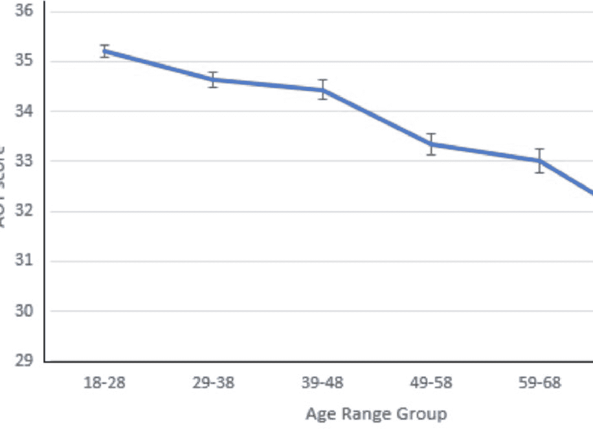
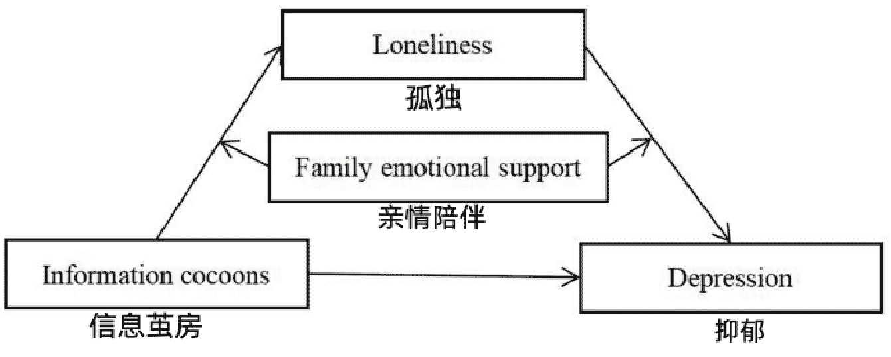

# 中年最大的危机是社交封闭

万维钢

整理：公众号懒人搜索，懒人专属群分享
懒人微信: lazyhelper

你注意到没有，社会对老年人的评价正在变得越来越负面。以前一提老年人都是被尊敬的对象，都是充满智慧的、慈祥和善的形象，有大事必须请老人家拿个主意。现在自媒体视野中的老年人往往是拙劣骗局的受害者，是不讲公德、无理取闹的人，而且还不听劝。

有人认为这一代人本来素质就不高，现在只是“坏人变老了”。但我想更大的可能性是每一代人老了都变得有些不堪，只是以前没有自媒体报道而已。如果你敢承认变老的不仅仅是身体机能，是人的认知能力也在退化，那就是他们不是坏，只是老。

从某一年开始，你将拒绝使用最新的技术，你只想要“经典”的服务和支付方式。你的思想会变得保守，你整天谈论养生，你喜欢转发阴谋论。你慢慢地对生活琐事也不敢做主，希望什么都给你安排好，什么都不变。大多数人都会如此，只是这样的事迹不值得记录，直到自媒体出现……

当然，不是所有人都会如此。有些人就是老当益壮，思维强度甚至工作效率都不比年轻人差。而且他们比以前的自己更有见识，连思想都更新锐。他们是当仁不让的话事人，走进哪个房间都立即成为焦点。

作为一个中年人，我感到这个前景特别可怕。我们都被传送带拉着往前走，而前方只有两条路：大部分人在走向失能，少部分人在变成超人。简直就是曾国藩说的不为圣贤便为禽兽。

所有球员都会退役，其中只有少数人转型为教练和官员继续影响比赛。每个科研团队都是一两个老年带领一大群中青年。那其余的老年呢？他们在另一条路上。

## 可是这两拨老人原本是一个团队的啊。从中年到老年，到底发生了什么呢？

如果你坚持到中年才开始耗尽灵气，你已经是社会进步的案例。鲁迅小说《故乡》里的闰土可是才四十来岁，就已经从少年时那个充满灵气的、“无穷无尽的希奇的事”的输出者，变得“像一个木偶人了”。

麻木很早就已发生。你观察一下身边的某些中年人。跟年轻人相比，他们的价值观已经焊死，他们谈论的话题越来越单一，他们的思维模式高度可预测。有什么新东西出来，他们总是用自己固定的那一套观念去理解——如果实在理解不了，就宣布这东西是危害社会的异端，不值得理解。

在成长和安全之间，他们坚决选安全。他们身上不但没有朝气，而且没有灵气。

鲁迅把闰土的麻木归咎于社会，“多子，饥荒，苛税，兵，匪，官，绅”——可是现代中年人也可以说自己是负重前行。收入只有这么多，上有老下有小都在指望你拿钱。工作压力又大，又有年轻人在竞争。身体机能下降，真有点干不动……就好像是登山一样，有的人是轻装上阵，有的人是背负着好几个沉重的包袱，他们掉队难道不是正常的吗？

## 这个说法，没有科学依据。

现实是那些保留了灵气的中年人比麻木中年人更忙碌，而不是更清闲。他们要处理的事物更复杂而不是更简单，他们背的包袱更重。

一直到老年，大脑都是可塑的。

我们专栏早就讲过中年人大脑的特点[1]。中年大脑有两方面的性能是下降的。一个是计算速度，也就是所谓「流体智力」，比如下围棋、做数学题这些事情，你到中年再练就太晚了。另一个是注意力不容易长时间集中，中年人确实爱分心。

但中年大脑的优势大于劣势。像模式识别、空间想象力、逻辑推理能力，这些能力不但没有下降，而且还上升了。而且中年人积累了大量知识，「晶体智力」是我们的特长。尤其中年人控制情绪的能力越来越好，办事稳稳当当，主打一个可靠。

并不是所有中年人都变成了闰土。鲁迅小时候似乎还没有闰土灵，可却是越老越犀利。

那迅哥儿和闰土，到底是如何拉开差距的呢？

我认为「坏人变老」模型和「负重登山」模型都不对。这里我提出一个模型，大概可以叫「喂料不足」。简单说，是社会在一直进步，知识一直在更新，而闰土没有吃到足够多的训练素材。

小学生把中学生视为大人，中学生把大学生视为榜样，研究生把教授视为神明。如果你能保持学习速度，你就是可以每过几年就让自己刮目相看。可为什么有些 45 岁的人不如 25 岁的人？因为他们的知识停留在自己 25 岁那一年，而那一年的社会知识水平不如这一年。你不必退步，你停下就是落后。

有研究表明[2]，人到了老年会更愿意依赖自己年轻时代——更具体的说是 18 岁左右的时候——形成的刻板印象处理问题，不再做复杂的思考，更愿意把问题给简单化、标签化。如果你18岁时生活在一个讲种族主义的社会，你有可能一生都是个种族主义者。哪怕现在的年轻人已经不那么想了，你还是会那么想。

人想停在自己的年轻时代可能是因为年轻时代的问题已经解决了。我的生活还不错，我有一份体面工作，我的经验足够，所以我对世界的探索已经结束。现在这些连手机支付都搞不明白的老年人，年轻时候何尝不是独当一面的能手呢？

尤其过去绝大多数工作岗位不需要持续学习。下面这张图描写了1960到2002年间，美国的工作岗位对不同技能的需求——

> HOW THE DEMAND FOR SKILLS HAS CHANGED
> Economy-wide measures of routine and non-routine activities
> (Autor, Levy, and Murnane 2003, 1279-1334)

社会对那些例行公事的、程序化的体力和脑力劳动的需求都在减少，而对非程序化的脑力劳动、特别是需要跟人互动的技能需求越来越大。我相信中国也是这个趋势，但是我没有数据。

这也就是说，1980 年上班的年轻人，主要从事的是程序化工作。他们只要按照上级指令、用固定的流程做事就行。他们还有啥可学的？然而今天的社会已经不是那样的社会了。

好消息是我们有理由相信今天的年轻人将来老了也不至于太笨，坏消息是喂料不足是个普遍现象。哪怕是非程序化工作，大部分人也只需要凭经验应付。你不会有太强的学习动力，你的头脑会变得封闭。

现在人人都爱说“开放”，咱们最好先说明白什么叫「开放的头脑」。不是说允许中国地铁用英语报站名就叫开放。心理学家有个标准化的「积极开放式思维（Actively Open-minded Thinking, AOT）」测试，用来评估人的头脑开放程度。这个测试最关键的就是看你是否允许新事物改变你的旧观念。

也就是说你有没有贝叶斯精神：新的证据出来了，你的信念能不能做出相应的改变。如果事实跟你的信仰冲突，你是回避事实还是重新考虑你的信仰？

年轻人无所谓，信念还没有固化，可以被事实修正。但是随着年龄增长，人们越来越不愿意改变。下图中这个研究[4]表明，积极开放思维得分随着年龄的增长一直在下降。

特别是在40岁和70岁，有两次剧烈的下降，正好一次是中年，一次是老年。

这可能跟认知能力老化有关。比如中年人注意力难以集中的话，对新东西可能就看不太懂，也就懒得改变观点。但我们还是要强调个体之间的差异。

各种研究表明受教育程度越高的人，开放头脑得分就越高，也越能坚持终身学习，他们的思想不容易封闭。健康状况、爱不爱锻炼也很重要，另外整个社会的风气，以及有没有方便的学习渠道，这些都有关系。

但我调研发现，影响学习动力最重要的一个因素，是社交圈。

2019 年，有 9 个在南极考察站生活了14 个月的科考队员，回来接受了德国科学家的测试[5]。这 14 个月的封闭生活改变了他们的大脑。他们海马体上的齿状回（dentate gyrus）—— 这个脑区主要负责形成新的记忆 —— 平均缩小了 7%。他们的智力测验成绩和空间距离感都下降了，他们的注意力也不像以前那么容易集中。

长期在一个与世隔绝的环境里生活，对大脑很不利。你缺少新鲜的互动，你的信息输入太少，你喂料不足。哪怕你号称是在那里做“科学考察”。

然而很多中年人就是在走向与世隔绝。年轻人因为上学和上班，总在认识新人，会有很多朋友。人到中年的普遍趋势是不再愿意认识新人。你会更愿意把时间花在家人、老朋友和老同学身上。这些熟人的问题是他们知道的信息你也早就知道。你们在共同的舒适区里玩耍。

慢慢地，连这些熟人也会离开你。有一项中国的研究[6]，考察广东省 60 岁以上的中老年人，发现他们是因为社交圈封闭而处于陷入「信息茧房」的状态。研究者用下面这张图描写了信息茧房的运作过程——

孩子已经离开家了，老人大部分时候只跟很少的人接触，于是迷上短视频，寻求情绪价值。短视频的推荐算法是专门推给你喜欢看的东西——而不是你应该看的东西。而你喜欢看的是你熟悉的东西，于是形成信息茧房。

然而短视频提供的是虚幻的社交，那并不能解除孤独感。就好像吸毒一样：特别想吸，但是吸了又感到空虚。短视频让老人更孤独，乃至于抑郁。解决方法是家人多给点亲情陪伴，减少孤独感。

美国的数据[7]显示，45 岁以上的人有超过三分之一感到孤独；65 岁以上的人中甚至有将近四分之一，不仅是孤独，而且是跟社会隔绝（socially isolated）。社会隔绝会让老年痴呆症的风险增加 50%，心脏病的风险增加 29%。

他们也是更封闭、更固执、更不愿意继续学习的人。

---

有些精神世界丰富的人宁可选择独处，那不叫孤独。有孤独感才叫孤独。人到中年很难有动力主动去学什么新东西，但只要你有个丰富多彩的社交圈，跟各个年龄段的人打交道，你潜移默化就能跟上社会进步的节奏。

我们专栏讲过到八九十岁还脑力充沛的「超级老年人」[8]，他们有个特别不一般的共同点是「社交蝴蝶」：他们就算退休了也要继续工作，哪怕是去社区做志愿者，哪怕是多参加休闲活动。他们没有从社会退出。

这要求你始终有一股积极主动的劲头。那些接受“岁数大了脑子就不好使”这种刻板印象的人学习动力就低，那些有积极主动人格的人学习动力就高[9]。终身学习者都是主动找事儿做，主动承担责任，主动冒险，主动社交。

最后我们重读一遍《故乡》中鲁迅先生的话：

> 「我又不愿意他们……都如我的辛苦展转而生活，也不愿意他们都如闰土的辛苦麻木而生活，也不愿意都如别人的辛苦恣睢而生活。他们应该有新的生活，为我们所未经生活过的。」

微信：lazyhelper

历史 3000 多份各类付费文章以及年费三千多的生财星球资源，见懒人专属群内分享！

付费群，白嫖勿扰！

懒人专属群更新记录：
https://lazybook.fun/#/blog/record2