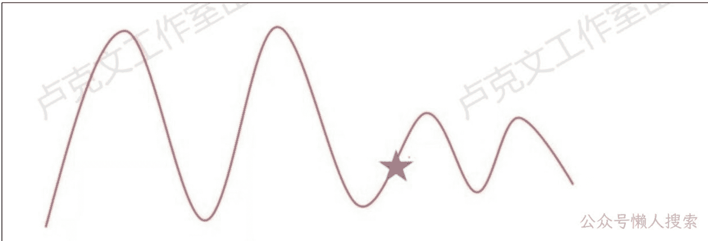
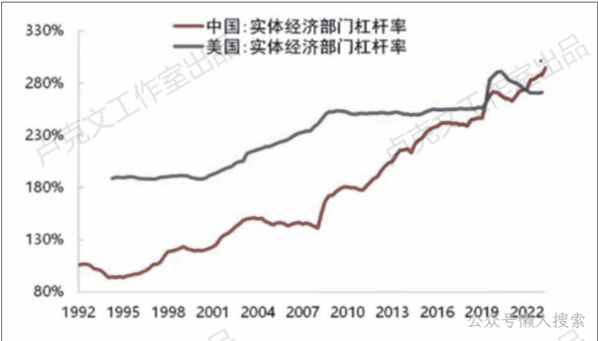
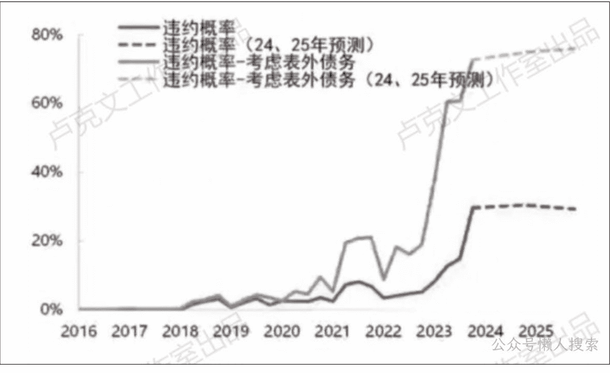
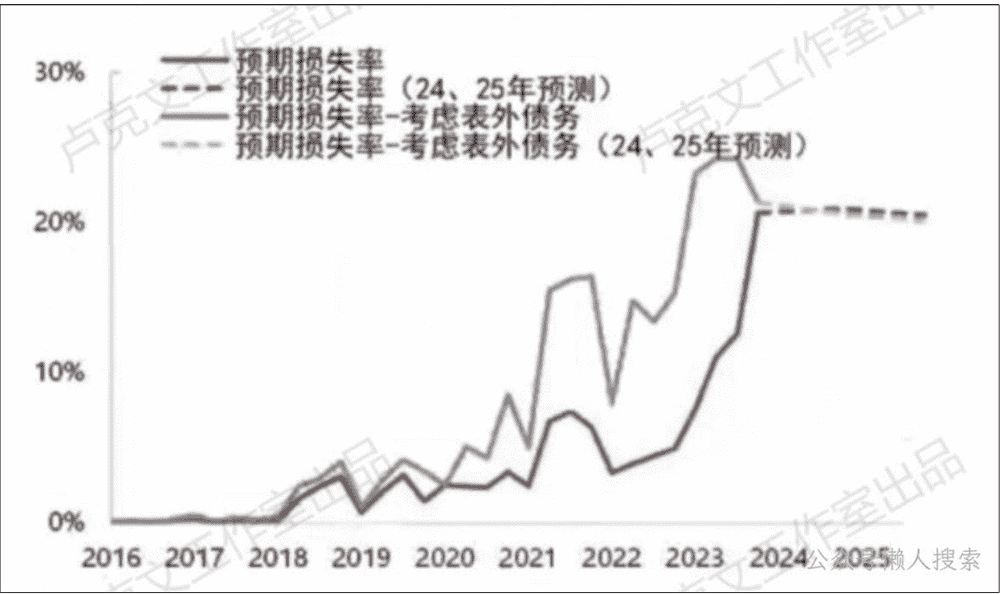

# 经济观察(二)

240605

文/卢克文工作室嘉宾 咖啡豆

整理：公众号懒人搜索，懒人专属群分享

懒人微信：lazyhelper

## 「宏观概述」

今天我来跟大家分享一下我们最新对于咱们国家宏观形势的看法，包括对一些主要资产的展望。首先第一个，关于咱现在的一个国内的经济形势情况。

总而言之，就是短周期出现改善，但是长周期仍处于底部位置。

我画了这么一张图。我觉得这个图其实还是真的非常能反映我们现在的一个经济情况。当然，这个图是一个示意图。

我画五角星的地儿，这个算是我们现在经济所处的一个位置。

我们可以发现两个结论，首先第一个，经济看上去它是在从下往上在回升的。经济短周期之内确实是有一些改善的。

这个是从这个图上面所得到的第一个结论。

第二个结论，就可以发现上升的高度真的很小，甚至我觉得我已经把这个画的已经很乐观了，它甚至有可能只上到更短的位置就结束了。也就是说从长周期来看，经济虽然在恢复，但是恢复的高度非常小。

它就是一个非常小的周期。所以从长周期来看，经济仍然在一个非常偏底部的位置，没有一个非常明显的大幅改善的迹象。所以我觉得这个就是我们现在对于整体宏观经济形势的一个判断。

接下来我就分成这么几个部分来跟大家具体的来说，从「消费、制造业、基建、地产、出口、通胀、金融」最后一直到「政策」，总共这么几个部分。

「消费、制造业」的部分看5.24发的【懒人专属群】文档

## 「基建」

下个部分是基建，基建数据表现的也很好，基建同比增长8%点多，我们刚才说名义GDP只有4%点多，基建8%点多，表现的也很好。

但是，我们的基建其实说实话也有问题，啥问题？我分成了两个方面来说。

首先第一个就是现在基建的资金来源问题。

我们看这个图，红色的线叫做财政撬动倍数，这个是啥意思？

基建投资的资金来源是分成两个部分的，首先第一个部分是政府出钱，当然中央政府也可能出，但之前我们搞基建一般都是地方政府出钱，政府出完钱之后，会去找银行去贷款或者去发城投债这些，会有这种配套的资金。

如果说政府出 1 个亿，这些配套资金是 10 个亿，这个时候我的财政撬动倍数 10，就是我 1 个亿的财政资金可以撬动 10 个亿的社会资金，我的总资金就是 11 个亿。

我们可以看到原来的这个点大概就是 10 左右，但是现在截止到 2022 年，我们可以看到这已经降到 4%点多了。2023 年现在没有数，我估计这可能就是 4 左右。也就是说我以前 1 个亿的财政资金能撬动 10 个亿的社会资金，我现在 1 个亿的财政资金只能撬动 4 个亿。也就是说我原来有 11 亿的钱，现在只剩 5 个亿的钱了，也就是说财政对经济的这个刺激力度是在弱化的。

财政刺激效率的下降，它会带来一个最核心的问题，就这个叫做杠杆率的一个上升。

因为杠杆率等于债务规模除以名义 GDP，债务规模上了，但是财政刺激的效率在下降，名义 GDP 上的没有那么快，最后杠杆率肯定会朝上走。

我们看这个图，中国和美国之间的杠杆率对比。

我们可以看到中国的杠杆率现在已经到差不多是 294% 左右，这已经比美国还高。

我们现在就是说面临这个问题，你财政刺激效率下降，不可避免的就会带来杠杆率的提高。

这个是基建的第一个问题，资金问题。第二个问题是基建在这个项目这一块的问题。

我们过去的基建项目是什么？铁路、公路是之前最重要的基建项目。

但现在基建叫做防灾、减灾和国家安全，主要是去投这两块。这两块有什么问题？

它主要就是这三个问题。首先第一个，它产业链很短，说实话产业链真的很短。所以他没有办法对产业链形成一个带动作用。

同时产业链上的公司还是以国企为主，你想我们基建去搞国家安全，你国家安全相关的领域怎么能让民企去搞呢？肯定是让国企去搞的。它对于民企的带动作用其实比较有限，它不像之前我们搞这个公路、铁路，当然你公路、铁路其实也是由国家去做的，但是你相关的产业链上是有很多民企的，它是可以带动的。现在对民企的带动作用就没有之前那么强。

第二个是这些领域它没有办法对房地产形成刺激，因为我们过去去修一条公路，包括我们去修个地铁，它其实不单单是基建，他也是为了卖地的。因为我修个公路，我去修个地铁，我可以把周边的土地价格给它带起来，因为我交通便利了，它土地价格可以带起来，土地价格带起来之后，政府不就可以卖地了，卖地之后就可以搞房地产了。之前的基建对房地产是有很大的一个刺激的，它可以提升土地价格，但是现在不行了。你现在搞防灾、减灾、国家安全，你这些基建它是没有办法拉动土地价格的，它就对房地产形成不了刺激。

第三个问题，这些领域对水泥、对沥青、对螺纹钢这些重要的工业品的需求比较弱。

我们现在所搞基建有一个非常典型的例子，叫做高标准水利农田建设，大家就想一想水利农田建设能用到螺纹钢吗？这个能用到沥青吗？这个很明显是用不到的。当然你水泥可能会用到一点，比方说我修个堤坝啥的，可能会用到一些水泥，但是像沥青、螺纹钢这些东西，这跟农田建设有什么关系呢？

现在基建所投向的领域，对这些重要工业品其实形不成特别强的需求，它对工业品的价格带动作用就会很有限，没有一个特别明显的支撑作用，这个就是我们现在基建所存在的一些问题。

基建这一块数字上确实也挺好看，反正基建投资增速也挺高的，但是它也确实是有各种各样的问题。

## 「房地产」

接下来一个部分是地产。

地产的情况我也不用说太多，大家肯定都知道。地产现在情况很差，包括今年以来房价应该依然在跌，包括北京房价跌幅都在 20% 了。

在地产这一块，我说两个，首先第一个就是最近出的地产去库存的政策，地产以旧换新，我们在后边政策的部分再具体说，在这一块我们主要说第二个。

最近我们对房地产市场进行了一个量化研究，我们直接说一下结论就行了。

结论就是这两个图，上面的图叫违约概率，下面的图叫预期损失率。这两个图都是衡量现在房地产市场的一个信用风险问题了。

我们可以看到，后面这个虚线表示的是预测值，我们是预测的 2024 年和 2025 年这两个线都是一个走平的，当然蓝色的线代表的是房企的债务，橙色的线代表的是二手房市场。假如我说现在房地产政策没有一个系统性的变化，当然也包括最近的去库存政策，我们一会后面会说到，我觉得目前我们的去库存政策至少现在为止力度不算很强。

如果我们不推出一个特别强的房地产刺激政策，或者说没有一个特别明显的改善的话，2024 年和 2025 年这两年房地产依然看不到比较明显的改善，房企的信用风险仍然很高，包括二手房市场肯定也不好。

如果不出台比较大规模的政策的话，至少在 2025 年之前，房地产都不是很行。从宏观的语言来讲，至少在 2025 年之前，房地产对经济都是拖累项。

这个是一个最早时间，2026 年之后再咋样，就只能再看了。

这个就是一个房地产的情况。

## 「出口」

再接下来的一个部分是出口。

出口我们刚才讲了很多国内经济的情况，包括消费、基建、制造业，房地产大家都能看出来，我的一个想法是有些变量数字看上去很好，但是你仔细看它，其实问题很大。

所以我对于上面那几个并不是非常地看好，我看好的就是出口。

我觉得今年出口真的是很好，我们从数字上看，其实都挺好。从这个产品结构、国别结构上来看，其实也都挺好。

比方说从产品结构上来看，我们的劳动密集型产品出口挺好的，我们的这些高技术产品出口也挺好的。

比如说从国别结构上看，我们跟东盟、拉美这些地区出口增长的都比较快，欧盟、美国虽然是一个负增长，但是负的程度比之前减少了。对俄罗斯出口下降比较大，但这个主要是因为去年基数比较高，所以问题也不大。

出口不论是从总量上来看，还是从结构上来看，都挺好，我觉得这个真的是今年国内经济为数不多的亮点，真就是出口。

对于未来出口咋看，最重要的还是去看美国经济咋样，因为我们的核心出口地就是美国，我们后面在海外的部分会再具体再说。

现在美国经济真挺好的，没有什么特别明显的衰退迹象，所以我觉得今年出口依然可以，这就是今年我们经济算是一个比较重要的拉动项。

当然出口最重要的问题是国际关系问题，因为最近也有关税的事，拜登前两天还刚刚对我们加了 100 多亿的关税。

这个事我觉得问题不大，首先第一个就是拜登这次加的关税量级很小，像之前 2018、2019 年特朗普加的时候，都是 2000 亿、3000 亿地加，这次才加了 100 多亿。

而且他主要加的产品是钢，还有铝，钢和铝就是美国五大湖沿岸，密歇根州、底特律，主要就是那些城市的一个主要的产品。其实说白了，拜登之所以加关税，还是为了选票，因为五大湖沿岸是非常典型的摇摆州，其实还是为了选票。

所以我觉得这个问题应该暂时不是很大，反正至少今年。同时你加关税之后，这肯定会有一个抢出口效应。当时 2018、2019 年加关税的时候也有一个抢出口效应，所以今年这个关税问题对出口，我觉得应该影响不是很大。当然我也必须得提醒一下，明年出口我觉得可能会成为一个风险点。

明年最主要的就是两个风险点，第一个就是美国经济。

美国经济今年挺好的，但到明年不确定性很大，最核心的原因是因为当时 2020 年的时候，美国企业发了很多五年期企业债，明年年中差不多就该到期了。你到期之后，自然就面临着借新还旧的问题，要么就是你企业用自己的在手现金偿还掉，反正甭管是哪个，肯定都会有损失的。因为现在利率这么高，借新还旧的话，你的成本得该多高，明年美国经济应该会比今年差。

第二个，当然就是年底的美国大选，现在不确定，不知道特朗普会不会上。

特朗普要真上的话，我估计关税这个事儿可要比拜登严峻多了，这个也是明年出口的一个风险点。

至少今年应该问题不是很大，明年可能有一些问题，但是今年这个出口真的是拉动我们经济比较重要的一个点。

## 公众号

## 懒人搜索

## 懒人专属群

微信：lazyhelper

历史 3000 多份各类付费文章以及年费三千多的生财星球资源，见懒人专属群内部分享！

付费群，白嫖勿扰！

## 懒人专属群更新记录：

https://lazybook.fun/#/blog/record2