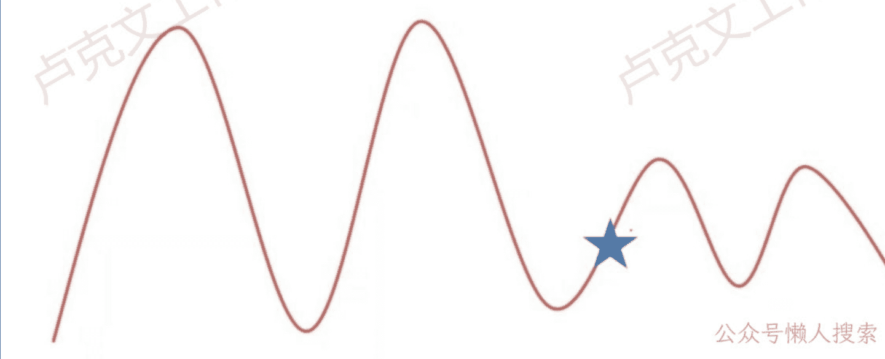
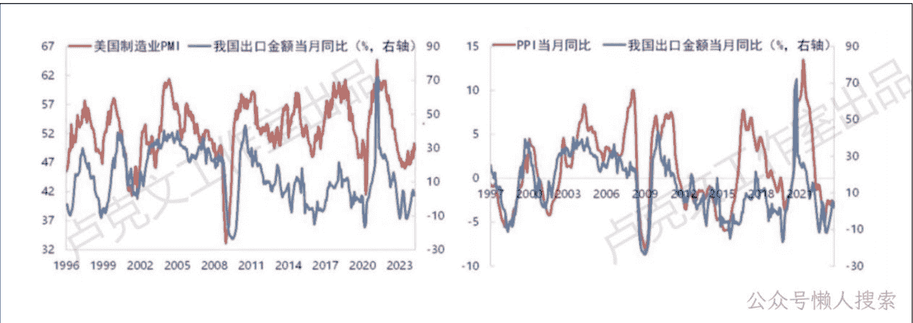
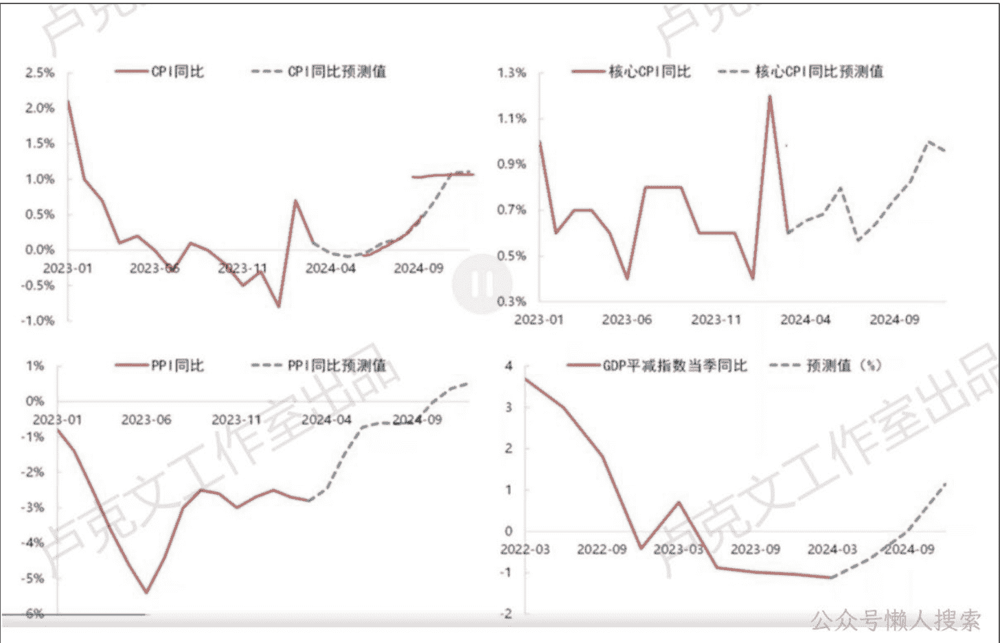
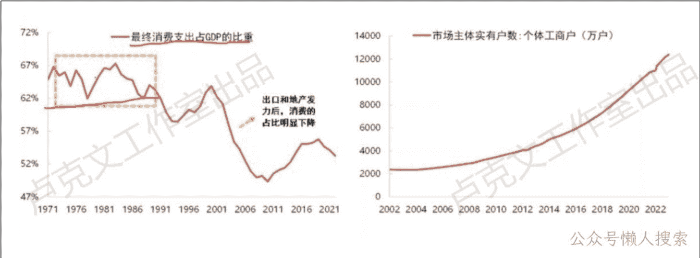
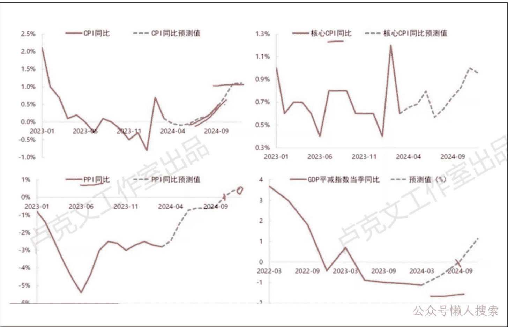

# 经济观察（三）
240606

文/卢克文工作室嘉宾 咖啡豆

整理：公众号懒人搜索，懒人专属群分享

懒人微信：lazyhelper

## 「宏观概述」

今天我来跟大家分享一下我们最新对于咱们国家宏观形势的看法，包括对一些主要资产的展望。首先第一个，关于咱现在的一个国内的经济形势情况。

总而言之，就是短周期出现改善，但是长周期仍处于底部位置。

我画了这么一张图。我觉得这个图其实还是真的非常能反映我们现在的一个经济情况。当然，这个图是一个示意图。

我画五角星的地儿，这个算是我们现在经济所处的一个位置。

我们可以发现两个结论，首先第一个，经济看上去它是在从下往上在回升的。经济短周期之内确实是有一些改善的。

这个是从这个图上面所得到的第一个结论。

第二个结论，就可以发现上升的高度真的很小，甚至我觉得我已经把这个画的已经很乐观了，它甚至有可能只上到更短的位置就结束了。也就是说从长周期来看，经济虽然在恢复，但是恢复的高度非常小。它就只是一个非常小的周期。所以从长周期来看，经济仍然在一个非常偏底部的位置，没有一个非常明显的大幅改善的迹象。所以我觉得这个就是我们现在对于整体宏观经济形势的一个判断。

接下来我就分成这么几个部分来跟大家具体的来说，从「消费、制造业、基建、地产、出口、通胀、金融」最后一直到「政策」，总共这么几个部分。

### 「消费、制造业、基建、地产、出口」

的部分看 5.23 和 6.4 发的专属群文件

### 「通胀」

通胀，通胀现在真的非常非常重要的，如果大家平常没有时间去看很多宏观数据，我建议大家看国内宏观数据，至少现在就关注通胀就行了。

通胀包括 CPI，还有 PPI，大家就关心这个就可以了。

为什么通胀数据重要？就是我们今年一季度的实际 GDP 增速只有 5.3%，这个增速很高了，就因为我们两会只提了 5%的增速目标值。但是要知道我们的名义 GDP 增速可是只有 4.2%，这个可以说非常低，比如说你的通胀是一个负的 1.1%，它是一个负值，是一个通缩。

比方说我们居民自己对于经济的一个感受，包括我们居民自己能不能涨工资，其实都是和名义值有关系的。

你看着你实际值增长 5.3 很高，但是名义值很低，在名义值很低的情况下，你居民对宏观经济的感受那就是很差的，所以通胀这个问题非常重要。

大家去看通胀，我觉得一定要看到通胀排除基数效应之后的一个上涨。

因为你通胀有时候的上涨，它是因为去年基数比较低，要把这个基数效应给排除掉，一定要看到通胀排除掉基数效应之后的一个上涨，或者说我们看到国内定价的这些大宗商品价格上涨，这个时候我们才能判断经济出现恢复了，否则不能下这个判断。

现在很明显是没有看到这一点的，我觉得现在不能下国内经济有一个系统性恢复这样子的判断。

对于通胀，我们接下来具体说一下，我们对后续的通胀走势，单纯考虑季节性规律，就是我们不考虑其他的，我们只考虑季节性。

是这四个图，我们可以看到 CPI 能往上稍微上一点，但是上的幅度不大，这大概就 1% 左右。

核心 CPI，PPI 到 9 月份、10 月份才能转正，最后上也就个百分之零点几。

PPI 平减指数，可以看到也是大概三季度，三季度还是一个负值，到四季度然后转正，这个是单纯按照季节性规律去推的，比如说单纯考虑基数效应去推的。

比如说只有看到实际的增速比我们这四条蓝线的增速高，才能判断经济出现了好转。

如果跟红线一样，就是纯基数效应。

真的按照我们画的蓝线去走，那 2024 年全年的 GDP 平均指数负 0.15，2023 年也是负的，这是历史上第二次 GDP 平均指数连续为负值。

上一次是 1998 年和 1999 年，当时是国企改革。我们现在所面临的环境，我觉得其实就是一个比较偏通缩的环境。

为什么会产生这样子一个通缩的现象？

我看了一下我们国家的历史，我就发现这个好像还是一个挺有意思的事儿。

我们国家好像总是会有 20~25 年一轮通缩周期，比如说第一次通缩是 50 年代初期，当时是刚刚建国，第二次是 70 年代后期，这两个中间隔了二十多年。第三次 1998~2002 年，和 70 年代又隔了大概二十多年。第四次就是现在了，这中间又隔了二十多年。

有时候好像总是 20~25 年，这个就会有一轮通缩周期。为啥会出现这样子的现象？

我觉得可能原因还是在于经济体制，你一种经济发展模式对经济的期限可能大概就是二十年左右。比方说 50 年代我们第一次通缩，当时是在进行战后的恢复。然后 50 年代到 70 年代，我们是比较严格的一个计划经济体制，计划经济体制去搞了二十年，到了 70 年代后期的时候，计划经济体制已经不行了，当时就产生了通缩。

到了 70 年代改革开放之后，当时我们经济的主要拉动力是内需。

我们可以看这个图，这个叫最终消费支出占 GDP 的比重，我们可以看到 70 年代、80 年代，最终消费支出占 GDP 比重只有 60%多，最高已经接近 70%了，现在才 50%。

也就是说当时 70 年代、80 年代的时候，我们国内经济的拉动其实是靠消费去拉动的。为什么是靠消费去拉动？是因为当时 50~70 年代这个计划经济体制下，居民积压了大量的潜在需求，但是因为供给严重不足，所以导致这些潜在需求没有办法释放。

70 年代末改革开放之后，供给释放出来之后，居民的潜在消费需求就释放出来。所以当时八九十年代我们国家其实靠的是内需。这种发展模式 80 年代、90 年代又发展了二十年，发展了二十年之后，这条模式又走不通了。

因为当时 1998 年亚洲金融危机，2000 年互联网泡沫，内需开始明显下滑，这条路又走不通了。

从 2000 年开始，这个大家应该都很熟悉了，拉动经济的主要力量，一方面变成了出口，这个是加入 WTO 之后我们的出口，另外就是靠房地产，九几年的房地产改革，就又变成了这两个。

而现在又过了二十年，从 2000 年到现在已经二十四年了，二十年过去了，我们传统的这两个可能又走不通了。

我们前面讲到虽然今年出口还行，但是毕竟明年是有关税什么的，可能有一些压力在的，包括现在全球这种地缘政治情况。

地产，大家都很清楚，明显走弱。过了二十多年之后，我们的过去这种发展模式其实又走不通了，又开始面临第四次通缩。

从历史规律上来看，好像还真是这么一个事，每隔二十年、每隔二十多年就有这么一次通缩，现在正好隔了这二十年，真的还是处于这样子历史的一个转折期。

想要解决通缩这个问题，无外乎就两个方案，第一个就是刺激需求，当然需求包括内需，还有外需，要么就是在供给端做改革，去搞去产能。

但是这两个问题，现在说实话，都不是很现实。刺激内需，现在我们国家政策其实没有一个非常明显的刺激内需的政策，大家现在说的都是经济的转型。

在供给端做结构性改革，我们其实刚才已经说过了，现在产能过剩是产能过剩，但是产能过剩有助于突破技术壁垒，有助于经济向绿色低碳转型，这个是符合政策基调的，所以供给端是不会做结构性改革的，制造业不会进行去产能的，这个是不会的。

既然前两个都不行，基本上就只能依靠外需了，所以为什么说今年出口这么重要，基本上就只能依靠外需了。

当然我们刚才讲，今年出口还行，但到明年这个不确定性比较大，估计外需可能到明年也不行。

换句话说就是通缩这个问题暂时看不到有非常明显的解决方案。真看不到，今年是这样子的情况，估计明年也是，不会有比较明显的改善。

我们现在要搞经济转型，但是你本轮转型跟之前要难得多。

首先第一个，你本轮转型的目的是产业趋向高端化转型，这个是我们现在的政策基调。

之前，2000 年我们转型叫做搞出口，还有搞房地产，我们出口出的是劳动密集型产品，房地产这个是建筑业，这个没有什么技术含量，劳动密集型产品有什么技术含量呢？房地产就是盖房子，这个也没什么技术含量。

之前我们的经济转型是没什么技术含量的，但是这次不一样，这次我们是产业要向高端化转型，它是有技术含量的，我们还要技术突破，它自然比起过去的转型要难，而且要难得多。

本轮转型面临着很高的债务问题。大家刚才已经看过图了，我们的宏观杠杆率已经比美国要高了。

面临的国际环境也不一样，我相信大家应该很熟悉了，70 年代那次转型的时候，当时中美正好是建交之后的蜜月期，2000 年那次转型的时候，当时正好有“911 事件”，中美关系也有一些缓和。

之前前两次转型的时候，国际环境都还不错，但现在的国际环境大家可能都很清楚了。本次转型确实是很困难，需要的时间，我觉得搞不好比前几次要长。像当时 2000 年转型的时候，相当于是从 1998 年还是 1997 年一直到 2000 年，一直到 2001 年，花了大概两三年、三四年左右，这轮反正真不好说，时间可能要比较长。

#### 我们最后总结一下我们现在整个通胀的一个形势。

首先，短期内我觉得通胀可能会有一定抬升的。我们刚才看上面的图，你看，它短期内通胀是有一定的抬升的。

当然，最近也发生了一些积极的变化，比如说最近水电燃气，甚至像高铁，我看有些像高速公路收费这些价格都涨了，当然，这个对我们居民消费不是件好事，但是对通胀来说它算是一件好事。

再比如说最近猪，我看猪价最近有一些起来的迹象。这些东西起来之后，短期内通胀是可以起来一些的，我觉得没问题，是可以起来一些的。

但是我们从长周期看，你今年起来之后，明年呢？你今年水电燃气这些价格已经涨过一轮了，难道明年还能再涨吗？这个肯定是不现实的，水电燃气这些肯定是一次性涨价，明年肯定不可能再涨了，到明年通胀还是得下去。

短期看，我觉得通胀是能上来一点的。这也是我为什么说短周期经济是有改善的，为啥呢？因为短周期通胀是能上来一点的，短周期内名义 GDP 它就能上来一点。名义 GDP 上来一点之后，我们对经济的一个体感，我们的微观感受就会好一些，所以我说短周期内经济是有一些改善的。

但是长周期呢？长周期我们刚才讲了很多，我们现在正处于经济体制转换的应该阶段，而且这一轮的转换要很困难，比之前要困难得多，长周期估计通胀还是起不来，还得在下面趴着。

现在所带动通胀的这几个重要的变量，我们刚才讲基建对价格的带动作用是弱化的，房地产是在朝下的，制造业是产能过剩的，这样子长周期来看，国内定价这些大宗商品国内的通胀几乎不可能有非常明显的抬升。

也就是说短周期内通胀会改善，短周期内经济也会改善。但是长周期看，你到了明年还不行，通胀还要朝下，经济整个也基本上就是在底部趴着这样子一个状态。

我们刚才说产能过剩，现在想要依靠内需去解决基本上不可能了，就只能去依靠外需，重点关注出海，基本上是短期内能缓解产能过剩的唯一的方式了。

有人会说，出海会不会可能就像刚才一些关税什么方面的问题。出海它包括两个方面，第一个是出口，第二个是对外投资，只要对外投资就可以。我把厂给盖到国外去，在国外生产，完了之后去国外卖就可以了，这个是可以绕开关税的。

我觉得通胀这个问题现在真的是非常重要的一个问题，大家平常没有时间看宏观，就看 CPI 和 PPI 数据就可以了。

历史 3000 多份各类付费文章以及年费三千多的生财星球资源，见懒人专属群内部分享！

付费群，白嫖勿扰！

懒人专属群更新记录：
https://lazybook.fun/#/blog/record2