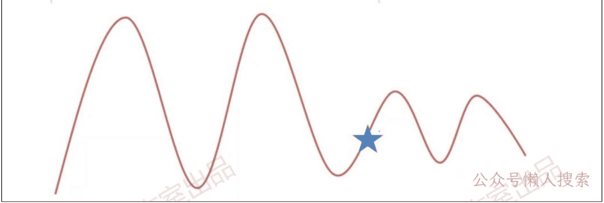
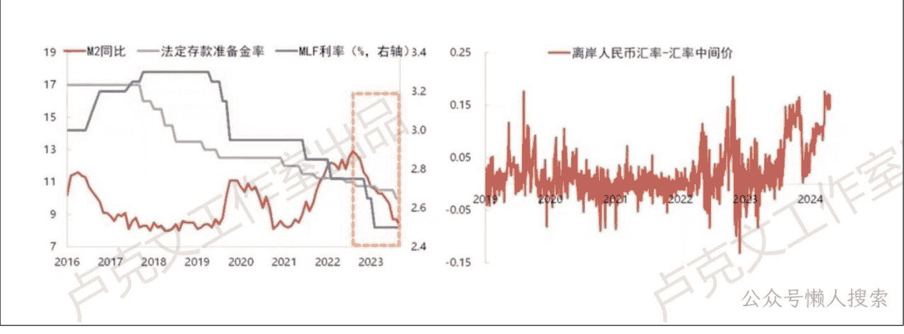

# 经济观察（四）

240612

文/卢克文工作室嘉宾 咖啡豆

整理：公众号懒人搜索，懒人专属群分享

懒人微信：lazyhelper

## 宏观概述

今天我来跟大家分享一下我们最新对于咱们国家宏观形势的看法，包括对一些主要资产的展望。首先第一个，关于咱现在的一个国内的经济形势情况。

总而言之，就是短周期出现改善，但是长周期仍处于底部位置。

我画了这么一张图。我觉得这个图其实还是真的非常能反映我们现在的一个经济情况。当然，这个图是一个示意图。

我画五角星的地儿，这个算是我们现在经济所处的一个位置。

我们可以发现两个结论：首先第一个，经济看上去它是在从下往上在回升的，经济短周期之内确实是有一些改善的。这个是从这个图上面所得到的第一个结论。

第二个结论，就可以发现上升的高度真的很小，甚至我觉得我已经把这个画得很乐观了，它甚至有可能只上到更短的位置就结束了。也就是说从长周期来看，经济虽然在恢复，但是恢复的高度非常小。它就只是一个非常小的周期。所以从长周期来看，经济仍然在一个非常偏底部的位置，没有一个非常明显的大幅改善的迹象。所以我觉得这个就是我们现在对于整体宏观经济形势的一个判断。

接下来我就分成这么几个部分来跟大家具体地说，从「消费、制造业、基建、地产、出口、通胀、金融」最后一个直到「政策」，总共这么几个部分。

「消费、制造业、基建、地产、出口、通胀」的部分看 5.23、6.4 和 6.5 发的星球。

## 金融

金融这一块我想说两个事。

首先第一个就叫居民提前还贷，这个现象现在仍然非常的严重。

居民现在提前还贷严重到了一个什么程度？他不仅仅是拿自己的储蓄存款去还贷，他还借了大量的消费贷，或者说是借了大量的经营性贷款，去偿还房贷。而且这个量级很大，真不小。

尤其是像季末，可能银行要冲量，一般季末、年末银行都会冲量，所以银行的经营性贷款、消费贷的利率非常低。这个时候有非常多的人去借低利率的消费贷，完了之后去还房贷，这个量还非常大。

所以我们其实能看到现在金融数据表现很差，有一部分原因就是因为居民提前还贷。当然还有其他的原因，我们就不多做解释了。

居民为啥要提前还贷？说白了，还是因为房价下降，这个现象非常严重。

想说的第二个问题，我们现在货币政策的问题。我们叫“货币政策无效论”，我们现在的货币政策真的是没有用的，传统的货币政策是没有用的。

央行甭管说降息，还是不降息，都没啥用。为啥？你看，如果央行要降息，现在银行的息差是不够的，肯定要降银行存款利率。包括大家看新闻，最近又有新一轮的银行存款利率要降了，银行存款利率一降之后，居民的钱存在银行账上，收益又会变小，是不是会资产荒？

我资产荒了之后，我就会选择进一步地提前还贷，因为我的房贷利率和全国现在高一点的 4%点几、低一点的 3%点几，但我存给银行，可能就只有 2%点几的收益率，你还要给我降，我干嘛不把这个钱给拿出来去提前偿还房贷？我肯定要去的。

央行如果降息，居民会把钱给拿出来去还房贷。如果央行不降息，现在房地产市场已经很差了，央行还不降息，房地产市场越差。房地产市场越差，居民还是会提前还贷，房价继续跌，居民还是会提前还贷。这就导致你现在央行不管是降息还是不降息，它都没啥用。

它最终带来的结果就是我们的 M2 增速，还有社融增速根本就起不来，基本上就是在一个低位徘徊。因为居民把贷款都给还了，居民把存款都给拿出来还了贷款了，我们的贷款增速肯定会降，M2 肯定会降，社融也可能会降。

就是我现在货币政策所面临的难题，甚至今年货币政策的问题比去年还要严重，因为去年至少我们的货币政策还没有汇率方面的问题，我们今年还有汇率方面的问题。

今年美联储美国那边经济很好，美联储本来年初说降息六次，你现在可能只有一次了。你如果降息的话，可能还有汇率方面的问题，所以现在货币政策真的是，反正这个问题很大。

之前市场一直在传 QE，QE 我觉得不是什么没理的事儿。QE 其实非常对，因为你现在传统的降息没有作用的情况之下，你就应该去搞这些非传统的货币政策，就应该去搞 QE。你不一定非要把利率降为 0 再搞 QE，你现在利率不是零依然可以搞 QE。

当然央行买债分成好几种形式，这里我列了四种形式，这个我就不具体解释了，大家看一下就行：

- 第一种是在一级市场上去买国债。
- 第二种是在二级市场上叫做质押式买债。
- 第三种是在二级市场上叫买断式买债，但是央行不扩张资产负债表。
- 第四种是在二级市场上买断式买债，但是央行会扩张资产负债表。

只有第四种方式才会对经济产生作用，而前三种都是无效的。当然现在也没有定论，只能后续再看，现在央行也说了，确实可能会买债，但是不知道是这四种形式的哪一种，只能后续再看。

如果说真的要是能以第四种形式央行去购债，这个时候我觉得可以对宏观变乐观了。甭管量大还是量小，它都意味着我们货币政策调控方式的一个重大转变，意味着我们投放基础货币的方式的一个重大转变，包括对我们的经济，包括对股票，这都是一个大利好。

## 政策

国内宏观部分，最后的一个部分是政策。在最新开的政治局会议中，我就说两个重点。

第一个是7月份开的三中全会，现在市场期待比较大的有三个：
- 财税改革：包括改革中央跟地方之间的关系（中央去上收事权和财权），以及国企财政改革（国企要上缴利润）。
- 要素改革：当然最主要的是土地改革。
- 配套的社会改革。

这个是现在市场预期比较大的。

政策这一块，第二个重点说的就是房地产，就是确实这一次最大的变化叫做“统筹研究消化存量房产和优化增量住房”的政策措施，叫房地产去库存。上一轮去库存大家肯定有印象，2016年搞棚改涨价去库存，但是这一轮说实话确实不是很一样，应该不会有再继续的涨价去库存的这种情况了。

现在的这种去库存模式，我总结了一些案例，大家如果要有当地的朋友应该都知道：
- 第一种模式（郑州、南京）：政府去收二手房，居民去用这个钱去购置新房。
- 第二种模式（青岛、福州）：政府直接去买新房。
- 第三种模式（扬州、常熟）：对出售旧房购置新房的给予一定补贴。
- 第四种模式（上海、深圳）：居民买房的时候，由房地产经纪机构优先推动旧房交易。（当然第四种模式根本就扯淡，政府根本不出钱，基本上就完全没用。）

从用处来讲，第一种模式大于第二种，大于第三种，大于第四种，最好的模式就是政府去收二手房，接下来是政府收新房，完了之后才有第三种跟第四种。

当然现在关于房地产收储有两个比较重要的问题。首先第一个，已有的这些政策体量不大，现在郑州有大概1万套应该是最大的了，其他城市的体量都在百套，甚至我看还有十几套的，体量不大。第二个就是资金到底从哪来？这个钱到底从哪来？

我看最近彭博社又有各种消息在传，说是中央正在准备出台关于房地产收储的政策。我看彭博传的消息是说钱由地方政府去出，说实话根本就不现实，为啥？因为地方政府哪有这个钱去收房子。

我看过一个测算，如果想要把我们现在的这样子的房地产供求关系给它回归到一个比较平衡的状态，政府到底要出多少钱？在一个比较偏乐观的假设之下，政府要出7万亿，可不是一个小量级，要知道今年我们的特别国债也只发了1万亿。但是想要把房地产市场给它回归到一个比较平衡的状态，全国范围内政府需要出7万亿，这个还是一个乐观的假设，悲观假设估计就10万亿左右。

这个钱真不是一个小数目，你地方政府哪能掏得起这个钱。所以当然这个事儿肯定是个好事儿，但他如果要做，一定要看中央政府能不能给钱才行，你光靠地方政府这个是不现实的。

我专门算了一个数，我们现在中央政府杠杆率是明显比地方政府杠杆率要低的，也就是说现在中央政府加杠杆的空间其实是很大了，完全可以加的。假如中央财政真的能给10万亿的钱出来，把这10万亿给算上之后，中央政府的杠杆率依然比地方政府要低。但是当然我们现在没有看到明确的中央政府会出钱的迹象，但是中央政府确实是有这个空间可以去加。

对于房地产收储或者说房地产以旧换新，我觉得后续看两个点：
- 看这个模式能不能全国铺开。现在只有一些像郑州体量比较大，其他城市体量都很小，要看这个东西能不能全国铺开。
- 看中央财政能不能给钱。中央财政不给钱，单靠地方政府去做这个事是做不成的，中央政府必须给钱才可以。

当然如果两个方面后续都能验证，对房地产市场而言，我可以说绝对是大利好，当然对经济而言也绝对是大利好，这个没有任何问题。但是至少从我们现在来看，全国层面还没有铺开，包括中央政府从现在的视角来看，没有任何要出钱的迹象。

最近这两天彭博传的都是地方政府去出钱，我们暂时还是觉得政策对经济形成一个太大的刺激作用，难以对整个宏观层面发生一个比较大的变化。

我简单总结一下，国内现在整体上短期确实是有一些改善，但是长期我觉得如果政策没有一个特别明显的转向，还是处于一个比较偏通缩的位置。什么叫做政策的明显转向？就是财政方面要看到中央财政出钱，货币政策方面要看到QE，这两个方面要是有的话，我觉得我们的经济是能起来的，反正现在没看到。

这是我们对整体经济和国内经济的看法。

历史 3000 多份各类付费文章以及年费三千多的生财星球资源，见懒人专属群内部分享！

付费群，白嫖勿扰！

懒人专属群更新记录：
https://lazybook.fun/#/blog/record2