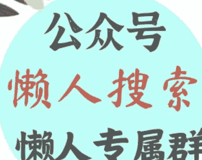

# 伊朗大选在即，中东方向不变

240617
文/卢克文工作室嘉宾 漫游指南
整理：公众号懒人搜索，懒人专属群分享
懒人微信：lazyhelper

6月9日，伊朗内政部对外公布了6名总统候选人，他们分别是伊朗议会议长卡利巴夫、副总统哈希米、德黑兰市长扎卡尼、前首席核谈判代表贾利利、前内政部长普尔穆罕默迪、前卫生部长佩泽什基安。

大选日期定在6月28号，这六位还有十几天为自己拉票。报名参加总统大选的一共有80人，筛选后只有6人，热门人选前总统内贾德和前议长拉里贾尼都被判出局。六人中除了佩泽什基安属于倾向于世俗化的改革派外，其余5人都属于支持教士掌权的保守派。这六人中谁都有可能当选，但是与其现在猜测具体是谁，不如了解一下所有的可能性。

先说佩泽什基安，他是这6人中当选可能性最低的。因为他是改革派，现在伊朗的权力角逐是保守派内部的强硬派和温和派的竞争，完全没有改革派什么事。派系的旁落从一个角度证明了伊朗民众对改革派的失望。

改革派的政治诉求是对内拆分教士权力，对外缓和与西方的关系；保守派则希望对内维持教士治国，对外合纵连横与西方对抗。然而现在的伊朗就是保守派建立的，所以真正的改革派不可能出现在伊朗政坛中。

改革派的另一大痛点是经济。伊朗经济高度依赖石油出口，但是西方的制裁导致伊朗无法高效地把手中的石油变现。为此，改革派提出通过缓和与西方的关系来为伊朗解绑。

结果特朗普执政时期先是单方面撕毁伊核协议，再是暗杀苏莱曼尼。这两件事彻底打消了伊朗各势力对美国和西方的幻想。结果就是现在伊朗各大势力统一思想，放弃幻想和西方对抗到底。

除开改革派的身份，佩泽什基安本人履历实在单薄。他从政前的本职工作是心脏外科医生，担任过医学院校长。从政经历包括2001年到2005年在哈塔米政府担任卫生部长；2008年至今担任代表东阿塞拜疆地区的国会议员；2016年到2020年任第一副议长。

他没有主政地方的履历，也缺乏和军队打交道的经验，这意味着就算他当选，想要在总统这个位子上坐踏实，也只有和哈梅内伊合作这一条路。这点从6月12号的采访中就可以看出来，在采访中他通篇只强调会延续莱希的政策，却只字不提自己的施政纲领，也不提如何应对西方制裁。这让期待他的改革派选民和改革派本身都十分失望。

那么为什么宪法监护委员会会给他开绿灯呢？因为保守派必须得给改革派一个位子来安抚改革派选民（即使改革派选民未必会领这个情）。

接下来是普尔穆罕默迪，他是战斗教士联盟的成员，和莱希一个党派，但是他一般被外界划归到保守派中的温和派。保守派内部温和派和强硬派的区别在于对内政外交的态度软硬上，但是温和派首先是保守派，温和派的底线是教士治国。

普尔穆罕默迪是教法学者出身，有多年检察官经验，在内贾德政府中任内政部长，曾在鲁哈尼政府中任司法部长。他同样缺乏主政地方的经验，也很少提及他的政治主张和施政纲领，但不同于对佩泽什基安的失望，对于普尔穆罕默迪，公众更多的是不熟。

说到温和派，顺带聊聊被宪法监护委员会踢出局的拉里贾尼。拉里贾尼出身宗教名门望族，他弟弟是国家利益委员会主席。所以他被踢出局，很大程度上是因为他显赫的身世。

朋友们大概率会因为哈梅内伊的存在而认为伊朗是一言堂，其实伊朗内部派系错综复杂，哈梅内伊最大的工作反而是平衡各方的利益。像拉里贾尼这种身世显赫家族又势力庞大的人，不能被推上总统的位子，因为他会打破伊朗政治的微妙平衡。打破平衡的危机程度，甚至比选一个真正的改革派上台还要高。

再看贾利利，他是保守派中的强硬派，外交官出身，曾任主管欧洲和美国事务的副外交部长，伊核谈判首席代表。2007年到2013年任伊朗最高国家安全委员会秘书长，现在是国家利益委员会成员。他在2013年和2021年都参加过总统选举，最后都成了陪跑，今年胜选的概率也不大。

然后是扎卡尼。他是资深国会议员，从2021年开始任德黑兰市市长，23年被前总统莱希任命为德黑兰市反腐私人助理。他是莱希任命的第二个私人助理，第一个是负责经济事务的哈巴德（Farhad Rahbar）。某种意义上这算是莱希为他背书。但是就算有莱希的背书，严格来说和其他候选人比，他的资历还是浅了，这次很可能就是来混个脸熟的。

再者是哈希米，资深议员，现任政府副总统，担任过烈士及退伍军人基金会主席，鉴于军队在伊朗有着崇高的地位，该基金会在伊朗政坛属于涉及社会稳定的要害部门。他能坐上这个位子表明教士团体对他的信任和栽培，因此有一定的概率成功。

最后，也是最重磅的人——卡利巴夫，他是现任议长。在1997年到2000年他是革命卫队空军司令，2000到2005年他是公安部部长，2005年到2017年任德黑兰市长，20年开始任议长。他是这6人中资历最硬的，经历涵盖了伊朗现在的3大势力，军队、教士和政府，当选可能性最高。

大家都熟悉的内贾德也报名参加了这次选举，但是他被宪法委员会给刷了。为什么刷呢？因为即使从强硬保守派角度看，他都过于激进了。他任内激进且鲁莽的内政和外交政策，让他成功地惹怒了伊朗从改革派到强硬保守派的几乎所有势力。伊朗现在的外交政策确实是对抗，但是强硬派的对抗是以对抗为手段，目的还是以对抗谋发展。要是内贾德来，那对抗就成了目的。这是伊朗所有势力都不想看到的。

在明确了所有的可能性后，紧接着的问题是新总统会对伊朗未来的内政外交产生什么样的影响？中东未来会走向何方？

首先得明确一点，总统是伊朗政策的执行者，他会参与制定政策，但不是政策的决策者，无论最后总统是谁，伊朗现在的大方向不会变。伊朗负责大战略决策的是以哈梅内伊和专家会议为首的教士集团，即使专家会议中也有改革派和无党派人士，但决策权依旧在保守派教士手中。

所以表面上看这是哈梅内伊一个人的决定，但实质是伊朗各大势力博弈妥协的结果。当然，这不意味着总统只是个提线木偶，总统作为执行人，是政策能否落地的关键。

既然伊朗的大方针不会变，那么伊朗和伊朗抵抗联盟对中东局势的影响也不会因为新总统的上台而改变，较大的变数，是革命卫队这个伊朗的国中之国。革命卫队建立之初是因为国防军，当时的国防军的主干是投降的巴列维王朝的军队，不受霍梅尼信任，就另建了一支军队，也就是革命卫队。到现在，革命卫队不光有着独立的海陆空三军，连军费都是自给自足的模式。

革命卫队是伊朗抵抗联盟的具体执行者，兵强马壮，军费装备又都是自给自足。总统能对革命卫队有多少影响力？革命卫队反过来又会对总统有多少影响力？这些都是急需解决的问题。但是现阶段，总统代表的行政权和革命卫队利益一致，所以即使革命卫队已经有了国中国的迹象，美国现在的中东危机也不会因为换了总统而减轻，同样，以色列现在的危机也不会因为莱希走了就解除了。

对于以色列和美国来说，更大的危机压根就不在伊朗，而在于俄乌冲突和巴以冲突现在正在同步进行，乌克兰已经开始因为巴以冲突缺枪少弹，以美国现在的制造业水平也不可能短时间内大幅度提高军工产能。对于美国来说，它早在23年年初就失去了两边皆大欢喜的机会。现在巴以冲突和俄乌冲突越拖，美国越难全身而退，拖到最后就必须面临在乌克兰和以色列中二选一，无论选谁，美国几十年营造的坚强后盾形象都要被撕破。

而以色列在这种国际局势下，如果铤而走险去挑衅真主党，只会加速自己的灭亡。对于以色列来说，虽然承认这个事实很耻辱，但是两国方案是以色列善终的唯一方法。

以上对于巴以的推演都没有涉及中国的发难，一旦中国选择在现在发难，那美国几十年辛苦经营的国际秩序就真的危险了。话虽然是这么说，其实现在并不是发难的好时机。

现在是开辟中东市场的好机会，特别是伊朗这块西方鲜有踏足的市场。伊朗经济高度依赖石油出口，教士集团很明显也意识到这个问题，而中国是这个世界上为数不多有能力帮助伊朗发展的国家。伊朗有油有市场，中国有海量的产能和生产工具，二者互帮互助之下，必能在一带一路经济带上创造新的佳话。

伊朗这场总统选举，究竟最后谁会胜出，谁能给中东带来真正的和平，现在我们不得而知，但是对于伊朗自身而言，发展远比对抗要走得长久。

微信:lazyhelper

历史3000多份各类付费文章以及年费三千多的生财星球资源，见懒人专属群内部分享！
付费群，白嫖勿扰！

## 懒人专属群更新记录：
https://lazybook.fun/#/blog/record2