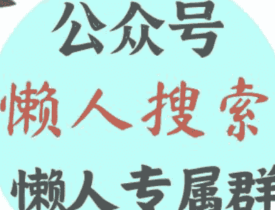

# 周其仁：你的客户，就是你的“宏观”

240617

整理：公众号懒人搜索，懒人专属群分享

懒人微信：lazyhelper

今天，将从两个话题出发，为你提供知识服务。

第一个是，明尼阿波利斯联储主席卡什卡利，释放加息预期。

第二个是，美国多地出现劣质肉毒毒素注射事故。

先来看今天的第一条。最近，美国明尼阿波利斯联储主席卡什卡利，在一次采访中，再次释放了关于美联储的加息预期。他的原话是，他认为没有人完全放弃加息，尽管加息的可能性很低，但他并不想排除任何可能性。早前他也表示过，美国的官员们应该等待更多证据，表明通胀正在降温，然后再降息。

好，这个消息就摆在这。注意，我们的重点不是要解读这个消息本身，而是想请你体会一下，你看到这个信息时，是什么感觉？

我大胆盲猜，美联储、预期、加息，这些字眼摆在你面前，肯定有人会觉得，这个事感觉很重要的样子。但是，具体哪里重要？跟咱们有什么关系？好像又说不清。

假如你正好有这个感觉，那咱们今天得好好唠唠。因为我们今天要说的重点，不是美联储加息之类的信息本身。而是另外一个，跟咱们自己关系更密切的话题。这就是，不论是作为个人，还是作为企业，我们应该怎么跟这些宏观信息打交道？是挨个分析，搞懂为止？还是看不懂的就直接忽略？

要说最懂得分析宏观信息的，当然是经济学家。因此这个问题，咱们还是得听听经济学家的意见。今天，我们挑选其中的一位学者的观点重点说说。这个观点来自著名经济学家，北大国家发展研究院的周其仁教授。最近一个月，不管是在企业家中，还是在学者当中，周其仁教授都非常受关注。

那么，在周其仁教授看来，个人应该怎么把握自己跟这类宏观形势之间的关系呢？就在去年，周其仁教授受《正和岛》邀请，去烟台做了一场针对企业家的分享。也就是，去年在网上流传很广的周其仁烟台夜话。里面谈到了很多话题，比如，宏观形势、出海、企业创新等等。

接下来，我们就从中挑几个重点来说说。

## 第一，关于怎么理解宏观形势？

你看，一提到宏观形势这四个字，就比如前面的美联储加息，很多人的第一反应，就是马上竖起耳朵，生怕遗漏了半点细节。但是，周其仁教授却做了个反问，宏观形势对我们做企业，是不是真的那么重要？

注意，周其仁教授不是说宏观形势不重要，他要说的重点是，宏观形势里包含的信息那么多，是不是每一个信息都能被企业家理解？每一个信息都能指导行动？

你看，一旦具体到这一步，我们是不是就要琢磨琢磨了。周其仁教授说，企业真正要关心的，是跟他们要解决的问题有强联系的变量。

那么，跟企业有强联系的，最关键的变量是什么？很明显，是客户。借用任正非的话说，办企业都是在花钱的，要给员工工资，要给供应商付钱，唯独客户是给你钱的。企业动用的所有资源，归根结底都是从客户那来的。

从这个角度看，周其仁教授认为，对做企业来说，什么叫宏观？什么叫形势？你的客户就是你的宏观。你的客户就是你的形势。

比如，美联储加息。看到这个信息的时候，企业的第一反应，不是去搞懂这件事的全面影响，而是应该想想，这件事对自己的客户有没有影响？假如有影响，会到什么程度？是影响很大？还是可以忽略？借用周教授的话说，新闻总是一惊一乍，但你要搞懂那是做给谁看的。除非你搞金融，否则我们可以少关注那些处理不了的信息，把时间和精力用来提升自己的理解、思考和分析能力。很多宏大叙事，跟你我之间隔着千山万水。

周其仁教授还说，关于国际局势，假如说非要看透些什么，那么他认为，理解一点就够了。这就是，竞争无处不在。好的企业家应该努力做的，就是始终围绕客户，研究客户的动向、需求和变化，在竞争中增强自己满足客户的能力。

我理解周其仁教授说的，就是我们得重点关注那些，在自己的能力圈、理解圈和收益圈之内的信息。把自己从好奇视角，切换到作战视角，这是把事情做成的关键。

## 第二，企业为什么一定要出海？

假如一个企业的商品卖得不错，远销世界各地，那么它还有出海的必要吗？先说答案，有。

关于这个问题，周其仁教授讲了一个真事。佛山有个科达公司，主要做的是瓷砖加工设备。随着销路越来越广，他们就把生意做到了土耳其。你看，到这一步，科达公司的厂房和供应链都在本地，成本质量都可控，同时又能把商品卖到土耳其，赚国际市场的钱。看起来这已经是理想状态。

但问题是，他们总不能一直靠低价走量吧？因此，他们就想提升品质，把设备卖给更好一点的工厂。而客户的规格越高，要求也就越多。很多客户不仅要检验你的设备，还要你在当地有维护团队，还要检验你的厂房。你看，这时，假如别人的厂房就在土耳其本地，而你的厂房远在中国，你觉得客户会更倾向哪个？

同时，出海还有一个作用，能提高客户的购买力。你看，假如你想把东西卖到世界各地，总得当地的人有购买力才行。说白了，就是你的客户得有钱。但是，假如这个地方还是农业社会，收入不稳定，就没有足够的购买力。这时，假如你出海在当地建厂，帮当地人把收入提上来。这么一来，既为当地政府解决了就业问题，又提高了当地居民的购买力。越南之所以很欢迎中国企业到当地办厂，就是这个原因。

换句话说，出海在很多时候，既是计划，也是结果。企业发展到一定程度，就会走到这一步。

## 最后，关于企业应该怎么做创新？

周其仁教授认为，创新分成两种。

其一是，看到了做，也就是，我看到别人做出了什么东西，就照着学。只要我能把成本做低，就能赢得市场。这属于有标准答案的创新，也叫应试式的创新。因为有确定的路径，因此走的人就多，就容易内卷。

其二是，想到了做，也就是，我并没有确定看到某个现成的成功先例，我只是觉得，这个东西应该做出来。这属于没有参考答案的创新。

比如，有个企业叫远大空调，主要是做中央空调的。创始人是两兄弟，张跃和张剑。他们最开始创业，是因为当年发生了不少锅炉爆炸事故，他们就想造一个不爆炸的锅炉，结果研究出了安全性更高的无压锅炉。后来他们又得知，空调里的氟利昂破坏臭氧层，就开始研究不用氟烃类制冷剂的非电空调。现在他们又在做建筑材料，是因为他们认定，目前建筑物用的钢筋混凝土不可回收，一直积累下去会给地球带来负担，因此他们就开始研究一种叫芯板的板材，也就是空心的不锈钢板。因为不锈钢可回收再利用，就不容易造成废料堆积。

周其仁教授说，至于芯板以后能不能做成，谁都不知道。但是，他能明显感受到，这家公司有执念，有新想法。我们经常说的独到性，有时不就来自这些最初看起来稀奇古怪的想法吗？

最后，借用周其仁教授的一句话。说的是，不要认为民企是私人的，就天然具有生命力。事实上，民企的生命力是靠死亡的教训才逐步增强的。向死而生，没有死亡，哪来求生的愿望、能力和业绩？

换句话说，也许一个企业的厉害之处，就在于他做了一件从来没人做过的事。只要起手，就有价值。做成了，那是一条通往新方向的路。哪怕失败，那也是一盏照亮暗处的灯。

再来看今天的第二条。前段时间，美国疾控中心发布了一个消息，美国目前已经有 9 个州，出现了因为注射劣质肉毒毒素，导致有害反应的病例。

本来这个新闻离咱们很远。但是，毕竟，肉毒毒素这个东西在医美应用很多，其中有什么风险咱们总得知道。我就顺手查了一下，结果发现一个非常意外的数字。你知道每年，全世界的医美机构加起来，要用掉多少肉毒毒素吗？一吨？一公斤？100 克？都不对。是几毫克。没错，全世界的医美行业加起来，每年只用掉几毫克的肉毒毒素。确切说，这还不是消耗数字，只是生产数字。真正被用掉的，还要更少。

这主要是因为，肉毒毒素这个东西，太毒了。它的毒性强到什么程度？大概一勺纯晶体形式的肉毒毒素，6 克重，就足以杀死 2 亿人。这个东西的口服致死量是多少呢？十亿分之三十一克。什么概念？对人体有剧毒的铊金属，致死量都得要 0.6 到 1 克。

那么，这么剧毒的东西，按照通常的想象，咱们躲还躲不及呢，怎么会想到把它用在医美上呢？

这段故事很有意思，从中我们还能看出一个关于创新的真相。前段时间，英国的一名博客作家安东尼·华纳，专门分析了肉毒毒素的前世今生。

人类是怎么发现肉毒毒素的？源于 18 世纪末，发生在欧洲的“香肠中毒”事件。一名比利时科学家发现了导致香肠中毒的核心细菌，把它命名为肉毒杆菌，就是拉丁语“香肠”的意思。

科学家发现，肉毒杆菌，只在特定条件下生长，而那些没好好储存的加工肉类内部，就是它生长的理想环境。这个毒素在 20 世纪初相当棘手。当时，食品罐头行业刚刚发展起来，杀菌技术不太成熟。这个问题是怎么解决的呢？主要靠加热。这种毒素不耐高温，85 摄氏度煮 5 分钟，就能破坏毒素，罐头食品加工时，内部温度到 121 摄氏度，就能破坏肉毒杆菌。同时，在 pH 值低于 4.5 的酸性环境中，也长不出毒素。换句话说，要想解决，要么加热，要么加酸。

当时的厂商为了保险，往往会对罐头食品做猛烈的加热和酸化，当时的很多罐头里，都有一股烧焦的金属味，酱汁也带有刺鼻的酸味儿。

当然，到这儿，肉毒杆菌毒素，还是食品中偶然产生的一种致命毒素。但是，紧接着，另一个问题就浮现了上来。这种毒素能不能工业规模生产？生产其实不难，但关键是，生产出来做什么？总不能干坏事吧？

这种毒素，最开始，确实被打了一些坏主意。比如，用作病毒武器。二战时期，传闻不少国家都打算生产这种毒素。好在事实证明，这种毒药很难武器化。

真正找到它的用武之地，要到 20 世纪 80 年代，一些化学家和医生开始把肉毒毒素的麻痹作用，用在医疗中。比如用非常微量的注射剂，缓解患者的眼睑抽搐、肌肉痉挛等症状。只要用量控制得当，肉毒杆菌毒素是一种很有用的肌肉松弛剂。

那么，肉毒杆菌后来又是怎么用于医美的呢？这是几名加拿大医生偶然发现的。当时，一名眼科医生，叫卡拉瑟斯，据说是她有一次不小心把肉毒毒素打进了患者的额头里。结果，这名患者发现，额头皮肤变光滑了。而且更巧的是，这名卡拉瑟斯医生的丈夫，正好是皮肤科的医生，他当时正在研究怎么除皱纹。

这么一来，后来的故事就顺理成章了。人们开始通过注射肉毒杆菌毒素来除皱。唯一的副作用是，毒素有麻痹作用，打完之后，有可能会影响面部表情。但是，这不妨碍一个十亿美元级别的市场快速生长。到 2017 年，全世界面部肉毒杆菌注射，超过了 700 万人次，市场规模是 23 亿美元。这是前几年的数字，今天这个数字还要更高。

你看，在过去的一个世纪里，肉毒杆菌毒素，从世界上最致命的毒素之一，变成了医美行业的硬通货，并且还催生了一个十亿美元级别的市场。从中我们能看出，人类科技发展的历程，不仅包括不断的发现有用的东西，也包括把那些没用，甚至有害的东西，变得有用。

最后，总结一下，今天说了两个话题。第一，周其仁教授是怎么理解趋势的？周其仁教授认为，企业真正需要注意的，不是穷尽宏观趋势，而是只关注那些，跟客户有关的趋势。客户是企业最关键的宏观。同时，创新的关键，不仅在于做低成本，更需要独到性。

第二，肉毒杆菌是怎么成就医美生意的？从中我们能看出，技术发展的过程，不仅是在发现新资源，也是在把那些原本不是资源的东西变成资源。

历史 3000 多份各类付费文章以及年费三千多的生财星球资源，见懒人专属群内部分享！

付费群，白嫖勿扰！

懒人专属群更新记录：

https://lazybook.fun/#/blog/record2