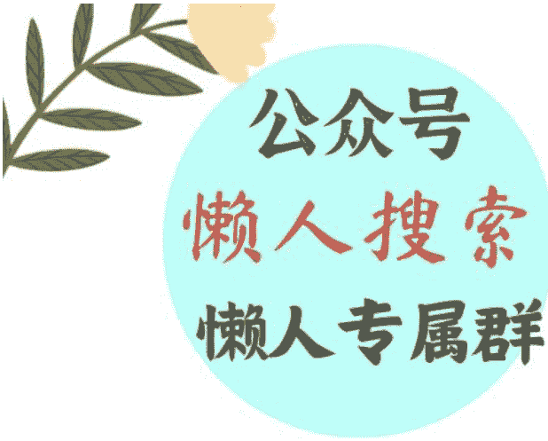

# 孙正义的新生意：日本 AI 兴衰启示录

240628

整理：公众号懒人搜索，懒人专属群分享

懒人微信：lazyhelper

今天，将从两个话题出发，提供知识服务。

- 第一个是，安谋控股 ARM 股价创新高，带动孙正义身价暴涨。
- 第二个是，北京市政府发布《北京花园城市专项规划（2023 年—2035 年）》。

先来看今天的第一条。最近，孙正义的身价持续上涨，原因是软银持股90%的芯片公司安谋控股，也就是ARM，股价持续走高。就在6月中旬，安谋控股的股价已经超过1650亿美元。

根据今年的福布斯日本富豪排行榜，第一名是优衣库的柳井正，第二名就是孙正义。当然，日本的顶级富豪向来变动不大。从2019年开始，日本前四名的富豪就一直是四个人，柳井正、孙正义、基恩士的滝崎武光，还有三得利的佐治信忠。但今年有个细节值得注意，在日本富豪中，财富涨幅最大的，是孙正义。

在福布斯的统计周期内，孙正义的财富比去年上涨 30%，增加了 61 亿美元。这个涨幅主要就来自安谋控股。福布斯的评价是，孙正义实现了一个史诗级别的翻身。

注意，福布斯用了翻身这个词，潜台词就是过去两年孙正义一直不太顺。2022 年年底，软银旗下的愿景基金出现巨额亏损，孙正义退居幕后，软银也进入了冬眠模式。正是在软银冬眠的半年里，GPT 横空出世。去年 7 月，孙正义出山，宣布要展开“反攻”，主要瞄准的领域，是 AI。上个月，有媒体透露，软银集团已经决定每年在 AI 上投资 90 亿美元。

日本前首富押注 AI，乍一听，可能有点奇怪，毕竟在当前的 AI 格局里，日本的存在感很弱。你看，咱们基本上没听过日本有什么知名的 AI 模型，日本本土的 AI 模型在测评中的表现，甚至比不上已经过时的 GPT 3.5。可以说，这一轮 AI 热，几乎没日本什么事儿。

这是因为日本入局 AI 太晚？并不是。原因正好相反，日本之所以在 AI 上落后，不是因为入局太晚，而是入局太早。

你知道，AI 热并不是第一次出现。1955 年，达特茅斯夏季研讨会后，人工智能作为一个独立的学科正式登场。随后 60 年代，就出现了第一轮 AI 热。

当时，日本是第一批积极布局 AI 的玩家，也取得了不小的成就。那么，从早早布局，到无声无息，日本的 AI 究竟经历了什么？

最近，我看到北京大学市场与网络经济研究中心的研究员，经济学博士陈永伟专门写文章介绍了这段历史。从上世纪 60 年代算起，按每 20 年为一个阶段，咱们可以分四个阶段观察日本的 AI 发展。

第一个阶段，也就是 60 年代到 70 年代末，可以叫做“探索阶段”。当时，实现 AI 的具体技术方向，大家都在摸索。在这个阶段，日本在两个方面取得了很重要的成就。

一方面是人形机器人的研发。1973年，日本早稻田大学研制出了第一款人形机器人WABOT-1，它由视觉系统、对话系统和肢体控制系统组成，可以模仿人类行动，根据周围环境作出反应，还能和人类简单对话。在当时非常轰动。

另一方面是神经网络理论的早期探索。放在今天我们都知道，神经网络理论是AI最重要的地基。当时，AI的技术路线还没有定论，神经网络还处在发展初期。其间，一些日本学者作出了很重要的贡献。比如甘利俊一，在1967年提出了“随机梯度下降法”，这是神经网络解决调参问题的基础。再比如福岛邦彦，他在1980年实现了“神经认知机”模型，这是后来大名鼎鼎的“卷积神经网络”的雏形。

总之，在这个阶段，日本的 AI 进展很快，成果也不少。但后来又为什么落后了呢？咱们接着往下看。

第二个阶段，也就是 80 年代到 90 年代，这个阶段，可以叫做“豪赌阶段”。日本准备举全国之力，研发一种新型计算机。

当时，日本经济膨胀，对很多关键技术发起了攻关，想要抢占全球技术的制高点。日本的方式是，国家牵头，选好路线，全力攻关。这种方式确实有用，比如日本成功研发了 DRAM 存储器，变成了当时最领先的芯片大国。在计算机发展上，日本也复制了这个打法。1978 年，日本提出了一个宏大的计划，要赶在欧美之前，开发出 “第五代计算机” 。

按当时的划分方法，第五代计算机，就是能像人一样与用户交互的计算机，这就是今天各家 AI 大厂正在尝试的 AIPC，在当时看来确实非常超前。

但可惜的是，在具体实施的时候出现了问题。当时，神经网络的调参问题和算力问题都面临瓶颈，AI 的主流技术，是一种叫做 “专家系统” 的技术。神经网络，是计算机自主学习，而专家系统，是人来输入知识，教会计算机模拟人类专家的决策过程。日本动用举国之力研发第五代计算机时，也抛弃了神经网络，选择了主流的“专家系统”。

没错，听到这你可能发现了，日本在这一步似乎点错了科技树。

结果，第五代计算机算是彻底失败。想做出强大的专家系统，需要把知识、使用知识的情境，还有人机交互的规则，都明确地告诉计算机，这个工程量可想而知。因此，第五代计算机的研发成果，只有一些没用的样机。再加上，日本经济泡沫破裂，日本的 AI 研究也随之陷入低迷。

紧接着，咱们来看第三个阶段，也就是进入 21 世纪之后的 20 年，咱们可以叫做“掉队阶段”。2006 年开始，卷积神经网络重新登上 AI 的舞台，逐步发展成了今天 AI 的关键底层技术。

而日本呢？日本没有重新捡起神经网络这个领域，反而彻底落后，关键是因为，人才断代了。

前面说了，80 年代之前，日本在神经网络这条路线上有一些很不错的成就。但是，在豪赌阶段，由于国家押注专家系统，带偏了日本的整个 AI 界。人们扎堆研究专家系统，神经网络逐渐被边缘化。而第五代计算机计划失败后，日本更是削减了对整个 AI 学科的资金支持，优秀的人才根本不会进入 AI 领域。人才的全面断层，导致日本错过了后来的 AI 革命。

那么，到了第四个二十年，也就是 GPT 时代的今天，日本在 AI 上还有没有机会呢？

按照陈永伟的说法，日本在 90 年代伤得太深，导致目前在 AI 上处于全面落后状态，但是，毕竟有一些历史积累，日本在应用层面，还是很有潜力的。

比如，日本可以发展具身智能，也就是把 AI 和机器人结合起来。从 70 年代开始， 日本在人形机器人上一直保持着技术领先，现在可以把 AI 搭载在机器人上，做出落地产品来。

再比如，日本可以发展行业大模型。现在的 AI 企业，普遍缺少具体行业数据的积累。而日本在押注专家系统的时候，积累了很多行业知识库。假如把这些积累用起来，也许可以开发出好用的行业大模型。

好，刚才咱们简单了解了日本 AI 发展史。日本早早起步，却倒在了黎明之前。回看整段历史，日本的产业政策是决定 AI 命运的关键。产业政策主要有两种类型，一种是纵向政策，只选定一个技术方向，然后投入重金去扶植，实现一个特定的目标。另一种是横向政策，对所有的技术路径都给予一些支持，让所有技术都自由发展。日本当时采用了纵向的方式，集中一条路投放所有资源，这样做确实有好处，但风险很高。比如 AI，你很难预测哪条技术路径能真正通向未来。也不知道哪种技术会发生突破性的变化。这时只选择其中一种，而放弃其他的所有可能，就是一场赢面很小的豪赌。

借用布莱恩·阿瑟在《技术的本质》里的说法，技术进步是一个递归的过程，所有的新技术都来自旧有技术的组合。因此，促进技术发展的最好方式，不是孤立扶持、拔苗助长，而是为技术之间更好地碰撞和组合，创造条件。

再来看今天的第二条。前段时间，北京市政府发布了《北京花园城市专项规划（2023年—2035年）》。规划的核心，是推动城市的绿色可持续发展。其实，最近几年，很多地方都在推动绿色城市建设。包括，对老旧小区做节能改造，设计绿色建筑，对城市的公共空间做花园式改造，等等。绿色可持续，这个概念咱们并不陌生。但是，关于这个概念的具体含义，好多人未必说得清。是种更多的树？减少碳排放？它的标准到底是什么？

关于这个问题，前段时间我从一个做绿化设计的老师那听到一个比喻。他说，所谓可持续，本质就是利息大于消耗。

也就是，我们可以把自然资源，当成你的资产。而你的目的是确保这笔资产永远取之不尽，请问，你该怎么做？很明显，你要想让它永远用不完，能传给你的子子孙孙，就必须得满足一个条件。你要让这笔资产产生的利息，大于花销。说白了，就是永远不动本金，只花利息，而且是只花一部分。

这个道理很好理解，但落实到实践上，做到它并不容易。

贾雷德·戴蒙德曾经写过一本书，叫《崩溃》。里面讲了复活节岛上的文明是怎么消亡的。最开始，岛上有大量的树，自然资源特别丰富，岛上的居民过得也很滋润。但后来，这个文明消失了，原因是，岛民把岛上的树都砍光了。

听到这，很多人可能觉得奇怪。岛上的人难道傻吗？他们难道不知道自己离不开这些树？这不是自己作死吗？

但是，回到当时，这也不能全怪岛民。因为树这个东西，是一边砍一边长的。你今天砍掉几棵，明天又会长出几棵新的。因此，在岛民看来，每天砍树也没什么问题，毕竟它同时还长新的呢。

真正要命的地方在于，新长的树，要始终比砍掉的树少一点。说白了，确实有新长出的树，森林这份原始资本确实在产生利息，只不过，岛民的消耗要高于这个利息。再加上树的生长很缓慢，岛民根本没意识到树的总量在变少。

换句话说，人之所以过度消耗自然资源，很多时候，不是因为不懂道理，而是无法感知变化。人对时间的感知是以天为单位的，而自然资源的生长是以年为单位的。

怎么办？既然人自身很难感知这个变化，就需要定下一个强制的约束。每时每刻，都必须让资源增长的速度，高于资源消耗的速度。也就是，我砍掉一棵树，同时一定要种下更多的树。

这就确保，你的消耗，要永远低于你的利息。其实，目前很多所谓的绿色可持续项目，采取的都是这个思路。比如，这些年很流行的朴门永续理念，是由两位澳洲的生态学家，比尔・莫利森和戴维・洪葛兰，在 1970 年代提出的。朴门的核心，就是优化自然元素的排列组合，让它们能产出更多的资源。当产出资源的速度，高于人类消耗的速度，这就实现了所谓的永续。

在天津，有人设计了一个叫双新食物森林的系统，采取的就是类似的设计。他们做了一片人工森林，里面的植物正好可以在功能上形成互补。有的植物产出果实，有的植物可以改善土壤环境，为微生物提供栖息地，而微生物又可以促进植物产出果实。说白了，这个过程，就是让植物之间互相照顾，并且在这个过程中产生对人类有用的资源。你看，这就实现了我们前面说的，不动本金，只吃利息。

换句话说，环保的本质，是跟慢变量打交道。自然植被的变化周期，远远超过人类的感知。因此，必须通过此刻的强约束，让我们把一件正确的事坚持下去，并且耐住性子，去等待慢变量的发生。等你反应过来时，沙漠也许已经变成了绿洲。

最后，总结一下，今天说了两个话题。

第一，日本在 AI 领域是怎么掉队的？我们可以从中获得一个启发。面对新技术时，尽量把它当成一道多选题，去考量每一个选项，而不是把它变成单选题去孤注一掷。

第二，怎样理解可持续的定义？其中一个角度是，所谓可持续，就是利息大于消耗。把自然资源比作资产，要想让这笔资产能传给后世子孙，就必须确保，这笔资产的利息永远大于消耗。

历史 3000 多份各类付费文章以及年费三千多的生财星球资源，见懒人专属群内部分享!

付费群，白嫖勿扰!

# 懒人专属群更新记录：
https://lazybook.fun/#/blog/record2