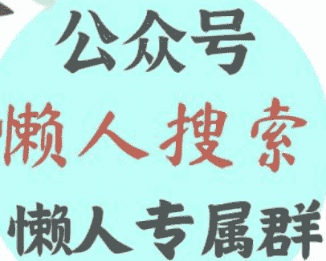
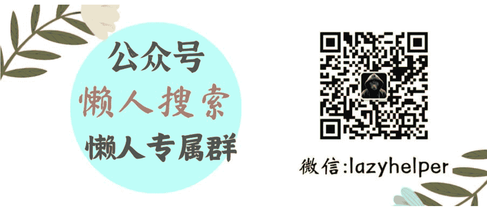

# 转让问界商标，华为真的不造车了？

240705

文/卢克文工作室嘉宾 风雨如歌

整理：公众号懒人搜索，懒人专属群分享

懒人微信：lazyhelper

7月2日晚上，赛力斯突然发布公告，旗下的控股子公司赛力斯汽车有限公司，将从华为手中收购44项外观设计专利和919项文字和图形商标，其中就包括“问界”汽车的商标，总计花费25亿人民币。

华为很快做出回应，表示确有其事。

竟然把“问界”的商标转让给了赛力斯，莫非标志着华为真的不造车了，真的要“回归初心”了？

这到底是怎么回事呢？

华为汽车业务部门，也就是后来的车BU成立于2019年5月。

当时，新能源汽车的大变革虽未到来，但许多嗅觉敏感的玩家都觉察到，新能源汽车已经来到了爆发的前夜，纷纷提前进行布局，华为就是其中之一。

华为切入汽车市场的策略，是向车企提供包括自动驾驶、智能座舱在内的智能出行解决方案，也就是定位为供应商。

只不过，这里所说的供应商，并非传统意义上的供应商，不是仅仅把产品交付给终端车企就完事了，华为会深度参与车型的设计、开发、生产和销售，等于大家联合开发一款车了。

按照华为自己的说法，这叫“智选模式”。

当时华为的优势在于，常年在电子相关行业浸润，技术积累深厚，和自动驾驶有不小的相通性，但劣势也很明显，没有正儿八经在汽车行业呆过。

所以采用“智选模式”，专注于与电子技术相关的部分，而不是自己直接下场造整车，扬长避短，是比较明智的。

然而问题在于，这种模式不一定符合汽车行业的现状。

在传统汽车行业，车企握有绝对的话语权，供应商的话语权相对小得多，当然，车企受制于供应商的事情不是完全没有，只是比较少。

两者的关系可以这么理解，如果把一辆车比作一个人的话，那么零部件供应商就是躯体，车企则是大脑和灵魂，双方关系处于互补状态的同时，车企是明显占优的。

到了新能源汽车时代，车企们自然希望延续这样的态势。

而华为的“智选模式”，无疑和车企的利益发生了冲突，对产品从设计、研发再到制造的深度介入，会提高华为的话语权，相对降低传统车企的话语权。

谁是躯体谁是大脑，就有点分不清了，因此车企们合作的积极性不高，越是大车企，越低。

何况，华为刚刚进入汽车行业，你的产品性能究竟怎样，号召力是否如电子产品行业那样强，都是个未知数，大车企缺乏冒险的动力。

既然大车企不愿意冒险，这个阶段的华为，就只好先找小的车企合作了。

赛力斯与华为是 2021 年 4 月正式开展深度合作的，赛力斯负责整车制造，华为提供智能座舱等关键部分。

在这之前一年的 2020 年，赛力斯的经营惨淡，营收 143 亿，净利润为负 17 亿。

对赛力斯来说，想在激烈的市场竞争中翻身，光靠自己太困难，面对华为伸过来的橄榄枝，没有不接的理由；

而对华为而言，想要吸引更多车企加入“智选模式”，就必须打造一个标杆案例，让市场知道模式是可行的。

赛力斯规模不大，意味着话语权不强，又有多年的造车经验，是合适的合作对象。

2021 年底，双方合作的第一款车型问界 M5 正式发布，2022 年 3 月开启交付，当月就交付了超过 3000 辆，随后的 4 月交付了 3245 辆，5 月超过 5000 辆，成为史上交付破万最快的车型之一。

后续的 2022 年 6 月到 2023 年 9 月，大部分时间里，问界的月交付量都在 5000 以上，个别月份甚至能逼近一万，对于一款 20 万以上的车型而言，不可谓不出色。

2023 年 9 月，问界新 M7 发布，除了性能比老款 M7 强，还乘上了 Mate 60 手机的巨大流量东风，从此一发不可收拾，整个问界系列的销量节节攀升。

整个2024年上半年，光M7就交付了10.09万辆，算上其他车型，问界总交付量约16万辆，在新势力里名列第一。

在问界的带动下，赛力斯实现了咸鱼翻身，成功扭亏为盈，今年一季度盈利2.2亿。

可以说，经过三年多的合作，华为成功证明了在汽车行业 的品牌号召力和“智选”模式的可行性，可喜可贺。

然而，这只是事情好的一面，还有坏的一面。

由于华为的强势，大部分人都以为问界是华为的，习惯性称为“华为问界”，而不知道赛力斯，一部分知道的消费者，则只认华为，不认赛力斯。

买回问界后，第一件事就是抠掉赛力斯的标，换上华为的，就像当年的华晨宝马一样，消费者只认宝马，不认华晨。

赛力斯是赚了钱，但品牌完全没有打响。

同时，华为深度参与了设计、研发和核心部件，赛力斯负责的只有制造，于是在一些车企看来，赛力斯妥妥地沦为了“代工厂”。

品牌声势起不来，还沦为“代工厂”，如果与华为的深度合作是这样的结果，其他车企就更缺乏合作积极性了。

这样下去，对华为是相当不利的。

合作的车企数量不足，“智选模式”推广不开，销量就不够，汽车业务难以盈利；为了盈利，就存在亲自下场造车来提高销量的可能，而这又违背了“智选模式”的初衷。

也正因华为一直存在造车的可能，和其他车企构成潜在的竞争关系，不少车企们难以放下戒心，去加入华为的生态圈。

不造车，销量不够；造车，又和车企们产生冲突，两面都是难，这也是华为内部长期纠结是否造车的原因，不过在经历了摇摆后，华为最终选择了不造车。

这么做的原因，在于华为的重心是鸿蒙生态，而汽车是未来鸿蒙生态的重要一环，光靠华为自己，光靠问界的销量，顶多在国内市场活着。

如果想成为世界级生态，到海外攻城略地，就不现实了。

要实现这一目标，必须有更多车企的参与，合力把蛋糕做大，这样一来，华为就不能造车。

只不过，你说你不造车，大伙儿就信了？当初任正非还说过不造手机呢，后来不还是造了？

所以，华为必须做点什么，让大家相信它真的不造车了。

于是就有了这次“问界”商标的转让，连商标都转让了，问界的控制权归了赛力斯，这下你们总该信了吧？我和赛力斯真就是合作关系，大家各取所需，互利共赢，不是赛力斯给我代工。

问界的商标是很值钱的，以区区 25 亿的地板价转让，也是华为的一种姿态，表示不在乎这个商标，体现的是坚决不造车的决心。

对传统车企而言，在华为确定不造车后，合作就变得有吸引力起来了，毕竟华为是真的有技术，与赛力斯合作的问界这个成功案例，更是摆在眼前。

而华为也终于明确了汽车业务的方向，不再左右摇摆，精力专注、资源集中后，汽车业务将进入发展的快车道。

历史 3000 多份各类付费文章以及年费三千多的生财星球资源，见懒人专属群内部分享！

付费群，白嫖勿扰！

懒人专属群更新记录：

https://lazybook.fun/#/blog/record2