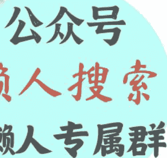

# 高考之后，你还活在“高考模式”里吗？

240705

整理：公众号懒人搜索，懒人专属群分享

懒人微信：lazyhelper

今天，将从两个话题出发，提供知识服务。

第一个是，后高考经济，带动多个行业小高潮。

第二个是，2024年沙特电竞世界杯正式开赛。

先来看今天的第一条。最近听说一个词，叫后高考经济。说白了，就是高考之后，放松放松，消费消费。所谓后高考经济，主要包括三件事，购物、考驾照和旅游。很多景区也趁着这个机会吸引考生。比如，浙江、湖北、湖南、陕西、山东，已经有一百多家景区推出了考生专属福利，拿着今年的准考证，就可以免费参观景区。

不知道你还记不记得，你当年高考结束之后，第一件事做了什么？但总归，这些行为背后，大概率都伴随着同一句潜台词，这就是，高考总算结束了，可得好好放松放松。

之前有一个词，叫高考后遗症。前段时间，《简单心理》还发起了一份针对高考创伤的征集，一共发出去300份问卷。最后统计出了8类所谓的高考创伤类型，包括，因为考砸而自尊心受挫，因为高中封闭导致上大学后丧失目标感，等等。其中有一条留言让人印象很深，是这么说的，自从高考结束，我就一直觉得，人这辈子所有的事，都是成败在此一举，都是不努力就完了。这个压力一直伴随到成年。

但是，换个角度，这个压力感是坏事吗？也未必。之前有位做HR的老师跟我说，他发现凡是经历过高考的人，体内都会留下一个东西，叫战士人格。也就是，他能时时刻刻像战士一样，对一件事紧张起来，行动起来，拿出那个毕其功于一役的架势。说白了，就是这人不怂，遇到事儿的时候敢往前冲。等到三四十岁的时候，你高中学的东西也许早就忘了，但是这个战士人格会一直存在。它能让你在遇到挑战时，瞬间神经紧绷，把全身的真气凝聚起来。

但总归，压力反应也好，战士人格也罢，不管你怎么理解这个东西，我们都很难否认，高考都在一定程度上，塑造了我们的心智模式。但别忘了，心智模式这个东西，有它的局限。就像数学家乔治·博克斯说过，所有的模型都是错的，但有一些是有用的。

换句话说，心智模式这个东西没有绝对的对错，关键看，它对你当前的工作生活有没有帮助。有用的部分就留下，过时的部分就更新。说白了，我们得搞懂高考前后，我们的处境发生了哪些改变，这才是关键。

今天，我们主要就回答这个问题。

之前有很多人做过类似的研究，这些研究都指向一个关键的变化。注意，重点来了，这个关键变化就是，从难到复杂。也就是，高考前你面对的问题属于，难。而高考之后，你面对的问题将越来越倾向于，复杂。

注意，难和复杂，这是两个不同的维度。

难，指的是一件事目标明确，规则清晰，路径确定。只不过，完成它需要很高的技术水平。谷歌之前还专门做过定义。所谓难，就是这个问题需要借助突破性技术，采取激进的努力才能解决。你看，高考不就是这样吗？目标、规则、路径，全都是确定的。你把该做的卷子做了，把该花的时间花了，把该吃的苦吃了，大概率就能获得一个不差的结果。这就像爬山，自古华山一条路，你沿着它往前走就是了。累归累，但你不用担心迷路。复杂，指的是一件事目标不确定、路径不清晰，且解决方案不唯一。前两年流行一个词，叫VUCA，最早来自军队。形容的就是这个复杂的状态。你看，高考结束之后，很多人是不是就面临这个挑战？毕业论文选什么题目？暑假应该出去实习还是准备考研？上班后同事找你吃饭，是出去社交还是留下加班？这些事哪有标准答案？

有位社会学者叫谢爱磊，在2013年到2019年，做了整整六年的追踪调查。

结果发现，好多在高考时特别厉害的小镇做题家，上了大学之后，反而不爱学习了。乍一看这好像很奇怪。毕竟，学习原本是他们最擅长的事，高考都熬过来了，为什么上大学反而躺平了呢？谢爱磊发现，其中一个关键原因，就是他们失去了目标的约束。之前有高考这个目标约束着他们的行动，而上了大学之后，这个确定的目标消失了。多考一分少考一分，好像也没有那么大的区别。你看，这就是从难到复杂的变化中，出现的落差。

之前还有位海豹突击队的队长，叫马克·欧文，他就认为，一个合格的海豹突击队员，要经过两个阶段的成长。第一个阶段我们可以称之为射击模式，也就是，在你还是学员的时候，要把射击这样的基础能力练好，做到百发百中。这是在训练你面对“难”的能力。第二个阶段是成为正式队员后，需要你百步穿杨的时候很少，你更多面对的是不确定。这时就需要你把自己切换到，迷宫模式。也就是，在方向不确定的情况下，不求一击命中，而是快速行动，并且根据第一步的结果，找到后面的方向。

换句话说，意识到从射击模式到迷宫模式的转变，能够帮我们更好地管理自己的精力、情绪和能量，更有效率地应对现实挑战。

同时，意识到这个转变，还能给我们一个提醒，这就是，成功的路径不唯一，但尽早找到它很重要。

假如经常读名人传记，你可能会发现一个现象。那些特别厉害的人，并不是人生起点更高，而是他们的人生，开始得更早。也就是，他们都是在很早的时候，就想好自己将来要干什么。比如李飞飞、扎克伯格、彼得·蒂尔，他们都是在十几岁的时候，就想清楚了自己以后的事业。

换句话说，有的人的职业生涯像一场寻宝，四处尝试，他们并不知道自己到底想干什么。但像李飞飞这样的人，他们的职业生涯更像是玩拼图。她知道那个最终的图景是什么，也知道缺那块儿，应该去哪找。你看，拼图和寻宝，这两件事的成功率能一样吗？换了是你，你选哪个？

之前彼得·蒂尔还推出一个奖学金，支持大学生创业。但有个条件，你要想拿这笔钱，必须先退学。当时好多人批评彼得·蒂尔。但就在去年，有人做了个统计，结果发现，当年拿到奖学金的人，居然有很多创业成功的，而且还做出了不少独角兽企业。这是因为彼得·蒂尔眼光好吗？未必。这个奖学金规则，就像一个筛选机制，它能选出那些，心里有大图的人。你看，假如你心里没有那个确定的大图，你敢轻易退学吗？只不过，这个筛选规则有点极端。

好，这个话题，咱们先说到这。其实，我们今天要说的大抵不外乎两句话。第一，难和复杂是两码事。高考之前，我们面对的更多的是来自“难”的挑战。而高考之后，我们面对的大多的是来自“复杂”的挑战。第二，很多厉害的人，并不是人生起点更高，而是人生开始得更早。说白了，把心里那张大图画出来，越早越好。

再来看今天的第二条。就在这周，2024年的沙特电竞世界杯，正式在沙特首都利雅得开赛。电竞世界杯，简称EWC。根据官方发布的消息，这次电竞世界杯的总奖池超过6000万美元，折合人民币4.35亿元，成为电竞史上最大的“奖金池”。

最近几年，沙特在电竞领域的存在感越来越强，已经比肩日本、韩国、法国这样的传统电竞大国。但话说回来，沙特原本在电竞领域的积累并不深。像《DOTA2》《英雄联盟》《王者荣耀》，这些热门比赛项目，几乎没有一个是沙特的公司牵头开发的。

那么，沙特是怎么在短短几年内，成为电竞领域的重要参与者的呢？

今天，咱们就回到这个问题。我们都知道，沙特重金投入电竞，是国家能源转型计划，也就是2030愿景的一部分。沙特王储就不止一次表示，将投入380亿美元布局电竞产业，到2030年让沙特成为全球电竞中心。而在这个大背景下，沙特又有这么几个关键动作。

第一，通过投资，让自己进入电竞这门生意。2022年，沙特的主权财富基金PIF，成立了一家专门收购游戏资产的公司叫做“Savvy Games Group”，简称Savvy。沙特就借助PIF和Savvy的运作，收购了大量游戏公司的股份。

目前，沙特是暴雪和任天堂的最大外部股东之一。2022年4月，王储本人还亲自收购了日本SNK公司96.18%股份。2023年2月，沙特对腾讯旗下的电竞赛事运营商VSPO做了18亿的现金投资，成为VSPO公司的单一最大股东，创下中国电竞产业现金投资的新纪录。

根据“极客公园”的统计，PIF过去几年在全球购买游戏公司股权以及投资电竞战队的资金，已经接近400亿美元。这个数额已经超过了当初计划的380亿美元。注意，380亿美元，是持续到2030年的预算，而现在才2024年。从中你也许能感受到，沙特在电竞这块，几乎已经进入了不计成本的状态。

有了游戏产业作为基础后，沙特的第二步就是，推进电竞相关的基础设施建设。

比如，在场馆建设方面，沙特在利雅得、吉达等主要城市建立了专业电竞中心。比如，“Gamers8”电竞中心、奇迪亚城娱乐城，都属于世界级的电竞场馆。还有著名的沙特“Neom”未来新城，也特别强调了对电子竞技的支持。

再比如，人才培养方面，沙特电子大学，开设了电竞相关的课程和培训项目。国王阿卜杜拉科技大学，跟国内外的游戏公司合作，提供实习和就业机会，培养本地电竞人才。

再比如，网络方面，沙特一直在想办法升级网络基础设施。2023年，沙特宣布跟诺基亚合作，目标是提升全国的5G网络覆盖。沙特电信公司还跟谷歌合作，开发了海底电缆项目。

接下来，沙特做的第三步就是，举办大量的电竞比赛，吸引更多的注意力。

比如，已经举办过两届的Gamers8电竞游戏节，已经成为电竞领域最重要的赛事之一。尤其是去年举办的第二届电竞游戏节，被称为是“石油杯”。因为沙特以4500万美元的总奖金池，打破了之前的世界纪录。

再比如，今年的电竞世界杯。每个环节的配置，几乎都刷新了历年纪录。宣布环节，由沙特王储穆罕默德亲自宣布，现场嘉宾有C罗和国际足联主席因凡蒂诺。宣传片在拉斯维加斯的巨幕屏幕上投放。EWC基金会还宣布了“电竞俱乐部支持计划”，对全球30个最有影响力的电竞俱乐部，提供六位数的赞助资金，其中包括中国的俱乐部LGD、NIP和Weibo。

但是，在沙特的电竞策略中，最值得留意的，其实不是他们花钱的金额，而是这些钱的去向。其中的花销虽然大，但每笔钱，都为沙特换来了一块电竞产业的关键拼图。从游戏作品到基础设施，从人才培养到承办赛事，沙特并不是简单地用钱换资产，而是用这一笔笔花销，搭建了一个相当完备的电竞生态系统。

最后，总结一下，今天说了两个话题。

- 第一，高考之后怎样做心态建设？高考之前，我们面对的挑战主要是，难。而高考之后，我们面对的主要挑战是，复杂。在这个过程中，职业启蒙越早越好。很多厉害的人，并不是人生起点更高，而是人生开始得更早。
- 第二，沙特是怎么成为电竞大国的？沙特在电竞这件事上的花销极大，从场馆建设到奖金支持，都堪称行业的天花板。但让沙特成为电竞大国的，并不是花销的总量，而是结构。重点不是用钱买资产，而是用钱建系统。

历史3000多份各类付费文章以及年费三千多的生财星球资源，见懒人专属群内部分享！

付费群，白嫖勿扰！

懒人专属群更新记录：

https://lazybook.fun/#/blog/record2