# 把阴阳五行一篇聊透（1.6万字深度解析）！

作者：第三只眼观 第三只眼观 | 2024-07-07 21:18 河北

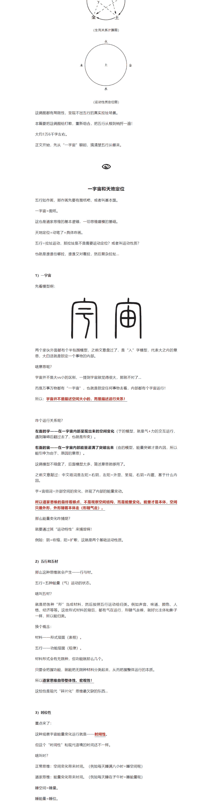

接上一篇，上篇盘了水+火。
水火=五行的样本，没有水火，就不会有木金土，整个五行系统=水火运行出来的。
所以叫：一水、二火、三木、四金、五土。
这一篇把五行系统化一下，一文聊透的！

首先，对于五行常见的错误认识，把它纠正过来，不然后文没法开展逻辑！

## 1、阴阳是对立统一

这个错误最常见，纠正过来非常重要。
因为五行=阴阳的聚合化，或者=阴阳的五种组合状态。
所以要先把阴阳有个正确认识。这是根子，根子歪了全都歪了...
非要按照“统一”格式来说，阴阳应该是——**对抗统一**！

对立和对拉有啥区别呢？
人的思维源于对现象的观察，锁定现象层面不一样，导出的思维模式就不一样了。
西方思维是研究——东西（如物质粒子）。
那么一粒粒的东西就要结构对撞，如矛vs盾在那对撞打架呢。这种对撞产生对立+排斥，就会搞出对立又统一的思想。
东方思维是研究——气（如能量运动）。
那么在“气”这个层面，只有互相拉动，而没有对撞对立。
其实道理特简单：气是无形无相层面的，都没有实体性，如何住一起对撞击呢？
**无形的东西之间，靠的是一个互相拉动！**

**更关键的来了——形随气走！**
啥意思呢？

**万事万物先要有个无形层面的运行（气），气一动就产生出功能性、规律性，然后由于功能规律的变化，才能引发有形变化，最后呈现现象。**

例如：把房地产加入了金融功能（五行土之气），然后才能“拉”出房地产业、基建、内生货币等等这些形式化东西。
例如：两伙人是敌人与对立，怎么化敌为友呢？要靠“拉”拢。
例如：外星人讲道理就是对立行为，想通过“对”撞，而硬碰对方，比如很多人教育孩子就是这样的，对立硬推是没用的，要学会拉动。
总之，上面是通俗比喻的话，最方便的理解，就是看啥都不要“硬碰硬”（对立对撞思维），任何事物背后都有个阴阳拉动。
这个“拉”一变，外面的“对立呈现”就变了。
**事物都是在“拉扯”中变化前进的，而非“硬推”出来的。**

所以呢，五行都是拉出来的啊！
要不为啥=水一、火二？
因为没有水火对拉，后面的木金土三位小伙伴就“变”不出来了...
咋一步步变化来的，后文细细聊！

## 2、生克不是你认为的样子

五行是拉动出来的，所以生克当然也是拉出来的啊。
一般对生成的错误解读：
**相生=产生的意思。**
例如：木生水=木产生水，这是不对的！

**把克=打击伤害的意思。**
例如：A克B，就理解成A比B厉害，在攻击B呢，这理解就完蛋了。
嗯...绝大多数都是这么解释的...
为啥会有这些错误认识呢？

正是因为第1点里的“粒子思维”啊，把五行=五个独立实体了，就会有一个推动（撞击）的思维。生=A个体推动B个体，克=A个体撞击掉B个体。
正解是啥呢？
五行就好比几个演员演戏，剧情是互相拉扯，看谁的力量大。
力量博弈的大小，就会产生出一个个拉扯状态，把这些状态分成五种，就是木火土金水。
啥叫生？
就是拉扯状态变了，演员之间的拉扯的力量变了。
而且这种变化是有个次序的（**时位**），前一步对下一步就叫做——生。

啥叫克？
绝对不是打击伤害的意思，也不是A比B厉害的意思，那是搞对立思维了。
**克=利用。**
**克谁=利用谁。**
**而且，不能不生，生死之间也是互为拉扯的。**

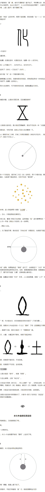

## 3、一宇宙和天地定位

五行如画画，那作画先要有图纸吧，或者叫基本面。
一宇宙=图纸。
这也是道家思维的基本逻辑，一切思维建模的基础。
天地定位=动漫了=具体作画。
五行=拉扯运动，那拉扯是不是需要运动定位？或者叫运动性质？
也就是谁往哪拉，谁往哪拉着拉，然后复杂拉扯...

### 1）一宇宙

先看模型啊：

两个家伙外面都有个半包围模型，之前文章看过了，是“入”字模型，代表大之内的意思，它自古就是锁定一个事物的内部。
啥意思呢？
宇宙并不是大vs小的区别，一提到宇宙就觉得很大，那就不对了...
而是万事万物有小的“一宇宙”，也就是说锁定任何事物看，内部都有个宇宙运行！
所以：**宇宙并不是描述空间大小的，而是描述运行关系！**

### 2）五行和五材

那么这种思维就会产生——行与材。
五行=五种能量（气）运动的状态。
啥叫五材？
就是把各种“形”当成材料，然后按照五行运动给归类。例如声音、味道、颜色、人格、经济等。这些形式材料的背后，都有气在运行，行随气走嘛，就好比主体和影子一样，所以能归类。
换个概念：
材料——形式层面（表象）。
五行——功能层面（规律）。
材料形式会有无限种，但功能就那么几个。
只要会把握功能，就能把无限种材料分类起来，从而把握整体运行的本质。
**所以道家思维自带整体性、宏观性！**
这恰恰是现代“碎片化”思维最欠缺的东西...

### 3）时位性

重点来了：
这种观察宇宙能量变化运行就是——**时间性**。
但这个“时间性”和现代语境的时间还不一样。
啥时性？
正常思维：空间变化带来时间，（例如每天睡满八小时=睡空间呢）
道家思维：能量变化带来时间，（例如每天睡在子午时=睡能量呢）
睡空间=睡量。
睡能量=睡位。
道家眼中的时间是“能量位置”，简称**“时位”**。
这俩哪个对？
当然是“睡时位”对劲啊，黑白颠倒个试试？就算睡满十二个小时身体也会越来越弱，身体的本体是能量运行，空间只是外形，**形随气走哦。**
所以道家看事物是时空“混而为一”的，是混合在一起观察的，但以观察能量位置为主。

盘一下“时”这个模型，模型表达最方便了，是最好的记忆载体。
时的左边是日，看模型（象）时候，不能把“日”当太阳，日=一宇宙的简化模型：

这是个万金油模型，所有的故事、所有的思维都从一宇宙来，又在一宇宙结束，所有的运行规律都是这个模型导出来的，出场率老高了！
这个“日”不能当成有形实体，而是一个“**无形的能量球**”在那转呢，万物都有这么个能量球转圈啊，人手一个...
右图是寸：

之前文章盖过“反”（参考李充之通达篇），反和寸是表兄弟关系，反就是能量周期运动的证明，寸就是能量周期分段了。
每个事物的寸还不一样，例如每个人的“肩身寸”就有差别。所以寸是单独对每一个“一宇宙”而言的，是相对的。
寸是人为划分的，例如一年有几季？最开始就两季啊，春夏+雨季，一个火行一个水行，再划分就是四季，加入木金了，再划分就是五季，加入土了，再划分还有十二个月、二十四节气、五天为一候的，甚至每一秒都能分，分阴阳也可，分五行也可，这些运动关系是无所谓的，没有大小多少的限制。
只是分的太细致，人在“形”上就很难感受到“气”了...

### 4）何为象形

所以宇宙运行是啥呢？
就是先有能量运行，且分段观察这样子，而后空间就随着能量周行产生变化了。
例如先有五行的能量分段运行，而后才会产生春夏秋冬这些空间变化，不能倒过来啊，没有能量牵引拉动，焉能有四季？
这个思维过程是：**象——形！**
先有象，象=气（能量）的运动状态，而后象引发形。
这个前后关系很重要！

那么好了，思维就要倒过来了啊：
问：古人先是看到大自然中的木头、火焰、泥土堆的，然后搞出五行吗？
答：不是！
而是先有象，也就是先把能量分成五个运行状态，并且用模型图画出来，就是木火土金水，然后再以象造形，也就是看到自然界的现象，比如火焰燃烧跟“火行”的运动本质相近，就把这类自然现象统称为火，火行不限于火焰燃烧，核电站、地下岩浆都是火啊。
而现在学习大多倒过来，倒果为因了。
五行能不能改成a、B、y、δ、ε这样子？
也可以啊，但是这就“丢象”了。
象=气的运动状态。
木火土金水=五个气的运动状态，这样直接画成模型多好？一看就知道是咋运动的，直观方便记忆，只是现代人丢失这些了。
后文咱们把五行模型一个一个盘下...

### 5）天人合一与断见

上文说过，宇宙不是“大小”问题吧，是描述运行的，人手一个...
那么万物万有=无限个“一宇宙”！
不仅是物质现象，意识也同样如此，例如一个细胞是一宇宙，一个人体是一宇宙，一个意念是一宇宙，一粒微尘是一宇宙，等等...
无限个宇宙都是遵循同样的运行规律（一阴一阳之谓道，或者复杂点就是五行），所以万一宇宙是共振的，通俗说就是无数个弹簧在前面旋转共振。
要不然为啥叫“天人合一”呢？
不是什么天神和人类合一，而是“大圈”和“小圈”的共振合一，都是同一模式嘛。
天人合一是一特别朴素的道理，不合一才奇怪呢，为啥？
没有广大宇宙，地球哪来的？没有地球，人哪来的？还能你玩你的、我玩我的、各玩各的？肯定是共振的嘛...
为啥这么朴素的东西弄得很神秘呢？
因为我们惯常思维=空间结构思维，或者叫实体粒子思维，就是小时候学习的唯物论，看啥都以实体空间为主（只见其形），然后就必须要把物相切成一块块的结构，切断之后就都不快了...
当进=道家思维，就能把这种“切块隔断”给打破了，因为是穿过“空间结构”看背后的“能量关系”，能量还是共振的啊？切断了反倒是没法捕捉了！

例如说，人们下午7点钟左右，喜悦之情就充沛，因为能量运行到了那，都是共振的啊，这跟人们挨不挨着没啥关系。
**简单讲：**
空间能切断，时间能切断吗？能量能切断吗？通能切断吗？
所以道家思维是“不切断”思维，切断思维在佛家叫——**断见**。
只有不切断才能“合一”看事物啊，合一了才能抓到本质啊。
所以要跳出空间截断思维，万千事物背后都有不可切断的能量（气）在咋-嘟-嘟-嘟一个劲运动啊...

### 6）天地定位代符号

天地是啥呢？
是抽象比类，啥叫抽象比类呢？
宇宙万有是无限个宇宙，那么想把一宇宙的通行建模搞出来，就需要找一个运行相对稳定一些，且大家伙都能看到、宏大的、普遍的现象，作为“标杆”来建模，或者叫做“学习委员”也可以，起到一个带头作用吧。
宇宙万有都是共振的嘛，反正都一样，当然找“带头”的啊...
所以中国人都遵从“天道”，啥叫天道？
就是找寻学习委员，或者叫找学习标杆呢。
这玩意一点都不神秘，而且特别科学，用科学话说就是找寻最真实的存在规律。
古人仰观天文+俯察地理=找天道呢！

那么好了，人往那一站，向上观察无限广大，就叫观天，向下观察就叫察地。
天地只是“**定位代号**”而已，不是有形的某个范畴，就跟数学上叫x、y似的，用xy去计算代数，古人就用天地做代号，古时候很多数学公式都是带中文的啊。
不是说只有地球有天地，无论啥玩意都有天地，例如种子、人体啥的都有“一小天地”（不看实体球，都是无形能量场）。
天地就是“大圈”，大圈影响小圈（人）。
人+人类的意思，就是个维度代号，在“小圈”里人是作为主体的，有主观干预的能动性，那还能让动物主体吗？所以代号就叫做人。
那代入一下：

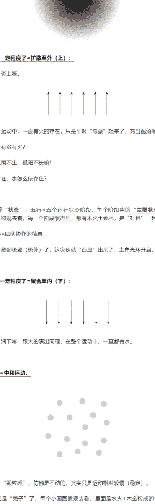

假设中间那个灰色小圆=地球。
那么人在地球站着（灰色圆边上任意一点），向外=向上，向下=向内。
**水行=把能量（气）向下拉=向内拉。**
**火行=把能量（气）向上拉=向外拉。**

水火如果不加入木金（没有运动分层+1），单独拿出来的看=就是阴阳：水属阴，火属阳。
阴阳表达为“阴向下阳向上”其实并不本质，更本质是向内和向外。
上下+内外这些就是运动定位：
下=内。（如下厨房=厨房在内部）
上=外。（如上厕所=厕所在外部）
这些民俗生活延续道家的思维模式，这些对等关系在模型中常常需要转换！
阴阳风水看起来扯，拉着能量（气）在动对吧？
模型上看就是能量的收缩vs扩张，这俩对拉产生能量运动，每个宇宙都是这样的能量球。
例如人的呼吸就是阴阳对拉，要不为啥修道特别训练呼吸呢？回头敲一篇“专”字模型，聊聊呼吸与专注力的关系。
总之，运动定性就这么简单...

## 4、五土

好了，上面“图纸”铺垫完了，运动定性也明白了，开始演绎五行拉扯场景。
### 1）运动生运动
既然是收——放。
就叫阴（收）阳（放）好了，光俩弄出五行啊？
因为只有俩演员的话，演出就“粗”，多招几个演员把角色分担下，这样演出就“细”了啊，剧情就更灵活了话，看事物运行不就细致了嘛。
多招演员方法：运动之——再生运动。
啥意思呢？
演员们不是“额外”招聘来的，不像物质粒子能从别的空间弄过来（如H2O+O=H2O2）。
气是“拉”出来的，无法从别处弄来啊，只能“自己生成”啊！
**也就是气不能“显变”，只能“生变”。**
性变通俗说就是——**多拉几下=运动性质复杂化！**
阴阳2个演员，变成水火木金土5个演员，是“自己拉出来”的。
那么在这个“自己拉”的运动过程中，就有了生克关系。
这时候“粗一级”运动-就是“运动材料”了，用初级材料搭建生成更多运动。
**所以五行=阴阳的不同组合状态！**
然后给五行逐一性定，搞清楚多招的每个角色是个啥，再搭配演出不就灵活了吗。
先从“土”开始聊，土比较特殊，从这聊更容易理解。

### 2）土无所不在
啥是土呢？
模型化一下：

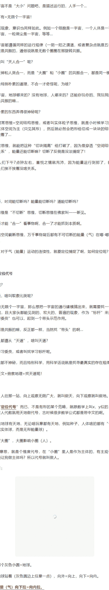

**上图里橙色的都是土！**
这就跟平常认知又不一样了吧？
从开篇那两个五行图能看出来吗，所以那俩图有表达是有局限性的。
**土=是灌满整个运行的，相当于一个“大面积”**，提供承载作用。
或者说，土是灌满整个宇宙的，宇宙多大，土就多大面积。
当然“面积”这种用词属于空间词汇，空间对应有形物质，土是无形能量层，更好表达应该叫“**散布**”，但俗世这个词不直观，在模型上叫面积比较带感。
插一嘴：文字、语言的天花板就是空间思维，我们说话沟通都是依靠空间定位来的，超出空间结构之后，人与人就很难表达了，互相之间不知道在说点什么，因为没有参照...
所以随时要有个空间vs能量的切换思考，或者叫气vs形的切换思考，要不然为啥一直说进入道家思维需要“破形”呢？
五行=五种能量运动状态，所以土≠某种实体粒子。
**土地≠泥地。**
这一点非常关键啊，不是咬文嚼字啊，而是要通过这个区别，来理解土的思维。
泥——描述的是**形式材料**，地上一摊泥，能看得着看得见的。
土——描述的是**无形功能**，所谓功能就是“土行运动状态”产生的“承载”功能，或者叫“能量散布的面积”，这单方面思维按照上面的自行切块啊。
功能是无形层面的，是摸不着看不见的，泥能看见，土看不见。

例如组词：
中文组词是左阳右阴模式，上面说过了。
泥土——通过泥这种能见物，来呈现和发挥土之功能。
尘土——通过尘这种能见物，来呈现和发挥土之功能。
泥和尘有啥区别？
从地域内部、到地面，再到地表上部、一直到外太空无限大，土是无所不在的。
地下是矿产，地面是泥土，空气中是尘土。
没错！
**空气也是土，属于松散的土！**
土越往外越松散，越往内越紧实。
模型上如下：

每个“一宇宙”，内是阴，外是阳，阴就是趋向于有形的、固化的、能量凝聚态；阳就是趋向于无形形的、气化的、能量分散态。
阴阳动起来就是收——放。
再配上一宇宙的万金油模型：

这俩圈是不是一样的？
只是下面这个属于简便画法，要造字、刻字、书写的，这样就简化了。
后来再为了书写便利，就简化成下面这样的：

所以看到“日”字时候，狭义上=太阳，但是日之“象”可不仅仅是太阳，那代指的东西可就多了去了...
例如一个鸡蛋也是日，鸡蛋黄就是阴，鸡蛋清就是阳，同理地球也像个鸡蛋一样，往下(内)走就是阴，往外走就是阳。
也就是说，宇宙间种种“有形”之物，都是“气聚”出来的。
所以叫——**气化形。**（从外向内聚化）
也可以——**形化气。**（从内向外分化）
类比于现代语境，物质是能量聚合出来的，物质不能咋一下凭空出现吧？那么反过来，当把物质不断的分解，最后就没有物质了，只剩下阴阳的能量旋涡。
上面敲了一个“行和材”的关系，也就是**气变带动形变，功能带动形式。**
例如，陆生动物要呼吸（功能），所以才长出脖子（形式），而不是倒过来。
例如，人想看（功能），所以才会长出眼睛（形式）来。这离不扯太远，扯太远就是佛家的“缘起论”了，人能长眼睛是因为“缘聚”，这个缘聚就产生功能性了，有了功能性才会产生形质上的眼睛。
同理：因为有土的功能助推（行），所以才会产生泥、尘、矿这些有形的自然现象（材）。
什么是地呢？
地=土+也。

“也”是什么？
看模型也能猜个大概，不细抠，简单说就是——并行而出。
土地=好多土功能都聚在一块了，功能面就变大了啊（散布大了），就是地。
举个例子：
农场存在的基础是啥？
玩土！
玩土的目标是啥？
开疆扩土！
也就是把组织掌控的“功能面”给变大...
土是个功能，形式上可以是耕地（农业和工业）对吧？
但不同限于此啊，形式可以换啊！
例如说，因为货币的出现（信用货币），所以大伙放开疆土不用搞殖民地了，因为“能量散布”不一定非要通过耕地这种“土”形式啊，那可老土了（俗语过时了），还可以通过货币循环来玩啊。
再细思，水火对拉才会产生土，所以开疆扩土又=水火对拉的面积，参考《一文看懂经济循环》那篇，就是债务与资产的对拉，这才是现代农场的主玩形式...
那遍用一层运动敲，就是阴阳，换成五行复杂景点，就是由水火开始。

### 3）土爰稼穑
再用模型细品这个土啊，古人有个说法叫做——土要稼穑。
**水曰润下**
**火曰炎上**
**木曰曲直**
**金曰从革**
**土爰稼穑。**

那几个小伙伴都是“曰”哈，而土是“爰”哈，就特殊啊。所以为啥先盘土，最特殊就先搞定它，就容易理解全盘了。
稼，和穑这都是通假的，本质一样，只是左侧偏旁附加的形式不一样而已。比如说嫁人，就是施到对方家里呆着啊。
这里提炼个含义——**稳定性**。
那稳定性咋来的？
稼，右侧是模型的本质（阴=藏于内因），右侧模型=来+回的拉扯。
道家是气思维，气是毫不停歇运动的，那么稳定=基于来+回的运动关系而实现的，运动才能平稳（没有静止这么一说）。
来回拉扯是啥样的运动呢？
其实就是“反”者道之动（参考《反者道之动》那篇即可），极则必反，就是来回嘚。
站在中看反，就是来回嘚。看“来”的右侧文字建模，采在上属阳属主动，回在下属阴属被动，所以先来后回。例如太阳光能先来，地球再反吐。

## 5、水火木金的拉转运动

上面好几个角度盘土，已经够细数了吧...
一宇宙=图纸。
土=图纸进一步具化呀。
那么接下来，水火+木金就要开始在“图纸”上运动了呀。
### 1）拉动思维
按照上一篇敲的，水火的运动轨迹是这样的：

但这只是“粗”着看，是直上直下的了。
在道家关系思维中，宇宙万物都是“曲”行，就是拐弯弯着运行的！
啥叫拐弯弯呢？
通俗点说，当水火两台车对拉时候，直来直去就会形成“对撞”啊，那还运行个屁，这是实体结构思维（粒子对撞），气比粒子“狡猾”多了，气会拐弯...
也就是这样的：

当然了，也不是拐弯绕过去后继续走直线，而是车连着车，是不停地在拐弯绕路...
这种不停的拐弯绕路，画成图形：

为啥拐弯呢？为啥“曲”行呢？
因为那个“弯”不是**对撞**出来的，而是**对拉**出来的！
模型化如下：

无论宏观去看、还是微观去看，都是如此。
为了方便理解，可以把黑白圆当成两个实体粒子，这俩呈现出有形的对立、对撞、排斥啥的。
而满满的“中间无形地带”就是——气！
粒子空间（物质）能截断，但气（能量）切不断！
一般为迎合西方唯物论，就把气叫做“精神物质”，但这种“精神”还分辨不出来，其实这种叫法是误导的。气不是物质，就是“中间满满”的那些无形无相的玩意。
**而且形随气走，黑白圆这些有形之动，是被无形的“中间灌满”带动的。**
所以道家研究的是——**无形层面。**
无形这个词几乎都理解错了，**无形≠没有形，而是“以无为形”。**
无和有，是事物存在的两个维度，且不是对立的，也是对拉的：
有形=呈现出来了，例如声光触；
无形=需要有形才能显现，不然悬看不到的，但看不到不代表不存在啊...
例如气在人体内的循环，就是（A）图那样螺旋着前进的，在前进中有进有退，只是进退之间的“比值”不一样而已。
前进=阳，阳可不是走直线一直前进的，而是“阳中有阴”，也就是阳=+阴，只是阳的占比更大，或者说前进>后退，整体表现为阳。
这种进退就是转着对拉的，描述的不是空间，而是能量。
所以：**孤阴不生，孤阳不长！**
也就是说，真实世界是没有“纯阳”和“纯粹”的，如果没有一方拉着另一方在那转，那二者就共存了，对方是被“拉”出来的，而非“推”出来的。
**要进入道家思维，就不要有“粒子对撞”的思维，而是“能量对拉”的思维，一旦拉就转起来啊！**

再简单点敲例子——**拉转。**
例如在经济上要“拉动需求”才能促进循环，而不是推动需求。再例如说组织多让孩子生，这玩意只能拉动，而不能硬推。
硬推人都会，但拉转却很难...

### 2）木曰曲直
上面那个“曲行”或者叫“拐着弯运行”，表现在木行上，就是——木曰曲直。
形随气走，通过一个表现就能揣摹另一个表现。
这是木的模型：

小篆建模优化的很棒，上下两个“叉手”就是两股力气，为啥是力参考前面那几幅，不然罗里吧嗦就完完了。
木就是阴阳两股力舒展开了，或者叫伸展、扩张都可以，这玩意要看模型意会，给下定义就容易框死。
啥叫木曰曲直？
取象一下啊，取植物生长之象来聊：

**A=直。**
**B=曲。**
图中的小黑点=植物生长需要一个个“能量充盈”的阶段性，按前文说就是正在“宙”呢，阶段性的临界点就是所谓**“气机”**，或者叫机点。
这个“直”非直线的意思，直、之部念zhi的音，同音必同源，这俩都是发展的“中间阶段”的意思，就是把“曲”给截取一段。
所以直才引申为“到哪”的意思啊：直过去、之过去。
至于直线，这是象——形的引申义了，引出数学的直线。
真实世界是没有直线的，直线只是人脑瓜子假立，无论微观和宏观去看，都不存在这种独立位位的造型。
现实里的直线=不常见。
所以直：**是“能量-直接到你那”，而不是“空间-直线到你那”。**
这是曲的模型：

分成一段段，每一段各有阴阳的作用，一横分阴阳，每一段都有一个小宇宙，合起来又是个极大宇宙。
为啥画成5段呢？
五才达到一个“中和”的稳定状态啊，才能叫“曲成”，这是小篆优化后的模型，非常棒！
插一嘴，有些时候要看甲骨文，能够追溯本源，因为小篆有时候优化的太精致复杂了，就要回归到简单源头看一看。有时候要看金文小篆的，能把优化的过程看明白，这样保证思维上原汁原味。
上面植物枝条的取象，形层面回归气层画：

**A是灌满一次，为直。**不是直线啊，是能量（气）直接“之”过去了。
**B是连续灌满，为曲。**
**A-B=木曰曲直=能量阶段性扩张过程。**过程是拐弯的，就是“对拉”舒展开了。
思维——就看画。
现象——就看画。
思维与现象需要转换的，当能够熟练转换，那么即可画着来n类现象了。
例如说做人要能**能直曲**，这可不是空间上的，不是硬干（直）vs示弱装怂（曲）的意思，那成了二货脸了...
而是啥呢？
能看到事物背后的能量运行规律，事物发展都是有气机的，就跟一个个关节似的，或者叫转机。在机会面里果断直截，而直过去后又要等待转机转换。
用现代话说，就是要有节奏感...
所以有个词叫“进退有节”，每一节都有个“能量之势”，或者叫势能，分段势能构成大势能。而势又能通过形来施展，所以叫形势能。

### 4）团队协作
上文聊过，五行不能当成五个独立个体，而是“打包”式的团队协作，是互为依存的。
也就是说：只要一拉，那么五行就都出来了。
水火——木金，这是两层运动，上文敲过“运动生运动”了。
**没有水火，就没有木金，后者=前者的“分解运动”，或者叫运动过程。**
然后水火木金一起运动，产生了土，上文是倒着聊的...
木=拉着水火土一起动（向外），图示如下：

没有这个土，水火都存不住啊，而没有水火，又不能生这个土，大家伙互相拉着才能共存。
**就好比水滴和大海的关系，水滴要在大海内运动吧？但没有水滴哪有大海呢？**
所以这仨家伙是抱团运动的！
当然了，说木拉着水火土团队，这是方便说法。
实际上，是**因为水火对拉才产生木**，并不是“额外”有个力量进来，是运动生运动，然后再拉着自己。
知道木了，金=相反，就很容易理解了。
所以为啥：一水、二火、三木、四金、五土呢？
**因为土=水火木金运动出来的结果=五。**
就好比咱呢？
货车拉货啦，几台车子就这样跑来跑去，路线跑熟了，就跑出很多“货运站”（土）了，或者说跑出了一个个“面积”，或者叫“平台”了，然后货车再在平台上跑。
那要想跑起来，是不是先要有个“出生源点”？就跟打游戏似的，不然游戏咋开局？

## 6、一二三四五转起来：
先有了一个开局的资源存储（**一水=已然向内聚合能量**）；
然后二火=有能量扩散的对拉作用；
而后水火对拉=五行之本=运行开始。
随后木金=水火对拉的过程分解；
这样不断拉呀拉，就构成了一个循环运动的稳定结果=土，譬如水流成大海。
然后水滴就在大海的“面积”上运动起来了。

## 7、先天和后天
为啥一水呢？
水=先天之本！
也就是上面那个“水火团队”最先是在下面（内部）的，相当于游戏开局资源点，设这个还能有演出吗？例如观察地球的五行，是不是先要有个“球”啊...
先天vs后天，这都是相对而言的。
如下图：
先天=继承上一段的资源，小黑点就是开局资源点，每个人的“存水”是不一样的，又好比地球已经成型了，和别的星球就不一样。
如果要问先天之先天，这样往左侧，那就没完没了了，佛法语一念无明，根本处选无明都没有，科学就玩什么宇宙奇点大爆炸了...
土=后天之本！

## 8、金之凝结
金的模型如下（金文时期）：

运动复原一下啊：
这种模型就是——有形之内。

阴阳二气已经名上了，或者叫关上了，这样气就产生形了，例如空气中的尘土。
那么在有形之内，有啥模型呢？

这个是“王”，可不是王啊，王中间一横要长。
这个是啥运动呢？
中间那个一转圈圈吧，箭头不加了，之前文章都画过了。
王=就是天地间的那股玄力，不断“拧紧”呢，生动些应该是这样的：

也就是气力不断“玄行聚合”呢，一点点“灌满”呢，所以就有个“封闭性”的含义，才会引申到金属之形上了（密集）。
但是不能反过来，把金属当成金，很多解释都这么颠倒了，一旦形成误导很难转变过来，倒果为因了。
当然这种建模不好刻画或书写，到了小篆时期就变成一个“长横”来表示“增量”了。
金左边是两点水，偶数为阴，阴为向下聚合。
在十天干中，王和水就是位置搭配的嘛，这逻辑不就闭合上了嘛，一拧紧就是向下运动的...
当然了，小篆优化后的金是下面这样的：

这样更能体现凝结、收缩、密闭的过程了呀。

## 9、五行的运动性质区分
把水火木金土各自性质用模型表达：
**木=扩张伸展：**

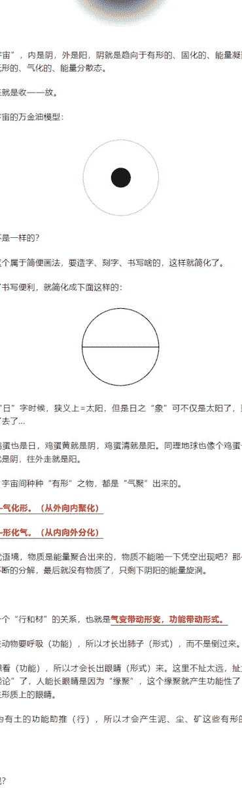

这个扩张伸展是整体去看，微观去看，里面的“内容”就是水+火+土，木只是个“外壳”，在此阶段呈现给观众作为主角的。
里面内容：是火+水，也就是水火对拉中，火的力量比较大，但是还没有到极致啊，没到极致=正在过程中。
那么这个过程就是——正在扩张。

**金=收缩凝结：**

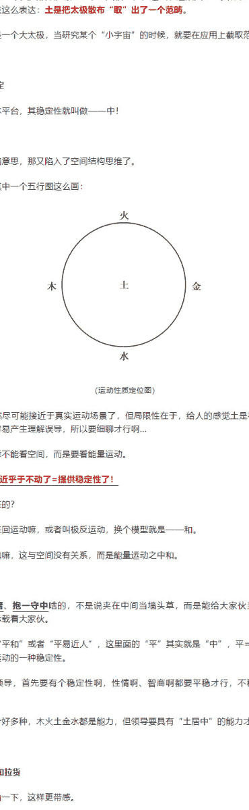

同理，金也是个“外壳”，里面的内容还是水+火+土，还是个过程——正在收缩。
和这个图对比就好了：

**火=扩张到一定程度了=扩散至外（上）：**

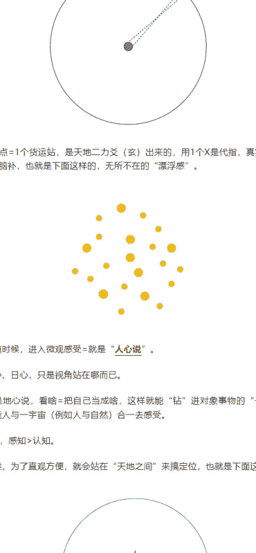

所以叫火曰炎上嘛。
在整个五行运动中，一直有火的存在，只是平时“隐藏”起来了，充当配角呢。
例如说水里有没有火？
当然有，孤阴不生，孤阳不长嘛！
没有火的存在，水怎么存续？
这玩意要看**“状态”**，五行=五个运行状态阶段，每个阶段中的**“主要状态”**不一样啊。但如果微观去看，每一个阶段状态里，都有木火土金水，是“打包”一起行动的。
每个状态都=团队协作的结果！
等到火行扩散到极致（极外）了，这家伙就“凸显”出来了，主角光环开启。

**水=收缩到一定程度了=聚合至内（下）：**

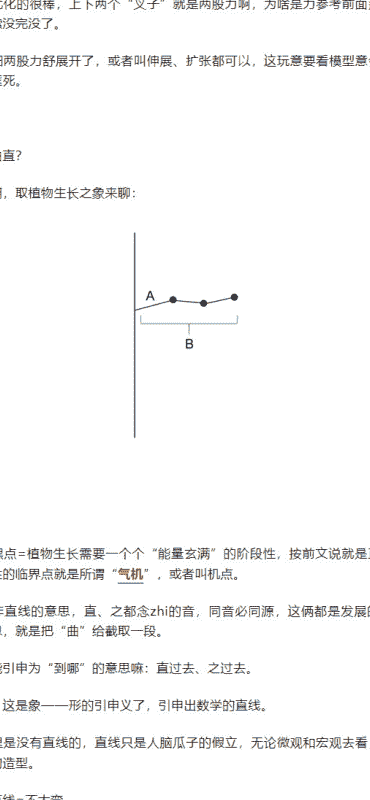

所以叫水曰润下嘛，跟火的伸展同理，在整个运动中，一直都有水。

**土=平运动=中和运动：**

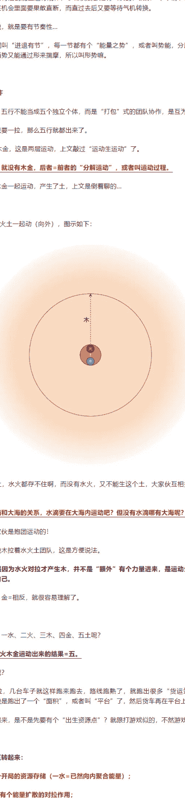

这样看有个“颗粒感”，仿佛是不动的，其实只是运动相对较慢（稳定）。
这时候土就是“壳子”了，每个小圆圈微观去看，里面是水火+木金构成的循环运动，这四个家伙运动到哪，哪就是土！
土跟着水火木金走+大海跟着大水走。
反过来，水火木金又跟着土走+水滴跟着大海走。
所以五行不能“分家”，一动全都动，彼此间是互依互存的，只是比阴阳间的互依互存更复杂一点而已。
开篇那两个“死公式”图，就很容易给人五行各自独立的感觉，一旦独立的感觉出来，就会形成错误的思维。
错误：A生B，就误以为是A推动B。
正解：因为A里面有一帮家伙在跟对拉，所以才会拉扯出B的状态。

## 10、自然气象套用五行

通过自然形象来类比，形随气走嘛，这样能进一步理解。
一水——地下水。
二火——地下热量。
三木——火烧水产生水蒸气。
四金——水蒸气凝结。
五土——上面整个过程需要有“平台”运载，在地下就是矿产，地表就是土壤，空气中就是尘土，天上就是云，土是无所不在的嘛，这些都是土形式而已。
这些都只是类比啊，都不对等，但是对应，思维自行切换。
那么把地球天空截取一段空间，就是土。

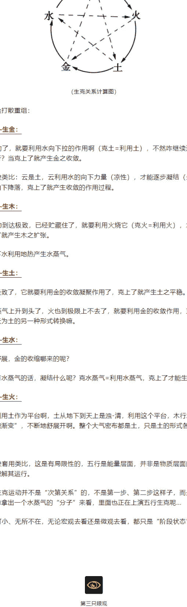

放大看是这样子的，越往下（内），土就越浓，越往外（上）就越清。

然后下面有水（地下水）和火（地热）啊。
没有土的存在，水火就没有“平台”了，就“存”不住了，土能存储热量和湿度。
水火也是互依互存，如果没有热量，水如何凝聚和汽化呢？反之没有水的存在，火之热量就没有依靠了。
然后下面的火就要烧水，产生对拉了，不就变成水蒸气了嘛，开始向外扩散蒸腾，就是木。

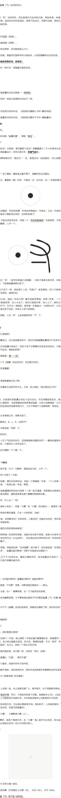

水蒸气（木行）里=水火土兼有，这仨是小团队，是不可分开的。
里面不仅有水，还有火在里面，没有火不就是液态水了吗？那还怎么变蒸汽？而且里面也带着土，水蒸气裹挟着土不断向上升。
没有水火对拉，就不会有木，所以不是“额外”突然出个“木”把水火拉上去，而是因为水火这俩玩意自己搞出来的，没有“烧水”就不会产生水蒸气。

### 1）相生
生很好理解，就是按照循环次序来的，上一步到下一步就是生，也就是“能量位置”（时位）的变化次第。
开篇铺垫了，相生vs产生不一样。
例如木生水，不是木产生水，而是木里面有个“相”（能量对拉状态），所以才能生水。

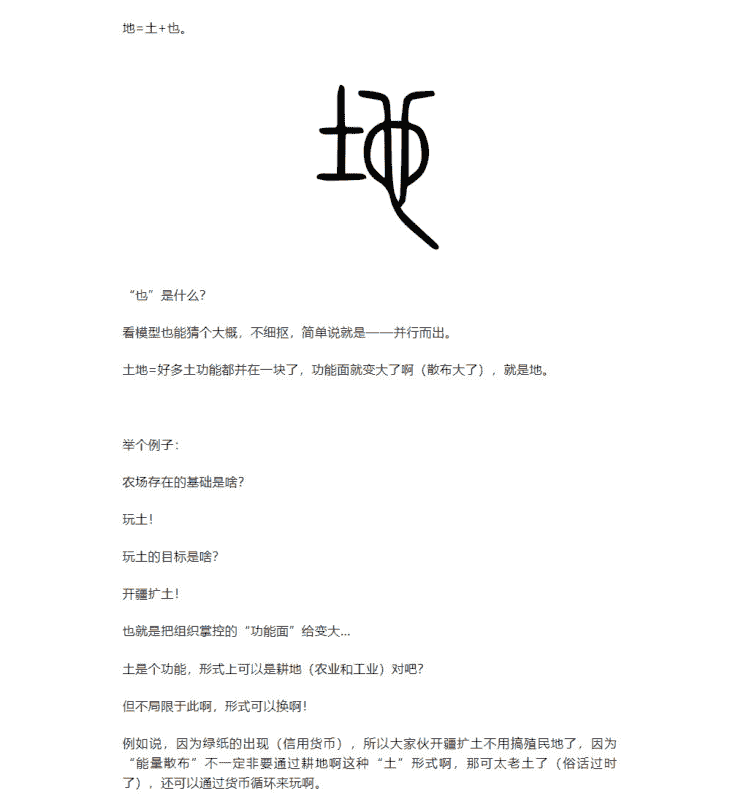

**水生木：**
不是水单独推生出木，微观去看水，是水火在土上面对抗的能量状态，这样一对拉扯就产生了木行（水蒸气）。
**木生水：**
微观去看木，里面是火的力量不断释放，不断把水烧成水蒸气，当水蒸气上升到了一定程度后，就拉不上去了啊，一是因为火力不足，到了极致了，二是因为越往上土越稀薄，客观上存车能力差了，水火土小团队就越来越“清”，这个上升到顶处的状态的阶段就是木。
**火生土：**
微观去看火，土火都到了极限了，这时候水就来助了啊，作用就起来了，当然一开始升的时候水火力没那么足够，小团队就开始平衡运动，开始变成云（土形式转化），
云也是土，也是个“货运平台”的形式之一啊，土是无所不在的嘛。
**土生金：**
微观去看土，里面由于水的作用越来越大（凉性），但向下拉还没到达极限，所以是“正在”过程。
也就是云（土）里面的湿度变大，水越来越多，这个收缩凝结过程就是金。
**金生水：**
不断凝结沉降，就是雨不断下降，而和水蒸气一样，只是方向不一样，里面也是水火土小团队一体的，水火在土上对拉呢，哥仨又一起向下降。
当下降到极致了，小团队里的土归于土，水潜入地下回到地下水，火也跟着下来变成地热。
**水生木：**
然后再来一波，循环往复...

上面拿“材”来说的，借助自然有形现象来表达，真实五行是能量，**五行+五材！**所以比啥的逻辑不是严丝合缝的，只能能够方便理解。
而且上面是——简化版。
因为五行完全套入进自然现象上，就要五行+分阴阳了。
例如地下水，属于地下属阴，这是阴水，但是还有地热水啊，江河湖海之类的，那就算阳水，例如地下有火（相火），但是地表之上也有太阳之火（显火）。如此一分阴阳之后，阳火也能烧阳水，产生另外一种木，好家伙场面就更复杂了...
先简化版，再复杂版。

### 2）相克
克不太好理解！
啥叫克？
**前文讲：**
**克不是伤害、打击的意思，而是——利用。**
**克谁=利用谁。**
比如夫妻两口子，丈夫对妻子说“你能生我”啊，言外之意就是你真能利用我，而不是你能伤害我呀。要是伤害的话赶紧离婚吧...
**更重要的是——不能不生，生死都是相辅相成的。**

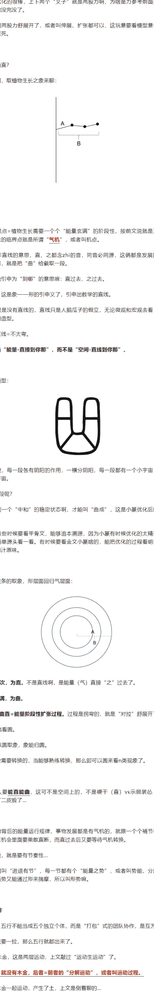

**土克水——生金：**
水流太平缓了，就要利用水向下拉的作用啊（克水=利用水），不然咋继续运动？状态咋前进运行？当拉上了就产生金之收放。
与自然气象类比：云是土，云利用水的向下力量（凉性），才能逐步凝结（金），而后凝结成雨向下降落，克上了就产生收敛的作用过程。
**水克火——生木：**
水向下拉动到达极致，已经积聚住了，就要利用火烧它（克火=利用火），才能继续运行，克上了就产生木之扩张。
类比：地下水利用地热产生水蒸气。
**火克金——生土：**
火扩散到极致了，它就要利用金的收敛凝聚作用了，克上了就产生土之平缓。
类比：水蒸气上升到头了，火也就极限上不去了，就要利用金的收敛作用，克上了就产生云了，云为土的另一种形式转换嘛。
**金克木——生水：**
没有木的舒展，金的收缩哪来的呢？
类比：没有水蒸气的话，凝结什么呢？克水蒸气=利用水蒸气，克上了才能生出水雾。
**木克土——生火：**
水蒸气要利用土作为平台啊，土从地下到天土是浊-清，利用这个平台，木才能依靠浊清的“面积渐变”，不断地舒展开啊，整个大气密布都是土，只是土的形式各有不同。
拿自然气象着用类比，这是有局限性的，五行是能量层面，并非是物质层面的，只是类比容易理解吧运行。
而且呢，生克运动并不是“次第关系”的，不是第一步、第二步这样子，而是一起运动的。例如单拿出一个水蒸气的“分子”来看，里面也正上演五行生克呢...
五行可谓大可小、无所不在，无论宏观去看还是微观去看，都只是“阶段状态”不一样而已！

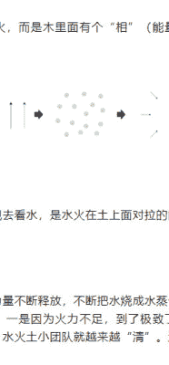

喜欢作者

公众号
懒人搜索
懒人专属群
微信：laxyhelper

写留言

第三只眼观 21 53 4 写留言