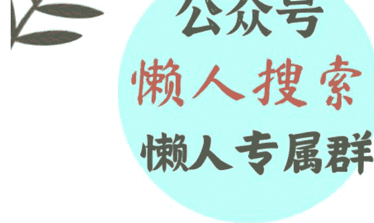

# “硬核山东”，是怎样练成的？

240715

整理：公众号懒人搜索，懒人专属群分享

懒人微信：lazyhelper

今天，将从两个话题出发，为你提供知识服务。

第一个是，2024 年菏泽网络消费节正式开幕。

第二个是，茅台召开部分省区市市场工作会，表示有信心穿越本轮周期。

先来看今天的第一条。前段时间，2024 年的菏泽网络消费节正式开幕。菏泽网络消费节，目的就是利用网络，放大菏泽的产业优势。说白了，就是把菏泽的商品，通过直播之类的网络手段卖出去。

其中最出名的，就是菏泽曹县以马面裙为首的汉服。光是今年 1 到 5 月，菏泽曹县制作的汉服，全网零售额已经超过 29 亿元，占全国汉服市场份额的一半以上。光是汉服这一条产业带，就带动了曹县的 10 万人就业。

关于曹县马面裙的故事，今年已经被报道过很多次。这件事单独看，早就算不上新闻了。

但是假如把连同马面裙在内的，最近一年走红的几个东西放在一起看，就有意思了。

今年上半年都火了什么呢？前段时间，《远川研究所》做过一份统计。

比如，潍坊的风筝。每年 4 月的第三个星期六，是潍坊一年一度的风筝节。而今年的风筝节，几乎是三天两头就上一次热搜。按照网友的说法，潍坊人重新定义了风筝。像什么港珠澳大桥、复兴号高铁、七个葫芦娃和他爷爷，主打的就是一个万物皆可上天。目前潍坊全市光是风筝企业就有 600 多家，从业者超过 8 万人，年产值超过 20 亿元，占全世界风筝市场份额的 85% 以上。

再比如，今年 5 月底 6 月初的寿光菜博会，一共有 3 万多客商参加。我们在热搜上看到的，是 400 斤的南瓜、悬空种植的土豆。但是，还有一部分是我们在热搜上看不到，这就是寿光背后的一整条蔬菜产业链。就在今年，中国绿色食品发展中心公示了《2024 年第一批农耕农品记忆索引名录》，寿光有 21 个产品入选。

再比如，曹县的棺材产业。据说日本有 90% 的棺材，都是曹县出产的。曹县从事棺材出口的企业，有 2000 多家。

再比如，最近几年很火的宠物经济。根据 2022 年的数据，国内一共有 2700 家左右的宠物食品公司。而这 2700 家里，有 800 多家来自山东。而在所有的宠物食品企业里，只有 5 家上市公司。这 5 家上市公司里，有三家来自山东。分别是，烟台的中宠股份、寿光的路斯股份、聊城的乖宝宠物。

说到这，你肯定发现了，咱们刚才说的这一桩桩一件件，全都跟山东有关。前段时间央视报道山东经济，用了一个词，叫硬核山东。为什么用硬核？据说这是因为山东在经济方面，没有那些花里胡哨的宣传，全都是实打实的实业。

但是，话说回来，汉服、风筝、棺材、农产品、宠物经济，这些行业乍一看，好像哪都不挨着哪。这些看起来奇奇怪怪的产业突破口，为什么全都在山东呢？只是单纯的巧合吗？未必。

城市分析专家凯风老师，曾经专门分析过山东经济的特点。山东的经济格局，最大的特点就是平均。它不像有的省份，有一个特别强大的强省会，或者一个明显的经济增长极。过去这些年山东经济的发展，一直呈现出一个相对平均的态势。

在省份经济中，有个用来衡量省会经济的指标，叫城市首位度。这个指标原本的计算方式，是用第一大城市的经济规模，除以第二大城市的规模。说白了，它计算的是第一名领先第二名的程度。但今天，这个指标又有了新计算方式，它衡量的是省会人口和经济规模，在全省的占比。城市首位度越高，我们就越说这个省会是强省会。没错，强省会指的是相对比重，而不是绝对数值。

而根据 2022 年的数据，在国内的 27 个省会中，长春的经济首位度最高，是 51.6%。而排在最后的，就是山东的济南，经济首位度是 13.8%。而跟济南同等能级的省会城市，西安、武汉、成都，经济首位度都超过了 35%。

一般来说，经济首位度低于 14%，可能有两个原因。一是省内有能跟省会媲美的经济强市，二是省内城市各有各的产业，发展相对均衡。而济南恰好二者都占了。一来，山东还有青岛这个省内第一经济强市。二来，山东省内的区域经济发展，相对均衡。根据 GYBrand 发布的数据，2024 年，山东有 8 个城市入围了中国百强城市榜。数量上仅次于江苏和广东，与浙江并列第三。

同时，山东省内，还有三个经济圈，分别是省会经济圈、胶东都市圈，以及包括临沂、菏泽、济宁、枣庄在内的鲁南经济圈。从规划上看，这也是一个相当均衡的格局。新闻上经常说的，山东一群两心三圈的布局，其中一群是指山东半岛城市群，二心指的是济南和青岛这两个交通中心，三圈指的就是这三个经济圈。

注意，目前山东也在打造强省会。因为强省会能对省内经济起到更好的引领作用。但过去这么多年的均衡发展，也让山东成了难得的，不偏科的省份。

换句话说，山东的产业，不是单纯的总量大，而是类型多。你想做的很多行业，都能在山东找到相关的产业基础。

比如，为什么山东的宠物食品公司更多？是因为宠物食品中，最主要的肉类原料是鸡肉和鸭肉。而山东一直是农业大省，根据山东发改委主任孙爱军的说法，山东贡献了全国 8% 的粮食、10% 的肉蛋奶、11% 的蔬菜、12% 的水果和 13% 的水产品。

再比如，为什么曹县能在短短两年就把汉服做起来？是因为这里本来就有一条很成熟的演出服产业带。演出服，就是在台上表演穿的衣服。主打就是个花花绿绿，高调张扬。从供应链看，演出服与汉服的相似度很高。能生产演出服的，大概率也能生产汉服。只不过，以前曹县的演出服制作，属于散而不精，多而不强。也就是，做演出服的人虽然多，但大都是家庭小作坊，力量分散，也没什么品牌。这些力量一旦被政府牵头组织起来，再加上直播电商的加持，很快就能爆发。

再比如，为什么山东威海能产出全世界 80% 的渔具？为什么潍坊能成为世界风筝制造基地？还有苹果的主要供应商，被称为果链三巨头之一的歌尔股份，也在山东潍坊。这主要是因为山东的工业品类丰富。在联合国划分的 41 个工业大类中，山东全都占了。没错，山东是咱们国内唯一一个拥有全部 41 个工业大类的省份。在 207 个工业中类中，山东有 197 个；666 个工业小类中，山东有 526 个。

换句话说，假如把创新当成拼积木，那么山东早就有了大量的零件。只要有合适的产品、合适的渠道作为出口，这些积蓄的势能就能马上爆发。

假如建立一点复杂科学的视角，这不就是我们经常说的，多样性红利吗？小到一个人，大到一座城市，一个省份。它最大的资源禀赋，并不仅仅在于资源的总量多，更在于，资源的类型丰富。借用《多样性红利》的作者，复杂科学家斯科特·佩奇的观点，他认为，世界上所有的进步，都伴随着一类同样的变化，这就是，同质向异质的转化。换句话说，大未必是优势，而有多样性的大，才是真的了不起。

好，关于山东经济的话题，咱们先说到这。各位山东的同学，假如有什么想补充分享的，也请来留言区一起聊聊。同时也推荐你把这期节目，转发给身边的朋友。

再来看今天的第二条。前段时间，茅台召开了部分省区市的市场工作会，主要是同步对目前的市场分析，以及对未来的预期。按照会议上的说法，茅台的基本需求面并没有变，他们也有信心穿越本轮周期。

为什么茅台选在这个时候鼓舞士气？主要是因为，他们前段时间经历了股价和酒价的双重下跌。至于下跌原因，有人说是消费者的钱包收紧了，也有人说是因为库存压力太大。据说目前市面上的茅台库存，已经远超市场需求。而像茅台这样的高价酒，又不能打折甩卖。因为一旦打折，就降低了它的品牌价值。

这个逻辑不光适用于茅台，放在奢侈品行业也一样。越是奢侈品品牌，越不能降价甩卖。毕竟，大家买奢侈品，图的不就是个体面吗？明星同款和奥莱折扣同款，这个体面程度能一样吗？因此，奢侈品的库存再严重，他们也几乎从来不打折甩卖。比如古驰，原本是把过剩的库存放在奥莱卖，但卖了一段时间后，他们就主动把这个渠道叫停了。而且是在业绩下跌的情况下关闭了奥莱的渠道，原因就是这损害了他们的品牌价值。

那么，话说回来，奢侈品都是怎么处理库存的呢？今天，咱们就来回答这个问题。

最粗暴的方法，就是直接销毁。比如，2018 年，巴宝莉直接烧毁了价值 2.5 亿人民币的积压货物，相当于直接烧毁了 2 万件巴宝莉经典风衣。但是最近几年，各个国家陆续出台了环保法案，烧是烧不成了，怎么办？奢侈品行业就想了几个其他的办法。前段时间，自媒体《地球的周末》对这些方法做了梳理，主要分成三大类。

第一，是借助 AI 工具，提前管理库存。这不难理解。假如能够建立一个准确的销售预测模型，也就不会产生库存积压。比如，LVMH 2021 年就和谷歌合作，用 AI 来优化库存管理。再比如，开云集团现在也在用 AI 管理库存，据说库存预测的准确度已经提高了 20% 以上。

第二，是对零售渠道做创新。比如，德国的奢侈品销售公司 S&B，推出了一个盲盒服务，叫做“Scarce Mystery Box”，把很多奢侈品牌的产品集合在一起做成盲盒，而且还承诺开箱出来的产品加在一起，价值一定超过盲盒本身的价格。关键是，其中还加入了部分当季产品，等于是把新的和旧的，掺在一起买。这就把处理库存，变成了营销活动。

第三，是把奢侈品和艺术结合，做二次创造。比如，爱马仕专门成立一个叫 petit h 的工作室，把纽扣、皮革这样的边角料做成钥匙扣、饰品、摆件。再比如，Gucci 在 2018 年启动了 “Gucci up” 的项目，把滞销的布料、皮革，去掉品牌标识后，捐赠给非营利组织。再比如，LVMH 集团推出了一个平台叫做 “Nona Source”，专门向艺术家和设计师售卖过剩的布料、皮革以及部分成品，据说这些原料的出售价格比批发价还低 70%。你看，这么一来，品牌就等于在对外宣布，我是在为艺术奉献，这和低价甩卖能一样吗？

换句话说，在处理库存这件事上，奢侈品行业算是打了个样。初级的处理方式，是低价甩卖。稍微高级点的方式，是通过盲盒这类委婉的手段，把库存卖出去。而最高明的做法，是把库存变成二次创作的素材。把库存从品牌的负资产，转化成品牌价值的延伸。

## 总结

最后，总结一下，今天说了两个话题：

- 为什么山东的产业带特别丰富？这是因为山东长期以来，发展相对均衡，不存在明显的偏科，这就为创新提供了足够丰富的零件。换句话说，单纯的大未必是优势，有多样性的大，才是真的了不起。
- 奢侈品是怎么处理库存的？对奢侈品来说，降价甩卖可能降低品牌价值。因此，奢侈品行业努力的方向是，把库存处理重新包装，变成品牌营销的一部分。

微信:lazyhelper

历史3000多份各类付费文章以及年费三千多的生财星球资源,见懒人专属群内部分享!

付费群,白嫖勿扰!

# 懒人专属群更新记录:
https://lazybook.fun/#/blog/record2