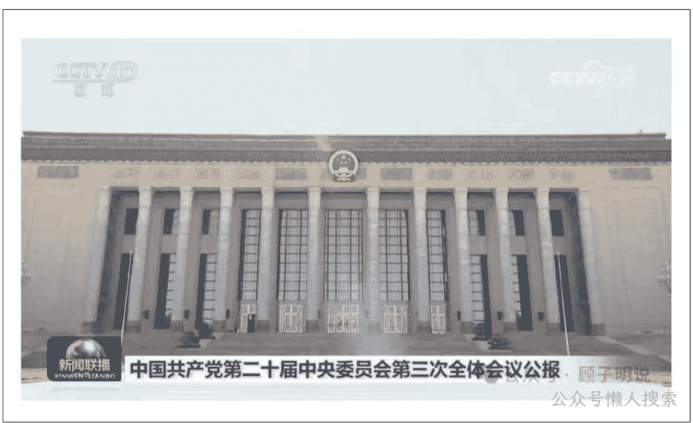

# 三中全会的七个重大转变

240718

顾子明说

整理：公众号懒人搜索，懒人专属群分享

懒人微信：lazyhelper

新华社北京7月18日电 中国共产党第二十届中央委员会第三次全体会议，于2024年7月15日至18日在北京举行。

重磅的改革终于敲响，近期政事堂会用多篇文章进行追踪解读。

今天，将二十届三中与十八届三中进行比较，跟大家一起追踪一下，这十年我们发生了哪些根本性的 U 型变化。

## 一、改革的重心转变：补短板 VS 树长板
- 十八届三中的号召：全面建成小康社会
  锐意进取，攻坚克难，谱写改革开放伟大事业历史新篇章，为全面建成小康社会、不断夺取中国特色社会主义新胜利、实现中华民族伟大复兴的中国梦而奋斗！
- 二十届三中的号召：中国式现代化
  高举改革开放旗帜，凝心聚力、奋发进取，为全面建成社会主义现代化强国、实现第二个百年奋斗目标，以中国式现代化全面推进中华民族伟大复兴而努力奋斗！

## 二、改革的驱动力转变：内驱 VS 外压
### 十八届三中的目标：实现中国梦、小康社会
面对新形势新任务，全面建成小康社会，进而建成富强民主文明和谐的社会主义现代化国家、实现中华民族伟大复兴的中国梦，必须在新的历史起点上全面深化改革。
### 二十届三中的面对：新一轮科技革命和产业革命
面对纷繁复杂的国际国内形势，面对新一轮科技革命和产业变革，面对人民群众新期待，必须自觉把改革摆在更加突出位置，紧紧围绕推进中国式现代化进一步全面深化改革。
基于树长板的定性和外部的压力，可以预见：自动驾驶、低空经济、人工智能等一系列有巨大就业副作用的新质生产力，未来五年会得到中央的全力支持推进，让一部分人先闯起来。

## 三、市场经济的定位下降：改革的工具 VS 工具的改革
- 十八届三中：使市场在资源配置中起决定性作用
  1. 要紧紧围绕使市场在资源配置中起决定性作用深化经济体制改革
  2. 建设统一开放、竞争有序的市场体系，是使市场在资源配置中起决定性作用的基础
  3. 经济体制改革是全面深化改革的重点，核心问题是处理好政府和市场的关系，使市场在资源配置中起决定性作用和更好发挥政府作用。
- 二十届三中：高水平社会主义市场经济体制是中国式现代化的重要保障
  以经济体制改革为牵引，以促进社会公平正义、增进人民福祉为出发点和落脚点，更加注重系统集成，更加注重突出重点，更加注重改革实效，推动生产关系和生产力、上层建筑和经济基础、国家治理和社会发展更好相适应，为中国式现代化提供强大动力和制度保障。

十年前，是政府要为市场经济而自我改革，十年后，是市场经济要为中国式现代化而服务。

## 四、公有制的定位下降：主体主导 VS 公平平等
- 十八届三中：坚持公有制主体地位，发挥国有经济主导作用
  必须毫不动摇巩固和发展公有制经济，坚持公有制主体地位，发挥国有经济主导作用，不断增强国有经济活力、控制力、影响力。必须毫不动摇鼓励、支持、引导非公有制经济发展，激发非公有制经济活力和创造力。
- 二十届三中：保证各种所有制经济依法平等使用生产要素
  要毫不动摇巩固和发展公有制经济，毫不动摇鼓励、支持、引导非公有制经济发展，保证各种所有制经济依法平等使用生产要素、公平参与市场竞争、同等受到法律保护，促进各种所有制经济优势互补、共同发展。

基于市场经济定位的调整，以及公有制地位的下降，可以预见：跟日韩类似，未来一系列的民企巨无霸将会崛起，在部分追求效率和生产力的领域，取代一定的国企职能。

## 五、乡村战略转变：行政扶贫 VS 市场竞争
### 十八届三中：公共资源均衡配置。
城乡二元结构是制约城乡发展一体化的主要障碍。必须健全体制机制，形成以工促农、以城带乡、工农互惠、城乡一体的新型工农城乡关系，让广大农民平等参与现代化进程、共同分享现代化成果。要加快构建新型农业经营体系，赋予农民更多财产权利，推进城乡要素平等交换和公共资源均衡配置，完善城镇化健康发展体制机制。
### 二十届三中：深化土地制度改革
城乡融合发展是中国式现代化的必然要求。必须统筹新型工业化、新型城镇化和乡村全面振兴，全面提高城乡规划、建设、治理融合水平，促进城乡要素平等交换、双向流动，缩小城乡差别，促进城乡共同繁荣发展。要健全推进新型城镇化体制机制，巩固和完善农村基本经营制度，完善强农惠农富农支持制度，深化土地制度改革。

国家行政化向乡镇落后地区的大规模投资扶贫停止，改由市场化向城市销售劳动力与生产资料，农村开启土地制度改革，解决债务问题，为大国大城战略服务。

## 六、改革的系统观念转变：科学 VS 安全
- 十八届三中：共提及科学11次，
  围绕着“科学发展观”涉及领域：科学的宏观调控，科学的财税体系，科学的政府管理，科学的改革决策，科学的制度体系，科学的治理体系，科学的执政。
- 二十届三中：共提及安全16次，
  围绕着“总体国家安全观”涉及领域：国家安全体系，国家安全与社会稳定，供应链安全，公共安全治理机制，涉外国家安全机制，全球安全倡议，安全生产责任、社会安全风险防控网、国家主权安全，房地产政府债务中小金融机构安全。

## 七、外交观念转变：突显和平
给予李、李、孙三人开除党籍的处分。

首次在改革为主导的三中全会上提出外交观：中国式现代化是走和平发展道路的现代化。必须坚定奉行独立自主的和平外交政策。

必须坚定奉行独立自主的和平外交政策，推动构建人类命运共同体，践行全人类共同价值，落实全球发展倡议、全球安全倡议、全球文明倡议，倡导平等有序的世界多极化、普惠包容的经济全球化，深化外事工作机制改革，参与引领全球治理体系改革和建设，坚定维护国家主权、安全、发展利益。

历史3000多份各类付费文章以及年费三千多的生财星球资源,见懒人专属群内部分享!
付费群,白嫖勿扰!

## 懒人专属群更新记录:
https://lazybook.fun/#/blog/record2