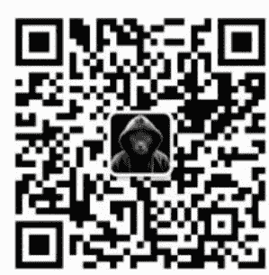

# 东南亚黑灰产，盯上中国“名媛”？

240801

文/卢克文工作室嘉宾 星海舰长

整理：公众号懒人搜索，懒人专属群分享

懒人微信：lazyhelper

公众号：懒人搜索
懒人专属群



微信:lazyhelper

7 月初，泰国发生了一起谋财杀人案。由于受害人和犯罪嫌疑人都是华人，所以在中文互联网上引起了不小的关注。

案件过程并不复杂，受害人小兖，因为常常在网络上展现白富美的人设，被一个名为马某的男子盯上。马某伪装成有钱人，通过社交软件和小兖频繁互动，逐渐取得了小兖的信任。

6月底，小兖在马来西亚游玩的时候，马某邀请她去泰国见面。小兖欣然答应，却没想到迎来的是一场骗局，也为此送了自己的性命。案发后没多久，马某就被警方在澳门赌场抓获。马某的作案手法也不高明，杀害小兖后，马某拿了小兖的手表去典当，却被典当行发现是只假表，愤而报警。

这时小兖的尸体已经被发现，警方也在密切追踪嫌犯。于是顺藤摸瓜，很快将马某绳之以法。

案件虽然告破，但毫无疑问，这是一场彻头彻尾的悲剧。小兖本来应该有美好的人生，但自己不经意的炫富，却引来了坏人的觊觎，最后成了终结自己人生的导火索。也许小兖成长的环境太过单纯，才没有嗅到圈套之内暗藏的危险气息。

财不外露，老祖宗诚不我欺。

斯人已逝，多说无益，但是，小兖的遇害，应该给小红书、微信、抖音上那些喜欢晒日常炫富的名媛们，提个醒了。不管是小兖这样的“富二代”，还是维持人设的“假名媛”。

4 年前，“名媛拼团”曾经火爆全网，40 个人拼一间宝格丽酒店，6 个人拼丽思卡尔顿的双人下午茶，甚至还能接受群里姐妹穿了两天的二手 Gucci 丝袜，为的只是在朋友圈发照片炫耀。这些举动，曾经引发无数人嘲笑。然而，你笑她们太疯癫，她们笑你看不穿。为啥要拼奢侈品？无非就是把自己包装成白富美，出入各种高级场所嘛。

毕竟，金钱的流动和美女的流动具有趋同性，在这种高级场所中，遇到有钱人的几率要比大街上多得多，只要找机会傍上一个，就能从此走上“人生巅峰”。

为了满足这些名媛们的需求，甚至还产生了专业的名媛培训机构，课程包括什么“兴家旺族”、“第一夫人”、“气场女王”、“名媛淑女”等等，内容有拍照注意事项，举止礼仪教程，朋友圈晒图注意事项及聊天方式，甚至调教男人引导消费乃至击败情敌等宫斗技巧，都有人悉心教导。

如果你出得起钱，甚至还有僚机服务，为你和高富帅创造浪漫的邂逅机会。在这些培训班的包装之下，每个名媛的成长路线高度趋同，微博照片的拍摄场景、拍摄姿势、穿着风格，甚至连照片拍摄地点的花瓶摆放，都一模一样。这个路数不新鲜，但很有效，中招的大有人在，甚至不乏大咖级人物。你看王思聪，不就内涵过天王嫂是在“amy姐培训班”上过课的嘛。

就算没法嫁入豪门，以阔佬的大方程度，一场感情下来，从奢侈品包到微信转账，大赚一笔还是没问题的。只要多谈几个，收益仍然是非常可观的。

但是，四年过去了，名媛们面临的形势，变得不一样了。

一方面，富人变抠了。

去年，曾经流传过一个“国际学校断供潮”的段子。说是某知名教育集团旗下的国际学校，突然面临了招生断崖，以往需要面试招生，现在降价都招不到学生了，最后不得不关闭部分校区。为啥？因为在这个校区上学的，大部分都是老板们的“非婚生子女”，生活开支来自老板们给的包养费，但随着挣钱越来越难，包养费也开始面临打折，甚至断供。

那么那些被包养的名媛们为了量入为出，就必须把昂贵的国际学校停掉，转回公立学校。已经钓到鱼的名媛尚且如此，没钓到鱼的名媛就更难过了。当时尚的酒会、高尔夫球之类的商务局被掼蛋取代，以往被作为养眼花瓶和润滑剂的名媛们的价值，就大大缩水，参加各种大佬们活动的机会，愈发少了起来。而且，大佬们也不愿意再给名媛们花钱。

王思聪就说过，关于演唱会，哪怕这个明星再喜欢，票价超过10万，他就会放弃。有人问，10万对你不算啥啊？王思聪回答：人傻和钱多是两回事。

同样的道理，当挣钱的机会变少，老板们谁会有耐心再去陪名媛们玩花钱游戏？

另一方面，竞争对手多了。

以往，名媛群体大多是长相姣好但出身贫寒，想靠着傍大款当捞女改变命运的低学历人群，总数并不多，一个城市可能也就几百人。但是现在呢？大学生一茬一茬地毕业，而社会就业岗位并没有跟上大学生就业的速度，一些女孩就不得不涌入名媛赛道。

关键是，现在当名媛，比过去当名媛的门槛低多了！

过去当名媛，你要整容吧？你要花钱培训吧？你要拼各种各样的奢侈品吧？总要精心设计话术吧？

现在呢？

在咸鱼上搜索“白富美素材”，只用花9.9，就能买到诸如“女神、白富美照片，名牌包包化妆品，豪车美景酒店，国外旅游美景”的图片包，甚至还附赠朋友圈定位修改器，你要是胆子大，把定位定在特朗普的海湖庄园都行。

如果想要自己真实融入这种场景，也简单，几个姐妹在一起拼一个摄影师团队就行，定制化服务，客户选定地点，摄像团队跟拍，包后期修图，一天才 1000 块钱，摄影师还会贴心地针对每个人设计不同的动作和场景，避免雷同。于是，一群更具个性化的名媛诞生了，要什么样的有什么样的。

所以，随着越来越多的姑娘涌入名媛赛道，整个名媛行业也在以惊人的速度内卷，卷到根本不赚钱了。

咋办？名媛经济必须转型!

## 4 怎么转型呢?

两条路：色流化和实业化。

流量大家都懂，但色流，恐怕懂的就比较少了。简单来说，就是把目标，从富豪、大佬、富二代身上（毕竟他们的钱不好赚了），转向普通男性，收割普通男人的钱。怎么做呢？进行美色价值输出，为舔狗们提供情绪价值。

说实话，这个社会，还是普通男人多。普通男人，被女拳高涨的社会鞭挞得体无完肤，迫切需要心理安慰。所以在面对以往只在顶级社会圈子里混的名媛的时候，无论是在视觉上还是心理上，都是毫无抵抗力的。

所以当一个普通男人在陌陌、抖音、小红书的评论区被名媛评论几句，再聊上几句之后，瞬间骨头就会轻了几分，然后立马想入非非，然后脑补出泡到白富美、成为人生赢家的情景。如果你去抖音、小红书翻翻一些名媛的个人简介就会发现，很多都留了粉丝群，这就是要把公域流量，引到私域流量。

把人引到粉丝群之后，就是流量筛选，简单来说就是门槛红包，只有发了门槛红包的，才能加名媛的个人微信。从 520 到 1314 不等，筛选掉大部分白嫖党。

理由也很容易理解，一个千金大小姐背的是几十万的包，天天出入五星级酒店，如果不设个门槛的话，各种屌丝都能加，岂不是太掉价了？门槛这点钱人家根本看不上，主要是看你这个人有没有诚意。

加了微信，就有和名媛聊天的机会了。不得不说，在聊天这方面，是门科学，更是门艺术。名媛过去是干啥的？取悦高层人士的，可以说，她们对男人的深刻洞察，是远超普通女人的，知道男人喜欢什么，看重什么，聊什么能让他们开心，聊什么能让他们产生保护欲，聊什么能让他们吃醋，聊什么能让他们为你花钱，等等等等。

当这种手段用到普通舔狗身上，那就是降维打击。在周密的话术下，连明星和富二代扛不住，何况普通舔狗？所以，哪怕名媛们从来不张口要钱，也有大把大把的人愿意发红包，而且是自愿的。这样的人，不用多，哪怕只有200个，就差不多足够了。

有人可能觉得，200个人，名媛们照顾得过来么？其实吧，名媛们也会精准营销的，通过平时发的红包金额，就能判断出一个人是大方还是小气。

大方的自然被归入高端客户，完全可以以网恋男友的身份存在，给予甜甜的幸福感，满足他们的情绪价值。这些男人未必有钱，但敢花钱舍得花钱，比如胖猫，就是这一类。而小气的呢？则被归入低端客户，平时发个朋友圈，说打雷了自己害怕，但你去跟她说话，她根本不理你，除非你发红包。这样的不用花太多心思管理，有红包就是白赚。再加上今天“家人生病”，明天“闺蜜出车祸”，后天“自己查出某某病”的剧本层出不穷，搞红包不要太轻松。

别看一个红包没有多少钱，但这一套玩得好的话，积少成多，一个月弄个大几万的收入，也完全不是问题。甚至聊天这种活，现在也可以找代聊团队外包，名媛本人只需要偶尔发一句语音证明是自己在聊就行。（这里给那些在小红书乱加女孩的傻子们提个醒，你晚上聊到半夜，还时不时发夹子音的姑娘，很可能是个抠脚大汉。）

注意，高端客户和低端客户两个客户群是不固定的，人员随时可以流动，一旦有一段时间你不发红包了，分分钟就从高端客户，掉到低端客户。

最关键的是，这种“色流”，完全不违法。名媛并没有承诺什么，就是交个朋友而已，红包都是别人主动给的，何来违法?

再看看实业化。

实业化可以视为色流的升级版，区别就是根本看不上那些红包了，而是要把客户精准引流到一定的细分领域去，然后再商业化。比如，前段时间，佛媛非常流行，一个个抄经、拜佛、品茶、吃素……把名寺古刹变成了姣好身材的秀场，搞的乌烟瘴气。为啥这么玩?因为要利用平台细分领域的流量，简单来说，谁对什么有兴趣，平台就会给谁推什么领域的内容。

当佛媛拥有足够流量之后，就会马上摇身一变，卖佛珠、卖手串、卖平安锁这类不好评价价格的东西等等，赚细分领域人群的钱。同理，什么健身媛、创业媛、雪场媛、机车媛之类的，都是如此。虽然平台多次封杀过这些媛，但治标不治本，只要有超额收益在，这种“细分领域名媛”，就很难彻底消失。

需要注意的是，实业化的时候，收割的，就不一定是男性的钱了。

比如，有的名媛，小红书上都是爱马仕、宝格丽，窗外不是陆家嘴就是央视大楼，然后感叹，自己虽然出身贫苦，但 20 多岁就左手玛莎，右手梅拉，实现了经济独立，不再依靠男人。这个时候，名媛把自己，和普通粉丝拉到了一个出身，然后营造一种“你也可以过上这种生活”的虚幻感。只要口气和蔼一些，张口闭口“姐妹”，就会有一群急切渴望成功的女性围着请教致富或者变美秘诀。

然后呢？

要么推荐自己的美妆护肤、美瞳、美容针（这类产品三无产品居多，价格不透明，利润往往十倍以上），姐妹们快买它买它！这其实和过去微商的套路差不多，只是直播化了而已。事实证明，很多走女性路线的名媛，转化率比普通的带货主播强多了，因为 girls help girls，女粉丝的信任度很容易转化为订单。

要么说自己财务独立，是因为投资了 X X ，或者加盟了 X X ，买了 X X 股票，姐妹你要是有兴趣的话，我这里还有个内部名额，让给你好了。结果呢？等你投了资，大概率是鸡飞蛋打，你再去找名媛，名媛一句“风险自担”，就能把你打发，你去起诉都没用。

这种实业模式，充分利用了人性弱点，合法又暴利，只要经营得当，就不愁没钱挣。

当然，这些升级后的运营新模式，并不影响旧模式。如果哪天真的遇到了一个又大方，又帅气的金主大哥，名媛们，也是丝毫不介意偶尔空降一两次的。

## 3

我们会发现，无论是搞色流，还是搞实业，都会有一个前提，那就是维持网上的白富美人设。

一方面，人都是有慕强心理的，只有维持晒奢侈生活，才能让自己更有可信度，更有吸引力，从而产生更多的韭菜。

另一方面，从心理学角度来说，在为了引流而制造人设的同时，心理上也会认同这种人设（就像有的人美颜了之后，就真觉得自己长这样了一样）。那么自己就无法再接受自己变得平凡，而必须变本加厉地炫富，昨天开宝马，今天就要开玛莎。

但问题在于，这种行为，开始越来越容易招致灾祸。

为啥呢？因为东南亚的黑灰产业，同样产业升级了。

咱们都知道，墨西哥犯罪猖獗，叫做“美国的下水道”，意思是，一些美国无法容纳的犯罪分子，犯了事都会往墨西哥跑。而同样，东南亚也有个外号，叫“中国的下水道”。

简单来说，就是因为国内治安管理能力的增强，一些在国内混不下去的黑灰产业，开始往东南亚转移，一方面，这里离中国近，方便继续做中国的“生意”，另一方面，东南亚普遍法治不健全，司法腐败，更容易取得保护伞。所以才会出现电信诈骗和网络赌博在东南亚野蛮生长的情况。

与此同时，中国扫黑除恶之后，也有大批逃犯、黑社会分子、混混乃至撸了网贷、搞 P2P 的人员，逃往东南亚避风港。不完全估计，东南亚从事黑灰产业的中国人，高峰时超过 50 万。

这类人，绝对不要高估他们的道德下限，如果再和当地黑恶势力联手，那更是最危险的存在，而且他们因为熟悉中国人的性格特点，所以最容易针对中国人下手，杀熟。

本来，这些人多集中于灰产，诸如洗钱、网络博彩、电信诈骗等等，不怎么做绑架杀人的业务。但是随着中国打击电诈力度的不断加大，这些灰产想赚钱，也越来越难了。

僧多粥少，灰产赚不到钱，回国也回不去，怎么办？只能产业升级，做起了敲诈勒索绑架，乃至诱杀。

这种诱杀的套路，和上次中国医药企业高管在菲律宾被撕票，其实是一样的。更可怕的是，这次的事件，会起到一个很好的示范效应，给很多在国外想赚钱但没渠道没门路的人一个新的启发。

手段也非常简单，在社交媒体上编造一个高富帅人设，然后邀请白富美来东南亚玩，只要广撒网，总有人会上当。

你看马某，连小兖这样的白富美都上当了，更何况想走捷径或者认知水平不高的假名媛？只要骗出国，一个人生地不熟的弱女子，自然要任人宰割了。

在这里，给那些网上炫富的小姐姐们提个醒：

当心，你们已经被盯上了！

不要相信网上的那些高富帅！不要相信所谓赌场招募的“养颜组”！不要被人家几万块钱+游艇飞机别墅就迷得走不动道！真的有钱人，低调都来不及，谁会在网上炫富？

长点脑子，你在套路别人的时候，也会掉进别人的套路，你遇上的嘴甜多金帅哥，大概率不是旷世爱情，而是黑吃黑。

记住一点，接触渣渣，最后就一定会成为渣渣。

微信:lazyhelper

历史3000多份各类付费文章以及年费三千多的生财星球资源，见懒人专属群内部分享!

付费群，白嫖勿扰!

### 懒人专属群更新记录:

```
https://lazybook.fun/#/blog/record2
```