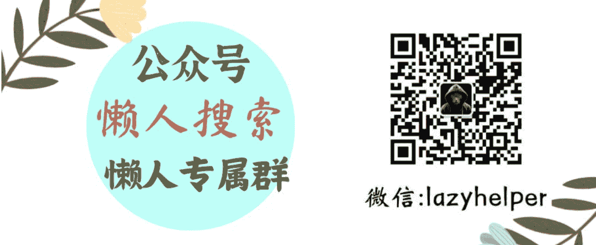

# 中国队被针对性地兴奋剂检验，到底是咋回事？

240805

文/卢克文工作室嘉宾  星海舰长

整理：公众号懒人搜索，懒人专属群分享

懒人微信：lazyhelper

最近，奥运会的比赛正在如火如荼地进行，但是大家都有一个感觉，中国队的夺金势头，似乎不如前几届了。

特别是夺金点密集的项目之一----游泳，这次中国队的表现可以说是非常失常，就连夺冠热门覃海洋，也创下了个人近3年最差成绩。

对此，游泳队集训的营养师于良说出了一些事实。中国游泳队到了巴黎10天，全队31名运动员被查兴奋剂查了近200次，平均每天接近20人次，每人平均被查5-7次。早晨6点还没睡醒就来了，中午午休也来，没办法只能在酒店大堂沙发休息，晚上九点多还来，要一直熬到下半夜。

所以跳水名将高敏发声说，“一天七次的兴奋剂检测成功干扰了我们中国游泳队”，这倒不是找借口，一天被查7次，早上6点多，晚上到凌晨，正常人都受不了，何况要进行竞技比赛的运动员？

## 那么，为什么中国队会被如此多的进行检测？国际反兴奋剂组织 WADA 是在针对中国队吗？

关于中国游泳队被频繁药检一事，现在网上一些人将其归咎于中国游泳队的“黑历史”。咱们实事求是地说，“黑历史”的确存在。

1994 年，广岛亚运会，因为日本人怀疑 1992 年巴塞罗那奥运会上中国队的好成绩，在中国队的房间内安装了窃听装置，然后声称发现了中国运动员在房间内注射吃药的证据，而酒店刻意从垃圾桶内翻出的针头，也成了日本指责中国的利器。

1998 年澳大利亚珀斯世锦赛上，中国运动员原媛携带 13 瓶生长激素（HGH）被当场查出，驱逐出境，而同时还有 4 名中国运动员赛前尿检呈阳性，一时间人人喊打。

所以有人就说，你做过贼，就别怪别人总盯着你。

但是，这种风凉话，对中国队全体运动员来说，是非常不公平的。

拿 20 多年前的事件，来证明现在的中国游泳队用兴奋剂的嫌疑，这不是刻舟求剑么？

可能外媒也觉得这样没有说服力，所以最近开始炒作近年来的兴奋剂事件，其中重头戏就是 2021 年中国 23 名运动员药检弱阳性事件，就连 8 月 1 日的记者会上，还有外国记者不怀好意向张雨霏提问这件事，也引发了张雨霏的霸气回怼。

那么，这个事是咋回事呢？

事情的起因，是在东京奥运会前，中国在河北石家庄搞了一次集训比赛，但是检测之后发现， 23 名运动员被发现违禁药品曲美他嗪呈弱阳性！

曲美他嗪是一种心脏药物，它并不是兴奋剂，但因为其可以抑制脂肪酸的 β 氧化，能改善心功能，增强运动能力，所以也被 WADA 列为禁药。

23 人被检测出弱阳性，这可不是小事，于是中国反兴奋剂中心赶紧向 WADA 进行了通报，然后开展调查。但越调查，越觉得不对劲。

首先，曲美他嗪 6 个小时就代谢完，而药检是比赛后马上做的，显示是弱阳性，这个浓度非常低，低到基本不会影响比赛结果。

咱们试想一下，如果一个人想用兴奋剂获得比赛胜利，肯定要选择服药时机，让兴奋剂在体内浓度最高的时候比赛，谁会让它浓度最低的时候比赛呢？

其次，这个比赛是国内集训赛，级别也没那么高，运动员也不是顶级运动员，这 23 人分属不同的省队，而且互为对手，也没有共同服药的动机嘛！

这 23 人唯一的相同之处，就是入住了同一家酒店，而没有住这个酒店的运动员，检测全部阴性。

显然，问题出在酒店。

经过对酒店的检查，果然发现了酒店厨房的抽油烟机和香料盒中检测出了曲美他嗪残留，所以中国反兴奋剂中心认为，这可能是一起故意投放行为，而运动员属于误食，不是过错方，也不应该接受处罚。

这一报告提交给了 WADA 之后，WADA 也很重视，认真审查了中国游泳运动员的卷宗，咨询了科学和法律专家，最终认可了中国的调查结果，确定这是一起食物污染事件，所以最后涉事运动员没有受到任何影响。

本来吧，这个事也就到此为止了。但没想到，2024 年 4 月，美国《纽约时报》却突然把这个事捅出来了，把一个简单的食物污染事件，炒作成了集体使用禁药但被 WADA 袒护的严重事件。

今年 7 月份，美国反兴奋剂机构 (USADA)也站出来，明确提出对 WADA 认定结果的质疑，说 WADA 采信“食物污染”说，是因为 WADA 的副主席是中国人杨扬，WADA 理事会理事是国家体育总局副局长李颖川，运动员委员会委员是跳水奥运冠军李娜，暗示这些人“做了工作”。

除此之外，就连美国司法部也下令联邦调查局（FBI）介入调查，要求WADA公开与23名中国游泳运动员相关的详细文件，包括与中国反兴奋剂中心的所有通信记录以及自2019年起所有WADA执行委员会的会议记录。

此外，还给WADA下达了最后通牒，要求其在7月5日前明确回应“将如何确保公平竞争和各国反兴奋剂机构的透明度及协调”。

迫于美国压力，WADA不得不聘请了瑞士独立检察官埃里克·科迪尔对食品污染事件进行了独立审查，显然，美国希望这份审查结果对中国不利。

公众号懒人搜索，懒人专属群分享

但万万没想到，7月11日，科迪尔发布了独立审查报告，结论是认为“没有任何证据表明WADA以任何方式偏袒23名中国游泳运动员”，WADA处理“无偏颇”。

这一调查结果让美国人破防了，仍然坚持一个劲地炒作“食品污染”事件，整个7月份WADA连续发了多份声明，反驳美国人的质疑。就连WADA的主席班卡，也站出来说“美国的指控出于政治动机且基于反华偏见”。

虽然WADA在言语上正在和美国打嘴仗，但是在具体操作中，或是迫于美国压力，或是为了自证清白，也选择增加了中国队的检测次数。

10/23

> 就连检测中国队的工作人员都承认：
“你们查的确实太多了，不过我们也没办法，都是上面给我们的检查计划，我不敢想象中国运动员和你们工作人员的配合度这么好，如果换做其他队伍，你知道我说的是谁(美国队)，他们早就嚷嚷受不了，然后到处投诉了。”

虽然这样看似能给美国一个交代，但事实上，WADA 一天 7 次的检测，已经严重影响了中国运动员的状态，也让美国炒作的这次事件，在某种程度上达到了目的。

### 2 为什么美国要大费周章，如此针对中国游泳队呢？

一方面，中国游泳队的崛起，击碎了最后一个“白人骄傲”。

咱们都知道，奥运会诞生后，基本上都是白人精英群体的游戏，到了后来，西方国家一贯喜欢利用先发优势取得比赛成绩，并利用这种成绩来说明白人优于其他种族，所以白人殖民世界是合理的。

但是随着世界民族解放的浪潮，越来越多的国家参加奥运会，白人惊恐地发现，自己的优势项目竟然所剩无几了！

最有影响力的田径、篮球、足球等等，基本上被黑人占据。

而更考验肢体灵活性的体操，跳水，羽毛球，乒乓球等等，也成了亚裔的天下。唯有游泳这个金牌大户，是白人几乎独霸的项目。从运动生理学角度分析，黑人身上较重的骨骼和较少的脂肪，使得其不适合游泳。而黄种人呢？虽然比黑人强，但臂长和臂宽又小于白人，也没有白人那么适合游泳。但万万没想到的是，近些年，中国游泳队强势崛起，不断打破纪录，白人的垄断地位很快就要不保了!西方国家的嘴脸咱们都清楚，自己竞争不过，就想着去捣乱打击对手。通过舆论压力来逼 WADA 不停检测中国队，检出什么纰漏最好，检不出，也能影响中国运动员发挥，何乐而不为？

另一方面，美国也想借机增大在WADA 中的话语权，甚至控制 WADA。

咱们都知道，要论禁药，美国人才是老祖宗，早些年田径、游泳、自行车、铅球等比赛中，类固醇都是整瓶整瓶用的，在冷战时期，美国的兴奋剂研发甚至成了国家工程，就是为了在赛场上压苏联人一头（当然，苏联也用兴奋剂，彼此彼此）。

但冷战结束后，体育界开始对泛滥的兴奋剂进行反思，所以在 1999 年，WADA 在洛桑成立。它的宗旨是保护运动员参加 “无兴奋剂” 体育运动的基本权利 、促进运动员的健康、公平和平等。

WADA 成立后，最知名的两次行动，就是抓住了美国自行车车神阿姆斯特朗和美国短跑女王琼斯的痛脚，结果阿姆斯特朗被终身禁赛，剥夺所有国际大赛冠军资格，而琼斯不但被剥夺三枚奥运会金牌，还被判了三年。

这样一来，WADA 就成了美国嗑药运动员的最大敌人。

那么按照美国人的习惯，就必须要控制这个机构，将 WADA 的权力由美国使用。

目前来看，WADA 最大的权力有三个，一是药物豁免审查权，二是检测权，三是处罚权。

药物豁免很简单，运动员因为训练伤等原因，肯定要吃药，但有些药物会被认为是兴奋剂，不让他们吃吧，属于不人道。所以 WADA 就出台了药物豁免权（ TUE ）制度，允许运动员在特定情况下使用禁药清单中的药品。

看到没有？这是一个 bug。

虽然 TUE 面向所有运动员，但问题在于，WADA 在审查时，要看权威的医学证明，证明你有这个病，而且必须吃这种药，然后 WADA 综合评估，判断是否给你豁免。

这个时候，你不仅需要优越的医疗资源和强大的团队支持，以便于获得详尽的医学证明，而且需要WADA的工作人员认可，给你“嗑药许可证”。

这样一来，WADA就拥有了决定性的影响力。

检测权呢？这个主要是针对日益发展的“反检测技术”。

早些年，检测主要目标是类固醇、β-阻断剂（射击用）以及麻醉止痛剂等等，但随着血液兴奋剂的问世，传统的检测手段失效了。等针对血液兴奋剂的检测方案成熟，内源性肽类激素又开始成为运动员的新宠。

所以，兴奋剂和反兴奋剂，就是一场道高一尺魔高一丈的游戏。

目前的检测手段，已经从尿样检查、血样检查，发展到了干血点检测以及“飞行药检”，而检测细节则是绝密，如果能控制 WADA，就可以根据 WADA 的检测细节，有针对性地研发不被检测的“神药”，那么你的运动员就可以在赛场上大杀特杀。

巧了，世界上药物研发能力最强大的国家，就是美国。

处罚权就更好说了，检测阳性后，并不是一定要处罚的，而是要听理由，如果认为理由合理，就不会处罚。

比如，法国女子击剑运动员蒂比奥斯，在1月份被查出奥司利他呈阳性反应。蒂比奥斯解释说，自己的男朋友因病服用过违禁药物。两人亲热时，男友的兴奋剂通过体液交换进入了她的体内，所以她是无辜的。

然后呢？WADA竟然采信了！允许她参加巴黎奥运会。

你看，WADA 掌握着多么大的权力？如果美国拿到了，自己的运动员就可以放心大胆地嗑药，而且知道了如何检测，就可以针对性地研发免于被检出的药物，就算被检出了，也不会得到处罚。

这样一来，美国还是那个天下第一的美国，以傲人的体育成绩，来证明“美国伟大”。

但问题在于，WADA 不愿意让出这些权力，不止一次拒绝美国 USADA 介入WADA 的工作。

看 WADA 不听话，美国就出台了《罗琴科夫反兴奋剂法》，名义上是反兴奋剂，其实是反 WADA，这个法案赋予了 USADA 对美国本土以外的其他国家(地区)以管辖权，说白了就是长臂管辖，在 WADA 之外再搞一个反兴奋剂机构，进而取代 WADA。

以美国的影响力，日后必然要推动USADA 和 WADA 拥有同样的权威性，你就算被WADA认可了也没用，还要经过USADA的认证，才算合格。

对此，WADA主席班卡明确表态，

“USADA试图凌驾于世界其他（机构）之上，甚至期望取代WADA，这是不允许的。”

看WADA如此强硬，美国又准备出台一个“恢复对WADA信心法案”，这一法案给予美国药物管制政策办公室“永久性权力”，可以扣留美国政府每年应向WADA支付的300多万美元。

WADA经费一半来自国际奥委会，一半由世界各国政府分摊，其中美国是分摊最多的国家，现在美国扬言扣留这笔钱，显然是向WADA发出威胁：

不让我“对你恢复信心”，就断供！

从目前的情况来看，WADA现在很为难，既要想办法让世界认为自己是公正的，又不能硬顶美国。所以只能在职权范围内，听从美国的一系列指示，给中国制造一些麻烦，向美国交差。

从这一事件可以看出，通过各种手段打压中国，已经成为美国的国策，不仅在贸易领域、金融领域，在最应该公平公正的体育领域，也成了大国角力的博弈场。

而这种情况，也必然在各行各业各种领域展开，各种各样卑劣的手段，很可能已经在路上了。

历史 3000 多份各类付费文章以及年费三千多的生财星球资源，见懒人专属群内部分享!

付费群，白嫖勿扰!

懒人专属群更新记录:

https://lazybook.fun/#/blog/record2