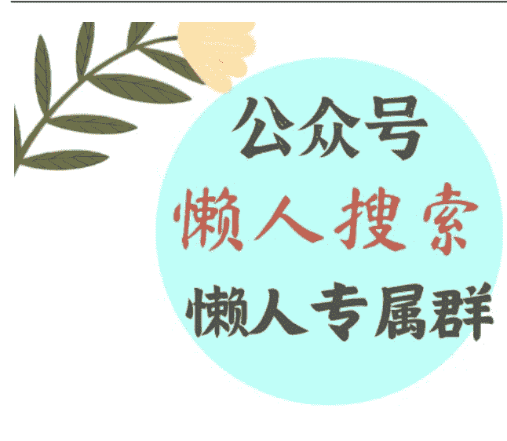

# 委内瑞拉动乱背后，是二十年的埋雷？

240805

文/卢克文工作室嘉宾 小小罗

整理：公众号懒人搜索，懒人专属群分享

懒人微信：lazyhelper

7 月底，南美洲的委内瑞拉，一场看似普通的总统选举激起了惊涛骇浪。

年满 61 岁的现任总统马杜罗对决反对派候选人冈萨雷斯，以 51.2% 的微弱优势赢得连任。消息一经传出，立即在国际社会引发连锁反应。

委内瑞拉反对派联盟以及美国、阿根廷、智利、巴拿马等国迅速表态，不承认选举结果，并指责选举存在不公正的舞弊行为。

马杜罗阵营估计早在选举前就预料到了这一局面，所以委内瑞拉外交部迅速出击，宣布从阿根廷、智利、秘鲁等7个国家召回外交人员，同时驱逐这些国家的外交官，在主权问题上展现出罕见的强硬姿态。

到底有没有舞弊不好说，但不管欧美怎么反对，马杜罗连任这一结果大概率不会变了。

委内瑞拉反对派阵营向来不是铁板一块，不同的党派政治理念不同，无法通力合作，曾经声势浩大的议会第一大势力的“民主团结圆桌会议”在 2015 年解散后，各反对党就再也没聚起来过。

所以马杜罗接下来最该操心的问题不是外部干涉和反对派，而是当前国内频临崩溃的经济，高企的恶性通胀和吃不饱饭的难民。

那么问题来了，这个坐拥地球上最丰富石油储量的国家，为啥没能像其他石油资源国一样富裕起来呢？

切入正题前，先介绍一下查韦斯跟马杜罗这两个人。

## 查韦斯与马杜罗：政权背后的力量
查韦斯，委内瑞拉前总统，在位时间1999-2013年，以“查韦斯主义”著称。

他出身天主教平民家庭，年少时崇拜玻利瓦尔，军校毕业后参军。在军队服役期间，查韦斯亲眼目睹了高级军官之间的贪污腐败，对此深恶痛绝。同时期，委内瑞拉军队内部也开始出现了深受玻利瓦尔学说影响的左派思潮。

于是，查韦斯暗中联合一些人，成立了一个名叫“玻利瓦尔运动200”的组织。

1992年，委内瑞拉正处于经济衰退，民众对时任佩雷兹政府极为不满。查韦斯趁机发动军事政变，但失败入狱。在狱中，查韦斯系统性地学习了所有译成西班牙语的马列的著作，他的社会主义思想就是在服刑这两年内开始形成的。

而现任总统尼古拉斯·马杜罗，1962年出生于加拉加斯的一个工人家庭。他的父亲曾是当地工会的一名领导人，耳濡目染，他很早就受到了工人运动的熏陶，上世纪 80 年代初，他成为加拉加斯地铁工会的领导人。

1992 年，查韦斯首次发动军事政变失败入狱后，马杜罗曾率众上街游行积极营救，在他的不懈努力下，查韦斯于 1994 年获释出狱。

因此，马杜罗与查韦斯之间有着深厚的革命友谊，马杜罗后来还帮助查韦斯创建了 “第五共和国运动” ，协助其成功赢得 1998 年总统大选的胜利，政治生涯开始起飞。

在这里之所以要介绍二人的出身和成长经历，就是要说明二人的背后，是以查韦斯为代表的军人集团和以马杜罗为代表的劳工团体在 90 年代联手合作赢得政权的背景。

那么，这两个看似不相干的群体，为何能携手合作登上政治舞台呢？

## 2
我们把时间线拨回到上世纪 40 年代。当时委内瑞拉国内政局比较混乱，军人政府与民主党派天天搞大乱斗。先是戈麦斯凭借石油出口掌权，开展统治；然后又是政治家贝当古领导旗下的民主行动党，联合农民和青年军官，一起推翻了戈麦斯。

紧接着军人集团反扑，把贝当古搞下台，希门尼斯军政府重新上台。折腾了几番过后，贝当古终于明白了没有枪杆子还是不行，开始联合财阀和其他小党派，共同抗衡军队。

于是1958年，当时的三大主要政党：民主行动党、基督教社会党和民主共和联盟，在西北部的海滨小城蓬托菲霍签署协议，主要内容包括反对军人统治、分享权力和渐进式改革等内容。逐步形成了政客集团、财阀集团、军人集团、劳工集团，四足鼎立的“蓬托菲霍体制”。

随后的 20 余年时间里，随着石油收入的提高和经济的全面发展，委内瑞拉国内贫富差距不大，各自相安无事。有一个词形容当时的稳定情形，叫“委内瑞拉例外”。

当时左翼思潮席卷拉美，绝大多数国家都频繁发生军事政变，玻利维亚发生了七次，厄瓜多尔发生了四次，阿根廷秘鲁危地马拉等国发生了三次，巴西智利乌拉圭等国发生了一次，唯独委内瑞拉，这期间一次政变都没发生。

然而好景不长，政客集团领导层慢慢形成了寡头统治，和财阀集团勾结一起垄断权力，腐败现象开始蔓延，四方平衡的体制被打破。

加上 80 年代石油价格的长期低迷，委内瑞拉经济社会状况开始恶化，最大的石油蛋糕被政经集团联手吃干抹净，底层群体连口汤都喝不上了。

查韦斯日后统治时期依靠的中下层贫民基本盘，就是在这个时期快速形成的。

1992 年，绝迹多年的军事政变再度爆发，“委内瑞拉例外”破灭。第二年，“蓬托菲霍体制”走向终结。

1998 年，查韦斯被推举为“爱国中心”竞选联盟的候选人，凭着极高的演讲天赋以及直击人心的“消灭贫穷”口号，毫无悬念当选总统。

总结来看，委内瑞拉 20 世纪后半段的发展历程，在“蓬托菲霍体制”下的四方势力集团分享了石油收入的蛋糕，制度的稳定确实造就了 20 年的经济繁荣和政治和谐局面。
但随着时间的推移，政客和财阀集团的权力资源持续扩张，二者勾结成了寻租腐败联盟，劳工和军人集团被逐步分化，丧失了制约政经利益集团的能力。
这导致委内瑞拉形成腐败、封闭、丧失流动性的社会体系，大多数底层成员被边缘化，造成民不聊生人心涣散，逐步走向了崩溃。
这就为查韦斯（马杜罗）推行极左的民粹主义治国理念提供了生存土壤。

## 3
查韦斯上台后的政策措施有三个特点：
- 政治权力独占化
- 经济结构去市场化
- 社会政策超福利化

### 政治权力的独占化
查韦斯制定了玻利瓦尔宪法。这部宪法削弱立法权和司法权，增设公民权和选举权，突破了 1961 年宪法的分权制衡机制，将主要权力集中在查韦斯自己手里。

### 经济结构的去市场化
查韦斯将政府的权力触角伸向了各行各业，组建委内瑞拉国家石油公司，将油田收归国有。还对电力、水泥、钢铁、粮食、咖啡、银行、超市等相继实行国有化。

国有化的直接后果就是吓跑了大量的外国投资者，也降低了本国企业家的生产积极性，同时又产生了大规模的官商腐败和裙带交易。

### 社会政策的超福利化
查韦斯执政的基本盘是中下层贫民，采取亲民的再分配计划本身无可厚非的，但力度太过激进，超出政府财力的限度。

汽油补贴、食物补贴、住房免费，大把的钱撒下来，福利是上去了，国力却飞速下滑。

2008 年起，委内瑞拉已经出现了阶段性物资匮乏，短缺率最高到了 25%。这并没有让查韦斯警觉，政府债务越滚越大，只能靠发债维持开支，形成寅吃卯粮的恶性循环，局面开始崩盘。

2013 年，马杜罗继位不久，查韦斯十多年来埋下的雷就炸了。

2014 年，世界油价下跌，导致经济陷入全面衰退，货币贬值，进口货物锐减，石油收入暴跌 93%，GDP 缩水达到 80%。

2018 年时，国际货币基金组织发布消息说，委内瑞拉正“深陷一场重大经济和社会危机”，到年底之前通货膨胀率将触及 1000000%。

腐败、贫困、饥饿、犯罪、疾病，这几乎就是查韦斯-马杜罗这对亲密战友给这个国家留下的全部遗产。

委内瑞拉的石油储量是非常丰富的，常规石油加重油有 3000 多亿吨，位居全球第一。尽管因为油质不佳和开采成本高的问题，比不上沙特的高利润，但让委内瑞拉人吃上饭总还是没问题的吧，怎么又会闹到今天这个地步呢？

很多人会归结于查韦斯简单粗暴的改革理念和荒唐的经济措施，造成了政治理念超前、经济体系滞后的错配现象。

的确，委内瑞拉没有摆脱经济界提出的资源诅咒理论的影响，那为什么世界其他区域的石油国就能相对富裕很多呢？

根本原因还是在于委内瑞拉长期缺乏深刻的社会变革。

在多党制竞争轮替和体制性约束的影响下，多数政党包括军人集团都无法实现长期执政，各方势力互相拆台掣肘，把寻求各自的狭隘利益放在首位，缺乏寻求共识的能力，难以从根本上摆脱左右派反复横跳的钟摆效应。

而历史上西班牙殖民者带来的天主教保守的思想观念，使得委国内普遍缺乏资本主义该有的扩张革新精神，不重视教育，粗犷而散漫的文化特性在一定程度上限制了经济活力和创新能力。

同时还要注意的是，拉美文化还存在一个“反劳动”且注重体面的文化倾向，查韦斯的过度福利政策则助长了这种价值观念，进一步加重了人们贪图享受，不劳而获的制度性懒惰。

历史已经证明，无论左派还是右派执政，都改变不了委内瑞拉的当下体制束缚的困境。

左派的社会主义民粹改革，不是被外部干涉就是被内部颠覆，要么被制裁，要么一贫如洗。

右派的资本主义血腥扩张，让穷人越穷，富人越富，贫富差距拉大，底层揭竿而起。

查韦斯实施的民粹主义治国模式就是一次摆脱外部影响，探索走自己发展道路的尝试，可惜并未成功。

纵使有再丰富的石油资源，也依然无法拯救处在水深火热中的委内瑞拉人民。

微信:lazyhelper

历史 3000 多份各类付费文章以及年费三千多的生财星球资源，见懒人专属群内部分享！

付费群，白嫖勿扰！

懒人专属群更新记录：

https://lazybook.fun/#/blog/record2