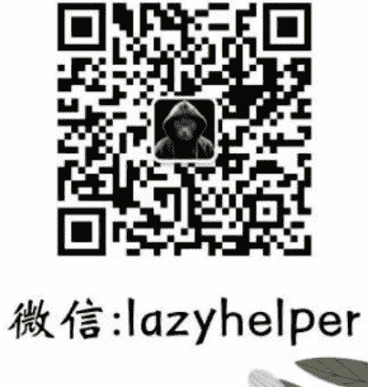

# 李政道：细推物理须行乐，何用浮名绊此身

240807

整理：公众号懒人搜索，懒人专属群分享
懒人微信：lazyhelper

今天，从一个沉重的话题说起。当地时间8月4日凌晨，世界杰出科学家，诺贝尔物理学奖得主李政道先生，在美国旧金山去世，享年97岁。

李政道1926年11月出生在上海，1957年，31岁的李政道与35岁的杨振宁，提出了宇称不守恒理论，获得了那一年的诺贝尔物理学奖，这也是首位获得诺贝尔物理学奖的中国人。

而且李政道先生的求学生涯非常传奇。李政道在家里排行老三，小时读书时，因为种种原因，加上当时的社会环境动荡，从小学到高中，李政道都是只读到一半。等于是小学、初中、高中都没有拿到正式文凭。他唯一拥有的，就是后来的博士文凭。没错，一个人没有小学、初中、高中的文凭，只有博士文凭，这个经历在学者当中，也算是非常罕见的奇观了。

李政道先生的头衔有很多，其中任何一个单独拿出来，都有相当重的分量。包括，美国国家科学院院士、美国艺术和科学院院士、第三世界科学院院士、意大利国家科学院院士、中国科学院首批外籍院士，等等。

最近很多媒体刊登了李政道先生的生平。除了李政道对科研和教育的巨大贡献之外，还有一个地方很让人惊讶。就是回看这段将近一个世纪的人生，你会发现，在他的头脑里，很多貌似不相干的事情，都会建立起微妙的联系。这个感觉非常奇妙。

什么意思呢？说几件事你感受一下。

李政道出生在上海的一个名门世家，从小家里就不缺书，而且他本人也特别喜欢读书，几乎每天都是书不离手。李政道的爷爷李伯覃在美国的基督教会当过神职人员，同时也接受过自然科学的训练。有一回李政道问爷爷，上帝在哪？爷爷说，在天上。李政道又问，那他为什么不掉下来？爷爷说，因为上帝很轻，和空气混在一起，漂浮在天上。

这段对话乍一看，好像只能说明一个孩子的好奇心。但戏剧性的地方在于，很多年后，1988 年夏天，62 岁的李政道在北京主持完世界高能物理会议后，一路南下经过武汉的黄鹤楼。有工作人员请李政道为黄鹤楼提几句诗。李政道是这么写的：“黄鹤飞上天，轻若中微子。”

你看，刚才我们提到的几个元素，古诗、上帝、中微子，乍一听，好像都属于不同的时期，不同的领域，乃至于不同的文明。但是，在李政道的大脑里，这些事物居然是连续的。一个东西假如很轻，就可以飘在天上。不管是上帝还是中微子。这是事物的真理，而真理是连续的，不存在昨天奏效，今天就不奏效。

再比如，李政道小时候，是一边读关于宇宙膨胀的书，一边读古诗。他最喜欢的两句诗，是杜甫写的，叫“细推物理须行乐，何用浮名绊此身。”李政道经常把这两句诗挂在嘴边。其中的物理，指的是事物兴衰变化的道理，或者规律。这跟今天说的物理多少有点像。你看，古诗和物理，在李政道的思维里居然是相通的。

再比如，李政道说过，科学和艺术是不可分割的，就像一枚硬币的两面。它们源于人类活动最高尚的部分，都追求着深刻性、普遍性、永恒和富有意义。当年李政道描述核子对撞，著名画家李可染教授就根据李政道的描述，画了一幅画。画里是两头黑牛，头对头撞在一起，彼此顶着犄角。这幅画的名字叫《核子重如牛，对撞生新态》。没错，这描述的是个物理学的场景。李可染的夫人，雕塑家邹佩珠根据这幅画创作了同名雕塑，现在就摆在北京的清华科技园。你看，绘画和核子对撞，也可以是连续并且相通的。

再比如，当年获得诺贝尔奖时，李政道的获奖发言，讲的是中国的《西游记》。他说，孙悟空翻了一串跟斗，感觉好像到了宇宙尽头，实际上他还在如来佛的手掌。因此在探索知识的过程中，我们必须记住，即使到了如来佛手指的底部，我们离真理依然非常遥远。

你可以感受一下，西游记、杜甫、宇称不守恒定律，这些乍一看不挨边的事，在一个人的人生里居然是连贯、相通、一致的，这个感受是不是很奇妙？李政道幼年动荡，小学、初中、高中都没有读完。李政道说，支撑他活下来的，是他看到书中所说，自然界居然存在定律，就像我和蚂蚁都是生命。但我可以了解宇宙如何演变，万物遵循什么规律，而蚂蚁不能。

你看，过去很多人觉得思维是一条延续的线，你学到的知识越多，这条线就延伸得越长。但事实上，思维更像一个池塘。你得把好多不同领域的东西放进去，让它们彼此碰撞，彼此连接，彼此融合，新的思想没准就会长出来。

但是，李政道先生的地位，并不仅仅来自他的学术成就，更来自他对中国科研教育的破冰级贡献。之前《南方周末》曾经专门讲过这段故事。

事情要从1970年代说起，当时赴美27年的李政道第一次回国。李政道很清楚，要想把物理科研搞起来，首先得把人才培养起来。但当时中国学生没有出国留学的渠道，再加上当时国家财政困难，很难拿出大量的经费支持留学生出国。

怎么办？李政道先是对内沟通，争取国内的支持。同时，再向美国的院校争取机会。

当时美国的大学，要求留学生需要通过托福和 GRE 考试，但当时咱们国内根本就没有 GRE 和托福考试，李政道只好逐个联系各个院校的物理系，一个个说服院系的老师，请他们给中国留学生一个机会。

经过漫长的沟通，到 1980 年，李政道已经向 53 所美国高校的物理系老师，发出了 200 多封信函，并且获得了支持。这也是咱们国家在改革开放后的第一个国际人才交流项目，中美联合招考物理研究生项目，简称 CUSPEA。CUSPEA 从 1979 年开始试点，1980 年正式启动，到 1988 年收官，前后一共派出了 915 名中国学生，84 所美国高校参与其中。其间培养出的人才包括，前北大物理学院院长谢心澄、上海交大物理系教授季向东、麻省理工学院教授文小刚。还有搜狐的张朝阳、一号店的创始人于刚，都是这个项目的参与者。后来也有人把 CUSPEA 这十年，称为中国人才海外交流的黄金十年。

而在 CUSPEA 项目期间，李政道还在国内第一次推动了博士后制度的建立。咱们国家的博士后制度，在李政道的推动下，在 1984 年 11 月正式启动。也成为后来国家培养选拔科研人才最重要的方式之一。根据《吴晓波频道》的数据，截止到 2023 年 6 月，咱们国家已经累计招收博士后 34 万人，设立博士后科研流动站 3352 个，博士后科研工作站 4338 个。而这组数字背后，那个从 0 到 1 的起点，就是李政道。

好，关于这段故事，咱们先说到这。假如说我们能从中读出点什么，也许是，这个世界上最可靠的成事路径，就是一个特别聪明的人，甘心用特别朴素的办法做事。没有留学机制，就去一个个说服院校，说服老师。没有先例，就去一点点创造先例。很多时候，要想推动一件很难的事，靠的不是自己所在的高度，而是向下扎的深度。

好，关于李政道先生的生平，我们今天只是选取了一个侧面，假如你还有兴趣进一步了解的话，那么可以在得到搜索“李政道”。得到站内有很多老师讲过相关的课程，也有很多相关的书，而且每位老师讲的角度都不一样，感兴趣的话可以来看看。

最后，就借用李政道先生最喜欢的两句诗作为结尾，细推物理须行乐，何用浮名绊此身。

公众号
懒人搜索
懒人专属群

历史 3000 多份各类付费文章以及年费三千多的副业社群资源, 见懒人专属群内部分享!

付费群, 白嫖勿扰!

懒人专属群更新记录:
https://lazybook.fun/#/blog/record2