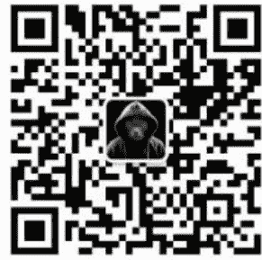

# 上海网约车行业现状调查报告：一个中年失业者亲历自述

文/卢克文工作室嘉宾 墨池（本文为读者投稿）

240808

整理：公众号懒人搜索，懒人专属群分享懒人微信：lazyhelper


引子：年近不惑，本来自己经营一家小公司维持生计，去年在行业低迷以及疫情的双重加持下，公司终于倒闭。在家沉寂一年后决定去上海跑网约车，以谋生计。

送外卖、送快递、跑网约车并称为中年失业者的三大退路。在当前的经济整体形势下，像我这样中年失业、想要加入网约车司机行业的人应该是在大有人在，作此文的初衷便是：希望能给想要踏入此行业的同病相怜者们提供参考。

我是5月25号抵达上海，26号开始上车干活，一直干到7月25号，一共干了两个月。这里我尽最大努力把我这两个月对行业的考察以及思考表达出来。

## 一、网约车司机招聘

先从入职说起，你注册个求职软件，主要求职意向填写司机或者商务司机，就会有大批一二线城市的司机招聘者推荐给你，其中上海的应该是最多的。其招聘卖点往往是：轻松月入过万、时间自由、多劳多得等字眼。其实都是汽车租赁公司，他们不是招聘员工，他们是为了把车租给你。

以我应聘的公司为例，我去之前人事的说辞是这样的：入职缴纳 2000 元违章保证金。每天完成 600 的流水金额，工资 8000 元+2000 元充电补助（都是纯电车）。每天超出 600 元以外的流水金额都是司机自己的提成。平台还会对司机有奖励，一月大概 1000-3000 不等。包住。按他们的说法一天跑 600 元流水是很轻松的，综合下来一月赚一万以上是很有把握的。

听起来还不错，基于此我踏上了通往魔都上海的列车。

当我坐了一夜火车到达上海时，见到租赁公司的负责人，他又详细跟我介绍了具体的工作模式：

- 1. 司机的工作任务每天 600 元营业额，一月也就是 18000 元左右。给司机 10000 元的工资和电补，剩余 8000 元是公司的。然后平均到每天就是 267 元。公司每天会首先把 267 元从你的流水中扣除，剩余的就是你自己的钱。此时这位负责人对底薪、电补、平台奖励都不再提起。（租赁公司跟打车平台都可以签订代扣合同，行业内司机称这种模式叫“锁流水”）。
- 2. 合同至少签订三个月。
- 3. 缴纳 2000 元违章保证金和 500 元服务费。2000 元保证金在合同到期并确保无违章的情况下退还。500 元服务费是帮你注册打车平台的司机端以及免费的道路救援，这个是不退的。
- 4. 所谓包住：公司提供集体宿舍，一般 4-6 人一间屋，不要房租但是每人每天要缴纳 20 元的水电费。这其实就是每人每月缴纳了 600 元的房租。

这个 20 元 “水电费” 可以先交，也可以跟随车租一块扣除。我选择的后者，所以我每天要被扣除 287 元。

至此，我才完全明白，这是一份不折不扣的租赁合同。但是我没有就此放弃，一来我已经跨越千里来到了这里，二来我认为努努力或许一天可以干 700、800 甚至更多。

但是很快现实狠狠打了我的脸。

## 二、真实收入

我上岗第一天跑了 380 元流水，第二天 400 多，后续半个月我每天的流水都在 450 至 550 之间，直到半个月后我积累了一些经验后，一天才勉强跑到 600 元以上，一直到 7.25 我决定不干了，也鲜有日流水超过 700 元的时候。

那么我这两个月能赚多少钱？我每天车程+房费 287 元，每天充电平均 60 元左右（夏天开空调和冬天开暖风的时候这些电费不够），然后吃饭抽烟每天大概 50 元（我在同行里基本是最省的了），这样我每天的成本合计是 397 元。也就是说我每天跑够 400 元流水以外才是我赚的钱。这还不包括违章、补胎等应急情况。

就按我每天平均 600 元流水计算，我两个月能赚 12000 元（我实际到手其实还没有这么多）。

当然以上都是我个人的数据，并不能代表所有人，还有四个重要因素会对司机的收入产生较大影响：

- 1. 生活费。包含住宿吃饭抽烟等日常费用，这个因人而异，就拿住宿来讲，我住的一月 600 元基本是最便宜的，当然条件也是最差的，差到我都没想到，第一次进宿舍差点被里面的味道熏吐了。有好多都是自己租房子或者跟老乡合租。吃饭也是，一些年轻人不肯委屈自己，三顿饭准时吃，这样的话光吃饭一天也要大几十甚至过百。我比较省，平时准备些小点心在车上，就晚上找个小店吃一顿正式一点的饭，即使这样也很难控制在一天 40 元以内。
- 2. 业务能力。什么行业都分新手和老手,前面讲的我的收入数据基本可以代表入职两个月以内的新手。对于新手,一天流水超过 600 元基本上比较难。至于两个月以上的老手,基本上可以做到每天不低于 600 元,甚至 800 元、 900 元也有,加上平台奖励也有过千的。
- 3. 租车模式。我这种每天扣车租的模式叫做日租模式,另外还有周租模式、月租模式、对公租车模式、专业出租车租赁模式等,这里不再一一赘述,大致规律就是租的时间越长租金越便宜,整体在 6000-8000 元之间。押金相反,租的时间越长押金越高,整体在 2000-8000 元不等。浮动金额也会受到车型的影响，比如续航里程高的车租金会高一些。
- 4. 接单资质。接单资质是根据司机等级和车型决定的，相对较差的车型只能接普通快车单，好一点的可以接专车单，再好一点可以接商务单，比如别克GL8、腾势等商务车。

总结一下网约车司机的真实收入，大概每月就在5000-12000元之间，这个收入区间应该可以覆盖九成以上的网约车司机。

## 四、司机工作强度

如果你真的想靠在上海跑网约车司机赚钱，那么你必须抱着吃苦受罪的心态，一要增加工作时长来保证收入，二要尽量压缩个人生活费用。

我认识一个贵州的网约车司机，他吃住都在车上，不租房子住，从不在饭店吃饭，每天在线接单 15 个小时。车上备有大桶水用来洗刷，在充电站洗衣服洗澡，他每月差不多给他老婆转 12000 元左右。

同时，你也要想到这一行业对身体的伤害也是很严重的，一般情况下一周内你的大腿、屁股或者后背会起痱子，一个月你的颈椎和腰椎就会有不好的感觉，两个月你的前列腺和肠胃会出现状况。

分享一个从业九个月的司机的心得：他干这行要么两个月回家歇半个月、要么三个月回家歇一个月。

事实上，我在上海跟同行聊天，大概六成司机都是入行不到一个月的新手，三成2-4个月的，最多只有一成能坚持干四个月以上的。

虽然算不上网约车行业的老司机，但是笔者还是想把自己总结的一点经验分享给大家，希望能给想入行的朋友带来帮助。

这个行业很辛苦，入行一定要先调整好心态，做到劳逸结合。比如可以干三个小时停车休息半小时、干一周给自己放半天假，这样才不会觉得特别累。

选择平台也很重要，尽量不要做单一平台，最好的模式是做一主一副两个平台。平台有多种接单模式可以选择，不要一味等平台派单，要学会自己找划算的订单、找大订单。

网约车本质上也是一种互联网销售，司机累积好评也很重要，司机评分会对派单有比较明显的影响。

还有一点大家注意避坑，汽车租赁公司大都没什么雷打不动原则，诸如租金、押金、服务费以及合同期限都是可以谈的，不要怂。

个人愚见，上海的网约车行业截止到目前基本上已经内卷到无以复加的地步了，真正赚钱的时候应该是疫情之前。

现在干这一行，不能说不赚钱，如果你肯吃苦耐劳、又掌握一些接单技巧，应该可以月入过万，但也绝不是招聘者所云：轻轻松松月入过万。

在平台和租赁公司的双重盘剥下，我认为网约车司机的收入和付出的比例是不匹配的。

对于以后的行业状况，在目前整体经济形势下，短期内这个行业的收入基本不会有可能回升。但同时我认为也不会再下降，因为再下降就没人干了。所以我的看法是：已经触底但不会反弹。

另外，无人驾驶如果普及，将会对这一行业产生颠覆性影响，已经开始有城市在尝试，但是受技术和国家政策限制，这个东西能不能普及、多久能够普及，都还是个未知数，我认为短期内不会对上海网约车现状产生影响。




微信:lazyhelper

历史 3000 多份各类付费文章以及年费三千多的副业社群资源，见懒人专属群内部分享!

付费群，白嫖勿扰!

### 懒人专属群更新记录：

```
https://lazybook.fun/#/blog/record2
```