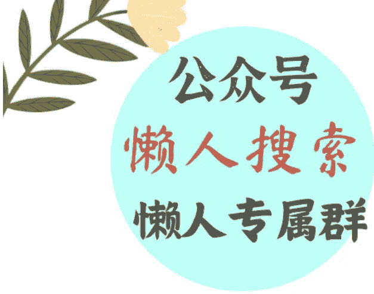
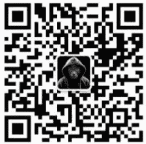

# “老子不干了”，是安全感的“最高境界”？

## 240826

整理：公众号懒人搜索，懒人专属群分享

懒人微信：lazyhelper

微信:lazyhelper

今天，咱们先从一份报告说起。前段时间，市场研究机构千瓜数据，发布了一份关于小红书的调研报告。这份报告主要针对的是小红书上，商家和达人做内容营销的趋势。但是，换个角度，我们也可以把它当成是，窥见当代年轻人整体情绪的窗口。毕竟，营销这个事，得迎合当下的情绪。

在这回的报告里，千瓜数据分析了小红书2024年上半年的大量内容，得出了一个关键词。不瞒你说，乍一看这个关键词，我还是有点意外的。按照通常的想象，小红书上的内容，应该是偏向文艺情趣和精致生活的，但事实上，今年上半年的关键词是，安全感。没错，是个相当务实的词，安全感。

咱们看几个具体的趋势，你可以感受一下，它们是不是都或多或少体现了追求安全感的动机？

- 比如，买黄金与储蓄，这两类话题今年上半年的笔记数，增加了160%以上。对很多人来说，买黄金意味着一种确定性，花出去的钱，似乎以另一种方式，回到了自己的身边。
- 再比如，考公考编，上半年，小红书上跟“事业编”“公务员上岸”相关的笔记数量，增长了 340%。这就不用多说了，是为了追求职业的稳定性。
- 再比如，怀旧。上半年，小红书上密集地出现了一批跟童年回忆有关的内容。包括，小学门口的小卖部、全国统一的卧室装修、少儿频道的画面等等。这或许是因为，回忆童年，能够带给人归属感。这也属于寻求安全感的范畴。
- 再比如，今年小红书上最火的流行词之一，叫旷野，来自一句话“人生是‘旷野’”。说的是，脱离常规的生活，去体验不一样的世界。这个话题的笔记数半年内增长了 240%。旷野其实伴随着一句潜台词，这就是，去追求自己的主动选择，你看，这也是一种安全感。

总之，从这回的报告看，安全感，已经成为当代年轻人的最大情感公约数。那么，在这样的趋势下，品牌可以做哪些动作呢？

- 比如，在产品的质量上打安全牌。像去年在网上大火的水杯品牌 Stanley，推动它出圈的一个热门事件就是，在一场车祸中，汽车着火了，但是 Stanley 杯子里面的冰块还是好好的。
- 再比如，今年小红书上很流行的一类种草笔记，叫做“探厂”，不给你看产品是怎么包装的，而是给你看，商品的生产现场是什么样的。这样全流程透明的商品，也能给消费者质量上的安全感。
- 再比如，还有的品牌，在内容场景上把自己定位成陪伴者，它试图营造一个氛围，叫做“我和你站在一起”。比如，保健品品牌，就关注你上班的各个时段需要哪些帮助。化妆品品牌，就关注你希望变得自信、变得强大这个底层需求。它传达的信息是，做你想做的事儿吧，我和你站在一起。

那么，抛开商家这一层，回到个人，我们自己做点什么，提升内心的安全感呢？

关于这个问题，我最近看到一个很有启发的答案，来自和菜头老师。和菜头老师在他的得到课程《成年人修炼手册》里说，安全感，不是一种静态的感觉，而是一种动态的平衡。

用和菜头老师的话说，安全感分两种，一种是植物的安全感，另一种是动物的安全感。

植物不能移动，但它需要的很少，有阳光、空气、土壤和水就足够。它的安全感来自外部环境，只要环境稳定，自己就是稳定的。但是，一旦环境发生变化，比如旱灾、洪水，或者猛兽，它的安全感就会荡然无存。

而动物，大部分时候需要保持警惕，永远处于一级戒备状态，一有风吹草动就得作出反应，要随时准备好放弃自己熟悉的一切。但是，正因为这种不确定，它反而更自由。当眼前的事物有变坏的迹象时，自己可以拔腿就走。

这就类似于六神磊磊有一次说，他最喜欢的金庸的一句台词，是韦小宝说的。那句话叫，老子不干了。他觉得这句话特别洒脱。但话说回来，韦小宝为什么能说出老子不干了？是因为他可干的事太多了，他的选择太多了。这就属于那种可以随时拔腿就走的，动物式的安全感。

和菜头老师认为，我们要追求的，就是这种动物的安全感，主动面对变化，并且有能力采取行动。就像优秀的战士，在火线的轰鸣中依然可以平静地吃饭入睡。

换句话说，终极的安全感，不在于你拥有什么，而在于你可以做到什么。这就是所谓，生活里的动态平衡。

当然，说到这儿，道理我们都懂。但是，回到真实的生活中，不确定性就是有可能出现，我们又该怎么办呢？在这里，我想分享一个最近看到的观点。说的是，多数人其实分不清害怕和危险。很多事情会让你害怕，但并不危险。比如，身处一个像OpenAI那样，一路爆发的公司。你会感觉压力很大，还可能害怕自己完不成工作。再加上身边全是高手，你的害怕可能还会进一步加剧。但是，你并不危险。因为公司本身很厉害，而且这个行业也在上升期。

真正的危险是什么？假如你发现，团队来了很多厉害的同事，自己手上的工作突然变少了，你觉得很轻松。那坏了，这可能是真正的危险。换句话说，建立安全感的关键，首先是区分清楚，什么是害怕？什么是危险？不要恐惧害怕，但要躲避危险。

再来看今天的第二条。我们顺着年轻人的偏好，说说化妆品领域的动态。就在前不久，第十七届中国化妆品大会在上海举办。关于这次大会，已经有很多报道。根据大会的观点，化妆品行业已经进入了存量周期。根据星图数据的统计，今年 618，美妆的销售额同比去年下滑了 13%，成为史上最平淡的一届大促。

说白了，化妆品想让年轻人买账，正在变得越来越难。怎么办？

正好最近，我看到一个国外的彩妆品牌，他们的做法或许值得参考。这就是美国歌手、演员赛琳娜·戈麦斯创立的品牌，Rare Beauty。Rare Beauty 在 2023 年的销售额就超过 3 亿美元。就在今年 6 月，赛琳娜 · 戈麦斯本人还登上了《时代周刊》的封面，被评为“年度百大企业家”之一。

可能有人会说，这不就是明星效应吗？但实际上，欧美的彩妆行业一向很卷，明星创立的品牌不在少数，但像布兰妮和 Lady Gaga 的品牌就没有多大的声量。

那么，Rare Beauty 是怎么做到的？简单说，它采取的策略，叫做“卖产品的同时卖情绪”。

首先，咱们看看这个品牌的创立。

Rare Beauty 创立于 2020 年，这对赛琳娜本人来说是很特殊的一年。赛琳娜作为美国最受欢迎的童星之一，一直都生活在聚光灯下。但就在 2013 年，也就是在她刚刚 20 岁出头的年纪，却患上了红斑狼疮，2017 年因为严重的肾脏衰竭住院，不得不结束一切工作。2018 年，她的好友给她捐了一颗肾。

本来到这里，她的人生算是回到了正轨，但由于药物引起的激素变化，导致她的身材走样，狂掉头发。

这对一个童星出身的明星来讲，打击得有多大？后来，赛琳娜患上了双相情感障碍。直到 2020 年，她才算是正式走出了这段低谷。

紧接着，她把自己这段走出低谷的经历，直接作为品牌的内容营销主题。

- 品牌的名字叫“Rare Beauty”，意思是，每个人都是独一无二的。
- 再比如，给产品的名字加入很多心理健康相关的元素。像唇釉色号叫“喜悦”“希望”，高光叫做“积极之光”等。
- 再比如，在品牌创建初期，Rare Beauty 专门成立了一个慈善基金（Rare Impact），并且承诺把 1%的销售额捐赠给基金，来推动大众心理健康事业。另外，Rare Beauty 还强调他们的长期目标是，10 年之内筹集 1 亿美元的资金，用来给全球的年轻人提供心理健康服务。
- 再比如，怎么给品牌选模特？2020 年，Rare Beauty 推出了 48 种不同色号的粉底液，这就意味着需要有 48 个模特来展示粉底的色号。按照通常的设想，模特的外观条件肯定是要优先考虑。但 Rare Beauty 的方法是，候选人不能提交头像照片，而是提交一篇介绍自己的文章，必须说明自己的特别之处是什么。当时，他们的市场营销总监就说，我们不想看你的外貌，我们只想听你的故事。最终，他们收到了 21000 多个故事。而这部分人，后来也成为 Rare Beauty 建立品牌社区的基础。
- 再比如，去年五月，Rare Beauty 举办了首次心理健康峰会。没错，一个化妆品牌，举办心理健康峰会。他们邀请了 150 名重度用户现场参加。

这些方式为什么有效？咱们看两组数据。

- 第一个，来自美国疾病控制与预防中心（CDC），根据2021年的报告，将近60%的美国青少年女孩感到悲伤或无望。
- 第二个，来自世界经济论坛的报告，2022年，84%的Z世代消费者表示，他们购买品牌是基于价值观的一致，只愿意购买自己信任的品牌。

要想打动这一部分人，得让品牌跟他们产生共鸣。说白了，Rare Beauty的成长，除了创始人赛琳娜本身的明星光环之外，更重要的是价值观的深度链接。

最后，总结一下，今天说了两个话题。

- 第一，我们说了小红书今年上半年的核心词，安全感。回到个人，安全感可以分成两类。一是植物式的安全感，二是动物式的安全感。前者依靠环境，后者来自自身。
- 第二，一个美妆品牌怎样实现增长？我们讲了 Rare Beauty 的案例。关键不在于贩卖产品，而是提供情绪，与用户在价值观层面建立深度联系。

历史 3000 多份各类付费文章以及年费三千多的副业社群资源，见懒人专属群内部分享!

付费群，白嫖勿扰!

## 懒人专属群更新记录:

https://lazybook.fun/#/blog/record2