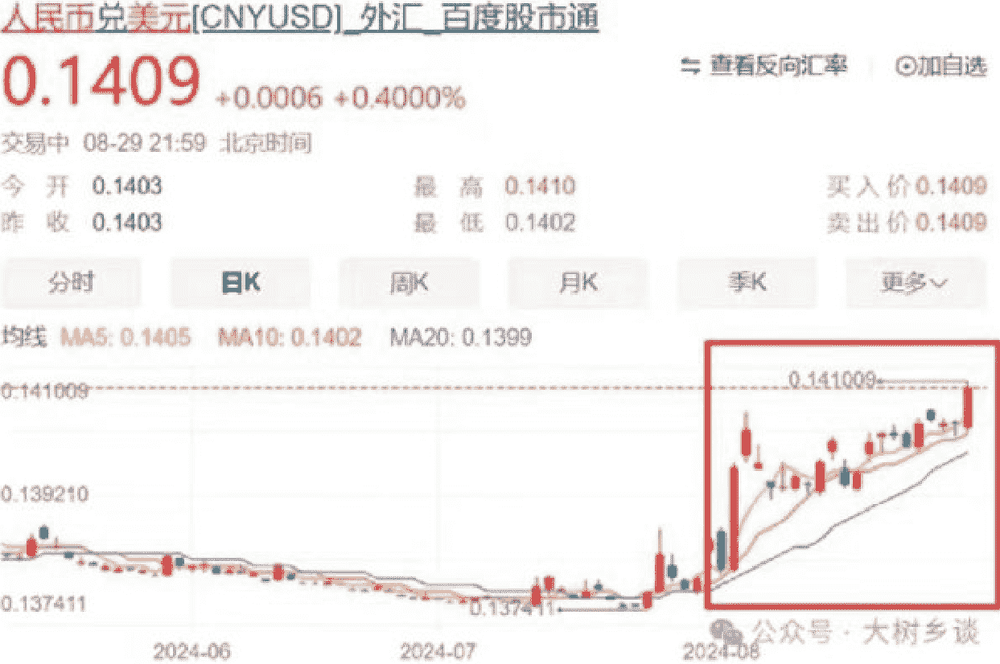

# 经济到底怎么了？何时才能走出低谷？

大树乡谈

240831

整理：公众号懒人搜索，懒人专属群分享

懒人微信：lazyhelper

## 一个坏消息，一个好消息

现在的经济当然不好，这不是调整文字或者换角度就能回避的，但也不能因此就认为以后会越来越差，碰到任何事都往最悲观的角度想，这也不对。

接下来，我们确实将进入一个完全不同于过去几十年老经验的新时期，面对的问题是从未见过的，我们正在闯大关，身在此关中，自然不识真面目。感到迷茫是正常的，更觉得这个世界变得陌生，没有安全感。

这一篇就是要锁定问题，无论再难终究心里有底了，也能够大致准确的判断中国经济所处的阶段，对很多事情的变化也就更有把握了，不会因为短期的变化而一惊一乍，无论这种变化是利好还是利空。

这一篇就谈两个问题：
第一个问题：经济到底怎么了？
第二个问题：何时才能走出低谷？

当前我们其实并不是最困难的时候，之所以觉得特别迷茫，一是因为由奢入俭难，过去什么都没有，反正只会向好，也就无妨了；二是我们目前和未来遇到的全是新问题，古今中外都没有遇到过，更难受的在于，中国人自改革开放以后，实际上根本没有经历过一次完整的经济周期，第一次遭遇萧条期，终究是痛苦的。

我们现在遭遇的困难，归结为一点就是由房地产危机导致的资产价值重估，是向下重估和资产收缩。而房地产危机又冲击到了钢铁、建材等相关制造业，危机之下消费热情被浇了冷水，开始恐慌、储蓄，于是产能过剩问题更加严峻。

所以，分析当前和未来的经济阶段，最重要的就是看两点：房地产危机、产能过剩出清，搞清楚这两个到了什么阶段，距离触底还有多远。

不要总是幻想能够找到一个中间的锚点，觉得只要到了这个点就会停止坠落，更不要幻想靠政策能力拦住，政策当然是有用的、国家力量当然是强大的，但仍然是有限的。

那么房地产危机到了什么阶段呢？
这场危机其实可以分为四个阶段：
- 阶段一：房企危机
- 阶段二：财政危机
- 阶段三：房价危机
- 阶段四：资产重估危机

## 阶段四：资产重估危机

注意有些人会拿美国 2008 年的次贷危机亦或者日本失落的三十年来类比中国，这种对比本质就是刻舟求剑，凡是做这种对比的，无论名气多大，不必多看，要么是本人早就不研究不思考了，再不然就是有话不敢说，只能随大流。

比如 2023 年上半年特别喜欢研究日本，担心中国会走日本的老路，说法很多、分歧也很大。有的说日本当年出现危机的时候已经进入了发达国家，人均 GDP 很高，因此中国相比当年的日本，遇到的麻烦更大；也有的说因为日本政府没有及时救助企业，企业创新研发能力下降，导致在产业竞争中不断失利。

还有观点认为日本是因为丧失金融主权，沦为美元的老鼠仓，一个丧失金融主权的国家想要再爬起来，几乎是不可能的。

以上不同的分析，已经证明了，日本与中国的差异之大，那还有什么可供参考的呢？

而美国 2008 年的次贷危机，是购房者自身的贷款质量出现了问题，有大量本不应该拿到贷款的人拿到了钱，于是问题不断积压最终暴雷。但是中国现在绝不是购房者出现了问题，事实上中国人首付最低占比也有 30%，这场房地产危机，不是购房者引起的，而是房企以及房企背后的一连串利益链。

能一样吗？

这就是小镇将房地产危机的起点定为房企危机的原因。

第一阶段“房企危机”。

这并不是突然出现的，大房企们其实很清楚，他们这套疯狂扩张、一个锅盖十个锅的模式一定玩不下去，迟早要暴雷，但是他们真实的想法是“大而不能倒”，将一切的希望寄托在国家的援救，又认为国家最多只能救 1、2 家，所以必须拼命冲到最前面。

于是恒大、碧桂园就成了这场竞赛的“胜出者”，这个逻辑不是小镇瞎编，是碧桂园前 CFO、执行董事吴建斌在 2017 年出版的《我在碧桂园的 1000 天》里亲口说的，这本书也一度被“禁”。可见至少 2017 年房企危机就已经注定要发生了。

从历史的角度，爆发的标志是 2021 年恒大没有如期发财报。2021 年底央行关注到了危机的到来，采取了一些措施，试图化解或者遏制房企资金紧张问题。到了 2022 年上半年，房企危机开始明面化。现在有些人把危机爆发归罪于“三条红线”，这就因果颠倒了。

本质上就是到了危机已经显露的时候，政策措施很难再解决了，用“无药可救”形容，并不为过。所以，2022年真正爆发，公众关注到烂尾问题，出现强制停贷风波时，其实对于暴雷的房企，事实上已经进入“收尸”阶段，终究要进行破产清算，今年赶不上，那就明年、后年，无非这两年就要盖棺定论，曾经的巨无霸终究要彻底退出历史舞台。

第二阶段“财政危机”，准确地说就是城投债（地方债）危机。

这场危机在 2022 年正式显露，房企危机、资金紧张，导致这一年土地出让金收入骤降。

### 第三阶段“房价危机”。

本来还期待一旦放开，就能恢复正常，所以 2023 年一季度还是信心满满，然而到了二季度已经开始慌了，参与城投债的都在期待国家来拯救，期待新的资金、新的政策，当然也等来了，但并没有根本解决问题。

从 2023 年中开始，全国房价开始下跌，跌势很猛。就拿北京来说，其实 2023 年二季度是一个价格高点，大概比 2020 年初上涨 30% 左右，之后的一年基本把涨幅跌没了。北京毕竟是特殊的，一旦彻底放开，房价立即暴涨，就像日本的东京。但是全国呢？再叠加经济下行，失业、就业难，打破了收入一定上涨的预期，于是到了 2023 年 10 月，全国范围内“房价危机”爆发，虽然出台了刺激房地产的政策，也不断放松房地产调控，但不要妄想能够刹住，最多不过是争取时间，尽可能让危机爆发变得更加平缓。

当房价危机爆发的时候，有一些专家不停地鼓气，说房价马上就要见底了，还拿出了一些数据。但是这些数据并不可信，因为仍然存在价格管控，这就导致一手新房的数据是失真的，这种失真实际也影响到了二手房交易和租金市场。

可以非常直白地说，到目前，房价的下跌仍然没有看到头，但好消息是，房价的下跌基本到了中后期。

政策的变化，也佐证了已到中后期的判断。

那就是今年 8 月，一些地方已经开始取消或者放松新房销售限价，注意这个变化极为重要。

正如小镇刚刚提到的，限价的存在导致房地产数据是失真的，这其实很麻烦。虽然购房者看不到真实的新房价格，但是二手房的价格下跌就在眼前，如何让购房者相信新房价格能在限价之上？

这就使得购房者根本无法评估购房风险，虽然多数购房者未必非常专业的进行风险评估，但是心里一定会有这种疑虑。

在限价的情况下，新房价格被扭曲了、购房的风险也被扭曲了，扭曲的情况下，根本不可能恢复正常，更何谈达成新的平衡。

但是又不敢贸然打开限价，因为担心恐慌导致踩踏。而现在一些地方取消限价，而市场上虽然出现了一些负面事件，比如有的地方因为开发商大降价，有的楼盘复盘后甚至 5 折开卖，于是前期购房业主们冲到销售中心激烈抗议。

但是总体上，还是平稳的，或者说大家经过近一年的心理铺垫，虽然感觉有些“丧”，看啥都悲观，但是也有一个好处，就是有些麻木了。麻木也是一种强大，看到打破限价后的真实价格，有一种“哦，就这？”的心态。

打破扭曲，这就意味着真正开始直面房价危机，也意味着房价危机已经开始进入后期，距离真正的触底更近了，触底之后自然就是反弹，这就是经济复苏的关键标志之一。

这场危机源自房地产，结束也需要等到房地产见底。

但要注意，小镇将房地产危机划定了四个阶段，还说当前最根本的问题就是房地产导致的资产价值重估。

但目前，第四阶段“资产重估危机”似乎并不存在，似乎有一股神秘的力量挡住了这最可怕的阶段。

在任何国家，房地产都是一国经济的根基，房地产是经济周期之母，其地位无可替代，哪怕是现在的美国，狭义的房地产仍然占 GDP 的 13% 左右。

土地、房地产是整个社会信用抵押的基石，也是最硬的抵押品。正如房价下跌到一定程度，银行如果判断会损失贷款，那就会要求购房者补交资金亦或者降低贷款额度，当时在中国极其罕见，普遍性的房价下跌以及土地价格不稳，本应该影响到抵押品的价值，银行当然应该对抵押品现在还值多少进行评估，然后调整贷款计划。

而这仅仅是资产重估的第一步，在经济活动中，大量存在以房子为抵押的借贷行为，城投债本质就是以土地和房子等作为抵押，土地和房子价值下降，如果发生资产价值重估，必然会直接冲击到整个金融系统，进而冲击经济、社会方方面面，没有任何人能够幸免于难。

按照之前三个阶段的演化，如果纯粹市场经济，今年应该就要进入第四阶段了。而且也确实有一些信号，比如今年初万科爆发危机，3月险资多次提出要求万科增加资产抵押，这就是非常明确的资产价值重估危机的标志。

但这几乎是唯一公开谈论资产价值重估的事件，之后几乎就听不到、看不到了，银行也并没有对房子、土地等抵押品的价值进行重估。原因其实很简单：

第一，银行是中国金融的绝对核心，而银行大多数是国有的，只要国家不允许，国有的银行就不会对抵押品价值进行重估。

第二，虽然现在经济不太景气，大家怨气很重，但大多数人对于国家的未来仍然非常有信心，普遍认为危机终究会过去，无非早点晚点，那么短期的资产价值下降，也就不是事了。

小镇在 2022 年 10 月和 2024 年 5 月做过同样的未来预期投票，两次都是八成看好，而 2024 年认为向好的比重增加了 2%，从 79% 上升到 81%，认为向坏的从 9% 降到 7%。

| 调查时间 | 选项 | 票数 | 占比 |
|---|---|---|---|
| 2022年10月 | 向好 | 4064 | 79% |
| 2022年10月 | 向坏 | 467 | 9% |
| 2022年10月 | 不清楚 | 609 | 12% |
| 2024年5月 | 向好 | 2653 | 82% |
| 2024年5月 | 向坏 | 235 | 7% |

希望最具破坏性的第四阶段不要到来。只要第四阶段不到来，小镇在这里可以给一个结论：预计到 2025 年二季度房价在全国范围就会真正见底，只要房地产见底，中国经济也就基本见底了，就看到了复苏的曙光。

而一个可供参考的标准是，全国范围房租收益率（租售比）与 30 年期国债收益率基本吻合。

30 年期国债收益率是中国市场的价值锚点，目前非常稳定，收益率在 2.5% 左右，当房租收益率上升到 2.5% 左右，房子就已经成为一个安全的投资品，还具有居住、保值的属性，到了这时候，从理性角度就不会急匆匆的降价出售，而是大不了留着收租。

注意房价高的大城市，就不是参考 30 年期国债了，而是参考 10 年期。

全国范围的租金收益率没有数据测算，但可以参考重点 50 城。2021 到 2023 年，重点 50 城的租金收益率基本在 1.96% 左右，而 2024 年上半年已经上升到 2.03%，考虑到小城市租售比会高一点，比如重点 50 城中，北京低于 2%，而银川高于 4%。

因此全国范围已经比较接近 2.5% 的水平线了。过去是不太敢想的，这也是认为政府搞保障房很难收回成本的关键原因，但现在房价全面下降，这确实很痛苦，但何尝不是回归正常，房租收益率达到更合理的水平，很多事也就好开展了。

注意，这可不是强行把坏事说成好事，有利有弊嘛，不能只说一面。

应该说，目前阶段，虽然房地产危机仍在继续，但已经可以看到结束的时间了。所以也就看到 8 月央行二季度货币政策执行报告中，就非常罕见的讨论了房地产市场，强调租售比的提高是未来地产投资价值的体现，意味着房地产投资从依赖房价上涨的投机收益转向依靠房租收入的长期收益，这也符合“房住不炒”的政策方向。

当然，必须要承认，每一次重大危机，一定会有些国家、群体承担更大代价。比如上世纪 90 年代亚洲金融危机之后，当时面临的危机也很大，经济直接进入了通缩，当时利益受损最重的是工人和农民，温铁军在他的书中定义为“第七次危机”，后来是靠加入 WTO，爆发了巨大的增量，最终消化了这场危机。

而当前的危机，最承重的就是 80 后、90 后以及刚刚进城购房的大批农民工，这些人资产缩水更重，作为当代社会中坚，当然会影响整个社会的心态和预期，那么救星在哪里？

目前官方给出的答案是科技、产业，要通过根本的提高中国全球竞争力，创造更多的蛋糕，并且切下更多的份额，靠新兴产业去对冲房地产下行的危机。而在具体的就业上，也是要创造更多的就业、更多的高收入岗位，带动居民收入增长，把房地产的需求再顶起来。

归根到底寄希望于制造业和出口兴盛。

也确实有很好的例子。比如小镇之前提到的北京永丰地区，房价逆势上涨，就是因为这附近的产业都是国家重点扶持的芯片、AI 智能等行业，这些行业的从业者收入比过去高多了，未来发展前途也很看好，房价自然就有了支撑。

北京的房价需要高收入群体支撑，而全国很多地方，其实只要能够分到这些新兴产业的蛋糕，就可以很大程度上改变房地产下行的势头。比如因为国产汽车崛起，很多内陆城市引入了汽车产业，在本地创造了数以千计的新岗位，这些人的收入要明显高于当地平均收入，围绕制造工厂和工人，产生了更多服务业，这批人基本不会离开老家，自然就有了购房和改善的需求。

但是，制造业的兴盛，真的就能够顶住房地产下行？

有三种可能：
- 第一种可能：房地产下行令需求更加萎缩，而国际大环境恶化导致出口受阻，虽然部分新兴产业发力，但还是无法填补缺口，结果制造业也被拉着下行。
- 第二种可能：房地产和制造业都要面临各自的难题，房地产要过关，制造业也要进行过剩产能出清，双双渡劫。
- 第三种可能：制造业和出口增长顶住了房地产，甚至带动房地产复苏，房地产提前见底，于是危机结束。

需要说明的是，无论这三种可能到底哪一个成真，都不会影响中国经济在中长期一定会变得更好，但是人是生活在当下的，如果第三种可能成真，那痛苦会小很多，那就太美妙了。

当下制造业最关键的挑战，就是过剩产能出清。

现在中国制造业和出口确实很强，政策上全力支持，还有低汇率带来的价格优势，而全球普遍的大通胀更是严重挫伤了各国的制造业，如美国这么高的通胀，什么制造业都没法搞。

但是话又说回来，欧美等国家竞争不过，也就会更多采用非市场经济手段，开始加强对中国出口商品的围堵。

那么过剩产能出清到什么阶段了呢？这跟房地产危机到底一样，直接关系到中国经济什么时候复苏。

房地产危机所处阶段和大概什么时候见底，已经相对清楚了，只要再搞清楚制造业产能过剩消化阶段，今天文章的第二个问题，也就有了最终解。

今年上半年的数据看起来不错，5% 目标实现了，国际上很多机构也纷纷看好中国经济。德国央行数据，今年上半年德国对华直接投资约为 73 亿欧元，而去年全年创新高也只是 119 亿欧元，注意直接投资这才是真正落在中国，绝不会短期内离开，这要比什么北上之类的金融资产流动重要得多。

## 不理政界“去风险”鼓噪，看重中国全方位潜能，德企今年对华投资“势头强劲”

环球网 2024-08-15 06:46 北京

【环球时报记者 倪浩 环球时报驻德国特约记者 青木 甄翔】“德国企业加大对华投资”，据德国电视一台 13 日报道，尽管德国联邦政府提醒企业“不要过度依赖中国市场”，呼吁投资更加多元化，但德国央行的最新统计数据显示，今年上半年德国对华直接投资同比上升。英国《金融时报》13 日援引分析师的话称，德国企业对华投资“势头强劲”。

可见，全世界都在看好中国，表达对中国经济前景的信心。

所以，小镇在跟一些朋友的交流中，也发现，相比公众的悲观情绪，掌握更多资本的前沿，已经在开始讨论中国经济什么时候开始复苏，会不会今年下半年就走出低谷，启动下一轮繁荣周期？

也确实有非常重大的利好信号，那就是美联储已经很确定要启动降息，当美国开始降息，中国承受的压力会减轻，一些迟迟没有打出去的弹药就可以用上了，中美利差缩小，也会驱动更多国际资本进入中国。

但是，别高兴得太早了，今年仍然要过关。

产能过剩的严重问题才刚刚开始暴露，产品价格仍在下降，尤其是光伏和螺纹钢这两个新老产业的典型代表，价格都在快速下降。但到目前，行业并没有建立约束价格暴跌的自律机制，政府也并没有开始真正关注产能过剩问题。

## 行业自律机制短期内指望不上，政府为什么还没有行动呢？

### 有几种可能：
- 一是产能过剩已经成为美国攻击中国的借口。尤其在耶伦公开挑明这件事以后，如果现在开始推动去产能，很可能在中美以及中欧贸易博弈中遭遇挫折。所以，在耶伦来之前，其实已经在筹备推动过剩产能出清，比如针对钢铁，但是耶伦来了以后，明显降温了。
- 二是认为一个强大的新型产业，需要经历足够的磨练。虽然产能过剩导致极度内卷、淘汰赛会非常残酷，但是失败者会成为胜利者变强的养分，行业总体就业也会上升，既然资本太多、可投资的项目不够，那不妨让资本更多参与到新型产业的竞赛中。甚至还可以期待，在市场经济的驱动下，过剩产能到海外去争夺空间，壮大出口。
- 三是担心如果推出去产能政策会被误解，造成更大的恐慌。“房屋养老金”就是例子，今年有很多政策都被严重误解，一个很重要的原因就是现在整个社会比较悲观，容易往坏处想，这时候千万不要挑战人性。

三种可能或许都存在，也或许有更多可能。但结果是一样的，那就是无论政府、主管部门还是行业、投资机构，其实都没有很认真的考虑过剩产能出清问题，看上去都在喊疼，但实际行动一个比一个卷。

再考虑到未来欧美贸易保护主义一定会更加抬头，而美国降息一定会对全球金融和经济带来巨大冲击，全世界的日子不好过，都会导致海外需求下降，这个危机必须纳入考虑。

因此，综合判断，小镇认为制造业产能过剩的危机目前仍然在初始阶段，或许到了前期的中间位置？当然，制造业产能过剩本就是正常的，大多数情况下，制造业的生产线都不可能达到产能上限，所以产能过剩问题也不需要彻底解决，只要商品价格见底、需求开始增长，就可以认为产能过剩危机度过了。

今年肯定来不及，一个可供参考的重点还是要落在美国降息上，降息必将带来新危机，比如会推动人民币快速升值，这对于出口是不利的。

进入 8 月，人民币已经有多次汇率飙升。8 月 2 日大涨 1.1609%，这可是两大货币之间的汇率，一天超过 1%，极为震撼。

## 公众号懒人搜索，懒人专属群分享

然而这仅仅是开始，仅在今天傍晚，人民币汇率又突然拉升，离岸、在岸双双暴涨，都升破 7.1 关口。

要知道央行已经用尽办法去压汇率，汇率一冒头就要出手打下去，尽可能维持 7.3 的水平。

年初还是比较容易的，央行稍微压一压就下来了，甚至后来很多人还认为人民币汇率要跌破 8。然而到了 8 月，央行怎么压都压不下来。

显然，国际资本已经开始将不可自由流动的人民币当成了避险货币，比黄金还可靠，这有些荒诞，所有人都知道世界经济已经在危机的边缘，都认为中国是更安全的地方，当然部分中国人不这么想。

选择人民币的资本们很清楚，中国央行一定会继续降息，哪怕美国开始降息，中美利差也不会明显缩小，国际资本不可能通过套汇获得任何利益，国际资本们宁愿在利息上受损也要投资中国，显然是为了保本避险。

在这种全球性的恐慌下，我们不可能独善其身，必须先抗住这一波恐慌，确定在美国降息之后，全球各国、资本到底是什么反应，才能说下一步，复杂的经济变化，没有任何理论能够准确预测。而现在产能严重过剩的行业，也需要在这一波冲击中死去一批，然后危机才能开始消解。

因此，综合判断，有一好一坏两个消息。

坏消息是：目前经济还没有探底，还是要做好面对更艰难挑战的准备，不要高兴得太早，更不能半场开香槟。

好消息是：距离经济复苏越来越近了，最早到 2025 年三季度，久违的上升期就要回来了。

微信：lazyhelper

历史 3000 多份各类付费文章以及年费三千多的副业社群资源，见懒人专属群内部分享！

付费群，白嫖勿扰！

## 懒人专属群更新记录：

https://lazybook.fun/#/blog/record2