# 秘书工作手记（套装共3册）

秘书工作手记 1 办公室老江湖的职场心法
秘书工作手记 2 怎样写出好公文
秘书工作手记 3 学会办事
像玉的石头/著
- 张传禄 畅销书《机关的机关》作者
- 张建 畅销书《机关行为36忌》作者
- 钟君 公务员考试“万能八条”创始人
- 蔡军剑 《南方周末》评论版主编
- 曹林 知名时事评论员
联袂诚意推荐

只谈干货，不灌鸡汤
形为手记，实则心法
在这里，读懂职场，读懂领导，读懂自己

> 好用、新潮、有深度的职场实操手册，讲讲做人、办事的办公室故事，带你领略办公室的秘密，助你在办公室混得风生水起。

清华大学出版社

---

# 秘书工作手记（套装共3册）

秘书工作手记 1 办公室老江湖的职场心法
秘书工作手记 2 怎样写出好公文
秘书工作手记 3 学会办事
秘书工作手记：办公室老江湖的职场心法
像玉的石头 / 著
- 张传禄
- 张建
- 钟君
- 蔡军剑
- 曹林

> 只谈干货，不灌鸡汤
形为手记，实则心法
在这里，读懂职场，读懂领导，读懂自己

清华大学出版社

---

# 总目录

- 秘书工作手记：办公室老江湖的职场心法
- 秘书工作手记2：怎样写出好公文
- 秘书工作手记3：学会办事

---

像玉的石头/著
SECRETARY WORK NOTES
# 秘书工作手记
办公室老江湖的职场心法
清华大学出版社

---

# 秘书工作手记
——办公室老江湖的职场心法
像玉的石头 著

---

本书封面贴有清华大学出版社防伪标签，无标签者不得销售。
版权所有，侵权必究。侵权举报电话：010-62782989
13701121933

# 图书在版编目（CIP）数据

秘书工作手记：办公室老江湖的职场心法/像玉的石头著.——北京：清华大学出版社，2017
ISBN 978-7-302-46477-8

- Ⅰ.①秘...  Ⅱ.①像...  Ⅲ.①秘书-工作  Ⅳ.①C931.46
中国版本图书馆CIP数据核字（2017）第024640号
- 责任编辑：刘洋
- 封面设计：李召霞
- 责任校对：王凤芝
- 责任印制：沈露
- 出版发行：清华大学出版社
- 网址：http://www.tup.com.cn，http://www.wpbook.com
- 地址：北京清华大学学研大厦A座
- 邮编：100084
- 社总机：010-62770175
- 邮购：010-62786544
- 投稿与读者服务：010-62776969，c-service@tup.tsinghua.edu.cn
- 质量反馈：010-62772015，zhiliang@tup.tsinghua.edu.cn

---

印装者：北京密云胶印厂
经销：全国新华书店
开本：170mm×240mm
印张：19.25
字数：234千字
版次：2017年4月第1版
印次：2017年4月第次印刷
定价：59.00元
产品编号：072756-01

---

# 像玉的石头（李珣）

男，硕士毕业，博士在读，京城某高校办公室工作近6年，平日在办公室被唤作小李。先后在综合、文书、秘书、督查等岗位流转，因深感办公室工作“日绩有余、岁绩不足”，务必要在事务性工作中注意总结、沉淀和学习，不能迷失在繁杂琐碎的工作中，遂把业余思索的精力投入到办公室工作研究领域，先后在《秘书工作》《应用写作》《秘书之友》《北京教育》等杂志发表了十余篇业务体会、工作技巧类的文章，还办起了一个名为“办公室的秘密”的微信公众号，推送风格独特、管理实在的职场小文章，现在已有数万粉丝。

---

# 内容简介

本书凝聚了一个从业多年、仍战斗在办公室工作一线的小秘书的实践经验总结和理论思考成果。它不是以往或粗制滥造、或板着面孔、或不说真话的职场书，而是敢于揭露职场真相的真实手记。

它说真话，告诉你职场到底有什么规矩：你不经常找领导汇报，领导就是不高兴；你写文章不懂得研究借鉴，就是写不好；你老在微信上问“在吗”，别人就是讨厌你。职场规矩就是这样，你看清楚了，就能绕开雷区。

它说人话，用口语化的、轻快活泼的字句来组织文章。坚决杜绝四六句、对仗句，坚决抛弃“一要二要三要”的俗套，怎么想的就怎么写，怎么做的就怎么写，怎么直观好懂生动就怎么写。

它想真切而直白地告诉你，身在职场，如何得到领导和同事的认可？如何培养办公室工作人员素养？如何在办公室搞好沟通？如何写好公文？如何安排好宴请？如何组织好会议？如何高效办公？

它是新潮、好用、深度的办公室实操宝典，讲的是做人、办事的办公室故事；它想带你领略在办公室风生水起的最大秘密——办公室工作看上去全是烦琐和重复，但想要做好它，想要实现作为大机器中一颗小零件的自身价值，只能靠我们用一种“匠人”的心态和精神去琢磨、去学习、去思考、去精进，最终把手头平淡无奇的活计做成一门手艺。

---

# 前言
## 把你的工作做成一门手艺

写完本书的最后一篇，告诉大家一个喜讯，石头考上了博士，之后的工作之余，石头大概少有机会再去和大家分享这些关于为人、做事、精进工作的小文章，而是要潜心学术了。

准备博士考试的三四个月，石头很受益，冲击初试复试，石头也很受教育。

那天在医院抽血，参加复试体检，碰到一位面试时排在我后面的一位老哥，笔试分数和石头一样，看年龄大我不少，衣着普通，微笑寒暄了几句，但并未深聊。

一起下楼，这位老哥显出了不同，司机为他打开车门，他上了一辆锃亮的黑色奥迪走了。

这引起了石头的兴趣，啥样的人，看上去功成名就，都已经坐上奥迪了，还要和石头这样的小年轻坐在一个考场里竞争，排着队被扎针体检呢？

内事不决问百度。于是石头鬼鬼祟祟地在百度搜索了一下这位考友的名字，蹦出来一位曾任某地级市副市长，现任某全国数得上号的大型企业副总的人的简介。

石头本能地想略过这个词条，怎么可能，应该是重名吧。但一看照片，还真是他。

石头怀着错愕的心情仔细阅读了这位考友的简历，发现这位考友生于20世纪60年代，已年届50，不仅当了领导，而且早就有金融学博士学位傍身，还是好几个学校的兼职教授。现在，他又要来读另一个博士学位。

这很让石头感慨，自己到50岁的时候，还会不会有这么饱满的学习热情和强大的学习能力？

硕士毕业的时候，石头曾觉得自己这辈子书读够了，读伤了，绝不需要再去拿什么更高的学位。但在办公室久了，有机会近距离看到领导们是如何孜孜不倦地学习、不知疲惫地工作、充满热情地研究的，自己就总会受到感染。

有的领导干一行专一行，管办公室，办公室工作的经验文章几年就能结集成书，管业务部门，也是几年厚厚一本集册；有的领导周末两天都不休息，无论何时周末加班都能碰到他，总是办公室办公、看书、写作；还有的领导晚上九点之后下班是常态，每到深夜，整栋办公楼就他一间办公室亮着灯光，时常就搭行军床住在单位。

所以，当面试老师问石头，为什么要来考博士？

石头如实回答：之前并不想考，觉得自己早就失去了搞学术、搞研究的方位和土壤，况且再高一层的学位，对石头来说也不再有太多实际的、功利的效用，我们单位从没有拿到博士就能提拔的惯例。

但工作这几年，尤其是在办公室工作的这段时间，见识了这么多这么拼的领导，石头愈发地发现，成功的前辈无数次为我们证明演示，要更好地实现自身的价值，有两个因素至关重要：一是始终保持学习和研究事物的热情；二是至少找准一个领域持之以恒、久久为功。读博士，或许能为自己在这两个方面的努力提供一些契机或条件。

所以，考博并不是为了“学位”的这一形式，而是为了“学习”的这一机会、“研究”的这一习惯。

同样，最初发表在“办公室的秘密”这个小小的微信平台上的文章，也是石头学习研究的一个尝试。每每回忆思索，每每动笔记录，写下自己的工作手记，职场“心法”，和大家分享自己对办公室日常工作的体会和想法、经验和挫折，石头自己也在接受新的教育，不断有新的体会。

日本寿司匠人小野二郎捏寿司60年最终封神。办公室工作看上去全是烦琐和重复，但窃以为还是比捏寿司要精深、博大得多，值得办公室人用一种“匠人”的心态去琢磨，说不定哪天，我们中间就涌现出几个“办公室之神”。

最后，各位亲爱的读者，希望你们能从石头走过的路、写下的话里获得一点启发，那石头就心满意足了。如果你想收获更多，指望石头就不够了，唯一的办法是，你们都来写写自己的工作手记，记下自己在办公室里的行和思，石头保证，一段时间后，你的收获会超出你动笔时的想象，大家终将收获自己的职场“心法”。

是为序。中国

---

# 目录

前言 把你的工作做成一门手艺

## 第一章 长袖善舞的艺术——如何被领导和同事认可

### 一、领导正焦急地等待着你的汇报
- 1. 件件有回音、事事有着落
- 2. 你汇报的次数永远少于领导对你的期望
- 3. 事要干好，更要会汇报

### 二、正确理解领导指示的关键几招
- 1. 指示不一定等于意图
- 2. 正确理解领导指示的方法和规律
- 3. 没听清也不敢问领导，早晚要出大娄子
- 4. 随时拿出笔记本记录

### 三、领导老挂在嘴边的“眼力见”到底是什么
- 1. “眼力见”是办公室人的“核心竞争力”
- 2. 把自己的姿态放低，眼力见自然就见长

### 四、办公室挨骂怎么办
- 1. 领导常批评你绝不会是因为嫉贤妒能
- 2. 当场声辩就是作死
- 3. 被骂也是机会，坏事能变好事

### 五、领导突然叫你起来即兴发言，如何才能讲得头头是道

### 六、如何拥有温暖人心的力量
- 1. 想得到有温度的对待，从充满元气的问候开始
- 2. 对别人说“不”的时候怎样才不会撕破脸
- 3. 永远别说人家孩子不行

### 七、说到别人心花怒放的艺术
- 1. 这两个字常挂在嘴边，同事领导都爱你
- 2. 夸人不要隔靴搔痒
- 3. 办公室里必会的几句口头禅

### 八、秘书与领导的日常
- 1. 旁观领导落实领导指示的几点启示
- 2. 领导都喜欢在回家的车上干点什么
- 3. 第一次陪领导出差，该注意点什么

## 第二章 习惯为王——如何培养办公室工作素养

### 一、优秀办公室人需具备的三个习惯
- 1. 优势源于自动自发
- 2. 记日记，勤写作
- 3. 乐干、善于交朋友

### 二、工作拼到最后，其实就是拼身体
- 1. 领导酒量都大？其实是因为人家身体好
- 2. 忌盲目进补，管住嘴才是正道
- 3. 贪睡并不能让你精力充沛

### 三、办公室着装没有Casual Friday (星期五便装日)
- 1. 领导着装的自我修养与使命召唤
- 2. 正式着装仍需因时因地制宜

### 四、珍惜在办公室的每一分钟
- 1. 每天空耗八个小时，是幸运的吗
- 2. 即使靠专业吃饭，做人也是你一辈子的事业

### 五、初入办公室，可以看看哪些书
- 1. 快速入门读这些书
- 2. 我眼中的职场小说TOP 5
- 3. 公文写作好书不多，这几本你还可以看看

### 六、职场好习惯，从记日记开始养成
- 1. 牛人都记日记
- 2. 记日记的益处极大
- 3. 石头推荐你这么记日记

### 七、做秘书工作，这样才能万无一失
- 1. 自建档案来帮你
- 2. 领导日程的五环管理法

### 八、工作不懂外包，你就只能自己干到死
- 1. 常规工作要学会外包
- 2. 哪些事不能自己一个人傻干
- 3. 工作都外包了要我干吗
- 4. 找到人帮忙的常见途径

### 九、碎片化学习并不可耻
- 1. 不要为自己经常看手机感到难堪
- 2. 我们其实正在受益于碎片化阅读
- 3. 有效进行碎片化学习的几种途径

## 第三章 沟通沟通再沟通——如何打电话发信息

### 一、机德反映人品
- 1. 别做不接电话的讨厌鬼
- 2. 不要让别人的短信成为来往的最后一条信息
- 3. 短信称呼不能随心所欲
- 4. 不署名，鬼才晓得你是谁啊
- 5. 标点符号也有表情
- 6. 注意！以下几种场合，发短信比打电话妥当
- 7. 电话本是办公室工作的命根子

### 二、微信社交启示录
- 1. 美化自己朋友圈的几大秘诀
- 2. 点赞虽烦却真不能少
- 3. 回复一个笑脸也好
- 4. 从朋友圈延伸到现实的关心
- 5. 微信里说“在吗”为什么特别招人烦

### 三、打电话的最高境界：让别人听到你的笑意与和气

## 第四章 笔杆子万岁!——如何写好公文

- 一、帮领导写好公文，我们自己能得到什么
- 二、如何用5分钟大幅提升一篇公文的质量和水准
- 三、写好公文的第一要务是做亮标题
- 1. “万能八条”、官言官语是标题大忌
- 2. 对仗句和四六句还能用吗
- 3. 做亮标题的几条规律
- 4. 亮眼的标题从记和找中来
- 四、写实讲话稿正文的几种办法
- 五、我们不生产文字，我们只是文字的搬运工
- 1. 建立写作资料库比抓耳挠腮管用
- 2. 公文写作资料库里应当积累哪些内容
- 3. 动笔前一定要做专题研究
- 4. 公文搬运工必上的四类网站你都知道吗
- 六、不再因错别字挨骂，还得靠这几条

## 第五章 礼多人不怪——如何安排好宴请

### 一、排排坐吃果果：坐好位置再吃饭
- 1. 别管主陪副陪那套，先把大领导安排好吧
- 2. 不懂就要勤问服务员
- 3. 未尽的问题

### 二、敬酒时说话的七个法宝
- 1. 敬酒不说话，你的身体就白伤了
- 2. 不落俗套的敬酒话术
- 3. 展现你的有规有矩和得体大气

### 三、成为点菜高手，看这一篇就够了
- 1. 请人吃饭，你还在搞击鼓传花式的点菜吗
- 2. 做一个懂行的客人
- 3. 点菜之前问自己四个问题
- 4. 手把手教你点菜

### 四、宴请如何选餐厅？不光看“好吃”
- 1. “好吃”并非宴请选择餐厅的主要标准
- 2. 好的餐厅应当是办公室人的左膀右臂
- 3. 互联网也能帮上忙

## 第六章 胜利的大会——如何组织好会议

### 一、通知会议：一个都不能少
- 1. 先别着急发通知
- 2. 会议通知容易遗漏的几类人群
- 3. 内容、方式和时间是会议通知的三要素
- 4. “一个都不能少”的关键在确认

### 二、如何才能提高效率，避免在会海里淹死
- 1. 开没有议题的会是浪费生命
- 2. 想按时吃饭就提前排好议程
- 3. 为每个上会事项准备一个Memo（备忘录）

### 三、开一个团结胜利的大会，千万别忽视这几个细节
- 1. 安排贵宾室才体面
- 2. 不要在现场当甩手掌柜
- 3. 考虑好出入和停车问题
- 4. 不错的会议背景板，你值得拥有

### 四、开会只信烂笔头，不靠好记性
- 1. 记录就是效力
- 2. 开会前就要进入角色
- 3. 别只把自己当成速记员
- 4. 趁热打铁整理记录

## 第七章 欲善其事先利其器——如何高效办公

### 一、你根本不懂文件命名
- 1. 文件命名越详细越好
- 2. 用“3W”命名法给文件命名
- 3. 遵循习惯，给自己定制一套命名规则
- 4. 对于重要文件，可以加上前缀

### 二、你的办公桌为什么永远收拾不干净
- 1. 改变你的心态和习惯
- 2. 该留下的也千万别扔掉
- 3. 收到名片应全部进行扫描
- 4. 在废纸堆中效率更高纯粹是不靠谱的话
- 5. 做好办公区的规划是一种“顶层设计”
- 6. 把桌子整理好再回家

### 三、一个懒人的计算机文件夹整理懒办法
- 1. 别把时间浪费在整理上
- 2. 把未完成事项、库存文档和参考资料三类文档分开
- 3. 层级太多是在给自己挖坑
- 4. 习惯才是最重要的

### 四、跟上云时代的步伐吧
- 1. 如何更加“任性”的办公
- 2. 搭建云库，实现资料共享
- 3. 用云笔记记录点滴
- 4. 是时候有一张二维码名片了

### 五、细节决定命运：办公室邮件六原则
- 1. 切忌空白主题
- 2. 关于正文的三个原则
- 3. 请认真对待附件
- 4. 必须要用邮件收发工具
- 5. 别浪费电子邮件签名栏
- 6. 发完邮件保持沟通

结语 我为什么要写一本不装的职场指南

---

## 第一章
### 长袖善舞的艺术
### 如何被领导和同事认可

---

### 一、领导正焦急地等待着你的汇报

#### 1. 件件有回音、事事有着落

正题之前，先扯点闲篇。石头觉得，办公室里的工作有个突出特点，就是被动性，这个和企业做业务很不一样。

假如在企业干销售，工作模式是这样的：老总给你定下每个月5000万元1个亿的销售额，好了，这1个月老板可能都不想再见你了，你上班也好在外边奔波也好，都随你，只要到了月底，你能把工作成绩——也就是销售额拿出来，就万事大吉，立功受奖加官晋爵啥的那是自然，也就是说，业务部门的工作其实是一种目标指引下的主动工作方式。

办公室不一样，办公室的工作模式是这样的：石头啊，来下我办公室，有几个事交代你；石头啊，这会儿没事吧，有个事来办公室我跟你说下；石头啊，马上来办公室，有个事着急你赶紧弄。

也就是说，与业务部门不同，办公室里干的都是领导随时随地交办下来的一桩桩一件件事情，目标、方法甚至步骤都相对明确和具体，领导手把手给你指出了明道，你一步步把事情落实好就行了，石头管这叫任务规定下的被动工作方式。

在企业，你可能不用经常去打扰老板、说东道西，到了时间，你只要拿出销售额就行。但在办公室，很多人受被动的工作模式影响太大，入戏太深，惯性太强，以至于出现一个严重的问题：活儿明明干得很好，按照领导指示一步步、规规矩矩落实到位了，于是就认为事情已经办完了，一声也不吱，悠然自得地读读书、看看报去了。

几天过去了，领导一个怒气冲冲的电话打过来：你小子怎么搞的，上次交代的事你还没办完？有那么难吗？你一脸不服气：领导，我早就办完了呀，那谁谁满意得很，你凭啥批评我？再说，你当时也没让我完事后给你说啊，我不是怕你忙打扰你吗？！把领导噎得够呛。

石头刚到办公室，刚当上秘书时，也常出这种问题，大事、拿不准的事、难落实的事、领导特别关心的事还能时不时想着跟领导及时汇报，到了发通知、传话、寄东西、送材料这种小事，觉得无关紧要、不足挂齿，反倒懒得再多一句嘴给领导报告进展情况了。

有一次，领导让石头去某单位送一份文件，石头分秒不敢怠慢，火速把材料送到对方手中，又返回办公室，怡然自得地赶起了材料。快到傍晚了，领导打来电话，语气里满是焦虑：石头，材料送到了吗？

我自以为立了大功，满心欢喜地邀功：当然，您一吩咐我马上就去了，送完都回来好长时间了。不曾想领导不但没表扬我，反而怒气冲冲：送到了你怎么不说一声！对方看材料后我还有事要跟对方补充！我一直在等你回话，你太不靠谱了！

说实话，当时石头很委屈，也不理解，明明及时送到了，怎么还挨批评。这种送材料的小事，办了也就办了，还有必要专门跑去跟领导强调吗？好像办了多大的事一样。我不去打扰领导，难道不是替他着想，替他分忧吗？

后来办公室里有了实习生，石头有时会请实习生帮自己做一些杂事。比如，让实习生去寄快递，心里就会老惦记要看到快递回执单；让实习生通知一个会，就老想问问是不是都回复了？让实习生出去接嘉宾，就老担心有没有按时到，有没有顺利接上。

这时，才逐渐能够体会到领导把工作布置给你之后的心态：领导把事情交给你了，即使是小事，但事实上这件事还是脱离了他的视野和掌控，和他亲自去办是完全不同的，他无从知道办了没有、办到什么程度。此时的领导大概就像在黑夜里转悠摸索的人，焦虑的等待是一种很自然的心态，产生这种焦虑并不是因为他不信任你，而是人性的本能使然。

而你的及时汇报和反馈就像黑夜里灯塔射出的一束光，会让他备感安心甚至欣喜。打个不恰当的比方，就如同你跟心爱的姑娘表白之后，攥着手机到哪也不愿撒开，时刻期盼姑娘“我愿意”或“你是个好人”的回复一样。

将心比心，换位思考，无论领导交办的是多么微不足道的小事，是不是都应该有个回应、有个声响呢？只有你及时地回复、汇报，才能让如热锅上的蚂蚁般焦虑的领导放松下来。想通了这一点，石头在办公室工作中，就非常注意确保领导交代的工作件件有着落、事事有回音了，为的就是让领导放心，随时掌握工作进展情况。

材料送到了，石头会发个短信：领导，材料送到对方手中！会议通知到位了，石头会发个短信：领导，明天的会参会部门都已通知完毕，参会人员为×××。用车排好了，石头会发个短信：领导，明天刘师傅去机场接您，他的电话是××××××××××。机票定好了，石头会发个短信：领导，已按您要求订好机票，时间为某年、某月、某时，从首都T3到成都T2等。

事无巨细，对领导交代的事项一律回复反馈，其实不难，工作量也增加不多。很多办公室人不是不愿意做，而是疏忽了，甚至是为领导考虑，不愿打扰，觉得自己把活儿干好，问心无愧，就没有什么可以指摘的。然而，事实上，正是这一件件一桩桩办的妥帖、完美的小事，才累积起领导对你完全的信任，最后才换来他放手让你去做大事的信心。

## 2. 你汇报的次数永远少于领导对你的期望

石头的一位领导曾经斩钉截铁地告诉石头一个定律：你汇报的次数，永远少于领导对你的期望。曾经，石头半信半疑，好，你说件件有着落，事事有回音，这我能做到，办完事我集中汇报一次没问题，可你让我刚有点进展，就立马跑去跟领导汇报，这是不是太频繁呢？会不会把领导给弄恶心了呢？

另外，很多办公室人都对有事没事老往领导屋里跑的人比较反感，总觉得跟领导汇报太频繁缺乏自由，感到不被信任、不被尊重，还有溜须拍马的嫌疑。

可是，你有没有站在领导的角度想想，假如你不经常跑去说说，领导如何了解你的工作进度，如何及时给你指派新的任务，或者及时修正呢？

从人性的角度来看，任何一个领导都比较看重两样东西：一是他的上司对他的信任；二是他的下属对他的尊重。作为一名领导，判断下属是否尊重他的一个重要标准便是下属是否经常向他汇报工作，他最怕的事就是部下撇开自己单独飞，这样一来他作为领导的作用和威严往哪里放呢？

前段时间热播的剧集《琅琊榜》里有这么一个细节石头觉得值得琢磨，靖王从外地办事回来，既不是先回家休息准备一番，也不先去给自己的母亲请安，而是进了都城，连马都不换，就直奔皇宫给皇上汇报工作，需要汇报事情有那么十万火急吗？其实没有，这是一种姿态，一种尊重的态度。

心胸宽广、内心强大的领导敢于用人不疑，让你去放手做事，对于下属懒于或因疏忽而很少向其汇报工作也许不太计较，但遗憾的是，这样的领导并不多。

领导也是普通人，他们中个别人的思维线路是这样的：不经常来汇报就是没把我放眼里，就是把我的话当耳旁风！接下来他就会做出各种猜测：这些下属是不是不买我的账？这些下属是不是联合起来架空我？一旦这种猜测成了他的某种认定，他就会利用手中的权力来“捍卫”自己的“尊严”。

所以，你何必招惹这种麻烦。尽量给领导更多的尊重，有事没事，去找他聊聊；处理公务，第一时间报告情况；遇有一些特殊情况，先请示他有什么样的意见和想法，再作决定；出差在外及时报告工作进展，回单位的第一时间先向领导作汇报。这样，你才是一个让人“很放心”的办公室同志呀！

如何培养自己汇报的主动性？石头的一位领导曾告诉石头一个诀窍。他说，首先，要永远把自己的工作当成最重要的，才能把握沟通的主动性和有效性；其次，对于汇报，永远要保持一种等不起、坐不住、慢不得的紧迫感，抢着说，追着说，理直气壮地说。

石头觉得，有事没事找领导聊聊的本质在于，领导虽然拥有比你大的权力，但他仍然是个凡人：领导时常众星捧月、门前车水马龙，但他总有单独面对困难和挫折的时候；领导掌握资源、在物质上极大丰富，但他也有无法掌控的人和事，有最珍视的东西。面对领导，有些地方你应该学会柔软，避开坚硬的伤害；而有些地方你又应该强硬，用风骨赢得他的尊重。

## 3. 事要干好，更要会汇报

前面石头说了要及时、多次汇报的事，这是个大的方向，但实际工作中也有一种人，汇报的挺多挺及时，态度没的说，却反而招领导烦：这家伙怎么天天往我这跑，啰里啰唆半天也说不清楚，水平真不行，负分！

这时，可能就是汇报的方式和内容上出了问题。汇报的方式和内容到底有多重要？石头觉得怎么强调都不为过。

按照百度百科的说法，“汇报是向上级机关报告工作、反映情况、提出意见或者建议”，说通俗点、直白点，汇报的本质就是，你只凭借一张嘴，把工作清楚、完整地呈现在领导面前。

工作干完了，很多时候领导没有时间、没有精力去实地察看工作成果，或者，即使能看到成果，也很难全面了解工作的来龙去脉、方法步骤的方方面面，他对工作的印象，大部分只能依靠你来解释、描述，这就是汇报。

当然，你可以说，我干工作不是干给领导看的，我是要做实事，事做了，我的任务就完成了，我对得起自己的良心。这说得没错，但你必须清楚，管理体系就是一个自上而下的严整系统，讲的就是令行禁止、上行下效，你的工作成果由上级和领导来评判，这是自然而然的、是顺理成章的。

正是由于汇报在工作中的分量之重，很多办公室人甚至喊出了“干得好不如吹得好”这样的口号。放卫星、吹泡泡当然不对，泡泡总有吹破的一天，但是好好汇报，不让我们的扎实工作和突出成绩因汇报不济而埋没，也是应当应分的一件大事。正如一位领导告诫石头的，光说不干肯定不对，光干不说也不好。何为好的汇报？石头觉得出色的汇报应该做到以下几条：

### 先说结果

汇报工作一般分为阶段性汇报和总结性汇报，无论是哪种形式的汇报，领导最想听的都是事情的最终结果，其实就是事情办得到底怎么样了，这才是他真正关心的。

很多人汇报的时候都习惯性地先说出原因、过程，或者把困难说一大堆，再给领导看结果，这样的汇报方式往往让我们忽略了对结果的重视。要想真正提高工作汇报的效果，首先我们要有果因思维，先汇报结果。如果领导想了解事情的经过，再述说缘由，否则不必过多赘述。

### 最好有书面材料

有些人习惯两手空空就找到领导汇报，对自己的口才那是相当自信。但石头建议，即使你曾当过最佳辩手，口才奇佳，找领导汇报时，最好也提前准备一下书面材料，好处有四：

- 一是显得工作扎实细致，拿着书面材料去汇报，容易给人留下“不错，下了一番狠功夫”“对这次汇报很重视”诸如此类的印象，一下子就奠定了汇报的好基调。
- 二是汇报过程中可以作为指引，有了书面材料作为大纲，就不用担心说着说着逻辑乱了、跑偏了，照着材料一条条一件件讲下来就行。
- 三是有凭有据，清楚直观。书面材料并不只限于文字材料，照片、设计图、甚至容易携带的实物，都可以带上，这些都可以帮助你更直观地向领导展示工作成果。
- 四是可以留下给领导作为参考材料，印象更深刻。你想，如果光凭一张嘴去说，说完也就完了，说不定过几天领导就把你的工作抛到九霄云外了，如能留下一份材料，领导想起时随手翻一翻，印象肯定更深。

### 亮点要浓墨重彩地说，分清详略

汇报工作要掂量轻重、把握分寸，选择领导关注度高、牵涉面广的要务及时详细地汇报，还有些具体的事，可以在领导不忙时集中在一起作个简要反馈。

对于不同工作的办理情况和结果，汇报反馈的内容应该有所侧重：有的只需汇报办理的结果，有的需要汇报处理的方法进程，有的还需要分析存在的困难问题和下一步的对策措施，不同情况应区别对待，不能一个模式千篇一律。

有些办公室人希望什么事情都全面汇报、深入汇报、详细汇报，殊不知面面俱到、穷其所有、“眉毛胡子一把抓”，效果并不好。领导时间精力有限，汇报应该找准工作重点，抓住领导关注点，搞清楚领导最关心的到底是什么，领导关心的地方我们就具体说、重点说，领导兴趣不大的地方我们就一笔带过。

### 逻辑要清楚，最好有个一二三四

汇报如果东拉西扯、来回跳跃，领导听不明白不说，还很容易对你的工作能力产生怀疑，这家伙，脑子咋这么乱？

任何一项工作，都有动因、有开头、有过程、有结果，有谋划、有协调、有落实，有理念、有思路、有方法。如果不注意厘清思路，想到哪里说到哪里，很容易让领导陷入纷繁琐碎中而不得要领，汇报效果可想而知。

因此，向领导汇报工作，首先要思考领导对这项工作的要求是什么，这项工作目前进展情况如何，还有哪些问题需要解决这几个要素。此基础上认真梳理好汇报要点，合理安排内容的顺序，做到提纲挈领、纲举目张、条分缕析、要言不烦。

### 拿出方案和办法来

汇报工作时要尽量说出自己的想法，不要直愣愣地问领导：这个怎么办？那个怎么做？我该如何是好？一方面，你是最了解工作的全貌和进展的，你不说怎么办，却让领导说怎么办不是很可笑吗？另一方面，完全没有自己的想法，着实显得很低能，不堪大用。

站在一个为自己负责、工作负责的角度，我们在请示汇报工作的时候，应当有自己的想法，有解决问题的思路，有推荐方案和理由。在走进领导的房门，请示汇报之前，我们应该问问自己，这件事情该如何去解决？这就是思考，可能你的想法方案并不成熟，甚至漏洞迭出，这都没有关系。有想法有建议，足以说明你思考了，只是你的这个方案不是最佳的而已。

所以，在汇报工作时，最好事先考虑几种解决方案，当场请领导定夺，即使你的方案很粗糙、不成熟，也要大胆提出来供领导参考，毕竟这是你思考的结果，有思考才会有进步，不断地思考才能慢慢积累起解决问题的能力。

比如单位举办一次重要的外宾演讲，要确定一个场地。即使这是件小事，你也不能一上来就问：领导，您看在哪个会场举办比较好？而是要实地考证，拿出备选方案，并说明每个场地的特点，给出倾向性的意见。A场地装修精致，但是容纳的人不多；B场地更宽敞，但没有贵宾室，音响设备也一般；C场地装修好，地方也大，就是比较偏僻，交通也不方便。

石头的想法是，考虑到这位外宾影响力并不太大，A场地基本能够容纳听众，还是建议在设施完善的A场地，领导您看妥否？这样请示汇报，领导一目了然，便于决策，才能体现汇报者的能力和水平！

### 二、正确理解领导指示的关键几招

### 1．指示不一定等于意图

有些人说，领会和落实领导意图关键是忠实于领导指示，丁是丁卯是卯，不要擅作主张，更不要添油加醋，领导指哪我打哪就完了。

有些人则说，要创造性地把握和落实领导指示，善于深化领导意图，不但要把领导嘴里说出来的事情办了，还要发散思维，把领导没好意思说的、旁敲侧击的、笼统说说的事情办了。

领导下周要去外边参加一个自己专业领域的论坛，并做主题发言，石头问领导需不需要准备发言稿，领导说，算了吧，你最近事多，你帮我找点材料整理一下就行。其实，仔细想想，他可能是不好意思让你帮他起草私人的材料。虽然是本职之外的工作，但你要做的整理，可能并非只是整理，而是最好能拿出一份完整的规范的发言稿。

领导下周要在本单位布置安全稳定工作，要讲话，石头问领导需不需要准备发言稿，领导说，算了吧，你帮我问相关部门要点材料，整理一下就行。虽然这是你分内的工作，但其实，他可能是真的已经有了自己的想法，就是想看点材料参考一下，你把材料找来，稍加整理后给他就行。

忠实还是发散？两种说法、方法其实并不矛盾，石头觉得可以拿最低纲领和最高纲领打个比方。

忠实的、收敛的落实领导指示和决定是最低纲领，能做到这一点已然不简单，至少可以说已经合格了，甚至也能算是优秀的办公室人。

发散的理解和执行领导指示是最高纲领，比忠实高一个层次和位阶，当然前提是发散得正确而非曲解，这需要极高的智慧和深厚的经验支撑。

为什么石头说发散理解领导意图是更高的要求？领导意图，顾名思义，从字面上理解就是领导的意见和企图。它是领导对某一问题的认识和解决这一问题的打算，它和领导指示、决定并不等同。领导意图一般包含在领导指示和决定之中，并通过它们表现出来。

但是，领导指示和决定并不是领导意图本身，只是领导意图的一种表现形式。通俗点说，指示是皮，意图才是肉。正因为这样，所谓的意图天生就带有隐蔽性和模糊性，甚至还带有不确定性和可塑性，说不定今天领导这样想，但明天受了什么触动，看法又起了变化，甚至自我怀疑和否定，这都是很正常的。

正因为“意图”这个东西有这样模糊和变动的特性，它一定需要理解和发散深化，才能露出本来面目。

前段时间因刘慈欣获奖而大火的科幻小说《三体》中虚构了一种和地球人类完全不同的文明。三体人不靠发声传递信息，而直接通过思维交流，他们将自己的思维直接投射到别人的大脑里，完成交流的过程。所以对他们来说，想就是说，相互之间思维是完全透明的，没有损耗和误差。

而人类，交流方式是靠语言，这是极其有损耗的。我想表达的意思是A，我表达出来是A⁻，你根据你的世界观和知识结构来理解，可能理解成了A⁻⁻，说不定还成了B，或A⁺⁺。

像《圣经》里说的，当语言的巴别塔产生之后，人和人的协作性差了，本来能修通天的塔也修不成了，人们之间有了隔膜，有了人类整个种族之间的内耗，因为隔绝带来了争斗猜疑。

理解了人类社会这种“想”与“说”的固有落差，我们就能坦然处理，发散性把握领导意图，那不单纯是琢磨领导、猜心思、当蛔虫，曲意逢迎，而是把事情办正确的一种必然。

### 2. 正确理解领导指示的方法和规律

有一次领导让石头联系以前他的几位部下一起聚聚，他随口说了5个名字，我都一一记下。通知完这5位前辈之后，我忽然想起还有一位我认识的前辈也曾被领导直接领导过，时间还挺长，领导是不是把他忘了呢。

认真考虑了一番，我认定领导是不小心把那位前辈说漏了，必须帮领导补上这个缺漏，否则领导肯定会批评我办事死板，不知道帮他把关。

于是我就自作主张，通知了这位前辈参加聚会。聚会结束后，领导把我拉到一边，问我，××怎么来了？我让你通知他了？石头理直气壮地说，您可能忘了说，他也被您分管过一段时间，我记得清楚着呢，所以我就通知他了！

本以为能得到领导“石头，你还是善于思考，爱动脑筋的嘛”这类的褒奖，结果领导给我泼了一盆冷水：这事我是有考虑的，××现在工作比较忙，正在弄一个大项目，就是不想牵扯他的精力，所以没让你通知他！以后不要擅自主张！顿时把我臊了个大红脸。

由此可见，理解领导意图，忠实与发散、最低纲领和最高纲领的辩证法实在很微妙，不好把握，到底有没有什么规律可循呢？石头觉得，理解领导意图，可以遵循以下步骤：

#### 如果没有头绪，把握不大，就认真按原话落实

石头前面也说过，发散理解领导意图是一项很高的要求。能正确的发散当然最好，但如果能力和水平还是达不到创新或扩展的层次，那就老老实实按领导原话去做，不要去想那些长袖善舞的事情，总归能办的规规矩矩，基本满意。看上去似乎有点“傻人用傻办法”的嫌疑，但其实在绝大多数情况下，领导意图并不需要在多大程度上去发散。

对于我们来说，领导者的意图具有权威性，是无可争议的，领导已经决定的和部署的工作任务需要全面贯彻落实，尤其是已经交代的非常明确的意图，要不折不扣地执行，这是不可动摇的管理原则。

#### 从领导的观点中发散

领导的工作方式、思维习惯和处事观点不是一朝一夕形成的，其来有处，其去也有方向，要发散，过去的看法、观点是一个很好的起点和依据。

在领导亲自撰写的文稿、批示中，或者领导对秘书及其有关人员草拟材料的修改意见中，领导在各种场合、大小会议上发言、讲话中，往往都凝结着领导对某一问题的思想和观点，从中可以寻摸领导意图的“蛛丝马迹”。

我们要悉心研究领导“笔写纸载”的材料，从中掌握、熟悉其“内心世界”，这样有助于我们领会领导的意图。还有，领导者的设想、主张，时常也会通过闲谈、即席谈等表现出来，办公室工作人员平时要多注意、多留心领导的“言谈”或“言论”，做到“善闻其言”。

比如，让你起草一篇在学校体育文化节上的致辞，如何才能写出领导想说的话？你肯定要查一查领导以前有没有关于体育活动方面的讲话，有没有对学校体育教育发表过什么看法，有没有写过相关主题的文章，如果有，这些素材肯定能成为你的稿子里正确且贴切的观点和话语。

#### 从参与酝酿的过程中发散

领导意图的形成通常要经历一个深思熟虑、反复酝酿的过程。作为抓大事、掌握大政方针的领导者，是不可以随心所欲乱发指令的。办公室的同志如果能够谙熟这一规律，便可有意识地介入领导意图的形成过程，从一开始就牢牢掌握领会和实现领导意图的主动权。

实际上，在领导意图形成的过程中，办公室同志“参与”越早越深入，对领导意图的领会就越深刻，执行起来也就越得心应手。

这一点很好理解。前几天，领导主持召开了一个协调会，听取了各个单位对提高教师餐厅收费的意见，会上形成了一些决议，领导指示你加以落实。如果你没有参加之前的协调会，肯定对决议一头雾水，或许还有些不太理解，这都难免影响领导意图的落实。

但如果你全程参加了协调会，完整聆听了与会人员的发言，了解事情的来龙去脉，搞清了决议的起源、讨论过程和各方立场，再落实起来是不是就心中有数了很多，踏实了很多？这就是参与到决策过程中对理解领导意图的帮助。

#### 从领导的个性中发散

这种发散方式其实是最重要也最难言述的，靠的是长时间的朝夕相处、摸爬滚打、细心揣摩。由于领导的气质、性格、能力和领导方法不同，交代自己意图的方式也是不同的。

有的领导是简洁式的，即只用几句话就干脆利索地把他的想法说了出来，其内在含义，由你去详细体味；有的领导是详细式的，让你写个稿子，把应该写些什么，应该怎样写，甚至每一层应该表达哪些内容，都交代得一清二楚；有的领导是一次性交代，即只用一次交谈，就将自己的意图表述完毕，铁板钉钉，只此一次，再不更改；有的则是多次性的交代，有时反复强调，甚至推倒重来，不断深化，不断集中，今天觉得庆祝大会在单位内办好，明天觉得在某某大酒店办更气派，后天干脆觉得大会不要办了。

领导有自己的思维特点和思维方法，这是长期形成的，甚至是与生俱来的个性，没法去苛责。办公室人只能去适应，善于了解、把握领导惯常的某种思维萌动和思维导向，然后举一反三，才能作出适当的发散。

### 3. 没听清也不敢问领导，早晚要出大娄子

刚接触办公室工作的同志，在面对领导时有种畏难情绪，石头觉得这完全可以理解。所以经常出现一种纠结万分的状况就是，领导布置了一项新的任务，秘书或是出于紧张，或是能力有限，总之当时很不幸没能记下、理解领导的指示，同时，自己以前也没接触过类似的工作，有很多拿不准的地方，于是一堆问号在脑子里盘旋。

本想直接问领导，领导，您刚才说的我没太明白，您再说一遍？却难于启齿，既担心领导太忙，又担心领导觉得自己太笨，孺子不可教，影响发展；不问吧，憋得难受，既担心拖慢进度，又担心自己瞎干误事。其实这种纠结大可不必，不耻下问一直被认为是种美德，不懂就问也绝对是好习惯。不懂不问，想着拖拖再说，或者凭着自己的想象和推测去办事，早晚会跑偏、出大娄子。如果一味点头，领导误以为你已完全领悟，交代时就会略掉一些具体细节，日后再去请示时，则可能时过境迁而不得要领。

不久前，有个文艺院团到石头单位演出抗日话剧，领导交代石头帮忙代拟一个抗日话剧演出致辞。他说，想讲三点，先讲抗战这段历史；再讲抗战精神传承；最后讲演出的现实意义。石头当时有些愣神，没有听到第一个要讲历史渊源，只听到“三点啊讲三点吧”，又实在不好意思问，当着领导的面走神，这罪过大了！

写完后面两点后，石头擅作主张把第一点写成了演出的艺术价值。结果，领导一看稿子马上皱起了眉头，质问石头，历史渊源呢？第一点不是要写历史渊源吗？抗战剧不回顾那段历史怎么行？我竟无言以对，只能灰溜溜认错。还好这次只是写个稿子，如果是开会记错了时间、调研搞错了地方，又没问清楚，那后果真是不堪设想。

领导做指示时，秘书们在认真记录的同时，一定要对没有领会的问题大胆询问，不必拘谨小心。有经验的办公室人，往往一边接受任务，一边积极思考：对没有听清楚或领导表述模糊的地方，第一时间确认；对贯彻意图时可能出现的多种情况，及时提出来，让领导能给予明确答复；对领导意图中可能出现的偏差，该纠正的纠正，该否定的否定。只有这样，才能为接下来落实指示打好基础。

提问的时候还要注意：认真思考必须紧紧围绕领导意图的主旨，大胆提问必须使用谦虚探讨的口气。提问，尤其是向领导提问，是一种艺术，会不会提问，一定程度上影响着你在领导心目中的形象。会提问的人不但能如愿以偿地得到上级的指教，还给对方留下“你是一个善于思考、力求进步的人”的好感；不会提问的人不但干扰了上级的工作步调，还给对方留下“怎么这个年轻人不动脑子呢”的担忧。

很多经验文章，每每讲到“如何向上司提问”，都会不约而同地说，向上级提问之前要“事先准备好三个答案”“让领导做选择题而不是论述题”云云，这种论调虽然死板，但先思考，尽自己所能提供方案，然后再问的思路无疑是正确的。

说到底，不懂就上问是必须的，不动脑筋张口就问又是禁止的。我们在问领导之前得先在心里想想法子、打打草稿，在有准备的情况下提出问题，给领导一个“善于发现问题解决问题”的好印象。

对于面对领导时如何克服为难情绪，石头再啰唆几句。有个领导曾经对石头说，你的心有多大，决定了你能坐的位置有多高。这个心大，不是说野心，也不是说进取心，说的是包容心。如果你内心排斥领导、疏远领导、惧怕领导，甚至话不敢说、气不敢喘，你就很难从领导身上学到东西，结果就是不能成为领导。

面对领导大家都有为难情绪，有时是因为惧怕权威，有时是因为不想承担工作，有时是因为太在乎领导的看法。总之，不少人都习惯躲着领导走，多一事不如少一事。但其实，领导也是人，也有交流的欲望，自然是和谁沟通得越多，对谁感觉上就越亲近。

当然，现在信息时代，沟通不光是当面沟通，发个短信、回复个微博、微信、点个赞，也都是点点滴滴的沟通。多上问、多请教，才是有活力、有闯劲的年轻人最正面丰满的形象。

#### 4. 随时拿出笔记本记录

朝鲜阅兵日的几张照片引起了石头的兴趣：在金正恩访问军方部队或工厂、企业时的所谓的现场指导照片中，贴身随行的劳动党和军队核心干部们无一例外地打开手册并拿在手中。就算是在滂沱大雨中，他们也顾不上手册会被淋湿，而是专注于详细记录，一边紧跟在快速前行的金正恩身后，一边还要忙着手势的笔记。

不论朝鲜最高领袖金正恩走到哪里，去工厂、去部队、去浴池、去食堂、去医院、去游乐场视察，都会出现相同的一幕——随行官员为第一书记的“最高指示”做笔记。这些人就如同中国古代封建帝王的史官，为“最高指示”记录第一手文字资料。

人脑有两个局限性，一是反应需要时间；二是容易遗忘。所以，当领导给你传达一项指示、布置一项工作，没有马上理解意图或者根本就忘掉了都是可能发生的，但对办公室人来说，这种差错一丝一毫都不能出现。

对于领导的指示和决定，你不管三七二十一先一记下了，这样一来，假如理解不了的还可以慢慢思考，一时想不起来的还可以反复翻阅，领会领导的意图不跑偏才有了最起码的基础和依据。

在办公室部门工作，应养成随手拿本子的习惯，领导说话时集中精力倾听，随手奋笔疾书，即使是领导的即兴发言，也应详细地记录下来，以备后用。在办公室用大本子记，出门在外拿小本子写。

石头觉得，办公室人的笔记本最好就像绑在了腋窝下，办公室夹着，开会夹着，出去调研夹着，甚至参加宴请也要夹着。布置的任务记下，待办的事项记下，需要注意的问题记下，别人的联系方式记下，自己的所思所想所感也要记下。虽然烦琐，但是有本子夹着，石头心里感觉倍儿踏实。

### 三、领导老挂在嘴边的“眼力见”到底是什么

### 1. “眼力见”是办公室人的“核心竞争力”

石头不知道大家有没有这种感觉，工作中不少领导、前辈经常把“眼力见”这个词挂在嘴边：“这小子不错，很有眼力见，挺机灵的”“这个员工真不行，一点眼力见也没有，下次出差不带他了！”那啥叫“眼力见”？领导咋就这么看重眼力见这个东西呢？

眼力见主要描述一个人善于察言观色、为人殷勤，还很有礼貌的素养。生活中，在公交车上给老年人让座，看到别人手里东西拿不住了帮一把，电梯里替拿包的人按下楼层按钮，在别人家做客会主动帮厨，都是有眼力见的表现。有眼力见是一种善于帮助别人，让人感到舒适和受到尊重的行为，说白了就是善待他人、乐于助人。

石头觉得，在办公室里，眼力见的含义又有所扩展，更多的是强调善于观察，随机应变，即使领导不说，你也知道他需要什么，并在他未开口之前就为他准备好一切的那种敏锐的职业嗅觉。要想高效率地协助领导工作，就得具备“眼力见”。

领导正在案前批阅材料，洋洋洒洒在纸上奋笔疾书写了一大段话，可是签完自己的名字却停下了笔头，一副若有所思的样子，领导这是要干吗？有眼力见的办公室人员会马上意识到领导想不起来今天的日期了，于是在旁边轻轻地提醒：领导，今天是9月28日。领导会心一笑，流畅地在文件上写下日期。领导还没有来得及开口问你，你就已经猜到了领导的困惑所在，然后及时提醒，这叫眼力见。

再有，会谈开始前，贵宾室里一片热闹，领导正在热情地跟来宾握手寒暄，来宾向领导递过名片，领导也把手伸进西装内兜摸索了一番，结果啥也没掏出来，原来他忘带名片了。还好，这时办公室人已经手持名片矗立在领导身边，以迅雷不及掩耳之势把名片递给了领导，领导微微一愣，随即会心一笑，向客人呈上自己的名片。领导自己都疏忽的事，你却提前想到并准备妥当，在关键时候派上用场，这也叫眼力见。

办公室干的就是参谋辅助的活儿，说到底，就是靠自己的工作让领导省心、省事。有眼力见的办公室人总能从同样的事物中看到别人看不到的东西，并做好万全准备，领导不用说，他就知道做，领导一个眼神、一个动作，他就知道怎么去做，这样领导才是省了心力，真正离不开你了。

没有眼力见的对身边的事物总是漠不关心，领导恨不能已经把眼睛瞪出来了，他还一脸茫然，啥，领导，你要啥？这样的人，就算一件事干上10年，也不会有进步，反应依然还是那么迟钝，那领导雇你干吗使呢，不成了吃空饷？

有没有眼力见，既是能否做好工作的关键，也是鉴定办公室人工作水平“卓越”与“普通”的最大标准，是办公室人的“核心竞争力”。

### 2. 把自己的姿态放低，眼力见自然就见长

其实，除了天生的“人精”，没有人一生下来就有火眼金睛，眼力见超群。曾经，石头也是一个“做事没有眼力见，不会来事”的书呆子，吃了不少教训，挨了不少批评，慢慢从懵懂中苏醒之后，才知道如何明白如何照顾别人的需要，明白别人的暗示。

通过自己的经历，石头发现，要说练就眼力见，与其说关键在于什么技巧、方法，不如说最根本的还是在于心态，一种随时随地“搞服务”的心态，也就是说，要把自己的姿态放低，时时刻刻想着，怎么去照顾别人，怎么顾忌到别人的感受和需要。

例如，当你陪领导出去应酬客户，包厢里满满当当坐了一屋子人，却只有一个服务员手忙脚乱的倒茶。你本想站起身帮帮忙，帮大家斟茶倒水，转念又公主病发作，我一个堂堂的重点高校研究生，是干大事克难事的，怎么能干端茶倒水这种低三下四的事，还是等着服务员来吧！

于是怡然自得地坐在席上东张西望、无所事事。不曾想，这一切都被领导看在眼里，领导的心里大概在暗暗摇头，怎么带了这么一个大爷出来！？这下可好，也就端茶倒水的一会儿工夫，没有眼力见的小毛病你可就穿上了。

问题出在哪呢？根本就在心态上。你看啊，这显然不是能力问题，毕竟你四肢健全，端茶倒水也不需要博士学位；这也不是技巧问题，没人要求你耍功夫茶，在十米开外把水精确地倒到茶杯里；这甚至都不是观察力不够的问题，因为你已经意识到人手不够了。

可见，眼力见从来都不像字面上标示的那样是个“眼力”问题，比眼力更重要的，其实是心态和想法，看到了想不到，想到了不愿做，都是眼力见的绊脚石。

树立服务的意识和心态绝对是有眼力见的前提，对办公室人来说至关重要。如何过自己心里这道关，说服自己把姿态放低些，石头有一个“小诀窍”：

当你面对领导的时候，不要把领导只理解成工作上的上级，好像讲服务就是献殷勤似的，而要把领导看成是你的长辈和前辈。一般来说，很多领导都和你父母年纪相仿，即使年轻点的，也比你的哥哥姐姐还要大些，而且，他们大多是在某一领域取得了突出成绩的人、优秀的人。他们是生活中、工作中的长者和尊者，是值得你学习和亲近的，抱着这种心态去和他们相处，带着感情工作，自然姿态就会摆放得低一些，服务的意识自己就冒出来了。

当你发自内心的尊重、钦佩你的领导和前辈时，端茶倒水又算是多大个事情呢？况且这本就是秘书的工作之一。当然，这不是让你姿态低到去当保姆，而是说，你的一举一动，别人看在眼里，懂得你的细心关怀，自然你也就能赢得别人的尊重。

### 四、办公室挨骂怎么办

### 1. 领导常批评你绝不会是因为嫉贤妒能

一次，石头和研究生同学吃饭，同学在某区机关工作，最近特别郁闷，跟石头抱怨：最近老被领导批评，我的那个领导小肚鸡肠、嫉贤妒能，觉得自己能力不如我，就老给我穿小鞋。石头好奇，问：咋回事，说来听听。同学说：比如我陪领导到基层单位考察，领导回来朋友圈上发了条状态，然后我也发了条状态，都是同一问题，领导只是简单评论下，我写了首诗；比如部门开会谈工作体会，每个人都要求说，领导谈了想法，结果我也谈了，比领导说得还全面深刻，我觉得很多领导都不喜欢下属抢了领导的风头吧；再如领导没出过国，我说自己在欧洲游玩的经历如何如何。之后领导就特别不待见我，老找茬批评我，你说是不是因为我太优秀，让领导感到压力山大，所以老打击排挤我？

石头笑了，劝同学，你真的想多了，石头必须斩钉截铁地告诉你，从来都没有领导喜欢能力不强水平不高的人，如果被领导歧视、被同事排挤，也绝不是因为能力太强、水平太高，那只是一种离奇想象和自我麻醉罢了。

无论哪种类型的领导，肯定都喜欢能干的人。

一身正气、一心扑在事业上的领导不用说，他当然需要能帮他开疆拓土、实现抱负的好同志。按部就班、四平八稳的领导也好理解，自己不愿出力，但下边的事情还得有人干好、维持好啊，哪里会排斥能力强的同志呢？

即使是自己能力不强、甚至心思不在工作上的领导，在明面里也是以勤勤恳恳、任劳任怨的“能人”形象示人，或许，他们需要一批长袖善舞、投其所好的混子陪玩，但正儿八经的工作同样得有人干，还得干好才能交差啊，能力强水平高的人怎么会没有空间呢？

况且，石头一直以为，长袖善舞、善于与人交往本身也是一种超强超有用的能力啊！比接电话、写稿子难多了！

为什么有人会时常产生这样的错觉——能力强的人容易被领导嫉妒排挤？很简单，他们混淆了能力与脾气的关系。准确地说，其实是脾气大的人肯定容易被领导讨厌排挤，但有些时候，能力强的人确实会普遍比较有个性、有脾气，个性太强、脾气太大，领导当然不喜欢，碰上识货开明的领导尚能蛟龙入海，碰不上只能搁浅沙滩。于是，一批颇有脾气的人就误以为领导是嫉妒你的才华，怕你有一天取而代之，这简直是天大的误会。

石头一直认为，能够处理好人际关系是很重要的能力，能干事并不比会做人高一头。如果你感觉自己因为水平太高遭人忌恨，要反思的绝不是文笔太好、协调能力太强、工作太缜密、效率太高、知识面太广，而应是：有无恃才傲物、揽功推过、目中无人、不尊重领导、疏远同事、觉得这个人也不行那个人也不行就你最行这类言与行。

满脸我牛我厉害，满脸我比你们水平高，满脸我就是当领导的料。时常嘴里就要骂骂咧咧出气，办公室电话经常被他噼里啪啦地摔，这种人你是领导你敢重用吗？

退一万步讲，你真的不幸遇到了一位小肚鸡肠、嫉贤妒能（真的很少）的百年一遇的极品领导，那你还是要充分展示自己的工作能力，否则你不憋死在他手下了？假若能闪光，是不是还有跳出泥潭的一线生机？

公众号【懒人手册】回复“互联网”，白嫖各种资源文档

办好事、提升能力永无止境；做好人、洞明世事同样永无止境。体现工作能力和尊重领导并不矛盾，可以兼顾好。

比如石头的这位同学，假如抑制不住地要发一首工作状态的诗歌到朋友圈，虽然石头觉得有些奇怪，但说实话，工作状态就是发给领导看的，表现自己热爱工作热爱单位的，其他朋友并没有人爱看工作状态。

那么，能否在照片或文字里对带自己下去考察的领导有所体现和褒奖，然后再写诗碾压他？毕竟发工作状态，并非是为了碾压领导，而是为了讨好领导。

比如开会发言，你说的再怎么深刻全面、高瞻远瞩、铿锵有力我觉得都没问题。但，能否注意在发言的开头或结尾多体现领导和同事对你的帮助？能否给别人美言几句？能否多说说自己在集体中的成长？这样的话小领导一般不会有意见，大领导更会惊叹于你的滴水不漏。

再比如去欧洲玩见多识广的问题，这个压根跟工作能力没有任何关系，除非是在旅行社工作。这是纯生活问题，在职场上，生活上的事情要低调一些，鄙视领导没出过国肯定不明智。

最完美的状态是，工作上高调、为人上谦虚、生活上低调。

### 2. 当场声辩就是作死

在办公室，谁也逃不过挨批评的时候。有的时候，确实是你做错了事，会议通知把人漏了，写稿子错别字连篇，交代的事情一拖再拖，领导当然绷不住要骂你几句。

有的时候，错不在你，是沟通或别的环节出了问题，下级单位把事情耽误了，同事拖了进度了，结果领导竟然不管这些，劈头盖脸对你就是一顿唾沫横飞，搞得你满腹委屈却又无从诉说。

有的时候更离谱，你什么也没做错，领导就是心情不好，见到你就有一股无名怒火从胸中升起，抓住点细枝末节的毛病也要叨叨半天。

面对批评，有些办公室同志意气风发、年轻气盛，领导一旦批评，好像拿针扎了他似的，不管旁边是什么场合，有没有人，第一时间跳起来解释，绝不含糊，不管责任到底在不在自己身上，都要过过嘴瘾。单是辩解也就罢了，有时说着说着一言不合还会跟领导顶两句嘴，经常把领导搞得灰头土脸、下不了台。这就是那种一批就跳型、一批辩解型。

类似的情况发生几次后，顶嘴的伙计们慢慢发现，这样做嘴上是痛快了，但工作上却麻烦了。领导和同事都觉得他是个刺头，很多时候不爱搭理自己，不仅工作上处处被动，而且人际关系也搞得很紧张。

曾听过一位职场经验丰富的领导讲过，一次，他召开会议，内容比较重要。结果有一位参会人迟到了十几分钟，老领导当即批评他：“重要的会议怎么能迟到！”迟到的干部可能觉得委屈，当即声辩：“公交车出了故障，路上又堵，本来应该不会迟到的。”看到他自感委屈的神情，领导火气更大，批评得更严厉了：“不管什么原因都不能迟到！你不要申辩。”会议气氛骤然变得紧张起来。

先不说公交车出故障根本不应当是迟到的理由，即使真碰上大事，地铁坏了、家里有紧急情况、临时被其他领导叫住了，这时候该咋解释？

石头觉得，无论什么理由，面对领导的批评，尤其是在公开场合的批评，都先要应承下来。

你可能要叫屈，这不是屈打成招吗？如果是我真的背了黑锅呢？如果完全是别人的责任呢？如果领导是无理取闹呢？还让人说话吗？咋能搞“一言堂”呢？

道理其实很简单，不当场声辩不是要你混淆是非曲直，更不是让你永远闭嘴。而是，领导一方面当然代表他个人；另一方面更重要的是领导代表着单位和组织，代表着自上而下的管理方式和运转机制。

权力来源于权威。当场声辩，无疑没有考虑到维护领导权威这档子事，在某种程度甚至意味着对领导力的侵害和腐蚀，而不仅仅是伤害领导个人的面子这么简单，哪个领导对这一点能泰然视之？

那位老领导后来跟石头说，有些同志在“声辩”这个问题上就非常注意。又有一次开会，一位青年干部迟到了十几分钟，他照例批评了两句，她谦逊点头表示接受，过后老领导问她，才知道早上她送父亲急诊，到了医院做了安顿，马上就赶来开会，开完会还要赶去医院。家事为重，她完全可以不来开会，发个短信就行，但她还是顾全大局，虚心接受领导的批评。由此，领导对她更加信任，也会注意对她批评的方式。老领导觉得，这位年轻干部的表现才是一个成熟青年和优秀员工的良好典范。

当然，不主张“声辩”，不是意味着不能“申辩”，到了私底下，单独汇报一次，写个邮件，发个短信，把情况向领导如实陈述，争取他的谅解，这是理所应当的。

有件事石头印象很深刻。一次，石头单位的领导携七八位部门负责人外出开会，一群人熙熙攘攘挤满了一辆中巴车。行车途中，领导忽然问其中一位部门负责人：老马，上次说的那个××预算的事，文件你们是不是还没报上来？马部长明显有委屈，张嘴就说：领导，我们已经……却突然顿住，好像又想起了什么，一副欲言又止的样子，悄悄凑到领导身边，耳语着什么，领导这才一副恍然大悟的样子。

后来石头才知道，人家马部长早就按相关规定要求报文了，是领导自己忘了。明明自己没有错，却懂得不当场声辩，充分尊重和维护领导的权威，悄悄私下汇报说明，老马的功力相当了得。

### 3. 被骂也是机会，坏事能变好事

石头觉得，挨了批评不当场声辩不过是基本素养，除了不顶撞不声辩，接下来如何在心态上调整、在行动上应对调整，才更考验办公室人的智慧和功力。

石头很清楚，被领导批评了，只要不是缺心眼，这个时候，绝大多数人的第一反应肯定会是尴尬、恐惧、郁闷、愤怒、担心，而肯定不是乐呵、开心。

这是人之常情，谁都不愿意受别人的批评，谁都想听好话而不是歹话。但正所谓“人在职场飘，哪能不挨刀”，批评是工作中的常态。只要干活，就会出错；只要出错，就会挨批。甚至，遇到脾气暴躁的领导，不出错也要挨批。

批评并不可怕，关键是要有面对批评的方法。只有应对得当，才能最大限度地消解批评的负面效应，有些时候，还能把坏事办成好事。石头结合亲身经历，和大家分享下化批评为契机、变坏事为好事的关键到底在哪。

#### 第一位的，尽快克服恐惧心理

石头知道有些人面子薄、心思敏感，只要被领导批评过一次，负面情绪一下子都涌上来。觉得领导对自己有意见、不满意，觉得不服气、愤懑，觉得心虚、吓破了胆。如同惊弓之鸟一样，很长一段时间看见领导都恨不得绕着走，碰到了连招呼都不敢打，食堂碰见就想装不认识，一起待一会儿就浑身上下不舒服。这样的态度万万使不得，也没必要。石头从几个方面帮你分析一下：

从领导角度看，领导批评你只是就事论事，不代表他对你深恶痛绝。或许那天批评你的事，他根本早就忘了，领导公务繁忙日理万机，你又不是他亲儿子，天天惦记你不是给自己添堵吗？

从自己角度看，做了错事，被批评是我们应得的，我们可以愧疚、自责，但用不着恐惧。你如果一直被恐惧虏获，总是避领导之不及，哪里有机会修正自己的错误，改变领导对自己的印象呢。难道你只因一次批评就要彻底将自己放逐？这个买卖不划算。

从人与人之间的交往规律看，俗话说不打不相识。大家可以回忆一下自己的学生时代，是不是其实经常被老师批评的同学反而是老师看中的，反正石头的初中班主任就曾说过，“和我关系最好的学生都是我骂得最多的”。

综上所述，虽然你挨批评了，但未必是件坏事，因为这样也许还提高了你在领导面前的知名度。吸取教训是必须的，但不能让这件事成为心理阴影，“一朝被蛇咬，十年怕井绳”，导致不敢面对领导、不敢做事，你必须从内心消除这份恐惧感。

#### 第二位的，虚心求教，比以前更频繁地去接触领导

这次既然被领导批评了，留下污点了，放任和逃避肯定不是解决问题的选项，表现得越被动，结果只能是越疏离、越遥远。

#### 第三位的，积极帮领导分忧，争取立功机会

石头说要放下心理负担很关键，但你也不能走向另一个极端，大大咧咧，不以为然，将批评不当回事，对领导的话左耳朵进右耳朵出，依然我行我素。

正确的做法是把失误作为深刻的教训，认真反省，自我检讨，以后做事之前要反复考虑。一旦遇到急难险重的任务，主动请缨，处心积虑地完成它，交一份完满的答卷。如此一来，以往萦绕在你身上的偏见、差评，都会烟消云散了。

领导愿意批评你，这绝不是坏事，挨了批评，更不是灭顶之灾和世界末日。你一定要振作起来，消除不服气和满腹牢骚的心态，克服紧张和心虚的心理，只要处理得好，责骂不会阻碍到你，反而会令你塞翁失马，收获更多。这样，小小的批评才不会击垮你，反而能成为进步的源泉和动力。

### 五、领导突然叫你起来即兴发言，如何才能讲得头头是道

石头一直很钦佩东北人，能唠。即兴发言对他们来说似乎根本不是问题，随便扯张白纸，他们就能上至天文地理，下至村口刘寡妇家最近进出男性的一些绯闻跟你聊很久。

包括石头在内的大多数人没有这种天赋，即使从开会伊始就开始构思，被领导叫起来“讲两句”的时候，还是会表现得不知所措、支支吾吾、脸红脖子粗。

这种表现不太好，即兴发言是办公室同志脱颖而出的绝好机会。勤勤勉勉干的工作领导可能看不见，辛辛苦苦写的稿子领导可能不知道，但在会场上，你站起来发言，领导无论如何也得耐着性子听下去。言之无物、结结巴巴只能是负分，声音洪亮、舌灿莲花必须是加分。

对于不太有语言天赋的人，俗称“嘴笨”的人来说，如何在短时间内组织好自己的即兴发言，达到“至少不减分、争取要加分”效果，石头最近有些思考，概括为“四个有”。

### 第一个有，是有准备

所谓即兴发言，当然就是事先不告诉你需要发言，会开到一半又突然把你叫起来，非说让你也谈谈看法。但是，即兴的背后也可以是不即兴，对会议主持者来说，他是即兴叫你，但你不应是猝不及防、毫无准备。

对于一些会议，你应当在会议开始时起就考虑到发言的可能性，尤其是一些学习会、座谈会、征求意见会、内部员工会，在这些场合，会议开得团结热烈，主持的领导很可能兴之所至，依次把躲在后排的小同志们叫起来，听听他们的想法、体会。

所以开这些会，你不能一直把自己摆到纯听众的位置上，会议开始了，脑筋就要转起来。一方面，对于发言人讲了什么，竖起耳朵听，拿起笔记录，为之后的发言积累素材；另一方面，初步进行构思，考虑可能要针对什么问题发表看法，自己讲哪些内容。如此，别人的即兴发言，到你这却成了深思熟虑的讲演，效果肯定截然不同。

接下来切入正题，具体说说如何组织一个好的即兴发言的内容。

### 第二个有，是有态度

有态度为什么放在第一？首先，这一部分往往放在开头讲，它会奠定你发言的基调，一开口，你表现出的是什么样一种姿态，是咄咄逼人、浮夸自大的，还是谦虚谨慎、恭敬有礼的，就取决于发言的表态部分。其次，表态部分容易掌握，有现成的模板可以套用，不用动脑筋，站起来就能说，可以为你的思考赢得时间，同时缓解紧张的情绪。

那么，我们该表什么态，怎么表态？石头觉得，表态，可以套用“感谢+自谦+认同”模式来进行。

感谢，这是一开口首先要表达的意思，感谢领导给我发言的机会，感谢组织创造这么好的平台，感谢之前同志们的发言，我受益良多，等等。把场内的关键人物点名问候一遍，讲起来没什么难度，还能赢得大家的好感，这小子不错，很有礼貌。

自谦，为的是把调子定的低一点，塑造一个谦虚好学的形象。在前面发言，就可以说“下面我抛砖引玉，请大家批评”这类的话；在后面发言，就可以说“对这个问题我的思考没有大家那么深入，简单谈下自己的看法，说的不对还请大家包涵”之类，总之都是些放低身段、毫无内容的套话。

认同，就是表扬别人，肯定他们的发言或做法。比如，可以表扬个人，“前面几位同志的发言主题突出，生动形象，我听了很受启发，尤其是××讲到的×××，××提到的×××，都说得十分到位”，或者，也可以表扬组织，“对这个问题，我们处高度重视，第一时间组织了研讨，在大家的帮助下，我的认识进一步深化了”，等等。总之，认同的表态，表明的是你很合群，整个单位藏龙卧虎、朝气蓬勃，在这种氛围的影响带动下自己才有了一些长进。

这三个层次的态度表下来，套话说下来，时间怕是没有五分钟也有三分钟，场子已经撑起来了，大家听得乐滋滋不说，你也早已把狂跳的心按捺下来，有理智和心情思考一些实实在在的东西了。

### 第三个有，是有说法

毋庸置疑，前面说的“有态度”，本质上还是铺垫性质的，发言的主干和重心还是应该在这个“有说法”上面。什么叫作“有说法”？经常写稿子的同志们可能比较有心得。

把一件事平铺直叙地说下来不难，把几个层次的逻辑内容依次表述下来也不难，难的是用一句话或几句话把你整篇文章表达的中心思想凝练出来，这个凝练出来的一句话，比每个部分的标题更简短，是高度概括的、朗朗上口的、文辞优美的“专有名词”，旗帜性的、标题式的东西就是所谓的“说法”。

举个大家都比较熟悉的例子。“四个全面”就是个说法，由它展开来去，可以概括习近平总书记治国理政的主要思想，内容浩繁；“五位一体”，也是说法，把中国共产党对经济社会文化等各个领域的观点都囊括其中；“五大发展理念”也是说法，概括了共产党人关于发展问题的全部观点；包括石头写的这篇文章，“四个有”，也是说法，整篇文章的观点都包含其中。

有说法的好处在哪？石头觉得主要在于两点，一个是逻辑性强。你的发言如果先把“说法”确定下来，脑子就能始终保持清醒，不会说着说着乱套了、跑偏了，听众听起来也很清晰，一是一、二是二，跟得上你的节奏；二个是醒目、好记。你吧啦吧啦讲半天，内容太多，别人不一定能得要领，提炼一个朗朗上口的说法，效果就完全不同了，别人只要记住这个说法，大概就能记下、忆起发言的大致内容，印象肯定更深刻，否则我们的领导人为什么这么看重理论上提出一个说法呢，这样才能入耳入脑入心啊！

一旦有了说法，即兴发言的逼格马上就提高了。至于怎么总结自己的说法，大家可以到各种口号、标题里去找找灵感，也可以参考石头另一篇“如何做亮标题”的文章。

前几天石头参加博士新生班会，被要求做自我介绍，石头想来想去，该用一个什么说法呢？想到既然是上学，主题还是学习，于是用“三个学习”为说法做了个自我介绍，石头说，来读博，一个是要向书本学习，多看些书；二是要向老师学习，多从大师身上汲取力量；三是向同学们学习，大家基础都比我好，请平时多指点。效果不敢说多好，总体还是过得去，说法有了，就容易展开了，环环相扣，逻辑性也很强。

### 第四个有，是有“爆点”

何为爆点？即兴发言中的爆点，大概就类似相声中的包袱、电影中的高潮。态度有了，逻辑有了，如果能在适当的位置甩出几个预备好的包袱，就能给听众更强烈的刺激，听众就会更兴奋，印象也由此愈发深刻。有爆点的发言，才能说得上是比较精彩的发言。爆点也不止一种类型，有的因幽默而爆，有的因深刻而爆，有的因尖锐而爆，有的因煽情而爆。

至于如何设计自己的发言爆点，在什么位置埋伏爆点，石头觉得因人而异，还是得挑自己擅长的来，有的时候还需要一些灵感。石头素来还有些幽默感，所以在设计“爆点”的时候，一般是在“笑果”上下功夫，处心积虑的设计，希望在发言中有那么几个点能引发大家的会心一笑。

继续拿前天石头做自我介绍举例，开口之前石头就想好了两个包袱。一个在最前面抖：石头学号很顺，000868，可以做做文章。所以石头自我介绍说：“我就是那个名单上学号最吉利的同学，今天有个同事看见我的学号，还问我是不是花钱跟教务那买的，我说真不是，绝对没搞不正之风，这学号就是组织分配给我的！”话落，全场哄笑。学号当然不像手机号一样可以买“靓号”，这大家心里都清楚，石头一本正经地说出荒谬的话，就是一种常见的幽默手法。

另一个包袱埋在中间：石头简短介绍了自己本科、硕士、博士都读不同专业的经历，接着补上一句，“虽然有不少旧爱，我觉得博士这个专业才是真爱，我们之间的感情应该不会再破裂了”，大家又是大笑。这又是一种常见的幽默模式，类比法，把两种不相干的事物硬凑在一起类比，从而产生笑料。

但需再次重申，爆点并非单纯的笑点，而是因人而异，像朱军老师那样，每期都能把嘉宾聊哭进而达到节目的“爆点”，那显然更是一种高境界。

综上，做一个小结，口才平平的同志要想做好即兴发言，要遵循的应是这样的步骤：会开始了，别闲着，认真记，抓紧想，先简单组织一下表态的套话，然后从脑海里搜罗确定一个“说法”，再运用灵感构思一两个爆点，最后站起身，声音洪亮地按思路讲下来，一个让人印象深刻的即兴发言就完成了！

### 六、如何拥有温暖人心的力量

### 1. 想得到有温度的对待，从充满元气的问候开始

石头小的时候最讨厌的事情之一就是“叫人”，走在路上，迎面走来一个熟人，对方热情地走过来对着你的头一阵狂摸，父母则赶紧拉扯你：“快叫人，叫叔叔，叫阿姨！”让人不胜其烦，感觉自己成了吉祥物，得到处笑脸相迎。

长大些了才意识到，哦，父母是在教你打招呼。很明显，一个孩子学会打招呼至关重要。让孩子从小学会问候周围人甚至陌生人，是引领孩子踏入社会的重要的第一步。一个会和人打招呼的孩子，大人往往对他会带着更多的亲近和善意，愿意和他多聊几句，这是人之常情。长此以往，打招呼多的孩子和外界交流频繁，也就接收了更多的信息，容易具备较高的情商和人际交往能力。

长大了，工作了，你自以为不会在“打招呼”上存在任何困扰和疑虑了，其实事情并不像你想的那样。比如，你可以回想一下，在打招呼的问题上，有没有过以下几种情形？

#### 萎靡不振的招呼

头天晚上孩子哭到凌晨三点多，刚躺下没两个小时，得，到点了，起来上班吧。早上蓬头垢面地到了单位大厅，好多人在等电梯，石头一看都认识，于是哈欠连天地一一和大家打招呼示意，进了电梯，有气无力的按下楼层，开始当众闭目养神。

#### 唯唯诺诺的招呼

石头去领导办公室那层送资料，迎面走来一位身着黑风衣的高大长者。定眼一瞧，是单位一把手！怎么办？心理斗争极其激烈：大领导应该不认识我，还是装作我也不认识他，来一场擦肩而过吧！不对！万一大领导有点印象呢？这岂不是加深印象的好机会？也不对！万一真的对我没印象，不理我，岂不是自讨没趣？两人越来越近，纠结的石头只好在喉咙里窃窃地咕哝了一声，领导好⋯⋯听上去似乎是喉咙里有痰。

#### 冷漠的招呼

中午，石头在食堂吃饭，买好点心找到一个空位坐下。对面的一位其他部门的女同事正在吃包子，虽然不太熟，但好像一次什么活动打过交道。于是石头笑眯眯地主动朝女同事示好。不曾想，女同事原本抬着的头迅速低下，勉强嗯了一声，根本不看石头一眼，眼看着她吃完后即起身离开，连一个问候的眼神都没有留下。轮到石头郁闷了：“我也没有长得惨不忍睹啊，她为何连看一眼都不肯呢？”这一天过得相当寡淡。

#### 叫错名字的招呼

某次开会，石头在会场负责签到，忽然被一个热情的拥抱环住了，抬头一看，原来是之前碰过几次面的老王，虽然有段日子没见，老王一点也不见外，兄弟兄弟地叫着，与石头亲切地攀谈个不停。眼看到了开会时间，老王这才依依不舍地拉着石头的手告别，临了，还在一个劲地交代石头：“锤子兄弟啊！有时间一定去我那坐坐啊！”我去，原来他一直当我是锤子！直接拉黑！

萎靡不振的、唯唯诺诺的、冷漠的、错谬的，这些招呼，是不是并不罕见？或许有人问，不就是个招呼，打个照面就行了，何必搞得这么一本正经、吹毛求疵的！打好招呼还能飞起来不成？

石头觉得，一个热情诚挚的、充满精气神的、完整准确的招呼，还真是能让你受益颇多。

首先，你的招呼是别人对你的第一印象。

对于不熟悉的人，你的招呼是否有元气，会在第一时间影响别人对你的判断。萎靡的招呼，背后无疑就是一个精力不济的人，别人会想，这人下了班到哪夜夜笙歌去了，或者是身体不太好？假如你坐长途客车，看到司机打着哈欠跟旅客打招呼，是不是要吓得魂飞魄散，赶紧下车为妙。

办公室工作也是一样，人总是不放心把事情交给一个懒洋洋、病怏怏的同志。你的招呼其实就相当一个自我介绍或自我表白，表白自己到底是个阴郁无力的人，还是一个乐观丰沛的人。

其次，你的招呼决定别人对你的态度。

无论是谁，被微笑着大声问候，心情必然会是极佳的。否则为什么每个饭馆门前都要搞上几个笑靥如花的姑娘，大声问候顾客？否则为什么一些足浴店甚至会更加浮夸地搞上几排男女迎宾，在你一只脚刚迈进大门的时候，就声嘶力竭地高喊：“欢迎贵宾两位！欢迎贵宾光临！欢迎欢迎！”

道理在于，你被笑着问候了，心里就熨帖了，不掏个大几百元就感觉对不住人家的热情。在工作中，不也是这个道理嘛，你热情地招呼别人，别人必然不好意思对你冷面相向；你沉重地招呼别人，别人心也要跟着沉重，于是你就被沉重地对待了。

最后，把自己刻到别人眼里去。

即使其他人，比如领导，并不认识你，你仍然坚持大声、字正腔圆地招呼别人，一次，别人可能莫名其妙，两次，说不定就会生出些许好感，三次，难保不对你产生兴趣，四次，大概会认定你是一个乐观主动的人。

接下来，或许就要私下打听打听，那个小伙子不错，一副干劲十足的样子，每次看到他都让人心情愉悦，是哪的？再发展下去，哪天条件成熟，就要停下脚步来寒暄一番，一来二去，这不领导就认识你、熟悉你了。

早晨，精神百倍、字正腔圆地问候他人，充满精气神的问候，会把你良好的态度传播出去，你也将得到别人有温度的对待。

### 2. 对别人说“不”的时候怎样才不会撕破脸

办公室里的同志们常常被要求服从，被灌输讲团结护和谐，被鼓励相互扶持，被强调补位意识，所以，对别人说不，在办公室里似乎是一件相当有难度的事情。别人不习惯你说不，自己也习惯了唯唯诺诺，迫不得已拒绝了别人，内心反倒深深地感到愧疚，觉得做了一件不大光彩的事。

但我们总会遇到必须说不的时候：或许是因为要讲原则，这件事我知道，但也不能告诉你；或许是因为职责分工，这就是你的事，你应该把它干好而不是我来干；或许是因为实在没有时间精力，我很想帮你，但手头这个材料明天就要报领导。

当你确实需要说不的时候，怎样方式的拒绝才是有效且无害的？

#### 认真而干脆

拒绝不应是含糊其词的搪塞和敷衍，搪塞和敷衍很容易让对方感受到轻视。

老王请石头帮忙打听下一个项目评审的进展，石头很为难，这个评审还处在匿名打分的过程中，提前泄露消息，可能会造成波动，按规定也不允许。

石头不想得罪老王，于是支支吾吾答应了下来，老王追过来时，石头就只好不断拿“还没问到”“还没有消息”之类的借口搪塞。可怜的老王一直在希望中焦急地等待。

终于，老王怒了，质问石头：到底问了没，给个准话，总是这么模棱两可，真的很讨厌。

其实，任何一个人提出要求，都做好了被拒绝的心理准备，他们提出要求，对于是否难办、是否不符合政策都心知肚明。

不敢干脆地拒绝别人，表面是为别人着想，不想让人家难堪，其实是太把自己当回事。与其拖着不办，倒不如认认真真、坦坦诚诚地跟别人讲清楚前因后果、是非利弊，果断地告诉他，这个事我办不了，同时实事求是地告诉他，为什么这个事我办不了，请他理解。

一般来讲，人家的心并不会碎成一地，只不过需要换个地方撒网求助罢了。

#### 态度坚定但语气温和

“我不做，又不是我的工作”“这事不归我管别找我”“我忙得很别烦我”，这样拒绝，态度倒是够坚决，却又太直率，对人不太尊重，可能会激怒别人导致新的矛盾。

人都要面子，你得给人面子，不要随便拿刀子划别人脸，所以最好的拒绝方式应该是坚硬的内核裹着柔软的外衣。

好比女神拒绝别人的追求时，不也先得发张好人卡，“你人很好，你值得找到更好的”，然后才告诉告白者“我们真的不合适”这样残酷的真相。

最好换成“下次有能力，机会合适的时候，再帮忙”“这个事之前好像一直是你们部门负责”“这个事是不是还是你们干顺一点”“之前领导老说你们上次弄得很棒”“很想帮你，但我手头这个事领导着急要”，等等。

多用商量的、温暖的、同情理解的、无可奈何的语气去说拒绝的话，使人更容易接受这样的结果。

#### 如有可能，提供替代方案

对于精力多有富余的，积极进取的，愿意追求更和谐的办公室关系的人来说，拒绝和同意之间还有一个中间选项，中性的拒绝，就是拒绝，同时提供替代方案。

大家拒绝时可以说“要不这样您看行不行”这样的话，表明的是这样一种态度，我拒绝你，但是在拒绝的同时，我还能提供其他的方法，帮他想出另外一条出路，实际上还是帮了他的忙，这是一种慈悲而有智慧的拒绝。

马上开学了，接到兄弟单位的函件，要求9月初到学校来学习后勤工作的先进经验，这可犯了难了，开学前事情应接不暇，都要忙成狗了，哪有时间应付调研！这个时候中性的拒绝就是：“我们最近开学事情太多，您看这样行不行，把调研时间往后推一个月，我们一定热情欢迎！”既不影响近期的工作，又充分为别人考虑，提供方案，这样别人一定能坦然接受。

这是从自己的实际情况出发来调试别人的要求，效果当然好于直接拒绝，但你也同样需要坦然承担相应的时间和精力成本。

#### 尊重自己的感受和需求

很早之前春晚有过一个小品：刚子一位亲戚在火车站工作，不少人慕名而来找刚子买票。其实刚子的亲戚人微言轻，帮不上什么忙。但刚子好面子，不好意思拒绝别人帮忙买票的托请，于是只好自己通宵排队帮人买票，折腾的痛苦不堪，别人还以为不过是举手之劳，最后跑过来要刚子帮忙搞车皮。刚子当然无能为力，结果之前的好一笔勾销不说，还落得大家一通埋怨，觉得刚子架子大，不愿意帮忙。

事实上，给别人帮忙这件事，永远不应凌驾在你自己的需求和感受之上。你和别人人格上完全是平等的，别人的需求不比你的需求重要。甚至你自己的需求，比别人的需求还要更重要一些。所以尊重自己的需求，按照自己的想法去行事，是完全正确的，是自己爱自己、关心自己、尊重自己的表现。

你可以帮忙，但是帮忙是你的意愿，而非你的责任。如果你不想帮忙，帮不上忙，也绝不是什么罪过。想通了这一点，拒绝哪里是有多难为情的事情呢。

### 3. 永远别说人家孩子不行

前些天把石头三个月的闺女从爱人老家接了回来。已经有段时间没见她了，宝贝在悉心喂养下已经长得珠圆玉润，抱着就舍不得放下，怎么亲也亲不够，总觉得这是石头两人创造的最完美的艺术品，无论眼睛、鼻子、小嘴、脸蛋都完美无缺，毫无瑕疵，改变哪怕一丝一毫那才是遗憾。

带她去商场放风，忍不住偷瞄和她同样半大不小的宝宝。看来看去，就觉得还是她长得最好，简直一骑绝尘。

皮肤比她白的，眼睛没有她大；眼睛比她大的，小嘴没有她精致；小嘴比她精致的，耳朵没有她精巧；耳朵比她精巧的，鼻子没有她挺拔；鼻子比她挺拔的，气质明显没有她出众。我把我的看法跟橙子说，她说我被亲情冲昏了头脑，我坚称自己客观中肯。

今晚在手机里无意中翻出她刚出生那个月的视频和照片，石头被吓了一跳，皱巴的皮肤，红白不均的脸色，眯缝着的小眼睛，四仰八叉的头发，和现在比，简直目不忍视。我对橙子说，简直丑得不敢相认。她不服气，说，刚出生那会儿你还不是整天抱着不撒手，太美太美地叫着！

石头仔细回忆了一下，似乎正如橙子所说，我从来不记得印象中的宝宝曾经有过不敢相认的阶段。在刚出生的那个月里，我眼中的她也是无论眼睛、鼻子、小嘴、脸蛋都完美无缺，毫无瑕疵，改变哪怕一丝一毫都是遗憾的。这就奇怪了，她变化这么大，为什么我竟都没有察觉，只是一以贯之地觉得美好呢？

橙子说，她在给宝宝清理耳屎眼屎鼻屎指甲的时候从没觉得哪怕一丝一毫脏，只觉得宝宝太棒了，新陈代谢太旺盛，但静下心一想，其实很难说是一种理智。

是啊，石头明白了，自己的孩子，在任何时间，你都会坚定地笃信她哪哪都好，啥啥都行，这甚至都不是一种自我催眠，而是一种天然的信仰，融在血液中、刻在骨子里。

回到正题，石头相熟的一位长者曾经对石头说，他花了很长时间才搞明白一个真理，永远不要说别人的孩子不行，即使确实不行，也不要当面说，否则别人会记恨你一辈子。

这位长者年轻时在一所重点学校管招生，人们络绎不绝地找上门来，正是春风得意之时，长者口气常常大得吓人。一日，一位外单位领导慕名找上门来，想把即将面临升学的自己孩子送入这所重点学校。既是有头有脸的人物，肯定还是要给个面子见上一面的。长者看了外单位领导孩子的简历，皱起了眉头，成绩，排名靠后；才艺，一律没有；表现，还有在学校把同学打伤的违纪记录，明显远远达不到重点学校的入学条件。

长者那会儿还没有学得圆融，再加上天天被人追着捧着，说话从来直来直去。他说，你的孩子不行，学习不行，各方面表现都不行，进我们学校可能性不大。外单位领导当时脸色就变了，默默收起孩子的简历，打了个招呼就退出了房间。

这件事过去也就过去了，长者并没当回事。多年后，长者也被提拔到别的岗位，成长为领导，巧的是和那位外单位领导的单位时常还有些业务往来。但只要是长者出面和对方办事，事情办得总是不太顺溜，似乎是那位领导从中掣肘。

长者有些不解，当初没替人办成事，但确实是因为条件不允许，这都多少年了，至于这样记仇吗？后来通过一些私下渠道，长者才打听到，外单位领导曾说过狠话，他说我孩子不行，我记一辈子。这是长者怎么也没能想到的。

这个故事长者讲给石头的时候石头并没有孩子，不明就里，只是记在了心里。等石头也有了孩子，才深刻地感到孩子绝对是每个父母最软的一块肋骨，在孩子的问题上，理智就是个笑话，永难达成。

所以，在别人孩子的问题上，最好做个善意的谎言者，多表扬多点赞，少批评少挑刺。如果更有智慧的，除了坚决不说别人孩子不行，还能主动地给别人在涉及孩子的事情上提供力所能及的方便，那别人更是感激在心，比你帮他本人可能更容易打动人。

对待生人，给带孩子的妈妈让个座，给吵闹的一家人多一点理解；对待同事，下班时帮有孩子的同事盯一会，让他们先去接孩子；对待部下，要是孩子发烧生病头疼脑热了，睁只眼闭只眼，多准几天假，其实都是举手之劳，但是对别人，真的都是巨大的恩惠和情义。

### 七、说到别人心花怒放的艺术

### 1. 这两个字常挂在嘴边，同事领导都爱你

办公室里“说话”的艺术，不是指口若悬河、高谈阔论的技巧，那叫“讲话”。石头觉得，对于办公室人来说，讲得头头是道、动人心弦固然是种能力，说的人笑容满面、办公室里暖意融融却更是基本素质，和谐的人际关系环境是开展工作、个人进步的前提。

都说办公室政治很复杂，办公室里人际关系很难搞，但透过现象看本质，人际关系说白了就是管理别人情绪的艺术，没有什么比常常说出钻到别人心窝里的体己话儿更能俘获人心了。

说话的道理很难穷尽，这方面的技巧和规矩要细数起来可能有千万言。石头在京东上以说话为关键词搜索，竟然搜到了286本书之多，什么说话之道、说话技巧、中国式说话等等，俨然是一门博大精深的学问。

但有句俗话说得好，真理常常是简单的，规矩太多太繁就相当于没有规矩。在石头看来，初入职场，在办公室里说话，只要先掌握好“请”和“您”两个字，不敢说从此包打天下，至少自由行走是问题不大了。

#### 多说“请”

先说说“请”字。“请”本来是个十分常见的语气动词、礼貌用语，适用于各种场合和语境，用来表达请示和尊敬之意。然而不知从何时起，请字在我们的日常对话中越来越难寻踪迹：请问变成了“哎，我问一下”，请坐变成了“坐吧”，请求变成了“这个事你帮我弄一下”，直接又粗鲁。

另外，即使在拍出《破产女孩》这种满口粗话片子的美国，受过良好教育的年轻人措辞都是非常委婉有礼貌的。在生活的场合中，大家都倾向于“May I ask your name？”代替“What is your name？”，实际上就是用“请问怎么称呼”代替“你叫啥？”。

你若希望被认为是一个举止得体的人，那就一定要多多使用“请”字，请别人帮忙的时候多说“请”“麻烦了”等礼貌用语。看上去一字之差，其实“有请”和“没请”之间横亘的是重视与忽略、尊重与轻视的鸿沟，简单的一个“请”字，就能让对方感觉到他是被重视，被尊重的。

简单描述一个场景，大家可以任意感受一下请字的神奇：部门负责人老刘正在会客室焦急地等待领导，但领导办公室还有人在谈工作。突然，你桌上的电话响了，正是领导打过来的。“石头啊，你把老刘叫过来吧，我这边结束了！”你一个箭步冲到会客室，对领导的话丝毫不加变通，原封不动地转达，大叫：“老刘，领导叫你过去！”

刘部长白了你一眼，心想，这石头没大没小的，竟然把我指挥来指挥去、呼来喝去的。梁子就此结下，你却还浑然不知。假如石头懂得把领导的话改成更加委婉的，“刘头儿，领导请您过去”，使唤的意思是不是就没有了呢，毕恭毕敬的感觉是不是就出来了呢。

办公室是单位的中枢协调部门，秘书们发挥的是领导参谋助手的功能。办公室工作常常存在着一种身份落差，你要代表领导发号施令，但其实你并没有发号施令的权力。这种落差会制造隐蔽的陷阱——假如你把自己当成领导，或者是虽然没有把自己当成领导，但是没有认清自己的身份，没有从自己的位置出发对领导的原话加以调制，那么你很容易被看成一个狐假虎威、狗仗人势的人。

领导当然可以说“你马上把老刘叫到我办公室来”，但你绝不能说“老刘，领导叫你去他办公室”。转述之前留个心眼，把叫换成“请”，就能避免掉进因身份落差造成的陷阱，你听：“刘头儿，领导请您去他那一趟，您现在是否方便？”别人听起来就完全不同了：领导多么礼贤下士，秘书多么毕恭毕敬，让人心里熨帖不是？

#### 多称“您”

再说说“您”字。对大多数北京的爷们来说，“您”就是挂在嘴边的口头禅，毫无压力，用起来肆无忌惮。

就是面对食堂打菜的阿姨，“您”字也是脱口而出。当遇到麻烦时候，北京人说“麻烦您哪或者劳驾您哪”让人打心里觉得这人实诚；别人无论帮助咱们结果怎么样，北京人一定都会说三个字“谢谢您”，不为别的，就为人家出力；指出别人办事的方法不对，北京人会说：“您这事儿可不能这么办。”即使碰见厌恶的人，也会这样对他说：“您放心，咱们走着瞧。”展现出大气、宽容。

但对于包括石头在内的很多南方人来说，“您”字足以让自己羞羞答答，即使对爷爷太祖，也还是你、你、你，“您”字会让自己感觉对方太高，自己太矮，态度太谄媚。“您”字很简单，难的是克服心理障碍。

石头不认为“您”代表的是阿谀奉承和拍马屁的价值观，也不提倡大家做这种事情。石头觉得，其实，“您”字本质的东西并不是这个，它强调的是照顾和理解他人，这也是会说话的本质。

“您”有温暖人心的力量，它会让对方感到自己是体面的，有价值的，被重视的，它最大限度地关怀了对方的感受。当石头想通了这一点，立马把口语中的“你”全部换成了“您”，一段时间以后，我发现我胖了，因为当我对食堂打菜的大姐说出“麻烦您给我二两饭”这样的话之后，我的二两饭似乎总是要比别人多一些。

### 2. 夸人不要隔靴搔痒

在我们的生活中，常常会遇到这样一些人：他们总是喜欢给别人泼冷水，或鸡蛋里挑骨头、吹毛求疵，提一些毫无趣味、毫无建设性的意见，然后再傻不拉叽地说一句：“我这人说话很直，你千万别往心里去。”但你以为只要来一句“我很直”就可以为自己的低情商开脱了吗？难道，那些情商高的人都是“弯的”？对这样的人，石头只想说一句：我一定会往心里去的！

当别人正陶醉于一个自己的小幸福中时，不要自以为是地去“旁观者清”，用所谓的“理性”告诉他，他本不应该那么幸福。比如，人家刚买了个自己很喜欢的小玩意儿，然后你去告诉他，“你买的贵了”“你被宰了”，让别人的幸福感顷刻间化为乌有；人家刚交了个男朋友，陶醉于两人的小幸福中，然后，你傻兮兮地去说，“你俩不合适，不能长久”；人家刚找了份自己很满意的工作，希望得到你的祝福，然后你去说，以你的能力，如果去另外一个单位的话，薪水要高得多；等等。

你以为你很理智，但人家只会认为你当真很讨厌。这种理智和较真，只会毁掉生活中的一切趣味和美。老盯着别人的缺点看，对自己并没有什么好处，而只能让自己更自卑。夸奖别人，反而是一件令自己感到愉快的事情，这正如同，骂别人，常常让自己的火气更大、心情更糟糕。

因此，不妨多在你身边的同事身上寻找优点，尽量多夸赞他们，夸得稍微过分一点也没有关系。在把夸奖之词说出来之前，你就已经得到了回报。夸赞人，是一件既利他又利己的事情。我们常常说到所谓的“正能量”其实很简单，夸赞别人或者在不经意间流露出一种喜爱之情，这就是一种很了不起的正能量。

夸人往往会遇上比批评人更强大的心理障碍：我是不是在谄媚？我是不是在拍马屁？我是不是不实事求是了？我是不是拍的言过其实了？我是不是道德水平滑坡了？他本来也没有这么好啊？！这种心理障碍其实大可不必，我们换个角度，来分析一下说出那些让人肉麻、令人脸红心跳的话，甚至夸张的赞美到底是不是一件可耻的事情。

假如一个人的表现是“好”这个级别，你夸他说，你是好啊！那么可以想象，他感觉不大，因为他的表现本身就在好这个级别，你说他好，只是在陈述他自己也了解的事实，本质上是个陈述句，没啥新鲜的，他心里能爽得起来吗？

进一步，如果，他明明只是好这个级别的，你却说他是“太好”级别的，或者更夸张一点，说他是“太太好”“太太太好”级别的，那就完全超出了实际，也完全超出了他对自己的评估，这时他才有爽的感觉。“啊！我还以为自己是好，原来大家都认为我是太太好！我真牛！”

这种分析很能说明问题，你夸人的时候如果不言过其实，不吹捧拔高，那就只是在陈述事实，这样的夸人别人没有任何感觉，别人会想，我本来就是如此嘛，完全达不到取悦别人的效果。只有夸张了、夸大了，才能算是货真价实的夸人，才能有你想达到的夸人的效果。如此分析，下次再给别人戴高帽的时候心里是不是好受了很多？

请记住夸人第一定律：夸人不夸得别人脸红心跳、害羞害臊等于没夸。

古人说“水至清则无鱼，人至察则无徒”“难得糊涂”，大概都有这方面的深意吧。刘慈欣有个科幻中篇叫《镜子》，他在小说中用科幻的手法对没有谎言、没有倾轧、没有秘密的世界做了极致的推想，他认为这样的世界最终会磨平全人类的欲望，而欲望是进步唯一的推动力，失去欲望，最终将导致文明的衰落。从这个意义上讲，夸张的表扬虽然在一定程度上超越了真实，作为欲望的一种表达和组织形式，是不是也没有那么不堪了呢？

### 3. 办公室里必会的几句口头禅

石头继续跟大家聊聊办公室里怎么舌灿莲花的技巧。这次，不讲大道理，来点简单粗暴的，直接嘴对嘴教你几句话，马上就能上手用。

- “明白了，我马上就办！”
  领导的指示下来了，你该怎么应答？轻描淡写的“嗯”“行”“知道了”“尽量吧”只会让领导心里打鼓：这小子到底知不知道要干吗，到底能不能干好？
  这不是一种让人放心和信赖的说话方式。领导也是人，把事情交给你办，也会有怀疑和焦虑，你要做的就是用话语去打破这种焦虑。
  对于领导的指示，一定要第一时间迅速回应，夸张些说，就是要让领导听了你的应答产生出一种感觉——一种你对接下来的安排成竹在胸，马上就要一个箭步冲出去落实指示的既视感。
  “我明白了”，表示你已经完全领会了领导的意图，不会跑偏，而“我马上去办”“我马上处理”，这样冷静、迅速的应对方案才是领导想听的，“马上”会令领导直觉地认为你是名有效率、听话的好部属。相反，犹豫不决的态度只会惹得责任本就繁重的领导不快，这点事都不敢答应，还指望我给你加什么担子。

- “你是专家，你的帮助太重要了！”
  在办公室混，小到打字复印、迎来送往，大到组织活动、起草文稿，都免不了需要同事或外人的帮衬。比如，稿子写好了，想请同事帮忙看看有没有语病和错别字，怎么开口才能让人家心甘情愿地助你一臂之力呢？
  强调他的帮助对你很重要。“你的文字能力强，你看过的肯定没问题！”“你写东西很棒，不看一遍我心里没谱，你看一遍我才放心！”别人一听这话，得，原来我这么重要，离了我事情还办不成了，相信他无论如何也不好意思拒绝你，说不定还会把自己手头的工作放下来先帮你呢。
  不过，千万记得要感恩，将来有功劳的时候别忘了记上人家一笔。

- “您对这个事怎么看？”
  跟领导单独乘车或乘电梯常常让人感到局促，你不得不说点话以避免冷清尴尬的局面。
  说点生活的话题吧，你跟领导差十好几岁，有代沟，况且也不想留给领导一个玩物丧志的印象；说工作吧，又怕言多必失，不知哪句话就触怒了领导。
  此时，最恰当的莫过于聊一个跟单位发展有关，而又发人深省的话题。你想想，一般来讲，领导都不是内向冷僻的人，当领导时间长了，总有点教导别人、发表看法的瘾，这时你问一个他关心又熟知的问题，当他滔滔不绝地诉说心得的时候，你不仅获益良多，也会让他对你的求知上进之心刮目相看。

- “要不这样您看行不行？”
  拒绝是一门学问，在办公室里尤其如此。有些时候，别人提出的条件或要求根本就违反政策，或者并不符合单位利益，需要加以拒绝；有些时候，对别人的请求我们本想拒绝，心里很不乐意，但却点了头，碍于一时的情面，却给自己留下长久的不快。
  确实，一个在拒绝的同时保证彼此关系丝毫无损的诀窍是根本不存在的。但是你可以换一个角度来看你究竟想要达到什么目的，不要把你的回答看作是必须在冲突对抗和维系关系中两者取一。
  其实，我们还有一个中间选项，中性的拒绝：“要不这样您看行不行”。我拒绝你，但是拒绝的同时，我还能提供其他的方法。
  比如，前不久，一个朋友单位办公室的老王给石头打来电话，说他们单位正在起草下一阶段的整体规划，想以石头单位最新的规划作参考。这让石头很为难，石头手上确实有正在起草阶段单位的规划，但是，其一，规划尚未定稿，仍是草稿，不具效力，之后可能会有较大变化调整；其二，规划未经审议和公开发布，还处在保密阶段，有些内容甚至涉及单位未来发展方向的机密，确实不宜流出。
  老王言辞恳切，这让石头不忍拒绝。思来想去，石头这样答复老王：兄弟，现在我收的稿子还是草稿，很不完备，参考价值不高，另外，领导也反复强调起草阶段一定要保密。你看这样行不行，你带上你们起草班子的人过来，我邀请我们这边规划起草小组的几员大将，咱们一起交流交流，我们这边把我们起草的思路、做法、经验详细跟你们汇报汇报。你看行吗？”不出石头所料，老王愉快地答应了。

- “您稍等，我有点拿不准，我去确认（查询）一下。”
  领导问了你某个与业务有关的问题，而你不知该如何做答，千万不可以说“不知道”，当然，更不能胡扯乱诌，那是在给自己挖更大的坑。
  比如，领导正在批阅一份处理违纪学生的公文，却对相关规定的记忆有些模糊，于是电话打到你这：“石头啊，咱们学校违纪条例对于考试作弊具体怎么规定的？是记大过还是留校察看？”石头心里一紧，糟糕，我也记不太清了。这时候就应该跟领导解释：“领导，您稍等，我马上去确认一下回复您，免得我记得也不准确。”
  本句型不仅暂时为你解危，也让领导认为你在这件事情上头很用心，严谨、细致、踏实、靠谱的办公室工作人员形象跃然纸上。不过，事后可得做足功课，及时交出你的答复，否则那就相当于涮了领导两次。

### 八、秘书与领导的日常

### 1. 旁观领导落实领导指示的几点启示

题目有点绕口，事情是这样的。

快下班了，领导一个电话把石头招到办公室，吩咐石头通知一个会。石头接过领导递过来的文件，原来是下午刚呈领导审阅的上级单位《关于做好春节期间安全生产工作的通知》。

文件之前先送单位大领导阅示，大领导批示，“请××（也就是石头的领导）牵头落实”，之后文件才由石头呈送领导。

领导对石头指示：明天上午9点，召集××、××、××等几个部门开部署会，传达文件精神，研究具体方案，之后现场走访几个安全生产关键部位，石头你先弄个方案，我看过后马上通知。

石头心里一沉，明天不是周六吗，说好了要出去嗨的，怎么又要开会。于是心怀鬼胎地提示领导，领导，明天是周六，把部门召集过来是不是不太好？周一开会是不是也不晚？

领导斩钉截铁：下周末就是春节，怎么能再拖到周一！拖到周一就晚了！安全生产可是大事！出了问题我们谁也担不起！

于是，安全生产部署会于周六上午9时顺利召开。

会毕，走访毕。领导吩咐石头，石头，你把上午会议和走访情况拟一段话，说明主题、参会单位、议程、效果等问题，尽快发给我。

我疑惑，新闻有宣传部门跟踪记录报道啊，我写这个是做啥用途。

领导似乎看出石头的困惑，补充道，你发给我，我改一下，发个短信把情况跟大领导汇报下。

原来如此。

领导不愧是领导，不过是落实一件大领导的批示，就展现出了极高的工作素养，在石头看来颇具看点。

#### 看点一：马上就办

下午收到大领导批示，第二天休息日也不管不顾，马上落实批示精神，其中间隔连12个小时都没有，这就叫“马上就办”。马上就办好在哪？

对个人来说，马上就办可以提高效率。比如说，我5分钟之前决定，要在接下来的半个小时之内处理一个问题。那么，做了这个决定之后，就不要再想接下来这半个小时是去刷一下朋友圈，还是去回一下微信消息，还是去刷一下微博。现在所要做的事情就是——努力在这半个小时把问题处理完毕。

对工作来说，马上就办可以规避风险。拿到事如果拖着不办，风险其实是很大的，等着领导找上门来问：那件事你办了吗？上次说的事你弄了吗？这时候已经晚了，你没办，拿什么回复领导？尤其是重点工作、领导看重的工作，有点眉目就马上办。比如这次的安全生产，如果不督办，春节期间着点火星，罪过就太大了。

#### 看点二：及时让大领导知道

批示不比当面交代，领导当面交代的事，人们往往还记得给个音讯，批示看上去没那么急，如果没人盯着，落实起来经常被打折扣、拖延，有回复的更是寥寥无几，所以各级办公室才成立了督查部门。

领导高就高在，一方面马上就办；另一方面之后动静还很大。在大领导看来，前一天刚在纸上批示的东西，第二天反馈就来了，还头头是道，怎能不让人安心！

#### 看点三：详细性、逻辑性

领导给大领导汇报不是一句话完事。而是详细报告了主题、参加人员、事项、结果。篇幅快赶上一篇消息稿了，事情说得清清楚楚，来龙去脉详详细细，信息量极大，同时还具有一定的逻辑性，分类明晰，一目了然。让大领导一信掌全局，知天下，怎能不愉快！

### 2. 领导都喜欢在回家的车上干点什么

有时单位晚上有活动，完事后石头跟车送领导回家，几次之后，石头有了新发现，领导们大多喜欢在车上干一件事，几乎一刻不歇。

什么事呢？回短信、打电话。

“张局啊，白天在开会，没顾得上回你短信，你说的那个事我觉得吧，吧啦吧啦。”

“刘总啊，刚忙完，你说的那个事我觉得吧，吧啦吧啦。”

“老王啊，下午在会场把你电话挂断了，你说的那个事我觉得吧，吧啦吧啦。”

……

车到楼下，领导甚至不着急下车，该回的电话短信处理得差不多了，才把手机塞进公文包，信步上楼去了。

石头不行，没有这个习惯。白天忙得一头汗，正在会场门口签到呢，儿时的玩伴狗蛋电话来了，毫不犹豫地挂断，结果晚上晕晕乎乎回到家，早把狗蛋忘到九霄云外去了，结果几天后狗蛋怒了，发来短信断交：你小子不理人！长本事了！石头道歉不迭：哪里长本事了，根本是忙晕乎了。

快下班了，正在领导办公室说明天的安排呢，兄弟单位小刘的电话来了，毫不犹豫地挂断，结果晚上迫不及待地回家，早把小刘忘到爪哇国去了，结果第二天小刘兴师问罪来了：昨天电话想跟你打听个事，你也不回我，我还以为你对我有啥意见！我检讨不迭：哪能有啥意见。

以往我们理解今日事今日毕，往往局限于事务性工作，或是文件，讲究的是“案无积卷、事不过夜”。

比如习近平总书记的工作节奏，用中共中央政治局委员、中办主任栗战书的话说就是“快”。栗战书最近发表在《秘书工作》中的一篇文章中提到：“习近平总书记要求我们干工作要‘案无积卷、事不过夜’。总书记自己也是这么做的。他的工作作风非常严谨，工作节奏也很快。报送给总书记的请示，不管多晚，即使到了夜里12点，第二天早上都能收到他的批示。”

又如李嘉诚，据说李嘉诚的办公室陈设非常简单，桌面上干净得一张纸都没有，因为多年来他坚持“今日事今日毕”。

但是，石头认为，其实今日事今日毕除了“事”不过夜的第一层意思，还应该有人际交往不过夜的第二层意思。

领导们不把短信电话回完坚决不下车，小部分是在处理事务，大部分是在打理关系。事务和文件自然每天应当在办公室处理完，这是基础，仅仅做到案无积卷并没到位。文件处理完了，不一定代表“今日事今日毕”了，你每天还应该拿出一点点时间，检查一下自己的人际交往，这一天来，交往上的事处理完了没有？人际上的事理清楚没有？

体现到细处，就是，白天没回的电话都回了么？白天没理的短信都回了么？

在某种程度上，人际的事比文件的事更不能拖，文件没有情感、没有想法、没有怨念，它可以等。但人有澎湃的情感、想法以及怨念，人只有更少的耐心和更多的愤怒。

一个兄弟曾向石头诉说他的烦恼：他感觉自己在单位办公室待久了，越来越有心机。过年给微信上所有的同事都挨个发了拜年红包。按照他们回复的速度，语气以及平时的态度把远近亲疏又重新码了一遍……做完感觉有很深的负罪感，这和自己原想的差太多了，感觉自己是个小人。

石头觉得这跟小人与否并无关系，人性本来如此，人就是喜欢亲近亲近的人，疏远疏远的人。保护好、维护好清爽的人际关系，大家可以学学领导们的做法，白天在忙顾不上手机情有可原，下班之后花点时间打理手机上等待的人际关系，坚持“无未读短信、无未回电话”，是对人极大的尊重，这也是今日事今日毕的一个部分啊！

### 3. 第一次陪领导出差，该注意点什么

出差在外，心情放松，很容易让人原形毕露。有位长期管单位人事的领导曾跟石头说过，一个人能力行不行，出趟差就看出来了。相信持此类观点的领导不少，所以，如果有机会陪领导出差，务必高度重视，把握机会。

出差时，大家一定要树立一个根本思想，即使去三亚、丽江、乃至迪士尼、环球影城出差，你都不是去玩的，而是去工作的。所以，要把工作心态一以贯之，不停地联系、安排、协调、服务。如何在出差中表现出卓越的能力，赢得领导的信任和肯定？石头总结有以下细节需要注意。

#### 轻装上阵

要是不用你带太多东西，出差时一定尽量少带自己的行李，只带上必备生活、工作用品就行了。拉杆箱、手提包，都不适合出差在外的办公室人。装行李，背上一个双肩包即可。腾出来的双手干什么？当然是用来帮领导拎包拉箱子、提东西，要不领导一看你两手都满满当当，也不好意思让你拿。石头经常看有些女士跟领导出差，自己的衣服化妆品带一大堆，装满两个拉杆箱，上飞机要托运，下飞机要人帮忙拿，帮不上别人不说，全队就等她一人，也是醉了。

#### 做好充分的材料、物资准备

在外地买东西不方便，还是尽量把小东西都准备好。比如，备份所有材料，掌握好所有行程安排，最好手机上有短信或用相机拍下来；出差要用的领导讲话啥的纸质材料多带几份，最好带U盘，存上电子版，防止突然修改；把单位通讯录带一份，有座机有手机的那种，出门在外，肯定经常要和本部沟通的，有备无患，或者把电子通讯录存在手机里也行；多带些名片，领导的名片，自己的名片，都多准备一些，出去就是见生人的，名片用量很大；最好也能准备几种常备药，比如创可贴、泻立停、感冒药之类的；还要向财务借点现金，或者自己准备足够现金，以备不时之需，只带一百块钱出门，领导怕是连矿泉水也喝不上了。

#### 提前做功课，了解领导的习惯和喜好

只有熟悉领导的起居饮食习惯，出差期间才能做出妥善安排。不方便问领导的事情，可以出差前问领导秘书、办公室主任，或者有经验的老同志，一些注意事项就了然了。比方领导爱喝什么茶，早上是不是有晨练的习惯，晚饭后是不是要散步，等等；到了驻地，大致了解住所地周围的环境，必要时为领导提供参考。如果领导特别喜欢晚饭后散步，可以查查附近最近的公园、绿地在什么位置，晚饭后带领导去溜达溜达。

#### 腿勤手勤、提前联系、有点眼色

陌生环境，情况瞬息万变，领导和团队里的其他人只能依靠你这个联络员，所以你应该总是处在思考、联系、跑动的过程中。要考虑行程中重要节点的各个细节，比如时间、接送、文件、住宿、饮食等，提前检查确认，主动、积极、快速，万事提前准备。

腿勤脚勤这方面的细节就太多。比如，入住后先稍稍检查下领导房间电视、电话、空调、卫生间设施是否齐全完好、好用；提前了解开会、洽谈、就餐地点，为领导参加活动当好向导；开会及就餐前至少提前5分钟在领导房外等候，为领导服务引导；了解当地名人名事名典故，待领导问时及时补白等等。还有，千万别睡懒觉，定好闹钟，早点起床，安排好一天的行程，别领导都吃完饭准备出发了，你还赖在床上没起。

#### 提前值机、选座位、打印登机牌

坐飞机提前选好位置，打好登机牌，免得到机场还要排半天队，耽误事。你可能要问了，石头，你说坐飞机应该提前打登机牌，那就涉及我给领导选座位的问题，我怎么知道领导爱坐什么位置呢？假如就我跟领导两个人出差，都是经济舱，该怎么坐呢？坐一起也挺尴尬，不坐一起又怕有什么事照应不到，挠头。

这个问题问得太好太“接地气”，也曾长期困扰过石头。要搞清楚陪领导出差怎么安排飞机上的座位，就首先要搞清楚什么位置是好位置。

头等商务舱舒适度肯定是完爆经济舱，但是也很贵啊，一般单位舍不得坐，所以我们只讨论经济舱。

首先，应急出口所在的一排是最宽敞的，可以换着花样地跷二郎腿。然后第一排也不错，相对宽敞，而且不会由于有前排而造成任何困扰。比如你正跷着二郎腿，结果前排忽然往后放靠背导致你的腿拔不出来啦；比如你在后排恣意地换着姿势跷二郎腿，顶着前排的靠背，结果被前排转过来呵斥一番。

现在航空公司非常精明，第一排这样的好位置压根不放出来让你选，而是当成所谓的“豪华经济舱”卖高价。假如选不到第一排或者应急出口那排，怎么办？石头觉得那就尽量选前排，越靠前越好，上飞机不用走很远，很快能安定下来，下飞机拔腿就能走，不用排大队等。

至于同一排的位置怎么选，靠窗户好睡觉、可以看风景，靠过道最方便、可以起来活动上洗手间。具体怎么选还得看看领导喜好，石头个人认为如果没有明确偏好，还是靠走道好，毕竟坐飞机也不新鲜了，一般人没那么大兴趣非要看万里之上的蓝天白云，如果靠窗，想上厕所的时候发现另两个乘客有一个在睡觉，脸皮薄的人可能会一直憋到他醒来。

靠走道就完全没有此类问题，活动方便，来去自由。长途旅行，还能起来活动活动腿脚。

好了，现在，给领导选了前排靠走道的座位，你自己怎么选？是和领导选在同一排，卡在中间挨着领导坐？明显不太好，你憋不住尿了不还得让领导起来给你让道，不太好意思啊。再有，坐一起也难免尴尬。鼓起勇气跟他聊天吧，飞机上安静得很，万一领导正好想借机休息呢，况且也没那么多话说；不聊天吧，也为难，明明是熟人，总得寒暄两句，一句话不说搞得好像很难接近似的。

公众号【懒人手册】回复“ 互联网” ，白嫖各种资源文档

所以啊，石头还是建议，你就选和领导隔一个过道，或者在领导前后的位置好了，既不相互干扰，又离得很近，领导有什么要求需求，一回头就能找着你，看得到、够得着，能相互照应，这样最舒服。

## 第二章 习惯为王——如何培养办公室工作素养

### 一、优秀办公室人需具备的三个习惯

前不久，某上级单位办公室负责人到石头单位开讲座，传授自己做好办公室工作的若干经验。这位领导早年在公社当通信员，后来到县里、省里，再到现在的单位，一步一步走到如今的位置上，经历相当励志。因工作关系，石头跑去凑了个人数。

本以为是夸夸其谈的表面文章，没想到领导敞开了心扉，倾囊相授，一连讲了多个人生感悟，其中又突出强调了办公室工作需具备的三个习惯，真正是经验之谈、肺腑之言，让石头受益良多，在这里将领导讲话的精华稍作总结，跟大家分享。

### 1. 优势源于自动自发

作为农民的孩子，这位领导是怎么不断完成从基层乡镇到上级单位，从边缘岗位到核心位置的擢升的？

他说，根本原因在于自动自发的工作习惯。领导当年在公社担任通信员，每天有三件事雷打不动。第一件是无论春夏秋冬，除去出差，每天5点左右必定早起打扫庭院，然后看书；第二件事，每天都要为公社办公室里的每个人倒垃圾；第三件事就是在冬天领导出差返回前一天必定烧火，帮所有办公室看煤火，保证办公室内的温暖。

这位领导说，这三件事从没有人要求他做，都是他自发自觉去做的，他就这么做了好几年，一直坚持到他离开公社。

他觉得，这些事都极其微小，但是这些小善为他积累了人望，增加了领导和同事对他的信任。

有一年，公社分配了一个正式转干名额，公社领导毫不犹豫地选择了他，这样这位领导才得以获得正式的身份，才有了后边的这些调动、发展。

这说明，凡事一定要主动承担，现在所做的种种事情都是在为未来打基础，勤奋造就天才，拼搏诞生优势。

### 2. 记日记，勤写作

办公室领导下面的话让石头十分震惊，他说自己工作26年来坚持写日记，一天不落。哪怕实在忙，每天也要写十几个字。这么多年下来，日记都写满了十几个笔记本。

写日记有啥好处？领导说，首先当然是可以锻炼写作能力，因为只要持续不断地写，文字水平一定能够得到提升。他把一些看到的好东西也记在日记里，记的东西多了，写的时候才能文思泉涌，写东西的时候很多素材就自己弹出来了。

其次，写日记也是“一日三省吾身”的一个好法子。一天下来，自己有什么做的好的，犯了什么错误，怎样做更好，别人有什么值得学的，有什么需要警惕的，都可以记下来，时间长了就大有长进。

这让石头想起以前读过的一本书，《李鹏回忆录》，读此书时最大的感受是震惊。李鹏总理在回忆录里把五十年前在水电站工作时如何维修发电机的步骤都写得一清二楚，当时就觉得没有日记李鹏总理很难记得这么清楚。后来一查，果然，李鹏总理出的11本书几乎都是以他的日记为素材，重新进行编辑整理，分类出书。有人回忆：“李鹏有一个特点，就是坚持记日记，如果今天太晚了没时间写，过一两天也要补上。他是个很勤奋的人。”

小伙伴们还不抓紧记起来？

### 3. 乐于、善于交朋友

这位领导还说，一个人能否成功，关键看他和谁在一起。认识朋友的多少和层次决定了事业发展的走向和生存环境的好坏。

他自己交朋友一直注意几个原则：

- 看重品格。通过观察别人如何对待自己的父母、老师、恩人就可以看出人的品格，从而决定要不要交往。
- 建立信息库。尽量详细地记录朋友的各种信息，比如生日啦、籍贯啦，利用这些信息在小事上打动别人。
- 主动出击。主动展示自己的才华，给别人留下好印象，使得自己也有更多机遇。
- 当好听众。抓取别人话语之中最精华的信息，以人为师，使自己更快成长，尤其是年轻人要多交一些忘年交，谦虚为怀，这样能够使自己在人生路上少走一些弯路。
- 满足对方。关注别人的需要，满足别人的利益，先予后取，多聊别人的伟大，每天都有学习的机会和动力。

最后，办公室领导用一句话总结：任何人都不能靠，寄希望于搞人身依附、大树底下好乘凉或许能逞一时之快，却不一定安全，终究不是长久之策，只有凭自己的拼搏、进取、奋斗，才能真正让人生之树根基长青、枝繁叶茂。

石头深以为然。

### 二、工作拼到最后，其实就是拼身体

读书时，石头的一位老师给同学们总结过做学术必须具备的几个素质。他说，第一，要有一个好的身体。话音未落，底下炸了锅，纳尼？身体放在做学术的第一位？有没有搞错？难道不应该是读书，不应该是外语，不应该是视野，再不济也是勤奋之类的排在第一啊！

老师接着说，他有一位优秀的同学，天赋异禀，学术做得极好，年纪轻轻就破格晋升教授，但身体一般，体力精力常常跟不上。优秀的同学自己很感慨，常常对他哀叹：“北京乃体力智力优先之人可以居之，吾体力不逮。”不想一语成谶，同学不久后就身染重疾，英年早逝，永远抛下了挚爱的学术事业，这件事对他触动极大。

石头当时听得懵懂，二十出头的人，哪里会懂得关注自己的身体。工作后，才越来越有感触。

不知大家有无这种感觉，身体状态极好的时候，办事耳聪目明，精力旺盛，一个事交代下来，好像思路根本停不下来，有使不完的劲，计划来计划去，一会联系这个一会联系那个，把所有细节流程想得清清楚楚。

身体疲乏的时候，就想着赶紧对付完得了，根本不往细处去琢磨，电话懒得打、短信不想回、细节不愿想。你说这两种状态，哪个能把工作干得更好？

这时候，石头才悟出来老师这话的真谛，真是字字珠玑，真是血和泪的教训，所谓的拼工作、拼职场，只是表象，好像是靠智商和悟性，到头来终究是要返璞归真，回归到拼身体、拼精力、拼对身体的精力的管理上来。

### 1. 领导酒量都大？其实是因为人家身体好

小时候跟老爹出入各种“场面”，有一个现象让小小的石头百思不得其解。酒席上越是职位高的领导，酒量似乎越大，酒量和职场地位成正比。办事员可能二两就红了脸，小头目半斤没问题，部门领导八两酒下肚眼神开始迷离，大领导一斤酒才能找到感觉，到了终极BOSS，直接奔着两斤努力去了。

所以说有一种说法在办公室圈子里流传很广，说的是不能喝酒就当不了大领导，这种论断不知引得多少不胜酒力的办公室同志惆怅感伤。

为什么会出现这样一种巧合或者说是“规律”？这其中首先当然是有酒桌文化的因素，在职场上，酒宴成为人们交际的场所，酒就成为“交际液体”，人们以敬酒和回敬等种种礼仪行使为人处事之道。

酒文化带来的规则与礼仪，折射了尘世间的游戏规则，为整个社会的统治秩序提供了“理论支撑”。酒文化与人的身份、地位、权势有着密切的关系，始终闪烁着强制与被强制的关系。席位的秩序，器皿的多寡，摆设的位置，与当事人在社会上的位置和扮演的角色完全吻合。

酒桌上森严的等级，以及严格的长幼尊卑，最直观地反映出当事人的血统、地位、权力。其中隐含着当事人对食物占有的顺序、数量、权力的多寡等。在喝酒的过程中，如果有权力、地位不对等的关系，就会有强制性的劝酒或逼酒。对位高的人来说，这是彰显权力的机会，对位置低的人来说，不喝就是不懂规矩。

领导能走到他今天的位置上，大都经历了如上所述的锤炼和打磨。如果说酒场是职场的一面镜子，那么作为职场优胜者的领导，往往也是酒场的佼佼者，就好比模拟考试考得好，高考一般考的也不差。能喝酒，就是能来事、能办事、善交际，这样的人不当领导谁当？

工作之后，石头发现，对于职位越高酒量越大这种现象，其实还可以有另一种全然不同的解释。

领导确实都比较能喝酒，但领导最让人佩服的地方不仅是酒量大，更在于头天晚上即使喝到12点，人家第二天一大早还是比你来得早，早早就坐在了办公室里，一副容光焕发的样子，有条不紊地开始发号施令。让人不由得心生疑虑，难道昨晚领导喝下的不是酒？是什么十全大补汤？

由此可见，一方面，对酒文化的自如驾驭让领导能走得远；另一方面，喝酒是一扇窗户、一个指标，说明这个领导精力旺盛，身体强健，能够胜任高强度的繁重工作，这可能是一个人在职业上有所发展的更深层次的原因。

有位领导曾经对石头说过，感觉职位当到他们这种程度，比拼的不光是能力和水平，而更多的是精力和身体。他觉得，能当上领导，本身就说明能力肯定不差，极端点说，一个事出来，大家其实都能干好，但面对千头万绪的工作，去推动、去落实必须有旺盛的精力和倍儿棒的身体作为基础。

天天在施工工地上风里来雨里去你能不能顶住？案头堆积如山的文件你能不能伏案处理到深夜？“周六保证不休息、周日不保证休息”你能不能受得了？一天十几个会还都要讲话你能不能始终坚挺？大多数人承受不了。

记得曾看过一则对某省省委书记的报道，其中提到他一年365天，几乎从没在晚上10点前离开过办公室。扪心自问，这样的工作强度即使对年轻人，也可说是苦役，年届六十的一省大员没有好身体，怕是早就倒下了。换句话说，有这样的好身体，我们似可以揣测这位书记酒量怕是不小吧。

说到底，酒是润滑剂，让领导们如鱼得水；但可能也是慢性毒药，摧残人的身体。酒场就像一把职场的筛子，在酒精和工作双重夹击下倒下的人，就永远倒下了，至少掉了队，被它无情筛除。没有被夹击打败，挺了过来、坚持到后面的，就是身体棒、精力好的了，也就有可能当领导。

深挖酒量和领导之间的联系，并非是说想鼓励大家讲究什么“感情深一口闷”，更不是提倡“宁伤身体、不伤感情”的价值观。恰恰相反，通过以上的分析，我们得出，领导成为领导并不是因为酒量大，而是酒量大代表身体不错，身体好才能投入地干好工作，我们要想在事业上有所发展，身体是最大的本钱。

不是每个人都像领导一样天赋异禀，能轻松地在酒精和工作的双重压力下挺过来，对于绝大多数平常人来说，只有精心爱护好身体这个本钱，才有机会和条件去谈什么事业的发展、职位的进步，这才是我们绕出“酒量大才能当领导”这一迷雾，而后应当得出的正确结论。

### 2. 忌盲目进补，管住嘴才是正道

身体对我们的事业这么重要，办公室人要怎么才能维护好它？现在，养生的节目有千千万，报纸文章更是浩如烟海，一会儿老专家说个这，一会儿年轻医生说个那，说来说去有时反而自相矛盾，让人无所适从。

其实在石头看来，简单可行的强健身体方法，才是适合工作繁忙的办公室人的。那些个名医教的方法，早上让吃枣、中午让吃参、晚上让吃粥，可能确实有用，但记不住也做不到就成了无用功。对办公室人来说，牢记管住嘴、迈开腿，饮食贵有节，运动贵有恒足矣。

管住嘴，是说既要限制摄入量，又要有所禁忌，不该吃的决不能吃。有的东西吃了会过敏、中毒，甚至付出健康代价。少吃对身体健康有利是已经为现代科学证明的观点，曾有过这样的动物科学实验，给小白鼠吃到七八分饱，即提供80%的能量，使其免疫系统处于紧张状态，控制能量组的小白鼠寿命比自由进食组的小白鼠活得更长。

一般来说，健康人每顿不要吃得太多，以七分至八分饱为宜，如果吃得太多，可能会加重代谢负担。尤其是办公室人，不管自己情不情愿，由于工作关系，迎来送往的陪客很难避免，普遍吃得太多、吃得不均衡。

不少人应酬多，每天摄入动物性脂肪过多，蛋白质及能量均超过所需，因此，脂肪肝、高血压等代谢性疾病在办公室人身上很是常见。

大多数办公室人也深受传统医学的影响，一有什么不舒服，想的就是是不是虚了，得进补了，于是羊肉、海参、驴肉、海鲜一起往上招呼。

其实这都是一百年前的老皇历了，现在的人基本可以断言，绝不会面临营养不良的问题，相反，身体总是哪哪都不得劲，更像是吃得太多太好、全身脏器负担过重造成的。你想想，天天你吃下去那么多脂肪、蛋白质、糖类，胃、肠、胆囊、胰腺的负担得有多重。

石头曾经有段时间，整天就是乏力困顿，明明早上七点才起，八点一出门就又困了。这种状态肯定不行啊，于是到处体检，结果指标一切正常，强健得很。医生无计可施又不肯承认，给扣了个亚健康的帽子，让多休息多调理。这都是正确的废话，我要知道咋调理就不找你喽。

后来有一次无意间看到一个BBC的科学纪录片，名字叫《节食与长寿》，说的是科学家对一群“轻断食”人群体的跟踪研究。这些人已经节食到一种精细且变态的程度：吃苹果，把苹果皮削下来，但他们吃的不是干净的果肉，而是只吃削下来的皮。

为什么？因为果肉里含糖量高，纤维素和各种维生素反而集中在果皮里，而且果皮里含糖量极少，卡路里低。科学家对这些人进行了一年的跟踪研究，结果显示与同龄的普通人相比，这些人明显显得年轻，身体状况要好得多。最后科学家得出结论，科学地禁食可减少癌症可能率、使血糖正常、降低胆固醇，整个身体都会因节食而受益。

办公室人很多场面上的应酬难以回避，客人来了，总不能不请不陪吧。当然礼数上我们不能怠慢客人，但到了桌上，少喝点酒、果汁，让服务员准备几瓶纯净水，少吃点大鱼大肉，多点几份五谷丰登、黄瓜蘸酱这样的杂粮和蔬菜，我们还是能够做到的。你看，管住嘴，是不是也没有那么难。

### 3. 贪睡并不能让你精力充沛

至于迈开腿，就更不用说，运动和健康的正相关性早已经被证明。石头不想探讨这里面的医学原理，只想和各位办公室人分享一下自己的经验和体会。

石头本来的生活习惯是每天必须午睡，以至于形成生物钟，一接近中午就萎靡不振，吃完午饭更是“饭后瘟”的厉害。但到办公室工作后，石头发现有一位在单位里以身体好著称的领导，他比我年长20岁，却竟然从来不睡午觉。一到中午，他就拿起乒乓球拍，约上好友去运动器材室打球。

有一次在电梯里碰见他，我忍不住向他请教，您中午不休息一会儿下午能扛得住吗？我看您中午从来不睡觉，反而跑去运动，不会累着吗？您这身体是铁打的？

领导笑了，说，我以前也是一累就躺下休息，但中午一觉睡到下午，反而感觉更累了，而且还搞得晚上睡不着，成了恶性循环。后来有一次中午打乒乓球联赛，没落得休息，本以为下午肯定特别疲劳，没想到那天下午反而特别精神。后来我就发现，换个脑子，做点运动，反而是比单纯睡觉更好的休息，而且运动多了，精力自然就旺盛了，体力也跟上了，又更不容易累，这样就是良性循环。

我对领导的话将信将疑，不让睡觉也太难受了。抱着试一试的想法，我还是开始中午跑到游泳馆去游泳，不再一吃完饭倒头就睡。

领导没有骗我，本来疲惫的身躯，在泳池里折腾1000米之后，精神不仅没有萎靡，反倒忽然变得更加有活力。更神奇的是，整个下午一直到晚上都没有以往的疲惫感，到了睡觉的时间，伸了个懒腰，困意却又神奇地袭来，睡着了。那一晚上，我睡得贼香。

中午游泳的习惯我一直坚持到现在，除了精力上的变化，我的身体也发生了神奇的转变。十几年的老鼻炎基本痊愈，很少再来叨扰我；将军肚小了，裤子小了好几个码子；连圆圆的脸庞似乎都变得英俊了呢！

健康其实是件小事，先管住嘴，再迈开腿，比吃什么营养品都管用，比多少次捏脚推拿都有效。

### 三、办公室着装没有Casual Friday（星期五便装日）

### 1. 领导着装的自我修养与使命召唤

前段时间，石头单位的大领导调任某上级单位主要负责人，单位相关部门整理了这位领导在石头单位工作5年来的大量图片，配上煽情的纪念文章，一篇热文在朋友圈里就此流传开来。

石头也满怀感怀之情转发了这篇文章，但不曾想，不断地有外单位的朋友在朋友圈给我留言：“你们领导只有一件衣服吗？”“为啥春夏秋冬都穿黑西服？”“大夏天的穿西服不热吗？”“大冬天的穿西服不冷吗？”“形象一以贯之啊！”

还是群众火眼金睛，领导着装的风格和个性石头之前还真没注意到。在大家的提示下，我研究了领导5年来的照片，果然，无论什么季节、什么场合，领导从来都是白衬衣加黑西装，没有正式和不正式的区别，只有正式和更加正式的坚持。

天冷了，领导正装外会加上大衣；天热了，领导的西装外套就由厚转薄。外出调研，他的衬衣领子可能就随意解开，大会发言，领口就系上笔挺的领带。

正因为长达数年坚持这样整齐、严谨、单一的着装风格，不明就里的人竟然发出了“领导只有一套衣服”的调侃。

作为一名高级管理者，领导当然不会只有一件衣服，或许如果他愿意，大可以一天换一套衣服，甚至上午一套下午一套，可为而不为，他在衣着上近乎严苛的选择或许能让我们明白，对职场中人来说，想要发展，着装可能并不是一件小事。通过他，我们可以一窥职场成功人士到底应该有怎样的衣着素养，其实并不复杂，不过是以下两点：

#### 首先是正式

小米的老总雷军总穿着普通衬衫和牛仔裤，马云的衣服总是奇奇怪怪，习惯于在皱皱巴巴的衬衣外套上一件颜色鲜艳的毛衣，比尔·盖茨从不扣衬衫最上面的纽扣，和仓库保管员没什么两样。却没有一个人能够忽视他们的魅力。

但办公室工作不同于在IT公司搞技术，IT公司要追求个性和创造，办公室人却一定要给人稳妥和可靠的感觉。如果你没有在自家车库捣鼓出一家资产上亿美元的公司，你并没有穿套头衫去上班的权利。你不是马云，你也不是雷军，你不能这么穿。

一个着装正式的人，领导就会觉得他干净利落，严谨可靠一丝不苟。穿衣不讲究，经常穿着格子衬衫牛仔裤就来办公室的，其实不一定做事不行，但领导就是会觉得这个人可能比较粗犷，一些要求心思缜密的活就不敢交给他。着装常常成为领导判断下属做事风格的辅助手段。

石头是法科学生，认识不少律师，他们总是对服装有着严格的要求，到哪里都是西装革履、皮鞋锃亮，有一次我问一个同学，你们整天这样不累吗？

同学笑了，我们是服务行业，是帮别人解决问题的，你要穿个破烂T恤衫，推一辆自行车，谁能相信你的实力？谁敢把几千万元的项目交到你手上？有时只有穿上名牌西装开上奔驰人家才相信你有实力啊！砸锅卖铁这个面子也得挣够。

石头觉得这话很对，办公室也是服务行业，也要有“通过脸面展现素质”的服务意识。

对办公室人来说，什么是正式的服装？石头的单位领导已经做了很好的示范，就是颜色较深、样式简单的西装或夹克。正式的服装传递出的是正规忠实可靠的观感，这就是办公室里需要的素质和性格。

#### 其次是执着于正式

石头曾经在金融企业实习，当时那个公司有这么一个规矩，他们效仿起源于英国的“Casual Friday”（星期五便装日），职员被允许在星期五穿便装，据说这样能使工作效率显著提高，而气氛也更为融洽。

这个Casual Friday效果到底如何，石头不敢妄言，但在办公室穿衣服，千万不能自己给自己设置Casual Friday，这根弦一定要时刻绷紧。石头就吃过这样的亏。

石头研究生还没毕业时，就先被拽到办公室当实习生，那时人傻胆大，处处还以学生自居，没有进入状态，有正式活动了才把自己捯饬一番，平时一般也没有机会抛头露面，在办公室就经常穿着球鞋、牛仔裤，蓬松着头发四处横行，想着反正都是同事，应该也没人会挑我毛病。

一天下午，科室其他同事都去听一场先进事迹报告会，我一人留下看家，领导忽然火急火燎地冲进我办公室，叫道，石头，快，拿个本子，上级单位临时过来找单位领导商量一个事，你去会议室参加会见，同时做下会议记录！

做记录不是什么困难工作，石头满口答应就进了会见室，等到坐定开始工作，才觉得自己是那么格格不入。人家都是西装革履，我却穿了一件亮黄色的运动衫，脚上穿一双红色运动鞋，洋溢着“青春气息”，一看就是打杂的小喽喽。单位领导见我这副尊容，只是皱了皱眉头，但这个细小的表情仍然被聪慧的我捕捉到了，像一击重拳砸在我心上，得了，我第一次在单位领导面前的亮相怕是不及格。

自此石头明白了，那种看碟下菜，有活动了我就穿正装，没有活动我就穿背心，在单位里我就穿运动鞋，出去见人我再换上皮鞋的着装风格是靠不住的。

都说办公室是对内的枢纽，对外的窗口，整天必定是人来人往，办公室人总是随时处在一种可能与人交往的状态中，很多情况突如其来，只有时刻准备好，才能在任何场面下都展现出饱满的精神状态，表现出严谨的工作态度。

所以石头很能理解单位大领导的坚持，他并不是只有一件衣服，他是个有原则的聪明人，在穿衣的问题上有着自己的修养和智慧，因为，他的内心已经时刻准备好被命运召唤，被需要正式着装的大场面、大事业召唤，他从来不会在穿衣服这件简单的小事上失分。那么，你呢？

### 2. 正式着装仍需因时因地制宜

石头旗帜鲜明地推崇正式、并执着于正式的穿衣方法，但也必须指出，机械地理解这一原则也是灾难。石头所在的单位位于北京，不是基层，所以大领导整天黑西服并不会出什么问题，但如果在地方，尤其是工作的主要区域是乡村或是基层的单位，因时因地制宜的问题就必须严正提出。

下基层、“结穷亲”时穿着不当，堪称办公室着装最常见的错误。石头在看电视和新闻报道时，最不能忍受的就是这样的场面：摇摇欲坠的房子、家徒四壁的摆设、灰头土脸的老乡，他们中间，是一只油头粉面西装革履甚至扎着鲜艳领带的慰问者，正在嘘寒问暖或送上红包，且不说被慰问者心里怎么想，这不明摆着是在突出显示阶层和财富的差别吗?!

河北省委常委、统战部长范照兵在重庆工作时曾自曝，他到潼南探望自己结对帮扶的“穷亲戚”，“有些县干部竟然穿着整齐的西服过来，我当场就把他们都赶走了”。下乡时还西装革履，就是典型的不懂得着装的因时因地制宜。

此外，在公众场合穿衣过于炫耀，即使无关违法，亦会影响观感。2011年11月，深圳上万名公务员参与长跑，一些政府部门统一着装，阿迪达斯、耐克、卡帕等品牌悉数亮相，群众哗然，至于购衣经费来源，不少部门拒绝回应。

随机应变，在正式的大前提下随机应变，让自己的着装始终契合身份和场合，也应当是办公室人穿衣的精髓。尤其在突发公众场合，更要多动脑筋。原铁道部发言人王勇平让石头印象深刻。2011年温州动车事故发布会上，这名颇有经验的官员，随意地穿上一件T恤衫就上了台，这是一种什么观感？他怎么敢在这么一个万众瞩目的场合如此随意？

石头觉得这位发言人当时的穿着就很得体，原因很简单，他的穿着，给人留下的印象、营造的形象就像是这人刚从处置现场来到发布会会场，或者，随时都可以奔赴救灾的现场，多么夙夜在公、多么符合处理应急事故的要求！着装因时因地制宜，你该跟他学学了！

### 四、珍惜在办公室的每一分钟

### 1. 每天空耗八个小时，是幸运的吗

石头前些天见到一位研究生同学，她刚当妈妈不久，休完产假继续回到一家券商打拼。一边备奶、一边工作，长距离通勤、家庭琐事、工作压力让她显得十分憔悴。

显然最近她对现状并不满意。她说，特别羡慕一个闺蜜，觉得人家闺蜜特别幸运，家里有实力，人脉广、不差钱，一毕业就给安排进某金融单位供起来。每天九点多到就行，逛逛淘宝、看看小说、照照镜子、打扮打扮，发发呆，熬到下午四点多，拍拍屁股，开着豪车一溜烟闪人了，日子爽到不要不要的。

石头不解，问：不好好上班在那干啥，她单位工资高？她只是想挣工资养活自己？

同学说：不需要，家里几千万元，不需要她挣钱，而且那单位是个事业单位，工资也不高。

石头不解，又问：我不懂，大白天的，每天最珍贵的八个小时都待在单位，不缺钱，也不想干，精力耗了，时间花了，却坚守在一件对自己毫无意义——无物质意义、无精神意义的事情上，你把这也当作是一种幸运？

同学琢磨了一下，恍然大悟，是啊，她要是不缺钱，还不如去游山玩水，浪费这时间干啥，而且每天开车上下班也怪累的，难道是想到单位找点精神寄托？

石头觉得不是，找精神寄托还迟到早退？她显然从没想过要融入其中。

无论她有什么理由，日子过得怎样奢侈舒坦，在石头看来，坚持不懈地把时间投入到一件占用了自己绝大部分时间和精力却又对自己没有所谓的事情上，无论如何也说不上幸运。这份投入对她来说没有物质收获（微不足道），没有精神收获，没有社会关系收获，消耗了热量和时间，最后是个零蛋。

事实上，每一天，清醒的时间都很珍贵，刨去睡觉吃饭，精干顶事的时间也就十个小时左右。不会再多了，这一点全职准备考试的人可能最有体会，石头考研期间学习时间极限是十个小时，再多就是低效的空转。那时候还是二十啷当岁，年轻气盛，涮肉一次性吃十几盘的年岁，今天，有效时间只能是更少。

就这可怜的十个小时，这位女士还要花去八个小时买空气，花了最重要的时间干了最无关紧要的事，可悲，不值得羡慕。如果淘宝对她来说是人生最重要的事，我倒建议她全职淘宝、打扮、自拍，不但自嗨，说不定还能成个网红。

逻辑严密地批判了这位做亏本买卖的女士，石头不能不想到自己一天中精干十小时中的八小时——在办公室里度过的八小时，有没有意义，有没有积累，是不是干了最重要的事。

首先，石头的物质收获是很大的，没有单位给我发的这大几千块，今天中午就不能一边啃卤鸡爪一边喝啤酒，况且，石头是圆脸，也并没有成为网红必备的长睫毛和蛇精脸。这决定了石头只能老老实实找份工作，在单位里，在办公室里消耗掉这八小时。

其次，石头做得不好，八小时里做的，不一定是最重要的事，很多甚至是不重要的事，有推脱、有逃避、有浪费。

稿子任务来了，咋又是总结，我还能写出个花来不成？看着烦，先去天涯看看八卦，一不留神下班了，只能来个挑灯夜战。

有工作要协调了，一看十几个电话要打，里面还有老张，每次给他打电话都被噎得够呛，烦，先去翻翻杂志，一不留神下班了，得了，明天再联系吧。

买了一本《大手笔是怎样炼成的》，想着下午一定要认真研读，做好笔记，大幅提升公文写作水平。微信群里哪个没眼色的发了好几个搞笑视频，一轮看过去，一不留神下班了，嗯，下次有时间再研究吧。

吓人，细细算来，原来石头的时间投入和效果产出也并没有达到最佳，用大好的时间干了很多屁事，却不自知。

我们因为各种各样的原因，出于各种层次的需要，接受了现在的工作，每天花八个小时坐在办公室的座位上，为生存、为致富、为发展、为地位、为兴趣、为热情，都很好，都没问题。

只是请了解，这八个小时是你最精华、珍贵的八小时。很明显，拿精华的时间干重要的事，容易干成，完成了重要的事，自己也变得重要；拿精华的时间干不重要的事，你不会有时间干重要的事，也就做不成什么重要的事；那我拿不精华的时间干重要的事呢？你也说了那是垃圾时间，能干成什么事？

什么事是重要的事？我该用这珍贵的八小时干点什么重要的事？

这个问题相当于没问，这是工作时间，绝大多数时间你只能干工作的事，你非要说你牛，工作时间不工作可以跑出去开滴滴专车，领导还不管你，那当我没说。

要做到在最好的时间做重要的事，让每天这黄金八小时过得有点意义，有且只有一条路，把工作当成是最重要的事情，投入全部的身心和精力，完成工作、琢磨工作、提升工作、热情工作。要是没做到，你就是在浪费精华的时间，摧残精华的生命。

所以啊，莫要再说“工作真没意思”“庙太小，我怀才不遇”“我讨厌开会”“我讨厌写稿子”“我讨厌那个领导，懒得给他干事”“同事都不是好人，环境太差”这种话了吧，既然待在这，既然干着这摊子事，还没要辞职，还没法走人，就一定用心干，往好了干，否则，你忙忙叨叨费这时间干啥，来来回回费这事作甚。

你以为你只是松弛了些、放松了点？其实你得不偿失，把80%的自己都造没了，离一事无成，只差那么一点而已。

### 2. 即使靠专业吃饭，做人也是你一辈子的事业

在办公室，大部分时间我们都在做联系、协调的工作，而不是画图纸、编程序、算报表，这样整天跟人打交道，而不是靠专业吃饭，对我们的人生到底有无增益？石头觉得，即使是靠专业吃饭，做人也永远是一辈子的事业，是第一事业。办公室工作对我们办事、为人的历练，绝对是人生的一笔宝贵财富。

一次，石头把一篇讲如何与领导交往的文章，在某个群里分享，一位群友“耿直姐”@我：“虽然描述得很对，看着着实无聊。一点小心思全在如何取悦于人，如何光鲜其表上，日复一日，这样的计算比较，就算磨得八面玲珑，对真实的自己、对别人，又有什么价值？”

石头从来都很不屑这种认为做人无用、做好真我即可的论调，但为了维护群的安定团结，当然也出于高于这位“耿直姐”的交往技术，只是简单回复：“说得很对，人在江湖，身不由己啊。对很多人来说，这就是工作，有些人工作是养猪，有些人工作是种田，有些人工作是做人的工作，都有。”

这样的回复当然挑不出毛病，“耿直姐”也只能点赞，小小的群里又恢复了团结紧张严肃活泼的局面。由此小事亦可见，做人和说话的技巧，绝非“耿直姐”脑中乌烟瘴气的糟粕，而是大大有益于人类和社会的。

事实上，“耿直姐”们坚信的，“做好自己、提升价值、专业过硬、独善其身”就能屹立于这个世界的信条拥簇者众多，他们相信和外界的交流并不重要，他们相信“酒香不怕巷子深”，他们相信“内向者优势”，他们相信“我不在乎别人的感受是为了让这个世界变得更纯洁”，等等。

总之，这群人立足于“做好自己就好”，遵从内心才是自尊自爱，要是谁热爱去琢磨别人，就是道德败坏，就是谄媚。

说实话，石头尊敬这样有态度的人，风骨是一种看上去很美的东西，是极其稀缺的。但是，石头还是要说：同志，我不知道谁骗了你，但你确实被骗了，且一骗就是好多年。

会做人到底有无价值？当然，对绝大多数办公室人来说，这不是问题，办公室人干的就是沟通、联络的活计，工作对象就是人，不做人，做鬼？

那么，对于那些坚信自己专业过硬、能力超强、不可或缺，也就是靠手艺吃饭的人来说，做人要不要投入精力？有无意义？

让石头坚信做人和做事一样，都需努力一辈子的，是以下一件事。

那时石头还在读书，有次学院组织对外招生面试，我作为工作人员和一位年届八旬的学科泰斗分在一组。这位老泰斗著作等身，是某学科的奠基人，石头实在想不出还能有谁比他更堪称“靠本事吃饭、凭专业立身”的典范。

面试结束后，按照程序需要每位考官当场签字确认。我却疏忽，遗漏了这位泰斗，石头忐忑地拨通了他家里的电话，内心不安，这完全是我的工作失误，却还要给老先生添麻烦，指不定他会怎样骂我。

万万没想到，老泰斗毫无不快和犹豫，斩钉截铁且和蔼可亲地让我到他家里找他补签名字。更让石头震惊的是，补签之后，他一直把我送到他楼里的电梯里，直到电梯关上还在挥手向我告别。

要知道，在这之前，我和老泰斗素无交集，连他的课都没上过。这件事对石头的影响和震动极大，学界泰斗、耄耋之年尚能如此，作为青年又怎么能不怀揣一颗谦卑的心去处世？投入更多的精力去为人？

工作之后，接触的各行各业的“人尖子”多了，我的感觉更加确定和强烈——做人本应就是一辈子的事，即使是在完完全全靠专业吃饭的行业、领域，其中的执牛耳者，有本事是一方面，99%也都是做人的翘楚，有着三言两语即让你如沐春风、肝脑涂地的本事。

前一阵有篇“汪涵的朋友圈到底有多牛”的文章，在网上流传，说的是刘涛赴丹麦哥本哈根工作，房间被盗，价值400万元首饰等物品不翼而飞，手足无措的她只好发微博求助。汪涵得知消息后，立即亲自致电丹麦驻华大使馆，警方介入调查并追回首饰。文章借此梳理了汪涵在政## 五、初入办公室，可以看看哪些书

#### 1. 快速入门读这些书

  人们时常把一个单位的组成部门分为“业务部门”和“综合部门”，搞财务、搞审计、搞教学，都是业务部门。办公室从来都被看成是综合部门，在这里，好像没什么业务，有的只是些杂七杂八的事。办公室的同志到了业务部门面前，总觉在专业性上矮了一头，觉得没什么核心竞争力。

  石头从来不这样看。综合工作，一方面绝对是一项需要极高智慧，以及高强度精力投入的工作；另一方面，它同样有自身的科学和规律，有自己的“业务”规范和知识体系，只不过，由于人性的丰富和多变，综合工作的规律很多时候也难以描摹和刻画，导致总显得知识沉淀不够，科学性和系统性不够，几乎成了一门“心学”，远离了业务的范畴。

  本来，石头对纯职场类书的态度，向来都是：读读得了！原因是，我觉得职场书大多大同小异，所提新鲜内容和资讯，不足20%，而且大多都是可以速学的，没有久存的价值。

  可喜的是，还是有一些出身综合部门的有心人，不信邪，边干边记边思边写，为办公室综合工作著书立说，从自己的角度总结归纳综合工作的业务规律，为后进的办公室人留下了财富，提供了指引。今日，石头从自己阅读过的书中，选取几本值得一读的办公室职场书，推荐给大家。

公众号【懒人手册】回复“互联网”，白嫖各种资源文档

- 1）《参谋助手论：为首长服务的艺术》——王怀志、郭政

  真理总是赤裸裸的。《参谋助手论：为首长服务的艺术》是一本赤裸裸的书，时髦地讲叫毫无“节操”可言。书写成于20世纪90年代初期，作者又身处等级最为森严、最讲究令行禁止的部队，有些观点和做法于今天的我们不一定适用，有人大概甚至会觉书中一些内容与主流价值观相悖。

  但从另外一个角度看，这些年来，社会其实并没有发生质变，很多东西只是程度轻了，习惯和要求还是在那摆着。每当遇到难事，想不通的事，就会拿出来翻翻，做一些演绎。切身感觉是：这种极致的研究，看起来惊心动魄，用起来有时却会得心应手。所以，我们不妨冷静、辩证地看待这本书，也许会多一层认识、多一分警醒、多一种收获。

- 2）《每天懂一点行为心理学》——[日本]匠英一

  本质上是一本马桶或公交读物，花一两个小时就能翻完。

  办公室说到底是做人的工作，和人打交道。如何更好地理解他人？如何更清晰地认识自己？人们日常的行为模式背后，隐藏着怎么样的心理？这些行为又体现了一个人什么样的性格？通过阅读此书，石头认为，该书在这几个问题上，能够对我们提供比较多的帮助。

  比如，书中有一节题为“从不接电话的同事是什么心理？”，认为以自己太忙为理由不接电话的人是自我中心论者，他们从来没意识到自己不接电话会给别人带来麻烦，这种人你即使拜托他一点小事他也是百般不情愿。

  这本书中介绍的内容，有很多是由心理学家通过观察人们日常生活中的各种模式化行为，分析其特点和共性而总结出的一些结论。在行为心理学中，有很大一部分内容是在研究人的肢体语言，特别是无意中表露出来的那部分由潜意识引起的动作。

  相对于可以有意识去控制的语言，心理学家认为，这些无意行为代表了人的潜意识，所以更加真实地展现了当事人的心理，也更加可信。虽然书中很多结论我是相对比较认同的，然而正如一些心理试验所展示给我们的情况，一些结论对于70%～80%的人是适用的，同时也依然存在那20%～30%的例外，所以也有很多不能一概而论的情况。

  最后要提醒大家的是，心理学是术，不是道，要注意在正确的地方去使用它；用得不好的话，反而害人害己。

- 3）《轴心：论秘书长》——段柄仁

  你办公室里的领导在想什么、干什么、愁的是什么，这是每个办公室人想要了解也需要了解的问题。

  此书作者长期在北京市党政机关从事政策研究和宣传工作。先后任市政府研究室主任，北京市委常委、秘书长，市人大副主任，市地方志主编，既是资深办公室人，也是办公室的老领导。

  全书大体分为秘书长的特点、任务、修养（含调查研究和人际关系）和忌讳四大部分。根据秘书界的需求，书中重点论述了秘书长职务涉及的12项任务，在每项任务中，又突出了岗位工作的重点和应注意的难点问题，对人们十分关注的秘书长的修养和忌讳，采取短文结构，选择最需要和反映最突出的问题加以论述。

  比较少见的是，在这部书中，除了侧重于经验、具有很强的针对性的内容，还用很大篇幅对秘书长职务的界定和关于秘书长的由来与发展的探讨，是对秘书长本身定性、定位所作的现实的、历史的考察和论证，具有一定的理论学术价值。

  诚然，该书也会有一些不足。本来秘书长本身就是一个政治性强、敏感度高、岗位特殊的人物，“论秘书长”难免有许多难点、疑点问题不好说、不便写，因此就留下某些空缺和谜底。

- 4）《99%的新人，没用心做好的50件事》——［日本］岩濑大辅

  似乎每个日本人都是处女座，都有一种匠人精神，踏实勤勉是一种常态，甚至到了变态的程度，这恰恰是办公室需要的，也是很多人缺少的。

  说来惭愧，虽然很早就看过此书，但很多事，石头仍然没有做到。

  比如书中认为，如何扮演好职场人的角色：良好的精神状态很关键，工作时间就应该精神状态良好，或者说努力做到精神状态良好。对于职场新人，还没有到说因为加班、工作太辛苦而导致精力不足。更多的是，我们常听到的一些聊天里，女孩子因为头一天跟男友吵架了，第二天肿着眼睛，苦着脸，特憔悴地来上班之类的。男孩子周末去唱歌喝酒，周一早上迟到，工作状态不佳。所以呢，对于刚毕业的人，有恋人的，要处理好感情问题，或者说，要彼此成熟一些，不要随便一吵架就影响工作。

  再比如，怎样最快地做到“独当一面”，此书认为，要进入状态，进入独当一面的状态，用自己的脑袋去思考，当这件事情自己独立完成的时候，该怎么去做。在旁观察、学习，随时带笔记本。抓住一切的会议机会，从别人的讨论中积累。永远要做资料准备，永远要做记录。记录不是收集，要学习、复习、反馈、丢掉。

  做到这些很难吗？也许不难，但用心去做的新人很少。这种情况，也跟大家熟悉的句子“以绝大多数人的努力程度之低，还轮不到去拼天赋”一样一样的。

#### 2. 我眼中的职场小说TOP 5

  人的经验分两种，直接经验和间接经验。初入办公室，两眼一抹黑很正常，靠跌跌撞撞积累直接经验固然重要，从前人的叙述中获取间接经验，主动避开暗礁和险滩其实更好。

  读书，就是获取间接经验最廉价、最便捷的方式。职场小说作为通俗文学的一个重要流派，虽然入不了严肃文学的法眼，但确是扎扎实实的技术流，在优秀的职场小说里，重现了工作中、生活里的大量真实场景，展示了明面上、暗底下林林总总的明规矩、潜规则，积淀了作者的长期观察和人生智慧。

  最近不少人问石头能否推荐几本职场小说。石头刚工作时，出于工作需要，如饥似渴地购买和阅读了大量职场小说，摞起来一人高肯定没问题。但说实话，职场小说精品少之又少，内行作品少之又少，很多书买来看着名字兴奋，读几页就失望。

  尤其是这几年，起点等付费阅读网站兴起，一些作者为了迎合读者的喜好，写的小说动辄几百万字，还加入了大量香艳镜头、奢侈浮夸、个人想象、不切实际的平步青云等情节，轻佻、意淫，读来确实“爽”，但仅就获取工作的间接经验来讲，真是毫无益处，所以石头已经有一两年未购入一本类似的小说了。

  今天推荐的几本小说，不一定是名气最大的，不一定是文笔最好的，但都是石头认认真真读过，觉得相对真实可信、实事求是，在技术或思路层面给过石头启发最多的，须知，读书在多更在精：

- 1）《二号首长》——黄晓阳

  不是一本完美的小说，同样有很多想象和意淫，但就细节的丰富性和手段的可操作性来说，官场小说中没有超过黄晓阳的，你可以在书上写写画画，做好笔记，真能用得上。

  况且，黄晓阳写小说懂得收敛，书里的唐晓舟看到了现实里的黄晓阳能看到的故事。这就够了，合情合理，多一分，都是矫揉造作。唐晓舟看到了书记原配，看到了书记到京、主播到京，看到了书记准备礼物……这就够了，再多写一分，就会因过度想象而失去工作实践的指导意义，就如同在农民的想象中，皇帝肯定有一屋子的锄头，每天想用哪把就用哪把。

  石头刚到办公室，曾经看到有副部级领导秘书桌上放着《二号首长》，或许这就足够成为我们去看它的理由。

- 2）《沧浪之水》——阎真

  和《二号首长》不同，《沧浪之水》给石头的启发和冲击并非操作层面，而更多是心态：你可以满怀理想，你可以鄙视坏人，但最好不要坐以待毙。

  有人说过，公务员这个队伍，最适合的是“有想法、有办法”的人，比较适合“没想法、有办法”的人，“没想法、没办法”也能混。最难的是“有想法、没办法”的人，这种人是最惨的。我想池大为刚开始就是“有想法、不想用办法”的人。这是最惨的一类人，一毕业就被马厅看好，分配到办公室天天跟领导打交道，多有前途，一言不慎发配到冷宫。一手好牌都被自己打烂。

  他是没有办法吗？不是。当时他跟晏之鹤聊天，晏之鹤一手摸茶杯，他就知道添茶，晏之鹤就说小池你不是没有眼色和能力，你就是不想做，脑子还转不过这个劲儿。所以，一旦池大为转过这个弯儿，他就成了“有想法、有办法”的人。整个仕途也就焕然一新了。

- 3）《欲望之路》——王大进

  此书名气不够大，但却是石头心中离“文学”最近的一部官场小说。文笔老辣、情节细腻，无论是对感情还是工作的描写都毫不拖泥带水。好似在看一部黑白纪录片，很多人可以对号入座。

  心理描写很多，男主角遇到抉择时毫无犹疑地抛弃底线让人感到绝望。主角总是向自己的欲望妥协了，但我们自己的路是自己掌握的，设身处地地想一想，每次抉择的时候，是欲望战胜道德，还是理想战胜了现实？这都是你自己的事情。

- 4）《中国式秘书》——丁邦文

  名字带“秘书”二字的书中最好的一本。和以上的几本比，相对粗糙了些，但要远远强于《官途》《宦海沉浮》等网络小说的品相。好处是和《二号首长》一样细节多，场景丰富，可以即学即用。亮点在于，从秘书的家庭和眼光去看待秘书工作的纠结：一方面要照顾领导，一方面要考虑自己；一方面要替领导考虑周全，一方面还要尽量办得周正；一方面要保持自己的清白，可是关键时刻要奋不顾身。

#### 3. 公文写作好书不多，这几本你还可以看看

  荐书之前，石头还是想表达一下自己的遗憾。公文写作其实是一项极端重要的工作，在中国这片神奇的土地上，每天可能有上百万人乃至千万人，都在为拼凑“加强领导、强化认识、开创新局面”等话语抓耳挠腮。

  但事实上，直到目前，石头还没有发现一本既具权威、又有智慧和诚意的，对公文写作这项工作进行讲解和指导的书籍。现在的公文写作大全、写作技巧、教程，绝大多数是范文和模板的堆积，厚厚一本，直接给一些行文结构和固定范式，拿来读吧，毫无营养，不忍卒读；拿来抄吧，早就已经过时。

  公文的形式是板正规范，甚至是僵化、毫无生气的，但背后的思考和创造其实还是生动活泼的，绝大多数公文布道者没有意识到这一点，他们已经被彻底“体制化”，出于强大的惯性，明明有积淀，有思考和创造，却只会以一以贯之的、僵化冗长的形式来表达自己几年、几十年来的经验，对受众和自己都是一种折磨，这也是石头一直以来想自己写一些办公室工作相关文章的初衷。

- 1）《大手笔是怎样炼成的》——谢亦森

  该书毫无疑问是市面上最好的公文写作指导书。作者谢亦森老秘书一枚，官至副部，能力出众，同时也极具诚意，试图授人以渔，一直在尝试着用感情和真心，从思想、布局、技巧甚至心理方面无私分享写作经验，而不是堆砌材料，是一本极为难得的一本用真心写就的书。

  正如作者自己说的，“此书不是低层次简单的学习公文格式的条条框框，而是作者几十年的机关写作功底积累出来的丰富而实用的写作实战经验，是站在大手笔的高度教导如何写出有内容有价值的以文辅政的工作报告、调研报告、讲话稿。不是一堂枯燥无味的让人打瞌睡的理论课，而是一场耐人寻味、让人听得振奋人心、津津有味的报告会”。

  但，完成程度还是有遗憾，机关文之陈腐枯燥的腔调还是隐约浮现，可能这也是一种历史的局限性吧。

- 2）《怎样写文章》——王梦奎

  作者王梦奎曾长期在中办工作，也曾担任国务院发展研究中心主任，此书本是作者为本单位青年人编的学习材料，起初只内部印100册，本无意于流传。后来渐为外界所知，一些单位和个人前来索要，才想到公开出版。因为本是为内部人编写，所以下了功夫用了心。

  该书特点在于其是一本古今中外名家关于文章写作的论述汇编，作者选了比较有代表性的20多篇文章，加上编者的3篇文章附在了后面。应该说这些文章讲的内容都很浅显易懂，而且对基本道理分析得都很透彻与到位。实际上这些道理我们也明白，但经过这些名家的分析，让我们能够有更清晰的认识，也更容易在实际的写文章过程中加以落实。

  比如书中选的毛泽东1942年2月8日在延安干部会上所作的报告《反对党八股》：“（文章）写完后至少看两遍，竭力将可有可无的字、句、段删去，毫不可惜。宁可将可作小说的材料缩成速写，绝不将速写材料拉成小说。”是不是于今天的我们仍然振聋发聩呢？

- 3）《求是》——中共中央

  《求是》杂志鼎鼎大名，按照杂志自己的说法，“是中共中央主办的机关刊物，是党中央指导全党全国工作的重要思想理论阵地，担负着深入宣传马克思列宁主义、毛泽东思想、邓小平理论、“三个代表”重要思想和科学发展观；完整准确地宣传阐释党的路线方针政策和中央的决策部署；用中国特色社会主义理论体系武装全党、教育人民，引导党员干部树立正确的世界观、人生观、价值观，提高全党马克思主义水平，促进党和国家各项事业发展的重要任务”。

  《求是》里的文章大多读起来吃力，原因主要是作为国内层次最高的理论刊物，其刊登的文章站位极高，理论性极强。但对迫切想提高公文水准的办公室人员，石头还是建议大家要抱着这块硬骨头啃一啃。因为，公文的特性要求公文写作首先得吃透“上情”。不了解“上情”的公文，势必无法把握全局，不能准确传递上级的意图，使公文失去了应有的指导意义和引领作用。而多读《求是》，无疑是原汁原味地了解、吃透中央精神的一条通路。

  《求是》里的文章，内容不好妄议，形式上绝对是公文里的王者。写公文的时候，需要推敲标题、布局和标准表述了，多看看《求是》，总会有收获。

- 4）《习近平用典》——人民日报社

  石头说过写公文就像炒菜，要看时令，冬天北京主要吃大白菜。这，无疑就是一本时令菜谱。

  本书的主要内容是：“在习近平总书记系列重要讲话文章中多处引经据典，生动传神，寓意深邃，极具启迪意义。据此，人民日报社特别组织编写《习近平用典》一书，从总书记的讲话和文章中遴选出他使用频率高、影响深远、最能体现他治国理政理念的典故135则，分敬民、为政、修身、任贤、天下、法治等13个篇章，旨在对习近平总书记重要讲话（文章）引用典故追根溯源的同时，并究其现实意义进行解读，以期帮助广大党员干部深入学习习近平总书记的重要讲话（文章）精神，准确理解习近平总书记的思想精髓。”

- 5）《影响中国历史的十篇政治美文》——梁衡

  作者梁衡一方面曾是人民日报社副总编辑；另一方面又是作家，还得过赵树理文学奖，可以说有兼顾形式美和内容美的便利条件。他首次提出“政治美文”这一概念，即既有思想，文字又美的文章，要符合三个条件：

  - 一是文章提出了一种影响了中华民族政治文明、人格行为的思想；
  - 二是文章中的一些名句熟词广为流传，成为格言、成语、座右铭，有的已载入辞典，丰富了民族语言；
  - 三是文章符合艺术规律，词、句、章，形、情、理都达到了美的要求。

  公文无疑是政治文，把政治文写美，那是极高层次的要求。或许我们早已没有精力和时间对自己提出这种要求。但石头相信并且主张，写公文，不能停留于攒字，仰望星空总还是要的，梦想还是要有的，万一实现了呢？

### 六、职场好习惯，从记日记开始养成

### 1. 牛人都记日记

  这几天多位朋友给石头留言，让石头说说日记或日志的记法，石头也觉得日记这个事值得一说，看似只是一个人私底下的涂涂画画，但经过千百年来无数人前赴后继的发扬，日记似乎已经成为一种生活方式，甚至再拔高一点，升华为一种社会现象。

  很多古人记日记，比如曾国藩日记；政治人物勤于记日记，比如名头很大的蒋介石日记，不那么有名的阎锡山日记；文人也爱记日记，比如胡适日记、巴金日记；有人甚至被关进了牛棚也不忘记日记，比如陈白尘的“牛棚日记”。

  李鹏退休后主要以日记的形式写回忆录。比如，李鹏从2004年到2006年，出版了《众志绘宏图——李鹏三峡日记》《起步到发展——李鹏核电日记》《电力要先行——李鹏电力日记》《立法与监督——李鹏人大日记》等4部日记体回忆著作。

  《立法与监督——李鹏人大日记》的编辑赵之援曾对媒体讲过一个小故事：有人怀疑，李鹏这么忙，这些日记都是他亲自记的吗？李鹏听到了，当时并没反驳。后来开玩笑时说，日记的真假有笔迹为证。

  据报道，这位编辑曾到家中拜访已经退休的李鹏。他回忆：“他非常的聪明，记忆力非常好。有些地方他在日记中只记了一句话，我们向他询问当时的具体情况，他能很快想起来那天谁出席了会议，谁说了些什么，一些细节都记得很清楚。”

### 2. 记日记的益处极大

写日记有什么好处？为什么写日记能帮助一个人更快成长？石头在前面的章节也提到，首先，最基本的，写日记可以锻炼写作能力；其次，写日记也是“一日三省吾身”的好法子。其实，写日记的好处远不止于此，至少还有以下这些：

#### 1) 记事

这也是日记最基本的功能，但对办公室人来说相当关键。为什么？办公室工作的特点就是琐碎，大家常说办公室是“日绩有余、岁绩不足”。

什么意思？办公室同志，常常是早上屁股刚在座位上坐定，电话就响起来没完，一天下来连水也没喝几口，那真是忙的像陀螺一样。但一年下来吧，问你这一年干了什么，你好像也说不上来。不像做销售的，我今年帮公司做了几个亿的销售额！不像做技术的，我今年开发了十几款软件！不像做金融的，我今年做了几家家公司的IPO！办公室人一年下来，似乎就剩下接打电话、跑跑颠颠，到底干了什么，不记日记，就无从回忆，一年中做过的事情就永远消失了。如果你不想在生命中留下这么些空白的年份，还是尽量记一记。

#### 2) 提升悟性

悟性，是一种把别人的优点转化为自身优势的能力。领导们经常把“悟性”二字挂在嘴边，这小子有悟性、小王悟性不错，等等。“有悟性”是一种极高的评价，似乎又是一种玄妙的东西。

有些人极具天赋，有样学样，能够敏锐地捕捉到别人做人办事过程中的可取之处，并为己所用。但这种天赋可遇不可求，没有这种敏锐的天赋，也不至于坐以待毙。石头觉得，写日记，就是提高悟性的最好办法。

石头天资愚钝，很多时候，对白天发生的事情，没能马上琢磨出什么味道出来，但每当夜深人静之时，一个人悄悄地写写日记，回忆一天的见闻，对许多人和事的认识就神奇地深化了。

比如，石头某天日记里曾经记了这么一句话：“小王明天出发去英国学习，看到他临出发前去领导办公室告别，知道并注意在临行前跟领导打个招呼。这一点值得学习。机会都是领导给的，成绩都是领导干的。切记。”

当时石头在走廊看到这一幕，并没有多想。但晚上写日记，回忆一天的见闻时，这一幕就越嚼越有味。石头认识到小王的做法值得学习，小王临出发前去领导办公室告别，知道并注意在临行前跟领导打个招呼，是对领导的尊重，领导给了小王出国学习的机会，小王懂得感谢，这一意识，是当时的石头所不具备的。通过写日记，石头学会了小王的这一优点，日记，为石头的悟性爆发提供了时间和空间基础，功莫大焉。

#### 3) 复盘

复盘是围棋中的一种学习方法，指的是在写完一盘棋之后，要重新摆一遍，看看哪里下得好，哪里下得不好，对下得好和不好的，都要进行分析和推演。生活需要复盘，你每天其实都在犯傻，有些时候你甚至在犯浑，只是不自知。经过复盘，你可以发现今天自己哪里做得好，哪里做得不好，如果要改进，应该怎么去做。

你当然可以在脑海里复盘，但脑子是靠不住的，只有在纸面上复盘，东西才能牢牢靠靠地转化为你所拥有的。而且，看着纸上记的东西，你可以随时二次复盘、三次复盘，不断琢磨、反复体会。

比如，石头某天的日记中写到这样一件事：“今天××杂志的记者来采访领导，临采访了，领导问我有没有采访提纲，我傻了，根本不知道还应该有这件事。所以，关于领导接受采访，一般得先向记者索要采访提纲，然后采访时尽量在场，以便对采访稿件进行核对。同时也便于在领导回答一些问题时给予提示。”

石头之前没安排过采访，压根儿没想到还应该有采访提纲这种事，尚且情有可原。经过日记复盘，石头这天犯的错误像过电影一样重演，印象愈发深刻——错在哪？正确做法如何？下次如何安排？这样一来，“采访前应索要采访提纲以便准备”的原则就被石头永远掌握了，忘记索要采访提纲这种事永远不会在石头的世界里发生了。

莫言说：“看到的听到的都是别人的，只有写出来才是自己的。”对于记日记，大概同样适用，记到日记里，才是你自己的。

### 3. 石头推荐你这么记日记

日记的个人色彩极强，一千个人大概有一千种记法，但归纳起来，大概有这么三种类型。

抒情型的。往往文笔飞扬，侧重于心情、情绪、想法、感受的记录，偏感性。适合偏多愁善感，需要倾诉，舍不得丢弃生命里每一个美好瞬间的人。

流水账型的。严格地记录每天做了什么事情，每件事情从几点持续到几点，不添加个人情绪和思考，对每周、每月、每年所做事情进行盘点统计。

思考型的。重在总结出有什么规律，得到了哪方面的提升，包括日常思考、灵感创意、读书笔记、经验总结等。

抒情型好虽好，但太耗时间，如果你立志当一个作家，大概可以尝试。

如果你上有老下有小，整天忙得跟狗撵的一样，石头还是建议你记日记的方式应把流水账和思考型结合一下。简单说，就是只记干货，这样你才能够坚持下来。

今天有什么重要工作，有启发的事情，见了什么重要的人，直接列1、2、3、4、5、6，每条条目后面再跟上一段自己的体会和分析，就足够了。

时间充裕，每条就多写几句，时间紧张，每条就少写几句；值得记的事情多，就多写几条，没啥事，就少写几条，主题鲜明，丰俭由人，适合百忙之中每个拨冗记日记的办公室人。

记日记的时间，一般是晚上，独处的时候最佳；载体，用笔记本也行，电子文档也行，笔记软件也行，都不是关键。石头的习惯是在印象笔记上记，每天下班回家坐地铁，挤上车后，就拿出手机写日记，两三站工夫，还没到家，今天的日记就差不多记完了，啥事都不耽误。

拿一篇石头的日记做个范例吧。

2012-2-15周三

- (1) 今天是正式上班第一天，早上路过领导办公室没有主动打招呼，说新年好，需改进。面对领导，千万要克服为难和逃避情绪，而要主动贴上去，不要怕打扰，领导也喜欢被下属追着跑。当然要注意不要影响休息什么的。
- (2) 要通知周五的中层干部会，发现短信平台坏了，及时联系了网管中心，并采取打电话的措施通知下级单位，处置得比较及时。综合工作不能等。以后发短信要确保发出，注意把成功发送确认的选项勾上。
- (3) 上午9点开了党政联席会，幸亏再三盯了一下话筒和音响。会议室的音响系统坏了，盯着维修比较好，但是跟领导汇报的不够及时，应该了解清楚情况并对如何处置初步有数后立即报告。
- (4) 小陈在问饭店菜单的时候很有技巧，说是菜不错，想打包几个，或者说以后都按着这个点都行。
- (5) 小孟产假休息了一年没值班，征求了她意见后同意从这学期开始值班。处理此事（得罪人的事情）应注意：应用征求询问口气而不是安排口气，应说明理应她值班了，应说明工作上很需要她，应说明对她还是有照顾，最后应尽量满足她提出的要求。

### 七、做秘书工作，这样才能万无一失

### 1. 自建档案来帮你

**案例1：该去看望哪些老教师呢**

年底了，校领导照例要看望学校德高望重的老专家、老教授代表。领导吩咐说，石头，你回忆回忆，今年我联系的学院还有哪些年龄较大的老教授“五一”“七一”、教师节都没有来得及看望的，年底去看看这些老师吧。

要知道，每年领导都会在元旦前后“五一”“七一”、教师节期间集中看望学校老教师。这几次看望下来，被看望的老师加起来也有20余人，哪些看望过哪些还没来得及看呢，可不能是糊涂账。我绞尽脑汁，搜刮脑海里的回忆，勉强凑出一份已看望教师名单，又在已看望名单之外起草了一份拟看望教师名单送上了领导的案头。

领导扫了一眼名单，疑惑地问我，哲学院的××教授不是“五一”的时候看望过吗，怎么又列进来了？我一拍脑袋，是呀，当时还是我陪着领导一起去的，陪着××教授还聊了好一会儿朱熹思想，怎么一点也没想起来。

**案例2：地址到底是哪**

领导最新的著作出版了，交代我寄几本书给外校一位A老师，随手递给我一写有A老师电话和地址的纸条给我。我按领导的要求把书寄出，满心想着这张纸片应该没用了，就丢进了文件销毁袋。没想到过了一个多月，领导又递给我一些书，交代说，石头，还是按上次你给A老师寄书的地址再寄一些书给他吧!

石头顿时傻了眼，扭扭捏捏了半天，只好对领导实话实说，领导，十分抱歉，上次您给我的纸条我没有保存，您看要不您再给我一次联系方式？领导无奈地说，A老师是我在一次会议上碰到的，他想跟我要几本我的书看看，就在会场上给我留了张纸条，我把纸条给你了，这样，我再通过其他人看能否联系上他。最后，领导通过其他途径再次打听到A老师的联系方式，我才得以帮领导把书寄出。

**案例3：竟然错过了会议反馈时间**

还有一次差点捅了更大的娄子。主管部门邀请领导参加一个工作论坛，收到邀请函的时间很早，我请示过领导，领导说还早，到时候看日程安排再定。我扫了一眼，离论坛还有三个月呢，提前半个月的时候再处理反馈完全来得及，于是连内容也没仔细看，就把邀请函随手塞进了文件柜，心里又盘算起近期的活动。

要不都说时间如白驹过隙，当石头已经把这件事情忘得一干二净的时候，主管部门打来了电话，口气很急迫，别的单位都已经反馈了，你们怎么还没有反馈？而且论坛还要求提前报送材料，现在材料怎么也没有见到？我惊出一身冷汗，翻箱倒柜总算是找出了邀请函，一行一行读下来，果然已经过了反馈日期和材料报送日期，这下工作可太被动了。深吸一口气，我拿起已经不那么整洁的邀请函，走进了领导办公室承认错误。

出了这几次纰漏，石头意识到，这几次错误，都是吃了没有档案意识的亏，问题出在不注意保存和整理办公资料。于是对保存整理领导个人档案真正重视起来，靠着思考和摸索，建立起一套自己的档案系统。几年的实践证明，这种秘书建立的领导档案，虽然不够专业和正式，但却能成为办公室正式档案系统的有益补充，更可能会在一些时候发挥意想不到的作用。

#### 首先是全面、详细地做好领导日程及活动的记录

大部分秘书都会提前为领导编制每周或每月日程安排，但这种安排往往变更频繁。领导的活动时常会增加或取消，有时就连秘书也不能完全掌握，时间一长，就成了一笔糊涂账。为了忠实详细地记录领导们实际的活动安排，在办公室负责人的支持下，我们开始每天编制《昨日要情》。

早上上班时秘书们将前一天领导们的实际安排汇总给我，我来进行统一编制。《昨日要情》既记录领导参加的所有活动，也记录领导们研究问题、会见、谈话的情况，要求尽量细致，所参加会议的主题和与会主要人员、单位一般也记录在案，周末和节假日的公务活动安排也要求在上班之后第一时间汇总。

#### 其次要分门别类妥善保管好领导的书写资料

领导在正式公文上的批示往往能够得到妥善保管，但保存好领导非正式的书写资料其实也很有必要。比如领导自己起草的稿件，对稿件的修改稿，布置工作时随手书写的便签，都有必要分类妥善保存以备用。

上次寄书“事件”之后，我就留了个心眼，不但把所有领导随手书写的电话、地址装入档案箱存好，还把所有领导请我帮忙寄出的信件的地址和联系人也都做了详细登记，制成常用联系人表单，随时调用。

至于保存的手稿和修改稿，我每次帮忙起草文件都会翻出看看，揣摩语言风格和内容逻辑，现在我写出的稿子，时常得到领导的称赞，石头啊，点抓得很准，不用怎么改了。这其实也是良好的档案意识帮了大忙。

#### 再次，要收集和保存好领导的信件、会议材料、证书以及其他个人信息，个人资料

这些信件、证书、个人信息和资料，有些与工作有关，有些可能与工作并无直接关联。与工作有关的比如邀请函、贺信、会议通知，既是安排好当前活动的参考和依据，活动过后也仍然有资料价值，可以留存作为工作记录和学习材料；又如领导自己填写或秘书帮填的各种表格，填完之后记得留个复印件，一方面可以备查供领导参考；另一方面下次填表时也方便自己工作。

与工作无直接关联的比如媒体报道、访谈，领导发表的文章、讲话等等，往往也间接体现反映着领导的思路和观点，有必要妥善保存。2015年学校举办体育文化节，体育部门的同事就从我的档案箱里找出留存的领导接受体育媒体采访就高等体育教育发表观点的文章，之后草拟的讲话稿里吸收了很多当年领导访谈中的观点，效果很好。

#### 最后，还要定期对这些档案进行整理，增强系统性

记下的事情多了，留存的东西多了，如果不定期整理可能就会出现“东西都在，就是不知道在哪”的情况，为了方便检索，一定要定期进行分类整理。比如对纸质的材料，我一般是按季度进行装箱封存，同时在箱子上贴上大致的清单；对于电子文档，则会按月份整理归档。

另外值得一提的是，我每年年底都会为领导编辑本年度的个人年鉴，把日程安排、新闻报道、发表文章、重要活动的照片都编辑到一起，形成厚厚的一本册子，这样翻查起来就方便很多。

看到现在分门别类，清晰明了的领导个人档案，再回忆起刚做秘书工作时那几次尴尬和慌乱，我意识到档案意识的树立使我在做好秘书工作的道路上走得更从容、更稳当。要做好一个秘书，档案意识不容忽视，登记好、整理好、保管好领导的个人档案，不但有助于做好当前的工作，更是建立起了一座信息资源的宝库，往往能在关键时候发挥意想不到的作用。

## 2. 领导日程的五环管理法

秘书工作是一项综合性工作，牵涉众多，既有接待会务，又有调研督查；既有文字档案，又有参谋信息。大多数时候，人们往往或是看重提升文字能力，期望有朝一日练就“大手笔”，或是醉心于当好参谋助手，希望成为领导的“贴心人”。

由此，与秘书工作相关的文章里，对文稿写作和参谋辅助的研究尤其多，但对于秘书工作的一项基础工作，即如何妥善安排好领导的日程，确保各项活动衔接流畅、万无一失，却关注不多。

偏偏日程管理对秘书们来说又是极端重要的一项工作，如果日程安排不好，无论是出现领导搞错时间地点、活动无法正常进行的大纰漏，还是发生忘带会议材料、忘带讲稿这类的小问题，都会对全局工作产生负面影响。今天，石头就和大家聊聊自己在秘书工作中摸索总结出的领导日程“五环管理法”。

#### 第一环 基础环——编制好每周日程

日程表是领导活动安排的大纲和基本指引，在秘书工作的实践中，有的人习惯用月日程表，有的人习惯用周日程表，还有人更细致，会制作每日日程表。

石头在实际工作中发现，一般来讲，月工作日程表区间跨度太长。具体到每条活动的内容容量有限，很难反映活动的全面信息，而且一个月里活动增减变化往往很多，月日程常常是“计划赶不上变化”，常常被弃之不用，实用性不强。而每日日程表虽然反映活动信息详细，但编制起来比较烦琐，同时缺乏整体观，协调记录一段时间以内的活动不方便。

因此，以一周为周期编制日程最为妥帖实用。一周被双休日自然分割开来，符合实际工作节奏，既能协调好一段时期之内的诸多活动，又能详细地记录活动信息。

编制每周日程时，最好采用表格形式，也可以使用Outlook等日程软件，应该在日程表里全面地记录每个活动的名称、开始结束时间、地点、领导任务等信息。

活动应搜集全面，公文中领导批示参加的活动，领导口头交代的活，办公厅（室）统一安排的活动都要逐个与领导核实并在表中登记。

尽量在周五下班之前编制完成每周日程，并向领导报送日程表，这样方便领导确认、掌握下周工作安排；周日晚上可以给领导发送一条信息，一方面提醒周一相关安排；另一方面将下周安排再次简短报告，帮助领导在开启新一周工作之前做到心中有数。

还有一个细节值得注意，在制作每周日程表时一定要在每天的日程下边设置空白位置，方便领导随手记录增加的活动或临时安排的会见、谈话等。

#### 第二环 日常环——每天早上核对提醒当日安排，晚上确认提醒次日安排

把表给了领导不意味着万事大吉，作为一个合格的秘书，一定要每天同领导核对并提醒相关安排。

记得石头刚做秘书时，没有老往领导办公室跑的习惯，觉得给了表就工作到位了，结果有一次领导记错了活动时间，严肃地批评了我。我当时还很不服气，明明表上把时间写得很清楚，领导自己记错了时间怎么还赖我！一位秘书室的前辈教导我，表面上看我已经告诉了领导活动时间，领导也知道了活动时间，似乎板子不该打在我身上，但秘书的责任决不止步于告诉了、通知了、说过了的形式层面。确保每个活动领导都准确到位、顺利完成才说明秘书从实质上履行了职责，否则组织上安排秘书这一职位就失去了意义。

前辈的话让我深受震动，自那之后，每个工作日我都会提前一个小时到办公室，把当天的活动认真梳理一遍，把需要向领导汇报的、提醒的事项按轻重缓急列出个一二三四，一上班立即和领导逐个沟通。

下班前，我会和领导花一点时间再次落实次日安排，以免有变化第二天措手不及。如果第二天活动时间比较早或者在单位之外，来不及到办公室后提醒，我会在睡觉前给领导再发送一遍提示短信，以免延误活动。这些工作看似重复，但要知道，领导也非圣贤，也会有出错或忘事的时候，这样不厌其烦地提示提醒，能够最大限度地防止纰漏的发生，只要注意时机和方式，领导一定会乐于接受你的提醒。

#### 第三环 具体环——盯死每个活动

具体到每个活动，秘书们又该做些什么呢？每个活动千差万别，座谈会、报告会、常委会、学习会、工作布置会、晚会、调研、考察、会见、陪同、宴请、谈话，等等，但除了活动的时间地点之外，还有一些要素是一定要提前搞清楚并提醒领导的。

着装——是着正装还是便装，长袖衬衣还是短袖衬衣，都要和活动主办方提前沟通好，一般来说，外事活动或重大会议需要着正装，但这并不意味着正装就是放之四海皆准，例如，领导要陪首长到本单位视察，上级单位已经明确通知首长会着便装，如果秘书没有提醒领导，领导西装革履陪同视察就会十分尴尬。

任务——是否需要致辞，是否需要发言，有无颁奖授牌揭牌等其他环节，领导在活动中有什么具体任务也需提前明确，否则在现场领导被主持人突然点了名字却不知所措就是重大的事故了。

背景——如果是会议，要提前掌握完整会议材料并及时报送；如果是会见，要提前准备对方人员组成情况、主要负责人简历等；如果是会谈，要提前汇总撰写谈话参考要点等；如果是调研考察，要提前编报考察地基本情况、风土人情等；如果是集体学习，要提前搜集文件全文、阐释文章等。

衔接——秘书是否需要陪同，如果不要陪同，领导参加活动时与谁对接，谁来进行现场引导。

资料——提前安排人员对活动进行报道、对领导讲话进行记录整理，留存相关资料。

#### 第四环 归纳环——归纳提炼系列性活动

石头虽然不主张制作按月的日程表，觉得日程跨度过长会造成混乱，但是对于相对集中、相关性强的系列型的活动，石头认为还是应当及时归纳提炼，集中向领导进行汇报，使领导能够全面了解系列活动的整体安排和步骤。

石头在高校办公室工作，每年毕业前学校各个部门会组织一系列欢送毕业生的相关活动，就业部门组织毕业生座谈会、基层就业欢送会，学生部门组织优秀毕业生评选表彰、毕业生文体活动，教务部门组织学位授予仪式，学校层面统一组织毕业典礼，这些活动其实都属于毕业季系列活动，如果只在周日程表中体现，容易显得杂乱无章，所以石头每到毕业季就把各个部门与毕业相关的活动进行汇总，制作毕业季活动一览表，方便领导整体把握毕业季活动。

事实证明，这种做法好处明显。例如，今年就业部门先后组织了优秀毕业生座谈会、西部基层毕业生座谈会、选调生座谈会等多次毕业生座谈，以往领导往往会分不清楚，问我，怎么又开座谈会？将毕业活动汇总提炼之后，这几次座谈活动之间的区别和侧重就一目了然了。

每个单位的工作都有自己的周期和特点，高校开学和毕业活动比较密集，呈现系列特征；党务部门可能在换届或开展教育活动时活动密集连续；宣传部门年终要总结盘点、年初要鼓劲加油，等等。根据自己单位工作的节奏和周期，对密集的系列活动进行梳理、归纳和提炼，无疑是应对妥善处置“忙季”众多活动安排的一个好办法。

#### 第五环记录环——记录好实际日程

一周的工作顺利结束，并不意味着我们的日程管理就结束了，周日的晚上我一般会坐在电脑前，把上一周日程进行整理，看看哪些变动了、哪些增加了、哪些取消了，看看领导的讲话与原稿有无变化和发挥，并一一在文档上改正过来，同时把活动中涉及的讲话稿、议程等材料归档，作为档案资料留存。

须知，真实的工作档案和记录，不仅是日程管理不可或缺的一环，也是一笔宝贵的资料和财富。记得有一次领导收到校团委报送的邀请他参加学代会的请示，随口问，就我一个人参加就行吧？我翻出日程表，发现上次学代会不仅分管领导参加，主要领导也出席了活动，于是领导根据这一情况批示邀请主要领导也参加学代会活动，延续了以往的传统。可以说，完善的记录保障了活动遵循规范，更有规矩和传承。

五环管理法环环相扣，密切连接，把住了宏观，抓住了微观，确保了各项活动按照计划进行，最大限度避免了“跑冒滴漏”，同时也具有一定的弹性和扩张度，有助于广大秘书朋友做好领导日程管理这一基础性工作。

### 八、工作不懂外包，你就只能自己干到死

### 1. 常规工作要学会外包

说到外包，大部分人的印象大概还停留在企业利用外部资源为自己的业务服务，比如建个单位网站啦，设计一套办公系统啦，搞一搞单位形象设计啦，等等。

如果石头说办公室同志们，其实你手里正在干的活计也能外包，你会不会吓一跳，指责我太不严肃、痴人说梦呢？我们先来看一个故事。

“码农”在大家心目中大概是一种踏实勤奋的存在，但石头听说过一个世界上最清闲也是最会偷懒的码农。一家美国重要基础设施公司在对2015年工作进行安全审计时发现，该公司的一个明星程序员竟然将自己的工作外包给了中国沈阳的一家软件公司，自己则在上班的时候在网上闲逛。

该公司在电信供应商Verizon那里设立了一个基本VPN系统，支持双重认证，从而可以让员工在家中办公。然而，VPN登录日志却显示，该公司的主服务器经常被来自中国沈阳的用户访问，而且使用的认证账户是其程序员“Bob”。

据Verizon介绍，发现此事后，这家公司的IT人事部认为，可能是网络受到了恶意攻击，因此要求Verizon排查。然而，最终调查结果令人大跌眼镜。并非是受恶意软件感染或是黑客攻击，是程序员Bob雇用了中国沈阳的一家软件公司帮助他完成日常工作，调查人员在他的工作站中发现了他与那家软件公司交易的数百张PDF发票。Bob的工资高达6位数，而他付给外包公司的佣金只是其工资的五分之一。

Bob每天在公司的“工作”就是在网上闲逛，9点上班后看看新闻网站和视频，11点半去吃午饭，下午1点开始“工作”去逛eBay淘东西，然后再花两三个小时登录社交网站，5点准时下班。

令人惊诧的，他的计划之前从未被识破，而且在人力资源部门眼中，Bob多个季度都是公司的明星程序员，被认为精通C、C++、Perl、Java、Ruby、PHP和Python。进一步的调查发现，Bob其实很有事业心，他还兼职了多份工作，当然同样也是外包出去了。通过这种方法，他不但每天都能清闲地上网，还轻松赚大钱。

当然，事情败露后，Bob没有保住自己的工作，他被公司开除了。

这位聪明的码农把自己的核心工作外包出去，这是任何单位都不能容忍的，但他在原公司“优异”的表现同时也表明，适当地把自己的工作外包，不但不会影响工作的完成质量，还可以减轻自己的负担。

要知道，即使是在办公室这种核心部门，也有很多工作既不需要智慧和经验，也不需要反复地沟通，耗费的更多的是纯粹的体力，你在这些工作中发挥的是“工具”而非“人”的作用，这种工作为什么不可以外包出去，或者分派给临时工和实习生去做？！

石头举个简单的例子。办公室同志会经常遇到需要整理领导录音的情况，以一个小时左右的讲话为例，整理文字的工作量大概在1万字篇幅，要整理出这样的一次讲话，你首先得带着录音笔屁颠屁颠地去参加活动；活动结束后，马不停蹄地赶回办公室，一遍一遍地听录音，这大概就要花去一整天时间；然后再把听不清楚的地方反复核对，把过于口语化的表达改写成书面表达，一篇录音整理稿才有了基本的样子。这时往往已经是两三天之后，更苦逼的是你还熬红了双眼、度过了好几个不眠之夜。

而善于“偷懒”的办公室人活动前就会联系好速录公司，活动一结束，就能拿到第一稿速记稿；两三小时之后，速记公司一般会把更加精准的整理稿发给你，你要做的只是加以整理即可，晚上下班前你大概就可以向领导提交漂亮的录音整理稿，然后安心地跟朋友聚餐去了。让速记公司去整理录音稿，就是一种常规工作的外包。

再举个例子。前几天石头帮领导搬办公室，收拾出30多个大纸箱，很多纸箱都是书，两个人都难抬起，最后索性招呼了市内一家著名的搬家公司，把东西运往目的地。按石头之前的经验，这么沉这么多的纸箱，装车怎么也得一两个小时，没想到搬家公司三个工人不到20分钟就全部搞定。效率为什么这么高？石头仔细观察了下——一靠先进设备；二靠个人技术。

先进设备，人家有可以轻松铲起纸箱的小铲车，有可以一次性装八九个纸箱的小推车，最先进的是卡车上的电动升降平台，把推车从地面推到平台上，再按电钮把平台升起，推车就可以直接推上车。

个人技术，大汉们长期负重劳作练就了虎背熊腰，两个石头也动不了丝毫的重物人家拿捏得稳稳当当，摆放得方方正正，整理得清清爽爽。

听师傅们说，只要钱给够，你甚至不用亲自打包，他们会帮你装箱，到目的地之后再开箱归位。

这让石头想起之前有几次搬办公室的景象。有时是召集一群所谓“单位的年轻小伙子”，听上去威猛异常，本质上都是手无缚鸡之力的书生，又没有适当的工具，只好使出吃奶的劲，在地上又推又扯，半天时间也难搬得利索，还整得办公室一片狼藉。有时也会叫一些社会闲散劳动力帮忙，开着小面包车，场面稍微好看一些，但也时常是不得要领，摔碎好些瓶瓶罐罐。

两相对比，差距就很明显了。体制内单位往往有一种惯性，习惯什么事情都亲力亲为，有时候再考虑到保密之类的因素，总觉得自己动手的事才能办得放心。其实，市场是个好东西，市场已经提供了很多专业精准的服务，很多时候相信市场、善用市场，比自己摸索效率要高得多，也要可靠得多。

曾经有一次石头单位举办庆典，开始的方案是依靠本单位志愿者维持秩序，后来考虑到人数可能会很多，现场要搭建临时设施进行区域隔离，最后还是引入了专业的会务公司。会务公司提供了场地搭建、音响灯光、视频投影、摄影摄像、车辆服务、礼仪服务、鲜花装饰、印刷物料、礼品定制的一条龙服务。

仅以活动区和围观人群之间的隔离设施为例，之前我们设计的隔离措施就是在地面上贴一条黄色的胶带，会务公司介入后，认为现场人多，肯定会不断往前涌，到时候胶带形同虚设，会影响活动进行，于是决定用金属礼宾杆进行区域隔离。事实证明，现场人山人海，根本没有人去理会那条黄线，而礼宾杆既美观又实用，很好地发挥了隔离作用。如果不向市场求助，使用礼宾杆这种东西，是仅凭我们办公室几杆枪是无论如何也想不到的。

还有，假如单位二三十人想去某革命圣地开展红色之旅，领导让你协调安排。老区离北京几百公里，你在那边一个人也不认识，两眼一抹黑，要是你自己联系车、房、景点、饭馆，工作量可大了去了：挨个人的身份证号往订票网站里输？车票能不能买到合适车次呢？大家能不能坐在一个车厢呢？市内通勤的大巴靠不靠谱呢？宾馆能不能订到合适位置呢？饭店能不能找到有特色的呢？景点有没有专业讲解呢？

这些事要是都自己一一落实，又得折腾好几天，还不如找几家旅行社，人家有团购价，有专业渠道，把要求一提，几个人，想看什么地方，具体什么标准，好几个方案就送上来了，还可以慢慢挑选货比三家，钱也省了、事也省了，美不美？

各位办公室同仁，综上，你们说哪种工作方式更科学高效？各级政府都在强调购买服务了，这种思路我们办公室人是不是也得有？

### 2. 哪些事不能自己一个人傻干

判断自己手里哪些工作可以外包而不是傻干，除了看是否是单纯的体力劳动、重复劳动，还要看这项工作是否是你的核心价值所在，体现了你的核心竞争力。如果一项工作你可以在外边找到更加专业和精通的人，并且远远超过你的水平，你千万不能闭门造车，完全可以把它外包出去。

拿办公室同志经常要做的PPT来说，一般情况下普通的PPT设计制作我们当然能够胜任，但有一次石头接到任务，要为领导参加国际论坛制作PPT，领导提出了很高的要求，要求制作的PPT高端大气上档次，体现国际性，符合外交活动的审美标准。

石头在平时工作用的模板里翻来找去，发现以前常用的模板要么太单调，要么就太花哨，实在是拿不上国际活动的台面。这时石头想到有位研究生同学在波士顿咨询公司工作，工作的很大一部分就是制作PPT，给各色人等进行演示，世界一流咨询公司的模板是不是更洋气呢？

等到同学把他们公司常用的PPT模板发给石头，石头才发现国际化公司的PPT制作理念和办公室惯常的经验完全不同，从字体、字号到留白、颜色，他们自有自己的一套讲究，让人耳目一新。他还建议，最好能找一个精通PS的美工专门为活动设计底板，把活动的标识等信息融进去，这样显得更加高大上。

石头听从了他的建议，找到专攻平面设计的同学，专门为这次讲解设计了专用底板。有了咨询公司的模板和平面设计师的底板，领导的PPT在讲解时大放光彩，把其他人朴实无华的PPT比得相形见绌。

办公室的性质决定工作中总是有很多杂事、琐事、新事，办公室同志经常要当起“不管部长”，必须是“多面手”。但事实是一个人能力和精力总归有限，不可能事事精通、面面俱到。

文章写得好，可能搞PPT设计就不行；PPT做得好，可能打字速度就慢，但你总不能说只写文章或者只做PPT，这不现实。遇到自己不擅长的工作，专业性特别强的工作，就要清醒地认识并承认这不是石头的核心竞争力所在，然后主动寻找外包，这样才能高质量地完成工作。

### 3. 工作都外包了要我干吗

都外包了要石头干吗？有些人可能要问了，外包既然这么好，那石头自己还有什么用呢？石头能不能学Bob把工作都外包了呢？外包的人把事情都干了会不会把石头给淘汰了呢？会不会有一天连石头自己的岗位都被外包了呢？

石头要说，如果你有这种忧虑，说明你远比Bob更智慧、更有危机意识。对于企业来说，业务外包正是顺应供应链环境下的竞争而产生的，是供应链管理中的重要内容，强调企业将主要精力集中于关键业务，即企业核心竞争力上，充分发挥其优势和专长，而将企业中非核心业务交给合作企业（某领域的“专家”）完成。

比如苹果、小米都是知名的手机企业，但其实他们自己并不生产手机，手机都是富士康这类代工企业生产的，但是苹果、小米牢牢把控着品牌、技术、销售等核心优势，所以是富士康更离不开苹果，而绝不是苹果离不开富士康。当然，他们之间也是互相离不开。

对于办公室人来说，工作外包之后的时间当然不是用来打游戏的，而是需要你把以前花在这部分工作上的时间腾出来，将时间用在附加值更高的业务上。

哪些业务附加值高？石头试举几个：

- 沟通。保持和领导、同事、下属单位的密切沟通，只有你最了解领导的需求，只有你最清楚同事的特点和秉性，只有你最熟悉下属单位的情况。
- 研究。研究自己的岗位，研究单位的业务，研究行业的形势和大政方针，做好一个“土专家”。
- 特长。自己最擅长什么，自己的性格最适合什么业务，一旦有定位，就把自己的特长强化到极致——文笔好，那就多琢磨怎么才能练成“一支笔”；口才好，那就多琢磨怎么才能舌灿莲花；设计好，那就多琢磨PPT怎么摆布最美，让别人印象最深。

外包工作，绝不是让你只顾逍遥自在，甚至成为“可有可无的人”，更不是剥削别人，只是帮助大家从过多的、难以承受的、难有长进的日常工作中抽身出来，更多地关注自己的核心价值，成为“不可替代的人”。

### 4. 找到人帮忙的常见途径

现在是“互联网+”时代，求助、寻求外部支援，早就不是只有求爷爷告奶奶一条路可走。互联网一直在诞生大量将个性需求和服务供给精准匹配的平台，你可以从互联网上获得各种千奇百怪、以前难以想象的服务。比如，你甚至可以在网上买到每天早上叫你起床，或者陪你练习恋爱这类光怪陆离的服务。

前段时间的《人民日报》上有这么一则报道：

“云南建水紫陶是中国四大名陶之一，采用典型的传统工艺。但传统工艺的设计创意，现在的消费者却不太买账。云南省文化产业发展领导小组办公室决定通过猪八戒网征集创意设计，悬赏20万元。不到一个月，任务参加人数突破两万，还收到不少国外的作品。最后，参与人数近10万，有400份颇具创意的设计作品进入第二轮评审。“我们非常满意，效果超出预料。”云南省文产办产业规划处处长张建文说，将来有合适的项目，还会选择这种模式。”

这是一篇介绍众包服务交易平台，即俗称的威客平台——“猪八戒网”的消息，同样是做平台，“淘宝”买卖的是标准化的商品，“猪八戒”这类威客平台买卖的则是非标准化的服务。用户把需求发包悬赏，人们用知识、智慧、技能接单变现，各取所需。这种服务模式国内称为“威客”。

事实上，在猪八戒网上，不仅有做设计、拍电影、做短片这种“高大上”业务的威客，还有搞文字录入的、外语翻译的、排版的、写文案的这些零零碎碎小敲小打工作的威客，甚至推广、营销、注册这类业务在上面也有人能替你搞定。假如办公室同志们有一天接手了一项工作，以前没人干过，现在也没人会干，与其抓耳挠腮，不如到这家网站上找找看，有没有能帮你的人。

曾经有一次，石头接到领导指示，要我在百度百科上更新一条跟单位有关的词条，我按照百度百科的要求填写申请并提供了详尽的资料来源，但一次次地驳回，一次次地修改，一次次地完善资料把我折磨得没有脾气。当我第32次提交修改申请又被驳回的时候，我的信念崩溃了，我想到找熟人，可惜石头在百度公司实在是举目无亲。

抱着死马当活马医的心态，我在威客网站上输入了“百度百科”这一关键词，不曾想蹦出一大片百科修改服务商，争先恐后地叫嚣着“保证修改成功”“不成功不收费”。石头将信将疑地选定一家看上去无害的商家，第二天再登录百科，词条俨然修改成功。

我不想说这其中有什么黑箱或者利益瓜葛，但可以确定的是，在你不熟悉的领域和行业，与其坐以待毙或碰得头破血流，还不如躺下来享受互联网时代的便利，当一回“甲方”，让这些领域的“行家”来指引你，帮助你。这才是对工作负责且讲求效率的方式吧。

除了互联网，想干好繁杂的办公室工作也少不了找熟人帮忙。办公室说到底是在做协调工作，协调的本质是什么？其实就是有时候你帮助别人，有时候别人帮助你，有时候别人帮助你帮助别人。

在办公室工作中，“找人帮忙”是一种必备的能力。有些工作并不是一个人就能够完成的，需要同同事的配合、领导的帮助、朋友的帮助。找熟人帮忙其实就是我们常说的“协调资源”，它就是工作外包的精髓和本质。

你第一次单独负责开学典礼的筹办工作，哪些环节重要、哪些环节敏感、哪些环节容易出纰漏，有没有什么惯例和讲究，你可能都不清楚，这时你必须主动请教，让有经验的同事给你指点一番，这样才能驶出迷雾避免翻船；你起草一个在宏观经济论坛上的讲稿，这对学习历史专业的你来说，不异于盲人摸象，这时你应当拜访研究宏观经济的专家老师，请教请教，论坛是在研究什么，有什么观点，大家关心什么问题，否则这个稿子可能会让听众笑掉大牙。

“找人帮忙”其实是一个大本事，有这个本事的人如鱼得水，没这个本事的人处处碰壁。学会找熟人帮忙，学会外包，让你在办公室如鱼得水，游刃有余。

### 九、碎片化学习并不可耻

### 1. 不要为自己经常看手机感到难堪

智能手机在国内基本上已经普及了，地铁里、商场中、公交上，到处都是抱着手机目不转睛的人。办公室人很多也不能免俗，上下班路上，无聊时，甚至食堂吃饭时，也都忍不住拿出来把玩一番，看看今日头条，翻翻知乎日报，刷刷微信朋友圈啥的，总之就是过一会儿不看手机，就觉得和世界脱节了一般。

本来爱看手机只是互联网时代的一种习惯而已，却时不时就会有人跳出来指摘。

有的人说，手机里都是些无聊的信息，觉得在这个信息泛滥的时代，阅读却越来越式微，年轻人醉心于移动终端阅读方式，被大量无聊的信息所淹没，从而挤占了严肃阅读的时间。

有的人更加耸人听闻，说不进行严肃阅读的人其实是受害者，但是很多人受害了而不自知，仍然沉溺于这种碎片化的阅读，以为是跟上了时代潮流，无比享受，这种沉迷与上瘾形同吸毒。

有的人则认为，时下移动终端的竞争异常激烈，背后常隐藏着商业动机，会引诱读者去关注大量低级趣味、碎片化的信息。

总之就没有人为爱看手机说过什么好话。以至于一些原先的“低头族”也受了这种论调的影响，发起一些“戒除手机”“保证一周不刷朋友圈”“卸载新闻APP”之类的“反碎片化阅读、回归经典”的活动，跑去钻研原典、啃大部头，却又往往无疾而终。

按照批判者的标准，石头也是一位手机成瘾者，没事就爱看看知乎、豆瓣，刷刷腾讯新闻，关注几个公众号。曾经也很心虚，我这是不是自毁长城？是不是成瘾了、戒不掉了？多多少少觉得爱看手机这是一个上不了什么台面的事情。

幸运的是，石头除了爱玩手机，也是一个爱读书看报的好同志，慢慢的，石头对反对碎片化阅读的悲观论调产生了怀疑。石头发现，知识和信息碎片化的进化是从工业革命以来一直在进行的，这个过程浩浩荡荡，不可逆转，几乎所有的人都被裹挟其中，只是不自知而已。

在现代印刷术出现之前，报纸和杂志并没有机会出现。文化和知识只能依靠书籍记载和传播，出版一本书，要先刻板再印刷，人工和材料都很繁复，耗费甚巨，所以书籍往往以大部头、原典的形式出现。在这个阶段，负责承载人类社会思想和文化的只能是书籍，而且都是长篇大论，比如，用文言文写就的《史记》尚有52.65万字，《资本论》多达近200万字。

工业化之后，随着印刷技术的进步，报纸和杂志开始登上传媒的舞台。报纸和杂志上的文章时效性明显强得多，更重要的是，为了吸引读者，它们更直白、更有趣、也更短，相比动辄几十上百万字的原典书籍，报纸杂志里的小文章似乎显得要“肤浅”，不那么厚重，无疑也是一种碎片化的信息。

但是，碎片化不代表报纸和杂志的文章没有价值。在报纸和杂志的阵地上，同样诞生了大量的经典，深刻影响了社会文化乃至社会发展进程。太远的咱不去扯，毛主席的名篇《共产党员发刊词》，说到底不就是一本杂志的前言嘛，但就是这个杂志里第一次提出“马克思列宁主义理论和中国共产党革命的实践相结合”这个根本思想原则，这个“碎片化信息”意义重大不重大？能不能算是经典？当然可以！

还有，1978年5月11日《光明日报》发表的特约评论员文章《实践是检验真理的唯一标准》，文章指出，检验真理的标准只能是社会实践，理论与实践的统一是马克思主义的一个最基本的原则，任何理论都要不断接受实践的检验。这是从根本理论上对“两个凡是”的否定。按照官方的说法，就是这篇文章引发了一场关于真理标准问题的大讨论，冲破了“两个凡是”的严重束缚，推动了全国性的马克思主义思想解放运动。这样的碎片化信息，又有谁敢说不是如椽巨笔？

工业化时代过去了，信息化时代的浪潮又打过来，如果说书籍是一块完整的玻璃，报纸、杂志是几块碎玻璃，那么，信息化时代的阅读早就碎成渣了。但是，正如信息、观点的载体从书籍到报纸、杂志的跃迁一样，信息继续向网络和移动互联网跃迁也是不可避免的，我们应当正视，我们主要的信息来源早已经是碎片阅读，而且这是一个短期内不可逆的过程。

在这个时代，老看手机，从手机上获取信息和知识，这是自然而然的，这是理直气壮的，我们这个时代本应是这样，如同我们吃养殖场的猪、大棚里的蔬菜一样正当。谁叫这些东西过去都没有呢？而且，如果拒绝吃大棚蔬菜，有机的蔬菜多贵啊！

同时，阅读书籍和长文章仍然必要，有些人就是啥都爱吃有机的，愿意花那个钱费那个工夫，也行，就是成本高些。但将“碎片化阅读”当成一种毒蛇猛兽、不好意思承认自己与它有关的日子真的该结束了。碎片化阅读并不低下，离可耻就更远。

### 2. 我们其实正在受益于碎片化阅读

城市越来越大，事情越来越多，我们大多数人的一天是疲惫的。石头也憧憬有许多个慵懒的下午，西下的阳光落在藤椅上，随手打开一本厚厚的书，抿一口香浓的咖啡，能够静静享受阅读的惬意和舒适。

然而，现实中更多的场面往往是你在公交上搏斗、在地铁里搏斗、在滴滴打车里搏斗，不要说安心的读书，怕是连打开一本书都困难，即使好不容易在车上站稳了脚跟，打开了书，看不了几页，换乘站到了，得嘞，合上加入下一轮冲锋吧。条件已然如此，谈读书，未免有些奢侈。

幸好，是碎片化的阅读和学习，拯救了这些琐碎的时间、拥挤的空间。公交车上、排队等待时，在不经意间刷出一则有价值的新闻、看到一篇触动灵魂的短文——这种得益于碎片化阅读的惊喜感无疑会“激励”人们更频繁地进行阅读。同时，学有所获的欣喜，比如：“今天，我又认真学习啦！我没有浪费时间！我学到了很多！这些东西很简单嘛！”也会给疲沓的人注入一剂强心剂。久而久之，这种阅读方式会促进社会良好阅读氛围的形成。少食多餐且有益，我们何乐而不为？

央视主持人张泉灵说：“既然我们的阅读习惯已经经常被手机所吸引，那么我们的边角料时间为什么不可以在手机上读书呢？当我在手机上下载了一些我真正喜欢的电子书的时候，我的边角料时间又回到了书本上。”

碎片化阅读的一个巨大功劳，是将阅读重新送回日常生活，因为人们此前根本连碎片化的阅读都逐渐失去了。石头看到朋友圈所有人都在转各种文章，我的一些从不阅读的亲友，如今开始阅读一些短小的内容，即使这些文章充斥着“必读”“必看”“深度”的种种噱头，但无论如何，这些阅读都是手机重新送回来的。

石头认为，碎片化阅读本没有原罪，其中的影响是否正面，主要还取决于个人能否善于利用时间，以及他的内心是不是有这种求知探索的自觉意识。

更为重要的是，碎片化阅读改变了知识的表达和传播方式，使知识和文化表达在朝着更加容易理解、更加有趣和更容易扩散的方向进化。

过去，由于知识的拥有者和受众在时间、空间上存在分离，很多知识的拥有者眼里根本没有受众，所谓的布道只不过是自我感觉良好的呓语，甚至是小圈子里的自说自话。很多学术论文就是这样，明明一句话说清楚的事情，为了满足小圈子的话语规则，显示自己的高深，非要用一本书来阐释，有几个人会看？又能影响几个人？

但碎片化阅读直接勾连了知识拥有者和受众，使故弄玄虚显得分外可笑，自说自话的人也将很快被遗忘，知识拥有者想要影响受众，就必须倾注更多的智慧，给予受众更大的尊重，把知识用他们感兴趣的方式表达出来，这样的结果就是不但知识表达的密度大了，也变得更加容易传播和扩散，这对社会整体文化素质和知识水平的提高难道不是一件天大的好事？

与其奋力反抗，不如躺下来享受。把碎片化学习的便利性、有效性发挥到极致，会比“对抗碎片化”更有价值，也更有机会做到。

### 3. 有效进行碎片化学习的几种途径

#### 适当聚焦一些领域

有人说碎片化阅读让人不能建立知识体系，并非没有道理，但石头以为，经过16年甚至22年学校教育的系统训练，啥知识体系没有呢？其实都有了，现在就是再利用碎片化时间看看各种神人的发言、微信文章，补充一下原有基础，追踪一下热点问题，开一开脑洞。当然，不刻意追求知识体系的完备，不代表不需要聚焦，人的精力毕竟有限，还是需要适当聚焦，其实在碎片化信息的大海里，有很多高度细分、高度专业化的自媒体或发言者，比如办公室人，就可以多关注讲职场、做人、办文、办会、办事的信息源，说不准哪天就用上了。

#### 精选上档次的平台

其实在石头看来，碎片化信息最大的弊端倒在于门槛太低，人人都有机会发出声音，甚至大放厥词、误人子弟，而且没人在乎和尊重知识产权，好文章总是被抄袭。所以，进行碎片化学习，找到靠谱的平台是最重要的。以石头的经验斗胆推荐几个：新闻类的，腾讯新闻、凤凰新闻都不错，最烦那种满是社会新闻的客户端，强奸、杀人、乱伦才是它们的兴奋点；知识类的，知乎日报、果壳、简书都不错，有观点有腔调有审美；微信公众号，最难甄别，据说现在已经有2000万个之多，怎么才能找到靠谱用心的公众号呢？有一条定律来鉴定微信公众号的档次，即每次推送的条数和公众号质量成反比，那些每次推满8条的你趁早取关吧，都是东拼西凑不负责任的内容。

#### 拒绝标题党

“标题党”可以化腐朽为神奇，把平平无奇的新闻，挂上一个新“马甲”，变成一个扣人心弦的精彩故事，然后夺取读者的眼球与高高的阅读量。但也不可避免地“标题党”常常会导致文题不符、脱离现实、歪曲事实、掩盖真相的情况，以至于新闻的真实性受到了质疑，破坏了新闻价值的传播。

#### 启迪代替灌输

碎片化学习的精髓在于“直接摘果子”，啥意思？以往的系统学习是重推理的，希望把整个逻辑过程呈现在你面前。而碎片化由于篇幅和时间的限制，更常见的是直接告诉你结论，将智慧的果实呈现给读者，用实践经验代替生涩理论，用启迪代替灌输。这没什么不好，阅读不是为了阅读本身，而是为了触动一种情绪，受到一个启发，读了一篇好的美文，重温了亲情爱情的温暖可贵；读了一篇好的经验介绍文章，掌握了好几种办公的小窍门。这样简单直接，没什么不好，本就是这个时代的特征。

## 第三章 沟通沟通再沟通——如何打电话发信息

### 一、机德反映人品

### 1. 别做不接电话的讨厌鬼

有个词叫“机德”，石头不知道大家听说过没有，机是手机的机，德是道德的德，用来评价一个人用手机接电话、发短信时所表现的品质和水平。机德者非积德也，机德乃指使用手机的道德品德是也。是不是经常关机，是不是经常不带手机，或是有电话不接，有短信不回，如果这几样都占全了，那就是很没有机德了。

机德不佳的第一个问题是不接电话，这也特别让人痛苦。本来约好的事，或者正在处理一个急事，必须要联系上的时候，你打电话，对方不接，再打，还是没反应。找不到人、对不上号真是让人恼火又担心，人家过了半天好不容易接了或给你回过来，轻描淡写地告诉你：刚才没听见，电话放包里了。这个回答你真还怪不着他。

石头倒是觉得，“电话放包里了”，绝不该成为关键时刻不接电话的理由。跟某人约了什么事，假如正在路途中，因为周围环境的嘈杂那么就更应该把电话拿在手中嘛。街上本来就乱，您还把电话揣包包里，鬼来了也听不见啊，这不是耽误事嘛。

还有些机德为负数的同志更过分，他可能知道今天要加班，想逃避，或者自己有什么事还没搞定，总之就是懒得理你，任性地关机了事。你打他电话，始终无法接通，真是叫天天不应，叫地地不灵。问题是，这样真的能把该干的事情或自己的职责躲过去吗，不过是鸵鸟政策罢了，还落得别人埋怨。

当然，不排除很多时候人确实因为在会上或者处理急事无暇接电话，这个时候打电话的人一直打个不停也很讨厌。在对方不接或者连续挂断你电话的情况下，基本可以断定对方肯定是有事嘛，这个时候您也别太执着，千万别一连十几个电话拨过去，那样也是一种骚扰。发个短信给对方说下打电话的原因，然后耐心等待回复即可。

### 2. 不要让别人的短信成为来往的最后一条信息

对待短信的态度也能反映人的机德，机德高的人，你发条短信过去，很快就能收到回复，机德不佳的人，短信发过去要么是杳无音讯，要么是好几天后回复才姗姗来迟，那时你都快忘了曾联系过他。这两种“机德”对应到现实中就是认真高效的人和懒散拖沓的人。

来而无往非礼也，当自己收到别人发来的短信时，一定要争取第一时间回复短信。再次接到对方短信回复后，事情还没完，咱们是办公室新人，姿态要放得低一些，不要让别人的短信成为来往的最后一条信息，事情说完了，再回复一个“谢谢！”或者“：)”的笑脸，既给予了对方充分的尊重，又避免了二来二往、三来三往的闲聊和繁文缛节。

有时候手头确实很忙，无暇认真回复，可以先简短回复一个“在忙，稍后联系”，相信大多数人也能理解。如果遇到在开大会或者手机不在手边，也不必强求必须第一时间回复，空闲下来后及时给人家一个回复，加上几句解释和致歉即可。

现在大家都更爱发短信，关于短信机德，石头再多说几句：

给别人发短信时，在短信的结尾，我们要注意对于需要回复的短信，要在结尾处表明要求回复，还可根据事态的轻重缓急来建议下一次的联系时间。

同样的短信发送一次即可，不要在短时间内重复发送，形成垃圾短信。尽量避免在同一天内给一个不熟悉的人就同一内容发两次以上的短信和电话，这不仅是不礼貌的行为，还会引发对方的反感，吃力不讨好。所以，如若对方没有及时回复，别气别恼，可视为对方还在考虑或是犹豫，将事情顺延到第二天再询问就可以。

还要注意杜绝将一个主题分散式发送给对方。如果就一个问题你在短时间内给别人发了五条以上的短信，那绝对是一种骚扰。对方还没来得及看清第一条短信，收件箱就应接不暇地响起是非常让人讨厌的。而且，短信条数一多，短信排序肯定会变混乱，读起来往往搞不清楚前因后果。在发送短信前，应先将想询问的问题整合组织，然后集中发给对方，避免形成短信的“狂轰滥炸”让对方“目不暇接”。

### 3. 短信称呼不能随心所欲

发短信篇幅短、又见不着面，所以很多人不把短信看成是一种正式的通信方式，觉得比较随意，喜欢在编写短信时挥洒自己的智慧。这在短信抬头的称呼上表现得尤为明显，比如有人发短信时逢人就叫“亲爱的”，有的则没有称呼，一句“Hi”了事。

还有的更夸张，根本就省去了称呼这个环节，一上来就写“有个事说一下”。你苦口婆心地说这样不礼貌，对别人不尊重，他们还不以为然、振振有词：短信字数都这么少了，还用得着那些繁文缛节嘛，有话直说不就得了。

如果是给亲朋好友发短信，没有称呼、不注意称呼还有情可原，或许你本就是如此可爱随性的人，但在办公室工作中这种习惯就得好好改改了。

称呼是短信开头对收信人嘉宾的尊称，就如同信件一样，省去称呼，一方面无疑是对人不尊重，同时，也不能在第一时间引起别人的关注。你不写称呼，我怎么知道你在跟谁讲话？从而影响短信效果。所以，在短信一开始就要明确其接收的对象，端端正正地写上称呼。

短信的称呼一般分为两种：一是一对一的短信，简单来说，就是发信人与收信人均为一个。这就需要发信人在称呼里直接“点名道姓”，明确对象，如“尊敬的王处长”“尊敬的李主任”等。

二是群发短信。即一对多的模式，短信的接收人为多个。如果你有时间精力，一一点名当然更好，这样可以显示你对收信人的格外重视，事实上也有不少人不惜血本的这么干。假如你不想牺牲恋爱时间来编辑短信，选用涵盖面广的称呼也无伤大雅。如“尊敬的各位领导”“尊敬的各位嘉宾”等。但千万注意，不能把群发的短信明确到个别嘉宾身上，以免引起其他人的不悦。

### 4. 不署名，鬼才晓得你是谁啊

石头经常会收到一些手机没存的号码发来的短信。有的是私事，“周日晚上聚聚”。有的是公事，“周一下午两点开碰头会”。有的更像是诈骗，“明天上午到我办公室来一趟”。

每每收到这种短信，石头都会万分纠结，因为你不好意思直接问：您是谁啊？我不知道您是谁啊？万一是领导或者熟人呢，没有存人家的电话号码多不礼貌，于是只好在心里默默把发短信不署名的同志略略问候一下。

更奇葩的是遇到重要的节假日，几乎每个人都会收到来自四面八方的祝福短信，发短信的人有些是平时绝少联系的，有的人电话号码几经变更，如果不署上自己的名字，对方根本就无从知道谁还在远方悄悄惦记着你。

很明显，表明发信人的身份，这是短信编辑中不可缺少的一步。如若缺少，会造成对方的疑惑，给人留下办事不严谨的印象，如果对方比较懒，权当作骚扰不予理会，不闻不问，甚至会耽误事情的进程。所以说，短信署名从某种意义上说，不仅是对对方的尊重，也是达到工作目的的必要手段。

在办公室工作中，发信人往往代表的是单位，多以单位名义对外交往，所以在发送短信通知时要将单位的名称和个人的职位、姓名描述清楚，以便对方在阅读完短信的时候就能明确发信人是谁、代表谁、是什么层级，了解事情是哪来的、接下来该与谁沟通联系。给短信署名，本质就是帮别人省事，谁会不喜欢一个为自己着想、帮自己省事的人呢？因此，短信的署名是万万不能少的，而绝不是多此一举。

至于短信中署名的具体方式，你可以开宗明义，在短信开头就表明自己的身份：“尊敬的刘处长，我是办公室石头，有一个会向您报告。”；可以在短信结尾加上括号标注：“（办公室石头报告，请您知悉）”；也可以在短信结尾简短标注名字，两字“石头”即可。

### 5. 标点符号也有表情

石头曾经在知乎上看过一篇帖子，认为标点可以改变文字的气质，比如：

在结尾处，使用句号，给人心理上产生肯定、强调、果敢、坚决等一系列的心理感受。在两个文字间加入逗号，使阅读进行停顿并分解。虽会增加诗意感，但整体感受略显犹豫。省略号结尾，蕴含未尽的思绪，可以引发观看者的深入联想。

标点可以改变文字的气质，是不是很有道理？

这让石头联想到办公室人发短信、传微信应该如何使用标点符号。

这看上去是个小问题，发短信不是写文章、排文件，对标点本没有严格要求。不少人短信发着发着就越来越随意，要么短信里面的文字密密麻麻，没有一个标点与断句，读起来超级费神；要么根本懒得用标点断句，敲出两个空格当作标点了事；要么前面的标点规规矩矩，到了结尾收的时候却戛然而止，没有标点。

有心理学家分析说，发短信不加标点符号的人有点小聪明，在一些事情上会尽量走捷径，甚至有些懒惰。这种观点石头无从考证，但可以肯定的是，标点在短信中的作用绝不仅仅是断句那么简单，标点也是有态度的，有时候甚至可以传达强烈的情绪。

拿一条最简单的短信，两个字的回复“好的”做例子。领导给你发来短信：“石头，请明天之前把周日活动的讲话起草完毕发给我。”你当然是满口答应，这也算不上是什么困难的任务。

不注意标点的人可能只回复领导一句“好的”，严谨一点的人会加上句号，回复“好的。”，善于使用标点的人则会加上感叹号，“好的！”，成精的人就更不会放过任何一个机会，声情并茂的回复道“好的！：）”。

从空白，到句号，到感叹号，再到笑脸，相信大家很容易就能感受到这条简短信息里的情绪和态度变化。

空白标点的回复，虽然说不上有多么不恭敬，但总觉得隐隐约约透着一种随意和漫不经心，加上句号就好多了，但似乎还稍显冷淡。加上感叹号的回复情绪就更加饱满，让领导充分感受到收信人对工作任务的重视以及保证完成任务的坚定；加上笑脸之后就更不得了，短短的两个字处处洋溢着年轻人的热情，让领导有一种说不出的亲昵感。你说说，这标点的作用大不大？

所以说，在短信里省略标点是得不偿失的。短信里的标点，首先要规范。就像写公文一样，该逗号的逗号，该句号的句号，该引号的引号，连发短信都一丝不苟，这不就是领导最爱的，对待工作严谨认真的好同志嘛。

其次，短信里的标点，可以多用诸如感叹号这种表达强烈感情的符号，让人能从冰冷的短信里感受到你的用心和温度，甚至有时候适当卖卖萌也未尝不可。当然，一个大老爷们短信里净是（～▽～）～*（～～～～～）（～｀～）（～～）＞_这种标点就有点过了。

接受任务时，表示感谢时，汇报工作时，都可以通过标点符号传达一种积极向上的情绪，比如：“好的！马上就办！”“明白了！您放心！”“已落实相关工作！”领导看你对工作这么有信心、有激情，反应这么迅速而炙热，心里的好感必然呈指数级别上升。

### 6. 注意！以下几种场合，发短信比打电话妥当

石头这种才思不够敏捷的人，是尤其爱发短信的。电话通了你就得说话，有时候没有什么思路，有时候会不好意思，有时候则不知所措。发短信就没有这些烦恼，它本质上是一种间接和滞后的交流方式，你可以深思熟虑、可以遣词造句、可以查百度、可以求助场外热线，都可以。石头觉得，以下几种场合，发短信比打电话来的妥当。

#### 给领导报告情况时

有事情要和领导报告或请示，少电话多短信是没错的。领导一般都很忙，如果你想说的事情百把字就能说清楚，尽量编一条条分缕析的简短短信发给领导，这样的好处很明显：不打扰领导，不会打断领导正在进行的工作；领导可以在方便的时候再查看短信，而不占用太多时间；如果忘了内容还可以随时查阅短信，比如会议的时间地点等，也算一种记录。

如果你要汇报的事情实在太复杂，必须要电话汇报，也先别急，领导万一特别忙呢？你可以先发条短信与其联系，预先征求一下意见。比如：“有事请示，是否方便给您打电话？”如果对方没有回短信，一定不是很方便，过段时间再以短信提醒；如果对方告知有时间，或直接电话回过来，就可以马上通话了。

#### 非工作时间沟通工作时

每当在非工作时间接到工作关系的电话，尤其是不是太紧要的事情，石头总会觉得受到了粗鲁的侵犯，感到自己的私人生活受到了打扰，很多同事也和我有同感。如果是领导交代任务也就忍气吞声算了，假如是一般性工作或是不太熟的人下班时间肆无忌惮地来电话，无疑是让人备感烦躁的一件事。

比如，每每在中午宝贵的午睡时间接到别人打来的电话，石头都恨不得抽那人几耳光才解恨。那么，有事非得在休息时间打扰别人怎么办？和上面一样，如果不是十万火急，发短信吧，这样才能展现出对他人休息的尊重和理解，你放心，如果对方方便打电话，他会很快回过来的。

需要注意的是，如果太早或太晚，比如早上7点之前，晚上10点以后，最好连短信都不要发。短信虽然骚扰小，但对于24小时不关机的人来说，不必要的“信骚扰”，同样会影响休息。有的手机有短信未读提示，如果不阅读，每隔几分钟就会发出提示音，没办法，人家只能起身查看，所以发短信前一定要换位思考。

#### 反复提醒对方时

如果事先已经与对方约好参加某个会议或活动，为了怕对方忘记，需要事先再提醒一下，那么提醒时适宜用短信而不要直接拨打电话。你想啊，之前都已经说过，再打电话似乎有不信任对方之嫌。别人会想，怎么，我在你眼里就这么糊涂？这点小事都记不住？还要你反复念叨？发短信就显得非正式、亲切得多，既能达到提醒的目的，又不失分寸，何乐不为。当然，用短信提醒的语气应当委婉，要易于接受，不可生硬。

#### 恭维求人煽情时

记得有一句歌词这么唱，“爱你在心口难开”。人都有羞耻心，恭维、求人、煽情的时候不好意思、唯唯诺诺、结结巴巴是人之常情。特别是对于脸皮比较薄的人，这几件事尤其困难。要是搁在以前，内向者大概只能暗自神伤了。

现在好了，有了短信，你可以慢慢酝酿情绪，编写短信，想写的有多肉麻就写多肉麻，就当是写情书了，然后只在发出短信的那一瞬间红红脸就行了。

因为间接，短信的尺度可以比面对面要大得多，你看，荤段子、祝福拜年这种俗物不都是通过短信流传的。

“您对我的帮助太大了，简直就是我的支柱和灯塔！”这种吹捧的话面对面时很难说得出口，但写在短信里只能说是稀松平常，如果你是个脸皮薄的人，实在不好意思，试试拿起手机发短信吧！

作家毕飞宇总结得极为精辟，“在当今的中国，再木讷、再愚钝的男女都已经拥有了两种不同的语言，一种是日常的、正常的口语；一种是风光无限的，人欲横流的手机书面语”。放下是非曲直不谈，营造比日常更加暧昧和赤裸的氛围，确实是短信的强项。但，谁又能说这不是另一种真实？

#### 7. 电话本是办公室工作的命根子

马克思说人是社会关系的总和，意思是，人的社会属性大概远比生物属性重要，人是在与社会发生联系的过程中成为自己。

仔细想想确实很有道理，这个时代，一旦换了电话和微信，似乎就能展开一段崭新的人生。人就是通过一个个抽象的手机号、微信号与外界发生联系，从而成为自己。

说联系方式重要，是想引申到今天石头谈的一个细小而重要的问题，《工作通讯录》《内部通讯录》《××系统通讯录》，也就是俗称的电话本的用法问题。

办公室新人入职，电话本肯定总是第一批领到的物资，也是每天翻得最勤的纸质材料。离开电话本，办公室的同志们可以说寸步难行，啥事也办不成，这么一个单调简单的东西，到底怎么才能算物尽其用？石头觉得电话本除了按图索骥打电话发短信外，还有几种用法值得琢磨。现列举如下，与大家探讨。

##### 熟悉单位架构的指引

初来乍到，领了电话本，束之高阁就太可惜了。虽然电话本上没有小说有趣，你还是应该从头到尾仔细阅读一遍。看过之后，本单位主要和哪些上级单位对口联系，本单位设置了多少部门，下级单位有哪些，就基本搞清楚了。这对一个办公室新人来说很重要，某某处前些年就合并到综合部门了，你却不知道，还想通知人家来开全体会，这就闹了大笑话了。通读电话本，熟悉单位的整体情况和基本架构，这绝对对今后的工作大有裨益。

##### 认识各部门负责人

单位里各个部门头头是谁，通过电话本可以很快搞清楚。办公室新人要尽快建立机构和负责人之间的双向映射。领导说找刘能处长来开会，你得很快反应出来刘能处长是哪个部门的。同样，领导说让××处主要负责人明天来商量工作，你得很快反应出来这个处的负责人是刘能处长。

##### 把部门主要负责人电话输进手机

这也是一项基础工作，拿到电话本，应该找点时间，把部门负责人的联系方式输到自己手机里，如果人数太多，至少要把联系多的部门的主要负责人联系方式输进去。一方面，假如在外调研出差没带电话本，你还能第一时间联系上他们；另一方面，人家打电话找到你，你也能第一时间预判是谁、可能有什么事情。

##### 把电话本打印成A4大小夹在笔记本里，电子版存在手机里

电话本一般长得都是厚厚墩墩，真是不好拿，夹也夹不住，揣兜里也是鼓鼓囊囊一大包。建议把电话本的电子版要过来，打印成与自己笔记本大小一致的版式，石头用A4大小的笔记本，那就打印成这般大小的，正反面，薄薄一册，往笔记本里一夹。走哪就能带到哪，随时找谁都能找到，多方便不是？同时，也可以电子化，把电话本存放在手机中，方便随时检索。

##### 家里也要放电话本

石头有位同事前辈，每次领电话本都要多领几本，石头不解，问他，你领这么多干吗，拿去卖废纸不成？前辈解释，电话本这个东西，光办公室有肯定不行，至少家里和车上也都得有，万一休息日或晚上要联系个什么事情，家里有电话本就方便多了，不用再骚扰别人到处打听电话。石头当时听了觉得在理，遂效仿之。事实证明，家里的电话本打开率极高，遇到晚上通知会之类的事情简直不可或缺，而以前石头家里没有电话本的时候，就总要找一圈人打听电话。

### 二、微信社交启示录

### 1. 美化自己朋友圈的几大秘诀

在网络时代，大部分社交活动从线下转移到微信等流行社交软件上。你可以一周不出门，但每天却要刷微信点赞；你可以神龙见首不见尾，却要在微信上发布自己游玩或者读书的照片。

社交软件成为一个窗口，你透过这扇窗户看别人，别人也扒着窗口看你。很多人形成了这样一种习惯，想了解一个陌生人，就去翻看他的朋友圈。朋友圈里显示时常出入高档场所，照片中隐隐约约出现名表和豪车车标的似乎就是高富帅，而整天在成都小吃、公交车上挥汗如雨的就是失败者。甚至不少招聘单位都喜欢到网上用百度搜索他们潜在雇员的信息。所以说在网络上保持“清白之身”已经成了大家的共识。

网络形象如此重要，很多人开始重视微信个人形象的包装问题，尤其是在交女朋友的领域，衍生出一系列理论。比如你在微信上搭讪女生，她肯定先看你朋友圈。陌生人加了你之后，第一件事也是看你朋友圈。头像和朋友圈的质量，决定了你这个微信账号的层次，决定了你在女生心目中的形象，决定了女生和你今后对话的质量。

由此引申，对办公室同志来说形象建设也是一样重要，朋友圈里同事、领导不在少数，高质量的朋友圈建设也可以提升个人在同事和领导心目中的形象。但是，和交女朋友不同，给同事和领导看的朋友圈不一定要是帅气、浮夸、奢侈的，但一定要是乐观、敬业、向上的。

#### 吐槽还是留在现实中

谁也不能保证总是处在“打鸡血”的状态，累了乏了难受了，适当的吐槽有益身心健康。但吐槽最好不要满世界抱怨，最好还是跟一两个亲密的朋友聊聊，而不是公开发在朋友圈。有些人喜欢在朋友圈上发一些负能量的状态，比如“今天太累了”“今天真郁闷”“办公室政治真可怕”“工作总是干不完影响休息了”“又想辞职了”，等等，总之就是同事也不友善、工作也无意义、收入也不满意。

可以想象，这样的状态被领导和同事看见，肯定会把你判定为一个小肚鸡肠且毫无抗压能力的懦夫。而且，现在的单位这也不行那也不行，你把领导的脸往哪搁呢。

#### 微信名称实名制

网名是大家了解我们的第一扇窗口，取一个好的网名至关重要。石头总结，网名大体有两种形式，一种是实名制（真名）；一种是昵称。如果你的微信朋友中同事和领导的比例很高，而且又经常用微信沟通工作，那么石头强烈建议大家使用实名制。

实名制至少有以下好处：
- 一是可以增强信赖感。在网络上，绝大多数人用的都是昵称，昵称在建立信赖感方面是没有任何优势的，而真名就完全不一样；换位思考，你见惯了一大堆诸如“风中摇摆”“风中狂舞”“风中凌乱”样式的各色莫名其妙的昵称网名，突然发现一个人的网名就是他的真名，是不是会对他的信任度会明显比别人高？这就是人性：在绝大多数人的思维里，都会认为一个敢于在虚拟网络上直说真名的人，是值得信赖的。
- 二是保持虚拟空间和现实的一致性。有时石头想在微信通讯录里查某一个同事，搜了半天也没搜到，结果一个一个核对过去，才发现他用了昵称，昵称不仅和真名毫无关系，其中还有一些稀奇古怪的字符。

这样的昵称完全是给他人增加负担，别人如果想下次很快找到你，就必须添加备注，假如一时忘记添加，就得翻查整个微信通讯录，万一你又没用真实头像，可能在微信里就永远找不到你了。真名不但能让人印象深刻，别人查找起来也更方便准确，何必整那些花里胡哨的昵称呢？

#### 用真实的头像建立信赖感

头像是别人对我们个人形象视觉上最直接的感受。头像和网名一样也分两种，一种是真实头像；一种是虚拟头像。对于要打造自己健康微信形象的人来说，最好的头像设置就如同网名一样，是自己的真实头像，这是一个最简单的建立信赖感的方式。

在办公室里，大家都希望自己的下属或同事是成熟稳重靠谱的人，假如某人整天挂一副小沈阳的头像，你觉得成熟稳重吗？石头觉得，办公室同志最好选择自己的真实照片作为头像。同时，在选择自己的真实头像作为自己形象照片时，最好选择那些西装革履、正装的照片，表情呢，当然是成熟稳重，既不死板，也不过于活泼最好。

如果你没有这样的照片，最好找一个专业的肖像摄影机构去照一张。当然，如果你自己照，或者让别人帮着照，能照出同样的效果，也可以。用风景和卡通做头像固然有情调，对办公室同志来说并不提倡。但无论如何，能看清楚脸、认出人应当是个人头像的底线。

#### 上传一些加班加点的情景

微信上党派众多，以前曾有人戏谑地把微信众生分为晒娃党、鸡汤党、养生党等类别。石头建议，我们办公室同志如果非要加入哪个党，还是建议大家争先恐后地加入加班党吧。

有些情商高的同志遇上加班的场景绝对不会放过，晚上热火朝天的办公室、桌面上堆积如山的材料、指向零点的时钟、下班路上冷清的街景和昏黄的路灯都被他们搬到了朋友圈里。领导看了是既感动又心疼，同事也是无不发自内心地为这些“中国好员工”点赞，情真意切地在下边留下或感动或表扬或保重的留言，一派和谐的景象。

在朋友圈里发加班的照片无可厚非、理直气壮，这并不是一些人反感的高调或者虚荣，你牺牲休息时间工作，本身就是一种奉献和美德，让领导知道知道感动感动有何不可？

#### 发布几张读书学习的场面和体会

吃喝玩乐的场景数量在朋友圈里一般拥有压倒性优势，时光荏苒、寸阴是金，生活当然要好好享受，但对于办公室的同志们来说，多发读书写作的照片比游山玩水更提升档次。

其一，对体制内的办公室人来说，你吃喝玩乐发多了，似乎和中央八项规定的精神有些不符合。当然，围观群众大多知道是你自己掏的钱，没有占公家的便宜，但谁能保证没有别有用心的人拿这个做文章呢，与其惹上这种麻烦，还不如低调一些更稳妥。

其二，哪个领导都喜欢勤奋好学的部下，领导们看到你利用宝贵的休息时间还在钻研业务，还在提高素质，还在阅读思考，不心花怒放才怪。一害一益，孰轻孰重，掂量一下很容易得出答案。

#### 抒发一点感恩和豪情壮志

办公室里年轻小伙子小姑娘多，年轻人最少保守、最富理想，应当有一股子虎气，有一种冲劲，这样的年轻人最容易得到领导的青睐。

不抱怨，少吐槽是一方面，感性地展现自己对待工作的激情和远大理想，抒发一点对领导、同事的感恩也不能少。

一个大活动搞完了，在朋友圈里简单回顾一下，感谢兄弟部门和同事的热情支持，感谢领导的大力指导和悉心帮助；一年的工作结束了，实事求是地谈谈得失，谈谈打算；单位又获奖了、小组工作又被表扬了，借机说说对单位的深情，对组织的感恩，等等，这些都是朴素而美好的情感，值得跟大家展示分享。

我的朋友圈里有位学生，在某单位实习结束后在朋友圈里写下了“追求理想者请进，贪图享受者莫入，愿我们永葆单位情、学生心、学习梦”这样深情的话语，我看过后就觉得这位学生是一个有理想、乐拼搏、讲感情的好苗子，之后总是看高一眼，朋友圈的形象投射作用不可谓不大。

### 2. 点赞虽烦却真不能少

不少人现在对微信上点赞这种“社交行为”嗤之以鼻，觉得微信朋友圈点赞之风盛行，点赞狂魔等层出不穷，点赞退化成了一种交流“快餐”、一种廉价的赞美。他们怒斥，是点赞导致人与人之间面对面的交流减少，朋友之间的交流渐渐被轻巧的点赞所代替，能寒暄的只字片语被点赞所概括，实际上疏远了人与人之间的情感交流。

这种想法不无道理，如果能手动点赞或者留下一两句温情的话效果固然好，但在社交信息爆炸的今天，这样做的时间成本可是不小。

尤其是有些人“晒”上瘾，一天好几十个状态，你怎么奉陪得起？点赞固然简单，却也代表了一种关注，表明了一种赞赏，意蕴还挺丰富。

你可以换位思考一下，当你自己发出一个状态，紧张的关注大家反响的时候，热火朝天的点赞是不是让你得意地笑，而无人问津的冷清是不是让你倍感煎熬，更别提网上还有那么些买“赞”的生意。

这充分说明点赞并不简单，石头奉劝办公室同志一句，领导要是在朋友圈发了什么业绩和成绩，同事要是在朋友圈发了什么大事喜事，比如结婚、生子、晋升，有时间还是尽量轻轻的去点个赞吧。

### 3. 回复一个笑脸也好

如果你发表了一个状态，能在第一时间回应你的人，是在乎你的人，对方往往已经是或很有可能成为你的密友或贵人。

对于这些给你点赞或留言的人，千万不能怠慢，你爱搭不理，人家自然感觉受了冷落，好似“一腔热血喷出来，比一堆牛粪凉得更快”，谁能受得了这委屈，明明热乎的关系眼看就要变冷。

如果你的人缘好到爆，随便发条状态都有百十条点赞留言，实在没时间陪大家刷屏聊天，那就统一给大家一个回复，“统一回复，感谢关心”之类的，也算有个交代。

如果留言没那么多，还是尽量抽点时间，单独给别人一个回复，哪怕只回复一个笑脸、一个大拇指，也都是一种你来我往，是对别人热情关心的回应和尊重。

### 4. 从朋友圈延伸到现实的关心

人们在朋友圈中展示的情绪，通常都是相对浓烈的，一般性的事情犯不上拿到朋友圈里去说。

发美食，那肯定是赶上了饕餮盛宴，半夜偷偷啃个馒头没几个人愿意发。发喜事，那肯定是从内心感到自豪，今早顺利上了地铁之类没几个人愿意发。发牢骚，应该是事情确实闹心，或者是碰上难事了，早餐去食堂买鸡蛋，鸡蛋却卖完了这种事一般来说还犯不上发朋友圈吐槽。

朋友圈虽然是个虚拟空间，但在形形色色的状态背后，人却是实实在在的，有生动的喜怒哀乐。朋友圈就像一个窗口，人的情绪时不时从里面飘散出来。

有些人很注意从朋友圈中捕捉别人的情绪，适时地送上自己的祝贺、安慰、关心、认同或者是帮助。

一次，石头连续几个通宵攻坚述职述廉报告，繁重的复制粘贴任务把文字搬运工的右肩压垮了。石头在朋友圈抱怨：“鼠标废掉了右手，酸痛难忍，总结季的悲剧！”校医院一位相熟的医生大姐马上私信石头，详细了解相关症状，还热心地为石头介绍了缓解肌肉酸痛的科学方法。当时石头就感动地哭了，大姐的形象瞬间高大起来。

这就是从朋友圈延伸到现实的关心，有些人刷刷屏，乐呵乐呵，一天也就过去了；有些人看似也是刷刷屏，乐呵乐呵，却悄悄把朋友圈的社交从天上落到了地下，从虚无做成了实体，明显要高出一筹。

### 5. 微信里说“在吗”为什么特别招人烦

每当石头在微信上收到“在吗”两个字，总有一股怒火从胸中一跃而起。“有事说事，在吗到底几个意思！”这种莫名的反感让石头自己都感到惊诧。

这是咋回事呢？以前聊QQ的时代，“在吗”基本是标配啊，我不知道你是不是在电脑前面，只有先来一句“在吗”，才能把两个人拉进同一个时间维度里再沟通。怎么到了微信这，同样是通信软件，看着“在吗”就这么让人讨厌了呢？

细细想来，可能有这么几个原因：

其一，完全没有必要。在“远古时代”，QQ之所以需要“在吗”，原因在于它建立在即时同步的基础之上，那时候还没有手机QQ，我不可能随身把电脑主机绑在腰带上，你不在，这个话就没法对下去，所以必须要靠“在吗”，才能把双方拉到一个频道。

到了微信时代，我天天揣着手机，其实总是“在线”的，只不过是方不方便聊天，想不想聊天的问题，“在吗”，成了完完全全的一句废话。

其二，遮遮掩掩，套路很深的样子。“在吗”不是目的，只是手段，是一种试探的手段，是放出的气球或鱼钩。一般“在吗”之后，总会有不太好处理的问题。明明有事，却又遮遮掩掩，让人看不清你葫芦里卖的什么药，拿不准这茬到底是能接不能接，这种态度很不坦率、诚恳。

有事不直说，感情你还跟我玩“黑暗森林”，整“猜疑链”，我看了能舒服吗？我敢搭话吗？

其三，不留余地，逼得太紧。人和人之间需要安全距离，尤其是在不那么熟悉的人之间。“在吗”，给人感觉就是要求对方得马上搭理自己，又不说明理由的态度。

假如我回答“在的”，即使当时忙得四脚朝天，即使提出的要求很难办，需多加考虑，我也已经失去了装聋作哑的机会。那种感觉像被人逼到墙角，必须给出一个交代才行。

所以啊，石头觉得，微信上交流，更应像发邮件那样，有事先说事，直接地说，详细地说，系统地说，寒暄招呼那是顺便的事情。

开门见山地把事情讲清楚，说明白，万一人家在忙，那就等着别人有空再回复；万一人家难办迟疑，给点时间认真考虑、权衡那也是应该的；万一人家看了你的事根本不想接招，是不是也可以装作是一场意外，就此翻篇，相忘于江湖。

有事就直接说吧，我一直都在。

### 三、打电话的最高境界:让别人听到你的笑意与和气

刚到办公室，石头的第一份工作就是接打电话。领导告诉石头，为什么先让你接打电话？绝不是说这个事简单、无足轻重，才让你这个新手干，恰恰相反，打电话是工作的一个关键环节。通过接打电话，其一，可以迅速熟悉办公室的工作，搞清楚别人找你都是些什么事，你找别人又都是为什么事；其二，可以好好训练下怎么与人沟通，怎么沟通才能让人如沐春风。

领导是资深的办公室管理大师，对于怎么才能接打好电话，他没有多说，只是反复对石头说一句话，一句十分抽象又看上去高深莫测的话，“打电话也要让别人听到你的笑意与和气”。

当时石头百思不得其解，什么叫“打电话也要让别人听到你的笑意与和气”？笑意是表现在脸上的，打电话又不是视频聊天，别人怎么可能看得到！即使我笑得把四颗门牙都露出来，别人也是注定观赏不到的呀！难道是要我一边打电话一边笑出声？这样会不会把别人吓到，觉得我该吃药了？

后来，接打电话多了，每天几十上百通电话不在话下，量变产生了质变，慢慢琢磨出点味道来，人的表情，真的可以从电话里听到。比如，打电话给别的部门通知会议，有的人接了电话语气热情，连声应允，让人十分温暖安心；有的则慢慢悠悠说着话，甚至不声不响，这就让人提心吊胆，生怕他挂了电话就把自已通知的事抛到九霄云外去，于是放下电话思前想后还是发去一条短信再提醒一下。那些温暖的、洋溢着热情的声音，大概就是领导所说的能听到笑意的声音吧。

说实话，连声应允的人也有可能掉链子，不声不响的人也有可能把事情落实得又快又好，但平心而论，电话接通的一刹那，还是发自内心的想听到带着笑意的声音。

那些冷漠的、无精打采的应答声，一方面让人有些愠怒，距离感油然而生；另一方面总是让人对接下来要讲的事情信心不足。石头这时明白了，对打电话这件事来说，“要让别人听到你的笑意与和气”，在一定意义上是比内容的组织和表达更为基础且重要的要求。

每个人都有自己独特的亲和力，张三特别能和人称兄道弟，李四表现得特别彬彬有礼，这都是行之有效的。假如硬要给带着笑意的电话总结出几条规律，石头可以试着罗列几条。

#### 第一，调子高一些，语速急促些

石头没有研究过语言学，对声调与语气之间的关系并不了解，但常识足以让我作出判断，打电话多用升调，总是比降调和平调显得热情。大家可以用平调和升调分别念一下打电话时开口必讲的“您好”，平调的“您好。”明显语气淡漠，升调的“您好！”则洋溢着亲切感。其实简简单单的一个“喂”字，电话里两种语调听起来也大不相同，平调的“喂。”透着满不在乎的慵懒，升调的“喂！”则充满了热情与好奇。

此外，石头感觉，打电话时语速适当急促些听上去比慢条斯理感觉要好，尤其是接到部署工作的电话，应答时，急促的语气往往透着坚定和高效，晃晃悠悠的语气对应的似乎是拖沓和延误。

比如，同样是一句“我们尽快拿出方案”，用一秒钟说完，和用五秒钟说完效果大相径庭。大家可以试着读一下这句话，用一秒钟快速说完，给人感觉就是话音未落，人已经一个箭步冲出去办事了；若是用五秒钟念完，似乎此人挂了电话还要睡睡觉、吃吃饭，心情好了才开始落实，差距就是这么大！

#### 第二，要打招呼

石头有时接到电话，尤其是在座机上接电话，或是接到手机不显示姓名的电话，有的人一上来就噼里啪啦说事，要你干这干那，石头却还处于极度懵逼的状态，心里不断盘算，这谁啊？哪方面的啊？等对方讲了十几秒，石头才反应过来，哦，这是××处的老王，应该是要说后天座谈会的事，这才把注意力放回到电话的内容上。

当面说话一般人都记得嗯嗯啊啊寒暄几句，再切入正题，一到打电话，大家的心情似乎都变得急迫了很多，不少人省掉了打哈哈的步骤，直奔主题而去了。过多的寒暄、绕弯子固然让人讨厌，但基本的招呼还是要打，为的是先通报一下双方的基本信息和目的，让下面的通话来得清楚、明晰一些。

给别人打电话，一上来不应是说事，而是一定先自报家门：“您好，我是办公室的小石。”随后简明扼要地表明通话目的：“有一个后天的会议通知跟您报告一下，您方便记吗？”接别人的电话，也是一样的道理，先打招呼：“您看您有什么指示？”引导别人把事情讲出来。打好招呼，通话才能有一个好的基础。

#### 第三，不要玩“变脸”

有的人喜欢在电话里玩变脸，第一声接电话还是懒洋洋的，“喂……谁啊……”一听到电话那头领导威严的声音，语调马上高上去八度：“领导！什么风把您吹来了！”原本毫无表情的脸顿时堆满了笑容。

对待领导更紧张、殷勤，这可能是人之常情，不值得苛责。但前后态度变化太大，着实给人观感不好，显得比较鸡贼，没人会喜欢这样的“变色龙”。即使领导本人，见识了这样前后不一的态度，心里恐怕也暗暗给你打了负分吧。

接打电话的时候，好的态度应该是从电话接通的那一刻就开始，在通话过程中一以贯之的，而不应该是见人菜碟、肥瘦不均的。滴声之后，第一时间送上热情洋溢的一句“您好！”，不管电话线背后是谁，我们都一点不怵他！

#### 第四，多用书面语讲电话

接打电话当然是典型的口语，但石头发现，对于大多数工作通话而言，要想让对方感受到笑意和热情，我们反倒是要在电话里多讲正式的书面语。

举几个例子请大家自行感受一下：跟人打招呼，说正式的“您好！”是不是要比口语化的“喂”要好？应允别人的要求，说正式的“好的！”是不是要比口语里的“嗯”“啊”之类要好？表示自己已知晓相关要求，说正式的“明白了！”是不是要比我们挂在嘴边的“哦”“晓得了”要好？

究其原因，还是在于工作通话具有很强的正式性，不同于小两口煲电话粥卿卿我我，工作通话是为了解决问题而非谈情说爱，所以在工作通话中表现的越是严谨、正式，越是容易赢得别人的信任和安心。

#### 第五，依依不舍地收尾

石头前面说到笑意和热情要在通话中一以贯之，所以挂电话的时候也不能是一甩了之。首先要注意的是，尽量让对方先挂，以防对方还有什么需要补充的内容。有时候石头给一些急性子打电话，说完一个事，刚张嘴想说“还有另外一个事”，“还”字还没说出口，人家就已经甩了电话，没办法，只能重新拨过去。挂得太快，容易给别人造成不便。

其次，用拖泥带水的“再见再见再见”“好的好的好的”结尾。如果双方都坚持“让对方先挂电话”，这时就会出现一个尴尬的空档期，事情说完了，电话还没挂，难道就以沉默对待沉默？石头发现有些人善于处理这种局面，不会让空档期冷场，他们的办法就是不断重复念叨“再见再见再见”“好的好的好的”，甚至意义不明的象声词“嗯哼哈嘿”之类，显得极为依依不舍的样子，倒也不失为一种好办法。

最后，轻拿轻放。通话结束，终于可以挂电话了，有些人如释重负，啪的一声往话机上一扣。万一对方也是个讲究人，一直在等你挂电话，保不齐就被吓一大跳，还以为你有什么怨气无处发泄呢。所以说还是别甩电话，轻轻把听筒放在座机上，这个始终充满笑意的电话才算是最终打完了。当然，这里主要指的是座机，手机根本不涉及这个问题。

## 第四章 笔杆子万岁！——如何写好公文

### 一、帮领导写好公文，我们自己能得到什么

石头之前写过好几篇怎么写好公文的小文章，不断有朋友问石头：“我天天给领导写稿子，写出来从来也不署我的名，干着干着就没意思了，你说我图个啥呢？”是啊，写稿子，除了是你的本职工作，写得好与不好除了有工作评价上的意义，到底还有什么意义？我们写好稿子，到底能得到什么？

这似乎是一个敏感的问题。工作不尽心尽力、鞠躬尽瘁、追求奉献、燃烧自己，还好意思讲什么回报、提什么条件？！太大逆不道了！但另一方面，这又是一个极其现实的问题，是提高工作认识的一个重要话题。如果只是为了完成工作，大部分人都会在字斟句酌的推敲中消磨掉自己的热情。石头觉得，你或许可以时不时给自己打这么几针鸡血。

#### 第一，学习领导为人之道

给领导写稿子，看似是文字上的能力、纸面上的功夫，但要写的符合要求，可堪一用，可不能不符合领导独特的为人处世之道。该怎么对待上级、怎么对待同僚、怎么对待部下，从稿子中其实都可窥知一二。

一次，石头帮领导起草某次春节后单位全体员工大会的主持词，这当然是最简单的活计之一。开头“同志们辛苦了”，中间请某某、某某发言，最后“同志们好好干”，总归逃不出这样的套路，所以石头写起来一气呵成、一蹴而就。

拿给领导后，领导却并不买账，问石头：“你不觉得有很重要的事没提吗？”石头反复端详稿子，毫无线索，很全呀！该写的都写到了呀！领导点拨：“刚过完春节，马上就要元宵了，不要给大家拜年吗？”石头这才恍然大悟，哦，太应该了！可以想象，台下聆听指示的部下，听到领导及时的拜年，心中极有可能暖流澎湃。

时刻关注下属的感受，非常注意拉近和部下之间的距离，塑造和蔼可亲的形象。这就是石头从那篇小小的主持词中学到的为人之道。

#### 第二，学习领导怎么推进工作

公文并不都是花拳绣腿，并不都是文山会海的产品，相当部分公文是针对具体问题的，是冲着解决问题去的。帮领导写这种公文，很大程度上就是在学习领导推进工作的思路和方法。

比如，单位想新建一幢办公楼，得上级部门批准，写公文吧，把单位的困难说清楚，再不盖房子我们就只能去大街上办公了！批准了，写公文吧，把对办公楼建设的设想、方案、困难、需要支持的事项，都汇报汇报。正建着呢，写公文吧，说说如何周密的组织实施，如何紧锣密鼓、万无一失。建好了，还要写公文，请上级部门来剪剪彩、讲讲话，看看雄伟的建筑，感受下巨变的面貌。

这么一步一步的，事办成了，每一个关键的节点都在公文中留下了痕迹，这就是推进工作的节奏和办法呀！盖房子是个相对规范和程式化的事，还有更多模棱两可的工作，要钱啦、要人啦、要政策啦、协调关系啦，更离不开公文的推动。所以，来往的公文清晰地反映了工作推进的脉络，这也是值得我们在处理公文的过程中理解和体会的。

#### 第三，学习领导怎么考虑斟酌问题

同样一个领导的讲话，上午讲和下午讲是不同的、冬天讲和夏天讲是不同的、开幕式上讲和闭幕式上讲更是不同的。领导在事前、事中、事后分别要讲的话，如果顺序弄颠倒了，实际效果就有很大不同。事前应说的话拿到事后来讲，别人肯定会说你是马后炮；事后应说的话若放在事前说，人家肯定会说你是瞎指挥。

听众的身份、职务以及文化层次、理解能力等不同，对领导讲话的要求也就有所不同。给本单位的群众讲和给外单位的群众讲是不同的，给大学生讲和农民工讲更是不同的。

如果听众的职务、文化层次不是很高，讲话稿就要尽量通俗一些，多谈一些他们身边的人和事，多讲一些深入浅出的道理，多关注一些他们关心的问题，切忌引经据典、咬文嚼字，或夸夸其谈、空唱高调。相反，如果听众各方面层次都比较高，讲话稿就要思想深刻、观点新颖、论据充分，讲究表达艺术。

你在写公文的过程中，根据实际需要和确切场合处理这些关系，摆布增删文字、内容的过程，其实就是在模拟领导在环境中应变、考虑斟酌处理各种问题的过程。这既是极高的智慧，也是我们自己今后走上领导岗位必需的素质。你要站在领导的位置上确定主题，谋篇布局，提升思想，提炼观点，组织文字，形成语言。久而久之，你就具备了领导水平。

#### 第四，获得发光发亮的机会

年轻人大都做的是幕后工作，难得有抛头露脸的机会，尤其是在大会上发言或者当众讲话，一般员工类似这样的机会并不多。纵然你文韬武略，看问题鞭辟入里，堪称当代的卧龙凤雏，但其实展示的场合是不多的，没人听你扯，再有见识也只能回去教孩子识字。

写公文无疑给了你机会，书面表达可以突破时空的限制、层级的限制。假如你有独到的想法、深刻的见解、远见的预判，通过公文的交流，确实有可能被更多的人所了解。

一不小心被领导采纳，成了决策，不但无形之中对社会发展做出了贡献，说不定还会被上级部门、各级领导所赏识，得到一个发展的机会。这说明，写公文，也是别人认识你、了解你的一个重要途径。

#### 第五，接触大量的、第一手的信息资源

信息就是资源，乃至是财富，对这一点，石头相信大家不会有什么异议。信息社会的最大特点，便是信息与能源、原材料一样，成为一种资源，可以开发利用。而办公室无疑是最大的信息来源地和集散地。

这是因为，办公室承担了综合管理的责任，享有获得各类信息的特权和便利，通过对信息的综合分析、科学判断、合理利用，来调控、管理、服务。信息的处理和运用，主要是通过文字表达来实现的，在作为社会管理体系一个个细胞的单位办公室里，则是通过公文来实现的。

很多时候，因为写公文，你要搜集大量的资料，也有条件接触到第一手甚至是机密的材料，有些事情你比别人知道得多，知道得早，这是客观存在的现象。

这种先知和多知，再加上对大量信息的接触和综合，也确确实实是一种优势。即使不能拿来寻租，拿来撩妹，是不是也显得比别人高端大气上档次一些呢？

以上五点都是石头在写公文过程中自己体会到的益处。实际上，写作是一门技艺，一种本事。材料是给领导写的，可以拿走，写材料的本事那绝对是自己的，学会了没有人能拿得走。

### 二、如何用5分钟大幅提升一篇公文的质量和水准

石头提问：领导和上级如何在最短时间里判定一篇公文的质量和水准？

是看结构？不是！是看标题？不是！是看起始段或结尾段？更不是！石头告诉你，是格式。

前段时间石头领衔撰写单位的年度工作总结，收上来下面几十个部门的年度总结。有些总结下了功夫，文字通畅、资料翔实，可以不加修改地引用，极具参考价值；有些胡堆乱砌，狗屁不通，甚至赶不上高考作文的水平。

各个部门的材料看多了，石头发现一个规律。一般而言，一眼看上去格式规整，标题小二号，正文仿宋三号，标题按“一、”“（一）”“1.”“（1）”依次排用下来的，往往文字内容也属上乘；而那些交上来格式乱七八糟，整篇宋体五号、字小的看不见的，或者标题零号字，感觉不是在写公文而是在刷标语的，文字内容常常也是不忍卒读，看着好笑。

难道格式是否标准和公文质量高低有什么直接关系？答案是肯定的。

其实，当时石头请各个单位提供年度总结的时候，并未统一要求格式，但很明显，各个单位还是把自己的一贯工作作风带到了这篇总结里。

那些对格式一丝不苟，无论什么情况下都严格按照公文格式规范塑造自己文字的单位，往往都是训练有素、管理规范的单位，对内容更是会认真对待，反复推敲，结果就是公文质量高，上级单位满意。

那些对格式随随便便，随心所欲的单位，往往是对公文写作规范十分陌生，人员公务素养欠缺的单位。连格式都弄不好，还能指望他们提供什么出彩的内容呢？

将心比心、以心换心，你在拿格式评判下级单位的工作水准，上级单位也在拿格式评判你的工作水准。

石头是天平座，懒得很，曾经看不上一些专司文书的同志那处女座一般的、对格式吹毛求疵的态度。

石头那时觉得，《党政机关公文处理工作条例》《党政机关公文格式》之类的条例和标准，当然很重要，但那是约束正式公文，是约束有法律效力的公文的。而正式公文反正也要经过文书部门的冗长流程，反复修改，他们自然而然会把格式调正确，我干吗要懂公文格式？

石头坚信，我给领导写讲话也好，给单位写总结也好，关键是要把内容打磨好，至于格式，只要字别太小领导看得清就行，干吗非要懂那一套标题几号什么字体、正文几号什么字体、一级标题用一、二级标题用（二）的条条框框，太烦琐，太形式主义，没什么用，我也记不住。

直到后来，有一次给上级部门反馈对某规定的意见，很简单的两页纸文字，分管领导看过之后，交代我：“没问题，按要求反馈给××部门吧。”石头秉持“马上就办”的精神，迅速地把反馈意见传真给了上级部门。

不一会儿，石头桌上的电话急促响起，一接，是分管领导愠怒的声音：“石头，你报给××部门的材料格式怎么是乱的？！”我一惊，辩解道：“领导啊，那不就是个反馈材料吗？连公章都没盖，更不是正式公文，还要求什么格式？”

后来石头才知道，××部门并未经官方途径对石头反馈的材料提出意见，不过上级部门负责该项工作的××处长和我们领导很熟，私下提醒了我们领导，说我们报的那材料格式乱七八糟，而其他单位的则都是一板一眼，我们的东西在一堆材料里很扎眼，显得极为业余。

××处还开玩笑说，不像是你们单位一向以来的工作表现啊，是不是最近抓得不紧？搞得我们分管领导脸上相当挂不住。

可见，公文的格式一方面是单位的脸面，别人从这一点来判断单位的工作状态、管理水平。相应地，公文的格式也是办公室人自己的脸面，别人从这一点来判断你个人的业务能力、作风态度。

一个单位发的公文如果格式错误，缺词少字，那么这个单位的管理水平和运行状态必然遭到最强烈的质疑。一个人弄的材料不注意格式，随心所欲，那么你的文字水平必然难以让人信服，甚至说工作作风也难被认可。

千万不要把遵守格式只理解成对专门核文发文人员的要求，千万不要把格式只理解成对正式印发公文的要求。只要从你手里流出的文字，只要给别人看了，要派上用场了，你都要把它的格式当成自己的脸面。出个门，牙缝里的韭菜总要搞干净吧！

自此，在石头这里，调好格式就成为修改任何公文的第一步。数万言的总结、汇报也好，百八十字的通知、谈参、讲话也好，给上级单位或领导精细打磨的成品也好，初步拿出来拼拼凑凑的草稿也好，石头都要严格按《党政机关公文格式》调好格式。

时间长了，石头发现把格式先调好，绝对是四两拨千斤的划算买卖。石头甚至竟然经常因为这个轻易获得表扬，似乎连文字内容也跟着沾了格式的光。

有时候拿出来的东西，别人还没细看内容，就先表扬一句，“很规范啊”“很是那么回事啊”“看着没啥大问题”之类，第一印象就很好。一下子就把作者石头判定为一名在文海遨游多年的老笔杆子，带着一种认可乃至敬畏去审石头的稿子，修改意见明显提的少多了，认可度明显高多了。

前面扯了半天，主要还是提高认识层面的东西。如何快速掌握公文格式规范？当然最好的是你去把好几十条的《党政机关公文格式》背下来。如果实在力所不逮，版头套印这类格式你可以不掌握，但正文的格式一定要清楚。石头觉得你至少要记住这四个方面的要点。

#### 标题

并非越大越好，千万别用黑体！一般用2号小标宋体字；在顶端或红色分隔线下空二行位置；分一行或多行居中排布；回行时，要做到词意完整，排列对称，长短适宜，间距恰当；标题排列应当使用梯形或菱形，“工”字型简直丑得不能看！若有副标题，破折号之后则是三号楷体。

关于标题的摆布还有一个值得注意的小问题，那就是排版的时候尽量要把每一部分的标题和其下的内容安排在同一页纸上。很多人在排版时不注意这一点，标题放在第一页最后一行，内容却从第二页第一行开始，明明是同一部分的内容，作为旗帜的标题和作为支撑的内容却被硬生生拆散了，这样容易给读者阅读、理解该部分的内容造成不便。正确的做法应是敲下回车，把标题安排在第二页的起始，这样标题和内容就“无缝衔接”了，阅读时感觉会顺畅许多。

#### 正文

仿宋！仿宋！仿宋！不是仿宋自己打屁股，最基本的都不懂。一般用3号仿宋体字；每个自然段左空二字，回行顶格。

#### 序号

这个很多人乱整，完全随心所欲，还有不少人公文序号用圈①的，土包子！按照规范，文中结构层次序数依次可以用“一、”“（一）”“1.”“（1）”标注；一般第一层用黑体字、第二层用楷体字、第三层和第四层用仿宋体字标注；都是三号，都不加粗！

#### 行距

你可知道行距也是有要求的？整个行距设为40是几个意思？凑字数吗？规范要求的是排版每面排22行，每行排28个字，并撑满版心。在Word里如何达到呢？一是调页面设置，页边距上3.3，下3.3，左2.9，右2.6，页脚边距2.9；二是调行高，固定值29磅。注意，这些数值并非一成不变，可以根据稿件的实际微调。

做到这四点，一眼看上去，公文的格式就基本规范了。当然，其他关于附件、署名、日期等都有相应要求，这个就不再赘述，请大家自行参考《党政机关公文格式》。

总之，公文写完了，先别急着发邮件、交领导，花五分钟，把格式认认真真调一遍。石头敢说，即使一字不改，这篇文章在别人眼里的水准，也至少翻了一番。

### 三、写好公文的第一要务是做亮标题

俗话说“看书看皮，读文读题”。几年前，石头刚进写作班子时，管文字的领导给我们提出了三个要求，叫作“做亮标题、写实正文、提炼主题句”，其中把做亮标题放在第一位，可见标题的重要。

在文字工作者中甚至一直流传这样一个说法：写材料，只需要把标题搞漂亮就可以了，下面的文字叙述只要没有反动口号就行。这样的说法未免极端，但是也从另一个侧面反映了标题的分量之重。那么，什么样的标题才是新颖、亮眼的呢？

### 1．“万能八条”、官言官语是标题大忌

在公务员笔试申论考试中有一个用于提对策的“万能八条”，据说拯救了无数的考生青年。万能八条是一套写作的僵化模版，其内容如下：领导重视，提高认识；加强宣传，营造氛围；教育培训，提高素质；健全政策法规，完善制度；组织协调，形成机制；增加投入，依靠科技；加强监督，全面落实；总结反思，借鉴经验。

不知道是不是熟练掌握万能八条的考生很多顺利进入了公务员队伍，干起了办公室工作，石头总觉得现如今材料写作中“万能八条”式的标题也越来越多：说一个事情重要，总是“充分认识××的重要性和紧迫性”；说要敢抓敢管，总是“加强对××工作的领导”；说要出台一些举措，总是“创新××的方式方法”；说要努力工作，总是“为实现××而努力奋斗”。千篇一律，高度重复，写来写去自己都烦了。

俗套是标题的一大忌，一般化的标题支撑起的必然是一般化的文章。标题好比是文章的脸面，标题不新颖、没有亮点，就像一个人长着一张“大众脸”，扔进人堆里就看不见，怎么指望它当得了男神女神？

依石头在写作班子的经验来看，标题里一旦出现“重要性”“着力”“抓好”“搞好”“提高”“真抓实干”“有力保证”这类“万能八条”、官言官语就可以判为“俗文”。对读者听众来说，只要一看到听到就难免犯困，觉得这文章不如不看、这讲话听了也白听，效果大打折扣。

对领导来说，这样的标题扫一眼就会觉得你写稿子不下功夫，敷衍了事，没动脑筋。要是照这样讲出去岂不是成了能力水平不足，这臭小子难道是应付工作不成，对你意见立马大了去了。从这个意义上讲，多下点功夫、花点时间把标题制作得亮一些、闪人一些，绝对是四两拨千斤的划算买卖。

### 2．对仗句和四六句还能用吗

曾经有一段时间，公文中排比对仗、四六句的标题十分流行，很多的文章，包括一些领导讲话、权威报刊的理论文章，文内标题不管相隔多远，主语谓语宾语、名词动词形容词，句式甚至字数都是对应的。

比如，“领导重视是做好信息工作的首要条件；整合资源是做好信息工作的重要基础；传导压力是做好信息工作的有效举措”，又或者“着力改善民生、解决突出问题，立足防患未然、注重源头治理，坚持重心下移，夯实基层基础”，等等，规规矩矩，板板正正。

甚至还有不少人中毒颇深，认为四六句造不好，就是写领导文稿的水平还不到家。如此这般，导致几乎每个办公室人都有为四六句绞尽脑汁、索尽枯肠的时候。

确实，四六句是对群众语言的概括和提炼，更加贴近基层和群众。有时候，几句简洁明快、通俗易懂、切中主旨的四六句，就是一声冲锋的号角，一篇醒世的宣言，一面率众的旗帜。如“天下兴亡、匹夫有责”“改革开放，振兴中华”等。

但是，在领导文稿中，如若过分追求四六句的形式美，就必然会限制思想的充分表达与发挥，露出做作、小气的痕迹，甚至在内容和形式上都沾上机械主义、形式主义、教条主义的恶习。八股遗风的一个表征，就是我们在作文时过分看重对仗工整的四六句。

过分追求形式，必然伤其内容。整齐划一的形式美，展示的是一种缺乏生机的暮气，是扼杀创造灵感和思想解放的枷锁。极度追求四六句的工整写法，不是以内容的需要来摆布文字，而是以文字上下前后工整的需要来裁剪内容，合之则留，不合则去，结果思想得不到伸展，观点得不到阐述，好端端一篇公文被割裂得七零八落。

这种文章给读者留下的只是一个刻意雕琢的词句框架，很难留下深刻的思想启迪。“不管黑猫白猫，能捉老鼠的就是好猫”，“摸着石头过河”，邓小平同志拿最接地气的话来说明最深刻的道理。由此可见，简朴、明快、透彻，这其实本身就是一种文采。

对于四六句，石头说了它许多的坏处。事实上，正如衣服上绣一朵花是别致，衣服上绣满花反而成了俗气，坏的不是四六句本身，而在于人们普遍把它用得多了一点、滥了一些，渐成风气，便成了病态。

说来说去，目的只有一个。对待对仗句和四六句，要从非此即彼的思维误区中走出来。对反对的东西，未必都要彻底铲除，“推倒批臭”；对倡导的东西，也不宜当作万般呵护、唯此独尊的宠物来看待。四六句和自由句本身并没有原罪。如果说四六句能强化文章的形式美、气势美，那么，自由句则能使文章充满率真美、理性美。这都是领导文稿和领导语言不能缺少的品性。

一般而论，在庄重、严肃的场合，领导文稿涉及的内容往往是人们比较敏感的话题，或政策性、原则性强的问题。对这类问题的表述，要求逻辑严密，用词准确，是非分明，不存歧义，无懈可击，这是四六句很难做到的，所以，要多发挥自由句的优点。

如2015年政府工作报告中的标题都是自由句：“加快健全基本医疗卫生制度”“持续推进民生改善和社会建设”“新兴产业和新兴业态是竞争高地”“能源生产和消费革命关乎发展与民生”，不追求形式工整，论述什么问题就如实陈述。

而在轻松、活泼、以鼓舞听众或渲染气氛为主的场合，则可大展四六句简洁明快、朗朗上口、妙语连珠之长。

如在农村基层刷墙贴标语，还是四六句能让大家更加爱看、爱念，“要想富，少生孩子多栽树；要想发，养鱼养猪还养鸭”“谁穷谁丢人，谁富谁光荣！”“国家兴旺，匹夫有责；计划生育，丈夫有责”“养女不读书，不如养头猪！养儿不读书，就像养头驴！”简直直抵内心深处。

### 3．做亮标题的几条规律

亮眼的标题没有统一的评判标准，也没有固定的格式要求，但有规律可循。结合石头的写作实践，帮大家总结几种常见的亮眼标题类型。

- 旁征博引类

#### 4. 亮眼的标题从记和找中来

这类标题一般由经典诗词、名人名言引用、派生而来，用得好会使整篇文章增色不少，顿时显得高大上起来。

比如有一次为领导起草在博士学位授予仪式上的讲话，原本三个标题是“始终弘扬报国精神”“不断追求社会栋梁的人生目标”“时刻牢记心为平民的处世原则”，这三个标题一方面没有特别强的逻辑联系，缺乏一根主线把校长对博士生的期望串联起来，更大的问题在于缺乏新颖性，平铺直叙，缺少激情。

后来石头在修改的时候想到《左传》里曾经有“太上有立德，其次有立功，又其次有立言，虽久不废，此之谓不朽”的说法，“立德、立功、立言”是古代知识分子向往追求的三个人生境界，用作校长和博士生们探讨的主题再合适不过，还可以把原先提法中的三点期望有机地串联起来。

##### 生动比喻类

这类标题善用比喻和俗语，文风朴实，脍炙人口，容易让人印象深刻。

比如，有一次撰写筹备学校党代会相关经验的总结文章，领导提出要从分工、预案、协调、创新这四个方向来写，石头在起草的时候就分别为四个方面拟了“细化分工，打赢主动仗”“推敲方案，明确路线图”“注重协调，当好总枢纽”“积极创新，展现新气象”四个标题，用主动仗、路线图、总枢纽、新气象来对应和比喻四个方面的工作，从意群上十分形象、易于理解，从发音上铿锵有力、朗朗上口，领导十分满意。

##### 数字概括类

用数字概括工作思路是中共的一大发明，“三大法宝”“四项原则”“三个有利于”“五个一工程”，等等，这种标题拟制的方式高度概括凝练，好处是可以用一句话把整篇文章的内容概括在内，同时又便于记忆。

比如，以“五个意识”统领会务工作——增强政治意识、大局意识、创新意识、责任意识、卓越意识；念好“五字诀”——快、细、精、活、和；做“三观”明晰的干部——权力观、地位观、利益观；要做“四关”牢固的干部——守住金钱关、美色关、亲情关、责任关；要做“五官”端正的干部——嘴要正、手要正、腿要正、心要正、身要正，等等。数字概括的标题和对仗标题类似，用一处是锦上添花，处处用就是麻子戴花了，这点千万注意。

##### 简短有力类

很多文章标题动辄两三行，看完都要好一会儿，让人兴趣索然；而有些标题反其道而行之，不拖泥带水，一般就短短三五个字，却又直捣要害，有深度又不失力度，让人印象尤为深刻。

比如，石头写过一篇创新会务工作的总结文章，六个部分的标题清清爽爽，简简单单，主要内容是什么标题就写什么，“关于方案制订，关于流程设计，关于会前演练，关于文件印发，关于氛围营造，关于优质服务”，让人一看就知道这段在讲什么，丝毫不绕弯子。

又如一篇把写作比喻成做菜的文章，认为写作“要有食材”，主要讲原材料要丰富；“要按食谱”，主要讲要有结构框架；“要看对象”，主要讲要有针对性；“要讲时令”，主要讲要结合环境和时机。四个标题简短形象，读过之后文章观点就深深刻在了脑子里。

##### 设问设答类

这类标题出现不多，很多领导也难以接受，觉得标题“问答”起来显得不够端庄。但石头注意到，媒体新闻报道中经常会使用设问类型的标题，有时候比例还相当高。设问标题好处明显，两个字，“抓人”，提出问题，引起读者或听众注意，启发思考。

“今年工作形势如何？”“问题和缺陷有哪些？”“下一步主要抓哪几个问题？”这样的标题一抛出来，台下刷微信的脑袋肯定立马抬起来。问题在于领导是否愿意放下架子，心平气和、循循善诱地和同志们交流，而不是下指示、训话。所以，石头只能说，用这类标题，一要慎重；二要看场合。领导个人的材料，自查报告、述职、对照检查，可以适当使用；声色俱厉的场合，还是算了吧。

### 四、写实讲话稿正文的几种办法

好的讲话稿要素很多，主题鲜明、布局合理、立意高远、标题醒目、文字精美，等等。但石头认为最要紧最关键最难的，还不是这些。

在各色讲话稿里都充斥着“实现一个又一个伟大胜利”“为 ×× 工作跨越式发展努力奋斗”这种气吞山河却又毫无意义话语的时代，讲话稿最难能可贵的品质还真不是主题鲜明、布局合理、立意高远、文字精美，而是内容扎实、言之有物。

讲空话、套话、假话、废话很容易，拼凑裁剪即可，且不易犯错，所以很多人乐于、精于此道。这不过是皇帝的新衣：你以为不论讲出来的是什么，台下永远是掌声雷动、花团锦簇？并不，听众心里自然有一杆称，听的是你的连篇废话，掂量的是你的诚意和能力。在屋里闷久了，人们都会渴望一缕清风，盼望听到看到讲实话、说真话的文章，所以，写实正文，才是讲话文稿写作的至高境界。

石头最近乘着哲学社会科学座谈会的春风，认真学习了目前最新鲜的一篇习近平总书记系列重要讲话成果——《在哲学社会科学工作座谈会上的讲话》（以下简称《讲话》），觉得水准极高、很受启发，就以《讲话》为标杆，捋一捋文章要写得实在，该从哪几个角度着力。

#### 有一定的个性

讲话最后要借个人之口讲出，人的思路、想法、经历、性格千差万别，假如给李书记写的稿子，赵书记、钱书记、孙书记、王书记等拿来念都似乎并无不妥，不需做删改，这个稿子有极大可能性不太硬实。领导自己的风格、自己的经历、自己对工作和事物的认识，这些都应当适当在文稿中体现。比如习近平总书记在《讲话》中提道：“柏拉图的《理想国》、亚里士多德的《政治学》、托马斯·莫尔的《乌托邦》等著作，过去我都翻阅过，一个重要感受就是这些著作都是时代的产物，都是思考和研究当时当地社会突出矛盾和问题的结果。”从自己读过的书引出观点，这就是带有个人性格的内容，听起来很实在，符合总书记“我最大的爱好是读书”的既有形象，一下子拉近了和台下很可能也读过这些书的学者之间的距离。

#### 敢于触及矛盾和痛处

文章假如老是“取得了一个又一个伟大的胜利”，老是“成绩显著、进步明显”，老是“光荣的、正确的、伟大的”，沉湎于一片歌功颂德声中，必然乏味，只有勇于发现问题，敢于指出问题，同时，能够找到问题的症结和解决的办法，才能使讲话丰满，引人入胜，进而发挥实效。空发议论不难，但指明问题的症结却并不容易。习近平总书记在《讲话》里说，“有的认为马克思主义已经过时，中国现在搞的不是马克思主义；有的说马克思主义只是一种意识形态说教，没有学术上的学理性和系统性。实际工作中，在有的领域中马克思主义被边缘化、空泛化、标签化，在一些学科中‘失语’、教材中‘失踪’、论坛上‘失声’。这种状况必须引起我们高度重视”。又如，“当前，哲学社会科学领域存在一些不良风气，学术浮夸、学术不端、学术腐败现象不同程度存在，有的急功近利、东拼西凑、粗制滥造，有的逃避现实、闭门造车、坐而论道，有的剽窃他人成果甚至篡改文献、捏造数据。有的同志比较激烈地说，现在是著作等‘身’者不少、著作等‘心’者不多”。

这些话说得相当重，足以让听众打一个激灵，直戳某些人的痛处，振聋发聩。假如讲话不触及这些矛盾和问题，只说一些套话、隔靴搔痒的话，观点模棱两可、态度暧昧不清，震撼力就会大打折扣。

#### 细节丰富

即使讲话是着眼全局的，文章里也不能都是一些原则性、规律性的东西，而是要着眼本土、本单位、本次活动的实际，把宏观的东西加以细化，把普遍性的要求个性化，这就要求注重细节的描写，做到有血有肉。例如，习近平总书记讲中华文明历史悠久，历来盛产哲学思想，大师辈出，并非是用“伟大祖国历史悠久，中华文明光焰万丈”这类常见的大套话，而是不惜笔墨，详细列举，娓娓道来：“中华民族从先秦子学、两汉经学、魏晋玄学，到隋唐佛学、儒释道合流、宋明理学，经历了数个学术思想繁荣时期。在漫漫历史长河中，中华民族产生了儒、释、道、墨、名、法、阴阳、农、杂、兵等各家学说，涌现了老子、孔子、庄子、孟子、荀子、韩非子、董仲舒、王充、何晏、王弼、韩愈、周敦颐、程颢、程颐、朱熹、陆九渊、王守仁、李贽、黄宗羲、顾炎武、王夫之、康有为、梁启超、孙中山、鲁迅等一大批思想大家，留下了浩如烟海的文化遗产。”

以历史为轴，具体到了流派、人头，这些思想家的名字宛如繁星，照亮了整篇稿子，让人不得不信服。

#### 事实胜于议论

事实是一篇好材料的筋骨和支撑。要坚持思想从事实中提炼、道理用事实阐发、经验从事实中总结，这样材料才有力量。恰当的典型往往比抽象的概括更有力量。实践无数次证明，有说服力的、能深入人心的好文章，都离不开运用事例说理。例如，习近平总书记在论证马克思主义政治经济学仍具有很强的时代意义时，选择用大篇幅阐述事实：“远的不说，就从国际金融危机看，许多西方国家经济持续低迷、两极分化加剧、社会矛盾加深，说明资本主义固有的生产社会化和生产资料私人占有之间的矛盾依然存在，但表现形式、存在特点有所不同。国际金融危机发生后，不少西方学者也在重新研究马克思主义政治经济学、研究《资本论》，借以反思资本主义的弊端。法国学者托马斯·皮凯蒂撰写的《21世纪资本论》就在国际学术界引发了广泛讨论。该书用翔实的数据证明，美国等西方国家的不平等程度已经达到或超过了历史最高水平，认为不加制约的资本主义加剧了财富不平等现象，而且将继续恶化下去。作者的分析主要是从分配领域进行的，没有过多涉及更根本的所有制问题，但使用的方法、得出的结论值得深思。”

近在眼前的西方金融危机事例一摆，西方学者自己的观点一亮，马克思主义政治经济学到底有没有过时，《资本论》到底有没有过时，结论就不言而喻了，在此基础上，再把想讲的话简要点个题即可。

#### 举措具体可行

凡能把一般要求化为做法、规定、指示的，要尽量加以明确，甚至可以量化。这一点相信很多办公室人也有体会。要求“认真抓好‘两学一做’教育活动”，很空，怎么抓？——“新婚之夜2人通宵达旦10小时认真抄写党章1遍，共计2万字”，这样的举措就实了。例如，习近平总书记在提倡“要认真贯彻党的知识分子政策，尊重劳动、尊重知识、尊重人才、尊重创造”时，并不局限于泛泛要求，而是拿出了具体的办法：“不要觉得哲学社会科学问题自己都能讲讲，不是什么大不了的学问。要主动同专家学者打交道、交朋友，经常给他们出题目，多听取他们的意见和建议。”

文字马上升华，因为它把尊重知识分子这一一般性要求具体化了——大家要多听专家讲，平时多走动走动，工作中碰到问题了记得请教请教，别闷着头自己拍脑袋。光说尊重知识、尊重人才搞不清楚状况，这样手把手教一定会让听众印象深刻。

石头认为，把讲话稿内容写的实在是起草领导文稿的一条根本原则，一方面，只有正文实，才能协助领导充分行使职能、推动工作开展；另一方面，只有正文实，才能真正展现领导的扎实作风、维护其良好形象。

如上所述，要做到这一点，一切从实际出发、充分考虑领导的个性、深挖矛盾和问题、着眼于细小之处、尊重事实、拒绝空发议论等都很重要，更关键的则是，要真正把自己摆进文章中去，带着强烈的事业心和真情实感去写作，才能最终抵制“套话”“空话”“大话”花枝招展的诱惑，写出打动人心、引人深思的好讲稿来。

### 五、我们不生产文字，我们只是文字的搬运工

#### 1．建立写作资料库比抓耳挠腮管用

有一次，石头和外单位几位办公室人一起聚会，聊到写稿子的事，有位兄弟酒后吐真言，说，每次写稿子都不是真真正正完全自己写出来的，而是上网搜搜，东拼西凑，同时心里虚得很，感觉像干了什么见不得人的事情，你们写稿子是什么情况？每个字都是自己写的吗？

席间诸位会心一笑，“我们都不生产文字，我们只是文字的搬运工”。石头接过话头，表明了自己的观点，写稿子，不可能、也不应当每个字都是自己写的，本就该抄来抄去，没啥好脸红的。

石头的父亲是县里小有名气的笔杆子，在我儿时的记忆里，他晚上下班回家后时常拿着一把剪刀，把报纸上的豆腐块工工整整地裁下来，服服帖帖地黏在牛皮本上，往往没两个月，一本厚厚的牛皮本就被贴的密密麻麻。我知道，这是他写作的宝典，因为一到要摇笔杆子的时候，他总是会被拿出来翻啊翻。

有一句流传甚广的话叫“天下文章一大抄”，石头从来不觉得是贬义的。抄不是照搬，学习、揣摩、借鉴从来都是写作的要义和精妙所在。试举一例说明——伟大领袖毛泽东诗词有曰：“天若有情天亦老，人间正道是沧桑”就是从宋人石曼卿“天若有情天亦老，月如无恨月长圆”这一句话来，而石曼卿又是抄创于唐人李贺的“衰兰送客咸阳道，天若有情天亦老”。

一句好诗，就可以被这样成功地经过两次转手，然后二者可以别开生面，各有己意，当然算不得抄袭，而是借鉴，或者说是微创新！鲁迅先生的《狂人日记》、曹禺先生的《雷雨》，细究之下也都有俄罗斯前辈作家作品的影子；莫言、阎连科等人的小说又深受马尔克斯等采用现代方式写作作家的影响。这样的例子，可以说贯穿了大半个中国文学史。

伟人、作家尚且如此，办公室同志们想要写出好文章，怎么能不注意借鉴！？尤其是现在，各个单位社会交往频繁，活动林林总总花样频出。比如石头，昨天可能还在写“国学论坛”上的致辞，今天就在写在“马克思主义学科发展大会”的发言，明天又要写在开学典礼上的讲话，在诸多领域、专业之间腾挪切换，没有自己的资料库，没有比较深厚的材料储备，肯定会抓耳挠腮、疲于应付。

人的脑子容量有限，看过的东西不可能都能装得下、记得住，要是漫不经心、看过就丢，肯定是毫无增益。司马迁之所以能写出《史记》，一个重要因素，石头觉得是司马迁的祖上好几辈都担任史官，司马迁的父亲也是史官，司马迁自己还是史官，这使他比别人有更多的机会、更好的条件阅读、积累史料。司马迁还当过汉武帝的侍从官，有机会跟随皇帝巡行各地，他还奉命到巴、蜀、昆明一带视察过，这又给他提供了实地考察收集史料的机会。于是，他把从传说中的黄帝时代开始，一直到汉武帝太始二年为止的这段历史，编写成52万字的伟大著作——《史记》。办公室同志也是一样，写东西的关键并不在妙笔生花，更在于要处处留心、注意积累。

那么，如何建立自己的资料库，让自己精准的“抄”，“抄”到好东西？石头在此为大家推荐几种方法。

##### 大杂烩法

这也是石头这种懒人最喜欢的办法，不用去管什么主题、类别、领域，也不用管是句子还是词语，观点还是语言，甚至都不用多想能派上什么用场，建好一个文档，看到中意的文字，直接粘贴进去就行了。

在人民网上看到今天的“人民论坛”标题不错，复制粘贴进去；手一动又翻到“任仲平”有几个句子很美，复制粘贴进去；逛新华网的时候看到有一组今年高等教育的数据很全面，复制粘贴进去；还有各种名人名言、文言古语、精辟论述、形象比喻、新鲜提法，凡是觉得值得留下来的，都复制粘贴进去，以备不时之需。大杂烩法看着乱，用起来并不复杂，需要用时循着印象一搜，或者写文章之前翻看一下找找灵感，都会给你很大的启发。

##### 分类法

其实说白了就是大杂烩的精细版。你的资料库可以按主题分：农业的、工业的、经济的、教育的、社会的、医疗的、就业的、科技的、环保的、民生的，等等；也可按类型分：习主席讲话、成语、排比句、名言、古语、比喻、俚语俗话、政策，等等。每一类用一个文档，这样查找起来更容易，那当然，之前建库的时候也要烦琐很多。如果你是锱铢必较的处女座，那么分类法很适合你。

##### 拍照法

对于杂志上看到的、报纸上读到的、文件上学到的，甚至大街上瞥到的好词好句，怎么办，难道还一字一句地输入计算机里去？不必，拿起手机拍下就行了，隔段时间往库里集中上传一次，需要的时候再随时翻阅即可。

##### 怀旧法

石头不赞成再去拿剪子剪，糨糊粘，这样太麻烦。对于纸媒上的小文章、短句子，拍照就行了。但是对于一些篇幅长的经典文章，可以直接撕下来，或者复印下来，统一放到一个文件夹里，待到日后需要时再学习。如果条件优越，办公室或者家里配了扫描仪，也可以把文章扫下来，作为电子文档添加到素材库里。

#### 2.公文写作资料库里应当积累哪些内容

写作资料库建起来了，哪些东西值得往里面放呢?复制粘贴固然简单，但各种信息汗牛充栋，什么材料才是真正有价值的呢?依石头的经验，资料库里的资料应当集中在三个方面。

##### 最重要的是思想、观点

石头觉得思想、观点主要包括两种，一种是你所在领域最为宏观、最为提纲挈领的一些标准提法，一些放之四海皆准但又不能不说的话，好比“文化大革命”期间，所有人只要写信，哪怕是情书，都要在信的正文上端，先写上一段毛主席语录。

石头长期耕耘在高等教育领域，那么：中共十八大报告明确把“创新人才培养水平明显提高”作为全面建成小康社会的重要目标，把“立德树人”作为教育的根本任务，十八届三中全会通过的《中共中央关于全面深化改革若干重大问题的决定》，对在新的历史起点上全面深化教育改革作出了战略部署。

还有，习近平总书记多次强调立德树人的重要性，他将青少年时期的价值观养成比喻成“扣好人生的扣子”。他指出：“如果第一粒扣子扣错了，剩余的扣子都会扣错；人生的扣子从一开始就要扣好。”这种宏观话语，是常常要用的，早晚要用的，肯定要用的，一定早点摘下来放到库里，以供随时引用。

另一种是对各种问题的精辟认识或精妙观点。比如前几天《人民日报》刊发了一篇关于大学生创业的评论文章，文中提道：“一流大学创业教育的目标，绝非缓解就业压力这么简单、直接、短期，也不是简单地帮助学生开办公司，而是为学生创造未来发展的平台和机会，着力于培养具有开创能力的人，培养首创精神、冒险精神、独立意识、创业能力以及挑战现状并创造性地解决问题、满足需求的本领。”

这一观点与时下流行的对大学生创业的狂热鼓吹相比就冷静了许多，深刻了许多，也被石头收进资料库，以后假如给领导写关于大学生创业的讲话，是不是很可能就用的上呢？

##### 其次是各种素材、实例

素材主要是指对可以用来写入文章的各种各样的社会生活现象的积累，包括可以用于公文写作的典型人物和典型事例。石头前几天帮领导起草一篇在学校入党积极分子培训班上的讲话，其中有一段是关于端正入党动机的论述，说到正确的入党动机应当是“具有远大理想，具有坚定的共产主义信仰，有为共产主义事业奋斗的远大志向和决心”，写完这段之后石头心里并不踏实，总觉得写得太理论，也太单薄，就又到资料库里翻了翻，想看看有没有可供援引的素材。

结果找到，2013年的时候，石头曾在自己的资料库里记下了学校一个优秀学生的事迹：××大学校友，曾经荣获北京市优秀共产党员称号的王××，在校期间他通过捐献造血干细胞成功救助了一名白血病患者，先后被中华骨髓库、北京市红十字会授予“捐献造血干细胞荣誉证书”“红十字会博爱奖”，研究生毕业之际，他又做出了一个令周## 最后是语句

所谓语句，主要指对写作语言的积累。写作毕竟是用语言表现思想情感的过程，语言表达水平的高低直接影响到文章的成败，尤其对于公文，很多时候还是要讲究言辞优美、语句工整。如何提升自己语言的表现力呢？做语言的积累就是行之有效的好方法。

将自己平时读到的名人名言、格言警句、诗词歌赋、流行语句，甚至可以是一个词一个字，都记录留存起来，久而久之，你的语言一定会丰富生动起来的。所谓笔下生花，字字珠玑，不过是长期学习积累的结果罢了。

比如，讲要接地气的：下了基层浮光掠影、走马观花也不行，只有到了“深水区”，才能抓到“大活鱼”；讲要关注民意的：碑不自立，绩由人传；讲要有长远眼光的：若是急功近利、寅吃卯粮，杀鸡取卵、竭泽而渔，“明天”怎样就要打个问号了；讲要依靠集体的：一滴水只有放进大海里才永远不会干涸，一个人只有当他把自己和集体事业融合在一起的时候才能最有力量；讲要长期考察的：试玉要烧三日满，辨材须待七年期；讲注重倾听民声的：知屋漏者在宇下，知政失者在草野；讲不能骄奢淫逸的：忧劳兴国、逸豫亡身。

以上这些句子都是石头从自己的资料库里随便摘出来的，都是之前在不同媒体上看到感觉比较精彩，从而摘录留存的句子。这些句子的主题都很常用，假如文章涉及这些主题，用上一两句肯定为整篇增色不少。

#### 3. 动笔前一定要做专题研究

央视有个评论员叫杨禹，经常在电视屏幕上出现。有时他在4套点评国际局势，有时他在2套分析财经政策，有时他在1套讲解大政方针，甚至有时他又在5套解说体育比赛。杨评论员的角色和文字工作者很像，万事通，就是什么都能讲，什么都得讲，什么都敢讲。

石头前面讲文字工作者必须有自己的资料库时提到过，文字任务的分配从来都不是按照你的专业和特长来进行的。学法律的，可能要写大力发展养猪事业的文章；学兽医的，可能要写完善执法体系建设的文章。一方面，我们可以依靠资料库提前在单位业务相关的领域做一些收集和准备；但是，万一遇上特别偏门的、比较冷门的，尤其艰深的，仅有资料库是远远不能满足文稿写作需要的。

如果在动笔之前不做专门研究，不懂得借助外脑、智库，肯定会是力所不逮，硬着头皮写出来的东西泛泛而谈、隔靴搔痒也就罢了，要是错用数据，概念跑偏，那就更是贻笑大方，说不定还要犯下政治错误了。

石头不久前就曾出过这样的大错：领导要石头帮忙起草一个在扶贫座谈会上的发言。石头本科学工研究生学法，也算是个复合型人才，但对扶贫，那真是“臣妾做不到啊！”于是在网上查了不少材料，研究了不少文章，跌跌撞撞才拼凑出一份发言稿来。领导拿到后一看第一段，就发现了问题。石头在稿子里提到，“我国尚有8000多万贫困人口”，领导说，这个数字不对，你去查查最新数据。

石头上网一搜，冷汗下来了。习近平总书记2015年下半年刚在联合国讲过，“未来5年，我们将使中国现有标准下7000多万贫困人口全部脱贫”，好家伙，我这一下子就给国家贫困人口增加了1000万，这些年扶贫成果都哪去了？！

这充分说明，写公文必须要善于研究、认真研究，只有充分借鉴、整合别人的智慧，才能补齐自己的短板。所以石头强调，平时注意积累是一方面，临阵磨枪、不快也光同样重要。写作前具体怎么做研究？石头推荐几种办法。

##### 文献研究

名字听起来似乎高深莫测，其实说白了就是动笔前先拿百度也好、百科也好、知网也好，做一个深入的资料检索，收集大量与写作主题相关的文章、材料，把不清楚的东西搞明白，把不懂的东西了解个大概，研究的逻辑无非还是围绕着结构、观点、语言几个方面来进行。

先说研究结构。例如，石头接到任务，要给领导起草一个在述职述廉会议上的报告，述职述廉是《中国共产党党内监督条例》规定的组织行为，是一项规定动作。长期以来，这一文体基本形成了固定的体例和结构，一般都是先讲履职尽责的情况，接着谈廉洁自律的情况。

石头没有写过这类报告，所以就要先找到以前领导用过，或是互联网上公开发表的述职述廉报告学习一番，了解这类报告的体例结构。否则，假如述职述廉报告通篇只写如何呕心沥血、鞠躬尽瘁就不符合要求，通篇只写如何拒腐防变、高风亮节那也明显不行，首先从结构上就谬失了。

观点正确同样重要，尤其要避免常识性错误。比如，领导要出席徐悲鸿先生诞辰120周年座谈会，石头一个学法律的，对徐悲鸿先生的认识也只能说是知道徐先生爱画马了。要写出内行的文章，一定需要先找点介绍徐先生的资料、书籍，了解一下徐先生到底艺术成就在哪，现实意义在哪。

详细研究了徐悲鸿先生的生平资料、权威评价，你才会知道，徐悲鸿先生是20世纪中国美术的先驱，是功垂后世、影响深远的艺术巨匠和一代宗师；他满怀诚挚的报国道向和坚定的艺术理想，把中国美术传统精华和西方美术优长融会贯通，创作了大批思想性艺术性俱佳的美术作品，形成了“中西融合”的艺术风格。这种美术艺术圈的内行话，靠你自己闭门造句能写出来吗？肯定不能，只能依靠研究和和学习去获取。

还有语言。平常的书面语我们对付起来当然没问题，但在一些特定的场合，人家语言自成体系，有自己的讲究，你还是“同志们来同志们去”的就给领导丢人了。

最有代表性的就是佛教界的活动。最近单位搞了一个佛教哲学论坛，领导需要去讲两句，让你给准备准备。你得提前研究佛教界的语言特点，大师们不食人间烟火，哪能像凡夫俗子一样直来直去？致辞讲到最后了，你不能按官方话语说，“祝大家工作愉快，身体健康”，而要说：“祈愿三宝加被、佛光普照，祝愿各位领导、各位代表、各位朋友六时吉祥，身心安乐！”格调是不是马上高了？这种功夫绝对不在平时，你难道还提前去寺院体验生活不成？只能在研究之中得来。

##### 背景摸底

在特定场合、特定活动上使用的文稿，要特别注意对活动的背景资料、历史材料研究摸底，文章才能写得实在、扎实。某位曾经在石头单位工作过的老领导出书了，石头单位准备搞一个出版座谈会，石头的领导作为单位代表需要致辞，不用说，这个致辞主要目的是对老领导的书和人给予高度评价。要写好这个发言，第一步是什么？当然不是慌慌张张地动笔，而应该是做好背景的摸底。

首先，你要先把老领导要出的书找到，至少粗略翻阅一遍，看看大致的内容，有无闪光的语言和观点，然后在发言稿里引用一些，不然你的马屁怎么拍得到点子上！其次，还得梳理一下老领导以前在单位的作为和功绩，查一查单位的年鉴、报纸，盖楼也好、改革也好、涨工资也好，总会有那么一两件，找出来、写出来，这稿子不就成了！

##### 热线求助

最近一段“智库”这个词很火，中央不久前还召开了国家高端智库建设试点工作会。办公室人摇笔杆子，也要注意借力打力，借助外脑、智库的智慧。现在社会分工精细化，隔行如隔山，有时候光搞文献研究，看来看去也把不准脉；还有些时候，时间紧迫，没有时间去做深入研究，这时就要跟专业人士热线求助，别人在相关领域深耕多年，有时一两句话就能点醒你。

我们经常看到记者撰写新闻报道，总会引用几句专家的话，某某专家表示、某某教授认为、某某学者分析，办公室人也需借鉴这种方法。石头前面提到的扶贫座谈会发言，后来就找到一位公共政策专家帮忙提修改意见，果然又发现了几处不当表述。

##### 调查调研

小讲话往往还比较好对付，遇上总结、汇报、规划这类所谓的大稿子、综合性材料，是最让写手们挠头的。大稿子写多了，石头发现，如果你觉得综合性材料难写，绝对只有一个原因，你占有的材料还不够多。

各下属单位的做法、数据你是否掌握？上级最新的指示、要求你是否清楚？单位工作中的思路、亮点你是否明晰？干部群众的想法、看法你是否了解？如果没有前期这些材料的积累，写出的东西肯定是飘在空中的，也是让人昏昏欲睡的。所以，找相关方“要”材料也好，实地考察观察也好，召开座谈会、听取大家的意见建议也好，都比一碗泡面一杯茶的爬格子要重要。

总体来说，写公文，第一步永远不能是写，关键的也不是写，而是查、看、问、学、想，是对主题做研究，时间充裕就深入一点，时间紧张就笼统一点。

石头曾经看过一篇讲述路遥如何为创作《平凡的世界》做准备的文章，其中说道：“路遥首先静下心来阅读，他列了一个近百部长篇小说的阅读书目。这些书，有的是重读，有的是新读。有的要细读，有的仅粗读。”

“之后，路遥按计划转入‘基础工程’——准备作品的背景材料。于是，新一轮的阅读又开始了。为了更清晰、准确地把握1975年到1985年这十年间的时代背景，路遥找来十年的《人民日报》《光明日报》以及一种省报、一种地区报和《参考消息》的全部合订本。”

“提着一个装满书籍资料的大箱子，路遥开始在陕北各地奔波。方方面面的生活都能令他感兴趣。乡村城镇、工矿企业、学校机关、集贸市场；国营、集体、个体；上至省委书记，下至普通老百姓；只要能触及的，就竭力去触及。”

“路遥赶赴陕西铜川，先在铜川矿务局鸭口煤矿体验生活，作为挂职的铜川矿务局宣传部副部长，路遥没有在吃住方面提任何要求，而是一来到矿上，就要求下矿井。他要和矿工们一起劳动，与矿工交朋友。”

哦，原来，好文章是这样来的。

#### 4. 公文搬运工必上的四类网站你都知道吗

研究既然是写作的第一步，那么，作为文字的搬运工，一般而言到哪儿去收集材料，然后再砸碎揉开，为我所用呢？石头为诸位办公室人推荐以下这些个网站。

##### 本单位新闻网

本单位的新闻网其实是一座公文素材的富矿，但往往被人忽视。新闻网如果更新及时、信息全面，可以说就是单位的一部详尽的编年史、年鉴和档案库。如何把文章写实？很重要的一个方法就是从实际出发，而最基础和直接的实际就是本单位的工作动态。无论是讲话、汇报还是总结，都要有一定篇幅的实例、数据，这样才能有说服力，才能活泼生动。

石头所在单位智库工作开展得不错，被上级单位看成是一个典型，受到邀请去座谈会上介绍经验，石头负责起草汇报稿件。这是单位长脸的好机会，怎么才能在一众兄弟单位面前露脸，凸显出自己单位智库工作一骑绝尘、遥遥领先呢，石头奋笔疾书，加强领导讲了，制度创新讲了，资源倾斜讲了，写到最后一，却总觉得少了点什么，不够味儿似的。仔细一琢磨，还是例证少了，有点虚。

石头忽然想起不久前似乎有篇新闻稿在单位新闻网上闪现过，说的好像是单位某个智库在一个什么评比中成绩不错。上新闻网一搜，在不久前公布的国新办的智库排名中，本单位排到了前十，这真是再合适不过的素材，放在文章里就像涮羊肉配麻酱一样完美。石头闲得没事顺着历史文章往前翻了几页，结果发现更早前还有一篇消息，说的是在上海社科院的智库排名中，本单位挤进了前三。新闻网雄辩地证明，我们作为先进典型发言确实是应当应分的事儿。

##### 搜索引擎

这个基本已经普及，不用多说，写文章连这个都不用，说明你完全还处在刀耕火种的原始社会，没时间谈恋爱、陪孩子、累到吐血、头发稀疏那都是活该。相信大多数办公室人都有忐忑的在搜索框里敲下“总结”“讲话”“对照检查”等字眼的时刻。

搜索引擎最大的弊端在于信息过于海量，搜索结果鱼龙混杂、良莠不齐。如何甄别结果？石头觉得有一条很关键，那些来自专业的文秘网、公文写作网站的结果完全没有必要点开看，基本毫无参考价值，上面无非是些陈词滥调。

凭石头的经验，一般而言，搜索结果中来自政府网站、新闻网站、正规单位网站的价值比较高，都是新鲜发生的、实实在在的报告、讲话，可以花时间品读研学。

##### 专业数据库

中国知网、万方这类数据库，其实也是公文写作的宝库。你可能要疑惑，写公文又不是搞学术研究，犯得上杀鸡用牛刀，还拿数据库整吗？

石头前面也说了，写公文本就该树立研究的心态，专业的数据库和搜索引擎相较而言，有四大好处：

一是主题集中。比如我们想找几篇讲调研的方式和技巧的文章，就可以把搜索的来源限定在《秘书工作》《秘书之友》等办公室工作期刊上，比用百度大海捞针集中多了。

二是门槛高。能发表在杂志上的文章，即使是掏了版面费、请编辑吃饭走后门上去的，一般而言也是花了大心思，整体质量水平较高，多少还是有可取的地方，不容易出现狗屁不通胡编乱诌的情况。

三是更完整。网上很多文章几经转手，早就变得鸡零狗碎，有的第一段没了，有的总结段少了，有的把科学发展观和“四个全面”拼凑到一起去了，得下气力甄别，相比之下，专业数据库上的文章来源封闭，要完整得多。

四是论述深入。互联网上的文章往往浅尝辄止，没有什么深度，你要是写一些专业性比较强的文章，还一定得用数据库，比如让你起草某市农业发展的“十三五”规划，假如你能花一些时间找一些分析追踪农业前沿趋势的论文看一看，站位和视野一定会有跃升。

##### 人民日报重要言论库、人民网领导人活动报道专页

这两个数据库必须单独拿出来提醒大家，绝对是公文写作神器，为你提供从语言到观点到素材的全方位辅助。

人民日报重要言论库，把人民日报系发表过的所有评论性文章全部收纳其中。社论、任仲平、评论员、人民时评、人民观点、人民论坛、宣言、仲祖文、钟新文、今日谈、来论、望海楼、七日谈、国际论坛、经济时评一个不少。

具体怎么用？还用石头我教吗？涉及大政方针的，翻翻人民日报社论；谈论具体问题的，找找人民时评；聚焦党建和干部问题的，看看人民观点和仲祖文；需要宏大叙事和精美语言的，任仲平必不可少。

人民网领导人活动报道专页是什么？就是领导人言行库，上面搜罗了所有政治局委员的讲话全文和活动报道。

写公文怎么才能体现高瞻远瞩？怎么才能体现时效性和新鲜感？怎么才能表现和中央高度一致？就得靠引用领导的最新讲话，××同志曾经说，××同志反复强调啥问题的极端重要性，××同志语重心长地告诫大家，××同志明确指出，××同志最近强调，等等。

而这个“人民网领导人活动报道专页”，就是石头目前发现的收集领导人讲话最全面的数据库，每每在单位写稿子的时候，总要时不时上去看看某某领导同志又有啥关于教育的最新讲话，最新指示，最新提法，不知道的同志们抓紧上去看看。

### 六、不再因错别字挨骂，还得靠这几条

辛辛苦苦写出的公文出现了错别字，实在是很恼人的一件事。明明已经用尽“洪荒之力”，立意相当高远，标题也很亮眼，内容比较实在，语言非常讲究，离好稿子只有一步之遥。

结果一个不小心，出现了好几个错别字，于是被领导劈头盖脸一顿批评：什么玩意儿，错别字问题都还没解决，有没有认真写？！有没有认真写！？回去好好反思。于是乎前功尽弃，好几个晚上挑灯夜战的努力被几个错别字打了水漂。

错别字是文章公害之首，这点几乎毋庸置疑。之前有个略带颜色的笑话，说两会修改新《婚姻法》，打字员一疏忽，把一夫一妻打成了一天一妻。说明，错别字能使文意谬之千里，假如把一篇雄文比作一座大坝，那错别字可能就是让其溃败的蚁穴。

如何把好质量控制的关口，力争让“出厂”的公文零瑕疵，石头有几个小办法与大家商榷。

#### 一是念一念

所谓念一念，即大声朗读或逐字逐句默读。这是一位在报社校稿多年的老前辈总对石头提起的办法。大多数人在检查文稿时，习惯扫视，用目光一行一行地在文字上扫过去，这样速度虽快，其实很难发现错别字，因为目光具有跳跃性，一不注意就从第二行扫到了第五行，直接跳过去两行。

如果把文章大声读出来效果完全不同，一方面一字一句不可能有遗漏；另一方面调动了嘴巴，注意力会更加集中，更关键的是，朗读还能把书面文字放到口语的框框中去调试，不少书面文字看是看不出问题的，但一读就会发现诸如不通顺、不符合语言习惯等问题，这样一来不但能发现错别字，还能顺便矫正语病。

比如，石头这两天改了一个讲话稿，稿子原文最后一段为“祝画展圆满成功！祝同学们更上层楼！”，粗看没看出问题，待到读审的时候感觉不对，“更上层楼”书面上看得懂是要同学们艺术创作水准更上一层楼的意思，但念出来总感觉是让人爬到二楼去的感觉，而且也没说哪方面更上层楼，总不会是体重更上层楼吧，句子有歧义。于是改成“祝同学们在艺术道路上更攀高峰！”，明显更加符合口语习惯，也更为有力。

#### 二是帮一帮

石头刚到办公室的时候，同屋有位女同事，每次写完稿子都会多打两份，一份自己审；另一份递给石头，说，石头，这个稿子帮我看一遍吧。搞得石头心情久久不能平静。后来才发现大可不必脸红心跳，人家其实完完全全是从工作角度出发考虑的。

自己写的稿子，看多了总会有审美疲劳，哪哪看着都顺眼，不忍心增删一句，更别提发现错别字啥的了。这也是为什么办公室常常发生一类灵异事件：自己的稿子即使反复翻看多遍，直至纸页翻出毛边，都发现不了错误，到了领导那却被一眼识破，让人懊恼不已。多一个人看稿子，就相当于多了一道关卡，出错的概率就会大幅下降。

石头从同事那取经之后，也学着每次写完文章多打几份，分给办公室的同事甚至实习生，请他们帮忙看一看，到目前为止，石头请的这些帮手还从没有放过空枪，每次都能挑出错别字、语法错误甚至事实错误的硬伤。有了大家的襄助把关，石头再把稿子拿给领导时，心里踏实了不少。

#### 三是放一放

稿子写完了，早日交差的迫切心情可以理解，但石头建议，自己念过了，别人也看过了，还是再放一放，假如时间允许，第二天一早到办公室后再检查一遍，之后提交成果，这样可能更有把握。

之所以要放一放，是考虑到前期写稿核稿，已经耗费了大量精力，往往头昏脑涨、力所不逮，同时，反复校看同一篇稿件，基本已经沉浸到文章的语言和逻辑中去了，在这种情况下发现错字的难度极高。好比同一个小孩，自家人天天见往往没觉得长高了胖了，抱回老家一看，亲戚们却异口同声地惊叹：“啊呀，长高了这么多！”

给文章“挑虫”是个耐心活，也是个耗气力的活，所以千万别在心急火燎或是昏昏欲睡的时候干。写完之后好好睡一觉，待到隔天神清气爽的时候再认真校稿，才能最大限度保证收到实效。

#### 四是查一查

检查检查，有检更要有查。前面说的三种挑错方式，都是检索这一层面的工作，但是，就算检索得再详细，你压根就不知道某个字是个错别字，不知道正确的词语和成语是什么，那即使念一百遍也发现不了错字。

比如有许多易用错易混淆的词，“宣泄”和“渲泄”，“部署”和“布署”，“坐镇”和“坐阵”，“和谐”和“合谐”。还有一些成语来自典故，用字特别，如“山清水秀、青山绿水、直截了当、再接再厉”，等等。

遇到这些词句，一旦有疑虑就要马上确认，随手备一本现代汉语词典翻查，或者直接百度一下，都可以，一定要确认写在纸上的就是标准、规范的用法。

一直觉得办公室人和错别字的战争就像是压弹簧，你认真了、细致了、严肃了，错别字就被压得紧紧的，你一旦松一点，它就弹得老高。同志们，千万别松劲！

(1)读者可查询百度百科词条“党政机关公文格式”，阅读详细内容。

## 第五章 礼多人不怪——如何安排好宴请

### 一、排排坐吃果果：坐好位置再吃饭

### 1. 别管主陪副陪那套，先把大领导安排好吧

职场之上，宴请的礼仪一定要会，很多时候，业务也好、合作也好，还是得在酒桌上谈才能谈成，这也是办公室工作的基本功之一。

吃饭喝酒为什么重要？石头曾私下总结酒精的三个神奇之处，即三个拉近，拉近男女之间的距离，拉近上下级之间的距离，拉近陌生和熟悉之间的距离。很难想象，如果不喝点酒，怎么敢和平时不苟言笑的上级称兄道弟、推心置腹，怎么在很短的时间里就能拉着手、搭着肩说亲热话。所以说，石头判断，宴请并没有也不会退出历史舞台。那么，如何让宴请活动进行得顺畅且热烈，这座次安排就是头等重要的一件大事。

刚接触办公室工作时，石头经常为座次安排感到困扰，因为按照标准中式宴请礼仪的教导，安排座次应该是这样的：以通常的圆桌为例，桌上一般冲门口的位置是主人或者东家的（就是买单请客的人），又称主陪。在他对面的位置是陪主人一起来招待客人的，叫“副陪”。主人（主陪）坐在圆桌的正面中央，面向门；副主人（副陪）与主人对面。客人先右后左，依次在主人、副主人两边。即1号主客在主人的右上方、2号主客在副主人的右上方、3号客人在主人的左上方、4号客人在副主人的左上方，依次落座。

但实际上，以石头驰骋各色饭桌的经验，在国内大部分地方落座时并未遵循这种复杂的方案，因为很多时候很难把参与宴请的人员分为泾渭分明的主客两方，而是各自代表不同身份，人员杂处的居多；同时，如果按这种方案交错入座，可能会把很重要的客人安排在靠门或者上菜的位置，很不礼貌。

据石头考证，主陪副陪主宾副宾的办法可能在山东、安徽等地确实还有采用，但随着“约饭”向多元、随意的方向发展，已经很难说是一种主流的礼仪，更多的时候，你只需把最重要、职务最高的“大领导”安排在主席上，剩下的人按照顺序依次围绕着他坐下就行了。

总的来讲，座次是“尚右尊东”“面朝大门为尊”“以近为上，以远为下”，有些时候甚至都不用你安排，主席坐定，大家互相谦让一番，自觉按地位尊卑入座即可。

比如，若是圆桌，则正对大门的为主客，主客左右手边的位置，则以离主客的距离来看，越靠近主客位置越尊，距离该桌主人相同的座次，讲究以右为尊，即以该桌主人自身面向为准，右为尊，左为次，右边依次2、4、6席，左边为3、5、7席，根据主客身份、地位，亲疏分坐。至于工作人员，你就找个离领导最远、离上菜位置最近的座位坐下就好了，是不是很简单呢？石头把这种排座方法叫作“顺流而下”法。

而且，我想说的是，这种坐法不但简单，而且其实是最符合中国传统礼仪文化的。过去吃饭圆桌少，八仙桌多，八仙桌每桌8人，位尊者坐在餐桌的正面，面向门；其他人左为上，右为下，依次坐定，很像我前面说的这种“顺流而下”法。

### 2. 不懂就要勤问服务员

酒店包间的环境千差万别，很多时候大门可能会开在侧边或哪个犄角旮旯，不一定就能对着主席，这个时候又怎么办呢？

先教大家一个小窍门，只要看桌子上杯中餐巾的叠法就可以分辨出来。一般来说，较为大型的酒店比较讲究，主席的餐巾的叠法是与众不同的。

主人的餐巾一般是折叠成圆筒形状，插在杯子里面的，或者是叠成扇面状竖立在桌上，显得花枝招展。而其他普通位置的餐巾则是一般的三折呈花瓣状，显得普普通通。整个桌面餐巾的布局有点像是展翅的凤凰，很容易一眼就找到主位。

如果酒店比较简陋或者服务员没有经过此类培训，餐巾的叠法毫不讲究，或者根本就没有餐巾，那怎么办？你也大可不必急得团团转，服务员不是就在旁边嘛，她可是看多了这间包房里的嬉笑怒骂、推杯换盏，你问问她哪个是主位，那得到的一定就是标准答案。

### 3. 未尽的问题

基本原则搞清楚了，你差不多已经能安排好一桌酒席的位次，还有几个细节问题提出来请大家注意。

### 分座的问题

石头总是说，宴请不是为了吃饭，而其实实为社交场合，因此席位最好采用分座原则，即主宾分座、男女分座，夫妇、父女、母子、兄妹等一般必须分开。大家已经很熟了，在一起聊天能有啥意思？如有外宾在座，则华人与外宾杂坐。

### 灵活处理的问题

在具体安排席位时，还要考虑其他一些因素，如客人之间的关系是否融洽、客人身份大小是否相当、语言沟通是否有障碍等，都要根据当时的情况灵活处理。所谓灵活，总的出发点是方便大家交流沟通，比如可以把求人的和被求的安排在一起，把卖货的和买货的安排在一起，诸如此类。

### 老先生问题

石头在高校工作，时常会碰到一种情况，有时宴请活动会邀请一些老先生参加。老先生不见得职位有多高，很可能一辈子就是一名普通教员，但兢兢业业、传道解惑，教出了不少好学生，桃李满天下。在这种时候，就不应按职位高低排序，而应遵守社会伦理，长幼有序，师生有别。如某君已为部级高官，而某教授为其恩师，在这种场合就不能将某教授排在该部长之下，而应把老先生请到上席就座，以示尊师重道。

### 二、敬酒时说话的七个法宝

### 1. 敬酒不说话，你的身体就白伤了

敬酒是宴请活动的关键一环，关系到宴请的氛围，更关系到能否在酒桌上达成主人的愿望。敬酒有很多规矩，诸如“先整后零，先长后幼，先主后次”之类，但石头想把那些复杂的规矩和讲究放到稍微靠后的位置说。

因为在石头看来，只有懂得“会说话比能喝酒更重要”这个道理，才算是理解了敬酒的精髓，办公室同志们写文章不都要先“提高认识”才能“狠抓落实”嘛。

石头注意到，在宴请活动中，很多时候办公室小白们存在这样一种情况：有些人给人敬酒时态度很端正、酒风很豪爽、个性很直率，端着酒杯冲到被敬人面前，一饮而尽，旋即返回座位，一句话也不说。

有些人强那么一点点，知道开口讲话，但也只不过是冷不丁突然冒出一句“我敬你！”，把人吓一大跳。这种人一般生性耿直善良，值得尊敬，但类似的“只管喝酒不管说话”的敬酒方式多少存在瑕疵，常常令石头感到惋惜，这好酒量啊，白瞎了，很有可以改进的空间。

还有些人平时伶牙俐齿，在宴请时却容易嘴拙，特别是刚出校门没多久的年轻人，面对一桌前辈或领导，常常支吾半天也说不出几个字，只能干啊干啊，搞得酒桌上一圈人相顾无言，很冷清，不能不让人有点扫兴，甚至怀疑你的表达能力。

从怎么看到怎么办，要确定怎么样的方式敬酒最好，我们先来研究一下热火朝天的敬酒到底是为了什么。

首先，敬酒并非为了喝酒。美酒固然让人向往，但在公务活动的餐桌上，敬酒绝不是只为了喝下那一杯一杯的液体。此时，酒不是饮料，酒是兴奋剂，能让少言寡语变成口若悬河，谈兴更浓；是润滑剂，能让矜持和羞涩变得神采飞扬，情感更近；是催化剂，能让受缚的思维变成脱缰的野马，灵感更强。

放到历史的纵深下去看，历史的变迁，朝政的更迭，官商的盛典，民间的喜庆都与饮酒息息相关，有以酒谋事的，杯酒可以起反意，杯酒亦可释兵权；有以酒息事的，杯酒可以化干戈为玉帛；有以酒论事的，煮酒论英雄，天下英雄唯汝与君矣！你看，敬酒难道是为了喝酒吗？

石头总结，宴请中敬酒的目的无非有二：

第一是求人；本来人家职务地位在你之上，之前又素无交情，凭什么你一张嘴就要帮你呢？只有喝了你敬的酒，吃了你请的饭之后，毕竟是吃人嘴软拿人手短，不敢说把他拉到了和你平起平坐的位置，但至少得认真听你说话，拿正眼瞧你了。

第二是交心；生人初见、好友重逢、兄弟情深，两个小菜一吃，二两小酒一喝，粗茶淡饭，浊酒一壶也能够酒酣耳热，说不尽、道不完的惺惺相惜、兄弟情深。

无论哪种情况，若是喝酒不说话，别人就接收不到你的心意，领悟不到你的想法和目的，能行吗？

既然人人都心知肚明，知道喝酒有目的，喝了酒，就不必拘束，该说就说，否则喝得面红耳赤甚至瘫倒在地，钻到桌底，别人还是不知所以、莫名其妙，留不下印象、完不成任务、做不了工作，酒岂不是白喝了，身体岂不是白伤了！

而且石头始终认为，喝酒要说话，并不是一种功利主义和利己主义，也没什么不好意思、面红耳赤的。毕竟公务活动宴请不同于私谊，不是为了满足口腹之欲，也不是为了谈天说地闲扯吹牛，喝了酒就要为单位做贡献。因此，大可不必有什么道德压力。

但要注意，喝酒说话，不是让你在酒桌上一本正经地拿出方案或者合同去谈工作，而是要多说增进双方了解、融洽双方感情的话。喝酒的时候，拉近的是距离，培养的是感情。

要以闲话为主，正事为辅。无论是抱有怎样的目的，酒喝到位了，感情就到位了，事情自然而然也就到位了。别人既然能放心跟你喝酒，也就没有什么防备了。

### 2. 不落俗套的敬酒话术

网上或者一些畅销书经常会总结一些敬酒时常用的客套话和敬酒词，还有人曾经出版了《祝酒词大全》，厚厚一本，拥趸者也不少，上面总结出一些所谓的敬酒“金句”，诸如“激动的心，颤抖的手，我给领导倒杯酒，领导不喝嫌我丑”，又或者“路见不平一声吼，你不喝酒谁喝酒”。那么，按照书里这样教的敬酒行不行？

石头觉得不行。原因有两条，一是说这种话很容易显得油嘴滑舌，听上去更像是村野匹夫之间的喝酒划拳，不够真诚，档次不高；二是没有信息含量，说来说去还只是为了多喝几杯酒，或者多灌别人几杯酒，空洞无趣，话里既没有你自己，也没有你要敬的人，更没有要说的事情，哪能有多大效果呢。

石头很不提倡、自己也不擅长这种俚语式的敬酒方式。不可否认，它对活跃酒桌气氛有一定的效果，或许能博得对方一笑，但这样的话不走心、不过脑，效果堪忧。石头提倡的敬酒语，应当是真诚的、具体的、实际的，总体来说，大概有以下几种说话方法。

#### 自我介绍法

你想啊，敬酒时，如果别人都不认识你，根本不知道你是哪根葱，凭什么喝你的酒。所以说，端起酒杯走到别人面前，先别着急把酒灌进喉咙，而是应当先介绍自己，叫什么名字，在什么单位，怎么会出现在这，是以什么身份参加活动，等等，至少让别人先对你有个基本的了解和认识，留下一点印象。比如，你可以这样说：“您好啊，幸会，我是办公室石头，主要负责对外联络工作，欢迎您到我们单位来，有什么需要请您随时吩咐，我敬您一杯酒之类。”

#### 回顾渊源法

如果双方不太熟悉，可以根据你掌握的情况回顾一下双方单位之间、你和对方之间、你和对方单位之间、你和对方家乡之间、你的家乡和对方家乡之间林林总总千丝万缕的渊源，也就是联系，缩小双方之间的距离感。比如，对方单位在武汉，你可以说：“武汉是个好地方，我大学就是在武汉读的，至今怀念啊。我们大学在武昌，你们单位是在汉口还是武昌？”这样很容易就与对方攀谈起来。

#### 表扬赞美法

爱听好话是一种基本的人性，在酒桌上这种气氛热烈的欢乐场合，说点好话当然是应该的，也是不能少的。“感谢各位领导来到我们单位，为我们增辉添彩，您像大海，您像泰山，我给各位领导端起这杯酒，祝各位领导乘风破浪去追求更幸福，烟消云散走向最高峰。”这样奉承的话行不行？正如前面说的，这样的话还是少说慎说，实在是太空、太虚、太赤裸裸。你应该结合实际情况对对方的人品、工作、能力等实际情况予以赞扬。比如：“您今天上午在座谈会上的发言确实很精彩，站位高、逻辑清、言辞美、容量大，让我受益匪浅，真是值得认真学习好好品味呢。”这样结合实际来赞美，句句戳在别人心窝上，又显得诚恳真实，比一味奉承不知道要高明到哪去了。

#### 感谢预祝法

懂得感恩的人谁都喜欢，酒桌又是表达这种感情的绝佳场合。可以感谢对方对自己工作的支持、对个人的帮助，祝愿对方工作顺利、生活顺心；也可以祝愿双方单位合作愉快、开花结果。比如：“您给了我很多关心和帮助，敬您一杯酒表示感谢。”或者，干脆、直接地祝福领导工作顺利、万事如意也是一种办法。

#### 直抒胸臆法

前面做了些铺垫，双方逐步熟络起来之后，就可以适时地说一些与工作有关的话题了。如果是谈帮助，就说：“我们在××问题上遇到了一些问题，还得仰仗您的帮助，还请您支持我们。”如果是谈合作，就说：“今天的活动是个好的开端，我们今后还要进一步加强联系，后续的一些细节问题，过段时间我去拜访您，咱们继续沟通！”如果是谈问题和困难，就说：“这个项目在分工上还有些不完善，还需要我们继续沟通，通力合作，克服困难。”

#### 旁敲侧击法

有时候现场比较混乱，不适合直切正题，也可以先只管喝酒，先暗示对方：“关于这个事情有几个具体的情况找机会还想跟您单独汇报一次，您看您什么时候比较方便？”初步敲定时间，到时候再登门继续沟通。

#### 窃窃私语法

公众号【懒人手册】回复”互联网”,白嫖各种资源文档

石头发现，敬酒时说话有个小窍门，窃窃私语比声如洪钟管用。一来窃窃私语不会喧宾夺主，不会引人侧目；二来窃窃私语时，两人之间显得更加亲近熟悉。有些“大能人”一边跟人窃窃私语一边拉住对方的手，好像酒桌上就属他俩关系最好了，这样一来效果更是杠杠的。

### 3. 展现你的有规有矩和得体大气

说完了敬酒词这一敬酒的核心问题，再来聊聊其他规矩。在酒桌上，只有遵循这些规矩，才能展现你的有规有矩和得体大气。

#### 代酒问题

有些人自以为忠心耿耿、长袖善舞，在酒桌上喜欢擅做主张帮领导代酒。别人刚站起来要敬领导一杯，他就噌地一下从位置上蹿了出来，要帮领导代酒。喝完之后还沾沾自喜，认为是牺牲了自己保全了领导，忠心耿耿日月可鉴。

不能否认，帮领导代酒，出发点可能是好的，毕竟你是为领导身体着想。但一旦把握不好，也很容易事与愿违。首先，你帮领导代酒，对方可能会不开心，这很好理解，我敬领导的，你个毛头兵瞎掺和什么；其次，甚至领导自己也不一定高兴，毕竟沦落到需要下属代酒的地步，不就是认输了吗？石头曾经见识过一个小领导想给一位喝得差不多的大领导代酒，大领导毫不领情，当面呵斥。

所以石头建议，一般如果没有领导的暗示，不要轻易代酒。自己职位卑微，记得多给领导添酒，不要瞎给领导代酒。就是要代，也要确认领导确实想找人代，还要装作自己是因为想喝酒而不是为了给领导代酒而喝酒。

比如领导不胜酒力，可以通过旁敲侧击把准备敬领导的人拦下。谁敬你的领导，他们喝完以后，你马上回敬他，而且要多。总之，你用比对方更多的量，去敬对方的领导，而不是傻愣愣地要帮领导喝酒，这才能在不失体面的情况下，达到保护领导的目的。

#### 礼仪问题

宴请时喝酒有一些约定俗成的规矩，如果你显得门清，别人会觉得你“会来事”“大气”；如若违反，会让人觉得你有些“愣”“呆”。

比如，领导相互喝完才轮到自己敬酒；敬酒一定要站起来，双手举杯；可以多人敬一人，决不可一人敬多人；自己敬别人，如果不碰杯，自己喝多少可视乎情况而定，比如对方酒量、对方喝酒态度，切不可比对方喝得少，要知道是自己敬人；端起酒杯右手扼杯，左手垫杯底，自己的杯子永远低于别人；如果没有特殊人物在场，碰杯最好按时针顺序，不要厚此薄彼。

### 三、成为点菜高手，看这一篇就够了

### 1. 请人吃饭，你还在搞击鼓传花式的点菜吗

大家一起点菜是一种常见的点菜方式，即菜单像击鼓传花里的“花”一样围着桌子传阅一圈，每人点一个或几个喜欢吃的菜，最后再由一个专业点的同志增增减减、统领全局。

假如是同事聚餐或朋友聚会，这种点菜方式未尝不可，可以充分照顾大家的口味和喜好，萝卜青菜皆大欢喜，饭吃得既民主又团结。

但要是谁把这种点菜方式带到办公室的工作中，在单位宴请时也这样做，那石头必须得重重敲醒你，下次千万别再干这么跌份的事情了！

石头参加过这种饭局。有人请吃饭了！石头兴致勃勃地赶去赴宴。好家伙，到点了桌上一个凉菜也没有，人也稀稀拉拉。耐着性子把人都等齐了，一大桌子人上座就位，已经饥肠辘辘的石头迫不及待招呼服务员上菜，服务员态度一如既往的温婉：“先生，还没点菜呢！您看现在点吗？”石头差点没昏过去。

请客的大爷倒好，不急不缓地说：“服务员，把菜单拿来吧，我们开始点菜。”

石头长舒口气：“还好，马上点完就能吃饭了。”然而事实证明石头还是太乐观。

请客的大爷压根儿没有以迅雷不及掩耳之势点好菜赶紧上桌的意思，而是本着充分发扬民主、充分尊重大家意见、充分照顾大家口味的崇高精神，接过菜单，递给旁边的哥们，说：“你们传着看一看，一人点一个菜吧。”

旁边的哥们各个高风亮节，谦虚谨慎，推脱了好一阵子。甲说：“我不点我不点！”乙说：“我随便我随便！”终于，在长达五六分钟的拉拉扯扯之后，勉为其难地点了一个非常经典的酸辣土豆丝。真真的是硬菜啊！

当菜单传到石头手中的时候，服务员的小本子上已经记了不少菜，都是土豆丝、麻婆豆腐、醋熘小白菜这类经久不息的名菜，一道鱼香肉丝或许算得上最奢侈的。

试问，如果一个饭局有这样诡异的开局，氛围怎么可能不走向冷清和失败！

转桌点菜，看似是一种尊重别人的点菜方式，提前听取别人的意见、了解别人口味嘛，有什么错！没错，自己人吃饭这样点菜非常好，温馨、适当、节约；但要是请人吃饭，或是放到宴请中，放到办公室的工作场景中，就万分尴尬了。

其一，中国人都含蓄，你让别人点，别人哪能好意思呢，点贵了好像是宰你似的，只好点些清汤寡水的豆腐白菜。请人吃这些，主人的诚意往哪里放？

其二，你请人家吃饭，人家就是来吃饭的，是来被服务的，来享受的。点菜这种跑堂干的事，小芝麻粒的事，哪能让客人干呢？

其三，宴请也要讲求效率，推来搡去搞半天，客人就位半天了菜上不了桌面，一桌人饥肠辘辘，那才是对客人最大的怠慢啊！

有些人对石头的看法不服气，表示：“你的意思就是自己先点好菜喽？就是独断喽？那你怎么能照顾到别人的口味呢？”

还有人表示，就算自己请吃饭先点好菜是对的，假如是单位宴请，你是替领导安排饭局呢，也是先点好菜吗？你把菜都点好了，不合乎领导的口味怎么办？不称领导的心意怎么办？不是领导想要的标准怎么办？

石头觉得，无论是自己吃饭，还是替单位和领导安排宴请，最好都先点好菜。点菜只是一项烦琐的基础性工作，而绝对不是什么了不得的权力。

自己请吃饭，那就提前了解下大家的大致口味，提早按照宴请的规矩点个大概，然后请服务员当场给大家报下菜名，看看有没有什么忌口的或需要调整的。

替单位安排宴请，就更要提前做好功课，了解主要宴请对象的口味和喜好，据此安排好菜单；假如领导把控的比较细致，那就把初步安排好的菜单呈请领导审阅，看是否需要调整即可。

点菜很重要，但只是宴请的前奏，是基础工作，是水面下的工作，应该由工作人员妥帖地预先完成。客人来了，还在纠结点菜的事，对人很不尊重，就好比马上开大会了，话筒音响都还没插上电，难道还让讲话的领导自己插上不成？这属于准备不到位、不充分。

我们点菜其实和汇报工作一样，汇报时你知道带着方案和办法去，点菜的时候怎么忘了呢？规规矩矩、思虑周到的点菜单，就是你在宴请这个战场上提前预备的工作方案啊！

### 2. 做一个懂行的客人

好的餐厅一般都有专门的点菜经理提供介绍和建议，能在宴请中帮你的大忙。但是，点菜的规矩和菜单的讲究，你要懂。为什么？因为我们掏了这么大的价钱做客情，必须得让领导客户知道，你有多周到、多有诚意，这和敬酒时要说话传递信息是一个道理。

提前把餐厅和菜品摸透，当一道道的菜上来之后，这时候轮到你发挥作用了。你要熟悉每个特色菜的名字和原料，甚至于渊源和功效，在重要的菜上来的时候，你要向桌子上最重要的那个人介绍，这道菜是什么，有什么特色，你为什么点，让他觉得是你特别为他点的。

举个例子，有一次石头单位在一家甘肃特色的餐厅宴请一位西北籍的客人。那家餐厅的拉面非常正宗，石头提前到餐厅研究菜单时发现，菜单的拉面竟然有七八种：喜食圆面条的，可以选择粗、二细、三细、细、毛细 5 种款式；喜食扁面的，可以选择大宽、宽、韭叶 3 种款式；想吃出个棱角分明的，拉面师傅会为你拉一碗特别的“荞麦棱”。

以前石头并没有这种知识储备，于是我认真请教了服务员各种拉面款式的意思和特点，惊叹于拉面文化真是博大精深，长了不少知识。当天宴请酒足菜饱，要上主食了，石头清清嗓子，非常专业地请教主宾：“主食要不来碗拉面吧？您是吃宽吃细？韭叶还是荞麦棱？”

在座的其他人都是一头雾水，主宾非常惊讶地问我：“这些你也知道？”于是我就现学现卖，给大家介绍了拉面的不同款式，引得在座嘉宾啧啧称奇，主宾则更感亲切，一方面感动于我对他家乡美食的了解，一方面也为自己家乡美食文化的博深而自豪。

所以说，做一个懂行的吃货，不但能帮你点好菜，更能帮你“讲”好菜。在场的客人会惊异于你对饭局文化的见解以及对吃这一事业的精专。树立这种形象的好处是，一方面展示了你的用心和智慧；另一方面，既然身边有这么一个“美食家”，以后这个领导有他自己的重要饭局很可能会邀请你做陪。

### 3. 点菜之前问自己四个问题

除了对菜品的了解，在正式点菜之前，石头建议大家再花一点时间把以下四个问题仔细捋一捋：

- 第一，要问问这顿饭为何而吃。目的不同，点菜的标准和依据也不同，宴请吃的是环境标准档次和接待标准，单位内部聚会吃的是气氛和实在。
- 第二，要问问这顿饭的预算。不同的公务活动有不同的接待标准，上级什么价，平级什么价，下级什么价，价价不同。这个很重要，搞清楚预算才能知道是要点一桌家常小菜还是一桌珍馐美味。
- 第三，要问问来宾口味和禁忌。点菜要照顾所有人，决不能按照点菜人自己口味的喜好点菜，而应当着重了解客人口味喜好，有没有人不吃辣或者很会吃辣，有没有人有什么饮食禁忌，有没有人有特殊的宗教信仰，这都很关键。尤其要尽量搞清楚主宾的口味和喜好，如果是老外初来乍到就不要点凤爪龙凤汤之类的东西吓他了，穆斯林不要点猪肉，印度人不要点牛肉。
- 第四，这家酒楼特色是什么。哪些菜做得好、点得多、有特色，有什么特价，有什么活动，包厢是否有最低消费，等等。去广东菜馆点“川椒”，去湘菜馆点“清蒸”，那就是自讨没趣；去清真饭店点“红烧肉”是会被棍子打出来的。

### 4. 手把手教你点菜

接下来石头说说具体怎么点菜。长期以来，国内的点菜活动根据实际需要和宴请礼仪形成了一些约定俗成的规矩，比如，菜量要略大于够吃的量，都“光盘”了不太好看；汤、红白肉、鱼或者海鲜、凉菜、小点都要有，最好还有五谷杂粮、当地特色小食等。有经验的点菜高手甚至会判断每个菜盘子的形状，根据包厢桌子大小确定摆盘之后的整体形状，看起来丰盛又体面。石头按照宴请的时间轴线依次说明。

#### 果盘和点心

这道程序很容易被忽视，自己人吃饭时点菜往往不需要这道程序，但宴请时一般人多且杂，有些人到得很早，有些人姗姗来迟，这时应该上些果盘和点心，以备先到的客人等待开席闲谈时随便吃一点。而且这样成本也不算高，开席前上的果盘吃不完，还可以待餐后分给每个人当作餐后甜点。点心装点瓜子、萝卜条、花生之类清新爽口的小零食就行，不要大油大荤。

#### 冷盘

冷盘在客人进包间之前就要摆到桌子上，你可以自己提前去点，也可以打电话让餐厅经理安排几个菜先摆上。你想想，假如客人一进门，就一张空桌子杵在那，桌面上啥也没有岂不尴尬，点些五颜六色的小菜往那一摆，说着话还能爽个口岂不舒服；而且主菜一般都是炖、炸、蒸，上菜比较慢，可能要等上半小时到40分钟的，这时候如果没有冷盘大家就尴尬了，饥肠辘辘哪有心情多说话，有几个冷盘先吃着可以有个衔接。

至于冷盘的数量，一般为宴请人数的1/2差不多就够吃，比如8人点4个凉菜，5人点2个凉菜，最好是偶数。下酒菜和普通冷食都需要，荤菜和素材都需要，有女士在场就加一份偏酸甜或有趣的冷菜，她们会很开心。

#### 热盘

热盘数量和宴请人数大致相当即可，多一个少一个也无所谓，比如10个人吃饭一般需要10道热菜。

热菜里要考虑至少有一两道撑门面的高档菜，俗称“硬菜”，甲鱼啦、羊腿啦、海鲜啦；热盘中头盘一般是个比较清爽的菜，如苏杭菜第一个一般是虾仁、刺身开局比较高大上也相对稳妥。

饭店的特色菜得有1个到2个，越往后可以越咸越重口一些，如果重口味的放在最前面，酒把口舌已经麻醉了，可能无法尝到正确的味道，比如头盘是刺身，第二个就得清淡点。

要有鱼，但也不要多于2道，最佳搭配是1道鱼+1道其他海鲜，例如蟹、龙虾什么的，但是不能重复。

肉类除非特别有特色，一般不点猪肉，猪肉过于家常，上不了台面，以牛羊肉为宜。

蔬菜主要放在后半段，一两道爽口绿叶菜很受欢迎，最好是时令菜，非时令菜都是大棚菜，口味和营养都不够好。

要有一个清淡素爽的汤放最后，前面的汤可以是比较浓郁的。

石头见过一个讲点菜的顺口溜说得挺好，“有菜有肉有水产，烹饪方式各不同，清炒、清蒸多两盘，煎炸、干锅、铁板、炖焖煲烤不重样，相似食材躲着走”。记住这个顺口溜，热菜的品种和花式上问题就不大了。

#### 位菜

位菜不是一定需要，视客户重要程度和领导给你的预算而定。海参鲍翅燕窝血蛤自己看着点吧，讲究点的宴席男士女士吃的还不一样，比如男士一人一份海参或海马，女士一人一份燕窝或木瓜雪蛤之类。

如果预算不够又想显点档次，也有办法，可以点汤，选那种一小盅装着的每人一盅，或者请服务员把大份的菜在端上来之前就给大家分一下，也能撑撑场面。

#### 主食和甜点

主食一般不用提前点，毕竟菜品里面有大把填肚子的。喝酒到8分的时候再现场请示，要不要上点主食？来点面条？

石头建议主食最好上面食，一道干一道稀，也可以考虑粗粮拼盘或者是饼类，或者有意思的小点心。不建议米饭尤其是白米饭，太显平淡，如果有人提出要吃米饭另说，炒饭倒可根据客人情况适当选择。点心的话，如果人多的话可以一道咸一道甜，咸的包括包子、饺子、锅贴这种，甜的就是榴莲酥啊、香芋卷这些，注意询问大家口味，照顾周全。

#### 酒水饮料

酒店餐厅的茶叶和酒水都很贵，况且，茶叶的品质难以保证，酒水也难分真假，所以最好还是自己带吧。

需要注意的是，茶叶在开饭前就请服务员泡好，大家可以一边品茶一边聊天；红酒也是开饭前就打开，倒在醒酒器里醒着，开饭后再分给个人，这样风味更佳；白酒每人一个分酒器一个小酒杯，自己喝自己倒。

如果有女士在场的话最好准备饮料，现成的酸奶，或是现打的果汁、玉米汁、山药汁随意，如果有凉有热尽量选择热的，中国人尤其年龄大的人还是不太爱喝冷饮，然后让饭店上冰块，大家根据需求自己添加。

#### 打包

公众号【懒人手册】回复“互联网” , 白嫖各种资源文档

看似不起眼的一个环节，却是能够体现你服务水平的时候。建议临走的时候多上点主食点心，假意吃不完让人打包走，每人回家都有夜宵和早点。真正温暖人心细致入微的是，能让客人带着食盒回去，老婆孩子热炕头一边看着电视一边感受你的心意。石头见识过一个销售天才，自从有一次看见某重要客户在酒桌上多夹了几块羊肉，之后每年都定期在该酒店买羊肉熟食礼盒送过去，这就是人才啊。

#### 埋单

埋单还有讲究？当然！埋单不仅是扔下一摞钱那么简单。埋单的时候千万别大呼小叫招呼服务员，或者当着客人的面掏钱刷卡，跟土财主似的，那不是显摆而是跌份。石头见过不少在埋单时大呼小叫当面数钱甚至和服务员发生争执的，本来氛围很好的局，最后弄得大家面面相觑、尴尬万分。酒足饭饱，饭局进行的差不多的时候自己悄悄地溜出去结账就完了。

还有很重要的一点，最后结账的时候千万千万记得确认小票，有些无良的饭店会耍花样趁客人喝多了打上几道根本没上的菜。开发票，确认发票抬头。打电话给领导或者客人司机告知饭局结束，或者将客人、领导送上出租车。

### 四、宴请如何选餐厅？不光看“好吃”

- 1.“好吃”并非宴请选择餐厅的主要标准

宴请时选择餐厅，往往依据的并不是“好吃”这一标准，这不是说石头要大家去找菜做的一塌糊涂的餐厅，而是说对宴请来说，“好吃”只是一个基础条件，宴请对象的身份、籍贯、喜好、个性不同，活动的性质不同，对餐厅都有不同的要求，必须根据你的宴请对象类型分类匹配餐厅。

一个城市，大大小小的餐厅数以万计甚至十万计，这就要求你建立自己的餐厅储备库，并进行分类，随时都可以快速与宴请对象进行匹配。石头把餐厅分为以下这几个类别。

#### 隐居餐厅

如果你的客人级别特别高或者名气特别大，那么请你相信我，这类人最为注重的是合乎政策和场地隐私性，忌讳奢华，所以，隐居餐厅比较适合他们。

隐居餐厅大概有两种，一种是私房菜，有的藏身四合院等民居，有的远在郊区，有的隐匿山林名胜，神龙见首不见尾，每天或许只承揽一桌饭菜；还有一种是会员制的会所，非会员不能入内，连多看几眼都马上有保安前来驱赶，门脸看起来似乎跟餐饮无关，不知道的人还以为是什么机要重地。这种隐居餐厅最符合这类高端客人的要求，能让他们安安心心吃饭。

#### 著名餐厅

说白了就是你所在城市最好的大型餐厅，比如北京的仿膳、上海的小南国、武汉的湘鄂情之类。这类餐厅是你所在城市普通人都能叫的出来名字，被公认为最好的餐厅，里面要有市面上能够点得出来的所有高档菜品，如生猛海鲜、燕窝鱼翅、山珍海味，等等。

这类餐厅适合非常重要但级别又没有那么高的客人，在这些餐厅吃饭能够充分体现你的诚意，对方也会感到很有面子，同时，服务和菜品往往也很有精致的保障。

#### 菜系餐厅

顾名思义，这类餐厅以主理某一菜系或某地的菜肴而闻名，一般具有基本的水准，规模、环境尚可。以北京为例，直隶会馆专攻河北菜，红番茄号称楚珍舫，万吉大丰和连服务员都是湖南人。

如果遇到宴请对象在这些省份出生成长，连方言都还没改正过来，大可以安排到这类餐厅，一方面会让他备感亲切，同时一定会有那么几个菜或主食特别合他的胃口。

#### 特色餐厅

特色餐厅各有特色各有所长，一般会在菜品或者就餐环境上出彩。以菜品见长的，食材、烹法比较奇特专一，或者有本地特色，比如到了北京终究还是要去全聚德吃顿烤鸭，湖北的青莲酒家就专烧乌龟，北京有几个餐厅专研驴肉，如果对方有此类爱好，这类餐厅就能派上用场。

以环境见长的，可能是坐落于本地比较有名的地点、景区、古迹，等等，环境清幽，比如北京有家白家大院就坐落在四合院里，服务人员也都是一副清朝打扮，吃饭的同时参观了特色民居，体验了京城风情，岂不是一件美事?

### 2.好的餐厅应当是办公室人的左膀右臂

石头认为，餐厅提供的不仅是菜品，好的餐厅能为你摆平一次宴请活动中的绝大部分边角工作，他们的表现有时甚至会比一位娴熟的办公室人士还要好。

当你接到宴请活动任务并确定适当的餐厅之后，首先要做的是提前联系这些饭馆，根据人数和规格确定包厢，定位置，同时，明确要求让他们给你推荐一个点菜经理。请注意，一定要经理级别，普通的服务员见识和经验都可能欠缺，会无形中增加你的工作量。

然后，如果你也是第一次去的话，请至少提前半个小时到餐厅，这个时间用来干吗？跟点菜经理沟通好嘛！就算你完全不懂点菜规则，你也可以直接告诉经理饭局人数、你的预算、特殊要求，最关键的是你希望饭局所体现出来的品质，请她帮忙安排。

如果这次饭局点完餐之后完全达到了你的要求甚至超出了你的预期，留这个经理的电话，并把你的电话给她。从此她就会成为你在这一家餐厅最直接的点菜顾问。

点菜经理一般都是女性，挑一个机灵、形象气质好的，之后你会发现，她不仅能帮你体面的点菜，甚至还能帮你活跃饭局气氛，催茶、加菜、催菜、倒酒这类烦琐的工作更是再也不用你辛勤地跑出跑进。只要你给她表现的空间，甚至给她介绍客户，她就会从最大利益的角度为你着想。

如果你长期固定在一家餐厅吃饭，你会惊喜地发现，好的点菜经理会帮你记住常去客人的个人喜好和禁忌。你只需要告诉她今天是宴请哪位贵宾，她就会根据客人的喜好安排好相关的菜品，甚至知趣地在宴请临近结束时贴心

公众号【懒人手册】回复” 互联网” ,白嫖各种资源文档

地端上一份主宾爱吃的榴莲酥，并称这是特意为主宾赠送的，别的客人都没有，显得既贴心又隆重。

### 3. 互联网也能帮上忙

寻找合适的餐厅在过去往往是一项依靠积累和经验的工作。石头刚到办公室工作时，每次到陌生的餐厅吃饭都会主动向餐厅索要名片或订餐卡，甚至用手机拍下菜单，用来充实自己的餐厅库。

但自从大众点评、口碑网、饭桶网类的网站出现后，大量餐饮经验和信息得以公开展示，收集餐厅名片的工作就显得不那么必要了，到了掌上智能时代，这项工作就可以寿终正寝了。我们以大众点评APP为例，说说在宴请中它都能做些什么。

#### 了解餐厅

在手机里输入餐厅名称，餐厅的基本情况，地点、菜系、特色、价位、营业时间、环境、服务、客户评价等信息立马呈现，你可以从容地看看餐厅是不是符合你的要求。

#### 预订座位

除了通过拨打电话预定，大众点评还开通了手机预定，你只要填写人数、时间、是否包房、联系方式等信息，软件就会把你的预订信息发给餐厅，餐厅在确认之后预订成功的短信就会发到你的手机上。

#### 熟悉菜品

目前似乎大部分餐厅还不能通过手机点菜，但你可以看看网友推荐的菜品，一般都是餐厅评价最好和最有特色的菜品。除了推荐，很多网友还上传了大量的菜品以及环境的图片，非常直观。

#### 路线和停车

对于没有去过的餐厅，可以通过大众点评详细了解行车路线和附近停车场。这一点在你陪同客人或领导前去就餐时非常重要，毕竟迷路和找不到停车场兜兜转转都是很不礼貌的。

#### 实景地图

这里石头想单独把很多地图类网站都有的实景地图功能单独拿出来说，这个功能其实对办公室人安排宴请等各项活动非常实用。找不到饭店位置了，尤其是以前没去过的，七绕八拐比较隐蔽的，还是事先用这个查查，看看那个口出环路，附近有啥明显的标志性建筑，就不容易找错地方！

有几次石头开车陪领导参加活动，活动安排在之前从未涉足的餐厅。当石头娴熟地开着车左绕右拐，最后钻进一个不起眼的门脸时，领导惊讶地问石头：石头，你之前来过？路怎么这么熟？石头含笑不语。其实石头根本没来过，只不过动身前用实景地图模拟了一下路线而已。

## 第六章 胜利的大会 ——如何组织好会议

### 一、通知会议：一个都不能少

### 1. 先别着急发通知

想开好会，人先得到齐，人要到齐，通知这个环节就很重要。要想做到通知会议不遗漏，开好一个团结的大会、胜利的大会，重点并非迫不及待地把通知洒向五湖四海。石头建议，充分酝酿，提出参会名单，分毫不差地确定参会范围才是第一步。

会议的类型是很多的，可以数上几十种。主要的有例行工作会议、专题性会议、联席性会议、部署工作性会议、总结性会议、座谈会、代表大会、代表会、表彰会、动员会、现场办公会、经验交流会、电话会、电视会、广播大会、报告会、研讨会、招待会、碰头会、常委会、全委会、恳谈会、团拜会、听证会、小组会，等等。

会议类型不同，参会范围也是大相径庭。会议应该由什么人员来参加，有时候有明确规定，比如常委会就是党委常委，常委扩大会议就要纳入政府、人大、政协主要领导，党委全委会就是全体党委委员；有时有约定俗成的惯例，比如全体干部大会就是全市处以上领导干部，春节团拜会就是需要邀请各民主党派中央、工商联负责人和无党派人士代表，离退休老同志代表等；有时范围由领导具体点定，比如专题研究办公用房问题，领导指示请资产部门、后勤部门负责人参加会议；有时领导仅提个框框，比如近期上级教育部门要来我校检查专项资金使用情况，领导对参会人员语焉不详，只是笼统地说，把相关部门找过来议一议做好迎接检查的各项工作。

如果是会议范围有明确规定，什么人应当参加会议，会议的规模及其性质也有明确限定，这种比较好办，比如领导讲“明天开个中层干部会”，办公室同志只管把下属部门的所有中层以上干部通知到即可。问题是，有些会议的参加人员常常不明确，不好限定，比如前文提到的后几种会议，不可能让领导一个一个报出参会名单，这就要求办公室同志会前对参加会议人员提出建议，拟出名单，供领导审定。

尤其是有些会虽然以前有约定俗成的惯例，似乎清晰明了，但有可能这次开会时形势起了变化，或者领导又有了新的想法，如果不把名单拿给领导审定，就会出现纰漏。

石头所在的单位每年年末都会召开新年报告会，向全校师生员工通报学校事业发展情况。过去十几年参会人员都是以教职工代表为主，兼有少量的学生代表。到了2015年，学校领导提出以学生为本的办学新思路，要求新年报告会参会人员应该以学生为主，教职工为辅，这样一来需要通知的参会人员就转了个大弯，惯例失效了，这时就要重新跟领导认真确定参会范围。

除此之外，确定参会人员还可能有其他特殊情况，比如对应到会的缺额人员由谁来补替？需要哪些人员列席？需要哪些部门在会上发言汇报？专题会的所谓的相关部门是哪些？

办公室人员应根据领导的原则指示和要求，经过通盘考虑后提出与会人员名单。一般要考虑这些因素：
- 一是工作的实际需要，研讨议题涉及的工作具体是哪些单位负责？哪些单位参与？需要哪些单位辅助？
- 二是惯例，以前有没有开过类似的会？类似的会议请了哪些单位和人员参加？都发挥了什么作用？
- 三是领导意见，领导有没有说过请某某单位也参加一下？请某某人也来提提建议？请哪些人听听会？

总之，别一听要开会就迫不及待地发通知，注意先提出名单，请领导审定后再发通知。

### 2. 会议通知容易遗漏的几类人群

在办公室工作，下发会议通知时，遗漏相关人员及单位的情况并不鲜见。会议通知漏人，在办公室算得上重大事故。轻则会给有关单位和领导留下粗心大意、办事不力的坏印象；重则贻误重要工作的开展。石头在工作中发现，有几类参会人员特别容易被通知遗漏，在这里提出请大家重点关注。

- 一类是老领导。在职领导一般大家都不敢忘怀，但老领导退出领导岗位了，不参与工作了，有时办公室关注的就不够。比如传达上级相关精神时，时常要召开某某级别以上干部会议，这时一般是把达到某一级别的退休老领导也包括在内的。毕竟，听取上级指示精神也是老领导一项重要的政治待遇，漏通知就是在政治上犯错误，万万马虎不得。
- 二是本单位新闻部门。开会是为了推动工作，开了会，会议精神的风就得吹出去，否则就成了自娱自乐。新闻单位虽然往往不在正式的参会范围里，却又必不可少，但往往容易搞漏。尤其是出去调研，到外单位开会，不在自己眼皮子底下，就更容易遗漏通知新闻单位。

石头刚工作时，有一次召开领导班子工作务虚会议，领导走过来问我：“这么重要的会议，怎么没有宣传部门的记者来报道？”石头顿时蒙了，因为觉得务虚会是内部会议，好像不需要宣传报道，石头就把主要精力放在了安排会务上，却忘了请示领导是否需要新闻报道。

公众号【懒人手册】回复“互联网”，白嫖各种资源文档

- 三是外地的分支机构。不少单位在外地都有分支机构，这些机构往往自成体系，又与总部相距遥远，平时与办公室来往并不多，颇有些山高皇帝远的意味。有时会议召开的急迫，上午12点通知下午14点开会，分支机构即使再快马加鞭也难赶得上，有些办公室同志就自作主张，通知会议时把这些机构跳了过去——反正你也赶不上，我何苦浪费这一通电话呢。

这万万使不得，外地分支可能确实赶不上会议，但知晓会议的召开，了解会议的内容和精神也是他们作为单位管理体系中的成员不可侵犯的权利，忽略他们，不但对分支机构不够尊重，也是办公室自身的严重失误。

- 四是新组建部门。一次，石头得到任务，通知全单位部门主要负责人会议。石头凭借一以贯之的严谨认真的工作态度，按照电话本一一打去电话通知并确认，之后又反复核对确认，没问题了，23个部门都通知到位并得到反馈，会议不可能不圆满成功。不曾想会议刚开始，领导就怒气冲冲打来电话质问：××部怎么没来人？我一拍脑袋，坏了，××部是上个月单位刚刚新成立的部门，我手头的通信录还是去年的，并没有这个部门的踪迹，于是石头把这茬忘了个干净。

对于新组建的部门，一定要在第一时间纳入办公室的协调管理视野，尽快更新通信录、部门列表等资料，才能避免遗漏这些部门。

### 3. 内容、方式和时间是会议通知的三要素

发会议通知是办公室人员的基本功，想要稳妥地发好会议通知，无非是把握住内容、方式、时间三个要素。

### 内容

明确会议的名称，开会的时间、地点，要求参加会议室者会前办什么事情、提交什么材料等。如有着装、携带材料、发言等特殊要求，一定要说明；地点最好具体到会议室，有时石头接到通知要去北京会议中心开会，北京会议中心有大大小小几十个会议室，如果不说清楚，参会者要么需要电话咨询，要么需要到现场打听，非常不便。

### 方式

大型会议，要以文件的形式下发会议通知或者在办公系统、网站上挂出通知；一些小型的会议，用电话、短信甚至微信通知有关部门或人员即可。现在有很多技术可以帮助你便捷、快速的通知到具体人。例如短信系统，可以事先建立起本单位各类联系人的分组数据库，组成部门组、直属单位组、附属单位组、主要负责人组、办公室联络员组、专题工作组等，需要大量发送通知时，直接勾选需要通知的组别即可。再如微信群，可以建立各单位联络员的微信群，一些非正式的会议通过微信群发送通知更省事。

### 时间

要注意适时发送，既不能过早又不能过迟。如果通知的过早，可能会造成遗忘，大家本来就忙得团团转，谁能记住一个月前通知的会呢？比如今年12月通知明年3月开的会，过完一个欢乐祥和的春节很多单位可能早就不记得去年曾经接到过一个会议通知。也不能通知过晚，特别是对那些离会议地点较远的单位，交通不便的单位，分散的单位，外出执行任务的单位，都要提前发送通知。不要等会议快开完了，某些与会人员才接到通知，或者人家在千里之外，你非要晚上通知明早的会，打一个措手不及，可想而知，即使接到了通知也难以买到车票、机票。

#### 4.“一个都不能少”的关键在确认

过去发会议通知，往往依靠纸质通知、打电话，通知人和被通知人一般有直接联系，比较靠谱。现在信息手段多了，发短信甚至微信用得越来越多。结果种种因通知产生的扯皮和纠纷也出现了。

某次会议开始半天了，一个下属单位的负责人还没到会。石头火急火燎地打去电话，您怎么还不来开会？这个会议很重要，都开始半天了！结果负责人一脸无辜，什么会？石头急了：就是前天发到您手机上的会，今天上午九点在在第一会议室的！负责人掏出手机左翻右翻，竟然没有收到短信。这下轮到石头傻眼了。

这次疏漏，看似是短信系统出了技术问题，但板子毫无疑问要打到办公室同志的屁股上，通知不是网上挂挂、发发短信就大功告成，对每一个通知都要与相关部门或人员进行“确认”，而不是自己想当然地“自说自话、自作主张”，要通过对发出通知的节节跟踪和时时“确认”，确保工作无一遗漏。

##### 发传真要有回执

传真会议通知时要附有回执单，请对方确认参会后及时把参会人员、职务、联系方式、交通信息等反馈回来，以便我们自己掌握是否收到传真以及参会人员相关情况。

##### 发短信要有回复

发短信通知会议，要写明“收到请回复”“期待您的回复”，没有及时回复的单位和人员就要打去电话催问。如果技术条件允许，可以在短信发送系统中集成确认的功能。例如，短信发送后，系统自动显示接受、阅读和回复情况；如果在限定时间内没有反馈，系统自动对其进行再通知甚至催告，等等。

##### 参会信息要有反馈

相关单位和人员确认收到通知，这只是“浅”确认，掌握能不能来、谁来、什么时候来、来不了换了谁等信息这才是“深”确认。要及时统计参会人员的各种基本信息，并呈送领导，一方面方便领导掌握会议筹备情况；另一方面也为会议下一步的组织和正常进行创造条件。

### 二、如何才能提高效率，避免在会海里淹死

### 1. 开没有议题的会是浪费生命

你可能要笑话石头了，开会怎么可能没有议题？虽然很多时候会议过多过滥，但哪有人闲得没事开会玩儿？

确实，很少有人开会时会直截了当地说，我们今天啥也不研究，就在一起坐坐，聊聊天。但很多时候，虽然会议看似有一个议题，这个议题实际上却含糊、跑题、无价值甚至无权限，造成会议“不开白不开、开了也白开”，跟没有议题差不多，不信，你看看下面这几个会。

#### 含糊的会

这是会议议题中最普遍的问题，会的议题啰啰唆唆、含含糊糊、大而化之，材料一大堆，却不知道要讨论什么，也不知道难点和问题在哪，更不知道要决策什么。

比如，开会研究某学院办学经费问题，这经费是多了还是少了？是要增加还是减少？学院面临了什么新情况？经费要用到哪去、又从哪里来？有没有依据？这都得事先明确，否则开会半天了，只知道是个经费问题，却不知到底是什么问题，不成了打哑谜了。

#### 跑题的会

明明是研究2016年各单位财务预算编制情况的专题会，却非要生生挤进来一个关于变更职工报销手续的议题，虽然都跟财务有关，但主要内容、争议焦点、依据和参与决策主体都千差万别，加入这样的议题，会议非跑偏不可。

#### 无价值的会

开会不是过家家，一开就要通知拉拉杂杂一大堆人，占用大批人大量的时间，成本可不低。要研究的，应该都是有重要价值的议题。比如学校开领导班子会议，讨论的都是事关改革发展、教学、科研、党的建设、国际合作等大局方面的问题，如果说把是否继续与现在的教学楼保洁公司签约的问题拿到领导班子会上来讨论，这就是无价值的会，保洁问题后勤一班人议一议就好了嘛。

#### 不合权限的会

对于行政决策类的会议而言，凡是提交会议讨论的问题，必须是在会议的职权范围以内的，是会议有权做出决定的事情，不能研究和决定本会议职权范围以外的问题。足协开会非要研究北京交通的治理和缓解问题，可不就贻笑大方了。

明确、合理、清晰的会议议题是开会的前提，是会议所要协商讨论和决定处理的具体问题。会前务必要明确会议的议题，并及时将议题通知到参会人员，以便保障与会者获得知情权，也便于参加会议和筹备会议的人员做好相应的准备工作。合理而有序的议题是提高会议效率的基础工作，有利于会议目标的实现。

### 2. 想按时吃饭就提前排好议程

有些会从早上8点开到中午1点，大家都已经饥肠辘辘，却都跟着了魔一样仍然争论不休，你说这是充分发扬民主的表现，石头却要说这是会议议程失序的混战。

大型会议大家往往注意提前拟定议程，会议要进行哪几项，每项多长时间，谁先说谁后讲，通过什么方式达成决定等等往往提前就拟定好，有时甚至反复推敲。

但一到专题会、碰头会这样的小会，大家就容易放松了心情，泛泛而谈，海阔天空起来，甚至互相关心起感情问题来。其实，想要提高效率，什么会都要有议程，这样会议才能适度、有序。

#### 事项不能多

一次会议涉及事项的数量必须有一定的限度，不能为会议罗列过多议题。按照习惯，一般要求“一事一会”，或者至少是“一类事一会”。要使参加会议的人员把精力集中到会议中心议题上，防止会议议题过多，造成久议不决，难求其效。

#### 时间别太长

在做议程的时候，每项议题最好能分配一个时间限度，比如20分钟，并在议程里明白地标示出来。会议中，如果某个议题超时过多，会议主持者还要及时提醒。这样既确保大家不会超过规定的时间，又可以留出足够的时间，以保证所有被列入的重要议项都能得到充分的讨论，完成预定目标，得到正确的决策，按时吃饭。

#### 人员别太杂

“陪会”是很多办公室同志最深恶痛绝又常常碰到的。明明需要我参与的议题在第五个，却非通知我8点一开始开会就得到会，结果在会场坐了两个小时才轮到跟我相关的议题。参会人员杂乱导致的“陪会”本质上就是议程安排不妥当的问题。

所以，尽量不要在一次会议上同时安排几个风马牛不相及的议题；如果确有需要，那也把议程做得精细些，议题的衔接紧凑些，明确哪个阶段需要哪些人员参会，哪些人员可以在哪个时间到会，都提前做好规划，这样既有利于避免“陪会”现象，也有利于减少会场内的参与人员，确保相关部门的共同协商和议题内容的保密。

### 3. 为每个上会事项准备一个Memo（备忘录）

为了让与会者更全面地了解需要上会讨论的事项，讨论时有的放矢，办公室同志们都会提前准备会议材料。一般来讲，大家都会把大部分精力放在搜集准备材料的“全”上面，恨不得把事项相关的各种请示、报告、背景材料、专家意见、解决方案都一网打尽，装订在一起。

准备详尽的材料当然没错，这有利于参会者提前研究材料并做好参会准备，同时在会上如果就某一问题产生疑问或争论，也可以及时翻查相关资料。

但材料过多又会导致文字冗长、内容繁杂、主次不分，厚厚一本翻来翻去，使人抓不住要领。而且领导都是公务繁忙、行色匆匆，常常没有时间仔细看材料，甚至有时只能夹了材料就上会场。

这就要求我们在准备详尽的议题背景材料的同时，抽出时间和精力制作一个Memo，即“备忘录”，以便与会人员快速掌握事项的基本情况，了解需要讨论和研究的“争论点”“发力点”在哪里。

Memo篇幅千万不能长，最多一页纸，一般应当有以下内容。

#### 事项来源

事项名称、事项呈报部门。是上级领导提出的，还是下级部门请示的；是群众反映的，还是办公室收集的。

#### 争议焦点

相关部门的不同意见是什么，分歧各方的观点及各自依据是什么。

#### 请示事项

需要会议拍板解决的问题有几个，到底是哪些。

#### 决策建议

相关部门经调查研究提出的工作建议，即主管的职能部门觉得怎样办才好，以及之前的会签意见及相关领导的批示意见。

### 三、开一个团结胜利的大会，千万别忽视这几个细节

### 1. 安排贵宾室才体面

工作一年多之后，领导第一次让石头独立筹办一个会议，会议开始前，领导问我，石头，都安排好了吧？都没问题了吧？我自信心爆棚，拍着胸脯保证，一切就绪，您放心吧。

会议开始的时间快到了，有几个客人已经提前来到会议室门口，我满脸笑容地迎上去，想把客人往会议室引导。这时领导却高声对我说：石头，把客人带到贵宾室先休息一下！我顿时傻掉，贵宾室根本就没有准备！

于是石头火急火燎地去找服务员把贵宾室的门打开并沏上茶水，仔细琢磨，心里愈发忐忑不安：自己太自信，考虑得还是不够周全，要真是按照以前的计划，不设贵宾室，直接把客人引到空无一人的会议室坐下可不就尴尬了！

在会议服务时，我们大多把注意力放在会场这一“主战场”上，对贵宾室则往往不太花心思。其实，在召开较高级别的会议时，贵宾室作用很大，一般应当在会场旁边安排贵宾室，并安排专门的服务员，备鲜花、茶水等，供来宾和我方领导在会议前后进行短暂休息和交流。贵宾室一般用于三种场景，石头刚才提到的事例就是第一种：

会议双方或多方抵达会场的时间不同，主会场还比较空旷时。这时不宜直接把宾客安排到会场，你想想，孤零零的一个人或者几个人坐在偌大的会场，是不是只能左顾右盼、看看手机之类，十分孤独寂寞冷，不如把客人引到贵宾室，奉上一杯热茶，陪客人坐会儿，介绍下本单位的情况或者活动信息，显得更加尊重和妥帖。

第二种情况就是举办大型活动，参加人数众多，正式开始时间还没到，主会场就已经人声鼎沸，闹闹哄哄，这时如果让嘉宾提前进入会场，一方面不利于嘉宾休息交流；另一方面也有可能造成会场骚动，先把嘉宾带到贵宾室休息，会议开始前再请嘉宾到主会场入座就更合适。

第三种场景则是会议活动正式开始前，我方领导小范围会见与会嘉宾，以示重视，尽地主之谊。这时双方应该有一个安静私密的会谈环境，说点悄悄话，主会场显然不是个好地方，贵宾室就又有了用武之地。

### 2. 不要在现场当甩手掌柜

现在会议服务专业化程度越来越高，分工越来越细。中大型会议一般都有数量不少的专业服务人员，比如音响设备有专业的音响师调试维护，引导入位有专门的礼仪人员，端茶倒水有专门的服务员。

有了这些专业人员襄助，办公室工作人员在会议现场似乎就只用做些统筹和管理的工作，吆喝吆喝就行，大部分时间都无所事了，反正音响有人调，嘉宾有人领，茶水有人倒。

石头在这里要奉劝各位同人一句，甩手掌柜千万当不得。

管理好现场服务人员，督促他们做好相关工作固然重要，摆正位置、俯下身子，在会场时把自己放在普通服务人员的位置上，亲手去做、亲自去试也很重要。

过去有一句流传甚广的俚语，叫“领导没来我先来，看看谁坐主席台；领导没讲我先讲，拍拍话筒响不响”，虽然有戏谑的意味，但也不无道理。

刚参加工作不久，领导让石头安排一场电视电话会议。这不是什么难事，石头在电话里对服务人员的有关工作进行简单安排后即赶赴会场。会议进行得十分顺利，现场大屏幕同步播放的上级领导讲话图像非常清晰，效果十分理想。一切似乎都在按着自己预先设想的流程有条不紊地进行。

但让石头万万没想到的是，会议结束后领导没有像往常一样直接离开，而是让参会代表留下来，临时开了一个讨论会。此时大屏幕上正在播放着其他会场的散会离场画面，一位领导吩咐我赶紧关掉电视画面，我先是愣了一下，突然意识到自己竟然不会操作，赶快跑到设备室请工作人员过来帮忙。

请来工作人员关掉设备来去虽不到两分钟，却也让台上的领导们“熬”过了一段尴尬的等待时间。这就是关键时刻因对技术人员过度依赖而使自己工作陷入被动。

- 会场有音响调试人员，你也别站着，去拍拍话筒，试试音量，确保不出纰漏；
- 门口有迎宾员，你也别坐着，笑脸迎上去，打个招呼问声好，毕竟迎宾员肯定叫不出嘉宾的名字；
- 场子里有服务员倒水，你也注意盯着看着，看看有没有嘉宾水没及时加，有没有嘉宾不喝茶只喝水，给服务员打个招呼，让他们过来照看。

有事没事在会场各处转转，看看坐签顺序对不对，看看桌上摆的材料全不全，看看各个小组的工作人员有没有到位，总之，别闲着，甩手掌柜在会场上当不得。

### 3. 考虑好出入和停车问题

现在开会不同往时，“一双草鞋一把伞”赶来开会的人已经不多了，一般都会开车赴会，有时甚至一个单位就开来好几辆车。尤其是大会，会场一下子涌进来好几百辆车也不稀奇，这样的会不提前研究准备停车问题那肯定是一场灾难。

开大会前，就要提前估算会场可能要应对的机动车流量，如果会场完全不具备停车条件，那就提前通知到参会单位，会场无法停车，请他们乘坐公共交通工具；如果会场停不下，但不远的地方有空地，那就把空地划为停车区域，安排好停车场和会场之间的摆渡车；如果会场场子大，停车条件不错，那就请保卫部门安排人手，规划好车位，确保停车秩序。

至于如何管理好出入会场的车辆，一般有三种方式：一是提前请各单位报车号，这种方式适用于小型的会议，最好不超过10辆车，否则保卫部门辨识起来就有困难。二是请参会单位自己打印车证摆放在车窗前，比如8月22日开会就打印“8.22”，或者开什么会就打印会议名称，这种方式比较省事，只要在会议通知里说明即可，适用于参会车辆多，停车场也够用的情形。三是随着会议通知寄发停车证，这种会议一般规格高，很正式，车证也是专门设计过，一方面有一定的宣传意义、纪念价值；另一方面也方便把参会人员的车辆分类，比如“一类车证、二类车证、普通车证”对应不同的停车区域等，方便管理。

### 4. 不错的会议背景板，你值得拥有

虽然现在有规定，讲究节俭办会，不提倡开会时搞得花团锦簇、红旗招展、锣鼓喧天的，但大型活动的会议难免会遇上需要竖背景板的情况。当然，大多数时候背景板的设计是交给设计公司的，用不着你去描描画画。

但是，首先，背景板设计什么思路什么内容还得咱们办公室人给公司提要求；其次，你要是不具备基本的背景板审美素质，肯定要被人家忽悠，最后假如活动现场效果惨不忍睹，板子还是要打在你身上。

背景板起到的作用是突出活动的主题，展现活动的主要内容和精神，一块好的背景板能够带给观众强烈的视觉冲击，让人们对本次活动留下强烈而且深刻的印象，从而主动地提高单位形象，展现单位的实力与品牌。

#### 活动档次与背景板复杂程度成反比

在关注了几十个大大小小会议活动的背景板设计之后，石头悟出了背景板设计的基本原则，那就是，越是高端大气上档次的活动会议，背景板就越是简洁；越是土豪且土气的活动，背景板就越是花哨。在现场，我们把注意力都放在了领导身上，但事后一看照片才惊呼，怎么这么丑，像是刚去城乡接合部参加完一场展销会回来。

好的背景板各有各的妙处，但有一条是共同的，元素越少越好，装饰越少越好，留白越多越好。千万别觉得背景板设计的太简单呀，刻意加些什么书法字、祥云底纹、阴影等繁复的效果。你心里要有数，实际喷绘效果跟电脑上看的可能会有严重偏差，假如元素太多，现场强光一打就会显得整个画面非常脏，乱糟糟的一片。

还有不少人会选择个性化字体，让观者分辨半天也不认识，这也是犯忌讳的。会议主题是否突出与字体变化关系不是很大，关键是设计师要进行合理布局，常规的楷体、雅黑、宋体照样能达到惊艳的效果。

#### 视觉盲区一定要注意留白

一般来说，会议中背景板的高度通常大约是2米到5米，宽度则视场地情况和上台的人数而定。背景板的尺寸大小没有什么诀窍只能凭经验，大了显得傻，小了又不大气。办公室同志要科学设计背景板的尺寸，根据尺寸考虑怎样设计整个版式，需要统筹考虑的因素其实很多，比如主席台是否坐人？演讲嘉宾的位置在哪儿？等等。务必要根据实际情况设计，保证主席台或演讲者背后出现会议Logo和主题标识，因为主席台或演讲者背后才是曝光率最高的点。对于这种拍摄高发区，要着重凸显主题和Logo，并处理好彼此间的主次关系和比例大小，以不使人感到突兀为原则。

另外，背景板前一般都要为活动预留站位、演讲台、主席台、沙发等的位置，那么意味着从地面往上约80厘米是属于“无效面积”。中国成年男性的平均身高为169.7厘米，所以这个区域会因为嘉宾遮挡而形成“视觉盲区”，应该把主题、Logo、时间、地点等核心元素尽量往上移，盲区部分的留白可用相对抽象或写意的元素作为底纹来装饰。

背景板的颜色自然首选单位标准色，一般来说，没有特别要求的情况下红色和蓝色永远百看不厌。红色透着中国传统和喜庆氛围，蓝色嘛，看看两会和国务院的新闻发布会就知道了。

因为红色代表着吉祥、喜气、热烈、奔放、激情、斗志。蓝色则表现出一种美丽、文静、理智、安详与洁净。

忌混混沌沌的土黄色画面，中国传统的红绿色系搭配，花哨和眼花缭乱的背景色选取只会与会议现场格格不入。如果想追求更高的格调，可以尝试白色和黑色。

#### 身体要紧，背景板安置好之后千万要记得散味

有一次单位临时接到上级领导视察的任务，活动开始前的头一天晚上石头才带领一班人马匆匆忙忙搭建好背景板。晚上石头的领导到现场踩点，查看会场布置情况，一进会场就皱起了眉头，连声说味道太大没法进。

我们仔细闻了闻，确实太刺鼻，整个会场弥漫着一种化学涂料的气味，几分钟就熏得人头晕目眩，严重威胁到大家的身体健康。我们只好连夜调集几台鼓风机，整宿在会场鼓风通风，又放置了大量活性炭，喷洒了空气清新剂，好在第二天早上味道就不那么浓烈了。

气味难闻是背景板搭建中最容易引起与会者不快的问题，背景板喷绘用的墨水是由各种化学色料调配出来的，含有挥发性化学物质，有着强烈的气味。一般背景板面积又大，在封闭的空间里会造成室内空气严重污染。一些会议前期准备不足，在开始前两三个小时或者更短时间才把背景板悬挂上去，距离稍近就明显感觉有刺鼻气味。所以建议背景板还是早些搭建完成比较好，同时在会场用空调等设备通风换气。

如果时间实在来不及，或者对现场环境舒适度要求十分高，建议使用绿色环保无味喷绘，制作完成5分钟以内，一切化学药剂的味道很快挥发完毕，现场搭建时已没有任何气味的困扰，只是这种喷涂技术价格会比普通背景板要高。

### 四、开会只信烂笔头，不靠好记性

### 1. 记录就是效力

写会议记录或会议纪要或是很多办公室新人的第一课，会开了、事定了不就行了，为什么还要费劲记下来？这个办会中看似约定俗成、必不可少的环节，到底有什么用处？

事实上，不光你们开会要做好记录，即使中共中央开会，天天有记者跟着，有摄像机照着，开会也得做好记录。比如，2013年11月12日中共十八届三中全会闭幕当天，中央就发布了《中国共产党第十八届中央委员会第三次全体会议公报》，向全国人民发布了会议的情况和决定。这也是一种记录，发挥的是会议记录的一个重要功能——让没有机会参会的人知晓会议精神。

知晓这个功能很好理解，会议容量有限，有时只能代表参加，有时只能部分单位参加，有时只能负责人参加，总之在会场的总是一小部分人，其他人要了解会议的内容，就只能通过记录，把会议主要内容记下来，让他人知晓。

除了这个用途以外，会议记录还具有更重要的功能。例如，一年前，政府职能会上明明已经达成一致，今年夏天城里看海的地方太多，城建局要负起责任，明年夏天之前要完成多少多少米的地下排水管道建设。今年夏天到了，结果我市还是照样看海，追究到城建局，城建局推脱说，不能光赖我，水利局、城管局难道不要负责任？

好了，把当时召开的“解决看海问题专题会”会议记录找出来，白字黑字写着城建局你要负主责，再一查建设目标准没完成，还有什么话说？也就是说，会议记录更重要的功能是用来告知和提醒与会者和相关单位和人员，在会议中讨论了哪些事项，做了哪些决定、部署或分工。

会议记录是一个落实讨论结果、推进工作进程、追究相关责任的有效工具，它是有行政效力的！如果光开会不做记录，或者记录做得不完整不正确的话，那无论会上提了多少方案、做了多少决定都是白扯。

有很多会上本已经讨论决定的事情，比如部门内部的工作事务、各部门的跨部门合作，或者甲乙双方的业务磋商，如果大家总是谈来谈去忙来忙去，事情却老是进展缓慢甚至停滞不前，那就要检查会议记录的督查这个环节有没有出问题，大家有没有按照当时商量好的来，是不是存在有的事没人管、有的事几个人重复做的情况，该督促的督促，该问责的问责。

#### 2. 开会前就要进入角色

石头见识过几个真正会做会议记录的人，懂得从开会前就进入角色。他会尽可能多地了解会议信息，比如会议目的、会议时间、谁主持、谁出席、上一次会议的资料等。做足准备功夫才能充分地理解会议内容、准确地抓住会议重点。

受这些高手启发，石头每次做会议记录前，都会在纸上预先写下记录框架，以便做记录时有的放矢，不会顾此失彼、一片忙乱。一般来说，框架可以包括这些内容：

- 开会的日期、时间和形式？
- 有什么人参与，谁是主持？
- 开这个会是要探讨什么问题？
- 问题的形式和现状是怎样的？
- 提出什么解决方法或观点？
- 达成什么共识？
- 还存在什么问题？
- 后续工作如何开展？
- 谁负责什么事，需在何时完成？
- 下次的开会时间？

总之，无论是开什么样的会，会前一定要仔细阅读会议资料，了解开会的意图和要达到的目的。即使会议讨论的内容是你所不熟悉的领域，比如是很专业或技术性很强的会议，明白了会议要解决的问题，你都不用担心。

#### 3. 别只把自己当成速记员

刚工作的时候，一接到做会议记录的任务，石头就有些担心。你想，会上个个侃侃而谈，滔滔不绝，会议结束大家一哄而散，我则要加班加点整理会议纪要。而且开始的时候做记录没经验，会上无论谁发言，我都匆匆忙忙埋头记录，不敢漏掉每一句话。石头没有学过专业的速记，这样高强度的记录难度可想而知，有时会后整理的时候连自己都无法辨认写的是什么，写的会议纪要更不分轻重主次，突出不了重点。

会开得多了，渐渐悟出了窍门，虽然你的角色是记录人，但事实上只顾埋头记录绝对是最蠢笨的办法。要抓住会议精神和发言要领，反而应该多抬头聆听，首先听明白发言的人在说些什么，然后用最简洁的话把要点记下来。

听明白要远比记下来更重要，否则，你记下来的只是只言片语，整理的时候很难派上用场。不要试图逐字逐句记下人们在会上说过的话，根本没这个必要，会议记录的作用是摘录会议中商讨的梗概和作出的决定，不是如实反映什么人说了什么话的口供笔录。

及时在之前拟好框架的那张纸上记录下相关内容，不要等到会议结束后再去回忆。这个框架的作用就在于提醒你记录的重点，避免遗漏关键信息。就记录一次会议来说，要围绕会议议题、会议主持人和主要领导同志发言的中心思想，与会者的不同意见或有争议的问题、结论性意见、决定或决议等作记录。就记录一个人的发言来说，要记其发言要点、主要论据和结论，论证过程可以不记。就记一句话来说，要记这句话的中心词，修饰语一般可以不记。要注意上下句子的连贯性、可读性，一篇好的记录应当独立成篇。

还有一个提高记录效率的方法就是多用省略法。如使用简称、简化词语和统称，省略词语和句子中的附加成分，比如“但是”只记“但”，省略较长的成语、俗语、熟悉的词组，把句子的后半部分画一曲线代替，省略引文，记下起止句或起止词即可，会后查补。

#### 4. 趁热打铁整理记录

会后写记录或纪要应趁热打铁，趁着印象深刻，写起来要容易得多，有什么没弄清楚的地方也可以赶紧找相关人等问个究竟；动手之前要先翻看整篇记录，回顾整个会议的内容，对记录的材料进行分类、归纳，确定从哪几个方面整理。总之，对众多零散的材料分类之后，再动手写作。

需注意，会议记录和会议纪要不同，会议记录是讨论发言的实录，属事务文书，更加完整详细，篇幅较长。会议纪要只记要点，是法定行政公文。会议记录一般不公开，无须传达或传阅，只作资料存档；会议纪要通常要在一定范围内传达或传阅，要求贯彻执行。写会议纪要难于单纯的记录，会议纪要是在会议记录的基础上，对会议的主要内容及议定的事项，经过摘要整理的、需要贯彻执行或公布于报刊的具有纪实性和指导性的文件。

会议纪要应该只写要点和结论，讨论的过程一笔带过，用概括、总结性的语言汇总相似或共同的观点，列成1、2、3条，看起来一目了然，必要的时候可用表格的形式。尽量不提具体发言者的姓名，谁参加了会议在与会者名单中列出即可。尽量简短，说明问题就可以，写得太多没人愿意看。

纪要的内容一方面要进行适当的取舍，会议上各参会人员的意见可能不一致，但一次成功的会议其宗旨和意见具有统一性。对于符合会议宗旨最终形成的统一意见，以及会议主持人的总结意见，在会议纪要中要集中、重点体现。

另一方面要反映会议的精神要点，既要详尽又要提炼概括，可以根据议题的内容范围和复杂程度进行篇幅上的安排，做到简洁明快、详略得当。

拿石头前不久写的一个会议纪要举例，本身会议开得时间很长，大家也七嘴八舌，但这些你都没有必要写到纪要中去，你只要写，“会议对我校承办××培训项目相关事宜进行了深入研究，形成如下决议”，然后把若干条例上。例如：

- 一、尽快推动我校承办××培训项目实施，培训对象为××省58个贫困县的教育局长、副局长及其他干部，培训周期为3年到5年，每年举办1次培训，2016年7月中旬启动首轮培训。

还要把职责分工和各部门的任务说清楚。例如：

- 二、培训费用由××企业商会承担，参训学员往返路费由××省教育厅承担，我校提供必要的协助和便利。
- 三、由培训学院牵头，根据××省教育厅需求和参训学员实际，广泛征求专家意见，聚焦教育扶贫关键问题，拟定科学周密的培训方案，并具体负责培训方案组织、实施等工作。
- 四、××附中负责对培训方案设计提出意见建议，提供部分师资以及接待参训学员到校考察。
- 五、学校办公室负责相关协调、联系工作。

记录或纪要整理完毕，先不要急着群发出去，要先交给会议主持人或领导过目。如果要产生行政效力，纪要还要经正式公文程序流转。确定没有遗漏或错误之后，再把记录或纪要印发给与会者和其他相关人士。

最后，把会议记录存入档案，并建立或者修改相关索引，以便日后查找调用。当你完成上面的步骤之后，人们花在这个会议上的时间和精力才不会白白浪费。

## 第七章
### 欲善其事先利其器
——如何高效办公

### 一、你根本不懂文件命名
### 1. 文件命名越详细越好

办公系统里每个文件都会有个名字，为什么要给文件命名？你有没有想过这个问题？当你点击鼠标右键给文件命名的时候，你到底是在干什么？

石头觉得，事实上，任何人给文件命名，都是出于三个目的：一是和别的文件相区别；二是方便这个文件以后能被迅速地从庞杂的电脑里找到；三是方便自己和别人了解文件的大致内容。

基于这三个目的，要求我们给文件命名的时候越详细越好。举个例子，假如你随随便便把一篇前几天才起草的、校长在毕业典礼上的讲话命名为“a.doc”，一方面，几天之后你可能再也找不到它；另一方面，如果不打开文档，你也很难记起这到底是怎么样一篇文档。

如果你把它命名为“毕业典礼讲话.doc”，那么你就知道它的大致内容了；如果你把它命名为“在2015年中关村走读大学毕业典礼上的讲话.doc”，那么你就知道是哪一年在哪的讲话了；如果你把它命名为“20150620喜羊羊校长在2015年中关村走读大学毕业典礼上的讲话.doc”，那么你就知道这是谁的讲话，并且知道这是6月20日写就的版本。

试想一下，当一年之后你再次起草2016年中关村走读大学毕业典礼讲话的时候，无论是搜索“喜羊羊校长”，或是“毕业典礼”，或是“2015年”，或是“讲话”，你都能以任意的姿势找到这篇文档，懂了吗？

一句话，好的命名=详细的命名，详细的命名会覆盖最多的关键词，好找，好记，好看。石头强烈建议，宁愿保存文件时花点时间在命名上，宁愿多打几个字，之后给你带来的便利，超出你的想象。

尤其是文件要发给上级单位或外单位的时候，详细的文件命名更应是一项基本要求，也是一种最起码的礼貌。要知道，石头收到别人发来的邮件，附件名称只有寥寥两字，“讲话”“发言”“报告”“议程”的时候，内心是极其崩溃的，一种小动物万马奔腾，我哪知道你这是什么鬼“讲话”。

有些更令人发指的，连“讲话”两个字都懒得敲，直接默认命名为“文档”“复件”，懒到这种程度还能干成啥？还要别人一一打开重新命名，太讨厌、太业余。

### 2. 用“3W”命名法给文件命名

详细是个基本原则，那么文件名里应该尽量包含哪些信息呢？哪些元素对于一个文件名来说必不可少呢？

石头认为，详细的文件名应该包括“3W”要素：When，Who，What。

When，时间，文件的最后操作时间是一项重要的信息，方便你掌握文件的创建修改时间，强烈建议把时间命名规则按照年月日的顺序统一为8位或者6位数字，如20150724或150724，而不要有时是7月24日，有时是7/24，可以完全覆盖日期时间。假如一天中同一内容文档出现多个版本，可以在时间之后加入字母“abcd”加以区分。

至于为什么要把时间信息放在最前，聪明的你一定领悟到了，把时间信息放在文件名的最前面，系统可以自动将文件按命名时间顺序排列，找起来更便捷。

Who，谁，喜羊羊校长也好，懒洋洋也好，美羊羊也好，文件所涉主体的名称是文件名里一定要有的，主体和内容紧密相关，比如陈奕迅一般不会在毕业典礼上讲话。主体也是检索的重要线索，毕竟我们的工作大部分是依据主体区分的；要注意的是名称尽量用“全名+职务”，喜羊羊校长就很好，不要一会儿喜校长，一会儿羊羊校长，你会记不清自己当初是怎么命名的。

What，内容，什么场合、什么活动、什么主题，是讲话还是贺信，是总结还是规划，都要在这一部分体现出来。

### 3. 遵循习惯，给自己定制一套命名规则

“3W”命名基本涵盖了文档命名的全部内容，但假如你对自己有更高要求，一定要冲击一下命名之王的桂冠，石头对你表示崇拜，你当然也可以遵循自己的习惯给自己的文件命名制定一套规则。

比如一些互联网极客很会玩，会使用身份证号式的文件命名规则。身份证号是如何命名的？公民身份号码是特征组合码，由十七位数字本体码和一位数字校验码组成。排列顺序从左至右依次为：六位数字地址码，八位数字出生日期码，三位数字顺序码和一位数字校验码。一共18位，它囊括了你的出生地点，出生时间，第几个出生，到底是男是女等。最后一位校验码是根据特殊算法对前17位运算得出，它可以判断这个身份证号码是真是假。

将此方法应用到文件起名中，我们可以为文件起名添加很多规则。比如我们为某类文件设定一套规则：前六位为创建时间；第七位为1或2，代表已完成或未完成；第八位为1—5，代表这个文件的重要程度；第九、十、十一位为两到三位大写字母，代表这份文件是由某个人创作的……那么，15062211XYY，就代表15年6月22日喜羊羊校长一份非常重要的已经完成的稿件，是不是很酷炫？

当然，你还可以根据自己的需要继续增加编号位数，反映更多的信息。

石头也知道，这种自定义规则对大批文科生来说并不好理解，另外，也有些自嗨的孤僻，不方便别人理解，还是少用慎用为好。

### 4. 对于重要文件，可以加上前缀

经常上论坛的朋友可能会对前缀比较熟悉，很多论坛在发表帖子时会让你选择分类前缀，如【公告】、【新闻】、【美图】、【视频】等，这个方式我们可以在文件命名中借鉴。

加前缀至少有两个好处。首先，当文件按照名称排列时，带有前缀的文件排名会靠前，这样就变得醒目，便于突出重点文件。其次，按类别添加前缀后相同类别的文件会聚在一起，你很容易找到带有相同前缀的各类文件。比如我们假如给校长在各个场合的讲话都添加【校长讲话】的前缀，以后再搜集校长的相关发言致辞就容易得多了。

### 二、你的办公桌为什么永远收拾不干净
### 1. 改变你的心态和习惯

几年前，当几乎所有文档都已经电子化的时候，石头还在孜孜不倦地保存纸质文档，以至于自己经常被埋进文件堆里，或是重要的会议通知不知道混进了哪堆纸里再也不出现了。

后来，石头开始定期整理纸质文档，把它们按月归档，放进箱子封好，很快办公桌虽然清净了，大大小小的纸箱又堆满了办公室的角落。直到有一天石头发现，虽然费尽心思保存了浩繁的纸质材料，却似乎从来没有打开过这些箱子，箱子们不过是暗自在角落里发黄，这才导致我对自己的归档习惯产生了怀疑。

“我连一张纸都不会丢！”这是石头以前常常挂在嘴边的一句话，我把保存所有的纸质材料当成是一种美德。是啊，当然得留下，“万一”哪天需要用上了呢。

事实上，这样的“万一”也并非没有发生过，但是当我动了要去找到一张纸的念头的时候，又在堆积如山的文件前退缩了，最终我也没有找到我需要的那张纸。我发现保存纸质文件的习惯，往往并非基于实际需要，而是基于一种有一天，某一份纸质文件必然会被用上的执念。

于是石头下决心改变这种非理性的执念，克服“万一”心态。

我做了认真的分析：因为零散的纸质文件不太占地方，如果抱着一种“多留一张纸没什么大不了”的心态，很容易就堆积起来，造成“不需要时很碍眼，需要时找不到”的后果。

既然找不到，还不如不留着。自己只留存最少的纸质文件，才能保证有用的文件能够被迅速定位，起到相应的作用，方便自己、方便同事。除了一些“必须”类、“证明”类文件需要原件，大部分情况下我们需要的不是那一张纸，而是纸上的信息。

这时候可以考虑：我还可以从别的地方取得这些信息吗？当然可以——大部分的纸质文件都是由电子文档打印而来，只要保存好电子文档，纸质文件可以随时重新打印；假如手头只有纸质文档，也可以和材料提供方取得联系，请教能否分享一下文档，大多数情况下他们会乐意提供电子文档；又如，很多资料信息，如果完全可以从网上取得，也没有保存的必要，像电器的使用手册啦、各种说明书啦、法规制度汇编啦，平时是不需要的，只有在出现问题时，可能会需要看一眼。这种情况下，无须保留纸质文件，实在要用时，去网上找生产商、数据库下载电子版即可。

想通了，事情就好办了。于是石头下决心克服“万一有用”这类的心态，改信“纸质资料一定要毫不留情地丢弃”。每次活动后，我都会在确认有电子文档备份之后毫不犹豫地把议程、会议手册、讲稿等毫不犹豫地扔进文件销毁袋。

自那之后，我发现我很快乐，除了收获奋力一掷的那份快感，我还有了更整洁干净的桌面，更一目了然的存档，甚至更高的工作效率。

### 2. 该留下的也千万别扔掉

> “毫不留情的丢弃”是一剂猛药，为的是打通你的经脉，矫正你的顽疾，即所谓的矫枉务必要过正。如果你接受了，做到了，我们可以再来一些辩证法，说说哪些纸质文件你最好还是留着，需要你在丢弃前加以思考和判断。

- 原件类：各类正式文件、证书，证明、直接签署的协议，等等，这些纸质文件具有正式的效力，不但不能丢，还要好好收起来。
- 批示类：领导亲笔批示、在稿件上的改动、随手写就的便签等，一方面具有管理效力，有时甚至是办事的“尚方宝剑”，也是开展工作的一种参考，需要认真保存。
- 资料类：一些上级单位或兄弟单位提供的数据材料、统计资料、材料汇编、通讯录等，往往没有电子版，在今后的工作中又会频繁使用，就需要妥存。
- 借鉴类：一些设计新颖精美的会议手册、邀请函、议程、接待手册、年报、单位简介，等等，如果非常精美、极具特色，对你今后的工作或开展类似的活动有一些参考借鉴的意义，就留下它们吧。

需要特别强调的是，留下一定只能是例外，原则仍应当是“丢弃”。

### 3. 收到名片应全部进行扫描

相信有不少办公室人都和石头一样做过这样的工作，每隔一段时间，将瘫倒在桌上的数百张名片分门别类一一塞进名片夹中，再用一张EXCEL表把信息登记上去。

这项工作十分繁复，完成它靠的是坚强的毅力，石头早已摆脱这种苦刑，但大概还有很多人还是乐此不疲。

事实上，真正重要的联系人早已被我们存入手机通讯录，所以剩余名片的地位显得非常尴尬，很少有人承认上面印的名字都是相对不那么重要的联系人。那么，丢掉？似乎也不合适，万一哪天机缘巧合，又需求到别人门上，不就抓瞎了？

大部分时候，名片属于那种让人无处安放又弃之不舍的东西，它不像邮票一样有欣赏价值和升值空间，因此也没有太大的必要专门准备一个像集邮册一样的名片夹。其实对于名片，你大可不必如此纠结，只要有智能手机，你可以轻松把它们转化为文字并储存起来。

在苹果App Store和Android应用商店中，宣称专门提供名片识别和管理功能的App不下10款。其实功能都大同小异，你可以自己去App Store搜索试试，假如你懒到非要石头推荐一款，那我觉得经纬名片通可能是最适合办公室人的。

因为经过石头对六款相关软件的实际测试，它有着显著的优点：可以连拍，经纬名片通可以进行连拍，而且用户在连拍的同时可以直接添加名片背面信息；识别率高，本地识别后，该软件会自动在云端进行校准，可以近100%的准确率识别各式各样的名片；自动生成电子名片，该软件可以将名片正反面的信息进行整合，快速准确地上传到手机当中，最关键的是我们无须排版，软件就为我们自动生成电子名片，可以立即添加到通讯录中；完全免费，这个不用多说，我实在不想为了扫个名片还要在在线商店上付费。

对待接到的名片，你应当养成习惯，拿到别人的名片后立即用手机软件进行扫描储存，转化为电子名片后存储在通讯录中，至于纸质名片，就偷偷地丢掉吧，但注意千万别被别人看见，要知道，不论谁看见自己的名片被丢进销毁袋都不会好受。

### 4. 在废纸堆中效率更高纯粹是不靠谱的话

石头是独生子，从小就习惯于把家里折腾得乱七八糟，反正有父母跟在后边收拾。工作后到了办公室，也不知收敛。

文件堆成小山，纸张四处散落，私人物品塞满了抽屉，桌上喝剩下的半杯茶水、过期的报纸与杂志都不稀罕，领回一盒中性笔，用不了一个月就得沦落到问人借笔的地步，很多材料到用的时候，不是拿出来的，而常常是扒出来的，领导同事见了石头的桌子都皱眉头。

石头振振有词，这不是有研究人员通过一系列的相关研究发现，员工在身处凌乱的环境中时，在试图简化手头的任务时，其实思维更清晰，视觉和心理的杂乱会迫使人们集中精力，而且更能厘清思路。爱因斯坦和罗尔德等著名科学家、思想家和作家都以桌子的凌乱而“著称”。

石头的名言是：“凌乱的办公桌也许并没有看起来的那么不利，它们所激发起的解决问题的方式可以提高工作效率，或者增强办公室人处理问题时的创造力。”可惜的是，激发创造力的好处还没看得见摸得着，石头自己先崩溃了。

一是因为时常翻腾一晚上也找不到曾经见过的一张会议通知，或是同事来找我要份上上个月的资料，然后我吭哧吭哧地在文件栏里找……在抽屉里找……在那几堆文件中找……最后……还没有找到……面对同事“找到了吗，急着用啊”的问询，真的好惭愧啊。

二是只要有同事到办公室，都会围到石头的办公桌前参观评论一番，嘴里还啧啧称奇，“不整洁”的名声眼看就要流传开来。

事实上，杂乱的办公桌是否能够激发创造力姑且不论，不整洁的办公桌对办公室人的危害是致命的。

#### 浪费时间和精力

工作无序，没有条理，总是在一切都是乱糟糟的环境中东翻西找，这无疑意味着你的精力和时间都毫无价值地浪费了。你以为随手一丢非常随意和放松，然而在大多数情况下，资料的堆砌只会让你在寻找文件时忙得满头大汗，最后才能发现你的目标。这样，你的工作时间就浪费在查找丢失的东西上了。

更糟糕的是，随意放置的凌乱的东西会随时分散你的注意力。一个小纪念品、一张画片、一份邀请函都有可能突然出现在你的视线里，把你的注意力转移掉。

#### 影响高效精干稳妥的形象

有位领导跟石头说过，他最欣赏部下做事的方式是这样的：向他询问某件事情时，他立刻会从井井有条的文件箱中找出相关文件。当交给他一份报告或计划方案时，他会插入适当的卷宗内，或放入某一档案柜。

为什么领导这么想？其实很好理解啊，办公室最重要的素质从来都不是创造力，而是高效、精干、稳妥，整洁的桌面、有条不紊的行动，恰恰说明办公室人具备这种素质，领导当然看在眼里。

换位思考，你想想，如果你走进一个单位的某间办公室，发现他被一大堆卷宗文件所“淹没”，你一定会怀疑他的专业性，也会质疑单位的管理和状态。

其实，整理办公桌是一门大学问，怎样把杂乱无章的东西分类整理归位，怎样对无用的东西断舍离都是收纳这门学问的核心内容。擅长收纳，同时意味着有条理、会组织，生活中如此，工作学习更是如此。

### 5．做好办公区的规划是一种“顶层设计”

要想保持办公环境的整洁，且一以贯之，一定有一个前提，那就是办公区有规划。没有规划，东西就没法及时归位，今天在桌面上，明天塞到抽屉里，后天放到边柜里，换来转去，用不了多久就再也记不起东西到底塞到哪个旮旯去了。

一般来说，整个个人办公区，无非是办公桌和抽屉两大块，你要是某大企业董事长，办公室面积几百平，问石头办公室该怎么放下一张双人床，那石头实在回答不了。

先说说办公桌的规划。

总的原则是越光溜越好，东西越少越好。

想要办公桌整洁，就坚决别把纸质材料、书籍长期堆在桌面上。桌面上放什么？固定放在桌面上的有且只能是必要、常用的办公用品。包括：电话、电脑、笔筒、文具盒、当天要用的材料和参考资料等。假如你是一个追求品位的同志，也可适当摆放植物、加湿器、相框等不影响美观与办公严肃性的物品，但最好不要超过3个。

有些人习惯把自己爱看的书、杂志、报纸等放在桌面上，坚决不要这样干，最好看完之后就把它们都放入自己的办公柜中，不要让它们在你工作的时候摆在你面前，因为你的兴趣很有可能把你从工作中拉走，而且它们还会占据你本来就不大的有用空间。

有些人喜欢把茶叶、饼干之类的零食摆在桌面上，这会给人随便偷懒的感觉，还容易招惹老鼠、蟑螂或者小飞虫。

其次，把办公桌面大致分为左右两个大区。

这是石头跟国外一本讲心理学与职场的书学的，觉得很有道理。心理学中有一种NLP（神经语言编程）的理论，认为，人们在回忆过去的事情时倾向于朝左看，而构想未来的蓝图时，则倾向于朝右看。

所以，把这种理论运用于办公桌面的规划，就是把正在处理和已经处理过的材料放在左边，而把能够启发思维的，计划书、参考书等资料放在右手边。

比如，领导批阅过的文件、要丢弃的议程、看过的材料，石头一般都放在左手边；而给领导写稿子正在参考的文章、书籍，石头都放在右手边，这样感觉确实比较顺手。

再次，把常用办公用品的位置固定住。

造成桌面混乱的另一个原因就是常用办公用品在桌面神游，比如纸巾盒被扯来扯去，文具盒一会在显示器旁边一会到了桌面正中，等等。这些东西体积都挺大，一旦位置变了，整个桌面一下子就乱掉。

对这些用品，一定要争取把它固定在桌面上伸手可及的某处。比如电话，就用卡子固定在桌子的左上角，方便我们一边用左手拿听筒一边用右手记笔记；比如工作笔记本，就放在桌子正中，低头就能看到，拿起笔就能写写画画，不容易忘事，也方便我们记笔记。

比如笔筒、文具盒和纸巾盒，就拿双面胶粘在屏幕右侧、桌子边缘，订书钉、卷笔刀、回形针、便利贴之类的小文具都放到文具盒里，伸手就拿得到，又不会到处乱跑。这些容易在桌面上游走，侵蚀工作空间的东西固定住之后，我们就能长期保持桌面秩序。

最后，不要迷信文件栏和文件筐。

不少人喜欢在桌面上摆放文件栏或文件筐之类的收纳工具，然后把纸质资料放进去，似乎桌面就清爽了。

石头反对这样的做法，且不说文件栏或文件筐自己就很占地方，放桌面上，地方一下就少了不少；而且，还极易造成文件的堆积，明明下班时就该扔掉的，还依依不舍地放到文件筐里；明明早该分类整理到书柜或归档的材料，还孜孜不倦地塞到文件栏里。

处理过的或待处理的文件，没必要东塞西塞，摆在桌面上就好，一眼就能看到，也正好提醒你该办的赶紧办，该扔的赶紧扔，该归档的赶紧归档，桌面上的文件会给你前所未有的紧迫感。

至于办公桌的抽屉，你可以稍微放松点标准，毕竟不经常看到。总的原则是把常用的东西放在靠上的抽屉里，不常用的往下层放。石头就习惯把名片、名片夹、电话本等放到第一个抽屉里；也可以用专用的磁铁或塑料隔板把抽屉再隔成不同的区域，这样更有秩序；零碎物品可以先装入透明塑料袋，再放入抽屉，避免散落四处。

### 6．把桌子整理好再回家

石头之前说过，对整理来说，思路再清晰，如果没有习惯支撑，也没啥用。在每天下班前，应该抽出几分钟把办公桌收拾干净，并且每天都按照以上的标准进行清理，这样你就可以结束今天的工作，迎来明天一个好的开始了。要长此坚持下去，养成习惯。

石头办公桌左侧地面上放着一个塑料废件箱，身后的书柜上则放着一排按主题分类的文件盒。每天下班前，石头都要压抑住归心似箭的心情，把需要保存的纸质文件按主题归档到身后的文件盒里。那些用过的材料，有电子版的打印材料，则毫不怜惜地丢到废件箱里。如此操作，桌面马上就清净了。

按照以上的建议，认真地整理你的办公桌。第二天再来上班时，你会发现办公室的空气仿佛都更清新了，心情为之一振，工作效率也随之增强。同时，你的桌子也不会再因为堆积如山而令人望而止步了。

开工前，先把桌子整理利索吧。

### 三、一个懒人的计算机文件夹整理懒办法

### 1．别把时间浪费在整理上

有人提出让石头说说电脑里的文件夹该怎么整理比较好，石头觉得，整理电脑里的文件夹，其实和家里装修或收拾家务一样，是一件挺私人的事情。一千个人有一千零一种对文件夹分类整理的方法，对于任何一种分类法来说，适合你的才是最好的。

但是，也正如同有些人家里婉约整洁、让人心旷神怡，而有些人家里无处下脚、勉强算得上一个“窝”一样，文件整理的思路和习惯也是有高下之分的。那么，评判的标准是什么？

石头觉得，任何分类法的原则必须且只能是：①为了更快地处理手头的文件。②为了更快找到保存过的文件。一切与此原则相悖的分类方法都应舍弃。

石头发现，分类和整理文件各种千奇百怪才华横溢的方法，无非可以概括为两种路径：一种是边处理边整理；一种是先处理再整理。

边处理边整理的人是石头的偶像，石头对他们充满了敬仰之情。这群人有着宗教信仰般的“文件洁癖”和高度自律。

比如，下载文件前，他们会找准拟存放的文件位置，精准地把文件投入到文件夹中；新建文件前，他们会在已经建立的文件分类体系的各个文件夹之间反复流连，犹豫到底要把新建文件放在哪个文件夹里才合适。

边处理边整理似乎有助于保持电脑的整洁状况，似乎逻辑清楚明晰，但其实有致命的问题。

首先，非常非常耽误时间。比如你从邮箱下载一个文档，如果想一次到位的保存，可能要点四五次鼠标才能达到你预设的文件夹位置，还不包括你犹豫的时间，效率实在太低，有时事情火烧眉毛了，还要在文件夹里选来选去，实在是一件讨人嫌的事情，并不适合石头这种懒人。

其次，即使你是个耐心超凡的人，无法忍受一丝不洁，提前建好了一个又一个整齐的文件夹，但会存在这样的情况：一项工作没有完成之前，各种文件总是在不停地改动变化、增加减少，你如果要保持文件系统的完整，就要不停地整理你的文件系统，修改调整文件夹，假如你因为偷懒或者太急而一次两次或一小段时间不整理东西，或者把同一项工作的文档一不小心整理到了几个不同的文件夹里去，那么之前和之后做得再好也失去意义了，你会有一堆东西“不知道放哪儿去了”，于是整个系统就彻底崩溃了，要再恢复到原来的秩序就需要花很长时间弥补错误。

所以石头提倡的文件处理方式是：永远不要尝试一次性把所有文件归位，永远不要尝试让文件系统随时保持完整和清洁。你要做的是先处理、再整理，先收纳、再整理。

石头处理文件的第一步，也是核心思想，是建立一个“收纳区”，把你所有类型、所有格式、所有项目正在处理的文件都先一股脑丢到这个分区，在这里决不再细分文件夹，直到闲得无聊或者文件太多以至于目不暇接的情况下再去整理。

这个“收纳区”可以直接是计算机桌面，也可以在桌面上开辟一个“近期文档”文件夹。这么做的好处在于：

(1) 减少你保存整理文件的时间以及可能造成的投放错误，提高了效率。
(2) 你不会丢东西了，起码你知道，最近从各种渠道得到的工作文档肯定在“收纳区”里，不会在第二个地方，东西总是在的。反过来说，如果没找到，不是真的删了就是真的没下载过。这能极大排遣了你找不到东西的恐慌感。
(3) 易于整理，需要整理的时候，抓着这一个“收纳区”猛攻一番下功夫即可。

这样一来，你就可以摆脱“总是在整理”的巨大工作量和心理压力，不用在“处理”和“整理”两种状态间反复切换，文件来了，随手一丢，然后专心处理，而不考虑整理的问题；有空闲时间了，再专门整理。无论是处理还是整理都能集中精力、专心致志，效率当然会提升。

### 2．把未完成事项、库存文档和参考资料三类文档分开

石头之前建议过，最好设置一个文档暂存区、收纳区，把最近正在用的文件都丢进去，先别着急整理。

暂存是为了给整理赢得时间，一段时间之后，暂存区或者说收纳区满了，文件都快漫出桌面的边界了，这时候怎么办？应该如何规划自己的文件系统？

石头为大家介绍一种办法，你只需随意动动手，就可以快速清理管理电脑文件。

首先，大家应当把待整理的文件分为三个大类：待处理文件、库存文档和参考资料。

#### 待处理文件

就是最近工作涉及的文件，可能随时会修改变更，也可能随时会有新的议程、讲话、名单等文档进来。这些文件就让它们老实待在“收纳区”好了，晚点再去管它。石头一般就把这类文件直接扔在桌面上，讲究一点的，可以在桌面上建一个“近期文档”的文件夹。

文件放在桌面，这样可以随时警告自己，要尽快地处理，留给自己一个清洁的桌面，而且经常会脑子里已经把一个事忘了，看到待处理的文件，一个激灵马上又想起来了。

如果你和石头一样把桌面当成收纳区，从实用性和美观程度考虑，桌面尽可能不要放太多快捷方式，同时建议你将最常浏览的一些文件夹的快捷方式发送到桌面。假如你安装了很多软件，那么软件的快捷方式则应使用桌面整理工具管理，比如“Executor”“小Q书桌”“牛牛桌面”“HDshortcutter”，最最常用的软件应固定到任务栏，比如浏览器。

#### 库存文档

这里放的是一段时间以来，已经结项工作的相关文件。开完的会、定稿的文件等，一般来讲这些文件不会再更新了，但又有保存的必要，这些文件就可以集中整理到库存文件库中去。

#### 参考资料

其实也是已经处理完的文件，但是和库存文件不同的是，库存文档打开的概率不大了，为的是不怕一万就怕万一。而参考资料可能还要频繁调用，最好放在专门的文件夹里，免得在库存资料里翻来翻去耽误时间。

比如什么介绍信的模板啦、证明的模板啦、议程的模板啦、通讯录啦、领导基本信息啦、本单位的重要数据统计啦，等等，三五天时不时就要打开，那就放到专门的参考资料库里，要用了就径直奔去。

接下来，三类文件怎么分心里大致有谱了，怎么建文件夹呢？

待处理的好说，前面已经提到，让它们躺在桌面上好了；参考资料也好说，单建个参考资料文件夹，按“基本信息”“数据”“文件模版”等丢进去就好；关键是这个库存文档，占了大头，里面细分要花些心思。石头提供几种横向纵向划分思路。

#### 按部门分

比较适合联系工作面比较广的同志。比如某领导在市里分管农业、畜牧、乡镇企业、水利等工作，那么协助这位领导开展工作的办公室同志，电脑里的库存文件也应该按照领导的分管部门划分，农业局相关文件、水利局相关文件，等等，一目了然、互不干扰。

#### 按时间分

比较适合做专项工作的同志。比如某位同志在办公室管文字工作，主要任务就是写稿改稿，那么把稿子按类别分其实意义不大，不如就按照时间线来捋，1月、2月、3月，等等，逻辑也算清楚。

#### 按工作内容分

比较适合工作事项杂，或者是做综合工作的同志。石头在综合部门的时候，常常要联络全单位80多个部门，文件夹按部门分那绝对是不可能完成的任务；按月份，也不现实，文件类型杂七杂八，有议程、有讲话、有通讯录，有调研、有大会、有会见，放到一起相当于没整理。这时最好就根据自身分工的实际，按工作的条块来规划文件系统，分为对外联络、大型活动、重要会议、调研活动、来访接待，等等。

### 3．层级太多是在给自己挖坑

很显然，文件系统建立起来后，其实总是处在动态的变化中的。每过一段时间，总会有大量原本在“收纳区”的文件排队被分配到各个文件夹。

当一个子目录中的文件过多时，你就应该继续往下建立子目录，因为，一个文件夹中如果文件超过100个的话，查找会比较费劲，还是得依靠文件检索工具，这样就有违分类的初衷，必须得往下分类。

但分类的细化就意味着层级增多。层级越多，浏览的效率就会越低，所以整个结构最好控制在三级以内。应对的办法就是脑子里应该有根弦，宁愿多增加一些横向的文件夹，也要尽量控制纵向的层级数。

还需注意，越常用的类别文件，对应的文件层级就应该越高，原因很明显，层级高意味着可以更快地访问，你可以选择将目录的层级上调，或者发送这个目录的快捷方式到桌面。

正如设立“收纳区”的原理一样，分类整理是必需的，但分得太细太多绝对不是一件好事，所以石头建议任何大目录下建议都建立一个名为“其他”的文件夹，这个文件夹存放两类文件：一是实在不好分类的文件；二是只有一两个文件。不值得再建立新的子目录保存，暂时存放在“其他”里。

### 4．习惯才是最重要的

石头上面说的都是“想”这个层面的事，但每个人内心都知道，整理的关键其实不在于怎么安排规划，而在于是否能够持之以恒地落实和执行之前设计的规划，想得再好，即使用“中图法”去分类文件夹，做不到也是没用。

石头小时候是这方面的典型负面案例。小石头有一个很大的书柜，石头爸很爱给石头买书，书柜里很快都塞满了石头自己的书，各种童话大王、各种漫画、各种百科，很快这个书柜就成了家里的卫生死角。

石头怀着对图书档案学的朦胧好感，饱含雄心壮志打算把书柜整理成环境优美、秩序井然、分类科学、取用便捷的家中典范。

- 第一步，先把所有书籍统统推到地上，把书架空出来；
- 第二步，对已有书籍进行分类，文学、科学、教材、工具等十几个门类；
- 第三步，粗略统计每一门类书籍的大致数量；
- 第四步，根据书籍门类和数量对书柜进行分区，确定每个格子书籍类别；
- 第五步，制作一批小纸条，认认真真地在上面写上文学、科学、教材等字眼；
- 第六步，把小纸条贴在相应的书柜格子上；
- 第七步，把地上的书按类别上架。

经过这一系列对六七岁的石头来说绝对算得上浩大的工程之后，果然一个环境优美、秩序井然、分类科学、取用便捷的书柜诞生了。

故事并没有完，现实的残酷在于，大概没过半年，书柜又一次成为家中的卫生死角，这样的浩大工程只能重新来过。很快，小石头对这样没有尽头的工作就失去了耐心，书柜的环境从此一蹶不振。

小石头的问题在哪？当然不在于文件系统的谋划和分类，他已经做到了他所能达到的最高境界。问题在于，图书存放系统建立后，他没有定期整理的习惯和意识，指望毕其功于一役，那肯定是行不通的，文件系统只能定期走向崩溃。

所以石头的建议是，一定要形成自己固定整理文件的周期，这个周期最好不要超过一个月。

比如办公室经常会值夜班，石头所在单位大概两周一次夜班，这个夜班就是石头自己的整理时间。利用夜深人静的时候，把积攒了两周文件的“收纳区”来一个大扫除，该处理的尽快处理，该删除的果断删除，该归档的按类别归档，目标是恢复一个空空荡荡的“归纳区”。

要强调的是，和纸质文件一样，电子文档也需遵循“断舍离”的原则。对于资料来说，最重要的是了解你存储的资料对你是否有用。如若不能吸收转化为知识能力，资料再多也不能体现其价值，而且会让你的文件过于繁杂，因此定期清理无用文件尤为重要。

比如，石头觉得，以下文件果断删除，毫不可惜：已过期，无任何保留价值的文件；重复的文件、模式化的文件；可以从网络上轻易下载到的文件等。

另外，郑重说明，整理并非石头的强项，这里介绍的说到底还是石头的懒人懒办法，如果你有更为科学、更加独到的文件整理方法或心得，一定要留言告诉大家哈！

### 四、跟上云时代的步伐吧

### 1．如何更加“任性”的办公

马上就要到下班时间了，你手头有个稿子却还没有写完，于是你拿出U盘，把没写完的稿子拷贝进去，拔出U盘，急匆匆地奔向回家的班车。到家吃完饭，你端坐于电脑前，拿出U盘把未完成的文档拷进自家电脑，一番舞刀弄枪之后终于大功告成，于是把完成稿拷进U盘，装进了衣兜里。

第二天一到单位，领导就找上门来，稿子到底弄完没有？当然弄完了！你言之凿凿，双手一摸衣兜，坏了，换衣服了，人已经到了海淀的单位，U盘却还在十几公里之外的大兴家里，这可如何是好。

在过去，靠U盘或者自己给自己发电子邮件，是实现多场景多地点办公通行的做法，但现在？早就是云时代了好不，早就可以忘掉U盘了，跑步进入办公云时代吧。

听上去很高大上的样子，别怕，我在这里说的云办公，并非基于那些复杂且收费的云办公软件，如和畅ERP、iWork等，那些白富美固然很好，但离普通办公室人的世界太远。云办公，其实靠百度云盘、360云盘等大容量免费网盘就可以实现。

一般来说，云盘分为两种类型，备份型和同步型。备份型云盘就像在你的电脑里多了一块大容量的硬盘，文件拷过去即是上传，上传完成后本地就可以删除了。可以理解成是一个网上“U盘”。你可以把自己的各种电子资料（照片、文档、音像资料等）存在上面。所以，备份型云盘是一个免费的、大容量的“U盘”。云盘的好处，在于“无须携带、久不丢失”。有了云盘，就不用再带U盘或移动硬盘了。再无“忘了带U盘”或“移动硬盘摔坏”之忧。

同步型，顾名思义就是做同步本地文件及文件夹用的，同步会保持本地指定的文件夹和云端保持一致，即本地删除文件，会导致云端网盘同步删除，本地更新一个文件，云端网盘也会同步进行更新，而且是实时同步，本地文件夹文件与云端文件完全一致同步删除或增加，这一功能用于解决这样一个问题：在日常工作中，我们常会在不同的终端，比如单位电脑（A）、家中电脑（B）对某文档反复修改、接续修改。之前，你一定要记着用U盘把文档拷过来，拷过去，注明不同的版本。万一遗忘或错标版本，输入的重要信息就会丢失，哪个版本是最终版本再也闹不清楚。

现在，如果你在A、B两台电脑都安装上同步型云盘，那么，两台电脑就实时“同步”了。你无论在哪台计算机修订，这个修订都会被同步到所有终端上，再无错版之虞，用户可以在多个电脑之间办公，非常方便。

石头一直使用的是360云盘的同步版，它可以实现多个文件夹的同步，好处在于你只要设定好同步文件夹，在本地对文件夹内文件的任何操作都会同时自动反映到云端，同样，在云端的任何操作也会自动同步到本地，完全不用专门上传或拖来拽去。而且它是多线程云端自动更新，而不是像百度云盘一样一个一个文件手动上传，“多线程云端自动更新”，听起来很高大上的样子，简单了说吧，用起来就像打开电脑里的一个普通文件夹一样流畅。

发现同步云盘的妙处之后，我在办公室的计算机、家中台式机和出差用的笔记本上安装了360云盘Windows版，在我的iPhone和iPad上安装了360云盘iOS/iPad版。于是我的工作变成了这个样子：把桌面“近期工作”文件夹设为云同步文件夹，当领导布置让我写一篇讲话稿的时候，我会在办公室电脑的“近期工作”文件夹新建一个文档。

快下班了，稿子还没写完，晚上还有应酬呢，我直接保存文件，关了计算机，赶往聚会地点；桌上觥筹交错，我心里却还想着稿子，拿出手机打开云盘的APP，对着已经上传到云端的文档修修改改、继续构思。

回到家，打开家里计算机云盘的“近期工作”文档，没写完的文档已经自动同步到本地了，绿色的小钩代表更新完毕；加班加点完成稿子，保存，上床休息。

第二天一早来到办公室，打开办公室的计算机，同步文件夹显眼的绿色小钩又出现了，打开一看，跟昨晚的最终稿一样，直接把文档拖进Foxmail，发送给领导，工作完成！无须刻意上传更新，就可以任性地不在同一终端对同一文档进行连续操作，不用烦恼到底哪个才是最终版本，这就是云同步的妙处。

#### 2. 搭建云库，实现资料共享

对办公室工作来说，如何保存浩繁的文件资料，同时实现资料共享是个大问题。不同活动往往由不同的人员负责，所以活动的相关材料就散布在个人自己的计算机里，今年毕业典礼是甲负责，明年甲调走了，改成乙负责，所有材料又要另起炉灶；文稿也是如此，经常是初稿在甲处，二稿在乙处，终稿在丙处，毫无章法，不知不觉资料就流失掉了。

以往，如果要实现办公室内部资料的共享，只能靠搭建局域网的方式，这种方式一方面只能在办公室内部使用，到了外边就再也看不到资料；另一方面还得设置专门的服务器，技术和成本的门槛都比较高。

云盘出现之后，搭建共享数据库的门槛大降，石头就申请了办公室公用账号，为大家安装了云盘客户端，决心建一个自己的云库。云库主要划分为两个区域，一个是资料共享区，一个是工作共享区。

资料共享区事先建立好分类目录，比如校长讲话、书记讲话、贺信、主持词、重要报告、活动方案、照片、视频、其他等，请大家把自己电脑里的相关材料按规划统一上传到资料共享区，很快就形成了一个包含数万文件的庞大资料库，大家随时可以在电脑、手机上对资料库进行搜索调用，沉睡在硬盘深处的很多文件资源一下子活了过来。

想想以前，在接到写作任务的时候，常常要打N个电话找材料：小李，你那有没有以前的类似稿件？小王，你写过这个主题没有？都发给我！搞得单位里鸡飞狗跳，自己也疲惫不堪，还没动笔，激情已消减大半。云库建成后，只消自己用关键词搜索几下，之前的相关文档就都蹦出来了，很多都可以直接套用。

工作共享区主要是供办公室内部共享手头的工作。比如，石头负责起草某次校长讲话的初稿，以往起草完毕后只能通过邮件发给科长，科长改完后再发给副主任，副主任改完才是终稿，有时候稿子一多，发来发去自己也糊涂了。现在我起草完就会放到云盘的工作共享区，科长直接通过云盘就能查看修改稿件，科长改完在文件名中标注一下，再通知副主任修改，这样一来就不用稿子满天飞，一个文档就进行到底，而且留在工作共享区的都是最终版本的文件，用计算机专业的话来讲，大概就是极大减少了数据冗余。

#### 3. 用云笔记记录点滴

过去，要想保存点信息可不容易，有的人做小卡片，有的人剪报，总之，效率低下、费时费力。

云笔记的出现让知识保存不再是一件困难的事。在网络上浏览过有价值的信息，我们可以轻松地把它保存下来，然后同步到云端，以后需要的时候就不再需要网络搜索然后筛选了；并且，现在大多数云笔记本产品都支持多终端登录，通过智能手机、平板电脑就可以查看这些信息，同时也可以随时随地地记录我们的所见所想。

在众多云笔记产品中，Evernote和有道云笔记出现较早，也比较受欢迎，其他还有 Google Keep、微软的 OneNote、盛大的麦库记事，以及新点科技的FIT云笔记等。石头一直用印象笔记Evernote，我们可以使用Evernote很方便地创建一条笔记。

点击Evernote主窗口的顶部“新建笔记”按钮就可以创建一条笔记，这时候给笔记取一个能够显示笔记内容的标题方便以后搜索。然后点击笔记的正文部分并开始输入文本，用户可以改变文本的字体、字号或者颜色，或者也可以将文本调整成粗体、斜体或者下划线体。一旦完成了笔记的输入，不再需要做任何事情，Evernote会自动保存并同步你的新笔记到Evernote服务器。

并且，Evernote支持多平台访问，用户通过智能手机也可以随时随地新建和浏览笔记。Evernote可以存储许多不同类型的内容，不仅仅是文本，还可以存储图像和音频消息。另外，做笔记时如果有附件，Evernote可以方便地添加文件，用户可以轻易地把文件放进印象笔记本里，并配合其他操作、任务和工作项目使用它们。Evernote还可以保存微信文章、聊天记录、网页，微信上看到好的文章、和爱人之间甜蜜的呓语，都不必再担心丢失或占用空间，保存到云笔记里就能随时看到了。

#### 4. 是时候有一张二维码名片了

二维码现在铺天盖地，已经成了很多场合交换信息的标配。二维码是能够将大量信息图形化传播的一种工具，借助手持终端，别人就能快速读取二维码的相关信息。以手机为例，只要你安装了二维码识别类软件，启动软件，对准二维码图片扫描，就能够获取并存储二维码上面的信息。现在越来越多的人都会使用手机扫描二维码了，大家慢慢养成了习惯，看到二维码就习惯性地去扫一下，好像通过二维码真可以做到“手机扫一扫、便知天下事”似的。

以前在办公室工作，要留下联络方式，无非见面后打招呼，交换名片，现在将你的名片信息生成二维码，印制在名片上，或者直接通过手机发送二维码，已经成为一种潮流。对方拿到你的名片，不再需要敲击那令人手疼的手机键盘，打开扫码，将摄像头对准名片上的二维码，只需要3秒，即可将你的名片信息录入到手机通讯录。名片的信息展示不再局限于一张卡片的大小，也不再局限于面对面的距离。

二维码是一种开放标准，所以国内二维码名片市场目前处于混沌状态，尚未统一。有些二维码生成工具可以直接把信息写到二维码里，有些则其实只是个网址，扫描后会链接到你个人信息的页面。石头觉得大家可以根据自己的实际情况选择。如果想包含尽可能多的信息甚至图片、视频，还是链接到网页吧，如果只有姓名、联系方式、地址等信息，直接写在二维码里也未尝不可。

首先，百度一下“二维码”，找一个靠谱的二维码网站，就选排第一位的在线二维码生成器好了，比如石头一般用号称国内最大的草料网。进入网站后找到名片功能点击进入，在对话框侧输入想要展现的信息：包括基本信息、联系方式和其他信息。草料网生成二维码还可以添加头像，这似乎是该网站独有的功能，石头试过，这些信息可以在手机上非常完美地展现，且同步保存到手机通讯录，效果棒棒哒。

点击生成按钮即可生成名片二维码，拿手机扫一扫看下名片在手机上显示的效果如何。如果有信息错了，就修改下，然后点更新二维码名片按钮。最终生成满意的二维码名片后，下载二维码图案。

这个图案可以印到纸质名片上或者保存在手机上，见面时发给别人或者请别人扫描，也可以直接以图片的格式网络传播，比如通过微信或彩信发送，附在电子邮件的签名栏里，等等，十分方便。

## 五、细节决定命运：办公室邮件六原则

### 1. 切忌空白主题

纳尼！我怎么会写空白主题！你当我二啊！然而，虽然这个要求看上去很小白，为人所不屑，但事实上很多人做得并不好。在发邮件求办事或提要求的时候，大部分人还能记得给邮件加上标题，但一到转发邮件和通过附件发送材料的时候，就很容易出现转发邮件不更改系统默认的转发主题，发送附件不写主题的情况。

石头就经常收到层层转发的邮件，到我这的时候主题往往已经面目模糊，只剩下一排“fw”，让人如坠云雾之中。千万不要把转了N层的邮件直接发给别人，一方面显得非常业余；另一方面也不利于别人知晓邮件内容。石头的一般做法是在转发邮件前标注【转自×××】，后边再写上邮件主题。

另一种容易出现的毛病是，有时你跟别人要一些参考材料：“老赵，上次你给我们讲公文写作时用的PPT挺好的，发我看看呗。”“好的，马上发你邮箱。”没一会儿，收到一封空白主题的邮件，正纳闷这是什么呢，打开一看，就是刚才索要的PPT。

要知道，对办公室人来说，邮箱远不只是一种通信工具，某种程度上也起着资料库和工作记录的作用。经常需要快速检索邮件、筛选垃圾邮件，你发没有主题的邮件给别人，别人通常不会打开，这样一来你发给别人的材料就很容易被遗漏，就算别人好奇心强，不打开看看心里不舒服，十分幸运地打开来看了，事后再想查找这封邮件时，也会因为空白的主题很难被发现，只能在邮箱里一个个去翻阅、打开。

对你来说，写上主题是举手之劳，也是基本的礼貌，何不给别人行个方便？

邮件主题要简短明确，能够突出内容的重要性，切忌冗长复杂。如果主题中有关键词想突出，可以添加适当的符号加以着重，例如【】；如果确实很紧急，在邮件开头注明【紧急】或【特急】。

如果你实在很懒，觉得给邮件添加主题是一种酷刑，那么先别绝望，一些邮件客户端很适合你，比如Foxmail，当你写邮件时，它可以自动把上传的第一个附件名称添加为邮件主题，它还可以直接复制附件名称，你只需要粘贴到主题栏就行了，值得深度“懒癌”患者拥有。

### 2. 关于正文的三个原则

说完主题，石头再来说说邮件正文务必遵循的三个原则。

#### 原则一：礼多人不怪

礼多人不怪，礼貌性称呼是公务邮件不可或缺的内容。正文开始一定要说“××您好”，如果不熟悉的话，可以称呼别人的职务，例如“刘处长你好”，哪怕搞不清楚对方职位，叫声“唐老师你好！”总是不会错的，毕竟“苍老师”“赵本山老师”也都是老师。结尾的时候不要偷懒，加几句祝福的话显得非常周到，比如“顺颂×祺”。

#### 原则二：短句为上、简短为上

正文写的水平如何体现的是个人基本表达能力，石头可能帮不到你，但简明扼要、多用短句总是没错的，毕竟大家都习惯了快阅读、短阅读，句子太长，内容太多，别人可能根本没耐心看完，也容易遗漏文中的重要信息。

#### 原则三：比平常说话更委婉、更恭谦

电子邮件交流时，不像面对面交流那样带有表情、表达感情，也无法像电话交流中能听出语气，更不像书信可以慢慢推敲华丽辞藻。如果你不注意文字语气的话，是很容易显得冰冷、无情，易被误解的。

邮件里的一句话可以用很多语气表达出来，我们应该尽量选择委婉、恭谦的方式。举个例子，若你不同意对方的意见，那么在反对时请多用“我们”而不是“你”，比如“我们觉得这个稿子还可以再进一步修改”相比“你这个稿子还可以再进一步修改”，是不是感觉后一句的手指头都快戳到别人眼睛里了，而前一句则柔和得多呢？

### 3. 请认真对待附件

很多时候办公室同志们写完正文觉得就万事大吉了，附件随便上传一下。但正如前面提到的，有些时候，传送附件才是写这封邮件的主要目的，对待附件也不应随心所欲。

#### 千万不要忘记贴附件

石头自己也发生过好多次这种情况，写着写着见附件，最后发送时忘记贴上附件，很明显，别人看到这样的邮件，眼里一个大号的马大哈就诞生了。

#### 正文里一定要对附件有说明

附件自己不会说话，只能靠正文替它举牌。所以如果有附件，正文一定要用一定篇幅说明附件的内容，如果添加多个附件，更要一一说明附件一是什么，附件二是什么；如果附件是特殊格式的文件，必须说明一下附件用什么工具能打开。

#### 附件一定要有编号和名称

石头有时收到下级单位草拟的领导讲话，邮件附件的名字就简明扼要的两个字——“讲话”。麻烦请换位思考一下，这个叫“讲话”的文档在你电脑上可能是独一无二的，但在石头的电脑上就没有任何意义；如果有多个附件，一定编好号，写清楚每个文档的名称，并对应在正文说明，否则有时六七个附件，收件人怎么分得清东南西北。

#### 较短的文档附件，内容要在正文重现

以前石头给一些报纸期刊投稿时，常常被要求将附件内容粘贴在正文里，石头只好照做，但始终不明就里。一次别人也给石头发了一封这样把附件内容也粘贴在正文里的邮件，终于体会到妙处。

原来，如果将文档里的正文用纯文本复制粘贴在邮件结尾，对方在使用电脑处理邮件尤其是智能掌上设备的时候，便无须等待下载打开附件，可以直接快速浏览正文。对于不长的文档附件，石头建议你这样做，毕竟下载后浏览还是要浪费别人一些时间。

### 4. 必须要用邮件收发工具

办公室里收发邮件的量通常不小，碰上大活动大材料，需要反复沟通，每天少则十来封，多则上百封邮件也是稀松平常。

石头发现有些办公室同志耐心可嘉，邮件再多，也坚持有条不紊的重复在网页上登录邮箱的步骤，一遍又一遍地输入用户名、密码，不厌其烦地上传附件。

假如有时候需要同时使用好几个邮箱，单位的、处里的、科室的，还要打开网页分别一一登陆。这真是不胜其烦，为什么不用邮件客户端呢？其实，邮件客户端好处很明显：

- 有及时的来信提醒，别人发来邮件，你第一时间就能得到提示并处理。
- 不用频繁的登录验证，设置好账号之后，哪怕同时处理几个邮箱的邮件，也只需打开客户端软件处理，不用反复输入密码。
- 更方便的分类管理，客户端可以更方便的保存附件、分类邮件，提供更强大的检索工具。
- 可以离线保存文件，有时候单位邮箱容量小，放不了太多邮件，有时候出差在外总不能时刻保持网络畅通，客户端把邮件保存在本地，这时候客户端就派上了用场。
- 更强的编解码能力，提高对邮件格式的兼容性，不容易出现乱码，格式看着舒服。

此外，不少邮件客户端还提供更丰富的功能，比如自动输入邮件地址，随意拖拽上传附件，自动填写主题，通讯录导入等。

至于哪款客户端好用，石头觉得都还行，大致不差，Outlook、Foxmail、网易邮箱大师、WPS邮箱、YoMail都行。

需要特别指出，如果你用智能手机，手机上也应该装个邮件客户端，便于随时处理邮件，原因同上。

### 5. 别浪费电子邮件签名栏

石头经常收到一些陌生人的邮件，除了正文后面就没了，光秃秃的一片。

有时针对邮件内容着急和发件人沟通，却怎么也找不到对方的联系方式，只好又通过发邮件联系，往往要等到一两天后才得到回复。之所以出现这种联系上的错位，进而拖累办公效率，其实就是对方没有重视和用好电子邮件的签名栏。

先科普一下，电子邮件签名是指可添加到传出电子邮件末尾的文本，说白了就是自动添加到每封发出的邮件末尾的信息。作为一个追风少年，你当然可以在签名栏里写上“一切皆有可能”或者“求偶”等个性化的内容，但作为一个办公室人，我还是建议你的邮件签名栏尽量遵循以下原则。

#### 简明扼要地写上基本信息

如姓名、单位名称、联系方式、个人职责范围等。注意，当你有多个电话、邮箱、网站和社交网络账号时，不要列出所有联系方式，这种做法大错特错，因为这会让收件人困惑甚至绝望。实际上，你只需要列出一两个联系方式，然后加上一句话，告诉对方怎样才能最快联系上你，比方说“微信是联系我的最快方式”“如有问题请您直接拨打我手机”等结束邮件，然后附上你的微信号、手机号。签名档最好不要超过5行。

#### 千万不要添加图片艺术字体等过于花哨的内容

石头个人非常讨厌把花哨的图片作为签名档，这总让人感觉这个E-mail头重脚轻快要摔倒，或者发邮件的人想给邮件套上貂皮大衣，签名栏太花哨会导致邮件接收人注意到签名胜过邮件内容本身，这恐怕是着急办正事的你不愿意看到的。另外，为了阻止垃圾邮件，一些电邮供应商有专门拦截邮件图像的默认设置，这样的结果就是如果你的签名含有名字、头衔和商标的图像，你要做好收件人可能什么也看不见的准备。

#### 可以捎带不越界的个性

适当的个性也未尝不可。邮件签名栏里的个性化内容既可以是单位宗旨和愿景，比如“石头专业代写公文，包您满意！”，也可以引用一个短语，比如“石头爱岗敬业奉献”。另外，石头前面也提到了，现在个人信息数字化方兴未艾，省略一切文字内容，在签名栏添加一个二维码名片也是让别人记住你的好办法。

还有一点提出来和大家探讨，签名栏中除了电话、手机、地址以外，该不该包含自己的邮件地址？应该。起初石头觉得这完全是脱裤子放屁——多此一举，别人收到我的邮件自然可以从发件人里看到我的邮件地址，我还用得着狗尾续貂在签名栏里也把邮箱地址写上吗？

后来石头发现一些大单位各有各的统一签名格式，但都会包含邮件地址。经过多方求教打探，原来，之所以要求签名栏里也注明邮箱地址，是因为你的邮件可能会被转发或回复给其他人，如果签名栏不写地址，几道转手之后别人就看不到你的邮箱信息了，这会给别人带来不便。

### 6. 发完邮件保持沟通

必须承认，一个普遍存在的现象是，许多单位使用邮箱的频率赶不上高度市场化的大企业，很多人也没有经常查收邮箱、及时回复邮件的习惯。

不少大企业的运行条线基本建立在电子邮件的基础上，比如石头曾经看过一篇讲腾讯怎么用邮件办公的文章，说道：“一位程序员对我讲述过这样的经历：有一次，他做了一个PPT，后半夜两点钟就发给了马化腾，本想洗洗睡了，没料到过了20多分钟，马化腾就发回了修改建议；曾主管QQ会员业务的顾建斌回忆说，马化腾对页面的字体、字节、大小、色彩等都非常敏感，有一次，他收到一份邮件，马化腾指出两个字之间的间距好像有问题。”

这样的场景在一些机关和事业单位几乎难以想象，办事主要还是靠公文往来，很多人好几天也不看邮箱，甚至看到了也装作没看到不予理睬，你拿他还真没办法。

这样一来，对办公室的同志来说，发完邮件后的继续沟通就变得极为重要，必须通过邮件以外的方式提醒别人及时查看邮件，同时确认对方收到邮件，否则到时候对方推诿扯皮，说，哎呀，没有看到邮件啊！没有给我发过邮件啊！我好久没看邮箱了啊！你怎么不跟我说一声！你就有口难辩了。

后续的沟通一般采用两种方法：

- 一是请求阅读收条。石头曾经丧心病狂地把邮箱设置成对所有发出的邮件默认请求收条以及默认回复，然后领导的邮箱被我的自动回复塞满了，你当然不要学这样的做法，只对重要的邮件请求收条即可。
- 二是通过微信短信电话提醒对方看邮件。毕竟别人也要开会，不是每个人都时时刻刻蹲在电脑前捧着手机刷邮件的。发个短信提醒别人看邮件的好处在于可以把短信邮件通知留下做凭证，对方不能再装作没看见而不理睬。好几次石头被人诬陷，说没有收到邮件，在领导正准备劈头盖脸训斥下来的千钧一发之际，石头掏出手机，给领导看了短信提醒，雄辩地证明了石头是个办事靠谱的实诚同志。

## 结语

## 我为什么要写一本不装的职场指南

这么重要的结语，我本来应该想出一个更庄重一点的词，但很遗憾，我显然失败了。

我实在想不出比“不装”更能概括我写这些文章的动机乃至这些文章本身特质的词了。假如我用技巧、方法、感悟这类词，那就实在太low，假如我用权谋、厚黑、斗争这类词，那就又成了“装”了，况且“厚黑”之类也从不是我写作这本职场指南的本意。

所谓“不装”的职场书，在我看来，其实就是不端架子、不摆脸子，实话实说，一是一二是二，丁是丁卯是卯，说点大白话、接地气的话，实事求是地告诉你怎么干好自己的工作。

你可能要问，这也算是文章的特质？不过是说点大白话值得我掏钱买书吗？我得说，不但值，而且非常值！

确实，一直以来，职场励志类的书一直是个大热点。在书店里，它的书架摆得最长；在机场里，它被供奉在最醒目的位置；就连列车员兜售的车厢读物，把书翻到封底一看，分类建议一栏也赫然写着“职场励志”几个大字。但看了这么多年，买了这么多本，我却难以挑出一本真正“有用”的职场书，更别说“满意”“好看”的。这些数以万计种类的书大都在重复着三种话。

一种是空话。满篇都是“会说话、会办事、会做人”“三分做人、七分做事”“用亲和力打造关系”“用兴趣牵着对方走”“找准对方的弱点再下手”“暗中智取，让对方为## 新时代 职场新技能
# 秘书工作手记
## 怎样写出好公文
像玉的石头 / 著

清华大学出版社

## 新时代·职场新技能
# 秘书工作手记2：怎样写出好公文
像玉的石头 著
清华大学出版社
北京

本书封面贴有清华大学出版社防伪标签，无标签者不得销售。
版权所有，侵权必究。侵权举报电话：010-62782989 13701121933
# 图书在版编目（CIP）数据
秘书工作手记2：怎样写出好公文／像玉的石头著. —北京：清华大学出版社，2019 (新时代·职场新技能) ISBN 978-7-302-51957-7 I. ①秘... Ⅱ. ①像... Ⅲ. ①公文—写作 Ⅳ. ①C931.46②H152.3 中国版本图书馆CIP数据核字（2018）第294806号
责任编辑：刘洋
封面设计：李召霞
版式设计：方加青
责任校对：王凤芝
责任印制：杨艳
出版发行：清华大学出版社
网址：http://www.tup.com.cn，http://www.wqbook.com
地址：北京清华大学学研大厦A座
邮编：100084
社总机：010-62770175
邮购：010-62786544

投稿与读者服务：010-62776969，c-service@tup.tsinghua.edu.cn
质量反馈：010-62772015，zhiliang@tup.tsinghua.edu.cn
印装者：三河市国英印务有限公司
经销：全国新华书店
开本：170mm×240mm
印张：22
字数：334千字
版次：2019年5月第1版
印次：2019年5月第1次印刷
定价：69.00元
产品编号：080372-01

# 像玉的石头（李珣）
像玉的石头（李珣），知名职场大V，微信公众号“办公室的秘密”创办人，党史系博士在读，京城某高校办公室工作多年，目前主要工作是写材料，江湖人称“石头哥”。出版职场励志畅销书《秘书工作手记：办公室老江湖的职场心法》，此书上市1年多，重印10多次，销量突破10万册，成为职场爆款书，数万读者为之赞叹，被誉为“秘书及办公室工作宝典”，入选京东“10本职场书籍助你踏上晋升路”榜单。担任中央办公厅《秘书工作》杂志专栏作者，先后在《秘书工作》《应用写作》《秘书之友》等杂志发表数十篇业务体会、工作技巧类的文章。微信公众号“办公室的秘密”主要推送风格独特、实在管用的职场内容，获得了近50万粉丝的支持。

# 内容简介
之前从没有出现过这样一本公文写作书。
它是一本真正教你“怎样写”的公文写作书，不是罗列“优美、简洁、严谨”这类标准，而是手把手教你一步步写；它是一本不唱高调的公文写作书，不谈远大理想，而是实事求是告诉你工作中什么样的文章才能过关；它是一本把互联网思维放在极端重要位置的公文写作书，不回避网络，而是坚信现在写稿子写得好的人，就是搜索引擎用得好的人；它是一本举例完全贴近实践的公文写作书，完全放弃华而不实的诗词歌赋，例子都是最近最新的公文素材和范例；它是一本特别不待见堆积范文的公文写作书，没有一篇完整的范文，但教给你精准找寻范文、充分利用范文、深刻改造范文的神奇法门；它是一本文风清奇的公文写作书，说好话讲公文，直接把干货晾出来，你拿走就是。同时它也是一本关心笔杆子成长发展的公文写作书，在这里，写公文不是目的，写是为了成长，是为了发展；写是铺路石，是垫脚砖。
在这本书里，写文章不是什么“经国之大业，不朽之盛事”，只是一项与我们须臾不离的工作内容。这本书可以帮助你更轻松、更快捷、更精美地写出让领导满意的公文。
希望你看完这本书，不但能写出合格的稿子，或许还能有时间陪陪孩子、看看闲书，拥有自己更丰富的业余生活和精神世界。

## 之前从没有这样一本公文写作书
在中国，每天可能有成百上千万人，在为拼凑“加强领导、强化认识、开创新局面”等话语抓耳挠腮。所以，关于公文写作的书应市而生，各种《公文大全》《公文指导》数不胜数。
但很可惜，直到今天，石头还没有发现一本既具权威，又有智慧和诚意的，且能用通俗易懂的方式，对公文写作这项工作进行讲解和指导的书籍。这就是《秘书工作手记2》聚焦公文写作的初衷。这本书的写作，在起意之初，就决定写成一本公文写作界的泥石流，横冲直撞，甚至让人惊掉下巴。
它，是一本真正教你“怎样写”的公文写作书。
你可能会疑惑，那些林林总总的“公文写作”书，哪一本不是教人写公文的，石头好大的胆子，敢拿“第一”给自己脸上贴金。
这还真不是石头吹牛。绝大多数的此类书，虽然号称“公文写作书”，但其实根本不教方法，只是连篇累牍陈述标准，顶多算一套“好公文标准指南”。
比如，石头手边有一本流传颇广的公文写作书，主要观点是公文写作要做到“八面玲珑”，它的八个观点是：“一要文如其人，二要有的放矢，三要因地制宜，四要精准到位，五要立意高远，六要千变万化，七要创新进取，八要务实管用。”

# 自序
“你办事”这类莫名其妙的话，看上去确实很有道理。但仔细一琢磨，不对啊，“会说话、会办事、会做人”，没错，how？！“找准对方的弱点再下手”没错，how？！“暗中智取，让对方为你办事”，没错，how？！这类书往往有着引人入胜的标题，但内容实在不堪卒读，一定是在网上拼拼凑凑得来的结果，很不幸，这类编做出来的书，在职场类书籍中占据了大部分空间，这样误人子弟，于心何忍！
第二种是套话。有一类书，虽说是正心诚意之作，是作者一个字一个字写出来的，但由于写作者年龄偏大，或是受限于官员等体制内的身份，或是把写公文的惯性带到了书里，说话总是带着酸腐的八股之气。其实自己颇有经历和见地，然而表达出来还是脱离不了套话官话的窠臼，喜欢把自己的观点隐藏在一些“说法”“提法”之下。比如，有本书教读者写好公文，提出了几个标准，“引人看，看得懂，说服人”“准确性、鲜明性、生动性”“有看头、有由头、有嚼头”，我每每看到职场书是这种文风，总是相当崩溃，甚至略感绝望：天哪，我平时上班看这种套话已经够多了，好不容易自己买本书搞搞学习，你还要写这种僵硬不堪的话来荼毒我！
第三种是假话。还有些书则热衷于堆砌一些正确的假话，看上去很美，做起来难受。我在正文中也提到，一些畅销书经常会总结一些敬酒时常用的客套话和敬酒词，还有人曾经出版了《祝酒词大全》，厚厚一本，拥簇者也不少，上面总结出一些所谓的敬酒“金句”，诸如“激动的心，颤抖的手，我给领导倒杯酒，领导不喝嫌我丑”，又或者“路见不平一声吼，你不喝酒谁喝酒”。假如你真的到了酒桌上对合作伙伴说这种话，怕是会被当成笑话，在实际生活中，这样的话不走心、不过脑，效果堪忧。
既然外边的饭都不好吃，那就索性自己做饭吧。当我工作了一段时间，积累了一些办公室职场经验，看过了高手们长袖善舞，自己也屡屡被领导称赞“会办事”“做事靠谱”“有眼力见”“不愧为单位的笔杆子”之后，时常会想起初入职场时那个不断买书却又不断失望的自己。我不想看到新人们总是被或毫无营养粗制滥造、或板着面孔、或不说真话的职场书引入歧途，所以，我才写出了这本不装的，甚至显得有些赤裸裸的职场书。
每当看到大家的肯定与鼓励，我深深为自己写的就是大家想看到的、自己说的就是大家想知道的这样一种同理心感到熨帖。现在，我把这些文章献给你们，献给更多的人，就像我在公众号介绍里写的那样，“新潮、好用、有深度的办公室实操手册，讲讲做人、办事的办公室故事，带你领略办公室的秘密，助你在办公室混得风生水起”。
衷心愿你飞得更高，走得更远。

在中国，每天可能有成百上千万人，在为拼凑“加强领导、强化认识、开创新局面”等话语抓耳挠腮。所以，关于公文写作的书应市而生，各种《公文大全》《公文指导》数不胜数。
但很可惜，直到今天，石头还没有发现一本既具权威，又有智慧和诚意的，且能用通俗易懂的方式，对公文写作这项工作进行讲解和指导的书籍。这就是《秘书工作手记2》聚焦公文写作的初衷。这本书的写作，在起意之初，就决定写成一本公文写作界的泥石流，横冲直撞，甚至让人惊掉下巴。
它，是一本真正教你“怎样写”的公文写作书。
你可能会疑惑，那些林林总总的“公文写作”书，哪一本不是教人写公文的，石头好大的胆子，敢拿“第一”给自己脸上贴金。
这还真不是石头吹牛。绝大多数的此类书，虽然号称“公文写作书”，但其实根本不教方法，只是连篇累牍陈述标准，顶多算一套“好公文标准指南”。
比如，石头手边有一本流传颇广的公文写作书，主要观点是公文写作要做到“八面玲珑”，它的八个观点是：“一要文如其人，二要有的放矢，三要因地制宜，四要精准到位，五要立意高远，六要千变万化，七要创新进取，八要务实管用。”
说得好不好？确实精彩。但问题在于，这些本质上只是好公文的标准，根本没有体现“怎样写”，我怎样去达到这些标准呢？很遗憾，没有讲。
对于两鬓斑白的资深笔杆子，这样讲或许具有提点的意义，但对于一个公文写作的生手来说，这样教公文写作就是耍流氓。如同一个人根本还没学会游泳，你不去教收翻蹬夹，却只告诉他100米游泳世界纪录是46秒91，就照着这目标努力吧。
石头不一样。石头手把手教你写。我不光有“道”，更注重“术”。比如说标题，别人只说标题要亮、要抓人、要新颖，这都是标准，可怎样才能做到呢？石头把现在公文写作中常见的、显得特别酷炫的标题种类一一给你摆出来：单字重复型的、生动比喻型的、引用型的、谐音型的，一看就懂，一学就会。
它，是一本不唱高调的公文写作书。
大多数公文写作书都爱唱高调，什么“文章乃经国之大业，不朽之盛事”，这是制度的性格和文人的自负双重作用的结果。比如，关于公文要不要简约，不少公文写作书中总有这么一节：“公文要力求简约，写短文、说短话，是我们一贯提倡的文风。”意思是短文才是好公文，短文才能实在。道理固然没错，但放到公文写作的实践中看，有意义吗？
写短那是理想，不是标准，更不是现实！实际操作中需要的，我们就要服从。我们活在现实之中，如果你按这些公文写作书提倡写短的要求删繁就简，把前面啰哩啰唆的指导思想、后面啰哩啰唆的号召口号删掉不写，这样的稿子能过关才怪呢。
再比如，不少书在谈到如何调整写公文的心态时，动辄就要求写作者对公文写作要热爱，写公文要有情怀，要把写公文当作事业。这样的话听起来固然过瘾，但实在是要求过高。
实际上，尊重常识更有助于我们接近真理。对大多数人来说，写材料不过是工作，那我们就从工作的层面来谈来说，别动辄上升到热爱、事业的高度，那样于事无补，毕竟我们不能用模范的标准去要求每一个普通人。
石头的这本书，不唱高调，实事求是地把写公文当作一种工作，以平常心来看待。比如，在讲我们为什么要写好公文的时候，石头从写好公文自己能得到什么讲起，这才是符合常识和人性的思维逻辑。
它，是一本把互联网思维放在极端重要的位置，去突出、去强调的公文写作书。
在这个互联网无孔不入的时代，公文写作也被深刻地改造了。不少人都有写前上网搜一搜的习惯，但搜的时候有时自己心里也在打鼓：这样到底对不对啊？
石头明确告诉你，在互联网时代之前，材料写得好的人，往往是特别喜欢做剪报，特别喜欢读书，特别喜欢背书，特别喜欢藏书的人。
但现在，写稿子写得好的人，变成了搜索引擎用得好，能够发现最适合的内容，并利用互联网进行积累，同时思考、综合、借鉴和发散能力特别强的人。所以，搜一搜不但不可耻，而且还是一项我们必须熟练深入掌握的技能。
有人对网上公文材料的质量不屑一顾，他们的观点是：“网上的公文材料，大多粗鄙不堪，不值得花费过多功夫研究，也没有下载收藏的必要。”
真的是这样吗？石头告诉你，大错特错！你觉得网上公文质量不高，是因为你根本不会用百度，很多人写材料，其实只用了百度功能的十分之一！而在这本书里，石头会教大家怎么找到连你自己都不敢相信会被放到网上的素材。
它，是一本举例完全贴近实践的公文写作书。
很多公文写作书中举的例子，动不动就是李白、孟浩然、柳宗元、韩愈、杜甫怎么说，《文心雕龙》、四书五经怎么说。大文豪当然让人心生景仰，但离我们实际的公文写作很远。一个时代有一个时代的文风和需要，毛主席的文章挥洒自如、淋漓畅快，但拿到今天，也不一定完全合适。
石头这本书，在举例上特别注意贴近实际，放弃华而不实的例子。书中所举之例，要么是党代会报告、政府工作报告，要么是石头自己写过的材料，或者是在别的地方看到的优秀公文实例，都是最近最新的素材和范例。石头觉得，这样新鲜的案例对我们才有参考意义。
它，是一本特别不重视、不待见堆积范文的公文写作书。
有很多材料员极端依赖范文，一些编者就投其所好，编撰各种公文写作范例范文大全，内容就是范文和模版的堆积，厚厚一本，直接给一些行文结构和固定范式，拿来读吧，毫无营养；拿去学吧，早已过时。
这都什么时代了，什么好范文网上找不到，还需要花钱买一本过时的范文大全？石头可以断言，你如果还在看着纸质的范文大全写材料，你的公文眼界绝对处于末流。
石头这本公文写作书，没有一篇完整的范文，但我会教给你精准找寻范文、充分利用范文、深刻改造范文的神奇法门。有了这些方法，我们不用再把目光局限于纸上那几篇可怜的范文，而是随时可以投身到范文的汪洋大海中遨游。

公众号【懒人手册】回复“互联网”，白嫖各种资源文档

它，是一本文风清奇的公文写作书。
之前有过不少业内人士撰写的公文写作书，其中也不乏真知灼见，问题在于形式太过陈腐枯燥。公文的形式是板正规范的，有时甚至是僵化、毫无生气的，但背后的思考和创造其实是生动活跃的。
然而，绝大多数公文写作者没有意识到这一点，他们已经被彻底“形式化”，出于强大的惯性，明明有积淀，有思考和创造，却只会以一以贯之的、僵化冗长的形式来表达自己几年、几十年来的经验，对受众和自己都是一种折磨。
比如有本公文写作书，石头翻看目录一看，各节标题多是“万变之宗、挥斤之始”“掘旺水井、作轱辘体”“相马相骨、探水探源”。我是来学成语的还是来学公文写作的？我糊涂了。
这样的文风固然能体现作者的高水平，但也为读者阅读设置了障碍。石头觉得，既然是想教读者公文写作技能，就应该说好话讲公文，让读者把注意力集中到技能本身上，直接把干货晾出来，读者拿走就是。
所以，石头要用非公文的叙事方式来讲公文，语言力求平实风趣，一看就懂，最大限度减少信息冗余，就像一位老师在你耳边娓娓道来。
它，是一本关心笔杆子成长发展的公文写作书。
大部分公文写作书，就写论写，只谈写材料。在石头看来，这远远不够，写只是我们能力的一种，写是一种工具，而不是全部的意义。说得功利点，现在写材料，是为了以后早点脱离苦海。
在这本书中，除了怎么写公文，石头还会跟大家一起探讨，在单位要不要专司写公文，写公文是否影响被提拔速度等一系列涉及材料人综合发展的问题。毕竟，写是为了成长，是为了发展，写公文是我们的铺路石、垫脚砖。
在这本书里，文章不是什么“经国之大业，不朽之盛事”，只是一项与我们须臾不离的工作内容。石头想通过这本书，帮助你更快、更好地写出让领导满意的公文。
石头衷心希望，看完这本书，你不但能写出合格的稿子，或许还能有时间陪陪孩子、看看闲书，拥有自己更广阔的业余生活和精神世界。
当然，如果你立志成为大笔杆，本书一定也能对你有所启发，让你掉头发的时间来得晚一些。
辛苦了，笔杆子们！

# 前言
## 怎样写出好公文
怎样写出好公文这件事，如果放开让人去讲，能讲上三年都不重样。石头不想搞那么复杂，毕竟，写一篇公文都用不了这么久对吧？讲清楚写公文最简单、最直接、最有效的办法，就是把石头自己写公文时的步骤完整、直接地还原出来。
当接到一个写作任务之后，石头是怎么着手，一步步“整”出一篇材料的呢？这是这篇序想开宗明义说到的问题。
开讲之前，先明确一下本书中文公的定义。如果我们在百度中输入“公文”二字，得到的结果一般是：根据2012年《党政机关公文格式》等规定，公文包括命令、议案、决定、指示、公告、通告、通知、通报、报告、请示、批复、函、会议纪要等共15种。
然而，石头在这本书里要讲的公文写作法，并不是讲怎么写命令、议案、决定、指示、公告、通告、通知、通报、报告、请示、批复、函、会议纪要，这些都是法定公文，也就是《党政机关公文格式》明确规定的公文品种，因为法定，所以格式、要求都非常固定，网上找个模板一套就完了，再费口舌实在是浪费时间。
石头在这本书中说的公文，主要是指非法定公文，也就是《党政机关公文格式》中并未规定，但又在党政机关日常工作中大量使用的文字材料，比如领导讲话、主持词、工作报告、工作汇报、工作总结、述职报告、文件、调研报告、经验介绍、心得体会、理论文章，等等。此类公文有着与法定公文迥然不同的特点：用量大，几乎天天都需要；篇幅长，动辄成千上万字；要求高，领导特别关心关注；变化多，没有格式文本可以参考，等等。总之，非法定公文比法定公文那种大路货难搞多了，我们平时也亲切地称这类公文为“材料”“文稿”“稿子”。也就是说，石头在这本书中解析的“怎样写公文”，本质上是“怎样写材料”“怎样写文稿”“怎样写稿子”。
石头每次写材料，主要步骤有七步：问，搜，搭，填，顺，亮，磨。

#### 第一步，问。
问就是探寻背景。问领导、查通知，搞明白为什么要写这篇材料，是用于推动工作，还是用于向上级汇报，还是仪式性表态。然后还要弄清楚这个材料起草的背景是什么，领导有什么想法，当前的形势任务有哪些，上级的部署要求是什么，行业有什么趋势和动态，涉及的工作内容有哪几块，等等。关于怎么问才能搞清楚写材料的意图，请详细阅读本书的第四章。

#### 第二步，搜。
搜就是搜集素材。搜自己的计算机，搜百度、知网，看本单位这几年有没有类似材料，看外单位有没有相关材料，看网上有没有能启发思路的材料。建个文件夹，把材料都放进去。好的篇章，整个拷下来，有启发的句子，也摘录在文档里。完全程式化的材料就模仿改造一下，需要下功夫的个性化材料，也要搞清楚大概的套路是什么。总之，素材搜得越多，自己写起来就越能游刃有余，搜集素材的时间，甚至可以长于动笔时间。关于怎么搜方可手握大量素材，请详细阅读本书的第二章、第三章。

#### 第三步，搭。
搭就是搭框架。大概确定我这个材料分哪几个部分，每个部分大概写什么观点，最好细化到二级标题。这时候标题还不一定要特别工整美观，美化的工作我们可以放到后面再去做，但每一部分想表达的意思要基本明确。搭标题的好处有两个：一是可以明晰逻辑关系，几个标题之间是平行关系还是递进关系，一看就清楚了；二是可以少折腾，标题确定之后，我们就可以拿着去找领导，让领导看看这个路子到底对不对。不然你全部写出来再推倒重来，代价就大了。关于怎么搭才能形成公文合理框架，请详细阅读本书的第四章。

#### 第四步，填。
填就是填充内容。按照要素填充法，把之前收集素材中可用的材料填上去，把每个段落的内容填上去。填充不是大段大段地复制粘贴各种素材，对于可以模仿的素材，一定要调整一下说法，然后加上本部门本单位本地区的实际内容。在这个过程中不要停，不要憋，有缺失的地方，需要补充素材了，就回到“搜”的步骤中，继续补充，以最快的速度先组出一篇初（粗）稿。这时候你有个靶子了，就知道怎么改了。千万不要想着毕其功于一役、文不加点一气呵成，好材料都是改出来的。关于怎么填方可让材料内容丰满翔实，请详细阅读本书的第五章。

#### 第五步，顺。
顺其实就是初改。从头到尾梳理一遍，消灭文章里的硬伤。前面组出来的初（粗）稿，混杂了各种来源的素材，必然有很多问题：逻辑不顺的问题，重复的问题，语句错误的问题，篇幅失衡的问题，啰哩啰唆的问题，数据不一致的问题，语言风格差异的问题，等等。这些都要在我们顺稿子的过程中予以调整。顺完之后，一篇基本合格的稿子，就可以拿出手了。关于怎么顺，怎么给材料去枝去蔓，请重点参考本书第七章。

#### 第六步，亮。
亮就是给基本稿加料、增亮，有意识制造亮点。不少人写材料有一个误区，觉得稿子里特别亮眼的话，都是灵光乍现写出来的。以石头的经验来看，材料中特别精彩的地方，确实不乏灵光一现的神来之笔，但这个灵感是可遇不可求的。就像说相声的人，包袱并不是他们现场想出来的，而是排练了无数次，试验了无数次，验证了无数次，事先安排好的。基本稿拿出来之后，要花很多的时间，放在加料和增亮上。之前，标题只是平铺直叙的观点，这时就要用一套比较酷炫的标题来进行改造；语句比较平，我们就专门找典语、找金句，加进去；内容有点空，我们就加数据、加故事，不断丰富细节。大家一定要明白，领导看稿子的时候，其实根本没有精力，去字斟句酌，影响他们判断的往往就是标题、开头、结尾和一两句亮眼的话，这也是我们着力的重点和主攻方向。石头每次在加料上面会花很多的时间和心血，一句让人心头一颤的话，能拯救无数篇平庸的稿子。关于怎么提亮，怎么给材料化妆穿戴首饰，请重点参考本书第六章。

#### 第七步，磨。
磨就是继续深入修改。好文章是改出来，改的次数越多，文章质量就越高。尤其是对特别重要的稿子，你心里虽然觉得差不多了，但还是先收一收，稳一稳，别急着交，隔一阵就拿出来从前到后通读一遍。石头的经验是，放一放再改，会有完全不同的感受。有的稿子即使改了十几遍，也从来没有一次改无可改，每一次修改仍会有增有减，甚至到交稿前的几分钟，还能给一两个字换个说法，删掉一些冗长的表述，有句话叫“文章不厌百回改”，确是## 目录

作者简介
内容简介
自序 之前从没有这样一本公文写作书
前言 怎样写出好公文

## 第一章 不能不会写，也不能只会写：关于心理
### 一、写作是一种武器
### 二、不能不会写，也不能只会写
### 三、如何让一把手充分了解我高超的文稿写作水平？
### 四、帮领导写好公文，我们自己能得到什么？
### 五、兄弟，你写的是文稿，不是文章
### 六、对材料的执念，或许正在毁掉你
### 七、写材料，套路是可耻的吗？
### 八、我们不生产文字，我们只是文字的搬运工

## 第二章 先上网搜一搜：关于互联网
### 一、我为写材料时“先偷偷上网搜一搜”找到了坚实的理论依据
### 二、请笔杆子收藏这些网站
### 三、写材料，你其实只用了百度功能的十分之一

## 第三章 模仿无罪：关于基础
### 一、模仿无罪
### 二、模仿的路径
### 三、手把手教你找到模仿对象
### 四、不要走上抄袭的邪路
### 五、如饥似渴地霸占素材

## 第四章 领导所想，即我所写：关于思路
### 一、意图才是硬杠杠
### 二、领导所想，即我所写
### 三、这像是我的话！这本来就是您的话！
### 四、代拟文稿也能体现领导个性
### 五、写出高度是最容易的事
### 六、想明白，更要说清楚
### 七、理顺公文逻辑的手法

## 第五章 到底写点啥：关于内容
### 一、不知道写什么话？要素组合法了解下！
### 二、要素组合公式放送
### 三、词和句是必须闯过的关卡
### 四、领导老说你语言太平，问题就出在修辞上
### 五、领导有时只看开头结尾
### 六、结尾再起飞
### 七、写实讲话稿正文的几种办法

## 第六章 刻意打造亮点：关于出彩
### 一、刻意打造公文写作中的亮点
### 二、写好公文的第一要务是做亮标题
### 三、单字重复，当今标题届第一网红
### 四、拟写标题三步就成型
### 五、用典约等于有才
### 六、营造浓厚的细节感
### 七、如何用数据才能不山炮？

## 第七章 给文章整容：关于修改
### 一、给文章整容
### 二、用5分钟大幅提升公文质量和水准
### 三、写材料，可以在格式上花的一些小心思
### 四、一个错别字毁所有！

结语 假如学写公文有捷径，那么一定有且只有这一条

## 参考文献

## 附录一 党政机关公文格式

## 附录二 党政机关公文处理工作条例

## 第一章 不能不会写，也不能只会写：关于心理

### 一、写作是一种武器

某次，石头偶然碰到一个毕业刚一年的学生回来办某项手续，表上要填月收入。这位在证券公司工作的“95后”，在表上写下的月收入是4万元。

当时石头感觉胸口受到猛击：“哦，原来我们体制内的收入，真的，已经滑向底层了。”

更可怕的是，对很多人来说，进入这座“围城”，一开始你会不适应，想反抗；慢慢地，你习惯生活在其中，不幻想不折腾不纠结，平凡寡淡地生活下去，直至终老。

当然，也有例外，有的人硬是在这围墙里活出了别样人生。“公务员队伍斜杠青年”，当代最畅销的历史演义《明朝那些事儿》的作者当年明月就是其中之一。

据网络上能收集到的公开资料显示，当年明月，本名石悦。1979年出生在宜昌一个普通干部家庭，曾经是广东顺德海关公务员，以《明朝那些事儿》成名于互联网，截至2014年《明朝那些事儿》累计销量过千万册，创下中国图书销量奇迹。

公务员石悦同志收入高，其实早就不是新闻，为啥今天石头又把这事拉出来说一遍呢？

是因为前几天传来消息，今年4月底，石悦已经荣升山东省政府办公厅综合处处长。

省府办综合处处长，位置有多重要，各位办公室同仁心里大概都有数。办公厅哪个处处长最容易得到提拔呢？当然是综合、秘书。可以说，石悦同志一只脚已经迈进了厅官的门槛里。

啧啧啧，坐拥数千万合法收入，39岁又出任实权处长。

如果说，之前的当年明月，还不过是体制内靠副业致富的典范。那么，现在的石悦同志，已经可以说是事业财富双丰收的体制内生存样本了。

这样走向人生巅峰的神操作，除了作为吃夜宵的谈资佐料，我们俗人能不能受点熏陶、启发呢？

石头觉得还是可以的，最关键的，我们应该充分感受到“写作”中蕴含的巨大力量。

互联网时代，写作具备了穿透层级、地域、时间的力量，成为不少普通人崛起的机会。

写作在这个时代成为一种武器，越能写，就越能影响更多的人、连接更多的人。

而体制内的同志们，大多数写作功底还是可以的，如果你对做点什么毫无头绪，能写，会写，爱写，或许是我们手头现有的、寻求改变的最有力也最实际的工具。

你可能要说，当年明月这种是体制内“大牛”、知名作家，又是部委的，我一个基层干部可能学不了。

那我们可以学学“小牛”啊！去年，大家可能都在网上看到一篇“最燃党课”《做最优秀的自己》频繁刷屏，作者是一位1988年出生的中部某县县委组织部党员教育中心主

任。作为组织部的党员教育中心主任，讲党课是他的业务、本职工作。但是一旦党课这种螺蛳壳里也做出了道场，讲得好之后会怎样呢？石头偶然看到前几天《湖北日报》报道，这位年轻的主任现在应邀到各地讲座，多省份媒体全文刊载演讲稿，全国不少地方集中学习，不知情的人还以为碰到了什么国学大师、人生导师。这可是基层啊！这可是科级干部啊！大多数人的平台至少不比他低吧？人家怎么就风生水起了呢？无非钻、专。所以，你手头的让你痛苦不堪的材料，或许就是大学问呢？或许就是你改变的契机和起点呢？写材料，究竟是让我们起飞的平台，还是让我们沉沦的陷阱，大概，取决于我们自己吧。

### 二、不能不会写，也不能只会写

关于写材料和提拔之间的关系问题，历来众说纷纭。

有人表示，文字水平的高低，跟晋升速度的快慢没有必然联系。百度一下各级官员的履历，多数人都没有专职写材料的经历；观察一下本单位的领导，也没几个是“笔杆子”出身。他们进而得出结论，不要试图把写材料当成升官晋爵的敲门砖，不仅敲不开，还容易砸到自己的脑袋。那么，材料写得好，对个人发展的影响和助推到底有多大呢？

### 1. 写材料的人，不少提拔得快

有人觉得写材料的人提拔不见得快，也有曾在材料堆里摸爬滚打了几十年的老办公室人，真心诚意地对石头说：“材料写好了，真的有前途。”他粗略估算了一下，就认识的跟材料打交道的同事、上级、下级，被省、地、县、乡机关提拔的不200人，有人现已官至副部级，偶尔还在央视《新闻联播》中露脸1秒钟；还有1人成了《人民日报》重磅栏目××文的写手之一……

他还如数家珍般地给石头举出好几个因为材料写得好，才得到提拔的例子，石头正好转述给大家，你权当故事听听吧！

#### 气势磅礴的高正雄

高君，20世纪80年代初从某县师范毕业分配到该县实验中学教语文，平常喜欢写写画画，笔耕不辍，一路“写”进了县教育局、县文办（当时文办管文、教、卫等）、县委办公室，并渐入佳境，成为县委办公室“三大笔杆”之一。到1993年他已升任县委办公室副主任，后被安排到县体改办当主任，大家都认为他已经功成名就，终于可以在体改办养尊处优了。谁知道人算不如天算。1996年，从外地调来一位县委书记——牛书记，此人思想解放，敢想敢干，尤其是讲话富有感染力、极具气势，用当地人的话来说，就是“能把死的说成活的”，往往听得人热血沸腾、激情四射。牛书记要求材料也要有震慑力、感染力，办公室的写手们使出浑身解数为书记写出的讲话，总被牛书记束之高阁，甚至嗤之以鼻。在材料一片叫紧的危难之际，有人向牛书记推荐了高君，牛书记一声令下将其招至麾下。

高君到岗后，仔细研究了牛书记过去几年的讲话，发现他善于引经据典，尤其喜欢引用毛主席等伟人、名人的诗词名句，于是他便投其所好，写出的讲话谈古论今、气势磅礴，大有摧枯拉朽之势。他还首次把“雄关漫道真如铁，而今迈步从头越”“俱往矣，数风流人物，还看今朝”等写进了党代会报告，深得牛书记喜爱。凡有其他部门请牛书记讲话报材料来，牛书记看都不看，只签一句“请高正雄把关后再送我”。牛书记干劲十足，已调到省里工作，现为副省级干部，高君也进了县委常委，后任县人大主任，去年光荣退休，算是功德圆满。

#### “激情+速度”的“火箭”程一休

程一休，比上面提到的高君小几岁，也是从某县师范毕业后在该县实验小学教书。一次组织部到实验小学调研党建情况，发现程君有点写作才能，遂借到组织部组织科工作。此人优点是工作积极主动热情高，什么都肯干且无怨言；能吃苦，视加班熬夜至通宵达旦为平常事，总是提前一两天完成领导交办的工作，同伴们都戏称他为“火箭”。他写材料除了能吃苦外还有个最大的特点，就是平时留心报刊资料。每月他都把机关当月的报纸抱回去分类剪辑，每年积累几大本。一旦接到材料任务，想好结构，就翻阅资料，通过“剪刀+糨糊”七拼八凑，总能化腐朽为神奇，叫领导满意、被上级认可。时间一长，才思文笔终促他修成正果，他先后被提拔当了副科长、科长、副部长，现在是县政府办主任，常指导一帮小秘书为县长写材料，乐此不疲。

#### 自学成才的宋小兵

宋君，出身贫寒，为了早日工作，高中毕业后，就“顶职”他老爹（当时一种招工方式）到某城关镇政府办公室当工人，主要收发报纸，偶尔也收送文件材料。这小子的特点是爱学习、有悟性，工作之余，常常读书看报学习，恰好办公室这方面资源又较多，可谓如鱼得水。时间一晃到了1997年，全国干部人事制度改革如火如荼，公考选拔出的领导干部、工作人员更如雨后春笋。县委组织部自然不甘人后，率先在全县打破身份、职业、学历限制招录4名工作人员。这小子逮住机会，从120多人中脱颖而出，同其他3人一起考进了组织部，部长把他们都安排在老材料员手下学写材料。宋小兵悟性极高，加之吃苦好学，在师傅画龙点睛般的指导下，写作水平如同芝麻开花般节节攀升，很快成为4人中的佼佼者。他曾被省、市组织部借用，后正式调到市委组织部研究室，一路写一路升，先后任副主任、主任，去年11月市县换届，他调任为一个县的组织部部长。

#### 误入歧途的周林

周君，某地区农业学校畜牧兽医专业毕业，按说这个专业与写材料八竿子都打不着，但这小子却酷爱写材料，而且写得还不错，在县畜牧局工作仅两年就调到县委一个重要机关写材料，又不到两年就“写”成了副科长，看来这小子确实有两把刷子，大家都十分看好，说他照此一路写下去必定前途无量。不料，一次周四机关例行学习结束后，单位一把手宣布调周君到吴镇工作，大家一脸惊愕。之后领导严肃地讲了缘由，并要求全体干部以此为鉴、举一反三，严格要求自己。原来，该小子不仅为领导写材料，有时镇里找他帮忙他也不推。基层同志为了表示感谢，在周君写完材料后请他洗洗脚捶捶背（当时县城洗脚捶背室比饭馆还多，遍地开花）。时间一久，他跟一位打工妹关系暧昧，打工妹要跟他结婚，他不干，这妹子也不是吃素的，直接找到了单位一把手。这样重要的机关岂能容留此人？于是有了调动一事。好在这小子化跟头为力量，到基层后痛改前非、重新做人，一门心思写材料，逐渐被上级认可，目前在县里也成了一名正科级干部。

### 2. 材料只是敲门砖

从上面的例子可见，确实有不少人，靠着材料写得好，在职场杀出一条血路。之所以对写材料有争论和非议，根本原因在于前途这个东西，就像小马过河，每个人境遇不同，得出的结论自然相异。凭借材料写得好脱颖而出的人当然不少，于是有人说，材料写得好，当然有前途。而虽然材料写得好，但由于种种原因晋升并不顺利的人，则愤懑不平地表示：“我就是因为材料写得太好，领导不愿意让我走，才舍不得提拔我的！”客观讲，现实中确实存在这样的情况，那种搞后勤的、搞文件运转的、搞接待的都提拔了，而写材料的人却一直原地不动，为什么呢？

有些人认为，由于机关大部分人不愿意写材料，也写不了材料，一旦领导认为你材料写得好，他就舍不得你走，因为选一个满意的笔杆子实在是太难了。因此，当外边有空缺岗位时，领导宁可另选他人来干，也不愿让笔杆子离开。确实，不排除存在这样不体谅下属的领导，但石头觉得这不是主因，毕竟，伟大的辩证唯物主义已经说了，内因是事物发展的根据，是第一位的原因，它是事物存在的基础；外因是事物发展的外部条件，是第二位的原因，它能加速或延缓事物发展的进程。那么，笔杆子有时不受待见的主要原因是什么呢？石头觉得，根本上还在于笔杆子们自己。写材料的人，往往有内才，但同时具备外才的不多。

石头曾听过一件事：老王是单位公认的大笔杆子。有一次一把手召集开座谈会，通知老王参加。平时很少有在一把手面前露脸的机会，老王暗下决心，要好好表现一番。熬了3个晚上，把发言稿精雕细琢，完了还破天荒地请外单位的一位材料高手帮忙给看了一遍。开会时，老王第三个发言。前两个都是读稿子，轮到他的时候，一把手突然插话：别读稿子了，捞干的、说实的，时间控制在5分钟内。听到这话，本来就有几分紧张的老王，一下子慌了。尽管稿子是自己写的，内容也熟悉，但不让读稿，就感觉嘴巴好像不是自己的了，怎么说怎么不顺。磕磕绊绊讲了3分钟，越说越乱，头上都冒了汗。最后没办法，只得读稿。看着老王，一把手面露不悦。会议结束后，老王垂头丧气。说好的要“露脸”，最后成了“丢脸”。这件事反映了不少笔杆子身上普遍存在的问题：能写，但只会写，不会干，也不善于说。

### 3. 能写，更要会干、会说

写材料是一项高强度的智力活动，需要全神贯注、冥思苦想，这就导致笔杆子容易陷入自己的内心世界难以自拔，埋头在无穷无尽的文牍中，绞尽脑汁所为的只是讲话、汇报、总结，相伴于杯中浓茶、眼中红丝、头顶华发，忽视了其他能力的提升。久而久之，给领导留下的只是个“秀才”的形象，觉得你只能在电脑前务虚，整一整码字这种笨功夫，而不能在一线拼杀，攻坚克难，独当一面。这类笔杆子，吃的是只会写，不会说、不会干的亏。一句话概括：会写材料只是职务提升的加分选项，而不是唯一选项，不能不会写，也不能只会写。

石头请大家切记，最好不要沉湎于写材料，而忽视了综合素质的提升。“笔杆子”的标签不一定是美誉，“秀才”的称号或许只是个美丽的陷阱。平时要抓住机会，多向领导展示自己的另一面，特别是沟通协调的能力、办事办会的水平，否则以后都可能只与文字为伍、跟键盘相伴了。笔杆子们在写好材料的同时，还须做如下修炼：

#### 经常展示自己高超的材料功底

永远记住“高超”二字，要写就写得一骑绝尘、惊世骇俗，而不要只满足于做一个拼拼凑凑的匠人。要吃得了苦，练就过硬本领，做到你无我有，你有我优，你优我特，不断产出有品质的材料，唯此才能受重视、得重用。如人云亦云，平平淡淡，肯定没戏。关于这一点，参见本章第三节，学学如何在领导面前展现自己的材料功底。

#### 谦虚低调，和群众打成一片

能写这项技能在中国文化中地位崇高，赞誉、吹捧颇多，所谓“文章千古事，得失寸心知”，古代科举说到底只不过考察一项本领，那就是写，古人大多凭一篇八股文平步青云。不少人把这种经验照搬到现代，以为能写就能提拔，殊不知，现代的知识体系发生重大进步，比古代不知庞杂到哪里去了，写，只能成为知识版图的一小部分，而不是全部。这个时代，再以为自己能写而搞什么恃才傲物，就太格格不入了；如果仅凭文字功夫比领导强，就不满别人领导自己，满腹牢骚、独来独往、藐视群众，那苦果就只有你自己吞下了。

#### 会说、会干

被人看成笔杆子是件好事，但更好的是内外兼修，肚里有货，又掏得出来。再加上待人接物有方，人情世故通达，那就更好了。组织能力、协调能力、个人魅力都要有，在练就写材料真功的同时，一定要不忘提升综合素质。有位石头很尊重的领导曾告诫石头，成功的笔杆子必须同时做到“四像”，即“像马一样奔跑，像牛一样耕耘，像猴一样灵活，像猪一样受气”。但大多笔杆子们，偏偏只做得一两点像，更多的是四不像。

写材料可以作敲门砖，但我们绝不能当“范进”，指望着凭一篇文章挣得荣华富贵。道路是曲折的，前途是光明的。革命尚未成功，同志仍需努力！

### 三、如何让一把手充分了解我高超的文稿写作水平？

前些天，公众号后台有条急切的留言引起了石头的注意，一位新入门的“材料狗”写下长长一段话：

老师您好！我是忠实铁粉，有个办公室问题想请教一下。是这样的，我刚刚调去办公室，有一篇很重要的稿子落到我头上。我自认为稿子写得还不错，但是部门领导是让我写，再让老笔杆去改，定稿后恐怕一把手很难分清内容分工，这种情况如何让一把手知道我的水平呢？如果自己把题目和导语找机会直接拿给一把手看看，不知道是否合适？

眼看这位兄弟即将因为冲动陷自己于窘境，石头必须站出来提醒他悬崖勒马：“兄弟，且慢啊！”

试图绕过所在办公室，绕过自己的直接领导，绕过文稿起草机制，直接把稿子捅到大领导那儿去表功，以显示自己的写作水平，绝对是一种愚蠢的做法。原因呢，我们一条一条条来分析。

第一，你的材料写得并不一定真行。刚到办公室，对领导思路了解吗？对领导喜好了解吗？就敢说写得不错？自己觉得好并不是好，关键是领导觉得你好。写文章和写材料是两码事，你觉得不错，领导可能觉得狗屁不通。

第二，得罪直接领导。急于表现，心态浮躁，把直接领导和同事们都得罪了，别说丧失了有老笔杆给你斧正的宝贵学习机会，以后能不能在办公室待下去还两说。

第三，违反管理机制。大领导其实未必就关心材料是谁写的，他忙着呢。你违反层级和管理体制，他说不定反而觉得你不懂规矩、肤浅、浮躁。

可见，越级表现，害处不少、风险很大。当然，如果大领导明确表示要直接跟你沟通稿子，或者你的直接领导明确要带着你去跟大领导沟通思路，这些情况也都存在，是没问题的。

虽然新“材料狗”的冲动应该被拍死在沙滩上，但石头同样承认，这位不安分的材料员提出了一个很好的问题：作为一个初稿撰写者、基层工作人员，大多数时候隐姓埋名，如何让一把手知道我的写材料水平？石头把这个问题抛到群里讨论的时候，有不少人说：“是金子总会发光的，不用做什么，慢慢等待即可。”这句话当然有合理性，但并不全面，发光的速度，未必不能更快一些、更主动一些。

材料员想发光，依石头的经验，可以试试这几种方法。

#### 1. 提高水平，远远超过其他人

真的写出自己的风格，写出了别人写不出的材料，搞成了鹤立鸡群，领导肯定很快会知道是你写的，也知道你能写。群里讨论的时候，有位在局办工作的网友就提供了一个很好的个人范例，他说：我从三年前开始就给各个层级的领导做PPT，其实我根本不用给他们做，因为他们都是与我工作无关的部门，我工作也很忙，但我还是做了，直到有一天，某领导用我的PPT给全单位上课，我们大领导直接问这个是谁做的，不是机关的风格，然后他说了我名字，大领导第二天把我叫到办公室，直接让我给他做了一个，我自然是拿出自己全部的能力做好了。年底，我考评合格，顺利晋升。我相信厚积薄发。

这位兄弟举的是做好PPT的例子，写材料同样如此。以前老笔杆们拿出的稿子平平，你一上手，立马字字珠玑，甩开别人一大截，是个人都会好奇稿子到底是谁写的，以后你想低调怕是都难。

#### 2. 在媒体发表一些高水平的文章

这基本是一条亘古不变的经验。你肯定听过这种发生在20世纪80年代的故事：小李本来是基层乡镇办事员甚至临时工，因为热爱写作，笔耕不辍，频频在本地党报发表通讯、散文乃至诗歌，被称为“小笔杆”。终于，引起了上级某实权部门的关注和欣赏，发来一纸调令，小李从此踏上职场的金光大道。发表文章博得关注的方法，至今仍没有过时。试想，假如你在《人民日报》理论版发表了一篇文章，本单位、本地区谁还不知道你能写呢，马上封神，还用你自己吆喝？

当然，不是说非要上《人民日报》发表文章才算数，那个相当难，本系统、本地区乃至更高层次的业务性、理论性报刊都可以。去年，石头在行业报上发表了一篇四五千字的理论文章，也没有主动跟谁说，本以为不会有人关注，不承想那段时间动不动就有领导见到石头说：“小石啊，看见你在xx报发了一篇大文章，不错啊！”这说明，领导对媒体发表文章这事还是很关心的。

况且，在报纸杂志上发表文章是件喜事，一件非常适合主动向领导汇报的喜事。杂志印出来了，你大可以拿着杂志主动找到领导：“领导，我在××天地发了一篇小文章，也署了咱局的单位名，您是大笔杆子，请您批评指正！”如此操作，还怕领导埋没你？

## 3. 多向老笔杆学习，先赢得老笔杆认可

兔子先吃窝边草。假如一时没有发光的机会，别急躁，先用高超的水平征服你身边的老笔杆吧。

大多数单位都要讲先来后到论资排辈，新人根基不牢就想着跟老人争，往往没有好下场。想抛头露脸，第一步不是争名夺利，而是让老笔杆认可你。老笔杆平时与领导聊天随便说几句褒奖的话，比你王婆卖瓜强很多。

有人可能要问，谁能保证老笔杆都有提携后人的雅量呢？石头觉得大概率还是可以放心的，毕竟写材料是苦差，大家都巴不得找到接班人交出去，需要像宝贝一样攥在手里不放吗？

## 4. 善于经营朋友圈

新媒体时代，朋友圈也是一条宣传自己热爱写作、善于写作的好渠道。动不动就发学习写材料、钻研写材料的朋友圈，别人一看你的朋友圈，美食、美女、豪车一律没有，只有“金句100条”“经典提纲50套”“老秘的公文写作”之类的，笔杆子的形象不也能跃然纸上？

也有同志睿智地指出，成名越快，写得越多，任务越重，主张不要展露在材料方面的任何天赋，就把自己当成文盲好了。对于这种观点，石头不能认同。如果你是来单位带孩子养老的，这样想或许算不上什么大错，但对于追求发展的年轻人，材料写得好绝对是本事而不是负担。无论什么行业，文字能力是必备素质，材料写得好永远是核心竞争力，不要妄自菲薄，这个观点石头在前面讲述得很清楚了。

石头在公众号曾发过好几篇怎么写好公文的小文章，发出之后，便不断有读者问石头：“我天天给领导写稿子，写出来从来也不署我的名，干着干着就没意思了，你说我图个啥呢？”是啊，写稿子，除了是你的本职工作，写得好与不好除了有工作评价上的意义，到底还有什么意义？我们写好稿子，到底能得到什么？

这似乎是一个敏感的问题，工作不尽心尽力、鞠躬尽瘁、追求奉献、燃烧自己，还好意思讲什么回报、提什么条件？！太不合情理了！但另一方面，这又是一个极其现实的问题，是提高工作认识的一个重要话题，如果只是为了完成工作，大部分人都会在字斟句酌的推敲中消磨掉自己的热情。石头觉得，你或许可以时不时给自己打这么几针鸡血。

## 四、帮领导写好公文，我们自己能得到什么？

### 1. 写作是一种放之四海皆准的高级能力

很多人虽然从事写作工作，甚至靠写作为生，但自己从来没把写作当成一种了不起的能力。这也可以理解，你说写作这东西，路上拉十个人过来，估计都能写两笔呢，只要识字不就能写嘛。所以，写作这项能力看上去门槛不高，远不如我考个注会、律师之类来得实惠。

但实际上，写作的重要性、高级程度远远被低估了。前段时间，清华大学将在2018级新生中开设“写作与沟通”必修课程的消息刷爆网络，不少人惊掉下巴：“清华这么高级的学校还需要教写作这么低级的技能吗？”

清华大学对这件事的认识非常坚定清楚：写作本身就是观察问题、分析问题、解决问题的过程，而且是最深刻的过程。文字表达能力，是基本的表达能力，也是口头表达能力的基础。没有写作能力，无论是学习、研究，还是交流、决策，都走不远。

王健林讲过一段故事，让石头印象深刻。他说：“我以前在军队里面搞文字，因为写得好才被领导调到身边搞写作班子，应该说在军队也是大笔杆子之一。直到现在，公司的半年总结、年终总结都是我亲自写。闲暇时我也写几篇小文章，其实文笔也是非常优美的。”写作能力对个人判断力、思考力的影响，可见一斑。

### 2. 通过写公文可以学习领导为人之道

给领导写稿子，看似是文字上的能力、纸面上的功夫，但要写得符合要求，可堪使用，可不能不符合领导独特的为人处世之道。该怎么对待上级、怎么对待同僚、怎么对待部下，从稿子中其实都可窥知一二。

一次，石头帮领导起草某次春节后单位全体员工大会的主持词，这当然是最简单的活计之一，开头同志们辛苦了，中间请××、××发言，最后同志们好好干，总归逃不出这样的套路，所以石头写起来一气呵成、一蹴而就。

谁知拿给领导后，领导并不买账，问石头：“你不觉得有很重要的事没提吗？”石头反复端详稿子，毫无线索，很全了呀！该写的都写到了呀！领导点拨：“刚过完春节，马上就到元宵节了，不要给大家拜年吗？”石头这才恍然大悟，哦，太应该了！可以想象，台下聆听指示的部下，听到领导及时而特别的拜年，心中极有可能暖流澎湃。

时刻关注下属的感受，非常注意拉近和部下之间的距离，塑造和蔼可亲的形象，这就是石头从那篇小小的主持词中学到的为人之道。

### 3. 通过写公文学习领导怎么推进工作

公文并不都是花拳绣腿，并不都是文山会海的产品，绝大多数公文还是针对具体问题的，是冲着解决问题去的，帮领导写这种公文，很大程度上就是在学习领导推进工作的思路和方法。

比如，单位想新建一幢办公楼，得上级部门批准，写公文吧，把单位的困难说清楚，再不盖房子我们就只能去大街上办公了！批准了，写公文吧，把对办公楼建设的设想、方案、困难、需要支持的事项都汇报汇报。正建着呢，写公文吧，说说如何周密地组织实施，如何紧锣密鼓万无一失。建好了，还要写公文，请上级部门来剪剪彩并讲话，看看雄伟的建筑，感受下巨变的面貌。

这么一步一步的，事办成了，每一个关键的节点都在公文中留下了痕迹，这就是推进工作的节奏和办法呀！盖房子是个相对规范和程式化的事，还有更多模棱两可的工作，要钱、要人、要政策、协调关系等，更离不开公文的推动。所以，来往的公文，清晰地反映了工作推进的脉络，这也是值得我们在处理公文的过程中理解和体会的。

我们甚至可以说，写作过程，其实就是决策过程。作为领导，最核心的职责就是毛泽东说的“出主意、用干部”。写作好的干部，决策能力肯定比其他干部要高，自然就会提升领导能力。从这个意义上来说，没有什么工作比写作更能培养领导能力了。领导的能力也往往表现在逻辑思维的广泛性、深刻性、敏锐性、严密性上，这也正是材料的要求，写材料的过程就是培养逻辑能力的过程，是领导思维能力的培养与锻炼过程。

### 4. 通过写公文学习领导怎么考虑斟酌问题

同样一个领导的讲话，上午讲和下午讲是不同的，冬天讲和夏天讲是不同的，开幕式上讲和闭幕式上讲更是不同的，领导在事前、事中、事后分别要讲的话，如果顺序弄颠倒了，实际效果就有很大不同。事前应说的话拿到事后来讲，别人肯定会说你是马后炮；事后应说的话若放在事前说，人家肯定会说你是瞎指挥。

听众的身份、职务及文化层次、理解能力等不同，对领导讲话的要求也就有所不同。给本单位的群众讲和给外单位的群众讲是不同的，给大学生讲和给农民工讲更是不同的。

如果听众的职务、文化层次不是很高，讲话稿就要尽量通俗一些，多谈一些他们身边的人和事，多讲一些深入浅出的道理，多关注一些他们关心的问题，切忌引经据典、咬文嚼字，或夸夸其谈、空唱高调。相反，如果听众各方面层次都比较高，讲话稿就要思想深刻、观点新颖、论据充分，讲究表达艺术。

你在写公文的过程中，根据实际需要和确切场合处理这些关系，增删调整文字、内容的过程，其实就是在模拟领导在环境中应变、考虑斟酌处理各种问题的过程，这既是极高的智慧，也是我们自己今后走上领导岗位必需的素质。你要站在领导的位置上确定主题、谋篇布局、提升思想、提炼观点、组织文字、形成语言。久而久之，你就具备了领导水平。

### 5. 通过写公文获得发光发亮的机会

年轻人大都做的是幕后工作，难得有抛头露脸的机会，尤其是在大会上发言或者当众讲话，一般员工类似的机会并不多。纵然你文韬武略，看问题鞭辟入里，堪称当代的卧龙凤雏，但其实展示的场合很少，没人听你扯，再有见识也只能回去教孩子识字。

写公文无疑给了你机会。书面表达可以突破时空的限制、层级的限制，假如你有你独到的想法、深刻的见解、远见的预判，通过公文，确实有可能被更多的人所了解。

一不小心被领导采纳，成了决策，不但无形之中对社会发展做出了贡献，说不定还会被上级部门、各级领导所赏识，得到一个发展的机会。这说明，写公文，也是别人认识你、了解你的一个重要途径。

### 6. 接触大量的、第一手的信息资源

信息就是资源，就是财富，对这一点，石头相信大家不会有什么异议。信息社会的最大特点，便是信息与能源、原材料一样，成为一种资源，可以开发利用。

写材料的人，往往有接触大量信息的便利。除了旁听领导主持、参与的一些较高级别会议之外，在不少业务工作中，材料员也可以介入、参与有关会议，借此了解有关业务工作开展的情况。

材料员往往还有条件了解单位、系统全局情况，也可以接触很多文件、资料，特别是对于中央、上级最新精神，往往可以第一时间学习，甚至有时候领导也会开点小灶，把一些小范围传阅的东西，让写材料的人看。

石头最近在做白日梦，要是房地产去库存的公文是我写的就好了，公文出台前先拼了老命买套房子，坐等被这波涨价浪潮推到天上去；石头还做过白日梦，要是北京市政府迁往通州的公文是我写的就好了，公布前即使不拼老命买房子，买几只在通州囤地多的房地产公司的股票也是极好的；要是我参与调研海南建自贸区的文件就好了，又可以赶一波时代大潮。

以上是玩笑话，是钻政策的空子。但很多时候，因为写公文，你要搜集大量的资料，也有条件接触到第一手甚至是机密的材料，有些事情你比别人知道得多，知道得早，这是客观存在的事实。

这种先知和多知，再加上对大量信息的接触和整合，也确实是一种优势，即使拿来交际，吹牛聊天，是不是也显得比别人高端大气上档次一些呢？

以上几点，都是石头在写公文过程中自己体会到的益处。实际上，写作是一门技艺，是一种本事，材料是给领导写的，可以拿走，写材料的本事那绝对是自己的，学会了没有人能拿得走。

科举制度还存在的时候，封建社会取仕都要通过科举考试，古代的一些官员，本身文章就写得很好，是文学大家，这样的名字可以举出一长串，欧阳修、苏轼、王安石、范仲淹、黄宗羲，等等。

写材料是苦差，加班加点是常事，想干好，心理这一关必须要过。如果你的认知水平一直徘徊在写材料是“给人做嫁衣”的层面，就一定会在堆砌文字的低水平裹足不前。如果能够扭转“给领导打工”的思想，树立“为自己而做”的意识，把写材料当成过程，而不是目的；当成训练方式，而不是工作手段，那么写作就是一项可以伴随终身的技能，迟早会有用武之地。

## 五、兄弟，你写的是文稿，不是文章

有位读者咨询石头，让石头帮忙解答他内心一个困惑已久的问题。

什么问题呢？这位同志是单位的笔杆子，他们单位前段时间刚换了领导。之前，前领导非常喜欢他写的稿子，几乎文不加点、一字不改地使用，现在新领导来了，却总是不满意他写的稿子，还经常把他写的稿子改得面目全非。

他给石头发过来一张照片，是一份汇报材料的第一段，被领导大段删改，几乎没有留下几个字。

这位笔杆子很不服气，对领导改过之后的稿子嗤之以鼻，觉得自己之前写的稿子很生动，用了很多比喻和类比。而领导改完之后，竟把生动的比喻都删掉了，稿子“泯然众人”，非常平庸。

他的困惑在于，领导这是什么文字水平？领导非要写得这么寡淡无味吗？

石头仔细看了发过来的稿子，其实，领导改过之后的汇报材料更加庄重，更加符合汇报的语境。

但是石头没有从这个角度说，而是告诉这位同志，我们先不谈谁写得好这一点。他之所以陷入这种委屈的心理，关键是另外一个更加核心的问题没有搞清楚：我们写的是文稿，而不是文章。

文稿和文章有什么区别？

文章是给大家看的，给读者看的，是要接受大众检验的；文稿、材料是给组织看的，给领导看的，给上级看的，是接受领导检验的。

这是一个本质的区别。所以，文稿的标准并不是写得好不好，而是领导满不满意，上级满不满意，符不符合工作的要求。

石头工作之初，也没有搞清楚这个区别、想清楚这个问题，也时不时为自己所谓的文稿水平沾沾自喜。

后来挫折多了，石头悟出一个道理：能写文稿，能写材料，千万不要把它当作一种真本事、真本领，它只是一种假本事。

真本事、真本领和假本事、假本领有什么区别？

真本事是放之四海皆准的，比如说医生能做手术，那他在北京能做，在上海能做，在美国也能做。心脏的位置不会变，血管的位置不会变，会做就是会做。

假本事则不然，比如写文稿，从宏观讲，它服从工作需要；从微观讲，它服从领导需要。

腾讯、阿里巴巴需要写“提高认识、强化意识”的人吗？当然不需要！

之前的领导需要生动，现在的领导需要平实，那么现在写生动还有用吗？当然没有！

确实，写文稿也需要技巧，也有水平高下之分。但千万不要因为能写点文稿就进入了恃才傲物的境界，这个技术不硬气，离开了单位和工作的土壤，离开了领导的认同，就毫无用处。

就像你写出来的汇报材料，纵然花团锦簇、排比连天，你想一下，不给领导看的话，放到网络上、市场上去检验，有人关心吗？有人会瞅一眼吗？

洋洋数万言，在领导之外、与工作无关的人眼里，他们或许并不关心。

石头想强调的是，绝对不要因为能写两篇文稿就骄傲起来，抛开文字精进永无止境不谈，文稿存在的价值，更多要靠领导和组织去评判。

它不是参天的树，不过是匍匐在树边的草，领导喜欢的就是好文稿，领导不待见的就是烂文稿。

这是评判公文质量的第一标准，也几乎是唯一标准。

## 六、对材料的执念，或许正在毁掉你

公文写作不像文学创作，可以通过生活实践反复体会，或蹲在一个地方日思夜想地“陈酿”。陈忠实写《白鹿原》写了7年，把自己关在老家的祖屋里就有3年。这对写材料的人来说是难以想象的。

公文是工作文体，通常需及时快速地完成，有时效性要求。尤其是在基层，各类公文要么不要，如果要往往就是要得快、催得急，材料人员常常是加班加点开夜车，挑灯披星熬通宵，结果大多是难以又好又快地完成任务，不仅累坏了身体，还得挨批评，常使工作陷入被动，更有甚者难在机关立足。

按理说，在这种情形下，提升公文写作效率、提高公文写作速度本应是一个值得认真研究的大问题。

石头动笔写本篇之前，本想搜集点材料，做做文献研究，看看大家到底都有什么提高公文写作效率的好办法。可惜，不找不知道，一找吓一跳，在知网几十万篇关于公文写作的文章中，竟然没有一篇的主题是“如何提高公文写作效率”。

先觉得震惊吊诡，转念一想，也对，提高公文写作效率，还真是个讳莫如深的话题。

一般看来，“出手快慢”是和公文写作质量呈正相关的，写一篇公文耗费的时间长，“出手慢”，往往被认为是工匠精神、精益求精，产品质量高；而写公文耗费时间短，“出手快”，则被认为可能是“急就章”，敷衍了事，东拼西凑，总之质量怕是不那么高。

曾有个老江湖向石头传授公文写作的交稿技巧，强调交稿时间应恰到好处，绝不要快快地交。他告诉石头，也许，有时你会接到话题熟悉、比较得心应手的讲话稿，不消几小时就完成了，随后马上交给领导，美滋滋地等着领导表扬。你错了！稿子写得再好也没用。这时，领导会想：“这小子这么快就完成了，工作标准不高，敷衍了事吧？”所以，这位前辈反复叮嘱石头，即使稿子改得比较完美了，也别急着交差。

可见，说某人写材料是个“快枪手”，在公文写作的语境中不是什么好听的话，基本和说某男是个“快枪手”差别不大了。于是，大家再也不追求，至少不敢堂而皇之地追求提高公文写作效率，转而潜心文火慢炖，慢工出细活了。

石头有自知之明，当然不会蚍蜉撼树般地去挑战这种固有观念。但是，抛开普遍的成见不谈，我们自己绝不要被“慢工出细活”的理论误导，轻易放弃了对提高公文写作效率的追求。

从务实的角度看，效率还是很重要的。不要老觉得自己整天吃在办公室、干在办公室、睡在办公室，经常一搞好几天就是成绩，还以此为荣。想想在家里翘首以盼的妻儿吧，想想自己嘎吱作响的颈椎腰椎吧。提高效率，又好又快地写出合格公文，永远是驳不倒的硬道理。

### 1. 先完成，再完美

有些新手写稿，是一段一段打磨推进，非要把这段话弄光溜了、顺当了，才肯下笔写下面一段。假如一直文思不竭，或许也不算个太大的毛病，可惜，障碍随时潜伏，写材料总会碰到这样那样的问题，意思不连贯啦、说理不清啦、找不到支撑观点的素材啦、找不到合适的词句啦。遇到障碍，他们心里不服，非要越过去不可，于是一停就是半天。

其实，这个世界上，没有一遍过的稿子。就是有水平的领导自己写材料，他也会不断推翻自己、不断修改完善。写任何材料，记住一个基本思路：先完成，再完美。

不要老想着一开始就要立意很高、言辞很美、说理很透，这是不可能的。

高效率的写稿方式，都是先拉起个靶子，再一点点砍削。只要有了初步思路，就先按已有思路继续写下去，不要为了段落层次的安排过多耗费时间，不要写上一点就回过头去修改，更不要为了个别词或语句的使用而纠结。

先一鼓作气把初稿堆出来，待全篇完成后，再回过头斟酌段落的逻辑关系，斟酌过渡是否顺畅，斟酌词句的使用，然后大刀阔斧地改，效率会大大提高。

石头请大家仔细想想，这个“先完成，再完美”的公文写作方法是不是竟有种与生俱来的熟悉感呢？那当然！其实，我们小时候都会用啊！

上学的时候做考卷，老师天天挂在嘴边的备考技巧不就是：做题时遇到不会的，先跳过；等到完成得差不多了，再来攻克难关；有时间再做检查。果然，道理都是相通的！

### 2. 占有材料的时间应该比动手写的时间长

石头从事材料写作的时间越长，每次开始动笔的时间就越晚。刚接触写材料的时候，花半小时找点资料，就敢打开Word文档开始写。写材料时间久了，往往是找材料找了三四天才开始动笔。

公文写作常被比喻为“来料加工”，没有料，写出来的东西必然不行。根据石头的观察，很多人写不好材料的原因，不是能力不够，而是手里素材太少。

所以，想摆脱憋不出来材料，时间却不断流失的窘境，必须调整写作各个阶段的时间分配，找素材的时间要充分保证，甚至要大于真正动笔写的时间。

领导让你三天拿出一个××材料，但这个主题你还不太熟悉，时间上怎么分配？石头建议，找素材、分析研究素材要花两天，动笔写可以花一天。

拿到任务后，第一件事，就是把所有相关的内容，包括背景资料、以前讲话等有关段落，甚至是类似题目的写作思路等，都拷贝到一个文档里面。先不要管什么思路、结构之类的，用一天时间，资料找的越多越好。

而剩下来的一天，根据已有的素材进行分析、提炼、总结，提出自己的观点，如果有不清楚的地方，继续找新素材，深入研究。

心里有数之后，最后一天才动笔开写。

这样做，即使题目不熟悉也能很快做出一桌子像模像样的菜来。

比如，石头接到任务，要起草校长在毕业典礼上的讲话，石头的做法是先建好一个文件夹，名为“2018年校长毕业典礼致辞”，然后，上网搜近期中外大学校长各类毕业典礼讲话致辞、关于高等教育最新论述观点，本领域近期比较典型的人和事，下载并放到文件夹里；在计算机里搜，校长过去的毕业典礼讲话，校长近期有代表性的发言观点，近期校内各个场合典型致辞，拷贝到文件夹里。磨刀不误砍柴工，这些材料齐全了，想没有思路也难，后边写作才能提速提质。

### 3. 善用范例和已有材料

## 4. 件件精品不可能也没必要

以前一个分管文字的领导，有句口头禅石头觉得特别传神，对一些不那么重要的稿子，他总是说，“你简单弄一个，能凑合过去就行。”

身处办公室，面对泰山压顶般的材料写作任务，一定要学会抓大放小、有所侧重，不可能拿出的所有材料都是精品，累死你也办不到。对于主要领导关注的、上级高度重视的材料要倾注精力、重点下力，其他的例行性材料按时完成即可。

有些稿子就是常规化、程式化的，时效性要求又很高，比如贺信、上级单位为了自己写稿子要的一些素材稿、礼节性致辞等，在之前的材料的基础上稍加改动交差即可。有些人却非要拿出起草党代会报告的劲头，字斟句酌、反复推敲，那工作哪里有做完的时候？你不加班谁加班？

**我们腾出来的精力，应当集中到领导关心的、重视的，或者与个人发展特别相关的稿子上，这些稿子应当高标准地写，一般的程序性、礼节性的稿子，确保不出错就行。**

具体说来，哪些稿子我们要特别重视，使出洪荒之力呢？石头觉得两类稿子我们要下硬功夫。

第一类是重大场合的重大文稿。这个不用石头多说，工作报告、工作汇报、重要会议讲话是必须写好的，没有退路，否则还要你这个写材料的干吗？写好重大场合的重大文稿，这在领导心目中是材料员必须履行好的职责。

石头曾看到报道，说江苏省委定期搞县委书记工作讲坛，每次请十多个县委书记，就一个主题同台汇报，所有省委常委都坐在台下听汇报。如果你是给县委书记写这种汇报稿的县委办材料员，这个稿子你拼出老命也得写出花来，这可是给领导长脸的时候啊！

有些人就把握住了这样的机会。摘一段新闻吧：

江苏省委举办第六期县委书记工作讲坛，讲坛以“加强和创新社会治理”为主题，10个县委书记同场竞技。江苏省委李强书记对南通市崇川区委书记的发言高度肯定：“刚才崇川的区委书记吴旭同志介绍了这方面情况，我觉得很值得大家学习借鉴，他这个材料写得也非常好。”

同志们，给吴书记写发言稿的材料员，回去肯定要被狠狠表扬的呀。这种稿子，必须夜以继日、无怨无悔，高标准、严要求地去完成！

第二类是领导个人色彩特别鲜明的文稿。有些场合的发言讲话，领导不光要作为一个官员存在，更要展现自己的风采和魅力，所有领导无一例外都会十分重视这样的文稿。

比如学校的毕业典礼讲话，同学们上了四年学，马上就要离校，校长作为长辈和老师，必须要给同学们送上一些人生感悟、谆谆叮嘱，必须要体现自己丰富的人生阅历和较高的认识水平，这类稿子领导就特别重视，也特别难写。

还有，领导个人参加各种学习班、研讨班、讲课、重大活动主题演讲、重大场合答记者问、重要理论文章等，也需要充分展现自己的风采，领导对这类文稿的重视程度，往往远超一般性的讲话稿。所以，这类文稿我们要下大气力。

## 5. 提前谋划，运筹帷幄，不能手忙脚乱

材料工作是有规律可循的，每个阶段有每个阶段的特点，像年初的民主生活会、半年和年终的工作总结等，很多材料都有固定的时间节点。

如果你在办公室工作一年以上了，就要学会把握这种时间节点，提前预测并收集准备材料，这样就不会忙乱。

比如，省里下文，要在全省开展一次主题教育活动。经验老到的材料员可能马上会意识到，材料的暴风骤雨即将来临，未来一段时间自己要写大量关于××主题教育活动的材料，于是便在日常工作中时时留意相关政策，收集兄弟单位做法。

果然，没过多久，主题教育活动正式开始，各种部署讲话、表态发言、总结报告、对照检查纷至沓来。还好，这位材料员已经在网上下了不少与之相关的评论、社论、文件，找兄弟单位要了不少材料，脑子里的思路大致成形，那他写起来肯定一骑绝尘。

## 七、写材料，套路是可耻的吗？

每隔一段时间，石头就会和“办公室的秘密”读者分享一些文稿标题和提纲套路，比如“最新标题300套”“原创提纲200例”之类，有些人觉得精巧管用，感觉自己掌握的套路多了，写材料的底气硬了不少，也有人跟石头提出了不同意见。

主要的不同意见是两点。一是认为，写文稿用成套的标题、提纲套路太深，不够真诚，而且模版痕迹太重，不上档次；二是认为，用提纲会败坏文风，太虚太空，不够实在。总之，应该把精力放在提升文章的思想性上，文稿套路、提纲汇总、标题大全这种东西，应当早点丢进历史的垃圾堆，大加鞭笞才好。

其实，对于这两点认识，从本质上来讲，石头都同意。提升思想性当然重要，提倡新且实的文风当然也重要，但是，石头觉得这些理由都不能成为我们排斥套路、不套用提纲的理由。为什么这么说呢？

### 1. 套路为什么存在？

首先，关于上档次的问题。的确，这种套路当然没有你真心诚意、冥思苦想出来的题目更好。确实，在重大的材料和文件中，在被奉为经典的材料中，往往不存在四六句、排比句、凑字数的现象。层次很高的讲话，就是第一个问题，第二个问题，第三个问题……没有套路，直接切入主题。

但套路的存在，从来都不是为了让你写出什么传世名作用的，而仅仅是为了帮助你快速、合格地完成手头的公文。套路的提纲，确实没有办法让你达到大笔杆、大智囊的水平。但是，话说回来，对新手来说，套路却可以让你在最短时间内在本单位本地区站稳脚跟。

打个不恰当的比方，材料写作中的这些套路和提纲，就好比是补习班教你的解题捷径。补习班很难把人教到清华去，因为上清华除了勤奋和努力，还需要天赋和热情。

让你上清华不是补习班的目的，也超出了补习班的能力范畴。补习班的作用是让你在很短的时间内，掌握解题的技巧，最后考上个重点高校，至少不让你名落孙山。

所以说石头的这些提纲，适用于那些还没摸着门路的，或者说没有那么高的追求，只是想轻轻松松在本单位显山露水，不是非要练成如椽巨笔的人。对这批人而言，这个提纲是适用的，并不“低级”。

其次，关于空虚、败坏文风的问题。石头个人觉得，其实用套路和文章写得实不实在是一码事，就好比是松花江和松花蛋的关系，它们其实没有任何关系。

你标题用套路，不代表文章就一定是虚的；你标题不用套路，也不一定文章就一定实在。

标题就是标题，标题就是一种形式，就是要抓领导的眼球，抓上级眼球，抓完了之后，你当然可以继续在此文中用翔实的数据、扎实的论证、丰富的细节、对问题的揭露，去把文章写实在。

其实说到这儿，实事求是地讲，石头对标题的认识，也经历了一个螺旋上升、曲折前进的过程。

看过《秘书工作手记1》的人都知道，石头在其中对四六句、排比句、凑字数的标题是嗤之以鼻、不屑一顾的。

不承想，随着经手的材料越来越多，写作的任务越来越重，石头对这个问题的认识又有了变化。

都说大领导讲话讲得好，娓娓道来、鞭辟入里、平实亲切、不加修饰，但你想过没有，大领导他从来不用抓上级眼球啊，只用考虑怎么把话讲明白就行了，所以大领导讲话是大俗大雅，大开大合，挥洒自如。

普通的“材料狗”你行吗？你能遵循这种平实的思路吗？石头肯定地回答你：不行！

一方面，你的文稿是写给上级和领导看的，即使你想写得平实一点，几家单位的汇报材料往会议手册里一编，你的题目叫《扎实做好高校基层党建工作》，人家的题目叫《四个坚持打造又红又专的引路人》，你觉得领导注意力会放在哪个上面？你不做标题党，就肯定要吃这个亏。

另一方面，普通“材料狗”绝不能大开大合、大俗大雅，普通工作人员讲话吧，应该追求一种中性美。

什么叫中性美？就是不俗也不雅。你说它俗吧，它又整齐划一，讲究工整对仗甚至押韵，带着一种知识阶层的自信；你说它雅吧，它又刻意去迎合世俗，用一些比喻、俚语、俗语，比如故意往通俗、朴素的比喻上去靠。

所以说它是不俗不雅，中庸之道，执两用中。小小的标题套路，学问大了。为什么标题需要套路？根本原因在于，套路化的写法才是最符合公文中正平和的性格的一种写法。

### 2. 套路代表着公文的规律性

公文相对于其他所有类别的文章来说，是非常严谨的，基本要求就是一句话：不犯错、不出轨，以各种“出处”为根本遵循。也就是说，公文是一套程式，规律性是公文的根本属性。打个不太恰当的比喻，写公文就像戴着镣铐跳舞，容不得你自由发挥。正基于此，写文稿，套路是必须的，就是要“正”起来、“板”起来，不能离开套路。

某领导曾经告诉石头，说写公文一定要条子顺，开头、中间、结尾比例该是多少就是多少，别人看上去才舒服，就像美女一样，脸蛋、胸、腰、腿都得符合审美标准，否则无论是脸太胖还是腰太粗，都不好看。

石头认为，其实领导所说的这个审美标准，所谓“条子”，就是长期以来约定俗成的公文套路，一种实实在在存在的“官方话语体系”。你想得再好，写得再天花乱坠，假如脱离了套路，不符合官方的“审美标准”，那是无论如何也不会被认成“美女”的。

此外，套路还有个好处，就是可以举一反三，可以直接套用，可以扩展演绎，不用每次都非要搞原始创新，原始创新实在太累了。写文章当然要思考，但不要指望灵感，套路其实更可靠。

有位老笔杆对公文套路重要性的概括非常精辟，他说，掌握公文的规律，可以让人变得聪明、工作变得轻松、身心变得轻灵，工作效率成倍增长。这个公文规律，不就是套路嘛！

当然，遵循套路也不等于一成不变、死守套路，要根据会议背景、讲话目的、工作推进情况决定写法是否要有变化、怎么变，就像同样是蛇精脸，有的时候要浓妆艳抹，有的时候要素颜清淡，有的时候要穿得青春靓丽，有的时候又要穿得端庄可人。这就是另一回事了。

### 3. 高端公文有时也离不开套路

说完道理，我们再从实践的角度，看看公文套路到底“低级”不“低级”。先来看两组小标题：

- 一、打好防范化解重大风险攻坚战。重点是防控金融风险，要服务于供给侧结构性改革这条主线，促进形成金融和实体经济、金融和房地产、金融体系内部的良性循环，做好重点领域风险防范和处置，坚决打击违法违规金融活动，加强薄弱环节监管制度建设。
- 二、打好精准脱贫攻坚战。要保证现行标准下的脱贫质量，既不降低标准，也不吊高胃口，瞄准特定贫困群众精准帮扶，向深度贫困地区聚焦发力，激发贫困人口内生动力，加强考核监督。
- 三、打好污染防治攻坚战。要使主要污染物排放总量大幅减少，生态环境质量总体改善，重点是打赢蓝天保卫战，调整产业结构，淘汰落后产能，调整能源结构，加大节能力度和考核，调整运输结构。
- 一、大力破除无效供给。把处置“僵尸企业”作为重要抓手，推动化解过剩产能。
- 二、大力培育新动能。强化科技创新，推动传统产业优化升级，培育一批具有创新能力的排头兵企业，积极推进军民融合深度发展。
- 三、大力降低实体经济成本。降低制度性交易成本，继续清理涉企收费，加大对乱收费的查处和整治力度，深化电力、石油天然气、铁路等行业改革，降低用能、物流成本。

三个攻坚战，三个大力，不就是我们常见的俗到家的单字（词）重复标题吗？而且“攻坚战”这种比喻，似乎是很常见的套路呀？肯定不是什么高层次的材料吧？人家高层次材料都是风轻云淡的，不屑于搞套路的！

呵呵，这是石头从中央经济工作会议的文件中摘出的小标题，多么工整，多么对仗，但同时又多么具有思想性啊！

举这个例子是什么意思呢？石头就是想说，永远不要把形式和内容对立起来，有套路的公文也可以很有思想，很有高度，很有深度，不搞套路的公文，也可能从内容到形式都一塌糊涂。

### 4. 套路是一种高效的写作方法

话都说到这份儿上，石头觉得那些排斥套路的人，应该对套路有崭新的认识了。不光公文写作这种规律性很强的文体需要套路，所有文体其实都离不开套路。

现在不少人爱读微信上的鸡汤文，觉得这类文章洒脱、真实，事实上，即使像微信文这类非常接地气的文体，也往往是遵循套路生成的。石头曾在网上看到一个网红介绍自己的微信写作套路，他是这样说的：

以情感文为例架构包括：故事，心理，鸡汤，金句，其他。以标题《我不适合谈恋爱》为例，故事就是，某某谈了一场不开心的恋爱。心理就是，为什么我不适合谈恋爱，我心里想的是什么。鸡汤就是，不适合谈恋爱那我该怎么办呢，怎么鼓励自己呢？此外还有金句和其他。金句就是点睛的句子；其他，指的是电影啊、台词啊、歌词啊、名言名句啊，这些用来增加文章广度的东西，特别实用。

一般的文章架构都是：故事 + 故事 + 故事 + 心理 + 其他，其间再夹杂出现一些金句和鸡汤句。一般来说，完成以上四步骤，这篇文章就基本成形了，然后再反复修改几遍，就可以进入后台排版了。

看，套路并不是投机取巧，其实它本身就是一种写作的高效方法。赶快，套路起来吧！

## 八、我们不生产文字，我们只是文字的搬运工

有一次，石头和外单位几位办公室人一起聚会，聊到写稿子的事，有位兄弟酒后吐真言，说，每次写稿子都不是真真正正完全自己写出来的，而是上网搜搜，东拼西凑，心里虚得很，感觉像干了什么见不得人的事情，你们写稿子是什么情况？每个字都是自己写的吗？

席间诸位会心一笑，“我们都不生产文字，我们只是文字的搬运工。”石头接过话头，表明了自己的观点。石头的父亲是县里小有名气的笔杆子。在我儿时的记忆里，他晚上下班回家后时常拿着一把剪刀，把报纸上的豆腐块工工整整地裁下来，服服帖帖地粘在牛皮本上，往往没两个月，一本厚厚的牛皮本就被贴得密密麻麻。我知道，这是他写作的宝典，因为一到要摇笔杆子的时候，他总是会拿出来翻一翻。学习、揣摩、借鉴写作的要义和精妙所在。试举一例说明——宋人石曼卿“天若有情天亦老，月如无恨月常圆”这句是抄创于唐人李贺的“衰兰送客咸阳道，天若有情天亦老”。

一句好诗，就可以被这样成功地经过两次转手，然而后二者可以别开生面，各抒己见，当然算不得抄袭，只能说是借鉴，或者说是微创新。鲁迅先生的《狂人日记》、曹禺先生的《雷雨》，细究之下也都有俄罗斯前辈作家作品的影子；莫言、阎连科等人的小说又深受马尔克斯等采用现代方式写作的作家的影响。这样的例子，可以说贯穿了大半个中国文学史。

### 1. 建立写作资料库比抓耳挠腮管用

伟人、作家尚且如此，办公室同志们想要写出好文章，怎么能不注意借鉴？！尤其是现在，各单位间社会交往频繁，活动林林总总花样频出。比如石头，昨天可能还在写“国学论坛”上的致辞，今天就在写“马克思主义学科发展大会”上的发言，明天又要写在开学典礼上的讲话。在诸多领域、专业之间腾挪切换，没有自己的资料库，没有比较深厚的材料储备，肯定会抓耳挠腮、疲于应付。

人的脑子容量有限，看过的东西不可能都装得下、记得住，要是漫不经心、看过就丢，肯定毫无增益。司马迁之所以能写出《史记》，石头觉得一个重要因素是司马迁的祖上好几辈都担任史官，司马迁的父亲也是史官，司马迁自己还是史官，这使他比别人有更多的机会、更好的条件阅读、积累史料。司马迁还当过汉武帝的侍从官，有机会跟随皇帝巡行各地，他还奉命到巴、蜀、昆明一带视察过，这又给他提供了实地考察收集史料的机会。于是，他把从传说中的黄帝时代开始，一直到汉武帝太始二年为止的这段历史，编写成五十二万字的伟大著作——《史记》。办公室同志也是一样，写东西的关键并不在妙笔生花，更在于要处处留心、注意积累。

那么，如何建立自己的资料库，让自己精准地“抄”，“抄”到好东西？石头在此为大家推荐几种方法。

- (1) 大杂烩法
这也是石头这种懒人最喜欢的办法，不用去管什么主题、类别、领域，也不用管是句子还是词语，甚至都不用多想能派上什么用场，建好一个文档，看到中意的文字，直接粘贴进去就行了。

在人民网上看到今天的“人民论坛”标题不错，复制进去；手一动又翻到“任仲平”有几个句子很美，复制进去；逛新华网的时候看到有一组今年高等教育的数据很全面，复制进去；还有各种名人名言、文言古语、精辟论述、形象比喻、新鲜提法，凡觉得值得留下来的，都粘贴进去，以备不时之需。大杂烩法看着乱，用起来并不复杂，需要用时循着印象一搜，或者写文章之前翻看一下找找灵感，都会给你很大的启发。

- (2) 分类法
其实说白了就是大杂烩的精细版。你的资料库可以按主题分：农业的、工业的、经济的、教育的、社会的、医疗的、就业的、科技的、环保的、民生的，等等；也可按类型分：习主席讲话、成语、排比句、名言、古语、比喻、俚语俗话、政策，等等；还可以按文章结构分：开头、结尾、过渡、标题、提纲，等等。每一类用一个文档，这样查找起来更容易。如果你是处女座，那么分类法很适合你。

- (3) 拍照法
对于杂志上看到的、报纸上读到的、文件上学到的，甚至大街上瞥到的好词好句好段落，怎么办？难道还一字一句地输入计算机里去？不必，拿起手机拍下照片就行了，隔段时间往库里集中上传一次，需要的时候再随时翻阅即可。现在还有一些图像识别软件，拍照完自动转成文字，不要太方便。

- (4) 怀旧法
石头不赞成再去拿剪子剪，糨糊粘，这样太麻烦。对于纸媒上的小文章、短句子，拍照就行了。但是对于一些篇幅长的经典文章，可以直接撕下来，或者复印下来，统一放到一个文件夹里，待到日后需要时再学习。如果条件优越，办公室或者家里配了扫描仪，也可以把文章扫下来，作为电子文档添加到素材库里。

### 2. 公文写作资料库里应当积累哪些内容？

写作资料库建起来了，哪些东西值得往里面放呢？复制粘贴固然简单，但各种信息不可胜计，什么材料才是真正有价值的呢？依石头的经验，资料库里的资料应当集中在三个方面。

公众号【懒人手册】回复“互联网”，白嫖各种资源文档

### 首先是思想、观点

石头觉得思想、观点主要包括两种。一种是你所在领域最为宏观、最为提纲挈领的一些标准提法，一些放之四海而皆准且又不能不说的话。

比如在高等教育领域，党的十八大报告明确把“创新人才培养水平明显提高”作为全面建成小康社会的重要目标，把“立德树人”作为教育的根本任务；党的十八届三中全会通过的《中共中央关于全面深化改革若干重大问题的决定》，对在新的历史起点上全面深化教育改革作出了战略部署；等等。这些就是重要的提法。

还有，习近平总书记多次强调立德树人的重要性，他将青少年时期的价值观养成比喻成“扣好人生的扣子”，他指出：“如果第一粒扣子扣错了，剩余的扣子都会扣错；人生的扣子从一开始就要扣好。”

这种宏观话语，是常常要用的，早晚要用的，肯定要用的，一定早点摘下来放到库里，以供随时引用。

另一种是对各种问题的精辟认识或精妙观点。比如《人民日报》刊发了一篇关于大学生创业的评论文章，文中提到：“一流大学创业教育的目标，绝非缓解就业压力这么简单、直接、短期，也不是简单地帮助学生开办公司，而是为学生创造未来发展的平台和机会，着力于培养具有开创能力的人，培养首创精神、冒险精神、独立意识、创业能力以及挑战现状并创造性地解决问题、满足需求的本领。”

这一观点与时下流行的对大学生创业的狂热鼓吹相比就冷静了许多，深刻了许多，也被石头收进资料库，以后假如给领导写关于大学生创业的讲话，是不是很可能用得上呢？

##### 其次是各种素材、实例

素材主要是指对可以用来写入文章的各种各样的社会生活现象的积累，包括可以用于公文写作的典型人物和典型事例。石头帮领导起草了一篇在学校入党积极分子培训班上的讲话，其中有一段是关于端正入党动机的论述，说到正确的入党动机应当是“具有远大理想，具有坚定的共产主义信仰，有为共产主义事业奋斗的远大志向和决心”，写完这段之后石头心里并不踏实，总觉得写得太理论，也太单薄，就又到资料库里翻了翻，想看看有没有可供援引的素材。

结果找到，2013年的时候，石头曾在自己的资料库里记下了学校一个优秀学生的事迹：××大学校友，曾经荣获北京市优秀共产党员称号的王××，在校期间他通过捐献造血干细胞成功救助了一名白血病患者，先后被中华骨髓库、北京市红十字会授予“捐献造血干细胞荣誉证书”“红十字会博爱奖”，研究生毕业之际，他又做出了一个令周围人都惊讶的决定：放弃在北京的工作机会和优厚的薪资待遇，投身新疆，扎根西部建设。

这段素材让石头大喜过望，王同学不就是典型的具有坚定理想信念的共产党员的代表嘛。于是石头把这位王同学的事迹加到了讲话稿里，后来听领导说，在场同学都竖着耳朵听，反响很好。

## 最后是语句

所谓语句，主要指对写作语言的积累。写作毕竟是用语言表现思想情感的过程，语言表达水平的高低直接影响到文章的成败，尤其对于公文，很多时候还是要讲究言辞优美、语句工整。如何提高自己语言的表现力呢？做语言的积累就是行之有效的好方法。

将自己平时读到的名人名言、格言警句、诗词歌赋、流行语句，甚至可以是一个词一个字，都记录留存起来，久而久之，你的语言一定会丰富生动起来。所谓笔下生花，字字珠玑，不过是长期学习积累的结果罢了。

比如，讲要接地气的：下了基层浮光掠影、走马观花也不行，只有到了“深水区”，才能抓到“大活鱼”；讲要关注民意的：碑不自立，绩由人传；讲要有长远眼光的：若是急功近利、寅吃卯粮，杀鸡取卵、竭泽而渔，“明天”怎样就要打个问号了；讲要依靠集体的：一滴水只有放进大海里才永远不会干涸，一个人只有当他把自己和集体事业融合在一起的时候才能最有力量；讲要长期考察的：试玉要烧三日满，辨材须待七年期；讲注重倾听民声的：知屋漏者在宇下，知政失者在草野；讲不能骄奢淫逸的：忧劳兴国、逸豫亡身。

- 讲要接地气的：下了基层浮光掠影、走马观花也不行，只有到了“深水区”，才能抓到“大活鱼”；
- 讲要关注民意的：碑不自立，绩由人传；
- 讲要有长远眼光的：若是急功近利、寅吃卯粮，杀鸡取卵、竭泽而渔，“明天”怎样就要打个问号了；
- 讲要依靠集体的：一滴水只有放进大海里才永远不会干涸，一个人只有当他把自己和集体事业融合在一起的时候才能最有力量；
- 讲要长期考察的：试玉要烧三日满，辨材须待七年期；
- 讲注重倾听民声的：知屋漏者在宇下，知政失者在草野；
- 讲不能骄奢淫逸的：忧劳兴国、逸豫亡身。

以上这些句子，如果让你自己写，你有把握写出来吗？怕是很难。实际上，这些句子都是石头从自己的资料库里随便摘出来的，都是之前在不同媒体上看到感觉比较精彩，从而摘录留存的句子。这些句子的主题都很常用，假如文章涉及这些主题，用上一两句肯定为整篇增色不少。

#### 3. 动笔前一定要做专题研究

央视有个评论员叫杨禹，经常在电视屏幕上出现。有时他在4套点评国际局势，有时他在2套分析财经政策，有时他在1套讲解大政方针，甚至有时他又在5套解说体育赛事。杨评论员的角色和文字工作者很像，万事通、万金油，就是什么都能讲，什么都得讲，什么都敢讲。

石头前面讲文字工作者必须有自己的资料库时提到过，文字任务的分配从来都不是按照你的专业和特长来进行的。学法律的，可能要写大力发展养猪事业的文章；学兽医的，可能要写完善执法体系建设的文章。一方面，我们可以依靠资料库提前在单位业务相关的领域做一些收集和准备；另一方面，万一遇上特别偏冷、艰深的，仅有资料库是远远不能满足文稿写作需要的。

如果在动笔之前不做专门研究，不懂得借助外脑、智库，肯定会是力所不逮，硬着头皮写出来的东西泛泛而谈、隔靴搔痒也就罢了，要是错用数据，概念跑偏，那就更是贻笑大方，说不定还要犯下政治错误了。

石头不久前就曾出过这样的大错：领导要石头帮忙起草一个在扶贫座谈会上的发言，石头本科学工，研究生学法，也算是个复合型人才，但对扶贫，那真是“臣妾做不到啊！”，于是在网上查了不少材料，研究了不少文章，跌跌撞撞才拼凑出一份发言稿来。领导拿到后看了第一段，就发现了问题。石头在稿子里提到，“我国尚有8000多万贫困人口”，领导说，这个数字不对，你去查查最新数据。

石头上网一搜，冷汗下来了，习近平总书记2015年下半年在联合国讲过，“未来5年，我们将使中国现有标准下7000多万贫困人口全部脱贫”，好家伙，我这一下子就给国家贫困人口增加了1000万，这些年扶贫成果都哪去了？！

这充分说明，写公文必须要善于研究、认真研究，只有充分借鉴、整合别人的智慧，才能补齐自己的短板。所以石头强调，平时注意积累是一方面，临阵磨枪不亮也光同样重要。写作前具体怎么做研究？石头推荐几种办法。

### (1) 文献研究

名字听起来似乎高深莫测，其实说白了就是动笔前先用百度也好、百科也好、知网也好，做一个深入的资料检索，收集大量与写作主题相关的文章、材料，把不清楚的东西搞明白，把不懂的东西了解个大概，研究的逻辑无非还是围绕着结构、观点、语言几个方面来进行。

先说研究结构。例如，石头接到任务，要给领导起草一个在述职述廉会议上的报告，述职述廉是《中国共产党党内监督条例》规定的组织行为，是一项规定动作。长期以来，这一文体基本形成了固定的体例和结构，一般都是先讲履职尽责的情况，接着谈廉洁自律的情况。

石头没有写过这类报告，所以就要先找到以前领导用过，或是互联网上公开发表的述职述廉报告学习一番，了解这类报告的体例结构。否则，假如述职述廉报告通篇只写如何呕心沥血、鞠躬尽瘁，会不符合要求，通篇只写如何拒腐防变、高风亮节那明显也不符合要求，首先从结构上就谬失了。

观点正确同样重要，尤其要避免常识性错误。比如，领导要出席徐悲鸿先生诞辰120周年座谈会，石头一个学法律的，对徐悲鸿先生的认识也只能说是知道徐先生爱画马。要写出内行的文章，一定需要先找点介绍徐先生的资料、书籍，了解一下徐先生到底艺术成就在哪儿，现实意义在哪儿。

详细研究了徐悲鸿先生的生平资料、权威评价，你才会知道，徐悲鸿先生是20世纪中国美术的先驱，是功垂后世、影响深远的艺术巨匠和一代宗师；他满怀诚挚的报国志向和坚定的艺术理想，把中国美术传统精华和西方美术优长融会贯通，创作了大批思想性艺术性俱佳的美术作品，形成了“中西融合”的艺术风格。这种美术艺术圈的内行话，靠你自己闭门造车能写出来吗？肯定不能，只能依靠研究和学习去获取。

还有语言。平常的书面语我们对付起来当然没问题，但在一些特定的场合，人家语言自成体系，有自己的讲究，你还是“同志们来同志们去”的就给领导丢人了。

最有代表性的就是佛教界的活动。最近单位搞了一个佛教哲学论坛，领导需要去讲两句，让你给准备准备。你得提前研究佛教界的语言特点，大师们不食人间烟火，哪能像凡夫俗子一样直来直去？致辞讲到最后了，你不能按官方话语说，“祝大家工作愉快，身体健康”，而要说，“祈愿三宝加被、佛光普照，祝愿各位领导、各位代表、各位朋友六时吉祥，身心安乐！”格调是不是马上高了？这种功夫绝对不在平时，你难道还提前去寺院体验生活不成？只能在研究之中得来。

### (2) 背景摸底

在特定场合、特定活动上使用的文稿，要特别注意对活动的背景资料、历史材料研究摸底，文章才能写得实在、扎实。某位曾经在石头单位工作过的老领导出书了，石头单位准备搞一个出版座谈会，石头的领导作为单位代表需要致辞，不用说，这个致辞主要目的是对老领导的书和人给予高度评价。要写好这个发言，第一步是什么？当然不是慌慌张张地动笔，而应该是做好背景的摸底。

首先，你要先把老领导要出的书找到，至少粗略翻阅一遍，看看大致的内容，有无闪光的语言和观点，然后在发言稿里引用一些，不然你的马屁怎么拍得到点子上！其次，还得梳理一下老领导以前在单位的作为和功绩，查一查单位的年鉴、报纸，盖楼也好，改革也好，涨工资也好，总会有那么一两件，找出来、写出来，这稿子不就成了！

### (3) 热线求助

最近一段时间“智库”这个词很火，中央还召开了国家高端智库建设试点工作会。办公室人摇笔杆子，也要注意借力打力，借助外脑、智库的智慧。现在社会分工精细化，隔行如隔山，有时候光搞文献研究，看来看去也把不准脉；还有些时候，时间紧迫，没有时间去做深入研究，这时就要跟专业人士热线求助，别人在相关领域深耕多年，有时一两句话就能点醒你。

我们经常看到记者撰写新闻报道，总会引用几句专家的话，××专家表示、××教授认为、××学者分析，办公室人也需借鉴这种方法。石头前面提到的扶贫座谈会发言，就找到一位公共政策专家帮忙提修改意见，果然又发现了几处不当表述。

### (4) 调查调研

小讲话往往还比较好对付，遇上总结、汇报、规划这类所谓的大稿子、综合性材料，是最让写手们挠头的。大稿子写多了，石头发现，如果你觉得综合性材料难写，绝对只有一个原因，你占有的材料还不够多。

各下属单位的做法、数据你是否掌握？上级最新的指示、要求你是否清楚？单位工作中的思路、亮点你是否明晰？干部群众的想法、看法你是否了解？如果没有前期这些材料的积累，写出的东西肯定是飘在空中的，也是让人昏昏欲睡的。所以，找相关方“要”材料也好，实地考察观察也好，召开座谈会、听取大家的意见建议也好，都比一碗泡面一杯茶地爬格子要重要。

总起来说，写公文，第一步永远不能是写，关键的也不是写，而是查、看、问、学、想，是对主题做研究，时间充裕就深入一点，时间紧张就笼统一点。

石头曾经看过一篇讲述路遥如何为创作《平凡的世界》做准备的文章，其中说道：

> “路遥首先静下心来阅读，他列了一个近百部长篇小说的阅读书目。这些书，有的是重读，有的是新读。有的要细读，有的仅粗读。
> 
> “之后，路遥按计划转入‘基础工程’——准备作品的背景材料。于是，新一轮的阅读又开始了。为了更清晰、准确地把握1975年到1985年这十年间的时代背景，路遥找来十年的《人民日报》《光明日报》以及一种省报、一种地区报和《参考消息》的全部合订本。
> 
> “提着一个装满书籍资料的大箱子，路遥开始在陕北各地奔波。方方面面的生活都能令他感兴趣。乡村城镇、工矿企业、学校机关、集贸市场；国营、集体、个体；上至省委书记，下至普通老百姓；只要能触及的，就竭力去触及。
> 
> “路遥赶赴陕西铜川，先在铜川矿务局鸭口煤矿体验生活，作为挂职的铜川矿务局宣传部副部长，路遥没有在吃住方面提任何要求，而是一来到矿上，就要求下矿井。他要和矿工们一起劳动，与矿工交朋友。”

哦，原来，好文章是这样来的。

## 第二章 先上网搜一搜：关于互联网

### 一、我为写材料时“先偷偷上网搜一搜”找到了坚实的理论依据

在前面的“心理篇”中，石头已经十分详尽地阐述了自己清新脱俗的写作观：我们不写公文，我们只是公文的搬运工。

就是说，好的公文基本不是自己硬生生写出来的，而是靠搜集、研究、借鉴、综合、发散得来的。

这个观点是石头通过实践得出的结论。石头在大量的公文写作中发现，写材料的人不可能什么都擅长、什么都了解，所以一定要查资料，一定要研究借鉴。

可惜的是，这个观点一直没有找到理论基础，因此说起来总是有点心慌气短、底气不足。

有时自己心里也打鼓，每次写稿子之前都“偷偷”上网搜一搜，这样到底对不对啊？

直到石头看到一本关于逻辑思考和学习方式的书，突然发现，书中一个观点可以给我们写公文时的搜索借鉴行为找到一个坚实的理论依据。

作者提出了一个人类在大脑外包中进化的理论，他认为，人类历史上大脑曾经发生过三次外包。

第一次是产生语言，语言成为大脑思维的第一个外部载体，语言的产生使得人与人之间能够互相交流思想，形成共同的对事物的理解。

第二次是书写和印刷术的出现，书本极大地提高了人的记忆力，有了文字，我们才不用什么都记在自己的脑袋里，这使记忆的容量空前扩大。

第三次外包就是互联网出现，这次，我们把记忆能力外包给了互联网和搜索引擎，人类要记住的东西更少，只记住一些关键词，就能依靠搜索引擎和数据库掌握大量知识。

作者认为，人脑既然不断外包，就必然会带来一些原本功能的衰弱，比如记忆能力下降，但这其实不是什么坏事。

与记忆力下降相伴是一些技能成百上千倍增强，大脑腾出原本用来记忆的精力和空间，改变为用来观察、思考和创造，比如，现在只要记住一些关键词，再借助互联网，个体就能接触、掌握、运用以前难以想象的海量知识。这就是随着大脑外包，人的思考方式发生的变化。

石头觉得这种说法是很有道理的，如果用在我们写文稿的这个领域，这种现象其实同样存在。

在互联网时代来临之前，材料写得好的人是什么样的呢？往往是特别喜欢做剪报，特别喜欢读书，特别喜欢背书，特别喜欢藏书的人。

但随着大脑第三次外包的发生，不一定要做剪报了，不一定要背书了，不一定需要藏书了。

写稿子写得好的人，变成了搜索引擎用得好，能够利用互联网精准定位素材，进行积累，同时思考、综合、借鉴和发散能力特别强的人。

比如，知道借鉴利用《人民日报》重要言论库的人，论述可能就写得更精彩，而不知道这个方式的人，材料说理部分写得可能就比较平淡。

再如，知道到一些专业数据库上去搜最新的专家观点和研究成果的人，写关于某个行业发展的讲话，就能写得高屋建瓴，非常深刻。

又如，在互联网上、微信上，或者各种资料库中，下载收集了很多别人帮你整理的提纲、标题、金句、名言、警句的人，就是比那些没有互联网意识，只是通过读书、做摘录收集资料的人积累的速度要快得多、体量大得多。

当然，要强调的是，不是说互联网时代大脑就不重要了，对信息材料的甄别、整合和发散完全依靠大脑来完成，语感也要依靠大脑。

石头想表达的是，写材料，用搜索引擎查，或者喜欢在网上找各种资料下载，作为自己的写作基础，不但不是什么可耻的事儿，而且还代表着你已经赶上了第三次大脑外包的浪潮。

而那些仍旧执着于采用第二次大脑外包的办法，比如，在小本上摘抄报纸上的句子，或者花极大精力学习收集经典的古书之类，当然通过久久为功也能达到很好的效果，但在效率上确实落后了。

结论就是，写公文动笔之前，以及在写作过程中，都要利用互联网尽可能全面地占有与写作主题相关的语言、观点、体例、逻辑等，这才是我们这个时代的写作方式。

面对趋势，抵抗是悲壮的、无用的，躺下来享受才是正途。

以上是关于利用互联网写材料的一点想法，供大家参考。

### 二、请笔杆子收藏这些网站

公众号【懒人手册】回复“互联网”，白嫖各种资源文档

上网搜一搜这么重要，这么正当，那么，作为文字的搬运工，一般而言应该到哪里去收集材料，然后再砸碎揉开，为我所用呢？石头觉得，以下这些网站是每位新时代材料员必须知道的。

### 1. 人民日报重要言论库 (见图2-1)、人民网领导人活动报道专页

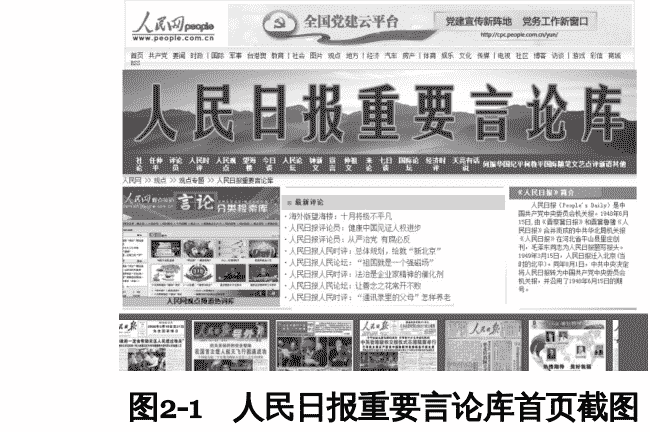

这两个数据库必须单独拿出来提醒大家，绝对是公文写作神器，为你提供从语言到观点到素材的全方位辅助。

人民日报重要言论库，把人民日报系发表过的所有评论性文章全部收纳其中，社论、任仲平、评论员、人民时评、人民观点、人民论坛、宣言、仲祖文、钟新文、今日谈、来论、望海楼、七日谈、国际论坛、经济时评一个不少。

具体怎么用？还用石头我教吗？涉及大政方针的，翻翻人民日报社论；谈论具体问题的，找找人民时评；聚焦党建和干部问题的，看看人民观点和仲祖文；需要宏大叙事和精美语言的，任仲平必不可少。

人民网领导人活动报道专页是什么？就是领导人言行库，上面搜罗了所有政治局委员的讲话全文和活动报道。

写公文怎么才能体现高瞻远瞩？怎么才能体现时效性和新鲜感？怎么才能表现和中央高度一致？就得靠引用领导的最新讲话，××同志曾经说，××同志反复强调啥问题的极端重要性，××同志语重心长地告诫大家，××同志明确指出，××同志最近强调，等等。

而这个“人民网领导人活动报道专页”，就是石头目前发现的收集领导人讲话最全面的数据库，每每在单位写稿子的时候，总要时不时上去看看××领导同志有啥关于教育的最新讲话，最新指示，最新提法。不知道的同志，抓紧上去看看吧。

除了这两个专业数据库，“人民日报电子版”本身也是一个综合数据库，人民日报所有的文章在上面都能看到，而且其库内检索功能也很好用，大家可以一并试试。

### 2. 习近平系列重要讲话数据库（见图2-2）

人民网去年还为全国的材料员们办了件大好事，那就是上线了习近平系列重要讲话数据库。过去咱们写材料要引用习主席讲话，主要是靠一条一条攒，或是上百度用关键词搜，不系统、不权威，甄别起来要花大气力。当然，也有人用心编辑了习主席重要讲话汇编的文档，很全，但实在是浩如烟海，找个一鳞半爪的句子颇为费劲。

人民网的这个“习近平系列重要讲话数据库”就厉害了，重点收录了党的十八大以来习近平总书记发表的系列重要讲话原文300余篇，相关重要论述、活动、会议、批示、书信、致辞、音视频等共计6000多条，涵盖经济、政治、文化、社会、生态、党建、国防、外交等各个领域，可谓最系统、最全面。

更重要的是，这是个数据库啊！兼具资料性、可检索性等功能，既可以按主题查看原文，也可以根据讲话发表的时间、内容，或直接输入关键词来实现精准搜索阅读。

比如，石头在写一个关于高等教育的讲话，想学习一下习主席相关论述，那就在数据库中搜“高等教育”，习近平总书记系列重要讲话正文中涉及“高等教育”字眼的内容就都出来了！

再如，要写个廉政方面的报告，关键词搜“廉政”，可以用的素材真多啊！

此外，该数据库手机版也同步上线，用户可以通过手机端查询讲话内容，随时随地学习习近平系列重要讲话精神。

有了这个数据库，领导再也不用担心我写的材料接不上“天线”了！

### 3. 求是网、党建网

除了人民网、新华网这类综合新闻门户网站，还有一类官方网站需要材料员们重点关注，那就是以求是网和党建网为代表的理论类网站。有人可能要问，你不说人民日报重要言论库已经很神了吗？难道还不够用？

人民网、新华网当然是宝库，但必须承认，它们也有缺点。人民网、新华网上的评论文章，精彩主要体现在观点和语言上，但都是些短小精悍的议论文、小品文，篇幅往往较短，想找体系规整、煌煌万言的“大文章”不容易。而且人民网文风普遍活泼，与公文需要的文风存有差距。

求是网、党建网则填补了这一空白。求是网上刊登的文章多是省部级官员撰写的理论文章、政论文，主题宏大庄重、体系全面规整、逻辑分明、篇幅较长，行文风格上也与公文更为接近。

党建网就更赞了，上面刊载的多为各级官员、各地机构撰写的关于党建、宣传等日常工作的经验，说白了，就是他们写的工作总结，简直就是为写公文量身定做的资料网站啊！

写材料的时候，如果是想学习观点和语言，当然多上人民网、新华网，但如果想借鉴框架、结构和标题，或者想写出理论纵深，求是网、党建网上刊载的“大部头”文章一定会为我们提供很多启发。

石头写这一节的时候是2018年5月17日，打开当天的党建网，随便点开当天发表的一篇文章，大标题叫“河南理工大学全员育人体系促学生成长成才”，接着看正文，该文章写了四个方面：全员参与提升育人“广度”；创新试点提升育人“宽度”；强化保障提升育人“温度”；百花齐放提升育人“效度”。

用四个“度”来概括学校育人工作，精彩啊！你就说吧，石头随便点开的这篇文章，是不是一篇非常值得参考的、标题拟得非常考究的“工作总结”呢？

### 4. 句子迷

运用金句，是提升文章质量，让文章变得生动的一大法宝。写不出来高度凝练、极为生动的金句，不是你的错，毕竟不可能每个人都是金句小王子，脑子里不停地往外蹦金句。但是错过句子迷（见图2-3）这个网站，你的损失就太大了。

句子迷这个网站，可以说是一个很牛的“金句”数据库，专注于佳句美句的收集，收集的范围不光有名人名言、经典语录，还有从各类媒体文章、文学作品中收集的佳句，也包括部分原创的好句子。

图2-3 句子迷首页截图

有人不屑，看上去好像没什么特色啊，也就是个大路货色的文字数据库，这类网站挺多的，石头你别吹牛了。

其实不然，你用后就会发现，句子迷样貌看着平平无奇，但实际上收录的美句极具时代性，很新、很潮。石头没发现句子迷这个网站之前，用过很多找名言警句类的网站，发现它们共同的问题在于，收录的句子经典有余，创新开放不足。

搜出来的句子，净是些卢梭、培根、牛顿之类名人的格言，经典是经典了，但放在文章里，总感觉像是20世纪80年代初某诗社文学青年写的文章，老、土、酸，没有充分反映出我们这个时代风起云涌的青春气息。

句子迷不一样，收录的句子不拘一格，非常新颖，绝不止来自那些19世纪的哲学家、文学家。比如，某次石头给领导起草与青年干部座谈的讲稿，其中要谈谈读书的问题。石头想引引典故、用用金句，于是到各个格言网站找与读书相关的好句子。在好几个格言网站搜出来的结果都是：

- 敏而好学，不耻下问。——孔子
- 书籍是人类思想的宝库。——乌申斯基
- 读书百遍，其义自见。——《三国志》
- 吾生也有涯，而知也无涯。——庄子
- 书籍是前人的经验。——拉布雷
- 读书破万卷，下笔如有神。——杜甫

道理说得都对，但是，这些句子也太老了！这怎么能体现出我作为杰出材料员的水平呢？

于是石头对数十个格言类网站进行了地毯式比较，直到发现了句子迷，毅然弃暗投明，在句子迷搜索框中键入“读书”二字，检索结果包括：

- 读书可以经历一千种人生，不读书的人只能活一次。——乔治·马丁《权力的游戏》
- 读书与上学无关，那是另一码事：读——在校园以外，书——在课本以外，读书来自生命中某种神秘的动
力，与现实利益无关。而阅读经验如一路灯光，照亮人生
黑暗，黑暗尽头是一豆烛火，即读书的起点。——北岛《城门开》

在功利主义的世界里，阅读维系着超脱，而超脱有利于我们的思考。读书毫无用处。正因为这个，读书才是一件大事。
> 我们在阅读一本书，因为它毫无用处。——夏尔·丹齐格《为什么读书》

> 我们读书，因为我们孤单，我们读书，然后就不孤单，我们并不孤单。——加布瑞埃拉·泽文《岛上书店》

> 读书到底是为了什么，如果我们排除做学问很实际的目的，读书就是我在吸取营养，把自己丰富起来。我自己感觉，读书最愉快的是什么时候，是你突然发现“我也有这个思想”。最快乐的时候是把你本来已经有的，你却不知道的东西唤醒了。——周国平

> 我的心得是读书不在多，而在反复读。喜欢的书总要读它几遍，才算读过，才能读进去。——陈丹青《谈话的泥沼》

高下由此立见！句子迷的检索结果中，连大热的电视剧《权力的游戏》的原著作者乔老爷子关于读书的话都收录了，我还有什么话说？这些句子的格调，不知要比俗套的格言网站高到哪里去了！

看到这些句子，石头欣喜若狂，最后，毅然舍弃了杜甫杜大人的“读书破万卷，下笔如有神”，选用了《岛上书店》作者加布瑞埃拉·泽文的“我们读书，因为我们孤单，我们读书，然后就不孤单，我们并不孤单”来印证读书对青年人形成健全人格的重要性。

后来听说，领导讲到此处，全场皆惊，肃然起敬。毕竟，这个句子的格调太高了。这样，我的效果就达到了。

## 5. 诗词名句网

如果写材料时涉及用典，想引点诗词古籍，诗词名句网是石头目前为止发现的比较好用的一个网站。其收录范围不仅包括诗词，也包括四书五经、四大名著等书籍，古籍的收录量让人满意。

网站的搜索功能虽然不算强大，也还勉强能用。例如，我们仍以“读书”为主题进行搜索，检索结果如下：

> 胜欲读书已懒，只因多病长闲。听风听雨小窗眠。过了春光太半。往事如寻去鸟，清愁难解连环。 [宋] 辛弃疾

> 古人学问无遗力，少壮工夫老始成。纸上得来终觉浅，绝知此事要躬行。 [宋] 陆游

> 吾生本寒儒，老尚把书卷。眼力虽已疲，心意殊未倦。正经首唐虞，伪说起秦汉。篇章异句读，解诂及笺传。 [宋] 欧阳修

> 晨趋紫禁中，夕待金门诏。观书散遗帙，探古穷至妙。片言苟会心，掩卷忽而笑。青蝇易相点，白雪难同调。 [唐] 李白

> 读书不厌勤，勤甚倦且昏。不如卷书坐，人书两忘言。兴来忽开卷，径到百圣源。说悟本无悟，谈玄初未玄。 [宋] 杨万里

结果还是比较丰富的。至于网站的具体操作方法，石头就不多说了，都是常规操作。

## 6. 一些公文QQ群、收费公文资料库

2018年，石头在网上看到一位愤世嫉俗的材料员写的批评文章，题目叫《我被一个“公文写作交流群”踢了，因为这事儿......》。作者表示，他从一个“公文写作交流群”中被踢了出来，原因是没按要求“每月提供一篇公文共享给群友使用”。作者愤愤不平，于是写文章大加鞭笞，表示这类公文资料群是助长形式主义和不良文风的大本营，要坚决批判。

石头看了这篇文章，心中冷笑，这不就是典型的端起碗吃肉、放下筷子骂娘吗？话说，您当时加群的时候不也是想下点资料素材吗？吃完肉就不认人了？反而给别人扣“形式主义和不良文风”的帽子，忒不地道了。

照搬照抄我们当然批判，但公文资料群本身是无罪的。实际工作中，不少单位、地区工作节奏相似，开年的时候都要部署，年底的时候都要总结，主题活动大家都要开展，把一些公文拿出来放到一起，相互学习、借鉴、寻找思路，石头觉得无可厚非。

大家可以适当地加入一些这样的公文共享群，从群里获得可供模仿的素材，尤其是一些时令性、规律性的公文，通过学习、参考大家的思路，对开拓视野帮助极大。

此外，群还是一个交流思想的空间，写材料时思路卡住了怎么办？到群里发个红包请教请教。提纲不满意了怎么办？到群里发个红包请大家帮忙提提意见。这都是极好的。

公文资料共享群不过是个工具，是作恶还是行善，是应付过关还是学习提高，完全取决于个人的动机和修为，资料群本身无过错可言。

除了大家自发组织的公文资料群外，网上也有一些专人运营维护的公文资料库，按年收取费用，定期根据工作热点和重心上传公文资料，这些资料大多经过甄别处理，质量较高。另外，这些公文资料库还会定期汇总整理“某某方面金句100条”“精彩标题300套”“写材料常用故事100则”等普适性的素材，免去了我们自行整理之烦琐，非常实用，有需要的材料员也可以了解了解。

## 7. 搜索引擎

这个基本已经普及，不用多说，写文章连这个都不用，说明你完全还处在刀耕火种的原始社会，没时间谈恋爱、陪孩子、累到吐血、头发稀疏那都是活该。相信大多数办公室人都有忐忑地在百度的搜索框里敲下“总结”“讲话”“对照检查”等字眼的时刻。

虽然大家对百度颇多恶评，但目前国内的搜索引擎最靠谱的还是百度。搜索引擎查东西，最大的弊端在于信息过于海量，搜索结果鱼龙混杂、良莠不齐。如何甄别结果？石头觉得有一条很关键，那些来自专业的文秘网、公文写作网站的结果完全没有必要点开看，基本毫无参考价值，无非是些陈词滥调，明明都已经在写“三严三实”了，上面都还是些“三个代表”的内容，很不走心。

凭石头的经验，一般而言，搜索结果中来自政府网站、新闻网站、正规单位网站的价值比较高，都是新近发生的、实实在在的报告、讲话，可以花时间品读研学。

当然，我们精力有限，说实话，一般人看个五六页就懒得往后翻了，只好凑合着看一篇算了。所以，如何在搜索引擎浩如烟海的结果中找到自己想要的结果，是个难题，需要高超的技术。这方面，石头将在下一节做详细说明。看完下一节你就会明白，你其实只用了百度功能的十分之一！

## 8. 本单位新闻网

本单位的新闻网其实是一座公文素材的富矿，但往往被人忽视。新闻网如果更新及时、信息全面，可以说就是单位的一部详尽的编年史、年鉴和档案库。

如何把文章写实？很重要的一个方法就是从实际出发，而最基础和直接的实际就是本单位的工作动态。无论是讲话、汇报还是总结，都要有一定篇幅的实例、数据，这样才能有说服力，才能活泼生动。

石头所在单位智库工作开展得不错，被上级单位看成是一个典型，受到邀请去座谈会上介绍经验，石头负责起草汇报稿件。这是单位长脸的好机会，怎么才能在一众兄弟单位面前露脸，凸显出自己单位智库工作一骑绝尘、遥遥领先呢，石头奋笔疾书，加强领导讲了，制度创新讲了，资源倾斜讲了，写到最后，总觉得少了点什么，不够味儿似的。仔细一琢磨，还是例证少了，有点虚。

石头忽然想起不久前似乎有篇新闻稿在单位新闻网上闪现过，说的好像是单位某个智库在一个什么评比中成绩不错。上新闻网一搜，在不久前公布的国新办的智库排名中，本单位排到了前十，这真是再合适不过的素材，放在文章里就像涮羊肉配麻酱一样完美。

石头闲得没事顺着历史文章往前翻了几页，结果发现更早前还有一篇消息，说的是在上海社科院的智库排名中，本单位跻身前三。这就能很雄辩地证明，我们作为先进典型发言是理所应当的。

## 9. 专业论文数据库（见图2-4）

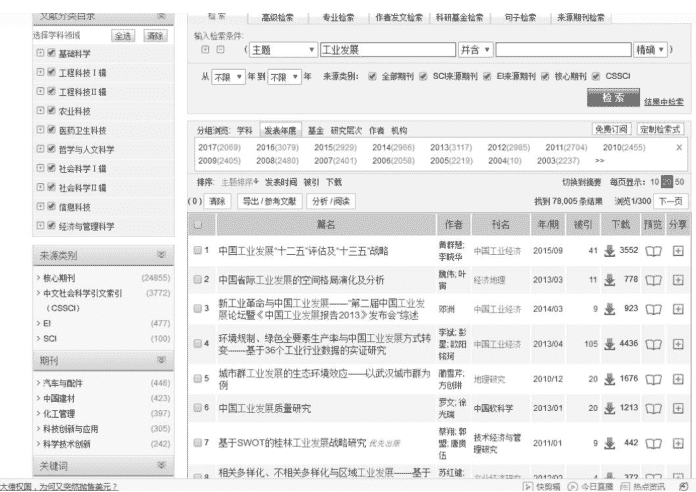

图2-4 某专业论文数据库截图

中国知网、万方这类学术论文数据库，也是公文写作的宝库。你可能要疑惑，写公文又不是搞学术研究，犯得上杀鸡用牛刀，还拿出数据库吗？

石头前面也说了，写公文本就该树立研究的心态，专业的数据库较搜索引擎而言，有四大好处。

一是主题集中。比如我们想找几篇讲调研方式和技巧的文章，就可以把搜索的来源限定在《秘书工作》《秘书之友》等办公室工作期刊上，比用百度大海捞针集中多了。

二是门槛高。能发表在杂志上的文章，一般而言都花了大心思，整体质量水平较高，多少还是有可取的地方，不容易出现胡编乱诌的情况。

三是更完整。网上很多文章几经转手，早就变得七零八碎，有的第一段没了，有的总结段少了，有的把科学发展观和四个全面拼凑到一起去了，得下气力甄别，相比之下，专业数据库上的文章来源封闭，要完整得多。

四是论述深入。互联网上的文章往往浅尝辄止，没有什么深度，你要是写一些专业性比较强的文章，一定得用数据库，比如让你起草某市农业发展的“十三五”规划，假如你能花一些时间找一些分析追踪农业前沿趋势的论文看一看,站位和视野一定会有跃升。

## 三、写材料，你其实只用了百度功能的十分之一

每当有人在公众号上问石头:石头,你有这个范文吗?你有那个范文吗?石头都会感到深深的无奈,这个时代,还需要范文吗?什么样的范文网上找不到呢?怎么还会问出这么傻的问题呢?

有些读者更过分,听说石头在写一本公文写作书,对石头说,你书里一定要多放些范文啊,放点优秀的、最新的范文。石头斩钉截铁地对他讲,这本书我一篇范文都不会放,都什么时代了,还把范文印在纸上,不完全是在骗钱吗?

石头为什么敢回应得这么直接?那是因为我相信,哦不,坚信,现在关于公文最新、最好的东西,范文啦、素材啦、整理啦、搜集啦,全部都存在于互联网上,而绝不在谁编写的《范文大全》里,骑兵怎么可能战胜坦克呢?

石头前面说了,写材料时上网搜一搜绝对不是偷懒图省事,以后材料写得好的人,就是对各种互联网工具运用特别深入、特别娴熟的人。

有些人虽然接受“搜一搜”这种办法,但对网上公文材料的质量不屑一顾,他们的观点是:“网上的公文材料,大多粗鄙不堪,不值得花费过多功夫研究,也没有下载收藏的必要。”

真的是这样吗?石头告诉你,大错特错,你觉得网上搜出来的公文质量不高,是因为你根本不懂得运用互联网工具写材料的正确姿势，拿最老少咸宜、最喜闻乐见的百度来说，过去写材料，你其实只用了百度功能的十分之一！

大多数人的误区在于，他们对工具的认识还停留在初级阶段。以为只要自己能使用，就算是掌握了一种工具，不愿意再花时间去探究工具高级的用法，觉得耽误时间。其实不然，真正深入理解并掌握一个工具，虽然开始会花一点时间，但之后会极大地节省你的时间，甚至为你打开另一扇门。

办公软件Excel就特别能说明问题，用它做张表，打印出来，并不难，但这不代表你就掌握了Excel，假如你不懂函数，你做一张表反映当年的收支情况，还要在下面拿着计算器捣鼓半天。但哪怕你能花点时间掌握Excel中最基本的求和函数，当你输入数据的时候，总和就自己算出来了，时间大大节省。

李笑来曾举过一个例子用以说明工具的重要性。他在没有学习五笔和盲打之前，觉得练习打字完全是在浪费时间，拼音之类的输入法已经足够快，而且根本不需要花太多时间学，还有必要再花精力学什么盲打？但是，因为某次机缘巧合学会盲打之后，他发现会盲打带来的好处是他之前根本想象不到的。打字速度提升后，他不再惧怕做读书笔记，因为打字比写字要快多了，他开始大段记录自己的感想，甚至做整篇整段的文字摘录，就这样，他积累了巨量的文字，又因此出了好几本书。

百度的高级用法也是一样，掌握互联网工具的高阶实用方法本不是一件难事，只需要花很少的时间精力，就能取得几何倍数的效果。

但很多人却毫不知情，或觉得太耗时间精力，只满足于往搜索框里输入就能出结果，只知道在搜索框里随便输入，找到些陈词滥调、质量不高的文章，于是就果断宣布网上找不到什么好东西，用搜索引擎写材料就是扯淡，这未免可惜又可怜。

这一节，石头就来教教大家怎么用互联网工具找到最优秀、最新颖的素材，为我们写材料助力。这里介绍的几种百度高级用法，建议全部掌握，学会后你能发现，哇，又打开了一扇材料之窗啊！

### 1. 用site命令，对指定来源进行搜索

作为一家公司，百度盈利的途径主要是竞价排名。人家靠本事和技术赚点钱无可厚非，但给我们带来的困扰是，搜索结果中，有用、优质的东西不一定能排在前面，反而是一些商业化的东西排在前面，因为人家交了钱嘛。

比如，你在对话框输入“民主生活会对照检查材料”，前面好几页搜索结果往往都来自“无忧公文网”“无忧材料网”之类商业网站，想看全文得付费不说，质量还不敢恭维。

怎么办？site命令这时就要大显身手！site命令可以将搜索范围限定在指定的某一个或某一类网站中，大幅提高检索效率，是材料人必须掌握的最重要的搜索命令。

具体使用方法为：在查询内容的后面加上“site：站点域名”，如site：gov.cn。注意“site：”后面跟的站点域名，不要带“http://”；“site：”和站点域名之间不要带空格。

网络信息虽然繁多，但对公文写作来说，只有完整的、真实的、新鲜的、一手的材料才是稀缺的。你要写公文，真正靠谱的信息来源其实没几个：各级政府网站、人民网、新华网、地方龙头媒体网站等，掰着手指头都能数过来。

同样是对照检查材料，某政府网站上公布的县长的真实对照检查材料和“无忧公文网”上拼凑的野鸡材料，哪个参考价值大，不用石头多说。我们知道，政府官网网址的后缀都是gov.cn，再搜索“对照检查材料”时就可以在百度搜索框中输入“对照检查材料site：gov.cn”，回车，一堆堆完整的、真实的、新鲜的、一手的单位或个人对照检查材料就全出来了。

以此类推，你想搜关于反对“四风”的精彩论述，就可以把来源范围限定在人民网、新华网，从而高效获取质量最高的关于反对“四风”的评论文章，而不用再费尽心力去甄别选择。见图2-5。

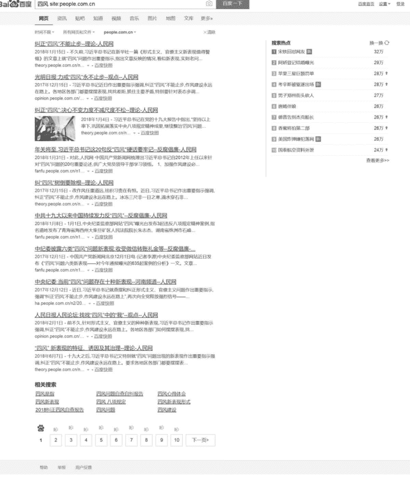

图2-5 人民网反对“四风”主题评论搜索截图

site命令除了可以保证搜索结果的质量，还有个好处，就是可以缩小搜索的行业领域。这是什么意思？不是搜的范围越大越好吗？

并非时时如此。比如，石头要起草单位2018年工作计划要点，想找点材料垫一垫，学习学习。如果不用site命令限定领域和行业，可想而知，公安、农业、质检、兽医等各个行业政府机关、工矿企业、学校医院的工作计划要点都将喷薄而出。

但石头在高校工作，职能和功能主要是育人，兽医站育猪的工作计划要点参考意义想必不会太大。这时就可以用site命令来筛选甄别行业领域，edu.cn是高等教育的专属域名，把搜索领域限定为“site：edu.cn”，之后再搜，结果全都是国内高校官方网站上公开的工作计划要点，与石头自己所在行业领域主题类似，工作内容大同小异，极具参考价值。

很多第一次掌握site命令的“材料狗”，甚至会沉浸在震惊和喜悦中久久不能回神：竟然有这么多单位把这么多真实公文材料全文挂在自己的网页上？连对照检查材料都纳入信息公开的范围了？他们到底怎么想的？我以前竟然从来都搜不到这么新鲜真实的材料？

是的，互联网就是这样浩瀚无边。

石头写材料常用的site命令主要有：

- site : gov.cn，政府网站
- site: people.com.cn; site: xinhuanet.com，人民网、新华网
- site: qstheory.cn; site: dangjian.cn，求是网、党建网
- site: edu.cn，高校网站

### 2. 给关键词加上引号，避免百度拆分

不少人觉得百度傻瓜好用，就是因为它模糊搜索的功能强大。为了匹配尽可能多的结果，百度会自动对关键词进行拆分。

比如搜“民主生活会对照检查材料”，它会自动拆成“民主生活会”“对照检查材料”进行搜索，显示相关的所有结果，比如，民主生活会的新闻啦，入党的对照检查材料啦。这是一种模糊匹配。

有些时候拆分是件好事，我们对主题限定没有那么严格，可以看到更多相关结果，扩大了搜索范围；但也有些时候，我们只想看民主生活会对照检查材料，至于什么入党对照检查、党员对照检查，我们不感兴趣，出现这种结果反而成了一种干扰，让我们真正需要的东西无法显露。这时可以尝试让百度不拆分查询词，方法就是给你认为最核心的关键词加上引号。

我们给“民主生活会对照检查材料”加上引号之后，搜索结果就不会再显示关于“民主生活会”或“对照检查材料”的结果，而只会显示“民主生活会对照检查材料”的结果，排除了干扰，纯粹多了。

### 3. 确定更多、更精准的关键词

首先提一个问题：搜关键词，是先从最吻合的关键词开始搜索，还是先搜相对宽泛的关键词？

大多数人会觉得，当然应该先搜相对宽泛的关键词，关键词太多、太精确，命中的结果可能很少，岂不是白费功夫了？还是先搜出一大堆东西再慢慢挑吧。

是不是这样呢？哈佛校长Drew Gilpin Faust有一段很著名的理论，即“车位理论”，那是她在哈佛大学2008届本科毕业生的毕业典礼上做的题为《人生的意义》演讲中的一段话：

“不要因为觉得肯定没车位了，就把车停在距离目的地20个街区远的地方。直接去你想去的地方，如果车位已满，再绕回来。”

石头觉得，我们确定关键词同样应当遵循“车位理论”，不要因为担心搜索结果太少，就从最宽泛的关键词开始搜索。尽管去搜最吻合、最精确、最相关的关键词，如果确实结果不足以参考，再尝试更宽泛的关键词。

比如，石头给大学校长写毕业典礼讲话，想先看看别的校长都讲了点什么，绝不应该从“校长讲话”搜起，找出来一大堆中小学校长不让孩子们打架斗殴的讲话，费时费力，大海捞针，看得人老眼昏花，毫无参考价值，而是应该精准确定四类关键词。

- 一是单位关键词：大学、高校；
- 二是身份关键词：校长、领导；
- 三是活动关键词：毕业典礼；
- 四是题材关键词：讲话、发言、致辞。

然后不断尝试这四类关键词的组合，看看哪组更能得到我们想要的结果。先确定更多更精准的关键词，再从窄到宽、从精准到模糊，才是我们写材料搜索时的正确方法。

## 4. 多关注百度文库

与互联网上浩如烟海的信息相比，百度文库之中的资料完整、精当得多，可以看成是一种搜索服务的VIP版本。

所谓重赏之下必有勇夫，用户在百度文库中上传文档可以得到一定的积分甚至盈利，下载有标价的文档则需要消耗积分或者付款，因为有利益诱惑，不少写材料的人把自己手头的原创范文或者模板、提纲、诗词锦句上传上去，补贴家用。时间长了，百度文库也积累了不少很具参考价值的材料。

大家在搜索公文参考资料的时候，可以多关注百度文库。

## 5. 搜索特定文档格式，使用“filetype:”轻松搞定

辛辛苦苦帮领导起草了一篇党课讲稿，领导看后颇为满意，一边拍着肩膀对你表示赞许，一边奖励你再帮他做个PPT，这时就要用到“filetype:”这个命令来对搜索对象做限制，寻找特定格式的内容，冒号后是文档格式，如PDF、DOC、XLS等。

比如，想找党课的PPT模版，就可以搜“党课filetype:PPT”，肯定可以找到不少红旗招展、热情洋溢的“党政风”PPT模板。

## 6. 懒人朋友的福音——一站式高级检索

写到这里，石头已经介绍了不少百度高级用法，虽然我已经尽我所能描绘了掌握这些命令的光明前景，但毫无疑问，还会有不少人早就耐不住性子了：你这语法太难记，一会儿一个空格，一会一个引号的，容易搞混弄错，对我们文科生来说太不人性化了，太不注重用户体验了！

没关系，石头再给懒人朋友们一个方法，如果你不想记那些恼人的命令符，那至少要在自己的收藏夹里收藏百度高级搜索的网址，通过访问http://www.baidu.com/gaoji/advanced.html，直接使用百度的高级检索，也可以实现一些主要命令符的功能。

百度高级搜索把上面介绍的部分高级语法集成到一个页面上，用户不需要记忆语法，只需要填写查询词和选择相关选项就能完成复杂的语法搜索，得到更精细、更准确的结果。

大家可以把搜索结果显示的条数设置成每页显示50条，提高阅读效率，减少翻页，还可以设置时间，搜索最新的讲话和资源等。对广大“懒癌晚期”的搜索爱好者来说，百度高级搜索确实是个福音，快去试试吧。

## 第三章 模仿无罪：关于基础

### 一、模仿无罪

经常会有人问石头一类问题，石头统称为“怎么写”问题，比如，“领导把××材料交给我，我一点思路也没有，怎么办呢？”“这个评估的总结怎么写，想不出来啊？”“那个动员的讲话怎么写，完全一点头绪都没有啊？”

这类问题石头常常觉得无法回答。因为它涉及一个公文写作的基础性，同时也是根本性问题，当你不知道一个材料怎么写的时候，是应该继续冥思苦想，思考怎么写吗？

### 1. 不要再问“这种材料怎么写”这么深奥的问题了

不！请先停下你的思考。怎么写，既不是一两句话能说得清楚的，更不是你拍脑袋能想得出来的。事实上，你不会写，不是因为你蠢，而是因为你见识短。

石头觉得，第一步要做的其实是，改变思考问题的路径。你要考虑的问题不是宏大而深奥的“怎么写”，而应是更加具体、更具可操作性的“怎么在别人稿子的基础上去改写”。对刚起步的人来说，第一步永远不是思考，而是长见识，开眼界。

如何去做？石头没有什么“六艺”“八式”“十招”教给你，核心其实就是两个字：模仿。

提高公文写作水平，必须从模仿起步，短平快的方法就是炒剩饭，走老路，拾牙慧。

### 2. 破除模仿不道德的执念

借助模仿进行公文写作，是初学者提高写作能力的一条捷径。

不少人忌讳模仿，瞧不上，认为那是一件不光彩的事，甚至把模仿和拼凑、抄袭画上等号，其实这是一种彻彻底底的误解，今天石头要为“模仿”正名。

> 《辞海》中说：“模仿是依照一定榜样做出类似动作和行为的过程。人在掌握语言和各种技能的过程中，以及艺术习作的最初阶段，都要借助于模仿。自觉地仿效先进的榜样，可以吸取别人经验，扩大自己经验，作为进一步发挥创造性的基础。”（引自《辞海》1979年版第1319页）

看看，石头说什么来着，至少我们从这个定义里可以确认，模仿对于人类是一种积极的东西，你大可以把顾虑放下。

任何人在进入新的领域时，都会很迷茫。如果只靠自己倒腾、琢磨，不仅效率低，作用也有限。跟人请教、看书固然是一种办法，但由于你跟别人的段位不同，很多时候也是鸡同鸭讲。此时最好的策略是：找一个优秀的、信息披露充分的、和自己位置匹配的对象进行模仿。

哲学上讲，任何事物都有普遍性和特殊性。那么，我们可以下一个结论，对公文来讲，规律性、一般性的东西其实是基础和主体，个性化、发挥性的东西只是枝干，这是由公文的庄重性、正式性、统一性决定的，否则，一篇公文怎么能通行全国？

不同于其他的写作，公文写作有相应的体例格式，虽非千篇一律，但直白性、排他性的特点又使其具有比较固定的基本框架和表现形式。

各类公文都有它独特的组合要素，先说什么后说什么，哪些东西可以少说或不说，哪些东西不说不行，等等，都是很讲究、很有学问的。

拿工作汇报来说，肯定都是先讲成绩和做法，再讲问题和不足，最后讲措施和打算，跳出这个框架的写法，基本不存在，即使存在，那也得领导有胆识用。如果我们能够紧紧抓住这些去模仿，就有可能尽快进入角色，很容易地写出我们要写的东西。

很多公文经验文章在教新手的时候，老有一种把公文高端化、神秘化的倾向，什么“文章乃经国之大业，不朽之盛事”，什么要“行云流水、一气呵成”，什么写文章要讲究“气”、把握“势”之类的，吓得小白们还没动笔就尿湿了裤子，甚至从此都站不起来，始终摸不着门道。

不能说这些老手是在故弄玄虚，确实到了某个阶段，写公文确实需要情怀和热爱，需要站到“文章乃经国之大业，不朽之盛事”的高度去讲究“气”、把握“势”。

但，这些老手们讲的其实多是怎样写出优秀的文稿，而不是怎么写合格的文稿。对日常工作来说，尤其是对初涉公文写作的小白们来说，更多的是应付程式化的材料，争取在最短时间内拿出一篇能过关的、基本达标的文稿来。火都没打着，谈什么加速？！

事物发展总有客观规律，不可能跳过“合格”直接到“卓越”。况且，对每一篇文章都提出高要求是不现实的，对只写过校园爱情小说的小白提出高要求也是不现实的，大多数情况下，新手还是应该先从基础做起，按照程式拿出合格文稿即可。

### 3. 公文模仿的目标

模仿是正当的，也是必由之路，这一点我们已然明确。但关于模仿的目标和心理预期，石头还是要把丑话说在前头。

模仿的目的是让你快速达到行业中上水准。光靠模仿是很难达到行业顶尖水准的，但是帮助水平较低的人快速达到行业中上水平，还是可以满足的。

某人临摹王羲之的字，一直临一直临，最后写出来很像的字，你可以说他的字写得很漂亮，但只靠模仿是无论如何也成不了书法家的。

可见，模仿策略是有局限性的，它只能帮你从较低水准上升到中上水准，想要成为顶尖高手，模仿就不够了。

总而言之，接到一项写作任务，之前没整过，“这种材料怎么写”这样的话就不要再问了，找模板、要模板、看模板，看着看着，学着学着，你就会了。找素材、提炼、模仿、落笔、修改、再修改，这方法可靠有效。

### 二、模仿的路径

上一节石头一直在帮大家解决关于模仿的思想前提：模仿很光彩，模仿需释怀。相信大部分人看了石头的分析，能放下模仿不道德的执念，从心底认同模仿，轻装上阵。

这一节我们就来解决方法问题：具体怎么在公文中模仿？模仿的步骤和路径是怎样的？从哪些方面解剖模仿对象并效仿？石头带着大家一步步来探讨。

### 1. 重点关注自己不知道的

字、词、句、段、篇、章，语言、结构、主题、立意、观点，一篇公文中可以模仿的环节太多太多。我们写材料时如何厘清模仿的头绪？大家首先要把握的一个模仿原则：先研究别人有而我没有的东西，先模仿自己不会的东西。

石头自觉对公文语言的运用还算娴熟，碰到没写过的题材，困难主要在结构和套路上。比如起草一个祝酒词，主要模仿的就是它的结构和套路，找一篇看看，哦，开头“首先我代表××，代表我的夫人，也以我个人的名义对各位贵宾的到来表示热烈的欢迎！”必须要有；结尾“现在我提议，大家共同举杯，为××，为××，为××，为各位嘉宾和家人的健康干杯！干杯！”必须要有，学的主要是这些程式和套路。

假如你之前是个文学少年，写的净是抒情诗歌，什么“穿过你的黑发的我的手”，那就应该多模仿公文的语言体系，即字、词、句，学着写“重要性、紧迫性、自觉性、主动性、坚定性”“责任感、紧迫感、危机感、认同感、荣誉感、成就感”这种话。

### 2. 先效仿结构

前面石头提到，规律性而非个性才是公文的本质属性，公文的规律性首先来自结构。

某一主题的公文，结构一般类似，想要打破结构的惯例另开新篇，搞点所谓的创新，是需要极大勇气的，是需要拿出啃硬骨头的胆识和魄力的，这不是我们写材料的小兵能决定的事。所以，照着之前和别家的结构放心摹写吧，没问题的。

石头曾接到任务，起草本单位领导班子对照检查材料。之前从没写过此类题材，动笔前，石头认真翻看了之前历年的材料，无一例外由三个部分组成：

- 一、六个方面的对照检查情况；
- 二、问题原因剖析；
- 三、下一步整改措施。

看后，石头感到很不满意，这实在千篇一律，第一部分对照检查情况里面，其实不但谈了问题，也谈了问题产生的原因，第一部分跟第二部分重复了啊！再说，上面要求实事求是地谈问题，有什么问题就谈什么问题，有必要非要把问题归到老生常谈的六个方面里去吗？

于是乎，石头大笔一挥，把对照检查体例进行了改革，只谈两个大方面，一是对照检查情况，二是下一步整改举措，其中对照检查情况跳出六个方面的框框，连搞了十大问题，自以为是锦绣文章，得意洋洋地交上去。

不承想，十分钟不到文章就被甩了回来，领导只有一句话：“照着之前的样子写。”石头不服气：“一定要写原因分析吗？查找问题一定要写六个方面吗？为什么不能写十个方面？”

领导的回答言简意赅：“不分析原因显得不深刻；问题写这么多就是说问题很严重喽？”

石头吓得汗湿了后背：“不敢不敢，改改改，马上改。”

你看，对公文来说，“照着讲”往往不会出问题，你想“接着讲”，这难度就大了！

对新手来说，切实可行的搭建文稿结构的办法就是：直接复制、粘贴模仿对象，不改变文章框架和结构，只是把里面的内容更新一下。

比如，每年都要写年度工作总结，开头从来都是紧紧围绕上级精神之类的指导思想，中间写工作成绩，结尾写未来如何做。按这个套路弄，稳得很呢。

### 3. 替换内容

结构敲定，下来就是内容。以已有的材料为基础，替换已经不合时宜的内容，保留尚可保留的内容，其实就是在公文内容模仿环节，最直接，也是最基础的一种模仿方式。

比如起草年度工作总结，前面总有个帽子，2017年的那个冬天，小王起草的某高校工作总结开头是这样写的：

一年来，学校全面贯彻党的十八大和十八届三中、四中、五中、六中全会精神，以习近平总书记系列重要讲话，特别是在哲学社会科学工作座谈会和全国高校思想政治工作会议上的讲话精神为指导，以贯彻落实全校第十四次党代会精神为动力，以落实学校“十三五”规划为抓手，坚持改革、创新、发展的总基调，深入推进综合改革，推动学校各项事业发展，力争成为国家“双一流”建设的排头兵。

到了2018年年底，换成小李起草某高校工作总结，这段话其实大面积是可以保留的，只不过党的十九大已经召开，党的十八大就不合时宜了，党的十九大提出了习近平新时代中国特色社会主义思想，不再提习近平总书记系列重要讲话，所以，对这些过时内容加以替换，即可得出新的工作总结了：

一年来，学校深入学习贯彻习近平新时代中国特色社会主义思想、党的十九大精神和习近平总书记致××大学建校××周年贺信精神，围绕学校第十四次党代会确定的总体目标，坚持改革、创新、发展的总基调，深入推进综合改革，推动学校各项事业发展，力争成为国家“双一流”建设的排头兵。

所以，替换内容是材料员必须掌握的模仿基本动作，我们所要做的就是：

- 开头用新的上级政策和精神替换过时的内容，比如说用“两学一做”活动替换“党的群众路线教育实践活动”活动，用十九大精神替换十八大和十八届历次全会精神；
- 中间用今年开展的各项工作替换去年的工作，比如说用“全面推进双一流建设”替换“认真落实全国高校思政工作会议精神”，用“扶贫工作‘回头看’”成绩替换“精准脱贫”工作；
- 结尾用新的口号替换旧的口号，比如说用“撸起袖子加油干”“幸福都是奋斗出来的”替换“踏石留印、抓铁有痕”。

这样下来，一篇文章的“快手稿”就能很快出炉。

### 4. 交叉综合是高阶手法

替换是模仿最基本，也是最简单的形式，其本质是一对一的模仿，也就是说，从一篇文章模仿转化成另一篇文章。

但显然，面对变化多端的主题，越来越高的要求，一对一的模仿很多时候无法解决问题。有些人听了石头前面讲的替换法，如获珍宝，直接把领导交代的文章标题输入搜索框，想一下子找到一篇标杆狠命学，一搜啥都没有，急哭，又不知道材料如何下手了。

大多数情况下，你都很难找到一个一模一样的黄金模版可供参考，毕竟公文的使用场景千变万化，每个领导的要求千差万别。怎么办呢？没关系，石头告诉你，其实，模仿的精髓在于交叉模仿。

聪明的同志们可能已经领悟到了，既然有一对一的模仿，那它的升级版当然就是一对多的模仿，这种一对多的模仿，就是交叉模仿。

这样说可能还是有点不好理解，所谓交叉模仿，说得直白一点就是：

我们借鉴模仿的时候，只盯着一篇或者少数几篇文章肯定难以满足需要，应该尽可能多地搜集与公文主题，或者公文某部分内容相关的文章，然后从多篇文章中，分别找到合适的一小段，甚至一小句，并加以借鉴、改写，之后拿过来运用到自己的文章中。

借用鲁迅先生的话说，就是文体可采用张三的形式，结构可融汇李四的骨架，内容可涉及王五的涵盖，语言可借鉴赵六的精彩，然后进行优化组合，进行创新创造，总之：参考要广泛，引用不单一，模仿看不见。

举个简单的例子，还说上面那个某高校2018年工作总结的第一段，小李采用替换法之后，虽然也能过关，但还是觉得跟去年的像了点，心里不安，于是又想到了交叉法。他翻阅了近期本单位的其他几篇材料，发现年初领导在一篇工作部署讲话中最后一段提出号召：

不忘初心，牢记使命，凝心聚力，真抓实干，落实立德树人根本任务，持续深化高等教育改革，以永远在路上的执着推动学校各项事业发展，力争成为国家“双一流”建设排头兵。

呀，这句话比原来的话精彩多了，虽然是工作部署会讲话里的词，但不是正好可以用在工作总结的开头吗？于是，2018年工作总结的第一段就被小李改造成：

一年来，学校深入学习贯彻习近平新时代中国特色社会主义思想、党的十九大精神和习近平总书记致××大学建校××周年贺信精神，围绕学校第十四次党代会确定的总体目标，落实立德树人根本任务，持续深化高等教育改革，不忘初心，牢记使命，凝心聚力，真抓实干，以永远在路上的执着推动学校各项事业发展，力争成为国家“双一流”建设排头兵。

这么一段话，不光模仿了去年的工作总结，还模仿了今年的部署讲话，把两篇材料的相关内容糅到一篇新文稿中。这就是交叉模仿。

石头举的只是交叉模仿最简单的例子，事实上，你想交叉得有多复杂，都可以。下面石头举一个稍复杂的例子——对照检查材料。

一般对照检查材料整改措施都要有一条，关于改进作风、廉洁自律的，好了，今年的对照检查也整这么一条吧，怎么写呢？

先搜一搜廉洁自律、四风、从严从实之类的关键词。

看到新华社有一篇报道，里面有句话很关键，“习近平总书记近期在批示中指出，纠正‘四风’不能止步，作风建设永远在路上”。不错，可资借鉴。

再往下看，《人民日报》有一篇反“四风”的社论，写得相当精彩，“四风的问题具有相当的顽固性，稍不警觉，就难免深陷其中”。不错，很深刻，可资借鉴。

再翻翻自己平时整理的金句库，里面有句话讲洁身自好的，“权力就是责任、领导就是服务、干部就是干事”，很工整，不错，可以用得上。

对了，自己去年还写过一篇关于师德师风的评论，里面有一句表态，“作为一名教师，为人师表，行为世范，更要严于律己，为学生做出示范”。很合适嘛。

好像还差点意思，哦，对了，去年的对照检查里写过一句“自觉接受师生员工的监督，把组织和师生员工的监督看成是关爱和警醒，率先垂范、以身作则”。好像还可以利用一下嘛。

于是，杂糅、模仿了新华社报道、人民日报评论、自己积累的资料、近期相关主题的材料、过去同主题材料，再根据自己的理解加以改写的一段材料就出来了。

树立从严从实作风，时刻绷紧廉洁自律的弦。习近平总书记近期在批示中指出，纠正“四风”不能止步，作风建设永远在路上。这充分说明“不严不实”“四风”的问题具有相当的顽固性，稍不警觉，就难免再次陷入其中又不自知。我认为，要保证始终“压紧弹簧”，根本途径还是在于不断强化“权力就是责任、领导就是服务、干部就是干事”的责任意识，做到以上率下，要求别人做到的自己先做到，要求别人不做的自己坚决不做；自觉接受师生员工的监督，把组织和师生员工的监督看成是帮助、爱护和警励自己。同时，作为一名教师，为人师表，更要严于律己，为学生做出示范。

看，这就是比较复杂的交叉模仿。

开头段可以这样交叉模仿，同理，材料里的每段话、每个部分也可以这样交叉模仿。有时，一篇材料可能模仿了二十篇乃至上百篇文章，这才是兼容并蓄的高级模仿。

### 5. 对单一主题进行发散

有人还是疑惑：石头，你说起来挺热闹，但我的问题是，每次写东西，我根本不知道该找哪些主题的文章去模仿，不知从何“搜”起，巧妇难为无米之炊啊！这就需要我们具有对单一主题的分解和发散能力。

举个例子：你给自己写青年干部座谈会发言，想找点素材，如果单搜“青年干部发言提纲”，一出来都是大空套话表决心，你想与众不同，那么你可以搜什么？

我们可以发散一下，青年干部有什么特点呢？有理想，有朝气，行动力强，能吃苦。那我们就搜“青年干部理想”“青年干部实干”等关键词，绝对可以得到不同凡响的结果。

还可以发散，如果我们换个角度想，领导要求的就是青年干部要做到的，领导对青年干部有哪些要求呢？我们可以以“领导 青年干部要求”“书记 青年干部座谈”为关键词搜索，可以得到不少领导对青年干部提要求的精彩文章，用到自己的座谈会讲话中，站位和视野立马不一样。

石头请大家牢记，想学会“借鉴”别人，想进行交叉模仿，就要先学会对已有的题目进行发散和拓展，而不要死盯着给定题目不知变通，这样才能避免出现“搜不出来东西啊！”“找不到有价值的参考素材啊！”这种尴尬。

### 6. 结合实际

除了替换和交叉，手头拿着模仿对象，要想恰当地用到自己的材料里，还有一件非常要紧的事，那就是结合本单位、本次活动、本时间段的实际，对其进行改造。

上级文件写得再棒，外单位的稿子写得再精彩，直接拿过来用总不会特别合身，只有加进去结合实际的内容，别人篓子里的菜才算进了自己篮子里。起草工作报告，就要结合上级部署任务如何在本单位本领域落实来谈；起草实施方案，就要结合上级的原则性要求如何细化为本单位的刚性措施来谈；起草经验材料，就要结合上级的主要精神如何转化为单位的特色做法来谈。

参考借鉴上级精神可以，但要对着单位实际、对着现实问题去学习模仿，转化为带着本单位标签和特色的内容，这样才会既有指导性又有针对性。

举个比较常见的例子，我们时常会写一种材料——××单位贯彻落实上级××精神的若干意见。既然主题是贯彻上级精神，那模仿甚至直接引用上级精神是免不了的。但如果照抄照搬，肯定过不了关，毕竟人家的文件是管全国的，你的文件只管到本单位。

一次，石头单位某部门下发了一个贯彻落实中央文件精神的文件，里面有句话说“要加强报纸、网站、电台、电视台等媒体管理”，领导看到这个文件后，大发雷霆，把某部门负责人叫过来狠批一顿，质问他为什么下发文件完全照搬照抄上级文件，一字不改。

负责人马上认怂，承认文件确实大段参考了原文件。检讨之余，他很纳闷地问领导：“领导，您怎么一下子就看出来我们用了文件里的原话呢？”领导瞥了他一眼，答道：“废话，我们单位什么时候有电台和电视台了？你们抄的时候都舍不得动脑筋。”原来如此！

所以，模仿一定要加干货，这个干货就是我们自己的东西，实际的东西。

## 7. 扩充和压缩

模仿时还可以对模仿对象的语言进行扩充、压缩。啥意思？扩充就是模仿对象的句子，到你这儿可以扩展成结构；压缩就是模仿对象的结构，到你这儿可以缩成句子。

举个例子，有一次石头读报纸，看到一篇对时任国家主席胡锦涛同志访问奥地利的报道，中间有这么一句精彩的排比句描述胡主席的访问，“音乐之都奏响友谊主旋律，家庭农庄飞扬友谊咏叹调，大师故里回荡友谊协奏曲”，当时只是觉得这话格式工整、韵律优美、比喻新颖，就随手记在了自己的素材库里，并没有细想这句话能派上什么用场。

后来石头应邀撰写一篇阐释高校与北京精神关系的文章，要求从“爱国、创新、包容、厚德”四个方面来论述高校如何弘扬北京精神。我灵机一动，爱国不就是一种主旋律吗，厚德不就是一种咏叹调吗，包容不就像协奏曲吗，简直一一对应，这句话完全可以扩展为文章的结构和提纲！

于是我就以《首都高校践行“北京精神”要唱好“四重奏”》为题，把“高校要唱好爱国向党的主旋律”“高校要唱好大胆创新的进行曲”“高校要唱好包容平等的交响乐”“高校要唱好厚德尚礼的咏叹调”作为四个分标题，分别论述高校应如何践行北京精神的四个方面，形成了一篇文章，编辑看后觉得角度新颖贴切，安排在年度第一期刊发。

模仿对象的结构，到你这儿可以缩成句子，也是同样的道理，这里就不再举例了。

## 8. 改写语言

汉语博大精深，同一个意思，可以用不同的语言表达，改写你受到启发的结构、观点，用自己的话叙述出来，换一个表达方式，也是模仿的一种手法。

比如，原话是：

年初以来，我们始终坚持以××战略为指导，在××、××的正确领导下，不畏困难，鼓劲加压，开拓创新，理清发展思路，提升区位优势，全面推进经济社会发展，呈现出经济日趋繁荣，社会事业日益发展，人民群众安居乐业的大好局面。

咱理解之后，用自己的话再说一遍，就能把它改写成：

近年来，全市上下全面落实××发展战略，认真贯彻××、××的各项部署，在困难中拼搏，在压力中奋起，在创新中前进，发展思路和发展战略进一步明晰，区域中心城市地位得以提升，城市面貌发生了可喜的变化，呈现出经济繁荣发展、社会和谐稳定、群众幸福安康的新局面。

意思和主题其实没啥变化，但语言完全另起炉灶。语言改写的手法主要包括：主动被动倒装、同义词替换、句式变化，等等，石头就不细说了。

## 三、手把手教你找到模仿对象

关于写公文的模仿对象，时常会存在一种误解，以为模仿的对象越高级越好，明明是给副镇长写稿子，却照着新华网上党和国家领导人的讲话猛写，写出来自以为高瞻远瞩、气象万千，结果把领导吓一跳，赶紧拿红笔画了一个大叉。这就是选错了模仿对象。

合适的模仿对象，水平不但要比你高，更重要的要和你所处的位置相匹配。你让国足学德国队的踢法，学得了吗？学不了！人家身体素质岂是咱能比的，还是学学踢法相近的日本、韩国、伊朗把握大一点。

所以，模仿对象的选取，最合适的有两类。

一类是本单位之前相似主题的文章。毕业典礼讲话年年都有，让你起草今年的，没干过？不要紧，先把校长前几年毕业典礼的讲话收集齐，模仿的对象就有了。

另一类是外单位类似主题的文章。北大的、清华的、复旦的，甚至目光远眺，耶鲁的、哈佛的、牛津的，每年都有毕业典礼讲话啊，都收集起来，模仿的对象就多了。

从操作层面讲，要找到合适的模仿对象，可以从以下几方面着手。

### 1. 收集、检索上级相关讲话、文件和会议精神

上级的话是模仿的一个重要来源，科层制要求上行下效、今行禁止，不把上级要求挂在嘴边，材料是写不好的。材料中比较宏观的内容，比如大方向、大原则、大目标、大举措、大政策、指导思想是一定要模仿上级的话的。

上级的话涵盖也很广，一类是领导同志最新的讲话精神。可以通过中央电视台的新闻联播和地方晚间新闻、人民日报和地方党报、各级政府网站，密切关注领导，特别是主要领导和分管领导的行踪及相关讲话，重点关注他们的新思想、新观点、新要求。

另一类是相关会议的文件材料、上级下发的文件等。在不违反保密纪律的前提下，与自己研究工作相对应、相联系的上级会议、文件材料都要尽可能拿到手，认真学习，深入分析，了解上级关注的工作重点，把握其原则、举措和要求。

比如，如果你是某市委组织部的材料员，受命起草新年组织工作计划要点，全国组织部长会议相关的会议材料，不摘几句是肯定不行的；如果你给某高校起草校长在新学期部署会上的讲话，教育部下发2018年工作重点，也是很好的模仿素材。图3-1就是石头某次起草材料收集的上级讲话精神。

平时要养成习惯，上面下发的文件，尤其是与近期重点工作或自己工作板块比较相关的，只要不涉密，尽量复印留存；出去开会，会上发的文件汇编、发言汇编都塞到包里带回来，说不定就能用上。

有些纲领性的文件、讲话，更是要打印出来放在手边案头，你材料的主题、观点乃至语言提法，都要从里边来。比如石头在高校工作，手边总是常备《十九大报告》《习近平总书记在全国教育大会上的讲话》《习近平总书记在全国高校思政工作会议上的讲话》等。几乎一刻也离不开啊！

### 2. 搜一搜自己的硬盘，找本单位老笔头要本单位材料

本单位相关主题文章是模仿的主要材料，这类模仿来源针对性、相关性强，极具模仿价值。有些程式化的材料，其实只要稍加改动就能出手。

碰到要写材料了，先搜一搜自己的硬盘，看看之前有没有写过类似的文章；再笑容满面地找到本单位的老笔头，递上几支好烟，请他发几篇之前的相关文章给你。这样做，看上去麻烦，其实不知比你自己吭哧吭哧憋材料要快多少倍。

要想急用的时候总能从自己电脑搜到干货，功夫得下在平时。每次写的稿子都要在硬盘分门别类保存好，更重要的是文档都要详尽命名，别偷懒写个“讲话”了事，找的时候有你哭的，应当按照“时间、主体、场合、文体”的方式给文档命名，比如“20180820张书记在全县农业工作会议上的主题报告”。

此外，本单位发的文件，开会的会议纪要，新闻报道，也都属于要搜集的素材范畴，里面常常有不少干货。

### 3. 找兄弟单位要材料

老话说，不看不比，沾沾自喜，一看一比，相差万里。写材料，要有比较意识，要习惯“观外头”，看看别人是如何写的，从中寻找有用的句子和段落。

怎么个观法？重点看系统内兄弟单位的材料。兄弟单位往往工作节奏比较一致，写材料的“痛点”也一致。你们刚开始准备学校思政工作会议的讲话，正抓耳挠腮呢，没准人家刚好开完，现成的东西一大堆。你们刚开始试点某项工作，要做部署，没准人家年年搞，早就形成品牌，现成的东西一大堆。

一个电话过去，称兄道弟、许诺吃饭，厚着脸皮求人家把材料发来学习学习，肯定能省不少事。

自己性格很孤僻，外单位没什么朋友怎么办？废话，上百度啊！

### 4. 学习理论文章、业务文章

上面说的这些模仿来源虽然是主要材料，但眼光也绝不能局限于此，石头之前说了，对主题的发散才能带来思路的开阔和观点的碰撞。

所以，不光是成形的材料能模仿，与我们写作主题有粘连的理论文章、业务文章都可以成为我们模仿的对象。

材料中涉及说理的部分，就可以多关注《人民日报》的人民时评、声音、思想纵横、人民论坛，《北京日报》的理论周刊、《环球时报》的国际论坛，《人民论坛》《党建杂志》《中国改革》《求是》等杂志中，也有很多议论性的短文，既有哲理，又有文采，把一些我们习以为常的现象提高到理性认识的高度，引用过来，文章会增色不少。

比如，石头接到任务，要起草一个深化高等教育改革的总结材料，中间某段要论述一下“敢于担当”的重要性，过去的说法都是老生常谈了，有没有什么新观点呢？

上网翻阅，人民时评有一篇题为“为担当者担当，让干事者无忧”的评论文章相当精彩，文中这样论述担当的重要性：

全面深化改革，不是一眼见底的小池塘，随便挽起裤腿就可以蹚过；也不是笔直平坦的林荫大道，可以踱着方步走过，要的是敢闯、敢试，敢破、敢立。每一次改革、每一步探索，都既需要非凡的勇气、不寻常的智慧，也需要突破某些条条框框的魄力，从小岗村的包干到户，到今天的让市场在资源配置中起决定性作用，无不如此。

这段话虽然在主旨上与我们写的高等教育毫无关系，但观点和语言都颇有可借鉴之处，我们结合高等教育的主题改写一下：

深化高等教育改革，不是小水坑小池塘，随便挽起裤腿就可以蹚过；也不是笔直平坦的水泥路，可以轻轻松松地走过，而是爬高山、越深谷，要的是敢闯、敢试，敢破、敢立。在教学科研、学科建设、人才培养、招生录取、后勤保障上的每一步探索和改革，既需要非凡的勇气、不寻常的智慧，也需要突破某些条条框框的魄力。

是不是就是关于高校继续深化高等教育改革的精彩论述呢？

另外，材料中如果涉及业务知识，就要多参考模仿业务知识相关的材料、行业发展情况，防止写稿子脱离实际，出现空话、外行话，贻笑大方。

比如，给领导起草在全市工业发展大会上的讲话。工业发展管理是一项业务性很强的工作，归发改委这类业务部门管，办公室这种综合单位的人还真不太懂这项业务。

不懂就得学，闭门造车肯定不行，这时候就得大量收集、参考工业发展类的业务文章——中央、省、市关于产业发展的重要决策部署，本市工业发展历程的介绍材料，本市工业强市的战略规划，本市工业发展的结构性矛盾分析，本市工业项目投资概况等。

有了这些模仿对象，一个根本不懂工业的材料员才能写出“切实增添转型升级动力。提升传统产业活力。着力重塑产业链、供应链、价值链，优化要素配置，加速改造提升传统动能。切实抓好煤炭行业、铝产业、食品饮料、天然气产业的转型升级，通过兼并重组、参股控股、战略合作、资产联营等形式，推动企业与上下游产业、新技术新业态融合发展”这样的内行话。

### 5. 只要是文字，皆可以模仿

写材料的时候，千万别被“类似文章”“完整文章”“大文章”这类的标准束缚了手脚，只要对我们的表达有启发的文字，例如新闻报道、讲话摘要、会议纪要、公报等，只要有启发，一句话咱也不嫌它少，都可以模仿。

比如，在所有文章中最不起眼、最简单的通知，有时可能也会有值得汲取的养分。一次，石头奉命起草单位的近期重点工作部署讲话，领导指示：学校前不久刚迎接了上级教学评估，你在稿子里要提一提接下来的教学评估整改工作。

教学评估整改，石头完全不懂，肯定要找材料来参考模仿，于是一个电话打到教务管理部门，让他们说说怎么个整改法。可教务部门还在忙着处理评估后续工作，顾不上整改的事，说没有材料给我。好吧，只能我自己找了。一找，找到隔壁学校这么一则同样是关于教学评估整改的通知：

- 一、各部门、各教学单位要集体学习审核评估报告，深入了解掌握审核评估专家组反馈的意见；
- 二、针对存在的问题，教学单位及有关部门要逐项查摆核对，高标准、严要求，结合学校“十三五”规划、人才培养模式综合改革、2016年重点工作，重新审定原有方案，细化方案，拿出时间表，建立台账办法，抓好落实，按时完成整改方案，于10月24日前报教务处；
- 三、教务处汇总各部门、各教学单位提交的整改方案，形成学校经过细化的新的整改方案，报学校研究通过后上报教育厅；
- 四、落实新的整改方案。根据新整改方案制定的时间表、路线图、任务分工，重点抓落实。各部门、各教学单位在日常工作中，切实贯彻“以评促建、以评促改、以评促管，评建结合、重在建设”的方针，做好持续改进工作。
- 五、以审核评估整改工作为契机，开好2016年教学工作会议，通过整改，进一步深化我校教育教学改革，提高应用型人才培养质量，将我校建设成为综合实力强的高水平大学。

虽然不过是一则小通知，但通知无疑已经点明了教学评估整改工作的原则、步骤、要点和目标。看了这个通知，石头明白了，整改工作应该从这么几个方面展开：第一，要学习领会评估报告；第二，要制订整改方案；第三，要抓好整改方案落实；第四，要以评促教。

可以说，整改工作的框架在这则通知中得到了体现，而这些，都超出了我已有的知识范畴。在后来的写作中，这则通知就成为我学习、模仿的来源和对象之一，并在其基础上形成了材料中关于教学评估整改的内容：

上学期，学校接受了本科教学审核评估，本学期，我们要对教学评估反馈结果进行专题研究，对评估中发现的不足、问题认真加以整改，用好本科教学审核评估这份“会诊单”。一是要深入分析专家组的反馈意见。把整改提升作为学校找问题、补短板、强特色、助发展的重要契机，解决长期以来制约学校教学发展的关键问题。二是要细化制订整改工作方案。就专家提出的学校在顶层设计、内涵发展、办学理念、师资队伍建设、专业布局、实践教学质量等方面存在的问题，制定切实可行的措施，落实到怎么做，谁来做的问题上。三是要注重整改实效。要重点解决专家指出的问题、提出的建议和学校自评中发现的不足，力争做到观念有改变、制度有改进、条件有改善、质量有提高，切实推动我们的本科人才培养再上一个台阶。

总之，关于模仿对象，石头希望大家牢记一个定律：模仿的来源越广泛、越庞杂，最后成文的质量就越高，眼界一定要放得宽些！

## 四、不要走上抄袭的邪路

模仿是正当的，但模仿不是肆无忌惮的，更不能走向抄袭的邪路。

记性好的同志或许还记得几年前那波县委书记文章抄袭新华时评的舆情。细心的网友在阅读2017年6月23日《延安日报》第二版倒头条一篇题为《欲明人者先自明，欲正人者先正己》的文章时发现，该文章与2015年5月14日新华社记者在新华网刊登的时评文章雷同。

再看《延安日报》刊登的这篇文章，最后作者竟为“中共延安市富县县委书记李志峰”，故网友认为该文章涉嫌剽窃，遂在网上举报。

石头仔细对比了两篇文章，简直一模一样，确属抄袭无疑。办公室诸君相信也心知肚明，文章署名虽是县委书记，但这种发表其实就是职务行为，文章肯定不是书记动笔写的，顶多审过一遍。

这一事件，相信最终板子挨得最重的必然是县委办写稿的某位同志，发展前途必然断送，搞不好饭碗不保。

县委办写手原封不动抄袭确实愚蠢、可恨，但相信不少办公室的同志也会心有戚戚焉，整天那么多话要写，脑子里哪有如此多好话可说呢？

借鉴学习难以避免，但下面几个雷区写手们要时刻记取，否则，掉下去就是粉身碎骨。

### 第一，结构不能抄

结构和逻辑一定是要从需求和实际出发，自己思考得来的。李书记的文章一眼被认定为抄袭，关键在于结构完全跟新华时评一样，每一段第一句都照搬过来，这样一下就被钉在了耻辱柱上。

### 第二，原话不能抄

除了引用的诗词名句，其他论述绝对不能照搬原话。可以学习叙述方式、论证逻辑、个别词句、关键观点，可以拆开、打散、重组，用自己的话说出来，但绝对不能直接把原话复制粘贴过来。

### 第三，不能只盯着一篇文章

县委办的同志也真是懒得可以，上网搞调研没啥，只看了一篇文章就觉得抓住了救命稻草，这绝对行不通。上网搜集文章，一篇是不够的，至少要有个几十篇，看完以后才能有点感觉，将他人精华的部分吸收，为己所用。

总之，写文章之前上网收集资料、模仿借鉴没有任何问题，不但不应贬斥，而且应当提倡和发扬，因为只有善于学习借鉴，才能写出内行文章。不能照搬，而要吸收、消化、创新，在前人的基础上融入自己的特色、写出自己的东西。

## 五、如饥似渴地霸占素材

在这本书里，石头已经多次提及模仿、建资料库、专题研究这类话题，想竭力说明占有素材对写材料的重要性，按说花的篇幅不少。但石头还是不放心，觉得没有把素材的重要性谈透，还是有点模模糊糊欲言又止的，索性再系统地谈谈，以引起大家的重视。

### 1. 材料写不好，素材一定不够

素材收集到底有多重要，石头可以拿自己当例子。石头到办公室这些年，写材料的时间越长，动笔的时间就越晚。刚接触写材料的时候，接到任务了，让你一周之内完成某某稿件，石头一般是花个把小时找点资料，就打开word文档开始写；现在呢？写材料时间久了，接到任务了，让你一周内完成某某稿件，石头往往是找素材找了三四天才开始动笔。

假如出一个选择题，问，对写材料来说，哪个环节最重要，给你四个选项：A占有素材；B文字功底；C观点思路；D把握意图。有些人可能会犹豫不决，觉得这四个环节都很重要，但是作为写了七八年材料的我，必然一秒钟都不会迟疑地选择A，占有素材。

想当年，石头刚到写作班子，还不得要领，写的材料总是出现这样那样的问题：有时候是站位不够高，有时候是与实际结合不够紧，有时候是语言不够生动，有时候是文字不太严谨。这让石头很丧气，跟领导抱怨，写材料要求也太多了，我老是顾了这头忘了那头，是不是能力不行，根本就不适合这类工作啊？

领导笑了笑，安慰石头：“写不好材料的原因，一般不会是能力不够，写公文对语言能力的要求并不高。更隐蔽、更深层次的原因是占有素材太少。你一定要如饥似渴、厚颜无耻地去占有各类素材，占有的素材多了，你就知道妙处了。”

石头接着问领导：“经常听您和一些老笔头说素材，那到底啥叫素材呢？就是我们平常说的写作资料库里的那些东西吗？比如各种名人名言、文言古语、精辟论述、形象比喻、新鲜提法之类。”

领导继续点拨：“你说的这些当然都是素材，但我理解的素材范围还要广得多，可以说，只要是你搜集到的、未经整理加工的、感性的、分散的原始材料，能够经过集中、提炼、加工和改造写进材料中的，都算作素材。”

我瞪大眼睛：“那就是说，只要能为我们写材料提供参考的一切文字都算是素材了？”

“你的理解是对的”，领导点头认可，补充道：“你占有的素材多了，就会体会到，写材料时就像有人不断地给你砌台阶，轻轻松松就走上去。”

材料写得多了，石头越发坚信领导的话，尽可能多地收集掌握素材真的是写好材料的基础环节，为什么呢？

李笑来有个钥匙与锁的理论：解决问题就好像是开一把锁，锁代表着问题，钥匙代表着解决方案。只要锁头确实是锁上的，那么钥匙就一定不在锁孔里。所以，想要找到钥匙，就不能只盯着那把锁，一定是要到别的地方去找，只盯着锁头一点用没有。由此得出，我们应该在问题以外的地方寻找问题的解决方案，而不是只盯着问题不放。

公众号【懒人手册】回复“互联网”，白嫖各种资源文档

写公文的过程极好地印证了这条定律。当你写材料卡壳，遇到问题的时候，盯着屏幕冥思苦想一点用没有。正确的做法应当是，跳出你正在写的这个文档，到别的素材中去寻找答案，你拿来学习、参考的素材，就是那把在别处的钥匙。

比如，你在文字表达上遇到了问题，有个观点不知道怎么表达才精准得体，最好的办法是，去找找看别人是怎么表达的；你在对观点的支撑上遇到了问题，最好的办法是，去找找看有没有相关的例子、故事、数据；你在文字的生动性上遇到了问题，最好的办法是，去找找看有没有金句、诗词、排比。

可见，素材有时是公文大厦的图纸，启发我们的思路，成为模仿、改造的对象；有时是材料大厦的砖瓦，可以直接充实进去。一篇材料几乎所有的内容和环节，从思路到观点、到结构、到标题，到论证、到例证、到金句，都与你占有的素材有关联。

解决公文问题的过程，就是一个不断寻找“别处的素材”这把钥匙的过程，而绝不止是死盯着文档无谓牺牲脑细胞的过程。

牛顿有句名言：“如果我看得比别人更远些，那是因为我站在巨人的肩膀上。”石头觉得这句话放到写材料的语境里也毫不违和，站在素材的肩膀上，才看得更远，视野更宽阔，见识更卓越。

对于素材，我们为什么要有执念？这是因为石头相信：所有你想表达的观点、进行的论述，前人都有可能已经做过，而且做得要比你精彩，这些精彩的文字散落在网络中、书籍中、各种各样的素材中，所以只要我们找到这些素材，就能少走很多弯路，省下不少气力。

## 2. 素材的分类

再强调一遍：只要能为我们写材料提供参考的一切文字都算素材！为了便于理解，我们可以做如下分类。

- 从语言的角度来看，素材可分为字、词、短语、句、段、篇。
- 从公文结构角度来看，素材可分为精彩的标题类素材、段首导入语类素材、新颖的框架类素材、启发深思的结尾类素材。
- 从公文文体的角度来看，素材可分为领导讲话类素材、工作汇报类素材、工作报告类素材、调研报告类素材、信息简报类素材、评论类素材，以及请示纪要等各种应用文类素材。
- 从来源角度来看，素材可分为上情、中情、下情、内情、外情类素材。
- 从内容角度来看，素材可分为大政方针类素材、理论知识类素材、数据做法类素材、故事案例类素材、问题不足类素材。

## 3. 素材收集应贯穿写作全程

素材如此广博，所以，就写材料上的时间分配来说，占有素材应该花最多时间。而且，收集素材不是一锤子买卖，砸完就跑，而是要坚持一个基本逻辑：对素材的收集应该贯穿整个材料写作的全过程，持续不断进行。

如果一篇材料任务交过来，时限三天，怎么去做呢？记住“四轮收集法”。

## 第一轮素材收集

石头接到任务后，第一件事一般是先建一个空文件夹，比如，这次接到的任务是写单位2017年党风廉政建设责任制总结报告，那就先建一个名为“党风廉政建设责任制总结报告”的文件夹。

先不要管什么思路、结构之类的，先把手头找到的所有相关的内容，包括通知、背景资料、前几年的总结，还有百度搜索党风廉政建设的结果、自己资料库与党风廉政建设相关的素材，都拷贝到这个文件夹里面。这个过程可能会花费几个小时或者半天，这也是素材收集的第一波高峰。

这时，文件夹可能已经有了十几篇素材，根据已有的素材一一进行分析、提炼、总结，脑中对于今年党风廉政建设总结的框架、结构、主要观点、论述需要的支撑性素材会越来越清晰。

看完第一轮收集的素材，石头脑中已经基本明确，今年的“党风廉政建设责任制总结报告”大致可以分为四个部分。

- 第一，关于夯实从严治党主体责任。
- 第二，关于严肃党内政治生活。
- 第三，关于强化监督检查。
- 第四，关于完善体制机制建设。

可见，第一轮素材收集其实是个由散乱到聚焦、由别人到自己，在素材当中理路子的过程，即先广泛搜集、阅读与公文主题相关的素材（散），从中理出一些“核心点”（聚），掌握其大致规律、要点所在，继而形成自己的框架、思路和观点。

当然，也不排除有时你写一些特别熟悉的问题，或是特别简单的问题，根本无须收集素材，就可以直接出思路、出提纲的，那第一轮素材收集就可以笼统一点，精力主要放在找支撑素材上，即“关起门来想路子，走出门去找例子”。

## 第二轮素材收集

接下来，不要动笔，进行第二轮素材收集。

框架和思路明确后，根据已有框架和思路，对照手头掌握的素材，查漏补缺，继续收集材料。

第一部分，关于夯实从严治党主体责任，我意识到，这一部分必然需要用到班子研究部署党风廉政建设的情况，班子成员自身党风廉政建设的情况。

第二部分，关于严肃党内政治生活，这一部分必然用到理论学习的情况，开展组织生活的情况，抓意识形态工作的情况，抓干部工作的情况。

第三部分，关于强化监督检查，查处违法违纪案件的情况是少不了的。

第四部分，完善体制机制建设，出台了哪些规定办法，内控体系建设有什么推进，都需要涉及。

这样大致一看，缺的素材还不少。

第一部分，班子研究部署党风廉政建设的情况，班子成员自身党风廉政建设的情况，可以翻查常委会纪要，看有没有可以运用的素材。

第二部分，开展理论学习的情况，开展组织生活的情况，抓意识形态工作的情况，抓干部工作的情况，都涉及部门工作，马上联系组织部、宣传部，请他们有针对性地提供相关工作素材，如有必要，还可以现场调研座谈。

第三部分，查处违法违纪案件的情况，马上联系纪委，请他们提供相关工作素材。

第四部分，出台了哪些规定办法，内控体系建设有什么推进，联系法规室、财务部门，请他们提供相关素材。

第二轮素材收集，其实是个由聚再到散的过程，也就是回过头来收集查找与“核心点”相关的素材（散）。这一轮素材收集齐全之后，基本上每一部分的支撑素材都很充裕了，内容大致上撑得起来了，可以按照既定的思路和框架开始写作，填充框架，充实段落。

## 第三轮素材收集

接下来，一边动笔，一边同时进行第三轮素材收集，也就是边写边查边找。

经过前面的收集，每一部分的主体素材虽然心里有数了，但难免会碰到这样那样的问题，需要一边写，一边继续补充素材。如果感觉哪个问题不好把握了，哪个提法不大明确了，哪个观点不知道怎么去表达了，哪些问题论述得还不够全面了，就是需要进一步查找、调用素材的时候了。

比如，正写到第二部分关于开展理论学习的情况，忽然发现宣传部给我提供的素材比较旧，年底好几次重要理论学习都没纳入进来，班子开展的中纪委十九届二次全会专题学习、召开的干部警示教育大会等工作都是亮点，应当写进去。

这时就不能满足于前面收集的素材，打电话问也好，新闻网上搜也好，马上补充相关工作素材，把内容写得全面充实一些。

这样三轮撸下来，一般来说，文章就大致成形了，初稿基本堆出来了。

## 第四轮素材收集

素材的收集对石头来说还没结束，我还习惯接着来第四轮素材收集。

第四轮素材收集的主要任务，是从总体上把握、分析一下文章各个部分内容上、语言上、说理上是否还有不充实、不完善的地方，继而针对需完善的某个点，继续收集、增加素材，提质增亮。

党风廉政建设总结初稿形成了，一遍读下来，感觉文采上还有欠缺，反腐倡廉领域的行话不多，语言表达也不够生动。

马上上网搜，或从自己的资料库里找到“反腐倡廉金句100条”“从严治党金句50条”，从里面挑一句格言，如“源洁流清不难成素节，形端影直最易见丹忱”，加到文章里来论证党风廉政建设的重要性，文章增色不少。

另外，数据好像还有点单薄，让人感觉细节不够丰富，马上打电话给纪委，请他们提供一些正风肃纪、查处案件的相关数据、案例，增加到文章里，材料一下子饱满多了。

可见，第四轮素材收集，就是特别针对文章的薄弱环节进行的。

有人曾用四个比喻来形容素材的重要性，石头觉得虽然略显冗长，但也在理：一是素材如粮草。所谓“兵马未到，粮草先行”“手中有粮，心中不慌”，粮草充足，是打胜仗、奏凯歌的前提和关键。二是素材如米。所谓“巧妇难为无米之炊”，没有米，再巧的妇人也做不出好饭。三是素材如建筑材料。写公文好比建房子，素材就是水泥、砖瓦等建筑材料。缺乏充足的建筑材料，再好的设计师也建不好房子。四是素材如公文之母。没有母亲怀胎十月的辛苦孕育，是不可能生下孩子的。总之，做好了素材积累的功夫，公文写作就事半功倍。

在石头心目中，好的材料员不像是在房间里掉书袋的哲人，而更像是一个在外奔波的记者，眼勤嘴勤手勤脚勤，不断寻访各种素材，揣在自己兜里，最后为己所用。

大家务必对收集素材这件事重视起来，坚持平时积累和专题研究两条腿走路：一方面，平时坚持党报日读，不断丰富完善自己的资料库；另一方面，动笔的时候持续做专题研究，持续收集素材。怀着一颗永不满足的心，尽己所能、如饥似渴地去寻找、霸占素材。

## 第四章 领导所想，即我所写：关于思路

### 一、意图才是硬杠杠

不少人排斥写材料，听说领导要调他去政研室写材料，头摇得比拨浪鼓还欢。问他们原因，苦、熬夜、掉头发是一个方面，更多人提及：“你们是为人作嫁衣，忙忙碌碌半天，没人知道是你干的，你图个啥呢？”。写材料“为人作嫁衣”的工作性质，也是很多人对写材料敬而远之的重要原因。

石头听一名办公室同僚哭笑不得地讲过一个故事：一次，领导痛批了他数次推倒重来拿出的第七版稿件，最后，走投无路的他拿着第一版过去，意想不到的是，领导非常满意，当即表扬说，这个写得好。

故事虽然心酸了点，但其中折射的道理是深刻的。作为一个基层材料员，所有从你手中出去的公文，都不是你意志的体现，你永远是在被领导的意志驱动着写材料。要么你的材料根本就是为了领导而写，不但不能署名，甚至都不能对外人言说；要么你的材料是领导布置给你，最终还要回到领导那里去接受检验。

意图才是硬杠杠。所以，领导自己的讲话稿自不消说，即使是总结、调研、汇报，文件这类材料，想要轻松过关，省点气力，写得好不好只是个侧面，领导满意不满意、高兴不高兴、答应不答应才是硬标准，说得玄乎点，领导的“感觉”决定了稿子的生死。这一点，石头在《兄弟，你写的是文稿，不是文章》一节中说得已经很充分了。

如果第一章的《兄弟，你写的是文稿，不是文章》是一种世界观，那么，这篇文章就想从方法论的层面解决让领导满意的问题。如何才能充分把握，完美呈现领导的意图呢？如何才能让领导看了稿子有“把我想讲的都写出来了”这样的美好感觉呢？我们还是由易到难一条条说。

### 1. 一字不漏记录

材料员往往最喜欢给一种领导写稿子，他们心思缜密、深思熟虑，给你布置任务，总会和声和气地把你找来面授机宜：“小石啊，这篇稿子我初步考虑可以分为三个部分，第一个部分主要说××，讲××这么几个意思，第二个部分主要说××，讲××这么几个意思，第三个部分主要说××，讲××这么几个意思。”

也就是说，他事先经过思考，其实已经基本打好了腹稿，思路已经相当系统完整，甚至有时候要个2000字的稿子，领导已经口述了1800字。

这类材料，写起来很轻松，大局已定，稍加整理、扩充就是一篇完整文章。我们要做的，不过是完整、忠实地把领导交代的话记下来，记得越全，写得就越轻松，记得不全，领导难免就对你不满意：“我都说得很清楚了，怎么××这项工作还是没有体现？一个小稿子你都记不全？”

当然，领导并非总有时间和你推心置腹地面授机宜，有时候他找你过去，心里也还没有想清楚，只是一些零散的观点，或是初步的轮廓，想跟你“碰一碰”。

这时，虽然我们下来之后要做的思考和扩充工作变多了，但第一要务没有变，还是应当全盘详细记录，即使是领导自言自语、只言片语，都先写下来，这些不明确的观点，同样也是意图的流露啊！

依石头的经验，在这种情况下你可以放松一些，脑子飞速运转，时不时插话、提问，提出自己对材料主题和结构的看法和理解，不要怕不成熟，不要怕不精致，权当是帮着领导开拓一下思路，就算是提供了一个靶子供他去否定也没什么大不了，还缩小了写作范围呢。

况且，石头发现，有不少领导喜欢这个“碰”的过程，你想想，一边是领导口若悬河，不断发问，一边是你呆若木鸡，战战兢兢，也是挺没劲的。

### 2. 不断接近

作为材料员，石头内心当然万分盼望每次写稿，领导都能语重心长地跟我谈上半小时，甚至直接塞过来一张列好提纲的纸：“小石啊，提纲写好了，你敲出来扩充一下吧。”这种写法，返工的风险几乎不存在。

但这是不现实的，领导工作忙、事情多，很多时候并没有时间周密思考，只给你交代个只言片语，有时甚至直接把提交材料的通知发过来，就一句话：“小石，看看通知，弄个材料吧，后天给我。”这时候怎么办呢？

没办法，你不动，领导意图不会自己从天上掉下来，想把握领导的意图，只有充分发挥我们的主观能动性，尝试做一件事：不断接近。

### 接近他本人

有机会，多跟着领导跑，跑会议，跑调研，多参加决策性的会议、部门的专业性会议和有关的研讨会、论证会等，听领导讲话，听典型发言，都是领会领导意图的极好机会。

一位政研室的老前辈曾说过，跟领导跑还不能“甩手甩脚跑”，不管领导安排没安排，要求没要求，相机、录音笔、笔记本都是应该带的，只要没有特殊交代，领导“开讲”就“开录”，回来后整理成文，特别是对领导脱稿发挥的内容，要进行“再消化”，日积月累，长期坚持，对把握领导意图很有帮助。

如果时间不允许，至少最近领导出席的与文稿起草相关的活动一定是要跟的。比如，马上要开党建主题教育活动部署会，让你起草讲话，那领导近期与党建工作相关的调研肯定不能不去。

除了跟现场，查询阅读领导认可的材料、发表的文章、接受的采访、新闻报告等文字也是一种迂回接近的方法。这些都属于接近他本人，对领导原话进行收集和应用，因为实在太过重要，石头后边还会单讲。

### 接近他身边的人

除了跟领导，领导身边的人也是我们一大信息源。听上去偷偷摸摸，好像要搞什么鬼，其实这是掌握领导意图的一条捷径。

没思路的时候，去找找离领导比较近的秘书、办公室负责人、老部下聊聊，请教他们：领导喜欢什么样的风格？最近有没有什么特别关心的问题？有没有只言片语的观点和指示？等等。

一次，石头帮领导起草毕业典礼讲话，参加人基本都是本校学生，石头拿不准，这种场合到底是板起面孔谆谆教导好呢，还是放下身段交心谈心好。要知道，曾经有段时间高校毕业典礼领导讲话非常流行穿插网络用语，以示亲和。于是找到领导的秘书：“老曾，领导最近有没有提过跟毕业典礼相关的事啊？”

老曾歪着头想了半天，一拍大腿：“还真有，他不经意说过一次，说这次典礼很重要，一定要办得大气庄重。”

石头一听，喜出望外，这条信息简直太关键了，如果大气庄重是领导对典礼的期盼，那某些高校毕业典礼讲话爱用的“伤不起”“打酱油”“高富帅”“白富美”等网络用语就明显不合适了，领导肯定还是想站在师者和长者的角度对同学们提提要求，整篇稿子的语言风格就此敲定。

### 3. 换位思考

在办公室工作的诸位同志，入职培训时大都听过一句话，叫“身在兵位，胸为帅谋”。这句话听上去很宏观，甚至有点冠冕堂皇：我与领导，完全是两个物种啊，一个在金字塔尖上，一个在金字塔基座，那能一样吗？

石头最初也这么想，自己能落实好领导指示，做到指哪打哪就不错了，让我“关起门来当领导”“当好参谋助手”，不现实，也不可能。

但稿子写得多了，每次审视自己的作品，发现一个现象，那些自己觉得写得比较精彩，领导也比较满意的稿子，都是在“投入”的状态下写出的。

所谓投入，不仅是指全神贯注、集中精力，更是说写稿当时似乎和领导来了次“角色互换”，写讲话稿，就想象是自己在台上对着听众进行部署；写汇报稿，就想象是自己面对着上级战战兢兢地汇报。在这种状态下写出的稿子，不仅语气上特别符合领导的口吻，就连内容上，也容易接连迸发出一些意想不到的灵感，十分神奇。总之，一旦投入，就感觉脑子活起来了。

比如，石头前不久起草一篇领导在学科评估结果总结研判会上的讲话，要分析学校面临的竞争形势。开始怎么也没有思路，键盘上流出的文字都是些空泛的套话，自己看了都很不满意。于是某个周末，找个安静的咖啡厅，尝试进入一种投入的状态——我如果是校长，怎么看学校目前面临的竞争态势呢？

渐渐地，开始进入角色，一进入角色，灵感就开始迸发：领导可能会关注高等教育近期哪些形势呢？肯定会关注清华北大最近的动作，对了，清华前一段时间评了14个文科资深教授，力图构建文科发展新格局；还有什么呢？对了，这次评估浙大也超过了我们，压力确实不小！

平时接触过，又遗忘在大脑深处的相关信息，开始不停地往外蹦。虽然，领导从来没说过自己关心过这些消息，但石头在那种“投入”的状态下就会坚信，如果我是单位领导，我就会关注！这就足够了！事实证明，这些内容领导基本都采用了。

所以，换位思考，就是不要怕自己站位低，勇敢地“跳起来摘桃子”。写材料必须把自己摆在领导位置上，千万不能把自己当秘书。给谁写就是谁，如同演戏，演达康书记，那就得真把自己当成是汉东省省委常委、京州市市委书记！你要敢想你坐在主席台上的样子，敢想会场庄严肃穆的场景，这样一来，你的文笔就不稚嫩了，心态就不是为了应付而凑字数了。

湖北省政府政研室覃道明主任有段话我觉得很精彩，很直接，能够把那些不敢跟领导换位思考、不敢“表演领导”的人拍醒，他说：

从高度而言，首先要将自己置于省长、副省长的位置思事、谋事。哪怕你是刚出校门就进机关门的年轻同志，只要你一动笔，你就是省长、常务省长。省长、常务省长的观点、思路要与省委保持一致、与中央保持一致。说白了，在思想上、政治上要直接达到至高的顶点。

是不是说得足够清楚了？

### 4. 搞清楚周边信息

需要说明的是，我们写材料以领导意图为指引，并非说只考虑领导个人的想法，领导也要综合，也要适应，也要到什么山头唱什么歌，所以，活动场合和周边信息也会对领导意图产生影响，这些因素需要我们提前考虑进去。

开个会议，写个讲话，准备材料，首先要弄明白这个会是干什么的，要解决什么问题，是讲给谁听的，写给谁看的，要达到怎样的目的，取得什么样的效果。

这些东西弄不明白，心里就没有底。你这个会议，是动员会还是总结会，是座谈会还是汇报会，是宣传教育会还是总结表彰会？你这个材料，是调查研究还是请示汇报？场合不同，领导应对自然不同。

正儿八经的工作部署，要求一板一眼、语言精准；下去督导检查了，还得把獠牙露出来，要求严肃紧迫、措施有力；讲党课、作培训，要求内容翔实、干货丰富；欢迎庆祝的致辞，要求轻松活泼、鼓舞人心。

正式场合，一般是开大型会议，地点基本都是在礼堂或者大会堂，有主席台，必须正襟危坐、面无表情、喜怒不形于色。这种场合讲话稿要严谨细致、结构分明、逻辑清晰，起承转合天衣无缝，大点套小点，小点套小数点，动不动就要来一句“同志们！”

非正式场合，一般是开小型会议，地点基本都是内部会议室，以圆桌会议居多，没有主席台，这种场合讲话就比较随意了，领导能侃就侃，这种就要给领导多提供点案例、故事、素材，供他去发挥，语言也是以说大白话为主，多用第一人称，整个基调就是聊聊天、谈家常。

有人曾总结了起草讲话要弄清的10个问题，石头觉得很好。这10个问题包括：谁来讲？以什么身份讲？什么时候讲？对谁讲？为什么讲？领导自己想咋讲？机关想让领导怎么讲？会议要求该咋讲？与会同志想听啥？讲话之后讲稿怎么用？这些问题，非常全面地概括了我们写材料需要搞清的周边信息，请大家牢记。

### 5. 切中职务身份

公文为公，领导的职务身份当然放在前面考虑。领导职务的性质，是党务还是政务？分管工作的范围，是组织、宣传还是纪检？在班子中的地位，是班长还是成员？这些因素都会对文稿起草的文风到内容产生深刻影响。

比如，同样是在全校人才工作会议上讲话，书记和校长讲的侧重点当然就不一样，书记讲的必然偏宏观，讲思路、讲政策，而校长就会讲得更具体，讲局面、讲举措；同样是在全县经济工作会议上讲话，县委书记和县长的风格肯定也不尽相同。

再如，管组织的领导讲话，往往要求全面辩证、周密严谨，一个字都不能少、一个词都不能颠倒！管宣传的领导讲话，对鼓动性的要求就高，有时还特别强调生动。这些不同，都是领导的职务身份带来的，咱们起草文稿，必须要考虑职务身份。

## 6. 结合个性领悟

俗话说，千人千面，由于领导的成长经历、气质、性格、能力和领导方法不同，对材料的喜好和要求完全不同。通过上面的步骤，我们或许已经知道领导想表达点什么，但通过怎样的形式表达，就要从领导的个性出发了。

现在领导的水平都很高，长期在单位摸爬滚打，基本都有自己的讲话风格、语言表达习惯。比如，同样是形容天上的月亮很圆，有些领导喜欢“湖光秋月两相和，潭面无风镜未磨”，有些领导喜欢“天上月亮贼拉圆”。

有的要求你观点要有冲击力，有的要求你言辞优美；有的喜欢引经据典，有的喜欢俗语俚语；有的喜欢对仗排比，有的喜欢豪言壮语；有的喜欢辞藻华美，有的喜欢平实严谨；有的喜欢长篇大论，有的喜欢短小精悍；有的风风火火、不拘小节，有的思维缜密、滴水不漏。这些领导的性格也需要我们带到文风中。

就拿细致、事无巨细的领导和粗放、抓大放小的领导举例来说。对于比较粗放的领导，你给他准备的材料可能也就算个“素材”“谈参”，他也就当个提示，那就多花点精力把观点提炼清楚，多放一些故事、数据和案例，给他输送“弹药”，空话套话少写，不用花太多精力在雕琢形式上，给他留一些发挥的余地。

如果领导是那种事无巨细，或者有些吹毛求疵的性格，他的精力会更多地放在材料的形式上，特别在意你的用词是否准确、句子是否通畅，对观点、事例反而不那么在意，那么你在充实内容上或许可以放松一点，多把时间花在打磨语言甚至标点上。

甚至在个别字和词方面，不同领导都有不同的执着。拿最简单的致辞第一段来说，一般都是表示欢迎的套话，按说“我谨代表××向活动召开表示热烈祝贺！向嘉宾到来表示衷心感谢！”比较简洁有力，但有些领导就是觉得不加助词“地”念起来韵味不够，缺少些抑扬顿挫，非要改成“我谨代表××向活动的召开表示热烈地祝贺！向嘉宾的到来表示衷心地感谢！”

而同样就这个问题，石头又见过一个领导，恰恰相反，对助词极为排斥，认为一切助词都在耍流氓，稿子到他手里，几乎删得见不到一个“的”“了”，有些地方甚至删到句子都不通顺了，他还是坚持除之而后快。

领导有自己的思维特点和思维方法，这是长期形成的，甚至是与生俱来的个性，没法去苛责。以目前大多数单位的文稿起草机制来看，材料员肯定要为你多个领导服务，不可能搞成一对一，必须适应不同领导的不同需求，了解服务对象的讲话风格、语言表达习惯，有针对性地写作。

结合个性领悟的领会方式其实是最重要，但也是最难言述的，靠的是长时间的朝夕相处、摸爬滚打、细心揣摩。石头教给大家一个具体的办法：建一批文件夹，一个文件夹对应一个领导，把每个领导相应的资料都放进去，之前的文稿啦，发表的文章啦，讲话录音整理啦，接受采访的报道啦，全都放进去，时不时体会其语言表达风格，长此以往，必有所得。

## 二、领导所想，即我所写

有人在公号后台给石头留言说：“我已经很努力地领会领导的想法，但每次拿出初稿，领导老说我写的稿子路子不对，甚至反复推倒重写，有时更无语，一个材料给这个写了不满意就给另一个写，兜兜转转几个人又回到第一个人写，要命。我该怎么办?”

前面说的，基本都是掌握领会领导意图这个层面的事。意图掌握之后，还涉及另一个层面的问题，即如何在材料中体现、呈现、落实领导意图。事实上，经常出现这样一种情况，有些人将与领导相关的材料收集了不少，也算是对领导的意图有所领悟，但写出来却让人感觉不到领导的味道，还是自说自话那一套。石头觉得，你可以尝试通过以下几个方式，把领导的意图落实在纸面上。

### 1. 先拿提纲

推倒重来带来的挫败感，简直让人万念俱灰。在领导交代得不够清晰的情况下，石头不主张一下就使出洪荒之力，非要一次性拿出一篇无懈可击的精彩文章去征服领导。

石头的经验是，不想被推倒重来，可以按照自己对主题的理解，先搭个框架，快速地拿出一个比较细致的提纲，然后跑去跟领导请示：“领导，我按您的指示先列了个提纲，您是大笔杆，您给把把关，您看这样行吗?”

或者，先拿出一个不太精致的初稿，内容粗糙点也不要紧，投石问路，验证一下自己的写作思路与领导要求的吻合度：“领导，我这几天研究了一下，先拿了个初稿，结构是……，主题是……，您瞅一眼看路子对不对?”

以提纲或初稿为基础，通过一两次征询意见、拉拉扯扯，进一步深化对领导意图的理解，有的放矢地进行修正并打磨精致，这也不失为一种提高效率，准确把握领导意图，避免完全推倒重来的办法。

至于提纲的写法，因为是着眼于向领导汇报，尽量要细致些，写到二级标题是必须的，写到三级标题当然工作就显得更到位。石头见过一个前辈，每次列提纲不但到小标题，有时还会在标题下面放上内容要点，甚至成形的观点和段落，以及拟引用的素材、案例，可以拓展的思路，等等。

总之，想请领导了解的起草准备都可以放上，把思路扒出来给领导看，一目了然，便于和领导交流。每次他写稿子效率就很高，总是一次通过，对石头启发很大。

而且，提纲的好处不光在于可以给领导一个靶子，便于跟领导沟通，即使从我们自身写作来讲，也能极大地提高效率。石头刚开始写材料的时候，不愿意列大纲，嫌麻烦，大多是冒出某个灵感或者点子，有写的冲动，就开始写，写作的过程基本上是脚踩西瓜皮，滑到哪里算哪里。

但材料写得多了，就发现靠灵感是一种极其低效的写作方式，自由发挥很多时候会写出与主题无关的东西来。而公文不是写小说，你不需要像作家一样天马行空写出很多出人意料的东西，你只需要写出符合你要表达的意思和主题的文章就可以了，这时候提纲就能很好发挥写作中的引导、启发和约束作用，确保写作过程始终围绕主题高效推进。

### 2. 原汁原味呈现

要在文章中呈现领导的意图，石头觉得，做到原汁原味很关键。

石头刚开始写材料的时候，在这方面很幼稚。领导交代了一二三四五，石头一一记下，拿回来写的时候一琢磨，哎，不对啊，这个第三点好像跟主题有点不太搭唉，咦，这个第五点怎么感觉也太老生常谈了呢，于是擅自删掉三和五，换成了别的内容。兴冲冲地拿给领导审阅，自以为算是创新了、思考了，没有机械照搬，肯定能得到表扬。

没想到，领导看了稿子，脸色由晴转阴，一番训斥：小石啊，你怎么回事？上次跟你谈的已经很清楚了，怎么这都记不下来！我说的另外两条怎么一点也没有体现呢？

石头有点慌，唯唯诺诺道：领导，第三点好像跟主题有点不太搭唉，这个第五点怎么感觉也太老生常谈了呢，因此我认真思考，撰写了别的内容。

领导哭笑不得，又是好一番解释，跟石头深入谈了自己提出五点意见的考虑，竟然很有道理。

自此，石头才明白，呈现领导意图，首先要确保的就是原汁原味、完整全面。可能你对要写的问题会有自己的理解、会有不同见解，觉得领导提的观点有这样那样的问题，不宜放在材料里。注意，这时你千万要把自作主张的冲动按捺下来，先把领导说的要点分毫不差地体现出来，而不是根据自己的理解删除或变更。

当然，原汁原味地呈现，也不一定意味着绝对的“奉命行事”“一字不改”，如果经过自己的思考觉得确有必要变更，第一步是跟领导沟通，提出自己的想法，如果领导认可，觉得你讲得很有道理，予以采纳，当然是皆大欢喜，如果领导坚持己见，那你就照领导说的办即可。

毕竟，石头已经说过多次，写公文不是搞文学创作，你怎么想没那么重要，重要的是领导怎么想。

### 3. 大张旗鼓突出

在材料中呈现领导意图，还有个很关键的操作手法，就是要大张旗鼓地突出。

如果你经过一系列深入工作，已经充分领会和把握了领导的思路和想法，那在材料中就要不吝笔墨，大张旗鼓地把领导的观点强调和凸显出来，而不要拘泥于条条框框，把领导意图埋没在边边角角里，只在某段不起眼的地方提一小句。

首先是在结构上要突出。某项工作，按惯例原本是大板块中的小环节，但最近领导多次提到，反复强调，那么就不要再墨守成规，像以前一样放在第二部分第三小点里，而是大可以单做一部分。

比如，领导最近在多个场合表示单位信息化建设长期“缺位”，指示今年要狠抓信息化、智能化建设，正好石头在起草新年工作部署会讲话，捕捉到这条信息，石头就开始琢磨：以往吧，信息化建设都是放在最后“加强服务保障”这一部分提上一句。种种迹象表明，今年领导特别关心单位的信息化工作，只提几句怕是跟不上形势了。于是大刀阔斧地破除陈规旧伤，直接把信息化工作独立出来，作为第二部分，这就叫从结构上突出。

还要从篇幅上突出。领导关心的问题，别小气，多给点篇幅和空间，多些论述和阐释，帮着领导把问题扩张、延伸、讲透。

还是继续上面的例子。领导虽然关心信息化建设，但也不过是说过几句“信息化建设缺位，与单位发展不匹配，今年要迎头赶上”之类的话。你写的时候，孤零零的这几句话是远远不够的，还要进一步追问：领导想表达什么？后面还有没有话没说出来？怎么说大家才能接受理解？怎么说大家才知道具体怎么办？

于是，落到纸面上，就可以写成：先谈信息化建设的重要意义，再讲单位信息化工作目前的形势和状态，接着谈信息化建设的着力点，最后强调一下信息化建设的关键环节。单这一部分，就占据了材料的一整节。

领导的意图，经过我们大张旗鼓的突出，由不完整变得完整，由不清晰变得清晰，我们的材料成为领导头脑的扩张，成为领导思维的延伸。这样的稿子，他想不满意都难啊！领导意图对材料至关重要，但就像一个硬币的两面，领会领导意图也不能走到另一个极端——完全不信任自己的思考。我们起草稿子，总希望领导给些提示，这样能搞出精准对路的东西，少走弯路。但问题是，很多时候领导确实太忙，没有时间、没有精力专门坐下来谈。

另外，领导也不是万能的，不可能对所有领导领域的事都有深入思考、深入研究，更不可能对所有领导事务涉及的方方面面都已经有成熟的意见和观点。你用两三周磨一篇稿子，他用几分钟想一件事情，很有可能你的思考、研究比他要深入，这种情况是客观存在的。

因此，在充分体现领导意图的基础上，你仍然需要大胆设想、小心求证，只要是觉得考虑成熟的东西，都可以写上去；甚至考虑不那么成熟，但确有一定参考价值的东西，也可以写上去。我们帮助领导，但不迷信领导，我们工作的价值就是要为领导出主意、当参谋。

## 三、这像是我的话！这本来就是您的话！

写材料切中领导想法的最高境界有且只有一种，那就是内容上写出了领导想说的，语言上听上去像领导所说的，总之就是领导觉得看着你的稿子，“像自己的东西”

石头最近写了几个稿子，突然有一点灵感，想接近此种境界，没有之前想的那么复杂，有一个重要且简单，同时还特省心的方法：用原话。

试想，假如你在一篇讲话中关键位置、重要观点上恰如其分地或使用、或模拟，或发散了领导原话，这篇稿子一定会让领导倍感亲切：小石，稿子不错嘛，像是我说的话！石头暗自一笑：这本来就是您说的话啊！

多用领导原话为什么让领导舒适？从实用的层面讲，原话能更精准地表达和还原领导的意图；从心理层面看就更厉害了，人都会自恋，人对自己总是无限欣赏的，没有人会轻易推翻自己。

父母们骗小朋友干活时总会说，你帮妈妈摘菜吧，自己的劳动成果吃起来更香！神奇的是，小朋友们吃自己摘的菜确实感到比以往香甜。这就是自恋的作用。我们用领导原话，恰恰就是借助了自恋的力量。

那么，用原话，怎么才能用到点子上呢？石头把主要步骤归纳如下。

### 1. 找原话

要有原话可用，首先得收集大量的领导原话，否则就成了无本之木、无源之水。按重要程度划分，石头觉得原话的来源大致有这么几类。

### （1）脱稿讲的话

石头觉得，最有价值、最珍贵的原话，是领导自己脱稿想出的话、讲出的话。在座谈会上的即兴发言，在专题会上的随性插话，在调研考察时的精彩点评，会见、聊天时的随口议论，等等。

这些脱稿而出的话，其实才最能反映领导的真实思想，也最符合领导自己的语言习惯，饱含着真知灼见和闪光思想。同时，它还代表着领导一段时期关心、关注的问题。

当然，这样的原话也最难收集，因为收集此类原话别无他途，只能多跟会，常听会。假如精力不济，也要争取跟一些重大的，领导有可能做自发的、系统发言的会。

有一次，石头接到任务，起草领导在单位新年工作布置会上的讲话。正式部署会之前，单位领导班子连续开了几次务虚会、班子会，商量讨论单位年度重点工作。为了解领导关注的问题、对工作的想法，石头跟着听了几次会。会上，领导们大多脱稿，时而开脑洞、做头脑风暴，时而对自己长时间思考的问题做系统阐述。

这些话都是宝贝。石头一边听一边在笔记本电脑上记录，有些虽然当时还不太理解、不太明白，但还是力所能及地做了详细的笔记。

动笔时石头发现，这些笔记真是太管用了。具体怎么用的，后面石头讲原话用法时再具体讲。

所以，要想有原话用，不管领导安排没安排，要求没要求，相机、录音笔、笔记本都是应该带的，只要没有特殊交代，领导“开讲”就“开录”，回来后整理成文，特别是对领导脱稿发挥的内容，反复提及的高频词、高频案例，要竖起耳朵认真听、认真记，这里面，或许就有领导特别得意的观点和话语。

公众号【懒人手册】回复“互联网”，白嫖各种资源文档

### （2）认可过的材料

领导念过的讲话，点过头的材料，虽然赶不上脱稿讲话的含金量，但也要远远好过你自己拍脑袋的杜撰，是一种很重要的原话来源。

要知道，尽管这类材料并非完全是领导原创，但材料的背后仍凝结了很多领导的观点和认识，有些是他亲自披挂上阵几番增删，有些是他指挥搞材料的小王通宵达旦弄出来的，有些是他枪毙了小李十几次修改稿得到的终稿，十分宝贵，可以说也是一座富矿，必须要善加利用。

举个最简单的例子。石头单位经常和各个地方政府、企事业单位签订合作协议，凡签协议，必要发表热情洋溢的讲话。

这种致辞稿，有一块儿内容是跑不掉的，那就是对本单位情况的介绍。问题是，对本单位情况的介绍也有很多个版本，有的强调光荣历史，有的陈述现实状况，有的展望美好未来，都不太一样，每次涉及本单位情况介绍，变动总是很大。

一次，领导终于心血来潮，对一篇我们起草的在合作协议签字仪式上的讲话进行了认真修改，尤其是单位基本情况这段更是改得面目一新，突出了单位与国家同呼吸、共命运的光荣传统。我们拿到之后，如获珍宝，立即通令所有材料员，以后但凡稿子中涉及本单位情况的内容，全数以此为模板。

果然，虽然我们并没有主动汇报此事，一段时间后，领导还是敏锐地感觉到了，好几次表扬传到我们耳朵里：办公室不错，最近几个稿子里单位介绍统一了，看着才像个样子！

所以，领导念过的稿子、认可过的稿子、同意过的稿子，也有等同于原话的效力。

比如，遇到新领导上任，要写稿子，但还没听过他本人讲话怎么办？那就主动寻找领导原来任职时的讲话材料学习研究，进而熟悉人，熟悉文，这也是一种对原话的运用。

### （3）发表的文章

领导在报纸杂志上发表的文章，那一般都是下了功夫的，毕竟要在外展示，不能不慎重。最不济，也是领导首肯的，像陕西某地被控告抄袭新华社文章的书记所说，报纸上的署名文章是县委办弄的，自己压根不知道，也没有看过，这种话石头是不太相信的。

领导在报纸上发表的文章一般比较系统，论证严密，语言风格也跟正式公文近似，是写材料很好的原话来源。假如有些领导重视理论工作，时常在报纸期刊上发表观点，阐述自己对相关工作的认识和看法，那简直就太好了。

去年，石头单位举办体育文化节，石头给领导起草致辞，主题是体育育人。石头之前对这个问题还真没什么思考，正发愁间，霍地想起两三年前领导曾接受体育媒体采访，就高等体育教育发表观点性文章，赶紧到网上找来认真研读，之后草拟的讲话稿里吸收了很多当年领导访谈中的观点，效果很好。

即使领导不爱在报纸上发文章，那新闻报道、新闻采访总是有的吧，尤其是地方领导，出行活动总有电视新闻、报纸新闻、网络新闻，中间总有几句，某某指出，某某强调，这其实也是原话的一种啊！

### （4）会议记录、会议纪要、批示

会议记录是非常直接的领导原话来源；会议纪要呢，虽然一般会做加工，但也可以看成是非常系统规整，并且达成共识的领导原话。这两类材料也都要收集参考。

领导在文件、报告上作的批示，也是他观点看法的真实流露，而且往往特别集中，凝练，同样可以看成是重要的原话来源。

### 2. 运用原话的方式

来源问题解决了，菜买回来了，我们就可以开锅了。使用领导原话，并非像你想象的那样，给引用上去就完了，那只是最原始最基础的运用，如果只知道这样弄，就把好白菜给糟蹋了。石头总结，对原话的运用主要有这么几种方式：

### 一是把原话作为主题。

把领导的原话作为一篇公文的主题，是运用原话的最高阶段，也是威力最猛的一种方式。所谓把原话作为主题，就是以领导的一句话，或一个意思为基点和主旨，扩展成整篇文章。

有个例子石头印象颇深。2017年1月21日，甫一上任，湖北新任省长王晓东在省政府第六次全体（扩大）会议上，一口气提出“五个干”，作为自己的任职施政讲话：

- 第一个“干”，上下同欲对标干；
- 第二个“干”，突出重点精准干；
- 第三个“干”，撸起袖子加油干；
- 第四个“干”，遵循规律科学干；
- 第五个“干”，扑下身子务实干。

整篇文章都围绕如何干实事这一主题深化摆布，表明蓝图已定、目标已明，关键是抓落实。必须把心思集中在“想干事”上，把胆识展现在“敢干事”上，把能力体现在“会干事”上，把目标落实在“干成事”上。

这个“干”的主题是怎么来的呢？理论素养丰富，比较关心“上情”的同志可能已经意识到了，2017年元旦，习近平总书记刚刚在新年贺词中发出铿锵有力的号召：“上下同欲者胜。只要我们13亿多人民和衷共济，只要我们党永远同人民站在一起，大家撸起袖子加油干，我们就一定能够走好我们这一代人的长征路。”

这句话，形象生动、温暖人心、催人奋进，立刻成为人们热议的话题，可以说为2017年全年确立了“苦干”“实干”的主旋律。而王晓东省长的“五个干”讲话，明显是在主动对标“撸起袖子加油干”，是对“撸起袖子加油干”的落实和细化，对如何“撸起袖子加油干”提出了本省的方案。这就是以领导原话为主题组织整篇文章的一种范例。

### 二是把原话作为结构。

原话除了可以作为公文的主题和中心思想，有时还能为整篇文章提供结构参考。拿着原话的只言片语大做文章，把原话中的几个观点对应到文章的某几个部分上，也是把原话用得淋漓尽致的一种方法。

说起来太抽象，不一定好理解，还是看个例子。

一次，石头起草单位新学期工作部署会讲话，这玩意六个月一次，早已驾轻就熟了，本觉得没什么难的。一般而言，部署会讲话的结构总是分为：抓好教学工作，抓好科研工作，抓好师资队伍建设，抓好校园建设，抓好管理保障工作，抓好党建和思政工作这么六个部分，想创新，不容易。

在传统思路的惯性下，石头拿出来的初稿还是这个结构，不曾想，这次领导不太满意，斥责道：老生常谈，结构要创新。

石头领命回来，很是为难，高校工作有高校的规律，说来说去确实无非是教学、科研、师资这些内容，想写出花来，难啊！但是创新又是硬任务，必须要完成。于是只能苦闷地在各种近期会议纪要里翻翻看看，希望能找点灵感。

翻到某次科研工作会议上领导的讲话，石头注意到里面领导说了一句话：科研工作要注意加强智库和思想库建设，要把思想库建设放到和推进人才培养体系改革、国际影响力提升、大学形象建设和美丽校园建设同样重要的位置来考虑，统筹推进这“五大战略”。

天啊！这不就是领导最近最想对大家讲的话吗？而且，连“说法”“提法”都给你概括好了——五大战略！部署会讲话结构迅速确定，之前教学、科研、师资的老套套全部推倒，改为：

- 全面推进人才培养体系改革战略；
- 全面推进国际影响力提升战略；
- 全面推进思想库建设战略；
- 全面推进大学形象建设战略；
- 全面推进美丽校园建设战略。

看上去结构变化很大，其实内容并非另起炉灶。人才培养体系改革，说的还是教学的事；思想库建设，主要讲的科研；美丽校园建设，主体内容是管理和保障。其实是新瓶装旧酒。

这一稿拿出之后，正如我们所料，领导很满意，认为这篇部署会讲话充分体现了他的思路，讲出了他想说的话。

区区会议纪要中的一句话，让我们拓展为整篇文章的结构，领导为什么就满意了呢？石头翻来覆去地想，终于想明白一个道理：把领导的一句话作为结构，本质就是帮领导扩展、充实思想。

领导有指示或者批示，其思想可能来自一个点、一件事、一个方面或者一个阶段，这种思想起初只是初步的、零碎的，而材料员以此为结构，就是在帮领导完善思想，把模糊的弄得更清晰，把片面的弄得更全面，把零碎的弄得更系统。所以，领导的满意几乎是必然的。

## 三是直接体现原话。

直接把领导原话体现到材料中，是最直接的一种原话用法。简约，不简单，如果用得好，同样能为文章增色不少。

石头感觉，适合直接拿到材料中用的领导原话大概有两类，一类是表述特别生动的，另一类是观点特别鲜明的。

比如，单位召开薪酬体制改革专题会，对薪酬体制改革进行研究，领导在薪酬会上有两句话讲得让石头印象深刻。为了强调这次改革不再是吃大锅饭，而是要激励先进、惩罚后进，他打了个比方，说：这次薪酬改革，不能再搞“大水漫灌”，平均用力，而是要向以色列人种树一样，搞“精准滴灌”。石头觉得，这句话就非常生动。

还有，针对工资改革方向表态时，领导明确指出，改革的底线应当是托住底、保基本，也就是从效果上看，大家都有所增长。这句话观点就非常鲜明，明确体现了领导对于薪酬体系改革的思路和观点。

后来，我把这两句话都直接体现到薪酬体系改革动员会讲话中，最后成稿一次过关，领导基本照念，尤其是念到“大水漫灌”“精准滴灌”的时候，甚至面带微笑。

原话的用法，写到这里基本就说完了。有时候，与其抱怨搞不清领导在想什么，领导想要什么，不如多在收集、掌握领导原话上下下功夫。

手头的原话多了，不但知道该写什么了，有时候，连怎么写的问题都一并解决了。如果平时帮某一位领导写稿比较多，还可以建一个资料库，把收集到的这位领导的资料都放进去，这样就随时有原话可用了。

## 四、代拟文稿也能体现领导个性

现在，不少要求比较高的领导们都希望办公室准备的稿子能有点自己的个性，不要搞成面目模糊的模板。

类似述职、对照检查材料、学习体会等个人文稿需要体现领导个性自不必说，即使是一些仪式性、场合性的发言，如果能带着领导的个性，领导念着来劲，听众也更容易接受。

如何把材料起草得像是领导亲自撰写的？前些天，陆军司令员韩卫国的《致陆军全体新兵战友的一封信》刷爆网络，好评如潮。

### 致陆军全体新战友的一封信

全体新兵战友们：

你们好！

马上就到国庆节和中秋节了，你们将在军营度过第一个与在家完全不一样的节日。给大家写封信，交流一下思想。

你们吃得饱吗？1970年，我和你们一样，在懵懂和憧憬中来到军营，一个月只有6元津贴，每天0.46元伙食费，饭能吃饱但菜不好，每个节日不是炒几个菜加餐，而是做一锅肉很少的面条，或者分点面菜各班包一次素馅饺子。记得有一次太想吃肉了，花了3毛多钱买了一罐午餐肉罐头，还没吃完，就被副连长发现了。他非常生气地说：只有资本家才吃罐头，你是忘本。为此我在全连做了检讨，并推迟了入团时间。现在部队生活好了，但不要浪费，过节了，想吃什么告诉连长指导员。

你们训练苦吗？我们当兵时训练内容不太多，毛主席要求，步兵一个月要能打仗。只练射击、投弹、刺杀、爆破、土工作业五大技术。现在入伍训练九个科目，也不太多。但你们刚开始训练，可能不太适应。你们有文化，要先弄清动作要领，问问班长，训练还存在什么问题。你们要吃苦，有的训练内容需要反复训练，包括队列、射击、投弹、自救互救等训练。但一定要遵循科学规律，严格遵守安全规定。不要过度超强训练，不要带病坚持训练，不要带着情绪训练，不要在没有连队组织的情况下自行训练。绝不能训练受不了而私自离队。每周开个民主会，评教评学。过去，我们当新兵时，敢于给班长甚至连长提出意见建议。

班长带兵粗暴吗?我当新兵时,班长在训练急时也有踢过我的屁股。我会生气。但我的班长是个面冷心热的好班长,每当吃饭时,他总把仅有的几块肉拨到我的碗里,野营睡觉时,他总是睡在漏风的门口边,晚上还替我站一岗。徒步拉练时,他总是抢着帮我背武器装备。一次我生病,平时非常抠门的班长(他已经结婚,每月只花2角钱),给我买了一个鸡蛋,让炊事班给我煮了一碗面条,这顿饭让我流下了眼泪,永远不会忘记。班长退伍时,我买了一只鸡,煮熟请他吃。现在班长已经70多岁了,仍还记着我,我视他为亲哥哥。

军人是一个非常光荣的职业。光荣就光荣在能为国家和人民吃苦做奉献。任何一个国家都非常尊重军人这个职业。我国第一位女航天员刘洋同志讲过:我唯一的遗憾就是只能为祖国牺牲一次。这就是军人对祖国的忠诚表白。你们在今后的军营生活中,特别是在战备训练中,会越来越热爱这支军队,会与部队战友们结下深厚友谊。大家期盼你们,一定能成为习主席的好战士,一定能成为“四有”新一代革命军人。

要把第一个节过好。我提醒大家认真洗个澡,特别是地处边疆、西藏和寒区的新兵,要晒晒被子,洗洗军装,特别是洗洗你们的臭鞋。记着中秋节给家里的亲人去个电话,代我向他们问好。每天还要坚持出早操、参加晚点名。每天看看书、打打球、打打牌,和干部班长一块比赛,赢他们。如果有可能,提倡到炊事班帮帮厨。外出一定要请假,返回一定要按时销假。总之,希望大家过一个愉快、平安的节日。祝你们节日快乐、身体健康。

陆军司令员 韩卫国
2017年9月29日

因为这封信完全出自领导自己的手笔，因此文风活泼，个性十分突出，材料员难以追赶模仿，但它或许可以从如何写出文稿个性的角度，为我们提供很直接的启示。石头分析了信的全文，总结出体现代拟文稿个性的几个要点。

### 1. 采用第一人称

司令员的信是自己写的，所以当然全篇只能采用第一人称。但也启发我们，要体现领导个性，文稿中就要适当采用一些第一人称，即“我”“我们”如何如何。

比如，给领导写述职报告，有些人拟的稿子通篇说的其实都是分管部门和单位客观工作成绩，看不到个人的存在，这样是不行的，一定要多提“我”在推动工作上做了哪些事，投入了多少精力。

领导是管治安的，你不能光写发案率降低啊、破案率升高啊、形势一片大好啊，而要写“我多次到一线派出所检查工作”“我亲自挂帅督办××案件”，这样述职报告才会显得个性十足。

同理，写领导讲话类材料时，在文中穿插一些“我体会”“我认为”“在我看来”“我讲述”的小短句，能使文章生动亲切不少。

### 2. 加入与听众互动

司令员的信每一段开头都是问句，“你们吃得饱吗？”“你们训练苦吗？”“班长带兵粗暴吗？”这些关切的询问，其实就是在与读者互动。

司令员在好几个地方还唠起了家常，“现在部队生活好了，但不要浪费，过节想吃什么告诉连长指导员”“每天看看书、打打球、打打牌，和干部班长一块比赛，赢他们”“如果有可能，提倡到炊事班帮帮厨”，等等。一旦加入互动，讲话者的形象马上立体起来。

具体到我们的文稿写作中，也可以在开头或结尾加入一些互动。

比如，过完年的动员部署会，不要一上来就生硬地谈工作，可以先说“春节刚过，在这里先给同志们拜个晚年”“不少同志假期没休息，还在加班加点地干，你们辛苦了，在这里向大家致敬！”这下就给干巴巴的稿子加入了领导个人的温情。

### 3. 陈述领导个人在工作、生活、思想上的故事、经历、细节

司令员的信之所以亲切，最大的原因还在于讲述了大量个人经历、工作生活细节：

> “我当新兵时，班长在训练急时，也有踢过我的屁股。”“班长退伍时，我买了一只鸡，煮熟请他吃。”“一个月只有6元津贴，每天0.46元伙食费，饭能吃饱但菜不好，每个节日不是炒几个菜加餐，而是做一锅肉很少的面条。”

这是在文稿中凸显领导个性一种很重要的方法，值得我们学习借鉴。习近平总书记的讲话也经常通过此种方式体现浓厚的个性色彩。

比如，前不久在金砖国家工商论坛开幕式上的讲话，习近平总书记就提到，“1985年我来到福建工作，厦门是第一站”。

又如，在国际刑警组织第八十六届全体大会开幕式上的主旨演讲，其中也有“今年1月18日，我在联合国日内瓦总部发表了演讲，表明中国对促进世界和平与发展的看法”的表述。

这些都是在仪式性场合的庄严发声，加入领导个人在工作、生活、思想上的内容，不但丝毫不影响讲话的庄重性，反而更让人觉得真实可信。

具体到我们的日常写作中，拿反腐倡廉的讲话举个例子。除了说“抓铁有痕、踏石留印”“拉紧高压线、筑牢防火墙”这类高大上的话，未尝不可加入一些“我们年轻的时候经济落后，条件差，结婚后一直住筒子楼。其实现在生活条件已经好很多，大家应当感恩知足，严格要求自己”样式的话，更有感召力、说服力。

### 4. 语言生动形象些，适当采用一些俚语俗语

司令员的信大量采用俗语、俚语，如“要晒晒被子，洗洗军装，特别是洗洗你们的臭鞋”“踢过我屁股”“车辆事故猛如虎”等。

我们怎么学？比如，想表达干劲不足，可以说“有了船到码头车到站的思想”；说随大流，可以说“脚踩西瓜皮，滑到哪里是哪里”；以及我们耳熟能详的“干部们也是蛮拼的”“撸起袖子加油干”均属此列。

讲话适当弄几句这类群言群语，也能为板正的文风染上一丝个性色彩。

需要提醒大家的是，司令员的文风虽然清新脱俗，但仍然只是领导个性风格的一种。在讲话等文稿中体现领导个性，不能一味理解成接地气、拉家常，如果你服务的领导，比较喜欢引经据典，“知我罪我，其惟春秋”，你整出来的稿子却像司令员的信一样，“晒晒被子，洗洗军装”，这就很不合适了。

公众号【懒人手册】回复“互联网”，白嫖各种资源文档

## 五、写出高度是最容易的事

“高度不够”“站位不高”“提升不够”以上这些稿子被打回的理由，刚写材料的小同志们怕是经常听到。甚至有人兴冲冲地交稿之后，被领导挖苦道：“你这是给村主任准备的稿子吧，叫我怎么念？！”

领导的批评让他们颇感苦闷，有时会嫌写得空，但写具体了吧，又嫌站位不够，再整些套话上去吧，又嫌不接地气。

石头听到这些抱怨，呵呵一笑，赶紧给他们打气：别着急别着急，高度不够这个问题吧，如果掌握了方法，其实很容易解决，甚至可以说是公文写作中最简单的一件事。如果公文连高度都写不上去，那真是烂泥巴扶不上墙了。

先分析一下，对一篇公文来说，什么叫高度?

从字面上看，公文的高度，就是站得高、看得远。公文的法定作者，要么是领导，要么是领导机关，公文的作用是反映领导机关的立场、观点和方法，体现领导机关的水平，因此公文的高度就是能从上往下居高临下地审视问题，善于从全局和长远思考和观察问题，从本质上分析和解决问题。

具体来讲，就是要在思想上、理论上、内容上、位置上、政策上体现领导和领导机关的水平高于听众的水平。

用大白话说：把看材料的、听材料的人整得一愣一愣的，填补了受众思想上、认识上的空白，就有了“高度”。

既然写出高度看上去这么难，为什么石头还敢下“写出高度是最容易的事”这样的论断呢？因为，在石头看来，文章是否有高度，其实跟你本人是否有高度不存在必然联系，并不一定像一些人说的那样，需要“悟性”，需要“理论水平”，需要“思维深度”，更不需要你把政治课本背下来。

营造高度，这玩意能看得见摸得着，有办法学习掌握，是一项可以快速掌握的技术。即使你本人最讨厌看新闻、读报纸，只喜欢刷抖音、看快手，沉迷于“老铁们，现在直播铁锅炖自己啊”，那也没关系，只要掌握以下几个“模拟”高度的办法，马上高度值哗哗涨。

### 1. 引述领导相关论断

既然公文的主体是领导机关，当然要有“四个意识”，要关心、对标、看齐党和国家大政方针，而能够表明自己熟悉党和国家政策的最基础、最直接的方式，那就是你至少要知道领导人的相关论断。

所以，在篇首、篇尾，或是段首、段尾，直接引述领导人论断、观点，就能够体现高度。这么简单且有效的体现高度的手法，一定要熟练掌握、大胆运用。

不要怕侵犯知识产权，在一定的范围内，上级领导的讲话稿就是要广泛传播、指导工作，从某种意义上讲没有“知识产权”，你可以“大胆”地引用。在不少场合，讲究话的“出处”，不引用还过不了关。

领导讲话，只要是比你层级高的都可以，不一定拘泥于党和国家领导人。市里的引省领导的观点，乡镇的引市委书记的指示，都是我们引述的对象。至于去哪找领导人论述，这个也很简单，请翻到第二章第二部分《请笔杆子收藏这些网站》，那里有详细的讲解。

举例，老王在税务局工作，要给局长写在全系统党风廉政建设工作会议上的讲话。怎么体现局长的高度？可以上来第一句话通过引用领导人论断体现高度：

党的十八大以来，习总书记针对党风廉政建设和反腐败工作发表了一系列重要论述，为新形势下深入推进党风廉政建设和反腐败工作提供了思想武器和行动指南。

### 2. 引述上级会议、文件精神和部署

这条道理和引述领导人讲话一样，上级站位肯定比你高，甭管是会议精神还是下发文件，你一引用，一对标，自然站位也就上去了。

还是上面的例子，税务局的老王可以接着写：

近期，中央纪委召开了六次全会，市纪委召开了十一届七次全会，总局、省局也相继召开了党风廉政建设工作会议，深刻分析了当前的反腐败斗争形势，并分别提出了新要求，明确了新任务。主要体现在以下几个方面。

此外，石头想提醒大家注意的是，无论是引领导人讲话还是上级会议、文件精神，单纯引用之外，最好再加一句评价。比如：

> 引用：××报告提出……；某某同志多次就××工作作出重要指示，强调……
> 评价：这为我们做好××工作，指明了前进方向，提供了根本遵循。这为我们做好××工作，明晰了思路，明确了方向，明示了路径。

为什么非要加一句评价？是因为单纯引用感觉上有点飘，离实际工作有点远，这样简单的一句话，把上级精神和本单位实际结合了，说理更加充分。

### 3. 对标重要战略思想

讲话、文件往往针对性比较强，都是奔着具体的人和事去的，在讲话、文件精神之上，还有更宏观、管长远的战略思想，引用起来更加气势磅礴。

所谓战略思想，百度的定义是，国家或政治集团的政治主张和斗争策略，我们也可以把战略思想理解为比较全面、系统化的领导指示和上级精神，比如“四个全面”战略布局、五大发展理念、“一带一路”倡议，等等。

比如，老王给局长写的党风廉政建设会讲话，“全面从严治党”这个党风廉政建设领域最大的战略思想必须提及：

全面从严治党是我们党立下的“军令状”，党中央坚定不移反对腐败的决心没有变、坚决遏制腐败现象蔓延势头的目标没有变，“两个没有变”的庄严承诺，向全社会传达了全党同志对党中央在反腐败斗争上的决心要有足够自信、对反腐败斗争取得的成绩要有足够自信、对反腐败斗争带来的正能量要有足够自信、对反腐败斗争的光明前景要有足够自信的“四个足够自信”的坚定决心。

### 4. 对焦大局大势

材料里写的任何一项工作，都是处在时代的大背景、大局面、大进程之中的。领导之所以站位高，走在时代前列也是一个重要标志。领导应该时刻关心时代的变化，关心事物的发展变化，否则那就是不懂辩证法。

同样的一份领导讲话，去年讲也许很精彩，放到今年可能领导就不会讲了，原因就在于没有与时俱进，高度不够了。要体现材料的高站位，必须着眼当前的形势背景、关注当前的大局大势，做到因时而作，与当前的时代背景充分对接。

大局大势，既有整个国家社会的大局大势，也有材料所涉相关工作的大局大势，还有本行业本单位面临的大局大势。有需要的时候，甚至可以扯到国际风云的大局大势。

还是拿老王写的材料举例，要体现局长的站位，肯定得提到全国党风廉政建设的形势：

2015年全国查处违反八项规定精神问题就有3.7万起，处理党员干部近5万人，可见中央横下一条心的决心和态度，任何违规违纪行为都将无处藏身。这就要求我们既要注重规范惩戒、严明纪律底线，更要引导人向善向上，要筑牢拒腐防变思想道德防线。要从严执纪，真正把纪律立起来，严起来，执行到位。

还要提到本行业、本单位的小气候：

多年来，我市各级地税机关坚持从严治队，持续加强党风廉政建设，总体上保持了风清气正的较好局面。过去的一年，全市地税系统坚持以强化纪律、作风建设为主线，压实主体和监督两项责任，强化监督执纪问责，上线运行了全省第一个数字廉政教育基地，扎实推进落实中央八项规定、惩防腐败体系建设、加强党风廉政教育三大抓手，各项工作取得了良好的成效。

### 5. 挖掘历史纵深

辩证唯物主义特别强调用历史的、发展的眼光看问题。所谓历史的眼光，就是分析问题的时候要向前向后审视，每个时代都会面临每个时代的问题，不同时代则会面临不同的问题。有些问题会贯穿于不同的时代，但其表现形式和侧重点也会有不同。时代不同、社会环境不同，问题本身和产生的原因也不尽相同。

这种论述方式显得厚重、深刻，充分体现领导的高站位。具体到公文写作中其实很简单，只要求你在写某个话题的时候，往前追溯一下，对问题的历史源流进行回顾。比如，还是拿老王写的党风廉政会讲话举例，他可以这样挖掘历史纵深：

早在改革开放之初，邓小平同志就提出反腐败既要靠教育，又要靠法制等重要思想。1997年，党的十五大第一次明确提出“坚持标本兼治”。2004年，党的十六届四中全会正式提出“坚持标本兼治、综合治理，惩防并举、注重预防”。党的十八大以来，习近平总书记不仅继承和坚持我们党的这一重要思想，而且结合新的实际，进一步丰富其科学内涵。

### 6. “高大”总是和“全”连在一起

过去人们形容主旋律电影的主人公，往往会用三个字——“高、大、全”，这说明“有高度”和“全面”之间存在联系。我们写材料，同样可以通过“全面”来体现高度。

辩证唯物主义有一个重要观点，即普遍联系的观点，具体到写材料中的运用，就是全局意识。领导必须想全局、谋全局，我们写作过程中也要想得全。领导站位越高，考虑的问题就越全面；领导站位越低，就越揪着一个具体问题不放。全，也是一种高度的体现。

### 7. 来一点儿思辨

下面让我们的老王继续出场。老王发现，局长讲话前，分管纪检的纪检委员先讲话，只讲了一个方面——案件查处。

局长肯定比纪检委员站位高，于是局长就系统党风廉政建设工作进行部署，讲了五个方面：

- 坚持传导压力，强化责任落实；
- 坚持纠正“四风”，强化作风建设；
- 坚持纪严于法，强化纪律建设；
- 坚持严厉查处，强化监督问责；
- 坚持抓早抓小，强化基层建设。

从责任到作风、到制度、到监督、到基层建设，全都讲到了。这么全面，是分管副局长所不能讲的，只能局长讲，全与不全，这就是高度的差别。

还有一种高度叫“思想高度”，也就是说，抛去领导本身职务身份不谈，材料中体现的领导思想的深刻性也超过了一般人，领导能够于事物中发现道理，洞察规律，有说理、有思辨、有归纳、有演绎，而不是简单地就事论事。

比如，老王给局长写的讲话，不能一上来就提要求，而要先把道理讲透：为什么党风廉政建设特别重要呢?

加入了党组织，就意味着思想上、作风上、行动上有更高标准、更严要求。打铁还需自身硬，硬就硬在共产党人有着坚定的理想信念，有着清正廉洁的优良作风，有着引领群众的模范行为。如果党员退守到公民的底线上，就降低了党员标准，从严治党便无从谈起，党的先进性更无从体现。这就决定了党纪必然严于国法，党员干部必然要接受更严约束。只有牢记“第一身份”，坚持立根铸魂、固本培元，才能严于律己、行为世范，才会有强大的免疫力和抵抗力。

如果有了这段思辨和说理，高度马上就提升了。

## 8. 加点儿哲学思想

如果有人问石头，在所有体现高度的写作手法中，你觉得哪一种格调最高呢？石头会毫不犹豫地回答，当然是通过加入哲学思想来体现站位！

古希腊人说哲学是文明的桂冠，是一种极高的智慧。这个看法在公文写作中同样成立，一旦公文沾了哲学的边，必须高深莫测，必须深不可测。

写公文的人，如果能懂点哲学，当然是极好的。哲学是一种思维方式，也就是透过现象看本质、抓要害的能力。一个人有没有哲学素养，是否善于整体思维，写出的东西就会大不一样。有哲学感、善于整体思维的人，写出的文章、材料，比较能抓住本质、要害，而且有思想、有韵味，言有尽而意无穷。

所以，要培养和提高写材料的整体思维能力，最好认真学习一点儿中国古典哲学特别是老子哲学、禅宗哲学，认真学习一点儿马克思主义哲学。

当然，学点哲学并用到公文写作中，这是一种很高的要求了，不属于我们这本实用工具类书籍探讨的范围。石头想说的其实是，即使你真的学不进去哲学，学不懂哲学，也未尝不能给自己写的文章加点哲学的佐料：很简单，方法就是在一些显著位置引述马克思主义哲学经典原理。

马克思主义是我们立党立国的根本之道，毫无疑问，在公文中最适宜引用的就是马克思主义哲学基本原理。

我们先来看个例子：

### 三、用科学务实的工作方法狠抓落实

重视运用科学方法是我们党的一贯传统。科学的工作方法从某种意义上讲也是一种科学理论，来源于实践并从方法论的角度总结而成，反过来又指导实践。实践、认识、再实践、再认识，循环往复以致无穷，这是认识论的基本规律。“工欲善其事，必先利其器”“磨刀不误砍柴工”，说的就是做事要讲方法这个道理。对科学的工作方法，要融会贯通，自觉运用，只有这样才能不断提高实践能力和工作水平。这些年我们探索总结了六大务实管用的工作方法，要坚持运用，付诸实践，完善提升。

这是湖北黄冈市委书记刘雪荣在一次开年工作部署会上的讲话摘录，大家在网上可以找到，讲话非常有特点，处处体现了马克思主义的哲学观和方法论。

石头摘的这段话，是其中刘书记讲抓落实的一段内容，引用了马克思主义哲学中认识论的原理——“科学的工作方法从某种意义上讲也是一种科学理论，来源于实践并从方法论的角度总结而成，反过来又指导实践。实践、认识、再实践、再认识，循环往复以致无穷，这是认识论的基本规律”。用来说明用科学方法抓落实的重要性，看了之后，你自己说，感觉刘书记的站位高不高呢？

马克思主义哲学的逻辑其实非常容易掌握，我们只要记住，它包括唯物论、辩证法、认识论、唯物史观四大部分，然后每个部分下边又涵盖数个基本原理。建议大家花点时间，把它的理论框架和特别重要的一些原理搞清楚，写公文时稍加展露，就能技惊四座。例如：马克思主义哲学辩证唯物论认为，巴拉巴拉；马克思主义哲学唯物辩证法指出，巴拉巴拉；马克思主义哲学认识论强调，巴拉巴拉……

附上马克思主义哲学基本理论体系，供大家学习参考。

### 辩证唯物论

辩证唯物论就是用辩证法的观点研究世界的本质，即研究“世界是什么”的问题，是马克思主义哲学体系的理论基础和逻辑起点。它以物质和意识或思维和存在的关系为主线，系统论述了辩证唯物主义的物质观、实践观和意识观。相应有四个原理：

- (1) 物质存在形式原理（运动是物质的存在方式，时空是运动着的物质的存在方式）。
- (2) 实践本质原理（实践具有直接现实性、主体能动性等特点）。
- (3) 意识的本质和能动性原理。
- (4) 世界的物质统一性原理。这是马克思主义哲学中关于世界本质的原理，是唯物论，是党的思想路线的哲学基础。

### 唯物辩证法

回答了“世界怎么样”的问题。它通过阐述唯物辩证法的联系和发展的两个观点，进而讲解唯物辩证法的基本规律和范畴，从不同侧面揭示了唯物辩证法与形而上学的对立。其内容可概括为“两个观点、三大规律、五对范畴”。其重要原理有：

- (1) 普遍联系的观点中关于系统及其整体性、整体与部分关系的理解和应用能力；普遍联系的观点及其方法论意义。
- (2) 度的含义及其认识意义。
- (3) 质量互变规律的内涵及其方法论意义。
- (4) 辩证否定观及其方法论意义。
- (5) 矛盾的同一性和斗争性的辩证关系原理及其方法论意义。
- (6) 矛盾的同一性和斗争性在事物发展中的作用原理，即事物发展的源泉和动力原理。它内含以下内容：①运用矛盾的同一性原理分析社会生活中的实际问题；②矛盾的转化原理以及二者之间的综合。
- (7) 矛盾的普遍性和特殊性的辩证关系及其方法论意义。
- (8) 矛盾发展的不平衡性原理及其方法论意义。

### 认识论

围绕着实践、认识、真理三个核心及认识发展过程中实践与认识的辩证关系原理、认识发展律、真理发展律三大规律，强调认识是在实践基础上主体对客体的能动反映，系统阐述了马克思主义哲学的辩证唯物主义认识论理论，实现了在实践基础上唯物论和辩证法的高度统一，辩证唯物主义认识论和历史唯物论的有机结合，正确回答了“怎样认识世界”的问题。

其重要原理有：

- (1) 可知论和不可知论的区别原理。
- (2) 认识的主体及其形成和发展。
- (3) 实践和认识的辩证关系原理（实践的观点是马哲首要的和基本的观点）。
- (4) 认识发展辩证过程的原理。
- (5) 认识运动的不断反复和无限发展的原理。
- (6) 理性因素和非理性因素在认识过程中的作用原理。
- (7) 真理的具体性原理。
- (8) 真理和谬误的辩证关系原理。
- (9) 检验真理标准的唯物论和辩证法原理。
- (10) 真理和价值的辩证关系原理。

### 唯物史观

围绕着社会和历史主体，系统阐述了马克思主义哲学历史唯物论的主要内容。认为社会发展的背后动力是人们集体性的组织生活的方式的变化。所有组织社会的基本成分（上层建筑、社会阶层、政治组织、意识形态等）都是经济活动的一种外化体现。上层建筑所包含的关系都与经济活动中不同分工者之间的关系密切相关。马克思认为经济活动的分析是组成社会的各种关系与机制分析的基石。

首先，总括性地说明人类社会的产生、本质和社会规律的特点以及社会有机体及其结构，这是学习和掌握历史唯物主义诸原理的前提。它主要包括两方面：第一，人类社会的物质基础和本质；第二，人类社会的经济、政治、观念结构。

其重要原理有：

- (1) 人类社会与自然界的和谐发展原理。
- (2) 物质资料生产方式是人类社会发展的决定力量原理。
- (3) 社会的实践本质原理。
- (4) 社会是不断自我更新的有机体原理。
- (5) 社会意识形态相对独立性原理。

其次，着重讲述社会发展的基本规律和动力以及社会历史的主体，并从两方面加以具体阐述：第一，社会的发展规律和动力；第二，历史的创造者。

其重要原理有：

- (1) 社会基本矛盾运动规律。
- (2) “生产力标准”的依据及意义。
- (3) 社会发展规律和人的自觉活动辩证关系原理。
- (4) 改革是社会主义社会发展的动力原理。
- (5) 交往理论。
- (6) 科学技术双重效应。
- (7) 历史观和党的群众观的统一。

## 9. 引用管理学、经济学、心理学原理

学术话语和公文语言，本是两个物种。学术话语的导向是晦涩难懂，尽量把人往云里雾里绕。公文话语的导向是让人理解并信服。

但是，当公文需要展现高度的时候，两者就产生了交集，在公文中适当引用科学原理和学术术语，无疑可以显示写作者宽广的视野和深邃的见识，因此也成了一种写出高度的办法。比如：

从纪律建设来说，如果对党员干部身上的苗头性、倾向性问题不管不顾，同样存在“破窗效应”，久而久之，还会影响到其他党员干部，导致违规违纪行为升级、范围扩散。古人云“禁微者易，救末者难”，禁止事情于开端时容易，抢救事情于终结时困难。

上文中引用的“破窗效应”，原本是管理学原理和术语，意思是说，如果房子的一扇窗户破了不去修补，过了不久，其他窗户也会莫名其妙被人打破。“破窗效应”启示我们，如果环境中不良行为被放任存在，就会诱使效仿，甚至变本加厉。现在公文中“破窗效应”已经很常见，往往用来论述严格管理、严格约束的重要性。

类似的“效应”“原理”“定律”还有不少可以用在公文中，用来凸显你深厚的学术理论功力，比如“马太效应”“剧场效应”“蝴蝶效应”“零和博弈”“海恩法则”等等，其基本内涵如下，供大家参考引用。

- 剧场效应：在经济学中是指，如果剧院着火了，按照个人利益最大化，那就是先跑出去，如果每个人都这么想这么做，其结果必然是大家都拥堵在门口，谁都跑不出去，个人追求利益最大化而不考虑他人利益的行为，导致了群体悲剧的上演。
- 马太效应：指强者愈强、弱者愈弱的现象，广泛应用于社会心理学、教育、金融以及科学领域。马太效应，是社会学家和经济学家们常用的术语，反映的社会现象是两极分化，富的更富，穷的更穷。可以引申为两极分化。
- 蝴蝶效应：一只南美洲亚马逊河流域热带雨林中的蝴蝶，偶尔扇动几下翅膀，可以在两周以后引起美国得克萨斯州的一场龙卷风。其原因就是蝴蝶扇动翅膀的运动，导致其身边的空气系统发生变化，并产生微弱的气流，而微弱的气流的产生又会引起四周空气或其他系统产生相应的变化，由此引起一个连锁反应，最终导致其他系统的极大变化。
- 零和博弈：指参与博弈的各方，在严格竞争下，一方的收益必然意味着另一方的损失，博弈各方的收益和损失相加总和永远为“零”，双方不存在合作的可能。
- 海恩法则：是德国飞机涡轮机的发明者德国人帕布斯·海恩提出的一个在航空界关于安全飞行的法则，海恩法则指出，每一起严重事故的背后，必然有29次轻微事故和300起未遂先兆以及1000起事故隐患。法则意在强调，事故的发生是量的积累的结果；同时，再好的技术，再完美的规章，在实际操作层面，也无法取代人自身的素质和责任心。

## 六、想明白，更要说清楚

领导教导广大材料员的时候，有一项出镜率很高的要求叫“层次清楚，条理分明”。说实话，这是小学生写作文的要求，但的确很多材料员没有做到这一点。

一篇文章拿上来，打眼一瞧，堆积的素材不少，语言看上去也挺优美，乍一看是篇好稿子，但稍微认真一看就出问题了，东一锤子西一榔头，到处乱写，观点之间没有联系，结构变化莫测，不知道说的是什么。

领导常说的“层次清楚，条理分明”，就是要求写稿子时要做到想明白、说清楚，脑袋里的逻辑是明白的，总分关系还是层层递进关系，要很清楚；同时，说出来、表达出来的结构也是清楚的，结构上第一层是什么，第二层是什么，看得清清楚楚。

逻辑和结构简直是写公文的命根子。写材料和写小说，看上去似乎都是码字，但其实，在结构方式和组织方式上有着根本性的区别。

写小说的主要思维方式是形象思维，脑中浮现出一个画面了，赶紧描绘下来，成了。

而公文写作很不一样，它是一种创造性较弱的写作行为，在结构、表达、语言、风格等方面，要求按照既定的模式来展开，不需要画面感和想象力，需要的是概念准确、观点明确、大量运用推理和判断，也就是我们所说的逻辑思维。

通俗点讲，公文的逻辑就是我们写材料时常思考的一个终极问题：我该写哪几点呢？这些点先写哪个后写哪个呢？怎么使这些点通过合理的组织与安排紧密联系、有序排列呢？

逻辑是里，结构是表，有什么样的逻辑就有什么样的结构，外在表现形式是结构，背后反映的其实是作者行文或对问题进行分析思考的思路。所以，石头觉得，在公文写作领域里，结构就是逻辑，逻辑就是结构，二者完全可以看成是一件事。

如果我们写公文时明晰了逻辑和结构，也就是想明白、同时说清楚了，呈现出来的材料就是框架清晰、逻辑性强、主题明确、观点突出的，如果我们不明晰逻辑和结构，而是想到哪写到哪，那必然思路混乱、主题不明。

逻辑和结构如此重要，那最理想的状态岂不是掌握一套逻辑，就可以一劳永逸地对付所有类型的公文了？很可惜，妄想梳理出一套公文思维逻辑和规律，是一件极其困难的事情。

说它难，主要是因为公文文种涵盖太广，光法定公文就有18种，非法定公文更是千姿百态。更让人挠头的是，某种公文，因为应用的环境、针对的工作、领导喜欢的风格不同，又会衍生出很多变化。试图在这千姿百态的公文中概括、归纳出一种或几种普适的公文结构思维逻辑，确实很难。

而且，逻辑是在大脑里潜行的东西，把思维的过程概括成能反复使用的规则，又是一件难上加难的事情。

所以，以往讲解公文写作的文章，往往只能用一些高度抽象的话语来讲解公文逻辑结构的要求，比如什么“公文的逻辑结构要具有完整性、严密性、连贯性”，这样说当然没错，但这纯粹属于“道”，对初学者来说，想跳过“术”去掌握“道”，是不可能完成的任务，这恰恰是石头想解决的“痛点”。

逻辑就像管理一座图书馆，如果书架已经分门别类建好了，哲学的、法律的、经济的，等等，新书来了，我只管上架就行，还是清清爽爽的；如果压根就没有建好分类书架，新书来了还是只能往地上一堆，仍然混乱不堪。

所以，石头还是想梳理一下公文写作中常见的行文逻辑：我们写一篇公文，依照哪些特定的顺序和构段方式，如何将各部分恰如其分地搭配排列，才能使文字有条理性、清晰性?

事先说明，以下石头概括总结的这些公文写作常用逻辑类型，虽然用处都很广，但适用的范围不尽相同，有些逻辑放之四海而皆准，既可用于篇章，又可用于段落、部分之间，还可用于段内。而有些逻辑只能用于篇章这种宏观维度，不太适用微观。

## 1. 提出问题、分析问题、解决问题

凡是材料员，不可能没接触过“三个问题”的伟大逻辑——“提出问题、分析问题、解决问题”，或者叫“是什么、为什么、怎么办”。

“是什么，为什么，怎么办”并非只简单地对应现状、原因、结果，具体到公文中，他们的含义又有很大扩展，呈现出多种形式：

“是什么”，在内容上体现为认识、意义、指导思想、情况、现状、问题、成绩、做法、收获，反映的是事物的性质状态。

“为什么”，在内容上体现为原因、背景、总体要求等，反映的是事物的成因和目的。

“怎么办”，在内容上体现为措施、办法、要求、方法、途径、结果、目标等，反映的是事物的发展和目标等问题。

不管什么公文，都直接或间接、有意或无意地要回答这三个逻辑问题。大家可以自己做个分析，解剖一些“麻雀”，你会发现，竟然大部分公文从宏观篇章到微观句子，都是以“三个问题”为基础逻辑构建的，都逃不出提出问题、分析问题、解决问题的逻辑框架！是的，事情就是这样简单。

口说无凭，我们来看例子。

先看个报告体：

2018年湖北省政府工作报告有以下三个部分：

- 一、过去五年工作回顾
- 二、今后五年工作的总体要求
- 三、2018年工作建议

过去五年工作回顾，谈成绩——是什么；
今后五年工作的总体要求，谈要求——为什么。
2018年工作建议，谈举措——怎么办。

接着看个文件体：

中央2018年一号文件，关于实施乡村振兴战略的意见，分为以下十二个部分：

- 一、新时代实施乡村振兴战略的重大意义
- 二、实施乡村振兴战略的总体要求
- 三、提升农业发展质量，培育乡村发展新动能
- 四、推进乡村绿色发展，打造人与自然和谐共生发展新格局
- 五、繁荣兴盛农村文化，焕发乡风文明新气象
- 六、加强农村基层基础工作，构建乡村治理新体系
- 七、提高农村民生保障水平，塑造美丽乡村新风貌
- 八、打好精准脱贫攻坚战，增强贫困群众获得感
- 九、推进体制机制创新，强化乡村振兴制度性供给
- 十、汇聚全社会力量，强化乡村振兴人才支撑
- 十一、开拓投融资渠道，强化乡村振兴投入保障
- 十二、坚持和完善党对“三农”工作的领导

第一部分，新时代实施乡村振兴战略的重大意义，谈意义——是什么；
第二部分，实施乡村振兴战略的总体要求，谈要求——为什么；
后面三至十二部分，谈举措——怎么办。

再看一个讲话体：

习近平总书记在庆祝中国人民解放军建军90周年大会上的讲话，主要有三块：

- 一、90年来，人民军队历经硝烟战火，一路披荆斩棘，付出巨大牺牲，取得一个又一个辉煌胜利，为党和人民建立了伟大的历史功勋。
- 二、90年来，在长期实践中，人民军队在党的旗帜下前进，形成了一整套建军治军原则，发展了人民战争的战略战术，培育了特有的光荣传统和优良作风。这是人民军队从胜利走向胜利的传家法宝，是人民军队必须永志不忘的红色血脉。
- 三、我们要不忘初心、继续前进，坚定不移走中国特色强军之路，把强军事业不断推向前进。

第一部分，讲人民军队伟大的历史功绩——是什么；
第二部分，分析人民军队取得胜利的原因在于治军原则、光荣传统和优良作风——为什么；
第三部分，谈把强军事业推向前进的举措——怎么办。

可见，不论用途、场合、长短、对象、风格、宏观、微观，一大批公文都在运用“三个问题”的逻辑来进行组织。

有人可能要问石头，你说大部分公文都用了“三个问题”逻辑，我看不是啊，有的写了四五个部分啊，有的里面是按时间逻辑写的啊。

这就纯属抬杠了。“三个问题”逻辑，并非死板严格地说一篇公文只能写三个章节、三个部分，它具有多种发散形式和灵活变形。

有时，公文的主题是对现状进行分析，“是什么”可能写了三个章节，把现状和性质分析透透的，但“为什么”提都没提，“怎么办”接着写了一个章节。

有时，公文的主题是要写清楚下一步的工作举措，那就“是什么”写了一个章节，“为什么”写了两个章节，“怎么办”一口气写了十个章节，如上面举例的中央2018年一号文件关于实施乡村振兴战略的意见。

这都没问题，“三个问题”逻辑完全可以根据文章主题需要进行变形、增删，但如果我们抽丝剥茧、透过现象看本质，他本质上还是“三个问题”的逻辑，只不过形式起了变化。

另外，某篇公文运用了“三个问题”逻辑，并不代表就排斥其他逻辑，完全可以在篇章上整体用“三个问题”逻辑，每一部分内部用重要性逻辑，每一段落内部又用时间逻辑，这都没问题！

有爱刨根问底的同志可能要问了，为什么公文写作如此青睐“三个问题”的逻辑？石头稍微研究了一番，发现原来这种思维逻辑还真是其来有处的，来源在哪？毛泽东思想！

要学会提出问题、分析问题、解决问题，这“三个问题”是毛泽东同志首先提出来的，出处是毛泽东同志1942年2月8日在延安干部会上的讲演《反对党八股》。毛泽东同志说：

“一篇文章或一篇演说，如果是重要的带指导性质的，总得要提出一个什么问题，接着加以分析，然后综合起来，指明问题的性质，给以解决的办法……使大家学会……提出问题、分析问题和解决问题。”

毛泽东同志不愧为伟大的思想家，他这个“提出问题→分析问题→解决问题”的思路与框架，可以通俗地换为“是什么→为什么→怎么办”这样一个思考模式：先提出问题“是什么”，接着分析“为什么”会这样，最后指出“怎么办”即“解决”问题。无疑，这是一种公文领域写作、演讲的绝佳思维路径和构造模式，从那时延续到现在。

大家构思一篇公文，无论是从篇章的角度，还是从部分和段落的角度，“三个问题”都是一种合适的选择。这也是材料员们必须首先掌握的一种逻辑。

## 2. 工作职能逻辑

必须承认，“三个问题”的逻辑虽然威力极大，但也不是万金油，哪都能放。比如，我在篇章上已经采用了“三个问题逻辑”，将整篇公文组织成“指导思想、总体要求、具体举措”三个部分，但我在具体举措这部分，内部再采用“三个问题”逻辑就不成立了。这时用什么逻辑呢？就要搬出一种在石头看来第二重要的公文写作逻辑——工作职能逻辑。

所谓工作职能逻辑，就是某项工作的内在类别，以及类别间具有规律性的顺序，如工作职能各个环节之间的必然联系、发展规律、变化趋势等。

这样说相当抽象，我们仍以上面提到的中央一号文件为例，前面已经说了，它在整体上是“是什么”“为什么”“怎么办”的三个问题逻辑，但具体到“怎么办”部分之内，就运用了工作职能逻辑，依照农业农村工作涉及的各个方面来构建结构。

- 三、提升农业发展质量，培育乡村发展新动能

## 四、推进**乡村绿色发展**，打造人与自然和谐共生发展新格局

- 五、繁荣兴盛**农村文化**，焕发乡风文明新气象
- 六、加强农村**基层基础工作**，构建乡村治理新体系
- 七、提高农村**民生保障**水平，塑造美丽乡村新风貌
- 八、打好**精准脱贫**攻坚战，增强贫困群众获得感
- 九、推进**体制机制**创新，强化乡村振兴制度性供给
- 十、汇聚全社会力量，强化乡村振兴**人才**支撑
- 十一、开拓**投融资**渠道，强化乡村振兴**投入保障**
- 十二、坚持和完善**党对“三农”工作**的领导

以上标题中石头用黑体字标出的部分，就是农业农村工作的具体方面，很明显，其中的结构和行文逻辑就是工作职能的逻辑。

工作职能逻辑特别适合在章节和部分层面运用，我们运用工作职能逻辑时主要是要思考：稿子里正在谈论的这项工作，具体可以分为哪些方面呢？这项工作是由哪些小板块构成的呢？一旦划分清楚，就可以作为我们结构和行文的逻辑支撑。

说到这儿，有些人可能还不满足：你这说了不等于没说吗？我指望你告诉我什么是万能钥匙，结果还是需要我自己划分工作板块。

如果这样想，石头就实在没办法了，划分工作职能这点脑筋确实只能你自己开动，毕竟工作千差万别、行业千差万别、单位情况千差万别、写作主题千差万别，工作职能划分也一定是千差万别，石头不可能直接上手，替你把工作职能分类列出来。

但石头还是可以提示你两条线索，帮助你准确梳理某个场景下的工作职能逻辑。

- 一是权威论断。某项工作，如果上级文件或讲话精神中已经有了比较权威的划分，那完全可以拿过来直接作为我们的工作职能逻辑。比如，你接到任务撰写一篇党建工作总结，工作职能怎么分类呢？我们马上可以想到，十九大报告中提到的政治建设、思想建设、组织建设、作风建设、纪律建设“五大建设”，这就是党建工作非常权威的一个分类，本单位的党建工作，也可以依据这个权威标准来分类。
- 二是旧有惯例。你们单位已经运行了那么久，工作职能肯定早已形成自己的习惯性划分，这个习惯，很多时候就可以当成写公文的逻辑。比如石头在高校，无论是什么地区、什么类型的高校，工作大都逃不出以教学、科研、招生就业、管理、后勤保障、校园建设为标准的划分。这种划分往往是长期形成的，已经被实践无数次证明是行之有效的，如果哪一年的工作总结你突发奇想，硬是要把教学和科研工作放到一起写成一个部分，那领导肯定不满意。

需要强调的是，无论是权威论断还是旧有惯例，都是我们安排自己逻辑的一个提示和参考，而不是什么“铁律”，写作的时候随机应变，根据公文写作的实际场景进行合理化调整，一点问题也没有，只要言之成理即可。所以，要想逻辑全面准确，掌握几个框框只是第一步，还必须下力气深入研究业务。

石头的经验是，只要真正把业务弄懂了、把工作搞通了，写材料的视野和思路就会开阔许多，想法和灵感也会多很多。笔杆子不仅要当文字专家，还要争当业务行家。毕竟，公文还是要着眼解决实际问题的。

## 3. 时间逻辑

按照事件发生的时间顺序安排结构、组织行文，这种逻辑叫时间逻辑。就公文写作来说，更多的是按工作具体进展的顺序、工作步骤的顺序，体现工作具体开展过程。

比如，年度工作总结，可以从年初写到年尾；某专项工作总结，可以按照工作的前中后阶段性展开。以石头的经验，时间逻辑特别适合用于布置、总结、梳理某一项专项工作。

以中央《关于推进“两学一做”学习教育常态化制度化的意见》为例，文件主体部分结构如下：

- 三、精心安排学习内容
- 四、引导党员做到“四个合格”
- 五、联系思想工作实际经常查找解决问题
- 六、坚持领导机关、领导干部率先垂范
- 七、把“两学一做”学习教育纳入党支部“三会一课”等基本制度
- 八、层层推动工作落实

它的行文逻辑是什么？很明显不是“三个问题”逻辑，也不是工作职能逻辑。它的行文按照工作具体进展顺序展开：推进“两学一做”常态化，首先要安排学习，进行思想教育，在这个基础上查找问题，然后进行深化整治、领导干部率先垂范，最后建立健全长效机制。

这一个“学习—查摆—提高”的顺序，无疑就是时间逻辑。如果我们将其行文顺序稍微变动一下，改成先推动落实，再查找问题，接着开展学习，就明显不符合这项工作正常的开展顺序，也就不符合时间逻辑了。

时间逻辑的好处在于，事情发生、发展、变化的过程一目了然，符合人们认识事物、理解工作的习惯，且便于领导者考虑下一步的决策。对于单一的一项工作，需要一步一个脚印往前推进的，我们在构思和行文时可以多关注一下时间逻辑。

## 4. 空间逻辑

既然有时间逻辑，机灵的同学一定已经想到，三维世界的另一维度——空间，也能成为我们写公文的逻辑。

这个很好理解，石头就不多说了，无非是按照空间、地点来安排行文的结构和顺序。

举个例子，2018湖北省政府工作报告里有段话，讲述全省发挥重大平台体系牵引作用的部署安排：

支持武汉建设具有全球影响力的产业创新中心、综合性国家科学中心、全面改革创新试验区，支持襄阳、宜昌建成区域性创新中心，推动创新型城市建设。发挥东湖国家自主创新示范区龙头作用，促进高新区、开发区创新发展。支持黄石、荆州、潜江争创国家高新区。加快武汉光电国家研究中心等重大创新平台建设，实施一批重大科技专项，攻克一批关键领域核心技术。建设长江中游大数据和云计算中心。推进创新创业资源共享，拓展专业化市场化众创空间，高质量建设“双创”示范基地。

武汉怎样怎样，襄阳怎样怎样，宜昌怎样怎样，黄石、荆州、潜江怎样怎样，这就是空间逻辑。

当然，有人说，我们单位不是一级政府，没法按这个县、那个镇的空间逻辑来分，怎么办呢？其实，你大可以发散一下，行文结构按单位组成部门来分，规划部门怎样怎样、交通部门怎样怎样、治安部门怎样怎样，不也是一种空间逻辑嘛。

## 5. 重要性逻辑

重要性逻辑就更好理解了：通俗讲就是分清主次，把内容按照轻重缓急进行排列，最重要的内容放在最前面，不那么重要的摆在后面，或者反过来，也就是大家通常讲的递进或反递进关系。

我们写材料的时候，其实经常不自觉地运用重要性逻辑行文。大家想想，材料员们张口就来的“首先，其次，再次”不就是重要性逻辑的一种形式嘛。重要性逻辑特别符合普通人的思维习惯，也符合领导决策和思考的习惯，能够让公文表达重点突出、主次分明。

仍以前面提到的2018年中央一号文件为例，这个文件关于指导思想一共提了7条，最重要的，当然是党管农村工作，这个是抓总的，也是统领一切的，所以必须放到第一位讲。

- ——坚持党管农村工作。
- ——坚持农业农村优先发展。
- ——坚持农民主体地位。
- ——坚持乡村全面振兴。
- ——坚持城乡融合发展。
- ——坚持人与自然和谐共生。
- ——坚持因地制宜、循序渐进。

假如不讲究重要性逻辑，把党管农村工作放到最后一条，就会非常别扭了。

需要强调的是，重要性这个东西，既要考虑客观因素，也要考虑主观因素。客观因素就是某项事情确实重要，不管别人怎么想，它都很重要；主观因素是说，某项事情本来很一般，重要性并不凸显，但考虑到近期工作的重心和要求，或者考虑到这次写作的实际，它就变得重要了。

比如，本来按照学校惯例，教学工作更加基础、更加重要，所以一般每次部署工作，教学工作都要放到前面讲，但如果2018年，学校已经确定年度中心工作是“推进双一流建设，提高科研质量，产出一流成果”，那我们当然就不能抱着以前的重要性逻辑不放，而是可以围绕中心工作，把科研这一部分放到前面去突出。

## 6. 整体部分逻辑

先集中说，概括地说，再分开说，具体地说，这种总分式，以及变式“分—总”或“总—分—总”的结构方式，其中逻辑就是整体部分逻辑。

整体部分逻辑，对“80后”的石头来说，算是“最熟悉的陌生人”。石头记得，从小学开始，但凡拿到一篇课文，语文老师必然诱导着我们去分析，这篇文章呢，到底是总分，还是总分总，还是分总。这也充分说明，整体部分逻辑是多么基础，多么普遍适用啊。

在公文写作中，总，也就是比较适合集中说的，一般都是具有纲领性、原则性、覆盖性的内容，比如基本原则、总体要求、背景情况、指导思想、目标任务、动员号召，这些内容与其他层次不是递进关系，也没法并列在一起，而往往是对其他内容的概括、提炼和升华，所以最好放在前面或后边集中说。

继续说前面提到的2018年中央一号文件。

### 一、新时代实施乡村振兴战略的重大意义

### 二、实施乡村振兴战略的总体要求

这两部分就可以看成是总的逻辑，而后边的具体措施和要求，就是分的逻辑：

- 三、提升农业发展质量，培育乡村发展新动能
- 四、推进乡村绿色发展，打造人与自然和谐共生发展新格局
- 五、繁荣兴盛农村文化，焕发乡风文明新气象
- 六、加强农村基层基础工作，构建乡村治理新体系
- 七、提高农村民生保障水平，塑造美丽乡村新风貌
- 八、打好精准脱贫攻坚战，增强贫困群众获得感
- 九、推进体制机制创新，强化乡村振兴制度性供给
- 十、汇聚全社会力量，强化乡村振兴人才支撑
- 十一、开拓投融资渠道，强化乡村振兴投入保障
- 十二、坚持和完善党对“三农”工作的领导

先把农业农村工作今年的总的指导思想、目标任务和基本原则摆在前面明确了，后面再分别排列落实这些要求的一系列具体工作，提出要求和方法，这样逻辑上才顺当。

## 7. 逻辑可以混用

列举了以上公文写作中的常用逻辑，石头觉得已经基本把逻辑这件事说清楚了。

但石头还是有一点担心：有些人看过之后机械地套用这些逻辑，指望靠某一种逻辑写文章，这是绝对不可能的。

前面石头已经说到，以上的逻辑不是排他的，没有一种逻辑能包打天下，一篇公文写下来，往往要同时使用多种逻辑。我可能在篇章层面用了“三个问题”逻辑，第一部分又用了工作职能逻辑，段落内部又用了时间逻辑，这都没有任何问题。

但需要注意的是，文章每个部分的相同层级，最好只选择一种逻辑，否则会产生交叉重复的情形，带来新的逻辑混乱。比如，第一部分，你要用工作职能逻辑就只用工作职能逻辑，别一二三条是职能逻辑，后面四五六条又换成时间逻辑；某个段落内部，假如用的是“三个问题”逻辑，别前几句话提出问题、分析问题、解决问题，后几句话又转成空间逻辑。

还是拿前面举过的中央2018年一号文件当例子，举措和做法部分是按照工作职能逻辑排列的，就应当一直按照这个逻辑安排内容。

- 三、提升农业发展质量，培育乡村发展新动能
- 四、推进乡村绿色发展，打造人与自然和谐共生发展新格局
- 五、繁荣兴盛农村文化，焕发乡风文明新气象
- 六、加强农村基层基础工作，构建乡村治理新体系

别写了几条，工作职能梳理得差不多了，没有思路了，不知道写什么了，于是后面几条转成空间逻辑，把文章搞成了这个样子：

- 七、推动东北畜牧业健康发展
- 八、巩固中部粮食主产区地位
- 九、推动东部地区观光农业发展

在同一个层次上逻辑却不统一，这样的公文结构就塌掉了，不伦不类。

## 七、理顺公文逻辑的手法

前面讲的公文写作逻辑，更多的是思维方式，而不是具体方法，大家能领悟运用到什么程度，石头其实心里很没底。这些逻辑告诉你了，想真正发挥作用，还取决于个人的悟性和逻辑思维水平。

当然，“悟性”虽然重要，但用“悟性”这种缥缈虚无的东西糊弄大家可不是石头的风格，石头是很重视技术的。那关于理顺公文逻辑这件事，到底有没有我拿来就能上手的技术呢？石头还是要承认。也还是有一些技术的。

怎样使公文看起来更具逻辑性，更加层次分明、条理清楚？在前面梳理抽象思维方式基础上，石头再教大家一些技术层面的手法。

### 1. 先说结论

在商业社会的应用文写作中，有一种写法特别流行，叫金字塔叙述方式，不少咨询公司，比如麦肯锡、波士顿，对它特别推崇，要求员工都按照金字塔叙述方式来写文书。

啥叫金字塔叙述方式？简单说，就是写作时先说结论，再解释结论的写作方法（见图4-1）。

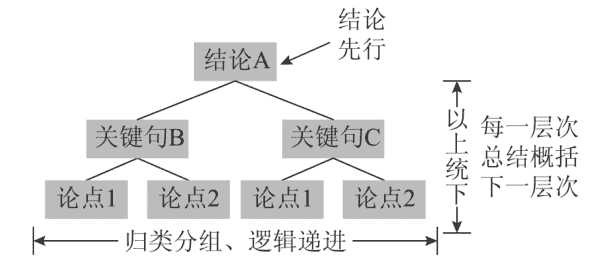

### 图4-1 金字塔叙述方式结构示意图

大家都知道，金字塔是下面宽、上面尖的三角形，金字塔叙述方式要求我们写文章的时候，总是要在文章最开头，也就是金字塔尖尖上的位置，鲜明地提出观点、主旨和结论，然后再层层分解，一层层地去解释上面的结论，直至最后所有的基础要点，也就是塔底的位置，都可以解释得很清楚。

我们拆解金字塔，会发现这是个由总结论到支撑论点，由支撑论点到分论点，最后逐个击破分论点的写作模式。

举个最简单的例子，石头要协调三个领导的开会时间，其他两个副职时间已经定好，石头发短信给大领导请示他的时间。非金字塔叙述方式的短信是这样的：

书记您好：

王副书记周三下午要外出调研，只有周三上午有空；我又问了李副书记，他时间都还好；第一会议室有个视频会，没法用，所以我们协调了第二会议室。您看周三上午9点开会行吗？9点大家过来参会比较从容。

你就说吧，仅仅几行字，如果不遵循金字塔叙述方式，是不是已经感觉毫无逻辑，非常混乱了？我们改用金字塔试试：

书记您好：

您看周三上午9点在第二会议室开会行吗？

王副书记周三下午要外出调研，只有周三上午有空；我又问了李副书记，他时间都还好；第一会议室有个视频会，没法用，所以我们协调了第二会议室。9点大家过来参会比较从容。

同样的内容，不过调换了叙述顺序，把最重要的事情放到前面说，“您看周三上午9点在第二会议室开会行吗？”一下就清晰多了。这个小例子充分说明了金字塔叙述方式的威力：为了帮助别人抓住要点，正确理解，需要我们把结论放在最开始的位置。

看到这，你或许恍然大悟：哦，原来领导经常挂在嘴边的“要提炼观点”“观点要鲜明”，其实就是让我们遵循金字塔原则啊！

具体到公文写作中，金字塔叙述方式要求：

1. 每一部分的标题应当是这一部分内容的概括；
2. 每一段的第一句话应当是这一段话内容的概括；
3. 总是把主题句放在前面。

这样写，才能显得逻辑清楚。

两种在公文写作中常见的，不遵循金字塔叙述方式及结论优先原则，因此显得逻辑混乱的错误如下所述。

第一，乱分段，一段话讲了两三个意思，却不分开，或者连续两三段都在讲一个意思，却舍不得合到一起。

第二，主题句没有放在前面，甚至没有主题句，一段话全是分散的论述，没有一句话提纲挈领、提炼观点。

公文高手是怎么做的呢？党内大笔杆子胡乔木是毛主席的秘书，也是在写作中贯彻金字塔原则和结论先行做法的典范。石头读胡乔木最著名的代表作《中国共产党的三十年》，发现胡乔木严格遵循结论优先的原则，把每一段的主旨句写在开头，一本书十几万字竟然没有一段话例外，很是震惊。石头举两个例子给大家长长见识：

日本帝国主义的进攻根本改变了中国的政治状况。抵抗日本的进攻成为全国人民紧急的任务和普遍的要求。工人、农民、学生的抗日运动在全国各地高涨起来。在一九二七年退出革命的上层小资产阶级和民族资产阶级，这时也改变了他们的政治态度，开始在政治上活跃起来，要求蒋介石政府改变政策。蒋介石政府则坚持他的对日不抵抗、对内加紧“剿共”、加紧法西斯恐怖的政策。但是甚至在国民党和国民党军队中间，也开始发生了政治上的分化。一九三二年一月国民党的第十九路军在上海人民反日运动的影响下，向进攻上海的日本军进行了英勇的抵抗；一九三三年十一月，这个军队的领导者及其他一些国民党人又在福建成立反蒋联共的人民政府。冯玉祥在一九三三年五月也与共产党人合作在察哈尔的张家口组织民众抗日同盟军。

中国工农红军长征的胜利，是中国革命转危为安的关键。它使全国人民对于革命前途和抗日救国运动的前途有了希望。它使全中国全世界相信了中国共产党和中国红军是不可战胜的力量，相信了为着战胜当时在中国得寸进尺的日本帝国主义，非要依靠中国共产党不可，非要停止反共的内战不可。

以上两段，是石头在《中国共产党的三十年》里随便挑的两段话，大家可以看到，每段的第一句是主旨句，概括了全段的内容。后面的内容其实都在解释、阐述主旨句的观点。这就是典型的金字塔叙述方式。

一篇完美运用金字塔原则叙述的文章，即使只看标题和每一段的第一句话，忽略后面的内容，也能完全领悟作者想表达的意思。《中国共产党的三十年》已然达到这种境界，任何阅读它的人，都会为其观点之明确、逻辑之清晰、层次之分明所折服。胡乔木这种写作和构段方式，正是写公文的我们需要学习汲取的。

### 2. 适当使用逻辑词

逻辑词是逻辑的标志，就像路上竖着的路标一样，朝着读者大喊：这是第一层意思！这是第二层意思！这里是并列！这里是递进！这里是转折！使用逻辑词来标示文章逻辑，是一种简单又效果鲜明的办法。

石头发现，不少自诩文章写得漂亮的人，对使用逻辑词很不屑。他们觉得逻辑词用多了，文章就少了神韵，还是可意会不可言传显得文字美一点。对搞文学创作来说，或许是这样，文字表达要适当含蓄。但写材料大可不必有这种顾虑，你写的东西是要拿去用的，观点铺陈越敞亮，越便于理解，能使人一眼看清楚，才是最好的。

公文写作中最常见的逻辑词包括：

- 第一、第二、第三。
- 首先、其次、再次。
- 一是、二是、三是。

常见的连词其实也是逻辑词，需要我们加以掌握，包括下面这些：

- 并列关系连词：和、跟、与、既、同、及、而、况、况且、何况、乃至等。
- 承接关系连词：则、乃、就、而、便、于是、然后、至于、说到、此外、像、如、一般、比方、接着等。
- 转折关系连词：却、虽然、但是、然而、而、偏偏、只是、不过、至于、致、不料、岂知等。
- 因果关系连词：原来、因为、由于、以便、因此、所以、是故、以致等。
- 选择关系连词：或、或者、还是、亦、非……即、不是……就是……等。
- 假设关系连词：若、如果、若是、假如、只要、除非、假使、倘若、即使、假若、要是、譬如等。
- 比较关系连词：像、好比、如同、似乎、等于；不如、不及；“与其……不如……”“若……则……”“虽然……可是……”等。
- 让步关系连词：虽然、固然、尽管、纵然、即使等。
- 递进关系连词：不但、不仅、而且、何况、并且等。
- 条件关系连词：不管、只要、除非等。
- 目的关系连词：以、以便、以免、为了等。
- 还有：要、要、要；坚持、坚持、坚持；始终、始终、始终。这类重复词，也经常用来区分逻辑层次。

除了逻辑词，逻辑句也有鲜明标示逻辑层次的作用。逻辑句是逻辑词的延伸，逻辑句用得好，不但能有效地区分、标识逻辑层次，还能增加文采。

比如，讲完一方面，接着讲递进的另一方面，可以说用“特别是”“让人印象深刻的是”“需要强调的是”“更加值得注意的是”“特别值得一提的是”这类逻辑句来标示文章逻辑层次的变化。

还有一种很有意思的逻辑词，正式致辞里的“高八度”，在这里也提醒大家注意。啥叫“高八度”？在一些正式场合的致辞中，领导念稿子时，时不时总有几个字念出来会“高八度”，如“同志们”“朋友们”“嘉宾们”，等等。

其实，这种“高八度”也是一种逻辑区分方法，“同志们”后面跟的内容，一定是新的逻辑层次，大声念出来是要专门提醒大家注意的。这种逻辑词，我们也要会用。

## 3．科学分类

分类是人类大脑的伟大发明，“类”这个东西，在客观世界其实并不存在，但我们的大脑为了将杂乱无章的事物区分开，进而系统化、条理化，不断创设“类”的概念。当你以分类的方式来思考和表达的时候，你会发现事情骤然变得更容易理解和记忆了！

办公室里的小丁特别爱美，每天穿得漂漂亮亮来上班，她今天穿戴了：衬衣、外套、披肩、裙子、丝袜、项链、耳环、手镯、高跟鞋、发卡。十几样东西，你一下看得清、记得住吗？

我们分个类，马上就不一样。办公室里的小丁特别爱美，每天穿得漂漂亮亮来上班，她今天穿的上装是：衬衣、外套、披肩；下装是：裙子、丝袜、高跟鞋；戴的配饰是：项链、耳环、手镯、发卡。分成三类后，原本模糊混乱的内容马上清晰了，显得井井有条。

写材料也要善于借鉴“类”的思维方式，“类”同样可以让文章显得井井有条。脑子里要时刻绷紧“分类”的弦，也就是说，你在写任何一部分、一段话、一句话的时候，都要很清楚自己写的这一堆到底算是哪个板块的东西。

写某一部分，我要清楚，自己写的是指导思想，是总括性的内容，后面几部分要分着写，写具体措施；写某一段落，要清楚自己写的是举措的第一点，后面几段要接着按工作职能写举措的第二、第三、第四点；写某一句话，要清楚自己写的是重要性，后面几句话要接着论述背景、目标和要求。

总之，材料中每一部分、每一段落、每一句话都能各归其类，文章才能条分缕析、井然有序。

至于如何给公文写作中的各种内容分类，具体请翻到下一章第一节，有关要素填充法写公文的内容，那里石头讲的更详细。

## 4. 乾坤挪移

有些人对自己写的材料总是敝帚自珍，只要初稿出来了，便舍不得再做大的调整，只愿意修修补补。这种思想对理顺文章逻辑危害极大。

很多时候，即使我们写材料的时候完全按照石头上面说的种种办法构思、行文，有非常清晰的逻辑结构指引，写出来的东西也并不总是一丝不苟贴合逻辑的。

没办法，人脑的注意力和思维方式时常跳跃，本来想的是A，外边一阵敲锣打鼓，思绪受到干扰，便可能会跳到B上去了；或者写的时候想的是一个逻辑，写成之后结合全文看，却感觉应当换另一个逻辑。

因此，对自己写出来的初稿，千万别太有信心，千万别舍不得动。写完之后，返回去检查，顺着逻辑框架再捋一遍，对摆放位置存在问题的段落、句子，大胆地挪来挪去。这段话是不是放到前面更好？这句话是否该挪到后面呢？只要自己觉着顺，那就大胆地剪切粘贴。

举个例子，前一段石头给领导写一篇对博士生的讲话稿，围绕“实”字讲了三层意思、三个要求：写文章要实、搞研究要实、做人也要实。

写到最后一段，石头想找一句名言来升华全文，于是找到教育家吴玉章先生的一句名言，放在最后一段：

吴玉章老校长曾用“实”字来概括自己的个性，他说，“我并无过人的特长，只是忠诚老实，不自欺欺人，想做一个以身作则来教育人的平常人。”

但回过头改初稿的时候，觉得这句话放到最后一段逻辑不是很顺，更合理的写法应该是按照重要性逻辑，把这句话用在文章开头强调“实”的重要性，于是，大笔一挥，把这句话挪到整篇材料的开头，用于点出“实”的重要性，后面具体阐释“实”的要求。这样一改，明显逻辑上严密多了。

对于不合逻辑的句子、段落乃至篇章，都要敢于大刀阔斧地调整，放到中间不顺，那就挪到结尾看看顺不顺；还不顺？那就再放到开头看看顺不顺。调着调着，逻辑就会越来越清晰。

## 第五章 到底写点啥：关于内容

### 一、不知道写什么话?要素组合法了解下!

石头动笔写本书之前，曾经在公众号上搞过一个征集，问大家在公文写作的过程中最困扰的事情是什么。想着写书的时候可以有的放矢，争取直击痛点。

本来预想的热点问题应该是“怎么搭框架”“怎么顺逻辑”，最后一统计，大家普遍最为困惑的问题竟然是，“在段落里到底应该怎样安排内容呢?”有的人问得更直白：“每段话到底应该写点什么呢?我没有话说啊!”

看到这个结果，石头颇有心领神会之感，你们的意思，我懂。

对很多人来说，结构、标题甚至观点，都不是困扰他写作的最大问题。他面临的最大问题是：我该怎么把那么大一段话给填满呢?也就是说，在段落层面，即使已经把观点给他了，把小标题给他拟好了，他也没有话说，没有东西可写。

石头刚开始接触公文写作时，也犯这个毛病，明明知道这一段观点是什么、主旨是什么，但就是找不到合适的话来填充，偶尔灵光一现，就写，没有灵感，一句也憋不出来。到后来，石头才发现，这种灵光一闪式的内容写作方法是极其原始落后的。

真正高效的填充段落内容的方式应该是：要素填充法。

要素填充法是石头自己发明的一个概念，听上去是不是深奥莫测？非也，简单，所谓要素填充法，其实就是先把每段话的组成部分拆解，归到一些常见的要素门下，然后写作的时候选择相关要素，扩充后填入段落中的写作手法。

对一段材料按要素分解之后你会发现，无论一段话讲得怎样天花乱坠，都逃不出这些要素的范畴，都是由这些要素排列组合而来的。

当你面对一段公文需要去填充的时候，首先的反应不应该是写哪些句子，而是先确定我这段话应当用哪些要素去填充呢？接着，再把要素扩展成句子。这样写起来就容易得多。

我们先来看一段话：

第三，一如既往为世界文明交流互鉴作贡献。他山之石，可以攻玉。中国共产党历来强调树立世界眼光，积极学习借鉴世界各国人民创造的文明成果，并结合中国实际加以运用。马克思主义就是中国共产党人从国外学来的科学真理。我们结合中国实际，不断推进马克思主义中国化时代化大众化，使之成为指导中国共产党领导中国人民不断前进的科学理论。中国共产党将以开放的眼光、开阔的胸怀对待世界各国人民的文明创造，愿意同世界各国人民和各国政党开展对话和交流合作，支持各国人民加强人文往来和民间友好。未来5年，中国共产党将向世界各国政党提供1.5万名人员来华交流的机会。我们倡议将中国共产党与世界政党高层对话会机制化，使之成为具有广泛代表性和国际影响力的高端政治对话平台。

这是习主席在中国共产党与世界政党高层对话会开幕式致辞中的一段。这段话主题鲜明、内容扎实、论述充分，无疑是非常好的一段内容。为什么人家写得这么扎实呢？石头试着按照要素的方法对这段话进行拆解：

- 第三，一如既往为世界文明交流互鉴作贡献。（主题）
- 他山之石，可以攻玉。中国共产党历来强调树立世界眼光，积极学习借鉴世界各国人民创造的文明成果，并结合中国实际加以运用。马克思主义就是中国共产党人从国外学来的科学真理。（意义、重要性）
- 我们结合中国实际，不断推进马克思主义中国化时代化大众化，使之成为指导中国共产党领导中国人民不断前进的科学理论。（成绩）
- 中国共产党将以开放的眼光、开阔的胸怀对待世界各国人民的文明创造，愿意同世界各国人民和各国政党开展对话和交流合作，支持各国人民加强人文往来和民间友好。（目标）
- 未来5年，中国共产党将向世界各国政党提供1.5万名人员来华交流的机会。我们倡议将中国共产党与世界政党高层对话会机制化，使之成为具有广泛代表性和国际影响力的高端政治对话平台。（举措）

大家可以看到，石头把这段话的内容划分为五种要素，括号里的标注，就是段落构成的具体要素：一开始点明主题，接着讲这件事的意义和重要性，然后讲过去工作成绩，再接着提出目标，最后拿出举措。

有兴趣的读者可以找到这篇致辞，自己分析下致辞的其他段落，你会惊奇地发现，每一段都是这样的！内容逻辑基本固定，第一句先写主题，接下来写意义和重要性，接下来写目前的做法，接下来写目标和举措。这样一看，是不是填充内容变得很简单，按照固定模式走，一长段话很快就填满了。

综上所述，“要素”是为了便于我们理解和写作而创设的概念，指段落中切分得具有相对完整性的内容群，每个要素由观点和素材构成。“要素”比句子要高一个层次，可以由一个句子组成，也可由几个句子组成。用要素法填充公文段落，好处一是简便，二是写出来的段落逻辑层次清晰。

石头根据自己扎根材料一线多年的经验，帮大家归纳了一些组成公文段落的常见要素，大致可以总结成以下类别：

## 1.主题

主题，也可以理解成主旨、中心思想。公文中的主题要素是段落中用以概括段落的中心思想、内容核心、写作意图、表达的思想感情等的句子。主题要素可以直接由标题句充当，也可以在标题句后再跟一句，进一步阐释段落主题。比如，上面举的习主席讲话的例子，就是直接以标题作为主题要素。

如果标题采用了对仗、引用、修辞等手法，不是那么便于理解，我们可以在标题后再跟一句话，同样作为主题句，对段落主题进行深入阐述，下面这个例子即是如此。

第一，**少烧三把火，多上三把锁。**心态决定状态，眼界决定境界，格局决定结局。过去我们讲“新官上任三把火”，作为老市长、新书记，我想改一个字，“新官上任三把锁”，即“政治上跟党走、经济上莫伸手、作风上不丢丑”，真正做到人有信仰、国有法治、权力有笼子、政府有边界。“政治上跟党走”，就是要牢固树立“四个意识”，坚决贯彻落实党的路线、方针、政策，坚决执行省委、省政府的各项决策部署。“经济上莫伸手”，就是要视权力为约束，视权力为奉献，不该伸手的地方不能伸，不该办的事情不能办，不该得的利益不能得，自觉扎紧权力的笼子。“作风上不丢丑”，就是要始终恪守着，做人干干净净，做事自始至终，做官公道正派，守住做人的良心、守住处事的底线、守住为官的清廉。

标题“少烧三把火，多上三把锁”已经点明主题，但主题有缩略语，“三把火”“三把锁”不太好理解，于是后面又用一句话详细阐释主题，“真正做到人有信仰、国有法治、权力有笼子、政府有边界”。

## 2. 意义和重要性

公文写作中的意义和重要性要素，是指段落中关于某项工作或事实对于社会的积极作用、重大意义的描述。

在主题句写完之后，接下来的内容，首先要考虑的就是填充意义要素，把事情的重要性、非凡意义强调一下，表明这件事很重要，有费些口舌的必要。

虽然意义和重要性要素看上去有点虚，但对承上启下及逻辑的连贯起着很大作用，如果不说，段落就会显得很生硬，过渡不流畅，总感觉有什么东西没点到似的。

大家可以感受一下，如果上面那段习主席讲话中删除“他山之石，可以攻玉。中国共产党历来强调树立世界眼光，积极学习借鉴世界各国人民创造的文明成果，并结合中国实际加以运用。马克思主义就是中国共产党人从国外学来的科学真理”这句对重要性的论述，直接谈成绩、列举措，是什么感觉呢？

第三，一如既往为世界文明交流互鉴作贡献。我们结合中国实际，不断推进马克思主义中国化时代化大众化，使之成为指导中国共产党领导中国人民不断前进的科学理论。中国共产党将以开放的眼光、开阔的胸怀对待世界各国人民的文明创造，愿意同世界各国人民和各国政党开展对话和交流合作，支持各国人民加强人文往来和民间友好。未来5年，中国共产党将向世界各国政党提供1.5万名人员来华交流的机会。我们倡议将中国共产党与世界政党高层对话会机制化，使之成为具有广泛代表性和国际影响力的高端政治对话平台。

是不是会感觉特别突兀，缺乏过渡，或者有点如鲠在喉、没吐痛快的感觉呢？

越是篇幅宏大、结构规整的大稿子，意义和重要性要素越不能少。以2018年湖北省党代会报告为例，第三部分开头是这样写的：

## 三、全面建成小康社会

> **全面建成小康社会是实现中华民族伟大复兴中国梦的关键一步，也是全省人民的共同期盼。我们要全面落实新发展理念，确保如期全面建成小康社会。**

（一）推进经济转型升级。坚持用新常态的大逻辑研判经济形势，加快结构调整和动能转换，推动经济保持中高速增长、产业迈向中高端水平。

石头标黑的这句话，“全面建成小康社会是实现中华民族伟大复兴中国梦的关键一步，也是全省人民的共同期盼”就是意义和重要性要素，能删掉吗？不能，不写这句话，后面的举措和要求，就显得师出无名：怎么就一下子给我甩这么多要求？我凭什么要干啊！

石头理解，在一段话中填充意义要素，可以让人对这项工作有更全面深入的理解，统一大家的认识，后面再谈问题也好，提举措也好，就顺理成章了。所以，段落主题句之后，首先要考虑的就是填充意义和重要性。

## 3.形势和背景

形势和背景要素，指的是材料中关于某项工作面临的状况、发展趋势和基本环境的内容。同意义和重要性要素类似，形势和背景要素作为分析性内容，在段落中一般起着承上启下的作用。

如果你觉得直接谈问题、谈要求生硬了，可以考虑在段落里添加形势和背景的分析，这种手法在公文中随处可见：

未来五年，是“两个一百年”奋斗目标的历史交汇期。世界经济回暖明显，中国经济稳中向好，中部崛起势头强劲，发展形势总体有利。我们必须把握历史方位，抢抓历史机遇，以永不懈怠的精神状态和一往无前的奋斗姿态，奋力开辟新时代湖北发展新境界。

在段落中填充背景和形势要素，同样为的是让受众对工作形势有正确认识，统一思想，为后边谈问题、提要求打基础。

## 4.成绩和做法

成绩和做法要素，是指公文段落中关于某个工作或某项政策的相关做法，以及取得的成就、价值或者积极的效果的内容。

本节开头例子中“我们结合中国实际，不断推进马克思主义中国化时代化大众化，使之成为指导中国共产党领导中国人民不断前进的科学理论”就是成绩要素。

石头觉得，材料狗心中必须时刻给成绩要素留一个位置。你说你天天忙来忙去写这公文、写那公文，其实大多数时候，归根结底不就是写工作成绩嘛！

成绩要素既可以作为段落的主体，也可以作为承上启下的连接性内容。比如，某一部分或段落虽然是想谈问题、提要求，但你不先说成绩和好的做法能行吗？

**三要巩固和深化机关党组织“四型十好”创建成果。经过三年创建，市直机关“四型十好”创建工作实现了全覆盖，各单位阵地建设、队伍建设、基础保障都取得了明显进展，机关党建工作质量得到全面提高。**但从工作效果来看，部分单位因种种原因，仍存在着基础不扎实、阵地不健全的问题，党务工作者年龄老化、组织开展工作不到位的现象仍比较严重，在发挥作用方面不够有力。这些问题，一定程度上反映了我们的创建工作还不够实、不够细，仍需下大力气加以改进。今年，各单位要在现有基础上，不断巩固和深化创建工作，着力在阵地建设、队伍建设上取得新突破，努力发挥机关党组织在服务中心中的积极作用。

上面这段话，主体是谈问题、提要求的，但我们分解其段落要素就发现，谈成绩和做法的篇幅也不少：“经过三年创建，市直机关‘四型十好’创建工作实现了全覆盖，各单位阵地建设、队伍建设、基础保障都取得了明显进展，机关党建工作质量得到全面提高。”这就是写材料的辩证法啊！

## 5. 问题

问题要素，是指公文段落中关于工作存在的不足和矛盾，或分析某方面负面影响的内容。公文谈问题，除了单独成部分谈，在段落里谈几句问题，引出后面原因分析和对策建议也很常见。

比如，我们看看2018年全国教育工作会材料中的一段话：

一要改造我们的学习，增强工作本领。解决不平衡不充分问题，加快教育现代化，建设教育强国，我们的难题还很多，必须改造我们的学习，增强我们的本领。要通过改造学习，学会和掌握战略思维、创新思维、辩证思维、法治思维、底线思维；通过改造学习，不断增强学习本领、政治领导本领、改革创新本领、科学发展本领、依法执政本领、群众工作本领、狠抓落实本领、驾驭风险本领；通过改造学习，做到“信念过硬、政治过硬、责任过硬、能力过硬、作风过硬”。当前最紧迫的任务，就是要改造形式化的学习，改造脱离实际的学习，改造脱离灵魂的学习，防止学习的“简单化”“庸俗化”“一般化”。

这段话从整体上看虽然是在讲举措，属于石头前面提到的“怎么办”逻辑，但主题句后跟的这句“解决不平衡不充分问题，加快教育现代化，建设教育强国，我们的难题还很多，必须改造我们的学习，增强我们的本领”其实就是段落中的问题要素。

填充问题要素，一般是为了引出后面的危害要素，或者借此提出举措。当一段话中一定要谈一谈举措，那么往往点一点问题也不能缺失。问题具体怎么写，可参考本章《语和句是必须闯过的关卡》一节中关于“问题句式”的总结。

## 6. 危害

危害要素，是指段落中关于某种情况或问题对于工作产生的消极作用的分析。一般而言，危害要和问题或举措结合起来说。

以2018年全国教育工作会材料中的另一段话为例：

我再强调一下舆论引导工作。要早做预案，舆情工作看似在一时，实则在平时。有些舆情触发比较快、来得比较急，不早做准备就会陷于被动。要早发现、早应对、早处置，把危机消灭在萌芽状态，防范在将发未发之时。要头脑清醒，看清楚是局部问题，还是普遍现象，善于透过现象看本质。要抓最佳窗口期，舆情一旦发酵，就会呈爆发之势，久久不能退去。错过了第一时间，就要付出代价，需要很长的过程弥补、花很大的力气挽回，要在第一节点及时发声讲明真相。要用细节说话，不能含糊其辞没表态，不能只表态没行动，更不能大而化之没细节。要及时把群众关心的细节问题公布于众，取消猜疑、打消顾虑。各地各校都要高度重视舆论宣传工作，推动教育舆论环境不断优化。

“舆情一旦发酵，就会呈爆发之势，久久不能退去。错过了第一时间，就要付出代价，需要很长的过程弥补、花很大的力气挽回。”在讲工作如果开展不好的危害，就是危害要素。

危害一般接在问题后面说，写危害的作用，一是可以把问题分析得更深入透彻，二是可以更自然地引出要求和举措，事情很严重，当然要提高认识，要加强领导，要抓铁有痕，等等。如果说意义和重要性要素是在正着论述一件事的意义和重要性，那么危害要素就在反着论述一件事的意义和重要性。

## 7. 原因

原因要素，是指段落中对导致客观事实或者问题产生原因的分析。原因要素一般也是跟在问题后边，说了问题，谈了危害，但感觉还不过瘾，那就再分析下原因。这个好理解，石头简单放个例子：

上半年的经济运行态势，集中反映出我州经济发展长期积累的结构性矛盾（投资拉动、工业支撑）和全国全省经济下行压力相互作用，使全州经济增长乏力，主要问题表现在投资大幅下降、工业支撑减弱、财税增收乏力三个方面。总体分析上半年全州经济运行存在的突出问题，既有客观原因，更有主观原因。最大的客观原因是：投资不可持续压力增大，项目存量释放殆尽、投资增量严重不足、市场投资短板。最大的主观原因是：换届综合征的影响，“进、退、留、转、盼”五大群体存在不会为、不作为、慢作为、假作为、等到换的不良表现。

谈原因主要有两个作用：一是让分析更有深度，更透彻；二是为提出解决方案作铺垫。

## 8. 对策

对策要素，指的是针对某项工作，将要采取的办法、准备提出的要求。

对策要素从来都是公文段落的重头戏，这是由公文的性质决定的。公文不是要空发议论，无论前面怎么说，最后往往都要落脚到解决问题上。所以，很多时候，段落里的对策要素都是必不可少的，不谈点对策，在领导眼里你的稿子就是在扯闲篇。

一般来讲，对策要素的写法有两种方式，一种是像上面习主席讲话的范例那样，风轻云淡地提出改进方式，点出下一阶段要进行的工作，并不大张旗鼓或郑重其事：> “未来5年，中国共产党将向世界各国政党提供1.5万名人员来华交流的机会。我们倡议将中国共产党与世界政党高层对话会机制化，使之成为具有广泛代表性和国际影响力的高端政治对话平台。”

虽然段落里没有“我们要”“我们一定要”这样的字眼，但无论是“提供1.5万名人员来华交流的机会”，还是“将中国共产党与世界政党高层对话会机制化”，其实都是在谈下一步的工作措施。

另一种提出对策的形式就板正得多，基本形式为“要、要、要、要”“进一步、进一步、进一步”。

有一段时间，公文写作中非常流行“要、要、要、要”的对策写法，显得铿锵有力、信心十足，但时间一久，大家就审美疲劳了，觉得这种写法过分工于形式，又返璞归真，直接写举措变得更常见，基本形式为“加强”“改进”“推动”“推进”“加快”“支持”等，比如：

大力发展文化产业。坚定不移把文化产业作为支柱产业来培育。创建国家级文化产业示范园区，推动省级文化产业示范园区和基地转型升级。加快文化与科技、旅游、教育、体育等跨界融合，积极发展创意设计、网络视听、数字出版、动漫游戏等产业。做大做强骨干文化企业，做多做优文化市场主体，积极培育外向型文化企业。支持地方特色文化产业发展。

## 9. 目标

目标要素，是指写材料时经常提到的目标、愿景、任务、总体要求之类的内容。

有时只谈对策太过具体，显得站位不高，解决办法就是写一个更宏观的目标来统领。比如：

今后五年政府工作总的要求是：高举中国特色社会主义伟大旗帜，全面贯彻党的十九大精神，以习近平新时代中国特色社会主义思想为指导，深入贯彻落实习近平总书记视察湖北时的重要讲话精神，统筹推进“五位一体”总体布局，协调推进“四个全面”战略布局，坚持以人民为中心的发展思想，坚持稳中求进工作总基调，坚持新发展理念，紧扣社会主要矛盾变化，落实高质量发展根本要求，以供给侧结构性改革为主线，以改革开放创新为动力，聚焦“四个着力”，统筹推进稳增长、促改革、调结构、惠民生、防风险各项工作，推动质量变革、效率变革、动力变革，打好防范化解重大风险、精准脱贫、污染防治的攻坚战，促进经济社会持续健康发展，加快“建成支点、走在前列”进程，全面建成小康社会，全面推进社会主义现代化强省建设。

说实话，目标要素和举措要素确实不太好区分，它们讲的都是未来怎么做、会怎样。通常情况下，目标更为宏观和务虚；举措更为微观和务实。如果你实在掰不开，把目标和举措看成是一个要素，即“目标举措”要素也不影响理解。

## 二、要素组合公式放送

前面石头带着大家抽丝剥茧，一一梳理出公文中的常见要素，这只是我们运用要素填充法的基础。接下来面临的问题，就是要素的组合了。

### 1. 常见的要素组合方式

有人说，石头呀，你一梳理这些要素我就明白了，组合你就不用讲了，我写内容的时候把这些要素都整上，一段话写成“主题+意义+背景+问题+危害+原因+对策”就可以了。显得文章料多汁厚，多好！

事实上，公文中的一段话，不可能，也不应当包罗以上所有要素，那样会显得逻辑层次太多，混乱不堪。段落中填充的要素，不是越多越好，依照石头的经验，一段话中，有三到四个要素就很充实了，在某些情况下，一个段落只有一两个要素也不稀罕。

公文写作中，段落常见的要素组合方式包括：

- A. 主题+意义+对策
- B. 主题+问题+对策
- C. 主题+问题+危害+对策
- D. 主题+背景+意义
- E. 主题+问题
- F. 主题+对策
- ……

石头就不一一列举了，大家完全可以根据叙述的实际需要来排列组合，安排填充。

### 2. 先选择要素，再扩充要素

一旦我们掌握“要素”这一概念，我们就有能力给公文字内容分类，写公文的时候就不会再是脑中一团糨糊，不用再漫无目的地纠结这句话到底该写什么，而是分两步按规定动作进行。

第一步，根据段落主题，先从上面石头帮你归纳的这些要素中依次选择，确定要素组合的方式；

第二步，扩充选中的要素成文。

这样一来，填充公文内容从一种创造性智力劳动变成模块化组合、流水线作业，难度大大降低，效率大大提高。

为了帮助大家掌握要素填充法的运用方式，举一个公文写作中的实例——还是个人对照检查材料吧。

现在已经确定，石头的个人对照检查材料分三部分：第一部分问题查找，第二部分原因分析，第三部分整改措施。假如问你，第三部分整改措施，第一条，写加强理论学习，怎么写？步骤如下。

主题要素必不可少，先拟定主题句：

一是加强理论武装，特别是持续深入学习习近平新时代中国特色社会主义思想和十九大精神。

接着直接进入对策？好像太急了些，过于生硬，那就加上意义和重要性要素过渡一下吧：

学校是道德的高地，教育领域是教书育人之地，作为高校领导干部，更要在学习上做出表率。

已经两个要素，再下来，似乎就可以重点谈举措了，用最常见的手法，写两个“要”吧：

要把学习贯穿今后工作始终，把新《党章》《习近平谈治国理政》《党的十九大报告辅导读本》等列为必学书目，以领会党的十九大精神和习近平新时代中国特色社会主义思想为核心，认真、反复、深入学；要坚定理想信念，加强对马克思主义理论知识的学习和运用，不断纯化自己的人生观、世界观和价值观。

这段话的要素填充，就是主题+意义+对策，最后填充完毕的石头个人对照检查材料第三部分第一点就是：

一是加强理论武装,特别是持续深入学习习近平新时代中国特色社会主义思想和十九大精神。学校是道德的高地,教育领域是教书育人之地,作为高校领导干部,更要在学习上做出表率。要把学习贯穿今后工作始终,把新《党章》《习近平谈治国理政》《党的十九大报告辅导读本》等列为必学书目,以领会党的十九大精神和习近平新时代中国特色社会主义思想为核心,认真、反复、深入学;要坚定理想信念,加强对马克思主义理论知识的学习和运用,不断纯化自己的人生观、世界观和价值观。

石头觉得,要素填充法写公文,好处不仅在于有话说了,知道该写啥了,还在于使段内层次鲜明严密。

很多时候,一篇文章分哪几大类,每块又分哪几段,还是比较容易辨识、比较容易做到的,毕竟多弄几个小标题,或者弄几个“要坚持”就解决了,但要求段内分层、层层清晰,一个自然段里有几个层次,表达几个意思一目了然,难度就大多了,因为自然段里无法设置像标题那样的标识物。要素填充恰恰完美解决了这个问题。

### 3. 要素组合法的发散

石头在这本书里老是强调发散,为什么呢?按照辩证唯物主义的观点,世界上一切事物都不是孤立存在的,而是和周围其他事物相互联系着的,整个世界就是一个普遍联系的有机整体。同样,我们梳理出来的这些段落要素,其实也不是孤立的、机械存在的,而是充满变化的。

石头前面讲的全是怎么用要素填充某一段话,你再想一想,就整篇文章而言,是不是其实还是由这些要素构成的呢?

以2018年全国教育工作会议讲话为例，讲话四大部分的标题分别是：

- 一、总结工作，认清“奋进之笔”新起点。（成绩）
- 二、分析形势，找准“奋进之笔”主攻方向。（形势）
- 三、对照目标，明确“奋进之笔”任务书。（目标）
- 四、改进作风，确保“奋进之笔”出实效。（对策）

- 一、总结工作，认清“奋进之笔”新起点，就是成绩和做法要素；
- 二、分析形势，找准“奋进之笔”主攻方向，就是形势和背景要素；
- 三、对照目标，明确“奋进之笔”任务书，就是宏观层面的目标，即目标要素；
- 四、改进作风，确保“奋进之笔”出实效，就是微观层面的对策，即对策要素。

可见，石头总结的这些公文内容要素，不仅在段落层面起作用。即使就一篇公文整体而言，也是由这些公文要素构成的，在篇章层面，要素也能帮助我们思考。

当你不知道如何安排篇章结构时，思维也可以从公文要素着手，这一部分应当安排什么要素，是讲形势背景呢？还是讲危害呢？还是讲对策呢？永远逃不出这些要素的范畴。说到底，要素思维，就是石头在上一章第七节提到的分类的逻辑。

小到句子，中到段落，大到篇章，都可以用要素填充的思维方式来组织，从而在材料中呈现一个个完整的意群。这些要素意群统统围绕着主题，线索十分清晰，相互之间的逻辑关系也是相互衔接、层次分明的。

有了要素思维，无论是写文稿还是看文稿，似乎都有了一双“上帝之眼”，一下子就把这篇文章看穿了，洋洋洒洒几万言的一篇稿子，在我眼里不过是“成绩＋问题＋对策”；密密麻麻的一大段话，在我眼里不过是“主题＋意义＋对策”，条分缕析、模样清楚，写材料，简单了！

## 三、词和句是必须闯过的关卡

对公文来说，立意、结构、逻辑、对领导意图的实现，当然都很重要。但石头想问大家一个问题，构成一篇公文最底层最基础的东西是什么？对，是语言。

其实，无论是立意、结构还是逻辑，都是我们经过思考抽象、提炼出来的东西，这些东西，读者是无法直接看到的，读者直接能看到的只有一样：语言。

语言才是每个公文写作者第一时间直面的问题，也是必须闯过的第一道关卡。

有人说：语言如此重要，如此基础，石头，那你就多花点篇幅给我们讲清楚吧！很可惜，我办不到。石头的经验是，语言能力更多取决于一个人的阅读、阅历和练习，无法在短时间内提高。石头能做的，只是用这一小节文章，帮大家认清语言这个东西背后的层次和逻辑，便于大家之后有针对性地加以提高。

公文的语言有什么要求和标准？过去我们上学的时候经常学习语言的一个标准，叫信、达、雅，意思是用词要准确、顺畅、优美，有人在此基础上，结合公文的特性归纳出一个标准——公文语言要注重简洁性、准确性、规范性，这些标准当然不错。但石头觉得并不满意，这种老生常谈的公文语言标准问题在于以下几方面。

第一,没有抓住公文语言的精髓。公文语言的精髓在哪,是在简洁、准确、规范吗?不是。简洁、准确、规范这东西,别的文种都有,不算特点,电脑的说明书不也要简洁、准确、规范吗?

其实,在石头看来,公文语言的精髓和最显著的特点为,它是一套与众不同,甚至完全封闭的行话体系。“深入学习贯彻”“健全体制机制”“奋力夺取××工作的伟大胜利”“增强自我净化能力”“抓住××工作的牛鼻子”“以××工作为抓手”,这些在公文中司空见惯的语言,很难在其他任何文种中寻到踪迹。“牛鼻子”“抓手”“滚石上山”,类似这些词用在公文里显得特别生动,特别带劲,但你用到小说里试试,那绝对闹笑话。从这个意义上讲,掌握公文语言,就是要求你张嘴说行话。

第二,没法操作。简洁、准确、规范这种要求,是标准,并非操作方法,所以很多人到动笔写的时候,还是一头雾水,甚至都不知从何学起,才能真正达成简洁、准确、规范。

石头是不是很了解你们的痛点呢?正因如此,石头今天讲公文语言,坚决不要再重复简洁、准确、规范这种套话。我们要进一步分析,假如再作细分,语言是由哪些要素和维度构成呢?其实就两块:词和句。石头就从这两个方面入手,来说说如何提高公文语言水平。

### 1. 词

大家都识字,所以对字,石头不用多说,公文词语、词汇,就成为公文语言中最小的单位。假如一个人头脑里没有足够公文词语的储备,公文的句子、文风、结构、标题完全无从谈起。

那怎么才能有词的储备呢？石头这儿有两个办法，一个笨办法，一个聪明办法。你可能要拿石头砸石头：有聪明办法，还教什么笨办法？！凑字数吗？

还真不是石头凑字数，笨办法和聪明办法不是任选一个就行，而是必须都掌握，两种办法相辅相成、相互依存，离开了笨办法，聪明办法毫无用武之地。

所以我们先说笨办法，一个字：背！

如果你是一个从小到大从没看过新闻联播、没读过人民日报，平日只喜欢郭敬明、读玄幻、看耽美，对公文行话语言没有基本了解的人，背词这道坎，你必须独自迈过，没有任何人能帮你。

这跟识字是一个道理。小朋友只要认识最基本的1000个汉字，就可以读懂90%的文章；如果再进一步，掌握常用的3000个汉字，书面的表达和交流就不存在障碍，甚至可以进行文学创作了。

但反过来，如果认识1000个汉字这道坎你都迈不过去，那你就不可能进行任何阅读和写作。所以，小朋友或外国人学中文，一定是从“最常见汉字3000个”学起。

同样，公文写作中，如果你不掌握“着力”“聚力”“出力”“用力”“发力”“实现”“分析”“研究”“了解”“掌握”“发现”“提出”“推进”“推动”“推广”“制定”“出台”等最基本的公文行话词汇，既不知道这些词的使用场景，写作的时候也无法想起，任何公文写作方法对你都毫无意义。

当然，如果你像石头一样，从小热爱观看新闻联播，翻阅各种日报，夜市吃饭时会说“高楼背后有阴影、霓虹灯下有血泪”，考试成绩不错时会说“推动我们的成绩从胜利走向新的胜利”，那么你很可能已经不自觉地完成了公文词汇的原始积累。

为了便于大家学习，石头在此列举一部分公文写作必背(备)词汇，请大家务必熟练掌握。

### (1) 动词

保持、保障、保证、保护、把握、包容、帮助、遏制、配合、培育、排查，谋、明、满足、访、发力、发扬、发现、发挥、发扬、发展、分析、分工、服务、扶持、丰富、动、带动、打牢、动员，提、提出、提高、提升、提倡、推进、推动、推广、推行、调节、调控、调处、调整、统领、统筹、拓展、拓宽、通达、突出、统一，拿、凝聚，了解、落实、理顺、履行、联动、搞、改、改革、改善、贯彻、规范、沟通、巩固、鼓励、管理、感召、搞好、关切、看、开展、开拓、宽容、考验、扩大、合作、夯实、弘扬、惠及、化解、汇集，进、建、见、聚力、聚焦、聚集、加强、加深、加快、加大、建设、建立、健全、举行、崛起、解决、教育、坚持、监督、纠正、借鉴、激发、简化、汲取、检验，确保、强化、取缔、倾斜，下、想、献、吸引、吸纳、细化、协调、形成、宣传、衔接、协商，抓、整合、整治、整顿、着力、着眼、掌握、制定、转变、召开、执行、支持、指导、振兴、制约、主张、筑牢、出、察、出力、出台、创新、唱响，上、深、实现、实施、深化、树立、适应、说服、疏导、设置，融洽，走、钻、增强、增进、尊重、造就、促进、倡导、肃、塑造、严、优化、优先、用力、研究、营造、引导、严格、问、稳、完善、维护、武装

### (2) 名词

安全、保障、保证、办法、本领、比重、标准、矛盾、模式、目录、方针、方式、方案、方法、风尚、负担、氛围、反映、服务、地方、地位、动力、道路，体系、体制、特色、特点、调控、条件、途径、台阶、突出、难点、内涵、纽带、能力、力度、力气、亮点、领域、理想、力量、利益、规划、规律、规模、关键、关系、沟通、管理、工程、功夫、格局、根本、窠臼、空间、合力、环境、会议、环节、活力、核心、监测、监控、监督、基础、基层、建设、建议、机制、紧迫、精神、进展、计划、焦点、局面、举措、结构、竞争力，权威、权利、情绪、情况、前提、倾向、渠道、需求、需要、信念、信心、系统、行动、效益、协调、形势、项目，主导、主体、主意、指导、指南、制度、政策、整治、秩序、质量、转变、战略、阵地、重点、支撑、准则、正气、职能，成绩、成就、成果、传统、创新，水平、实效、设想、事权、任务、热点、认识、作风、作用、增长、增量、资源、载体，措施、差距、思想、思路、素质、诉求、速度，要点、要素、要务、意识、意见、运行、问题、文件、位置、网络、稳定

### (3) 形容词

多、宽、高、大、好、快、省、新；持续、快速、协调、健康、公平、公正、公开、透明、富强、民主、文明、和谐、祥和、优良、良好、合理、稳定、平衡、均衡、稳健、平稳、统一、现代

### (4) 副词

狠、早、细、实、好、很、较、再、更；显著、明显、普遍、更加、逐步、不断、持续、全面、有序、加快、尽快、抓紧、尽早、整体、充分、继续、深入、自觉、主动、自主、密切、大力、全力、尽力、务必、务求、有效；进一步

以上这些词，可谓是公文写作领域的“最常见汉字3000个”。

在此基础上，由以上这些字词组合，又进一步形成了大量更为丰富的三字词组、四字词组，乃至五字词组、六字短句，比如“挑大梁，唱主角，扛重担，打硬仗，站队首，立潮头”“蓬勃发展，创新推进，广泛弘扬，普遍增加，胜利完成”等。如果大家学有余力，还可以自行进阶学习。

再说说运用公文词语的聪明办法：替换。一旦我们有了基本的公文词汇储备，就不一定要穷经皓首，沉迷在公文词汇的背诵中，非要掌握“回”字的四种写法，搞成了老学究，而是可以回过头来运用网络工具，便捷地查询同义词、近义词，最大限度拓展自己使用词汇的边界。

就拿公文写作中常用的动词“推进”来说，在百度中输入“推进 同义词”，结果马上显示：促进、挺进、推动、促成、鼓动。无疑可以为我们替换重复用词提供思路。

所以，词穷的时候，上网搜一搜同义词，找找灵感，也是一个好办法。

### 2. 句式

句式是比词汇高一个层级的语言要素。所谓句式，就是一个句子必须按照一定的模式来组织。

之前网上流传的一些文体，比如凡客体：爱逛街，爱扫货，爱赛跑，爱环境，爱杯具，爱擦皮鞋……所有人看到我们都会尖叫，我们是城管，我们要把世界制服。

甄嬛体：今儿个是小长假最后一日，赶着回家虽是要紧，却也不能忘了安全二字。如今的路虽是越发的宽广了，但今日不比往昔，路上必是车水马龙，热闹得紧。若是超了速，碰了车，人没事倒也罢了，便是耽搁了回家的行程，明日误了早班，也是要挨罚的。总之你们且记住了：舒心出门，平安到家。

这个体，那个体，其实就是一种句式。

明眼人一眼就能看出，公文的句式显然与网络语有很大区别。那么，公文句子通常是怎么组织起来的呢？从实操层面掌握公文句式，有没有办法呢？当然有。石头我独创的“要素句式法”，可以一试。

大家先回忆一下前面讲过的段落要素填充法。要素是一种特别便于我们理解、填充段落的公文意群单位。石头发现，要素不仅可以用来填充段落，也是区别划分句式的极好标准。

什么意思呢？我们在前面把公文的意群单位归纳为，意义和重要性、成绩和做法、问题、形势背景、对策、原因、要求等要素。材料写多了你就会感觉到，用来表达这些要素的句子远没有你想象得那么多，甚至往往局限在翻来覆去的一两种，而这一两种表达方式，就是与某种公文要素一一对应的句式。

比如写材料时经常要提点要求、谈点举措，也就是前面说的“对策”要素。提要求的时候，一般用什么句式呢？写来写去，用得最多的还是“要，要，要，要，要”句式，偶尔用的是“坚持，坚持，坚持，坚持”句式，那么这两个句式就是“对策”要素下的常见句式。

所以，石头想教给大家的句式实操方法“要素句式法”，其实就是按前面总结的公文要素归纳一些常见句式，每个要素列上两三个常用句式，那么你在写作这些要素的时候就心里有底，选一种照着套就行了。

### ——意义和重要性句式

用来表明某项工作意义和重要性的常见句式如下所述。

- (1) 做好……工作，恰逢其时、意义重大、影响深远。

认真做好学校“双一流”建设工作，恰逢其时、意义重大、影响深远。

- (2) 只有……，才能……

只有以抓铁有痕的拼劲、踏石留印的韧劲抓落实，才能将学校第十四次党代会的各项部署真正落到实处。

- (3) ……会议，是在……关键时期召开的一次十分重要的大会。

中国共产党第十九次全国代表大会，是在全面建成小康社会决胜阶段、中国特色社会主义进入新时代的关键时期召开的一次十分重要的大会。

### ——成绩和做法句式

用来总结某项工作取得了成绩、有不少好做法的常见句式包括：

- (1) 我们统筹推进……，……胜利完成，……顺利实施，……全面开创新局面。

五年来，我们统筹推进“五位一体”总体布局、协调推进“四个全面”战略布局，“十二五”规划胜利完成，“十三五”规划顺利实施，党和国家事业全面开创新局面。

- (2) 干（做/改）出了……干（做/改）出了……，干（做/改）出了……干出了经济发展的新气象，干出了城市建设的新风貌，干出了干部队伍的新作风。

- (3) 在……上迈出实质性步伐。

政府出台了《实施商标战略建设品牌强市的意见》，推出了对新获驰名商标、著名商标、农畜商标分别予以不同奖励的鼓励措施，这标志着我市商标工作上升到了品牌强市的高度，更标志着我市在推动商标强市战略上迈出了实质性步伐。

## ——形势背景句式

用来描述某项工作当前面临形势任务的常见句式包括如下内容。

- (1) 当前，……正在发生深刻复杂变化，……仍处于重要战略机遇期，前景十分光明，挑战也十分严峻。

当前，国内外形势正在发生深刻复杂变化，我国发展仍处于重要战略机遇期，前景十分光明，挑战也十分严峻。

- (2) 当前，……已进入决战决胜阶段，比认识更重要的是决心，比方法更关键的是担当。

当前，“双一流”建设已进入实施阶段，比认识更重要的是决心，比方法更关键的是担当。

- (3) ……形势依然严峻复杂，仍需持续发力、久久为功。

党风廉政建设和反腐败斗争形势依然严峻复杂，仍需持续发力、久久为功。

## ——问题句式

各种材料中，都时不时要涉及谈问题、谈不足，显得材料实事求是、扎实深入。

不少人谈成绩时气势恢宏、振奋人心，到了问题这一部分却有点词穷。要么隔靴搔痒，把问题写成了“我给领导提个意见，就是一心扑在工作上不注意身体”这类的笑话；要么鲜血淋漓，让领导看了心惊肉跳。

问题句怎么写才合适？我们先来看一段话：

同时，必须清醒看到，我们的工作还存在许多不足，也面临不少困难和挑战。主要是：发展不平衡不充分的一些突出问题尚未解决，发展质量和效益还不高，创新能力不够强，实体经济水平有待提高，生态环境保护任重道远；民生领域还有不少短板，脱贫攻坚任务艰巨，城乡区域发展和收入分配差距依然较大，群众在就业、教育、医疗、居住、养老等方面面临不少难题；社会文明水平尚需提高；社会矛盾和问题交织叠加，全面依法治国任务依然繁重，国家治理体系和治理能力有待加强；意识形态领域斗争依然复杂，国家安全面临新情况；一些改革部署和重大政策措施需要进一步落实；党的建设方面还存在不少薄弱环节。这些问题，必须着力加以解决。

这段谈问题的话，对火候拿捏之精准、句式之丰富实在叹为观止。石头觉得，把这段不长的话背下来记下来，足以应对未来五年的各种工作材料中的问题部分。

先看从成绩到问题怎么过渡，有这一句话就行了：

同时，必须清醒看到，我们的工作还存在许多不足，也面临不少困难和挑战。

注意，不足是主观原因，困难和挑战是客观原因，这句话全覆盖了，是简洁自然的过渡。类似的还可以说：

- (1) 在看到成绩的同时，也要清醒地认识到，我们的工作与……还有不小差距，前进中还面临不少困难和问题，突出的是……

- (2) 在……呈现好势头的情况下，我们必须保持清醒的头脑，全面、准确地分析和把握……形势。既要看到取得的显著成绩，更要看到存在的困难和问题，特别要充分认识……的艰巨性和长期性。

再看看描述问题的表述方式如何不重复，我们把上面那段话中谈问题的词句提出来看看：

尚未解决；还不高；不够强；有待提高；任重道远；有不少短板；任务艰巨；差距依然较大；面临不少难题；尚需提高；问题交织叠加；任务依然繁重；有待加强；依然复杂；面临新情况；需要进一步落实；存在不少薄弱环节；必须着力加以解决。

总共用了18个说法形容问题和不足，没有一个重样的。够不够你用几年的？石头骗人了吗？

比如，马上到年底了，各种对照检查材料是重头戏，其中很大一块是要谈问题和不足，那么我们的问题部分完全可以从上面这些句式里偷师。

- 第一，理想信念有待加强。
- 第二，理论学习尚需提高。
- 第三，作风建设仍存在短板。
- 第四，创新意识差距仍然较大。
- 第五，狠抓落实存在一些薄弱环节。

哇，太棒了！谈问题，基本套路就是这样。

最后，关于问题句式石头再强调两点。

一是不能重复。问题谈起来一般不是一个，而是一串，语言表达上一定要注意多样性。用词重复是公文之大忌，会显得词穷，功夫下得远远不够，敷衍了事，谈问题同样如此。其实想表达的意思无非是“还不够”“还不足”，但呈现的形式一定不能是“××还不足，××还不足，××也还不足”，我们回到上面那段话中看看，是不是一个句子都没有重的呢？

二是谈问题要着眼建设性。不能用非常严重、触目惊心、罄竹难书这样的词，所谈问题，都是通过我们的努力可以加以改进和克服的。比如写个人对照检查材料，石头曾经见过有人初稿写“理想信念崩塌”，“崩塌”二字虽然过瘾，气势排山倒海，但语气就太过严厉，建设性不足，最后被领导改为“理想信念滑坡”，“崩塌”和“滑坡”，区别其实很明显，崩塌了再建起来怕是就难了，滑坡了却还容易提上去。总之，发现问题是为了解决问题而不是批判，这是我们绝大多数公文中谈问题的根本出发点。我们的信念是：万事不怕难，只要肯登攀！

## ——原因句式

用来描述某项问题原因的常见句式如下所述。

### （1）究其原因，主要有以下几个方面。一是……，二是……

个别领导干部出现问题时，批评教育多，追究责任少。究其原因，主要有以下几个方面。

- 一是问责主体不够明确。
- 二是问责范围比较狭窄。
- 三是问责程序不够健全。

### （2）总体分析……存在的突出问题，既有客观原因，更有主观原因

总体分析上半年全州经济运行存在的突出问题,既有客观原因,更有主观原因。最大的客观原因是:投资不可持续压力增大,项目存量释放殆尽、投资增量严重不足、市场投资短板。最大的主观原因是:换届综合征的影响,“进、退、留、转、盼”五大群体存在不会为、不作为、慢作为、假作为、等到换的不良表现。

## ——对策句式

用来提出方法和对策的常见句式如下所述。

- (1)以……为指针(引领、主线、抓手),以……为准绳

以党的十九大为指针,习近平新时代中国特色社会主义思想为准绳。

- (2)抢抓……的机遇,着力……

抢抓一带一路、银川都市圈、沿黄城市带建设的机遇,依托滨河水韵绿色景观,突出特色优势农业产业,着力将一二三产业融合发展,唱响绿色、有机、生态、富硒四张名片,大力发展新型休闲农业。

- (3)把……作为……的关键一招

把改革作为推动振兴发展的“关键一招”,把握关键环节,有序有力推进各项改革。

- (4)着力……,形成……的强大合力

着力发挥政府主导、群众主体、市场决定、社会帮扶、基层保障五个作用,汇全市之力、聚各方之财、集全民之智,形成脱贫攻坚的强大合力。

### （5）不断提升（提高）……水平，推动……向纵深发展

我们要按照新时代党的建设总要求和中央、省委的部署，不断夯实基层基础，持续提升城市基层党建工作水平，让广大党员干部知敬畏、存戒惧、守底线，推动全面从严治党向纵深发展。

## ——要求句式

用来提出要求和号召的常见句式如下所述。

- (1) 要贯彻（按照/践行）……理念

要贯彻落实五大发展理念，结合我县实际，按照“一产上水平、二产抓重点、三产大发展”的思路促进经济社会发展。

- (2) 必须坚持把……作为……的重中之重

必须坚持把解决好“三农”问题作为全党工作重中之重，牢固树立和切实贯彻创新、协调、绿色、开放、共享的发展理念，加大强农惠农富农力度，深入推进农村各项改革，破解“三农”难题。

- (3) 树立……的理念，多一些……，多一些……

树立艰苦奋斗、真抓实干的理念，多一些亲力亲为，多一些下地扶犁，汗珠子摔八瓣，撸起袖子干起来。

- (4) 既要……，又要……做到……

既要遵循传统，多下基层锻炼，拜群众为师，及时了解新情况新变化新需求，提出解决应对之策，有效解决问题；又要大胆改革创新，利用微信等新媒体手段创新品牌创建活动，做到“老瓶装新酒”“老树发新枝”。

公文语言的基本功——词汇和句式问题，就说到这里了。石头的切身体会是，要想把文章写好，最基本的是把字词和句式学好。字词句式掌握得多了，写文章的时候就能挥洒自如，再也没有“憋”的感觉了。

但我要强调的是，以上梳理只涉及了公文语言最最基础的东西，相当于“扫盲培训”，只能帮助你脱离蒙昧的原始状态，而绝不是什么包打天下的秘笈。

就像跳舞一定先练劈腿一样，我们通过这个梳理先打下个基本功，至于之后你怎么玩出花样，完全在于你自己能否孜孜不倦地学习、积累，逐步形成对公文的语感，最终自由“舞蹈”起来。

对那些愿意下功夫提升自己公文词汇和句式功力的同学，石头强烈推荐你们手头常备一本现代汉语词典。现在大家都在网上查汉字，搜词语，这当然也是不错的方法，但要论规范性和权威性，肯定还是词典更胜一筹。字词句是语言的基础环节，一定要参考最权威、最规范的标准。而字典无论是释义还是例句，都是千挑万选、千锤百炼的，非常适合打基础用。

石头服务的一位领导，曾在中办工作多年，负责核文，可以说代表着公文语言的最高水准。他案头常年摆着一本现代汉语词典，一旦有字词的用法不能确定，他绝不会就此放过，而是会马上翻字典确认。他的坚持对石头很有启发，我们通过动手、动眼、动脑查到一个字、一个词，印象会更深刻。有这个没有嘴的老师常伴身边，会让我们受益终生。

## 四、领导老说你语言太平，问题就出在修辞上

大多数材料狗在历经大量、长期写作任务的压榨之后，文字表达都能达到较为准确的层面，弄出来的材料四平八稳、滴水不漏，“要增强自觉性、主动性、坚定性”“积极进行制度、体制、机制、方法创新”，这种外人看来难于上青天的行话基本张口就来。

但是，问题在于，虽然这些话越来越顺溜，自己手头的各种材料任务越堆越多，但时间长了，总是只有苦劳没有功劳，为什么每次领导表扬、欣赏、重用的“笔杆子”，都另有他人呢？

你跑去找领导理论，领导一句话就顶回来：“你啊，写的东西太平，发言稿我每次读起来都不带劲，还是老王写得好，比较带劲。我觉得你要不是每次写稿前喝点酒，写出来的讲话更有激情一些！”你只有愕然失神。

在大多数人的印象里，公文的基本特征是严谨、庄重、明确、简洁，这当然没错。但遗憾的是，很多人长期在材料的苦海里徘徊，无法脱颖而出的一个关键原因就是把“严谨、庄重、明确、简洁”当成了戒律，不敢越雷池一步，从而忘掉了硬币的另一面：公文中的许多类别，对文章的生动性也有很高要求。

文字准确固然重要，但它是基础，而不是全部。与准确相比，生动其实是对公文写作更高层次的要求。在很多场合，生动与否是决定文章层次的重要因素，不但需要生动，甚至渴望、呼唤生动。

比如，在单位全体干部会上，给领导起草新任职表态发言，不少“材料狗”的写法是：

刚才会上宣布了党委关于我任职的决定，在此我首先衷心感谢党委的信任和关心，感谢各位领导的器重和厚爱，感谢干部职工对我的信任和支持！这次任职不仅是对我的一种认同与接受，更是对我的一份希望和重托。让我有更多的机会,为单位服务,为事业添彩。我将把今天作为一个新的起点,以新的姿态、新的境界,尽快进入新的角色,以良好业绩,回报领导和同事们的重托与期望。在此,我作三方面的表态:一,加强学习;二,勤奋工作;三,廉洁自律。

这样的讲话稿固然没有错误,但是能给下面正用怀疑的眼神审视发言者的听众留下好印象吗?甚至,能给人留下印象吗?

再如,单位要开年终慰问表彰会,给领导起草慰问讲话,不少人的写法是:

让我们发扬“团结拼搏,务实创新”的精神,奋发有为,扎实工作,实现我们的奋斗目标,创造新的业绩!作出新的贡献!在此,我衷心希望大家再接再厉、更加努力地做好本职工作,百尺竿头,更进一步!我有信心、有决心,有义务、有责任和大家一起把单位发展得更加美好!值此新春佳节即将到来之际,我代表单位向你们以及你们的家人致以新春的祝福!祝大家新春愉快!合家欢乐!工作进步!万事如意!谢谢!

这样的讲话稿固然没有错误,但是能给予下面忙碌了一整年,迫切希望听领导讲点贴心话、知己话的听众任何慰问吗?

这样的场景、场合还有很多,特别是起草领导讲话,面对活生生的听众,四平八稳、面面俱到就是面目可憎,领导和听众的共同需要在于开阔眼界、明确方向、抖擞精神、受到激励和鼓舞。这些场合的公文语言,就特别需要生动。

公文语言如何才能生动?不少人把它玄妙化了,说什么要有节奏感、要有趣味性,甚至更邪乎的,要抑扬顿挫、铿锵有力之类，听上去酣畅淋漓、高深莫测，实则无法下手。

其实，使语言显得生动的办法我们小学语文时都曾认认真真学过，不过因为时间久远，大都又还给老师了，那就是：善用丰富的修辞，善于写具有修辞性的语言。

所谓修辞，本义就是修饰言论，指的是在使用语言的过程中，利用多种语言手段以收到尽可能好的表达效果的一种语言活动。

石头推崇的政论文大家、人民日报原副总编梁衡特别强调修辞对写文章的重要性，他说：要把文章写得很美，不要写得很枯燥、很干瘪，文章美丑的问题用什么来解决呢？要靠修辞，也就是在文章中加入比喻、议论、象征等修辞手法。

下面，石头就带着大家，重新回忆一下我们其实早已熟练掌握，今后可以多多运用在公文写作中的那些修辞手法吧！

### 1. 比喻

比喻是最常见的修辞，也就是我们平常说的打比方。比喻的基本方法是，用本质不同但具有相似点的另一事物说明或描绘事物。

比喻可以使所表现的内容更通俗、逼真、形象，有时对一些深奥、严肃的说理，通过比喻可以变得浅显易懂，易于被人理解和接受。同时，打比方也是我们最擅长的思考方法，写起来一点也不难，所以比喻成了公文中最常见、大家最能接受的修辞手法。我们看看某省政府工作报告中善用比喻的几个例子：

三大攻坚战，个个都是硬骨头、硬任务。我们要以打硬仗的决心、钉钉子的韧劲，尽锐出战、精准施策，全力以赴、跨越关口，为如期全面建成小康社会清障开路、奠定胜局。

对看得准的量身定制监管模式；对看不准的不急于定性、不急于封堵，多帮助、多引导，在成长中逐步规范。我们要大力抢占风口，让新经济跑出加速度、加快飞起来。

综合运用市场化法治化手段，推动总量性去产能转向结构性优产能。坚决防止“地条钢”死灰复燃，依法处置“僵尸企业”。积极稳妥去杠杆，加快债转股步伐。

良好生态环境是最普惠的民生福祉。我们要始终高举“绿色指挥棒”，守好“绿色责任田”，把湖北建成美丽家园。

生态环境是面向未来的最大竞争力，必须穿“新鞋”，走“绿道”，用环境治理留住绿水青山，用绿色发展赢得金山银山。

以上几句省政府工作报告，都运用了比喻的手法，本体和喻体一看便知，石头就不啰唆了。从中我们可以体会，运用比喻，字数无需多，就可以表达丰富的意蕴，阐明深刻的道理，给人留下深刻的印象。即使严肃如《政府工作报告》的公文，也可以大胆使用适当比喻，从而大大增强鲜明性、生动性。

### 2. 用典

用典也是一种修辞手法。引用古人的历史事迹或古代典籍中的言语词句，来证明自己的论点或表达自己的思想感情，这就叫用典。

典用得好，相当于采集天地之灵气，相当于拿别人的钱办自己的事，生动传神，寓意深邃，极具启迪意义，会使文章增色不少。

在公文的语境里，用典的范畴石头觉得可以大加扩展，局限于诗词经典等古籍是远远不够的，领导人讲话、名人格言、俗语俚语，甚至歌词、对联、对话都可以纳入用典范畴，关于用典，石头会单开一节专加论述。请翻到第六章第五节《用典约等于有才》，这里主要帮大家从整体上了解各种修辞手法，就不再展开了。

### 3. 层递

层递是汉语传统的修辞格之一，又叫渐层、递进。其含义为根据事物的逻辑关系，用三个或三个以上结构相似的短语、句子、段落，表达在数量、程度、范围等轻重高低大小本末先后的比例，依序层层递增或递减的一种修辞技巧。

你可能要说，石头，这么高深？我从来没见过啊！其实你是被石头唬住了，层递这种修辞手法，大部分材料员都经常用，只不过你从没想过这也是种修辞格。我们还是从某省政府工作里找些例子：

安不忘危，兴不忘忧。我们将始终保持清醒头脑，坚定发展信心，增强忧患意识，坚持底线思维，从最坏处着眼，做最充分准备，争取更好结果，推动湖北发展行稳致远。

坚定担当为民。树立正确政绩观，牢记为人民服务、对人民负责、受人民监督、让人民满意，练就宽肩膀，提升真本领，争当主攻手，画好工笔画。旗帜鲜明为敢于担当、踏实做事的干部撑腰鼓劲，给谋事成事的干将、敢打敢拼的闯将创造更多机会、提供更大舞台。

推进依法行政。加强法治政府建设，严格依法用权、依规履责、依章办事，完善依法科学民主决策机制，推进严格规范公正文明执法，加大行政督查和问责力度。

我们要坚持无事不扰、有求必应，让企业家在市场竞争中有公平感、在合法经营中有安全感、在社会生活中有尊严感。

“保持……，坚定……，增强……，坚持……”“依法用权、依规履责、依章办事”，这种一长溜意思层层递进的短语、短句，你是不是自己也经常用得摇头晃脑、洋洋得意呢？此类手法就叫层递。层递顺着文句所形成的层次感，可使读者层层跟随，因而引人入胜。如是叙事，条理清楚；如是说理，说服力强。总之，容易产生感染效果，也方便读者理解记忆。

### 4. 对偶

对于对偶，写手们是再熟悉不过了，哪个“材料狗”没有过为了凑几句对偶绞尽脑汁、挑灯夜战的时候呢。对偶句形式工整、朗朗上口，尽显水平，深受各级领导喜爱，要是哪篇稿子里没有几组对偶句，根本不好意思拿出来见人。

什么叫对偶？对偶又叫对仗，是利用语句形式上的对称，把字数相等、结构相似、意义相关的两个句子或成语对称地排列起来的一种修辞方式。

事实上，过去诗词的对偶句，要求很严格，除了字数相等，结构要相同，意义要相反，还要词性相同，符合平仄等格律要求。

但公文写作中对形式没有这么严苛的要求，多用宽松对偶，即只要求上下语句字数相等、结构相似，字面可以重复，平仄可以不合。比如：

五年的砥砺奋进，谱写了以变应变、以新应新的精彩篇章，积累了弥足珍贵的经验。

安不忘危，兴不忘忧。我们将始终保持清醒头脑，坚定发展信心，增强忧患意识，坚持底线思维，从最坏处着眼，做最充分准备，争取更好结果，推动湖北发展行稳致远。

政府治理体系和治理能力与新时代新要求还不相适应，形式主义、官僚主义在有的地方和部门比较突出，表态多调门高、行动少落实差，群众意见较大。

抓创新就是抓发展，谋创新就是谋未来。我们要让创新活力竞相迸发、创新价值充分体现，推动科教创新优势加速转化为核心竞争力、发展驱动力。

对偶句对写作者的文字功底要求比较高，正因如此，大家愿意为它殚精竭虑、绞尽脑汁。其实，石头想提醒大家，自己写不出对偶句，也不见得就没有对偶句可用。网上有很多高手整理汇总的对偶对仗句大全之类，涵盖各个主题，大家可以下载下来存着，有需要的时候仿写个一两句，就很能解决问题。

### 5. 排比

排比是在公文写作中用得很多的一种修辞手法，也是特别受领导待见的一种修辞手法。它利用结构相同或相似、语气一致的句子或词组的排列，来表达意义相关的内容。排比可使语言工整且富于气势，增强公文的表达力。比如：

五年来，我们着力打基础、管长远，实施了一系列开创性举措，取得了一系列标志性成果，促成了一系列转折性变化。

必须始终坚持树牢“四个意识”，坚决维护习近平总书记核心地位和党中央权威，在思想上政治上行动上同以习近平同志为核心的党中央保持高度一致；必须始终坚持以经济建设为中心，聚精会神抓好发展第一要务；必须始终坚持新发展理念，遵循发展规律，破解发展难题，厚植发展优势；必须始终坚持人民立场，让改革发展成果更多更公平惠及全省人民；必须始终坚持务实重行，以实干创造经得起实践、人民和历史检验的业绩。

我们将始终保持清醒头脑，坚定发展信心，增强忧患意识，坚持底线思维，从最坏处着眼，做最充分准备，争取更好结果，推动湖北发展行稳致远。

领导之所以都喜欢排比句，可能是因为念这些排比句的时候领导感觉自己血都在往上涌，有挥斥方遒、指点江山的快感，确实，排比不但可以增强语气，而且可以增强文字的表现力。

细心的人可能已经发现，很多对偶句和排比句很像，怎么区分呢？确实，对偶句和排比句有相似之处，区别仅仅在于：排比长度一般要到三个分句及以上，对偶只是两句；排比欢迎用词重复，对偶则要尽量避免用词重复；排比句式和字数都可以不完全一致，对偶则要求句式和字数相同。

但石头也要强调，这种区分对写作来说其实毫无用处，只是便于你建立概念体系。现在很流行用对偶的方法写排比句，比如前面举例的“保持清醒头脑，坚定发展信心，增强忧患意识，坚持底线思维”，这类排比句除了与对偶句句数不同，其他完全符合对偶的特征。这种排比对偶句，比传统的排比句更富有变化，不像传统排比句那样呆板僵化，故而越来越流行。

所以，石头建议，大胆地把对偶和排比当成一种修辞手法来用，即“对偶排比”，只要句子形式工整、言辞顺畅就行，不必拘泥于到底是排比还是对偶。

## 6. 浓缩

严格来讲，浓缩算不得什么正儿八经的语言修辞手法，无论在哪个版本的语法书里，都找不到“浓缩”这种修辞手法。但是，这种手法在公文写作中应用非常之广，完全到了可以独立成一种手法的程度。什么叫浓缩？石头举几个例子你就明白了：

坚定不移推进改革开放创新，着力激发市场活力和社会创造力。持续深化“互联网+放管服”改革，省级取消、下放、调整行政审批等事项725项，开通全省政务服务“一张网”，全面实施“多证合一、一照一码”。政府机构改革和事业单位分类改革有序推进。农村土地“三权分置”、农村集体产权制度、林权、农垦等改革深入实施。

抓紧抓实“3121”工程、“双九双十”行动，滚动实施万企万亿技改工程，开展传统产业转型升级三年攻坚行动。推动汽车、装备制造、电子信息、生物医药等产业内涵式发展，引导化工、建材、冶金、纺织等产业提档升级。

落实藏粮于地、藏粮于技战略，实施农业科技“五个一”行动，加快用现代化物质装备改造提升农业，推进高标准农田和水利设施建设，提升农业综合生产能力。

上面这段话中多个引号中的缩略词，诸如“互联网+放管服”改革、“多证合一、一照一码”“3121工程”“双九双十”行动等，就是用浓缩的办法得出的。这种手法，是不是你自己也经常使用呢？

所谓浓缩，就是对一些专用名词，或内容特定的长句进行高度简缩，以达到言简意赅、易读易记的效果。

这种办法之所以广受欢迎，主要是因为其概括力、传播力强，你让人记住长长的几段话不现实，但你让人记住几组词，大家还是能接受的。

使用浓缩关键在于要约定俗成，避免歧义。引号里面的浓缩内容，不能是你自己拍脑袋造出来的，一定要是经过领导首肯，或是之前已经比较公认的提法，否则你写得挺热闹，领导和听众从来都没听说过什么“3121”工程，那麻烦就大了。

## 7. 感叹和设问

公文需要严肃性、规范性，所以公文多用陈述句和祈使句。但正如石头前面表明的，很多场合公文也需要加入感情。尤其是领导个人的讲话、发言，不带点感情是说不过去的。一方面，感情可以蕴含在内容行文之中，同时，感情也可以通过文字的技法来表达。而最具感情色彩的句子无疑就是问句和感叹句了。

胡乔木是石头最为推崇的文章大家，他对在公文中使用感叹句和疑问句极为重视：“如果一篇文章较长，没有问号和感叹号，就会枯燥一些，感情的变化就不大，就不大生动。”

《论持久战》是毛泽东同志当年在延安抗日战争研究会发表的演讲。文章开篇，毛泽东同志运用设问手法，一口气提出七个问题：

“身受战争灾难、为着自己民族的生存而奋斗的每一个中国人，无日不在渴望战争的胜利。然而战争的过程究竟会要怎么样？能胜利还是不能胜利？能速胜还是不能速胜？很多人都说持久战，但是为什么是持久战？怎样进行持久战？很多人都说最后胜利，但是为什么会有最后胜利？怎样争取最后胜利？这些问题，不是每个人都解决了的，甚至是大多数人至今没有解决的。”

这七个设问是整篇演讲的着眼点和支撑骨架，是讲话内容高屋建瓴的提炼，问题抓得准确，提得也很尖锐，刚劲有力，吸引着听众的注意力。

《中国社会各阶级的分析》一文，开篇也不同凡响。

“谁是我们的敌人？谁是我们的朋友？这个问题是革命的首要问题。中国过去一切革命斗争成效甚少，其基本原因就是因为不能团结真正的朋友，以攻击真正的敌人。”

在揭示文章主题后，毛泽东同志说：“我们要分辨真正的敌友，不可不将中国社会各阶级的经济地位及其对于革命的态度，作一个大概的分析。”紧接着又问：“中国社会各阶级的情况是怎样的呢？”这种用设问开篇造势的技巧，在思想上给人以巨大震撼。

很多领导讲话，因内容平淡而使听众兴味索然。研习毛泽东同志的讲话稿就会发现，他吸引听众的技巧之一，就是利用设问激起层层波澜，不让听众“走神”。设问运用得当，能起到一语惊人、提请注意、发人深思的作用，还能起到承上启下、连接全篇的过渡作用，大大增强文章的感情色彩和鼓动性。

当然，设问受到场合和领导个性的约束比较多，其实现在并不多见，石头在写这个章节的时候，翻了十几篇各省政府工作报告和党代会报告，想找一个新鲜点的案例，竟没有看到一个在正文使用设问句或反问句的范例，其在当前的语境中不受待见，也可见一斑了。

至于感叹句，表达的感情色彩就更强烈，场合用得对，文章一下子就生动甚至炙热起来。

最后，我们来看看常德市委书记周德睿的上任讲话是怎么开篇的，一旦加入用典、对仗、排比、比喻、感叹等修辞手法，是不是就比本节开始例举的那种平淡无奇的上任发言生动太多，也高明太多了：

> 我荣幸我的工作经历能结缘常德这方神奇的土地，上善若水，德行天下；文明之光，历久弥新。今天，对我个人来说，是人生的新洗礼，是事业的新征程。此时此刻，我内心充满感激，充满感恩，充满感动。感谢王群书记，感谢冬春副书记，感谢刘明主任，感谢爱国主席，感谢正武司令员，感谢各位领导，感谢各位代表给我投下神圣的一票，谢谢你们了！

总之，如果能在遵循公文语言风格传统的基础上，巧妙运用文学修辞手法，将会增强公文的可读性和生动性，达到良好的审美意境和表达意境。毛泽东同志曾在《工作方法六十条（草案）》中提出，文章和文件都应具有准确性、鲜明性、生动性。公文也需要影响人、打动人，只有适当实用修辞，公文才能引起大家共鸣。

## 五、领导有时只看开头结尾

一篇文章中，哪些内容最重要？这里又要搬出石头的偶像胡乔木同志说过的一句话：文章的题目和头几句话很重要，首先头几句就给人家的印象不好，人家就不愿意看。

这句话值得琢磨，胡乔木同志点出了两个要素：一是题目，二是头几句话。换到公文的语境，我们或许可以把这句话改成：公文的题目和开头很重要，头几句给领导的印象不好，领导就觉得你写得不行。

题目就是标题，石头后边还会开单节论述；这一节，主要说说“头几句话”和“后几句话”，材料界常常挂在嘴边的“穿靴戴帽”，也就是开头和结尾的事。

我们心里要有数，领导精力极其有限，千头万绪，当一篇稿子拿给他的时候，他不可能像读小说一样沉浸到你写的公文中遨游，一般的情况，也就是先读一读开头，然后瞅一眼提纲，再翻到结尾。然而，就是这一读一瞅一翻，形成了他对一篇公文判断的基调。所以，我们要做的，就是一定要在开头结尾给领导留下好印象：哦，这篇材料写得还不错。

石头想告诫大家，写公文的时候一定要在开头和结尾上多倾注心力，尤其是修改打磨阶段，开头结尾要多过几遍，该凝练的凝练，该提亮的提亮。尽管公文的开头结尾不可能像文学作品或新闻报道一样用新奇的语言吊起听众的胃口，但在方法上、语言上仍然大有讲究。

石头试着把几种公文常见开头模式和技术要点概括如下。

### 1. 总结式

总结式开头，就是在开头对整篇公文正文内容予以高度概括，多用于总结、汇报、报告、文件。比如吉林省2018年政府工作报告是这样开头的：

本届省政府任期的五年，是吉林振兴发展很不平凡的五年。在以习近平同志为核心的党中央坚强领导下，在习近平新时代中国特色社会主义思想的科学指引下，按照省委部署，省政府和全省干部群众一道，深入实施“三个五”发展战略，攻坚克难，砥砺奋进，胜利完成“十二五”规划，稳步实施“十三五”规划，吉林老工业基地焕发出新的生机与活力，为全面建成小康社会奠定了坚实基础。

总结式开头也是最为常见的开头形式，它的好处在于正式庄重、提纲挈领，便于读者掌握整篇文章的核心内容。其基本套路为：先来几句指导思想，再来几句举措，最后加上成效，大家记住公式：指导思想 + 举措 + 成效。

看着不难，其实相当考验功力，不少人稍不注意，就把总结式标题写成了整篇文章最失分的地方。总结式标题特别容易出现的问题包括：

- (1) 指导思想陈旧

如果2018年的公文出现“近年来，我区的改革与建设事业在邓小平理论的指引下，在省委、省政府的正确领导下……”这样的话，这篇公文必然被判定为一篇劣品。

最近中央、省、市、本领域的新精神、新提法一定要及时体现，指导思想越新，开头越加分。昨天中纪委十九届二次全会刚闭幕，今天你就把会议精神写到开头里了，绝对让领导眼前一亮。当然，指导思想这类表态型内容，点到即可，也不要太多，一般不超过开头篇幅的三分之一为宜。

- (2) 套话太多

总结式开头中，安排三五个表示大家积极贯彻上级指示、奋发有为、努力进取的好词是少不了的，能让开头颇有几番气势，但如果过分追求排场，写成“在干部群众的共同努力下，在离退休老同志的关心支持下，在各兄弟单位的大力帮助下，我们振奋精神，抢抓机遇，攻坚克难，稳中求进，砥砺前行”就有些过了，会把人绕得云里雾里，令人厌烦。以石头的经验，四字词组类套词，一般两个最好，绝不要超过四个。

除了限制虚词的数量，避免陷入套话堆积的另一个方法是适当结合实际。作为提纲挈领的第一段，当然站位要高，视野要宏观，但这不意味着一点具体工作都不提，本单位提炼过的工作指针、取得成绩的亮点，完全可以拿来写，比如某市民政局年度工作总结开头就不错：

> 2017年，我市各级民政部门认真贯彻落实党的十九大精神，坚持以习近平新时代中国特色社会主义思想为指导，认真践行“民政为民、民政爱民”工作理念，全面落实中央、省、市相关决策部署，紧密围绕市委“兴业惠民、治吏简政”的要求，以“保基本、兜底线、促公平、可持续”为准则，以深化“大民政”为抓手，民政各项工作取得新的成效，民政队伍呈现新面貌。我市连续五年荣获民政工作“全省优秀地市”称号。同时，涌现了一批先进个人和集体，市老龄办主任××同志被人力资源社会保障部、全国老龄工作委员会表彰为全国老龄系统先进工作者，××市军休所被评为四星级军休服务管理机构，等等。

开头既有宏观的大政方针，又体现了鲜明的民政工作特色，还一一点出工作本市民政工作的亮点，给人感觉相当扎实。

- (3) 篇幅太长

不少人用总结式开头时想法太多，什么内容都想往第一段放，就怕领导看不见。石头曾见过一些总结，开头第一段就搞了一页多，让人实在是有一种想要撕掉的冲动。切记，开头段一定要搞得精炼一些，放在开头的，必须是经过提纯、打磨的语句，如有必要，为了兼顾全面和凝练，还可以试着在开头适当采用一些缩略词。比如以下这段开头：

> 统筹推进“五位一体”总体布局和协调推进“四个全面”战略布局，着力发挥优势打好“四张牌”，加快推进“三区一群”建设，坚决打响“四大攻坚战”，统筹稳增长与调结构、扩需求与促转型、抓改革与防风险、谋发展与惠民生，全省经济社会发展稳中有进、稳中向好，在决胜全面建成小康社会、让中原更加出彩的进程中迈出了坚实步伐。

短短一段话，用到“五位一体”“四个全面”“三区一群”“四大攻坚战”等多个缩略词，这就是兼顾全面和凝练很好的办法嘛！

### 2. 引用式

引用式开头是指在开头引用古语名言等典故，多用于讲话、致辞。如果引用得当，能够提升档次，显得文采斐然，比一般平铺直叙的开头更有吸引力。

其实这招我们都熟悉，小伙伴们可以回忆一下，大家从小学起听校长的开学讲话，是不是通常第一句就是“金秋九月，丹桂飘香。今天，我们又迎来了来自五湖四海的××位新同学。”

校长的话虽然老套，把人耳朵都磨出了老茧，但方法可嘉，引用表示时令、天气的成语、古语，这无疑就是一种非常经典的引用式致辞开头。问题在于“金秋九月，丹桂飘香”太过俗套，格调不够，所以给人观感平平。

石头带着大家来看看习近平主席在2014年APEC会议开幕式上，是怎么应用关于天气的古语和大家拉家常的：

按照中国的节气，两天前刚刚立冬。秋冬之交是个多彩的季节。“山明水净夜来霜，数树深红出浅黄。”银杏的黄，枫叶的红，给北京这座古都增添了色彩。经过一年辛勤耕耘，中国和亚太经合组织成员一道，期待在即将举行的第二十二次领导人非正式会议上收获硕果。

习近平主席的演讲从北京的秋色开始，巧妙借用刘禹锡的诗句，引出亚太经合组织成员通过互信、包容、合作、共赢，即将收获硕果。既烘托了会场气氛，又自然进入正题。这个精彩的演讲开头，堪比“凤头”！

翻看习主席讲话，你会发现引用式开头频频出现，如：

中国有句古话，志合者，不以山海为远。我们来自世界四大洲的5个国家，为了构筑伙伴关系、实现共同发展的宏伟目标走到了一起，为了推动国际关系民主化、推进人类和平与发展的崇高事业走到了一起。求和平、谋发展、促合作、图共赢，是我们共同的愿望和责任。

至于如何找典故、用典语，请翻到第六章第五节《用典约等于有才》，石头有详述。

### 3. 问候式

问候式开头，说白了就是通过打招呼来开头，常用于致辞、讲话。讲话、致辞类公文的受众是听众，其应用场景多为面对面的交流。面对面的交流想要效果好，先要把大家拉到同一个时空中，所以，打招呼、问候式开头在这里就显示出威力了。

面对单位内部比较熟悉的同志讲话，可以说：

同志们：在春节长假后的第一天，我们在这里召开节后第一个会议。首先，我代表区委、人大、政府、政协给大家拜个晚年。祝同志们在新的一年里，身体健康，工作顺利，阖家欢乐！

对陌生来宾的礼节性致辞，可以说：

安宁哈西米嘎!大家好!今天，有机会来到韩国最高学府国立首尔大学，同老师们、同学们以及各界朋友见面，感到十分高兴。首先，我谨代表中国政府和中国人民，并以我个人的名义，向在座各位，向全体韩国国民，致以诚挚的问候和良好的祝愿！

即使在汇报这种严肃紧张的场合，问候寒暄也可以迅速拉近演讲者与听众的距离，营造亲切氛围，甚至夹带一点赞扬：

“××书记对我们单位建设一直很关心，去年9月专程到我部视察，这次又在百忙之中到我部调查研究、指导工作、慰问同志，我们感到很温暖、很高兴。”

石头个人非常喜欢这种开头，尤其是要破冰的场合，或者给大家打气鼓劲的场合，这种开头效果非常赞。

### 4. 点题式

点题式开头，即开门见山点明会议主题、意义、目的。如：

我们这次会议的主题是，传达贯彻中央、省经济工作会议精神，就如何做好明年我市经济工作，特别是如何加大改革力度、优化经济结构、推进供给侧改革等问题，进行研究部署。

有些场合比较严肃，不宜绕弯子，一般直接点题，如领导去下级单位调研：

今天我到××部门来，主要有三层意思（三个目的／三个想法）。

再如，县委开工作动员大会，上来就要表明目的：

经县委、县政府研究，决定今天召开××大会，这既是一个总结大会、表彰大会，也是一个动员大会、誓师大会。

还有，一般在政法工作会上的讲话，也要声色俱厉：

为了深入开展“严打”斗争，维护社会稳定，保障改革开放和经济建设顺利进行，经县委同意，召开这次全县政法工作会议。

点题式开头比较适用于部署、调研、表彰等场合，在这些场合，不需要一些仪式性的套话，需要的是直截了当地把工作目的讲清楚，帮助大家尽快进入状态。

## 六、结尾再起飞

上一节讲了开头，这一节我们说说同等重要的结尾。结尾写得好，材料还能再起飞，给领导留下无穷回味。公文中常见的结尾有这么几种类型：

### 1. 号召式结尾

作为广大材料员最耳熟能详的结尾方式，号召式结尾即以召唤的口吻提出要求，希望听众呼应，共同行动，特别适用于讲话、报告。

同总结式开头一样，号召式结尾也有其固定套路：先强调几句重要意义，再来几句举措，最后加上工作目标，公式即**意义+举措+目标**。如某地党代会报告结尾：

各位代表，新时代蓝图已绘就，新征程奋进正当时。让我们更加紧密团结在以习近平同志为核心的党中央周围，在中共北京市委的坚强领导下，紧紧依靠全市人民，不忘初心、牢记使命，锐意进取、埋头苦干，加快建设国际一流的和谐宜居之都，奋力谱写实现“两个一百年”奋斗目标和中华民族伟大复兴中国梦的北京篇章！

### 2. 表态式结尾

表态式结尾，就是在公文结尾再次表明要百尺竿头、更进一步，奋发有为做好某项工作的决心，特别适用于总结、汇报。如：

中心组学习是领导班子和领导干部在职学习的重要组织形式，是加强领导班子思想政治建设的重要措施，也是提高党的执政能力、建设学习型政党的重要途径。我办党组高度重视中心组学习，在制度建设、学风建设方面做出了努力。但是，经过督查回头看，我们也发现，中心组学习与中共中央办公厅、省委办公厅的要求仍存在一定差距，比如学习形式还有待进一步丰富，学习督促检查有待进一步加强等。我办将从党和国家事业发展全局的高度，认识新形势下加强和改进党组中心组学习的重要意义，不断增强学习的主动性、自觉性，努力把中心组学习提高到一个新水平。

### 3. 强调式结尾

强调式结尾，特点在于跟前面的内容或文章主题再次呼应，根据前面所讲的内容进行概括和升华，以结论的语气加重内容的分量。比如一篇主题为“坚定不移推进改革”的讲话，结尾也可以围绕“改革”二字来强调呼应：

总之，改革才有出路，改革才能加快发展；不改革，就无法摆脱困境，就只能是死路一条。因此，我们一定要以更大的气魄、更大的决心和更有效的措施推进改革大业，掀起新一轮以改革促发展的热潮。

### 4. 引用式结尾

相对于文章开头，结尾往往篇幅短小，套话多，技术含量低一些，写好结尾的关键问题在于如何为结尾增亮，写出比别人高明的东西。

最简单的方法没别的，还是用典，引用一句表明工作特别重要，前路特别任重道远，我们要好好抓落实的冷僻诗句，就能让你的最后一段技惊四座。

拿年终总结最后一段来说，一般都是要大表决心，加上一句“海阔凭鱼跃，天高任鸟飞”之类的会显得气魄和决心大了许多。但同时，“海阔”一句用得太多，过于俗套，好比开学典礼，一说“金秋九月，丹桂飘香”就让人反胃。

假如你总结的最后一段给领导用一句“风帆劲满海天阔，俯指波涛更从容”，或者“星垂平野阔，月涌大江流”这样的美句，还怕他不满意吗？

石头不玩虚的，直接送大家一份结尾段诗词金句宝典。

- (1) 最新鲜（十九大报告）
  大道之行，天下为公。
- (2) 最正统 (各地党代会报告)
  新使命催人奋进，新征程任重道远。
  新的使命催人奋进，新的蓝图令人憧憬。
  梦想照亮前方，奋进正当其时。
  盛世伟业，海河两岸鼓角齐鸣；路远任重，灯塔耸立照亮征程。
  蓝图已经绘就，目标振奋人心，奋斗正当其时。
  使命需要担当，实干成就未来。
  新征程扬帆启航，新使命重任在肩。
  同舟共济创伟业，薪火相传向未来。
  一步一个脚印，一年一个台阶，一届一份答卷。
- (3) 最围绕核心
  翻篇归零再出发，撸起袖子加油干。
  撸起袖子加油干，不忘初心向前走！
  不忘初心，继续前进。
  干在实处、走在前列、勇立潮头。
- (4) 最受欢迎
  潮平两岸阔，风正一帆悬。
  雄关漫道真如铁，而今迈步从头越。
  潮平海阔，千帆竞发。
  任重道远须策马，风正潮平好扬帆。
- (5) 最文艺
  其作始也简，其将毕也必巨。
  征程乍起，满目葱茏。
  却顾所来径，苍苍横翠微。
  东风吹尽去年愁，解放丁香结。
  迨及岁未暮，长歌乘我闲。
  风劲帆满海天阔，俯指波涛更从容。
  星垂平野阔，月涌大江流。
  大江流日夜，慷慨歌未央。
  及时当勉励，岁月不待人。
  装点此关山，今朝更好看。
  苟日新，日日新，又日新。
  道阻且长，行则必至。
  功崇惟志，业广惟勤。
- (6) 最霸气
  咬定青山不放松，立根原在破岩中。
  更兴东风筑澜阔，再掀巨浪谁与强！
  长风破浪会有时，直挂云帆济沧海。
  千淘万漉虽辛苦，吹尽狂沙始到金。
  千磨万击还坚劲，任尔东西南北风。
  关山初度尘未洗，策马扬鞭再奋蹄。
  弄潮儿向涛头立，风起正是扬帆时。
  好风凭借力，扬帆正当时。

审视当下，人间正道是沧桑。展望未来，长风破浪会有时！

乘长风破万里浪，凌青云啸九天歌。

## (7) 最奋进

百舸争流千帆竞，攻坚克难奋者先。

纷繁世事多元应，击鼓催征稳驭舟。

百舸争流千帆竞，借海扬帆奋者先。

旧岁已展千重锦，新年更进百尺竿。

百尺竿头思更进，策马扬鞭自奋蹄。

路漫漫其修远兮，吾将上下而求索。

老牛亦解韶光贵，不待扬鞭自奋蹄。

栉风沐雨见肝胆，砥砺奋进续华章。

光辉荣耀既往事，策马扬鞭奔前程。

铁肩担重任，丹心谱华章。

天若有情天亦老，人间正道是沧桑。

雄关漫道，任重道远，奋战正酣，踌躇满怀。

**儿女多雄志，敢乘长风逐浪高。**（代指某单位或者某企业）

一万年太久，只争朝夕。

## (8) 最艰辛

筚路蓝缕，以启山林。

行百里者半九十。

看似寻常最奇崛，成如容易却艰辛。

红军不怕远征难，万水千山只等闲。

东方欲晓，莫道君行早。

事非经过不知难，得之点滴却艰辛。

## 用法示例：

潮平两岸阔，风正一帆悬。面对新的形势和挑战，在××的正确领导下，××将拿出一张蓝图绘到底的精神，以久久为功的耐力与发展创新的改革劲头，用发展的办法走好新路，一步一个脚印地朝着既定目标前进，开启加快转型、绿色发展、跨越提升之路的新征程！

撸起袖子加油干，不忘初心向前走！面对新的形势和挑战，在××的正确领导下，××将拿出一张蓝图绘到底的精神，以久久为功的耐力与发展创新的改革劲头，用发展的办法走好新路，一步一个脚印地朝着既定目标前进，开启加快转型、绿色发展、跨越提升之路的新征程！

装点此关山，今朝更好看。面对新的形势和挑战，在××的正确领导下，××将拿出一张蓝图绘到底的精神，以久久为功的耐力与发展创新的改革劲头，用发展的办法走好新路，一步一个脚印地朝着既定目标前进，开启加快转型、绿色发展、跨越提升之路的新征程！

百舸争流千帆竞，借海扬帆奋者先。面对新的形势和挑战，在××的正确领导下，××将拿出一张蓝图绘到底的精神，以久久为功的耐力与发展创新的改革劲头，用发展的办法走好新路，一步一个脚印地朝着既定目标前进，开启加快转型、绿色发展、跨越提升之路的新征程！

风帆劲满海天阔，俯指波涛更从容。面对新的形势和挑战，在××的正确领导下，××将拿出一张蓝图绘到底的精神，以久久为功的耐力与发展创新的改革劲头，用发展的办法走好新路，一步一个脚印地朝着既定目标前进，开启加快转型、绿色发展、跨越提升之路的新征程！

## 七、写实讲话稿正文的几种办法

好的演讲稿要素很多，主题鲜明、布局合理、立意高远、标题醒目、文字精美，等等。但石头认为最要紧最关键最难的，还不是这些。

在各色讲话稿里都充斥着“实现一个又一个伟大胜利”“为××工作跨越式发展努力奋斗”这种气吞山河却又毫无意义话语的时代，讲话稿最难能可贵的品质还真不是主题鲜明、布局合理、立意高远、文字精美，而是内容扎实、言之有物。

讲空话、套话、假话、废话很容易，拼凑裁剪即可，且不易犯错，所以很多人乐于、精于此道。这不过是皇帝的新衣：你以为不论讲出来的是什么，台下永远是掌声雷动、花团锦簇？并不，听众心里自然有一杆称，听的是你的连篇废话，掂量的是你的诚意和能力。在屋里闷久了，人们都会渴望一缕清风，盼望听到、看到讲实话、说真话的文章，所以，写实正文，才是讲话文稿写作的至高境界。

石头此前乘着哲学社会科学座谈会的春风，认真学习了当时最新鲜的一篇习近平总书记系列重要讲话成果——《在哲学社会科学工作座谈会上的讲话》（以下简称《讲话》），觉得水准极高，很受启发，就以《讲话》为标杆，捋一捋文章要写得实在，该从哪几个角度着力。

### 1. 有一定的个性

讲话最后要借个人之口讲出，人的思路、想法、经历、性格千差万别，假如给李书记写的稿子，赵书记、钱书记、孙书记、王书记等拿来念都似乎并无不妥，不需做删改，但这个稿子有极大可能性不太硬实。领导自己的风格、自己的经历、自己对工作和事物的认识，这些都应当适当在文稿中体现。比如习近平总书记《讲话》中提到：

> “柏拉图的《理想国》、亚里士多德的《政治学》、托马斯·莫尔的《乌托邦》等著作，过去我都翻阅过，一个重要感受就是这些著作都是时代的产物，都是思考和研究当时当地社会突出矛盾和问题的结果。”

从自己读过的书引出观点，这就是带有个人性格的内容，听起来很实在，符合总书记“我最大的爱好是读书”的既有形象，一下子拉近了和台下很可能也读过这些书的学者之间的距离。

### 2. 敢于触及矛盾和痛处

文章假如老是“取得了一个又一个伟大的胜利”，老是“成绩显著、进步明显”，老是“光荣的、正确的、伟大的”，沉湎于一片歌功颂德声中，必然乏味。只有勇于发现问题，敢于指出问题，同时能够找到问题的症结和解决的办法，才能使讲话丰满，引人入胜，进而发挥实效。空发议论不难，但指明问题的症结却并不容易。习近平总书记《讲话》里说：

> “有的认为马克思主义已经过时，中国现在搞的不是马克思主义；有的说马克思主义只是一种意识形态说教，没有学术上的学理性和系统性。实际工作中，在有的领域中马克思主义被边缘化、空泛化、标签化，在一些学科中‘失语’、教材中‘失踪’、论坛上‘失声’。这种状况必须引起我们高度重视。”

又如：

“当前，哲学社会科学领域存在一些不良风气，学术浮夸、学术不端、学术腐败现象不同程度存在，有的急功近利、东拼西凑、粗制滥造，有的逃避现实、闭门造车、坐而论道，有的剽窃他人成果甚至篡改文献、捏造数据。有的同志比较激烈地说，现在是著作等‘身’者不少、著作等‘心’者不多。”

这些话说得相当重，足以让听众打一个激灵，直戳某些人的痛处，振聋发聩。假如讲话不触及这些矛盾和问题，只说一些套话、隔靴搔痒的话，观点模棱两可、态度暧昧不清，震撼力就会大打折扣。

### 3. 细节丰富

即使讲话是着眼全局的，文章里也不能都是一些原则性、规律性的东西，而是要着眼本土、本单位、本次活动的实际，把宏观的东西加以细化，把普遍性的要求个性化，这就要求注重细节的描写，做到有血有肉。例如，习主席讲中华文明历史悠久，历来盛产哲学思想，大师辈出，并非是用“伟大祖国历史悠久，中华文明光焰万丈”这类常见的大路话，而是不惜笔墨，详细列举，娓娓道来：

> “中华民族从先秦子学、两汉经学、魏晋玄学，到隋唐佛学、儒释道合流、宋明理学，经历了数个学术思想繁荣时期。在漫漫历史长河中，中华民族产生了儒、释、道、墨、名、法、阴阳、农、杂、兵等各家学说，涌现了老子、孔子、庄子、孟子、荀子、韩非子、董仲舒、王充、何晏、王弼、韩愈、周敦颐、程颢、程颐、朱熹、陆九渊、王守仁、李贽、黄宗羲、顾炎武、王夫之、康有为、梁启超、孙中山、鲁迅等一大批思想大家，留下了浩如烟海的文化遗产。”

以历史为轴，具体到了流派、人头，这些思想家的名字宛如繁星，照亮了整篇稿子，让人不得不信服。

### 4. 事实胜于议论

事实是一篇好材料的筋骨和支撑。要坚持思想从事实中提炼、道理用事实阐发、经验从事实中总结，这样材料才有力量。恰当的典型往往比抽象的概括更有力量。实践无数次证明，有说服力的、能深入人心的好文章，都离不开运用事例说理。例如，习近平总书记在论证马克思主义政治经济学仍具有很强的时代意义时，选择用大篇幅阐述事实：

“远的不说，就从国际金融危机看，许多西方国家经济持续低迷、两极分化加剧、社会矛盾加深，说明资本主义固有的生产社会化和生产资料私人占有之间的矛盾依然存在，但表现形式、存在特点有所不同。国际金融危机发生后，不少西方学者也在重新研究马克思主义政治经济学、研究《资本论》，借以反思资本主义的弊端。法国学者托马斯·皮凯蒂撰写的《21世纪资本论》就在国际学术界引发了广泛讨论。该书用翔实的数据证明，美国等西方国家的不平等程度已经达到或超过了历史最高水平，认为不加制约的资本主义加剧了财富不平等现象，而且将继续恶化下去。作者的分析主要是从分配领域进行的，没有过多涉及更根本的所有制问题，但使用的方法、得出的结论值得深思。”

近在眼前的西方金融危机事例一摆，西方学者自己的观点一亮，马克思主义政治经济学到底有没有过时，《资本论》到底有没有过时，结论就不言而喻了，在此基础上，再把想讲的话简要点个题即可。

### 5. 举措具体可行

凡能把一般要求化为做法、规定、指示的，要尽量加以明确，甚至可以量化。这一点相信很多办公室人也有体会。要求“认真抓好两学一做教育活动”，很空，怎么抓？——“新婚之夜夫妻二人通宵达旦10小时认真抄写党章1遍，共计2万字”，这样的举措就实了。例如，习近平总书记在提倡“要认真贯彻党的知识分子政策，尊重劳动、尊重知识、尊重人才、尊重创造”时，并不局限于泛泛要求，而是拿出了具体的办法：

> “不要觉得哲学社会科学问题自己都能讲讲，不是什么大不了的学问。要主动同专家学者打交道、交朋友，经常给他们出题目，多听取他们的意见和建议。”

文字马上升华，因为它把尊重知识分子这一一般性要求具体化了——大家要多听专家讲，平时多走动走动，工作中碰到问题了记得请教请教，别闷着头自己拍脑袋。光说尊重知识、尊重人才太虚，让人不知如何作为，这样手把手教一定会让听众印象深刻。

石头认为，把讲话稿内容写得实在是起草领导文稿的一条根本原则，有两方面原因：一方面，只有正文实，才能协助领导充分行使职能、推动工作开展；另一方面，只有正文实，才能真正展现领导的扎实作风、维护其良好形象。

如上所述，要做到这一点，一切从实际出发、充分考虑领导的个性、深挖矛盾和问题、着眼于细小之处、尊重事实、拒绝空发议论等都很重要，更关键的则是，要真正把自己摆进文章中去，带着强烈的事业心和真情实感去写作，才能最终抵制“套话”“空话”“大话”花枝招展的诱惑，写出打动人心、引人深思的好讲稿来。

## 第六章 刻意打造亮点：关于出彩

### 一、刻意打造公文写作中的亮点

过去形容美女有一句话，叫一白遮三丑，意思是一个姑娘只要皮肤白，即使长得一般，看上去也会漂亮不少。最近抖音里特别流行美女卸妆视频，姑娘初看美得不得了，惊为天人，滤镜一关、脸上粉底一擦，马上打回原形，让人目不忍视。

公文中的亮点同理，其实文章写得一般，但有那么几个发光点，就像给文章上了粉底、开了滤镜，容易让人觉得写得棒，“一亮遮三丑”。

很多文章在描绘写作这种行为的时候，总是喜欢用一气呵成、行云流水、挥洒自如等词语，好像最完美的写作状态是突然间文思泉涌，马上在桌前坐下，拿起笔刷刷刷就写出来了。

不少材料员受这种观点影响，觉得写公文也应该是这样，一遍写下来，是啥样就啥样，再也不愿意回头去看一眼了。他们以为亮点靠的是灵光一现，如果第一遍没写出亮点，就肯定写不出亮点了。

其实，这完全是天大的谬误，都说“没有丑女人，只有懒女人”，公文里的亮点这种东西也是一样，哪里是写出来的，完全是憋出来的，费尽心思安上去的啊。

打个比方，在不少人眼里，以为写公文像是写书法，书法这个东西，落笔了就是落笔了，一点改不得，从来没有说写一个大字，藏锋没藏好，我再上手修一下，这一修，整个字就全毁了。

但是写材料完全不是这样，它更像是画油画，先描个框架轮廓，然后一笔笔涂抹上去。眼睛没画好？没关系，我拿色彩修一下。花花草草没画好？没关系，我也拿色彩修一下。甚至我可以用重油墨，把之前失败的颜色给盖住。就这样东一笔西一笔，最后，大功告成。这才是写公文的正常思维和操作路径。

所以，一篇材料第一遍写下来，没有亮点，没关系。但交到领导手中的时候，再没有亮点，那就是你的失职，因为材料中的亮点，是我们反复斟酌、谋划设计出来的。

好的材料都会有亮点，或是思想立意，或是谋篇布局，或是遣词造句。对新手而言，追求思想立意或谋篇布局上的亮点难度大了点，怎么办？请按以下步骤做。

### 1. 看看标题有没有炫技

标题的重要性前面石头已经说了不少，下一节还会专门再讲，检查文章有无亮点，第一步就是要看看标题有没有炫技，平淡无奇的标题不可接受，假如一篇材料写下来，你的标题仍然是这样的：

- 第一，提高思想认识。
- 第二，加强制度建设。
- 第三，强化监督检查。

改，马上改，立即改，必须改！去石头下一节要教的标题技法一文中找一种方法，加以改造。比如，可以用生动比喻法改造：

- 一要常打思想“免疫针”。

- 二要构筑制度“防火墙”。
- 三要强化监督“紧箍咒”。

还可以，用单字重复法改造：

- 打好“思想牌”，始终注重理论学习。
- 打好“制度牌”，始终注重机制建设。
- 打好“监督牌”，始终注重执纪监督。

总之，态度坚决地消灭一切平淡无奇的标题，这是制造亮点最大的正义。

### 2. 检查有没有用新词

有些工作，年年都要讲，甚至月月都要讲，这次的和上次的怎么才能不一样，我写的和别人的怎么才能不一样？那就要抛出点新东西，让别人听了也感到新鲜、解渴。

求新有很多种，可以在立意和架构上出新，可以在表述和观点上出新，但最简单、有效的一种，就是引用、对标上级讲话和文件中的新提法、新精神、新论述。

其实，只要稍加留意，就常常能够从上级文件、上级讲话对工作的新提法、新要求中找到突破口。这是一个源源不断、永不枯竭、格调很高的亮点来源。

你想啊，讲出亮点、讲出新意不但是你面临的问题，同样是上级面临的问题，他们论述部署某一项工作，也不大可能老调重弹，必然要不断出新。

稿子想让人眼前一亮，用词方面要多追踪党报等媒体上涌现出的“新词”。上面提出了“互联网+”的概念，我稿子里马上可以用“互联网+党建”“互联网+思政”；报纸上最近“复兴号”高铁比较火，我稿子里马上可以说：广大干部干事创业的激情正如“复兴号”高铁一般动力澎湃。

再拿反对“四风”举个例子，“四风”问题谈了五六年，再谈出亮点，难得很。但如果你注意到中央关于反对“四风”的最新论述：

2017年12月，习近平总书记就新华社一篇《形式主义、官僚主义新表现值得警惕》的文章作出指示，他指出，文章反映的情况，看似新表现，实则老问题，再次表明“四风”问题具有顽固性反复性。纠正“四风”不能止步，作风建设永远在路上。习近平指示要求，各地区各部门都要摆摆表现，找找差距，抓住主要矛盾，特别要针对表态多调门高、行动少落实差等突出问题，拿出过硬措施，扎扎实实地改。习近平还指示要求，各级领导干部要带头转变作风，身体力行，以上率下，形成“头雁效应”。在即将开展的“不忘初心、牢记使命”主题教育中，要力戒形式主义，以好的作风确保好的效果。

这些论述中，“看似新表现、实则老问题”“摆摆表现、找找差距”“身体力行，以上率下，形成头雁效应”都是关于反“四风”的最新鲜、最生动的表达啊！

懒一点的，直接引用到文章里——“习近平总书记不久前在对新华社一篇报道的批示中指出，各级领导干部要带头转变作风，身体力行，以上率下，形成头雁效应”——即可形成亮点。

愿意动脑筋的，还可以进一步引申加工，“四风”新表现有哪些，列举几个，“表态多调门高、行动少落实差”之类；如何按总书记要求形成“头雁效应”，重点抓些什么？由此入手，是不是马上豁然开朗，从观点到语言都可以焕然一新了？

同样讲一项工作，你用紧跟潮流的“新词”，别人用老生常谈的“旧词”，给人观感绝对大不一样。在领导眼里，新词背后，一定站着一个热爱生活、热爱学习、认真工作的材料员！

### 3. 加几句金句到文章里

设置金句，是形成亮点最直接、最简便的方法，在石头看来，甚至某种程度上有亮点就可以理解成有金句。设置亮点最简单的方式，就是每篇材料里都有一句最亮的话，那种让人看完耳目一新、心头一颤的话，这样的一句话能盖住无数平庸。

金句之所以对文章很重要，是因为人的注意力极其有限。大家可以自己回忆，无论是看书还是听报告，看得再热闹、听得再热闹，喧嚣散去之后，是不是能记住的也就那么一两句话。

石头长期写公众号，本着深化学习的态度也看了不少写公众号文章的技法，不管是如日中天的咪蒙，还是拥簇者众的六神磊磊，他们在谈及自己的写作技巧时都会提到一件事，那就是设置金句。

他们坚持的原则是，能打动人心的文章，必然拥有金句。爆款的文章，一定会有几个金句。脱颖而出的人，会想方设法造金句。

比如咪蒙的文章，每一篇至少有一个金句。“与其抱怨规则，不如把自己变得强大”“要么放弃梦想，要么提高实力”“不要把别人的客气，当成你的运气”，等等。这些脍炙人口的金句，让文章给人留下的印象极深，传播力更强。

一句10个字的金句，给别人留下的深刻印象和头脑震撼，可能要远超你文章的其他9990个字。金句的最大作用是：醍醐灌顶。如果你写的材料能有一句话让领导和听众久久不忘，你就成功了。

习近平总书记就特别善于运用金句，连续5年，每到新年前夕，人们总会如期收到习近平主席的新年祝福。“千千万万普通人最伟大”“幸福都是奋斗出来的”“将改革进行到底”“不驰于空想、不骛于虚声”……每年新年贺词刚刚发布，脍炙人口的金句就在网上走红，引发无数人的共鸣。

这种金句思维，我们写公文时未必不能借鉴。我们出手的每篇材料里，也应该设置一个硬指标，逢写必查，那就是文章里有没有至少一句能够给别人留下深刻印象的，或者自己写得特别得意的话？

至于金句的来源，诗词、典语可以，比如“新故相推，日生不滞”；特别通俗、特别接地气的可以，比如“撸起袖子加油干”“小康路上一个都不能掉队”“新年之际，我最牵挂的还是困难群众”；特别温情的可以，比如“幸福都是奋斗出来的”；特别深刻哲理的可以，比如“天上不会掉馅饼，努力奋斗才能梦想成真”；特别铿锵坚定的也可以，比如“逢山开路，遇水架桥，将改革进行到底”。根据文章的主题、风格自行选用。如何查找、收集金句，请翻看回顾第二章第二节内容《请笔杆子收藏这些网站》以及本章第五节《用典约等于有才》。

### 4. 变化论述视角

亮点，还可以体现在对与众不同、不落俗套孜孜不倦的追求上面。当然，公文特别强调规律性，每次都另起炉灶，把上次的推倒重来并不现实，在大量材料的重压之下，你往往也没有那个精力。但同一个意思可以用多种方式来表达，同一个问题也可以用多种方式来分析和论述，如果每次写作能稍稍注意下角度变化，呈现效果就会大有不同。

石头工作的大学已经建立80年了，有一段辉煌的历史，大小汇报材料、总结材料、介绍材料、讲话材料，总是会把校史放在前面说一说。在很长一段时间内，校史的叙述是单纯按时间线进行的，用重要时间节点来统筹内容：

1937年“七七”事变以后，为造就成千上万的革命干部，满足抗日民族解放战争的需要，中共中央于1937年7月底决定创办陕北公学，并于8月任命成仿吾为陕北公学校长兼党组书记。陕北公学实行党团领导下的校长负责制，直属中央组织部、中央宣传部领导，是中国共产党中央直接领导创办的一所革命的大学。

1939年夏，抗日战争的形势发生了变化，日寇、国民党顽固派加紧进攻解放区。6月，中共中央决定陕北公学、延安鲁迅艺术学院、延安工人学校、安吴堡战时青年训练班四校联合成立华北联合大学，开赴华北敌人后方办学。

1948年春，中共中央决定将华北联合大学和北方大学合并，成立华北大学，以便集中力量扩大办学规模，为迎接全国解放培养大批建设干部。

1949年10月1日，中华人民共和国成立，结束了中国半殖民地半封建社会，从此，中国人民在中国共产党的领导下，走上了建设社会主义的道路。为了培养具有马克思列宁主义素养和专业知识的新中国的建设人才，中共中央决定以华北大学为基础，合并中国政法大学，调来华北人民革命大学部分干部组建中国人民大学。

1977年9月，邓小平提出：“人民大学是要办的，主要培养财贸、经济管理干部和马列主义理论工作者。”1978年3月，中共中央指定成仿吾、郭影秋负责筹备恢复中国人民大学的工作。7月7日，国务院在国发〔1978〕129号文件中重申：中国人民大学是一所综合性的社会科学大学。

这样介绍校史，固然脉络清晰，但时间长了，大家也产生了审美疲劳。另外，这样动不动就甩出几个时间点的叙述方式，放到一些汇报材料中作为历史沿革背景素材，对不明就里的人来说，就显得啰唆了，没有一条主线统领，让人抓不住重点。

后来，一次起草重要材料的过程中，又涉及这些内容，领导看到初稿中仍是1937、1939、1948、1977这些数字，一边挠头一边摇头，明确要求，这段历史沿革的说法必须变一变，你们想一想换个角度！

后来，经过大家集思广益、艰苦攻关，单位历史沿革的说法改成了：

以毛泽东同志为首的第一代领导集体亲手缔造了中国人民大学，奠定了学校的发展基础和精神底蕴。1937年7月，中共中央决定建立陕北公学，培养抗战干部，承担起为民族解放事业造就革命先锋的任务。毛泽东同志非常关心陕北公学的教学工作，先后九次来到陕北公学发表演讲。陕北公学先后发展到华北联合大学、华北大学等阶段，这些在战火中诞生的大学，为中国革命需要培养了大量干部，为挽救民族危亡，实现革命胜利，做出了不朽贡献。1949年12月16日，中央人民政府政务院第十一次政务会议根据中共中央政治局的建议，决定以华北大学为基础组建中国人民大学。从1950年到1965年的15年间，中国人民大学这所“新中国的新大学”已发展成为一所具有重大影响的以马列主义理论人才和财经、政法干部培养为主的综合性大学，很好地完成了中央交给的任务。

以邓小平同志为核心的党的第二代领导集体给予了中国人民大学第二次生命，为中国人民大学获得新生注入了强大精神动力。“文革”期间，中国人民大学被迫停办8年之久。“文革”之后，百废待兴，邓小平同志积极主张恢复人民大学，明确指出，“人民大学是要办的，主要培养财贸、经济管理干部和马列主义理论工作者”。1978年7月7日，国务院正式批准教育部《关于恢复中国人民大学有关问题的请示报告》，学校得以正式恢复。在此前后，邓小平同志就人民大学复校以后的培养目标、专业设置、课程内容等问题多次讲话或做出重要批示。复校以后，学校积极适应国家经济建设和社会发展的需要，转变办学理念，调整学科布局，深化教学改革，完善管理体制，努力提升办学水平，走上了一条稳步发展的道路。

以江泽民同志为核心的党的第三代领导集体赋予中国人民大学“与时俱进”的新品质。江泽民同志曾于1992年和1997年两次为中国人民大学题词，勉励人民大学“坚持党的教育方针，培养优秀建设人才”、“高举邓小平理论伟大旗帜，培养跨世纪优秀建设人才”。2002年4月28日，江泽民同志亲临中国人民大学考察和指导，主持师生座谈会并发表重要讲话，肯定中国人民大学建校65年来为马克思主义在中国的传播和普及，为我国哲学社会科学的发展和繁荣，为我国社会主义革命、建设和改革事业的发展做出了重要贡献，鼓励学校建成以人文社会科学为主的世界知名的一流大学。中国人民大学不负众望，在推动人才培养、科学研究、社会服务、文化传承创新等各项事业快速发展的同时，致力于繁荣和发展哲学社会科学，以敢于担当和勇于创新的精神面貌，昂首走进新时代。

以胡锦涛同志为总书记的党中央贯彻落实科学发展观，全面构建社会主义和谐社会，为中国人民大学在新时代的发展指引了航向。2008年和2010年，胡锦涛同志先后两次来到中国人民大学，勉励学校“发扬传统，办出特色，办出水平”，殷切希望学校秉持“立学为民、治学报国”的办学宗旨，弘扬光荣传统，培养更多优秀杰出人才，创造更多人文社会科学成果，努力创建“人民满意、世界一流”大学，更好地为国家现代化建设服务。胡锦涛总书记的指示指明了人民大学在新的历史起点上的奋斗目标和努力方向。中国人民大学牢牢把握历史机遇，埋头苦干，开拓创新，坚持走“内涵提高、特色强校”的科学发展道路，致力于培养“国民表率、社会栋梁”，以发展促和谐，以发展聚人心，在学科建设、队伍建设、校园建设、民主管理等方面实现了快速、健康、协调的可持续发展，在建设“人民满意，世界一流”大学的进程中取得了显著成就。

以习近平同志为核心的党中央高度关注人民大学的发展，殷切希望学校早日建成“人民满意、世界一流”大学。2000年以来，习近平同志曾先后四次来到学校参加活动、视察工作。2005年3月13日，时任浙江省委书记的习近平同志率浙江省党政代表团访问学校，推进省校全面合作并签署《浙江省人民政府一中国人民大学合作备忘录》。2006年3月8日，习近平同志再次来到人民大学，为学校师生作了题为《弘扬与时俱进的浙江精神——推进科学发展观在浙江的实现》的报告。2009年5月7日，时任中共中央政治局常委、中央书记处书记、国家副主席的习近平同志专程到人民大学考察学校深入学习实践科学发展观活动，高度肯定学校的办学思路和发展成就。2012年6月19日，习近平同志再次来到人民大学调研高校党建和学校事业发展情况，与学生对话交流，亲切看望教职员工。习近平同志指出，中国人民大学具有光荣的历史传统，学科建设走在高校前列，聚集了一批学术人才，为党和国家的建设事业培养了大批优秀人才，希望中国人民大学在新时期更上一层楼，为建设“人民满意，世界一流”大学作出进一步的努力。这是党的新一代领导集体对人民大学的殷切希望和谆谆嘱托。面向新的历史时期，人民大学正立足全球视野，将学科和办学优势与实现民族复兴的“中国梦”、国家崛起的战略需要相结合，大力培养适应时代需求的优秀人才，积极作出应有的贡献。

领导看了这个版本的单位历史沿革，喜出望外，连夸几个“好好好”。新版本的介绍叙述角度完全变了，不再以单纯的时间线来统领内容，而是以历届党和国家领导人对学校的关怀为明线来统领内容，时间由明线转为暗线。

这样一改，不但学校同党和国家同呼吸、共命运的光荣历史更加鲜明突出，同时大家也不一定要再去关心“1937”“1938”这些枯燥的数字，按时代发展的脉络来理解和记忆校史也容易多了。内容还是那些内容，但是角度一变，就显得既贴近实际、又富有新意了。

## 5. 道理讲得深刻

当然，无论是标题、金句、引用还是角度，实事求是地讲，终究只是技术层面的办法，美则美矣，缺乏感召力、震撼力，公文亮点的最远大的理想是什么？最高级的形式是什么？无他，还得是道理说得深刻，形成自己的鲜明观点和独到见解。一个观点如能够引起受众共鸣、易于被他们理解和接受，它的光芒会无远弗届。

什么样的道理才深刻？石头觉得，表述要严谨、表达要准确当然是前提，更重要的是，这个道理至少要确实能说服你自己，你自己得听得进去且相信它！某政府政研室的大笔杆曾说过：“如果写稿子的人都觉得写的话没什么意思，那么别指望用稿子的领导会很有兴致地去念；如果写稿子、念稿子的都觉得稿子不怎么样，那么听稿子的一定不会被打动，甚至根本就听不进去。”

比如，很多材料都会分析时代背景，说，这是个伟大的时代，所以我们要努力奋斗，我们要拼搏进取，我们要努力工作，我们不能辜负了这个时代。这就是苍白软弱的说理，没意思，你怎么就知道时代伟大呢？是，即使时代伟大，跟我们又有什么关系呢？

石头在网上看过衡水副市长程蔚青的一篇致辞，他是这样论述“珍惜时代、努力奋斗”的道理的：

这份荣光，不仅仅属于个人，属于衡水公安，更属于这个时代。无数人的艰苦奋斗、守望相助、冷暖悲欢、成败得失，推动国家有了今天的蓬勃局面。

我们都记得几十年前的衡水，大家曾坐着当年最先进的绿皮火车来到这座年轻的城市，政府文件都是手写油印，当年老电力局是市区最高的办公楼，此刻我们所在的这个艺术中心还是一片荒野。而现在，衡水平均每7人就有一辆机动车，出警的自行车全部更换成了制式警车，电子监控、巡逻车辆遍布大街小巷。就在12月28日，石济客专就要顺利通车了，衡水迎来了属于自己的高铁时代。

讲到时代，令人无限感慨。身处在一个什么样的时代里，对于每个人的命运是那样重要。经历过乱世流离的人，才理解什么叫宁做太平犬、不做乱离人。生在和平发展的年代，我们才有条件专注读书耕田。国家恢复了高考制度，我们这些农村长大的孩子，才获得了更多为国家服务的机会。今天生逢中国特色社会主义新时代，我们才有这么广阔的平台，才有这样明亮的职业荣光。我们因此更加确信，只有跟着核心走、跟着时代走、跟着历史的洪流走，人生才会有更多的精彩，更绚丽的色彩。

时代造就历史，时代也一再证明，事业是干出来的。今天各位前辈们半生荣归，为我们留下了丰厚的精神财富。今天衡水公安工作的许多好的运转机制、警务模式、治理基础、作风传统，都是在过去几十年里，前辈们改革创新、积累创造、代代传承的结晶。

这样说时代的伟大，说感受，说变化，说大家看得见、摸得着、理解得了，甚至感同身受的东西，才是真正深刻的道理，因为它引得人去相信。

当然，深刻的道理可以是像上面那样长篇大论、条分缕析、娓娓道来的，也可以是简短有力、过目难忘的。在某些时间有限，又需要呈现工作亮点、抓人眼球的场合，比如汇报会、竞聘演讲，大家或许没有足够的注意力听你的深入阐释，这时就尽量要用简短深刻的感悟说明道理。

比如，石头看过一篇讲实践重要性的材料，洋洋千言，最后印象深刻的就一句话，“站在泳池边上制定再多的学习计划，不如下水试试，用在实践中学得探求的方法实现能力提升。”

还有一次，石头的领导给大家做写作能力培训，上来就一句话，“文官不写稿，武官不练刀”，写作的重要性全说清了，全场叹服。可见，深刻也是亮点，一篇文章只要能讲出一点让人叹服的道理，就可以说是成功的。

必须承认，想要在千篇一律、特别循规蹈矩的公文写作中讲出真道理，难度是极大的，正所谓套路何其多，思路何其少。但我们不应放弃对“道理”的追求，抛开形式和技术不谈，“真知灼见”才是文章的灵魂。

石头觉得，话筒中的声音落下，会场的人群散去，文章中有没有一两个点，能在听众的脑中盘旋一天、两天，甚至更长时间，这才是评判文稿质量的更深层指标。当然，这也是很高的标准，是我们努力的方向。

## 二、写好公文的第一要务是做亮标题

俗话说“看书看皮，读文读题”，几年前，石头刚进写作班子时，管文字的领导给我们提出了三个要求，叫作“做亮标题、写实正文、提炼主题句”，其中把做亮标题放在第一位，可见标题的重要。

在材料工作者中甚至一直流传这样一个说法：写材料，只需要把标题搞漂亮就可以了，下面的文字叙述只要没有反动口号就行。这样的说法未免极端，但也从另一个侧面反映了标题的分量之重。那么，什么样的标题才是新颖、亮眼的呢？

首先要明确，“万能八条”是标题大忌。在公务员笔试申论考试中有一个用于提对策的“万能八条”，据说拯救了无数的考生青年。万能八条是一套写作的僵化模版，其内容如下：领导重视，提高认识；加强宣传，营造氛围；教育培训，提高素质；健全政策法规，完善制度；组织协调，形成机制；增加投入，依靠科技；加强监督，全面落实；总结反思，借鉴经验。

不知道熟练掌握万能八条的考生中是否有很多干起了办公室工作，石头总觉得现如今材料写作中“万能八条”式的标题也越来越多：说一个事情重要，总是“充分认识××的重要性和紧迫性”；说要敢抓敢管，总是“加强对××工作的领导”；说要出台一些举措，总是“创新××的方式方法”；说要努力工作，总是“为实现××而努力奋斗”。千篇一律，高度重复，写来写去自己都烦了。

俗套是标题的一大忌，一般化的标题支撑起的必然是一般化的文章。标题好比是文章的脸面，标题不新颖、没有亮点，就像一个人长着一张“大众脸”，扔进人堆里就看不见，怎么指望它当得了“女神男神”，撩得了少男少女？

依石头在写作班子的经验来看，标题里一旦出现“重要性”“着力”“抓好”“搞好”“提高”“真抓实干”“有力保证”这类“万能八条”、官言官语，就可以判为“俗文”，对读者听众来说，只要一看到听到就难免犯困，觉得这文章不如不看、这讲话听了白听，效果大打折扣。

对领导来说，这样的标题扫一眼就会觉得你写稿子没下功夫，敷衍了事，不动脑筋，应付工作，对你意见立马大了去了。从这个意义上讲，多下点功夫、多花点时间把标题制作亮一些，吸引人一些，绝对是四两拨千斤的划算买卖。

既然写好标题这么重要，那么必然会有大量文章对如何拟好标题进行研究讨论。石头看了这些文章后很失望，因为这些讨论或经验大都是理论性的，多站在“道”的层面，比如“标题的写法一般要求概括、简明、新颖、对称”，再如“公文的标题，以工整对称、结构统一、言简意赅、概括准确、中心突出、特色鲜明、易读好记、琅琅上口为佳”。

这种话正确吗？正确！有用吗？没有！作为一个一线“材料狗”，石头很能理解大家的痛处，怎么叫概括简明啊？怎么叫规范准确啊？怎么叫生动传神啊？怎么叫特色鲜明啊？你倒是教我点操作方法啊！

所以，本节石头就从“术”的角度，谈谈做亮标题具体的操作方法，说说到啥样的标题才叫亮眼。

公众号【懒人手册】回复“ 互联网” ，白嫖各种资源文档

## 1. 简短直白型

很多文章标题动辄两三行，看完都要好一会儿，让人兴趣索然；而有些标题反其道而行之，不拖泥带水，一般就短短三五个字，却又直捣要害，有深度又不失力度，让人印象尤为深刻。

所谓简短有力类标题，就是这种。每个标题一个短句，不工于技巧，不多加雕琢，直接把段落或部分主题陈述出来。大家平时留心观察就会发现，似乎越大的领导，越高级的会议，越正式的场合，公文标题越喜欢用短句。

比如2018年政府工作报告，三个一级标题分别为：
- 一、过去五年工作回顾。二、2018年经济社会发展总体要求和政策取向。三、对2018年政府工作的建议。

再细看每一部分的二级标题，似乎也并未炫技，如：
- （一）深入推进供给侧结构性改革。
- (二) 加快建设创新型国家。
- (三) 深化基础性关键领域改革。

简短有力类标题，好处在于庄重、清晰，意思的表达不太受形式的束缚，因此特别适合大场面、大场合。毕竟，这些场合不需要靠标题来博眼球、博出位，只需考虑怎么把话讲清楚就行了。

当我们起草一些场合庄重、自上而下的发言讲话时，可以适当考虑使用简短有力类标题。

比如石头写过一篇创新会务工作的总结文章，六个部分的标题清清爽爽，简简单单，主要内容是什么标题就写什么，“关于方案制定，关于流程设计，关于会前演练，关于文件印发，关于氛围营造，关于优质服务”，让人一看就知道这段在讲什么，丝毫不绕弯子。

又如一篇把写作比喻成做菜的文章，认为写作“要有食材”，主要讲原材料要丰富；“要按食谱”，主要讲要有结构框架；“要看对象”，主要讲要有针对性；“要讲时令”，主要讲要结合环境和时机。四个标题简短形象，读过之后文章观点就深深刻在了脑子里。

## 2. 引用典句型

典语是个宝，哪里都少不了。正文中用典可以为文章增色，同理，在标题中使用典语也能收到同样效果。这类标题一般由经典诗词、名人名言引用、派生而来，用得好会使整篇文章增色不少，顿时显得高大上起来。

石头曾在网上看到过一篇《从四句古诗词中谈政务信息》的文章，非常有创意，引用了四句非常美的诗句来说明信息写作的四个要点：
- 问渠哪得清如许，为有源头活水来——挖掘信息价值。
- 为人性僻耽佳句，语不惊人死不休——拟好鲜明标题。
- 文似看山不喜平，作文叙事需波澜——认真编排结构。
- 删繁就简三秋树，领异标新二月花——精心提炼内容。

当然，引用完整诗句作为标题对文字功底要求很高，非一般人所能达到，但是，拿一些常用的成语、古语放在标题里我们还是可以做到的。比如：
- 要有“在其位，谋其政”的责任担当；
- 要有“当官一任，造福一方”的奋斗精神；
- 要有秉承“利民之事，丝发必兴”的价值追求。

有一次石头为领导起草在博士学位授予仪式上的讲话，原本三个标题是“始终弘扬报国精神”“不断追求社会栋梁的人生目标”“时刻牢记心为平民的处世原则”，这三个标题一方面没有特别强的逻辑联系，缺乏一根主线把校长对博士生的期望串联起来，更大的问题在于缺乏新颖性，平铺直叙，缺少激情。

后来石头在修改的时候想到《左传》里曾经有“太上有立德，其次有立功，复次有立言，虽久不废，此之谓不朽”的说法，“立德、立功、立言”是古代知识分子追求的三个人生境界，用作校长和博士生们探讨的主题再合适不过，还可以把原先提法中的三点期望有机地串联起来，于是乎，标题就成了“始终弘扬报国精神，为国家立功”“不断追求社会栋梁的人生目标，为人生立德”“时刻牢记心为平民的处世原则，为人民立言”。

需要注意的是，旁征博引不光是指引用诗词典籍，和正文用典的道理一样，俗语俚语之类完全可以纳入标题征引的范围，尤其是最近一段时间，把俗语俚语放在标题里其实很流行，比如一篇抓落实的文章，引用四句俚语来描述工作的四个方面。

落实“四个全面”要铆足四股劲：
- 要有“打蛇打七寸”的准劲；
- 要有“蚂蚁啃大象”的韧劲；
- 要有“牛犊不怕虎”的干劲；
- 要有“狮子搏象兔”的狠劲。

## 3. 对称对仗型

对称式标题，是指标题由两个短句构成，彼此对仗工整，一般前半句讲手段方法，后半句讲目的意义，反过来问题也不大。比如下面这几个：
- 全面调查摸清底数，明确重点工作对象。
- 认真开展学习教育，奠定政治思想基础。
- 全面组织考察验收，确保评议党员质量。
- 综合施教固根本，着力筑牢官兵思想防线。
- 突出重点抓落实，不断提升安全稳定系数。
- 建章立制正秩序，努力构建长效工作机制。
- 在思想旗帜感召中铸魂，亮出革命干部对党忠诚的名片。
- 在红色基因感染中强心，挺起革命干部担当使命的铁肩。
- 在能量磁场感应中正行，铆足革命干部实干创业的拼劲。

对称对仗类标题有段时间曾非常流行，现在不少人对它有看法，觉得这种标题过分追求形式，必然伤其内容。石头觉得，对待对仗句和四六句式的标题，要从非此即彼的思维误区中走出来。如果说对仗句、四六句能强化文章的形式美、气势美，那么，自由句则能使文章充满率真美、理性美。这都是领导文稿和领导语言不能缺少的品性。

一般而论，在庄重、严肃的场合，领导文稿涉及的内容往往是人们比较敏感的话题，或政策性、原则性强的问题。对这类问题的表述，要求逻辑严密，用词准确，是非分明，不存歧义，无懈可击，这是对仗句很难做到的，所以，要多发挥自由句的优点。

如2015年政府工作报告中的标题都是自由句：“加快健全基本医疗卫生制度”“持续推进民生改善和社会建设”“新兴产业和新兴业态是竞争高地”“能源生产和消费革命关乎发展与民生”，不追求形式工整，论述什么问题就如实陈述。

而在需要抓人眼球，或者以鼓舞听众或渲染气氛为主的场合，则可大展对仗句、四六句简洁明快、朗朗上口、妙语连珠之优长。

## 4. 比喻类比型

生动比喻类标题在当今公文写作届地位极其崇高，尤其风靡基层单位。这类标题善用比喻，文风朴实，脍炙人口，生动形象，很容易让人印象深刻。在石头看来，适用程度仅次于单字单词重复类标题。

以至于有些地方领导看到材料员拟的标题中不带引号，也就是没有用比喻，就不满意，觉得不生动，发展到“无引号，不成文”的程度。

比如以下这些标题，都属于生动比喻类标题：

- 上下同欲，举好发展“指挥棒”。
- 突出重点，做对管理“运算符”。
- 融合优化，用足提升“工具箱”。
- 精确谋划，出准制胜“杀手锏”。
- 抓住思想政治建设这个“定盘星”。
- 用好党内政治生活这个“净化器”。
- 突出选人用人导向这个“指挥棒”。
- 坚持补短板促提升这个“驱动力”。
- 走好人才优先发展这个“先手棋”。
- 聚焦主业、突出主责，细耕“责任田”。
- 坚定信仰、提升能力，牵住“牛鼻子”。
- 总结经验、把握规律，把好“方向盘”。
- 明确责任、奖优罚劣，激活“一池水”。

石头也非常认同比喻类标题。有一次撰写筹备学校党代会相关经验的总结文章，领导提出要从分工、预案、协调、创新这四个方面来写，石头在起草的时候就分别为四个方面拟了“细化分工，打赢主动仗”“推敲方案，明确路线图”“注重协调，当好总枢纽”“积极创新，展现新气象”四个标题，用主动仗、路线图、总枢纽、新气象来对应和比喻四个方面的工作，意思上十分形象、易于理解，发音上铿锵有力、朗朗上口，领导十分满意。

其实，生动比喻类的标题还是挺好凑的，只要身边的事物跟我们想表达的意思有点关联，都可以被我们拽过来作比喻。

而且，一套比较贴切的生动比喻类标题，可以在多个场合、多个主题翻来覆去地套用，放之四海皆准，是一种万金油式的标题类型。

举个例子，有段时间石头比较垂青一套用“唱歌”来作比喻的提纲，用来表决心、摆措施。

基本套路如下：

作为一名长期在高校工作的基层党办干部，我体会，只有不断从“五个坚持”中汲取力量，自觉唱好“五重奏”，才能奋发向上，争创一流，高效率、高质量、创造性做好“三服务”工作。

- 一是唱好绝对忠诚的“主旋律”。
- 二是唱好服务大局的“协奏曲”。
- 三是唱好极端负责的“进行曲”。
- 四是唱好无悔奉献的“咏叹调”。
- 五是唱好廉洁自律的“紧箍咒”。

这套比喻型的标题，把唱的主题和唱的曲子换一下就能用好久。也可自主增删条数，丰俭由人。比如：唱好经济发展的主旋律，唱好服务民生的协奏曲，等等。

最近有点腻了，审美疲劳，又挖掘了一套新的比喻类提纲，把一些事情比作在学校里拿学分，简称“拿学分”提纲，也是可以用来表决心、摆措施，还能提要求。

基本套路是这样的：

××是一门精深的课程。在我看来，要回答××这些问题，修好建设中国特色世界一流大学这门“必修课”，必须拿下四个学分。

- 第一，坚持党的领导不松劲，拿好“政治分”。
- 第二，坚持立德树人不偏离，拿好“育人分”。
- 第三，坚持四个服务不懈怠，拿好“服务分”。
- 第四，坚持追求一流不停步，拿好“质量分”。

同理，把坚持的主题和拿什么学分换一下，又能用好久。同样，也可自主增删，丰俭由人。比如：坚持工业引领，拿好“发展分”；坚持服务百姓，拿好“民生分”；等等。

什么？想不到比喻词怎么办？搜啊！互联网是我们取之不尽、用之不竭的灵感源泉，况且，网上早有人帮你整理好了，只要搜“拟小标题比喻类词语”，上千个适用很广的比喻类词语瞬间入你囊中。“办公室的秘密”公号上也有不少此类贴子。

石头摘一些特别典型，公文中俯拾即是的比喻词如下，用法就不再举例了，大家可以找找感觉：

“爆款”“对表”“对标”“走神”“散光”“反弹”“回潮”“雪山”“草地”“淬火”“炎症”“癌症”“长板”“短板”“真经”“美容”“养生”“露脸”“脚本”“盆景”“里子”“口子”“靶子”“空子”“暗礁”“炮弹”“哑炮”“空炮”“虚弹”“臭弹”“礼炮”“水分”“包袱”“体魄”“红线”“主线”“靶标”“门面”“后院”“裁判”“考官”“评委”“欠账”“缺钙”“空转”“吃香”“实惠”“铆钉”“先生”“新账”“旧账”“镜子”“标尺”“瓶颈”“软肋”“摆设”“守摊”“镀金”“到位”“站位”“补位”“彩排”“细胞”“肌体”“干货”“胃口”“唱功”“做功”“贴金”“贴花”“好评”“差评”“点赞”“吐槽”“口碑”；

“灰犀牛”“黑天鹅”“割韭菜”“照镜子”“狼来了”“走马灯”“钉钉子”“小切口”“喘口气”“歇歇脚”“跟跑者”“并行者”“领跑者”“灌输式”“互动式”“点对点”“点对面”“牛鼻子”“夹生饭”“火车头”“娄山关”“腊子口”“顶梁柱”“领头羊”“尖刀班”“智囊团”“高压线”“防火墙”“紧箍咒”“打太极”“两张皮”“点穴式”“钉钉子”“硬骨头”“无人区”“新蓝海”“免疫力”“领头雁”“总开关”“大熔炉”“钱袋子”“磨刀石”“打太极”“踢皮球”“软钉子”“弹钢琴”“牛鼻子”“小算盘”“先手棋”“主动仗”“风向标”“主心骨”“定盘星”“指南针”“进行时”“进行曲”“过去时”“冲锋号”“假动作”“正能量”“中梗阻”“特种钢”“发动机”“新引擎”“助推器”“绊脚石”“拦路虎”“撒手锏”“绝缘体”“钢扫帚”“香饽饽”“纸老虎”；

“单打独斗”“集团作战”“涛声依旧”“烂尾工程”“红脸出汗”“咬耳扯袖”“施工队长”“大水漫灌”“精准滴灌”“文山会海”“海市蜃楼”“镜中水月”“照猫画虎”“添砖加瓦”“层层加码”“花拳绣腿”“绣花功夫”“关键少数”“靶向意识”“工匠精神”“清扫灰尘”“杀灭细菌”“铲除病灶”“健康肌体”“筑牢堤坝”“扎紧篱笆”“抓住要害”“点准穴位”“打准靶子”“表面文章”“跑冒滴漏”“加减乘除”“和风细雨”“暴风骤雨”“看家本领”“独门功夫”“撸起袖子”“扑下身子”“加油鼓劲”“埋头拉车”“抬头看路”“猛药去疴”“润物无声”“望闻问切”“刀刃向内”“通经活血”。

## 5. 同音谐音型

最近一段时间，石头发现有一类特别有趣的标题异军突起，在各类公文中频繁出现，即同音谐音类标题。所谓同音谐音类标题，是指一套标题中包含一组读音相同或相近的字，而且主题往往也落在这个读音相同或相近的字上，比如：

- 以党章为镜培育“党心”；
- 以党章为镜规范“党行”。
（心、行、姓、形）

又如：

- 一是静心学习；
- 二是精心谋划；
- 三是尽心干事。
（静、精、尽）

同音谐音类标题的好处在于它非常口语化，贴近百姓的生活语言，具有很强的生活气息，念起来比较押韵，朗朗上口。谐音本来就是老百姓很喜爱的一种修辞手法，在相对“雅”的公文语言中，使用谐音手法，无疑有点“取之于民间，用之于民间”的意味。

当然，谐音式标题用起来也要有一个“度”的把握，不能滥用。一旦用滥了，就会走上另一个极端，让人不知所云。

比如，谐音型标题其实不太适合领导讲话稿，因为下面听讲话的人手头没有稿子，很可能听不懂。也不适合作为口头汇报材料，因为听汇报的领导也不一定听得出来几个读音的区别。但谐音型套路很适合作为上交的书面总结、书面经验交流材料。看材料的人一眼望去，太精妙了。

## 6. “一个字”型

所谓“一个字”标题，不是说标题仅有一个字，而是每个小标题都突出“一个字”。石头举几个例子大家就一下明白了，比如：

- “稳”是关键词；
- “优”是最强音；
- “活”是大亮点。
（稳，优，活）

- 在“统”字上下功夫；
- 在“融”字上做文章；
- 在“新”字上求突破；
- 在“深”字上见实效。
（统、融、新、深）

- “严”字当头，作风建设是永恒课题；
- “学”字为先，勤奋学习是成事之基；
- “干”字为重，干事创业是人生追求；
- “廉”字为荣，清正为官是最高操守；
- “贤”字为尺，公道用人是重要职责；
- “实”字为要，取得实效是衡量标准。
（严、学、干、廉、贤、实）

这样的标题，不但主题鲜明突出，而且视觉上简约，干脆利落、简洁生动，让人印象深刻。“一字标题”的巧妙之处，还在于能引发读者的好奇心，富有悬念，非常抓眼球，别人看到这个字后，肯定会想，到底正文中说了点什么呢？

另外，一个字标题既醒目，同时又比较好编排，随便找个字加进去都显得合情合理，所以颇受大家青睐，可谓价格便宜量又足。你想啊，编个对仗句排比句得绞尽脑汁，瞻前顾后，编一个字那就简单太多了。

一个字标题形式非常灵活，不一定非要在标题中出现“抓住一个某某字”这样的说法，也可以模糊处理，直接把字凸显出来，反而显得更自然一点，例如：

- 一是各级党委抓党建有“散”的表现；
- 二是基层党组织建设有“弱”的地方；
- 三是组织生活制度执行有“宽”的现象；
- 四是党员干部教育管理有“薄”的环节。

还有人硬是不满足于一般性的“一个字”标题，把一个字标题和同音谐音类标题结合起来，这下水准可就高多了。比如天津市委书记李鸿忠同志在某大学宣讲时，赠给在场同学五个字——“敬”“竞”“竞”“净”“静”共勉：

- 秉持尊敬之“敬”，尊师重教，敬畏自然，敬畏人民；
- 秉持有志者事竟成之“竞”，善始善终、善做善成，咬定青山不放松；
- 秉持竞争之“竞”，富于激情，勇于竞争，敢于创新；
- 秉持纯净之“净”，做人做事干净纯洁，永葆赤子之心；
- 秉持平静之“静”，拒绝浮躁，静以修身。

## 7. 数字概括型

用数字概括工作思路是我党的一大发明，比如“三大法宝”“四项原则”“三个有利于”“五个一工程”“四种风险”“四个考验”……这种标题拟制的方式高度概括凝练，好处是可以用一句话把整篇文章的内容概括在内，同时又便于记忆。

数字概括类标题可谓公文标题套路中当之无愧的元老。大标题可以用，小标题也可以用，其适用面之广、变化形式之丰富，令人叹为观止，绝对是公文写作的必学套路。因其总结概括性极强，一两个词就能把全篇统领起来，尤其适用于信息简报、经验交流材料。

### 数字可以在大标题上统领：

- 以“五个意识”统领会务工作——增强政治意识、大局意识、创新意识、责任意识、卓越意识；
- 念好“五字诀”——快、细、精、活、和；
- 做“三观”明晰的干部——权力观、地位观、利益观；
- 要做“四关”牢固的干部——守住金钱关、美色关、亲情关、责任关；
- 要做“五官”端正的干部——嘴要正、手要正、腿要正、心要正、身要正。

### 还可以在小标题上出彩：

- 一是抓牢一个目标。
- 二是强化一个平台。
- 三是制定一套制度。
- 一是形势问题两清醒。
- 二是治标治本两手抓。
- 三是激励处罚两到位。

在诸多数字概括类标题的流派中，应该说目前最流行的是“顺着数”的数字概括标题，也就是大家耳熟能详的123、1234、12345，只要你能编得出来，12345678也没问题。当然，也不见得非要从1开始，用345照样也行。举一个“12345”的例子：

- 围绕一个目标。
- 把握两大重点。
- 实施三大战略。
- 统筹四大资源。
- 落实五大举措。

石头总结，数字中“1”一般是牵头管总的，主要跟“思想”“重点”“核心”“中心”“目标”“主题”“主线”“思路”这类词搭着用。比如，围绕一个中心（核心）、突出一个主题、贯穿一条主线、贯彻一个思路。

“1”后面的数字就是八仙过海——各显神通了，没有一定之规，两个这，三个那，都行，主要是得跟具体内容吻合，不能离题万里。还是那句话，只要编得出来，怎么玩儿都可以。

## 8. 提问型

这类标题出现不多，很多领导也难以接受，觉得标题“问答”起来显得不够端庄。但石头注意到，媒体新闻报道中经常会使用设问类型的标题，而且比例还不低。设问标题好处明显，两个字：“抓人”。提出问题，引起读者或听众注意，启发思考。

“今年工作形势如何？”“问题和缺陷有哪些？”“下一步主要抓哪几个问题？”这样的标题一抛出来，台下刷微信的脑袋肯定立马抬起来。问题在于领导是否愿意放下架子，心平气和、循循善诱地和同志们交流，而不是下指示、训话。所以，石头只能说，用这类标题，一要慎重，二要看场合。领导个人的材料，自查报告、述职、对照检查，可以适当使用；声色俱厉的场合，还是算了吧。

有一年，时任江苏省委书记李强同志曾在省委全会讲话中采用设问类标题，效果振聋发聩，列在这里供大家参考：

第一个问题：我们应当为党的事业做出些什么？这是一份必须用忠诚之心书写的答卷。

第二个问题：我们应当给全省广大人民带来些什么？这是一份必须用富民成果交出的答卷。

第三个问题：我们应当在江苏的发展史上留下些什么？这是一份必须用创新实践做好的答卷。

## 9. 对比型

对比类标题是近来异军突起的一种标题拟法，有点类似于民谚中的俏皮话，通过在小标题中同时运用两个鲜明对比的字词，从而形成一种反差。

这样说你可能还是不理解，那么，你还记得八荣八耻吗？“荣”与“耻”形成对比，其实就是一组对比类标题：

以热爱祖国为荣，以危害祖国为耻；以服务人民为荣，以背离人民为耻；
以崇尚科学为荣，以愚昧无知为耻；以辛勤劳动为荣，以好逸恶劳为耻；
以团结互助为荣，以损人利己为耻；以诚实守信为荣，以见利忘义为耻；
以遵纪守法为荣，以违法乱纪为耻；以艰苦奋斗为荣，以骄奢淫逸为耻。

再如，某篇讲加强网络管理公文中的这组标题就更厉害，每个标题都用了一组不同的对比：

- 一是让“正能量”引领“负效应”，过好网络侵蚀关。
- 二是让“供给侧”适应“需求侧”，过好教育失信关。
- 三是让“自留地”变成“责任田”，过好管理松软关。

用“正能量”对比“负效应”，“供给侧”对比“需求侧”，“自留地”对比“责任田”：一方面相当生动；另一方面强调了变化，工作的主观能动性跃然纸上。

石头总结，对比类标题特别适用于既要说“不要怎样”，又想说“要怎样”的场合，或者需要强调前后变化的场合，颇有趣味。

## 10. 单字重复型

这个标题类别实在太火，现在随便翻开一篇公文，就能见其身影，石头必须单独开一节好好跟大家说道说道，请大家看本章的第三节《单字重复，当今标题届第一网红》。

## 11. 复合型

复合类标题，指的是一组标题同时运用多种上面提到的标题技法，可以是两种，也可能是三种。比如，对称对仗类和单字重复类组合，生动比喻类和单字重复类组合，一个字类和谐音类组合，对称对仗类和单字重复类再和生动比喻类组合，等等。

复合类标题很考验材料员的想象力创造力，也是公文标题炫技的最高境界。

比如，单字重复+对称对仗+生动比喻组合：

- （一）严以修身，坚定理想信念，把牢思想行动的“总开关”。
- （二）严以律己，遵守组织纪律，自觉做政治上的“明白人”。
- （三）严以用权，干净创业做人，树立忠诚坦荡的“新形象”。

再如，引用典语+对称对仗组合：

- 以“明知山有虎，偏向虎山行”的勇气大刀阔斧、攻坚克难。
- 以“图难于其易，为大于其细”的智慧运筹帷幄、总揽全局。
- 以“咬定青山不放松”的决心严明责任、狠抓落实。

这种组合还有很多，石头就不再一一举例了。总之，复合式最能发挥写作者的创造力，也最考验写作者的才情，难度系数，五颗星！

但需注意，复合式标题要谨防走火入魔，练成天山童姥似的怪胎。有些同志掌握了复合式标题后异常兴奋、不能自已，单字重复、排比对仗、比喻引用不断往上堆，导致仅一个标题就包含五六个分句，长达三四行，这就矫枉过正了，像这种：

- 一要以严的要求引领修身、用权、律己，认真落实好习近平总书记强调的“敬、戒、慎、省、守”，以焦裕禄、谷文昌为镜，修心、修德、修为，依法用权、秉公用权、阳光用权，不辜负组织的培养和期望。
- 二要以实的标准指导谋事、创业、做人，坚持从实际出发，按客观规律办事，重实际、察实情、求实效；从打基础、利长远的工作抓起，着力创大业、创实业、创新业；从自己做起、从点滴做起，做老实人、说老实话、干老实事。
- 三要以干的行动体现忠诚、干净、担当，忠诚于党的信仰、事业、宗旨，牢记教训就在身边、陷阱就在脚下、成败就在手中，敢于担当责任、风险、矛盾，把对党忠诚践于行、个人干净化于心、敢于担当用于业，争做“三严三实”好干部。

其实仔细看，上面的标题写得不错，套路颇深，技巧娴熟。可惜，标题的目的是吸睛，现在人们习惯了短阅读、快阅读，三四行的标题远远超过了他们注意力的极限，让人根本没有耐心去读，只能跳过去，绕着走，最终和我们精心拟写标题去吸引人的目标南辕北辙。

石头建议，即使是比较复杂的复合式标题，也不要超过三个分句，长度不超过一行半，半行最好最精当，这样一下子就能把人抓住。

## 三、单字重复，当今标题届第一网红

要论当今公文标题届第一网红，石头觉得一定非“单字（词）重复”类莫属。就石头自己写的材料而言，几乎三分之一的标题都是运用“单字重复法”得来；再放眼实际工作中形形色色的公文，单字重复类标题也毫无疑问占据了相当比例。“单字重复”在公文标题界的地位，就类似于喊麦界的MC天佑，斗鱼的发姐。

先来举几组例子，看看啥叫“单字重复”标题。

- 一、打好“感情牌”，始终保持紧盯不放的拼劲；
- 二、打好“优势牌”，始终保持勇争第一的干劲；
- 三、打好“服务牌”，始终保持一帮到底的钻劲；
- 四、打好“机制牌”，始终保持常抓不懈的韧劲。

- 一、走到位，力戒走马观花不深入；
- 二、问到位，力戒脱离主题太随意；
- 三、说到位，力戒满口应承无原则；
- 四、想到位，力戒敷衍做作不交心；
- 五、做到位，力戒高高在上不作为。

- 一、以铁的意志，勇闯赶超发展之路；
- 二、以铁的担当，力补赶超发展之短；
- 三、以铁的作风，大抓赶超发展之基。

- 一、在精准施策上着力；
- 二、在精准扶持上聚力；
- 三、在精准服务上出力；
- 四、在精准管理上用力；
- 五、在精准考核上发力。

- 一是强化监督。
- 二是细化要求。
- 三是量化考核。
- 四是优化服务。

以上五组标题，都是从内到外、从上到下透露着一股整齐划一的美感，让领导由衷赞叹工整对称、结构统一、言简意赅、概括准确、中心突出、特色鲜明、易读好记、朗朗上口。为什么会有这种效果？聪明的同志可能已经看出门道，窍门就在于都使用了单字重复的办法。

- 一、打好“感情牌”，始终保持紧盯不放的拼劲；
- 二、打好“优势牌”，始终保持勇争第一的干劲；
- 三、打好“服务牌”，始终保持一帮到底的钻劲；
- 四、打好“机制牌”，始终保持常抓不懈的韧劲。

先说如下第一套标题，短短四句话，竟有四组字或词不断重复出现在每一项标题中：第一组，四个打好；第二组，四种牌；第三组，四个始终；第四组，四种劲。于无声处听惊雷，就问你服不服？！

- 一、走到位，力戒走马观花不深入；
- 二、问到位，力戒脱离主题太随意；
- 三、说到位，力戒满口应承无原则；
- 四、想到位，力戒敷衍做作不交心；
- 五、做到位，力戒高高在上不作为。

再说说这第二套标题，也有两组字或词不断重复：第一组，五个到位；第二组，五个力戒。觉得重复的词组少了？那就太幼稚了，这套标题的匠心之处在于“走马观花不深入、脱离主题太随意、满口应承无原则、敷衍做作不交心、高高在上不作为”，虽不完全相同，但都是结构相似的词组。工整对称，令人拍案叫绝。

- 一、在精准施策上着力；
- 二、在精准扶持上聚力；

- 三、在精准服务上出力；
- 四、在精准管理上用力；
- 五、在精准考核上发力。

为了帮助大家加深印象，再分析下这第四套标题，看着短，也有两组字词重复：第一组，五个精准；第二组，“五个力”。重复的密度很大。

通过以上分析我们可以发现，原本其貌不扬的标题，一旦加入“单字重复”，水准会大幅提升，文章立马显得高大上。

更重要的是，这样威力巨大的单字重复法，掌握起来竟然十分简易，既不需要多么高深的思考，也不需要多么深厚的底蕴，只要能够积累一些常见的适合重复的字和词，用起来就能得心应手。

使用单字重复型标题，其实就两步：

## 第一步，积累、掌握十套以上常见的重复字词

单字重复的标题，好就好在你不用积累太多。一般的标题套路，你积累一套，可能有一两个场合适用，适用率不高；单字重复的标题，你积累一套，可能有十个场合都能用，适用率很高。

比如“化”字类，以“化”为重复字的标题用词至少包括：强化、深化、细化、量化、优化、固化、美化、恶化；以及法制化、规范化、制度化、程序化、集约化、正常化、有序化、智能化、优质化、常态化、科学化、年轻化、知识化、专业化。

比如“新”字类，以“新”为重复字的标题用词至少包括：新水平、新境界、新举措、新发展、新突破、新成绩、新成效、新方法、新成果、新形势、新要求、新期待、新关系、新体制。

比如“点”字类，以“点”为重复字的标题用词至少包括：出发点、切入点、突破点、落脚点、着眼点、结合点、关键点、着重点、着力点、根本点、支撑点。

比如“度”字类，以“度”为重复字的标题用词至少包括：高度、角度、温度、力度、速度、维度、广度、精度、强度、程度、态度，以及新高度、加速度、强力度、大力度。

比如“心”字类，以“心”为重复字的标题用词至少包括：热心、耐心、诚心、决心、核心、内心、外心、中心、甘心、攻心，进取心、责任心、上进心、公仆心。

比如“性”字类，以“性”为重复字的标题用词至少包括：重要性、紧迫性、自觉性、主动性、坚定性、民族性、时代性、实践性、针对性、全局性、前瞻性、战略性、积极性、创造性、长期性、复杂性、艰巨性、可靠性、鼓动性、计划性、敏锐性、有效性。

比如“力”字类，以“力”为重复字的标题用词至少包括：活动力、控制力、影响力、创造力、凝聚力、战斗力、感染力、亲和力。

比如“不”字类，以“不”为重复字的标题用词至少包括：不松劲、不懈怠、不退缩、不畏难、不罢手、不动摇、不放弃、不改变、不妥协。

这些门类，掌握一些，至少脑子里有个大概的印象，用的时候能憋出几个来，第一步就完成了。

## 第二步，根据段落或内容进行匹配

石头前面说到，单字重复标题的一大好处在于适用率高，这是因为，每一套单字重复标题门类里词组的数量大，表达的意思覆盖面很广，比如“化”字类，里面二三十个词组，不怕咱找不到合适的。

写一篇本单位贯彻落实某某会议精神做法的材料，已经确定第一段写学习会议精神，第二段写贯彻落实会议部署，第三段写考核监督，你脑袋里灵光一现，想到了第一个标题：学习深化。

好，那就用“化”字类标题吧。

第二个标题，贯彻落实怎么着了呢，去“化”字类的单字重复里一找，落实强化、细化，都可以嘛！好，选一个，落实细化。

再看第三个标题，写考核监督的，再去“化”字类的单字重复里翻翻，量化这个词就很合适嘛，说明考核有指标有标准，很好，于是第三个标题也有了：考察量化。

这样一来，一篇材料气气派派的架子就搭起来了：

对会议精神的学习深化了；
对会议部署的落实细化了；
对会议要求的考察量化了。

记住了“化”字类，很多写作场合都可以大显身手。

比如，写一篇加强某某制度建设的材料，对上面的“化”字重复标题稍加改动，你的标题可以是：

纪律意识强化了；
制度规范细化了；
政策举措优化了；
执行监督量化了。

例子不多举了，还是要靠大家触类旁通、举一反三，掌握一个“化”字类，是不是基本上就可以做到什么内容都能套得上呢？石头说让你掌握十套单字重复的词就能畅通无阻，夸张了吗？

上面说的是单字重复这一类，其实，还有不少适合标题用的“单词重复”的词组，还是那个配方，还是那个味道，无非是把重复的元素由字换成了词，比如说：

- “意识”门类：政治意识、组织意识、大局意识、忧患意识、责任意识、法律意识、廉洁意识、学习意识、上进意识、管理意识。

单字重复标题好编，又气派，所以大家都喜欢。但石头还是要跟你敲打敲打“单字重复”的最大禁忌，那就是，不能硬凑！

有人体会到单字重复的妙处之后，兴奋异常，基本词组已经无法给他快感，只有不断开拓创新才能让他满足，于是便开始挖掘创造单字重复的词组。

有人发现的新词新字还算贴切，有人则硬凑重复，或是生生造词，搞出了一些让人啼笑皆非的标题。

石头之前看到过一个“度”字类的标题是这样的：

- 站位要有高度；
- 目标要有准度；
- 落实要有力度；
- 评价要有美度。

写这个标题的小王你站出来，领导保证打不死你！前三个标题中的高度、准度、力度，用得倒还贴切，最后一个“美度”，实在是闻所未闻，哪里有“美度”这个词啊！明显是作者为了硬凑重复，让字数平均，生生把“美誉度”改成了“美度”这个根本不存在的自创词汇。

这样的写法，工整则工整矣，但却忘记了公文写作中“准确”这一更加基础的要求。所以，使用“单字重复法”拟标题虽然简单，但千万不能为了拼凑标题套路而生造词汇。一旦在一组词里找不到匹配的标题，你要做的不是硬着头皮往上顶，而是到另外的门派里去找灵感。

## 四、拟写标题三步就成型

上一节，我们掌握了现在比较流行的标题类型，拟写标题就有了一个强大的“弹药库”，至于具体的拟写步骤，其实就是三步：第一步，收集海量标题；第二步，列出主要观点；第三步，套用适当标题。

### 1. 亮眼的标题不是自己捶脑袋想出来的

从本书一开篇，石头就在强调素材的重要性，这对写标题同样适用。你一定要破除自己生造、创造标题的执念，更不要因为想不出来好标题就觉得自己蠢，拼命捶自己的脑袋。

**亮眼的标题往往不是自己捶脑袋想出来的，而是积累、借鉴、改编来的。**从公文材料、报纸杂志中寻找好的标题，把自己平时看到的所有精妙的标题记录下来，重点要认真学习各类公文特别是上级领导的讲话稿，从中发现好的标题。报纸杂志中经常会冒出新提法、新思路、新语言，把这些收集记录下来，对做亮标题很有帮助。

以石头为例，只要看到好的提纲，一百条也好，一条也好，都如获珍宝，赶紧弄到资料库里。资料库已经积累了几千条精妙标题，包罗万象，应有尽有。对这些积累，工作中要经常翻阅，加深印象。

新媒体时代各种亮眼标题涌现得更多，微信推送的文章、微博上的段子、广为转发的短信、大大小小的广告语宣传语甚至个人的朋友圈，都会时不时冒出一些妙言金句。新媒体时代快阅读居多，要想有点击率，标题必须得抓人，所以新媒体上流传的文章都会在标题上绞尽脑汁、精雕细琢。

比如石头前几天看到某评论微信号推送了一篇题为《当好一线总指挥，必须过四关》的文章，内容是介绍习近平总书记对县委书记提出的四点要求，标题把县委书记比作一线总指挥，把四项要求比作四道关口，这个标题是不是很亮眼，值得我们借鉴呢？网上的东西鱼龙混杂，但也沉淀了不少精品，只要多用心观察，多收集整理，也能成为我们做亮标题的“弹药库”。

还有一种比建资料库更省事的找标题来源，也是石头自己的秘密武器，那就是保存十来本诸如《求是》《党建》等理论刊物，或者收藏求是网、党建网等理论网站。

这些杂志网站上的标题，不但精彩，而且全都是原创，还很新鲜，甚至都有可能是某人昨天晚上刚想起来的，简直是我们标题资源的“富矿”，关于这些理论网站的特点和用法，石头在第二章第二节“请笔杆子收藏这些网站”里已经讲过了。

除了自己动手丰衣足食，建立好自己的资料库，送到嘴边的饭我们也没有必要拒绝。网上有不少有心人收集整理 的“标题三百套”“最新公文提纲116组”之类的材料，我们也要尽量收集下来，虽然有些整理比较老套，但新颖可用的也不少，这些海量的标题能够极大拓展我们的思路，提高我们拟写标题的效率。

### 2. 列举观点，套用模板

每次接到材料写作任务了，经过前一阶段的研究分析，到底该写什么观点，心里应当已经大致有谱。那么，我就先把材料整体或某一部分，可能涉及的全部主要观点都列出来，比如，整体上要写三块，而第一部分要写五点。

主要观点和每部分要点大致确定之后，根据内容需要，再按照单字重复型、内部重复型、反差型、类比型等类型，分别浏览之前收集的提纲模板，或者上求是网、党建网上看别人的标题找找灵感，看看上一步列出的要点能否套用进来。有合适的套路，可以原封不动拿来使用，没有完全匹配的，也可以改头换面、加以改造之后使用。

比如，一次石头帮一位领导起草在哲学社会科学工作动员会上的讲话，经过反复思考沟通，讲话准备从三个方面提要求：第一，讲哲学社会科学研究应以马克思主义为指导；第二，讲哲学社会科学研究要关注现实问题；第三，讲哲学社会科学研究要踏实沉潜治学。

观点确定了，要考虑的就是找个标题的“说法”“套子”把观点装进去。石头没什么思路，于是翻自己的公文资料库，发现资料库里记了这么一套标题：

- 一要着眼原点，抓住发展中的机遇。
- 二要直面痛点，看清发展中的存在问题和破解之道。
- 三要突出重点，想明新一年工作的实施路径。
- 四要攻克难点，破解干部队伍建设的顽疾固症。

这是一套以“点”字构建的单字重复标题。看到“原点”二字，我脑中马上闪过一丝灵感，“原点”这个词好，以马克思主义为指导，不正是哲学社会科学研究的原点吗，对上了一个。再往下看，痛点，也不错，跟哲学社会科学研究要关注现实问题也能衔接得上。就是第三条踏实沉潜治学，跟重点、难点似乎都搭不上，还有什么带点的词呢？我自己想一个吧！对，热点！不追逐热点不就是沉潜治学吗？

于是我就以《哲学社会科学研究的“原点”“痛点”和“热点”》为主题，拟了三个标题，分别是：

哲学社会科学研究要立足马克思主义的“原点”。
哲学社会科学研究要找准经济社会发展的“痛点”。
哲学社会科学研究不能一味追逐“热点”。

石头按照上面的方法搭提纲、写标题，工作效率大大提高，生活质量大大提升。

## 五、用典约等于有才

有些人写的材料，让人感觉格调很高，旁征博引、纵论古今，领导看着着实欢喜：“有才啊，小王！”有些人写的材料，虽然也是言辞通顺、文字齐整，却总被领导批评：“浅了，没有才气。”

这中间的差别，往往出在善不善于在公文中用典上。石头在前面修辞一节曾经提到过用典。用典，是一种修辞手法，指的是写作中引用古代典制和掌故以及诗文、故事等，以求言简意丰、发人深思。典用得好，相当于采集天地之灵气，相当于拿别人的钱办自己的事，生动传神，寓意深邃，极具启迪意义，文章增色不少。

过去的人从一上学就开始接受古文教育，背三字经、四书五经、诗词歌赋，一般而言古文的造诣都高，所以用起典来不费事，信手拈来。

比如毛主席，在《别了，司徒雷登》中，他这样来写美国对华政策的破产：“总之是没有人去理他，使得他‘茕茕孑立，形影相吊’，没有什么事做了，只好挟起皮包走路。”这里用了中国古典散文名篇《陈情表》里的句子，将司徒雷登那个孤立、无奈、可怜的样子，永远定格在中国人的记忆中。

在《为人民服务》中，他又引司马迁的话：“中国古时候有个文学家叫做司马迁的说过：‘人固有一死，或重于泰山，或轻于鸿毛。’为人民利益而死，就比泰山还重；替法西斯卖力，替剥削人民和压迫人民的人去死，就比鸿毛还轻。”这是在一个战士追悼会上的讲话，作为领袖，除表示哀悼之外，还要阐明当时为民族大业牺牲的意义。他一下子拉回两千年前，解释我们这个民族怎样看待生死。你看，司马公有言，人生要追求价值，自古如此，一下子增加了文章的厚重感。司马迁的这句话也因他的引用有了新的含义，流传更广。

这说明，用典用得好，会让文章显得高深，具有凝重的历史感和思想深度。这也是写公文需要的，能够凸显单位或者领导的文化层次，进而反映其高超的工作水准。

但问题是，语文传到我们这一辈，古文修养不行了，写材料的时候，也就依稀能想起“鹅鹅鹅，曲项向天歌”，或者是“锄禾日当午，汗滴禾下土”，这样的典用在公文里，非但不能提升格调，反倒是露了怯。那么，怎么办呢？这就是本文想要解决的问题。

在切入具体方法之前，石头想先对用典的范围作一个拓展，标准意义上对用典的定义，就是在写作中引用古代典制和掌故以及诗文、故事等。但在实际公文写作中，典的范围被大大拓展了，不只局限于古文、诗词，俗语、农谚、顺口溜乃至歌词、台词都可以被引用，石头以为，这些都叫用典。事实上，只要是在公文中引用别人的精彩语句，而非原创，都可以看成是用典。

下面，石头就具体说说各个类别的“典”该如何在写作中使用。

公众号【懒人手册】回复“互联网”，白嫖各种资源文档

### 1. 古文

古文，即中国古代的文学作品，当然是最正宗的典，包括诗词歌赋等，也是大家最能接受、最常见的用典方式，说理说观点的时候，引几句《诗经》《尚书》《礼记》《周易》《春秋》里的句子，档次马上飙升。

石头就直接说说在一个人没有什么古文储备，古文修养低下的情况下，想用古文典语该怎么办。有没有秘诀呢？还真有。

前几天，石头去一位同事的办公室串门，发现他正在翻弄一本很厚的书，拿过来一看，书名叫《国学句典》。

石头嘲弄他说，你一堆稿子要写，还有时间翻国学书，真是有闲情逸致啊！他说，就是要写稿子，才看这本书，这是本宝书，不信你拿去看看。

石头借过来翻了几天，发现这本书真是一件宝贝。以前石头用典，主要靠以下两个办法。

一个是攒，如做党报日读计划，把人民日报文章用得好的典故、格言、锦句摘下来，但这个方法效率比较低，积累速度慢。

另一个就是找，去古书名篇中翻，这个效率就更低了。为了找一句话，在几万字的文言文里翻查，句子也不好懂，经常看不明白意思，想找一句在特定场合合适的、贴切的话，还真是不容易。

看了这本书，石头发现之前用古文典语的办法可以往后放一放了，“攒”和“找”，可以变成“查”。

《国学句典》编辑的独特之处在于，它的目录不是按古文篇章排列，也不是按首字检索，而是按内容、主题排列。他把国学名篇中的经典句子摘出来，放到各个主题之下，这就大大方便了我们写作时的使用。比如“人生”编，下面包括人生、命运、机遇、荣辱、贫富、名利、成败等主题，每个主题下都有百十条古文名句。

写哪方面的文章，需要表达哪方面的意思，需要进行哪方面的说理，就可以翻到这个主题之下进行查找，直接拿过来用。更赞的是，此书还有一个特点就是句子比较深，相对生僻，不是大路货。

举个例子，假如石头正在写一篇个人对照检查材料，要论述一下控制自己私欲、奉献一片公心的重要性，到目录中一查，正好《国学句典》里有欲望一编。翻过去一看，能用的还真不少：

《老子》里的“见素抱朴，少私寡欲”不错，《慎言》中的“贪欲者，众恶之本；寡欲者，众善之基”也不错嘛。

那材料里是不是就可以这么写：

古代哲人提倡“见素抱朴，少私寡欲”，我们一定要不斤斤计较个人名誉得失，而应把全部的青春投入到火热的为人民服务的实践中去！

或者：

古谚有云，“贪欲者，众恶之本；寡欲者，众善之基”，我们一定要不斤斤计较个人名誉得失，而应把全部的青春投入到火热的为人民服务的实践中去！

是不是棒呆了！类似这种用法，石头不再举例了。

石头还专门找了找有没有其他类似的书，发现有异曲同工之妙的书还不少，但也没有精力一一实践了。所以大家不一定要买这本，类似编辑方法的书应该都可以。这本书在网上有电子版。工欲善其事，必先利其器，这是真理。

### 2. 俚语俗语谚语

群众路线是我们党最根本的工作路线，群众路线讲究的是一切为了群众，一切依靠群众，从群众中来，到群众中去。引用俚语俗语谚语，就是公文写作的群众路线，从政治正确的角度讲，非常符合公文的性格。同时，民谚俗语本身又确实生动、易懂，不但能让文章接上地气，而且颇具风格。

俚语俗语谚语，往往都是大家耳熟能详的乡村语言。比如，邓小平同志著名的猫论，“不管黑猫白猫，捉到老鼠就是好猫”，原话就是四川的农谚。

习近平总书记讲话也喜欢用民谚，给我们写材料做出了榜样和示范。甚至在一些国际场合，也时不时精彩地运用群众语言来阐述深刻的道理，他在俄罗斯发表演讲指出：世界的命运必须由各国人民共同掌握，“鞋子合不合脚，自己穿了才知道”。各国主权范围内的事情只能由本国政府和人民去管，世界上的事情只能由各国政府和人民共同商量来办。这么重大的理论竟用了“鞋子合不合脚，自己穿了才知道”如此通俗的民间俗语来表达。

他还经常引用顺口溜。比如，习近平总书记讲农村工作，讲得最多的一句话，就是一句顺口溜：“小康不小康，关键看老乡。”2015年12月11日，他在全国党校工作会议上的讲话，多处引用顺口溜，指出“党校工作在地方和基层还存在‘说起来重要、做起来次要、忙起来不要’的问题”。他指出越到基层重视程度越差，办学条件越不好，引用这样一句顺口溜：“中央党校风风光光，省级党校稳稳当当，市级党校勉勉强强，县级党校哭爹喊娘。”听到这里，我们都觉得不仅语言生动形象，更能实在而准确地反映问题存在，更能引起领导干部重视。

许多同行可能和石头差不多，不但古文功底一般，从小在城里长大，稻子韭菜分不清，俗话俚语掌握得也不多，怎么办呢？简单，网上搜一搜，有大量前辈们整理好的“写材料必备俚语俗语谚语200句”之类汇编，连注释都帮你写好了，大家可以自己看着选。

### 3. 歌词

什么？歌词也能拿来入典？一些老笔头初听此言，或许会惊掉下巴。

但是，你仔细想啊，歌词也是一种文字啊，而且往往是非常优秀的文字。现在的歌坛上，有不少唐诗、宋词都被谱上曲子拿来当歌唱，邓丽君有一张专辑，叫《淡淡幽情》，其中全是唐宋名篇，比如《独上西楼》《但愿人长久》《清夜悠悠》，将中国古典传统文化的精髓在光影声色中演绎至极，传唱度和评价都极高，可谓千古独此一唱。

这从侧面提醒我们，好的歌词本身就是优秀的文学作品，歌词和文章之间是相通的。况且，歌词特别强调感情饱满，而且讲究韵脚，朗朗上口，同时由于广为传唱，大家都熟悉，因此传播力强，让人倍感亲切，如能适当用在讲话中，必然会加分不少。

习近平总书记在讲话中引用歌词可谓频繁。比如，他在香港回归20周年晚宴上说了这样一句话，“正如香港一首流行歌曲中唱到，自信好要紧，应该放开胸襟，愿望定会一切都变真。”引用了粤语歌曲歌词，一下拉近了和听众的距离。

还有，访美期间，在谈到“没有先例可循”的中美关系时，他以“敢问路在何方，路在脚下”来展示中国领导人的信心和魄力。在同中央党校县委书记研修班学员座谈时要求：“不能只想当官不想干事，只想揽权不想担责，只想出彩不想出力。要意气风发、满腔热情干好，为官一任、造福一方。不能干一年、两年、三年还是涛声依旧，全县发展面貌没有变化，每年都是重复昨天的故事。”这句话中的“涛声依旧”“重复昨天的故事”都是歌词。

博鳌亚洲论坛2018年年会开幕式，习主席在演讲开头又引用了海南经典民歌《久久不见久久见》的歌词：“海南有一首民歌唱道：‘久久不见久久见，久久见过还想见。’大家就是这样，今天，有机会在此同各位新老朋友见面，我感到十分高兴。”《久久不见久久见》是一首用海南方言演唱的歌曲，词曲婉转、深情，是琼州大地广为传唱的经典。

石头还曾听一位区委办的前辈讲过他们书记善用歌词的故事，不禁拍案叫绝：某年，在春节后的全区工业经济发展大会上，这位书记在作工作报告时，先向大家问了一个问题：“时间都去哪了？”用歌手王铮亮的春晚献曲向干部发问，既问出了干部的精气神，同时也是在提醒干部要收拢五指，集中精力，着力解决发展短板的问题。

再如，这位书记到中西部某大学招才引智，面对一群朝气蓬勃的大学生，在发言结束时，领导即兴发挥，灵活运用流行歌手陈明的歌曲《快乐老家》中的一句歌词：“跟我走吧，天亮就出发！”现场的大学生被这般邀请逗得开心一笑，同时也感受到了区委、区政府对人才的真心渴求，纷纷投递简历。

看看，是不是唱得比说得好听呢？

## 4. 领导讲话

引用领导讲话，也是用典。领导讲话就是我们现当代的经典，要奉为圭臬！这个不多说，翻到第四章第五节，回顾一下《写出高度是最容易的事》。

## 5. 格言名言

引用格言名言也是很常见的一种用典。格言名言是指既言简意赅，又具有深刻含义的语句，而且得是具有一定社会影响力的人物说过的才有意思，比如卢梭、黑格尔、培根、王阳明。说句玩笑话，你二大妈说的话再有哲理，也不要用到公文写作中，那不严肃。格言名言去哪里找，参见第二章第二节《请笔杆子收藏这些网站》。

## 6. 网络语、流行语

在如今这个互联网时代，网络文化的影响和渗透越来越广泛深入，即使在被认为保守的公文领域，网络语、流行语应用也越来越多。

石头印象中网络语第一次登大雅之堂还是2010年11月10日，《人民日报》头版头条刊发标题为《江苏给力“文化强省”》的文章。如此“潮”的标题，立刻引发如潮热议。与很“潮”的标题相比，文章中并没有提到“给力”这个词。这个网络用语的应用，的确令人耳目一新。但在通常情况下，网友将“给力”用作形容词或感叹词，“给力文化强省”其实讲不通。对此，《人民日报》视点新闻版主编何炜在其微博中回应称：“顾虑很给力，不过神马都是浮云......”

伴随着争议，这股风潮还是愈演愈烈，其结果是，大家对公文等正式文体中出现网络语越来越能接受了。比如，2015年习近平总书记新年贺词里使用了“我们的各级干部也是蛮拼的”“我要为我们伟大的人民点赞”。怎么样，没有感觉特别突兀吧？

需要注意的是，用网络用语和流行语，一定要慎重，要多方了解再使用，不能见“热门”就下手，一味追求新潮。例如，现在大量的网络用语有“黄暴”色彩，“碉堡了”“蛋疼”之类，紧紧围绕下半身做文章，不适合在主流媒体和公文写作中出现，这种低俗用语必须加以杜绝和抵制。

要用，就要抓住“主流”二字，只用那些通过某种官方渠道被确认过的网络语、流行语，能够确认代表的是正能量、正面含义的。

比如“互联网+”，原本是个网络用语，指让互联网与传统行业深度融合，重构、再造新的发展业态。后来国务院总理李克强在《政府工作报告》中提到“互联网+”，随后“互联网+”成为媒体的高频用词。政府工作报告都用了，那我们写材料当然可以用。

还有“风口”一词，“站在台风口，猪都能飞上天”这句话说的是在互联网潮流下，人们生活的各个方面因此改变，创业者迅速积累起财富，很正能量，那写公文就可以用。2018年的湖北政府工作报告就用了“风口”一词：

从政策环境、市场准入、要素保障等方面加大对初创企业的支持力度。对看得准的量身定制监管模式；对看不准的不急于定性、不急于封堵，多帮助、多引导，在成长中逐步规范。我们要大力抢占风口，让新经济跑出加速度、加快飞起来。

## 7. 台词

想当一个杰出的材料员，视野必须宽广，一切风格与公文贴合，表达又特别精彩的论述，都可以纳入我们用典的视野。歌词可以，还有一种感情充沛、极具感染力的文字——台词，也值得我们注意。

台词是很特殊的文体，指的是影视戏剧表演中角色所说的话语。确实，《还珠格格》之类神剧里的台词，与公文写作八竿子也打不着。但不要忘了，还有一类数量庞大的影视剧，与公文写作有着天然联系，其中的台词值得我们挖掘，你可能已经猜到，主旋律剧！

我们看看以下台词：
- 干部不领，水牛掉井。
- 牛一生下来，不会拉套，把头低下它就学会了。咱们干工作不会的，只要钻进去下死劲干，就不怕干不成啊！
- 只要把腰板挺起来，什么困难都能扛过去。
- 人不会被面前的大山绊倒，却会被脚下的土坷垃摔得鼻青脸肿。
- 任何困难都难不倒英雄的中国人民。
- 沧海横流，方显英雄本色。
- 我们不是老百姓，我们是老百姓的儿子。
- 榜样的力量是无穷的。
- 清廉一生平安，实干造福百姓。
- 很多时候是自己跟自己较劲，不光是成败输赢，还有信念和意志。一个你跟另一个你较劲，总是下不了狠心，留有缓劲。
- 不能有一点特权思想。
- 劳动是光荣的。谁要是为劳动难为情，那这个人真是变质了。
- 吃人嚼过的馍没有味道。

亲切不亲切？贴切不贴切？这是电视剧《焦裕禄》中的台词。石头觉得，这些话随便哪一句，用在公文写作中不但不会有违和感，而且还很生动、深刻。比如，我们想在一个材料中论述实干精神，可以这样说：

电视剧《焦裕禄》中有句台词非常精彩：“牛一生下来，不会拉套，把头低下它就学会了。咱们干工作不会的，只要钻进去下死劲干，就不怕干不成啊！”这对今天我们各项工作仍有重要的启发，“空谈误国，实干兴邦”，我们要大力发扬马上就办和钉钉子精神，说实话、办实事、出实招、求实效，继续保持心齐气顺劲足的干事环境，坚持在学中干、干中学，以“等不起”的紧迫感、“慢不得”的危机感、“坐不住”的责任感，把全部心思和精力用在干事创业上，忠诚、担当、实干、善为，不负组织的重托、不负人民的厚望。

主旋律影视剧的台词，网上都能找到，石头“办公室的秘密”公众号也专门做过总结。在此也附上供大家参考。

### 影视中的铿锵台词，用到领导讲话里真提气

电视剧《市委书记日记》
- 我们的使命是趴下身子做桥梁，挺直身子做灯塔。
- 损害老百姓的利益，丢人！
- 你想给别人一杯水，你首先要有一桶水。
- 做人啊，要有勇气，到什么时候都不能逃避责任。
- 我们要对每一位对东州发展做出贡献的人负责。
- 连人都留不住的地方，还谈什么发展？
- 你不深入事物的本身，你就无法摸清真相。
- 打牢基础的人要比别人多走好几步，而且走得更长远。

电视剧《焦裕禄》
- 干部不领，水牛掉井。
- 牛一生下来，不会拉套，把头低下它就学会了。咱们干工作不会的，只要钻进去下死劲干，就不怕干不成啊！
- 只要把腰板挺起来，什么困难都能扛过去。
- 人不会被面前的大山绊倒，却会被脚下的土坷垃摔得鼻青脸肿。
- 任何困难都难不倒英雄的中国人民。
- 沧海横流，方显英雄本色。
- 我们不是老百姓，我们是老百姓的儿子。
- 榜样的力量是无穷的。
- 清廉一生平安，实干造福百姓。
- 很多时候是自己跟自己较劲，不光是成败输赢，还有信念和意志。一个你跟另一个你较劲，总是下不了狠心，留有缓劲。
- 不能有一点特权思想。
- 劳动是光荣的。谁要是为劳动难为情，那这个人真是变质了。
- 吃人嚼过的馍没有味道。

电影《雨中的树》
- 我们不能总听别人说了什么，更要看他干了什么，干得到底怎么样。
- 什么都比不上做人重要。
- 不能让老实人吃亏。
- 老百姓指望有个好收成，人家雇你，是要你在这一亩三分地上种庄稼。
- 良心债，谁也还不起。
- 空气可以不干净，水可以不干净，可人心不行。人心就得在土里、泥里受这个煎熬，谁能够熬过去，谁就是好样的；谁能够把该留的宝贝东西留下来，把该扔的扔了，谁才是好样的。
- 做官，首先要做人，清白是最要紧的。
- 人生就好比渡河，也好比是打仗。如果你过了河，就缴械投降，自己搭个安乐窝，胡作非为，要我看呐，你干脆也别渡河了，自己扎到河里葬身鱼腹算了。
- 时间，你的时间总会有终结的那一天，时间永远不够用，抓紧你们的青春，多做事，做好事，做好人，做善良的人，做清清白白的人，做说话算数的人，做埋头苦干的人，做爱父母、爱老婆、爱老公、爱孩子的人。

电视剧《营盘镇警事》
- 脱了这身衣服你是老百姓，穿上这身衣服你还是老百姓。这个耳光是提醒你，什么时候都不能忘了咱就是老百姓，不许臭显摆，不许欺负人，不许耍特权。什么时候，都得摸着胸口，你得替老百姓着想，给老百姓办事。
- 什么时候想重新开始都来得及，只要你想换种活法。
- 很多潦倒的人啊，你光从物质上帮助他是不行的，得让他心里边不潦倒才行。
- 不能让干净、老实、干活的人吃亏。这样的人吃香不吃亏，才能体现公平公正，队伍的积极性才能调动起来。

电视剧《远山的红叶》
- 说几句心里话吧。首先感谢组织对我的信任。纪委书记这个职位，不仅仅是一个官衔，它更是一份庄严而神圣的职责，我会在新的岗位上努力工作。从今以后，我可能会得罪很多人，但是，我绝对不会得罪纪委书记这个称谓。
- 只有靠严格的制度，靠提高人的整体素质来改变环境，才能有效地召唤天下、持续发展。
- 其实做任何事情，都有一个从不习惯到习惯的过程。我们做工作是这样，其实犯错误也是这样的。这好的习惯养成了能成就一个人，坏习惯要是养成了，也能毁掉一个人。
- 一个人的好习惯很难养成，可是坏习惯一滑就下去了。
- 人的脊梁可能只占人身体的百分之几，非常不起眼。它不像举重运动员的胳膊，也不像足球运动员的大腿，更不像钢琴家的手指和芭蕾舞演员的足尖，那么夺人眼目。甚至，总是会淡出人们的视线。可是，你想过没有，如果一个人的脊梁断了，那会是什么后果。我们共产党人就是脊梁，我们是国家的脊梁，是民族的脊梁，所以我们必须承担比别人更多更沉重的负载。
- 待在一个容易捞钱的位置，而不捞，那才是一件最不容易的事情。
- 人活着就要往前走，停下来，就意味着死亡。

电视剧《正午阳光》
- 在座的各位，难道就没有替安和的三十万百姓想想吗？
- 我们是党员，县一级的领导干部。我们为什么不能主动地自觉地要求自己呢，非要逼着上级拿党章来约束我们。
- 就因为我们是领导干部，我们手里有权，有的时候，我们一句话，哪怕是动一个念头，就会影响老百姓的一辈子，所以我万万不能草率。
- 人要学会换位思考，将心比心。你把心向别人敞开，别人才能跟你掏心窝子。
- 老百姓已经无奈到希望神灵保佑自己了，那我们安和县委还有什么存在意义？如果我们党的干部对这一切熟视无睹，甚至麻木不仁，那是我们的耻辱。继续这样下去，早晚有一天，我们会被老百姓抛弃。
- 你们既然端了老百姓的饭碗，就应该做人事。
- 老百姓的觉悟不比你我差。
- 党和国家养着我们这些当干部的干什么？那就是得想办法干活、出力、找辙，头拱地地让老百姓过上好日子，挣到钱。
- 作为一名共产党的干部，吃着国家的俸禄，做出点成绩，那是应当应分的。

电视剧《春暖南粤》
- 梅山乡是不大，可中国的版图就是这么一块一块的小地方拼起来的。还有这个乡干部，你还老瞧不起。我跟你说，你知道中国13亿人口，有多少像咱们这样的乡干部吗？几万个就，也挺不简单的。
- 老百姓给我巴掌大的地方，我们这些当官的，得为老百姓撑起这片天，你明白吗？
- 我为老百姓低三下四我不怕！我不丢人！

电视剧《守望》
- 在北京大部委里边，一个管办公会议水瓶的那都是县团级，你说就冲这，咱还拿什么架子呀？咱就是个干事的，是不是？

电视剧《阿霞》
- 这事情总得有人去做吧，总是你等我，我靠你的，到头啊，谁都得跟着吃亏。

电视剧《公安局长》
- 这人只要一勤快，就没有干不了的事。

最后，再说说用典的位置。既然用典是为了增加文章的格调，那位置大可以放得显眼一些，让人一眼看到，继而啧啧称赞，否则必要性就不大。

一般而言，用典的位置主要包括以下几个：标题中、文章开头段首句、正文段落首句或尾句、结尾段首句。

还要提醒大家的是，用典不是为了用而用，而是为了配合对某种现象的解释、对某种道理的总结，很少出现用典语单独成段、单独使用的情况。用了典语，前后一定要有说理和阐释，不能孤零零地放在那儿。

## 六、营造浓厚的细节感

“小石啊，稿子写得有点空，有点虚，有点大，不接地气，晚上加班改改吧。”

刚从事公文写作时的石头，经常收到领导这样的指示。虽然嘴上应允着，石头心里其实是不服气的：排比上了，诗词金句引了，标题炫技了，看上去颇有磅礴之势，你却告诉我空了虚了？

领导似乎看出了石头的迟疑，继续叮嘱：“你的稿子，差了细节感，写公文不能少了细节感，你回去再琢磨琢磨。”

琢磨的次数多了，石头品出味道来了。所谓空、虚、大、不接地气，症结就在于欠缺了细节，而如此重要的细节感，却经常被公文写作者忽视、遗忘。

何谓细节？辞海中对细节的解释是：“文学作品细腻地描绘人物性格、社会环境和自然景物的最小组成单位。”

公文不是文学作品，无法直接套用这个概念，石头以为，公文里的细节，必须满足以下两个条件中的至少一项：第一，不抽象、不笼统的内容；第二，实际存在的特定内容。

似乎还是很抽象，具体来解构一段公文吧：

四是坚定不移贯彻以人民为中心的发展思想，在发展中保障和改善民生。财政支出用于民生的比重保持在75%左右。全力抗击2016年特大洪涝等重大自然灾害，减灾救灾和恢复重建取得重大胜利。千方百计扩大就业，城镇登记失业率保持在3.5%以下。义务教育均衡发展通过国家整体验收。城乡社会救助体系不断完善。城乡基本医保整合、基本药物制度、公立医院改革纵深推进，村级标准化卫生室实现全覆盖。

上面这段话，哪些句子完全不符合以上两项条件中的至少一个呢？

- 四是坚定不移贯彻以人民为中心的发展思想，在发展中保障和改善民生。
- 减灾救灾和恢复重建取得重大胜利。
- 千方百计扩大就业。
- 城乡社会救助体系不断完善。
- 城乡基本医保整合、基本药物制度、公立医院改革纵深推进。

以上这些，笼统的叙述，概念性的描绘，就是比较抽象的论述。

哪些是具体内容或特定内容呢？

- 财政支出用于民生的比重保持在75%左右。
- 全力抗击2016年特大洪涝等重大自然灾害。
- 城镇登记失业率保持在3.5%以下。
- 义务教育均衡发展通过国家整体验收。
- 村级标准化卫生室实现全覆盖。

以上这些，具体陈述，特定内容，就是细节。如果删掉这些细节，文章是什么感觉，可以自行感受一下：

四是坚定不移贯彻以人民为中心的发展思想，在发展中保障和改善民生。减灾救灾和恢复重建取得重大胜利。千方百计扩大就业。义务教育均衡发展。城乡社会救助体系不断完善。城乡基本医保整合、基本药物制度、公立医院改革纵深推进。

离开细节，文章只剩下空泛论述，呆板抽象，大话套话。所以，细节是文章的血肉，会给人具体感、充实感、信赖感，文章离开了细节，就是虚、大、空。更何况，套话何其多，网上随便摘一点大家都会，无法复制的细节更显得难能可贵。

如何才能营造文章的细节感，让领导直观地感受到你的文章是扎实、有料的？石头的办法是在抽象的论述中加点不抽象的东西；把工作中的原则性要求讲得细微具体；用形象化的语言表述理性的内容。具体说来，就是在文章中增加以下内容。

### 1. 揿数字

笔杆子们在写公文，尤其是起草总结、信息、报告及领导讲话时，经常运用统计数据论证材料观点，几乎到了无“数”不成文的地步。石头的领导对在公文中运用数据概括得极为精辟：有事说事，没事说理，啥都没有就揿数字！一句话道尽了在材料中运用数据的无穷奥妙。

在材料中运用数据来佐证观点，填充内容，大有益处：从形式上看，数据论证显得实在、饱满，可以中和纯粹说理给文章带来的空虚气息。从实质上看，数据论证也确实更有说服力，老说经济实现了开门红，怎么红呢？把GDP增长一摆，在各县市中位居前列，那自然就是开门红了；老说领导对某某工作重视，怎么重视呢？先后召开十多次班子会研究布置工作，那自然就高度重视了。

更妙的是，说理多费脑细胞啊，还得组织语言，还得逻辑严密，还得前后连贯，总之不是一件容易事。相较而言，挪数字似乎就容易多了，统计报表一摘，下级单位报来的数据一引，洋洋洒洒一大段就写下来了，也难怪大家都爱挪数字，其好处就一句话，易得易用不费脑。

但石头想泼盆冷水：数据虽好，如果不会用、不会写，不仅不能给文稿加分，反而可能减分。怎么在公文中恰当地用好数据，而不是像无头苍蝇一样直接堆数字，请翻到本章下一节《如何用数据才能不山炮？》石头有详述。

### 2. 举例

例子是公文写作中另一种特别常见的细节。为了说明事物的情况或事理，有时光从道理上讲，人们不太理解，这就需要举些既通俗易懂，又有代表性的实例、事例来加以说明。

公文写作中的举例，石头总结，大约有三种方式：

一种是明示，就是用“比如”“例如”引出例子。

第四，新常态下，中国政府大力简政放权，市场活力进一步释放。简言之，就是要放开市场这只“看不见的手”，用好政府这只“看得见的手”。比如，我们改革了企业登记制度，前3个季度全国新登记注册市场主体920万户，新增企业数量较去年增长60%以上。

另一种是暗示，省去“比如”“例如”，在观点后面直接举例子。如：

中国将高举和平、发展、合作、共赢的旗帜，始终不渝走和平发展道路，积极推进全球伙伴关系建设，主动参与国际热点难点问题的政治解决进程。目前，中国累计派出3.6万余人次维和人员，成为联合国维和行动的主要出兵国和出资国。此时此刻，2500多名中国官兵正在8个维和任务区不畏艰苦和危险，维护着当地和平安宁。

还有一种是列举，连续简单罗列多个例子或对象。例子可以不进行深入解析，只需纲目式地罗列上去，形式笼统，一笔带过。通俗点说，罗列就是用顿号区隔的内容。比如：

实施交通强省三年攻坚行动，加快武汉长江中游航运中心、三峡综合交通枢纽、汉江现代航运体系建设，加快湖北国际物流核心枢纽、荆州机场建设，抓好武西、郑万、武九、呼南、蒙华铁路湖北段和荆荆客专建设，做好沿江高铁湖北段前期工作，推进“四好农村路”建设。

一般而言，某件事实具有很强的代表性，可以为观点提供强有力的支撑时，例子可以叙述得详细一些；而例子的代表性不是那么特别强，又要保证论述的广度，各种工作都要点到的时候，多用简单列举的方式，点到即可。

石头觉得，材料中最好的例子有两种：一是新近发生的例子；二是身边的例子。从新发生的例子、身边的例子讲起，更接地气，也更容易引起大家共鸣。

石头曾经在现场听过福建省委组织部长胡昌升到人民大学引才的演讲，觉得特别实在特别亲切，为啥会给人这么好的感受呢？例子举得好是个很重要的因素。

讲话一开场，为了说明人民大学校园环境好，胡部长就举了一个例子：

一走进校园，就让我们感受到了人大的景观之美、人文之美、和谐之美。

讲到中间，为了说明福建省和人民大学保持着良好的合作关系，胡部长又举了一个例子：

刚才和××校长在交谈会晤时，专门谈到人大与福建在战略决策咨询、干部教育培训、后备干部挂职锻炼、优秀毕业生选拔引进以及社会实践基地建设等方面，开展了广泛深入的合作，取得了显著成效。刚才，我们又签订了新一轮人才战略合作协议，这必将推动校地合作再上新台阶。

刚刚发生的事，合作协议还热乎着，即被运用到讲话中作为举证事例，实在且贴切，部长堪称举例高手。

我们在举例的时候，也要学习这种方式，多用新鲜的例子、身边的例子，如在讲话稿中用“前几天，我看到一则报道”“最近，我发现”“前不久，我们单位”这样的句式来举例，效果老赞了！

### 3. 特定化

公文语言有一个很有意思的特点，那就是模糊性，“模糊美”是公文特别讲究的一个东西。大家可以回想一下，这些词是不是经常会在公文里碰见：基本上、某些、当前和今后一个时期、大多数、总体、将近，等等。

因为公文通常是管总的，要普遍适用的，所以指代有时不能太明确，总要弄些大而泛的词搪塞一下。但是，当我们需要细节的充实感时，这些大而泛的模糊词就不合时宜了。如何让模糊的指代清晰起来？石头教大家一个简单有效的绝招——特定化。

所谓特定化，也可以理解成具体化，把之前模糊宽泛的指代，缩小到特定的主体、特定的时间、特定的事情上。

主体可以特定化。比如，我们在写材料提要求的时候常常说，“要提高认识，要加强领导，要落实责任”，这个“要”字前面，通常没有主语，因而细节感不足。我们如果采用特定化的办法，在“要”字前面加上特定的主体，可以是一个部门、一个单位，也可以是一类人或一个人，文章给人的感觉就会细致、具体很多。“提高办学质量，由教育部门牵头，宣传部门要……，政法部门要……”“单位主要负责同志要……，分管负责同志要……”

时间也可以特定化。比如笔杆子们常用的“一段时期以来”，听上去过于宽泛，细节不够，我们在一些场合就可以加入特定时间：“县委十一次党代会以来，尤其是今年上半年县委确定××的发展战略以来”，是不是明显感觉实在多了，接地气多了呢？

## 4. 讲述故事和人物

工作、生活中的实际人和实际事，也是一种具有极强说服力的细节。

在工作报告等题材的公文中，直接描述故事和人物或许很少见，但在领导讲话、汇报发言中，如能用合适的方式讲述故事和人物，会使文章饱满充实而富有感染力，领导讲起来自然顺畅，还能显示人文情怀，下面的同志们听起来也熟悉亲切。

习总书记就是在文章中讲故事的高手。无论是会议上的发言、调研时的谈话，还是出访的演讲、报刊上的文章，他都善于用故事来传达深意、感染他人。比如，在纪念长征的大会讲话中，为了说明“人民群众有着无尽的智慧和力量，只有始终相信人民，紧紧依靠人民，充分调动广大人民的积极性、主动性、创造性，才能凝聚起众志成城的磅礴之力”的道理，他就讲了一个长征途中的真实故事：

弘扬伟大长征精神，走好今天的长征路，必须把人民放在心中最高位置，坚持一切为了人民、一切依靠人民，为人民过上更加美好生活而矢志奋斗。长征胜利启示我们：人民群众有着无尽的智慧和力量，只有始终相信人民，紧紧依靠人民，充分调动广大人民的积极性、主动性、创造性，才能凝聚起众志成城的磅礴之力。一部红军长征史，就是一部反映军民鱼水情深的历史。在湖南汝城县沙洲村，3名女红军借宿徐解秀老人家中，临走时，把自己仅有的一床被子剪下一半给老人留下了。老人说，什么是共产党？共产党就是自己有一条被子，也要剪下半条给老百姓的人。

人物描写也有类似的妙处。通过刻画人物的性格，表现人物的精神面貌，也能更深刻地表达文章的中心。比如，在纪念抗战胜利的大会讲话中，习近平总书记不惜篇幅，刻画了一位英雄母亲的形象：

在这场救亡图存的伟大斗争中，中华儿女为中华民族独立和自由不惜抛头颅、洒热血，母亲送儿打日寇，妻子送郎上战场，男女老少齐动员。北京密云县一位名叫邓玉芬的母亲，把丈夫和5个孩子送上前线，他们全部战死沙场。华北平原上的一个庄户人家写下这样一副对联：“万众一心保障国家独立，百折不挠争取民族解放”；横批是：“抗战到底”。这是中华儿女同日本侵略者血战到底的怒吼，是中华民族抗战必胜的宣言。

## 5. 引用口语

大笔杆子胡乔木曾在一篇文章里教育大家，说写公文也可以直接把人物的话语放进来，也就是引用口语，来丰富文章的细节，增强文章的生动性。

石头最初读到这个观点，很不理解，直接放对话？这似乎与公文严肃性的要求背道而驰了啊，能行吗？看了胡乔木举的例子，又不由得叹服，文件里放对话，还真是一种丰富有趣的细节。

胡乔木举的例子是一篇20世纪50年代湖北省委关于搞试验田的经验报告，里面有这样一段话：

乡里人到县里要见干部，干部开始说是“没有时间”，等到“有时间”，又说，“下班了。”以后城里干部下乡，乡里人也说，“没有时间。”等了一会，他也说，“我下班了！”干部穿着鞋袜，在田岸上“检查生产”，社员骂了他一顿，说“摇摇摆摆像个相公，莫把田埂子踩塌了！”干部又问：“你骂谁？”社员说：“我骂你！”县委副书记说：“骂得对！”

胡乔木觉得，湖北的这篇报告写得很精彩，有这样的对话，给读者印象就很深刻。

实事求是地讲，现在想完全再现这样的文风，是很难的。但是，这种方法，我们还是要掌握。文件、报告写作中直接引话语的办法可能无用武之地，但类似调研报告、调查报告、座谈会纪要、征求意见汇总报告之类的公文，我们也未必不能这样试一试。

石头曾看过一篇某市关于干部作风建设的调研报告，引用了大量原话，写得引人入胜，让人看了还想看：

办事效率不够高。调查问卷中，“工作程序繁琐，工作流程不科学，办事效率不高”选项高达42.29%，反应最为强烈。一位农民到基层派出所办理户口手续，上午去了，办事人员说，有事下午再来，下午去了又说，手续不全推明天！引起争吵。市铸铁管厂2000年就已改制，安置费2012年才到位，养老保险至今未到个人账户，职工意见很大。某县一位企业负责人反映，公司在变更一个登记事项时，到海关部门跑了多趟也没有办成，工作人员说，领导出差没有回来！最后他发火后，该部门才给盖章。一个企业的厂房用地测量，县规划和土地部门的测量数据不一致，企业多次奔走，部门“推磨转圈”，耽误了半年还没有落实。一名企业负责人感慨：企业办事难，当老总要少活几年。一名企业负责人在描绘有些干部作风时讲了简单六个字：“卡壳”“拖拉”“盘剥”。

总之，细节不但文学作品需要，公文写作同样需要。细节的存在，增强了说理的真实性，增强了文章的可读性，更增强了文章的表现力。对付虚、空、大，最可行的办法就是不断用工笔“描”几句，增加文章的细节。

写完初稿之后，一定自我检讨一下，有没有数据支撑？有没有举例说明？有没有佐证的人物？有没有故事提升？如果没有，赶紧增加细节吧！

## 七、如何用数据才能不山炮？

用数据可以增加文章的细节感，显得材料扎实。可惜，有些人把引用数据搞成了堆积资料，不管三七二十一各种数据叠床架屋往上一摆，领导看了直摇头，批评道：“这些数据太琐碎！”外人看了也摇头：“这么一大段鬼知道在写什么！”那么，到底如何准确、精当、巧妙、高质地在材料中使用数据，避免把数据这么好的东西用成山炮，给糟蹋了，石头建议可从以下方面把握。

### 1. 掌握基本的统计常识

不少材料人是文科出身，特别怵数字，进大学后就抛开数学欢呼雀跃了。以至于在一些重头材料中，由于写作者不具备一些必要的基本统计常识，在使用数据上经常闹出“增长速度和发展速度不分，报告期和基期不清，时期数和时点数乱比，绝对数和相对数矛盾”的笑话。

石头建议，最基本的统计常识还是要掌握的。比如：

“增长到”和“增长了”的区别。“增长到”包括之前的基数；“增长了”是指增长的数值，不包括之前的基数。

“同比”和“环比”的区别。环比是与紧紧相邻的上一期相比，例如2014年7月与2014年6月相比较，叫环比；同比是与上一年的同一期相比，例如2014年7月与2013年7月相比，叫同比。

“增量”“增速”“增长率”“增幅”的区别。增量，是指增长的绝对量（也作增长量）=末期量-基期量；增速，增长的相对量（也作增长速度）=（末期量-基期量）÷基期量；增长率，其严格含义为增量与基期量之比，从数学计算式上看，与增速的计算式相同；增幅，即增长的幅度，一般理解为增长的相对幅度（即增速），在有特殊说明的情况下，也可理解为增长的绝对幅度（也即增量）。

### 2. 定量之后要定性、说理

前面石头说了，数据是为观点服务的，数据和观点之间的联系不能指望读者去建立，而是要靠写作者对数据的判断和定性来实现。数据是一种客观存在，冷冰冰的，有些数据或许可以直接读出观点，比如，粮食生产能力达到一万二千亿斤，这个数字是真大，这得多少粮食！或者，说某村人均年收入达到了100万元，傻子也能看出来这个村是真富。

但是，大多数据难以直接读出观点，比如，说某市GDP去年增速为8%，是快还是慢呢？放在东北或许可以说经济表现亮眼了，但要是放在重庆或许还拖了后腿呢！这时就要求你一定要下定义，给数据“戴帽子”“贴标签”。

说起来好像简单，但其实定性也相当考验功力，石头有个简单的办法，“比”。

### - 一是可以跟同类比

经济保持中高速增长，在世界主要国家中名列前茅。

国内生产总值从五十四万亿元增长到八十万亿元，稳居世界第二。

实际使用外资1300多亿美元，继续位居发展中国家首位。

国内生产总值达到74.4万亿元，增长6.7%，名列世界前茅，对全球经济增长的贡献率超过30%。

全国居民人均可支配收入实际增长7.4%，快于经济增速。

会了吧？在同类中名列前茅，当然具有直接的说服力。具体到我们的写作中，数据后边你就可以加一句，“居于全省前列、排名前三、在全省遥遥领先、达到全省最高水平、高于全省平均水平、挺进全市十强、进入全省第一方阵、位列全国百强”等。

### - 二是可以跟目标比

就业增长超出预期。全年城镇新增就业1 314万人。

稳健的货币政策灵活适度，广义货币M2增长11.3%，低于13%左右的预期目标。

全年退出钢铁产能超过6 500万吨、煤炭产能超过2.9亿吨，超额完成年度目标任务。

会了吧？超过预期，当然能说明工作做得好。我们落笔的时候，就可以总结，“提前完成全年目标、大幅超过预期、全面完成年初任务、超额完成目标任务”等。

### - 三是可以跟过去比

贫困发生率从10.2%下降到4%以下。

工业企业利润由上年下降2.3%转为增长8.5%。

高校毕业生就业创业人数再创新高。年末城镇登记失业率4.02%，为多年来最低。

粮食产量实现“十二连增”。

现在国内生产总值每增长1个百分点的增量，相当于5年前1.5个百分点、10年前2.5个百分点的增量。

会了吧？不怕慢，就怕站，一年年节节高谁看了都高兴。想通过数据表明工作进步，我们就可以用“近年来最高、为多年来最低水平、创历史新高、首次突破、实现‘十二连增’、转负为正”等来概括。

### - 四是看比例、比重

对世界经济增长贡献率超过30%。

服务业在国内生产总值中的比重上升到50.5%，首次占据“半壁江山”。

消费对经济增长的贡献率达到66.4%。

优化能源结构，清洁能源消费比重提高1.7个百分点，煤炭消费比重下降2个百分点。

科技进步贡献率上升到56.2%，创新对发展的支撑作用明显增强。

财政性教育经费支出占国内生产总值比例继续超过4%。

比重可以显示一种因素起的作用大，比如，“占据半壁江山，实现了全覆盖、零遗漏零死角，比重最高、贡献最大”等，也可以用来给数据定性。

这样一捋，关于如何给数据定性，是不是心里就清楚多了。

### 3. 转化为直观常见的理解单位

不少统计区间是以年为单位，数据看上去很庞大，但到底有多高，普通人看了还是没有概念。所以，将统计学上的统计区间转化为日常容易理解的区间，也是常见的一种运用数据的办法。

石头记得小时候特爱看科普读物，不少科普文章中总是喜欢用一句话来形容环境恶化，说地球每小时就有3种生物灭绝，每天灭绝72种生物。这句话常常把少不更事的石头吓得够呛，觉得这物种灭绝的速度也太快了，再这样下去还能有猪肉吃吗？！后来这种担忧当然被证实为杞人忧天，但也从一个侧面说明了选取适当统计区间的力量。

具体到公文写作中，我们可以根据需要选择统计区间：

城镇化率年均提高一点二个百分点，八千多万农业转移人口成为城镇居民。

就业状况持续改善，城镇新增就业年均一千三百万人以上。

13亿多人口的发展中大国，就业比较充分，十分不易。

大众创业、万众创新广泛开展，全年新登记企业增长24.5%，平均每天新增1.5万户，加上个体工商户等，各类市场主体每天新增4.5万户。

只说量很大你不是不好理解吗？我再给你转化成好理解的概念，比如平均到每天，这就很直观了，每天增加好几万户，雨后春笋的感觉就出来了；再比如给你一个13亿人的熟悉概念，你就能理解这工作到底有多不容易了！

### 4. 凝练为一个说法

运用数据还有一种更高级的做法，类似于给文章或工作提炼一个“说法”作为小标题，我们也可以给数据提炼一个“说法”，作为几个具有相关性的数据的统帅。

比如，有一篇新闻报道梗概是这样的：

人大代表结构“两升一降”，呈现出基层代表数量增加、党政领导干部代表数量下降、农民工代表倍增等诸多特色和亮点。

这个“两升一降”就是后面这些数据的“说法”和统帅。

这一招从更加高屋建瓴的层面，把所有零碎杂乱的数据囊括在一起，解决了有数据无概括的问题。

再举一个例子，假如有这么一大段数据：

——初步统计显示，2015年广西农林牧渔业增加值预计突破2 600亿元，“十二五”期间年均增长约4.6%，高于全国增速。水果、蔬菜、肉类、木材、蚕茧等产量稳居全国前列，建成了一批在全国有较大影响力的生产基地，打造了一批叫得响的农业品牌。去年农民人均可支配收入预计突破9 000元，城乡居民收入差距不断缩小。农村贫困人口由2010年的1 012万人减至2015年年底的453万人，共实现559万人脱贫，贫困发生率由2010年的23.9%下降到2015年的10.7%。

大段数据名目繁多，让人不得要领。怎么办呢？可以概括为：

广西三农“两增一减”成亮点，即农业快速增长、农民持续增收、农村贫困人口继续减少。

这样一概括，一下子就抽丝剥茧了。

以此类推还可以有“两增两减”“一突破一回升两最高放在数据之前作为统领”之类，完全可以举一反三。

### 5. 数据要有代表性和突出意义

说实话，大家都有感觉，数据说理的可读性并不强，反正石头是不爱读数据太多的文章的。数据堆得多了，公文就写成论文了，肯定行不通。数据的运用只能是锦上添花，假如把一篇文章比成一顿饭，数据肯定不是米饭面条，顶多是面条里翠绿的葱花，只有葱花没有面，这哪还能吃得下去!

所以说，我们在引用数据论证的时候，要控制总量，在适当的位置准确精炼地使用具有代表性和突出意义的数据。

仍以有关经济发展的数据为例，其实与经济发展相关的指标很多，有GDP，有就业，有价格，有固定资产投资，有工业增加值，有居民收入，等等。

是不是每个数据都要写到?当然不是!一般来说，具有全局意义的GDP肯定要引，剩下的，就看哪些数据能佐证我们的观点了。固定资产投资增幅很大，达到了15%，为近五年最快，好，那我们不能放过;就业跟去年差不多，那我们就没有必要非把数字写出来了，一句就业平稳足可带过。

### 6. 不可有悖常理

挪数字的时候难免会有主观选择性，大家都会选取能够服务自己观点的数字。但要注意，运用数据不是玩数字游戏，底线是不能有悖常识和公理，否则会闹出笑话。

某企业常年在亏损边缘挣扎，去年利润1万元，今年利润2万，经营状况并无改观，你却非要说成利润大幅增长，翻了一番，经营状况突飞猛进。从数据上看纵然是没错，但却是昧着良心说假话，实在不可取!

说了这么多种方法，万变不离其宗，归结到一点：数据总是要为观点服务，怎样的写法能够便于理解观点，能够有力论证观点，能够充分支撑观点，我们就怎样运用数据。

## 第七章 给文章整容：关于修改

### 一、给文章整容

石头前面说过,写材料要“先完成,再完美”,先堆出个东西、竖起个靶子来,再慢慢改。之前由各个来源模仿、堆积而来的材料肯定会在一致性、统一性上存在瑕疵,但这不是我们写初稿时关注的重点,我们可以暂时避而不见。

但初稿完成后,对文章的修整就变得格外重要。我们通过对初稿的修整,才能把不统一的文字统一起来,把不一致的内容一致起来,文章才能最终完全褪去之前残留的、来自原始素材的五彩斑斓的杂色,变得严整一体,成为一篇合格的公文。公文定稿的过程,一般而言都是由肥到瘦的过程,是一个对初步堆起的材料进行整合、精炼的过程。

唐代诗人卢延让有个名句,叫“吟安一个字,拈断数茎须”,把成就文字精品之道说得非常生动,要想写出好稿子,必须经历从初稿到终稿的艰辛与煎熬。

啥样的稿子最让人放心?要么是标题为“工作报告第11稿”的材料,要么就是“汇报稿(杨改)”“汇报稿(刘主任改)”“汇报稿(刘主任再改)”“汇报稿(顾主任定)”“汇报稿(书记定)”“汇报稿(按书记意见新提纲,杨改)”…...这样改了无数遍的材料,最让人放心了。

石头在办公室改了几年稿子,我的领导是从大机关下来的,要求严,跟着他一字一句地抠稿子,因此也有了一些心得,润色一篇文章,以下几个环节是一定少不了的。

### 1. 先调格式

领导和上级如何在最短时间里判定一篇公文的质量和水准，是看结构？不是！是看标题？不是！是看起始段或结尾段？更不是！石头告诉你，是格式。格式不光会影响领导对一篇公文的认知，就连我们“材料狗”自己，写作状态也会受到格式影响。

石头的习惯是，初稿一旦形成，马上调好格式，再进行润色，这或许是一种怪癖，但石头总觉得只有看到三号仿宋字，才能进入公文的氛围，才能坐直身子，投入其中，一板一眼地扮演起领导来。对于如何快速掌握公文的标准格式，石头必须多花点笔墨说清楚，请参见本章第二节《用5分钟大幅提升一篇公文的质量和水准》。

### 2. 大刀阔斧地删去“的”和“了”

不少领导会用“干净”称赞一篇公文，说这篇文章行文干净，毫不拖泥带水。“不拖泥带水”，实在是很难理解的一种抽象感觉。如果说改稿有什么四两拨千斤的绝技，能马上让一篇啰唆的文章清爽起来，那必定是无脑删去“的”和“了”等助词。

石头改的稿子多了，认识到一件事：对于大部分稿子，“的”“了”普遍处于严重过剩状态，看都不看删去一半也不会影响文章理解。大刀阔斧地删去“的”和“了”，就能迅速使文章呈现“干净”状态，更为精确、简练。这需要我们刻意为之，随时检视。

拿“了”来说，不少人，甚至在公文中浸淫多年的人，包括一些领导，也喜欢滥用“了”来连接定语和宾语，甚至写初稿的本来没用“了”，他还觉得人家写得不通顺，非要 在好多地方硬塞上“了”。其实，在正式公文里，“了”字用多了，会破坏文体风格，显得不够专业、严肃和简洁，感觉整篇文章漫不经心，口语色彩很浓，语言水平有问题。例如下面这段话：

17日下午14点，单位召开了今年第四季度工作计划会。李副主任主持了会议，就本单位上一个季度的工作做了总结，在为全体员工部署了下一个季度的工作任务的同时，指出了当前工作中存在的不足。

以上段落，五个“了”字全部都是冗词，全部可以去掉，并不影响原意。相反，去掉之后文章变得铿锵有力，动词直接作用于名词，中间没有缓冲和停顿。召开会议就是召开会议，做总结就是做总结，部署任务就是部署任务，没必要“了”来“了”去。感受一下删掉之后的效果：

17日下午14点，单位召开今年第四季度工作计划会。李副主任主持会议，就本单位上一个季度的工作做总结，在为全体员工部署下一个季度的工作任务的同时，指出当前工作中存在的不足。

“了”之所以会让文字感觉拖沓，原因有两点：一是“了”严重口语化，不适合作为公文语言，而且凡是大规模使用“了”字的文章，文句本身一定存在表述不清的问题。其次，“了”字在语感上有一种强烈的降速作用。它的主要用途是表示状态，或者动作终了，出现在句子中间时，会严重拖慢句子节奏。例如：

他坐下来，打开计算机，端起杯子。

他坐了下来，打开了计算机，端起了杯子。

你觉得这两个句子里动作的速度是一样的吗？前一个句子，没有助词，全部是动词加名词，显得动作轻巧快捷。而后面一个句子加上“了”，强调每个动作的完成和终了，显得动作从容而舒缓。

“的”字也是同样道理。有人曾做过实验，删除某篇文章里所有“的”字，结果竟丝毫不影响理解，甚至文章神奇地带上一股文学韵味。

所以，我们在润色公文时，看到“的”“了”，一定要有第一时间将其删除的冲动，除非反复斟酌而确需保留。石头可以保证，将文中的“的”“了”删去一半以上也毫不可惜，不但不影响文意，紧凑、流畅程度还能大幅提高，谁试谁知道，谁用谁受益。

例如，致辞写作中常见的开头句，“我谨代表学校向活动的举行表示热烈的祝贺！向××先生对我校的大力支持表示衷心的感谢！”，一旦删去“的”，改为“我谨代表学校向活动举行表示热烈祝贺！向××先生对我校的大力支持表示衷心感谢！”，明显更简洁有力。

当然，万事不可从一个极端走向另一个极端，对于讲话稿、座谈会发言这类材料，为了保持一种口语的节奏感，“的”“了”就可以多保留一些。

## 3. 长句变为短句

如果有对文学比较感兴趣的朋友，可能知道杨绛和汪曾祺两位大作家，他们两个在文学史上是以文字优美漂亮著称的，这两位大师的文字读起来特别清爽，同时又韵味无穷。石头发现，这两位大师文字共同点就是，句子短。

石头给大家看两段话，一段是杨绛先生作品《我们仨》中的话：

公众号【懒人手册】回复“ 互联网” ，白嫖各种资源文档

我们这个家，很朴素；我们三个人，很单纯。我们与世无求，与人无争，只求相聚在一起，相守在一起，各自做力所能及的事。碰到困难，钟书总和我一同承当，困难就不复困难；还有个阿瑗相伴相助，不论什么苦涩艰辛的事，都能变得甜润。我们稍有一点快乐，也会变得非常快乐。所以我们仨是不寻常的遇合。

另一段是汪曾祺先生小说《受戒》中的话：

这个地方的地名有点怪，叫庵赵庄。赵，是因为庄上大都姓赵。叫做庄，可是人家住得很分散，这里两三家，那里两三家。一出门，远远可以看到，走起来得走一会，因为没有大路，都是弯弯曲曲的田埂。庵，是因为有一个庵。庵叫苦提庵，可是大家叫讹了，叫成荸荠庵。连庵里的和尚也这样叫。“宝刹何处？”——“荸荠庵。”庵本来是住尼姑的。“和尚庙”、“尼姑庵”嘛。可是荸荠庵住的是和尚。也许因为荸荠庵不大，大者为庙，小者为庵。

句子是不是短得令人震惊？顶顶长的句子也不过十个字！由此可知，句子短和句子优美之间，是存在着某种必然联系的。

写材料一样的，改稿子，脑中还需时刻盘旋的一条硬杠杠，就是减少长句，杜绝超长句，单个句子长度最好不要超过35字，否则必然影响阅读和朗诵。按照标准公文格式，每行约为28字，也就是说每句话不要超过一行半。

一个比较直观的鉴别句子是否过长的标准是：一行字不能没有一个标点，一个句号最好不要超过两行。写完稿子从头到尾读一遍，如果读着感觉快憋死了，就赶紧把长句截短。至于截短长句的方法，一个是加逗号，另外就是加连词。

大家可以看看习近平总书记在建党95周年上的讲话，比如这段：

在几千年的历史发展中，中华民族创造了悠久灿烂的中华文明，为人类作出了卓越贡献，成为世界上伟大的民族。但是，近代以后，由于西方列强的入侵，由于封建统治的腐败，中国逐渐成为半殖民地半封建社会，山河破碎，生灵涂炭，中华民族遭受了前所未有的苦难。

最长的句子也就十五六字，一般句子普遍在10个字左右，意旨明确，朗朗上口，其中蕴含的技巧值得我们揣摩。

## 4. 查找前后用词和语句重复

“写东西最怕什么？最怕用词重复。”这是石头的领导反复跟石头念叨的一句话。有这么严重吗？石头反复体会，领导所言不虚。

用词重复是不少初稿的常见弊病，重复用词表明作者词汇量不足，对词语的运用未能得心应手，改稿时需重点关注。一件事反复提，一个词反复用，会让文章显得很没水平，听者或观者一定会想：这个人水平真低啊，这个写材料的人完全词穷了啊！

小王负责起草单位的五年工作总结，开头他是这样写的：

五年来，面对错综**复杂**的国内外形势，面对经济发展新常态等**复杂**变化，在班子坚强领导下，我们牢记嘱托，**全面学习贯彻**党的十九大精神，**全面贯彻**落实省委**重大**决策部署，积极应对经济下行等**重大**考验，克难攻坚、奋发进取，单位事业发展取得**丰硕**成果。

问题在哪？重复的地方太多了：“复杂”出现了两次，“全面”出现了两次，“贯彻”出现了两次，“重大”出现了两次，“重要”和“重大”也很像，这段话就不够精彩。应该对重复用词进行替换：

五年来，面对错综复杂的国内外形势，面对经济发展新常态等深刻变化，在班子坚强领导下，我们牢记嘱托，深入学习贯彻党的十九大精神，全面落实省委重大决策部署，积极应对经济下行等严峻考验，克难攻坚、奋发进取，单位事业发展取得丰硕成果。

再以某致辞稿为例：

原文为“今天，我们在这里举行中国××大学纪念红军长征胜利80周年主题活动。首先，我谨代表中国××大学向活动的举行表示热烈祝贺！”短短两句话，中国××大学重复出现两次，语义极为啰嗦。假如改为：

“今天，我们在这里举行中国××大学纪念红军长征胜利80周年主题活动。首先，我谨代表学校向活动的举行表示热烈祝贺！”就杜绝了重复。

大家要牢记，公文三行之内要尽量避免同样的词重复出现，如果发现有复用的词，将其中一处用语义相似的词句替换掉。

为了避免用词重复，平时需多积累常用公文用词的替代词，如“重要”可用“关键”“首要”“关系重大”等替代，“此外”“另外”可用“值得一提的是”等代替，“巨大成绩”可用“显著进步”“令人瞩目的进展”代替，等等。

当然，你词汇量不大，也还有救，咱还有搜索引擎。就拿公文写作中常用的“重要”一词来说，在百度中输入“重要同义词”，结果马上显示：要紧、严重、重大、关键、首要、紧张、主要、紧急、紧要。这个方法也可以为我们替换重复用词提供思路。

## 5. 调整逻辑顺序

校稿时，还要特别注意文章的逻辑。文章的逻辑，既包括部分之间的逻辑，也包括段落之间的逻辑，还包括段内句子之间的逻辑，甚至一个句子中用词也要符合逻辑。

写初稿的时候往往顺着语感写，顺着灵感写，没有精力关注文字之间的内部逻辑，很多内容的逻辑往往是混乱的，所以逻辑问题，是我们润色材料的时候要尤其关注的。

大家可能都有感觉，看有些稿子的时候你会发现，虽然文字优美、用词考究，一段话也洋洋洒洒说了不少，但总是觉得哪哪都别扭，这往往是逻辑上出了问题。

石头前几天改一个稿子，文中有一句排比相当有力，说“必须要自觉服从大局、坚决维护大局、正确认识大局”，看着铿锵有力，还挺对仗，但仔细一琢磨，就能发现句子内部其实逻辑混乱，正常的逻辑应是，先有认识大局，才谈得上服从和维护大局，不能是已经服从了，再去谈认识。

大家写稿、改稿时一定要留意逻辑问题，尤其是看到公文写作中特别常见的句子中两个联合关系的动词一起用，宜按照事理顺序排列，而不宜颠倒过来。

比如，“保持和发扬”“巩固并提高”“继承和发展”，不能写成“发扬和保持”“提高并巩固”“发展和继承”。

再如，“支持主任、副主任和其他同志的工作，增进和维护新成立的秘书处的团结。”维护在逻辑上必然处于增进之前，连维护都维护不住，还谈什么增进呢？因此“增进和维护”要毫不犹豫地改成“维护和增进”。

## 6. 提炼主题句，明晰段落结构

还有些工作，有固定的工作程序上的先后顺序，不能随意改变。例如，要制定一项惠民政策，一般是先调查研究、听取意见、征求建议，再汇总整理、多方协商、民主讨论，最终形成初稿、反复修改、审定下发。

觉得逻辑有问题的，无论是部分、段落，还是句子、用词，都要敢于调整。该挪到前面的挪到前面，该放到后边的放到后边。

文章的整体结构大家一般都比较在意，条条块块尚能分割得清晰，但到了段落结构这个层面，很多初稿就是一塌糊涂，根本没法深究了。不少初稿写段落的时候都是肆意为之，想到哪写到哪，没有提炼过主题句，密密麻麻一大段，理解起来费劲，显得材料质量不高。只要稍微注意下段落结构，回忆一下石头前面讲过的金字塔叙事方法，每段话给加上个主题句，很神奇，层次马上分明了。

一般来说，每段的第一句应为主题句，对本段基本观点和内容予以概括；中间几句是发展部，有层次、有逻辑地阐述主题句的思想；结论句则对本段主要思想予以深化。关于主题句和段落结构，石头在第四章第七节和第五章的第一、二节有详细论述。

## 7. 文字比例必须整齐匀称

人类对形式审美总是有很高要求。路边的树木、草坪、灌木，按说让其自由生长对空气更好，对植物自己也好，但事实上这行不通，人类看到这些自由生长的植物就难受，非要把树按等距离种好，灌木、草坪修剪得整整齐齐，认为“整齐”才是“美”的，有序的。

同理，写材料，文字比例“整齐”也是硬杠杠。

篇章要整齐。除去开头结尾，中间各部分长度应该差不多，每个部分差不多都讲三点以上意思。为什么讲三点以上意思才看着舒服？一方面，这是逻辑需要，还记得我们前面讲过的“提出问题、分析问题、解决问题”逻辑吗？三点以上，逻辑上才有纵深，比较言之成理。同时，“三三制”也是为了迎合文字比例整齐的审美需要，大家普遍审美是一米七以上的妹子高挑好看，你非要领个一米二的妹子回家，父母肯定不满意。

段落要整齐。各个段落篇幅应该差不多，不能第一条十几行，第二条只有两三行。

标题要整齐。同一部分内，不能有的标题三四个短句，有的却一个单句，如：第一，进一步加强学习；第二，始终把加快发展作为第一要务，全力推动经济健康发展。这就属于不整齐，改的时候需要规整成：
第一，始终把加强学习作为第一需要，不断提升自身执政能力；第二，始终把加快发展作为第一要务，全力推动经济健康发展。
这样标题才整齐匀称。

## 8. 检查句子的语法结构

总的来讲，与英文相比，汉语很不重视语法，这是中文本身的特点决定的，汉语以字为基本表意单位，对语法错误的包容性很强。

不信，大家可以看看下面这句话：

研表究明，汉字序顺并不定一影阅响读。比如当你看完这句话后，才发这现里的字全是都乱的。

哈哈哈，是不是很好玩。石头举这个例子，不是想说中文的语法不重要，相反，我是想说，因为汉语的语法太过宽容，所以大多数人语法水平底下，材料员也莫能例外。

所以，在润色校对的过程中，一定要进行语法检查，把句子分为主、谓、宾、定、状、补六类成分，砍去细枝末节，理清句子主干，然后按照这些成分的组成、要求、用法、范围来鉴别语句是否正确，找出语句错误。

语法错误的类型很多，石头在这里不一一展开，只提醒大家公文中最常见的一种语法错误：动宾搭配不当，即句子里动词和宾语搭配错误。

请注意，当一个动词修饰两个宾语时，这个动词必须与两个宾语都能搭配使用。例如：同志们要坚持有计划地学习，不断激发个人的内在潜能和综合素质。此处的“激发”就犯了语法错误，因为“激发”只能与“潜能”搭配，不能同时与“素质”搭配，应当把“激发”改为“提升”。

不少人凭着所谓的语感生造动宾搭配，写出这样的句子：必须进一步明确和执行建设有中国特色社会主义的政治、经济、文化的基本目标和基本政策。

乍一看用词丰富，似乎还不错，把动宾结构理出来一看就出问题了，“明确”和“目标”、“政策”都能搭配，而“执行”只能和“政策”搭配，不能和“目标”搭配。

我们可将句子分为两个分句：“……必须进一步明确建设有中国特色社会主义的政治、经济、文化的基本目标和基本政策，并确保政策得以执行……”

## 9. 注意核实数字

公文写作中还有一项特别易犯的错误，那就是数据错误。不少材料，尤其是总结性材料，往往涉及时间、人数、序列、经济指标等各个方面的数据，务必对此保持高度注意，反复校对，确保数据准确无误。

除了要关注数据的来源和准确性，还要重点关注数据前后不一致的问题。我们在起草初稿的过程中，可能收集了来自多个部门的素材，运用在文稿的不同部分。

写初稿时，不容易有整体观，注意力都在当时正在写的部分上面，如果部门提供的素材之间数据打架，你又没注意，成稿时就会出问题。

有次石头起草材料，涉及单位某年的招生人数，招生就业处负责全校学籍管理和本科招生，给石头提供的数据是全校2017年共招生9 810人，其中本科生3 120人。研究生院负责研究生招生，给石头的数据是2017年共招研究生7 560人。

于是石头在初稿中写道：2017年我校招生态势平稳，共招录本科生3 120人，研究生7 560人，总计9 810人。检查时石头发现，哎呀，不对啊，这本科生和研究生招生数加起来比招生就业处提供的总数多啊，根本不止9 810人啊！经过多方查证，才搞明白，研究生院给的研究生招生数据包含了几百名非全日制研究生，而招生处未将其纳入统计。乖乖，好悬，这要是没发现，就闹笑话了。

所以，当引用不同单位提供的数据时，一定要注意确认数据的统计口径、区间是否一致，以免贻笑大方。

核实数字还有另一层含义，就是标题中或是正文中表示顺序的数字一定要正确连贯，比如，一项工作本来有四项要求，按照一、二、三、四的顺序排列下来了，但领导觉得第三部分没有必要给删除了，结果标题却没有改过来，就少了一个第三点，这种情况在写初稿的时候很容易忽视。尤其是当标题层级比较多，而每级标题包含的小观点也比较多时，要认真检查层级标题序号是否有交叉，同一层级内标题序号是否有重复，或是序号与实际不一致。

核实文中表示顺序的数字，还要注意数字格式的统一。无论是直接用序号：一、（一）、1.，还是用文字性的“一是、二是、三是”“第一、第二、第三”，同一层级的数字格式一定要统一起来。

石头刚入门曾犯过这类错误，第一个标题是：第一，提高认识。写第二个标题时大意了，就变成：二是强化落实。第三个标题又转回来了：第三，完善监督。“第一、二是、第三”，这就是典型的序号格式不统一，必然要被领导批评的。

## 10. 核实古文和典语

用典是提升材料文采的有效途径，石头主张多用典。但同时，也强烈提醒大家注意核实文中引用的古文、领导讲话等典语，千万别出现错误，画虎不成反类犬。

有次石头改别人的初稿，文中有这样一句话：“孔子说过，‘不义而富且贵，于我为浮云’。”用来描述廉洁自律的重要性，相当贴切。

但石头没有被这句古语妖娆的外表蒙蔽，因为我有个习惯，不管是自己写的初稿，还是改别人的初稿，碰到古文等引用，都会逐句核实。核实的方法也很简单，把整句拷贝下来放到百度中一搜，找到原文来源即可。

就这么一搜，出问题了，论语《述而》中的原话是，“子曰：‘饭疏食饮水，曲肱而枕之，乐亦在其中矣。不义而富且贵，于我如浮云。’”也就是说，不是“于我为浮云”，而是“于我如浮云”。于是马上将其改正。可见，越是不熟悉的引用，越要严肃核实！

## 11. 注意容易误用的成语

有些成语词性、含义比较复杂，难以从字面看出，需要我们在校稿时特别留心。成语之所以被误用，主要是因为没有理解其真正含义，使用时望字生义、先入为主，被其中的某一关键词诱导。

比如，“曾几何时”普遍被误作“曾经”的意思使用，其本意是指时间没过多久；“差强人意”本义表示事情结果还不错，却常被反过来当作“不如人意”来使用；“莘莘学子”本来已含有众多的意思，后面却偏偏再加上个“们”字；“灯火阑珊”本意是指灯火稀疏、人烟稀少、比较冷清，却被误解为“灯火通明”，等等。

提高成语勘误水平，只能靠学习。网上有人总结了“容易误用的100个成语”等资料，大家可以找来看看，对照学习，免得写材料时闹笑话。

## 12. 政治性专有名词和领导原话一点都不能错

公文姓公，政治性是政府文稿的第一属性。如果说写材料这项工作有什么错误是一招毙命的，那就是政治性错误，犯一次，足以葬送你的职业生涯。

一方面，在涉及政治性问题或其他重大敏感问题上，必须与中央精神保持一致。

例如，2014年11月APEC峰会在北京召开期间，网上某篇文章出现“21个APEC成员国国家元首和政商精英”。其中有两处严重错误：第一，APEC成员中包括中国台北、香港，所以不能用“成员国”一词；第二，“国家元首”更属严重错误。所幸，这一错误被及时发现，改为“21个经济体的领导人和政商精英”。

另一方面，在引用领导人讲话和政治性表述上要精准无误。尤其是引用领导人讲话，一定要慎之又慎，万不可出现错误，引错古文或许还能归到能力问题，引错领导论述那就是作风问题，甚至政治问题了。

一次，石头改一篇稿子，其中有段话是这样的：

习近平总书记在文艺工作座谈会讲话中指出，“现在的文艺作品存在着有数量缺质量、有‘高原’缺‘高峰’的现象，存在着抄袭模仿、千篇一律的问题，存在着机械化生产、快餐式消费的问题。”

石头读着总觉得有点别扭，口气不大对，于是找到原文，发现习近平总书记原话是：

不能否认，在文艺创作方面，也存在着有数量缺质量、有“高原”缺“高峰”的现象，存在着抄袭模仿、千篇一律的问题，存在着机械化生产、快餐式消费的问题。

也就是说，总书记原话中根本没有“现在的文艺作品”七个字，那完全是写作者自己的表达，所以，引号只能放在“现在的文艺作品”这七个字的后面，否则就是引用政治性表述出现了错误。

## 二、用5分钟大幅提升公文质量和水准

前面石头讲过，领导和上级在最短时间内判定一篇公文的质量和水准：一不看结构；二不看标题；三不看起始段或结尾段，而是要看格式。

石头曾领衔撰写单位的年度工作总结，收上来下面几十个部门的年度总结。有些总结下了功夫，文字通畅、资料翔实，可以不加修改地引用，极具参考价值；有些胡堆乱砌，利用价值不大。

各个部门的材料看多了，石头发现一个规律：一般而言，一眼看上去格式规整，标题小标宋二号，正文仿宋三号，标题按“一、”“（一）”“1.”“（1）”依次排下来的，往往文字内容也属上乘；而那些交上来格式乱七八糟，整篇宋体五、字小得看不见的，或者标题零号字，感觉不是在写公文而是在刷标语的，文字内容读来常常也是味同嚼蜡，索然无味。

难道格式是否标准和公文质量高低有什么直接关系？答案是肯定的。

其实，当时石头请各个单位提供年度总结的时候，并未统一要求格式，但很明显，各个单位还是把自己的一贯工作作风带到了总结里。

那些对格式一丝不苟，无论什么情况下都严格按照公文格式规范塑造自己文字的单位，往往都是训练有素、管理规范的单位，对内容会认真对待，反复推敲，结果就是公文质量高，上级单位满意。

那些对格式随随便便、随心所欲的单位，往往是对公文写作规范十分陌生，人员公务素养欠缺的单位，连格式都弄不好，还能指望他们提供什么出彩的内容呢？

将心比心、以心换心，你在拿格式评判下级单位的工作水准，上级单位也在拿格式评判你的工作水准。

石头是天秤座，懒得很，曾经看不上一些专司文书的同志那处女座一般的、对格式吹毛求疵的态度。

石头那时觉得，《党政机关公文处理工作条例》《党政机关公文格式》之类的条例和标准，当然很重要，但那是约束正式公文，是约束有法律效力的公文的，而正式公文反正也要经过文书部门的冗长流程，反复修改，他们自然而然会把格式调正确，我干吗要懂公文格式？

石头坚信，给领导写讲话也好，给单位写总结也好，关键是要把内容打磨好，至于格式，只要字别太小领导看得清就行，干吗非要懂那一套标题几号什么字体，正文几号什么字体，一级标题用“一”，二级标题用“（二）”的条条框框，太烦琐，太形式主义。

直到后来，有一次给上级部门反馈对某规定的意见，很简单的两页纸文字，分管领导看过之后，交代我，没问题，按要求反馈给××部门吧。石头秉持“马上就办”的精神，迅速地把反馈意见传真给了上级部门。

不一会儿，石头桌上的电话急促响起，一接，是分管领导愠怒的声音：石头，你报给××部门的材料格式怎么是乱的？！我一惊，辩解道，领导啊，那不就是个反馈材料吗？连公章都没盖，更不是正式公文，还要求什么格式？

后来石头才知道，××部门并未经官方途径对石头反馈的材料提出意见，不过上级部门负责该项工作的××处长和我们领导很熟，私下提醒了我们领导，说我们报的那材料格式乱七八糟，而其他单位的则都是一板一眼，我们的东西在一堆材料里很扎眼，显得极为业余。

××处长还开玩笑说，不像是你们单位一向以来的工作表现啊，是不是最近抓得不紧？搞得我们分管领导脸上相当挂不住。

可见，公文的格式一方面是单位的脸面，别人从这一点来判断单位的工作状态、管理水平。相应地，公文的格式也是办公室人自己的脸面，别人从这一点来判断你个人的业务能力、作风态度。

一个单位发的公文如果格式错误，缺词少字，那么这个单位的管理水平和运行状态必然会遭到强烈质疑。一个人弄材料都不注意格式，随心所欲，那么你的文字水平必然难以让人信服，甚至工作作风也难被认可。

千万不要把遵守格式只理解成对专门核文发文人员的要求，千万不要把格式只理解成对正式印发公文的要求，只要从你手里流出的文字，只要给别人看了，要派上用场了，你都要把它的格式当成自己的脸面。出个门，牙缝里的韭菜总要搞干净吧！

自此，在石头这里，调好格式就成为修改公文的第一步，数万言的总结、汇报也好，百八十字的通知、谈参、讲话也好，给上级单位或领导精细打磨的成品也好，初步拿出来拼拼凑凑的草稿、靶子也好，石头都要严格按《党政机关公文格式》调好格式。

时间长了，石头发现把格式先调好，绝对是四两拨千斤的划算买卖，石头甚至因为这个经常轻易获得表扬，似乎连文字内容也跟着沾了格式的光。

有时候拿出来的东西，别人还没细看内容，就先表扬一句，“很规范啊”“很是那么回事啊”“看着没啥大问题”，一下子就把作者石头判定为一名在文海遨游多年的老笔杆子，带着一种认可乃至敬畏去审石头的稿子，修改意见明显提得少多了，认可度明显高多了。

前面扯了半天，主要还是提高认识层面的东西。如何快速掌握公文格式规范？当然最好是去把好几十条的《党政机关公文格式》背下来，如果实在力所不逮，版头套印这类格式你可以不掌握，但正文格式一定要清楚，至少要记住以下四个方面的要点：

### 1. 标题
并非越大越好，千万别用黑体！一般用2号小标宋；在顶端或红色分隔线下空二行位置；分一行或多行居中排布；回行时，要做到词意完整，排列对称，长短适宜，间距恰当；标题排列应当使用梯形或菱形，工字型简直丑得不能看！若有副标题，破折号之后用3号楷体。

关于标题的摆布还有一个值得注意的小问题，那就是排版的时候尽量要把每一部分的标题和其下的内容安排在同一页纸上。很多人在排版时不注意这一点，标题放在第一页最后一行，内容却从第二页第一行开始，明明是同一部分的内容，作为旗帜的标题和作为支撑的内容却被硬生生拆散了，这样容易给读者阅读、理解该部分的内容造成不便。正确的做法应是敲下回车，把标题安排在第二页的起始，这样标题和内容就“无缝衔接”了，阅读时感觉会顺畅许多。

### 2. 正文
仿宋！仿宋！仿宋！不是仿宋自己打屁股，最基本的都不懂。一般用3号仿宋；每个自然段左空二字，回行顶格。

### 3. 序号
按照规范，文中结构层次序数依次可以用“一、”“（一）”“1.”“（1）”标注；一般第一层用黑体字，第二层用楷体字，第三层和第四层用仿宋体字；都是三号，都不加粗！

### 4. 行距
规范要求的是排版每面排22行，每行排28个字，并撑满版心。在Word里如何达到呢？一是调页面设置，页边距上3.3，下3.3，左2.9，右2.6，页脚边距2.9；二是调行高，固定值29磅。注意，这些数值并非一成不变，可以根据稿件的实际微调。

### 5. 页码
有些人弄完材料，从来不记得加个页码，四五十页的汇报材料，页底端也是光秃秃一片。殊不知，这会给领导，有时甚至会给自己造成极大不便。讲话稿没有页码，领导念着念着就不知道念到哪去了；总结稿没有页码，打印装订时出了问题都无从发现；上报材料没有页码，上级收到一大堆搞不清顺序的传真，简直要吐血。调材料格式，一定记得加上页码，最好是在每页显示一共几页，本页是第几页。

做到以上几点，一眼看上去，公文的格式就基本规范了。当然，其他关于附件、署名、日期等都有相应要求，这个就不再赘述，请大家在《党政机关公文格式》（见附录）里翻查吧。

总之，公文写完了，先别急着发邮件、交领导，花五分钟，把格式认认真真调一遍，石头敢说，即使一字不改，这篇文章在别人眼里的水准，也高了不少。

## 三、写材料，可以在格式上花的一些小心思
把文稿的格式按照《党政机关公文格式》调好任务就完成了吗？还没有。石头想再教教你，如何再用三两分钟时间，鹤立鸡群般地体现你对材料撰写的认真和用心，用你缜密的小心思去征服领导。

我们都知道，现在领导都忙到起飞，要参加各种会议，很多时候甚至到了刚拿到稿子，马上就要上主席台开讲的程度。如果领导没有时间事先熟悉讲话稿中的每一个字每一句话，就有可能在讲话过程中出现这样或那样的问题，乃至酿成重大“事故”。

前不久，一位级别不低的领导就在活动讲话中把“滇越铁路”念成“镇越铁路”，引发网络轩然大波；北京大学120周年校庆日，现北大校长林建华在校庆大会致辞中将“鸿鹄（hóng hú）”念成了“鸿浩（hóng hào）”，引发网友热议。

领导念错字，主要责任当然在他自己，但我们写材料的确实也应当多想办法，把工作做在前面，尽量保证领导在讲话中少出问题或者不出问题。我们在完成领导讲话稿的写作之后，还应该细致入微地做一些格式调整和标注工作，用身份代入的办法，试想一下，如果是自己现场念会不会有尴尬的情况出现，有可能在哪些地方出问题，然后进行提示。这样不但能显得自己工作特别认真、心思缜密，还能最大限度避免“念别字”这类事故。

### 1. 用括注拼音、同音字的方式标注生僻字和容易读错或看错的字
有些字生僻难读，认识的人不多；有些字字形容易跟别的字混淆，导致读错。最好在讲话稿中用括注拼音或同音字的方式标注出来。比如千里迢迢，和“超”“招”“昭”等字同包含“召”，但不读chāo、zhāo，就可以在文中标注为千里迢迢（tiáo）；龋齿，经常被读成yǔ齿，也应当标注为龋（qǔ）齿；安徽的亳州市，经常被读成“亳州市”，在讲稿中最好标注为亳（bó）州市。

如果讲话稿中出现多音字，也要特别留心。比如“朝阳”，既可读作“zhāo yáng”，也可读作“cháo yáng”；再如“茜”，既可读作“qiàn”，也可读作“xī”。如果讲话稿、表彰决定、宣读名单等材料中出现诸如“李朝阳”“王茜”这样的人名，就得提前核实究竟怎么读，并在其后用括号标注出同音字。

还有一些字，用作姓时有固定的读音，最好也用同音字标注一下，以免读错。比如“仇”，一般情况下读“chóu”，用作姓时读“qíu”；再如“解”，一般情况下读“jiě”，用作姓时读“xiè”；等等。

有些兄弟可能要挠头：哎呀，不是我不想标注，只是这拼音在电脑中打字很不方便，我还真不太会弄。其实有简单方法，假如你碰到哪个字读音拿不准，放到百度里面一搜，拼音马上显示出来，复制过来即可。

还有些人工作更细致，他们考虑到20世纪60年代之前出生的领导大多没有学过拼音，用拼音标注相当于无用功，于是贴心地用同音字的方式来标注讲话稿读音，写成“安徽亳（伯）州”“河南漯（落）河”，这样即使领导不懂拼音，也不会读错了。

### 2. 用空格或加下划线的方式标示专业术语、外国人名等
石头曾经听过个笑话，一领导念讲话稿，因为不熟悉内塔尼亚胡其人，竟然念成了“内塔尼亚    胡说”。如果秘书事先在“内塔尼亚胡”下面加一条线，即“内塔尼亚胡说”，或者留出空格，即“内塔尼亚胡    说”，念错的情况就不会发生了。

当然，除了做标记，也可以直接改动容易引发歧义的文字，比如改成“内塔尼亚胡曾经说过”，这样领导和听众都不容易误解，也许会更好些。

有人做得更周到，他们把讲话稿中比较拗口的专业术语、外国人名和一些不常见的地名等单独列出来，放在材料最后面搞个“名词解释”，让领导事先熟悉一下，也是个办法。

### 3. 用调整字间距的方式保证页末的词语或短语排在同一页
还有个领导读稿的笑话也流传甚广。某单位学习国际形势，领导读稿子时，读完“葡萄”后，这稿子的一页终了，于是停顿下来，翻开下一页，接着读道：“牙”。本来大家很奇怪为什么会突然说起“葡萄”，听到那个“牙”后才恍然大悟。

特定的词组和短语一定要确保呈现在同一页上，否则有时领导先读了一个词语或短语中的几个字，然后翻页再读接下来的字，出现了不该有的停顿，读破了句子，就会闹笑话。

怎么才能避免这种情况呢？我们可以调整字间距，把文稿的最后一行或者两行的字距放大或缩小，使页面中最后一个词语或短语的每一个字同处一页之中，这样可以避免读破句。

### 4. 标示文言文中的停顿关系
如果文稿中引用了文言文，且文言文意思晦涩难懂，不容易读得流畅，可在词与词之间留出空格，便于领导把握朗读节奏。

比如“祸患常积于忽微，而智勇多困于所溺”这句话，可以处理成：祸患／常积于／忽微，而智勇／多困于／所溺。“知之者不如好之者，好之者不如乐之者”可以处理成：“知之者／不如／好之者，好之者／不如／乐之者”。“苟利国家生死以，岂因祸福避趋之”，可处理成“苟利／国家／生死以，岂因／祸福／避趋之”。

以石头的经验，在领导讲话中引用文言文或古籍，尽量用大家耳熟能详、朗朗上口的句子，不要用过于晦涩难懂的。

如果确有必要引用生僻的古籍，尽量给领导当面讲解清楚，或者用短信、邮件说清楚，领导如果念得磕磕巴巴，还不如不写。

### 5. 把页边距调宽便于领导修改
初稿写好了，领导一般会用笔在初稿上直接修改，有时候增删的内容多，领导写字又龙飞凤舞，就会导致稿子两边的空白处密密麻麻挤满了修改的笔迹，抠也抠不出来、看也看不清楚。

如果你是起草初稿，估摸着依领导的脾气肯定会大篇幅修改，可以在文件常规格式的基础上做一些变化，打印的时候把页面右侧或者两侧的页边距磅数调大一点，调宽一点，这样稿纸上的空白面积就会大得多，领导写起来就舒心多了，不用再挤作一团，誊清的时候看着也清楚。

### 6. 控制每一个段落的长度
如果一段文字有七八行甚至更多,很容易读错行。为了避免发生这种情况,最好把较长的段落分成若干小段,每一段三四行比较适宜,而且最后一行尽可能不要满行,这样在视觉上有明显的段落分隔,可以避免读错行。

### 7. 对需要说明的地方加脚注
如果材料中涉及数据来源、统计口径、专有名词或背景信息需要向领导进一步解释,当面汇报又难以说清楚,可以在文中添加脚注,将相关信息在脚注中予以说明,方便领导掌握。

比如,一篇关于“一带一路”的材料写到要坚持“三共”原则,一般人可能并不了解“三共”原则到底包括哪些内容,那么就可以在脚注中写明:“注:‘三共’原则是指‘一带一路’建设是系统性工程,要坚持共商、共建、共享原则。”领导一看就懂。

有人对石头上面说的这些技巧有些将信将疑:你说的这些,工作到位是到位了,但这不是预设领导很没文化吗?不是故意在提醒领导你还有不认识的字吗?会不会让领导感觉很不爽呢?

石头对他说,此言差矣。我们当然知道领导啥都会,但我们还是要用这样细致的工作来体现细致入微的服务和关怀。就像家里的地谁不会扫,那为什么还要请保姆扫呢?省事呗!我们标注读音也是一个道理,不是说领导不会,而是我们多做一点,让领导省事一点、轻松一点。你说是不是呢?

## 四、一个错别字毁所有!
错别字是文章公害之首,这点几乎毋庸置疑。错别字能使文意谬之千里,假如把一篇雄文比作一座大坝,那错别字可能就是让其溃败的蚁穴。辛辛苦苦写出的公文出现了错别字,实在是很恼人的一件事。明明已经用尽洪荒之力,立意相当高远,标题也很亮眼,内容比较实在,语言非常讲究,离好稿子只有一步之遥。

结果一个不小心,出现了错别字,于是被领导劈头盖脸一顿批评:这写的什么?错别字问题都还没解决,有没有认真写?!有没有认真写!?回去好好反思。

于是乎前功尽弃,好几个晚上挑灯夜战的努力被几个错别字打了水漂。对颜值来说,是一胖毁所有;对写材料来说,是错别字毁所有!

有时候时间紧,领导信任石头的文稿写作质量,会对石头说,写完我就不看了,发吧,但紧接着往往会补上一句:我就一个要求,千万别有错别字!

错别字之所以犯忌讳,是因为它被看成底线。领导这样解释:“一旦看到错别字,我心里就不‘托底’了,就对材料的内容、文字都没有信心了。”你看,后果多严重!

### 1. 哪些字特别容易错?
石头总结,在目前的公文中,特别容易出错的大概是以下几类字。

### (1) 读音相近的字
现在很多人都用智能拼音打字，在输入部分拼音时会出现一些相关联的字词，由于选择速度较快而发生错误，形成错词病句。校稿人员要从撰写文章的过程入手，亲自体验出现错误的情景，加深校核印象，对读音相近的字保持高度警惕。

例如，在写机遇与挑战并存时，避免把“与”写成“于”；在写多少名群众参与活动时，避免把“名”写成“民”。常见的容易搞错的同音字还包括：发轫（误为发韧），杂糅（杂揉），沧桑（苍桑），宣泄（渲泄），文身（纹身），抑或（亦或），挖墙脚（挖墙角），原动力（源动力），式微（势微）。

### (2) 用法不清的字
由于对字词的用法含混不清，导致用词不准，出现文字错误。其中最容易混淆的是“的、地、得”，网上关于它们之间的区别有很多解释，但关键要把握的就是：“的”是定语的标记，一般模式为“的+主语或宾语（名词）”；“地”是状语的标记，一般模式为“地+谓语（动词或形容词）”；“得”是补语的标记，一般模式为“谓语（动词或形容词）+得”。

再譬如，“做、作”用法区分比较复杂，有时还存在通用的情形，但在写作实践中有其习惯的用法，“做”字后面一般接具体的事物或动作，“作”字后面一般接抽象的事物。

### (3) 字形相似的字
在平时的学习阅读中，要善于总结，将字形相似、容易混淆的字归集起来，组建错字库，核稿时有针对性地检查正误。

例如，崇与祟，前者用作崇拜、崇山峻岭，后者用作鬼鬼祟祟；腾与滕，前者用作奔腾、腾云驾雾，水向上腾涌，后者为姓氏滕；鹜与婺，前者用作趋之若鹜，后者为地名婺源；赢与嬴，前者用作输赢，后者为姓氏嬴。

常见的形似字（括号内为错误用法）还包括：窠臼（巢臼），仓廪（仓禀），镌刻（隽刻），高亢（高吭），引吭（引亢），如法炮制（如法泡制），蛰伏（蜇伏），一炷香（一柱香），住持（主持）。

### 2. 校稿的手法
以上几类，是公文犯错的高发区、重灾区，有人看了石头的总结说：石头，你讲得挺好，但问题是我每次盯着稿子看了一遍又一遍，也发现不了你说的这些问题，你说问题出在哪呢？校稿，只靠盯着看肯定不行，大脑会陷入疲沓，我们还要有其他手段！如何把好质量控制的关口，力争让“出厂”的公文零瑕疵，石头有几个小办法。

### (1) 念一念
所谓念一念，即大声朗读或逐字逐句默读。这是一位在报社校稿多年的老前辈总对石头提起的办法。大多数人在检查文稿时，习惯扫视，用目光一行一行地在文字上扫过去，这样速度虽快，其实很难发现错别字，因为目光具有跳跃性，一不注意就从第二行扫到了第五行，直接跳过去两行。

如果把文章大声读出来效果完全不同，一方面一字一句不可能有遗漏，另一方面调动了嘴巴，注意力会更加集中，更关键的是，朗读还能把书面文字放到口语的框框中去调试，不少书面文字看是看不出问题的，但一读就会发现诸如不通顺、不符合语言习惯等问题，这样一来，不但能发现错别字，还能顺便修正语病。

比如，石头改了一个讲话稿，稿子原文最后一段为“祝画展圆满成功！祝同学们更上层楼！”粗看没看出问题，待到读审的时候感觉不对，“更上层楼”书面上看得懂，是要同学们艺术创作水准更上一层楼的意思，但念出来总感觉是让人爬到二楼去的感觉，而且也没说哪方面更上层楼，总不会是体重更上层楼吧，句子有歧义。于是改成，“祝同学们在艺术道路上更攀高峰！”改后的句子明显更加符合口语习惯，也更为有力。

鲁迅先生也深谙此道，他有句话石头觉得很经典，“写完后，总要读两遍，自己觉得拗口的，就增删几个字，一定要把它读得顺口，决不能用只有自己懂的或自己也不懂的造出来的字句。”

石头办公室有位同事，堪称“念一念”这方面的楷模，每次写稿子，都能听到她在窃窃私语，一边写一边默念，石头问她这样有啥好处，她告诉石头，这样念出声，可以用口语的语感去矫正书面语的问题。事实证明，确实她写的稿子往往语言平顺，质量较高。

### (2) 帮一帮
石头刚到办公室的时候，同屋有位女同事，每次写完稿子都会多打两份，一份自己审，另一份递给石头，说，石头，这个稿子帮我看一遍吧。搞得石头心情久久不能平静。后来才发现大可不必脸红心跳,人家其实完完全全是从工作角度考虑的。

自己写的稿子,看多了总会有审美疲劳,哪哪看着都顺眼,不忍增删一句,更别提发现错别字啥的了。这也是为什么办公室常常发生一类灵异事件:自己的稿子即使反复翻看多遍,直至纸页翻出毛边,都发现不了错误,到了领导那却被一眼识破,让人懊恼不已。多一个人看稿子,就相当于多了一道关卡,出错的概率就会大幅下降。

石头从同事那儿取经之后,也学着每次写完文章多打几份,分给办公室的同事甚至实习生,请他们帮忙看一看,到目前为止,石头请的这些帮手还从没有放过空枪,每次都能挑出错别字、语法错误甚至事实错误的硬伤。有了大家的襄助,石头再把稿子拿给领导时,心里踏实了不少。

### (3) 放一放
稿子写完了,早日交差的迫切心情可以理解,但石头建议,自己念过了,别人也看过了,还是再放一放,假如时间允许,第二天一早到办公室后再检查一遍,之后提交成果,这样可能更有把握。

之所以要放一放,是考虑到前期写稿核稿,已经耗费了大量精力,往往头昏脑涨,同时,反复校看同一篇稿件,基本已经沉浸到文章的语言和逻辑中去了,这种情况下发现错字的难度极高。好比同一个小孩,自家人天天见往往没觉得长高了长胖了,抱回老家一看,亲戚们异口同声地惊叹“啊呀,长高了这么多!”

给文章挑错是个耐心活,也是个耗气力的活,所以千万别在心急火燎或是昏昏欲睡的时候干。写完之后好好睡一觉，待到隔天神清气爽的时候再认真校稿，才能最大限度保证收到实效。

写到这，石头必须再次搬出鲁迅先生的指示：“等到成稿后，搁它几天，然后再来复看，删去若干，改换几字，竭力将可有可无的字、句、段删去，毫不可惜。”

### (4) 查一查
检查检查，有检更有要查。前面说的三种挑错方式，都是检索这一层面的工作，但是，就算检索得再详细，你压根就不知道某个字是个错别字，不知道正确的词语和成语是什么，那即使念一百遍也发现不了问题。

比如，有许多易用错易混淆的词，“宣泄”和“渲泄”，“部署”和“布署”，“坐镇”和“坐阵”，“和谐”和“合谐”。还有一些成语来自典故，用字特别，如“山清水秀”“青山绿水”“直截了当”“再接再厉”，等等。

遇到这些词句，一旦有疑虑就要马上确认，随手备一本《现代汉语词典》翻查，或者直接百度，一定要确认写在纸上的就是标准、规范的用法。

一直觉得办公室人和错别字的战争就像是压弹簧，你认真了、细致了、严肃了，错别字就被压得紧紧的，你一旦松一点，它就弹得老高。

加班加点写的材料，经过一遍遍修改，怀着忐忑的心情，带着期待的眼神，望穿秋水般盯着计算机、电话，当听到领导一句：可以了，再检查一遍就印吧。这个时候，还不到放松的时候，一定要再检查一遍错别字，坚决不犯低级错误。

## 结语
### 假如学写公文有捷径，那么一定有且只有这一条
经常有朋友留言问石头，“怎么写公文？”“怎么写好公文？”“不会写没思路怎么办？”石头感到无言以对，不是问题不好，实在是回答不了，或者说不想做空泛的回答。

即使把要做亮标题、内容要生动贴切、观点要鲜明、结构要合理、言辞要准确优美这种正确的废话说上100遍，背上100遍，你就能做到了吗？离开积累和文字的感觉去谈方法，是一种毫无用处的奢侈。

假如说学写文章有捷径，那么一定有且只有一条——读党报、摘党报、用党报。虽然石头对自己的书有信心，觉得大家看完这本书，对公文写作能够有焕然一新的认识。但我也明白，如果你想在写材料的路上走得更远，甚至发展成可以傍身的手艺，仅靠这本书中的“雕虫小技”是远远不够的。

如何才能在公文写作领域持续成长？答案有且只有一条：学习。

石头也知道大家忙，交不完的材料，填不完的表格……所以石头想，与其高谈阔论“空对空”谈学习，还不如给各位读者布置一个长期家庭作业，一起来完成我们的“党报日读计划”。

### 1. 为什么要“党报日读”？

“党报日读”，简单点说，就是坚持每天阅读党报、摘录党报，它的好处如下所述。

## 一是可以浸淫在公文的语感中
公文是一种独特的文体，有自己的语感。很明显，一个只知道“吓死本宝宝了”“主要看气质”“我的内心几乎是崩溃的”这类“黑话”的人，可能是一个好的段子手，但绝对写不出好公文。每天读党报，徜徉在公文话语体系的世界里，是培养适当语感的不二法门。

## 二是可以感受最新颖最时尚的文风
党报从来都引领公文体的流行风潮，想要知道最近时兴怎么写公文，不读党报不行。比如，最近一段时间，俚语土话明显比诗词歌赋更受欢迎，“天上月亮贼拉亮”比“举头望明月”更高端一些，这点在党报上得到了全面体现。

## 三是可以积累丰富实用的句、词、字
党报的文字大都经千锤百炼，它是公文体形式上的高峰，这点不容置喙。石头之前说一定要建立自己的公文写作资料库，去哪挖宝藏？最大的富矿就是党报。关于建立资料库对于写公文的巨大效益，可以重温第一章第八节《我们不生产文字，我们只是文字的搬运工》。

## 2. 如何“党报日读”？
读党报如此重要，所以最好经常读、每天读，读得越多，文章必然写得越好。但办公室工作确实又很忙，如何坚持读下去，见缝插针地读，有效率见效果地读，石头建议这样操作。

## 一是可以只读人民日报电子版
各级各类党报一大堆，石头建议最好不要铺开读，你肯定没有那个时间精力。在所有党报中，人民日报无疑是综合性最强、理论水平最高、文字最为讲究的，所以，只读人民日报。当然，如果精力有富余，你说要读读地方党报、行业报，那更好。

为什么要读电子版？两个原因，易得、好摘。人民日报电子版打开网页即可获得，版面工整，更新非常及时，完全免费，更重要的是，看到值得摘录的词句，直接复制即可，碰上经典文章，全文粘过来也不费劲。

## 二是可以只读质量较高的文章
同在一张版面上，文章质量仍有高下之分。一般来说，一些经典栏目，比如社论、任仲平、人民论坛、人民时评、评论版的文章更值得读。还有一个鉴别方法，人民日报电子版左下方有个点击量排名，可以作为选择自己要读的内容的参考。

## 三是边学边摘
好文章，无非是学它的标题、结构、逻辑、内容、语言。需注意，比学更重要的，其实是摘。工作忙，没时间仔细学，可以先摘下来，好的标题、句子、词语、俚语、观点、诗词、名言、古语甚至段落、篇章，都直接摘下来，闲时慢慢回味。摘的时候不要分类，不要关心格式，就按看到的顺序排下来即可，顶多加个序号，或是把自己最中意的部分标黄。若是弄得太烦琐，过不了几天你就会了无兴致。口说无凭，可以给大家展示一下，石头的党报日读资料库是这样的：

## 【党报日读计划】2016年11月22日文摘
言人人殊，说到底，这是利益调整方程式，也是政策推行必答题，关键是“依据”在哪里，“度”在哪里，只有求取最大公约数，才能顺利推行政策。

同呼吸需要共担当。同在一节地铁车厢，如果你碰到有人进食，味道很大，总是希望他吃完了再上车；同一个房间，如果你碰到有人吸烟，烟臭呛人，总是希望他到户外去抽。

孔子曾教导弟子，“民无信不立”。

既要明确划分行政事务中的具体责任，做好衔接工作，杜绝“甩锅”、避免“掉链”，又要加强对失信行为的监督和惩罚。

> “自古驱民在信诚，一言为重百金轻。”

做好民族地区的文化扶贫，关键要“各美其美、美美与共”，把开发和保护、传承与创新、文化和生态等紧密结合起来。

为人工智能发展“定规立矩”。

频繁的公款挥霍也让当地有限的财政状况雪上加霜，投资环境得不到改善，所谓“推动工作”实则成了阻碍发展的“绊脚石”。

我想援引纪奥伦的话，“当毒药正在准备中的时候，苏格拉底正在用长笛练习一支曲调。‘这有什么用呢？’有人问他。‘至少我死前可以学习这支曲调。’”

“愿中国青年都摆脱冷气，只是向上走，不必听自暴自弃者流的话。”

芸芸众生中很多事情，根本不是非黑即白的，学着从不同的角度去看待问题，有很多时候，挫折悲伤也会成为成长和收获，春的料峭可以温柔，夏的酷烈可以肆意，冬的严酷可以宁静。

想快速成长，请读报，请摘报。话不多说，读者们，请你从读完此书的今天做起，参与“党报日读计划”！

## 参考文献
[1] 谢亦森.大手笔是怎样炼成的:资深老秘书的公文写作秘籍[M].武汉:长江文艺出版社,2015.
[2] 王群.品味公文[M].北京:北京联合出版社,2016.
[3] 胡森林,马振凯.公文高手的自我修养[M].哈尔滨:北方文艺出版社,2016.
[4] 刘杨.学会写作[M].北京:九州出版社,2017.
[5] 李忠秋,刘晨,张玮.结构化写作[M].北京:人民邮电出版社,2017.
[6] 乔志明.感悟公文写作[M].北京:中国税务出版社,2008.

## 附录一 党政机关公文格式
(GB/T 9704—2012)

《党政机关公文格式》是由国家质量监督检验检疫总局、国家标准化管理委员会发布的关于党政机关公文通用纸张、排版和印制装订要求、公文格式各要素编排规则等的国家标准，是党政机关公文规范化的重要依据，适用于各级党政机关制发的公文。其他机关和单位的公文可以参照执行。

# 前言
本标准按照GB/T 1.1—2009给出的规则起草。

本标准根据中共中央办公厅、国务院办公厅印发的《党政机关公文处理工作条例》的有关规定对GB/T 9704—1999《国家行政机关公文格式》进行修订。本标准相对GB/T 9704—1999主要作如下修订：
- a) 标准名称改为《党政机关公文格式》，标准英文名称也作相应修改；
- b) 适用范围扩展到各级党政机关制发的公文；
- c) 对标准结构进行适当调整；
- d) 对公文装订要求进行适当调整；
- e) 增加发文机关署名和页码两个公文格式要素，删除主题词格式要素，并对公文格式各要素的编排进行较大调整；
- f) 进一步细化特定格式公文的编排要求；
- g) 新增联合行文公文首页版式、信函格式首页、命令（令）格式首页版式等式样。

本标准中文用语与《党政机关公文处理工作条例》中的用语一致。

本标准为第二次修订。

本标准由中共中央办公厅和国务院办公厅提出。

本标准由中国标准化研究院归口。

本标准起草单位：中国标准化研究院、中共中央办公厅秘书局、国务院办公厅秘书局、中国标准出版社。

本标准主要起草人：房庆、杨雯、郭道锋、孙维、马慧、张书杰、徐成华、范一乔、李玲。

本标准代替了GB/T 9704-1999。

GB/T 9704-1999的历次版本发布情况为：
——GB/T 9704-1988。

## 党政机关公文格式
## 1 范围
本标准规定了党政机关公文通用的纸张要求、排版和印制装订要求、公文格式各要素的编排规则,并给出了公文的式样。

本标准适用于各级党政机关制发的公文。其他机关和单位的公文可以参照执行。

使用少数民族文字印制的公文，其用纸、幅面尺寸及版面、印制等要求按照本标准执行，其余可以参照本标准并按照有关规定执行。

## 2 规范性引用文件
下列文件对于本标准的应用是必不可少的。凡是注日期的引用文件，仅所注日期的版本适用于本标准。凡是不注日期的引用文件，其最新版本（包括所有的修改单）适用于本标准。
- GB/T 148 印刷、书写和绘图纸幅面尺寸
- GB 3100 国际单位制及其应用
- GB 3101 有关量、单位和符号的一般原则
- GB 3102 （所有部分）量和单位
- GB/T 15834 标点符号用法
- GB/T 15835 出版物上数字用法

## 3 术语和定义
下列术语和定义适用于本标准。

### 3.1 字（word）
标示公文中横向距离的长度单位。在本标准中，一字指一个汉字宽度的距离。

### 3.2 行（line）
标示公文中纵向距离的长度单位。在本标准中，一行指一个汉字的高度加3号汉字高度的7/8的距离。

## 4 公文用纸主要技术指标
公文用纸一般使用纸张定量为60g/m²~80g/m²的胶版印刷纸或复印纸。纸张白度80%~90%，横向耐折度≥15次，不透明度≥85%，pH值为7.5~9.5。

## 5 公文用纸幅面尺寸及版面要求
### 5.1 幅面尺寸
公文用纸采用GB/T148中规定的A4型纸，其成品幅面尺寸为：210mm×297mm。

### 5.2 版面
### 5.2.1 页边与版心尺寸
公文用纸天头(上白边)为37mm±1mm，公文用纸订口(左白边)为28mm±1mm，版心尺寸为156mm×225mm。

### 5.2.2 字体和字号
如无特殊说明，公文格式各要素一般用3号仿宋体字。特定情况可以作适当调整。

### 5.2.3 行数和字数
一般每面排22行，每行排28个字，并撑满版心。特定情况可以作适当调整。

### 5.2.4 文字的颜色
如无特殊说明，公文中文字的颜色均为黑色。

## 6 印制装订要求
### 6.1 制版要求
版面干净无底灰，字迹清楚无断划，尺寸标准，版心不斜，误差不超过1 mm。

### 6.2 印刷要求
双面印刷；页码套正，两面误差不超过2 mm。黑色油墨应当达到色谱所标BL100%，红色油墨应当达到色谱所标Y80%、M80%。印品着墨实、均匀；字面不花、不白、无断划。

### 6.3 装订要求
公文应当左侧装订，不掉页，两页页码之间误差不超过4 mm，裁切后的成品尺寸允许误差±2 mm，四角成90°，无毛茬或缺损。
- 骑马订或平订的公文应当：
  - a) 订位为两钉外订眼距版面上下边缘各70 mm处，允许误差±4 mm；
  - b) 无坏钉、漏钉、重钉，钉脚平伏牢固；
  - c) 骑马钉钉脚均订在折缝线上，平钉钉脚与书脊间的距离为3 mm～5 mm。

包本装订公文的封皮（封面、书脊、封底）与书芯应吻合、包紧、包平、不脱落。

## 7 公文格式各要素编排规则
### 7.1 公文格式各要素的划分
本标准将版心内的公文格式各要素划分为版头、主体、版记三部分。公文首页红色分隔线以上的部分称为版头；公文首页红色分隔线（不含）以下、公文末页首条分隔线（不含）以上的部分称为主体；公文末页首条分隔线以下、末条分隔线以上的部分称为版记。

页码位于版心外。

### 7.2 版头
### 7.2.1 份号
如需标注份号，一般用6位3号阿拉伯数字，顶格编排在版心左上角第一行。

### 7.2.2 密级和保密期限
如需标注密级和保密期限，一般用3号黑体字，顶格编排在版心左上角第二行；保密期限中的数字用阿拉伯数字标注。

### 7.2.3 紧急程度
如需标注紧急程度，一般用3号黑体字，顶格编排在版心左上角；如需同时标注份号、密级和保密期限、紧急程度，按照份号、密级和保密期限、紧急程度的顺序自上而下分行排列。

### 7.2.4 发文机关标志
由发文机关全称或者规范化简称加“文件”二字组成，也可以使用发文机关全称或者规范化简称。

发文机关标志居中排布，上边缘至版心上边缘为35mm，推荐使用小标宋体字，颜色为红色，以醒目、美观、庄重为原则。

联合行文时，如需同时标注联署发文机关名称，一般应当将主办机关名称排列在前；如有“文件”二字，应当置于发文机关名称右侧，以联署发文机关名称为准上下居中排布。

### 7.2.5 发文字号
编排于发文机关标志下空二行位置，居中排布。年份、发文顺序号用阿拉伯数字标注；年份应标全称，用六角括号“〔〕”括入；发文顺序号不加“第”字，不编虚位（即1不编为01），在阿拉伯数字后加“号”字。

上行文的发文字号居左空一字编排，与最后一个签发人姓名处在同一行。

### 7.2.6 签发人
由“签发人”三字加全角冒号和签发人姓名组成，居右空一字，编排于发文机关标志下空二行位置。“签发人”三字用3号仿宋体字，签发人姓名用3号楷体字。

如有多个签发人，签发人姓名按照发文机关的排列顺序从左到右、自上而下依次均匀编排，一般每行排两个姓名，回行时与上一行第一个签发人姓名对齐。

### 7.2.7 版头中的分隔线
发文字号之下4mm处居中印一条与版心等宽的红色分隔线。

### 7.3 主体
### 7.3.1 标题
一般用2号小标宋体字，编排于红色分隔线下空二行位置，分一行或多行居中排布；回行时，要做到词意完整，排列对称，长短适宜，间距恰当，标题排列应当使用梯形或菱形。

### 7.3.2 主送机关
编排于标题下空一行位置，居左顶格，回行时仍顶格，最后一个机关名称后标全角冒号。如主送机关名称过多导致公文首页不能显示正文时，应当将主送机关名称移至版记，标注方法见7.4.2。

### 7.3.3 正文
公文首页必须显示正文。一般用3号仿宋体字，编排于主送机关名称下一行，每个自然段左空二字，回行顶格。文中结构层次序数依次可以用“一、”“（一）”“1.”“（1）”标注；一般第一层用黑体字、第二层用楷体字、第三层和第四层用仿宋体字标注。

### 7.3.4 附件说明
如有附件，在正文下空一行左空二字编排“附件”二字，后标全角冒号和附件名称。如有多个附件，使用阿拉伯数字标注附件顺序号（如“附件：1.xxxxx”）；附件名称后不加标点符号。附件名称较长需回行时，应当与上一行附件名称的首字对齐。

### 7.3.5 发文机关署名、成文日期和印章
### 7.3.5.1 加盖印章的公文
成文日期一般右空四字编排，印章用红色，不得出现空白印章。

单一机关行文时，一般在成文日期之上、以成文日期为准居中编排发文机关署名，印章端正、居中下压发文机关署名和成文日期，使发文机关署名和成文日期居印章中心偏下位置，印章顶端应当上距正文（或附件说明）一行之内。

联合行文时，一般将各发文机关署名按照发文机关顺序整齐排列在相应位置，并将印章一一对应、端正、居中下压发文机关署名，最后一个印章端正、居中下压发文机关署名和成文日期，印章之间排列整齐、互不相交或相切，每排印章两端不得超出版心，首排印章顶端应当上距正文（或附件说明）一行之内。

### 7.3.5.2 不加盖印章的公文
单一机关行文时，在正文（或附件说明）下空一行右空二字编排发文机关署名，在发文机关署名下一行编排成文日期，首字比发文机关署名首字右移二字，如成文日期长于发文机关署名，应当使成文日期右空二字编排，并相应增加发文机关署名右空字数。

联合行文时，应当先编排主办机关署名，其余发文机关署名依次向下编排。

### 7.3.5.3 加盖签发人签名章的公文
单一机关制发的公文加盖签发人签名章时，在正文（或附件说明）下空二行右空四字加盖签发人签名章，签名章左空二字标注签发人职务，以签名章为准上下居中排布。在签发人签名章下空一行右空四字编排成文日期。

联合行文时，应当先编排主办机关签发人职务、签名章，其余机关签发人职务、签名章依次向下编排，与主办机关签发人职务、签名章上下对齐；每行只编排一个机关的签发人职务、签名章；签发人职务应当标注全称。

签名章一般用红色。

### 7.3.5.4 成文日期中的数字
用阿拉伯数字将年、月、日标全，年份应标全称，月、日不编虚位（即1不编为01）。

### 7.3.5.5 特殊情况说明
当公文排版后所剩空白处不能容下印章或签发人签名章、成文日期时，可以采取调整行距、字距的措施解决。

### 7.3.6 附注
如有附注，居左空二字加圆括号编排在成文日期下一行。

### 7.3.7 附件
附件应当另面编排，并在版记之前，与公文正文一起装订。“附件”二字及附件顺序号用3号黑体字顶格编排在版心左上角第一行。附件标题居中编排在版心第三行。附件顺序号和附件标题应当与附件说明的表述一致。附件格式要求同正文。

如附件与正文不能一起装订，应当在附件左上角第一行顶格编排公文的发文字号并在其后标注“附件”二字及附件顺序号。

### 7.4 版记
### 7.4.1 版记中的分隔线
版记中的分隔线与版心等宽，首条分隔线和末条分隔线用粗线（推荐高度为0.35mm），中间的分隔线用细线（推荐高度为0.25mm）。首条分隔线位于版记中第一个要素之上，末条分隔线与公文最后一面的版心下边缘重合。

### 7.4.2 抄送机关
如有抄送机关，一般用4号仿宋体字，在印发机关和印发日期之上一行、左右各空一字编排。“抄送”二字后加全角冒号和抄送机关名称，回行时与冒号后的首字对齐，最后一个抄送机关名称后标句号。

如需把主送机关移至版记，除将“抄送”二字改为“主送”外，编排方法同抄送机关。既有主送机关又有抄送机关时，应当将主送机关置于抄送机关之上一行，之间不加分隔线。

### 7.4.3 印发机关和印发日期
印发机关和印发日期一般用4号仿宋体字，编排在末条分隔线之上，印发机关左空一字，印发日期右空一字，用阿拉伯数字将年、月、日标全，年份应标全称，月、日不编虚位（即1不编为01），后加“印发”二字。

版记中如有其他要素，应当将其与印发机关和印发日期用一条细分隔线隔开。

### 7.5 页码
一般用4号半角宋体阿拉伯数字，编排在公文版心下边缘之下，数字左右各放一条一字线；一字线上距版心下边缘7 mm。单页码居右空一字，双页码居左空一字。公文的版记页前有空白页的，空白页和版记页均不编排页码。公文的附件与正文一起装订时，页码应当连续编排。

## 8 公文中的横排表格
A4纸型的表格横排时，页码位置与公文其他页码保持一致，单页码表头在订口一边，双页码表头在切口一边。

## 9 公文中计量单位、标点符号和数字的用法
公文中计量单位的用法应当符合GB 3100、GB 3101和GB 3102（所有部分），标点符号的用法应当符合GB/T 15834，数字用法应当符合GB/T 15835。

## 10 公文的特定格式
### 10.1 信函格式
发文机关标志使用发文机关全称或者规范化简称，居中排布，上边缘至上页边为30mm，推荐使用红色小标宋体字。联合行文时，使用主办机关标志。

发文机关标志下4mm处印一条红色双线（上粗下细），距下页边20mm处印一条红色双线（上细下粗），线长均为170mm，居中排布。

如需标注份号、密级和保密期限、紧急程度，应当顶格居版心左边缘编排在第一条红色双线下，按照份号、密级和保密期限、紧急程度的顺序自上而下分行排列，第一个要素与该线的距离为3号汉字高度的7/8。

发文字号顶格居版心右边缘编排在第一条红色双线下，与该线的距离为3号汉字高度的7/8。

标题居中编排，与其上最后一个要素相距二行。

第二条红色双线上一行如有文字，与该线的距离为3号汉字高度的7/8。

首页不显示页码。

版记不加印发机关和印发日期、分隔线，位于公文最后一面版心内最下方。

### 10.2 命令（令）格式
发文机关标志由发文机关全称加“命令”或“令”字组成，居中排布，上边缘至版心上边缘为20mm，推荐使用红色小标宋体字。

发文机关标志下空二行居中编排令号，令号下空二行编排正文。

签发人职务、签名章和成文日期的编排见7.3.5.3。

### 10.3 纪要格式

纪要标志由“×××××纪要”组成，居中排布，上边缘至版心上边缘为35 mm，推荐使用红色小标宋体字。

标注出席人员名单，一般用3号黑体字，在正文或附件说明下空一行左空二字编排“出席”二字，后标全角冒号，冒号后用3号仿宋体字标注出席人单位、姓名，回行时与冒号后的首字对齐。

标注请假和列席人员名单，除依次另起一行并将“出席”二字改为“请假”或“列席”外，编排方法同出席人员名单。

纪要格式可以根据实际制定。

## 11 式样

A4型公文用纸页边及版心尺寸见图1；公文首页版式见图2；联合行文公文首页版式1见图3；联合行文公文首页版式2见图4；公文末页版式1见图5；公文末页版式2见图6；联合行文公文末页版式1见图7；联合行文公文末页版式2见图8；附件说明页版式见图9；带附件公文末页版式见图10；信函格式首页版式见图11；命令（令）格式首页版式见图12。

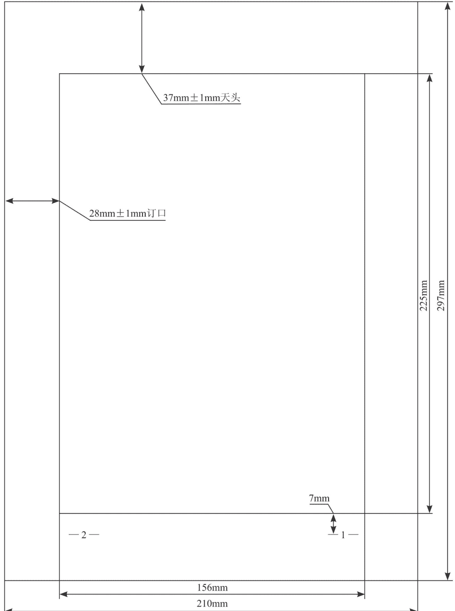

225mm
297mm
37mm±1mm天头
28mm±1mm订口
156mm
210mm
7mm

## 图1 A4型公文用纸页边距及版心尺寸

000001
机密★1年
特急

## ×××××文件

×××〔2012〕10号

## ×××××关于××××××的通知

××××××××：

×××××××××××××××××××××××××××××××××××××××××××××。

×××××××××××××××××××××××××××××××××××××××××××。

×××××。

×××××××××××××××××××××××××××××××××××××××××××××××

— 1 —

## 图2 公文首页版式

注：版心实线框仅为示意，在印制公文时并不印出。

000001
机密★1年
特急

××××××
×  ×  ×
×××××× 文件

×××〔2012〕10号

## ×××××关于××××××的通知

××××××××：

    ×××××××××××××××××××××
×××××××××××××××××××××
×××××××××××××××××××××
×××××。
    ×××××××××××××××××××××

## 图3 联合行文公文首页版式1

注：版心实线框仅为示意，在印制公文时并不印出。

## 图4 联合行文公文首页版式2

注：版心实线框仅为示意，在印制公文时并不印出。

## ×××××关于××××××的请示

××××××××：

××××××××××××××××××××××××××××××××××××××××××××××××××××××××××××××××××××××××××××。××××××××××××××××××××××××

×××××××××××。

××××××××××××××××××××
××××××××××××××××××××
××××××。

2012年7月1日

(××××××)

抄送：××××，××××，××××，××××，
×××××。

×××××××××    2012年7月1日印发

— 2 —

## 图5 公文末页版式1

注：版心实线框仅为示意，在印制公文时并不印出。

××××××××××。|××××××××××××××××××××××|××××××××××××××××××××××|××××××××××。|××××××××××|2012年7月1日|(××××××)|抄送：××××，××××，××××，××××，|×××××。|×××××××××|2012年7月1日印发

## 图6 公文末页版式2

注：版心实线框仅为示意，在印制公文时并不印出。

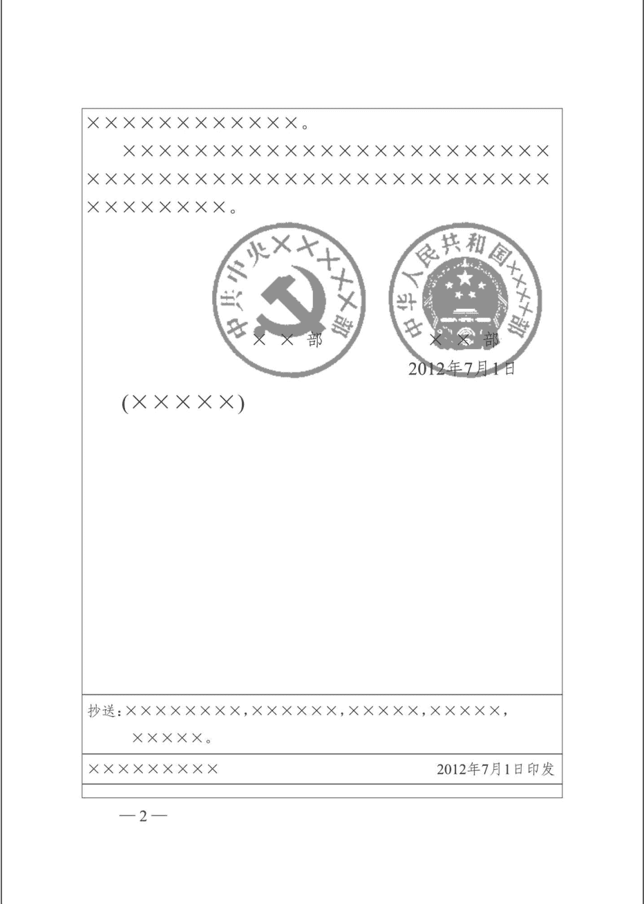

## 图7 联合行文公文末页版式1

注：版心实线框仅为示意，在印制公文时并不印出。

×××××××××××。
×××××××××××××××××××××××××
×××××××××××××××××××××××××
×××××××。

2012年7月1日

(×××××)

抄送：×××××××，××××××，×××××，×××××，
×××××。

×××××××××

2012年7月1日印发

— 2 —

## 图8 联合行文公文末页版式2

注：版心实线框仅为示意，在印制公文时并不印出。

×××××××××××。

×××××××××××××××××××××××××
×××××××××××××××××××××××××××
××××××××。

附件：1.××××××××××××××××××××
×××××

2.××××××××××××

×××××××

××××

2012年7月1日

(×××××)

— 2 —

## 图9 附件说明页版式

注：版心实线框仅为示意，在印制公文时并不印出。

## 附件2

×××××××××××××

×××××××××××××××××××××××××
×××××××××××××××××××××××××
×××。

×××××××××××××××××××××××××
×××××××××××××××××××××××××
×××××××××××××××××××××××××
×××××××××××××××××××××××××
×××××××××××××××××××××××××
×××××××××××××××××××××××××
×××××××××××××××。

| 抄送 | ××××××××, ××××××, ×××××, ×××××, ×××××。 |
|---|---|
| 印发机关 | ××××××××× |
| 印发日期 | 2012年7月1日印发 |

## 图10 带附件公文末页版式

注：版心实线框仅为示意，在印制公文时并不印出。

## 中华人民共和国×××××部

000001

×××〔2012〕10号

机密
特急

## ×××××关于×××××××的通知

××××××××：

×××××××××××××××××××××××××××××××××××××××××××××××××××××××××××××××××××××。

×××××××××××××××××××××××××××××××××××××××××××××××××××××××××××××××××××××。

××××××××××××××××××××××××××××××××××××××××××××××××××××××××××××××××××××××××××××××××××××××××。

## 图11 信函格式首页版式

注：版心实线框仅为示意，在印制公文时并不印出。

## ××××××令

第×××号

×××××××××××××××××××××××××××××××××××××××××××××××××××××××××××××××××××××。

××××××××××××××××××××××××××××××××××××××××××××××××××××××××××××××××××××××××××××××××××××××××。

部长 ×××
2012年7月1日

— 1 —

## 图12 命令(令)格式首页版式

注：版心实线框仅为示意，在印制公文时并不印出。

## 附录二

## 党政机关公文处理工作条例

## 第一章 总则

### 第一条 为了适应中国共产党机关和国家行政机关（以下简称党政机关）工作需要，推进党政机关公文处理工作科学化、制度化、规范化，制定本条例。

### 第二条 本条例适用于各级党政机关公文处理工作。

### 第三条 党政机关公文是党政机关实施领导、履行职能、处理公务的具有特定效力和规范体式的文书，是传达贯彻党和国家的方针政策，公布法规和规章，指导、布置和商洽工作，请示和答复问题，报告、通报和交流情况等的重要工具。

### 第四条 公文处理工作是指公文拟制、办理、管理等一系列相互关联、衔接有序的工作。

### 第五条 公文处理工作应当坚持实事求是、准确规范、精简高效、安全保密的原则。

### 第六条 各级党政机关应当高度重视公文处理工作，加强组织领导，强化队伍建设，设立文秘部门或者由专人负责公文处理工作。

### 第七条 各级党政机关办公厅（室）主管本机关的公文处理工作，并对下级机关的公文处理工作进行业务指导和督促检查。

## 第二章 公文种类

### 第八条 公文种类主要有：

- （一）决议。适用于会议讨论通过的重大决策事项。
- （二）决定。适用于对重要事项作出决策和部署、奖惩有关单位和人员、变更或者撤销下级机关不适当的决定事项。
- （三）命令（令）。适用于公布行政法规和规章、宣布施行重大强制性措施、批准授予和晋升衔级、嘉奖有关单位和人员。
- （四）公报。适用于公布重要决定或者重大事项。
- （五）公告。适用于向国内外宣布重要事项或者法定事项。
- （六）通告。适用于在一定范围内公布应当遵守或者周知的事项。
- （七）意见。适用于对重要问题提出见解和处理办法。
- （八）通知。适用于发布、传达要求下级机关执行和有关单位周知或者执行的事项，批转、转发公文。
- （九）通报。适用于表彰先进、批评错误、传达重要精神和告知重要情况。
- （十）报告。适用于向上级机关汇报工作、反映情况，回复上级机关的询问。
- （十一）请示。适用于向上级机关请求指示、批准。
- （十二）批复。适用于答复下级机关请示事项。
- （十三）议案。适用于各级人民政府按照法律程序向同级人民代表大会或者人民代表大会常务委员会提请审议事项。
- （十四）函。适用于不相隶属机关之间商洽工作、询问和答复问题、请求批准和答复审批事项。
- （十五）纪要。适用于记载会议主要情况和议定事项。

## 第三章 公文格式

### 第九条 公文一般由份号、密级和保密期限、紧急程度、发文机关标志、发文字号、签发人、标题、主送机关、正文、附件说明、发文机关署名、成文日期、印章、附注、附件、抄送机关、印发机关和印发日期、页码等组成。

- （一）份号。公文印制份数的顺序号。涉密公文应当标注份号。
- （二）密级和保密期限。公文的秘密等级和保密的期限。涉密公文应当根据涉密程度分别标注“绝密”“机密”“秘密”和保密期限。
- （三）紧急程度。公文送达和办理的时限要求。根据紧急程度，紧急公文应当分别标注“特急”“加急”，电报应当分别标注“特提”“特急”“加急”“平急”。
- （四）发文机关标志。由发文机关全称或者规范化简称加“文件”二字组成，也可以使用发文机关全称或者规范化简称。联合行文时，发文机关标志可以并用联合发文机关名称，也可以单独用主办机关名称。
- （五）发文字号。由发文机关代字、年份、发文顺序号组成。联合行文时，使用主办机关的发文字号。
- （六）签发人。上行文应当标注签发人姓名。
- （七）标题。由发文机关名称、事由和文种组成。
- （八）主送机关。公文的主要受理机关，应当使用机关全称、规范化简称或者同类型机关统称。
- （九）正文。公文的主体，用来表述公文的内容。
- （十）附件说明。公文附件的顺序号和名称。
- （十一）发文机关署名。署发文机关全称或者规范化简称。
- （十二）成文日期。署会议通过或者发文机关负责人签发的日期。联合行文时，署最后签发机关负责人签发的日期。
- （十三）印章。公文中有发文机关署名的，应当加盖发文机关印章，并与署名机关相符。有特定发文机关标志的普发性公文和电报可以不加盖印章。
- （十四）附注。公文印发传达范围等需要说明的事项。
- （十五）附件。公文正文的说明、补充或者参考资料。
- （十六）抄送机关。除主送机关外需要执行或者知晓公文内容的其他机关，应当使用机关全称、规范化简称或者同类型机关统称。
- （十七）印发机关和印发日期。公文的送印机关和送印日期。
- （十八）页码。公文页数顺序号。

### 第十条 公文的版式按照《党政机关公文格式》国家标准执行。

### 第十一条 公文使用的汉字、数字、外文字符、计量单位和标点符号等，按照有关国家标准和规定执行。民族自治地方的公文，可以并用汉字和当地通用的少数民族文字。

### 第十二条 公文用纸幅面采用国际标准A4型。特殊形式的公文用纸幅面，根据实际需要确定。

## 第四章 行文规则

### 第十三条 行文应当确有必要，讲求实效，注重针对性和可操作性。

### 第十四条 行文关系根据隶属关系和职权范围确定。一般不得越级行文，特殊情况需要越级行文的，应当同时抄送被越过的机关。

### 第十五条 向上级机关行文，应当遵循以下规则：

- （一）原则上主送一个上级机关，根据需要同时抄送相关上级机关和同级机关，不抄送下级机关。
- （二）党委、政府的部门向上级主管部门请示、报告重大事项，应当经本级党委、政府同意或者授权；属于部门职权范围内的事项应当直接报送上级主管部门。
- （三）下级机关的请示事项，如需以本机关名义向上级机关请示，应当提出倾向性意见后上报，不得原文转报上级机关。
- （四）请示应当一文一事。不得在报告等非请示性公文中夹带请示事项。
- （五）除上级机关负责人直接交办事项外，不得以本机关名义向上级机关负责人报送公文，不得以本机关负责人名义向上级机关报送公文。
- （六）受双重领导的机关向一个上级机关行文，必要时抄送另一个上级机关。

### 第十六条 向下级机关行文，应当遵循以下规则：

- （一）主送受理机关，根据需要抄送相关机关。重要行文应当同时抄送发文机关的直接上级机关。
- （二）党委、政府的办公厅（室）根据本级党委、政府授权，可以向下级党委、政府行文，其他部门和单位不得向下级党委、政府发布指令性公文或者在公文中向下级党委、政府提出指令性要求。需经政府审批的具体事项，经政府同意后可以由政府职能部门行文，文中须注明已经政府同意。
- （三）党委、政府的部门在各自职权范围内可以向下级党委、政府的相关部门行文。
- （四）涉及多个部门职权范围内的事务，部门之间未协商一致的，不得向下行文；擅自行文的，上级机关应当责令其纠正或者撤销。
- （五）上级机关向受双重领导的下级机关行文，必要时抄送该下级机关的另一个上级机关。

### 第十七条 同级党政机关、党政机关与其他同级机关必要时可以联合行文。属于党委、政府各自职权范围内的工作，不得联合行文。

党委、政府的部门依据职权可以相互行文。

部门内设机构除办公厅（室）外不得对外正式行文。

## 第五章 公文拟制

### 第十八条 公文拟制包括公文的起草、审核、签发等程序。

### 第十九条 公文起草应当做到：

- （一）符合党的理论路线方针政策和国家法律法规，完整准确体现发文机关意图，并同现行有关公文相衔接。
- （二）一切从实际出发，分析问题实事求是，所提政策措施和办法切实可行。
- （三）内容简洁，主题突出，观点鲜明，结构严谨，表述准确，文字精练。
- （四）文种正确，格式规范。
- （五）深入调查研究，充分进行论证，广泛听取意见。
- （六）公文涉及其他地区或者部门职权范围内的事项，起草单位必须征求相关地区或者部门意见，力求达成一致。
- （七）机关负责人应当主持、指导重要公文起草工作。

### 第二十条 公文文稿签发前，应当由发文机关办公厅（室）进行审核。审核的重点是：

- （一）行文理由是否充分，行文依据是否准确。
- （二）内容是否符合党的理论路线方针政策和国家法律法规；是否完整准确体现发文机关意图；是否同现行有关公文相衔接；所提政策措施和办法是否切实可行。
- （三）涉及有关地区或者部门职权范围内的事项是否经过充分协商并达成一致意见。
- （四）文种是否正确，格式是否规范；人名、地名、时间、数字、段落顺序、引文等是否准确；文字、数字、计量单位和标点符号等用法是否规范。
- （五）其他内容是否符合公文起草的有关要求。

需要发文机关审议的重要公文文稿，审议前由发文机关办公厅（室）进行初核。

### 第二十一条 经审核不宜发文的公文文稿，应当退回起草单位并说明理由；符合发文条件但内容需作进一步研究和修改的，由起草单位修改后重新报送。

### 第二十二条 公文应当经本机关负责人审批签发。重要公文和上行文由机关主要负责人签发。党委、政府的办公厅（室）根据党委、政府授权制发的公文，由受权机关主要负责人签发或者按照有关规定签发。签发人签发公文，应当签署意见、姓名和完整日期；圈阅或者签名的，视为同意。联合发文由所有联署机关的负责人会签。

## 第六章 公文办理

### 第二十三条 公文办理包括收文办理、发文办理和整理归档。

### 第二十四条 收文办理主要程序是：

- （一）签收。对收到的公文应当逐件清点，核对无误后签字或者盖章，并注明签收时间。
- （二）登记。对公文的主要信息和办理情况应当详细记载。
- （三）初审。对收到的公文应当进行初审。初审的重点是：是否应当由本机关办理，是否符合行文规则，文种、格式是否符合要求，涉及其他地区或者部门职权范围内的事项是否已经协商、会签，是否符合公文起草的其他要求。经初审不符合规定的公文，应当及时退回来文单位并说明理由。
- （四）承办。阅知性公文应当根据公文内容、要求和工作需要确定范围后分送。批办性公文应当提出拟办意见报本机关负责人批示或者转有关部门办理；需要两个以上部门办理的，应当明确主办部门。紧急公文应当明确办理时限。承办部门对交办的公文应当及时办理，有明确办理时限要求的应当在规定时限内办理完毕。
- （五）传阅。根据领导批示和工作需要将公文及时送传阅对象阅知或者批示。办理公文传阅应当随时掌握公文去向，不得漏传、误传、延误。
- （六）催办。及时了解掌握公文的办理进展情况，督促承办部门按期办结。紧急公文或者重要公文应当由专人负责催办。
- （七）答复。公文的办理结果应当及时答复来文单位，并根据需要告知相关单位。

### 第二十五条 发文办理主要程序是：

- （一）复核。已经发文机关负责人签批的公文，印发前应当对公文的审批手续、内容、文种、格式等进行复核；需作实质性修改的，应当报原签批人复审。
- （二）登记。对复核后的公文，应当确定发文字号、分送范围和印制份数并详细记载。
- （三）印制。公文印制必须确保质量和时效。涉密公文应当在符合保密要求的场所印制。
- （四）核发。公文印制完毕，应当对公文的文字、格式和印刷质量进行检查后分发。

### 第二十六条 涉密公文应当通过机要交通、邮政机要通信、城市机要文件交换站或者收发件机关机要收发人员进行传递，通过密码电报或者符合国家保密规定的计算机信息系统进行传输。

### 第二十七条 需要归档的公文及有关材料，应当根据有关档案法律法规以及机关档案管理规定，及时收集齐全、整理归档。两个以上机关联合办理的公文，原件由主办机关归档，相关机关保存复制件。机关负责人兼任其他机关职务的，在履行所兼职务过程中形成的公文，由其兼职机关归档。

## 第七章 公文管理

### 第二十八条 各级党政机关应当建立健全本机关公文管理制度，确保管理严格规范，充分发挥公文效用。

### 第二十九条 党政机关公文由文秘部门或者专人统一管理。设立党委（党组）的县级以上单位应当建立机要保密室和机要阅文室，并按照有关保密规定配备工作人员和必要的安全保密设施设备。

### 第三十条 公文确定密级前，应当按照拟定的密级先行采取保密措施。确定密级后，应当按照所定密级严格管理。绝密级公文应当由专人管理。

公文的密级需要变更或者解除的，由原确定密级的机关或者其上级机关决定。

### 第三十一条 公文的印发传达范围应当按照发文机关的要求执行；需要变更的，应当经发文机关批准。

涉密公文公开发布前应当履行解密程序。公开发布的时间、形式和渠道，由发文机关确定。

经批准公开发布的公文，同发文机关正式印发的公文具有同等效力。

第三十二条 复制、汇编机密级、秘密级公文，应当符合有关规定并经本机关负责人批准。绝密级公文一般不得复制、汇编，确有工作需要的，应当经发文机关或者其上级机关批准。复制、汇编的公文视同原件管理。

复制件应当加盖复制机关戳记。翻印件应当注明翻印的机关名称、日期。汇编本的密级按照编入公文的最高密级标注。

第三十三条 公文的撤销和废止，由发文机关、上级机关或者权力机关根据职权范围和有关法律法规决定。公文被撤销的，视为自始无效；公文被废止的，视为自废止之日起失效。

第三十四条 涉密公文应当按照发文机关的要求和有关规定进行清退或者销毁。

第三十五条 不具备归档和保存价值的公文，经批准后可以销毁。销毁涉密公文必须严格按照有关规定履行审批登记手续，确保不丢失、不漏销。个人不得私自销毁、留存涉密公文。

第三十六条 机关合并时，全部公文应当随之合并管理；机关撤销时，需要归档的公文经整理后按照有关规定移交档案管理部门。

工作人员离岗离职时，所在机关应当督促其将暂存、借用的公文按照有关规定移交、清退。

第三十七条 新设立的机关应当向本级党委、政府的办公厅（室）提出发文立户申请。经审查符合条件的，列为发文单位，机关合并或者撤销时，相应进行调整。

第三十八条 党政机关公文含电子公文。电子公文处理工作的具体办法另行制定。

第三十九条 法规、规章方面的公文，依照有关规定处理。外事方面的公文，依照外事主管部门的有关规定处理。

第四十条 其他机关和单位的公文处理工作，可以参照本条例执行。

第四十一条 本条例由中共中央办公厅、国务院办公厅负责解释。

第四十二条 本条例自2012年7月1日起施行。1996年5月3日中共中央办公厅发布的《中国共产党机关公文处理条例》和2000年8月24日国务院发布的《国家行政机关公文处理办法》停止执行。

## 第八章 附则

# 新时代·职场新技能

# 秘书工作手记3:学会办事

像玉的石头 著

清华大学出版社 北京

公众号【懒人手册】回复“互联网”，白嫖各种资源文档

本书封面贴有清华大学出版社防伪标签，无标签者不得销售。

版权所有，侵权必究。举报：010-62782989，beiqinquan@tup.tsinghua.edu.cn。

# 图书在版编目（CIP）数据

秘书工作手记 .3，学会办事/像玉的石头著.—北京：清华大学出版社，2022.1

(新时代·职场新技能)

ISBN 978-7-302-59661-5

Ⅰ. ①秘...  Ⅱ. ①像...  Ⅲ. ①秘书-工作  Ⅳ. ①C931.46

中国版本图书馆CIP数据核字(2021)第249692号

责任编辑：刘洋  
封面设计：李召霞  
版式设计：方加青  
责任校对：王荣静  
责任印制：杨艳  

出版发行：清华大学出版社  
网址：http://www.tup.com.cn，http://www.wqbook.com  
地址：北京清华大学学研大厦A座  
邮编：100084  
社总机：010-62770175  
邮购：010-62786544  

投稿与读者服务：010-62776969，c-service@tup.tsinghua.edu.cn  
质量反馈：010-62772015，zhiliang@tup.tsinghua.edu.cn  
印装者：北京同文印刷有限责任公司  
经销：全国新华书店  
开本：170mm×240mm  
印张：16.25  
字数：230千字  
版次：2022年1月第1版  
印次：2022年1月第1次印刷  
定价：79.00元  
产品编号：091827-01

# 内容简介

办事能力是职场中非常管用的“硬通货”。学会办事，“学会”的过程本质上就是认识职场规律、适应职场规律的过程。石头哥在这本书里分享自己对办事规律的认识和体会。比方说，办事要理解领导意图，按领导要求办，因为与领导相处的热度决定了你的职场高度。办事要讲礼仪和规矩，礼仪绝不是繁文缛节，那是人心中最柔软的地方。办事要会说话，很多事，可办可不办，话说得好，能办的可能性就大。办事要注重细节，小事也能让你脱颖而出。办事要有耐性，身处职场的长跑，笑到最后才算笑得最好，等等。掌握规律，保护自己，谋求发展，赢得尊重，是有本事、想成事的职场人应当学会的技能。

## 前言 成为一个成熟的人，去面对复杂的世界

疫情期间，石头一直在追国家地理的一部自然纪录片，名字叫《水深火热的星球》。纪录片的主题相当聚焦，就是记录野生动物是如何在自然环境中艰难求生的。比如，为了觅食，白颊黑雁夫妇带着三只雏鸟从悬崖上跳下，只有一只雏鸟存活；雪豹在捕食过程中，咬住羚羊从30层楼的高度滚下，竟然从未松口。

在自然界，生存还是死亡永远是个严肃的问题，每一天都胆战心惊，每一天都要竭尽全力。镜头里的动物们无时无刻不在努力，只要停下脚步，就可能成为别人的盘中餐。

相较之下，人类就幸运太多了。我们虽然也要为了生活奔波，有时还要违背自己的心意挤出笑脸，好像受了莫大的委屈，但毕竟早已不需要时刻面对生存还是死亡的考题，如果没有什么更高的追求，刷着抖音、吃着外卖，无所事事地过一辈子，似乎并不是一件难事。

这种安逸之下，我们大概会忘记人类走出丛林其实并没有多久。“丛林法则”真的从人类社会完全消失了吗？我们真的不用再面对“生存竞争”了吗？答案当然是否定的。

特别是身处职场，身处科层制的大单位，一定会有资源多寡之分，有实力强弱之分，有职权大小之分，有指挥和被指挥之分，有工资多少之分，有被敬畏和被轻视之分。职场不会完全如你想象或希望的那样，而是有其自身的规律，受到类似于自然界“丛林法则”的规律调控。规律或许平日里无人言说，但谁要想挑战它，注定会头破血流。

作为“秘书工作手记”系列的第三本，石头想在这本书中谈的主题词叫“办事”，这个“办事”，不仅是指“办文办会办事”的办事，在工作中，大家按上级要求做出的所有动作都可以算作“办事”。办文和办会，难道不是“奉命办事”吗？所以，办事，才是职场最核心的行为，办事能力，才是职场最管用的“硬通货”。

学会办事，“学会”的过程本质上就是认识职场规律、适应职场规律的过程。石头会在这本书里分享自己对办事规律的认识和体会。比方说，办事要理解领导，按领导要求办，因为与领导相处的热度决定了你的职场高度。办事要讲礼仪和规矩，礼仪绝不是繁文缛节，那是人心中最柔软的地方。办事要会说话，很多事可办可不办，话说得好，能办的可能性就大。办事要注重细节，小事也能让你脱颖而出。办事要有耐性，身处职场的长跑，笑到最后才算笑得最好，等等。

这些规律你可能未必都满意，甚至可能一时难以接受。然而，真正的勇士，往往有极强的适应性和坚定的决心。不抱怨、不幻想、不放弃。躬身入局，下场打拼。掌握规律，保护自己，谋求发展，赢得尊重，才是有本事、想成事的职场人应当做出的选择。

“世上只有一种英雄主义，就是认清了生活的真相后依然热爱生活。”成为一个成熟的人，去面对复杂的世界吧。愿你们有所收获，更愿你们前程似锦。

# 像玉的石头（石头哥）

# 上篇 技巧篇 办事的艺术

## 第一章 领导：与领导相处的热度，决定了你的职场高度
- 一、领导为什么重要？
- 二、关于领导的几个常见认识误区
- 三、见了领导特别紧张怎么办？
- 四、在领导面前挣表现的小窍门
- 五、回答领导问话，怎么才能得满分？
- 六、对领导部署的极致回复是啥样的？
- 七、给领导送文件，学问太大了！
- 八、给领导发祝福短信有哪些讲究？
- 九、怎么跟领导走得近？
- 十、领导说这些话，你要警惕了！
- 十一、领导眼中的靠谱是怎么做到的？
- 十二、大领导与小领导可不一样
- 十三、推活儿又不得罪领导的好办法

### 第二章 礼仪：礼仪是人心中最柔软的地方
- 一、单位食堂也是局啊！
- 二、饭局怎么组织，才能请到想请的人？
- 三、酒量小的人，饭局上怎么如鱼得水？
- 四、发个微信，也能体现高水平！
- 五、微信就是你的第一人格
- 六、怎么顺利加上领导微信？
- 七、我为什么劝你要秒回微信？
- 八、退工作群？很有讲究的！
- 九、一致好评的秘诀原来是起身相送
- 十、一个人行不行，出一次差就全看出来了
- 十一、送礼其实没那么重要
- 十二、单位人常见场景礼仪清单

## 第三章 说话：别被不会说话耽误了
- 一、汇报的重要，怎么强调都不为过
- 二、内向者的汇报也可以很牛！
- 三、经常给领导汇报思想是怎么做到的？
- 四、天天汇报却愈发不受待见，问题出在这里
- 五、汇报的细节，不懂你就亏大了
- 六、当众发言，别搞错了重点
- 七、用一两个这样的词，能显得很会说话
- 八、竞争上岗，怎么讲脱颖而出？
- 九、寒暄找话题大法
- 十、说话有逻辑，是怎么做到的？
- 十一、嘴严是一种美德

## 第四章 细节：让你脱颖而出的那些小事
- 一、在单位特别拉好感的几个小妙招
- 二、有效赞美的5条法则
- 三、怎么装成很有城府的样子？
- 四、到上级单位借调注意事项清单
- 五、当小领导带好团队的要点清单
- 六、当烂好人有什么问题？
- 七、节后第一天，别只知道傻傻上班
- 八、微信里工作信息如何减少遗忘？
- 九、把备注通讯录提升到战略高度！

## 第五章 态度：工作可以商量，态度必须端正
- 一、舞台再小，也要学会给自己加戏
- 二、越主动越加分
- 三、求人帮忙，你的姿势对吗？
- 四、可以不会，但要耐烦
- 五、开会打瞌睡的人没有未来
- 六、钝感力强的人走得更远
- 七、如何避免成为一个乏味的职场老油条？

# 下篇 实践篇 秘书小蔡成长记

写在开头的话

## 第六章 初来乍到
- 一、为啥不早点儿到呢？
- 二、保证完成的任务，怎么就忘了？
- 三、随口一说要不得
- 四、会场一分钟，弦绷60秒
- 五、接电话的学问真不少
- 六、“一个都不能少”？没必要！

## 第七章 得窥门径
- 一、一篇稿子教我学会把握“度”
- 二、服务领导，不是当保姆
- 三、处处留心皆创造
- 四、工作靠不靠谱，就看这三点！
- 五、有话真得好好说
- 六、调研不是摆样子

## 第八章 渐入佳境
- 一、“钻”，比动笔更重要！
- 二、“兵荒马乱”的一天
- 三、“推活儿”的“讲究”
- 四、得把精力放在解决问题上
- 五、调研历险记：就想听听老百姓的心里话
- 六、小蔡的新“担子”

写在结尾的话

## 第一章 领导：与领导相处的热度，决定了你的职场高度

### 一、领导为什么重要？

不少人进入单位，只满足于找同为“小白”的人做朋友，而与领导保持距离，对领导避而远之，能躲多远就躲多远。更有人自命清高，不屑于主动接近领导，把按领导要求办事、与领导搞好关系看作是低三下四、丧失人格，觉得自己光靠能力就能打天下。

过了一段时间，有些人开始回过味来：不对呀，怎么能够按领导要求办事、跟领导走得近的人都进步了，而那些领导说东偏往西，非要另搞一套的人，即使业务挺强，还是越来越江河日下了呢？

事实上，在一个科层制的体系或组织里面，与领导相处得如何，领导对你的看法如何，都会深刻影响你的职场命运，道理其实一点也不复杂。

### 1. 领导驱动单位运转

先从这个组织本身来看，一个组织自上而下、令行禁止，驱动它运转的根本动力在哪里？其实很简单，就是下级听上级的，按上级的指令办事，也就是领导的权威。

石头工作这么些年，经历很多单位，接触了那么多领导，无论单位大小、体制内外，一个单位能搞得好，绝对不是仅仅靠氛围开明、环境民主、大家畅所欲言，而是靠领导远见卓识、杀伐决断，带着大家目标一致往前走。

如果单位的领导没有权威，打仗的时候一声令下“冲呀”，转头一看，人居然都跑了，这仗没法打了！所以说，只要是需要讲令行禁止的地方，需要讲上行下效的地方，领导必须有权威。假如一个组织的领导没有权威，可以想象，它离分崩离析肯定就不远了。

### 2. 向领导学习：画布策略

再从个人成长的角度看，服从领导，按领导的要求办事，就是对自己人格的矮化吗？其实完全搞反了。

这里石头想给大家介绍一个概念，叫作“画布策略”（见图1-1）。

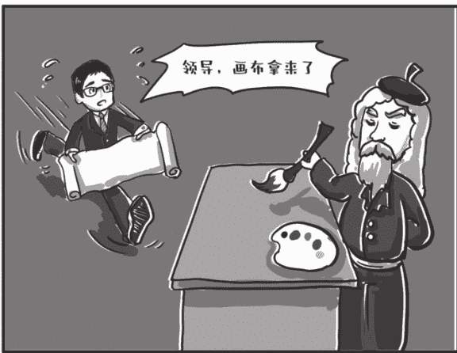

图1-1 画布策略

所谓“画布策略”，说的是西方画家，不管是米开朗基罗也好，达·芬奇也好，刚开始学习画画的时候，都是在大画家家里当学徒。他们的主要工作就是，发现大画家要画油画，赶紧给找来画布。

画里也许有你的功劳，但是你所处的位置，是给人铺画布的，当然画上不会署你的名字。

铺着铺着，画家才开始愿意教给学徒一些画画的技法，这才上了正道。这就是学徒做的事。也可以把这种精神称为“学徒精神”。

“画布策略”的关键是，小人物在工作上给大人物帮助，为大人物铺路，让大人物把事情做得更漂亮，以此来换取自己发展的机会。

当你一穷二白，会的东西不多，手里什么资源都没有的时候，除了帮大人物办好小事，铺好画布，还有什么可做的呢？还有什么途径让别人愿意教你、帮你呢？可能没有。

给别人当学徒就给你提供了一个机会，你现在把自己和一个高手连接到了一起，可以从内部了解第一手的经验，这就是学徒工作的意义。你用自己的礼敬和服务换取机会，这个机会不一定是马上立功露脸的机会，而是更重要的机会——学习实践的机会。

在职场里，是要有点“学徒精神”的，哪个大神不是从学徒出来的呢。从功利角度讲，你可以把这件事当成一项投资，与其你欠大人物一个人情，不如让他欠你一个人情。

说到这儿，石头想拿自己举个例子。经常会有人问我，石头，你一个做行政工作的，怎么会想起来写书出书，而且一下还出了那么多本？你的动机是什么？

我会坦然地告诉他，其实我就是“画布策略”的受益者。

石头刚工作的时候，认识了一位领导，他还有一个身份——全国知名的小说家。因为觉得有意思，石头经常利用下班后的时间帮这位领导录入手写稿件、校对，有时候还帮忙联系出版社，处理一些杂事。

录着录着，脑子里就萌生了一个念头：要不，自己也写写看？于是试着写一些小文章。开始只是在朋友圈发一发，后来被一位因录稿认识的编辑看到，强烈建议石头结集出版。这么好的事，石头之前哪敢想，《秘书工作手记：办公室老江湖的职场心法》这本书就这样诞生了。

想当大人物，先当好小人物，只有善于给高手施展创造条件，高手才愿意带你玩。多么真实而朴素的道理啊！

初入职场，你所面对的高手，往往就是你的领导。所以，只要你还在某个组织或单位里，就要树立信念：与领导好好相处，赢得领导的欣赏信任，努力从领导身上汲取养分，这是第一要务。与领导相处的热度，决定了你的职场高度。这根本性的道理，很多人到退休也没想通。也是，这种事，哪个不是在心里藏着掖着呢？

### 3. 面对领导的心态

在面对领导的时候，怎样的心态最有益？

石头强烈建议大家，你在工作中按照领导的要求办事，给领导提供服务和帮助，不要把这些看成是在给领导打工，被领导驱使，而是要把这些看成是学习观察的机会。

你想啊，领导往往都是某个行业的佼佼者、领先者，都是社会的精英。要把领导看作前辈和长辈去尊重，看成精英去学习，而不是看成命运决定者去巴结！这样，和领导相处会越来越成为一种享受，而不是负担。

不要惧怕与领导见面的机会，不要因为自己的情绪而减少与领导见面的频率。

石头知道，即使说了这么多，不少人还是会有心理负担，觉得接近领导、琢磨领导是“功利主义”“短期主义”，只有扎扎实实做好手头的工作才是“静水流深”“长期主义”。

这种思维完全把“长期主义”和“短期主义”对立起来，把“短期主义”污名化了。

石头再拿自己做公众号举个例子。做公众号，既要有长期的内容思维，又要有短期的流量思维。一篇文章，内容固然要深刻实用，给人启发，标题最好也得有点“噱头”，甚至时不时当当“标题党”，否则读者的注意力早就被视频里跳舞的小美女吸引走了，根本就懒得点进来看你，再好的内容也无人欣赏。

工作也是一样，做营销和练内功，这两种思维不是非此即彼的，而是可以共存的，该做短期的工作就得做短期的工作，该吸引领导的注意就得吸引领导注意，该表现的时候就要勇敢表现。但同时，也要坚持内容思维，做一些有长期价值的事情，练内功的事情。这两个思维不能说只重视一个，不重视另一个。

### 4. “守正用奇”

有些人可能还有困惑：石头，你敲字倒是容易，既要又要还要，辩证统一、统筹兼顾，一套一套的，但真正落到实践上，天天有写不完的稿子、整不完的档案、做不完的表格，琢磨人和琢磨事哪有那么容易平衡呀？

确实，人的精力有限，时间有限，想同时把两件事做到十全十美、完美无缺，是不太可能的。

办公室顾问团的老部长曾教给石头一个精力分配法则，石头觉得有一定道理，也转述一下供大家参考。

中层及以下人员，在琢磨事与琢磨人上，七三开，首先要做到以自身实力立足，用本事说话，靠实绩取胜，同时适当花一些精力抬头看路。

上到中层之后，在琢磨事与琢磨人上，五五开，琢磨事侧重于抓工作落实，琢磨人侧重于理顺关系、赢得支持。

要是当了单位一把手，一般来说应做到琢磨事与琢磨人三七开，把主要精力放在拓展人际关系、打开局面上。

石头有个校友叫张磊，是国内非常优秀的投资家，接连投出了腾讯、京东等著名企业，当然，我认识他，他不认识我。据传，他的投资哲学始终坚持一项基本原则，叫作“守正用奇”，化用自老子《道德经》中的“以正治国，以奇用兵”。

张磊认为，投资要获得成功，既要在坚持高度道德自律、人格独立、遵守规则的基础上，坚守专业与专注，拥有伟大的格局观，谋于长远，同时还要不拘泥于形式和经验，勇于创新，出奇制胜。做人做事讲究正，才能经得起各种各样的诱惑。思考决策讲究奇，才能找到属于自己的空间。“守正”给“用奇”以准绳，“用奇”给“守正”以反馈。

在单位做事何尝不是如此。**“守正”我们可以理解为乐观正派，任劳任怨，总能扎实靠谱地完成工作，“用奇”则是用心体会琢磨，盯住领导的需求和关切，勇敢地抓住每个露脸出彩的机会。**守正和用奇结合在一起，才能在职场发挥最大的效用。

讲完这些，面对领导的时候你是不是就坦然多了？

### 二、关于领导的几个常见认识误区

近几年周树人先生有句话在网上很红：“人类的悲欢并不相通，我只是觉得他们吵闹。”意思是说，每个人都沉溺于自己的生活和认知，人与人之间相互理解其实是很难的。做自媒体时间越久，越能体会这句话的精妙。人与人之间的认知差异如此之大，没有必要也不可能相互说服，别较真，避免呐喊，否则会被气死。

放到部下和领导身上，上述原理同样成立。由于身位、经历和价值取向不同，部下和领导之间相互不理解是很正常的事。比如，就加班这件事来说，领导想的是大家怎么加班加点把今年的工作总结写好，他好拿到上级那里去当提拔的筹码；你想的是家里孩子还小，需要我晚上辅导“学而思”数学，凭什么在这儿给你推稿子，到时候又不是我去汇报！

问题来了：人们在互联网上相互不理解不是一件大事，大不了老死不相往来，互骂一句“傻缺”完事。但你跟领导之间不行，你如果坚持认为领导是“傻缺”，领导也一定会认为你是“傻缺”，恐怖的地方在于，权力是单向的，他手中有支配你，甚至伤害你的权力，不理解的后果就会非常严重，有些人甚至因此而赔上整个职业生涯。出路只有一条，我们去顺应领导的理解方式，看看他为什么会这样那样地思考问题，道理究竟何在。

## 1. 误区一：工作我干，凭什么他跟大领导汇报？
“我们科长真是个坏领导，为什么工作是我干的，最后科长跑去给大领导汇报，甚至大领导根本就不知道有我这个人，我没办法跟着他干了！”石头时常在后台看到这样的问题，这是大头兵对自己直接领导最常见的一个误区。

一级对一级负责，下级对上级负责，这是科层制组织的一个重要特征。一般表现为：科员负责具体干活，对科长负责；科长负责完善提升，对领导负责。科长跟领导汇报，是职责所在，无可厚非。科长才是你们科室的唯一代表，说难听点，你们科室的所有成绩和过错，首先都应该记在科长头上。

你可以想象一下，假如有一天你自己当上科长，你们科室任何一个人都可以代表科室直接向上级汇报，那你们科室其实根本就没有存在的必要了！什么“科室”“科长”都没必要存在了，那你就单枪匹马作战就好啦！

所以，工作本来就是你分内的事，汇报也是你上级分内的事。当然，领导和领导的格局、胸怀有差别，对下属的提携帮助程度有差别。好的领导，在给你布置任务的时候，会调动资源让你更好地发挥，向领导汇报的时候也会不失时机地提及你的工作付出，乃至对你的辛劳赞赏有加。碰上这样的好领导，就捂上被子偷着乐吧。

## 2. 误区二：他对下属一点都不上心，眼睛只盯着上边！
“我们领导特别善于搞关系，天天都围着大领导转，嘘寒问暖、鞍前马后的，对我们下面一点也不上心，我看就是一个溜须拍马的大草包！”总觉得领导花在上面的时间精力多，花在下属身上的精力少，这又是一个大头兵对领导的经常性误区。

在一个单位组织内，领导和办事员的角色不同，职责和任务也是不一样的。领导的任务主要是处理好各方面的关系，尤其是同上级的关系，赢得上级的信任，从而为下级工作创造环境，争取资源。办事员更多的是按照领导的安排做好具体工作。石头曾听一个单位的主官说，他认为他自己的任务就是“定方向、带队伍、往上跑”。

有些下属觉得领导很轻松，天天就是在办公室不停地给各方面打电话，这边拜访那边拜访，好像很风光的样子，写稿子、做表、整理档案这种苦活累活都交给他们，似乎很不公平。殊不知，很多时候，“打电话”才是解决问题的关键，至于表多一行少一行，用楷体还是仿宋，反而没那么重要。

今年的工作经费怎么争取，怎么跟领导多要一些支持，几个领导的观点矛盾怎么周旋，怎么跟其他部门沟通，这活儿得罪人该怎么处理比较妥当，下属怠工了怎么办……件件桩桩的事情，都很难。

只有领导从具体事务中解脱出来，把主要精力放在解决矛盾问题，协调各方关系上面，单位才能更好地运转。

## 3. 误区三：他一点也不实干，尽整些面子功夫和花样！
“我们领导行事浮夸，不干实事，特别喜欢开会，特别看重文字材料，一点点措辞都要来回推敲，还喜欢搞些花样，博人眼球！”老批评领导不干实事，也是部下看领导的一大误区。

先说开会。等让你牵头带着大家做一件事的时候，你才会发现，不开会，思想不能统一啊！不开会，大家都不重视啊！不开会，老张老李都压根不知道该怎么干啊！不开会，老王老马根本就不会往前推啊！不开会，压根就不行，开了会，鸡血一打，事情才总算动起来了。

再说说材料和花样。有些人善于在“花样”和形式上下功夫，给领导标示重要字句，用尺子比着一丝不苟地画；给领导报告带有数据表格的重要材料，要彩色打印，还要找一个塑料封皮装好；领导召唤，要跑步前往，最好脚丫子要啪叽出点响动来。

当大头兵的时候，总觉得所谓工作就是自己手头那点事，扎扎实实做好就行了，何必那么看重汇报材料？何必非要追求什么“花样”“亮点”？为什么非要在形式主义和表面功夫里越陷越深？

等你有机会成长到一群人要向你汇报的阶段，你才会发现头绪真多、事情真杂，要操心的实在太多了，真看不过来，只能抓重点看看，重点突出、有新意的东西才能引起注意，否则，真的看都懒得看一眼。材料不巧舌如簧，工作不整出点花样，上面还以为你们什么都没干呢。

我们总希望领导对我们的认识是基于理性的、全面的、深入的，但这是一种美好愿望。现实中，往往领导没功夫、没精力，更没时间，如你希望那样理性全面深入地认识你，了解你的工作，他的判断或许更多来自感性认识，也就是短暂的、浅层次的印象。面子功夫和花样直接作用于感性认识，它管用的道理就在这儿。

更何况，理性认识需要在感性认识的基础上综合、思考、升华，对脑细胞的消耗极大，是一件很累人的事情，比感性认识累多了，指望领导在你一个人身上消耗这么多能量，那可能是你的一厢情愿。

“花样”和“形式”是最符合人性、最贴合大脑思考路径的东西，意义之大，超乎你的想象。

当然，注重形式是对的，陷入形式主义就有问题了，因为随着时间的推移，形式最终还是会实现价值回归，与实质匹配的。

## 4. 误区四：大领导对我们也那么和善，你看他那个凶样！
> “我们直管领导特别没有修养，经常批评我，每次还都很凶，一点也不像大领导，每次在厕所间碰到对我都很和善，一边解手一边谈笑风生，给予我春天般的关怀！怪不得一个能当大领导一个只能当小领导！”老觉得大领导和善，小领导凶残，也是大头兵一个常见思维误区。

其实你想多了，大领导一般都比较严厉，只是他们没有对你表现出来。因为按照科层制“一级对一级负责”的原则，你甚至都还算不上是大领导的“兵”，你的工作也和他没有关系，他们没有必要凶你，即便他们有气，也轮不上你来挨骂。所以不管认不认识你，大领导就只管对着你和蔼地微笑就行。

小领导不行，他是要拿鞭子抽着你干活的，是要和你斗智斗勇的，懂不？

## 5. 误区五：“会哭的孩子有奶吃！”
> “会哭的孩子有奶吃！”面对职场愈发内卷的利益环境，在领导那里哭和要成了不少人眼中的良药和法宝。不给我？那我就去哭，就去跳，就去要，看你给不给我！

从某种意义上来讲，积极争取自己的权益，积极表达自己进步的想法，是非常正确且应当应分的。能说就说出来，别让别人去猜，谁也不是谁肚子里的蛔虫，领导更没功夫关心你的喜怒哀乐。“我想要”，你得主动说，“不想要”，也一样。

但有些人跑偏了，把“会哭”理解成了“硬刚”，一件事不合心意，就要打出维护自己权益的大旗，动不动就对自己的上司表达不满，甚至和上司对着干，抱着“我倒要看看谁服软”的心态大闹一场，这是一种极不明智的行为。

石头听顾问团的老部长分析过这件事，觉得醍醐灌顶。

老部长把一个人在单位的权益分成两种。第一种是纯粹属于个人的权益，主要有三项：一是自己的人格权益；二是法定的经济利益，比如工资；三是法定的休息权利。

第二种权益，是提拔、工作调动、岗位安排等与平台相关的权益，这些权益其实并不属于个人，而是依附于组织和领导的，只是和你有一定的关系，组织和领导才是单位资源的掌控者和分配者。

在单位，第一种权益可以毫无保留地争取，而获取第二种权益，一要靠个人努力，二要靠组织和领导信任，这犹如车之两轮，鸟之双翼，缺一不可。因此，你要维护自己的话语权、工作调动权等权益，主要也应从以下两个方面入手。

- 一是提升自己的价值。使自己真正成为单位的骨干，业务的中坚，工作的权威，领导的左膀右臂，成为领导离不开少不了的人。这样就会提升自己的话语权，领导就会依赖你，重视你，在一定范围内满足你的愿望和要求。
- 二是同领导建立良好的人际关系，成为领导认可和信任的人。这样一来，当你向领导表达自己的愿望和想法时，他会有更大概率把你的要求放在心上。

所以，硬刚是不能解决问题的，“有话好好说”，领导和组织听进去了，被感动了，你才有可能争取到想要的权益；“有话不说”，别人压根不知道，也懒得去猜；“有话挥舞着拳头说、带着情绪说”，人家也可以不理你，甚至把你扫地出门。

## 三、见了领导特别紧张怎么办？
忙了一天，晚上石头躺平在最心爱的功能沙发上刷起了抖音。刷到一条小哥在街上搭讪妹子的视频，有点意思，点进去一看，好家伙，原来是个“海王”，号里全是小哥各种在街上搭讪妹子的实录。

小伙资质平平，长得也不帅，仔细数数，发现他搭讪的成功率并不高，搭10个人，成功要到微信号的估计有三两个。但架不住人家敢于尝试，东突西进，最后联系上的美女还真不少。

石头对这种行径不甚认同，之所以写进书里，是发现小伙给每条视频配了同样的文案——“怕尴尬，什么事都干不成”，堪称经典。

**怕尴尬，就不配得到爱情。在职场，对同事，对领导，何尝不是这样？**

有些人还没有开始跟领导交流，就预设了失败的场景，拒绝走出第一步；有些人，某一次曾跟领导有过交流，由于种种原因领导稍显冷淡，或者心不在焉，他就被吓破了胆，再也不敢轻易尝试。

正如小伙在街上搭讪，被拒绝又如何呢？大不了换个人再尝试一次呗，有什么损失呢？你少块肉了吗？绝对没有。克服心魔，不怕被拒，挑战自己想做又不敢做的事，才能继续前进，有所斩获。

好几个领导跟石头说过，自己特别喜欢那种带点儿虎气的下属。

这话让我琢磨了好久。到底啥是虎气呢？其实，领导口中的虎气，就是我们说的自然大方。带着虎气的下属往往能够恰如其分地在领导面前展示自己。

没有虎气的人，就是容易紧张的人。一见到领导就哆嗦，浑身不自在，战战兢兢，拘谨得很。

前者，容易走进领导视野，得到重用；后者，在领导面前表现得畏畏缩缩、语无伦次，不利于职场发展。

道理我们都懂，可现实情况是：一见到领导，绝大多数人都是“后者”。别看平时闹得欢，见了领导拉清单。

培养虎气，其实有法可循。

### 1. 正确理解紧张这件事
大领导往往能决定你的命运，所以在这种情况下，紧张是正常的，不紧张说明你没有进取心，找回平常状态这种事就不要想了，给领导留下好印象就行了。

紧张会让你感到不舒服，所以你想克服，但对领导来说，看到战战兢兢、无比殷勤的你，未必不是一件乐事。因为在领导眼里，你的紧张并不代表“这个人上不了台面”，可能代表“这个人特别尊重领导，以至于表现得格外小心”。从这一点来看，紧张是件好事呢！

有些人见领导不紧张，进了办公室大大咧咧，靠着沙发坐没坐相。有些人紧张，坐的时候身体前倾，半个屁股坐在沙发上，恭恭敬敬听领导讲话。其实，领导对紧张的那个人感觉更好。当然，过分紧张，磕磕巴巴，就显得难当重任了。

所以从心态上，不要对紧张这件事过于紧张。

石头还可以教给大家一个提升自信的好办法。俗话说人靠衣装，去领导那里之前，把自己收拾得帅气一点，美丽一点，干练一些，利索一些。比如，去之前洗个头，穿上贵一点的夹克西装，戴上手表，刷个牙，会让你感觉好很多。

可以想象，如果中午刚吃完韭菜馅饺子，或者头皮屑乱飞，领导一边听你汇报一边皱眉头，你不结巴才怪呢。

### 2. 搞一下过电影情景模拟
俗话说，有备无患。假如领导的一举一动我都想象过，也都有应对的预案，那还紧张个什么劲儿呢？

进门前，搞一下过电影情景模拟。场景想象越具体越好，敲几下门，里面有别人怎么办，对汇报不满意领导耷拉着脸怎么办，领导骂出了声怎么办，都可以想象一下。

最极端的情况，无非是领导对你很不满意，骂了人，你可以想象自己厚着脸皮回答：您批评得对，跟您检讨，我们马上改。他的气也就消了。

回到现实中真实的场景，往往比你想象的要简单，毕竟领导是有修养的人，骂人这种极端情况，事实上一年也碰不到几次。这样你就不会手足无措。

如果是去汇报工作的，提前想好汇报的逻辑。其实不要把逻辑这件事想得太复杂，把要说的事列个1234就行了。去了之后就一条条说：领导，有几件事给您报告一下，第一呢，第二呢，第三呢……这样就显得很有逻辑了。

如果表达能力差，甚至可以打腹稿，如果实在太差，提前写出来几个要点操练一番也行。

### 3. 准备好应对话术
有些人紧张，主要是怕领导问到自己不会的问题，自己答不上来，像杆子似的杵在那儿就尴尬了。

其实，碰上不会答的问题也不用慌。见领导不是高考，一题不会死不了，领导就是要发现你发现不了的问题，要不怎么显得领导比你水平高呢。

如果领导问的是选择题，可以说，应该是×××，我马上去确认一下。下去后赶紧确认是否说对了，不对及时纠正。如果是论述题，也最好回避“不知道”三个字，直接回答：还是您考虑问题深远又全面，我马上去确认一下，或者我马上去了解一下，之后跟您报告。

建议背诵一些见领导时常用的话术，大脑一片空白时可以脱口而出。比如，您说得特别对；我们按您指示坚决落实好；您确实是高瞻远瞩；您看问题比别人长远深刻得多；这个事我们之前认真研究过；这个事呢，是这样的；等等（见图1-2）。

另外，在研究领导上也可以再下点功夫。去汇报之前看看领导最近的活动，做成的大项目，过去聊的时候不就心里有底了吗？

比如，领导前一阵儿在报纸上发表了一篇文章，心里肯定正得意着呢。那你跟他见面的时候，就可以趁机把这件事拉扯出来：领导，我前几天刚拜读了您在某某日报上的那篇文章，写得高屋建瓴，非常透彻，不愧是大笔杆子！

图1-2 见了领导特别紧张怎么办

甚至可以准备一些段子，有点像相声里提前埋伏的包袱。这个段子是和领导有关的，比如，领导过去在单位做过一件什么了不起的事儿，大家评价都很好，他自己也特别得意；领导之前获得过什么表彰，取得过什么重大成绩，都可以作为段子储备下来。没话说的时候扯出来，巴拉巴拉对领导一通夸奖。

### 4. 良性互动
见领导，跟领导汇报，是一个互动的过程。他如果声色俱厉，你难免紧张；他如果和颜悦色笑逐颜开，你也能放松。

怎么才能向着良性发展呢？最关键的是，汇报中提到领导的次数一定要多。比如：您上次布置的某某事，我们按照您之前的要求做了，您一直关心的某某事，我们……他听到自己的次数越多，脸上的笑容就越灿烂。

你讲完之后，领导肯定会向你做一些嘱咐，你一定要时不时地点头示意，表明你在认真地听。注意跟领导的交流，眼神要表现得热切一些，他有什么指示，是是是，您说得对，要不停地有反馈，这样跟领导说起来才有意思，领导说了半天你连句话都没有，那领导还有什么兴趣跟你继续交流？

### 5. 默念箴言
小时候觉得，箴言（slogan）这东西哪能信，像周树人先生一样在课桌上刻个“早”字是非常无聊且无效的一件事。有些大老板，在办公室挂什么“高瞻远瞩”“气吞山河”之类的横幅，就更没品位了。

年龄大了才发现，slogan这种东西并不是完全无用的。人的心智成熟之后，一般还能听得进去劝，听得进道理，而这个slogan就是时刻劝说你的道理，slogan选得好，确实有助于人克服弱点，变得更好。

比如最近看了冯唐几本书，看他到处强调“不着急、不害怕、不要脸”，一琢磨，还真是抓住了很多事情的关键，无论是工作还是人际关系，成事得有点儿这种洒脱的气质。

有些人特别怕领导，不妨把这句话设成手机壁纸，每次要见领导的时候，心里默念它，应该会有些作用。

做到上面几条，我觉得大多数人的紧张情绪会得到很大程度的缓解。如果你还是腿哆嗦，那石头还有釜底抽薪的一招！

紧张最根本的原因还是陌生感，在一起相处久了，见过领导紧张、疲惫、痛苦、无助甚至邋遢的场景多了，你就不会紧张了。

你可以想一想，坐在你面前的威风十足的领导，在更大的领导面前，也会涨红了脸说不出话，也会被打断而默不作声，也会被训得抬不起头，也会一路小跑点头哈腰。

等你跟领导接触多了，你会发现，领导也是个普通人，也有喜怒哀乐，也要吃喝拉撒，这样一来你对未知的恐惧感会降低，心态也会更加平和，也就不会再这么把领导给神化了。

## 四、在领导面前挣表现的小窍门
在领导面前挣表现，是一个相当敏感的话题。有些人对在领导面前刻意表现，或者制造机会引起领导注意非常地不齿，一味强调“酒香不怕巷子深”“要做老黄牛”“做好工作组织上自然会看得见”。

从某种意义上说，这也没错。工作是基础，只有做好工作，才能静水流深，行稳致远。但是不能只强调做工作，而不强调适当地展现自己的能力和素质。

为什么说“酒香不怕巷子深”不全面呢？因为领导太忙了。很多你自己开展的工作、做的事情，你以为领导明察秋毫，什么都知道，但其实他根本就不知道。

拿我自己举例。当时我还在秘书部门，天天在领导眼皮子底下晃，我这个部门除了承担领导安排的日常服务，还要写稿子，部门长期以来的传统就是一边联系领导一边写稿子，这样已经有十几年了。

我一直觉得领导们肯定知道单位的稿子全是我们写的，但是，一次有位领导对我说：“你们的事每天也不是很多，我出差了你们是不是就没什么事了？”我一听就急了，说怎么可能没事呢，我们还要写稿子，所有学校的稿子和主要领导的稿子都是我们写的，您出差了，我们还是晚上经常加班写稿子，领导听了很诧异：“什么？学校的稿子是你们写的？我一直以为是宣传部写的。”我当时差点“吐血”，我这还是在领导面前吹过风的，也经常说，领导仍然记不住，以为稿子不是我们而是宣传部写的。

大家想一想，我们在秘书部门都是这样，你要是处在一个相对边缘一点的部门，那领导肯定对你的工作成绩更加无从知晓了。

领导手机里，可能过个春节或者生日会有上百条短信来不及回。虽然你发短信时忐忑忐忑，但领导可能根本就没有看。领导真的很忙，对你的印象可能只来自一两件事，而不是来自所谓的长期观察。

古语说“试玉要烧三日满，辨材须待七年期”。这是一种理想，在现实生活中其实是非常难做到的，领导不可能通过很多事来对你进行判断。可能就是通过一次出差、一次开会这样的偶然性接触，对你这个人的判断和印象就出来了。

所以说，领导对你的印象，往往来自一两件小事。而且，印象一旦形成，很难改变。有些人善于抓住这样的机会，一次就把事情做好，让领导满意，赢得领导的信任和欣赏。

### 1. 每天早到10分钟
过去父母那辈会把他们的工作经验告诉你：早点到办公室打水、擦地、擦桌子，但是我们现在其实用不着了，因为现在有物业公司负责办公区保洁，不需要你来擦桌子。那我们为什么还要早到办公室呢？

对此石头有切身体会。有些年份北京天已经很冷了，暖气却还没有来，早上被窝的吸引力更胜以前。闹钟虽然还是那个点，却总不能自持地要在床上赖个10分钟。于是

公众号【懒人手册】回复“互联网” ,白嫖各种资源文档

是，石头连续几天到办公室都比之前迟了些，虽然也是踩着点，并没有迟到，却总感觉状态比以前差了不少。

急火火地刷牙，随便抹一把脸；一路小跑冲向车站，祈祷着公交车马上就出现；路上似乎比早出门时堵了不少，长长的车龙让人心急如焚；没时间吃早餐，只能买一瓶冰冷的营养快线；办公楼的电梯外也排起了队；终于提心吊胆赶到办公室，一看桌上的电话，已经有了领导的未接来电；没时间泡茶，没时间整理日程，甚至没时间撒尿，一天的慌乱不堪在早上就奠定了基调。

这种混乱让石头意识到，早10分钟到办公室，原来如此大不同。

早起，你会更从容。

每天的公交车，最挤的就是临近上班时间的那几趟；上班点前后的交通最容易堵得水泄不通；单位的电梯外，也是在到点前的几分钟才大排长队。

假如石头提早一点起床，明显会从容许多。我可以一边听收音机一边认真刷牙，可以在前往公交车站的路上赞美朝阳的美好，可以享受不那么拥挤的公交和道路，可以慢条斯理地享用美味的早餐。到了空无一人的办公室，我可以先泡上一杯热茶，然后从容不迫地开始工作。

用半个小时的早起，换这种从容优雅，换这种一切有条不紊、尽在掌握的心情，这个买卖简直太划算。

早到，你能做好万全准备。

除了姿态上的从容，早一点到单位，你可以用上班前的清净时间处理很多实实在在的事，为接下来的工作奠定一个有秩序的基调。

10分钟肯定写不完一篇稿子，也做不完一个PPT，甚至打不了几个电话，但在早上，足够你干这些事：查看自己的日程表，看看当天有哪些活动；在笔记本上列出当天的待办事项；梳理待会见到领导有哪些问题需要请示汇报；清理办公桌面和电脑桌面，查看和回复邮件；等等。

当别人按时赶到办公室的时候，你已经做好了所有工作准备，那么，当然是你的效率更高，节奏更稳。

早到，你还来得及查漏补缺。

早到曾经挽救过石头的重大失误。那天石头提前了二十多分钟到办公室，照例检查当天的相关日程，发现日程表上之前标记了一个当天上午10点的论坛，领导需要致辞。

石头之前完全忘了，致辞稿都还没有给领导！真是把人惊出一身冷汗，赶紧把稿子从邮箱调出来，修改打印，放到领导桌上。还好，没到上班时间，领导还没到。虽然活动当天上午给稿子已经是晚了，但好在没有铸成大错。

假如石头当天不是提前到了办公室，而是踩着点甚至是迟到，想必就没有时间检查日程，也就没有机会发现这个巨大的疏漏。等领导责问下来，或许石头还是一头雾水，什么？上午10点还有活动？这就太被动了。早点到，主动权才能握在自己手里，有差错，或许还来得及弥补。

早到，能给人留下好印象。

早到必然是和一系列褒义词联系在一起的。能早到的人，或许就是领导和同事眼里“特别能吃苦、特别能战斗”的人。当领导和同事屡屡发现早到的你，并发出“来这么早”“每天都来这么早”的啧啧赞叹时，相信你在大家心中的形象一定是勤奋、上进、自律、敬业、有活力的正面形象。

每天早到10分钟，每天领先一点点，日积月累，蔚为可观。

## 2. 开着门加班，别不好意思

加班，你得让别人知道，对此一定要有清醒的认识。

石头之前也没有意识到这个问题，加班都是闷着头，门一关在里面写稿子，觉得没有人打扰自己比较清静。

但是后来我发现，另外一位同事小王比我高明。领导经常表扬小王，说他一心扑在工作上，周末老是在单位的走廊里碰见他。

于是我就仔细观察了一下，小王加班的时候有个习惯，总是开着门，还时不时地在走廊里晃几圈。领导一般也爱周末加班，领导加完班准备回家了，路过小王的办公室，咦，怎么还有人周末在这儿呢？进去一看，原来是小王在加班，于是好一顿表扬（见图1-3）。

其实，小王加班不一定是最多的，但是领导就觉得他特别辛苦，加班特别多，工作特别上进。

其实这算不上什么投机取巧，只不过是实事求是。加班本来就是为单位做贡献，本来就是在付出，有什么不好意思让别人看见的呢？

有些人在这方面姿态更加主动，比如，他们加班时一定要去食堂吃饭，在食堂吃饭时碰到领导、同事打招呼。领导、同事随意问：“怎么不回家吃？”他就轻描淡写地说：“回不去啊！加班！”

加完班他们还会在微信朋友圈发一组照片：一个布满烟蒂的烟灰缸，堆满稿纸的办公桌，或是凌晨街道昏黄的路灯，再配上一行正能量的小字“我奋斗！我快乐！”或者“撸起袖子加油干！”让领导感动到流下热泪。如果你脸皮足够厚，石头觉得这一招也完全可行。

## 3. 带着万能工具包

多年前石头看过一本小说，茅盾文学奖得主李佩甫老师写的，叫《城的灯》，其中有一个情节我印象特别深。

军队里面有一个参谋，这个人是苦出身，一路向上奋斗。有一次军队首长晚上开会，突然一下灯灭了，停电了，这个参谋是坐在会议室后排的，他站起身，从兜里掏出了一截蜡烛，啪，点着，把蜡烛按在了桌上，然后转身出去。

其实不是停电，就是保险丝烧了，他换上保险丝，几分钟之后会议室灯光大亮。

要知道这个会议室从来没有停过电，没有发生过保险丝被烧的事。

你知道这意味着什么吗？意味着这个参谋任这个职位几年来，兜里一直备着一截蜡烛，以前从来没有用到过，今天用上了。

理所当然的，在座的所有首长对他有了好印象，觉得这个小伙子靠谱，应该提拔他、重用他，这个判断在他点上蜡烛的那一瞬间就可以做出。

这个原理我们是可以学习借鉴的。**做办公室工作或者行政工作的**，尤其是在外面调研、出差，随身要多准备一些东西，**最好带上万能工具包。包里装点什么呢？**

首先是笔和笔记本。随身带了你就能随时掏出一支笔来记，否则领导说个什么事，你还要到处借笔，那就太掉价了。

然后是要带纸巾。这一点女同志可能会注意多一些，男同志不太注意。我建议男同志也要随身带纸巾，纸巾使用的场景是非常多的，有时候弄上了脏东西，或者水洒了，你马上能拿出一张纸巾，立刻就凸显出你的高素质和与众不同了。

再一个是钱。很多人觉得现在是网络时代，不需要带钱，只需要带手机，有支付宝就行了。其实，钱包里多放点现金很有必要，万一和领导一起出去哪个地方不支持电子支付，你可以马上掏出现金来。

还有通讯录。比如出差在外调研，领导突然说要现场问问某个人具体情况，你马上就可以掏出笔记本把电话打过去，或者是领导问你要个电话号码，让你把谁谁谁的电话号码发给他，你马上就能给他发过去。

另外，还有下面这些小心机，都是公众号读者在日常工作中总结出来的。看完之后石头只有四个字：叹为观止。让我们一条条捋。

- 领导跟我说过，每次喊我去办公室，都能听见我跑着去的脚步声。
- 每次都看领导有没有带卡，主动去开门，听到领导的声音就候着。因为领导不经常带卡。还有就是有时候领导开完会，要看见他拿着本子，问下是否需要帮着拿回办公室。
- 每当领导值班的时候，都要晚下班一个小时左右，买点水果送到办公室，领导都会和你聊一会儿。工作上领导叫去办公室，立马拿起笔记本和笔跑去办公室，他说啥都要记下来，即使是很容易记住的事情。
- 交给一把手的文字材料，千万不要有错别字，要反复校对，不然材料写得再好也是白搭。
- 有经验的司机在雨天停车时，会注意避免领导的下车位置有水坑，防止一踩一脚泥。在夏天很热的时候，司机可以一直随时保持车内空调运行，虽然费油，但是能保证领导上车时温度适宜。大部分秘书会随身带笔纸打火机抽纸。领导烟一在手，打火机立马就过去了。领导刚洗完手，抽纸立马递过去了。领导签完字突然停顿，立马会告诉领导今天是几月几号。
- 我的一位老领导曾经和我们聊过如何主动思考的问题，他拿他的司机来举例子。办公室通知司机去送机。司机问领导：您几点走？一般领导都会告诉司机几点走。我们这位领导就不这么说。他告诉司机：“开车这个事情上你是最专业的。路况如何，行程长短，你更清楚。以后你只需要告诉我，几点你在楼下接我就可以了。”
- 负责下区县调研，自己为联络员，出发地点统一，在出行的时候提前给出行车辆找保安大哥预留了停车位。领导说我很会办事，其实我只是把细节在心中过了一遍。
- 才参加工作的时候，开职工会，散会时我顺手带走了手上的一次性茶杯，把椅子放回到桌子底下。若干年后领导还提起了这个细节。
- 老板爱干净，随时随处都要用餐巾纸擦桌子、茶杯还有口鼻。我去哪儿都给他带着（是大包不是小包）。听到老板不止一次跟别人说我细心。
- 跟领导一起去外地出差，坐飞机，先请示领导是否习惯坐飞机，对座位有什么要求？出发前安排好接送机，全程帮拿行李。领导就坐后，主动帮领导要靠枕和毛毯。出差回来直接回单位后，领导说自行回家，过了半个小时，跟领导发微信问是否到家。直到确认领导安全到家，这才是出差工作的结束。
- 办公楼走廊东西两头是玻璃窗。每天早上我会去打开窗户，给走廊通风，下班前再去关上。在刮风下雨天气不好的时候，也会提前关好。天天如此习以为常。领导看在眼里，表扬我工作细致严谨，特别靠谱。
- 我经常给领导送通知、文件，有时来的通知要求一周或者是几天之后落实上报材料，每次上报材料的时候，我都找出当时来的通知附在后面。不管领导看不看，可以给领导提个醒，时间久了，在别人看来有点烦琐，不过领导倒是挺认同，印象挺好。

## 五、回答领导问话，怎么才能得满分？

身为大头兵，主动跟领导说点儿什么，汇报点儿什么的机会和场景并不多。更多的时候大家跟领导交流的场景是被动应付，比如在食堂、电梯里，领导看见下属，为了表达自上而下的关心，随心所欲地问上那么一句，这个时候你该怎么回答？石头帮你整理了几个常见场景的标准答案，依葫芦画瓢，这波交流基本打满分，哈哈哈哈。

### 1. 领导对你说“辛苦了”，如何回答？

你辛辛苦苦办完事情、上交材料、加班加点，领导收到你交付的成果，亲切地对你说“辛苦了”。

如果你满脸通红，回答“不辛苦不辛苦”，这只能说是少先队员水平，扶老奶奶过马路，面对老师表扬，异口同声回答，“不辛苦，这是我们应该做的”。

领导心里会想，行啊，你自己说不辛苦，那我也没什么好客气的，你应该做的嘛，我还念你的好干吗？！这个回答就不及格。

怎么回答好？至少要包括这么几层意思。

第一层是感谢，领导都关切地询问了，你还不感激涕零？“感谢领导关心！”这是必须要说的。

第二层是客观描述自己的工作量。咱不怕加班，但功利点说，班也不能白加。所以，你要顺着领导的话说：“这两天任务确实不少，能力不够，态度来凑，昨天我们加班到凌晨2点多。”

第三层是表明继续努力的态度。辛苦是辛苦，跟着您干我们斗志昂扬，开心得不得了呀！“其实您统管全局，更辛苦。有领导这句话就值了，以后我们大家继续努力。”

所以，总结一下，领导对你说“辛苦了”，满分回答应该是：“感谢领导关心！这两天任务确实不少，能力不够，态度来凑，昨天我们加班到凌晨2点多。其实您统管全局，更辛苦。有领导这句话就值了，以后我们大家继续努力。”

### 2. 领导对你说“最近工作怎么样”，如何回答？

“最近工作怎么样”，也是领导寒暄时特别爱问起的一个问题。在电梯里、食堂里，为了表达对部下的关心，缓解无话可说的尴尬，领导只能拿工作说事。

怎么回答好？至少要包括这么几层意思。

第一层是感谢，领导都关切地询问了，你还不感激涕零？“感谢领导关心！”这是必须要说的。

第二层是好字当先。工作怎么样，当然很好，在领导的正确领导下，不可能不好。“工作挺好的。”这也是必须要说的。

第三层意思，具体说说怎么个好法。比如前一段做了什么、近期做了什么，突出一下同事是怎么团结互助的，自己是怎么劲头十足、努力拼搏的。比如，“我最近在具体负责×××等几件事，临近收尾阶段，确实挺忙。不过，我在工作过程中收获了很多，特别是××等领导、同事，给我做了很好的表率，从他们身上学到了很多。”

还没完，工作难道不需要领导把关掌舵吗？所以回答还得有第四层意思：“还请领导多指点我们。”

所以，总结一下，领导问你“最近工作怎么样？”，满分回答应该是：“感谢领导关心！工作挺好的！前一段时间，主要是在×××，大家都特别拼。最近，正在开展某活动，已完成百分之多少，大概××时完成。还请领导多关心指点啊。”

### 3. 领导对你说“不好意思”，如何回答？

领导还会对下属说“不好意思”？这个场景虽然听上去惊悚，其实是经常发生的。

比如，本来领导已经答应你年底给个优秀，但由于平衡各方面利益之类的原因，又食言了，把你给拿了下来，他必须得安抚你啊，于是诚恳地对你说：“不好意思。”

假如你傻到真的以为领导对不起你，大大咧咧地原谅领导说“没事”“没关系”，然后转身离开，恐怕领导会觉得你仍然有小情绪。

怎么回答好？至少要包括这么几层意思。

第一层意思，依然是感谢，领导都对你不好意思了，说明他还念着你，你还不感激涕零？“感谢领导给我说这些！”这是必须要说的。

第二层意思，要尝试站在领导的位置去理解他的决策，表达对其决策的高度认可。这样才能让领导感到你理解支持他，无条件地服从他，从而打消内心的疑虑。“您是从单位全局考虑的，我知道您也一直在协调，我完全理解。”

第三层意思，可以如实表达自己内心的些许遗憾失落。之所以领导说不好意思，说明领导心里其实也是有顾虑的，他是想推心置腹地跟你谈谈，听听你内心真实的想法，打消彼此的误会。

既然是谈心，就要实事求是，你可以说：“这次没能评上优秀，确实有点遗憾。”这样显得真实和不设防。

第四层意思，这次没评上优秀，内心不好受也好，平淡也罢，在表达自己的感受之后，一切都要回归工作本身，不抛弃不放弃，继续积极进取。

比如：“可能是我的个人能力还有不足，后面我一定调整好心态，继续努力，不辜负您的信任。”这样换位思考之后，说出了领导想让你说的话，也说出了领导想听的话，有利于彼此沟通，更有利于工作开展，也就不至于造成工作被动了。

所以，总结一下，领导对你说“不好意思”，满分回答应该是：“感谢领导给我说这些，您是从单位全局考虑的，我知道您也一直在协调，我完全理解。这次没能评上优秀，确实有点遗憾。可能是我的个人能力还有不足，后面我一定调整好心态，继续努力，不辜负您的信任。”

### 4. 领导对你说“干得不错”，如何回答？

曾经有位读者问石头，一天局长看见他，当着副局长、处长和其他几位同事的面，表扬他说：“小张，上次文章写得不错，我看了，有见解、有事例、有方法，值得大家学习。”听完大领导的表扬，他一时不知道该怎么办，只会红着脸摆手。

当你做出了成绩，领导当众表扬，怎么回答还能继续加分？

对这种情况，像上面那些套话不是关键，先记住两个字：“转移”。

领导已经认可你的工作了，你再狗尾续貂，把自己狠狠夸赞一番，说自己多么多么牛，不但毫无必要，反而可能引起反作用，毕竟一个“总是发光”的人很招人烦，说不定还有人嫉妒你。

这时候最好的回答，是借着领导的表扬，让在场的人雨露均沾，强调你的一点点小成绩也是在领导的直接指示下，在同志们的关心和帮助下取得的，军功章上有我的一份，更有大家的一份。

比如，可以转移到领导身上，“都是您教育指导得好”“这都是您的思想，我只是打打字落实而已”。

可以转移到分管领导身上，“×局×处带着我写的，提纲都是他们拟定的，手把手教我们，最后又帮着把关修改”。

可以转移到同事身上，“我们处的××也帮我提了很多意见，对我启发很大”。

借着领导表扬的机会，你来个“四两拨千斤”，从一个人闪光到大家都闪光，在场的人都念你的好，这才是能打满分的回应呀！

### 5. 领导对你说“忙不忙”，如何回答？

领导问你忙不忙，可能有多重含义。较大的概率，是想给你布置额外的工作，比如，周末突然来个短信：石头，忙不忙？那肯定是有稿子要周末加班没跑了。也有可能，就是一般性的寒暄，意思等同于“最近工作怎么样”。

有些人比较实在，生怕说自己忙领导就不敢使唤自己了，于是忙不迭地回答：“不忙不忙！”有些人比较鸡贼，生怕说自己不忙领导又要给自己压担子，于是忙不迭地回答：“太忙了，手头的活儿压根都干不完！”

这两种回答都不够好。

你可以不忙，但不要让别人知道你不忙，忙应当是永远的主旋律。对打工人来说，不忙是一种罪过，你凭什么不忙？你有什么资格不忙？你不忙，那就意味着你不够投入，不认真。

只强调自己很忙，也容易让领导误会，“怎么，你小子一直说自己有多忙，是在暗示我把工作交代给别人吗？”

最好的回答是同时表达两个层面的意思：第一，最近确实很忙，忙得脚不沾地、焦头烂额；第二，再忙，也要愉快地接受领导布置的工作，坚决完成好。

所以，总结一下，领导问你“忙不忙”，满分回答应该是：“哎呀领导，最近赶上××专项工作，真是忙得不可开交，好几个晚上都熬到半夜。但再忙，您布置的工作对我们都是头等大事，必须排在前面。您有什么指示尽管吩咐！”

### 6. 领导在会上问“对吗”，如何回答？

有一次，部门领导去大领导那儿开会，研究专项工作。结束后材料忘在了会议室，工作人员通知我去取回来。拿到材料我震惊了，部门领导把所有近期跟该项工作有关的材料，全部打了出来带在手边，有一本现代汉语词典那么厚。我翻了翻，大部分其实跟会议主题无直接关系。我猜，这都是他怕大领导问到而准备的材料。在单位开会，尤其是参加大领导主持的会，就得像参加考试一样准备啊！

话又说回来，假如领导会上说到某件事，你恰好是这件事的负责人，兴之所至，领导提了一道判断题：“小石，我刚说的关于××的条件对吗？”虽然你已经准备了很多材料，但这件事恰巧你也是一头雾水，压根不知道东西南北，该怎么回答？

私下场合，你当然可以按石头之前说的实事求是地回答，“领导，我马上去确认一下。”然后赶紧出去把事情搞清楚。

但假如是大家一起开会，或是有别人在场，你不妨就回答“是的，对”，肯定地回答就行。

下去后赶紧确认，如果领导当时的观点是错误的，私下再把正确的观点汇报给领导。

为啥呢？领导当着众人的面问“对吗？”其实未必是真的想知道对错，而只是在寻求支持或佐证。会场上面对众人，领导本身就有掌控局面的压力，对否定和质疑会格外敏感。

还不如不管对错，先肯定了，搪塞过去，下来核实后再汇报正确的。

如果领导问的是开放式问题，没有标准答案，比如，“小石，上次某某单位的事，进展怎么样了？顺利吧？”

坏了，我压根没关注过这件事啊，无法简单用“对”或“不对”搪塞，这时，也别过于实在地说“抱歉，我还真不知道”，可以说些大而正确的囫囵话：“我们正在推进，我们也觉得这个事很重要，前几天刚研究过一次。”

接着赶紧亡羊补牢一句：“我马上出去进一步了解一下，给您详细报告。”然后马上下去打电话问。这样大概可以平稳过关。

### 7. 领导微信上发学习文章，怎么回答？

有人在公众号后台问石头：

我在单位办公室工作，经常写材料。单位副职领导分管办公室，隔三差五会通过微信给我推送一些政策理论类或行业形势类的网页消息，有时候一次推好几条。因为收到此类消息的时间不固定，有时手里有其他事，有时不在工作日，而且也做不到每次都非常深入地学习推送内容。我每次多以“收到，学习”简单回复。那么，收到此类消息是否需要及时回复？是否每次必回？是简要回复“收到，学习”之类，还是需要在学习后结合工作针对性地谈点想法进行回复？怎样回复比较恰当？

首先要肯定，时不时给你发学习文章的领导一般是好领导，比较关心下属的成长进步。他给你发文章，不是闲得没事，也不是满足自己的某种欲望，他肯定还是希望你长进，你得好好珍惜。

所以，无论是从上下级交往的礼仪看，还是从个人的感情看，这类微信，石头建议，每条必回，而且每条必须认真回！

最基本的回复，可以是“收到，谢谢领导指点！认真学习！”。如果文章比较深刻有趣，也可以谈谈学习体会：“之前一直困惑×××，您分享的这篇文章对我启发很大。”如果你还有话说，对文章认认真真分析个几句也未尝不可。

甚至，如果你能摸到门道，总结出领导喜欢看哪方面的文章，也可以反过来时不时跟他分享：“领导，刚看到的这篇文章很有意思，讲了×××，供您参阅。”

绝对不要把这种互发文章相互学习理解成一种负担，反而应该算是一种工作之外的私人交往，借这个机会建立和领导的感情和默契，还能成长进步，有什么不好呢？

## 六、对领导部署的极致回复是啥样的？

关于微信礼仪，石头以前写过连篇累牍的文章，本以为每个角落都扫到了，不可能再有什么问题。但事实证明，我还是太年轻，只要日子一天天过，新的问题就在涌现。

昨天，有位女读者在微信上跟石头抱怨说：

领导通过微信给她布置了一个材料任务，让她抓紧写，她看后给领导回了一个“ok”的手势。第二天到单位，被一顿狠批，说她漫不经心，态度不端正。

她好委屈：“ok”的手势不就是表示要去办吗？！

石头想先表示一下对这位女士的同情，很明显，她的领导是一个非常挑剔，甚至用“龟毛”来形容也不为过的领导。

层层加码这种事，往往就是这种领导办出来的。

问题是，你没有选择领导的自由，所以假如你因为肉吃多了被命运谴责，摊上这样的领导，怎么做才对呢？

只回复一个“好的”或者“ok”，虽然也能表明已阅已知，但是对不起，这会给领导一种你特别忙（或很敷衍），都没有时间（或不屑于）多打几个字的感觉。

今天我们来探讨一下，领导给你微信留言布置工作之后，一个完整到极致，甚至有点用力过猛的回复应该是什么样子的。

石头觉得，你的回复可以表达五层意思。

第一层意思，表明知晓的状态。

可以说：好的，收到，明白了，等等。这个比较简单，平淡无奇，我就不多说了。

第二层意思，表达愉快接受的感情和态度。

事情要干，而且要满心欢喜地干，决不能半推半就，这就需要表达愉快接受的感情和态度。

怎么做？可以用语气助词来表明态度，比如，可以把“好的”换成“好嘞”“好哒”。

也可以加上感叹号：好嘞！好哒！是不是欢欣鼓舞的感觉就呼之欲出了？

标点符号是有态度的，语气也是有态度的，不加标点，不加语气，就感觉特别淡然，无所谓，加了标点和语气词，感情马上就扑面而来。

第三层意思，传递马上落实的行动力。

马上就办是一种责任和担当，凸显着强烈的责任感和使命感，所以，这层意思也很重要，比如：我马上落实；我马上安排；我马上动手写；我马上联系。

领导收到你回信的时候，可以强烈感觉到加班的灯已经亮起来了，提神的浓茶已经泡起来了，舒服。

第四层意思，说明具体落实举措。

也就是简要说明，你将要怎么去完成这个任务，把计划步骤写上去，这样落实的任务书和路线图就更明确了。

比如让你写个材料，你可以说：后面我马上找相关部门了解情况，搜集素材！

让你问个事儿，你可以说：我马上跟某某局老刘联系，跟他确认时间。

第五层意思，预估完成期限。

马上去办，老办不好也不行，不说个大概时间，领导心里不托底。

所以，在可能的情况下，要跟领导表达什么时候能完成任务，什么时候向他交差，让他放心。

比如，他让你写个材料，你的回复可以在后面补一句：我下周一一上班就交给您。

让你联系个活动，你可以说：我下班前争取向您报告。

以上五个要素组合起来，就是一个用力很猛、直捣心窝的极致回复了，复习如下：

- (1) 表明知晓：好的。
- (2) 愉快接受：好嘞！！
- (3) 马上就办：我马上动手写。
- (4) 具体举措：我先找部门要点材料研究一下，拿个框架出来。
- (5) 完成时限：我争取××时间前拿出来，请领导放心。

汇总起来就是这样的：

> “好嘞！我马上动手写。待会儿先找部门要点材料研究一下，拿个框架出来。争取××时间前拿出来，请领导放心。”

当然，我前面也说了，如果一条回复同时包含五层意思就有些用力过猛了，并不是每一条信息、每一个任务和指示都需要回复得这么完整。

石头只是告诉大家，完整的步骤和动作是什么样的，根据领导的性格、事情的大小，还有与领导关系的亲疏远近，跳过一个两个三个四个也都没有太大问题。

如果真是特别小的事，也别把领导骚扰太狠了。如果领导是你大舅，就算你回个“嗯”，也挺有亲情和温暖的。

## 七、给领导送文件，学问太大了！

群里有个妹子又被领导骂哭了，事情很简单，就是因为送文件。

她拿着一个要上报的统计表去找领导签字。以往像这种统计表，领导通常看都不看就签字，这次不一样。

领导拿起文件翻着翻着，气氛便有点不太对劲。

“以前也没让联合行文，怎么现在也需要我们签字了？”

“领导，是上级文件要求的，可能是从今年开始的。”

“什么文件，我也没看到啊！”

“一个月前下发的文件，看领导您工作太忙就没打扰您！”

领导显然有点不悦，问道：“报表的附件呢？”

本以为领导不会看到附件，所以列有密密麻麻数字的报表直接没放进去，没想到领导还要看这份没什么技术含量的报表，妹子一时傻了眼。

“领导，因为上级催得急，报表我们已经上报了！”

只听“啪”的一声，呈签的文件夹被重重地摔在桌子上。

“又没有前期的文件，又没看到报表，在你眼里我就是个签字的？”领导双眼一瞪，发起飙来。妹子一时语塞，诺诺地离开，回到办公室越想越委屈，哭了一场。晚上又到群里来跟石头和大家吐槽。

呈批文件看上去是一件小事儿，但其实里边的学问很大。在大机关，对于呈批文件这项工作，各级都非常重视，往往都是科长或处长亲自呈批，为什么呢？就怕年轻人说不清楚，把事情搞砸了。

尤其对个人来讲，呈批文件还影响领导对你工作能力、个人素质的看法。

石头特别佩服一位同事，他对每次呈批文件的重视程度绝对不亚于一次相亲，甚至一次考试。

做到什么程度？每次送文件前都要嚼口香糖，喷口气清新剂，然后才拿着文件进领导屋里汇报。

像群里那位妹子，不做准备，不打腹稿，就拉着领导签字，把领导当成签字工具，把送文件的过程当作一次签字的过程，这样出纰漏的概率大极了。

给领导送文件，或者汇报工作，忐忑地敲开他的门前，我建议你把下面的工作做扎实了（见图1-4）。

公众号【懒人手册】回复“ 互联网” ，白嫖各种资源文档

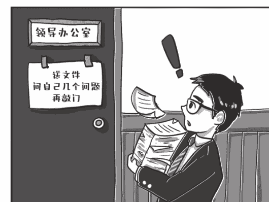

图1-4 给领导送文件,学问太大了

有些不清楚的地方,还得先打电话问清楚。举个简单的例子,你接到一个会议通知,通知上只说要开会,但你不能只告诉领导说要开会啊!

你不得问问,要不要发言,要不要穿正装,有没有其他什么要求。不然,你一问三不知,不被骂才怪。

特别要注意上级领导有批示的文件。有时候,上级领导是“书法家”,字写得龙飞凤舞难以辨认,一定要把批示内容提前确认清楚,这样领导扶着老花镜艰难辨认批示的时候可以风清云淡地告诉他,转批落实的效率才高。

另外,翻一翻文件形式上有没有错漏,最关键的是别缺页,还有页码编号是否连续,字体是否一致,有无空白页,有无打印不清晰页等。

别因为中间少一页,被领导揪住小辫子骂一通。

### 1. 把文件吃透

至少你得从前到后认真看一遍文件吧，弄清楚发文单位是哪里，主要内容是什么，要求是什么，涉及本单位的任务有哪些，知晓范围是哪些。

### 2. 要注意形象

不说让你每次都像那位讲究的兄弟一样,喷口气清新剂,嚼口香糖,你至少中午别吃韭菜馅饺子和大蒜吧。

你想想,领导一边皱着眉头听你汇报,一边屏住呼吸如坐针毡,那滋味多难受啊。

个人仪容仪表方面，着装、胡须、头发等按要求整理好，头皮屑别整得漫天飞舞，这种细节还是很影响领导对一个人的看法和认识的。

### 3. 要有点儿眼色

敲门前，听一听领导办公室的动静，一个是确认有没有人在和领导交谈，一个是确认领导是否在打电话。如果有以上情况，就不要敲门了，等一等再说。

如果领导房间开着门，里面有人，也可以在办公室门口“晃悠”一下，尽量让领导看到你。如果领导示意你过去，那就赶紧把文件送过去。

如果文件非常急，即使领导房间里有动静，敲门经领导同意后再送文件也未尝不可。如果文件不急，暂时把送文件的事情放一放吧。

### 4. 注意细节

比如，手机要及时设置为静音或振动。不然，领导正看着文件呢，你的手机铃声突然响起，有的领导难免会认为你不尊重他，不注意细节，会对你产生不好的印象。

还有，要准备好本子和笔。有时候，领导会有工作要求和指示。准备本子和笔的好处是，可以及时把这些记录下来，以便后续抓落实，这也是对领导的一种尊重。

再一个，笔最好能准备两根，并且提前试写保证好用。如果领导手头没有笔或者笔写不了了，你可以把笔递给他。

给领导送文件时，不要有以下这些不好的习惯：看手机，回复微信；掏出手机看时间；东张西望；等等。不然领导会有想法：呈批文件也就几分钟时间，你心不在焉，丝毫不尊重我。

还有一件特别重要的事，你要搞清楚今天是几月几号。签批文件肯定要写上日期，但很多人尤其是领导可能一时想不起来今天是几月几号。

这个时候，你需要察言观色，发现笔头停顿下来了，及时提醒领导：“领导，今天是11月11日。”

## 八、给领导发祝福短信有哪些讲究？

逢年过节，想加深与领导、同事的感情联络，发祝福短信是最简单易行的方式。

有些人觉得发短信微信效果一般，一则效力似乎不高，比不上登门拜访让人印象深刻；二则逢年过节收到的短信微信一般多如牛毛，领导能否留意到自己发的那条，真不好说。

当下，登门拜访的行为，无论对领导还是自己，都是相当有风险的，容易让大家有心理压力，不如逢年过节发个微信短信更为稳妥，虽然肯定不能一发定乾坤，但是只要持续努力，久久为功，印象和感觉也能逐渐渗透到别人心里去，有利于上下级关系维护。

### 1. 抓主要矛盾

有些人习惯给通讯录上的所有人发祝福，这样其实事倍功半，效率不高。

如果发的是连名字都不带的“无差别打击”短信, 收到的人毫无感觉, 甚至会认为你不尊重他, 不重视他, 那就是得不偿失, 还不如不发。

如果是逐条发的带称呼、带具体感情的“个性化定制”短信, 好固然是好, 但工作量太大, 通讯录好几千人, 怎么发得过来?

这个时候就要学会抓主要矛盾。其实, 通讯录里那么些人, 如果仔细捋一下, 平时打交道多的, 跟你关系亲密的, 对你发展有直接影响的, 也就那么十几二十个, 比如, 你的分管领导, 单位的大领导, 合作多的同事。对他们, 一定要一个字一个字地写带着真情实感的短信, 认认真真发过去, 对其他人, 则可以在朋友圈发个祝福状态, 效果是一样的。

### 2. 感谢越具体越好

祝福短信有具体的套路, 一般来是“专门称呼+具体感谢+实际祝福+工作表态+恭敬署名”。

称呼就不多说了, 一定要有针对性, 把名字和职务点出来, “尊敬的刘局长”“敬爱的李处”, 充分表明“这条短信我就是专门为你写的”, 尊重的态度就有了。

在“感谢”这一部分, 越具体越好, 最好能举举例子, 列举一些在你们交往中让你难以忘怀的瞬间, 对方帮助你、指点你的具体行动, 对你有启发的一言一行, 这样的短信才让人印象深刻, 也更能激发你们之间的美好情愫。

比如, 你在领导的指导下投身抗击疫情的战斗, 一起在小区门口蹲守, 一起为进出小区的居民测量体温, 度过了好多个不眠之夜, 这个就很适合在短信里拿来回忆。

### 3. 祝福越实际越好

祝福的部分怎么写？节日愉快、合家欢乐、身体健康、事业进步都是常规操作，这些喜庆话当然得有，否则不足以凸显节日氛围。但如果只是这种大而化之的喜庆话，又差了点儿意思。

祝福语可以再往实际上贴一贴靠一靠，比如单位马上要换届调整，可以祝对方“事业进步、大展宏图、步步高升”，如果他已经进步了，也可以祝他“在新的岗位上再展佳绩”，如果他身体略有小恙，可以祝他“身体倍棒、吃嘛嘛香”等。

有些读者给石头发祝福短信，祝石头的公众号越办越好，天天涨粉，这我就很爱听。

如果你的祝福对象是领导，那尽量不要用“财源广进”“恭喜发财”之类的词语，毕竟体制内对金钱还是比较敏感的。

此外，还应该在祝福之后恳请领导多指示多批评多指导，继续关心关注，多给自己压担子，自己一定会认真工作、竭诚服务，表明服从领导、努力奋斗的积极态度。

### 4. 署名要恭敬

石头在《秘书工作手记：办公室老江湖的职场心法》里强调过发短信一定要署名的问题，估计再犯不署名错误的人不会太多了。

发祝福短信，一般性的署名感情色彩还不够强烈，最好加上“某某敬祝”“某某恭祝”这样的敬辞，如此节日色彩愈发浓厚。

### 5. 时间要赶趟

一般来说，祝福短信最好是在节日当天上午发，尽量避开密集轰炸的大军，不能过早也不能过晚。早了，没什么氛围，晚了，节都过了，祝福的必要性和意义大大衰减。

有些人喜欢赶着零点发短信，石头觉得不好。你对领导的精力和作息很有信心啊，能熬到那个点儿的领导身体得有多棒？领导们日夜操劳，这个点儿可能是领导熟睡的时间，还可能是领导手机接收各种信息“密集轰炸”的时间，还是不打扰为好。

### 6. 对回复不要有执念

发出祝福短信后，有些人心理十分脆弱，抱着手机就不撒手了，眼睛死盯着屏幕。如果领导回了短信，他欣喜若狂，甚至产生了自已已经被领导视作“自已人”的错觉；如果领导始终没回复，他又如堕冰窟，觉得领导是不是没看见，甚至怀疑领导是不是平时对他有意见，故意不搭理自己。

其实，祝福短信，发了就是最大的效果，发出去，我们的目的就达到了，你就不用再操心纠结牵挂了，最好有一种“天要下雨、娘要嫁人，随他去吧”的淡定心态。

领导回复当然好，是极大鼓舞、莫大鞭策，但其实也不能让你的职业境遇有多大变化；领导不回复，原因也是多种多样的，最大的可能是根本回不过来，而绝非故意不回，也完全不用自怨自艾。

## 附：原创祝福短信的示例

公众号【懒人手册】回复“互联网”，白嫖各种资源文档

××，给您拜年了！我要表达一下衷心的感谢。今年您带我吃的那顿火锅很暖心。您毫无保留的经验分享，帮我理清了全年的思路。新年又到，我祝您开春大吉、家庭幸福！××

时光如水，人如高山。加入××大家庭已经有两年了，在您的带领和指导下，我的业务能力有巨大提升，各方面都有长足进步。衷心地感谢您在工作中给予我机会与帮助，在生活上给予我关怀与照顾，能在毕业后的第一份工作中遇到您这样的领导，我深感庆幸、满怀感恩。××

××局，新年好。岁末年初又想起了去年此时，您带领我们一起下沉社区，顶风冒雪坚守在疫情防控一线，这段经历也让我深受教育、收获很多。新的一年，请您多多提要求、多多压担子，我当竭心尽力、不负重托。祝您身体健康、心想事成。××

××领导您好！×年来，我不仅提升了业务技能，更亲身感受了您对工作的敬业负责、认真执着，对新人的严格要求、悉心关爱。能在人生新的转折点遇到您这样的领导，我深感庆幸、满怀感恩。借此新春佳节，向您致以真诚感谢！祝春节愉快、万事顺遂！××

××领导好，办公室小李给您拜年了！过去的一年，在您的关心指导下，我有了显著的提升。感谢您在忙碌的工作间隙指点我改稿写文，感恩您在我迷茫不知所措的时候为我指明方向，感激您像长辈一样耐心教给我为人处世的方法……嘴笨又内向的我很少向您表达我的谢意，在这个特别的日子真诚地向您说一声：谢谢您！祝愿您在新的一年身体健康，工作顺利，天天开心。××

尊敬的××领导，过去的一年，全体干部职工在您的带领下不忘初心、躬身前行，展现出不畏困难、迎难而上的干劲，为保障××作出应有贡献，推动了（××、××和××）工作取得新成绩、焕发出新的生机与活力。感谢您在××工作中给予我批评和指导，在××工作中给予我支持和关怀，让我增强面对困难的勇气、学会遮蔽锋芒的睿智。在新的一年，恳请您多作指导、多加担子，我当竭尽全力，履责于行。在此祝愿您身体健康、阖家幸福、牛运亨通！××

××，您是去年一年对我影响最大的人。这一年我之所以能成长这么快，正是通过不断向您模仿和学习完善的，榜样的力量是无穷的，您的气度将是我此后长期学习的重点。感谢您平时的信任和支持，过年放假好好休息，愿您新年快乐！××

××科长：过年好，牛年来临之际，××给您拜年了！2020年是您带领风险管理团队快速成长的一年，收获了您给予的专业指导，完备的风险排查手段以及合理的奖惩机制，使我在工作中抓牢风险防控的“风向标”，筑牢违规行为的“防火墙”，我一直感恩在心，牛年来临之际，祝您和家人健康顺利鸿运满，万事如意合家欢！××

李局长：新年快乐！新的一年，祝您合家欢乐，万事如意！感谢您提供了一个平台，让我有机会展示自己的能力，同时感谢您过去一年对我的耐心栽培，来年我一定更加努力，不断进步！××

××新年好！岁末年初，又想起了去年此时，您始终坚守在疫情防控一线调度指挥。这段经历让我深受教育、收获很多。过去的一年，您是对我影响和帮助最大的人，我深感庆幸、满怀感恩！这一年我之所以能成长这么快，正是通过不断向您学习和模仿，并将您的言传身教运用于实践工作。来××工作近×个月时间，重点完成了××××××工作。感谢您像长辈一样耐心教我为人处世的方法。期望新的一年，能得到您更多的关心和指点，恳请您多作指导、多加担子，我当竭尽全力、履责于行。值此新春佳节，祝您身体健康、心想事成、合家欢乐、牛运亨通！

公众号【懒人手册】回复“互联网”，白嫖各种资源文档

师傅新年好！从xx到xx到xx再回到xx，这x年来，我不仅提升了综合素质，更亲身感受到了您对工作的敬业负责、认真执着，对我的严格要求、悉心关爱。一直以来，您的管理风格、做人做事艺术深深感染我，教育我。能在人生旅途中遇到您这样的领导、兄长，我深感庆幸、满怀感恩。感谢您像大哥一样耐心教我为 人处世以及正确处理政商关系的方法。感谢您对我的信任与关爱。期望新的一年，能得到您更多的关心和指教！借此新春佳节，向您致以真诚感谢！祝春节愉快、万事顺遂、步步高升！

## 九、怎么跟领导走得近？

与领导相处的热度，决定了你的职场高度。初听这句话，或许会让很多人感到绝望，特别是像石头这样比较内向的人，宁愿在家里抠抠脚、发发呆，不太愿意经常去敲领导的门，汇报一下思想，谈笑风生一番。长此以往，吃亏是肯定的。

怎么把握与领导交往的尺度，既要有亲近感，又不至于让自己过于焦虑呢？办公室顾问团的王主任教了石头一个办法，石头觉得特别受用。什么办法呢？其实就是一句话：有好事的时候，要把领导当普通人看。

这句话的意思是，领导身上有好事发生时，你可以把你们之间的级别差距、身份差距先放到一边，去换位思考——如果是我，作为一个普通人，碰到这个事情希望别人怎么做呢？然后来决定自己应该怎么和领导沟通，这样非常有助于走近领导。

光说定律还是有些枯燥，我们继续举例子。如果你记着“有好事的时候，要把领导当普通人看”，以下这些平日里的疑难问题就迎刃而解了。

### 1. 送祝福任何时候都是适宜的

- 逢年过节、取得成绩、发展进步，要不要给领导送祝福？这是不少性格内向者特别纠结的一个问题。
- 自己好像跟领导差着不少级别，况且人家也不一定认识你，祝福送出去是不是领导也记不住？纠结来纠结去，抱着手机抚摸许久，最后还是刷起了抖音。
- 但如果这个时候你抛开对领导身份的认知，想想自己，如果是你自己高升或者取得好成绩，希不希望别人祝福你呢？当然希望。谁收到祝福短信会不开心呢？不论职位、级别差几级，管他认不认识，祝福越多越好啊，越多我越开心啊！
- 所以即使你是普通办事员，领导高升了、得奖了、评优了、发表文章了、取得成绩了、孩子上大学了、过年过节了，发个短信祝贺祝福一下，一点儿都不唐突；即使领导没有回复你，也千万不要有任何心理负担。石头敢百分百跟你保证，收到祝福的他，是欣喜的、开心的。

### 2. 及时反馈响动

想象一下你在某个会议上发言，最害怕或者感觉最尴尬的是什么？绝对是你讲完之后，仿佛石沉大海，整个会场鸦雀无声，大家呆若木鸡，这会让你对自己的发言产生深刻怀疑。

## 3. 经常性关心

想象你在某个群里说话，最害怕或者感觉最尴尬的是什么？绝对是你发了一大段热情洋溢的话，又是表情包又是炸弹，结果没有一个人回复，大家似乎视而不见，这会让你对自己的存在产生深刻怀疑。

将心比心，当领导在群里说了话，或者做了精彩报告，或者有了新讲话、新做法、新措施、新改革的时候，要及时送上你的反馈，让领导觉得有回应，有“响动”。

石头曾听领导表扬一位办公室同志写材料很用心，进步很快，他举的例子是：“我到咱们××单位工作后，讲了几次话，都是关于如何做好文字工作的，××同志把听后感发给我，不是几句话，都是大几百字，既有对讲话本身的分析和点评，也有对文字工作规律的感悟和见解。我想，这样的同志不会不进步，因为他用心。”

顾问团里的王主任也给石头讲过，她刚当上党办主任，新领导第一次讲完党课后，她就收拾会议室离开了。结果在办公室，这个领导问她：“王主任，你不给点评一下？”她才意识到，对哦，领导做很多事，也不是全都运筹帷幄决胜千里的，也想看到大家的回应，赶紧认认真真、有理有据地给了反馈。

之后领导再有什么讲话讲课，她都记得及时当面反馈，或者发个微信，谈谈自己的体会看法，比如：“领导，您上午给我们作的业务讲座确实好，受益匪浅。”这让领导特别受用。

对你同屋的美女同事小马，每次她换了新发型，穿了新裙子，或是胖了瘦了，你肯定都胆子很肥地及时关心甚至调侃几句：“最近皮肤又白了！”“新发型不错啊，特别显脸小！”

但换到领导身上，他胖了瘦了美了发型换了，你可能就不敢造次了。

王主任告诉石头，其实，只要是真诚的关心，你完全可以大大方方地跟领导沟通，领导都会很开心，有人惦记着、关心着，总归是一件愉快的事。

她那时候还是单位一个小科员，有段时间领导一直在外出差，忽然有一天她在饭堂看到了他，她一脸惊喜地打了个招呼：“领导，您回来了，感觉最近好久都没看到您了呢。”领导哈哈大笑说：“确实，最近会太多了。”后来领导跟别人提起最近特别忙的时候，还专门提到“我们办公室小王看到我都说好久没在单位看到我了”。

还有，领导如果碰上什么困难，更要及时关心。比如，领导老家发洪水了，受灾了，要赶紧送上慰问，问问对他的家人有没有影响，有没有自己能帮上忙的地方。雪中送炭会让人倍感温暖。

## 十、领导说这些话，你要警惕了！

石头在《秘书工作手记：办公室老江湖的职场心法》中提出过一个观点，“想”与“说”一定是有落差的，领导想表达的意思是A，但表达出来可能是A-，你根据你的世界观和知识结构来理解，可能理解成A—，也可能理解成A++或B。所以指示不一定等于意图，领导的意图需要我们去发散、去领悟。

有的读者表示这件事太难了，特别是碰上过分含蓄的领导，明明已经很不满了，脸上却依旧满面春风，理解他的指示，成了一件特别“烧脑”的事情，上班总是在和领导斗智斗勇，很痛苦。这些石头都懂。为了减轻大家在理解领导常见指示时的烧脑程度，今天石头就尝试着给一些“潜台词”加以注释，以便于大家理解。当领导对你说这些话的时候，你要提高警惕了，他背后的意蕴，很丰富呢！

### 1. "某某同志，很有个性和想法嘛。"

上学的时候，有个性和想法一般是表扬的话，说明一个人脑子灵、敢创新。小王刚进单位的时候很实诚，每次会议进行到最后环节，领导都要问一句，“大家还有没有什么想法？”小王时常本着对事业高度负责的态度，提出自己的建议和想法，有的时候还是颠覆性意见。

领导总是不动声色地说，“小王很有个性和想法嘛。”其实，他的意思压根就不是表扬小王，而是“下次注意，不要再搞这些标新立异的东西了”。进入单位，有个性和想法很大程度上就是对科层制秩序的威胁，对领导权威的挑战。万一你讲得比领导还精彩、还深刻，谁来控场，谁来主导工作呢？

### 2. "大家还有没有什么补充的？有意见尽管提！"

这只不过是句客气话，领导问“有没有什么补充的？”意思是强调“会议就到这儿吧，方案已经确定，大家按照刚才说的干就行了。”如果你真的提出不同意见，那局面就难看了。当然，在领导提出工作思路的基础上，阐释分析、拾遗补缺、修修补补，还是可行的。

### 3. “你最近特别忙吗?”

这句话就很吓人了。有些人听到领导说这句话，还以为领导在心疼他最近担子太重、压力太大，感动得热泪盈眶。

其实完全跑偏了，领导肯定是感到你最近工作状态不好，经常性忘事，布置的事拖拖拉拉，交付质量也不高，已经对你有所不满，“你最近特别忙吗？”意在提醒你最近工作有些懒散，应该调整状态，统筹好任务，提高工作效率了。

这句话必须引起高度重视，认真反思是不是这段时间有什么工作没干好，还是给领导请示汇报少了，及时加以改进。

### 4. “这事回头再说吧。”

还能再提吗?怕是不能了。领导说这句话，一般是他对你说的事并不认可，也不感兴趣，又不好意思驳你的面子，想赶紧划水划过去算了。事情还要不要接着办，你可就要掂量掂量了。

如果不办无伤大雅，你也就没必要揪着不放，三番五次把事情提出来。如果你认为事情确实很重要，需要一抓到底，怕是要拿出更有说服力的方案和理由了。

### 5. “这事你们看着办吧。”

领导说这句话，一般有两种情况。

一种是表达不满。可能是之前没有跟他通过气?没有征求他的意见?请示汇报不够频繁?他在借这句话表达情绪，“既然你们都不征求我的意见，那你们随便折腾去吧，看最后砸在谁手里。”听到这话，赶紧检查一下之前程序上有没有什么遗漏，更加积极主动地往领导办公室跑跑，争取将功补过吧。

还有一种情况，他对这件事情可能确实没有那么重视，兴趣不大，“你们去办就完了，我对过程没那么关心，把结果告诉我就行。”这时候，关键环节跟领导通个气即可，别大事小情都跑去烦人。

### 6. “某某很实在。”

领导口中的“实在”，和美女口中的“老实”一样，未必是贬义，但也绝不是什么“赞赏”。

恋爱中的“老实人”一般只能当备胎，当接盘侠，工作中的“实在人”，也同样尝不到什么实际的甜头，只能看着远方的希望默默祈祷。

领导说你“实在”的时候，也就是说你不会灵活处理问题，不能很好地领会领导意图，办事办不到领导心坎上，工作用蛮劲不用巧劲，重表面轻深层。

当然，在如今人心浮躁的社会中，“实在”也是很好的品质，起码领导会放心交给你任务，你未必会做得出彩，但一定能够保质保量完成。

我们的工作不仅要“做完”，更应该“做好”，所以还是要机智灵光一些，既要领会意图，又要落实到位，这样才能够成为领导认可的好同志。

### 7. “材料整体上还可以。”

领导都非常讲究领导艺术，知道欲抑先扬，说你的材料“还可以”，已经是咬着牙根子吐出的违心话了，主要是怕批评得太狠，你通宵熬夜改材料的积极性受到挫伤，以后没有劳动力推稿子就不好办了。

所以，先给几个甜枣吃，后面再把推倒重来的要求提出来，你接受起来可能容易一些。材料哪是整体上还可以，压根就是“整体和部分、全局和局部都不太行，重新弄吧”。

### 8. “我再耽误大家两分钟。”

某次会议进行到尾声时，领导笑着跟大家商量，能否“再耽误大家两分钟。”

你以为是马上可以合上笔记本走人了？产生这种想法还是太年轻啊。

其实领导真实的想法是：虽然会已经开得不短了，但我这还有几个非常重要的事情要好好跟大家说说呢，请大家集中注意力继续听讲。

类似开会时的常见套话还有，“以上几点体会和建议，供大家参考。”你以为是参考参考就完了？其实领导想表达的是，这些要求，我可不是讲着玩儿的，条条要落实，桩桩要见效！

## 十一、领导眼中的靠谱是怎么做到的？

石头误事了。上周五，某部门送来三份文件，请石头帮忙分送三位领导。石头当时正在全神贯注地改稿，虽然一把接过文件满口答应，目光却一刻没从屏幕上移开。

得空了，石头拿着三份文件去分送领导，两位在，径直交到手上，还有一位不在，于是石头拿着文件回了自己办公室，继续码字，想着写完稿子再去看看吧。

时间转眼到了今天，石头早已把这份文件忘得精光。直到接到某部门语气急切的询问电话，石头才意识到出娄子了。原来，领导准备在近期的一个会上宣读这份文件，找不到，质问的电话打到了部门负责人那里，人家当然委屈，材料早就递给办公室了啊，殊不知，问题出在了我这里。

对办公室人来说，忘事、误事是巨大的缺陷，不仅耽误了事，给单位带来损失，而且会让领导和同事对你的信任大打折扣。文件送到你手上、任务交到你手里，结果却难以预测，还有可能石沉大海，谁也承受不了这种惊吓。

痛定思痛，石头进行了认真反思。人脑并非机器，不能始终精密无缺地运行，总是会受身体、精神状态的影响，忘事固然难以完全避免，但平时如果注意培养良好的做事习惯，遵循程序化的办事步骤，有意识地把事情做成一个闭环，把“靠谱”当成一项底层素养，忘事误事的概率确实能够大幅降低。

### 1. 第一步，懂得

接受任务的时候，问清楚、记清楚，不要光点头说好，埋头干活，特别是真的不理解、没听清的地方，要敢于提问。

有经验的办公室人，往往一边接受任务，一边积极思考：对没有听清楚或领导表述模糊的地方，第一时间确认；对贯彻意图时可能出现的多种情况，及时提出来，让领导给予明确答复；对领导意图中可能出现的偏差，该纠正的纠正，该否定的否定。只有这样，才能为接下来落实指示打下好基础。

主要是要问清楚两样东西：一是标准，二是时间。最好能把领导的要求复述一遍，跟领导确认一下：

“马局，我明白了，这个材料是不是主要从×××几个方面写？”“王处长，您刚才说得很清楚了，我们抓紧落实，也就是要×××。”“张主任，我们抓紧组织人起草，您看什么时候给您初稿合适？”

问与不问差别很大。问了，不但能把要求搞得更清楚，同时也更能凸显你积极主动工作的姿态，让人心里熨帖。

遗忘是人脑的本能，也是人脑自我保护的生理机制。过目不忘？那恐怕脑袋早就爆炸了！记得，是在调动一切工具与大脑的本能对抗。职场上每天产生的信息量惊人，微信、电话、领导耳提面命、会议、通知、公文系统，目光所及之处，时刻都在产生待办事项，这是多难的一件事。

拖是导致忘事误事的第一原因。拿到手的文件，总想着放一放再转；接到的任务，总想着等一等再办；没处理的短信、电话，总想着找个时间一起回复。假如总是想着拖一拖再办，出问题是早晚的事，是大概率事件。

比如石头前面漏转的文件，即使领导不在，假如能坚持一鼓作气办清爽，先放领导屋里也好，给领导发个信息报告一声也好，最后就肯定不会遗漏。

公众号【懒人手册】回复“互联网”，白嫖各种资源文档

### 2. 第二步，记得

我们每个人每天都会接收大量的文件资料，接收后我们应立即着手处理，处理完毕后应立即送出去，不要停留在自己手中。这是一个人提高办事效率，避免工作被动的最有效手段。

那些能够马上处理掉的事情，一定不要拖。收到文件，站起身马上就转送；收到短信，能立即回的马上就回；需要请示通知报告的事，马上就去说。能够养成这样的习惯，忘事误事概率就小多了。

在时间管理领域有个两分钟原则：任何事情如果花的时间少于两分钟，那么马上就去做。

一件事可以在两分钟之内完成，你需要马上完成它，或者在两分钟之内委派给他人，否则就把这件事推迟、存档或丢掉。

比如微信中领导交代任务，让你把一个稿子发给某位处长，稿子是现成的，发个邮件明显用不了两分钟，那么你最明智的选择就是停下手头其他的事，马上把邮件发了。

如果你不这么做，而是选择继续忙手头的事，必然会付出更高的时间精力成本：

要么把这件事忘得精光；要么心里老是惦记着这个事，手头的活也干得不清不楚；要么总是觉得自己还有个什么事没办，却想破脑袋也想不出来。

两分钟原则之所以管用，是因为我们在反复转移注意力时，会耗费很多的精力，这就是大段时间被打断后效率低下的重要原因。

两分钟原则避免了这种消耗，推动了当下事务的完成，并且没有遗漏突发的事情。

此外，随时拿出笔记本记录，这一点石头嘴皮子已经快磨破了。脑袋是靠不住的，无论是日程、交办任务还是待办事项，只有记下来才有把握。

石头发现，拿笔记之所以要优于用脑袋记，除了更可靠，还能提高思考的效率。比如一周后上午九点要在会一（第一会议室）开会，假如用脑袋记，你整天都得惦记着这个事，隔段时间就要回忆一下，啊呀，下周有个会啊，上午九点啊，地点在会一啊，这样会占据大量的思维资源。

要记的事情多了，一方面惶惶不可终日，另一方面缺少精力去考虑那些真正需要思索的问题，大脑就像一台装了太多程序的电脑，半天也开不了机。

还不如就随手在日程本上记一笔，每天上班下班检查一下日程表即可，省脑子也省心。

### 3. 第三步，反馈

大家看看现在各式各样、眼花缭乱的APP，无论是打车的，还是购物的、点外卖的，甚至坐飞机的，有一个功能总是不可或缺，那就是显示对方的实时位置。

看着我刚叫的专车正在缓缓朝我移动，虽然还有十分钟才能到达，也让我感觉十分心安。这就是人性深处对确定性的渴望。不确定让人感到焦虑，航班动态、滴滴司机位置、外卖小哥位置、文件下载进度条，都是为了让人们在不确定的世界中多一点确定性。

我们把这个原理挪用到工作中，如何增加领导对你确定的依赖，缓解他们不确定的焦虑？

公众号【懒人手册】回复“互联网”，白嫖各种资源文档

最重要的一条就是让他看到你的“进度条”和“实时位置”。

任务推进的过程中，要盯得住，发挥主观能动性去推，遇到问题、取得进展了，都要及时反馈沟通，这就是石头在《秘书工作手记：办公室老江湖的职场心法》里说的“件件有回音、事事有着落”。

每天下班前，应该抽出几分钟把当天的公务清理妥当，白天没来得及处理的文件，赶紧办了；没回复的短信，抓紧给人家一个答复。晚走一会儿，天塌不下来。

### 4. 第四步，核查

事情已经办完，且慢，还没结束，慎一慎、缓一缓再给领导交差。所谓闭环，还要求你交出去的活儿，不光在过程中是认真干的，干完之后也是经过仔细复查核实的。“出手”前，反复检查你交上去的材料、发出去的东西。

打印复印的材料，递给领导前再看一遍页码对不对，有没有缺页，万一打印机没纸了呢？花了五六天写的讲话稿，放在领导桌上之前再朗读一遍看有没有错漏字，万一书名号里掉了一个字呢？甚至把文件送到领导办公室的路上，在领导办公室门口等着“接见”的空当，都可以再一目十行地扫一扫，说不定能发现几个错别字，还来得及一路小跑回去改！

实事求是地讲，谁也不敢保证万无一失，我们能做到的，就是多看，反复看，出手前再看一遍，把错误发生的概率降到最低。

否则，前面99步走得都很认真，最后一步晃了点，就给人留下个不靠谱的印象，多冤枉。

## 十二、大领导与小领导可不一样

石头的朋友小马最近过得很不顺心，石头听他吐槽半天，主要问题原来出在大小领导对他的不同态度上。

据他说，大领导水平极高，能力极强，对他很赏识，经常嘘寒问暖，微笑着握握手，拍拍肩膀头子，说点“小马，干得不错!”这类不痛不痒的话。小领导则不学无术，非常令人讨厌，天天压着他干活，自己只会动嘴和邀功，还时不时打压一下下属。

自己每次见到小领导，丝毫没有见到大领导如沐春风般的感觉，心里充满了厌恶恐惧。最后，小马提出了自己的终极问题：能不能只跟大领导处好关系，不去理会自己的直管小领导呢？

眼见着他差点就要重复石头当年犯过的错误、走过的弯路，石头索性拉他坐下，好好跟他把大领导与小领导的辩证统一关系讲解了一番。

### 1. 大领导与小领导，对你的发展都很关键

官大一级压死人，这话当然没错。一般来说，大领导的权力大，人事权、调配权，往往掌握在级别高的大领导手里。大领导是你成长的关键人之一，这毋庸置疑。

但这并不代表只要大领导帮你说话，你的发展就是一路坦途了，直管小领导同样是你成长的关键人。

职务和权力是绑定在一起的，既然他是你的领导，即使再小，也会有职务赋予的节制你的一些权力，比如推荐权、评价权、话语权。这些权力大领导可以打招呼，但拿不走。

一般情况下，大领导认可你，小领导当然会听大领导的，但是如果你真的跟小领导闹得很僵，他对你很不满意，他听大领导的话听到什么程度，会不会找些理由设置障碍，还真不好说，大领导也不可能为这事儿就撕破脸。

所以，不管你内心是否认可小领导的人品和能力，对小领导始终要充分尊重、高度配合，至少不要让小领导说你的坏话，石头觉得这应该是个底线。

### 2. 大领导与小领导，相处起来要有差别

既然大领导与小领导身位不同，你距离他们远近不同，相处起来当然不能“一碗水端平”，而要有所区别。

有些人跟领导相处，其态度像是“线性递增”，领导职位越高态度越恭敬，职位越低越漫不经心。从内心的重视程度来讲，这样或许没有问题，但如果具体行事上也采用这种策略，很有可能收不到好的效果。

有位领导讲过一句心得，石头觉得很精辟，他说，“要把小领导往大了看，把大领导往小了看”。

把小领导往大了看，意思是说跟小领导相处的时候，特别是在外人面前，面子要尽量往大了给，一定要体现出下属的姿态，毕恭毕敬，让他们享受地位带来的愉悦感，觉得“自己是个领导”。

把大领导往小了看，意思是说跟大领导相处的时候，反而要放松一些，不卑不亢，落落大方，有一点生气和虎气，别整的谨小慎微、战战兢兢，容易被人看扁，觉得你没出息，不堪大用。

之所以“反其道行之”，道理在于这才是“缺啥补啥”“有的放矢”。

讲真，小领导其实没品尝过什么权力的味道，平时别人也未必对他有多尊重，真的把他当成领导来看，他自己也不太自信，这时候你在外人面前的一句“这是我们领导”，肯定会让他一个激灵，非常受用，“哦，原来我也进入领导行列了，感觉真好”。

大领导则完全不同，平日见多了毕恭毕敬甚至哆哆嗦嗦的下属，再碰到得体大方、自然清新的年轻人，怎么能不喜欢呢？

当你面对大领导的时候，不要把领导只理解成工作上的上级，而要把领导看成是可接近的长辈和前辈，把心态放平和，既要有必要的尊重和恭敬，更要挺胸抬头、目光直视、声音洪亮，这样才能赢得大领导内心的赞许。

### 3. 大领导与小领导，其实是一条战壕的

不少离大领导远、离小领导近的同志总有种感觉，大领导英明神武、和蔼可亲，小领导能力有限、声色俱厉，从而寄希望大领导为你主持公道，把小领导干个稀里哗啦。

其实，这不过是你层次太低，没有机会享受大领导“暴风骤雨”的错觉而已。你和大领导差了几个层次，没有工作联系，没有任务布置，没有利益纠葛，所以大领导没必要对你甩脸色。

小领导指望着你出活，好跟上面交差，抓得不细能行吗？

从下往上看，自然希望领导体谅下属、率先垂范，有功劳让给下面的人，有雷留给自己背。这属于理想状态，现实中当然存在，但比较稀缺。

其实，在你应该毫无怨言、兢兢业业“搬砖”这件事上，大领导小领导的认知是完全一致的，你就是个干活的大头兵。只不过小领导在一线监工拿鞭子抽你，大领导犯不上，他管好小领导就行。

他们根本就是一条战壕的呀，甚至，小领导不也是大领导任命的，他能说自己用错人了？

所以，觉得小领导不好，指望大领导给你主持正义，指望从大领导那里获得“公道”的想法，一定会落空。

## 十三、推活儿又不得罪领导的好办法

现在各个层面、各种单位任务都挺重，这说明我们的事业在不断发展壮大，是好事。但一个副产品就是大家加班比较厉害，越来越多的地方都喊出了“周六保证不休息，周日不保证休息”的口号，赶上有大活儿急活儿，时不时就一个通知发下来：取消某某月份所有休假！

时常有人问石头：加班太多怎么办？有没有既能推活儿，又不得罪领导的好办法？

怎么去看待这个问题呢？首先我觉得你要认识到一个问题，就是甘蔗没有两头甜。不是说没有不加班的办法，确实有可以不加班的办法，而且办法还很多，关键是你要不要去实践这些办法。

什么叫甘蔗没有两头甜？这也是石头从一位事业发展非常好的大哥那儿学来的，请允许石头先自曝一段日记。

2019年×月××日

昨天跟一位大哥吃饭，他年纪不大，却已经是某单位的负责人，事业可谓一帆风顺。

席间聊了不少，印象最深的是他对加班的决绝态度。他说，小地方的孩子到北京，没有根基，没有人帮，只能靠拼，靠时间和精力的投入才能出头。甘蔗没有两头甜，想过5:00下班的日子也可以，不过就要接受平庸。

这位大哥说得非常到位，完美地解释了什么叫甘蔗没有两头甜，就是说，对无根底的人来说，推活和发展总是此消彼长，负相关的。也就是说，推活当然可以，也有技巧，但你要做好领导对你有意见的准备，你到底更看重什么，或者想发展到什么程度，自己内心得有数。

我只说说如何把推活的负面效应减到最小。

### 1. 要提高效率
能白天做完的事儿尽量不要拖到晚上，能够外包的活儿就不一定非要自己干。比如整理录音这种非核心工作，完全可以包出去，或者用“讯飞听见”这种互联网服务。

### 2. 要抓大放小
虽然我们在办公室经常讲，对待任何工作都要一丝不苟，都要高标准严要求，但在现实中这是不可能的，假如对每一件工作都精益求精，你不可能做得完。

拿写稿子来说，有些稿子就是常规化、程式化的，比如贺信啦、上级单位为了自己写稿子要的一些材料啦、礼节性致辞啦，在之前材料的基础上稍加改动即可，有些人却非要拿出起草党代会报告的劲头，字斟句酌、反复推敲，那工作哪里有做完的时候？你不加班谁加班？

领导关心的、重视的或者与个人发展特别相关的，应当高标准地做，而一般性的事务工作，确保不出错就行。

### 3. 摆出不容回避的客观事实
具体到如何拒绝，一定不能用主观理由去拒绝领导和同事，我不舒服啦、我难受啦、我很累啊、我不想干啊、我还有事啊，这些没有客观依据的主观感受都不行。

要陈述不容回避的客观事实，让领导明白你的困难到底在什么地方，简直太难了！

比如前面那位仁兄，把药拍在桌子上、把伤口亮出来，都未尝不可。推而广之，别人逼你喝酒，你先把救心丸掏出来吃了，谁还敢劝？别人要你帮忙再整个材料，你把手头正在写的5个稿子一一展示一下，谁还不自己退下？

### 4. 适当管理领导预期
通过适当方式，向领导传达合理正当的工作节奏是怎样的。你天天都晚上10点多离开办公室，哪天9点走领导还觉得你提前跑了；你天天6点离开办公室，那某天9点才走领导就觉得你拼搏奉献了。

### 5. 态度柔软
拒绝不是让你硬怼，态度一定要用恳求的、无可奈何的。要让领导感到，虽然我能力上确实胜任不了，但我对领导是坚决服从、高度尊重的。形容外刚内柔有个词叫“笑着流泪”，拒绝的时候则是要“流着泪笑”。

### 6. 备选方案找补回来
拒绝不是消极工作，更不是推卸责任。石头不是想教大家怎么推活。我身体完全恢复了，我可以抢着多干一点挣表现，我可以主动帮大家承担一点；我不爱晚上陪酒，我白天工作不怕苦不怕累，这就可以把负面影响降到最低。

人各有志，说到底，怎么选，还是自己的事。无论如何，愿大家在“加班还是推活”这个问题上都能做出不让自己后悔的选择。

## 第二章 礼仪:礼仪是人心中最柔软的地方

### 一、单位食堂也是局啊!
昨天,有人困惑地问石头,在单位食堂,看见领导一个人坐着吃饭,场面很是冷清,其他人则聚在一起笑语不断,要坐到领导那桌陪吃寒暄吗?

不过去坐吧,看着领导着实有点孤单;过去坐吧,一方面担心被人议论自己是马屁精,另外一方面又怕不知道聊什么,怕最后弄巧成拙,于是左右为难。

怎么办?石头的建议是,坐过去,尤其是作为办公室工作人员,更要坐过去。我们可以从两个维度来分析这个问题:

第一个维度,领导也是个普通人。

作为一个普通人,看到别人都是三五成群,聚在一起嬉笑聊天,时不时拿余光瞟过来,自己却一个人坐着吃饭,可想而知,心里多少还是有些尴尬和发慌的,有点质疑自己的人缘和凝聚力,这是人性。

第二个维度,领导还是个领导。

之所以能成为领导,大多还是喜欢交流、爱张罗事儿、喜欢前呼后拥,性格太内向的,往往也成不了领导。即使原来内向,当领导时间长了,也习惯门庭若市了,“冷淡”的滋味怕是受不了的。

从这两个维度看,身为部下,似乎都应该坐过去。

事实上，领导之所以一个人坐，往往并不是他想一个人坐，而是他身边可能确实没有多少人可以时常一起约饭，往往就是高处不胜寒，一个人坐不是他享受或者刻意为之的一种状态。

如果你身为办公室的同志，不用犹豫，服务领导是你的本职工作，你有义务去体谅领导的感受，维护领导的形象，不要让领导陷入尴尬和难堪的境地。

当然，你如果对领导的性格有确切了解，知道领导就是喜欢离群索居，就是喜欢在安静中冥想沉思，那不去打扰他也行。

当然，你可以做得更自然一些，比如说叫上一两个同事一起坐过去，聊聊天，既能避免领导的尴尬，又没有刻意脱离群众。

石头把这些讲究告诉他之后，他很崩溃，抱怨道，平时上班已经很累了，食堂吃个饭还不得放松，竟然比上班还累。

石头很理解他的感受，因为我自己就很少在单位食堂吃饭，不是单位的饭不好，恰恰相反，单位的饭味美价廉，但有人的地方就有江湖，有领导的地方就有秩序，在单位食堂吃饭同样是场“局”，确实很难放松，也不能放松，我还是躲个清静吧。

事实上，在食堂吃饭，除了看见领导要不要坐过去这个问题，其他的讲究也不少，比如下面这些事情，你都琢磨过吗?

### 1. 什么时间吃饭
有句玩笑话,叫吃饭不积极,思想有问题。但这句话放到单位食堂,就不太适用了。

你可以观察一下自己单位的食堂,一到饭点就准时出现在食堂的,往往都是单位的边缘人,无甚前途的。

而那些重要处室的同志,总是等到饭快没了才步履匆匆,紧赶慢赶,出现在食堂。有的时候他们确实是忙到没时间吃饭,但也有人恐怕是故意磨洋工,营造日理万机的高大形象。

其实仔细想想,吃饭早晚跟忙不忙没多大关系,手头有工作,赶紧去吃饭,吃完了还可以回来继续干,因为饭总是要吃的嘛。

但如果次次都去得早,确实容易让领导和同事认为你的工作量不饱和,有点清闲,天天只想着吃饭。这可不行,还得再给你压担子,岂不冤枉?

所以,有追求的聪明人,不管工作忙不忙,不会总是一到点就去吃饭,而是适当晚去。

### 2. 吃饭聊点什么
既然食堂吃饭也是局,那大家在一起聊什么,就得有点儿讲究了。

食堂饭局参加多了,石头总结出一个原则:食堂聊天寒暄,一定要有趣但不核心。

有趣,意思是别探讨过于严肃的工作话题,毕竟吃着饭,还是得稍微放松一点儿嘛。聊聊天气环保、军费开支、各国大选、全民公决等大事要事喜事急事突发事,都挺好。

不核心，意思是千万别聊相互之间有利益瓜葛的话题，说大不说小，说远不说近，说虚不说实，说外不说内，是必须掌握的闲聊规则。比如跟同事聊什么评奖评优，跟领导聊什么人事问题，这都是自己给自己找不痛快。

特别是跟领导一起在食堂用膳，更要量体裁衣，根据领导的工作性质、性格特点、爱好特长找话题。

一是聊与领导工作相关的话题。分管业务的聊业务，分管稳定的聊信访，分管群团的聊活动，分管党建的聊从严治党。

二是聊领导平时比较关注的话题。有的领导关注国际大势，有的关注经济走势，有的关注股票金融，不一而同。

三是聊与领导个人特长爱好相关的话题。工作之余，有的领导书法好，有的擅写作，有的会绘画，有的搞摄影，等等。

四是看领导性格。性格外向好演讲的可多聊，性格内向平时话不多的可少聊。

### 3.还是要搞服务
作为大头兵，在饭局上主要是搞服务的，时刻要有服务意识，这个道理在单位食堂同样适用。

当然，单位食堂不存在什么催菜啊，转桌啊，倒茶啊之类的事情，但还是有些可以体现高度服务意识的地方。

比如，帮领导同事端碗汤，拿个酸奶，捡点水果，递张纸巾，收下餐具，都可以树立小同志有眼色、肯服务的勤勉形象。

### 二、饭局怎么组织，才能请到想请的人？
石头在《秘书工作手记：办公室老江湖的职场心法》里很详细地讲了安排饭局的讲究，怎么点菜，怎么上菜，怎么搞服务，怎么让宾主尽欢，大家都觉得很实用。

也有人提出，他的困惑并不在怎么“吃饭”上，而是在怎么“请人”上。毕竟，人请不出来，再会点菜也是假把式，派不上用场。石头仔细琢磨了一下，觉得这位读者提了个非常好的问题。确实，点菜上菜说到底只是技术性环节，一切都有章可循，照着来就行了，而请人这件事就比点菜深奥得多、微妙得多了。

请不到人，饭局就无从谈起，想谈的事也无从开口。请错了人，轻可以让一场饭局莫名尴尬，宾主面面相觑，大家都感觉不够尽兴，重则甚至可以让你想打动的那位主宾气愤懊恼，形势急转直下，好事变成坏事。

现在大家都营养过剩，谁都不缺饭吃。你想想，就连你跟好兄弟之间聚会，是不是也得有个由头？“咱俩好久没见了，今晚见面好好叙叙。”“最近新开的一家蒸虾馆不错，虾特别新鲜，晚上去尝尝？”

更何况求人办事的饭局，更得有名头，讲究个“名正言顺”。

有的时候，你跟想请的人没那么熟，他对你还有防备，由头得有点吸引力，抓住对方的喜好，勾起对方的兴趣。有时候，双方感情基础到位了，由头甚至不用特别站得住脚，不过是给双方一个都需要的台阶。

怎么才能拉起一个饭局，且能让一群爷们儿吃得开心？石头教你几个比较常见的由头。

### 1. 节日
“中秋节了，好久没聚了，有空聚聚？”“马上过年了，好久没聚了，有空聚聚？”“国庆放长假，大家不太忙，有空聚聚？”“马上冬至了，吃点儿火锅热乎热乎？”（见图2-1）

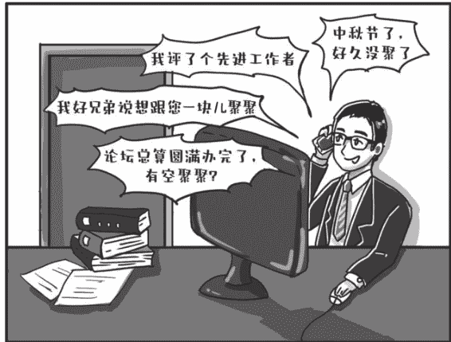

图2-1 饭局怎么组织，才能请到想请的人

以时间和节气为由头邀约，隐约含有祥瑞和祝福的意味，大家往往不好拒绝。而且还有个好处，就是有明确的时间，避免了“有空聚聚”但总是没空的不确定性。

### 2. 有好事
“老兄，最近有空吗？上个月单位给我评了个先进工作者，我请大家聚聚，感谢大家对我的帮助支持啊！”

个人工作生活上的“好事”，比如，过生日啦，工作调动啦，提拔加薪啦，得奖评优啦，都是拉扯饭局请人吃饭的好由头。所谓“共襄盛举”，好事大家都愿意来给你祝贺祝贺、沾沾喜气嘛。

### 3. 工作完成、合作达成
如果你想请的人是工作上有交集、有合作的人，这样组局再合适不过了。

“老哥，论坛总算是圆满办完了，没有你们的大力帮助我们哪扛得下来，这周末有空的话聚聚？”

一来上一阶段工作完成，大家心情都比较愉悦放松；二来趁热打铁，正好可以把工作中形成的友情通过私下的饭局固定下来，也有感谢之意。

### 4. 朋友
呼朋引伴也是组局的常见由头。

好比你想追一位美女，恰好又认识美女同宿舍的闺蜜，那么常见的操作就是通过闺蜜把美女约出来，三个人一起吃个饭，就顺理成章地认识了。

同理，假如你的一位亲戚或朋友颇有分量，你想请的人又恰恰热衷于结交各色有分量的人，那你以这位亲戚或朋友为由头，邀请他出来聚聚，成功率一定会很高。“某某是我好兄弟，他说最近想跟您一块聚聚，您看什么时间方便？我来安排！”

再如，你想请的人小孩在某某小学上学，你又恰好认识某某小学的人，那就可以说，“某某小学的某某最近一直约我聚聚，您有空出席吗？正好一起认识认识？”你放心，他肯定上赶着也要来参加饭局。因为他来参加这个饭局不觉得有什么负担，反而觉得是有利的。

### 5. 细节
其他组局的细节，比如提前邀约，晚上6点开饭别等到5点才叫人。

再比如说求人办事的饭局，叫的人不要太多，三四个、四五个就顶破天了，人杂了根本没有办法深入交流，只能敬酒的时候单独交头接耳两句，或是临走前叮嘱两句，总归不够充分。

这都是最基本的，石头就不多言了。唯独提醒一点，尽量别组“罗汉局”。

什么是“罗汉局”？就是一桌子都是男性，没有女性的饭局。倒不是想搞什么低级趣味、莺歌燕舞，咱不好那一套，毕竟男女搭配干活不累，一桌子都是男的，总觉得差点儿意思、差点儿趣味，如果席间能邀请一两位女士，局面一定会生动活泼很多。

### 三、酒量小的人，饭局上怎么如鱼得水？
先告诉你一个事实：现在的条件和氛围下，饭局上不喝酒是完全行得通的，那种非要往死里喝，不喝倒几个人就是“不到位”的时候已经过去了。尤其对女生来说，饭桌上的人，都有你不喝酒的心理预期，饭局不是“罗汉局”，竟然有女士在场，已经是一件很有趣的事了。

饭局的核心其实是敬，而不是酒。所以不喝酒不意味着你就只好默默无闻坐着，也可以用饮料或者茶水代替酒，去敬别人。你敬领导、敬客人，一方面是表明遵从礼仪和秩序，服从权威，另一方面也可以混个脸熟，展示自己。

如果你不是用酒敬的，也不需要让对方喝酒。敬茶时，你要先帮别人把茶倒好、端好。假如对方执意要拿酒和你碰的话，你千万记得要说：“您一定少喝点，您沾一下就行。可以了可以了，您随意。”

既然自己喝的不是酒，那么敬一次就好了，敬得太多，反而觉得你既没有本事还要嘚瑟，观感也不是很好。

不要有心理负担，不喝酒不影响你提拔。人的能力是多方面的，只要你工作能力过硬，工作成绩突出，即使不会喝酒，也完全能够得到认可和信任，从而得到提拔。即使是能够喝酒的女性，也要靠一定的工作成绩来支撑，仅仅靠能喝酒会喝酒是难以得到提拔的。

如果是在饭局上和人第一次见面，你还是需要一个理由表明自己喝不了酒。别担心理由不够圆满有力，理由并不需要无懈可击，因为它仅仅是一个借口。比如：抱歉，我从来不喝酒；我酒精过敏，一喝浑身起疹子，心动过速；我来之前刚吃了感冒药头孢克肟呢；我开车来的；等等。尤其是一些女性“专用”拒酒话术，非常好用：我还在哺乳期呢；我正在备孕呢，天天吃叶酸；我亲戚来了，不是很舒服呢。通常情况下，对女士的劝酒不会太猛烈，表现出诚意，一般没人会逼你。

女士如果面对不怀好意的劝酒，不妨直接点破，让对方面子上挂不住，后面也就偃旗息鼓了。比如：××总，您这么用力劝我酒，该不是对我有啥想法吧。您放心，我早就结婚了，灌醉我，您也没机会。

强调一下，不想喝是主观的，但理由一定得是客观的。非不愿也，诚不能也，无论是有多不想喝，也不要任性地把“不想”两个字说出来。

如果应酬比较多，又打定主意不喝酒，最好一直都不要喝，跟谁都不要喝。要不然人家就会觉得你昨天和王局喝，今天不和李局喝，很得罪人。

对于不熟悉你的客人，敬的话术可以“介绍+赞美”为主。比如，“我是×××处的×××，负责×××工作”，让人家知道你是谁。介绍完自己之后，要奉上表达敬仰之情的话。你可以说“我经常看您写的文章，特别是×××那篇文章，让我受益匪浅”“您在我们年轻人眼中可是偶像级人物”“能跟您这样的优秀人物一起就餐，我感到很荣幸”等。每个人都喜欢被赞美，这样对方更容易接受你的敬意，是茶是酒就不重要了。

饭局上多搞服务，给人“有眼力见儿”的印象。你可以帮忙服务员催菜、换味碟、添茶倒水，在大家聊天时跟着附和两句“说得太对了，长见识了”之类，让人觉得你是个“小机灵鬼”。餐后帮忙送客，如果客人有车，最好送到车旁。

饭局散了，也可以给饭局上比较重要的人发个短信微信，报个平安，说自己已经到家了，确认他已经安全到家了，同时表达“今天很开心，收获很大，请您继续关心指导”的意思，这样比较能凸显你的细心和周到。

### 四、发个微信，也能体现高水平！
说起职场礼仪，很多人的思维还停留在上古时代，以为职场礼仪就是穿上白衬衣黑裙子，挺胸抬头面带微笑，在别人面前做出请进的手势。大谬！

你现在学什么递名片、端茶倒水之类的礼仪当然有用，但其实在职场，这些应用场景已经退到了微信的后面。

现在不少领导走在潮流的前端，爱用微信。作为一种新技术，微信有许多新特性，比如可以发语音，方便发图片、文档，容量大，等等。相应地，给领导发微信，也衍生出一些新礼仪，如果你没有注意到，在领导眼里很容易显得粗俗无礼、不太入流。

之前石头到外面讲办公室工作的课程，为了吸引同学们的注意力，上来总是先夸下海口，说：我今天讲的东西不玩儿虚的，我只教你怎么用五分钟的时间，拉开和你同事的差距，在领导的眼中脱颖而出。这个时候我就会先把微信礼仪搬出来，同学们五分钟学了几个微信礼仪，给领导发微信的时候马上就能现学现用，都觉得我所言不虚。

**微信是个好东西，用好它的关键是自己多做一点，让领导少做一点。石头试着归纳如下：**

### 1. 罗列条目一二三，每条之间要舍得空行
石头之前说过，给领导发短信、微信要条分缕析，有章有法。如何才能显得条分缕析有章有法呢？

主要还是两点，一是要有编号，你用阿拉伯数字也可以，12345，你用汉字也可以，第一第二第三，这个大家都很容易理解。

还有一点比标序号更重要，那就是多换行、多空行。

这一点石头之前没有认识，做了微信公众号之后，突然有了新体会。

书籍、短信的排版，因为书的容量和节省纸张的原因，不会频繁空行换行，往往是一大堆内容挤在一起，到了读屏时代，信息数字化了，就没有了容量限制。

而且手机屏幕更小，尤其难以辨认，所以说做微信公众号编辑有一个很重要的原则，那就是勤换行、勤空行，这样能够方便读者在手机上阅读。

短信时代有字数限制，字数多了发不出去，编写短信还要省着点儿，舍不得换行空行，一般发短信都是图2-2的样子。

图2-2 不分段不分行换行的信息

但是微信几乎没有容量、字数限制了，在换行的时候就不用再抠抠搜搜地节省，完全可以怎么好读、怎么容易区分怎么来，这是很重要的一点。

我们给领导发微信的时候可以引入公众号编辑中的思路和方法，每一个条目就空一行、换一行，不要再挤在一起，这样更符合手机的阅读习惯，方便别人厘清条理。如图2-3所示。

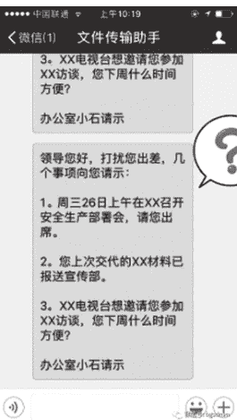

图2-3 分行空行的信息

### 2. 尽量不要给领导发语音
发语音，越来越成为上级对下级的一种权力，有时候石头甚至觉得，要判断一个人混得怎么样，看看他微信是语音发得多还是文字发得多就行了。

可以随心所欲给别人发语音的，那肯定是地位高权力大的领导，只能勤勤恳恳打字的，那肯定是小兵。

石头曾听一位领导吐槽有些不识趣给自己发语音的下属，他说，下属给自己发语音消息只会给他带来两个印象：这个下属懒；这个下属对他不尊重。

为什么领导都讨厌收到语音呢？

道理很简单，一条100字的短信，可能5秒钟就能看完，但是，语音30秒甚至1分钟才听得完，你这不是耽误领导时间吗。

而且语音不方便重复查看，也不方便检索。语音虽然好使，但是这东西，领导可以给你发，你不能给领导发。

当然，事情比较着急的时候，或者是手头有事的时候，给同事发发语音石头觉得还是可以的，不必过于苛责。

### 3. 发图片或Word、PPT、PDF等文档要有摘要或说明
用微信传文件确实很方便很直接，但是记住不要直接给领导单独传图片或Word、PPT、PDF文档，把一堆文件一股脑丢过去，会让人莫名其妙。

一方面，这些文件发过去很容易，但很有可能因为格式问题无法查看。能打开，也要等半天，不够直接和方便。

另外，这些文档只能作为附件来参考，核心内容、请示事项还是需要你提炼出来，或者把文字复制出来，编成摘要以文字形式来发，一眼就能看明白。

比如收到一份会议通知，你可以把原件拍照发给领导，但一定要附加一段说明文字：

> “领导，上午收到××部门会议通知，请您27号周五到××会议中心参加××部署会，您是否参加？”

又如，领导对稿子提了一些意见，你紧赶慢赶凌晨1点终于改完了，在用微信把文档发过去的同时，可以加上一段说明：

> “领导，按您要求对讲话稿做了修改。改动的地方：一是×××；二是×××；三是×××。请您审阅。”

加个说明，多做一步，费功夫不大，领导的感受却完全不同，太合适了。

## 4. 如果是需要在电脑上查看或保存的文档，就更不适合用微信发送了

有些文件明确需要在电脑上打开，比如某些稿件，需要领导用修订模式直接修改，这时最好不要只是微信发送。一来领导很可能不会用微信的电脑版。

即使他们会用，手机转到电脑版上保存，也是非常麻烦的一件事情，往往要经过好几道程序。

假如你不在电脑前，没有打开微信电脑版，你还得自己回去后再用文件传输转发一次才能保存，这就非常讨厌。

重要的需留存的文档，不如直接发邮件给领导，方便领导查看和保存。

## 5. 发涉密内容是在给领导挖坑

微信用于工作已经是常态，但石头每次给领导发微信，心里的弦也崩得老紧了，发之前都要掂量一下，这玩意，它能上网吗？不信你看看下面这个例子。

紧急传达致泄密。2016年10月，某市市委某部门为部署相关敏感工作，印发了涉密文件，并通知该市29个乡镇派人签字领取文件。某乡政府干部洪某到市委领取文件后，认为事件紧急，又正值深夜，于当晚将该件拍照发送到乡政府微信群。群成员杨某看到后，立即转发到其他微信群。之后，该件被数次转发到多个微信群和微博，造成泄密。

微信的信息都保存在网络服务器上，任何微信内容都存在泄密的可能性，一旦泄了密，后果不堪设想。所以如果有涉密内容，一定要守住底线，坚决不用微信发。

## 6. “嗯嗯”就是比“嗯”要香

领导在微信里布置任务，有的人回答嗯嗯，哦哦，或者好嘞，有的人回答嗯，哦，好，你感觉哪个舒服？明显是用叠词的更好。

石头喜欢拿男女那点儿事打比方。想象一下你正在追一个女神，满心欢喜地给她发了一大堆肉麻的情话，甲女神回了一句“哦”。乙女神回了一句“哦哦”。你觉得哪个有戏？是不是甲女神让你感到自己可能还未进入备胎队伍，而乙女神让人感觉即将拉上小手？

“嗯”“哦”“额”“好”，一旦在聊天的过程中遭遇其中的任何一个，基本表示“哥（姐）很忙，聊天结束”。

有科学研究表明，叠音更让人温暖。小孩子最初会说的词都是些什么词？没错，“妈妈”“爸爸”，基本是叠音词。

给领导微信回两个叠音字，会给他一种温暖的感觉，会让领导觉得你更加热情，更让人有安全感。相反，领导会觉得你异常冷漠，没有人情味儿，小子，想造反不成？

## 五、微信就是你的第一人格

微信就是你的第一人格，甚至就是你的本身。

很多人谈恋爱的时候都会在微信中上传这个高档餐厅、那个名车名表的照片，表明自己很上档次。那在单位其实也是一样，你的微信形象就是你本人的形象，所以说，用微信的时候，以下方面你一定要特别注意。

- 朋友圈其实是公共场所，千万不要搞错了性质，把朋友圈当成一个树洞或自家客厅。你要时时刻刻想着，无数双眼睛正通过朋友圈盯着你呢，说不准就有人想朝你射出暗箭，把你拉落马下。
- 不回别人微信，或许算不上十恶不赦，有可能那会儿是真的在忙。但不要一边不回别人微信，一边在朋友圈到处点赞，被人看到，就铁定是你的错了。
- 不要老在朋友圈抱怨工作苦，工资低，更不要说领导对你不好、不关心。你以为你设置分组可见后，领导看不到你的朋友圈？事实上领导马上就收到了别人偷偷发过来的你朋友圈的截图。
- 求点赞，求投票，求转发，求购买，发此类信息真的要慎重，一个星期或一个月有一次就不得了了，发多了真的很LOW。石头屏蔽的人，大多是此类。
- 在群里问问题，最好发红包，人家凭什么帮你啊？真以为人间有真情有真爱？即使是很熟悉的，也发个红包，表明感谢和尊重的心态。
- 群里找人帮忙或问问题，不要搞得太复杂，更别强人所难，比如说，发个文稿标题上来，让大家提提意见，可以。但你要让大家帮你想几个标题甚至帮你写段话，恐怕就没人理你了。
- 点赞，回复，虽然俗气，但还是要有，谁发完朋友圈之后不是等着数点赞呢？别人有大好事儿，留个言也不麻烦。本来就是松散关系，有套路，也好过无视别人。常见回复套路如下，自己选用发挥。
  - 旅游类：“太羡慕你了！”
  - 自拍类：“好美！又瘦了！”
  - 健身类：“太牛了，好自律！”
  - 知识类：“学习了！受启发！”
  - 礼物类：“太幸福了！”
  - 鸡汤类：“奋斗！”
- 发微信不是聊QQ，不要问“在吗？”更不要连问好几次“在吗”“方便吗”。有事儿您直说。
- 有些表情包还是很好用的，比如捂脸这个表情，在拒绝道歉甚至求人的时候简直不要太传神。
- 直接发实时语音或视频聊天显得非常粗鲁。石头曾碰见过刚加好友的人，晚上九十点钟给我发视频请求，吓得我魂飞魄散，赶紧拉黑。
- 有些人会把自己和别人的聊天记录发到朋友圈。这是一件非常惊悚的事情。可能是想表现自己的朋友很多，层次很高？但石头实在是不敢和一个说话时先把录音笔掏出来的人有什么深交。
- 争取用一条信息把问题或者事情说清楚，不要一句话发一次，一件事情发十几条微信，只有情侣之间才能这样，你跟人家好到这种程度了吗？
- 加好友的时候，说清楚自己是谁。
- 清理好友，这种事情悄干就行了，有些人还搞什么群发清理，还有基本的礼貌在吗？碰到这种人，石头第一时间删掉对方。
- 假如没有及时回复微信消息，还是稍微解释一下，比如在开会，在忙，迟复为歉，等等。“不好意思哦，刚看到。”“昨晚睡着了，刚看到。”“刚才在开会，刚看到。”
- 最好用真实姓名和真实头像，至少让人能够比较清楚地知道你是谁，干嘛非要用一条狗当自己的头像！
- 千万不要用符号做自己的名字，别人找你的时候会非常麻烦，切换输入法都要搞半天。
- 回复别人的时候，不要说嗯、啊、呵、行，如果是谈恋爱，这种回复基本要完。在工作中也不可取，还是说是的、好的、没问题，能够凸显职业素养。
- 发表情包也是有礼貌地结束聊天的一种好办法，比如说一个敬礼的表情，或者是一个跪拜的表情，就能礼貌而又殷勤地结束对话。
- 有单位的人还是不要在朋友圈做微商了吧，会让人感觉非常奇怪。而且，真的那么缺钱？真的忍心挣同事的钱？
- 上班时间尽量别发朋友圈，尤其是发些跟工作无关的。看到你发朋友圈，领导会想：看来工作量还不够饱满啊！今晚的稿子你写！
- 无论是谁，新认识的人尽可能留个电话，加个微信，指不定什么时候就需要联系谁。新加入工作群，先把自己的群昵称改成姓名+单位（部门）+联系方式，单位里的人能加联系方式的都加上，等到急需联系谁没有联系方式特别愁人。

## 六、怎么顺利加上领导微信？

一口气讲了好多微信礼仪，有些同志可能要坐不住了：石头，你说得天花乱坠顶什么用？我也想给领导点赞，我也想在朋友圈发加班照片给领导看，可是我压根就没有领导微信啊？难道我主动跑去找领导让他把二维码给我扫一下？

毫无疑问，主动跑去扫领导二维码行不通。且不说你有没有这个胆儿，即使你真的一时冲动跑去主动加领导微信，极大的可能也是铩羽而归。

如果是级别比你高得多的大领导，你乱加微信，这叫不懂规矩，不知分寸，不尊重权威。你几斤几两，隔着那么远，点赞都还不够分量呢。

如果是工作中有联系的领导，也还是让人觉得有些冒失，不够稳重自然。领导心里或许会打鼓：加我微信是不是想偷看我朋友圈？探听什么秘密？

有些比较小气的领导，甚至会认为你心思不在工作上，只知道“拉关系”，对你的印象会大打折扣。

所以，加领导微信这件事，当然姿态上要争取加、积极加，但具体操作方式上还是要讲究个师出有名，最好是顺水推舟。

石头听顾问团的王主任讲过一个有趣的实例，听后佩服得五体投地。一次，上级单位领导来王主任辖区调研，王主任作为办公室主任，忙前忙后拍了很多照片。休息的时候，王主任对我们这位上级领导说：领导，今天拍您的照片好多张都特别好，我一会儿把照片发给您秘书，让他转给您，您看行不？这位领导说，干吗那么麻烦？你加我微信吧，直接转给我。于是王主任顺利加了大领导微信。

也是，谁都想第一时间看到自己的光辉形象，如果不加微信照片还真发不了，这个加微信的借口非常不错。

发文件也是个契机。道理跟发照片一样，有什么资料文件需要发给领导的，别发邮件了，趁机加个微信吧，领导是不会拒绝的。

有工作任务需要汇报，也是个理直气壮加微信的理由。比如你跟领导一起参加某项专门工作，大可以直接跑过去扫领导的二维码，“领导，方不方便加下您的微信？一般情况下，我不会打扰您的。我方便随时向您汇报和请示。”

该领导发加好友申请的时候，要注意细节。申请要特别礼貌和客气：“某某领导您好，我是办公室的小石，向您报到，恳请您通过。”这样加上好友的概率又增加几分。

添加微信后，怎么自我介绍呢？大概可以这样说：“报告领导，我是某单位或者某部门的某某，主要承担某某工作。电话是某某。有事您吩咐。”

或者，“报告领导，我是某单位或者某部门的某某，主要承担某某工作，电话是某某。为了随时聆听您的教诲，落实您的指示，所以特请求添加您的微信”。总而言之，要把自己介绍清楚，把自己的目的介绍清楚。

## 七、我为什么劝你要秒回微信？

领导要开一个小范围专题会，七八个部门参加。会小，时间宽裕，于是石头挨个给参会部门的办公室负责人发了微信。

很快，大家都反馈了参会人员。只有某某局，直到第二天快下班也没有任何回复。

石头一个电话打过去，局办主任老王振振有词：啊，我好几天没有看微信呀，微信不是用来工作的，我不经常看，你还是给我打电话吧，不要在微信上给我说事了！

事实上，老王的工作作风远近闻名，不仅是不回微信，打电话也经常找不到他人，手机经常不接，短信也不经常回。

现在，微信在工作中用得越来越多，他仍然不咸不淡，这次倒有了更好的理由——微信不是用来工作的，当然可以不看，让你还说他不得。

那，微信到底是不是用来工作的呢？我们来分析一下。

其一，是否还有比微信更适合沟通的工具？

体制内单位，沟通方式比较单一，不像企业有钉钉，有邮箱系统，有OA，都可以取代微信，但体制内单位没有，之前只能靠原始的电话、短信。

现在好了，微信效率更高，功能更强，可以发送语音、文字，可以发送地址、图片，还可以群聊，很多时候沟通效率比电话和短信要高许多，是一个不容回避的事实。同时，微信适用性很广，你说你们单位有钉钉、有OA，但是你跟外面人沟通，还要用微信呀，也不可能事事都通过单位内部软件来沟通。

所以，微信当然适合用来工作。

其二，那些说微信不是用来工作的人，真实想法是什么？

石头武断点说，那些说微信不是用来工作的人，其实不是不想用微信工作，而是根本就不想工作。

他们说不爱看微信，不习惯看微信，只是借口而已。

办公室人的主业其实就是沟通。这和做业务的不太一样，编程的可能一周见几次外人，其他时间都在埋头敲代码。

做行政的不一样，不是每天沟通几次就行了，而是经常时时处处都在沟通的过程中。要精进的是如何快速、高效沟通。

拒绝用微信工作的实质是根本就没有把工作放在心头，也根本不想用便捷的方式来联系工作，适应工作，也不考虑别人怎么工作方便，他们假装不习惯用微信工作，其实就是想推掉工作而已。

不习惯用微信工作的人，其实就是自私的，排他的，不愿意配合的人。他都不配合你用微信沟通工作，怎么指望他来配合你工作？

石头承认，微信沟通工作确实有弊端，不是完美无缺的，比如有时工作和生活很难分开。微信中有关工作和生活的消息经常混在一起，确实有遗漏的可能。

但同时更重要的是，在目前的条件下，确实也没有一种工具比微信更适合沟通工作了，那么既然这样，就应该从客观实际出发，接受这种高效的工作方式。

回想手机刚普及时，也有不少人把手机对生活的干涉当成一种严重的社会现象，呼吁加以解决，还拍出了影视剧。

现在呢？还有人提这事吗？还有人不想拥抱掌上智能时代吗？

如果你所在的单位和圈子已经习惯用微信工作，那么“微信不是用来工作的”就不能成为我们不用微信工作的理由。

要思考和研究的应该是，如何更好地用微信沟通工作，经常性地检查微信，发现未读消息及时回复，确实因忙碌疏漏了，要及时说明，也没什么大不了的；特别着急紧迫的，当然还是电话沟通，确保万无一失。

秒回微信，在领导那儿绝对是有责任心素质高能力强的表现。

## 八、退工作群？很有讲究的！

现在不少单位都奉行“微信群工作法”，任务来了，不管三七二十一，先拉个群呗。七大姑八大姨，只要跟工作沾点边有点关系的，都先拉进来，大家共同进退。

虽然群多了有点烦人，但石头还是承认，“微信群工作法”是个行之有效的工作办法。它解决了上一个时代办公室搞协调最大的堵点：信息共享不充分。有了微信群，尽管它嘀嘀嘀响个不停，但大家掌握的信息同步了，信息盲区消失了，沟通成本降低了，工作效率提高了。

然而群一多，又牵扯出新问题：这些群往往都是临时性的，工作结束了，任务完成了，或者你调离了高升了，工作圈子换了，这些群该如何处理好呢？

### 1. 使命完成，主动退群

有一段时间，我发现单位在不断新建全体人员群，群里的人都大同小异，通知的事也还是那些事，但总是过段时间前一个群就僵尸化，大家又在新群里活跃起来。

因为搞不懂这波操作是什么意思，石头悄悄地咨询了负责管理单位全体人员群的小马。小马可算逮住了一个吐苦水的机会：

之前张处、陈处不是调走了吗？但他们也不主动退群，都是领导，我也不好意思一脚把他们踢出去。群里有时候通知的事涉及工作业务，有的还比较敏感，比如活动安排啥的，让外单位人知道了也不好。

我实在不知道咋办，就请示了领导。还是领导有智慧，给我支了个招：别踢人，也别解散，你就建个新群，有事儿在新群里说，原来的老群就让它自生自灭吧。这不，群就越建越多了！

我当啥情况呢！原来群越来越多是不主动退群导致的“惨案”。

那些不自觉退群的人，有的是觉得自己工作岗位虽然变动了，但跟同事的情谊仍在，没必要退群，不然显得太不礼貌。

更多的恐怕是出于私心的考量，我不退群，老单位的事我还能多少了解一点，一旦退了群，岂不是对老单位的情况两眼一抹黑？于是觍着脸强行留在群里。

其实，这两种想法都大可不必。工作就是工作，所谓职位，你的职责永远是跟位置绑定的，好比退休后就不该有办公室，就不能再看文件，自觉退群应当成为一种规矩，甚至是单位的纪律。

否则，不该你知道的事你知道了，不该你了解的情况你了解了，也是在给自己添麻烦。

石头建议，还是尽量做个体面的自觉人，离开工作岗位了，阶段性的任务完成了，没你什么事了，就公事公办，自觉退群，这才是既替别人着想，又不给自己挖坑的做法。

### 2. 避害时悄悄退

至于退出的方式，有些人说，一定要温情脉脉地发表一番退群感言，发个大红包，这样才算是尽到了礼数。

片面了，片面了。试想，假如你只是完成了阶段性工作，后面的同志们还要继续奋战好长时间，你欢呼雀跃、大张旗鼓地退群，岂不成了动摇军心，给领导上眼药？

所以，退群到底是大张旗鼓还是悄无声息，是要具体情况具体分析的。石头教给大家一个原则：避害时悄无声息退，趋利时大张旗鼓退。

什么叫避害时悄无声息退？

你可以自行评估一下，如果你离群会引发负面情绪，让人反感、觉得被冒犯，那就要学会避害，悄悄退。

通常情况是，你在群内一直不被关注、没多少存在感，大家根本就不认识你，也不关心你，你的退群发声只会扰乱其他人情绪，悄悄退是最好的选择。

干脆、不纠结，更不至于遭受冷言冷语、让场面尴尬。

比如，你只是单位小职工，在大群里，各个部门的人都有，大部分人都不认识你，也没人关注你，除了几个领导外没人知晓你。

这次是因为工作调动要离群，那么，悄悄退为上策，没必要给自己加戏。不然，别人会把你的离群消息当成“垃圾信息”，毕竟，别人跟你不熟。

再比如，你常年熬夜加班，终于把身体搞垮了，准备退隐山林休养，临退群前，你在群里发布了告别消息。看到消息，别人情绪上多多少少会有触动，甚至会有离职冲动，这对单位的整体稳定是非常不利的，领导会对你有意见。

这时候，应该啥也不说，悄悄退。

当然，为了避免被误会，悄悄退群前，跟认识的领导、同事还是要单独告别的，但千万别在群里掀什么风浪。

### 3. 趋利时大张旗鼓退

如果你的离群会让人受到鼓舞、倍感温暖、凝聚人心，那就要学会趋利，退群前不忘客套、共情。

通常情况是，你提拔到外单位当领导了，或是被选拔到上级部门更重要的岗位上了，前途金光灿灿一片大好，而且群内成员相互间都比较熟悉，那你就不能悄悄走了，要温情告别、合理客套。

要知道，群成员这时候等着聆听你的“感言”呢。不然，别人会觉得你不近人情。

客套的常用模板是：原因+回顾+感情+祝福。

> 比如：尊敬的各位领导、同事，因×××原因，按照组织要求，我这次要去×××单位任职，今天就要去报到，衷心感谢你们一直以来的关心、照顾和支持，衷心祝愿各位领导万事顺意，事业腾达。为少打扰你们，今天我就先退出这个群了，以后有用得着小某我的地方，一定尽心尽力、义不容辞。请各位领导尽管吩咐。欢迎随时来×××指导工作，我的联系方式没变……

当然，退出前，如果条件允许，可以发个红包，这个时候就别抠门了，至少保证每个红包里有个几块钱吧。

石头见过有些猛人离职的时候发红包，本来温情脉脉、气氛热烈，好家伙，一领红包只有0.01元。马上把这伙计拉进黑名单，加上封印再不相见。

### 4. 劝人退群，欲盖弥彰

如果你是群管理员，有人调走了也不自觉，还赖在群里不走，这时候该怎么办呢？

这时候要区别对待，如果是一般的工作人员，按规矩来即可。就明确告诉他：“老兄，某某领导交代了，群里经常会发一些敏感内容，你高升了，老在群里骚扰你也不好，我就先把你拉出去了哈，有啥事单独报告。”语气客气点，一般人都能理解。

如果是领导调走了、高升了，这时候就不能硬来了，万一操之过急，极有可能被领导扣上“人走茶凉”“不知感恩”的帽子，“这小崽子，我刚调走就想踢我，人品不行”，那你的罪过就大了。

可以在边缘语气恭敬地试探一下，“领导，咱工作群里乱七八糟的消息太多太杂了，我怕打扰到您。您要嫌吵就把群删了，有消息我单独报告您。”

如果领导识趣体谅，自动退群，那皆大欢喜。如果领导装作不知，还想继续在群里发光发热，享受点赞，那你们赶紧以新领导为核心再建新群，老群就让它“与时间做朋友”吧。

## 九、一致好评的秘诀原来是起身相送

不久前，单位搞了一次考核测评，石头的同事老A再次高居榜首，以接近百分之九十的称职率碾压其他人傲视群雄。

大家都很服气，说起老A，也总是给予很高的评价：“老A啊，和气得很！”“老A啊，人特别热情！”“老A人家年龄大资格老，但一点架子都没有！”

就连外单位不过和老A打过寥寥数次照面的人，对老A也是赞不绝不绝，“你们办公室的老A人不错！”“老A是你们那的吧，是个好同志。”

这让石头百思不得其解。老A是有什么魔力吗？又不是什么大帅哥会放电，怎么短短几面就能让人心生好感？于是石头不由得在平时留了个心眼儿，路过他的工位时不时多瞅上几眼。

## 十、一个人行不行，出一次差就全看出来了

一段时间下来，石头发现，老A有个与别人不同的习惯。

简单说，就是手头事再多、活再急，别人来找他时，他总是暂时放下手中的活计，起身，站着和别人交流；办完事，他也不立即坐下，而是寒暄着把来访者送出办公室门，甚至送到电梯口，甚至坚持挥手到电梯门关上的一刹那（见图2-4）。

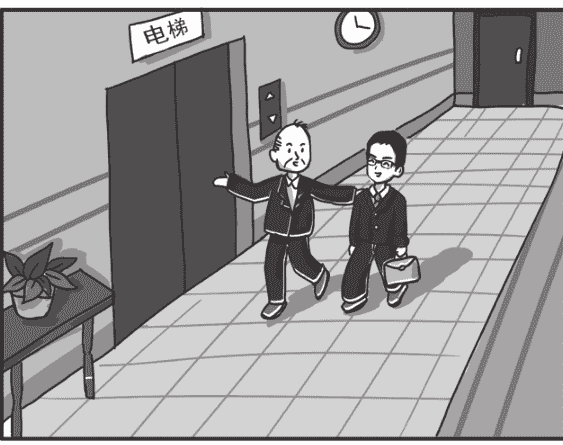

图2-4 一致好评的秘诀原来是起身相送

石头做不到这一点。外单位的同志来送材料，自己事少的时候大概还能坐着送上一个笑脸，一旦领导催着要什么材料了，往往都是勉强抬头，视线也不离开屏幕，手往桌上随便一指，火急火燎地说，“扔这儿扔这儿”。

没有对比就没有伤害，平时不自知，一看模范老A，差距就显现出来了。

假如，某位外单位同事小王先到石头这里送了材料，石头正在赶稿，小王在石头这里得到的只是敷衍的眼神。

然后，小王又去老A处送材料，老A先是起身欢迎，然后平视对方寒暄，然后拍着小王的肩膀将他送出大门，最后在电梯口微笑着对他告别。

待遇如此冰火两重天，谁的内心也无法淡定。小王怕是还没出电梯就在心里给石头画了叉，把老A打了勾。等到测评的时候，一个给60分、一个给90分，这都算对石头客气的。

说到起身与相送，又让石头想起学生时代一件难以忘怀的小事。

那时石头还在读书，有次学院组织对外招生面试，我作为工作人员和一位年届八旬的学科泰斗分在一组。这位老泰斗著作等身，是某学科的奠基人。

面试结束后，按照程序需要每位考官当场签字确认。我却因为疏忽遗漏了这位泰斗。我很忐忑地拨通了他家里的电话，内心十分不安，这完全是我的工作失误，却还要给老先生添麻烦，指不定他会怎样骂我。

万万没想到，老泰斗毫无不快和犹豫，斩钉截铁和蔼地让我到他家里找他补签。更绝的是，补签之后，他一直把我送到他楼里的电梯，直到电梯门关上还在挥手向我告别。

要知道在这之前，我和老泰斗素无交集，连他的课都没上过。这件事对石头的影响和震动极大，学界泰斗、耄耋之年，走路都已经颤颤巍巍，尚能如此，作为青年又怎么能不怀揣一颗谦卑的心去处世？投入更多的精力去为人？

有时候，我们看多了所谓教你“处世智慧”的鸡汤和箴言，倒是忘记了这动动身体就能做、走两步就能做、下一秒马上就能做的“起身和相送”。

这看似简单、技术含量为零的“起身和相送”，或许才是能让别人真正感受到重视、尊重、热情和温暖的关键呢!

### 1. 带报纸杂志

有位读者小张，说他每次陪领导出差，都会带上报纸杂志。石头开始还有些不解，陪领导出差，我每次都是紧张得坐立不安，您老还有心情看报纸呢？

他给石头扫盲：带杂志报纸，不是我自己看的，那是给领导解闷用的。有些飞机比较老，没有娱乐系统，又不能玩手机，多闷得慌啊！一般我一上飞机，就掏出解闷的杂志塞给领导，“给您带了几本杂志，您消遣消遣”，每次领导都笑逐颜开。

石头恍然大悟：你还真是个人才啊！

他继续介绍：我带杂志还算简单的，有些人还会自带 iPad 啥的，甚至提前在里面更新一些电影。坐经济舱，可以提前准备好拖鞋、枕头、眼罩。当然，要根据领导个性斟酌考虑是否要提供这么贴身的服务。这才叫工作到位。

石头还能说啥，一个字，牛！

### 2. 提前查好航班时刻

有个读者小王跟石头讲了另一个有意思的出差小故事。

他刚到单位办公室不久，主要负责协调领导出行，订车票机票、安排车接送等。

一次，领导要出差，吩咐他按某某时间段定张机票，然后安排好送机的车。

他不敢怠慢，经过与领导反复沟通，确定了航班信息，安排好了送机时间，甚至贴心地在网上帮领导值好机，打好登机牌，领导“拎包出行”即可。

把领导送上去机场的车，小王松了口气，觉得大功告成了。

不曾想，过了将近一个小时，领导的电话来了，很不客气地说自己已经到了机场，但看到机场大屏显示航班晚点三个多小时，这下在机场等也不是，再返回单位也不是，弄了个进退维谷。

领导觉得小王办事不力，好一顿埋汰他。

这件事给了小王很大的教训。飞机和火车、汽车出行最大的不同，就是它极不靠谱。夏天它怕雷雨，冬天它怕风雪，春天它还怕沙尘，脆弱得很。

特殊天气状况下能准点起飞的时候凤毛麟角，晚一两个小时已经谢天谢地，晚三四个小时也是家常便饭，甚至时不时给你来个航班取消，让你没脾气。

相比领导坐火车、汽车出行，领导乘飞机给办公室同志增加了一项工作任务：时刻关注航班动态，及时调整出行安排。

做办公室工作的各位，手机里一定要下一个航班时刻软件，比如航旅纵横、非常准，石头比较推荐航旅纵横，这是中航信的官方APP，应该说是 最权威的航班时刻软件。

领导出差的时候，及时关注航班动态，航班晚点了，就安排稍晚出发，别领导坐车到了机场，才发现航班取消了，白跑一趟。

或者是航班延误很久，领导却按时到了机场，等到天荒地老，憋了一肚子气，这都是你的工作失误啊，不削你削谁。

### 3. 记好团里同志的房间号

读者小马给石头讲了一条。他跟领导出差，如果同行的人比较多，每次都会跟宾馆要几张纸，把所有人的房间号写在纸上，复印几份，给团里的领导都分送一下，自己也留一张。

这个办法让石头觉得很妙，记好团里同志的房间号，一方面让领导有掌握全局，随时找得到队伍的感觉，另一方面如果领导要找谁，也能马上去房间找到那个人。

当然，现在手机微信用得多，你不用纸，用手机发个房间号的微信或者制作个图片也行。如果出行前就能确定房间号，做到工作手册里面，那就更完美了。

### 4. 提前把发票打印出来

读者小孟说他有个习惯，如果出差在外，第二天就要退房离开，他总会提前半天到前台结账，把发票打印出来，而不会等到离开之前再弄，以防时间来不及。

这点石头深有体会。之前石头有一次陪领导出差，就没有注意到这一点。离开的车已经在门口等了，领导们也都到了大厅，石头还在火急火燎地结账开发票，耽误了五分钟时间。虽然领导没说什么，但是这种情况其实还是很不妥当的，要尽量避免。

### 5. 不做拖油瓶

跟团出去旅游的时候，最招人烦的就是那种到哪都要别人等的拖拉团员。

早上要坐车出发了，他在房间里迟迟不下来；途中上个洗手间，他慢悠悠最后一个上车；参观结束往回走，他还赖在景点饶有兴致看来看去。

出差在外，千万别做这样的拖拉团员。吃饭速度要快，尽量赶在领导之前结束战斗。上车速度要快，先上车等着，等领导握手道别后车子就可以启动了。下飞机、下火车都麻利些，别大包小包托运一大堆，结果领导还要等你取行李，太尴尬了。

## 十一、送礼其实没那么重要

中秋节快到了，有些不甘寂寞的读者又开始躁动，纷纷给石头发来微信：石头石头，在线等，马上过节了，需要给领导送礼吗？送点啥好啊，快告诉我们！

看着这些求助，石头有点无可奈何。我一直觉得，在一些无良媒体不负责任的大肆宣扬下，职场送礼的重要性、必要性都被夸大了。不少职场中人甚至误以为，如果不送礼就要被领导穿小鞋，就要被打入冷宫。

这其实是一种认识误区。石头觉得，礼物只是润滑剂，是锦上添花，而绝不是一锤定音、雪中送炭。

对领导来说，部下工作干得如何，能否帮自己解决问题，气场是否相投，才是重要的，也是可以有礼物来往的前提。如果他根本不认可你的工作，根本就不认可你这个人，他接受你的礼物的可能性基本为零。

在干好工作、正常交往的前提下，有些礼物往来，聊表心意，才能达到加深感情、加深了解的目标。明确了这一前提，具体操作上我们可以注意以下这些事。

送礼分两种。一种是求人办事的谢礼，得有点分量；一种是联络感情的随礼，不需要贵重，心意到即可。

中秋送礼，就是节日联络感情的随礼，送的不是东西，而是态度，只要让上司感受到“我惦记着你，我是你的兵”的心意，效果就达到了，真的不用很贵重，甚至不用绞尽脑汁选来选去。上司看重的，是礼物背后的尊重。

虽然不建议你送太贵的礼物，但我还是要说，礼物的效果永远和价格成正比，越贵，就意味着你对他越重视。如果预算有限，有一个办法，选同类物品里品牌溢价最高、最上档次的。别想着像平时家里买东西一样追求性价比，而要追求没有性价比。举个例子，如果你的预算只有500块，可以买高端的派克钢笔，也可以买低端的皮鞋，那么派克钢笔的效果要远好于杂牌皮鞋。

送礼要有正当的“由头”，别人才容易收下，应节的食品、物品就是合适的由头。有人觉得中秋送月饼太老套，也没人爱吃，一点不实用，大错特错！如果撇开月饼这个由头，你的礼人家很难收下呀。所以，别觉得送月饼太俗，这是“规定动作”。至于月饼的选择，其实大同小异，主要看上司的口味，南方人偏爱广式、苏式月饼，北方人就绝对吃不惯苏式鲜肉月饼。需要注意的是，如果上司有糖尿病之类的身体问题，就要多个心眼，选无糖的月饼，让领导觉得“原来你还关注了我的健康，挺上心的”。

除了“规定动作”，还可以加点“自选动作”——搭配一些精美实用的礼物，比如中秋时令的大闸蟹券，家里经常用的西点蛋糕卡之类。特别不建议送生鲜类实物，既占地方，又容易腐坏，扔的时候还要考虑垃圾分类，最好以卡券的形式送，容易保存取用。

还可以结合上司自身的喜好，如果他爱喝茶，你就挑点好茶给他提过去；爱喝酒，带两瓶好红酒给他尝尝；喜欢电子产品，看看有没有什么新奇特的小玩意。

还有人喜欢挑稀奇古怪的工艺品，觉得冷门的礼物才能让人印象深刻。其实，除非你非常确认上司嗜好瓶罐石头之类的东西，一般不要轻易尝试，对不喜欢的人来说，这些东西根本毫无价值。

不光考虑上司本人，也可以想想他的家人。比如，孩子上幼儿园的，可以送乐高、智能玩具；上小学的，可以送书包、点读笔、小天才；中学送智能手表……如果要给小孩子送书，优先考虑昂贵的成套英文绘本或原版书，上司可能平时也舍不得买的那种。他想拒绝的时候，你可以说，“这不是给您的，这是给××小朋友的礼物，希望××小朋友学习进步！”让他无法拒绝。

不太建议送土特产。土特产一般也都是那种占地方、容易腐坏，别人还不一定爱吃的东西。如果非要送，可以换个思路，考虑一下上司老家的土特产，“李总，上次去××旅游路过您家乡，看到××特产挺不错，带了点儿给您。”童年的记忆总是让人怀念，这样的礼物大概对他胃口。

尽量别在办公室把礼物给上司，这会给他很大的压力，大概会被拒收。尽量送到家里，或者塞到上司私家车后备厢里，寄快递也是个不错的办法。如果礼物小巧，可借单独汇报工作的时机，给上司送过去。

如果被拒绝了，该怎么办？有的上司会礼节性地跟你客气一下，“小王，太客气了，不用”。但你可以再坚持一下：“也没准备别的，过节了，感谢您对我的栽培，就这点小心意，保证下不为例。”

如果你坚持后，上司态度还是非常坚决，那你就不要继续勉强了，按他说的办。不用觉得遗憾，你的心意他们能感受到的。

最后特别提醒一下：以上的做法，仅针对非体制内。如果你是在体制内工作，最好什么也别送，这才是对领导和你自己负责。

取而代之的，你可以在过节那天，给领导发一条短信，讲讲自己这段时间工作的进步和收获，感谢领导的帮助和指导，说两句真挚的节庆话，就足够了。

## 十二、单位人常见场景礼仪清单

前两天，石头晚上加班写完稿子，从13层办公室坐电梯下负2层地库。电梯里只有石头一个人，行至10层，“叮当”一声，电梯停下了，外面一位老者走了进来，看上去像是个领导的样子。

办公室干久了，出于“随时随地搞服务”的本能，石头主动问道：“您是到1层吗？”老者瞅了一眼电梯键，笑了，“你到负2啊，我还真没注意，帮我按下1层吧。”

“好的。”我啪地一声按下一层，老者似乎因此对石头印象很好，主动跟我攀谈起来，最后还加了微信，一聊，才知道老者是外部门的一位负责人。

熟了之后，他才如实告诉我，“就是因为你帮我按了电梯，我觉得你挺懂礼貌、挺机灵。”原来如此。

这件事让石头觉得，掌握礼仪，做一个懂事明理的人，其实很简单，你只需要花几分钟了解规矩，带来的好处极大，甚至不亚于你花几年精进公文写作的技能。

一般生活场景礼仪大家都晓得，比如握手啊，鞠躬啊，但在单位上班的时候，在工作场景下，有哪些特殊的礼仪也需要我们了解和注意，注意了就能给我们加分，不注意就会给我们减分。

- 坐电梯的时候别着急，讲究后进后出，无论上下都让领导先走。人多的时候除外哈，别一边堵在门口还一边喊着“领导，您先出!”门打开时自己务必第一时间迈出门、按着门，等领导出来。
- 电梯靠内侧中间是好位置，把领导往那儿让。跑腿的小同志站在按电梯的地方就行了。进入电梯后，如有他人，可主动询问去几楼，并帮忙按下。
- 别人给你递名片，站起来双手接着，然后认真看一遍，也可以把他的职务念出来，配以钦佩的表情，以示重视。走的时候千万别把名片落在桌上，更别掉地上，太得罪人了。
- 别主动跟女同志握手，如果人家比较大气，主动跟你握，也别双手抓着不放，有点猥琐。
- 坐车的时候，让领导和客人先上，自己后上，一般车的右门为上、为先、为尊。主动打开车门，并以手示意，待领导和客人坐稳后再关门，千万注意关车门别着急，夹着领导的脚就尴尬了。
- 有幸领导开车送你，记得坐在副驾驶，坐后排那是把领导当司机了，很不礼貌。但如果是男上级开车送女下属，为了避免不小心落下头发、口红引发误会，比较保险的是询问一下领导的意见，看看是否方便坐到副驾驶，不方便的话就坐到后排就坐。
- 经常去别的办公室串门是个好习惯，但记得先敲门，即使门开着也要敲。尽量别翻人家的办公桌，更别盯着人家的屏幕看。你在微信上撩妹子，或者上班时间上淘宝希望别人看见啊?
- 除非特别紧急的事，午休时间别给人家打电话，上班的人就指望中午那会儿躺躺了。
- 开会的时候手机记得调成静音或震动，万一领导正在讲话，你“最炫民族风”的铃声适时响起，那就太尴尬了。
- 在饭局上，手机最好不要拿出来，更不要有任何竖起来拍照的动作。这方面引发的隐私惨案太多了，大家的神经都绷着呢。
- 刚进入单位的年轻人，参加各类饭局，大部分时候，我们的职务和年龄都是最小的，落座的时候记得自觉坐到最差的位置，也就是靠门的位置或服务员上菜的位置。
- 如果有职位更高、年龄更长的抢了“最差”的位置，可以先去请“抢”了你位置的人去坐更好的位置，如果他不愿意或者比较推辞，那你可以大方地和你方领导开着玩笑解围：“领导，您坐这儿那我就只能找个缝钻进去了。您上座，我坐这儿方便搞服务。”
- 如果是正常的公务活动，吃完要拍照留念，在征求对方同意的前提下，注意选好背景，不能以杯盘狼藉的饭桌、喝得酩酊大醉的人群等为背景，可选择墙面、窗外景色等为背景。
- 跟领导们在饭桌上吃饭，你要时刻明白自己在饭局中的定位，大部分时候我们都是饭桌上的“服务员”。领导夹菜的时候，要人扶着转盘吧？领导茶杯里水不够，要人添吧？桌上的菜不够了，要再点吧？服务员上菜慢了，要人催吧？这些都比接话搞氛围重要。
- 陪领导走路也是有讲究的，一般领导和客人在内侧，你在外侧“保护”。至于走在前面还是后面，具体问题具体分析。如果大家对环境不熟悉，你应该在前面引导；如果就是在你们单位楼下花园，那你就老老实实在领导和客人后面跟着。
- 钱的事千万别拖，钱的事儿对绝大多数人来说都是第一敏感的事儿。谁把应该给我的钱给晚了，我就特别不爽，虽然嘴上不说。跟单位工作有啥关系呢？大概有两条关系，一是给领导报销，千万别拖，能多早报出来就多早报出来，领导等着呢。二是在单位跟别人借了钱，当天最好就还。上班的人都穷，更在乎这个。

## 第三章 说话：别被不会说话耽误了

### 一、汇报的重要，怎么强调都不为过

石头在《秘书工作手记：办公室老江湖的职场心法》里就苦口婆心地说，汇报很重要，干得好不如说得好。但是，就这么一句话，可能还是不能把汇报的重要性讲深讲透讲彻底。

作为办公室工作最核心的沟通动作，今天石头就来拆解一下，我们到底为什么要汇报。看完之后，你或许会出一身冷汗，或许会恍然大悟：哦，原来如此，好险好险，怪不得领导看我不顺眼。

### 1. 领导的精力和时间就是最大资源

以前我们说“酒香不怕巷子深”，有些人抱着这样的观点，认为“我的努力老天爷总会报偿”，“是金子总是会发光”，这些说法石头可以说绝对一点，完全是扯淡。

在办公室工作这么多年，你们可都看在眼里，领导每天多忙啊！从早上一来到办公室，一直到晚上，甚至到凌晨，不停地开会，不停地接待，不停地看东西，不停地有人给他汇报，不停地有人给他发短信，不停地跟上级通电话，一天可以说从早到晚都不停。

夸张点说，有时候一年到头，领导连自己的老婆孩子都见不上几面，你有什么底气，能指望领导看得见你，想得到你？

而且，换一个角度看，人的眼睛都是朝上看的，领导也还有领导啊。他的八成精力可能放在对付自己的领导上，剩下两成在下级身上。就这两成精力，还被他熟悉的人，器重的人分走不少，他根本没有精力，也没有时间注意你。让他主动注意你，不可能，也不现实。

对你来说，领导的精力和时间就是最大资源，你也没有必要等着撞大运，必须主动去曝光，主动把自己曝光在领导面前，主动去展示，去占用领导的注意力，所以，你需要汇报。

这一点，得到总裁脱不花有个观点非常精辟，她说：“上级时间少，但信息多、资源多；你时间多，但信息少、资源少。沟通一定遵循两个原则：谁资源匮乏谁主动沟通，谁比较痛苦谁主动沟通。所以，和上级的沟通一定是由你发起，别等他找你。”

是不是说得很明白了？

### 2. 领导需要掌握情况

这个比较好理解。领导力来源于哪里？领导力其实是来源于对信息的掌握。领导他靠什么做决策？为什么他比你决策得要准确？为什么大家听他的不听你的？

因为“信息即权力”，掌握某种特定信息的人依然在组织内拥有独特的价值。领导的信息来源多，他站得高，各种渠道不停地给他输送信息，他才能做出判断决策。

领导最怕的是什么？最怕的就是两眼一抹黑。

你可以想象一个场景：你办公室有四个人，另外三个人天天结伴吃午饭，周末一起打球，就是不跟你说，你害不害怕？你希不希望掌握他们到底在干什么？

领导和你也是一样的，领导也想掌握这个。如果你是一个领导，天天看着下属在办公室忙来忙去，交头接耳，有时候还熬夜加班，但是你不知道他在干什么，是不是很吓人的事！你可能会想：他是不是在密谋反对我，还是在密谋架空我。这就是领导最怕的事情，两眼一抹黑。

掌握情况对一个领导真的很重要。领导通过什么来掌握情况？当然是通过部下源源不断地汇报，不停输送信息来掌握情况。我们首先要理解领导需要汇报，那要从这个角度来理解。

## 3. 领导乐于把控进度

既然走在众人的前面，领导当然希望自己有控制力，有决策力，甚至希望自己是英明的，伟大的。怎么体现有控制力？怎么体现自己是一个英明伟大的领导呢？

很明显，主要靠一个动作，就是作指示。你给领导请示了，你给领导汇报了，领导帮你指点指点，这就叫作指示。

比如说领导让你编一个学习手册，你自己觉得你是学美术的，还学过设计，特别具有美学鉴赏力，什么都会，于是直接就把内容编好，直接把封皮弄好，直接把册子印出来，拿到领导面前，这是好事还是坏事呢？当然不是好事，都印出来了，领导的水平怎么体现呢？

方案出来了，初稿出来了，拿给领导看一下，领导作指示：字体换一个！颜色从红色换成白色！用的纸再厚重一点！

在这个过程中，他体现了自己的决策力和领导力，体现了水平，体现了比你高明的地方。如果没有你的汇报，这些恐怕都无从谈起。

## 4. 让领导感到被尊重

我们还是采用换位思考的办法来说明这一点。你觉得在平时的日常工作中、生活中，什么样的人尊重你，让你感到亲近呢？是不是有事没事跑过来跟你聊两句，逢年过节也互相送点东西，没事给你发几个黄段子，自己找男女朋友都带着你一起把把关，这样的人让人感到亲近、尊重和舒服呢？

天天都不理你，见到你擦肩而过，连个笑脸都没有的人，你觉得他尊重你吗？不可能觉得他尊重你。

领导也是一样，他会觉得，有事没事过来说两句话，事事征求意见，问问想法的人让人舒服又靠谱。利用工作的机会，就是汇报，跟领导多交流，用十分正当、冠冕堂皇的机会，工作上的机会让领导感受到你对他的服从、关心和尊重，这个真的是非常重要的。

## 5. 要规避风险

规避风险，形成连带责任，其实也是汇报非常重要而又常常被人忽略的一个功能。

我们都知道，对于一些有争议、有风险的事，你向上汇报，其实是在保护自己，其实是在确定你跟领导共同对这个事承担一种连带责任。我们有时候要善用汇报，来把你自己和领导绑在一起，不要什么事都傻呵呵地自己扛起来了，到时候天打雷劈只劈你一个人。

比如有些事，条款规定得不清不楚，也没说让干，也没说不让干。那到底干不干呢？这个时候最好跟领导汇报清楚：领导，您看这个事能干吗？领导说让干，咱就干，领导的应允就是事情执行的依据。这样你工作犯错的风险就会小很多。

最后，请各位看官往身边看看，是不是你们单位发展快的人往往都是在单位比较活跃，在领导面前晃来晃去的？肯定是这样，这就提示我们很重要的规律：汇报极端重要，甚至，它就是你工作的全部。

## 二、内向者的汇报也可以很牛！

这两天石头翻一本书，看到一个关于性格的观点，觉得很有道理：

区分一个人是内向还是外向，并不是看话多还是话少，安静还是躁动，这都是表象。

有一个更深层次、更本质的标准，那就是，外向的人，与外界相处是充电。也就是说，他们本来已经累得不行了，去外面社交一番，参加几个饭局，跟大家一起吹吹牛，就觉得是一种放松，是一种休息，马上又变得精力充沛了。

而内向的人，自己独处的时候才能充电。也就是说他们累的时候，如果你再让他们去参加饭局，跟大家吹吹牛，只能让他们更累，筋疲力尽。

只有他一个人把自己关在房间，安安静静地待着，甚至什么也不做，抠抠脚，吃点儿零食，这才是真正放松，他们才能变得精力充沛。

这话说到石头心坎里了。

有的人说内向和外向只是性格不同，没有优劣之分。这话虽然让包括石头在内的内向分子听了很舒服，但这却不是事实。

内向的人可能会很聪明、很幽默，充满了了不起的想象力。比如，内向的人特别适合当作家，搞一些艺术创作。

但对于职场，尤其是体制内职场来说，内向绝不是一个优点，而是一个明显的缺点。

因为一般来说，在单位沟通往往是由下属主动发起的，内向的人往往怯于主动发起沟通，和领导沟通的机会就会越来越少，领导对你的了解也会越来越少，这样，提拔的机会肯定也是越来越少的。

以职场最重要的动作——汇报来说，对于外向性格的人，跟领导汇报是顺其自然的事，甚至是特别开心的事，逮着领导他就想聊几句，不聊内心犹如猫抓，难受啊。

但对具有内向性格的人来说，每次汇报都是一种煎熬。

从动了汇报这个念头开始，他就开始受到煎熬。先在办公室里受煎熬。到底去不去呢？有没有必要呢？要不算了吧。

然后在走廊里受煎熬。到底去不去呢？有没有必要呢？要不算了吧。

然后在门口受煎熬。时机对不对呢？有没有人看到我呢？要不算了吧。

最后进了屋也受煎熬。领导好像没啥反应啊？我怎么往下说呢？要不赶紧结束吧。

汇报，对内向者来说成了一种极大的损耗，甚至让人筋疲力尽。石头也是这样的人。

但问题是，如果你屈从于这种性格，你就很难享受到汇报带来的好处，享受到沟通带来的益处。

正如石头经常挂在嘴边的汇报第一定律：你汇报的次数，永远少于领导对你的期望。

不汇报，不经常汇报，你吃的亏就太大了！

从工作的角度看，假如你不经常跑去说说，领导如何了解你的工作进度，如何及时给你指派新的任务，或者及时修正呢？

从人性的角度看，领导判断下属是否尊重他的一个重要标准便是下属是否经常向他汇报工作，他最怕的事就是部下撇开自己单飞。你不汇报，他作为领导的作用和威严往哪里放呢？

解决的根本办法，当然是从认知上做出改变，告诉自己，聊聊天怕什么，没那么多人在乎我，别人并不关心我，我太关注自己的感受了。尽管放心地去汇报吧！

但石头也知道，这是很难的事。

如果把自己逼得太紧，非要强迫自己隔段时间就跑到领导办公室去汇报，这样很容易半途而废，进而陷入更严重的自我否定。

明智的策略是，从自己能接受的程度做起，享受到汇报和沟通的快感和好处之后，再去进阶。

## 怎么从自己能接受的程度做起？

核心点在于，汇报的形式多种多样，千姿百态，每个人都应该，也一定可以找到自己擅长、能够接受、特别适合的那种汇报方式。

石头特别喜欢观察不同领导给他的上级汇报时采用的策略和方式，同样都是领导，同样都善于汇报，同样都是高手，但他们的汇报方式各有特点，带有鲜明的个性。

- 有些特别善于当面沟通，三天两头敲开领导办公室的门，动不动就跑去说两句：领导，我又来了！领导，耽误您两分钟！这当然很好。
- 有些没那么爱往领导那里跑，而是喜欢发朋友圈，自己做了一项什么工作，完成了一项什么任务，都在朋友圈加以宣传，抒发情感，讴歌单位，这当然也可以。
- 有些特别喜欢发微信，还经常给领导转一些有意思的微信文章，甚至段子。
- 有些则长于写作，善于拿出系统深入的书面汇报，隔段时间就给领导递上关于某某问题的思考和建议，或者关于某某工作的总结，关于某某事项的报告，从深度上震撼领导，这也是不错的。

这些领导启发我们，如果你内向，真的不一定非逼着自己脸红脖子粗地跑到领导屋里，面对面地相视不语，完全可以先从多发短信、微信或交报告这类间接汇报做起。

间接汇报本质上是一种间接和滞后的交流方式，你可以深思熟虑，可以遣词造句，可以查百度，可以求助场外热线，都可以。

当你觉得某事有必要汇报，又纠结害羞不敢去汇报的时候，石头真诚建议，你可以慢慢酝酿情绪，编写微信短信，想写得多肉麻就写多肉麻，就当是写情书了，然后只在发出短信的那一瞬间红红脸就行了。

如此，汇报的难度就大大降低了。

害怕当面说，多发发微信短信总做得到吧？

对内向者来说，汇报或许不是一种本能，但它可以成为一种技术或技能。

既然是技术，就有由易到难逐步熟练的过程，每个人的技术特点也不一样。

就像踢足球，有的人善于单刀赴会，直插对方禁区，有的则是场外任意球高手，经常弧线吊进对方大门。管他呢，只要球进了不就行了吗？

当你因为勤于汇报不断收获正反馈，继而将汇报和沟通内化为一项如骑自行车，或者用筷子那样的技能后，汇报这件事就变得简单而美好了。

## 三、经常给领导汇报思想是怎么做到的？

工作时间长了，石头发现一个秘密，汇报和汇报，看起来有点像，其实根本就不是一回事。

石头这种直男，只知道一种汇报，务实的汇报，也就是俗称的汇报工作，有工作了就汇报，没有工作就不汇报，虽然也能讲得头头是道，领导频频点头，但似乎总觉得哪差了点儿意思。

后来见识多了，悟出一个道理：哦，除了务实的工作汇报，还有务虚的思想汇报啊，我怎么就从来不知道给领导汇报汇报思想呢！

有些人这方面抓得好，动不动就跑到领导办公室汇报思想，还谈笑风生。别小看了思想汇报，它的有些好处是工作汇报比不了的。

比如，不受层级约束。汇报工作，得按层级来，你不能越过分管领导去找大领导汇报，否则可能被穿小鞋。汇报思想则无所谓，大领导乐于跟我谈心谈话，谁也管不着。

汇报思想，还能拉近心灵的距离。人都是感情动物，总会亲近的人更好。一直公事公办，总感觉双方还是不放心不托底，思想一汇报，才感觉两个人是真正站到一块儿了。

石头曾经问办公室顾问团里的老部长，你们当领导的到底喜欢不喜欢别人给你汇报思想啊？老部长回答很肯定：别人来汇报思想，会有一种成就感，这种互动多了，就会增加心灵的沟通，感情的交融。

你可能要说了，都知道汇报思想好，奈何我做不到啊，汇报工作已经是鼓足勇气了，而且汇报工作怎么说也有个由头，思想这东西，到底怎么汇报啊？

### 1. 利用合适的引子

“领导，我想跟您聊聊，您这会儿方便吗？”无法想象，汇报思想能以这样的形式开头，太突兀了，太刻意了，如果是异性领导，说不定还会以为你动了真感情，这样不好。

石头强烈建议，汇报思想不能像汇报工作那样平铺直叙，必须要有一个契机，借着什么事情去找大领导，顺便把思想汇报了。

说完工作之后就是个好时机。正事说完了，文件签完了，“我最近工作上也有些心得体会，特别是×××”，“顺便”汇报起最近的思想动向，就比较自然。

还有，领导安排你出差、培训，借着给他汇报学习体会的由头，谈起最近思想上的一些动态也比较自然：领导，您安排我去参加的××培训结束了，收获很大、受益匪浅，我给您简单汇报一下！

还有，过完节、放完假、旅完游，你惦念着领导，给他带了点伴手礼，趁着没人的时间，借着送到办公室的机会，“顺便”坐下来聊两句，也会比较自然（见图3-1）。

图3-1 经常给领导汇报思想是怎么做到的

总之，汇报思想最好别太突兀，得师出有名，有个合适的引子，这就看大家的创造性和能动性了。

### 2. 什么是思想

汇报工作是就事论事，把事情说明白就行，内容上比较好把握，但到底什么是可以汇报的思想，就不太好把握了。据石头观察，比较适合跟领导们拿来汇报的思想，主要是以下几种。

- 整体工作情况。虽说是汇报思想，但你跟领导的根本连接点还是工作，所以从工作入手汇报思想还是最合乎情理的。需要注意，这时汇报的工作情况，宜粗不宜细，可以主要说说近期工作的整体情况，“最近是总结季，稿子比较多，基本都是加班加点，这个月我初步算了下，总共写了××篇稿子”之类。
- 成长和体会。通过辛勤工作，自己在能力上、思想认识上有哪些进步，“最近感觉自己文字能力提升不少，也养成了每天读党报的习惯，理论水平也有所长进”之类。
- 感恩感谢。感谢领导的信任，给创造了工作机会，平时也多加指点，让你在某个工作上茅塞顿开，少走了不少弯路，一直感恩在心。
- 体恤认可。领导那么忙，担子那么重，要操心那么多事，既要观全局，又要抓落实，真的是很不容易。大家对领导的工作都很认可，评价很高，部分人不理解领导的决策，那也是纯粹因为他站位太低、格局太小。
- 想不通的问题。领导都喜欢好为人师，如果你提出某项工作自己不解，或者某件事拿不定主意，希望领导指点一二，他也必然乐意给你一些人生的经验、指导和教诲。
- 钦佩服气。也可以举几个领导处理急难险重问题的例子，处理得比较出彩的工作，谈谈自己的体会和认识，表明下属对领导工作的钦佩，甚至崇拜。比如，“我看了您前不久在××日报发表的文章，逻辑清晰、用词考究、观点新颖，我们真是几十年也赶不上”。

### 3. 提条件要慎重

汇报思想容易进入一个误区，以为汇报思想就是提条件，就是要职位。所以有些人平时从不去汇报思想，到了提拔前的节骨眼上了，想起来了，赶紧跑去汇报思想，张口就提条件，效果可想而知。

石头觉得，汇报思想最好就是真的汇报思想，不需要领导动用权力和资源去帮你解决什么问题。一旦你提条件，风花雪月就消失了，领导的压力就大了，这思想还汇报得下去吗？

如果形成了习惯，但凡你跑去汇报思想，就是给领导添麻烦，增加难题和压力，长此以往谁也不想听你汇报思想，甚至是避之唯恐不及了。

相反，思想沟通得充分了，关系到位了，不用你说，领导也自然会想起你，甚至主动问起你。思想汇报不到位，说了也白说，还容易引起反感。

## 四、天天汇报却愈发不受待见，问题出在这里

石头一直是汇报第一定律的坚定支持者，第一定律说的是这样一个道理：你汇报的次数永远少于领导对你的期望。

不少人把石头的话听进去了，但随后又碰到了新问题，以至于对定律产生了怀疑：石头，你这什么破定律到底是不是蒙我的，你二舅妈告诉你的吧，不管用啊！

比如，前几天有位外省兄弟在微信上跟石头哭诉，说：石头啊，你可把我给害苦了，我毁在你手里了！

石头吓一跳，自己啥时候做出这种伤天害理的事了。

他说：我听了你的汇报第一定律，啥事儿都往多了汇报，前几天终于把领导给弄烦了。

领导私下说我没水平、没担当、没主意，什么芝麻粒小破事儿都找他说，烦死他了。

你说，你这个定律是不是不成立啊？你说，你是不是耽误我走向人生巅峰了啊？

石头很淡定，不承认定律站不住脚。只是问他：你先说说，你的这个事情是怎么一回事吧。

原来，这位兄弟是市里某局的一名科长，手下管着四五个人。

由于刚上任，他急于在局领导面前表现自己，所以就老想着找分管局长汇报工作，以实际行动践行汇报第一定律。

前不久，他连着找分管领导汇报了三次工作，本以为至少应该成了领导的贴心小棉袄，不曾想，领导一次比一次不耐烦，直到第三次对他忍无可忍。

当然，领导是有涵养的，当时也并没有情绪外露。他只是后来听到局办的人悄悄跟他说，那位分管局长在某个私下场合说他工作能力不行，什么小事都没主意，也很没眼色。

石头问他：那你说说，这三次你都汇报了是什么事儿啊？

他说：第一次，是局里举办演讲比赛，每个科室都要报名参加。经过认真选拔，我挑出了一个人，于是我就把这个人的情况向分管局长进行了详细汇报。局长当时特别忙，我在他门口等了好久，连续上楼六七次，才等到了向他汇报的机会，而且好像还打断了他的午休。

第二次，情况也差不多，是局里办党建知识竞赛，我也是精挑细选选出了一个好苗子，然后在门口等了两个钟头，终于捕捉到机会，把这个人的情况跟局长作了详细汇报，而且好像还影响了领导吃晚饭。

第三次，是市里要从局里抽调人去参加义务劳动。经过我的反复分析，终于确定人选，我也是在往局长办公室跑了六七次之后，终于逮住了他，把情况和前前后后的考虑进行了认真汇报，而且好像还打扰了他接电话。

石头一听乐了：兄弟，你可真实诚啊！

笑归笑，说到底，石头坚持不认为这是汇报次数太多的问题。于是帮他前前后后分析了一番。

这三件事，你去说了领导嫌你烦，你不去说呢，你试试看，保不齐最后科室演讲比赛没得奖，领导的板子就要打在你屁股上：咋搞的，选的什么歪瓜裂枣！也不跟我汇报让我来把把关！

石头觉得，出现这类问题，是这位兄弟没有掌握汇报的另外一个重要方面——汇报的形式。

这三件事虽然都很小，但石头认为还是有必要跟领导做汇报。问题不出在你跟领导做了汇报，或者说是领导不想听这种小事的汇报，而是说你选错了汇报的形式。

汇报有很多种形式，最常见的就是当面和领导做正式汇报，这种汇报效果好，领导印象深，值得鼓励。

但是，这种汇报形式一般适用于重要、复杂、紧迫的事项。并不是所有事都一定要坐下来，和领导推心置腹谈，才叫汇报。

汇报形式是多种多样的。既有正式当面汇报，也不要忽视一般性通报、顺带提一句、发短信、打电话、集中汇报、紧急汇报甚至俏皮的汇报。

对于不太重要的事，不涉及重大决策的事，比如这位兄弟遇到的科室内选拔一个人去参加局里的活动，或者是去参加市里的义务劳动，我们可以对领导做一个一般性的告知或通气，而不要整天缠着他汇报。

比如，发一条短信，说：“领导，我们接到通知，请我们科选拔一个人参加局里的党建知识竞赛。经考察，某某某同志党建知识比较扎实，学习意愿较强，拟推荐其参加知识竞赛。此事向您报告妥否，请指示。”领导可能就会给你回短信：“好！”这就是一般性的告知。

再比如，对一般性的告知，还可以在跟领导汇报正式的重大事项之后，一次性地把积攒的几个一般性告知事项向领导统一作一个通报。这样不会漏掉应该向领导汇报的事项，又不会把领导追得上气不接下气，造成审美疲劳。

也就是说，汇报第一定律没问题，但是除了汇报的次数，汇报时我们还有其他的东西需要选择斟酌，比如汇报的形式、汇报的时机、汇报的内容组织。

有的汇报需要你铺开笔记本皱起眉头，一本正经地当面向领导说清楚；有些汇报，甚至需要你召集一大帮人放出PPT激情澎湃地讲解；但也有些汇报，只用你轻描淡写地一笔带过。

有些汇报你可以不管不顾，即使有人在领导屋里密聊，你也可以破门而入；而有些汇报你需要耐着性子，等等再等等。

有些汇报，你需要一本正经、正襟危坐、不苟言笑；也有些汇报，你可以嘻嘻哈哈，甚至开句玩笑。

比如领导关心下属，把家里寄来的土特产苹果分给办公室的同志们吃。那吃完之后是不是要汇报一下，感谢一下领导的关心呢。

这种汇报你能一本正经吗？明显不合适。这种时候，就把领导当成普通人，笑嘻嘻地打个哈哈，开个玩笑，说：领导的苹果真甜，把我们都吃胖了，谢谢啦。这样就挺好。

汇报是复杂的，需要综合考虑紧急程度、复杂性、决策的困难程度，甚至领导的个人习惯、性格、身体状况等因素。不太像简单的加减乘除，更像是复杂的方程运算。

不动脑筋只背公式，肯定做不好题。公式要背会，也要能掐会算，最后才能得出正确的结果。

## 五、汇报的细节，不懂你就亏大了

如何给领导汇报，是个常讲常新、永无止境的话题，除去汇报的内容、形式之外，有时候汇报的细节也会极大影响汇报的效果，甚至很多时候比汇报内容本身都重要。

石头曾在冯唐的书上看到一个小例子。

冯唐说，他原来有一个领导，是一个脾气比较大的胖子，经常因为自己胖要减肥，所以总是处于一种有点低血糖的状态，血糖一低，大脑就缺少能量，他的这位领导于是一天从早到晚都不太开心，下属汇报啥事都爱发火。

冯唐的办法是每次跟这个领导汇报的时候，总是带一大包果仁，带些很好吃的茶点，摆在他面前，然后把这个袋子给他撕开，他自己吃一点，然后领导吃一点。领导的血糖升高了之后，每次汇报的状态和效果就好了很多，从极端易怒变得有说有笑。

这就提醒我们，跟领导汇报，事情本身当然很重要，但是关注事情背后的人，把握好汇报的细节，也同样重要。

### 1. 汇报的时机

如果你是一般性的工作汇报，时机或许没那么重要，瞅着早上一上班或者领导在办公室赶紧过去就行，毕竟汇报这事宜早不宜迟，要有等不起、坐不住的紧迫感。

但如果你是有事求领导，或者是想跟领导谈谈心，郑重其事、推心置腹地汇报某事，时机就很重要了，甚至直接影响事情的成败。

瞅准他比较闲的时候去。领导特别忙、会特别多、门前排队的人特别多的时候，你就别跑去添乱了，领导也没心情听你叽里呱啦。瞅着哪天他办公室门开着，里面又没人，他正悠闲地看报纸或上网的时候，溜进去郑重其事地跟他做一次汇报。快下班的时候，一般人少，领导相对放松，也比较适合汇报。

瞅准他心情好的时候去。领导刚被他的领导隆重表扬，上面流传出领导可能要被重用的小道消息，单位或个人刚得了某某奖项，或者领导家的小孩刚考上重点高中，他高兴地哼起了小曲，那这个时间是汇报的好时机，切莫错失。假如你上午刚听说领导家小孩高考考了200多分没学上，他正有一股无名火要找地儿发，那你千万别去自投罗网了。

有时候人的身体状态也会影响心情。午睡的时候、困顿的时候、生病的时候，都不是汇报的好时机，尽量避开。

如果已经跟领导电话或者短信约了时间，也别踩着点儿到，万一中间出岔子耽误了，搞成领导等你，那罪过就大了。一定要提前到，提前5～10分钟，在那等着领导。

## 2. 拿领导要求开头

关于汇报主体部分如何出彩，石头在《秘书工作手记：办公室老江湖的职场心法》里已经给大家介绍了不少做法，但有两个细节遗漏了，那就是关于汇报的开头和结尾，这里面也很有学问。

一个好的汇报，不是上来就说事，而是要先引起领导对你汇报的兴趣。为啥要给你汇报？不是我吃饱了撑的，而是有来头、有依据的！

“领导，您上次指示的××事，我们按您要求落实到位了。您方便的话我给您汇报一下！”

“领导，您上次在××会上强调××，我们下去马上按您说的在推。占用您五分钟，给您汇报一下。”

这样拿领导的指示和要求来开头，一方面能引起他的兴趣，另一方面表明他说话管用，大家都很重视，一直在抓落实，领导心情马上大靓。

## 3. 非常热情、非常有活力

跟领导汇报的时候，表现得非常冷漠，或者是麻木，就不能激起领导对你以及你汇报事项的兴趣。

眼神要表现得热切一些，他有什么指示，是是是，您说得对，要不停地有反馈，这样跟领导说起来才有意思。领导说了半天你连句话都没有，那领导还有什么兴趣跟你交流？

有一个表明自己态度积极的小动作，那就是带着笔记本，随时做记录。把领导的任何指示都记下来，不停地在纸上写，表示重视。有时候临时的汇报也要带笔记本，找不到笔记本，抓一张纸，抓一支笔都行，不能两手空空地去。

还有，领导作指示的时候，你不能打断他，他正说着，假如你有什么要解释的，至少等他把那句话说完，你再说。

## 4. 注意仪容仪表

前面石头讲送文件的时候，也说到过仪容仪表的问题，其实送文件也算是汇报的一种，对仪容的要求也是通用的。

石头曾见过一位领导，每次去大领导那儿汇报或者参加有大领导出席的会议，总要洗头理发，再用吹风机把头发吹起来，看上去容光焕发、精神百倍，这种面貌谁见了都会受感染，心情好了，事情就会办得顺利。

坐姿上也不能随波逐流，曾经就有领导跟石头吐槽，“你看某某，到我办公室坐没坐相，他还以为他是在自己办公室呢。”在领导屋里坐沙发，最好还是坐半个屁股。不要整个人都靠在沙发上。屁股坐半个，身体往前倾，表现出一种恭谦和倾听的姿态。

这些细节性问题很重要，注意不好，有时候甚至可能影响整个汇报的基调。

## 六、当众发言，别搞错了重点

小萝卜头跟大领导离得远，接触的机会有限，每次都要牢牢把握住，当众发言，就是一个极端重要的机会。

你平时吭哧吭哧工作，领导未必看得到，起码大领导看不到。但有单位大领导参加的座谈会、学习会，领导必须耐着性子把你这个无名小辈的话听完，无疑是个展示自己的难得机会，宁可先把手头的工作放一放，也要积极参与，认真准备，踊跃表现。

不知道你们听说过没有，石头总听说这样的传说，说有些人就是一次发言讲话被看中，觉得不错，然后进入领导视野的。国家行政学院原副院长周文彰有句话很经典，他说，把每次讲话发言当成一次机会，要讲，就要尽量讲好，为的是让自己表现好，让别人有听头。

石头深以为然。在领导面前当众发言，就是一个公开公平的赛场，谁准备充分，谁肚子里有货，谁讲得好，谁就能出彩，领导就对谁印象好。在这里不用考虑七七八八的事，有多大本事就使出多大本事，公开发言就是这样的舞台。

所以，在大领导面前当众发言，要追求讲出特色，这是很多人苦恼的事，也是一项颇具技巧的事。

对于不太有语言天赋的人，俗称“嘴笨”的人来说，如何在短时间内组织好自己的即兴发言，达到“至少不减分、争取要加分”的效果，石头早就写过文章，概括为“四个有”：有准备、有态度、有说法、有爆点（见下文）。

发言效果如何，当然要看讲的内容，但排在内容之前的，还有一项更重要的事，那就是对象。

你到底是想讲给谁听？你到底是想打动谁？只有讲与听众有关联、让他们感兴趣的话，才能抵达你讲话的目的点。

就像射箭一样，你心里的想法、手上的动作与眼中的靶子要协调统一，这样才能直中靶心；如果不看靶子，你的动作再标准、再潇洒也没有用；反之，你只顾着看靶子，忽视了自己手上的动作，也不可能射得准。

在领导面前当众发言的真谛其实是，在这个宝贵的场合，你有没有把所有力气集中起来，都用来打动你最想打动的那个人，会场上对你来说最重要的那个人。

不少人当众发言，陶醉在自我感动中，主题围绕着“我”，或者“他”，讲得精彩是不错，但明显没有抓住讲话的主旋律，箭放出去不少，但没有对准靶子，没有打动你想打动的那个人。

在领导面前当众发言，那当然就是要打动领导。

打动领导有很多方式，讲出真知灼见，讲出干货，对领导有所启发，让领导刮目相看是一种。

但这确实有点难，谈出真知灼见，对个人能力、业务熟悉程度、研究问题的深度都有很高要求，想每次都谈出深度，难。

多说说、多点点你想打动的人，也就是领导，是一种操作简便、行之有效的策略。

每次提意见的时候，都有人说领导我给你提个意见，你整天为了工作不顾身体这不好。

你以为这很恶心人，可问题是你发现这么恶心的话，现实中真的有不少人给领导说，而且领导还很吃这一套。

拥有大智慧的人，也很难抵挡好话的侵蚀。

历史上因为爱说好话吃亏的人，我还真没见过。

连马克·吐温这个以匕首和投枪闻名的作家也说过，“一句美妙的赞语可以使我多活两个月”，没人不吃这一套啊。

当众发言这件事，在开口之前，先瞄准，这就是石头想强调的那一点。

### 附：当众发言的“四个有”

### 第一个有，是有准备。

所谓即兴发言，当然就是事先不告诉你需要发言，会开到一半儿又突然把你叫起来，非说让你也谈谈看法。但是，即兴的背后也可以是不即兴，对会议主持者来说，他是即兴叫你，但你不应是猝不及防、毫无准备。

对于一些会议，你应当在会议开始时就考虑到发言的可能性，尤其是一些学习会、座谈会、征求意见会、内部员工会。会议开得团结热烈，主持的领导很可能兴致所至，依次把躲在后排的小同志们叫起来，听听他们的想法、体会。

所以开这些会，你不能一直把自己摆到纯听众的位置上，会议开始了，脑子就要转起来。一方面，对于发言人讲了什么，竖起耳朵听，拿起笔来记，为之后的发言积累素材；另一方面，初步进行构思，考虑可能要针对什么问题发表看法，讲哪些内容。如此，别人的即兴发言，到你这儿却成了深思熟虑的讲演，效果肯定截然不同。

### 第二个有，是有态度。

有态度为什么放在讲话的最前面？首先，这一部分往往放在开头讲，它会奠定你发言的基调，一开口，你表现出的是怎样一种姿态，是咄咄逼人、浮夸自大的，还是谦虚谨慎、恭敬有礼的，就取决于发言的表态部分。其次，表态部分容易掌握，有现成的模板可以套用，不用动脑筋，站起来就能说，可以为你的思考赢得时间，同时缓解紧张情绪。

那么，我们该表什么态？怎么表态？石头觉得，表态，可以套用“感谢+自谦+认同”的模式来进行。

感谢，这是一开口首先要表达的意思，感谢领导给我发言的机会，感谢组织创造这么好的平台，感谢之前同志们的发言，我受益良多，等等，先把场内的关键人物点名问候一遍，讲起来没什么难度，还能赢得大家的好感：这小子不错，很有礼貌。

自谦，为的是把调子定得低一点，塑造一个谦虚好学的形象。在前面发言，就可以说“下面我抛砖引玉，请大家批评”这类的话；在后面发言，就可以说“对这个问题我的思考没有大家那么深入，简单谈下自己的看法，说的不对还请大家包涵”之类，总之都是些放低身段、毫无内容的套话。

认同，就是表扬别人，肯定他们的发言或做法。比如，可以表扬个人，“前面几位同志的发言主题突出，生动形象，我听了很受启发，尤其是××讲到的×××，××提到的×××，都说得十分到位”，或者，也可以表扬组织，“对这个问题，我们处高度重视，第一时间组织了研讨，在大家的帮助下，我的认识进一步深化”等等。总之，认同的表态，表明你很合群，整个单位藏龙卧虎、朝气蓬勃，在这种氛围的影响带动下自己才有了一些长进。

这三个层次的态度表下来，套话说下来，时间怕是没有五分钟也有三分钟，场子已经撑起来了，大家听得乐滋滋不说，你也早已把狂跳的心按捺下来，有理智和心情思考一些实实在在的东西了。

### 第三个有，是有说法。

毋庸置疑，前面说的“有态度”，本质上还是铺垫性质的，重要发言的主干和重心还是应该在这个“有说法”上面。什么叫做“有说法”？经常写稿子的同志们可能有心得。

把一件事平铺直叙下来不难，把几个层次的逻辑内容依次表述下来也不难，难的是用一句话或几句话把你整篇文章表达的重心思想凝练出来，这个凝练出来的一句话，比每个部分的标题更简短的，高度概括的、朗朗上口的、文辞优美的“专有名词”，旗帜性的、标题式的东西就是所谓的“说法”。

举个大家都比较熟悉的例子，“四个全面”就是个说法，由它展开，可以概括习总书记治国理政的主要思想，内容浩繁；“五位一体”也是说法，把我们党对经济社会文化等各个领域的观点都囊括其中；“五大发展理念”也是说法，概括了共产党人关于发展问题的全部观点。

有说法的好处在哪？石头觉得主要在于两点。一是逻辑性强。你的发言如果先把“说法”确定下来，脑子就能始终保持清醒，不会说着说着乱掉了、跑偏了，听众听起来也很清晰，一是一，二是二，跟得住你的节奏；二是醒目、好记。你巴拉巴拉讲半天，内容太多，别人不一定能得要领，如果能提炼一个朗朗上口的说法，效果就完全不同了，别人只要记住这个说法，大概就能记下、忆起发言的大致内容，印象肯定更深刻，否则我们的领导人为什么这么看重理论上提出一个说法呢，因为这样才能入耳入脑入心啊！

一旦有了说法，即兴发言的逼格马上就提高了。至于怎么总结自己的说法，大家可以到各种口号、标题里去找灵感，也可以参考石头《秘书工作手记2：怎样写出好公文》一书中“如何做亮标题”这节内容。

前几天石头参加博士新生班会，被要求做自我介绍。石头想来想去，该用一个什么说法呢？想到既然是上学，主题还是学习，于是用“三个学习”为说法做了个自我介绍。石头说，来读博，一是要向书本学习，多看些书；二是要向老师学习，多从大师身上汲取力量；三是向同学们学习，大家基础都比我好，请平时多指点。效果不敢说多好，总体还是过得去，说法有了，就容易展开了，环环相扣，逻辑性也很强。

### 第四个有，是有“爆点”。

何为爆点?即兴发言中的爆点,大概就类似相声中的包袱,电影中的高潮。态度有了,逻辑有了,如果能在适当的位置甩出几个预备好的包袱,就能给听众更强烈的刺激,听众就会更兴奋,印象也由此愈发深刻。有爆点的发言,才能说得上是比较精彩的发言。爆点也不止一种类型,有的因幽默而爆,有的因深刻而爆,有的因尖锐而爆,有的因煽情而爆。

至于如何设计自己的发言爆点,在什么位置埋伏爆点,石头觉得因人而异,还是得挑自己擅长的来,有时候还需要一些灵感。石头素来还有些幽默感,所以在设计“爆点”的时候,一般是在“笑果”上下功夫,处心积虑地希望在发言中有那么几个点能引发大家会心一笑。

继续拿前天石头做自我介绍举例,开口之前石头就想好了两个包袱。一个在最前面抖:石头学号很顺,ooo868,可以做做文章。所以石头自我介绍说,“我就是那个名单上学号最吉利的同学,今天有个同事看见我的学号,还问我是不是花钱跟教务那买的,我说真不是,绝对没搞不正之风,这学号就是组织分配给我的!”话落,全场哄笑。学号当然不像手机号一样可以买“靓号”,这大家心里都清楚,石头一本正经地说出荒谬的话,就是一种常见的幽默手法。

另一个包袱埋在中间:石头简短介绍了自己本科、硕士、博士都读不同专业的经历,接着补上一句,“虽然有不少旧爱,我觉得博士这个专业才是真爱,我们之间的感情应该不会再破裂了”,大家又是大笑。这又是一种常见的幽默模式——类比法,把两种不相干的事物硬凑在一起类比,从而产生笑料。

但需再次重申,爆点并非单纯的笑点,而是因人而异,像朱军老师那样,每期都能把嘉宾聊哭进而达到节目效果。

综上，做一个小结，口才平平的同志要想做好即兴发言，要遵循的应是这样的步骤：会开始了，别闲着，认真记，抓紧想，先简单组织一下表态的套话，然后从脑海里搜罗确定一个“说法”，再运用灵感构思一两个爆点，最后站起身，声音洪亮地按思路讲下来，一个让人印象深刻的即兴发言就完成了！

## 七、用一两个这样的词，能显得很会说话

前两天在网上看到一个视频片段，石头觉得很有意思，颇有醍醐灌顶之感。

在火星情报局节目现场，钱枫问汪涵，涵哥，你喜欢什么样的新人呢？汪涵说，他喜欢有礼数的年轻人。

这个倒没什么，谁不喜欢有礼貌的年轻人呢？有意思的是汪涵判断年轻人是否有礼数的标准。

他说，如果一个年轻人发短信用“你”，他就会觉得很不爽，觉得受了冒犯，他觉得应该用“您”。

汪涵以做人滴水不漏闻名，因为一个字就大动干戈，感到被冒犯，他的玻璃心揭示了什么原理？石头觉得，这个段子非常鲜明地点出了一个道理：

说话让人觉得熨帖，有个很简单有效的途径，很多人却从没有注意，那就是多使用敬语。

会说话，说话让人感到舒服和尊重，当然有很多方法，但使用敬语、谦辞确实是其中最简单的一种方式。

你嘴拙嘴笨一天两天练不好，但一旦加几个敬语，马上人就变得斯文、客气、让人如沐春风了。

敬语，过去在中国人的生活中占有非常重要的地位，大家看古装片都会发现，他们会经常用令尊、令堂、令爱、令郎这样的敬词，包括写信，都会用一些非常奇怪的词，什么钧鉴、垂念、台鉴。

可惜，敬语逐渐失传了，人们在说话的过程中不再习惯使用敬语。那么，仍然坚持使用敬语的人就脱颖而出了，让听者感到受到尊重，礼数周全。

当然，现在使用敬语，不是让你像给古人写信那样说话，把不才、贱内挂在嘴边，而是说，要使用常见的一些敬语，要跟人家客气客气，或者跟长辈领导说话时要坚持使用敬语。

石头觉得，至少下面这些敬语你得掌握。

### 1. 您

汪涵特别强调的就是“您”。对大多数北京爷们儿来说，“您”就是挂在嘴边的口头禅，毫无压力，用起来肆无忌惮。

但对于包括石头在内的很多南方人来说，“您”字足以让自己羞羞答答，即使对爷爷太祖，也还是你、你，“您”字会让自己感觉对方太高，自己太矮，态度太谄媚。“您”字很简单，难的是克服心理障碍。

其实，“您”有温暖人心的力量，它会让对方感到自己是体面的，有价值的，被重视的，它最大限度地关照了对方的感受。

当石头想通了这一点，立马把口语中的“你”全部换成了您。一段时间以后，我发现我胖了，因为当我对食堂打菜的大姐说出“麻烦您给我二两饭”这样的话之后，我的二两饭似乎总是要比别人多一些。

### 2. 请

简单描述一个场景，大家可以任意感受一下“请”字的神奇：部门负责人老刘正在会客室焦急地等待领导，但领导办公室还有人在谈工作。

突然，你桌上的电话响了，正是领导打过来的。“石头啊，你把老刘叫过来吧，我这边结束了！”你一个箭步冲到会客室，对领导的话丝毫不加变通，原封不动地转达，大叫：“老刘，领导叫你过去！”

刘部长白了你一眼，心想，这石头没大没小的，竟然把我指挥来指挥去、呼来喝去的。梁子就此结下，你却浑然不知。

假如石头懂得把领导的话改成更加委婉，“刘头儿，领导请您过去”，使唤的意思是不是就没有了呢，毕恭毕敬的感觉是不是就出来了呢。

### 3. 指示、指导

严格来讲，指示、指导并不是传统敬语，但可以看成现代职场敬语。

比如，你接到领导电话，来一句“领导，有事你说吧”，让人感觉非常不爽，如果换成职场敬语：“领导，您有什么指示？”态度就完全不同了。

### 4. 汇报、报告

要跟领导或地位高的人说事、汇报工作，不要说，“这个事我跟你说说”，这不够恭敬。

要用汇报、报告，“领导，您有空不，这个事我跟您汇报汇报。”“有个活动给您报告。”

### 5. 劳烦、拜托、劳驾、叨扰

请别人帮忙，可以用这几个敬语，“这个事拜托您啦！”“有个事叨扰您！”“劳驾您下班前把材料给我！”

### 6. 见谅

打扰到别人，或者有唐突和冒昧，用见谅。“我们会务工作如有不周，还请您见谅。”

### 7. 久仰

第一次见面，不知道该怎么寒暄，记得给人戴高帽，用“久仰”，“李处，久仰您大名，今天终于见面了。”

### 8. 赏脸、赏光

请人吃饭，或者邀请人参加活动，说“赏脸”“赏光”管用，叫人不好拒绝，“王总，明天上午的座谈会，您可一定得赏光啊！”

简单列举这些，石头觉得基本够了。敬词还有很多，大家可以上网搜搜“敬语大全”，对照着看看，有个印象。

其实这些词，我们都会，不过大家脸皮薄，不好意思用，用的时候内心打鼓：我有必要把自己放得这么低，对别人这么客气吗?需知，对每一个人都尊重是成本最低、效果最好的交往方式，当你习惯把这些词挂在嘴边，安插在短信微信中之后，即使你是个光头纹身金链子的带头大哥，也一定是一个让人感到亲近的大哥。

### 附：常见敬语口诀

头次见面用久仰，很久不见说久违。认人不清用眼拙，向人表歉用失敬。
请人批评说指教，求人原谅用包涵。请人帮忙说劳驾，请给方便说借光。
麻烦别人说打扰，不知适宜用冒昧。求人解答用请问，请人指点用赐教。
赞人见解用高见，自身意见用拙见。看望别人用拜访，宾客来到用光临。
陪伴朋友用奉陪，中途先走用失陪。等待客人用恭候，迎接表歉用失迎。
别人离开用再见，请人不送用留步。欢迎顾客称光顾，答人问候用托福。
问人年龄用贵庚，老人年龄用高寿。读人文章用拜读，请人改文用斧正。
对方字画为墨宝，招待不周说怠慢。请人收礼用笑纳，辞谢馈赠用心领。
问人姓氏用贵姓，回答询问用免贵。表演技能用献丑，别人赞扬说过奖。
向人祝贺道恭喜，答人道贺用同喜。请人担职用屈就，暂时充任说承乏。

## 八、竞争上岗，怎么讲脱颖而出？

前些天，有位读者单位组织中层干部竞聘，他很纠结，跑到石头这里来求助：“石头，听说这次拿出来的岗位，其实早就有人选了，只不过再走个程序，我即使报名，恐怕也是炮灰，你说我还有必要去吗？”

石头马上纠正他的思想，“去，必须去，而且要认认真真真扎实实把程序走完，争取讲出花来，陪跑也在所不惜。”

要不要参加竞聘，尤其是那种看上去明显有人比你更合适，去了就是陪跑的竞聘，不少人都很纠结。

石头态度一直很鲜明，**对待竞聘，必须要有“有枣没枣打三杆”的心态。**

- 其一，万一你表现很好，碾压在场选手，脱颖而出的呢，岂不美哉？
- 其二，即使领导心中早有人选，你通过竞聘表现，在领导面前慷慨陈词，也能“进入视野”，这次不用，下次也有机会。说不定领导们讨论干部的时候突然说起，“上次竞聘有个小王讲得挺好，这次要不让他试试？”

相反，如果你一直不敢参加任何竞聘，那可能就一直无法“进入视野”，等到领导们再来发现你，那真不知是猴年马月的事情了。

所以说，积极主动参加竞聘，是有百利而无一害的好事。当然，这一切都有一个前提，竞聘演讲讲得不错。这篇文章，石头就来说说如何在竞争上岗中脱颖而出。

## 1. 放手一搏的心态

既然是竞争上岗，准备演讲的时候就要抓住“竞争”二字，说的话不能是大路货，不能是不咸不淡的平常话，而是要用真情、故事、深度、实绩去震动评委，放手一搏。

石头之前也帮不少人看过竞聘演讲稿，很多稿子看起来是篇不错的公文，但放到竞聘这个场合，恐怕就激不起什么水花。

放手一搏，并非是让你语出惊人，完全脱离套路，而是要在遵循基本话语规范的前提下，想一想演讲有没有什么出彩的地方。

竞聘的稿子写出来，要自己好好检视几个问题：有没有说法？也就是提纲挈领的主线，没有说法大家记不住，得用比喻类或者数字类标题串起来。有没有态度？对领导同事的感恩不凸显不行。有没有金句？让人能动情，留下深刻印象的话看不到不行。有没有事例？自己做的具体的事、最得意的事没有体现不行。

## 2. 研究竞聘的背景

竞聘时，你要打动的人，不是全世界，而是坐在你对面的那几个评委，甚至只是起决定性作用的那个主考。他有可能是单位主官，也有可能是主管干部人事的领导，他的职业经历是什么，喜欢什么风格，是务实直白，还是新颖生动，你得有个基本的了解，才能做到有的放矢。

此外，对竞聘岗位本身也要认真研究。单位为什么要举办这次竞争上岗，为什么选择竞争上岗的方式来选拔人才，竞岗的职位是什么，领导对岗位的要求是什么，今后应该怎么干……比如，你竞聘的岗位是要搞文字的，那么整个演讲就要围绕凸显你的理论水平和文字功底来组织：“我参与过××、××等一系列重大稿件的起草撰写，每年修改撰写××万字，每次领导拿到我写的稿子都是照着念，在人民日报、光明日报还发表了十几篇文章”，这样才叫人岗相适应，也能引起评委的兴趣。

## 3. 反复打磨演练“逐字稿”

有些人准备竞聘演讲，只列大纲和要点，对于口才出众、能说会道的人，这样当然可以，但对绝大多数正常人来说，石头还是建议你扎扎实实准备，反复演练打磨逐字稿。

什么叫逐字稿？简单说，就是完全模拟你的现场表现，把你现场要讲的话，甚至停顿、表情、语气、要抖的包袱、看似不经意开的玩笑，一字一句地全都写出来的演讲稿。

在这方面做得最好的就是新东方。新东方以老师们寓教于乐著称，俞敏洪、老罗、李笑来，哪个新东方老师不会讲段子？但你以为那些段子都是张口就来的？据说在新东方讲课，每一个段子什么时候讲，要停顿几秒，都要提前写好，逐字稿就是这样来的。

有些人自以为也做了准备，但一进入竞聘那种肃杀、紧张的氛围，大脑就一片空白，忘词了，卡壳了，最后灰溜溜走下台。

原因只有一个，那就是你的准备还不够。石头举个例子：如果问你，床前明月光的下一句是什么？估计所有人都能脱口而出：疑是地上霜。这个怎么就能倒背如流呢？太熟了嘛。

石头曾经见过一位领导，要参加单位一个内部工作交流会，这个会的范围其实不大，但领导提前一天就在准备发言稿。其实他口才很好，对工作也非常熟悉。准备逐字稿，看上去很笨拙，其实是应对讲话演说最稳当的办法。

口才不好的人，有了逐字稿就能讲得更流畅;口才好的人，有了逐字稿也能更加挥洒自如。把每次发言当作一次机会，这种态度值得学习。

腾讯原副总裁吴军博士曾回忆他的美国导师怎么准备PPT演讲，石头印象很深。吴军博士说，“库旦普教授是一个表达能力极强的人，这一点在学术界是公认的。但即便如此，他准备报告也极为认真。哪怕一个十五分钟的报告，他也要准备一两天，不仅PPT要反复修改，每张PPT结束时该停一秒钟、两秒钟还是不停，都会事先设计好。有些时候，他觉得听众听完后可能要想一下，所以讲完后会停两秒钟不说话，有些时候则会讲一句俏皮话过渡，这都是设计好的。”

看看，人家连啥时候停顿都是提前设计好的!

对于没有经验的人来说，想要竞聘时在台上正常发挥，唯一有用的就是提前准备，讲之前精心准备演讲稿，反复操练，反复打磨，一次又一次完整地讲和练，甚至可以找几个人模拟评委，帮你掐时间，调整语气表情眼神，最后达到最佳现场状态。

## 4. 成绩要少想法要多

在石头听过的多场竞聘演说里，最让人如坐针毡、难以忍受的，就是那种大段大段描述自己的工作成绩，却又都是些众人皆知的常规工作，让人感到也就那样儿，乏善可陈。

竞聘演说不是述职报告，最忌成绩连篇累牍，面面俱到。说实话，大家都在一个单位工作，相互之间几斤几两大概还是有数的，你那点成绩，比如什么“勤勉工作、敬业奉献、埋头苦干、乐于助人、敢于创新”，着实是老生常谈。

而你做的工作，也逃脱不了“办文、办会、办事”的范畴，在领导听来可能根本没什么值得吹的，大家不都这样干吗，想出彩，其实很难。

要选一些跟岗位最匹配、最得意的成绩说，多用数据、案例说话，国家级的奖项、重点媒体发表的文章、完成的急难险重任务，这些成绩讲出来才有意义。

成绩尽量挑最重要的说，重心应该放在想法上。所谓想法，其实就是两个方面，一是怎么理解岗位，二是准备怎么干。

怎么理解岗位，关键是要站在领导和考官的角度，跳出你现在的职务，以更宏观的视野格局来谈对岗位的理解和认识。

石头曾旁听过一次竞聘，岗位比较冷门，而且面向的是外系统，来竞聘的几位同志都算是“门外汉”，没有相关工作经历，前面几个人在谈对岗位认识的时候，都是谈自己虽然没有相关经验，但进行了认真学习研究，觉得这个岗位如何如何，显得似乎很专业的样子。

最后讲的小张没落这种俗套，他说的是，“我想组织之所以这样设置岗位条件，是从单位大局和长远发展考虑，在单位内部实行轮岗，提高干部队伍整体素质的现实需要。从这个角度来讲，需要我们每一位机关干部不断丰富和提高自己，不断挖掘自己的工作潜力，提高自己的工作水平。”

这显然就跳出了岗位本身，把组织的动机和做法狠狠表扬了一番，你说，领导听了能不开心吗？

准备怎么干，关键在于具体、系统、可操作，千万别只整些“顾全大局、服从命令、谦虚谨慎、努力拼搏、尽职尽责”的套话，而要讲出点施政纲领要领的感觉，落地落细说说你到底有哪些“招数”，能把今后的工作做好。

比如，你是写材料的，就好好说说你想采用哪些办法提高文稿质量，减少错别字。双人校核，每天领读党报，建好资料库，都可以，如果有创新的工作方法，不管能不能实现，先说出来，这才是能出彩的地方。

让领导听了你的演讲，感到“如果把位置给了这小子，这几件事他马上就能抓起来”，这才是一个触动人心的工作设想。

## 5. 态度要正确且充分

讲成绩和工作打算，套话要少，但到了表达态度的时候，套话一定要非常充分，一点儿都不能少，一点儿都不能省。感恩组织、感恩生活、感恩成长，感谢领导，感谢同事，那肯定是少不了的，某种程度上是发言的主线（见图3-2）。

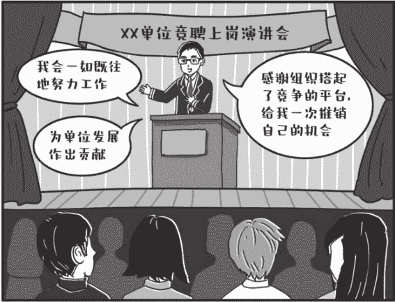

演讲一开头，就要旗帜鲜明地提出对组织感恩的态度：

首先十分感谢组织搭起了竞争的平台，给了我一次“推销自己”的机会。这次竞争其实是才能的竞争、品德的竞争、实绩的竞争。透过竞争，人人都有居安思危、不进则退的“危机感”，人人都有奋发图强、以为争位的“原动力”，人人都有展示自我、寻找位置的“大舞台”。

演讲到了最后，一定要强调正确对待结果，继续努力工作的态度：

对于能否竞职成功，我思考得并不多，“一颗红心、两种准备”，无论竞职结果如何，我都会一如既往地努力工作，加强学习，不断完善提高自己，为单位发展作出自己的应有贡献！

这样“一颗红心、两种准备”的表态，一方面固然是客套话，另一方面石头也希望你把它当作真心话。

得到App的总裁脱不花在自己的沟通课程里对竞聘有个比喻，石头觉得很形象。她说，竞聘看重的不是过去，而是未来。你可以把自己竞选的那个岗位想象成眼前的一个靶子。当场正中十环固然很好，但更重要的是看到靶子背后还有靶子，眼前目标背后还有长远目标。

竞聘当然要争取一时的输赢，但是无论输赢，我们都要追求更长远的目标，那就是让在场所有人看到你、认可你，让大家觉得你是一个诚恳谦逊的人，是一个可造之才、可用之人。只要你表现出这种状态，下一次的机会大概率很快就会到来。

石头今天写的，都是竞聘发言比较特殊的地方，至于它跟其他发言具有共性的地方，比如石头概括的“四个有”，我就不再重复了。

## 九、寒暄找话题大法

对寒暄这件事，有些人表现得漫不经心，甚至有点抵触。他们的理由听上去也有些道理：路上、电梯上碰到领导同事，就那十秒八秒，干嘛扯那么多没用的，而且人家领导忙着呢，哪有工夫跟你寒暄！

但如果你换个角度想一个问题：你到底想在领导和同事面前呈现一个怎样的自己？是落落大方、开朗自信的，还是冷漠寡言、羞羞答答的？每一个人，恐怕都不希望把自己唯唯诺诺、上不了台面的一面展示给领导。寒暄重不重要，答案就很明显了。

为了帮助不善言辞的老实人流畅自如地应对与领导寒暄的场景，石头帮大家总结了以下找话题的办法，给出一些寒暄话术。

### 1. 朋友圈中找话题

艺术来源于生活，话题来源于观察。对领导同事，你可以多关注他平时的动态，朋友圈发没发过什么心情动态和照片？转没转过什么文章？如果有，那就好办了，“昨天看了您转的关于常见错别字的帖子，特别有益，我收藏后都读好几遍了。”

### 2. 穿着打扮上找话题

从头到脚、从上到下，穿着打扮那绝对是寒暄的宝矿，女的问香水、裙子、化妆品、发型、包包、首饰，男的问夹克、领带、手表、汽车，相信他们肯定会滔滔不绝。“李姐，您这又换新包包了，很贵吧？是在SKP买的吗？”

### 3. 看天气找话题

聊天气是最没营养的寒暄，但也是最简单易行的寒暄，实在没啥说的了，聊聊天气也还是能顶一阵子的。“王局，听说明天要降温，真是倒春寒啊，可得多穿点衣服。”“王局，今天风太大了，您穿这么少，身体真棒！”“王局，今天又有雾霾，真是烦人啊！”

### 4. 看新闻找话题

都是吃公家饭的，大家肯定对新闻都比较关注，每天早上看看新闻汇总，一天的寒暄都不发愁了。“马处，看新闻了吗？新闻说今年过年回老家必须带核酸检测证明，您今年还回去吗？”

### 5. 围绕孩子找话题

对已婚已育人士，孩子是他们生活的中心，他们的一切喜怒哀乐都在围绕着孩子转。关于孩子，已婚已育人士有说不完的话。“您家小孩上一年级了吧？最近在上什么辅导班啊？”

### 6. 聊八卦找话题

八卦类事件特别适合职场寒暄，他们最符合石头之前说的“有趣但不核心”的原则。狗血的事谁听着不刺激，而且咱跟那些明星又没有利益纠葛，随便踩捧，能奈我何? “张处,听说郑×找了个代孕的,后来又把孩子遗弃了,真不像话,您怎么看啊?”

### 7. 说胖瘦找话题

对男士,可以说“最近又胖了?”他会觉得自己越来越威武雄壮。对女士,可以说“最近又瘦了?”她会觉得自己越来越苗条纤细。此万能话术屡试不爽,注意,这两句话可千万不能用反,否则你就等着穿小鞋吧。

### 8. 用“最近怎么样?”找话题

实在不知道跟对方有什么共同话题,那就只好祭出撒手锏,来个开放式的论述题,“最近怎么样?你起来回答一下!”然后,再根据他只言片语透露出的有效信息,把天接着聊下去。

### 9. 万能的微笑

说了上面这么多,石头也知道,对有些性格内敛的人来说,寒暄还是很难,压力还是很大。

能聊,可能是一种天赋,比如老梁、郭德纲,老天爷赏饭吃,啥事都能聊得引人入胜。

经常会有内向或不善表达的人,羡慕能侃能聊的人,也想学着去插话,赔笑,迎合,搞得自己疲惫不堪。

其实吧,你不是那种人,没必要学,啥事都侃侃而谈,多耗费精力啊,想想就累。人的精力是有限的,精力要用在刀刃上,不是用来消耗的;真正的高手,特别懂得养精蓄锐,做减法。

乱用精力，花在自己不擅长，且无实际收益的事上，很不划算。要学会把精力留给自己，留给核心事务。你应该把精力集中起来，准备好在领导参加的座谈会上的发言，平时在单位偶遇领导同事，打个招呼，一直微笑就好了。

不管你从以上哪个角度找话跟别人寒暄，讲话的基调一定是正面的，说直白点，也就是要夸他，狠狠夸他，别讽刺，别怼人，如果做不到，那还不如把嘴闭起来。

石头还要提醒一下，对待大领导，打招呼是必须有的，但如果看他表情严肃、心情不佳，或是眉头紧锁、特别疲惫，那寒暄的时候就要慎重一点，因为有时领导会思考一些问题，贸然开口聊天，可能会在不知情的情况下打断领导的思路。如果领导主动开口聊天，那就顺着领导的话题往下聊吧。

## 十、说话有逻辑，是怎么做到的？

石头在《秘书工作手记2：怎样写出好公文》里，花了不少篇幅讲写文章怎么厘清逻辑，特别是厘清文章逻辑有什么技术手段，反响不错。有读者表示，读后如法炮制，脑子虽然未必十分清楚，但写出来的东西至少像样了，基本符合领导常说的“层次清楚，条理分明”。

他们要求石头再讲讲说话有没有什么好技术，能让语言表达听上去“有条理”的。其实，说话和写文章本就是一码事，写文章能用的理清逻辑的办法，比如金字塔原理，也就是观点优先、层层支撑，还有使用适当的逻辑词，科学分类，放到说话中去用，道理也是一样的，也都行得通。

把写作常用的逻辑结构搬到语言表达里，基本上是降维打击。

### 1. 编码更容易让人记住

有逻辑的表达，最简单粗暴且有效的方式，就是给每个你要说的观点或者主题都标上序号。一个一个地娓娓道来。有编码的物品更容易让人记住，说话也一样，既有顺序感也不容易漏掉。

“我想讲三个问题，第一是第二是第三是”“我有三件事想跟你沟通，一是二是三是”，如果突然临时又想起来一点，别慌，可以说，“此外呢，还有……”

听到编码序号，对方脑袋里就会想，哦，今天有三件事儿，很容易记。编码，是非常符合人体大脑思维路径的一种说话方式。

最美妙的地方在于，编码法虽然让人感觉有逻辑，但其实对逻辑性的要求不高。你讲三个问题，三个问题之间不一定有非常清晰的逻辑关系，它们的先后顺序有可能是错乱的，或许它们之间根本就不相关，也没有逻辑关系。

但这些都无所谓，只要给观点加上编码，就能给人一种很有条理的感觉。所以，只要你说的不是一件事，都可以给整上编码，好使。

### 2. 使用逻辑词

逻辑词是逻辑的标志，就像路上竖着的路标一样，朝着读者大喊：这是第一层意思！这是第二层意思！这里是并列！这里是递进！这里是转折！使用逻辑词来标示文章逻辑，是一种简单又效果鲜明的办法。

说话中最常用的逻辑词，当然是“首先、其次、再次”，表示一种重要性逻辑。但具体到运用中，建议大家多说“第一、第二、第三”，少说“首先、其次、再次”，因为许多人说了“首先、其次”后，容易把“再次”忘掉。

其次，还有“总的来说”，表示总分逻辑；“接下来我要说的是”，表示递进逻辑；“只要，就”，表示条件逻辑；“因为，所以”，表示因果逻辑；“一方面，另一方面”，表示并列逻辑；“虽然，但是”，表示转折逻辑，等等。

### 3. 归类可以对抗混乱

在头脑中养成对各类事物进行归类的习惯，有利于让你说话更有条理和效率。

石头之前讲过，分类是人类大脑的伟大发明，“类”这个东西，在客观世界其实并不存在，但我们的大脑为了将杂乱无章的事物区分开，进而系统化、条理化，不断创设“类”的概念。当你以分类的方式来思考和表达的时候，你会发现事情骤然变得更容易理解和记忆了！

办公室里的美女小丁特别爱美，每天穿得漂漂亮亮来上班，她今天穿（戴）了衬衣、外套、披肩、裙子、丝袜、项链、耳环、手镯、高跟鞋、发卡。十几样东西，你一下看得清、记得住吗？

我们分个类，马上就不一样。办公室里的美女小丁特别爱美，每天穿得漂漂亮亮来上班，她今天的上装是：衬衣，外套，披肩；下装是：裙子，丝袜，高跟鞋；配饰是：项链，耳环，手镯，发卡。分成三类后，原本模糊混乱的衣服马上清晰了，显得井井有条。

说话也要时刻记着这种思维方式，“好的方面是×××，坏的方面是×××”，“对领导来说，×××，对同志们来说×××，对下级单位来说×××”，“从我市来看×××，从国内来看×××，从国际上来看×××。”

把一团内容切割成不同类别，依次讲出来，对理清说话的思路非常有效。

## 十一、嘴严是一种美德

前几天，一位领导私下跟另一位领导表扬石头的话传到了我耳朵里。表扬什么呢，简单得让人震惊。领导说，石头这小子不错，嘴很紧，有一次他跟我参加活动，我听另外一个领导打电话问他在哪，石头都不吐口，只说没在办公室，在外边办事，这叫人放心！

这实在出乎石头意料，本来一直以为木讷内向、不善言辞是个缺点，没想到嘴比较紧，跟谁都不爱吐口竟然还成了优点！“嘴严可靠”，竟然还比能说会道重要了？

仔细想想，在单位在职场，嘴严还真是一种美德，甚至可以成为一项个人“品牌”。反正石头很害怕跟爱嚼舌的同事交流，谁说的话不会有瑕疵呢，谁敢保证自己一直是“伟光正”的呢？如果稍有不慎被揪住小辫子，是不是又要到处传播我的笑话？与其这样，那我还是离你远点儿。

“祸从口出”“因言废人”的教训实在太多了，如果别人跟你说个什么事儿，总是过几天就已经尽人皆知了，那大家就会给你打上不可靠的记号，越来越不愿意与你为伍。如果涉及一些内部信息的泄露，“爱说”甚至有可能让你酿下大错，一辈子抬不起头。

哪些话，到嘴边也得咽下去？

### 1. “昨天我旁听常委会了，会上研究了干部，××处的××要动......”

会议研究的敏感事项，对任何人都不要说，尤其是不能向会议涉及的人透露。你把不住风跑冒滴漏，人家更不会给你把风。很快就会一传十、十传百地传到当事人耳里，提拔的风险还较小，万一是调职或处分，当事人跑到领导那一哭二闹三上吊，最后领导震怒，“把泄密的人给我揪出来！”我看你哭都来不及。

### 2. “昨天领导加班，让我帮他接小孩了”

领导单独交办的私事，对任何人都不要说，尤其是不能向口风不紧的人透露。你的本意或许是想炫耀领导对你高度信任、高度认可，连私事都毫无保留地交给你办，你已经进入“自己人”行列了。殊不知，这种私事是最为敏感的，也是领导最不想为外人了解的，悄悄办也就办了，走漏了消息，肯定不会有下一次了。

### 3. “小王和小李是不是最近有点情况？”

八卦是非，男女关系，最好不要乱传。八卦确实有趣，但问题在于，说者无心听者有意，你永远不知道看似平平无奇的同事背后有着怎样复杂的联系，说不定他们曾有过地下恋情，现在已经反目成仇，或者根本就是远房亲戚，联系异常紧密，何必在单位招惹麻烦？实在憋不住，可以给老家的父母讲讲。

### 4. “我迟早要走的”

人往高处走，水往低处流。现今社会机会多，想去大城市、大单位、大机关闯一闯无可厚非。但在尘埃落定之前，公然向他人流露要走的想法和迹象，甚至在办公室看“行测每日一练”“遴选突破100题”，则是非常愚蠢的行为。万一你一辈子走不了呢？石头劝你，悄悄地备考，打枪的不要！

### 5. “工作烂透了，这个单位真没劲”“这事太难了，肯定不行，搞不成的”

任何抱怨的话都不要在单位讲。抱怨永远无助于改变现状，办公室顾问团王主任说得精辟：任劳不任怨，干了也白干。领导在单位最忌讳的不是不干活，而是对他不满意、不认可。在单位，要么别任劳，啥也别干，乐得逍遥自在，任劳就要任怨。

作家冯唐曾总结人类爱记坏话的本性，他说：人类是一种变态的动物，十句话里，九句夸他，他记不住；一句骂他，他放在心里很久。

有些人一边干活一边抱怨，手上没少干，得罪人的话没少说，结果传到别人耳朵里，干了活也一点都不落好。一边做事一边发牢骚，这种做法叫割卵子敬神，卵子被割掉了，神也得罪了。

不管人前还是人后，只说单位和领导的好话，绝不说单位和领导的坏话，这应该成为一种习惯。

如果工作上确实遇到了困难，可以用适当的途径去给领导反映，不要在背后抱怨，尤其是抱怨的时候被领导听到，或者有心人传到领导耳朵里，对你都极为不利，信不## 6. “我们以前不是这样弄的，王局以前如何”

信，之前成绩会因此而一笔勾销、前功尽弃。（见图3-3）

图3-3 嘴严是一种美德

事业在发展，时代在进步，老强调过去怎么样、过去规矩怎样、过去领导如何的话不要说。有些新变化新要求你或许还不理解，那也没关系，先照着做，提以前不但不好使，还会让新领导觉得，“不把我当回事啊？还想着前任如何如何呢，看来我说话不管用啊！”一下就把你划入前朝旧臣或者不服管的刺头序列，损失极大。

## 第四章 细节：让你脱颖而出的那些小事

### 一、在单位特别拉好感的几个小妙招

石头一直主张，在职场眼睛要朝上看，把更多的精力放在领导身上，有的朋友照此操作后，发现这样不但对自己的发展有好处，而且精力重心转移后，对同事更豁达随和，容忍度更高，最后竟然无心插柳柳成荫，收获了更和谐的同事关系。

这就对了。职场上的受欢迎，和谈恋爱、耍朋友的受欢迎有本质区别，你不需要让所有同事都真心喜欢你、爱你。只要大家能够客气友善地交往，互相不拆台、不踩踏，你的同事关系就算很成功了。

即使这样，很多人还是做不到，每到一处，总搞得天怒人怨、鸡飞狗跳，风评一致地差，这到底是人性的扭曲还是道德的沦丧？其实都不是。大多数情况下，或许只是你没把握住一些小细节，比如以下这些。

### 1. 带饭和零食

有些人在单位总会让同事觉得很暖心，靠的不是别的，就是一个简单的小动作：带饭和零食。

到了饭点儿，如果别人还在赶稿子，看上去无暇吃饭，他会问一句，要给你带饭吗？

到了饭点儿，如果别人还在会场开会，可能赶不上食堂的饭菜，他会发个信息，“需要给你带饭吗？”

其实，打动人的还真的不是一碗饭，而是那种“我把你放在心上，我惦记你”的关心暖心，这个让人无法抵抗。

同样，自己买奶茶、买零食、买水果，也可以想着给同事领导带一些，大家一起分享，想不其乐融融都难。

### 2. 记住生日

石头研究生毕业快十年了，每年过生日，都会收到一位做律师的同学发来的生日祝福，让石头感动不已。我深深地感到，这位老同学一直在关心我、惦记我，我愿意给他当牛做马。

在领导和同事生日的时候，简简单单给他们发个短信，就会让领导或者同事觉得你很重视和惦记他，这是很重要的。

除了生日，还有一些纪念日，比如领导履新上任××周年，同事入职××周年，如果你记得发个短信表示祝贺，或者做张贺卡，一下子又把你给凸显出来了，这是非常牛的事情。

### 3. 伴手礼

跟领导和同事交往，你要时常想着伴手礼这件事儿。

比如，公事私事麻烦别人，你要想着伴手礼；去同事家做客，你要想着伴手礼；回老家过节，你要想着伴手礼；出去旅游，你要想着伴手礼；到外地出差，你要想着伴手礼；甚至跟媳妇去度蜜月，你也要想着伴手礼。

伴手礼不值几个钱，也花费不了你太多心思，但如果你脑子经常想着这个事儿，时不时送出一些伴手礼，跟同事的关系就会越来越和谐。

有人可能会疑惑，现在大家条件都好了，同事们也不差那一点儿土特产，石头你还把伴手礼说得这么重要，是不是有点太落后了？

确实，伴手礼价值不高，但“往家里提东西”这件事，能给人一种强烈的“快感”。你回忆一下，逢年过节，单位发的那点儿米面粮油值钱吗？一点也不值钱，但这并不妨碍你兴高采烈地把不值钱的东西提回家，看着满当当的储藏室，“我出息了，能往家里提东西了”，自豪感油然而生。

伴手礼的道道，其实在这里。

### 4. 私下致谢

致谢和伴手礼一样，也是你需要时刻惦记的一件事，不管公事私事、大事小情，私下一声“感谢”“谢谢”，及时送上。

如果想让致谢的效果更好，可以在说“谢谢”的时候，添加一些感想和细节。

比如说，同事从老家回来给你带了他们当地的特产，你家里人感觉很好吃。可以给他发个微信，说，“哎呀，感谢你的礼物，小孩儿特别爱吃，最近每天都闹着要吃”。对方就能想象你和家人开心享用礼物的场面，两个人之间的温馨感再次得到升华。

工作上也是一样，到别的单位开会调研等，临走时给对口人员发个信息表示一下感谢；别人到你单位，太忙没有周全的时候发个信息表示一下歉意，都会让你做的工作有事半功倍的效果。比如：李总，感谢您的热情招待，这次调研收获很大，很受教育触动，之类。

### 5. 工作不掉链子

同事同事，大家的根本连接点在做事，没有做事这个基础，友情根本无从谈起。

有些人在单位被集体排斥，真不是因为他不会做人、不够玲珑，而是因为工作上太差，以至于被看作是传说中的“猪队友”。想要有正常的同事关系，工作上的表现至少要合格。

### 6. 尽量不发飙

在职场对两个人之间关系伤害最大的事情可能就是发飙了。一旦发飙，事情就很难挽回，和同事之间的关系也基本不太可能再回到从前。相当于你给自己树立了一个敌人，挖了一个坑。

现在看这个同事好像不能对你造成什么伤害，但保不齐什么时候你就落在他手里。这个当年发飙埋下的坑就能把你绊倒。你发飙的次数越多，给自己挖的坑就越多。

对每一个人都尊重是成本最低、效果最好的一种交往方式。不管事情有多糟糕，咱都还得端着，深吸几口气，或者撤离冲突现场。尽量避免发飙，冷言冷语、针锋相对都可以接受，但体制内职场的平和性格，决定了歇斯底里、大喊大叫、骂人打人是绝对不能接受的，也是必须守住的底线。

### 7. 不要打破砂锅问到底

和同事之间保持客气、有礼的距离感，是最舒服的交往状态。交浅言深是一件很可怕的事情，有些话题，人家不想让你知道，你也没有必要知道。比如，家里房子多大啦，老公收入多少啦，有没有结婚啦，老公月入多少啦，跟男朋友关系怎样啦，浅浅聊聊就挺好，非要打破砂锅问到底就很惹人讨厌了。

有的时候，对方回答你的问题含糊其辞，或者沉默，那说明人家不想讨论这个话题。这时候，你要识趣，要及时绕开这个话题。不然，如果打破砂锅问到底，双方都会感到尴尬，甚至会让人觉得烦，“我跟你很熟吗？干嘛要告诉你这些？”

以上，就是石头总结的一些在单位拉好感、搞关系的小妙招。需要说明的是，石头总结这些，并非是让大家条条都做到，实际上石头很多也做不到。

对关系和社交要辩证看，不是每个人都能当局王，有些人能把关系和社交发展成自己的核心竞争力，但有些人天生厌恶这些。

如果社交不是你的核心竞争力，那石头觉得做到大体过得去，合格不出错就行，上面这些方法有选择地用一用。更多的时间和精力，还是要花在提高自己身上，屌丝要强大，最好的办法是自己有能力，有和人交换的资源。

自己实力不过硬，拿不出东西来交换，瞎折腾，到处巴结，累死累活，实际上人家也没觉得怎么样，未必真的把你当回事。

### 二、有效赞美的5条法则

前几天石头偶然参加一个饭局，席间中心人物是一位企业家，企业家多才多艺，同时还有另外一个身份——业余书法家，据说造诣相当可观，作品颇能登堂入室。

饭局上有个梳着背头的男子，大概有求于此企业家兼书法家，借着酒劲儿，恭维他恭维得暴风骤雨、毫不留情，甚至说出了“我看目前在国内，书法排第一的是那谁谁谁，第二也就是您了”这样众人皆惊的狂言。

连被恭维的企业家脸上明显也挂不住，连忙打断背头男：“小王你说的什么疯话！”

散场后，待背头男离开，企业家大概也是不好意思，当着众人把背头男猛批一番，连声感慨不知他怎么变成了今天这个样子，说话一点儿都不把边，请大家别往心里去。言辞间尽是懊恼不屑。

显然，背头男的赞美不但没让被赞美的人熨帖，反而让他想讨好的人成了笑柄，赞美不美，事情反而朝反方向发展了。

这是赞美本身的问题吗？当然不是。人人都需要赞美，人人都享受被赞美，没有人能独善其身，做到不吃赞美这一套。

曾国藩有句话，叫“规恶于私室，扬善于公庭”。意思就是批评人要私下说，表扬人要公开说。表扬人的时候，特别是表扬领导的时候，暂且把职务的禁忌放在一边，胆子大一点，步子大一点，声音大一点，都没关系的。

连石头一岁半的闺女也是如此，你直接斥责她怎么不好好吃饭，她闹得更厉害；你要是说宝宝太棒了，吃饭比同小区的圆圆吃得好多了，她马上抓起饭往嘴里塞。这充分说明了赞美直抵人性的力量。

如何避免前文中赞美黑化的情况？如何有效地发出赞美？石头觉得有几个问题值得注意：

### 1. 适当含蓄

石头一直觉得，赞美的时候，对事实做适当夸大是没有问题的，甚至是必需的。假如一个人的表现是“好”这个级别，你夸他说，你是好啊！那么可以想象，他感觉不大，因为他的表现本身就在“好”这个级别，你说他好，只是在陈述他自己也了解的事实，本质上是个陈述句，没啥新鲜的，他心里能爽得起来吗？

如果他明明只是“好”这个级别的，你却说他是“太好”级别的，这时他才有爽的感觉，“啊！我还以为自己好，原来大家都认为我太好，我真牛！”

但同时，我们也要注意到，中国传统文化还是比较推崇含蓄，讲究的是“沐猴而冠”。即使心里再想，嘴上还是说不要不要。

所以赞美之时，尤其是在公开场合赞美别人，大家都在旁边看戏的时候，注意要适当含蓄，别说得太露骨，点到即可。

在这一点上外国人就直白得多，整天把“amazing”“perfect”挂在嘴边也不以为然。文化基因不同，咱们跟他们还是要有所区别。

当然，私下的话，你就完全可以放得更开一些。

### 2. 群众的评价大家都在意

公众号【懒人手册】回复“互联网”，白嫖各种资源文档

汉语里关于谣言诽谤的成语很多，什么“众口铄金，积毁销骨”“三人成虎”之类的，充分说明了人言可畏。

群众的恶言能杀人毁人，反过来，群众的好评那也是十分让人受用的。

赞美无非有两种模式，一种是“我觉得你好”，另一种是“别人觉得你好”“大家觉得你好”“一致觉得你好”。很明显，按照人言可畏的理论，“大家觉得你好”的杀伤力要远大于“我觉得你好”。

所以，是不是赞美的时候可以多用“群众觉得你好”，而尽量不要自己赤膊上阵呢？

比如，领导在工作部署会上发表了重要讲话，确实讲得很好。领导问你，小张啊，今天讲的效果还可以吧？你当然可以说：好得很领导，我听了很受鼓舞，我觉得吧，立意高、语句美、内容实，等等，把领导大大夸赞一番。

但如果你用“群众评价法”，对领导说：我刚在下边听好几位同志都在说，您讲得实，水平很高，部署得很具体……

那便是让赞美从主观感受进化为客观事实，是不是效果又上了一个台阶呢？

### 3. 要具体，要有细节

赞美这件事很怕大而无当，真棒！真好！真牛！这种话意思不大，听上去要么是赤裸裸的奉承，要么是漫不经心的寒暄，不走心。

只有赞美中出现细节了，出现具体事情了，被赞美的人才能真正感受到关注和重视，觉得赞美发自肺腑且可信。

比如开篇提到的背头男，与其说泛泛地给企业家戴上“老二”的高帽，尚不如具体说说到底哪里写得好：是点画线条苍劲有力啦，还是空间布局浑然一体啦，抑或是神采飞扬格调高雅啦，实实在在地从具体和细节出发加以评论，明显要比扯着嗓子唱赞歌要真诚、抓人。

再比如夸赞办公室里的女同事小陆今天很漂亮，“美得很”“好漂亮”只能是隔靴搔痒，“包包配这件衣服好看”“口红颜色适合你”“你这个新烫的头很显瘦”，是不是基本能保证女同事心花怒放了？

### 4. 请教和询问也意味着赞赏

赞美的本质是什么？石头觉得，如果我们对赞美这一行为抽丝剥茧，其实它内含两个层面，第一个层面是认可，我认同并褒奖你的行动；其次是在意，即我非常重视和钦佩你的某个行动。

上面说的几个方法，其实都还是认可层面的，请教和询问则处于“在意”这个层面。

比如，王处在××日报发了一篇文章，评价不俗。你表扬他文章写得好是认可层面的一种赞美。

表扬之后，好好跟人请教询问一番：张处，这个文章你是怎么构思的啊，这么好的语句是怎么积累的啊，怎么投稿怎么采用的啊？你怎么练就如此“大手笔”的啊（见图4-1）？

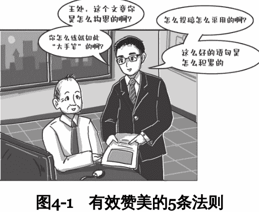

这么一询问一请教，就是“在意”这个层面的赞扬了。王处一看你这样在意他的文章，在意他的写作，内心必然是美滋滋的。

### 5. 有对比才有伤害

争强好胜是一种人性，古人都说了，不患寡而患不均。

不管你承认不承认，人总会有种隐秘的小心思，看到别人比自己好心里就是不舒服，看到别人过得孬就是心情舒畅。

所以，这点也能成为赞美的切入点。夸人的时候，与其说“老李，你真行！”不如说“老李，你比老王强多了”，或者说“老王比你差远了”。

当然，需要注意，拿别人做比较是有风险的，搞不好就成了搬弄是非、诋毁同事、挑拨离间。最安全稳妥的做法还是拿被赞美的人跟自己来比。

比如说，张处，你这个文章观点太鲜明，我怎么就想不到这一点呢？张处，你这个文章言辞太优美，我怎么就写不出这些话呢？你给我传传经、送送宝啊！等等。这样自己稍微吃点亏，赞美的效果杠杠的。

### 三、怎么装成很有城府的样子？

工作时间久了，石头发现，在单位走得比较顺的人，各有各的绝招，有的能写，有的能说，有的贴心，有的精力旺盛，但他们往往还有个共同点：做事让人感觉很“稳”。

比如石头认识一位干人事工作的兄弟，酒桌上你跟他闹得再热火朝天，对于人事的议论和传言，他还是不会吐露一个字。还有一位领导的秘书，朋友圈干干净净，不发任何东西，你想跟他在微信上说点事，他从来不会回复，而是一个电话打回来，在电话里慢悠悠地说。

石头体会，这可能是所谓的“城府”。为什么有城府的人会在职场走得更顺？石头琢磨来琢磨去，稍稍捕捉到一点苗头。

职场晋升，不太像竞技比赛，突然杀出个无名小将，秒杀大佬一飞冲天。职场更像是排队领奖品，见者有份，大家都在队伍里一个个往前挪，顶多偶尔往前插一两个队，插队多了群众肯定不干。

职场晋升，能得分很重要，不失分更重要。首先你得保证自己一直在队伍里，不能因为犯规被逐出队伍。所谓城府，实际上就是把自己变成一个“黑箱”，最大限度减少犯错的概率。

有些人把“城府”理解成“脸色阴沉”，整天板着脸不苟言笑，这完全跑偏了。有“城府”也可以脸上挂着阳光的笑容，只要你能做到以下几点。

### 1. 大事小事不透底

工作上的事，不该让别人知道的，绝不吐露一个字，这是最基本的“城府”，大多数人能做到。

石头今天想说的不透底，其实主要是说小事也要不透底。

举个例子，石头见过一位领导，工作十分用力，经常加班到很晚，但一周也总会有那么一两次，他要提前一会儿下班，去接小孩放学。

对此，他从不直说，有时候他说，“我先去食堂吃饭了，待会再回来！”有时候他只说，“我下楼一趟。”有时候，他甚至不置一词，掩上门就走了。当然，大家也心领神会，不会追着他刨根问底。

对于不好的事，即使再小，也坚决不直说，这才是不透底的最高境界。

透出去的底，当时可能无伤大雅，但保不齐某个关键时刻，你说的某一句话就会成为别人手中的把柄。

### 2. 设密码

在单位，脑子要有根弦，注意保护自己的隐私。老话说得好，害人之心不可有，防人之心不可无。

比如，办公的电脑要设密码；临时离开座位，电脑要有屏保；没事的时候，就把手机倒扣在桌面上；微信消息会弹出来，但设置不显示内容；工作上的事情，能打电话聊，绝不发微信；少发朋友圈，经常给别人点赞评论；等等。

### 3. 走路慢

干工作要一步一步来，走路要一步一个脚印，不能总是风风火火，好像有十万火急的事情要去处理一样。

况且，即便有非常紧急的事情，也不能那么轻易地表现出来。

走路快，心率加快，人在心理紧张的情况下，考虑事情自然有不周全之处；走路慢，心率慢，考虑事情就会举重若轻、收放自如。

另外，天天快速地走过来走过去，不仅会让人感觉你在做大量的无用工作，还会让人感到心烦、压抑。

### 4. 说话缓

至于该怎么说话，学习一下领导就可以了。你见过哪个领导天天大着嗓门说话？哪个领导不是稳稳当当、滴水不漏地说话？

有位领导曾经教石头这样说话，“准备吐出口的话，咽回去，嚼一嚼再吐出来。”这个办法特别实用，话到嘴边了，先别说，脑子里练一遍再慢慢说。

我们为什么要慢慢说话呢？因为话语是大脑思考的反映，说话有条理，说明你这个人思路清晰、思维严谨。反之，快速、啰唆地说，会让领导感觉你这个人思路混乱。

水深不语，人稳不言，十拿九稳再开口说，拿不准的话干脆不说。

### 四、到上级单位借调注意事项清单

- 上级单位借调人，不是让你去镀金的，肯定是来干脏活累活的。调整好心态，乐于吃苦负重是搞好工作的关键。别人不加的班你加，别人不熬的夜你熬，一般熬着熬着大家就离不开你了。尤其别拒绝小活儿，打水、复印、打饭，以前可能是别人帮你做，现在你要笑着帮别人做。
- 新到一环境，先考虑融入。同事之间吃喝玩乐必不可少，别觉得庸俗，同事虽然不是领导，但人家环境熟情况明，处得愉快了，适时给你指点一二，比如单位的人事关系啦，编制情况啦，进人要求啦，能让你少走不少弯路。此外，新人“风评”很重要，大家都夸你不错，也就为你在新环境打开局面创建了基础。
- 抓紧把自己擅长的一面展现给领导。比如长于写作的，可以把自己之前发表的文章汇编成册，给上级单位领导呈上；中午食堂吃饭，多说说自己以前写材料的情况，写了多少大材料、总结、讲话。只有具备了某项技能，才能迅速立足。
- 刚开始的几个活儿，要使出吃奶的劲来干好。印象的窗口期很重要，前面几个任务千万别满足于完成任务就好，要拿出精益求精、追求卓越的劲头，让上级单位的领导和同事眼前一亮，争取震他们一下。
- 站稳脚跟之后，可以造造声势。尽可能参加上级单位的座谈、演讲、岗位练兵等活动，精心准备，一鸣惊人。别有顾虑，觉得是不是太高调了，其实这种活动，单位的“老油条”一般都嫌麻烦，你这是帮他们减负呢。
- 定期向原单位领导汇报工作。平时有空回来，到原单位领导那里坐坐，汇报一下借调期间的工作，不是去显摆成绩，而是要表达非常尊重原单位领导的姿态，别回来不吭不哈的。无论是抽空回原单位当面汇报，还是打电话、发微信，无论领导乐不乐意听，自己都得尽好下属的“本分”。还当自己脱离了他的领导？不存在的！
- 不定期与老同事联络感情。平时和老同事打打电话聊聊八卦，有条件时聚聚餐喝喝酒，一到关键时刻也许同事能帮助自己获得第一手信息，比如原单位人事变动、评奖评优方面的最新情况，甚至帮助自己在原单位做做宣传，不至于自己“仿佛没存在过”。
- 在职权范围内为原单位提供一些便利。原单位同事到借调单位办事，嘴巴甜点儿，腿跑勤点儿。有些工作你在上面有信息优势，可以给原单位指点指点，让原单位感到你是一根伸到上面的“天线”。
- 如果你了解到上级单位有编制，也有意通过借调留人，大可以主动跟你的直接领导表态：“我这段时间学到很多，进步很大，想继续跟着您学习锻炼，个人也有个更高的平台。”他自然心知肚明。别太担心原单位不放人，“上面”有人，对他们也是好事。
- 如果发现上级单位纯粹是想抓个苦力干活，没有任何上调机会，那就不要恋战，拿好借调鉴定，到点儿就撤回去，以免耽误在原单位的前途。

### 五、当小领导带好团队的要点清单

- 无论体制内外，领导者的权威往往不只来自于职位本身，更来自对职位的经营。所有新团队几乎都会经历从不配合到配合的过程，要不怎么会有“新官上任三把火”的说法？不要指望你一旦坐上那个位置，所有人都开始配合你、服从你。你必须要尽快展现出运用职位赋予权力的能力，大家才会配合你、服从你。不配合跟你年纪轻有关系，但其实没有必然关系。
- 什么是运用职位赋予权力的能力？说白了就是两条，对下分配任务，活儿来了能分得下去；对上争取支持，领导愿意听你的，不听你们科室其他人的。你的所有管理动作都应该围绕这两条。

- 分配任务，先过心理关。从大头兵到管理者，最困难的不是学会管人，而是敢管人。面对不配合的人，心里先不要怂，默念十六个字：管人管事，天经地义，组织重任，职责所在。你背后的靠山是组织、是领导，多提要求、大胆说不，就是你的权力和职责。

- 把分工具体到人头，落实在纸面上。制作一个分工表，科室职责范围内的各项业务，哪项工作谁去负责，谁是备份，在表中予以明确，然后把这个表呈报分管领导审阅。分工的效力一经组织背书，活儿来了，不再是你拍脑袋分任务，而是大家各自对着表领任务。你不想干？那就说出个123来，还得我批准。

- 怎么体现领导支持？上任后，先召开科室会议，邀请分管领导参加，为你站台。在会议上要强调树立一盘棋思想的要求，形成合力，上下一心，相互配合，共同做好工作。让每个人都表个态，最后领导再提要求。

- 别小看了开会和表态，科室会议上，所有人肯定都会说要支持你、配合你的场面话，按照心理学上的“承诺和一致原则”，人人都有言行一致的愿望，一旦作出承诺，就会立刻受到来自内心和外部的压力，迫使自己的言行尽量和承诺一致。

- 这次会议后，还可以建立科室学习例会制度，每周或每月定期开会，学一学近期上面发的文件，每个人讲一讲近期自己手头的工作，搞一搞主题读书活动，谈谈体会，人人发言，经常表态。会议是一种仪式，一开会，大家各就各位，按部就班，其实是在反复提醒每个人：别忘了，你是科员，我才是负责人！

- 记好科室工作周记。每个人每一天做什么事，完成了什么任务，取得了什么成绩，以日为单位记下来，每周汇总一次，发到科室微信群里。每周向分管领导汇报周记，既方便分管领导掌握工作情况，也是对团队的威慑。小小周记，是不是很好地实现了对下分配任务和对上争取支持的统一？

- 抓“两头”带中间。科里几个人，不可能都处在同一层次。肯定有人会向你靠拢，积极向你请示汇报，落实任务一丝不苟。你要紧紧抓住这样的人，帮助你开展工作，在工作方面多商量，在同事面前多表扬，在领导面前多汇报，以争取人心。对个别调皮捣蛋不服管的，该批评的要批评，也可以从心理和行动上给脸色看，孤立、冷淡，拿走一些不痛不痒的利益，比如培训、出差的机会啥的，以示惩戒。这样一头抓住先进，一头抓住后进，就会带动更多的人向你看齐。

- 时常“扯大旗做虎皮”，让大家知道领导始终信任你、支持你。比方，科里周例会、月例会，时不时请分管领导来参加做指示；安排科里工作之前，先向领导汇报取得领导的支持重视；工作中的成绩、问题和困难，及时向领导汇报，争取领导的帮助。总之，尽量让领导多参与到你的工作中来。

- 碰上比较刺头的部下，言语上绝不要轻易让步。他说不应该接这个活，你不要急，也不要默不作声。你就说，领导有多重视这个活，必须得干好！他说让你找别的人，你就说，你分管这块业务，我只能找你。态度坚决一点，他可能就顶不过你了。很多时候，微观层面的语言较量非常重要，甚至起决定性作用。

- 上面说的都是“做官”，做人也同样重要。中午尽量跟大家一起吃饭，时不时请大家一起聚聚，喝点小酒，爬个山；在重要节日或者大家比较辛苦的时候，在微信群里发个红包；隔几周就和下属来一次比较正式的谈话，分享一些他不知道的信息，提一点工作建议；如有可能，帮忙解决一点部下的实际困难，诸如孩子上学、发表文章等。

- 最后，如果碰上个别不求进步的老员工，不必非要拿下。对老同志要多一些理解和尊重，他们现在可能工作状态不佳，但人家年轻搬砖的时候，可能比你还能吃苦，可能比你还拼命。你使出浑身解数，个别刺头还是没有改观，那就算了，对这样的人，少管、少理、闲置即可，只求不添乱，不求做贡献。千万别用力过猛，非要斗倒搞臭，那样容易形成完全对立。但是，如果已经发展到事事处处跟你对着干，就要采取坚决措施，向领导汇报，调出本科室，不可姑息迁就。

## 六、当烂好人有什么问题？

石头是个耳根子软，好说话的人。小时候别人对我提要求，纵使我不太情愿，也总是勉勉强强地回答“好吧”，不忍直接拒绝别人，否则总会觉得对别人有所亏欠。

内心随时会有挫败感，但转念想想，也会拿“赠人玫瑰手有余香”“付出总有回报”“好人总会好报”之类的古训安慰自己，觉得当个好人未尝不可。

但最近工作中发生的一件事，让我觉得当好人这件事，放在职场里是有大问题的。起因是写一个材料。

这天，石头接到任务，牵头起草一个综合性业务材料。这个材料前几年都是兄弟部门牵头，今年才按领导要求转到了石头这里。本着“预知后事如何，必先知前事如何”的学习态度，石头抓起电话就打给了兄弟部门的笔杆子老牛，“兄弟啊，今年这苦差事落到我头上啦，前几年你们的报告发我学习学习呗。”

大家都知道，石头手头材料素材攒得多，也乐于分享，单位里只要有人找到我，“石头兄弟，你那有××方面的材料不？我们正在写相关的一个讲话，你发我学习学习呗。”石头每次都是毫不吝惜地把之前辛辛苦苦写的一堆稿子拖进微信对话框，“给吧兄弟，供你参考。”之前每次老牛找我要材料，那我也都是毫不保留、和盘托出的，这次遇到自己需要老牛的材料了，他还不得大开方便之门吗？结果不然。

老牛的态度就像嘎吱作响的破木门，推起来老费劲了。他打马虎眼说，“这得经过领导允许，你还是去找领导要吧，我不敢自作主张。”

听得石头心里咯噔一下，这玩意儿，就是个上报材料，都是些虚话，压根就不涉及敏感内容。说白了，老牛就是不想给。

石头也没再让老牛为难，悄悄在心里给老牛记上了这一笔账，直接找老牛的领导去要材料了。领导二话不说，把前几年的材料立马发了过来，石头顺利完成了任务。

当好人，为什么没得好报？石头事后认真反思了一下。

不管你愿不愿意承认，工作中的友谊实际上只不过是某种意义上的交换关系。如果某人拥有的资源不够多，那么他可能会变成单纯的索取者，做不到公平交换，这时候所谓的友谊，也就会慢慢无疾而终。

李笑来在《把时间当朋友》一书中提到他小时候的经历特别有意思，他说：“我小时候很喜欢看小故事书，但没钱买，找人借也没有人愿意借给我，后来攒了很久的钱买了一本，在我看完后，我就用我的故事书和别的同学互相借阅，借来的书又交换给别的同学，长此以往，我就看到了很多的故事书。长大以后，我才明白，当你没有资源的时候，没有人会愿意跟你交换。”

但如果一个人其实拥有资源，但他根本就不考虑拿来交换，还只是一味地给予，那么友谊的分量同样也会慢慢衰减。

只有索取和给予处于一种微妙的动态平衡，两个人的关系才会越来越紧密，友谊才会越来越深厚。

老好人的问题，就在于你给予的分量太轻，那么你索取的分量也会变轻。手里握有资源当然很重要，有了资源之后怎样分配，设置什么门槛和标准，让自己的给予分量变重，从而获得更有分量的反馈，同样也值得考虑。

交换的道道，奥妙颇多。怎么提高自己给予的分量？石头感觉，老好人们可以多尝试以下几种表达方式。

### 1. 真的不想干的，要直说

请把以下话术模板背下来：

- “不好意思，我手头还有别的事。”
- “对不起，我有别的安排了。”
- “我实在忙不过来了，你找别人吧。”
- “对不起，兴趣不是很大。”
- “对不起，真的不行，不允许！”

抄写1000遍，情景模拟，让你再做烂好人！

### 2. 可以帮的，也不必马上说好

请把以下话术模板背下来：

- “这件事有明确要求，应该如何如何。但你既然找过来了，我争取。”
- “这件事我请示一下领导，行不行，尽快给你回话。”
- “这件事其实跟我们一点关系都没有，但考虑到......，我们就......”

有门槛别人才会珍惜，一些团体或宗教入会的时候总是设置些奇奇怪怪的仪式，就是想提高门槛和难度。别只想做老好人，要想着做成事。

当然，不当老好人，不是说以邻为壑，处处掣肘别人，而是说实事求是，利用好“等价交换”这个人际交往的基本法则，该我做的我听使唤，不该我做的我得说清楚。

## 七、节后第一天，别只知道傻傻上班

快乐的时光总是短暂，转眼春节7天假期就要过完了。这些天，不断有读者在公众号后台留言：石头，马上就要回单位上班了，你不叮嘱我们几句？还有，要不要给领导同事带点儿土特产啥的？

新年确实需要新气象，在石头看来，假期过后重回工作岗位，下面这几件事比大包小包的土特产更重要。

### 1. 仪表

- 男同志洗洗头，刮刮胡子，不要让头皮屑在阳光下飞舞；
- 女同志梳妆打扮一番，喷点香水，搞得美美的，有意识地从村里二妮回归到安迪总监。

之所以要注意仪容，是因为不少单位都有惯例，上班第一天单位领导要到各办公室拜年，送上新年的祝福，邋里邋遢让领导看着烦。

### 2. 寒暄

新的一年，还是要有所表示，多说吉祥话，图个喜庆吉利。

至少走廊上碰到同事领导，得笑着道一声：新年好，给您拜年了!

如果有必要，也可以主动到各办公室串串门，问个好，寒暄几句，开开玩笑。

### 3. 慰问

一般情况下，新年开工，领导们都要到各处室走动走动，以示慰问。

如果领导们集体来拜年，听到声音就到门口候着，作为小兵不需要多说话，只需要保持好的精神状态，和领导握手，看领导有啥指示，说谢谢就行了，那些场面话是领导的事。

### 4. 拜年

如果科室之间相互拜年，跟着领导走就是，不要自己比领导还急，先去各个科室拜年。

拜年大家都喜欢讲吉利话，作为领导，可以多讲几句；作为下属，做好绿叶就行，简单祝福一两句就好了。

### 5. 整理

早点儿到岗，打扫一下办公室，规整一下桌面，看看有没有节前的工作还未清账，或者上交时限就是节后的，把比较急的事情稍微列一下，抓紧时间开始干活吧。

### 6. 特产

如果是从老家回来，带点零零碎碎的小特产，好吃的，有吉祥寓意的，每个办公室分一下，问声好。

比如，天津的得带点麻花，内蒙古的得带点牛肉干，海南的得带点芒果干。特产不值钱，更不违规，但心意很温暖。

### 7. 低调

如果上班第一天就拎着一大包土特产去单位，被不熟悉的人看到了总是不好，毕竟东西不可能人人都给到。

而且他们也可能会问你，比如在电梯里，不管你怎么回答都会比较尴尬，厚此薄彼怕是会引起不必要的麻烦。

所以，你最好早点儿到办公室，或者把特产提前一天提到办公室，再分送给领导同事。

## 八、微信里工作信息如何减少遗忘？

不管你愿不愿意，微信都在逐渐演变成一个工作工具。

领导发微信布置工作，同事发微信沟通工作，就连筹备个什么专题会，有人也习惯先拉个“××专题会筹备群”。同时，生活上的通讯也离不开微信，七大姑八大姨也会通过微信找你。

领导前脚刚发来微信：石头，通知个会，明天早上九点请××、××来我办公室；
还没来得及处理，老娘又发来微信：晚上带几个馒头回家；
还没来得及处理，同事老王又发来微信：有个情况请尽快报告领导……；
还没来得及处理，兄弟单位的小李又发来微信：兄弟，把你们最近的工作总结发给我参考一下！

正看着满屏的红点儿发呆，桌上的电话响了……

各种事项在微信上交织在一起，给石头带来极大困扰。

- 老忘事儿：微信上收到领导让通知第二天开会的消息后，注意力迅速被其他消息淹没，最后忘得一干二净，被领导一顿批。
- 文件总是找不到：微信上发的讲话稿之类的文档，如果没及时保存到电脑上，等到过几天又想用的时候一看，“文件过期，已经被清理”。

抱怨别人不该在微信上谈工作毫无意义，如何才能避免微信上提及的工作被遗忘？由于之前吃了不少亏，石头最近一直在琢磨这个问题，慢慢摸索了几条。

### 1. 置顶和标记未读

经过石头的实践，避免微信上误事，最好的办法还是置顶和标红。某一条对话涉及未处理事项，在这条对话的设置中打开“置顶聊天”，这条对话就会一直在微信对话中置顶，时不时能看到，就不容易遗忘。

另外，微信消息阅读之后，代表未读的小红点就消失了，这样很容易就会忘了，怎么办？

有个小技巧，在对话上左滑，可以把它们标记为未读，小红点重新出现，也可以起到提示作用。

### 2. 随手设置提醒

手机微信最近悄悄更新了版本。如今在聊天界面长按聊天内容就会发现，多了一个“提醒”功能！

【长按】选中聊天信息中需要提醒的某一句话或者文件、图片，选择【提醒】，就会弹出【设置提醒时间】的选项，选择要提醒的时间就可以啦！

到时间后，微信就会自动提醒你。

这个“提醒”功能，对做办公室工作的同志，乃至所有职场中人来讲，简直不要太有用。

很多“转头忘”的小事，终于能一键设置提醒了！

石头想到的，至少有两个频率非常高的应用场景。

- 场景一：在工作时收到消息，有工作需要处理，因为不在办公室或者在开会，不能立刻处理，或者手头有急活，不想立刻处理，又怕以后忘了，可以用“提醒”功能。
比如石头正在开会，收到某单位发来的电子文档，要我将一个材料打印转领导。

这时在接收的文件上长按，就可以看到“提醒”的字样，设置一段时间后，比如一个小时后差不多散会了，提醒我。

一小时后散会，刚回办公室，手机响了，一看，是微信提醒我了。正好打印文件转交领导。

- **场景二：重要信息的二次提醒，比如之后几天的会议、重要的电话，等等。**
石头收到一个比较重要的会议通知，在本子上记下，同时也设置提醒，会议当天再提醒一下。

会议当天一早，手机提醒了，一看，下午有个重要的会。这下就不会遗漏了。

### 3. 收藏或转存到印象笔记

微信聊天中涉及特别重要或者可供参考的事项、文件或信息，要及时收藏到微信，也可转存到印象笔记，这样文件就不会被清理掉。

## 九、把备注通讯录提升到战略高度！

最近在写一个会议材料，似乎兄弟单位刚开过类似的会，石头急需联系兄弟单位的小王，把他们的材料找过来学习学习。

打开微信，搜了小王的名字——王勇，没有搜到。

不应该呀，明明前不久刚跟小王喝过酒，拍过肩膀头，肯定加了微信，怎么就找不到呢。

仔细回忆了一下，小王的微信名好像叫什么勇士。赶紧再翻通讯录，还是没有。

通讯录两三千人，不可能挨个找啊！没办法，到处打听可能认识小王的人。

绕了一大圈，总算在同事老张那儿找到了小王的微信号。

一看，原来小王微信名叫“大勇士”，石头一时手懒又没备注，怪不得在以“Y”开头的通讯录里咋也找不到。

瞥了一眼老张的手机，每个人的名字都很长，这引起了我的注意。

拿过来看了看，老张的微信通讯录很有特点，标注极为详细，比如：“王天一理工大学办公室文电部负责人”“张禾禾市委党校财经系副教授爱人在人民医院”“李小小农科院后勤处副处长主持工作”。

甚至备注里邮箱、地址和手机号都写得很清楚。

石头有点惊讶，问老张：你的每个联系人都标注得这么清楚？

“这不应该是规定动作吗？只要联系过的人，我肯定第一时间做好备注，单位职务写清楚。我有时候连分管什么、谁和谁是夫妻、有啥熟人关系都标注，要不你怎么记得住。标清楚了下次找起来方便，找人、找单位、找关系，都不耽误工夫！”

老张的话让石头陷入沉思。

尽量详细标注联系人，首先当然有助于提高效率、避免遗忘，但石头觉得老张抓住了更深层次、更重要的一点：详细标注联系人，是构建自己广泛弱关系的起点和基础。

什么是弱关系？那些你不经常联系，但又有点认识，可以联系上分布在不同领域的人际关系，就是弱关系。

这些人并不会经常出现在我们的社交圈里，但分布在各个领域行业，有可能给我们提供行业之外的重要信息。

相反，平时我们频繁接触的亲人、领导、同事、同学、朋友，就构成了一种相对稳定但传播范围有限的“强关系”。

很多人可能觉得，“强关系”才更可靠，也更重要，毕竟大家日日相处都很熟悉，对自己帮助或许更大，多搞搞“强关系”就行了。

但其实，弱关系虽然不如强关系那样坚固，有时候也会为你打开另一扇门。

为什么呢？因为强关系意味着生活和工作的圈子重叠度大，相似度高，你知道的他也知道，你能办的他也能办。

而弱关系，往往意味着他知道的你不知道，他能办的你办不了。所以，有些时候，弱关系恰能给你最有效的帮助。

真正有用的人，往往藏在你的弱关系里。人家介绍一下经验，给些指点，帮忙牵牵线，其实是举手之劳，但对你或许就意义非凡，能让你少走好多弯路。

比如这次联系上小王，要来了他们单位的材料，石头至少少加了两天班。

当然，建立弱关系，因素很多，并非认识了、联系上那么简单，你自己的位置、人品、资源，对方的性格、品行、想法，都会有很大影响。

但老张这种主动构建自己“弱关系”网络的意识，石头觉得很值得学习。

如果你在通讯录里找不到这个人，压根联系不上他，对他的领域和工作也缺乏了解，弱关系根本无从谈起。

第一时间做好通讯录备注，把你掌握的关于某人的信息全面加以记录，就是你构建自己弱关系的第一步，更是基础工程。

与其在饭局中绕来绕去，不如先做到第一时间备注陌生人的通讯录。

## 第五章 态度：工作可以商量，态度必须端正

## 一、舞台再小，也要学会给自己加戏

### 1. 螺丝壳里做道场的保安

大厦地下车库有一大片专用停车场，是石头单位车队的驻地。虽然物业安排了保安在专用停车场维持秩序，但效果只能说差强人意。时常有外单位车辆随意进入专用停车场，保安往往睁只眼闭只眼，最后发展到车队的车竟无处停放的地步。

在石头单位多次抗议下，物业终于换了保安，没多久，停车场秩序焕然一新，外单位车辆侵占车位的事很少再发生。石头开始时常听到同事称赞这位保安，起初并没在意，直到好几次在地库碰到这位其貌不扬、微胖甚至乍一看有些木讷的保安和不同的领导谈笑风生，才引发了石头浓厚的兴趣。

经过一段时间观察，石头对这位保安佩服得五体投地，在地下不见阳光的方寸之地，他是按下文所述的方式工作的。

首先，对于看管专用停车场的本职工作，他一丝不苟。

专用停车场门口并没有什么自动识别装置，要看住车位，只能靠人一刻不停地在入口辨识。以前的保安，责任心强的还能勉强做到高峰期盯在门口，大多数要么心不在焉地在门口坐着，要么躲在一边玩手机不见人影。

这位胖保安则不然，他似乎把停车场入口当成了哨岗，或是像解放军战士一样站在入口，抬头挺胸，姿态昂扬，对试图进入停车场的每一辆车都认真核对，或是在停车场来回巡视。

其次，不吝于做本不该一个保安做的事。

他给司机们提供引导服务。只要看到车队的司机发动汽车准备出发，他就会跑到电梯口，一旦看见领导出了电梯，马上指挥车往前开，停到离电梯间比较近的位置，方便领导上车。

他维护地库车辆秩序。有时地库车多拥挤，他跑前跑后疏导交通；有些女司机倒车困难，他也认认真真指挥人家倒车；甚至在专用车位之外，有人在车道上停留、停车，他也要上前劝阻制止。

他随时上前帮把手。有一次石头往车上搬一箱水果，为了省点力气，把水果放在他的哨岗，说先放这儿，把车开过来再装车上。结果，石头刚把车开过来，正准备下车，胖保安已经搬起水果放进了石头的后备厢。

最让人叹服的是，他竟然为自己找到了直接为领导服务的机会。

按说，作为一名停车场保安，再怎么认真工作，也很难跟单位领导扯上什么关系，胖保安硬是干出了花。

停车场和大厦电梯间之间有一道门禁，需要刷卡开门。一次石头刚出电梯，正准备往停车场去，看见胖保安气喘吁吁地从停车场跑过来刷卡开门，然后一脸严肃地拉着门做出请的姿势，还没来得及问他这是干什么，就发现他身后有单位领导刚下车，正往电梯间走来。

哦，原来胖保安是提前来开门禁，让领导可以长驱直入。胖保安已经在某种程度干起了秘书的活，怪不得能和领导谈笑风生。

前几天石头听说，本来胖保安要被物业公司安排轮岗去大厦巡逻，硬是因为领导和群众的一致认可给留了下来。胖保安还年轻，他的人生故事或许才刚刚开始，有此悟性，石头笃定这个小伙子会有大好前程。

胖保安给石头上了一课，极好地诠释了什么叫榜样在身边，什么叫知识与能力不能画等号。

## 2. “好用”的女经理

中午接到一位老同学的电话，要石头在校内某餐厅帮定一个包间，晚上用，老同学打前台电话已经订不上了。这个餐厅生意一直火爆，石头打电话找到餐厅女经理，女经理很给面子，经过一番协调，腾出一个包间给石头。

结果临近晚餐饭点，该同学又紧急呼叫石头，说是另有安排，不用包间了。没办法，石头只好硬着头皮再给女经理打电话，请她见谅，赶紧取消预订，再作安排。

石头内心有愧，人家经理挨个给客人打电话，好不容易腾出一间房，这说不去就不去，会不会影响人家做生意？于是嘴上一直连声抱歉。

让人印象深刻的是，本以为女经理会抱怨、冷漠，至少有点失望，不曾想，接到电话，她没有表现出丝毫的不悦，仍然热情洋溢地应承，对石头的抱歉，人家的应答是“没问题没问题，一点事没有！”一如订房间时的殷勤态度。让石头僵硬的头皮不由得酥麻放松下来。

石头回忆了一下，这似乎是女经理一贯的作风，订房间、结账、消费她笑颜如花，放鸽子、提难题，甚至着急发火，店长一样不急不恼。

这就是一种很高的境界了。容易的事、皆大欢喜的事，往往看不出人的能力和境界，遇到烫手的山芋，事情发展不如愿的时候，才更考验一个人的处世智慧。

石头想，大家都愿意找这个女经理，很大程度上是她能和颜悦色地处理掉让人不悦的事情。订房间，来消费了，当然大家都是捧着追着，态度好是自然而然的；退房间，退好不容易调出来的房间，这本是让人皱眉的麻烦事，就客户本身而言，也有些心理压力，理亏啊，言而无信了啊。女经理却心平气和地处理了麻烦事，而且一如既往地热情，没有质问，没有不悦，甚至没有一丝不耐烦，让客户略带压力的心情得以释放和缓解。无论何时，客户都可以不带压力地和这位女经理打交道，交代好办的事和不好办的事，这就是她的核心竞争力啊。

由此引申到办公室工作，石头自觉不如这个经理。正常的工作当然尾巴还藏得住，碰上活动时间再三更改、接待日程一再调整、领导指示一再变更，难免时不时就会表现出焦躁、郁闷乃至不满。可以预见，这种负面态度出现频次多了，同事和领导就会在与你沟通工作、布置任务时有畏难情绪，进一步发展下去，就是敬而远之和弃而不用。

这不是危言耸听。之前石头办公室有两个实习学生，一个态度恳切，凡事都打包票完成；另一个态度也好，但布置的任务多点或者麻烦点，就要找些上课之类的理由来搪塞。久而久之，大家有什么事都只想交给第一个实习生了，是啊，何必去自找不痛快呢。

无论职位高低，人在任何时候都不想背负压力，都害怕被轻视、抱怨和拒绝，这是共通的。给你布置任务的时候，领导和同事有无心理压力，有无被你拒绝的心理预期，人们常在办公室里说的一个人“好用”与“不好用”的区别，大概就在于此。

身处职场，我们难免会为岗位太基层、平台太小、工作太琐碎感到绝望。

在抱怨之余，或许可以想想那个保安和女经理，与他俩相比，我们大多数人的舞台都比他们大、平台都比他们高，但扪心自问，是不是往往连在自己舞台上、剧本内的戏份都还没演好？更别提自己给自己加戏了。

## 二、越主动越加分

这几天，总是听到同屋的张处表扬兄弟单位的办事员小李。张处本是个很挑剔的人，看谁都不太顺眼。

石头还以为小李干了什么石破天惊的大事，一问老张，结果是件小到不能再小的事儿。

兄弟单位的图书馆很大很舒适，张处正在准备某考试，想找个地方上自习，于是拜托小李帮他办一个图书馆的借阅证。

小李当然愿意帮忙，只需要张处赶紧把填好的申请表给他们交过去。偏偏年底材料多，张处一直没顾上填表。

结果小李穷追不舍，一天要追问张处好几遍，催着他赶紧交表。

就因为这件事，老张对小李的印象好极了。他说，明明是我求他办事，没想到他却这么主动，搞得跟他求我似的，这个小同志，工作很主动，是个人才。

主动一点就有这么大的魔力吗？会让人这么爽？还真是。

大家都喜欢主动的人，甚至会依赖主动的人，是因为大多数人更愿意躺下来享受。正因为大部分人不想自己动，想让别人动，所以主动的人就占便宜。

别人主动是多么让人熨帖的一件事情啊。不少拍给直男看的电视剧爽剧，经典情节往往是某个大美女因为一点小事爱上了平凡的男主角，穷追不舍，主动出击，最后男主角坐享其成。

被动是一种根植在人性中的惰性，所以说主动的人总是因此而受益。

就好比，大家都想坐在家里等着吃饭，上门送外卖的餐厅就能赚钱。

任何事情，一定是越主动，机会就越多，成功的可能性就越大。在职场，可以预见的是，从小白到大神，看似有很长的路，主动并用心就是捷径。

但麻烦的地方在于，主动在某种程度上是性格，有些人天生就主动，喜欢折腾事，没事干就心慌气短；有些人天生就不主动，多一事不如少一事，有空了宁愿发发呆。

难道天生被动的人就死定了吗？当然不是。

有些人天生会撩妹，即兴发挥就能把妹子逗得前仰后合；有些人天赋虽然一般，多背几个冷笑话也能找到女朋友。工作的主动性，并非不能后天学习和培养，石头觉得，关键是平时要有主动意识，当自己犯懒的时候、难为情的时候，马上察觉到这是不对的。

前段时间，石头非常尊重的一位厅级老领导突然发来微信。他自己办了一个公众号，发自己的工作感想和体会，让石头多转发分享，言辞恳切，让石头有点受宠若惊。

> “拜托您将我的公众号二维码转发到您自己的朋友圈中，让您的家人、朋友、老师、战友、同学、同事，共同分享职场体会、成长经历、人生感悟。独乐乐，不如众乐乐！”

这让我很受教育。石头自己办公众号的时候，都是悄悄地进村，打枪的不要，不好意思跟人说：哎，你帮我宣传一下，哎，你帮我转发一下。

老领导身居高位，如此年龄，如此地位，却还愿意为自己在乎、喜欢的事情主动出击，甚至不惜屈尊向小年轻求转发。

可以想见，老领导在工作中是怎样主动的一个人，对待领导和同事又会是怎样一种主动的状况。有时候，我们只是被自己的想象限制了行动。其实，只要我们主动出击，或许会有意外惊喜。即使没有惊喜，又损失什么了呢？主动，才能赢得未来。

工作的主动性，并非不能后天学习和培养。石头觉得，关键是平时要有意识地做到这几条。

### 1. 回复与反馈

事情交代下去，工作布置下去，几天过去没有声响，好像石沉大海似的，最容易让人觉得你工作不主动。

石头刚到办公室时也出这种问题，大事、拿不准的事、难落实的事还时不时想着跟领导及时汇报，到了通知、传话、寄东西、送材料这种小事，觉得无关紧要、不足挂齿，反倒懒得再多一句嘴。

后来办公室里有了实习生，经常会请实习生帮自己做
一些杂事，比如，让实习生去寄快递，心里就会惦记要看到快递回执单；让实习生通知一个会，就老想问问是不是都回复了；让实习生出去接嘉宾，就老担心有没有按时到，有没有顺利交接上。

这才逐渐能够体会到领导布置工作之后的心态。领导把事情交给你了，即使是小事，但事实上还是脱离了他的视野和掌控，这和他亲自去办是完全不同的，他无从知道办了没有、办到什么程度，此时的领导大概就像在黑夜里转悠摸索的人，焦虑的等待是一种很自然的心态，产生这种焦虑并不是他不信任你，这只是一种人性。

而你的及时汇报和反馈就像黑夜里的灯塔，会让他倍感安心甚至欣喜。打个不恰当的比方，就如同你跟心爱的姑娘表白之后，攥着手机到哪儿也不愿撒开，时刻期盼姑娘“我愿意”的回复一样。

将心比心，换位思考，无论领导交办的是多么微不足道的小事，是不是都应该有个回应、有个声响呢？只有你的及时反馈和回复，才能让如热锅上蚂蚁般焦虑的领导放松下来。

### 2. 出现意外和变化及时通气

办公室工作头绪多，经常出现变化。会议的时间说改就改，嘉宾说不来就不来，头天布置的稿子说不需要就不用写，这都是很正常的现象。变化会给我们增加很多工作量，面对变化，抱怨没有用，只有及时通气才能展现主动和担当的姿态。

变化出现的时候，一定要及时汇报给你的领导，以及相关可能受到影响的其他同事。

有些人，情况出了变化，别人不问，自己也不讲，结果害得一大堆人跟着做了无用功，甚至活动出现重大纰漏。他还不以为意，觉得这不是他的问题啊，都是不可抗力啊，真是该抽。

石头就曾碰到这种人，开始通知你某天某个活动要准备PPT，一定要认真做，主要就是展示PPT。结果熬夜弄出来了，到了现场才告诉你，时间不够，PPT展示环节取消了。那感觉，真是恨得牙根疼。

### 3. 追问

面对工作，单纯的应允当然说不上犯了什么大错，但确实让人感觉缺了点儿主动。

追问可以显示主动，让人感觉到你有加深对工作的理解和认知的强烈意愿。

稿子布置下来了，有些人一言不合就开写，管他三七二十一；有些人则不急不躁，不断地追问领导：领导啊，跟您确认一下，有没有语言风格上的要求？有没有一定要表达的意思？有没有什么背景材料？有没有字数限制？有没有完成时限？等等。

显然，不断追问的人给人感觉上要主动得多，领导肯定不会因为你的追问而愠怒，而只会对你保质保量完成任务更有信心和把握。

同时，从工作完成效果上看，敢于追问的效果肯定好。一言不合就开撸，跑偏的可能性极大，搞不好就要推倒重来。

### 4. 多做一点，做深一点

揽事不是个好词，很多人对办公室分工肥瘦不均，累的累死、闲的闲死的现象深恶痛绝。

确实，石头也觉得，就整体而言，分工有序、各尽所能、权责明晰、赏罚分明的运转状态才是一个单位最健康最有活力的状态。一个部门或单位如果只靠几杆枪强撑着，其他人都在耍花刀，肯定不是长久之计。

但是，就个人而言，在力所能及的情况下，主动把分内的任务领回来，主动承担一点非自己工作职责的事情，主动在基本要求之外把事情想得再深入一点，再额外多做一点，都会让人生出额外好感，这是四两拨千斤的划算买卖。

举个很简单的例子。同样是给领导送报纸，小李止步于“送”，每天把当日的书报一卷，往领导案头一堆就算完了；小张机灵多了，把不同报纸分类叠放整齐，杂志、信件井然有序，甚至看上去比较重要的信件、当天报纸上与工作相关的重要内容等还会适时提醒领导。你说哪个会让人觉得主动呢？

石头所在的办公室曾有两个实习生——小王和小马，石头经常安排他们去楼上的单位值班室预定会议室。会多的时候会议室常常不够用，要靠抢，还要反复找外部门协调。

小王回来常会告诉你，想订的会议室被别人订了，问谁订的，不知道，问其他会议室有没有人订，也不知道。

小马回来也告诉你会议室被别人抢先订了，但把谁抢先订了会议室，其他会议室有没有人定，联系人是谁，都工工整整抄在了一张便笺纸上。石头对小马立刻刮目相看。

2020年罗振宇在跨年演讲里提到一个词，叫苟且红利，石头觉得特别生动，很受启发。所谓苟且红利，是指虽然看起来所有人都在做事，但是其中有大量的苟且者。

你只要稍微比他们往前一点点就能享受到的红利，也就是在别人觉得没必要的地方，自己坚决不苟且，并且在别人不那么认真的地方，自己多较劲一点，自己深想一步，多认真一点，你就能享受到别人的苟且给自己带来的红利，就会收到几何倍数的回报。

### 5. 推进

推进是我们写稿子常用的一个词，而且往往就是和“主动”连在一起用，主动推进改革、主动推动工作，等等。这说明，只要我们“推进”某事，就会显得主动了。

在百度百科的释义中，推进的意思是，对事物的运动状态施加影响，使其继续朝一定的方向运动（向前运动）。具体到工作中，推进其实就是一直盯着某事，不断解决疑问和困难，让事情向完成的方向进展。

前面几条主动工作的办法都相对明确，好上手。最后这条“推进”却相对模糊，不那么好理解，上手也更复杂。原因在于，推进不是单个的行为或步骤，而是一系列综合行动的集合。

在石头看来，要使事情持续向前进展，“推进”至少应包括：

经常性地询问进度，了解事情的进展情况，并对上汇报对下通报；对当前存在的问题以及影响进度的因素发起讨论，并寻求可解决的方案或路线图；争取各种内部外部资源，人、财、物、政策等。

拿办会举例，领导让你负责某次学习上级全会精神，积极推进的状态应该是：

你首先得追着领导把日期和参会范围定下来；然后拟定议程并报批；然后协调相关部门，把会务、材料、嘉宾等各个组的任务协调下去；然后根据会议时间倒推，不断督促各个组的工作进度；有主讲嘉宾来不了，及时报告，通过各种途径寻求替代方案；最后把会开成功。

不积极推进的状态则是：

只等着领导定时间，领导忘了说，我也装傻，最后六中全会过去半年了学习会也没有开。

做到以上几条，基本就能从一个被动的、只能接受任务的同志，转变为一个主动的，可以积极反馈、推动工作的同志，不断给领导和同事以惊喜，你的办公室生涯，或许也就豁然开朗了。

## 三、求人帮忙，你的姿势对吗？

这几年，因为做公众号，连接了更多的人，石头找别人帮忙多了，别人找石头帮忙也多了。

将心比心，总结经验，我发现求助这件事，技术含量很高。

求助的姿势不对，不但事情办不成，可能还把人给得罪了，比不求助的负面效果大多了。

不求助，顶多也就是孤苦伶仃；不会求助，则很有可能成为一个狗都嫌的讨厌鬼。

### 1. 不要上去张口就问

不少人找人求助丝毫没有心理障碍，一方面这是件好事，求助的主动性有了，但若是把握不好，就容易造成骚扰。

比如，有一种问题，我一看到就会崩溃：石头，《秘书工作手记：办公室老江湖的职场心法》在哪里买？

按说有人想买书，我应该高兴才是，但我真的很怀疑，问出这种问题的人，看书能有多大收获。

随便哪个搜索引擎搜一下，或者京东、当当、淘宝搜一下，很容易得到答案。

问这种问题，一方面，说明他从来不买书、也不看书；同时，还暴露了他获取信息的能力低下，让人看轻。

能自己很容易解决的事情，不要动不动张嘴求助，不然只能招人厌烦。

互联网上啥都有，人们获取信息的成本大大降低。善用网络寻找答案，能更快、更精准、更全面地找到自己喜欢的东西，这种方式甚至比找人打听、内幕消息都管用。

求助的时候，千万别一上去就问，先自己尝试着解决一下再说。

我们请人帮忙时，要让自己的“忙”尽可能轻，这里的轻不是说得很云淡风轻，而是让别人帮你的成本尽量降低。

有问题先用网络找找答案，假如确实解决不了，再带着自己已有的探索基础去求助，效率高得多，也更能体现求助者的水平和好学的品质。

### 2. 别强人所难

找人帮忙的事儿，对别人最好是举手之劳，不用耗费太多精力和资源，如果需要人家使出九牛二虎之力，那你就得好好掂量一下，自己能不能支付相应的对价了。

比如，有人会在后台请求帮助：石头，能不能帮我写篇总结材料？

看到这种留言，气得我一口老血喷出来，简直搞不懂这类求助者的脑回路，我自己写材料都要累得腰椎间盘突出了，你怎么那么好意思呢？

面对这种无理要求，我的回答也很实际：可以啊，1万块钱一篇，要不您多来几篇？

是啊，你占用我几天时间，不得给我1万块钱，不得支付对价？

然后就没有然后了，从来没人掏出钱来，让我做成这笔代写材料的生意。

麻烦别人最好的效果，是这件事情对你很重要，对他而言却不需要花费太多的精力，正好在他的掌控之下。

还有些人，提出一件难度很大的事，事情没办成或是没达到他的预期，就在背后说帮忙的人不够仗义，这就更差劲了。

### 3. 全面如实客观地说明情况

求助确实需要理由，“当我们请别人帮忙时，如果能够讲出一个理由，那我们得到别人帮助的可能性就更大。原因很简单，人们就是喜欢为自己所做的事找一个理由。”

但求助的理由一定不能是编造的，必须是实事求是的。

有些人为了获得帮助，会撒谎欺骗，这实在是让人恼火的一件事，用句土话讲叫“好心当成驴肝肺”，到头来真相水落石出，搞不好底裤都会输掉。

之前闹得沸沸扬扬的河南“高考答题卡调包”事件，大家摩拳擦掌、义愤填膺要出手相救，搞到最后竟然是几个小孩撒了谎，让人大跌眼镜。

石头也曾遇到过这样的事，曾经有人在后台留言，说他的同事特别喜欢看这个公众号，也很想读一读《秘书工作手记：办公室老江湖的职场心法》，但家境贫寒，家里有病人，承担不起购书的费用，问我能不能送几本书给他同事。

虽然有点难以置信，连40多元的书款都承担不起，这地方公务员咋困难到如此程度，但想到脱贫攻坚任务确实很重，还是动了恻隐之心，签上两本书给寄了过去，请他一定转交给不幸的同事。

后来，这位老兄又有事找我，先拍我的马屁，说我送他几本签名书他都珍藏着，这才说漏了嘴。哦，哪有什么贫寒的同事，无非骗两本书罢了。

求助的时候如实客观说明情况，应该是个基本道德，如果事情办到一半发现其本来面目根本是另外一回事，搞不好连帮忙的人也要掉坑里，这不是害人嘛。

### 4. 减少对方的工作量

如果别人答应帮忙，你也不要认为这是理所应当的，更不能把所有事都丢给对方，而要想一想，自己还能做点什么，减少对方的工作量。

比如有个事你搞不定，请同事帮忙了，你要主动问帮忙的同事：你手头的事儿，有什么我能帮你的？尽量不要让他因为你的事儿，承担过大的压力。

找领导帮忙，就要更周到些。比如，一件事你协调不了，催下属单位交总结怎么也交不来，你找到领导，“领导，麻烦您帮我在群里发个微信吧，督促大家赶紧把总结交上来！您说话比较好使。”

为了减少领导的工作量，你完全可以模拟领导的口气，代替领导把这条微信拟好，“领导，麻烦您帮我在群里发个微信吧，督促大家赶紧把总结交上来！您说话比较有分量。微信我已经帮您拟好了，一并附上，请您审阅。×××。”

这样他就不用再费劲自己编写微信，肯定更愿意帮你这个小忙了。

### 5. 及时感谢

这一条是最能体现人品和水平的。

得到了帮助，该感谢的要感谢，该报答的要报答。

石头见过做事特别周到的人：

你送他一本书，他都要写封信来感谢，还深入地谈了阅读感受；你帮他问个事，他转眼就寄来几箱土特产；明明是正常的工作衔接，职责所在，活动办完了他也要发短信感谢你帮忙协助。

这样的人，怎么叫人不喜欢？

《礼记·曲礼上》讲：“礼尚往来。往而不来，非礼也；来而不往，亦非礼也。”求人帮忙，一定要懂得感恩。

而且这个感恩，不光要在心里想，也要体现在行动上，说几句感恩暖心的话，送个伴手礼小玩意，得让人知道。

好的关系从来不是单向的，一定是互动的过程。心怀感恩，彼此帮助，关系才能长久。

### 6. 可以戴高帽，也可以给些压力

人都有惰性，被找到帮忙的时候，哪怕再热心的人，也有怕麻烦的心理，有时遇到稍微复杂一些的事，甚至想着要不拖一拖算了。

所以，想要办成事，还得适当督促一下你要求的人。

督促可以有两种方式：

一种是戴高帽，一言不合就夸呗，“老李，那个事你还多费心，也只有你有这个本事。”“我也想过其他人，能靠得住得也只有你了。”对方收到了言语上的贿赂，一般来说还得上点心。

另一种是施加适当的压力，在不打扰的情况下，言辞恳切的追问、提醒能给办事的人一点压力，这种压力如果把握得当，对成事很有帮助。

你如果自己都不催问，人家可能就混混过去了。

### 7. 表明自己的价值

表面上看，求助是一方对一方的单方施惠，其实不然。

对方之所以愿意帮你，根本考虑还是在往自己的人情银行存钱，以后有可能拿出来用的！

你的价值越大，他帮你一次，存的钱就越多，以后人情的价值大，那当然帮忙的积极性就高。

所以，该表明自己价值的时候，没必要害羞，说出来：“我是×××，我在×××，主要负责×××，有什么用得着的地方您吩咐。”

如果你是有价值的，得到帮助的可能性会大得多。

《巨婴国》中说：很多人怕麻烦别人，但是，不麻烦彼此，关系也就无从建立。有这种麻烦哲学的人，难以发出对关系的渴望，所以势必会退回到孤独中。

所以，愿意求助是件好事，有研究发现，帮忙也会上瘾。人们对自己帮助过的人，会更有好感，态度也更友好。

但同时，还是要有技巧地求助，这样才能让别人舒服，自己也受益。不要怕求助，更要会求助。

## 四、可以不会，但要耐烦

曾国藩说，耐烦为居官第一要义。今天，我们把“居官”替换成“上班”同样成立：耐烦为上班第一要义。石头工作时间越长，就越品出其中的道理来。

每天早上一坐到办公室，就要面对领导的无理奇葩要求，挺烦的；就要面对同事的喋喋不休，挺烦的；就要面对层出不穷、永远干不完的工作，挺烦的；就要面对反复折腾变化的标准要求，挺烦的；就要面对非常复杂困难的任务，挺烦的……

在单位端饭碗，与这些烦心事周旋，“耐烦”是唯一的出路，时时刻刻耐烦是一项必需的修炼。水平可以不高，态度必须到位。

为什么要耐烦？怎么个耐烦法？石头试着讲讲其中的道理。

从小到大，我们受过不少平等主义教育。确实，人和人在人格上是完全平等的，只有分工不同，没有高低贵贱之分。但在科层制的单位里，正是这个分工，导致你和领导之间所处的身位发生了很大变化。

领导就是可以决定你的岗位，决定你的工作内容，决定你的待遇，决定你的晋升。你虽然不一定服气，但也毫无反抗之力，事实就是，你基本上就是听人差遣，被人决定，什么也决定不了。

如果这种决定和被决定的关系运转不畅，那说实话，一个单位或者说科层制组织就没有存在的必要了。既然各玩各的，咱为什么还要待在一个院子里呢。

差遣人，就是领导所处的身位。听人差遣，就是一个新人所处的身位。背后有整个单位和一整套机制为这种决定和被决定的关系提供支持。

当然，决定和被决定的关系运转还受到很多因素的影响，有时候会摩擦，有时候会失灵，但只有充分理解你被支配的位置，我们才有可能稳定自己的情绪，真正做到耐烦。

是呀，你的身位决定了你什么都没有，什么都不能做，不耐烦，又能怎样呢？

还有些人不耐烦，倒不是因为摆不正位置，而是因为不服气，总觉得自己的观点十分正确，领导的观点十分荒谬。

其实，你站在山脚下，只盯着自己的一亩三分地，领导站在山顶上，上上下下前前后后张三李四王五赵六都要考虑到。对事物有不同的看法太正常了，他的苦衷和考虑未必能向你言说。

新人常犯的错误，就是想在单位追求“正确的事”“真理”。其实，哪里有什么真理？大多事情，往左也行，往右也行。关键是领导想往哪去。这一点，越早想通心情越舒畅，越晚想通越憋屈。

如果实在想不通，也没关系，态度是第一位的，装也要装出耐烦的样子。

综上，当领导让你加班的时候，反复改稿子的时候，甚至做一些看似荒唐无用的事的时候，心里再不理解再烦闷，态度上也别表露出来。

下属表露出不耐烦，是领导下指令时，极度畏惧也最为反感的一件事。正确的做法是，该应承应承，该好的好的，语气还要殷切温暖。

无论他提的要求或者意见你有多不认可，只需要说“没问题，马上改”就行了，至于事情下来怎么做，做得成做不成，或许还有转圜余地，还可以接着商量。

## 五、开会打瞌睡的人没有未来

最近，时常有人因为开会的时候打瞌睡、玩手机，被单位严肃处理，大好前程断送不说，有些甚至丢了工作。

有读者心有戚戚，也想替他们鸣不平，给石头留言说：石头，他们有点冤，有的会明明可开可不开，索然寡味、长篇累牍而无实际意义，五分钟就能讲清楚的事，非用一两个小时。如果上面讲话的人简明扼要，偶尔生动幽默，打瞌睡的人可能会少很多。

确实，有时候会很多，搞得人很疲惫，开会时总忍不住打瞌睡，又怕领导看见。

但你要知道，会议本质上是一场仪式，具有强烈的展示意味。每当你眼皮无力支撑的时候，想想石头前面苦口婆心表述的观点，跟领导开会，不仅是工作，更是一种表演和展示，一种机会和待遇，有了机会，就要珍惜。

开会的基本功——“坐姿端正、目光炯炯、奋笔疾书、频频点头”的16字方针时刻不能松懈。

### 1. 开会是一次展示

曾经石头对这件事也没有太多感觉，领导在台上，自己在台下，偶尔走走神，打打瞌睡，无足轻重。

后来自己开始上台讲，才知道台上看台下有多清楚。小时候上课老师说过，你们在下面干什么我在讲台上都看得一清二楚。当时不以为然，等自己能上台的时候，才发现老师诚不欺我。

有一次，从我刚开始讲，台下坐在中间大概五六排有位男同志就在闭目养神，偶尔现场气氛热烈了，才抬一下眼皮。

结果，这场报告讲下来，我最关注的就是这位男同志。

他的眼皮时刻牵动着我的心情，他抬一下眼皮，我就觉得受到了莫大的鼓舞，他闭目养神，我就觉得遇到了巨大的挫折。

这时才明白，在台上讲话的人，是怀着怎样一种迫切、忐忑的心情，在寻找台下热切支持的、期盼的、肯定的目光。

同时又会多么记恨那些漫不经心的、打瞌睡的、吊儿郎当的人。

所以，不要以为自己坐在台下，领导就发现不了你在打瞌睡。

当你开始打瞌睡的时候，就仿佛在领导面前开始了一场个人秀，极其蹩脚的秀，极其刺眼的秀。秀的是对领导的极不尊重，秀的是自己的极度慵懒。谁敢用一个既不尊重领导，又一身懒肉的人呢？

搞不好，领导就会记你一阵子，甚至一辈子。

现在视频会多，会场状况都记录在案，甚至“现场直播”，更不能大意。开会打瞌睡的人没有未来（见图5-1）。

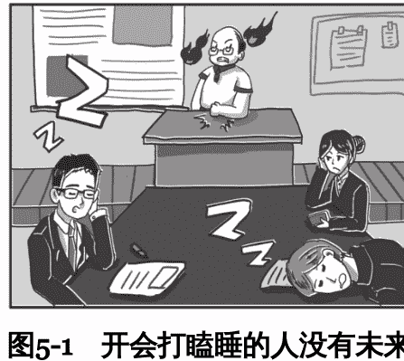

所以，开会的时候，困了，咖啡浓茶安排上，再不济风油精点上，一定要保证“坐姿端正、目光炯炯、奋笔疾书、频频点头。”

### 2. 开会是有效时间

就事论事地说完开会打瞌睡，石头想再多讨论两句。

开会打瞌睡这件事背后，其实是一个人对工作中有效时间的认识和把握出现了问题。

我们每天看似忙碌8个小时，有时还要“996”“白加黑”“五加二”，但真正有效的工作时间，实际上非常少，能有两三个小时集中注意力，真正在解决问题，在做有价值的事情，就很不错了。

有的时候在等别人交活，有的时候在等领导指示，有时候在晃悠，有时候在反复折腾。越是身处复杂的组织，付出的冗余时间就越多，而且你很难反抗。

琐事可以做，但要把有限的工作精力，花在有效的工作时间上。什么是有效时间，不好一概而论，但仅就职场来说，有个标准很重要，那就是这件事情领导能看得到，能对你产生长期价值。

比如，克服了心理障碍，鼓起勇气推开领导办公室的门，汇报了思想，领导也有正反馈；又或是上面刚开完某工作部署会，你写了一篇本系统如何落实的理论文章，上了系统的网站，大家反响不错。假如每天都有一件这样的事，长期来看那就不得了。

开会未必能实打实地解决什么问题，但对于你在职场的提升和成长来说，开会绝对是当仁不让的有效时间。石头前面也说了，你平时吭哧吭哧工作，领导未必看得到，起码大领导看不到。但有单位领导参加的会议，无疑是个展示自己的难得机会，宁可先把手头的日常工作放一放，也要精神饱满地出现在会场。

这样的有效场合、有效时间你都把握不住，还指望什么发展呢？

## 六、钝感力强的人走得更远

前几天，石头听说一个熟人辞职了。这位仁兄石头极为佩服，当过记者，文字能力特别强，本来，在单位也是很受重用的，经常承担一些急难险重的活，他也发挥特长，给单位搞出不少新口号、新花样，前景一片大好。

坏就坏在他的敏感上。因为一个业务上的小事，分管领导说了他几句，不知他是被表扬惯了还是怎的，他大概觉得丢了面子，当众跟分管领导顶了起来，两个人声音都很大，搞得领导下不来台，于是乎，趁着轮岗的机会，坚决把他调到了一个边缘单位，坐上了冷板凳。

他毫不觉得自己的行为有任何不妥，坚称自己是对工作负责、对事业负责，决不能忍受这样的调整安排，于是丝毫不考虑同事劝他稍微冷静，以求东山再起的建议，愤而选择了辞职，领导和单位竟然也毫不挽留，迅速给他办了手续。

石头认可这位仁兄的能力，但也预感到，像这样钝感力欠缺、“不皮实”的人，不管到什么单位，能力再强，恐怕也难有发展。

“钝感力”，这个石头非常喜欢、也时常念叨的词，其实是日本作家渡边淳一的发明。如果通俗点理解，或许就相当于我们平时挂在嘴边的“耐造”“皮实”。

按照渡边淳一的解释，“钝感力”可直译为“迟钝的力量”，即从容面对生活中的挫折和伤痛，坚定地朝着自己的方向前进，它是“赢得美好生活的手段和智慧”。钝感力有五项铁律：一是迅速忘却不快之事；二是认定目标，即使失败仍要继续挑战；三是坦然面对流言蜚语；四是对嫉妒讽刺怀感谢之心；五是面对表扬不得意忘形。

看上去有点鸡汤，但身处职场的长跑中，钝感力确实是一种非常宝贵的品质，你的命再好，总会有被批评的时候，总会有进步慢的时候，甚至可能有因为遇到一个气质不和的领导而被放弃的时候。在困境中、低落时，能否保持自信与坚定，保证自己的精气神不被打散，继续爬起来战斗，或许最终决定你能到达的高度。

### 1. 没有那么多人在意你

认识到“没有那么多人在意你”这件事，是培养钝感力的第一步。

有些人自我意识太强，总觉得别人在关注他、针对他，面对领导一个眼神，他们会胆战心惊，担心是不是工作没做好；跟领导打招呼，领导在忙没回应，他们会想是不是把领导给得罪了；稍微犯了点小错，别人压根都没注意到，他先自己脑补了最坏结果，比如，会不会一辈子翻不了身？会不会被领导打击报复？会不会要提拔的时候给我使绊子？

这样的人，对别人的无意之举太敏感，喜欢过度解读别人的言行，让自己活得小心翼翼，平白无故给自己很多压力。长此以往，精神状态堪忧，处处掣肘自己，啥事也做不成。

其实，你在这个世界根本就无足轻重，没有人指望你是不世出的圣人、白莲花，从自我出发，只要尽心尽力做了那就是好了，有什么问题，改正过来就好了。

### 2. 不怕挨骂

有些人面子薄、心思敏感，只要被领导批评过一次，负面情绪一下子都涌上来。觉得领导对自己有意见、不满意，觉得不服气、愤懑，觉得心虚、吓破了胆，如同惊弓之鸟一样，很长一段时间看见领导都恨不得绕着走，碰到连招呼都不敢打，食堂碰见就想装不认识，一起待一会儿就浑身不舒服。

其实领导当众批评也好，对你态度不好也罢，有时未必是针对你或者讨厌你，也许是为了杀鸡儆猴、树立权威，也许是因为太过倚重你，希望你做得更好，也许是他本人刚刚被上级批评而你恰好撞到枪口上。

石头就曾亲耳听一位领导说过：我有时候批评人，就是因为有一股“无名怒火”，于是就想“劈头盖脸”批评谁一通。尤其是刚上班的新人，很多时候经常挨骂并不是真的犯了什么了不得的大错，只是你们还没到那个别人可以高度容忍的岁数和地位。

新加坡没人敢在李光耀面前抽烟，但邓小平抽烟，抽之前礼貌地问了一句李光耀介意不介意，李光耀就很感动，然后立即表示不介意，这是地位带来的优势，要承认的。

做了错事，被批评是我们应得的，我们可以愧疚，自责，但用不着恐惧。或许那天批评你的事，他根本早就忘了，领导公务繁忙日理万机，你又不是他亲儿子，天天惦记你不是给自己添堵吗？

你如果一直被恐惧虏获，总是避着领导，哪里有机会修正自己的错误，改变领导对自己的印象呢。难道你只因一次批评就要彻底将自己放逐？这个买卖不划算。

你挨批评了，吸取教训是必需的，但不能让这件事成为心理阴影。“一朝被蛇咬，十年怕井绳”，导致不敢面对领导、不敢做事，你必须从内心消除这份恐惧感。

### 3. 无视议论流言

有人的地方就有江湖，尤其在一些单位，本身工作量不饱满，大家饱食终日无所事事，难免生出许多是非，再有几个难缠的老同志，就更麻烦。

有些人容易被同事之间的缠斗困扰，甚至花很多时间精力在这些纠纷上。别人背后说点儿风凉话，或是有点儿小议论，他就不淡定了，总想气势汹汹地找过去算账，甚至针锋相对，大战个三百回合。

石头总是劝他们，别人想说就说呗，不要往耳朵里去，更不要往心里去。人和人之间的差别，有时候比人和猴子都大，大家志趣不同、价值观迥异，对事物有不同的看法太正常了。遇到这些无关的人，可以在心里问两个问题：关你啥事？关我啥事？

有人在背后嚼你的舌根，说明你在单位比较火，这是大有前途、大有希望的表现，你肯定做对了一些事。如果你毫无前途，无足轻重，才不会有人费功夫编排你的段子呢。

你的精力本就是有限的，既然有限，当然要把精力用在领导身上。把精力花在与同事的纠斗，能有什么产出呢？

这就像做生意，你的资金得投在有希望的公司上面，一个公司马上要ST（被进行退市风险警示的股票），你非要跑去较劲，说我就是跟你卯上了，只能赔得一塌糊涂。你如果认认真真地把议论当成一个问题，去找人理论也好，互相告来告去也好，那么你就输了，因为你把精力投放在了无用的人身上。

要知道，解决一个问题的钥匙，往往不在问题里，而在别处。解决同事议论的问题，核心是眼睛朝上看。

在单位里解决同事问题的核心，也不在同事，而在领导和你背后的东西。比如，如果你是领导非常信任、经常表扬的人，谁会说你的坏话？谁会与你为敌？与你为敌，本质原因还是不忌惮你，觉得你没有发展前途，你没有领导撑腰，你没有领导信任。

也就是说，一个人在单位受不受欺负，其实跟他个人性格，或者跟同事相处得怎么样，没有根本性的联系。

所以石头给你的最核心的建议是，一定把精力放在领导身上，而不是与同事的缠斗上。跟领导相处好了，同事的问题自然而然就解决了。

至于对同事，可以怼一怼，可以假笑，可以让他吃软钉子，可以非暴力不合作，也可以告他的状，但这都不是根本问题，更不值得焦虑烦恼。

### 4. 正视职业生涯的低谷

曾国藩有句话，“事功之成否，人力居其三，天命居其七”，意思是成功是一种偶然，天命的成分占大头。在职场取得成就，并不完全取决于个人努力。

石头不敢说是不是“天命”占大头，但你必须承认，很多时候，个人的职业生涯不取决于个人努力，甚至都不取决于领导，而可能取决于上面的政策，单位的形势，取决于环境，取决于很多莫名其妙的东西。

相比个人的勤奋努力，有时候运势在生活中发挥着或许更加重要的作用。国家的运势，行业的运势，单位的运势，领导的运势，很多时候都是个体无法撼动和对抗的。

比如有些单位，上一任主管出了问题，这一任主管上级迟迟没有安排，结果导致这个单位所有干部一年半载都冻结着，这个时候你再怎么折腾也没有用。

这种情况怎么办？用人民日报原副总编梁衡一句话来和大家做一个告诫或者建议，就是：“能工作时就工作，不能工作时就写作，两者皆不能，读书、积累、思索。”

在面对我们努力也无法改变的困境时，不要随波逐流，也不要停滞不前，沉迷于打牌、玩麻将等成瘾性娱乐项目，继续坚持做事，从提高自身素质和能力着手。如果你真的在某一方面提高到一定程度，有一定积累，甚至达到顶尖，这种能力总是会找到一个出口喷薄而出的。

### 5. 有点胆子

体制内的工作对人的素质有很多锻炼和正面影响，比如，用全面发展系统联系的观点看问题，比如统筹兼顾、协调推进，比如照顾到前前后后方方面面。

但强调全面兼顾之后，就容易造成另外一种东西的缺失——胆子。缺胆子，是在体制内干时间长了之后的一个通病，尤其是跟在市场上摔打的人相比，畏畏缩缩，瞻前顾后，就更加明显。

石头最近也在反思，有胆子、敢出格，其实很重要。你想啊，期望比别人过得好，不做点出格的事、跟别人不一样的事，怎么可能实现呢？

可以适当给自己加点胆，提醒自己这方面可能是缺失的，只要是对的事情，不要害怕，敢于做点不一样的事，敢于出彩，敢于发短信，敢于拍马屁，敢于推门进，最后结果肯定会比别人好。

### 6. 平视建议

虚怀若谷，从善如流，在我们的语境中一直都是好话，意思是要听得进别人劝。接受这种价值观的人，会非常重视别人的建议，乃至最终背上沉重的负担。

本来自己干得顺风顺水、有滋有味，一旦有人提出建议，“我觉得你这样好”“我觉得你那样更好”“我觉得你应该如何如何”，马上脚步就乱了，不知何去何从了。

其实听劝这件事儿是有片面性的。提出劝告的人，可能由于自身水平、所站位置立场、掌握的信息等很多方面因素的局限，给出的根本是无效甚至有害的建议。

就石头目前的认知，对待别人意见建议的态度，最好是：听大多数人的话，参考少数人的意见，最终自己作决定。听大多数人的话，意思是你要有一种开放的心态，欢迎别人对你发表意见。但同时，你也要清楚这些意见中真正符合你的立场和实际情况的，真的有见地的，只是极少数，最后你要靠自己作出决定。

同理，你给别人提建议的时候，也要有心理预期，他能当成闲话听听就不错了，别非让人听你的，你可能压根就不了解真实情况。

### 7. 关心家人和孩子

在单位受了委屈，遇了挫折，如果有家人和孩子的支持安慰，也能帮助你尽快走出来，收拾心情再鼓斗志。

有人可能要问，平时教育孩子和工作怎么平衡呢？精力该放在哪上面呢？

其实，怎么平衡是微观操作层面的事，关键是要不要平衡，要不要一边倒向工作，孩子要不要抓？

石头个人的观点，必须要抓，还得紧抓、抓紧。不可因为工作荒废对孩子的管教。需知事业分两种，一种是终身的事业，一种是非终身的事业。

某人办了一家基业常青的企业，这是终身的事业，我不想下，谁都赶不走我，这事儿可以干一辈子，不信你看看王健林、任正非等诸位大佬。我们大部分人没有终身的事业，尤其是单位的工作，往往是非终身的事业。到了年龄，离开了位置，其实就是被踢出局了。

话语权、对资源的占有会不可逆地下降，这也是自然规律，是无法抗拒的周期。现在大家都长寿，后面还有几十年，而后几十年过得如何，真的与孩子行不行有莫大关系。从这个角度讲，工作要做好，不能以对小孩不管不顾为前提。

在古代，多生几个孩子是关系生死存亡的大事，现代社会好多了，保障好些，但好好教育孩子，也还是非常重要的事。

石头有时候在想，可怜的人类啊，为什么是一种复杂的碳基生物呢？碳基生物靠神经元传递信息，电流脉冲不稳定，所以总会产生复杂情绪。硅基生命，比如电脑和机器人，电流稳定，没有情绪，比我们要先进。

在职场，其实是硅基生命“机器人”“工具人”更受欢迎，机器人稳定，我说什么，你这个机器人照着做好就行了，哪有那么多情绪想法！

把自己当作一台机器，不被自己的情绪同时也不被任何人所左右，或许，就是碳基生命在职场的“硅基进化”吧。

## 七、如何避免成为一个乏味的职场老油条？

这两天冯唐先生的一篇文章在朋友圈传播，讨论的是如何避免成为一个油腻的中年猥琐男，说实话切中了不少包括石头在内迈向中年男人的要害。

第一反应当然是不爽，觉得简直是在侮辱人，油腻怎么了，还不是被家庭的重担压的，这也太埋汰人了。但冷静下来，翻看再三，又觉得后怕不已，想要质量更高的人生，确实要拼尽力气不去踩这些坑。

尤其是身处体制之中，工作性质使然，容易成为乏味油腻的重灾区。借着这个热点，石头自己捋了捋如何不成为一个乏味的公务人员，不是批判和狂欢，主要是和大家共勉。

- 不要让肚子挡住自己低头的视线。天天觥筹交错、推杯换盏，男公务员的肥胖问题更加触目惊心。在肚子上体现得尤其突出，不少人低头已经看不见自己的脚尖。或许，不一定要有八块腹肌，但至少不要到了一定年岁，金利来的裤带只能系在胸口了。
- 不要开口闭口就是提拔那点事儿。进步很重要，但世界上还有许多有趣的东西。人生真的并不是只为了一个处级来，还有很多重要的事。比如家庭、生活的乐趣、知识的增长、挣钱，等等。只要一说话就是“小王昨天刚提拔，他算哪根葱，入职比我晚，工作也不行”，真的很没劲。
- 没有提拔，也不要自暴自弃，自我放逐，提拔这个事儿什么时候是个头呢？好好工作，好好生活，好好读书，做点儿事，永远比熬夜打麻将强，说不定什么时候就时来运转了。

# 下篇 实践篇 秘书小蔡成长记

## 写在开头的话

大家好，我是小蔡，某委办秘书科新人，最初是石头哥在《秘书工作》杂志上虚拟的一个人物。自从到了秘书科，我一个“机关菜鸟”，在石头哥的笔下，从初来乍到，到得窥门径，再到渐入佳境，既经历了无地自容的尴尬瞬间、百爪挠心的慌乱时刻，也品尝过被领导表扬、被同事认可的甜蜜，我这里沒有指手画脚的说教，没有枯燥繁冗的理论，有的是一场“职场通关真人秀”，希望带给办公室同人最值得借鉴的职场故事，最简单易行的工作成长方式。

## 第六章 初来乍到

### 一、为啥不早点儿到呢？

早上7点钟，闹钟准时响了，市委办秘书二科科员小蔡伸手关掉闹铃，身体缩在暖暖的被窝里，盘算着8点才上班，家离市委近，路上撑死就15分钟……半梦半醒之间，7点20分了！

小蔡一个鲤鱼打挺坐起身，套上衣服冲出家门，奔向楼下的公交车站。看到路上长长的车龙，小蔡心急如焚。

8点整，小蔡气喘吁吁地跑进市委办公楼，径直奔向电梯，十几个人都在等电梯！小蔡瞟了一眼指示灯，嘿！竟然卡在了8层。考虑到电梯可能超重，小蔡一咬牙，爬楼梯去了。一路奔波，又爬了四层楼梯。小蔡上气不接下气、满头大汗还提心吊胆，终于赶到了办公室。真是怕啥来啥！一看桌上的电话，有市委焦副书记的未接来电，哪里还顾得上看一眼今天的日程，小蔡夹起笔记本就冲进焦书记办公室。

“领导，今天……”狼狈不堪的小蔡刚准备检讨，焦书记抬手打断了他的话，语气严厉地问：“今天下午三点有个基层党建专项部署会，需要我参加吗？怎么讲话稿还没有给我？”

小蔡一拍脑袋，叫苦不迭。前两天，焦书记在外参加党的十九大精神培训班，他就没再惦记呈送稿件这事。结果，培训结束的第二天，焦书记早早到了办公室，可小蔡自己却来晚了，根本没来得及查看工作安排，自然没来得及把稿子呈送焦书记。

“小蔡啊，老话说‘一早三光，一晚三慌’，在办公室工作，尤其从事秘书工作，凡事都要打好提前量。每天早到10分钟，也许人生就会大不同。供你参考吧！”焦书记语重心长地对小蔡说。

小蔡耷拉着脑袋退出了领导办公室，匆忙地投入紧张的工作中。

忙碌的一天很快过去了，小蔡摸了摸饿得扁扁的肚子，看了看电脑屏幕右下方的时间——18:30，原来都下班一个多小时了。饥肠辘辘的小蔡疲惫地伸了个懒腰，忍不住在电脑上敲下了一段感想：

每天早到10分钟，也许人生就会大不同。早到，能让工作更从容：查看工作日程表、列出待办事项；梳理见到领导有哪些问题需要请示汇报；清理办公桌、电脑文档；查看回复邮件；等等。不喜欢慌慌张张的自己，那就去做一个勤奋、敬业、上进、自律的秘书。

### 二、保证完成的任务，怎么就忘了？

周一下午，忙碌了一天的小蔡敲完材料的最后一个字，伸伸懒腰，瞥了一眼墙上的时钟，下班已过一个小时了。小蔡一一对照着记录本，确认今天的待办事项均已落实，心里不禁一阵轻松，哼着小曲收拾着包准备下班。

今晚，小蔡跟几个大学同学约好去一家新开的火锅店聚聚，想到这儿，小蔡似乎闻到了火锅的香气，心里也像开了花一样欢腾起来。

“丁零零……”电话不知趣地响了，等了三四声，小蔡有些不情愿地拿起听筒。电话那头传来市委办王副主任的声音：“小蔡还没走吧？后天上午八点整，市委焦副书记主持召开全市重大基础设施及文化项目建设进展情况汇报会，其中一个议题是讨论市委办上次牵头起草的本市文化产业发展调研报告，你们科当时拿了初稿，我把终稿发你邮箱，你打印30份装订好，交给综合科的小刘，他统一整理，后天会上用。”

小蔡一听，这件事倒不麻烦，便乐呵呵地领命：“好的，王主任，保证完成任务！”

挂掉电话，查收好王主任发来的终稿电子版，小蔡本想马上去文印室复印材料，可偏偏手机又开始响个不停，快七点了，几个老同学催促小蔡的微信一个接一个朝外蹦。小蔡权衡了一下，材料后天开会才用，明天早上再复印也来得及。于是，小蔡哼着欢快的歌儿直奔火锅店。

周三早上七点半，小蔡正坐在食堂吃饭，接到了王副主任火急火燎的电话，劈头盖脸就是一顿批评：“小蔡，什么情况？我周一晚上不是让你把材料打印好交给小刘吗？小刘怎么说你到现在还没有给他材料？”

小蔡眼前顿时一黑——坏了，周一晚上赶着吃火锅，想着周二早上再复印，结果周二一早就接到任务陪焦副书记去县里调研，忙着协调安排、跑前跑后，愣是把王主任交代的任务忘了个一干二净（见图6-1）。

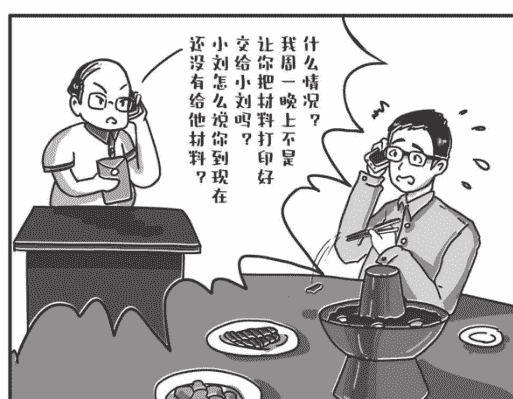

图6-1 保证完成的任务，怎么就忘了

好在离会议开始还有半个多小时，文印室几台机器同时开动，会议开始前15分钟，热气腾腾的复印材料总算按时摆上了会议桌。

事后，满怀愧疚的小蔡在日记上写下了一段话：

秘书工作千头万绪，时常会冒出一些临时性工作。如果任务耗时不算长，比如复印、转呈文件、发通知等，不拖延，马上就办；如果任务较复杂，一时难以解决，也要及时做好备忘记录。遵循“两分钟效率法则”：接到工作任务，先衡量这项临时性工作所需的时间，如果预计在两分钟左右完成，就中断原先计划去完成它，否则事情越往后拖越容易被遗忘。即使一直念叨着没忘，再回忆、找人、翻材料，也会耗费较多时间和精力，得不偿失。

### 三、随口一说要不得

下午刚上班，小蔡正对着电脑绞尽脑汁地写稿。“啪”的一声，一摞文件放到了桌上，吓了小蔡一跳。小蔡抬头一看，原来是文书科小王。小王行色匆匆地说：“这些都是今天送过来需要请焦书记批示的文件，你赶快给焦书记送过去吧。”话音未落，就头也不回地走了。

乖乖，十几个文件夹！小蔡大致扫了一眼文件内容，按轻重缓急捋了下顺序，就夹起文件走进焦书记的办公室。

焦书记正在接电话，看到小蔡怀里的文件，示意他放在办公桌上就好。

“丁零零……”不一会儿，小蔡就接到了焦书记电话：“小蔡，来一下。”

“好的，焦书记。”小蔡抓起桌上的笔记本快速走进焦书记办公室。

焦书记正若有所思地看着一份文件：“小蔡，你刚才拿来的一份文件，涉及向省里报送一份关于我市信息化发展规划编制的报告。我记得去年也曾上报过，好像是发改局在牵头，你有没有印象？如果有，我就直接批给他们阅处。”

小蔡慌了神，心里犯起了嘀咕：自己刚才着急把文件往领导那送，只是大概扫了一眼，根本没有仔细阅读内容，对焦书记说的文件印象不深，更不清楚省里对报告内容具体提了什么要求。焦书记说的是去年的情况，那时我还没入职，更是两眼一抹黑。不过，全市经济规划的相关工作，一直都由发改局负责，这一点倒是有印象。

“焦书记，产业方面的规划应该是发改局负责，这个报告确应让发改局来处理。”虽然小蔡语气笃定，但焦书记没有立即应允，反而放下了手中的笔，嘱咐道：“我印象确实有点模糊了，请你给发改局打电话确认一下。”

小蔡回到办公室，马上给发改局负责人拨了一个电话。确认的结果跟小蔡想象的完全两样。原来，统筹全市国民经济和社会发展战略、中长期规划和年度计划确实是发改局的职责，但具体到工业和信息化方面的发展规划和产业政策，一直由工信局负责。所以，这一文件应由工信局来处理。此外，经过查证，去年上报的材料也是工信局牵头起草的。

搞清楚了职责分工，小蔡深吸一口气，如实向焦书记汇报。焦书记意味深长地对小蔡说：“随口一说要不得啊，小蔡，你可得吸取教训！”

小蔡感到很羞愧，一头冷汗，回到办公室记录下了自己的反思和感想：

当个事事知晓的“万能”秘书不太现实。但不能图省事、想当然、凭感觉，不负责任随口一说。知之为知之，不知为不知。遇到拿不准的事情，应实事求是地向领导说明。比如：“这个还真拿不准，我去确认一下。”然后及时查询求证再向领导汇报。此外，对呈送领导的文件，也得做到心中有数，不能当“快递员”。

### 四、会场一分钟，弦绷60秒

“……下面，请市委马书记讲话！”

台上，主持会议的秘书长声音朗朗。小蔡绷了一周的神经总算松弛下来。近一周，小蔡每天早出晚归、披星戴月，筹备全市的工作会议，吃饭都是在食堂随便对付几口，已经好多天没去最爱的牛肉面馆打牙祭了。小蔡摸着瘪下去的肚子，真感觉自己瘦了三五斤。

还好，一分耕耘一分收获。这不，会前入场、签到、入席等环节毫无波澜。现在，书记已经在讲话了，小蔡仿佛看到一次圆满、胜利的大会正在不远处招手！

不一会儿，马书记讲完了，会议进入经验交流阶段。小蔡东瞅瞅西望望，大家都在全神贯注地听交流发言，还有三四位同志一会儿要上台，且得一段时间呢。于是，他蹑手蹑脚地绕到会场一侧的休息室，打算先把这次会议的通讯稿起草好。

正埋头写着，小蔡听到主席台上有动静，忙起身查看。这一看吓一跳，本来坐在主席台上的市委焦副书记竟从主席台上下来了。小蔡刚想冲上去，在前排靠边就座的王副主任已经迎过去了。

焦副书记手里拿着会议材料，对王副主任说着什么，看不出表情。一种不安涌上小蔡心头：出什么事了？材料有错别字？装订出问题了？眼见王副主任一边点头，一边把自己的会议材料递给焦副书记，焦副书记拿着材料重新回到主席台上就座。

王副主任没有立即回到自己的座位，而是环顾会场，似乎在找什么。小蔡连忙轻手轻脚挪到前排，小声询问：“主任，您找我？”王副主任压着嗓子说：“小蔡你怎么不盯住会场！你就在那边守着，别再跑了！”

小蔡一下子失了神，不住地在心里哀叹：“肯定是捅什么娄子了，怎么就没好好听会，急慌慌地去写什么稿子呀……”

会议还在进行，小蔡只能强打起精神，按照王副主任的指示，笔直地“盯”在会场旁。

“……今天的会议到此结束，散会。请获得‘优秀办公室主任’和‘优秀办公室工作者’的同志留步，到主席台合影留念！”

又是好一阵张罗，终于，大家都已就位，面露微笑，准备拍合影。坐在正中间的马书记忽然想起了什么，朝站在摄影师这边的王副主任招手：“王主任，你也是市委办的负责人，怎么不过来合影？”王副主任忙摆手：“书记，我这次是工作人员。”

马书记笑着说：“市委办的班子要整齐，赶紧搬把椅子过来！”

王副主任正打算回头找椅子，看见小蔡不知什么时候已经把一把椅子稳稳地放在了前排靠边的位置，王副主任赶紧过去坐定（见图6-2）。

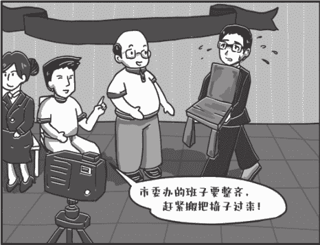

图6-2 会场一分钟，弦绷60秒

会后，小蔡跟王副主任一聊才明白，原来，开会时焦副书记不小心弄洒了桌上的茶杯，浸湿了会议材料，于是想找会务人员换一份。结果，他在台上瞅了半天，也没找到会务人员，只好自己下来换文件。“会务工作人员得站在领导看得见的地方，确保领导一呼就应才算工作到位。办会严谨细致、一丝不苟，不仅指会前筹备，开会时更应该时刻观察会场状况，一旦有情况立即处理。绝不能会议一开始，就先松懈下来。心态关乎成败，小蔡，这次你前面一时松懈，让领导走下主席台找材料，我们的会务工作就陷入了被动；后面你弦绷得紧，处理突发情况就及时，没有让大家等……”

王副主任的一席话，小蔡心服口服：我明白了，主任，身在会场一分钟，弦要绷紧60秒！

### 五、接电话的学问真不少

周四下午，小蔡接到王主任交办的任务：起草一份市委办保密工作总结。下周省保密局要来市委办检查保密工作，这是大事，小蔡不敢怠慢，当天晚上就开始动笔，周五又在办公室全神贯注地码了一天字。眼看快到下班时间，总结即将大功告成。

小蔡通红的双眼紧盯着屏幕，手在键盘上飞快地敲击着。这时，办公室的电话不知趣地响了起来。小蔡瞄了一眼墙上的挂钟，指针指向5点30分，他拿起电话，心中颇有些不耐烦，下班了还打电话，讲不讲工作规律和节奏？

电话那头传来一个语速快且较生硬的声音：“喂，通知一个会。”小蔡的脸不禁拉长了：“你哪里啊？也不说清楚就通知。”对方也意识到了自己的疏忽，赶忙自报家门。原来是省水利厅的同志，下周一上午临时召开一个防汛部署会，焦书记分管相关工作，这个电话就是通知焦书记参会的。

小蔡一听是上级单位，口气缓和了不少，心不在焉地听着对方报出会议时间和地点，脑子里盘旋的还是手头的稿子，标题到底提炼个啥好呢......

周一，焦书记一大早就出发去省城开会了。小蔡终于有时间静下心读读报，做一做报摘，充实一下写作资料库。突然，桌上的手机急促地响起来。小蔡低头一看，是焦书记的手机号。焦书记不是应该马上开会了吗？怎么还有时间给我打电话？小蔡有些纳闷，忙不迭地把电话接起来。

电话那头，焦书记十分严厉：“小蔡！你不是告诉我9点在水利厅报告厅开会吗？为什么来了以后一个人都没有？”小蔡脑子里一片空白：不会呀，周五下午通知的就是周一早上9点在水利厅报告厅开会，我听得明明白白啊！（见图6-3）

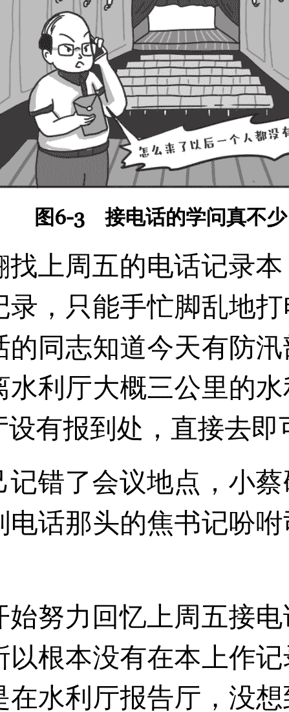

小蔡连忙翻找上周五的电话记录本，翻来翻去，发现自己压根没做记录，只能手忙脚乱地打电话到水利厅办公室。还好接电话的同志知道今天有防汛部署会，还告诉小蔡会议地址在离水利厅大概三公里的水利宾馆报告厅，会务组在宾馆大厅设有报到处，直接去即可。

原来是自己记错了会议地点，小蔡硬着头皮给焦书记回电话，只听到电话那头的焦书记吩咐司机赶快去水利宾馆就挂了电话。

小蔡这才开始努力回忆上周五接电话的情形：当时自己心不在焉，所以根本没有在本上作记录，听到水利厅就想当然地以为是在水利厅报告厅，没想到还有个水利宾馆报告厅！

下午，焦书记从省里开会回来了，小蔡第一时间赶去作检讨。焦书记说：“小蔡啊，你对人家的会议通知记得不清楚，但人家对你倒是印象深刻，负责会务的同志还跟我开玩笑说，你接电话时语气挺冲，吓得他们都不敢多说话了。”小蔡不好意思地说：“他开始也没说是哪个单位的，我态度确实不够好。”

焦书记点点头：“他们确实做得有不到位的地方。即使是上级单位，打电话时也应该自报家门。但是我们接电话也不能看人下菜碟啊，无论是接领导的电话、上级单位的电话还是同事的电话、群众的电话，都得礼貌、热情。小蔡啊，打电话虽然是隔空交流，但对方其实能够感受到你的表情，你是满脸笑容的，还是不耐烦的，别人一下就能听出来。接电话事小，但其中体现的工作态度和素养事大。你说是不是？”

小蔡认真想了想，若有所思地说：“焦书记，您说得对，以后打电话，我得让对方‘听’到热情的笑容。我向您检讨，这次搞错会议地点，也是我接电话时注意力不集中造成的，下次一定注意。”

焦书记接着说：“做办公室工作，记是基本功，脑袋不一定靠得住。只要是接电话，对方一开讲，你就要马上记。而且，对于电话通知中比较重大的事项，比如会议，你还要跟人家二次核实会议的时间、地点等要素，必要时还要整理书面来电记录，便于领导传阅和批示。其实，今天的会有好几个地市的人像我一样跑错了，这个小插曲也给我们提个醒，电话通知有时确实不如书面通知更清晰牢靠。”

小蔡听了心服口服，回来后写了一段心得：

接电话的学问可真不少，稍有松懈，就会捅娄子。今后接电话，涉及会议通知时，一定得问清楚，什么时间在哪里开会，有啥特别要求，不够清楚的及时跟对方确认，别怕啰唆。慎之又慎、讲究礼节，才可能接好电话。

### 六、“一个都不能少”？没必要！

上午刚上班，市委办就接到了省里通知，两周后省里有个专题调研组来调研全市文化创意产业发展情况。焦书记分管这块工作，自然是他来牵头筹备。

时间紧任务重，焦书记把小蔡叫到办公室布置调研筹备工作：“小蔡，明天上午我会主持开个协调会，把筹备任务布置下去，你梳理一下涉及的主要单位，尽快拟一个协调会的方案给我看一下。”

“好的，焦书记，我马上动手起草！”小蔡领了指示回到办公室，一边对照省里通知的要求，一边梳理这块工作所涉单位。不一会儿，他就拟好了协调会方案，看着会议方案上密密麻麻二三十个参会单位，小蔡颇为得意，心想：焦书记主持的会，还是按全口径通知比较好，显得对焦书记尊重，一个都不能少！（见图6-4）

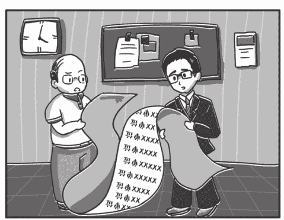

图6-4 “一个都不能少”？没必要

接过小蔡呈上来的方案，焦书记并没有露出小蔡意料中的微笑，脸色反而严肃起来。

“小蔡，我看你列了31个参会单位，要求他们的主要负责人明天上午九点来开会，有必要通知这么多单位吗？这里面还列了市电网公司，电网公司跟文化创意产业发展有关系吗？”焦书记的问题似乎正中小蔡下怀，小蔡胸有成竹地答道：“焦书记，这次省里的调研很重要，您也很重视，调研当天电力保障一定要跟上。所以，我考虑是不是也把电网公司请过来，让他们重视，做好保障工作！”

焦书记听了，摇摇头，严肃地说：“小蔡，你考虑到保障工作当然是对的，但是你这个协调会方案问题不少，是不是有点形式主义呢？”

见小蔡一脸茫然，焦书记开门见山地说：“第一，陪会的人太多。既然是协调会，请相关性高的几个牵头单位来就行了。你想想，电网公司的同志来了，发现前面两个小时的讨论跟自己没关系，能不在会场上玩手机、补瞌睡吗？对于工作相关性不大的单位，不一定非得一个不少请过来，打个电话提醒他们做好相关工作就可以了。”

焦书记顿了顿，接着说：“第二，议程安排得不精准。你列的这些单位，有些涉及文字材料起草，有些涉及现场调研，有些涉及后勤保障，分配的任务不同，需要研究讨论的事项也不同，但你在议程里一点也没有体现，大家一股脑儿都是九点过来，岂不浪费时间？比较科学的办法是，把议题分开，第一阶段讨论什么议题，涉及哪些单位需要参加，第二阶段讨论什么议题，涉及哪些单位需要参加，体现在协调会方案中，这样才能提高会议效率，没有必要会议一开始就一屋子人。”

小蔡听了焦书记的话，豁然开朗，红着脸说：“我总想着会议规模大、来的单位多，才显得对工作重视，忽视了提高会议效率，降低会议成本，减轻基层单位负担。”

焦书记点点头，补充道：“还有，你在会议方案上写的请单位主要负责人参加，我个人觉得也不一定。这次调研的是文化创意产业发展专项工作，请各单位直接分管该项工作的领导参加即可，不一定非得是单位一把手，不要为了所谓的‘面子’搞得大家疲于奔会。”

小蔡听了焦书记条分缕析的话，心服口服：“焦书记，不瞒您说，我之前在乡镇工作的时候，也抱怨过上面老是让我们参加并不太相关的会，还开玩笑说这种陪会就好比荒了自家田，去赶人家集。没想到进了市委，稍不注意，我也开始犯这种错误。”

说到这，小蔡欲言又止，迟疑了一下才鼓起勇气说：“焦书记，其实我还起草了一份提交相关材料的通知，原本准备一起下发给明天的参会单位，请他们明天来开会的同时提交一份本单位服务文化创意产业发展的总结。听您刚才这么一说，我才意识到，这个通知根本没有考虑到基层工作的实际，一点时间也没留，一旦发下去，就成了‘上午刚下通知，下午下班前就要交报告’的形式主义案例，肯定要被基层同志们鄙视的。”

焦书记肯定说：“你有这个自觉，说明已经进步了。你们作为市委办的秘书人员，很多时候要代表领导传达指示。但要记住，任何时候都不要颐指气使，更不能脱离实际情况发号施令，给基层增加不必要的负担。尊重基层，就是尊重我们自己！越是上级机关、中枢机关，越要当好反对‘四风’的表率、低调务实的典范、谦虚内敛的标杆，只有我们善待别人、包容别人、尊重别人，才能获得别人的尊重，才能树立上级机关的威信，你说是不是？”

虽然方案被焦书记完全推翻了，需要加班重做，但收获了沉甸甸成长的小蔡心里比吃了蜜还要甜，他咧嘴笑着说：“我明白了，焦书记，谢谢您。”

## 第七章 得窥门径

### 一、一篇稿子教我学会把握“度”

近来市里活动不多，焦书记又连续出差，小蔡的工作似乎进入了缓冲期，终于有时间静下心来研读老早就买回来的几本公文写作书了。

“真不错，一上午电话都没响过，好几天也没接到文稿写作任务了，晚上是不是可以约女朋友看场电影呢？”小蔡像一根长时间紧绷后松弛下来的皮筋，瘫坐在椅子上，心里美美地盘算着。

就在此时，桌上的电话响了起来，小蔡一瞅，原来是主任来电。

“主任，您指示！”小蔡忙接起电话。主任是通知一个会的：省里开展了半年多的专题学习即将结束，一周后市委常委会要召开专题民主生活会，主任让小蔡赶紧报告焦书记，请他按时参会，并准备好民主生活会对照检查材料。

焦书记还在出差，下周才回来。民主生活会是党内重要的政治生活，小蔡不敢耽搁，编写了一条会议通知发到焦书记手机上，焦书记的回复只有三个字：“我参加。”

放下手机，小蔡滚圆的脑袋转得飞快：焦书记下周出差回来，那时离召开民主生活会的时间只有几天了，他肯定没空写对照检查材料，正好这几天我比较清闲，不如帮他起草个代拟稿，免得领导辛苦赶稿子，等领导出差回来直接拿出来，肯定给他一个惊喜，说不定还夸我工作到位呢……

接连几天，小蔡像打了鸡血一样，天天泡在办公室查资料、想框架、磨文字，写对照检查材料到很晚才离开，熬得双眼通红。连保洁阿姨都关心地给小蔡丢下一包菊花茶：“小蔡，喝点菊花茶清清火，看你嘴角那大泡！”

要不怎么说写稿子得有面壁之功方有破壁之时呢。三天闭关鏖战，大功告成，小蔡情不自禁抖着飘着墨香的“焦书记民主生活会对照检查材料”，自我欣赏道：“完美！真像焦书记自己写的。”

这天，焦书记出差回来了。小蔡早早敲开了焦书记办公室的门，自信满满地将代拟的对照检查材料递了过去。

“焦书记，跟您汇报一下。之前跟您报告过，马上要开班子民主生活会了，我看您近期日程安排得太满，怕您没有时间动笔，就代您拟了一稿，仅供参考。”

焦书记有些错愕，迟疑了一下，接过小蔡递过去的材料，认真翻看起来。小蔡看着焦书记脸上逐渐浮现笑意，心里暗暗得意，看来起草对照检查材料这事办到领导心里了，耶！

果然，看完材料，焦书记表扬道：“小蔡，这份材料你下了功夫，写得很生动，文字也很凝练，你的文字功底还是很不错的。”

小蔡刚想谦虚，焦书记就从抽屉里拿出一沓手稿，交给小蔡：“但是呢，按照《县以上党和国家机关党员领导干部民主生活会若干规定》精神，个人对照检查材料必须我自己动手写，民主生活会是很严肃的党内政治生活，进行民主生活会这场考试，一定得遵守相应的规章制度。你帮我写个人对照检查材料，就成了替考、代考，这样肯定不行。其实，我这几天在外边出差，晚上都在房间写对照检查材料，已经写好了。还要请你再辛苦一下，帮我做个录入，我打字太慢。”

小蔡看着焦书记递过来的手稿，开始有些失落，转念一想，又由衷佩服：原来，焦书记一接到会议通知，马上就按要求开始自己动手准备材料了。倒是自己，太想表现，没有把握住秘书协助领导工作的界限，一不小心“越位”了。

小蔡释然地对焦书记说：“焦书记，您说得很对。记得我刚到市委办的时候，知道您喜欢打乒乓球，一般周五晚上会运动运动，我就给活动中心打电话，让他们每周五晚上给您留一张乒乓球台。那次您很严肃地批评了我，说我没把握好协助领导工作的界限，秘书的任务是协助领导开展政务工作，不是私人助理，更不是跑腿的，私人的事不能代劳。这次的事也教育了我，工作中也有不少事情，比如这次的民主生活会，我不能自作主张，更不能越俎代庖，否则就会违反纪律。”

焦书记笑盈盈地补充道：“小蔡，你领悟很快。习近平总书记说过，秘书人员要经常检查自己思想、工作‘到位’的情况，不能‘离位’，更不能‘越位’，要做到‘参与而不干预、协助而不越权、服从而不盲从’。他还说，只要把握好这个‘度’，就能成为一个合格的称职的秘书。我觉得，‘度’既是对秘书人员的忠告，更是对秘书人员的爱护啊！小蔡，你也要认真体会这个‘度’字啊！”

虽然稿子领导没有用，但小蔡觉得稿子并没有白写，一篇稿子学会一个“度”字，值了！

### 二、服务领导，不是当保姆

“您所乘坐的CA××××次航班现在开始登机⋯⋯”机场广播里传来甜甜的女声。正竖着耳朵听的小蔡连忙从座位上站起来，提醒坐在旁边的焦书记：“焦书记，开始登机了。咱们是不是可以去登机口了呢?”

焦书记站起身，想拿自己的行李，却发现行李早已被小蔡牢牢抓在手中。焦书记伸手去取，小蔡却怎么也不松手。“焦书记，我身强力壮，您就让我拿吧。”焦书记哭笑不得：“小蔡呀，你这一路已经抢了我好几次行李，真拿你没办法。”

这是小蔡在市委办工作一年多来，第一次陪焦书记出差，是去北京参加一个座谈会。出发前焦书记交代小蔡：“不用管我，把你自己管好，把会议材料管好就行。”

小蔡哪敢怠慢，做了很多功课，还专门打电话向在深圳给老总当助理的中学同学小陈求教。小陈打小就“会来事儿”，小蔡听说他现在经常陪老总出差，把老总“伺候”得很好。小陈隔着手机跟小蔡“喷”了一个多小时，把他陪老总出差的小心思“和盘托出”，比如要背双肩包，腾出双手方便帮领导拿东西；到了房间赶紧帮领导递拖鞋、烧开水，让领导感受到家的温暖；随机应变帮领导过滤环境，营造轻松愉悦的出差氛围；时刻关注接待规格，千万不能让对方把领导看扁了⋯⋯

临挂电话，小陈还再三叮嘱：“小蔡，你可要把握住机会啊！我们老总说过，他就是通过出差来‘考察’下属的。”

小蔡听了直犯嘀咕，觉得小陈的这些“套路”也太溜须拍马了。但第一次陪领导出差，自己心里确实没底，于是狠下心来决定“如法炮制”。

下飞机后到了宾馆，小蔡和焦书记一起办理完报到手续。小蔡又陪着焦书记到了房间，把水给烧上，空调打开，做完了这些，还在焦书记的房间里转来转去舍不得离开，一心想找出哪里还不够温馨。

焦书记见小蔡还在到处拾掇，说：“小蔡，这是我自己的事儿，你真的不用管我。你先回去把稿子按我们在飞机上说的改一改，我也再熟悉下相关材料，咱们集中精力，明天把会开好！”从焦书记房间退出来，小蔡看到电梯口有几个人探头探脑，就上前打听，原来是几个本市籍贯的在京商人跑来找焦书记，想跟焦书记汇报一些“合作设想”。小蔡想，大晚上的，这不打扰领导休息嘛？！作为随行人员得帮领导“过滤”掉啊。于是小蔡挡驾道：“我是市委办派过来的工作人员，焦书记有公务明天才过来，你们先回去吧。”

那几个人虽然遗憾，却也只能怏怏离开。小蔡心里暗自得意：“还好我把关及时，给领导减轻了不少负担。”

回到自己房间，小蔡拿出刚领的会议手册仔细翻看起来，主办方把焦书记安排在第二天上午第四个发言。小蔡圆圆的脑袋又琢磨开了：我们市不管从经济总量还是知名度上，都要超过前几个地区，凭什么就把我们放在后面，焦书记看到，会不会觉得规格不够？小蔡抓起电话就给会务组打电话，会务组解释，都是按发言主题的逻辑排的，并不是给各个市“排座次”。小蔡却坚持要把焦书记的发言顺序调到最前面。会务组年轻的工作人员被他缠得没有办法，只好答应跟领导汇报，看能否调整。小蔡心里熨帖极了，觉得自己又立了新功。

“咚咚咚”，门外有人敲门，小蔡踏上拖鞋，慢悠悠晃过去开门。没想到门外竟然是一脸严肃的焦书记。小蔡有种不好的预感，估计自己哪里做错了。

果然，焦书记进屋坐下后开门见山：“小蔡，这次出差你工作很主动，这是好事，但我觉得你有‘跑偏’的问题，我得叮嘱你几句。一是谦虚而不谦卑。你为我服务，主要是保障我的工作，而不是给我当保姆，提包、烧水这些事我自己干就行。二是圆通而不圆滑。有些时候我们工作确实需要变通，但这指的是讲究方式方法，而不是欺骗他人。家乡的商人想回家乡投资，这是好事，我不一定方便见他们，但你也不该撒谎说我不在，而应该帮他们对接招商部门。三是到位而不越位。刚才会议主办方说我要调整发言顺序，搞得我一头雾水，一问才晓得是你给人家打了电话。但我根本没有这个意思，你这就是越位了。谦虚而不谦卑，圆通而不圆滑，到位而不越位，这是我年轻时给行署老专员王老当秘书，第一次见面时他送给我的三句话，我终身受用，今天我也送给你。”

小蔡听得心服口服，同时也不由得松了口气，还好焦书记提醒得早，没有造成更大的尴尬。

### 三、处处留心皆创造

小蔡从焦书记屋里出来，回到办公室，情绪明显不对。

科长一看，关心地问小蔡：“怎么了小蔡，脸拉这么长，都快掉地上了，又捅什么娄子了?”小蔡把手里的稿子往桌上一放，沮丧地说：“写了三四天的稿子，结果一眼被焦书记看出两个错别字。没有表扬不说，还被批评了一顿，说我工作不细心。这下，我可算明白老笔头们说的，‘没有错别字是1，其他都是0’。”

科长走过来拍拍小蔡的肩膀安慰他：“你送稿子之前没有校对吗?”

小蔡委屈地说：“校对了，我还读了好几遍，但是熬夜熬得两眼发直，根本校不出错别字，怎么办?”

科长若有所思：“这确实是一个问题，我也在考虑。自己写稿子写得头昏眼花，思路、语言都太熟悉了，很难发现错别字。应该有一个长效机制，彻底解决这个问题才好。我们都回去好好思考一下。”

科室的小刘两手一摊：“能有什么好办法，这么多年都这样，写的越多，错就越多，除了自己多看几遍也没有什么好办法，说到底还是责任心问题。”小蔡听了没吱声，思绪已经飘远了。

第二天一上班，小蔡兴冲冲塞给科长两页纸，科长一看，标题是《关于在文稿校核中设置AB角的建议》。

小蔡两眼放光，滔滔不绝起来：“科长，根治错别字，依靠单兵作战、打游击不是长久之计，我觉得还得探索新机制，把团队的力量调动起来。这是我的初步想法，跟您汇报一下。我们科室同志可以两两组对，互为‘AB’角。A角为某项文稿任务主办人员，负主要责任，B角为协办人员，负次要责任。两人在文稿写作、校对中互相协助、互为补充。每次文稿上报前，AB角互相进行校对。我觉得通过这样一个设计，把相互校对这项机制固定下来，一定会有助于消灭错别字！”

旁边的小刘听了，一拍大腿：“这个办法不错啊！”科长同样点头说：“小蔡，你这个办法不错，我觉得AB角还可以继续拓展，不光是对文稿写作、校对，其他工作也是一样，一人因事离岗前，要交代好工作，另一人在其离岗期间代为行使岗位职责，确保工作无空档。遇有紧急任务或重要工作时，AB角协同处理。”

秘书科试验了一段时间“AB角”，错别字的出现率明显下降。大家都见识到了创新的成果。科长借机把大家召集到一起：“大家再提一提，咱们的工作在流程、内容等方面还有哪些可以改进的地方？”大家七嘴八舌，很快又梳理了不少亟待解决的“痛点”。

小刘说：“我提一个，咱们应该建一个公共文稿资料库。现在我们写稿子都是各写各的，相互之间不通气，每次我想参考别人的稿子，都需要拷贝一堆资料过来，能否建个科室内部的共享文件夹，把有借鉴价值的稿子整理好，分门别类放里面，大家可以随时学习参考？或者，现在有很多企业云盘，咱把不涉密的放进去，随时随地都能看，也来个‘云上办公’？”大家纷纷表示这个建议不错。

小张说：“咱们秘书科还管着市委办的几个会议室，关于订会议室，我有一个想法。每次不熟悉会议室布置的人来订会议室，都要反复问咱们，这个会议室能坐多少人？桌子怎么摆放？有没有音响？咱能不能做个所有会议室的简要示意图，把空间大小、座椅数、设备标清楚，大家一目了然，咱也能少费些口舌。”对此，大家频频点头。

小马说：“我特别爱研究手机APP，发现有几个语音录入、文字识别、日程管理、文件搜索的软件特别好用，能提高效率，待会儿我推荐给大家。”

大家喜出望外：“小马，干脆建个微信群，快发给我们！”

会后，科长欣赏地对小蔡说：“你看，都说办公室工作要严格按流程、规矩、规章制度办事，但只要对推进工作有实际效果，新的方法和流程，我们都得大胆去想、去试！”

### 四、工作靠不靠谱，就看这三点！

“人倒霉，真是喝凉水都塞牙缝。”从科长那儿回来，小蔡往椅子上一靠，有气无力地吐出一句话。

坐在对面的老张抬起头同情地看了小蔡一眼，本想安慰两句，却一时想不出好的说辞。他知道，这几天，密集的批评压得小蔡有些喘不过气。

先是焦书记不满意，批评小蔡心不在焉。

小蔡接到任务，要起草焦书记在本市某爱国主义教育基地落成开放活动上的致辞。动笔前，焦书记特地把小蔡叫到跟前面授机宜：“小蔡呀，我的想法跟你碰碰，主体部分可以讲三个方面的意思。第一，说一说基地建成的意义；第二，回顾一下我市光荣的革命传统；第三，就新时代弘扬爱国主义精神发出倡议……”焦书记话音未落，小蔡这边一个响亮的喷嚏直接打断了焦书记的话。

“小蔡，感冒不轻啊，我刚才说的三点都清楚了吗？”焦书记关切地问。

小蔡看看手里的笔记本，刚才一直想按捺住尽量不把喷嚏打出来，根本没听清第三点。想张嘴问，又怕焦书记责怪自己没有认真听。

小蔡咬了咬嘴唇，支支吾吾地说：“嗯嗯……”出了焦书记房间，小蔡立马后悔了：刚才应该问清楚的。但转念一想，材料逻辑主线比较清楚，我就帮焦书记发散一下吧。

小蔡交稿的时候，焦书记扫了一眼有些不乐意了：“小蔡，我说的第三点，是要就新时代弘扬爱国主义精神发出倡议，你怎么写成‘不断扩大爱国主义教育基地的影响力’？”

小蔡知道责任完全在自己，只能老老实实检讨，当时没听清，却又害怕领导责怪，没敢再问。“连任务都没搞清楚，心不在焉！”焦书记丢下这句话，让小蔡拿回去改。

再是主任发了火，说小蔡盯不住事。

快到年底了，主任交给小蔡一项重要工作：梳理一年来焦书记分管各部门落实常委会决议、领导批示件的情况，进度慢的要赶紧督促。小蔡不敢怠慢，老早就发下通知，请焦书记分管的各个部门尽快提交常委会决议和相关批示件的办理情况。

眼看到了截止期限，其他部门都提交了，只剩农业局了。小蔡打电话过去催，农业局办公室主任老陈的态度热情得不得了，一口一个老弟地叫着，又是诉苦又是摆困难，请小蔡宽限几天，再多给他一周时间。小蔡想到老陈一直待他不错，主任似乎也没盯着要，恐怕也没有那么急，于是就答应再给老陈些时间。

不承想，还没过两天，主任就火急火燎地打电话找小蔡要统计表。

原来，市委决定近期开会，统一研究部署常委会决议落实情况，加强督办，统计表必须马上汇总。小蔡硬着头皮给老陈打电话请他马上交表，老陈哪能马上拿得出手。小蔡只得如实跟主任说了情况。主任这下可急了：“这么重要的事你都盯不住，有问题也不早说，拖到现在，你严重影响工作进度了知道吗？！”

今天，科长竟然拍了桌子，说小蔡把不住关。

秘书科牵头起草一份重要文件，大家费了很多功夫，反复打磨，层层修改，终于定稿。常委会审议前，科长打印了一份定稿，让小蔡去文印室复印20份，供会上讨论用。这还不简单？小蔡很快就把尚有余温的材料交到了科长手上。

科长问小蔡：“检查过了吗?”小蔡心想，复印机都是自动打印装订的，这么先进的机器能出什么问题，于是信心满满地对科长说：“没问题。”

结果，不知是复印机卡纸还是什么原因，材料的中间一页只印出来一半，下半部分竟然是空白。这份有瑕疵的材料发到了统战部王部长手上，王部长一拿到就发现了。

还好，工作人员马上给王部长替换了备用材料。散会后，科长跟小蔡拍了桌子：“你不是检查过吗，怎么还出了问题?常委会上的复印材料都把不住关!”

“张哥，你说我是不是就是个不靠谱的人啊?!”小蔡沮丧地跟老张吐露心声。老张站起身拍拍小蔡肩膀，安慰他：“小蔡，你别灰心，靠谱哪里是什么性格，靠谱是一种闭环意识。有人说靠谱就是早请示晚汇报。其实，哪有那么简单，我个人总结，靠谱一定要把住首尾相连的三个环节：首先，接受任务的时候，不要光点头说好，埋头干活，一定要问清楚、记清楚、搞清楚这项工作要求的是什么标准、什么时间。最好能把领导的要求再复述一遍，请他确认。你被焦书记批评，就是这个环节没做好。其次，任务推进的过程中，要盯得住，发挥主观能动性去推，无论是遇到问题还是取得进展了，都要及时反馈。在电脑上下载文件，电脑还会显示下载进度条呢，何况我们干工作。你被主任批评，就是这个环节没做好。最后，工作出手的时候，要停一停，认真复核一遍，你交出去的活儿，必须是经过仔细检查的。你被科长批评，就是这个环节没做好。”

小蔡听了老张的话，如拨云见日：“张哥，我明白了，工作靠不靠谱，就看这三点! (见图7-1)”

## 五、有话真得好好说

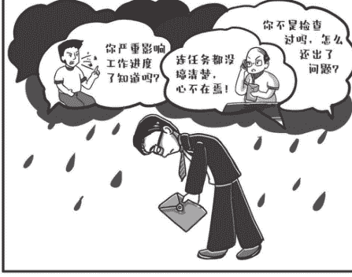

年底了，又到了“洛阳亲友如相问，就说我在写总结”的时段。各项工作任务纷至沓来，秘书科更是天天“兵荒马乱”的样子。

小蔡手头攒了好几个大稿子要写，从早到晚坐在电脑前不挪窝，都四五天没洗澡了。

小蔡不禁感慨，还好找女朋友下手早，否则现在这副尊容，哪有女孩子愿意多看一眼？

加快推进、深入开展，大力……再想个什么词儿呢？眼看到中午了，小蔡的脑子有点卡壳，可交稿时间迫在眉睫，只觉得越来越烦躁。

这时，机关党委的刘科长走进了秘书科，发现大家都忙着手头工作，没人注意到他，只好敲敲门：“大家都在忙啊！”

坐在门口的小马站起身问好：“刘科长，什么风把您给吹过来了！”

刘科长笑道：“小马，上周我们发了通知，让各科室统计科室党小组2018年开展活动的情况，你们弄好了吗？下班前得提交啊。”

小马指指里屋的小蔡说：“我们科长把任务交给小蔡了。”

刘科长大步走到小蔡电脑前，小蔡打字打得正入神，丝毫没有停下来的意思。

“小蔡，你们科的党小组活动情况统计好了吗？”被怠慢的刘科长有些尴尬，只得敲敲小蔡的办公桌。

思路被打断的小蔡有点愠怒，不客气地对刘科长说：“您看我们秘书科忙的，大家都是满负荷工作，根本没时间。再说了，这不还没到截止时间吗？”

刘科长莫名其妙碰了钉子，也火了：“别的科室都交了，所以我才过来提醒你们，只剩半天时间，你赶出来的东西质量有保证吗？再说，谁不忙？年底大家都很忙。你下午要是交不了，我们只能如实跟领导报告了！”

刘科长的话，让小蔡气不打一处来，站起身来还想反驳：“这是什么意思……”

话音未落，秘书科科长不知道什么时候回到了办公室，拍了拍刘科长的肩膀，嬉笑着对刘科长说：“兄弟啊，你平时一年也不来一回秘书科，咋一来就催任务了啊。总结党小组的工作，我们哪敢怠慢，上次开完会我就布置给小蔡了。可小蔡确实手头还有好几个大稿子，特别是有个明天上午要用的会议讲话，早上主任又刚提了一大堆意见，小蔡正在修改呢。谢谢你提醒我们，我们马上分头弄，按你们的要求抓紧统计，一定在截止日期之前交给你，你看这样行吗？”

听了这番话，刘科长的气消了一大半：“你们平时就很忙，哪里敢来多打扰，这次只是友情提醒。谢谢科长对我们工作的支持，辛苦秘书科的同志们了！”

科长把刘科长送出门口，回过头对小蔡说：“小蔡，别冲动，大家都是同事，有困难你也应该好好说话。这事儿中午大家商量一下，党小组的总结任务我们来分担，你先赶紧把这些材料给焦书记送过去。这些是下周需要领导们集体参加活动的几个方案，年底了活动比较密集，你好好看看。（见图7-2）”

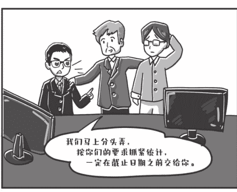

图7-2 有话真得好好说

小蔡似乎还沉浸在刚才的事里，没回过味儿来。接过材料后，简单翻了翻就敲开了焦书记办公室的门。

“焦书记，有几个会跟您汇报一下……先是周四要开一个全市党风廉政建设总结会……然后这个……周一，对，周一有一个市委中心组学习会……”

焦书记皱起了眉头，挥挥手打断了小蔡：“小蔡，下周总共几个会？你这一会儿周四，一会儿又周一的，把我给绕糊涂了。你就告诉我总共有几个会，会议时间在周几，分别是什么内容就行了！”

小蔡意识到自己语无伦次有失水准，顿了顿，重新组织了语言。

“焦书记，跟您报告，下周会比较集中，总共有四个会需要您参加，一是周一的……，您需要……；二是周三的……，您需要……”

这次，焦书记对小蔡的汇报赞许道：“这样说我就清楚了。汇报工作，一要准确，把关键信息说清楚；二要有逻辑，千万别东一锤子西一榔头的，得条分缕析地说。”

下班回到家，小蔡在日记本上写下了如下心得：

有话真得好好说。工作中会面对很多棘手问题，无论何时都需要以积极的心态应对，用乐观的态度沟通，把真诚和热情写在脸上。

跟领导说话，要先想后说，突出重点，逻辑清晰，切忌“眉毛胡子一把抓”。这才是秘书工作中的“会说话”啊！

## 六、调研不是摆样子

中巴车还在乡村公路上颠簸，焦书记转过头对王主任说：“这次调研，市委办安排得很好，了解到不少真问题，也看到了不少好经验，要记一功。”

王主任接过话：“小蔡牵头办的，细节把握得很到位。”

小蔡连忙笑着摆手：“都是主任带着我办的！”

小蔡说的是心里话，要不是王主任手把手教，真不知道这次调研闹出多少笑话来。望着车窗外闪过的白杨树，小蔡的思绪禁不住飘回到一周前。

那天，焦书记提出要去某山区县看几个农业产业化的点，开一个调研座谈会，把基层干部、企业负责人叫到一块儿，听听大家对市里农业产业化工作的意见建议。王主任把协调组织这次调研的任务交给了小蔡。

接到任务后，小蔡急得直搓手，恨不得马上给县里打电话，毕竟这是自己第一次牵头服务调研，千万不能出岔子。

王主任见势，赶紧拦住小蔡：“小蔡，你别着急，调研的主题怎么确定，准备看哪些地方，陪同人员范围，大致时间安排，你心里有数了吗？连基本方案都没有，你怎么通知县里？县里不了解我们的需求，到时候出现调研非所需、所看非所想的情况，时间成本、工作成本就高喽！”

小蔡暗暗佩服，还是主任考虑周全，与其零敲碎打地沟通，不如先拿一个初步调研方案，这样跟县里沟通起来效率更高。“主任，明白了，我马上去拟方案。”

做方案对小蔡来说轻车熟路，当天下班前，小蔡就把调研方案草稿交给了王主任。主任扫了一眼，抬头问小蔡：“基本可以，不过，为什么调研点还安排了休闲旅游区？还有，陪同人员为什么这么多？”

小蔡似乎早料到主任有此提问，不慌不忙道：“这个休闲旅游区是最近特别火的一个乡村旅游点，他们靠拍短视频宣传旅游，吸引了很多外地游客，我琢磨着是不是顺便去看看？至于陪同人员，太少了是不是显得咱市委办不够重视？”

王主任摇了摇头：“小蔡，你记住，调研目的要聚焦，一切活动围绕主题来安排，一天时间咱们能摸到些农业产业化的情况就很不错了，这个安排建议删掉。”

小蔡仔细一想，确实“跑偏”了。

“还有，陪同人员太多了，像你这样搞，不成了‘组团式调研’了吗？实际上，无关的人越多，调研效果越差，调研队伍一定要精干，陪同人员你再调整一下。”

主任接着叮嘱小蔡：“你再跟县里强调一下，这次调研，各个调研点不用准备展板、汇报材料这些东西，焦书记强调了，就到生产一线、车间厂房去看，不听汇报，不翻档案资料；另外，每个调研点预留的交流时间要充分，让大家坐下来好好聊聊，不搞那种‘导游’领着转的‘旅游式调研’！”小蔡一边听着主任的话，一边在笔记本上飞快地记，心里十分佩服：“这些都是搞调研的真经啊！”

……

“小蔡，你想啥呢？我刚布置的事你清楚了吗？”沉浸在回忆中的小蔡瞬间被拉回了现实，发现王主任正笑盈盈地看着他。

“主任，我刚刚走神了，您有什么指示？”

“小蔡，你的任务还没结束呢！一场调研，关键看最后形成的调研报告是否有分量、有价值，能不能让调研成果更好地推动工作。绝不能一路看、一路过，没有形成任何有价值的调研成果，这就流于形式了。你回去还要下功夫好好打磨调研报告，拿一个初稿咱们一起研究，可别随便整一个花架子啊！”

“主任您放心，有了这次扎扎实实的调研，我手上‘弹药’充足，有信心拿出一个不摆样子的报告！”

## 第八章 渐入佳境

### 一、“钻”，比动笔更重要！

翻着手机上的日历，看着屏幕上一片空白的文档，小蔡不禁有些心慌。坐在对面的老马看到小蔡的神情，打趣道：“小蔡，碰到硬骨头了吧？这几天要熬夜了。”

小蔡挠挠头，满面愁容地说：“马哥，我还真不怕熬夜，只是第一次主笔这种大稿子，心里有些发怵，不知道从什么地方着手。哎，憋了一上午，也没敲几个字。”

元宵节前后，市里要开全市工作部署动员大会。主任把为郑书记起草大会讲话的任务交给了小蔡。像这样的大稿，小蔡还是第一次担纲。压力越大，越没思路，这不，打开文档一上午了，一句话也没有敲出来。

桌上的电话响了，电话那头是主任：“小蔡，今天下午市委开务虚会，你去旁听一下。”

小蔡迟疑了一下，还是鼓足勇气说：“主任，我正在写您布置的讲话，还有不到一周就要开会，时间已经很紧了，您看，要不我就不参加了，专心写稿子？”

“你啊，磨刀不误砍柴工。让你去旁听，就是想让你好好领会一下领导们的思路，对今年的重点工作有一个全面把握！”主任笑着给小蔡解释了一番。

小蔡恍然大悟，原来让他参会另有深意：“多谢主任，我一定按时参加！”

老马热心地叮嘱道：“主任是让你听会吧，赶紧把录音笔找出来带上，领导一开讲，你就开录，尽量原汁原味地把领导的话记下来。这对你写稿子的帮助可大了。”

下午的务虚会一直开到晚上七点多才散会。小蔡的肚子饿得咕咕叫，内心却充实极了。会上，领导们畅所欲言，提了很多对市里工作的设想，谈了不少重点工作。听完这次会，今年的动员会讲话稿怎么写，小蔡心里已经有谱了。会上领导们语速快，小蔡有不少地方没记清楚，还好听老马的话带了录音笔，小蔡准备赶回办公室，趁热打铁把录音稿整理出来，再琢磨研究一番。

主任叫住了他：“小蔡，来我办公室一趟，有东西给你。”

回到办公室，主任先是问小蔡：“怎么样，听会收获挺大吧？”

小蔡眼睛都亮了：“主任，太受启发了，我之前闭门造车对着电脑憋稿子，路子完全不对啊！”这时，主任递给小蔡一个优盘：“看来你找到点感觉了，再给你一个宝贝，这里面是郑书记一年来大会小会讲话的录音整理稿，还有公开发表的文章。回去好好研究一下，郑书记讲话的风格和焦书记不太一样。”

第二天一大早，主任的电话就追过来了：“小蔡，你研究郑书记的讲话，有哪些心得？”

“郑书记讲话就像拉家常一样，娓娓道来，比较平实，重数据分析，喜欢用数字说话。另外，郑书记比较喜欢谈问题，在这方面我可能还要多下功夫，把目前市里经济社会发展面临的问题重点梳理一下。”

主任在电话那头笑出了声：“小蔡，你这次学习蛮有成效嘛。给领导代拟讲话稿，一定得符合他的风格，这绝不是坐在办公室里拍脑袋就能想出来的。我个人体会，写稿子得学会‘钻’：一是‘钻’到会里面去，尽可能多地参加一些领导出席的会议和调研活动，做好记录；二是‘钻’到文里面去，多研究领导之前的讲话和平时撰写的一些重要文章。在‘钻’的过程中，感受和贴近领导的思维、逻辑和文风，这样才能‘适销对路’……”

挂了电话，小蔡重新打开了昨天的空白文档，默念：“‘钻’，比动笔更重要！”

### 二、“兵荒马乱”的一天

小蔡早上刚到办公室，就喝了一大杯咖啡，但还是困顿不堪。本想尽快把焦书记的一篇讲话稿改完，但脑子怎么也不听使唤，仿佛一团糨糊，个把小时过去了也没改几行字。此时的小蔡，越发后悔昨晚刷手机折腾到凌晨才入睡。

小蔡拖着沉重的双腿站起来倒水，路过老马身边，只见老马把键盘敲得噼里啪啦响，一副精神饱满的样子。小蔡忍不住问：“马哥，您这状态也太饱满了，刚布置的主持词您就要弄完了？”老马往椅背上一靠：“是啊，我五点起床，早上还跑了三公里呢！”小蔡瞠目结舌：“跑步了还不累？我要跑三公里，估计得喘半天。”

“小蔡，跑步啊，是越跑越精神！”

办公室的电话响了，是焦书记：“小蔡，你通知上次农业产业化座谈会参会的三位专家，市委党校胡教授、市职业大学曹教授，还有农科院的王教授，请他们下午来我办公室。还有几件事想听听三位专家的意见。直接通知专家本人就行。”

上次座谈会是小蔡通知的，应该存过三位专家的电话。小蔡连忙去翻手机通信录，一看，竟然没存。没办法，只能给三个单位的办公室打电话。

职业大学办公室一直没人接电话，不知道人跑到哪儿去了。农科院的倒是接了电话，不过小伙子业务不熟，半天也没查到王教授的手机号码。

焦书记是个急性子，见小蔡半个多小时还没回话，电话立马追过来了：“怎么样，小蔡，三位专家下午能过来吗？”

小蔡只能硬着头皮告诉焦书记：“焦书记，正在联系，党校的胡教授可以过来，还有两位老师没联系上，一旦确定我尽快报告您！”

还好焦书记没说什么。

小蔡突然想起，上次座谈会科长也参加了，科长会不会存了几位专家的联系方式？果然，科长手机里都存了。小蔡注意到，科长的手机通信录中每个专家的备注都很详细。

小蔡好奇地问：“科长，您通信录的每个人都备注得这么详细吗？”

“是啊，这不应该是‘规定动作’吗？联系过的人第一时间存好备注，写清单位、职务，再联系起来才方便。”科长意味深长地看着小蔡说。

对比之下，小蔡很是汗颜。科长是一个特别讲究“规定动作”的人。比如：每天早上把待办事项列好贴在办公桌面上；工作结束时清理电脑和办公桌……

有了科长存的联系方式，小蔡很快就跟焦书记交了差。刚准备喘口气，桌上的电话又响了起来，这次是主任。

“小蔡，上次你起草的新年部署会讲话很不错，我已经把信息科整理的现场录音稿发你邮箱了，请你尽快和讲前稿对照一下，把涉及改动的地方都标出来，做一版花脸稿，便于明天办公室业务学习。”

小蔡一听，内心不由哀叹，这个工作量可不小，要把改动的地方一一用修订模式标出来，估计又得一两个小时！既然领导布置了，赶紧开工吧。

同科室的小刘不知啥时候站到了小蔡身旁，见小蔡正拿着两份纸质稿一行一行地对照寻找不同，赶忙说：“蔡哥，Word里有一个比较功能，只要把改前和改后的文件放到一块儿，就可以自动找出修改的细节，并标记成修订模式！”

小蔡赶紧请小刘教自己，这招还真是管用！看来，会打字跟会用Word完全是两码事，自己得多买几本办公软件教程学一学喽。

下班路上，小蔡用手机的语言识别软件“写”了一篇工作笔记：

今天一天磕磕绊绊，工作效率太低，简直是“兵荒马乱”的一天。感悟一，没有良好的精神状态，工作效率难以保障，今后得早睡早起，跑步健身，精力够充沛，工作才可能“打鸡血”。感悟二，得有自己的“规定动作”，比如，通信录备注要详细，办公桌面、电脑文档、文件资料要随手整理，节约后续查询时间。感悟三，尽快学习并使用能够提升效率的办公软件，给高效工作插上翅膀。

### 三、“推活儿”的“讲究”

秘书科有个“土规矩”，大家每天轮流值日。今天是小蔡值日，昨天晚上，他还专门把闹钟往前调了半小时。早上一走进办公室，小蔡看见小李正满头大汗地拖地，水也打好了。小李是最近从乡镇遴选上来的小伙子，憨厚寡言，别人高谈阔论他从不掺和，遇事总是“嘿嘿”一笑。

小蔡赶紧抢过小李手里的拖把：“兄弟啊，科里有值日表，你今天帮我干，明天帮老马干，后天帮科长干，那不一直都是你干了？事务性的工作我们一起分担，你得空赶紧练练笔杆子，争取少熬夜啊！”“嘿嘿，好的。”小李不好意思地笑着，没再坚持。

搞完卫生，大家也陆续到了。小蔡刚打开电脑准备开始码字，传来了敲门声。小蔡一抬头，只见督查室的王科长拿着材料站在门口。

小蔡连忙起身：“师傅，什么风把您吹来了？最近没下去督别人，怎么得空到我们这儿来巡视了？”

王科长是从秘书科提拔到督查室的，那会儿小蔡刚到秘书科，写材料还摸不着门道。王科长总带着小蔡“推稿子”，因此，小蔡一直把王科长当“恩师”。

“小蔡，你还是这么没正形。”王科长拿着手里的材料拍拍小蔡，“你们科长呢？我有事找他商量。”“科长刚被领导叫走了。”小蔡答道。

“我待会儿也有会，先不等他了。小蔡，帮我跟你们科长说一下，是这样，一季度有几个领导批示事项，相关委局还没有反馈办理情况，你们秘书科直接服务领导，力度大，能不能请秘书科牵头督一督这几个件？！”听了王科长的话，小蔡感到为难，秘书科没有督查的职能，能督吗？但碍于面子，他也不好直接拒绝王科长。当面推活儿？那不把师傅给得罪了。于是，小蔡先接过材料说：“明白了师傅，那我待会儿先跟科长汇报一下。”

送走王科长，小蔡的屁股还没坐到椅子上，又有人来敲门，这次是政研室的周科长。周科长之前在党校工作，刚到政研室没多久，小蔡跟周科长并不熟。周科长手里拿着一沓材料，也是来找科长的。

周科长似乎很着急：“那我先给你说吧，下周市委开全市农业工作会，政研室牵头准备会议材料，这是会上各部门的发言提纲，我们已经审过一遍，你们能不能协助我们再审核一下？也算是我们正式征求你们的意见了。”

瞅瞅电脑上还没写完的材料，小蔡在心里掂量了一下：审核不就是改材料？这工作量可真不小，要得又急。小蔡还真动了“推活儿”的心思：“周科长，我们最近手头稿子也特别多，要不您先放这儿，等我们科长回来我跟他汇报一下！”周科长想了想，说了句拜托，放下材料走了（见图8-1）。

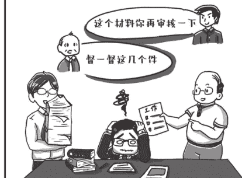

图8-1 “推活儿”的“讲究”

科长回来了，小蔡第一时间汇报了两起“求助”事件：“科长，您看这忙，哪个能帮？哪个能推？”科长翻着材料反问道：“小蔡，你怎么想？”小蔡坦白了自己的想法：“王科长是秘书科的老人，他的事咱们不好意思推。周科长咱也不熟悉，况且最近材料确实多，要不跟他说说，推掉算了？”

科长一副若有所思的样子：“老王想让咱们牵头督查，虽然我们私下很熟，帮忙打电话督促一点问题也没有。但让我们牵头，就涉及部门职责。秘书科没有督查职权，怎么能牵头？部门职责分工的基本原则，是一件事情一个部门负责。至于政研室那边，咱们应该帮。虽然下周会议的文字材料是政研室主办，但为领导提供文稿服务是咱们的本职，秘书科不能当甩手掌柜，应配合政研室把数据、案例、情况搞准，确保不出现错误。所以，这个事咱不能推。”小蔡琢磨着科长的话：“就像我们科里的值日制度，每个人首先看好自己的一亩三分地，如果实在忙不过来，大家当然要互相帮衬着！”

科长点点头：“对，首先要做到‘不多事’，尊重职责分工，尽好本职、守好本分；其次是‘不误事’，在搞好本职的基础上，团结协作、主动补台。”

小蔡嘻嘻一笑：“‘推活儿’都推出理论来了。明白了，工作协调有讲究！”

### 四、得把精力放在解决问题上

从文电科出来，小蔡简直气炸了，从二楼到三楼短短几步路，他已经在心里把文电科副科长小吕“怼”了十几遍。

同屋的小马感觉气氛不对，小心翼翼地问：“怎么了蔡哥，脸色这么难看？”这下可让小蔡逮住吐槽的机会了：“这个小吕，拿着鸡毛当令箭，公报私仇。不就是上个月演讲比赛我赢过他，这么记仇？写得这么好的文件，非让我删掉一半！”

原来，农业局给市委办报了一份加快全市智慧农业建设的文件，想以市委办的名义印发。因为焦书记分管农业农村工作，所以主任安排小蔡负责办理。小蔡和农业局办公室的同志们字斟句酌、反复推敲，一连熬了几个通宵搞出了文件稿，不承想，报到文电科，第一关都没过去。

吕副科长拒绝得很明确：“中央前不久下发《关于解决形式主义突出问题为基层减负的通知》，明确规定政策性文件原则上不超过十页。我们市里的细则要求重要文件不超过八页，一般性文件不超过六页，你们这个文件竟然有十二页，得删掉一半再报来！”

小蔡赶忙赔上笑脸：“兄弟啊，智慧农业是个新事物，需要解释得充分一点，你看这意义能删吗？重要性能删吗？指导原则能删吗？都不能啊！”吕副科长不为所动，冷冰冰地把要求重复了一遍，小蔡气得转身就走。

“怎么删，这么重要的文件！小马，你说说怎么删！”小蔡在办公室滔滔不绝地抱怨。小马一个劲儿地朝小蔡使眼色，小蔡回头一看，嘿，吕副科长就站在小蔡身后呢。小蔡一时语塞：“你……”

吕副科长拍了拍小蔡的肩膀，笑道：“兄弟，你不是下不了手吗，我来帮你一起删。不是我为难你，精简文件的精神就是这样，我帮你一起调整，改完你就知道了，文件短一点，绝对是好事。”

一番话说得小蔡无言以对，默默坐下打开文档。整整一上午，吕副科长带着小蔡大刀阔斧地调整。和上级文件重复的内容，删！穿靴戴帽的套话，删！冗长的表达，删！最后，文件留下的净是干货。

小蔡从前到后翻看着改出来的“精简版”，彻底服气了。

“吕副科长，还真别说，现在文件只有六页，反而说得更明白了！”小蔡满意地端起桌上的茶水抿了一小口。

“是啊，文件是可以写短的，而且写短了的文件更有力量！”吕副科长伸了伸懒腰，露出了开心的笑容。

公众号【懒人手册】回复“互联网”，白嫖各种资源文档

“蔡哥，王主任叫您去他办公室一趟，有任务要辛苦您！”小马刚从王主任那儿回来，打断了小蔡和吕副科长的“神仙会”。小蔡跟吕副科长迅速告别，抓起笔记本直奔王主任办公室。

“小马下周休假，他负责的秘书长办公会会务，你盯一下，具体工作跟他对接好。我马上有个会，不跟你细说了！”王主任开门见山。

小蔡回到科里，狠狠拍了一下小马的肩膀：“你小子，自己要休假了，让我们给你打工！”小马嘿嘿一笑：“辛苦蔡哥了，我这休假也是受益于‘减负’，这个会办起来不复杂，我给您捋一下。”小蔡一脸不屑：“你小子站着说话不腰疼，我之前也办过这个会，每次提前好久就要让部门报材料，还要印材料、打座签，折腾半天！”小马打印出一张议程，交给小蔡：“这次的秘书长办公会，有两个议题需要委办局的负责人汇报，这次明确说了，不用提前交材料了，座签也不再摆，完成会务工作完全没问题！”

小蔡还有点没回过神。之前办会，打座签、印材料往往要耗费很大精力。座签要打印得工整、美观，还要摆成一条直线。收材料更是个苦差事，提前好几天就开始催，还要调格式、印刷成册。到了会上，汇报单位也是“不敢越雷池一步”，照着材料一念了事。

小马继续解释：“那天秘书长布置任务的时候说了，过去战争年代，几个人围着破破烂烂的桌子就把作战会议开了。我们现在开会，也要把形式主义的东西都去掉，得把精力集中在解决问题上。”

“把精力集中在解决问题上”，这句话引起了小蔡深深的共鸣。形式主义占用时间少了，大家解决问题的精力就多了！

## 五、调研历险记：就想听听老百姓的心里话

这段时间，市直机关的同志们轮流休年假。市委办要求大家借休假的机会开展调研。小蔡跟焦书记说起这事，焦书记建议：“现在都在聊水果涨价，你可以就这个问题去搞一下调研啊。不一定要找一堆人开座谈会，正所谓‘麻雀虽小，五脏俱全’，不需要分析每个麻雀，解剖一两个就够了。”

“焦书记，您启发我了。我表舅就是做水果批发生意的，我就做这个调研选题吧！”

小蔡找到表舅，说要跟司机去广东拉水果。表舅的头摇得拨浪鼓一般，连连摆手：“你一个细皮嫩肉的学生娃，哪受得了跑车的罪！”小蔡毕恭毕敬呈上两盒好茶，好说歹说，表舅才算松了口，不解地扔下一句话：“搞啥调研啊，真是没事找罪受。”为了确保这次能够摸到最真实的情况，小蔡反复叮嘱表舅，千万别告诉司机他是从市委办来的，只说是远房亲戚跟车干活就成。

表舅果然守口如瓶，一个字也没有吐给司机老吴。去程一切顺利，司机老吴也只当小蔡是个跟车的小工，指挥着小蔡装车搬箱，还一个劲儿地嫌小蔡动作太慢。“现在的年轻娃娃，看着挺壮实，身子骨咋这么虚？”可怜小蔡正上气不接下气地喘着，手上磨起了泡也不敢给老吴看到，两条胳膊早就酸痛不已，累得直不起腰。可他只能在心里暗暗叫苦。

货车在广东的批发市场装了近百箱各色水果，稍作休息就启程往回赶。白天装车累惨了，一上车小蔡就打起呼噜睡了过去。一觉醒来时，小蔡迷迷糊糊地瞥了一眼手表，竟然已是凌晨1点多钟了。

“咦？这货车咋开成S路线了？”小蔡觉得有些恍惚，等他看向司机老吴时，差点魂都被吓没了！老吴快睡着了！他的眼皮一个劲儿在打架，时睁时闭！小蔡赶紧喊了一声：“老吴！”老吴才清醒过来。小蔡好不容易才把一门心思继续赶路的老吴劝下了高速。

为了省钱，老吴坚持不住旅店，让小蔡裹着毯子在车上睡。小蔡还没有从刚才的险情中缓过神来，心咚咚直跳：“吴哥，刚才实在太危险！”

老吴一脸歉意：“嘿嘿，我也是急着往回赶。夏天里，水果坏果率格外高，路上多花半天时间就得损失几千块。晚上高速路车少，我们都通宵开夜车，等到白天才眯一会儿（见图8-2）。”

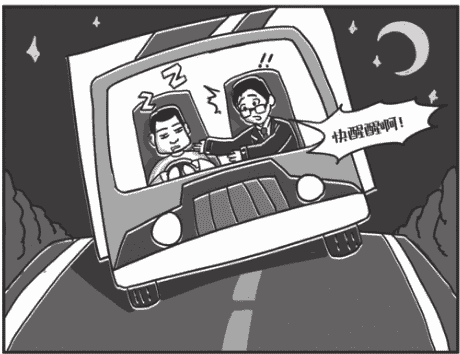

通过跟老吴聊天，小蔡才知道，水果批发价并没有太大变化，但天气热了导致坏果率高，水果的运输和保存成本更高了，这是水果涨价的主要原因之一。

“再急也不能疲劳驾驶。行车不规范，亲人两行泪！”小蔡看着窗外黑漆漆的服务区，嘟囔着准备入睡了。“唉——”老吴长叹了一口气，“还不是为了多挣一点钱！你在车上睡，我去车下面铺张席子睡。”

“吴哥，车上舒服些，您别下去了。”小蔡不解，叫住了老吴。“我睡在下面看着油箱，怕晚上有‘油耗子’来偷油！”原来，跑长途运输的司机，晚上停车休息时还可能碰上偷油贼，几分钟就能被人偷走油，一下又得损失几千块。

所幸一夜平安无事，第二天老吴带着小蔡紧赶慢赶，总算在傍晚赶回本市高速收费站。农产品运输绿色通道出口正排着长长的车队，检验员们挨个查车。眼看就要到家了，小蔡很开心，但老吴的脸上满是焦虑，有些坐立不安。

“请出示你的机动车行驶证、道路运输证、机动车驾驶证，把货箱打开。”终于轮到小蔡他们了。老吴赔着笑脸，紧张地瞅着两个检验员的一举一动。不一会儿，一个高个儿检验员快步走过来告诉老吴：“这车不能享受‘绿通’免费政策，你拉的水果重量没达标，还不到核定载重量的80%。”

“同志啊，我这次运的是樱桃这类比较贵的水果，夏天不敢运太多，能否通融一下？”老吴的脸上难掩失望。

“不行，规定就是这样的，请到那边缴费！”检验员公事公办。

无奈的老吴垂头丧气地走过去交费，他沮丧地告诉小蔡，享受“绿通”的限制条件很多，对水果种类、运输数量均有严格要求，有时出于经营风险考虑，拉的货还真达不到条件。

“‘绿通’是个好政策，要是能多考虑一下我们的实际困难就好了。市里又搞文明城市创建，早市、晚市都没了，马路边的大集场子也没了，来我们这里批发水果的小贩少了好多。实在不敢拉多，真怕砸自己手里啊！”老吴满面愁容地跟小蔡叨叨着。

“小蔡，这也就是咱俩私下里聊，文明城市创建我支持。电视上说了，人人参与、人人受益！”没想到司机老吴的思想觉悟还挺高。

小蔡嘴上没说话，心里暗想：“这次调研，差点在高速路上‘遇难’，不就为了听听老百姓的心里话吗？不跟这趟车，哪里知道水果商贩有这么多的实际困难，我得把他们的急与盼全写进调研报告里！”

“小蔡，你的调研报告被书记批示了！”科长对小蔡说。

“问题找得准，调查扎得深，真话敢于讲，写法接地气。请印发相关部门和区县参阅，涉及的问题要拿出解决方案。要多一些这样的调研。”科长一字一句地念出书记的批示，最后说：“小蔡，你这次调研收获够大的！”

## 六、小蔡的新“担子”

“小蔡，还在加班啊？”这天，主任加完班准备回家，看见信息组房间的灯还亮着，只听到噼里啪啦敲键盘的声音，走过去一看，房间里只有小蔡一个人。

“主任，您怎么来了？”小蔡见主任来了，忙站起来回话：“还有好几条信息没编完，我正抓紧弄！”

“怎么就你一个人？小潘他们呢？”

小蔡憨笑道：“主任，我不好意思让大家加班。”

本以为主任会表扬自己，没想到主任板起了脸：“小蔡，你这不胡闹吗？你是组长，不光要带头干，更重要的是把大家拧成一股绳，带领团队一起干，这样才能事半功倍！”

原来，最近主题教育工作任务重，市委办从各个基层单位抽调人手，组成了好几个工作小组。刚被提拔为秘书科副科长的小蔡挑起了新担子，被委派接替下乡扶贫的老张负责信息组工作，编印主题教育简报，报送相关信息，手下有了3个兵：区委办的小潘，街道办的小王和乡镇选调生小林。

小蔡不好意思地挠挠头，一脸为难：“主任，我一直被人管，这一下子让我管人，还真有点不好意思给他们派活儿。”

“小蔡，组织上让你牵头这个小组，管人管事对你来讲是天经地义，是组织重任、职责所在，是公不是私，是组织行为而不是个人行为。你赶紧把小组管起来。”主任严肃地说。

有了主任支持这把“尚方宝剑”，小蔡底气大增。第二天一早，他开始试着给组里3个同志分配工作。没想到，一开始就碰到了软钉子。

先是小潘提出异议：“蔡科长，给省委办公厅报信息专报，以前一直是小林负责，您这次突然把这期编写任务分给我，考虑工作的连续性，是不是还是小林负责好一点？”小蔡脸上有点挂不住，但也不好发作，只能勉强应承：“我考虑考虑！”

这边刚打发过去，小蔡听见那边小王和小林在打嘴仗。小王对小林说：“小林，蔡科长让咱俩一起弄这篇经验稿，要不你先弄个初稿？”小林毫不示弱：“蔡科长让咱俩一起写，没说让我先写初稿，要不我们一起去找下蔡科长？……咦，蔡科长呢？”

眼看自己的“领导权威”要受到挑战，小蔡溜出去找主任取经去了！“主任，这组长也太难当了，您给我支支招啊！”

主任笑着道：“小蔡，我先送你一个锦囊，叫分工负责。你们组现在理不顺，主要是职责不清、分工不明造成的。比如信息专报，如果约定是小林负责，没有特殊情况，还是应当让小林去办，不要这次让你办，下次让他办。按照分工，每次把具体任务分配到人头上，谁出问题，板子打在谁的屁股上。”

小蔡得了主任真传，赶紧回到组里，给大家明确了分工，果然，推诿扯皮的事基本销声匿迹，组里工作逐渐走上正轨，小蔡不由暗自佩服：姜还是老的辣！没过几天，市里收到省委主题教育办的通知，要求各地抓紧报送脱贫攻坚、服务群众、作风转变、整改落实等方面的做法、经验和成效，既要有总体性的报告，又要有典型案例汇编，任务理所当然落在了信息组。

又是一天傍晚，主任处理完手头工作，准备下楼回家，又有点放心不下信息组：这几天信息组任务重，小蔡能盯得住吗？于是抬脚拐到了信息组办公室。

与想象中兵荒马乱的场面不同，信息组安安静静——小蔡拿着笔在纸上写写画画，小潘和小林都在聚精会神地敲键盘，小王在文件柜边上翻找材料。

“大家都还在忙呢？”“主任，您来了，上报的材料我们正抓紧准备，小潘主攻报告，小林在整理案例，小王搜集素材，我把一道关，估计明天就能给您材料初稿。”

主任听了将信将疑：“小蔡，你们动作很快啊，这么快就能拿出初稿？这套材料量可不小啊！”

小潘在一旁道：“报告动笔前蔡科长带着我拉了提纲，敲定了立意、篇幅、结构，写起来比较顺！”

小林也搭腔说：“我这边也是跟蔡科长先商量好了怎么选案例，有什么标准……我之前写专报，素材积累了不少，现在就是来料加工的问题！”

主任乐了：“小蔡，我今天来，本想送你第二个锦囊，叫明确标准，布置任务要把话说得明白些，标准提得具体些，千万别模棱两可，避免让大家反复折腾。今天一看，这第二个锦囊不需要送了！”

“主任，麻雀虽小五脏俱全，我们信息组也是一个组织，想带好，不简单啊！我会好好琢磨您的两个锦囊，带着大家一起把工作做好！”小蔡一脸严肃地向主任表态。

## 写在结尾的话

大家好，我是小蔡，我的秘书故事到这里暂且告一段落。感谢大家陪伴着小蔡，你们是我的朋友，时间也是我的朋友。说心里话，当秘书真是一件苦差事，急稿子派给你，点灯熬夜是家常便饭，当大报告的任务压在肩上时，最爱吃的火锅都不香了。然而，正是在跑跑颠颠的迎来送往中，在字斟句酌的拟文核文中，在通宵达旦的写稿改稿中，我越来越确信，尽管我们每天做的事情微不足道，但正是这日日月月平凡中的点点滴滴，将最终汇聚成党办工作的坚强基石。后会有期，愿我们永远在追梦的路上！