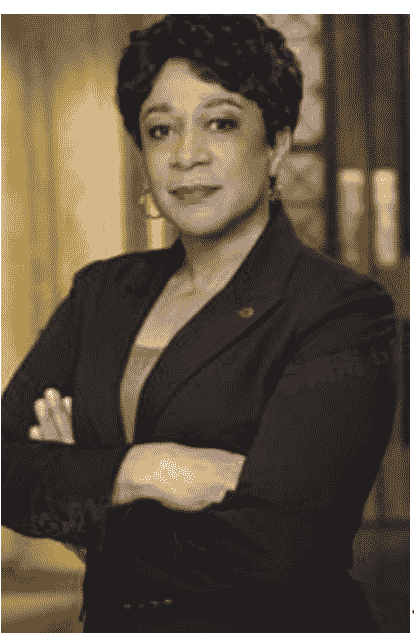
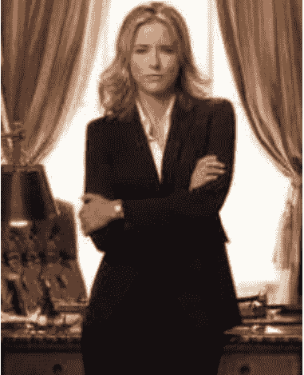
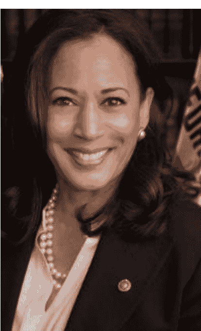

# 哈里斯演讲拉片：“神之一手”与“致命一击”

240903

整理：公众号懒人搜索，懒人专属群分享

懒人微信：lazyhelper

今天在正式开始之前，先强调一句，我们今天要做的，是一场纯粹的、关于表达的技术性分析，完全不涉及政治。我们要说的，是哈里斯的演讲技巧。

最近，从 TikTok 到抖音，经常能刷到哈里斯的演讲。在特朗普遭枪击，拜登宣布退选之后，哈里斯被民主党提名为总统候选人。在这一连串事件刚刚发生的时候，特朗普在舆论中的声势几乎一边倒，登上新闻头版的次数也比其他人要多得多。

但是，很多人看完哈里斯的演讲之后，又突然觉得，这场大选还是充满了未知的变数。没错，哈里斯的演讲水平，已经强到足以改变很多人的预期。

你要是去看市面上的演讲导师，有不少人都分析过哈里斯的演讲。事实上，从结果上看，哈里斯的演讲确实有效。比如，哈里斯 7 月底在美国威斯康星州的演讲。这是哈里斯第一次以总统候选人的身份参加竞选演讲。威斯康星州在这回的竞选中，是个关键的摇摆州。但是，经过哈里斯这么一番演讲之后，在全国的民调里，哈里斯居然领先特朗普两个百分点，哈里斯在民调中的支持率是 44%，特朗普是 42%。注意，这可是哈里斯以总统候选人的身份，第一次做正式的竞选演讲。

紧接着，在整个 8 月，随着哈里斯演讲次数增加，她的团队筹款也越来越多。哈里斯的竞选团队在 8 月 25 日还发布消息，说哈里斯团队目前已经筹集了 5.4 亿美元的竞选资金，并且还刷新了选举史同期筹款纪录。

当然，美国的总统竞选是一个非常复杂的政治事件，其中的因素还有很多。而我们今天只是从技术层面上，说说哈里斯的演讲技巧。我们今天选取的例子，就是前面提到的，哈里斯在威斯康星州的演讲。这也是哈里斯后面几场演讲的内容蓝本。她后面的多数演讲，都没有跳脱出这个框架。其中有这么几个很明显的技巧。

首先，哈里斯很重视内容的亲和力。比如，在演讲的开场，哈里斯对拜登表达了敬意，对当地的官员表达了钦佩。再比如，整场演讲都是在对话中完成的。哈里斯单独说话的时长，几乎没有超过半分钟。差不多每句话，不是问句，就是感叹句，就像抛给台下一个接话的气口。观众席的欢呼和鼓掌，可以恰到好处地插进来。

其次，关于哈里斯的造型。全身的深蓝色西装，纯白或者纯黑的 T 恤衫打底，上身西装只系上一颗扣子或者不系扣子。这个造型跟几年前同为女性候选人的希拉里很不一样。希拉里经常穿颜色明亮的衣服，比如红色、白色、天蓝色。但哈里斯的造型，整体色调是往下压的，几乎就跟美剧里的女性检察官形象一样。我在文稿里放了一张图，有部美国的国民级美剧叫《法律与秩序》，里面有位女律师，也是黑人，是安妮塔·范·布鲁恩演的，造型上跟哈里斯几乎一模一样。借用国外媒体的评论，哈里斯的造型几乎是在最大限度上，强调自己的检察官出身。注意，划重点，强调身份这个动作，是哈里斯演讲中最关键的技巧之一，后面我们会展开细说。

安妮塔·范·布鲁恩在《法律与秩序》里扮演的女律师，图片来自网络

美剧里的律政女性角色，图片来自网络

哈里斯，图片来自网络

最后，哈里斯的标志性笑容。我的个人感受是，与其说哈里斯很擅长笑，不如说她很擅长发射情绪。她首先就有一张表情非常丰富的面孔，可以在半秒钟之内，从严肃切换到大笑，从愤怒切换高兴，而且看起来毫无违和感。要知道，可不是每个人都能这么准确地控制表情的，这多少算是天赋异禀。就像演员里的金·凯瑞一样，人家的表情天生就比一般人丰富，对面部肌肉的控制力就是比一般人要强。这也让哈里斯的整场演讲，都处在情绪的高能量状态，中间几乎没有任何冷场。

但是，注意，重点来了，前面说的这所有，以及哈里斯讲自己的出身，讲自己的家庭，所有这些，在总统竞选这个级别的演讲里，都只能算是基本功。之前还有人分析过，说奥巴马已经是政客演讲的集大成者，哈里斯的很多演讲方法，奥巴马当年都已经用过了。这些对哈里斯来说，算不上真正的绝招。

公众号懒人搜索，懒人专属群分享

那么，哈里斯的演讲，真正的绝招是什么呢？注意，重点来了。这个压箱底的必杀技，叫做框架塑造。框架塑造，这个词可不是我发明的，而是来自一位大师级的表达高手，也是认知语言学这门学科的开山鼻祖，乔治·莱考夫。我们节目里几次讲过这位老爷子。老人家算是个神人，被白宫称为演讲导师，也当过民主党的笔杆子，没错，就是哈里斯这头的。莱考夫的书，还一度被称为总统竞选演讲的必读书。据说以前还有民主党的政客，在失意时公开说过，我们当年要是好好读莱考夫的书，就不会失去在白宫的权力。

好，回到正题。乔治·莱考夫说的框架塑造是什么意思？简单说，就是决定一场辩论胜负的，不是你的观点高不高明，而是民众用什么样的框架来理解这件事。

比如，在哈里斯的演讲里，有这么一段话。我个人认为这是最具杀伤力的部分。算得上是整场演讲的神之一手，也是给对手的，致命程度最高的一击。哈里斯说，作为美国参议员、司法部长和法庭检察官，她惩治过虐待女性的掠夺者，对抗过敲诈消费者的欺诈者，以及为了自身利益而违反规则的骗子，她了解并掌握各种肇事者的特征。

注意，重点来了。说到这，哈里斯话锋一转，来了一句，她很清楚特朗普的类型。

你可以琢磨一下这句话，这是不是不太像竞选对手之间的 PK，更像是检察官在审视嫌疑人。

紧接着，哈里斯又说，作为加利福尼亚州的总检察长，她接手的事件包括美国最大的营利性大学之一，而这所大学正在欺骗学生。而特朗普也经营着一所以营利为目的的大学，也欺骗学生。作为一名检察官，她专门处理涉及性虐待的案件，而特朗普也被判犯有性虐待罪。作为加州总检察长，她与华尔街的大型银行对抗，追究他们的欺诈责任。而特朗普刚刚被判犯有 34 项欺诈罪。

注意，刚刚哈里斯这段话，一共 200 多字，正常的语速一分钟多点就能说完。但哈里斯足足说了几分钟，目的是确保所有人都听清。

为什么说这段话有杀伤力？你看，这原本是一场候选人之间的竞争，但是，哈里斯这些话却在塑造另外一个框架，她把自己代入检察官的身份，并且说特朗普是罪犯。没错，她在试图把这个竞争框架，切换成检察官与罪犯的对抗。

我们假设，假如美国的老百姓，也把这场竞争看成检察官与罪犯之间的对抗，那么试问，他们会选谁？这已经不是谁强谁弱的问题，这背后的本质是，他们要捍卫哪种价值观？假如一个检察官和一个罪犯摆在面前，即使罪犯再强，他们会选择罪犯吗？检察官再弱，那也是个检察官。罪犯再强，那也是个罪犯。这也是为什么，哈里斯要一直以检察官的造型亮相。你看，这就是切换语言框架的威力。也是我们前面说的，乔治·莱考夫最核心的洞察。他认为，赢得一场辩论的关键，不在于你的观点多高明，而是你能塑造公众理解这件事的模型。你要是能把竞选模型，置换成检察官与罪犯的对抗模型，你的局面就会主动多了。

注意，说了这么多，我们并不是要谈论政治，而是要通过这场辩论，看到一个关于表达，关于影响力的真相。这就是，框架的力量，要远远大于观点。

类似的例子还有很多。比如，胖东来，面对投诉者，不仅道歉，还要奖励。看起来好像成本很高，但实际上，这个举动维持住了一个框架。这就是，它始终让顾客觉得，我们之间不只是单纯的买卖关系，而是有交情的。你替我督促了门店，我自然要答谢你。它塑造的，不是单纯的生意框架，而是朋友之间的情分框架。

扯远了。最后咱们往回收一收。我们从哈里斯的演讲，一路讲到莱考夫的语言学观点，想说的不外乎一句话，表达的终极战场，不在观点层面，而在人心层面。口舌之快不算厉害，赢得人心才算胜利。就像我们之前引用的塔勒布的那句话，世界上有两种人，一种是想赢，另一种是想赢得辩论。至于想成为哪一种，估计你心里早就有答案了。

微信：lazyhelper

历史 3000 多份各类付费文章以及年费三千多的副业社群资源，见懒人专属群内分享!

付费群，白嫖勿扰!

# 懒人专属群更新记录:
https://lazybook.fun/#/blog/record2