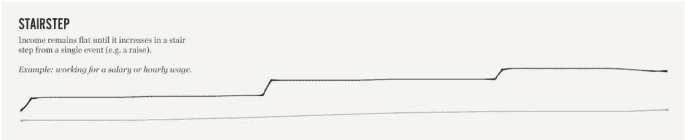
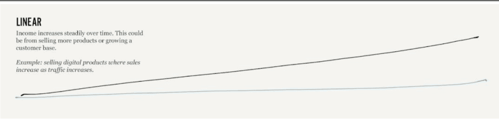
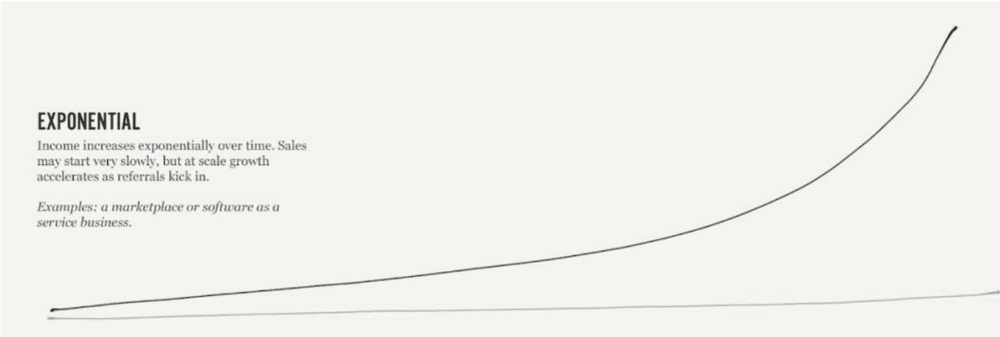

# 财富积累 Roadmap：8条可行的财富自由建议

240905
摘选自《The Ladders of Wealth Creation: A Step-by-Step Roadmap to Building Wealth》，
[美] Nathan Barry
整理：公众号懒人搜索，懒人专属群分享
懒人微信：lazyhelper

本文作者 Nathan Barry 是 ConvertKit 公司的创始人和 CEO。他之前做过很多份工作，从小时工、设计师、独立开发者、内容创作者到 SaaS 公司创始人。

Nathan 认为积累财富的技能是可以习得的，他从自己的经历出发，为我们描绘了积累财富的路线图（一个上升阶梯）。

积累财富的过程大概会有以下几个阶段：时间换金钱、非标准化服务、标准化服务、售卖产品、指数增长业务。

在每一个阶段，都需要学习特定的新技能，比如找到客户、定价、运营、市场营销等。从左往右阶段难度越来越大，但财富创造潜力也越大。跳跃每个阶段时，收入也会下降一段时间。

建立受众群体可以让这个过程容易很多。分享学习历程会获得很多人的支持。这个过程需要很长时间，但成果可能会非常惊人。关键是持续努力学习和实践。

整体来说，这篇文章给了我们每个人一个可实操的规划，且非常鼓舞人心。因为，赚钱，持久的赚钱，谁不希望呢？

图片

以下内容摘选自《The Ladders of Wealth Creation: A Step-by-Step Roadmap to Building Wealth》，Nathan Barry 著。

上大学时，我第一次听 Basecamp 的 Jason Fried 谈到，赚钱是一种技能，就像打鼓或弹钢琴一样，随着时间的推移，你会变得越来越好。这让我立刻产生了共鸣。我不会指望第一次坐在钢琴前就能马上弹出一首协奏曲。

我们可以勾勒出掌握一种乐器的过程，我们应该也可以勾勒出谋生的过程。

从小区临时工到一个房地产大亨，你需要学习哪些课程？从自由职业者到售卖自己的数字产品，又该怎么做？从在 Wendy's 工作到拥有一家月收入超过 100 万美元的 SaaS 公司呢？最后的例子正是我的亲身经历。

## 01 财富积累的4个阶段

每个人都可以沿着一条可靠的路径来稳步提升自己的收入，并积累更多的财富。我更喜欢把它比喻成一排排的梯子。每架梯子都能带你攀登到不同的高度，无论是在业务水平的提升还是潜在收益的增长上。

### THE LADDERS OF WEALTH CREATION

Every career starts in the bottom left and works through each ladder over time. The higher you climb the more you earn, but the more skills and experience you need to acquire.

在这个模型中，你爬得越高，潜在的收益就越大。

当你从左往右爬到更高级的梯子时，收入也会增加。但是，每次移动的难度也会增加。

每一步都需要你学习新的技能来克服新的挑战。让我们来分析一下每个阶段的技能和机遇。

### 阶段一：以时间换金钱

我们的第一个阶梯是用时间换金钱。

你认识的大多数人都是这样谋生的。一开始可能是在星巴克做钟点工，然后转为在一家公司担任有固定薪酬的职位。

最基本的技能包括：

- 始终如一地出席
- 可靠
- 在工作中学习新技能

每一份工作，哪怕是最初级的，都需要具备这三点。

然后，为了在阶梯上更上一层楼，你需要专攻某些技能（设计、文案、法律、成为护士等），以获取更高的薪资职位。

### 阶段二：经营自己的服务业务

如果你选择跳到下一个阶梯，经营自己的服务企业，你需要在上一个阶梯的基础上学习一套全新的技能。比如：

- 成立公司
- 寻找客户
- 制定方案
- 定价策略
- 招聘员工
- 在互联网上打造形象
- 会计、财务、业务运营等

回想起来，有很多当时让我望而却步的事情，例如向州政府申请注册有限责任公司，现在看来都变得简单明了。

这也是许多创业者超越自身能力进行扩张的阶段，在这个过程中，他们可能忽略了前一阶梯上应该掌握的经验，例如始终如一和可靠性。

我的一位朋友就是个很好的正面例子，他没有任何管道工作经验，但他买下了一家小型水管公司，并在第一年仅通过两个简单的策略实现了收入翻倍：

- 跟进客户
- 说到做到

作为创业者，我们往往低估了我们需要掌握的知识和技能，结果就是容易感到力不从心，甚至在一些基本操作上出现疏忽。

### 阶段三：产品化服务

到目前为止，每一笔订单都是通过直接与客户或雇主面对面、电话或电子邮件交流来达成的。但要想真正提高收入，你需要掌握一种新技巧：如何在不直接与客户沟通的情况下完成销售。

我们的目标是提高销售量。这意味着需要消除所有潜在的瓶颈。在产品化的服务中，我们先要消除销售的瓶颈，接下来在另一个阶段，我们要消除产品交付的瓶颈。

所谓的产品化服务，就是把某个服务（比如搜索引擎咨询）以固定的价格打包出售（如：1000美元的搜索引擎优化网站审计）。

其中的几个例子包括：

- 设计师从按小时收费 100 美元设计网站，变为收费 2500 美元设计一个 5 页的网站。
- 视频剪辑收费 250 美元每个视频，而不是每小时 50 美元。
- 维修工每次上门服务收费 50 美元，而不是按小时计费

由于项目范围和价格已经敲定，服务提供商在某些项目上赚得盆满钵满，而在其他项目上则可能收获平平，但从长远看，利润总体上会趋于平衡。

在这一阶梯，我们需要学会：

- 撰写能在不与客户交谈的情况下完成销售的文案
- 设计销售页面（或者雇佣专家为你完成）
- 处理在线支付
- 标准化系统，确保每项服务都具有一致的质量

如果你想在这一阶梯更进一步，你可以增加经常性收入和雇佣员工，进一步扩大规模并使收入更加稳定。例如，我的姐夫丹尼尔过去按小时收 30 美元剪辑视频，但现在他推出了一个周期性的产品化服务，每月为客户剪辑最多四集 vlog，收费 1000 美元。

他首先确定了固定的视频费用，代替了原先的小时费用。接着，他通过明确服务对象是视频博客，而不是其他任意视频，来精准定位客户。最后，他转为月费制，而不是按视频收费，使其收入持续稳定。

如今，他能从一小部分客户那里得到稳定的收入，并且他维护了一份等待名单，等他有更多空闲时间时，就可以服务那些想报名的客户。

### 阶段四：规模化销售产品

产品化服务旨在消除销售过程中的人工操作，而出售完整的产品进一步延续了这一趋势，也减少了交付产品的手工操作。

实物产品主要分为两大类：手工制造和机械生产。

手工制作：手工产品是初创的好选择，因为你可以花费较少的资金制造一些产品。但它们与产品化服务相似，每个产品的生产都需要时间，所以难以实现规模化。

机械生产：小规模生产机械制品比较困难，但只要能销售出足够的数量，就可以大规模生产，进而扩大业务规模。

产品的前期制作要花费更多的精力，但一旦完成，每一次的销售和交付都不需要太多的额外努力。

例如：

- 一本关于如何学习新编程语言的电子书
- 一个关于新烹饪技巧的视频课程
- 为 vloggers 设计的新款三脚架

此时，你需要掌握一系列全新的技能，以便进行大规模的产品销售，如：

- 大规模的客户服务
- 大规模的客户拓展
- 供应链管理（如果是实物产品）
- 防范信用卡欺诈行为

这只是你需要的众多技能中的一部分。在介绍完财富阶梯之后，现在让我们来谈谈帮助你驾驭这一新概念的原则。

- 需要重新投入额外的时间和资金；
- 你可以跳过前面的步骤，但仍需从每一步中吸取教训；
- 以新的方式运用现有技能创造财富；
- 为提高工资而工作与真正创造财富之间是有区别的；
- 用阶梯上的上一级资助下一级；
- 在不同阶梯之间流动往往意味着收入减少；
- 有了观众，每一步都更容易；
- 所需的时间比你想象的要长，但结果可能会令人难以置信；

## 02 财富积累的 8 个原则

### 1. 把「收入」转化为「财富」

最近一次去西雅图旅行时，当我在 SeaTac 机场搭乘 Uber 前往市中心的路上，我与司机进行了一次交谈。我们的话题涉及了旅行、我们最钟爱的夏威夷岛屿、他对音乐和科技产品的喜爱、他的主职工作，以及他如何选择兼职开 Uber。

他在西雅图市政府有份稳定的工作，而通过每周开几次 Uber，他可以赚点外快。像 Airbnb 和 Uber 这样的服务为那些有固定薪水的人提供了赚取额外收入的机会，这真是太棒了。

那他把这些外快花在了什么地方呢？他特别喜欢各种科技产品，他最近想购买两样东西：

- 更换家庭影院中坏掉的音响。
- 购买大疆 Mavic 无人机。

这些都是超级有趣的消费，他能通过外快来实现这些愿望，真是太好了。但这也让我想到大多数人无法积累财富的原因：他们增加的收入并未转化为财富。

在整个社会，不论是因为加薪或是加班赚来的外快，很多都被用于提高生活水平或短暂的消费，而这些钱其实可以被更有效地利用。

无人机确实很有意思，但它那些细小的部件和高级电子元件使得它可能在几年内就会损坏——尤其是如果你不小心把它飞到了树上。

如果你想积累财富，那一千美元就应该花在学习新技能上，或者投资于股票市场、养老金或其他生意，而不是烧在最新的小玩意上。

### 2. 你可以跳过前面的步骤，但还是要从每一步中吸取教训

在 ConvertKit，我们运行着所有 SaaS 公司中最大的联盟营销计划之一，每月带来近 50 万美元的收入。但运行这一切并不轻松。当前市面上的管理软件操作繁琐，导致我们每月都要花费一天时间进行手工处理。

我姐夫菲利普（Philip）看到了这一状况，决定为 SaaS 公司开发一个更为高效的联盟营销管理平台。他所创建的工具名为 LinkMink，虽然受到了不少关注，但还处于初级阶段。尽管经过了两年辛勤努力，菲利普和他的合伙人每月收入仅有几千美元，令他深感挫败。

我对此深感共鸣。在创建 ConvertKit 的头两年，我们的经历与他相似。SaaS 的成长实在太缓慢。

但后来我开始思考菲利普的职业历程，他拥有商业学士学位，曾是设计师，随后成为了软件开发者。而后，他投入到 LinkMink 的创业中。

他的成长道路一直是：

- 小时工（工作种类繁多，任何加入劳动力大军的人都会从事这些工作）
- 固定薪资工作（早期是设计师，后来是开发者）

到此为止，他的发展还算顺利。在我们的财富阶梯上，他迅速从基础阶梯升至次级阶梯。短短四年，他已从初级职位晋升到高薪职位。

他还接了一些合同设计工作，掌握了开发票、寻找客户和推销的技能。

但他的下一步——创办 LinkMink，跨度非常大，创建一个 SaaS 应用并不是一个合理的下一阶梯，它甚至不在接下来的阶梯之内！

运营 SaaS 公司是一件非常困难的事情，因为有太多的环节要处理：开发、服务器、客户支持、法律、收款支付等。难怪需要一段时间！

这并不是说他做不到，甚至也不是说他跳到这一步是一个错误的选择：只是因为他有很多技能要学，而他选择在这里全部学完，而不是在整个过程中循序渐进。

正因如此，他应该调整预期，认识到他可能需要比其他人更长的时间，并且面对更多挑战。

在平衡这些缺点的同时，它也确实能带来令人难以置信的回报，因为 SaaS 软件是这个星球上最伟大的商业模式之一，这也是为何很多收购公司和投资者愿意为它们支付高昂的溢价。

### 3. 以新的方式运用现有技能创造财富

我的朋友帕特里克（Patrick）买下了一栋需要大修的房子，他随后开始了自己的翻新工作。由于他的主业是建筑工程师，所以，他改造起来驾轻就熟。

但真正神奇和有价值的不是主屋，而是一个可以从后门进入的独立车库。这栋房子原本破旧不堪，连车都停不进去，但经过帕特里克 6 个月的不懈努力，这个车库终于被翻新成占地 300 平方英尺的漂亮单间公寓。

在 Airbnb 上挂牌出租几个小时后，这间公寓就有了第一位预订者。并且第一个月的收入就超过了 1800 美元。这一新的收入来源使帕特里克 的月收入增加了 50%。

### 4. 为高工资而工作与真正创造财富之间是有区别的

由于 Airbnb 的存在，这间公寓有源源不断的租客预定。

最棒的是，这间公寓不仅能帮他赚钱，而且会提高房子本身的转售价值。更重要的是，只要他持有这栋房子，无论他做什么工作，都会有稳定的现金流，足以应付他的房贷。

虽然我经常利用电脑工作，我享受创作的过程。但我也常常想逃离电脑，我很想看看现实生活中项目是如何运转的。

和很多人一样，我很想拥有一栋属于自己的房子，今年我决定亲自动手建一个。虽然需要学习的东西很多，有时也颇具挑战，但从数字创造转为现实创造对我来说也是一种受益匪浅的休息时光。

由于我在房屋建造方面完全是个新手，所以在安装双摆法式门等比较棘手的部分，我都是依靠像帕特里克这样有经验的朋友。

我在建房方面一窍不通，所以在安装一些复杂的东西时（比如双摆的法式门），我都是请教懂行的朋友来帮忙（如：帕特里克）。

帕特里克在帮我盖完房子后，想过辞职单干，专职帮别人建房子，这也是他一直想做的事情。

听起来这个主意挺不错的，工作肯定会比在建筑公司工作更有趣。但我建议他不要这么做，不是想泼冷水粉碎他的梦想，只是我觉得这会让我们在获取财富的阶梯上倒退一步。

帕特里克目前正处在做小时工或领固定薪水的第一阶梯上。如果想继续发展，开公司做相似的工作应该是下一个合乎逻辑的步骤。这会带他跳上新阶梯。

但是，如果他专门建房子，他就可以将房子作为一种产品进行销售。这样不仅可以赚每小时 x 美元的人工费，而且可以按固定价格销售建成的房子。这就意味着，任何建造效率提升的收益都将归他所有。

等等，这些听起来都是好事，都是向前迈出的一步，为什么要阻止呢？

因为，帕特里克已经站上了更高级的阶梯：他的 Airbnb 出租业务。这是被动收入，他边睡觉边能赚钱！比起再开展一个计时计薪的业务，他不如再造一个房子放到 Airbnb 上出租，收入直接翻倍。

### 5. 用上一级的阶梯来资助下一级

跳跃阶梯发展的一个缺点是，通常在获得回报之前需要先投入资金。因为帕特里克自己做了所有的工作，所以他的房屋翻新只花了大约 10,000。虽然这是一个很好的回报，但是 10,000 对于许多人来说仍然是一笔不小的开支！

同样，帕特里克要在 Airbnb 上出租新房屋最大的障碍实际上是初始资本，用于购买土地和建筑材料。

这正是早期阶梯可以发挥作用的地方。你可以在软件公司多呆一段时间，积累足够的储蓄来支付生活费用，或者你可以像帕特里克一样，在酒吧兼职，以积攒购买下一批建筑材料的资金。通常情况下，你需要在一个阶梯上付出额外的努力，以获得跃升到下一个阶梯的资金。

#### 什么时候值得为工资而工作呢？

你可能听说过这句话：“你不应该用时间来换取金钱。”虽然确实有更好的财富积累方法，但在职业生涯的早期，我发现这个建议相当令人沮丧。

这是我唯一已知的赚钱方式，而且显然是错误的！

你应该用时间来换取金钱，特别是在你职业生涯的早期，因为这是你现有能力所能提供的唯一选择。因此，与其一笔勾销所有赚钱的方法，不如我们来详细分析以下这五个例子，说明何时应该用时间来换取金钱：

- 当你刚刚起步时。在职业生涯的早期，重要的是要赚足够的钱来支付房租和购买日常用品。不要看不起任何一份工作，只要它能帮助你做到这一点。一旦你建立了稳定的基础，你就可以开始追求更好的机会。
- 当你正在学习新技能时。如果你可以在学习一项新技能的过程中得到报酬，并且这将提高你的收入潜力，那么你绝对应该这样做！假设我想成为一名 YouTuber 并且刚刚开始。在广告公司担任摄像助理将是学习更多关于摄像和剪辑知识的好方法，同时还能支付房租。
- 作为迈向更高阶梯或下一个阶梯的一步。要迈向更高的阶梯，通常需要时间、金钱或两者兼而有之。如果你节俭支出并储蓄任何多余的钱，你就可以有足够的资金来购买必要的工具、培训或时间，以跃升到下一个层次。
- 建立关系和寻找导师。正确的人会塑造你的思维方式和机会。如果为了扩大你的人际网络，能够帮助你跃升到下一个阶梯的人，你绝对应该用时间来换取金钱。
- 当工作本身具有回报和意义时。如果你找到了一份你觉得有意义和充实的工作，那么你应该去做。即使有专家说你不应使用时间来换取金钱。金钱远不是唯一的财富形式。

最重要的是，你不应该只是在为了工资而白白度过时间。尽可能多地储蓄和投资，以帮助你跳上下一个阶梯。

### 6. 在阶梯之间流动往往意味着收入减少

我希望到目前为止这篇文章给你带来了启示和帮助，但接下来我要告诉你一个不太好的消息：虽然你在一个阶梯上攀升时，收入确实会增长，但当你试图从一个阶梯跳到另一个阶梯时，往往收入会有所下降。这种收入的降低可能只是短暂的，持续几个月；但有时也可能长达几年。我给你分享一个我自己的经历。

2013 年，我通过设计课程和书籍销售赚了超过 25 万美元。过去的几年里，我的收入持续增加，我为自己的博客和生意感到骄傲。但后来，我决定从销售电子书转行，开创一家软件公司 ——在产品阶梯上，这无疑是个巨大的挑战。

转行之后，由于我全心投入到了 ConvertKit 这个项目中，我的收入瞬间大幅下滑。你猜，我再次实现 25 万美元年收入，用了多长时间？一年？两年？

答案是，直到 2018 年，也就是 5 年后，我才重新达到这个收入水平。

软件业务的起步总是缓慢的，即使我们的业务逐渐上轨道，我仍旧将所有的收入再投入其中。但现在，由于 ConvertKit 的快速增长（后面我会更多地分享），我现在的年收入远超之前的 25 万美元。

当你盯着下一个阶梯，无论是从稳定的工作转向自由职业，还是从一份成功的自由职业事业跳到下一个项目，都要做好准备，你的收入可能会经历一段低谷。

当你在一个领域已经取得了成功，但决定在另一个新领域重新开始，这会让你感受到丧失了进展和动力的挫败感。

#### 不一定要非此即彼。

你完全可以一边继续为自由职业的客户提供服务，一边开始自己的博客。在还持有全职工作时培养写作习惯。或者，像我那样，利用书籍和课程的收入来助力自己创业。

一个小项目是非常好的过渡方式，能帮助你在跨越阶梯时度过那段低潮。但注意，我说的是“一个小项目”，而不是“多个小项目”。

我们很容易因为众多令人兴奋的想法而兴奋过头，根据动力和灵感去尝试每一个想法。但如果持续这种方式，你可能会发现自己太多的项目中四分五裂，导致无法真正地将其中任何一个做到成功。

### 7. 有了观众，每一步都更容易

虽然磕磕绊绊总是让人沮丧，但想象一下，在每个阶段都有成百上千人为你加油鼓劲，每个人都乐于倾听你的心路历程，期待你的每一个进步，并时刻准备助你一臂之力。

这听起来像做梦？但这完全有可能实现，这就是“观众”的力量。

通过公开分享自己的心路历程，并邀请朋友、家人甚至是陌生人一起参与，你就会积累到一群真心期待你成功的粉丝。

这正是我从销售设计电子书转行到创办软件公司时的经历：我通过 The Web App Challenge 活动讲述了我的整个创业历程。这是一个公开挑战，即在六个月内建立一个由用户赞助的 SaaS 产品，并获得每月 5,000 美元的固定收入。

尽管我没能完全实现目标，挑战结束时每月收入只有 2000 多美元，但支持我、鼓励我的观众让我深受感动。

每一次你想要开始新的冒险，无论是为农贸市场制作手工产品、还是创立一家咖啡店，只要你勇于讲述你的故事，总会有人愿意关注你的创业历程，有些人会购买你的产品，另一些人会为你宣传，更多的人则会真心为你加油。

建立受众群体其实并不像我们想象的那么难：

- 1. **明确你的目标**。无论你想要完成什么事情，可以是摆摊的第一笔成交、写一本书、装修一间 Airbnb、还清债务，等等。关键是让大家清楚你是谁，你想要实现什么。
- 2. **记录进展**。这一步有点困难——不是因为记录进展难，难在坚持不懈。选择一个合适的更新节奏，提醒大家你正在努力实现目标，你可以分享你在这个旅程中的进步、学习和挑战。这可以是每月的博客更新，也可以是日常的社交媒体更新。

### 3. 寻求帮助。

最后，要明白人们天生就喜欢帮助他人，所以不要害怕求助！如果你需要建议，大胆提出来。即使你的观众中没有人知道答案，他们也很可能会推荐一些能帮到你的人。在我的人生旅途中，只要求助，就会有很多人站出来为我提供建议、人脉介绍和支持，这让你难以置信。

因此，当你计划下一步的财富积累时，我鼓励你制定一个明确的目标，公开分享，并让你的社区有机会支持你实现目标。

### 8. 所需的时间比你想象的要长，但结果可能令人难以置信

几年前，我朋友詹姆斯的祖母去世了，她那时已经年过90。她在爱达华州中部一个叫 Council 的小镇长大。在她 60 岁时，她的丈夫，也就是詹姆斯的祖父，去世了，留下她孑然一人。虽然她有两处已经还清贷款的房子，一处在 Boise，另一处在 Council，但她仍有漫长的余生要度过。

她一直很喜欢可爱的小屋，于是决定买一栋用来出租，这成了她打发时间的新爱好。几年后，她又买了一栋，也租了出去。然后，又接连买了两栋。

我认识她的时候，她已经 80 岁了，在她创业的 20 年里，她在爱达华州购置了 25 套可爱的小屋。这些房子都不是很贵，每套大概在 10 万美元左右，但加在一起就变成了一个相当大的产业。每套房子每月都能带来充沛的现金流，她将这些现金流用于购买下一套房产。

除此之外，她还在城外的博伊西河边买了一个一百英亩的牧场。

最初，只是打发时间和排遣寂寞的爱好，后来却变成了价值 500 多万美元的地产产业。

这个故事启示并不一定要买更多的房子（尽管这对许多人来说是一条致富的好路），而是要坚持把时间和金钱再投资到财富创造上，而不是生活方式的过分提升上，只要坚持足够长的时间，就能产生令人难以置信的效果。

## 03 财富阶梯的独到之处

我之前提到过，收入阶梯越靠右边，难度越大，但上升空间也越大。也许你很难理解这到底是为什么，那么让我们用三个直观的例子来解释一下：

- 台阶
- 线性
- 指数

### 台阶

大多数人在一生中都会经历收入的阶梯式增长。当他们从小时工转到定薪岗位时，这将是收入的一个台阶。然后，每次加薪都是另一个台阶。在某些职业里，这些阶梯可能很小，而且很频繁；而在另一些职业里，这些阶梯可能间隔时间较长，而且幅度很大（从住院医生升为全职医生或律师成为律所合伙人）。

你还可以通过额外的项目（房租出租、开网店、咨询）来赚取外快，从而使你的收入再上一个台阶。

虽然这种模式并不是最好的，但几乎所有人都是这样积累财富的。你不会有无限的上升空间，但在 40 多年的职业生涯里，这是最可靠的致富路径之一。

### 线性

当许多小的增长“台阶”紧密相连，从宏观角度看，这些增长就像一条连续的线性曲线。虽然每隔几年的涨薪可能看起来是一个小“台阶”，但对于一个能够稳定并持续提高费率的自由职业者，其增长曲线则更为平滑、线性。同样，一次性投资一套出租物业是像踏上一个“台阶”，但如果每年都增添一套，那么增长曲线便看起来更为线性。

在我的工作中，最常见的线性增长是数字产品的销售：随着流量的增加，销售额也在增加。这不是指数增长，因为流量仍然是瓶颈，但每发一篇新内容或网站排名上升几位都会带来几百人的访问新增。随着时间的推移，这会带来更多的销售和收入增长。

### 指数

当产品的每一次销售都能带来复利时，就会产生指数式增长。这就需要一种可以重复销售的产品（无论是实体产品还是数字产品），而且这种产品可以大规模生产。也就是说，你不能出售你的时间。

指数式增长初期往往步履维艰，可能花费数月甚至数年才能获得显著的收入。但当时光推进到几年或十年后，那种增长趋势一定让你叹为观止。

软件公司、交易平台和大型电商公司的天花板高得惊人，它们在巅峰时期能迅速扩张。然而，这往往依赖于充足的时间、卓越的技术能力和强大的资金支持。

## 04 我的财富积累之路

我可以确定，你的旅程不会一帆风顺。我的经历同样充满了曲折。不信你看：

- 1. 做木工 (2003—13 岁): 除了家长给我的零花钱外，我还在小区里卖过木雕，这是我的第一桶金。我使用朋友送给我的卷轴锯，将木材雕刻成工艺品挨家挨户兜售。每件作品售价 40，具体取决于它的复杂性。尽管几年后我才再次与产品打交道，但我早早的就进入了这个领域，现在回想起来非常有趣。
核心技能：勇于敲开陌生人的门并推销产品。

- 2. Wendy's 快餐店 (2005—15 岁)：那时我急于长大，想开始上大学。我需要钱来付学费。于是我拿起电话簿给各种企业打电话，询问他们多大年龄才能在那里工作。大多数人都说16岁。Wendy's 是第一家说15岁就可以工作的。

在汽车点餐窗口工作时，我和其他餐馆竞争出餐速度。我主管收银，并学会了不看键盘打字，我要确保自己不成为出餐速度的瓶颈。

核心技能：高效快速地工作。

- 3. 自由职业者：网页设计（2006—16岁）：

我在高中时学习了网页设计，并开始通过设计网站和logo来赚钱。2007年，我决定退学，开始全职干这行。最大的成就就是为一位客户设计了一个价值10,000美元的网站应用。

核心技能：找到客户、与他们合作并确定报酬。

- 4. 初创公司的主设计师 (2009—19 岁)：

在 2009 年，我成为了一家初创公司的全职员工，当时公司有 14 名员工，而之前他们曾是我的客户。在那里，我度过了近三年的时光，并最终领导了他们的产品设计团队。我使用了 Photoshop 进行设计工作，还学习了编写 iOS 应用程序，并与不断壮大的团队紧密合作。随着时间的推移，该公司的规模逐渐增长，最终达到了 80 多名员工。

核心技能：团队领导技巧。

- 5. 开发和销售 iOS 应用 (2011—21 岁)：

在为初创公司工作的同时，我开始兼职开发iOS应用。随后，我决定自由职业，持续不断地开发自己的应用程序。这是我自从曾挨家挨户销售木雕以来，再次投身产品领域的一次尝试。我积极学习如何编写应用、进行市场营销，并将应用程序成功发布到iOS生态系统中。

核心技能：产品开发和市场开拓。

- 6. 出版并销售我的第一本书 (2012—22岁)

在开发了几款iOS应用后，我开始写博客，最后写了一本关于如何设计应用的教程。这本书非常成功，第一周就售出了近 $20,000!

核心技能：如何吸引和建立读者关系。

- 7. 创办软件公司（2013—23岁）：

我的下一个冒险，也是最后一个冒险，我再次专注于软件领域，我想创建一家公司，它是一个我在早期创业时就非常想要的邮件营销工具和服务。今天，ConvertKit 每年能赚 1800 万美元。在创办 ConvertKit 近 7 年后，我仍然在做这件事，并计划至少在未来 10 年里继续做下去。

核心技能：

长期坚持一个想法，直到充分发挥其潜力。

这些年来，我做过很多不同的事情，但每件事都在让我进一步掌握积累财富所需的技能。

## 05 想让你的资产更上一层楼吗？

公众号懒人搜索，懒人专属群分享

当你考虑跳到下一个阶梯时，不妨问问自己这些问题：

- 在我的财富积累生涯中，我处于哪个阶段？
- 这个新想法属于哪个阶梯？
- 它离我现在的阶梯有多远？
- 我需要哪些新技能来缩小我和目标之间的差距？
- 我需要多长时间才能掌握这些技能并取得初步成效？
- 我是否有足够的资源（包括时间和经济保障）在不危及财务状况的情况下跳到下一个阶梯？

这些问题并不是让你放弃行动。相反，对这些问题的回答会让你有所意识，使你更有可能在未来的旅程中取得成功。

最后，我们再举一个例子。

你知道美国有 50% 的汽车旅馆是由印度人拥有和经营的吗？去年我最喜欢读的一篇文章刊登在《纽约时报》上，实际上是 1999 年写的，标题是《A Patel Motel Cartel》

20 世纪 50 年代，印度家庭开始移民美国。由于费用昂贵，他们通常依靠家人的资助来帮助他们安顿下来。

到美国后，他们找到了工作，赚到了更多的钱，他们开始将这些收入寄回给家乡的亲戚，以帮助他们实现同样的梦想。这些钱从来没有偿还过，但一直都在流动支持更多的人。

然后，真正的神奇之处在于他们接下来所做的事情。他们不再从事普通的工作，而是将他们的储蓄和整个家族的资源用作购买小型汽车旅馆的首付款。然后，他们全家人搬进去，全职运营。白天和周末，他们亲自在前台工作，打扫房间，整理床铺。

随着时间的推移，当这家旅馆业务逐渐壮大时，他们开始有了一些闲置资金，可以支持其他亲戚进行同样的投资。

他们努力地招待成千上万的客人，小心翼翼地积累资金。每当积累的资金足够多时，他们并没有将其用于改善自己的生活，而是寻找下一个机会，而这个机会几乎总是另一家汽车旅馆。

截止到 2003 年，印度移民已经拥有美国一半的汽车旅馆。他们不仅继续从每次预订中获得丰厚的收入，而且数十年来，房地产价值持续上涨，令这些家庭变得更加富有。

### 这个案例中我最喜欢的三点是：

- 1. 团结起来，让一个家庭获得成功，从而为每个人掀起浪潮。
- 2. 从不还钱，而是把钱转给下一个家庭成员，为他们创造机会。
- 3. 他们总是把钱投入下一个创收资产（另一家汽车旅馆），而不是大幅改善自己的生活方式。

虽然我的朋友帕特里克并不是来自一个经常提供这种协助和合作的文化背景，但他利用他的建筑技能成功地建造了更多的 Airbnb。通过遵循相同的模式，他正在走上越来越富有的道路。

菲利普正在为创办一家 SaaS 公司付出艰苦的努力，学习所有必要的技能，以便跃升三级。他的公司 LinkMink 现在发展迅速，甚至几个月前我们将 ConvertKit 迁移到了他们的平台上。

我运用从每个阶段中学到的技能建立了一家公司，年收入接近两千万美元。

无论你在人生旅程的哪个阶段，是在找工作、依靠薪水生活、创办第一家公司、发展受众、启动副业、扩大公司规模，还是在寻找下一个投资项目，我都希望这篇文章能为你提供一份路线图，让你明白什么是可能的。

创造财富是一门技能。只要拥有足够的时间、坚定的学习意愿和不懈的努力，任何人都可以掌握这门技能。

## 公众号
懒人搜索
懒人专属群

微信:lazyhelper

历史 3000 多份各类付费文章以及年费三千多的副业社群资源，见懒人专属群内分享!

付费群，白嫖勿扰!

## 懒人专属群更新记录:

https://lazybook.fun/#/blog/record2