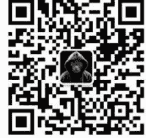

# 除了香火，寺庙的钱都从哪来？

240909

整理：公众号懒人搜索，懒人专属群分享

懒人微信：lazyhelper

眼看着上线一个月，《黑神话：悟空》的热度还在持续。在商业世界有个有趣的现象，假如一个超级商品突然出现，那么它大概率上会催生大量的周边产业。比如，当年汽车的普及养活了无数家修车厂，苹果手机养活了一批贴膜工厂，奥运会让义乌的商贩们忙得不可开交。

而这回的《黑神话：悟空》也一样，也催生了大量的周边产业，除了西游相关的产品之外，它还带火了一轮寺庙游。而每回提起寺庙，很多人都会联想到一个问题，就是全国各地那么多寺庙，人家平时都是怎么维持影响力的呢？

先强调一句，我们要讨论的，不是作为宗教的佛教，也不是作为一门知识体系的佛学，而是特指作为文化事业机构的寺庙。

今天，咱们就来回答这个问题。咱们先从山西说起。

在这一轮寺庙热中，存在感最强的省份是山西。在《黑神话：悟空》官方公布的 36 个取景地当中，山西就占了 27 个。为什么取景地集中在山西？

首先，山西的古建筑特别多。根据第三次文物普查统计，山西有 28027 处古建筑，位列全国第一。其次，针对西游的故事背景，我国现存的唐代木结构建筑，几乎都在山西省境内。这回，凭借着《黑神话 · 悟空》的热度，像玉皇庙、崇福寺、小西天、铁佛寺、双林寺等游戏取景地已经成为热门旅游景点。

但是，你可千万别觉得，这些景点就是靠游戏的热度养活，人家平时的经济收益可一点都不差。

公众号懒人搜索，懒人专属群分享

比如，山西大同的云冈石窟，原名是“石佛寺”。根据云冈研究院提供的数据，2023年，云冈石窟景区的旅游人数突破了300万人次，光是门票的收入就突破了2亿元，创下历史新高。

再比如，隰县的小西天，今年上半年，景区累计接待游客13.5万人次，文商旅综合收入超过2.2亿元。

过去我们往往把寺庙当成是一个特殊的文化事业单位，但现在寺庙已经呈现出非常丰富的业态。

前段时间，房地产研究专家卢俊老师的团队就专门做了分析。简单说，寺庙的业态主要分为这么几种形式。

第一种，也是最基础的方式，就是把寺庙作为一个旅游景点，在这个模式下，寺庙的钱主要来自门票。比如，最近几年因为“寺庙热”，很多寺庙的门票收入都迎来了一轮增长。根据携程的数据，2023 年以来，寺庙相关的门票订单量同比增长了 310%。2023 年，雍和宫、普陀寺、少林寺、灵山大佛等寺庙的门票收入都突破了亿元大关。其中，普陀寺的门票收入更是高达 21 亿元。

当然，除了最基础的门票，寺庙另一部分收入还来自法会和捐款。再加上技术的进步，很多寺庙都增设了电子功德箱，支持扫码捐款。

# 寺庙的第二种放大影响力的方式，是做周边的文创产品。

寺庙的周边产品，不限于素食、奶茶、咖啡、手串等品类。比如，最近两年非常火的雍和宫的手串，不仅给寺庙增加了收入，甚至还带动了手串这个品类的繁荣。再比如，灵隐寺特产的陈皮酱油；鸡鸣寺自创的“鸡鸣奶茶”，每天销量超过百杯；还有财神庙的财缘咖啡、永福寺的慈杯咖啡、灵隐寺的囍德咖啡、法喜寺的沐欢喜咖啡等。

还有一类寺庙是借助新技术，扩大自身的影响力。比如，北京的龙泉寺，启用了互动机器人“贤二机器僧”。再比如，更早之前的2021年，百度和少林寺合作，通过 AI 技术打造的少林寺虚拟人形象，给少林功夫做文化宣传。

寺庙放大影响力的第三种方式，是把寺庙当成一个杠杆，去调度周围的其他资源。

比如，陕西的法门寺成立了自己的青少年培训基地，还发展出了有机农业与生态旅游相结合的“禅农双收”的模式。再比如，福建三明的吉祥寺，面向养老服务，成立了中国首家“寺院养老院”。

再比如，在今年 8 月初，上海的玉佛寺公布了最新规划信息，假如 2029 年顺利竣工，那么玉佛寺就会拥有国内首座“佛系”酒店和上海第一所佛教博物馆。

再比如，出海。没错，很多寺庙的影响力已经不再局限于国内了，也开始出海。在这方面，最成功的是少林寺。根据统计，目前少林寺的海外文化中心已经有 200 多家，遍布五大洲的主要国家。这些文化中心的业务，不仅有少林功夫，还有中文课、茶道课等。2022 年，当代中国与世界研究院还发布了《中国话语海外认知度调研报告》，结果发现，在外国人最常说的 100 个中国词语中，“少林”这个词排在榜首。

好，关于寺庙放大影响力的方式，咱们先说到这。我们能看到，随着寺庙游客的年轻化，它们放大影响力的方式也越来越丰富，而寺庙与游客之间的互动方式，也变得越来越多样。

再来看今天的第二条。上个月底，拼多多的股价出现了一轮振荡，跌幅最大的时候，据说是一个交易日前后跌掉了将近 4000 亿人民币，相当于一天跌掉了一个小米。黄峥的身价也因此缩水，并且从国内首富的位置上跌落。

但是，我们今天要说的重点，并不是拼多多的股价，而是由此引发的一个问题，这就是，怎么判断一家公司的长期投资价值？

注意，我们接下来要说的，不是任何具体的投资建议，只是分析公司的方法。投资有风险，决策需谨慎。

这套分析方法，来自得到《投资参考》的主理人，何刚老师。

好，回到正题。何刚老师说，一家公司的构成因素有很多，但是，假如要分析它的投资价值，最需要关注的，其实是这么三个因素：
- 一看行业，也就是公司所在行业的规模性和竞争性。
- 二看管理，也就是公司内部管理的方向感和稳定性。
- 三看运营，也就是公司财报反映的盈利性和风控力。

好，这三个因素摆在这。接下来，我们用这套方法去分析几个案例。

第一个案例，我们看看摩根大通。

这家公司的第一个方面比较出色，行业规模性和公司竞争性都比较稳定，量化得分优秀。在第二个方面也比较好，公司方向感和管理稳定性都较好，量化得分也算优秀。但在第三个方面就存在争议，公司盈利性有所下降，风控力相对较好，量化得分算是优良。

何刚老师说，这就可以初步判定，摩根大通基本满足当下极具投资价值的主要指标，但它的盈利性下降，对于公司的长远投资价值带来隐患，可能并不值得太长时间持有。

公众号懒人搜索，懒人专属群分享

第二个案例，我们再看看茅台。

这家公司的第一个方面就有所变化，行业规模性在下降，但公司竞争性稳定，量化得分最多优良。在第二个方面也有争议，公司方向感有所摇摆，管理稳定性也有分歧，量化得分只能算及格。但在第三个方面仍然出色，公司盈利性稳中有升，风控力非常出色，量化得分算是优秀。

何刚老师说，由此可以初步判断，贵州茅台开始不太满足当下极具投资价值的多项指标，唯有它仍然出色的盈利性和风控力，表明公司长远投资价值并未消失，但短期估值震荡或下跌可能难以避免。

注意，我们前面说的，只是何刚老师分析方法的略缩版，这套分析工具实际上要详细得多。假如你在这方面有需要，推荐你学习何刚老师的《投资参考》第二季。

最后，再说个题外话。假如经常听我们的节目，你可能会发现，我们隔三差五就会找何刚老师请教，而且请教的很多问题，其实跟投资、跟财经都没什么关系。比如，俞敏洪和董宇辉分手的事。

为什么？这主要是因为，何刚老师看问题，有一个让我非常佩服的视角，我管这叫，利害视角。也就是，在很多情绪性特别强，特别容易让人上头的事情上，何刚老师往往能跳出情绪，用接近绝对理性的方式，去分析其中的利害关系。

比如董宇辉事件，很多人在讨论理想主义，讨论直播行业，但何刚老师最先关注到的，是这件事里的利害关系。也就是，谁是直接受益者，谁又是直接承受损失的人，像东方甄选的股东和留下来的员工，他们其实是整件事里的直接损失方，但之前很少有人关注到他们。

你看，不管你是否关注投资，这个利害视角，都能帮我们想清楚很多问题。在何刚老师的《投资参考》课程里，你也能收获这个接近绝对理性的利害视角。这能帮我更清晰地思考，而且这些思考不局限在投资领域。因此，这门课程，推荐你多多关注。

最后，总结一下，今天说了两个话题。

第一，寺庙都是怎么放大影响力的？随着游客的年轻化，寺庙与游客之间的连接方式，正在变得越来越丰富，并且通过周边产品、新技术、新业态，与年轻人产生越来越多的互动。

第二，怎样分析一个公司的投资价值？我们说了何刚老师的方法。在这也特别提醒，这些只是分析公司的参考工具，并不作为具体的投资建议。同时，也希望这些方法能对你思考其他问题有所启发。

公众号
懒人搜索
懒人专属群

微信:lazyhelper

历史 3000 多份各类付费文章以及年费三千多的副业社群资源, 见懒人专属群内部分享!

付费群, 白嫖勿扰!

# 懒人专属群更新记录：
https://lazybook.fun/#/blog/record2