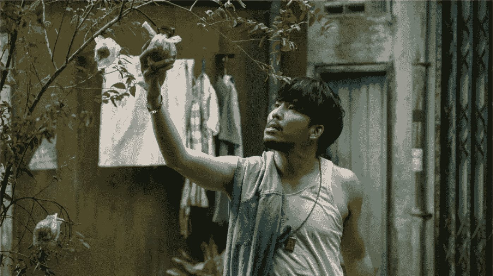
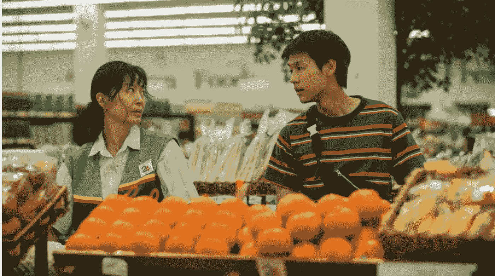
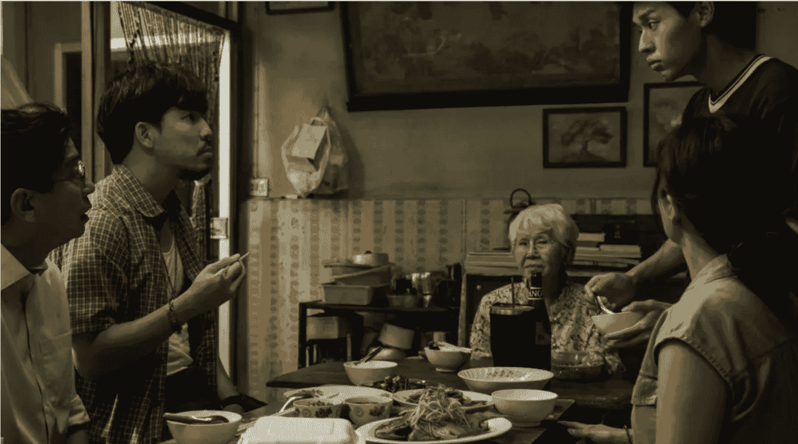
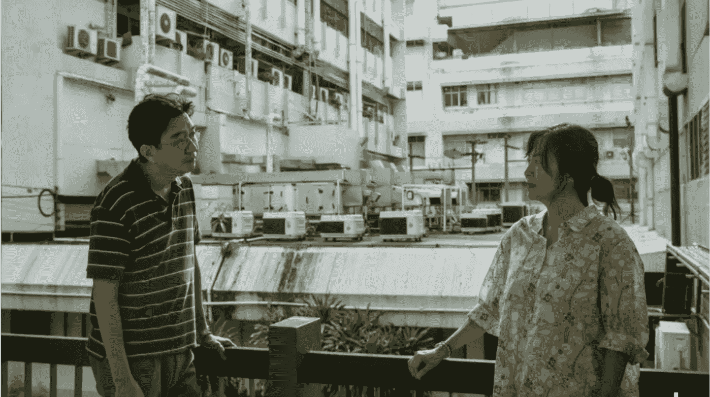
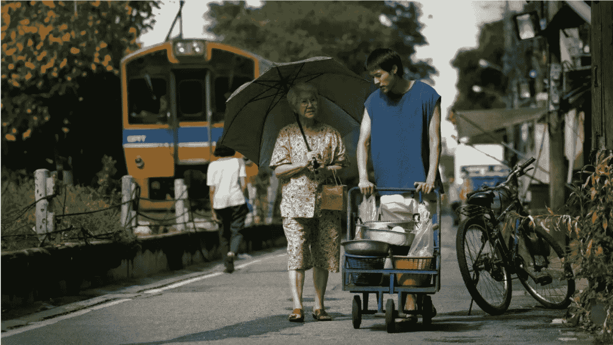
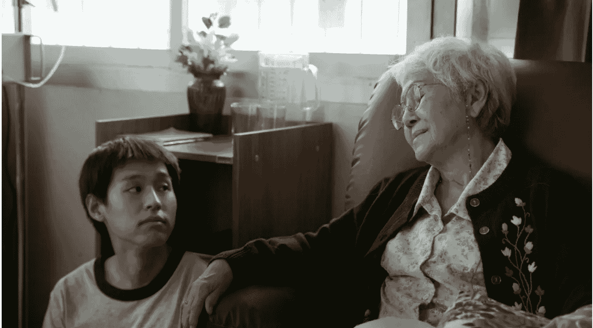

# 超高豆瓣评分，可能是近期最好哭的电影

240911 看理想

整理：公众号懒人搜索，懒人专属群分享

懒人微信：lazyhelper

懒人推荐词：一部看介绍就知道，看的话肯定会泪流满面的电影。其实于心有愧，因为祖父最后的那些时间里，我并没有亲力亲为地在场照顾

## 正文

中秋在即，是聊家庭片的好时候。截至目前，今年的院线最佳家庭片，当属泰国电影《姥姥的外孙》。这部电影在豆瓣上获得了9.0的高分，以缓缓流淌的节奏，激起了观众面对亲情最丰富而矛盾的情绪。

影片中的家庭具有华裔背景，老一辈从潮汕移民至泰国。导演帕特·波尼蒂帕特如同握着一把手术刀，细致地呈现了中国传统家庭结构、思想观念和情感纹理，每个人或多或少都能从中看到自己家的影子。

团圆之际，许多人也将像电影中逢年过节的场景那般，一家人围聚在餐桌旁。面对此情此景，你是否也会环顾四周，思索这其中有几分是真情实感，又有几分由金钱勉强维系？

### 01. 真金“唤”得来真情吗？

电影重要的设定，是表面上互相关爱的亲人，实际上却各怀心思。主人公阿安的堂妹无微不至地照顾瘫痪在床的外公，成功在外公去世后继承了房产。阿安萌生效仿的念头，主动搬到外婆家去照顾她，企图复刻堂妹的致富之路。

随着阿安融入外婆的生活，目睹她日复一日早起卖粥的艰辛、被伤痛折磨时的挣扎，以及盼望家人时孤独的背影，慢慢对她产生了真正的理解和温情。电影的主线似乎正面呼应了中文海报上的一行小字：真金“唤”真情。

真金“唤”得来真情吗？对于阿安和他的堂妹来说，答案是肯定的。尽管堂妹照顾外公的初衷是为了房产，但她的情感并非尽是虚伪。她照顾外公照顾到闻不出老人味、对那些不管不顾的亲属心生怨恨、房间里摆着和外公的合照、在提到外公时流眼泪，这些情感也是真实的。

然而，这句海报宣传词的讽刺意味也难以忽视。对于老人的两个儿子来说，金钱的确把他们给“唤”来了。

大儿子直到母亲患癌时日不多的时候，才终于愿意将她接进自己富裕的家，企图用最少的成本挣得最大的回报。小儿子同样在需要钱时才来探望母亲，拿到钱便扬长而去，为母亲安装的厕所扶手摇摇欲坠。

虽然子辈和孙辈都是被金钱“唤”来，但与老人的情感发展深度形成了明显的对比。金钱能否吸引来真情，关键在于被金钱吸引来的人是否愿意投入更多时间陪伴、交流和照顾，以培养出真正的情感联结。正如阿安的堂妹所说：“你知道老人最想要而子女却给不了的是什么吗？是时间。”

最新一季的《圆桌派》讨论了关于“全职儿女”的社会现象：在就业机会和环境不理想的大背景下，有些年轻人选择住在父母家中，付出一定的劳动，比如做家务、理财、安排出行计划和陪伴父母，而父母则从工资或存款中拨出一部分作为子女的金钱报酬。

在这种现象中，不少子女真心愿意为家庭付出劳动，并通过陪伴为父母提供情感价值。而父母不仅因此获得了额外的家庭帮手，还避免了因子女离家工作而产生的孤独与牵挂。如此形成了一种家庭经济“内循环”的模式，亲情与金钱相互促进，达成了一定程度的自洽。

与之相反，节目嘉宾竹幼婷谈到了芬兰的情况。芬兰年轻人在成年后便离开家庭，依靠政府的住房补助和就业指导实现经济和精神的独立。这种方式的确有助于培养孩子的独立性，且有效减少了金钱利益损害亲情的可能。然而，这种模式也可能导致亲子间的互动机会大幅减少，让亲子关系变得疏离、个体更感孤独。

情感和物质并非天然对立。对于一些家庭来说，金钱上的往来可能为交流互动带来契机，成为维系亲情的媒介。在影片中，阿安一边给妈妈捏肩按摩、撒娇讨好，一边要钱买游戏机，妈妈露出无奈却宠溺的微笑。尽管她嘴上需要责怪儿子不成器，实际上却也在偷偷享受儿子难得的撒娇与依赖。

不可否认的是，在涉及金钱往来的人际互动中，真情与虚情的界限往往非常模糊。在衡量感情的纯粹性和爱的无条件性时，我们会感到困难，原因之一在于许多关系都难以脱离金钱的影响而存在。

甚而有时，我们可能发现自己陷入继承亲人遗产的幻想，或者在顺利继承了遗产后既感到庆幸，又为自己的庆幸而自责。就像堂妹明知外公因食物卡喉却没有施救，这是为了帮助外公从病痛中解脱，但我们也能看到她在继承遗产后同时感到内疚和得意的复杂情绪。

心理学家欧文·亚隆曾在书中坦承，尽管他对母亲怀有深厚的感情，但他也曾偷偷希望她早日去世，这样他就可以继承部分遗产。亚隆的心理分析师对此回应道：“那似乎是我们都会有的想法。”

这句话令亚隆倍感慰藉。他第一次意识到，这种由于被现实利益左右而产生的深层的矛盾情感是如此普遍，但并不能仅仅因此而否定自己对亲人的深情与爱。

金钱是帮助维系了亲情，还是污染乃至毁坏了亲情，需要根据实际互动的时间和体验来确定。或许每个人对每段关系都会给出不同的答案。

然而，当亲人之间不再真正愿意互相陪伴，仅有的互动几乎完全围绕金钱或遗产问题而展开时，每个人的一举一动都像是在无声地追问：我在你眼里，究竟还值多少钱？

### 02. 谁才是你最爱的那一个？

电影中大部分角色的行为动机在于“能否获得老人的遗产”，而这与“在老人心目中最是否排首位”直接挂钩。于是，强烈的竞争意识蒙蔽了子孙与手足亲情，每个人都为了在隐形的爱的“排行榜”上占据榜首，费尽心思地讨老人欢心。

每个人都患得患失，彼此揣测。阿安格外在意外婆在他人面前对自己的评价以及她对待两个舅舅的态度，还理所当然地认为妈妈关心外婆也是别有用心。

外婆最疼爱不成器的小儿子，有趣的是，小儿子似乎对自己在母亲心目中的地位有恃无恐。他不像大儿子和阿安那样焦虑，反而显得任性自在。在缺钱时，他只需要到母亲家，疯狂亲吻母亲的脸颊，便能得偿所愿。

每个人都在根据自己在“排行榜”上的位置，来决定自己还需要付出多少努力。

小儿子清楚自己不必费力便能名列前茅，所以他付出的最少，态度也最敷衍，甚至不计后果地偷走母亲的血汗钱。相反，大儿子和外孙激烈地争夺照顾老人的机会，他们知道自己的排位落后，若想“逆袭上位”，就必须争取付出更多。

至于老人的女儿，即阿安的妈妈，早已敏感地觉察到由于女性的身份，自己甚至没有进入“排行榜”去争夺遗产的资格。即便如此，她仍然是最常出现在母亲家的那个孩子，为母亲清理掉冰箱里过期的食物、陪母亲去医院、将作为超市职员的日班调换到夜班，以便白天能陪母亲去理疗。

不求回报地去关心家人、照顾父母，常常被视为女人的天性。仿佛女性的真情就无需真金来“唤”，而是与生俱来的。然而，女性并非天生愿意成为无私的奉献者，而更多地是在被迫顺应社会性别角色的期待。

如罗斯·哈克曼在《情绪价值》中所写：“好女人”就是给他人创造情绪体验……“好女人”应该慷慨地为他人而活，不能庸俗地索取金钱，否则就玷污了自己。

影片中的外婆在年轻时被家人安排嫁给一个嗜赌的丈夫，并照顾自己父母的晚年，但父母还是将遗产留给了几乎什么也没做的哥哥。电影中女儿的一句“女儿继承癌症，儿子继承家产”广受共鸣。这句话生动地诠释了波伏娃把女性的处境视为一种不供选择的普遍命运的观点。

一方面，女性清楚自己被家庭和社会所异化，被剥夺了应得的报酬；另一方面，对父母的爱与共情使她们难以停止无偿地付出。

这种处境要求女性“逆来顺受”、“舍己为人”，如同会遗传的“癌症”般被一代又一代女性承担与经历。这句道尽辛酸与无奈的台词，以及外婆在哥哥家充满愤懑的质问，都宣泄着女性内心深处对不公待遇的不满与抗议。

影片中老人最终向女儿道出心声：阿安问她谁在自己心中排第一，其实她最想要的是和女儿一起生活。老人对爱的表达仍然婉转，但这句表白的背后确乎隐藏着母亲对女儿的付出的承认与感激。

然而，只要家庭和社会仍认为女性出嫁后便不再归属于原生家庭，即便母女一起生活，女儿也很可能被继续困在“廉价”的爱的劳动中。类似地，女儿的后代被视为“外”孙，也反映了家庭对女性成员的排斥与贬低。

只要这种等级观念存在，下位者的付出就会倾向于被视为无形且低廉的，难以获得先于性别的、作为“人”的自由与权利。

当然，老人最终把房产留给小儿子，不仅是因为他年纪最小，以及重“内”轻“外”、重男轻女的传统观念，还因为她知道小儿子在所有子孙当中最不可能依靠自己生存下来。

小儿子既没有生存技能，又常在外面欠债，为了让他在失去母亲的依靠后仍能比较好地活下去，老人做出了这个令其他人难以接受，却又无可奈何的抉择。

在这场老人临终前的“排位赛”中，传统的价值观念和家庭结构早已预设了大儿子和外孙的努力注定徒劳无功，而女儿更是无需斗争。胜利从一开始就归属于小儿子，这种命运的先定性构成了这部电影悲剧的内核。

### 03. 丢失的爱是成长的代价？

尽管故事的内核是一场悲剧，但影片并没有将这种悲情无限放大，使整个家庭显得苦大仇深。相反，导演在影片中努力寻求解决之道，试图修复因金钱利益而受损的亲情。其中一个关键的修复方式是通过激发角色的记忆，重新唤醒个体成年后，由于专注于个人利益而丢失的对于爱的感受。

在与外婆的相处中，阿安逐渐回忆起外婆对自己的疼爱，比如小时候由外婆接送上学、因怕黑而睡在外婆身边听她唱摇篮曲，以及外婆一直遵守着只将石榴树上的石榴留给他的承诺。这些童年的记忆，在他长大后专注于打游戏的过程中早已被尽数遗忘。

重新忆起外婆的爱，阿安开始真心想要回报她。这一次，轮到阿安牵着外婆、为她擦背、默默将她毛衣上的白发一根根摘下，并在外婆做噩梦时陪伴她、为她唱摇篮曲、铭记她穿衣的喜好和对一块好墓地的向往。影片传达着这样的信息：真情往往藏在互动的细节中和对于这些细节的记忆里。

而当真情消逝，人们便不再关注关于家人的种种细节，也不再想起家人曾经的喜好与付出。正如外婆舍不得换下大儿子送的不合脚的鞋，而忙于自己的小家庭的大儿子从未注意这点。

后来他因为房产问题怄气，不肯进门探望母亲。阿安提醒他，外婆是因为他小时候总生病，才向佛发誓一生不吃牛肉。大儿子猛然忆起母亲对自己的爱，终于深受触动。

成年人有时会在生活的纷扰中，将童年所感受到的爱遗失在记忆的角落。而作为长辈，同样擅于将爱藏在不易察觉的地方。影片最后，我们才知道原来从阿安小时候起，外婆就一直默默地为他存钱，存够了一百万。这段默默存钱的时间长度，也是外婆将爱所埋的深度。

同样，外婆知道了阿安在网上卖房的事，没有当面质问阿安，很可能也是因为不想让他难堪。家人之间好像成为了把爱深藏的同谋，一个是因为忙于自己的事情而忘记，另一个则由于过于婉转深沉，主动将爱掩藏。

小儿子最后想给阿安一些钱，作为对其照顾老人的回报，但阿安拒绝了并对他说：“拿着吧，以后没有人会这样帮你了。”小儿子怔了片刻后默默地将钱收回。

或许在那一刻，小儿子幡然意识到，这个世界上除了自己的母亲，再也没有人会如此无私地爱自己了。当爱被重新感悟到时，它也可能已经离自己远去了。

与外婆之间的情感，曾被阿安丢失在长大的路上，却通过一首潮汕摇篮曲重新连接。如同孙燕姿在《天黑黑》中所唱：我的小时候/吵闹任性的时候/我的外婆总会唱歌哄我……离开小时候/有了自己的生活/新鲜的歌/新鲜的念头/任性和冲动/无法控制的时候/我忘记还有这样的歌/天黑黑欲落雨……

成人世界的情感难免由于利益得失而有所残缺。有时回头望望长大的路，拾起那些被不知不觉抛却在记忆之外的被爱的体验，或许也是“唤”回真情最好的方式之一。