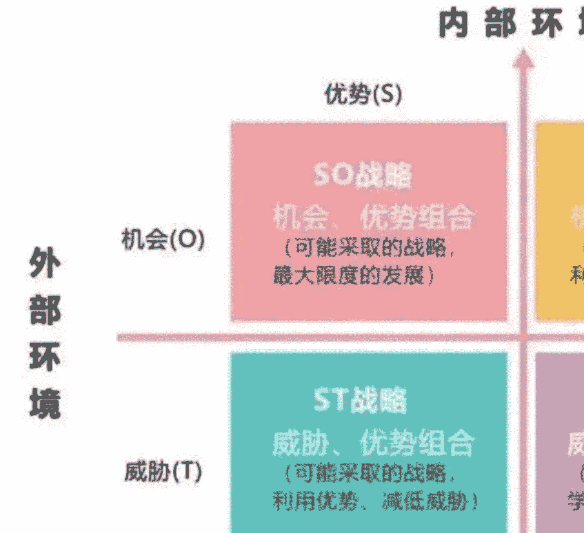

# 鉴茶院星球文章

240911

鉴茶院的文章比较散，内容也不多，这里简单聚合几篇。群友们按需自取~

## 红尘修炼：身弱之人怎么处世

张爱玲《半生缘》：

曼桢便帮着她祖母热饭端菜。她祖母又道：“你妈说你姊姊，怎么自从搬到新房子里去，老闹不舒服，不要是这房子不大好吧，先没找个人来看看风水。我说哪儿呀，还不是‘财多身弱’？”

中国的命理学有个概念叫做“身弱”，西方心理学也有“人格缺陷”。

这个身弱不是指身体不好，也不是说命不好，而是说自己“内生元素不足”。

身弱就容易不担财官，搞不定大钱和地位。财官和人的能量，本质是天平两端。

怎么判断你是不是身弱？其实就看你感性多，理性多，自不自私。

身弱的人，自己有感觉的，比如容易焦虑，容易悲观，容易疲惫，容易优柔寡断，容易在乎别人看法，容易动感情。

世界上身弱之人非常多，成大事的人，身弱比身强的多。

身弱之人如何成大事，摆脱焦虑悲观，寻找幸福呢？

- 第一个，用比劫。
比劫是比肩和劫财，就是朋友同事和圈子，人多热闹，氛围好啊。自己扛不起事，大家一起扛，自己那点小悲观，朋友们一聚会吃饭，烟消云散。马老师就是典型的身弱，所以他用了十八罗汉，大家一起来。

- 第二个，用印。
印，既是房子，学习，证件，书籍，也是母亲。自己不够强，找点生扶自己的东西，自己的学习进步读书是很补能量的。

- 第三个，用离。
身弱之人太重感情通常又有才，玩暧昧没输过，玩真的没赢过，很容易就陷进一些事里面。所以日常要学会断舍离，没用的东西扔了，对你不好的人断了，把圈子和生活搞简单点，保护自己的能量。感觉跟那个人滋养，多待待，多靠近。感觉那个人那个公司很消耗你，不快乐，不要侥幸，止损离场。只选择不改变，今天你在关系里的每一份纠结和痛苦，都是你当年明知选择错误时，脑袋进的水。身弱之人感觉非常敏锐，相信直觉，那是保护你的。

- 第四个，用养。
身弱之人脾胃一般都不好，胃属土，是大地是根基，你不好从大地汲取能量嘛。命理学的辰戌丑未四个库，本源都是土。所以要找中医调理胃病，没事多去晒太阳，赤脚走在大地上，补自己的元气。

- 第五个，用修。
身弱之人喜欢住到“相”里面，对一件事耿耿于怀，这时候你要告诉自己，接受现实，已经发生了，勇敢一点。自己当父母去抚慰自己内心那个小孩。喜欢对抗情绪，百转纠结，是身弱之人陷入痛苦的一个根源。身弱之人基本上都有才华，容易生“食伤”，食伤是生财的东西，所以痛苦难受的时候，悲观抑郁的时候，最适合的事情，去找朋友吹牛聊天讨论搞钱。

一念起，立刻做功，要么穿跑鞋去跑步，要么立刻去大声读书，扭转这个情绪。

悲观，抑郁，焦虑，压抑等负面情绪，都是低频能量，而运动，读书，聚会，干活，吹牛等都是高频能量，对待低频的东西，不要试图去直接解决问题，而是拉高自己，充盈心力，让高频能量降维打击，问题自然而然就不是问题了。

钢铁侠马斯克也是身弱，小时候原生家庭有缺失，9岁父母离异，他极度缺爱，内心充满创伤。他补全自己的方法，一是拼命干活，要大家承认他，二是找人来滋养他，不停的换女朋友，希望对方以自己喜欢的方式来爱他。别看他是亿万富翁，经常把恋爱谈成舔狗，因为他只是功能性身份强大，内在的人格很不完整。

人是没有办法让别人的爱来填补自己的，人到最后只能是本自具足。当你足了，后面的钱财和感情，自然就好了。

# 大王与你读兵法42：功夫在诗外

我们平时看到一只股票嗖的拉上去了，涨上去只要一周或者几天，看到一个公司一下做成项目了，中标大几千万，看到谁成功了，纳斯达克敲钟那个神态。殊不知，背后是95%布局、积累，漫长准备。

打仗更是如此，觉得打仗就是乒乒乓乓去比哪个将军更猛，哪个部队更能打，完全是战场小白，也不懂真正的竞争。打仗这个事，只有5%-10%的时间是真正火力交集，两军短兵相接。剩下90%的时间在干嘛？赶路扎营，迂回包抄，先一步到达地点，抢占先机。

孙子说，“故军争为利，军争为危”。争夺有利条件，既有获得先机之利的可能，也有走向危险局面的可能。为什么呢？军队是一个整体，打仗是后勤、装备、兵器、体力等多种要素的结合，不是你一人吃饱全家不饿。

“举军而争利，则不及；委军而争利，则辎重捐。”如果出动全军去争夺先机之利，又要携带全部辎重装备，就会影响行军速度，而无法及时到达；但如果丢下辎重轻装前进，就难免损失一些物资装备。

要轻装还是重装，一切就看你怎么想了，各自有利有弊啊。

> “是故卷甲而趋，日夜不处，倍道兼行，百里而争利，则擒三军将。”

因此，让将士卷起盔甲，不要辎重，轻装前进，昼夜不停，一天走两天的路程，急行百里去争先机之利，那么三军的将帅都可能被敌军所俘虏，一定是打个大败仗。为什么呢？部队的体力有限，资源有限啊。“劲者先，疲者后，其法十一而至”。健壮的士卒先到，疲弱的士卒后到，结果是只能有十分之一的兵力到达预定的目的地。

你滴滴啦啦的怎么打仗呢？敌人以逸待劳，还不把你从容吃掉？

“五十里而争利，则蹶上将军，其法半至。三十里而争利，则三分之二至”。如果你急行军五十里，只有一半人能做到，先头部队将会遭受挫折。如果你一天走三十里，也就是三分之二能到。根据一个人的体力，一个军队一天的行程最好控制在30里以内，古代三十里为一“舍”，退避三舍就是后撤90里。

“是故军无辎重则亡，无粮食则亡，无委积则亡”。所以，军队没有装备辎重就会被歼击，没有粮食供应就不能生存，没有军用物资的储备就必然失败。

各位，大家有过一家子出去旅游的经历，光是收拾老人小孩的东西和各种准备物品就得多少时间精力？你想想“卷甲而趋”，什么都不带出国游一周是什么感觉？出去玩都这样，何况真刀实枪的搏命呢？

因此，又要快又要先机，就得反复权衡啊。重装重到什么地步，轻装轻到什么程度？什么时候轻什么时候重？就像炒股一样，如果不搞热门板块和主线，就没有先机，带着大部队得慢慢磨，看得你难受；搞了热门板块和网红，如果你仓位不重，挣一点点又没意思，等想明白加仓了，时间来不及了，主升浪结束了，最后自己还给亏了。不重仓，挣不到钱，重仓了，又可能亏得很惨。那么，到底拿多少仓位和辎重和对方博弈，就非常考验各级指战员和操盘手了，怎么搞呢？你得学会看地形啊！

怎么看，有好几种地形和技术形态，孙子下篇告诉大家。

# 158课 SWOT 人生重大方向与职业抉择

马上高考了，趁机谈一个工具。

孙子兵法说，庙算多者胜。一个人的发展和成就，就是那关键的几步，黄金时期没有踩对风口，岁月蹉跎，再追上来就难了。无论是高考、找工作、职业选择、重大项目，SWOT 都是一个极好的战略工具。

它由四个象限组成，即优势(Strengths)、劣势(Weaknesses)、机会(Opportunities)、威胁(Threats)。对于个人来说，你的优势包括哪个方面，可以对号入座，优势(Strengths)：

- 1、独特技能：在某些领域中具有不可替代的价值，通常指“能带来结果的专业能力”，比如说编程一流，焊工八级，等等。但请注意，这个能力一定要精益求精出类拔萃，在行业有一定影响力最好。
- 2、经验优势：过去的经历和经验，对现有平台和别人有用。比如，你有卖燃油车的经验能力，你到新能源车企一样有用，你有同类大公司履历，你去小公司降维打击。
- 3、资源优势：你自己，或者你家里人，有什么样的人脉关系，客户资源，你在某一类人群有影响力，你是名校背景光环，有个敲门砖，等等。
- 4、个人能力：创新能力，学习速度等，这个不容易显化，但适合去切换赛道，复制成功经验。

## 劣势(Weaknesses)

- 1、技能不足：不是某领域技术人士，那样不适合往专才发展。
- 2、管理匮乏：在时间管理、情绪管理、效率管理、耐心管理等方面有不足，这就不适合个人单独创业，适合先去大平台磨炼或者合伙。
- 3、社交障碍：不喜欢沟通表达，抹不开面子，喜欢对待事而不是对待人。

## 机会(Opportunities)

- 1、宏观趋势性机会：比如 Ai、人工智能、新能源、消费降级等，会持续数十年。
- 2、行业性机会：本行业在趋势下的机会点，通常是：
  - 内卷——诞生出海需求
  - 低毛利——诞生精益管理需求
  - 消费降级——诞生下沉四五线市场需求
  - K型分化——诞生为高端消费者提供更好服务需求

## 威胁(Threats)

- 1、你的龙头，大公司降维打击下来，你会不会死。
- 2、你的同行，别人做，你的独到优势在哪。
- 3、你的同事，你更高更快更强的价值点在什么地方。
- 4、你冒出来的竞争对手，别人跨行来搞，你有什么优势。

无论是你高考填志愿，甲方搞项目，个人做职业选择，转型看未来发展，都只有一个大的方向：不断扩大深化自己的优势，尽量避免自己的劣势，不使其造成决定影响。然后，利用持续的转型升级和第二增长曲线，来应对可能出现的新竞争者。

人类在社会上进步不是木桶原理去盛水，恰恰相反，所谓“人过三十不学艺”，不是说不进步了，不学习了，而是不在低效低能量的平台、公司、技能上浪费时间和资源了。而是要把自己擅长的，喜欢的，低消耗高产出高质量的东西不断放大，这就叫传递价值。孔子说，一日三省吾身，平时没事干，把自己的东西往空白的 SWOT 表格里填填，汗流浃背，快马加鞭。

# 家庭作业：中小企业常见财税大坑

我本硕的专业都是税务，毕业后又在税局、民企、国企、中介混了20多年，别的行业不好说，税务领域的门道还是很深的。

- 一号坑：企业注销，一了百了
好多人觉得只要企业注销了，之前的涉税问题就会一笔勾销。这个观念是老黄历了，从去年开始，公开媒体爆出很多案例，企业注销之后才发现有问题，有的税局会追究股东的责任；还有的会让企业“起死回生”办理恢复登记，然后再该打打该罚罚。这里面走简易注销流程的，风险尤其大。当然有人可能会问这是不是普遍现象，谈不上普遍，但确实是个不确定风险，一般是遇上举报或者被其他案件牵连，拔出萝卜带出泥。反正我家亲戚要注销的话，我都会让他清理干净再注销，如果可以，尽可能选择确定性。

- 二号坑：0元或者平价转让股权
既然是老板，就免不了涉及到股权转让这样的大宗资产交易。很多老板想当然觉得既然股转个税的计算公式是股转所得*20%，那我0元转让或者平价转让就可以完美避税。这真是不拿干部不当干粮。前些年克强总理推行简政放权，把完税这个动作后置到了工商变更之后，税局和工商的数据交换也没有那么频繁，所以很多人在那个时期按照平价转股，税局也没找他。但是这两年开始不一样了，各地税局纷纷出台文件要求市场监管部门在办理股权变更手续时要先查验股转涉税资料，并且税局有自己的风控比对模型，所以再想通过上述方式转股，那就是自投罗网。

- 三号坑：办一堆个体户，以便提现
中小企业老板的一大痛点是如何能够低税负地把公司的钱转到自己兜里，为此很多不良中介给出的招儿是让老板自己或者家人朋友办个体户，然后让个体户与公司签订服务合同并且开票，然后让公司把钱打给个体，让个体把钱转给老板。听起来好像没什么问题，但事实上这样的操作大多没有业务实质，并且喜欢采取咨询费、技术费的方式，因为这类业务的增值税税率较低。在摸透了这一系列的心理之后，税局也开始喜欢检查个体户提供的合同和资金流是否匹配。

- 四号坑：豪车避税
但是你想这视频又不是只有老板能看见，税局也能看见啊，随后南方某市的税局就以二手车市场的数据为依据建立数据比对模型，对该类事项进行专项打击，所以这招现在基本上不敢做得太过分了。

- 五号坑：成立软件公司，享受税收优惠
为了降低业务全链条税负率，有人会建议成立软件企业或者高新企业，还说：“他们（工程师）的水平好不好不重要，主要是看中他们的证，打不打卡都无所谓，我替你们打卡都行。”当然不是说不能享受这类优惠，但是至少要沾点边。有些企业纯粹就是编造业务，现实是现在税局对这类企业检查越来越严，甚至开始讨论你这个业务是否具备科技属性。

- 六号坑：技术成果，作价入股
前两天新的公司法开始执行了，企业实缴注册资本有了时间要求，有些老板会知难而退，选择减少注册资本；但是有些行业是有规模要求的，降低了注册资本就不能投标。所以新的税筹工具又产生了，就是个人将自己名下的技术成果以非货币形式投入到企业里，可以顶替实缴资本，但是又不会产生纳税义务，实际纳税需要个人转让股权的时候才发生。夸张一点的公司把自己名下的一个鼠标垫专利以8000万的价格投资出去，这种事儿多了，税局也知道其中的门道了，现在据说北京已经私下约定不接受该事项的备案了。

写到这里，粗略一看又1500字了，太长就没人看了。那就先到这里，哪天想起来再补充，或者有朋友想问，也可以随时问。

# 匿名用户提问

提问：今天最后一天填报志愿，委决不下，方案想请教大王看一下孩子的八字，壬午年辛亥月乙巳日申时，文科生，适合往哪个方向的城市去发展，北京、上海、苏杭、深圳、长沙，不胜感激！

回答：文科肯定北京上海啊，首选北京，艺术家们在上海都活不好。小城市没有第三产业，哪里养活得了文科生。

# 税制改革对普通人影响

这次很大的变革，将是税制改革。因为地方没钱，地也卖不动了。总不能总发债吧，所以分税制肯定要深化，给地方更多税收收入。

之前一些地方的“倒查30年”，其实是一种划断。以后，国人也要面临“唯死亡和税收不可避免”了。税改有什么方向？对普通人影响在哪？

一是，扩大税基，以后你开个小店，卖衣服，烤面包，都要交税了。

二是，深化消费税。传统消费品如烟酒、汽车、化妆品外，可能逐步将一些新兴消费领域如互联网服务、二手房交易、跨境电商等纳入征税范围。以后你卖房，租房，甚至红包收多了，也要交税了。

三是，扩大抵扣。把租房，买保险等，加入增值税进一步的扩大抵扣范围，确保抵扣链条的完整性，降低真正干实业的企业的税收负担。

四是，加大调控。加大对高收入者的征收，去进一步缩小贫富差距。

总之，以后的地方要加大分税力度了，收税的模糊地带越来越少了，创业开中小公司越来越难了，个人和税的联系越来越深了，高收入者很难避税，要交的税越来越多，等到10年后，每个人都要有一手熟练算自己要交多少税的能力了。

当然在投资领域，不利于曾经可以在模糊地带的中小民企，利于国企和央企，他们别的不敢说，交税方面是非常规范的。

# 提问

匿名用户提问：大王您好，关于目标院校的选择想请教您和各位星友：有个堂弟，想就读的专业是机器人与智能装备，目标院校在西安交大和哈工大深圳校区之间做选择。请教各位选哪个学校更好呢？非常感谢。

补充信息：堂弟家在西北宁夏，以后想考研。（哈工大深圳校区毕业证和本部不一样，这个是否需要考虑）

回答：帮你问了他们的副院长，机器人肯定首选哈工大，哈工大一校三区都一样，深圳是因为分数比本部还高了，所以毕业证上会写深圳。如果将来奔着就业和研发去，深圳的产业基础比西安好多了，眼界和西北也完全不一样，如果想从政或者体制，那必须西交大，校友资源就不一样。

# 这个世纪大搏杀我只说一次

大国真正的兴衰命脉在哪？朝鲜。

隋炀帝绝对不是废柴，20岁就带50万大军灭陈了，他为何百万大军要三征高丽？后面的唐太宗总英明神武吧？他为何继续要去打高丽？朝鲜半岛是京津冀的屏障，一旦不稳，腹心直面威胁。明朝丢了朝鲜，很快满清就入关了。清朝拿家底也得打甲午战争，朝鲜一丢他也很快完了。抗美援朝不解释了吧?

大弟上台后，大国和大毛有一个心照不宣的默契。我不动你的外蒙古，你不要在朝鲜折腾事。但我们看这几天，大弟干了什么？

一手，跑去访问鑫胖，他要军火炮弹，你说胖要什么？核武。胖拥有核，谁受威胁最大？谁的产粮地，重工业基地在他边上？你说他会索要，威胁甚至勒索谁？大国一直在俄乌的事上说，不要用核武，你以为是什么意思？

一手，又去了越南，联手和他们开发南海油气，甚至商讨金兰湾驻兵。一南一北再加印度，大三角包围。

## 你以为只有帝国有岛链？

大弟想干吗？你得挺我，给我大好处让我赢二毛，不然撕破脸。给你是大毛，你是在乌东用战术核武利益大，还是偷偷给3胖甚至越南核武利益大？你想到这毛骨悚然，他全部都押上了，有啥不敢干的？

到这里，东大也冒火了，尼玛又一次体会到恩将仇报，被血淋淋地背刺。之前挨过这种大亏的都有谁？李鸿章、冯玉祥、孙大炮，谁想联他被坑死。东大干了什么事？热烈欢迎波兰总统杜达访问。波兰，被大毛瓜分三次，血海深仇，杜达何许人也，铁杆反鹅。这次俄乌，波兰其实是二毛大后方。你南北搞我是吧？我东西夹击你丫的。西边是波兰，东边谁？本子。我们最近在剧烈修复关系，连续搞了好几个高层论坛。龙永图亲自去东京了。然后就有本子在苏州被刺了，呵呵呵。

更值得深思的事，杜达去哪演讲？复旦。张维为等为代表的黑吹和鹅粉聚焦地。教员曾经说，要讲好故事，留好印象。他请谁来讲故事？埃德加斯诺、史沫特莱，南洋陈嘉庚。全世界对我们喜欢的不得了。现在这票狂吹的，让外面的人，尤其是大客户，越来越讨厌你。你说这是大国真正的样子吗？当时不是。

但是，大毛搞代理人一百多年历史了，大弟自己就是干特务出身的，你说他懂不懂怎么去挑动你的民族情绪，让你有苦说不出？所以这次，东大内部干脆让杜达去复旦了。

一直以来，东大内部就有3派，亲美的，亲欧的，自立的。这几年，亲欧的声音非常大，什么结果，大家也看到了。而我们要的是什么？既不亲欧也不亲美，我亲自己不行吗？要知欧派，知美派，足够了，然后自己为主的本土利益派。前两年要把亲美掰过来，搞成知美，现在要把亲欧的也掰过来，知欧矣。

所以后面如果要向好，就看两个大的方面：一个是外部，修复和大客户的关系，与损伤全球化的逐步划清关系；一个是内部，重拾自己内部的最大共识，改革。既然都进财经院了，相信各位都是有思考和良知的贤人，大家不要被各种杂音和所谓立场给带歪节奏，这个世界上有放之四海而皆准的道理，我们要站在更高的维度去理解世界和自己，听从光明和良知的第一选择，不要太搭理那些宏大叙事，财富，金钱，善意，那就是养命之源。自己好才是真的好。你说大弟搞事后，生意是好做了还是难做了？我们的环境是好了还是坏了？

喊打喊杀的，只是为了发泄自己现实的不如意而已。主动屏蔽，不要被消耗。

说这么久的战略，大原则就是著名战略家范雎的一句话：远交近攻。

今天 AI+应用大涨，谁出 AI，谁出应用？

# 高学历赛道大潮褪去

过去40年，好好上学去考名校卷高学历，是普通人性价比最高的赛道。根本原因是城市化和工业化需要大量千篇一律的高素质劳动者。

但现在需求方已经高度饱和，高学历赛道的产出比直线下跌。

将来在国内一定是卷高价值赛道。

上过学≠读过书，有学历≠有本事。

独立人格，一专多能。

我们的教育体制这方面差了点，所以要拼家学和父母素质了。

而在世界范围内看，产出比最高的已经是海外赛道，和欠发达国家的工业化。

通俗点说，有能力把中国资源拉高出货。家里孩子多的就占便宜了：一是出去闯荡，这种亲密血缘更加可靠；二是留老大在国内就行，老二老三出去博富贵。

当年，你是四五线城市的小镇做题家，10年时间就能考上大学逆袭到北京，扎根落户。将来不是了。

你有几个娃，你花800万在北京买房，帮他在首都扎根去卷，不如200万帮他多生几个弟弟妹妹，一人100万走海外赛道的路子。

等真富贵了，再回来去北上广捡好的资产。当年的荷兰，英国，美国都是如此。

重要的是，你不要被打上思想钢印，觉得除了考学校就没别的路子。普通人也有一条性价比很不错的路子：“闯关东”。

历史3000多份各类付费文章以及年费三千多的副业社群资源，见懒人专属群内部分享！
付费群，白嫖勿扰！
懒人专属群更新记录：
https://lazybook.fun/#/blog/record2