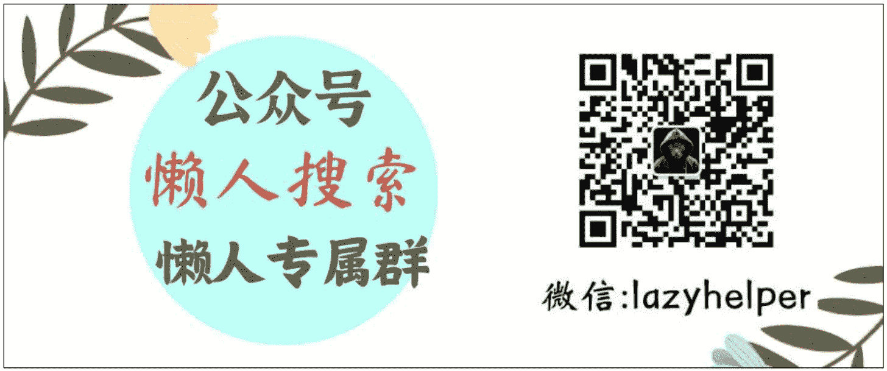
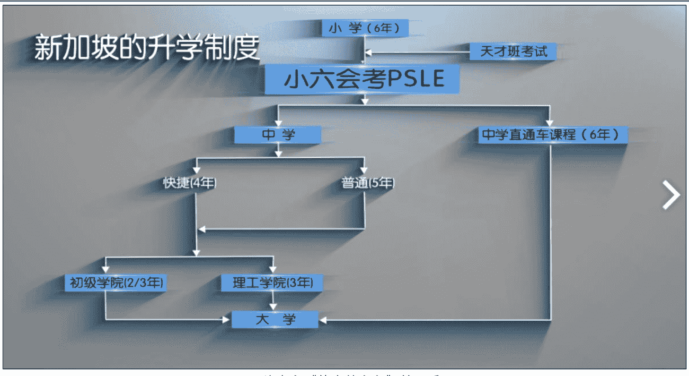

# 教育是一个社会所有东西的投射，无论好坏

240913

整理：公众号懒人搜索，懒人专属群分享

懒人微信：lazyhelper

最近在看一部纪录片，《他乡的童年》第二季（云盘地址：https://pan.quark.cn/s/d4ea5l9372e0）。感触很大，今天说一说。正好赶上开学季，也希望这些内容能对有娃的家庭，或者关心教育的人有所启发。

《他乡的童年》的导演叫周轶君，是国际记者出身。整部片子的主要内容，就是周轶君走访世界各地的学校，看看别人是怎么做教育的。《他乡的童年》目前一共两季，走访的地方包括日本、芬兰、印度、英国、以色列、新加坡、德国、法国、新西兰、泰国。

看完最大的感受就是，各个国家的教育体制的差异，远比咱们想象中的要大。

比如，新加坡，卷的程度，远超很多人想象。新加坡的教学体系是从小学开始层层分流，没错，等不到高考，等不到中考，而是从小学阶段就开始分流了。

小学三年级有个天才班考试，前1%的孩子进入天才班。接下来就是PSLE，简称小六考试，学生被分为三到四个梯队，只有前5%的孩子进入直升高中的直通车，剩下的学生会被分流到快捷班、普通学术、普通技术等梯队。

而这两次分流的意义完全不亚于咱们国家的高考。换句话说，对新加坡人来说，小学就已经是人生路上的第一个关键岔路口。

## 新加坡的升学制度

图片来自《他乡的童年》第二季

这对一个家庭来说意味着什么呢？对新加坡的家庭来说，小六考试是这场通关游戏中极为关键的一步。按照纪录片里的原话，这意味教育的竞争远远早于小学六年级，它开始于你进入什么样的小学，什么样的幼儿园，甚至出生在哪个区域，这些都可能影响你未来的人生道路。

纪录片还采访了南洋小学附近楼盘的销售。在 2021 年 9 月 9 日，新加坡政府修改了一项规则，原来 “一公里学区房” 是从学校的中间开始计算。但从 2021 年 9 月 9 日开始，一公里的规划是从学校的边缘开始算起。你可以感受一下，这个划定都精确到什么程度了？结果就是，那些被新划进来的学区房，房价一路暴涨。

再比如，新加坡的小学，一般都是下午两点放学，目的是给孩子留出更多时间去发展个人兴趣。但现实的情况是，大多数家庭都用这个时间来补课。在新加坡，大多数补习机构不仅可以直接帮你接孩子放学，而且还管饭。

## 是什么造就了新加坡的教育模式呢？

第一，新加坡是一个缺乏自然资源的国家，就连淡水都要从邻国马来西亚购买。而这种资源的匮乏，直接导致了新加坡整个国家的发展必须由人才去推动。目前，新加坡的人才制度称为“Meritocracy”，中文翻译过来就是“精英主义”。按照新加坡国立教育学院的教授陈英泰的话说，“精英主义”在新加坡更像是社会制度。说白了，在新加坡，人是最大且几乎唯一的资源。这也导致，他们从小就特别重视成绩。

第二，在国民心态上，新加坡是一个危机感很强的国家。在新加坡，有一个流行了很久的词语叫做“怕输”。

在上世纪 90 年代，还有一位新加坡的漫画家创作了一个漫画形象叫做“怕输先生”。

借用导演周轶君的话说，你在新加坡这个国家感受到的所有成功和舒适，都是通过精密的计划，严格的执行来完成的。每一种教育制度都是根植于它的社会文化当中，一个国家的教育是社会上所有东西的投射。

咱们再看几个其他国家的例子。

比如，以色列。目前，以色列是全球人均初创企业数量最多的国家之一，拥有超过 7300 家科技初创公司，在 2023 年最适合创业的国家中排名第三。

以色列的创业活力从哪来？主要原因之一，也是教育。因为以色列的学校样式非常丰富，学校的设计非常个性化。这就给了学生更加个性化的选择，让他们对创新有更好的手感。

那么，以色列的学校为什么这么多样？主要是因为，以色列是典型的地少人多。这里还是地球上最大的移民吸收国之一，60 年内吸引了高达人口 350 倍数量的移民。而这就意味着，以色列的学校体系得满足不同人群的需要。因此，以色列也就发展出了各式各样不同类型的学校。而这种个性化的选择就带来了创新的活力。

但是，凡有收益，必有代价。过度灵活的学校设计，激发了以色列人的创造力。但同时，也限制了他们扩大规模的能力。结果就是，以色列的大公司很少，绝大多数是创意型的小公司。

很多以色列人很擅长从零到一，想出出人意料的点子，但却不擅长扩大规模。

说完以色列，咱们再看看日本。日本教育最关键的主题之一是，集体感。

在日本，从幼儿园开始，孩子们就要经常一起喊口号，一起练习腹式呼吸。

周轶君采访了日本知名的藤幼儿园。

其中有一个细节让我印象特别深刻，就是教室的门，闭合时会在最后留一个缝，不会彻底合上，你必须得额外去推一下才能关上。根据校长的解释，这是为了让孩子们意识到主动关门的重要性，因为假如你甩手走人，坐在门口的孩子就会觉得冷。说白了，在日本教育中，追求完美的目的之一，是为了不给别人添麻烦。你看，这也是一种集体感。

而这个设定的副作用就是，很多日本学生在处理人际关系时，太注重他人感受而压抑了自我。比如，日本有一个特殊的职业叫做“感泪疗法师”。这个职业的工作就是，通过播放感人的短片，鼓励家长和学生哭出来。你大概可以理解成，为被压抑的自我，找到一个宣泄的出口。

再比如，日本的学校，霸凌的现象相对其他国家更严重。根据日本教育学博士弘田阳介的说法，日本几乎不存在没有经历过霸凌环境的孩子。而之所以容易出现这个现象，是因为日本这种教育体制下，学校内部很容易形成金字塔分布的身份结构，学习好、擅长体育、擅长沟通的孩子，往往处在金字塔顶端。

在一个班级里，强势群体和弱势群体，泾渭分明，进而演化成了群体之间的霸凌行为。换句话说，这种教育模式，既造就了高度的秩序意识，但也可能延伸出霸凌这种副产品。

最后，咱们再来说说印度。说到印度，有人可能想到贫困、混乱。但同时，有一个现象不能忽略，这就是在全球跨国企业中，印度 CEO 的数量特别多。根据《财富》杂志的统计，在世界500强公司中，30%的公司由印度人担任CEO。这是为什么？

第一，很多印度人从小需要适应混乱的环境，这就造就了一部分印度人，擅长在混乱中制造秩序。

在印度文化中，还有一个专门的名词叫做“jugaad”，翻译过来就是替代方案。也就是在正确答案不可行的时候，去寻找替代方案。

在印度大学课堂上，很多学生会举手跟老师辩论。周轶君在西孟加拉邦国立法学大学采访时，就有学生跟她说，在印度的任何一所好大学，挑战老师都是课堂非常重要的一部分，也是课堂的目的之一。在印度，还有个谚语叫做，大学的目的是把马拉到水边，并且让它觉得口渴。

再比如，印度的苏卡塔教授，从1990年开始在贫困地区建立“网吧”。原因是，苏卡塔教授想在印度落后的地区普及教育，但发现建学校太不现实了，于是就通过安装电脑的方式，让当地的孩子接触好的教育资源。

区别于传统的网吧，苏卡塔教授的网吧采用了全透明的玻璃屋，并且不设置任何隔板，还在一个电脑周围放置了很多凳子。目的就是让孩子们使用电脑去学习，而不是玩游戏。

这种教育模式还有一个很诗意的名字，叫做“云中学校”。每天下午，云中学校会接通世界上某个角落的志愿者，让孩子们直接跟外面的世界通话。这就给孩子创造了自我组织的学习环境。

换句话说，印度的教育算不上多完美，但局部的混乱和落后，也造就了一部分人的思辨能力。说白了，在缺少规则的地方，人们制造确定性的能力或许会被进一步激发。

其实，看完这些国家的案例，我们能发现一个真相，就是你很难给教育制定了一个完美的成功定义。任何一个教育制度在它的语境下都有好有坏。

借用周轶君的话来说，好的教育是没有标准的。那作为父母，怎么摆正心态呢？借用纪录片当中一位新加坡妈妈的观点，她说，人的一生当中要经历三次成长，第一次是发现你的父母是普通人，第二次是发现你自己就是普通人。而第三次成长是发现，你的孩子实际上也只是普通人。这里的普通人，也可以换个理解，指的不是一个人不够优秀，而是，他不必非得去满足别人定义的标准。

关于这个话题，咱们先说到这。

在这里，也推荐几部关于教育的纪录片，里面都是真实的教育故事。

## 教育主题纪录片单

- 《幼儿园》，导演张以庆
- 《他乡的童年》，导演周轶君
- 《了不起的妈妈》，导演姜又兮
- 《小小少年》，导演孙超
- 《高三16班》，导演向建
- 《出路》，导演郑琼
- 《翻山涉水上学路》，德国纪录片
- 《黑板》，伊朗电影，尽管不是纪录片，但强烈推荐

## 公众号
懒人搜索
懒人专属群

微信: lazyhelper

历史 3000 多份各类付费文章以及年费三千多的副业社群资源，见懒人专属群内部分享!

付费群，白嫖勿扰!

## 懒人专属群更新记录:

https://lazybook.fun/#/blog/record2