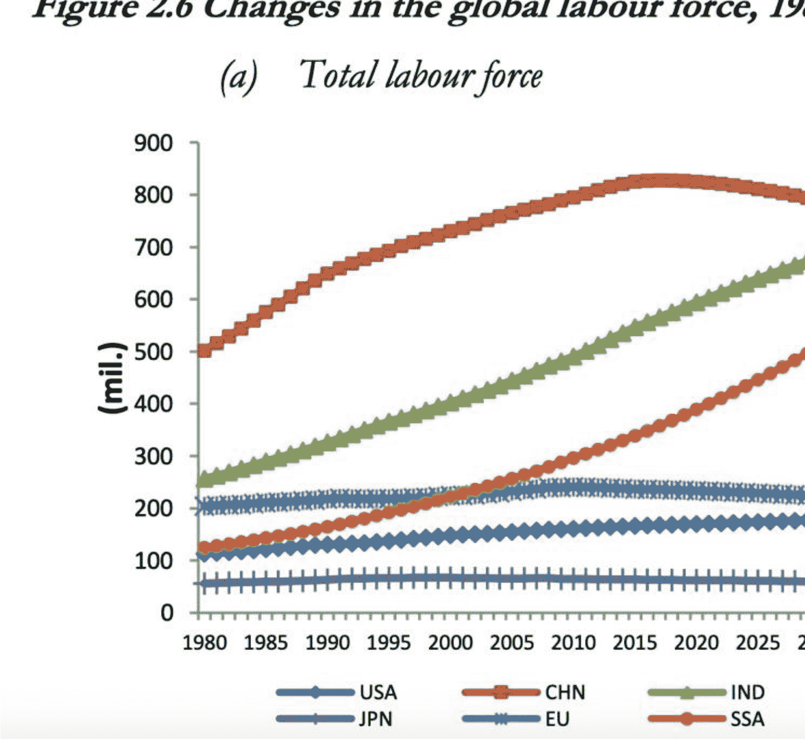
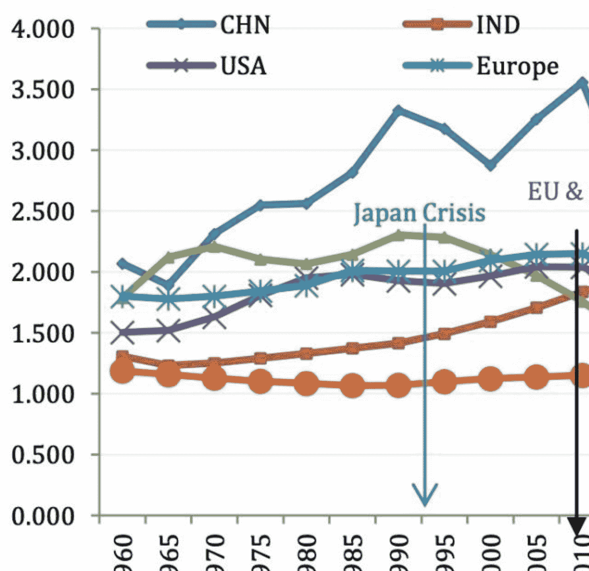

## 第001封信 | 人口变化和老龄化会带来哪些问题？

240926《吴军来信2》
整理：公众号懒人搜索，懒人专属群独享
懒人微信：lazyhelper

这里是《吴军来信》的第二季。这是第一封信，我想和你聊聊我所关注的那些大问题。

我猜你可能很好奇我每天在想什么？其实我每天大部分时间和你一样，考虑的都是日常生活的琐事。不过，我确实会经常花一些时间学习和思考，想一些大问题。这些大问题，有些是过去的，有些是当下的，还有些是未来的。不过，我打算按照当下、过去和未来的次序和你分享。

> 你可能会奇怪，为什么不是按照时间顺序讲呢？正如英国小说家、记者乔治·奥威尔在他的作品中写的那样：谁控制了历史，谁就控制了未来；谁控制了当下，谁就控制了历史。因此，当下才是我们了解一切的起点。

对于当下的诸多问题，我会用5封信和你分享以下五个我认为最重要，也会影响到我们每一个人的问题：人口变化和老龄化、全球气候变化、技术优势和大众困局、教育的公平性以及社会公平。

这些问题看似很大，但是和每一个人的前途和福祉都有关，因此对这些问题有一些深刻的思考是非常必要的。

事实上，在过去的四五年里，我每次给各种班上课时，都会先讲这些内容，作为每个人做决定的大背景。

### 世界主要经济体的劳动力在怎样变化？

今天，我要和你分享的是人口减少和老龄化的问题。

曾几何时，我们觉得人越来越多，道路越来越挤，居住环境越来越差，都希望人少一点。我1996年从中国到美国，享受到人口密度低的好处，不禁感叹如果中国人也这么少就好了。后来父母来美国探亲，看到美国人这么少，也感叹人少带来的好处。

过去，在大家的印象中，中国的人口只会上升，不会下降。但是，等真到了人口由增长到减少的那一天，几乎没有人庆幸将来能住得宽敞些，而是出现了不同程度的恐慌。当然，大家的恐慌是有道理的。事实上，世界各国很少有人口下降，特别是劳动力人口下降，经济还能增长的情况。至于快速增长，想都不要想了。

比总人口减少更可怕的是劳动力人口，会以更快的速度减少。我先给大家看两张图，让大家有一个感性的认识。我把图片放在了文稿中。

第一张图来自世界劳工组织，展示了从1980年到2030年这50年间，世界主要经济体的劳动力总数变化趋势。

#### Figure 2.6 Changes in the global labour force, 1980-2030 (a) Total labour force

我给你描述一下图片情况：最上面的两根红色和绿色的曲线分别表示中国和印度的劳动力总数变化，中间的橙色曲线表示的是南撒哈拉地区的情况，下面的三根曲线从上到下，分别表示的是欧盟、美国和日本的情况。

从图中大家不难看出，中国的劳动力总数在大约2015年出现了拐点，开始往下走。同样往下走的还有欧盟和日本。

此外，印度和南撒哈拉地区是快速增加，美国则是缓慢增加。

好，我们再来看第二张图，第二张图可能更触目惊心，它反映的是每年加入劳动力市场的人数。

最上面的折线代表中国，从大约 2010 年开始，中国每年的新增劳动力人数快速下降，下降速度甚至比日本，也就是中间那条绿色的曲线还快。就连人口大国印度，过了 2040 年，也开始下降。只有撒哈拉以南的非洲，也就是图中的橙色的曲线，呈现出不断上升的趋势。

人口总数，特别是劳动力人口的下降除了直接导致经济衰退，还会带来很多问题。今天我们重点来谈其中一个问题——老龄化的问题。

### 老龄化给社会带来了哪两个问题？

今天，相比劳动力人口急速下降，总人口数似乎下降不多，那是因为人越长，老年人的数量增加很多。人活得长不是好事么？对于一些个体来讲确实是好事，对于社会来讲，就不好说了。我先给大家讲一个我身边的故事。

我过去有一位同事，她自己的年纪已经不算轻了，还需要照顾95岁的母亲，虽然那位老人住在养老院，但是身体总在不断地出一些状况，养老院那边经常需要她去善后。那位老人虽然身体不好，但是活得极长，活到了105岁。

这十年间把我的同事折腾得疲惫不堪。她过去常说，等她母亲百年之后她就能过自己的生活了，世界上很多地方还没有去看呢。但是她母亲过世后两年，她也因为劳累过世了。这个例子虽然是特例，但是你能直接地感受到养老是老龄化社会的第一个大问题，不仅对社会来说是一个巨大的挑战，也影响了年轻一代的生活质量。

在过去的三十年里，人类的平均寿命增加了将近十岁，但是健康生活的时间并没有增加，只是增加了十年需要照顾的时间而已。我过去以为美国人不照顾老人，养老的问题全推给了社会。后来发现情况不是这样的，稍微传统一点的美国家庭也要照顾老人，只不过他们不会像中国的儿女那样自己动手送汤喂药，而是要么把他们送到养老院，要么请看护到家里来。

但即使如此，家里真要有了一个得老年痴呆症或者绝症的老人，遇到的困难特别多。我周围不少同学同事，家里都有一位高龄老人，每一次谈起老人，他们就头痛。这还是在美国，子女们不需要看护老人，而且社会养老制度比较健全的情况下。放在中国，年轻的一代不得不承担更多的义务。

今天，美国 65 岁以上的老人有 5800 万，占人口的 1/6。为了照顾他们，美国全职的家庭护理人员大约有 400 万。这还不算在美国的 1500 万医护人员中，相当多的是在为老人服务。今天，美国医疗健保的总开销已经占了 GDP 的 20%，而且还在增加，以至于社会不堪负荷，政府不得不举债。相比之下，在人们印象中美国的军费开销，才占 GDP 的 3%。美国每年会新增很多债务，一个重要的花销就是为了填补医疗福利的窟窿。

相比美国，日本和北欧国家的老龄化问题更加严重。日本 65 岁以上群体占人口将近 30%，西欧和北欧国家普遍超过 20%，它们的负担比美国还要重很多。中国的老龄人口目前只占 15.4%，大概 2.16 亿人，还没有进入老龄社会，大家体会不深。但是等我们的老龄化程度达到美国、甚至日本的水平，很多社会问题都会出现。

今天，人们生活的观念，早已经不是把传宗接代放在首位了，而是更愿意追求自己生活的快乐，以及社会认可。因此，人们生儿育女养育后代的动力大减，这样可以换取自己更好的生活质量，减轻生活压力。可以讲，这种做法在某种程度上摆脱了基因对人的控制。但是，儿女可以不生，可老人的存在却是既成事实，无法回避。

任何一种养老方式，从本质上讲都是以年轻人投入巨大的成本为代价的。西方国家和中国的差异无非在于，前者是其他人的子女投入时间和精力，后者是自己的子女投入时间和精力。近几年中国流行一个词，专职儿女，就是指专门照顾父母的孩子。他们不上班，靠吃父母的积蓄过活，但是解决了父母的养老问题。美国那几百万的老年人看护者，其实就相当于专职儿女，只是他们看护的是别人的父母，要按市场价格拿工资。

今天，世界上绝大部分家庭是三代人，如果人的平均寿命到达 100 岁，就是四代人。这样一来，要么年轻人同时养两代老人，要么是一群 60-80 岁的老年人去养比他们更老一辈的 90-100 岁的人，无论哪一种生活都不会轻松。

当然，有人可能会觉得，今天 70 岁的老人比过去 50 岁的老人的身体还要好，不用他人担心。这是事实，因为今天的营养跟得上，另外很多衰老的疾病，比如高血压、糖尿病，可以用药物控制。但是，人的青壮年时间延长的幅度远小于寿命的延长。今天人们的寿命比工业革命前延长了一倍，但是具有性功能的年龄可没有延长一倍。至今人类也没有找到延缓衰老的好办法。

美国 50 岁以上的人大多需要长期服用降压、降脂的药物，以预防心血管疾病和癌症。如果一个人有幸活到 90 岁，有一半以上的概率会患有不同程度的老年痴呆，或多或少患有各种慢性疾病。这样的生活其实是非常痛苦的。

除了养老是个大负担，老龄化社会的另一大问题就是全社会的消费欲望低，经济不振。

这一点在日本和西北欧已经非常明显了。虽然政府想尽办法刺激消费，但收效甚微。我自己对此就深有体会。我在同龄人中算是高消费的人，但是自从两个孩子离开家，就一点消费欲望都没有了，我已经记不清上次去高端百货店或者奢侈品精品店是什么时候的事情了。我和周围一些人聊到此事，他们都有类似的经历。

人口下降和老龄化问题很难逆转。大家可能会问我，面对一个无可避免的老龄化社会，我们该怎么办？简单地讲，我也不知道该怎么办。但是我知道，我接下来在做事的时候，都要以这件事必然发生，甚至已经发生了作为前提来考虑。

比如，有一次给房地产企业讲课时我就和他们讲，以后盖幼儿园、中小学，甚至商品房的生意可能都会越来越差，但是盖养老院可能是个好生意。还有一次我和教培企业讲，接下来的几十年里，这个市场肯定会不断萎缩，但是如果办老年大学，可能是一个不坏的主意。

在这里，我也建议你思考这么几个问题：

- 第一，你观察到周围出现了哪些比较大的变量和趋势？
- 第二，这些变量和趋势跟我们工作和生活的哪些维度相关，将会怎么改变我们的生活？
- 第三，假设这个趋势必然到来，为此我们要提前做哪些准备？

欢迎你给我写信，讲讲你的看法和观察。

下一封信，我和你分享我对全球气候变化问题的思考，我们下一封信再见。

历史 3000 多份各类付费文章以及年费三千多的副业社群资源，见懒人专属群内部分享!
付费群，白嫖勿扰!

懒人专属群更新记录:
https://lazybook.fun/#/blog/record2