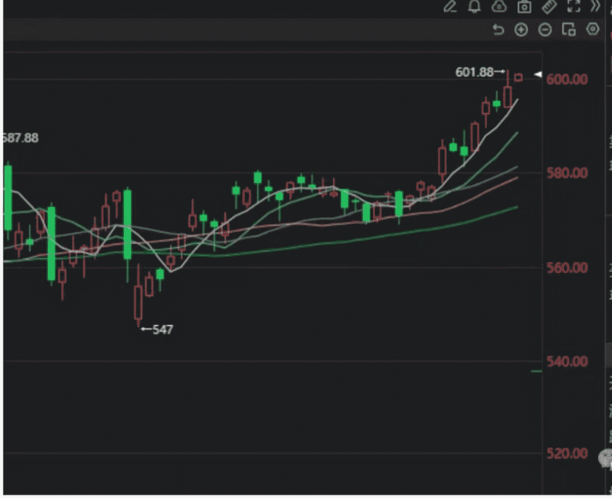
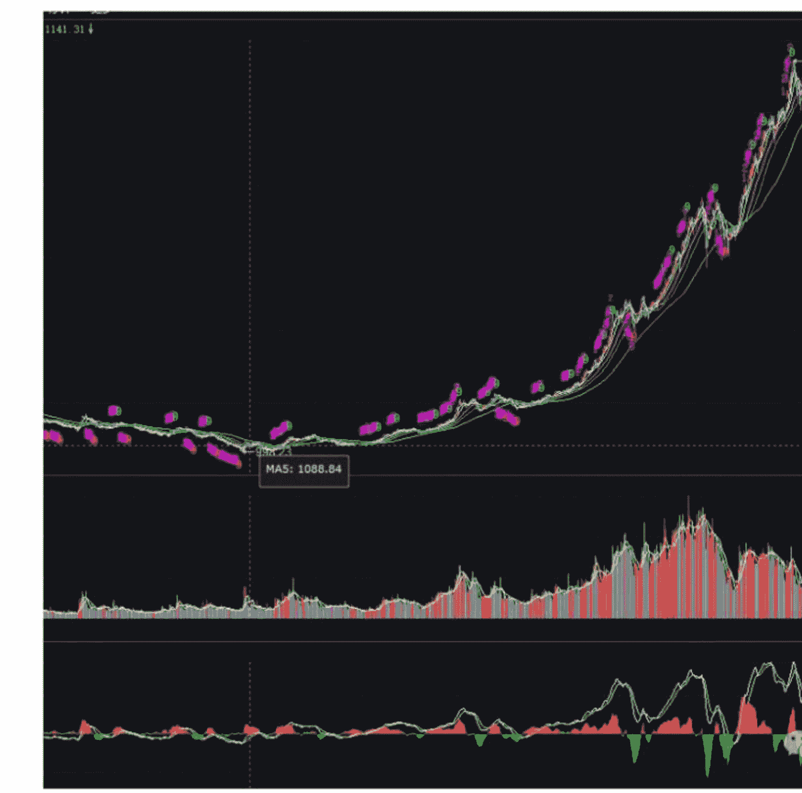

# 中美流动性共振，十年大周期轮回下的股票市场和黄金

240925 NEO 摸鱼录

整理：公众号懒人搜索，懒人专属群独享

懒人微信：lazyhelper

懒人备注：赌市有风险，哦不，股市有风险，投资需谨慎

这两天很多朋友都非常关心股票市场和黄金的动向，都在问接下来会怎么走？所以大家比较关心的这两方面内容，我们今天晚上再来聊一聊相关的话题。

对于很多参加今年课程的朋友来讲，今年最大的收获是什么呢？是在我这一年以来多次的威逼利诱之下，不得不去囤了不少的实物黄金，然后一不小心就跑赢了众多的投资者。

之前在《从美国大选辩论的骚操作反向逆推背后操纵者对未来四年很多大事的判断和结论》里面讲过黄金会摸600，今天已经摸到了。

在今年剩下来的时间里面，对于黄金来讲，大家手里买了不少，如果碰到一些比较关键的节点需要出来做一些补充说明的话，我还是会继续在群里给大家做一些补充说明，但是且听且珍惜，因为明年估计就不会有课程了，如果在外面事情比较多应该也没有办法太及时地给到大家很多建议了。

所以大家还是要自己多去恶补一下相关的知识。在前面几节课例如《破美元者，黄金：推动黄金上涨，会远比“人造股票牛市”好得多》里面我所讲到的分析方法和分析框架的指导之下，大的趋势和结果并不难判断出来。

只要你不要被市场上过于纷乱的各种资讯所蒙蔽，把它当做一个保守的投资来对待，那么可能再过几年甚至10来年之后再看，你会发现今天买的这些价格都是相对合理的。

关于黄金的未来，我个人还有一些大胆的猜想，但是这个猜想是否能够得到验证，还需要在下面的时间里一步一步去看。我的猜想是什么样的我放在第2部分，现在先来聊一聊大家更加关心的股票市场的大涨。

从大的运行趋势来讲，股票市场的牛市是不是要来？我觉得基本上现在是可以确定了的。

这个牛市能走多久，未来的高度会到一个什么样的程度，现在不好说，但是可以确定的是，想在股票市场玩一把的人，我觉得现在是可以入场的。

在今年早些时候的前几节课《股票市场真正赚钱的核心逻辑》里面，我已经给大家讲过了股票市场的运作和真正赚钱的部分。

从整体上来讲，这个市场的本质它依旧是一个投机市场，这个本质没有变，现在对于广大普通大胆投资者而言依旧也还是拥有着巨大的不对称性，这一点也没有变。

对于绝大部分的普通人来讲，如果贸贸然冲进去，依然会有遭到较大损失的可能性。但是，对于风险承受能力相对强一点的人而言，现在确实是可以进去了。

股票市场的上涨来自于两个方面因素的推动：第一是相关的行业或者公司它的基本面出现了巨大的改善，盈利能力增强或者分红能力增强，从而推动了股价的上涨。

在A股市场里面，不管是熊市和牛市，对于中国这么一个庞大的经济体而言，总是有公司亏钱也总是有公司挣钱的，只要你能选得出这些好的公司，那么不管是熊市还是牛市，你都能挣钱。

但是对于绝大部分普通投资者来讲，是很难依靠这种基本面反转和业绩改善型的上涨来获取超额收益的，除非你是特别专业研究某个行业或者某个公司的人，而又恰好在这段时间里，某个公司的业绩出现了大幅度的反转才有可能依靠这种方式来挣钱。

对于绝大部分普通人来讲，能在股市里面挣钱的唯一一种局面就是另外一种情况，也就是股价的上涨不仅来自于公司基本面的改善，更来自于整个宏观大环境的流动性的宽裕，也就是说股票市场爆发出一种全民牛市的场景，那么你才有可能获利。

而这一种全民牛市，它不仅仅是单纯的政策去推动就能有这么一种大幅上涨，一个普涨性的牛市其实需要来自很多各方面因素的共振。

而我自己判断这一波大家能够进去玩一把，主要来自于几个方面的依据。

首先是来自于流动性的共振，这种流动性的共振还不仅仅中国方面，而是整个世界最庞大的两个经济体，中国和美国同时开启的流动性共振。

实话说，能坚持到现在才释放流动性，我觉得很不容易，也很难。

能够在美元很强的加息周期之内坚持到现在，等到美联储撑不住开始降息之后才释放的流动性，已经很不错了。

我其实最担心的一段时间是什么时候呢？是2022年年底放开之后到2024年美联储没有结束加息周期之这段时间。

这段时间在我看来为什么非常危险呢？

放开之后，主导放开的人，其实是有经济层面考量的压力的。

也就是说，国家还在防疫期间的经济其实总体上并不差，依旧保持了相对于全世界其他经济体而言非常健康甚至是发展得不错的这么一种局面。

而一旦放开之后，经济不仅没有好转反而2023年、2024年大家都觉得变得比之前那三年更差，那这期间是不是就会有释放流动性的动力，比如说刺激股票或者刺激其他一些领域，让价格往上涨，让经济方面的成绩能够更好看一些，有没有这样的动力，我觉得是有的，这也是我非常担心的事。

我那时很担心2023年如果又去人为造一次类似于当时2020年的那一波小牛市的话，其实刚好是给了股市里面很多股东套现的机会，然后再把钱转出去，让我们承受汇率和金融市场的双重打击，这是我最担心的事。

但是还好这一切在过去两年里没有发生，而是等到了现在美国自己现在扛不住了，美联储开始降息我们才开始释放流动性，这样的话实际上就占据了一个更为主动的位置。

作为把丑国当假想敌的人来讲，实事求是地说，拜登的这几年，做的并不差。

特别是美联储，在拜登任内这4年的各种骚操作，我觉得如果我是他们的上级主管，至少可以给他们一个A-的分数。

大家其实可以回想一下，在疫情期间，当时的美国面临的是一个什么样的情况，有一段时间我记得动辄通胀就是8%，9%这样的数值，大量的货物堆积在港口都没有办法运得出去，大街上当时看到最多的新闻就是0元购，哪里哪里又抢了，哪里哪里又上街了。

我当时最希望看到的是通过各种手段刻意抬高美国的物价，人为制造美国国内的通胀，拉爆它的CPI，使得它的经济陷入失衡的境地，使得它的货币政策失灵，从而一举干掉他半条老命。

但是熬过一段时间的高通胀之后，丑国现在的通胀已经逐渐趋于平稳，而且也没有发生大规模的骚乱和社会动荡，从这一个角度来打分的话，我觉得拜登任期之内的这一届美联储其实工作做的是可以的。

这是我这样一个把丑国当成敌对国的人所能做出的相对公正的评价。

从大的战略层面的目的来讲，我觉得美联储会肩负两重任务：
- 第一，它要平稳住美国在疫情期间因为各种剧烈的货币政策变动引发的金融不稳定以及这种不稳定所带来的可能的经济崩溃，重新实现经济的软着陆。
- 第二，美联储的第二个目标是要通过在一个大的经济和货币周期里面通过美元的潮汐波动来压榨和转移其他国家的财富，特别是收割中国这边的财富。

从后者来讲，美联储并未能很好完成这个战略目标，也就是说在没有拉爆中国的经济之前，他自己先主动降息，意味着在金融领域的较量，基本上已经告一段落了。

美联储通过加息周期引爆中国的货币和利率体系，从而使得中国这边的财富大量转移到美国的这个战略目标，美国肯定是已经失败了的，而且在可以预见的将来也不会成功。

但是从前者的角度来讲，美联储对美国国内经济的调节做的还是相当不错的。

我们不得不感叹，他就是在数据层面彻头彻尾地给全世界造假，他还要把这些假的数据光明正大的给全世界看，给我们看完之后再过一两个月又给我们修正，就是这么赤裸裸地造假。

但是哪怕就是这么赤裸裸的造假，世界上的一堆金融机构和投资者就是得盯着他那个假数据，跟随着他的那些假数据来进行波动，这就是美国金融霸权和软实力的一种体现。

跟美联储相对地，其实中国央行身上也肩负着两层重要的任务，首先第一个是要维护国内经济的正常运行以及占国民总体资产中份额相对较大的那一些资产它的保值增值。

而央行潜在的第二个核心任务实际上是要扩展人民币的使用范围，在某种意义上来讲，这同时也意味着要遏制住美元在世界范围内的流通。

如果从第1个任务来讲，其实中国央行这一轮做的也并不差。

在美元这一轮如此强势的加息周期之中，中国央行能够守住人民币的汇率，哪怕是美元加息加到五点几，人民币的汇率依旧在七点几这样的一个可接受的范围内波动，人民币的资产也没有大幅的流出中国。

包括一些核心的资产比如说房地产价格之类的并没有出现大幅度的腰斩，总体上来讲这几年的运作还是比较成功的。

但是跟美联储一样，美联储对自身身上肩负的第2个任务也就是拉爆中国的这个任务，没有能够实现，而我国央行在推动人民币国际化，遏制美元在世界范围内流通这一点之上，步子其实也还是有点慢了。

因为在我个人看来这次美元的降息不是降一次，而很大程度上开启了一个降息的周期，而周期通常意味着什么？周期通常意味着这是一段中长期的时间内的方向。

也就是说美元降息不会说这一次降了50个基点，然后下次又不降或者是提50个基点。降息周期一旦开启的话，往后只会让利率一次比一次更低。

如果参考美元在过去几轮潮汐波动的规律来讲，说白了这种降息就是一种信号，对美国国内的那些资本发出的一种强烈的信号，让他们应该从美国国内这些资本市场开始逐步高位撤退，然后用拿到的现金开始前往世界各地去收购优质资产了。

从美股现在的这个位置上来讲，我觉得对于那些规模巨大的资金来讲，将来很长一段时间内所能够获取的收益率肯定是不及前几年的了，而且美国降息所引发的美元贬值本来就会加速美国的资本外流。

如果这时候不配合美联储的方向，仍旧留在美国国内的资本市场，那就是高位站岗。

虽说美国在过去的几年并没有能够拉爆中国的经济，但是总体上来讲，已经让整个世界陷入了紧缩周期。

很多国家虽然没有破产，但是经济已经是摇摇欲坠了。

美国的这一轮加息没有能够拉爆任何一个主要的经济体，但是只要美元还是全球货币，那么他现在往海外释放的流动性依旧还是能够收购到不少优质的资产的。

取代美国或者是说人民币跟美元对决很大程度上只是我们中国人跟美国人之间的事情，对于很多第三方国家来讲，中国和美国都是他们惹不起的庞然大物，特别是对于一些小国来讲还是非常缺乏资本的。

除了那些跟中国特别铁杆，内心非常坚定要去美元化的国家，还有很大的一部分国家其实还是依旧欢迎美元资本去他们那里投资的。你说现在要是美国拿几个亿去南美、非洲之类的国家投资，当地政府他愿不愿意？我觉得大概率也是愿意的。

对于美国来讲，哪怕一时半会没有办法拉爆中国，没有办法啃下中国，但是对于美国资本这头怪兽来讲也已经到了需要进食的时候了。

毫无疑问，在未来流出美国的那些美元资本里面，肯定是有一部分要到中国这边来的，不管他们是以何种途径进来，反正最终的归宿肯定是人民币资产的几个大类上面。

要么就是相关的期货品种，要么就是股票市场或者是房地产市场。

但是我个人会倾向于认为外资可能不会再像07、08年那样大规模地进入中国的房地产市场。

房地产市场现在已经是在走一个下降的通道里，我觉得这些涌进来的热钱是不大可能会去房地产市场的。

现在进去这个市场就相当于给了很多人，特别是一线城市的人能够高位套现的机会，而外资自己去当接盘侠，这种事情是不太可能发生的。

特别是考虑到房地产市场的流动性要远远差于股票市场，砸进去之后可能出不来，甚至一旦将来要出货的时候，大规模抛售还会将整个市场的价格打得非常低，对于热钱来讲，现在这种时候更是不可能进去的了。

可供他们进入的市场其实非常有限，要么就是期货市场和大宗商品市场，要么就是股票市场。

这个时候我国的金融部门出台这些政策很大的一个考量，我觉得是要防止外资在低位拿到过多的筹码。

虽然我在之前的课程里面讲过A股市场的很多肮脏不堪的东西，但是再怎么肮脏，从各种指标和数据来看，它现在也是处在一个相对低位的位置了。

在这种时候如果还不尽快地让整个股票市场的估值恢复到正常的位置，那么一旦美元的大量流动性释放出来之后又进来把这些位于低位的股票给买走，那么在下一波牛市到高峰的时候，高位站岗就是今天中国的绝大部分普通老百姓。

所以在某种程度上，现在出台的这些看似进攻性的政策，在某种程度上也是一种防守性的政策。

中美都在尝试向经济领域释放流动性的情况下，这个星球上两个最庞大的经济体同时在货币政策上进行共振，那么一定会导致金融市场出现上涨。这是很肯定的事情，从这个层面来讲，现在参与进去金融市场里面是有大概率能够获得收益的。

虽然从短期来看，目前市场还是缺乏持续性的人气，但牛市初期本来就是这样，会在犹犹豫豫中不断上涨。

期间的不断调整，就是给想上车的人送钱的机会。

这种阶段，千万不要贪心，不要意淫什么大牛市，涨多了就卖，跌多了就冲进去捞一把，正确的心态很重要。

而除了流动性方面的共振，我个人其实觉得有一个更重要的共振就是时间维度的共振。

对于绝大部分中国的股民来讲，90年代到2000年期间的股票市场的波动虽然非常激烈，非常疯狂，但是从相对的股民占总人口的比值来讲，它依旧只是一小部分人的狂欢，远远谈不上真正的全民牛市。

在我印象中第一次全民炒股，整个十几亿人一起疯狂的时候是什么时候？是从05、06年开始的那一波牛市。

那时候的房地产市场和股票市场是双双爆发。

而那时跟现在其实面临的宏观层面的因素是非常相似的。

当时一个大的时代背景就是人民币资产升值的预期，使得大量的海外热钱涌入中国。

一方面那时候美元和日元的借贷成本非常低，而另一方面中国的利率相较于美元和日元又有个大概是3%的利差，当时我记得非常清楚的是有一段时间有一个叫无风险利润的名词，只要外资把钱换成人民币，哪怕是存在中国的银行，每年也能挣个百分之几的这种息差。

而且当时说白了那些热钱没几个真的放在银行里，他们吃的主要是几块，第一块是人民币升值的利润，可能息差就百分之几，但是如果人民币升值了5%、7%，那么一加起来那就差不多是接近8%到9%的完全无风险的利润。

而且当时中国的房地产市场和股票市场又双双位于低位，因此那些所谓的热钱，低廉的美元资本和日元资本疯狂地涌入中国，在引爆全民炒股的热情之后将整个股市推到6124点这个迄今为止我们都没有能够重新摸得到的位置。

我觉得如果真的想做股票的人，应该好好的去复盘一下当年从05年开始到07年6124之前的这一段股票市场的走势，一定会给到你非常多的启发。

在复盘的时候，我个人建议可以配合阅读当时的一些书籍和新闻来重新感受一遍当年那段疯狂的日子。

当年的疯狂是那些没经历过的人所无法感受到的，在马路上很多高中生、初中生都不谈游戏了，都开始谈股票了，街上的电视屏幕里没有人再去关注其他东西，都是在听这些股评在吹。

去书店里面一进门全是那些讲股票讲技术分析讲基金经理的书籍摆在门口，真的是非常非常狂热的一段岁月。

## 还有一轮让人记忆深刻的全民大牛市

是发生在什么时候呢？15到16年。

白天上班的时候都没有人讨论工作了，都在谈股票，各个同事群或者家庭的各种小群里面也都没有人聊别的东西，除了股票还是股票。

我那时候印象非常深刻，是因为周围有些朋友在那段时间是负责给那些股市里面的赌徒做配资加杠杆的。

当时那些做股票的人我都觉得已经不能用赌徒来形容了，他们做股票加杠杆是10倍20倍加上去，比我这个做期货的人加的杠杆还厉害，简直就像杀红了眼的赌徒一样。

所以后面15、16年的所谓的大牛市到最后跌下去的时候也是一地鸡毛。

但是我们回过头来看是两场全民大牛市，你有没有发现一个规律？

没错，就是他们的启动时间，一个是05年，一个是15年，前后相差差不多就整整10年的样子。

很多人在短线非常敏感，对短期的波动非常关注，但是绝大部分人对大周期和长周期的波动非常的麻木，非常的愚钝。

如果从05年06年的全民大牛市到15年16年的第2轮全民大牛市相差10年的话，那么现在再来看我们所处的这一年是不是很快又要到了一个10年的周期了？明年是什么时候？2025年，正好跟2015年的全民大牛市又是10年。

这就是我认为的时间上的一个非常重要的共振。

在中美双方的货币共振和中国股市自己时间周期的共振之下，我觉得股市其实已经初步具备了走牛的基础。

现在我更想找到的一样东西是什么？是一个催化剂。

05、06年大牛市的催化剂是外国资本，也就是所谓的热钱的大量涌入。

15、16年全民大牛市很重要的一个催化剂是当时监管部门所疏忽的场外配资，还有加杠杆的问题导致了大量的资金涌入股市。

这一轮牛市要想变成一轮全民性质的大牛市，我觉得我还需要去寻找一种能让资金大规模进入到股市的催化剂。

钱要是进不来，一切都白搭。

而在找到这个催化剂之前，我虽然觉得会有大牛市，但是我也仍旧是在用相对保守的心态在操作。

如果真的想进去股票市场玩一把的人，我个人是非常建议好好再去复盘一下05、06年和15、16年的那两次全民大牛市，看看在不同的阶段都是什么股票在涨，都是哪一些股票在轮动，我觉得会给到你非常多的启示。

这种全民大牛本质上背后对应的就是一种群体性的心态的反应，虽然这一轮未必就是一个像素级的复刻，但是我觉得他在很多层面上是类似的，包括讲的故事也有可能是雷同的。

说白了金融市场就是一个先拿钱去换经验，然后到后面再拿经验去换钱的地方。

人之所以活得通透，就是因为踩了各种坑之后，不断总结出各种经验来避免自己下一次再踏进这个坑。

在很多时候要有一种超脱和抽离的心态让自己的灵魂超脱于自己的肉体，跳出自己的肉体，来看待自己在不同阶段的操作和心态分别是什么样的，那些损失又是因为什么原因造成的。

说白了，人性最困难的地方莫过于批判自己，而且是要站在一个非常客观的态度来毫不留情地狠狠批判过去的自己。

很多人是做不到这一点的，所以他们一辈子都活不通透，一辈子都在那些踩过的坑里面一次又一次地踩进去。

历史3000多份各类付费文章以及年费三千多的副业社群资源，见懒人专属群内分享！

付费群，白嫖勿扰！

## 懒人专属群更新记录：

https://lazybook.fun/#/blog/record2