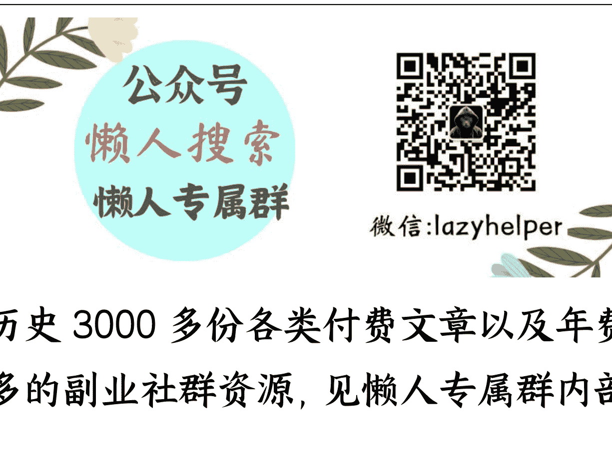

# 三只羊被罚款 6895 万，如何看待？

240929

文/卢克文工作室嘉宾

整理：公众号懒人搜索，懒人专属群独享

懒人微信：lazyhelper

昨天晚上，合肥联合调查组发公告称，三只羊公司构成虚假宣传，没收违法所得、罚款6894.91万元。三只羊虚假宣传这事情也闹了很久了，主要是“香港美诚月饼”和“梅菜扣肉”事件。

最终调查出来的结果是，“香港美诚月饼”构成虚假宣传；“御徽缘梅菜扣肉”的原材料的确是五花肉，不是什么乱七八糟的肉；还额外带出一个“澳洲谷饲牛肉卷”，也涉嫌虚假宣传，号称是原切肉，实际上发货却是调制肉。

所以这两个产品加起来连罚带没收，一共6894.91万，很难想象仅仅两个产品就能罚那么多钱。但是联合调查组没有明确说罚多少，没收多少，作为吃瓜群众非常好奇。

根据调查组的信息，判罚依据是根据《行政处罚法》和《反不正当竞争法》来判的。这就非常有意思，其中《行政处罚法》第九条第二款规定相应处罚可以罚款，没收违法所得，没收违法财物。

所以没收违法所得，是《行政处罚法》做的事情，但是《行政处罚法》罚款力度是很低的，像三只羊这次的，显然用的是《反不正当竞争法》。根据《反不正当竞争法》第八条规定，“经营者违反本法第二十条规定对其商品作虚假或者引人误解的商业宣传，或者通过组织虚假交易等方式帮助其他经营者进行虚假或者引人误解的商业宣传的，由监督检查部门责令停止违法行为，处二十万元以上一百万元以下的罚款；情节严重的，处一百万元以上二百万元以下的罚款，可以吊销营业执照。”

也就是说，《反不正当竞争法》上限也就 200 万罚款。

所以我们可以简单的计算一下，三只羊有两个产品有问题，加起来也就是400 万，但总计没收+罚款 6895 万，所以单这两个产品的违法收入，就是6495 万，只能说明平时太暴利了。

然而，更有意思的是，第二十条又提了一嘴，“经营者违反本法第八条规定，属于发布虚假广告的，依照《中华人民共和国广告法》的规定处罚。”

第八条是什么呢？

“经营者不得对其商品的性能、功能、质量、销售状况、用户评价、曾获荣誉等作虚假或者引人误解的商业宣传，欺骗、误导消费者。”

性能、功能、质量，销售状况、曾获荣誉，很显然美诚月饼全部踩雷，澳洲谷饲羊肉也踩雷。所以三只羊更适合用《广告法》来处罚。

而《广告法》第五十五条规定，“违反本法规定，发布虚假广告的，处广告费用三倍以上五倍以下的罚款，广告费用无法计算或者明显偏低的，处二十万元以上一百万元以下的罚款。”

看得出来《广告法》的力度显然高于《反不正当竞争法》，要处广告费3倍到5倍的罚款。那么三只羊的广告费是多少？

一般来说小杨哥这样的头部主播，带货佣金大概在30%到45%之间，根据前面算出来6495万的违法收入，那么广告费大概就是2000万左右。

2000万的3倍就是6000万，也就是说，按照《广告法》三只羊起码要被干掉1.3亿，而用了《反不正当竞争法》可以省下一半。这也难怪三只羊发公告，表示认罚，这点钱虽然不少，但对三只羊而言并不多。

并且很重要的一点，这个公告下来，相当于告诉所有人，三只羊的事件已经定性，就这两款产品有问题，大家不要再揪着不放了。三只羊罚款没收整改以后，或许可以重新上线，也不一定。

希望他们就此完蛋的人，可以洗洗睡了。但是，三只羊这些年就卖了这两款有问题产品，我就想问你信不信？反正我是不信的。然而，这次的处罚，合肥那边看上去高举高打，实际上是手下留情放水了。

根据三只羊往年的财务报表：
- 2022 年，三只羊公司直播带货产值超过 100 亿元，经营服务收入 8.6 亿元，纳税高达 2.5 亿元。
- 2023 年三只羊直播带货产值将超过 300 亿元（中国企业家报道 2023 年 GMV 为 160 亿），经营服务收入可达 15 亿元，纳税预计超过 4.5 亿元。

一年 4.5 亿的纳税额啊，要知道网上最牛超市胖东来，去年一年净利润才 1.4 亿元。

这 4.5 亿的纳税额放哪里都是地方供着的香馍馍，意思意思敲打一下就行了，一方面让三只羊知道，在中国大陆还是有法律的，另一方面自己的财政又能得到补充，最后还能让大众有一种秉公执法的既视感。一箭三雕，不亦乐乎。

可以想象，三只羊这次以后，短期内可能会有所收敛，但是长期看并没有伤筋动骨，所以自然也会继续所作所为。这也就是直播行业最大的利益共同体，特别是这种体量巨大的头部主播，他们和政府的财政收入已经紧紧挂钩，而且随着土地财政的下行，这种连接变得越发紧密。

地方政府断然不会主动断了自己的现金奶牛，更何况不就是个卖货的么，最多卖点假货，能有什么颠覆性的伤害？然而这种头部主播最大的问题在于，他们只是转移财富，并不创造财富。

原本整个社会的消费应该成分散状，其他商户也能赚到钱，这样可以提供更多的工作岗位，现在他们把很多网络小店、线下实体店的流量都拉到自己手上，自己赚得盆满钵满，背后有多少小店破产倒闭。

并且当头部主播有了庞大的流量以后，商家为了让这些头部买自己的货，要花大价钱公关，搞关系，占坑位，给高额提成。问题来了，这些巨额隐形的商务成本会由产品方承担吗？

当然不会，羊毛还是出在羊身上，最终导致产品价格越来越贵，或者质量越来越差，而销售端开始形成资本垄断。随着马太效应，这类头部主播只会越做越大。

你看李佳琦，辛巴，都被罚过，但并不影响平台继续给他们推流量，因为他们不仅是政府的摇钱树，也是平台的摇钱树。所以对于地方政府来说，它们很难下决心去限制这个行业。

大家可以想象一下，如果这个行业彻底消失，恢复到以前小店经营的模式，但是中央又出文要保护小微企业，给小微企业更多扶持政策。

也就是说，地方政府一边失去了税收大头，另一边还要出钱去给小微企业让利，等于同时失去两块蛋糕，这换谁能愿意？

因此，我认为就当前的形势，应该由高层级的政策，来进一步规范直播带货行业。根据相关统计数据显示，到目前为止，已有印度尼西亚、美国、欧盟、印度、马来西亚等六个国家和地区宣布实施或限制直播带货活动禁令。

彻底封杀当然不可行，但是进一步规范，打击直播行业的不合理现状，还是很有必要的。

历史 3000 多份各类付费文章以及年费三千多的副业社群资源，见懒人专属群内部分享!

付费群，白嫖勿扰！

懒人专属群更新记录：
https://lazybook.fun/#/blog/record2