# 九边公众号文章合集

整理时间：2024-06-07

九边公众号有一段时间没有更新了，小懒人将其公众号原创文章爬取下来，整理成电子书，方便群友们查阅。pdf和epub双格式，epub导入微信读书，阅读体验好还能听书

用了一天时间爬取，整理和排版，一共两百六十篇，120W字，其中的付费文和被和谐的文章也添加上去了

九边的公众号文章读起来还是比较轻松的，而且不会太长，随时翻起来随时可以看，希望大家有收获~

另外，咱们 通才计划 里还有几十份付费的课程，群友们不要错过~

微信:lazyhelper

# 目录

- 九边公众号文章合集
- 目录
- 高考也就那样
- 中年人自救指南
- 中年男性为啥普遍丧
- 这几件事孕育着巨变
- 有些高管确实连猪都能胜任
- 宅男之死
- 通胀要来了吗？
- 美国市中心住穷人，中国市中心住富人？
- 中国奶粉的强势崛起
- 转型阵痛到底有多痛
- 中东乱局会演变成第三赛季吗？
- 中产的孩子到底有没有未来？
- 快要当老赖了，还有救吗？
- 房地产还有救没？
- 红海里的一条路
- 房间里来了新大象
- 聊几句莫斯科那事
- 互联网时代的“带病生存”
- 《沙丘》就是西欧版的《倚天屠龙记》
- 欧美真的放弃电动车了吗？中国新能源车真正隐忧又在哪？
- 学历贬值后，大家说不定反而越来越淡定
- 中国可能在经历一波“文艺复兴”
- 2024中国的突围年
- 隐形的小地方豪门
- （付费文）真的是一个时代的落幕？
- 贾玲抑郁了没？
- 车匪路霸，走私倒卖，武装押运的那个疯狂年代
- 债务到底有啥可怕的，借新还旧不就行了？
- 白岩松之问：老百姓到底为啥有钱不敢花？
- 台湾人到底在想啥，不担心挨揍吗？
- 中国的大航海才刚刚开始
- 细讲庚子国变，太后怎么混到仓皇出逃的
- 不要在高速上捡硬币
- 留给他们的时间不多了
- 可能需要一代人来适应消费左移
- 本质还是信任问题
- 困住人的不止算法
- 宋江的中年危机
- 命运到底存在吗？
- TikTok重回印尼，为啥这么重视本土化
- 八千里路云和月
- 没有一片雪花是无辜的
- 读懂基辛格，读懂这四十年
- 为啥社会观念突然转变了这么多？
- 阿根廷日常破产，那“国家破产”到底是个啥？
- 从俄罗斯数学看我国教育前景
- 巴以冲突，为啥叙利亚又被围攻了
- 读懂王自如，读懂“体制化”
- 几个月过去了，脱去长衫的孔乙己们咋样了
- 巴以冲突之后，印度也开始躁动
- 国债和国运
- 新能源车会摧毁传统豪车市场吗？
- 3000点下的启示录：收手吧，阿祖
- 扩招到底有错没？
- 为啥中东就团结不起来？
- TikTok又碰上麻烦了
- 以色列要完蛋了吗？
- 短视频刷多了确实会影响大脑结构
- 跨境电商的高光时刻
- 年轻人选城市就是二次投胎
- 小镇做题家没选择
- 站在历史的前夜
- 制造业的新边疆
- “30块工资线”是很多问题的根本原因
- 他杀了自己的导师
- 笨功夫是普通人最后的依靠
- 莫斯科不相信特赦
- 印了那么多钱，哪去了？
- 每年退休两千万老人，医疗不改革不行了
- 前段时间去了趟内蒙古，说说感受
- 为啥法家没有好下场
- 随便聊几句房地产
- 国家为啥不派军警过去把缅北的人救回来？
- 年纪轻轻就入狱是一种什么体验?
- “30块一小时”工资线背后的惨烈现实
- 一文说清楚新四军到底怎么回事
- 那次惨烈的突围
- 普通人如何才能“改命”?
- 人工智能是“玩”出来的?
- “躺尸开关”是个啥?
- 中国为啥会给越南输电
- 选专业掉了坑怎么办?
- 俄罗斯的闹剧远没有完
- 为啥最近降息的事这么纠结?
- 为啥印度那么坑, 中国企业还在往里边挤?
- 重新思考双减, 素质教育, 以及打掉教培
- 马奇诺防线背后的法国大棋党是怎么玩糊的
- 放低预期, 苟住就是胜利
- 如果房地产不行了, 今后该靠啥?
- 房地产很惨, 但是别救了
- 聊聊裁员的事
- 懂得这个逻辑, 你就知道为啥有的产业能变强大
- 想去跑网约车送外卖? 你不一定行
- 接下来三十年还会继续快速贬值吗?
- 俄罗斯为啥自己不经营西伯利亚, 反而要对中国开放
- 共和国长子的“中年突围”
- 学历贬值这事, 才刚刚开始
- 我不知道韩国的房地产完了没, 不过我知道他们那种模式迟早药丸
- 去了青甘环线我后悔了
- 炸几个火箭算啥, 这才刚开始
- 人民币国际化这事, 急不了, 也没必要急
- 为啥哪哪都爆满, 还在到处说通缩?
- 经济常态化放缓, 自杀率和宅家族
- 狂飙中的东南亚博彩业, 绝大部分是中国人坑中国人
- 每个自杀的人身边都有一圈坏逼
- 信任的成本
- 大通胀、大罢工, 欧洲到了最需要中国的时候
- 事情怎么就一步步走向了没法收拾
- 欧美凭什么享受高收入高福利还那么闲?
- SpaceX凭啥能跟中美俄这样的航天大国比？
- “山河四省”还有前途没？
- 燃油车真的要完蛋了吗？
- 警队背景的李家超上台了，香港应该稳了
- VR怪圈何时破，奇遇、苹果争推MR头显能否走出尝鲜区
- 黑社会横行，犯罪率爆表的一座城
- 从当前的外贸暴跌看人民币国际化
- 为啥好像印钱不好使了
- 骑墙中美，给乌克兰送炮弹，巴基斯坦对我们为啥那么重要
- 俄乌战争后果初现，中亚大概率会倒向中国
- 中年人想当废物哪有那么容易
- 为啥印度坚持暴打外国公司？
- ChatGPT淘汰的那些人，其实早就已经被淘汰了
- 伊朗军事设施又被炸，以色列和伊朗到底有啥过节？
- 如果大规模使用机器人，我们的制造业怎么办？
- 深入理解了年轻人在想啥，才能明白生育率为啥那么差
- 另一种废人
- 那么大规模的城投债，到底用不用还？
- 从科索沃到俄乌战争，对我们有什么启示
- 最后聊一次疫情吧
- 阿凡达，屠杀土著后让他们在电影里赢了一次
- 骰子已经掷下，纠结也没用了
- 从越南防疫看我国接下来的路径
- 枪炮，铁路，硅谷，大湾区
- 折磨我们的，往往不是事实，而是恐惧
- 勇敢面对现实吧
- 为啥说国际足联就是个黑社会
- “社交狂魔”卡塔尔是怎么混到人见人烦的？
- 曾经那么强大的苏联工业，怎么沦落到了如今地步？
- 从芯片“冷战”，看技术的进化
- 随便说两句吧
- 为啥经常说产能过剩，可是还有那么多人并没有钱
- 间谍，刺客，特务，军统往事
- 人民币贬值对老百姓到底有啥影响？
- 为啥那么多人接受不了教育的“五五分流”
- 为啥这段时间强调农业重要性？因为曾经有个大国被粮食危机给搞崩了
- 欠债不还暴打债主被反杀
- 原创-耗费万亿，死伤百万，一场战争打掉两个强国
- 《我不是药神》里，到底谁错了
- 那些有钱人一般都是干啥的
- 俄罗斯的能源是怎么走到今天这一步的
- 聊几句俄乌战争
- 为啥明明放水了，却没流到普通人身上
- 俄罗斯为啥那么提防中国人去西伯利亚
- 为啥苏联的轻工业那么差
- 你做不成你没见过的事
- 戈尔巴乔夫搞崩了苏联？抬举他了
- 为啥生活已经好了这么多，太多人依旧没那么幸福
- 互联网行业也在“土木化”？
- 重看《老炮》，一首旧流氓的挽歌
- 电力那么紧缺，为什么不大力发展核电？
- 聊几句最新的《台湾问题白皮书》
- 台湾人是怎么看待终将统一的结局的
- 枪口要指对敌人
- 年轻人的一部分内耗是周公子造成的，二舅解决不了
- 古董造假江湖的水有多深
- 财政紧张是常态
- 发生了那么多事，如何对未来有信心？
- 中美之间的比拼到底在比啥？
- 国家破产，还有救没？
- 一颗卖几千万，那个天珠到底咋回事
- 上海降低落户门槛，可能意味着一个新时代
- 县城里藏着另一个中国
- 商鞅那一套，才是真正的辟邪剑谱
- 大学毕业不想送外卖，去做自媒体有问题吗？
- 唐山黑社会开迈巴赫，他们为啥那么有钱？
- 大学毕业了，该去跑网约车还是送外卖？
- 警惕那种“近亲繁殖”的小圈子
- 产业转移势在必行，不过也不用担心谁会取代中国
- 清北硕博扎推街道办，这正常吗？
- 每隔几天一次大屠杀，美国禁枪为什么这么难
- 大厂怎么突然间都在裁员

## 高考也就那样

2024-06-07

绝对不是想传播负能量，我自己其实算是高考的受益者，毕竟我也是通过高考从小镇一步步走到了首都定居。这种事，放在咱们千年历史里都是很少见的，但是最近几十年却大规模批量出现，高考确实居功至伟。不过必须要说：

如果你今年高一了，我会劝你好好学，高考非常重要。

如果你明天要考了，并且预计成绩很好，恭喜你，人生会容易一些。

如果你要高考了，但是却是个学渣。那么我想说，考不上也没啥事，别太担心，大学学历这些年是越来越贬值的，而且考不上也还有很多发展方向。

事实上我经历过那场残酷的竞争后，清楚地知道一件事：

高考这场比赛，很多人一上场已经输了。

首先从数据上就能看出来：

2024年高考报考1342万人，达到了历史最高，录取多少呢？大约415万本科生。考虑到现在好一些的岗位不要211以下的，那211以上的有多少呢？60万不到。而且在这之前，已经经历过一轮中考的筛选，已经筛掉了四五百万人。

大家都知道吧，这几年有个说法，说最难的其实不是高考，是中考，中考已经定了绝大部分人在教育这条路上能走多远。

看到了吧，说再多的“祝愿大家金榜题名”，绝大部分人已经输了。

而且大家考虑过一个问题没，如果考试考的不是文化课而是长跑，哪怕我高中实验班里的那群人大概率考本科也费劲。如果考的是唱歌或者跳健美操，他们连专科都考不上。恰好考的是以记忆和数理为主的这种模式，他们这群人就占尽优势。

可见任何比赛设计出来的时候，天然是偏向一部分人的，或者说有一部分人天然是适合的。同时也意味着另一部分人天然不适合，怎么都玩不明白。

这里的“不适合”有各种原因，可能家境太差，从小没能好好培养，也可能天生不是学习那块料，而且现在已经有足够的研究证明绝大部分人都不是学习的料。

我写这篇不是准备批判高考不够公平，高考确实很公平，甚至可能是蓝星上最公平的制度。但是对于很多人来说，天生不适合这场比赛，刚开始就输了。

这倒有点像罗振宇前段时间说的一件事，他说他理解不了龟兔赛跑里，乌龟为啥要同意这场比赛，乌龟在陆地上是怎么都赢不了的。它应该去比潜水或者活得久，在那些领域，兔子就是个渣渣。

这让我想起来一件事，就是海淀妈妈们。跟很多人理解不一样的事，鸡娃这事并不是你去鸡就有效果，整体呈现出“小鸡小效果，大鸡不知道啥结果”。

也就是说，并不是所有孩子都适合鸡，有些娃使劲鸡是有用的；有些孩子你太使劲可能把他给逼跳楼了。

之所以海淀妈妈比较出名，海淀聚集了全国所有的做题家里的卷王，他们本来出厂设置就跟高考这个体系很契合，而且考了几十年，对考试懂得不能再懂。毕业后进入海淀的科研院所，时间充足正好折腾娃，而且那边也聚集了全国最多的教培机构，非常得心应手。

恰好他们的娃因为遗传原因，一般脑子都还不错，加上有个精通考试所有技巧和套路的家长，自然就产生了巨大的优势。

但是并不是所有的孩子都擅长，我身边几乎清一色都是名校毕业的，他们的下一代里，有不少发生了“均值回归”，对学习这事也不太感冒。这些人鸡娃一段时间后，可能发现不是那块料，也就放弃了。或者目睹了一些孩子被逼抑郁，开始重新反思，觉得孩子健康才是第一位的，当前应该锻炼好身体等等。

说这个的意思是，哪怕在学霸父母浓度超级高的海淀，那些学霸的孩子也有很多天然不太适合读书，更别说别人了。

一般来讲，这个体系里，大概有60%的人一参加竞争就已经输了。如果你就天生不适合，那也正常；你如果特别擅长考试，那才是另类，在人群里绝对的少数，一千多万人里，只有六十万人勉强及格。

而且高考本身是排位赛，结局是注定的，注定绝大部分人是输家。

当然了，专门开一篇并不只是想告诉大家：考不上也没事，天塌不下来，反正绝大部分人都考不上。

而是想说，路还长，翻盘机会多的是，高考这个不太适合你的比赛已经结束了。每个人接下来最重要的事，就是去找找自己最擅长的比赛，并且在那里胜出。千万不要怀疑，每个人都有个自己特别擅长并且远超别人的赛道，一旦踩上去，你就赢了。

如果说有啥建议，我觉得有下边几条：

- 学历不好，就不要尝试去层级明确的组织里爬天梯了。

大家要知道一件事，叫“组织评价”。

你去做个小生意，或者跟着别人去倒卖二手车，修车、改车，卖菜，或者学个手艺去做摄影写文章编段子做软件。往往你的顾客说你做的好，那你做的就好，你就能得到市场的回报。你可能没啥文凭，但是就凭卖出去的东西多，你就能赚到钱。这叫市场评价，“卖出去”是唯一的评价指标，根本没没人关注你啥学历。

但是你加入一个大组织，你到底做的好不好，是要综合评价的，这时候考虑的，就不仅仅是你的手艺怎么样，还要考虑你的教育背景什么的，提拔的时候，可能会因为你的学历卡你，最后把不如你的人给提上去了。

这在大公司或者政府部门里非常明显，所以学历不行，就往手艺人个体户方向发展，让你的消费者或者顾客来评价你，不要往那种规模化的机构里钻，冲进去大概率是炮灰。

而且那种组织里，出了政府和国企，最后只有一小部分人能混下去，绝大部分人都得出局，哪怕大家都有名校学历。

也就是说，一旦学历不行，就别想去那种大组织了，一方面进不去，另一方面进去了也很难爬上去。尽快想着学手艺，干个体户。

大家不要觉得个体户丢人，其实那些名校毕业的，年纪轻轻进入大厂，如果升不上去，四十岁左右也得被迫去做个体户，而且绝大部分做的也没啥技术含量，属于殊途同归了。

- 一定要不断地生产价值，或者说生产产品，你有产品别人才可能买。如果连产品都没，别人咋买？

这里的“产品”，内涵极其丰富，可以是路边的糖炒栗子，也可以是软件，文章，短视频，以及各种小生意。无数人通过内容生产已经致富，这些人里，绝大部分都没啥好学历，因为学历高的人还在卷大厂。

大家不要觉得这些东西低级，这个社会不仅仅需要研发科技的科学家和打螺丝的工人，更多的人都在从事伺候大家，取悦大家，一旦做的好，保你一生富贵。“取悦群众”这个领域，是可以近乎无限细分的，任何一个细分都是可以无限做大的。

此外每个人都应该发展几个长时间经营的爱好。一方面有了爱好的人生才能精彩一些，而且这些爱好说不定将来还能给你带来额外的发展机会。

那些混的好的人，最后肯定是经营自己擅长的领域去了。

- 要相信运气。

我们的教育系统极度回避让大家变成机会主义者，不过现实就是个概率主导的世界，你能不能最终出人头地，运气占了90%以上。这一点古人早就发现了：

富在术数，不在劳身；利在居势，不在力耕。

那个“术数”说的特别好，手段和运气，缺一不可。

相信运气的人更不容易陷入线性思维的困局，线性思维的人总觉得自己现在不行，将来也不会行，一步错步步错，越想越消极。

之前有广东同事跟我说，他们那边高考压力也很大，但是广东人很淡定，考不上就去跟着亲戚经商或者去海外，根本不愁没活路。

多去尝试多去闯，不要拘束在小地方坐井观天，去远方，去一线，去海外，只有不断去面对更大的世界，才能刷出新装备。而且要利用错位优势，比如海外华人都有个共识：在发达国家你的优势是便宜，在落后国家你的优势是见识，总能占到点便宜。

当然了，要主动避开一些陷阱，比如千万不要随便负债，刷信用卡撸小贷什么的，今年看到一句话，说“负债是新型奴隶制”，说的有点过分，但是却是应该避开。

- 没必要总和别人保持一致。

绝大部分人怕极了跟别人有差异，总想保持队形，毕竟融入集体才能让人有安全感，但是你一旦这样做了，也就隐藏在了芸芸众生里。

不妨大胆点，如果想象都不敢往大了想、往别的方向想，那人真是彻底废了。

而且有个事可能大家没意识到，大学毕业过十几年，那些混的最好的，往往是班里比较学习靠后的。

仔细一想倒也不复杂，他们能考进去，说明基本的脑子并不比其他人差。大学学习不太好，说明他们心思根本不在学习上，一直想捣鼓点别的。

捣鼓的东西多了，过一些年说不定就暴富了。反过来讲，那些学习特别好的，进入职场一帆风顺不用考虑别的事，按部就班一眨眼十几年过去了，反而慢慢把优势耗尽了，一路凯歌然后到了三十多岁快四十突然就变成了公司的优化对象。

这里并不是说学习好的就会倒霉，学习不好的才能成功，而是说财富往往藏在折腾里，非常规的行为有非常规的收益；你永远不折腾，永远规规矩矩，最后只能是拿正常的收益。

另一个比较搞笑的事，很多人最后混的不错，往往是被公司给赶了出来没啥事可做，然后硬着头皮创业反而成了。

这里并不是给大家宣扬小概率事件，而是说：活法很多，多去低成本尝试、多折腾才可能有超额收益。

就到这里吧。

文末还得再说一次，并没有说高考不好。高考很好，尤其对于那些优胜者来说。但是在这种排位赛里，注定绝大部分人是没法受益的。没办法的事，规则就是这样的，过几天考完，就会有900万人去大专或者复读。事实上今年1300多万考生里，就有400万是复读的。

但是社会是越来越多元的，你能提供奇怪角度的奇怪服务和价值，一样能得到超额回报，不一定需要那张文凭。

叠加咱们这个社会现在信息几乎是无限透明的，你可以通过网络去学你任何想学的东西。你要是愿意学，通过网络四年可以比大学学得多的多。

现在的网络也给了普通人很多展示的机会，谁抓住就是谁的。

等到毕业十几年回过头看，会发现学历的重要性真的一般。最关键的，还是热忱、信心、执行力、精力、想象力、亲和力这些因素，还有最关键的勇气，这些对未来才至关重要。

不管咋样，路还长，世界很大，资源也近乎无限，关键是用什么角度去看待。

公众号懒人搜索，懒人专属群分享

## 中年人自救指南

2024-06-05

这个标题有点过了，主要是想回答上篇文章《中年男性为啥普遍丧》里的一个问题，那篇文章里说，对于中年男性来说，瘦下来能解决90%的问题。有小伙伴让我再展开聊聊。

考虑到我长期减肥经历，各种运动营养学的书看了一堆，今天就再聊几句。文中所有内容大家参考下就行了，不建议大家照做，最好是能有个启发，读者们可以自行对着感兴趣的方向查找。

首先要说，很多人说减肥是“三分吃，七分练”，这个也不太对，应该是“九分吃，一分练”。毕竟任何运动，在吃面前都一文不值。

早上五点半起来跑步一小时，这意志力和执行力秒杀绝大部分人了吧，然后吃三根油条后努力瞬间就被清零了。中午随便吃点，晚上没忍住，来顿大餐，一天下来不但没有热量缺口，反而更超标。这就不是在减肥了，妥妥的继续增肥。

如果有点生活经验也能感受到这一点，工地很多土木老哥，一天三万多步，照样肥得流油，主要也是他们的伙食太养人。还有那些房产中介，年轻的不明显，年龄稍微大一些的，也是一天两三万步，照样中年发福。

那怎么办？

一般来讲必须先控制饮食。大家肯定见过一些人，在那里blabla扯什么“减肥千万不要节食”，“千万不要相信饿瘦”，跟你说什么“吃够代谢”，然后就开始教你算每天摄入热量，让你吃够1800大卡。

相信我，他说的那堆吃的，一般巨难吃，而且吃了之后，如果身体出现热量缺口开始掉体重，几乎不可避免会饿，以及各种心烦意乱，根本没法避免。

如果你尝试各种减肥法，最后会发现什么“16+8轻断食”，什么“生酮饮食”，什么“地中海饮食”，还有那个“碳循环”，没有热量缺口都减不下去。核心都是控制饮食，都是少吃，都得饿。

当然了，我自己是很认同轻断食的。轻断食已经被证实对胰岛素抵抗问题有很好的效果，如果不知道啥是“胰岛素抵抗”就搜一下吧，看看专家怎么说，我就不搬弄了。不过轻断食如果没有热量缺口，也减不下去。东北那边很多人快中午才起，一天吃两顿，照样胖子一大堆，主要也是饮食太好了。

这么说吧，想减下去，少吃是不可避免的，少吃带来的痛苦也是不可避免的，做好这类准备，可能反而容易些。怎么把自己吃胖的，就得怎么少吃瘦下去；吃胖的过程中有多爽，减的过程就有多苦。一点都别想少承受。

吃胖是因为吃进去的热量大于消耗，想瘦下来肯定得摄入小于消耗，这属于热力学基本定律，其他的说啥都不好使。

一旦有了热量缺口，那肯定会痛苦，持续的痛苦，挠心挠肝让你赶紧去找点吃的，不然快死了。

当然了，有时候你会发现自己虽然很饿，但是那些平时不喜欢吃的一口都不想吃。这时候你就应该知道，你此时的痛苦其实不是饿，是馋。饿和馋表现出来的症状是一样的，差别是真饿了会生吃土豆，馋了连燕麦都咽不下去，满脑子烤串涮肉。

具体怎么办呢？

我的做法就是简单暴力，把晚饭去掉，而且日常饮食尽量低油。顺便还在轻断食。

我周围有人恰好相反，多吃油，不咋吃碳水，就是那个低碳饮食。好处是饥饿感轻了一些，毛病是情绪好像不太稳定，一些人睡不着觉又放弃了。

总之有两个原则：
- 1、少吃；
- 2、油和碳水不能同时高，当然了，如果饭量比较小也无所谓；

想保持终身的健康状态，唯一的出路就是少吃，没啥别的办法。

你说痛不痛苦，当然痛苦了，不过没啥更好的办法，你会发现原则越简单，执行起来越不容易偏。而且相信我，对于绝大部分胖子来说，一天的饮食减掉三分之一，总热量依旧是超着的。

很多人包括我自己，最大的痛苦就是想保持原来的饭量基础上减肥，那不痛苦才怪。年轻时候代谢旺盛无所谓，迟早有一天会面临一个选择，是继续高热量饮食，还是主动降低欲望。

一些人说如果天天少吃，那生活有啥意思？这个倒也确实，只是如果保持肥胖状态，迟早有一天各种慢性病会找上你，身上所有的部件都发告警，让你每天痛苦不堪。

当然了，你说不定能找到其他办法，不过相信我，胖子们的痛苦那是一点也别想少承受，吃的时候有多快乐，减的时候就会有多痛苦。

肯定有人要说伤身体什么的，说真的，再怎么伤，也没胖着伤。绝大部分胖子去体检，会发现体检报告上问题多得没法看。不管用啥手段，只要瘦下来，体检表上的异常项很快就剩下了寥寥几条。

有人说，挨饿减肥会复胖。这个我太有经验了，因为我每年都减十斤然后回去五六斤，每次反复都是因为到了年底项目压力太大，又开始吃宵夜了。吃的多了肯定胖啊，这不基本常识嘛。你说那需要一辈子忍着？

很不幸的是，正如戒酒的酒鬼迟早会破戒重新开始喝酒，戒毒的瘾君子一辈子都想复吸，对于胖子来说，吃本身就是一种瘾，你得对抗一辈子。

人到中年，随着代谢大幅下降，饮食又油腻，发福几乎不可避免，想保持瘦下去，饥饿带来的痛苦几乎是没法避免的。

如果没做好这个心理准备，或者准备来个“无痛减肥”，那几乎没可能成功。这里当然不是说全部，有一部分人确实比较特别。

如果说有啥好消息，那就是胖子减肥成功后，体质和精力会大幅提升，一般会远超那些“怎么都吃不胖”的。有种说法认为，胖子们的身体可能就是吸收效率太高，导致不太适应现代工业文明。

另一个好消息是，饿着饿着慢慢就不饿了，但是馋劲一点也不会少。

大家都有一种体会吧，晚上睡前饿的要死，早上起来发现一点也不饿。咱们说“饿过劲”了，冯子新教授在他书里说是脂肪开始介入维持血糖，人就不饿了。

也就是你刚开始晚上少吃或者不吃，身体会使劲给你发告警，质问你为啥不好好吃饭，搞得你身心崩溃。

时间久了，可能得一年左右，身体慢慢意识到对你各种折磨也没啥用，也就不会每天晚上释放激素折磨你了，直接通过分解脂肪稳定血糖，效果跟每天早上一样“饿过劲”。到那个时候，就彻底形成了习惯。

还有一些人选择晚饭如果饿的不行，只吃一种自己不大喜欢的，比如燕麦，或者那种“真全麦面包”，慢慢晚上也吃的少了。是的，市面上绝大部分全麦面包都是假的，真全麦巨难吃，一般人根本吃不下去。

等养成晚上少吃或者不吃的习惯，慢慢就开始掉体重了。不过也别想快速减，用了那么多年胖上去，大概率会用相同年头瘦下来。

有些极端减肥法掉秤很快，那是因为身体里本来就有大量的水，加上体内还有不少糖原，一个糖原分子带着四个水分子。理论上160斤的人，一天可以掉10斤左右体重，问题是脂肪几乎没动。当然了，掉水掉糖原。想减脂肪是非常非常难的，一天200大卡的热量缺口，掉一公斤纯脂肪需要一个多月。而且身体还会自己降代谢重新平衡收支，到时候会“卡平台”。

有小伙伴说，真的不需要运动吗？

我的理解是，先控制饮食，养成少吃的好习惯。然后再考虑运动。如果同时操作，大概率会快速放弃。咱们还是先抓主要矛盾，先降低食量。

这里说的“少吃”，不是天天水煮菜，而是降低到正常水平，绝大部分胖子们的饭量大的没法看，不纠正啥玩意都不好使。

运动减肥效果真一般，不过可以作为增强体质的手段。而且减肥到一定程度，就会卡平台，到时候就得通过锻炼来打破平台期。

大家肯定有过体会，人这辈子的终极比拼，其实是身体和运气。有人就跟大功率跑车似的，怎么干都不累，有些人就跟个驴车似的，拉几趟就虚了，那咋竞争？更别说一部分人的身体跟台跑了几十万公里的老车似的，老化特别快，稍微一启动，全身都是异响。

所以说如果你还年轻，看到这段话，现在开始练，可以看作是对今后惊涛骇浪的人生的精力和体力储备。如果是中年人，可以看作是自救。

我刚开始跑的时候很抗拒，当时看到这样一个说法：

说我们想做成什么的时候，第一反应是要努力，然后使劲一段时间之后就崩了。其实可以想想，我们想打好吃鸡游戏，需要坚持努力打游戏吗？我们想保持屋子干净，需要努力去收拾吗？

其实“多做”就可以了。

换个思路，生活中绝大部分看着困难的目标，本质都是“走量”，量不够，无论如何也做不成；量够了，水到渠成。

我也发现自己从没喜欢过跑步，跑的时候一直也是一种纯功利性的思维，觉得每天做这玩意，纯粹就是为了增强体质。

那每天怎么克服不想出门不想跑呢，主要有两个思路，一是反复告诉自己，每天用“超慢跑”只跑五分钟，五分钟后就回来。超慢跑是个啥，大家可以上网查下，老头老太们公园遛弯的玩法，如果连这个都不行，那还是在家躺着吧。

二是让自己一定不要关注跑步水平，什么五分配，什么有氧耐力心率，统统不去关心，只关心攒跑量。

因为我知道两件事：
最难的就是出门，更难的是每天出门；
量攒够了，其他参数自然而然就上来了。

新手最痛苦的，就是发现自己水平真的很菜后不想玩了，完美避开了“习惯养成”和“量的积累”。

大家都知道，网上有个说法是“21天养成一个习惯”。我个人体验是，咋都得坚持三个月能养成小习惯。类似下楼跑一个小时这种大习惯，绝大部分人可能一辈子都是抗拒的，每次下楼都得努力说服自己。

等到量堆上去，大家会发现曾经那些遥不可及的目标，什么四分配，什么马拉松，竟然都可以挑战了。这也让我想起李笑来的一句话，他说学习能力也好，执行力也罢，核心只有一个：在刚开始的时候，平静地接受自己的笨拙。

当然了，大家一定要有个常识，如果把人体看做一个电池：
睡觉才是充能；
锻炼本身是消耗，只是这种消耗可以扩大电池容量；
一定要休息到位再锻炼，不然还不如啥也不做。

文末总结下吧：

绝大部分人对自己最终的负责方式，第一步就是降低食量，尤其胖子们。到底需不需要降，作为成年人自己应该是清楚的。一般来讲，那些饭量过分的，自己不降体检报告也会逼着你降。如果还不降，那就等着病历吧。

经常有人说“人生是场马拉松”，不清楚大家知道不，马拉松三十公里以后会变得痛苦无比。一般叫“撞墙”，精英组可能没这个问题，普通跑者都得面对那堵无形的墙。撞墙之后难度一下子就倍增了上去，每一步都异常艰难，极度疲惫，这倒是像极了绝大部分人的中年生活。

减肥过程中锻炼不锻炼都行，最关键的还是尽量健康饮食；
不过可以尽快开始培养锻炼的习惯，把跑量和锻炼量慢慢往上堆，别听别人扯什么“垃圾跑量”，只要跑了就没垃圾。身体会自发适应每个强度，适应了之后就可以继续向前推进。

身体连着精神，身体好了精神状态也能好起来。精神状态和身体状态都好起来之后，会发现之前觉得很闹心的事可能也没那么烦。

我有种预感，随着经济发展也就那样了，大家发现发财无望后，会逐步转向健康生活这个主题，毕竟咱们这代人会活得特别长。今后一线城市兴起的这股“全民跑步”、“全民骑车”，到处都是体育赛事的风气，可能都会席卷全国。

文章就写到这里吧，内容不一定对，大家可以参考下，看看哪些东西自己用得着。我的说法你没必要全同意，只要里边有的观点有点启发，或者带着对我的疑问去查资料，最终推翻了我的说法，那就是有用的。

公众号懒人搜索，懒人专属群分享

## 中年男性为啥普遍丧

2024-06-02

半个月没更新了，不少小伙伴问我是不是倒闭跑路了。那倒没有，这段时间公司项目事情比较多，这两天终于忙差不多了，接下来继续每周二和五更新。

本来准备下周二开始更新，不过这段时间又对一个之前聊过的话题特别上头，这次大改了一下，把这事聊透。

有种说法，认为男性进化出来一个“废物开关”，到了一定年龄就会自动开启。在古代，男人一般十七八岁就生了孩子，女人十三四岁就出嫁，孩子长到十七八岁生下一代，也意味着孩子这时候彻底成年了，35岁左右的男性做了爷爷。我们知道，人是被基因驱动的，它只在乎你能不能繁衍，现在既然有了后代，对于基因来说主线任务已经完成了，不知道下一步该干啥了。既然没了目标，那就彻底放飞自我去了，所以35岁以后的男性就是一副躯壳在世界上漂。当然了，这里说的不是全部，只是其中一大部分人。这也是为啥还有个假说，叫“祖母假说”，说的是老年女性去照顾孙子外孙的种群，繁衍下去的概率更高。祖父哪去了？有可能死了。男性平均寿命确实短一些，也可能是躺尸去了。也就是说，自然进化保存了大龄女性的勤劳基因，因为这样能提升种群的生存概率。男性年龄大了打猎和抢劫都不太行，照顾孩子又不擅长，于是基因层面没了目的，彻底放弃治疗了。还有另一种说法，认为男性的所有“勇敢”，“激情”什么的，都是雄性激素决定的，也是基因为了求偶、自身延续的一些设定，毕竟勇敢上进的人更容易得到女性青睐，获得更多的生育机会。但是雄性激素对男性本身是有害的。等到过了育龄，为了多活几年，激素水平骤降，导致绝大部分男人们普遍在35岁之后激情和进取心彻底消失了。不讨论个例，大家注意下那些老年人，经常能发现一个问题，老太太是很激情的，又是跳广场舞，又是照顾孙子外孙，每天还能起个大早去买菜。老头就少了很多，确实有一部分人不在了。但是主要是男性越往后，是一种越来越“躺”的状态，啥也不想干，啥也不想说，经常开着电视一躺就是一天。那种愿意照顾小孩，精神矍铄的老头是非常少的，至于那些勇敢做自己去广场上跳舞的老头更是凤毛麟角。以前很多人说女性比男性寿命长，这也是为啥广场舞团伙里，往往只有一两个老头。其实不是，男性寿命确实没有女性长，但是也不至于六十来岁就没了。主要是不愿意动，可能在公园某个角落跟雕像似的坐在那里看象棋，或者在家里躺着看电视，最激烈的运动竟然是在那里甩鞭子。也就是说，35岁可能不只是现代的一个分水岭，一直以来都是。只是古代无所谓，反正古代人均寿命三四十，过了三十五就快挂了。现代这个年龄正好上有老下有小，一大家子还等着自己照顾，多少有点愁人。我以前很早就聊过35岁问题，只是当时没注意到一个问题，当时说了很多，比如拖家带口，事多分心，但那时候年轻，还没意识到这个“躺尸开关”，这不这两年我也过了那个时间点，突然理解了。跟身边的人一聊，发现大家普遍这样，整体效果就是精力明显下降，激情减半，“建功立业”或者“大干一场”的冲动越来越低。而且对痛苦很敏感，不像以前那么钝了。更麻烦的是，一部分人睡眠越来越长，另一部分人睡眠越来越少，两者共同的特点是成天好像睡不够。这里说的并不是所有人，不过大部分绝对是这个状态。更加痛苦的是，如果你收入不咋高，到了四十来岁，精力不济，对痛苦又敏感，老人家庭孩子，样样都需要你操心，如果赚的钱多还好，钱少简直了，痛苦有加成。理解了这些，我这些年越来越理解为啥大公司要裁掉35以上的。不是说这事是对的，而是说站在盈利性组织的角度，就很容易理解。如果没有法律约束，加上人力资源充足，换谁都会把这群人换掉，哪怕经验丰富也要换。那些积累不深的，就更要换了。而且大家可能不知道，哪怕国内大厂那些拿着巨高高薪的人，绝大部分也是螺丝钉，低薪那帮人就更是了。事实上“大厂”这个词，本身意思就是看着好像是高科技，其实是一群高学历的人在里边打螺丝。有时候你觉得自己不可替代，其实公司随时可以把你干掉，然后提拔几个激情澎湃的年轻人顶替你的职位。你可能纳闷，就那么容易被顶替吗？公司有个“人才梯队建设”的说法，也就是你平时就得带几个徒弟，你的绩效和徒弟是挂钩的，你不好好教试试？而且大家知道，领导其实主要的工作就是“成本”和“风险”，风险里就有“人才断代风险”和“预算不足”，所以平时会刻意调整，让一项工作好几个人都会，这样如果其中一个螺丝不中用，随时把他换掉。在职场里，还有个很麻烦的事，如果你的工资很低，那你基本就是个可以随时更换的螺丝。如果收入很高，这说明你创造的价值要多很多，可替代性很差，企业没法随便找个人替代掉你。这个意义上讲，收入高的人要安全得多。但是现实里却不是这样，你收入越高，企业对你预期越高，总觉得你的贡献配不上你的收入，你得兢兢业业，不然可能就会被性价比更高的替换掉。所以电视里的职场高薪精英往往衣冠楚楚衣着光鲜，现实里的精英人士往往灰头土脸，永远一副刚通宵赶方案的倒霉样。而且大部分公司都不是“培养”，而是筛选。我上文说了，大部分人过了35岁后，体内的躺尸开关就开了，有些人十几岁就开了，终身处于半身不遂状态。一旦进入这种状态，越来越烦躁，对工作激情越来越差，干完自己的本职工作就不错了，还搞啥精进，要啥自行车？这几年的管理学认为这人基本上废了，不如找个用着更顺手的，在欧美比较费劲，那边人少，想招一个比较费劲，咱们这边几乎不存在这类问题。多说几句这个“筛选”。这些年有个感触越来越深，“一代版本一代神”，这些神主要是筛选出来的，其次才是重点培养。大家都知道鸡娃的事吧，一般鸡娃都是小学鸡，越往后越没啥可鸡的，因为到了初高中开始，孩子的内驱力和天赋开始起作用，家长们费尽心机在小学积累的那些优势迅速就被清了零。初中学习好的，高中往往不一定。高中学得好，考个好大学，大学又来一波清零。毕业之后，大家会发现大学优势又被清零了，毕业几年后大家混得咋样，基本和大学里成绩没啥关系。在30岁左右，还有一波清零。我观察了下，这可能是绝大部分“废物”们最后的机会。毕业十年左右，在职场上混得咋样，基本已经确定了。绝大部分人都面临一个转型，继续上班还是开始自己的产业。这时候往往那些在职场混得不咋样的人可能会被逼着去被迫创业，一部分人会成功，绝大部分人最后还是得继续找个班上。

### 大家观察下，毕业十几年后，你大学同学里混的最好的，基本都在被职场赶出来这部分人当中。

按部就班的人可能会混得不错，但是基本不可能混到大富大贵。而那些大富大贵的，基本都是被职场逼出去的，极少有在职场里混得特别好，然后选择毅然决然出去创业的。职场里也是一样的，以我待的大厂为例，都会对35岁以上的员工格外注意，如果发现他们的“躺尸开关”被激活了，一般会选择跟他们聊几次，如果聊了没啥用，可能就果断选择打个很差的绩效赶走。听着很残酷，而且也不道德，对打工人很不友好，不过确实是这么干的。还是那句话，我们这个国家最大的优势是人力资源充沛，拥有最勤劳的老百姓，不过毛病也在这里。中国比较靠前的那些公司，工资是很高的，但是他们对员工的要求并不是简单地“按部就班”，如果你只是按部就班完成自己的本职工作，迟早会被赶出去。组织对你的要求是不断超越过去的自己，甚至超越组织的预期。这不是针对谁，基本是一视同仁的。某种意义上讲，这几个头部公司这么做倒也没啥问题，因为给的钱多嘛，但是这种毛病不知道什么时候扩散到了全社会，大部分公司并没有给员工那么多钱，却也是那么要求员工的。可能主要也是人多，你不干有的是人干。也就是说，今天说的中年变得越来越提不起劲这事，如果没发生在你身上，那恭喜你，绝对的少数。如果突然发现自己什么都提不起劲，就想把这一辈子混过去，那也正常，毕竟这个世界上大部分人都是普通人，普通人的宿命就是跟大部分人差不多。而且大家会发现整个世界都针对中年人，体内的躺尸开关被打开，越来越虚，越来越没激情，身上重担又越来越重，可也没啥办法，如果说有啥建议，现在想到两条。

第一个是前辈分享给我的，他说男人聋了是福报。年轻时候没理解，这两年理解的越来越深。很多男性到了一定年龄养成了左耳进右耳出的好习惯，尤其在家里，老婆的各种唠叨那是一句都听不见，无形中避免了无数的冲突。

如果主动装聋可以避免无数的麻烦和冲突，老婆唠叨听不见，闲言碎语听不见，日子过得轻松又愉快。我作为一个业余野生自媒体，对这事有更深的领悟。很多人说九哥你是什么受得了别人骂你的，我会很纳闷，骂我？谁骂我？我不去看别人怎么骂，别人怎么能骂到我。很多职业自媒体就不够聋，天天主动去搜自己，时间长了一个个都抑郁了。说真的，人极少有不在乎别人对自己评价的，尽量选择不去理会那些扰乱你心神的事，非常有助于保持身心健康。而且越往后越才能意识到，人来到这个世界上本身谈不上多少意义，就是来体验的，所以要在挂了之前把喜欢做的都做了。

我以前总想克制自己的不良嗜好，这几年发现快乐都是不良嗜好给的，也就坦然了。

不过最关键的还是健康。年龄越大，对这个理解越深，因为很快就会出现一堆奇怪的毛病，咱们不说类似癌症什么的，也不说糖尿病等慢性病，单是一些很常见的腰疼、咽炎、鼻炎就能折腾死你。此外还有中年人特有的胆结石、肾结石、脂肪肝，这些都是排队等着将来收拾你的。

我理解最关键的还是先瘦下来，瘦下来能解决90%的问题。我的经验是也别迈开腿了，绝大部分人根本迈不开，关键还是“睡前饥饿感”，饿着入睡时间长就能瘦。瘦下来多多少少能抗一下躺尸基因，人生已经够难了，如果每天再背着几十斤肥肉简直难上加难。

## 这几件事孕育着巨变

2024-05-14

不准备继续写了。

接下来共勉吧，做点喜欢做的事，尽量瘦下来，聋一些，钝感强一些，尽量多体验多幸福吧。

公众号懒人搜索，懒人专属群分享

最近发生了什么事：

- 1、杭州西安全面解除了限购。杭州更过分，买房送户口，今天看到南京也要送户口；
- 2、专家说年轻人交养老金，相当于给农村父母转钱。年轻人说自己交3000，父母得到了三百，我为啥不直接转给我父母？
- 3、一些地区的基础民用能源也在涨价。

这件事看着好像没联系，其实仔细想想，都是一码事，背后都是土地财政结束后，引发的一系列连锁反应。

房子卖不动，财政没钱了，也就没法补贴水电煤气了，甚至可能需要水电煤气补贴财政，那就得涨价。

养老金也慢慢不够用了，今后也指望不上财政给补充，因为财政也没钱，所以相关争论也越来越多，不出意外，今后会一直争论下去。

也能看出来：

因为经济问题倒逼，没想到持续了上千年的户口制度逐步走向名存实亡了，人口今后逐步开始彻底自由流动。

可能在未来几年之内，不仅南京、武汉、杭州、成都等城市会彻底放开，上海也会彻底放开。咱们经常把北京上海放在一起比较，其实上海的户口现在已经很容易获得了，跟北京的难度不是同日而语，深圳那更是去了就是深圳人。

北京大概率是最后一个放开的，应该快不了，不过也不可能一直挺下去。北京作为北方最大的经济重镇，担负着给北方吸收人才的重任，一直扛着可能会导致南北人才进一步失衡。这些年已经目睹太多名校毕业的人在北京拿不到户口，然后卖房迁往上海。查了下，去年北京落户了6000人，上海落户了七万人，差了十倍。

你可能问，如果没了户口，那么多人涌入首都，能受得了吗？

都不用观察纽约东京，观察深圳就可以了。深圳基本上没有户口限制，人口并不是无限增长，这两年还有点下降。很简单的事，市场会自发调整，去的人多了，那地方就会变成“通胀区”，生活成本自然会把人往成本低的地方赶。很多人到了一定的年纪，也会因为不喜欢或者不适应离开，慢慢就平衡了。

北京的高考优势这是暂时无解，不过长期看解除也是迟早的，尤其随着学历大幅贬值，叠加破除特权的观念逐步深入人心。

不过这都不是关键。

关键是随着放开行政管制，资源会自发向效率最高的地方集中，不出意外，接下来中国的几个大城市很快就会像东京和首尔那样，形成那种超级经济圈。

一般大家选择到一个城市常驻，主要是下边的这几个考量：上学，就业，医院。大城市在这方面优势很大，而且人群越集中，越容易均摊成本，这些产业发展起来的概率也会更高，是一个逐步正反馈的过程。

比如西北地区，新疆、甘肃的有志青年会向西安集中。甚至考虑到西安的医疗水平，可能西北的富人也会去西安定居养老。

山河四省向北京集中，由于北京的赶人政策，这些年山河四省的人先去北京，没法定居，然后又转向了天津、西安和成都，甚至一部分去了上海和深圳；

华东向长三角，华南向珠三角；

新疆、贵州、云南向成渝两个城市集中。

武汉、长沙、合肥也会成为几个相对较小的热点城市，主要也是他们几个被边上的长三角、珠三角吸的很厉害。安徽人主要往上海跑，湖北人一直以来最喜欢去广州深圳打工。

其他的城市接下来可能就是彻底的配角了，在高速发展那几年没发展起来，几乎相当于“给你机会你不中用”，今后搞点旅游业。

可能又有人说将来打起仗来，大城市会成为目标，就该用行政命令不让大家迁入大城市。

按照这个思路，完全可以恢复明朝的“军户”制度，把一部分人直接锁死在长城边上，这样效果岂不是更好？而且如果把你和你的家人，你的孩子，为了国防目标或者其他目标，永久锁在一个贫困地区，你干不干？你都不干，你好意思去锁别人？

其实现在讨论这个已经意义不大了，自由流动已经成了共识，经济压力进一步推动了这种共识落地成政策。

慢慢你想去哪去哪，再也没人管了，你自己承担后果就行。至于很多人担心的战争什么的，主要是担心也没啥用，一千万人口的大城市和五千万人口的城市圈在战争面前一样脆弱，为了发展今后不可能采取逆城市化了。因为强行逆城市化会产生立竿见影的衰退，都不用等战争了。

不过这还是第一层，还有一层。

现在我们的地方政府财政里，有52%是卖地撑着，卖不出去地，财政就没钱，各种公共开支就困难，结合各种新闻，大家应该也有所耳闻。这当中，还有一个更大的问题，就是养老金问题。

咱们知道，咱们国家因为历史原因，现在的老人们年轻时候交的养老金是严重不足的。导致现在的模式叫“现收现付”，年轻人交的钱，直接划拉给老人们了。

叠加人口老龄化，十年前大概十个年轻人养一个老人，现在是五个养一个，预计2050年，我国进入重度老龄化社会后，1个年轻人就要赡养1个老人。

不过这是宏观的，全国整体看是这个比例。

局部可不是这样，比如现在的东北，人口大量流出，将来可能是一个年轻人养两个老人，而有些人口净流入地区，那就是八个养一个。比如经济活力很旺盛的两个三角，将来年轻人比较多，养老的比例就没那么难看。

所以未来为了养老金，为了抚养比，各省也会彻底放开限购，放开户口，疯狂抢夺年轻人。以前只是各种中小城市在抢人，如今连一线和准一线也要下场了。

甚至可以用“通胀区”和“通缩区”来理解中国。除了新疆西藏他俩特殊，其他地方你们看看谁的物价比较贵，尤其服务比较贵，就知道这个地方对周围地区是碾压式的。因为高物价高消费地区，你花出去的钱就是别人的收入，别人的工资肯定也是高的，这种收入对周边是有吸引力的。

大家记得去年吧，南方小土豆去东北消费，感慨东北物价低，这就是典型的“通胀区”的人去“通缩区”了。

你说工资高开销也大啊，那有啥用，咱们都不提类似“机会多”什么的老生常谈。

最明显的一个问题，我说下我身边的，我的一个亲戚在北京做保姆，她五十来岁，在北京一个月到手九千，吃住在雇主家，基本不花钱。她老公在开滴滴，一个月也是八九千，在昌平跟人合租，一个月两三千开支。

他俩一年能攒近20多万。他们用这些钱在老家把孩子供出来，买了房，还买了个卡车让孩子去开车。他们是要坚持在北京混下去，直到干不动为止。大家想想，回山西老家，怎么可能攒这么多？

这里就有个问题，大家都跑大城市了，比如东北地区怎么办？

用一个很政治不正确的比喻，把人理解成一种资源就好理解了，比如山西产煤，山西自己是用不了那么多煤的，最好的办法，并不是把煤挖出来自己用，而是给工业发达的地区送去，或者烧煤发电，把电卖出去还钱，然后买自己需要的东西。

其实咱们回顾过去几十年的发展历程，其实就是把全国的人力物力往东南沿海送，然后他们有了产业之后逐步往内陆扩散。这时候再看“转移支付”，就知道东南确实应该给其他地方补钱，因为你们的发展确实是拿了别人的“矿”。

所以说最好的选择，可能依旧是让大家自由选择，自己决定自己该去哪，去哪赚钱多去哪，然后他们纳税什么的，再由国家转移支付给老家。

至于养老金，没法多说。不过你想让年轻人都交钱，可能得往公平方向发展，比如他交1000，是不是保证他父母得拿到五六百？不然他可能不交了。

这就有点类似“无知之幕”的意思了。也就是你制定政策的时候，不能假设自己的立场，你如果是个工人，就想给工人多发点；你是个公务员，那给公务员多发点。

现在政策是面对不确定职业的年轻人，也不知道他们父母是干啥的，你就得让政策雨露均沾，不然一部分人发现自己只奉献没收益，那可能就直接选择退出。

所以我觉得可能再过几年回过头来看，这两年是“于无声处听惊雷”，很多我们之前潜移默化形成的观念，比如房价，户口，编制，习以为常的低价公共品，养老，学历，婚恋观。这两年都会发生动摇和转变，一起转的还有国家政策。或者说，面对红利耗尽后的局面，今后就得考虑稀缺资源的效用最大化。

就说到这里吧，文末总结下：

- 1、财政压力会倒逼很多政策的转向，比如户口制度、能源费用、养老金制度等等；
- 2、户口制度的转变会让中国进一步“大城化”。当然了，乡村振兴也会继续，从欧美经验来看，超级大城和宜居的农村并不矛盾，甚至可以说相辅相成。毕竟大家看抖音也能看到，也有不少人不想在城市待着，就想回村，把农村搞起来，也是大家的一个退路。有了退路才有前进的动力，大家想想是不是？
- 3、中国越来越明显分成了“通胀区”和“通缩区”，大家会发现越来越多的人，去通胀区攒钱，然后到通缩区去花。

公众号懒人搜索，懒人专属群分享

## 有些高管确实连猪都能胜任

2024-05-10

这两天某大厂的那个公关高管的网络言论大家都看到了吧，咱们叫她静静，不然容易被投诉删帖。

其实如果混过几天大厂，就知道这些东西是属于一种大家都不说的明规则，本身就是这样运转的。你可以不忿，但是它就是那样转的。就跟我们社会的贫富差距一样，现实就在那里，能不能想得开是你的事。

但是问题在于，这些话如果让一个抖音霸总人设女主播来聊，确实没啥问题，甚至可以加入“三句话让一个男人为她花了一万八”。

但是如果一个大厂高管来讲，听众不自觉就觉得这位高管所在的企业是不是多少有点毛病。这对于企业来说作用就是负的，更搞笑的是，这个高管还是负责企业形象的。

而且大家知道吧，现在短视频已经有了明确的派系，比较基础的有扭屁股、擦边、做饭、解说电影、键政财经等领域，复杂点的有扮丑耍武术，或者研究中医弘扬国学的，表演网吧挂壁的。还有几个小众派系，往“语言暴力”方向发展的，主打的就是一个虐心，顺便搞传销。

比如教你怎么做渣男渣女，目的就是拿捏；

还有炫富显摆将来准备带货的，不仅豪宅豪车是租的，连儿女都是租的；

还有一支就是上古流传下来的，主打一个嘲讽和侮辱性拉满，站在总裁的高度对下边疯狂输出，又虐心又无可奈何。

这类内容非常诛心，每句话都在侮辱基层人民，并且最大的优点是让你说不出来话。你同意我说的，那我就是对的；你不同意，那是因为你虚，玻璃心太脆弱，扛不住我这火热的总裁语录，活该赚不到钱。

有些人本来是不同意的，但是一想到不同意就得承认自己不行，反而鼓起掌来。不要觉得这些东西很low，事实上抖音有几个超级头部博主早就已经财务自由了。

你如果买了他们的课，想去学赚钱，进去之后发现他们教你怎么营造成功人设，然后用那些语不惊人死不休的霸总话术镇住观众，进一步忽悠他们买课学习致富，观众买了课，你就赚到了钱。当然了，现阶段你买了导师的课，导师先富了起来。

听说这次的女总裁之前也拜师这个派系的早先大佬，那个大佬因为之前火力太猛，已经被平台销号了，然后转入二线训练新人，据说也财务自由了，毕竟静静这样的真总裁都来报班，财务状况差不了。

所以说这次这位静静的霸总小视频，你不能说她表达的不对或者不懂流量，毕竟她的话术早已是开宗立派，已经被不少人证实确实有效。

如果她是给自己做IP，可能这么说确实挺吸流量，毕竟红黑流量都是流量，有人关注，不管是红是黑都不是坏事。网络红人最担心的事不是被骂，而是被遗忘。

但静静代表的不是她自己，而是公司，作为公司PR头目，却宣传这种语言暴力，多少有点让公司下不来台。

一般来讲，正常公司为了表达“我们跟这种货色不是一伙的，我们没那么low”，都会开除静静，跟这种人做切割，尤其有些公司名声本来就不太好。好像现在已经离职了，大家了解大厂就知道，那种地方进去费劲，各种流程走一两个月，离职也费劲，这次算秒批，求仁得仁。可见领导也意识到了这事毒性不小。

有时候你会纳闷这种蠢人是怎么爬上去的，不过参加工作久了，慢慢也就习惯了，你会发现很多傻子不但混的不错，而且风生水起。

我大学刚毕业到现在，整体经历了三个阶段：

第一个阶段觉得那些混在高位的人好牛逼，一辈子也赶不上他们。

第二个阶段觉得那些人中，绝大部分都是一群运气好的废物，连条狗都能胜任。

第三个阶段意识到其实他们更类似一种反向的“木桶原理”，有一块板特别长，其他的也就那样。

那些爬到高位的，肯定是比正常人要聪明一些。毕竟咱们天天目睹各种谣言横行，很多老骗子冠冕堂皇一直行骗，但是依旧有那么多信众，可见大部分人的见识都没法看，更离谱的是生长在互联网时代，连个搜索引擎都不会用。

但是那些身居高位的人并没有强到遥不可及，反而有很多比他们优秀得多的人，怎么都爬不上去。

总体来讲，上位者分为三类：

- 资源型；
- 向上管理型；
- 向下管理型。

资源型最不需要说。

我们知道，企业的生命线就是订单。产能可以扩，员工可以临时招，实在是爆单了，甚至可以去同行那里调货。最可怕的就是没订单，那样很快就完蛋了。

所以很多企业都会招聘大量的二代进入自己的组织，好吃好喝给养着，主要是为了他们能拉来单子。卢麒元一直在炮轰那些金融机构，他们招了大量的有背景的二代，疯狂给自己拉资源。

还有很多大公司，他们的客户经理，也是那种高薪雇的背景深厚手眼通天的人。别的客户经理维持客户主打的就是个跪舔，这种资源型的反过来了，客户得让着他们。

这里有个问题，这些资源多的为啥还要去上班？直接吃资源不就行了？

这个话题太敏感，不方便多说，只说一句吧，资源有个套现过程，很多时候你没法把它直接换钱。你还真得去什么地方去上班，把手里的资源通过企业卖出去，企业再给你分钱。

向上管理，就是让领导满意，做领导的心腹。

举个例子大家就知道了，我们知道，乾隆是一个五流诗人，写出来的东西狗屁不通，但是又能做到坚持写。每天写，一生写了四万首打油诗，跟身边有几个马屁精坚持激励有关。

你想想啊，你在朋友圈发了个“我这一生如履薄冰，我会走到对岸吗”，你的朋友们从此叫你“薄冰哥”，你是不是这辈子也不想再发朋友圈了？

但是如果周围的人都夸你好诗，不仅好，还准确说出了具体什么位置别出心裁，体现了作者宽大的胸怀和远见卓识。你可能心态就不一样了，今后坚持写，并且写完之后找马屁精讨论，乐在其中，持续的正反馈让你根本停不下来。

你觉得这也太low了吧，这个真不是，毕竟有句话不是说嘛，自称对马屁无感的人，大概率是从没被人拍过。

慢慢就形成了小圈子，对，权力小圈子有时候搭建过程比大家想象的要随意的多。

而且现实里很多时候领导面对一个问题，并不是做题家眼里那样，这个世界每个问题有唯一的解。一般选中一个方向往下走就行了，一边走，一边会自然而然地搜集信息，通过新信息不断调整，一般都能出结果。

很多时候最危险的事，就是领导投入大量资源后，慢慢陷入了自我怀疑，倒在了黎明前。这也是为啥再牛逼的人，身边都有几个马屁精来给自己做心理疏导。

此外还有个重要的事，就是一个小团体里，得有个“恶人”。领导不方便说的难听话，他来说；领导不方便干的缺德事，他来做。必要的时候，领导还可以数落他几句，但是领导和自己的马屁精互相心里有默契：好人领导做，好诗领导写，其他坏事都是坏逼马屁精干的。

所以一般来讲，每个组织里都有一个人，所有人都讨厌这货，领导甚至公开也指责他，但是就是混的很好，这种人，一般就是那种善于向上管理的。

这种人最重要的一个素质，就是不要随便去干实事，因为技能点都用来跟领导做朋友，真做点啥很容易暴露自己是脑残。

你说这样折腾会不会组织慢慢越混越挫？

看情况。

一般来讲，几个人影响不了组织的生命力，上升的时候啥都风生水起。但是组织和生命体一样，也是个积累废物、并且逐步衰老的过程。最明显的就是恒大，前些年到处有文章在说管理层有多牛逼，到了这两年又有无数爆料他们管理层腐败不堪，都是一群生活作风不良的阿谀奉承之徒。

同一伙人，既能创造奇迹，又能挖个大坑。

每个组织爬到一定程度，可能之前的生存策略不再适应新时代，或者积累了大量的垃圾，慢慢开始走下坡路。

接下来我们聊“向下管理”。

大家不知道听说过一件事没有，说很多组织里，大家最烦的其实不是各种二代，而是那些凤凰男。

道理也不复杂，二代们往往是有资源的。他们并不是那么怕犯错，而且对于未来的发展前景，整体是明朗的，所以也就不那么爱折腾人。而且二代们往往家境优裕，有点好处不那么发疯似的往自己那里捞，倾向于分给大家。

反过来讲，那些出身比较低的费尽心思爬到某个位置上，他们对风险是极度敏感的，生怕走错一步万劫不复。他们会把手头的资源发挥到极限，对手底下的人往往非常苛刻，会把上边传递下来的压力都加倍传递给基层。

现实里复杂的多，我见过那种出身很好，但是对基层严重缺乏共情。也见过那种勤勤恳恳，把所有事都往自己身上揽的。但是整体来说，没有退路的人会激进一些。

从公司发展角度来讲，当然是希望雇佣大量的没啥背景的“铁血管理者”，尽量使劲去压榨基层。

毕竟在企业那里，员工的诉求和企业的诉求有些是重合的，比如双方都希望员工能成长，成长起来承担更多工作，赚更多钱。

但是有些完全是冲突的，比如企业都知道每个员工在自己这里只是个过渡，将来迟早是要分道扬镳的，所以尽可能榨出最多的价值才是王道。员工干一段时间之后就没啥提升空间了，工作变成了纯粹的枯燥重复，但是公司希望大家能忍受极致的枯燥。这就需要基层管理者使劲给压力，英语世界里也有一个词来描述这种状态，就叫“Push”。

一般来讲，每个组织的管理层都会把这几种人给凑齐，给领导做心理疏通、帮领导做恶人干缺德事的马屁精，还有专门压榨下边人的监工，最重要的，还有那些带着资源能给组织输血的婆罗门。

普通人一般接触到的，就是监工们，这些人在有些厂子里叫“PL”或“PM”，有时候也叫“总监”或“项目经理”，在流水线上叫“拉长”，甚至可以说，每个公司的精华都在这个位置。

再往上的管理者，普通人接触的就少了，其实了解了之后，确实有一些很厉害的狠角色，但是绝大部分时候符合“二八定律”，有80%的人挺离谱，绝大部分人爬上去确实是靠运气而不是实力。

这也是为啥很多大型企业早期骨干后来都成了公司高管，那些人一般整体素质远远低于后来组织壮大之后招聘进来的人。那些高管晚几年去面试，可能连简历筛选都过不去。

但是就是因为加入的早，离权力核心较近，并且摊上了好时候，善于向上或者向下管理，给自己打下了一席之地。这个思路甚至可以进一步扩展下，很多00后觉得职场天梯特别难，也不是因为他们素质差，恰好相反，他们比之前的人优秀得多，但是进入社会的时机不太好。

用一个前辈说过的话，绝大部分领域都是“民工行业”，哪怕那些光鲜亮丽的不成样的，本质也是民工行业，技术含量没那个高。只是有人搭上了顺风车，而其他人没有。

感谢阅读，如果觉得不错就点个赞和在看吧。

如果转载本文，文末务必注明：“转自微信公众号：九边”。此外大家有兴趣关注下我的视频号：

公众号懒人搜索，懒人专属群分享

## 宅男之死

2024-05-06

看到肥猫的事，有感而发，少写点，大家看看就好。

事情大家也都知道，有个叫“肥猫”的游戏代练，两年没日没夜上班，麦当劳也舍不得吃，攒了51万，然后给一个妹子使劲花，花光了所有钱，发现对方对自己完全没兴趣，最后跳河自杀了。

我在这里倒也不是想谴责谁，而且我作为一个直男博主，极少聊情感，主要也是确实不太懂。不过再怎么迟钝，年龄都摆在这里，这些年多多少少也目睹了一些事，有几句话想说。

不知道大家发现一个问题没，在网上表示同情肥猫的，绝大部分都是女性。表示“不同情”、“多少有点活该”的，基本都是男的在说，这就有点奇怪了。

其实也不奇怪，因为绝大部分男的，尤其是那些内向型的，基本都当过舔狗，看见肥猫那样的表现，多多少少会想到以前的自己，恨不得给自己一巴掌。

而且当完舔狗冷静下来之后，都有点心疼当舔狗的时候花出去的钱。所以看到肥猫把最后的六万六也打给那个妹子，而不是一直照顾自己的姐姐，很多爷们共情的不是肥猫，而是那六万块钱，一个宅男终极梦想的ROG全家桶也才五万五，觉得喂了狗都比继续当舔狗强。

这也应了那句话，“对世界的态度，本质都是对自己的态度”。

而且还有个问题，现实里，都是一小部分条件比较好的女孩占据了绝大部分的注意力，男性这边也一样，也是一小部分男的收获了绝大部分女性的注意力。

这就导致剩下的、占绝对数量的男女都没咋体会过被爱的感觉，甚至极少有来自好看异性的善意。很多自闭型没啥朋友的小伙伴，体会到的只有这个世界的无视甚至恶意。最后女孩们倾向于从偶像剧里找安慰，男孩们去玩二次元，还有一部分宅男把时间都花在了游戏上。

咱们用个很政治不正确的词来描述人群里靠前的那群人，可以称为“A女”，前10%左右吧。

也正是因为接触少，如果有个条件比较好的“A女”对宅男好，宅男就很容易失控。

这也是为啥很多人在那里说，这些年被骗的，基本都是些码农游戏宅，土木老哥们就少很多。

这里又涉及到一个知识点，很多地方的商务K，其实就是土木老哥们给撑着，他们见的漂亮女孩多了，慢慢去魅了。而码农游戏宅们生活圈极小，又极度封闭，又攒下了一些钱，很容易成为骗子的针对对象。

其实不止男性容易对“A女”上头，女性也一样，去年的新闻里，好几个高学历的阿里女员工，被一个初中毕业的骗子骗了几百万。

本质都是一样的，太多缺异性青睐的人，碰上条件不错，又对自己上心的人，就容易hold不住，想倾尽所有对别人好，想把对方留在身边。

这里又有一个问题，我看不少人说男性比女性多三千万，导致了现在的这种情况。

很显然不是，这就是典型的“稀缺问题”。漂亮的女性，和有钱的男性，这些在生活中都是很稀缺的，这里不是物化女性，只是在说这个事实。绝大部分男性从十几岁开始一直持续二十年，会对漂亮女性特别上心，也就特别容易被其中一些坏分子操纵。同理一些妹子很容易被假大款骗。

有个专有词，好像就叫“性稀缺”，描述“漂亮”这种稀缺资源，就算男女比例严格1:1，这种稀缺也不会有啥改变。

所以大家看到肥猫这个事，带入也不一样，绝大部分女孩们觉得有肥猫这样一个男的对自己该多好；绝大部分男性可能想到自己做舔狗的日子，也可能想到自己发出去的消息绿得像一块海苔，对方也不回复，心里顿时不舒服起来，觉得自己瞎了眼，怎么可能会为了对方去跳河。

还有不少⼈纯粹就是年龄大了，失去了对异性的兴趣之后，再看这件事，就觉得很搞笑，并且理解不了二十来岁的小年轻，在高浓度激素的驱使下，对感情是非常炽热且认真的。二十来岁殉情的有一些，四五十岁的非常少了。

关于交往，我说几个自己的体会，不一定对，可以一起讨论下。

### 1

很多人相处过程中，碰上那种比自己层级高的人，或者希望对方喜欢自己，就容易变舔狗。

我有个感触，无论是在跟同性或者异性相处的时候，你一旦意识到你对别人没有任何需求，你不指望对方喜欢你，也不指望对方给你钱，你立刻就会变得很淡定。对方反而会觉得你这人挺酷，可以多交往。

很多人，尤其宅男，那种母胎solo常年不跟异性说话，跟异性相处的时候，总是扭捏的不行，反倒让对方觉得你这人有问题。其实你一旦意识到对面的人可能很牛逼，可能很优秀，但是跟你没啥关系，你又没啥事有求于他，你扭捏个屁，顿时就底气十足。

这次的“肥猫”，其实就是情感上太过依赖那个女孩，情绪完全被对方给控制了，就跟夺舍了似的，几乎别人要他干啥他干啥，甚至都没啥复杂的骗术或者话术。说真的，就我这些年的观察，妹子一般很少会喜欢这种男的。

换个思路，你自己都不会喜欢你自己这样。

如果还不懂，想想打游戏，全程不需要动手指就可以通关的游戏，谁想玩下去？最好是稍微有点难度，却不至于难到没法下手的，可玩性强一些。

那些标榜“多金”的，骗钱骗色的渣男们，其实就是这么玩弄年轻妹子的。

不少人说“爱人先爱己”，现实里我没见过不爱自己的人，只是在面对“性稀缺”，大家都容易把持不住，只是有人舔的实在是离谱，没意识到这样舔下去不会有啥好结果。

有句话说，高级的自律本质就是极度的欲望，无怨无悔折腾自己，本质是被更高的欲望给驱动着，减肥或者养捞女，都一样。

### 2

前段时间上班中午吃饭的时候无意中听到两个年轻同事的聊天，我觉得非常有感触。

其中一个问另一个，说自己需要做点啥才能找到对象。

另一个说要多找。

一开始觉得挺扯淡，不过听他俩继续聊，慢慢觉得很有道理。

绝大部分人搞对象，总觉得要提升自己，提升不到一定程度，就没人喜欢自己。

这本质还是“自我厌恶”，当然了，你要是很牛逼很有钱，开着揽胜上班，那喜欢你的人应该会多一些。但是现实里，绝大部分人一辈子也就那样了，极度的普通，那普通人一辈子也没人喜欢？

其实不是，就算某个男的很差很差，这个世界上总有那么几个人瞎了眼，不嫌他low，也不嫌他土，甚至不嫌他穷。

要做的，就是多去认识人，把这个人找出来。这也应了那句话，成年人的世界，不改变，只筛选。因为你过很多年才会发现，你既改变不了别人，也改变不了自己。

多去尝试接触，不行就不行，时间长了，会发现生活中有不少人喜欢自己，只是他们藏在茫茫人海中。相处过程参考上一条，要友好，要温和，但是不要舔。

此外咱们都讨厌捞男捞女，他们也不是在培养，本质都是在广撒网，做筛选，把那些最信任他们最舍得花钱的筛选出来使劲折腾。一般来讲，经历这么一次大家自然就成长了，回过头来会非常鄙视那些被骗的，本质也是讨厌曾经的自己。

肥猫父母离异了，看样子对他也一般，是自己的亲姐姐一直在照顾他，这次事情在网上发酵闹大，也是他死后他姐不服。这种家庭的孩子一般都比较孤僻，内向型的很多从小应该都是游戏宅男，身边异性很少，得到的关爱和注意比较少。

这种人很容易因为缺爱导致对别人极度防卫，不愿意付出，同时害怕伤害。为了免受伤害，最好的办法就是不付出不期待。

但是一旦接纳了就跟疯了似的怕离开。我了解这事，是因为我之前有个哥们就是这样的人，他就是从小父母离异，经历了一段很艰难的感情最后也没成，过了一些年，他跟我说，说是他追的其实不是那个妹子，是自己心里的那个洞。

而且随着年龄增长，可能是激素在持续下降，去年再聊起来，快四十的他已经理解不了自己当初为啥那么冲动了。

其实没必要骗自己，感情上不行就是不行，没必要因为之前付出太多就觉得坚持下去有意义。就好像你上错了公交车，不能因为已经交了钱，就一直坐到终点吧？最好的选择还是尽快下车。

很多人碰上那种吸血鬼一样的“捞男”或者“捞女”，自己心里是知道的，但是就是觉得自己的付出能够改变对方，最后吃了大亏。

同理很多女孩有个爱出轨的男友，总是觉得自己能改变对方，就一直在那里努力维持，最后浪费了青春和金钱，却一无所得。

毕竟世界上三大幻觉：
- ta可能喜欢我；
- 我能改变ta；
- 炒股能赚钱。

认清现实果断止损清仓，是专业玩家和散户的最大区别，也是社会人的第一课。

说真的，我对谴责那个妹子没多少兴趣，有点生活经历，就能发现生活里人渣多的骂不过来。有人骗钱，有人骗色，有人骗你做投资，都是一码事。只是99%的这类事都不会闹出人命，最后只能是自己扇自己两巴掌。

甚至可以升华一下：那些求而不得，还一直让咱们输出精力和金钱却没啥回报的东西，都是每个人的“小劫”。

今天就写到这里吧，千言万语汇成一句话，只筛选，不改变，一旦意识到某个人某件事有毒，干脆利索止损，这才是成年人应该做的事。

文章就写到这里吧。
公众号懒人搜索，懒人专属群分享

## 通胀要来了吗？
2024-04-30

最近有个消息不知道大家注意到没，央行说是要开始购买国债了。可能很多人没啥感觉，不过我相信一点，过了很多年之后，回头重新思考这些年发生的大事，这绝对是至关重要的一件。

为啥这么说呢？

咱们先聊一件别的事，是那个达利欧说的。他说他刚参加工作那会儿，正好是1971年，碰上了布雷顿森林体系的崩溃。美国选择今后美元和黄金脱钩，美元褪去了黄金的光环，再也不是“美金”了。而且当时还没有“石油-美元”一说。

他当时觉得这是个天大的坏事，毕竟美元的信用是黄金给的，没了黄金做背书，美元和垃圾有啥差别？这种情况肯定会反馈在股市上，股市暴跌，血流成河，自己一上岗就碰上这事，太惨了。

没想到他去上班的时候，惊讶发现美股大涨，整个市场洋溢着乐观向上的激情。

怎么会是这样？

也不复杂，美元彻底摆脱了黄金的束缚，今后再也没有约束了，可不是要无止境的多发？美元多了，资产是不是得涨价？一个东西要涨价，肯定不能等着它涨了再买吧，是不是得提前下手？美股是美国最重要的资产，肯定会涨，所以大家提前买了。

不知道小伙伴们看懂了这个逻辑了没，美元挣脱了黄金的约束，就要贬值，带给了全社会涨价的预期。

其实最近一段时间，咱们人民币也摆脱了之前的限制。

那人民币之前是被什么限制了发行量呢？一般来讲，早期的人民币是以外汇为锚的，进来一块钱美元，强制结汇后发行7块钱人民币。

后来转变为“以土地为抵押”的发钞，比如老百姓把房子抵押了，就可以贷到大量的钱，今后慢慢还房贷；开发商把地皮抵押了，也贷出来大量的钱；政府通过城投公司，也抵押土地往出贷款。最后创造出了天量流动性。

不过现在这个流程已经走不下去了，因为老百姓不买房，开发商就没法高价拿地，贷款也就出不来，社会上的资金也就少了。

如今整体处在一个很尴尬的状态上。

从老百姓的角度讲，现在很纠结，能不买房就不买房，能不贷款就不贷款，最好连消费也使劲压缩。

问题是，所有经济活动的底座就是老百姓的消费，要不卖到国外，要不卖到国内，反正得有人消费，老百姓的消费上不去，经济活动就活跃不了。

哪怕国家可以通过投资拉动经济，但是投资了那么多工厂公路旅游区，最后还是得老百姓去消费，不然投资也收不回去。

企业端就更痛苦了，老百姓不花钱，他们生意就不好做。哪怕这两年热火朝天的新能源，互相往死里卷，利润却没多少，绝大部分都在赔钱，都在指望政府的补贴。

国家之前的策略是降息，降息给市场投放贷款。

这个策略在过去几十年里都是好使的，只要给贷款，大家就会贷。不过回过头来看，之前贷款主要去买房了。哪怕就在2021年，国家为了救济疫情中的困难企业，开始发经营贷，然后这些经营贷很多就进了房地产。

但是到了最近一两年，好像失效了，大家就是不贷款，不但不贷，还在使劲往银行存，现在人均十万存款，如果一家三口存款低于30万，属于低于平均值。

M2已经上天了，但是市场稳如老狗。为啥不贷款？咱们都是混社会的，你们自己不贷款的原因，就是全社会贷款上不去的原因。

从地方政府角度来讲，就更艰苦了，除了五省两市，其他地方政府都欠了一屁股钱还不上，每年的财政几乎没有盈余。

这就好像一个家庭每年赚的钱都不够花，还欠了一堆房贷车贷，怎么办？只能等着父母接济了。对于地方政府来说，他们的父母就是中央。

中央作为父母，它也没办法，只能是找其他富裕的兄弟弄点钱给穷兄弟，或者去银行贷款。

政府之前的方案是先转移支付，有点像父母找富裕孩子给穷孩子补贴。如果还不够，就去发国债。

国债就是政府开一张借条，大家去买，到期连本带利一起还给你。由于钱并没有变多，只是从你手里到了政府那里，所以也不会有通胀。

但是这种玩法有个问题，政府把老百姓的钱借走了，老百姓手里更没钱了，也就更不消费了。这也是为啥每次国家大规模发国债，对股市一般都是利空，因为一部分市场的钱跑去买国债了。

所以这次央行开始买政府的国债，这下逻辑就变了，财政部印一张债券，央行印钱买走，政府的钱多了，也就可以花了，这样市场上的货币凭空多了。

更深层次讲，发行货币这事由“他律”变“自律”了。

有点像你减肥，如果你去了减肥营，每天配额给餐，吃不饱也不会多给你，这就是“他律”。无论是黄金为抵押，还是美元或者土地为抵押，都是有了外在约束的，不能无限发钞。

一旦变成“央行买国债”，今后就得靠自律了，有点像没人看着你减肥，心气上来饿几天，崩溃了就使劲吃。彻底没了硬约束，今后到底发多少货币，怎么发，全靠政府自律。

咱们有过减肥经验的都知道，自律这玩意真靠不住，或者说真正能自律的并不多。政府也一样，现在在搞“以债发钞”的那些国家，无一例外都管不住自己的小手，长期看都在使劲印钱。

其实这种玩法，最早的是日本，后来次贷危机之后被美国人学去了。

只是他俩的玩法还是有差别的。日本是政府卖国债，央行买国债，买了之后政府手里有钱了，政府优先救助那些大企业。

这些企业拿到钱之后并没有扩大生产什么的，反而把自己之前欠的钱给还了，并不去扩大产业，也不增加雇员，这就是辜朝明说的“资产负债表衰退”。

另一个玩这套的，就是美国，美国把钱直接给老百姓，让老百姓自己选择自己需要买点啥，百姓花出去的钱，也会进入企业，最后企业也被救活了。而且可以防止老百姓大规模断供。

这个方案听起来挺好，但是如果老百姓拿到钱，不花，全部存起来怎么办？到时候经济没救起来，企业没得到钱，政府的救市弹药也打光了。

后来的事大家也都知道，美国政府选择了给老百姓发钱，不过并不是一直发到现在，当时用了大半年时间，发了三轮，总共发了一万亿左右。

做这事有啥难度吗？看着没有，不过这种史无前例的操作，谁也不知道会发生啥。不过伯南克自己研究了一辈子大萧条，可能已经在心里盘算了很多年这样做的必要性了。

随后的事大家应该也知道了，美国老百姓拿到钱，就买买买，不少钱流入了中国。当时咱们国家疫情控制是很好的，几乎没受影响，所以2021年是沿海制造业的高光时刻，一个标准集装箱价格翻好几倍，那些出口企业依旧能赚到钱。

再后来，因为市场上钱多，专业的说法是流动性充沛，美股不断刷新记录，大家有钱，就去炒比特币，那段时间加密货币也迎来了大爆发。

B站有很多街头随机采访美国人工资的视频，大家可以去看看，美国那边这两年大家工资基本增幅都在30%以上，很多行业都快翻倍了。当然了，工资涨，必然的结果就是通胀，美国那边的小伙伴整体感受是，美元这几年的购买力至少跌掉了50%以上。

当然了，他们通胀也跟非要贸易战有关。美国想买中国的东西，得从东南亚绕一圈；俄罗斯想卖给西方石油，得去印度绕一圈。平白无故让中间商吃了差价。

所以接下来很关键的一个问题是，我们政府将会怎么用从央行直接借出来的钱？

如果给企业，继续保产能，大概率会延续日本的路线，因为企业现在的问题不是缺钱，是缺购买力，大家买东西的积极性不行，导致企业经营困难。

如果政府把钱给老百姓，这又涉及一个问题，老百姓是选择把钱存起来？还是花掉？

整体充满了不确定性，可能大家不会像美国人那样把钱花掉而是存起来。而且还涉及到一个问题，中国很多人其实并不认同发钱这个操作，甚至觉得都发钱等于不发。还有不少人觉得给穷人发钱，会导致富人更富，所以不能发。

我觉得可以先搞试点，翟东升教授有个想法，可以先给年轻人发，毕竟他们是国家的未来，又有活力，不像中老年人，就知道存钱。

不过咱们大概率是继续投资基建，投资科技公司，更重要的是，替那些债务压力太大的地方政府还钱，还有以工代赈，不会直接发。

不管是给企业发，还是给老百姓发，还是拿去还债，只要货币发行的约束变成了国债，短期不明显，长期看货币增量肯定是越来越大的。因为全世界所有政府都有种抑制不住的冲动想多印钱，尤其是没了限制之后。

所以长期来看，通胀是大概率的事。

因为市场上的货币是越积越多的，迟早会超过商品总量，慢慢会变成堰塞湖，总有一天会冲下来。其实咱们国家M2已经远超GDP了。

日本之前一直把通胀压得很好，主要也是因为中国这边产能足够强，用商品把他们的货币增量给稀释了。此外他们的老百姓确实不太愿意花钱，油盐不进。但是他们那种不断印钱的玩法，迟早有一天会决堤，这不就来了嘛，最近狂贬值，日本追求了几十年的通胀终于来了。

所以我判断长期看咱们也得通胀，毕竟通胀这东西本质就是个货币现象，一个劲地多发货币，通胀只是迟早的，相信大家也有这样的常识。

大家可能纳闷，如果通胀了，怎么手里能保值？

投资的事咱们不多讲，不过一般来讲，一样东西符合下边两个条件，它在通胀周期就是保值的：
- 1、大家都喜欢，最关键的是有钱人喜欢；
- 2、产量死活上不去；

具体是啥就不多说了，教人投资，天打雷劈。

不过必须得说一句，对于普通人来说，最抗通胀的做法，可能就是把钱存银行让它慢慢贬值。

很多小伙伴还没看清楚，咱们现在利率越来越低，背后的逻辑就是社会上赚钱机会是越来越少的。如果到了零利率，那就意味着就算零成本借你钱，你都赚不到啥钱，不然利率不会那么低。

可能有小伙伴说，利率不是还没到0吗？

存款利率已经跌到2%以下了，而通胀目标是3%，你们感受下。

我倾向于觉得政府会想尽办法解决通缩。通缩这个问题在遵守规则的前提下很难解决，但是跳出规则就容易多了。我理解央行买债，以债发钞，就是典型的跳出规则。

所以也别太纠结，要对自己有清晰的认识，通胀洗劫什么的，没大家想象的那么可怕，真正可怕的是因为恐惧瞎投资。我见过的几乎所有投资赚钱的，都是本来就有钱的；没啥钱去投资，大概率更没钱了。可能也是跟心态强相关，你用欢乐豆炒股，说不定你也能赚。

文章就写到这里吧，普通个体能做的其实并不多，咱们八九十年代也经历过10%以上的通胀，也没啥事。上班是对抗通胀最好的办法，毕竟发的钱，最后总要流到基层，只是个时间问题。只要不发生恶性通胀，保持生产力，就没啥问题。

公众号懒人搜索，懒人专属群分享

## 美国市中心住穷人，中国市中心住富人？
2024-04-26

大家在电视上应该都看到过一件事，国外好像有钱人都住在郊区的别墅里，市中心反而穷人在住，纳闷我们将来会不会也成那样。真实情况比较复杂，咱们慢慢说，聊完大家自然就知道了。这背后其实有一条清晰的城市演化路径。最早的大城市都在河边，取水方便，也方便处理垃圾，直接扔水里就完事了。这也是为啥要强调“上风上水”，因为古代没有垃圾处理厂，一直有个往河里倾倒生活垃圾的习惯，而且古代的城市排污一直是个问题，在哪都臭气熏天，住在下游多多少少有点吃亏。这也是为啥说北京明清“东富西贵”，因为西边就是上风上水。随便截了个图，大家可以看看，这一点全世界都差不多，一般都得傍河：

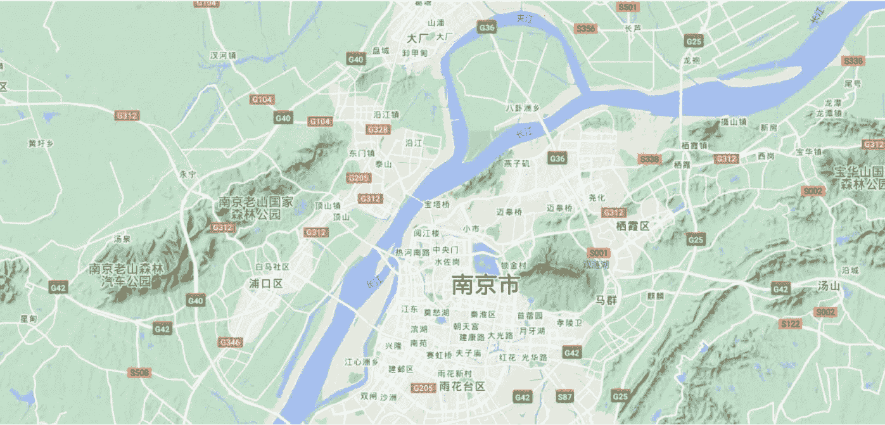

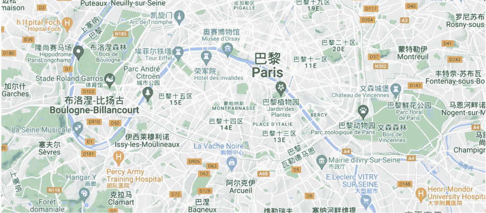

当然还有一些城市不是为了群居而生的，而是为了军事上的防御目的，比如中国边疆上无数的边塞。这些边塞往往都是苦寒之地，都严重缺水，极少有发展成大城市的。北京是个例外，按理说北京的发展水平不会超过石家庄，但是因为它是首都，自然也就不一样了。

> 工业时代降临后，无论是生产还是冷却，都需要更多的水。那些面朝大海，有港湾可以把商品装上船卖出去的地区就比较占便宜。如果这个地方背后还有巨大的一块平地，这块平地就可以直接搞生产，那就更占便宜了。如果港口城市背后的平地也依靠水路连接起来，简直就是buff叠满，这种区域一般都富得流油。中国的长三角，通过太湖和长江水系连接在了一起；美国的“纽约-五大湖地区”，日本的东京圈，英国的伦敦圈，都是这样的风水宝地，既是商业港，又是工业区。

> 所以超级城市最开始几乎都是黑烟弥漫搞工业，城市居民也都以工人为主。慢慢富起来之后，升级到了服务业。大家在服务业赚到钱，就不想进厂了，而且越来越受不了工厂的高污染高噪音，慢慢就把工厂搬了出去。大家很难想象类似巴黎、伦敦、东京，纽约，乃至咱们的北京上海曾经都是工业重地。后来这些城市都完成了“去工业化”，工业，尤其是高污染工业都迁了出去。比如北京的首钢工业园已经成了一个旅游打卡地，曾经那地方也在热火朝天地大炼钢铁。随便找了张图:

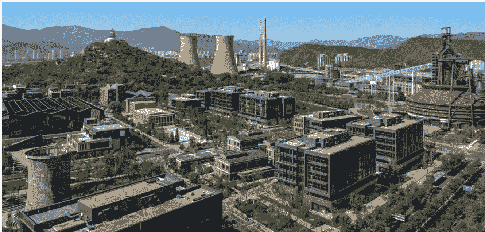

随着工业迁出，一部分工人迁了出去，剩下的继续住在市中心。市中心慢慢住上了从事服务业的中产阶级。

中产阶级的收入要比工人高，他们很快就把市中心的房价给推高，房价高了之后，房租也会高。那些商铺会把房租加到商品上，很快物价就上来了，逼着周围的不少人也迁到了城市边缘，这也是为啥北京的五环六环住着很多老北京。城市发展的第一个阶段是在去工业化之后，把一部分承担不起大城市成本的人赶出市中心，这个阶段全世界都差不多。咱们现在主要出在这个阶段。等市中心成本越来越高，慢慢企业就搬到城市边缘上去了。比如北京的北清路，在五环和六环之间，那里就有一堆高科技企业，把那附近的房价拉的非常高。还有亦庄，也一样，那些企业占地面积太大，在城里根本没那么多地，他们就去城外了。由于那些地方往往比较空旷，地价便宜，开发商也愿意开发密度极低的别墅群或者低矮洋房。这时候第一批中产阶级就迁到郊区去了。随后一些人也希望住到城外山清水秀的地方，不愿意住市中心的老楼，也搬走了。这种迁徙过程还有个专用名词，叫“郊区化”（suburbanization），美国上世纪60年代发生了这种转变，中国最近这几年也发生了这种趋势，但比较零星。

不过美国比中国复杂得多。主要原因当然是大家都喜欢宽敞的大房子，他们还有个很重要的原因咱们根本体会不到，就是白人跑出去躲黑人去了。因为上世纪美国强行推种族融合政策，很多白人不愿意自己孩子跟黑人孩子一起上课，干脆跑到成本较高的郊区。当然现在开始搞“黑命贵”，不能再这样明目张胆了，但是郊区黑人要比白人少得多。富人和中产阶级跑了，导致内城税收也成了问题，变得破败，学校的好生源也走了，学校越来越差，有点追求的家庭也没法待了。英国同时期也发生了这种事，内城变得非常衰败，同时犯罪率和失业率都上去了。主要也是因为他们那边税收模式跟咱们不一样，他们的警察和市容维护都是本地房产税给撑着，中产和富人跑了，税源没了，治安和市容都保证不了了，这下有点追求的人更得跑了。说到这里，大家应该已经看出来了，中国当前这种税收模式，是很难出现美国那种情况的。咱们是整体一盘棋，每个区也不是靠当地自己养。自己养自己，很容易出现大分化，大家想想，穷地方一直没钱提升自己，富人和中产跑路，可不是越来越矬？

此外美国那边基建完成较早，纽约那种地方动不动一堆百年老楼，对于要求品质的人来说根本没法接受。

咱们这边也零星发生了这种情况，市中心的房子由于楼龄高，也导致了中产阶级和有钱人搬走了，慢慢地一些品质太差的小区最后都是租客。

租客自然不会把小区当家，小区整体环境越来越差，更麻烦的是，越来越多的人不好好交物业费，维护也成问题，最后就变得很陈旧了。咱们继续以北京为例，北京二环里很多老小区已经没法看了，大家有兴趣上抖音搜一下，很多老北京一家子五六口子挤在一个四五十平的房子里。如果不是附近的教育资源加持，那房价也没法看，北京的那些不是学区房的老破小，是这一轮房价下跌最惨的。同样的道理，天津和平区，上海静安区，会看到大量品质极差的老破小，里边住的人很多也没啥钱。

但是市中心在哪都属于核心地段，不可能没业务。很多高端服务业，类似金融，跨国公司总部，高档商业区，这些都不能建到太偏的区域，一般都会建到每个超级城市市中心。这就决定了很多富人和中产阶级是不能住到郊区去的，不然没法上班了，他们又不愿意住老宅，那怎么办？政府和开发商自然会想办法搞一些豪华小区给这些人住，这个操作整体是很难的，因为涉及拆迁什么的。

拆迁这事有个窗口，过了之后越来越难，这也是为啥各国的城市改造都那么难，咱们以前是很容易的，现在也碰上这种情况了，越来越拆不动。这种高品质小区盖起来之后，因为同时占着各种优越条件，一般房价贵得离谱。于是又发生了人口回流，大量富人又住回市中心豪宅去了，这种情况在中国和美国都发生了。这时候回流的是真正的富人，因为市中心的豪华房子在哪都不是一般的贵，不区分美国、中国甚至印度越南。

如果在市中心改造了一大片，这一片无论是租金还是物业费，都不是普通收入能承受的，没啥钱的人很快都得迁出去，搬到住得起的街区，这一片就全部住上了富人和中产们。英语里还有一个词描述这种情况，叫“绅士化”（gentrification，也翻译成“贵族化”）。最后就形成了一个新的格局：以北京为例，在市中心，交错分布着各种奇怪的小区。有的小区是上世纪七八十年代的老旧工厂宿舍，可能连卫生间都没，里边住的都是一群本地人，或者租客。而这些老宅旁边，又有贵得离谱的豪华小区。

纽约那边也一样，而且他们的市中心豪华公寓更是离谱的贵。老小区租金往往不高，因为这些房子年久失修，楼道里都在流污水，能租上价有了鬼了。大家可能想象不到，北京上海市中心都有这类小区。如果有个摄像机拍这种地方，你也会产生一种“收入低的住市中心”的感觉。毕竟再怎么高级的商业区，都需要大量的配套人力，得有吃饭的地方，还有超市，还得有保安什么的。这些行业都容纳了大量的人，这些低收入人群有两个选择，要不租房住在附近，要不去城外。由于他们没啥钱，房租又太贵，只好花少量的钱租很小的一块地，最后就出现那种狭窄空间挤了一堆人。

你可能纳闷，为啥要租这种地方，就不能租远一些吗？当然可以了，继续以北京为例，大家知道那个房价“膝盖斩”的燕郊吧，那地方就住了大量在国贸上班的人。住那边的优点是便宜且宽敞，毛病就是他们得忍受极其痛苦的早晚通勤。坐地铁往死里挤，开车往死里堵，坐公交车又挤又堵。

很多人干脆就住在了朝阳区的城央村里，住得比较挤，条件比较差，但好处是不用忍受煎熬的通勤时间了。这一点在北京上海已经不太明显了，最明显的是广东那边，广州和深圳有个神奇的景色，不了解的人会觉得很奇怪，高楼大厦间无数各种城中村。你说有病啊去受那种罪？主要是收入高，一般都比别的地方高50%以上甚至直接翻倍，比在老家高好几倍。很多人不怕苦，怕赚不到钱。

在伦敦纽约，还有那种上百年的老小区，情况跟我们一样。他们还有个更麻烦的事，就是治安问题。国外政府管理不像咱们这么深入，用互联网黑化来说，就是缺乏“管理抓手”，颗粒度也不行，对于那种破败街区，政府的态度是混一天算一天，里边的人又比较穷，失业率也高，所以干啥的都有，治安就好不了。此外还有个政治不正确的话题，一般黑人和老墨聚集的地区，治安都不会太好。他们一般超过50%，中产阶级就会迅速搬走，把那块地留给他们霍霍。

同时富人和中产聚集的区域干净漂亮，有警察巡逻，而且一般缺乏公共交通和快餐店。流浪汉也不太愿意去，去了也很难找到吃的，这也决定了美国流浪汉都愿意挤在市中心附近。那边有政府和教会的救济站，也有大量的快餐店，几块钱就能吃饱，那里聚集了一堆要饭的人。如果跑去郊区富人区，会发现啥也没有，连个麦当劳也找不到。跟中国不一样的是，在美国通了公交车不是啥好事，因为乱七八糟的低收入人群就会过来。

不过美国那边现在也出现了一个趋势，在富人搬离市中心后，现在又在往回搬。原因就是上文提到的，一些高端产业建到市中心去了，他们得回去上班。倒也不一定彻底搬回去，也有可能跟咱们这边似的，那些有钱人在顺义或者亦庄有别墅，周末在郊区，工作日到市中心的豪宅去，不然通勤太可怕了。

如果说中美之间有啥明显区别，就是咱们是很难出现那种连成片的“富人区”。大家去看下就能发现，可能是政府规划时有意为之，一般一个豪盘附近，肯定给你搞几个经济适用盘，或者回迁房和豪宅盘弄在一起。而且很多豪华小区得专门拿出几栋楼做公租房，进一步防止贫富分化。这也导致了北京的房价比较魔幻，并不是大家想象的那种某个地段的房子都很贵。经常两个小区隔了一条街，价格差了三四万。最明显的就是吴亦凡住的那个棕榈泉，旁边叫丽水嘉园，这俩小区挨着，但是房价差了两三万一平方。不过这俩小区的公共设施确实是共用的，超市，公园等等。

美国那边相对来说就比较缺乏政府规划，往往出现那种大面积的富人区，同时也有大面积的贫民区。从发达国家的情况来看，一般如果不加约束，让市场自己做决策，富人们天然有聚在一起的倾向，最后形成大片的富人区。这一点在中国基本上被压制住了。收入不那么宽裕的人为了追逐低房价低物价，不由自主也往一起聚。这一点没有太好的办法，最明显的就是北京的天通苑社区，那地方人口密度超高，但是好处是人多均摊了成本，那地方应该是北京物价和房价的地板，也是很多北漂的第一站。

其实天通苑也能看出来中美的差别，前几年北京搞那个“回天改造”，翻新了一部分天通苑和回龙观的设施，很多年轻人表示天通苑现在除了交通太离谱，其他的好了很多。网上不少人说天通苑是贫民窟，这就离谱了，天通苑住了大量的华为、百度、小米还有阿里的人，那里边环境其实并不差，就是人太多，大家有钱了就会搬走，上限不高。

写到这里，整体就很清楚了：
- 1、美国英国形成那种“郊区化”趋势，跟他们的税收政策有很大关系，一旦富人和中产迁出一个地区，那个地区房产税急剧下降，没钱维护公共设施，很容易越来越破。最后有点钱的都跑了，只剩下穷人了。政府又缺乏动力和资金去维护，最后越来越破。
- 2、不过随着进一步发展，美国那边市中心或者内城又出现了富人的回流，只是他们回到城里也住在高档公寓。郊区的富人盘附近确实穷人很少，主要也是因为那些地方干啥都不方便，生活成本要高很多。
- 3、中国这些年也出现了一些“郊区化”，但是不明显，毕竟挣大钱机会依旧在城里。不过中国这边市中心住的也不是富人，只是他们的房子相对贵一些，大部分人也是正常人。
- 4、中国这边的强规划特点某种意义上避免了大片大片的富人区，相对来说更加融合一些。

公众号懒人搜索，懒人专属群分享

## 中国奶粉的强势崛起

2024-04-25

我以前一直有个疑问，在奶粉大规模应用之前，如果小孩出生后母亲缺奶，那该怎么办？当时想不明白，一度以为“没奶”这事是现代病，以前不存在这类问题。后来研究了一下，发现完全不是那么回事。现在的人日常处于营养过剩，都有那么多人没奶，更何况以前。也就是说，母亲生了孩子之后没奶属于常态，就算有，也经常不够一个孩子用，这也是为啥以前地主家的少爷都有个奶妈。那普通人怎么解决呢？

答案就是米粉，或者叫米糊。米粉和奶粉也不太一样，以前在上海等大城市，是有工厂的，工厂的米粉里多少加了一些奶，营养成分高一些。但是全国绝大部分地区，根本买不到，只能是熬粥给小孩吃。现在的人已经很难想象给一两个月的孩子喝粥，不过很多人确实是这样过来的，甚至包括咱们当前的一部分读者小时候可能也经历过。从现在的营养学角度来看，米粉或者米糊对于婴儿来说是不够的，缺乏人体所需的必须氨基酸，也缺乏各种微量元素。所以以前的人普遍身高不足，这种状态在以后的几十年有所改善，但是真正的改变要到90年代之后。也正是因为营养问题，所以身高也就成问题。1959年中国成年男性平均身高为168厘米，现在00后成年人平均身高已经突破了175厘米。更关键的是，大家应该已经注意到了，现在的孩子比咱们那时候更白净、更漂亮，体态也更匀称了。

可能有小伙伴会说，那也没办法啊，以前又没奶粉。其实奶粉早就有了，并且很早就在中国一些城市被使用，只是大规模铺开，让家家户户都能用上是个很晚的事。婴幼儿奶粉的研究和开发起源于19世纪的欧洲和美国，距今已经150多年。随着巴氏杀菌处理的出现，人们才发现杀菌后的牛奶才用于婴儿喂养。直到1915年美国发明了第一个以乳为基础的婴儿配方，1921年量产，标志着现代婴幼儿配方产业的开始。但是主要使用范围在欧美富裕地区，中国在民国时期上海天津曾经广泛使用过，但是出了这两个富裕地区，情况一下子就变了，因为我们既缺奶牛，也缺设备，根本没法大规模生产。更重要的是，当时老百姓的消费能力不允许他们买这种东西。

这也是为啥新中国成立后，一直在几件事上狂点科技点，比如大力普及卫生相关知识和措施，同时在内蒙黑龙江大规模养牛发展奶粉。大家可能知道王震老爷子带兵过河西走廊解放新疆的事，其实他后来最重要的一件事，就是发展奶牛行业。当时他在黑龙江搞农垦，毛主席希望他能承担起来养牛的重任，后半辈子一直在搞这事，后来经营得还不错。不过那时候啥都缺，连奶牛的产奶量都不行。现在我们知道，中国现在主要的产奶牛是引进的荷斯坦奶牛，也就是大家经常看到的那种黑白花纹的牛。那时候是没有这种高产牛的，所以牛奶产量也上不去。

最早中国的奶粉主要是“代乳粉”。1954年国内发布第一款代乳粉“5410乳儿配方粉”（大豆粉，蛋黄粉，米粉，蔗糖，豆油，核黄素、黄小米，骨粉，盐）。后来又仿照西方的麦乳精，搞出来了我们自己的。不过这个麦乳精在很长时间里属于绝对奢侈品，是可以用来送礼的，直到90年代才大规模铺开。也正是因为太贵，这个东西普及率并不高，真正大规模使用的，是一个叫“钙奶饼干”的东西，这是青岛食品厂的一个拳头产品，曾经的一代人记忆，现在的年轻人已经完全没听说过了。

这个饼干里加了一丁点奶，还有鸡蛋，葡萄糖，还加了一些骨粉，可以用来防治当时很常见的佝偻病，不过主要成分依旧是面粉。以前的家长把这种饼干当奶粉加到米粥里。直到1984年，我国引进了第一条常温灭菌奶生产线，每小时可以生产4000包常温奶，牛奶终于开始进行稍微远一些的运输。同一时期，市场上还出现了一个新的乳品品类——婴幼儿配方奶粉。不过之前都是小打小闹，直到20世纪90年代初，中国奶业进行了市场化改革，放开了牛奶购销价格，取消牛奶补贴，实行市场竞争，开放乳制品市场。中国乳业也因此迎来大爆发。

以前的牲畜主要是村里自己养，产量低成本高，而且产出来的肉和奶大部分都被农民自己吃了，属于小农经济。后来城市市民对肉类需求大了，催生出了大型养殖场，供给端和消费端都有了大幅增长。大家可能纳闷，养殖场能比农民养成本低？当然啊，大型养殖场通过批量买育种过的崽子和饲料，大量使用机械设备，养殖业也实现了工业化，再加上引入了科学管理，大规模引进国外高产牛，并且进口饲料，我国现在每年要进口百万吨的干草。集中养殖成本当然比自己家里养成本低，肉和奶的成本才大幅降下来。也就是说，中国真正结束物资匮乏，要到90年代中期了，距今没多少年。下图就是牛奶的进口量，注意下，进口的单位是“千吨”，产量是“万吨”：

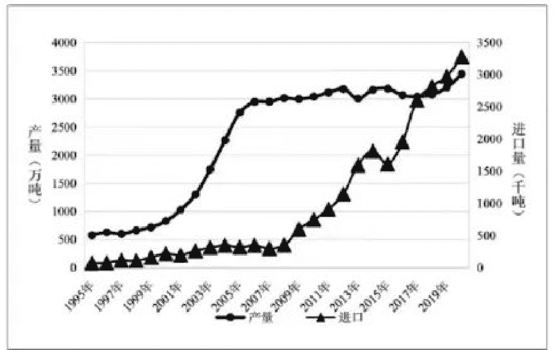

图 2 1995-2020 中国牛奶产量、进口量

可以看出来，我国牛奶产量爬坡也是在2000年之后。此外还有一项技术改变了局面，国内牛奶行业在1997年开始引进瑞典利乐液态奶包装技术。也就是利乐纸包装和超高温杀菌，使得不添加任何东西的纯牛奶，可以常温保质6个月。这个技术对中国的影响很大，以前的中国乳业都是“地方诸侯”，因为牛奶保存时间太短，没法长距离运输，所以各地都有一个地方品牌。直到这个技术被大规模应用，内蒙古的牛奶可以运输到广东、福建。自此，内蒙崛起了超级巨头，也就是大家熟知的伊利。牛奶供应不再是问题，奶粉产业也开始发生质的变化。几个奶粉巨头展开了惨烈的竞争，这个过程中，有的企业因为弄虚作假被市场淘汰，有的企业因为长期故步自封失去了优势。残酷的内卷中，胜出了几个我们熟知的品牌，如今有几个品牌已经在国内彻底脱颖而出，并且在国际上打开了巨大的市场。

比如大家熟知的伊利金领冠，一直都是国内销量头部，长期雄踞奶粉销量榜单前列的位置。作为最早进入中国母婴营养研究领域的品牌之一，伊利自2003年便开始进行母乳研究相关工作，在广泛收集全国健康妈妈的母乳作为研究样本、建立中国企业首个“母乳成分研究数据库”的基础上，2009年设立“伊利母婴营养研究中心”，并于2018年4月升级为“伊利母婴营养研究院”（简称“YMINI”）。

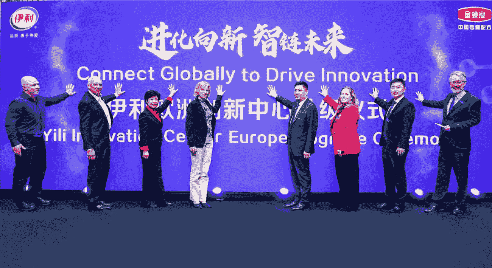

22年来YMINI深耕母乳研究领域，持续与国内外众多权威机构开展研究合作，不仅在蛋白质、碳水化合物等乳源核心营养素方面取得了重要科研突破，还将前沿的科研成果运用到伊利旗下婴幼儿奶粉品牌金领冠系列产品中来，为婴幼儿成长发育提供差异化细分解决方案。而且在2014年，伊利设立欧洲研发中心（后来升级为伊利欧洲创新中心），还在大洋洲，东南亚，日本以及国内建立了多达15个的创新中心。这些创新中心除了担任伊利集团科研研发，还承担母婴研究的科研，并把母婴营养研究的成果注入到金领冠。

今年又有了新进展，荷兰当地时间4月18日，以“进化向新，智链未来”为主题的伊利欧洲创新中心升级（YICE）暨全球母婴营养研究中心（YMINI Global）成立仪式在荷兰瓦赫宁根大学成立，YMINI Global携手国际权威期刊《Nature》发布全球母乳研究白皮书。这个研究中心跟最权威杂志《Nature》发布《全球母乳研究白皮书》，发布了一个非常重要的理念：其中创新性地提出了“免疫保护、消化吸收、肠道健康、智力发育”四位一体的母乳健康效应，也就是说，奶粉研发的目的，应该是让奶粉尽量接近母乳，这样才更加容易吸收。

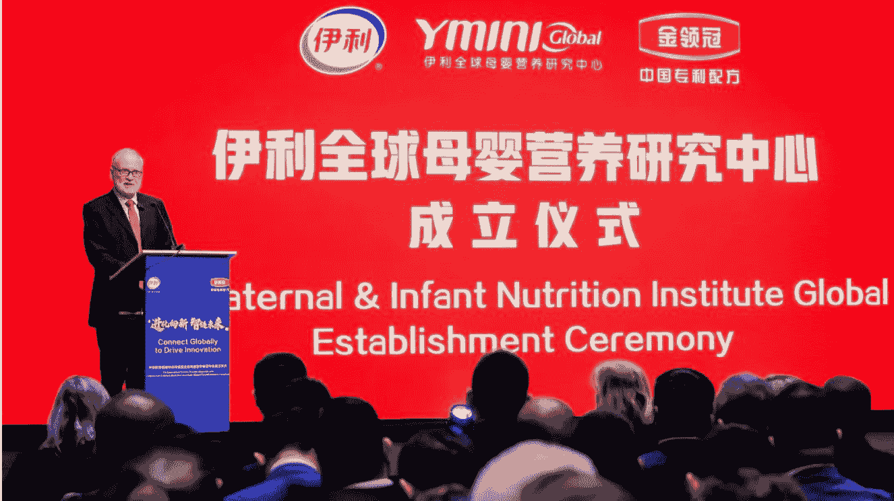

金领冠名誉首席科学家Hartmut Michel（哈特穆特·米歇尔），这人是史上最年轻的诺奖得主之一、全球闻名的结构生物学家，在现场赞扬了YICE和YMINI Global对全球乳业的创新驱动，也着重对金领冠在母乳研究领域的贡献给予了高度肯定。他说：“婴幼儿时期的成长发育是人一生健康状况的关键窗口期，而营养是影响儿童早期健康状况的最重要因素。我非常欣喜地看到金领冠在这一点上的全面考量，构建了包含消化吸收、免疫保护、智力发育、肠道健康在内的‘四位一体’婴配粉营养体系。我认为这对每一个家庭而言，都是一个更专业的健康解决方案和营养选择。”

2023年金领冠重磅打造超凡婴配粉，对“四位一体”母乳健康营养效应进行完美诠释。“明星产品”金领冠珍护铂萃，拥有90种全面营养，特含乳源第一大活性营养HMOs母乳低聚糖，搭配珍稀乳铁蛋白和活性蛋白OPN，助力宝宝保护力全面进阶。添加2倍超级三代OPO，搭配双重活性益生菌、益生元组合，宝宝更好吸收。更有100%A2鲜活生牛乳超凡奶源，带给宝宝全面营养的超凡守护。未来，伊利欧洲创新中心和全球母婴营养研究中心一起努力，汇聚中国及全球顶尖的科学资源、科研力量、科技势能，注入到金领冠“中国专利配方”中，给宝宝们研发更好更优质的奶粉。

公众号懒人搜索，懒人专属群分享

## 转型阵痛到底有多痛

2024-04-20

这两天看到统计局的说法

财经通讯社
2024-04-16 11:45:31 星期二

## 【国家统计局：下阶段中国仍处于结构调整转型升级的阶段 要承受转型阵痛】

财联社4月16日电，国家统计局副局长盛来运在一季度国民经济运行情况发布会上表示，下阶段，中国仍处于结构调整转型升级的阶段，一些企业要进行转型升级，所以大家要承受转型的一些阵痛。由于传统产业调整，新动能培育，出现一些经济增长波动是很正常的，但是发展质量是在持续提升，高质量发展不断进步，这才是中国经济回升向好的基本面。所以，我们说经济向好不仅仅是增速回升，更要看到质量改善。这样看中国经济才更全面，才能增强对中国经济的信心。我对中国经济持续向好、高质量发展抱有充分信心。

里边提到一个说法特别有意思，就是“转型阵痛”。现在的情况大家都看出来了，当前经济有两个问题、一头大象：房地产和基建已经基本上很完善了，后续的趋势是掉头向下的。

> 低端制造业也面临迁出和淘汰落后产能的压力。

那头大象就是生育率和人口老龄化，这在未来几十年内都不可逆。道理都不复杂，房地产和基建他俩其实是一个硬币的两个面。大家贷款买房，房地产商拿到大家买房钱，再去贷款买地，政府拿到开发商的钱，再去贷款搞基建。这也是为啥搞了这么多年，老百姓、房地产公司和政府（城投债）都欠了一屁股钱。这种玩法效率是很高的，中国近二十年的变化大家也有目共睹。但这套玩法有个极限，就是老百姓没钱继续买了，那这个游戏也就到头了。

今年房地产有多淡定，大家也都有目共睹。接下来就是惨烈的出清。我看大猛子的视频，他去年月薪一万，今年变三千了，不过还是比很多设计院强，有些设计院春节假期到现在还没结束。大猛子是国企，还好很多，读者里有私企的工程队，除了出海国内已经很难有项目了。还有一部分项目倒是能拿下，但需要垫钱，问题是去年的钱还没有要回来，工头不敢接了。上游的钢筋水泥也不好过，订单太少，开不了工，比如钢铁巨头永昌系旗下31家公司今年就倒闭了。

不过需要注意的一件事，盖房子是个夕阳产业，不代表今后不盖了，也不代表房地产行业就没了。哪怕美国这种早已完成城市化的国家，房子还在继续盖，因为每个人都有住进更好房子的需求，但是这种改善型需求跟咱们之前大拆大建相比规模会小很多。其次房地产买卖永远都是个超级行业，查了下，美国2022年房地产占GDP的比重是11.5%，比咱们国家2022年都高。他们的房地产主要已经不是盖房子，而是房屋买卖、物业管理相关的服务业。中国未来也一样，就算盖房子不行了，房地产永远都是个超级行业，毕竟经济的核心“衣食住行，吃喝玩乐”，最大的开支就是房子，每个人奋斗的终点，也是搞个好房子。

我们其次面临的一个巨大问题就是低端制造业的迁出，这一趋势其实也很清楚，一方面国内的环评和人力成本上涨是个巨大压力，另一方面中美贸易战导致大量的企业不出去不行了。前几天还在抖音上看到一个视频，有个UP主去美国的超市里翻吊牌，已经很少有中国产了，绝大部分都是越南印尼，其实这些企业很多就是咱们抢过去的。很多人对成本没概念，根据《财经》杂志的数据，2023年果链企业一个普通工人的人工成本，在中国珠三角是6000元—6500元左右，在越南是3200元到3600元，而印度工人的月薪仅为1500元左右。这也是为啥富士康已经把一部分河南的业务迁到了印度。

制造业，尤其低端制造业，最大的问题是“准入门槛太低”。前些年说越南印度无论如何也搞不定，这两年大家也都意识到了，确实没啥难度，只要肯投资，只要有人口，就没啥难的。也正是因为门槛太低，海外竞争一旦压过来，就得竞相压低成本，最后压到根本没有任何利润可言。很快就面临一个选择，要不也搬过去，要不倒闭。

当然了，工人收入上升是个好事，打螺丝的目的是为了将来不打螺丝，而不是打上瘾了，为了一直打下去，坚决不涨薪。

所以国家这两年在推动产业升级策略。已经很明显了，汽车、造船、光伏新能源也都在大爆发。不过问题也出现了，旧产业的工人怎么办？很多人说可以去新产业里就业，其实很难。道理也不复杂，一方面高端一些的产业本身就是知识和资本密集的，根本用不了那么多人。比如之前有新能源企业邀请我去参观过一个大型造车的车间，那里边就没啥工人，全是一堆机械臂，当时不让拍照，我在网上找了张图。

## 跟传统的流水线完全不是一码事：

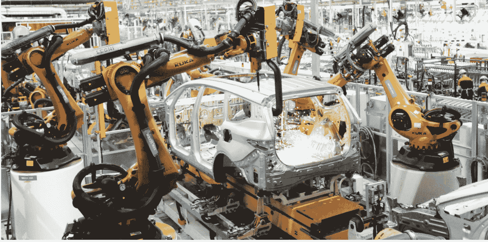

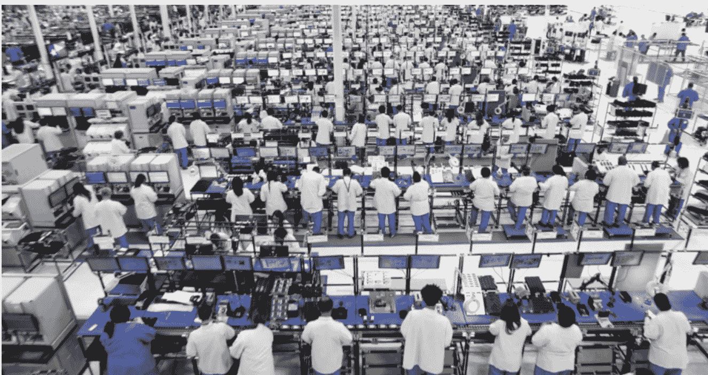

事实上产业升级本身就是一种“去人化”，去的越彻底，效率越高。北京亦庄就有不少工厂，除了检修设备，其他时间都没啥人，生产起来日夜不停，没有这效率，工厂是没法在北京开下去的。或者说，产业升级是极度“资本增密”而且排斥人力的，技术越先进，对人力的需求越少。也就是说，新产业和旧产业并不是从一个车站走向下一个车站，而是从金字塔的一个台阶上到了另一个台阶，并不是所有人都能在产业升级中找到自己的下一个位置。这也是当下很多人的痛苦之源，旧时代已经过去了，在新时代里不一定能找到自己的定位。这和二十年前完全不是一码事，在那场东北“漫长的冬季”里，很多人很痛苦，可是在东南已经开出了灿烂的“繁花”，大家都知道，这俩剧说的是同一个时代。

现在大家就体会到了美国这些年的痛苦，美国那边连汽车产线都搬走了，很多四十来岁的工人在迷茫中度过了后半生。所以“产业升级”是一个很悖论的东西，整个社会的钱越赚越多，失业也越来越多。没办法，如果国家向前发展，工资收入肯定会上升，成本的上升，必然会把极度成本敏感的企业赶到成本低的国家去。此外还有那个说烂了的问题，俄乌战争改变了一切。曾几何时，资本家决定产能放到哪里，唯一的考量就是成本收益，如今成本收益只占一部分，很重要的一个考量就是万一出点什么意外，他们的生产能不能继续。咱们这两年在提“安全”，他们也在提“产业链安全”。那日子还要过，接下来怎么办？其实大家参考下美国和日本，就能看出来，整体没啥办法，只能是按照市场规律办，让一部分低端制造业迁走，保住高端。这个是明摆着的，不多说了。其实国家还有一个战略思路，就是重复当初欧美在中国大规模投资，当初他们投资中国，让中国发展工业化，咱们现在也在非洲和东南亚给他们投资搞工业化。

这让很多人不爽，觉得在海外给我们培养竞争对手。主要是也没啥好办法，因为新兴市场发起来只是时间问题，我们必须提前布局并且参股。到时候他们发展起来，也能买咱们的东西。而且他们的很多企业，其实也是咱们这边过去的。

这就很接近日本上世纪的海外政策了。比如咱们都知道，中国这两年出口了很多汽车，其实这里边就有日本公司在中国生产的，相当于咱们成长起来了，他们也吃到了。当然了，助力新兴市场，培养未来购买力，这个需要很长时间，现在正在布局。

眼下就有个大问题，失业相关问题怎么解决？参考发达国家，以及回顾咱们过去几年，除了大力发展第三产业确实没啥好办法。第三产业就是服务业，农业是第一，工业第二，剩下的第三。国内很多人不喜欢这个词，容易联想到端盘子送快递服务员，其实研发、销售什么的，都是服务业。毫不夸张地说，看我这篇文章的，95%以上是第三产业从业者。很多人说起吸收就业，就觉得制造业吸收人力最多，其实这属于一个常识性错误。在任何一个走出农业时代的成熟社会，无论如何制造业和农业都没法跟服务业相比。几乎所有国家，都是第三产业占比最高。找了个数据大家随便看看吧：

| 国家 | 第一产业占比 | 第二产业占比 | 第三产业占比 |
|---|---|---|---|
| 中国 | 4.1% | 37.9% | 58.0% |
| 美国 | 1.2% | 18.6% | 80.2% |
| 德国 | 1.3% | 23.8% | 74.9% |

尤其是全世界比较核心的城市，类似纽约东京，第三产业占比能达到90%以上。也能看出来，我国服务业的上升空间还很大，至少十个点。但是有个问题，产业极度低端的国家，比如印度和印尼，他们的服务业占到GDP的70%，那些发达国家，服务业占80%，看着挺像，但是完全不是一码事。

这就涉及一个“财富的溢出”。发达国家通过自己的高端产业赚到钱之后，形成了自己的中产阶级，中产阶级就有更多的需求需要别人伺候自己。比如城市中产们去看歌剧，就有了大量的歌剧院从业者，他们的小孩去游乐场玩，游乐场又可以养活一堆人，看球赛，又可以养一大堆职业踢球和辅助的。一般来讲，大家对美国物价比较迷惑，其实没啥迷惑的，能进口的一般都便宜，比如超市里的各种工业品；不能进口的，只能本地生产的，都贵，比如理发、饭店、医院什么的。

类似体育什么的产业化之后，小孩们也多了一条上升的路。基层还能有一大堆教练等职业，这又能容纳大量的人力。当然了，在很多人眼里这些事都不咋样，他们觉得除了打螺丝或者工地打灰，其他的都是垃圾。

其实美国日本欧洲工业化达到巅峰之后，都发生了不同程度的产业升级和去工业化。咱们当然不可能复制他们，不过整体确实很相似，因为也没啥特别好的办法。而且服务业有个特点，它是本地化的。工业容易被离岸外包，但是服务业是很难进口的，美国人可以享受到便宜的中国工业品和智利车厘子，但是无论如何也享受不到便宜的理发店或者饭店。这也是为啥西方国家的工作时长越来越短。其实想想就知道，工厂是强调极致的“纪律”的，每个人必须全神贯注地专注于手里的活，但是服务业不需要，越高端的服务业越不需要。也就是说，如果我们的产业以低端制造业为主，那工作时长短不了，太短就会被其他更穷、更不需要休息的人给替代掉。第三产业占主体，落实劳动法，自然而然工作时长慢慢就下来了，因为无论如何也转不走。此外更关键的问题，就是政府的调节能力。

不知道大家感觉到没，这两年都在说产业升级，但是对于绝大部分人来说，并没有感觉到升级带来的好处，只感受到了淘汰落后产能带来的凉意。随着低端产业的持续迁出，新产业的涌现，势必进一步拉开收入差距。这时候就得格外照顾下那些基层老百姓，从升级成功的产业里征税，搞一个托底体系出来。包括育儿补贴，失业补助，养老补助等等，还有配套的房贷延期等等。倒也不是说今后可以躺平了，而是说就算没了收入，也不至于活不下去，这样大家就不至于太慌了。比如这些年在农村每个月给老人135，看着好像没多少，但是对于那些贫困老人来说绝对是雪中送炭，属于100%的良政。太缺乏兜底，很容易出现一个问题，占人口大多数的老百姓消费力很差，问就是没钱，没钱会对未来产生巨大的恐惧感，会进一步攒钱。最后形成一个尴尬的局面：本来消费力就不足，还把大量的钱存到了银行。我们消费力没法有效消耗我们的产能，只能寄希望于欧美的购买。所以接下来等到产业升级成功了，势必要补贴基层老百姓，这一点日本相对来说做的很好。美国相对一般，超级巨头富的流油，底层却分享不到技术进步的红利，当然有怨气了。咱们还是要以此为戒，发展生产力，保障就业，保障民生。

文章就写到这里吧，如果觉得不错就点个赞和在看吧。如果转载本文，文末务必注明：“转自微信公众号：九边”。此外大家有兴趣关注下我的视频号：公众号懒人搜索，懒人专属群分享

## 中东乱局会演变成第三赛季吗？

2024-04-17

### 先说说以色列和伊朗？

伊朗之前说过很多次了。伊朗是个极度缺共识的国家。这个国家的统治阶级和统治思想是教士集团和宗教思想。

宗教得到了底层老百姓的广泛支持，所以在很长时间里也比较稳固。但是伊朗又没法彻底退回到中世纪去过古代的生活。现代社会的石油、电力、工业部门都需要大量科学技术人员，所以现代基础教育和高等教育都得继续维持，更何况伊朗为了保持相当的国防力量，现代国防的支柱也是科技，也需要大量的人去学习现代科学技术。

所以社会就形成了两股互相看不上的势力，起源于中世纪沙漠一直没咋变的宗教势力，还有发源于西方的现代科学势力。双方互相看不上，可是又没法弄死对方，就这样一直过上了。

学了科学再去信宗教，这种事也不是没有，比如老布什一家子就是这样的人。但是绝大部分国家已经彻底“政教分离”，不再用宗教的理念去指导国家的运转。

所以伊朗现在很麻烦，作为社会物质基石的科技，和意识形态基石的宗教，天然合不来。所以伊朗一直以来的毛病就是上层极度不团结，核弹这种并不复杂的东西一直造不出来，也跟这种分裂有关系。

之前的两件大事，伊朗核物理科学家被遥控机枪击毙，还有美国无人机炸死苏莱曼尼，背后都是自己人的泄密。

为了弥合这种矛盾，伊朗这几年的做法可以看作是：

- 内病外治；
- 低强度压力刺激。

内病外治倒也好理解，内部有矛盾，解决不了，但是可以去外边搞点事，周围环境就比较紧张，容易让伊朗国内同仇敌忾。毕竟宗教和现代文明的冲突远远比不上民族冲突，用马克思理论解释，就是阶级矛盾让位于民族矛盾。

大家知不知道一件事？当初伊朗革命霍梅尼上台后，清洗了国内的精英阶层，但是很快两伊战争打起来了。作为空军飞行员的精英们很多都被关到监狱去了，本来双方是没法谈的。但是伊拉克打了进来，国家要完蛋了，大家放下前嫌先解决眼前问题，这才勉强驾机升空。

不过那个时候以色列担心伊朗倒了之后伊拉克一家独大折腾它，于是私下里没少援助伊朗。

如今伊朗还是这个逻辑，制造一些小麻烦，让国家处在危机状态，更加容易团结各方势力。有点像民国有一段时间，各路军阀脑子都打出来了，日本人进来后，军阀们都表示不闹了，大家一起同仇敌忾共赴国难。

当然又不能压力太大，因为伊朗现在太穷了，失业率很高，这类国家是很危险的，弄不好就跟沙俄似的发生内爆。伊朗的GDP大概相当于咱们国家的云南，是以色列的70%左右，以色列稍微比咱们陕西高一些。

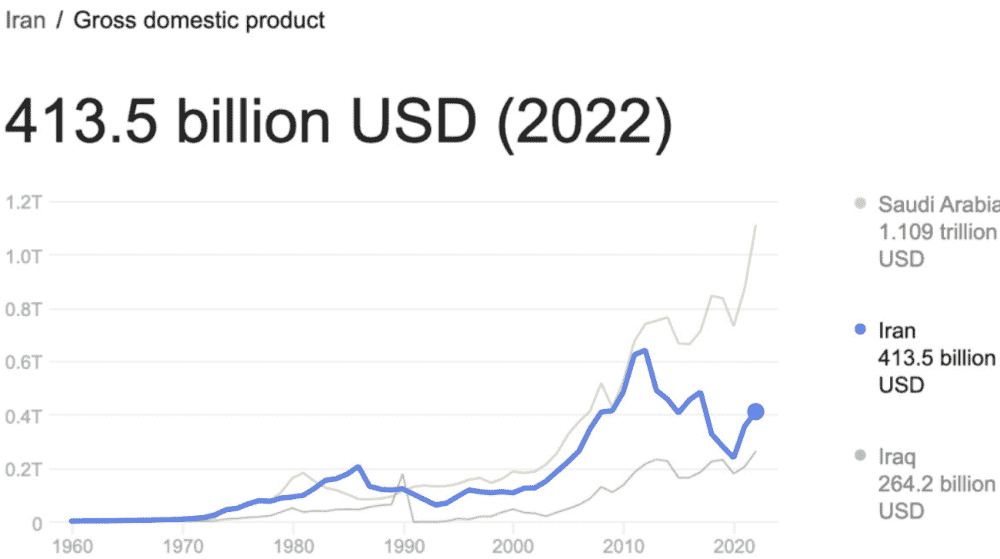

说到这里，大家也能感受到伊朗的压力了，相当于用云南的实力去跟美以对抗。

而且它有8000多万人，这既是优势，也是负担，现在伊朗人均GDP是中国的三分之一，那么点GDP养活这么多人压力非常非常大，而且这些年失业率也很高。查了下人均水平，2022年它和乌克兰差不多，不如点印尼，要知道，印尼有2.76亿人。

| 排名 | 国家 | 人均GDP（美元） |
|---|---|---|
| 112 | 纳米比亚 | 2605.83 |
| 113 | 印度尼西亚 | 4939.31 |
| 114 | 伊朗 | 4669.57 |
| 115 | 乌克兰 | 4619.99 |
| 116 | 阿尔及利亚 | 4567.95 |

> 注：当前排名按2022年最新发布数据统计

所以伊朗的操作非常精细且节约，一边在海外动作不断，可是不管发生啥，都不咋承认，比如上次哈马斯发动的对以色列的袭击，大家都知道背后是伊朗，但是伊朗就是不承认。

当然了，也不是没有实际利益诉求，那就是顺便在国土之外组建一个环形的防御圈，也叫“什叶派之弧”。因为中东普遍都是逊尼派国家，如果这些逊尼派国家最终和以色列和解，逊尼派国家又普遍跟美国关系不错（其中不少跟中国关系也很好），大家一起针对伊朗，那就麻烦了。

伊朗支持哈马斯打以色列，以色列就得打回去，中东逊尼派看着加沙的兄弟被屠戮，再和以色列勾肩搭背就不合适了。不过整体趋势是走向和解，因为中东那边的国家经济上越来越紧密，马克思不是说了嘛，经济基础决定上层建筑。

所以伊朗支持叙利亚，真主党，也门胡塞，还有哈马斯，既扩充势力范围，给以色列捣点乱，又缓解下国内矛盾。

某种意义上讲，这些年搞得还不错，最起码保住了叙利亚。在黎巴嫩也有一部分支持者，就是那个真主党。

不过也正是因为内部根基不稳，不太敢开大，如果战争经费消耗太大，本来就捉襟见肘的经济会陷入更深的麻烦。

某种意义上讲，他的这种忌惮也被西方和以色列给看穿了，以色列知道伊朗不想闹大，所以很多事做起来都无所谓。

比如刺杀苏莱曼尼，这人是圣城旅的头号人物，被认为在伊朗仅次于哈梅内伊的人物；

在伊朗国土上远程处决核物理科学家；

轰炸伊朗核设施。

包括这次直接炸了伊朗驻叙利亚大使馆，炸死了圣城旅的好几个指挥官。说真的这个有点太过分了，属于不宣而战的意思。

其实去年12月25日，以色列就在叙利亚首都发动空袭，战机飞到别的国家领土上，炸死了伊朗“圣城旅”的高级指挥官，当时全世界都震惊了，觉得伊朗这能忍？伊朗还是忍了。直到今年炸了大使馆，这事再不回应，没法跟老百姓解释了，才有了前几天那一波。也能看出来，伊朗确实不太想正面招惹以色列。

我看很多人说是以色列想逼美国下场。如果你指的“下场”是派驻军队去中东，那伊朗早就被美军基地给围起来了。而且每次以色列碰上麻烦，美国肯定出手。

如果你说的是美军直接入侵伊朗，几乎不可能。

当初伊斯兰革命之后，伊朗抓了美国外交官，美国上下同仇敌忾，美国也没真动手。两伊战争后期伊朗和全世界为敌，而且战争打到后来，伊朗到了山穷水尽的地步，美国那时候都没想着动手。还有第二次伊拉克战争结束后，美国实力如日中天，当时炒作说是要搞伊朗，后来也没搞。

现在怎么可能嘛，美国实力已经今非昔比，而且美国老百姓也厌倦了去别的国家领土上开战，更何况伊朗是个8000多万人口的国家。

更关键的是，美国在中东利益越来越模糊。它自己就是世界第一大产油国，中东乱了油价上升，对他来说不是什么坏事。这也为啥特朗普就希望中东乱，越乱越好，越乱他背后的石油财阀才能赚大钱。这也是为啥从特朗普时代开始，美国是逐步退出中东的。

甚至那个红海危机影响的是欧洲和亚洲的贸易，跟美国也关系不大。美国和亚洲走的是太平洋航线，跟欧洲的贸易走的是大西洋航线。危机爆发前，咱们这边往欧洲送一个标准集装箱1600美元，现在涨到了3600-4000美元还没降下来。现在船只不愿意走红海，还不是怕被击沉，主要是保险公司不给保了，绕行好望角就得加钱。

有人说要保证石油美元，其实这里又有个常识，一直以来你用欧元，日元都是可以买到石油，现在甚至人民币也能买到。

所以说美国下场本身就比较魔幻，以色列受到攻击，每次美国都会给它武器，但是以色列去打别人，美国几乎没支持过。不过特朗普不一定，它对以色列的支持程度远远超过拜登。

### 那以色列的目的是啥呢？

缓冲区呗，还能有啥。它要对自己周围搞无害化，毕竟那么小的国家，没啥战略纵深，所以就得“御敌于国门之外”。它周围的那几个国家，埃及，约旦，叙利亚，还有个黎巴嫩，外搭一个加沙和约旦河西岸。

埃及和约旦在五次中东战争之后已经看清了自己的阿拉伯兄弟们，也意识到赶不走以色列，就彻底不打了，过上日子了。埃及和以色列现在已经彻底和解了。

巴勒斯坦之前最大的抵抗组织叫“巴解”，跟以色列闹了半个世纪，后来签了和平条约准备过日子。不过组织里一部分老战士不想和平共处，于是去了加沙，成了现在的哈马斯。

接受和平条件的法塔赫待在约旦河西岸的，也基本上成了以色列的附庸，现在基本上稳定了，而且以色列国民里有200万阿拉伯人，大部分都是从约旦河西岸过去的。

和解得最过分的是那个约旦，约旦是伊斯兰教“圣裔”哈希姆家族的人在执政，之前也激烈地反对过以色列。后来发现赶不走，尤其自己的阿拉伯兄弟想要它命，也目睹了黎巴嫩吸收巴解后爆发了惨烈的内战，繁华的黎巴嫩被夷为废墟。

于是也不打了，现在约旦和以色列的关系，类似中国和巴铁的关系，双方经济上极其紧密，以色列在约旦搞了一堆工业园给约旦提供就业，现在约旦就业主要靠这些工业园给撑着。

而且他俩有战略同盟关系，这次伊朗用导弹射击以色列，他俩中间隔着约旦，导弹在路过约旦的时候大部分就被拦截了。

如今以色列最大的三股威胁，北方的黎巴嫩真主党，叙利亚，还有隔壁哈马斯，背后都是伊朗，以色列又不可能灭了伊朗。

### 那怎么办？

其实就是上世纪开始的一个策略，以牙还牙，你敢动我，我肯定会追杀到天涯海角，让你承受足够的代价，下次再动手的时候，还是要掂量掂量。

比如这次战机起飞炸掉了伊朗在叙利亚的使馆，炸死了扎赫迪，这人是2020年美国暗杀苏莱曼尼后，成为“圣城旅”对外知名度最高的指挥官，以色列认为他要对上次哈马斯的袭击负责，所以就把他给炸了。

其实就是在说一件事，你只要策划了针对以色列的袭击，那今后就是个死人了，不仅要杀人，还要杀全家，比如前几天用导弹炸了哈马斯最高领导人的儿子和孙子的车，炸死好几口子。

这样做太野蛮，国际上其实也在谴责以色列。不过有时候觉得，我们也可以这样，比如前段时间在巴基斯坦有人袭击我们的工程车队，后续我们也要做起来，无限拉高对方的成本。

有一说一，现在的以色列多多少少有点“俄罗斯化”了，变成了缓冲区狂魔。今年音乐会被袭击本来得到了全世界的同情，然后冲到加沙一顿杀，杀到后来西方也不支持他了。

而且关键是啥也得不到，残垣断壁就是哈马斯的土壤，狂轰滥炸只会造就更多未来哈马斯成员。

针对以色列炸大使馆的操作，伊朗的报复大家也都看到了，事先已经透露了出去，动手前24小时进一步广播，以至于中东上空全部腾出来让他袭击。导弹路过约旦已经被干掉了一大半，剩下的也没打到以色列大城市，查了下新闻，说是伤了一个以色列女孩。

这显然不是偶然的，明显伊朗是想高举轻放，弄回点面子，给老百姓一个交代。

后续会咋样，决定权又回到了以色列，看样子以色列不会善罢甘休，还要继续闹下去。

以色列现在应该是已经意识到在自己周围怎么闹都解决不了问题，只能是从背后大哥那里解决问题，所以就找伊朗去了。今天看到新闻，接下来还要继续闹。

我也不想预测了，可能大家看到这篇文章的时候，已经发生了。

有两个可能，以色列继续跑去围剿剩下的哈马斯，开战的时候哈马斯有三万多人，现在还有三四千左右，和其他一百多万难民挤在拉法口岸。我都不知道以色列咋去甄别。

另一个可能就是直接往伊朗扔导弹，我也不知道伊朗被炸了会是啥反应，如果真打起来，中间隔着一千多公里，不知道咋打。难道去黎巴嫩打?黎巴嫩的真主党是支持伊朗的，伊朗如果以黎巴嫩为基地进攻以色列，也不是不可能。

只是黎巴嫩人真哭了，曾经挺富裕的地方，被战争反复蹂躏已经很惨了，弄不好还得再被蹂躏一次。大家知道那个《反脆弱》的作者塔勒布吧，他就是黎巴嫩人，他小时候亲眼目睹自己的国家在半年之内由天堂变成了地狱，几乎所有的中产阶级和有学历的家庭都跑到了欧洲和美国。

弄不好这次又有一劫，想想都难受。

不过跟很多人理解不一样的是，中东这些年的冲突烈度整体是下降的。大家对比下五次中东战争，会发现一次比一次烈度低，参战国家也越来越少，到现在已经没有国家公开站出来要再打一次了。

而且上世纪90年代也爆发过两伊战争这样百万人级别的惨烈相互屠杀，现在大家已经不敢想象了。甚至大家都想不起来到底是为了什么蠢目标需要几百万人的生命去献祭。后来想起来，原来是几个狂人冒出了狂热的想法，无数人就失去了自己的丈夫、孩子，孩子也失去了自己的父亲。

到如今，已经有好几个国家几十年没见刀兵了，背后也是老百姓极度厌倦了中东豪门家族煽动普通老百姓批量去做炮灰，上层阶级也不再随便提武力。

越来越多的国家开始正常过日子，伊拉克、沙特阿拉伯、科威特、约旦、阿曼、埃及、卡塔尔、巴林等等，都经历过炮火连天，现在都进入了正常状态。一旦过上正常日子，就再也不想打了。

这也是“中东大和解”背后的原因，没人愿意为了几个狂人的妄念把自己的孩子送上战场去厮杀，无数人的愿望最后达成了共识，慢慢越来越多的国家退出了战争开始安静过日子。

网上这段时间持续在说第三赛季的事，说真的，可能性不大，网上发言是一回事，回到现实又是一回事，现在中东那边绝大多数的人也都在操心自己下月的工资，父母的医保，孩子的玩具，没人想平白无故把自己的孩子或者丈夫送去战场上相互屠杀。

我知道很多人希望中东乱起来，其实就跟俄乌战争一样，看着好像离咱们挺远，不过事实就是俄乌战争加剧了世界走向分裂，脱钩加剧，客观上也给咱们造成了很大的麻烦。战争对于咱们这样的真正的全球化受益者来说，真不是啥好事，某种意义上讲，咱们现在才是海洋商业国家。

而且站在我国的角度，和平的中东是符合我们利益的，毕竟咱们基建狂魔在国内搞不下去了，今后得向外输出产能，“走出去”已经成了国家战略，中东是个潜力巨大的地区，不过前提是和平，不然多大的投资都得泡汤。

啥叫大爱？啥叫世界和平？啥叫“技术向善”？

这就是。

文章就写到这里吧，如果觉得不错就点赞和在看吧。

## 中产的孩子到底有没有未来？

2024-04-11

“中产”这个词一直比较模糊。本义来源于美国的“Middle Class”，也就是“中间阶层”的意思。如今在中国和美国完全不是一码事。

一般来讲，在美国，家庭月收入5000刀以上，那毫无争议就是中产。这部分人占到整个社会80%以上。

在中国，家庭税前超过5万，平时逛山姆，穿始祖鸟，有套五六百万以上的房，有辆30万以上的车，才能被大家看作是“伪中产”。在总人口中占比不到5%。

那啥是“真中产”呢？

可能大家心里“真中产”是月薪十万以上，一千万以上资产，更关键的，还得有“生产资料”。大概就是类似于一个工厂或者一个公司什么的，你在家躺着，一群人在外边给你赚钱。

前段时间看到一篇文章就是说这事，聊中产孩子的，大意就是“中产没有生产资料，没法传递给下一代”，所以他们的孩子没未来。

首先要说，这个说法没啥问题，我完全同意。

如果你一出生，你爹就给你留了一排三里屯的门店，还在大裤衩附近有一栋楼出租，那你这辈子大概率是很爽的。就跟微博上一个博主似的，十来年前花了1600万买了套商铺，现在租出去，每年稳定赚一百多万房租，那自然是爽得要死。他的孩子大概率是有未来的。

说到这里，大家估计也发现了，好像这种说法比较对，又哪里不太对。

如果有一大套可以传递给下一代的“产业”或者“生产资料”，那还叫“中产”吗？这是社会中间阶层该有的样子？

而且大家经过这么多年的社会毒打，应该也反应过来了。“生产资料”这东西，在不同的时代也不是同一个东西。

十几年前，一个劳动密集型的作坊是生产资料；几年前，在河北有个钢铁厂也是生产资料；电商崛起之前，商铺也风光无两，可以“一铺养三代”，哪像现在这样到处“旺铺转让”。

正如大家所见，一二十年这个尺度上，绝大部分东西都得重新估值，现在那些牛逼玩意，再过二十年大概率都没人提了。很多人觉得特别神圣的“生产资料”，可能几年之后就啥也不是了。

一代版本一代神，世界上很少有什么东西能持续二十年以上赚钱，毕竟你赚钱了，别人看懂了，也参与进来，用不了多久利润就归零了，最明显的就是河北的钢铁行业，曾经那么暴利，硬是被大家干成了微利行业，而且日常亏损。

这些年沿海地区也出现了这种情况。老爷子上世纪90年代的时候正值壮年，响应国家号召开工厂。现在六七十了，要退休了，发现工厂没法传递给孩子了，因为按照国家的标准，现在的工厂属于“落后产能”，利润薄，订单减少，半死不活，看样子就撑不远。二代们宁愿天天玩车也不愿意接班。

那重新投资新产能搞产业升级可以不？

当然可以，不过那就不是“传承”了，属于二次创业，难度和风险大得离谱。之前有机构统计过，哪怕二代创业，成功率依旧不到5%。好处是他们创业失败可能只是财富缩水一部分，普通人创业失败就得翻看我上一篇文章《快要当老赖了，还有救吗？》。

可见以“代际”为尺度观察，90%的生产资料都会失效，并没有多少东西可以稳定增值。美国那边有个调查，1919年美国前五百的超级富豪，能维持到现在的不到50个。大部分都跟范德比尔特似的，老头是美国首富，真正意义上的富可敌国，第四代就把家族资产败光了。

顶级富人资本家在这个问题上都没啥办法，只能给下一代留钱或者房地产，更别说绝大部分中产了。欧美那边多一个信托可以传递财产，中国这两年信托崩了一地，就在咱们写文章的时候，赫赫有名的平安信托也崩了。

你说那不还有10%吗？

这就既是运气也是实力了，毕竟炒股也有10%的人能赚到钱。

也就是说，钱可以传递下去，赚钱套路或者说“生产资料”代际传递成功的比例并不高。毕竟这个市场上每天都有一堆企业走向了死亡，我大学时代极其辉煌的房产巨头们，这不几年间就不成样了。还有南京的那个家电巨头，接班人刚上岗，就得面临企业半死不活的状态，刚查了下，股票也跌掉了90%。

所以说，中产最大的问题可能还不是什么生产资料，生产资料的传递对谁来说都巨难无比。

中产的问题是单纯就是钱不够多，没法给下一代提供一个确定性的未来，这让没啥安全感的老百姓非常痛苦。

那为啥我对“中产的孩子没有未来”很反感呢？

因为哪怕按照网上对中产阶级最低标准，那也得是家庭资产五六百万以上。按照胡润的说法，中国这类人只有514万户，中国总共有4.9亿户，中产在人群里占1%。

这已经是金字塔顶点的人了，如果他们的孩子继续没未来，其他人趁早了断算了。

这已经不是讲道理了，这简直就是传播焦虑了。

中国新富起来、却还没成为巨富这些人，最大的问题不是没有生产资料，而是太过追求确定性。

这种对确定性的极致追求，最后形成了两股力量，以海淀妈妈为代表的鸡娃派，还有以山东老铁们为代表的“考公派”。这里只是笼统地说，不代表其他地方的爹妈不鸡娃，也不代表其他地方的家庭不考公。

客观公允地讲，富裕家庭孩子确实在社会竞争中占据很大优势。

比如B站的很多UP主，家里有钱，也没好好学习，考了个垃圾学校，毕业后也不去找工作，到处溜达，搞点费钱的爱好，顺便拍点视频，一不小心成网红了，更不用去上班了。这些人在成网红之前可能很多年都没收入，纯靠家里养着。

此外最明显的就是开饭店，毕竟绝大部分人提到“创业”，就是去开饭店。很多倒闭的饭店其实并不是他们选错路了，单纯是因为资源不够他们死扛三年。

大部分行业都是一样的，都需要经历很长时间才能过了“盈利折返点”，如果家里能帮一下，可能结果完全不一样。

这也是为啥这两年出现一个词，叫“江浙沪独生女”，说的就是那些家里有一些钱，能给孩子足够的支持，让她在一个相对轻松的氛围里长大，不用为了各种琐事闹心。

说到这里，又想延伸一下，我们这个社会到底存不存在相对稳定的代际传递？

其实跟大学里的老师们随便了解下，大家就能知道一个现实，这些年名校主力一直都是传统“铁三盘”和大城市白领家庭的小孩，还有少数偏远地区的高天赋孩子。

“铁三盘”就是“医师公”。比如教师这个群体在中国总人口中占比并不高，但是他们的孩子在高考中上好学校的占比却很高，可能受父母耳濡目染，多少有点影响。

其次是公务员家庭，占比也很高，可能工作相对没那么忙，有很多时间陪孩子。

医生家庭相对来说差一些，可能医生们工作太忙，疏于教育，但是依旧比他们这个群体在社会里占比高得多。

而且医生家庭是“子承父业”概率最高的一个行业，当然了，这个是良性的，跟“三代烟草人”不是一码事。全世界所有正儿八经的国家医生都呈现家族式，医生后代不一定全去做医生，不过确实做医生的概率高得多，也可能是耳濡目染。

再往深处想想，这三个群体本身就是这个社会受教育程度比较高的群体，他们的后代从概率角度讲确实是占点便宜。也就是说两个中等偏上资质、整体差不多的孩子，出生在医师公家庭可能长期就会积累优势。

但是“医师公”的孩子毕业之后又重新陷入了危机，因为他们的父母都在相对封闭环境中生活和工作，并没有教会太多社会经验。

大家在这个逻辑上再深入思考下，就懂了为啥会有“海淀妈妈”这么一群人。

海淀妈妈们绝大部分都是顶级做题家，从小一路开挂，重点高中重点大学，毕业后进大厂、进外企拿高工资，过一些年，确实混成了月薪三万以上的中产或者网友说的“伪中产”。

但是他们对自己的生活满意吗？

能满意有了鬼了，他们盯着的不是普通人，是他们同学里那些一年赚几百上千万的。你可能纳闷，这个世界上就有那么多高薪的？本来没有，但是在一线城市，在各个名校，几乎每个班都有，这些人成了同学的噩梦，成了他们使劲折腾孩子的动力。

海淀妈妈们通过学习改变命运，但是觉得改变的依旧不够多，路径依赖觉得是学习依旧不够好，所以往死里逼孩子。

不过这两年明显开始降温了，主要也是因为学历贬值，让家长们重新思考把孩子的整个童年砸进去，换一个越来越贬值的东西到底值不值。学区房暴跌也是这个背景。

此外刚才提到了，“生产资料”传递下去是很难的，毕竟这个世界上能持续赚钱的东西并不多。但是江浙和广东那边确实有那种几代人都在做买卖，除了历史上比较特殊的那段时间，他们一直都比较富裕，甚至特殊那几年他们比较惨，一放开又重新起来了。

大概率是跟一些有用的“心法”有关，比如从小教育孩子发掘稀缺性，把一个地方不值钱的东西搬到另一个比较缺的地方卖，还有一些讨价还价技巧，观察别人微表情等等。而且父母平时讨论问题，类似分析别人说的话，讨论明天进货多进点啥，这些都会潜移默化影响孩子。

更重要的是心理素质，比如从小锻炼孩子不太在意面子等等，其实这个特别关键，绝大部分人最大的问题就是脸皮太薄，严重影响了潜力发挥。大家可以参考任正非的一句话，他说他创业开始的时候，面子就喂狗了。

文章就写到这里吧，文末总结几句：

- 1、就别纠结什么“生产资料”了，长时段来看，没几样生产资料能跨越代际，甚至大部分生意赚钱都只有短短的几年时间。

- 2、高学历高净值家庭在很多方面对于普通家庭都是有一定优势的，这个没啥可说的，不过整体也有限，智商遗传不稳定，绝大部分人的赚钱套路也不稳定，只能是给孩子提供一个相对宽裕的环境。

- 3、如果有什么真正可以稳定遗传给下一代，那肯定是你自己的生活习惯和父母们的思维方式。孩子跟你一起生活十几年，你的各种优点缺点，都会慢慢传递给下一代。这就是为啥说女孩年龄越大越像妈，儿子年龄越大越像爹。

- 4、社会在长时段来看还是倾向于奖励那些积极上进、肯努力、运气好的人。观察美国这样的成熟社会，社会固化一直在提，整体也没大家想象得那么固化，现在美国顶级的那些富豪，比如贝索斯那种，绝大部分出身中等家庭，真二代并不多。咱们社会还早，也没必要纠结出身什么的。

最后想说个题外话，推荐下我自己的书，有兴趣的小伙伴可以看看，后来又加了一批签名版，不知道卖光没。

公众号懒人搜索，懒人专属群分享

## 快要当老赖了，还有救吗？

2024-04-07

有个很意外的事，之前一个朋友借走我两万块一直没还。后来就接到了催贷电话，原来他因为赌博到处借钱撸小贷，欠了一屁股钱，跑路了。小贷公司开始炸通信录，炸到我这里来了。

然后这哥们就彻底消失了，我都不指望要了。

这不过了好几年，前段时间又把钱还了。我非常纳闷他这种情况怎么赚到钱的。稍微了解了一下，说是他当了老赖之后，主业送外卖。同时有丰富的债务管理经验，利用这部分经验赚了些钱。比如你欠了银行一屁股钱，天天还在利滚利，你实在是还不上，他可以教你给银行打电话，协商“停息挂账”，也就是承诺还本金，利息银行不要了。这主要是个信息差，一旦银行相信你没还款能力，他们只想要回本金。信用卡，网贷什么的，都是这样。他如今小有名气，竟然赚到了一些，赚到钱之后想好好做人，就把以前亲戚朋友的钱先还上了。这样乍一看，好像确实是个双赢：你能基本正常地过日子了，不至于像网上的一些老赖，被迫和以前的生活圈脱离，在社会边缘躺平。如果运气好，一不小心咸鱼翻身，到时候恢复征信重新做人。对金融机构来说，也可以避免更多的损失。债务能全收回来当然最好，但如果真的收不回来，能收回多少算多少。金融机构最不想把你逼到破罐子破摔。现在有这方面情况的人增加很快，所以我今天聊聊这个。债务问题极为复杂，作为非专业人士，我只懂点皮毛，说得肯定有很多不全面的，大家见谅。欢迎业内或有经历的小伙伴补充。

### 1

对于债务，老话“杀人偿命，欠债还钱，天经地义”。但同时还有一句老话“要钱没有，要命一条，你看着办。”两句话成了悖论。债务处理过程中，经过各种软硬兼施的要账。对方实在没那么多钱的时候，很多人可能有个自然而然的想法，所谓“欠三千不如现八百”。能拿到一点是一点。拿到之后，倒也不是说一笔勾销，还是欠着。只是不再紧逼着要罢了。事情到了这里，其实难免有两个悖论：就是债务人到底是真没钱，还是有钱故意赖着不给。双方站在自己的角度，会有不同的认识。咱们举俩例子。近的就是计算单位“一爽”的原型郑爽。在一起合同纠纷中，她被判决支付9050万债务。但公告中也说了，法院穷尽调查措施，没有发现可以执行的资产，所以只能终止执行程序。很多人问这笔账后续怎么办？按照法律拿她真没啥办法。如果能找出她隐瞒的资产，不但可以执行，还可以增加罚款，甚至以“拒不执行判决罪”判刑。可找不到的话，那就没招了。反正比较魔幻的是，郑爽现在是老赖了。法院要照章办事，又不是《狂飙》里的唐小龙，把人拉去连续献血，或者更极端的方式要债。但是几乎每个人都认为，郑爽一天几百万的片酬肯定有水分。但要说她没有资产支付，绝对不可能，她必然是早把名下资产转移了。这种怀疑当然也没根据，主要是现实里这种情况很多。大家可能不懂郑爽，可是却懂社会。与此对应的，就是曾经震惊全国的“辱母案”，这又是另外一个极端了。案情其实很简单：企业经营困难，银行的贷款无法结清，正规渠道获得资金的路子堵死了。于是找私人借钱，利息高达每月10%。注意下是“月息”，每个月10%，一年也不是120%，而是300%，因为每个月的利息也要产生利息。经常借高利贷的小伙伴都明白，这种利息最多拿来两三个月周转，一旦时间长了必然出大问题。“辱母案”那次也是这样，利息很快榨干了企业资金，于是又抵押了房产。放债人当日带了十几个打手来，目的就是强迫过户。爆发冲突后多次报警，警察说“债务纠纷属于民事纠纷，解决不了你们去法院”就离开了。放债人心里有了底。各种暴力侮辱手段逼迫，欠款人的儿子逼急眼了，抄起水果刀乱砍。结果杀了一个，重伤两个轻伤一个。事情到这里还只是问题第一次扩大。后续法院判决伤人者无期，对暴力催收和高利贷却不作处理。这下把事情彻底捅大了，当时国内P2P和小贷正是高潮期，判决一出，“新金融”从业者喜大普奔，到处转发给借了他们钱的人看。如此判决，引起全国关注，最高检直接介入。山东高院的二审来了个大转弯：伤人者判定正当防卫过当，判刑五年。放债人以组织黑社会等多罪判刑25年，手下9人从两年半到20年不等。当时处理不积极的警察和领导，全部清理出队伍。这事也可以看作一个转折点，相当于有了“司法判例”，今后再暴力催收，被人砍死可能也是这个判决，暴力催收那群人一下子歇菜了。毕竟大家上门去干那些缺德事，主要还是为了赚钱，搭上命可就亏了。

正是因为借款人情况的复杂。国内正规金融机构，对于债务的处理都非常谨慎，尽量在内部处理，不把债务转包。一方面怕有人买了这笔账，会以银行的名义，使用过激手段催收，以求获得超额利润。因为回收率太低，很多债务转包折扣非常大。国内消费金融公司资产包拍卖，常年在一折以下。今年2月28日，中银消金转让27亿元个人不良贷款，起始价已经到了0.25折。也就是100块钱的贷款转让，只能卖2块5。大家想想，你花了25万，从金融机构那里买了1000万的债务合约，只要从欠钱的那群人手里榨出30万你就赚了。所以现在有不少公司在做这个业务。说到这里，大家就懂了为啥能商量了。你欠了某网贷平台一万块，网贷平台觉得要不回来了，就250卖给了催贷公司。催贷公司找你协商，你如果懂其中的门道，直接说给一千块，催贷公司可能就同意债务清偿了。今后再不骚扰你了，但征信不一定能恢复。可能有小伙伴不知道啥是“消费金融公司”，这个比较复杂。也就是前些年混乱的小贷后来不是结束了嘛，剩下了一些后台比较硬的，主要有31家。这些网贷公司并不小，而且也是“牌照业务”，你想做也做不了。他们放款一般资质审核比较松，但是利息非常非常高，高利率就是高风险，已经在防着你不还钱了。如果你向这些公司贷了款，甚至你被这些公司查了征信，银行也是能看到的，就不太愿意借钱给你了。这里要多说一句，大家不要随便去玩那些网贷平台，就算不借，也不要玩。这就得说我周围发生的一件事了，一个小伙伴需要五十来万，他就去各个平台都查了一遍自己能贷多少，查完之后发现利息太高了，动不动8%。于是又去线下银行信贷部问了下，大银行办不了了，而且利息得上浮，平白无故得多花万把来块钱。所以说银行也纠结，要不回来的钱，自己承担损失不甘心，如果把债务卖给催债公司，又怕有不好影响。所以银行对抵押物特别上头，那些消费贷什么的，审查资质也非常非常严格，一般都是查社保和公积金，跟网贷公司完全不是一码事。

### 2

可能有小伙伴不知道，你如果欠了别人钱，不管是银行或者小贷，或者干脆就是你周围的人，死活还不上，这个算“经济纠纷”，是不用去坐牢的。只有那些有还款能力却不还，还被人抓到了证据，比如在朋友圈胡吃海塞，这才会被抓去拘留，现实里这种极少极少。

我以前理解不了这种情况，欠债不还还有理了？后来慢慢有点理解了，因为钱是你借出去的啊，你不借不就没事了？现实里除了朋友之间借钱，大部分都是有利息的，法律上假设你是深入了解了风险做出了决策，收益和风险并存，所以一般不会让坐牢什么的。自己做的决策，自己得承担损失。如果小伙伴出现了还款问题，一般对方会如何处理呢？现实生活中，咱们一般面临的就是这么几种：房贷，信用卡和小贷。这又对应三个主力人群。中年人承担的是房贷；大学生和年轻白领是信用卡；其他社会青年容易碰网贷。

咱们一个一个聊。

一个很受关注的话题就是房子下跌，会引发大规模停贷吗？

观察日本和美国，影响停贷的不是房价下跌，是就业率。日本从高位跌下来后，除了他们的一线城市，绝大部分城市都没回到历史高位，不过日本人还是咬牙把钱还完了。

那房价下跌会影响啥呢？

影响消费。你想想，你买了套房，200万，欠了一百万贷款，它现在只值100万了，相当于你之前攒的钱付首付，现在已经赔没了。尽管房子你是自己住，但所有人第一反应就是自己多年积蓄打水漂了，想尽快还完钱重新攒钱，消费就被挤压了。房子在全世界都有个“存款账户”的心态。日本过去三十年，就是这么个状态，房价跌了后，大家觉得自己多年积蓄没了，只想压缩开支尽快还钱。很重要的一个原因就是房贷主力是中产阶级们，他们脱离不了社会的金融体系，所以不到万不得已，是绝对不会停供的。从现在燕郊的情况来看，那边已经跌掉了50%以上，一些楼盘跌掉70%，绝大部分人首付已经跌没了，依旧在努力偿还。

这就是为啥说中产阶级很重要，是社会稳定的重要基石。

那要是实在还不上呢？各地流程不太一样，不过一般是银行经理先给你打电话，还不上就是银行催收部门，还是还不上，银行就会向法院起诉，这种毫无疑问你会败诉，接下来就是三件套：

- 上征信；冻结所有名下资产；拍卖房产。

而且大家注意下，房子被拍卖了，不是说就没事了，如果拍卖后的钱不够还银行的贷款，那你还继续欠银行钱。多说一句，银行向法院起诉你，起诉产生的乱七八糟费用，比如律师费起诉费也是你来还。房子被拍卖，一般来讲肯定会欠银行钱。因为房子如果能卖个好价钱，你早就卖了。

所以断贷那些人一般都会先离婚，防止两口了都被执行了。之前去阿根廷，那边的小哥跟我说，南美聚集了一大堆欠钱太多还不上的人。这些人在国内基本上社死了，就跑去国外碰运气。一般那些发达国家流程比较复杂，还要做背景调查，非常难去，于是很多人就跑非洲和拉美这些非主流。

接下来怎么办？接下来就慢慢还呗，高铁飞机别想坐了，正常出境流程也走不通了。等啥时候还完了，就清征信，他们把这个称为“上岸”。你说那阿根廷那帮人怎么过去的？这就比较复杂了，大家记得之前缅甸“走线”吧，很多就是这种，你说正儿八经的人谁会走线啊。

接下来就是信用卡。

信用卡主力一般都是大学生和小年轻，经常迷恋什么东西，男孩喜欢电子产品，女孩喜欢各种包包，一直刷卡买，越陷越深，最后还不上了。

大学生的话，直接找家长一般能解决。绝大部分孩子们都是不敢跟家里说，最后利息越滚越大，其实很多时候，你觉得天大的事，可能在家长眼里并不是啥大事。当然了，如果一直滚下去，可能就成大事了。如果还不上呢？这就有一堆复杂的流程，比如你想让银行少要点利息，想重新协商分期，银行肯定会毫不迟疑地拒绝你。这时候你就得去打一些相关的投诉电话，好像是银监会，说你确实困难，银行催贷对你和家人的身心健康造成了巨大的影响。投诉完一般银行就会跟你重新协商，其实也不是他们要故意为难你，大家都是打工人，都在走流程。具体做法网上也有很多，大家可以搜一下，最好找过来人问问，这也是个磨人且焦虑的过程，需要提供大量的证明材料。如果实在是还不上，银行催收了一段时间，各种狠话也都说了，发现没啥用，你应该是真还不上。这时候利息也不涨了，征信上会显示成“呆账”，这个债务肯定要比你去协商高得多。

那会扣你其他卡里的钱吗？这倒不会，除非信用卡关联卡。道理也不复杂，你们银行借出去的钱要不回来，跟我们银行有啥关系？甚至同一个银行，银行卡和信用卡也不是同一个部门。但是如果银行去法院起诉，法院判决后强制执行，你其他卡里的钱也会被划去还债。不过起诉是有成本的，为了房贷起诉还值当，可以没收房子去拍卖。为了信用卡那一两万确实不值，而且可能发现起诉完了依旧要不到钱，那就亏大了。所以这些年主流做法就是直接记成呆账不管了，但是欠款人的征信也毁了，今后在银行那里基本就是个“死人”了。

最后就是小贷，撸小贷断供的，主要是那些基层精神小伙和精神小妹。这些年有个很不好的情况，大家可以去了解下那些没上大学就出去打工的，绝大部分征信都因为撸小贷撸坏了，所以他们普遍有种破罐子破摔的心态。一般来讲，网贷公司的利息都是非常非常高的，他们本来就把“违约率”给算进去了。就好像开超市，本来就把一部分被偷的东西算进“固定成本”了。叠加这些年国家重拳出击，线下催收是很少了，一般就是打电话骚扰。这个很容易避开，很多小年轻本来就是流动办公，换手机号比换城市还勤。上半年在惠州打螺丝，下半年在昆山送快递，过完年又去了苏州工业园，催贷公司也不太好找到他们。退一万步讲，不让坐飞机高铁，反正他们平时也不咋坐。限制了高消费，就更搞笑了，最高的消费就是买个手机。而且这些网贷公司有的是上征信的，有的不上。可能有个问题大家比较关注，如果你借钱的网贷公司倒闭了，接接下来会怎么办？网上说是公司倒闭前，会把你的债务打包卖给另一家公司。不过现实里我问了几个老哥，都说是倒闭了就没了，也没上征信。这里只是讲讲我的所见，大家千万不要去试。

最后说一个这些年已经很少见，但是依旧存在的东西，就是高利贷。这个很容易和网贷混淆，其实完全不是一码事。网贷你一般借不到多少钱，万把来块算多的，这点钱只够电话骚扰。小地方经常出现你急需一大笔钱“过桥”，这种就很容易找到本地高利贷。如果还不上，他们可不是银行。银行是按照法律办事的，明知道你把财产转移了也拿你没办法。那些本地高利贷可不管你这个，会想尽办法把钱榨出来，知道唐小龙为啥被人叫“刀哥”不？你说可以去告他们不？也可以，不过很难了，因为需要证据什么的，比如经常提到的关了狗笼子，没有拍到监控，他也没法去告。合同也没啥问题，上边不会写上年利率300%。你想借10万，人家直接写上你借了30万，然后打款给你30，你麻利给退回去现金20，这样人家法律上是完全合理合法的。这种要比欠银行难搞得多，真的是“人死债才能消”，怎么可能让你轻松去做老赖。写到这里不准备往下写了，想说一句，幸福真的是比出来的。咱们现在每天乏味的生活，可能在那些深陷债务的人眼里跟天堂似的。这也告诉我们，没事别欠债，欠了钱也要尽快去还钱，吃一堑长一智，今后不要再犯相同错误了。做事一定要在能力范围内，不要随便承担自己承担不了的风险，更重要的是，不要随便给别人担保，再怎么亲近的人都不行。

文章就写到这里吧，如果觉得不错就点个赞，我后续再补一篇。

**如果转载本文，

公众号懒人搜索，懒人专属群分享

## 房地产还有救没？

2024-04-02

最近无意中刷到一个视频，一个小哥说他活着最大的动力，就是每周去看上海哐哐下跌的房价。隔着屏幕都能感受到年轻人这些年被高房价给折腾惨了。

从现在的趋势发展下去，马云多年前预言的“房价如葱”大概率要在很多地方实现了。

而且很多地方呈现出了一种不可挽回的态势，因为“二次城市化”马上就要开启。

大家观察各省最近几年的一些行为，就能看出来，各省都在倾全省之力打造自己的“一省一城”，所有产业都往那唯一的城市里堆，提高竞争力吸引年轻人。后续的结果必然是年轻人继续向大城市聚集，小地方更加空心化。那小地方的房价可不就跟葱差不多了嘛。

其实全世界都呈现出出了一个态势，人口多的国家最后只剩下了几座超级城市，人口少的国家只有一两座。比如韩国现在只有一大一小俩，首尔和釜山。日本也只剩下了东京和大阪。其实按照经济圈来看，日本和韩国只有两个城，首尔圈2600万人口，东京圈4000万。

毫不夸张地说，中国未来会出现几个上亿人的城市圈。现在的长三角那几个城市，上海，杭州，宁波，苏州，无锡，明显要形成人类历史上最大的经济圈。还有广东那边，广州，东莞，深圳，澳门，珠海，惠州也会彻底连成一片，形成一个巨大无比的城市圈。

很多人对这种聚集很不满，指望国家调控，让经济别这么集中。其实想想就知道，你是个刚毕业年轻人，你想从事新能源产业，那全国可选的城市不超过三座；你想做互联网，可选城市不超过五座；你想做金融，又只剩下三座了。年轻人会跟着产业走，好产业只会呆在大城市。

也别指望其他转移支付了。国家给东北建设的钱，被各种开着“大57”的包工头大哥们赚走后，他们转身就跑北京和三亚给自己和父母买豪宅去了。给东北老人们养老金，直接从三亚的ATM里取出来了，然后去买东部的各种花里胡哨的东西。

资金和精英年轻人一样，会自发跑到效率最高的地方，你再咋干预，只是多转一个弯，改变不了结果。今后转移支付会继续，不过也别太指望有啥明显效果。

所以说人口下降，对于房地产行业整体来说是天大的利空。但是对于局部来说，又完全是另一个故事，接下来所有年轻人都得用脚投票，选择城市就是第二次投胎。

## 房价短期肯定是看空的，因为现在并没有多少利好因素。

每个城市支撑房价的主力中产阶级都在萎缩，债务雷和各种信托不知道要爆到啥时候，每爆一个，都得消灭一堆中产。这种情况下，说房价能好起来多少有点看不开。

而且之前房价屡创新高，房地产自己也是个发动机。也不复杂，房地产给基建筹钱，催生了无数的土方、包工头大哥，这些人有可怕的购买力。他们赚钱后第一件事就买豪宅，然后就去买揽胜，也就有了那句话，“工程的霸道，土方的虎”。还有各种工程项目的“三项五总”，房地产公司各级管理人员，都是买房主力。

现在这些人都遭到重创。

那房地产会一直烂下去吗？

当然不会了。

有两个铁一样的事实：

没有任何一个国家，经济一片大好的时候，核心城市房价还在下跌。所以只要中国不陷入日本那种长期的停滞，核心大城市就没啥事。

正儿八经的国家，只要持续发展，主力城市的房价长期就是上升态势。

所以问题就变成了：中国未来经济是和日本过去三十年一样一潭死水，还是修整之后继续向上。

我是觉得还会继续向上。只要经济向前发展，那房地产长期来看就差不到哪去。

未来的中国，房价版图应该是一个个的同心圆，或者跟上海那边似的，几个同心圆组成一大片，同心圆的中心房价最高，然后一层层往外扩散。

那问题来了，今后人们还会继续买房吗？

这一点其实没啥选择。

大家知道吧，你现在的500万，谁都知道十年后可能不值500万了。那为啥不值呢？

因为有通胀。

再深层次地想想，就会发现： 如果一个东西被社会当成了财富，那就有一群人千方百计想扩大供应。

比如古代银子比较值钱，沿海地区的人去日本买银矿，通过海上贸易赚西班牙人的银子；古董比较值钱，就有无数人去盗墓；钻石比较值钱，英国倾全国之力去南非打了一场仗抢钻石矿；比特币比较值钱，现在连北极圈都在挖矿。

最后的结果是，如果这个东西产量变化不大，那就能维持住价值。比如黄金产量几乎都是每年2%，古董产量就更不行了，所以价值一直很高。比特币也是这个逻辑。

但是白银和钻石的增量太大，很快就贬值的不成样了。

货币也是这个道理，各国官方总是管不住自己的小手。

事实上最近100年里，90%的货币因为官方自己忍不住提高供应量，最后变成了废纸，只好重新发行新货币。发行新货币之后继续管不住自己的手滥发。

有钱人们普遍知道一个问题，钱这东西最没意义，尤其纸币，尤其把时间拉长到二三十年甚至更长时间的长度上，纸币更是没意义，那玩意不是财富，财富也不是纸币，短期不明显，长期特别明显。

财富是需要载体的，可以人为迅速扩大存量的东西长期看都没法储存价值。

政府想扩大，却扩大不了产量的东西，那才能保存价值。比如黄金，各国政府都在使劲挖，产量一直不行。历史上几乎所有文明都把金子当载体，主要就是因为这玩意增长极其缓慢，储量和开采难度把每年产量给压死了，最近一百年平均每年增长不到2%。

再比如核心地段的房子，也是政府想扩大，但是每年增量就那么点，拆迁拆不动，土地又不可能变出来。

富人们总是在寻找这种增长极其缓慢的东西，这也是为啥东西方有钱人都喜欢屯地，土地也是这样一种东西。

这也就解释了，全世界所有正儿八经的国家，既包括所有发达国家，也包括土耳其，伊朗，委内瑞拉，印度这样的奇葩，他们的大城市核心地段房价整体是极其稳定的上涨。

现在韩国首尔的江南区，房价达到了恐怖的40万人民币一平米，首尔现在平均房价14万人民币左右一平米。之前很多人说韩国房价崩了，其实说的是韩国版的“蛋壳公寓”爆了，他们的“燕郊”跌了一部分，被以讹传讹成整个韩国都爆了。

当然了，任何资产都不可能一直涨，美国纽约和旧金山的房子跌的时候多了去了，但是并不影响长期走势。

哪怕日本那个奇葩，衰退了几十年之后最近几年也补涨了。

那为啥是这些核心城市的房产，而不是全国的均匀涨呢？

主要是因为“服务本地化”。

大家去过美国就知道，他们那边的工业品或者肉什么的很便宜，因为都是从廉价产地买过去的，比如中国越南的工业品，阿根廷的牛肉，智利的车厘子，马来的榴莲。但是理发、看病、牙医却非常贵，因为这些服务没法进口，只能是美国本地“不廉价的劳动力”来给你做，当然贵了。

各国一线房产也是这样的，教育、医疗、娱乐什么的服务业，都是严重本地化的，你希望享受好的配套资源，你就得住到那附近去，你不可能住在鹤岗享受北京的资源。你想挤进去，那就得花钱。

还有，好工作几乎都集中在人才聚集的地区，咱们国家教育资源又和房子严重绑定，所以逼着大家必须下手。现在除了一线城市，其他城市几乎不可能给普通员工一个月三万以上的工资。

所以说各国一线城市的房子和本地老百姓的平均收入多少有点脱钩，因为各地土豪婆罗门也会去附近一线购置物业，最后导致房子和本地绝大部分居民的收入脱钩。

中国用限购某种意义上控制住了这种资源的向上富集，但如今限购也摇摇欲坠。

看出来了吧，好地段的本质就是“本地化”的好资源。

这也是为啥上海静安区，北京二环里，天津和平区，大部分房子都破的没法看，但是依旧非常非常贵。贵的并不是那些四五十年前的砖头，而是周围的配套设施。

而且大家会发现，如果一个国家持续发展，可能会带来两个结果，如果经济特别好，作为各国核心资产的房子肯定会升值。如果经济不好，政府使劲放水，汇率贬值，房子也会升值。

转了一圈，大家会发现，如果你有钱了，让你重新思考手里的购买力怎么能转移到二十年后不损失，你会很快反应过来有种东西叫“财富载体”，全世界最硬的财富载体，只有黄金和超级城市房地产，现在又多了个加密货币，咱们这里不多说了。

不过黄金有个大问题，它没有现金流，所以房地产从来都是一个最稳的投资选项。美国那些豪门的象征，肯定是房子加基金，基金用来炒股。

而且必须得有合适的投资产品，不然大资金可能就跑了，去买别的国家的投资品了。

说到这里，大家可能纳闷：都这个时候了，博主你还在劝大家接盘？

绝对没有。

我一再给大家说，“长期看涨”和“短期下跌”并不矛盾，大家可以去看看百年长牛的美股，也有过短时间内跌掉30%。美国核心大城市的房子也是“长牛”的，也经常有大幅下挫。

如果中国持续发展，哪怕跌到每年2%的增速，中国最核心的资产也就是好城市的房子没道理不涨。

“衣食住行，吃喝玩乐”，这几样几乎概括了人有钱之后所有开销走向，除了房子，其他都花不了多少。而且人有钱之后，第一件事就是给自己搞个大房子，换你你也搞。

小钱和大钱是不一样的，日常开支大钱真花不出去。只要经济向前，就有人会不断赚到大钱。

但是这两年的情况大家也看到了，现在主要面临这么几个问题：

新旧产能过渡，比如之前全国二线城市以下婆罗门最赚钱的行业，无疑就是干工程，东北包工头恨不得整层买下北京和三亚豪宅，现在他们太多工程垫款收不回来，可能得变卖房子抵债。

还有各种信托和基金暴雷，导致头部的财富群体们损失惨重。

还有一些人因为恐慌，干脆抛掉房子润掉了。

此外观念也发生了变化，前些年那么多人杠杆加到极限买房，到现在逆向操作，能不贷款就不贷款。

最关键的，房子这东西带有强烈的金融属性，那就必然意味着大家“买涨不买跌”，太多的钱都在那里观望，等着跌到位再进场。

这就跟股票似的，下跌会把潜在购买力给赶出去，想买的又不敢进来。像极了过年那几天的大A，当时太多人知道已经超跌了，依旧不敢入场。等到救市资金入场，散户们又跟金鱼似的一拥而入，很快拉回到3000点了。

所以现在这种情况，和年前那段时间的股市很像，各方都在等着政府给利好，顺便等着负面因素消化完，比如等着包工头们该爆仓的爆仓，该跑路的跑路，到时候抛盘少了，情况能好点。配合政府不断出利好，相当于打一场艰苦的“逐次抵抗”。

而且政府会铁了心把房价一直拉下去，房地产对于全世界任何一个国家来说都是支柱产业，咱们之前对房地产打压有点过头了。

等到一线慢慢稳定下来，随后会扩散到二三线，逐步都稳定下来。但是具体多长时间，这个谁也说不准，越往基层，跌掉的越多。

等经济好起来，然后再来一波反击，到时候跌得少的反而涨的多。

很多人在聊那个“租售比”。

现在房价租售比太低，比如北京这边1.4%左右，不如把房卖了存银行收利息。有些人据此认为房价会一直跌，跌到租售比超过银行存款利率。

不过现在各方的共识是，国家要把存款利率降下来，降到1%附近，甚至更低，有人预测零利率。到时候你卖房就没啥必要了，因为存银行也不赚钱，还不如继续把房租出去赚房租。

尾声：

几乎不用怀疑的是，房地产再也回不到过去了。这一波之后，绝大部分房子都会彻底失去金融属性，跟车似的，买到就贬值，越用越贬值。而且一线能升值的房子，就跟劳斯莱斯一样，属于写入“八字”的东西，能不能买到主要看命，大部分人也没那么纠结。

到时候年轻人也会跟欧美似的，对买房这事不那么着急，不会产生类似“晚买一年，白混十年”的感觉。

此外影响更大的是政府的治理模式。

这两天有个事，大连的一个打卡景点附近有根电线杆影响了大家拍照，政府在抖音看到大家反馈，连夜就拆了。

土地财政结束后，各地就得向服务型政府转变。怎么能让本地商业好起来怎么做，毕竟商业发达，财政才能宽裕，这样会形成一个正向循环。以前尤其是北方，政府对商业很无所谓，反正可以卖地，这一点上东南沿海和广东那边领先一个身位。

所以土地财政结束也不是坏事。

文末再总结下吧：

- 1、短期不言底，谁也不知道啥时候到底，李稻葵说一线今年企稳，那二三线就是明年了，大家想买的也可以再看看。
- 2、房地产，货币，黄金，各种加密货币，这些东西本质都是货币。谁增长慢，谁适合用来长时间存储价值。由于有些地方的房子增量实在是缓慢，再怎么想提产量都提不上去，长期看来更适合“价值存储”，肯定会被大资金追捧。
- 3、后房地产时代已经来临，有长期持有价值的已经贵到绝大部分人买不起了，就跟能升值的车一般都巨贵一样，对应年轻人和政府的观念都会发生巨大的变化。

很多人已经不考虑了保值增值了，就好像买车不会考虑增值一样。让有钱人有地方去投资，让想躺的人有个地方躺，这才是真正良性社会。

全文完，喜欢请点赞或者点“在看”。

顺便说一句，听了大家的劝，我的小宇宙音频也搞起来了，适合开车时候听，有兴趣的可以关注下，如果你们不关注，过几天我再说一次。

## 九边

这里是九边的博客

九边 online

公众号懒人搜索，[懒人专属群](懒人专属群)分享

## 红海里的一条路

2024-03-29

咱们现在已经很难想象上世纪日本曾经有多可怕。从现在来看，日本的崛起基本上分成三个阶段。首先是战后那几年，美国本来是想让日本彻底去工业化，变成个永远没法祸害别人的农业国。朝鲜战争爆发后，发现不太行，亚太地区需要立一个支点，人口规模巨大，又有强大的工业能力，还能给美国海军补给，绕来绕去选中了日本。大量的贷款砸下去，并且开放了一部分市场给日本，短短十年，日本经济就超越了战前的巅峰水平。随后日本的低端产品，类似纺织品、钢铁以及各种代工产品就席卷全世界。那时候日本的产品以低质低价为优势进入了世界市场。直到一个叫戴明的人去了日本，在日本推行质量管理，日本生产的产品质量才有了质的提升，随后日本产品无论是质量还是价格，都超越了欧洲和美国。不过日本真正的崛起，还是日本产品充满“和风”的精细设计的崛起。在一本现在已经不咋听说的书《世界是平的》那里边，作者站在美国人的角度，说日本的标志就是雷克萨斯，看起来既高级又有科技感，关键是价格也合适。当然了，雷克萨斯代表的是日本工业，却不是日本的全部，日本还有大量类似索尼的小电视，walkman，电饭煲之类的东西，在全世界刮起了一阵又一阵的旋风，我印象中最后一波，是那个马桶盖，此后就没了。

### 红海化

为啥说日本呢？因为中日这俩国家实在是太像了，走过的路非常非常接近。我国建国后一开始也想跟日本一样搞重工，不过后来搞得不咋好，改开之后重新从日本德国引入新的产线，替代了之前的苏联产线走上了正轨。搞重工的同时，在沿海搞来料加工，主要是纺织相关，然后从纺织起步，一点点进军电子和汽车。不过在随后很长时间里，中国产品的质量一直不咋地，英语里“Chinese shit”说的就是中国产的低质低价产品。不过这些年中国产品的质量发生了质的变化，因为中国企业有了钱之后，开始大规模更新设备，员工质量也高，所以质量也就上来了。比如本田全球那么多产线，质量最高的就是广州产线。国产特斯拉的做工要比美国产的百万model x质量好得多，大家可以去B站上看看model x的相关视频，很多车主买回来得跑好几趟售后才能把问题解决了。现在大家也很少听说“进口货质量更好”的说法了，甚至很多大家以为的高价“进口货”，其实也是在国内生产的。现在中国和上世纪90年代的日本非常接近，不仅面临的问题很类似，产业结构也很类似，现在都在冲击汽车和芯片制造，都面临美国的压制，人口结构承压，房地产也有一些问题。如今日本的状态，我之前提了个词，叫“县城化”，利益集团固化，产业也极其稳定，更关键的是整个社会被老人们把持，对待新产品的理念极其保守，这些年已经没啥能拿出来的新东西了。其实咱们现在也面临这个问题，所有产品都已经红海化，那些没有红海的，过几年也各自分成稳定的格局相互竞争，新产品也就越来越少，比如家电，格局已经稳定了很多年了，再比如日用品，也是那几个稳定品牌。汽车一直挺稳定，直到新能源搅局，不过不出意外，新能源的格局也能在最近一两年内稳定下来。

### 技术革新

不过最近看到一个新产品，让我眼前一亮，觉得比较具有中国企业家特色的思路开始明晰起来。国内高速吹风机的王牌品牌徕芬，23年10月发布了一款扫振电动牙刷，不知道大家认不认识。第一次接触的时候，就有种强烈的换代冲击，相比之下传统电动牙刷像是变成了古董。

在这之前，中国电动牙刷市场是怎样一个状态呢？电动牙刷大约是在2003年进入国内的，经过20年的发展，目前市面上在售的电动牙刷品牌型号已经高达300多款，价格区间从几十元的产品到2000多元的国际大牌应有尽有，可以说，已经是个竞争非常激烈的红海市场。而根据奥维云网数据统计，中国电动牙刷零售额连续三年同比下滑20%以上，整个电动牙刷市场已然呈现一股走低态势。

其中缘由，也可以一言以蔽之：技术固化，没有革新。

而徕芬在此时入局，靠的就是技术革新。核心技术上自研伺服系统，摒弃了传统电动牙刷机械限位设计，首创电动牙刷大摆幅扫振一体；机身工艺上，褪去一切藏污纳垢的弊病，一体无缝机身，并启用了铝合金、不锈钢等全新材质。这样的革新就类似2010年，iPhone 4以ios系统的顺畅爽感，视网膜显示屏的设计和去繁就简的高级感外观，直接吊打还在各种玩翻盖滑盖样式更新，但是系统却极易卡顿死机的安卓系统的国货手机。因此，从徕芬能看出来一个趋势，我们的产品想突破过去的那种“同质化、低端”的印象，最重要的两个方向，首先是设计，让人有耳目一新的感觉，

这一点这两年国产电子产品特别明显。比如徕芬在电动牙刷的机身设计上，首次在电动牙刷上运用创新的无缝压感按键，机身高度缩短到12cm，让整个机身不仅无缝一体无藏污死角还符合手部人体工学，铝合金和不锈钢材质的选取，也将未来感呈现得很到位。

当然了，如果大家用过国外的APP，就知道国内在这方面走得也很远，你需要的开发者都想到了。徕芬给牙刷的配的APP也有点意思，特殊点主要集中在和手机一样有飞行模式，以及可调整的维度可涉及振动幅度、扫动幅度、扫动速度，并且每个维度有10个梯度可以调整，这种让每个人都可以根据自己口腔情况去调整牙刷刷牙路径的设计确实比较耳目一新。

## 另一点就是
技术路线的创新。比如我们从小都被教育应该正确使用巴氏刷牙法进行“震颤扫刷”。但，一是改变横刷习惯和手动学会正确手法很难，坚持使用更难；二是电动牙刷上市多年，却只停留在通过高频振动加大刷牙频率的功能上，从没有电动牙刷能自动契合巴氏刷牙法的“扫振一体”功能，也只有徕芬通过技术革新，用一款自研的伺服系统打破了机械限位，将电动牙刷从一个物理来回振动的工具带入计算时代，才在传统的一片红海的中高端市场里切下了一块蛋糕。

关键的是回归到产品的原点，那就是“为人民服务”，你生产出来的东西能够最大限度地给更多的人提供价值，并且尽量去让利，消费者就会选择你。这两天找了下徕芬创始人的一些言论，非常有启发。

## 首先他是真正践行了市场经济的“第一性原理”，也就是以消费者需求为导向。
只有做出来的产品比同行更加适应消费者，能更切实地为消费者解决问题，更关键的是徕芬还用技术普惠的路线把价格降下来了，这就有点符合我之前提到的消费左移的情况，在品质有所保证的前提下还能把价格打下来，即使用脚投票也会选你，新产品自然会脱颖而出。

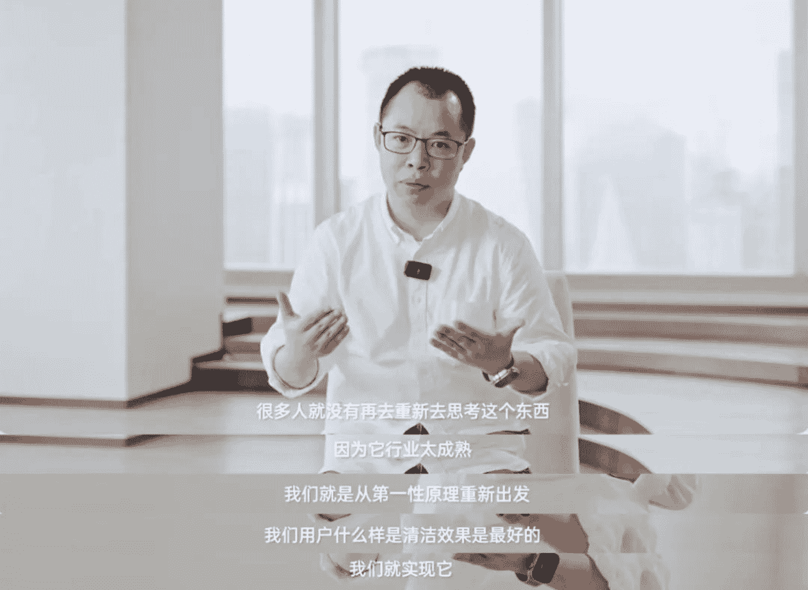

很多人就没有再去重新去思考这个东西，因为它行业太成熟，我们就是从第一性原理重新出发，我们用户什么样是清洁效果是最好的，我们就实现它。

此外徕芬的成功还有一大因素：他们做的是产研销一体的模式，技术研发自己做，供应链也做得又广又深，还有自有工厂去承接生产，走了一条去代工化的道路，对自己产品的品控及优化都能做到精准高效。

这里面的关键点让我反应过来一件事，咱们国家现在最大的优势，就是拥有完整且充满弹性的供应链。这就好像一个大装备库，有近乎无限的资源可以让那些顶级创业者去折腾，不管你有什么创意，都能在这个种植园里找到趁手的工具，然后按照自己的想法去反复打磨产品。

也正是这样的环境，给了那些有进取心的人“颠覆”的胆气。

再看国产电动车这几年快速崛起，本质也是大幅提升颜值之后，把消费者需要的各种新科技能加的都加上，利用这两点直接吊打一堆价格死贵却啥配置都没有的车，以及那些三十来万连360影像都没有，甚至远程开空调都得加钱的合资车。因此，竞争残酷的红海市场还有很多机会。像徕芬这样的企业，利用国内的供应链环境建立了自己的竞争优势，利用技术、设计上的创新，外加技术普惠理念打造出自己的品牌力。这种做产品、做品牌的思维，也是中国企业家新思路的体现。

### 尾声
这两天看了一个针对企业主的调查。96%受访企业表示财务困难的主要原因是激烈竞争，其实就是疯狂的卷，生产者不断内卷，降价促销，根源是倾尽全力扩产能、削内需的超级重商主义逻辑所致，导致持续的供需失衡。这种严重失衡下，其实供需双方都难受，生产者往死里卷也无法改善不断恶化的财务状况，他们发现努力和业绩是严重不成正比的，而需求方则是想买买不起，需求得不到满足，受到的预算约束越来越强。绝大多数企业过去在外贸型经济里，习惯了无品牌的代工模式，一旦外贸不好做，没有差异化竞争优势，就只好用“降成本、降价格”的恶性螺旋来应对，相互打成了红海，还不罢休，要打成死海。说到底，还是我国企业愿意在品牌经营上长期投入的企业太少，对培养本土设计师也没那么重视，因此导致产品都逐渐红海化，今后解决这个问题的唯一方案，只有把设计，研发，品牌建设重视起来，才能从红海中闯开一条路。

全文完，如果觉得写得不错，那就点个赞或者“在看”吧，多谢阅读。

如果转载本文，文末务必注明：“转自微信公众号：懒人搜索，懒人专属群分享”

- 7.3.4.12.2.1.65.1.7.9
- 1.9
- 14
- 1.1
- 49
- 1.1
- 16
- 1.1
- 16
- 1.2
- 16

## 房间里来了新大象
2024-03-27
很多老百姓对游戏这个产业是很纠结的，在他们眼里，玩物丧志，游戏毁了那么多人，不禁了等啥？这种纠结甚至反映在政策制定上，一方面国家明显是想发展游戏产业，电子游戏一直以来都是个极度“技术密集”和“智力密集”的产业，毕竟这玩意最早就是诞生于麻省理工的实验室，由著名大神塞拉尔操刀搞出来的。从诞生起，电子游戏就是纯技术驱动的产业。游戏对计算机的影响远远超过大家的想象，甚至可以说，美苏冷战，苏联输得干脆利索，很大一部分原因就是在计算机革命中彻底落了下风，而计算机芯片最重要的推动因素，没有之一，就是游戏产业。其实重来一次，苏联还得输，促进芯片发展的动力不是国家科学院，而是塞在各种游戏机里的大小芯片，是远超过苏联军工产业规模的游戏和消费市场。那么多人买电脑和各种任天堂学习机，厂家回收投资后继续加大研发力度搞竞争，有意无意推动了计算机芯片按照摩尔定律往前发展。这种正反馈要比纯国家投资效率高的多，也持续性强的多，尤其是方向不明的情况下。毫不夸张地说，是游戏宅男们的购买力不断推着芯片越来越强。如今站在AI的大门前，用来玩游戏的显卡又成顶梁柱了。不仅硬件，游戏产业对软件的要求也非常高，在国内外都是个高薪产业。游戏产业带动了一个科技分支，也就是“计算机图形学”，现在AI拦截导弹和无人机，也用到这个技术。很多人希望自己的孩子能考名校，将来进腾讯阿里华为，将来拿高薪。其实这些大厂多多少少都在涉足游戏产业，菊厂走的比较远，直接开始搞芯片了。搞芯片也得有收益，现在主要是面对AI训练大模型，迟早会走向游戏消费市场，毕竟这个市场更大更有连续性。宅男们踊跃购买，才能保持利润，筹集更多钱搞研发。以前游戏产业主要被国外垄断，这主要也和国外对游戏产业比较宽容有关。很少有人会把游戏和“堕落”联系在一起，就好像我国每年因为车祸死亡6万人，却没人提议把汽车禁了一样。整体来讲，这个产业我们是全面落后的，从硬件到软件。国家是知道这个的，所以对游戏相关产业一直是扶持态度，有些省会甚至有游戏产业园。但是同时考虑到群众对游戏产业天然的不信任，大家也看出来政府对版号什么的谨慎又谨慎。所以这些年中国游戏产业发展得磕磕碰碰，不过整体是向前的。查了下数据，现在也是个千亿规模的产业，甚至一部分游戏实现了出口创汇。只是整体上，开发水平还在追赶欧美日韩，目前还比较缺那种具有世界级影响力的自研IP产品。不过移动互联网时代的降临给了新机遇。因为传统欧美游戏产业依赖的是类似你去买车那种玩法，一手交钱一手拿货，生产出来的产品又大又精美，开发周期巨长无比。玩家也主要都是那些对游戏有要求的宅男们，他们愿意花几千到几万购买显卡、电脑和游戏主机，在大屏幕面前沉浸体验高质量的游戏内容。很多人甚至愿意花几百上千个小时玩一款游戏。这个真不是瞎说，大家去看看那些B站游戏大神，他们动不动在类似《异星工厂》、《缺氧》、《僵尸毁灭工程》这类游戏花费一两千小时。但是这种模式的毛病就是规模限制，得是真玩家才行，毕竟门槛太高了，需要组个台式电脑或者买个高价游戏本，PS5这类主机，最好有个客厅，这就太为难人了，劝退了很多人。移动互联网时代降临后，局面又发生了变化，大家手里都有个手机，都是潜在客户，但是这些人不愿意为游戏花钱。在2013年前后，针对这种情况，中国第一批游戏厂家开始面向手机用户开发游戏，尽管研发能力不太行，但是在海量用户运营、移动机型适配等方面积累了丰富经验。同时也崛起了一种新的商业模式，也就是免费游玩，付费买装备。这个商业模式现在欧美游戏厂商也想做，这个之后再讲。手机游戏潜在的用户规模可就大了，不过随之带来的挑战也很明显，游戏厂家需要适配上无数型号的手机来开发游戏。还得通过不同的网络环境进行优化，还需要部署大量的分布式服务器，毕竟玩家可能在地铁里，可能在办公楼，也可能在马路牙子上。中国厂商等于是在国内市场经历了地狱磨炼，要说什么游戏玩到一半掉线重连、弱网络环境下顺畅联机这些技术，中国手游敢说第二，没人敢说第一。经过这些年的积累，中国企业在手游方面占据了绝对的优势，全世界排名靠前100款移动游戏，中国占了三分之一。更重要的是，如今的中国游戏也已经走出了国门走向了世界，比如腾讯早在2019年就把游戏海外收入纳入财报，这个月他们公布财报，去年腾讯游戏收入的30%来自国际市场。所以到如今，全世界范围内的游戏市场形成了一个类似扁担的结构。我国游戏厂商在手游方面很厉害，比如大家熟知的腾讯和米哈游，也就是搞《原神》的那个。但是暂时还开发不出类似《艾尔登法环》或者《荒野大镖客》这类主机游戏。国外厂商更加擅长主机游戏，也就是你得买一个电脑或者PS5才能玩的那种。这类游戏太大对硬件要求太高，在手机上玩不了。国外厂家普遍对手游研究不深。现在两端都盯上了对方的势力范围。我国的手游厂家希望提高自己的研发能力，进军主机游戏市场。那些主机游戏眼馋手游巨大的市场，也想做手游。这当中最成功的，应该是韩国的那个《绝地求生》，和腾讯联合开发了手游版，全球范围内取得了巨大的成功。现在的西方游戏市场，可能也是竞争太恶性，而且游戏开发的成本太高，现在开发那种大型游戏风险越来越高，动不动也是投资好几亿，传统的商业模式兜不住成本了。西方游戏市场在23年下半年开始进入裁员潮。2024开年至今，已有预估8000名游戏人被裁员。能看到西方厂商这几年也在面临转型难题。更深一步来说，欧美厂商眼馋的不仅是手游，而是手游兴起的商业模式，也就是之前提到的免费游玩模式。他们转型，只能是往我们这边转。从传统的一次性购买游戏的商业模式，转向免费游玩+内购，或是低价门槛费+内购的商业模式，这种内购不仅限于之前说的皮肤、道具，也可以是按月支付的会员费，因此免费游戏在近几年也有了一个新名称：服务型游戏（Game-as-a-Service，简称GaaS）。GaaS的商业模式能提高游戏的收入上限，是许多传统欧美大厂转型的目标。这背后的挑战也很大，服务型游戏从技术、研发到运营都有和单机不一样的逻辑。曾经有个国内游戏开发者告诉我，发现海外尝试做GaaS游戏的团队在游戏上线后，依旧按照以前做单机的惯性开始减人，这也正常，咱们做项目，结项之后只留几个人维护就行了。但对于GaaS游戏来说，游戏上线后反而应该增加人力，因为后续的内容更新和运营工作工作量只会更大。所以依托新技术和新商业模式，本来在游戏方面全面落后的我国企业竟然有点弯道超车的意思。也不是弯道超车，反正占据了一些优势。也正是因为中国厂商一方面非常积极学习和融入海外成熟的研发模式，另一方面也有自己的一些优势，它们不知不觉成了进入世界市场的大象。去年的科隆游戏展，上周的GDC，中国厂商可以说越来越大规模的集中登场。这个GDC大家可能没咋听说过，其实在游戏圈里可以说无人不知。GDC第一届举办于1988年，当时还在一个宅男客厅里举办，参会人数25人，门票费用0。36年后，第36届GDC于美国旧金山最大的会议中心莫斯康会议中心举办，参会人数超过2万8千人，门票费用达2500美金（约人民币18000元），依然吸引全球的游戏开发者前往朝圣。而且很多人没意识到，现在AI应用最迅速和广泛的领域就是游戏，AI跟游戏的关系紧密得超乎很多人的想象。首先，搞AI的芯片的前身，就是打游戏的显卡，没有游戏，哪有今天的英伟达，而且连OpenAI联合创始人兼首席科学家Ilya Sutskever也说，游戏推动了ChatGPT的诞生。自2016年起，GDC专门设立AI主题峰会，号召游戏领域的顶级AI来到GDC进行分享交流。可以说，很有前瞻性了。在2024年的GDC上，AI峰会主要包括机器学习和AI两个方向。在AI峰会的30个议题中，腾讯的分享就占四个，网易、字节跳动也做了相关分享。在全球舞台上，最热门的技术趋势下，以腾讯为代表的厂商越来越显性了。从2015年开始，GDC设置了Free to Play（即免费游玩）峰会，今年也能看到很多海外大厂也在做可持续运营经验分享，也能看出来，GaaS这种商业模式越来越得到认可。欧美厂商在转型，那么对于中国厂商来说，同样在面临行业拐点。现在中国玩家的游戏审美在不断提高，或者往大里说，全球玩家的品味在趋同。所以中国游戏要想真正进入全球市场，就必须提升游戏品质，让全球玩家都想玩。这也是为什么这两年能看到一些中国厂商又开始做PC和主机游戏了，或者至少做跨端游戏，就是同时上线手机和PC主机平台，甚至可以跨平台联机，因为这些平台能够承载更高品质的游戏，也能进入更多欧美玩家的视野。说起跨端游戏，这也是游戏研发里的一个大趋势，目前来看也是中国厂商比较有潜力在欧美厂商之前攻克的难题。也就是说，中西游戏企业是扁担的两头，各具优势，现在都想顺着扁担往中间走。对于中国厂商来说，高质量的游戏内容，配合GaaS商业模式，再来个跨端，是很重要的机会。不出意外，中国企业逐步会成为世界市场上最重要的玩家。为啥今天聊这个话题呢，因为看到一个数据，世界顶级AI和芯片技术专家里，中国贡献了30%左右，但是大部分并不在国内。也没啥高深的原因，纯粹就是因为咱们给不了那些顶级高手足够的高收入，而且他们愿意跟其他高手们在一起呆着。这也客观上也要求我们尽量多的去创造更多的高薪研发岗位，这样才能留住更多的人才。而且高薪岗位指望政府是不现实的，只能是寄希望于那些大企业去开拓更多的业务。这个意义上讲，游戏既是科技的驱动因素，也是巨大的人才池，这又是一个我们必须拿下的一个新边疆。

## 聊几句莫斯科那事
2024-03-25
聊这事首先得说一下，不管你支不支持俄罗斯这两年做的事，针对平民的袭击都是不可被原谅，也是需要被极度谴责的。其他问题上也一样，谁率先攻击平民，谁就是恐怖分子，都是不可被原谅的。咱们今天写短点，随便聊聊这事到底可能是谁干的，而且理一下各种势力之间关系。现在明面上是ISIS，但是咱们内网各种关于“背后大哥”的猜测却很多。首先基本上不可能是美国。美国从不跟大国发生直接冲突，美国的做法一般都是“欺软怕硬”，很少直接跟大国发生对抗。只去招惹那些大概率能拿下的，不过咱们都知道，后来还是吃瘪了好几次。用恐怖袭击的方式招惹俄罗斯没必要，几乎啥也得不到。俄罗斯这个国家对痛苦的承受能力极强，死百八十个人并不会影响啥，只会让俄罗斯更加坚定团结。而且美国对俄罗斯整体是有忌惮的，并不想把俄罗斯给逼急了。这两天沙利文在乌克兰，英国那边的新闻说是美国对乌克兰进攻俄罗斯本土炼油厂多少有点慌，专门去跟乌克兰说别闹了。所以说美国去搞这种事完全没道理。空袭前公开喊话让俄罗斯防着点，这个喊话被俄罗斯理解成了扰乱民心，不过俄罗斯确实加强了戒备，还是没防住。那美国为啥知道这次恐袭？尽管细节不太清楚，不过八九不离十。主要原因也是因为中东的势力林立，有无数的组织，有的是恐怖组织，有的还不是，但是每个组织都跟四个国家合作过，一个是沙特，一个是巴基斯坦，还有一个卡塔尔和迪拜，这四个国家都跟美国千丝万缕。恐怖组织为啥要和这几个国家合作呢？多简单啊。各种组织搞袭击什么的，一般都是下边的人在拼命，上边的头目不会去现场的，很容易被搞死。最好藏到海外去，比如迪拜或者卡塔尔。这些地区治安很好，几乎不可能出现几个杀手拿着冲锋枪上门，就刺杀算成功了也撤不出来，所以大家就放弃了。而且高层得隐藏身份，这就有点难了。不过隐藏身份这些工作技巧，是各国情报部门必备的。而整个中东，情报能力最强、路子最野的是巴基斯坦三军情报局，因为这个局背后就是中情局。长期耳濡目染，学会了很多奇怪小技巧。这个三军情报局明面上是美国的势力范围，可暗地里同情自己的阿拉伯兄弟，尤其逊尼派兄弟，经常暗中提供帮助。这也是为啥本·拉登就藏在伊斯兰堡外边，傻子都看出来就是三军情报局给藏起来的。美国是知道的，所以一直以来都是合作加防范的关系。也正是因为三军情报局在各种组织那里路子很野，客观上也是个消息灵通的角色。搞笑的是，这次美国特意提了“音乐会”。其实也不难理解，原教旨极端分子最讨厌的事，就是一大群男男女女聚在一起唱歌跳舞。之前就搞过很多次针对大型嘉年华和音乐会的袭击。此外恐怖分子相互联系，也需要各种先进通信设备，这些设备也是通过卡塔尔和迪拜购买，美国在这些地方眼线很多。之前就写过，在卡塔尔首都多哈，街上可以看到美军顾问、中国土木老哥、印巴劳工、土耳其空军飞行员、伊朗石油工程师、穆斯林兄弟会成员、哈马斯代表、叙利亚反政府武装、非洲军阀、中情局情报人员、俄罗斯寡头、塔利班等等。此外中东一半的各种势力，都明里暗里接受或者接受过狗大户的资助。其中最主要的是两个，一个是塔利班，一个是ISIS。

比较搞笑的是，塔利班和ISIS势同水火，他俩都是逊尼派，却互相认为对方信仰不够纯，是“叛教者”，现在也是。

本·拉登本来就是沙特豪门，背后的资助者里一直都有沙特富豪。ISIS最早也是沙特扶持的。扶持起来对抗叙利亚的巴沙尔，不过后来ISIS独走了，思想极度极端，要按照经书重建一个纯宗教国，这下连沙特也成了异端。不过ISIS里一直都有很多亲沙特的人，沙特是能得到一些消息的。

ISIS在叙利亚反对巴沙尔，伊朗和俄罗斯支持巴沙尔，双方一顿打，ISIS跟伊朗和俄罗斯结了仇。

结仇就得报复，ISIS炸过好几次伊朗，专挑重大节日，2017年炸死17人；2022年炸死22人；去年炸了伊朗，炸死103人，这两天又宣称袭击了俄罗斯。当然了，ISIS针对西方也没少搞袭击：美国那边挫败好几次针对美国的恐怖袭击。不过也有没挫败的，比如2021年ISIS在喀布尔发动自杀式爆炸，一口气炸死13名美军和一百多阿富汗人。可见美国那边也不是每次都能成功获取情报。这里也能看出来，一些人说美国控制着ISIS肯定不对，事实上ISIS的大部分头目，包括最重要的那个灵魂人物“巴格达迪”，都是美军特种部队和无人机击毙的，击杀这人也是川普任期最重要的政绩之一。还有说法说是ISIS背后是以色列，这个也不靠谱，ISIS没少针对以色列，只是以色列这个国家太封闭，你们去一趟就知道了，武器很难弄进去。不过在2022年，ISIS排除万难发动过一次针对以色列的袭击，剧情跟这次莫斯科有点像，只是恐怖分子只打死了6个人就被围上来的军警给击毙了。其实稍微了解点ISIS，就知道他们并没有什么政治纲领，纯粹就是针对异教徒，其中主要是基督教和犹太教。俄罗斯是东正教，在ISIS眼里也是基督教的一支。美国算新教，也可恨。他们最烦的三股力量，就是什叶派（伊朗和叙利亚），东正教（俄罗斯），还有新教（美国），天主教（欧洲）。俄罗斯更可恨一些，因为它在背后支持那俩什叶派国家。还有些话不太能说，你们看看下图就懂了，ISIS眼里他们自己的版图，都画到我们的地盘上了：

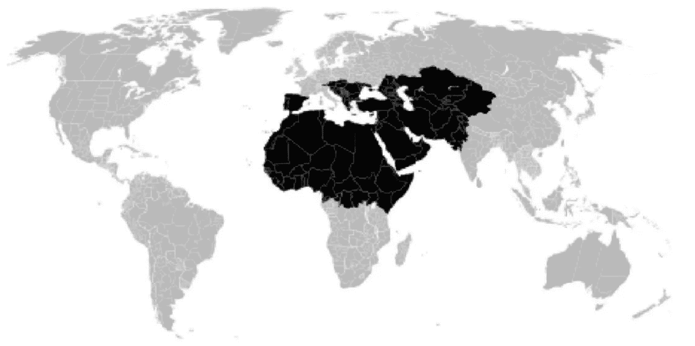

反正沙特支持了很多恐怖组织，后来大部分都跟它闹翻了，但是那里边的人却和沙特藕断丝连。这也是为啥911之前，沙特最早接到情报本·拉登要搞美国，因为本拉登就是沙特婆罗门，沙特在所有恐怖组织里都有自己人。美国通过沙特、巴基斯坦，还有迪拜和卡塔尔，消息要比其他人灵通得多。说完美国，再说以色列，我觉得也不会是以色列。

以色列跟俄罗斯关系一直都挺好，以色列有一堆俄罗斯富豪移民，俄罗斯上层一堆犹太人，普京的小圈子里有近一半犹太人，甚至苏联的缔造者有近一半犹太人。这俩国家有时候有分歧，大部分时候都挺好，意识形态也接近，那个内塔尼亚胡说的话经常跟普京神似，都是那种铁腕强硬人物。所以以色列也不会手痒到去惹俄罗斯，惹谁不好，俄罗斯不是以色列能惹得起的。更关键的是，得不到任何好处。

乌克兰也没可能。乌克兰现在因为打仗欠了一屁股钱，唯一的指望，就是等着接收巨额俄罗斯海外资产。所以必须得把自己树立成一个纯正面形象，而且他一直标榜自己是受害者，这样才能拿到同情分。全世界才会有那么多人给它捐款，主要也是同情乌克兰。这也是为啥乌克兰放出来的战场视频，有的是用无人机炸俄罗斯士兵，还有不少就是乌克兰士兵在战场上被炸死的视频。全世界老百姓的同情心是乌克兰人最大的盟友。搞恐怖袭击这事是每个正儿八经的国家都绝对无法接受的，如果真是乌克兰干了，啥目的都达不成，还把它唯一的优势也给毁了。而且乌克兰最终结束战争的希望，就在于俄罗斯人厌倦了战争。如果这个时候搞这么一下，最终证实是乌克兰，无疑会让俄罗斯人同仇敌忾，那接下来战争没完没了了。

所以我倾向于觉得没有任何一个正儿八经的大国会掺和这事，毕竟得罪俄罗斯，没悬念会遭到泼天报复。

## 大概率就是ISIS，背后也没别人。

只有恐怖分子才不怕报复。你报复的越狠，死的人越多，仇恨也就越足，仇恨就是恐怖分子的土壤。而且这几年恐怖分子对“社交媒体曝光”有种近乎痴迷的执念，主要也是他们需要捐款和新鲜血液，不搞点大新闻，慢慢就被人遗忘了。所以他们热衷在大国里搞事，这样才能上头条。但是在大国搞恐袭，代价肯定是很大的。正儿八经的国家最怕国民被屠杀，只有恐怖分子希望国民被屠杀，没仇恨他们就跟沙漠里的绿萝一样很快就死了。不过对于这个结果，俄罗斯显然有点不太满意。因为真要是被确认是ISIS，那就得找ISIS去报复，那不就正好中了ISIS的下怀了嘛。恐怖主义之所以可怕，就在于总是越打越多。文明社会是很难防得住恐怖主义的，或者说需要付出极大的代价。很多人以为把枪控制住就行了，其实不是。没有枪还有别的办法，比如2016年，ISIS在法国国庆庆典上开着泥头车一口气撞死84人。美国那边“拥枪派”最重要的言辞，就是车的杀伤力并不比枪弱，关键是谁在开。这也是为啥俄罗斯后来改变了对车臣的政策，之前的强硬政策导致恐怖袭击不断，后来赶走了那些对俄罗斯不满的车臣人，剩下的被圈养了起来。甚至从隔壁的共和国给车臣弄了几口油田，车臣人吃到了甜头，暂时不闹了。更麻烦的是，ISIS被美国、俄罗斯、叙利亚联合打垮之后，其实已经变成了一个“去中心化组织”，整个中东到处都是，但是在哪都不是主力。想找他们报仇也不是很好找，而且在中东搞事，很容易激起更多的麻烦，说不定又招来别的事。俄罗斯这两天的操作目标很明显，就是把这事引向乌克兰，给正在进行的战争的正义性充值，乌克兰也是懂的，这两天火力全开在辩解不是它干的。

当然了，很少有人认为是乌克兰干的。接下来咋发展，我也不知道，现在也是根据以往信息做评论。不过说真的，挺希望他们别闹了，赶紧消停过日子。昨天恐怖分子整整在剧院折腾了18分钟，后来从容开车走了。全世界都纳闷一件事，俄罗斯特种部队哪去了？起码派架直升机过去跟踪那辆车吧，后来说是堵车堵在路上了。也能看出来一件事，俄罗斯现在是很缺直升机的，估计能用的资源全投入前线了。现在国内这种空虚状态，还是很危险的。

文末，还是感慨一下，生活在一个稳定安全的国家，是我们所有人的幸运。

文章就写到这里吧，如果觉得不错就点个赞，我后续再补一篇。

**如果转载本文，**

公众号懒人搜索，懒人专属群分享

## 互联网时代的“带病生存”

2024-03-18

农夫山泉那事刚起来的时候，我就想聊一下，后来又觉得会不会太蹭热度了，于是一直等到现在。

刚开始看到农夫山泉这事的时候，估计很多人跟我的感觉是一样的，只是觉得比较逗，难道真的有人是认真的？

发展到后来，估计大家都不觉得逗了，因为真的有太多人饱含激情参加到这场他们自认为很神圣的“圣战”里。

我还在抖音看到一个爆款视频，整体还是挺有感染力的。他觉得为啥国家就不做点啥，为啥纵容日本文化疯狂入侵，纵容西方的各种入侵。尽管他学历不高收入很低，但是依旧觉得有义务抵抗日本乃至西方文化对中国的侵蚀，继续这样下去，传统文化都没了，他最爱的中医也彻底边缘化了。

他认为现在的很多问题，就是过度学习西方导致的。而学习西方本身就是错的，西方所有的东西，都是抄袭我们老祖宗的《永乐大典》，我们根本没必要像现在这样。

此外无良商家在潜移默化地改变国人审美，比如那么难看的膏药旗，到处贴，导致大家习以为常觉得不难看了。种子用孟山都的，年轻人生不出来孩子了，这是帝国主义的有组织种族灭绝。而且西医太坏了，治标不治本，给大家治病却治不好，大家就得经常跑医院，辉瑞这些医药公司就可以一直卖药。

他的评论区里有人说他的手机也是西方进来的，为啥不抵制？

他说手机跟枪炮一样，本身并没有什么东西方之分，就跟我们曾经用缴获的日军三八大盖抵抗日军一样，一点问题都没有。而且他认为，《永乐大典》里啥都有，只是共济会传教士偷走了《永乐大典》西欧才有了跳跃。我们搞出来手机也是迟早的，不能因为国外早几天搞出来就感谢他们。

大家看出来了吧，他的说法里，既有朴素的民族主义感情，又有一些生活经验，还有一些别人灌输给他的奇怪回路。

而且他说的这一堆话里，包含了太多的“友尽”话题，你平时在餐桌上讨论起来，大概永久得罪几个人，而且我也强烈不建议暴露你在这方面的态度，得罪同事无所谓，得罪了领导就犯不上了。

不过这种话题的好处，就是“筛选”，只要你选了立场，就可以快速筛选出来同一阵营的人，既然是同一阵营，大家就可以愉快地玩耍，时间长了，慢慢观念就变得滴水不进。

说这个并不是想在这里批判一下他的说法，而是想说，尽管他的想法我很难全部苟同，不过我觉得在他那里，所有的逻辑都已经完成了闭环，很难有任何改变了。

问题是这种人不是一个人在战斗，而是一个巨大的潜在群体，长期浸泡在短视频里，慢慢变得逻辑严谨且闭环。他们的每一个观点，都是几百上千个小时短视频给夯实的，不要试图说服他们，也说服不了。其实写了这么多年文章，我终于意识到一个问题，你谁都说服不了，每个博主都是在圈地自萌。

这让我想起来很久以前的一件事，那时候还在上大学辅修的什么课，有学生问老师，为啥言论不自由，老师说的话我至今记得：你们总说言论不自由，其实如果彻底放开，让各种言论和观点相互竞争，你们这些自认为知识分子的人才是非主流。

也就是说，如果把舆论场看做一个生态环境，里边的各种观点激烈碰撞，最后会形成一个稳态，最后肯定是某一个物种占据了绝对主流。

同样的道理，自由竞争环境下，最终胜出的观点肯定是适应大多数人的思维水平，观点非常朴素，没啥弯弯绕，直击人心，让人不加思考就能接受，并且最重要的，肯定是带着一些憎恨和仇视，不然传播效果不那么好。

这也是为啥大家如果同时处在好几个群里，就有处在好几个中国的体验。当然了，年轻时候对各种伪科学充满鄙视，这两年也理解并接纳了。

也正是因为基层老百姓太多，他们也没有足够的知识区分太过复杂的东西。

所以就出现一个比较奇怪却也正常的现象，一个有钱有势的人，他在现实世界里对周围的人优势是压倒性的。但是在网络上，他却成了一个“弱势群体”，因为网络是“屁股优先”，现实里的弱势群体到了网络上会形成巨大的声浪，简单直接只在乎感情不在乎逻辑的言论会席卷所有竞争言论。

这有点像我在《沙丘》就是西欧版的《倚天屠龙记》里提到的，上层贵族看着灯红酒绿，但是底层一旦被类似宗教的观念武装起来，上层大概率就会变成沙俄贵族，很快就被屠光了。

此外舆论场也有巨大的“悖逆性”。

也就是你长时间对一群人宣传什么东西，他们深信不疑，哪天出现了非主流内容，很容易被格外注意，进一步非常容易观念来个180度大转弯。其实这种现象我们这些年已经看到过很多次了。

这些因素叠加起来，网络就跟个大海一样，偶尔就会突然掀起一波滔天巨浪。

这其实也跟整个社会里，有一个巨大的被忽视的群体有关，基层网民人数巨大，而且实在是太无聊了。

这也好理解，花花世界，但是干啥都要钱，太多人根本没有钱去享受这一切。于是天天的日常就是上工，回家刷短视频，慢慢神经被短视频训练得极其条件反射。

并且和算法相互进化，形成了一系列简单的思维回路，类似日本曾经侵略过我们，日本所有东西都是坏的；富人的财富并不是凭空产生的，而是从穷人这里剥削的，就该挂电线杆；爱国这事最高尚，具有一切排他性，等等。

这些观点流量共同构成了一个巨大的流量池，博主们想出头，那你就得按照流量密码来。

这又变成了一种双向驯化，假如你是一个新入行的Up主，你得不断发布大部分读者喜欢的东西，因为你的作品总是被放进一个个流量池，在第一个流量池有流量，才会进入下一个更大的，如果第一个都通过不了，下一个自然不可能。

反过来讲，大量的同质化内容被生产出来，读者总看喜欢的东西，脑子里的观点越来越成型，越来越稳定，而且逻辑严密，滴水不漏。

最后也就形成了一个稳定的生态，在这个生态里，最受欢迎的，肯定不是讲亚当·斯密，而是简单直接地富人压迫穷人。也不是讲AI涉及的线性代数、深度学习，而是AI的“八个致富新渠道”。而且形成了一些特定的政治正确，大家经常上网也知道我说的是啥。

也就是说，算法时代释放出了一股新势力。

很多人内心深处最底层的一种渴望，甚至很多人自己都不知道自己渴望啥，然后被算法给挖掘出来了，并进行了放大。放大到最后，开始连清华也批。

这种洪流冲到哪里，哪里就遭殃，这次只是轮到农夫山泉了。

我看不少博主在写文章骂那些人，其实大家根本不是一个生态位的，互相也听不到彼此在说啥，只是偶尔会破圈。比如那个战马，已经折腾很久进化了好几个版本了，才被主流注意到。类似企鹅在开会讨论麻雀最近行为很古怪，所有企鹅都觉得他说得很对，唯独麻雀们根本没听到他们在讨论啥。

不出意外，接下来这股洪流还会持续很多年，毕竟你批判他们，他们不一定听得到，他们也没犯法，毕竟合理质疑，就算恶意质疑，有问题吗？

没有问题，现代社会法律是底线，法律之上的没啥不能做的。

那农夫山泉怎么办？

没啥办法，只能是在那里躺着，等着舆论自己过去，好在群众集体形成的注意力是很短暂的，只会跟着热点跑来跑去，不出意外，过几天就去干别的事去了。有点像海上总是有不断的小浪，大浪头却非常少一样，一旦形成也持续不了多久就没了。

这里就有一个问题，在美国那种国家，这种事怎么解决？

一样不解决。

由于英文阅读比较难的缘故，那边的基层老百姓更是死都不会看长文，坚持收听各种广播和短视频，广播因为受众问题，也选择传播各种逻辑简单的小观点。

多说一句，咱们经常说绝大部分网民没有阅读长文的能力，只能天天刷短视频。英文的阅读要比汉语复杂得多，主要也是常用词汇量就大得多，所以绝大部分人根本不看，也看不懂，坚持听广播刷短视频。学习主要靠短视频。

那边一样也是越是“上等人”，受到的围攻越多。而且上下层彻底分裂了，互相关心地讨论的话题根本不是一码事。

类似美国政府是被共济会寄生的，移民资本家（马斯克他们）正在掏空美国，犹太政客正在搞换种，科技大佬们正在有计划灭绝美国白人（一部分人觉得是灭绝黑人）等等。

“换种”好理解，说的就是民主党对移民的纵容，导致大量移民涌入美国，老白人们觉得这是一场持续了两百年的阴谋，要把美国换种成黑人、老墨和越南人。

“人口灭绝”一般说的是那个“优生学”。因为20世纪一堆学者们担心人口爆炸会导致人类灾难性的结果，而且他们认为一些残障孩子生出来对于社会和家庭都是一场灾难，主张提前干预，大家知道的那个“唐筛”，就是这个思想实践的一部分。

这些事当年大家觉得稀松平常，甚至达成了共识。但是到现在已经极度政治不正确，提这些话题基本相当于倡导种族灭绝。恰好比尔·盖茨对这类事特别积极，同时他又鼓吹疫苗。

最后变成了比尔·盖茨就是恶魔代言人，疫苗就是人口灭绝手段。

而且那边政府几乎是不管的，各种奇怪观点争相竞争，发展出了各种奇怪派系，所有派系都讨厌知识精英，觉得他们一副高高在上的欠揍样。

如果说全世界谁经历了最持久的“网暴”，那显然是盖茨，他在民间老百姓眼里，简直坏透了。剽窃了他人的工作成果，把成本极低的软件光盘卖天价（造价五美分的光盘卖几百美元），等到有钱了就开始有计划搞人口灭绝，专门针对穷人（有时候是黑人或者白人）。

但是他在美国知识阶层里又有几乎不可动摇的地位，他的任何直播，去大学演讲，都是爆满级别。

此外马斯克给人的感觉是超级牛逼的，但是他在美国知识阶层和普通人那里，又是两副面孔。知识阶层把他当神，但是也有无数普通老百姓觉得他就是个骗子，NASA的白手套，太空计划也是富人的娱乐项目，联合中国搞那个巨丑的电车，还在推动人工智能取代基层劳动力，是工人阶级的大毒草，总之就是坏透了。

你们说盖茨和马斯克怎么做?

只能是慢慢去习惯，除非有人真的拿着锤子找上门，否则确实没啥好办法。一方面有些扯淡东西根本没法证实也没法证伪，打官司都打不过来。另一方面相信那些阴谋论的人太多了，根本没法搞。所以干脆不理了。

也就是说，对于网暴，可能属于一种“互联网病”，类似互联网时代的“赛博感冒”一样，很多人或者企业从网络赚取了巨量的财富，但是同时也得承担这种平白无故的大规模网暴，也属于一种带病生存吧。

文章就写到这里吧，如果觉得不错就点个赞，我后续再补一篇。

**如果转载本文，**

公众号懒人搜索，懒人专属群分享

## 《沙丘》就是西欧版的《倚天屠龙记》

2024-03-12

这两天《沙丘2》上映了，很多小伙伴表示理解不了里边的一些设定，看的时候一头雾水，咱们今天唠一篇，帮助大家理解。

《沙丘》在英语世界的影响力，大概相当于《三国演义》对于我们，属于一种文化纽带。

另一部巨著，《魔戒》，相当于我们的《西游记》。也正是因为这种地位，后期各类作品都在借鉴，比如最明显的，就是《冰与火之歌》和《星球大战》，无处不在的各种致（拷）敬（贝）痕迹，而且作者并不讳言。

《沙丘》有个最重要的特点，看似想象力天马行空，不过跟《冰与火之歌》一样，里边几乎所有的剧情和设定，都在历史上有对应，既现实，又残酷。也正是这种复杂性和现实性，并且逻辑自洽，所以才能讨论得起来。同理四大名著都有这个特点，被分析来分析去几百年，总能聊出点啥来，其他作品昙花一现，主要也是因为经不住讨论。

### 1

首先第一个设定就比较奇怪，沙丘的世界是一个“帝国”。也就是帝国的核心是一堆家族，其中最大的是三个，主角所在的就是其中之一。

三个家族里，其中一个叫“科瑞诺”的家族比较占优势，所以大家推选他们家的族长就是皇帝。

这个皇帝也比较窝囊，他对其他家族的控制是非常非常弱的，并不能强行命令别人干啥，只能通过微弱的手段进行微调。甚至还有个“宇航公会”，控制着星际间的航行，这个组织更是不咋听皇帝的话。

这让很多人理解不了，世界上怎么会有这么窝囊的皇帝？

其实这就是神圣罗马帝国的权力结构的复制，如果大家看过《权力的游戏》，就知道实在是太像了。

《权力的游戏》也是起源于一场对旧秩序的反抗，反抗成功后，几支势力分蛋糕，其中的“鹿家”成了统治家族。其他的，“狼家”（史塔克家族），“玫瑰家”，还有那个“狮家”，都围绕在国王周围，国王也不能随便指示他们，但是碍于场面，国王不过分地要求大家都会响应。

帝国就是建立在这样一种虚弱的平衡上，所以稍微有点问题就会战火四起。

如果强行跟咱们对比，欧洲古代的帝国模式，差不多相对于唐朝后期那个模式，皇帝对边疆的节度使管理非常弱，整体比较窝囊。

也是没办法的事，受限于技术，资源抽取比较有限，战争资源没法无限投放，所以皇帝只能管理自己周围一小块地区，太远的地方就只能是分封出去，慢慢变得尾大不掉。

那为啥咱们这边皇帝的权力那么大，欧洲的却那么小呢？

这个非常复杂了，讨论了几十年，大概意思就是中国是需要一个中央政府来调度资源治理大河的，老百姓天然有服从权威的倾向。

而且中国有几块大平原，比如关中平原，现在陕西那一块，还有中原地区，现在的河南河北。掌握了这几块平原，把里边的资源挖出来，再从农民里极限爆兵，如果组织得当，就可以把周围全部打服。

但是这种动员也有极限，太远的地方资源是投放不下去的，毕竟十几万人带着吃喝给养出发，到了几千公里之外要征服的地区，供给基本上耗尽了。后续上来的那些补给车队什么的，路上也把物资吃得差不多了。所以古代新疆，西藏，蒙古高原，还有云南等地，绝大部分时候都没法彻底管理，只有极盛的时候才勉强统治几年。

你把新疆、西藏、云南的统治家族理解成《沙丘》里的那些家族，就比较容易了。

《沙丘》书里还有一个半自制的“宇航公会”，控制着星际旅行，基本上不听皇帝的。

这在中国人这里是很难理解的，不过西方人一听就知道在映射威尼斯，历史上的威尼斯跟现在不是一码事，大航海时代之前的海上霸主，控制着一堆航线。名义上效忠神罗皇帝，其实根本谁都不鸟，谁想用他们的船都得先掏钱，皇帝、诸侯或者教皇都不例外。

如果强行比较，明末的东南郑氏家族可能跟宇航公会有点像，都不咋听朝廷的话。

当然了，皇帝拥有绝对权力，对于老百姓到底是不是有好处，也是个比较复杂的问题。

比如皇权越强势，越可以组织起来力量修运河治理黄河什么的。

但同时这种权力又容易被滥用，比如征发民工给皇帝自己修阿房宫和陵墓，而且老百姓是没地方跑的，毕竟普天之下莫非王土。

在周朝那种时代，你觉得楚国不好，你可以去齐国，当时各个诸侯国都在竞争性地开出优惠政策吸收人口，大家不太敢使劲压榨老百姓，怕他们跑了。

秦国就是通过吸收外国人变得越来越强大，直到变成了个征服机器，老百姓也不让随便流动了，搞了保甲制，互相看着，谁要敢跑了就连坐。你邻居担心你跑了他被抓去当奴隶，自然要看紧你。

也就是说，中国古代皇帝权力极大，好处是纷争能少一些，可以集中力量解决一些非常难解决的问题，毛病是如果不干正经事，老百姓就惨了。

所以你穿越回去，如果你非常牛逼，武力智力惊人，那就回到秦皇汉武的年代，说不定能建功立业。如果只是个普通老百姓，那最好穿越到历史上没啥存在感的皇帝那里，毕竟“武皇开边”背后是无数“无定河边骨”，是中产之家全部破产。反倒是那么不太折腾的皇帝，老百姓一般过得还凑合。

### 2

《沙丘》的很多地方和《权力的游戏》是极像的，比如故事的起因也是一个家族屠杀了另一个家族，那个倒霉的被屠杀家族的人没死干净，跑了出去了几个，这些人最后完成了复仇。

《哈姆莱特》是这个剧情，《伍子胥》是这个剧情，《赵氏孤儿》也是这个剧情，甚至《倚天屠龙记》也是这个剧情。可见豪门倾轧，孤儿复仇的故事在东西方从来都是一个叫座话题。不过某种意义上讲，《倚天屠龙记》和《沙丘》更像，因为涉及一个超级复杂的话题，人造神。

大家可以想一个问题，如果家族被屠，对方势力极大，逃出来的孤儿应该怎么重新挽回局面呢？

大家第一反应可能是去拉外援。

如果引入别的强大势力帮你报仇，这就是《伍子胥》的剧情。如果自己组织起来了一种力量帮自己复仇，那就是《沙丘》。

但是你怎么说服别人支持你？

对，借助宗教的力量，最好能去当教主，召唤无数的教徒给自己报仇。

现在大家知道为啥我说《沙丘》更像《倚天屠龙记》了吧。倚天屠龙记里，孤苦伶仃的但是身世显赫的张无忌就是通过“明教”这个宗教组织达到了人生巅峰，小说的后期，张无忌最重要的身份就是“教主”。

不过金庸的书里，真正的草根主角非常少。主要也是金庸看懂了一个问题，在一个社会里，你想凭借自己的能力完全不依赖外力往上爬是很难很难的。你得借助别人的力量，但别人凭啥帮你呢？最后转来转去，还是得血缘纽带。大家想想，如果张无忌不是武当和魔教两大势力集团联姻的结果，他的人生能那么开挂吗？

沙丘结合了“豪门恩怨”，又给大家演示了一遍宗教的崛起过程。

说复杂也复杂，说简单也简单，无非就是“预言”和“神迹”。

《沙丘》的保罗降生之前，一个叫“姐妹会”的宗教组织就到处宣扬“救世主”，说是救世主要来了。

底层最痛苦、最煎熬的人是最期待拯救的，也是最期待神迹的，成天等着救世主拯救他们。所以当男主打败了比自己强大得多的对手、带队伏击了强大的敌军，释放了一系列神迹之后，周围一小圈子人越来越相信他是神，他也就拥有了更大的动员能力。

这种剧情在人类历史上上演了无数次。

这种信仰最终从小圈子扩散出去，最后男主保罗成了底层人民心里绝对意义上的神，然后煽动这些人造皇帝的反，打败了宿敌，这就是《沙丘2》的剧情。

这其实就是耶稣和他的十二门徒的一个变体。

基督教最早就是在中东最贫苦的人里流传，大家太苦了，都期待救世主来拯救大家。耶稣给大家展示了水变油和水上漂之后，周围的人成了他的铁杆粉丝。

电影里下图这哥们无限崇拜男主，并且煽动周围的人相信男主就是救世主。按理说他就是基督教里的圣彼得，耶稣的大弟子，耶稣死后他继续传教，后来被追封成了第一任教皇。

等到粉丝越来越多，罗马帝国一开始的态度是强力剿灭，剿到后来基督教已经在基层贫苦老百姓那里野火燎原，再也控制不住了。打不过就加入，随后罗马也加入了基督教。

《沙丘》男主角保罗也一样，通过野火燎原的宗教势力彻底打败了宿敌，达到了人生巅峰。

这些东西可能一些人看着很玄乎，觉得国外真神奇，咱们国家就没这种事。

怎么可能没有嘛。

汉末黄巾军和太平天国以及明末大起义，其实就是这个流程。

比如东汉末期就先有了“神谕”，也就是那句“苍天已死，黄天当立”。这句话在民间早就流传了，甚至曹操他爹的坟墓里一块砖上还刻着这行字，说明大家很早就已经恨透了当时的统治阶级，等着他们完蛋。

张角兄弟到处用符水救人，并且到处宣传自己是救世主。咱们知道符水肯定是救不了人的，但是总有偶尔自愈的，这些自愈的人就成了“神迹”，张角兄弟也就成了神，一堆活不下去的人愿跟着他们兄弟干，随后就发动了大起义。

起义最后当然是没成功，但是义军里的一支，“青州军”，在被曹操击败后跟了曹操南征北战，成了曹操的起家队伍。

那有没有成功的呢？

元末的明教大起义，也就是《倚天屠龙记》的背景，“石人一只眼，挑动黄河天下反”，就是典型的“神谕”，随后就是惊天动地的大起义。起义军打败几次前来镇压的蒙古人，这就是“神迹”，毕竟蒙古人在很长时间里都是不可战胜的，神迹出现后，大家认为救世主降生了。

只是朱元璋上台后，第一时间镇压宗教，并且再也不提明教这事。并且整个明朝，对于基层宗教都是极度残酷的镇压，比如山东白莲教，在明朝就被镇压惨了。整个中国历史上，没有任何一个朝代能比明朝更懂底层人民信了教有多可怕，毕竟老朱家创业过程中亲眼目睹过。

这个意义上讲，《沙丘》是假的，是艺术创作，但是现实世界真正地做成的是老朱家。

这也是为啥说中国人不信神，其实并不是，古代的统治阶级最懂底层贫苦老百姓一旦开始信教，结果会非常可怕。所以古代皇帝们不约而同对宗教打击非常重，三武灭佛，黄巾起义，白莲教，太平天国，方腊起义等等，底层人一旦信了教，就会彻底失控。镇压得很厉害，一直没能发展起来。

其实在《冰与火之歌》里，也有这个剧情，“大麻雀”深耕底层，逐步壮大，最后教权跟皇权几乎平起平坐。甚至来了一把“太后裸体游街”的戏码，看过的都表示无比震惊，这都能搬上荧屏。

3

今天就写“帝国”和“宗教”这俩话题吧，如果大家感兴趣，我可以再写一些。

关于观影，由于文化因素，这个电影非常挑人，大概有一半人完全看不进去，剩下的一半人里大部分看了也无感，只有一小部分人看得如痴如醉。

我还是建议大家保持一种开放心态，多去吸收新东西，毕竟脑子里东西越多，越不容易偏执。

如果想有很好的观影体验，最好把第一部先看两遍，再看看各路解析，理解下世界观，大概率会喜欢上。毕竟电影只有五六个小时，可是原著有170万字，太多信息没法在电影里呈现。

比如很多人上来就纳闷，为啥八千年后的世界竟然用冷兵器作战，这就得去了解下设定。其实作者非常精心地对绝大部分大家可能会觉得不合逻辑的剧情做了解释，甚至包括那个“沙虫”为啥平时在沙子里游，被人驾驶的时候却浮在沙子上，都有仔细的解释。

如果没看过第一部，也没了解过故事背景，强烈不推荐去看，纯粹浪费钱和时间。此外如果深入了解后发现确实不喜欢，那也正常，毕竟跟我们的历史相差太远了，很多东西完全不是一码事。

文章就写到这里吧，如果觉得不错就点个赞，我后续再补一篇。

**如果转载本文，

公众号懒人搜索，懒人专属群分享

## 欧美真的放弃电动车了吗?中国新能源车真正隐忧又在哪?

2024-03-08

这两天这个话题全网都在刷，有人幸灾乐祸，说是欧美都不玩了，就我们玩。还有人又赢了，说是中国新能源车已经把国外给卷崩溃了。我尝试认真写一篇吧。

首先美国不可能放弃新能源车，看看特斯拉那股价就知道了。

那欧洲呢？我专门查了下，之前欧洲那边计划2035年停止销售燃油车，最近又说不停了，2035年之后继续生产燃油车。继续生产燃油车，并不意味着新能源不搞了，事实上欧洲那边依旧要上强度。

那为啥突然出了一个这样的政策呢？

这其实有点像德国之前因为环保问题已经关掉了一堆火电站，俄乌战争爆发后，能源供给受到了影响，又觉得之前有点太激进了，这段时间又把火电站重新开了。

事实上俄乌战争开始后，欧洲在所有问题上都有一波反思，开始思考之前是不是太极端了。这也是为啥他们开始顶着通胀把一部分产能要转移到中国以外的地方，避免出现之前能源类似的问题。

关于2035停售燃油车，我这两天查了下那边的评论，发现欧洲上层和老百姓都不太同意。之前能通过这个决议，是“环保”这个政治正确压下来的，以前谁要是敢反对“环保”，那几乎就不是人。俄乌战争之后，环保组织的脸被打惨了，政治上话语权也弱了很多。

那为啥说欧洲上层和老百姓都不同意禁售燃油车呢？

也不复杂，德国意大利法国这些国家太多的产业都关联在油车上，如果停了，那么多产业工人怎么办？而且西方国家是政党政治，那些财团是可以通过说客游说国会影响国家政策的，油车关联了太多的利益，所以本来推进就比较难。

政治家也纠结，因为中国在新能源产业上占据绝对优势，比如锂电池，更是压倒性优势。如果他们搞电车太积极，那几乎就是给中国作嫁衣，只会强化中国的地位。

不过这还不是最重要的，最重要的是，他们民众也对这事有点纠结。

大家知道前段时间咱们过年的时候高速大堵车吧，很多地方一口气堵了两天两夜，寒冷情况下，电车的电量掉的非常快，所以很多人直接电车趴窝了。当然了，油车也趴窝，油车爬了之后，救援车辆过来给油车加一箱油就开走了。

电车就麻烦了，需要拖车，拖到服务区。那么多车趴在路上，等轮到你不知道得啥时候了。而且服务区这个时候也满了，等轮到你的时候，得一家子下车推车，推到充电车位。

所以今年大家不知道注意到没，过完年出现一大波人死活不再买纯电了。毕竟“不咋出远门就选纯电”是个伪命题，哪有买了车从不出远门的，而且节假日高速充电站排队比较严重。所以后续可能混动的市场更大一些，除非你家里不止一辆车。

为啥说这事呢？

因为欧洲那边也没少发生这种事，而且由于燃油车利益集团的作祟，他们那边把这类事炒作得特别严重，一部分保守人士表示死都不用电车。

也就是说，欧洲上层利益集团和基层老百姓都不太支持彻底停了油车。

同理在美国也是这样，电车卖得最好的是环保观念比较先进、比较富裕的加州什么的，其他地方地广人稀，充电桩铺不开，红脖子们对新东西也比较抵触，觉得大排量美式皮卡什么的才代表美国精神。

事实上德国现在依旧在建充电桩，也在搞氢能源，还在大规模装光伏板，同时把火电站重新开了，现在还在讨论是不是把核电站也开了，显然是准备多条腿走路。可见现在的欧洲已经跟前几年不一样了，并不是单纯的之前那种理想主义，也现实了很多。

至于网上有很多人说，欧洲实在是竞争不过中国的电动车选择躺平了。

这个显然不对。

因为你稍微了解点情况，就知道电动车领域，对欧洲冲击最大的其实是特斯拉，欧洲那边咱们国产电动车并不多。

大家肯定不断听人说，中国车卖到欧洲数量大涨，但是到底卖的是哪个车却不咋听人说。

现在出口到欧洲的电车，绝对主力是特斯拉和名爵，其他车相对少很多。

名爵就是车标是“MG”那个车，在国内相对非主流，一个月也碰不上一辆，但是在欧洲比较火。这个车之前是英国的，后来被咱们这边收购了过来，属于合资车。现在欧洲人觉得名爵是欧洲车，咱们觉得名爵是中国车。去年名爵是中国车在海外的销冠。

比亚迪在欧洲卖得并不多，比亚迪电车出口最多的四个国家是泰国，以色列，澳大利亚和巴西。

所以也不存在欧洲觉得中国车太强了选择不竞争了，如果真有那种想法，应该第一时间把对欧洲形成巨大压力的特斯拉给禁了。

现在中国车卖到欧洲最大的问题还是政治问题，欧洲用各种奇怪的理由不让咱们去那边卖，所以欧洲老百姓并没有太多体会到中国车的优势。

大家搜一下新闻就能发现，欧洲那边不是对中国搞“反补贴”，就是要求中国去那边建厂，反正别想正常卖。

平心而论，如果别的国家的优势产品想卖到咱们国家，咱们肯定也要求他们过来建厂，不然别想卖，把我们这里当倾销工业品的殖民地呢？

### 后续会朝什么方向发展呢？

只能是“合作共赢”，这个确实没啥办法。商业上的事，你没法逼着别人买你东西。

你想把车卖到人家地盘上，肯定不能不给别人留活路，那样最后谁也吃不到。正如之前外国车企来中国卖，咱们也不可能让国外车企只赚钱啥社会责任都不承担，他们得来这边合资建厂，解决就业，拉动我国上游生产能力。

后续中国新能源车想走出去，大概率是中国车企去欧洲建厂，也给那边提供就业机会，作为交换，欧洲也给中国发准入许可，不然想卷他们都没啥机会。

这一点做得最好的，其实是那个吉利，它和奇瑞这两年出海都很厉害。奇瑞主要是“农村包围城市”，向不发达地区卖便宜车。

### 那吉利做对了啥呢？

其实就是不断收购和入股当地企业，用别人的销售网络卖自己的车，沃尔沃不多说了，奔驰、路特斯、戴姆勒、雷诺等等大型车厂，都有吉利入股。自己赚钱，也给别人分，现在吉利是海外市场做的最好的一个。

大家想想，那些外资车来中国，不也是跟中国的国企成立合资品牌吗？咱们将来走出去，大概率也是这种模式。

而且汽车这个产业主要是本地生产，如果单纯采用出口模式，也做不大。

大家知道吧，2023年，中国取代日本，摘下世界第一汽车出口大国的桂冠。其实日本车主在各国本土生产，去年出口了400万辆，全球却卖了2000多万辆。

后续我们的车大概率也是这么个格局，主要都在人家当地生产。

大家一定要有个常识，你的产品再牛逼，卖不出去也没用。类似日本的氢能源，牛逼是牛逼，可是大家不买，你只能自己牛逼。

只有产品卖到海外，才有“打垮传统车企”一说，如果你都卖不出去，或者只能卖到东南亚，这个肯定不太行。这也就是所谓的“上桌”，你得去赌桌上，不能在台下发力。

这也是为啥这两年比亚迪也在推动海外建厂，比如已经在美国，印度，摩洛哥（这个工厂就是供应欧洲的），泰国，巴西和匈牙利建厂。主要也是没啥办法，想做买卖就只能走出去，给别人点好处，自己也能赚点。

可能有小伙伴纳闷，为啥欧洲就那么重要？

没办法的事，汽车属于大件，全世界看着人多，其实能消费起的并不多。尤其是二十多万的那些高端车，能消费得起的主要集中在发达国家。

美国现在指望不上了，欧洲是我们必须拿下的，不然真的很难做大。不少人指望俄罗斯，我查了下，俄罗斯几乎没买电车，因为他们那边太冷了，根本没法用，而且基建也太差。

其实从丰田的销售数据就能看出点端倪。丰田去年卖了1000万辆车，中国、美国、欧洲和日本本土，这四个市场就占了丰田总销量的70%。

通过这个数据，大家也能看出来全球汽车购买力的分布，也就是全世界70%的购买力都集中在这些地方。而且穷人的钱超级难赚，事多利润薄，这话非常政治不正确，但你稍微卖过点什么东西就知道。

再说基建，新能源车是非常依赖基建的，从家充到各种高速充电站，这在大部分国家都搞不定。事实上中国很多小区也没法拉家充线，更别说东南亚和非洲了。

现在能搞定这么大规模的基建的国家，并不多，只有中美欧等国。如果走不出去，就只能在国内无限卷，一直降价，卷到最后，谁都赚不到钱。现在电车里，盈利的只有特斯拉，比亚迪和理想。

接下来对于我国车企来说，真正的窄门其实依旧是这两年国家一直在说的那个口号，“出海”，不出海确实没法做大。

想出海，还是得跟大家处好关系。比如上文说了，那个以色列，尽管不少人在骂，不过它确实是比亚迪在海外第三大客户。

而且以色列的汽车销冠是上汽的几何C，也就是说以色列同时还是上汽在海外的超级客户。

所以我说，合作共赢，这个依旧是未来的绝对主流，你不可能摁着别人的头让别人跟你做买卖，你产品再好再牛逼，人家不卖你自己是买不完的。

当然了，中国对于欧美同样重要，中国现在在各种领域基本都占着1/4左右的市场，所以他们也面临跟中国合作共赢的问题。

我写这篇其实是有点犹豫的，因为不够热血，大家更愿意接受类似“军事强大就可以为所欲为”这种简单朴素观念，问题是苏联军事曾经那么强大，海外贸易依旧一塌糊涂，武力强大可以保证别人跟你公平交易，但是你没法逼着别人跟你做买卖。

真正持久稳定的生意，肯定是双方都能受益的，这也是我国一向的政策。

就写到这里吧，不管咋样，和平，开放，合作共赢是接下来最重要的事，也可以是“仗剑经商”，“备战是常态”，但合作共赢依旧是接下来的主流，确实没啥别的更好的选择。

跟国外相比，咱们最大的优势就是迭代速度超级快，只要保持在牌桌上，我们在批量化生产、降低成本、快速迭代改进方面几乎没啥对手。

公众号懒人搜索，[懒人专属群](链接)分享

## 学历贬值后，大家说不定反而越来越淡定

2024-03-06

上一篇《中国可能在经历一波“文艺复兴”》，反响特别好，当然也有极少量不同意的，有些人总觉得“艰苦”、“每一代人都得受点苦”，“人不能过得太舒服”是天经地义的，也不知道这些人是反串还是认真的。

不过也正常，咱们写这些东西，目的并不是说服谁，而是把一部分人心里可能已经感觉到，但是却不一定成型的想法说出来。换句话说，所有博主都是读者的嘴替。

我以前观察美国人对学历的理解，发现他们有这么几个特点：

- 1. 提到大学，他们主要区分是“上过大学”和“上过藤校”。
- 2. 老百姓对研究生什么的特别不上心，以至于很多名校的研究生被“亚裔”给垄断了。
- 3. 普通家庭鸡娃的积极性非常差。

现在来看，以前不理解只是咱们没发展到那一步，发展到了，其实都是水到渠成的事。如今已经出现了一个明显的趋势，我们的大学分成了三种：

- 顶级名校或者985以上；
- 211；
- 其他。

这是三个生态位，除非你是那种特别天才的人物，否则就业的时候你几乎不会跟其他的生态位产生竞争。而且随着这两年就业压力变大，越来越呈现出一种态势，C9是一个集团，其他的一起竞争。越来越像美国，如果没上名校，那你就是个“上过大学的”。

说到这里，大家应该也就知道美国那边相对佛系的原因了，因为头部集团，在哪个国家，都是“筛选重于选拔”。

美国能考上名校的，主要也是谢耳朵那样的顶级天才，或者家里资源特别丰富的人。在咱们国家，名校主力一直是城市中产和小地方“医师公”子女，不少人说现在的教育体制相对公平，也说的是“最大限度避免埋没天才”，这本来也是一种“筛选”，天才对培养要求不那么高，只要规则透明稳定就能冲出去。

美国富人会上顶级私立，国内有贵得离谱的学区房，都通过家庭财富可以占据一些优势，至于其他人，上顶级大学天赋占了一大半。其他人相对来说通过努力使劲往前冲，也能提高不少，但是天赋不行想进头部集团是很难的。

尤其是如果孩子自己积极性不高、脑子不好，父母急得要死，那更是没啥卵用。

所以说最近这两年，不少高知家庭已经开始重新反思之前的教育模式，前些年那种从小学开始就补课不断地模式已经改了不少。毕竟大家都是学霸过来的，都清楚“知识优势”这东西并不能一直保持下去，太多人高中之前一直挺好的，一上高中立刻歇菜了。

还不如专注培养一些能持续一生的优势。

那啥优势能持续一生呢？

想想就知道，那肯定是体能嘛。于是这两年很多家长开始放弃类似补课、围棋，钢琴，小学奥数什么的，然后把大量的时间用来强化体质，带小孩去溜达，爬山，或者练攀岩等等。

大家也都看明白了，强健的体魄才是第一生产力。一线做题家们当初从小镇冲到一线，并不是靠父母天天给他们报班，也不是靠父母天天看着写作业，主要是靠身体好状态足注意力强，能经得住残酷的淘汰赛的筛选。体质好的孩子，哪怕在高中开始发力都不晚。

这种观念大概率会在接下来几年里扩散开。

事实上大家观察下国家的政策，

明显也是这个意思。不让小学生排名，学校教的东西越来越少，也不让校外教。主要也是国家清楚小学那点知识，学得再怎么猛，也是屎上雕花，对后期影响极小，还不如大家都轻松些健康些。

关键是学习对孩子玩的时间挤占太厉害了，最后绝大部分人学没学到啥，玩也没玩到。所以国家出手推动小学“去功利化”，其实这已经很接近美式教育的小学阶段了。

更关键的是，学历接下来肯定是不断贬值的，这个没啥悬念。

因为大学生从二十年前的几万人，一顿狂飙到现在上千万，无论如何也谈不上稀缺了。不稀缺的东西肯定是要不上价，除非你把自己弄成稀缺的，比如考上清北，可是绝大部分人是真考不上，死也考不上。

尤其这两年好岗位其实是急剧缩水的，更加加重了竞争。

你可能觉得我对未来充满悲观，其实不是，我对未来的感觉是下边这两项：

- 保底社会；
- 非主流发展；

保底社会倒也好理解，尽管大家都在说赚钱难，但是现在这个环境，尤其待在大城市，想活下去是很容易的，总能找到点事干，只要干点啥，生活是没问题的，基本吃喝又不贵。

中国很多人的那种不安全感，主要也是我们这个社会饥饿记忆没走远，以前是完全谈不上保底的，一步走错，可能万劫不复。毕竟哪怕四十年前中国还不如非洲。

费孝通说，中国人既不痛快地活，也不痛快地死。其实主要还是以前穷，哪怕三十年前，很多人还在穿用化肥袋子做成的裤子。现在慢慢物资充足了，事情就好办了。

在极度匮乏且竞争异常激烈的情况下，大家的思路就是每个时间段都有该干的事，必须得加把劲，在每个阶段领先，最后才能勉强饿不死。

如果一个社会容错率越来越高，起码走错一步不会饿死，那样可能发展就能更加多样化一些。

以前总是纳闷为啥欧美孩子为啥那么随意，大学生还有“gap year”，现在来看，应该就是因为他们的社会容错率没那么差，不存在“错一步，步步错”，所以大家可能花更多的时间去寻找自己到底想干啥。

现在我们这边也越来越随意。很多小伙伴都知道，B站以前有个小伙不想上班跑出去骑车穷游，后来骑成了超级大V。这在以前也是不敢想象的，毕竟倒退几十年，几乎所有人都是手停口停，那时候不上班出去溜达大半年，看不饿死你。

那啥是非主流赛道呢？

首先得说清楚什么是主流赛道。

读书，考好大学，进体制，或者进大公司，然后慢慢爬天梯。这就是主流赛道。当然了，在某一些地方，这个范围更窄，大家认为进不了体制都是在瞎折腾。

传统行业为啥累呢？

所有人都去挤主流赛道，挤不进去的垂头丧气，这辈子掉坑了。所以每个阶段都得往死里拼。

今后不是说不拼了，而是说你就算在主流赛道上输了，也没那么吓人，因为还有无数条别的路可走。

十亿市民创造了一个前所未有的超级市场，有无数稀奇古怪的需求，你只要满足了其中任何一个小分类，你就可能过得很好。

最明显的就是网上的那群网红们。别看他们在那里很风光地挥斥方遒，其实绝大部分现实里都是loser。或者说传统赛道里是loser，然后传统赛道走不下去，只好去走非主流路线，没想到走通了，赚的比之前上班多的多。

这就有点像刚刚改革开放那时候，当时是没有私营经济的，全是国企。正儿八经的人不是在做公务员，就是在国营大企业或者研究所。只有那些返城知青无所事事，他们后来去卖茶叶蛋，去满街吆喝收破烂，然后就成了改开第一波吃到红利的人。

其实还有一个事大家可能不知道，很多自媒体公司，他们专门找那些学历很低的高手。比如那些顶级摄影师几乎没有正儿八经学历的，他们的优势就是出来干活早，一直在折腾，在那上边花的时间非常非常多。

同理很多互联网写手也不是拼学历，简单的道理，互联网上绝大部分受众都是没啥文化的，你写的东西太深，别人根本看不懂。此外你的思想不能太复杂，越简单越好，只有你足够简单，传播性才好，太复杂了传播性也是个问题。

换个思路，这可能也是为啥清华美院的艺术生在那里开AI课火了，却不是某个深耕AI的大神。主要是后者传播性太差，其实网上有大量的人工智能和深度学习的讲解视频，问题是没人看啊。因为这些东西属于“主动学习”范畴了，绝大部分人连个长视频都看不动，指望他们看深度学习？

想做生意，还是得“面向大部分人”。如果受众都是高知，逼格确实高，啥都好，就是不赚钱。

我这里不是在推“学历无用论”，必须得说一句，“学历贬值”必须得有学历才有的贬。

我是说，随着社会的发展，整个市场规模越来越大，随便某个角落什么渣渣都够一些人啃一辈子。而绝大部分人，尤其学校训练出来的高手们，都去挤传统赛道了，新赛道上反而空空荡荡。

“兴趣经济”这个词可能接下来会越来越火。这个词有两个意思，一是每个人都应该有个爱好，来趟过接下来漫长的人生路。大家都愿意在兴趣上花钱，消费也能好起来，属于典型多赢操作。

此外另一个意思是，你的兴趣说不定将来可以挽救你的职业生涯。这两年看那些钓鱼博主，还有手工大神，露营博主，觉得他们人生真是好的不得了，自己喜欢的恰好别人喜欢看。

当然了，很多时候得去功利化，你太想赚钱去做这些事，可能反而做不成，因为在一个领域想有很深的研究，需要漫长的时间，能让你保持投入的，对于普通人来说最大的动机，可能就是单纯的喜欢。

人对不喜欢又没有明显收益的东西很难保证投入，“投入时间”是个硬指标，投不够，很难有产出。

咱们再以自媒体为例，绝大部分侃侃而谈的这群人，本来就是从小爱给别人神侃的那群，积累了十几二十年，兜兜转转，又回到自己最擅长的事情上去了。

另一个事不咋提，绝大部分后来混出来的人，基本都是靠自己某个“内生才能”，也就是自己天然擅长的东西。

只有天然擅长，你才能不知不觉在里边投入了大量的时间。所以很多人混起来之后，回过头看发现，自己身处高位这事，很多年前已经定下来了。这也是为啥我经常说，从前往后看都是努力，从后往前看都是命运。兜兜转转，最后都会回到你唯一擅长的那件事上来。

所以你说，寒门到底出不出贵子了？

从来都很难，现在某种意义上传统赛道更难了，因为所有传统赛道都堵满了人，一些赛道还在萎缩，比如大土木。甚至计算机也有这个趋势，现在计算机毕业顶级高手的工资是上升的，其他人都在下跌。

但是今后又是一个无限可能的时代，所有奇怪技能都有人看，只要有人看，那就不怕赚不到钱。

文末总结几句吧。

可能现在发达国家的很多事，我们只是理解不了，等发展到那个程度，就慢慢理解了。对于教育，大家会发现中美这两个国家越来越像。中美的教育都在倾向于分化成两个集团，前边一个小集团，后边一个大的。

学历的贬值几乎没法回头，教育也越来越倾向于筛选而不是培养。在这场筛选里能胜出的，恭喜你，你是大神。如果输掉了，也别灰心，绝大部分人都得输，好在这个世界越来越开放，容错率越来越高，输一次不算输。路有很多，在“几十年”这个长度上，不一定胜出的是谁。

每个人都应该有一个自己的爱好，退一步让自己的人生有一些色彩，进一步可能就是你职业生涯后半期唯一的救赎。

所以是个“退而求其次”的过程：

- 最好能考个名校；
- 考不上也正常，反正绝大部分人都考不上。那就有个健康的爱好，既让自己过得快乐，又是一个潜在爆发点；
- 最起码有个健康的身体，强健的体质才是无限可能性的基础。

公众号懒人搜索，懒人专属群分享

## 中国可能在经历一波“文艺复兴”

2024-03-01

咱们教科书里一直有个逻辑：欧洲古代是超级黑暗的，突然间来了一拨文艺复兴，复兴完了之后呢，说是老百姓从封建神权下解放了出来，然后有了后来的大爆发，有了大航海，有了工业革命。

这个逻辑我以前一直没太明白，不过最近这几年突然理解了。

我们都知道，中世纪是野蛮黑暗的，教会控制着一切。这其中教会最坏的一个手段，就是对“生命意义的解释”。

每个人自从懂事起，都会忍不住问自己一个问题，人这辈子活着到底是为了啥？

如果是一个印度人，那肯定是修来世，下辈子做个婆罗门。

如果是个欧洲中世纪人，那肯定是“上天国”。这辈子要禁欲，要少花钱甚至不花钱，最好能捐给教会，死后就可以上天国。具体天国啥样，他们也不太能说得清楚，反正就是很好，谁都想上天国。

大家可能纳闷了，这有啥问题吗？

其实也没啥大问题，人有点追求有点信仰也挺好。

但是这就有个问题，这种观念把整个社会给锁死了。你想想啊，你赚了钱，你要禁欲，坚决不花，并且这种观念不止你一个人，所有人都这样想，那如果街边开了个奶茶店，开了个饭店，也就没人去了，这些店用不了多久也就倒闭了。

也就是，除了种地，啥产业都发展不起来。

教会告诉大家，就应该好好攒钱，啥也别想，等快死的时候，把钱捐给教会，去盖高耸入云的教堂，去建那些大穹顶。

大家发现了吧，缺了“消费”这个起点，啥都不会产生。

事实上在罗马帝国崩溃后，西欧很快就没法跟穆斯林世界相比了。

更狠的是，这个逻辑是闭环的，你任何想改变这种思想，教会首先不同意，轻则流放重则直接给烤了。

更关键的是老百姓也是不会同意的，他们的脑子已经被教会给洗坏了。觉得教会说的每句话都是对的，任何违逆的行为都会遭报应，进不了天国就不好了，死后到了地狱天天被油炸更是忍不了。

但是这种观念在14世纪，也就是咱们明朝建国那会儿，达到顶峰之后，慢慢地开始了转变。

一开始是“十字军”去中东打仗，去那边见识到了外边繁华的世界，是的，那时伊斯兰世界要比西欧开放繁华得多。那些战士们回到西欧后，就跟老牛反刍似的用了几十年跟小孩描述中东的世界是多么的美好。大家自然而然会向往那种生活。

后来就是黑死病，这个病折腾了几百年，没完没了。大家理解不了黑死病，觉得一切都是上帝的旨意，上帝既然这么干，那自然是有上帝的道理，教会说这玩意就是上帝降下来的瘟疫，惩罚世间的罪人的。

然后教会自己人因为黑死病死了一堆，神父修女谁都躲不过。而且黑死病作为传染病，对聚集人群杀伤更猛，教会这种集体生活的组织，死伤尤其严重。

大家开始质疑教会是不是并不能代表上帝。

这里需要注意下，黑死病什么的，并没有动摇大家对上帝的信仰，动摇的是教会的影响力。后来教会信用崩塌的结果是“群雄并起”，出现了无数的新教试图取代原来的天主教。新教和天主教之间冲突不断，一开始尝试商量着解决这种意识形态分裂，后来发现互相说不清楚，最终演化成了席卷欧洲的“三十年战争”，欧洲死了一半人。

更麻烦的是，权威崩溃的过程中，并不是大家不再信任那个权威了，而是逐步过渡到凡事跟权威对着干。

天主教的影响力逐步崩溃后，大家开始逆向思维，结合“十字军”带回来的对穆斯林世界的印象，欧洲上空一个幽灵开始盘旋，大家越来越开始放弃了“进天国”的执念，开始思考最重要的事，就是人生的意义到底是啥?

慢慢开始意识到，人生最重要的意义，就是尽量过好眼前这一生，那怎么才能过好呢?

珍惜眼前的生活。

文艺复兴被聊了几百年，核心其实就这一件事，珍惜当下的生活，享受当下生活，不要想着来世或者下辈子的事。

这个思维转变看着很小，但是在百年的尺度上，影响却极大。

因为一旦开始追求现实的享乐，那就会释放一部分消费力。

此外黑死病还有一个副作用，就是对人口杀伤太猛了，导致活下来的人工资涨了。收入上涨，思想又发生了解放，大家开始消费，经济慢慢也就转了起来。都想穿好看的衣服，意大利的纺织业就开始爆发，并且雇佣了大量的技术人员。这些技术人员有了工资，又可以去消费。

当时还有一种重要的消费品，就是咱们现在的胡椒粉肉桂什么的，也叫香料。

这玩意在东南亚盛产，西方以为在中国。所以奥斯曼帝国攻下君士坦丁堡阻碍了商道，西欧那边的香料变少，老百姓也不禁欲，使劲花钱买，香料价格上了天。

这也导致脑子灵活的一部分人开始探索新航道，寻找通往东方的商道。这次的开拓之旅是非常非常艰难的，在随后的上百年里，出去一趟回来基本都得死一大半。但是在800%以上利润率的刺激下，大家此起彼伏去东方冒险。大航海时代也就开启了，后来在东南亚找到了“香料群岛”。

大航海时代最大的意义，就是全球化市场的形成。更关键的是，大家的需求越来越刁钻。

比如谁会知道，老百姓超级热爱烟草，这玩意最早发现于美洲，欧洲人一抽上就停不下来，并且愿意支付很高的费用，英国最早就是靠烟草赚到了第一桶金。

此外还有郁金香，这玩意最早是奥斯曼豪门的御用花卉，被欧洲引进后，大家都想在家摆几支。后来尽管发生了郁金香泡沫，但是郁金香一直都是荷兰的支柱产业，现在荷兰还能靠卖郁金香每年赚一大笔。

此外很多人都知道黑奴贸易，那欧洲人带着黑奴去美洲干嘛去了？对，种棉花，种了棉花拉到英国织布做成纯棉衣服，取代之前的亚麻材质。

“纯棉”这事现在没啥意义了，毕竟中国是全世界最大的纺织品生产国，我小时候这玩意算奢侈品，更别说几百年前了。

这如果让传统天主教看，太堕落了，不好好穿亚麻衣服，还抽烟，还在家里摆花，简直玩物丧志。但是正是这些乱七八糟玩物丧志的东西，构成了大航海时代的贸易网络。

早期的全球化，主要也是买卖这些以享受为目的的消费品，英国帝国海军维护的商道，运输的就是棉花、烟草和香料。

织布过程中，另一条“未曾设想的道路”在大家面前徐徐展开。

当时大家想买纯棉衣服的人太多了，英国人把半个国家的人拉到伦敦等大城市搞纺织。可是这么多人住在城里，冬天取暖成了问题，把周围所有的书都砍了个干净，依旧不够。

只好大规模挖煤，在挖煤过程中实在是解决不了排水问题，矿主出大价钱悬赏排水方案。漆黑潮湿的矿坑里，孕育了人类历史上最伟大的东西——蒸汽机，后来蒸汽机又用在了纺织机上，继续织布做衣服。

所以说，如果观察文艺复兴以来的六百多年，人类在很短的时间里来了个飞跃，从农业文明过渡到了工业文明，从落后的封建制过渡到了现代社会。

其中最核心的推动力，就是对现实生活的美好向往。想吃好吃的，有了大航海时代；想穿好衣服，有了蒸汽机；向往诗和远方，有了电影和汽车。

那为啥我说咱们国家现在也走到了这一步呢？

其实中国人天然没有西方的那种负担，但是“为了什么而活”这个问题，却一直没太想明白。

也就是说，中国没有天主教的压迫，却多了对现实世界的不安全感，这种不安全感，导致大家天然有存钱准备过冬的冲动。尤其是上一代，天然倾向于压抑消费，压制现实的享乐，准备“将来”过好日子。等到老了却发现，这辈子过得真特么憋屈，一辈子啥也没享受到。

甚至我这代人里，“享乐”都是个很难听的词。这可能一方面是之前太穷，需要从思想上扼杀任何浪费行为。另一方面我们早期受苏联东正教文化影响，崇尚保尔那种圣徒式的人物，觉得必须得受苦才能踏实。

这也是为啥中国天然有通缩趋势，因为大家都忍不住倾向于存钱过冬，我们生产的东西自己消费不了多少，总依赖海外购买力。海外购买力稍微走弱，我们就得通缩。

此外不少人有种“人上人”的执念，你成不了“人上人”，那你一辈子活该过得憋屈。最后大家一起努力，几乎所有都是输家，因为“人上人”本来就是排位赛，不可能所有人都赢，最终胜出者，只能是一小部分人。

不过很明显，最近这些年观念正在发生明显的变化。

主要也是经济减速后，之前的“吃读书的苦，做人上人”这个路径差不多就那样了，靠读书翻身本身就越来越难。原因倒也不复杂，以前能翻身，也不是因为知识多有用，纯粹是因为大学生稀缺。现在赛道上挤满了人，想出头也就越来越难。

不是说今后知识无用了，而是说全社会的预期都在大幅下调。

更关键的一条，越来越多的人意识到了一个问 题，这辈子是很短的，真正能享受生活的，时间就更短了，不能像牲口一样过一生。

完全可以算一下。对于绝大部分人来说，咋都得毕业吧，毕业后自己有了工作，自己赚钱自己花，这时候已经22了。

而且我们知道，尽管寿命很长，可能到了五十来岁已经玩不动了。也就是你从一毕业就尽量去做自己想做的事，也就二十来年供你折腾。

比较惨的是，咱们的读者里很多已经三十好几了，其实并没有享受过生活，现在上有老下有小，五十岁大限转眼就来了，这辈子大概率要浪费了。

有同学纳闷了，如果都追求享乐，会不会影响了“阶级跃迁”。

这个我也不懂，咱们并不是在这里宣扬一种生活方式，而是描述所见。不过我有个明显感触，你最终能不能胜出，很重要的一条就在于，你是不是在享受你做的事。

这就是个互为因果的循环，你做某件事很擅长，做起来也不累，就能比别人走得远得多。积累了更多经验后，更加擅长。

这也是为啥这两年出现大量的学历很差却赚到大钱的网红，原因也不复杂，论读书，他不如你；论口条，你和他差了十万八千里。我还知道有人减肥十年，积累了丰富经验，靠帮人减肥年入大几百个W的。

未来可能变成一种模式，或者说已经来了：不要用你的苦力，去挑战别人的兴趣。几乎所有混得好的人，你看着他辛苦，其实他根本不苦，并且乐在其中，这也才能走更远。

更直接点说，每个人的爆发点，大概率就是自己最喜欢、最激情、做起来最毫不费力的那部分。

或者可以换句话说，如果你在自己擅长并充满热情的领域都打不赢，你在别人擅长的领域能打赢？

你可能说，那我啥都不擅长，是不是就一辈子平庸？

有没有一种可能，咱们90%的人本来就平庸？再说了，别看吼得凶，生活中又有多少人真的在发疯地奋斗？

绝大部分人其实就是纠结，既不甘心，又没行动力，想去做想做的事，又放不下，口号震天，可无论资质还是努力都是个中等。在纠结中混过最黄金的日子，然后结婚生子，这辈子转眼就过去了。

而且大家不知道发现没，哪怕北京上海这些地方，晚高峰只有一个就是六点七点，地图上一片红。八点以后路上就基本不堵了，周末那些办公园区也空空荡荡，996并不是常态。

大部分人没那么上进，只是嘴上喊得凶。放不下“人上人”的执念，却没有相应的行动路线和心力，最后准备“无痛发财”搞投资，一把输光，也有慢慢输光的。

所以我说，中国现在明显处在一个节点，大家可能是意识到了读书奋斗之类的东西性价比越来越低，开始重新思考生活的意义。而且中国现在跟几十年前不一样，哪怕1978年，中国的人均GDP只有撒哈拉以南的1/3，现在已经有足够的资源让每个人不再为温饱发愁。

换个思路，以前大家那么执着于往死里卷，主要也是底线太低了，比非洲还低，稍微卷慢点就没法活了。现在人均一万多美元，早就过了那个时期了。

其实大家去B站看看现在那些爆款文案，类似什么《最完美的牲口》，《三无青年》（无贷款，无婚姻，无后代），《日本抢先服，韩国内侧服》，《能吃苦，就有吃不完的苦》，就知道观念变化很大了，只是咱们这些80后中老年人后知后觉。

而且我不觉得这些观点堕落，我理解是：

- 努力让生活精彩起来，尽量去做想做的事，你可能同时收获幸福和事业；
- 如果生活过得跟牲口一样，大概率既没有幸福也没有事业。

而且现代国家不是靠牲口建立的，个体既是生产的主体，更是消费的主体。

我没法描述什么样的生活才精彩，不过很确定的一点是，尽量多做自己喜欢的事，尽量去想想这辈子最想做的事是啥，列个清单，慢慢去实现。

而且大家也应该注意到了，只有大家重新燃起对美好生活的向往，去消费自己喜欢的东西，而不是天天苦大仇深、想死不敢、想奋斗又太虚，整个经济才能好起来，也能可持续地转起来。

文末总结下吧，现在已经具备了让每个人幸福的资源和条件，具体能不能过好，可能就是个人心态问题了。我们正在经历中国的“文艺复兴”，越来越多的人放下纠结，享受当下的生活，思考真正想要的是啥，玩的时候不纠结，努力的时候有干劲，每个人都能追求到真正想要的。自下而上地幸福，社会才能实现幸福的最大化。

公众号懒人搜索，懒人专属群分享

## 2024中国的突围年

2024-02-27

英文里有个奇怪的词，叫“Pax Britannica”，讲的是大英治下的和平。

这个词有两重意思，首先就是字面意思，欧洲以前是非常非常乱的，几百个国家硬是打到现在那么几个，直到打出来了英国这么个怪兽，战争频次才降下来。

这还不是关键，关键是大家打仗少了，军备开支就可以降下来，生产炮弹的资源可以扩大生产搞贸易，清剿贸易线上的海盗什么的，世界经济迎来了一波大繁荣。

“二战”之后的西方又叫“美国治下的和平”，在美国强大的实力庇护下，西欧、美国和日韩都享受了长期的和平，尤其日本韩国德国，他们仨的防卫压力小了很多，可以把更多的资源用来发展经济。

这也就解释了一件事，咱们有很多人说美国在日韩德驻军，认为他们没主权很屈辱，其实这个比较复杂。特朗普在的时候，敲打这几个同盟，动不动就要撤军，或者要求他们几个加钱，他们几个哭爹喊娘不让走，尤其韩国和德国。

背后原因也没那么复杂，纯粹就是美国走了他们得花大价钱弥补国防空缺，必然要挤压老百姓的生活水平去发展军事，说不定GDP都得跌掉一个点。这背后有个共识，日本和德国战后发展得那么快，固然有战前的人才储备，但是最重要的是战后乌云密布的那半个世纪，他们却几乎没有国防压力。

“二战”之后北约内部是没发生过任何战乱的，有那么几次他们出去打别人，所以老百姓享受了一个长达近八十年的和平。

咱们上世纪也经历了一个转变。在中美建交之前，中国尽管也比较和平，但潜在压力极大，四面受敌。北方苏联大兵压境，西边印度蠢蠢欲动，还有东南的小岛，西南的越南等等。所以就需要巨量的国防开支来保障安全，这种情况下，经济根本没法正常发展。

等到跟美国和解，东南富庶地区的国防压力才得以解除，可以面向大海发展经济了，只需要对苏联保持警惕。也不再需要那么大的国防开支，可以省钱买工业设备买化肥厂。更关键的是，中国对日本和美国的商道也敞开了。

反倒是苏联，因为中美的联姻，它的压力暴涨，需要从本就拮据的财政预算里增加军费防中国，叠加石油大降价，很快扛不住崩了。

然后中国在加入WTO之后迎来了自己的时代。

现在国际上又有了一个新词，叫“Pax Sinica”，说的是随着中国的崛起，中亚和中东这些地区也能平稳下来，中美共同维护世界和平，就算没有繁荣，和平是没啥问题的。

为啥说这事呢？

其实繁荣有两个前置条件：

- 开放；
- 和平。

这两样看着稀松平常，可是世界上还有20%左右的人口生活在战乱或者动荡中，还有不少国家或主动，或被动，没有链接到世界经济这个大池子里，依旧忍受着贫困和衰退。

反过来讲，如果一个国家接入到了世界市场，只要保持和平不出乱子，然后老百姓稍微上进点，政府有为一些但是不瞎胡闹，时间长了总能搞出来的点啥。

哪怕陷入衰退，哪怕经济泡沫刺破，只要保持和平保持开放，总能在几年内重新调整走出衰退。

比如最明显的是那个印尼，这个国家够烂吧，但是这些年没咋折腾，保持和平和开放，这两年发展得有声有色。你们搜一下，就能看到阿里拼多多他们几个都在争印尼市场，咱们国家的汽车出口也没少往印尼卖，说明印尼确实有了一些实力。

还有印度，够烂了吧，但是不出意外三四年后就要超过德国日本，成为世界第三，这个现在几乎没啥悬念了。

你只要保持开放，不打仗，跟别人不断做买卖，老百姓的脑子就会转起来。毕竟再怎么蠢，看别人赚钱多了总会有点想法，然后开始引入别人的商业模式，还有配套知识体系，慢慢整个环境就变好了。

为啥要说这事呢？

面对当下的很多问题，咱们的底线在哪？

从长期看，就是和平和开放，只要保持这两样，再差也差不到哪，就算有问题，市场和民间也会自发修复。

因为人群里总有人想赚钱，也总有人能赚到钱，只要提供平稳的环境，在这些人的不断努力下，总能找到出路。尤其我们这么大的市场，人口变少之后，一年依旧出生一个以色列。

其实我们的改革开放，也是这么个过程，大家发现环境变好了，生意可以做了，都去尽力做生意赚钱，赚到钱之后再升级，一步步走到了现在。最明显的就是日本，尽管烂了三十年，这不最近又缓过来了嘛。

改革开放过去这么多年，国内的高增长当然有人口红利、地产红利这些因素，现在这样的高增速肯定是回不去了。但是，过去这几十年中国积累的家底还是挺厚的，关键是这个家底和世界市场如果能够结合起来，持续的发展依旧是可以期待的。

日本为什么一直都能够不下牌桌，就是因为日本整体上的实力，已经足以让日本赚全世界的钱了。我们如果光是只盯着国内，总觉得有很多问题，但如果我们把视野放到全世界，对中国的经济形势和所处的大环境，就能够有一个更客观的认识。

任正非有句话，叫“走向世界走向开放，一杯咖啡吸收宇宙的能量”，其实菊厂从一开始的策略就是走出去，从南美到非洲，从南亚到东欧，到处都是华为的办事处和销售，先把触角伸到全世界，东边不亮西边亮，总能吸收到订单，哪怕是蚊子腿，攒得多了也是一条大腿。

华为走出去算是早的。但大家看到了最近几年，中国不管大企业还是中小企业，都在集体走出去，因为无论能力还是技术，都已经开始水到渠成了。

大家注意下，“走向世界走向开放”，基本上也是去年重申的一项重要战略，也是一个破局之路。

比如面对美帝这两年的脱钩要求，我们也正在大规模做调整，比如大量中国企业去越南和墨西哥建厂，对美国的出口变少了，对东南亚和墨西哥的出口却上来了。

而且可能大家没关注，现在有几百万家企业在做跨境电商。中国的产品就跟无数的溪流一样流向世界。这几年大宗是下降的，但是跨境电商增幅很大，一定程度上又弥补了贸易额的下降。

以前你想搞个这类公司超麻烦，你想把什么的东西卖到国外的某个市场，还得在那里先申请一个银行卡，但是动不动需要几个月，资金回笼什么的都能折腾死人。

这两年蚂蚁下面的万里汇起来之后，就容易多了，一个账户卖全球。申请一个万里汇国际账号，就能支持卖家在200多个国家和地区、在全球120多个跨境电商平台一站收付，中小企业立刻变成了全球企业。去年万里汇中国中小企业出海销售额增长59%，东南亚中小企业出海销售额增长了70%。

根据美国国会2023年6月的一份报告，Shein 和 Temu每天总共向美国发送近 600,000个包裹。

另一个商业咨询机构发现，中国三家最大的电商平台，每天向美国发送一万吨的航空货物，相当于每天装满约108架波音777货机。

可以对照一下：苹果每天运货1000吨。

这背后都是支付系统和物流系统的极度成熟，让大家在购物过程中非常平滑，完全感觉不到这背后无数的技术细节和跨越上万公里的空间距离。

或者说，国外付款、国内收钱这么个操作，背后却极其复杂，很多国家发展不了电商，也是因为没有成熟的支付平台。

咱们可以把“支付”也看作是一种类似公路的基础设施，基础设施建起来之后，只要保持通畅，大家自然会用起来，然后业务越来越大，甚至都没法阻挡。

有一段时间，大家觉得“支付”这个技术其实很常规，也不炫酷，但实际上到了全球贸易的新阶段，支付的重要性就凸显出来了。以前贸易都是大宗贸易，只有有了支付技术，中小企业才能够参与国际贸易。现在中小企业在国内都感觉太“卷”了，都想出海，其实支付和结算是个前提。

其实，跨境电商的发展，也是“开放”的一个副产品，你足够开放，堵住了其中一条路，还有无数条，贸易如水，顺势而流。

而且大家可能知道我国造船业比较猛，但是不一定知道，西方那边最终极的奢侈品——游艇，我国也切下来一大块市场份额。这些都是悄无声息间就搞定了，本质也是“开放”带来的众多结果之一，在很多你没注意到的地方，只要障碍被拆除，总会有人想办法去赚钱。美国人不想从中国买，但是可以从日本买吧，日本的销售公司就是我们的子公司。

再比如我们单方面扩大了免签，一开始大家还怀疑这样做的效果，不过从过去几个月的数据和实际感受来看，外国人来华确实增长很明显，外国也扩大了对我们的免签。

从刚刚过去的春节数据来看，我们也能看出来，出境游在恢复，外国人入境也在恢复，中外的人员往来和贸易、商业联络都更紧密了。

另一个很明显的副产品是，由于中国人在欧洲和日本旅游的一年比一年多，国外越来越多的商铺开始支持支付宝。尤其日本，现在已经基本上无障碍地支付宝用支付了。

这也提供了解决另一个问题的思路。

大家都知道，从疫情开始，来华的老外降幅特别明显。一方面和防疫有关，毕竟去年8月才彻底解除入境核酸。另一方面也是因为国内的支付体系跟国外相差比较大，老外是习惯用信用卡的，可是国内现在主流是刷二维码，pos机在商铺的普及率非常低。

现在一个主流方案就是他们下载一个支付宝的国际版，绑定境外的卡之后，在国内就可以无限制通行了，无论支付还是身份验证，都可以用支付宝。对于东南亚一些国家，蚂蚁有个“Alipay+”的方案，用本国的钱包在中国扫码，就可以直接支付，就更方便了。并且这个方案并不仅仅适用于中国和有关国家，东南亚的这些钱包互相扫也可以。

去年亚运会的时候，杭州中山南路的吴阿姨向外国游客卖了2000单葱包烩，她并不会说英语，一张支付宝二维码就帮她做了跨国生意。

所以，支付不仅可以解决贸易的问题，也可以实实在在地促进人员的往来。我们和其他国家的走动多了，谁也封锁不了我们。

所以我接下来相对乐观，大家也可以看看美国战后这几十年的发展路径，中间也是问题一大堆，又是石油危机又是滞胀，还经历了好几次的大危机。

但是有两样东西没变，一是和平，他们的贸易圈是没打仗的，类似罗马帝国内部没战乱，只在边疆上有些冲突。二是经济圈运行得一直很平稳，有这两样，磕磕绊绊也就走过来了。

咱们现在问题也很多，但是只要坚持开放，保证和平运转，碰上困难解决困难，决策出错就纠正，慢慢地，我们至少能在一定范围里建立真正的“Pax Sinica”(中国治下的和平)，啥困难都能顺利挺过去。

公众号懒人搜索，懒人专属群分享

## 隐形的小地方豪门

2024-02-23

上一篇的付费文章《真的是一个时代的落幕？》反响竟然非常好，不少小伙伴留言表示非常感动，也解决了很多困惑。说真的，我写完那篇之后，竟然有种很豁然开朗的感觉，这段时间整个人也积极多了。

有小伙伴说，怎么博主你也要噶韭菜了？我保证今年这是唯一一篇付费，今后再也不搞了。

很多人这两天说回了老家县城被吓到了，因为印象中老家是很穷的，小地方人均三千嘛。

但是注意观察却发现，小地方也有很多百万豪车，再一看当初没出来的同学，过得也都还不错。被同学们叫去吃饭，发现同学里混得最好的那个，可能是自己这辈子连个边都靠不上去的。

其实我前年就在说这事，老家一直以来都是当地有势力的回去继续混，那些啥都没的人才会拼了命地考出来。

这里就有个问题，到底特么的咋回事，感觉完全跟月薪三千不搭边啊？！

其实小地方，也就是出了一二线城市的那些地级市和稍微大一些的县城，泾渭分明分成了三伙人。

第一伙人比较一言难尽。

我就说两件事，大家这些年回老家感受到了市容的巨大变化了吧？从08到18年，很多地方“一年一变样，三年大变样”，担上几十甚至上百亿的地方债务，就是这种效果的代价。

这些变化的本质，就是地方自己筹款做项目，或者花中央的转移支付。不过大家想过没，这些项目是谁做的？

可能还有小伙伴没反应过来，觉得我是在扯废话，当然是政府在做啊。其实不是，政府一般是作为“发包人”，也就是某个项目通过之后，要交给包工头来做的。

这里的“包工头”范围极大，给政府做基建的，盖楼的，绿化改造的，甚至还有打扫卫生的。这些项目有大有小，但是无一例外，随便一个都超过咱们普通人的想象，他们能赚到的钱也不是咱们能想象的。

大家注意下，每个地方这些年借钱盖楼，不管欠了多少钱，这些钱并不是消失了，而是实打实进了相关责任人的手里，有的是包工头，有的是买水泥，还有各种挖掘机。

这些人赚到之后就得买点牛逼玩意，比如东北有个神奇的车，叫“大57”，唯一的特征就是大，跟个卡车似的，两百多万，包工头大哥的座驾。能高速能工地，能装逼能抵债。

也就是说，围绕大拆大建，这些年崛起了无数的隐形富豪，平均到每个县市都有几个，他们周围又围着一圈小富豪。

这也是为啥很多地方看着好像没有任何产业，却有不少有钱人，本质也是转移支付最后并不是均匀地落在当地每个人头上，有些人淋得多很多。

此外小地方很多店，其实就是一个老板的，连带门面也是他的，极端情况下，一大排都是一家子的。

倒也不是说这些业务涉及什么专营业务，只是你去开，搞个小超市可能问题不大，稍微做大点，事情就比较多，你可能压不住。具体有啥事，我也没法说，反正事很多，需要人脉广路子野能平事。

你如果对老家有点了解，就知道那边的人碰上事不报警，一般都是找人。找到人不是跟对方单挑，他可能跟对方说一句，事情就这样算了。

这就是“面儿”，在小地方“面子”就是另一种货币。

反正小地方有一大堆不是潜规则的潜规则，很多事看着利润不错，但是等你去做，你会发现根本拿不下，得找人，让人家帮你拿，拿下之后你得给对方分红，这都不算啥秘密了。

不知道大家听说了一句话没，说好的职位，就跟艾滋病毒一样，只有三种途径，性，母婴和血缘。这句话放在这里倒是很贴切。

所以这是小地方的第一层，做大买卖的人。当然了，做大买卖的人还有一些，没法说，我也不说了，大家有生活经验的都懂。

一般咱们胡侃国际政治的人喜欢聊“跨国资本”，还有个东西很少有人提，“跨城资本”。也就是小地方那些大生意都是泾渭分明的，你不能随便到别人地盘上去折腾。也有少数是可以的，来头大，好几个地方都能说上话，在哪都有关系，可能好几个地方都有他的产业，这种就厉害得不得了了。

咱们知道那些真正的大佬都是跨国配置资产的，小地方很多有钱豪门也是跨省配置的，比如北方基层豪门的最爱就是北京的房子。一大家子事先在京城找好联系人，坐上大越野“上”北京。到了北京先去那个四季酒店吃烤鸭，然后就去买房，看准就下单，不分期不按揭，直接全款拿下。第二天再去逛故宫，给年轻辈买始祖鸟、lululemon和大鹅，主打的就是个“土潮”。

房子买了之后不住、不租、也不卖，就在那里放着，非常淡定，尽显老钱优雅。

你们随便找个北京卖豪宅的中介问问，他们都接待过这种，好说话不挑剔，他们最关心的是这地方离天安门多远。

这可能也是为啥这一轮房地产大调整，上海和深圳比较惨，北京稍微好一些的房子稳的一批。

因为深圳那些买房的很多是上班族大规模加杠杆买的，收入一降低就要死要活要爆仓，着急卖房抵债。但是京城的豪宅稳如老狗，因为真正的北方县市豪门根本不着急，房子升值他们没必要把钱换出来，换出来也没啥用，跌了更不着急，因为京城有房子是地位的象征，他们等着孙子考到北京做公务员时候住。

我前两天把这些人称为“县城婆罗门”，说不定这个说法会火。

那小地方第二层是啥人呢？

体制内人员，还有做中型买卖的人。

体制内人员不多说了，大家都知道。

如果你是个普通家庭的孩子，你大学毕业回小地方做体制内人员其实并不好，因为这个职业属于“大后期”，越往后越爽。刚开始那些年是稍微有压力的，收入不高，奖金什么的随缘，作为新人压力还比较大。

但是你如果有一些家底，比如父母就是体制内人员，你也是，那日子好到能让你北上广的同学羡慕。

一毕业家里就给买个二十万的车，从家到单位三百米，依旧要开车去上班。一结婚两家凑套房，如果对象跟你一个单位，父母也是体制内，那日子好得不得了。

这也是为啥很多人当上公务员之后月薪三千（当然不可能是三千，但是也不会太高），给人的感觉却觉得过得特别好。这个时候想一下，有没有可能是人家的爹已经在体制内默默服务了几十年呢？人家是有家底的。

可能又有小伙伴奇怪了，至于吗？就算父辈在体制内，收入又能有多高？你忽略了积累的力量，咱们不说别的，很多两口子教师，退休后一个月工资都一万五了，老人们花不了多少钱，两家都给补贴点，自己再赚一些，说不定真不比你在一线城市月薪两万少。

那可是小地方的月薪两万，和一线城市的两万，完全是两码事，这个不多说了，大家都懂。

那我为啥在第二个阶层里加了个“中型买卖人”呢？

因为小地方还有一种人，比如确实开了个“旺铺”，比如人流量比较大的饭店，比如服务小城市贵妇的美容店，他是能赚到的，凭本事一个月两三万，这种也是大家羡慕的对象，但是他们这些人最大的问题是不知道将来啥样，说不定过五六年倒闭了。当然了，这种是比较少的，绝大部分商铺只能维持个温饱。

所以大家尊重这些人，但是远远不如体制内人员，因为只有体制内人员才能跨越牛熊旱涝保收，真正的老有所养，是大家羡慕的对象。

剩下的就是大部分人，也就是大家都知道的“月薪三千”，这些人占据了县市小地方的80%甚至90%以上，但是你一般不关注他们。

小地方还有个东西叫“聚会”。每隔一段时间大家就聚聚，这种一般就是一群第二阶层的人，围着一个第一阶层的人。

逢年过节，会把从大城市回老家的白领同学也拉过来，一起聊些类似“那个谁谁谁最近离婚了”，“那个谁谁谁最近在干啥”，“还有那个谁怎么还没结婚”。这时候大家也就知道了，小地方不结婚是一件很痛苦的事，几乎每次都要被拿出来议论一番。倒也不一定关心你，总得找点话题吧。

你如果混得一般，进了这种饭局多多少少是有点局促的，你会惊讶地发现他们的日子似乎好像差不多比你宽裕得多，你的好东西他们都有，而且他们远远没你通勤和加班时间长。

如果你混得不错，一年大几十万，并且大家也都知道了，大家其实内心深处是羡慕你这样见识过世面的人，这时候就会有开着百万豪车和“大57”的地方土豪跟你联系。

这倒不是你太牛逼以至于大家要巴结你，而是他们那些人的被动技能就是“走动”，谁有资源他们都要打点打点，万一将来用得上。

这时候你会惊讶的发现，他怎么会这么有钱，百万座驾，往往不止一辆，而且竟然在京城有房产，还有好几个店铺。

如果对方跟你开始聊他多不容易，累得跟狗似的，一个项目才几百万，年底还得去要钱，大年三十都在跑，一年四五个项目只要回来三个，你就大概知道他为啥有钱了。

如果你们关系再深一些，他会跟你聊他能拿到项目，主要是因为他的某个大哥。这个大哥能力非凡让谁上谁牛逼，他的每次进步都是大哥的提携，大哥才是自己真正的财神。再继续聊，发现他的大哥是他姐夫，或者他爸的弟弟。

你这个时候才想起来，自己离家去大城市，不是因为自己牛逼，是因为自己太不牛逼，实在是没出路，才出来了。

不过接下来是一波大洗牌。

首先小地方的大项目越来越少，没了大项目，很多包工头大哥也就失去了财源。

道理也不复杂，很多地方如果靠自己，下辈子也盖不起来那么多的楼，修不出来那么多的路，主要靠卖地和中央政府的转移支付。接下来这两条财路都不太稳了。

当然了，没了大拆大建，不代表彻底没了项目，路得修吧，设施得维护吧，这些都得人来做，还是有一部分人能继续做下去，只是大部分人得出局。此外商场饭店卖场得有吧，这些人买卖好一般也都过得不错。

间接受影响的就是第二阶层，财政宽裕的年头，他们之前有大量的收入之外的钱，类似什么精神文明奖，今后也没了，收入越来越向工资逼近。

当然了，你如果待在大城市，也别想独善其身，这两年的裁员压力真是无差别扫射。

这也是我一直说，年轻人如果实在是憋屈的不行，就去大城市，中国的一线相对公平的多得多。倒也不是说一线没有婆罗门，而是一线的蛋糕太大了，他们吃不下，碎屑掉下来，也能让大家吃的很好。

而且很多类型的蛋糕他们不想吃。比如你成立了一个评测工作室，或者动画创意公司，几乎不用担心任何二代跟你抢资源，你只需要跟市场抢就行了。

我知道写到这里，很多人又开始说“阶级固化”什么的了。

我现在对这个概念有两个看法：

过去千年都这样，甚至比这严重的多的多，可以预测的未来，依旧是这样。哪怕美国那边的县城（美国的县城比咱们的高一级），几个大生意也是被几家子垄断着，政商两界都是那几家子，可以看看《黄石》感受下。

此外这个世界是有惯性的，这不仅是牛顿第一定律，更是咱们这个社会最硬的规律之一。想摆脱贫穷比较难，富起来想返贫也没那么容易。这些规律一般不在乎大家的反驳，接受就行了。只能是好好努力，其实每个人都有机会。

而且中国古代比这固化一万倍，哪怕改朝换代，新王朝还得笼络旧土豪来稳固统治。哪怕元朝蒙古人和满清女真人来了，也得拉拢旧土豪，其实蒙古和满清都不是他们自己打下了这么大的中国，他们都是依靠汉族军阀打天下，灭了南宋和南明的都是投靠他们的汉人将领，军队也都是汉人，然后靠汉族土豪稳固天下。识字率不到5%的年代，科举优胜者也几乎都是从这些地主阶层里出。

其次现在其实也谈不上啥固化，毕竟现在你不想在老家待着，可以去大城市，也一样有机会快速翻身。

这么个操作，别说古代了，哪怕四十年前都是奢望。现在甚至给大家提供了一种选择，你可以选择去大城市卷，也可以选择去小地方躺，这是从来没出现过得盛景。

此外随着大基建的结束，小地方豪门明显面临一波明显的萎缩，今后机会越来越集中在那种超级城市群，热血青年往那些热点城市冲就行了，那里是建功立业的地方，除此之外可能也没啥别的好办法。

所以说哪怕如今经济减速，我依旧觉得现在的中国，是整个中国历史上最好的时期，没有之一。

公众号懒人搜索，懒人专属群分享

## （付费文）真的是一个时代的落幕？

2024-02-20

忍不住想聊聊接下来的形势，春节断断续续写了五六天，是我写作周期最长的一篇。

话题好像又不太讨好，所以写作以来第一次不想阅读量太大，干脆，开个付费吧，这也是我自从开号以来第一次收费。

2022年的时候我写过一篇文章，叫《疫情下的北京失业中年》，那里边的哥们背了近三万贷款，裁员后卖房全家回成都了。

节前他来北京办事，随便聊了几句。他说自己2022年被辞退，后来看也不是啥坏事，因为他的房子品质非常非常差。

好在他被辞退然后卖房的时候房价还没开始跌，2023年开始的房价下跌，跌得最惨的就是他那样的破房子，北京出现大量的抛盘，一年时间直接跌去了大概20%左右。

比较搞笑的是，他在很长时间里都耿耿于怀为啥他们部门最先被裁，到了去年年底慢慢踏实了，并且有点小庆幸。

因为等到其他人被裁，也重演了卖房退场回老家的戏码，只是这些人的房子出售就非常非常难了，有些不愿意卖，一直拖到现在，房价已经打了个大折。现在大家都在纠结，一方面觉得房子不至于卖不掉，另一方面又忍不住心里发慌。

此外他这两年也没闲着，疫情期间就花了十几万购买新能源、半导体基金，一开始赚了点，后来一直赔。一边赔一边加仓，一直加到了三十多万，赔了五六万。去年下半年媳妇看不下去了，强硬不讲理把他的基金给卖了。他一直耿耿于怀，直到股市反向暴涨，才意识到如果当时不抛，可能奔着十几万去了。

他跟我感慨，说年近四十，彻底服气了自己的废物本质，前半辈子只干了三件明白事，高考超常发挥考了个好大学，毕业后脑子一热去北京赶上了互联网爆发的机遇攒了点小钱，以及碰上了自己的老婆，其他事基本干啥啥不成。

甚至买房也太算好投资，因为后知后觉，2016年之后房价涨起来之后才买，还了几年款，后来一看，尽还利息了，要不是卖得早，说不定还不如把首付放银行存定期。

其他的干啥啥不成，到现在也不知道新能源和半导体怎么就跌成了那样，以及互联网企业怎么一夜之间成了那样。后来一打听，发现当初大厂同事们，竟然差不多，除了几个同事买了中概互联，一开始爆赚，后来一边跌一边补仓，快补破产了。

他现在在成都的一家国企上班，工资只有之前的一个零头。顺便晚上给朋友公司的一群人培训Java，因为没签约，也不算第二职业，月底朋友微信把钱转给他。

为啥说他的事呢，因为现在想起来，发生在2022年这件事，可以看作是“大风起于青萍之末”，大家想想是不是。

当时就是市场不太行，各个互联网公司收入降低，导致大厂产生了阵阵凉意，然后他们“把寒气传递给每一个人”，开始了没完没了的裁员，查了下，“寒气论”是2022年8月23号任正非说的。

而2023年，有点像一波不太景气的反弹，第一季度放开后，包括我自己在内，觉得应该能好一些，不少人去开店，整体反弹了一下，随后就是一大波开店之后的倒闭潮，也让很多人意识到了问题不那么简单。

然后大厂开始接连不断地裁员，这些人背着高贷，被裁之后发现太过高估未来的预期收入了，选择卖掉房子，于是一线也产生大量的挂牌。被裁这些人进了人才市场，主动降低了自己的预期，HR刷简历的时候，开始后悔之前招的那群人给高了。

于是又发生了接连不断的降薪裁员换岗，用低价员工把高价的替换掉，想尽办法也要把成本给降下去。不仅如此，很多国企之前是大厂的养老院，也就是很多码农在大厂卷不动，就找个国企待着，早几年进去的工资很高。这两年这些国企收入下降，也天天盯着这些人的工资，觉得给高了，这群老码农也都慌得不行，目测如果环境不好转，迟早降薪。

说码农行业，是因为我在这个行业，通过读者反馈，其他行业也都差不多。

大家纷纷改变了预期，有人本来准备买房也不买了，甚至省吃俭用地存钱。

这种预期扩散出去，就形成了一系列的螺旋下降。首先是新房卖不动了，然后消费也不行。

还有一个问题可能被忽略了，就是公募基金。

之前大家愿意把钱拿出去投资，很重要的一个原因是预期未来会赚到更多的钱，这种情况下才能承担更高的风险。

当预期减弱之后，大家对风险的承受能力明显变弱了，稍微有点亏损就受不了，尤其有媳妇的情况下，大概率就得赎回。

大家想想啊，你赎回，基金经理就得卖股票，持续卖可不是对股市形成了持续抛压？

年底徐雷发了一段话，“如果还认为我们陷入的是经济周期的下行周期，那就真的错得太可怕了。这应该是一个时代的落幕和一个时代的开启,周期和时代是两个截然不同的性质。”

让我想了很久，“周期”的意思是还能回去以前的状态，“时代的落幕”，那就是永远回不去了。

经济会不会变好，我觉得将来应该能好起来。但是能不能回到以前的高速增长状态，目测不可能了。这一点上，徐雷是对的，确实回不去了。

原因很多吧，疫情冲击，俄乌战争，少子化，逆全球化，债务危机等等，这共同组成了一曲“旧时代”的挽歌。

不知道大家是不是跟我的感觉是一样的，我们的社会在短短几年内就多了很多暮气沉沉，几年前几乎所有的自媒体都在尝试教大家赚钱。现在都在教大家攒钱，“中产返贫”、“攒钱”之类的话题也成了热门话题。我们知道，一个话题成了流量密码，本质是因为它是被高度认可和达成共识的，不然不会有那么大的共鸣。

而这种共识又是自我加强的，大家都不买房，房价就得持续下跌，财政就有点紧张；普通人存钱，消费不振；富人存钱投资变少，社会岗位紧缩，普通人工作也不好找了。这些又会相互影响，形成一个相互加强的循环。

前段时间就给大家解释过，我们现在M2看着大，其实主要都是存款，并不会形成通胀，真正影响通胀和社会活力的是M1，现在M1增幅是很小的，也就是社会上活跃的现金并不多。没有通胀，那就是通缩，通缩会导致失业率上升，进一步导致更深的通缩。

造成这种情况的原因，也是因为预期的变化，导致普通人觉得未来艰难不如存钱，富人觉得未来预期收益不行，不如不投资。

大家看出来了吧，经济增速降低并不是简单的“以前多赚点，现在少赚点”，因为这个世界是被二八定律统治的。

可能以前增速10%的时候，少部分人增速50%，其他人增速2%。不然不会有那么多人一代人就赚出来大几千万的收入。大家工作日去SKP和国贸看看，就知道中国的富人阶层有多可怕。这些人没有每年50%以上的增速，根本不可能改开这么短时间攒出来那么多钱。

现在一下子跌到了5%，可能结果就是很多收入不高的人停止了增长，另一部分高净值的人收入增速也从高铁变成了绿皮。

经济增速的降低，会逐步体现在老百姓收入上，老百姓的收入增速又会影响到社会的方方面面。

跟很多人理解不一样的是，大家需要好几年才能意识到自己的收入增速正在明显下降。

倒也不复杂，第一年收入没增加，大家觉得这是阶段性状态，明年就能好起来。第二年也没增加，觉得明年总该增加了吧。第三年也没增加，就开始有点慌了。到了第四年已经不指望啥了。

这也是为啥从基层老百姓到上层，整体的决策都有滞后性。比如咱们现在看日本的经济失去的三十年。日本泡沫破裂是1991年，可是房价真正开始跌是1996年。

刚开始大家的感觉是工作难找，工资几年不涨，都觉得过段时间就好了。等到大家意识到工资可能再也不涨了，就不但不买房，甚至开始变卖多余房产，房价才开始松动。

等到政府意识到问题大了，出台刺激计划大规模QE，已经是2001年，这都十年过去了。

也就是说，居民用了五年才意识到问题，政府用了十年。大家一开始都觉得是周期性波动，但是后来发现早就已经变天了。

我们知道，消费这事跟收入强相关，但是并不是完全相关。

你一个月赚三千，但是你觉得你和整个社会都蒸蒸日上，你会把这三千花个精光。因为潜意识里你觉得这个下个月还有三千，甚至更多，甚至你可能会贷款消费，因为接下来欠的那点钱很容易还上。

反过来讲，你一个月赚三万，但是职业生涯岌岌可危，你可能抠抠搜搜，把赚的钱都存起来。

我一再说的那个例子，亮亮丽君夫妇几年前敢把70%的收入还房贷，现在看着极度不理性，但是回到当时，大家却觉得稀松平常。因为那时候大家都觉得未来收入会一直涨下去，房价也会涨下去，现在吃点苦，将来就可以享福，消费观念无比激进。

不仅居民部门观念激进，包括恒大在内的企业，还有各地的政府，都在大规模借钱消费。本质都是觉得未来会更好，现在多花点，哪怕欠债都没事。这些债务推动了那些年的突飞猛进。

日本那边也印证了这一点，日本在三十年前收入已经达到了人均两万多人民币，但是随后一直没咋涨，大家也不愿意消费了。

从这里也能看出来两件事：

- 消费纯粹就是个观念问题，或者说就是个信心问题。
- 债务问题就是信心的衍生品，只有对未来信心足，才会承担债务，信心太足会产生债务危机。

此外增速减弱还有个副产品，也就是奋斗的性价比和容错率暴跌，这个不多说了，大家都懂。

说到这里，大家可能说，博主经你一说，未来一片灰暗啊。

这倒不是。

我的意思是，得先充分了解自己所处的环境。

高增长时代，“敢”字当头，清华北大，不如胆子大，反正就算栽了，也能乘着东风很快翻身。

但是在低增长时代，机会大幅变少，财富积累会非常非常慢，可能输一次下辈子也没法翻身。

可能有小伙伴说，我们产业升级不是做的很好吗？

是的，谁都没法否认这一点。

不过需要注意的是，接下来就是产业升级和“人口债务双衰退”之间的拉扯。

此外我也一再说，我们产业升级的目的是卖出去，中国的新能源，汽车业，造船业，这些东西都是非常昂贵的大件，大件是没法卖给穷人的，你也不可能借钱给别人买你东西。

所以我们依旧极度依赖西方市场，甚至印度市场，这也是为啥比亚迪一直在折腾想去印度和波兰建厂，不然永远也成不了丰田。日本出口汽车输给了中国，那是因为日本车厂主要的车都在海外生产，去年全年卖了1120万辆，我们的企业必须出海，而且得去发达国家，不然几乎不可能真正拿下丰田。

### 汽车到底能不能取代房地产？

有一说一，非常难。

汽车不会花掉六个钱包；汽车到手就贬值；绝大部分人不会背上三十年的贷款去买车，买车之后不会像买房那样花很多的钱去装修；大家也不会屯汽车。这个意义上讲，汽车根本没法跟房子比，它本身是个消费品，缺了房子的金融属性和资产属性。这也是为啥各国房地产和基建潮结束后，经济增速都会放缓，一般来讲，房地产不行后，基建也就维持不下去了，因为没法筹钱。

但是房地产和汽车的产业链都非常长，能容纳巨大规模的产业工人，更重要的是，汽车可以出口。如果能保住海外市场，汽车就算比不上房子，确实是个很重要的引擎。

也正是因为没有什么产业能跟房地产比，所以房地产时代结束之后，叠加老年化，我们也就告别高增长了。

说到这里，可能有小伙伴说博主你对未来怎么看？

说真的，从2022年开始，很多人有种莫名乐观的时候，我反而是悲观的。到了今年，越来越多的人开始悲观了，我反而乐观了起来。

主要也是意识到了低增速可能也可以过得不错，此外大家慢慢也意识到了，“人只能是目的，不能是手段”，东亚一直以来把人当工具的毛病这两年消退的很明显，更重要的是年轻人自己也反应过来了，健康的社会肯定是把人当人的社会。

此外不太好的现状有利于管理层发现问题并改正，中国近一百年来所有的进步，都是在困境中发现了上一个时代的问题，然后改正，就有了一波进步，这个意义上讲，还真是周期性的。

比如遵义会议上纠错成功，开启了我党的开挂之路。1978年以后再次纠错成功，开启了我国此后四十年的崛起之路。

而且前年和去年想明白了几件事。如果说1978年以后，对中国影响最大的两件事，除了加入WTO，还有个“城市化”。

WTO不多说了，输入了技术和管理能力，输出了制造业产能，并且把整个中国上下都给激活了。

不过对中国影响最决定性的，是城市化。

城市和农村最大的两个差别，商业社会和陌生人社会。

商业社会好理解，你吃的用的任何东西，都是你买的，而不是自己种的或者你老婆给你织的。

这种社会里，商业和信用就是整个社会的基石，大家想想，自己生活中的方方面面，都是建立在商业的基础上。传统社会却不是，一年花不了几次钱。

这种十亿规模的城市化，客观上要求我们必须嵌入全球大市场才能活下去，把原料拉到中国，加工完之后卖出去。

哪怕我们转型新能源，新能源需要大量的锂矿、铜矿，还有钴镍锰等材料，这些的主要产地都在海外。我国这两年大举入股海外的那些矿山，保证我们的新能源原材料稳定供应。但这些商业合同都有个前提，商业规则本身是被认可和尊重的，否则都没意义。

所以说我们就算摆脱了对石油的依赖，也摆脱不了对海外矿山的依赖，问题是我们根本没法摆脱对石油的依赖，“产业全球化”对于我们来说，依旧是接下来的重中之重，理解了这一点，大家就理解了为啥那个岛一直犹豫不决。

此外更关键的一点，传统的小农经济和熟人社会里，靠宗族力量就可以维持秩序。

现在商业社会和“生人社会”依赖的是各种合同，你去某个公司上班，你去报名健身房，你买房买车甚至买游戏，出了问题都得法律解决，你不可能去找宗族长老，所以法制也是个不可逆的趋势。

这也是为啥越是大城市，老百姓越倾向于用法律解决问题，比如上海，人均报警狂魔，屁大的事也报警，可能小县城的人一辈子也没报过警。

这段时间不少人说中国未来发展最大的阻碍，可能就是法治化进程。这个我是同意的，不过我相对比较乐观，这么大规模的城市化，叠加眼前的困难，可能会加快我们的法治化建设。

最近那个《第二十条》大火，背后也有这个逻辑。越来越多的人意识到法律关系自己的切身利益，法律伦理问题也就成了一个爆款内容。我父母他们对这类问题就很不关心，他们一辈子没报过警，没有通过法律解决过问题，也不相信法律。他们还是相信碰上啥事要找人平事，所以也别指望他们那代人做法律建设了。

困难也会加快咱们的民生保障、分配制度建设，没有危机这些都会一拖再拖。这不是咱们的问题，全世界的团体和个人都是这样的：如果当前的系统能运转，绝对不会做任何改变。

这也是为啥我们这个国家一直有个潜在周期，“一管就死，一放就乱”。经济不太好，就放开让老百姓自救，等到太好了，又加以约束，已经好几轮了，只是大家没注意到。现在到了哪一步，大家应该能感觉到了吧。

此外传统社会里，底层是靠暴力来维持平衡的，孩子数量本身就是安全的保障，而且也不用咋培养，培养成个农民就行了。进入了城市文明，你的安全不再依赖孩子的数量，反而培养目标不断上升，导致成本暴涨。

城市化自然会带来法制化趋势和少子化，这在全世界都是个没法躲避的趋势，但是少子化反而会让大家更加关注人本身的价值，而不是当成红利。少子化对社会不太好，但是对个体不一定，事实上很多人已经享受到了人口下降带来的福利。

也就是说，如今城市化率接近70%的中国，和之前几千年的中国完全不是一码事。

这也是为啥我在之前的文章里说，黄河水倒流不了，因为10亿市民基本上堵死了所有的退路，这么大规模的市民阶层，任何违背规律的行为都会遭到剧烈的反噬。然后不以人的意志为转移回到正轨上来，开放和贸易这两个基石谁都动摇不了，法制化也在稳定前进。

十亿市民，将是中国最大的压舱石和财富的来源。这块压舱石决定了中国不可能走老路，也走不通，必须参与国际贸易和分工。

此外这个大规模的城市人口，这也是近乎无限的资源池，叠加互联网，每个人都有机会从中捞出来自己的一个机会。

接下来会不会发生日本那种持续的衰退，我也不知道，因为不清楚到底有没有新的发展引擎顶上去，也不知道居民还债的压力和产业升级的动力到底哪个占上风。

不过我倾向于觉得，中国依旧有很多改革潜力，也就是纠正之前的一些问题，就能迸发出新的动力。

反正吧，高速增长时代确实结束了，我们确实也迎来了一个全新的时代，纠结、迷茫甚至怀疑什么的，都是正常的。

官方接下来会继续调整很多策略，纠正以前的一些措施存在的问题，如果不爆发战争，情况应该不会大幅恶化了。大家维持保守策略，磨砺专业技能，顺便培养爱好进入一个小领域，每个人都有爆发的机会。

最后，想说一句，幸福和痛苦的本质都是预期。

史铁生说，四肢健全时，抱怨环境糟糕；瘫痪后，怀念行走奔跑；得尿毒症，又想起长褥疮时；人生无所谓幸与不幸，只是两种境遇的比较罢了。

一个读者去年因为喝多了跟别人推搡起来，对方突然就那么倒了，直挺挺的跟死了似的，然后他被抓了进去。在看守所那几天真是度日如年，一夜白头，因为当时大家都以为那人死了，他听派出所的说斗殴致死十年起步，说不定还是个无期。

后来过了几天对方没啥事也达成了谅解，原来那人有个一紧张就晕过去的毛病，他被拘了几天就被放了出来。

后来出来之后每天都觉得幸福的不得了，彻底看开了，年底公司裁员他被裁了也没纠结，干脆利索打包回了云南。还跟我说以前还在纠结孩子高考，最近不纠结了才发现老家云南的高考最容易。并且表示今后没啥事能让他郁闷了，并且过年期间开车去了新疆阿里，路上给我发消息说不理解为啥这一刻等了十年。

倒也不是让大家去看守所体验生活，现在我们的社会，每个人都有足够的资源和理由去幸福。哪怕经济增速减慢，甚至爆发危机，只要控制好债务和风险，调低一些预期，现在已经有足够的条件让每个人都活得很好。

2024，保持健康，保持乐观，现在的经济存量很大了，就像一个中年中产碰上了问题，无论如何也比一个一穷二白的穷光蛋手段多的多，办法也多的多。

一切慢慢都会好起来的。

公众号懒人搜索，懒人专属群分享

## 贾玲抑郁了没？

**2024-02-17**

贾玲那个电影我没去看，看过日版的《百元爱情》大概知道在讲啥，假期电影院人有点太多还没去。不过有个花絮，白展堂看到贾玲减了那么多，开口就问你抑郁了没？这一点我是很懂的。我自己是一个资深减肥爱好者，大学毕业后，我的体重就一直有种往上涨的冲动，减肥也就成了个长期的事。每年过完年开始减，到了十月份业务忙起来之前减成正常，然后年底交付阶段忙得要死，一口气又长20斤，过完年又得减肥，体重跟正弦波似的，最后的结果就是这些年好像一直在坚持减肥。身边的人也都差不多，大厂的码农群体们生活中最重要的事，就是健康问题，因为大家都不太健康。这就有个问题，谁都知道减肥无外乎“管住嘴迈开腿”，可现实里为啥胖子那么多？更离谱的是，一线大厂的那些人，几乎清一色985毕业，按理说经历过了高考的残酷考验，又能坚持996。传统观点认为这些人算是人群里自制力比较高的人了吧，可是一看那个肥胖率，怎么似乎完全没有自制力呢？这一点我自己是很有体会的。我如果晚上有什么重要的会议，但是白天耗一整天，状态特别差，那就必须得去撸点串什么的，吃完状态就好了。或者因为其他事状态极差，想快速变好，最好的办法就是去吃点好吃的，很快就能快速恢复，越是高油高碳水效果越好。后来发现并不是我有这个问题，周围一堆人好像都有这个问题，碰上麻烦事，或者需要状态的时候，就需要这样快速充电，充得多了，脂肪也就上来了。

这里说的是“状态”，不是体力，而是能够做事的专注力。大家应该都有体会，体力没问题，就是看啥都烦，看啥都不想干。

慢慢“吃”就变成了应对压力的重要手段。啥是压力？压力就是不爽。反过来又是另一个流程，如果想减肥，吃得太少，状态不好，啥都做不成，不仅上班状态不行，减肥也完全没状态。

也就是说，减肥这事本身就会让你丧失减肥的斗志。

后来看了一本忘了什么书，把这个事弄明白了，人其实绝大部分时候调用的不是意志力，而是注意力。

这一点大家其实是有体会的，有时候，比如睡起来午觉又喝了一杯咖啡，觉得自己特别专注，干各种费神费力的事一点都不累，也不烦，状态特别好，怎么干怎么有。但是注意力这玩意是否充沛非常分人，那些精力旺盛的牲口们“注意力槽”长得吓人，每天可以稳定输出十几个小时。但是正常人可能最多持续一个小时左右，状态就没了，可能去玩会游戏，吃点好吃的，或者喝杯咖啡，又能恢复一些。极限场景就是有些人患有那个“注意力缺陷症”，完全没法集中注意力，干啥都干不下去，可能需要服用相关药物。大家注意下，这类药千万不能私自吃，算管制类处方药，私自吃真的要被抓去的。很多小孩有这个问题，完全学不进去，父母却以为孩子调皮，又打又骂，可是完全没用。比较惨的是一些中年人，每天早上起来，就觉得注意力槽完全是空的，拖着疲惫不堪的躯壳干这干那，常年累月都是这状态。长期透支就是这效果，那酸爽，你们都不敢想象。这几年已经发现，那些学业和事业上成就很高的人，除非某个领域天赋特别高，倒不一定是特别聪明的人，但是100%是注意力特别足的人，能经得住漫长的消耗战，依旧状态很好地持续下去。这一点正常人就不太行，正经事耗一会儿就心烦。在B站收藏什么课程，看二十分钟铁定崩溃。大家习惯归因“意志力不行”，其实那些高成就的人也不是靠意志力扛，可能只是不感觉有啥难的。大家可以把每个人的注意力理解成一个池子里的水，做正经事都是需要消耗这些水，耗干之后就没法继续了，或者说再继续的时候状态极差，根本没法专注。

所以胖子们就陷入了一个困境，他们可能最大的“补水”方式，就是吃，也就是需要同时用“吃”这个手段应付工作和减肥。

工作压力不大的时候，注意力槽可以应付工作和减肥，工作压力一上来，就需要通过暴饮暴食来给自己充能了。

这时候也就能看出来减肥的难处了，最难的是，吃不够的时候，状态就极差，注意力也不行，干啥都烦，正常工作都没法继续，更别提减肥了。

就我自己而言，正常时候没啥事，晚上不吃饭，又有撸铁的习惯，晚上顶着饥饿的感觉死扛，体重降得很快。但是每年交付季，压力上来之后，状态不行就等于找死了，忍不住晚上就各种胡吃海塞维持状态，项目是顺利交付了，体重也狂飙上来了。观察了下周围人，基本上也都是这个情况，大家能挺过高考的炼狱，大学四年也可以不搞娱乐专心学习混到年级前列，这些都没问题，因为本身就是一群“注意力池子”超级大的人。但是这个池子大，不代表不需要补水，等到毕业后的工作越来越麻烦，注意力槽最后还是不够了，大家最终的补能方式就是吃好吃的。当然了，“吃”本身更类似一种廉价补能方式，还有很多种，类似钓鱼，玩车，玩游戏，玩别的不能说的东西，无论金钱还是时间成本都高得离谱。这也是为啥经常能看到一种说法，说那个谁辞职创业，两年内体重狂飙一百斤，给人的感觉是压力导致了肥胖。其实无一例外是工作量消耗注意力太狠，需要不断补充，“吃”对他来说就是最快速的补充方式。前年我的一个同事因为健康问题离职了，离职一年再见面，变了个人似的，体重跌了七八十斤。他跟我感慨，减肥这事真不难，难的是一边上班一边减肥。又跟我感慨，其实带孩子也一点都不难，难的是一边上班一边带孩子。一整天的班上下来，真是看啥都烦，看啥都不想干。

大家知道有个减肥神药叫司美格鲁肽吧，这个我也用过，吃了确实不饿，但是那种因为身体能量缺口导致的心烦意乱是一点没少。而且这个药本身只是控制食欲，稍微多吃点照样胖。

所以很多用这个药的人也没瘦下来，或者说一开始瘦了些，后来又回去了。本质也是那种能量缺口带来的焦虑感是解决不了的，自发地把往“使劲吃”这个方向带，不饿也去吃，一旦超过了人体消耗值，那不可就胖起来了嘛。

## 说到这里，也就清楚了，其实绝大部分易胖体质，都是“易吃体质”，碰上压力或者不爽，第一反应就是通过吃来解决。

不吃也可以，问题是状态极差，干啥都烦，干啥都干不进去。如果你每天空出七八百大卡的能量缺口，减肥倒是挺快，不过可能连游戏都玩不进去。回到文章开始，白展堂关心贾玲抑郁没。我觉得白展堂他自己是明白的，他自己都胖成那样了，作为明星，他肯定知道减肥的必要性，肯定无数次尝试过，也体会过那种由于能量缺口导致的持续焦虑。他觉得减这么多，可能天天焦虑，持续焦虑一年，跟抑郁也没差别了。这两天有个问题，说“给你一百万，你也能瘦”，其实这个真分情况。如果单纯给钱，不用上班，专心减肥，那个真没啥难的，大不了去报减肥营。大家可能不知道“减肥营”这东西，你把钱交够（一般非常贵），大巴车把你拉到深山里的营地，营门一关，就跟杨永信的网瘾戒断中心似的叫天天不应叫地地不灵。在那里跟军训一样，每天配额吃喝，低油低脂，早睡早起，每天专业教练带着你跑步撸铁，一开始比较抗拒，挺过第一周就行了。这种是个人就能瘦，但是成本太高，绝大部分人还得辞职去，明显不现实。但问题是，如果给你一百万，还让你高强度上班，还不能出错，最后还要快速减肥，估计能要了胖子们的命。如果设定再复杂些，让你一边减肥一边参加高难度项目或者高考，估计就非常非常难了，因为目标是冲突的。说到这里，大家也都看出来了。

## 对于大部分人来说，生活的难就难在天生注意力槽太短，然后被一堆琐事消耗得一干二净，唯一的补能方式就是吃，现在连吃都不让了，那还不如死了算了。

这两年读者里也有不少健身教练，根据他们的反馈，那种特别胖但是在健身房里减肥成功的，绝大部分都是用别人上班的时间在健身，最差的也是正常朝九晚五不加班的。那些白天上班、晚上和周末加班、很晚才到健身房的人，这种人能成的连百分之一都不到，要不是有业绩压力，教练们恨不得直接劝退。其实不止减肥，其他事情也差不多，大部分人到最后一事无成，可能并不是他不想，而是注意力槽确实短，不管什么事，干一会儿就虚，再也没法集中注意力了，从小虚到大。

那有办法解决没？

现在一般认为最好的办法就是撸铁加低碳，通过常年累月的锻炼来拉长注意力条。这就有点像那个著名游戏《艾尔登法环》的设定了，那里边的角色就有个血槽，等级低的时候，能被小怪给摸死。等到等级高了，被大Boss砍三刀都死不了。所以手残党打不过大Boss，就赶紧找个地方去练级。锻炼对我们身体来说就是练级，只有不断地练，才能有越来越长的血槽和注意力槽去应对生活中的“大怪”。但是这本身又是个耗能的操作，如果你的生活已经被工作折磨的剩不下多少注意力了，可能也没法做起来。低碳就是多吃蛋白质少吃碳水，类似蛋糕、米面什么的，这里说的是稍微少吃，不是不吃。人脑需要葡萄糖，除了极少数人，大部分人断碳几天情绪就崩溃了，我反正是这样。而且一般来讲，减肥成功的那些人，99%都是饿瘦的，这涉及个第一性原理，必须摄入少于消耗，只要满足这个不等式，人肯定会饿，这是咱们身体的基本机制，如果有了能量缺口都不提示告警，那就出问题了，饥饿就是身体的告警。纯靠锻炼不控制饮食瘦下来的人，一般都比较闲，而且反弹的会非常非常猛，最后变成个非常壮的胖子。短时间不明显，长时间基本是这样。减肥后能一直不反弹，几乎都是控制饮食的。最好的办法还是通过不断地撸铁拉长注意力条，减肥工作都有劲。一般来讲，如果把减肥作为健身的目的，很容易放弃。如果目标定为延长注意力槽，相对来说容易得多，锻炼一个月左右，就能感觉到体质的变化。等到注意力槽变长了，无论上班还是减肥都能容易很多。

公众号懒人搜索，懒人专属群分享

## 车匪路霸，走私倒卖，武装押运的那个疯狂年代

2024-02-05

前段时间无意中提了一句货车的事，有小伙伴让我多聊聊，尤其90年代的魔幻往事。

货车这东西我太熟了，因为我们老家那边有煤矿，从小身边的人跑出去基本都干这个。

很多人想到煤矿就想到“煤老板”，觉得有矿的地方大家都很富，其实矿主赚多少钱都不会给大家分，再说那些矿主很多是江浙的。不过煤矿确实催生出来两个行业，下煤窑和跑大车，让大家生活有个保障。

下煤窑是个高风险高收益的活，全国各地的人都往我们那里跑，都想下煤窑，万一出了事，事先都有口头约定，拿钱平事，家人们过来也不吵不闹，拿钱走人，如果尸体找不到，就加钱。矿上为了稳定其他矿友的人心，给钱这事也不含糊。

当然了，现在已经非常非常规范了，跟我小时候完全不是一码事。

不过平时看到最多的，还是连绵不绝的大货车。我专门查了下，直到现在，我国主要的运输方式还是公路货车，从小型卡车到21米半挂大货。它们承担了全国陆地运输的70%。火车主要是拉一些大宗，比如煤炭化肥什么的，其他的主要靠货车。

据统计，全国有超过3000万货车司机，加上提供相关服务的人员，还有这些人的父母妻儿。行业的直接影响人数，可能有全国人口的10%。

对他们的关注其实很少，所以我今天就聊聊他们。特别是行业早期的发展历程。本文意识流，想到哪聊到哪。

### 1

老话说“人生有三苦，撑船打铁磨豆腐”。

撑船的面对风高浪急，一不小心就会翻船送命。打铁的一年四季忍受酷热环境，还有重体力的工作。磨豆腐凌晨就要起来，泡豆、推磨、点卤、压制、销售，每天循环常年不歇，非常辛苦。

货车司机可以说是这三种的综合，不仅危险，而且艰苦，而且是持续的苦。

根据不完全统计，每年全国因为交通事故死亡的司机超过两万。货车司机的比例非常高，同时还有数万人的受伤。

货车的工作环境就那么大一点地方，而且密封性都很一般，真正冬寒夏热。现在已经好多了，以前更是恶劣。

至于工作时间和强度。高度紧张又长时间保持专注，坐着都是对体力和心理的巨大负担，这一点开过长途的小伙伴一般都懂。

只要有活就不停的干，一切都围绕车子运转。所谓的休息时间，其实只是工作的空隙。吃饭睡觉回家，甚至结婚和生孩子，都是“挤”出时间完成的。这几年很多货车干脆是夫妻档，两口子都在车上。

这种工作和生活方式，代价是几乎人人都有职业病。如果没有，可能说明入行时间还不长。

现在的主要怨气是无限的内卷，各种费用的与日俱增，同行的恶性竞争，平台依靠把握货源的剥削，最后造成收入不断降低。

曾几何时，货车司机也是个致富行业，到现在，性价比已经很低了。如果一切顺利，去除成本有些结余。一旦出了什么问题，不但亏本，甚至会对家庭造成巨大的打击。

### 2

路遥在《平凡的世界》里，写李向前放弃做干部，选择当了卡车司机，这在现在人看来不可思议，但在当时的情况下不难理解。书里有一句话叫“方向盘一转，给个县长不换。”

虽然夸张，但也不离谱。

在70、80年代，货车大多属于公家。司机数量很少，车子更少，普通人想当司机几乎不可能。

后来国家放开了，也就迎来了黄金90年代。

首先是个人买货车跑运输被允许。那时大家收入低，大多数人每月不过一二百块。卡车却以万为单位，那种老式解放都要5万多，新式车的驾驶和乘坐体验要好得多，价格也高到10万了。

那时卡车司机收入也高，包月的司机都有大几百元收入。跑长途的，上千都很正常。如果是自己有车，愿意跑敢冒险一点，不怕辛苦不怕走夜路，收入上不封顶。

你可能说，一个月几百上千也不多啊，问题是那时候一个教师一个月才百八十块，这千把来块相当于现在四五万。

很多人就是那个时候通过开车攒了第一桶金，先多买几辆车搞个车队，然后再房地产大爆发的时候转型包工头，一边跑运输一边揽工程，很快就发了。

其实深究起来，当年繁荣的原因很多，最关键的是时机。

那时国内经济方兴未艾，大家都想赚钱，却没放下过去几十年的执念，一边迷恋铁饭碗，一边羡慕下海的人赚到了钱。真正条件好的人都在体制内，也就让一群条件不好、无论如何进不了体制的“边缘人”发了财。

而且那时活多车少，司机到了一地，货卸了开到停车场。很多时候只要看你车是空的，马上就会有人上来问你，去哪里多少东西。甚至上一次没运完，下一单早已预定了。

司机们还会挑剔一番，短途不想去，东西不好拉不想去，回来可能空车不想去。甚至因为不吃辣，江西和湖南都不去。

此外现在油价比90年代高了几倍，当时柴油才2块左右。大车又是油老虎，这一项就能省下了不少。

还有一些当年的特殊情况，现在甚至还被津津乐道。

有一种特殊的货运：运输水货。利润最高的是进口电器和进口黑车（新车、被盗车、二手报废车都有），还有成品油，外国香烟。这些的利润非常高。

“走私”这事现在感觉非常严重，随时进去踩缝纫机的操作。回到九十年代，大家觉得稀松平常，甚至那个罗永浩在大学演讲的时候都不回避自己走私车的经历。现在不敢想象，随便一个网红在网上说自己走私车，大概率过几天就被封号了，那时候比较无所谓，凭本事赚的钱，说出来怎么了？

除此之外，还有几样我没想到的东西。比如化工和金属原料、冷冻肉类鱼类、二手衣服、二手汽车和电子零件、走私铁矿石、非法开挖的建筑河沙、甚至还有洋垃圾，这些的获利都比正常货运要高。

“洋垃圾”我以前理解不了，直到前几年我有同事在非洲办事处突然辞职。他就是倒卖中国的垃圾去非洲，衣服，自行车，破电视，手机，报废汽车，甚至还有过期罐头方便面。其实在很多地方，大家根本不看保质期，都是直接吃，只要尝不出来有问题，那就是没问题，我小时候就是这样的。

这些东西以垃圾价格收回去，然后去非洲以“次新货”的价格卖出去，尽管便宜，但是依旧能赚。有些电子产品甚至先送到孟买，那地方有能工巧匠负责维修和换零件，修好之后卖到全世界。“中亚线”走巴基斯坦，巴基那里手工大神超级多，能文能武，电脑维修手搓曲轴，啥都能干，修好再转卖出去。

中国现在是全世界仅次于美国的“洋垃圾”出口国。

一部分幸运儿从80年代末万元户，到90年代后期坐上豪车，到新世纪就已经亿万身家，甚至企业上市成为社会名流。真是火箭一般的上升速度，他们这些司机只是吃点边角碎屑，但是就已经撑的肚儿圆。

多说一句，倒卖河沙现在也是个暴利行业，经常有人说，每辆沙子车，就是一块劳斯莱斯的碎片。只是司机的收入已经很差了，真正赚钱的是那些大哥们。土方开霸道，放贷的开路虎，开帕萨特的入干股。你们仔细体会下。

### 3

在很多山区的公路边，可以看到招牌除了住宿吃饭修车，有个项目叫“加水”。时常有大货车司机，停在路边在接水管。

一般人估计都会觉得奇怪：老式蒸汽火车加水，柴油的大货水箱能用多少水？怎么到处是牌子？

其实就是水冷刹车，跟“水冷机枪”一样酷。

这东西原理很简单，在山区行驶，车辆的制动装置使用频繁，刹车片卡钳轮胎等等会摩擦发热。温度一旦升高，因为热衰减刹车效果会大打折扣，轮胎更是抓地力减弱甚至自燃。

于是想到了在制动和轮胎附近加个喷淋装置，通过喷水降温保持制动和轮胎的性能。司机调侃为“加个水冷”。

这个发明效果之好，西南山区的一些管理部门，要求不装淋水器不许大货上路。

但是这种行为危险性显而易见，一是反复冷热交替，轮胎可能直接爆开发生事故。二是冬天寒冷，喷的水在地面可能结冰。而且是那种薄薄一层暗冰，后面司机可能根本看不到。

因此北方到了秋冬季，管理部门又都严令不许用淋水器，一旦发现不许上路。

其实当年之所以发明淋水器，原因很简单：超载。

现在随着管理严格，货车超载情况好了很多。90年代的时候，情况严重到他们回想起来都后怕。

那时货车没有不超的，而且超起来至少是100%起步，甚至几乎没见过不超的货车。一些厂家生产的时候，车子从尺寸到动力，就给大家留了超载空间。

如果谁不超载，八九不离十有问题。

之前央视报道过一个有意思的事，90年代中期，四川高速上发现辆货车一点没超载，经验丰富的警察起了疑心，仔细盘查，从油箱夹层里找到了几十公斤毒品。警察叔叔后来表示，不超载这事实在是太不合理了，肯定有蹊跷。

超载之外，其他问题也非常多。

比如超速，很多老司机说车速表那时都是摆设，跑多快就看路况和拉货量。当然还有胆子。

疲劳驾驶，那时跑累了跑饿了，才停下来休息一会。两人轮班人歇车不歇，一旦忙起来，都是送过去再说，吃饭睡觉到时候解决。路上可能还要用点药，我亲眼见过大车司机垫着锡纸烤什么药。当时还有一种“去痛片”，鸦片含量非常高，司机们经常烤那玩意提神。

这样自然是事故频发，有时没到地方，人就彻底睡了。几乎每个老司机，都能说出很多惊险的经历，最后大家对这一行有个总结：拿命换钱。

这些乱象，有些来自行业运行本身，有些来自环境。

当时属于我一直反复强调的“混乱的8090年代”。行业刚刚起步，不论是内部还是监管都各种缺失。不论是车辆的质量，还是道路基建水平，都处于一个很低的程度。

对司机们来说，最痛恨的一种人就是所谓“油耗子”。

晚上卡车停下休息，这些人开着小车就来了，大多是改装的面包。所谓改装就是在后排弄一个特大油箱。

到了停车场，耗子们下来。一般是三个人，两个去撬油箱偷油，一个去驾驶室盯着司机。这些人很多都带家伙，或者是钢管或者是砍刀。

如果司机没动静就算了，如果要下来阻止。盯的人贴着车门站，不论司机先伸手还是先伸腿，他上去就砍。司机就算随身带着家伙，地形不利也不敢开门，不然肯定吃亏。

解决方法也不是没有，当年一些司机就弄把打霰弹的五连发猎枪，枪管锯短了放车上。不论遇到耗子还是劫道的，摇下窗放一枪，对方如果识趣大多就悻悻而去。反正货车到处有不值得玩命。

有的就枕把刀躺油箱边上，一般油耗子看到躺着人，知道有准备，就不来偷了。

最保险的做法，还是结对而行，十几辆大卡车一起行动，大家备好各种装备，谁碰上麻烦，往往有个脸上有刀疤的光头大哥带着大家上前对峙。大家都是求财的，没人会拼命，看着司机们有备而来，一般都会知难而退。

光头大哥们的人生结局往往的比较极端，他们敢扛事、敢带头，有天然领导力，一部分摊上事牢底坐穿或者死于非命，一部分后来成了巨富。

还是那句话，2005年前的中国迅速崛起，不是文质彬彬的人搞出来的，而是边缘地带的草莽英雄们拼出来的。2005年之后是房地产和互联网，带头大哥们多少有点文化了。

而且那时候你想学开大车是很难的，一般只有两个途径，跟着家人去打下手，顺便学车，是的，先开车再拿证。最多的一个途径，就是汽车兵退役，军队大车很多，每年退役很多汽车兵。所以司机里当过兵的非常多，敢打敢冲。

一般人还干不了这事，毕竟90年代时，“车匪路霸”到处都是。

最猖獗的时候，甚至有的敢抢巡逻警车，警察阻止抢劫都有被杀的。曾经有地方政府颁布条例“群众打死犯罪中的车匪路霸有奖。”

这些人大多都在经济和交通不发达地区，作案方法很简单：弄个栅栏或者大石头或者干脆就是辆车，货车来了就截停。

有的是只要现金，有的是要抢车上的货，有的是连车带货卷包烩。有时候干脆把司机一棒子打晕扔路边，货就拉到城里找熟人脱手，车子送到汽修厂。或者拆了卖配件，或者几辆车攒一个新车，通过关系给车上了手续再卖掉。

当年大江南北涌现好几个集中干这个的，专门拆解组装这种地下车，甚至有的获得了“中国三汽”的诨号。大量走私车报废车盗抢车扎堆。一辆大卡车进来，一两个小时就被拆成一堆零件了。

这种情况不止是公路货车，长途客车和火车都经常出事。拉人的就上来抢劫，拉货的上来抢货。

我老家的人对某地方特别敏感，经常提，我一度都忘了那地方是哪了，直到去年音乐节老乡“捡”东西，才想起来。

当时问题的严重程度，使得全国上下都非常重视。1993年，最高法出台《最高人民法院关于严厉打击“车匪路霸”犯罪活动的通知》，宣布对“车匪路霸”犯罪案参与者从重处罚；情节严重的要坚决处死，且一般不考虑缓刑。算是对此得第一次严打。

一位叫徐洪刚的战士休假回家，路上遇到四个人持刀抢劫。他为保护群众出面阻止，被歹徒捅了14刀，用衣服兜着肠子下车追赶歹徒。成为了当年著名的英雄人物。

结果事与愿违，效果非常一般，车匪路霸不但不收敛，还有愈演愈烈的态势。甚至从偏远地区往主干线和大城市发展，甚至有犯罪分子喊出“打上京广线”的口号。

到1996年4月，中央决定在全国范围内围绕“车匪路霸”现象展开第二轮“严打”。

事后统计，一年多时间里。居然打掉了近10万团伙，抓了42万人，迫于压力还有几万人主动自首。

加上所谓“车匪路霸打死有奖”，司机们也都带着轻重火器上路，这股歪风邪火才被压了一些。

这让我想起来另一件事。

不知道大家听说过没，不少美国人在上车前会抢先喊一声“shotgun”,这相当于宣称自己要坐副驾驶位置。对，副驾在美国叫“shotgun”，就是“喷子”或者“猎枪”的意思。

为啥有这么个说法呢？怎么副驾跟猎枪扯上关系了？

原来当初他们西部开发的时候，车队随时会被打劫，大车的副驾得有个人拿着喷子在那里警戒，时间长了，那个位置就成了“喷子”。曾几何时，咱们的货车副驾上也有一个“shotgun”。

大货司机那时默认，开到荒僻地方不能停车，如果看到路上不对劲。只要不会弄翻车就一脚油门撞上去，大不了修车花点钱。除非有枪，不然停车危险性太高了。

那时候开大货如同旧时代的走镖，很多人之前是退伍兵，或者是蹲过号子，或者平时就比较蛮，不然真不敢出去跑。

不过现在恶性犯罪几乎都没了。

随着社会发展，特别是通讯发达监控遍布，更主要是经济发展“人命”值钱了。一辆车加上货，不再显得那么贵了。在计算中远不能值一条命，不论是司机的还是罪犯的。

而且恶性案件变少后，偶尔有一个会非常刺眼，警方会不惜代价抓捕，犯罪成本暴涨，根本得不偿失，慢慢也就没有了。现在的恶性案件一般都是冲动作案。

但是没那么恶性的情况依然存在。特别是“油耗子”和“电耗子”，随着油价上涨，一辆重卡那能装一千多升的大油箱太有诱惑力。“电耗子”就是偷电瓶，不仅偷大车的，还偷快递的。

### 5

很多货车司机对行业都非常纠结：加入的人和车越来越多，货物增长却已经停滞。行业越来越卷。

行业不断洗牌，不断看到有人离场，但是桌子依然挤地满满当当。

据我了解，卡车司机的收入多年没有增加，大多数人都在6000-1万的区间内。

这个数要说很低也不是，但如果加上工作时长、劳动强度、安全风险等因素，这个收入是明显太低了。而且大部分人根本吃不了这个苦。

特别是最近几年，随着运营车辆准入的放宽，大量司机和轻卡涌入，把原本就混乱的市场搅的更卷了。

因为轻卡便宜，甚至对完全的新手，有的运输公司搞起了“一条龙”服务。考驾照、办贷款、挂靠公司、分配货源、车辆年检和修理。等等全部包办，只要人带着身份证来，签订了合同，后面你就是光荣的“司机牛马”了。

当然公司不是好心，他们各个环节都要收钱，车子贷款是司机办理，但是却挂在了公司名下。一旦有问题，风险全在司机身上，公司半点沾不上。

这种内卷的极致，就是所谓“馒头车”的出现。说的是货车司机运货不图赚钱，成本价拉货，自己只吃馒头也要把生意抢到手里。

“白馒头，白开水。服务区，和天睡。老干妈，调个味。加小油（指私人加油站那种非正规渠道，品质基本看脸的油），走国道（不要过路费）。只要花费少，他们就能跑。”

之所以这样，原因很简单：货源太少，价格太低，但是车辆本身费用在那摆着。于其空车，不如拉回个成本。

他们把整个行业都给干残了，谁都赚不到钱。

### 6

### 尾声

不管咋样，直到现在大货车依旧是基层老百姓少数几个还算高薪的工作，只是这些年卷的不成样了。

我去年不是跑过那个109国道嘛，穿越可可西里无人区那个，沿途到处都是大车。去过阿克赛钦的小伙伴说那边也是连绵不断的大车车队在输送物资。

可见哪怕在无人区，也有他们。

可以说，货车对于经济体，相当于血红蛋白对于我们的人体，越来越重要。这些年整体法律法规是不断完善的，之前困扰司机们的那些问题，类似劫匪、超速、超载什么的，已经很少了，但是无处不在的疯狂互相压价，在很长时间内都解决不了。

不过跟滴滴一样，这个行业给那些想努力的人一份相对高一些的收入，这无论如何都是好事。

要过年了，也致敬那些现在还在路上的人。

公众号
懒人搜索
懒人专属群

微信:lazyhelper

公众号懒人搜索，懒人专属群分享

## 债务到底有啥可怕的，借新还旧不就行了？

2024-01-31

总有小伙伴说，“那么明显的一个原因”你为啥不说，这不明摆着嘛，明显却不说，只能说不能说嘛。我的原则是，假话不说，真话挑着说，这两年最热门的话题，无疑就是生育率、房地产和债务。关于债务，有个一直以来的问题困扰大家，直觉上觉得债务太高对未来不好，可是又觉得国家控制着印钞机，直接印就得了，哪来的那么多事。今天咱们就给大家解释一下。

首先要说，借新还旧这个操作是非常正常也是非常普遍的。甚至在极端情况下，政府完全可以说今后的债还不还了，只还利息。这个不单是可以的，历史上也是存在过的。比如荷兰，荷兰是现代金融的祖师爷。他们之前一直借新还旧，后来烦了，说是要发一种不还本金的债券，只付利息。啥意思呢，你借给政府一万块，政府给你张借条，今后每年凭这张借条给你500块，5%的收益率。相当于你买了个5%且无风险的理财产品，也凑合。当时有很多老财，就把自己的钱借给荷兰，每年利息给孩子，自己安心去死，有效避免了孩子想证明自己不是个废物把钱给证明没了。这时候就有个问题，如果你不是老财，你一开始准备今后慢慢吃利息，哪天后悔了，怎么办？

荷兰人早就想好了，他们有国债的二级市场，你要是不想要这张债券了，完全可以去二级市场里卖给有需要的人。如果全社会的赚钱机会多，大家可能看不上这5%的收益，你这债券想卖掉比较费劲，可能得降价才能卖掉。如果赚钱机会少，整个市场大家都想要你这个5%的理财产品，你还可以涨价卖出去。现在的美债也是这样的，那个债券的价格也是实时波动的。当然了，后来发现这么干没必要，如果不想还钱只还利息，借新还旧一样能达到“永续债”的目的。但是永续债卖出去就不好回收了。但是，这里有个最最关键的问题，如何让大家持续把钱借给你呢？答案呼之欲出，就是“信用”。

大家敢买你的债券，你得承诺大家不能偷摸“大规模印钱还债”，毕竟那样做一时痛快了，大家都不是傻子，将来再也不借给你了。比如你的债券承诺收益率是5%，你一年多印了100%的钱，这种情况下，脑子有问题才会买你的债券，甚至脑子有问题才持有你的货币。注意，不是不能印，理论上没有一个政府能克制住印钱的冲动，但是负责的政府会考虑长远一些，尽量少印，尽量克制。政府足够克制，老百姓就会把闲钱拿出来借给政府，既可以解政府当下燃眉之急，也可以稳定币值。后来荷兰人跑去英国做首脑，成立了英格兰银行，英国人又跑去美洲大陆，搞出来了美国。“政府借钱+债券市场”这个操作慢慢扩散到了全世界，咱们国家如今也在使用这套玩法。

不过在后来实际运行的时候，差别很大。比如荷兰英国美国这三个国家，他们的货币在过去百年里也都贬值了90%以上，看着是很垃圾的。不过关键是同行更垃圾，现在能挺上百年的货币并不多，百年贬值90%的货币就更少了。绝大部分国家在十几年内就贬值这么多，反倒衬托他们仨属于矬子里的大个儿。

我国其实也算相对克制的。这一点估计很多人不接受，不过确实是现实。中国在这几十年里货币存量增幅很大，主要是外贸和外商投资中国的美元换成了人民币流通，一下子把人民币推高好多倍。其次就是老百姓的房贷，政府的国债，地方政府的城投债，都从银行贷出来天量的钱。真印的钱并不多。现在大部分国家也都是借新还旧，包括日本和美国。而且大家注意下，在乎政府债务、把债务当成个事的国家，一般都挺靠谱。那些不靠谱的国家，政府需要钱直接印钱就得了，还借啥债？比如前段时间热议的阿根廷。阿根廷就是那种根本没有任何信誉的国家，政府需要钱就随便印，导致老百姓手里有了比索就要抛掉，抛晚了就会贬值，如果能换成美元就赶紧换。以至于阿根廷民间本币和美元并行使用，老百姓存美元、抛本币。现在大家懂了为啥他们那个新总统要把自己的货币废掉换成美元了吧，因为没啥经济学知识的阿根廷老百姓也意识到那个比索是纯垃圾，就是不断印钱洗劫老百姓的，不如赶紧废掉。这种对自己国家货币深深的失望，咱们体会不到的，也就理解不了他们的魔幻行为。还有土耳其，也是个奇葩，他们的年利率比俄罗斯都高，45%，可是货币依旧在疯狂贬值。去年五月的时候，100美元能换1800里拉，现在能换3000了，大家想想贬值了多少？他们的老百姓对本国货币失去了信任，疯狂存美元、欧元，甚至存人民币，拿到自己的货币就赶紧抛掉，抛晚了又贬值了。

大家看出来了吧，国债是个稳定器，是一种承诺，政府通过“借钱”这个行为向老百姓保证将来会通过财政收入还钱，而不是印钱，保持大家对货币的信仰。

这时候大家思考一个问题，如果国家是一个个人，它欠了一大笔钱，还不上，想借新还旧，什么条件下才是安全的。首先这个人是向前发展的，将来的收入得比现在高，这样借了更多的钱，将来也是能还得上。其次他得还得上越来越高的利息。

那我们国家的债务怎样了呢？一般来讲，衡量债务规模的大小，要比较债务和GDP的比值，就好像普通人欠三百万崩溃了，亿万富翁欠这么多钱却不是个事。

日本是260%，美国是126%，中国比较复杂，因为地方政府通过城投债到底欠了多少债可能谁都说不清。不过按照Wind的统计，中国大概是117%，有些数据说是中国77%，这就是没算城投债。

由此可见我国的债务不算离谱，不过之前那种“借债发展”的模式肯定是玩不下去了，而且债务这东西跟“雪球”似的，滚起来非常可怕，如果不加以控制，很快就翻倍了，经常撸贷的小伙伴都懂。前几天国家也暂停了几个省的基建项目，他们几个就是那种还不上利息的。接下来中央大概率要替他们还，但是不让他们自己折腾了。说到现在，再看我们国家的债务就很清楚了。债务可以不断借新还旧吗？

当然可以。前提是欠的债要认，最起码的，要把利息还上，本金将来慢慢还。这也是为啥很多人一看日本那个巨大无比的债务，就下意识觉得日本药丸，其实日本的利息非常低，还利息压力非常小，也就苟住了。现在大家懂了为啥咱们国家也要降息了吧，咱们地方政府通过城投债欠了大量的钱，每年的利息支出就非常非常大，地方政府没钱，很多公共服务也就跟不上，甚至要打破一部分铁饭碗。如果降点息，压力也就不那么大了。今年大概率会连续降息。

政府和个人最大的差别是，咱们老百姓欠再多钱也不可能印钱，政府是可以的。如果政府最终走了印钱的路线，不是说不可以，那必将破坏整个环境，因为代价总得有人承担的，你用通胀来还债，其实就是那些努力存钱的人承担了代价。如果政府印钱还债，到时候的结果就是“阿根廷化”和“土耳其化”，大家坚决不存款，因为谁存款谁就是代价。钱到手就花，通胀会进一步被推高，整个环境也会一天天烂下去，需要很多很多年才能恢复正常，得不偿失。信用这东西一旦丢了，重建非常非常难。

所以说，只要经济发展，将来的收入能够覆盖债务的利息，政府是可以一直借的。咱们国家那个债务规模，确实有点大，但是也不至于大的离谱，只要将来克制点，少借点，先把利息还上，慢慢还本金，也没啥问题。比较麻烦的是居民部门。那些前几年顺风顺水时期借了大量房贷的人，这两年碰上职业和大环境的瓶颈，他们压力是非常非常大的，只好节衣缩食还贷款。最惨的是，可能当初买房贷一百万，如今房价下跌后，房子都不值这个数了。这种情况下，绝大部分人还是选择咬牙还下去，不然做了老赖这辈子就毁了，不仅自己毁了，孩子大概率也毁了，以中国人的脾性，肯定不会随便断供。我见过的断供人，几乎都是穷途末路真还不上的，确实没见过单纯因为房价跌了就不还钱的。

按理说他们也可以借新还旧，这时候他们也会碰上利息越来越高的问题，最后收入可能连利息都还不上，更别说本金了。所以他们如果是守法的老百姓，那肯定会节衣缩食攒钱还贷，这种节衣缩食会对整个社会的消费产生巨大的冲击。

现在咱们社会非常大的一个不确定性，就是这种“节衣缩食还贷款”规模到底有多大、到底会持续多久。悲观的人说可能跟日本似的，持续还债二十年。乐观的人说没啥事，毕竟这两年汽车销量说明老百姓还有钱。说实话我也不知道，就不瞎猜了。

那如果“不是很规矩的老百姓”欠钱呢？这两年很多跑到国外的那群人，有不少就是欠的钱还不上了，干脆远走他乡。那些跑非洲的，去拉美的，不少就是这种。他们离婚自己背了房子和债务，有人临走的时候干脆撸一堆小贷。这也是为啥政府要降息，给大家降一降压力，也给政府自己降一降压力，毕竟政府自己也没少借钱，日本当初干脆降成了零利率。最近日本不是说成功走出了通缩了嘛，咱们国家很可能要学习日本的策略，其实已经有了征兆了，比如低息，扩大政府开支，在海外大规律建厂等等。日本一开始政府开支主要是基建，后来基建项目赔钱太厉害，转向民生领域。

那降息的代价谁承担了呢？当然是往银行存款的那些人。大家也注意到了吧，每次贷款利息下降前，肯定存款利息要先降。前几年存银行利率能到4%，前年降成了3%，现在只剩下2%多点了，目测还下降。说到这里，结论已经很清楚了。

面对巨大的债务，借新还旧也是个办法。不过前提是利息还得还得上。如果利息都还不上了，偷摸印钱还利息，这时候货币存量增长会非常非常快。一开始有钱人会发现，选择抛掉本币换别的货币。然后中产也会发现，最后普通人也会发现，到时候就会发生阿根廷那种恶性通胀。我国在民国发生过这种事，所以政府一直以来非常警惕。

但是不管怎么还债，这总是一个痛苦的过程，借钱的时候有多爽，还钱的时候就有多苦，而且这些苦一点都少不了，只是可能承担的不是同一批人。反正吧，现在处于一个十字路口，很多事都没确定下来，政府到底会怎样还债，怎样迎接出生率下跌，怎样解决通缩趋势。

这个时候作为老百姓，其实没多少操作空间，不然很容易出问题。前段时间周围就有人在大盘2900的时候高调抄底，因为按照以往规律，2900是很安全的，随后发现以往的规律也失效了，现在啥情况大家估计也猜到了。所以保持健康，保持心态稳定，心理上乐观，行为上保守，度过这段时间。

### 全文完。

文末再推一下自己的书。之前一直觉得，公号和视频内容，大家觉得你说的有点用，反正是免费的，那我们就看看。可看书毕竟是要花钱的，真的有人会看吗？不过前段时间看到有个读者说，花了一杯咖啡钱买这本书，得到了一些鼓励，对时代和自己的处境多了一点认识，还顺便学了点专业小知识。说的很实在，我自己也有被反向鼓励到。出版社问，快过年了，能不能再签点书？我想了想，也没啥福利给大伙，就咬咬牙，答应了。不过实在是人力有限，没签太多。链接放在下面了，大家理智下单。这篇文章不放打赏了，评论区抽10个小伙伴，送88元红包。

公众号懒人搜索，懒人专属群分享

## 白岩松之问:老百姓到底为啥有钱不敢花?

白岩松老师已经被骂了很久了。因为他皱着眉说老百姓为啥不敢花钱。然后遭到了群嘲，骂声的核心就一句话：“啥叫‘不敢花’？明明是没钱花，没钱哪来的消费。”

其实白岩松明显说的是这两年不断增长的储蓄金额，不仅规模在上升，而且比例也高得离谱。稍微查一下，就能发现，2023年中国居民存款余额为137万亿元人民币。按接近14.12亿人口推算，中国居民人均存款在9.7万元左右。也就是说，你家三口之家，按理说存款三十万；四口的话，存款四十万，不然就是拖后腿。而且大家注意下，这里说的是“存款”不是“资产”，不是“随便一套房就有这么多”，而是实实在在存在银行里的存款。

此外大家应该注意到一件事：去年一年我们的M2增长了9.7%。

关于M2，很多人第一反应就是“放水”和“印钱”，这个也没问题，确实有一部分是银行给放出来的。不过大家看看M2的定义，就能发现一个问题：
- M1 = 现金 + 活期存款
- M2 = M1 + 各类定期存款 + 其他存款

可以看出来，M1就是大家手里的现钱，还有银行里随时可以取出来的那部分，可以理解为市场里正在流通的。M2里包含M1和定期存款。定期存款往往是大家短时间内不准备再动用的，存了起来，暂时退出流通，流动性几乎没了。也就是说，M2大幅上升，主要是“存款”给推上去了。这里的存款，有个人的，也有企业和其他机构的。

存款不是坏事，坏在存款不断上升。企业把钱存起来，很明显没准备继续扩张，也不准备多招人，就业不会好到哪。就业环境影响了个人的消费决策，把钱存起来，自然消费就不给力。这也是为啥M2维持高位的同时物价指数却在下降，并不矛盾。大家都把钱存起来了，用于流通和消费的钱自然就少了，物价指数能上涨有了鬼了。

真正影响物价的，应该是用于流通领域的钱，或者说实际参与消费的，也就是上边的那个M1，也就是每个人手里的现金。那去年M1啥样呢？非常疲软，只增长了1.3%，跟M2的9.7%增幅差距极大。1.3%是不是和大部分人对去年的经济体感差不多？要知道，历史上我们的M1经常是百分之十几的增幅。

## 2023年全国货币(M1)增速

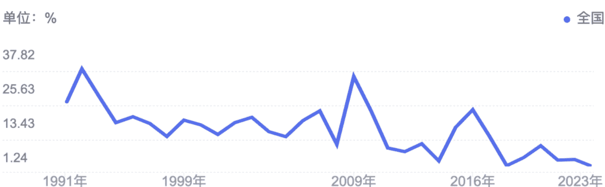

所以白岩松从上往下看，消费不振，老百姓却存着一堆钱，换谁都得纳闷为啥存了这么多钱不敢花。哪怕你说这些钱大部分都是有钱人的，那问题又变成了有钱人存这么多钱干啥？这跟我们以前理解的是不一样的，以前说经济危机的时候富人会从银行低成本用钱去购买低价资产，实现资产的大爆发。可如今的现实是，他们不但不贷款，反而在存钱，很异常啊。再仔细一想，也正常。大A股就不说了，最近可谓财富粉碎机。连京沪的房子都在跌，还有啥资产值得买？如果投资了“鼎益丰”这种民间玄学理财，一夜之间颗粒无收，还不如去银行存个定期。这也意味着，国家通过贷款形式放出来的钱没啥意义，大家手里有钱都存起来不花，怎么可能去贷款嘛。所以如果站在宏观层面往下看，确实看到的不是“大家没钱了”，而是“大家有钱都存了起来，都存钱导致交易活力暴跌”。

如果想解决，从宏观层面讲确实是应该促进大家消费意愿。但是白岩松说的就没问题？问题大了去了。

最基本的问题，我们这个社会本质是个被“二八定律”统治的社会。如果你家没有四十万存款，那这些存款就是别人的。绝大部分家庭没有，那就说明巨额财富跑极少数人那里去了。

最头部的是啥样呢？招行那个报告说，可投资资产超过一千万的个人（就是现金、股票、投资性房产，或者说去掉住的房子剩下的可以流动的资产，加起来一千万），这些人有多少呢？从2010年的50万人，快速增长到了2022年的316万人，预计在2024年达到近400万左右的规模。大部分都是一线城市上市公司管理层，还有各种东南沿海小老板。中西部少一些，不过每个城市都有一些从事专营业务的，比如土方车和挖沙子的，还有这两年崛起的网红什么的。

中国是个很大的国家，大到任何一个侧面都没法描述全局。
- 最头部的几百万人可能财富规模并不比美国头部富人集团差；
- 靠前的五千万人完全是发达国家生活标准；
- 同时月入三千以上只有四亿人，过了3000这条线，就是中产阶级。

所以这里有个诡异的事，白岩松说的不敢花钱，可能主要是社会里的有钱人不敢花钱。白岩松觉得“大家有钱不敢花”，和基层老百姓觉得“根本没钱”，可能描述的是一头大象的不同切面。

你说能不能鼓励富人消费？主要是富人的钱只能通过投资才能花出去。越富有的人，日常消费对整体资产的影响越小。毕竟普通老百姓中午吃鲤鱼，富人吃石斑，但是他们再牛逼，也不可能一顿饭吃一吨重的石斑，消费对他们整体收入的影响是很小的，甚至整天胡吃海塞，疯狂买买买，最后连资产的利息都花不掉。这也是为啥很多人说富人的钱单纯吃喝是花不掉的，只能是投资才能赔掉。

说到这里，大家可能想说，博主你不就是想说说现在的问题就是贫富差距太大吗？调整贫富差距就可以了？说真的，我以前是那样理解的，这两年慢慢有点改变。首先我支持对富人征税，咱们国家对富人的税率确实有点低。不过问题在于，哪怕以税负沉重而闻名的欧洲，除了那些还没铁岭大的袖珍小国，重税并没有实质上改变贫富差距。

这又涉及一个常识：历朝历代，乃至国外，对资产收税唯一的目的只是增加财政收入，提供一些公共服务，并不会大幅增加下层人民的收入。政府的财政收入最后绝大部分流向了基本的公共开支，搭桥补路，维持国防，给公务员发工资，搞基建等等，这些操作并不能有效调整贫富。

包括基建，对调整贫富的影响并没有那么大。一般上升期的国家有持续一二十年的大基建。不过从全世界的情况来看，一般基建到一定程度，都会发生一个明显的转变，从建设转向了维护。一方面收益率不断下滑，很多边远省份的高速和铁路都赚不到啥钱还在持续亏损，刚开始亏损点无所谓，慢慢积累的规模太大了，财政就扛不住了。现在贵州就有这个苗头，甘肃刚被点名批评，有轨电车运营成本4000万，收入160万，现在运行也不是，停运也不是。另一方面越修越边远，成本也会持续攀升，最后就修不动了。这也是为啥发达国家的基建都是一开始热闹非凡，慢慢就消停了。我国也不可能一直建下去。

而且国家转移过程中，也严格遵守“28定律”，基建乃至市政服务，政府并不是自己做，而是把业务承包给一个个公司，那些公司的包工头收入自然是工人的好几倍。

那国家能做啥呢？最可能就是基本兜底，比如为基层老百姓提供一些基本保障，以饿不死为目标。不过医疗这事也是“治病不治命”，毕竟每个人生命的尽头都是绝症，都是巨额开支。如果国家给你家的老人出500万的预算，你可能是很高兴的，但是如果给每个老人500万预算，你的收入60%拿去充医保，估计你也不干。也就是说，政府在调整贫富方面，可能效果没那么好。但是也不代表没啥可做的，比如把兜底做好了，让大家不再担心将来的生存问题，自然就可以大胆一些，多去尝试不同的可能性。

说到这里，大家应该也看出来了，调节收入最好的办法，依旧是富人不断地投资创业。把钱投出去，买设备，雇人，租办公间，还有各种差旅费，国家有了税收，打工人有了工资，有了工资就有了消费。万一投资创业赔了，相当于财富全部归还社会了。甚至可以说，富人投资是整个社会的动力之源。

咱们把视野放大点，也能看出来，古代千年进步不大，很重要的一个原因就是大家不投资，因为没啥可投资的，最后只能投资土地和权力。你们想想，富人有钱就买地，买了地做地主，同时让子嗣去考科举，形成了一个权力和土地的闭环。所以很多人讨论明朝末年士绅和朝廷的矛盾，其实士绅和朝廷官员是一码事，类似徐阶既是朝廷阁老，又是地方上的超级地主，这也是为啥后来海瑞搞他，不过海瑞属于千年里的一个异类，改变不了啥。因为技术不进步，所以没啥可投资的。因为不投资，所以技术不进步。死锁了。

大航海时代的伟大之处就在于，他给了大家一个“不断增长的”预期和投资机会，大量的资本砸下去，先有了商品贸易，然后有了分工，然后有了技术进步，最后有了工业革命。这是个链条，少一环都动不了，少一环人类都进入不了工业文明。

咱们改开40年，取得史无前例的进步，本质也是这几十年里出现了“不断增长”这么个预期。大家都意识到今天的投资会变成明天的收益，也就有了不断投资的动机，把所有收益都投入了再生产，规模越来越大。最过分的就是码农行业，烧了无数投资人的钱给码农花，客观上造就了过去十年码农的黄金时代。要知道，历史上企业也烧投资人的钱，但是大部分都投在了“买设备”这事上，很少会给工人发那么高的工资。只有这些年的互联网大爆发，码农的脑子就是设备，才会给他们开那么高的工资。这两年一收缩，码农的好日子也就到头了，或者说阶段性到头了，我刚才看到网易又在大裁员。

那如何让富人投资呢？老生常谈的问题，应该让大环境更加稳定，更加具有可预测性，这是投资的基石。比如这两天国家发改委发声「审慎出台收缩性、抑制性举措，突出做好7方面工作」，很明显之前不审慎地出台过收缩性、抑制性举措，现在是想纠偏了，我还是相信政府能够做好。

此外中国的中小企业太少了。我国的在工商部门注册的中小企业约有1100多万家，平均100多人拥有一家中小企业，相较之下，日本1.25亿人口，400多万家中小企业，平均30人拥有一家中小企业，美国3.2亿人口，接近3000万中小企业，平均10余人就拥有一家中小企业。

| 国家 | 人口 | 中小企业数量 | 平均人数/每家 |
| :--- | :--- | :--- | :--- |
| 中国 | - | 约1100多万家 | 100多人 |
| 日本 | 1.25亿 | 400多万家 | 30人 |
| 美国 | 3.2亿 | 近3000万家 | 10余人 |

企业太少，对人力的需求不足，要知道，这个社会最终吸纳劳动力的只能是无数小微企业。

此外也是时候重新思考“福利社会”了。

东亚一直以来都是个缺乏安全感的社会，上限是很高的，下限非常非常低，所以老百姓有极致的节约和忧患意识。

节约和忧患意识都是好品德，但是在现在的环境下，很明显成了社会发展的阻碍。所有人都天天备冬，所有人都能省就省，这种通缩螺旋会让整个社会进入一种可怕的下行通道，到最后所有人都得倒霉，大家都不消费，很可能的结果是大家慢慢都没了工作，到时候想消费也没钱了。

但是不负责任地鼓励大家消费也不太合理，万一失业了，没钱了，日子过不下去了，怎么办?所以还是要把失业和养老的保障体系搞起来，让大家有一定的安全感，那钱从哪来?把直接税收起来，像美帝学习，遗产税，移民税，都收起来，感觉房产税比较难，征收成本会高得离谱。

你说万一懒鬼不上班，天天躺着怎么办?

这个可能没法避免，只能说坚决避免“不劳动比劳动的人赚得多”。此外给低收入和老人发钱，本身也是推高M1的手段。

我有种预感，可能将来还是得用给老百姓发钱这招，通过贷款放水基本没啥效果了。

文末，咱们还是要唱响经济光明论。

咱们的经济短期可能有点麻烦，长期应该问题不大。毕竟银行里还存着140万亿的居民存款。富人都有让财富升值的投资冲动，普通人也有消费的欲望，等条件稍微好转，这么大规模的存款，还是很有希望成为下一个周期的巨大动能。

而且保障体系这些年也一直在做，经商环境也在改善，总之就是提高整个社会的安全感，安全感上来了，消费和投资自然也就上来了。

很多问题没有危机是不会有人关注的，这也是为啥“危机”往往也是社会进步的阶梯。我写了这么多，说得不一定对，但是关注就是力量，只有关联到了，全社会的讨论慢慢会形成共识，有了共识才可能解决，你不可能解决一个都没发现的问题。

公众号懒人搜索，懒人专属群分享

## 台湾人到底在想啥，不担心挨揍吗？

2024-01-16

这两天收到大量消息让我聊聊台湾，最起码的一件事，他们这样闹来闹去，就不怕武器的批判吗？

关于台湾人心态的问题，两年前写过一篇，这两天我又找台湾小伙伴确认了下，修正了一些这两年的变化，给大家发出来。

台湾人对于现在的状态，整体非常佛系，由三个状态组成：

首先，和平统一几乎没有任何民意，无论是群众，还是政治团体，“和平统一”这事几乎没有任何认可度。而且极少数认同“和平统一”的那些人，说的跟大陆的“统一”也不是一码事，他们说的是“联合政府”，显然不可能嘛。

其次，台湾人认为最近这些年不大可能武统，他们为啥这么想，一会儿解释。

最后，如果发生武统，他们也不会反抗。

咱们一个一个说。

为啥台湾那边的人不接受“和平统一”呢，道理实在是太简单了，因为没有任何好处，所以没有任何动机。

现在有些话不能放在明面上说，不过事实就是台湾省、新加坡、香港地区，都是楔入到西方体系里的亚洲地区，他们在那个圈里混得风生水起。

为啥台湾人的芯片产业那么发达，跟他们在这个领域里多年深耕有关，不过首先是美国点头了，如果没有美国同意，压根不可能。

而且就算台湾重新回到大陆怀抱，如果美国不同意，台积电甚至开不了工，它那一堆设备毕竟不是电视，不是通上电就能用。更类似一个电表，需要跟总部验证通过才能用。

这也没啥办法，台积电等一众企业，本质是长在大棚里的一棵漂亮的花，离了那个大棚一个礼拜都活不下去，美国和西方技术和知识体系就是那个大棚。

这也是为啥台积电有时候被称为“镇国神山”，很多台湾知识分子认为，只要台积电在芯片领域的地位一骑绝尘，大陆就不会对台湾轻易动武，刚才也说了，台积电不是一个简单的工厂，如果武统，可能它也开不了工了，如果台积电崩了，影响面可就大了。

其他领域也都差不多，比如台湾的名校比较多，也是因为它自己处在西方体系里，打分排名的时候受的歧视比较少。排名靠前这个事大家可能不太理解有啥意义，其实很关键。大家把哪怕国内的大公司招聘简章拿出来，就知道QS排名是招聘的关键因素，很多高薪岗位指明要C9和QS前50大学的毕业生。

在台湾上个好大学，就能随便去各国的好公司谋个好岗位，包括大陆这边，这两年在大陆工作的台湾人非常多，他们在这边整体待遇还不错，有的直接在北京上海安家了。

尤其芯片和面板行业，吸收了很多台湾和韩国人，这也是为啥我能接触到台湾人。

而台湾上好大学的难度，大概相当于北京学生考好大学的难度，此外他们申请欧美留学也比咱们这边容易得多。

当然了，最关键的还是他们所谓的“执政党”，绿党他们，如果统一了，他们的地位一下子跌了一大截，都不知道他们往哪搁，所以无论如何也没道理对统一这事太积极。台湾这些年的年轻人被绿党教育得很成功，对“和平统一”这事几乎没有认同感。

大家注意下，台湾的“蓝党”，也就是国民党他们，支持者里年轻人非常非常少。“绿党”支持者年轻人就很多了，这也能看出来台湾的未来动向。

那问题来了，他们为啥觉得大陆不会发动统一战争呢？

台大有个说法，说是台海爆发决战，有两个触发因素：

- 1、美国或者台湾踩到了中国政府的底线上，比如“独立公投”什么的，中国政府没法接受，战争就会爆发。

- 2、中国对全球产业链的依赖降低到7%以下，到时候可能随时找个理由就去攻台。

也就是说，一旦战争爆发了，中国遭到西方的全面制裁，如果只有7%的生产和经济受影响，这种情况下，统一战争随时会爆发。他们认为现在的依赖度是30%以上，所以战争爆发可能性不大。

这个依赖度我不知道咋算的，不过他们认为，中国现在无论是能源还是原料，都依赖海外进口，中高端产业又严重依赖西方的工具和专利。

甚至新能源所需的锂电池，锂矿也主要是从澳大利亚进口。我专门查了下，2023年我们的锂矿对外依存度是80%左右，石油70%左右的对外依存度。此外生产出来的近一半工业品要卖到海外。

而且锂的主要产地是南美，智利和阿根廷，最终还是被澳大利亚的矿业巨头控制，他们还控制着铁矿和铜矿，所以将来在很长一段时间里，对外依存度降不下来。

也就是说，如果台海爆发战争，受到制裁后，会发生连带的停产停工，到时候会产生大面积的失业，而失业进一步会引发社会骚乱和不稳定，这一点无论如何中国政府也是不能接受的。中国是世界工厂，这一点既是重要的筹码，也是一种负担，因为工厂依赖上游能源、原料和知识输入，也依赖销售和出口等下游输出，缺一块就会停工。

所以台湾人认为最近这些年“开战”这个开关不会随意被按下。

可是“承担经济痛苦”这种事本身也是一种选择，当时新中国成立初期决策去打朝鲜战争痛不痛苦？当然更痛，可还是做了艰难的选择。

可见“开关不会随意按下”并不代表“永远不会按”，台湾人也知道有些底线不能碰，于是不去碰，在底线附近疯狂晃荡，就是不会迈过去，一边蹦跶一边大喊“你打我啊”。

只要不触发武统，他们就可以一直混下去，直到哪天中国经济彻底摆脱了对西方的依赖，不再担心制裁，或者说制裁造成的痛苦那么强烈，那个时候统一随时可能到来。

所以台湾现在绝大部分人的状态，可以用一句话来描述，叫“不想统，不敢独”，一直在那个中间地带晃悠。

对于迟早到来的统一战争，台湾大部分人其实也早就想好了。这个出乎我的意料。

如果要是不武统，那就一直维持现在的状态，原因上文也说了。

还有一个因素，就是台湾的法统，尽管中间变过几次色，但是确实是从大清传下来的，清帝逊位，把法统传给了袁世凯的中华民国，中间经历北伐，国旗颜色样式都变了，但是那个法统并没有改变，十年前他们刚过完百年纪念，所以如果真统一，非常难办，因为“中华民国”这个招牌没地方搁。

不过关于法统，老年人比较在意，年轻人已经无所谓了，也是因为绿党这些年刻意淡化。我在海外碰上过不知道多少台湾年轻人，一次都没听说他们提“中华民国”，问就是“台湾人”。

有一个选择是像当初东德全国公投解散国家后加入西德，彻底抛弃“中华民国”这个壳，可是现在这个选项概率比较低。除非，除非台湾穷得要死，类似墨西哥的几个州很梦想公投加入美国，可是美国不要他们。台湾变穷这事可能性不是没有，但现在还凑合，毕竟人口不多，却有一些挺硬的产业。

对于武统，他们台湾人也很中立，是的，你没看错，是中立。

那种感觉就好像解放军百万雄师马上渡大江，大江对岸的国军兄弟们准备誓死抵抗为党国流尽最后一滴血？

当然不是了，这又不是民族之战，所有人打仗的最终目的，都是尽快结束战争赶紧回家过日子。我军这边的战士老家刚分了地，准备打完回去好好种地过日子，国军那边觉得反正战争在半年内也结束了，保住命回家看看老婆孩子才是正经事。这种思维模式的影响下，国军面对绝对的压倒性优势，他们可能有决死抵抗的决心吗？

显然不可能有，渡江战役一爆发，国军全线崩溃，我军一直担心的江阴炮台，几乎一炮没放，没必要，结果已经注定的情况下，没必要再绕远路了。

如果爆发台海战争，那台湾人的心态和当初解放战争后期国军的心态差不多，没多少人会为了一个结果已经确定的战争去做送死，不值当。

台湾的小伙伴说，如果真打起来，战争几天后就会结束，个体的任何选择都没意义，唯一要做的，就是活到战争结束继续过日子。

这也是为啥2022年，我军军演封锁了台湾之后，台湾人表现出一种诡异的中立态度，就好像不是针对他们似的，赵少康在脸书发的：

> 演习开始前，许多跨国公司让员工放假，甚至开始撤离员工，台湾却没一家公司放假。
> 
> 公司不放假，但请假的倒是不少，不是避弹，而是请假去观弹。
> 
> 据报道，军演日，南部海钓船被全部租光，游艇也都全部出海，因为太多人要搭船出海看解放军的军舰，他们说1996年没有拍到，这次一定要拍到。

更关键的是，大部分台湾人对政权更替这事非常无感。

当初清朝和日本打了起来，台湾莫名其妙地被割给了日本，随后爆发的台湾保卫战中，最勇敢的台湾人已经把血流干了。后来李敖说，台湾人普遍没种，因为当初不愿意跪下的台湾人被日本人用机枪给扫了，现在的台湾人，都是“跪民”的后代。

随后半个世纪的“皇国教育”，大部分台湾人在心智上觉得自己更像日本人，有日本名字，学日语，效仿日本生活习惯，甚至很多台湾人被编为山地部队，去东南亚为日本人参加战争。

1945年广岛长崎原子弹爆炸，台湾人上一秒还在痛哭日本彻底完了，下一秒就反应过来自己是战胜国啊。然后国军来了，大家站在路边夹道欢迎，谁能想到，国军表现得比日本人还渣，不仅掏空台湾去打内战，还对他们搞屠杀。

1949年国府败退大陆，此后的20年，简直暗无天日，物资严重不足，说错一句话就会被宪兵带走投入“绿洲山庄”（有时候也叫“绿岛”），这是台湾最大的关押政治犯的地方，李敖，柏杨，吕秀莲都在这里学习改造过。

经历了这么多破事，台湾早已不在乎政权更迭了，他们只想安安稳稳过日子，能维持现状，就尽量维持。维持不了，就等着风浪过后重新过日子，跟着谁过不是个过？如果不能在台湾待着，就去澳大利亚和美国。

几年前，我的小伙伴就说，他们根本没准备抵抗，整体感受就是战争爆发一小时之后，撑死三个小时，金门肯定没了，战争爆发当天，澎湖列岛也没了，没了澎湖列岛，台湾根本无险可守，还打啥打？

而且台湾人内心深处根本不相信美国会为了一个八千公里以外的、跟自己没啥实际瓜葛的地区和中国开战，他们唯一能指望的就是随后的制裁对中国有点威慑。

只是威慑这东西战前才有意义，一旦战争爆发，那就成了累赘，因为战争结束后，台湾也是中国这个主体的一部分，自己也进了制裁名单。

台湾之前还有个段子，说上午还在那里喊：美国快制裁大陆啊，它要打我们了；下午统一了，又开始喊美国不要再制裁我们了。就是这么的纠结。

大部分台湾人相信，战争爆发后，台湾主岛不会遭到一发炮弹的轰炸，战争就结束了，因为几乎没有哪个台湾人，会为了一场说不上来有啥意义的战争去流血打仗，他们甚至都不为“投降”难为情，投降日本是投降，投降自己人算投诚。

他们觉得那个开关一旦按下，统一就是迟早的事，就这样吧。

现在台湾人现在只有一个条件，模仿香港那种，可以服从中央，但对现有的秩序不要做大改变，到时候来个“港澳台通行证”，他们猜测政府应该能接受，那就完事了，根本不用打，本来就是一家人。

我猜测，上文赵少康说的那些台湾的反常识操作，基本上依旧是基于“一发炮弹都不会落在台湾岛”和“港澳台通行证”这个基础上。

说到这里，这事也差不多说清楚了，这篇文章我是把这些年碰到的多个台湾小伙伴的说法汇集在一起的，写完后又给他们看了下，他们也说没啥问题，基本就是这么想的。

### 尾声：

我从不怀疑的一点是，大陆和台湾迟早统一。而且就在最近这些年，就连台湾主流知识层也认为，我党如果是一个放任民粹的党，早就把台湾拿下了，反而党更多地顾忌的是“政治遗产”，有点像在一个家里，有啥矛盾尽量协商解决，不到万不得已，不会诉诸武力。就好像家人之间吵架是常有的事，但是拿着菜刀追着砍就比较少见了。

相比于武力解决问题，通过政治协商反而是一个更加需要耐心和智慧的选择，我党本着对历史和人民生命财产负责的原则，一直在压制民粹，争取和平解决，只是台湾明显越走越远。

到最后，可能我们也没啥选择。

公众号懒人搜索， [懒人专属群](#)分享

## 中国的大航海才刚刚开始

2024-01-13

大家可能也看出来了，就在这些年，国际上的两种思潮正在成为主流。

一种是“本土化”，以印度为代表，你不去他们那里建厂，他们就不让你在印度卖产品。这一点之前给大家讲过，莫迪还在古吉拉特邦当首席部长的时候，来中国仔细考察过，学走了最重要的经验。

以印度巨大的消费潜力为筹码，让跨国企业去印度建厂，要不你就别卖你的产品，你要是想卖，就得建厂，还得解决一定的就业。这和咱们一直以来的策略是一样的，并且他们走的也是南方沿海制造业拉动经济的模式。

你说咱们不应该去帮助印度实现工业化，坚决不能去。

问题是如今的印度就跟上世纪的中国一样，购买力越来越强，咱们不去别人也会去。现在全世界能拿得出手的有购买力的地区就那么几个，欧美，日韩，印度，俄罗斯，别的加起来也没多少，而且那些地区经商成本高的离谱。

可能大家不知道，中国企业已经在印度扎下了根。

比如印度这些年的显示需求就是个超大市场，毕竟老百姓生活好了，就要看电视，用手机，用电脑。有钱了，就会买更大屏的电视、手机等各种电子产品。已成为全球半导体显示产业龙头的TCL华星，就选择印度作为其海外布局第一步，已经建厂投产并完成了量产出货，成功的为客户提供全球供应保障，并实现了从产品出海到工业能力出海的转变。

以印度手机市场为例，现在印度排名靠前的几个手机厂商分别是，三星，vivo，OPPO等。里面的中国公司也给咱们国家创造了大量外汇，更关键的是，他们的收入可以反哺国内研发，国内能多一些高薪岗位。这几个品牌都需要面板模组的供应配套，所以TCL华星也就过去了。

另一种外贸趋势叫“友岸外包”，也就是美国认为应该将产业链部署在跟他关系不错的国家，避免出现俄乌战争之后欧洲陷入天然气危机那种情况。

大家也都知道，这两年中美贸易迅速下降，并不是他们不买了，而是转到越南、马来西亚、墨西哥去了。

那面对这种情况，我们的策略是啥呢？

国家在这个问题上的态度也是确定的，就是“走出去”和“双循环”。

因为市场就在那里，你不占领别人也会占领，还不如我们自己去，所以国家是鼓励中国企业去海外建厂的，因为企业只能是想办法跟着购买力走，卖出去才能活下去。

所以“出海”这事对于想继续干下去的企业来说并不是一个选择题，只能是硬着头皮出海。

有点像上世纪日企大规模来中国建厂，无数日本普通工人都到这边当工头，这些日企的上游企业依旧是日企，现在越南东南亚那边又出现了这种情况，组装厂搬过去了，剩下的还在中国国内生产，通过海运拉过去组装贴标。

此外企业去海外建厂并不是彻底跟本土切断了联系，恰好相反，一家中国企业到了越南或者墨西哥，如果要选择上游供应商，它是优先选择国内的企业还是其他国家的？

显然是自己的母国，因为商业活动不仅仅是买卖商品，更涉及大量的商务往来，同种同文自然容易沟通的多，两个跨国企业总部都在中国，总比一个在中国一个在美国容易沟通吧。

咱们再以TCL为例，TCL是典型的科技制造业企业，电视、空调、TV面板、电竞屏面板、光伏硅片等一直在全球有巨大的市场份额，他们的制造基地遍布全世界，但是核心部件主要都是从国内拉过去。

比如TCL在墨西哥和美国的边界城市蒂华纳、华雷斯搞了2家工厂MOKA、MASA，可生产65英寸以上大屏电视，然后卖给美国。美国人看剧看比赛，都喜欢大屏。

这2家工厂生产一部分零件，剩下的组装。核心部件，也就是面板是由TCL华星在中国研发生产供应，走海运送到墨西哥组装，然后再走陆路跨过边境卖到美国。这个操作模式看起来有点绕，但却是最优产业选择。它支撑着TCL在美国的业务快速发展，根据2023年1-11月统计，TCL电视在美国零售量已经排名第二，仅次于三星。

多说几句，这几天CES展正在美国拉斯维加斯举办，不少人应该听说过，这是全球规模最大的消费电子展会。TCL在现场展出了不少黑科技，包括一款全球最大的115英寸超大屏QD-Mini LED巨幕电视。除此之外，TCL还邀请来了NFL名人堂球员来到现场互动——TCL去年开始成为NFL官方合作伙伴。要想占领美国这种成熟的大市场，营销必须是立体式的，不仅仅是卖货这么简单，要用品牌占领心智、打动人心。

目前TCL在全球布局了30多个体育IP，根据各国人民群众不同喜好精准布局，囊括足球、篮球、电竞、板球、橄榄球等项目，比如CBA、中国女篮、FIBA国际篮联、美洲杯足球赛、巴西队、西班牙队、意大利队、德国队、阿森纳、美国NFL等等。

相比电视，目前大家也许更多关注中国新能源汽车的全球化拓展，但客观来看，从全球化这个角度来分析，中国电视产业是走在最前列的。TCL每年出货超过2000万台电视，位居世界第二。巨大的市场份额带来规模效应，推动TCL华星上游面板产线建设与研发投入，形成正向循环，所以才催生出最大的115英寸超大屏QD-Mini LED巨幕电视这种六边形顶级产品，继续引领中国电视产业在全球的遥遥领先；而TCL下游终端产品丰富的场景应用，也为上游研发提供了研发需求导向与落地支持。这样一来，上下游就形成了双向赋能。这也是这些年中国制造摆脱性价比标签，往中高端走的重要原因。

除了印度和墨西哥，TCL全球制造基地体系还包括越南、印尼、巴西、波兰等国家。以波兰工厂为例，它的员工和厂房都是波兰本地的，但管理层和核心的生产技术与零部件却来自中国。TCL的海外工厂都是这个模式，国内的员工，到海外就成了管理人员，管着那边的本地工人开展生产，收入也就大幅上去了，类似台企的模式。

如果采用传统的中国生产组装，直接出口欧洲的模式，那么在欧盟的法律规定下，电视类产品出口的关税就高达14%，价格完全没有优势。而在当地建厂，招募当地工人，为当地提供税收，不仅可以让产品受欧洲本土的欢迎，也享受到了关税的减免，同时扩大了国内核心部件的出口。

这也是为啥这些年，中国对东盟、越南、墨西哥等国的出口暴增，背后就是那些出海的中国企业需要继续从国内把核心部件、生产设备和耗材运过去。

在2017年，中国对东盟经济体的出口仅占对美国出口的60%。到了今年，中国对东南亚的出口大约已达其对美国出口的120%。

不是说东南亚已经有了美国那样的购买力，他们差得远。而是传统的袜子厂和电子厂搬迁了出去，我们这边完全可以通过出口上游更加有附加值、更加有竞争力的产品弥补这种产业迁出的差价。

而且类似TCL这些科技制造企业，很大一部分出口为核心器件和材料，相比出口成品，可有效规避贸易壁垒，使得海外生产具备成本优势，促使海外营收蛋糕做大。

海外做大反过来会向国内订更多的部件，继续拉动出口增长，并促进国内上游产业的发展，以及对形成“双循环”经济的贡献。TCL之前测算过，其海外营收每100美元，可带动60美元的国内出口，而且这部分出口都属于有很高技术门槛的高端产业。另外40美元则在当地产生，这部分主要用来服务当地、为当地做贡献，比如培育发展当地制造业供应链体系。当然，这一点也是考虑到自身供应链稳定必须做的。

此外由于生产基地的扩散，东南亚和越南等地这些年的经济水平明显上升，他们有钱之后就要消费，又会增加对我国的产品需求。

## 细讲庚子国变，太后怎么混到仓皇出逃的
2024-01-09

前几天，印象笔记2023年的年度收藏账号榜单中，我的这个号竟然排第一：

## 2023 微信知识 账号榜
- TOP 01 九边
- TOP 02 L先生说
- TOP 03 刘润
- TOP 04 孤独大脑
- TOP 05 笃行社

我倒是很少在意这些排名，不过印象笔记的这个我特别看重，因为大家都倾向于收藏那些想看几遍的文章，这个榜单能排上名，我觉得是对去年作品的一个认可。今年我再接再厉，走相对较难的那条路，继续好好写。

之前讲甲午海战意外效果非常好，接近百万阅读量，评论区让我赶紧讲讲庚子国变，这篇写了好久，万字长文，大家坐稳扶好，我们准备启程。

### 1

要说庚子事变，还得先从光绪和慈禧的关系说起。光绪是很可悲的，他是慈禧妹妹的儿子。慈禧的儿子同治皇帝没有来得及生孩子就死了，按理说应该是同治子侄辈继续当皇帝。可是慈禧担心新皇帝年纪太大不好控制，就找了个理由让还在读幼儿园中班的光绪进宫。光绪四岁就被接入宫中，几乎没咋经历正常的儿童生活，在慈禧的威压下度过了余生，一生惨淡。尽管光绪在皇位上干得很一般，却得到了几乎所有人的同情，包括当时的人，还有后代的人。可能是因为跟慈禧在一起待的时间太长，他俩的性格非常像，都容易急眼，脾气都非常爆裂，一点就着。他俩之间的矛盾一定程度上导致了后来的一系列麻烦。今天讲的庚子国难，起因在甲午战争，我之前写过的《没有一片雪花是无辜的》，里边讲了甲午战争的事。

甲午战争对中国的影响比较复杂。当时大清的消息封锁得特别好，绝大部分老百姓并不知道战争打输了。直到地方上的小吏们过来收税，大家才发现大清从一个胜利走向另一个胜利，突然就过渡到了承担代价这一步，自然有怨言，上层就得做点改变。大家注意下，清朝作为一个外来政权，要比历朝历代统治稳得多。有点像英国在印度做的事，一边防范老百姓，一边确实从官绅那里给老百姓抢了点好处。既拉拢士绅阶层，毕竟没有这群人的支持根本没法统治这么大的一个国家，也一直在打压他们。比如官绅一体纳粮，比如承诺永不加赋，而且也不像历朝历代那样动不动让老百姓去修城墙、修皇宫什么的，也不再搞明朝那个近乎奴隶制的“军户”。

也就是说，大清是一个低水平、超稳定结构的组织，要不是列强进来捣乱，说不定还能继续苟一两百年。这里不是在夸大清，元、清有点类似两个外来殖民政权，后来他俩被推翻，老百姓打出来的口号都是一样的，都是“驱逐鞑虏，恢复中华”。可能是因为合法性比较弱，清朝相对来说是比较在乎老百姓态度的，一直在根据老百姓的想法修修补补，让清廷这艘破船一直风雨飘摇却也凉不透。也正是因为比较在意老百姓的态度，甲午战争之后，大清准备做点啥来给自己的合法性充值，也就是戊戌变法。

关于戊戌变法，很多人说慈禧太后是反对的，所以成不了。事实可能比较复杂，慈禧并不是很多人说的纯“老顽固”，她是典型的实用主义，怎么能维持自己的地位，她干啥都行，保守和激进，都是手段，急眼的时候啥都能干。对于变法她的态度也很稳定，可以变，毕竟得做点啥稳固权力，但是不能影响自己的权力。但是随着戊戌变法一步步发展，后来发生了康有为他们想“围园杀后”的事。也就是康有为她们准备围了颐和园，杀掉太后，让光绪彻底掌权，类似康熙除鳌拜的操作。这事败露，直接导致了戊戌变法彻底失败，骨干的六个人被推到了菜市口开刀问斩。到底有没有“围园杀后”这事，现在比较成谜，不过慈禧太后显然是相信有这事的，后来跟不同的人提了好多次这事，并且表示一生最恨康有为。一度还找了个刺客去海外找康有为，不过老康在海外过着奢侈的生活，老婆孩子佣人保镖一大家子，刺客就算找到了也没法下手。戊戌变法失败之后，慈禧很想废掉光绪帝，但洋人大都不同意，或者说不支持。列强跟大清有协议，都希望大清保持稳定、不要搞幺蛾子，影响了他们赚钱可不好了。这也不难理解，咱们如今在非洲有很多投资，咱们也不希望他们那边政权频繁更迭，有个好说话的统治者就不希望把他换掉。此外列强也同情维新派，他们也希望清廷有所改变，因为清廷这个棺材瓤子非常难打交道，所以列强支持那些脑子正常点的人上台，暗地里支持维新派。这个也好理解，咱们这些年没少培养非洲留学生，也是希望他们把正常的思维方式给他们国家带回去，今后容易打交道一些。慈禧想抓康有为，英国领事用船把康有为接走，日本人的军舰也接走了梁启超。因此，慈禧对洋人一天比一天恨起来。

而且现在一般认为“围园杀后”的事对慈禧伤害极大，毕竟正常人被朋友搞一下也崩溃，被自己一手拉扯大的养子兼外甥搞了这么一下，别说有多憋屈了。更麻烦的是这事传了出去，京城茶馆里天天啥也不聊，一直在说光绪派了20个一等一的大内高手去刺杀太后，跟太后的御前侍卫决战紫禁之巅，双方大战八百回合什么的，京剧本子都写好了，随时准备上映。这些流言流语对太后威望也是极大的削弱。这种情况下，太后多多少少有点疯了，失去了几十年来一贯的理智和清醒。慈禧太后给人的感觉是一直专横跋扈脑子有问题。其实在庚子国难之前，慈禧一直有种离谱的冷静和理性。她牢牢控制人事权，各个封疆大吏比如曾国藩、李鸿章、张之洞、左宗棠都能力超强而且对她很忠诚。而且她很少直接干预政务，一直都是军机处在处理，只有在军机处偏离自己预期的时候干预一下。她一直对自己的能力圈有个深入的洞察，只干自己能干明白的事。从她老公死了一直到戊戌变法失败这段时间，慈禧的各项决策基本经得住时间的检验，她就像一个开着一艘破船的船长，没啥惊艳操作，也不会有别人比她做的更好。但是“围园杀后”之后，彻底疯了。不仅踢开了军机处亲自操刀，而且全程没啥理智可言。她恨光绪和康有为，想罢免光绪追杀康有为，可是遭到了大臣、士绅和洋人的一致反对，正在抑郁，这时候民间崛起了一股势力，让太后觉得找到了同盟，也就是义和团。

### 2

1897年，义和团在山东兴起。义和团起源比较复杂，这是因为加入的人比较复杂，一般认为起源于白莲教，它的创新点是人人都可以神灵附体。这一点不像太平天国，在太平天国，神灵附体是个特权，只有上层几个人可以，其他人敢玩附体，那就是假传天谕，是要被点天灯的。而义和团没有统一的首领，这就意味着人人都能自称是义和团，谁都可以玩附体，几乎每个小团体都有一个会通灵的大师兄。有点类似基督教里的天主教和新教的差别，天主教组织是很严密的，是一个类似官僚体系的阶梯结构，教皇之下有各种层级的主教，一直到最基层的神父。而新教没这么一说，人人可以跟上帝交流，也没啥主教什么的。太平天国就是典型的自上而下天主教结构，义和团就是典型的分布式自下而上的新教结构。正是因为这种“分布式”结构，队伍里龙蛇混杂啥成分都有，一部分地痞流氓也混迹其中，所以后来就有“真团”和“假团”之说。一般历史学者认为义和团的真团是纪律性很好，假团纪律性很差。这其实是个循环论证，反过来也可以说凡事纪律好的都是真团，凡事纪律差的都是假团，所以义和团的纪律性其实是个谜，在此咱也不展开讲了。义和团一方面宣传本土宗教的神术，请神附体，比如请关二爷、孙悟空、玉皇大帝等；另一方面宣传传教士们的恶行，直接把洋人渲染成是妖魔鬼怪了，比如说他们将幼童制作药丸、挖心、取眼睛做药等。一开始规模还不离谱，1898年8月，黄河决口，山东直隶遭受严重洪灾，第二年又出现严重旱灾、虫灾，饥饿百姓纷纷加入，义和团因此而壮大起来。这里就涉及了一个问题：义和团形成的根源是什么？一开始学者们研究说义和团的兴起是因为迷信，后来有学者发现光迷信也不够啊，封建社会哪个朝代不迷信，义和团能凝聚起来，主要靠对洋人的仇恨。其实这两点可能还没有倒到根上去，仇恨和迷信都是表象，都属于精神需求；真正的原因很可能是物质需求——饿，这是人类的底层需求。就像电影《一九四二》描述的那样，一旦发生饥荒，饥民就会聚集起来，大家商量着找吃的，商量到最后，唯一的选择只能去吃大户。

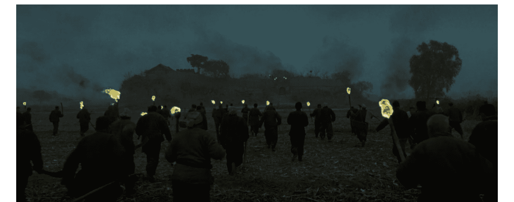

这倒也好理解，如果是饥荒之年，家里揭不开锅，老婆孩子眼巴巴望着你，你可能也会加入什么团伙去跟大伙抢粮，没办法的事。所以义和团本质上跟历朝历代的饥民没什么区别，其实历代饥民也经常信教，比如汉末黄巾军和元末明教起义什么的，只是这次恰好选择吃的对象是洋教教民而已。为什么选择吃教民大户？因为在当时，打击教民和洋人是最大的政治正确。这里就不得不提一下当时教民和平民以及官员之间的矛盾。鸦片战争结束后，朝廷官员怕洋人，老百姓怕官员。于是老百姓看懂了这个bug，大量加入洋教，请求洋人的庇护。再加上那些年灾难频发，教会往往会做一些救济工作，这样灾民往往也就变成了教民。大家看加入教会有饭吃，还能得到洋大人的庇护，纷纷寻求加入。

有一次18个村子庞姓平民，将教堂围得水泄不通，交给神父一个4000人的名单，要求入教，条件就是让神父干涉衙门释放庞姓首领。与此同时一些流氓也加入了教会，并且打着教会旗号无恶不作。到1900年，中国的天主教徒竟高达700万。一些教民在外国传教士那里获得优越地位，这就引起平民的不满，最终形成了教民欺压平民，洋人欺压官员的情况。因此官员讨厌洋人，老百姓讨厌教民。在天灾和饥饿的刺激下，教民势力的膨胀导致了义和团的同步膨胀。

按理说义和团这样的组织在古代是会被政府强力弹压的，因为从黄巾起义，到元末明教起义，再到清朝血腥镇压白莲教、天理教和太平天国，历朝历代对民间宗教结社都是毫不手软的弹压。有人说为啥中国没发展出来宗教，一方面儒家就是宗教，另一方面封建社会对宗教组织极度防范，发展不出来也正常。但是这次不一样，太后也讨厌洋人。这种态度直接影响了底下的各地官员，比如一个山东巡抚毓贤（那个字读“玉”），他之前对民间社团镇压相当残酷，曾一年杀两千多人，被称为毓屠户。此时摇身一变，开始对义和团极尽包庇，他本人甚至还戴着红头巾坐在堂上，自称是义和团大师哥，甚至有些义和团甚至打着写着“毓”字旗号。其中缘由，一方面他本人仇恨洋教，清廷地方官几乎没有喜欢洋人的；另一方面他也是吃透了慈禧的心态，也是一种变相的讨好。就这样在一批“反洋仇教”官员的庇护下，一部分的义和团就从拳匪变成了团练，成了半官方性质的民团了。《大话西游》里有句台词：“我早叫你们平常好好打扫干净嘛，现在养出来的蜘蛛比我还大！”义和团的形成完全就是清廷长期养的结果。需要注意的是，被收编之前叫“义和拳”，收编之后相当于有了编制，叫“义和团”，不过一般都混用。

### 3

此时义和团一天天壮大，与洋人的冲突不断，甚至还杀死了一名英国传教士。而清廷对此事的处置却不温不火，只是表达了遗憾，并承诺捉拿凶手，但同时又发上谕，称有一些练武的人是善良平民，不可株连滥杀。这种态度在清朝这个严酷的朝代堪称奇迹，慈禧赐给毓贤一个福字，洋人认为这是在故意刺激他们。不过这些都不是问题，依旧可以相安无事。随着新世纪的即将到来，慈禧一直想在1900年改元，另立新君，奈何各地督抚和洋人大多都反对。慈禧想既然无法废黜光绪，不如暂时找个皇亲，先立个大阿哥，等大家慢慢接纳了，再把光绪换掉。没想到这一妥协举动，引起轩然大波，不仅洋人和各地督抚不支持，就连上海上千士绅也一致反对，这在清朝尚属首次。需要注意的是，这些反对士绅里，就有后来的一堆革命党骨干，可见大家一开始还是准备改良的，后来发现没救了，走上了造反之路。慈禧发现国内外一致都保光绪，说明光绪执政虽然短暂，但粉丝不少。注意看此时慈禧面临的环境，除了顽固派中少数人外，大多封疆大吏、洋人和富人都不支持慈禧废掉光绪帝。那么义和团就成了慈禧唯一能够依靠的势力，这就是慈禧口口声声不能失去民心的含义。义和团已经扩散到北京周边，宣称天不下雨，都是洋人捣乱，京城洋人最多，只要进京杀尽洋人，就可以风调雨顺。不久几万义和团涌入北京南边的一个县城，杀死清将，铁路、电杆被拆毁，火车电报不通，北京城内的使馆、教堂成为孤岛，各国公使感到恐慌，要求再派兵保护本国公民。不仅京城附近成了这样，山西和东北闹得也很凶。义和团挖了山西河北的铁路影响倒也不大，可东北的铁路是俄国人的，挖了俄国人的铁路那不正好给了人家出兵借口嘛。于是俄罗斯那边密令远东的几个军区准备动员，随时去东北打劫。所以说后来的八国联军其实有两路，一路是从天津登陆前往北京，另一路是从北方到了东北。此时慈禧也有点慌了，隐隐约约觉得要重演英法联军的悲剧。

### 4

事情还在继续激化。由于列强对清廷不信任，又派450名左右的士兵，大摇大摆地进驻东交民巷，再次刺激了慈禧的神经。局势正在进一步恶化，不断有洋人被杀，张之洞等各路大员都要求镇压义和团。地方大员们深知这玩意闹下去迟早出大事。袁世凯当时已经干到了山东巡抚，刚才说的那个毓贤去了陕西。大家都很纠结义和团闹这么大，太后的态度又不明朗，怎么办？袁世凯说好办，义和团不是号称刀枪不入吗？只要看到裹红头巾的全部拉去让士兵打靶，打不死的就是真义和团，打死的就是假冒伪劣。手底下的军头们心领神会，带兵到处抓义和团，抓住就枪毙，发现全是假的，没一个经得住真枪实弹的考验。很快山东境内的义和团被杀了个干净，剩下的跑河北和山西去了。还有个事是聂士成那里发生的，聂士成是北方军区司令，他亲眼见过火枪对着大师兄肚子放了一枪却没啥事。不过很快发现义和团的人是先往火枪里放铁砂，然后放火药，开枪的时候相当于放了一发空包弹。然后拿起左轮手枪开了一枪，大师兄当场倒地毙命。此时山西巡抚就是毓贤，他放任义和团，在山西大规模捕杀教众，导致庚子国难之后洋人要求惩处，被杀了一堆大员。

慈禧却还在纠结，义和团只是她的一枚棋子，她也知道剿灭义和团，跟洋人和好，对国家有好处，但对自己没好处，于是慈禧最大的一次政治豪赌来了，她要利用义和团逼洋人认怂。几天后，义和团大举进入北京，守城官兵收到命令，即使义和团半夜来到城下，也即刻开门放入。这个命令就来自于上文那个大阿哥的老爹载漪，他希望废掉光绪帝，立自己的儿子为储君，就是他在后面极力鼓动慈禧攻打洋人使馆。义和团进入北京的过程中，有大量的饥民加入，纪律慢慢变得不可控，杀洋人，尤其杀中国教民，后来扩大到，但凡与洋人交往的，任意屠掠；要求各家中不准有外国货，如果有违抗存留，一经搜出，杀人烧屋。当时京津地区几乎家家有洋货，毕竟火柴有吧，煤油有吧，人人惶恐不安。整个北京喧嚣异常，载漪等顽固派大臣头裹红巾，腰系红布，并在王府内设坛，呼呼跳跳，好像狂醉一般。一夜之间天潢贵胄变成了大师兄，也是魔幻。这个过程中又给弄死不少洋人，有大使馆的，也有传教士，更多的是国内信教的老百姓。见此状况西方国家也急眼了，觉得再不出手就来不及了，信任危机升级，于是西方各国组建西摩尔联军2000人，开往北京。慈禧这时候也有点急了，她发动义和团搞洋人，是指望洋人认怂的，谁能想到他们竟然武装上访了。城内的义和团和洋人的冲突已经失控，大批义和团涌到使馆区聚集，互相袭击。虽然一些教堂和洋人开的商户被焚烧，但义和团伤亡极大，双方伤亡率没法看，神仙附体也挡不住子弹，义和团只好强行解释说这是个人法力不同所导致。有洋人这样记载当时的情形：义和团右手持刀，左手点香，一边焚香，一遍磕头，向教堂汇集，教堂内开枪射击，却发现怎么一个人都不倒？随即又开一排枪，就发现倒下一大片，原来他们是因为太拥挤不能倒。几天后，义和团闯下大祸，在西药店放火，并不允许民众救火，声称自己有神力，只烧洋店，不烧民房，结果火势完全失控，京师最繁华地带，几千家店被烧成废墟，所幸火势没有烧向皇宫，否则慈禧都得收拾东西跑。此时的慈禧已经焦躁不安，她最担心的是像40年前跟着咸丰一样西逃，当年的狼狈历历在目。后来发现自己想多了，如果庚子出逃能有40多年前那次一半的体面，她能天天烧高香。在火烧大栅栏的当天下午起，慈禧召集一百多大臣，一连开了4天的会。大家吵得不可开交，也没吵出个结果，即将散会的时候，有个翰林问太后，说你在这里瞎胡闹，闹大了靠谁收拾场子？慈禧说：我依靠董福祥。翰林说那个董福祥的队伍靠镇压本族人起家上位，他能靠得住？慈禧大怒说：你说董福祥不可靠，你保个人来。最后不欢而散，慈禧怒看着大家退朝。这里不得不说董福祥这个人，他是甘肃人，手底下1万多甘军，主力是回民，异常彪悍。之前爆发过陕甘回乱，董福祥虽然也是回部，但是弹压自己人丝毫不手软，得到了清廷的重视。

第二天的御前会议，跟甲午战争不同，此时的光绪跟慈禧立场对调，光绪主张和，慈禧主战。前文那个载漪非常有心机地将一份外国使臣要求慈禧归政的伪照，递给慈禧看，慈禧一辈子最接受不了的事就是让她放下权力，看到这东西彻底疯了。这一招结结实实地戳中了慈禧的痛处。慈禧亲自宣读照会，情绪激动，认为亡国就在眼前，让大臣们立刻马上表态站队。大臣也纷纷磕头愿效死力，毕竟大家都是官场上的老油条，知道这时候不表态支持就是反对，那就是等死。

事情已经无法挽回，在最后一天的御前会议上，慈禧向11国的公使发出最后通牒，要求他们24小时内离开，否则后果自负。顺手砍了几个主和派大臣，去监斩这些大臣的那个监斩官就是狂热的主战派，后来八国联军打过来的时候，慈禧跑了，这人没能跑掉，全家都死在了城里。

两天后，1900年6月21日，清廷号召全国民众一致对外，“一决雌雄”，但这是一封对内动员诏书，而不是对外宣战书。也就是说，慈禧的对列强开战的诏书列强并没有收到，也真是鸡贼。

其实，此时双方已经处于战争状态。

### 5

尽管现在已经不知道太后到底咋想这事，不过很多人猜测，太后就是想通过攻打大使馆，逼迫列强退兵。所以也尽量避免使外国大使及家属造成过多的伤亡，直到战争结束大使馆内外国人伤亡也只有66人。整个攻打大使馆的过程中，她一直变卦，让军队打的同时，又不能真给打死，打死了列强可真怒了，到时候就没有回头路了。进攻大使馆的官员们也猜到了太后的心意，炮口抬高一寸，射出去的大炮几乎都没打到使馆。东交民巷大使馆内有外国平民500人左右，妇女儿童200多人，士兵450人。终于世界战争史上荒诞一幕发生了，清廷大军围攻大使馆50多天，主力是董福祥率领甘军和清廷正规军，义和团主要就是打酱油的。到7月14日起，清廷有意发起谈判，要求外国人转移到总理衙门内躲避，两天后天津陷落，对使馆的进攻基本停止。清廷还给使馆送去西瓜、蔬菜、米面等，双方不断交换信件，一直试图和谈，直到谈崩。在慈禧逃跑前几天，又下令猛攻大使馆。其实这个时候和谈已经没意义了，英美等国确实不太想打，因为他们已经拿到了自己想要的，再打也榨不出来啥。但是德国、俄国和日本他们仨就不一样了，尤其日俄，都盯着东北，根本不在乎京城里人质的死活，全死了更好。很快，天津被攻陷，相当于现在北方战区司令的聂士成战死，京城暴露在了联军炮口下。

宣战3天后，张之洞、李鸿章等东南督抚致电各国，与各国达成一致，外国承诺不会在南方登陆，互保的范围包括南半个中国，将庚子事变约束在一个比较小的范围内，这是不幸中的万幸。但过了几天，军机处下发上谕，说要求东南各省一起对外。实情变得复杂起来，东南大员们如果不遵旨，那就是抗命，将来要被问责。李鸿章等经过紧急磋商，将这份上谕称作是假的，算是给慈禧一个台阶下。慈禧在后来逃跑过程中，发上谕说：朝廷原本就不想打，屡次降旨，保护各国商人是我的责任，跟你们各督抚想的一样。相当于认可了东南大员们的举动，表示将来不追责，这时候的慈禧脑子终于正常了。在联军占领天津之后，北京也指日可待。八国联军内部主要讨论的不是怎么打胜仗，而是哪国派多少兵力的问题，因为这涉及到战后利益的瓜分。日本离得最近，也最积极，希望得到西方国家的认可，而沙俄不管游戏规则，直接调大军过来。

终于决定大约两万名联军向北京进发，其中日军8000人，俄军4800人，英军3000人，美军2000人，法军400人，奥地利58人，意大利53人，德国0人，因为还没来得及赶到。只是列强不知道，正当他们一群人聚在那里讨论的时候，二十多万俄国军人、开垦团和武装移民已经越过中俄边境进入了东北，并且在年底之前彻底吞并了整个东北。当时北京的清军兵力有10万人，义和团约7万人。8月13日早晨，大军来到北京城下，城内的武卫各军、神机、虎神等大部分六七万人都已无影无踪，只有甘军和其他部分士兵做了抵抗。联军原本计划休息一天，但俄国为了夺取“首功”，当天午夜率先发起进攻，甘军在枪眼后射击，战斗激烈，俄军上校被打死，参谋长被打伤，直到第二天下午，在震天的乌拉声中，俄军攻入城内。由于俄军伤亡较大，进城之后自然是非常凶残。不过俄国人和日本人起了个大早，把城里守军都吸收到他们那里去了，最后日本和沙俄战斗较为激烈，其他城门战斗都不怎么样，而英国人依靠使馆送来的秘密地图，从暗道进入城内，成为第一个进入使馆区的联军部队。

### 6

15日黎明，枪炮声越来越近，慈禧换了民服，光绪、载漪等十几位王公大臣，在一批士兵的护送下，仓皇一路向西逃窜。光绪当然是不想走的，他以与外国使团面谈为由，请求留京，慈禧不允许，并顺便把珍妃投入井中，拖着光绪赶紧跑。联军进城后，讨论是否要进入皇宫，最终决定以参观的名义进入，在皇宫内检阅了部队，大的东西没动，但摸走一些小物件。联军在天津和北京都进行了烧杀抢掠，北京的翰林院、弘仁寺、仁寿寺等著名建筑物，均被联军付之一炬，其中一些文物、档案、珍贵图书或抢或烧，随后老百姓又趁火打劫。教民带着洋人到处抓义和团，之前加入义和团的清廷大员基本上都被灭了家，家产也被抢了个干净。联军随后发现东西太大带不走，因为他们都是坐船来的，每个人只有巴掌大一块地，而且各国原则上是不准抢劫的。“原则上不行”的意思是也可以抢，但是不能被看到，于是联军士兵就在路边摆摊准备卖掉抢来的大件换成金银方便带走。由于大家不是古董专家，没法对那些宝物定价，于是大量的宝物被当成家具卖了，京城老百姓踊跃购买。他们买到之后又送去识货的人那里二次出售，诞生了几个超级古董大亨。

慈禧一路仓皇奔逃，没吃的没喝的，一路上连个像样的床都找不到，慈禧和光绪只好背对背坐着睡觉。这里就有一个问题，慈禧他们出门不带钱吗？怎么能混到这种程度？这事主要和上文提到的“甘军”有关，甘军跟八国联军一接战，发现是真打不过，都看不到联军的人，对面的子弹已经呼啸着过来了，最前边的死了一大堆。所以大部队二话不说，就准备跑回甘肃老家。正是因为甘军在前边跑，慈禧在后边跑。北京到甘肃一千五百公里，甘军为了能扛到老家，几乎把沿途每一粒米都抢劫走了，敢反抗的全部砍死。慈禧所到之处，甘军已经给劫掠一空，连一粒米都没给他们留。太后倒是带了不少钱，可是连个老百姓都找不到，水井里也有死人，吃喝都成了问题。

好在后来几支地方军队赶来救驾，日子终于好起来了。

慈禧经过2个多月的奔逃，终于到达西安，一路上都是旱灾区，给当地带来沉重的灾难。慈禧最担心的是列强追究她本人的责任，恐怕小命不保，眼下最重要的就是求和，跟洋人打交道还得靠李鸿章。早在开战之前，清廷就催促李鸿章北上。此时李鸿章已经77岁，根本不想去，经过再三催促，李鸿章才动身。李鸿章对眼下乱局颇感无奈，临行前说了那句著名的“当一天和尚撞一天钟”。李鸿章到达上海后，停留了近2个月，清廷又不停地发多封电报催促，但眼看八国联军就要破北京城，李鸿章更不想去了。他是对的，此时北京兵荒马乱，他去了啥也干不了，直到慈禧太后跑了一个月，在洋人认可流亡政府之后，他才坐俄国军舰前往北京。

其实八国联军并不想灭亡中国，据赫德透露，联军有3个选择：
- 1、瓜分中国，但可能面临反抗，日本和俄国倾向于这个操作，其他列强兴趣不大；
- 2、扶持一个新皇帝，但得不到中国民众的认可，中国可能陷入内乱，到时候两次鸦片战争签订的不平等条约可能也没法履行了，大家都反对；
- 3、让清廷继续存在下去，维持原状，敲竹杠要点钱。
结果我们已经知道了，大家选了第三种。不过俄国人此时已经出兵20万进入了东北，并在年底前彻底拿下了东北。要不是后来的日俄战争，东北估计跟海参崴一样了。

最终赔款总额定为4.5亿两，本息合计9.8亿两。其中，俄国1.3亿两，德国9000万两，法国7000万两，英国5000万两，日本3500万两，美国3200万两，意大利2600万两，比利时850万两，奥匈帝国400万两，其他剩余由荷兰、西班牙、葡萄牙、瑞典所得。日本是此次侵华的主力军，结果却发现自己要的太少，希望提高利息或提高金额，英美不同意，当时日本还是英国的干儿子，不敢造次，只好作罢。从列强提出总赔偿金额到清廷答应，只用了20天，而关于惩处哪些大臣，则双方讨价还价花了好几个月。光绪是主张杀这些大臣，理由很简单，论国法这些人也该杀，还用洋人提？但是慈禧和李鸿章不同意，慈禧是担心列强问责问到自己头上来。李鸿章考虑的更长远一些，他担心清廷王爷贵胄被五花大绑拉去砍头，让老百姓看到了，就会进一步质疑清廷合法性，说不定就不服管了，所以也据理力争。在慈禧的包庇下，其中一些人死不足惜，却最终得以善终。载漪两兄弟只被判流放，最终在流放地奢华地活到民国才死。董福祥被革职后，在甘肃一个大宅邸里，后房妇女数十人，活到1908年去世。比较倒霉的是上文那个毓贤，他在赐福字之后，被派去当山西巡抚，在山西杀了150名传教士和他们的家眷，直接把山西搞成了国际知名省份，洋人一听就害怕。老佛爷也保不了他，被拖出去砍了头，山西同时被牵连了20多名高官。慈禧虽然极力包庇大臣，但总要有人充当替罪羊，否则在洋人那边说不过去。在慈禧看来，最合适的人莫过于义和团。朝廷谕旨，这一切的祸端起源就是义和团，下令各地痛加剿杀，务必铲除干净。这些人逃避不了成为炮灰的命运。

那此时义和团跑哪去了？其实，早在八国联军攻陷北京的时候，京城里的义和团一哄而散，一天一夜功夫，几十万团民踪迹全无，比来的时候还快。离开北京后，大部分团民自动解散，回乡变成了庄稼人。有一部分团民害怕回乡遭到捉拿，被迫流亡，成为流民；也有一部分不愿解散的，遭到了残酷镇压。但是摘了头巾也不一定能躲得过。

这时候教民们重新熬出头了，只要教民指控某某是义和团，就会被押解到官府，先来一通杖责，再关起来，大部分人都熬不过这两个项目，让说啥就说啥。在山西河北，朝廷兵丁每天押着一队一队的人去砍头。

1901年9月7日，八国联军进京的第二年，多方签订了《辛丑条约》，李鸿章带病签字，回去大口吐血，稍后给清廷上呈奏折说：我看了这几十年来，每一次争端就吃一次亏，这一次创深痛巨，希望朝廷外修和好，内图富强，若再好勇斗狠，必有性命之忧矣。言外之意就是老佛爷别闹了，再闹真要完犊子了。2个月后，李鸿章去世，晚清最后一根台柱子也折了，大清也只剩下十年阳寿了。1902年1月7日，两宫回京，一路上场面隆重。至此，大劫过后，一切似乎又渐渐回归往日。1902年，还有一些义和团民继续闹，这次再也不相信清廷了，竖起“扫清灭洋”的大旗，队伍一度扩大到三四万人，最后被袁世凯部下段祺瑞、冯国璋等剿灭，至此义和团彻底消失。不过一部分演变成了民国的会道门，青帮洪帮什么一些堂口就是义和团余部，甚至参加个革命党。庚子赔款实际支付的过程比较复杂，直到1939年民国政府正式停止支付庚子赔款，实际累计支付了约6.5亿两，扣除英美等国退款7600万两，最终实际支付约5.76亿两。当时清廷有明白人发现按照美国人的算法，美国人要多了，就想去把钱要回来。同僚们说你别闹了，他们列强辛辛苦苦上门抢走的，怎么可能还钱？不过这人说你不懂，英美是典型的伪君子，装还是要装的，多少要点脸，能要回来一些，日俄这种不要脸的真小人确实没救了。后来确实要回来一些。

德国虽然狮子大开口，但并没有从中国捞到多少好处。1914年，第一次世界大战爆发，北洋政府加入协约国，德国战败后，中国竟然也获赔8400万元，而且德国在青岛还有一块殖民地，那里边的财产也被没收，最后赚了两亿多。敲中国最狠的是俄罗斯，下场也最惨。1911年沙俄卷入第一次世界大战，战争中俄军损失了两百多万人，最终前线和首都同时发生内爆，俄罗斯上层绝大部分家族都领了全家桶，罗曼诺夫王朝绝嗣，只比大清多苟了6年。

## 7

### 尾声

又是一篇不知道咋收尾的文章。如果讨论庚子国难的责任，太后基本上要承担120%。至于义和团，大家看完也明白了，一群可怜人，可能做了一些蠢事，不过都付出了巨大的代价，被洋人杀了，清廷也杀了。庚子国变这事凸显的是我国古代封建政权的一个毛病，缺乏纠错机制。太后脑子正常、能听得进去意见的时候一切都挺正常，毕竟军机处那帮人精多多少少能把各种问题都考虑到。但是一旦太后因为家庭关系疯了，缺乏纠错机制的毛病也就暴露了，那艘大船头也不回撞冰山上了。这也是为啥毛主席一直强调决策的集体智慧，毕竟很多时候一个人再怎么聪明也不可能面面俱到，更别说领导在一个群体里往往并不是最聪明的那个。唯一可惜的，是太后其实并没有得到沙俄上层那样应有的报应。

公众号懒人搜索，懒人专属群分享

## 不要在高速上捡硬币

2024-01-03

年初第一篇，唠个嗑。

最近两个月最满意的是这篇《宋江的中年危机》，不知道为啥阅读量却是近期垫底的。我倒是很少有类似“这是我呕心沥血之作，你们为啥不看”的心态。作为中年人，当然知道自己是不是呕心沥血根本不重要。毕竟我见过太多菜货加班熬夜写出来的代码烂得像一坨翔，无论是人还是机器都不太能看明白，可他自己却把自己感动得一塌糊涂。这个世界本质还是要作品说话的，具体作品怎么生产的，真没人关心。不过不知道为啥，这篇总是有点可惜。

经常有读者说“为啥现在才认识你，太喜欢你了”，我每次看到都心情复杂。因为我知道，随着时间的流逝，绝大部分人慢慢都会变，今天有多喜欢，可能将来就有多无感。可能那时候是我变了，可能是读者变了，慢慢互相就不认识了，只是希望到时候不要发类似“怎么越写越水”。这不是胡说，前段时间看了下私信，有一个读者只给我发了两条消息，一条是2021发的，说是“实在太喜欢你了，相见恨晚”，一条是2023年底的，也是只有一句话，“越写越水，取关了”。在这个留言的前后几十条都是类似“相见恨晚”，估计再过几年，大部分人也会以这种方式离开。当然了，也可能我这是自作多情，说不定人家忘了怎么关注过这么个博主，也说不定到时候公号都没了。

没办法的事，人总是成长的，只要有成长，观念就会有改变。比如大学时期比较情绪化比较理想主义，毕业后大部分人遭受生活重击，会有一种幻灭感，有了家庭孩子后会越来越关注生活本身而放下对宏大叙事的执念，绝大部分人也会从激进变成保守，这些变化都会导致阅读兴趣发生变化。也有可能作者本身也变了，慢慢地渐行渐远。最后演变成“每一次相逢都是为了离别”。

此外不得不说说，现在的公众号已经是江河日下，视频的崛起对长文谈不上决定性的毁灭，但也基本上不可逆地改变了整个生态。视频，尤其是短视频，对大众的影响不仅仅是让大家更加欲罢不能，更重要的是改变了大家的阅读习惯。如果经常刷短视频，应该能体会到，刷久了一方面对平淡内容提不起兴趣，另一方面长时间专注干一件事会变得非常难。这也让这些年公号号主们跟土木老哥们似的天天哀叹江河日下。我倒是去年就意识到了问题，早就去抖音、B站、头条开了视频，现在文章一般几十万阅读撑死了，视频基本都是百万起步。

很多小伙伴建议我别发公众号了，因为先把文章发了影响视频流量，专心去做抖音、B站还有头条的视频，可是我还是决定写下去。一堆媒体号里，最热心最上头的依旧是公众号，尽管我们每一个博主都知道，我们这些人很可能是最后一批给公众号送终的。公众号大概率会“豆瓣化”，最后变成一个小众平台。不过哪怕变成了豆瓣，只要别变成天涯，我就会一直写下去。

很久以前我导师就跟我说，他说你只要坚持不学习，你会对你相信的东西越来越坚信。反过来你只要坚持学习，而不是持续沉迷在过去的理论系统里，你的既有观念基本上都会不断地微调，慢慢地也就跟几年前大相径庭了，之前的读者也就慢慢渐行渐远。也是没办法的事，每个人对于别人都是旅程中的一个旅伴，哪怕孩子对于父母，也是十几年的厮守，等孩子长大了，慢慢也会越走越远。自己的孩子尚且如此，更别说读者了。

说到读书这事，又想起来几年前的一件事。当时有个读者在微博一直分享我的文章心得，有天说是“九边大神太牛逼了，每天读两页书”。不知道被谁给捞了出来，然后开展了群嘲，被转了两万多次，一堆人说现在的大神门槛真低啊，每天看两页还值得说？后来那个妹子可能是几天没上微博，登陆上去之后被吓了一跳，赶紧删了。我也被逗乐了，不过也没解释。今天还是要说一句，很多时候最难的，其实就是把书拿起来，翻两页，一旦开始翻了，时间充足可能一口气能看小半本。也正是因为一直在看的缘故吧，观念不可能一直维持不变。有时候其实挺羡慕那些一套话来回说的人，他们才是真正的成功人士。毕竟很久之前就有人总结过：为什么“可持续增长”这么难，有个很重要的原因，一个人或者企业成功之后，就往往不再去做当初导致它们成功的事情。大部分自媒体博主也是一样的，他们能做起来，可能因为某个阶段掌握了什么流量密码，但是问题就在于，啥话说的次数多了都会恶心。

而且写作这事本身对人塑造很厉害。一个游戏博主完全可以做到五年观念没有任何变化，但是文字博主却非常难保持长期一致性，因为你写的东西也在潜移默化改变你，慢慢跟以前的自己渐行渐远。想避免这种事，一般来讲最好的办法就是“商业化”，原本的作者写几年之后就不再写了，招几个写手继续照着流量密码写，如果他们违背流量密码，就把他们赶走换人，这样才能维持住原来的调性。也就是说，通过动态调整来维持静止状态。这项事业界做得最好的还是唐三，出了名的坚持不成长，几十年如一日输出同质化内容，但是长期占着一块属于自己的生态位。说这个并不是想嘲讽，毕竟有什么理由去嘲讽一个早就实现财务自由的亿万富翁呢？可见一个人能保持进步固然可贵，但是保持原地不动也是一种智慧。

2024年，我准备继续聊知识聊成长。恰饭什么的，也得恰，毕竟我如今已经人到中年，需要给自己准备一个降落伞了。我现在经常处在一种奇怪的状态里，一方面觉得我在公司混了这么久，而且级别也不低了，应该不会被赶出去吧。另一方面又经常目睹平级的人因为各种事出局，难免兔死狐悲。尤其有时候打车打到那种百万豪车做滴滴，一聊知道之前也是大厂做管理，心里就觉得这又是另一条路上的自己，或者说迟早要发生在自己身上。所以吧，成年人最无奈的事，就是该干的事还是要干，商单还是要接的，水还是要划的。接了商单我就不开赞赏了，大家心领神会就行了。

关于今年咋样，我也说不上来，有点像一个“弯道”，现在已经进了弯，前边啥样，得过了弯才知道。去年“人均百万”的中金最后预测了十条错了九条半，你们就知道预测这种事多离谱。也正是因为看不清，这两年“大师”成了一个关键赛道。记得前段时间我聊的那个985毕业的大师不?《命运到底存在吗?》，他说他入行早了一两年占了个先机，这两年他们行业迎来了大爆发。焦虑了就想找大师问，大师就得给他们做心理按摩。不过一般来讲，大师们都有自己的套路，他们不会说你能力不行或者脑子太差，他们只会说你命犯太岁，贵人被阻挡，小人在作祟。让你放下执念，与其反思自己，不如多找找别人的问题。所有人都焦虑，寺庙经济和大师产业于是蓬勃发展。

我理解接下来最重要的事，还是底线思维，做什么事的时候，先想的不应该是“做成了飞黄腾达走上人生巅峰”，应该是“做不成会咋样”。

这两年最多的一种人，可以理解成“焦虑型投资”，可能前几年顺风顺水赚了一些钱，老路走不通，躺平又不甘心，想再冲一波来个财务自由，然后摔了一跤，轻则去当滴滴司机，重则上老赖名单。

反正保险第一，不要在高速上捡硬币，不要承担那些接受不了的风险。

咱们经常聊“弯道超车”这个词，现实里老司机们开车，却极少在弯道瞎折腾，太危险了。开过一次就明白，很容易因为看不到对面情况出大事，情况不明的时候可以赌，但一定不要赌身家，这两年这类悲剧太多了。

最好是“投时间不要投金钱”，比如你可以花时间去做自媒体，但是不要花钱投自媒体公司，如果非要投，务必不要伤筋动骨。

有年轻小伙伴问我该怎么选，我也不太懂。不过我的态度一直都是致的，年轻的时候最大的资本就是时间，把时间花在老家小地方，或者去一线大城市，甚至出国，都一样，反正十年一晃就过去了。

我经常想起十多年前走出校园意气风发，感觉就在昨天似的，转眼就到了如今老气横秋。不过让我重新开局一百次，我都会毫不犹豫去一线，至少去个大城市，不为出人头地，只是想去看看更大的世界。

至于买房什么的，那个没法预测，几乎所有人刚毕业的工资在大城市都买不起房，但是最后房子还是卖给这些人了。

人的发展本身就是能力和运气纠缠的结果，这两样都得去更大的空间试试才知道。这两天不是都在说“草台班子”嘛，这些年确实目睹太多人德不配位，屁也不懂却身居高位。

这也意味着很多情况下，人的发展可能就是“你上你也行”，人还是要相信运气。

此外一定要把身体养好，不然住一次院就知道有多恐怖，费钱费人费时间，而且医院里有个传言，你因为某件事住一次院，迟早还会因为这事再进去一次，并且将来大概率死在这个病上。

如果想干点大事，那身体就得非常好，我这些年观察了下那些厉害人，不提别的，精力方面就能吊打99%的人。不容易疲劳、不咋生病，咱们可能觉得人家能吃苦，其实可能人家根本没觉得苦，就好像我觉得别人卧推150公斤一定很吃力，其实人家根本没费力一样。

生活中大部分人最大的问题还是身体太差，能量条太短，耗一会儿能量槽就空了，接下来就进入了烦躁模式。

我觉得这些都可以当成2024年的底线来做，多投资时间，少投资金钱，多锻炼少摄入点热量，过了今年形势就明朗了。

公众号懒人搜索，懒人专属群分享

## 留给他们卡脖子的时间不多了
2023-12-29

2019年贸易战发动之后，我当时提了一句话，我说“困难问题的本质都是悬赏令”。如果市场运行正常的话，咱们庞大的市场需求自然会给岀高价悬赏，到时候顶级人才和团队就会去做，慢慢迟早会搞岀来。

回过头来看着几年，很多事情其实都有了明显的变化。

其中我觉得最值得唠的，就是人工智能芯片和国产数据库。

人工智能时代已经降临了，人工智能的训练需要大量的AI芯片，可是这种芯片一直都控制在游戏显卡厂家英伟达和AMD那里。

众所周知，他们两家也被限制对华销售了，那没招了，只好自己搞了。

国内这两年热火朝天，比较热的有华为的昇腾芯片，以前由台积电代工，不过2019年之后台积电就不能代工了，但是一直都在生产芯片，明显是已经解决了。此外还有阿里旗下的平头哥及中兴旗下的中兴微电子都有了自己的先进制程AI芯片，他们主要是台积电在代工。

如今国产AI芯片的性能尽管打不过英伟达这种传统巨头，不过总算迭代了起来，英文里有个词，take the baby steps，像婴儿一样小步慢走，慢慢孩子会长大，我们的芯片也会越来越强。宅男们玩游戏用上国产显卡应该是可以预期的。

此外数据库和云计算，应该是大家“最熟悉的陌生人”，天天无数次跟他们打交道，很多人却从没听说过。

数据库也是咱们现在移动互联网时代的基石，每一次刷身份证，每一次扫码支付，都对应着一-次或者多次对数据库的调用。

一直以来数据库主要被甲骨文垄断，这本事就很不安全。

不过这两年又有了新进展，也就是华为云的GaussDB数据库是国内首个软硬协同、全栈自主的数据库，基本上摆脱了对国外的依赖。

此外大家打开手机app里边蹦出来近乎无限的信息，并不是手机里存着，而是得去服务器上获取，国内现在的服务器基本上都换上了华为、阿里和腾讯的服务器，尤其要提的是华为GaussDB，背靠华为的硬件优势，做到了全栈自研。

不过咱们今天重点要聊的是华为的CodeArts，这也是这几年的一个重大突破，很多人理解不了这是个啥东西。

如果把软件产品看做是一艘巨轮的话，咱们手机里的app，电脑里的每一个软件，并不是平白无故平地起高楼，而是在自己的“船坞”里造出来的。

造船需要先做出来一个个模块，然后在一个大型船坞里通过龙门吊搭起来组装好，最后下水测试。最后把造船图纸归档，以备将来查阅调用，下次有类似的船就不需要重新画图了。

而软件开发也需要自己的船坞和龙门吊。

首先得有个编写代码的工具吧，一般叫IDE，大家经常在网上看到那些花里胡哨的代码，其实就是IDE的显示效果。有了这东西编码麻烦程度下降了90%，而且可以联想，类似写代码的搜狗输入法，我从网上随便截了一段。

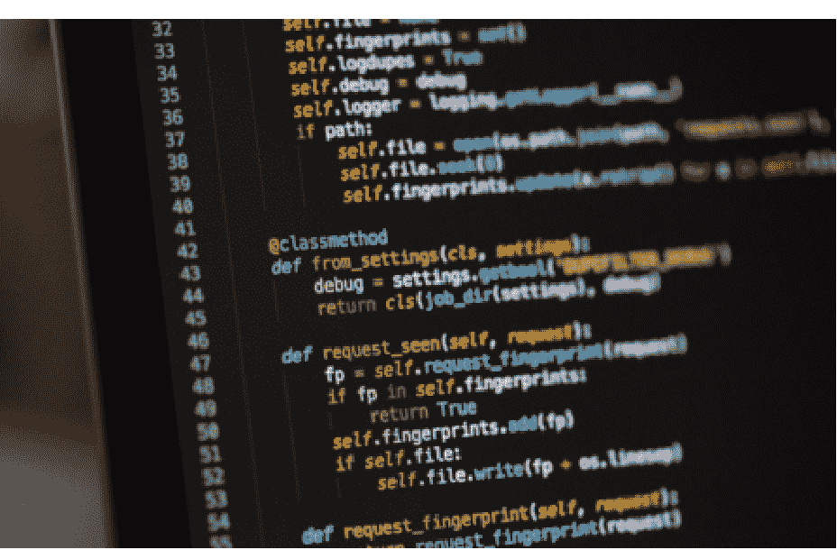

还得有个编译器，毕竟写出来的代码是给人看的，需要编译器翻译成给机器看的二进制，才能顺利运行。

此外代码写完了，还得测试代码好不好使，就得有个测试模块。

比较麻烦的是，现在的项目几乎没有单打独斗的，有些项目甚至涉及几千人。这么多人，每个人写一部分代码，如何像一块拼图似的“拼”到项目文件里，也是个麻烦事，这需要所谓的软件托管。

如果大家很难理解，就想象上千人写一本小说，每个人负责某一章的某个小节，最后合并在一起，竟然还能成畅销书。就需要一个专门服务器和软件来把这上千人都管理起来，大家每天把自己的任务完成后上传上去，拼成一个整体，然后还能运行。

现代软件项目大概就是这么个生产流程。

这一大堆工具，合在一起就组成了“工具链”，也叫做软件开发生产线。码农们用这个生产线，最后可以造出一艘艘巨轮来。这也是为啥那些看着科技含量很高的互联网公司，也叫“大厂”，因为确实跟传统工厂非常像，每个人打磨自己的责任田，晚上下班前把代码上传上去编译。

传统工具链主要被微软的GitHub垄断，这也是个巨无霸，不过主要面向开发者，很多人没咋听说过，如今已经拥有接近一亿的用户。

GitHub在软件开发领域有不可撼动的地位，因为它可以给开发者提供一系列的工具，让几个毛头小子在家就可以造巨轮，甚至可以在上边接单干活。

更离谱的是它提供天量的知识库。也就是之前很多大神写的项目也放到上边供大家观摩学习，你甚至可以下载下来直接用。很多人自己写的项目是从那上边模仿别人的，甚至测试的时候，也是从上边下载测试用例。

也就是说，GitHub相当于一个巨大无比的军火库，装满了各种攻城器械和兵器弹药。

说到这里大家就意识到问题了，这么重要的东西，为啥咱们自己不搞呢？

太难了，因为这玩意绝大部分功能都免费，而且有巨量用户，这两个特点几乎就可以封死世面上绝大部分企业尝试的冲动。

也不复杂，一个产品，高投入、低产出，做出来之后还不一定有人用，用了不一定付费，想做竞品企业基本就是用爱发电了。

更麻烦的是，这类产品都需要无数次的试错来完善产品，产品初期根本没法正常使用。这就形成了个悖论，没人用，所以没法完善。不完善，用户体验差，就没人用。

现在大家知道为啥GitHub一家独大了吧。

说到这里，问题就来了，如果我们太过依赖GitHub，万一被他们限制使用怎么办？

其实这已经不是假设了，现实里已经有很多企业被划入了实体清单，不让用了。

好消息是现在被划入的企业并不多，绝大部分企业还可以继续用。坏消息是这些企业一个比一个重要，基本都是咱们国家最尖端的企业和大学。

那我们需要担心吗？

也不太需要，因为很多年前华为就在为这一天做准备，知道企业发展到一定规模，迟早被美国针对。那怎么办？只能是提前准备，硬着头皮自力更生。

好在华为的优势是每年都有无数“大船”下海，既然是造船的，那顺便搞点造船工具不为过吧？于是很早就上马了工具链项目，也就是咱们今天要聊的CodeArts。

自己生产工具自己用，用的过程中发现和修正问题，反复迭代，在投资了上万亿研发经费之后，如今的华为工具链已经非常成熟。

由于是自己从头到尾搞出来的，所以全程自主可控，上下游无数个模块也都是自己编写的，做到了供应链安全。

不仅如此，大家可能不知道，华为在人工智能方面也是国内领先的，如今把人工智能加入了工具链，形成了基于华为云研发大模型开发的CodeArts Snap，也叫智能开发助手。这就更强了，可以智能生成代码，快速检出代码错误，降低理解难度和修复成本。

这个产品12月28日正式开启公测，展现出了巨大潜力。

2023年5月在华为西安研究所举办了一场软件大赛。要求个人在规定时间内完成10道软件开发题目，允许使用任意的生成式AI辅助答题。

尽管组委会将难度较去年提升了一倍，并且加了几道专业级的超纲题，但是仍然有8位使用AI工具的参赛同学拿到了满分，而这其中有一位使用的工具，是华为自主研发的CodeArts Snap。

虽然咱们自己的软件开发工具的成熟度和性能和全球的top产品还有差距。但是在AI时代，只要不出局，就可以和全球top的研发大模型同处第一梯队。

可能有小伙伴说，今后是不是让人工智能写代码就行了，不用程序员了？

我的体会是，不至于。人工智能就跟上边花里胡哨的IDE一样，能大幅提升大家的编码效率，降低出错概率，但是关键的事还得码农去做，目测再过几十年，程序员依旧是个人力密集型工作。

类似大型挖掘机一铲子下去，顶农业社会几百人刨一天，可是有了挖掘机，并没有彻底淘汰人。恰好相反，效率上来之后，开工项目多了无数倍，需要的专业挖掘机操作员也更多了。

现在的CodeArts，完全可以支撑华为的业务开发。理论上讲，能支持华为，就能支持绝大部分企业。事实上现在已经在服务国内的知名汽车企业，让他们的开发效率高了十倍。

### 尾声：
完全的独立不使用别人的东西本身是不客观也没必要的，未来的主流趋势依旧是开放和共赢，开放系统才能才能走的更远，这也是唯一出路。

但是我们必须有自主研发的可替代品，这样一方面能从市场里分一杯羹，让我们的产品迭代起来，另一方面也能避免别人随时断供，能够为我们的企业提供更加平稳的研发环境。

事实上一旦有了竞品或者替代，对方可能反而不会断供了，类似核武器的逻辑，有了大杀器，就可以避免使用大杀器。

华为和其他国内企业这两年做的事，最大的意义可能不仅仅在于商业上的成功，更在于鼓舞大家去突破去竞争，只要有沉下心来研发的态度和方法，我们有市场有胆气有人才，没啥搞不定的。

公众号懒人搜索，懒人专属群分享

## 可能需要一代人来适应消费左移
2023-12-28

什么是消费左移呢？

说的是在一个“横坐标是价格，纵坐标是品质”坐标上，经济不及预期的时候，大家自然会变成“价格敏感型”，要求商品价格更低，但依然要求原先的商品品质。在这个坐标系上，相比之前，消费诉求自然会向左平移。

总之就是大家越来越在乎性价比。不仅咱们这边有这种变化，亚马逊和沃尔玛作为美国最知名的两大零售商，都不约而同的把品牌口号改为了“Spend less. Smile more.”和“Save money, live better”——既要省，还要好，这就是消费向左平移的价值主张。再比如，麦当劳经历了新冠疫情之后，它的市值已经站到5年来高点，另外一家同样站上历史市值高点的企业是卖衣服的“优衣库”，这俩一直都是风向标。此外拼多多的逆势上涨也受人关注，很多人解读成社会返贫什么的，我倒觉得不至于，无论是中国市场的拼多多，还是拼多多用于开拓美国市场并大放异彩的TEMU，都更类似于一种中产阶级的“消费保守化”，或者说“消费价值感强化”，就是不为溢价多花一分钱，属于大家对未来调低预期后的自发反应。

1

如果对比中国和日本，在今天这个形势下，如果我们太过依赖外部购买力，很容易重走日本当年的老路，内需还是经济持久的根本，不过现在咱们的社会的心态和日本当初倒是有点像。

日本在当年房地产出问题之前，整个国家经济基本上没碰到麻烦，一直昂扬向上。这种情况下，老百姓对未来的预期是很强的，觉得工资年年涨，现在贷款一万，过几年就啥也不是了。

敢消费敢贷款，从未来借了三十年的钱花到了当前，经济在房地产的带动下一片欣欣向荣。有种观点认为90年代之后日本经济长期疲软，本质是他们80年代的繁荣透支了，接下来三十年还债，这两年还完了，经济又好像好起来了。

日本房地产出问题之后，经济进入了“不景气”周期，绝大部分人在的预期发生了很大变化。最大的变化就是不再觉得工资会越来越高，也不觉得工作特别好找。

进一步产生一种社会思潮，几乎所有的老百姓都觉得应该克制消费欲望，提高储蓄，随时准备过冬。

日本那边把这种心态称为“东亚传统觉醒”。说的是东亚这几个国家，主要是中日韩，历史上长期人多地少资源匮乏，大家觉得应该随时准备过冬，日本经济不景气之后这种思潮开始蔓延。
于是日本那边开始了轰轰烈烈的“断舍离”，搞那个“极简主义”。房子也不想负债买大的，而是专心研究怎么提高当前小房子的使用效率，并且把这种玩法发展成了一门学问，也就是“收纳学”。
大家也看出来了，咱们国家可能也多多少少发生了这种情况。
中国当然不会简单复制日本的情况，毕竟日本是个内需非常小的国家，咱们还有很大的挖掘空间。咱们国家也不会像日本那样陷入停滞，但是低增长基本上达成了共识。
大家想想，哪怕每年4%-5%的增长率，依旧很离谱了，甚至和美国一样降到3%左右，也是个很大的增长量了，每年增长三分之一个韩国。
只是这个增长率下，很多大家习以为常的观念肯定是要变化的，或者说已经发生了变化。最起码的，大家不会觉得今后工资一直涨，加高杠杆的时候就得寻思一下了。
比如前文聊过，郑州的亮亮丽君夫妇敢把70%的收入用于还贷款，他们这种情况并不是孤例，而是到处都是。我尽管没听他们聊过为啥这么想不开，不过八九不离十觉得将来工资是一直涨的，现在压力大，过几年工资上涨，自然会稀释压力。
可是短短三年，大家已经理解不了前几年他们为啥这么自信了，尽管三年前大家都这么干。
重新调整了对未来的预期后，大家可能是对未来的保守预期，更关注商品的使用价值，越来越不再愿意为各种溢价买单，瑞幸、蜜雪冰城、军大衣火起来也就不奇怪了。
不仅如此，今年奢侈品消费明显变少了，很多人说富人消费不动了。
我通过观察我身边的情况，感觉现在的环境对富人影响不大，他们依旧该花花。
影响大的是之前踮起脚硬买奢侈品的那群人，他们今年终于理性了，本来准备刷分期买包包，现在不敢随便贷了。还有人一些攒了很久钱准备买奢侈品，如今突然意识到这些钱说不定留着用处更大。
这些事在日本也发生过，日本80年代女孩们疯狂追逐名牌奢侈品，进入90年代之后思维出现了大转折。现在大家去了明显能感觉到，日本满大街的妹子都背着一个布袋子，名牌包的比例非常低。
那是不是今后会一直螺旋下降呢？从发达国家的情况来看，他们都经历过这么一个过程，狂飙猛进过渡到了平淡如水。消费时候不再激进，有多少钱，过多少钱的日子。

2

咱们经常说“K型复苏”，下边的那一撇总给人的感觉是掉坑了，其实下边那撇也是复苏。消费者开始追求性价比的消费也是消费，市场会表现出很强的适应力，并且也会涌现出一堆企业来，蜜雪冰城这种就比较有代表性。

一般来讲，可能很多人觉得这不是啥好事，其实不一定。马云说过一句话，说伟大的公司都是冬天成立的。因为冬天成立的公司最大的优势就是成本低、下盘稳。

西方之前发生过这种事。石油危机的时候，欧美老百姓因为油价高涨非常痛苦，日韩车企横扫世界，以低价、耐用为卖点，打下了自己的一块地盘一直维持到现在。

一般认为，欧美老百姓在上世纪70年代完成了这种“消费向左平移”带来的观念转变，他们的普通老百姓从那个时候就不太关注高溢价的产品了。

也就是说，经济在转型，大家的消费习惯在发生变化，今后那种激进的借钱消费可能越来越少，“价格敏感”成了主流。为了适配这种转变，供给端也会随之发生改变。

日本很早的时候就做了大规模调整，他们推出了一个玩法，叫“体验中上层，价格低阶层”。怎么做到的呢？也没啥好的办法，通过整合供应链和工艺，优化流程和商业模式，降低价格的同时提高竞争力，牢牢占住了市场。

这当中最为人津津乐道的，就是那个优衣库，它一开始走的是中产策略，定价比较高。后来日本发生大规模消费左移之后，优衣库也调整了策略，走高品质但低价策略，效果一直不错。

而且车企开始大规模推出类似飞度这类小型车，还有K-car那种耐用皮实而且极低油耗的车型。当时竞争很惨烈，不少车企推出小型车稍微慢了一些，就失去了最后机会，很快倒闭了。

说这个可能大家觉得不就是卖便宜货吗，有啥难的？

做过老板的可能都知道，价格要低，还得让人觉得有品质感，那可是很难。

无论是蜜雪冰城还是优衣库都是技术门槛的，能把价格做到比同类低、且保证基本品控，还能赚钱，本身就是能力，这背后是供应链整合能力。

没办法的事，消费者的消费观念在改变，商家跟不上就得完蛋。

这两年上文说的这些趋势，大家也能感觉到了，另一个大家日常消费非常多的东西，外卖，也在悄然发生改变。

很明显的一个趋势是，越来越多的餐饮大牌开始搞“品牌卫星店”，只做外卖，没有堂食。

租的店面地段可能不繁华，但好处也是明摆着，租金成本大幅度降低了，运营成本的回本周期缩短了很多，通过外卖覆盖周边，一样不少人消费。在食材品质不变的基础上，价格可以做到更便宜，消费者也因此获益。竞争力也上去了，消费者也能获益。

前段时间有个短视频说的是杭州一家生煎店房租从40万元涨到120万元，老板直呼吃不消。房租上涨的话题也让公众听着难受，因为餐饮房租上涨的成本最终会转嫁到消费者身上。现在很多外卖店开始逆向操作，找房租低的地方营业，提高竞争力。

看到这个，大家可能担心卫生问题什么的。基本上不用，因为现在做这个的主要是大企业。

比如长沙高端湘菜的代表品牌之一的冰火楼近年就在全国率先推出外卖子品牌——“冰火楼·外膳”。他们发现外卖的消费客群跟堂食有一定差异，而且外卖客群的消费潜力很大，尤其是近一两年，消费者开始追求高性价比，外卖的市场变得越来越大。

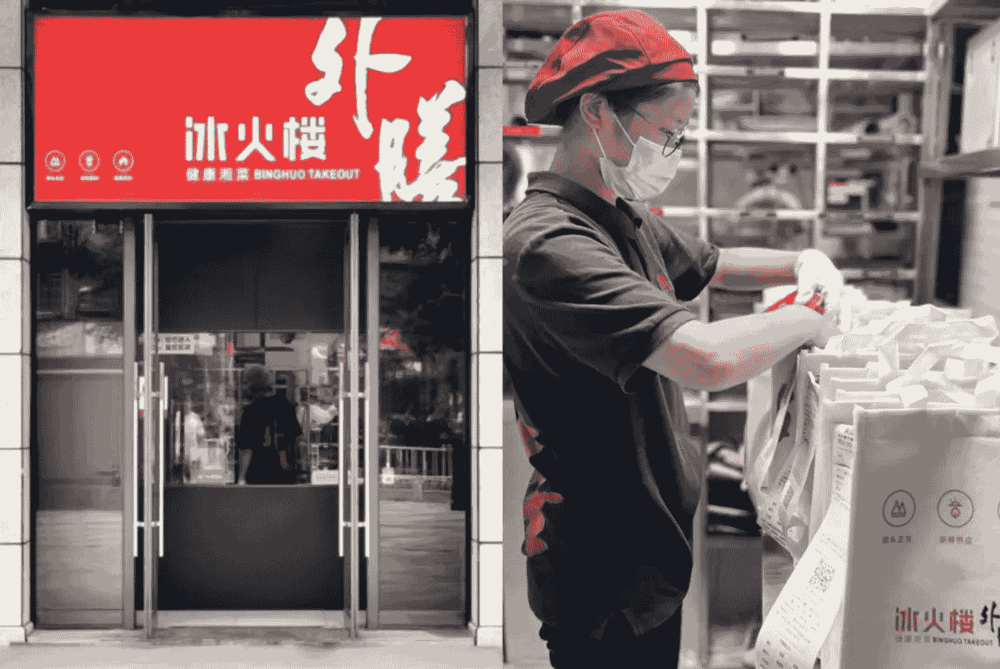

一家外膳门店大概只有70多平，全程视频监控，相当于一家微型餐厅，但由于不在繁华地段，租金少得多。店铺面积大幅缩小带动各类非食材成本有效降低，因此餐品更有性价比。冰火楼堂食人均客单价一般在120-200元，外膳的人均客单价大概在30-50元，这竞争力够明显了吧。

另一个知名湘菜品牌农耕记也在搞品牌卫星店。农耕记目前主要有两种店型：一种是几百平甚至上千平的堂食大店，主要开在商场里，人均80元；另一种是十几二十平的外卖专门店，主要开在社区、办公楼下等，人均30元。

这种堂食和外卖互相剥离的品牌卫星店模式已成为近年品牌餐企主攻“质价比”的探索方向，除冰火楼、农耕记外，木屋烧烤、老乡鸡、真功夫等知名餐企也都在往这个方向发展。

当然了，不止外卖，绝大部分老板都得重新思考怎么活下去。

之前更类似一种“噱头经济”，你搞个大新闻，卖点高价货，大家也认。今后就是“优衣库经济”，你得拿出来足够的诚意和能力来提供可负担得起的品质。

3

### 尾声

很多人一出生，整个社会似乎就一直在狂奔，然后在几年内来了个急转弯。

从发达国家的经验来看，好像每个国家都有这么一个阶段，经济增速降级，大家开始接受自己的购买力今后可能一直变化不大。他们老百姓所做的，跟咱们现在差不多，尽量降低不必要消费，专注自己想做的事，然后用一生去适应这种状态。

2019年我去巴黎老佛爷那附近，就发现传说中的时尚之都巴黎，拎着名牌包的人还不如北京SKP和国贸，主要他们都是过来人。如今我们正在经历他们经历过的事。

可能就算将来经济好起来，可能很多人心态上再也回不去了。

不过这种趋势对于普通人来说并不是坏事，理性消费可以让大家走的更远。而且这种趋势本身也是一种商机，就跟我上文提到的优衣库，蜜雪冰城还有国内的餐饮“品牌卫星店”一样，做好了同样是一个潜力无限的市场。

公众号懒人搜索，懒人专属群分享

## 本质还是信任问题

2023-12-25

前几天的事大家也都知道，股市一直跟条虫似的在地上趴着，到了周五终于走出了点好走势，然后突然一个意见征询稿，不仅游戏产业大跳水，各种科技股都跟着一起跳。

其实有一说一地讲，监管这事本身没啥问题。

不设置每日登录、首次充值、连续充值等诱导性奖励。确实应该尽量少地诱导充值，估计没有一个玩家说他就喜欢诱导充值，对吧。

不炒作、拍卖等形式提供或纵容虚拟道具高价交易行为，也不是不能商量，使劲拉高虚拟道具的价格这事其实游戏玩家也骂了很多年，有些道具交易，明显就是扯淡。

至于弹窗警告非理性消费什么的，这就跟弹窗提醒大家早点休息不要熬夜打游戏一样，也无可厚非，加就加呗。

上面提到的这些问题，对于我们这些玩了十几年游戏的PC玩家来说也好理解并且支持。

当然了，也有些明显不太合理的地方，比如限制成年人的消费上限，这就有点离谱了。

道理也不复杂，成年人心智本来就是成熟的，是能够做出决策并且承担后果的，他想消费你管他干啥？花钱玩游戏不对，那花钱买个进口包就对？是不是应该把所有奢侈品全部限制了？

根本没道理。

再说了，有些土豪在游戏上的消费确实离谱，但是把钱花在国内游戏上，总比他去海外花了强吧？毕竟游戏公司这些收入一部分又变成了员工的工资。

我们整天说促进消费，这就是消费啊。大家想想，咱们社会让富人花钱是很难的，毕竟他们不可能上拼多多天天买低端工业品对吧，他们大部分花销都是购买海外奢侈品，好不容易有这么个出口，为啥要管呢？

先富带动后富，一方面说的是富人应该纳更多的税，另一方面也是说富人的消费一部分会变成普通人的税。

尽管那个意见征询稿有不合适的地方，但是也不至于影响那么大吧，问题出哪了？

其实官方年初就提了这事，“凡是对资本市场产生重大影响的政策，应事先与金融管理部门协调，保持政策预期的稳定和一致性”。

写得很清楚，就是稳定性和一致性。

今年经济状态啥样，大家也都知道，尽管每年都说最难就业，前些年跟今年比真是弱爆了。而且市面上的高薪岗位这两年是急剧减少的，毕竟前些年房地产和教培是吸收就业大户，这两个行业如今啥样大家也都知道。

游戏开发是少量依旧能给大学生提供高薪岗位的产业。

突然来这么一下，可能本来很多企业准备明年上马新项目，多招点大学生，现在也犹豫了，准备先观望一下。有人本来想去做这行，也不太敢去做，谁知道投入大钱干三年之后，到时候环境成啥样了。这样稳定性就被打破了，问题是大家都不投钱，哪来的就业岗位？

进一步讲，大家开始担心这种重拳出击会不会扩散到其他领域，于是其他科技股跟着跌。

此外就是“一致性”。

很多人听到“意见征询稿”，会纳闷为啥资本市场这么上头，不就是征求个意见吗？你们慌啥？

其实他们从业者都知道，这东西的威力非常大，绝大部分时候并不是“征求意见”，就是在“通知大家”。

更关键的是，没有经过协商出台的政策往往落地性非常差，很容易变成“一刀切”，做企业的最怕的就是一刀切。

所以说如果能做到“协商”，那市场也不会这么敏感，毕竟大家觉得这只是个提案，最终是啥样还需要进一步探讨，到落地还有一段时间。如果能做到先约谈企业，再根据反馈意见修改议案，设置时间表，一步步来，有一个流程，大家也就不那么恐慌了。

当然了，更深层次讲，对于游戏的态度，很多时候政府行为就是民意的反映。

在一部分人眼里，游戏就是十恶不赦，就是玩物丧志。年轻人就该除了学习啥都不干，到了社会就好好打螺丝，下班玩会儿游戏？为啥不多打会儿螺丝提升下自己？

其实咱们都知道，几乎所有的学霸家庭都不会彻底禁止孩子玩游戏。甚至很多家长那里，孩子有爱好从来也不是坏事，因为家长也有很多事需要孩子去做，比如早睡早起，比如提前做作业。小孩有爱好，那么“命令”就变成了“交易”，降低了摩擦成本。

我初中时候关系不错的一个小伙伴，他就喜欢游戏如命。他们家有个“游戏币制度”，干的每一件事都有对应游戏币奖励，记在小黑板上，周末他爸带他去游戏厅兑现。他从小早睡早起到家就写作业，老师从来不投诉，为啥？因为他担心影响游戏币。

他如今三十好几，已经混得风生水起，照样《环世界》和《僵尸毁灭工程》各玩了两千多个小时。

此外家长们觉得游戏害人，有没有想过其实摊上沙雕父母更害人呢？

绝大部分成瘾行为是个结果而不是原因，翻开随便一本相关书籍，都会告诉你成瘾的本质是家庭氛围、亲子关系。

也就是跟父母的关系有问题，或者人的情绪有问题，就很容易出现逃避生活，跑去虚拟的地方寻求存在感。越玩越空虚，越空虚越玩，荒废了真实世界的生活后，烂摊子更没法收拾，更需要逃避。

所以孩子沉迷游戏，往往只是个结果，可能他自己无聊苦闷，可能家长觉得孩子烦动不动就塞手机，如果原因已经摆在那里，就算没了游戏，也会去看网文，如果没网文，还可以做个网瘾少年，不让上网还可以去看电视、赌博、搞对象、做街溜子。咱们都做过学生，知道那些学不进去的孩子干啥的都有，就是不学习。

政府的很多决策，有时候也被那些糊涂父母影响。太多父母当得一塌糊涂，从来不想想问题出在哪，然后坚持举报，这类人多了，迟早会形成民意影响决策。

而且大家可能也意识到了，人群的观念，并不是所有人的均值的体现，很多时候就是嗓门最大的那几个人的想法。

所以说很多问题初看是政府行为，再往深处看，其实也是民意，老百姓要求政府狠狠地管，政府只能是勉为其难了。

我们经常说“内需”，到底啥是内需？

不外乎衣食住行，吃喝玩乐。很多人特别在意科技，其实科技不也都是些跟吃喝玩乐相关的吗？

汽车为啥要买二十万的电车，不就是因为舒适又智能？手机为啥要买贵的，是为了科研吗？还不是因为贵手机用起来舒服，可以玩画面更炫的游戏？

老生常谈的问题是，现在大家无比重视的高端芯片，主要就是用来打游戏，其他领域的芯片包括战斗机和导弹，都用不着太高端的。

今天嫌这个玩物丧志，明天嫌那个不利于进步，问题是进步到底是为了啥？就为了一辈子跟个电钻似的天天钻墙？难道不是更好地生活，更多地体验？啥是更好的生活，不就是轻松一些，自由一些，更多空闲时间，更多吃喝玩乐吗？

大家再想想，我们经常说的“高端研发岗”到底是些啥？

基本都是些服务业的岗位，也就是让普通老百姓生活变得更好更方便，最先进的科技也都是围绕日常生活展开。咱们可以把全球科技领域市值最大的那几个公司拿出来看看：

- 苹果，做手机的；
- 微软，做操作系统；
- 谷歌，搜索引擎，创收产业是卖广告；
- 亚马逊，做零售的；
- 英伟达，做显卡的，游戏硬件；
- 特斯拉，卖车的；
- Meta，就是那个脸书，做社交的。

不用怀疑，我们将来科技发展起来，不出意外，最高薪的工作岗位也都是这些产业。这些产业跟游戏比起来，哪个又高端一些呢？

所以说没必要成天敌视游戏，实在是不想让未成年人玩，设置准入门槛就行了，如果父母都管不住自己的手机，那怪谁？是不是为了青少年安全把类似菜刀、高楼、汽车、网文、小视频、电影都禁掉呢？

中国的经济韧性是非常非常强的，因为我们有勤劳勇敢的老百姓，他们也愿意积极地改善自己的生活境遇，并且乐意削尖脑袋去赚钱。

但是前提是得让大家保持一个好的心态，政策有稳定性和可预期性，不然所有长期规划和投资都没法进行，很多本来要涌现出来的岗位也就没了。

本文不是说不能出政策，所有行业都应该有监管，就像司机得先学完交规才能上路。

但是监管层要和市场保持足够的沟通，有充分的互动，有清晰的流程，这样才能发挥监管的作用，同时确保预期稳定性。就在发文前，官方也发布了一批版号，估计也是想拉一波市场对这个行业的信心。

## 12月份新批国产网络游戏版号数量过百 持续释放支持网络游戏行业繁荣健康发展的积极信号

新华社 2023-12-25 09:00 发表于北京

72人听过

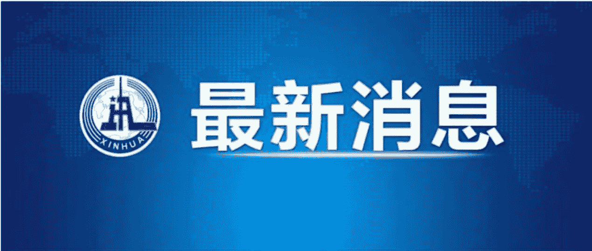

今天，国家新闻出版署发布了新批准的105款国产游戏版号，单次审批数量首次突破百款，所涵盖的游戏企业范围也更广，中国音像与数字出版协会游戏工委和广大游戏企业深受鼓舞。

毕竟信心是接下来很多年里最需要最稀缺的东西。

公众号懒人搜索，懒人专属群分享

## 困住人的不止算法

2023-12-22

前些天有小伙伴发视频给我，说是在某一线城市市中心的桥洞下面有很多人长时间睡帐篷里面。B站上也有很多，大家有兴趣去搜一下。

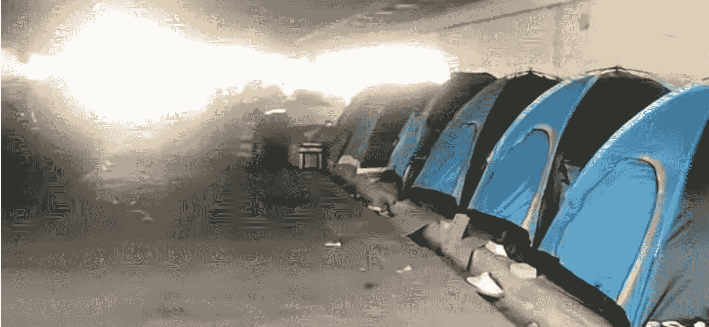

我说这是疫情期间的新闻吧。那时外卖员不能跨区工作，不然要隔离，所以就买帐篷住。但是看视频时间就是现在，都开始降温了，怎么还有这样的。

稍微一了解，发现也不那么难以理解。在大城市中心工作，租房太贵通勤太远，这么干也正常。

经过了一番了解，发现这里就有个行业“内幕”，外卖员以自己所在定位接单，必须在这个区域内，才可以接到附近的单子。

要想接单子多费用高，自然要在商圈密集的地方。而且外卖员有不同定位，有的专门做长途单子，有的总是同时接好几个短途，有的喜欢做宵夜。现在干外卖的越来越多，单价单量下降很快。只能延迟工作时间，特别是夜里单子竞争少，而且常有长途高价单子，可能干几票大的，就相当于白天跑一天，毛病是比较冷，天黑危险系数稍微高一些。

但是这种地方，房租也贵得很，大多超出了外卖员的承受力。如果每天来回通勤，就没有休息时间了。

干脆就买个帐篷，等于24小时蹲点在市中心，有的外卖员躺在帐篷还刷刷单，要是有好的起来再送一波。

但我印象里快递员的情况不一样，虽然同样辛苦，但是怎么也是有一个工作时间。

正好经常聊的一个小伙伴做了很多年快递，跟他了解了下情况，跟大家说说。

### 1

快递难干的原因很简单：和世界上的绝大多数问题一样，都是钱的问题。

近10年来，快递单价一直跌，基本没回过头，到现在已经跌了近一半。

单价降低，使得利润越来越薄，想赚钱只能想尽办法降成本，造成整个行业承压。快递属于劳动密集型企业，人员成本是大头。一条线上的人，从收件、分拣、运输再到最后派件，每个人都不得不疯狂内卷。想维持收入，只能同比例地增加工作量。

比如原本一单挣1元，现在挣5毛，想保持收入，工作量就得加一倍。大家既要增加工作时长，还要降低每单的处理时间。

我搜了一下国内主要快递企业的报表。

### 2023年前三季度A股快递公司单票收入vs单票成本

| 公司名称 | 单票收入(元/票) | 同比增速(%) | 单票成本(元/票) | 同比增速(%) | 单票毛利(元/票) | 同比增速(%) |
|---|---|---|---|---|---|---|
| 顺丰控股 | 21.87 | -13.02% | 21.17 | -13.18% | 0.70 | -7.74% |
| 圆通速递 | 2.71 | -11.37% | 2.51 | -10.65% | 0.21 | -19.17% |
| 韵达股份 | 2.47 | -7.82% | 2.37 | -1.15% | 0.11 | -63.13% |
| 申通快递 | 2.38 | -7.74% | 2.37 | -8.11% | 0.01 | 226.79% |

我的小伙伴看了一下，笑说还不至于这么惨，行业的实际情况可能还是好一点。不过也没好哪去，因为单价确实在持续降低，已经使得大家压力非常大了。

以他所在的二线城市为例，他给我算了一笔账：普通的一个快递，收件在2-2.5元，送件在1-1.2元。

为了提高效率，现在大多快递是先送到驿站之类的代收点，驿站大约要收5毛，这钱是从快递员的送件收入里面扣的。于是快递员送一单，就只有5-7毛收入了。

大件和易损商品，快递费用自然比较高，一单可以顶小件好几个。不过放驿站费用高，客户取件不好拿回家可能会投诉，所以多数时候都会送上门。

当地快递员正常工作量，平均一天送200-300个单，收件30-50。扣除自己买保险、被投诉罚款、负担丢失损坏赔偿。最后每天忙下来，大约收入200左右。一个月五六千块。

这个收入看起来还行，但是背后很艰辛，平均每天超过10小时的工作，其中很多还是体力活。如果按照小时工资计算，跟便利店打工差不多。此外还得接打大量的电话，尤其接电话，大部分都是催件和投诉，非常内耗。

而单价如此低的主要原因，是多年以来快递行业的竞争方式主要就是“卷价格”。特别是大量订单的客户，各家快递公司基本把价格打到了极致。

小伙伴你可能觉得奇怪，自己寄一个快递都是8元、10元起步，和上面2元多怎么差好多。

这是因为普通人寄件是一种价格，对于商家客户完全是另一套玩法。

他们快递价格低得很，不然网上那么多9.9包邮。

快递公司为了客户不断降价，客户也乐得如此。有一些精明的客户，单个的量不够大，就一群客户统一签合同。形成一个联盟，比如非偏远地区全部打包一单多少钱，2元3元都有。

更狠的还有一种包仓，把两个地方每天运力整个打包出去。

最好的货源是那种全小件，就是个塑料袋装的数据线耳机小饰品啥的，又轻又小，10元以下包邮。这种的单价甚至能打到1元以下。

反正就是想方设法地降单价，如今降到了离谱的地步，不过也没办法，再怎么低还是有人做。

### 2

快递行业里，大家非常不理解的一点，这么个生意，业内都不怎么赚钱，也都知道不赚钱。但是总是有新人往里面跳，而且跳的都特别猛。

每跳进来一个，自然就要挤占一部分原有市场。而快速占领市场的法子，大家都明白，那就是单价再降低。

后来一看餐饮业，顿时也释然了，餐饮这个行业的盈利情况不会比大“缅A”强太多，但是依旧前赴后继。

比如老快递人眼里最疯狂的“极兔入局”。

极兔从2019年开始通过并购获得准入许可，进入国内市场，先是和其他公司合作，等摸清环境开始单干。

极兔当年口号是先亏1000亿，打价格战到底。每单亏本一块钱，先干三年，三年不行再三年。到时国内快递除了极兔，只剩顺丰和京东，其他的都洗洗睡吧，连汤都不给你们喝。

低价模式下，很多快递的客户马上开始流失，一问就三个字——“去极兔”。随着客户增加，极兔那边单越来越多，其他人的越来越少。

我也曾经看过极兔的宣传视频，介绍极兔扩张速度和方法，极兔的行为在义乌小商品城。价格被打到一单8毛，商家都疯了一样拿单砸过来。

这种方式在业内人士看来真的无法理解，唯一解释就是当年所谓“互联网思维”，先赔钱扩张，然后占住市场再提价。还有专家出来站台，介绍极兔战略的合理性。并预言，三年之后，全国快递行业只有三种业态三家公司：低价普通单（极兔），高价优质服务单（顺丰），还有自营物流单（京东）。

但很多人并不认可这种说法，这种价格战是不可能一直打下去的，而且并没有真正的意义。早晚会回到正常价格区间，也不信极兔真的豪到拿出1000亿砸市场。

后面的事情和大家判断的差不多，极兔渐渐没有了后劲。但是这么一搅合，单价实实在在是降了下来，而且再没有涨的迹象。

所以业内不认为极兔是搅局者，自从2012年中通开启价格战开始，快递行业虽然一直喊“不拼价格拼服务”，但还是拼单价，最后谁也没捞到好。

如今行业内的人都已经形成了路径依赖，业务量上不去就想法子压价，价格实在压不下来就缩成本，缩不下去就给人加任务量。最终就是挤出降价空间。

于是快递员工作时间越来越长，每单的服务时间越来越短，服务质量也越来越敷衍。即使如此，收入依然不可避免的降低。压力越来越传递到最基层身上，极致就是最后在城市桥洞下生活。可这种能不能称之为生活，我不敢下结论。

至于单价如何就被压到这样，业内的也说不上来。“反正你不干有的是人干，中国就是不缺便宜的人，更不缺便宜的公司，似乎永远会有更便宜的报价。”

### 3

我还了解了很多关于快递员的日常。

每天6点多，他们已经来到快递站，开始卸货。就是把快递从车上弄下来，同时进行一个粗分，这个活就要一个多小时。

接着是细分，每人把自己负责区域内的件分出来。大家按照计划分自己今天要派的件，分好就装车，这又要一个多小时。一般快递车正式出发，已经9点左右了。

这就开始了上午的送件工作，一个小区一个小区地跑，如果有预约寄件，就顺路或者拐过去拿。上午如果压力不太大，在12点左右会回到快递站。吃午饭，取下午要送的件，将上午收的快递放下来。

要是事情多，就买点什么在路边吃了。然后顺路到站里拿下午件，连喘气的机会都没有。

而且这些能顺利完成，非常依赖快递员的熟练度，快递也分高手和不太行的，高手们记性好，知道谁家常年有人，谁家直接放快递柜。少走冤枉路，少爬冤枉楼，一天下来差距可就大了。这也决定了某一个快递员病了，他的那堆快递立刻就积压了，他的工作往往别人承担不了。

下午的送完的时间不一定，有时四五点就忙完了，有时搞到夜里十点甚至12点。当日派件完成率最少是要90%，当天送不完会被罚。

回到快递站，放下收的快递还没完。然后是记录工作，确认各种信息，同时处理投诉。所谓处理只是好听的说法，基本就是通知你罚钱。有些快递员实在不是干这行的料，丢件和投诉太多，一个月下来罚款比工资多，反倒欠了公司钱，打工还钱，过几个月就提桶跑路了。

分拣站的工作相对没有那么复杂，天气差也没啥影响，不用出门没有交通安全的压力，也没啥投诉。如果人不够，就去人力市场招人，经常80-200块一天，这个收入跟手速有关，高手一晚上分拣两千多个快递，普通选手可能只有七八百个。这也是个重体力活，一晚上走四万步，经常早上去人力市场招一批，第二天少一大半。

说来也奇怪，2010年快递业收入570亿，现在奔9000亿去了，整体规模膨胀了近20倍。如今大家都说不好混，只能说是涌入的人数也翻了不止20倍，大家赚的都变少了。

其实对于在干过工地和电子厂的小哥来说，快递和外卖绝对比电子厂强太多。我跟不少读者聊过，他们都表示死也不回工厂，工厂的工作干不了也干不动，相对于体力上的压力，精神上尤其受不了。

不过另一个比较惊讶的是，有不少人非常适应工厂的工作，根本不想出来。他们能做到十来个小时就跟睡了似的机械地干那些活，并且感觉一点都不累，你们说说这是不是天赋？

而且我发现他们快递员普遍向往去开网约车，尤其羡慕专车，最羡慕的是开GL8的那些专车司机，认为他们一单能赚一两百。

这个我很奇怪，因为不止十次听到他们说这个事。不过凑齐专车的装备实在是比较难，需要有驾照，还需要有辆车。大部分人对自己的车技不是太有信心，担心租车上岗赚不回来租车钱，所以还是准备攒钱买车。还有一些想攒钱买个五菱宏光跑运输，晚上就住在车里，连租房钱都省了。

### 4

写到这里，可能有小伙伴觉得他们一定很苦吧，其实我接触的人那里得到一个很深的感触：

苦不苦，关键是结婚生子没。

如果没结婚，江湖上的说法是：月入三千根本花不完。拼多多+快手+沙县大酒店，爽得飞起。

最花钱的自然是住，单身的在郊区或者城中村，租个不讲究条件的房间，能放下一张床和几个行李箱就可以了，价格其实并不高。一般北京马驹桥一个十平米的房子，一个月需要1000左右，如果只要一个床铺，那300就够了。

吃饭的花费，在现代工业的大规模生产能力下，只要不追求彰显地位的附加价值，真的不贵。平日靠沙县大酒店、兰州牛肉面、黄焖鸡这些食物，满足日常生活需要，简单的很，也花不了几个钱。

如果想改善伙食了，一个人去饭馆炒个菜，或者买些熟食回屋，配上酒和手机，爽得要死。抖音B站都有这种博主，花生猪头肉配啤酒，一边玩游戏一边吃，谁看了都得羡慕。

至于几个朋友或者同事一起吃饭，在桌上聊天吹牛，可以算是顶级享受了。

娱乐方面就更简单了。全球标配的大众娱乐方式：刷视频，看直播和网购，几乎不需要成本就能满足大家的需求。

所谓下了班先看美食博主下饭，从满汉全席到油炸蚂蚱。吃完饭看直播带货，也不图买就当脱口秀看。躺下看小姐姐，大长腿黑长直cos服。睡不着就刷手工达人，从拆飞机、修马蹄子到洗地毯。洗地毯这事可能有小伙伴不理解到底有啥好看的，你们去看看就知道了。

不过上边的这些都有个前提，就是没结婚，结婚了那逻辑就全变了。

一旦结婚组成家庭，各种压力会山一般压在身上。不仅得把钱拿出来养家，还得存起来一部分应急。

当然这还只是开始，后期的花费更是巨量。

最主要的肯定是住房，毕竟没房很难结婚，买了房就得还房贷，每天一睁眼就欠了银行一笔钱。

等有了孩子，这又是一笔巨大的钱和精力的投入。一旦望子成龙，孩子的负担甚至比房子还大，而且会产生一种绝望感，害怕自己一家三代做这个。这不，前段时间还有个新闻，北京一家五口送外卖，还配了很惊悚的一句话，“社会阶层的自我复制”：

## 一家五口，都做了外卖骑手
点击上方蓝字 再点击右上角“...”
关注并星标「真实故事计划Pro」

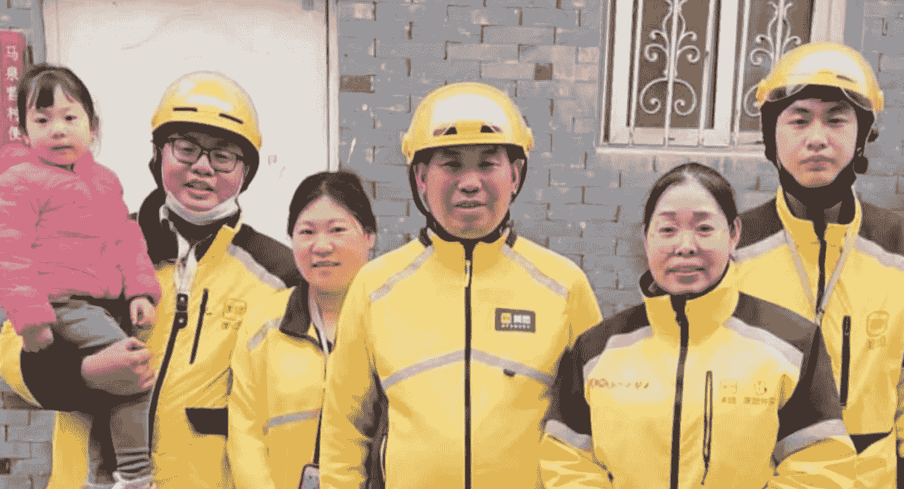

以前这种问题可能没人去想，到了年龄也就结了婚。这几年短视频把这些东西铺的到处都是，以至于很多小年轻甚至完全失去了结婚的欲望，即使结婚也不要孩子。

我这些年认识的年轻快递员很多是两个极端：要么是早早就已经结了婚，有了孩子，要么是完全看不到结婚的迹象。

这几年几乎所有人都在关注大学生毕业不结婚生孩子，我倒觉得最麻烦的是快递这个阶段放弃生育对未来影响非常大。

### 尾声：
不准备往下写了，其实并没有想把这事写成诉苦大会，尤其现在很少有行业说自己很轻松，确实没有。

不过我确实希望慢慢人性化起来，当然了，很多问题的本质都是“成本谁来承担”的问题。如果给快递涨收入，大概率是消费者来承担，比如每个快递多出两毛钱快递费，快递员收入就能好很多，不至于卷成这样。但是你说会不会其他行业的人大规模涌入快递，又把工资拉下来，我觉得也有可能。

我相信很多人是支持改善快递和外卖生态的，毕竟现在快递、外卖、网约车、自媒体是灵活就业四大主流渠道。

其实大部分自媒体后来做不下去，也去做前三个了。谁又不想自己的后路稍微平坦一些呢，给别人一条路，就是给自己一条路。

公众号懒人搜索，懒人专属群分享

## 宋江的中年危机
2023-12-20
整个青年时期最让人不甘心的几个剧情，就有“梁山招安”这事，看得我整个人都不好了。

不过如今三十好几了，参加工作这么多年，很多事慢慢有了新的理解，发现宋江确实没得选。至于山东人爱体制什么的，没啥意思，不提也罢。

首先第一个问题，宋江为啥不学朱元璋？一路反到底。

不是不想学，而是学不了。

宋朝这个朝代比较奇怪，对精英阶层非常好，对老百姓一般，所以大家只要脑子正常都要进体制。这一点其实《水浒传》里有体现，宋朝的体制内人员过得都挺好，哪怕宋江这种不入流的基层小吏，在地方上也有着跟他身份不咋搭的社会地位。

尽管不太公平，宋朝民间经济一直很可以，局部问题一直没断过，但是整体系统性风险却不多。

两宋300多年，经历了433次农民起义，平均每年1.4次，大小起义几乎没停过。

所以宋朝处于一种比较奇怪的“重病生存”，北方有草原帝国随时南下，一开始是辽国，后来是金国，再后来是蒙古，还有一个西北非主流的西夏。而且内部起义不断，但是却能一直苟着，只能说还是有一些特殊的混日子小技巧。

也就是说，宋江造反的北宋徽宗时期，尽管宋徽宗这个沙雕把宋朝搞得乌烟瘴气，但是距离整个明末那种整个国家都反了情形还比较远，宋朝宏观层面的丧失合法性还不至于。

为啥这么说呢？因为随后就是大宋的中级大考，靖康之耻。金国南下，把宋朝的两个皇帝给抓走了。按理说这个时候宋朝的合法性彻底没了，又怂又衰，老百姓应该起来顺势把宋朝推翻了。

但事实是，宋朝像大清一样，在中央军彻底崩溃后，竟然依赖民间“私军”稳住了局面，也就是岳飞、韩世忠他们这样的“地方武装”，跟曾国藩李鸿章他们的湘军淮军似的。不但站住了脚，还开了南宋副本，这个剧情谁也没想到，可见老百姓整体是很认他们赵家的。

所以说宋江时期确实有人想造反，但是类似元末和明末那种全民大起义，还太早。

那你说了，宋江一直占山为王行不行。

不太行，这就有个“流寇”向“坐寇”的转变。

也不复杂，想活下去，只两条路可走，一条是经常出去抢劫，一条是像经营一个小国一样，搞个文官系统，编户齐民，小吏们到老百姓家里收税，这就是典型的坐寇。

但是这种是不可能的，因为宋朝迟早会派大军过来，梁山不是台湾或者海南，宋江不是蒋介石，没那么多安全的土地供他们精耕细作。

那就只好到处抢劫，水浒传里宋江他们出去打曾头市，三打祝家庄，顺便捎带灭了扈三娘他们家，本质就是封闭系统向外扩张获取外部资源。

有人不理解曾头市和祝家庄是些啥东西，不是官兵，又不太像安分守己的农民，感觉跟宋江他们差不多，好像又不太一样。

其实也不复杂，就是后来曾国藩他们的“团练”，天下不太平，于是中央授权基层把劳动力组织起来，不忙了就在村周围挖几条壕沟，顺便训练农民用耙子临时抵抗下土匪，万一被土匪围了可以坚守待援。

中国古代真正完全太平的日子并不多，所以这种基层半自治一直是常态。到现在福建那边还保留着大量土围子。还有解放战争时期著名的双堆集，农民们在村子周围挖了条深壕，把水灌进去，只留一个吊桥出入。这么个简单操作，导致后来我军进攻双堆集付出了惨烈的代价。

这种武装村民有强有弱，大部分勉强可以防个小股土匪，或者时迁那种偷鸡摸狗的。

但是边疆上的就不一定了，大家听过“折（“shé”）家军”没，这是一支驻守在陕西府州、贴着宋辽边境的武装家族。名义上归宋朝领导，实际上他们几乎是自己管自己，他们抵抗辽和西夏不是因为什么国家大义，就是保卫自己的老家。打下来的领土自己占着，打败了朝廷也不管。竟然在府州那一带盘踞了几百年。

大家听过杨家将里的“佘太君”吧，一般认为其实就是“折太君”，就是折家的。

此外鲁智深说他以前是“老种经略相公门下”的提辖，那个“老种”，就是种家军，也是个半割据的边疆军事家族。也占着一块地，名义上效忠朝廷，其实打仗是给自己打。

也正是因为大宋基层存在大量这种武装村寨，也决定了农民起义想席卷大宋非常非常难。

那么是不是可以走李自成路线呢？

李自成裹挟着流民像蝗虫一样往前走，沿途走投无路的老百姓持续加入，顺便抢光所有资源。这种模式也行不通，宋朝跟明末差距非常大，老百姓还没到穷途末路，不会跟着他玩这个。

宋江如果坚持打劫周围村寨补充物资，用不了多久，就会把周围能打下来的各种庄都打下来。只好到更远的地方打劫，这就越来越危险了，因为万一出去进攻，没攻下来，回去的路被人切断了，那就麻烦了。也就是说，再怎么优化打劫流程、提高作案能力，“物资枯竭”这个问题就好像“35岁魔咒”一样悬在宋江头上。

所以宋江自己天天都在操心，他知道当前这种局面是不可持续的，需要尽快给兄弟们一条出路。

而且他面临一个极度麻烦的事，就是“囚徒困局”。

也不复杂，当时全国各地都有他这样的造反组织。宋朝的一个策略就是让他们尽快过来接受招安，然后拿朝廷的饷银去打其他的反贼。

你说大家又不傻，怎么会做这种事？

但是仔细一想又没那么简单，因为你不去，你怎么保证别人不去？能和其他造反组织沟通吗？显然不行，有猜疑链，你怎么知道别人说的话是真的？万一你不接受招安，别人接受了，然后打过来了，怎么办？

事实上宋江遇到的最大的一次官军围剿，就是其他起义组织招安后来他这里刷经验了。

当然了，还有个更大的问题，梁山的成分在不断发生变化。

最早的那群人确实是被“逼上梁山”的，主要是地方黑社会，比如打劫了梁中书快递的晁盖团队。

还有走投无路的体制内正规军武术总教练林冲。

少量武松这种对系统彻底失望了的基层公务员。

但是后来慢慢吸收了大量以呼延灼为代表的朝廷正规军高级别的军官，这些人本来就在体制内有工作，不少还是个处级以上干部。

他们入伙并不是像武松那样对现实彻底绝望，而是打败仗走投无路只好先在梁山落草。恰好他们这群“军官团”又代表着梁山的后期战力，大家可以看一下，梁山的马军和步军的头领们，几乎都是宋朝正规军军官或者基层片警出身。

他们并不反感朝廷，他们属于最彷徨的一群，每个人都是某件事搞砸了怕追究责任，又渴望回到体制内，最好能把以前的职位和级别都拿回来。

如果朝廷这时候说太后要过生日，大赦天下，责任不追究了，这帮人立刻就离心离德。

可以想象，宋江怎么笼络这群人？

只能是跟他们说，咱们现在都是犯过错误的人，现在咱们去归顺，只能是被抓起来问罪。咱们先打出来个“投名状”，让朝廷先给咱们发赦免，到时候再回去，说不定还能官升一等。事实上宋江说服呼延灼上山，也是直接对他公布了商业计划，只有一个目的就是接受招安敲钟上市，呼延灼到时候以高级合伙人的身份回归体制。

这种情况下，考虑到周围物资枯竭，打劫成本越来越高，还有源源不断的同行接受招安后过来修理他，加上内部组织性质也变化越来越大。宋江唯一的出路，就是“高位套现”。打几个大胜仗，赶紧跟朝廷坐下来谈条件。

而且宋江本来就是大宋的统治阶层，山东基层股级干部，北宋县城网红，有人脉有二奶，无情的打赏机器，法外狂徒庇护人。世代盘踞基层，通吃黑白两道，郓城黑社会的保护伞，这样的人，想回到体制有问题吗?

至于吴用，落魄书生，因为没考上编制变成了灵活就业者，自从记事就被打上了思想钢印，一生中唯一的目的就是进体制。别人走投无路上梁山，只有吴用考不上公务员千方百机上梁山，如果有机会说免试拿编制，你看他同不同意。

以他俩为首，朝廷正规军军官秦明、呼延灼、董平、杨志等等，还有土豪劣绅柴进卢俊义等，他们本来就是体制的受益者，对于招安，他们这群人但凡犹豫一秒钟，就算对智商的不尊重。

谁明确不招安呢?

鲁智深，林冲，武松，李逵，阮小七，刘唐，还有一个李俊，只有他们几个。

李逵大概率是个黑人，而且脑子有问题，他进入黑社会之前是江州看守所的一个编外辅警，有明显的反社会倾向，缺乏基本共情能力，热爱“零元购”，有喝酒、赌博、裸体砍人、吃人等不良嗜好，可能已经感染朊病毒，对正常主流社会生活有天然排斥也正常。

鲁智深，林冲，武松这仨人共同的特点就是都混过体制，鲁智深是西北国防军上尉连长，林冲是首都卫戍部队高级教官，武松是阳谷县武警队长，他们都在体制内一度混得还不错，后来目睹了一些事之后彻底失望，不想再回去了。

老版《水浒》电视剧里还设计了一个情节，喝得醉醺醺的李逵听见有人反对宋江，当场就坐不住了，站起来准备当恶狗咬人。但一看站在那里闹事的是武松和鲁智深，又偷摸坐回去了。可能想到那俩人是梁山陆战战力巅峰，顿时觉得他俩说得有几分道理。

阮家兄弟和刘唐属于地痞流氓，社会不安定因素，大宋扫黑除恶文件里的“苍蝇”指的就是他们，又单身，在山上当土匪确实比回归社会要舒服得多。

最后是那个李俊，梁山的水军头目，江州水产市场的高启强。在水上讨生活的人共同特点是迷信、放浪不羁爱自由，不想接受招安也正常。后来打下方腊之后，这个李俊带着一群兄弟出海支援边远山区建设去了。

剩下的都是同意的和无所所谓的，他们以前都是些种菜的、开黑店卖人肉叉烧包的，接头摆摊卖大力丸的，回到正常社会不会爽到哪。同时也意识到了如果长期待在山上，迟早会把附近几百里吃得干干净净，到时候再招安就有点被动了，不如高位套现。

而且需要注意的是，梁山的兵力分为三股，马军、步军、水军，其中最强的就是他们的骑兵。

骑兵在宋朝算精英部队，在梁山上也是比较金贵的，他们的头领基本出自传统将门，类似呼延灼董平花荣他们，都是梁山合并过来的朝廷武将。他们在体制里的都是香饽饽，在梁山上也是“天罡”，他们无一例外都支持招安，甚至可以说，他们接受招安的唯一目的，就是回归体制。

所以招安这事上，同意的人占据了决定性优势。

那这时候最关键的问题就来了，宋江就那么确认朝廷会放过他们？

这又是个双向博弈。

站在朝廷的角度，恨不得招安那天就把他们全部屠杀在滩头。可是这样干的话，今后就再也别想招安其他造反组织了，问题是宋朝全靠招安来打击民间造反。

同理，朝廷会让接受招安的土匪去打别的土匪，可是会把他们逼到绝路吗？也不会，同样的原因，这不是一锤子买卖，朝廷还要继续招降其他土匪。

但是也不会让他们平稳上岸，到时候大家都不好好考公务员，直接造反，然后就有编制了，影响太差，属于按闹分配，管理学上最差的一种思路。

所以折中选项就是让他们先去打其他山寨，把他们绝大部分实力都消耗掉，剩下的编入正规军，头领们脱离部队去做文官、到时候没有力量再折腾，对于各方都踏实了。

这个意义上讲，接受招安那天起，梁山的大部分兄弟已经是死人了。

那宋江他们有活路没？

也不是没有，记得上文提到的“种家军”和“折家军”吧，宋江最好的选择其实是去边疆，然后转变成这种武装殖民团，在边境上占块地。顶着给国家保卫边疆的名号，顺理成章地搞发展，到时候宋朝也没法去围剿他们。除此之外，招安可能是最好的选择了。

### 尾声：
这两天有句话，说是四大名著，讲的都是编制的故事：

《西游记》描写的是对编制的期待，考核获取编制；

《水浒传》描述的是对编制的妥协，并且靠斗争获取编制；

《三国演义》描写的是正规编制的争夺。

《红楼梦》体现的是编制的优越性。

或者说，四大名著除了《红楼梦》，讲的都是对编制的向往，而红楼梦，讲的是有编的快乐和无编的凄惨。

某种意义上说，中国古代只有两种人，编内和编外，编外的人创造财富，编内的人分配财富。如果你处在编外，那已经输了一大半，这也是为啥那些巨富都会想办法搞个官来做，实在没这方面门路，就逼着孩子好好考试。

还有一些人想明白了，既然没法合法地分配别人的财富，那就非法地分，于是就有了各路反贼。

但是这些反贼做大之后，又面临一个问题，或者抓住机会回到体制，或者迎接其他回到体制的反贼一波又一波的进攻。

这个意义上讲，宋江最终选了一条稳妥路线。

传统上觉得这个选择不咋样，主要也是因为后来的结果太惨烈了，可是宋江接受招安的时候并不知道，就好像咱们现在看《拯救大兵瑞恩》是8个人换一个人，其实刚开始并没准备让这八个人去送死，只是想把瑞恩捞出来。

大家再仔细想想，其实宋江想不出来什么更好的出路。梁山是个封闭系统，如果没有源源不断地外部能量输入，很快就会走向衰亡。只能是合并进入一个更大的系统，也没啥别的好选择。

这是我第一次讲《水浒》，如果大家喜欢，可以点个赞，后续继续写。

如果转载本文， 文末** 务必注明：“ 转自微信公众号：

文末再给自己的书打个小广告，路过的小伙伴可以关注一下。

公众号懒人搜索， 懒人专属群分享

## 命运到底存在吗？
2023-12-15
讲个挺有意思的事，大家不要放心上，单纯分享。本文没有广告，咱们头条除了拼多多几乎不带广告，带植入的我都不开打赏。我如果有空发文，那IP显示在北京，助理发就在山东。

上周末很久不联系的小伙伴突然找我，然后想起来上次见面已经是疫情前了，他跟我一起进公司，写了两年代码不干了，因为觉得自己毫无灵性，不是那块料。

我当时还在公司，说见不了，正在加班。他说早就想到了，已经在公司东门等着了。在公司附近饭店吃一顿饭，只占一个小时叙叙旧，不会耽误，反正我也该到吃午饭了。

好吧，被堵在公司了，我说行，你等着。

出去一看，明白了，他开着一辆大揽胜，大概猜测，不是想拉我干什么项目，就是单纯想跟我分（装）享（逼）下奋斗历程。考虑到没钱加盟项目，顿时坦然了。

后来吃了一顿饭，发现竟然挺有意思。

原来这些年他在软件行业混不下去之后，回老家小城市开民宿，一开始赔钱，后来几乎不赚钱，再后来终于盈利了，疫情来了，整体干了个寂寞。

不过开民宿期间干的最多的一件事就是跟各种人吹牛逼，一开始吹牛逼只是为了打发时间，直到后来碰上了一个大师。

大师云游四方，每到一个地方就直播，直播内容基本是紫薇八字什么的。然后是线下见网友，绝大部分网友都是一眼穷，这个他也理解，穷算命、富烧香，一把年纪还在惦记自己命势的，能有钱有了鬼了。

不过凡事都有二八定律，少数过来的一看就不是一般人，一般这时候就会叫好茶，他亲自端过去看看聊啥，基本是些“卦象”，“命势”什么的，然后坐包间外边玩手机，顺便听里面聊啥，后来大师走了，这事也就忘了。

再后来疫情开始了，民宿没人了，他开始寻思干点啥？然后突然想起来搞直播，一开始直播间没几个人，后来也没几个。

有天胡侃到了兴头上，不知道怎么一堆玄学理论脱口而出，什么“一命二运三风水，四积阴德五读书”，什么“风即是气，气积成运”，什么“人这一辈子有三次大运，一次十年，碰上了飞黄腾达，踩不到一事无成”，“介入别人的因，就得承担别人的果，放下助人情节，享受缺德人生”，直播间里一群人都听晕了，很快有人表示想线下见面，当面请教，突然间，他发现自己俨然成了那个大师。

为了防止露怯，果断拒绝，不过赶紧上网下单了几本书。此后一边学一边直播聊。后来直播间依旧不温不火，不过越来越多的人表示希望线下请教，并且表示绝对不会让他白跑。然后就有了第一次线下见面会，当天赚了五百块。

然后命运的齿轮就转了起来，这两年已经成了他们那一带的半仙，谁能想到985大学理工科毕业生，竟然干了这种事。

这时候我已经很感兴趣了，赶紧问了下几个关心的问题。

首先他自己相信这东西不？

他说当然相信，一套话你说的次数多了，听的次数最多的也是你自己，而且为了让自己说出去的话更有说服力，天天找证据，慢慢就闭环了。而且命理这东西，纯伪科学，没法证实也没法证伪的东西，信就有。

而且更关键的是，年龄到位了，人一旦到了三十来岁快四十，尤其不上班的人，就没有不迷信的。

那第二个问题就来了，我问他你真的能给别人算准？

比较意外的是，他说能算准个锤子。

不过他有个神奇的理论。

他说你知道一个人叫第谷不？我一时没反应过来这人是谁，还以为他说的是以前的熟人。

他说第谷是个天文学家，一辈子拿着天文望远镜记录星图，如果没有他，开普勒就没有精细的数据，也就推导不出来“开普勒三大定律”。不过搞笑的是，第谷自己拿着这些极度准确的数据却推导出来一坨翔，还是个“地心说”的拥护者，结论和思路完全是错的，到死也没啥正经成果。

我正准备问他你聊这个干啥，他接着说。

他现在对自己的定位就是个水平不咋高的第谷，相信有“命势”的存在，也看过不少人，但是资质实在太差，学到的理论又都是垃圾，可能一辈子领悟出来的东西也只是一坨翔。

那我就更好奇了，你觉得你理解的可能是错的，那怎么给人算命呢？

他回过神来说，哦，上班嘛。顶级码农能写出来顶级算法，垃圾码农也能写出来“屎山”。我水平不咋地，不过上班够用了。

然后跟我说了一些“工作技巧”。

首先是“下卦”，也就是你用三个铜钱摇三次（忘了，也可能是9次），就出了64卦中的一个卦象，每个卦象都有个卦辞，那玩意清清楚楚，他给解释下就行了。

比如“乾”卦的初九爻，卦辞是“潜龙勿用”，意思是暂时不要行动，可能效果不太好。这两年这个卦象非常常见。

如果某个卦象实在是太恶劣，太差，如果告诉对方即将倒大霉，那双方肯定不欢而散。这时候就得玩点技巧，说你父母是不是身体不太好？奇怪的是每次对方都会长吁一口气，卑劣的人性。

当然了，如果这个水平是赚不到钱的，最关键的是拆八字。基本上就跟做侦探似的，比如对面的人牙齿整齐，气色很好，腰板挺直，这种人一般从小家境很好，反过来那就不咋地。家境不行父母帮不上忙，只能靠自己打拼，这些年条件有所改善，最近比较坎坷，这是绝大部分中国人的命，想错都难。

看上去像领导的人，让他把握住自己的贵人。对，直接跳过“有没有贵人”，没贵人他爬不上来。看起来小职员的人，让他们好好抓教育，孩子将来很不错。一看就不像能发财的人，说他将来会有点小钱（又没说这个小钱到底有多小）。所有人都会“老来富贵”，没人会反对这个，毕竟没人会觉得自己老了是个穷B。

总之很多时候像极了宗教，宗教让人踏实，并不是能告诉你一种确定性，而是给人一些精神关怀，让人能从中获得一些慰藉。而且一神教两千年，乱七八糟的反动会道门年头更长，是因为这些东西很科学吗？不是，单纯的就是慰藉。你让信徒们放下心中的疑惑，生活少一些内耗和纠结，大家就会支持你。

我有点奇怪，你这样能赚到钱？

他说能赚到个锤子钱，每次百八十块，下辈子都赚不到。

一般每隔一段时间就会接待一些明显的大人物，这种人就告诉他，他老婆是他的福星和贵人，几乎没有不接受的。再说他是结婚后才富的，几乎百试不爽。而且富得很快，两三年就富了。这些想错都难，有钱人发财都特别快，只有上班族才慢慢熬。

反正套路非常多，得多练习多观察多倾听。

能看出来，这个行业有点像魔术师，世界上没有魔术，所有的魔术都是“手速、道具和视觉盲区”的组合，再深层次讲，都是魔术师长年累月练习的结果。

等对方相信了你，会问某件事能不能成。

如果这事已经在做了，那答案只有一个，就是能成。

我吓一跳，我说万一他成不了，你不就显眼了吗？

他说你看你不懂了。你知道为啥那些富人特别迷信上香吗？是因为每次上香之后，愿望都能实现？

当然不是了，他去求某件事的时候，那件事往往已经在做了，并且多尝试几次，基本会成。所以“强人拜佛，越拜越强”，每次拜佛都是对自己信心的一次夯实。

信心对人的影响是决定性的。

而且他已经开始做了，开弓没有回头箭，这个时候问你，你说可能成不了，不是找事吗？他只希望从你这里要唯一的答案，给他就是了。

就算这次没成，他也不会觉得你算错了，他会反思自己什么地方错了，是不是去了趟医院或者局子，那些地方太冲，下次不去了，总之会觉得“本来应该成的”。

等再试几次，成了之后，会跟自己说之前的大仙果然没说错。

此外他还有个话术，特别有意思。

他说每个人都跟天上的一个小行星似的，有自己的轨道。但是呢，你有轨道不一定就能完整走完。

知道土星为啥有个环不？因为土星太大了，别的小行星或者彗星本来在自己的轨道上悠闲地溜达，一不小心闯入了土星的引力范围，就被它给撕了个粉碎，然后碎片绕着土星转。

每个人都很容易被运势更强的人影响，成了别人的一部分。一提这事，几乎所有人都会若有所思，好像确实是这样。

我说土星环还能这么解释？

他说你想想，朴素真理在哪都适用，你就说你的人生轨迹有没有被另一个人彻底影响了？

我想了想好像确实是。

我更纳闷了，这样他们就会掏钱？

他说不不不，千万不能要钱，一毛钱都不要。你不收钱，对方就会更加深信不疑，因为你从这次会面里啥也没得到，没必要讨好他，动机是很单纯的。

接下来就等着吧，可能很快，也可能是一两年之后，等他成事了，大概率会给你一大笔钱感谢，而且会把周围的人介绍过来。下次过来问，就没必要免单了，因为信任关系已经建立起来了，而且你不收钱，人家会觉得欠你人情。

头几年来的人都将信将疑，沟通很费劲。这些年来的人已经非常相信他了，他说啥是啥，算命工作开展非常容易。当然了，佛渡有缘人，碰上那种一看就不好说话的，找个理由推掉，不要跟说不在一起的人多说一句话。

我说你就是这么赚钱的?

他说不是，这几年认识很多人，知道这些人都是干啥的，然后给他们互相搭桥，平时帮他们互相问问，那些人平时谈成事多多少少会给他感谢费。这些年赚的钱绝大部分都是这么来的。

直接卧槽，原来藏了这么深。

每个地方都有几个大仙，成功的大仙基本是成功学专家，安慰大师，创伤分析师，慢慢这些人周围会聚集一群人，他也会成为路由器。正如北京朝阳区有三千仁波切一样，每个仁波切都有几个有钱信众(仁波切就是藏传佛教的上师)。

聊了一下午，重新思考了不少事，后续有机会再跟大家分享吧。大家看完本文，也能看出来我并没有宣扬封建迷信的意思，大家今后也可以警惕下这些话术。文章发出来之前跟他沟通过了，他说没问题，因为跟我说的这些今后不用了，删掉了几个还在用的。

总结下三个感触很深的东西:

- 1. 成事的人都极度自信，觉得自己命中注定会成事，这种自信在不断成事、被大仙鼓励、上庙烧香过程中逐步强化，慢慢变成了性格的一部分。他们往往不接受失败，做不成就再试，多试几次一般都能成。

- 2. 他确实相信每个人命中有三次机会碰上过自己的贵人，有三次机会搭上大运，然后几年内就会翻身，永远要相信这一点，善待周围的人。这个信不信大家看自己吧。

- 3. 他说每次都跟人灌一碗鸡汤，他自己也喝了很多年:雍和宫的第一重殿上挂了块牌子，上边写着“心明妙现”。永远不要在心里盘算那些消极的东西，保持心里清亮，才可能撞大运。大概就这意思吧，我描述的不如他好。

全文完，不放评论出来了，避免评论区变成大型封建迷信现场。喜欢本文就点个赞。

全文完，不放评论出来了，避免评论区变成大型封建迷信现场。喜欢本文就点个赞。

**如果转载本文，

公众号懒人搜索，懒人专属群分享

## TikTok重回印尼，为啥这么重视本土化

2023-12-14

为啥我这么关心TikTok这事呢，这两年都写了好几篇了。

主要也是因为我国接下来的发展，重点依赖两个方向，一是我们自己的内需能不能起来。二是我们的企业能不能顺利出海，在海外顺利立足。

这都好理解，无论是“去产能”还是“产业升级”，都需要巨大的购买力，不然产品卖不出去，很快就内爆了。

可能有小伙伴纳闷，中国生产的产品遍布全世界，怎么突然讨论上“企业出海”了？

以前是商品出海，各国的经销商从中国订货，然后咱们把货发过去，他们自己定价自己卖。这种玩法最大的问题就是完全没有品牌概念，时间长了，咱们就是廉价产品的供应地，咱们厂家为了抢订单互相往死里压价，最后谁都赚不到钱，如今很多厂子利润已经接近为0，开工的唯一目的就是别让设备停了。

所以最好的出路还是我们的企业把分公司建到全世界，把品牌打出去，咱们也参与到销售中去。很多人看不起销售，觉得生产最重要，其实稍微深入了解一些，就知道利润的大头都是在销售环节被赚走了。

所以企业必须出海，这样不仅能赚到更多的钱，更关键的是可以带动更多的人走出去，在海外建功立业。这也是我一直在说一件事，解决内卷的办法就是输出内卷，不然今后只会越来越卷。而且大家可以打听下，哪怕你是个农民工或者工地老哥，去非洲都能比国内多赚好几倍。

这也是昨天经济会议的重要议题之一，今后还是要出海，不仅外贸企业要出，内贸也要出。

但是出海就没法避免一系列问题，比如各国的本土保护、外商歧视等等，需要解决各种问题，然后才能立足。这个过程自然是很艰难的，也是没办法的，只能是硬着头皮走下去。

TT这事就很典型，作为一个中国企业，这些年在出海过程中经历各种麻烦，今年又在印尼遇挫，不过好在经过不断努力，整体问题并不大。某种意义上讲，TT这些年把企业出海碰上的问题都碰了一遍。

TT在印尼这事几个月之前聊过一次。

印尼给人的感觉是很穷的，不过印尼作为全世界第四大人口大国，有2.7亿人，是东南亚最大的经济体，这些年电商产业在印尼蓬勃发展。从2018年至今，电商产业已经涨了6倍之多，达到了440亿美元。

对于TT来说，印尼是东南亚的桥头堡，拿下印尼对后续开展业务非常关键。其实很多国内公司都在布局印尼，我这边也有很多读者在那边忙了很多年，布局站点，疏通物流等等。那边的人做不了这些事，都得咱们这边的人过去手把手教。

TT进入印尼后，事情一开始进展很顺利，TikTok Shop 2021年初在印尼上线后，当年在东南亚的成交额达到了6亿美元，而2022年这一数字翻了七倍有余。

业内人士曾预测TikTok Shop 2023年的成交额可达到150亿美元左右，而且有600多万的当地商家进驻app，给印尼解决了几千万连带就业。进军东南亚市场不到三年，TikTok电商业务快速在Shopee、Lazada和Tokopedia雄踞多年的市场中有了自己的立足之地。

不过很快就被印尼商务部盯上了，印尼商务部10月4日根据新的法规停止社交媒体的商品交易。也就是说，今后印尼人可以继续在TikTok上刷视频，TikTok也可以做广告推广，但是印尼人想购买，就得用其他APP，相当于视频业务和购物业务彻底切割了。

虽然这条新规是对所有平台的，但社交归社交、电商归电商，符合禁令的只有TikTok一家。所以政策出来后，Tokopedia、Shopee、Lazada一片欢腾，股价狂涨。

当然了，印尼不能平白无故就给关了，总得拿出来点正当理由。他们的理由就是在咱们国家也经常耳熟能详的那个，线上业务影响了印尼本地中小商家利益，也就是影响了实体商家，导致实体业务一片萧条。

此外还有一个理由是中国产品卖得实在是太便宜了，可能在倾销。这个理由乍一听觉得非常有道理，事实上直到现在我国不少老百姓依旧也是这么认为的，所以天然政治正确，很多人表示拥护。

但是仔细一想就不对了，既然担心线上业务影响线下，你有本事把整个线上都关了啊，为啥只关TikTok的？无非一点，TT在印尼卖了太多中国货，让印尼政府开始担心了。不过想想就知道，为啥印尼老百姓愿意买中国产品，不买他们自己的？还不是便宜有竞争力？反正就这样，出台了政策，业务给停了。

不过这事峰回路转，才过了不到两个月，事情又有了转机。主要也是印尼政府这段时间慢慢反应过来了，他们之前说的“影响实体”的说法根本说不通，因为印尼又不是只有一家电商，TT影响了实体被围剿，其他几个根本没碰。

伤害小商家就更说不过去了，毕竟TT上挂着好几万家小企业，伤害了他们怎么不说？此外说中国产品便宜，本身也让印尼老百姓得了便宜。TT在民间的影响力很大，之前老百姓是吃到过甜头的，你突然间给关了，老百姓也有意见，政治家不想让大家觉得官方断了大家买便宜货的通道。但是印尼又不想TT这样的外企一家独大，于是搞了个折衷路线。

先让印尼最大的电商Tokopedia和TikTok合并，这样TikTok就变成了一家印尼本土企业，然后再由TikTok总公司控股合并后的Tokopedia。这样一来，TT完成了印尼的“本土化”，而TT的总公司也能从中获利。此外TikTok承诺将在未来几年投入15亿美元，这笔资金相当于TikTok自己未来运营的成本，占股75%。

TikTok在12月11日的公告中称，“未来，TikTok、Tokopedia和GoTo将改变印度尼西亚的电商行业，在未来五年创造数百万个新的就业机会，超过90%的商家将会是中小微企业（MSME）。”

TikTok给出的扶持措施包括，在Tokopedia和TikTok平台上推广印度尼西亚本土产品，提供与上游生产和销售相关的资源，通过营销、品牌和可持续商业实践等领域的支持，帮助商家在线上销售产品，帮助本地品牌在国际市场推广产品；在印度尼西亚设立技术中心，培养本地技术人才。

这意味着，TT对当地中小企业乃至整体经济发展，都能给到实打实的推动。

这个操作类似特斯拉在中国的玩法，中国允许它过来赚钱，但马斯克得承诺扶持本地中小企业，客观上带动了中国企业的发展，属于双赢操作。电商也一样，如果TT能在印尼发展起来，对印尼整体资源也是个整合机会，说不定经济也能发展快一些。

TT在印尼的事基本上告一段落了，不过中国企业在海外的大规模开拓才刚开始，今后这类事只会越来越多。

### 尾声：

还是那句话，中国自己的市场是撑不住咱们这么大的产能的，想产业升级，想让老百姓过上好生活，开拓海外市场这事就没法避免。这个过程中困难是不可避免的，但是也没办法，只能是硬着头皮出去闯，待在家里固然温暖安全，不过上限就在那里。

走出去又会碰上各种各样的麻烦，只能是在遵守当地法律法规的前提下慢慢解决，早年华为开拓拉美、俄罗斯、非洲、中东，也是遵守当地法律前提下，雇佣当地员工，一步步扎下了根。

所以说出海困境的解决之道，几乎都在“合作共赢”，你赚钱的同时，让所在国有一些盈利，能给他们解决一些问题，他们才可能接纳你。只有这样，中国的企业才能慢慢都走出去。

公众号懒人搜索，懒人专属群分享

## 八千里路云和月

2023-12-08

前几天有个小伙伴联系我，让我非常感慨。

很多年前我还在微博混的时候，当时聊起来我国在非洲的项目，评论区就有个河南的小伙伴非常活跃，给大家解释这解释那，然后留了微信。

这不一晃五六年过去了，前几天我聊华人在海外的时候他又联系我，跟我说起来这些年的事，让人非常感慨。

他说自己河南农村的，出生于80年代末，父母没啥文化，他初中毕业就不读了，连专科也没考上。然后去一线打工，啥都干过，后来听说工地收入不错（十几年前工地性价比确实不错），就去中铁做项目。

后来中铁接了一个非洲项目，要去非洲修轻轨，在国内大规模抽调工人，不过依旧是自愿原则，你不想去公司不可能逼着你去。那时候他也不敢，因为听说非洲非常乱，有军阀，有疟疾，有抢劫，去了说不定九死一生。

不过一起的小伙伴跟他说自己要走了，不是说去了非洲就能赚到钱，而是在国内自己的出身和学历，人生基本上已经看到了尽头，一辈子牛马，没有任何翻身机会，去非洲不一定能翻身，但是确实可以有点改变，万一呢。

他一顿纠结后，也报名过去了，去了之后发现跟自己想象的差不多，确实有军阀有疟疾，不过也发现跟自己想象的不太一样，军阀离自己很远，疟疾确实危险，不过接受了也就那样。而且一开始以为那边只有零星华人，去了发现到处都是。我刚才查了下，非洲竟然有两百万华人。

去了非洲并没有开挂，不过他意识到一个问题，人生其实可以有很多选择。今后每次碰上那些可以改变的机会，就一定会去尝试抓一下。比如工地缺开卡车的，要培训一批，培训期间只给最低工资，他去了。工地要教大家日常英语，为将来去其他国家接项目做准备，他也去了，在那里学了几百句常用语。几年后有机会离开中铁去欧洲做项目，他也去了。

如今他当然没有大富大贵，依旧在干体力劳动，不过由于汇率问题，加上只赚不花，确实攒了不少钱，是那种国内干工地的几辈子也攒不出来的钱。他说自己跑了很多地方，学会的最重要的事情就是多去接纳不同的可能性，世界上的路并不只有一条。

而且他有个感触，如果一次机会出现在自己面前，然后发自内心地很抵触，仔细思考下这种抵触的原因是啥，如果单纯是害怕自己搞砸，害怕被别人笑话，那他一定会去尝试一下，尽管自己并没有像很多人一样逆袭，不过确实走出了十几年前那个自己不敢想象的路。现在跟他一起的，基本是初高中毕业就不读的，还有一部分大学生。

他提到了一个在海外华人圈里的共识：国外最大的优点是，比咱们穷的地方，那边的老百姓没咱们见识多；比咱们富得地方，没咱们努力。

这就是错位竞争。

比如很多国内的工人去越南，有些工厂设备出了问题，越南本地员工都在那里干瞪眼，只有华人工人能解决，在国内你啥都不是，在那边是技术专家。

至于发达国家，你去做体力劳动，最低收入都赶得上咱们这边一线白领的工资，当然了，你得攒住钱，他们花销也很厉害。

这也是他们这些人那些“润人”最大的差别，他们攒钱是要回来的，润人们往往不回来了。

他的微信签名是“八千里路云和月”，我就用作了咱们文章的标题。

为啥我聊这个呢，并不是劝大家去非洲，绝对没有那个意思，事实上就算你发了财，你也不会给我分，你去了我也没法赚劳务费，我没必要劝大家去做这事。

只是这个小伙伴说的这些跟我的体验是一样的。我回想这些年对我影响最大的事，好像都是那种逼着自己勇敢了一把，后来效果往往都不错。就算结果不好，多年以后想起来以前的事，绝大部分都忘了，每年只记得几件事，绝大部分都是勇敢的瞬间。

可能是鼓足勇气接了个项目，可能是鼓起勇气开口跟领导争取了自己的权益，那种因为纠结心脏狂跳口干舌燥的感觉到现在都记得。每次都发现，自己真正恐惧的东西都没来。

我到现在也记得，很多年前有一次不知道啥事，领导把我给忘了，我在那里纠结了半天到底是不是应该说出口，把自己纠结到头都有点晕，设想了各种可能性和后果，类似领导觉得我是个沙雕、同事觉得这人咋这样。

后来还是鼓足勇气提了出来，领导只是哦了一声，然后把我名字加上去了。

过了很多年，我领导已经把这事给忘了，不过他有个理论，他觉得如果一个人连自己的利益都不敢争取，你能指望他给组织争取利益？所以他提拔的人，都是敢于给自己争取利益的人。

我也发现咱们身边太多人最大的问题是过得太小心，啥也不敢，甚至连来个一线看看的勇气都没，说让他们去海外看看，不少人第一反应竟然是噶腰子。不过话又说回来，我想想，自己当初第一次去海外，也有好几天担心到了那边找不到路，或者走丢了，或者被人绑架了，后来发现都没发生，倒是发生了一些别的事，最后都解决了。

慢慢地，我个人体验是，生活的容错力比你想象的大的多，只要别动不动压上全部身家去赌，一般没啥事。

别那么计较，多去看看，眼界、格局、知识，这仨是一体三面，真正的知识都是从现实里学到的，网络上看到的东西终究也不是自己的。而且只有勇敢地去做点想干又不敢干的事，才有可能做成点啥。

人这一辈子真的非常快，我到现在也记得十多年前我想留在北京，周围的人都劝我别闹，那地方能留下吗？

我当时想的是，留下来并不是目的，我只想看看这个国家的中心是啥样的，后来果然看到了很多东西，也得到了很多老家那边不敢想象的东西。

当然了，当初一起来的小伙伴，现在几乎都走了，我可能过几年也要撤。不过来过的小伙伴都说自己不后悔，因为确实看到了更大的世界，就算当初待在老家，这些年并不会好太多。

后来出国也是这样，领导说海外有件事需要人过去看看，我在口干舌燥情况下表示想去看看，后来尽管没带来多少财运，不过确实知道了外边啥样，我能写这么多年还能继续下去，多多少少也是因为确实见过不少东西。

现在回过头来看，这些年对我影响最大的事，都是那些没啥准备没啥信心依旧往前走了一步的事，跟其他人聊，大家感受都差不多，这个世界上绝大部分事情都没心里想的那么难，就算出现困难，往往根本不是自己担心的。

我们经常有种误区，觉得干啥事一定要干成，干不成就会丢脸，被人笑话。其实想多了，别人很快就把你忘了。前几天有同事跟我聊他这几年最丢人的几件事，让他到现在也有阴影，问我有没有觉得他是个沙雕，我满脸懵逼地说，你说的那几件事我一件都不记得。我们经常做事的时候太过低估自己，出丑的时候又太过高估自己。

而且真正的知识都是在做自己不熟悉的东西时候做出来的。

这就涉及到了另一个问题，关于舒适区的。

最早的时候大家说人要脱离自己的舒适区，不然一辈子就废了。

后来又说不能离开舒适区，你都不舒适了，你干出来啥？

好像都有道理，可是大家想过没有，不多尝试几次，咋能知道自己的舒适区在哪？说不定你有很多舒适区呢。比如咱们周围太多人，死活不吃榴莲、腰子、鸭血、猪脑之类的东西，尝试了一次之后就停不下来。

人这一辈子总得勇敢几次，去做自己害怕回避的事，就算不成功也能学到点啥。最可怕的就是一辈子小心翼翼，啥也没干，啥好东西也没体验，很快就过完了。

咱们的教育很多时候太过功利化，把赚钱和做人上人当成了终极目的。我的感受是，很多时候“体验就是体验”，你吃了什么好吃的，站在高处看到了美景，体会到了不一样的东西，你钱并没有变多，也没成为人上人，但是人生依旧丰富了很多。

所以这些年我慢慢觉得，人追求的不应该是财富，太过功利性为目的，最大的问题是扼杀行动的可能性。就好像我当初写文章如果是为了赚钱，那肯定写不到现在。大家也知道，做自媒体刚开始的时候100%是赚不到钱的。

人生应该以“丰富”为目的，去体会各种可能性。就算没做成，又能怎么样？只要不去以命相搏、动不动压上全部身家，输了又能怎么样？看见的东西多了，反而可能会发现赚钱的机会。

而且也不一定输，内心丰富了本身就赢了。

之前跟领导有个谈话，我说咱们这些年好险啊。你说咱们是怎么做到那么多项目，从做方案到调试，最后都能交付的？万一从一开始就把方向搞错了呢？

领导说我糊涂了，每次我搞出问题来自己都忘了，他作为领导就在笔记本上记下来，这些年记了几大本，怎么会一直都对呢？

其实每个项目都有点像开车从一个城市去另一个，中间可能有走错的地方，可能方向都不对，但是总在不断调整，一会儿看地图，一会儿问路，一会儿发现走错了又在掉头往回走。反正只要根据目标不断调整，最后总能到达目的地。有几个项目从一开始思路就是错的，只是后来做的过程中发现了，然后调整了过来。

这也是另外一个问题，咱们的教育是“准备前置”，也就是你准备了三年，然后去考试。现实世界里基本是一边干一边准备，这就需要先开枪再瞄准。很多人出了大学一直不适应，其实就是整个幼年和青年时期打了思想烙印，总是想准备好了再开始，现实世界里根本不等你。这也是学生和社会人最大的区别，很多人一辈子也没能调整过来。

也就是说，只要做起来，路径会自我修正。

文章就聊到这里吧，今天这篇本来是想说我的新书《弹性生长》在岁末上市了，一直写了这么多。书里想讲啥，看标题就知道。说实话不太喜欢这个书名，不过我也想不出来更好的，就这样吧。

老规矩，开售第一波，是断腕亲笔签名版，数量有限，下面小程序里可以下单。

公众号懒人搜索，懒人专属群分享

公众号
## 懒人搜索
懒人专属群
微信: lazyhelper

## 2023-12-05
### 没有一片雪花是无辜的

前段时间随口提了一句，很多小伙伴说对甲午战争的全局实在是了解不多，让博主展开讲一下，今天咱们把这个话题认真聊聊，争取彻底聊透。其实国内大厂对甲午战争一直都很重视，很多员工入职培训就会将这事，主要也是因为这事能生动形象给大家说清楚大组织如何占着巨大优势把事搞砸，也能说清楚小组织该怎么集中精力办大事。

### 1

很多人将甲午战争的失败归结于慈禧太后挪用军费修颐和园，但是咱们想想就知道不可能这么简单。

慈禧的历史评价早有定论，大多数人第一反应就是老妖婆，其实真实的情况有点复杂。很多人认为慈禧是顽固派，这就错得没边了，她是个典型的实用主义者，啥能维持自己的地位她干啥。时间回到1860年，英法联军进逼北京，她作为贵妃跟随咸丰帝一起逃到承德避暑山庄。在那一年的时间里，她亲眼看着洋人将自己的老公逼到精神崩溃。后来心灰意冷的咸丰帝带病坚持性生活，很快就死了。然后慈禧自己通过血腥的政治暗箱操作上位，当然不想重蹈覆辙。她接手的国家别看外边比较破败，里边还不如外边。慈禧多次表达要改变的决心，而且不只是这样说的，也是这样做的。比如她杀掉了她老公顾命大臣、自己的一生之敌肃顺，却沿用了肃顺几乎所有的政策，重用汉臣，权力下放，大规模引入西方装备，甚至可以说，在她手里，帝国权柄被交到了汉族封疆大吏手里。这些事现在看觉得没啥，回到当时她也顶着巨大压力，做了自己最应该做的事，这可不是一般保守派能干出来的。这种心理其实也好理解，因为对洋人压迫有直观感觉的只有清朝统治者。老百姓是赔款之后才成为受害者。这也是为啥八国联军进北京的时候，老百姓是很中立的，他们先跟着洋人抢太后的园子，后来又低价收购洋人抢到的宝物。八国联军士兵带走的古董并不多（相对于他们劫掠到的），绝大部分都在城里和老百姓换成了现钱。这也是为啥太后坚持改革，不改革最先倒霉的就是她。而且大家要有个常识，在我国漫长的历史上，但凡能苟下去一天，统治阶层绝对不会做任何改变。所有改革都是倒逼的，实在是混不下去了，统治阶层就会改革。比如1866年，奕䜣（读“亦欣”，太后老公的弟弟，摄政王）等人要设立天文算学馆，顽固派借题发挥大肆攻击，甚至编成儿歌在北京城里到处传唱，阻力很大。多说一句，这个天文馆对中国统治者来说影响很大。因为中国是讲究“天人合一”的，天子是替上天管理天下，所以每一种天象在中国上层眼里都代表着不同的“示警”，属于爹和儿子之间的对话。现在你突然说天上的星星其实跟大家没啥关系，已经在那里杵了几亿年，而且都有运行规律，并没有什么“异象”，保守派一下子就疯了。慈禧对顽固派的奏折一顿羞辱，让大家闭嘴。既然她说话了，保守派也就没话可说了。就这样在慈禧的支持下，翻译馆、天文算学馆、机器制造局、船厂、煤矿、铁路、织布局等纷纷建造起来。当然了，洋务运动最关键成果还是海军。李鸿章是在围剿太平天国的时候，被洋枪洋炮的威力震撼到了，太平天国后期双方主力兵团大规模装备了滑膛枪。镇压太平天国之后，李鸿章出任两江总督，马上买下了一个外国铁厂，成立了江南制造总局。与此同时，清廷向外国分批派遣留学生，这些留学生们回来后，成为海军的中坚力量。但清廷仍没有下定决心建造一支海军，直到日本人开着从西方国家买的铁甲舰，耀武扬威地来了。1874年，日本派5艘军舰，其中2艘是大型铁甲舰，入侵中国台湾。铁甲舰是木头船包着铁壳，在当时是高科技，它不会被开花炮弹击中起火，甚至可以撞击木船让其损毁，相对木船有碾压性优势。而此时沙俄侵占伊犁，当清廷正要派大军西征的时候，日本又在东边搞事情，于是就有了“海防塞防”之争。大清像一座破房子，四下漏风，财政吃紧，先堵哪头？这个问题的吵着吵着，吵成了沙俄和日本谁更可怕？李鸿章等一派认为日本更可怕，因为日本意在“鲸吞”，而沙俄意在慢慢“蚕食”，蚕食可以忍受，而鲸吞一下就完了。不得不承认，他们的看法确实挺准。但可以那么想，不能那么做，毕竟日本当时给中国的感觉和现在菲律宾给中国的感觉差不多，而沙俄就不一样了，属于欧洲列强。经过开会讨论，左宗棠算了一笔账，帮助大家理清思路：大清的问题就是经费紧张，但如果不能一次性解决西北边防问题，那么将必须长期维持一个庞大部队，这个负担是承受不起的，长痛不如短痛。而且如果在新疆顶不住沙俄，就得去甘肃，甘肃也顶不住，那就得去西安。汉唐故都，成了中俄边界，那成啥了。这也太吓人了，于是清廷决定先解决新疆问题，毕竟新疆的事就在眼前。收复新疆总共花了四五千万两银子，其中向洋人借了1000多万两，前文也讲过了，这是中国历史上最重要的一笔国债。其实当时还有个大背景，沙俄本来是想要新疆的，如果直接出兵介入，左宗棠很难收复新疆，就跟后来的外蒙似的。不过沙俄正好跟英国在印度问题上纠缠上了，没工夫管新疆。大家看看时间表就能发现，左宗棠收复新疆那几年，跟第二次英国入侵阿富汗时间接近。俄国正在从中亚往印度渗透，导致英国忍不了，去打阿富汗，双方剑拔弩张，根本没工夫管大清。中国打了个时间差，把新疆收了回来。至于日本那边，暂时羽翼未丰，清廷花了50万两，打发走了，虽然很没面子，但其实这个钱花得值。此时要打，还真可能打不过。这一次引起了朝野震动，大家都没想到这个小国竟然也来敲诈勒索了，不过靠的就是那两艘铁甲舰而已。于是朝臣就商议，咱们也买船筹建海军，本来也想买铁甲舰，但这东西太贵，商量到最后，普遍意见是：买不起。最后李鸿章通过洋人赫德，花了45万两银子，向英国购买了4艘蚊子船，顾名思义，这船很小，排水只有300吨左右，基本就是个舢板。5年后的1879年，日本吞并琉球，清廷发现这些蚊子船只能守近海，无法远洋作战。清廷这时候才意识到日本确实已经成了个大麻烦，决定让李鸿章去买两艘铁甲舰来，也就有了定远和镇远。这两艘军舰是德国生产的战列舰，基本上用了当时全套的最新装备，确是世界级的顶级大杀器。为了接收巨船，李鸿章还专门建设了旅顺港。谁能想到，无论是旅顺港，还是那两艘舰，10年后将会成为悲剧的代名词，但此时，大清的日子好像好了起来。1885年11月，两艘当时世界一流铁甲舰驶入大沽，黄底青龙旗跃上桅杆。李鸿章登上舰船，视察这艘等待了十年的庞然大物，内心感慨，在这个捉襟见肘时代，想办点事并不容易。至此北洋海军终于在惨淡经营20年之后，算是小有所成了，不久北洋水师被外国杂志称为亚洲第一舰队。此时大概算是洋务运动的顶点，如果清朝能保持这个现状，别乱折腾，也算是能够善终了。

### 2

不过慈禧最关心的事不是军舰。眼看着光绪到14岁了，按照惯例16岁要登基掌权，慈禧不得不考虑，如何当个幕后老婆婆，眼下她需要解决两件事：一，将不听话的军机大臣赶走，否则退居幕后，不好掌控；二、修个园子安度晚年。第一件事好办，当时的主政军机大臣是她的小叔子奕䜣，中法战争里奕䜣主和，属于犯过错误的人，可以甩锅给他们，一起赶走。换成听话的光绪帝老爹奕譞（该字读“宣”，慈禧妹妹的老公，也就是说光绪帝其实是慈禧的外甥）。第二件修园子的事，在10年前同治亲政时，她就想过。当时打算修圆明园，图纸她都亲笔修改好了，结果被奕䜣等人反对而作罢。现在她想修颐和园，没人敢阻拦，光绪老爹好拿捏，因为他儿子在自己手上，爹想让儿子顺利登基，就得讨好自己。当时修园子需要钱，这钱让慈禧确实抑郁了很久。原来的户部尚书比较拧巴，慈禧向他要钱，他就说要节省开支不给。慈禧将其赶走，换成光绪帝的老师翁同龢（读“和”，是“和”的繁体字），对慈禧的一切要求尽力满足。慈禧太后将最重要的两个任命——军机处和户部都交给光绪帝最亲近的两个人，这俩人都着急让老太太退休，所以基本上她说啥是啥。光靠户部的钱远远不够，虽然此时国家无事，户部奇迹般地每年有了三四百万的盈余，但拿国库的钱给自己修花园毕竟名义上不好听。慈禧还是想从手底下的官僚中搜刮钱，但这样做必须有一个正当的名义，这个名义最好莫过于海军军费。一番暗示后，光绪帝老爹奕譞心领神会，主动上书说以前在乾隆年间，颐和园的湖里是有水师操练的，应该恢复。但里面楼都荒废了，也应该修一修，否则不好看。借着给水师修操练场的由头，给太后把园子装修了。修园的名目有了，接下来还要找个借口筹款，让李鸿章出面，说是海军需要钱。而他这次筹款异常顺利，一下各省筹集了260万两，因为大家都知道这笔钱是孝敬老佛爷的。颐和园到底花了多少钱，以前有人说是两三千万两，实际应该没有那么多，经过史学家重新统计，大概花了800万两。其实也不是挪用，那些钱根本就不是给海军的。而北洋海军20年花了多少钱呢？每年本来清廷给北洋海军的钱是原计划每年200万两，但实际接收100多万两，二十年2300多万两。这么看，颐和园最多挪用大概一半，也不能说少。但我们比较下日本军费，就知道这点钱根本改变不了什么。现在综合各方可靠数据，日本在甲午战争前后买军舰、训练和战争经费接近3亿两白银。这差距也太大了，太后那800万两影响杯水车薪。就在大清混日子那几年，日本没闲着，大规模增加财政支出购买军舰训练海军，顺便派了大量间谍进入中国，而且着手破译清廷电报。清廷哪里知道自己的电报被破译了，整个甲午战争全程裸奔。而且这里还有一件事，我们知道，19世纪是英俄争霸的世纪，英国想顶住俄国在各个方向上的扩张，就需要不断扶持代理人，谁能削弱俄国，就支持谁。这也是为啥英国愿意借钱给大清，让大清去收复新疆。同理，英国也愿意借钱给日本，让日本扩军，替它防着俄国在东亚的扩张，后来日俄爆发惨烈的大战也就不奇怪了，英国扶持这个野儿子就是这个目的。

### 3

1886年，光绪16岁，慈禧说明年就让权，但一直拖了3年，才正式宣布让权，在颐和园没有修好的情况下，迫不及待地搬到了那里长住。

慈禧对颐和园的执念除了个人享受外，很重要的一点就是庆60大寿。1874年慈禧40岁时，日本出兵台湾；50岁时中法战争；60岁的1894年，她希望别出什么乱子，好好庆祝一番。咱们现在知道老太太是想多了，这一年日本利用朝鲜起义的机会挑衅，战争的乌云再次笼罩东北亚。主战还是主和，两派吵得不可开交，围绕光绪帝和慈禧，形成了两股政治势力，一个叫帝党，一个叫后党，帝党主战，后党主和。当时国内大部分舆论也都轻视日本，认为大清必胜，嘲笑日本的方式也花样百出，十分滑稽，全民陷入一种自我陶醉的癫狂里。比如说日本人短小侏儒，身高不过四尺，一旦开战，我军以大压小。堂堂天朝，兵力财力十倍于日本，尔乃不自量力。慈禧每天在颐和园游乐，但她极其矛盾，内心深处不想打仗，想过好六十大寿，但是又怕在对日问题上丢了面子，非常纠结。在慈禧的眼里，此时唯一能打慈禧脸的只有洋人，而且是西洋人，坚决不让别人打，日本人算个锤子。不过太后多虑了，不久日本袭击中国运兵船，等于不宣而战，日本向来喜欢搞偷袭。这下没得选了，一周后，光绪在得到慈禧首肯后，正式下诏对日宣战。对于战争，国内整体没啥准备，翰林书生们的作战“妙计”层出不穷，把中国历史上的所有海战奇谋都拿了出来，什么铁索连环船，什么奇门遁甲，还说要在夜壶里塞上火药，漂到日军军舰边上，炸他娘的。或者来个火牛阵，点着牛尾巴，让牛去冲日军军阵。他们哪里知道，外边的世界已经进化到了铁甲炮舰和后装线膛步枪，他们自己那一套早就过时了。1894年9月17日，黄海海战爆发，这是一场遭遇战，北洋舰队是10艘，日本12艘，从吨位、航速和火力等诸多方面来看，日本都占优势。从中午开始打，定远舰打响第一炮，随后各舰队一起发起轰击，但无一命中。从后来的复盘来看，北洋舰队成军后几乎没咋认真训练过，一方面军费严重不足，而海军日常维护费用高得离谱，自然也就得省着点用。另一方面主要也是海军从来也没觉得自己需要去打仗，从上到下都在那里混日子。日方在抵近后才攻击，不久就击中定远舰，也就是丁汝昌的座舰，丁汝昌负伤，并击毁了船上的信号杆，北洋舰队一开始就失去了统一指挥。战斗打到下午3点，北洋舰队10艘中，只有定远和镇远仍在战斗，其他均沉没、重伤或逃亡。这仅存的两艘船其实也伤痕累累，中炮200多发，但由于装备了厚厚的装甲，仍旧具备战斗力。夜色将临，北洋只有最后3发炮弹，而日方弹药充足，日军担心受到鱼雷艇的攻击，最终选择离开，战斗结束。这一战的结果是，北洋海军沉没5艘；日本重伤4艘，这些重伤的舰船经过1-2个月的修复，重新归队，其余轻伤舰船只用5天就重新恢复战斗力。战斗的结果显而易见，北洋舰队惨败。海战是纯科技的比拼，北洋舰船落后一个时代，大部分是80年代初的产品。日本的主力舰船一半是90年代后的产品，性能更强悍，恰好那些年又是海军狂飙猛进的阶段，差十年差一个时代。综合来看，黄海海战北洋舰队没有胜算。北洋舰队损坏的船只进入旅顺船坞维修，却没有足够的工匠，好不容易从外地调来了2、300个工匠，却不愿意支付他们高于平时的工资，竟将他们全部辞去。李鸿章反复强调不要不舍得小钱而误大事，若不加快进度，日本有千余工匠，到时候修好军舰来围攻船坞，后果不堪设想。光绪也极其关注维修进度，但北洋舰队和旅顺船坞仍不紧不慢，这是一种变相的消极抵制。这也是清末一种很典型的做派，碰上大麻烦，所有人都挺中立，觉得国家跟日本打仗，跟我有啥关系？而且清廷在一次又一次的撒谎和失信之后，所有人都不再信任清廷，因为你不知道它们是认真的还是装的，说不定今天承诺给你发三倍工资，明天就不算数，所以大家都变得很有原则，看不到银子不干活，能拖就拖，能消极就消极。黄海海战的失败，清廷拔去李鸿章的三眼花翎，相当于剥夺李鸿章的终身成就奖。紧接着，日本陆军参战，先攻下平壤，然后过了鸭绿江，战略目标是在河北的平原上跟清军打一场决战，以往大家以为海战就定了胜负，其实关键是陆战。此时清朝的陆军大概分为八旗、绿营、防军（淮军、湘军等）、练军（绿营的pro版），总计百万，但实际能作战的野战兵团大概30多万。此时的八旗和绿营已经不能打仗了，最多只能维持下治安，追一下流氓地痞。原因很简单，二者都是世兵制，也就是子承父业，想一下几代世袭的传承和守望，差不多就明白了。不仅如此，浓眉大眼的淮军也腐化了，淮军在朝鲜干了不少坏事，烧杀掳掠，跟土匪差不多。而在装备方面，淮军装备算是很好了，有连发步枪、后膛炮，甚至还有当时的高科技速射炮。但其他部队装备都比较差，甚至大刀长矛仍旧存在。更麻烦的是，这30万人分布在四处，前期没好好修铁路，全国只有500公里，其中有99公里在台湾，碰上大规模运兵明显虚了。日本却有4800公里铁路，战争一开始全国铁路总动员，把物资和士兵运往前线。最后的结果是，日军客场作战，每次局部战役，投入兵力和装备都比大清多得多。甲午陆战从朝鲜打到辽东半岛，范围很小，整体没啥可聊的，一句话描述就是清军一败再败。当时的几种主流打法，无论是线列步兵对攻，还是步兵上刺刀白刃冲锋，清军都一塌糊涂。后来有个统计，整个甲午陆战，日军陆军人均开了八枪就把清军给打垮了。清军陆军主帅叶志超，早年也是一个《投名状》里庞青云那么个角色，从基层士兵干起，靠阵前杀敌一直干到直隶提督，相当于北方战区司令这么个角色，地地道道的狠人。但是在朝鲜一战中，转着圈地丢人，唯一能拿得出手的战绩就是一路狂奔，丢下部队自己跑回了国内。后来一度被判了斩监候，不过靠朝中一群兄弟们说情竟然保住了命，怪不得敢临阵跑路。

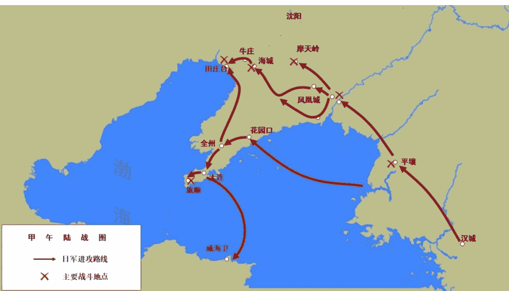

日军陆战持续时间比海战长得多，日军陆军从两个方向同时进攻，一个是从鸭绿江攻破清军防线；另一个是从辽东半岛的大连北部的花园口村登陆。这是黄海海战失利的一个后果，既然你们海军被打败了，对方想从哪里登陆，就从哪里登陆。李鸿章在之前就要求海军提防日军登陆，要求北洋海军，加紧防备，海军必须早晚出海巡逻。但海军自从黄海海战后就被吓破了胆，躲藏在威海卫中，不敢出巡。李鸿章非常生气，你们全部藏起来，打算干啥？用兵虚虚实实，你们出去溜达，他们万一被吓到呢。总之威逼利诱，好言相劝都用了，结果并没有什么用，北洋水师能躲就躲，能拖就拖，竟然对日军的登陆行动一无所知。日军一直在朝鲜有驻军，战争爆发后又从国内大举增兵去朝鲜参战，日军登陆一共花了14天，竟然都没什么人过问，这就有点离谱了。在得知日军成功登陆后，李鸿章坐卧不宁，认为日军即将进攻旅顺。旅顺是中国北方最好的天然军港，日本人和俄国人都馋了上百年，肯定会去抢旅顺。李鸿章每天一封电报，详细跟前线将领交代日军习惯战法，如何防守等等，但旅顺各军都坐等观望。朝廷也一样焦虑，调谁谁不去，各自推脱。张之洞说：我南洋四艘主力舰都是木壳船，士兵不给力，要不老李你派人过来开走？李鸿章多谢了，说您老还是歇着吧。到处都是事，每件事还都解决不了，这个国家似乎瘫痪了。11月底，日军来到旅顺城下，只花了1天时间，就攻下重镇旅顺。清廷花了16年苦心经营，耗费千万的船坞、炮台、军储一夜之间沦入敌手。旅顺陷落，日军进行了惨烈的大屠杀。陆军大体上就是这样，表现并不比海军强多少，失败原因就不用总结了，一旦总结就是老生常谈，这种差距是全方位的。陆军节节败退，主战派却不甘心，要求迁都再战。慈禧都慌了，准备了两千辆车，打算出逃。这次没逃成，几年后补上了。1895年1月底，清廷派出议和代表出发。没办法了，陆军连续战败，日军迟早会开到北京城下，花钱免灾吧。战事仍在继续，1895年2月初，日军陷威海卫城，用岸上的岸防炮对准军港里的残余北洋舰队。17日，北洋舰队全军覆没。日方要求李鸿章或奕䜣来谈判。清廷返还李鸿章的三眼花翎，72岁老臣再次踏上征途。此行谈判非常困难，最终李鸿章脸上挨了一枪，满脸是血，引起中外舆论，才稍微摆脱谈判的被动局面。当听到赔款2亿两时，清流派的李鸿藻放声大哭，主战的声音又起。光绪帝也想毁约再战，询问前方将领有没有把握，将领回电说：天津驻军被水淹，营房狼藉一片，好像似乎差不多没战斗力。军队成了灾民，还需要政府紧急救灾，事已至此，无需多言。没办法，只好签约。搞笑的是，前线彻底崩了，全国老百姓竟然根本不知道打仗的事。一方面大清根本没动员，反正动员了也没用，铁路太短，送不到前线。另一方面大清做了严格的信息管制，南方很多人直到大清完了才听说原来1894年海军被人给扬了。

### 4
### 尾声

假如慈禧不修颐和园，能够改变她的历史定论吗？当然不能，上文也说了，清军的拉胯是从上到下的，几百万两银子改变不了啥。当然了，甲午战争对太后影响不太大，因为她并不主战，主战的是皇帝一党，所以当时朝中指责她的人并不多。影响太后历史定位的，主要是几年后她的另一件彪事，煽动义和团围攻大使馆，招来了八国联军，自己灰头土脸出逃，老百姓也跟着倒霉。大家有兴趣我也可以聊聊，其实非常有意思。那甲午战争的失败该怪谁呢？让我说，这更像是一个国家的集体雪崩，雪崩之下没有一片雪花是无辜的。清廷已经烂透了，早一天灭亡就是对这个国家最大的敬意。不过从后来的情况来看，国运反转倒还挺快。就在甲午海战57年后，当初参加过威海卫保卫战（北洋水师最终覆灭那一战）的萨镇冰还活着，他在广播里竟然听到了朝鲜战争中我军攻下汉城的新闻，非常感慨，激情赋诗一首：五十七载犹如梦，举国沦亡缘汉城，龙游浅水勿自弃，终有扬眉吐气天。是啊，最悲观的时候也不该放弃，终有一天会好起来。

公众号懒人搜索，[懒人专属群](#)分享

## 读懂基辛格，读懂这四十年
2023-12-01

基辛格这人在中国和司徒雷登有点像，是中国人最熟悉的陌生人，几乎谁都听说过，但好像又谁都说不上来这人到底是干啥的。

正好这两天他去世了，我这边也聊聊。

### 1 基辛格的上位史

基辛格在中国被称为“中国人民的老朋友”。这个词咱们从小听到大，不过能得到这个称号的人，并不多，一般是那种实实在在给中国带来了好处的，才会给这个名号。

那问题来了，基辛格干啥了？他配得上这个名声吗？

如果要用个中国人做比较，来描述基辛格到底是一个什么样的人，可以看张维为。张本人是学者出身，现在也在复旦当教授；他同时对政治非常感兴趣；以前是邓公的翻译，现在也比较活跃。

但基辛格在每个层面，都走得比老张远得多。

基辛格是德国犹太人，但德语说得不太好，纳粹上台时他们家跑到了美国。他后来在美国上大学，一直读到哈佛哲学系博士，随后在哈佛教书育人。

哈佛期间，他淘到了人生的第一桶金，只是他自己当时不知道。那时哈佛精英荟萃，大批后来在政坛上叱咤风云的人物都在哈佛教书，比如著名的布热津斯基（后来这人也干到了卡特总统的国家安全顾问）。当时他们就在哈佛做同事，平时没事就瞎唠嗑，形成了亲密的革命友谊。

基辛格一辈子消息灵通路子野，跟他到处都有要人朋友有很大关系。

基辛格前半生一直忙学术，不过内心一直不宁静，像个公号作者似的，经常写文章讨论时政，并经常上广播，给大家解读新闻。那时候的广播就是现在的直播，很容易圈粉。

由于对时政有深刻认识，终于被权贵给发掘出来，搭上了纳尔逊·洛克菲勒，这人是我们熟知的那个初代洛克菲勒的第五代孙。这个“洛五代”想竞选州长，然后竞选总统。这需要一堆出谋划策的人，于是就把基辛格从大学弄了出来，当他的选举顾问，承诺将来等到他当上总统，基辛格就是总统顾问。

后来在基辛格的不懈努力下，这个洛克菲勒五世最终也没能选上总统，反倒是基辛格自己成功当上总统顾问了。

原来基辛格在当顾问期间太耀眼，在他们圈里的名声已非常大，并且写了几本重量级的书，以至于新当选的总统肯尼迪对他印象非常好，——对，就是那个被爆头的肯尼迪。

当时肯尼迪有个小算盘。他有个言论非常有意思，说美国是“四权分立”。众所周知，美国是“三权分立”，这“三权”说的是：负责打官司的法院，负责制定法律的国会，还有总统带领的政府，他们仨互不归属地分立着。

但在真实运行过程中，政府并不是铁板一块。政府内部往往还有个小圈子，官僚们自己决定哪些命令听总统的；如果总统的命令让他们很反感，他们就阳奉阴违，兢兢业业地把总统的想法搞砸，然后老百姓就会骂总统。

其实这个在哪都一样，无论是总统还是皇帝，任何想法都需要官僚来替他们搞定。如果最高意志想做的事官僚不同意，有一万种办法给你搞砸。

所以肯尼迪私下说，美国是四权分立，司法、立法、总统和官僚。特朗普上台后一直也说这事，说“有刁民要害朕”，说美国有个deepstate，不听他话，阳奉阴违不要脸。这种思路其实跟肯尼迪是一脉相承。

为了解决这种情况，肯尼迪想了个办法，从大学找了一大堆学者进入政府。这些人没根基，跟官僚不是一伙，唯一能依赖的就是总统，所以对总统忠心耿耿。

如果大家看着眼熟，也正常，我国历史上就这样。皇帝管不住手底下的大臣们，就启用太监，或他老婆家里的人，也就是外戚。在美国，这些学院派的人，跟中国古代的太监外戚其实是一样的，没根基，需要依附总统，天然和官僚们合不来。

在这个背景下，基辛格和其他一大批哈佛同僚进入肯尼迪政府当顾问。不过肯尼迪只当了一千多天总统就被爆头了。这个过程中，基辛格的工作一直也没啥起色，究其原因，肯尼迪对基辛格的国际战略思想倒是非常看好，但基辛格一直都不是肯尼迪的核心圈。

肯尼迪天天跟他弟弟在一起混，有啥事他俩一起商量，甚至找妓女他俩都找同一个，江湖上传言他俩和玛丽莲·梦露同时有一腿。

后来肯尼迪死了，基辛格又跟着继任的约翰逊混，约翰逊对他也没啥好感。这两个总统在位期间，基辛格基本上啥都没干成，真正上位，要到中国人熟知的尼克松。下图就是《阿甘正传》里的约翰逊，现在的那个《纸牌屋》里木下总统原型就是他：

1968年大选，基辛格回到老东家洛克菲勒五世那里，帮助他竞选总统，对手就是尼克松。据基辛格的传记作家说，基辛格在这次大选中两边下注，一方面帮助洛克菲勒全力去赢，但背地里向尼克松提供了大量他在政府内部打听到的消息，最终哪边上台，他都能赢。果然，富二代花花公子洛克菲勒没拼过老滑头尼克松。尼克松上台后，第一件事就是把基辛格叫去当自己的国家安全顾问。

基辛格特别会做人，洛克菲勒这人没心眼，不知道他搞两边下注。基辛格确认要跟着尼克松混，还跑去跟洛克菲勒搞了个君子之约，说好基辛格在政府里对洛克菲勒能帮就帮，而洛克菲勒作为民间大佬，也要给多年兄弟力所能及地支持，双方要面向未来，持续共赢。然后基辛格就高高兴兴去当他的安全顾问了。

这里就有个问题，这个“国家安全顾问”的职位到底是干嘛的？

顾名思义，这个职位类似于一个咨询性质的工作，像领导身边的秘书小王，或东北大哥身边的剥蒜小妹。美国建国时，其实没有部长，那些部长都是总统的秘书，所以美国的“国防部长”英文叫“Secretary of defense”（国防秘书），国务卿叫“Secretary of State”（国务秘书）。

但这些秘书官僚化，变得不大听使唤；总统又得重新雇秘书，最后秘书的权力越来越大。类似我国的“尚书房”，皇帝控制不住三省六部，就给自己书房的人赋权，就是尚书房；书房的权力太大后，皇帝继续再找书房，比如明朝的内阁和清朝的军机处，本来都是皇帝的秘书机构，后来走到了前台。

国家安全事务助理这个职位也一样，本来没啥权力。

但尼克松这人非常独断专行，脾气暴躁，又自恋又鄙视一切规则，自己的想法天马行空，但又没有操盘能力，需要有专业人士去替他干活。但他讨厌官僚，不想找官僚，因为他想干的事，官僚们一件都不让他干，或者各种推诿找理由，所以他就要搞小圈子。

尼克松为了打破这种僵局，开始让自己的秘书独揽大权，有啥事不跟国务卿商量，只跟一群顾问们私聊，探讨完后，让秘书们私下去干。

秘书把事搞定后，他站出来宣布，官僚想反对，但事情已经搞定了。各种内阁会议都成了过场，非常像后来的川总，川总有啥事就叫上闺女、女婿，还有蓬佩奥等心腹，他们几个拉个群私聊。

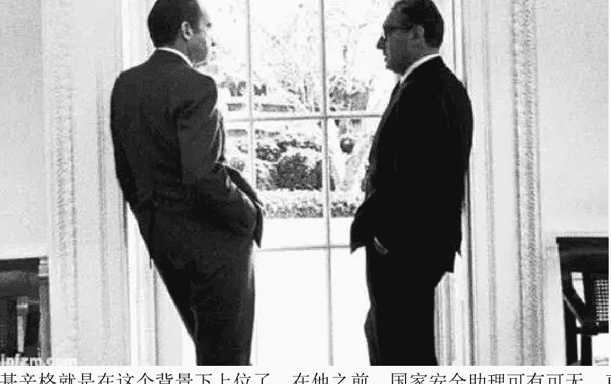

基辛格就是在这个背景下上位了。在他之前，国家安全助理可有可无，直到基辛格成为新一任的国家安全助理。

基辛格非常会做人，在白宫非常注意尼克松的感受。比如尼克松对他们犹太人是非常警惕的，基辛格在监控白宫时，最开始监控的四个人就是犹太人，而且对犹太人非常苛刻。这就和领导站在了一条战线上，尼克松一生讨厌犹太人，唯独不防着基辛格。

基辛格经常参加总统的秘密会议，参加完就去搞暗箱操作，时间长了，他成为了美国历史上权力最大的安全事务助理。权力来源于事务，干的事越多，权力越大。

在他之后，美国安全助理这个职位的存在感整体是下降的，到如今已没人知道谁是美国现任的安全事务助理了。

而且基辛格和尼克松之间的关系远远不是上下级那么简单，他俩比较心有灵犀，有点像乾隆和小弟和珅之间的关系。乾隆爱写弱智的小歪诗，每天写三首，写完还让手底下的人品评。

大家由衷地鄙视他的作品，但又不好直说，只能说“好湿，真是好湿”，但又说不清楚哪里好，搞得乾隆觉得大家并没有真正领会自己作品的精髓。

只有和珅能准确说出乾隆真正心意，不仅说写的好，还能说清楚具体啥地方好。基辛格和尼克松就是这样的好基友，经常吹捧总统真牛逼，而且能说出具体哪里牛逼，拍马屁的核心就是一定要多一些细节在里面，才能拍爽。

到了1971年，基辛格在白宫变得权力非常大，类似大内总管，和唐朝的高力士的角色差不多，是唯一一个能够所有时段随时见到总统的人，也洞悉尼克松所有的想法和恐惧，他说的话领导也愿意听。

离开白宫，他能完全代表总统，总统不方便去做的事，都由他来代劳。甚至在中国和周总理那场长达二十多个小时的马拉松谈判，也是他完全独立操刀的，这在美国历史上绝无仅有。

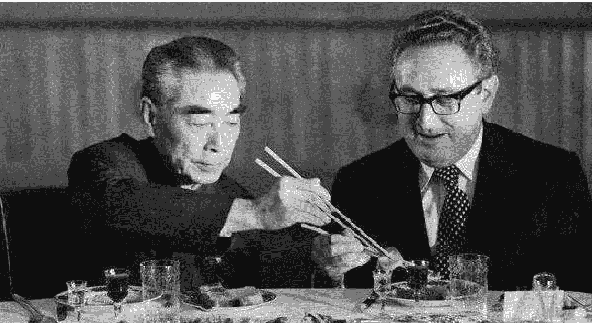

### 2 秘密访华

我们经常听说一个词，叫“基辛格秘密访华”。这个非常奇怪，到底为啥要秘密呢？正大光明地来，有人会拦着你？还真有。谁？国务卿，以及美国几乎所有的文官。

1971年尼克松上台时，美国的情况并不好，深陷越战泥潭，全国老百姓都不想打，天天示威游行闹来闹去。电影《阿甘正传》里有讲，那个给阿甘发了个证书的，就是尼克松。

跟苏联的对抗又不太占上风。不仅不占，资本主义世界那些年点比较背。美国债台高筑，引发整个大西洋两岸发生滞涨，也就是既通货膨胀，又失业率高企，黄金本来就不够，法国人开着军舰从美国往法国拉黄金。

不仅如此，美元的地位也岌岌可危，法国戴高乐根本不鸟美国，还跟苏联勾勾搭搭；德国的一块领土不是也在苏联阵营嘛，德国人准备跟苏联处好关系，将来好把那一块要回来。

而且大家往往忽略了一个问题，到了1971年左右，整个西方国家都准备好要与中国合作了，加拿大1970年就跳出来承认了北京政府。

1971年的一次联合国大会表决中，美国提了一个试图保住台湾在联合国地位的法案，遭到了整个北约盟友的反对。后来中国加入联合国那次投票，整个北约也都是赞成的，大家已经准备好做买卖了。所以我一直说，利益是超越意识形态的。

在这个背景下，“反共”几十年的尼克松被迫开始重新思考中国的地位。那些年中国尽管点背，不过有些成就还是举世瞩目的，比如在朝鲜战争中中国一战成名，美国在战后也不像之前那样轻视这个国家了。

而且中国在1964年核试验成功，1967年氢弹实验成功，1970年火箭也有了突破性进展后，中国的影响力尽管没法跟美苏相比，但也非常非常大了。

再加上当时中苏已决裂，这个背景下，尼克松开始思考中国的地位，觉得如能拉拢中国，就可牵制苏联。

他准备重新安排一种新“均势”，说把世界划分为五大力量，美国、苏联、中国、西欧和日本，将来这五大力量要保持均势。所以必须得尽快“解冻中美关系”，“减轻美国压力，增加世界平衡”。

所以尼克松找基辛格商量。基辛格一开始觉得匪夷所思，但这个想法本身非常契合基辛格在哲学上的“多极”和“均势”理论，最后一拍即合，准备把中国从苏联那里拉拢出来，搞个新“均势”，这样更稳定，说不定能把棋走活。

基辛格在自己的书里写道，“中国拥有巨大的潜力”，“中美和解将给世界带来巨大的冲击，如果我们能掌控这一进程，我们将会掀起一场革命”。

### 大隐于江湖

但这个操作太复杂了。如让美国国务卿去谈，这事想都不用想会变成一场旷日持久的外交纠纷。双方在谈判桌上你来我往寸步不让，中国要求美国撤出弯弯，美国要求中国赔钱（建国的时候中国没收了一些美国在华企业）。

中国还抓了几个间谍，美国要求把那几个间谍要回去，双方已就这些问题十年开了140多次会，根本没有一点进展。自然不能指望接下来这段时间能有进展。

而且美国文官们基本都反华，一方面美国自己搞完麦卡锡主义后统一了思想，同情新中国的外交官全被扫地出门了，比如毛主席的小伙伴谢伟思就被赶出去了，官僚里只剩下了一堆反华的。

另一方面蒋委员长花了大价钱，在美国搞“院外游说”，花钱请游说公司煽动美国议员们反华。这事也做得卓有成效，美国那边谁敢说一句同情新中国的话，立刻会遭到同僚和媒体的暴击。

这个背景下，尼克松觉得不能指望国务院的官僚们，应该想想别的途径，比如派个总统特使过去，直接跟中国上层单聊，聊成后直接宣布结果，生米煮成熟饭。

基辛格偷偷进行秘密渠道外交，完全跳过了美国负责外交的国务院，自己作为一个秘书去操办这么大的事。

先在巴黎找了个秘密途径，聊好时间地点；然后基辛格先装模作样要去巴基斯坦，到了巴基斯坦偷摸上飞机飞往中国。

等他上飞机后，尼克松才装作突然接到消息的样子去找国务卿，说有个事忘了跟你说了，基辛格在巴基突然接到中国邀请，所以他直接去中国了；你也别往心里去，不是故意要跳过你们。以后有事还是要多沟通，你看我，脑子不好，快老年痴呆了，有事总记不住和你说。

国务卿又不是傻子，一想这特么不是故意搞我呢么，没过多久直接辞职了。

基辛格到了中国整体谈得非常顺利，因为中国也希望拉一个强援来摆脱1971年那会儿的困境，美国自己上门了，没道理不抓住；而且毛主席当时有如日中天的威望，这件事也就作为国策定了下来。

如果毛主席在世的时候没有破冰，他去世后的难度会大到离谱，没人有那么大的威望能压服官僚们，对，中国这边也有这个问题。就这样，中美破冰，慢慢走上了正常化路线。

不过尼克松千算万算，没想到他开创了一段历史，自己却没走完，因为很快，“水门事件”暴露，他在大选中舞弊被抓了现行。一开始还好，后面越来越失控，到最后局面彻底崩溃，他自己也被迫辞职，让副总统接位。他俩做了个交易，副总统一上台立刻赦免了他，避免了美国变韩国。

尼克松倒台后，基辛格继续当国务卿，不过他权力已过大，这也成了各方共识。

我在前文也讲过，他们这些文人和我国古代的外戚宦官一样，权力来自于皇权和总统；总统换人了，他们的好日子也就到头了。新总统和基辛格之间又缺乏他和尼克松之间的那种深刻的信任关系，没过多久他就被赶出了白宫，他的老友布热津斯基进入白宫接替他的位置。

基辛格后来常说一件事。他说美国历史上最关键有四个时刻：独立战争，内战，珍珠港和中美建交。

他这么说，有部分原因是中美建交主要是他一手促成的。不过有一点在业界是达成了共识，中国的转向，对世界后来走向有决定性的影响，也对苏联后来的崩溃至关重要。

因为苏联不仅失去了最大盟友，还多了一个恐怖对手，尤其这个对手慢慢开始楔入到西方贸易体系后，变得日益强大。苏联之后在各方面左支右绌，越来越有心无力。

中美和解产生了两个结果，中国在军费上可以大幅降低，毕竟不用同时防两个超级大国了，经济上也就可以喘口气。

苏联就惨了，得加军费防着两个大国，本来就穷，现在更惨了，后来越混越挫，终于分裂了。

基辛格被赶出白宫后，权力没了，但影响力却一直都在。

这个解释起来比较费劲，大家记得那个“大师王林”不？一个玩变蛇的神棍，竟然有一堆明星干女儿，跟各种大佬都关系匪浅。

不少人了解了这事后恍然大悟，原来明星大佬这么爱看蛇。当然不是啊，他们脑子又没被驴踢，怎么会同时那么喜欢看蛇呢？这就叫事出反常必有妖，那个“妖”就是“关系”。

任何群体里，都有那么几个人处在枢纽位置，通过他，你能联系的上任何人。这种类似Wi-Fi热点的人，往往天生具有天大的影响力，他背后的每个大佬们都投射了一部分影响力在他身上。

你觉得他无所不能，你自然愿意多帮他忙，将来好让他帮你忙，这样你的能力就成了他的能力。几千个非常有权势的人愿意帮他忙，换取将来他帮自己的忙，这种模式会让他变得权势大到极点。

权力就是共识，这句话大家一定要反复理解下。

成熟型社会里，这种人非常多，大家熟知的刚死了的那个参议院大佬麦凯恩，还有那个佩洛西，都是这种人。流水的总统，铁打的元老院，一直在那里待着，影响力并不比总统差。之前《碟中谍》里的白玫瑰，都是这种掮客型热点人物。

高盛那个总裁，后来干到美国财政部部长的保尔森，他在自己的书里也说，他们高盛到某个国家投资，一定要找到那个能对目标国知根知底的人，这样他们就能知道到底和谁聊才有用，避免两眼一抹黑。事实上保尔森自己也是这么个人，布什让他当财政部长，就是看上了他在华尔街的关系。

基辛格就是这样，从哈佛教授，再到洛克菲勒财团顾问，随后进入白宫，成为白宫最有权势的人，最终以一人之力，链接起了两个超级强权。后来在当国务卿时，又和沙特王室成功链接，奠定了“石油-美元”的霸权地位。

到此为止，他的权势已超过了国务卿本身。在他离开白宫后，这种权势一直跟随他，一直持续到现在。

大家其实看新闻也能感觉得到，美国那边但凡有大型会议，一般都会叫上他。我国大佬去美国谈判，也会先去见他，因为他不仅有影响力，还有各种小道消息。

整体而言，过去半个世纪里，基辛格确实帮了中国不少忙，也一直在为中国的事奔走。不过这种努力，反过来也是对他的一种“赋能”，他成了整个西方最了解中国，也是最能在中国搭得上线的人。他的影响力和权力都来源于此。

### 4 尾声

这些年基辛格在美国的名声不太好，跟比尔盖茨似的，他俩尽挨骂了，他俩都鼓吹全球化，希望政府尽快搞疫苗，而且对中国比较友好。这几件事美国老百姓都非常反感。

跟比尔盖茨相比，大家对基辛格有种独特的讨厌，因为不少美国人认为，他和尼克松应该对中国的崛起负责，当初他敲开了中国的国门，把中国带进西方贸易体系，这些年一直在保护中国，让中国不知不觉中变那么大，所以老头在美国基本是公敌。

此外他更招美国人烦的地方在于他一直提倡全球化，而我们前文讲过，全球化当中美国肯定是受益的，只是收益很不均匀，蛋糕的大头被资本家给切了，普通老百姓有点倒退。美国基层老百姓提起“全球化”就发火，“全球化”就等价于“失业化”。

老头之前也有篇文章讲“全球化”这事，通篇就是一句话“不能逆全球化啊，乡亲们，以美国的现状，逆全球化就是死路一条”，“自由贸易是帝国根基，不能动啊不能动”。

## “帝国就是信仰”

西罗马已经灭亡了一千五百年，但是“精罗”依旧在。大唐也已经陨落上千年，但是永远活在一部分人心里。只要帝国的火炬高举，自然有人上贡。美国的灯塔地位不能塌，形象不能倒，倒了美元就成废纸了，美国也要变巴西了。想做千年帝国收铸币税就得要点脸，这也是基辛格所有哲学的根基。

不过他是哲学家，这类问题精英们都不一定能搞懂，更别说老百姓了。所以他已经被美国右翼给批臭了，原因嘛，你都成了“中国人民的老朋友”了，你说你为美国人着想，谁信？

不过客观地讲，基辛格确实是把美国放在第一位的，只是在服务美国的过程中帮到了中国，也成就了他自己。

他和比尔·盖茨一样，人民配不上他们。 全文完，如果觉得写得不错，那就点个赞或者“在看”吧，多谢阅读。 如果转载本文，文末务必注明：“转自微信公众号：

公众号懒人搜索，懒人专属群分享

## 为啥社会观念突然转变了这么多？

2023-11-29
戳蓝字“九边”

**这两天正在年底交付，有点忙不过来，想到哪写到哪吧。**郑州小两口的事大家也都知道，本文并不是想单纯只讲他俩，而是想借着这事聊聊这些年怎么突然好像一切都变了。这两天在头条看大家对2024年的预期，竟然几乎没有异议觉得明年会更难，这种情况是我自从记事以来第一次碰上。很多问题，都在下边一张表上：

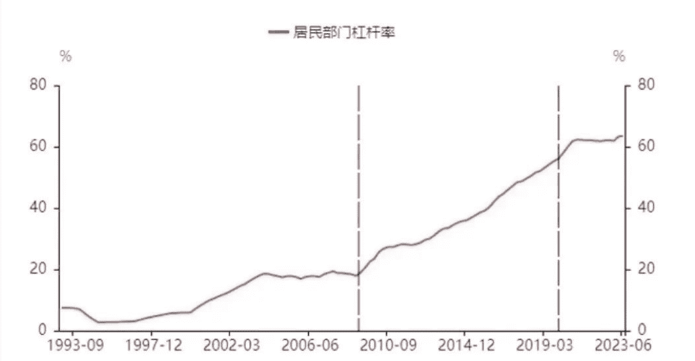

我们过去经济的高速发展，很大程度上是在“消耗杠杆”。这一点倒也不新颖，哪怕抖音上的小伙伴也知道前些年繁荣，很大一部分是我们从未来三十年借贷，集中到前些年花掉了。有点像撸信用卡那帮人，撸卡的时候有多爽，还债的时候就有多苦。

大家看那张图就能看出来，从2008年开始，我国的居民杠杆就一直在攀升，如今已经到了一个几乎没法再继续加的状态。

今年的很多问题，类似不愿意买房，消费不振，本质也是因为大家实在是借不动了，而且开始担心债务把自己压垮了，于是开始紧张了起来。其实这种心态转变并不是今年，前几年就露出了端倪，只是那时候大家没意识到。比如中国汽车销量的巅峰是2017年，而房地产的产值最高也是2017年。之所以2017年之后的房地产的下滑大家并没有觉得不正常，因为政府开始出台调控政策。其实从现在来看，就算不调控，也会掉头向下。只是如果自行逆转，转弯速度和幅度会大到离谱，体制内应该是有人当时就看清了，提前踩了刹车。而且问题是一点点积累不断放大的，从现在来看，应该是疫情三年加速了这种过程。之前大家有个思维惯性认为经济会一直高速增长，自己的工资也会跟过去一样一直涨，很多消费观念也带有明显的“前瞻性”，大家不怕加杠杆，反正将来慢慢还就行，杠杆就那样一直加上去了。比如这两天河南的那对小夫妻，他俩就很有代表性，他俩一度家庭收入的70%用在了还房贷上。这也是为啥那个女孩收入稍微降了一些，立刻就非常拮据。如果其中一个失业了，那直接面临爆仓断供风险。更麻烦的是，他俩还生了个孩子。现在最揪心的问题就在于，全国不知道有多少人跟他们一样财务状况处于岌岌可危的状态。所以说相比烂尾楼，还有个更麻烦的事就是失业引发的断供潮。这种恐惧本身就有很大的破坏性，大家越是怕断供，越要收紧消费，收紧消费会导致消费不振，消费不振又会导致进一步失业，大家想想是不是。大家现在觉得郑州小夫妻那种杠杆加到顶的情况匪夷所思。不过回到前几年大家觉得挺正常，毕竟那时觉得工资还要涨，房价也要涨，并且不存在失业找不到工作的情况。房子已经涨了很多年，几乎不存在降价的可能性，买到就是赚到，不买的话，过了这个村就没这个店，今后再也买不起了。那时候最不济，还可以去送外卖跑滴滴，谁能想到这俩行业如今也饱和了。也正是因为那时候大家敢于加杠杆，大量的钱从未来借到了前几年，叠加外贸繁荣，整体经济烈火烹油。短短几年时间，大家已经很难理解当时的想法了。而且这是个螺旋下降的过程。以前大家肯花钱，市场一片火热，你失业了也可以迅速找到工作，大家攒钱的冲动也没那么高。现在恰好反过来了，大家不愿意消费，市场不活跃，工作不好找。你越是担心失业后不好找工作，越不敢花钱。大家都不花钱，社会能提供的岗位越来越少，说不定哪天你自己的工作也没了。当降薪成了潮流，当找工作难成了共识，会进一步加剧大家攒钱过冬的共识。现在的问题是，大家都不知道这种状态会持续多久，既然不知道，那就只能往坏处想。毕竟这时候如果你财务状况非常紧张，面临爆仓风险，还不小心翼翼，那可能真的会一夜变老赖万劫不复。有很多小伙伴说，如果失业，把房子卖掉不就行了？主要问题是现在很多地方的房子已经没了流动性，也就是说你拿出一个肉疼的价格来，依旧卖不掉。一开始只是一小部分人往坏处想，疫情加剧了这种思潮的蔓延速度，全社会开始转向保守。这种保守不仅仅是消费观上的保守，还蔓延到了社会观念，这个不多说了，大家对社 会舆论敏感的话应该能感觉到。甚至改变了这几十年来形成的学历崇拜。大家知道吧，今年考研人数破天荒下降了40万。很明显是很多人是反应过来了，考研这种事，如果考不上211及以上的，不能说100%浪费三年，90%是浪费了。就业寒冬的背景下，很多用人单位现在只看第一学历，还卡年龄，所以不是准备特别充分考研就有点得不偿失了。学历贬值的大背景下，考研越来越没性价比，尤其考个“双非”，那简直一点性价比都没。有那闲工夫还不如去考公，先考江浙沪，再考新西兰（新疆西藏兰州），查了下，考公人数确实增加了40万，历年之最。还有个更麻烦的事，就是有钱人老了，这是我今年突然意识到的一个问题。

我一直比较关注房地产的事，很多读者小伙伴买房卖房也跟我聊。我观察到一个现象，北京的千万级别的房子，卖房的一大半都是老人。而且有个特点，如果年轻人卖掉自己住的房子，往往是准备换个改善型的，小的换大的，大的换豪的。老人们不一样，很多都是儿女们不跟他们一起住，他们占着个大房子没意义，准备出掉。他们更倾向于把自己的大房子换成小的，或者干脆去投奔孩子，把钱存银行，今后用来看病和养老，到了生命尽头，再把钱给儿女。上千万的资金，就这样从此存银行了，不买任何科技产品，不去逛街，也不创业，几乎不产生新增任何就业。大家知道，中国的富人阶层主要集中在60/70年代出生的那群，加入WTO那会儿，他们正好三四十，有了一定的资本和经验去搞创业发了财。还有一部分没创业，但是房地产大爆炸之后被动发了财。如今这两伙人都要退休了，年龄增长让他们变成了极度的风险厌恶者，避讳一切高风险操作，超大规模的财富也会跟着他们一起躺平。

当然了，啥都有28定律，那一代的人也不是都发了财，依旧是少数。更麻烦的是，中国社会这两年的观念也发生了巨大变化。我现在看B站，发现小年轻们基本上形成了共识，认为创业就是最大的败家。

不仅小年轻这么想，这两年接触了很多江浙沪小老板，他们自己创业起家，攒下了巨量财富，却极力反对孩子继续接班去创业，担心靠运气转来的钱靠运气败光。他们最一般的操作是把几千万分开放好，然后让孩子好好去考公务员，攒下的钱慢慢花，争取平静富裕过一生。这些想法倒也没啥问题，毕竟创业那玩意确实九死一生，问题是如果富裕家庭的孩子也这么理解，我都不知道这个世界会变成啥样。关于未来，大家知道我一直是比较乐观的。毕竟从过去一百年的整体趋势来看，中国国运就跟美股似的，有大幅回撤，但是整体是波动上升的，趋势一直非常稳定。我们走过了一穷二白的时候，不可能现在家大业大反而走不下去了。

但是大家也要意识到，历史的稍微磕碰，代价可就是一代人来承担，如果一个下行期持续十年，那不少人黄金十年就没了，一辈子可能也那样了。这也就理解为啥大家都跑去考公了，就怕那块磨盘砸到自己，都着急躲进避风港。遥想十来年我毕业的时候，几乎没人去考公务员，恍若隔世。

那有啥能做的没？其实政府一直没歇着，又是降息又是拉外资还在促就业，我觉得除了现在在做的那些事，最关键还是重申共识。我国最近几十年能迅速繁荣，靠的是锲入世界市场，靠的是我们无数企业从全球市场切下了自己的一块蛋糕。贸易和市场经济是繁荣的第一性原理。从全世界各国的情况来看，尊重这一点的不一定能繁荣，因为还需要其他的一堆配套条件。反对这点的肯定会陷入贫穷和动荡，无一例外。而且发展过程中最大的动力就是资本本身，可以说没有资本举步维艰，大家看新闻就知道，外资对华投资一直都是一个重要的晴雨表。这两年对资本的污名化说真的有点过了，好在很多事并不需要太多的说教。比如很多大学生最烦资本，等到毕业了，才会意识到没有资本确实没剥削了，可能工作也没了，几十年的读书投资没法回收。去考公又不一定能考得上，毕竟每年招聘人数就那么点，真正的欲哭无泪。现实的教育比啥说教都顶用，一代人估计慢慢反应过来了。此外现在全世界最大的资本基本都是社保、养老金还有保险基金，都是老百姓自己存进去的。这些资本不增值，再过几十年大家吃啥？有钱人都不投资不创业，把钱放银行吃利息或者买成房子收租，那时候大家才能知道什么叫阶级固化。

可能你说那就放任资本的无限扩张？这就是孩子气了，咱们不是有法律吗？凡事应该从法律层面来解决问题，这样能保持一致性和稳定性，法治和中产阶层才是社会真正的稳定剂。这些东西说多了容易挨骂，不过慢慢来吧，规律之所以被称为规律，就是因为你不尊重它，它就修理你，直到回到正轨上来。成年人的世界没有父母在那里劝你，只有生活的毒打。思路错了你可以赢得跟别人的辩论，却躲不过现实的暴击。慢慢苟着吧，债务终将化解，信心也会回来，美元加息也会结束，只是时间问题，大家确保自己不要倒在最后的寒冬就行了。本文就不开评论了。

公众号懒人搜索，懒人专属群分享

## 阿根廷日常破产，那“国家破产”到底是个啥？

2023-11-26

阿根廷这段时间的事被其他博主聊烂了，我也不想多讲了，重点聊他其他人提到的很多但是几乎没有展开说的“国家破产”。

其实国家破产并不稀奇，最近这些年破产的国家一大堆，冰岛、希腊、阿根廷、俄罗斯等等，都有过破产经历。“破产”这个词听着好像挺严重，其实也就那样，一般来讲就是“没外汇了，欠别人的钱还不上了”。

欠钱这事分为两种，一种是欠自己的钱，叫内债；一种是欠别的国家钱，叫外债。

内债好理解，一般是向银行和金融机构借钱，这些钱都是老百姓存进去的，如果是政府欠的老百姓，正常来讲是没有违约一说的，如果急眼了，可以多印一些钱还债，苦一苦百姓嘛。如果老百姓比较温顺，这事也就没事了。

只是代价也很大，容易引发通胀失控，蒋介石就是这么做的，后来通货膨胀把国家给打崩了。前段时间日本国债那事闹得沸沸扬扬，有博主预言日本马上要完，后来也没啥事。其实他们也是内债占据绝对大头，他们的几家银行机构倒腾来倒腾去，看着规模巨大，其实也就那样。

外债比较复杂，一般是向国外的金融机构借，比如大家熟知的美元债什么的，就是我国房地产公司向国外金融机构借的钱。

这里就有一个问题，如果我是一个政府，我欠了一屁股钱，我不还了，你能把我怎么办？

这个分人。

主要看你们国家对别的国家依赖大不大，一般来讲不会有军舰上门讨债，但如果你依赖别人严重的话，就算没有军舰上门，也痛苦不堪。

因为国家欠钱这事，很少欠别的国家政府，而是欠别的国家金融机构，比如俄罗斯现在欠美国很多钱，并不是欠美国政府，而是欠摩根大通和高盛这些金融机构。国家一般不会为了金融机构去跟别的国家开战，我想了想，没想出来相关案例。但并不代表你不还钱就能好过。因为基本上没有一个国家能完全不依赖世界经济，这就要命了，你不还钱可能会非常痛苦，看完本文大家就懂了。

首先这个债是消除不掉的，一直都在那里，并且还有利息一直在增长。这就好像你的信用卡有欠款，你装作不存在，但是那玩意一直都在不断累积，迟早有一天会找到你。就算不找你，今后你也别想跟银行打交道了，除非把钱还清了。

现在各国基本上都没法关上门自己过，只要向国际上买点啥东西，可能是电厂设备，可能是计算机，可能是石油，就绕不过各种金融机构，到时候就容易被人搞。

这一点很关键，债务只能商量减免（我国之前减免过非洲的债务），但是绝对躲不掉。人死债消，国家没有死的一说，人家不给你减免，你就一直欠着，下次有事要跟对方做买卖，人家第一件事就是要钱，这和咱们老百姓之间的情况差不多。

就算你们国家换了政府，那个钱还得照付。

你可能觉得这个有点过分了，前朝欠的钱，本朝还，合适吗？当然合适了，比如前苏联崩溃后，欠了960亿美元的债务，这些债务主要被俄罗斯继承了，俄罗斯一直到2017年才还完。

很多人不理解俄罗斯为啥要做这个冤大头，其实没啥难懂的，俄罗斯想继承苏联在联合国和国际上的地位，以及苏联海外资产，别的国家欠苏联的钱也要还给俄罗斯，所以俄罗斯把债务接了。也就是权利和义务是对等的。举别人的例子大家可能感触不深，举我们自己的。

我国这些年在海外那些动乱国家有大量投资，那些国家动辄政府倒台，新政府上台后，一般都会承认我国的投资，并且表示借的钱都要如数还。因为我国借钱是借给你们国家的，你们国家换个领导就不还钱了，是不是有病？

当然了，国家之间打交道，不可能靠道德说教，也不能靠质问对方有没有病。

现在让他们还钱的底气是，主要是你只要在这个地球村混，就基本上躲不开中美这样的大国，迟早有办法要回来，而且还本付息。所以这些年违约的事很少了，一般他们出了事，很少有人会傻到直接说不还了，一般会商量能不能利息低一些。

其次你欠了别人钱，如果有能耐不再借钱，那日子应该不受影响，有点像有些人做了老赖，躲到没人认识自己的村里了。但是大部分国家没那个本事。

比如俄国1998年违约了一笔国债。但是他们国家又急需更多的美元来购买机械设施，毕竟俄国的石油天然气钻头和钻井是依赖西方的（俄罗斯进口清单中，接近一半是买机械设备），主要卖家是美国德国荷兰他们几个，这时候就需要借钱买设备，不然钻不出来油，不卖油，就更没钱了。

但是你刚还不上旧债，再借新债谁还敢借你？这时候想借钱只有一个办法，得加钱。就好像一个人欠了银行钱还不上，只能去借高利贷，俄罗斯后来也只能是被迫借高利贷，利率200%，非常吓人，不过也没招，必须得借，不然石油钻井就会停工，石油是俄罗斯的命脉，说啥都不能停，只能借高利贷买设备。

前段时间还有新闻，俄罗斯被制裁之后，通过印度卖石油，赚到钱再通过卡塔尔的公司从加拿大买钻头和涡轮机。

不仅如此，国家外汇太少，导致汇率暴跌，俄罗斯老百姓得花更多钱才能买到相同东西。当然了，如果买的东西是俄罗斯自己的，那影响不大。

也正是因为上次违约的惨痛教训，这次俄乌战争爆发后，俄罗斯尽管遭到西方惨烈的制裁，依旧坚持还债，毕竟打完仗日子还得继续。

之前那个斯里兰卡破产了，日子一度非常难，这个国家不产石油，一旦破产，也就没钱买油了。供需关系影响下，这个油价会大幅飙升，很快大部分人都买不起油，也买不到油。

你可能会说，买不起油不买呗，从此不开车了。但问题是油又是很多产业的基础原料，缺油大概率会导致缺电，进一步会导致大量产业没法开工，引发大规模失业，这就属于动摇国本了。此外斯里兰卡又缺粮，如果没钱买粮食，饥饿会横扫全国，最后整个社会陷入巨大的动荡。

后来几个债主，主要是中日印，坐在一起讨论，给斯里兰卡债务延期，它才挺过来。不过斯里兰卡的意思是，能不能给他减免30%，被债主们断然拒绝了。不过以斯里兰卡那副揍性，鬼才知道什么时候能还上。

那有没有破产后影响不那么大的？

也有，比如冰岛。

冰岛在2007年之前借钱买美国人的理财产品，当时看着华尔街玩次贷玩得风生水起，他们也想赚那个钱，于是从英国和荷兰借了不少钱去美国炒股吃差价，没想到美国佬暴雷了，冰岛人赔得一塌糊涂。

于是冰岛人想出了一个奇招，让老百姓自己公投决定还不还钱，如果决定不还钱，将来倒了霉，大家一起承担，也别怨政府。于是开启了“公投赖账”第一家，冰岛老百姓投票决定还不还钱，90%以上的人觉得银行借钱炒股赚了也没给自己分，现在赔了关自己屁事，干脆利索赖账了。其实那些年金融机构炒股赚钱后，也是给政府纳税的，政府又给大家分了。

不过好在冰岛这个国家听着好像很发达，其实是个钓鱼和旅游国家，能源主要靠地热，人口也少，并不依赖其他发达国家，短时间内不会出现斯里兰卡那种巨大的困难和骚乱。

所以冰岛摆出一副“这次借钱不还了、并且再也不见面”的姿态，反而把英荷等债权国给吓坏了，赶紧拉着它坐下来，有话好好说，别掀桌子啊，你有什么困难可以跟我们说嘛，又不是不能谈。

冰岛这幅造型，像不像那种“撸贷村”？全村人撸了小贷坚决不还钱，最后小贷公司急眼了，大哥，您多少还点？

但是我上文也说了，欠钱这种事，你不还就一直在那里挂着，也不是个事，更关键的是，跟欠别人钱不还一样，欠了别的国家的钱，你不还钱今后基本别想做买卖。

可是地球村里的国家只有那么些，对外借钱的更少了，就那么几个，国际上做买卖根本躲不开英荷两国，冰岛这个国家也知道自己靠钓鱼赚不到啥钱，今后还是得继续玩金融，那就得尽快还钱恢复信用。

于是冰岛经济恢复后，英荷开出了优惠条件，跟小贷公司似的，“大哥要不您只还本金”？

冰岛说是愿意慢慢还，一千多亿欧元的债务，准备每年还二三十亿，利率是3%，现在正在打工还钱，预计需要用一代人的时间。

还有希腊，本来也欠了一屁股钱，一开始也准备学习冰岛民主赖账，可是条件又不如冰岛好，冰岛不是欧盟成员国，相对独立一些。希腊不行，加入欧元区的时候把印钞机砸了，而且也没了配套人才，想印钱单过都不行。看到希腊想学冰岛赖账，欧洲央行怒了，希腊的ATM机里都取不出来钱，老百姓太痛苦，希腊政府只好乖乖回到谈判桌被那几个大佬修理。

后来被一顿折腾，希腊认怂准备踏踏实实还钱。不过好处是它承诺还钱之后，各国对它的投资就上来了，因为希腊确实有些很好的资产，比如它有无数的漂亮岛屿，这些年跟中国搞好关系，又是租港口，又是吸引中国投资移民，去年他们的财政部长说是终于把2007年欠的钱还完了。

比较倒霉的是阿根廷，这个国家每隔几年破产一次，到现在已经9次还不上钱，每次还不上钱，就得被人修理，借钱的利率越来越高。这也正常，你连续几次不按时给花呗还钱，后续再借钱利息就会上升，如今阿根廷借钱利息已经达到了9%左右，妥妥高利贷。

现在阿根廷就跟个赌棍一样，欠了一屁股高利贷，日常还不上，每次违约都导致接下来借钱利率暴涨，更还不起，过一段时间继续违约，习惯性破产。可是它又极度依赖国际贸易，国际上又不认阿根廷的货币，所以只能是一直借高利贷度日。

那阿根廷人过得是不是水深火热呢？

也不是，早年我去过那里，公司现在在那边也有派驻，阿根廷人口和辽宁差不多，却占着全世界最好的一块地，土地面积加起来差不多相当于中国江浙沪、河南、河北、山东、四川、广东、广西加上东三省，还有个世界上最大的草原，大家都听说过，梅西是潘帕斯草原上的雄鹰。这也决定了阿根廷人懒得要死，天天不上班等救济，政府印钱发福利，通胀一直下不来。那边华人很多，有很多福建人开的超市。也是因为资源实在是太足了，所以一直乱七八糟，也能混得下去。

那有没有国家做得很绝，以至于大家拿他没办法呢？

还真有，就是朝鲜。朝鲜最大的优势就是它并不依赖其他国家，大家也拿他没办法。大家都知道，苏联解体前朝鲜过得还不错，主要是因为当时苏联和东欧国家给它低息贷款，苏联低价卖给他石油。

东欧剧变后，贷款没了石油不卖了，朝鲜欠的钱到现在也没还完，比如匈牙利和捷克他们几个，就是朝鲜的老债主，不过好在不需要跟他们打交道，不还钱那几个国家也拿他没办法。朝鲜一直在寻求减免，每隔几年就去问能不能减免掉95%，剩下的用高丽参还。

之前还有一个印象深刻的新闻，观察者网发的，大家有兴趣可以搜一下，说是20世纪70年代，朝鲜曾向瑞典购买了1000辆沃尔沃144型汽车。但40年过去了，汽车仍在跑，但钱依旧没有付。瑞典现在还在找朝鲜要钱，可朝鲜没钱，没钱咋还？瑞典也拿他没办法。

说了这么多，大家基本上看明白了吧，国家破产这事跟普通老百姓借钱还不上非常像。

整体来说，债务是躲不掉的，一般那些破产了的国家最后也都把债还了。但是如果你不太怕别人修理你，硬气一些，说不定债主反而怕了，坐下来跟你谈优惠条件。如果你有能力像朝鲜一样把自己封闭起来，别人也拿你没办法。可是大部分国家没法做到那么封闭，只能是老老实实还钱。

文末再说一句阿根廷的未来。

这个国家真正问题不是用什么经济模式，而是不稳定。大家记得吧，前段时间说是要用人民币结算，这两天又说要用美元，今后谁敢跟你合作？

南美人的百年孤独，跟经济学没啥关系。本质就是跟个该溜子似的，没有一份工作能做满一年，每天俩想法，有了想法就去闹，要不是那些国家普遍人少资源多，早完蛋了。

公众号懒人搜索，懒人专属群分享

## 从俄罗斯数学看我国教育前景

2023-11-22

一般说起来数学，大家就会有个明显的感觉，法国数学厉害，俄罗斯数学厉害。那问题来了，俄罗斯人为啥点了这么个技能点呢？

其实了解数学史的小伙伴都知道，18世纪之前，几乎没啥俄罗斯数学家，后来好像突然开了窍。

再细看，会发现这个开窍过程非常缓慢。

这事主要和彼得大帝有关，他接手的俄罗斯是个极度落后的农奴国家，在他手上，俄罗斯全面向西方学习。当时文明主要在法国英国那一带，彼得大帝去西边亲自考察后，回来制定了自上而下的全面学习赶超策略，使得俄罗斯这个国家很快焕然一新。

最关键的还是观念上的改变。俄罗斯从之前蒙古人那种愚昧状态向现代科学转变，用科学指导实践，开始狂点算术、造船、工程、矿业等科技点。

以1724年俄国建立国家科学院为标志，俄罗斯半只脚踏入了现代社会。当然了，只是半只脚，整个身体还在外边。但比同时代的大清强太多，那时大清刚迎来自己第三个皇帝。

那为啥他们要重视数学呢？是因为他们爱学习吗？

当然不是了，大航海时代开始后，迫切需要海上导航和定位的相关知识，大量头脑被迫投入对天文学的探索中，很快就有了突破，比如大家熟知的开普勒三大定律，以此为基础，人类对天文的理解上了新台阶。

也就是说，航海带动了天文学，天文带动了数学，这也是为啥英法这些大航海时代的受益者对数学极度上头，没数学就搞不明白天文，没天文就没法更好地搞远航。早期航海出去一波动不动损失一半船只，后来定位能力和航海技术越来越强，也就没那么艰险了。

同理，关于枪炮的弹道研究又催生了物理的大发展，可是物理依旧需要数学这根拐杖。牛顿最早就是研究弹道学的，思考为啥射出去的子弹总会掉在地上，进一步意识到了引力、速度、动能之间的联系，反而跟那个苹果树没啥关系。

俄罗斯有了科学院，可以给学者们提供高薪脱产从事科研，顺便招收学生，星星之火，慢慢开始烧了起来。其中就有著名的伯努利兄弟，也就是咱们熟知的那个“伯努利方程式”，就是以他们家的一个人命名，这是个瑞士数学世家，出了十一个数学家。后来这俩兄弟又把欧拉给拉到了俄罗斯，欧拉在数学界的地位我就不多说了吧。

欧拉对俄罗斯的影响还不是在俄罗斯推导了几个公式，而是培养和激励了一大群学者，以这些学者为基础，俄罗斯形成了自己的数学传统，也就是有很多人把研究数学当成个正经事，一辈子啥也不干，只研究数学。

“终生脱产研究数学”，这在现在听起来很正常，毕竟我们的大学就养着一群。可是回到18世纪，大清如日中天那会儿，科学还是奇技淫巧，不学四书五经搞数学，就听着挺离谱。这一点上俄罗斯确实比大清早了一步。其实现在故宫里还保存着康熙学习欧氏几何的草稿，说明康熙自己是知道这东西重要性的，只是不想让老百姓知道。

更关键的是，欧拉之后，俄罗斯和法国一样，开始觉得数学是一件很高大上的事，形成了“最聪明的人去学数学”的氛围。而同时代的大清最牛逼的人才还在研究四书五经。

欧拉之后，俄罗斯有了自己的扛鼎大佬，也就是著名的罗巴切夫斯基，这人开创了非欧几何。此外还有切比雪夫、马尔可夫等大佬。

从那以后，俄罗斯从基层选拔有数学天赋的人，然后送到大佬那里接受训练学习，数学开始在俄罗斯开枝散叶。

到了苏联时期，苏联经历了卫国战争、核弹、火箭的研发，认识到科技对国家的重要性，把科技上升到了国策和战略安全的地位，认为只有科学才能保卫自己的边疆。

苏联在政治上非常僵化，一度把他们最伟大的天才、火箭之父、苏联航天先驱科罗廖夫送到西伯利亚劳改营改造了8年，后来老科也是死于那些年染上的旧疾。生物上还出现过李森科那种离大谱的操作。不过苏联在人才培养方面确实有一套。后来甚至影响到了美国。

但是吸收了沙俄和普鲁士的经验，苏联对全民教育非常上头，投入了大量的资金到STEM科目，也就是科学、技术、工程和数学，并且普及率非常高。

苏联孩子从小学生起有完整的教育计划，从小激发大家对科学的兴趣，逐层选拔天才到顶级学府跟着大师深造。

也正是因为因为在基础教育方面的巨大优势，苏联第一颗人造卫星上天后，美国极其震惊，当时称为“斯普特尼克时刻”，因为那个卫星就叫斯普特尼克。不过美国人当时反思的并不是科技，而是基础教育。认为苏联这基础教育水平这么短时间就产生这么大效果，未来还不得上天？所以现在的美国基础教育，也从苏联做了大量的吸收。

美苏冷战，苏联人口和美国差不多，但是美国加上自己的盟友就比苏联多了一倍。苏联GDP如果按照美元计价，从没到过美国的一半，你说为啥用美元计价而不用卢布，因为苏联给自己的盟友援助也是用美元。

这么大的差距，苏联一直扛了半个世纪，这套人才培养计划功不可没。后来苏联崩溃之后，大量的苏联人才跑到了美国，甚至赫鲁晓夫的儿子，是一个火箭专家，也跑到美国去了。这些俄罗斯美国人形成了现在美国文化里一个奇特的俄罗斯文化阶层。

当然了，苏联的问题很明显，除了我上文提到的政治僵化，没有市场经济也是一个大问题。大量的科研项目最后没法盈利，最后科学跟美国没有代差，技术代差却非常大，终于自爆了。

大家一定要有个常识，技术本身没啥用，得需要经过“产业化”这个大筛子才行。这就需要市场、公司、消费、降低成本、规模化等环节，苏联那种模式无论如何也搞不定这些东西。

如今的俄罗斯数学自然是达不到苏联的水平了，毕竟大量的人才出逃已经成了定局，不过底子还在，依旧有天才蹦出来，比如大家熟知的佩雷尔曼，解决了庞加莱猜想那哥们。

说到这里，其实已经可以总结下了，俄罗斯数学之所以牛逼，其实也谈不上种族天赋，本身就有迹可循。

比如需要大量的人口，毕竟天才出现是均匀的。

此外还需要广泛的选拔机制，让更多的人有机会接受基础教育，给天才们打好基础，然后等他们兴趣和天赋展现出来的时候，再送入高等学府。

接下来就需要有传承，毕竟能打磨钻石的依旧是钻石，能训练天才的也只能是天才，得有真正的大师来训练这些顶级头脑。这也是为啥欧拉对苏联数学那么关键，他带了几个徒弟，这些人后来形成了俄罗斯的数学传统。

此外科学是需要自由的氛围，苏联在数学和航天领域发展得最好，因为他们在这两个领域最宽松。

数学纯理论，不涉及意识形态，所以苏联官方几乎不干预数学领域，大神比较多。

太空和核物理是苏联最自豪的两个领域，所以管得也比较少，发展的整体都不错。生物学一塌糊涂，因为那个领域涉及一些意识形态争论，搞得没法看了。

聊俄罗斯也并不是真的想聊俄罗斯，而是为了聊我们自己。

我们的经济和国力这么短时间内大爆发，一方面和西方技术转移有关，另一方面也是基础教育的胜利。

改革开放后高考恢复，义务教育紧密推进，很快就渗透到了中国最基层的村里。

而且不同于美国的掐尖式教育，中国教育也同苏联一样，在于人口基数大，广泛教育普及与选拔所带来的教育公约数增大，人才比例对应拉高。

我国最大的问题是起步太晚，从一百年前蹒跚起步，中间又有一半的时间闹闹哄哄没咋干正事，真正的发展也就恢复高考后的这四十来年。如今已经取得了一些明显的进展，各个领域都有我们的大神，从这个角度来看已经发展得很不错了。

以现在的发展态势，一点也不用怀疑接下来几十年会迎来大爆发。至于诺贝尔，我不同意这些年一些人对诺贝尔的污名化。我倾向于觉得，中国的“诺贝尔时刻”还没到，不过也快了，用不了几年就会喷涌而出。

这也就需要基础教育能对时代发展的每一步都有所应答。比如40多年前邓小平提出“计算机要从娃娃抓起”，从某种意义上来讲，这句话决定了我国抓住了互联网的机会，如果没有这句话，中国的互联网会不会发展成现在这个样子可能要打一个问号。

现在进入了人工智能的时代，尤其生成式人工智能大模型已经折射出这一轮科技革命新的发展态势，能否抓住这一轮的科技革命，同样需要从娃娃抓起，从基础教育抓起。

这周在一个大湾区青少年人工智能教育高质量发展论坛上，中国科学院的曹培杰教授就在演讲中提到：

> 人工智能时代，到底需要什么人才？可能需要重新理解。过去需要的人才都是基础知识、基础技能，核心培养的是读写算的能力；到了信息技术时代加入了新的；到了现在，尤其是大规模技术、人工智能技术兴起了之后，我们所需的人才应该具备提问能力、引导能力，要理解人工智能、善用人工智能，同时具备人机协同能力的人。这是新时代下对人才新的能力素养要求。

人才培养目标都变了，教育当然也要变。去年教育部最新颁布的《义务教育信息科技课程标准》中就已经把人工智能纳入课程体系中。

但是问题来了，先暂且不论课程内容、师资能力储备，需要针对这一变化迅速做出适应调整。首先授课方式就要改变，人工智能教育包含庞杂的学科知识，比如编程等计算机科学、机器学习理论、数据与算法等等，是没办法像过往一样只依靠单向的课本传输就达成教学目的的，而是需要充分依赖实践教学。这也就带来了硬件设备采买这类教育成本支出问题，比如计算机设备、物联网设备、机器人设备、传感器和执行器、开发板和数据采集设备、云平台、虚拟现实和增强现实等等高规格设备。

这样的设备要求下，别说一些欠发达地区校园，哪怕像深圳、上海这样的一二线城市学校也够呛，更别说偏远地区了。

那就没办法了？也不是，技术发展问题带来的问题依旧只能靠技术来解决。比如广州市便对此交了一份很有想象力的答卷，去年开始他们就通过应用一个虚拟仿真的教学工具——腾讯扣叮“虚拟仿真实验室”，在全市顺利开展了人工智能教学工作。

我研究了下这个产品，很难想象，居然是通过游戏科技去打造高仿真的数字教学场景，从而“归零”机器人编程等人工智能教育的硬件成本的。大家完全可以不需要购买相关硬件，在3D虚拟环境中，就能完成高质量的人工智能学习。

这个数字教具通过一个自研的游戏引擎“织梦”，能高度还原机器人各部分硬件的模块与运行过程，打造高沉浸性与互动性的数字学习场景。

不仅如此，在高精度实时渲染、高仿真物理规律模拟等游戏技术下，还能对重力、碰撞和摩擦力等物理作用过程进行充分还原，让孩子们在线上的学习场景中，也能真实感受到物理因素对机器人组装、运行的改变与影响。

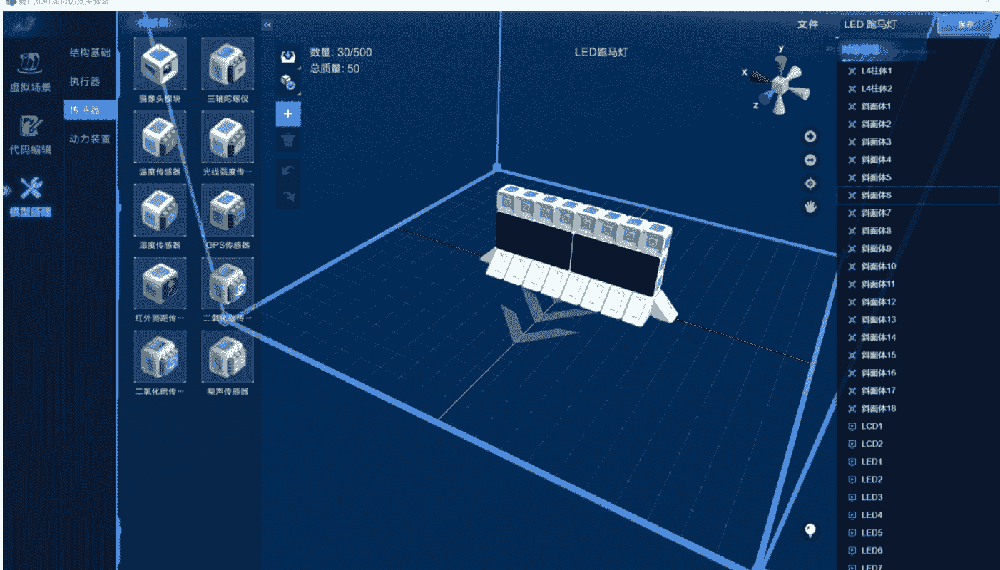

同时这个自研引擎的AI能力还能让这个数字教具在低配置、低网速的电脑上也能流畅运行，让无条件配备高性能电脑的学校也能顺利学习。

咱们聊的并不是科幻，而是现实，如今广州市已有1600所学校的100多万师生，通过腾讯扣叮的“虚拟仿真实验室”，摆脱硬件成本制约顺利开展人工智能教学课程，相当于实现了全市中小学的一键普及，还因此获评了广州的2023年十大民生实事。目前这一普适性极强的教学工具，甚至走进了如云南沧源、江西吉安等欠发达地区的全国300个城市的义务教育一线。

有了这样的工具，哪怕你在偏远地区，只要有网，就可以接触到最前沿的技术，相当于为教育经费要求较高的人工智能教育，开了个经济舱。客观上也扩大了人工智能教育覆盖的人群基数，未来我们就可以培育选拔出更多尖端AI人才出来。

### 尾声：

我一点都不怀疑我国会变成真正的科技强国，因为我国的整体教育方向没啥问题，有问题的是一些细节的问题，大家看新闻应该也没少看到，不过这些都影响不了整个趋势，趋势就是我们拥有海量的人口基数。面对大规模新技术兴起的当下，如果能像腾讯扣叮在广州这样，灵活地做好技术外派帮助教育工作普及落实，让更多人有机会接触到最前沿的信息科技学习。

让潜在人才都充分接触最新的教育，这才是技术创造的公平的机会，再发展一些年，自然啥都有了。

公众号懒人搜索，懒人专属群分享

## 巴以冲突，为啥叙利亚又被围攻了

2023-11-17

巴以冲突这事大家都知道，可能没注意，以色列一边进攻巴勒斯坦，一边还在炸叙利亚，美国也随手把叙利亚给炸了，土耳其也在炸。估计叙利亚内心崩溃了，拜托，你们那俩搞事，跑我地盘上轰炸来了，还有王法吗？还有法律吗？当然没有了。叙利亚内战从2011年就开始了，打到现在，国内都快被打成废墟了，稀碎一地。但是很多小伙伴都说对叙利亚这个国家不是很熟，那今天就来讲一下，把这事的前因后果都说清楚。

### 1. 无奈的叙利亚

首先，叙利亚有个天生的缺点，那就是地理位置不好。

一句话说，就是美丽的叙利亚坐落在一个欠揍的地方。叙利亚虽然只有湖北省那么大，人口也不过2000多万，但是却位于五海三洲之地，妥妥的战略要地，历史上就打来打去没完没了。到了现代进入石油时代，叙利亚又是中东这个油库和欧洲的链接枢纽，看起来更欠揍了。

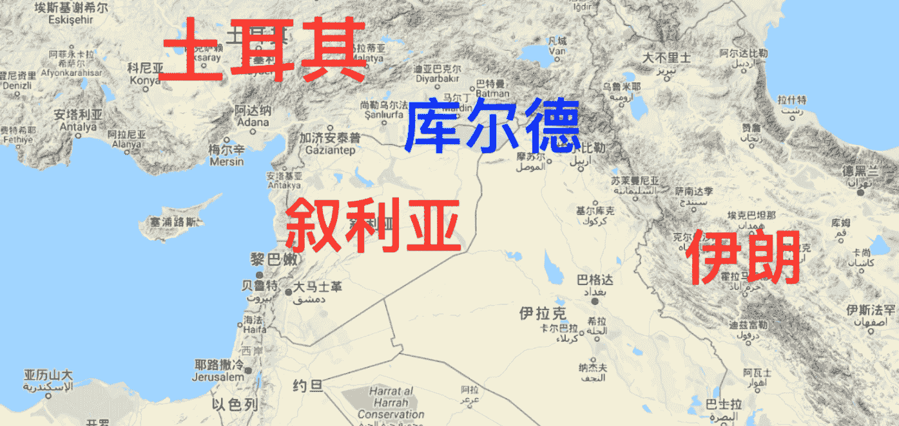

以前就被到处倒手，谁强谁揍它；到第一次世界大战之后，又被倒手给了法国。

1946年，叙利亚人终于获得了独立，但是缺乏一个强有力的中央政府，国内政党多如牛毛，而政党内部的派系更是比牛毛还多，再加上无数的境外势力，天天都比三国还乱。从1946到1970年的24年间，叙利亚一共发生了21次政变，平均每年0.87次。老百姓到最后都习惯了，如果今年没发生政变，那肯定是在酝酿政变；过完年大家就放下手头工作，翘首以盼等政变，弄不好还跳脚大骂，怎么还不政变？是不是你们偷摸政变了？

而这一情况的扭转来自于1970年政治强人阿萨德的上台，也就是现在的那个阿萨德他爹。阿萨德家族属于阿拉维教派。如果不知道什么叫阿拉维，也不要紧，只要知道这玩意被归在了什叶派；如果不知道什叶派是个啥，更不要紧，就记住他们在中东是少数派就行了。什叶派人口大约是叙国内人口的12%，妥妥的少数派。那个阿拉维派人少，所以长期被占多数人口的逊尼派歧视和打压，只能混迹在社会的底层，要么是贫农，要么是仆人，活得相当惨。那为啥出身少数派的阿萨德能掌握政权呢？这跟法国人有关。西方殖民世界几百年，武力是一方面，更重要的是一堆殖民小技巧，比如要在一个地方扶持代理人，肯定是找少数派。少数派势单力孤，得势之后依旧岌岌可危，只能是依赖殖民者撑腰，容易控制。于是出身少数派的军事强人在法国人的支持和自己奋斗加持下，竟然慢慢爬上了叙利亚头目的位置。1966年，在叙利亚的第13次政变中，表现优异的阿萨德被授予了国防部长，成为了实权大佬。跟其他中东大佬一样，在1970年末，阿萨德发动了“纠正运动”，把权力道路上的最后一块拦路石也抓了起来。到了第二年三月，作为唯一的候选人，阿萨德以99.2%的得票率当选为叙利亚总统。两个9的纯度显然让阿萨德不太满意，就进一步抓了抓思想工作，之后的得票率就变成了99.9%。

1967年的第三次中东战争，苏联人认识到了经营中东的重要性，开始大量援助埃及和叙利亚，向埃及、叙利亚两国分别提供了17亿美元和10亿美元的军事援助。阿萨德上台之后更是紧紧抱住了苏联这条大腿。1971年到1978年之间，阿萨德七次访问苏联，就像是每年去述职一样。从那时候起，叙利亚就被认为是苏俄的地盘。叙利亚本来跟埃及和苏联走得都很近。然而在1972年，埃及和苏联掰了，埃及驱逐了苏联的军事顾问，还邀请叙利亚组建阿拉伯人自己的反以阵线。不过经历过阿拉伯联合共和国的阿萨德非常清楚，埃及相比于苏联就是个弟弟，人家苏联有坦克有飞机有导弹，你埃及有啥？木乃伊啊。经历过考验之后，叙利亚跟苏俄的关系更紧密了，被西方默认划到了苏俄地盘里。苏联人觉得这个儿子忠心耿耿，跟反骨仔埃及不一样，所以更加迅猛地给叙利亚发武器，顺便还发了3500名军事顾问。随着80年代后期油价不行了，苏联经济持续低迷，对叙利亚的支持变得有心无力。加上国际油价涨不上去，叙利亚的日子那是相当不好过。1984年，叙利亚国内有7000多名苏联的军事专家，而从1985年往后，这个数字只能维持在4000左右。苏联这条大腿以肉眼可见的速度瘦了下去，阿萨德觉得靠人不如靠己，就在1986年跟伊拉克重新修复了关系，然后又在黎巴嫩问题上占了不少便宜。随后阿萨德进行了一波经济改革。到90年代，农业的迅速发展和产油量的提升使得叙利亚GDP增长率到了7%，缓解了当时内忧外困的局面。阿萨德成功地给自己的政权续了命。既然苏联靠不住了，凭借自己的小身板恐怕不是美帝恶势力的对手。于是1991年的海湾战争就成了叙利亚的投名状，主动靠近美国，积极配合美军的行动，端茶倒水、牵马带路，指哪打哪，绝不含糊。不过跟美国的关系一直也不温不火，叙利亚索性继续强化跟俄国的关系。尽管阿萨德各种讨伐异己，但是社会整体很稳定，因为那时候叙利亚也在搞计划经济，老百姓都在国企里上班，有不少人收入不高但也不至于过不下去，怨气并不大，没人跟着反对派搞事，整体还算稳定。

### 乱局初现

2000年阿萨德死了，但是他的政权没有完犊子，继承人是他的儿子巴沙尔·阿萨德。

巴沙尔是阿萨德的二儿子，从小到大，他并不是继承人。他哥哥都一直被当作太子培养，而巴沙尔则继承了他爸爸小时候的梦想，想当个医生。他很小就去伦敦攻读医学博士，受了全套的西式教育，这哥们和他老婆都操着一口流利英式英语。英国一度很喜欢这对夫妇，还准备给他们授个爵士来着。

多说一句巴沙尔他老婆。这女人其实算英国人，出生伦敦，从小接受英国教育，精通英语和法语，生活习惯又接近法国人，因为她大学主修的就是法国文学；嫁给巴沙尔之后，本来准备在英国继续上班，然后莫名其妙就回中东过上了刀口舔血的生活：

在1994年，巴沙尔的哥哥死于车祸了。王储没了，巴沙尔被紧急召回叙利亚，学习开坦克，领导叙利亚国防军中的主力第四装甲部队，后来他当头目之后，这个位置又由他弟弟担任。老子开飞机，儿子开坦克，舒克贝塔一家亲。一个拿手术刀的就这么突然握上了坦克方向盘。

反正握上了，这就是标准的储君培养流程，军方和情报部门，总得控制一个。蒋经国当初就是军警宪特一把抓。老阿萨德去世的时候，巴沙尔只有35岁，还是顺利接班。巴沙尔接手的叙利亚情况并不好，体制的僵硬导致八年时间从国外流进来的外资只有10亿美元。而叙利亚在黎巴嫩的驻军也招致国际上越来越多的谴责和制裁。阿萨德的遗产清单里，有专门给宝贝儿子留下的生化武器，那反而成了叙利亚被制裁的把柄。不过也算穆圣在天有灵，保佑叙利亚，巴沙尔也并不是啥玩意不会的富二代菜鸡，毕竟一个不想当总统的坦克手不是好医生。上台伊始，巴沙尔就开始大刀阔斧地进行改革：从国外弄钱、建设民生工程，顺便释放一些政治犯，全国范围搞打老虎拍苍蝇的活动。最重要的，他推动了叙利亚的改革。叙利亚以前是计划经济，玩了几十年后，跟其他计划经济国家一样，实在是穷途末路，走不下去了，也要走市场经济的道路了。这一波操作让叙利亚的经济走出了一根大阳线，发展的还不错，巴沙尔雄心勃勃地想要把首都大马士革打造成中东金融中心。他以前混英国，有路径依赖。但是叙利亚以前搞的是一种类似苏联那种国企性质的经济模式，现在要搞自由经济了，也搞了一轮大下岗，下岗那些人痛苦不堪。当时的操作太过激进，大量老百姓直接就被抛到社会上去了，国家不给兜底，所以痛苦不堪。不仅如此，跟苏联当初的改革一模一样，叙利亚的改革也造就了一个巨大的官僚资本阶层，也就是以前管工厂的是官僚，现在工厂私有化了，官僚直接变成经理，并且还跟其他官僚保持联系。唯一受害的就是被裁撤的普通老百姓。比如2009年的时候，叙利亚就拥有2100多万人口，有工作的人群中又有七成人每月收入少于100美元。按照当时的汇率，100美元是683块人民币，当年我国的人均GDP是26179块，你们体会一下叙利亚人民的收入水平。再加上2008年的经济危机，一波暴击把叙利亚推到了火山边缘。更离谱的是，失业率一度达到了恐怖的20%，全国有70万户家庭没有收入，受波及的人群达到了350万。这就相当于国内有350万个火药桶，一旦被外界加热，就会爆炸。城市失业率对于一个国家来说是最重要的指标，没有之一，高失业率持续时间长了一定出大事。很多国家看着穷，但是平安无事，主要也是因为他们老百姓都在农村，城里人少，出不了啥大事。这也是江湖上一直流传的一句话，国家转型期是最危险的，往往不转会死，一转死得更快。大清就是改革失败死掉的。改革期没有不乱的，如果这个时候没爆掉，挺过去，可能就好了；压不住，就直接崩了。事实上当时被“阿拉伯之春”摁在地上摩擦的几个国家都有这个问题。看似经济增长贼快，但是很多民众生活问题并没有什么实际性的改善，而且大量年轻人到了城里，却提供不了工作，这种情况很容易发生大乱子。更点背的是，后来气象学家研究发现，全球变暖的背景下，叙利亚那一带气温升高降水量变少，农业畜牧业受到重创，谷物价格飞涨。这些老百姓更没法活了。当时巴沙尔接受西方文化熏陶，觉得政治方面的放开，允许反对声音的成立和存在，就能提升幸福感，所以在政治上也放得很开。这一时期被西方国家称之为“大马士革之春”。但是巴沙尔很快就发现自己太年轻，自己在英国看到的那些东西，到了中东的土壤上开花结果，长出来的却是个怪物。一顿折腾后，本来以为会过上英国人一样的生活，没想到国内也越来越乱，情急之下，这个曾经的西方信徒又对反对派开始了疯狂镇压。被镇压的那些组织迅速转入了地下活动。并且跟境外势力集团搭上了线，比如中东其他王爷们早就看他们家不爽了，西方也着急彻底摧毁这个俄国在中东的最后一个堡垒。双方一拍即合，钱和顾问就上来了。不少老百姓对政府意见也很大，觉得跟着现在的政府吃不上饭，不推翻你留着过年?

4

## 革命

2010年,阿拉伯之春爆发。这股“倒春寒”很快就光临了叙利亚。2011年1月,叙利亚爆发了大规模的反政府示威活动。示威过程中发生冲突伤亡,以此为借口,八月份的时候,西方各国先后发布声明,要求巴沙尔卷上铺盖牵上狗,麻溜地下台滚蛋。这个要求遭到巴沙尔拒绝后,西方和中东其他国家开始到处煽风点火,训练军队。到了2012年下半年,各方支持的力量迅速拿起武器,开始了混战。战火席卷整个叙利亚,在很短的时间内就打成了一锅粥。美国、土耳其、沙特等国争相向反政府武装提供支持。那群反政府的力量组建了一个同盟,叫“叙利亚反对派和革命力量全国联盟”,一般简称“全国同盟”。2012年11月12日,海湾阿拉伯国家合作委员会(沙特阿拉伯、卡塔尔、巴林、阿拉伯联合酋长国、科威特、阿曼)宣布承认全国联盟为叙利亚人民唯一合法代表,终止对巴沙尔·阿萨德政府的认可。西方国家也支持这个同盟,伊朗和俄罗斯支持政府军。现在的叙利亚有三个主要政府,一个是巴沙尔的政府,还有一个是中东王爷们支持的政府,还有一个土耳其支持的政府。还有一群非主流的奇葩玩意。所以叙利亚内部几十个派系基本都有背景,比如打响反抗第一枪的就是土鸡支持的“叙利亚自由军”。当然,巴沙尔跟他爹经营了几十年的叙利亚也有不少朋友,比如上文说的什叶派之弧。有钱的出钱,没钱的出人。以什叶派领袖自居的伊朗,不太富裕但是也尽心竭力帮助自己的兄弟,除了派遣军事顾问、雇佣兵、志愿兵,还给予了大量的经济援助。伊朗为了支持叙利亚可以说下了血本,毕竟什叶派只有这一个主要兄弟了。在乱局当中,恐怖组织也来搅局。基地组织的一支分舵ISIS自立门户以来迅速地壮大,并且一度受到美国和土鸡的支持,这俩本来是准备把这支黑暗力量变成手里的一把利剑。ISIS一度控制了伊拉克和叙利亚的大片区域,领土超过10万平方公里,区域内人口达到1200万。更过分的是,这个组织一度想建国。这个行为相当的过分,简直打了所有国家的脸——我们围剿恐怖分子这么多年,竟然还把你们剿灭成一个国家了?最过分的是,尽管美国和土耳其私下里没少支持ISIS,但是这个ISIS竟然是个原教旨组织。后来它基本失控了,尤其美国没法控制,跟土耳其倒是一直勾勾搭搭,这个组织把油田里的石油卖到土耳其获取经费。2014年,美国在伊拉克拉开了打击伊斯兰国伟大事业的序幕,之后又在叙利亚境内支持敢打敢冲、脑子单纯的库尔德人,组建了库尔德武装。在反恐过程中立下汗马功劳的库尔德人,实力逐渐膨胀了起来,仗着跟美国人交好,又有美国驻军,奋斗的目标也从保卫家园变成了裂土封疆,准备弄个自治区,自己说了算。这个想法得到了美国民主党大佬们的支持,毕竟中东只要更碎一些,就能更乱一些,乱了才有操作空间;大家都铁板一块,第一件事就是把美国赶出去。再把那个图放上来,库尔德人的地盘就在叙利亚、伊拉克和土耳其三国边境附近:

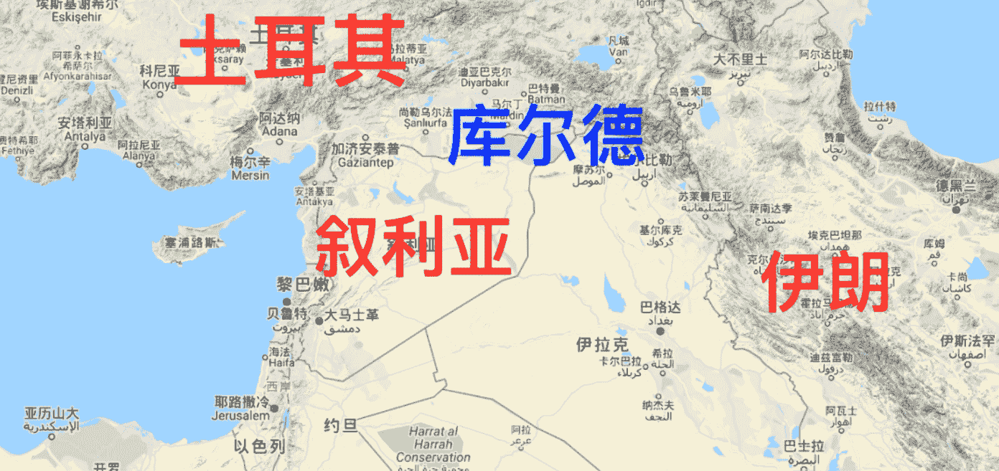

所以一旦叙利亚的库尔德人自治成功，那一带的库尔德人都会起来闹事，尤其土耳其境内的库尔德人必然也起来闹，足够把土耳其搞得鸡飞狗跳精神崩溃生活不能自理。既然能搞倒土耳其，一心想遏制土耳其在中东坐大的俄罗斯也对库尔德人寻求自治表示了支持。美俄两大强权竟然达成了共识，库尔德人奋斗千年的建国梦竟然在天边若隐若现。不过土鸡不愿意啊，你俩搁这儿干哈呢？在我家门口扶持个流氓是准备骚扰我媳妇吗？奥巴马时期土耳其不满意也只能忍着。到了川总上台，尽管任期只有四年，事没少办，其中就有他跟土耳其做了什么交易，把库尔德人卖了一个好价钱。美国人刚从叙利亚撤军，土鸡便挥师南进。对叙利亚北部地区的库尔德武装一顿猛捶，从叙利亚北部地区硬生生划出来一个与以色列国土相当的安全区域，库尔德人的千年建国梦又一次被大国给粉碎了。现在大家经常看到新闻，说土耳其战机空袭叙利亚，其实就是去炸库尔德人，作为回应，库尔德人不断袭击土鸡的边界军事基地。

叙利亚危机爆发后，俄罗斯也没有闲着，重建了在叙利亚的军港和空军基地，随后又修建大型后勤基地，又是派战机又是送顾问，态度非常坚决。说到这里大家可能纳闷了，一个破基地，至于嘛，普大大这么兴师动众，划得来吗？其实到这个时候，已经不是划不划得来了，而是普京必须强硬，因为俄罗斯周围的那些传统势力范围都蠢蠢欲动，比如乌克兰、格鲁吉亚，甚至最亲密盟友白俄罗斯也不安分，如果普京虚了，可能其他边境国家也跟着崩了。事实上后来乌克兰和格鲁吉亚确实崩了。所以保住叙利亚是俄罗斯的一种态度，给周围的人看的，老子尽管不如以前，但是谁要惹上门照样打断他的腿。这样反而能减少冲突，这就叫以战止战，那时候油价高，俄罗斯还是挺有实力的。2013年，叙利亚政府军弄出了“化学武器事件”，美、法等国政府趁机想对叙动武，俄罗斯赶紧跑出来当和事佬，一通斡旋之下稳住了局势，那时候的俄罗斯还是挺有话语权的。2015年是巴沙尔的至暗时刻。在反政府武装和伊斯兰国的夹击下，政府军和反对派在几路对线中都失败了，伊斯兰国的武装甚至已经开到了大马士革的郊区，巴沙尔政权危在旦夕。巴沙尔明白单纯依靠自己和什叶派的穷兄弟，就只有完蛋这一条路走，赶紧再去找普京大大。2015年9月30日，应邀前来的俄罗斯对叙境内的“伊斯兰国”等极端组织目标发动空袭。在俄空天部队支援下，叙政府军不仅把反政府武装赶出了大马士革，而且一举扭转了战争的颓势，可以说，普京力挽狂澜，救下了叙利亚。不过在国外一般认为是兔子和俄国一起努力的结果。

到2017年3月，俄罗斯宣布从叙利亚撤军。这期间，俄方共动用60000多名军人，消灭了87500多武装分子，帮助叙利亚收复了95%的领土。2016年底，叙政府军攻克反对派的大本营，战争局势逐渐变得明朗起来。而且不知道川总跟普京搞了个什么协议，美国人迅速溜了，相当于进一步确认了叙利亚是俄国的地盘。其他国家眼瞅大局已定，减少了对叙利亚反对派的投入，把更多的精力放在了反恐上。这下伊斯兰国没指望了。主要也是这货的原教旨主张把全世界各国都搞的心神不宁，参与军事打击“伊斯兰国”的国家超过了20个，地球上几个话事人非常难得地联合在一起搞同一个项目，这谁能顶得住？最终在2017年，这个破组织被干死了，当然了，也没死透，只是散了，那种组织的本质是一种原教旨宗教观念，你能把组织打散，你咋消灭观念？消灭不了观念，就迟早卷土重来。

5

## 没有结束的结束

到了2019年，叙利亚政府军胜利的迹象已经非常明显，和平的曙光已经展露。不过随后陷入了长期的对峙，格局大概是下图那样的：

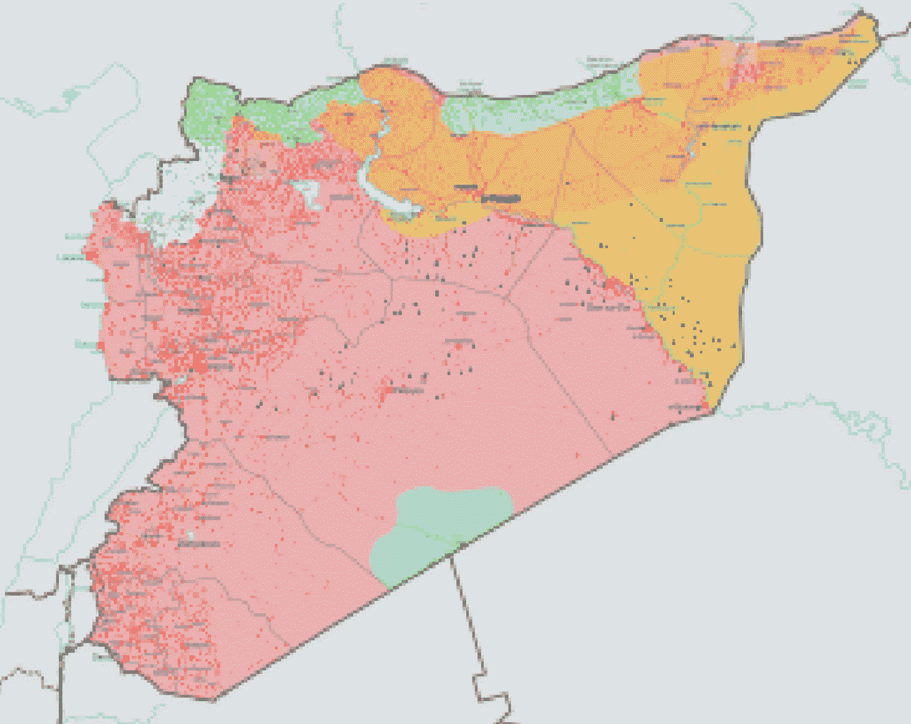

橘红色区域是叙利亚政府，其他颜色的是各种反政府武装。
现在的叙利亚政府有点像清末，核心区是能保住的，但是对于新疆、外蒙、外兴安岭这些地区就有点管不过来，毕竟太远了，战略物资投送不过去。而且如果主力去进攻某一股势力，家里空虚，容易被偷家。清朝后来费了大劲保住了新疆，其他几个地方就没办法了。所以2019年之后，叙利亚政府控制了65%的地盘，从那之后格局就基本上稳定了。如果伊朗人准备修个基地储备弹药进攻反政府武装，很快就会遭到美国、以色列和土耳其的空袭。如果反政府武装想搞事，就会遭到俄罗斯的空袭。土耳其还会例行去轰炸库尔德人。

为啥以色列还掺和叙利亚的事呢？

就是那个众所周知的“戈兰高地”，这玩意俯视叙利亚，属于战略高点，第三次中东战争被以色列抢走了。国际上普遍支持戈兰高地是叙利亚的地盘，美国一开始也支持。不过后来川总上台后签署总统公告，美国成了全世界第一个承认戈兰高地归以色列的第三方国家。美国那边认为是川总拿了犹太财团的好处，所以处处替以色列跑来跑去。现在谁在戈兰高地附近搞动作，以色列战机就会去空袭。现在几方就跟上班似的，每隔一两周就有一次轰炸。看着好像停战了，其实没停战。要说没停战吧，各方确实打不动了。属于薛定谔的停战。

这里就有一个问题，叙利亚问题上，我国到底支持谁？其实很明显，我国是支持巴沙尔政府的，毕竟前段时间还请到咱们这里来了。可是我们确实没法提供军事援助，上文反复说了，巴沙尔他们在叙利亚是少数派，占人口少数的什叶派统治占人口多数的逊尼派。这也意味着如果我们直接介入战争，最后的结果必然是得罪一大群。俄罗斯其实就是这个造型，为了支持叙利亚跟其他国家基本都闹翻了。可是我们和俄罗斯不一样，它作为一个加油站又不怕别人恨。但是我们在那边各国都有大量的投资，无数土木老哥在中东干工程，如果真把那边的人得罪了，今后工程没法干了。所以大家就能看出来我国是很小心的，搞人道主义救援，但是不掺和他们的内战。现在在中东唯一一个真希望和平的第三方势力估计就是我们了，因为我们在那里真有投资。

6

### 尾声

二战之后，中东地区是战火最多的地区，民族冲突、宗教冲突充斥在中东的各个角落。当然，地下埋藏的石油资源也是引发冲突的巨大的原因之一。中东人一再自己先陷入内乱，然后再招来更大的麻烦，超级大国介入，把他们国家炸个稀巴烂。像极了晚清到民国那一段，我们自己乱做一团，让列强一波又一波地上门劫掠。叙利亚这事看着好像问题不大了，但是一时半会且完事不了。记得我以前讲过印度的那个“印度寡妇理论”吧，在印度农村，寡妇地位非常低，一旦被强奸，大家就觉得她是个破鞋了，谁都敢去搞一下；越搞地位越低，最后去报警，可能会遭到警察强奸。国家也一样，如果一个国家战乱不止，大家习惯上就觉得这个国家已经是个破烂了，既然已经破成那样了，我再踢一脚没啥问题吧？比如这次美国把军舰开到那一带本来是帮以色列壮声势，随手就把亲伊朗民兵的基地给炸了。叙利亚心里估计一百万只草泥马奔过，然而并没有什么用。你都成那样了，西方国家觉得战机油钱都比炸毁的建筑贵，人家都不抱怨，你抱怨啥？所以吧，一定不要乱，尤其不要自己先乱了，那样真是万劫不复的操作。

公众号懒人搜索，懒人专属群分享

## 读懂王自如，读懂“体制化”

2023-11-15

王自如这两天的事大家也都知道，在媒体上肉麻地使劲舔董小姐，让人各种不适。

当然了，我专门开帖蹭这个热点，并不是为了鄙视下他，那没啥意义，咱们聊个更深层次的问题，那就是“体制化”和“人身依附”。

其实王自如的那些话，在高度“阶梯化”的大型组织里非常常见，很多人适应了那种环境，拍领导马屁是下意识的，根本没意识到自己的话听起来有那么肉麻。

这个特点并不区分国企私企什么的，只要是组织大到一定规模，里边的人自然就被异化了。

因为在大型组织里，你的地位和工资什么的，并不是你真的能为组织贡献那么多，而是你的领导觉得你可以。这种情况下，所有人自然而然就会发自内心觉得自己的生命线是在领导那里，别人的一句话，可能就决定了你未来几十年的命运。

跟很多人理解不一样的是，这个社会上很多那些处在高位的人，他们是很清楚自己能拿到工地老哥十倍甚至几十倍的工资，并不是因为他们能搬十倍的砖。

说得难听一点，大型机构里的提拔，是交易，而不是奖励。

当然了，这里不是说能力不重要，而是说你会发现能力没那么重要。一般的玩法是到了一定时候，几个候选人能力都差不多，最后领导选了那个最默契的人。

进了管理层，无论是政府当官，还是企业里当领导，一定要有“情商”，啥意思呢？

领导说啥话，你得听出来弦外之音。领导提拔你，并不是简单地要干活，那换谁都可以，为啥要提拔你呢，主要是你能给领导搞定事，替领导承担一些他承担不了的责任。

比如某件事难度很高，道德上也处于灰色地带，领导一提醒，你得自己赶着上，主动承担，不能等着领导给你直接指令，毕竟如果需要领导直说的话，领导也有责任了。

绝大部分时候都是这样，所有的机会，背后都可能是坑。换句话说，很多坑也是往上爬的机会。

如果你get不到领导的深意，那你和领导之间就属于没默契的，他很快不想带你玩了。

你说经常背锅那不是容易出事？

不一定，绝大部分时候，你背的锅都是以“风险”的形式存在，既然是风险，那就存在一定概率永远不会出事。

也就是说出了事你会很惨，不出事你和领导都会得到丰厚回报。另外风险的存在，客观上也逼着你去考虑怎么降低发生概率。

大家一定要知道一件事，越是位高权重的人，越没法去赌，如果必须赌，那就让小弟去赌。输了让小弟去顶，赢了一起分成果。正好小弟也想立功上位，双方一拍即合。

咱们以电视剧《人民的名义》为例，那里边高育良的很多坏事，就是让祁同伟去做。多说一句，咱们经常以电视剧举例，不是说已经沦落到把电视剧内容当真了，而是说聊这个最保险，而且那个电视剧非常写实。

后来祁同伟还有个自白，具体的我忘了，大概内容是这事你做了可能会倒霉，但是你不做就得出局，然后人家换个能做的人来做。

你不给领导背风险，那你就不是领导自己人，下次有了提拔机会，凭啥提拔你？

再想想《人民的名义》里的丁义珍，李达康要GDP，但是很多具体的灰色业务就是丁义珍在搞，后来出了事，李达康可以做到彻底的“风险隔离”，竟然完全没受影响。可是丁义珍就得仓皇出逃了。

后来李达康又想提拔“宇宙区长”孙连城取代跑路的丁义珍给他做事。可是这货实在是不上道，不知道是装糊涂还是真糊涂，领导各种暗示，他一概装作听不明白，没有一件事能和李达康保持同一个节奏。后来被李达康赶去少年宫了。

其实大家想想，孙连城从基层爬到了全国靠前的超级市重点区的区长，怎么可能这点情商嘛。摆明了就是不合作，不想趟李达康的浑水。

可以合理推测，如果高育良去拉拢孙连城，估计也纳闷这么个糊涂蛋怎么当上区长的。因为孙连城大概率已经嗅出来李达康和高育良总得完蛋一个，或者都得完蛋，不想趟他们的浑水。或者已经意识到自己内心深处对“进步”没那么渴望，不值得去冒险。

大家再想想，这个电视剧演的是2017年的事，那时候房地产还处在上升期，一切欣欣向荣。现在已经在下行周期，当时的很多雷现在已经开始爆了，如果孙连城那时候接受了李达康的暗示，去做那些事，说不定后果就是下一个丁义珍，得出逃美国，最后客死他乡。

丁义珍和孙连城就是一个人处在十字路口的两种选择，短期看孙连城太惨了，去了少年宫，可是长期看不一定，他躲开了一个巨大的坑。

没办法的事，风险和收益都是正相关的，这个世界上不存在高收益却低风险的事，如果存在，那一定是别人替你把风险承担了。

在网络上咱们都鄙视那种领导的背锅侠，现实里，你想去给领导背锅，领导都不想要你。

毕竟如果这工作的收入只有万把来块，可能大家都嗤之以鼻。如果像王自如那种年入几百个达不溜，是不是大家上杆子挤着去？

此外也有一些属于中年人独特的难言之隐。

人一旦过了三十五，游戏就会变得一点都不好玩。

不仅上有老下有小，关键是整个就非常尴尬。比如你万一失业，去应聘基层程序员，可是体力实在是扛不住，而且你领导比你小七八岁，你不嫌尴尬他都尴尬。可是想去面试领导，市场上几乎没人会需要一个领导，毕竟自家的员工也需要晋升阶梯。

这种情况下，你当前就职的组织对个人来说已经不是单纯上班的地方了，你离了这个组织什么都不是，你的生活会大幅下降一大截，这个时候对待工作对待领导，就有了“人身依附”。

而且尴尬的是，你在一个组织里混得越好，可能对这个平台依附越深。

再往深了讲，这里说的“平台”到底是啥？其实就是你在里边的关系，这个社会上有太多人，离了平台啥都不是。

说到这里，读者小伙伴可能要说，你这聊的跟王自如有啥关系吗？他那是恶心地跪舔。

其实我的意思是，在绝大部分体制里，稍微层级高一些的人，他们最清楚的一件事就是自己的地位是哪来的，那个“权力的来源”可以提拔自己，也可以毁了自己，可以让自己背锅，也可以让自己飞黄腾达。

所以自然而然就会处处为那个来源着想，这也是为啥说，权力只对来源负责。具体到个人，他会随时随地想着那个权力来源，不经意间，甚至条件反射般说几句恶心的谄媚话，就没啥奇怪的了。

注意了，这里说的“权力”并不只是政府，稍微大一些的组织，都差不多。

所以说，王自如的那段话出来之后，年轻人和中年人的体验非常不一样。

绝大部分中年人，饱享受生活毒打之后，已经觉得无所谓了，不就是几句恭维话么，自己说过更恶心的，可是却没换来王自如的地位。自然对王自如并没有多少意见，甚至很多人发自内心地羡慕，觉得这货真是个幸运的好同志。

说到这里，可能有小伙伴要说了：被你一说，感觉社会好黑暗。

其实也不至于。

因为绝大部分人其实并不涉及“在大型组织里做给领导签卖身契”这个问题，就像90%的公务员一辈子连个科级也混不到一样，根本没资格担心祁同伟那样的困局。这个社会绝大部分人其实并不会触及王自如那种层面的问题。

基层其实把自己的具体工作做了就完事了，根本不涉及那些复杂的勾心斗角，也不需要承担额外的风险，哪怕你在诈骗公司上班，如果你是基层员工，被抓后大概率你被拘留37天就能放，你领导就得被抓去踩几年缝纫机了。

当然了，风险不高的事，毛病是工资收入一般不会太高。王自如说自己从来不看工资条，看工资条这种事是基层员工干的事，爬得稍微高点谁会去看那个。

有人问，出卖尊严赚钱好吗？

这个也分人，咱们绝大部分人是很在乎尊严的。但是在一些人眼里，没啥是不能交易的，你觉得尊严不容侵犯，那是因为卖不上好价钱。你会为了万把来块工资被领导各种CPU，王自如就可以为了几百个达不溜对着镜头舔董小姐。当然了，这种思维非常不好，咱们要严厉批评。

之前说过一句话，初期看技术，中期看关系，后期看山头。

也就是说，刚加入公司你能不能脱颖而出，主要是技术能力咋样，如果技术能力都不行，那你很难挺过前三年。

等干个三四年之后，你就应该和某个领导关系不错了，成了他的心腹，他有重要的事都交给你去做，他升职也把你带着，毕竟当了领导之后很快毛也不会了，手底下没几个干活的，基本寸步难行。

干到个十来年，如果进入了中层，就有了明确的山头态势，你的人生处境，很可能跟一个上边的领导强相关，他牛逼，能争取到资源和好项目，分给自己手底下的人，手底下的人层层往下分，大家干一年有了收益一起吃肉。这时候他比你的爹还亲，因为你爹对你命运影响没那么大。

上边的领导被边缘化，争取不到好项目，尽是些又烂又没油水的，下边的人跟着倒霉，苦哈哈干一年，最后奖金可能是每人一箱苹果，倒了八辈子霉。不过也别太担心，明年可能更差，因为效益差会导致骨干流失，没了能打硬仗的骨干，就算领导争取到大项目也搞不定，越混越挫。

你说我可不可以换个山头？也不是不行，不过每个领导和自己的小弟都是用了很多年磨合出来的信任关系，你想加入人家，人家也不要你，就算你过去了，你也是个外人，或者边缘人，得从基层干起。平时活让你干，小圈子开会却不叫你，到了年底，人家嫡系把肉分完，给你个骨头，大概就是这么个运转方式。

所以说，在大组织里，很多时候你加入了某个部门，跟了某个领导，可能未来已经差不多了。

这套逻辑并不区分私企、国企或者政府。绝大部分人了解的关于社会的运行逻辑，往往是刚进社会的那三年，也就是新手村，再往后就没人跟你讲了，因为讲不清了。

我导师以前在大学总跟我们讲要练好本领，将来在社会上慢慢往上爬，我还以为他混了一辈子象牙塔，并不了解“新手村”之外的东西。

他却跟我说，以为象牙塔里关系简单，是绝大部分人关于大学最大的错觉，哪怕小学都超级复杂，更别说他们那种充满人精的大学了。学校和医院，应该是最复杂的地方，因为在外边你可以跳槽什么的，这些地方几乎没法跳，人身依附比所有地方都严重。

当然了，如果你下定决心不往上爬，优势又出来了，因为公共部门不能随便赶你走。只是这些年也在改革，搞聘用制，甚至跟电子厂似的在搞劳务派遣，那就没招了。

说到这里你可能要问，不喜欢这样的生活怎么办？

别去大组织就行了，如果能降低点需求，比如房子别买那么贵的，孩子别生太多，整体还凑合。

最怕的事情就是家庭硬开支太多，你一把年纪混大型组织，那你基本上被绑架了，随时会被撕票那种，连呼吸都小心翼翼。

如果你不用出卖尊严，不用承担风险，还能赚到钱，那只能说你是个幸运的好同志。钱难赚，翔难吃，叠加“你不干总有人干”的东亚困局，“上位”本身就是个高难度的操作，所以本文的基调也并不是批评而是聊这事的深层次成因。

总之吧，还是希望大家不要过上那种“鄙视王自如，试图成为王自如，最后羡慕王自如”的生活。

公众号懒人搜索，懒人专属群分享

## 几个月过去了，脱去长衫的孔乙己们咋样了

2023-11-11

之前被删的一篇，个人认为写的很满意，大改了下，重新发出来。

几个月前媒体说是让大学生脱去长衫，惹了众怒。不过大家注意到没，当时媒体说的是2023级的毕业生，这不，2024级的也开始找工作了。数据已经不公布了，不过从网上的言论来看，跟这两天北方的天气一样萧瑟。

一方面主要也是中国的教育太惨烈了，之前那个妹子声嘶力竭的搞誓师大会，搞得很多人说她丑，不过绝大部分人还是觉得高考是一道门，心里提一口气，闯过去了，跨越阶层，实现美好人生，丑啥丑？

前边的话还没凉，后边的大学生就要去打螺丝，瞬间让很多人充满了绝望感，拼尽全力，费尽心机，不惜一切代价上大学，就是为了去工地？那我为啥不初中毕业就去，少走七年弯路？为啥不一 步到位，去当保安呢，几十年的弯路也都省下来了。

其实大家如果平时看B站，就能感觉到最近一两年以来观念的变化，B站作为大学生的主要聚集区，好像一夜之间变成了悲观的氛围，前两年还自信满满，到了今年就多多少少有点垂头丧气。

原因嘛，不复杂，他们毕业了。

我这段时间也在思考这个问题，“00后”真是比较那啥的一批，第一批毕业生是2022年，正好是疫情防控最严的一年，去年很多毕业生后台给我留言，说根本没法去面试，很多人根本就没找工作。

今年终于解封了，然后就碰上了史上最难找工作的年份。尽管每年都说那一年是最难就业，毫无疑问，今年才是。

整个社会被一种悲观主义的氛围所笼罩，甚至很多人说不上来到底为啥悲观，反正就是悲观，于是越来越多的人自发加入了“不消费不买房，不生孩子不结婚”这么个跨地域宗教。

那为啥会成这样呢？有些能说，有些不能说，比如很多人认为的贫富分化，不遵守劳动法，等等。

不过我还是要说我一直说的那件事，就是贸易。

中国最近四十年的迅速崛起，最关键的就是因为我们准确把握住了自己在全球的定位，我们最大的优势就是人口众多，收入低下。改开的时候，我们的平均收入甚至比菲律宾都低好多，于是在加入WTO的时候利用了自己优势，生产廉价产品闯出了一片天地。

不过发展到现在，我发现不少人慢慢忘了一个关键问题，我们之所以能迅速崛起，因为我们生产的东西能卖得出去。

其实有点基本的生活经验就知道，你所在的公司能存在，并不一定是你们公司生产了多高级的东西，而是因为你们生产了别人愿意花钱购买的东西。

再直观点，你创业搞了个公司，这个公司能不能生存壮大，关键就是东西能不能卖出去，卖不出去产品的公司毫无意义，迟早药丸。这里“卖出去”是关键，可能你生产的东西非常low，可是销量确实好，你能赚大钱。你生产的东西逼格高，可销量不行，那你也得倒闭。

这就是任正非所说的，华为的一切成就，都是因为做了客户所需要的事。

我们楔入到了全球贸易，生产出来的东西跟别人相比有优势，所以大家买中国的产品，产品卖出去，回笼了资金，进一步扩大产能，卖更多产品，赚更多钱，然后国力一步步壮大。然后有钱发展基建，搞军工，搞科技突破。

所以说，与其说中国制造业立国，不如说贸易立国。

很多人在聊那个“第一性原理”，贸易就是繁荣的第一性原理。

生活中也一样，你混的像不像个人，能不能出人头地，可能学历不是最关键的，人品也不是，关键是你的劳动成果有没有人愿意购买。别人愿意出高价，你就能发财，没人愿意出价，那你再牛逼也得一直穷下去。这也是为啥我们生活中经常能看到有人没啥文化却发了大财，博士毕业却一文不名，关键就是能不能把自己的劳动成果卖上价。

说这话肯定让很多人不爽，不过大家想想，如果我们生产的东西卖不出去，会发生啥？那就是工厂被自己的库存和贷款压爆，最后只好破产解散。

大家肯定听过一个词，叫“中等收入陷阱”，说的就是很多国家，比如智利，阿根廷，以及东南亚国家，历史上都发展出来过自己的工业。可是到了一定时候，都不约而同出现一个现象，产品卖不出去了，于是制造业企业连环爆炸，最后彻底去工业化。以前也给大家讲过，苏联工业那么规模巨大，但是后来产品卖不出去，工厂全部当成废品折价了。

工业其实非常脆弱，远远没有大家想象的那样坚挺。

最近看了一本书，叫《1890-帝国定型》，里边有些话非常有启发。

扉页上就写了一段话，说：

红利吃尽、产能过剩、老牌列强林立、国内利益集团垄断……1890年的美国，正面临内忧外患的局面，然而，这也正是美国崛起关键十年的开始。

与以往任何国家都不同，美国走上了一种新型帝国之路。
它不直接掠夺海外领土，而是以强大的生产和贸易能力控制世界。用一句话归纳，美国作为一个国家是有边界的，作为帝国则是无边界的;这种帝国发展的逻辑不是通常理解的国家逻辑，而是无孔不入的资本逻辑。

大家看出来了吧，简直就是在说咱们，而我们唯一能做的，其实也是彻底拥抱世界，公平公正地和全世界做生意，把生意做大，让大家在生意中获利，这是咱们的出路，也是世界的出路。

美国很明显也看懂了，现在显然最想做的事，是把我们赶出它的贸易体系，如果我们正好按照他的意思来，分成两个阵营斗争，那基本就是中了它的下怀。俄罗斯伊朗这些国家根本没有购买力吃下我国的制造业，大家可以去问问那些工厂主，他们最大的客户在哪？哪些客户最好做买卖从不赖账？

产业萧条的话，企业更没钱去搞研发，也就没啥高薪高科技岗位，根本用不着大学生，就跟伊朗似的，伊朗精英持续流出，因为待在伊朗也没事可做。孔乙己为啥那么惨？还不是因为他耗尽半辈子学到的东西，根本没人愿意购买，只能去打零工，可是他的身板打零工实在是没优势，读过书混的还不如个白丁。

事实上如果没了客户，也就没必要研发先进制程的芯片了，因为那种芯片主要是装在手机上，到时候没人买，也没有海外市场可以占领，研发也没啥意义了，如果只是军用，现在的已经足够了。

可能有小伙伴说，美国要把我们踢出来，那我们有啥办法，只能是跟他干。这其实就进了美国的圈套，美国竭力想把中国塑造成一个当初苏联那副模样，会让所有的贸易伙伴恐惧和担心，时间长了没法做买卖了。

所以说关键是保持稳定，不卑不亢，你可以不理解我，但是时间会告诉大家我们非常稳定值得信赖，跟我们合作大家都有得赚。

我在之前的文章给大家回顾过，我们经常说的“西方国家”，总觉得好像是一伙的，其实根本不是，欧洲有自己的打算，英国也有自己的，美国的算盘某种程度上又和那些国家矛盾的，而所有国家都是趋利避害的。

之前欧洲把自己的能源命脉交给了俄罗斯，双方互利互惠，尽管矛盾一堆，但是生意几乎没停，美国对这事意见非常大，可是也没办法。

直到俄乌战争爆发，给了别人口舌，能源贸易彻底中断，后来物理上被炸了，现在这个环境也没法修复，如今俄罗斯和欧洲也就彻底没了共同利益，双方剑拔弩张。

但是我们还有共同利益，目测在接下来很多年里依旧可以保持贸易的旺盛，当然了，前提是我们继续保持改革开放，继续以贸易为主导，不惹事不怕事，慢慢来，经济有好有坏，总是周期性波动，但是最后总能好起来，关键是不要跟世界脱钩。

至于大学生找工作难的问题，从侧面也能看出来，我国对贸易的依赖非常重，市场稍微有点萧条，上千万人的生计也就成了问题。找工作困难，生活处处碰壁，大学时期形成的对国家的自豪感和信任感一夜之间荡然无存，铁杆粉红也变成了恨国党。

改善大学生就业什么的，没啥快捷办法，只能是继续稳定发展，给足大家稳定的预期，大家肯投资敢投资，肯消费敢消费，工作岗位自然出来了。最可怕的事就是预期不明，大家不敢投资工厂，不敢花钱，岗位变少，悲观预期进一步席卷剩下的人，更加不消费，进一步螺旋下滑。

此外大学生又跟农民工不一样，大学生的工作岗位往往需要更复杂的预期。

比如前些年计算机系大火，毕业生工作特别好找，并不是互联网大厂需要那么多人维持运营，而是他们觉得未来会更好，所以投入大量资金搞研发，这些钱变成了毕业生的工资，让计算机系的毕业生体会到了一种考大学改变命运的感觉。

这两年互联网公司砍掉了“预期产业”，也就是不再为“可能性”打钱，计算机专业立刻现了原型。其他行业也一样，如果足够成熟，根本用不着什么高学历研究型人才，基于“可能性”研发的行业才需要人才。但是这种长期投资更需要稳定预期。

就好像你本来想雇几个高学历搞个十年后能获利的研究，但是对未来不确定，你准备等等再看，然后不投资了，工作岗位也就消失了。

绝大部分研发完全是存在于预期里的东西。

前几天总理有句话，说“从上往下看都是问题，从下往上看都是办法”，这其实就是一种典型的自下而上的市场化解决问题的思路。

只要大家觉得未来不会发生巨变，每个人都会自然而然地去追求财富，富人会通过投资把钱变多，大学生会努力去提升自己赚更多的钱，很多问题自然而然就解决了，根本不需要去做什么规划。

最可怕的事就是大家不知道将来会发生啥，不投资不消费，工作岗位不增加，也没有研究型岗位，大学生的知识没啥用武之地，雇主也不会为了他们的学历支付工资，找不到工作，那只能是劝大学生去做初中毕业生做的事了。而且这种预期会被加强，大家别忘了，接下来每年我们都有上千万毕业生，还有每年两千万的退休老人。

还有一个共识的问题，这段时间网上流传着一个帖子：

邱震海转述了这么一个故事：

一位学者，到东北的一所大学去演讲。

在问答环节，一个大二的学生拿过麦克风

说：

“我不愿意毕业后给资本家打工。”演讲人问：“谁是资本家？”

学生答：“所有民营企业家”

答毕，现场响起掌声。

这是一群出生在2000年以后的孩子。

邱震海说：

留给中国思考未来何去何从的底层逻辑的时间，可能就剩下一两年了。

我不知道这个是不是真的，应该不是，大学生不至于到这种份上，毕竟我也上过大学。不过以我对现在年轻人的了解，确实有一大批人是这样想问题的，只是不知道比例。这种观念非常可怕，因为稍微有点常识就知道，中国80%的岗位是民营企业提供的。

我知道大家都想进体制，不过最后的结果必然是绝大部分人得去民营企业，民营企业繁荣，大部分人才能过得好，民营衰退，一堆人就找不到工作，这几乎是铁律。

李建秋前段时间有个帖子，我贴在这里：

好了，输出最后一个观点。

叔叔我是一个非常成熟的人了，我的世界观和价值观非常完整，且不会矛盾。

最后一个观点，我为什么对经济层面有信心，而对社会层面没信心？

对经济层面有信心，前几条微博已经说过了，过了起飞点它就形成了自适应的规律，你无需过多的干涉。你违背规律，规律就是惩罚你，逼迫你。

最后服务业会崛起，制造业在国家各个层面，无论是GDP还是就业，占比会越来越低。这个刚才已经说过，绝大部分小朋友已经接受，了解了。

那为什么对社会层面没信心？就是因为以上的原因。

制造业需要强大的纪律，制造业国家普遍产老保。而服务业不需要，甚至刚好相反。

在越来越低的制造业占比后，中国会出现大量的“后现代”，“左小鬼”。毕竟念经这活，太容易了。

## 所以我作为一个岁数比较大的老保，我深刻的理解，诞生后现代的土壤是经济，而不是其他原因，这是一个铁一般的规律。

这个帖子我是非常赞成的，我最赞成的是那句话，“过了起飞点它就形成了自适应的规律，你无需过多的干涉。你违背规律，规律就是惩罚你，逼迫你”。

这些话成年人都特别容易读懂，因为咱们做错事，生活和社会很快就来惩罚。社会层面也是一样的，年轻人观念歪了，也会遭到社会的毒打。现在的很多年轻人拎不清，等他们饱受找工作的痛苦之后，自然就明白了。

太多人问我，黄河水会不会倒流。

我把话撂这里，不会，黄河水不会倒流，只会曲折前进，九曲十八弯大家听过吧。中国已经过了某个节点，任何不遵守规律的行为都会遭到规律的惩罚，最后只能回到正轨上来。

此外中国65%的城市化率，这么高的城市化率，除了贸易和分工，根本没法养活这么多人。这就是接下来中国的底色，啥都改变不了了。

所以这时候最关键的，媒体应该做的不是劝年轻人脱下长衫，而是重申共识，关于城市化，市场经济，贸易，民营经济的共识。让大家意识到将来会越来越好，意识到国家会稳定发展，所有人充满信心，投资和消费上来了，岗位自然而然也就出来了。信心比金子珍贵，因为金子不会变出更多的金子，信心却可以。

写到这里不往下写了，为了防止大家发牢骚，就不开评论了。可以随手点个赞或者“在看”吧，最好能加个星标，因为微信的规则改了太多，多谢阅读。 **

公众号懒人搜索，懒人专属群分享

## 巴以冲突之后，印度也开始躁动

2023-11-07

不知道大家注意到没,上次俄罗斯进攻乌克兰的时候,印度疯了似地支持俄罗斯。

他们的脑回路倒也不复杂,一方面印度和俄罗斯属于传统盟友,关系好了上百年,经历了沙俄、苏联还有现在的俄罗斯,铁杆盟友必须强力支持。

另一方面也是因为乌克兰跟巴基斯坦实在是太像了,乌克兰和俄罗斯以前在苏联下边混,印度和巴基斯坦在英属印度下混,分裂之后有了领土争端,进而刀兵相见。而且乌克兰、巴基都和美国走得很近,印度能同情乌克兰有了鬼了。

这次以色列进攻加沙,印度第一时间站出来支持了以色列。

仔细一想,也不奇怪,巴以矛盾,和印巴矛盾没啥明显差别,都是那种互相觉得对方占了自己地盘的矛盾。印度占着穆斯林的传统地盘克什米尔,那一带一直有恐怖主义“虔诚军”在暗中袭击印度,这个组织跟哈马斯一样,也信仰YSL,也把印度当成侵略,你说印度怎么可能支持哈马斯嘛。

可能印度是看着以色列揍哈马斯心痒痒,又偷摸去折腾克什米尔,然后和巴基斯坦就打起来了。

不过双方对起因的描述挺有意思。

巴基斯坦说印军无人机进入巴方控制区,并且靠近己方重要区域,于是把无人机打了下来。随后印军就炮击巴方哨所,并且表示谁让你们碰我无人机。巴基斯坦觉得,印军一向拖沓缓慢,这次反应如此迅速,应该是早有预谋的。

印军的说法完全不同,他们发现有巴方武装人员渗透到印控区,于是派出部队打击。双方发生了交火,而且是巴方先对印方哨所开火,印军才反击的。

而袭击印度的,就是上文提到的“虔诚军”。

这个虔诚军名气很大,和哈马斯非常像。

当初印巴分治的时候，克什米尔地区绝大部分居民都是穆斯林，按理说是要被分到巴基斯坦的。可是克什米尔上层信仰印度教，果断跟了印度，签字画押走了程序，印度以此为根据果断派军打入克什米尔。

印度控制克什米尔之后，当地不满的人起来反抗，成立了这么一个以搞自杀式偷袭著称的组织，也是个世界公认的恐怖组织。

这群人干的最大一票，是2008年在印度孟买市中心，实施了一连串恐怖袭击，造成近200人死亡和数百人受伤。那个著名电影《孟买酒店》，说的就是这事，有兴趣的小伙伴可以看看，那个电影拍的非常好，载入影史的好，看完不抑郁算我输。

印度指责巴方包庇虔诚军，让这些人干些正规军不好做的脏活。小股队伍渗透到印控地区，破坏设施偷袭巡逻队，并鼓动当地民众闹事。巴基斯坦说跟虔诚军不熟，再乱说告你诽谤。

大家看清楚了吧，印度眼里，这个虔诚军和哈马斯一模一样，它怎么可能支持哈马斯嘛。

至于印巴冲突接下来的演化，估计也搞不大。毕竟双方都折腾了七八十年了，每次都这点剧情，而且双方核弹都对着对方的首都，能有啥事?

不过克什米尔迟早也是个大麻烦，而且跟加沙似的，属于一个解不开的结。相比较而言，传统的火药桶巴尔干半岛，随着英法俄德等传统势力的衰落已经彻底凉透了。

### 1

大家提起克什米尔，就会自然想到印巴。这地方其实是三国占领。并且三方都觉得自己占的少了，对面一方或者两方侵占了各自的固有领土。

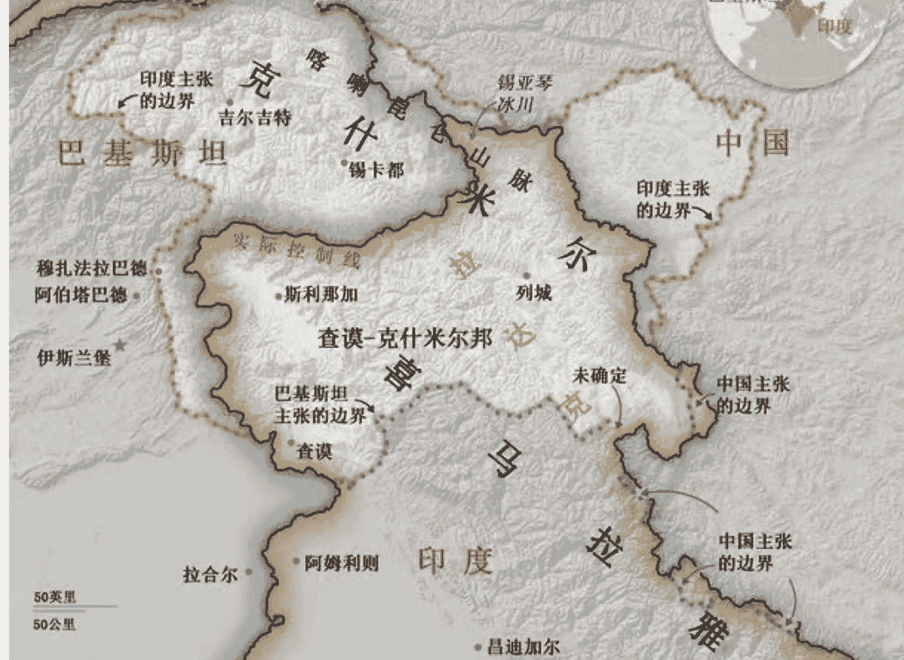

那为啥是“三国杀”呢？不错，第三国就是我们。只是相比起印巴的烈度，我们在当地的冲突没有那么严重。大家这两年没少听说的班公湖、阿克赛钦，其实都在克什米尔这一代。可能小伙伴会说：“那里闹得还不严重啊？”那要看跟谁比，印巴之间可是几十万部队几十年在那里对峙，而且动不动就用重炮轰对方。中印之间相对温和克制得多，前线士兵主要列装了冷兵器，明显都想避免事态升级，只要这个共识不变，那边就闹不大。印度这两年另一个做法也有特色。就跟广西精神小伙械斗前一定要先架手机开直播要求老铁双击刷火箭一样，印度那边稍微有啥事，第一时间就带着直播设备跑过来现场喊麦。客观上进一步降低了冲突烈度，另一个层面也说明印度确实不占优势。克什米尔的中国部分，基本是人类非常不适合生存的环境。只有很少的人口，中巴边界甚至矗立着世界第二高峰——乔格里峰。中国设置的哨所基本都在5000米之上，环境艰苦程度可想而知。但是无论如何都不会有一点松懈，主要也是我们确实没办法。这地方是我们联系巴基斯坦，进而联络阿富汗、伊朗、中东和中亚的通道。属于“一带一路”的重要节点。但问题是这地方离印度核心区太近了。从克什米尔山区南下，轻松就可到达印度河平原。这里一马平川，非常适合机械化部队运动。距离印度首都新德里不过二三天路程。这也是为啥中印战争的时候，印度一下被打懵逼了。所以说现在这个地方就堵在那里了，中国必须维持在这一带的战略优势，保护自己的陆上商道。但是中国一旦有了优势，又会影响印度的国防安全，客观上让印度睡不着觉。中巴之间边界清晰划分完整，基本没啥冲突。两国之所以如此和谐，也不是从来如此，一开始也纠缠不清。转机就在大家耳熟能详的1962中印边境自卫反击战，打了印度一顿。那次战争中，解放军打印度正是途经克什米尔。巴基斯坦建国后跟印度实力太悬殊，一直在寻求支持，它最早的支持者是美国，不过美国隔着一个大洋，而中国就在边上。中印战争之前，巴基斯坦对中国实力没底，而且对中国的超远程战略投送能力更不清楚，中印打完之后，巴基才意识到旁边这哥们靠得住。转年巴基斯坦和中国的边界就划定了下来，并一直保持稳走马灯一般变，和美国的关系也时起时落，中巴关系都没大变化，这跟客观环境强相关，换谁都得那么做。在印度眼里，中巴就是两个勾结在一起的强盗。中国仗着自己厉害，把自己打了。不但侵占印度领土，现在还越来越不讲武德。现在路越修越好，住得越来越好，吃得越来越好。然后仗着基建优势，把各种重武器拉到山上。不但站在高处俯视，而且实打实得威胁自己。在印度眼里，比他弱得巴基斯坦比中国可恨得多：你不愿意让我随便打，已经很过分了，还勾结中国跟我作对。当然，克什米尔这地方被如此重视，肯定不是图这里山高，图这里适合野外生存，主要是各方都没招。

### 2

印度提起克什米尔就闹心，各种不爽。看地图，就可以发现印度首都新德里，位置怎么看都别扭，就挨着克什米尔。距离咱们中国控制区只有300多公里，距离巴基斯坦也不到500公里。

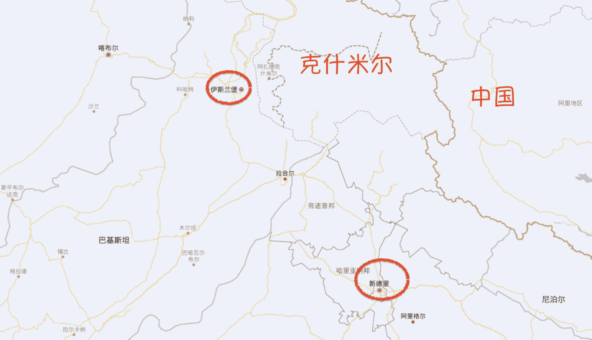

和咱们中国虽然隔着喀喇昆仑山脉，可因为东北高地被中国占领，新德里到中国控制区几乎没有地理屏障。对于印度最恐惧的，就是哪天夜里中巴兵分两路突袭新德里，形成一个“钳形攻势”。现代战争的速度，导弹十几分钟就能到，飞机也不要一小时，机械化先头部队，天刚亮就能杀到新德里门口。至于印度为何首都都在这里，这就要往回说几句了。其实德里地区是块风水宝地，处在印度河平原和恒河平原交汇地区。这里物产丰富交通便利。看地图就可以发现，这里是辐射整个南亚次大陆的绝佳地点。一直以来都是北印度的中心。我之前也给大家讲过，印印度现在有个大麻烦，就是南北经济差距太大，南方沿海经济发达，北方却一塌糊涂，南方半只脚迈进了现代社会，北方还在搞封建礼教那一套。最大的十个城市，南方占了八个半，北方最能拿得出手的就是新德里那一带。如果首都也弄到南方去，那北方啥也没了，更离谱的是，北方经济不行，人口却很多，下边找了一张人口分布图。为了平衡南北，首都必须安排在北方。问题是北方唯一有资格的就是德里地区，没招了，只好选在了德里。可能有小伙伴不理解“新德里”和“德里”的关系，其实这俩城市挨着，新德里是德里的新城，他俩所在的那块区域也叫“德里地区”。

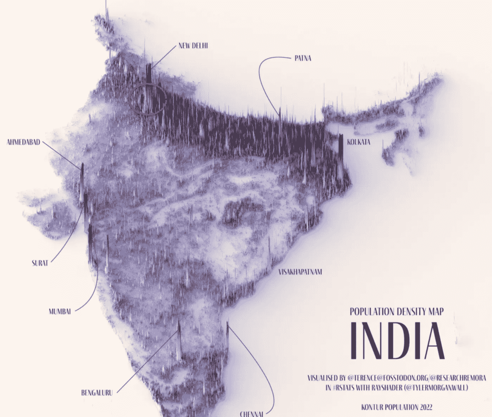

新德里距离伊斯兰堡不到700公里，距离巴基斯坦北部真正中心拉合尔，只有400公里。相当于北京到济南的距离，开个GL8两个多小时就能到。两家完全是脸贴脸。几乎没有腾挪空间。所以不管是为了自身安全，还是为了敌方不安全，印度都把重兵集团屯在克什米尔，同时防着中国和巴基斯坦，而且得不断骚扰巴基斯坦，让巴基斯坦也没法想别的坏主意，这些对于印度都是必选项。具体到克什米尔，印度虽然看着占优，其实是纸面富贵。在基层上和巴基斯坦实力有差距。克什米尔绝大多数人口都信奉伊斯兰教，和巴基斯坦天然亲近。印度根本无法在当地平稳治理。现在印度占据了克什米尔中部南部环境比较好的地区，但是虔诚军这种穆斯林反抗组织层出不穷。印度只能不断地加力，一边在克什米尔镇压，一边加强对巴基斯坦的压力。印军在克什米尔就接近十万，并且为了应对中巴可能的突发情况，常年有数十万部队严阵以待。但是效果非常有限。跟中国的实力差距以及地理上的劣势，使得即使中国没大动作，印度依然要摆开队伍，整体处于被动压力状态。在海拔1000米到6000米的整条路线上，层层布防。至于巴基斯坦，印军要压制当地武装，还要应对巴军压力。真正是三面对敌，疲于应付。

### 3

那巴基斯坦呢，一样的，克什米尔是巴基斯坦的命门，如果失去这里，巴基斯坦基本就完了。巴基斯坦首都伊斯兰堡，距离边境距离近得不可思议。这里距离克什米尔只有40公里，距离印度实控线只有80公里。

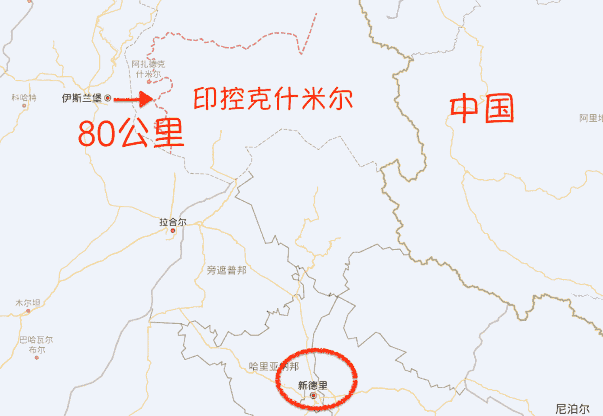

80公里，稍微专业点的自行车手骑两个小时都能跑完，火箭弹搓的大一点就能打到。跟这造型有一比的，就是乌克兰首都基辅，离俄罗斯布良斯克州只有200公里，这也是为啥当时有“1小时34分钟”速通乌克兰的说法。实际情况稍微好一点，克什米尔的巴控地区大多是高山，交通不太方便。印军如果进攻，速度没有那么快。不过80公里，就算是爬，慢又能慢到哪里去？你肯定好奇，巴基斯坦是咋想的？和印度那么紧张，还把首都放在这种地方？其实这已经基本上是最优解了。对于巴基斯坦，选择首都是件挺简单的事情。因为没得选。刚建国时巴基斯坦的首都在南部沿海的一个叫卡拉奇的城市。这里是交通要道天然港口，经济发达人烟稠密。一直是巴基斯坦第一大城市和经济中心，类似咱们的上海。可是巴基斯坦的国土长得跟个如意似的，中间腰部特别细，经济中心在南方，首都也安放在南方，北方很容易被印度给蚕食干净。而且那么个地形，还很容易被印度拦腰截为两段。之前巴基斯坦的领土还包括现在的孟加拉拉，离得太远，已经被印度截过一次了。更麻烦的是，巴基斯坦境内大部分河流的源头也在克什米尔，如果克什米尔彻底被印度控制了，自家的水源也得不到保障了。可能有小伙伴纳闷，印度会给水里下毒?那倒不是,印度已经干了很多次,把自己境内的河流建起了河坝,强行改道,不让流往巴基斯坦,缺了大德。所以巴基斯坦最合理的选择就是北上,把首都建在最关键的地方。一旦真打起来,依托北方资源和地形,大量动员并层层布防。双方只能正面决战,让印军付出巨大代价却无法获得足够收益。类似明朝选择北京作为首都,北京就是个传统要塞,游牧部落南下,直接就得跟明朝最大的要塞决战。巴基斯坦把全国资源都堆在了北方,跟印度正面硬刚,也是一种“天子守国门”的玉碎策略。可是北方能建都的地方并不多,于是就建到了伊斯兰堡,几乎贴着印度控制区。本来巴基斯坦把力量集中到北方是想防御印度,以巴基的实力,想打印度还是有难度。但是把这么多资源全集中到印度首都的脑门上,旁边还有个中国在那里杵着,印度想不慌都难。为了解决这个困境,印度上世纪80、90年代顶着国际上的巨大压力强行上马核武器。结果巴基斯坦依法炮制,最后1998两家前后脚进入核俱乐部,如今三个有核国家怼到了一起,成天相互盯着。现在大家懂了为啥说克什米尔是世界上最无解的难题了吧,三方都不能放弃那地方,问题是三方都拿出来玩命架势要守住那地方,你说能怎么办?

### 4

如今那地方又有了新变化。在很长时间里,印度和苏联是一起的,而巴基斯坦只好选择美国,并积极和中国处好关系,对抗印度。俄罗斯和印度的关系之前的文章里介绍过,已经维持了上百年,早在还没有印度的时候,俄国人都和印度民族主义者关系不错,后来一直属于传统盟友,每次出了事,他俩都要坚定地相互声援。大家知道吧,俄罗斯和苏联对其他兄弟的态度,一直不太好,类似老子跟儿子,你不听话我就打你。大家知道华约吧,本来是想对抗北约的,不过华约没打过任何一个北约国家,只揍联盟内部的兄弟,谁不服就揍谁,甚至还威胁过咱们。但是苏联和后来的俄罗斯对印度一直很不错,从来都是有事说事,不会动不动剑拔弩张,更没搞过军事威胁。美国一直想拉拢印度,可是又拉拢不动,于是和巴基斯坦走到了一起。长期以来,巴军的主要装备和训练都依靠美军。经常可以获得先进武器装备,经济上也与美国关系密切。这也是为啥印度和巴基斯坦的实力差距非常非常大,印度却没能吃了巴基,一方面在国际上中美都罩着巴基,另一方面巴基的武器比印度先进一些,历次战争中,如果没有空军优势,巴基斯坦早完了。很多人觉得印度跟中国关系不好,应该和西方不错,这就没谱了,它跟西方跟尿不到一个壶里,前段时间刚跟加拿大闹翻了。而印美关系在冷战中就起起伏伏,大多时候都不怎么样。随着中国崛起,印度和美国的关系明显好转。但是问题在于印美关系中,还有一大一小两个问题。小问题是俄罗斯,印度不愿意也不可能切割,美国也不方便为此强迫印度。俄罗斯被制裁后,做中间商赚差价风生水起的就是印度,欧美整体不闻不问。大问题是巴基斯坦,美国在这几十年里,一直想撮合印度和巴基斯坦,甚至卖给巴基的武器,也要求巴基只能用于自卫,不能进攻。所以美国希望印巴能和好,一起对抗中国。这也是为啥特朗普在的时候,跑去印度喊话,公然说美国和巴基斯坦是兄弟,大概意思是“给我老特一个面子,我兄弟就是你兄弟,你们别打了”,现场人山人海却突然沉默,很快就发出呼声让他滚。主要也是那个死结,领土问题一般在建国的时候好处理,越往后越麻烦,慢慢就成死结。现代国家又都是民族国家,谁敢说某块领土我们不要了?谁也不敢。这个背景下,克什米尔那事几乎无解。不过说了这么多,大家也看出来了最关键的那个问题。印度和巴基斯坦他俩现在这个状态，对我们来说实在是太重要了。大家可以设想下，他俩哪天突然说，从此以后克什米尔解决了，双方按照现在实控线划定国界，今后再也不闹了。那可就真麻烦了，因为他俩现在都是美国的哥们，接下来会发生啥大家也就知道了吧，我们西部出口就被堵死了。所以说现在这种一直闹，却不大打的状态，刚刚好。

### 尾声

很多人都在拿这张图说事，说世界陷入了动荡。

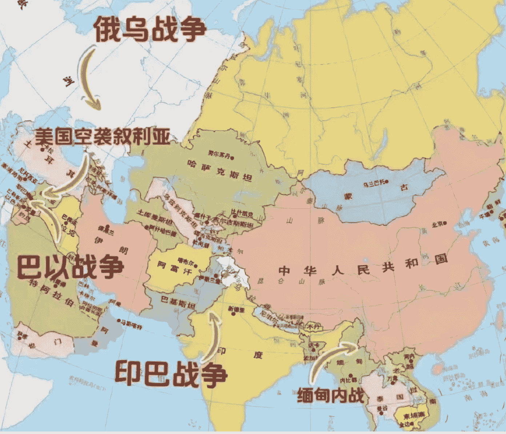

其实我没记错的话，这几个地方20多年前就这个烂样。20年前巴以就在打，那时候不仅加沙在打，约旦河西岸也在打，反倒是现在烈度下来了。那时候印度和巴基也在打，互相还在克什米尔各种核试验。缅甸和叙利亚更是两个烂地方，好像从没消停过。唯一不一样的是俄乌这俩二十多年前还没开打，不过那时候俄罗斯在跟车臣打，惨烈程度丝毫不亚于现在的俄乌战争。此外还有南美的毒枭，美国的枪击，东欧的地下人口市场，东南亚的黑工，从来没停过，那时候赵本山就有一句话，国外全部乱套，风景这边独好。所以我一直说，并不是世界变乱了，而是新媒体崛起之后，大家被信息轰炸更多了，其实最近一百年整体趋势是冲突烈度在不断变低的过程，毕竟就在几十年前，超级大国都直接下场作战，如今更多的是代理人战争和局部冲突。

整体而言，每次被信息集中轰炸一波，就有一群人彻底再也不看这类新闻，因为今后会发现千篇一律，进而产生于谦他爹的那种感觉：眼窝浅，心善，看不得穷人，把他们给我全轰走。至于克什米尔这种，悲观地讲，它确实是今后很多年的火药桶。乐观地讲，哪天它不是了，咱们反而有点麻烦了。

公众号懒人搜索，懒人专属群分享

## 国债和国运

2023-11-01

### 1

1875年,清廷高层爆发了一次大讨论,国家到底保不保新疆。这在现在很多人眼里,这是问题吗?主权领土寸步不让,新疆那么大一块地,保不保这事怎么还讨论上了?不过年轻人还是没受生活的毒打,对“钱从哪来”这个问题理解得不深,等到有太多想做的事因为没钱饱受憋屈、最后也没做成的时候,慢慢就明白了。国家也一样,憋屈的时候经常大片地丢领土。当时我国东部沿海正受日本威胁,西北正被沙俄渗透。按理说都得管,可清廷刚打完太平天国,最富庶的江南被夷为焦土,刚被屠城的南京瓦砾还没收拾干净。清廷的问题不是保哪边,而是先考虑去哪找钱。最后左宗棠提议向西方银行团借钱,再用这些钱购买美国的武器,当时美国刚打完南北战争,天量武器等着打折出售。后来的事大家也都知道了,清廷最终批了这个方案,左宗棠抬着棺材出玉门关,通过借的钱在新疆遏制了沙俄的扩张。左宗棠的部队是中国第一批“美械”部队,美式线膛步枪和德国克虏伯大炮对新疆阿古柏形成了碾压之势,阿古柏的部队主要是俄国装备,基本上差了一代,左宗棠不到一年就平复了新疆。这可能是中国近代史上影响最大的一次“国债事件”。不过这事还有个衍生结果不咋有人提,当时英国银行答应给大清打钱,人家是需要抵押的,就好像你现在去贷房贷,得拿着银行流水去。向银行贷款得先证明你有还款能力。那左宗棠的流水是什么呢?对,大清的海关税收。左宗棠借钱之后,大清的海关税收直接到了英国人手里,就跟咱们现在每月还房贷似的。大清的海关只能撑得住左宗棠的贷款,没法再给李鸿章贷款了。北洋水师建成后8年再没增加军舰,主力舰7年没修,因为军舰维修费用也非常非常高。后来在甲午海战中败给了装备了新式军舰的日本人,东北差点被日俄给分了。经过列强斡旋,沈阳保住了,不过一堆领土确实被俄国给占了,后来进一步被蚕食了一大片。我知道很多人又想说“太后造园子挪用海军军费”的事,这个比较复杂,后续大家有兴趣我再给讲讲。这里提一句话,现代海军的开支一直大到离谱,太后园子那点钱影响不了啥。而且国防是配套建设,大清甲午海战真正被打惨的其实是陆战,日本现代陆军完虐清朝陆军,攻陷了陆基炮台,用大清的岸炮把大清的海军给扬了。然后陆军威胁北京,逼着大清签了条约。现在回过头来看,如果没有那次国债,可能现在新疆就没了。当然了,新疆的阿古柏实力远远没法跟日本相比,就算那些贷款给了李鸿章,可能甲午战争结果也差不多。后来北洋政府又借过一次,徐树铮收复外蒙就是这次借款提供了经费,不过收复了也没守住,因为此时沙俄已经没了,取而代之的是苏联,苏联为了确保远东大动脉,也就是西伯利亚大铁路,无论如何也要把外蒙切下来,中国当时的实力是保不住外蒙的。

### 2

中国直到19世纪末才开始搞“国债”这种高阶金融操作,而欧洲在16世纪左右就开始大规模这么干了。1694年英格兰银行成立的时候,国家向个人借钱这个操作就被制度化了下来。也就是说,世界上第一个中央银行,英格兰银行,成立的初衷就是为了给国家借国债。国家需要打仗或者赈灾,可是税收什么的都已经安排下去了,实在是没有余钱,怎么办?那就给英格兰银行一张借条,承诺五年后用税收还本付息,银行把钱给政府,具体他是怎么弄到钱的,政府不用关心。银行会把这个政府给它的借条拆分成无数份,然后卖给想投资赚钱的人。手里有余钱的富豪,商人,甚至全世界各地的黑社会,都可以去英格兰银行买这个“理财产品”。一开始大家心里有点打鼓,担心英国政府不还钱,所以英国想借钱,利息非常高,有点像前些年某些“高炮”理财产品。后来大家发现政府从不违约,总是按时还钱,大家也就放心了,英国可以用极低的利率借到钱。而且这些债券就跟印好的钞票似的，长得都一样，不管谁持有，五年后都可以到银行连本带息拿到钱。你也可以把这张债券打折卖给别人，国债债券有了二级市场。流通性好，大家更愿意购买了，让英国的融资能力上了一个新平台。正是靠着这套领先其他国家一个时代的资源调度方案，英国先后打赢了大同盟战争，英法七年战争，拿破仑战争和克里米亚战争。这套玩法后来美国基本上原封不动拿去用了。大家知道，国家之间的角力，很多时候就是资源的对耗，涉及到“大棋”或者“奇谋”的并不多，大部分时候是走一步算一步。谁能低成本调得动大量的资源用于对耗，谁就更可能获得最终的胜利。当然了，如果你热爱大棋党的东西，会惊讶于他们每周给你搞个大活，觉得挺新奇，但是多读几本书，学会从后往前看，就发现完全不是那么回事，牛逼如诸葛武侯，一辈子也没啥奇谋，只有兢兢业业地处理琐碎事务。更进一步讲，哪个政府可以低利率发行国债，谁就能更高概率取得最后的胜利。很多人对利率还是没深刻理解，比如英国和俄国都借了一千万两银子，三十年还清，利率差一个点，俄国在三十年里就得多还150万两。问题是经常远远不止差一个点。这也就回答了大家经常纳闷的那个问题，为啥欧洲一开始出现过“国王杀债主”的事，后来好像没这种事了。多简单啊，杀了债主当前的这笔钱解决了，过一段时间又需要钱的时候怎么办？到时候没人愿意借就死定了。也就是说，一旦借钱成了习惯，杀债主就解决不了问题了。可能大家有疑问，为啥就必须借钱，国家不借钱可以吗？就在英格兰银行成立前半个世纪，明朝就给大家演示了一遍没有国债制度国家怎么操作：那就是使劲给老百姓加税，最后把老百姓逼得卖儿卖女。为了开源节流，大规模裁撤公务员。最后老百姓实在是穷得没办法，有个下岗公务员振臂一呼，大家跟着反了，于是开始了一个更加混乱和血腥的循环。当然了，这只是财政层面的分析，咱们就不聊“小冰河期”什么的了。国债制度更关键的是效率，左宗棠下定决心保卫新疆的时候，如果清廷不是直接向西方银行团借钱，而是从老百姓的牙缝里使劲往出压榨最后的几钱银子，然后再送到京城，再向西方购买武器。等武器横跨大洋到达中国，可能不但新疆没了，甘肃也没了。而且那种为了收税极致的压榨，说不定把刚压下去的太平天国又给弄起来了。也就是说，国家向大商人借钱来打仗或者做什么事，可能是效率最高、老百姓痛感最弱的操作。美国把这套国债秩序学了过去，奠定了后来的逆势上扬。就在大清“海防和塞防之争”的一百年前，也就是大清乾隆五十二年，大洋彼岸发生了一件事。赶走了英国人的美国各州发现自己混不下去了，打了八年仗，欠了一屁股债，等到要还钱了，发现太痛苦，没法继续了。各州代表齐聚费城胜利召开了美利坚第一次代表大会，准备商讨下这事的解决方案。当时老爷们普遍都做好了心理建设，准备一建国就做老赖。后来在汉密尔顿的推动下，美国政府决定坚持还钱，会上又讨论了若干历史问题，最后被认为是一次团结胜利的大会，多年以后变成了美国小学生考试要划重点的内容，也就是美国的立宪会议。其实汉密尔顿打了一个更深的算盘，如果一建国就赖账，今后一毛钱都别想借了。如果不赖账，不仅可以借新还旧，还可以借钱发展，到时候再慢慢还钱，大不了学习荷兰人，搞永续债，只还利息。这个国策对后来的美国影响极大，甚至可以说是决定性的，支撑了美国在接下来的三场国运之战。第一场是南北战争。南北战争跟太平天国运动基本同步，两场战争都没啥谋略可言，就是双方拿人命对耗。湘军玩的是“大蟒围城”，由于军饷不足，攻陷城池后动辄屠城。南北战争是北方用惨烈的伤亡比跟南方对耗，攻下一个南方城市就烧为平地，彻底断掉南方的战争潜力。南方没有金融市场和国债制度，只好滥发纸币，后来通货膨胀率1800%，终于撑不住崩了。北方联邦政府靠华尔街发行公债，让老百姓和富人出钱打仗，也吸引海外富人购买国债，最终北方耗死了南方。如果没有汉密尔顿当初的决策，美国可能在内战之后彻底完蛋，变回了小农制的南方庄园。第二场战争是“二战”，其实大家看《父辈的旗帜》，说的就是这事，当时让战争英雄们像戏子一样巡回表演，号召大家出钱买公债，不然政府也没钱造军舰。第三场战争是和苏联的对耗，美国老百姓当时也承担着非常高的税收，依旧不够，依旧需要巨额国债开展军备研发。不仅如此，民间资本还支持大量的冷战技术“军转民”，通过技术迭代回收投资，美国后来赢下冷战，其他的都是次要的，主要是科技领先了一个身位。而苏联没这方面的能力，只能依赖石油，油价崩了后，手里也就没牌继续跟美国耗了。

### 4

那国债这么好，是不是每个国家都能借钱来发展呢？不太行。比如阿根廷，一直都在借钱，借来又还不上，过几年国家破产，违约后下一次借利率变得非常高，更还不上，继续破产。现在是习惯性破产，谁借给阿根廷钱，就等着被赖账。其他几个兄弟也差不多，巴西、土耳其、斯里兰卡等等。可能你觉得阿根廷挺离谱，还有一堆烂国家货币连废纸都不如，每隔几年换一次。这也说明一件事，借钱这事是“发展”的附属品，如果你发展乏力，借钱可能不但解决不了问题，大概率会死得很惨。其实对应到咱们个人身上也差不多，那些有钱人往往都是欠债大户，主要也是他们赚钱厉害，现金流充足，也就不怕欠钱多。一边赚一边欠，一边欠一边还。普通人现金流不足还经常借钱，大概率变老赖。那内债呢？向自己的老百姓筹钱，总不受影响了吧？一样的。如果经济向前发展，每年都有增量。今天政府向老百姓发债，过一些年经济发展的很好，经济盘子做大，政府收的税变多，欠的钱总能连本带利还上。国家靠债务应急，老百姓可以投资国债赚点钱，享受发展红利，这就是一个良性循环。反过来讲，如果经济增长不太好，政府还大规模发债，过几年怎么办？到时候还不上只能是借新还旧，越借越多，到最后彻底还不上了。这时候只有一个办法，就是印钱还债。印钱的本质就是洗劫本国那些最老实最勤奋攒钱的那些人，他们存在银行里的钱被稀释了。现在大家懂了吧，政府发国债这事本身并不会导致通胀，因为钱并没有变多或者变少，只是转移了。真正的问题是，全世界所有的政府都有种偷摸印钱稀释债务的冲动。这也是为啥政府赤字高的时候，往往接下来就是通胀。看美元就知道了，自从1913年美联储成立，美元已经丧失了95%的购买力。当然了，这里说美元只是给大家举个例子。在全世界范围内来看，美元在百年里损失95%看着离谱，其实算表现好得不得了的那种，大部分国家不是贬值的问题，是他们的货币挺不了这么久。其他经济体往往二三十年就得损失这么多。就在这几年，有些极端的国家三四年内主权货币就贬值十倍左右。这两年美国疯狂撒钱，好像美元的地位依旧很坚挺，其他国家的货币都对美元贬值了，说明全世界老百姓用脚投票去持有美元了。主要也是跟其他经济体相比，它印的没大家想象的那么多。至于有人说美元利率高，所以大家愿意持有，俄罗斯都15%的基准利率了，大家也不持有卢布对不对，可见利率并不是关键。

### 尾声

本来想聊咱们最近发的那一万亿国债，后来发现没啥可聊的，所以往深里聊了下，让这篇文章过很长时间还能看。很多小伙伴说发债会不会导致通胀？上文已经说得很清楚了，单纯发债并不会，主要看接下来经济情况，会不会借新还旧，债务增长有没有远快于税收收入。就好像你赚钱速度远远赶不上你借钱速度，如果你有印钱超能力，你会怎么办？事实上自从有了法币，温和通胀这事就如影随形，没办法的事，克制的政府少印点，离谱的政府就没下限了，类似委内瑞拉那种。大部分时候政府只是想应急，“苦一苦百姓”。有时候苦完了就挺过去了，有时候挺不过去，那就得一直苦，恶性通胀毁了经济。等到大家意识到存钱就是被洗劫，都不存钱，都在抛本国货币，相当于老百姓自己做空自己国家的货币，从此以后没法收拾了。恶性通胀不一定需要发很多钱，发到一定程度，老百姓意识到了坚决不能手里有任何货币的时候，这个货币就完了。当然了，咱们国家历史上经历过惨痛教训，一直以来是比较克制的。有小伙伴问，普通人有没有对抗通胀的办法？通胀是一种税，普通人对抗了通胀，那这部分税向谁征收？真正抗通胀的东西也有，不过往往门槛高得离谱，或者你有什么信息差，提前意识到了某些东西将来能升值，比如前些年的比特币。普通人就别想了，我目睹过有些人很早就玩比特币，玩了很多年，勤勤恳恳，最后玩了个寂寞，啥也没捞到。一般来讲，温和通胀是不会让人破产的，害怕通胀却经常让人破产。

## 新能源车会摧毁传统豪车市场吗？

2023-10-27

首先说一下，咱们今天聊的“豪车”说的是百万以上的。因为在很多场景里，30万以上的也算豪车市场。

现在有件事已经很明显了。

随着新能源车的大规模扩张，已经逼得传统车企连连降价。先是类似丰田、本田等传统家用车一直在降价，这两年连奔驰宝马等车也在降。

不出意外，这才是开始，今后还得降。因为“工业化”的本质就是“廉价化”，还有一个特点就是“过剩”，又廉价又过剩的东西，能卖得上价有了鬼了。

这里就有个问题，既然工业化会导致过剩，那传统豪车的门槛到底在哪？

主要有两个，一个是硬的，一个是软的。

以奔驰为例，它的豪车确实装着一台普通车没法企及的发动机，技术门槛摆在那里，别人想模仿也模仿不了。再搭配很大的车内空间，奢华的座椅，感觉明显不一样。特殊的体验，就得支付特殊的成本。

以前我见过一个高尔夫，竟然要40多万，吓一跳，这玩意不十来万么，后来才知道那玩意叫“性能版”，百公里加速4.8秒，比它的正常版本快了四五秒左右，车主就得多花几十万。

但是肉眼可见的是，传统燃油发动机和电机就不是同一个维度的东西，就好像维多利亚时代最好的马车，也跑不出燃油车的体验来一样。电机天然有加速快的特点，很便宜的电机就能达到顶级燃油机的加速能力。曾经花几十万能得到的东西，如今随便一台电车都可以。

这就让传统豪车最大的壁垒被打破了，你的几十万的发动机，如今被万把来块的电机给打平了。

今后新能源汽车只要专注做音响，做沙发等配件，顺便再把车做大一些，就能做到和传统豪车除了续航没啥差别。

到最后，两辆车，一辆二三十万的电车，一辆百万级的油车，他俩的加速，乘坐体验，都没啥明显差别，消费者凭啥多花好几倍的钱去买后者呢？

但是说到这里，大家总觉得哪里怪怪的，因为现实里，大家的决策流程并不是简单地看配置看性能，好像还看点别的。

那到底看啥呢？

车不太明显，包包之类的纯奢侈品就很能说明问题。

比如爱马仕的一个比较基本款的包，都要两三万，贵的要几十万，还不一定卖给你。你得先在他们店里大量消费，买够几百万，积分够了，人家才卖给你那种巨贵的。

那是因为爱马仕使用了复杂的技术，生产了一款别人生产不出来的东西？

显然不是，因为市场上有大量几乎可以乱真的假货，专业鉴定师都有打眼的时候，这些假货卖多少呢？一千左右，竟然还有50%以上的利润。

同理还有那些巨贵的机械表，经常假货比真货都真，但是价格方面，却连真货的零头都比不上。

也就是说，假货的相似度已经做到了99%，但是价格却是真货的1%。

这就很搞笑了，为啥大家会花这个冤枉钱呢？那些奢侈品到底在卖啥？以及假货这么猖獗，那些传统奢侈品巨头为啥还能活到现在，甚至卖奢侈品的掌门能登顶首富？

只有理解了上边的这个问题，才能理解如果想破除奢侈品壁垒，我们到底需要做啥。

很多时候，一辆豪车对于富人家庭几乎是必备的，你去谈几百万的生意，开着十来万的车，对方不由自主怀疑你的财力，本身就会导致信任上的障碍。反过来，你开着上百万的车过去，对方会没来由地信任你，这不是啥势利眼，更类似一种“社交机制”。甚至大家私下里讨论谁混得好，往往会说他开啥车，车本身就会说明问题。

此外豪车还有一个功能，就是抵债，还不上债就可以让别人把自己的车开走，或者急用钱的时候，拿车去抵押，快速套现出来。这也是为啥网上说起揽胜或者陆巡，都有句话，“有钱时能陪你风花雪月，没钱时能让你东山再起”。

此外还有更俗的，类似大G这种，可能已经是二手的车了，依旧贵得离谱。但是买了之后，无论是把妹还是谈生意，效率都高得惊人，这也是为啥那玩意超级保值。这时候你要是讨论性能之类的，就无聊了，抖音上有人用Model Y一脚油门崩了大G，挺得意，评论区一堆人在那里说，大G车主懒得跟自己车的购置税比加速。

换句话说，豪车之类的奢侈品，很多时候更类似社交货币。

这里又有个问题，大家购买那些巨贵的东西，真的只是为了实用吗？

不完全是，确实能获得巨大的心理满足。多年前跟大家讲过，印度的顶级豪宅都建在贫民窟边上，真正的大佬每天早上起来，看着下边的芸芸众生为了生活而奔波，幸福感瞬间提升一大截。

后来发现全世界都有这个规律，最贵的房子，就是那些郊区独栋，和市区高层，一圈老破小围着的高层豪宅，价格贵得离谱，道理是一样的。

彰显的就是那种“阶级感”。

是的，人人都讨厌阶级，但现实里除了少数已经脱离了低级趣味的人，绝大部分人并不讨厌阶级，只是讨厌自己处在较低的那一层。

这也是没办法的事，“炫耀基因”本来就是进化的一个结果。懂的炫耀的人，确实有更高概率留下更多的子女，那些不会炫耀的可能断子绝孙了。所以人人都有炫耀的本能，也能从别人不经意的举动中获取到别人的优势信息。

鹿顶着一个很不利于行动的大鹿角，孔雀拖着个大尾巴，看似不利于生存，却利于求偶。

在人类社会里，华而不实的东西，也有这类效果。

有钱人可以毫不费力搞定这些东西，那普通人呢？现实中经常可以看到普通人也购买那些跟他们收入不太搭的奢侈品。

说白了，就是模仿，模仿社会上层的习惯。这个场景在生活中随处可见，大家会去购买明星代言的产品，会模仿官员们的“厅局级穿搭”，会羡慕生活中有钱朋友的生活方式，进一步去购买他们的东西。

作为反例，以前皇冠和奥迪都是“官车”，在很多地方都受到追捧，后来这俩车不是官车了，追捧力度也就下来了。

大家看出来了吧，社会潮流这玩意，绝大部分都是自上而下的。

说到这里，奢侈品为啥不怕高仿也就呼之欲出了，对于社会上层的人来说，他们没必要购买高仿，因为资源充足，就好像正常普通人也没必要买一个专供非洲的传音手机一样。更关键的是，买高价正品确实会带给他们一种炫耀性的快感，可能有时候他们自己都没意识到那种快感到底是啥。

而且大家知道那个说法吧，你特别喜欢手表，然后去买了一个十来万的入门级名表，那大家如何判断你买的是真的，还是假的呢？

主要看车。戴着十来万表的人，车按理说应该是五十万以上，这样才比较搭，否则那就是假的，就算是真的，那也是假的，没人会把你那玩意当回事，只有你自己开心。

富人人少，但是握着的资源多，愿意花大价钱购买豪车名表，也就形成了一个巨大的奢侈品市场。

那接下来的问题就是，你有个产品，如何说服这些人花大价钱购买呢？

没啥办法，先把质量做上去，然后各种营销，使劲砸钱各种昂贵的广告位，通过漫长的宣传来提升逼格，等逼格上来了，富人们愿意买了，这事也就成了。

也正是因为广告费开支太大，而且店铺都在最好的地段，导致那些贵的要死的奢侈品经常赚不到啥钱。

说到这里，大家也就明白了，无论是豪车，还是名表，还是名包，技术优势可能只是一部分，也是基础的一部分，更关键的，还是那种深入人心的宣传，让大家觉得，买这些别人买不起的东西，会形成明确的阶级感。

慢慢形成扩散效应，大家也都开始模仿。

富人需要巨贵的奢侈品，这句话必须加黑下划线。

从这个角度来讲，就算传统豪车全部崩了，未来成了新能源车的天下，也会有层出不穷的高价车重新变成豪车。

因为需求先行，既然有人极度渴望花大价钱购买豪车，自然而然会有人生产和供应这类产品。

这个意义上讲，手机行业一度被苹果给带歪了。

你很难想象，世界上最顶级的富豪，竟然跟普通白领用着相同的手机。这个比较反常的情况，一度让人觉得这是正常的。

不过很明显，其他手机厂家并不这么认为，除了苹果，每个厂子都有几个高端机，价格是他们正常手机的好几倍。

不出意外，过几年时间，手机行业可能又会回到诺基亚时代，电子产品因为更新速度快的特点，不可能像包和表那样差价那么离谱，但是也会有贵的离谱的产品。

回到汽车，新能源车的崛起，可能会摧毁传统豪车，但是摧毁不了豪车这个“生态位”。

咱们可以合理假设，传统油车时代的巨头都迅速衰落，但很快又有百万级的新能源车强势崛起，弥补了那个生态位。

社会是个金字塔，咱们成年人没必要不承认，这个塔越往上，那里的人其实并不那么关注性价比，甚至有种奇怪的心态，有时候只想买贵的，不在乎到底值不值。

可能到了最后，实用价值提升1%，价格却得翻倍，照样有人付钱。可能有人觉得富人们脑子有问题，其实换位思考下，咱们的爷爷奶奶辈看咱们花几百上千买一双鞋，是不是也觉得疯了？道理都是相通的。

现在来看，新能源车大概率会摧毁传统中间档位。因为社会越往基层，越关注性价比。到了最基层，他们已经不在乎品牌什么了，只在乎能用就行，这也是拼多多崛起的背景。类似凯美瑞和雅阁之类的中间档位，接下来会非常煎熬。

随着国产车的崛起，再随着电池的降价（新能源车最贵的就是电池），到时候对日企的二三十万的车必然是一场屠杀。

毕竟买这个级别车那些人，“排面”不是第一位要考虑的，还是性价比最大化，这时候油车跟电车相比就优势不大了。

当然了，这种优势现在主要在中国比较大。现在新能源车在我国渗透比较快，主要也是我国在基建上投资比较猛，充电比较方便。

出了中国，也就发达国家的基建还能看，其他发展中国家还在操心加油站的建设密度，发电量也是个问题。越南已经是发展中国家的头部了，现在最操心的竟然是缺电，这种背景下，他们不可能积极搞充电桩，没有充电桩，还搞啥新能源车。

此外中国发展电车还有个优势，就是补贴电价。现在家里充电桩充电，综合里程跑下来，电车的用电成本是油车的十分之一不到。要知道，大家加的油里有半箱是税，再过一些年，电车渗透到一定程度，那部分税肯定会加到电价上，所以现在是电车的黄金时代，家里有电车的，多跑就是赚。美国那边开油车和电车的成本差距几乎为零，这也是我们将来的趋势。

也正是因为这些原因，出了中国，油车还是绝对主流。

这也是为啥我说中国新能源车想出海，只能是跟欧美处好关系，一方面电车较贵，穷国老百姓买不起。另一方面新能源车极度依赖基建，这更是只有发达国家才有。

其实产业升级之后，其他产品更是得卖到欧美，毕竟产业升级的目的不是为了升级，而是为了卖个好价钱。你想卖好价钱，就得有人多掏钱，穷国老百姓肯定指望不上，我们那么大的产能，自己又无论如何也消化不了。

也就是说，现在已经出现了电动豪车，但是长期看，油车退出历史舞台还非常非常久远。

文末总结下吧。

电车的崛起摧毁不了豪车，就好像老虎没了也会有其他猛兽霸占老虎的生态位。

一般来讲，工业时代的豪华工业品只会诞生于工业发达的国家，这个意义上讲，中国企业非常有潜力成为电动豪车的生产国和输出国。

不过生产出来好产品只是必要不充分条件，还得会讲故事，让大家觉得我们的产品有逼格，然后他们才肯掏钱。

这既需要国力的背书，也需要文化的支持，网上有很多人迷信武力，其实苏联巅峰时期没人敢说它的国力不行，但是它的产品真没人愿意花钱买，甚至连他们自己的特权阶层也在疯狂购入进口货。所以国力和武力很重要，但不是全部。

高逼格的设计，深入人心的广告宣传，加上国力的背书，产品才能在国际上打出声望，然后一切都是水到渠成的事。我们的几个品牌整体做得是很好的，而且确实抢先了一步，不过需要时间的积累，不断地向前辈学习怎么提升逼格，怎么做好营销，将来的机会非常大。

公众号懒人搜索，懒人专属群分享

## 3000点下的启示录：收手吧，阿祖

2023-10-25

这两天不是又3000点保卫战了嘛，翻出来以前的一篇，做了个大改，说不定对大家有帮助。本文只是分享，并不是给大家建议，大家姑且听我一面之词。

前段时间聊了几篇房地产，我说今后房地产慢慢地跟车似的：绝大部分车都是买来就贬值，越用越便宜，只有少数能保值，极少数能升值。

到那个时候，大家也就不囤房了，就跟现在没人屯车一样。今后大家的钱主要用在消费改善生活，提升生活质量，顺便拉动经济，形成正循环，跟欧美似的。

把钱用在消费这事看着挺离谱，但这几乎是经济的唯一出路，今后经济的发动机，就是居民消费和外贸出口这两驾马车，随着外贸走低，消费占比会越来越高。

理所当然的，那篇文章很多人不满意，因为可能被高价房虐出斯德哥尔摩综合征了，不少人觉得现在这种酸爽状态非常好。最搞笑的一个评论是：

九边现在越来越何不食肉糜了，你忘了老百姓有资产升值的需求？

这我能不知道？谁没有这方面的需求？问题是有需求就能实现？那大家都有不上班就给发工资的需求呢，是不是也应该立法给大家解决下？那顺便给3000万光棍都解决下单身问题？

需求归需求，这个世界上从来没有“有需求就能实现”一说，尤其某些需求本来就是大部分人的集体焦虑，根本解决不了，也不需要解决。

不过应该注意地是，可能有人利用了这种焦虑，实现人家的资产升值。这些事，这些年大家估计看得也不少了。

我慢慢想了想，大A就是这样一个地方，把那些有“升值焦虑”的人聚在一起，然后让一小部分庄家先富起来。

曾几何时，我也经常想不劳而获，想投资赚钱，后来为啥突然悟了呢？我因为做业余自媒体的缘故，认识不少做私募的。

大家知道私募吧，就是你把钱给一伙人，他们帮你炒股。社会上对他们的认识极度分化，有些人觉得都是骗子，不过很多有钱人确实信他们。根据我这些年的观察，绝大部分私募确实有两把刷子，毕竟纯靠忽悠，也忽悠不来那么多有钱人的钱，你可以怀疑有钱人的人品，但一般不用怀疑他们的智商。

我跟私募那帮人打交道过程中，经常被他们的见识给惊住了，发现他们确实有很深的实操逻辑。不过放在三四年这个长度上，发现一个问题，就连那些年纪轻轻就资产好几千万的高手，经常也是赚几年，然后某一年特别不顺利，弄不好就把之前赚的都赔了，最后财富跟正弦波似的起伏。甚至那些顶级高手，长时段来看也没赚到啥钱。还有的不知道咋就突然消失了，最后一打听，踩缝纫机去了。

慢慢的，哪怕发现那些特别专业的人，在这个大赌场里绝大部分情况下也没法全身而退。我这样的业余爱好者，又何必呢，决定再不赌了。再说一次，本文并不是给大家建议，而是说要看清楚自己的能力圈，不是那块料不要去赌，很容易输得一塌糊涂。

普通人投资最成功的，估计也就是最近这些年的房地产投资，不过不出意外，大家去看看就知道，现在绝大部分地方的房子已经要跌回2016年房价大涨之前了。

有些小区看着房价还可以，其实那是周围一二手房成交价，二手房已经很久没成交了，你去卖房发现得在当前价格基础上打八折甚至七折才能卖掉。甚至连北京很多房子也是这样，“北上深”如今也是越便宜的房子越卖不掉，越贵的越升值。

还有更坑爹的“环京”，当初太多人想买北京的房子升值，可是北京不让买，于是都涌入环京。后来的事大家也知道，如今环京已经不是腰斩了，是膝盖斩。

太多人迷信“升值”，手里有点血汗钱，觉得这些钱如果去养老也不够，还是要找到下一个风口去投资，最好跟“炒币”似的，来个百倍千倍的收益，最后几乎都惨败而归。

甚至之前有个金融大（骗）佬（子）说，如果没有“资产保值”这么一个口号，那么多拆迁户的钱根本不会吐出来，毕竟拆迁户绝大部分需求已经满足了，唯一没满足的就是想赚更多的钱。

还有著名骗子翟山鹰曾经说过，就你们那个思想水准，只能听得进去想听的话，天生韭菜，不被我骗也得被别人骗，不如从我这里长个记性。

而且他玩法也很社会，经常课堂上宣扬各种阴谋论，脑子正常的听众都被他给气走了，剩下的都是一群没有分辨能力的。毕竟相信阴谋论的人，一般头脑比较简单，还觉得自己与众不同，都容易被忽悠，于是随便被他骗。

被骗几次就踏实了。

说白了，人都不愿意承认自己能力的局限性，不接受自己“普通”这一现实。同时没意识到“资产增值”，“保值”，“成功投资”这些事门槛都极高，把前三十年的很多反常态误以为是常态。

而且现实里，我们都有个常见的错觉，“90%的人觉得自己很特别，应该是前10%”。既然这么牛逼，就该来波非主流操作。然后一顿折腾，最后折腾了个寂寞，把养老钱也折进去了。当然了，如果你确实很牛逼，那不在这个讨论之列。

整体算下来，投资赚钱难度和大家上班赚钱难度差不多，如果上班没赚到，投资大概率也赚不到。

如果上班能赚到，去投资大概率也得赔，因为隔行如隔山，一伸脚就是大坑。没上过驾校直接上路很容易出事，上了驾校距离老司机还有几万公里的驾驶里程，搞笑的是竟然觉得开飞机不用人教。

而且这些年观察周围那些投资高手，发现有个特点，他们好像极少能全身而退。后来听一个大佬说了一句话，说“赌神不下桌”，感觉好像是那么回事。

就是说，如果一个人无论是赌博还是炒股，再或者别的随机性博概率玩法，如果他一直顺风顺水，他肯定不会下赌桌，因为在赌桌上能获得强烈的成就感和自我实现的感觉，会一直玩到赔光才停手。

我还看到过不少人，本来已经在高位套现都不玩了，歇了一两年之后受不了，瘾太大，又对自己的能力非常有自信。继续玩，最后赔了个底掉，想玩也没钱了。

这种心态，仔细想想，其实就像极了很多手里有一些钱的人，比如手里有几十到几百万甚至几千万，别人可能看他们挺不错。但是他们自己心里焦虑，因为每个人所处的位置，大概都在圈子里中间位置，天天盯着比自己好的人，越想越觉得再搏一搏。

于是就去赌博，哦不，去投资，最后投了个寂寞。等到赔了钱之后，回过头来看，觉得自己当初真是个脑残，手里握着那些钱，随便干点啥不行吗，为啥非要去赌博。

可能有小伙伴要说了，那你的意思是所有人都别投资？

也不是，写这篇文章并不是教大家做人，主要还是说下我的心得：资产升值并不是常态，反而是低概率事件，你博低概率事件，大概率没啥好下场。如果上班这种高度确定性的事你都赚不到，不确定性的你能赚到？

大家赌博的时候，应该知道那玩意并不是谁都能行。而我们自己，大概率是普通人，普通人在那种游戏里赢面并不高。

我知道很多年轻小伙伴对“普通人”这个词不屑一顾，觉得天生我材必有用，一将功成万骨枯，自己就是那个将，周围的人全是那个骨。直到三十来岁80%的人一事无成，才会意识到原来自己是地上冒着蓝火的累累白骨中的一根。几乎所有股民也都是这样过来的。

承认并接受这个并不丢人，甚至很多人接纳了自己普通这个设定之后反而做得更好了，因为脑子一热要发疯的时候，自己能提醒下自己“这么好的事凭啥轮得上你”，说不定就避开了一个大坑。当然了，如果你艺高人胆大自然不是问题。

再直接一些，绝大部分人能轻松赚到的收益，其实就是每年的GDP增长率，再或者就是存进银行赚的那点利息。

这部分被动收入属于自然增长，再多一些，就是从别人手里拿了，属于零和博弈那部分，这部分收益天然有风险，而且注定是少数人吃肉，大部分人连汤都喝不到。

现实生活中，我们往往看不上银行那3%左右的利息，毕竟靠那点收益，下辈子手里的钱也没法翻倍，不翻倍投资干啥？于是去搞高风险操作，赔钱后又哭爹喊娘。甚至跑去政府门口闹，要求主持公道，这不搞笑嘛，高风险操作你还指望啥好结果？

最离谱的是那种“绝望一击”，中年离职，准备用多年攒下的钱去赌场上赌一把翻盘，这种几乎无一例外最后赔得一干二净，因为犯了赌博的所有忌讳。

现在想想，狂飙时代给了很多人不切实际的幻觉或者幻想，觉得经济可以一直高速向前，房价可以二十年稳定上升，工资也可以年年涨，其实都是特殊时期的特殊状态。我最近在头条做了个调查，6万人参加，有一半人的收入近两年跌了，只有20%的人涨了，剩下的没变化，今后大概率这是常态，少数人收入上涨，绝大部分人维持稳定或者下跌。

说到这里，肯定有小伙伴要问了，那老百姓今后怎么活？

当然是上班啊，这不常识吗？事实上哪怕现在中国绝大部分老人，也是自己养活自己，活到老干到老。退休金是这个社会极少数人的待遇，绝大部分人还是要自谋生路，靠投资收益养老的更是少之又少。今后国家的养老体系应该是越来越健全的，不过绝大部分人还是得主要靠自己。

### 尾声：

文末还是要说一句，狂飙时代已经结束了，借债发展的时代大概率也结束了。今后大概率进入一种平稳的发展状态，很多逻辑都得变。

在快速增长的时代，更卷更快更激进的人大概率会胜出。那时候你把钱借给私募，私募转手借给房地产公司，每年10%的收益都正常，如今爆雷了，那些钱取不出来了，某植系就是这样。

在今后的慢增长时代，使劲卷可能收益率边际递减，参与赌博连最后那点家底都得吐出去。

关注自己内心，同时兼顾身心健康，活得久才能做赢家。

同理在资产升值上也一样，以前谁敢加杠杆谁牛逼，也就是王健林说的，清华北大，不如胆子大。今后慢时代，可能越激进越吃亏，零和博弈嘛，注定不可能让大部分人吃肉。

大家吃几次亏之后（估计这些年不少人已经吃够了），慢慢就不去想暴富的事了，知道一般轮不到自己。其实从这些年大家疯狂挤体制，已经能看出来绝大部分人开始求稳了。

写这篇的目的也不是说今后大家都别投资了，大神没必要听我的，而且说不定这次真到底了，接下来就是一波长牛，也有可能大家看完我的文章，已经收复3000点了。

不过我理解，像我这样的普通人都要有个预期，知道投资这事肯定是越来越难的，大部分人哪怕牛市也赚不到钱，我经历过两次牛市，亲眼目睹过牛市里大家赔得更多。而且老百姓的资产没有自然保值一说，唯一能保值的就是上班。

普通人，最重要的是认识到自己的局限性，不去不熟悉的领域做无畏的冒险，就算去玩，也要绝对地保持谨慎和底线思维，长期看来可能不赔就是赚。

不开留言了，你们觉得不错就凑合点个赞吧。

公众号懒人搜索，懒人专属群分享

## 扩招到底有错没？

2023-10-21

每年到了大学毕业季，就有一个说法，在那里说“中国现在就业这么困难，就是因为扩招，大学生不愿意去工厂”。

其实换位思考下，你有个孩子，他的学习成绩属于中等偏上的状态。国家按照20%的比例招大学生，你家孩子就得去上大专。现在扩招了，扩到50%就能去上大学了。如果事先告诉你，就算你家孩子大学毕业后，找工作方面并没有多少优势，你愿意去读大专还是本科？

这都不用问，必须是去大学啊。就算将来就业情况差不多，那也要去大学，这估计是所有家长共同的心声吧？

所以说“扩招”这事无论如何也是良政，让更多的人有了接受高等教育的机会。

当然了，我都知道你要说啥，不就是想说现在的大学教育水吗？那是另一件事了，就好像你父母给你买电脑让你好好学编程，你却用它干了所有能干的事，除了编程，你能说你父母给你买电脑就是为了害你？

也就是说，扩招这事动机是好的，但是执行层面太难了，搞歪了。为啥中国大学问题那么多，这就不是我能说得清楚的。

我知道很多人又在那里念叨扩张是为了缓解就业压力，确实有这方面考虑，但本科在缓解就业压力方面非常一般。真正有这方面效果的是研究生和博士，只是随着研究生也毕业了，这种缓解能力如今弱了很多。不仅弱了，还让就业压力卷到硕士去了。

那问题来了，大学生就业差，扩招应该承担责任不？

当然不应该。提高大学生就业率其实也不难，直接招生砍一半，但不能为了提高就业率，就剥夺别人的上学机会，这个道理不难理解吧。在财政能支撑的前提下，还是要尽量让更多的人去接受通识教育。

更重要的是，以前上大学的名额很少，城里资源比村里好，工人资源比农民好，最后的结果就是中国基层的广大农民的孩子想上大学非常非常地难。现在这种情况依旧很明显，各省那几所省会的顶级高中已经垄断了名校名额，其他地级市的重点中学垄断了剩下的重点大学，县城里的学校啥情况，大家应该能猜到吧。

可见扩招本质也是向基层把门往大开了一些。

那谁为大学就业率不行承担责任呢？

整体经济环境，美帝，俄乌战争，越南，资本家，谁都可以怪，反正轮不上扩招。

你可能要说，大家读了大学，不愿意进厂了，所以扩招就是有问题。

接受了大学教育，就能有确定的未来，这个观念本身就应该尽快摒弃，不然家长和孩子都会非常痛苦，尤其是那些拼了命，把孩子送到大学的人，更应该对这一点有深入的理解。

中国人在传统里就有个非常离谱的观念，类似“万般皆下品，唯有读书高”，咱们这里不是说读书不高，而是说教育的目的是啥？教育的目的就是高人一等？接受了教育就有确定的未来？其实你们仔细想想，这些说法本身也没啥道理。

之前大家觉得有道理，是因为我们传统文化里“读书”基本和“做官”是挂钩的，加上以前大学生整体是稀缺的，所以才形成了这样的错觉。

咱们这里并不是要反思中国古代文化，而是说，任何观念的形成，往往都有经济或者政策基础。

在中国漫长的古代史里，读书这东西本身就不是为了学习知识，为的是牢笼志士，让那些有上进心的人，通过科举这种测试机制纳入统治阶层，或者让他们在枯灯下耗尽一生，属于法家的顶级阳谋。

多说一句，很多人问，学习法家的东西会不会让人更加通透？

不太会，法家的东西得搭配“权力”，你有权力，可以利用手里的“势”去折腾别人，让别人无可奈何地被你折腾，这是法家最擅长的。没有权力，法家那一套基本玩不转，按照那些东西做事，很快你就成了一个人见人烦的人渣了。

继续聊知识，古代真正的知识在匠人那里，怎么盖房子，怎么做木工，怎么做水力风车，怎么修河堤，这些都是以文盲为主的匠人们在操办。而且他们的学习手艺并不是靠读书进书院，匠人们主要靠师徒之间口耳相传。

读书人和匠人们完全两个社会阶层，读书的目的就一个，就是为了当官，先考取功名，去地方上当官，到时候具体事务啥都不懂怎么办？

好办，地方上有宋江那种循吏，他们负责具体事务，他知道本地谁会修桥铺路。县太爷想修桥，跟宋江一商量，他会找人去搞定，县太爷只需要关心怎么弄经费就可以了。

还有雷横那样的捕快负责治安，尽管宋江和雷横都和本地黑社会晁盖千丝万缕，不过社会就这么运行的，两千年磕磕绊绊也就过去了。

你可能要问，当官的啥也不懂，只读圣贤书，就能统治？

当然可以了。如果有点社会阅历，就知道外行指导内行是常态，内行指导内行是这些年新崛起的科技公司里才能看到的事。那些传统大企业现在依旧提拔会计什么的进入高管层，却不愿意提拔技术人员，这个也不难理解。

孔子有句话，“君子不器”，说的就是他们这样的人不能去干具体活。儒家是讲尊卑讲等级讲秩序的，后来科举选拔的，也都是一群读道德书不干具体事的人，他们科举中了之后指挥别人做具体的事，劳心者治人，专门搞人不干具体活，这就是“不器”。劳力者治于人，劳力的那些人，就是孔子说的“器”。

说了这么多，就是想说一件事，在整个漫长的中国古代，读书这事的目的本身就不是为了让你有个工作，就是为了做官的。

这也形成了老百姓的几个偏执的观念，觉得读书人那真是人上人，毕竟家境不好读不了书，哪怕将来考个秀才，都不用纳税，见了县官都不用跪。如果当上了进士，排几年队，当个县官，那不得了，古代当了官，大概率就进了婆罗门阶层。多娶几个媳妇生几个孩子，多买点地，就算后代考不上，也能维持几代人做小地主。

这种观念不是说现在没了，中国除了那几个商业发达的省份以外，绝大部分人的观念依旧是你进不了官府，那你一年几十万也没啥可吹牛逼的，说不定下周就去送外卖了。而公务员再过几十年过年依旧能收到单位的米面油，不仅实惠，而且光宗耀祖，不服不行。

“读书等于预备做官”这种传统观念，加上前些年经济大发展确实对大学生的需求比较大，大学毕业有个确定性很强的结果，导致了大家普遍对“读大学”有不切实际的想法。读完大学当公务员做白领，怎么都轮不到去打螺丝吧。直到这几年，形势突变。

那接下来会发生啥？

不是接下来，是正在发生，经济降速会对很多观念产生决定性的影响。

最基本的一条，关于教育的回报率问题。越来越多的人跟美国人似的，美国人眼里教育本身就是投资。既然是投资，可能会盈利，可能会赔钱，都得事先做好心理准备，而且得认赌服输。

大家甚至得意识到，读了大学，毕业后的工作可能不如不读，当然这个概率是很低的，之前就聊过，很多美国人那边如果考了个差劲大学，比如什么“英语文学”专业，干脆就不去了，毕竟读那么个专业，出来也得去开大车，不如早点去，少走四年弯路。

咱们的研究生已经出现了这种征兆，比如今年就有很多毕业的研究生发现，他们本科毕业的时候还能进一些大厂。但是他们读研的这三年里，那些大厂严重缩招，现在想进也进不去了。而且现在已经出现了大量的毕业生得去送外卖或者快递过渡一下。

我在这里只是描述现实，不是说大学生就应该去工地打灰、去送外卖或者去打螺丝，而是说，咱们就这么个整体环境，需求少，供给多，困难不可避免。

这一点不会因为大学生少或者多有啥改变。你说就是因为读了大学，所以才不去打螺丝，问题是那些读了大专的也不愿意去啊，让你去，你去？

这也是我之前说的，教育正在完成“去功利化”，除了名校，或者更过分，名校里的少数专业，其他的可能差别不大。

上大学之前就得清楚一件事，一个明显的趋势正在发生，今后读大学什么都不意味，只意味着你读了个大学，就好像你读了个高中一样，没人太会把那玩意当回事。

这也意味着，今后可能是那些学习好的卷名校，就跟韩国似的，上了名校就可以卷那几个非常少的超级企业和公务员。剩下的人就得重新找自己的社会定位了。

说到这里，大家可能要说了，博主你有解决办法吗？

说真的，眼下这种情况，谁都没啥好办法，只能是硬抗，每个人都得在这种环境下去思考自己的未来。

但是有些共识对长久发展是有帮助的。

最基本的一条，整个社会吸收就业，尤其高品质就业的，只能是商业，或者说商贸。

商贸是这个社会的基石，稍微萎缩一点，那就是几百上千万人的生计。你们去看看，那些不尊重商贸的国家，基本都在贫困线上趴着。我国这些年的大发展，本质也是拥抱世界后，商贸推动的大分工，有些城市做得很好，有些城市就很差了。这一点是要达成共识的，不然大学生学历真的会越来越不值钱。

在那些商业不行的地方，大学生真心不值钱。很多人嫌一线城市随便一个人都是大学生，问题是其他很多地方大学生真没事可做，只能去考公务员。

更直接一些，商贸发达，大学生就是人力资源，否则就是就业压力。我知道有人又念经似的扯996，那不有劳动法么，如果拿出抓酒驾的力度来落实劳动法，多容易得事。

这个世界上没啥东西有利无害，包括咱们每个人，体内都有野兽基因，这就是为啥需要法律来规范。很多问题的本质，就是有法却不落实。

而且我之前也说了，大学生毕业，决定不了该去哪，就去商业发达，私企多的地区。这里不是说国企不好，绝对没有，非常好，只是跟绝大部分人没关系，你进不去。而且关键是国企吸收就业非常一般，这个不是我编的。

咱们复制一段“两会”上的话，出处附上链接了：

> “56789”，这是对改革开放以来我国民营经济发展的生动描述。这个形象的“56789”，即民营经济贡献了50%以上的税收，60%以上的国内生产总值，70%以上的技术创新成果，80%以上的城镇劳动就业，90%以上的企业数量。

http://www.cac.gov.cn/2023-03/01/c_1679309732571154.htm

最搞笑的是，上边这段，尽管出自官方文件，并且在一部分人那里是常识。但还有一些人，一听这个就来气，你都不知道他们气啥。

我这里不是想说服谁，只是想说，每个人最后都会得到自己应得的，基础观念的缺失，最后都会体现成生活水平和社会地位的缺失。关键是瞎指导自己的孩子，倒霉好几代人。

可能有小伙伴纳闷，你聊了半天，为啥不提大学生学到的东西都没啥用？

大学教的东西本来也没用啊，教育的目的就是教育，并不是技校。读大学是让你做个有思辨能力的人，掌握到一些基本的常识，最好能掌握学习的能力，需要啥技能在工作里慢慢学。

主要也是大学真没啥技能可以教的，除了编程，教了也没用，因为社会进化太快了，等你学完出来，你那个技能可能已经没用了。这个不需要多说吧，这个号的读者基本都有学历，你们的技能是在工作中学的，还是在大学学的，大家心里都清楚吧。而且90%的人，毕业十来年之后都不从事大学专业了。

文末再总结下吧。

- 1、大学生就业难本质就是商贸的萎缩，商业不行，就业不会好，这是铁律。解决内卷的唯一办法就是输出内卷，向外而生，去跟更多、更有钱的客户做买卖搞贸易，并且扩大老百姓的购买力，通过内需刺激商业环境，商业天然需要大学生，除此之外没啥别的办法。
- 2、市场是需求驱动的，没人买你的东西，你的东西再好，也得破产。没有公司需要大学生，你为了考大学花了再多的钱，最后也找不到好工作。

商业繁荣的时候，公司多，毕业生好找工作，工资也高，政府收入多，公务员收入也多。反过来，商业不行，私企降薪裁员，很快会蔓延到财政，到时候公务员收入也得跌，现在很多地方已经有了凉意。

- 3、教育只是教育本身，今后会越来越和职业解绑定。绝大部分人最后混成什么样，主要取决于进取心、勇气、商贸环境、动手能力还有运气。

公众号懒人搜索，懒人专属群分享

## 为啥中东就团结不起来？

2023-10-18

首先还是要说，这段时间关于中东的讨论，已经达到类似“中医”和“转基因”问题的程度了，不少人在群里对骂、退群，还有线下真绝交的。

真没必要。说真的，自打我记事起，那地方就闹得一锅粥，现在我过了要被互联网大厂辞退的年龄了，那地方依旧还在打，大概率还得持续些年。没必要有太深的代入感，以前中国老百姓看那些地方的乱斗，一直都是个看戏心态，到了今年突然好像非常上头。

也正是因为对那边的国家都没啥感情，我上一篇《以色列要完蛋了吗？》尝试尽量客观，把两边的情况都说出来。整体反馈是很好的，极少的些人竟然说我屁股歪。我问他这里边描述的都是事实，怎么歪了？他说就应该只说以色列的毛病，很多事就算是事实也不应该说，不然大家思想就乱了，不知道该支持谁。

这言论让我感觉挺震惊，才发现很多人还处在童年时代，对世界的理解停留在看电视剧先问谁是好人谁是坏人的状态，真羡慕他们这种一直长不大的童真。

不过好在绝大部分人脑子还是挺正常，那篇阅读量也非常大，也能看出来绝大部分读长文的人还是想了解全貌，而不是发泄情绪。

此外大家还要有个常识，历史上99%的人是没有后代的，现在的全人类，是有一个共同祖先的。也就是说，绝大部分个人和种族，最后都湮灭了，只有极少数中的极少数存活到了现在，或者说幸存到了现在。

所以也没必要去论证哪个种族天性残暴，昂撒人、突厥人、斯拉夫人，都经历了野蛮的杀戮和被杀戮之后才幸存到了现在。哪怕我们中华文明，历史上经常出现一大半以上的人口灭绝。大家也知道一句话，“960多万平方公里不是充话费送的”，从黄河中下游的一小片扩张这么大，这个过程不可能是温情脉脉的，只能是铁和血的扩张和征服。

换个说法，活到现在的民族，都不是善茬，善茬早就在惨烈的一轮又一轮屠戮中被灭族了。

所以我一直尽量聊事实聊逻辑，少批判少控诉，没意义，而且像个祥林嫂。

大家这两天应该已经看出来了，这次以色列做得这么过分，但是很多人期待的中东大联合并没有出现，到现在以国家名义站出来替哈马斯说话的只有伊朗。

更离谱的，大家知道，现在的巴勒斯坦是分成两部分的：

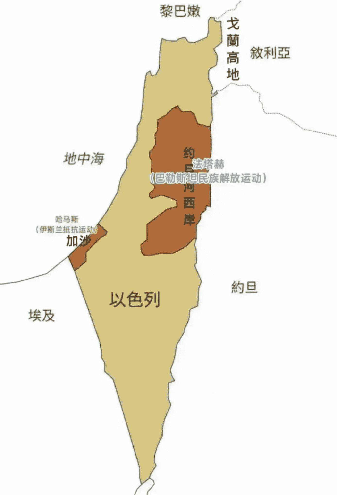

左边的是哈马斯控制的加沙地区，右边的那个法塔赫控制着约旦河西岸。那个法塔赫整体也是安静如鸡，摆出一副事不关己的造型，就好像加沙地带的悲剧跟自己一点关系都没一样。

那问题来了，这些兄弟们咋都这样？

了解内情的小伙伴也都知道，哈马斯和法塔赫他俩之间的关系，有点像北洋政府和蒋委员长的关系，看着好像都是“民国”，其实分得很开，甚至是要灭掉对方的关系。这两天法塔赫已经公开喊话，它才是真正的巴勒斯坦，哈马斯只能代表它自己，谁也代表不了。倒也没乱说，全世界所有跟巴勒斯坦有外交关系的国家，交往对象都是法塔赫。

大家知道阿拉法特吧，他领导的组织叫“巴解”，巴解跟《倚天屠龙记》里的明教一样，主要的武装力量是“五行旗”，也就是五个下属组织，各个旗主都是未来的教主候选人。巴解下边也有八个小组组织，其中最大的一个，就是那个法塔赫。后来这个法塔赫取代了“巴解”成了话事人。

巴解在跟以色列斗争过程中，发现确实搞不定以色列，不打了，准备过日子，于是双方和解。现在的约旦河西岸已经很平静了，很多老百姓去以色列上班，法塔赫上层也过上了比较奢侈的生活。经济上极度依赖以色列，这也是为啥他们并没有太多的动机去招惹以色列。

但是另一个组织，由伊朗和沙特支持的哈马斯却不想和解，准备继续斗争。于是就形成了咱们熟知的“加沙地区（哈马斯）”和“约旦河西岸（法塔赫）”。我小时候这俩地方都在闹，后来约旦河西岸慢慢消停了，只剩下加沙地区一直在闹腾。

网上有人形象地描述为，“法塔赫”就是汪精卫，“哈马斯”就是蒋委员长，也有点道理。

不过有个明显问题，拿巴勒斯坦和中国比有点不太合适，哪怕抗战过程中，中国也是个超级大的国家，是很难彻底输掉的。尤其是有强大的外援，一开始是苏联，后来是美国。

毛主席也在《论持久战》里认为阿比西尼亚（也就是现在的埃塞俄比亚）被灭国的原因是：

- 1、它太小，而且是落后的农奴制国家；
- 2、没有国际援助。

而中国能坚持到最后：

- 1、我们是大国，而且是正义一边的；
- 2、正义的一边会等到援助。

原文是：

> 中国的短处是战争力量之弱，而其长处则在其战争本质的进步性和正义性，在其是一个大国家，在其国际形势之多助。这些都是中国的特点。

> 大量的直接的援助，目前虽然还没有，尚有待于来日，但是中国有进步和大国的条件，能够延长战争的时间，促进并等候国际的援助。

能看出来，作为极度务实的政治家，毛主席对三个因素特别看重，战争潜力，正义性，还有外援。没有战争潜力，就扛不住侵略者的进攻；没有正义性，就等不来外援，以中国当时的实力，确实很难打赢日本，尤其是最富饶的东北、华北、江浙都被日本占了的情况下。

可能有小伙伴说，领土不容谈判，自己的领土必须拿回来，打到最后一个人也拿回来。

这个倒确实是，不过全世界绝大部分国家都有一块到好几块自己的领土在别的国家那里，可能是历史上丢的，可能是自己的领土被别人占着，这都很常见。

一般的选择都是能打就打，实在是打不赢，一点希望都没，那就先过日子，谋发展，实力上来了再说。或者等着格局发生变化，比如法国一度丢了阿尔萨斯和洛林，养精蓄锐了半个世纪，后来趁着第一次世界大战，又把这两块领土抢了回去。毛主席时代面对优势的美国海军，也推迟了解放那个省。

同理，俄乌战争的最终结局大概率是乌克兰的乌东收不回去，双方就地停战，乌克兰宣布推迟解放乌东，类似朝鲜战争最后的结局一样。巴勒斯坦和以色列之间的战争，最后大概率也是妥协过日子，等将来再说。一直闹闹哄哄打下去，也不是个事。

当然了，这需要双方的努力，以色列把巴勒斯坦关在加沙那个露天监狱里，连西方都看不下去，这样做能和平有了鬼了。

我国这两天正在推动和平建国，这也意味着双方必然得做出一些妥协，以色列得放弃一部分现在占着的领土，哈马斯也不能再追求光复所有领土把以色列彻底灭了。现在这种状态，注定没有结果。

还是挺希望能成的，主要是希望我国能推动成功，那可是得诺贝尔和平奖的操作。

有人说，以色列厉害是因为有外援。其实打仗很少没外援的，比如“一战”中的沙俄主要靠英法外援，“二战”又引入了大量美国外援，现在不也在找朝鲜援助炮弹嘛。哪怕中国在抗美援朝三次战役之后也开始大量引入了苏联外援。五次中东战争，本身也是美苏两个阵营的代理战争。对，苏联一开始支持以色列，后来又支持中东国家了。

五次中东战争阿拉伯人全败，很多人说是美国的援助，当然这是重要原因，不过一般主流学界还是觉得中东国家自己的内因实在是决定性因素。

比如人员素质问题，啥武器到了他们手里，都能变得跟柴火棍差不多，尤其一些科技武器。空战和坦克战，阿拉伯国家一直是个非主流，主要也和他们不太重视教育有关，玩不动技术兵器。

不过最关键的，还是中东国家窝里闹的毛病。他们窝里闹，并不是大家想象的那种不能见面，而是见了面和和气气，却各自心怀鬼胎。甚至可以联盟去搞别人，顺利的时候都好说，稍微有点问题，联盟肯定炸窝。

大家可能不知道，一百多年前，现在阿拉伯那块地是被奥斯曼帝国统治的，后来在英国人的帮忙下，先知穆罕默德的后代，也就是“圣裔”哈西姆家族带领阿拉伯起来反抗，他们是准备建立一个完整的阿拉伯国家。后来英国人没兑现诺言，阿拉伯既没有毛主席，也没有尼赫鲁，没能统一，阿拉伯碎了一地，从此就开始“三个和尚没水喝”，碰上啥事都在各自打小算盘。

这里边首先要说的是伊朗。

不知道为啥，不少人把伊朗当做阿拉伯人的大哥，这就错得没谱了。伊朗是波斯人，跟阿拉伯人根本不是一伙的，甚至犹太人论血统，反倒是跟巴勒斯坦人是一样的（不过犹太人流浪过程也跟欧洲那边有结合）。历史上伊朗人建立的辉煌波斯文明被阿拉伯人给灭了，于是他们信仰了少数派的什叶派。

你跟伊朗人说他们是阿拉伯人，几乎相当于伊朗人问你长得这么黑，是不是非洲人那么有侮辱性。伊朗人内心深处是很高傲的，觉得自己是波斯人，是白人，跟阿拉伯天然不是一伙的，也不屑于跟他们一伙。

这也是为啥在过去几十年里，历次中东战争中，伊朗都站在边上看，因为它觉得那事跟它没关系。甚至更认同以色列一些，因为它俩都是杵在阿拉伯世界的两个非主流，有点心心相惜。

也正是因为他俩都是中东的异端，两伊战争爆发后，伊朗遭到整个世界的排斥，因为它既反美也反苏，几乎被围殴了。

反倒以色列对伊朗援助非常积极，伊朗80%的武器都是通过以色列买的。当时伊朗的武器都是美式的，那些耗材如果没有以色列根本没法进口。离大谱的是，以色列建国之后，也想搞工业，可是自己没有石油，于是从1959到1979年，以色列主要的石油就是伊朗供应的，没这些石油，以色列根本打不赢那五次中东战争。

后来他俩的关系越来越恶化，原因有很多，其中以色列最容忍不了的，就是伊朗发展核武器。毕竟以色列是没有战略纵深的，就那么几个大城市，非常担心核武器。为了控制伊朗核武器，有些事做得极其过分，比如炸过伊朗的核设施，也架设遥控机枪狙杀过伊朗核物理学家。

而且伊朗和以色列之间维持着一种奇怪的默契，就是相互之间暗地里往死搞，明面上却基本相安无事。

这次伊朗的态度也是魔幻，一开始大家都觉得是它支持了哈马斯，它说没支持。后来以为它要躲起来，伊朗又说以色列再闹它就不认了。到了16号，又说只要以色列不主动攻击伊朗，它就不动手。

普遍认为主要也是伊朗的经济实在是一言难尽，通胀高得离谱，并不想跟以色列闹大，经济不好的时候卷入战争，很容易发生沙俄那种内爆，上一次伊朗发生革命，也是因为经济问题导致的政权崩溃。

那中东真正的头目是谁呢？

以前是埃及。

埃及对于灭掉以色列非常积极，五次中东战争里，三次半和埃及有关，现在的加沙地带，一度也被以色列给抢走了。

不过也正是因为埃及太过积极，在战争中损失很大，一度把自己的西奈半岛也丢了。

后来发现兄弟们不靠谱，赶不走以色列，干脆不想打了。于是和以色列和谈，以色列把西奈半岛还给它，埃及答应今后再不跟以色列闹了。现在的西奈半岛依旧没有驻军，只有警察和安全部队维持秩序。

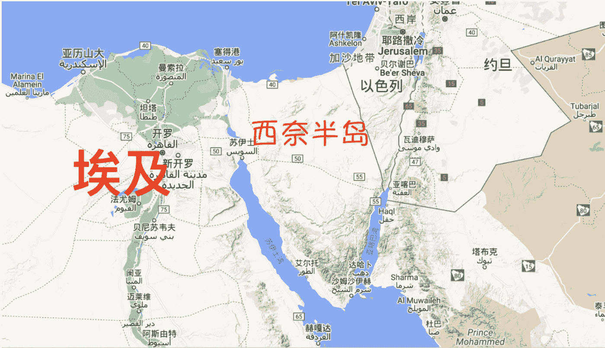

埃及还顺手在加沙地区朝着埃及的那个方向也修了护栏，防止巴勒斯坦人跑埃及去。看下图就能看出来，加沙一面朝海，两面朝着以色列，还有一边对着埃及，埃及在那边也修了围墙。

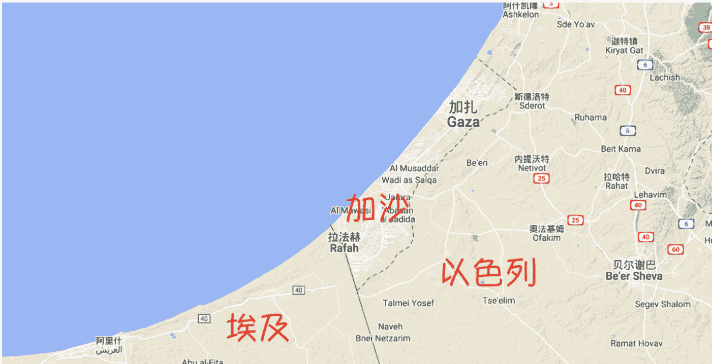

而且埃及这些年一直不太顺利，比较穷，粮食严重不足，去年俄乌战争打了起来，埃及莫名其妙受了牵连。因为埃及粮食不能自给，接近90%的粮食需要从俄乌这俩大粮仓购买，那俩打仗，粮食运不出来，埃及人差点饿肚子。如果真饿了肚子，说不定就会闹革命，前些年埃及已经爆发过一次革命了。

埃及和以色列和谈建交之后，终于不用打仗花钱了，中东也不再有人把他当大哥。

之后伊拉克一度当过几年大哥，不过在两伊战争中和伊朗对耗，落了个两败俱伤，后来被美国打了两次基本上消停了。这几年恢复得不错，但是离巅峰还有段距离，可能还需要一些年。

之前还发生过一件事，第一次海湾战争的时候，美国要揍伊拉克，伊拉克却把飞毛腿导弹射向了以色列。动机很清楚，就是让以色列打伊拉克，到时候伊拉克带着阿拉伯搞圣战。多少有点像现在的情况，哈马斯对以色列发动了自杀式进攻，指望阿拉伯兄弟们联合起来搞圣战，但是大家都比较消极。

如今沙特成了中东实力最强的那个，但是它这个大哥又有点名不副实，有钱，但是做事风格非常拧巴，绝大部分时候跟着美国，有时候又和中俄走得很近，这次战争之前，又跟美国关系很近。

而且做事能力也有问题，之前打过也门胡赛武装，没打下来。支持了叙利亚的反政府武装，如今叙利亚政府还在。

最忧郁的应该是约旦，约旦曾经满怀热情地参加中东战争，甚至把“巴解”接到自己家里来。后来“巴解”竟然试图“夺舍”，爆发了惨烈的战争，终于把巴解赶出去了。

约旦心也凉了，干脆跟以色列建交，只想岁月静好，不再参合中东恩怨。约旦尽管也是中东国家，但没石油，在中东比较穷，支柱产业是旅游业，更不可能卷入战争了。上文提到的那个“先知”的“圣裔”哈西姆家族，如今就在约旦掌权。

至于叙利亚就不说了，领土前几天还被土耳其空袭，还被以色列空袭，正在跟反对派谈判，穷得一塌糊涂，很长时间内都没啥话语权了。

而且中东国家有个转折点，也就是2011年的“阿拉伯之春”，很多国家爆发了革命，死了上百万人，损失了上万亿，到现在伤痕还在。

这也让大部分国家更加关注自己国家的事，转而专注搞起了民生，提高就业率，毕竟老百姓没工作活不下去，爆发革命，统治阶层也跟着没法活了。

也正是因为这个因素，中东开始走向了“缓和”，不想再砸资金到跟自己关系不大的事情上。这也是为啥哈马斯这些年得到的支持经费是越来越少的，因为中东各国都不想管自己国家以外的事了。

现在很多国家的心态类似埃及和约旦，受不了以色列，但是眼瞅这货赶不走了，不如相安无事过日子，提高民生和就业率才是最关键的，不然到时候就不是什么“国际博弈”了，而是血流成河的内爆。

这种思潮如今席卷中东。

也就是说，中东的不团结，从之前的“积极不团结”，走向了这些年的“消极不团结”。

以前是出去抢地盘，打仗过程中各自心怀鬼胎，甚至出钱出力支持彼此国家的反对派。如今是不再想闹腾了，只想好好过日子，提升下老百姓的生活水平，防止老百姓起来闹。

所以这次中东国家会不会团结起来在道义上支持巴勒斯坦？

很有可能。

会不会一起出钱出力？

可能性不大。

### 尾声：

之前有个段子，说剑桥大学的教授去丛林考察，碰上了食人族，教授惊讶地发现，食人族里竟然有自己的学生。教授问，你们接受过高等教育，为啥还吃人？学生说确实是，我这样受过高等教育的不能跟他其他野人一个样，我们穿西服打领带用精致瓷器和刀叉吃人。

必须承认的是，人类最近一两百年确实文明了太多，之前看曾国藩的时候，实在是看不下去，因为动辄就把抓到的太平军全部凌迟，那些太平军很多都是些走投无路活不下去的老百姓。而且在中国最富庶的江浙地区动辄屠城，官军屠城我是难以接受的。

现在当然不可能这么干，不过不代表不野蛮了，也不代表这个世界不再弱肉强食了，其实这一直以来都是这个世界的底色，只是如今不能那么赤裸裸了。

包括俄乌战争，大家想想，如果俄罗斯能像之前处理格鲁吉亚那样，或者印度吞并锡金一样，干脆利索，在别人反应过来之前结束战斗，很可能也就没人说啥了。只是俄罗斯实在是一言难尽，乌克兰得到了国际舆论的支持，援助去了乌克兰那边。

以色列其实一直都是这样干的，中东那几个国家看不惯它，可是又确实打不过，好在有国际观瞻，多少能限制一些以色列的暴行。可能巴勒斯坦攒足了同情和道德支持，可你在战场上打不过，没啥能交换的东西，自然也就没啥筹码。

所以说接下来很长时间里，中东对以色列并没有太好的制衡，加上阿拉伯世界内讧和无利不起早的毛病，就更没啥看点了。过日子会变成主流，和解也是不可逆的主流。

最好的出路可能就是我国现在推动的“和平建国”。

而且另一个好事是，中东国家走向“消极不团结”后，大家不想闹了，只想好好做生意过日子保民生，这对我们的“一带一路”是有好处的，不然一个战火纷飞的中东，谁敢去他们那里投资，投资了也是打水漂。

## TikTok又碰上麻烦了

2023-10-13

如果说中国出海最成功的产品，TikTok敢说第二，估计没人敢说第一了吧。不过TikTok一直以来就麻烦不断，这不，最近又摊上事了。大家可能不知道，TikTok在东南亚并不只是一个单纯的视频App，还是一个购物平台，自从这个产品上线，就在东南亚势不可当，成为越来越多的人的购物首选地。据公开数据，TikTok Shop 2021年初在印尼上线后，当年在东南亚的成交额达到了6亿美元，而2022年这一数字翻了七倍有余。业内人士曾预测TikTok Shop 2023年的成交额可达到150亿美元左右。而且有600多万的当地商家进驻app。进军东南亚市场不到三年，TikTok电商业务快速在Shopee、Lazada和Tokopedia雄踞多年的市场中有了自己的立足之地。不过很快就被印尼商务部盯上了，这不，印尼商务部10月4日根据新的法规停止社交媒体的商品交易。也就是说，今后印尼人可以继续在TikTok上刷视频，TikTok也可以做广告推广，但是印尼人想购买，就得用其他APP，相当于视频业务和购物业务彻底切割了。虽然这条新规是对所有平台的，但社交归社交、电商归电商，符合禁令的只有TikTok一家。所以政策出来后，tokopedia、Shopee、Lazada一片欢腾，股价狂涨。当然了，印尼不能平白无故就给关了，总得造点势，拿出来点正当理由。他们的理由就是在咱们国家也经常耳熟能详的那个，线上业务影响了印尼本地中小商家利益，也就是影响了实体商家，导致实体业务一片萧条。这个理由乍一听觉得非常有道理，事实上直到现在我国不少老百姓依旧也是这么认为的，所以天然政治正确，很多人表示拥护。但是仔细一想就不对了，既然担心线上业务影响线下，你有本事把整个线上都关了啊，为啥只关TikTok的？说明问题肯定不是TikTok的，而是别的。其实深层次的原因，是又碰上了东南亚的那个老问题，政商勾结。之前聊过，东南亚搞的是一种“裙带资本主义”，也就是说一个商人，必须得跟官僚绑定在一起，政治家会通过有利于商人的法案，商人赚钱后给政客分红，不然很容易在竞争过程中被别人通过行政手段给搞掉。最近财新写了一篇长稿《东南亚人口最多的印尼为何让投资者“上瘾”》，推荐大家读一读。里面就专门提到了这种复杂的政商关系。私人事务与公共事务往往交缠在一起，集体合作也和利益输送、营私舞弊产生牵连。一位企业家跟记者说，早年进入市场，每年疏通关系的费用就“高达几千万美元”，而且现在“只多不少”。在印尼雅加达的高级餐厅里，经常可以看到各种各样的部长，他们也不避讳，看见了还互相敬酒。印尼的互联网当然也不能免俗，印尼之前是有自己的电商平台的，叫tokopedia，2009年创立，系“印尼电商鼻祖”。其在印尼整体盘根错节，在政商两界混得都非常开，大量政府官员也都有入股。2021年，tokopedia与当地打车巨头Gojek合并为GoTo集团。这个集团了不得，横跨电商、打车、物流配送、外卖和金融服务等领域，拥有超过1亿的印尼当地月活用户，掌握着200万司机、1100万商家的命脉。数据显示，GoTo旗下生态经济占印尼1万亿美元GDP的2%。Gojek创始人纳迪姆·马卡里姆，商而优则仕，是印尼现任教育与文化部长。上面这段写了这么多，表达了什么意思？意味着GoTo作为一个商业集团，对印尼经济、社会和政策的影响力很大！而且他们这个国家的官员，也不避讳自己跟企业走得近。一直叫嚷封TikTok Shop最积极的印尼中小企业与合作社部部长特登·马斯杜基，就多次参加tokopedia举办的各种活动、与员工合影、为企业站台，在发言中直白感谢“tokopedia一直是加速印尼中小微企业数字化转型的政府合作伙伴。”
——这不是我造谣，在tokopedia网站上随便可查。不过tokopedia在印尼还只是排名第二，电商老大是shopee。10月10日，新规出来后，印尼贸易部长祖尔基弗利就公开对Shopee表达谢意，感谢Shopee，它在帮助中小微企业，我们响应一下，加入Shopee。”政界关系也可见一斑。这两家平台，都是传统货架电商模式，TikTok势头太猛，让他们感到了危机。TikTok 2021年在印尼推出电商后，仅一年，在印尼电商市场的份额就增长到5%，2022年下半年开始更是疯狂增长。无数商家用脚投票，加大了TikTok上的业务权重。商场上拿不下来，那就去政坛上发力，于是也就有了我们开头的那一幕，商务部找了个听起来政治正确的理由，干脆利索下了禁令。这就影响太大了，据《纽约时报》报道，印度尼西亚拥有1.25亿 TikTok 用户，600万TikTok卖家。没有其他社交媒体平台在印尼电子商务市场上拥有可与TikTok比拟的份额。如今，TikTok Shop突然关闭，投入大量真金白银、忙活一年多的卖家猛然发现，自己“刚打好地基，地却没有了”，众多商家不理解政府举措。TikTok Shop在印尼关闭后，是否有希望恢复呢？目前，TikTok仍在与有关当局积极沟通，但“社交平台”与“电子商务”剥离的决定，已经以政府法令的形式颁发，短期内不可能改变。此外，印尼在2024年将进行大选。对TikTok实施禁令，将会赢得一大批印尼实体商家的支持，对于积累选票资本有帮助的。只不过这些实体商家估计也没意识到，关掉一个TikTok Shop，对整体影响并不大，趋势这玩意几乎不可逆，电商会不断渗透，直到最后跟中国似的，形成一个线上线下的平衡。大选过后，尘埃落定，说不定这事还有得谈。因为现在有三个候选人，其中一个没表态，另外两个对关闭TikTok电商业务表示反对。从这个角度看，TikTok Shop在印尼依然还是有机会的。不过，它的正式恢复，至少要等到2024年大选过后。说到这里，就有个问题，线上到底会不会伤害线下？从这几年的情况来看，尤其从中国的情况来看，并没有什么“线上”和“实体”一说。线上业务的背后也是整个产业链。只是之前那些商品被送到了店铺，再由店铺卖出去，如今挂到了网上，顾客下单，快递配送。中间唯一的变化，就是店铺日子不那么好做了，店铺的房东没法“一铺养三代”了。你可能说，之前万千房东的钱，被电商巨头给赚了。其实消费者用脚投票，就很能说明问题。举个例子，大家知道中关村鼎好电脑城吧，满城都是骗子，最后被七天无理由退货的电商平台给干崩了。很明显最后是消费者获利，电子产品生产厂商也受影响，销量这些年也一直在变大。你说为啥国外的电商不行，中国的这么强，正常吗？发达国家主要是人力成本太高了，没法发展庞大复杂的快递业务。这个意义上讲，其实类似印尼这种国家，发展电商非常适合，可以大量吸收人口去相关产业链。甚至可以换个思路，电商就是把店铺房东的一部分房租，变成了快递的就业和收入。事实上哪怕线下店铺，在跟电商相互竞争了这么多年后，也形成了自己的差异化竞争，因为大家可以看出来，路边的店铺基本上依旧都还在，只是房东可能收入没之前那么夸张了，本来可以养三代，如今只能养一代了。事实上中国的电商创造了6325万人的就业，也是这些年经济发展的重要引擎。这一点日本是学不了的，他们高昂的人力资本基本上把路堵死了。反倒是对于印尼来说非常具有参考价值。现在印尼的做法恰好是跟大势背道而驰的，利用TikTok的技术和带来的新产业让经济更发展百姓更受益，而不是一刀切封禁，这种简单粗暴的做法，最后买单的依旧是普通老百姓。

公众号懒人搜索，懒人专属群分享

## 以色列要完蛋了吗？

2023-10-10

这两天的事大家也都知道，又打起来了，本文尽量不带情绪，尽量客观吧。我看不少人说这是一次珍珠港，而且中东国家很可能联合起来，一起灭了以色列。

说真的，基本没戏。

首先是实力差距太大了，尽管很多小伙伴不愿意听，不过以色列的经济和军事在中东本来就没谁能比得上。而哈马斯作为一个没有经济基础的武装组织，他们的运营经费主要是中东兄弟们的支援，本身差距就大到离谱。

而且这种对巴勒斯坦的支持也是不断缩水的，历史上埃及、叙利亚、约旦都做过金主，现在只剩下伊朗了。

至于阿拉伯国家联合起来这事，越来越渺茫。现在的中东，都不是咱们的民国，更类似明末南明抵抗军，各路诸侯都有自己的小算盘。

大家曾经有过心劲把以色列赶出去，不过打了几次都一塌糊涂，慢慢大家也不想打了。而且经过几十年的斗争，大家也发现自己的阿拉伯兄弟实在太拉胯，背刺比合作多。现在中东那些国家维持武装力量，也都不是防大国入侵，而是防着自己的兄弟。

尤其是最近几十年中东各国形成了稳定的政权结构，很多还是“家天下”模式，也就是一个国家的统治阶层可能是一个或者几个家族轮流坐庄。这些人慢慢产生了一种家大业大投鼠忌器的感觉，各自清洗了国内的“斗争派”，开始安稳过日子。有些没能成功清洗，那些保持初心的人就变成了极端组织或者恐怖分子。

想过日子，那就得跟以色列处好关系，于是中东国家基本都和以色列正常交往，这些年整体格局越来越稳定，哈马斯的支持者也越来越少。

最明显的就是那个约旦，曾经这个国家“反以”极度冲动，不仅出动军队去打以色列，还私下里支持了很多年的“巴解”。后来觉得没啥意思，觉得空耗资源也搞不定以色列，于是和以色列彻底和解，如今过上了岁月静好的日子。约旦在中东算穷的，但是那个国家整体非常友善，去了的人基本都说好，很难想象曾经也算武德充沛。

这次以色列和哈马斯打起来，到底谁对谁错，非常难说。往往是这样的，比如这次是哈马斯先动手，但是在这之前，以色列打死了几个巴勒斯坦人。以色列动手的原因是巴勒斯坦先动手，然后往后捯，慢慢就追溯到了犹太人跑到巴勒斯坦的地盘上建国。可是犹太人振振有词，说两千多年前那地方就是犹太人的。巴勒斯坦人说两千年前我们不在这里？

一般来讲，以色列建国的真正法律依据，是联合国的181号决议，美苏两大国做了保，让以色列和巴勒斯坦各自建国，以色列占57%，巴勒斯坦43%，所以以色列这个国家的合法性一般认为没啥问题。

不过巴勒斯坦人和其他阿拉伯人拒绝了联合国的协议，巴勒斯坦没建国，准备武力解决。随后在以色列建国第二天，巴勒斯坦游击队和埃及、叙利亚、伊拉克等小伙伴一起打上门，只是没打过。后来又组织了几次，越打越没谱，阿拉伯兄弟们心劲散了，后来尽管不断有人试图把大家联合起来再揍以色列，不过已经没人当回事了。

而且很多人对俄罗斯和以色列的关系比较迷糊，觉得以色列既然是美国的干儿子，那一定和俄罗斯不对付吧？

其实不是这样的，没有苏联的支持，联合国的181号决议都通过不了，根本没法建国，美苏都是以色列的爹，英国是以色列的妈。

而且建国后苏联又输送了大量武器，大家看纪录片就能发现，早期那些以色列军人大量装备了苏联武器。可以说，没有苏联的大力支持，就没有以色列。

主要原因是二战刚结束那会儿，美国不是苏联头号敌人，当时主要针对的是曾经的世界头号霸主英国，于是苏联就要支持美国的马仔折腾英国的殖民地。

而且苏联犹太人太多了，早期列宁的小伙伴恨不得一大半是犹太人，比如“先知”托洛茨基，还有克格勃的创始人捷尔任斯基，都是犹太人。这也是为啥有人说苏联是犹太人的借尸还魂，至少希特勒是这么认为的。

这种种族链接延续到了现在，如今俄罗斯上层依旧一大堆犹太人，俄罗斯最富有的那堆人几乎都是犹太人，俄罗斯富豪经常移民到以色列后，继续做俄罗斯生意。

很魔幻的是，俄乌战争爆发后，乌克兰总统是犹太人，以色列反而不大愿意支援乌克兰（当然口头上依旧是支持的），跟俄罗斯走的倒很近。

跟中文网不一样，俄罗斯的宣传机器很少拿泽连斯基的犹太身份说事，因为俄罗斯自己上层一堆犹太人，重点还是攻击乌克兰的纳粹化问题。反倒是泽连斯基经常说，自己一个犹太人，自己的爷爷服役于苏联红军近卫步兵师，兄弟四个在卫国战争中死了仨，纳粹在乌克兰逮到犹太人就送集中营，自己怎么就成纳粹了。

冷战期间以色列和苏联不咋地，因为苏联支持的是埃及叙利亚他们几个，自然跟以色列不对付。解体后又好上了。

比如2014年俄罗斯吞并克里米亚，整个西方谴责，以色列竟然中立，这个时候中立啥意思谁都知道。而且在那里暗戳戳地支持俄罗斯，暗示克里米亚本来就该给俄罗斯，不然别想和平，把美国人惹得很不高兴。

俄罗斯对以色列也非常上头，在2011年，普京公开说，以色列几乎是一个讲俄语的国家，超过一半国民会俄语，还说讲俄语的以色列人都是他的俄罗斯同胞。因为以色列的犹太人，来源主要是德国和东欧，会讲俄语的确实多。

更离谱的是，现在以色列的那个总理内塔尼亚胡，跟普京、莫迪这仨简直能组个乐队，观念非常接近非常保守，信仰强权，信仰暴力，都以铁腕著称。

印度跟周围国家关系不太好，吞了锡金，俄罗斯和周围的也不太好，还试图去吞乌东。正好以色列也是这样，围着一圈世仇，很多土地也是从别人那里抢的。

而内塔尼亚胡出身以色列国防军特种部队指挥官，做了十几年的政府首脑，一直都是以色列内部的铁杆鹰派人物，对巴勒斯坦的态度美国看了都摇头，美国那边普遍反映这人比莫迪都难打交道。

前段时间俄乌战争爆发，印度声援俄罗斯，这次事情发生后，印度又在声援以色列，这仨真可以组个男团。

自从以色列建国后，巴勒斯坦人的地盘是越来越小，现在只剩下两块了。下边这张图全网传，其实中间有一段时间基本被以色列全占了，后来又吐出来一些。

一般来讲，现在全世界主流舆论，这里主要说的是西方舆论，很少有人支持以色列对巴勒斯坦做的事，包括美国那边的民主党绝大部分政客。那些政客肯定不敢反犹，但明面上支持以色列对巴勒斯坦人做法的非常少，因为老百姓心里都有杆秤。

还有民主党坚定的拥趸，美国的左派和圣母们，还有以左派为主的大学，谁支持以色列谁就不是人。要知道，美国大学里很多犹太教授，他们也看不惯以色列这些年的很多事。

尤其以色列在加沙地带的隔离政策，把那地方变成了个关着两百多万人的露天监狱，这事一直遭到整个主流舆论界的反对，包括很多以色列士兵枪杀巴勒斯坦平民的新闻，也是美国媒体给爆出来的，尽管美国新闻媒体大亨也是犹太资本为主。

也正是因为国际舆论对以色列形成巨大的压力，以色列这些年做事规矩了很多。比如在军中派驻了法律顾问，每次空袭某座建筑，都要给楼里的平民打个电话，通知他们赶紧撤离，空袭效果自然就得打折扣。不管这是不是作秀吧，很明显国际舆论对他们还是有压力的，不然不知道搞成啥样了。

当然了，主流舆论不支持以色列，也不支持哈马斯这种组织，因为哈马斯做事太极端了，经常攻击平民，被西方列为了恐怖组织。

比如这次，数千枚的火箭弹砸到了居民区，还炸了一个音乐会，这无论如何也说不过去，遭到了全世界的谴责。也不对，还有一个伊朗支持。

一般来讲战争中针对平民的做法无论如何也要遭到谴责，这不是立场问题，是人和禽兽的问题。咱们既要谴责日本曾经搞的大屠杀，也要谴责以色列对加沙难民的暴行，还要谴责哈马斯针对平民的攻击。

所以说现在以发达国家为代表的主流舆论界有个政治正确，类似村上春树说的，鸡蛋和石头碰一下，知识分子肯定支持鸡蛋。巴以冲突问题，谁都能看出来谁是鸡蛋。这些年以色列承受了来自全世界舆论的巨大压力。

我理解这也是为啥这次全球媒体，把那张女兵被捕的照片刷的到处都是（也有说法是德国游客，那事就更大了）。

其实也是个很清楚的逼问：

你们不是要支持鸡蛋吗？到底谁是鸡蛋？

说实话，哈马斯对女兵的这个操作，确实是个大败笔。很多人分不清楚，战争是政治的延续，政治上输了战场上很难赢。包括之前“黑九月”在慕尼黑运动会搞屠杀，都是政治上的完败。再怎么同情你的人，也不可能对这事熟视无睹。

当然了，慕尼黑惨案之后，以色列成立了一个暗杀小队，到处追杀“黑九月”的人，在欧洲制造了数起谋杀案，也遭到了全世界的谴责。

但是欧美左派这些人有“批判的武器”，不代表他们有“武器的批判”。

谁有“武器的批判”呢？特朗普为代表的右派，因为以色列杵在中东，符合美国的海外利益，无论如何也要支持下去。这也符合很多人理解的“只看利益不看对错”。

也正是因为有美苏的支持，叠加犹太人确实很能闹腾，以色列刚建国那会儿是最虚弱的时候，中东的几个兄弟都打不过以色列。如今整个中东没有一国能硬刚得过，更别说那些零碎的没有经济基础的反抗组织了。这又符合很多人说的“真理在大炮射程之内”的说法。

此外“经贸是战争的避孕药”，不是说吃了避孕药就100%不怀孕，而是说确实可以降低概率。随着以色列和世界各国经贸往来的增多，大家平时谈生意一起按摩逛夜店，见面三分情，更不想因为巴勒斯坦惹以色列了。毕竟大家又没和巴勒斯坦人做过买卖，甚至都没见过那边的人。再往深了想，如果北溪管道没被炸，估计德国现在依旧在俄乌问题上保持绥靖政策。

所以很多人想象的中东国家围攻以色列，大概率是一厢情愿，可能会有那种民间组织去搞事，国家层面很难很难了。

在过去半个多世纪里，巴勒斯坦人每一次反抗的结果，都让自己的领土越来越小，也挺憋屈。不过打不过就是打不过，实力相差实在是离谱，平时能恶心一下以色列，但是整体于事无补。

巴勒斯坦反抗组织内部也越来越疲惫，发生了几次分裂。比如阿拉法特时代的“巴解”上层，在和哈马斯内战失败后，很多就在英国法国过上了平静的生活，包括阿拉法特的遗孀。

如今的哈马斯比“巴解”激进得多，做事风格就是恐怖主义，不断发动针对平民的袭击。不过在中东搞恐怖这事，最早起了这个坏头的却是犹太人。他们当时就是不断对英国人发动恐怖主义袭击，逼着英国人同意以色列建国，是的，他们的国家就是这么来的。不单针对英国人，也针对巴勒斯坦人，逼着大量的巴勒斯坦人离开老家，那块地被犹太人占了。

也正是因为阿拉伯兄弟们实在是打不过以色列，于是在上世纪90年代，当时的巴解组织头目阿拉法特和以色列总统拉宾曾经形成过一个和平协议，双方准备今后不打了，以色列把巴勒斯坦国土上的犹太人都撤出去，修建了隔离墙。

拉宾后来被自己人给刺杀了，阿拉法特的队伍被更激进的哈马斯取代了。后来的事大家也都知道，双方交火不断，每次都死伤不少平民，仇恨进一步加深，那地方已经彻底成了烂摊子。

接下来会发生啥？

大概率也发生不了啥。

因为整个巴勒斯坦已经成了几座难民营，老百姓极度贫困，经济极度依赖以色列。

对，很多人不知道，巴勒斯坦的加沙地带一定程度上是以色列给养着，尤其水电，70%左右是以色列提供。由于全世界普遍同情巴勒斯坦，也有不少人给他们捐款，这也是为啥特朗普今天说是他上台第一件事就是断了加沙地带的汇款渠道。这就有点缺德了，可能会让哈马斯很痛苦，但是对那里的老百姓雪上加霜。

巴勒斯坦的老百姓住在残垣断瓦中间，也没啥正经军队。要是以色列真想打，也不是打不下来，其实以色列一度几乎完全占领过现在巴勒斯坦的控制区。可是你打下难民营干啥？你还得负责里边人的生活，后来以色列甩包袱撤了，估计这次也不会去占领。

就在文章写作过程中，哈马斯的领导人之一已经被以色列军队定点清除了，为了一个人，炸了一栋楼。不过影响不大，哈马斯的下层就藏在这些难民营里边，高层一般待在海外，每次行动都有一两个回到加沙指挥，属于消耗品，死几个头目影响不了啥。

如果以色列军队强行打进加沙地带，步兵挨个踢门搜查，应该也能搞定，不过那就演变成巷战了，伤亡低不了。

问题是最后也解决不了问题，哈马斯是一个“宗教+民族主义+仇恨”衍生出来的东西。他们痛恨以色列占了自己的领土，而且在跟以色列冲突过程中，死了大量的平民，仇恨也就起来了，叠加那地方失业率高的离谱，大家都是文盲，没事干，又有仇恨，于是踊跃参加哈马斯去做人肉炸弹。

也就是说现在这种土壤是一直存在的，谁也改变不了这种土壤，就算把巴勒斯坦的几百万人挨个筛选一次，过段时间哈马斯又出来了。

而且战争规模不可能太大，哈马斯一直藏在老百姓当中，如果以色列武力清剿，势必会造成大量平民伤亡。到时候媒体上一报道，以色列又面临巨大的压力，所以也不可能太离谱。

不过以内塔尼亚胡的性格，这事也没法轻易过去，得交出十倍以上的人命，这也是以色列一直以来的做事风格，也饱受国际社会批评，不过然并卵，他们并不在乎，反正倒霉的都是老百姓。

最后大概率和2009年那次差不多，当时也是哈马斯用火箭弹袭击了以色列，以色列军队冲到加沙地带一顿打，死了一千多巴勒斯坦人，伤了四千多，在加沙那地方，受伤可能还不如直接死了。然后消停了一段时间，这不十来过去了，又来了一波。

估计就是把已经找到的据点一顿火力输出，差不多了就算了，毕竟这不是第一次，也不是最后一次。等哈马斯再攒几年火箭弹，估计再来一波。

### 尾声：

说实话，挺看不上很多人天天大惊小怪，动不动就“格局改变”，“惊天逆转”，或者“世界大战”。世界是有惯性的，短期内没啥事能迅速的改变格局。更没必要扯什么世界大战，哈马斯和他的兄弟们，规模实在是太小了，那地方每隔几年就要来这么一波。

我知道很多人希望哈马斯能把以色列给弄死，不过现实点，几乎没可能，他俩就不在一个量级上，而且以色列明确有核弹。而且刚看了下，中东那些国家也不太想惹以色列，说白了，其他小伙伴越来越想过日子，不想再闹腾了。

我这几年经常和各国的人开会时候打交道，发现全世界和咱们对现在的世界感官完全不一样。

咱们觉得这几十年有种“换了人间”的感觉，但是其他国家的人却不这么想。前几天还跟一个来北京开会的马来华人技术专家唠嗑，他说这几十年这个世界在他们眼里根本没啥变化，曾经的发达国家如今依旧是发达国家，曾经的穷国依旧是穷国，曾经的战乱地区现在还在打，唯一的变化就是这几十年崛起了中国。

原来世界没变，只是我们变了。

公众号懒人搜索，懒人专属群分享

## 短视频刷多了确实会影响大脑结构

2023-10-07

假期去了趟上海，在机场随便买了本书，也就是那本《掌控习惯》，本来没指望啥，没想到有些内容还挺受用。里边讲的很多东西之前我也有点体会，经作者一说更加清楚了。今天再跟大家聊聊。

先说下那个书名，英文名字叫《atomic habits》，也就是原子习惯，作者认为每个人的生活就是由一个个原子一样的习惯构成的，可以通过优化这些习惯来让生活变得更好一些。感觉英文书名更有逼格一些，可能不太利于推广吧，于是就改了成《掌控习惯》。你问我推荐这本书不，不太推荐，网上看几句摘要就够了。

作者提到的内容里，我觉得最关键的两件事：

先说第一句：重复一个动作，会导致大脑发生生理变化。

“重复行为改变大脑”这事，在之前另一本书里也看到过，那本书里讲的更加详细一些。说咱们的神经网络，刚开始就跟无数的山间小路似的，稀稀疏疏。后来有些路用的多，有些用的少。

经常被用的那些通路上，就被裹上了“髓鞘”，变成了高速公路，到了三十来岁就慢慢固化，形成了类似很多国家的整体格局似的，有大动脉级别的高速路，有不那么繁忙省道，还有不咋宽的县道，最末梢是水泥的村道。

形成“高速公路”这些路径会涌现出“自发性”，我们可以一边用筷子吃饭一边唠嗑，另一只手还在那里刷微博。这事咱们看着没啥，其实在不会用筷子的人眼里，难度和你踩着独轮车写PPT差不多。

不断地重复，会把人逐步往“无意识”方向塑造，也就是重复的次数多了，大脑会形成“硬链接”，从此不用意识参与也能自动驾驶。我们自己都说不清楚为啥能在双轮的自行车上保持平衡，我们也能轻易做到不看键盘就噼里啪啦码字码代码。可能当你仔细想为啥能在自行车上保持平衡的时候，反而容易摔下来。

此外新手开车的时候喜欢看“点位”，在后视镜里看到哪个点的时候该怎么拐。但是等开个几万公里，慢慢就自己也说不上来凭借什么依据做决策，却总能做到“擦边而过”，面对复杂路段也能做到心里有数。

当然了，骑自行车、不看键盘码字和开车这事依旧属于低层次的行为模式，有时候咱们还可以看到更高层次的“自动驾驶”。

大家一定听说过这样的说法，说象棋大师们都可以做到下一步就看清了接下来十几步，我在很长很长时间里对这个说法也深信不疑。不过后来看了好几个象棋大师的访谈，比如那个中村光，卡斯帕罗夫，卡尔森等等，发现并不是真的。

他们都说自己顶多能预测两三步。大师们下棋并不是在那里跟人工智能似的，看一眼就推断出来了接下来的所有可能性。

他们下棋跟你骑车差不多，战术和目的是清晰的，但是具体操作过程全靠感觉，看一眼棋盘，就能发现某个位置闪闪发亮，可能还没来及思考，已经落子了，这也是为啥他们能做到同时对战十几个人。

反倒是两个顶高手对局，他们经常思考的问题是，“我为啥一眼就想往那个位置落子”，“有没有更好的选择”等等。也就是先有感觉，然后才思考那样下子合不合理。当然了，这种类似直觉一样的东西，是他们长年累月跟别人对战和研究棋谱形成的反射机制，需要大量的练习，顶级水平还需要很高的天赋。

这就给了我们一种理论上的支持，某件事你做的不太好，可能并不是咱们笨，可能就是单纯的重重复次数太少。

更关键的是，只要你不断去重复，潜移默化就有改变，大脑会变得很擅长干那件事。只是这种改变太过细微，每天的进展用显微镜看都看不到，大部分人很快就放弃了，只有极少人能走到最后。

更重要的是，类似记忆力这些我们一直以为天生的东西，也和大量的训练强相关。已经有非常严肃的研究发现，伦敦的出租车司机海马体确实变大了，退休之后又变小了。

在以前没有导航的年代，在密如蛛网的伦敦开出租车是一个非常富有挑战性的工作，需要记忆大量的街道信息，负责记忆的海马体一直在忙乎，可不是变大了，司机们的记忆力也就变好了。等到退休，长时间不用又变回去了。

这也告诉我们一件事，无论是对我们自己，还是对孩子，平时少说类似:

- “我的记性不行”
- “我数学不行”
- “我家孩子天生学不会xxx”

这些暗示、标签化或者“定义”会让人自然而然地放弃使用某个技能，因为自己不行嘛，时间长了，大脑里对应的那部分果然退化了，确实不行了。

按照这个逻辑，如果每天花大量时间刷短视频，可能不仅仅是浪费时间的问题，那种持续的短暂刺激，可能进一步影响人的神经回路。确实有不少人刷那玩意太多之后发现对生活中很多事情都没法集中注意力，可能大脑生理结构上也被短视频给影响了。本文实在是不知道该用什么标题，随便从这里起了一个。

## 不过短视频也不是什么洪水猛兽，这里依旧说的是“过量”。

另一个问题就是习惯的养成问题。

那本书的作者说，习惯的养成是基于频率而不是时长。

比如咱们想养成一个天天跑步的习惯，可能不少人第一反应是给自己制定一个目标：每天跑步五公里。

这种操作大概率会因为前期太艰苦，跑几次就彻底放弃了。其实大家反思下，就能发现曾经绝大部分下定决心要搞的东西，都因为琐事而中断，中断了再捡起来就会感觉非常抗拒。因为每次想到“跑步”，第一反应是肺在燃烧，腰酸腿疼，心理本能地抗拒。

真正的做法应该是，把每天的目标定得足够小，然后重复一百次，先让大脑把基础反馈链路铺设起来，脑子里冒出“跑步”这个词的时候也没那么痛苦了，才算是培养习惯的第一步。

而铺设反馈链路的办法，其实就是“次数”和“频率”，每次剂量小一些，坚持的天数长一些，慢慢做到“无痛下楼”。有跑步习惯的小伙伴都知道，下楼才是最难的那一部分。

这个意义上讲，“培养新习惯”有点类似器官移植。

一个病人需要一个新器官，跟一个身体不好的人需要加强锻炼差不多是一样的，前者需要一个符合自己配型的器官，后者需要一个适合自己的新习惯。

但是“移植”完之后，才是大麻烦。正如身体会对新器官产生巨大的排异反应，咱们往自己的生活中注入了一个新习惯，也会产生持续的排斥。于是接下来就需要一个“内化”的过程，把这个新习惯变成自己生活的一部分。

而这个内化的过程，可能最好的办法就是“无痛”，把行为难度使劲降低，然后增加频次，比如先定个小目标，每天跑步五分钟，先坚持100天看看情况。习惯了再加量。

这一点我还有个身边的案例，我的一个同事他和老婆以前都在大学教书，后来太缺钱，他出来干私企，他老婆继续留在大学教书。几年前周围的人都让孩子学钢琴，他们家也送了过去，但是他老婆每次开车来回一个多小时，只让孩子练二十分钟，到时间就撤。他一度还跟我们抱怨，说他媳妇就是矫情，教书匠看书太多脑子固化了，不知道从哪看了些奇怪理论，这不浪费钱嘛，因为哪怕你只弹五分钟，人家也是按照一个小时收钱的。

这不几年过去了，其他人绝大部分都放弃钢琴了，他家孩子反而在继续。现在每天弹四十分钟，都不用家长提醒，每天到时间自己就去练了。大家不要觉得每天四十分钟也不多，凡事每天能做这么久，时间长了积累起来是非常可怕的。

### 尾声：

假期其实写了一篇别的，今天这篇是有感而发，所以不准备写太长。

最大的体会，还是我们在过去的时间里，用习惯给自己做了个笼子，形成了稳定的行为模式，慢慢生活也就变得一成不变，也不想改变了，任何变化都让人痛苦不堪。

不过有些事还是必须要做的，比如中年人，尤其中年男性，绝大部分身体状态都一塌糊涂，可一家老小指着你，你躺医院去，那成啥了？

大家知道“住院部第一定律”吧？医院的住院部有个说法，说是你只要因为某个病住进去一次，今后还会因为这个病再住进去第二次，还有第三次。

所以还是得好好想想，改掉一些小毛病，培养健康的生活习惯，身体尽量不要出问题。同时有了理论武器，也可以帮助孩子改掉一些小毛病什么的。

还有句话想跟年轻的小伙伴分享，世界上99%的工作都是熟练度的问题，除了前端科研，那玩意是真拼智商和悟性。绝大部分工作只要入了门，有了相关的资源和平台，连头猪都能胜任。

所以我们应该做的，是不要随便定义自己，多去练，多去重复，等着大脑也发生优化，积累优势，很少有什么东西是真学不会的。

公众号懒人搜索，懒人专属群分享

## 跨境电商的高光时刻

2023-09-26

大家都知道吧，中国经济的三驾马车，投资，消费，出口。

其实往深了讲，这仨都是“消费”。

“投资”就是政府拿钱去购买钢筋水泥搞基建，“消费”就是本国老百姓购买，“出口”就是外国老百姓购买。这也符合经济学的基本原则，你生产的东西再牛逼，也得有人买才能活下去，饭店菜做得再好，没人来店也得倒闭。可见购买力才是第一生产力。

但是到了今年有个新的说法，三驾马车其实只有“出口”是马，其他那俩是车。

仔细一想，也有点道理。现在的这种状态不太明显，20年前吧，那时候刚加入世贸，中国老百姓自己的消费能力是很差的，政府财政也没钱，那时候确实只能依赖外贸。老百姓和政府从外贸里赚到钱，国内的内需和政府投资才起来。

在此后的20年里，其实就是外贸不断刺激我国内需的过程。今年外贸不太行，自然也就影响了老百姓和政府的钱包，而且中国老百姓有“通缩趋势”，也就是发生点啥就想存钱过冬，连带消费也受了一些影响。

而且现在很多问题上也基本达成了共识，我们是个巨大无比的工业国，产能永远都是过剩的，自己人无论如何也买不光自己的产品，需要海外老百姓一起购买。就好像网上那个例子说的那样，饭店不可能靠自己的员工就能经营下去。

所以接下来很多年里，把我们生产的东西卖到海外去，依旧是重中之重。

以前外贸主要靠那种B2B模式，也就是咱们的外贸公司先卖给海外的公司，由他们再分销出去，这两年又多了跨境电商这个渠道，也就是我们的企业直接在购物平台上把东西卖给海外消费者，砍掉了一部分中间环节。

现在有个明显的问题，国内已经卷得不成样了，大家玩过拼多多就知道，经常九块九能买一箱子东西。

我们知道，解决“卷”的最好办法，就是输出“卷”。让国外老百姓也享受下我们的低价工业品，这样我们成功去产能，他们也能用到便宜东西。

按理说全球跨境电商正是做这个事的，取消中间环节，把我们过剩产能低价输出出去。可以说，跨境电商在过去十几年对中国乃至全球的经济和外贸增长都起到了重要的带动作用，这也是为啥从跨境电商2015年开始蓬勃发展。

不过发展得依旧不够好，因为有个大麻烦堵在路中间，也就是物流。

物流这个问题以往聊得比较少，可是在过去以及未来，对很多问题的影响都是决定性的。

之前的文章反复聊过一个问题，为啥全世界的主要经济体都集中在海边，而且几乎所有的大城都有大河穿城而过，主要就是物流成本问题，水路因为摩擦力问题成本比陆运低得多，让消费品不至于因为运费导致价格高到大家没法接受。

后来的中国古代几座北方都城，比如开封、北京等城市，都依赖运河从南方输送物资，不然成本高到没法接受。

另一个大家熟知的问题，大萧条的时候奶农把奶倒掉都不给人喝。这事分析一大堆，有从资本主义本质的，也有从阶级立场的。其实很多大萧条的书作者问过奶农为啥这么干，奶农说这不明摆着吗？牛奶送到城里不得花运费吗？城里那群人连运费都出不起，奶农已经够惨了，不能再搭运费吧？

从这几件事也能看出来，物流成本是压垮很多事情的根本原因，也正是物流技术的改变，重塑了我们现在的世界。

如今万吨级巨轮、集装箱、自动卸货的超级码头、保险套期等金融工具的加入，才把成本彻底压下来。如今中国人吃肉较多，也是因为可以从美洲买到廉价大豆，装进巨轮跨越半个地球送到中国后依旧很便宜。用大豆榨油后的渣子喂猪喂牛，廉价猪肉牛肉才上了大家的餐桌。

在跨境物流里做得很热闹的菜鸟更是有一句口号，「用一杯咖啡的钱送全球」。

但是这些已经足够了吗？显然不够，如今依旧有个大麻烦堵在路上。

比如你在网上看到一件东西，马上下单，然后告诉你还需要二十多天甚至三个月才能到货，心理上就不想要了。

那为啥这么麻烦呢？

原因很多，比如整个跨境物流链路里，参与方非常多，整个链路被拆成一段一段，每次换手都需要大量的时间。这种状态下，无论是时长还是成本都没法控制。速度快不起来，成本降不下去，确定性还不高，不是物流行业不努力，而是国际快递太过复杂。

这种情况下，就算国外有一群老百姓非常仰慕我们的淘宝，也能登录购物网站，一下单，提示他们又是清关又是运输，可能需要三个月，耐心等着吧，这买卖咋做？相当于因为物流问题平白无故让一部分业务泡汤了。

也就是说，用了几百年，大家终于把运费降下来了，如果追求时间成本，也有航空快递等服务。但是“又快又便宜”却做得不太好，做不到这一点，我们最优势的那部分产能就卷不出去。

直到“菜鸟全球5日达”出现，给了世界一些小小的中国震撼。

9月26日，菜鸟联合速卖通宣布正式上线“全球5日达”快线产品，首批落地英国、西班牙、比利时、荷兰和韩国，消费者在速卖通Choice频道下单带有“5-day delivery”标识的商品，即可在5个工作日内收到包裹。

这绝对是行业颠覆性的一次创新。作为全球首个规模化落地的跨境电商快线产品，也就是说，如今菜鸟已经能在很多国家实现下单后五个工作日内就能送货上门。把过往60天的跨境时效直接降到了5天，攻克了跨境电商一直以来最大的一个麻烦，是跨境物流领域的创新性革新。

5日达的背后，菜鸟到底做了什么？

看过往多年菜鸟在海内外的系列布局，我们不难发现，菜鸟国际快递不光在国内持续重投入，它几乎是以每年1-2个国家的速度持续投建海外物流网络。

在具体的细节层面，还依托现有基础设施建设和长年累月积累下来的精细化运营，开发出了创新的能力和产品服务。比如西班牙这种菜鸟国际快递深耕已久的国家，跟国内已经非常接近，连退货逆向物流都能实现。

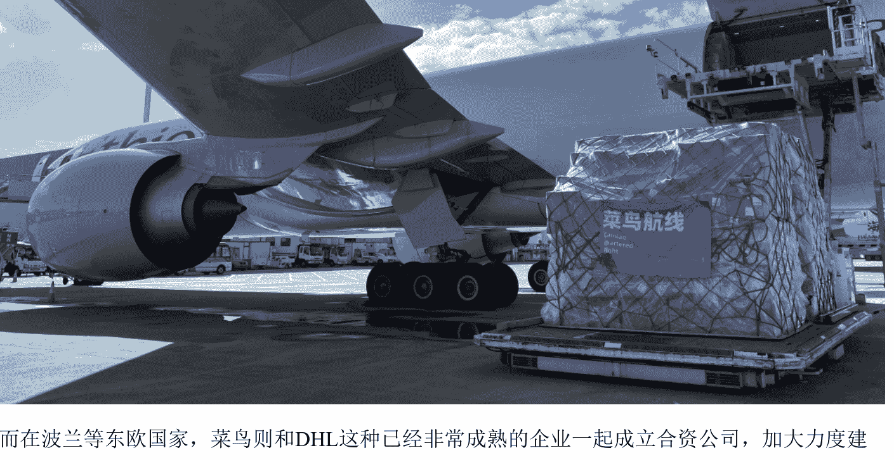

而在波兰等东欧国家，菜鸟则和DHL这种已经非常成熟的企业一起成立合资公司，加大力度建设自提网络。根据公开数据显示，菜鸟物流网络覆盖全球200多个国家和地区，部署了海外分拨中心18个，100多个智能清关口岸，百万平米的海外仓，全球两大eHub……小到巴西住宅区里的一台自提柜，大到芝加哥航空枢纽里的一座分拨中心，一个个部件组成了巨大的跨国机器，把中国生产的产品昼夜不停地输往全世界。

而且时间成本的降低，几乎都是从各个流程节点里一点点“抠”出来。

菜鸟国际快递的做法是，在国内布局全国性的物流网络，在全国65个揽收分拨仓增加货物运输班次，为商家提供高频次揽收。同时对订单进行聚集，与国际干线融合，提供每周100多架次的高频次货运航班，缩短包裹的“候机”时长。到了目的地国后，关仓一体的融合与分拨精细化运营，让末端配送的时间大大缩短。

此外，菜鸟国际快递大量使用做科技产品的思路来打造跨境物流行业，这张全球物流大网背后，倚靠着一套完整的数字化技术支持，它在不同的国家和地区做不同的灰度测试，跑通了一个模式之后就考虑如何把它复制到全球，同时不断精进不断迭代改善各种短板。这些事国内外的同行相对做得比较少，所以跨国快递的时长一直没能压下来。

对于国内的跨境卖家而言，这绝对是一个新的机会。商业全球化的前提是物流全球化。我们现在可以毫不费力生产海量的产品，如今又通过技术和商业创新补上了“物流速度”这个短板，毫无疑问接下来会迎来一波巨大的机遇，新的蓝海铺在眼前。

### 尾声：

菜鸟国际快递业务如今在全球跨境物流领域已位居前列。说实话，这样的成绩来之不易，全球头部快递公司多是成立了几十年的老江湖，菜鸟能够在全球市场和它们掰手腕，靠的还是在中国这个跨境商家的聚集地练就的绝技。而且如今中国在基础设施建设和数字化产业方面可以给全球做老师。

依托强大的物流，今后毫无疑问又会有无数商家加入这场盛宴。商家、买家和物流通道组成的网络，犹如无数的毛细血管和西方联系在一起，那时脱钩什么的自然更加难上加难。

而且菜鸟也给接下来的很多事打了个样，跨境电商发展催生跨境物流行业创新，技术创新不一定非要搞出来什么新东西，而是做到充分利用好自己的先天优势和基因，整合优化现有资源和技术，大幅提升效率。

通过效率的提升，跑出一条新的赛道，来创造新的市场和机遇，带来跨境电商行业新一轮的增长，这个才是理想状态的经济正循环。

公众号懒人搜索，懒人专属群分享

## 年轻人选城市就是二次投胎

2023-09-19

上篇没聊过瘾，再聊一篇选择城市这事，或者说哪些城市能有希望。

选城市是每个人回避不了的问题，就算你已经三四十了，这辈子已经那样了，可你孩子将来还得选，对吧。而且选择城市，对于人来说，基本属于二次投胎，对于自己还没出生的孩子，决定了他人生的起点。

这一点我感受特别深，我外公他们那代人兄弟多得离谱，这些兄弟起步都差不多，都在村里。不过后来出现了巨大的分化，因为他的两个兄弟去当兵，随后都留在了城市里，还不是啥大城市，也不是啥好工作，几十年后他们的后代基本成了两个世界。

本文主要针对的依旧是刚毕业、没背景、没资源的年轻人，有背景的不需要其他人管也能过得很好，不再年轻的人也就那样了。选城市这事有意义的依旧针对年轻人。

咱们可以总结城市三大原则：
- 1. 过去一两百年繁荣的城市，未来一两百年大概率持续繁荣；
- 2. 全世界70%的经济集中在沿海100公里以内，这个比例在工业革命之后一直维持稳定，可预测的未来继续；
- 3. 城市普通老百姓的富有程度，往往和聚集程度强相关，进一步讲，跟民营企业规模正相关。

第一点很好理解，往往发达地区，肯定有啥别人没有的特质。就好像你身边某个人很有钱，他肯定是具备了什么奇怪且稀缺的特质，这个特质大概率将来还能持续下去。网上的返贫的例子很多，现实里却非常少，不信大家想想自己周围有钱的人，是不是挺稳定？

对于城市来说，最重要的特质就是地理位置，是不是挨着大海？是不是挨着大河？是不是地势平坦扩展空间大？这些对城市未来都是决定性的。

沿海城市在这方面有绝对性的优势，咱们经常说铁路会一定程度上取代水运的优势，其实他俩依旧没法比，只能说是“部分取代”。

这也解释了为啥一千年前咱们国家的大城市都在北方和中部，后来东部沿海崛起，远远超过了中西部，以及长江流域的大城市越来越强，他们天生占着天然优势，尤其在商业文明降临之后。

“人口聚集就能富”这个说法比较奇怪，不过整体没啥问题。哪怕在印度尼日利亚孟加拉这些地方，农民进城之后钻进贫民窟，收入依旧比他们在村里至少高50%。

咱们国家城市化过程中也体现出了这个特点，进城收入就能增加，这也是为啥村里没有年轻人了，大家会用脚投票。

这也就理解了为啥咱们国家很多省份在搞“强省会”，最明显的是四川、河南、武汉他们几个，就是要坚定地把人口弄到大城市，只要进了城随便找点事，农民的收入就能稳步提高40%以上。

村里农民少了，剩下的农民可以承包大片大片的地，然后买机械设备，搞现代农业，一个人就可以完成之前几百人的工作量。农民少了之后，农民的收入反而上升了，产量可能也更高了。所以也不用担心没人种地的事。

我知道说到这里，又有人开始念经似地重复什么“战争时期，沿海地区不就不安全了嘛，blablabla”。挺纳闷，不知道啥时候开始，网上突然冒出一群妄想症，不管聊啥都扯战争去，成天吓得要死担心战争打起来，也不知道这群人平时咋过日子。

我很好奇他们是不是这时候就应该躲山里去，很多地方还有废弃的“大三线”项目遗址，跟地下城似的，建议那些觉得战争随时爆发的人躲进去，毕竟那地方保险些。

这也是为啥我经常说，年轻人不要让奇怪的想法进脑子，进去之后很容易对后续生活造成不可逆的影响。别人都在考大学、选城市、奋斗过日子的时候，你天天在那里觉得马上要打仗，奋斗啥？时间长了成了个loser又觉得是社会亏欠自己。

这不是我瞎说，我这些年碰上不少正常年轻人经过不断吸收歪理邪说最后变成了个精神病，生活和财务一塌糊涂。接受点正常的想法，对未来至关重要。

其实大家也注意到了，一个人的发展，往往是和城市的商业发达程度正相关的。

如果商业不发达，那个地方很容易变成一个存量世界，那里的人最好的出路，这种社会最讲究的就是分配，谁能分配到更多，主要看你到权力核心的位置。我老家就是这样一个社会，公务员、教师医生、企事业单位、其他闲杂人等，分得明明白白。

当然了，不是说商业城市没这些问题，商业城市往往是两套秩序并行，既有权力秩序，又有商业秩序。普通人没有血统没背景，往往可以在商业秩序里拼一下。

不要着急争辩，好好思考下我说得对不对，事关你或者你孩子今后几十年的发展路线。

最终结论是，水路是最经济交通方式。

这也是为什么一千年前咱们国家的大城市都在北方和中部，后来东部沿海崛起，远远超过了中西部，以及长江流域的大城市越来越强，他们天生占着天然优势，尤其在商业文明降临之后。

“人口聚集就能富”这个说法比较奇怪，不过整体没啥问题。哪怕在印度尼日利亚孟加拉这些地方，农民进城之后钻进贫民窟，收入依旧比他们在村里至少高50%。

咱们国家城市化过程中也体现出了这个特点，进城收入就能增加，这也是为啥村里没有年轻人了，大家会用脚投票。

这也就理解了为啥咱们国家很多省份在搞“强省会”，最明显的是四川、河南、武汉他们几个，就是要坚定地把人口弄到大城市，只要进了城随便找点事，农民的收入就能稳步提高40%以上。

村里农民少了，剩下的农民可以承包大片大片的地，然后买机械设备，搞现代农业，一个人就可以完成之前几百人的工作量。农民少了之后，农民的收入反而上升了，产量可能也更高了。所以也不用担心没人种地的事。

我知道说到这里，又有人开始念经似地重复什么“战争时期，沿海地区不就不安全了嘛，blablabla”。挺纳闷，不知道啥时候开始，网上突然冒出一群妄想症，不管聊啥都扯战争去，成天吓得要死担心战争打起来，也不知道这群人平时咋过日子。

我很好奇他们是不是这时候就应该躲山里去，很多地方还有废弃的“大三线”项目遗址，跟地下城似的，建议那些觉得战争随时爆发的人躲进去，毕竟那地方保险些。

这也是为啥我经常说，年轻人不要让奇怪的想法进脑子，进去之后很容易对后续生活造成不可逆的影响。别人都在考大学、选城市、奋斗过日子的时候，你天天在那里觉得马上要打仗，奋斗啥？时间长了成了个loser又觉得是社会亏欠自己。

这不是我瞎说，我这些年碰上不少正常年轻人经过不断吸收歪理邪说最后变成了个精神病，生活和财务一塌糊涂。接受点正常的想法，对未来至关重要。

其实大家也注意到了，一个人的发展，往往是和城市的商业发达程度正相关的。

如果商业不发达，那个地方很容易变成一个存量世界，那里的人最好的出路，这种社会最讲究的就是分配，谁能分配到更多，主要看你到权力核心的位置。我老家就是这样一个社会，公务员、教师医生、企事业单位、其他闲杂人等，分得明明白白。

当然了，不是说商业城市没这些问题，商业城市往往是两套秩序并行，既有权力秩序，又有商业秩序。普通人没有血统没背景，往往可以在商业秩序里拼一下。

不要着急争辩，好好思考下我说得对不对，事关你或者你孩子今后几十年的发展路线。

很多人每次谈到“繁荣”，特别喜欢强调“国家政策”，觉得某些地方发达，是因为国家扶持，自己这边不行，是因为国家没使劲。

其实有点太过高估政策的力量了。不管是中国，还是全世界层面，都呈现出一个特点，牛逼的城市就跟学霸似的，只要没人拖它后腿，他就能学得很好。反倒是一些学渣，在一段时间里老师无微不至地关照，各种补课，成绩好了一些，等这些关照没了，或者换个环境又回原形了。

有些地区也是一样的，特殊时期大量的资本砸下去，短暂高光，等到恢复正常，立刻又回到之前的状态了。

其实大家应该有个基本觉悟，如果某个地方一直在“振兴”，效果却一直不太好，很可能那地方就不是那块料。就好像有些人父母给报了无数个班，学习却越来越差，不如提前考虑下干点别的，人群里80%的人就是不合适读书，干不明白的事，逼他也没用。

所以很多时候，城市的繁荣靠的是自己的禀赋，通过这些禀赋吸收厉害的人，厉害的人创造财富，更多的人跟进，其他的都指望不上。

再举个例子大家就知道了。很多人觉得，深圳繁荣是因为它是特区，政策层面放得很开。很多小伙伴不知道的是，国家其实划了五个特区，其他几个你们估计都不知道是谁，因为发展的也就那样。大家也别查了，一开始划了四个，深圳、珠海、汕头和厦门，后来又加了一个海南。都是沿海，但是发展的差距依旧很大，因为深圳就在广州的外延，继承了广州的千年繁荣，其他那几个一直都是比上不足比下有余。

不过今天的话题，还不是讲这个，主要想讲江西，咱们解剖下这个省，就能看懂很多事。

如今提起江西，大家可能第一反应是没啥反应，实在是想不出来那地方有啥特别的。

其实历史上的江西在很长一段时间里牛逼的不得了。

大家都知道，中国的两个传统富裕地区，是广东的珠三角，还有太湖周围的长三角。其实在唐朝往后一直到晚清，跟现在的格局又不太一样。

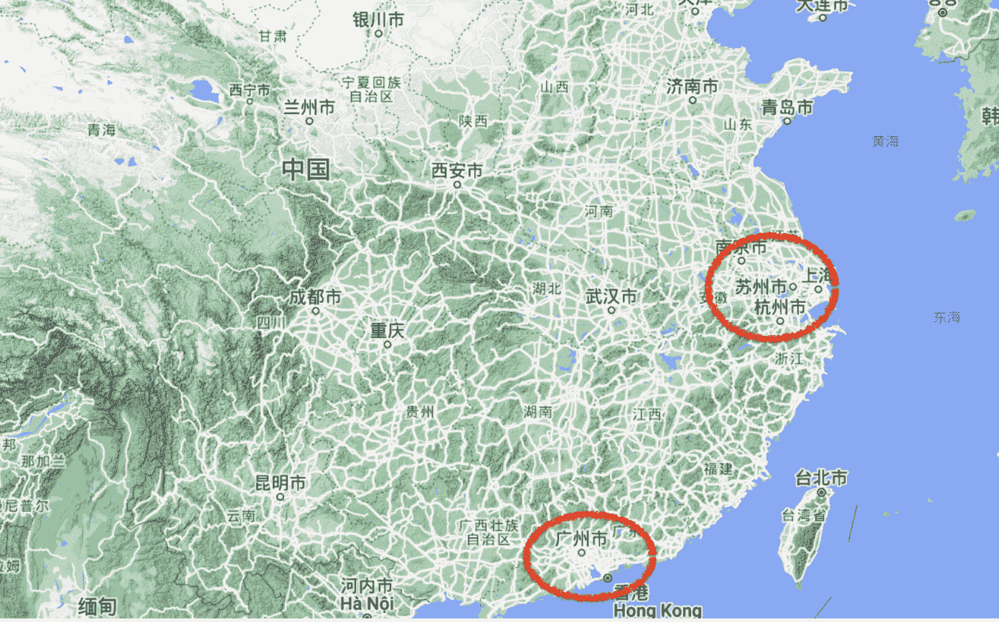

在那几百年里，现在广州那一带，主要搞的是海上丝绸之路，中国古代的海上海外贸易主要靠广州，所以那地方非常富。

古代的江南跟现在不太一样，那时候的“江南”比较大，包括江苏南部，浙江，安徽，还有江西。这些地方比较温暖湿润，农作物能种三季，几次“南渡”之后，南方人口变多，粮食产量就飚了上来。从唐朝开始就崛起成为了我国的大粮仓，富足之后开始经商读书，所以很快商业和科举方面也强的不得了。

后来建立在北方的首都从唐朝开始就粮食不够吃，一直通过大运河从江南输送物资。唐朝的首都不是在西安嘛，中后期朝廷经常去洛阳待着，因为南方的粮食送西安损耗太大，粮食不够吃，朝廷在洛阳生活质量能明显提升。

后来北宋干脆建都在了汴梁，这个城市没啥优点，唯一的优点就是挨着运河，可以方便吃到南方的物资。

这些南方送过来的物资，其中一部分是从广东那边过来的，大家打开地图就能看到，古代广东的物资不能直接通过海运送到北京，要先通过珠江，进入赣江，然后送到杭州那一带，再沿着大运河北上。

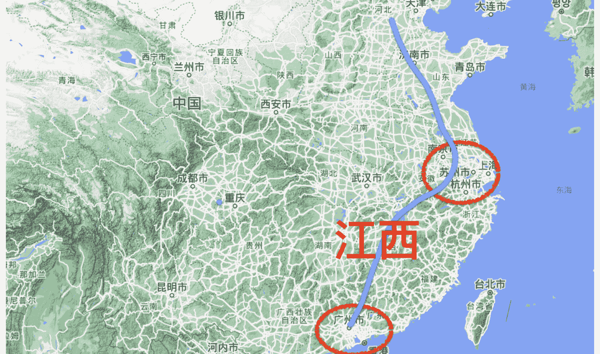

于是江西莫名其妙变成了南北大枢纽，从广东的物资通过江西去北方，北方的贸易品路过江西南下去广州出海。

一开始江西做的是转口贸易，后来江西也发展出了自己的古代贸易工业，比如大名鼎鼎的景德镇，就在江西。当时就跟现在似的，农民们不种地，进城去搞手工业，赚到钱买粮食。

而且商业刺激了另一个重要贸易品，也就是茶叶。大家记得白居易的“前日浮梁买茶去”，诗里的“浮梁”现在还在，是个县城，也在江西，古代就是茶叶产地。在商业刺激下，那地方的老百姓全去种茶去了，粮食主要靠购买，过得也非常富有。

景德镇生产那么多瓷器，浮梁产那么多茶，当然不是他们自己用，一部分送到北方消费，剩下的送去广东，成了贸易瓷和贸易茶，出海去了阿拉伯和欧洲。

江西能种地，又是贸易节点，自己又有自己的贸易品，一度非常富裕也正常吧。

这种富裕不仅表现在财富上，还表现在科举上，以明清为例，福建，南直隶，浙江，江西，这几个贡献了80%的状元。与此同时，山西陕西在科举方面却乏善可陈。

这也是我一直说的，其实古代科举没大家想象的那样公平，一部分是“捐纳”，也就是爹当官，给儿子找个差事，慢慢也成官员了。剩下的基本出身大小地主。而且地主也不是都一样，南方一直以来比北方稳定富裕的多，所以南方读书比北方强太多。

### 那为啥后来江西不行了呢？

### 成也商道，败也商道。

我们知道，鸦片战争之后上海开埠，太平洋航线开启，上海一跃成为了中国最大的港口。上海港于1843年被迫对外开放。1853年起，上海超过广州成为全国最大的外贸口岸。要知道，广州可是千年大港，十年就被上海给超了，大家想想上海这速度有多可怕。而且学术界一致认为，清朝能在太平天国之后又苟延残喘半个世纪，主要是靠新出现的海关收入死扛着。

上海崛起了，长江航道随之越来越重要，长江沿岸城市也随之崛起，现在的武汉和重庆他俩就占了便宜。某种意义上讲，武汉算半个沿海城市，重庆算1/3个，因为万吨级巨轮也可以开进武汉，3000吨级的可以开入重庆。而黄河由于流量太小，枯水期跑个舢板都费劲。

随之影响了整个南方的贸易格局。

最明显的，江浙的贸易品不再需要通过江西送到广东，直接从上海出海了。此外海外贸易品也不再需要送到广州，然后通过江西送江南，再通过大运河送北方。外国人跟中国做买卖，东西直接送到了上海，然后从上海直接进内河送北方了。

也就是说，途经江西的这条贸易路线彻底崩了。

大量的商人和贸易公司都搬到了上海，江西的商业规模倒退了90%以上。很多传统商业城市一夜之间变得名不见经传，比如在清朝非常著名的樟树和吴城，都是锦绣繁华之地，贸易路线改道之后，很快衰落的不成样了。

此外还有个次要因素，以前一直当主要因素，那就是太平天国。

太平天国爆发于广西，后来一直在长江中下游反复角逐，把南京、杭州、苏州还有江西一带打了个稀烂。太平军每到一处，就要到处征粮，被裹挟的流民跟着太平军到处转战，把周边搞得一塌糊涂。清廷更过分，往往攻陷一座太平军占领的城池，动辄纵容士兵屠城，所以江南腹地，中国最富庶的地区，几年下来几乎成了废墟。

那些富户为了躲避战火，于是大规模涌入上海，上海有外国军队把守，太平军一度想进攻上海，不过后来没成行。江南富户进一步确认上海很安全，太平天国运动结束后，反而有更多富户迁入，慢慢那地方成了苏浙资本的大本营。咱们熟知的徽商，以前在杭州混，后来也去了上海。

不过主要还是商道的变迁，这是决定性的。大家注意下，如果商道不变，那些被战争毁掉的城市很快就能发展起来，比如杭州和苏州，它俩在太平天国运动里实在是太惨了。

但是战争结束后很快就恢复了过来，当然了，由于这些地方的富户都跑去了上海躲避，他们再也没法达到以前的地步了，今后江南地区最强的一直都是上海。也正是因为上海太过先进，擅长工人运动的我党起家也是上海。

### 尾声：

连续聊了两篇城市，今后有了新想法还要继续聊，这个号一直对城市的发展非常痴迷。

也希望年轻人做选择的时候，要客观务实，别整那些虚头巴脑的东西，类似为了躲避战争跑西部去了。不是说西部不好，是说你这个理由很离谱，再过一些年自己都觉得自己当初为啥那么沙雕。还有些人就是单纯讨厌东部，讨厌上海什么的，这个也很搞笑，他们甚至都没去过上海。

通过本文，大家也能看出来，商道对城市的发展是决定性的，这个不管古代还是现代。这也是为啥上海和深圳在改开之后迅速就发展那么快，不出意外今后会更离谱。

随着老龄化少子化，大城市里的人并不会变少，恰好相反，大城市会越来越大，代价是我老家小镇会大规模消亡，然后传递到县城。

大概率的事，今后出了大城市就跟欧美一样空旷。

所以年轻时候一定要想清楚，如果没啥背景又热血沸腾，选城市就是二次投胎。如果又虚又无所谓，只想躺着，那选择就多了去了，比如你可以去天津嘛，所有超级城市里公认最躺的。

想改变就得不怕竞争，想相对公平地竞争就得去大城市，沿海和沿长江的大城市，去冒险去承受压力，对于普通且想上进的人来说，可能也没别的路可走。

公众号懒人搜索，懒人专属群分享

## 小镇做题家没选择
2023-09-15

**

有小伙伴问我为啥发文的IP在北京和山东之间飘，主要也是因为发文时间一般都在上午，可是公司上午一般都在开会，所以只能让助理帮忙发，他在山东，大家就看到IP飘来飘去。

头条被禁言了，一周，下周三就出来，大家不用担心。至于禁言原因，我也没弄明白。

上篇文章讲房价，很多小伙伴问刚毕业没背景的小镇做题家怎么办，是不是只有一条去大城市的路？

很残酷地讲，基本是这样。这个世界残酷的地方就在于，你的终点可能确实是别人的起点。别不服，大家有兴趣了解下一线城市那些国际学校的小孩们日常开支情况，相信我，90%的人奋斗一生也达不到。90%太保守了，95%吧。不过对于绝大部分人来说，问题还不是追赶那些金勺们，最关键的任务是回收教育成本，让自己和父母过上相对健康富足那么一丢丢的生活，这时候，去大城市卷就成了唯一选择。有小伙伴说，去考个小地方公务员不香吗？

不太懂你们那边的具体情况，反正我周围一般来讲，他们刚去体制那帮人每年都需要父母给补贴，体制内刚开始那点钱真不太够花，以至于不少人发出感慨，家境不好别进体制。那些人过了十余年慢慢日子就明显超过周围人了，可以补贴父母了。父母情况不太好的小伙伴，挺过这十年还是挺难的。所以我从来都劝大家，没背景的普通人，去大城市，去房价最高的大城市，那里的人工资不高撑不住那么高的房价。你说将来买不起怎么办？买不起再回小地方呗，又没啥损失，耽误你在小地方淘金了？所以说：首先要去大城市；其次要去自下而上的大城市。去大城市没必要多说，“繁荣是聚集的函数”，“创新和突破也是聚集的函数”。只有一大堆人聚集在一起，相互协作，思想跟病毒似的在人群里不断碰撞不断变异，时间长了总能搞出点啥来。

繁荣和创新好像跟大部分人没啥关系。不过一般新东西出现之后，会迅速窜起来，把相关的那些人都带到一个不属于他们的高度。太多人牛逼之后回头看，发现自己其实当时在人群里并不显眼，不知道怎么就起来了，可能是摊上了一个快速成长的公司，可能是学了一项新技术，也可能结识一个很牛逼的人，整个过程中巧合大于努力，所以慢慢越来越相信“命”什么的。这也是我经常说的那句话，从前往后看都是努力，从后往前看都是运气。运气是碰出来的，小地方就那么几个人，几家公司，想碰都费劲。但是城市和城市又不一样。有些城市是“自上而下”的。这种城市核心特点就是这个城市里整个社会消费中坚，在体制内，或者是公务员，或者是企事业单位，剩下的人伺候这些人，比如提供饭店、装修什么的。或者说，每个城市都是一个炉子，它是需要输入能量的，观察它的能量源，就能知道这个城市是朝着哪个方向的。“自上而下”的城市通过别的省财政转移给它，然后一级一级分下去。比如我的老家，我就不说是哪了，反正是山西的一个小地方，它就是典型的自上而下。那地方没有任何产业，每年的收入主要就是转移支付后变成公务员的工资，然后公务员消费带动其他人的收入，这些年大兴土木也富了一些人。大家发现了吧，这类经济是很依赖从上往下灌水的。这样的城市，在过去很多年里社会阶层变化非常小，主要也是没啥可变的，大家最好的出路就是进体制，挤破脑袋进，所有的技能都用在了钻营和人际交往上。

而且在这种体系里，人其实是被固化的，你有创意有想法，这不是优势，可能反而是劣势，这种地方所有事都有很固定的章程，你只要按着章程办就可以了。而且岗位也不咋变动，属于绝对的熟人社会。熟人社会里，大家没有秘密，就得更加规规矩矩。当然了，我不是在反对你进体制，其实绝大部分人很适合体制却进不去。不过咱们这篇文章主要针对的是那些进不去或者没进去的。

### 那啥是“自下而上”的城市呢？
城市的收入源头是无数大小企业做买卖赚钱，然后交税给政府，政府还能给中央上交，这就是自下而上。这种城市一般共同特点是民营经济特别活跃，而且总共也没几个。如果再直接点，基本都集中在两个三角，也就是珠三角和长三角，天下财富出东南嘛。那几个地方通过商贸崛起，从唐朝开始就是富裕地区，当然了，上海以前没啥存在感，深圳以前也几乎不存在，但是他们所在的那片区域，已经富裕了上千年。此外八百年漕运，一直都是从杭州那一带向北方转移物资，可见那地方一直都很富。

一般凡事都有惯性，一般历史上富裕地区往往能持续富裕下去，穷地方也会持续穷下去。除非发生了巨大的变化，一般是商道的起伏，比如敦煌、大运河沿线城市、江西，都是商道变换的受害者。这也告诉我们一件事，年轻人想机会多，去商道节点上待着。大家注意一下，富裕地区往往是环境跟观念的相互进化，长三角和珠三角那地方适合商贸，因为它们是陆地和海运的接口嘛，导致那地方的人天生对商业敏感，一旦对外贸易兴起，利用地理优势很容易变得非常富，富了之后对商业会更敏感，然后进入了一种稳定的正反馈。这些地方对商业、平等、交易什么的都很敏感，并且作为常识和基础知识灌输给了下一代，这就是一种降维打击。大家不做自媒体感觉不到，太多人的思想水平依旧处于大清，问题是他们自己是感觉不到的，还把垃圾观念传给下一代，这才是令人绝望的锁死，下一代得赶紧去大城市把那些垃圾洗掉。这也是为啥历史上那地方富裕地区多次在战乱中被砸了个粉碎，等到重建之后又是富庶繁华之地。最近的一次，太平天国运动一度把苏杭那一带彻底夷为了平地。战争结束后，江浙财富很多搬回了湖南，得到了那么多财富，湖南整体变化不大。但是180年过去了，江浙那一带又发展了起来。这也是我想说的另一件事，网上经常有人说，西方发达是掠夺了美洲大陆，所以才能过日子。这个说法倒也不能说全错，但是也不能说全对。西方做的事，有点像是一个人出去外边打劫了别人，有了本钱，然后用这些钱去做买卖，没本钱肯定是一切免谈。后来越做越大，商业革命推动了产业革命，才有了工业革命。不能弄反了，商业必须得是先行的，中国也是加入世贸后，搞市场经济和外贸，外贸推动了产业的大爆发。单纯打劫是不行的，历史上打劫最厉害的是蒙古人，你看他们搞出来了啥，而且他们打劫到的钱也没了。如今北方其实是很尴尬的，因为北方的头部城市只剩下了北京。我在北京待了十几年了，尽管北京是个极度不近人情的地方，不过有一说一，这地方真的不错，除了户口太难，孩子教育太难，很难留下，其他地方其实很不错。哪怕你一点技能都没，在这地方也能拿到老家好几倍的工资。你说房子很贵啊，其实北京的房子是严格分级的，不管你是哪一级，都能找到自己的定位。比如有上亿的独栋，两三千的大平层，卖给煤老板和上市公司老总。还有一千来万的改善住宅，卖给生二胎的精英白领。还有天通苑三百万就可以上车的上车盘，卖给普通刚需。最后北京周围有各种犄角旮旯，有那种合租房，二十块钱一个铺位。北京有大量的基层工人，每天坐着五菱宏光到处奔波，赚到钱给老家邮寄回去，晚上就去城中村待着。

不过按理说北方第一大经济体，应该是天津，面朝大海背靠平原，还有九条河，天生富贵的造型。唯一的问题是这些河流量太小，加起来连长江的零头都比不上，天津也就做不了上海。不过地理位置依旧比北京强太多。事实上北京不做首都那些年，北方第一大城确实是天津。北京古代就一直养活不了自己，需要通过运河给自己输血，而运河的起点，就是苏杭那一带。所以北京一直没有“外溢”功能，甚至可以说，在很长一段时间里，北京是江南的外溢。长期看来，我对北方城市里最看好的（北京之外），是天津和青岛。他俩像啥呢，像俩膀大腰圆一看就是那种能披坚执锐冲锋陷阵的大佬，可如今天天在营地的烧火做饭做厨子，这不搞笑嘛。不过发展时间依旧太短，慢慢大家都会回归到属于自己的历史定位。毕竟大城市的兴衰周期都是以百年记。

所以咱们经常说“北上广深”，这四个城市整体不太一样。北京一直跟那两个三角的逻辑不太一样，那俩是开放型的，北京是自闭型的，自上而下的，需要不断输入能量，从八百多年前被蒙古人选做首都开始，绝大部分时候没法养活自己，需要江南通过运河输血。此外它由于天生不是个建立大城市的地方，是的，所有大城市都有穿城而过的大河。唯独北京没有，导致现在水资源也是个问题。这也就决定了它对外来的人不太友好，90%混京城的人在北京待了十来年后还是撤了。其他几个相对来说落户定居容易得多。不出意外，将来长三角和珠三角会越来越大，因为人口对于他们来说不是累赘，他们也愿意吸收人力。那些区域的城市会连成一片，人口可能会继续向那边聚集。可能有小伙伴纳闷，这样下去，两个三角会不会把全国给吸干了。也不用担心，首先并不是所有人都会去那些地方，很多人是不愿意去的，今后也只有最热血最激情的年轻人会勇闯大城市，那些超级城市也跟古代的边疆似的，挥洒血汗建功立业的地方，注定是少数人的游戏，绝大部分人想想都有点虚。此外大家去长三角，肯定是因为待在小地方啥也干不了，还不如去一线试试，说不定将来能把一线的商业模式带回家。事实上我国过去这些年也是这么个发展历程，经济一直在从两个三角沿着内河和公路网向内地辐射，本质也是资金和知识从一线通过人口潮汐在向内陆辐射。而且内地城市想解决人才外流，应该想的是怎么创造良好的营商环境，怎么让年轻人觉得待在你这里比背井离乡去其他地方强，而不是天天担心人口外流却什么都不做。

### 尾声：
文末总结下吧：如果在老家没背景没实力，那就应该去闯大城市，去商道城市待着，那里流量大，碰撞多。而且既然闯，就别保守，直接去北上广深，经历最猛烈的炮火洗礼。大不了不行再回去，没啥的，这些城市每年都会迎接潮水一样涌来的年轻人，还有潮水一样褪去的中年人。大家把青春献祭给大城市，大城市才能永远年轻，作为回报，会把一部分人拉上去。相对来说，南方比北方好混一些，也不是南方，其实是沿海，海洋就是天然商道。而且去那些城市容易留下来，北京是最难留下的，这个不夸张。最后说几句关于信心的事，今年的环境你们都懂。不过对于普通人来说，这种情况你只要不瞎投资不欠债，整体影响没那么大。当你唯一的资本就是你自己的时间，事情反而好办了，毕竟这种情况下很难赔钱。不出意外，今后这种情况也会周期性地经历。从复杂系统层面，本身也避免不了。上升波段肯定会酝酿风险，直到风险积累到没法回避，开始爆发，然后趋势掉头向下。向下也不是完全没好处，起码能让人思考之前什么事做对了，什么事做错了，修正错误，达成新共识，经济慢慢又开始进入了升浪。比如对商业的重要性，太多国人依旧没有达成共识，这些东西都属于“门槛知识”，跨不过去这道门，这辈子都只能在门外待着。所以说别纠结别内耗，越是一穷二白的年轻人，反而越应该坦然，从此以后，哪个方向都是向上。

## 站在历史的前夜
2023-09-13

聊聊房地产新政的事。

### 1
现在的格局就是一系列悖论组成的。

国家真正着急的是二三四线城市的房地产，这些地方，如果房子继续卖不出去，政府就卖不出去地，进而影响到方方面面。

如果想给二三线去库存，就得拉高一线房价，因为一线是信仰，信仰立不起来，大家就不太敢往里冲。而且每次涨价潮，都是一线先涨，然后蔓延到二三四线。

其实之前也试过让基层自救，他们也基本上都取消了限购，不过明显没自救成功。

所以这次的政策路径，就是“自下而上”。小地方先放开了政策，没啥用。然后二三线城市告急，也放开，依旧没啥用，最后一线也放开了，尽管一线没啥必要，一线的房子不存在卖不出去的问题。

只是现在好像药效退的有点快，政策刚出来那会儿效果不错，过了两三周就有点药效过了的感觉。不过历次刺激房地产，都不是一步到位，都是慢慢刺激出来的，所以接下来还有很多花活给大家看。

现在最大的问题是，老百姓手里钱就那么多，一线想涨是要吸水的，主要也是从二三四线城市吸，毕竟现在谁买房都得找父母对吧，父母可能得把小地方的房子卖掉，把储蓄拿出来，去一线置换。这可能导致一线以外的城市因为缺水更加疲软。这也是为啥一直有个说法，说一线限售，其实是保护二三线城市。

可是也没办法了，不使用一线这面大旗，下边明显解决不了自己的问题了。

不过历次去库存，都有个前提：
- 大家手里有储蓄；
- 大家对未来预期比较稳定，敢背大量的贷款。

这段时间听说几个深圳那边爆仓的，都是2018年以极高杠杆上车，很多工薪阶层月供达到了三四万每月。

这个匪夷所思的月供背后，其实是那些人当时对未来的极度乐观，觉得工资会一直涨。再过一些年，就跟过去的几十年一样，工资越来越高，再高的月供也会被稀释。

可是接下来的事情并没有顺他们的愿，后来工作变动，月供也无以为继，这几年忙了个寂寞。

我理解这一轮深圳和广州解除限购之后依旧不温不火，可能就是被之前的那种疯狂给伤到了，大家对加杠杆不那么热衷了。

所以这次救市我整体不太看好，因为上边的那两个条件都比较成谜。不过中国人的性格里还有一个毛病，就是“害怕踩空”，如果出现明显上涨，又会有一堆不知死活的疯狂上杠杆，把这玩意当成“跨越阶级”、“改变命运”的阶梯。

### 2
现在有个“新共识”正在蔓延，也就是“房价见顶”。

大家记得那个股市曲线吧，股价一般都会经历一个缓慢爬坡，然后快速攀升，等到大家觉得已经见顶之后，买得早的那些人就会迅速把自己手里的货卖掉高位套现。共识一旦达成，股价就会在高位迅速下跌。

下跌过程中，会有人跑去抄底，然后来个反弹。不过这个反弹一般持续不了多久，随后大家继续出货，迅速下跌，谁也扛不住了。

房地产说实话我也不知道在什么位置，不过很多买得早、买了好几套的人，或者拆迁出好几套的人，已经不指望继续涨了，准备在现在的高位卖掉套现。而且各种财经媒体也在炒作“卖掉手里多余的房子”，这些说法长期看不一定对，短期确实有自我实现的能力。

这种共识非常可怕。

因为一旦形成，房价每次稍微有点涨，就会出现大量的抛盘把房价打下来。混过股市的小伙伴都知道，熊市里每次出现巨大利好，给散户的感觉是“终于要反弹了”，但每次都会迎来暴跌，把冲进去抄底的人给埋了，逻辑就在这里，因为大户要出货，谁也挡不住。

这也就形成了一个新手们很迷惑的现象：
- 牛市里不管什么消息，哪怕是负面消息都会涨；
- 熊市里越是利好越要跌。

其实在一线以外的城市已经基本上就是这个形势了，每次出现利好，就有大量挂牌砸盘。买房的小伙伴，可以看看自己城市的二手房市场是不是已经成这样了。

房价一般得在那些有好几套房的“大户”出完货之后才能稳定下来，考虑到房子这样的大件成交周期比较长，所以这个时间也比较长。

而且有些城市是比较特殊的，比如南京和天津这种超大城市，民营企业比较弱，城市里的消费中坚是公务员和企事业单位，房地产也是他们给撑着。

在房价上涨的时候，这些城市形成了一个诡异地循环。政府能高价卖出去地，有钱给自己人涨收入，大家有钱后去买房，开发商赚钱继续去政府高价拿地，左脚踩右脚上天了。

但是一旦情况不好，立刻进入了另一个循环，地卖不出去，大家伙收入下降，不买房了，土地也卖不出去，政府没钱给大家发钱了，大家更没钱买房了。

这也是我理解为啥南京这几天抢跑了，要赶在一线城市放开限购之前吸引一波流量，不然到时候真来不及了。不出意外，接下来成都武汉天津可能都要彻底放开，能抢到多少算多少。

其实在一线也有大规模砸盘的情况，只是很分化，贵的房子越来越离谱，普通的挂牌越来越多，价格被压得死死的，新政出来之后，上车盘反而不好卖了，不信你们去问问北京的小伙伴。

弄不好这一波过去之后，小部分地区上天，大部分还得跌掉一些。

长期可能又是另一个故事了，毕竟一线会持续涌入人口，但房子就那么多，实在是变不出来，长期看问题不大。

### 3
房地产是有波次的。

前提是贷款放松，大家可以轻松加杠杆。

然后年轻人购买低价上车房。

中年人卖掉自己的上车房给年轻人，拿到钱后，加上手里这些年的存款，再买一套大一些的。

而且大家得达成共识，房子是最好的资产，手里越多越好，能不卖就不卖，有闲钱就再买一套屯着。

这样房地产才能涌动起来，大家看看以往几次暴涨，就能看出来这个规律。

但是可能今年不太一样，今年有那个关键问题，结婚率和生育率。发达国家的经验告诉我们，女性受教育会导致结婚率和生育率大幅下降，人口减少会导致房地产的大幅衰退。

现在看2016年那波房价暴涨的原因，其实看看2017年的出生人口就知道了，足足出生了1700多万，孩子出生前父母就要买房。而且“二胎政策”是2016年放开的，多生一个娃，就得准备个三居，产生了大量的置换需求。

不过那一波明显透支了很多，人口从2017年之后一直暴跌（2017年出生的孩子绝大部分都是2016年怀上的），几乎每年跌去100多万。

以至于今年一年级爆满，幼儿园招不够。现在上小学的，就是2017年的那批，出生了1764万人。

现在上幼儿园的，是2020年那批，跌到了1200，也就意味着要关停30%的幼儿园，这还没完，到了今年，传言只有800万。着急买房生孩子的人非常少了，增量不行。

以前大家说的买房两个原因，想娶媳妇丈母娘会要房子，结婚后生孩子要房子，这两个前提如今都遭到现实的打脸，如今结婚率和生育率都弱得跟两条虫子一样在地上爬。

此外还有个大麻烦，2016年那时候大家没经历贸易战和三年疫情，觉得繁荣会一直持续下去，对未来还是很有信心的，敢贷款，敢疯狂加杠杆。结果一波透支的太惨了，基本上能欠钱的人都欠钱了。

而且这几年的事非常教育人，2016年之后投资的人大部分都赔了。不仅仅是房地产投资赚不到钱，其他的也一样，基金信托都没赚到钱。

现实把那些想投资致富的人给教育过来了，让太多人意识到了自己并不是搞投资那块料。自己投资啥赔啥，投资动机也就弱了好多。

这又让我想起来之前的一件事，说是为啥罗永浩是行业冥灯？

因为他就是我们“绝大部分人”，看到热闹的行业就冲进去，岂不知那些热闹到被大部分人意识到的行业，已经到了顶部，正在转头向下，大部分后知后觉的人进去就是接盘了。

2016年那波大涨价中，很多人冲进去买房，本来以为今后能用资产避开货币的贬值，后来的事大家也都知道，投资就是最快的贬值手段。

从现在来看，之前投资成功那些人，并不是多厉害，而是赶上了时代的列车，当列车减速的时候，他们当中不少人因为没系安全带被扔出去了。这不是我瞎说，之前就有有一个统计，信托暴雷，主要伤害的就是那些之前赚到钱的，正是因为赚到了，他们胆子才足够大，敢于把全部身家都放进去，一把赔光。

为啥说这事呢，因为2017年之后入局房地产的人，如果是投资，绝大部分并没有真正获利，甚至在一线，真正获利的也是少数。

这种投资失误多多少少影响了很多人的决策。在2017年之前，好像买房这事咋买都能赚，从那以后情况就变了。

这一波救市效果咋样，我整体觉得不乐观。短期可能只有一线的局部会上涨，其他城市可能维持原来的趋势。

因为又是降利率，又是降首付，本质还是让老百姓担上巨量贷款，今年正好处在周期底部，感觉大家加杠杆的冲动还是很被抑制的。毕竟那些贷款，银行敢借给你，你敢贷吗？你就那么自信过三年还能维持现在的收入？

还有一些有好几套的人觉得反正自己买得早，该赚的钱都赚了，不玩了，准备套现离场，这些人的砸盘非常可怕。

而且哪怕在一线城市，现在都面临一个大问题，上车盘面临大量的抛盘，各个城市的数据网上都有，大家有兴趣可以去看看，动不动一周挂牌几千上万套。哪怕在北京，我有同事两套房，想卖掉其中一个四五百万的两居，反正挂出去一周多了，一个问的人都没，再一看小区一夜之间挂出来六七套。

不过我还是相信，长期来看那些民营企业发展的好的城市就算短期房地产不行，长期也问题不大。

一般来讲，全国增速5%，有些省可能冲到8%，最活跃的城市可能冲到10%以上。换句话说，中国可能永远告别8%的增速了，但是你选对城市，说不定还能继续一些年。

所以说，如果你买了大城市的房子，短期被套了，也不用太担心，发展会给大家都解了套。而且从发达国家的情况来看，超大城市的房价大概率确实是一直涨的，可能不能给你赚到钱就不一定了，有可能现在的价位已经透支了很多年，你买到了局部高位，需要很多年消化这个高位，然后才能继续涨。

长期来看，大概率跟那些发达国家似的，几个超大城市就占了全国一半的GDP，同时只有这几个城市的房价能跑赢通胀，其他地区安安稳稳过日子就得了，别想投资什么的了。

而且人有寿命，大城市却是长荣的，永远年轻永远活力四射，现在的那些牛逼区域，明清时候就是富裕地区，明清时候不行的，现在依旧不咋样。选择繁荣城市就是选择自己的未来。长期来看，现在厉害的未来几十年依旧厉害，现在不行的，将来大概率依旧不行。

对于毕业生，选择城市就是二次投胎，尽量去传统强势的城市，尽量去私企多的城市，一般错不了。买房也是这个道理。

文末再总结下吧：

- 1、我是整体不看好这轮调控，不过不代表局部不会涨。之前就跟大家说过一个道理，每个城市都有几个“终极盘”，大家有钱了就会搬进去。同时还有几个社区大家有钱就会搬走，那房价大家想想就知道了。有些城市是这个国家的“终极盘”，有些国家是这个世界的终极盘，可以有持续流入来托盘。

- 2、如果决定了买房，或者正在纠结，一定不要待在家里到处看文章，去想买的地方反复踩盘，反复跟中介沟通，多找几个中介沟通。

- 3、长期看来，一线是“经济决定房价”，整体大概率没啥风险。与此同时，有很多城市就是“房价决定经济”，可能陷入螺旋下降。主要是看民营企业数量和规模，一般民营企业占主导的城市，就是“经济决定房价”。

- 4、刺激楼市这种事，尤其一线，开弓没有回头箭。既然确认要拉一线房价，那就会使劲到起作用为止，基本100%会拉起来，不然后果不堪设想。如果一线起不来，就不仅仅是一线的事了，天津南京武汉成都都会出大问题。当然了，一线起来了，那几个能不能起来谁也说不准。

如果拉了几下依旧没有反应，那就一直刺激下去，直到把子弹打尽。2016年那波也是这样，折腾了快一年，后来房价才起来，现在还有一些招没使，比如大规模降低交易税什么的。

文末，还是想跟大家说一句，无论如何，安全第一，量力而行。刚查了下，截止9月12日全国有840万失信者，一个月涨五万，很多就是还不上房贷被执行了。

公众号懒人搜索，懒人专属群分享

## 制造业的新边疆
2023-09-08

从「中国制造」到「中国质造」「中国智造」，制造业的转型升级不只发生在中国。回首过去一百多年的全球制造业历程，就能发现传统制造业发达的国家，基本上都走过了相同的路径。

### 1 模仿
全球制造业都经历过价廉物美的阶段。以制造业发达国家德国为例，也靠的是模仿，为啥说“也”呢？因为所有后起国家，包括德国、美国、日本、中国也都有过这个阶段，看你的模仿快不快，你的价格低不低。

大家注意下，国家、企业、个人都是一样的，发展初期追求的是复制而不是改进，你把别人能卖出去的东西复制一遍，甚至都不需要完全复制，如果功能和质量达到别人的80%，但是价格只有别人的30%，那就非常容易卖出去。

“德国制造”今天是德国人的骄傲，但曾经有段时间也疯狂抄袭英国人，不过生产出来的东西质量不高，影响了英国产品的声誉。后来英国要求他们生产的东西，都得标注“Made in Germany”，以此将德国产品和英国产品区分开来。

“逆向工程”是日本人赋予这种模仿一个很有“工业党”调调的名字。今天的日本制造几乎在每个领域都有佼佼者，但曾经日本在许多领域都紧跟欧美创意。例如，世界上第一台数码照相机是在美国诞生的，经“逆向工程”消化后，掌握了核心技术加之后期的创新和努力，今天反而成为全球最大的数码相机生产供应地。

### 2 提质
无论日本还是德国，都用了几十年时间，逐步积累起发展的资本，才慢慢从低质走向了高端。

当然，前提是他们的路是对的，也就是丢掉仅靠模仿这条捷径，转向坚持质量这条路。

19世纪80年代，德国当局大力普及发展职业教育，采取统一的培训标准、职业资格考核制度，这也是现代德国工人培养模式的雏形。这还没完事，德国标准化学会建立起一套适用于全行业的精密工业标准，严格淘汰那些不符合标准的落后低劣产品。

就这样，拥有大批技术工人的德国，恰巧又赶上了第二次工业革命，便逐步在新兴的电子、化工、机械制造这些领域站稳脚跟。

上世纪50年代，日本开始将外国模仿的技术，加以消化吸收后进行改良和升级，推出了一系列措施去改进产品质量，走过从模仿学习，到原创品质的升级。

如今我国年轻一代对日本货可能没感触了，因为他们成长起来的时候，国产品牌的质量也上来了。就拿人人家里都有的国民品牌公牛来说，1995年公牛刚成立的时候，市面上的插座质量还参差不齐。公牛立志要生产“用不坏的插座”，毕竟这个世界上绝大部分买家最看重的东西是耐用，也是这种质量坚守让插座从快消品变成了耐用品。

### 3 科技与美
除了物美价廉和质量过硬外，还有什么样的产品受到大家的欢迎呢?

对，科技与颜值。

这一点我想最有共鸣的，恐怕就是智能手机。大家还记得那句话吧，“iPhone改变了手机，iPhone4改变了iPhone。”

我知道今天很多人对这些功能都习以为常，但是iPhone4无论是在外观设计还是在功能、配置上，在当时都刷新了用户对于智能手机的认知和需求：

前后双玻璃设计，金属边框并且成为全世界最薄的手机，Retina屏幕、前后双摄像头的创新应用让人叹为观止，并且在操作系统方面，也被正式命名为IOS，众多精美实用的第三方应用免费下载满足个性化需求。

有人这样形容：我从来没有想象过手机竟然能够有如此之多的功能，我也并不认为手机能够做到这些。

也是从那时起，智能手机的时代真正到来。随后，韩国、中国、美国等在科技与美学的不断迭代下，搞起了折叠屏、升级了徕卡影像、自主研发芯片……甚至时尚设计师也可以设计电子产品，乔治·阿玛尼和三星合作，让手机实现了简洁永恒美，拥有了生活态度。近期大热的华为Mate

60 Pro发布会未开便抢购一空，不仅支持卫星通话功能，而且也是华为自研的麒麟处理器回归后的首款旗舰机型，保时捷联名版本也呼之欲出。

不只是智能手机，在科技与美学上，这些年中国很多品牌和产品也都有了突破性进展。

国际超跑大师乔治亚罗与公牛跨界设计推出的公牛大师轨道插座最近就引起法新社、美联社等海外媒体关注，他们认为这个插座界的超跑是全球插座新物种。

乔治亚罗被誉为“二十世纪设计大师”，获得过英国皇家艺术学院最高荣誉。1974年乔治亚罗设计了玛莎拉蒂Medici，在当时极具前瞻性，也从此奠定了他大师级的地位。今天大家熟知的很多经典车型，譬如法拉利250GT、宝马3200CS、菲亚特850Vanessa等，均出自这位大师之手。

## 这一次，乔治亚罗将超跑的瞬时美，带入到公牛轨道插座设计之中。

超跑疾驰而过的炫目光影，成为公牛大师轨道插座“超跑流光线条轨道”的灵感来源，超跑的速度美转化为墙面上流光溢彩的永恒美，这就是插座界超跑的颜值。

你以为这位国际超跑大师乔治亚罗只是让插座改了个外形？

那格局就小了。如果说驾驶超跑的速度与激情，在仪表盘上淋漓尽致地体现，那乔治亚罗为轨道插座设计的数显屏，则实时精准地让你掌控用电体验。

作为行业首个搭载“安全预警系统”的插座，公牛大师轨道插座可以通过数显屏实时显示用电功率、用电量变化，还能够实现三重变色预警。如果用电过载，还会自动断电保护。通过公牛智家APP还可以远程通断电，科技感瞬间拉满。

的确，只有国内外、行业间的思想不断碰撞，才能让产品不断进化。林志颖、江疏影、郑恺、黄健翔这些明星也都纷纷种草同款，不得不说这个新设计真是谁用谁知道。

### 4 尾声
今后的制造业发展，肯定是两条腿走路，一方面要玩命搞科技，需要企业沉下心来搞研发、做技术投入，这个已经形成了全民共识。

不过对于大部分企业，创新并不只是科技，更多的是“直击人心的设计”，让人看到产品后眼前一亮，发出类似“原来插座还可以这样搞”的感慨。

以前我们走的是一条没设计、没啥附加值的工业路线。

随着这条路越来越难，今后绝大部分企业的出路就是在“科技+美学”这个方向不断精进，在这条战线上打出自己的新边疆，那时候消费者自然会用脚投票。

公众号懒人搜索，懒人专属群分享

公众号

## 懒人搜索
懒人专属群

微信:lazyhelper

## “30块工资线”是很多问题的根本原因
2023-09-05

昨天看到一篇爆款文章，某大学讲师年近半百，依旧深入一线去送外卖，根据经历写成了一篇文章在网上广为流传。还是非常佩服的，毕竟像他这样的人很少了，也能推断出来为啥他一直是 个讲师了，实诚人，太实诚在哪都很难混上去。

有感而发，展开说说他文章里提到的几件事。

### 1
首先他说一个月综合算下来，每小时收入10元是常态，每小时收入20元是极限。这其实就是我之前文章里提到的“三十块工资线”。

我国几亿工厂工人的工资大概就是一小时三十块不到，事实上30块属于极限了，今年整体一直在22块左右波动。如果冲到25块，就会有大量的人从快递等行业回到工厂，迅速把工资给压下去。如果太低，又会把人从工厂赶到快递等行业，把那里的劳动单价都给带低。

我刚联系了下苏州那边的劳务，他们招一个工人现在的工资是一小时20-22元，没有五险一金，而且年龄不能超过40。他还跟我说，宣称一小时35以上的都是骗人的，黑心中介就忽悠刚出来混的小年轻。

也就是说，如果没啥特殊技能，只有一把体力，你到了人才市场上，不管去做什么工，最后收入都差不多卡死了，一般是20块多点。因为有太多闲置劳动力，把收入给推平了。

每年跟潮汐似的，工厂业务多工资高，大家就去工厂；工厂业务少，不让加班，甚至停工，大家就去送快递送外卖。大家注意了，都得加班，无论是工厂还是快递，如果每天干不够十二个小时，一个月也赚不到啥钱。这一点工厂工人和白领们相差比较大，白领们讨厌加班，工人们如果不加班基本没法干。

如今工厂、快递、外卖、网约车，成了个巨大的海绵，能吸收各种闲置劳动力，现在大家劝那些大学生和失业白领脱下长袍，一般就是暗示他们去这些行业。有一说一，如果我是个大学生，就算找不到工作，也坚决不会去干这类工作超过三个月。

一般来讲，年轻人的失业率比中年人高一些，毕竟大学刚毕业找不到工作，宁愿考几年研究生或者公务员也不去送外卖。但是中年人不一样了，一天都不能停，上边提到的那几样，总有一个适合中年人，反正不适合你也得去，车贷房贷老人孩子，都需要钱，闲在家里怎么可能。

而且大家可能不知道，外卖，快递，快递分拣，听着好像差不多，其实这是三个层次的活。外卖是有一定难度的，得会骑摩托，体力好，能爬楼梯，一个外卖员一天走两三万步很正常，而且基本都是快走甚至是跑着，所以收入最高。

快递相对容易一些，其实大家也能看出来，平时外卖员都是跑着的，快递员相对悠闲一些，拉个框子慢慢送。

分拣最简单，工资也最低，我专门联系了下我在北京马驹桥的分拣包工头，他跟我说9月4日实时工价是18块每小时，有很多女孩，毕竟她们干不了外卖。基本都是零工，天天去网上招聘，每天早上来一百多个，其中一些笨手笨脚干不了，被监工一顿骂给骂走了，剩下的第二天大部分也不来了，又得重新招。

大家不要觉得18块少，北京基本上是整个北方的天花板，北京周边还有那种群租房，一个屋里放好几个上下铺，你可以租一个铺位，刚问了下一家，那玩意也是浮动价格，今天的价格是20，一个月600，不过他们经常工作地点变来变去，所以住的地方也变来变去，通州那边还有个人民广场，那附近一晚10块，条件又差了很多。当然了，北方冬天会高一些，因为太冷了，到了冬天很多人受不了跑南方去了，北京人力会紧缺，推高了单价。放一张马驹桥吧：

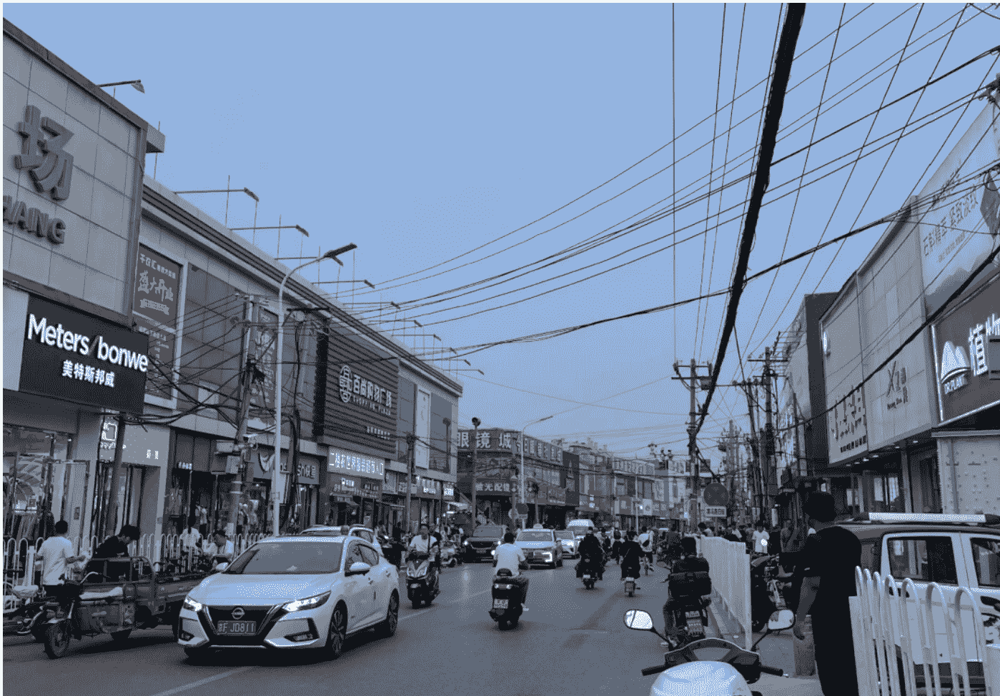

多说一句女性体力劳动者，她们真的是非常艰难，比如在大城市里吸收就业最多的保洁行业，哪怕在一线，超过一半的人没超过三千块，真是惨不忍睹。

### 2
那篇文章里还提到一件事，说是那个某团自从上市以来一直在赔钱，商家也在一茬茬倒闭，快递也苦的不行，那钱到底谁赚了？

其实这个大家随便找个财报，就能看到，某团在外卖这块是赚钱的，他们赔钱的领域主要是新业务，比如研发什么的，这些年开支特别大。这又让很多人不理解，一个做外卖的，平时都研发些啥？

其实研发啥并不重要，重要的是研发本身。

突然想起来一个事。大家知道前段时间那个故事吧，父亲通过辛辛苦苦送外卖，把孩子培养出来，然后孩子也和父亲一起送外卖了。

这个故事悲剧的一个隐喻就在于，如果一个社会没有高端研发相关的岗位，那大学生毕业之后，你在大学学的那些知识，是没有任何用的，也不会有人会雇佣。学到的知识没啥用，找不到对应的工作，可不就得去送外卖嘛。这种事已经在大规模发生了。

为啥说这事呢，那些大型互联网公司瞎折腾一些扩张型项目，每年都招一堆人进来然后把钱花光了，其中只有一部分项目能盈利，绝大部分项目最后发现真不行，不了了之了。

这是看着挺扯淡，但客观上确实每年都要消化不少大学生。如果互联网公司不烧钱搞这些非主流项目，看着好像省钱了，问题是大学生的岗位也省出来了。这两年大学生的就业压力有多大，大家应该也知道，今年毕业的一千万大学生还没消化完，明年毕业的大学生9月1日回到大学也要开始找工作了。

所以说如果互联网公司停了研发，现在极少数几个能开出高薪的工作岗位也没了。

至于饭店等商家倒闭的事，一个常识是，不管有没有互联网，一条街上的商铺，三年后能活下来10%就不错了。

这不是啥互联网迫害实体，就是铁一样的市场规律，那些商铺不是跟互联网竞争，他们是和自己的同行竞争。而且大家知道，餐饮业是个极其惨烈的行业，门槛太低了，毕竟大家一想到创业，基本第一反应都是“开饭店”，下一个反应就是“咖啡店”，这种情况下，恶性竞争可不是互相往死里逼？

事实上倒闭最多的两种创业，排第一的是饭店，排第二的就是咖啡店。今天还看到一个数据，一个饭店装修80万，倒卖的时候只能卖4500块。

那个讲师说日本美国的外卖员收入不错，是中国的好几倍，我总觉得主要是那边人少，尤其缺乏足够多的中国人。

抖音上有个华人在美国送外卖的，别的外卖员一个月赚三四千，他每月赚小一万，为啥？他以前在国内就是送外卖的，把在国内送外卖的经验拿到了美国，玩命送，一天十几个小时，别的外卖员下班回去吃饭睡觉逛酒吧了，他还在送。

美国外卖平台不让送这么久，怕疲劳驾驶，时间到了就不给单了。他注册了两个账号，还很得意自己这么机智，说美国人太实在，没有人脸识别。不过又说人脸识别也不怕，那时候他就注册到两个外卖平台下。

大家想想，如果美国有几千万他这样的人，你们信不信会把整个外卖员产业给干到最低工资线？

### 3
那篇文章里有一段，看着像是贾柯章电影里的情节:

我问他（其他做外卖的工友），比老家种地苦不？他说，当然比种地苦了，种地清闲，又不来钱，种屁的地。我问他，这几样比干建筑活苦不？他说，当然比干建筑活苦了，干建筑活，大工一天二百，小工一天一百八到二百;但你能拿到钱不？半年有活，半年没活，干到年底工头跑了，过年，过屁年。我准备把这几样都干一遍。每一样干几个月。给自己油头粉面的内心减减肥。

不得不说，看到这段真心有点感动，中国包括自媒体写手在内的知识分子和伪知识分子们，真很少关心基层人民在忙乎啥。

而且大家不知道注意到没，太多人跟基层人民割裂越来越明显，大部分人并不知道占据我国绝大部分人口的基层老百姓到底工作生活是什么样的。所以偶尔出现这么一篇文章，总能引起巨大的震撼。

之前就有个说法，说我们的电视剧里已经没有普通人的身影了，偶尔有，也离谱到你觉得编剧的脑子被驴踢了，类似刚毕业的大学生就在一线租大平层，昨天还在挤地铁，今天就买了三十万的代步车，上班族里的底线也是王漫妮那样的奢侈品店柜姐。

我倒并不是想吐槽这种现实，而且说确实应该多一些关注，关注本身就是力量，进而推动给那些快递和工地小哥们把一些基本的保障安排上，类似保险什么的。

### 4 尾声
说实话，很多问题暂时都解决不了，尤其是提升几亿人收入这事。

比如快递外卖还有工厂工人们的待遇，这些都跟消费强挂钩，消费走弱，这些都不会更好。甚至科技进步，可能会短时间内提升那些从业者的境况，想扩散到整个社会需要很久，目测基层的几亿人想突破30块钱一小时的工资线需要很多年。很多人同情外卖快递，其实这些人的收入已经算高的了。

不过也没啥办法，日子还是得继续，如果有建议，还是希望国家能推动社会透明化，让食利阶层少一些，给基层让一让利，慢慢把基层收入提上来。

公众号懒人搜索，懒人专属群分享

### 他杀了自己的导师
2023-09-02

最近看到一个新闻，让我非常难受，一个美国留学生枪杀了自己的导师，准备写一篇。看了下那个小伙的经历，不知道为啥，可能是太过典型的小镇做题家，竟然有种“熟悉的陌生人”的感觉。

他叫齐太磊，1990年生于河南，高考地狱，第一次高考603分，报考天津大学没被录取，复读了一年，这次624考入了武汉大学的物理系。多说几句这个物理系。很多东西在圈里和圈外看差距极大，比如生化环材等天坑专业，比如物理数学等纯理论科学。在外人看来，这些专业都比较高大上，但是就业一直不太好，如果你提几句普通人不要随便报考，就有人在那里扯什么“大家都不去做，国家怎么办”。其实说句政治不正确的话，国家的事，真不需要绝大部分普通人去关心，前端科技是标准智力密集型产业，需要顶级大脑，不存在什么“人多力量大”，几个顶级天才顶的上无数个普通大脑，有几个顶级聪明人去搞就行了，其他人管好自己别在大学毕业找不到工作就是对社会最大的贡献。别扯什么“天才需要人数基座”，都过了高考了，是不是天才你心里没点数？所以说吧，普通人一定要思考清楚自己到底要干嘛，如果要去搞科研，一定问问自己是不是那块料，能不能坐得住冷板凳。对于那些急需要大学毕业后赚钱补贴家用的，就得更加谨慎。物理数学什么的，也一样，很多人有个错觉，觉得学了这些专业，将来改啥专业都可以，这种想法也比较奇葩，你如果本来就没想读这个，为啥要去呢？就是因为这俩专业高大上能满足一下你装逼的冲动？而且很多人高中数学物理学的不错，以为到了大学也不错，后来发现完全不是那么一回事。这些纯理科是需要天赋的，尤其想将来做这一行。更有离谱的，父母啥也不懂，说是孩子心算特别厉害，应该去读数学系，拜托，你那是算数，不是数学，根本两码事，应该去做账房，不过现实里很多糊涂蛋的决策就是这样做出来的。更有甚者，很多没啥文化的家长决策依据是那个专业名是不是高大上，很多人选了核物理，航天等专业，不是说他们深入了解觉得这些专业很适合孩子，而是觉得这些专业太酷了。咱们不是说这些专业不好，非常好，而是说这些专业周期太长，毕业之后收入没大家想象的那么高，也是长期冷板凳。普通家庭的孩子读这个将来非常麻烦，这些年目睹了太多人毕业多年后改行，航天院也有句话，“来生投胎江浙沪，那时再做航天人”。

我知道有些人又想杠啥，还是那句话，家底足，你可以随便折腾。家底差，全家人指望你这根独苗，赚钱应该是你最先考虑的事，然后再考虑别的。航天院有大佬早年换岗后发了财，一直在给航天事业捐款。

天赋正常的人在普通本科的物理数学专业可以混，毕业去做个中学老师什么的。稍微好一些的985里神仙满天飞，你不行就是不行，没点天赋真的会垫底挂科，信心也受到巨大打击。到了大二，绝大部分天坑专业和数学物理专业的学生，可能就需要考虑再搞个别的的专业为将来就业做准备。这些年物理数学毕业的，基本上会分成这么几拨：

最优秀最有天赋的出国，读个海外名校，注意是名校，绝大部分水货不读也罢，毕业之后进大学。很多人有个误区，觉得这个时候回国内大学应该很容易吧，恰好相反，这些年回国搞个好岗位非常难，国内的大学和科研机构都有点满，没那么多位置可以让你去，想去名校经常需要“三清团+藤校经历”的配置。而且去了也不一定能有铁饭碗，在搞那个“非升即走”，有点像咱们私企的KPI考核，年末看你绩效达成了没，没达成就滚蛋。现在大家懂了新闻里有好多名校博士去江浙沪富裕地区的街道办了吧，大学教职高大上，但是不一定能去得上，去了也不一定能留下，留下也得过些年没啥资源的苦日子。街道办公务员尽管听着不那么上档次，可是属于“稳稳的小确幸”，收入高（江浙沪的经常能达到内地两三倍收入），工作稳（铁饭碗），博士们去那些岗位太正常了。还剩下一拨，没啥天赋的但一直读下去的，读完博士可能会去当老师，去差一些的专科或者好一些的中学，搞个教师编，或者去考公务员。其他的转专业。

这次这个小伙伴很显然意识到了问题，发现本专业不太好就业，有点纠结，大学辅修了经济管理。这又是一个信息差，除非你家有公司让你管，否则就没有哪个公司说缺个领导，回去招聘网站高薪招聘大学管理专业毕业生来自己公司做高管，现实里的公司管理和学校教的完全两码事，毕竟编教材和教书的那些人又没真干过管理岗。现在大公司一般都是“猛将起于卒伍，宰相发于州郡”，自己的干部自己培养，从技术团队里往上提，而且搞梯队，发现你不行立刻让你手底下的人把你顶替了，高管很多是财务出身，根本不招聘。小公司更简单，做管理的一般是掌门自己家里的亲戚。随后这个小伙伴本科读了五年，因为修双学历，第四年拿下了经管学位，第五年拿下了物理本科学位。毕业后没读硕博，直接去了一个材料研究所，这又是个天坑。物理和材料确实有一些关联，不过材料行业想做出成就，一般得是博士，他本科就去了，说实话有点难。在那个材料研究所干了两年，估计是看出来没啥意思，于是又去了南方某科技大学做科研助理，这个大学说实话我之前没听说过，查了下，既不是211也不是985，又是个科研民工的职位，收入非常低，好处是可以利用学校资源发点论文。在这个岗位上做了近两年，相当于说本科毕业四年后，可能是意识到以自己的学历在材料这个行业根本没法混出头，于是开始考虑提升下学历。于是在2019年申请去美国路易斯安那大学攻读硕士，两年后也就是2021年拿到了材料学硕士。

然后在22年1月申请了北卡的博士，这个时候已经32了，我们知道，一般正常的博一是24到25岁，他比其他同学大了七八岁，而且他这个年龄等读完博都37往上了。

我不知道他这个时候心态是怎么样的，反正设身处地思考下，压力应该是非常非常大的，因为他自己的家境并不是特别好。一个三十来岁家境不好的人，还在读博，读完都快四十了。而且通过我们上文铺垫，大家也应该看出来了，如今的博士已经是严重过剩，除了少数顶级天才，其他人几乎不存在你读完就能一步升天，肉眼可见不会有收入的大幅提升。

说一下这个读博，读博和读硕完全是两码事，读博是很难很难的，尤其硬科学领域，完全有可能你读了四年，最后发现你搞得东西方向都错了，那就得重新选题，这还不考虑导师打压的情况。当然了，这还不是最难的，最难的是那个SCI论文，真能要了很多人的命。而且还有个麻烦事，就是你弄的那玩意，到底能不能行，谁也不知道，你导师自己都不太清楚，只能是给你个方向上的指导。所以有些博士读个七八年，最后把头发都读白了，每年都有跳楼的新闻，大家有兴趣去搜一下。我当初的同学很多读博去了，我要不是找到了工资很高的工作，估计也把博士读完了。有那么两三年，跟那伙人吃饭简直就是诉苦大会，比我在大厂996惨的多，毕竟我就算被公司赶出来，也不存在之前经历清零的情况，他们却天天担心一夜清零的事，都表示早知道这么难就不读了。你可能问，是不是读完了会好很多？也没有，因为行业是跟风口相关的，出来太晚可能岗位没了，就得去三本教书了。去研究所的收入和人际关系也让人崩溃。

齐太磊的推文我过了一下，感觉压力实在是太大了，可能是有一些做科研的天赋的，但是不高。更关键的是，人年龄一大，心就开始不在状态了，齐太磊就完全不在状态，至少没法全身心投入。这也正常，我之前接触过三十来岁去读博的。也就是毕业多年后混的一塌糊涂，觉得自己唯一擅长的事就是读书，想回去读书增加一下学历提升点议价，可是读了博之后又陷入了更深的内耗。因为发现自己专业在自己毕业后这几年变化非常大，博士招的特别多，博士生毕业后发展路线非常非常的窄，一般只能去高校，问题是高校这些年非常难留校，博士太多竞争太激烈岗位有太少。如果想去私营部门，年龄又有点太大，事实上不管去哪年龄都有点大。多说一句，绝大部分公司是没有研发部门的，他们不会为高学历人才开高价，甚至因为年龄问题，都不会招聘。

大家知道张益唐吧，这些年华人里最耀眼的数学天才应该就是他和陶哲轩，张益唐因为博士论文和导师起了冲突，论文被压了七年才通过。由于年龄太大而且没有推荐信，一直找不到工作，在美国刷了几年盘子。于是大龄博士每天看着小自己好多的“同学”认真做科研，觉得他们真幸福，年纪轻轻可以心无旁骛，自己真倒霉，越想越觉得这个博士到底有没有必要，花四五年在这上边到底值不值。他现在博士也没读完，前段时间见面喝酒，他说他高考后就一直走下坡路，几乎做的所有决策都是错的，唯一正确的事，就是没结婚。感觉齐太磊这个阶段肯定是压力爆棚的，而且弄不好有种“厌世感”。这不是瞎说，大家去问问那些理工科博士，他们是不是都有个灰暗阶段，觉得如果有个按钮按下去这个世界会毁灭，他们会996地不停摁下去？

而且读博还有个问题就是导师。

如果你或者你孩子读博，碰到一个导师跟高中老师似的那样对你或者你孩子，那你应该去庙里烧高香。

90%的导师不是坏，他们跟博士的关系更类似你领导跟你的关系，处在那个位置上，屁股决定脑袋，在乎产出在乎自己的利益，对下边的人就会特别苛刻，让你每天非常痛苦。想象你领导啥样，你就知道博导们啥样。还有一部分就是单纯能力差，学术能力差，处理手底下这几个人的关系也差，偏袒严重，还有说话难听，这些都会导致博士们本来就脆弱的内心走向崩溃。这个案例当中，咱们没法知道导师到底咋样，但是100%的，这个哥们觉得导师对他很不好，情绪崩溃下开枪把导师给杀了。

其实美国的读博体系一般来讲走不到这一步，因为他们那边读博就跟上班似的，你如果觉得导师是个沙雕，可以换一个，而且一般都会成功。只能说，齐太磊最大的麻烦就在于年龄，他耽误不起了，产生一种幻灭感，可能觉得反正自己这辈子也完了，不然干不出杀人这种万劫不复的操作。

### 尾声：

前段时间也聊了，这些年对社会冲击最大的一件事，可能就是学历的不断贬值。

以前的高速发展叠加人才的供不应求，导致了大家观念里觉得教育是最关键的翻身因素，肯定是教育层次越高，将来出路越好。这么想倒也没啥问题，可是期望太高就有问题了。对博士什么的，有些人期待实在是太高，以至于产生了严重的心理失衡。读了才发现自己原来不适合，可是时间已经花了，中途退出又太丢人，进退失据。未来的趋势也很明显，对于大部分人来说，读博的成本绝对高过收益。这个并不是中国的问题，国外也一样，比如美国那边。大家记得之前跟周立波杠的那个斯坦福博士吧，他自己说自己在大学一年收入20万人民币，纽约还有不少博士在开出租车，因为社会上并没有太多的岗位容纳研究型人才。同理硕士也一样，这些年贬值的超厉害，只是大家使劲卷，很多并不需要硕士的岗位也要求硕士。太多人直到读了博士之后，才意识到原来前景跟自已想的完全不一样，于是陷入了深深的内耗。此外很多人还有个严重错觉，简直错的没谱了，以为科研就是静下心来只做科研就行了，其实根本不是，大学和科研机构都是类官僚的层级体系，那里边的人情世故拉帮结派比咱们绝大部分人的环境复杂的多的多。本文不知道为啥，感觉写成了一篇博士劝退，有点纠结发不发，不过发出来也没事，绝大部分申请博士的人都硕士了，成年人应该知道自己在干啥再下决定。网上很多人在渲染寒门逆袭失败的事，我倒觉得不至于，他的家庭出身确实影响了很多决策，比如2010年上大学，当时国内互联网和量化金融那么好，学个编程人生就会大不一样。不过也谈不上代表性，毕竟这类极端案例依旧太少。而且他已经通过读书改变了自己的命运，只是可能改变的程度没预期那么大。

总之，保持好心态吧，放到长期看，绝大部分趟不过去的事，可能都不是啥事。

公众号懒人搜索，懒人专属群分享

### 笨功夫是普通人最后的依靠

2023-08-29

有感而发，一口气写成的。

这段时间不是在封闭开发嘛，正在做一个完全全新领域的项目，一般来讲，我早就不干码农了，不需要去了解具体的技术实现。不过跟我对接的那边那人他属于标准“技术纳粹”，平时不咋爱说话，一聊技术就停不下来，如果不懂那玩意，几乎没法跟他说话。做过这类项目的小伙伴都知道，得跟对方处好关系，不然可能会被卡验收。

没办法，我只好找了本五六百页的那个领域的书，慢慢开始看，一边看一边搜，顺便找人问，这不一个月了，书已经看了一大半，前几天跟那个领导吃饭的时候，已经聊的很顺畅了，那边的领导心情也很好。

这又让我想起来多年以前我和小伙伴们分享，如果抛开那些花里胡哨的英语学习方法，比如什么“多说”，还有“英语环境”什么的，你实在是做不到，那就别做了，使劲背单词，一个单词重复两百遍，硬背，不要搞什么“三天学会一万词汇量”，不要搞“学会了词根快速记住两万词汇”，都是瞎搞，静下心来，死磕到底，一个一个背。

很多人英语学得的一塌糊涂，绝大部分都是想走捷径，让他背单词，他就上网查，搞各种幺蛾子学习技巧，最后技巧没掌握，能力也没上去。

一般来讲，单词背到6000左右，高中的阅读基本上都能读懂了，背到一万以上，考研英语文章除了那些“长难句”也能看懂了，就是这么神奇。不要指望捷径，该花的时间一分钟都不会少，一万词汇对于脑子正常的人来说，可能就是需要大几百个小时，怎么背那是你的事，投入不足，结果不会配合你忽悠，永远也不开窍。

我这些年有个体会，“开窍”的本质就是积累，积累到一定程度，突然就有了新理解，打开了新世界的大门，然后在“超大积累”的基础上又来了一个大爆发，直接把其他人彻底甩开了。

“超大积累”这事是个负担，也是个门槛，更是个壁垒。你想过这个门槛是很难的，别人一样难，过不去都白费，想过去只有一个办法就是死磕，什么“认知”什么“思维高度”都没用，就是得老老实实下硬功夫。

就得硬磕，克服前期的焦虑，克服中间的痛苦，克服后期的迷茫，不断投时间，直到有一天，发现自己投入的时间原来已经这么多，这时候，你发现不再像以前那么迷茫了，也不再像以前那样痛苦了，你已经跨过了那个门槛，进入了一个壁垒，别人很难追上了。

同样的，编程这事也是这个道理，几年前一个读者跟我说，他想学编程，是应该先看数据结构，还是先看操作系统原理？我说你先写出来一万行可运行的代码再说，从最简单的开始，一点一点写，最早的程序可能只有三四行，到后来可能有几百上千行。一万行代码是个“入门门槛”，跨不过去，这辈子都别想入门，别误会，这里说的“入门”相当于学英语刚学完前一干词汇。在这之前，看那些乱七八糟的书都是浪费时间。

这些年有个感觉，你找到一件正经事，想去认真做，发现好难，这个时候就该问自己：

- 这事到底值不值得做；
- 对自己是不是至关重要。

如果答案都是“是”，那就再仔细思考下，你觉得某个东西“难”，学习的过程中感觉迷茫，甚至有点绝望，基本上是两个方面导致的：

- 选错教材了，你拿得太难了，不适合你；
- 投入时间不足。

这个世界上最硬的道理，就是“投入不足，产出就足不了”，所以说，选一本好的教材，然后就别到处找什么学习方法了，安安静静地投入时间，投入足了，自然会有效果。不过那个“一万小时定律”也离谱，扯那玩意会对身心产生巨大压力，还不如不提。一般来讲几百个小时认真投入就能明显见效。

为啥说不要到处找学习方法呢？

因为绝大部分人都是loser，他们啥也不懂，搞笑的是他们还挺喜欢到处指导别人。对于普通人来说，方法什么的，都是次要的，时间投入不够，啥方法都是扯淡。你先有个底子，才能区分哪些方法是对的，哪些明显是扯淡。

比如我十几年前想学写代码，那时候到处找经验，一堆人推荐让学一本叫《算法导论》，还说什么“必看”。后来我慢慢知道了一件事，这本书实在是太难了，而是属于高级进阶，根本不适合新人，哪怕几年后我写代码一年能赚几十万的时候，依旧对这本不太感冒，从没看完过五分之一。推荐这本书给新人的，不能说全部，可以说99%的人全是菜B，他自己也没看过，只听别人说那本书不错，你听了菜逼的话，你能好？

所以说，一定要从简单地开始，慢慢熬，跨过那几道坎，慢慢就开悟了。而且这条路没啥办法，只能是你自己去走，就好像婴儿想成长，只能是自己蹒跚学步，一边摔一边成长一样，别人一步都替你走不了，英语里有个词，叫“take the baby steps”，像婴儿一样小步走，毕竟世界上最牛逼的长跑冠军，他也是这么过来的。

而且有个共识，投入和水平的关系并不是咱们理解的那种线性的，而是跳跃的。

可能也跟咱们的大脑组织形式有关。咱们的大脑用的是一种最简单的模式，一大坨功能极其简单的细胞连在一起，然后涌现出了神奇的智能，或者说，智能就是天量的链接基础上不知道怎么突然就蹦出来了。所以“数量”就成了关键，你得不断输入，等着大脑自己完成“涌现”。

碰上了太难的东西，可以绕过，但是基础的东西一定不能放过，一般复杂问题，都是几个简单问题的组合，你得把简单的弄得滚瓜烂熟，一般来讲复杂的问题自然而然就解决了。就算依旧解决不了，也没事，慢慢来，积累得多了，过一段时间回过头来看，发现自然而然就懂了。

说到这里，突然想起来一个高中老师说过的一件事。

他说经常有人说，有些孩子是在“死学”，所以投入多，成绩却不行。

他说没有“死学”的，只有“装学”的。就高中那点知识，并不涉及普通人无法拿下的内容，数学考卷最后一题可能是这种，但是哪怕你把所有这类比较难的全扔掉，考个本科依旧跟玩似的。

事实上高考出卷，也是这个逻辑，如果你基础扎实，确保简单的不做错，你想考不上本科是很难的，毕竟高考就一分级考试，不是选拔天才，适配的是所有人。如果基础足够扎实，抛弃所有的超级难题，把中间位的也解决了，211就保住了。

智商正常的孩子，没有“死学”连基础知识都学不会的。只有一种可能性，他是在那里表演，心思不知道跑哪去了。最后成了个学渣，本身也是投入根本就没有足过，没投入就想有产出，想啥呢。

很多人其实从没认真解决过任何一件事，所以碰上复杂问题，总是焦虑，总想速成，投入一点时间就质疑为啥还不出结果，于是在所有事情上都一事无成。等生了孩子，也不知道怎么教育，对自己没耐心，对孩子也没耐心。这几年有个新词，“内耗”，说的就是之前没做成过什么事，对眼前这事心里也没数。其实经历几次就懂了，就不耗了。

那些厉害的人，有点像是玩了无数局《绝地求生》的人，他解决过很多问题，直到在每一步应该做啥，当感觉到迷茫和失落的时候，他也知道这事是正常的，正在开悟，等过去了就好了。这样就能完成一件又一件困难任务，然后可以去承担更多的复杂任务。

### 尾声：

曾几何时，一直在说“减肥一定不能挨饿”，饿瘦会反弹，饿瘦不健康。

但是到了今年，几乎所有的减肥博主已经全部异口同声在说“没有不饿的减肥”，就是得少吃，就是得饿。

最基本的逻辑，减肥的本质是“摄入小于消耗”，除了极少数例外，身体百分之一万会有饥饿反应，饥饿反应就是变瘦的前置条件，这就叫第一性原理。

同样的，迷茫、痛苦、失落、受挫、想速成，这些都是正常的，你想做成一件事，心里的渴望和现实的进展之间有了冲突，自然会产生这样的感觉。对于普通人来说，没啥办法，只能是硬磕，一点一点啃，去下笨功夫，根本没有别的办法，等你挺过去了，这些东西就是你的壁垒，别人的高墙。

公众号懒人搜索，懒人专属群分享

### 莫斯科不相信特赦

2023-08-25

厨子的事大家也都知道了，其实在两个月前的文章《俄罗斯的闹剧远没有完》里我已经写了：

“我们知道，俄罗斯这个国家是极度看重权威的，甚至可以说，没有权威就没法统治俄罗斯。昨天这种极度损害权威的行为，不杀你全家，就起不到警示周围人的效果，领导的权力必然也受影响，今后不听话的越来越多。”

“以俄国人的习惯，厨子最终也不会有好结果，没啥原因，他的存在就是对领导的嘲讽。而且俄罗斯人是那种从不记仇的民族，因为他们从来都现世现报。”

这不现世现报来了，而且领了全家桶套餐，整个瓦格纳上层被一锅端，整整齐齐。

当时一堆人在那里讨论什么“会不会是普大和厨子在唱双簧”，我说但凡上过几天班，就知道内部矛盾公开化对组织合法性伤害极大，脑子正常的一般干不出来这事。

当然了，当时还有更离谱的说法，说是瓦格纳要转移视线，利用政变做幌子，先去白俄罗斯，然后趁着乌克兰在那里看热闹，瓦格纳直捣基辅，一盘很牛逼的大棋，现在看来也挺搞笑。

怎么可能嘛，先把国家形象踩在地上一顿搓，然后又用轻步兵在间谍卫星监视下去打早已要塞化的基辅，得有多想不开。

至于有人说这次有没有可能是美国干的，说真的，有点抬举美国了。尽管俄罗斯表现比较拉胯，可坠机地点在莫斯科附近，美国能在莫斯科附近随便炸掉俄罗斯上层的飞机，这也太离谱了。如果真这样，俄罗斯高层今后都别坐飞机了，太危险。有些人比较过分的是，一边觉得美国是个纸老虎，一边又觉得美国无所不能。

不过要说的是，上次的“进军莫斯科”，并不是伤害了普大一个人，它伤害了整个俄罗斯统治阶层，不仅仅把统治阶级内部的矛盾公开化，而且让上层颜面无光。

“公开化”这东西有点像皇帝新衣，如果某个老百姓觉得皇帝没穿衣服没啥事，但是一旦他知道别人也是这样想的，别人也知道其他人跟自己想的一样，这就是公开化，这就是另一件事了。

我们中国老百姓都知道一个正儿八经的国家内部怎么能有“雇佣兵”这种私兵嘛，可俄罗斯却有，不仅有，而且是规模还不小。

其实普大让自己的心腹厨子去搞这么大一支私兵，并不是不知道这玩意的危害，只是没办法。他需要一部分亲密战友来制衡另一部分亲密战友。防止哪天有人跟当初叶利钦似的炮打议会大厦，有一支忠于自己的部队就能躲过一劫。

这也是沙俄历史上的一贯传统，正规军之外，一般沙皇还会保持一股私兵。苏联时期国防部和总参谋部关系一直不太好，也都是故意安排的，国防部和总参故意放两个山头的人，避免他们沆瀣一气。

现在俄罗斯的国防部和参谋部好像终于不闹了，这下普大担心了，也就有了瓦格纳。

这也是为啥之前厨子日常在骂绍伊古和格拉西莫夫那俩人，嫌国防部不给瓦格纳重武器，嫌那俩人耽误事，有次竟然还夸乌克兰的进攻态势特别好，如果能打死格拉西莫夫就更好了，因为格拉西莫夫就在那次进攻区域附近，如果能打死总参谋长，俄军有救了。

你说那俩人为啥一直能忍他？还不是因为他是普大的心腹，他存在的意义就是让那俩人的团伙不舒服，所以大家也就忍着他。但是忍着不代表能使绊子，比如炮弹送得慢一些，你能把我咋样？

而且很多小伙伴不知道上次“进军莫斯科”，厨子打的旗号是啥，当时的旗号就是清理绍伊古。厨子说俄罗斯国防部试图欺骗公众和总统，并且编造了一个故事，声称来自乌克兰方面的侵略达到了疯狂的程度。

听听，这都啥话，能说吗？

多说一句，网上有人说厨子毕竟是厨子，造反这种事，要不不干，要不干彻底。

其实从后来白俄罗斯老卢的说法来看，厨子也没办法，因为俄罗斯首都卫戍部队已经完成了集结，又配有重武器，几支别的部队也从各地去莫斯科勤王护驾。老卢的原话是“（瓦格纳）会像虫子一样被碾碎”，后来厨子冷静下来之后让步了，可能也是担心手底下的几万兄弟真变成莫斯科郊区的炮灰。

而且那天上午普京已经给瓦格纳定性是“推翻沙皇的三月革命”，这种情况，以俄罗斯一直以来的习惯，肯定是死磕到底的。不过后来可能也是担心在首都城下打一场内战实在是太难看，在白俄老卢的撺掇下特赦了厨子，那事暂时告一段落。

不过事已至此，不管搞掉搞不掉绍伊古，厨子是必须付出代价的，因为他让神流血了，神一旦流血，人民就会质疑自己的信仰。为了给老百姓的信仰充值，就得把刺伤神的人放上祭坛。厨子也是无奈，他自然可以跑白俄，或者非洲，但是家小还在莫斯科，整个瓦格纳的高层家人全在莫斯科。这反让他们造的，简直搞笑。

所以前段时间厨子并没有闲着，到处溜达，躲也没意义，因为家人弄不出去。

咱们可以合理推测，6月24日之后，普大周围的那群人就一直围着普大让处理厨子。普大也很纠结，处理吧，已经特赦了，而且厨子确实是自已人。不处理吧，难以服众，而且自己的声望严重受损，得想办法充值。可能最后表露了“你们看着办”，也可能没表态，默认了，然后就有了如今的事。

我倾向于觉得，如今发生的斩首行动应该不是普京自己的态度，但却是他的统治集团的共识，共识就是一定要把这个不团结因素给搞掉，给那些潜在的不安定分子“send a message”。如果不是群体决策，下边的人也不敢随便搞这么大的事，普大怒了肯定会追查到底，到时候操办这事的人又摆脱不了干系了，这事也不是闹着玩的。

如果普大自己操办这事，大概率是走司法程序，就跟当初对付那群寡头似的，不至于搞暗杀，暗杀是很难看的，给人的感觉就是玩不起。很多人说普京出身克格勃，想杀人一定神不知鬼不觉，其实不是，对于公开政敌，还真是尽量走司法程序，因为这样才能堵上反对派的嘴。

这在哪国都一样，涉及一个合法性问题，不能开玩笑，当总统和当特务是两码事。动不动明目张胆就不经审判杀人，那成了黑社会了，慢慢法律失去效用，国家退化回了野蛮时代，最后所有人都是牺牲品，领导在位的时候随便杀人，哪天自己失事，不也得领个商鞅套餐？谁也没办法保证自己一辈子顺风顺水对吧。

但是对于俄罗斯传统强人们来说，不把你们这帮叛乱分子全部炸个粉身碎骨咽不下这口气，让所有不服的都看看，我们就是这样做事的。

所以应该是他们团伙干的，但不是普大授权，不过外界一般不会分那么清，除非抓几个人出来顶罪，否则普大和自己的小伙伴是没啥差别，反正都是你们一伙干的。

至于怎么操作的，其实已经不重要了。不过我还是查了下，瓦格纳集团旗下的频道《灰色地带》说飞机是被俄罗斯的防空机枪给打下来的，飞机上检查到了弹孔。普大今天回应了这次事件，整体是夸厨子的，毕竟厨子一辈子给他鞍前马后，太过卸磨杀驴周围的人也看不下去。

那问题来了，这事对俄罗斯来说是好事还是坏事呢？

### 短期是好事，长期不一定。

在《投名状》里，李连杰扮演的庞青云对他的兄弟吼道：战场上只有一个发号施令的。现在俄罗斯也是这么个问题，瓦格纳兵变对俄罗斯伤害最大的事情，就是“内部矛盾公开化”，一旦公开了，大家就开始离心离德，政令也不统一。

如今干脆利索干掉普里戈津，对于其他国家的老百姓来说，这事匪夷所思，但是对于俄罗斯人来说，他们的反映不出意外都是“早该这样了”。毕竟当初列宁同志的亲密战友、红军之父、“先知”托洛茨基，就是被斯大林派出去的杀手用冰镐给撅死的，杀死政敌斩草除根，这是俄国人的传统艺能。可以暂时压制那些蠢蠢欲动的人，重新团结起来。

但是长期来看不是啥好事，因为厨子代表的不是他自己，是俄罗斯内部的皇俄，如今皇俄的旗帜被打掉了，那帮人暂时不敢说话，时间长了可能又搞点别的，跟普大越走越远。

而且这种政治暗杀会破坏整个生态，因为大家知道领导说话不算数，而且会下死手，各自心怀鬼胎，下次再碰上这事，可能就要鱼死网破了。

也就是说，政治上一定要有退出机制，有人不想玩了，你得让他相信自己能安稳退场，让他解甲归田。如果他觉得自己一旦让步就会身死族灭，那他肯定会选择权力还在的时候拼一把，反正结局不会再坏了。

俄罗斯政局几百年来一直不太好，跟他们这种不给失败者活路的传统强相关。有点像两个人下棋，一方觉得自己要输，直接认输就得了，接下来回家吃饭该干啥干啥。但是俄罗斯不是这样，快要输的那一方会突然拿起棋盘砸向对方，因为他知道输了就是死路一条，不如拼命博一把。这也是为啥现代化一些的国家一般都有潜规则，不把失败者往死里整，看着是保护对方，其实是保护自己。

至于对俄乌战争有啥影响，估计也不会太大，因为瓦格纳早就退出战争了，前线乌军正在热火朝天地扫雷，俄军正在布雷挖战壕，暂时也没啥大动静。

而且这场战争跟“一战”似的，谁进攻谁倒霉。其实朝鲜战争后期也形成了这样的态势，双方防守有余进攻乏力，慢慢双方就都不进攻了，战线也趋向稳定，最后就和谈了。

对于未来，我还是觉得可能性最大的依旧是我一直说的那个“朝鲜方案”，也就是当初双方打不动停了火，朝韩都说哪天要冲过去解放对方，但是已经停战七十年，现在估计双方都死心了。乌克兰这波反攻之后，估计也就那样了，双方可能在火线附近停火过日子，重申领土问题不容谈判之后，将来得事将来再说。

对于我们，我们就是一群看戏的，又能啥影响？不过也不是完全没有好处，毕竟一个团结稳定没凉透的俄罗斯对我们永远是好事。

公众号懒人搜索，懒人专属群分享

### 印了那么多钱，哪去了？
2023-08-22

今年可能最魔幻的事，就是官方公布的M2节节攀升，可是整体大环境却不尽如人意，而且大家都觉得钱没到自己兜里，这就让人难免有点纠结，那些钱到哪去了？或者说，有三个问题需要回答：
- 政府为啥要放这么多水出来？
- 放出来的水哪去了？
- 接下来怎么办？

### 1
首先还是要重申那个常识，中国并不存在真的印钱直接发，那是蒋委员长干的事。中国的“印钱”，都是以贷款的形式往外投放。中国之所以有个放水保经济的路径依赖，主要也是之前很长一段时间里，市场上有两个不变的假设：1、国外的市场足够大，只要你生产出来东西，就能卖出去，大不了降点价，不行就退税给补贴，再不行就少赚点，比如很多沿海企业如今利润率已经跌到了0.5%；2、房价永远涨，如果闲钱没事干，那就去买房，过几年赚差价。也正是因为这俩假设一直成立，所以放水就有效，不管放多少水，总是有人接，接到了或者投入外贸，或者投入房地产。为啥只要生产出来就能卖出去呢？也不复杂，因为我们以前的人力太便宜，电力也便宜，导致中国工业品在国际上的竞争力很强，尤其是低端工业品。这些产品非常受追捧，基本上你能生产多少，外边的世界就能吸收多少。这个背景下，大概2018年之前，中国这边主要做的事，就是搞钱，搞到钱就买设备雇人扩产能，然后卖给全世界。在那段时间里，咱们国家的贷款几乎没有贷不出去一说。甚至银行给出的利率是5%，民间想贷款，动不动要到10%以上，还抢着贷。一般的做法就是银行先贷款给国企，国企低息拿到贷款，然后转身加一倍利率贷给民企。民企有的是项目，只要能拿到钱就能做外贸钱生钱，所以在很长时间里，只要经济不行，就放点水，放出来的水会进入制造业，会拉动就业和经济。但是出口的增长空间整体是越来越小的，且不说美国要跟咱们贸易战和产能转移，就算没有这些，也不可能一直上升，毕竟海外购买力也就那些，而且咱们自己的用人成本和土地成本都在上升。2018年之后银行再放水，放出来的钱进入制造业的开始越来越少，主要也是因为利润太薄了。刚才提到的第一个假设就开始动摇了。“产业升级”这个词是很政治正确的，不过现实却骨感的多。我这两年跟很多小老板沟通过。他们说大家都知道应该升级，可是升级其实就是二次创业，绝大部分敢升级的，最后不但升级不成功，反而把老底都赔进去了。现在全社会都在教导年轻人“最大的败家就是创业，其次是投资”，那些老人们就更懂了。所以中国初代搞制造业出口的那群人，一般都会坚持到最后，也就是自己的厂子最后实在是一点利润都没了，关厂大吉，坚决不升级，把厂子里的重资产卖掉套现，加上之前赚到的钱安享晚年。他们也觉得，只有极度的不理性，才会赌上自己前半辈子的积累，去拼一个小概率事件。

### 2
在外贸崛起的那些年，越来越多的人通过外贸进城，进城就得买房，于是“城市化推动的房地产”也开始了。外贸一直都是房地产的重要助推器，直到房地产自己长出来了腿，自己开始跑了起来。房地产对中国的推动居功至伟，唯一的毛病，它的繁荣是建立在基础上的。银行贷款给老百姓买房，房价节节攀升，剩下的老百姓觉得买房一本万利，更加激情地买房。越来越多的人开始把全家所有的积蓄都投进去，太多人这样做，房价果然持续上涨。房价上涨，开发商也从银行贷款买地搞开发，规模越来越大，贷出来的钱越来越多。但是确实促进了房地产上游的企业，那些上游从业者有钱之后继续贷款买房，这个循环就这样飘了起来。后来大家更是看懂了，借钱，套信用卡，借信用贷，只要把钱从银行弄出来，然后去买房，过几年房价一涨，接盘侠就把自己借的钱都给还了，并且还有得赚。这时候银行只要愿意放水，不存在“没人接”一说。

最后的结果就是，居民贷款买房，开发商贷款盖房，政府贷款搞基建（主要通过城投），大家一起疯狂借贷，经济蒸蒸日上。

老百姓贷款可以去买房，反正房子一直涨，买到就是赚到，为啥不贷？开发商那就更敢贷了，反正房子一直涨，贷到款买更多地盖更多楼，为啥不贷？开发商背后无数大小供应商也不怕，房地产商的信用杠杠的，给他们供货就像现在加入“果链”给苹果供货一样，稳赚不赔。甚至垫钱搞生产，回款周期可能长达两三年，大家也不怕。他们从各处借钱搞生产，顶着高达10%以上的利率，大家热火朝天。可能有小伙伴不知道，假如你是个卖水泥的，你把水泥给恒大这样的房企，他们并不直接给你钱，而是给你“商票”，类似一个借条，过很久这个商票才能换成钱。在这之前，你就得用自己的钱或者银行的钱搞生产。不过以前恒大信用足，这个商票也跟钱似的可以拿着花出去，甚至可以直接去别人那里换成钱，就跟京东购物卡也能换成钱一样。在这个阶段，有钱人非常容易就能占到这种便宜，他们有资产，可以贷出来更多的钱，既可以投资外贸，又可以买房，然后等着别人接盘。所以政府只要愿意印钱放水，印多少，下边就敢接多少去买房，买房钱变成了房子水泥，变成了政府开支，变成了更多人的工资。最极端的情况下，2021年年初，当时疫情还在肆虐，不过国内控制得很好，很多人都快忘了疫情这事了。当时经济依旧有点低迷，政府想刺激下经济，又放了一波水。当时这波水主要是想贷给那些经营困难的企业，尤其小企业，所以也叫经营贷。但是很快被解读成了“房价要涨”，深圳第一个跳了出来，很多人在中介的帮忙下，过户了一个空壳公司给自己，然后搞点抵押品塞进去，从银行里贷到款之后赶紧买房。更有甚者，手里一毛钱都没，只有一套自住的房子，也把这套房子塞进一个小公司，贷到经营贷之后，用经营贷做首付，去再买一套。后来这波“经营贷涨价潮”从深圳扩散到了上海和北京，北京的学区房也开始上涨，然后政府果断出手给摁住了。从那以后深圳就一直跌跌不休。转眼过了2022年，还有俄乌战争。客观地讲，俄乌战争对中国制造业的影响非常非常大。以前我们探讨制造业转移的时候，总是在说“转移到印度或者其他国家不划算”，毕竟资本家思考问题几乎唯一的出发点就是利润，不赚钱的买卖自然没人做。不过过了2022年之后，那些跨国公司思考问题的方式从“利润导向”转变成了“安全导向”，他们目睹了俄罗斯的事之后，开始担心太过依赖中国，最终跟德国依赖俄罗斯能源似的，突然出问题满世界高价找能源。而安全的核心就是分散，印度这样的国家自然也分到一杯羹。就在前几天，印度的首席经济学家还在那里说，是俄乌战争带给了印度前所未有的机会，全世界都涌入印度建厂，他建议印度开始搞“农民工进城补贴”，把北方的农民工弄到南方去进厂。更离谱的是墨西哥，安全考虑叠加美国的脱钩，大量跨国公司去了那里，甚至大量的中资企业都去了墨西哥。没办法，美国是很多国内外贸公司最大的买主，他们不去可能就得倒闭，只好过去了。此外还有一个坏消息到处溜达，就是低迷的结婚率。生育率低，主要也是因为结婚率太低，不结婚，买啥房？这个意义上讲，这次碧桂园其实就是跟年轻人对赌失败了，它在二三线屯了无数的地，如果小镇青年们踊跃购买，它的资产也能扛得住债务。前几天不是欠了1.6亿美元还不上嘛，这点钱按理说没啥事，卖栋楼的事。可现在真不行，真卖不出去。现在的问题就是年轻人不玩了，房子卖不出去，现金流转不起来，碧桂园手里的筹码变垃圾了。所以不存在什么“房价不能降”，如果年轻人真的死了心不买，不结婚也不生孩子，卖不出去的房子你定多高的价也没意义。房子卖不出去，房价就上不去，房价一旦不再涨了，刚需们立刻就不存在了。刚需没了，房子滞留，房地产公司和背后的一大堆关联企业也开不了工，连带给他们跑货拉物资的大车司机都没活干。

把这些综合起来，大家就能看出来，以往银行每次放水，都被制造业、后来被房地产给吸收了，都能推动一波经济。现在恰好反过来。

这两台发动机如今都多多少少有点不给力。外贸收缩导致大家不敢再使劲借钱投制造业。房地产下行导致大家不敢贷款买房，万一房价不涨，自己成了倒霉的最后一棒了。更关键的是，可能债务有点太高了，大家不敢再贷了，担心还不上。

央行倒是想放水促经济，可是放出来的水没人借，根本贷不出去。

以前我们说富人通过贷款来让自己的资产增值，达到“富人更富”的目的，如今资产价格也都在下降，连富人都不贷了，普通人就更不玩了。更离谱的是，不但不借了，还在还钱，公司一般赚到现金都会用来雇更多的人，如今还银行了。老百姓以前没钱都要贷款买房，如今有钱都存银行。银行放出来的水明显既进不了企业，也进不了个人口袋。大家直观的感受就是工作越来越难找，收入可能还在下降。债务这东西最大的特点，就是“迟早都得还”。借钱发展的时候，一切都好，借钱炒房，房价变高，接盘侠可以通过高价房贷出来更多的钱，市面上钱多了，大家花钱买买买，其他的东西也跟着一起高歌猛进。等到大家突然意识到好日子不再了，不能这样继续借了，开始节衣缩食，不再贷款，然后房价下跌，下跌大家也不买房了，背后的企业也跟着削减开支。更麻烦的是，一旦消费萎缩，很多产品都卖不出去，卖不出去企业就得跟着裁员过冬。所以很多人担心的通胀根本起不来，老百姓手里有钱，争先购买商品，商品价格才能涨，才会有通胀，现在没钱也不买，哪来的通胀？

那接下来怎么办？其实是说烂了的，没啥好办法。只能等着美联储加息结束，国外的经济环境好点，说不定咱们的外贸也能有起色。现在美元加息把全世界都给带得不好过，这也是为啥我之前说，取代美元这事还早，美元现在依旧如日中天。现在太多人陷入了对未来的迷茫中，心里慌，充满不确定性，只想还贷存钱准备过冬。等到大家过了一段时间发现也没啥大事发生，日子照旧，慢慢重新恢复了信心，消费也能好点。你的消费就是别人的收入，大家能一起好过点。至于房地产，倒也不是说今后彻底完了，不过属于房地产的时代大概率是彻底结束了。不过最关键的，可能也是一个根本的转变正在来临。我国以前一直定位自己是生产国，因为不管生产出来多少，都能卖掉，所以不咋关心生产不太在乎老百姓收入。如今海外买咱们东西少了，立刻就虚了。今后还是要专注提升国内老百姓的收入，降低对海外的依赖。不过话又说回来，纯粹的内循环100%不行，而且俄罗斯伊朗这些穷国也指望不上，外贸和制造业还是得靠那几个有钱的发达国家。咱们喜欢说，“全世界又不是只有那几个发达国家”，从出口层面讲，那几个就是“二八定律”里的“二”，短时间内没啥办法解决。所以说，接下来还是要苟住，维持好国际形象，不骄不躁，保持外贸稳定的同时提升老百姓收入，维持好经商环境，通过法制来确保社会的稳定性和可预测性，慢慢就能好起来。总之，没有只升不降的波浪，也没有只降不升的波浪，咱们也都是时候适应这种周期性的状态了。而且从历史上来看，每次陷入低谷，都会迎来一波改变，无论是经济上的，还是科技上的，或者政策层面的，改变又会带来新的生机，经济就在这种周期性的波浪中前进。

全文完，既然看到这里了，如果觉得不错，随手点个赞和“在看”吧。

往期阅读：每年退休两千万老人，医疗不改革不行了

为啥法家没有好下场

公众号懒人搜索，懒人专属群分享

### 每年退休两千万老人，医疗不改革不行了
2023-08-17

按理说我完全聊不了这个话题，因为没在医院混过。不过去年就有个在医院的小伙伴一直想聊这事，他对医院的毛病有一些了解。今天这篇文章要是去年聊，估计大家都觉得这里面说得太夸张，这段时间目睹了那些医疗巨贪，估计也就容易接受了。

文章内容基本是他提供的，然后我改了成了这个号平日的风格。必须得跟大家说一句，哪怕我在软件行业混了这么多年，也不敢说自己懂这个行业，他自己也说他是管中窥豹，有些是亲身经历还有些也是听周围的人说的，大家如果有别的什么想补充的，欢迎评论区补充。

### 1
说起医疗改革，几乎每一个人都支持。因为对之前的医疗体系，大家都不很满意。

病人就不必说了，谁都想要更高性价比的医疗服务。小病就近、人少、方便，大病有号、有专家、能治好。平时体检尽量全面，提前能发现问题。当然尽量能少花钱，医保报销比例再高一些。现在一线城市基本没啥问题，可是其他城市的，动不动就得往一线跑，而且大病破产也是常态。整体是越往基层越不平衡。

对于政府部门，看着每年不断攀升的医疗花费，还有缴纳的医保总额，二者的差距如同分裂的大地板块一样，在可预见的未来只会越拉越大。数字最真实也最可怕，看着手里就那么多钱，七个盖配了八个锅怎么办？

医院也希望改革，大医院看着每天汹涌的人流，从上到下都发愁。领导掰着指头算病床、手术室、门诊。想着走廊哪里还能塞张床，手术室开到凌晨三点能多做多少，门诊时间延长半小时能多看几个。

普通医生护士工作人员就一条：能不能休息一下？

医院真事，一个外科小伙伴，在病人推走后他累得迈不开腿，靠在墙边打算歇一会，就迷糊过去了。几个护士看他一下倒在地上，吓得半死。七手八脚把他拖上手术车打算抢救，然后就听见他巨大的呼噜声和磨牙声。

小医院没有病人，效益不好，医生没有干劲。每天就来几个头疼脑热的小毛病，很多时候工作几乎都是体检。

至于医药企业，也希望改革。企业的产品到消费者手里要经历太多曲折了，过一关就要打点分成，这些成本最后加在产品里。消费者拿到手的价格早已面目全非，一个个都大骂药企，政府对这事也不满。

药企其实不怕挨骂，挣钱么，不寒碜，如果赚到钱，挨点骂应该的。但是过关要花钱还要花精力，企业需要雇佣人员，联络感情，请客送礼，举办会议，参加评奖等等。最后算下来利润，七折八扣已经剩得不多，相当于挨了骂收益却一般。

有的药企看财报，成本的90%以上是销售费用，简直离谱。就算那些公认研发占主导的药企，销售开支依旧很夸张，比如前几天的医药龙头，22年的财报显示盈利212亿，研发花了49亿，但是销售花了73亿，你们感受下。

整个医疗环节，成了抱怨的聚合体。

政府说大把大把的钱通过医保报销花掉了，老百姓个人医疗负担没有明显减轻，人民健康水平没有明显提高，我的钱呢？

老百姓说看病越来越贵，说医保报销比例提高了，但是看病单价也贵了，我个人掏的钱没见少，医疗条件也还是那样，我的钱呢？

医生说工作越来越多，医保报销额度摆在那，医院的任务摆在那，病人躺在那，我忙得四脚朝天还忙不完。天天多少钱进了医院我也知道，我月底拿到手怎么就那么点，我的钱呢？

企业说我进原料加工包装生产，一笔笔账在那摆着。我怎么10元出厂的东西，病人到手成一百多，都骂我。真要拿到100骂我我就认了，但是我拿到手就10块啊。我钱呢？

尽管一般来讲，全世界没几个国家老百姓对自己国家的医疗体系满意的。不过我国确实面临“超级大考”，因为我们是典型的未富先老，婴儿潮时代的滚滚洪流如今马上就要步入老年，每年退休两千万人，这些人都是接下来的就医主力。曾经的红利马上就要变成纯消耗，现在的医疗体系是根本没有为当前的情况做准备。

所以唯一的路就是医改，增加医疗投入，同时提高资金使用效率，减少无关的消耗，不然多少钱都不够用。改革就要动一些人的利益。如果能对大多数人好，改革就是对的。

### 2
我国医疗行业的中间渠道，高情商的说法就是非常有中国特色。

当然不只是中国，全世界的医药行业中，从药企到医生之间，都有大量的人员。这些人作为二者之间的沟通渠道，是必要和有用的。

但是中间渠道做成我们这样的，不说独一无二也是世上少有。

其中最大量的就是被称为“药代”的一群人。这些人的分类其实也挺多，可以粗略分两类：一类是药企自己在各地建立公司雇佣的，另一类是一些药品代理商建立的。

虽然分两类，但是工作内容都差不多——打通整个环节，把自己公司的药卖出去。

药品想进入医院，第一步是拿到政府的许可，允许在所在辖区销售。这一步并不容易，但是打交道的部门不多，总工作量不大，不是药代的工作重点。

重点是进入各个医院的采购名录，这家医院如果不采购，下面医生就不方便开药。所以最好还是进医院，这就要走通医院各个层级领导的门路。进了医院还没完，药代要继续做用药科室的工作。最主要自然是科室主任，请他向大家推荐自己代理的药物器械。

然后是所有能开药的医生，不论是主任还是主治，有处方权的都要多多少少照应到。

打通环节的方式，其实大家都懂，就是利益输送。这个工作难度是不低的。

如果是打过几年交道的比较简单，大家心照不宣，一般没有变动。药代一个月来一次，找科室主任聊聊，顺便核对上月的数目。提成大都是统一到科主任那里，然后由他来分发下去。科主任在大原则下有一定灵活度，这可以说是科主任最大的权力体现。

比较会做人的药代，每月会拜访所有主任医师，提些吃吃喝喝的东西，东西放在办公室，让学生和手下随便拿。至于医院领导，会有高级别的药代联络，有的月结有的季度结。

如果是新药难度就比较高了。老牌大厂出的新品，或者某种特效药物，那还比较简单。要是个新厂的普通药物，打开局面就很难。

很多时候医院这一关就难过，先要找说得上话的人让他提议，然后上会讨论。院长、相关科室分管副院长、管采购的副院长几个都不明确反对。最后才能放行，这个过程不可能凭你几句话就能说得动领导，还该干啥大家也都懂。

然后是科室主任，人家以前药用得好好的，你跑来说换你这种？你这是金丹么？领导说进来，你放这吧，主任不张嘴哪个开你的药？

这时不能提钱，提钱办不成。只能慢慢交流，找别的科室主任出面请客（不能找院领导，找领导你就是压他）。先认识脸，再去办公室和家里两趟，每次不要待太久。混得熟了，再谈点利益，主任说一句“我跟大家说一下”就算有门了。

到这依旧八字没一撇，还要去找所有开药的医生，人家用得好好的，科主任说了不用你也没法子。请客+拜访，伸手不打笑脸人，局面慢慢也就打开了。整个过程不能着急，科主任不开口，医生不愿意开，都是常有的事情。甚至被人家连人带东西轰出来。不能着急，脸皮要厚嘴巴要甜。

几乎每家大医院附近，都会有一个到几个大饭店，大量专做医生生意。科室聚餐、药代请客、病人答谢、同学聚会等等，都在这里。医生戏称到这吃饭为“上食堂”。

你以为这就算完了？药代要做的事情可多了。

近期新闻里专门说了医院会议的问题，新闻没有太细说。这里的开会不是医院自己开会，而是医生们参加的各种会议。

这些会议到底全国一年开多少，似乎没有确切的统计。一般大医院的主任医师，短的一两周，长的一两个月基本就有一场。

某个医疗资源比较发达的城市，当地一个酒店因为距离两家大医院近，会场组织比较有经验。在疫情之前，一年里一多半的会议，都是各家药企和医药公司办的。

那个酒店的大堂经理，几年里认识全市的几百个医生。见面打招呼“X主任好，又来我们这开会了？”各个医院不论哪个科室，推门进去一多半都互相认识。

组织会议非常麻烦。

一场参加人数100人的小型会议，相关的工作人员就要好几个，订场地、订房间、订宴会、会场布置、登记参会、报销差旅费、准备纪念品等等。

如果是大型国际会议，工作真正千头万绪，一大群人忙得飞转。开完会就如《红楼梦》里元春省亲之后，所谓“阖府上下人力倦各各神疲，光收拾东西就弄了二三几天”。

至于组织一场会议要多少钱，按照各地物价和会议档次不同。从每天一人几百到几千上万的都有。离谱的曾经有在邮轮上开会，五天四夜，从上海到冲绳再回来。

你以为这就完了？这才哪到哪呢。上面还只是药代的基本工作，要想干得好，就要看自己的主观能动性了。

做一个药代，最重要的就是勤快细致。自己负责的那一块，工作做得越细越好。

有的人腿勤，隔三岔五上门来，而且不光领导，普通医生也都客气结交。跟谁都能聊，出手大方，经常请小医生吃饭，节日还送些东西。大家对这人印象自然就好。

而且随着时间推移，住院医生升了主治，主治升了副高，副高升正高，普通主任成了科主任，小药代也混成了部门经理。但是依然还是有时间就亲自上门，活活把这个科室弄成了自己的一亩三分地，他负责的几样药品，别家钻破头别想进来。谁说都不好使。

有的人是手勤，哪个医生有事找他，能帮忙的他帮忙，帮不了他想法子找人，找不到人他也跑前跑后。

一个主任说一句“葡萄快熟了”，就立马租个中巴车礼拜日带大家去摘，提前找果子好地方干净的农户家，中午安排农家乐吃饭打牌。下午把所有人一个个送回家。然后还要转回医院，因为有人值班，所以他早按照人数摘了几箱送来，在护士站还要放几箱。

一个主任家里孩子快中考了，化学不太好。药代多方打听到个名师，不知道拐了多少弯花了多大力气，弄了个辅导的名额。不知道成绩咋样了，不过这用心程度医院里都传遍了，大家都觉得这人能交。从此以后工作开展简单多了。

在这之外，搞好关系的方式还有很多。有的人觉得前面这些好是好，但是太麻烦，有没有干净利索快的？

有的，药代行业曾经是个女性颜值高地，比其他行业高出不少。很多大医院，一家企业可能会在一个科室派两个药代，一个男的负责具体业务，女的……也负责具体业务。

后面的就是小伙伴喜闻乐见的环节了，大家自己脑补，这里就不多说了。你说是不是在传谣？完全可以搜一下嘛，看看这些年这类事有多少。反正一般有巨额利益套现的空间，从来少不了财色交易。

### 3

医改中对中间渠道的打击，方式简单得不可思议，效果却很好。

国药集采，全名“国家或地方组织药品集中采购”。这个听起来很普通的事情，其实对流通环节是非常大的打击。

没有去管药品提成，没去管进医院的审批，没有管药代和医生联络感情。

只管价格，别的我不管。你10块钱一盒出厂价，中间物流运输储存啥的我也不和你一笔一笔算。你说你最低多少钱卖吧。20？好，这个规格的药，有没有同样标准的？你们也有？好，你们几个自己商量吧，谁低我买谁的。就这么简单。

后面的事情发展非常好玩。包括很多医生在内，一开始对此都很不以为然。表示国家就是想借此减少医保开支。药企估计会降价20%左右，算是支持国家政策。

第一次集采是2019试点，结果国内很多企业降价很多。大量外国药企还不适应这种节奏，报价高出局了。

于是很多人那时开嘲讽，说这样搞医院只能用国产药，质量和外国进口原研药不能比，外国药品成本高质量好啊，你看国外那么透明药品都很贵，可见人家东西成本就高啊。国内药企那么便宜就生产出来了，肯定不是偷工减料就是质量不过关，到时候治不了病耽误了病人。

不久之后的2020年1月17日，上海举办第二次集采，结果让人大跌眼镜：参与集采的国外原研药平均降价82%。

最爆炸的就是拜耳的50mg×30阿卡波糖片，价格从一盒65降到了5.4元。听到这个消息的人，大多第一反应是吃惊，然后是愤怒。一粒售价可以不到两毛钱的药，居然心安理得地加价十几倍在中国卖了这么久？

当时大多数喷子已经老实了，不过部分嘴硬的说药物是化学大规模生产，成本变化比较大。医疗器械，特别是一些科技含量高的，成本降不下来。

然后第三期集采的最大新闻来自人工关节。髋关节从3.5万下降至大约7000元；膝关节从3.2万元下降至大约5000元。降幅都超过80%。

这一刀可以算是从脚踝砍了……

那问题来了，这么搞会不会影响研发积极性？

也不一定，因为采集成功后，今后就有一个稳定的销售渠道，以咱们国家的采购规模，他们单价调低点，依靠天量规模，依旧有得赚。如果真赚不到，他们也不参与这事。

随着集采范围越来越大，整个医疗的中间环节瞬间崩溃了。

前面说的药代行业那么热闹，巅峰时期全国药代有300万人，拉动的相关产业至少也有上千万人。人员工资、组织会议、吃饭送礼等等。说到底还是一个字——钱。300万药代那事专门查了下，竟然是真的，现在剩下几十万人了。

每年可能要千亿级别的资金，才能支撑如此庞大的产业。钱从哪里来？只能是药企到患者之间的价差。现在这一刀砍在了七寸上。通过几次集采药企的降价幅度之大，几乎所有人都会被惊到了。

降价80%说明两件事：一是以前有天量的钱被中间环节消耗了，二是以后这种事很难继续了。一夜之间药代这个行业萎缩了一大半。钱是水，药代是鱼。水直接断流，鱼如果不想干死，就只能赶快离开。

现在药代依然存在，但是早不复当年的盛况。剩余的价格空间，使得这一行成为一个平淡的工作，就如同股票热潮后的交易所。

在整治过程中，还对部分药企进行了处罚。但是主要工作是清理企业到医院间的中间环节。细心的小伙伴可能注意到。我说的只是到医院，不是到医生。

从医院到一线的医生，医改还有大量的工作要做。

### 4

医院是一个比较特殊的环境。和一般企业有很大不同。它内部人员的结构很单一：都是医生，这群人从上大学开始，基本就处在一个单独的生态圈里。

一所大医院，大家经常可以看到，在大名XX医院之外，还有XX大学XX附属医院的名号。有的干脆大学和医院在一起，里面的人也是一伙人两套班子几套系统。

院长可能同时是学校副校长，或者是学校某个处的处长，同时是某个系的系主任和教授博导，然后还兼医院某个科室主任（也有不兼的，但派个信得过的手下挂职，自己遥控管理）。

有高级职称的医师很多在大学做教授，给本科生上课，带研究生。研究生学习之余在导师手下给医院干活，学校的事、医院的事、导师的私事、别的主任的事、自己的论文都要忙，还要替导师开会写发言做实验，甚至有些还得给导师去接孩子。还要替导师带师弟师妹，教他们做实验、干活、写论文。

医院人员流动小，很多医生从上班第一天到退休，就处在一个排队序列里面。甚至有的人从报考研究生那一刻，就和自己导师、这个科室、这家医院绑定了。一辈子就在这个圈子里面，从没有离开过。大部分痛苦是这个圈子给的，将来升迁的资源也得依赖这个圈子。

对于年轻医生来说，医院是个阶级分明压迫严重的地方。每一级之间的差距大得不可思议。

实习医生就不说了，那还是学生身份，连大门都还没进。真正的底层，钱不多，活却多得要死。至于规培和专培的，那更是人人呼来喝去的奴才，免费自带干粮送上门被压榨的劳动力。这里可能不同医院不太一样，不过整体压力是很大的。

有的规培生甚至因为这段经历，留下了长期阴影。半夜在家睡觉，会突然惊醒：“主任我没睡着，刚刚还给7号床发药呢”。

拿到执业医师资格后，做个住院医师，算是进了队伍。其实在领导眼里和实习的也没两样，依然在最底层混。

熬了几年升到主治医生，也不过是稍微摆脱了一点压迫，有点自保能力，或者说可以压榨下面人了。收入勉强和付出没那么差距。

等到做了副高，才真算是看到曙光。手下干活的多了，收入和付出也成比例了，算是熬出头。如果不想怎么进步，慢慢等着升正高也就是了。说实在的正高副高的区别，虽然还有但是没到阶级差距的地步。

直到这里，其实都还是医院的基层。收入源于自己的劳动，也就是自己治疗的病人。最多压榨一下同组里地位较低的医生。按照划分，算个大一点的小手工业者。

有了正高职称，才是往上的基础。

科室主任是最低的领导，到这里算是摆脱了“无产”身份。因为管理整个科室，有了一定的行政和人事权力。在整个的利益分配上有了话语权。科室主任比普通主任，除了自己所在科室病人的之外，还会有一笔收入。

至于数目多少，和科室具体情况，科室主任和其他主任实力的差距，甚至医院或者科室的传统规矩有关。

再往上，就是院领导，这个层及以下比科室主任高了很多。越是大型医院，科室多资金大权力大，差距越是明显。一线大医院的某些重点科室，可能比小城市整个医院都充裕。

很多利益相关的情况，院领导才有资格接触到，比如设备采购、基建招标、新院区建设等等。科室主任有啥事普通主任可能还能知道点动静，院级别的情况，虽说天底下没有不透风的墙，但是下面基本只能靠猜。

就好像最近披露出来的几个案子。估计爆出来后，本院的医生大多会很吃惊。比如能收受一百多套房子，很多领导轻松就贪污过亿。比如采购1500万的设备，为了弄1600万回扣，把价格改成了3520万。

相比起来，一个髋关节的两万多差价，中间还要N个环节的人每人吃一口。医生到手估计都不到20%，真的是应了那句话：贫穷限制了想象力。

整个医疗系统，常年地运转下，形成的这一套体制，落后得匪夷所思。不要说人人平等按劳分配没做到，多劳多得都没有，甚至人员随意流动都不允许。最底层的医务人员地位差不多就是包身工。

之所以忍受这种生活，只有两个原因：一是前面的沉没成本太高了，20年读书+几年实践，人生最宝贵的时间都投进来了，基本上没法退出了。

二是看身边的人，往上看院长主任是这么过来的，往下看学弟学妹还在一批批地排队，前见古人后见来者。左右看各个医院各个科室都这样，不忍也忍了。

按照一个小伙伴的自嘲：就当这几年是坐牢踩缝纫机，熬过去就好了。

当然还有个不好明说的理由：往上看，升上去了就好了。院长的快乐是想象不到的，科主任自己也接触的少不了解，就算是做个普通主任，带一个组管十几张病床，在这个小天地里不说作威作福，多少也有了自主权，收入也不错。虽然还是要辛苦工作，但是比起自己现在，烂泥坑里干活还只能吃土的日子，那就是天堂了。

升上去以后，看下面的人在泥坑挣扎。要是干活慢了，还要嘲讽“我们当年比你们条件可差多了，这点苦都吃不了？现在的年轻人啊，啧啧”。

中国的医疗系统中，底层医生地位低工作多压力大收入少。靠着“等我上去以后玩命报复现在的日子”支撑自己。

甚至很多医务人员做了领导，心里都有一个想法。就像郭德纲相声说的：“等我发了财，我要玩命花，我拼命花，我要报复我以前没钱的日子。豆浆我买两碗，喝一碗倒一碗。”

医疗改革进入医院后，工作重点就是打破这种体制。

不过现有体制下，一旦想打破，必然触及既得利益者，他们必然会阻挠。越是获利大的，阻挠的力度越大。

所以，不等他们出来再收拾。在压缩中间环节的同时，对医院内部的整理就开始了。

内部改革的抓手，就是反腐。权力造成腐败，没有监督的权力百分之百腐败，医院的体制使得领导缺乏监督，又每天大量金钱出入，几乎板上钉钉的不干好事。

最近爆出的这么多的案件，涉案金额非常大，一些不起眼的医院都能完成小目标。而且胆子还特别大，多少钱都敢拿。收受的时候也是明目张胆，根本不藏着掖着。

据几个医疗系统的小伙伴说，现在反腐力度还在加大。很多医院都在查，而且越来越深入。不但倒查以前的账目，还从医院层级查到各个科室。已经退休的人员也被叫去问话，有的进去就没能回家了。

我问这样查，对于医院运行是否有影响，大家会不会情绪不稳定。

普遍的回答都差不多：“怎么可能？全院多少人，领导才多少？再说领导也不都出问题，真正有权力弄大钱的就那么几个。

再说了，跟所有的机构一样，领导不在根本不影响运转，并且哪都是极度缺干活的，最不缺的就是领导，说不定少几个领导效率还能高一些。至于基层那些人，就是干活的，干他们啥事？基层能贪到啥钱？

你如果以为医疗改革到这里就完了？那你就想简单了。

如果到反腐为止，这次医改就只是钱的问题，这远远不够。

### 5

不但要打破一个旧世界，还要建设一个新世界。建设是重点。

现在形成的医疗体制如果不打破，就不能解决问题。同时不建立一套全新的体制，旧有体制很快会卷土重来。

所以在医疗改革文件中，很大篇幅说的是两个问题：一是发展分级医疗，一是修改薪酬机制。

分级医疗说了很多年，就是先去社区医院看病，那里无法处理再推荐你到大医院去。以后只有严重的急诊，才跳过下级医疗机构。自从开始搞，各种质疑和嘲讽就没停过。

不管怎么说，绝大多数人的病不严重，基本上几天就能好。按照一个医生小伙伴的说法，只要还没到叫救护车的程度，去一趟社区医院的时间，基本不会让病情急剧恶化。很多时候在社区先紧急处理一下，对后续治疗会有很大益处。

此外也可以避免北京现在发生的很多事，有些人有个头疼脑热，都挂个三甲医院专家号，要知道，这个号对于别人可是救命号，都被那些感冒咳嗽给占了。

至于薪资调整，在这次医改中属于重点。内容挺多，不过不知道为啥，解读的都很片面：说要吃大锅饭了，以后干多干少一个样。说要大砍主任们的收入，以后要么好医生都会跑私立医院去，优秀学生不学医了。说国家就是为了省钱，不愿意在医疗上投入。

仔细的看了一下国家文件，还有各地出台的一些文件，发现说的不完全是假的，但是很多信息都故意歪曲了。

医疗投入前面算过了。现在一年全国公立医院亏损一万亿，这就是一个大坑，我们不能掉进去，也没能力填。

全世界有一个算一个，超过1000万人的国家，都填不满。不然这30年来美国历任总统，也不用把医保改革都作为最重要施政措施。

希望减少医疗投入有什么问题？不论是自费、医保报销、财政补贴。最后还都是老百姓的钱。省一点怎么了？

至于所谓大锅饭，其实说的是两部分。一是公立医院领导年薪制度。各地文件不同，但是收入将控制在本院平均工资的3倍-5倍。

你说非法收入？既然都知道是非法，那就是纪检部门的工作范畴了。不属于医改考虑的。是小心谨慎还是人有多大胆地有多大产，看各位领导自己。

另一部分是关于科室，首先要平衡科室之间的差距，不再让收入和科室业绩挂钩。

这一点我咨询过几个小伙伴，他们都说各个科室肥瘦非常不均。总的来说外科比内科多，手术大手术多的更多。不同科室看科室，同科室看业务量。同样年资和级别，不同科室收入可能差好几倍。

最惨的就是儿科和急诊，又累又烦夜班多钱还少，人人都不愿意干。有个干儿科的叹气，说自己也不知道怎么选了这么个专业，每次夜班外面都排长队。孩子生病一家子都来，七嘴八舌吵得脑子疼，一夜不停地看几十个。下班跟脱了一层皮一样。

对于平衡科室收入，似乎反对的人不是太多。主要是担心医改后收入大减。

那些现在收入非常高的，大概率会有所下降。

不过这是个选择问题，一般来讲，每个国家都得做出选择，有些国家走的是那种医院规模很大，相对便宜，但是上限不是太高的，比如英国。

有的走的是上限很高的，但是巨贵，类似美国的，美国医生门槛极高，收入也极高，但是代价就是医疗费用也非常逆天。

成年人的世界不可能两个都要，咱们国家这么大的体量，叠加深度老龄化，需要大量的普通医生，而不是少量顶级的，重点治那些“得到适当治疗就能恢复的”，绝症什么的，凑合着治吧。在一个绝症病人身上花几百万，不如给几百个人每人花一万，钱就那么多，总得做个选择。

至于威胁说收入少了,以后学生不愿意考医学,这真不用担心,医生这类铁饭碗,在接下来的日子里会越来越被人追捧,事实上现在你想去读医学院也不一定能读的上,分数线被拉的很高。

上文说医生苦,可大家想过没有,这个社会除了那些寻租岗位和职业,除了周公子他们,谁能舒服得了?问题是绝大部分人根本没有持续的上升通道,也没有五险一金,没有铁饭碗,医生职业受追捧,一点问题都没。

### 6 尾声

我看了好几遍文件,又反复想了想,只能还是那句话:没有所有人都赢得游戏。我们除了通过医改,提高资金使用效率,没有别的路走。

改革就不可避免地触及一部分人利益,被人触及利益就会叫,但是叫声大不代表改革错了,只是代表有人站在了改革的对立面上。

而且接下来每年都有两千万退休老人,今年要退休2800万,新出生人口却降到了七八百万。老人们如今寿命长,小毛病又多,而且绝大部分人的生命的尽头都是极度费钱的绝症,不搞分级治疗,不搞医疗改革,以咱们国家现在的医疗开支根本扛不住。

今后只能是提高透明化,落实举报制度,组织扁平化,顺便让更多的年轻人去读医读护理,适当拉高一些基层人员的收入,除此之外也没啥别的好办法。

### 往期阅读
为啥法家没有好下场
随便聊几句房地产

**

**

公众号懒人搜索,懒人专属群分享

### 前段时间去了趟内蒙古，说说感受

2023-08-15

前段时间参加了一次内蒙古的活动，去那边溜达了几天，加上之前去那边出差的时候，也开车转了几圈，感触非常深，跟大家聊聊。文章没啥深度，就说下我的体会。

先说一个我的感触，今年可能是中国的旅游元年。太多人在过去三年中重新理解了生活，尤其最近“人生就是体验”这个说法开始深入人心，旅游业大爆发也就是情理之中了。

可能有小伙伴说，没钱咋旅游？其实不至于，你们去任何一个景点，比如新疆、内蒙古和敦煌，如今哪怕在工作日都人山人海，让你纳闷他们为啥不上班。所以说这两年大家收入可能下降了，但反而更愿意为了出去溜达而掏钱。

我去年以来也开始接纳一个设定，觉得生活最重要的还是趁着年轻多去经历美好的东西，不然可能到了晚年钱倒是多了一些，可是玩不动，看着美景也没啥感觉，吃啥都没味，这辈子也就白过了。

内蒙古一般给人的感觉是能源产地和畜牧业，这些年国家确实从内蒙古没少挖煤。

大家都听说了吧，韩国贸易逆差很厉害，很重要的一个原因就是韩国自己没能源，需要进口，能源一涨价，入不敷出。

中国能继续保持顺差，很大的一个原因就是我们这里有山西、内蒙古和新疆这几个能源基地，可以提供低价能源。电力便宜一直是我们的一个优势，现在咱们的电力主要靠这几个省挖出来的煤。

不过我觉得，内蒙古真正的发展潜力，可能依旧是它的旅游业，可以说前途不可限量。

跟新疆一样，内蒙古也是大的没边，总面积118.3万平方公里，比浙江、江苏、福建、安徽、辽宁、山东、山西、河南、宁夏九个省份加起来还要大，而且也不包邮。面积大，自然覆盖了各种地形，内蒙古不仅有草原沙漠，还有大量湖泊温泉，非常值得溜达，不过之前一直都没太开发出来。

很多人提到内蒙古，第一反应是呼伦贝尔和阿拉善，这俩正好是内蒙古狭长的版图上最东和最西的两个地儿。

### 内蒙古自治区地图

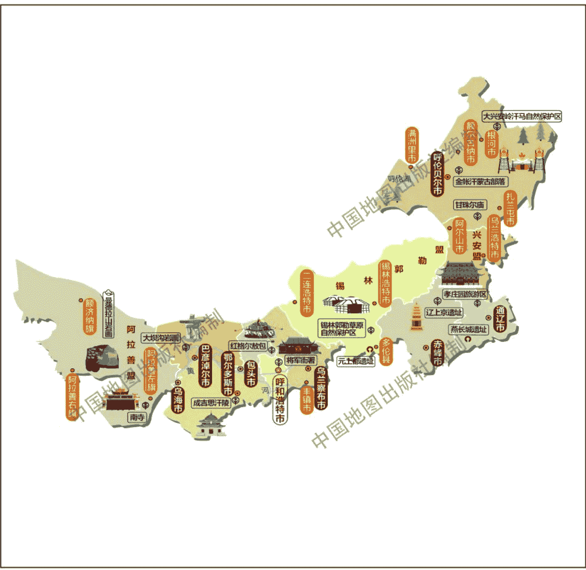

### 审图号: GS (2020) 4814号

很多内地人知道“阿拉善”这个名字估计是通过“阿拉善英雄会”，也就是大型越野派对，查了下，竟然有百万参与者，上百万人跑去那里玩，这我是没想到的。还有他们的胡杨林，在荒漠里面，胡杨是土著植物中最高大的，大多生长在河流附近。其实作为一种耐旱植物，大多数时候其貌不扬，和四周环境倒是相配。给人一种“虽然很努力但是也只能做到这种程度”的感觉。可等到了秋天，胡杨的叶子会变成金黄色，瞬间不但自己形象拔高了，气质也就上来了。我去过两次阿拉善，恰好都不是秋天，网上找了张图，大家可以看看：

在阿拉善的荒漠中开车，可以看到沿着笔直公路的巨大风力发电机，还有泛着光芒的太阳能发电板，并一直绵延到地平线，似乎没有尽头一般。不出意外，过几年新能源彻底成熟后，内蒙古又是太阳能和风能时代的主角。从乌海往东，排列着鄂尔多斯、包头、呼和浩特。这里属于内蒙古中部，也是人口最密集经济最发达资源最丰富的地区，被称为“呼包鄂”城市群。鄂尔多斯有全国1/6的煤炭和1/3的天然气，北方妥妥的能源中心。至于著名的钢城包头，很多人可能不知道，神奇的白云鄂博矿区就在包头。那里的稀土储量居然能占全世界的40%以上。还有这两年爆火的乌兰察布，那地方最大的优势是离北京比较近，很多人周末就可以去那边来个往返，还有几个火山，我去看过，比北京凉快的多，没带无人机，拍照效果不太好，大家去小红书上一搜到处都是。一般去乌兰察布，顺便会去大同溜达下，因为他俩基本上挨着。但是论吃的丰富多样，别的地方就不如他们了。从地图上可以清晰地看到，呼包鄂地区紧挨着山西陕西，鄂尔多斯到榆林距离和去包头差不多。大同去呼和浩特和包头比去太原近得多。事实上山西北方一直都是胡汉杂居，比如大同那地方古代经常被游牧部落占着，鲜卑人不是搞了个北魏嘛，那个北魏后来演化出来了隋唐，这个北魏最早的一个首都就在大同。后来宋朝丢了燕云十六州，十六州里有一半就在山西北部，那地方更是住上了北方游牧部落。那时候大同还叫“云州”，感觉比现在的名字有气质一些。历史上著名的“走西口”，就是从山陕两省北上，第一站就是到“呼包鄂”，所以“呼包鄂”的生活习惯和山西非常接近，这也是为啥这一带的人真正的蒙古人并不多，绝大部分都是山西人和陕西人，饮食更是如此。这几年山西那边的小伙伴甚至开车去内蒙古就是为了吃一顿烧麦，山西也有烧麦，确实不如内蒙古的羊肉好。在当地吃饭，黄米炸糕、炒刀削面、煮大块羊肉、羊肉烧麦等等，各种口味的食物摆在一张大桌上。每一样都能看出迁徙的影子，吃到嘴里又能感到带来的变化。多说一句，“走西口”的那个“西口古渡”，在现在的山西河曲，黄河在那里大转弯，水速放缓，卷起裤腿就可以趟过黄河。每次碰上灾荒，混不下去的山西人就会带着全家老小从那个地方过黄河然后去内蒙古，有点像山东人混不下去就去东北，河南人活不下去就去陕西一样。由于大量的人死在了那段黄河里，山西人觉得那水里有无数冤魂，所以每年七月十五会往黄河投放大量的河灯，可能是想超度亡灵吧，满河的河灯，非常壮观。现在也是一个景，大家有兴趣去看看。再往东就进入了绵延的内蒙古大草原了，锡林郭勒和呼伦贝尔都是以草原闻名的地区。“锡林”蒙古语为“高原上的平野”;“郭勒”是河流的意思。锡林郭勒意思就是“高原上的河流”，当地也确实河流众多，于是在平坦高原上分布着大量的湿地。其实锡林郭勒的草原主要是那个乌拉盖，那里设施相对齐全，而且草长的也挺好，大家去的时候别弄错了。自驾就走304，这条路基本上把锡林郭勒的主要景区转完了。北京这边去锡林的人超多，因为只有600公里，起个大早，京藏高速不堵车，开快点中午就能到，几年前我们公司团建到过哪里。呼伦贝尔没去过，下次去了我跟大家聊。不过我跟那边的小伙伴视频聚餐过，发现那边的饭店服务员穿着蒙古民族服饰，端上来的却是锅包肉、酸菜粉条子、地三鲜、排骨炖黄豆角，你说这么东北吗？没错，内蒙古实在是太狭长了，山西上边那段风俗跟山西一模一样，东边那边的内蒙古又跟东北没啥差别，有时候也分不清楚他们内蒙古人和东北人。不过前段时间组织活动在那个兴安盟，我也是第一次去，这个地方估计网上都不咋听说，属于存在感比较弱的。听到这个名，大家第一反应可能是跟大兴安岭有点关系，事实上确实也有点关系，就在大兴安岭的中段。历史上那地方叫“科尔沁”，最早跟着后金混的蒙古部落，大家听过“满蒙一家”，最早科尔沁加入了满族大家庭。咱们熟知的孝庄太后就是科尔沁的，满蒙贵族一直联姻，慢慢就成一家了。那地方有咱们熟知的“科尔沁草原”，不过去了才知道有时候也叫“科尔沁沙地”，跟冬虫夏草似的，可以根据雨水情况来回切换（冬虫夏草只能切换一次），有时候是沙地，有时候又是草原，大家去之前一定要先查下，万一想看沙子，去了发现全是草就不好了。

现在的兴安盟，都是咱们的东北铁子们，说的也是东北话。吃的也都是东北菜，当然了，东北人不咋吃羊肉，兴安盟的羊肉非常多。当地说是政府更加希望大家养牛而不是养羊，羊对草原破坏有点严重，相对来说牛就温和的多。而且养牛比养羊还能提高收入，现在这边的牛肉也走进了北京上海的商超。至于景点，必须要说著名的阿尔山，这地方不是山，是一座城市，标志性景点也是他们的火山。

还有火山活动形成的湖。

不出意外，过几年兴安盟旅游应该能起来，不过它的主要问题是离咱们的经济腹地太远，很多人都没咋听说过，更没去那里旅游的。兴安盟在发展旅游的同时，这些年当地种大米卓有成效，因为那地方处在黑龙江、吉林、内蒙古三省区交界处的“中国稻米金三角”，更是全球北纬46度“寒地水稻黄金带”，年产量70万余吨，占内蒙古70%以上，而且还实现了规模化科技化种植，而且把稻田变景区，农家变民宿。

尾声：几乎所有国家都有个转变，一开始大家都想出人头地，慢慢后来发现这种事需要承受巨大的痛苦，还要机缘巧合碰上大佬把自己捞上去，或者需要撞大运。慢慢就想开了，美国从20世纪三十年代，日本从20世纪90年代，欧洲从80年代开始，大家观念都发生了转变。奋斗这事倒也奋斗，不过不再把奋斗本身当成目标了，转而开始研究怎么让自己的生活丰富起来，趁着年轻，充分体验各种新东西。很明显，中国现在也处在了这样一个节点。必须承认的是，国内的很多旅游设施不能说一塌糊涂，还有很多不规范的地方，尤其宰客，还有各种高价，都严重影响体验。甚至很多地方摆出了一副这辈子只做一次买卖的造型，收费高的离谱，甚至比出国都贵。这都是病，得治。不过我一点都不怀疑，这些事慢慢都会处理好，越来越多的地方意识到，以自己的资源禀赋和地理位置，旅游业是他们最后的一根稻草，搞黄了就彻底完了。大家自然也就认真起来了。内蒙古和新疆西藏一样，有特别好的禀赋，不出意外，接下来发展会越来越好。

全文完，既然看到这里了，如果觉得不错，随手点个赞和“在看”吧。

公众号懒人搜索，懒人专属群分享

### 为啥法家没有好下场

2023-08-11

之前讲商鞅的时候，也就是这篇《商鞅那一套，才是真正的辟邪剑谱》，不少人拿电视剧大秦帝国里那套跟我扯，都懒得跟他们辩。

那套书我差不多2006年时候看过，一算已经十七年了。第一次看的时候惊呆了，觉得写得也太好了吧，然后在此后的时间里，发现那套书跟二月河的清朝三部曲似的，甚至真实性还不如二月河，一分真九分假，小说嘛，认真你就输了。

而且作者显然没弄明白一个基本的道理，那就是商鞅他们法家说的“法”，跟咱们现在的法律根本不是一码事。

咱们现在的“法”，更类似一种“约定”。既然是约定，就不能单方面制定，也就是立法的时候得有个道理，大家都能接受，或者说大部分人能接受，才能形成法律，然后立法者和大家一起受法的制约。尽管有不足，但是一直在往好的方向发展。

你做了什么事，比如酒驾得刑拘，嫖娼要拘留十日，杀人得判无期或者死刑，立法的时候尽管没找你商量，但是你也挑不出来什么毛病。B站有罗翔的视频，大家看了就知道那些法律并不是拍脑袋想出来的，每条看着不太理解的法条背后都有复杂的逻辑，从道德和道理上都能说得过去。

但是法家那一套完全不是那么回事。

他们做的事，就比较缺德了，他们的出发点就是让统治者一家子“万世一系”，他们更多的像是一个“监狱设计师”，所谓的“牢笼天下”嘛。设计一套秩序，或者一套程序，让整个社会都围绕一个人转，那个人就是封建君主，也是系统唯一的管理员。

这套系统的核心就是最大限度地满足君主的利益，别人的利益能压就压。比如秦法最关键的部分，就是让你把自己的剩余财富和体力都交出来，去打仗，去修长城，或者给皇上修宫殿陵墓。如果这事跟你商量，你能同意？你又不是“抖M”。

比较奇怪的是，有一些人现实里唯唯诺诺，被领导或者位高权重的人反复蹂躏打压，饱尝不公平待遇。但是在网络上，却对这种制度设计非常上头。你要是说一句这类制度不太好，他们跟你拼了，有时候不太理解这是一群什么样的人。

如果还不理解，可以用一句话来概括：

法家大佬们的终极任务，就是专门想办法逼你干你不喜欢干的事，来满足君王的欲望。毕竟你喜欢干的事不需要人来逼，既然专门得有人逼你，肯定你不想干。

现代法律更多的是确立“群己界限”，你有权利做你想做的事，但是前提是不能伤害到别人。你不能做危害他人的事，别人也不能做危害你的事，法律对你既是约束，又是保护。

而法家的“法”，只保护君主一个人，剩下的人全是他的私有财产。

咱们继续以商鞅为例，商鞅的时代是没法大幅扩大增量的，毕竟靠天吃饭，产出就那些。所以商鞅做的事，就是“盘活存量”，把民间老百姓的财富和精力最大限度地抽取出来投入对外战争，让百姓自己带着粮食去打仗，抢夺更多的土地和老百姓。

而且商鞅意识到，一定要让老百姓足够穷，根本没时间和钱财去玩乐什么的，这样才能最大化战斗力。所以商鞅不断强调让老百姓处在“存活线”和“温饱线”附近的重要性。他们穷，才有出去抢的动力，而且只要足够穷，就不那么怕死，贫穷才是战斗力。更关键的是，商鞅很在意思想上的绝对匮乏，老百姓啥也别想，老百姓有任何思想都是对商君工作的否定。

国家的富强必须建立在百姓的愚昧与贫穷之上，这是商鞅变法的核心理论。

抢来了土地和老百姓，让他们和老秦人一起过苦日子，他们不想过甚至想跑路怎么办？

商鞅早就想到了。为了防止大家跑了，又设计了极其残酷的保甲制和连坐制。商鞅自己对“连坐制”是非常看重的，他的变法第一条就是连坐制，这样老百姓才能被他管得死死的。这套制度如此成功，后来干到一人之下的商君自己都跑不掉，更别说普通老百姓了。

后来商鞅听说新皇帝对自己有意见，第一反应是赶紧跑路，而不是走司法程序证明自己清白，说明啥？

说明他比谁都清楚，自己设计的这套体系下，自己到底是不是清白的根本不重要。唯一重要的是皇帝的态度，皇帝要杀他全家，他全家已经是死人了，唯一的出路就是赶紧跑路。不过他低估了跑路的难度，很快抓回去被撕了，连带着全家被杀个干净。

这样的恶法，你说老百姓能同意？肯定不同意，不过也没啥办法，又不跟你商量，你甚至都不能评价。有个著名的案例嘛，商鞅变法一出来，很多人反对，商鞅把他们都杀了。过了几年，有些人觉得这新法还不错，去跟商鞅说，商鞅把他们流放了。

你说这不神经病嘛，当然不是了，法家最忌讳的就是下边的人说三道四。如果你今天能赞美我，明天肯定就能批评我，得从根子上治了你们瞎逼逼这个臭毛病。

以后让你们干啥就干啥，敢乱说，轻则流放重则杀头，下次瞎扯淡的时候小心点。而且关键是老百姓就不该琢磨这事，不是说这事不该琢磨，而是大家就不该动脑子。

到后来，秦国老百姓的生活跟监狱已经没啥明显差别，一言一行都遭到周围人的监督。不过后来大家慢慢适应了，啥也不想，啥也不说，只干三件事，生孩子，种地，打仗，商君给大家设计了从摇篮到坟墓的职业和发展路线，哪怕偏移一点，都算商君工作不到位。

这里边唯一被人津津乐道的，估计就是对贵族的打压，平民多了个上升通道。

必须承认，法家有“任人唯能”的习惯，但是从动机层面讲，他们也是在治君主们的心病。

君主有啥病呢？君主们最讨厌的，就是世家大族。这些人不好搞，势大根深，要分皇上的权，皇上就想把他们都挖了，然后换上没啥根基的平民阶层。而且新上位的阶层也不能太安稳，那又成门阀了，又会威胁皇权自己，最好是流动起来。这也是贯穿我国古代千年的一个大主题。

不过后来执行层面还是有问题，秦国的军功制从根本上讲普通人逆袭的概率本来就是负的，而且为了防止爵位泛滥，就得增加大量的刑法，老百姓动辄得咎，这样才能抵消他们砍人获得的爵位。秦朝的高级将领们基本都出自那些传统将门，几乎没有从基层上来的，也上不来。

后来的整个科举时代，真正底层穷人能通过科举上去的也没几个，因为古代的读书成本非常非常高，和现代去国际学校差不多，本来也不是普通家庭能支撑的。中国没了氏族，却多了门阀，门阀现在还在，这两天饶毅又在举报，大家可以去搜一下。

咱们继续说秦国，商鞅变法后，秦国军队的战斗力上去了，可是你能说大家心里也满意？肯定不满意嘛。而且最近几年有个猜想，说为啥后来陈胜吴广打到秦国腹地，秦王朝把修秦陵的苦工组织起来挽回了一局。

苦工组织起来立刻能打仗？门槛就这么低？很可能那就是亲灭六国之后的秦军，一部分去南方继续打仗，一部分去北方守长城，剩下的去秦陵做苦工了。

这也是为啥刘邦来了，跟大家约法三章，老秦人的基本盘关中立刻就不再抵抗，专心跟着刘邦混。中间刘邦一度去做“汉中王”，也就是去四川和陕西中间的那个小盆地汉中待着。

不过刘邦毕竟不是个消停人，很快就从陈仓道跑回了陕西，上演了一场王者归来，从此以后陕西人铁了心跟着刘邦。

因为刘邦的“约法”，更类似我上文说的“约定”，并不是统治者单方面定的规矩，而是每个人都能接受的规则，大家不觉得受了压迫。

所以关中老秦人欢欣鼓舞喜迎刘邦，并且死心塌地跟着刘邦混，后来刘邦在跟项羽的战争中屡战屡败，萧何却一直从关中征兵征粮送往前线，确保刘邦不下赌桌。楚汉战争中老秦人承受了巨大代价，但是依旧支持刘邦。

懂了这个道理，就懂了法家那套东西，最后的结果必然是伤害所有人，除了君主自己。

最后法家的人变得人见人恨，只有君主一个人喜欢他们。有点像公司领导的马屁精，天天给领导打小报告，并且给领导出主意怎么搞自己的同事。

哪天领导发现大家都讨厌自己，希望提高一些自己的声望，可能就把马屁精给开了平息众怒，声称坏事都是这人干的，领导被他蒙蔽了，然后偷摸再找一个。历史上的法家代表人物也都是这个下场，只是我国古代的“高端局”是没有退出机制的，没有辞职一说，动不动身死族灭。

商君他们也一样，等到君主死了，或者压不住大家了，君主就会把法家人物扔出去让大家发泄心中怨气，结果自然是死的要多惨有多惨，动不动全家被杀光，连孩子都不放过。

当然了，还有一部分伤亡是他们内部倾轧，比如李斯对韩非，两个人都是杰出的整人专家，韩非有本书，叫《韩非子》，也是一本“君主整人秘籍”，秦始皇第一次看到就惊呆了，表示死前一定要见见这个人。

很多人知道《韩非子》，却不知道里边在聊啥，其实low得很，举个例子，比如韩非认为，以前的人好糊弄，随便忽悠几句就去流血流汗，现在的老百姓太刁了，整天盘算自己的利益，不好好给国君去打仗。

那怎么办呢?得改造，比如杀掉五种人，学者、言谈者、带剑者（游侠）、工商之民（商人和拥有各种技艺的人）和患御者（不想打仗的）。鼓励那些听话又不反抗的人，没啥脑子最好没啥道德的人（远仁义，去智能），时间长了就好统治了。

不过韩非生错时代了，他出来混的时候，天下都快统一了，而且秦国已经有了李斯这样一个法家代表人物。韩非和李斯提供的产品只有君主会买，所以形成了激烈的竞争，又都是心狠手黑的人物，最后的结果也可想而知，怎么都得死一个。

后来韩非败下阵来，被李斯给杀了。咱们完全可以合理推测，如果韩非出任宰相，以韩非的手段，李斯的结果不会比后来全家被杀好太多。后来的“请君入瓮”，也是这个逻辑，武则天的两个酷吏就是典型的“为一人得罪天下人”的法家人物，他们先是互相残杀，剩下的那个也被武则天给处死了，做了背锅侠。

所以如果单纯任用法家，国家可能会强大，但是皇权急剧膨胀，最终膨胀到大家受不了，会逐步失去老百姓的支持。

没了基层的支持，国家看着强大，其实不堪一击。刘邦的孤军从武关偷摸进了关中平原，整个三秦立刻就怂了。大家想想，那可是“赳赳老秦”，老秦人全民皆兵，打了几百年的仗，至于怂成这样吗?

说白了，大家不想跟着赢家混了，跟后来邓艾顺着阴平道打到了成都，成都本地人焦周劝了几句，刘禅立刻就投了，本质都是一样的。并不是焦周日才好，而是刘禅从焦周口里，知道了蜀中老百姓不再支持继续打下去了。

于是到了汉朝，刘家目睹了秦朝的迅速崩溃，刘家当然也想万世一系，也想一直坐天下，可是他们知道法家那一套太惨烈。刘家意识到汉朝急需要一种新的思想或者制度，不能单纯用鞭子，而是从大家内心深处来说服大家接受皇权，来给皇权维护合法性。找来找去，找到了儒家。

儒家向皇权承诺，我来忽悠大家相信你们刘家是天命所归，让你们家获得合法性。

啥是“合法性”，就是“同意”，就是老百姓同意某一家子一直统治大家。儒家觉得统治者得顺应“天理”，这样大家才能同意被统治。

这里的“天理”，其实就是“自然法”，高于秦律，也高于现在的法律。类似《我不是药神》里的那个主角，他走私药品被抓后法院给放了，没被判刑。你说他违法没？他肯定是违反了刑法，得去踩缝纫机。但是他的行为并没有违反人伦道德基础上的自然法，大家心里有杆秤，他就被放了。

类似的案例其实很多，从秦法到现在的法律，其实就是不断向自然法的靠拢。为啥要有法官呢，就是因为法律条文再详细，有些问题依旧得根据现实进行微调。

这个层面上讲，儒家比法家高明了好几个段位，他们发现了这个世间存在着“公理”，皇权想长久地混下去，就得按照公理来，不能听法家的施虐狂使劲折腾老百姓，皇权克制着点，统治也能长久些。

而且儒家早期的人物人更加像个人，法家的那群基本都是一群反社会。

孔子说，以直报怨，以德报德。

别人对你好，你也对他好。谁要是惹你，你就弄死他。

孟子也说，君之视臣如手足；则臣视君如腹心；君之视臣如土芥，则臣视君如寇雠（那个字读“仇”）。

你怎么对我，我就怎么对你，皇上也一样，虐待老百姓，老百姓就把皇上掀翻算了。

孟子还说，民为贵，社稷次之，君为轻。

皇权在人民的海洋面前屁都不是。

后来这段话得罪了朱元璋，明朝官方标准刊行读物里，把这两句给删了，并且把孟子也给赶出了孔庙。当然了，老朱可以一口气砍掉一千个孟子，可在人心里的影响力跟孟子比起来连个锤子也不是，反对声太大，后来又把孟子给请回去了。

多说一句，原教旨儒家也就是孔孟那些东西，现在去看也没啥问题，先贤思想的光辉穿越两千多年依旧熠熠生辉。

### 尾声：

儒家后来长歪了，变成了棵歪脖子树，跟法家相互吸收，不断自我阉割，变得面目全非，主要任务就是忽悠老百姓接受三六九等。孔子要是知道他的徒子徒孙变成那副鸟样，这个身高两米卧推150公斤的山东肌肉男一定要让他们知道什么叫“以德服人”。

而且儒家赋予了皇权合法性的同时，还藏了个后招，上天眷顾你，也可以眷顾别人，你怎么保证持续获得这种眷顾？

也就是说，这种眷顾并不是无条件的，你得表现得像个人，得收敛点，不然随时会被上天抛弃，然后换上别人。

儒家给皇权带来了合法性，也套上了枷锁。儒家的东西保障了君主的权力，也给君主规定了行动范围。

这也是为啥说古代是“外儒内法”。两千年里，皇权一直在想办法把所有权力弄到自己这里来，所以天然亲近法家，就好像领导身边都有个马屁精和整人狂帮他做事一样。

可是这种操作弄不好会把国家搞崩溃，得让老百姓支持自己，这就是儒家做的事，儒家间接让皇权不那么疯。

不过法家和儒家共同的毛病是保守，儒家保守就不多说了。法家本来不保守，可是君主最怕的事，就是权力被威胁。如何确保不被威胁呢？关键就是“固化”，让社会不要发生任何变化，超级稳定，大家去看看老朱干的事就知道了。法家作为皇权的马屁精和施虐狂，他们也对这事极其执着。

问题是，稳定有助于发展，超级稳定会扼杀所有的创新和可能性，创新本身就是在失控和不确定性中产生的，这两样恰好是法家极力要消灭的。

所以网上有人说，三体里智子锁死文明不算啥，法家和儒家合作，搞出来的超稳定封建王朝才是真锁死。这么说也有一定道理。

### 往期阅读

- 商鞅那一套，才是真正的辟邪剑谱
- 随便聊几句房地产
- 公众号懒人搜索，懒人专属群分享

### 随便聊几句房地产

2023-08-08

本来想发篇长文，不过没写完，就聊下地产吧。这个话题也是相对敏感，我找不敏感的说。这些年也看了不少城市发展方面的书，给大家聊聊。

- 1、全世界所有的发达国家，都走过一段“城市化推动的房地产大爆发”，这个阶段里，老百姓都疯狂追逐房地产，并且产生一种错觉，觉得那玩意永远涨。

不过世界上没有永远涨的东西，事物会走向自己的反面，慢慢地，房地产开始分化。

其中一部分变成彻底的投资品，谁都买不起，所有人都知道这些地产长期会继续升值，不过没啥用，知道也买不起。需要注意的是，投资品长期涨，并不代表短期不会跌，跟美股似的，长牛趋势比较稳定，但是短期可能有30%的跌幅也正常。

大家知道吧，美股那个指数里的股票一直都是变来变去的，相当于一直在选班里的尖子生。

中国国内的可投资区域并不是一成不变的，以北京为例，前些年谁会觉得亦庄那个破地方有前途？这些年那边豪宅林立，都跑六环去了，二百多平的房子单价能到十来万，跟国贸附近差不多，你们敢信？通州前些年暴走了一波，这几年就是个大坑。

剩下的房子彻底变成工业品，就跟手机和汽车似的，到手就贬值，用得年头越长越贬值。但是大家依旧会购买，因为人都希望美好生活，会追求好商品，但是这些商品再好也会不断贬值。一旦失去了投资属性，也就没人屯那玩意了。

- 2、“房住不炒”已经取得了初步的成功，因为绝大部分城市已经丧失了炒作的可能性，现在在小城市握着好几套房的人，依旧让当地人羡慕，但是长期看来并没有多少价值。

太多城市房价已经不可能起飞，今后的路径是大概率这样的：

房价过顶之后，很多有多套房的人开始懊悔，并且下定决心下次房价稍微抬头，就把手里的房子卖掉套现。所以每次出现利好，都会出现一堆抛盘，房价不但不上涨，反而继续跌。随后更多的人加入抛盘，开始不在乎收益了，只希望把手里多余的房子套现即可。

事实上现在已经有很多城市出现了天量二手抛盘，前些年房地产狂奔时代大家疯狂囤房，现在想高位出货。

今后可能慢慢不再提“房住不炒”了，因为没意义了，没啥可炒的了。

一线的你炒不动，而且流动性极差，也就是说你投资一套你很看好的房子，需要非常非常多的钱，动辄一两千万往上，而且等到需要卖的时候，却发现可能需要半年才能卖掉，因为买得起这种房子的人太少了，有这么多钱的人又不一定能看上你的房子，需要慢慢等有缘人。

很多投资客，本来投资这类资产赚到了，但是由于着急用钱，需要紧急卖掉房子，大幅打折，最后投资了个寂寞，还不如存银行赚得多。

一线往下的，你敢囤房说不定就砸手里，给你个胆子你去炒。有点像前些年不少人在炒出租车牌照，这两年你再去炒试试。

其实炒房者，更类似“趋势交易者”，一旦趋势没了，他们也不玩了。而且房价这东西，从其他国家的经验来看，跟股价没啥差别，涨的时候会远远超过自己应该的价格，跌的时候也会远远跌穿底价，需要很多年才能修复。

- 3、至于你说是不是可以低价在一线买？那想多了，今后一线，二线，三线完全不是一个逻辑。

一线玩的是一种惨烈的“淘汰赛”，每年吸引全国最优秀的那部分人入场，然后十年后把他们都赶走，只留下最聪明最有能力或者运气最好的那几个，由他们给托着房价。

当然了，一线的房产现在也不是“大家都一样”。

有些盘是上车盘，里边的住户只要有钱了就会搬走，这些地方的房价一般不咋样。

有些盘属于“终极盘”，真正的有钱人都会购入，而且购入之后，除非万不得已，可能永远都不出手，这类盘子会非常非常贵，因为卖家少，买家又都是有钱人，会把房价推到难以理解的高度。

二线玩的是一种“虹吸游戏”，比如郑州这一波操作，不一定能救得了郑州，但是确实对于驻马店那里想去郑州的人来说可能是个机会。

当然了，也不一定，可能那些人还是决定再等等，看看郑州出了政策后，是不是抛盘更多了，如果出了救市政策二手房价反而在下降，那着啥急？

但是长时段的趋势是确定的，今后河南还会有大量的人涌向郑州。

其他省也一样，今后大概率是“一省一城”，一城兴而百城衰。

我以前高估了一线对其他城市的虹吸，因为一线只是留下来最优秀的那部分，还有大量在一线混不下去或者没有户口的会撤回二线，把一线的经验也带回二线，间接实现了方法论和经验的扩散。

这些年还有个比较有意思的观察，很多人在一线城市卷不下去，撤回二线后没有可做的事去做生意，反而风生水起。那些留在一线的，房子户口倒是有了，不过一般只是个高薪上班族，在35岁之后逐步落了下风。

对于很多人来说，郑州那地方不咋样，但是对于更多的人来说，郑州、太原、合肥这类在网上公认的大农村依旧是很多人的人生最高追求。比如我们老家的“豪门”娶嫁，一般都会商量去太原买房。

类似西安成都这种城市，辐射范围更加大，整个西南有钱人都会考虑去四川搞一套，整个西北的有钱人都会考虑去西安买一套。

三线往下，今后就是个被吸的命运，不过对于当地老百姓来说也不是坏事，比如这两天B站有个UP主，在黑龙江伊春10万块买了个房，还带着两亩菜地。伊春要是跟江浙沪似的，怎么可能这么便宜？

- 4、在网上，香港和台湾省就是一个笑话，不过如果大家去过那些地区的小区什么的，就会发现他们的小区普遍尽管老，但是非常干净，物业非常负责。他们比咱们发展得早，已经过了那个房地产时代，进入了存量时代，存量时代就是物业的时代。

而且物业和老百姓反复博弈，太烂的物业都已经出局，所以整体环境还不错。

香港的很多房地产商最后都变成了物业，赚钱少了，而且是真正的辛苦钱，但是做得好每年都有持续的流水，老百姓也能获得很好的居住环境。

等到物业也慢慢开始相互竞争，开发商能有个出路，老百姓也能获得更好的小区环境。大家可能不知道，哪怕在北京，很多小区随便一个三居都得1500万往上，绝对是绝大部分人的天花板，物业依旧烂得没法看，进了那地库，就跟进了20世纪的人防工事一样。关键还不是旧，而是脏得没法看。

建设向服务转变，快钱向慢钱转变，这是接下来很多年的主流。

- 5、依靠房地产拉动经济，这个思路逐步已经变成了一种“大而不倒”，或者“庞氏骗局”。

房地产背后关联的产业太多，以至于不能轻易放弃，可是趋势已经形成，今后买房的人越来越少，那些产能和产业退出只是时间问题，一波又一波地拉房地产，只是延缓这种退出的速度，却影响不了最终的结局。

房地产最终的结果，就是跟冰箱彩电一样，依旧是一个不小的行业，但是不会像现在这样作为国家的支柱产业，而且慢慢地，这类夕阳行业里边谁也赚不到啥钱。不过好处是消费者可以低价买到一个还凑合的产品。

我理解国家知道这事，这也是为啥从疫情期间开始，就想用产业升级来取代房地产的地位，给房地产画了三道红线，积极去杠杆，本质也是想安全着陆。只是到了今年，不太顺利，最近又频出房地产救市政策。

- 6、“出清”意味着痛苦，也意味着新生。

人类的经济经过几千年的爬行后到了工业革命后快速上扬，然后经历一个个经济危机后走到现在，本质也是在旧路走不下去的时候，行业里的人才和资本都被迫重新出去找新的活路，推动了新的产业新的周期。

康波周期的本质就是技术周期，技术周期的本质就是原来的老路走不下去了，有人跳出去走了一条新路。这也是近两百年来世界经济局部有挫折，整体昂扬向上的原因。甚至可以说，每一次危机，都是下一次突飞猛进的起点。

从周期角度思考问题有个好处，衰退或者某些行业的衰落，长期看来都是正常也是有益的，反倒是抱残守缺其实是一种空耗资源。

作为反例，日本的大量僵尸企业在已经死了的路上拿着银行的低息贷款死磕到底，路线错误，越坚持越反动。

事实上不管大家愿不愿意，房地产整个行业都在走向没落，这段时间大家注意下就能看到，类似中建某局微信群骂人、设计院大幅降薪使劲加班且没加班费什么的新闻层出不穷，本质也是行业不行了。以前大家在里边可能也不爽，但是能赚到钱，如今不爽还赚不到钱，于是就爆了。

不行就不行吧，天下没有不散的筵席，也没有永远繁荣的产业，也不应该有，一旦完成了使命，就该慢慢隐入尘烟。只要我们的新产业慢慢起来了，房地产的使命也就完成了。

公众号懒人搜索，[懒人专属群](懒人专属群)分享

### 国家为啥不派军警过去把缅北的人救回来？

2023-08-04

这个话题已经想写很久了，不过我又没去那边搞过诈骗，很多事也不太明白。不过后来有云南的民警跟我说他太懂了，有啥问题可以问他，这段时间解惑很多，现在可以聊了。

- 1、先说下缅甸现状。现在的缅甸，大概相当于我国的民国最乱的那个时期，有个名义上的政权，江浙一带是很稳定的，但是国家的边缘地区处于军阀割据状态。缅甸也一样，南方整体是稳的，但天高皇帝远的地方大家不咋听中央的，中央也不大想管那些边缘地区，毕竟让你管你不得花钱嘛，于是就有了一种甩包袱的心态。其中以缅北和中央政府冲突最严重，缅北确切的说是“缅甸东北”，主要是果敢、佤邦、小勐拉、大其力，也叫“东北F4”。那个“大其力”很多人从没听说过，其实咱们熟知的“金三角”，就在大其力。缅北的人口其实就是华人，学校也教中文，当地主要口语是普通话和云南方言。用的货币也是人民币，连信号都是中国移动联通的。而且那边玩短视频玩得很厉害，一度连赌场荷官和那些军阀部队军人都开了号，给大家表演才艺，普通话说得跟广西鬼火少年没啥差别，后来被平台全给封了。比如咱们熟知的果敢自治州，我接触过一个那边的人，他们自称自己是跟着永历帝过去的明朝遗民，还有一部分远征军的后代，还有1949年之后流亡国军后代。不过云南的那边的人说，其实基本跟远征军没啥关系，都是些云南人。现在网上的那些打人和噶腰子视频，主要也是通过短视频传播出来的。按理说以缅北的实力是无法对抗政府的，但是各种原因下，缅甸中央政府没有能力整合完成。当然了，可能也是不太想管，缅北才形成了事实半独立。既然半独立，缅北只能靠自己吃饭。就开始了第一第二产业大发展，第一产业是种植毒品，第二产业是加工毒品。再配上从缅甸到泰国的运输线路，生意算是干起来了。缅甸毒品大繁荣和中国有关。中国在鸦片战争之后很快就成了鸦片出口国，从大清到北洋，再到后来的军阀混战，当时军阀就没有不种鸦片的。后来我党上台后，第一件事就是把鸦片地全给铲了。1949年中国解放，李弥的第八军退到缅甸，把缅甸给带坏了。缅甸当地本来就会种鸦片（英国人教的），但是不太懂国际贸易，国军见过世面，他们懂，于是跨国业务就搞了起来，先卖到香港的黑社会那里（香港黑社会也是败退国军），然后销售往全世界。更关键的是，中国这个国际上最大的毒品供应商退出了市场，给了缅甸入场的机会，金三角正是在中国革命成功后暴走的，一直持续了几十年。不过缅甸毒品的真正大爆发，又是中国改革开放之后，开放了国门，加上消费能力也上来了，毒品需求开始增加。缅北一度又成了中国毒品最主要来源地。这也正常，一个巨大的经济体崛起，他边上的小国都获得一些非法途径的财富。比如墨西哥就是美国的毒品供应商，东欧给西欧提供毒品和妓女。不过中国对禁毒有着铁一样的执念，向中国人民输送毒品，很可能有命挣没命花。所以多年来，缅北的毒品不能根治，但是也没有巨量扩张，就源于我们的严格禁毒。毒品之外，缅北还有一个有名的来钱方式：翡翠，这个不多说了，之前马未都说了嘛，金银有价玉无价。说的不是翡翠和玉是无价之宝，而是金银是有市场价的，但是翡翠和玉没有，说值多少钱全看买家心态。跟人参似的，中国人当个宝，其他国家的人当萝卜。美国人往中国高价卖了那么多年西洋参（西洋参就是美国和加拿大人参），也没弄明白中国人为啥会给这种萝卜支付那么高的价。不过后来贩毒这条路被缅甸人走窄了。一是随着金三角名声越来越大，联合打击的力度越来越大。二是新型毒品不断涌现，特别是化学合成毒品，挤压了传统毒品种植的市场，现在市面上的毒品，主要是以冰毒为主，很多人熟知的"麻古"之类的，其实都是冰毒的变体，一般有20%左右的冰毒，再加点别的东西。于是当地缅甸从20世纪90年代中期开始转型。从那时开始，当地赌博产业异军突起。缅北出现大量赌场，一时间，来自全世界的赌客云集缅北，开启了第二次繁荣。不过当地的交通和治安环境堪忧，硬件条件也不足。比起其他东南亚国家没有任何优势，一波热闹之后就沉寂了。于是当地不讲究起来了，干起了杀鸡取卵的事情。时不时爆出赌客被杀被抢的新闻，即使当地军阀为了保住财神尽力清剿，也已经渐渐难以为继。随着菲律宾、马来、泰国、越南、柬埔寨都开始建设赌场，缅甸的博彩事业已经不可能做大了。但是天无绝人之路，缅北的转机还是发生在中国。2015年后，国内对电信诈骗的管理严格，大批人被处理。剩下的如鸟兽散，但是还好些人没有放弃，转而走出国门开始全世界扩张。缅甸那边一直有个传言，说是2015年一批福建人给缅甸带去了新的生机。不过在缅甸，有个人几乎无人不知，就是那个佘智江，湖南人，他最早跑去柬埔寨和缅甸搞诈骗，现在缅甸到处都是的诈骗园区，就是这人最早搞出来的。不过最终做大的不是他，而是2015年之后跑去那边的诈骗集团。事实上缅北也很适合做这个，距离中国近，甚至连网和电力都是从国内拉过来的。当地有大量华人后代，很多会说普通话，剩下的也会说云南话，生活习惯接近。最重要的是当地掌权的军阀需要资金，双方有合作的基础，于是一拍即合。在缅北的特殊环境下，几种产业完成融合进化，造出了现在缅北的特殊电诈形式。

- 2、对于缅北的情况，曾经有几个相关新闻，因为没有戏剧性。看过的人估计不多，不过很值得说。从2021年开始，多个地方政府发通知：在缅甸从事电诈的人如果限定期不回来，就取消户籍。公安部2021年9月发布数据，当年已经劝返5.4万人从缅北回国，并在口岸拦截了2万人去缅北。到了2022年，缅北电诈变得很严重。公安部组织了一次大规模专项行动，成果惊人。从4月到7月就劝返了23万滞留人员从缅甸回国。一开始我看报道，还愣了一会。看了几遍确认一年劝返几十万人。那个云南的民警说，实际情况略有出入：很可能不止这么点，有很多人去缅北是偷渡的。看这边风声紧又跑回来，过些日子再去，一年来来回回好多次，没有统计进来。瑞丽在疫情期间一直控制不住病例，也是因为这些人不断偷来回跑。而且滞留在缅北就是干电诈的，也有些是开赌场的、贩卖翡翠的、走私毒品的。跟很多人理解不一样的是，绝大部分去了缅甸的人，都不是从海关过去的，而是“走小路”。因为中缅有漫长的边境嘛，边境线上有高耸的铁栅栏，下边还有钢丝网，偶尔还有边防军带着狗子巡逻。但是依旧挡不住那群人钻漏子跑过去，因为那么长的边境，总有人到处挖洞，总能跑过去。这些跑过去的，有的是想赚钱想疯的，有的就是在国内犯法，准备出去躲风头的，欠了一屁股高利贷下辈子也还不上的。不过这些年我国开始发动人民战争，逮到一个走线的给3000块，边境的老铁们跟美国的民兵们似的组成联防队去抓偷渡客，整体卓有成效。这里有个情况要说明：在当地参与电诈的人员，95%以上都是华人和中国人，当地人很少参与，一般诈骗园区里当保安，门卫，或者保洁的是当地人。缅北军阀总是给人一种好像很残暴的感觉，其实大家去搜一下，虐杀华人的事他们真没咋做，毕竟他们最不想做的事就是真惹怒了中国政府，到时候就死定了。但是民间的那些跑过去的人就无所谓了，那属于民间斗殴，跟军阀们也没啥关系，尽管那些诈骗组织骗到钱是要和军阀分账的。当地电诈人员的成分一般分成几类：首先就是处在头部那些老手，这些人入行早。有的多年前在国内就开始，随着国内打击力度加大，开始出海。菲律宾、柬埔寨、缅甸、越南、马来西亚。远的有去迪拜的，甚至有的还有跑到非洲。这些人有的做大以后成了老板，就回国或者去发达国家享受生活，生意交给手下打理。有人问就是在海外投资矿产赚了钱。有的没干成老板，还是打工身份但是混成了高管，负责管理工作。有的管理公司运营，有的管理钱款出入，有的负责手下员工培训考核奖惩。这些人收入非常高。中小规模公司的高管每月都六位数朝上。这些年抓回来几个，动不动就赚好几亿。此外就是国内走投无路的，被通缉的，欠了永远还不完的高利贷的，他们基本上永远都不回来了。这些人是公司骨干，大多真心投入认真工作，对电诈有很强的认同感。他们分工不同，有的直接打电话，有的负责提供后勤，有的负责人员出入，有的负责调动车手取钱，有的负责和当地人打交道。不过这两种人一被抓住，大多痛哭流涕表示自己是被迫的。表示自己以前是个好人，被坏人绑架过来，在各种折磨下叫天天不应叫地地不灵。如果不听话就会被割器官卖了，尸体挖坑埋掉。只得暂时存身，天天以泪洗面，期待国内有人来解救自己。所以说从缅甸回来的那些人都一个个苦大仇深，有的是真被骗过去的，有的根本就不是。上边说的这些人，就算在那边被虐待，回国之后基本上都得被判刑，也就是最近很时髦的那个“帮信罪”。最后才是被骗被胁迫的人。这种人的基本情况和以前说的打螺丝的接近，但是大多家庭条件和学历更低。有的是不愿意去打螺丝，有的是希望有个更好的发展。同时还想着挣大钱。这些人，比较踏实的会选择去发达国家，通过偷渡”走线“到当地打黑工，饭店刷盘子、农场采摘种植、通下水道修房顶剪草坪等等。一边借着国外经济发达和汇率挣比国内多一些的钱，一边省吃俭用东躲西藏熬日子想法子弄合法身份。还有一些就比较一言难尽。看了骗子的宣传视频，就真相信去那些不发达地区，可以挣到国内几倍十几倍甚至几十倍的收入。跑过去之后发现自己的口才和骗术没法达到组织要求，想回家却发现回不来了，人家向他家里要赎金，不给就往死里打，这些年这类新闻越来越多。

### 年纪轻轻就入狱是一种什么体验？

2023-08-02

写上一篇文章的时候，突然想起来以前一个常联系的小伙伴，他初中毕业就进厂打螺丝，这些年换过十几个工作，二十多岁已经在社会上摸爬滚打了十来年，在很多方面的社会经验比我强太多，以前经常跟他聊。这次才有事想问他，才想起来后来给他发过几次消息都没回，再一看已经几个月，以为是他又换手机号了。不过还是又发了一次问他咋样了，没想到这次回了，说是刚从看守所出来。详细问了下咋回事，觉得这事还挺有意思，征得他同意，决定写一篇，大家也都看看，说不定身边的人就在这样的坑附近。咱们就叫他小张吧。

事情是这样的，有段时间他实在是太缺钱（当然了，他一直缺钱），然后在网上看到一个广告，说是只要他用自己的身份证注册一个公司，然后去银行开个公户，啥也不用干，只需要协助下人家的公司办点完全合法的业务，人家就给他两万块。上边还写得有鼻子有眼，说是主要为合法避税，不用担心违法问题。小张说其实当时也纠结会不会摊上事，想到这些年干的蠢事，几乎无一例外都是太缺钱，然后不走寻常路走到了坑里。太多次被人骗，其实也都是因为自己太穷又太容易被诱惑。觉得这事不太保险，有点想放弃，可是又一咬牙，就把电话拨了过去。跟那边聊了几句，问他信用记录怎么样，他很惭愧地说，之前撸小贷把征信搞坏了。本来以为对方不要征信差的人，没想到那边竟然很利索地说没问题，给他发了个地址和联系人电话。到了那个地址，找到联系人，那人带他去银行开户，很快就把业务办了起来。他想要钱，人家先给了五千，拿走了他的身份证和银行卡。然后把他安排到一个酒店里住下，并且还有个小哥跟他一起住，有什么需要的，跟那个小哥说就行，说好过几天就付剩下的钱。过了两周，跟他说是没啥事了，让他该干啥干啥，很快就把剩下的一万五打给他。不过没等到那一万五，却等来了警察的敲门。到了派出所之后，小张全程懵逼，听着公安在对自己讲什么“你的公户走款几十万”，他都惊呆了，明明这段时间自己一直在酒店，怎么就出了这么大的事？

警察叔叔给他解释了这是怎么回事。

原来有个“刷单群”，专门招那些辞职在家带孩子的家庭主妇，这些人尽管不上班，可是却有强烈的赚钱动机。一般会先去买保险，然后卖茶叶，最后干刷单。

“刷单”说的是有些商户想把产品做起来，靠大家真正下单的自然流量肯定是不行的，需要先购买一群“人肉机器人”下单。这些人下单后，群主再把钱退回来，比如你花了一块钱买了个东西，那边并不会真发货，群主给你转了一块五，你就赚了五毛。大家一直刷，直到平台算法误以为这个商品很叫座，算法开始主动推，这时候就算是刷单成功了。

一般刷一单只能赚几毛到一两块，尽管不是特别正派，但是也不犯法，事实上这事现在做的人依旧很多。然后刷单群里就会有人开始发一些截图，说自己干了几票大的，刷了三百的单，一次赚了一百。这时候就有人很好奇，想参与下，然后被拉到了一个小群。

在小群里，大家不断秀刷单1000赚两百，刷单2000赚500的截图，就有一部分人受不了，也开始接这种大单。刚开始是能赚到钱的，但是过了一段时间，玩得越来越大，开始单次刷一万，赚一千这种。

而且结算开始变慢，刚开始的时候每次刷完立刻就能见到现钱，可是慢慢的只能三天一取现，由于每次都能取成功，大家也不担心。

直到后来账户上已经攒了十几万取不出来，平台那边要求再充值五万就可以取，这时候有人就疯了，充了五万取不出来，然后继续充，花了几十万，把全家积蓄都花了，依旧取不出来。这时候才觉得可能有问题，赶紧去报警。

警察查看了QQ群，发现里边的人的信息都是假的，唯一真实的信息，就是转账记录里那个银行账号。

顺着这个银行账户一查，就找到了我这个小伙伴。然后再查了下他最近的快递地址和外卖地址（这些都是实名制，警察能查到），就找到了他，把他带了回去录口供。

顺便告诉哪怕在不知情的情况下，你注册了公司账户给别人用，并且拿了报酬，在咱们国家都是重罪，要判刑的。

在派出所临时关押室的长凳上，小张睡不着，正好旁边有个哥们也跟他一样在那里坐着，后半夜聊了下，竟然发现是跟他一样的倒霉蛋。不过这个哥们事比他的大，他的公款账户被拿去洗钱，洗了大几百万，目测十年起步，那哥们才21岁，还是个00后。

口供录了两三次，警方给小张看了刑拘证，说他已经被刑事拘留，要把他送去看守所。

多说一句，很多人分不清看守所、拘留所、监狱，以为都一样的，其实完全不是一码事。

嫖娼什么的治安案件，确认拘留十天后，会被送去拘留所。刑事拘留在看守所，在法院宣判之前，你得一直在看守所待着（案情不严重的可以保释），比如吴亦凡已经在那里待了两年了。

宣判之后，会被送去监狱，在监狱踩缝纫机干活攒积分，经常说表现好能减刑，一个主要考量就是工作完成情况，当然你不能有任何违规违纪。这三个当中，看守所环境是最差的。

录完口供，被警察带着去体检，体检结果出来后，被送进了看守所。

在那里，全是一帮有才华的人，有几个人跟吴亦凡似的，案子拖了很久，在里边一直待着，每天没啥事干，就讨论案情，慢慢阅人无数见多识广，成了刑法专家。

他一进去，大家就围上来问他你犯了什么事进来？他简单说了下，立刻就有人说“我跟你一样，不过比你金额大”，还有人说你去问问老严，他是刑法专家，大概能估出来你的刑期是多少。

原来老严因为一个大案已经在看守所待了三年多，对三年抗疫的了解仅限于管教的只言片语，老严好奇心强记性好，就跟欧美的律师似的，你说出来你的案情，他就能在这些年碰到的人里翻出对应案例，然后告诉你会被判几年，以及哪种情况下会被减刑等等。

在这些人的协助下，他迅速就弄明白了到底咋回事。

原来有人可能要搞诈骗，比如要卖什么理财产品，得忽悠那些被骗的人把钱打到一个账户，然后骗子赶紧把钱取出来跑路。被骗的人迟早会意识到有问题，去报警，警方肯定第一时间会锁定那个收钱账户，然后找到那个账户是谁开的，这人很快就会被抓起来。

所以那些犯罪分子这些年学精了，他们才不会用自己的身份证开户，而是花两万块去找人开。

这时候就盯上了那些年轻的，警惕性比较差，又缺钱的人。大学生、工厂里的工人等等，都是容易受诱惑上当受骗的。而且这些人普遍年轻，这也是为啥一大批“零零后”因为这事进了监狱。

看守所里的狱友问他，是不是“招聘”他的时候问他征信怎么样？他说对啊，并且表示很纳闷，为啥自己征信差，反而能“应聘”成功？

其他人哈哈大笑，说这不明摆着嘛，征信差的人才真缺钱，而且撸小贷把征信搞坏这事，本来就是在法律的边缘疯狂试探，有过这类经历的人，往往敢于来票大的。这种人胆子大，又敢拿不义之财。

更关键的是，不在乎征信的人往往也不在乎自己的未来，当骡子实在是太适合了。其他几个同行都表示自己征信也都坏了。

“骡子”说的就是那些被骗开户、收了身份证、再把他们弄到酒店看起来的人。这些专门用来收钱的账户，可能意思是这些人和骡子一样，给别人驼东西吧。等有人报警，警方只能找到那头骡子。

这里就有个问题，为啥要把他带到酒店看起来呢？之前确实发生过不好的事，那时候骗子警惕性不强，被骗的人刚把钱打到骡子的账户，那个账户就被骡子冻结了。骗子到处找户主，死活找不到。所以后来骗子学精了，要把这小张这样的户主看住，收了他身份证。

当然了，警方也不是抓了这个倒霉蛋就完事了，也会向上抓，于是在看守所里，我的这个小伙伴认识了这个产业链的上下游。

比如专门到处骗人的骗子公司，也就是刚才忽悠刷单群的人去刷大单的那些人。在我的这个小伙伴的监室里，就有一个长沙的狱友，他们公司就是一个诈骗公司，正在上班的时候被警方突袭，全公司60多人全被抓了进去。这些人有的知道自己是诈骗公司，有的根本不知道。

还有那些找诈骗公司洗钱的人，比如赌场老板什么的，也在看守所。

还有其他的，比如在酒店看着那些骡子的人，还有银行协助办卡的，都在里边，不过这些人罪比较轻，判不了多久。

一个看守所屋里十几个人，70%左右都是诈骗链上的，侧面也说明，这两年诈骗这事非常猖獗。不过受益最大的那批，往往抓不到，因为这些人都是些老手，都在国外。

当然了，还有更黑的操作，说实话接下来要说的这事我不太理解，说出来只是想告诫大家不要去搞。

一些人开的公司账户并不是用来搞诈骗，而是用来“背债”。

比如小张的一个狱友，他四十来岁一无所有，唯一的优点是征信还在。于是通过中介包装，成立了一个公司，有流水有资产，然后别的公司把几百万的债务转到了他的公司，给了他一百万（当然不是直接划到他账下，那样直接被没收了）。

然后征信就黑了，从此不能坐飞机高铁，因为这两样是要身份证的，其他的都可以让别人代交，比如不能住高级酒店，这个难不住，直接找个人替自己注册就行了，不能高消费比如买辆车，注册在别人名下就可以了。这人被以“拒执罪”刑拘了十五天，放出去的比小张都早。

还有一种，找中介，把自己包装好，有车有房有流水，然后去疯狂撸各种贷款，可能短时间撸出来几百万，其中一半给中介，剩下的留给自己。这种人一辈子基本上也完了，身上背着好几个诉讼，征信彻底黑了。不过好像不用坐牢。

### 尾声：

我的这个小伙伴说他自己大概率要被判了，他能被保释，主要也是过了关押期限（一般是37天），现在证据还没搜集全，上游还没抓到（估计也抓不到），就让他保释了，过段时间会让他回去坐牢。

他一开始觉得自己很冤，当然现在依旧觉得冤，只是不觉得自己真无辜了。觉得冤是因为开了个公户赚了五千就被判了三年到十年，实在是不值。

不过不像之前那样冤了。主要也是在看守所，狱友们对他悉心开导，他意识到自己被抓确实是活该，毕竟刚开始也忐忑过纠结过，后来还是鬼迷心窍，头也不回跳进了坑。而且以自己的性格，跳这个坑也是迟早的。

而且在看守所碰到了一个诈骗公司的老板，那人振振有词，说他这些年骗的人，绝大部分都在打钱之前被警察警告过可能有诈骗嫌疑，但是那些人听了吗？没有，该干啥干啥，该被骗依旧被骗。这就叫好言难劝该死的鬼，这种人被骗是迟早的。

这话极其反动，不过生活中这种人确实很多，看着是被别人骗了，其实90%的责任在自己。所以说关键还是不要随便贪便宜，我的小伙伴和那个刷单的人，都因为自己的贪婪被人给坑了。

尤其这两年整体赚钱比较难，大家赚钱动机强烈，可是机会少，这时候更容易被骗子骗。

反正控制住欲望，碰上什么事，心里忐忑觉得这么好的事应该轮不上自己的时候，那大概率是未来的你在向如今的你求助，别去做就行了。

公众号懒人搜索，懒人专属群分享

### “30块一小时”工资线背后的惨烈现实

2023-07-27

不知道什么时候开始，“打螺丝”和“搬砖”成了遍布网络世界的梗，代表一些重复劳动，收入不高，没有多少上升空间的工作。之所以这么有共鸣，主要也是这个世界上大部分人干的都是这样的工作，不想干，却没得选。

其实搬砖这个工作在现实世界挺少见，哪怕在工地上，都用不了几个人做这事，绝大部分都是扎钢筋打灰的。不过程序员、老师、公务员都以此半解嘲的描述自己的工作。

打螺丝就具体多了，特指一类工作，相应还有说法叫“进厂”，指那种在工厂里的计件或计时工作。这就比较常见了，保守估计都有一两亿人在做这事。

在互联网上，这种工作的口碑很不怎么样，充满了“不断重复”“没有什么上升空间”“压抑人性”“干久了脑子就生锈了”这种描述，和坐牢踩缝纫机比，优点就是给工资和允许外出。

多说一句坐牢，昨天看到吴亦凡在看守所待了近两年，很多小伙伴分不清看守所和监狱，其实差别大了去了。一般没被判刑的人在看守所，而且得是刑拘，嫖娼等行政拘留是在拘留所。看守所不用上班，但是环境比较恶劣。等判刑后被送去监狱服刑，监狱条件好很多，但是得上班，也就是大家说的“踩缝纫机”。我国早年纺织业起家，监狱也从事这类业务，这些年也干别的。

之前也给大家讲过，我国几亿工厂工人的工资大概就是一小时三十块不到，如果冲到26，就会有大量的人从快递等行业回到工厂，迅速把工资给压下去。如果太低，又会把人从工厂赶到快递等行业，把那里的劳动单价都给带低。

今天就给大家分享一下厂里打螺丝背后的事，大家可以分享给那些不想好好学习的孩子，更直接的是让那些孩子去做一个月学生工，保证重新做人。

### 1

前在头条聊工厂的时候，有几个做劳务和在工厂打螺丝的小伙伴加我，断断续续跟他们聊了几个月，平日里也关注他们的朋友圈，慢慢对“进厂”这事有了一些新的了解。写成了这篇，如果有不对的地方，还请大家多多指教。

### 2

那些进厂的人，他们的经历都差不多：出身经济不太发达地区的农村或者小城，因为各种原因比较早地离开校园。在中专或高中混了几年，就和大家一起离开家乡，加入了打工人群体。

经济不发达地区，年轻人出路基本只有四条：

最有资源的进入体制或者接手家里生意，比如周公子他们，周公子就是个野生三本毕业生，按理说工作不会比进厂好太多。

有能力和条件的上大学离开进入大城市，比如小镇做题家们；

差一点的家里想法子学门技术傍身，厨子、挖掘机、修理工或者Tony老师；

啥都没有就只能推个箱子出门打工，这也是绝大部分人被迫唯一的选择。

即使出来打工，也分三六九等。有亲戚可以投奔的就有很多便利，便利程度以亲戚实力和亲缘判断。

有个读者小伙伴五年前出来打工，他亲舅舅在一家车企做装配部副主任。于是进厂在打包车间干了半年，然后被安排到了后勤部门。每天工作就是检查食堂，采买食材质量和数量有没有问题，卫生条件是否达标等等，工作轻松，收入也可以。他就属于厂里被人羡慕的“婆罗门”。

有的就要差一些，一个小伙伴中专毕业进厂，后来提桶跑路离开工厂，跟着别人做装修，干了半年各种原因散伙。没地方去，他又去了劳务市场，又一次开始了进厂生涯。绝大部分“厂仔”的命运就是这样，进厂一段时间受不了去干别的，干别的干不好，混不下去再回厂里。

不过想进厂，如果没有亲戚什么的，绝大部分人第一个需要打交道的，就是劳务中介。

就好像大学生毕业租房迟早都得被骗一次，进厂的打工人，除非有可靠的人带，都要被劳务中介骗一次到几次。

但是大家都无法摆脱中介。因为人员流动性大，企业自己招聘不但效率低成本还会很高。有个做管理的读者小伙伴介绍，他们大企业用工量波动大，全厂几万人每月进出三两千是常态，有时单子来了一下就要招上千人。这么多人从市场招来弄到厂里，要不少人一起忙活。平时不可能一直养一堆人专门招聘，临时拉来又不可能，只好让中介去找。

至于小企业用工少还不稳定，要用人根本不来市场，直接由相熟的中介送过来。

中介除了在市场招人送去厂子，还有一大任务是签合同，也就是劳务派遣。

很多打工人交身份证上车进厂干活，对于签合同这个环节并不在意。等到发钱的时候也只注意数字不要弄错了。细心的会发现很多时候合同的用工单位都不是这个厂子，而是某家劳务公司，工资也是这家公司转过来的。这种公司大多和中介是一伙人，负责工人除了干活之外各种手续。

多说一句“交身份证”。很多工人去了工厂后发现实在是受不了，就会动摇跑路，搞的工厂就会找中介的麻烦。于是中介招聘的时候，就会让工人把身份证上交了，干够两个月再还给他，避免中间意志不坚定跑路。

这也衍生出来很多问题，比如你把身份证交给了中介公司，你可能就被人随意折腾了，有时候你在苏州找工作，被中介连哄带骗千里转运送去武汉进厂。你也没招，因为身份证不在你手里，你想跑连个火车票都买不到。当然了，这些年这种情况已经少很多了，不过也没杜绝。

这种用工方式就是这些年流行的“劳务派遣”，某团外卖他们也是这种模式，巨大无比的快递外卖群体，都不是那几个公司的员工。

中介办一家手续齐全的劳务公司，和企业签立合同，负责企业的大量基层员工招聘、培训、工作、工资发放、辞退离职还有劳动仲裁。算是在员工和企业之间建立了一座隔离墙。

对于很多工厂来说，虽然你在我这干活，在我这吃饭，在我这住宿，被我管理。但是，其实你和我一毛钱关系都没有。有事不要找我，该找谁自己看合同。

这样做的好处非常多，企业账面一线员工数量会很少，基本只有技术人员和组长以上的管理人员，甚至有的企业生产部门车间主任级别以下全是劳务派遣。这样一来，整个企业人均产值会非常高，员工的受教育程度也非常高。一家人力密集型的电子厂，从账面看甚至会带有高科技的影子。

最关键的还是省钱，大企业的管理要求很高，走劳务派遣可以规避很多福利待遇，比如不用管五险一金的事。而且企业生产难免出现事故，工人一旦受伤，要求工伤认定赔偿。电子厂肯定是不管的，让工人去找劳务公司，这种公司大多就是个空壳，实在不行直接倒闭。

劳务派遣这么多好处，以至于很多企业大量使用临时工，也就是著名的“日结”。很多工人也喜欢这种模式，比较自由，发工资也快。“五险一金”这事在基层劳动人民那里还是挺奢侈的存在。

你说你不想找中介，可在人才市场和各种网上平台，中介基本已经垄断了招工渠道。或者是一个大牌子，或者是贴在各种地方的招工启事，或者是网上的信息。写着“普工6000-12000”这类信息，不用怀疑，后面那个数是逗你玩的。前面那个数才是你每天两班倒一周休息一天的劳动所得。

打工人和中介最容易爆发问题的地方，就是钱。或者是工资被各种原因扣了，或者是中介收了钱介绍不到合适工作。有的黑心中介故意拖时间，一般只要拖到工人找到工作，没有那么多功夫来和中介墨迹，这就算是稳了。

都说打螺丝没啥技术含量，其实也不是那么简单。

所谓打螺丝，指流水线上反复做某个工序，每天一个动作重复成千上万次。这些工作的特点是都很简单，但是因为流水线速度非常快，这个动作给工人的时间是经过严格计算的。必须集中精力准确的一次搞定，并不容易。

除了速度之外，工作的质量也很重要。所以质检部门也是厂子的重点。

按照一个小伙伴在一家大型手机代工厂的经历，先检查外观有没有划痕破损。每台机子还要测试下能不能正常开机，能开机就放行，不能开机就当做残次品放到一个盘子里。

有专门收盘子的，十盘也就是一百个为一批，要送去复检。找到问题所在，如何修理，同时确认哪个工序、哪个人出了问题，迅速优化，或优化工序，或优化那个人。

厂子优化工人，注意的不是培训、监督和各种制度，主要靠各种基层管理者。

至于怎么管是没人教的，全是“老猫梁上睡，一辈传一辈”。严格要求不许做任何和工作无关的事，一旦发现或者呵斥或者辱骂、扣钱、不许加班、威胁开除等等。

按照已经是车间副主任的一个读者说法，他以前从来没有管过人，自己做小工的时候被领导当面骂过半死，心里特别不爽。等当了小组长，自己的文化水平哪里知道怎么管理？一开始觉得骂人不对，想着自己好好说话，通过激励劝导大家工作。

但是他当上小组长第一天就失败了，工人们本来对他这个新领导就不太放在眼里。他说话太软，大家更不在乎。于是组里说话的就多了，动作也明显散漫。工人工作态度在领导眼里一目了然。

于是他被路过的拉长（流水线英文叫line，广东那边传过来的叫法，管一条线的小领导为“拉长”）当着一群人一顿臭骂，然后扣了他一天的组长补贴。

他也怒了，然后找茬骂了四个人，扣了他们的钱，大家状态明显好了起来。等到他要高升了，提拔了一个组员做小组长，传授新人管理“小窍门”，一定要骂人，一定要凶，不然没人鸟你。

之前还有个案例，某海归富二代准备接手厂子，先负责人力管理部门。他对基层干部靠骂人罚钱管理很不满，太粗暴不文明，不像个现代企业。要应用自己学习的“西方先进管理学”，出台了很多制度规范管理。

然后不到一周，整个厂的管理成了个大笑话，很多基层小组长不骂人不会管理了，厂子里乱作一团，富二代被他爹在干部会上骂得狗血淋头。第二天制度全都取消，但是保留了一条：罚款要有单据写明时间地点情况说明，还要工人签字确认，并且一式两份保留存档。

因为这样如果工人离职的时候，万一告厂子克扣工资，有单据就有了证据。

接触的几个小伙伴都说，这些年情况其实好多了。以前大的工厂还会雇用当地地痞流氓做“保安”，殴打工人都是正常操作。之前富士康“七连跳”大家知道吧，具体原因到现在也众说纷纭，不过我记得很清楚，当时有报道工人们意见非常大的就是保安随意用棍子打人，而且打得非常凶。这些年不咋打人了，不过骂人依旧很常见。

说到底，打螺丝和开车差不多，正常智力的人，练练问题都不大。干多好不敢说，跟上大家的进度，保持一定良品率还是可以的。除了流水线，质检搬运打包测试这些，形式不同其实差不多。

工作要求不高，但是制度严格，一天10小时以上不断地重复劳动，几乎不能分神，每周休息一天。

一切的目的，就如歌词里说的“我拿青春换了三两三，换来了灶台上的一日三餐”。至于20块一小时对于青春是不是一种贱卖，就不做判断了，主要也是大部分人没啥选择。

### 4 进厂到底能赚多少呢？

进厂工作的收入，计算上比较麻烦。因为所谓的“八小时工作制”和“每周五天”法律规定，不能公开违反。因此不论是计时还是计件，基本工资都要压得比较低，同时还不能低于当地最低工资标准。所以工厂一般都是压着最低线给工资，多给100算是尊重当地标准。

招聘时候的收入是按照大量加班计算出来的。每天10小时到12小时，人休息机器不休息，也就是白班夜班两班倒。八小时内收入就是基本工资，平时加班按照时薪1.5倍，节假日按照两倍。如果订单多，厂里希望工人多加班，会给加班超过某个限度的多发钱。

按照行业内共识，厂里的基本工资只够活命，挣钱都靠加班。所以前不久比亚迪工人因为单子不够，加班时间少了，很多人离职就是这个原因。而且厂里对工人们的一个惩罚措施，也是不让工人加班，如果经常不让加，基本上他很快就得离职了，因为赚不到啥钱。

据我了解，打工时薪区别还是比较大。

大企业的长期固定员工比较高，大约22-25不等。给钱算钱很规范，基本不会拖欠。不过对员工有要求，比如特斯拉工厂工资要高不少，不过也不是谁都能进，需要高中及以上学历。所以大家都知道本科生在考验，其实中专生也在考大专，或者专升本，不然他们是进不了特斯拉这种厂的。

小一些的企业就低一些，所谓“20块一小时”就是这种。据很多小伙伴说，已经好几年保持这个价格，甚至还在降低。今年就业环境不好，很多企业都开18甚至16的时薪。

还有个规律，说一般九月份工资能高一些。因为每年寒暑假学生们就会去工厂赚钱，他们要得少，把工资给打了下去。等到九月份他们回去上课，再加上一部分农民要回去秋收，劳动力市场一下子少了一堆人，剩下的工人工资立竿见影就上去了。于是不少人搞“反季”，工资低的时候他回老家待着，等工资高了再出来。

至于一些临时工，时薪可能更低，比如12块时薪的夜间快递分拣。前些日子爆出中专生被学校派去打螺丝，算是实习工，每小时9元。还有12小时快递分拣只给100元的离谱价格。

说了低的，自然也有高的。

有时候企业得到大笔订单，而且单子利润高时间急。企业需要立刻大上产能，这时就拿钱开路。

一方面给中介，工人干满一个月中介就可以拿到不菲的数目。一方面是给工人，时薪增加，加班多有奖金，良品率高有奖金，有机会提拔小组长等等。还有住宿吃饭减免等等。

疫情时期，很多企业外贸订单暴涨，而打工人却大量不足。有企业出到35到40的时薪，用专车从工人家乡直接把人拉到厂里，一路不下车，进厂全封闭管理。如果干满一个月还有两三千元奖励，加班达到一个设定的高时长另外有补贴。吃饭住宿全部免费，吃得比平时还好不少。只算工作时间的话，每天10—12小时，和996白领差不多。

劣势是工作的时候没法摸鱼，也没法随便带薪上卫生间，一直做着重复的事情，更加的辛苦。工厂的环境比起办公室舒适性也差了很多，他们有个深恶痛绝的东西，就是“防尘服”，穿了不透气非常热，但是很多工厂必须穿。此外很多工作使用的物料对身体还有危害，比如那个以高薪著称的电焊工。

优势也有，名义上加班确实是给加班费的，还会有补贴。因为住宿近通勤压力要小的多，生活花费也可以压低一些。

只要是打工人聚集的地方，不管以前多么荒凉偏僻，附近不久都会有片地方变成商业区。标准城乡接合部画风，乱七八糟，但应有尽有，啥都便宜，满足工人各种需求。主打的也是一个性价比。画风大概是这样的：

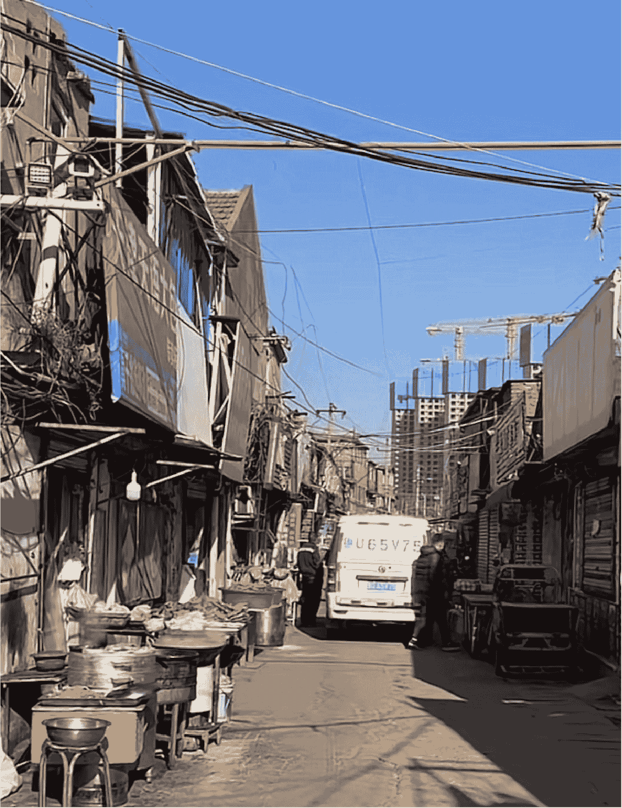

最多的是饮食店面，为管理层服务的高档海鲜酒楼，到为没找到工作的人提供“挂逼”食物的小摊，还有永不缺席的“沙县大饭店”。食物口味的数量按照工人籍贯比例分布，广东的猪脚饭，苏州昆山的“挂壁面”和鸡腿饭，都是厂里打工人招牌硬菜。网吧很关键，是工人们最重要的娱乐设施，空闲时间来个啤酒，要几个卤味熟食，去网吧看电影玩游戏，五十块钱欢乐一整夜。

多说一句那个“挂壁面”，现在也快成了网络熟语了，“挂壁”说的是混得很差、穷得叮当响那群人，他们吃的面，自然也是非常非常便宜，往往五六块钱左右一碗，啥也没，连点葱花都不放。

有个读者小伙伴家在一个城市新区，原本是一大片农地，突然就都被征收。他们那个村不知为啥保留了下来。几年间方圆十里都盖满了工厂，三家比较大的和一大批给他们做配套的小厂，最多时工人估计有十几万。他家就是卖“挂壁面”的，由于每天来吃的人特别多，生意竟然很不错，后来也卖鸡腿和卤蛋。

他们村火了之后，盖了无数违建的握手楼，或者给小厂做宿舍，或者给服务人员租住，或者干脆就开了配套小厂。

原先的两横一竖三条街成了商业区，天黑后不但商铺都爆满，人行道也摆满，四车道的马路直接占一半。这里甚至给人一种，几十年前国企业家属区的感觉。巨大的工厂边上，简陋而又画风一致的多层楼房。随着工厂的节奏，交班时刻满街都是人，过一两小时后街上安静得如同废土。

消费围绕发薪日前后起起落落，快到发薪的日子是低潮期，工人们的钱都花得差不多了，很多老板要面临熟客的大量欠账，可能一天下来最后收入是负的。

但这如同礼花发射前的安静和黑暗，发薪日一到，整条街如同烈火烹油一样消费暴涨。

### 5 进厂打螺丝的痛恨与历史变迁

每个我接触的人，对进厂打螺丝这事都怀有深深的痛恨，尤其有过这类经历的。

首先不得不承认，得益于中国的快速发展，进厂难度和要求低了很多。如今大家不想进厂，曾几何时，进厂也不是想去就能去。直到上世纪末，非重体力的工厂招工，都几乎只要年轻女性，手脚灵活心细容易管理不添麻烦。就像《山海情》里面，招的都是十几岁的年轻女孩，这还是对口帮扶政策下。正常情况遥远地区的剩余劳动力，想输送到沿海工厂非常困难。

那时男性想打工，不是工地就是矿山，工厂招的也是力工。而且必须是年富力强的年轻人，年纪大一点的很难有人要。

即使这样，打工被拖欠工资都非常普遍。干一年一分钱拿不到还被打，这种事多得人耳朵长出茧子。直到进入21世纪后好几年，国家不断加大管理力度，每年春节前搞专项整治。要求先结清工人工资，剩下的钱才能给老板。

当然也因为经济发展用工量大，天量人口居然也开始不足，“你不干有的是人干”，这句话老板说得没那么有底气了。

至于工作生活条件，这么多年来也进步了很多。这些年绝大部分厂里宿舍都装了空调，而且不再是大通铺。在过去很多年里，厂里的宿舍都跟看守所似的，一个大通铺，住十几个人，没有空调，夏天四十多度，想想那场面就酸爽。

每个人对打螺丝都很痛恨，因为这个工作对人太折磨。可是又没办法，因为没啥路可走。

太多人的生活就是先进厂，实在是痛恨那里，中间提桶跑路，可是跑了之后在其他地方实在是太难混，不少人最后又回到了厂里，因为进厂的标准实在是很低。而且大部分人受工友撺掇，一起撸小贷把征信也给搞黄了，干啥都费劲。大家不要觉得这不是个事，据读者小伙伴说，他的厂友90%征信都坏了，不知道是不是常态。

所以说吧，尽量读书，如果实在是不想读，就利用假期进一段时间厂，体会一下。如果实在不是读书的料，那就学点手艺，哪怕学个按摩呢，或者通下水道，总之不要变成没有任何手艺傍身的人，那样可能很难突破一个小时三十块的上限。

公众号懒人搜索，懒人专属群分享

### 一文说清楚新四军到底怎么回事
2023-07-25

上篇《那次惨烈的突围》发出去之后反响非常好，可能也是大家经常听说一些东西，但是绝大部分人并不了解到底咋回事，仔细写出来又觉得挺有意思。

有小伙伴说为啥博主突然开始讲战史了，其实这个号最早就是讲这些起家的。这段时间封闭开发，几乎不接触外边的新闻，于是就想再聊聊这些咱们耳熟能详、却不太了解的东西。

今天再给大家说一个中国人几乎都听过，了解的人却很少的词，也就是“新四军”，看完这支部队的发展历程，大家就能体会到什么叫“编故事都不敢这么编”。

### 1

我们知道，红军以前在南方活动，后来第五次反围剿的时候，实在坚持不下去，开始突围，也就有了我们熟知的“万里长征”。

不过当时并不是所有根据地的人都走了，留下了一部分，比如伤病走不了的，还有掩护主力撤退的，这些人在主力走后就地转成了游击队。与此同时，还有很多游击队分布在长江以南，这些人在很长时间里就被称为“南方游击队”。

于是在长征结束后，我军就分成了两大块，陕北的中央红军，还有南方的游击队。国府对于这两块的围剿是极其惨烈的，咱们都知道在陕北，国府逼着失去了老家的东北军拼命进攻红军，最终酿成了“西安事变”。却很少有人提，同时期在南方，国军对游击队的围剿也极其残酷。

比如在我军长征前的根据地，国军就跟篦子似的把那一带过了一遍，“山要过火，石要过刀”，但凡谁家跟红军有一点关系，轻则抓去做劳工，重则全家活埋。

而且在游击区搞保甲制度，这玩意是商鞅的缺德原创，把老百姓相互锁在一起，相互监督相互揭发，一家出事所有人吃挂涝，搞的大家确实不太敢支持红军，后来日本人又在华北没少搞。此外还有一堆邪活，类似移民并村，断盐断粮等等。

这种状态持续了三年多，在党史上一般称为“三年游击战争”。

真正的转折在“七七事变”之后。很多人可能会说，不对啊，不应该是西安事变吗？大家也都知道，蒋介石表示今后不再剿共，专心抗日。不过事实上却在加紧围剿南方游击队。直到“七七卢沟桥事变”之后，蒋委员长需要调动所有的力量来一起抗日了，而且也没有余力大规模去围剿陕北红军和南方游击队。

于是双方开始坐下来协商，在1937年10月达成协议，将南方8省14个地区的红军游击队改编成了“国民革命军新编第四军”。所以“新四军”几乎就等同于我军的南方游击队。

为啥是“第四军”呢？

这事是陈诚提出来的，他的意思是让这支新部队继承北伐时期的国民革命第四军。那时国共正在第一次合作，第四军里有大量我党的骨干，“光荣北伐武昌城下”，打最硬的仗，流最多的血。这也是为啥后来第四军的叶挺独立团打响了南昌起义的第一枪，因为这个团里我党的人最多。陈诚这次提议，也是寓意“新四军”像上次一样，代表两党再次精诚合作。

谁来领导呢？

国共共同能接受的，就是叶挺，他是我军的缔造者，又是国军里的高级军官，跟蒋的关系也不错，所以顺理成章就成了新四军的军长。不过新四军的实际控制人的是项英。当初红军长征走后，他就成了游击队的负责人，挺过了南方游击队最艰苦的那段岁月。一般认为，如果他能活到建国，中间不搞歪操作，大概率会代表“三年游击战争”也被评为元帅。

既然有了编制，接下来就需要“接受整编”成为国军的部队，于是我党派了大量的干部前往南方8省14地区40多个县说服当地游击队下山接受改编，差不多两个月内完成了游击队下山工作。

这个过程中又发生了很多麻烦，有些游击队太过信任国军，走出山林接受改编，然后就被国军给缴械了，比如著名的“漳浦事件”。

还有一些走到了另一个极端，死活不接受改编，甚至发生了很极端的事件，比如磨盘山游击队，不仅不下山不改编，还杀害了前去做说服工作的我党同志。还有刘维四游击队，也不改编，也杀害了前去说服的同志。某种意义上讲，这两支部队已经变成了土匪，后来这两支游击队都被国军剿灭了。

不过最终改编工作还是完成了，新四军刚成立的时候有4个支队，有一万零三百人，6000多条枪，子弹少得可怜。这些人衣衫褴褛骨瘦如柴，不过后来的事实证明这些人都是真正的精华，经历住了漫长的考验，演变成了我军后来的东野和华野的军官团。

与此同时，北方的红军也接受了改编，变成了原始的三个师。

可能有小伙伴不理解，折腾这一顿到底意义在何处呢？

其实非常非常关键，最关键的其实不是国军承诺要给这一个军、三个师发军饷，而是说今后他们的行动彻底合法了。可以正大光明地去各地征兵，也不用担心征到的新兵在路上就被国军给截了。国军给的军饷其实没多少，但是既然可以合法活动了，就可以公开发表言论倡议爱国人士募捐什么的。有了钱就可以去香港买抗生素和电台，甚至还有新式武器。而且我党的观念也通过正规媒体被全国人所熟知，大量青年知识分子前往陕北和新四军驻地参军。

当然了，如果让我说，我军最让人感动的，永远是对教育的重视和对妇女的解放。随着大量的青年知识分子入伍，他们被分到了各个军区，然后天天组织大家识字学习，并且不分男女。

这种情况下，我军的“三师一军”迅速扩大，比如新四军，迅速就扩大到了两万多多人。

### 2

新四军自从成立，就饱受两个问题的困扰。

一是“将相不和”，也就是军长叶挺和政委项英之间的关系一直有问题。这个之前的文章讲过，这次不多说了。

另一方面就是同时面对国军和日军的挤压。

咱们重点讲第二个。

新四军的战斗力一直非常强，这倒不是因为他们买到了“高达”或者虎式坦克，单纯是因为他们的环境太艰难，需要不断磨砺战斗技能才能活下去。国军打从一开始，就对新四军非常警惕。

日军结束了1937年、1938年跟国军的大规模军事对抗后，防线就转向了稳定。国军没有能力进攻日军，也打不过。日军把有价值的区域抢到手了，再去抢别的，成本就高于收益了，于是也倾向于多一事不如少一事。于是双方进入了“静坐战争”，防区边缘的哨兵甚至开始相互点烟。

国军在1939年左右也开始心念动摇，觉得日本人可能不是最大的问题，真正麻烦的还是我党，于是又开始跟我军没完没了的撕扯。当时的内部材料上就说要“防共，限共，溶共”。多次制造类似平江惨案这样的事，而且双方还爆发了“黄桥战役”这种大冲突。

但是新四军一直没完没了侵袭日军，在华北也一样，我军唯一的生存机会，就是从日本人眼皮底下抢资源。这也是为啥后来日军开始把大军团拆分成“片警”，深入中国基层去“防共”。某种程度上讲，国府和日本在1939年已经形成了共识，他们认为真正麻烦的是我军，双方都投入大量精力搞这事。

三方摩擦不断，客观上新四军的战斗力就这样被磨砺了出来。后来的粟裕战法惊人，并不是突然开窍，而是一直在新四军基层活动，从基层军官一直干到了一方统帅，慢慢在血与火中成长了起来。

由于环境太艰苦，中央在1939年就决定让一直在江南活动的新四军向长江以北发展，于是在那一年的4月，一部分新四军去了江北，成立了江北指挥部，剩下的继续在江南作战。

此后新四军的主力慢慢转向了江北，留在江南的人越来越少，直到1941年的“皖南事变”。

皖南事变在我三年前的这篇文章里用了一万字讲清楚了，《新四军在皖南全军覆没，却很快发展到了十万人》，现在基本上所有讲这段历史的文章，绝大部分还在抄我这篇。

这里稍微讲几句。

当时新四军的主力已经移防到了江北，只剩下了总部机关还留在皖南那一带。国军把这支部队视为眼中钉肉中刺，于是想了个阳谋，让他们向北过长江。北方正是日军防区，这不明显是借刀杀人嘛。

当时国府的计划是，让新四军限期北渡，如果到了期限不出发，那就是违反军令，直接剿灭。如果新四军听了国府的计划北渡，正好跑日本防区去了，可以借日本人的手把剿灭。如果新四军听了国府的话，但是不按照国府安排的路线来，不去日军防区，走别的路线，那也可以按照“不服从军令”加以围剿。

这事听着好像挺吓人，感觉无解了。其实当时新四军有大量的游击战争老兵，擅长山地行动，如果指挥得当，大家兵贵神速一口气冲出去，可能会有伤亡，但是问题不会太大。

但是后来项英他们一顿谜之操作，把这股新四军带到了坑里，行军极其缓慢，事先没探路没准备，跟搬家似的把瓶瓶罐罐都带上，然后就进了国军布有重兵的口袋阵。反正一堆魔幻操作，这支新四军彻底被冲垮。后来项英突围后被自己的警卫员杀了，叶挺去找国军谈判，也被扣了，一直到抗战胜利才放出来。

9000多人被围，最后没办法，只好被迫突围，突围的这些人又得经过日军控制区，又伤亡了一些。

不过好在那些人里边有很多经验丰富的三年游击战争老兵，硬是从重围中跑出去两千多人。还有一批干部被抓后，竟然逃了出去，经历千难万苦，竟然跑回了江北新四军。后来测算可能不止两千多，因为还有一部分就地打游击，整体战损和中突围差不多。

皖南事变之后，新四军原来的机关大脑基本上报销了，唯一的好消息是在那之前主力已经去了江北，随即陈毅就在江北重新接管了新四军，新四军从此跟项英叶挺没啥关系了。中途又有不少华北八路南下加入了新四军，比如咱们熟知的南泥湾359旅。

此时新四军已经扩张到了9万多人，下属七个师，第一师的师长就是粟裕。第五师咱们也很熟悉，就是上一篇文章里刚聊的参加中原突围的李先念部。

皖南事变之后，国府取消了新四军的编制，也就是说今后不给军饷了，而且也没法合法行动了。不过好处是今后也没法用军饷来限制新四军，某种意义上讲，彻底自由了。

1941年12月8日又是一个关键的日子，这一天全世界最开心的两个人，一个是丘吉尔，一个是蒋委员长，因为充满想象力的日本人终于把美国拉下了水，美国这台真正的战争机器终于彻彻底底下场了。

美国加入战争，让蒋委员长和丘吉尔都意识到了战争的天平可能要扭转了。于是国府上下开始“等胜利”，主动回避跟日本人的冲突，反正用不了多久日本人也完了，跟它拼命干啥，这也造成了1944年豫湘桂大溃败，国军各个部队都默契地认为日军这是回光返照，秋后蚂蚱，最后的蹦跶，大家能躲就躲保存实力，于是国军一溃千里。

与此同时，延安的毛主席更加有洞察力，他不仅意识到国府眼里日本人已经完了，接下来重点工作肯定是对付我党。而且他敏锐意识到，战争可能只剩下两年了，于是发布了一个文件，里边说到，“咬紧牙关，度过今后最困难的两年”。

事实上接下来也非常残酷，日军把能打仗的部队都调到太平洋和东南亚了，驻扎在中国的部队主要任务变成了巩固已经占领的区域。日本已经占领的区域主要活动的就是游击队，所以从1941年开始，不断地进行各种清剿和扫荡。我查到一个数据，说是从1941年到1944年三年中，新四军对日伪军作战8400余次，歼敌9万余人（包括日军和伪军），算下来规模都不大，明显都是到村里扫荡的战斗。

坚持到了1945年，抗战结束，新四军这个名号也走向了结局。

首先是新四军里第三师师长黄克诚很早就意识到了东北是决胜未来的关键，于是一开始向新四军高层打报告，想带着三师去东北。被拒掉之后，直接给中央打报告，正好和中央的想法不谋而合，很快就给批准了。

于是黄克诚带着新四军的三师步行上千公里去了东北，后来以三师为班底，演变成了后来的东野二纵，也就是后来的解放军39军。

多说一句，当时华北也派了大量的军队去东北，由于信息有误，说是东北遍地武器，根本不用带装备，于是华北的很多军队把装备都给了沿途的游击队，自己空手到了东北，发现那边武器获取也很难，于是傻眼了。

黄克诚也听说了类似谣言，但是凭借常识觉得不太可能，于是严格要求三师务必带着武器，等到了东北，成了东北唯一一支齐装满员的队伍。一般认为，东野二纵一直是整个东野最能打的部队，不过后来在朝鲜被38军（也就是东野的一纵）抢了风头。

再多说一句黄克诚，黄克诚建国后被评为了大将，属于那种真正的我党骨干，从不向权威低头，坚持实事求是，坚持自己的想法，曾经多次因为这种坚持差点丧命，但是依旧像铁一样硬。在猛人如云的我党内部，依旧是猛人中的猛人。

剩下的新四军，大部分演变成了华东野战军，也就是打淮海战役那支部队。一开始由陈毅指挥，不过陈老总的资历没问题，指挥能力实在是不咋样，打得一塌糊涂。1947年淮安淮阴被张灵甫给占了，涟水也被攻克了，张灵甫还击败了华野悍将王必成，陈毅指挥的部队损兵折将。中央赶紧发过来命令说陈老总你也别指挥了，让粟裕指挥吧，这在我军历史上应该是首次。

原话是：

> 在陈毅领导下，大政方针共同决定——你们六人经常在一起以免往返电报贻误戎机，战役指挥权交粟（裕）负责。

大家仔细体会下这种领导的艺术，先强调陈毅还是领导，但是大政方针共同决定，战役指挥权归粟裕。意思是陈毅继续当领导，但是各种问题大家开会一起决定，打仗的事粟裕一个人管，陈毅变成了一个会议召集人，终于没法添乱了。

这次组织上的果断变更某种意义上讲改变了后来的战局，粟裕的话语权更重了，东野的指挥权也就移交到了粟裕那里。

不过粟裕的资历和声望依旧有问题，需要陈老总的声望给压场子，陈老总也无所谓，不再掺和指挥的事，专心打起了配合。也正是由于陈老总的高风亮节，和粟裕精诚合作，才有了后来我军60万人围杀国军80万精锐的壮举。

### 尾声

文章写到这里不打算往下写了。

每次看到新四军的历程，总给我一种感觉，当初肯定没人能想到他们能发展成后来那样，毕竟在各方眼里，游击队怎么都有点不上档次，可是他们硬是自己打出了一条路。

曾经被国军的正规军追着满山跑，后来竟然把最精锐的那部分围在了淮海一举歼灭，可能最过分的爽文作者都不敢这么写，他们竟然做到了。当然了，背后是难以想象的牺牲和付出。

所以这段历史总是给人一种勇气和动力，再难也要坚持下去，挺过那些迷茫峡谷。

公众号懒人搜索，懒人专属群分享

## 公众号

## 懒人搜索

懒人专属群

微信:lazyhelper

### 那次惨烈的突围

2023-07-18

一直想写“中原突围”，也算是填了一个留下很久的坑。

- 1

想说清楚这事，就得先讲讲这里说的“中原”到底在哪，在地图上找了下，大概在下图那个位置，也就是河南和湖北的边界地带，那里有一些山，方便我军打游击：

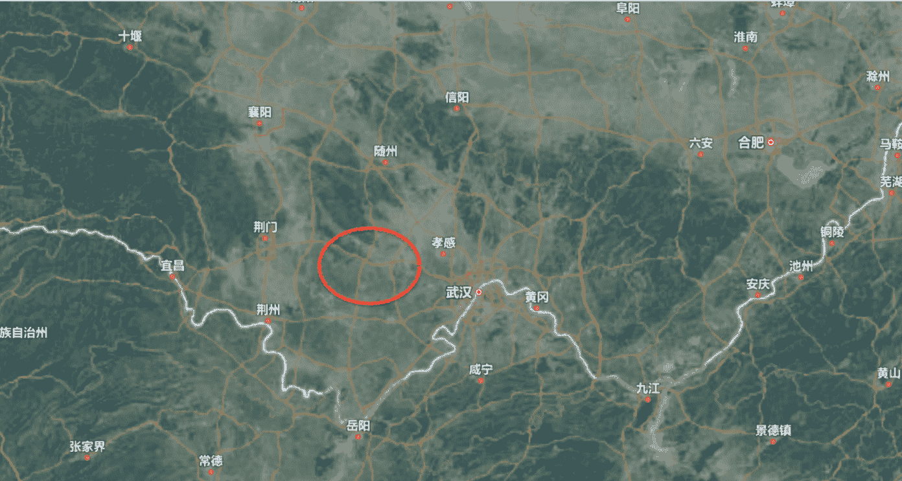

这块根据地最早是李先念搞出来的，大概在1939年，李先念和陈少敏从160人和90条枪起家成立新四军游击队，在接下来的几年里，不断发展，合并了周围的很多支游击队和地方武装，演变成了后来的“新四军第五师”，这也就是咱们今天这篇文章的主角。

抗战结束后，美国人还在那里搞和谈，不过国共双方其实都意识到和平的希望渺茫，于是双方都在一边集结部队，一边向关键区域投送军力，比如大家熟知的东北，当时双方的主力部队都在向东北靠拢。

我军的优势是抗战过程中在日本人眼皮底下发展了起来。尽管北方被日本人占着，但是我军依旧有很多部队就在北方，离东北近，主力部队步行赶往东北。国军主力都在南方，甚至云南，不过有美军的飞机和军舰，最后双方到达东北的速度也差不多。

其他区域也类似，我军在抗战时期搞的是游击战嘛，抗战结束后开始把各地的部队聚拢，形成拳头，准备打运动战，加上国军围剿力度不断变大，于是几支部队开始聚集，聚成了一个个军区，这些军区后来进一步合并，就成了“中野”，“四野”什么的。

咱们今天讲的中原军区，就是我军在抗战结束后，河南、广东、湖北的游击队集中到了湖北宣化店一带，和之前已经在那边的“五师”合并，还有咱们熟知的南泥湾八路军359旅也南下到了这个区域，形成了“中原军区”。主要领导人是王树生和李先念，国军那边把这支部队称为“李先念部”。

多说一句李先念，他是“四方面军”的人，也就是原来张国焘的部下，在西路军发动河西战役之后西渡黄河，在河西走廊苦战到弹尽粮绝。西路军失败后，他和部分干部穿越雪山沙漠，到了新疆，后来返回延安，在延安学习后又到了河南和湖北的交界地带从零做起组织游击队。从这段经历就能看出来这是个极度顽强的人。

关于中原军区到底有多少人，网上说法很多，我查到了当时中原局给华东局的电报，里边说得很清楚，有6.1万战斗人员，还有党政工作人员近两万。

这支部队不断转战，最后到了现在宣化店一带：

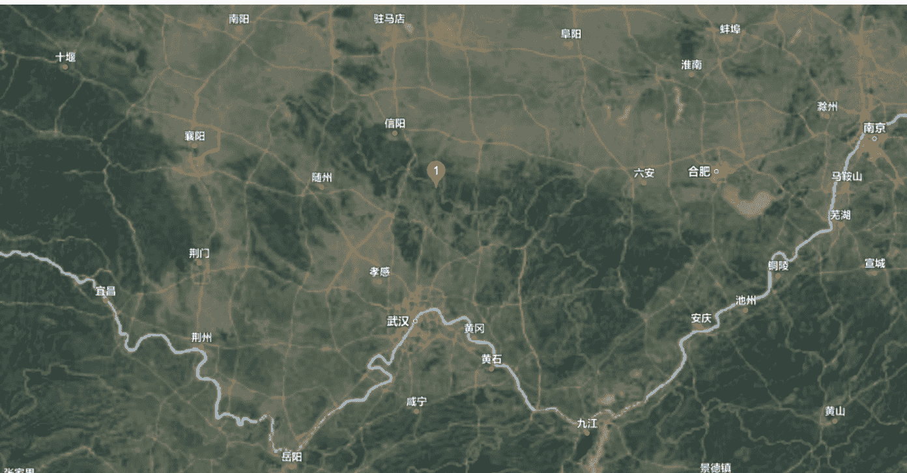

大家看地图就能看出来，中原军区活动的区域离武汉特别近。而武汉是九省通衢交通要道，国府无论如何也会拼命保护。我军在武汉附近有一支部队，国军必然得抽调大部队做防守，这也就牵制了国军，搞得国军没法集中兵力去解决东北和华北。

后来刘邓千里跃进大别山，也是这个战略思路，大别山也在上图标志的那个位置附近。通过一支部队威胁武汉，国军就得调动大量部队来围攻，达到牵制的目的。

甚至中央的意思是，为了完成牵制任务，必要的情况下，可以让这支部队彻底牺牲掉。

于是双方就顶在这里了，我军要在武汉附近搞牵制，国军下定决心要把我军赶出这一区域，于是大军云集，随时开打。

不过我军的问题很明显，装备实在是太差了，而国军此时接受了大量美械装备，还有日本投降后的几乎全部装备，如果正面硬钢，我军肯定是打不过国军。

发动了几次策应进攻，有效地帮助了东北和华北战局之后，我军的占领区域被不断压缩，直到压缩到了一个长宽五十公里左右的区域。

8万人挤在这么小的一块区域，外边被修建了大量的碉堡和军事防线，卡住了交通要道。中原局缺衣少食，艰苦程度可想而知。

中原军区的人只好从上到下都得挖野菜吃树叶，好在江南水多，还可以下河摸鱼虾，不过我看后来的回忆录，说是摸鱼虾非常不经济，往往鱼虾补充体力还赶不上消耗的。实在是扛不住，后来把一批机关工作人员化妆疏散到了封锁区外边。由于当时国共和谈还在继续，美国人也在边上看着，所以疏散工作还算顺利，但是军事力量就没法疏散了，只能是硬抗。

到此为止，中原军区艰苦到了极点，毕竟他们几乎没有生产军械的能力，又被压在了一个极小的区域，补给成了严重问题。继续死扛下去已经没了意义，而且随着补给越来越不足，越来越多的人开始浮肿，失去了行动能力，军事突围成了唯一的选择。

那往哪突围呢？

看上边的图就知道，肯定不能往东，东边就是国军主力活动区域，而且有当时的交通大动脉“津浦路”，而且那一带算国府的腹地，国军可以利用这条铁路迅速调兵，无论走哪可能都会被围住。

也不能往北和南，因为北边是黄河，南边是长江，几万人聚集在大江大河边很容易被彻底围歼。

向西突围也就成了唯一选择。

### 2

具体怎么突围呢？

我军一直以来的操作都是先放一支疑兵出去，然后主力部队朝着反方向狂奔。

比如长征前，方志敏的部队就率先出发，朝北突围，让国军以为这是我军的主力，调集重兵集团围攻方志敏兵团，给主力部队降低了 了不少压力。不过代价也很大，方志敏军团后来几乎全军覆没，他本人被捕后被杀，我军早期最优秀的指挥官寻淮洲也阵亡在了这次军事行动里。

寻淮洲是毛主席一手带出来的，按理说前途不可限量，可惜了。这支偏师里还有我军后来的一代战神粟裕，好在粟裕没事，成了游击队。

这次也一样，负责“炮灰任务”的就是著名的“皮旅”——皮定均的队伍，有七千人。他们的任务就是向东突击，误导国军，但是这么点军力，很可能全军覆没。不过皮旅还是坚定接受任务，全旅上下人心振奋，准备完成任务。

战事一开，皮定均部率先向东边国军发动进攻，国军赶紧围堵，面对数倍的围兵，艺高人胆大的皮定均利用当地地形节节抵抗，竟然完成了三天坚守任务，直到主力部队越过平汉路才组织突围。

为啥我们说皮定均艺高人胆大呢？老皮完成三天的阻击任务后，装作要去西边找大部队，走了一天，让国军以为他们朝西去了。

然后皮定均带着剩下的6000人趁着大雨，躲到了国军眼皮底下的一个叫刘家冲的地方，6000人就跟平地消失了似的，国军高级将领们灯下黑，死活没想到他们天天找的“皮旅”就在自己眼皮底下，找了一段时间没找到，怀疑他们去追主力了，然后也朝着主力的方向追去。

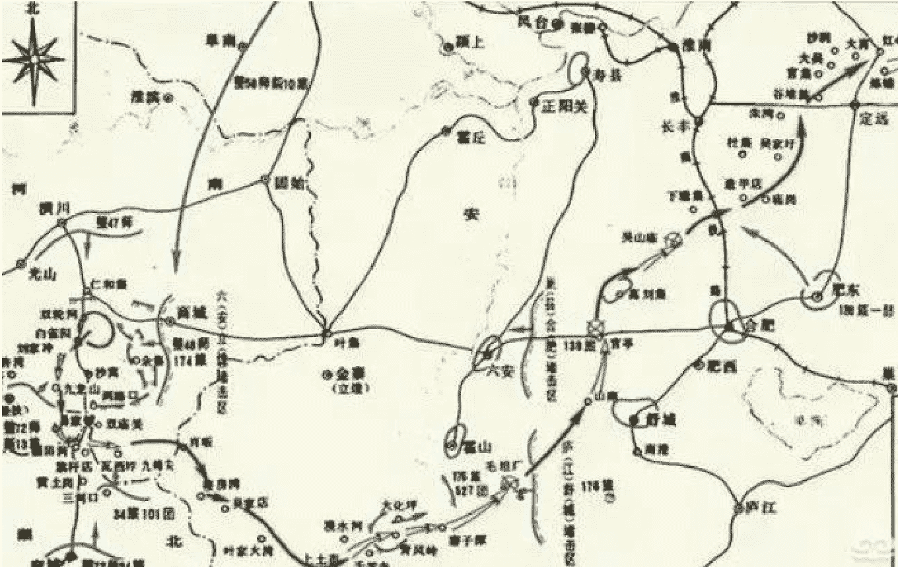

皮旅并没有按照之前规划的路线也朝西前进，而是朝着反方向一顿狂奔，一路上一边打一边跑，五次改变行进方向，出其不意，不走寻常路，狂奔八百多公里，跑粟裕那里去了，不但完成了任务，竟然带出来了5000多人，简直是个不可能完成任务。

### 3

这次皮旅的奇迹，主要有两个原因。

首先是皮定均天才的指挥艺术，敢于兵行险着。而且对情报和国军部队的关系了若指掌，多次从国军的防守缝隙里穿插而过，国军却毫无反应。

当然了，这也是国军地方部队和中央军一直以来的大毛病，地方部队的任务并不是消灭敌人，而是确保敌人不来找自己麻烦。所以如果从自己边上过路，他们几乎不会冲出来。

皮定均对这一点门清，主要躲着中央军，并不担心地方部队。所以多次做极其高危操作，几千人的队伍，连绵好几里地在国军地盘上行进，硬是没人理会。

另外一个因素也很关键，这次突围太过突然，国军的最高指挥又是刘峙这头猪，刘峙甚至没看明白皮定均的佯攻操作，主力也就没被皮定均吸引过去。只要你足够蠢，别人也很难骗到你。

所以一直以来有句话，说是本来皮旅是为大部队打牵制，没想到结果反过来了，大部队替他牵制了主力。

不管咋样，带着七千人穿越千里国军防区，顺利突围，这个操作实在是太秀了。

皮旅突围这事给毛主席印象深刻，建国后1955年评衔，当时给皮定均的是少将。这个也正常，毕竟1946年皮定均才是个旅长，资历一般，想当中将一般得在红军里当旅长，不过主席看过名单后，随手写上“皮有功，少晋中”，皮定均就这样当上中将了。

皮旅某种意义上讲战斗层面取得了重大胜利，在战略层面却没啥成果，因为国军主力并没有被他们牵制，依旧去追击中原军区的主力了。

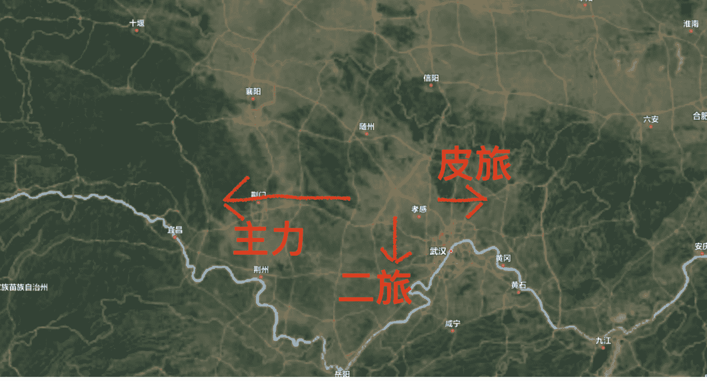

执行牵制任务的，不仅有皮旅，还有二旅，也就是张体学部。他们的任务就艰苦多了，因为国军在武汉方向的部署非常严密，南方又是重点进攻方向，这个方向的掩护任务极其惨烈，二旅的几千人打得只剩下了几百人，然后就地转为游击队。

在皮旅和二旅实施佯攻之后，整个中原军区倾巢而出，朝西进发，准备突破平汉路，去陕西。

那个平汉路也是当时中国的南北大动脉，日本占领中国期间，就发动劳工沿线修碉堡，国府控制这一区域后又做了进一步加固，所以想穿越平汉路比津浦路容易一些，但是也是一件极其艰险的事。刚才提到的皮旅和二旅，最重要的任务，就是掩护主力三天时间穿过平汉路。

面对沿途的碉堡，没啥好办法，只能是硬攻。大家在抗日神剧里见过“棉被挡子弹”吧？那个确是真的，在这次突围中就使用过，不过制作非常苛刻，在桌子上一层棉被一层土，然后绑好，推着桌子往前推。

好处是很难被机枪打穿，毛病是移动缓慢，一个手榴弹过来，大家四散躲避，又被机枪点杀了。这也是为啥这个操作极其少见，因为效果并不好，且伤亡也不小。我军后来的操作一般是把坑道挖到对方眼皮底下，然后一个冲锋冲上去直接炸。

但也没办法，只能是用这种土办法缓慢推进，有的三四个堡垒群之间形成的交叉火力区，我军动不动打光整个连队，很多打了八年的老兵血染平汉线。

当然了，不止皮旅和二旅在掩护，整个区域都被调动了起来，比如为了策应主力过铁路，第十五旅的一个团提前两个月就攻下了平汉路附近的一个山头。因为当时就意识到，如果主力向西突围，这个山头如果控制不住，那几乎没可能过去。

于是他们在那个山头上死守了70天，挡住了国军一波波的进攻，直到主力部队到来，他们才跟着主力朝西撤退。而且中原军区开始突围后，周边的河南和江汉军区也主动出击，配合中原军区策应作战。

相互策应这个能力，我军给演示过无数次，国军从来也没学明白过。

如果说有啥幸运的地方，那就是国军一直不擅长山地作战，而且刘峙的部署也有很大问题，导致我军这次突围最大的困难，就是沿途的堡垒，几乎没碰上跟国军主力兵团硬碰硬。当我军付出巨大代价打开了堡垒封锁线后，整体就容易多了。

接下来就是我军专捡难走的小路在前边攻击前进，国军主力在后边跟着。刘峙一开始信心满满，觉得如果中原军区突围，无论如何步行都跑不过汽车轮子，谁能想到那段时间天天下雨，汽车根本没法跑就陷泥坑了，反而把大路给堵了。

本来指望各地民团和地主武装拦一下，不过这些地方武装的原则是“人不犯我我不犯人”，他们知道我军只是过路，没几个人会去真拼命，所以我军在极度危险的情况下竟然能顺利突围。后来我军总结成功经验，其中一条就是地方“顽军”（就是那些地方武装），跟中央军不是一条心，他们出工不出力。

### 尾声

中原突围最后伤亡了多少人，一直以来都有争议，因为突围出去的队伍并不是全部到了某一个地方，然后一清点，就能知道到底伤亡了多少人。真实的情况是，除了“皮旅”，其他队伍都没能到达目的地，都转成了游击队，过了很多年之后，才大概弄清楚当时突围出来多少人。

一般来说，现在比较公认的一个说法是，这次大突围，我军伤亡了三万多人，保存下两万人。

考虑到那两万人里还有五千“皮旅”，就知道主力部队伤亡是极大的，甚至超过了半数。不过考虑到当时的铁桶合围，还有漫长的突围路线，能有这个成绩已经很不错了。

一般认为中原突围是整个解放战争的开始。这时候国军的... (此处省略中间部分) ...基本已经预示了三年后的大结局。

公众号懒人搜索，懒人专属群分享

### 普通人如何才能“改命”？

2023-07-12

第四本书快要出版了，在整理中又忍不住做了不少的修改，把这篇给大家重新发下，每次看都有新的感悟。

### 1

**“命”的两个维度**

我这些年对“命”的含义有两个维度的理解：原生家庭和所处时代，这两者基本上框住了大部分人的一生。很多人一辈子都摆脱不了原生家庭带来的影响，情绪、习惯、性格，这些大部分都在很小的时候形成了，孩子的成长过程主要受父母的影响。如果父母感情和睦，孩子大概率是一个性格温和型的人，他这辈子一般不会因为太冲动而得罪人。如果父母经常吵架，孩子大概率会遗传一部分暴躁基因。这些影响都会渗透在一个人一生中的方方面面，有些人不卑不亢不招人烦，有些人稍有刺激就发飙，这两种人大概率会走上两条人生道路，后者必须用自身的其他优点来抵消自身性格上的缺陷。而且，父母的性格会对孩子的性格产生影响，孩子不一定只是简单模仿父母，也可能是向父母的另一个方向发展，其中的情况非常复杂。比如有的父母太老实懦弱，最终一事无成，那孩子有可能在懂事后就对“老实”超级反感，慢慢地走向另一面，觉得所有人都亏欠于他，干啥缺德事也都毫不愧疚。此外，父母的财力和能力同样也决定了孩子周围是什么生活质量的人群，决定孩子上什么学校，决定能接触到什么类型的人。所以说，孩子触及的教育资源其实就是父母财力和能力的延伸。国外有的父母不惜花大价钱买房聚集居住在一起，到底是为了什么呢？在那里买房，有些小区甚至还需要进行面试，如果家庭地位处于底层，就无法入住这样高端的社区。这个问题同样在国内出现了，个别地区的父母们花费上千万购入老破小的房子，全家蜗居在一个狭小的空间里，到底为的是什么？为的是学区学校里的师资力量？房子优越的地理位置？当然都不是，其实就是为了一种文化及学习环境氛围。父母能拥有上千万资产，能力财力自然不可能太差劲，居住在“东西海”的父母们普遍坚信，在这种环境中成长起来的孩子会更加健康一些。说到这里，可能有人会有疑问：父母是清北名校毕业，儿女就能继承父母学霸级别的智商？当然不能了。

智商是世界上最不稳定的遗传，西方富豪们往往都是通过生一群孩子来对抗这种不稳定性。但是，父母的很多思维方式会在潜移默化中传给儿女。

比如，孩子之间发生矛盾打架了，绝大部分父母的固定思维模式倾向于不能让孩子受气，而理性父母的思维模式则更倾向于让孩子反思，到底是交往中哪个环节出了问题，才导致失控的场面发生，下回遇到这种情况应该怎么去应对。

如果孩子学习成绩变差，理性父母也会更倾向于反思这段时间在什么地方有了变化，是不是这部分变化导致了孩子的情绪出现问题，从而影响了自身的学习。我认为“回溯”和“反思”是人类历史上最伟大的进步，它让人摆脱了思想上的重复性错误再发生。人都有个毛病，犯过的错会重复再犯，容易出问题的地方下次肯定还要再出问题，如果每次出问题都选择糊弄过去，时间长了慢慢就忽略了这个问题的存在，人也就一直在原地停留打转，止步不前。而具备“回溯”能力的人，必须经过长期的训练，以及现代工程项目的锤炼，普通人非常难具备这种能力，甚至都不知道从哪里下手。而在工程学上，为了这项技能发明了一大堆工具。如果父母是学霸，在学业有成后又奔赴现代企业做工程项目相关的工作，且经过长期锤炼，专业能力已经融入骨髓，那么他们很有可能在日常生活中潜移默化地把这种能力传递给下一代。现代义务教育多少弥补了一些家庭教育的差距，但是没法消除最本质的隔阂。

学校可以教给你现代人类取得的巨大科学成就，但是学校提供的是一种“平均水平”的教育。如果你的家庭教育水平低于平均水平，那学校能拉高你达到平均教育水平。但是，如果你想高于平均水平，学校往往是无能为力的，这方面只能依靠你的父母，把他们积累的人生经验传送给你，如果他们啥都没有积累下，那你就得自己去积累感悟了。普通人可能需要到三十多岁的年纪才彻底开悟，没有父母一代人生经验、生活技能、智慧心德传授的叠加，在成长过程中蹉跎得黄金阶段都过了，才感悟到别人小时候就知晓的技能。这些都跟游戏里的“初始设定”相似，到了二十岁左右的年纪就基本上改变不了了。你是个敏捷型的人还是智力型的人，性格是内向还是外向，是偏激还是冷静，基本上已经定型了，这些人生“参数”将会在你今后做每一个重大决策的时候影响着你。我自己的感触就非常深刻。

我出身于教师家庭，好处是从小读书特别多，毛病是极度厌恶风险，从毕业到现在，好几个机会都在我犹犹豫豫中被错过。

自从毕业后，再也没投过简历，一直在一家企业待到现在。好在这家企业一路高歌猛进，不然我自己大概率会过得如同在国企一般的生活。

当然也有衍生出来的好处，就是我顺利进入了中层管理者的行列，而且对业务过于熟练，可以腾出大量的时间在看书和写作上。

缺点是如果我当初去了那几个初创公司，现在应该已经实现了财务自由，可以用所有的时间看书和写作。这两年“原生家庭”这个词越来越火，我也一直在想这件事，惊讶地发现自己绝大部分缺点和优点，确实都是从父母那里受影响形成的，只是之前没注意。某瓣上以前有个极端小组“父母皆祸害”，现在已经搜索不到了，我曾在好奇心的驱使下去看过，结果差点抑郁了。小组成员的父母们有很多做得都不太好，把孩子的一生都给毁了，导致孩子生活在极度的痛苦中。以前我觉得这种原生家庭的祸害是少数现象，后来发现不一定，因为大部分人生孩子不是因为足够成熟、足够理性到可以为人父母了，而是没想太多就把孩子生下来了。但是养孩子这件事比考研难得多，于是很多父母对怎么养大孩子这件事又犯难了，但又不能不养，只好凑合着养，在孩子成长过程中，父母很多事都做得不太好，出现的问题没有解决，导致孩子受其影响痛苦一生。人的基本性格有部分是原生家庭给“捏造”出来的，不过好在这并不是问题的全部。到了社会上，还有一个可改变的参数，就是自己所处的时代。

以相同的才华做个对比，分别处在快速上升期的中国、文明相对落后的非洲、持续稳定发展的欧洲，最后演化出来的肯定是三种不同的结果。我有个远房亲戚，我的整个童年就是听着他的神话长大的，知道他有钱有能力，长大后才了解到，他就是敢闯敢干的那类人。在20世纪80年代，他就顶着巨大的风险开了一家小饭店，随后就步入了开挂一样的人生。因为在那个年代开小饭店实在是太赚钱了，他快速地攒下了初始资金，后来基本干什么成什么，一直持续到2010年，之后事业开始跌宕起伏，后来就干脆退休不干了。这其实就是典型的赶上了时代红利，处于上升期的国家对每个人试错的容忍度极高，即便犯了错，改了就行。

但是一旦进入到稳定期，事情立刻就不好办了，有种喝水都容易被呛到的无力感。2010年前后部分行业开始产能过剩，做实业相关的企业竞争非常惨烈，利润被分摊得很薄，早期入行的那批人就没有竞争力了，取而代之的是互联网行业的新贵们。他们闯入了新的处女地，随便怎么折腾，无所顾虑。所以在这个行业，有不少人三十岁出头就实现了财务自由。这要是放在传统行业，比如机械、土木相关的行业里，几乎是不可能的。也就是说，时代赋予大家差不多平等的机会，但是出生在不同的家庭环境，对机会的承接能力就无法完全一样，最后同样演化出来完全不同的结果。从这个逻辑上讲，只要知道一个人“出生于什么家庭”，生存在“哪个国家、哪个时代”，把这两个参数确定下来，那么这个人这一辈子是什么样子的大概也就一目了然了，或者说大部分人这辈子变化不大。只有一小部分人的人生会发生逆转，出现非常大的差异，但是这部分人不会太多，也正是因为出现差异的概率太低，所以这类逆转的人生才会被大家津津乐道。

### 2. 如何跳出原本的格局

如何跳出原本的格局？说到这里，可能有种浓重的宿命论的感觉，如果从群体角度来看，确实是这样，不过从个体角度来看，又不一定是这样。通过我这些年的观察，大概下面这两点能够帮助人跳出原来的格局。第一点是性格。我自己最痛苦的那几年，是当项目经理的那几年。大家往往觉得码农们很单纯、很淳朴，非常好管理。其实不是，他们的内心世界一个比一个丰富，只是不愿意说出来，最擅长非暴力不合作。在他们眼里，其他人都是傻子，日常鄙视每一个人，拿到别人的代码总是先骂几句“傻×”，然后才开始工作。所以我那几年工作得并不顺利，后来才知道，其他领导也有相同的体会，发现管理这帮人实在是太糟心了。后来我向上升了一级，同时提拔了一个哥们儿做领导，他的技术一般（管理层人员的技术大部分一般，中等偏上就足够了，反正今后也不用写代码了），但是性格特别好，非常外向，跟谁相见都是笑脸相对，待人非常诚恳。在一次座谈分享的时候他说，他性格本来是属于内向的，但是后来强迫自己不再回避别人的目光，主动和别人打招呼，并且认真聆听他人，然后用最诚恳的态度去对待每个人，后来他惊讶地发现，以前大家好像都无视他，现在大家都挺喜欢他，随之进入了一个正反馈的状态。受原生家庭影响形成的孤僻性格，有时候是能改变的，关键是你愿不愿意去改变。

而大部分人一辈子过得不太如意，其实有一部分原因就是性格太过孤僻。此外，太多人总想玩点“社交技巧”，可是又没那个能力，最后成了画虎不成反类犬。通过我这些年的观察，得出的结论是，如果在社交中你实在不知道怎么做，可以选择真诚对待他人。

从长期来看，真诚是成本最低的一种策略，既不用做作矫情，也不用复杂的社交技巧，还可以快速获得别人的信任。前两年我去大学里招聘，所有人都在简历里写了精通专业技能。其实想想就知道，那些编程语言没个两三年实战功底，很少人敢说自己精通。

不过大家都这么写，也就无所谓了，不过总有人会很诚恳地写着“只用过×××，写了上万行代码，不确定是否精通”，这种人肯定会让面试官眼前一亮。当然了，能不能被录用还得走常规流程，但印象分肯定是加上了。人这一辈子自己的能力是一回事，但是能往上攀升，大多数时候都是因为遇到贵人，愿意拉你一把。

这种“拉一把”的动机排序大概是：血缘＞裙带＞伯乐。这也就决定了大多数时候，家族血缘对人的影响最大。正常人只能期望遇到伯乐了，而且还得是没有自家人需要提携的伯乐，在这种情况下，伯乐才会去拉一个没有血缘关系的人。那在这时候，你肯定得是一个性格好的人，最起码不能人见人烦。事实上，有太多人好不容易攀升起来后暴露本性，最后栽在了目中无人招人烦的这个毛病上。第二点是职业。职业发展的关键有两点：一点是职业本身，另一点是你自己。职业本身的意思，说的是这个职业的发展前景怎么样。同一个人，在不同的行业里发展，其结果可能完全是不一样的。比如，十年前你分别选了与互联网、土木和机械相关的三种职业，这完全就是三种不同的发展路径，到现在大概率也是完全不同的结果。整体来讲，职业选择的规律是，稳定的预期能得到稳定的结果，比如去做公务员；不确定的预期有不确定的结果，比如去做生意。

太过平坦的世界自然是很安全的，但是也不会有太高的高峰。高峰林立的地方风险也多，这就需要大家自行权衡判断了。之前在TikTok社交平台上，有位小哥在美国天天问那些开豪车的人是做什么工作的，在小哥得到的回答里，基本没有确定性高的行业，而确定性高的行业门槛都高得离谱（美国的医生和律师从业资格执照，比中国门槛高得多得多，而且又贵又难）。当然了，最重要的还是人本身。

从我自己这些年的感触来看，进取心、亲和度、积极性、勤奋度等，这些优秀品质对人的影响是持续数十年如一日那种的，而且没有办法伪装。比如，你是个积极性强的人，为人处世自然事事积极，总会有让你碰上好运气的时候。但是，如果你是强行装作很积极的样子，用不了多久就会彻底崩溃，伪装让你疲劳得不行，很快生活就无暇自理。最近几年有深刻的研究发现，意志力和积极性都跟肌肉记忆极其相似，另外跟不同的人能举起不同的重量的差距一样，意志力和积极性的差距也非常大。

但是意志力和积极性是可以通过刻意训练变得强大的，不过就跟大部分人无法长期坚持去健身房一样，大部分人也没法太过明显地改善这两个参数。

### 3. 尾声

最后，本文并不是在宣扬宿命论，只是从大部分普通人的人生样本来分析，并得出结论：一部分普通人的一辈子已经被出身家庭和生存时代给框死了，你应合理跳出那个被框住的圈子。

把视野放大来看，现在这个时代无疑是中国五千多年历史上最好的时代，给了普通人太多的机会和选择。无论是谁，如果能认真在一个领域专心投入十年时间研究，基本上都能达到一个很高的高度。

大家可以想想自己十年前是什么样，现在又是什么样，估计很少有特别倒退的人。而且哪怕只是集中注意力在一件事上投入十年时间，结果大概率也不会太差。

公众号懒人搜索，懒人专属群分享

### 2023-07-08

### 人工智能是“玩”出来的？

今天想谈一个特宅男的话题——显卡与人工智能。

你看这两天，2023世界人工智能大会（简称“WAIC”）在上海举办。在这届会议上，马斯克开场，AMD的苏姿丰以及一众诺贝尔奖、图灵奖获得者等大佬们在讨论人工智能问题时，总是提到一个词——算力，算力的背后就是显卡。

作为重要的硬件基础，可以说，显卡关乎整个人工智能的前景和未来。

你可能会觉得奇怪，显卡这么一个宅男们玩游戏的东西，到底是怎么一步步走到了今天的地位，竟然成了人工智能的关键。

如今各大厂商想训练人工智能模型，第一件事就是屯显卡。最近有个消息，说《华尔街日报》报道，美国预计最快将会在本月要求美国芯片公司停止向中国客户售卖AI芯片。显卡的GPU本质上也是一种芯片，也就是说，四舍五入一下，从今年下半年起，我们可能会面临一场显卡危机。

也许你不知道，对于未来科技发展而言，显卡确实是一件至关重要的事，甚至有人说，未来战场上的决胜关键，也跟显卡强相关，多少让人有点觉得魔幻。

为了可读性，文章里就不区分“显卡”，“GPU”，“GPGPU”这些概念了，都统一用“显卡”来表述。

最早肯定是没有显卡的，当然也没有电子游戏。后来1961年第一款电子游戏在麻省理工问世后，谁也没想到，大家这么喜欢玩游戏。最早对游戏痴迷的，恰好是早期的计算机大佬们。

比如大家知道Unix操作系统吧，这玩意最早就是超级大神理查德开发出来玩那个星际大战游戏的，后来成了美国军方、大学以及科研院所的操作系统。

还有马斯克，12岁就通过编程创作了一款小游戏，现在一把年纪了依旧是《艾尔登法环》和《赛博朋克2077》铁杆粉丝。

不过最早的游戏并不是运行在显卡上，一开始还没显卡，当时的图像还比较简单，根本用不着。

直到20世纪90年代，随着游戏规模越来越大，画面越来越精细，而且开始3D化，对CPU要求越来越高，恰好CPU对图形处理并不擅长。于是有不少人意识到，应该专门搞一个硬件来做这事，提升效率和体验，应该会有人买。

在这种观念的驱使下，很快就成立了几十家公司，显卡的江湖进入了群雄并起的阶段。

这个过程中，有三个年轻人在圣何塞的一个偏僻快餐店里下决心大干一场，于是成立了一家小公司，这个公司小到根本当时没人注意到，后来却名声大噪，如今已经超过了万亿美元市值，也就是大家熟知的英伟达。

英伟达并不是一出现就独领风骚，而是艰难地求生存，辗转于当时的超级企业，给他们提供更好的图形处理芯片。

它只有一个目的，就是努力开发出游戏玩家们愿意花高价购买的产品，提高用户体验。所以也没啥复杂的商战，纯粹就是不断雇佣顶级人才，开发性能更强的显卡，提供更好的游戏体验。

从现在来看，英伟达的成功应了任正非那句话，“做对了市场需要他们做的事”，也就是不断研发宅男们愿意花钱购买的产品。

大家知道，男性消费能力不如狗，但是在显卡和游戏方面，男性硬是撑起了一个巨大无比的板块。

如果说英伟达有啥决定性的正确策略，那就是黄仁勋在一段时间的迷茫后，在20世纪90年代后期把英伟达和微软深度绑定在了一起。

大家不知道有印象没，咱们小时候玩游戏，好像有一堆专门的游戏机，什么步步高，蓝白机，后来的掌机，还有雅达利的街机等等。但是好像是从大学开始，玩游戏基本都在电脑上，而且主要是在Windows操作系统的电脑上。

苹果的电脑玩游戏实在是没法看，至于linux什么的，主要是用于办公开发部署服务器，也就是大家平时基本上看不到linux，但每天几乎不可能躲得开linux，大家用手机打开app，那些app去请求数据的服务器基本都是linux的。

没有和微软的深度合作，英伟达不可能成为现在这样的万亿规模，因为微软的用户基数太大了。这么大的用户基数，提供了足够的购买力，才让英伟达能够卖出去足够的产品，赚到钱之后投入下一轮研发，巩固自己的地位。

话又说回，如果没有英伟达，微软的操作系统受众不会这么广，因为微软在办公方面效率确实没法跟Macbook比。以至于我们这些资深宅男的基本配置都是平时上班用Mac，编译代码用计算云，回家玩游戏用装了微软操作系统和英伟达显卡的台式机，在很多人那里，微软的操作系统就是用来玩游戏的。

也就是说，英特尔、微软、英伟达他们仨相互成就，打出了一个满贯。

一般的流程是，新的显卡被研发出来之后，大家买回去，装上想玩的游戏玩两年，然后游戏厂商在新硬件上搞开发，越开发越放飞自我，市面上就出现了当前显卡实在是带不动的游戏。

广大宅男们就开始按捺不住，不断催老黄赶紧出性能更高的显卡。性能高一般价格也更贵，但是宅男们愿意出钱，于是老黄也敢从投资人那里借钱搞研发，反正研发出来也有人买，到时候就可以回收投资。

也正是因为宅男们一直愿意花钱支持，让英伟达有更多的资金研发更强的显卡，形成了一个正反馈循环，持续了二十多年，前后烧掉了几千亿资金，淘汰了无数同行，有了如今的规模，现在也没停下来的意思。如今的显卡江湖基本只剩下了英伟达和AMD，而从市场规模角度来看，英伟达基本一家独大。

游戏画面也经过几十年的迭代，早期是这样的：

变成了如今的这样：

### 那问题来了，玩游戏的显卡，怎么和人工智能扯上关系了？

先给大家讲一个故事，多年前我们老师给大家讲显卡和CPU的差别时提到的。

1979年，伊朗示威游行群众冲入美国大使馆，把66名大使馆员工作为人质抓了起来。一核对人数，发现少了几个，但是所有人的资料都被美国人放入了碎纸机，变成了几麻袋火柴棍那么宽的细纸条。

伊朗人也不含糊，用了上千小学生，对纸条进行逐条比对，最终竟然还原了原始数据，开创了暴力解密的新篇章。这事后来被拍进了那个电影《逃离德黑兰》。

说到这里，其实就很清楚了，CPU和显卡到底啥差别呢？CPU类似一个大学高材生，可以给实验室组装一台非常复杂的进口设备并且调试好，但是你让他去算一麻袋的加减乘除他还有优势吗？

显然没有，这时候就不如一群刚熟练掌握四则运算的小学生，就跟刚才提到的伊朗人玩拼图似的，靠的就是蛮力加持，大家一拥而上，每人分走几份，然后一顿算，很快就算出来了。

自从人工智能出现后，如今的显卡给人的感觉上天遁地无所不能，但是现实是，它的基本原理就是里边塞了一堆小学生，可以进行超大规模的并行运算。

我给大家稍微解释下，大家立刻就能懂显卡到底在算啥，大家玩游戏的过程，本质就是显卡在那里给你不断地画画，比如大家熟知的“帧率”，100帧，其实就是显卡一秒钟给你画了一百幅画，一幅跟着一幅，你就觉得视频非常流畅。

但是我们这里说的这个“画图”，并不是真的用一张画布在画，而是进行一堆繁琐但不复杂的图形运算。而图形运算，基本都是一些矩阵的运算。估计大家看到“矩阵运算”又懵逼了。我给大家随便找了个图，长下边这样的：

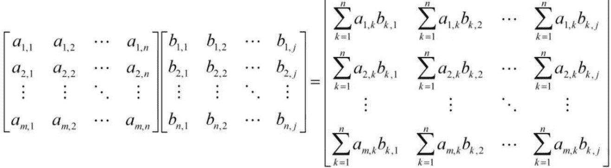

这玩意就是“线性代数”，一般理工科大一就开始学，学过的小伙伴眼里，这玩意就是个小学运算，看起来复杂，其实并不复杂，就是一堆加法和乘法，非常繁琐。但是这种运算非常常见，比如大家平时用的GPS，其实也是这么个矩阵运算。

大家一定听过我国制造第一个原子弹时候，哈工大一堆大学生去帮忙敲算盘的事吧？我以前大学有教授参加过那些项目，说白了其实就是徒手解微积分，先把微分方程转换成这种矩阵，接下来就是繁琐加法和乘法的运算，算盘的优势就出来了。

也就是说，显卡的主要优势就是塞了一堆小学生，非常擅长乘法和加法，并且经过几十年的迭代，玩家们用钱投票，显卡不断进化，“并行蛮力”越来越恐怖，不过一开始大家并没有理解到它除了玩游戏还有别的作用，直到有人开始用它挖矿。

挖矿，也就是挖比特币或者以太坊那些加密货币，本质都是计算一个非常复杂繁琐的加密算法，显卡天然适合这种大力出奇迹的操作，于是英伟达也搭上了这列快车，在疫情期间股价暴走。

不过让英伟达管理层自己都没想到，他们的显卡还可以干别的。

大概在2011年，已经干到游戏界扛把子的英伟达管理层突然听说了一个让他们自己都没想到的事。

原来麻省理工学院当时正在进行最早期的人工智能训练，研究者们想让计算机快速识别一只猫的图片。

怎么识别呢？只能是让机器一个像素一个像素地处理，这涉及大量的重复繁琐运算，一开始麻省理工的研究者们用CPU来处理，效果极差，刚才说了嘛，CPU有点像个很牛博士生，可以做非常复杂的事，但是一次只能干一件事，面对海一样的加减乘除，有点“有劲使不上”的感觉，算起来巨慢无比。

后来开始使用GPU，也就是大家熟知的显卡，显卡就跟伊朗人指挥着一群小学生玩拼图似的，也就是大家经常听说的“并行计算”，天然适合“简单量大”的操作。

也就是说，图形显示、人工智能、解密算法，本质上讲都是“蛮力操作”。现在大家知道为啥显卡同时能用于航天、天气预报、能源勘探等领域了吧，因为这些领域都涉及超级大规模的矩阵运算，只要涉及超大规模的蛮力运算，那就是显卡的天下。

这也是为啥很多人说未来战场也是显卡的天下，尤其空战，人的反应能有多快？那些塞了显卡的智能武器反应又有多快，迅速采集信息迅速运算做出规避或者引爆操作，想想都觉得瘆人。

所以如今英伟达还有个重要业务，就是“数据中心”，搞个超大机房，给别人提供算力，顺便收费。

也正是因为英伟达显卡在游戏、数据中心还有人工智能方面的大规模应用，市场前景被看好，如今英伟达也成了万亿俱乐部里的一员。

是的，尽管游戏在大众心目中仍然留存着有点不务正业的印象，但人工智能的运用与进化却和游戏息息相关，甚至第一个颠覆人类关于人工智能的认知的产物，就是通过“围棋对战”的形式诞生。而今时今日，人工智能显卡是训练人工智能的重要基础。

今年WAIC上，也看到有研究机构发布游戏和人工智能报告，分别从理论研究、显卡等硬件迭代、应用场景三个层面分析它们互帮互助的共生发展关系。厦门大学还联合中国传媒大学、中央美术学院、北京理工大学、上海交通大学等多所高校部门，筹备成立“游戏人工智能高校联合研究中心”。挺好的。

可能有小伙伴说，这事对我们有啥帮助呢？中国能快速搞出来吗？

小了，格局小了。中国最大的优势就是巨大的消费市场，市场需求往往就孕育着无限可能性。如果好好培养，在全球人工智能浪潮下，我们肯定是能占据重要位置的。这可能也是为啥马斯克在WAIC开幕式上深情表白“相信未来中国将拥有非常强大的人工智能能力”的原因。

### 尾声：

从人工智能的崛起我们也能看出来：

消费市场才是硬科学的培养皿。消费市场的本质，就是人对美好生活的向往，毕竟大家工作赚钱，攒钱买自己喜欢的东西，使用更智能化的工具，主要是这些东西能给自己带来欢乐或者解决麻烦。这种对美好生活的向往，就是科技进步最原始的动力。

而且我们也能看出来，很多时候伟大不是规划出来的，而是成长出来的。做PS那帮人也不知道自己的产品能做出来啥，做光刻机的ASML自己也搞不出来台积电那样的工艺。黄仁勋也没想到自己的游戏卡有一天竟然成了人工智能的基石。

当然了，聊的是游戏和显卡，游戏和人工智能，现实里远远不止游戏，太多领域都是这样，你没法预知它将来会成什么样，谁也说不准再过一些年，哪个枝头的一个果子掉地上，会砸出来一个新的产业。

公众号懒人搜索，懒人专属群分享

### “躺尸开关”是个啥？

2023-07-06

有种说法，认为男性进化出来一个“废物开关”。说的是在古代，其实男人一般十七八岁就生了孩子，孩子长到十七八岁生下一代，也意味着孩子这时候彻底成年了，35岁左右的男性做了爷爷。我们知道，人是被基因驱动的，它不在乎你能不能繁衍，现在既然后代有了，基因也就不知道下一步干啥了，放飞自我去了，目的没了，所以35岁以后的男性就是一副躯壳在世界上漂。这也是为啥还有个假说，叫“祖母假说”，说的是老年女性去照顾孙子外孙的群体，繁衍下去的概率更高。祖父哪去了？有可能死了，男性平均寿命确实短一些，也可能是躺尸去了。也就是说，自然进化保存了大龄女性的勤劳基因，因为这样能提升种群的生存概率，男性年龄大了打猎也不行，照顾孩子又不擅长，于是基因层面彻底放弃治疗了。还有另一种说法，认为男性的所有“勇敢”、“激情”什么的，都是雄性激素决定的，也是基因为了求偶、自身延续的一些设定。等到过了育龄，过量雄性激素对男性是有害的，于是为了多活几年，激素水平骤降，导致男人们普遍在35岁之后激情和进取心彻底消失了。不讨论个例，大家注意下那些老年人，经常能发现一个问题，老太太是很激情的，又是跳广场舞，又是照顾孙子外孙。男性就少了很多，确实有一部分人不在了，但是主要是男性越往后，是一种越来越“躺”的状态，啥也不想干，啥也不想说，经常开着电视一躺就是一天。那种愿意照顾小孩，精神矍铄的老头是非常少的。以前很多人说女性比男性寿命长，这也是为啥广场舞团伙里，往往只有一两个老头。其实不是，男性寿命确实没有女性长，但是也不至于六十来岁就没了。主要是不愿意动，可能在公园某个角落跟雕像似的坐在那里看象棋，或者在家里躺着看电视。也就是说，35岁可能不只是现代的一个分水岭，一直以来都是。只是古代无所谓，现代这个年龄正好上有老下有小，一大家子还等着自己照顾，多少有点愁人。我以前很早就聊过35岁问题，只是当时没注意到一个问题，当时说了很多，比如拖家带口，事多分心，但那时候年轻，还没意识到这个“躺尸开关”，这不这两年我也过了那个时间点，突然理解了。跟身边的人一聊，发现大家普遍这样，整体效果就是精力明显下降，激情减半，“建功立业”或者“大干一场”的冲动越来越低，而且对痛苦很敏感，不像以前那么钝了。更麻烦的是，一部分人睡眠越来越长，另一部分人睡眠越来越少，两者共同的特点是成天好像睡不够。我自己也特别明显，一直以来好像一天睡四五个小时就够了，熬夜通宵一晚上第二天根本没感觉。记得有一年我在意大利出差，那边跟这边有时差，我那时候对微博又非常上心，晚上在微博和大家吵架，白天上班，一个礼拜每天睡两三个小时竟然没啥事，有些读者都说博主你这成天在线，是不是根本不睡觉？可别暴毙了。如今只是想起那时候的状态，就有点虚，感觉熬不动。其实那时候根本没觉得熬，就是正常过日子。这里说的并不是所有人，不过大部分绝对是这个状态。

更加痛苦的是，如果你收入不咋高，到了四十来岁，精力不济，对痛苦又敏感，老人家庭孩子，样样都需要你操心，如果赚的钱多还好，钱少简直了。理解了这些，我这些年越来越理解为啥公司要裁掉35岁以上的。不是说这事是对的，而是说站在盈利性组织的角度，就很容易理解，如果没有法律约束，换谁都会把这群人换掉，哪怕经验丰富也要换，那些积累不深的，就更要换了。而且大家可能不知道，哪怕国内大厂那些拿着巨高高薪的人，绝大部分也是螺丝钉，低薪那帮人就更是了。事实上“大厂”这个词，本身意思就是看着好像是高科技，其实是一群高学历的人在里边打螺丝。有时候你觉得自己不可替代，其实公司随时可以把你干掉，然后提拔几个激情澎湃的年轻人顶替你的职位。你可能纳闷，就那么容易被顶替吗？公司有个“人才梯队建设”的说法，也就是你平时就得带几个徒弟，你的绩效和徒弟是挂钩的，你不好好教试试？而且大家知道，领导其实主要的工作就是“成本”和“风险”，风险里就有“人才断代风险”和“预算不足”，所以平时会刻意调整，让一项工作好几个人都会，这样如果其中一个螺丝不中用，随时把他换掉。在职场里，还有个很麻烦的事，如果你的工资很低，那你基本就是个可以随时更换的螺丝。如果收入很高，这说明你创造的价值要多很多，可替代性很差，企业没法随便找个人替代掉你。这个意义上讲，收入高的人要安全得多。但是现实里却不是这样，你收入越高，企业对你预期越高，总觉得你的贡献配不上你的收入，你得兢兢业业，不然可能就会被性价比更高的替换掉。所以电视里的职场高薪精英往往衣冠楚楚衣着光鲜，现实里的精英人士往往灰头土脸，永远一副刚通宵赶方案的倒霉样。而且大部分公司都不是“培养”，而是筛选。

我上文说了，大部分人过了35岁后，体内的躺尸开关就开了（有些人十几岁就开了）。越来越烦躁，对工作激情越来越差，干完自己的本职工作就不错了，还搞啥精进，要啥自行车？这几年的管理学认为这人基本上废了，不如找个用着更顺手的。多说几句这个“筛选”，这些年有个感触越来越深，“一代版本一代神”，这些神主要是筛选出来的，其次才是重点培养。大家都知道鸡娃的事吧，一般鸡娃都是小学鸡，越往后越没啥可鸡的，因为到了初高中开始，孩子的内驱力和天赋开始起作用，家长们费尽心机在小学积累的那些优势迅速就被清了零。初中学习好的，高中往往不一定。高中学得好，考个好大学，大学又来一波清零。毕业之后，大家会发现大学优势又被清零了，毕业几年后大家混得咋样，基本和大学里成绩没啥关系。在30岁左右，还有一波清零。我观察了下，这可能是绝大部分“废物”们最后的机会。毕业十年左右，在职场上混得咋样，基本已经确定了。绝大部分人都面临一个转型，继续上班还是开始自己的产业。这时候往往那些在职场混得不咋样的人可能会被逼着去被迫创业，一部分人会成功，绝大部分人最后还是得继续找个班上。大家观察下，毕业十几年后，大学里那些最成功的，基本都是在这部分人当中。按部就班的可能会混得不错，但是基本不可能混到大富大贵。而那些大富大贵的，基本都是被职场逼出去的，极少有在职场里混得特别好，然后选择毅然决然出去创业的。

职场里也是一样的，以我待的大厂为例，都会对35岁以上的员工格外注意，如果发现他们的“躺尸开关”被激活了，一般会选择跟他们聊几次，如果聊了没啥用，可能就过段选择打个很差的绩效赶走。听着很残酷，而且也不道德，不过确实是这么干的。中国比较靠前的那些公司，工资是很高的，但是他们对员工的要求并不是简单地“按部就班”，如果你只是按部就班完成自己的本职工作，迟早会被赶出去，组织对你的要求是不断超越过去的自己，甚至超越组织的预期。这不是针对谁，基本是一视同仁的，比如狗东和狸猫最近不都炒掉了自己的CEO了嘛，达不到预期就得让位。某种意义上讲，这几个头部公司这么做倒也没啥问题，因为给的钱多嘛，但是这种毛病不知道什么时候扩散到了全社会，大部分公司并没有给员工那么多钱，却也是那么要求员工的。可能主要也是人多，你不干有的是人干。也就是说，在每个阶段，极少部分人构成了头部，绝大部分人没法免俗，今天说的中年变得越来越提不起劲这事，如果没发生在你身上，那恭喜你，绝对的少数。如果突然发现自己什么都提不起劲，就像把这一辈子混过去，那也正常，毕竟这个世界上大部分人都是普通人。

这么折腾下来，大家会发现整个世界都针对中年人，体内的躺尸开关被打开，越来越虚，越来越没激情，身上重担又越来越重。如果说有什么建议，我觉得是个退而求其次的过程。最好的状态当然是建功立业，有足够有钱，对于生活有一定的选择自由，这自然是绝大部分人没法做到的。那就尽量选择有些激情地干到退休，赚不赚钱倒是次要的，毕竟如果既不赚钱，又上班如上坟，痛苦加倍。如果实在是不可避免地再降一格，那就是把身体保养好，能锻炼就锻炼起来，实在不能锻炼不动，那就少吃点，瘦下来，尽量少去医院，不花钱就是赚。

公众号懒人搜索，[懒人专属群](链接)分享

### 中国为啥会给越南输电

2023-06-30

国内很多人谈起越南，总有种“别有用心”，并不是就事论事，而是想表达自己的偏见。

一部分人喜欢说，越南经济正在蓬勃发展，进而论证“国内药丸”，咱们今天的文章就会讲到，越南和中国不但是不是零和博弈，更类似一种共生关系。

另一部分人只要逮到机会就会说越南正在崩溃，因为他们的眼里，越南崩了，那就证明除了中国，没人能实现工业化，这显然也不是现实。大家看看越南这经济规模，肯定不是一个农业国能取得的成就嘛：

### GDP(国际元)走势图
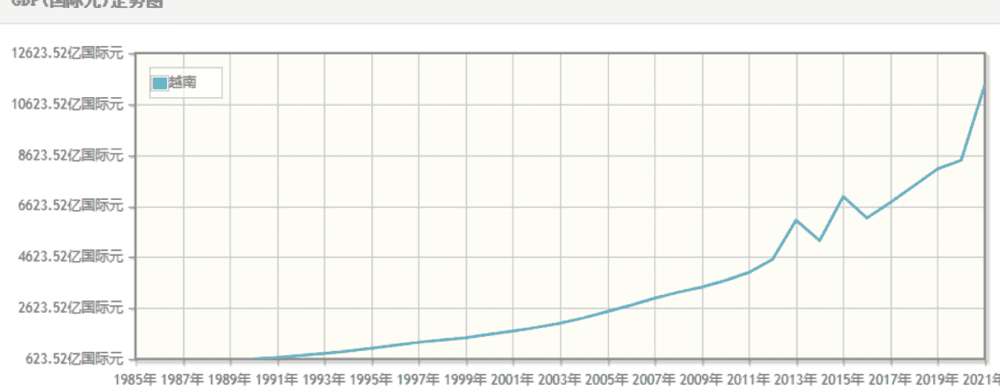

其实客观地讲，越南有点像脑子不错，还算努力，又有大哥提拔指点的寒门子弟。这些年确实走出来了一条路，至于能不能走下去，能走多远，那个谁都说不准，不过大概率地，脱离自己之前阶层是问题不大了。可能会像一个标准京沪码农一样，一顿狂飙之后，卡在一个不上不下的位置迎接自己的35岁难题。

那为啥说越南是个条件不错的小伙呢？

主要是那几个港口，越南有比如著名的海防港和胡志明港，海防离他们首都河内不远，大概相当于北京和天津的关系。胡志明类似咱们的上海，处在越南南部，也是个大河入海的城市。还有中部有个岘港（那个字读“现”），类似咱们的青岛。港口在后发国家那里属于没法回避的决定性关键问题。

也不复杂，一般后发国家发展，前期都得承接发达国家转移出来的低端产业。这些低端产业利润薄到了极点，如果想赚钱，那成本就得压到极限，比如便宜的交通、便宜的人力。

这也是为啥后发国家的起点基本都是“天然良港”+“廉价劳动力”，包括中国香港地区和新加坡这些城邦也不例外，刚开始都得依赖港口和廉价劳动力搞点低端制造，然后向上攀爬。这同时也决定了咱们的低端产能只能向越南这种国家转移，没法向咱们的西部转移。

而且越南离中国最大的工业区珠三角实在是太近了，只有不到一千公里海路。一千公里看着挺远，从运费层面讲，越南到广东的距离比广西到广东的距离都短，越南北方的海防可以无缝对接广州港。

当然了，最关键的一点，想发展需要政治稳定。不能动不动出现动乱，或者跟非洲那些国家似的，先皇刚跟跨国公司谈好投资协议，人家刚开工，过几天上来一个新皇，直接全给推翻了，把人家的跨国企业投资全给没收了。这种情况下，根本没法投资，经济也就没救了。大家千万别说起那些跨国公司就“昂撒”，我们如今也是跨国资本的一部分。

越南前期一直在打仗，先跟法国打，后来跟美国，然后是柬埔寨，最后是我们。90年代和中国和解后开始发展经济，前期尽管被军备拖得很惨，不过好处是政局非常稳定。政局稳定是搞经济前期必备的条件。

其实西方国家喜欢打“民主人权”的旗帜来折腾发展中国家，从他们现实的操作来看，他们真正在意的只有“稳定”。只要能稳定，什么伊朗巴列维王朝，沙特封建社会，新加坡泰国这样的威权社会，都可以跟他们合作。但是一国一旦出现不稳定的征兆，不仅西方的资金，连咱们的资金都会蜂拥往外跑，然后几十年不会再去投资。

现在的问题是，全世界符合“有港口”、“廉价劳动力”、“政治稳定”这三个条件的地区越来越少，所以越南的经济被外界看好也是正常的。

越南能发展起来，关键的红利大概分成这么几波：

最大的一波，可以称为“中国人口红利退散后的越南红利”。中国这边随着工人数量减少，大家对工资的要求越来越高，导致很多企业在中国一个小时八九块钱就招不到人了，那些企业只好出走越南。在接下来的很长时间里，那些在中国招不到工人的企业，都得被迫出走。这些出走的企业，能去的地方不多，要不去越南，要不去印度，去墨西哥和东欧有点不切实际。这么比下来，越南可能是最好的选择。

其次是中国的环保风暴，也就是大量环评不合格的企业被关停，他们不会真的停产不干了，而是转到了越南。一般污染高的企业，附加值都不高，还有“外部性”。比如你在河边搞了个高污染的工厂，你赚钱了，可一条河沿岸的所有人都受了影响。大家可能患病率变高，可能需要加装净化系统，总之整体成本变高了，甚至盖过你的工厂收益。局部是赚钱的，整体收益是负的。这也是为啥国家这些年不太想要这些企业了。

然后就是众所周知的贸易战。美国是世界上最大的消费国，咱们是最大的工业国，根本避不开美国。恰好越南跟美国这些年关系不错，跟美国的关税非常低，很多企业想卖给美国东西，都得到东南亚贴牌。此外大家最近听说了吧，咱们国家的光伏企业要被欧洲制裁了，到时候又得到越南生产出口欧洲。

最后也跟俄乌战争有关。战争以前欧洲能源依赖俄罗斯，觉得战争无论如何也打不起来，打起来之后又手忙脚乱到处找能源。那事之后，那些跨国公司也经历了一波“放弃幻想，迎接最坏情况”的思维转变，开始刻意分散布局。其实从这两年苹果的操作也能看出来，苹果甚至要把25%产能转到印度去。这在以前是不敢想象的，跨国公司无论如何也不会做出违背经济规律的事，但是俄乌战争之后大家的思路都变了，把“安全”放在了“利润”前边。战争爆发后这两年，印度的国际环境变化很大，以前大家分析印度，总说“在那里建工厂不划算”，如今跨国公司考虑最多的已经不是划算了。

从上边这几个转移原因也能看出来，除了“环评”，其他的都没啥办法，只能是让他们转移。

现在在越南投资的跨国资本里，排第一的韩国，主要是三星，三星在越南的地位，类似富士康在河南的地位。三星一个公司一度占了越南25%的出口量。

排第二的是新加坡，接下来是中国大陆和中国台湾等，还有一堆英联邦的小国。可能有小伙伴说中资占比并不高啊。上文说了，很多企业跑到越南是为了躲避美国的，怎么可能继续以中资名义嘛，这种一般会去香港走一圈，或者干脆保险点去新加坡和英联邦的小国包装一下。越南那边的小伙伴们说几乎看到的绝大部分新加坡企业，都是中国这边的。

也正是这些年工业转移得太快了，越南那边的基础设施根本跟不上，越南的南方和北方打交道很少，因为路太烂，电厂这种东西就更跟不上了。而且越南没有中国内蒙古、山西这样的煤炭基地。越南预计在接下来十几年都稳定不了电力，查了下国内，差不多是2013年左右才出现过剩，之前电力一直不太够。

那为啥我国要给越南供电呢？

其实中国对越南不只是供电，越南除了人和地啥都没，啥都得进口，从上游的原材料，到工业组件，再到生产设备，只能从咱们这里买。越南和中国并不是严格意义上竞争关系，而是一条链上的不同生态位。有点像韩国和日本在芯片领域的位置，日本生产原料，韩国做芯片。

一个更反直觉的事，越南那边的工厂因为停电不开工，肯定会影响到咱们这边的工厂。因为越南工厂的原料和半成品是从中国这边采购的，如果他们停电停工，就会降低预期产能，到时候也就不压货了，咱们这边很多工厂也跟着停了。

这个意义上讲，贸易网让中越变成了一个整体，救他们就是救咱们自己。

而且上文也说了，那几个因素的影响下，部分制造业流出几乎是板上钉钉的事。扶持越南，其实就是避免制造业流向印度。韩国显然也有这方面的打算，所以大力扶持越南。

此外中国关于电力有更大的企图，显然并不只是想发电供国内用，我们的目的，明显是要做新时代的能源国，持续对外输出能源，就跟中东国家那样。

大家这段时间关注下沙特就能发现，沙特在新能源相关技术上投资非常狠。大家都很清楚，化石能源时代眼瞅正在走向没落，风力和太阳能发电的时代正在降临，沙特正在给自己找后路。我国拥有巨大的生产能力，也有幅员辽阔适合风电和太阳能的大西北，如果发展好了，很明显今后西北就靠新能源也能振兴起来。

这种情况下，只要我们保持出口，就会对其他国家形成压制，有点像微软一直搞免费倾销，中国这边的操作系统就几乎发展不起来一样。

咱们给他们输电，某种意义上讲可以压制他们本地发展电力的机会。如果自己发出来的电费用比我们成熟的电价都要高，后续修建电厂压力会非常大，因为工厂可能优先使用我们的电，导致他们的电厂无利可图。

这个意义上讲，中国电力以后可能不只出口越南，可能会出口所有周边国家。

很多小伙伴对世界贸易的理解还停留在“不要给其他国家搞建设的层面”，其实现在全世界所有技术里，除了生物和高端芯片，其他所有领域普遍没有太高门槛，最高的门槛就是成本。比如一座桥梁，中国可以以相对较低的成本搞定，发达国家可能需要较高的成本，但是极少有真搞不定的。

中国占据了全世界30%左右的恐怖产能，可是并不是100%，还有70%在外边，很难说有多少产业我们不给搞，他们就没法搞下去。中国最大的优势依旧是成本。

更关键的问题是，制造业是“需求驱动”的，也就是说看着好像制造能力超级强，可是越强的制造能力越迫切需要订单。那些工厂和企业真正的生命线都是订单，一旦长时间缺订单，可能很快就扛不下去倒闭了。

懂了这个，就懂了为啥我国还在帮印度和越南这些国家搞基础设施。就算你不给他们弄，他们也会找别人搞定，还不如我们把这些订单接了，毕竟那些土木老哥们，如果长期没订单，没活干，企业也就扛不下去了。

但是换一种思路，如果我们的低价电力和产能持续输出，那些国家自己的可能很难发展起来，慢慢就开始依赖中国了，我们也能给自己的产能找条出路。

### 尾声

不得不说的是，越南确实抓住了历史的机遇，尤其是低端制造业从中国向海外转移的这股浪潮，还有中美贸易战背景下，大量贸易品需要到东南亚贴牌的需求，越南制造业实现了突飞猛进。

我们这边也得调整思路，历史上没有任何一个国家能长期守住低端制造业。那玩意利润太薄了，每个国家和地区发展一段时间后，就会发现低端制造业上机器人不划算，招人又招不到，最后只能向低收入地区转移。如今越南的那些产业，最早在英美等发达国家，后来又到了日韩，随后又转移到了中国，如今又再向越南转移。

没啥办法，经济规律使然，我们唯一能做的，就是向产业上游攀登，并且向高端制造的方向转移，除此之外可能也没别的办法。

至于越南取代中国，根本没谱的事，越南的发展极限是很难超过广东的，它和广东各方面的禀赋有点像，但是又不可能像广东那样有近乎无限的腹地。毕竟广东不仅仅是广东自己，它有山西内蒙给它提供能源，有全国给它提供人才，类似腾讯那样的超级企业用户也不止广东，已经辐射到了全国。这些条件越南都不可能有，所以越南的上限很难达到广东，至于取代中国就更没谱了。

而且前文说了，中国制造业在全球占比30%，越南占比多少呢？0.24%，可以说少的没谱了。越南对中国几乎没啥威胁，甚至可以说，中国外部问题并不大，真正的问题还是内部，比如发展内需，提升老百姓的消费力，解决“后房地产时代”的财政难题，这些都比越南麻烦得多，也重要得多。

公众号懒人搜索，懒人专属群分享

### 选专业掉了坑怎么办？

2023-06-26

文章是前几天写成的，本来准备昨天发这篇，不过昨天临时写了一篇，就推到今天了。一般这个号每周都是两篇，周二和周五。最近有感而发的比较多，恰好发现大家也爱看，就多写一些。

总有一些小伙伴，说类似“博主你变了”“为啥不聊xxx”什么的，主要是吧，我写作主要靠状态驱动，想法来了写起来特别顺，如果刻意想写啥，写出来的根本没法看。

有时候特别奇怪一些人，我写得他好像都不满意，可是他每次都坚持看完，然后坚持找点毛病，再写一大坨跟我抬杠，我觉得他挺累，让他取关他也不干，理解不了。

### 1

前几天看到一个传得很广的帖子，是这样说的：

> 了解到一组数据，全国快递员，滴滴司机和外卖小哥大概有将近一个亿，其实在茫然不自知的情况下，已经至少有超过一个亿的人工作在算法设定的模型里，有段时间我经常打车，和多个司机聊天，基本上证实了一个事情，无论司机每天多么努力，每小时平均收入是无限趋近于30块钱的，当你运气好接到一个长途大单后，返程往往接不到客，当你前面几个小时收入不错的时候，后面几个小时直线下降，算法可以用回归和拟合控制收入曲线，你可以跑得高红绿灯，但绝跑不赢算法，滴滴如此，外卖和跑腿亦是如此。人类为隐藏在数据中心的算法大脑打工的剧情已经悄然实现，只是很多人没有意识到而已。

里边提到的快递，滴滴和外卖人员到底是不是一亿，我也不知道，感觉没那么多。他们到底是不是困在算法里，也不太清楚。不过每小时平均收入30块这个事，应该问题不大。

我倾向于觉得这不是什么算法控制，就是最基本的经济学供需原理。大家知道吧，现在我国浩瀚如海的制造业，一个普通工人一个小时的收入大概就在23块钱波动。订单多的时候，可能会冲到30块，订单少的时候，就跌到了15左右。

尤其这两天高考结束了，南方那边又迎来了一大波生力军，有的是高考成绩还不错，想出去体验生活赚点钱给自己买个好电脑。还有的是没考上，准备进入社会，第一步那必然是进厂打螺丝。他们的加入，一般会把行情带低一大截。前段时间看到昆山那边已经跌到了15块一个小时。

可能一个反直觉的事是，临时工的收入要比正式工高一些。因为企业是不给临时工交五险一金的，正式员工就得交，这笔开支可以直接发给临时工。

比如要社保啥的，公司可能支出了7000，员工到手5000，另一个不要社保的临时工，到手6000。很多工人是愿意选后者的。所以那些工厂基本都是部分正式工，剩下的按需动态去招聘。

这些人在打螺丝岗位上混一段时间，就会发现自己非常不合适（极少有人合适），然后他们就会再来一波迁徙，去送外卖送快递，有驾照的会去跑滴滴。等到外贸爆单，工厂招人的单价飙高的时候再回工厂。

而且跟很多人理解不一样的是，白领们怕加班，工人们却担心没班可加，工厂爆单的时候加班多，赚钱也多，他们才会去。等到订单变少，没有班可加的时候底薪根本没法养活自己，他们又去干别的了。

大家发现了吧，如果滴滴和外卖赚的钱比工厂高，工厂里海一样的人力就会持续流出，直到把滴滴和外卖的收入也拉到跟他们差不多。

这个意义上讲，并不一定是算法在整那些从业者，背后真正的操控者可能就是市场。算法只是让大家赚的钱均匀一些。

当然了，时薪低可以通过加班使劲往上堆，比如在制造业，一般的玩法就是“每天十个小时，一周上六天”，大家的工资主要靠加班费撑着，如果订单少，没了加班费，大部分人就会撤离。同理，滴滴司机们如果每天朝九晚五不加班，也赚不到啥钱。

这两天看到大家在选专业，我为啥突然想聊这事呢？

我的意思是，并不是只有工人阶层有这个问题，其他行业也一样。任何行业稍微赚点钱，立刻就会涌入大量的人力把工资打下来。大家可能不知道有个职业叫“摄影师”，听着就是给拍照的，其实这些年因为广告和自媒体需求暴涨，这伙人收入非常非常高，京城这边专业一些的比大厂程序员都有钱，这两年被大家注意到之后，大量涌入，已经不如以前了。

我国现在婴儿出生率是很低的，不过不代表人力不充足。我国人口是从2017年之后开始下降的，那年足足生了1700万。2017年的孩子今年正在小学入学，今年的小学入学压力依旧非常大，他们还有16年大学毕业，不出意外，接下来十六年依旧非常非常卷。

以前也卷，但是以前有很多空白领域等着去填充，每个行业在刚开始的时候往往需求足，而且随着产业规模变大，先入行的人还可以去做领导。但是随着几乎所有的行业都被塞得满满当当，外边还有几千万人一小时不到三十块，随时会冲进任何行业里，把那些行业的工资给拉下来。

最明显的是造船业，大家知道这个行业属于我国最近这几年新崛起的强势行业，但是里边从业者的薪酬怎么样呢？那也是一把辛酸泪，我了解了一下，并没有比土木老哥好太多。

比如船厂需要大量的焊工，大家可能也听说过焊工一天700，还一直缺人，这就很奇怪了，为啥会是这样呢？感觉不符合国情啊。

正好我读者里有干这个的，说是他们内部流传一个说法，说是电焊对身体伤害非常大，人员流动性很大。每年都有人听说高薪入行，过不了多久身上出点症状，比如一直咳嗽，或者皮肤病，可能有小伙伴知道一个词叫“尘肺”，那些早期矿工很多有这个毛病，现在不少焊工也有，一旦出现毛病，就撤了。而且年轻人一般不去做，因为流传着搞电焊容易生不出来孩子的说法。于是处于一直高薪一直缺人状态。

### 2

以前我特别关注“怎么成为一个优秀的人”，最近几年更多思考“万一真的不行怎么办”。

大部分家长都觉得自己的孩子理所当然是前10%，可是一个很现实的问题是，现实世界里大部分人真不行，不是说脑子有问题，只是不是那块读书料。毕竟有一半的人连高中都考不上，剩下那一半混个本科都超级费劲，更别说985了。

哪怕在一个普通大学里，想进计算机和医学院这些热门专业都很难。是的，不少人还在那里纠结当医生到底好不好，其实没啥可纠结的，医学院不是你想去就能去的。大部分人最后的结局，只是去一个不想去的大学，上一个不想上的专业。

那这一辈子就输在起跑线，一辈子掉坑里了？

有一说一地讲，一步错，步步错，对于大部分人来说，高考确实把他们的定位给锁死了。尤其如果你是一个按部就班的人，那确实是。

但是也不一定，如今我毕业十几年了，回过头来看，80%以上的人毕业五年后从事的工作和自己大学专业一点关系都没。毕业后混得好坏，跟成绩大学成绩也没啥关系。如果以财富为标准，整体和学历正相关，但是也不是特别有决定性。

还有不少人毕业后没多久，就基本忘掉了自己的毕业院校，此后也不再提起，主要是用不着了。比如那些做生意的、做自媒体的、前些年卖房的、从事了兴趣产业的，比如我最近才知道一个游戏主播他学历非常高，可是从事的事跟学历一点关系都没，他也从不对外人讲自己学历的事。

小财靠勤，大财靠运。“运”需要人去冒险，去闯。但是人一般情况下都是没啥出路了才冒险，一帆风顺的人往往不会去冒险，于是那些学历高条件好的，往往最后可能也就是个中间层。社会上那些有钱人普遍不是靠工资赚出来的，他们的学历普遍不咋地。当然了，也没人在乎他们学历到底是啥样。

所以说长期来看，专业可能没那么重要，重要的反而是一些软素质，比如思想有没有弹性，能不能充分吸收各种观点，是不是能够“get hands dirty”。最关键的，可能也是运气。

为啥要强调运气呢？

因为对于大部分翻身的人来说，运气才是决定性的。这事不能告诉小孩，不过现实时间里确实是。中国人喜欢说，没有实力哪来的运气，其实这就是割裂，有没有可能，你那个“实力”也是运气的一部分？运气也是实力的一部分。

而且相信运气可以让一些人跳出可怕的宿命论，毕竟如果这个世界真的实力说话，那一定是个极度固化的世界，绝大部分人输在了子宫里，剩下的输在了高考后，可是现实里并不是。因为富人和高学历的会倒霉，普通人也可能在某些时候突然大爆发，暴走几年走上人生巅峰。

说这个，不是想宣扬读书无用，毕竟我自己就是小镇做题家出身。我是说，对于考上名校的，不瞎折腾，这辈子混个社会中间层也没啥问题。对于那些没考好，没上好大学的人，也不用悲观，今后的岁月里如果能够直面挑战和不确定性，还有很多次翻牌机会。

甚至有个大佬跟我说，“从前往后看，都是努力；从后往前看，都是命”。也就是说，短期看你取得的成就都是你的努力和拼搏换来的。但是等再过一些年，回过头来再去看，会发现太多事情充满了“命”的气息。

比如你摊了个傻叉领导，你干得再多也没啥用，甚至把你的成果给了别人。当然了，也可能不是他的问题，可能是你原生家庭导致你超级烦人，你自己还不知道，和谁都合不来。

比如你毕业进了一个缓缓下降的行业，就像在激流中逆流划船一样努力拼搏，所有的努力只是能维持一个不再后退。

再比如身边没人能看清楚形势，也没人捞你一把，无头苍蝇一样东突西突，最后耗掉了黄金十年，耗尽了所有的激情，啥也没得到。

反过来讲，进了一个上升的行业，碰上了愿意提拔你的领导，接触到了自己擅长且能专注的事恰好是个赚钱的事，甚至娶了一个巨有钱的富婆，这些都是可遇不可求的事，但是一旦碰上了，可能就是开挂的人生。

“娶富婆”这事不是开玩笑，儿童的世界里逆袭靠的是“实力”，现实世界里男人阶级跃迁最重要的几个途径，就是去当“赘婿”，或者靠别的贵人往上捞。因为你可能很有才华，可是没本金，如果靠自己积累需要二十年，黄金时期都过了，啥才华也不等你这么久啊。

甚至当初觉得你非常努力得到了领导的认可，把你提拔了起来，多年后回过头来，可能才意识到当时领导也在急切地找个人来帮他，恰好你和他能合得来。

这一点很多人没上过班不知道，其实领导看重下属，不一定是因为能力，能力当然重要，更关键的是一种“合得来”。人这一辈子，关键就是在茫茫人海里找那几个跟你合得来的人。

聊这些并不是否认努力，某种意义上讲，努力和运气可能是一码事，我想明白了再给大家讲讲。

### 3

### 尾声

说句很不合适的话，其实对于90%大学生来说，大学四年都差别不大，不是搞对象就是玩游戏，混及格，然后毕业走入社会。大家不要以为985的就不是这样，也一样。而且跟大家理解不一样的是，大学搞对象这事是一部分人的事，大部分人连个对象也没谈，学习也没咋学习，不知道忙了些啥。

说到这里大家可能觉得我这里要规劝大学生一定要心无旁骛地好好学习，不过如今三十好几了，心态又变了，觉得大家follow your heart吧，别混得太离谱就行，趁着年轻把能做的都做了。劝大家一心学习，几乎不可能的事，用一半心思学习上进，持续几十年已经牛逼得不得了了，太使劲往往很快就泄气了。

毕业之后的时间会特别快，转眼就是十年，再转眼就是二十年。在这个长度上思考问题，会发现大学的那些知识可能没那么重要，反倒是其他的一些经历更加重要。

年轻的时候很难理解那些油腻中年们为啥会喜欢盘串，或者喜欢跟个死人似的在那里钓鱼，再或者开始折腾其他一些巨无聊的东西。

别误会，绝对是混得好的才玩这些，如果一个中年人竟然开始钓鱼了，那他算过得不错的。绝大部分人被生活折腾得死去活来，每天睁眼就是车贷房贷老人医药费，还有孩子学习不好、摊了个沙雕领导、老婆天天嫌自己赚得少，全靠麻木来扛过那漫长的中年时光。对于绝大部分人，尤其男性来说，35到50岁才是真正“漫长的季节”。

好像男性在这时候你再想起来热血年代那些事，就跟想起来上古往事一样。或者有点像杜甫晚年无限怀念年轻时候经历的开元盛世。当然了，这里说的不是鼓励大家混，而是说不要虚度，去做有意义的事，有意义的事有很多种。

流水不争先，争的是滔滔不绝，慢慢持续发力，不着急。

公众号懒人搜索，懒人专属群分享

### 俄罗斯的闹剧远没有完

2023-06-25

假期一直上班，今天有一上午调休，起了个大早一气呵成写一篇，大家随便看看。

不做事后诸葛，现在这个结局我也没想到，因为太不俄罗斯了。这次的危机结束得有点像儿戏，但我觉得这是应该没完。

### 1

我看不少人说瓦格纳这次是被美国策反了，这个真有点冤枉瓦格纳了。

我自己对瓦格纳是没有任何好感的，原因也不复杂，大量证据显示我们在中非金矿的惨剧，很可能就是瓦格纳干的，那个金矿现在被瓦格纳给占了。具体可以去看看B站马督工的视频，叫什么“投资远离瓦格纳”。

但是瓦格纳几乎不可能被美国策反。咱们知道，咱们国家最极端的那群民族主义者，叫“皇汉”，俄罗斯最极端的民族主义者，就叫“皇俄”，这伙人以彼得大帝为偶像，希望恢复俄国昔日荣光。瓦格纳就是典型皇俄。

他们的一些主张，连国内最极端的那群人估计看完都摇头，比如扩军百万全面进攻，用核弹核平乌克兰，战场上布设督战队，枪毙后退士兵（这个好像已经有了），揪出在美国有资产、把家人送欧美的俄罗斯上层，把逃亡士兵抓回来用铁锤击杀（也已经在操作，只是没扩散到俄军）等等。

当然了，这伙人对咱们不太友好，他们对所有外国人都不友好。他们是俄罗斯内部最极端爱国的那部分，理论上讲，整个俄罗斯最不可能被收买的就是他们。如果矛盾没积累到一定程度，他们最不可能造反。

那为啥造反呢？我三月份的帖子就把瓦格纳和国防部的矛盾说清楚了，那时候已经有了端倪，最近又要把瓦格纳合并进入正规军，把厨子搞成个光杆司令，厨子这种人，哪能束手待毙。

### 九边 Pro

大家肯定有个纳闷地方，好像整个乌克兰前线只有瓦格纳军团在打仗，其他俄罗斯正规军哪去了？

俄罗斯正规军去挖战壕了，俄军前期反攻了几下，全透明战场没法打，打不动就不打了，沿着火线挖战壕准备固守。乌克兰正规军去波兰和德国训练了，所以双方现在整体没啥大战役。俄罗斯现在准备等着乌克兰发动进攻的时候防守反击。

二线部队。前段时间俄罗斯最擅长的重炮阵地很久没出现了，因为重炮部队是俄罗斯正规军的，佣兵们主要靠轻武器。

所以这两天瓦格纳那个领导一会儿说是乌克兰要在巴赫穆特发动反攻，一会儿说是自己要去非洲了，其实还是变相给国防部施加压力，让他们赶紧提供更多的物资。

再往深了想，佣兵和国防军是有内在矛盾的，普大钟爱佣兵，国防部那边肯定不会开心，觉得还不是我们给提供物资？有种你们自己去解决。

这就有点像74师被称为御林军，蒋委员长非常信任这支部队，装备物资优先给，功劳让他们担，但是兄弟部队意见很大，觉得没我们配合，你不就是个渣渣嘛。后来果然也是被兄弟们给坑了。

266万展现 44万阅读 内容已编辑

这次国防部收编瓦格纳，正常人可能就认了，厨子这人脾气暴烈，自己一大家子人也跑不掉，估计是担心军权拿掉后被清算，就暴走了。

所以这伙人不是安禄山，算是给逼反了，更类似仆固怀恩，老仆给大唐死了一家子，最后被逼反了，这次他们的口号也是上层太腐败，他们要去正本清源，得到了很多俄国老百姓的支持。

但是搞笑的是，现在厨子得到的，是放下军权，肉身去白俄罗斯，尽管被赦免了，但是造反造了个寂寞。如果说有啥明显的差别，那就是可能得到了一块白俄老卢担保的免死金牌。只是老卢一个上校，不知道担保值多少钱。

### 2

昨天最让我难以理解的一段话是普京说的，普京称瓦格纳的行动是“武装叛乱，这是在背后捅刀子，我们的国家，我们的人民，在1917年3月就遭受了这样的打击。”

那问题来了，1917年3月俄罗斯到底发生了啥？

对，二月革命。这里的“二月”，是俄历，类似咱们的农历，实际爆发时间是1917年3月8日。

这事其实咱们教科书里有，因为咱们教科书里最重要的一件事是“十月革命”，十月革命的一声炮响，给中国送来了马列主义嘛。讲十月革命就避不开二月革命，因为十月革命并不是推翻了沙俄，沙俄在二月已经被推翻了，十月推翻的是三月建立的资产阶级政党。

“二月革命”也是一件比较波澜壮阔的事，大概就是沙俄的罗曼诺夫王朝把几百万农民组成的士兵送去前线送死，这些士兵吃不饱穿不暖，很多连武器都没，只有一根棍子，就算有武器，经常也没弹药。这样一群人面对装备了大量机枪和重炮的东线德军，结果可想而知，几乎每次进攻就是一场惨烈的屠杀。以至于俄军有了个非常不好的外号，叫“灰色牲口”。

也正是因为战争太惨烈，后方又紧缺，导致了老百姓意见越来越大，前线士兵们也在布尔什维克的组织下越来越反战。一开始没啥事，有意见就让哥萨克骑兵上街。到后来士兵也忍无可忍，把枪口对准了沙俄自己，一顿乱枪先干掉忠于皇室的哥萨克骑兵（魔幻的是这伙人是乌克兰那一带征募的），然后打开军火库，把枪发给工人和农民，大家跑去屠杀那些贵族和地主。

随后的事大家也知道，持续了三百年的罗曼诺夫王朝崩溃，沙皇退位，本来想去英国（沙皇、德皇、英王其实是一家子），没跑掉，几年后沙皇全家被枪毙在了叶卡捷琳堡的一个地下室。

“二月革命”新上台的那伙人不退出战争，继续打，老百姓意见很大，随后布尔什维克发动了十月革命，推翻了新上台的那群人，退出了第一次世界大战，把军队拉回国内镇压旧势力。咱们熟知的保尔，就是这个时候参军，然后是俄国境内持续了很多年的各种势力来回绞杀。

如今普京拿二月革命的事对比现在的瓦格纳叛乱，我是有点没想到的。可能他这些时日一直在担心俄乌战争拖得时间太长，国内会不会爆发二月革命那样的事，如今边疆传来瓦格纳叛乱，多多少少有点觉得“最担心的事还是发生了”。

这里就有一个问题，普京为啥要自比沙俄呢？把苏联搁哪？

这里也涉及到一个常识性的事，1991年之后的俄罗斯联邦，合法性完全建立在毁灭苏联之上。

也就是说，苏联是邪恶的、坏的、辜负了人民的，所以大家把它抛弃，由新成立的俄联邦带领大家向前走。所以普京是绝对不会说苏联什么好话的，如果苏联是好的，他们就没必要存在了。就好像明朝不会说元朝什么好话，既然元朝那么好，朱元璋他们造反就没道理了。

### 尾声

俄罗斯这个国家是一个极度慕强和崇拜权威的国家，他们历史上的领导人都是那种铁腕人物，一旦领导人表现出虚弱，就会被各方头面人物和老百姓抛弃。

这也是为啥俄罗斯历史上能强硬就不软弱，因为软弱不但不解决问题，往往会导致更大的问题。事实上普京的权威不断加强，就是因为他在历次危机中都保持铁腕，不管承受多大压力和代价，都坚持强力解决，最好武力解决，普京的声望就是一次次战争中积累了起来，俄罗斯人就崇拜这样的领导。

接下来咋发展我也不知道，不过现在明显的是，俄罗斯已经彻底“晚清化”了，各种势力团结在太后周围，各有各的盘算。或者更进一步，“民国化”，中央已经没了权威压制地方强权，地方强权象征性地听你的，但是稍微有点不合意就起来闹，关键是闹完了竟然可以像没事人一样通电下野。

目测接下来可能有更麻烦的事，俄罗斯人啥都可以缺，唯独不能缺一个类似沙皇那样的绝对权威领导他们。不过还是希望这货能保持稳定不分裂，毕竟一个稳定统一的俄罗斯不仅仅是他们自己的事，对我们的整体环境也非常关键。

公众号懒人搜索，懒人专属群分享

### 为啥最近降息的事这么纠结？

2023-06-21

这段时间关于要不要救市、要不要放水讨论得很热烈。大家可能也注意到了，降息这事市场已经喊了很久了，但是政府好像一直不太想降，至少央行还没有下调基准利率。

最近先是大银行把存款利率降了，一般认为是在为接下来的降低贷款利息做准备。这不昨天下调了LPR，100万房贷每月少还57块。但这两块降息都只是和居民有关，还不是真正意义上面向企业的降息。

咱们今天就聊下这事，政府到底在纠结啥。

首先说下利息到底咋形成的。

说白了，就是“资金价格”。你缺钱，去找你哥们借钱，他不大放心，怕你不还，于是说最近钱都拿去买房子了。然后你说要不把房子抵押在你这里？他说不是房子的事，就是自己手头紧。你说要不我借10万一个月，多给你1000块，并且把房子抵押在你那里？

不出意外，你哥们立刻就会说父母那里还有些钱，你等着，他去要。这里“房子”就是抵押品，多出来那1000，就是利息。

你愿意用这么高的成本借钱，说明你有更重要的事，比那1000块利息重要，不然你就没必要借钱了。

现实里如果你信用记录没这么差，一般也不用这样借钱，可以找关系不错的哥们，或者找银行贷信用贷，再或者直接找花呗。

全社会的用钱需求，最后汇集在一起，就是全社会的整体利率，那个利率看着是央行定的，其实本质上是市场形成的。经济增速快的年头，机会多，大家都想贷款做生意，把利率推得很高，咱们国家早年的利率经常10%以上。银行需要大量的钱往出货，于是拉高利率吸引储户去存款，那些年存款利率也有8%。

如今经济增速已经下来了，贷款利率也跌到了4.35%，存款已经跌到了3%以下。

当然了，咱们这些讨论的前提是这个社会整体是稳定的正常的，不然跟巴西、阿根廷、土耳其、俄罗斯似的，利率动不动20%，没啥讨论价值。

说到这里，也就清楚了，利率基本上反映的就是经济增长率。经济增长快，大家都需要钱。贷款创业就能赚钱，于是大家愿意支付高利息，互相竞争，最后利息停在了一个某个点上，比这个点再高一些，大家就赚不到钱。这个点，基本就是经济增长率。

有个问题，那为啥民间借贷或者什么消费贷利率经常飚到8%以上呢？银行才4.3%。

主要是风险，这类贷款往往没有抵押物，借款机构担心你不还。于是拉高利率，借给一百个人，就算其中有几个不还钱，因为利率整体比较高嘛，依旧有的赚。也就是说，一般咱们看到的利率，可以理解为“风险”叠加“经济增速”。

但是依旧有个关键问题，大家可能纳闷，这个社会怎么了？为啥都在借贷经营呢？就不能有多少花多少吗？

现实里也有那种现金流非常充沛的企业，不过绝大部分企业负债经营。一般企业说负债，并不是说它没钱，说的是他的资产以“债”的形式存在。比如你是个小老板，你可能资产千万，可是连十万现金都拿不出来。一般的情况是，你欠你供应商500万，但是你的销售渠道欠你1500万，这种情况非常正常。

大家可能知道一个词，叫“回款周期”，说的是你把东西卖给别人，对方极少立刻付钱给你，几乎都得过一段时间。那国内平均是多久呢？

两年。

对，你先垫资生产，生产出来卖出去，平均两年后才能拿到回款。回款这么慢，平时进货什么的全靠自己垫资，到最后几乎所有的企业都得靠贷款过渡。

既然靠借贷度日，利息成了企业身上背着最重的负担之一，经常出现一种情况，有些企业一年赚到的钱还不够还利息的。

说到这里，大家也就明白了为啥经济不好，国家就要降息。一方面是低息可以刺激大家贷款去创业消费，另一方面国家担心有些企业本来经营的好好的，但是年景不好，收入抵不过利息，企业直接崩了。到时候它欠别人的钱也还不上，别的企业也跟着爆了，连环暴雷，非常可怕。

那是不是直接把利息降到很低很低，对经济非常有好处？

当然不是了，毕竟银行自己是没钱的，它的钱是储户存进去的，贷款利息肯定不能低于存款嘛。而且还涉及到一个违约的问题，经济不好的时候，更不能随便往外贷，万一某个企业趁着贷款容易，贷了大量的钱，随后倒闭了，那就麻烦了。

而且，把利息降得过低，还会有另外一重问题。如果资金成本很低，有人可能拿钱去炒资产了，类似2021年年初发生的事，国家给企业低息贷款，后来都跑去买房了，进一步推高了泡沫。中国经济的杠杆率已经不能再加了，所以现在也不能再一味地简单降息了。

这里其实就牵涉到一个更深层次的问题。降息到底是能够实实在在地帮助到企业，还是客观上带来更大的泡沫，制造金融风险，其实这个问题不仅困扰着中国，甚至是个世界性难题。

在传统银行体系下，判断能不能借钱，用什么价格借钱给客户，一般只有两个办法，抵押和信息。

抵押好理解，想借钱，拿你房子去抵押，等你还不上，将来就用你房子抵债。大家经常听说的“法拍房”，有不少就是这种。

那“信息”又是个啥呢？

对于大企业来说就是自己的名声，银行觉得一个全国人民都听过的企业，或者一个大国企，他们借钱一般都会还。所以这些公司普遍融资比较容易。

可是那些小企业就比较惨了，很难从正规银行借到钱。因为小企业往往既没有抵押物，也没有名声。

我们知道，中小企业对一个国家非常重要，毕竟所有大公司都是小微公司成长起来的。而且，小公司还提供了一个市场必须的东西，也就是“多样性”。

咱们经常聊创新，创新最大的问题就是你不知道哪个方向才是对的，唯一的办法只能是在所有可能的方向上试图突破，这时候小微企业的作用就出来了。今年那个OpenAI和Midjourney，都是两个规模很小的公司（背后资金量却很大），谁也想不到他们竟然搞定了谷歌这样巨物没搞定的事。

此外小微企业是吸收就业的主力。咱们都知道，80%的就业是私企吸收的，私企里的80%就业又是小微公司贡献的。所以国家对小微企业也非常重视，大家看看今年的文件就能看出来，一再强调对中小企业优先放款，可是咱们知道，银行最怕的就是违约。也就是说他们最需要信贷支持，可是他们贷款什么的却最难。

所以，降息肯定是有利于刺激市场主体的，关键是这降息的好处能落在谁头上。如果小微企业不能从降息中间受益，那么这降息就是降了个寂寞，因为大企业本来也没那么需要，最后对经济整体的拉动非常有限。

不过这两年有个转机。其实，现在中国的中小企业被纳入正规金融体系的非常多，而且它们的利率和大企业之间的差距也已经很小了。虽然说中小企业也难，但是便宜资金流只能流向大企业，很少流向中小企业这个世界级难题，在一定程度上被解决了。

大家知道蚂蚁吧，前两年被使劲批了一把，但其实蚂蚁这几年做了很多创新，之前大家担心的那种“美国次贷模式”几乎不可能发生，因为咱们国家的监管体系根本不允许那样玩。

蚂蚁最大的贡献，就是运用新技术搞了个信用体系，通过大量的信息来评估用户的信用，然后来决策到底借不借钱，以及具体多少利率合适。

有点像有个陌生人找你借钱，他不给你点抵押物你绝对不会借。但是如果同事借，平时相处的多，你对这人有一些了解，可能说好到时候多还你一些你就借了。如果很熟的朋友，你对他非常了解，你二话不说就借了。这里边的差别就是“信息”，打交道次数多了，你对这个人整体啥样心里有数。

蚂蚁做的就是这样一件事，它有大量的信息，可以通过这些信息推断企业的运营情况。比如蚂蚁要给一个农民借钱，它有个“大山雀”的遥感系统，可以观测这片土地的栽种和收成情况，那就不用农民拿别的抵押物，就可以放款出去。

之前这些小微企业或者个体户、农户，原本主要都是找周围朋友借，或者民间借贷机构，那些机构的利率可就高的不成样了，搞的那些企业，往往不借钱立刻死，借了钱会被利息压死。

如今有了这种新技术，给很多没有抵押物的中小企业，甚至个体户发放经营性贷款才成为可能。现在，网商银行累计发放过经营性贷款的客户已经超过了5000万。每年，网商银行新增的贷款客户中，有超过80%都是第一次在正规金融机构获得贷款。

其实，网商银行做的这件事，对于整个中国银行业都是有全局性影响的。咱们读者不是做生意的，没有切身的体会，但只有解决了中小微企业能够在正规金融体系借钱的问题，在稳经济稳就业的大背景下，谈降息才有意义。否则，很多人天天喊放水，但是实体经济几乎接不到水。

继续说降息的事，长期看来，利息肯定是越来越低的，除非爆发科技革命产业大规模爆发，到时候对资金的需求疯狂上涨，不然利率长期向下。可能最后降成0利率。也就是你去贷款或者存款，都没啥利息。但是你依旧坚决不贷款，因为贷了也没啥事可做，现在日本就是这个状态。

从下图也能看出来，中美日的整体趋势差不多，中国起步比较晚，只是日本先躺为敬。

### 一年期银行存款利率走势图（1990-2021）

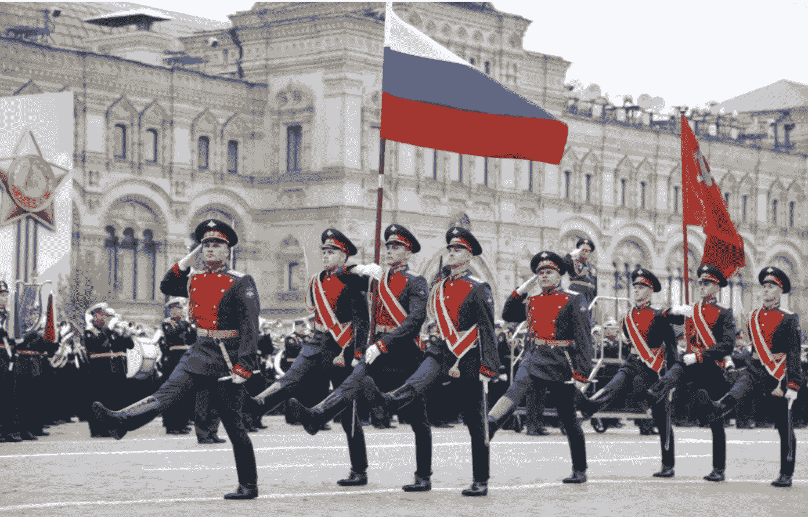

看到这里，大家也懂了为啥美帝加息会对全世界造成那么大的影响了吧？

其他国家的利息已经很很低了，美国突然加息，很多人会把本国货币换成美元，跑到美国那边去存钱赚利差。以中国市场为例，随着美元去了美国，如果这些美元之前结过汇，中国市场上也有一部分货币跟着湮灭了，市场上货币少了，大家自然更加艰苦了。

美国加息如果大家不跟着加，那么这个国家的外汇就会持续流出，汇率也会持续贬值，而且肯定货币量也在持续降低。如果也跟着加息，代价就是本国企业成本上涨，说不定那些债务就连环爆掉了，因为可能赚的钱都不够还利息。

现在知道咱们国家现在为啥那么纠结了吧。因为降息其实不只是个国内经济的问题，要是只是个国内的事，那还简单，现在小微企业要拿到贷款已经比较容易了。但现在如果直接降息刺激经济，又怕中美利差导致他们一直吸咱们的外汇。

不过最近还是明显是要降息了，于是先下调了存款利率，过段时间再下调贷款利率。我的判断还是两害相权取其轻，还是得先让国内的企业，尤其是中小企业有流动性的活水，有点喘息的机会，保住就业。

现在属于比较艰难时期，事实上美国加息是典型的七伤拳，为了维持美元的信用，就必须压通胀。为了压通胀，就得加息，加息过程中企业成本高企，它自己艰苦，别人也艰苦。

咱们上边说的逻辑对美国也适用，他们的企业也在熬。加息最频繁那段时间，美股跌掉了三分之一，几乎所有的大公司都在裁员。

这段时间眼瞅加息周期快要结束了，叠加中美关系缓和，形势应该能慢慢好起来。

### 尾声：

金融这几年给人的印象不咋好，不过有一说一，快捷低息的借贷，绝对是发展的前提条件，甚至可以说是企业的生命线。不然很多优质企业本来只是一时的现金流紧张，平白无故就倒了。现代企业又跟“连锁船”似的用债务连在一起，一艘着火，很容易把整个舰队都烧了。

国家是知道这事的，大家看政策文件，里边一直也在强调银行对中小企业尽量放贷的事。

后续的趋势，肯定是传统银行和以蚂蚁为代表的模式，这种相互配合，大企业自然可以轻松从银行贷款，但是那些小企业还是需要蚂蚁这类平台。没有新技术，小微企业借钱难的问题是不可能得到解决的。

前两年，我们对蚂蚁这样的公司来了一波监管。但客观来说，还是要看到蚂蚁模式的意义和价值，毕竟小微企业融资这件事太重要了。尤其是拼经济的当下，在帮助小微，稳定就业这件事上，都得一起来使劲。不妨客观评价金融科技的作用，鼓励平台企业各尽所能。

不过感觉最关键的事，还是网上最近一直在说的事，长期来看还是要调整收入结构，培养国内的消费力。利率很重要，但是它的影响毕竟是短期的。从长期来看，还是要扩大总需求才行。

公众号懒人搜索，懒人专属群分享

### 为啥印度那么坑，中国企业还在往里边挤？

2023-06-15

小米被印度罚了48亿这事大家知道吧？咱们聊下这事。

小米的问题，其实就是整个中国产业的问题。

首先大家肯定纳闷，小米有病吗？跑印度去干啥去了，印度啥揍性你能不知道？就那信用值得投资？

没办法，企业需要增量，增量是企业的生命线。中国市场如今几乎已经饱和了，毕竟手机这玩意，该有的都有了。如今没啥新功能，大家不会像以前那样每年换。而且手机越来越抗用，很多人的手机都是老婆买了之后把旧手机给老公，老公的给老人。中国市场的增量越来越小了。

此外中国市场整体规模非常大，却没大家想象的那么大。主要也是因为咱们的购买力实在是不太行。查了下，蔡昉在前段时间的演讲《人口增长变化趋势及中国经济发展影响》里说，中国人口占世界的比例为17.9%，居民消费支出仅占12.8%。

也就是说全世界每年购买的东西，中国只占了12.8%，外边还有87%。这就决定了，任何一个企业如果只在中国发展，可能会成为大公司，但是绝对成不了世界级的超级公司。这也解释了为啥三星几乎退出了中国，但是销量还那么牛逼。如果中国企业一直缩在咱们本土不出去，那外边整个蛋糕都让给别人了。

小米他们想保持扩张只能出海去抢海外市场，这个意义上说，小米做的确实没啥问题。

现在全世界能拿得出手的主要市场，基本也就是美国、欧洲、日韩，印度等等。

印度总是给人感觉比较沙雕，不过这些年经济发展确实很快，国际上把印度当做下一个中国。到底能不能成为下一个中国，还是比较难说的，但是一个不争的事实是，印度能买得起手机和汽车等“高端产品”的人越来越多。

而且印度人跟咱们不一样，他们敢消费。有点钱中国人可能存起来应急，比如看病什么的。印度人不这么看待问题，他们觉得钱这东西就是用来消费的，倾向于有多少花多少，如果没钱了，却有了病，印度人也不担心，因为他们自己觉得有传承了六千年的“印医”，既然可以救祖宗，那就可以救自己，没必要去看巨贵的西医，不慌。

所以大家看印度好像跟咱们没法比，但是消费却很活跃。而且关键是他们又穷又有经济增速（大部分穷国都没啥增速），低情商说“穷地儿”，高情商说“发展空间极大”，每年都多出来一块蛋糕可以分。这也是为啥跨国巨头都盯上了这一块。

既然盯上了，就得提前进入布局，因为消费是有惯性的，如果韩国企业进了印度，把印度市场占了，其他人再进就难了。于是各个厂家都在提前布局，事实上现在印度最大的手机商，依旧是三星。可能还有一个大家想不到的中国企业在印度混得还不错，就是联想手机。嗯，上次我跟公司年轻人聊起来这事，他们挺震惊，联想还有手机？确实有。

但是印度有个毛病。之前的文章里给大家说过，莫迪做古吉拉特邦首席部长（类似咱们省长）的时候，来中国仔细考察过，学走了咱们很多经验。

比如你想在印度卖手机卖车，你必须去印度建厂，给他们提供工作岗位，不然不让你去。这也为啥小米去建了厂，比亚迪也去建了厂。其实就是咱们的“市场换技术”。

所以印度对世界各国来说很纠结，大家讨厌它说一套做一套，还有那魔幻的法律。可是确实又抵抗不了它不断增长的购买力，这也是为啥大家能看到好像印度日常修理那些垮公司，但是大家好像都在往里冲。

说起印度法律，咱们一般说他们“灵活多变”，其实关键还不是这个，而是他们不管干啥都把道德大旗摆在第一位，总摆出一副“别搞讼棍那一套，不要以为我不知道你在干啥”。

比如之前那个仿制药，制药巨头们一直在搞他们，但是印度站在道德的制高点向他们撒尿。说什么“手里有药，别人快死了，不救是人吗”，“你们不做人已经很多年，我们跟你们不一样”，“人命面前你跟我聊法律？”，制药巨头们顿时下了下风，觉得自己确实不是人，气势也没了。甚至联合国都站出来支持印度，指责制药巨头们太贪婪没人性。

如果看到这里，你发现你有点支持印度的看法，也正常，毕竟道德标准全世界都差不多，而且属于天然政治正确，举起来就没人敢冲。

反正印度就是那种“你跟他谈法律，他跟你谈道德”，你说他是明抢，他说你不做人抢你怎么了？如果抢人渣是一种错，我愿意一错再错。反正印度药企干啥事，它们不是摆事实讲道理，先讨论“你为啥是个人渣”，大家注意下，已经跳过了“你到底是不是人渣”。讨论清楚后事情就好办了。

现在对付小米也是这招，咬着说小米偷税漏税，跨国资本在印度吸血，还想把利润不交税转出印度。正好印度人对跨国公司印象很差，一听偷税漏税就气不打一处来，纷纷表示应该往死里罚，罚轻了十四亿印度人民不同意。前段时间本来最高法已经把小米的钱给解冻了，看样子是要还给小米，最近不知道哪抽风又开始抢了。

不过写这篇并不是为了说这事，而是说，中国所有品牌都面临这个问题，比如在汽车领域这个问题更严重了。

| 排名 | 品牌 | 国家 | 23年Q1销量 | 同比 | 市占率 |
|---|---|---|---|---|---|
| 1 | 丰田 | 日本 | 1874469 | -0.40% | 11.60% |
| 2 | 大众 | 德国 | 978319 | -5.70% | 6.00% |
| 3 | 现代 | 韩国 | 894843 | 10.50% | 5.50% |
| 4 | 本田 | 日本 | 816211 | -20% | 5.00% |
| 5 | 日产 | 日本 | 688932 | -5.70% | 4.30% |
| 6 | 起亚 | 韩国 | 686460 | 3.40% | 4.20% |
| 7 | 比亚迪 | 中国 | 501896 | 80.80% | 3.10% |
| 8 | 宝马 | 德国 | 501121 | 1.50% | 3.10% |
| 9 | 雪佛兰 | 美国 | 586291 | 11% | 3.00% |

看上图就能看出来，国内这几年有个感觉，比亚迪在狂飙，丰田已经半只脚跨入了棺材，但是拿到全球市场完全不是那么回事。传统巨头依旧占着巨大的市场份额。

这也是为啥比亚迪那么着急出海，因为国内多少有点零和博弈。比亚迪现在的扩张，是吃掉了不少国企合资车的地盘，如今中国汽车销量整体是萎缩的，电车每卖出去一辆，可能油车就得少卖1.5辆。如果长春一汽被挤垮了，东北真去工业化了。

所以想做大必须得出海，去抢那87%的市场份额，问题是出海就面临一系列麻烦。

比如印度这种不讲理的，弄不好就直接下场打劫。现在大家知道为啥欧美市场那么重要了吧，欧美尽管有时候也很过分，但是一般是讲道理的，大家可以问问做外贸的，他们最愿意做买卖的依旧是欧美。其他很多国家就更没谱了，连政局都不稳定。

而且美国和欧洲在中国是有很多企业的，属于相互绑定，他们想制裁中国企业，多多少少得讲个道理，毕竟我们可以对等制裁。印度这种最难搞，因为咱们国内几乎没啥印度企业，你想找他们麻烦都找不到人。甚至咱们熟知的印度神油其实是个香港货，除了名字里的“印度”，跟印度几乎没啥关系。

所以美国现在推动的脱钩，最麻烦的也在这里。脱钩直接的结果就是，美国在中国的投资和企业越来越少，到时候就会肆无忌惮地折腾中国企业。

到时候对美出口的那些企业，并不会真的不做买卖了，而是把一部分企业搬到越南墨西哥去，从中国进口半成品，去那些地方组装，贴上标，再卖给美国。看着好像美国搞了个寂寞，但是大家想想，那些越南和墨西哥企业的就业机会本来都是咱们的，现在转他们那边去了，势必造成咱们这边就业压力变大。

前段时间有个读者小伙伴在越南办厂子，跟我留言说越南这事，他说越南取代中国几乎没有任何可能，就好像广西说是要取代中国整个制造业一样搞笑。

但是不出意外，越南确实会越来越繁荣，因为中国对美贸易的中转站就是越南，中美脱钩越厉害，越南越不可或缺。今后几乎所有贸易公司都得在越南建厂重新贴标。更关键的是，越南属于比较安全的地方，已经很多年没有收割华人财富了。

这时候大家再看欧洲是不是感觉完全不一样了？

尽管我们的键政大V们经常针对欧洲，说什么“欧洲完了”，“欧洲被美国吸干了”，天天不盼着欧洲好。事实上在接下来很长时间里，欧洲都是中国最坚定最重要的贸易对象。

而且由于德法在中国有大量的企业，现在还在追加，中国企业可以放心去欧洲投资，对欧洲搞出口，欧洲大概率不会像美国那样往死里搞咱们的企业。其实大家注意下，华为在欧洲的销量非常大，2019年的时候竟然占了欧洲市场的26%，超过了苹果，快超三星了，后来的事大家也都知道。

中国企业走向世界，如果注定没法卖到美国，那必须卖到欧洲去，不然永远被困在本土了。

但是咱们说欧盟不会往死里搞咱们的企业，不代表不会搞，毕竟大家都是合作竞争关系，成年人的世界，没啥温情脉脉。大家观念里，欧洲和美国好像走得很近的样子，其实这些年没少折腾美国企业。比如就在前段时间，脸书的母公司被欧洲监管机构罚了13亿美元巨款。微软之前也被罚了7.3亿美元。

当然了，美国也不是善茬，2015年抓住大众排放做假的机会，罚了大众147亿美元，搞得那年大众不但没赚到钱，全年净利润负了40亿欧元，得亏大众皮糙肉厚，不然直接给罚死了。

多说一句，大家经常听说中国这几年出口电动车越来越多，主要还是特斯拉和那个上汽的名爵，咱们熟知的那几个国产新能源品牌还在努力爬坡。估计后续不可避免要到全世界建厂。

多说一句那个名爵，说不定有小伙伴都没在路上见过这车，但是欧洲到处都是。因为它以前是个英国车，后来被上汽拿下了，现在它在中国和欧洲人眼里都是自家的。

继续本文话题，大家听说了吧，印度要求中国在印度企业必须用印度高管。这个大概率也避免不了，因为这也是学了咱们的经验。大家可以看看，那些跨国公司在中国的地区头目都是华人。

美国人有个优势，可以派香蕉人过来，我们就比较尴尬，毕竟没咋听说“长着印度模样的华人”，只能是雇他们本地人，字节在海外雇的是那个新加坡人，新加坡跟名爵似的，中国觉得它是华人的地盘，西方觉得它和西方是一伙的。后续这也是趋势，在哪建厂，高管就在那里找。

如果说有没有好处，也不是没有，毕竟当地人最懂当地，很多潜规则，确实只能是他们自己懂，而且只能他们是他们自己去操办一些跟当地政府的事宜。我之前就目睹过，中东的有些大佬不跟非穆斯林打交道，觉得不信真主的人靠不住。

很早以前就有人说，在印度如果什么事闹到法庭上，其实是管理层的失职，有点像如今某个公司的舆情在网上炸了，那就是这个公司的公关事先没做好工作，不能说太细，你们仔细体会下。

至于你说小米这次这么惨了，会不会从印度撤了厂子？大概率不会，因为尽管这次被罚了这么多，可它在印度依旧有大量硬资产，而且好不容易在海外打下那么大的摊子，怎么可能撤掉嘛。

印度也是瞄着它的七寸打，没把利润榨光，只要榨不光，就会继续干下去。

这也是没办法，出海的路再难，也得走下去，中国企业今后都得过这道窄门，不然永远都做不大。

### 尾声：

有种感觉，中国加入世贸已经三十年，中国制造横扫整个世界，如今才是真正要出海了。

我们以前生产的多，但是都是些没有品牌的东西，那你就别想赚高溢价，咱们也只能在产业链下游干点体力活。如今真正的品牌要出海了。

但是从印度这事就能看出来，别想一帆风顺，需要政府处理好跟那些国家的关系，需要企业灵活处理当地事务，处理各种复杂的问题。不过最好的办法，可能依旧是互利和相互绑定。

说到这里，也能看出来，尽管全球化在退潮，但是合作和开放依旧对我们非常关键，和平地做生意，接纳别人来我们这里，我们也去别人那里。只要平等竞争，我们的产业就会越来越大。

公众号懒人搜索，[懒人专属群](https://w.xqer3.com/v3.0/invite?from=0&inviter_id=100000186&code=182678)分享

### 重新思考双减，素质教育，以及打掉教培

2023-06-14

我以前跟大家说过我们老家那边的一个常见操作：学习好的，一般去了北上等大城市，等到三十来岁搞不定户口，孩子要上学，就转向二线。比如上海的一般往成都和杭州跑，深圳的去惠州，北京的就往天津跑。而那些在老家有背景有关系的人，倾向于回到老家考公务员或者其他编制什么的。

不仅我们老家有这个特点，整个北方都呈现出这个态势。一般“撤退城市”不止天津，还包括济南、青岛、西安等等，但是都不如天津。天津的优势很明显，现在的高考模式，大家都知道北京占便宜，但是可能不知道天津也非常占便宜。

大家知道，每个省自己的大学都会优先照顾自己的考生。倒也无可厚非，本地大学是本地人花钱了，所以优先照顾本地人。这也是为啥河南山西考生非常难，因为这俩地方没啥大学，就得靠别的省赏饭吃。河南最难，不仅需要靠别人赏饭吃，考生还多得离谱。

天津考生少，今年只有7万人，而河南却有130万。可是天津大学却不少，竟然有两个985，两个211，还有26个本科。搞笑的是，其中有一个211叫河北工业，竟然在天津而不是河北。对应河南，那么多考生，却没有985，只有一个重点大学，你们想想河南有多难。

整体而言，天津这座在互联网上几乎没啥存在感的北方城市，在教育领域却地位非常强。

反过来讲，青岛济南就没法跟天津比，因为河南、山东、江苏的高考，几乎是孩子们一生的噩梦，有高考移民去西藏的，你们听说谁高考移民去河南山东了吗？那得多想不开？

此外天津还有个优势，很多高薪岗位只在北京和上海有，离了这些城市，收入直接来个“膝盖斩”，所以不能随便离开。

很多人的策略就是，把家安到天津去，老婆孩子去天津读书，自己在北京上班，在两城之间来回跑。这种人实在是太多，津京高铁竟然有个专门的“通勤票”，也就是有人坐高铁在两城之间通勤。

可能有小伙伴觉得，那些一定是混得很差的，在北京混不下去才会去天津。其实不是，我见过太多一年一两百万的，照样灰溜溜去天津。因为北京户口真的是，就跟高考最后一道数学大题似的，搞不定就是搞不定。

每年发出来那些户口指标，主要是针对国企和科研单位的，并不是有钱就行。除非巨富，否则能搞定户口的往往没啥钱，有钱的却没户口。北京一堆巨贵的国际学校，里边塞满了没有户口的有钱人孩子。这个意义上说，你会觉得这个政策还挺公平。

说了这么多，可能有小伙伴要说了，知道了，九哥，你最近改行去天津做房产中介了，那么你推荐哪个楼盘呢？

没做中介，不推荐。那我为啥突然聊这个呢？周末我去了趟天津看我大学同学，他毕业后回天津海关做公务员，结婚早生孩子早，他孩子今年中考，考上了一个很好的中学，心情很好，吃饭的时候仔细聊了下。听他说完，我更加理解为啥大家不生孩子了，以及国家为啥要强推“双减”和“素质教育”，以及为啥“一锅端”干掉教培，于是继续跟大家聊聊。

首先要说，全国大同小异，只是天津只是一个缩影。

家长们普遍认为，孩子想考大学，最关键的是高中，高中好，才能考上好大学，所以就得上好高中，这个大家都懂。北京和天津的高考本科率高达80%以上，基本意味着考上高中就考上大学了。而山东河南都是40%左右。

可是高中是中考考上去的，那就得先找个好初中，占据先机。

天津的初中以前也是需要考试的，于是就卷呗，往死里卷，你们能想象吗？小学就开始卷，周末甚至都没时间玩，无论是家长和孩子，只要有时间，那就使劲学。但这不是关键，关键是那几所最卷的学校学区房房价上了天。普通人想卷，你都没条件。

甚至从三岁就开始卷，为了小学能领先一步，大人给三岁小孩把日程安排得满满的。这不是精神病是啥？谁都知道这样折腾孩子，对孩子的伤害可能大于好处。

所以这些年看着大学学历越来越贬值，我甚至觉得不是坏事，正好让家长们都思考一个问题：你们那样往死里折腾自己和小孩，最后换这么一个越来越不值钱的学历，有意义吗？

这个意义上说，学历贬值反而让教育越来越贴近本意，教育就是教育本身，提升人的素质，具备思考能力，并不是什么敲门砖。以前之所以能做敲门砖改变阶级什么的，是因为它稀缺，今后只有名校稀缺，名校生不是逼出来的。

并且我在几年前就有个观点，现在鸡娃的这群人，是正好赶上了中国超大规模城市化和互联网红利的一拨人，叠加那时候大学生还稀缺，一定程度上改变了命运，所以有了路径依赖，准备在娃身上重新赢一次。

但随着985毕业的大部分大学生都找不到啥正经工作，后续会严重影响今后大家对鸡娃的态度。不是说不努力了，而是慢慢会从使劲逼着孩子学习，转向让他做个开朗健康的人。或者说接下来会有一波“文艺复兴”，恢复到我小时候的状态，家长们也在乎教育，但是没到发疯的状态。

回到卷孩子这个话题，这种卷有强烈的号召作用，一些人忍不住跟着闹腾，与此同时吓得一群人觉得没法比，干脆不生了。

前年有篇微博博文，有个女孩了解了买巨贵的学区房、全家住进猪窝一样的小房子，一起节衣缩食供孩子上学这可怕的一幕后，说她不知道该怎么办了，孩子就算考上大学，将来也不一定能找得到工作，考不上大学，只能去打螺丝。

可是她和她老公实在是太普通，买不起学区房，工作也榨干了精力，实在是卷不动，而且也心疼孩子，觉得把孩子带到这个世界就是天然做牛马，从小做牛马做到老。评论区一堆人在那里感慨，幸亏不生了，不然真是牛马了，这谁能卷的动?

说到这里，就理解了为啥国家顶着巨大的压力，取消了小升初的考试，率先在一线大城市搞素质教育，学校不排名，考试也非常简单。然后小升初开始摇号，摇到哪算哪。

众所周知，“素质教育”这事在中国是一种“反政治正确”，给人感觉就是，一旦学校教育不以学习为准，好像那社会就成了有钱人的天下。但现实是，天津那边开始素质教育，不考试靠摇号后，很多比较便宜的小区孩子，也能和巨贵的小区孩子摇到一个学校去，而且概率均等，这在以前是很难的。

当然了，但凡选择，都有代价，很多学习本来很好的孩子，可能因为运气不好，就上不了好中学了。这多少有点让人觉得可惜，不过社会呼唤公平，想公平，就没法回避公平的代价。

这种公平最大的优点还不是公平本身，事实上这些年小学的家长压力确实下来了，因为不排名之后，没必要了。

也有家长说以前孩子二年级就会得东西，如今三年级都不会。可是他们可能没意识到，小学那点东西真没啥用，基础打好就行了，再使劲就属于用力过猛了。

很早就有教育专家批评国内小学教育是严重过剩的，也就是压制了孩子天性，换取了一堆没啥用的知识。

现在这种摇号模式，某种意义上讲是把K12教育的12年痛苦时间变成了初高中的六年。

很多人不愿意看到的一个现象正在全国铺开，一些家长说是“躺平”，或者说是“放羊”，也有说是“快乐教育”，都是一码事，学校教的少了，不排名，全国的小学慢慢都越来越轻松。

一开始可能大家不适应，过几年就理所当然了，觉得小学就该这样，之前那种小学打鸡血才是精神病。就算轻松点也没事，不会像很多人想的那样耽误了，我大学很多学霸同学，不少都是高中才开始认真学的，一点都不晚。高中老师里也有个说法，说小学初中这种前期积累的所有优势，在高一全部得清零。能有个好习惯就行了，学习别太差，都没事。

到这里，就得再聊下为啥国家砸了校外教培。

首先大家一起补这事没意义，内卷的极致，就是孩子们的学习量加倍，家长们开支翻倍，家庭生活品质普遍下跌一大截，吓得年轻人出生率掉了一大截，但是产出却没变化。因为高考是个选拔性考试，并不会因为大家一起更努力，结果会有丝毫改变。

也就是说，这玩意是个少有的“负向产业”，唯一能跟这玩意比的，就是烟草行业，就冲这一点，砸了就不冤。多说一句烟草，很多人说，烟草怎么没好处了，烟民抽烟说不定英年早逝，不是能省养老金吗？真不是，严肃的研究已经证实，哪有那么好的事，抽烟往往会导致一堆慢性病，想快点死？想得美。

而且总有人拿寒门阶级跃迁说事，说得就好像不让补课了寒门就没救了似的。其实根本不是那么回事，以前教培没被禁的时候，补课也分了三六九等，你寒门为啥认为能跟有钱的补一个级别的课呢？劣质补课补那玩意干啥？为了仪式感？

不过这不是关键，关键是国家层面斩断了金融资本和教育之间的纽带。

补课这事不是最近几年出现的新东西，我小的时候就有。那为啥这些年突然国家出手了呢？因为他们教育机构玩得不成样了。

他们具体操作流程是这样的，资本家从社会上融资，而社会上融的钱，也是老百姓存到银行的。用这些钱扩张校外教培，用高工资把公立的优秀老师吸收出来，再把广告铺天盖地打到社会每一个角落，争取每家都把送孩子送去教培机构，接受加价教育。

你说富人支持这种操作也就得了，普通家庭也支持，这又是啥病？

问题是大家都去了补课，这种补课又有什么意义？

很多人喜欢拿穷人说事，说没了教培穷人怎么办？不补了呗，我们那会儿绝大部分人不补课，家庭好的那些利用假期使劲给孩子补，假期开学之后大家都充满活力，那些上了一个假期课的孩子一个个跟干了一假期苦力似的，接下来的学习也没啥劲。

最后成了一个恶性循环，正常上课没精神，一到周末就补课，有点像有些人，别人晚上睡觉他学习，别人白天上课他睡觉，多少有点病。

我们知道，人是有能量条的，而且能量条是需要恢复的。耗没了不恢复，注意力和精力都不行，啥都干不成。而且意志力和注意力都跟肌肉似的，并不能一直持续输出，到了一定程度就得歇着，不然不但没效果，还会受损。

很多家长迷信补课越多越好，结果孩子在学校都学不好。到最后，家长以为孩子在学习，孩子给家长表演学习，演变成了一种很费钱的行为艺术。

关于国家禁了教培后富人继续补课的事，咱们说句政治不正确的话，富人和其他人之间是没法平等的，各种钻空子，比如跳个健美操都能上清华，或者上国际学校，从小研究怎么上国际名校。

国家打击教培，主要目的在于避免普通人之间的割裂。跟避免跟风式地补课狂潮，金钱、精力、时间大规模砸进去，最后却没啥明确产出。

对于读书这事，我个人的感觉是孩子自己占了70%，家长们的努力，撑死30%。我目睹过太多人根本不是那块料，被父母逼得快要跳楼了，父母才反应过来可能确实不太行。

现在的大环境，那些天赋型选手是很难被埋没的，反正我老家那种极度非主流的地方，学习特别好的，各个高中争着要，而且高中开始就有奖学金。

### 尾声：

国家接下来肯定是不遗余力地推动“双减”和“素质教育”，这让很多人不爽，不过确实等到大家都不知道自己孩子在学校的排名后，想焦虑都焦虑不起来。如果初中摇号，大家也就没必要使劲折腾了，本来从小学卷，今后就从初中开始卷了。

教培被打掉之后，并不是说这个行业没了，恰好相反，又回到之前乱七八糟的状态去了，尤其“一对一”，永远都消除不了。

不过也没必要消除，绝大部分人慢慢就补不起了，补不起也没事，反正大部分人都不补，能有啥事？绝大部分人还不吃燕窝呢，也没影响啥。

而且咱们都读过书，知道一个常识：焦虑性补课还不如不补。大家都补不起，慢慢不补了之后，还省钱了。少数那些焦虑性补课的，说不定效果还不如不去的。

至于趋势，很明显了，学历正在飞速贬值，除了少数名校和关键专业，剩下的学校竞争优势会越来越小，慢慢大家也就不那么疯了，就好像大家不发疯去考驾照一样。其实驾照现在跟很多不咋行的大学学历重要性差不多了，毕竟那些专业可能根本给你搞不定工作，驾照却能。很多人三十来岁“毕业”后全指着驾照了。

而且我们知道，考名校这事真不是补课补出来的，需要很高的悟性和自制力，有了这两点，补不补课都差不多，在学校跟着老师的节奏就足够了，这一点穷人都差不多，花再多的钱，也改善不了这两点。

至于很多人关心的“阶级跃迁”，那玩意是50%的硬资质叠加50%的运气，或者运气爆棚也不是不行。社会进入平稳期之后，如果又虚又智商正常，这逆袭个啥？如果是天才，这个社会是很难被埋没的。艰苦的是那种中间态的，今后确实越来越难。

从这个意义上讲，如果家境一般，可以换个思路，让孩子多锻炼，多睡觉，补充足够的蛋白质，毕竟真正的竞争是从初中开始的。格局再大点，真正的竞争是在三四十岁，有个好身体才能一直耗下去。如果格局拉到爆，会发现活得久才是终极赢家。

公众号懒人搜索，懒人专属群分享

### 马奇诺防线背后的法国大棋党是怎么玩糊的

2023-06-09

以前时候总有个感觉，觉得法国人真脑残，竟然搞马奇诺防线这么奇葩的东西。

耗费一半军费修建了一堵据说是坚不可摧的防线，然后只修了一段，因为北边是荷兰比利时嘛，你不能修人家家里去，这样的防线有意义？网上找了张图，可以看到，那玩意只有德法边界的一段，北方就没了。

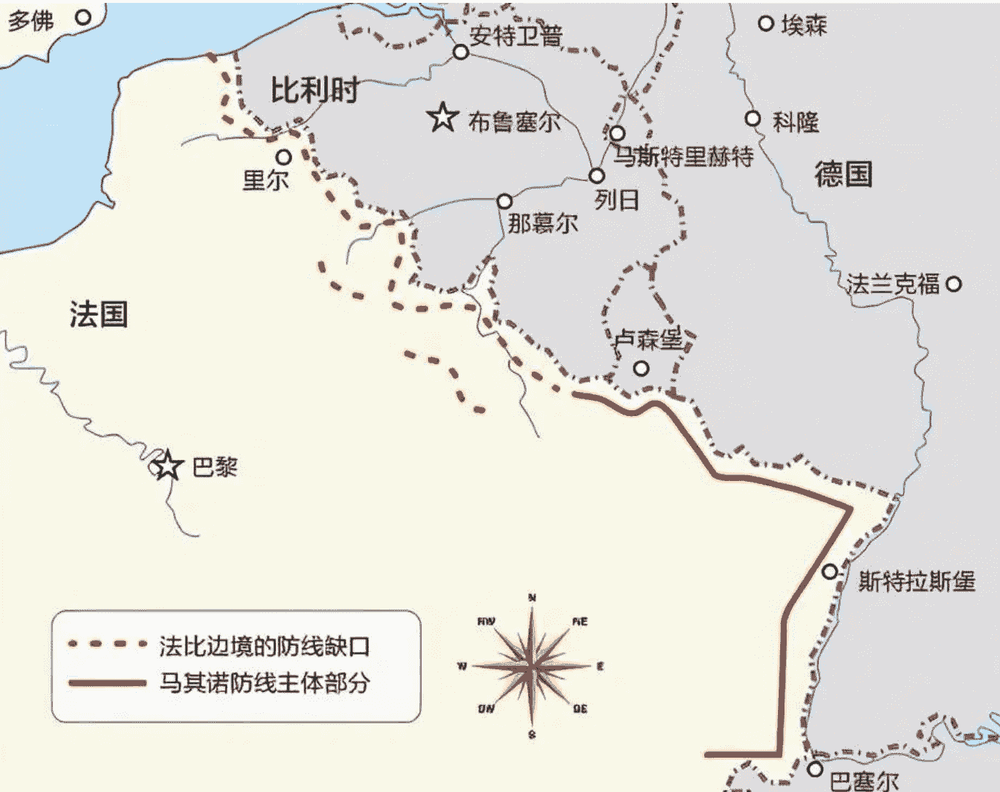

后来事实证明确实没啥意义，因为德国绕过了防线，直接从比利时打入了法国，成功把法国给解放了。“马奇诺防线”这个词也就成了一个笑话。

后来读了不少书，发现完全不是那么回事。

### 1 攻势邪教

第一次世界大战前，德国总参谋部得了一种“坎尼病”。

啥意思呢？罗马帝国时期，罗马人的一生之敌汉尼拔，在坎尼这个地方以少胜多，打出了一次漂亮的围歼战，把侧翼包抄战术玩到了极限。那一仗团灭了罗马主力野战军团，砍死了两个执政官和80多个元老院元老，可以说差点把罗马的腰给打折了。

“一战”前策划德国进攻法国作战计划的施里芬伯爵，是一个不折不扣的汉尼拔铁粉，他给德国军队设计的作战方案，就是典型的“坎尼战术”，正面佯攻，主力兵团从侧面出击，绕道比利时，从北方进攻巴黎。

随便画了下，长下图那样。这是著名的“施里芬计划”，可以看出来，德国并不是直接穿越德法边界，而是绕道了比利时。

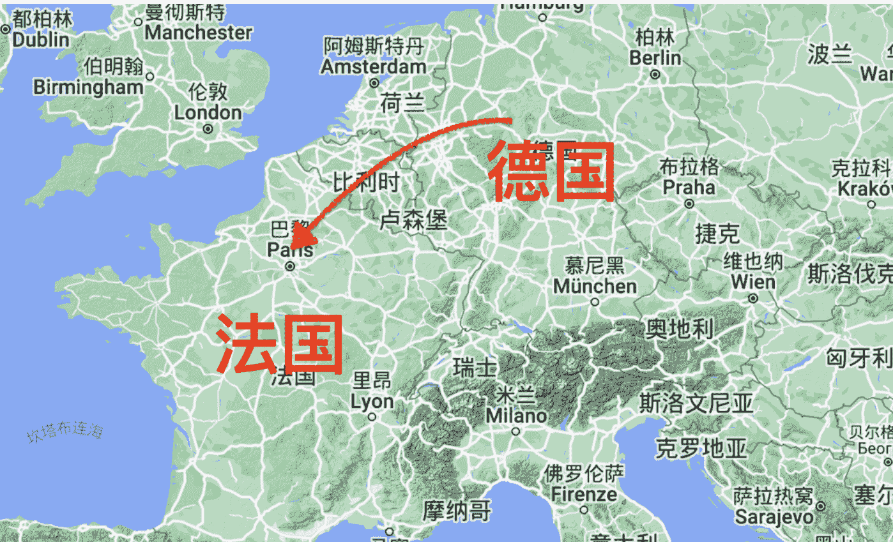

这也是为啥说刚才的“坎尼会战”直接影响到了第一次世界大战，甚至影响到了后来的“二战”，因为后来的“闪电战”就是“施里芬计划”的改进版。

他的对手法国却非常搞笑，搞了个奇怪的“第十七号令”，这个计划里几乎没啥具体细节和计划，主要就一件事：法军冲出去，以无比坚定的决心和意志，步枪上刺刀，发动猪突冲锋，彻底打垮德军，收复几十年前丢失的阿尔萨斯和洛林。

多说一句这个“阿尔萨斯－洛林”，那个阿尔萨斯我去过，现在还在法国，属于法国的东北，主打旅游和葡萄酒酒庄，国内的很多大款都在那边买了酒庄。很多小伙伴知道的那个“雷司令”，就是阿尔萨斯的特产。那里的人有的说德语，有的说法语。德法两国因为这个地方前后打了上千年，在很长时间里是德国的地盘，后来又被法国抢去了。

抢去之后那里的老百姓观念上更认同法国，所以后来“普法战争”结束后，这地方又被德国人抢回去，但是阿尔萨斯－洛林的代表却在法国议会发誓这两地世世代代属于法国，等着法国去解放。法国人也给协和广场的斯特拉斯堡雕像披上了黑纱，象征着法兰西在哭泣，将来一定要洗刷耻辱，拿回那两个地方。

战争爆发后，德军按照计划率先攻入比利时，法国从德法边境攻入德国。攻势邪教在西线取得了惊人的效果，只是这种效果跟大家想象的不一样。法国士兵的决死冲锋在德国人的机枪底下几乎变成了屠杀，法国人的鲜血染红了盛产葡萄酒的阿尔萨斯地区，最后啥也没攻下。好在德国进攻法国的战斗也非常不顺利，很快被挡在了巴黎北方没法前进。

随后战争转入了僵持，变成了惨烈的堑壕战。转入防御的法国人发挥出了之前没有被意识到的战斗力，竟然死扛到了战争最后，直到德国认输。法国人不仅成了战胜国，而且抢回了一直梦寐以求的阿尔萨斯和洛林。

第一次世界大战结束没多久，法国人就意识到德国迟早再闹事，考虑到第一次世界大战中法国人进攻过程中的可怕遭遇，再想想自己在防御方面的天然技能点，叠加战争中死的人太多，于是把修建一条永不陷落的防线这事也就安排上了日程。

关于这条防线，法国人其实目的比较复杂。

最关键的一点，法国人费那么大劲，并不是想跟德国人在这条防线下决战，恰好相反，防线后边就是法国的工业区，法国人没法接受在这里打成烂仗。

于是他们准备用一条防线拦住德国人的前进道路，逼着德国人绕路去北方，走比利时。

重演在“一战”中的态势，然后德法双方的战场就转到了比利时（比利时骂了句“妈每批”）。这个不是后来附会的，历史学家把法国参谋部的会议纪要找出来，上边明确说马奇诺防线的目的就是为了德国人绕行，然后英法联军去比利时边境等着德国入侵。

为啥不进比利时里边去等着呢？因为比利时是中立国，除非它向别的国家求助，否则谁进去谁就是侵略。于是英法就在边境上等着德国入侵。

那德国会按照法国人预想的执行吗？

事实上面对这条防线，德国总参谋部的决策结果确实是不去硬碰，而是绕道比利时，沿用“一战”中的“施里芬计划”。

按照这个思路，针对进攻法国的作战计划也就出炉了，一开始那个方案叫"黄色方案"，完全就是法国人的构想，德国人绕过马奇诺防线，取道比利时，趁法国人不注意，从北方打击巴黎。

德国人以为法国人藏在马奇诺防线之后等着他们进攻，没想到被法国人给算计了，法国人在比利时等他们。

双方的第一波博弈，法国人占了上风。

### 2 英国

法国人深知一件事，第一次世界大战最终能以法国胜利并且拿回自己失去的领土告终，并不是法国人多牛逼，而是因为他们的盟友是英国。

现在的英国跟个哈士奇似的，退回到一百年前，英国就是现在的美国。那时英国尽管工业已经不再是昔日的一家独大，但是底子还在，甚至很多美国公司也受英国资本控制。还有近乎无限的海外兵源，印度人，新西兰人，加拿大人，澳大利亚人，都可以去当炮灰。

更关键的是，英国在大洋上有绝对优势，可以封锁德国海外的商道，就算困，也能困死德国。不过从后来的情况来看，英国海军在实力上已经和德国相差并不大了，双方爆发了一场叫“日德兰海战”，打了个平手，可见德国海军的实力已经很强了。不过德国海军从那以后龟缩在港口不出来，海上成了英国帝国海军的猎场。

如果法国单独对战德国，法国人尽管对自己的能力很有信心，但是依旧有点虚。如果英国能加入，那胜负几乎没有悬念。

所以“一战”前的法国人面对即将来临的战争，几乎无所不用其极地尝试把英国拉下水。不过最终英国人下场，却是因为德国人。

刚才也说了，德国人为了奇袭法国人，没有从德法边境正面硬杠法国，而是改从中立国比利时绕道，从比利时攻入了法国。

这下把英国人给惹急眼了。大家看地图也能发现，比利时也挨着英国，就在英吉利海峡对面，当初威灵顿公爵就是在比利时击败了拿破仑。

所以在很多英国保守派眼里，比利时就是英国真正的边疆。于是促成了比利时的中立，英国是担保国，如果谁打比利时，就是打英国的脸，而且直接威胁英国本土，英国就会下场。

两次世界大战，德国人都入侵了比利时，在利益和名声上都羞辱了英国，所以英国两次都下场和法国站在了一起。

英国下场，就意味着英、澳、加、美的同时下场，德国一个对抗当时最大的几个工业国，想打赢是非常非常难的，后来果然没打赢。

到了“二战”前夕，法国人又开始惦记英国，他们只要继续把英国拉下水，英国就会源源不断从印度抽兵，并且让美国出武器。

那怎么让英国出兵呢？只要德国进攻比利时，英国就会出兵。现在大家懂了马奇诺防线的逻辑了吧，它主要有两个作用：

- 1、战争不要在法国境内打，修一条防线逼德国绕道，去比利时打；
- 2、需要把英国拉下水，拉下水的办法就是让德国去打比利时；

于是在德法边界搞一条牢不可破的防线，让德国人压根不想强攻，到时候德国人又得像上一次战争那样，绕道比利时。英国无论从道义上，还是利益上都必须下场跟德国人死磕。

不过后来的情况，多少有点魔幻，法国人计划到了开头，没计划到结尾。

德国本来已经准备用那个“黄色方案”，从比利时进攻法国，到时候就直接迎头碰上了等在那里的英法联军。如果事情按照这个发展，德国的整个思路都在法国人的算计里。

不过中间发生了个倒霉事却意外帮了德国。德国的一个军官带着“黄色方案”的作战计划去汇报的时候，意外偏航，迫降到比利时去了，盟军获取了德国的作战方案。盟军高层对这个方案并不意外，因为他们之前的军棋推演就是这么推的，甚至马奇诺防线也是为这个目的修建的。

但是德国人就得改方案了，因为泄露了嘛。希特勒力排众议，批准了一个类似魏延“子午谷奇谋”的方案，兵分两路，一路继续走原来的路线从比利时进攻法国，另一路兵行险着，让坦克兵团从险要的阿登山区攻入法国。也就是下图这样，随便画了一下：

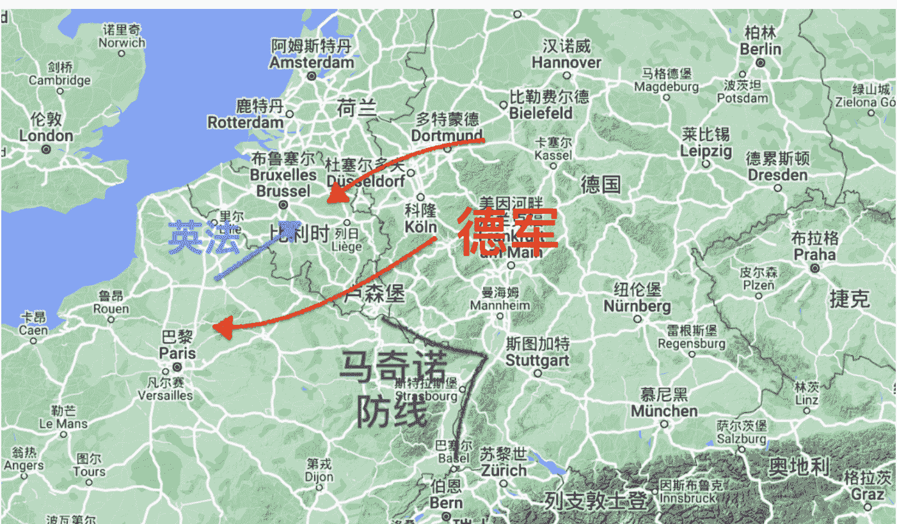

阿登森林这地方太险要，法国总参谋部战前反复勘测过，认为大部队没法通过，所以没咋设防，没想到德国装甲部队直接穿过去了。

战争爆发后，德国果然攻入比利时，英法联军赶紧迎上去，没想到边上森林里突然杀出一支装甲部队，上演了一波教科书般的“钳形攻势”，德国人折腾了半个世纪的“坎尼战术”终于玩明白了。

英法顿时乱了手脚，一败涂地，差点被堵在敦刻尔克被堵死。也就有了《至暗时刻》里的情节，英法联军被围到了海边，英国人赶紧用民船把自己的队伍接了回去。

不过英国既然已经永久卷入了战争，就必须硬着头皮打下去，于是带上几个侄子和奶牛跟德国人死磕，比如不列颠空战中，就有很多加拿大飞行员驾驶美国飞机，上天跟德国狗斗。“不列颠空战”授勋，英国人并不多，大量加拿大和澳大利亚飞行员。

由于德国的战术太过成功，法国很快在战争中战败投降，德国在法国搞了个傀儡政权。

不过法国把英国拖下水的好处也出来了，戴高乐跑去英国搞了个流亡政权，叫自由法国。这个自由法国听着像个非主流，其实不是。法国尽管没了，但是它海外殖民地还在，殖民地驻军也都在，法国海军看情况不对，跑出来一些。到了1943年，法军加上殖民军，差不多有四五十万。这四五十万人后期几乎都是美国给的装备。

后来的事大家也知道，希特勒去打苏联去了，踢到了铁板上，41年进攻了苏联，45年就战败了。

盟军也开始反攻，旗帜上画着“洛林十字”标志的法国军团重新回到法国，接管了政权，戴高乐时代也就开始了。大家看现在法国那么多黑人，很多就是跟着戴高乐打回去的殖民地军人后代，为法国流过血，所以法国挺接纳他们。

### 3 尾声

看到现在，大家应该看出来了吧，法国人其实也算深谋远虑了，某种程度上也算是算计到极限了。没想到德国人的一次失误反倒成全了德国，更没想到新技术一旦投入战争，能产生那么明显的作用。再深入一些，所有“大棋”在技术进步和思想代差面前可能不堪一击。

这也是为啥我几乎看不进去那些计划很复杂的阴谋论或者大棋党的言论。

不是别的，复杂计划极其容易失控，稍微有点偏差，可能就是严重偏离了之前计划的轨道。几乎所有有过实战经历而不是躲在书房的人都知道，任何牛逼的计划，一旦开始执行就有一半被作废了。所以那种一环嵌一环，每一步都依赖上一步的超大“大棋”，几乎都没法操作，除非在小说里。

当然了，这里不是说不该做计划，计划还是要有的。而是说没有什么计划能真正执行到最后，都在中间反复被调整。到了最后回头看，可能跟一开始的计划差距大到不可理喻。

所以我说世界的本质是“竞争与失控”，想做成一件事，先有个目标，再制定个计划，在执行的时候不断用新想法替代旧想法，不用担心失控，失控了就根据目标重新调整。减肥，读书，工作，甚至“五年计划”，以及战争，基本都是这样的。极少情况下能做到一开始就计划到底。

公众号懒人搜索，懒人专属群分享

微信:lazyhelper

### 放低预期，苟住就是胜利

2023-06-06

大家可能知道，前两天马化腾转了我的一篇文章：

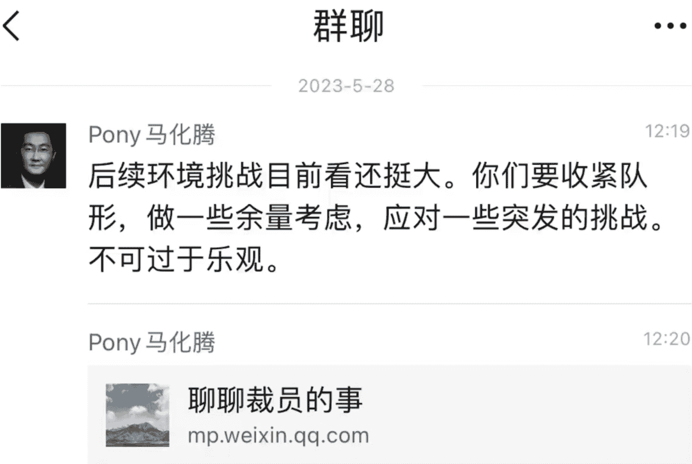

也就是这篇：

聊聊裁员的事

这篇是我前几天从三亚开会回北京，开车穿越秦岭在服务区充电的时候写出来的，当时比较仓促，写到哪算哪，没想到后来效果竟然很不错。有时候确实比较尴尬，随手写成的反而效果非常好，耗费大量时间写成的反而一般。

前两天聊了两篇房地产，我说今后房地产慢慢跟车似的：绝大部分车都是买来就贬值，越用越便宜，只有少数能保值，极少数能升值。到那个时候，大家也就不囤房了，就跟现在没人屯车一样。今后大家的钱主要用在消费改善生活，提升生活质量，顺便拉动经济，形成正循环，跟欧美似的。

把钱用在消费这事看着挺离谱，但这几乎是经济的唯一出路，今后的经济发动机，就是居民消费和外贸出口这两驾马车。

理所当然的，那篇文章很多人不满意，因为可能被高价房虐出斯德哥尔摩综合征了，不少人觉得现在这种酸爽状态非常好。最搞笑的一个评论是：

九边现在越来越何不食肉糜了，你忘了老百姓有资产升值的需求？

这我能知道？谁没有这方面的需求？问题是有需求就能实现？那大家都有不上班就给发工资的需求呢，是不是也应该立法给大家解决下？那顺便给3000万光棍都解决下单身问题？

需求归需求，这个世界上从来没有“有需求就能实现”一说，尤其某些需求本来就是大部分人的集体焦虑，根本解决不了，也不需要解决。

不过应该注意的是，可能别人利用了这种焦虑，实现别人的资产升值。这些事，这些年大家估计看得也不少了。

普通人投资最成功的，估计也就是最近这些年的房地产投资，不过不出意外，大家去看看就知道，现在绝大部分地方的房子已经要跌回2016年房价大涨之前了。

有些小区看着房价还可以，其实那是周围一手房成交价，二手房已经很久没成交了，你去卖房发现得在当前价格基础上打八折甚至七折才能卖掉。甚至连北京很多房子也是这样，北上深如今也是越便宜的房子越卖不掉，越贵的越升值。

还有更坑爹的“环京”，当初太多人想买北京的房子升值，可是北京不让买，于是都涌入环京。后来的事大家也知道，如今环京已经不是腰斩了，是膝盖斩。

也就是说，太多人迷信“升值”，手里有点血汗钱，觉得这些钱如果去养老也不够，还是要找到下一个风口去投资，最好跟“炒币”似的，来个百倍千倍的收益，最后几乎都惨败而归。甚至之前有个金融大（骗）佬（子）说，如果没有“资产保值”这么一个口号，那么多拆迁户的钱根本不会吐出来，他们绝大部分需求已经满足了，唯一没满足的就是赚更多的钱。

这倒应了一个之前跑到美国的骗子的言论，他在国内骗了一堆，去了那边得意洋洋地说，你被骗，是因为你脑子有问题，脑子有问题投资个啥？现在本骗子告诉你，你根本不适合投资，既没那个资源，也没那个脑力，更没那个意志力，别折腾了，越折腾越穷。还有著名骗子翟天鹰曾经说过，就你们那个思想水准，反正不被我骗也得被别人骗，不如从我这里长个记性。

为啥必须要被骗一次呢？

说白了，人都不愿意承认自己的能力的局限性，不接受自己“普通”这一现实。同时没意识到“资产增值”，“保值”，“成功投资”这些事门槛都极高，把前三十年的很多反常态误以为是常态。

而且现实里，我们都有个常见的错觉，“90%的人觉得自己很特别，应该是前10%”，既然这么牛逼，就该来波非主流操作。然后一顿折腾，最后折腾了个寂寞，把养老钱也折进去了。当然了，如果你确实很牛逼，那不在这个讨论之列。

整体算下来，投资赚钱难度和大家上班赚钱难度差不多，如果上班没赚到，投资大概率也赚不到。如果上班能赚到，去投资大概率也得赔，因为隔行如隔山，一伸脚就是大坑。没上过驾校直接上路很容易出事，上了驾校距离老司机还有几万公里的驾驶里程。投资领域更残酷，可能玩了很多年依旧是小白。

而且这些年观察周围那些投资高手，发现有个特点，他们好像极少能全身而退。后来听一个大佬说了一句话，说“赌神不下桌”，感觉好像是那么回事。

啥意思呢？就是说，如果一个人无论是赌博还是炒股，再或者别的随机性博概率玩法，如果他一直顺风顺水，他肯定不会下赌桌，因为在赌桌上能获得强烈的成就感和自我实现的感觉，肯定会一直玩到赔光才停手。

我还看到过不少人，本来已经在高位套现都不玩了，歇了一两年之后受不了，瘾太大，又对自己的能力非常有自信。继续玩，最后赔了个底掉，想玩也没钱了。

这种心态，仔细想想，其实就像极了很多手里有一些钱的人，比如手里有几十到几百万甚至几千万，别人可能看他们挺不错。但是他们自己心里焦虑，因为每个人所处的位置，大概都在圈子里中间位置，天天盯着比自己好的人，越想越觉得再搏一搏。

于是就去赌博，哦不，去投资，最后投了个寂寞。等到赔了钱之后，回过头来看，觉得自己当初真是个脑残，手里握着那些钱，随便干点啥不行吗，为啥非要去赌博。

可能有小伙伴要说了，那你的意思是所有人都别投资？

也不是，写这篇文章并不是教大家做人，而是说，资产升值并不是常态，反而是低概率事件，你博低概率事件，大概率没啥好下场。大家赌博的时候，应该知道那玩意并不是谁都能行。而我们自己，大概率是普通人，普通人在那种游戏里赢面并不高。

我知道很多年轻小伙伴对“普通人”这个词不屑一顾，觉得天生我材必有用，一将功成万骨枯，自己就是那个将，周围的人全是那个骨。直到三十来岁80%的人一事无成，才会意识到原来自己是地上铺着的累累白骨中的一根。几乎所有股民也都是这样过来的。

承认并接受这个并不丢人，甚至很多人接纳了自己普通这个设定之后反而做得更好了，因为脑子一热要发疯的时候，自己能提醒下自己“这么好的事凭啥轮得上你”，说不定就避开了一个大坑。当然了，如果你艺高人胆大自然不是问题。

再直接一些，绝大部分人能轻松赚到的收益，其实就是每年的GDP增长率，再或者就是存进银行赚的那点利息。

这部分被动收入属于自然增长，再多一些，就是从别人手里拿了，属于零和博弈那部分，这部分收益天然有风险。

现实生活中，我们往往看不上银行那3%左右的利息，毕竟靠那点收益，下辈子手里的钱也没法翻倍，不翻倍投资干啥？于是去搞高风险操作，赔钱后又哭爹喊娘。甚至跑去政府门口闹，要求主持公道，这不搞笑嘛，高风险操作你还指望啥好结果？

现在这种趋势又蔓延到了房地产，很多人将会被迫面对一个现实是，自己的房子价格不断下跌，甚至失去流动性，也就是想卖也卖不出去。中国人最后一个财富保值的幻想也会破裂。

不少人说这是政府的阴谋，故意让中产阶级不好过，其实不是，这就是基本的经济学原理，什么地方有了超额收益，自然会挤进来一堆人，最后大家一起喝汤。当然了，那些最早入场，高位离场，看着大家手里牌玩的人非常有优势，他们往往却是能赚到，但是咱们普通老百姓行吗？

现在想想，狂飙时代给了很多人不切实际的幻觉或者幻想，觉得经济可以一直高速向前，房价可以二十年稳定上升，工资也可以年年涨，其实都是特殊时期的特殊状态。我最近在头条做了个调查，6万人参加，有一半人的收入近两年跌了，只有20%的人涨了，剩下的没变化，今后大概率这是常态，少数人收入上涨，绝大部分人维持稳定或者下跌。

说到这里，肯定有小伙伴要问了，那老百姓今后怎么活？

当然是上班啊，这不常识吗？事实上哪怕现在中国绝大部分老人，也是自己养活自己，活到老干到老。退休金是这个社会极少数人的待遇，绝大部分人还是要自谋生路，靠投资收益养老的更是少之又少。今后国家的养老体系应该是越来越健全的，不过绝大部分人还是得主要靠自己。

上一篇文章里说，今后房地产不行了经济主要靠消费来支撑，很多人还不服。

其实大家仔细想想，大部分房子失去金融属性后，尽管没法增值了，但是肯定也贵不起来了，年轻人买房压力反而降低了，今后大家可以拿着更多的收入去消费，真正提升幸福感的就是消费。

比如给你孩子买个switch，全家每月多下几次馆子，每月多买几件衣服，把钱花在这些地方，促进下这些产业，这些产业壮大后吸收更多的劳动力不好吗？

对于政府救楼市，说实话我不抱太大希望。现在如果放开限购，一线大概率能保住，因为这两年老百姓确实又存了不少钱，这些钱绝大多数都是有钱人的。

叠加中国老百姓对一线依旧有信仰，大概率会涌向一线。咱们假设一个贵阳有钱人如果平白无故获得了北京的购房权，你说他会干啥？当然是赶紧去买一套，说不定会把贵阳多余的房子也卖掉去追一线。

最后大概率是一线保住了，其他城市该啥样还啥样，甚至更惨，因为出现大量置换抛盘。问题是一线城市并不稀罕那些卖地钱，他们有超级企业可以收税。如果把二三线城市的富人也吸收到一线去了，对整体平衡非常不好。

如果不放开一线限购，只放开其他城市，大概率没啥用，毕竟现在大家不买房，是因为限购吗？

明显不是嘛，只是对未来的形势不确定了，担心高位接盘。而且普通老百姓可能确实也加不动杠杆了，也就是借不动钱。房价普涨这事，得依赖所有人一起加杠杆才行。这也是我觉得就算救市，也救不出来啥，因为普通老百姓的杠杆空间已经很小了，越是需要救的地方，越没啥可救的。

### 尾声：

文末还是要说一句，狂飙时代已经结束了，借债发展的时代大概率也结束了。今后大概率进入一种平稳的发展状态，很多逻辑都得变。

在快速增长的时代，更卷更快更激进的人大概率会胜出。但是慢增长时代，使劲卷可能收益率边际递减，关注自己内心，同时兼顾身心健康，活得久才能做赢家。同理在资产升值上也一样，以前谁敢加杠杆谁牛逼，也就是王健林说的，清华北大，不如胆子大。今后慢时代，可能越激进越吃亏。

大家吃几次亏之后（估计这些年不少人已经吃够了），慢慢就不去想暴富的事了，知道一般轮不到自己。其实从这些年大家疯狂挤体制，已经能看出来绝大部分人开始求稳了。

写这篇的目的也不是说今后大家都别投资了，而是有个预期，知道投资这事肯定是越来越难的，而且老百姓的资产没有自然保值一说，都保值了，大家不去上班哪行？

认识到自己的局限性，不去不熟悉的领域做无畏的冒险，长期看来可能不赔就是赚。

公众号懒人搜索，懒人专属群分享

### 如果房地产不行了，今后该靠啥?
2023-06-02

上篇文章发出去反响很好，咱们继续意识流一波，跟大家分享一下我的看法。

至于买房决策，大家千万别听信我一家之言，多看看各方的说法，具体问题得具体分析。而且之前在全世界都发生过的一种情况是，有的国家整个国家的房地产都不行了，可是局部地区依旧在逆势上涨，所以千万不要试图以全盖偏。

首先得跟大家说说如果房地产不行了，到底会是什么样。

可能有小伙伴立刻想出来一种末日景色，房子白给都没人要，房企倒闭，市场一片萧条。

现实里几乎不可能出现这种情况，现实里，一般会出现的情况是房企打折促销，越是边缘的城市打折力度越大，直到暴利行业逐步变成微利行业。由于房企赚不到啥钱，大量从业者开始转行。

大家可能要说了，这不就是这几年正在发生的事吗？

对的，这几年国家在搞“弃量保价”，也就是很多城市，比如惠州，政府为了保住地价，不让房地产商降价出售，高价位运行必然的结果就是成交量上不去。

叠加“三道红线”，房企已经破产了一大堆，这个意义上说，房地产走下坡路已经好几年了。

现在只是到了一个关口，也就是政府是否同意房企搞浮动房价。

我估计最后的结果肯定是浮动房价，因为死扛着房价不降，那成交量就出问题，没了成交量，最后也是死路一条。所以只能是放开管制，让房地产商跟卖西瓜似的，根据现实情况调整价格。

一旦开始了动态调整价格，并不是瞬间就跌得不成样了，现实世界里的运行规律往往长“K线”那个模样。先降一截，大家冲进去买，第一阶梯的房价初步形成。

但是对于很多地方来说，年轻人是越来越少的，再过一段时间新房又要卖了，可是购买力不够，继续降，然后跟股票似的，一直在长期下跌。

而且时间长了，老百姓也接纳了这种变化，就跟你买了一台电脑或者一辆汽车，不指望它过几年想要卖的时候还能涨一样。

你说不对啊，有些车确实可以涨。是的，不过那种车往往代表的是稀缺性，本身就很贵。也就是说，极少数的房子确实能维持住价格，不过这类房子本身非常贵，和大部分人没关系，就跟北京西城区的房子升值前景不错，但是绝大部分人并没多少关系一样。

不出意外的话，大家慢慢会接纳一个现实，绝大部分房地产会失去金融属性，没法再升值，买房如买车，买了就贬值。这种情况下，大家也不囤了，你们见过有谁会屯电视吗？

当然了，不囤不代表不会改善，毕竟电视用几年也会换个大的。这个意义上讲，房地产会不断走弱，但是死不了。

也有人会去追那些非常贵的能保值的，但是代价就是那些房子巨贵无比，而且关键是维持成本非常高，物业可能比很多普通人的工资都高。这个没瞎说，北京的很多平层，还不是特别离谱的豪宅，一年小区物业，停车场管理费，能源费（好小区很多是恒温系统，夏天不用装空调，冬天没暖气，但是全年恒温），一年算下来七八万，小区绿地跟公园似的，使劲吸引其他有钱人过去买，啥都好，唯一的毛病是贵得离谱。

也就是说，房地产将来不行了，并不是这个行业彻底没了，大家也会买房，但是不像前些年那么发疯。地产行业大幅缩水后，变得跟彩电行业一样，规模不小，但是也不至于变成整个社会经济的唯一核心。

现在想想，“房住不炒”这个说法非常有道理。

现实里大部分“炒房”的人并不是真的想炒，而是过去几十年房地产的单边增长，导致很多人有了“房价永远涨”的执念。于是有钱就买房。这种情况下，很多富人大规模囤积房子。那些人囤积的时候甚至没去想这些房子将来干啥，反正就是要屯着，有钱就买，买了抵押去继续买。

于是房子一直供不应求，供不应求就得涨价，进一步证明房子确实是最保值的投资。

但是为啥这几年大家开始怀疑房子的保值性了？因为2017年之后国家从贷款层面在使劲压房价，绝大部分地区房价不但不涨，甚至在降，于是动摇了这种观念。

多说一句，房地产主要是个“信贷”问题，如果银行卡住不随便往外贷款，房地产立竿见影就不行了。这也是为啥历次房地产调控，基本都是从银行下手，比如“认房认贷”政策一出，立竿见影。

今后如果房子跟车一样，成了正常的消费品，绝大部分人也就不屯那玩意了。现实里也是这样的，这两年北京的房子价格一直在阴跌，导致今年挂牌量激增。

不仅北京挂牌量激增，现在全国都差不多，之前屯了很多套的人终于觉得再不出手就来不及了。

国家为啥要压呢？也是明摆着的，如果一直涨，会向市场传递错误信号，所有人啥也不消费使劲买房，房地产相关产业规模越来越大，其他行业干啥啥不行。关键是房地产行业的贷款越来越多，风险也就逆天了，直到有一天房地产扛不住经济规律掉头向下的时候，整个社会的财富会爆发出一个绚丽的大烟花，银行也跟着崩了。

也就是说，最近这六年政府使劲压房价，已经让很多囤房的人心灰意冷，开始把手里的房子抛掉，他们这种行为进一步导致各地的房价最近几年半死不死。不过客观上银行如今安全了很多，这几年贷出去的款都是有偿还能力的。当然了，这种偿还能力说的是他们有正经工作，如果工作没了，那偿还能力也够呛。

这个意义上讲，倒也不一定是国家不想救房价，而是能不能的问题，如果继续让老百姓上杠杆救房地产，那风险可就转给银行了，到时候可能房地产和银行都救不了。所以我倾向于今后也就这样了，国家继续搞“房住不炒”，对房地产既不打压，也不救，顺其自然吧。

说到这里，就有人问了，如果中国人不买房，老百姓的钱去哪呢？

我一直挺奇怪这些人难道真的就这么缺乏生活常识吗？老百姓有了钱，不知道该往哪花？一个月下几次馆子？每年带孩子出去玩几次？Switch有了吗？各种名牌衣服买了没？PS5呢？为啥不像美国父母一样，送成年的孩子一辆车呢？五星级酒店试过了吗？飞机坐过了吗？

反正我大学毕业前，除了下馆子，其他的一个都没干过。

而且大家知道吧，世界上可能只有中国有个“原切牛排”的说法。因为大家一般说起来，牛排就是牛排，咋还有“原切不原切”？确实有，有很多商家把鸭肉和硅胶混在一起，做出来了拼接牛排。为啥会有这么个东西呢？便宜啊。大家去看看，那些便宜的明显不正常的，往往也是卖得最好的，大概率就是这种。

我为啥说这个事呢？因为去年公司招了个新员工，他拿到工资后，去公司外边那个很贵的西餐厅吃牛排，才发现自己吃的一直是拼接的。

他的条件不太好，但是绝对在中国不算差的，你想想中国有多少人其实根本没吃过真牛排。

所以说“中国人的钱花到哪”，这个问题就很清楚了，消费掉啊，提高自己的生活水准，提高家人的水准，去体验这个世界，别在死前才发现自己白来了这个世界一趟，啥也没体验过。

而且，钱，其实就是选票。

你花出去的每一毛钱，都是对这个世界的投票。前些年中国人使劲买房，催生出了世界上最大的房地产产业。

全世界宅男们的使劲用钱投票，催生出了英伟达万亿市值。我知道英伟达最近过万亿是因为AI，不过他前期研发投入几乎都是靠游戏。

之前培训行业被锤之前，家长们疯狂花钱，在学校之外又搞出来了巨大无比的一个影子教育系统。多说一句，国家锤烂这个校外培训很多人颇有微词，我觉得一点问题都没，将来专门开一篇给大家讲讲。

今后完全可以把钱花去干别的，比如投去餐饮行业，多吃点好的。

或者好好玩游戏，支持下我们的游戏产业。说起游戏，很多人第一反应玩物丧志，其实并不是。

社会发展的一个趋势就是“工作时间越来越少，游戏和社交时间越来越多”，而且更大的一个趋势是，“在现实里待得越来越短，在虚拟待的时间越来越长”。

事实上“玩虚拟”一直都是贵族行为，在古代只有贵族和有钱人玩点“琴棋书画”这类没啥用的娱乐活动，穷人的娱乐就是一年只能看几次戏班子，甚至谁家死了人，对于村里的人来说都是一次娱乐的契机，大家全部放下手里的活跑去看。

越发展，这种娱乐活动的门槛越来越低，并且向下层开放。

同样的道理，还可以给旅游投票，今后越来越多淄博那样的城市。大家出去玩，也不用再担心宰客什么的。

我们总说产业升级，升级并不只是芯片，还有更多领域。比如花少量的钱，就能体会到高质量的旅游。或者从不按摩，现在每周去一次。钱投入了这些领域，自然会有更多岗位产生。

最后还有那个聊烂了的话题，你买了房，是一次性消费，毕竟没人会再去研发水泥什么的。但是你买了车或者相机，这些厂商都可以拿着收益去继续研发，雇佣更多的人。这些产业都是进化的，老百姓在这些行业花钱越多，这些产业吸收的劳动力越多，而且能提供更多的工作岗位。

现在国内大部分地方政府都赚习惯了房地产那种快钱，懒得仔细研究其他赚钱方式。随着房地产不行了，今后这些问题都不得不去研究，说不定就跟淄博政府似的，拿出点实际行动来搞点特色，最起码彻底禁掉各地的宰客和各种奸商，这也是一种产业升级。

### 尾声：

如果说为啥其他行业都没法跟房地产相比，最大的问题是房地产的印钞能力实在是太强了。你会借三十年的钱去买房，你不可能借30年的钱去旅游对吧？银行也不可能借给你。

但是没办法的事，那种高杠杆的狂飙模式不可能长期持续下去，再怎么怀念那种模式，也不可能持续下去。

就跟你无限怀念大学时光，你也不可能一直呆在校园不出来一样。房地产大爆发对于所有国家都是个单行道，发展到一定程度，房地产就跟个助推器似的，推着国家经济向前猛冲一段，然后就冲不动了，一方面该有房的都有了，另一方面高房价继续加杠杆风险大到离谱。

或者换个思路，房地产的本质也是矿，全国人手里有了些钱，并且想住进现代住宅，挖掘这些人的需求让他们买房就是挖矿，等大家买房买得差不多了，矿也就快空了。

接下来大概率不好受。因为房地产的本质就是债，居民用六个钱包做首付，向未来借了三十年的债，促成了前几年的繁荣。但是欠债还钱，有点基本生活常识的人就知道，借钱消费又多爽，节衣缩食还钱就有多痛苦。但是解决这种痛苦的办法不应该是借更多的钱，你们说对不对？

今后只能是戒掉对房地产的依赖，这个不是说想不想的事，谁都不想，可是确实挖不出来了，不想顶啥用？

然后深耕居民切实的需求。有条件发展高科技的城市好好发展高科技，没条件地看看能不能搞搞旅游，连旅游都搞不了的那就少折腾，城市和人一样，能力不行少折腾也是一种成熟，不赔就是赚。

---

- 往期阅读：房地产很惨，但是别救了
- 聊聊裁员的事

公众号懒人搜索，懒人专属群分享

### 房地产很惨，但是别救了
2023-05-31

房地产这两年确实惨，以至于最近不少专家已经跳出来又在呼吁救助。

简单来说，房地产对于中国来说确实太重要了，除了天量的房贷和土地出让金，还有原材料、家具、家装、家电、基建、水电气设备等一大串行业的消费和就业跟在后头。超级规模的基建，航天项目，公务员工资，甚至这两天试飞的大飞机，背后也有规模巨大的房地产资金提供支持。

也正是因为房地产对中国的影响太大，于是形成了一种路径依赖，每次碰上啥事，都想揪一下这根稻草。具体操作就是让大家借更多的钱，降低生活中的其他消费，来支撑房地产行业的过剩产能。

慢慢想想，自下而上形成这种观念并不奇怪。之前房地产持续升值的时候，几乎所有人都形成一种观念，要攒钱买房而不是消费掉。消费固然爽，但是错过了房价上涨，现在有多爽，将来就有多惨。

而且主流舆论也形成了一种政治正确，如果一个博主劝大家攒钱买房，那他就是一个成熟稳重有思想的博主。反过来讲，如果一个博主劝你消费，及时行乐，他就是一个消费主义博主，听着就肤浅。

这种想法倒也不能说有啥问题，事实上也没啥问题，尤其贴合中国人观念里一些根深蒂固的东西，比如要节俭持家，无论如何都要有个窝，于是大家从上到下积极攒钱买房。

你们可能不知道，哪怕就在三四年前，房价的最巅峰时期，还有大量的房产群里教大家怎么用一堆信用卡循环套现凑首付，然后囤房等升值。很难想象那些人现在咋样了。

这些观念客观上造成了房价飞涨，不过这两年明显到了一个无法持续下去的状态了。

“房价飞涨”这事倒也不能说完全不好，主要是看你屁股在哪。比如你是一个拆迁户，或者你入场较早，极端情况下哪怕早半年，你都能比别人少奋斗十年或者二十年。

这个没瞎说，2015年左右，我有同事疯狂加杠杆，500万买了中关村“牛小”的一套学区房，大家都觉得他疯了，可是转过年，他的房子很快飙到了一千多万，你们想想，多出来那大几百万，多少人一辈子也赚不到？

所以说房价飙涨这事对于很多人来说意味着需要把一生拿到祭台上去献祭，但是对于另一些人来说可以轻松吃掉别人的一生。

而且大家也都看出来了，越年轻，在这场盛宴里所处的位置越不利。如果你父母在体制内，拆迁有好几套房子，那你毕业之后多多少少能占很多便宜。反过来讲，如果家里啥都没，辛辛苦苦把你培养成大学生，送你到大城市，本来以为接下来就好了，等毕业才发现接下来的麻烦比考大学都大。

更大的麻烦是，从2017年开始，各地房价都开始了剧烈的分化，也就是越贵的房子，涨幅越大，反而那些上车盘普遍跌得很惨。包括北京，也是这样。北京这边豪宅普遍涨得很厉害，尤其那些学区房，几乎一直在涨，而那些普通盘，却一直在阴跌，而且也非常难卖出去。

但是年轻人们面对这种情况他们会“坐以待毙”直接把自己放上去吗？有的确实是那么做的，哪怕在2018年左右还在疯狂加杠杆。但是还有太多人，他们想加都加不上去，因为他们的实力决定了自己没法疯狂挖掘杠杆。

改变不了现实，就改变观念，也算是生产力决定生产关系。

配套观念就是这些年越来越多年轻人选择不婚不育，一人吃饱，全家不饿，家里人提供不了支持，也就不好意思逼婚了。这些观念洗脑下，生育率能上来有了鬼了。这两天全网都在聊“今年只生800万”，感觉非常沧桑，我身边有同事的孩子是2017年出生的，那年足足有1700万，才五年，就跌了一半，也算史诗级暴跌。

现在想想，上文提到的“压缩消费上资产”的说法，无论是道理上，或者逻辑上都没啥问题。可是背后的代价却很明显，代价就是拼命压缩年轻时候的生活质量。这种使劲压缩生活质量的现 象，导致了90后和00后年轻人里这些年形成了一些新的生活观念。前几天跟一个95年的公司小伙伴一起吃饭，他的一些想法让我非常吃惊。

聊到生育率，我才意识到他应该生孩子了，可是他好像丝毫没那个意思。他一年也能赚几十万，跟我说他坚决不生孩子，一方面他和女朋友怕麻烦，尤其是女朋友听说生了孩子每天晚上要起来好几次给孩子喂奶，精神就崩溃了。而且没户口，也买不动学区房（不想背着巨额贷款住在一个猪窝里），又怕小孩学习不好将来打螺丝，所以一直没下定决心生孩子。

另一方面他还有个理论，他认为生活质量这玩意跟物质和能量似的，应该是守恒的。年轻人买房后节衣缩食生活质量暴跌，暴跌的这部分并不是凭空消失了，而是转移了。你节衣缩食攒出来的钱，降低的生活质量，并不是真的没了，而是跑银行和买家那里去了。你受的苦，那都是别人桌上的菜。所以他的原则是能不受苦就不受，受够了，以后的事以后再说，别再想用任何道理忽悠他给别人做牺牲。

如果所有人一起艰苦，说不定大家也就那样了，一起默默承受。不过现实是年轻人经受巨大的压力，却看到另一批人胡吃海塞，这谁能受得了。感情你让我艰苦奋斗，是为了自己取个嫂子呗？尤其是越来越多人意识到了高位接盘的可能性，于是就出现了如今的僵持态势。

我吓了一跳，问他说这是你一个人的想法，还是你们整个团伙都这么想，他说他身边的基本都这么想，而且这段时间每次看到生育率暴跌的新闻，都有种看爽文的感觉。

了解了年轻人的想法，也就能理解为啥生育率成了这样。而且大概率还会继续走低。

所以我一直有个说法，所有的红利，本质都是债。

人口红利，其实就是人口债，“婴儿潮”一代年轻时候力量有多大，老年就有多难养。

房地产红利那更是债了，看着是从银行借了三十年的钱出来，深层次里，是一些年轻人放弃了自己年轻时期的享受买房生孩子，生活的痛苦让周围围观的不敢下场了，反过来进一步降低了生育率。

那些超级规模的债务，催生出了史无前例巨大无比的房地产关联产业，那些产业如今都处在产能极度过剩状态。如果继续救房地产，那些企业自然能苟活一段时间，但是等到救完又活不下去了，如今不可能有2016年那么大规模的需求支撑着房地产了。反正整个产业大规模去产能是迟早的事。

比如这两天有一篇著名的文章，写的是一个45岁的中年人找工作经历。这人之前就是做家具的，十年前年薪八十万，但是从2017年房地产大潮开始走低之后，家具行业越来越惨，到最后终于做不下去了。如今去应聘肯德基、必胜客、宜家、星巴克兼职，结果都失败了。

他的经历，就是一个完整的周期，行业从稀缺走向极度过剩，最后从业者连口汤也喝不到。如果国家再来一波刺激，让房地产重演2016年的那种情况，可能地产相关从业者又能过把瘾，然后呢？很快又没生意了，因为产能过剩这事根本解决不了，从业者还是得改行，可能只是把改行时间从45岁改成了47岁，啥都没变。

如今几乎所有担忧人口的那些专家学者，都是从国家社会层面分析人口的影响。几乎没有从个体角度来思考这事，年轻人到底怕啥，到底痛苦啥，似乎没多少人关心，而生育决策，是最自下而上的，你得去从最下边来解决，而不是各种顶层设计。

在日本等国，还出现一个情况，叫“仇老”。也就是说，年轻人认为老年人霸占了社会的整个红利，构筑了可怕的资产壁垒，自己啥也没，奋斗一生可能连别人的起点都达不到。

于是极度痛恨老人，一方面痛恨有钱的老人，因为他们霸占资源。也痛恨没钱的，因为没钱的老人消耗了年轻人交的养老金。还痛恨自己家里的老人，嫌他们帮不上忙还拖累自己。

我以前理解不了，这两年也在年轻人里看到了类似言论，他们认为自己所有的悲剧，就在于红利都被上一代吃光了，然后用极度夸张的房价把他们的前途卡死了。而自己拥有的，只是一个帮不上什么忙、让自己输在起跑线的原生家庭。如果不买房，那一辈子交房租，如果买房，那三十年做房奴。自己唯一做错的，就是晚出生了一些年。

所以我现在觉得，房地产如果真不行了，就让他不行吧，它已经完成了历史使命，该退出了。而且这里的“退出”并不是真的完全退出，也没法完全退出，毕竟美国那样的成熟社会，房地产依旧是一个关键支柱。这里说的退出，是不把房地产当做最重要的引擎了，以至于整个社会围着这根柱子转。

转型之路固然痛苦，不过也是没招的事，硬撑着不承认也不是个事，关键还是找一条新的可持续的道路，越坚持不承认问题，找新路的时机越往后推。

顺其自然就行了，反正别再使劲让房价涨了，也没必要想方设法让老百姓背更多的债去救房地产。让老百姓自己去选择把钱往哪花，用正常的消费推动产业升级，而不是让房地产相关产业越来越大，然后有一天没法继续膨胀迅速崩掉。

人一旦接受了“周期”这个设定，就能意识到一个问题，衰退或者说萧条本身并不是坏事，这个阶段消灭掉落后和过剩的产能，经济才能健健康康重新上路。

甚至可以说，没有衰退就没有新生，历史上每次新技术新产业的诞生，都伴随着旧产业的衰退。如果旧产业死活不肯退出历史舞台，占着巨大的资源不放，通过政策反复给自己续命，长期看来可能只会不断延长麻烦的时间。

公众号懒人搜索，[懒人专属群](https://mp.weixin.qq.com/s?__biz=MzI1OTQzMDYwNQ==&mid=2247485613&idx=1&sn=a829610202d459d942a8872520a93135&chksm=e9e2f348de957a5ec744d3f8073941661a3432d28d422c7a709f3e585199880329f5156d000d&scene=178&cur_album_id=2386004335050830850#rd)分享

### 聊聊裁员的事
2023-05-27

文章是一口气写成的，比较意识流，想到啥说啥。先说一句，后台天天有小伙伴问我微博上某个号是不是我的小号，微博上我已经没有号在更新了，现在那几十个高仿都是假的。

### 1 根源还是在房地产
中国近四十年来的事，几乎都跟三件事有关：
- 改开
- 外贸
- 房地产

因为改开，有了外贸。有了外贸，赚到了钱。把手里的钱，叠加银行借出来的三十年的钱，催生出来了这些年的大繁荣。

大家买房花出去的每一个钢镚，最后都变成了上游水泥建材工厂的收入、房产销售的收入、还有政府的收入。大家有了钱，继续消费，这也是为啥甚至汽车行业，都和房地产周期有关，比如房地产繁荣的时候，上游那些人赚到钱，才会去买车什么的。

房地产就跟个印钞机一样，印了天量的货币出来，这些货币分配到了各种领域，那些领域的人有了钱就会消费，互联网的崛起，其实依赖的就是这部分的增量。

有人可能要说，市场上钱多了，经济就能繁华？

债务就有这个特点，借钱花的时候超级爽，不仅爽，而且预期好。比如前些年深圳有人月供三万，周围的人说你这太疯了吧，他说没啥事，等过几年年入两百万的时候就好了。当时很多消费其实就是建立在这种"越来越好"的预期之上，房价一直涨，也是因为杠杆越加越高。

如今房地产走低，对市场有两个明显作用，作为这么多年最大的发动机，它不行，几乎涉及所有除外贸以外的行业，房地产的从业者还有关联从业者收入都不行，大家都比较消极。

举个例子，房子卖不出去，土地就卖不出去，政府收入，公务员收入就受影响，房地产的上下游无数企业都受影响，那么多员工的收入也都受影响，最后几乎会扩散到社会的每一个领域。而且很多城市，包括天津、南京，都是公务员城市，也就是最有购买力那群人就是公务员。他们的收入直接影响市场的状态。

而互联网公司，本质都是广告公司和销售公司，他们不创造产品，他们只转移产品，如今消费不振，转移变少了，他们也不行了。

但是我还是那个思路，2016年之前的房地产尽管也很疯，但是它是正常的，后来这几年就不正常了。发展到现在，它催生出来的是一种畸形繁荣。类似一个人过得很好，你很羡慕，但是有天跟你说是刷信用卡才过这么好。你是不是直摇头？觉得没必要，粗茶淡饭也比这种借钱胡吃海塞强。

所以很多人说接下来要进入通缩周期，这个不对，应该是还债周期。还债就必然意味着节衣缩食，而且是所有行业的节衣缩食。借钱消费的时候有多爽，还钱的时候就有多痛苦。不过这种转型痛苦是必须的，毕竟咱们不可能一直依靠房地产混下去。

今后还是要依赖正常的消费来拉动经济，那种模式一方面大家体验好幸福感强，另一方面更加健康有可持续性。

### 2 货币的反向湮灭
房地产这些年创造了无数的货币，这个不多说了，这玩意不是啥蓄水池，就是个纯纯的超级印钞机。

而且这种印钞有"单向性"。房价上升的时候，大家都眼红资产升值，发了疯一样凑钱买房，每次购买，都从银行贷出来更多的钱，社会上的钱越来越多，所以经济烈火烹油。

但是这玩意是有尽头的，你不可能一直涨下去，迟早有一天到达边界，到时候大家意识到房地产可能今后不涨了，也就不买了，等着呗。然后市场上的资金存量开始掉头向下。

于是社会上的货币开始大规模缩水，这种缩水可能是房奴们把贷款还了，也可能是高价买了房，如今扛不住房贷，决定把房低价卖了。总之大家不借钱了，市场上的货币少了。这种"钱少了"有很多种表述，比如资产负债表的衰退也好，无债一身轻也罢，反正是市面上的钱变少了。形成了一个下行循环。

而且跟上文说到的"货币扩张周期大家预期好一样"，货币收缩周期里大家的预期也不行。当时觉得等工资涨了，现在借再多的钱也能还上。如今大家的心态是赶紧还了，等到赚不到这么多钱的时候就惨了。

### 3 裁员潮可能会引发降薪潮
互联网行业习惯了很多年的一种模式，你只要跳槽，收入就能上升。今后这种模式可能要结束了。

为啥以前跳槽就能涨工资呢？因为那时候投资了无数的项目，各个公司都需要人，经常好几个公司抢一个计算机相关人才，可不是工资一直涨？

但是这种情况估计到头了。原因也是我去年就在说的那个逻辑，互联网领域该做的app已经基本都做出来了，叠加预期减弱，大量的"预研项目"被砍掉。也就不需要那么多人了。

其实咱们自己想想，关于社交，吃饭，打车，外卖等等涉及我们生活方方面面的东西是不是都差不多了？你总不能为了上厕所也搞个app吧？其实上厕所也有app，只是需求太小，根本推广不开。这也侧面印证一件事，互联网产业已经渗透到尽头了。

我理解这也是为啥马斯克把推特裁的只剩下了维护人员，因为他作为外行反而看得很清楚，互联网企业就那样了，该有的都有了，没啥新东西可研究，需要的是其他领域的突破。脸书前几年就不咋折腾互联网，主要跑去搞那个元宇宙，小扎也知道互联网已经进入了收尾期。

再看看国内，互联网大厂现在主要发力方向都不是互联网，而是类似云计算，游戏，人工智能等新领域，这些领域其实都不算互联网行业，而且这些领域现在并不需要太多的人，需要的是顶级的大神，于是开始裁掉边缘部门，集中力量买显卡搞AI。

而且我这两年跟很多大厂HR聊，他们有个共同感触，就是前几年招聘进来的人工资给高了。尤其2020年之前的，那时候项目多，投资多，股价高，所以招聘的时候谈工资实在是太离谱。这两年开始过紧日子了，觉得给得实在是太高了，于是他们想把这些人的工资降下来。

怎么降呢？裁员呗，把那些一两百万一年的裁掉，换成五六十万的，反正能力也差不太多，甚至心态还要好一些。还有更离谱的，一个员工是2019年一百多万招到的，当时市场环境很好，都在抢人，所以就给了那么多。去年把他开掉后，今年再给他打电话，问他愿不愿意回来，只给之前的一半收入，对方毫不犹豫就答应了。因为他也找不到那么高的工作。

这也暴露了一个国内企业的麻烦问题，就是工资只能涨不能降，想降薪就得折腾一圈。不过在制造业领域已经实现了动态工资。此外由于没法动态管理，大厂们都在使用外包，经常一个项目组，只有项目经理和几个骨干是自己人，其他的都是外包。如果预期不好，就果断把外包全部裁掉，骨干调入别的项目。

今后"跳槽涨工资"越来越成为了历史。如今你一旦失业，可能要跟你一起失业的小伙伴同在一个资源池竞争，可能还得跟那些已经在跑滴滴的同行竞争，还要跟刚毕业的大学生竞争。

企业也可能推动一波"性价比替换"，也就是用高性价比的人替换掉低性价比的。

而且不要以为影响不到三、四线企业，都会影响，就跟波浪似的，一波又一波。

### 4 关键问题还是在投资侧
一直以来有个政治正确，大家都在骂资本寻求增值这一特性。

可是大家想想，如果你有几百万，你这几百万没法升值，你会拿出来投资饭店，商场，或者新科技吗？

你不投资，别人就没有工资，别人没工资，他就得下岗，他下岗了，没有购买力，新的投资风险就会变得很大，大家更不投资了。进一步想，我们社会就是由无数这种寻求升值的大小资本投资出来的。

所以说关键还是预期和信心，只要这两样稳定，大家才会投资，投资出来的钱会变成别人的工资，有了购买力，商家才有利润，有利润才会继续投，经济才会重新转起来。

### 5 总有人说，博主你咋又替资本说话？
这个问题如果在去年或者前年可能还是个问题，到了今年还用讨论吗？市场上80%的工作岗位都是民间资本投出来的，这些资本有的巨大无比，比如类似咱们平时说的那些有跨国背景的投资公司，还有无数普通老百姓攒了些钱想投资升值，有错吗？中国整个制造业，几乎都是无限细小的民间资本搞出来的。

资本一旦不投资了，不仅那些高薪工作岗位消失了，普通人的岗位也没了。

可能有小伙伴要说了，那就一直忍着资本的剥削？

这就回到了那个基本的问题，到底什么是底线？

只能是法律，如果各种观念都可以做底线，最后底线会高到所有人都啥也没法做。

之前讲印度的时候就讲过一个问题，印度最大的毛病，就是动态底线，你下场比赛的时候一个游戏规则，玩到一半又是另一个规则，导致大家没法玩，印度的投资环境一直不咋滴，也是这个原因。

可能大家不知道，绝大部分制造业企业里，已经严格实行劳动法，只是实行的方式跟大家理解的不一致。

常见的操作是工资压着"法定最低工资"给，一个月两千来块，严格给加班费，而且是1.5倍工资，只是底薪有点低，加班费也就上不去。

经常出现一个情况，"工资2000，加班费5000"，前段时间去杭州，我专门开车去了趟苏州，了解了下情况，一般说的制造业工人"预期工资7000"，就是这么来的。懂了这个，就懂了为啥前段时间某新能源巨头企业发生了离职潮，因为他们加班变少了，员工没有加班费，那两千工资根本不够花。

### 6 码农还有前途吗？
很无奈的事情是，这些年程序员的待遇改善，导致大量的人才向这个行业集中。

而且程序员的门槛看着高，其实很低，以至于很多数学物理还有各种天坑专业都在往这里挤。程序员行业越来越卷几乎是必然。但是有一说一，计算机依旧比工地强太多太多。

总有小伙伴说，博主你成天挤兑土木行业干啥？

其实没有，你去问土木人，他们比我说得难听的多，主要是吧，年轻人去得少，他们才不那么卷。而且很多年轻人根本不适合工地，去了也是提桶跑路，不如提前思考下，如果不适合工地干脆别去了。

计算机领域在接下来的很多年里，依旧天花板很高。可能有人说，博主你这不废话吗，哪个行业天花板不高？不是那个意思，而是说，计算机的技术人员的天花板很高，其他行业想多赚点，基本都得脱离技术。

码农在可预见的很长时间里，有点真功夫找工作应该是没啥问题，只是工资高低的事。

而且码农是严格分级的，入职三四天就能看得一清二楚，咱们简单分成四级吧。

最差的那部分，也就是四级的，不只是技术不行，而是人不行，代码写得乱七八糟，文档写得一塌糊涂，不管多简单的工作，都没法一次性交付成功。这种人狗也嫌，但是在职场里占了至少30%，你只要工作带点责任心，就能超过这些人。

第三级的是中规中矩的，没啥明显优点也没啥明显缺点，复杂问题他也搞不定，但是简单问题不出错。占到50%。

第二级是团队核心，15%吧，一般每个项目组都有一个技术骨干，说的就是这种。好像啥技术难题他都能搞得定，而且责任心很强，项目经理们争着要，这种人只要工资要得不离谱，这辈子几乎都不用愁工作找不到。

这一级是绝大部分人能到达的天花板，需要巨大的责任心，潜心研究自己的领域，脑子中等偏上，细心一些，熬几年都能混到。但是现实生活中这种人非常少。别看很多人天天好像忙的跟个狗似的，可是不知道为啥，能力一直不提升，水平也一直那样。

最后是极少数的一部分，纯纯的技术大牛，行业翘楚，这种人往往聪明得很明显，而且跟其他人是有明显的代差的，他们能解决那种你这辈子都解决不了的难题。

经常有人说的这种"阿里高P"，就有这种大神，当然也有混子，只是这类混子的"混功"也是高的没谱，屁也不会，却能够通过揣摩上意一直混下去，还拿高薪，这比那些技术大牛更难一些。你说裁员是不是先裁这种人，真不一定，因为他们往往跟领导关系好，领导觉得技术骨干可以换，却离不开这种人。

### 尾声
文章就写到这里吧，最后，还是要讲那两个一直在说的事，均值回归和周期。

任何高薪，只要不是牌照生意，迟早给你打下来，互联网产业跟土木似的，也是迟早的。不过整体而言计算机行业不用风吹日晒，不用去住板房，技术上限高，在接下来很多年里依旧是普通家庭翻身的好行业。

一切都是周期。经济有周期，其他的也一样。顺风顺水的时候没人珍惜，觉得一切理所当然，然后玩坏了，开始反思，通过反思又能开启一个新的向上周期。

公众号懒人搜索，懒人专属群分享

### 懂得这个逻辑，你就知道为啥有的产业能变强大
2023-05-23

大家都知道我们的光伏产业几乎独步全球，但这种产业优势也不是“天生”的。

从自己不能养活自己，到如今基本上能自力更生且能大规模出口海外，光伏产业经历了一个“小孩到成人”的成长过程。这背后，政府思路也在从普通补贴、精细补贴到购买服务转变。谁家产品好政府就“买”谁，这个路线让很多行业和企业快速成长起来。

其实，NASA和SpaceX的关系跟这个有点类似。

国内很多人并不了解NASA，这个部门并不是自己养了几百万员工，也不是设备技术要啥有啥，而是负责审批和决策接下来建设哪个项目、给多少预算、以什么标准验收。然后一堆公司过来竞标，最后选中那个“物美价廉”的。

NASA某种意义上讲就是这样一个机构。他除了自身有一定的研发能力，也有很多技术或项目在一些公司手中——NASA从政府拿预算，制定自己的目标，然后类似竞标似的，向市场征集方案。下边一堆公司展开竞争，谁竞争成功，谁去做项目。也就是说，NASA的一些技术也在波音、ULA、诺格等航空航天公司那里。

SpaceX的起家之路，是从外部找来了很多的技术骨干，按照造车的思路来研发火箭，不断试错和迭代。不仅NASA的技术指标他们都实现了，甚至在某些方面的研发速度超过了一些同行，费用还便宜得多。

正是因为SpaceX表现优秀，NASA又购买了更多他的产品和服务，他有钱去进行更多更激进的研发。如此一来，SpaceX成为第一家实现载人飞船发射的民营企业，从最初几十人的小微企业发展到现在500人左右规模。

更重要的是，商业循环也转起来了。

说到这里，大家应该看懂了吧，这种模式，最大的好处是把国家目标和市场机制结合了起来。

换句话说，想实现某些目标，国家不一定非要自己去做，可以选择向市场招标，让真正有技术实力的那个来解决。

这些公司针对政府需求，或者重新组合旧有技术，或者研发新技术，开发出对应产品，最后国家的目标得以实现，那些公司也因为国家的投入变得更强，进行下一轮研发。

在我国，以开头提到的光伏产业为代表的很多产业都在往这种模式变。

也就是说，大家已经熟悉了这套流程：国家选定一些方向，然后提出要求，让业内企业或者机构竞相“揭榜”。同一领域的多家单位如果看上一个项目，还要公开辩论和答辩，然后由专家评审，选择最合适的主体。

整个过程历经层层筛选和严格考核。要知道，这些参与者绝非等闲之辈，往往本身就是“武林高手”，具备很强的科技力和行业影响力。高手过招，可想而知竞争有多激烈！

国家已然意识到这些参与者的能量和重要性，越来越多的优秀企业正在进入政府视野。

比如大家熟知的京东方。国家想发展显示屏，正好京东方也想搞，展现出强大的科研能力后，双方一拍即合，合肥国资委入股研发。现在全球四分之一的显示屏就是这个公司出货的。

再比如长江存储，主攻存储芯片方向，号称“行业推土机”。这个公司就是响应国家“集成电路发展计划”，揭榜成功，得到了政府的支持。前段时间芯片大基金二期又给追加了128亿。

这个公司是中国半导体行业真正的开路人员。苹果曾经一度考虑使用长江存储的芯片，就能看出来它的实力，不过后来被美国给搞黄了，其实被美国干预，本身也是一种能力证明。

从这些案例里能看出来，对于很多领域，需要政府和龙头企业一起努力，互相成就。政府定方向、提要求，然后企业之间互相竞争，真正有实力的胜出。这种机制运用在面板、存储芯片等B端产业上，大家可能觉得不足为奇，事实上奶粉这种C端产业也如此。

奶粉这种日常消费品覆盖人群广、影响力大，渗透到几乎所有家庭里，对规模和技术要求非常高。很多国家干脆就没有自己的奶粉产业，低端的凑合做，高端奶粉完全依赖进口。

其实我国之前也差不多，几年前，中国消费者还在香港、日韩抢购外国品牌。经过国内企业跟跨国企业近身格斗、刺刀见红的拼杀，如今国产品牌在这场硬仗里基本已经抢回了市场份额。比如咱们熟知的飞鹤就是行业标杆企业，市场占有率处于中国奶粉品牌第一的位置。

我们经常说产业升级，奶粉这种日常食用的东西更需要不断升级，也更需要国家和龙头企业持续不断的投入。

近些年我国奶粉产业确实已经取得了较大突破，但和很多其他行业一样，我国奶粉产业起步较晚，也导致了目前还有一些问题制约着行业发展。比如目前虽然很多企业都在建，但是缺乏具有全国代表性的中国母乳数据库，对于中国母乳的成分变化规律的认识有待深入，导致一些中国宝宝喝着外国的母乳数据设计的奶粉；另外，一些技术壁垒也会破坏掉奶粉的营养活性，造成营养损失。

这种问题怎么破解？类似刚才提到的芯片发展计划，我们国家把他列入国家科技计划中来解决。“十四五”国家重点研发计划设立的“基于中国母乳研究的新一代婴配乳粉制造技术研究及示范”项目，就是要针对行业难题进行科研攻关。

跟之前不一样，十四五期间，我国采取了“揭榜挂帅”的机制，也就是说，对于那些关系国家重大需求的项目，让那些有能力、并且在市场里有竞争力的机构自行组队一起去竞标，讲究“谁有本事谁揭榜”，把项目交到真正想干事、能干事、干成事的人手中，并通过签订“军令状”“里程碑”考核等方式压实责任。

前面提到的“十四五”国家重点研发计划“基于中国母乳研究的新一代婴配乳粉制造技术研究及示范”项目，就是2022年飞鹤牵头，与上海交通大学、中国计量科学研究院、江南大学、扬州大学等机构组队共同“揭榜”的。这些国内顶尖的企业、科研院所强强联合、各施所长，一起来解决行业性问题。

此次率队参与揭榜的飞鹤大有来头，我翻阅一些资料发现，他是国内最早开始母乳研究的企业之一，在母乳研究方面拥有深厚的基础。他们从2009年就开始参与国家863项目了，之后十二五、十三五也都负责了一些国家级项目，十四五期间还承担了婴配粉相关的2个项目。除了前文说的2022年专项，2021年，飞鹤还与江南大学、大连工业大学等联合揭榜“婴配乳品新型核心配料规模化制备技术创新及示范”项目，飞鹤负责其中1个课题。

这些年，从局部参与、到承担课题再到牵头项目，飞鹤的角色在一步步进阶，其研发实力也在不断增强。而这种科技力的与日俱增，也正向作用于飞鹤的行业地位、商业价值等很多方面。曾经的东北地方乳企，转眼之间已变身婴配粉行业领头羊。

越来越多的政府研发项目让企业牵头，这也是我国政府和市场关系的一个主要趋势。

政府高屋建瓴找到我国产业的关键痛点，设立激励机制，更多地让有实力的企业去主导操办。

对于参与者来说，他们获得了自身发展最需要的政策性支持，能够更快更多地产出研发成果，研发成果又转换为市场需求，形成正循环。对于政府来说，也恰好获得了某些领域最急需的技术、人才等，让一些国家级、行业性的重大问题得到推进解决。

可以预见的是，接下来有实力的企业会承担起更多的国家重任。让能者发挥更多光和热，从企业到国家都实现利益最大化，整个市场也越来越良性发展。

公众号懒人搜索，懒人专属群分享

### 想去跑网约车送外卖？你也不一定行
2023-05-22

这篇文章去年发过，本来不想发的，不过最近问的人有点多，我不知道他们是想自己去搞灵活就业，还是要给身边的人转过去，于是我修改重发一下，没兴趣的就别看了。当然也可以重温下，说不定用得着呢。不过需要指出的是，最近看到的一个数据，现在网约车一个月干29天，每天十四个小时，一个月能赚5000左右，时薪已经跌到了12块。要知道，如今在苏州工业区打螺丝做普工，基本是17块到22块之间。也就是说，现在跑网约车已经不如打螺丝了。不过好处是跑网约车不限制年龄。大家真的要去做的活，要慎重。

去年在微博上突然收到一个消息，有个哥们上来就问我，说是马上毕业了（没说是啥毕业），工作不好找，请问该去跑网约车还是送外卖？很喜欢我的文章，希望我能解答下他的人生疑惑。我觉得应该是恶作剧，没理他。不过对于网约车，我确确实实了解一些，因为我一个远房亲戚专科毕业后，好逸恶劳，不想进厂，家里人给他买了辆车跑出租，他经常和我分享他的心得。此外我也有以前的同事在网约车平台做到了高管，考虑到“码农的终点是网约车”，我经常跟他们聊网约车算法的事：第一是和平台斗智斗勇，平台不是人，而是运行着一套非常非常复杂的算法的系统。大家需要知道的一点是，相比于文艺青年创业三件宝，花店、咖啡、奶茶店，“没背景青年”赛博创业也有三件宝，滴滴、外卖、自媒体，前者直接面对市场的暴击，后者主要是跟平台斗智斗勇。最基础的，新手一开始会被推单，一定要好好干，积极让客人给好评，有啥事一定要和客户解释让他理解。平台最喜欢评价高投诉少接单积极的司机（帮他挣钱啊），把自己的评级弄高是基础。而且平台有个“恶人岛”机制，如果客户对你评价不高，你这种司机就属于平台想尽快丢弃的那种，于是派单的时候优先给你派那种非常不好说话、而且事很多的客户，让你们互相折磨，直到你尽快心服口服退出为止。这种客户平台流失了也不在乎，当然你流失了平台也不在乎。然后就是怎么多接单。比如什么时候什么地方单多，去哪里能接到回程单；自己弄个客户端看哪里车比较少，然后自己过去占位子；附近车多的话，自己把车头朝着热点地区，因为调头是个很费时间的操作，平台希望网约车保持移动状态容易有单子。没单子就停在那傻等是最吃亏的，你不刷新位置，平台算法里你的权重就会降低，更不会推单给你。平台的运营过于复杂，以至于已经有了“玄学”味道，甚至有时候某滴平台内部流传着一个不是段子的段子，他们的一个高级算法工程师“毕业”后一度没找到合适工作，就去做网约车过渡，本来以为熟悉平台规则，能占点便宜，没想到绩效很差，差点就要进恶人岛了，赶紧不干了。这很正常，在“头条系”，研究抖音和今日头条推荐算法已经成了一门显学，专门有团队创业靠研究这个，给内容创作者指路，现在那些平台已经复杂到了天天更新视频依旧有的说。不过还没等我在微博跟那个小伙伴沟通网约车的小技巧，他已经在那里自言自语，说什么跑网约车还得有辆车，最好是电动的，并且得有充电桩才行，不然去充电站充电费用太高，赚不到啥钱，自己既没有车位也没有充电桩，更没有电动车，不如去送外卖。不过有点纠结用摩托送还是电动车，电驴省钱，但是续航短，才200公里左右，严重不足，有里程焦虑。摩托续航四百左右，加油快，但是油价贵，加满一箱90块左右。有点纠结，不知道该怎么选。到了第二天说是自己弄明白了，电驴早已不用充电，已经实现了“换电”，去一个就跟快递柜一样的东西那里，把电池从车座下取出来，直接换一个已经充好电的，这样就没有里程焦虑了，所以决定买电驴。我心里一惊，这货难道是真的去送外卖？在接下来的日子里，偶尔往我这里发几句，有时候写得多，有时候写得少，有时候评价我的帖子，有时候聊他自己，时间长了，突然发现我对快递已经懂得足够多，我也可以去送了。他说他自己很适合送外卖，因为记性非常好，而且是令人发指的好，读书的时候没觉得自己背书有多快，可是开始送外卖却发现自己对空间记忆非常夸张，走一遍就能记住。对于一个外卖员而言，最难的不是找到某个具体的小区，毕竟只要会看导航，基本没啥问题，只是进了小区之后，能不能快速找到单元楼，这是个大问题。因为很多小区的单元楼在导航app上并没有标记，进了小区就懵逼，更尴尬的是，你去问小区里的人，会发现大部分人只知道自已家那栋楼。尤其小年轻，大概率问了也是白问，他们只知道自己住的那栋，到处溜达的大叔们和带孩子的中老年妇女往往非常清楚，态度好一些，一问一个准，问题是有时候整个小区一个人都没，有时候又到处溜达，非常玄学。有些小区非常大，又不让电驴进去，如果没法快速定位，在小区里跟没头苍蝇似的转几圈，大概率超时。一般刚开始送谁都懵逼，关键是跑几趟能不能记住，外卖行业流动性大，关键原因是有些人记性太差，跑好多次依旧懵逼，对从事的职业充满了迷茫，干不下去了，只能去干快递，如果快递也干不下去，就只能去工地。至于打螺丝，不要误会，刚才说过的，打螺丝只要年轻人。这也是为啥很多外卖得先做几年快递才行，对那一带地形地貌有深刻的理解，不然新手保护期一过就麻烦了。啥？不知道什么叫“新手保护期”？也就是外卖平台一般会给新手派简单的单子，新手期一过，所有外卖员一起竞争，系统的基本算法逻辑是：送单多的外卖员能力强，所以优先把单给他们，这也符合互联网公司一贯的做派，头部激励。外卖员们也有严格的等级制度，菜鸟既找不到单元楼，也找不到商家，而真正的单王不但能记住自己势力范围内每个小区的每栋楼，甚至记得住大部分熟客的习惯，这事说起来匪夷所思，不过订餐这事也符合明显的“二八定律”，一栋楼里，少数几家订的外卖比其他加起来都多，你送得足够多，慢慢就熟了。有的小区进楼前就得打电话，因为楼里没信号；有的家里有小孩晚上不让敲门，你敲门他们就会发飙；有时去豪宅送，保安很强横让你填表。而且保安和保安也不一样，有的就跟个木头似的，你说啥他都不会理你，让你认真填表。有的看着强横，你说几句好话他就摆手让你通过。有些别墅区让把电驴开进去，有些不让，别墅区没有电驴如果找不到路，很容易跑断腿。凡此种种，一个优秀的快递员往往经历一次就能记住，而且能举一反三，上次送的是一号楼，这次是三号楼，直接去上次的那栋楼附近找，如果把上次的忘了个一干二净，又得重新问，那完了。反过来讲，每一单都能节约几分钟甚至十几分钟，均摊下来每天可以多送出去几十单。“如果不能避免被剥削的命运，就要提高自己被剥削的价值。”他如此总结。此外送奶茶、送米线、送蛋糕又不一样，蛋糕怕颠，可能路上一个坑，就把蛋糕给颠变形了，蛋糕这玩意从几百到几千不等，谁摊上谁倒霉。而且把蛋糕递给户主的时候，非常危险，因为对方可能估算错了蛋糕重心，或者对蛋糕重量心里没数，一接，然后翻了，这时候大概率会发飙。真正经验丰富的老手在松手前一定要先确认好对方确实拿好了，或者跟古董似的，要放在地上，让对方捡起来，不然摔地上说不清。也不是说不清，最后的责任八九不离十是你的，如果蛋糕是妹子订的，大概率情绪会很失控，因为你把人家很重要的一天全给毁了，又是哭闹又是投诉，一时半会还走不开，尽管是她自己掉地上的。这时候干脆利索认栽就行了，赔钱道歉，把蛋糕自己拿走，下次注意，不然事态可能升级失控，演化成投诉，大半天走不开，最后该赔钱依旧得赔，可是有些蛋糕一千多，晚上自己吃的时候哭的可惨了。所以他们内部有个段子，说送蛋糕这事，送好了给别人过生日，送不好给自己过生日。大部分人干脆设置了不接这类玩意。也有高手，艺高人胆大，富贵险中求，只送蛋糕，他们圈内称为“一骑绝尘的蛋糕骑士”。此外对体力也有要求，这个比较反直觉，事实上外卖跟快递不一样，一直都是小跑，每天跑两万步很正常。等电梯这事经常耽误时间，所以他们往往会大概评估下，如果三楼以下，经常想也不想走楼梯上去了，我的这个粉丝可以维持着20层楼三分半的平均水准。之前北京的一个人社部副处长，他去送外卖12个小时赚了41块，他就是在上岗第一天踩了所有坑，找不到具体单元楼，走错好几次，到了楼下没电梯，爬了一次楼梯半天缓不过来，最后累到崩溃，一个小时送了一单，估计还得被投诉一次，能赚到41不错了。而真正的单王就是在各种细节里抠时间，每一单都平稳送出去，积少成多，慢慢成了真正的高手，艺高人胆大的高手们甚至一次可以送十几单（没瞎说，真有，每天都有），平台会给这些人高优先级。大家要知道一个常识，平台的基本规则是识别并保住自己最优质的单王，然后不断试探新来的，看看有没有潜力成为优质单王。平台的骑手是动态的，每天来了又走，平台真正的资产是哪些效率高不咋流动的，所以往往优先保证他们的收益。此外他不介意下雨天送，大家出不来门，喜欢点外卖，更关键的是，有恶劣天气补贴，运力不足的时候，为了吸引躺家里不出来的快递上班，会加大补贴（每单一块钱左右），就算不能及时送到，客户还不咋抱怨。同理冬天比夏天生意好，冬天大家能不出门就不出门。他们反而觉得不冷不热的好天气不是啥好事，因为这就意味着淡季，大家都跑出来接单，人多单少，赚不到啥钱。那段时间明显生意不错，他前几天给我看了他的那个app界面，上个月的等级是“无上战神”，到了这个等级，每单多加4毛钱，跑了近两千单，配送里程四千多公里，月收入一万五左右。也就是说，一天就得跑六七十单，基本醒来就跑，一直到睡觉。他比较看不惯的，是他一起住的那个小伙，他们尽管处于同一个行业，但是所在细分领域不一样，他做外卖，另一个小伙做闪送，他俩都是行业里的佼佼者，现在等级都比较高。在他眼里，闪送那小子简直在天堂，单子距离比较长，沿途可以看做是兜风，经常送一些电子产品，护照，房产证，印章，客户一着急愿意加钱，日子过得非常爽。不过他也表示，各有各的难。曾经有大佬做过闪送的模型分析，结论是闪送的市场规模不足，而派送员的层级非常严格。而平台的推单明显有偏向，有单子让高等级的筛一遍，最后的结果就造成了所谓“高级的送不停，低级的坐不停。”做闪送如果想获得比较高的收入，只有一个法子：多接单，接的单多送的单多等级提升，等级高了接单的概率就高了。这就要求花时间熬，有的是两个人用一个帐号，几乎每天24小时在线，才能尽快把等级提高上去。这样一来，就不能停，必须一直保持接单状态，如果等级被人超过，很可能就接不到单子。按照他现在的情况，如果转化做闪送，想快速提高等级很难。如果只是兼职送的话，等级提高得慢，接单概率低，还会影响外卖业务。而且闪送和外卖是两个不同的细分市场，技巧和要求也不一样。他在外卖方面的经验，未必有用。他也没法去试着玩一段时间闪送，因为他在现在的领域等级已经很高了，几乎解锁了平台所有特权，那些单子都是他们这些筛一遍才会给下边的骑手，如果跑去搞闪送，过段时间这些等级崩了可就得不偿失。事实上我在外卖平台上班的小伙伴也证实了这一点，他们说等级越高的骑手，离开率越低，因为他们也被“头部激励”了。至于未来什么的，他说他根本没去想，互联网大厂的985都在担心将来的事，他就更不用操心了，不配。文章也准备写到这里了，以前写完文章，总想总结几句，这篇不知道该写啥了，只想到抖音神曲的一句歌词，“我们都在用力的活着”，如果你看完本文想去送外卖，那就记住两件事，下雨路滑，新手不要轻易送蛋糕。

公众号懒人搜索，懒人专属群分享

### 接下来三十年还会继续快速贬值吗？
2023-05-18

这两天在三亚出差开会，今天的文章少写点吧。我们经常听说一句话，说是三十年前的万元户，如果没有妥善投资，到现在基本上被通胀洗劫得差不多了，所以呢，如果手里有点钱，不想在三十年后变废纸，就得投资。还有类似什么“穷人用时间赚钱，富人钱生钱”之类的说法，搞得不少人觉得真正的安全感，来自先使劲赚钱，然后再把这些钱投资一个好的理财产品，然后剩下的日子就躺着吃收益。不得不说，这个说法非常有感染力，因为确实符合中国人切身经历，于是很多人就大大咧咧把自己好不容易攒下的钱拿去投资，准备后半辈子朴实无华地躺着赚钱，最后赔了个底掉，又回去上班了。其实仔细想想也觉得正常，你没看过任何一本高数，你肯定解不了微积分。你前半辈子都在干别的，晚年突然改行去投资，你说能投出个啥来？更何况赚钱这事比微积分难的多。整体来讲，“三十年前万元户导致现在的某些人返贫”这事，蕴藏了两个问题：1、特殊时期的“非常态”当成了常态。2、没有门槛的事，往往门槛最高。第二点好理解，也是我们生活中最常犯的错误，比如投资，开餐饮，卖奶茶等等。都是门槛极低，可是想做起来却非常非常难，竞争太激烈了，最后谁也赚不到钱。而且有些人能经得住惨烈的消耗，其他人却不行。比如有个馆子非常火，店长对自己的经验很满意，到处说，他的经验就是薄利多销，然后三年没赚到钱，幸亏他爹很有钱支持他一直耗，如今他终于不用啃老了。雪球上有人买了一支众所周知的坑爹基金，从高位跌掉了一大半，但是他逢低加仓，现在竟然赚到了。但是大部分人是没这种条件的，只能是中间出局。比较难搞的是，那些低门槛领域，往往给人一种“我上我也行的错觉”，但是你一做，就发现太惨了，利润薄，竞争的人多，真正的九死一生。而且大家往往很容易陷入两个极端，一开始觉得投资很容易，然后自己一顿操作，然后赔了一大半。于是觉得这东西太复杂了，不如交给专业人士，然后被他们一顿折腾，弄不好本金都没了。这不是我胡说，之前就有过这种事，有那种新富的，把钱交给金融机构打理，每年8%左右的收益率，持续了一些年，觉得已经适应了这种躺着赚钱的生活，然后机构跟他说钱没了。原来金融机构并没有魔法，他们只是把客户的钱借给了当时最赚钱的房地产公司。以前这些公司还债能力非常稳定，所以每年借每年还，直到前两年突然成批倒闭，包括恒大这种。几年前谁能想得到这货华丽的皮下竟然彻底腐烂了。他们欠的那两万亿里，很多就是这类私募和信托基金。这些投资都是前期稳定获利，最后一把亏掉。所以大家把自己的血汗钱投入一个完全不了解的行业的时候，一定要仔细思考下。接下来咱们聊聊第一个问题。为啥我们这些年货币增长了这么多呢？主要是两件事。一是经济发展太快了，政府必须得不断提升货币的供应，任泽平说是，自1998—2017年M2增长了16倍。经济发展需要更多货币这事是正常的，不然就会通缩，这是贵金属时代的通病。而且我们知道，市场上的钱绝大部分并不是印钱印出来的，而是借出来的。比如大家总喜欢说的“房地产是蓄水池”，其实稍微有点常识就知道房地产是真正的货币放大器。比如我特别穷，只有父母给的一套老房子，然后有一天，有人跑来说是要买，他手里有100万，然后从银行借了200万，把我的房子买走了，我手上就多了300万。那两百万，就是房地产给“放大”出来的。如果我继续拿着这些钱去买房，又贷款600万，下一个卖主手里就多了900万，看到了吧，房子又给市场多增加了600万，总共增加了700万了。也就是说随着房价上涨，市场上的钱越来越多，你手里存量可不就越来越贬值？其次跟我们的发钞机制也有关系。比如大家熟知的结汇制度，你是个外贸老板，卖衣服赚了一亿美元，客户把钱打给你的时候，就在银行里全部换成了人民币打到了你的账户。这种情况下，外贸规模越大，我们市场上的人民币越多。此外远远不止外贸赚钱，还有大量的外资投资。比如大家都知道那句话，中国有三万亿美元外汇，很多人第一反应就是这三万亿都是咱们自己的企业一点点赚的。其实不是，我查了下外汇管理局最新的数据，其中有2.45万亿美元是外债，这个外债成分比较复杂，很多其实就是外资在中国投资的，有些是中国银行在海外发的美元债，还有很多是中国企业在海外借的，比如前段时间那个房地产商有一笔美元债到期了还不上违约了，国内房企没少借美元债。这些投资或者借到中国的钱，也都换成了人民币，导致市场上的人民币在过去几十年里暴涨。恰好中国的贷款利率相对很市场化，存款利率却一直比较低，所以你如果当年有万把来块，没有选好投资标的，估计现在也没多少了。多种因素叠加，塑造了一个人类历史上也几乎没咋出现过的情况，短时间内蓬勃爆发，货币供应增加了十几倍，实体经济也增加了十几倍。今后估计再也不会出现这种情况了。很多国家都有这么个狂飙期，这个阶段一过，慢慢也就正常化了，确实会通胀，但是也不会通胀成中国前三十年那样，其实这里也不能完全叫通胀，毕竟我们的实体经济发展确实有目共睹。接下来就进入稳定增长时期了。大家可以关注下上文说的我国货币来源，现在已经不像之前那样疯长了。首先放贷大概率是上不去了，最明显的，大家买房积极性变差，放贷是居民贷款里最大的一块，现在也在不断变小。其次外汇也已经很久没增加了。这其实就说明接下来可能货币供应比较稳了。当然了，这里有个前提是我国政府不会随便像阿根廷他们那样使劲印，大家可以去了解下那边成啥样了，不过我相信咱们的政府做不出来那种事。那老百姓有钱今后怎么处理呢？大概率跟发达国家似的，及时享乐，剩下的也不随便投资，存银行吃利息，准备养老。你可能要说利息那么点，还不够通胀的。还是那句话，随着经济减速，通胀今后大概率会降得很低很低。此外大家会越来越形成一个共识，利息低也比损失本金强，日本现在其实就是这个状态，坚决不投资，因为吃过亏，在很多年里，投啥赔啥。“稳定收益”越来越成了一个神话，谁信谁倒霉。倒霉的人多了，剩下的人也就学聪明了，或者说，多倒霉几次，再蠢的人也不会去踩那个坑了。再仔细想想，中国人全民投资热，也是这些年房地产带动的，无论买房还是买房地产相关理财产品，都能赚，于是很多人形成了思维惯性，这两年和接下来就是戒断的过程。此外大家可以关注下那个“贷款利率”，某种程度上讲，银行的贷款利率跟经济增长率是接近的。这个道理不复杂，社会有5%的增长，那大家去银行贷款利率如果超过5%，那就不贷了，因为赚的钱不够还利息。中国这些年的贷款利率，是一直下降的，也说明中国经济确实是从高速发展不断走向成熟的。接下来大概率中国会进入一个“平稳时代”，造富神话越来越少，普通人想财富增值是越来越难的，当然了，富人也难，全社会3%-5%的收益率情况下，他们想找稳定10%的项目也很难，也有赔掉本金的风险。大家可以想想王撕葱，他家够有钱吧，他的投资照样不咋地，可以看出，投资这事并不是一些网友经常说的富人能稳赚。富人都不能稳赚，更何况普通人。所以说吧，慢慢大家会放弃“稳定的资本收益”，老老实实存银行，每年吃2%和3%的利率，今后大概率越来越低，直到跌到0附近，赚得少，但是也不会打水漂。那买房租出去呢？日本人有经验，自从转入人口下降之后，买房这事就非常不划算，因为房租贵的地方，房子也贵，根本买不起，买了之后房租收益不错，但是房价却一直跌。房子便宜的地方，房租也不行，租出去房客隔三差五找你，那点房租压不住烦心程度。前些年不少国内的人炒房炒日本去了，亏了个底掉，也是这个原因。就写到这里吧，文末总结下：八十年代的那种货币和经济的双狂飙今后不会再出现了。经济增长一旦放缓，最直接的效果就是全社会整体投资回报率大幅降低，之前经济好的时候投资都一塌糊涂的人，今后会更酸爽。大部分人会重新正确认识自己，慢慢就会放弃钱生钱的冲动，至少不会快速返贫。如果赚到一些钱，大部分人今后既不投资，也不干啥，直接存起来，然后再找个轻松的班上。

公众号懒人搜索，懒人专属群分享

### 俄罗斯为啥自己不经营西伯利亚，反而要对中国开放
2023-05-15

这事其实前段时间文章里已经提到了,俄罗斯是没法经营西伯利亚的,迟早会让中国去搞。今天开一个专题,深入聊下。

首先要说,西伯利亚那地方,又冷,又空,南边一些还有人烟,往北就接近北极气候了,只能看到北极熊。在沙俄时期,那地方就是个没有盖的监狱。

大家可能不知道,沙俄征服那么大的西伯利亚,并不是几十万大军出乌拉尔山,深入蛮荒,给帝国打下了超过中国那么大的领土。

而是一批一批的哥萨克冒险家,怀着发财梦想,前往远东腹地,这些人基本都是几百人,很少过千。每到一个关键位置,就修建要塞,然后以要塞为中心到处征服当地民族,再带着被征服的民族去修理剩下的。沿途的那些城市,什么伊尔库兹克,什么雅库茨克,都是这么来的。当然了,也跟枪炮革命有关,当时俄军已经装备了滑膛枪,对那些部落有一些优势。

同时在当地开展毛皮贸易,把毛皮卖到欧洲,从欧洲赚钱之后买枪炮,用枪炮扩张领土。形成了一个正反馈循环,占领的面积越来越大。

然后一直延伸到现在的海参崴,中间还南下到了中国这边。比如大家知道有一次战役,雅克萨之战,就是哥萨克远征队把要塞修到了大清的领土上,大清怒了,冲出去一顿打。战争非常艰苦,第一次毁掉了那座城,第二次死活攻不动,于是用土办法,把那座城围了九个月,俄国人扛不住出来投降,终于把俄国人给赶走了。

只是过了两百年,俄国卷土重来,那座城又被抢走了,也就是现在的俄罗斯阿尔巴津诺。

现在大家看沙俄在西伯利亚的扩张之路,几乎就是沿着现在的西伯利亚大铁路。或者说,先沿着扩张路线修建要塞,后来通过铁路把这些要塞连了起来。

而西伯利亚大铁路,就是贴着俄罗斯最南边的边界往前走的。这也是为啥后来苏联一定要把外蒙古切出去,因为如果蒙古国是中国的地盘,整个西伯利亚铁路东段就会暴露在我们的眼皮底下,这是苏联完全不能接受的。所以无论如何也要把蒙古国切出去,保护铁路这条生命线。

如今俄罗斯在西伯利亚的那些城市，一个比一个尴尬。

首先是人口规模非常小，比如中国人熟知的伊尔库兹克，去西伯利亚旅游基本上100%会去这个城市，有五个山东那么大，却只有两百来万人口，远东最大的港口城市海参崴，90多万人口，也就中国县级市和地级市的水平。

就这规模，还是经过了沙俄苏联几百年的不懈努力才搞成这样。

沙俄那会儿主要是向西伯利亚发派罪犯，类似早期布尔什维克，大都有去西伯利亚进修学习的经历，斯大林同志曾经六次到西伯利亚参观学习，“先知”托洛茨基甚至在流放过程中找到了爱情。

苏联成立后，延续了这个政策，并且发配规模非常非常大，比如咱们熟知的车臣人，就是斯大林签署了命令，整个民族被送去西伯利亚接受改造。后来他们闹得很凶，赫鲁晓夫又把他们送了回去。

此外还采取了一些别的刺激政策，大家知道，苏军打仗是很野的，其他国家一般不咋出现的人海冲锋，苏军经常干，这也是为啥一场仗打下来，经常好几倍德军伤亡。

这个背景下，苏联一度出台了一个政策，如果不想去战场，可以考虑去西伯利亚种地。正好苏联人也是“折中主义”的，你让他们去远东，他们不干，你让他们在远东和苏德战场选一个，大家争相报名去种地。后来为了不影响一线作战部队，不给这种选项了。

此外还有不少热血沸腾，一心建设国家的年轻共青团员自愿前往，类似咱们熟知的保尔原型，他作为一个乌克兰人，一直向往去最艰苦的地区，后来被送去修铁路，不少他的同志就被送到西伯利亚了。

战后继续迁，在远东成立了无数的共青城，大量的俄罗斯人，乌克兰人，哈萨克斯坦人都被迁到了这些共青城中，挖煤，挖矿，挖石油。

比如著名的新西伯利亚，远东重镇，这个城市以前是个村，彻彻底底的人造城市，二战爆发后把大量的科研人员和工人转移到这里，大规模发展工业，战后继续往这里拉人，如今有270万人口。

再比如著名的雅库特，那地方的土著都是跟咱们一样的黄种人，以生产黄金和钻石著名。那地方非常非常冷，有一半的土地在北极圈，自然条件多恶劣大家能想象得到。

斯大林时期就想让大家去挖金子，可是谁都不愿意去，于是征调了大量的囚徒去，挖够金子就可以获释，跟现在的瓦格纳雇佣军似的。后来赫鲁晓夫上台，给大家平反了，没囚犯了，怎么办？只好组织移民去那地方，许诺很丰厚的待遇，前后有近20万人前往雅库特挖黄金和钻石。

此外还有咱们熟知的库页岛，他们叫萨哈林岛，那地方产石油，也是苏联政府先强制，后来连哄带骗让大家去，如今那么大的一个萨哈林州，只有不到五十万人，依旧是个县城规模。

这些人去之前并不知道那地方有多艰苦，有的本来是知道的，可是政府说已经修建了大量的配套设施，并且答应分房，大家犹犹豫豫就去了。

去了之后傻眼了，冰天雪地，也回不去。那些共青城里普遍条件非常艰苦，物资需要从千里之外运过来，尤其蔬菜，生活条件可想而知。苏联一开始管的很紧，不能随便乱跑。后来慢慢管的松了，共青城里的老百姓大规模出逃，跑回了西部城市，慢慢那些共青城也就荒废了。

人口逃离，肯定是经济不好，经济不好自然也不可能大力度搞建设。更关键的是，这么小的规模，修建公共设施就很不划算了。当然了，主要是俄罗斯也没啥钱，缺钱才会成天考虑性价比，越考虑越觉得不划算，导致现在远东很多地方的公路还是前苏联时期修的。

苏联解体后，无论是叶利钦还是普京都想振兴西伯利亚老工业基地，可是效果都不太好，一方面确实缺钱，西伯利亚又太大，一均摊就没了，钱撒下去连个响都没；另一方面那地方天高皇帝远，没一个体面人，大家能贪就贪，效果就更差了。

糟糕的基础设施，让很多项目根本没法开展。上次写俄罗斯时候一个在那边做买卖的读者就跟我讲，他舅舅非常有钱，之前在山西做煤老板，对挖煤很有经验。

俄罗斯当地政府有个煤矿，苏联时期刚探明还没来得及挖就解体了，当地一直想自己挖，可是没经验也没钱，听说这帮中国人之前挖过煤，想让他们去挖。当然了，按理说俄罗斯中央政府是不让中国企业去随便挖的，只是在远东，政府让不让的事非常动态，取决于你跟当地领导的关系。

他舅去看了一圈，觉得这事确实没法搞，因为想开矿，还得先修几百公里的路，这个工程可不是他这样的小老板能解决的。之前在山西挖煤，就没想过挖出来运不出去的事。如今为了挖矿还得先搞基建这个操作，着实属于“未曾设想的道路”了。

这其实就暴露了一个俄罗斯远东的死局，靠近交通主干道的、好挖的矿和资源已经差不多挖光了，比较难的那些地方需要对应的基建才行。可是想修基建，就得等靠挖矿赚到钱。大家看到了吧，死锁了。

此外俄罗斯说的“路”，跟咱们说的不是一码事。我前段时间去了趟无人区嘛，那地方由于几乎不跑车，无人区里的公路是那种压路机直接压平之后的土路。这种路在中国是很少见的，你得去无人区才能看得到。但是在俄罗斯就不一样了，很多主干道也是这种土路，路上坑坑洼洼，一旦要是下点雨，泥泞不堪，这交通情况，对交通工具伤害特别大，经济能发展起来有了鬼了。

也正是因为经济实在是不行，大家去了那边也赚不到钱，又冷，又荒，去了之后会怀疑人生，我是谁，我脑子有啥病，为啥要来这种地方？

所以自然而然地，这些年西伯利亚人口下降很明显，尤其年轻人，能力强就去大城市，能力超强就去北上，如果能力爆表，那可能就去德国或者美国了。最后剩下了一群基本没文化，靠种地打猎挖矿为生的一群人。恰好这群人又是俄罗斯军队的中坚（以前的中坚是乌克兰人），征兵主要从这些人里征。

如今的俄罗斯远东西伯利亚，处于一个半死不活的状态，想发展，没钱。不发展，经济越来越不行，人口继续流失，将来想发展也没机会了。

我理解这也是为啥俄罗斯最近把远东开放给了中国，毕竟不开放那地方逐步在走向彻底的空心，如果彻底空出来，迟早被中国人给占了。如果开放了，中国要是能想办法把经济给搞活了，把东部的人吸引过去，不至于彻底空心化。

但是必须要说的是，大家不要脑子一热就跑去那里折腾。我的读者小伙伴跟我说，西伯利亚跟中国完全是两码事，政府官员、警察、黑社会三位一体，什么事该找什么人，找什么人需要说什么话，说什么话需要备什么礼，都有非常深的讲究，弄不对根本搞不定事。这些都需要先跟着在那边混的老油条折腾一些年才有心得。

而且跟很多人理解不一样的是，在西伯利亚，政府的存在感是很弱的，政府因为财政问题，本身也不提供太多公共服务，所以影响力很一般。甚至很多公职人员都有两份工，最明显的，警察上班管流氓，下班自己就是流氓。很多事都是民间自己解决，于是俄罗斯出了一线大城市，也有大量"教父"，维持基层自治。

这种情况下，政府的话就不那么好使，比如一个很搞笑的事，说政府给你批了什么项目，并不是说这事儿就可以办了，而是说政府给你开了绿灯，具体能不能搞定其他势力，那是你自己的事，你自己想办法解决吧。

我的读者小伙伴就讲过一件事，说他舅当初到了西伯利亚，那时候普京正在搞西伯利亚大开发，很容易就拿到了政府批文，让华人去砍树。但是获批的那些企业很快就都退出了，因为受不了当地各种组织没完没了的骚扰，今天是小流氓，明天是黑社会，后天又来了消防队，打又打不过，给钱又没完没了，甚至有点纳闷，十来万人的小城市，怎么这么多乱七八糟的组织，难道大家都不上班去做黑社会了？

去找政府，政府就让他们填表登记，登记完了这事就石沉大海。后来知道这是俄罗斯的潜规则，上边给的经费太少了，于是按照苏联惯例：上边装作给下边发工资，下边装作在上班。

一般装的途径就是"走程序"，你去找政府搞什么稍微复杂点的事，他们没资源给你搞，就让你登记，过几天你去找他们询问咋样了，他们就让你补充材料，反正各种为难你，直到你意识到自己是不是犯了一个错误，不该去找政府。

他舅是怎么解决的呢？也是巧合，后来跟一个政府官员喝多了，那个官员说是他们找错人了，俄罗斯基层政府只解决分内事，分外的一点都不会管，也管不了。

应该去找一个退休的老警察，那人黑白通吃，在当地根基非常深，给他塞钱，就能解决。于是他们又去找这个警察喝，后来谈妥了分成协议，那个老警察派了两个小弟蹲在他们林场，其他混混果然不去了。

其他项目也一样，大项目有大流氓骚扰，小项目有小流氓骚扰，关键得找到关键负责人，如果找不到，或者人家已经和别人谈妥了，你就赶紧收拾撤了吧。当然了，政府也不是完全不管事，有时候也管，比较随机，看运气。

说到这里不准备往下聊了，大家应该也感觉到了，俄罗斯整体上是一个跟印度差不多的国家，尤其基层，尤其西伯利亚这种基层的基层。

长期来看，西伯利亚的资源大概率会成为中国的游戏场，因为他们自己彻底搞不定，为了避免远东彻底空了，只能是发展经济，可是想发展就得借助中国。

中国恰好也有这方面的想法，毕竟这些年已经过去了那么多人。不过具体实施的时候，又会有无数的血泪史。接下来远东可能跟前几年的非洲似的，变得越来越热。不过大家一定要提高警惕，那地方也跟非洲似的，有人发财有人遭殃，没有特别熟的人不要轻易参与那玩意。

公众号懒人搜索，懒人专属群分享

### 共和国长子的“中年突围”

2023-05-10

随便跟大家聊聊东北，主要是我看书的一些想法，还有所见的一些心得，不一定对，大家批判着看。

关于东北，有三个问题：

那地方之前就是边疆地区，后来怎么突然间成了中国工业的中心？

后来怎么又出现了急剧的去工业化？

将来呢？

### 东北的崛起

在过去上千年里，东北一直给人的感觉就是“那遥远的边疆”。可能有小伙伴纳闷，东北离北京也不远啊，怎么就成了边疆了呢？

因为北京自己就是边疆，东北是边疆之外的地方。

有句话大家一定听过，“天子守国门，国君死社稷”就说得很明白了，北京就是我国的边疆要塞。秦朝时候陈胜吴广要去的渔阳，后来的幽州，安史之乱的范阳，都说的是北京这一带，妥妥的帝国边疆。

中国从唐朝开始，经济中心转向了江南那一带。只是那地方太脆弱，稍微有风吹草动，游牧铁骑南下，就会杀得人头滚滚。于是必须依托北方燕山和阴山作为防线，于是北京就被顺理成章地选中了。

北京一直以来都有一根“脐带”连着江南，也就是大运河，通过这条脐带，富庶江南的物资输送往北方，北方保卫南方，南方好好发展搞生产，形成了一个闭环。

而东北，就属于边关之外的苦寒之地。

在工业革命之前，东北的矿藏几乎没有任何意义，寒冷的气候成了农业文明的致命天敌。

东北作为边疆地区，后来怎么工业突然暴走了呢？

在日本人之前，俄国人在东北折腾了几年，不过没干啥正经事，只是把旅顺要塞化了，这个过程中也死了大量中国人给他们修要塞。这是俄国人的标准操作，走哪都一路修要塞，来了就不走了。比如咱们熟知的伊尔库兹克，海参崴，以前都只是一个要塞，后来成了城市。

后来日俄战争爆发，沙俄战败，东北归了日本。

日本人在东北发现了煤炭等战略物资，所以专心经营，又是挖煤又是炼钢，砍倒大片森林，还搞了大量兵工厂，修建了南满铁路。又从日本北方贫穷地方征调了几十万穷人去东北开拓。可以说，日本人已经把东北的潜力几乎发挥到极限了，比如咱们熟知的鹤岗，一直以来的煤矿城市，那里就有一个万人坑，当时在那里玩命挖煤造出来的孽。

所以说日本占领东北那些年，东北快速发展，本质是一种“断子绝孙式的发展”，用我们的人，往死里挖我们的资源，堆出来一个经济奇迹。

唯一的好处是，到了解放战争，东北成了中国唯一有工业基础的地区。

新中国成立之后，东北背靠苏联，领导层一度认为有安全保障，所以在东北大规模追加投资，东北又迎来了一波狂潮。为啥说“一度”呢？因为后来中苏反目，东北就不再安全，大量工业疏散到“三线”去了。

建国后对东北的追加投资规模非常之大，比如大家熟知的“156个工业项目”，东北分了三分之一，老牌的经济标杆上海一个都没拿到。

也正是因为政策的大规模倾斜，千年边疆焕发出了前所未有的生机。

比如一直有个“共和国长子”名头的辽宁，生产了第一架喷气式飞机、第一艘万吨巨轮、第一辆内燃机车等1000多项新中国工业史上“第一”。

可以说，东北巨大的经济规模，在很长时间里，都是投资出来的。

### 那为啥衰落了呢？

东北的崛起，和他的地理位置有关，后来的衰落，也和地理有关。

大家都知道邓公的一个著名论断，叫“战争打不起来”。这个非常关键，大家想想啊，如果觉得战争随时会爆发，第一反应是啥？就是绝对不会到那些被西方军舰火力覆盖的地区去发展。上海和广州这俩中国传统千年经济发动机自然就被pass掉了。

所以说管理层认为战争打不起来这事非常关键，影响了很多城市的命运。之前很多不敢做的投资就敢了。此外更关键的是，我国经济转型了，转向了“对外”，也就是要发展外贸了。

那什么东西对“外贸”有决定性作用呢？对，三角洲出海口。而且不是简单的出海口：

首先得靠近国际主航道，海参崴就离主航道太远，一直没发展起来，现在GDP大概70亿美元，跟鹤岗差不多，俄罗斯这些年正在努力把海参崴打造成下一个香港，问题是香港3692亿美元的GDP，它连个零头的零头都比不上。甚至说，整个日本北方那一大片海域都离国际主航道太远，日本的北海道经济也不行；

其次港口背后有密集水网，物资可以快速低成本地流动；

港口背后还得有大片空地来发展制造业（制造业极度消耗土地和淡水）；

更关键的是不能太冷，不能把港口给冻上了，冬季开工还得交供暖费，反正得想方设法压成本，不然产品根本卖不出去，投资也就没意义了。

把符合上边这些要求的地方列出来，会惊讶地发现全世界这种地方并不多，一个国家有一两个这种地方不错了。

中国有俩，也就是长三角和珠三角。俄罗斯那么大的国土，这种好地方一个都没，这也是为啥它最后没能走上中国的道路。在全世界范围内，满足这些条件的城市几乎无一例外发展得特别好。比如纽约，东京，新加坡，洛杉矶等等。

东北是没有这样的港口的，包括海参崴，也不太行。

外资是懂这个道道的，所以大量的外资（一开始是台资和港资，后来又来了大量的美国和日本资金）涌向上海和广州两个三角，修建工厂，购买设备，这俩城市接收全世界来的资源，加工后再通过港口快速卖出去，迅速变富。

变富后再把制造业转移到自己背后的那些比较穷的地方去，他们转成了服务业和研发为主，实现了产业升级。现在香港、上海、广州、深圳这些城市的制造业痕迹已经越来越少了。

那东北为啥迅速就不行了呢？

主要是东北的地理环境决定了东北肯定没法搞轻工业，大家对着上边我聊的那些条件看看东北，就知道整个东北都没有任何一个能拿得出手的超级港口。

重工业听着好像很酷，而且对于一个国家来说不可或缺。不过造富方面远远没法跟轻工业比。大家想想就知道了，很多地方有那种大铁厂，但是整个那一带都好像都灰头土脸。但是那种能生产哪怕风筝或者泳衣的村，就富得多。因为重工业是极度中心化的，中心化的东西只有中心能赚钱。轻工业往往跟个大集市似的，里边每个商贩都能赚。

没有超级港口就没法搞轻工业，那些衣服玩具本来一个就赚不了几毛钱，东北没有优秀的港口和内河网络，陆运成本比上海和广州高得多，所以根本没人会往东北投。

很多人总喜欢说国家的投资，其实国家主要投的是基础设施什么的，类似手机厂商搞了个生态，关键还是得有无数小公司给开发app。东北和整个北方最大的问题，就是因为地理原因，导致整个生态缺乏沿海那样繁多的小微公司和天量的民间投资。

至于工业，那些基于苏联的重工业在新时代非常不适应。这也不复杂，比如同样的农具，日本产线上下来的产品质量好价格便宜，而苏联产线的质次价高。连东北人自己都不买东北生产的商品，而买沿海生产的。其次也卖不出去，因为没港口，叠加僵化的管理，导致成本更高，产品更没有优势。到最后产品根本卖不出去，要不也是卖一单赔一单。

这些原因聚集在一起，导致了后来惨烈的大下岗。其实大下岗之前已经扛不住了，当时很多东北国企主要是靠银行的贷款续命，后来连银行都处在红线上上了，只好断了贷款，于是东北开始大下岗，迅速去产能。

### 未来

首先不得不承认的一个问题是，东北可能永远也没法回到当初的地位了，就好像陕西永远回不到自己当初秦汉时期的地位一样。

不过有个数据还是很扎眼：
- 去年沈阳是整个东北唯一一个人口净流入城市；
- 辽宁GDP今年增速全国第一。

这说明整个东北在经历了漫长的人口流出之后，慢慢形成了新的稳态：

沈阳以北城市的人口可能继续下降，尤其年轻人。因为年轻人离开会带走大量的机会，导致剩下的人没了可做的工作，只好继续离开。但是沈阳人口并不会，因为并不是所有东北人都想走，不想走的会向沈阳集中。沈阳人口多了之后，产业也活跃起来，进一步吸收东三省的人口。

进一步推断，整个东北人口和资源可能会向“沈阳-营口-大连”一线集中，不仅仅因为这一带经济不错，更重要的是这边相对温暖。正好前段时间去了趟沈阳，参观了“沈飞”和“大连船舶”，对这条线上的城市印象非常好。

后续国家对军工和科研之类的投资，也会大量集中在这一区域。

比如上文提到的沈飞，还有之前参观的大连光洋科技集团，是国内生产工业母机的领军企业。其生产的科德五轴数控机床，可以加工能源、航空、航天、船舶、军工等领域的推进器、螺旋桨叶片部件。

此外还有很多人说到的，俄罗斯被制裁后，我看不少人觉得这个会改变东北的格局，我觉得影响确实很大，但是不会到改变当前局面的地步。原因不复杂，对俄贸易规模实在是太小了，对整个东三省的影响不会比想象的那么大。

此外主要是因为那些贸易都是“转口贸易”。

举个例子大家就知道了，俄罗斯输入给中国最多的，是石油和天然气吧，这些能源是给东北用的吗？不是吧，主要服务的依旧是南方工业区。

不过从现在来看，那些石油提炼，大概率是在东北的盘锦和大连，而且沙特最近也在盘锦投资了上千亿搞炼油。不出意外，东北今后最大的产业也跟石油相关。

而中国卖给俄罗斯的，主要是各种工业品，尤其是俄罗斯需要的轻工业品，这些商品是东北生产的吗？当然不是了，依旧是东南沿海。也就是说，就算中俄贸易暴涨，东北可能收个过路费，真正受益的依旧是东南。

当然了，也不能这么说，毕竟能源方面价格下降，我们的产品更加有竞争力，赚到更多的钱，也可以给东北转移。

那东北的其他地方的怎么办？

种地啊，东北今后就是中国的大粮仓。而且随着人口不断减少，东北日益呈现出美国中西部那种状态，阔野千里，看不到尽头的庄稼地里，农民们开着机械化的农业设备播种收割。

其实现在已经出现了这个征兆，一个读者小伙伴前段时间跟我说，他是村里少数几个年轻人，其他人都走了，地都不种了，他租了上千亩在种。不过赚钱这事依旧不稳定，前年种花生赚到了，去年下大雨，不但没赚到，还赔了一些，看看今年啥效果。今后这种集中化会越来越明显。

这让我想起来另一个城市，也就是美国的德州，德州，大家想起来德州，就是三件事：
- 休斯顿火箭和洛马，代表了军工和科研院所，东北也有沈飞和一堆军工相关研究所；
- 种地，超级大农业，东北正好也是个大粮仓；
- 石油，东北的炼油业接下来也是支柱产业。

是不是跟东北完美呼应上了？长期来看，东北大概率跟美国德州似的，地广人稀，种地、炼油、搞军工。

专门查了下，德州比整个东北加起来的地盘大一丢丢，人口只有东北的五分之一，这个意义上说，东北的人口降就降吧，人少不是问题，问题还是人口质量。

对于东北人来说，可能要继续忍受“经济发展缓慢”或者“东北化”的名声，不过现实里是冷暖自知。毕竟东北的人口数量和密度在那里摆着，绝大部分地区的人升学和买房压力会非常非常低，毕竟人口少了，东北地区还有4所985、11所211，输了面子，但赢了里子。

有种预感，今后东北现在最大的问题是赡养的老人太多，等这些老人慢慢逝去，人口结构恢复正常，到时候地广人稀，科研集中在几个大城市里，叠加石油产业和巨大的超级农业，说不定将来会跟德州似的，有了新的生机。

公众号懒人搜索，懒人专属群分享

### 学历贬值这事，才刚刚开始
2023-05-05

文章开始再说一句吧，我在微博只有一个“组织二号头目”，去年三月开始就不更新了。可是微博上这一年出现了几十个高仿号，后台上总有人问，大家也别问了，都是假的。公号上也只有这个“九边”在更新，还有个“六镇”的备用号。其他的也都是假的。

最近看到一个帖子：
- 1977年，爷爷考上中专，轰动了一县。
- 1992年，爸爸考上大专，班主任亲自送录取通知书！
- 2017年，我考上本科，还是985，只是全家吃了一顿烤鱼。
- 爷爷毕业后，把一家人带进了城！
- 爸爸毕业后，给一家人在一线城市买了房！
- 我毕业后，赶上疫情，现在已经失业半年。
- 我现在很迷茫，是继续找工作？还是考研？

这是一个网友家庭的真实情况。40余年，社会发生了巨大变化，祖孙三代的际遇也不同。40年前，知识真能改变命运，哪怕是一个中专生，都很了不起。40年后，知识只是知识，想要通过知识跨越阶层、改变命运，几乎不可能。

这个帖子看着引人深思，其实仔细想一下，完全没啥可深思的。最基本的道理，“跨越阶层”这事不可能一直跨下去，越往上人数是很少的，自然也就非常非常难“跃”了。

其次那个帖子误把“稀缺性”和“读书”画等号了。

他爷爷读书那会儿，全中国正处在热火朝天扫盲状态，父亲时代还没有扩招。等到大家形成了共识“知识改变命运”，并且大规模扩招后，所有人都去挤独木桥，供给无限加大，稀缺性自然也就没了。

不过读书就完全没法改变命运了？

肯定不是，主要是看你起点在哪。

如果起点很低，考上985之后，除非是那种特别冷门的专业，现在大概率是能改变命运的。上边的帖子里，作者他爹已经到了一线城市并且成功买房，起点已经很高了，想突破确实有点难。如果正常上班的话，可能赚钱速度赶不上他们家房子的升值速度。

这也正常，一线的房子属于极度稀缺、很难再生的资产，反而大学生并不稀缺，而且再生很快，说起来残酷，也是事实。

阶层流动这种事，一般都在基层流动，太高了就流不动了，这在哪都一样。举个例子，之前有读者在头条问我，说他要去考公务员，但是一想到绝大部分公务员最后只能是“科长退休”，就觉得挺绝望。我说你想多了，而且想歪了，歪的没个边际，80%的人到退休也是科员，还想科长退休，想啥呢，哪有那么好的事。

不出意外的话，在接下来很多年里，名校毕业依旧是绝大部分人的敲门砖，而且很多好职位只对名校开放。但知识和学历本身越来越贬值，这也是不争的事实。

### 为啥985毕业的学生普遍受用人单位的重视呢？
是因为他们在大学跟着更好的老师学到了被封禁的知识吗？别闹了，只要上过985都知道那里边是啥样。

不过有一点是确认的，一个孩子在18岁以前就有惊人的自制力和管控力，能够搞定高考这样复杂的系统工程，这个孩子无论是资质还是内在动机一般来说差不了。

所以大学招聘，大公司普遍倾向于去招985里的废物，也不招二本里的优秀孩子，因为高考已经替他们筛选过一次了。就算那些“985废物们”在大学里啥也没学（可以很负责地说，一大半没学啥），可是用人单位觉得这些人有内在动机，有学习能力，培养起来就很容易。此外绝大部分高大上的岗位本身也没啥可学的，只要长点心，连头猪都可以胜任。

当然了，这些年重点大学毕业的也太多了，导致收入上不去，所以才会出现“985废物回收计划”这类的群组。不过也正常，大家不要受打击，任何群体人数多了，自然有一部分人的劳动没人购买。

比如很多天坑专业。可能大学很好，甚至读到了硕士，大学也认真学了，可是毕业后却一直郁郁不得志，这是正常的，因为没需求，你的劳动很酷很高级，可就是没人购买。就好像以前你是个诗人，说不定还有人养，现在你是个诗人，听起来跟笑话似的，狗也嫌。

当然了，大家应该注意到的一个现实是，努力这种事，越晚越没用。你十七八岁就有惊人自制力和耐力，考个好大学，绝对比你二十好几、专科都毕业了突然想奋斗效果好，也比你三十来岁突然想努力了强太多。

“努力”这玩意就是个随着时间不断贬值的东西，尤其在中国这样年轻人乌泱乌泱的国度里。

或者可以说，985比较抢手，本质也是企业和用人单位对青少年就表现出来的“极度稀缺品质”的投票。

说到这里，答案呼之欲出了，到底什么东西能改变命运，或者俗气点讲，能否赚到钱，本身和学历没关系，只和一件事挂钩，稀缺。

稀缺并不是单纯的少，畸形的三眼牛在中国很少，可并不值钱。但是这头牛如果到了印度，可能就是神牛。同样的一头牛，不同的位置价值却差很大，因为中国不需要那玩意，印度因为宗教原因大家愿意供养这种东西。

也就是说，单纯的“少”没用，得社会“缺”才行，或者有人买单才行。这个意义上讲：

你干的那个活会的人多不多，如果很多，大概率富不了，会的人少，社会还用得着，那自然愿意为你支付高工资。可能跟很多人理解不一样，清华北大很多专业毕业工资也就万把来块，而且上限很低，更有很多专业只能考公，因为社会上完全不需要。

以前高学历的少，国家又着急和国际接轨，随便有个学历就行，甚至专科也稀缺，所以文章开头那个小伙伴的爷爷能逆袭。

但是学历这玩意跟工业品差不多，本质都是机器上下来的东西，只要原料充足，一时稀缺是可能的，怎么可能一直稀缺下去嘛。

而且学历持续贬值这事，不是最近几年的事，而是已经持续几十年了。

90年代之前的论文大家看看就知道，哪怕现在位置很高的那些人，他们的论文可能都没法看，甚至就是从国外论文随便提炼了下，当初的博士论文现在做本科论文都不够格，但是谁要他们早呢，他们的学历含金量就高得离谱。

大学从90年代开始准备扩招，到99年全面扩招，至今已经二三十年了。98年大学招生人数是108万，到2021年，大学招生已经超过了1000万，高校在校大学生超过了4400万。

另外在扩招之前，大学生还有一个身份，叫做“干部身份”，你现在去提档案，也能在档案袋上看到这个词。也就是你大学毕业之后，就算是干部了。以后在评职称的时候，是按照干部的晋升体系去升职的，这和工人身份是完全隔离开的，工人比不上干部，再怎么升，最后最高也是“技师”之类。

同时呢，八九十年代以来，对大学生还是包分配的，这样一来，你只要一毕业踏入职场，你的整个前景就是清晰稳定的，你只需要操心怎么努力奋斗，爬到更高的地方。

然后扩招了，干部身份虽然一直在名义上保留，但是越来越被淡化，以至于大部分毕业生根本不知道这个身份是干嘛的。同时也不包分配了，干部变成了打工人。

不是知识不值钱了，是大学生不稀缺了，这是社会发展的必然，也不用揪心。

当然了，随着知识获取难度的下降，知识本身也没啥值钱可言，现在已经很难说有啥知识是普通人接触不到的。

你要是愿意，现在根本不用上大学也能在网上完成任何一科的本科学习。研究生和博士可能不太行，因为需要导师指点一下。当然了，读过研究生的小伙伴也知道，研究生论文也就那样，除了少数几个大学确实是认真在搞，其他学校也是瞎胡闹，是个人就能毕业。

说到这里，可能有小伙伴要问，今后读大学还有意义吗？

我有个感触，可能今后“读大学”越来越“去功利化”。

也就是说，接下来可能你读不读大学，对你的收入影响越来越小。或者说绝大部分大学读不读都是一个样，并不会增加你的收入。

这一点在美国欧洲那种成熟国家其实已经很明显了，我国也有了这个趋势。将来很多人本来能去上大学，最后仔细权衡之后也不去，因为读大学要花钱，而且得花时间，最后读个类似“英国文学”或者“实验室管理”什么的专业，毕业后可能并不会比直接去当司机或者厨子赚得多，干脆一步到位去上班了。

但是顶级大学依旧是跨越阶层的关键敲门砖，不过会越来越难考， 如果家境普通，并且天赋不高，想考入会越来越难，其实现在已经是这样了 。

而且名校很多专业呈现出了“贵族化”，比如最明显的，就是纯理科，或者天文类，这类一眼看去就找不到工作。读这些专业的往往都是一些有钱人家的孩子，他们读这个纯粹是因为喜欢，就没考虑就业的事。很多出去读博的，惊讶地发现自己朴实无华的导师竟然是亿万富翁，以为他有什么赚钱技巧，一打听才知道他根本没赚到过钱，纯粹靠继承。

咱们国家很多理工科博士的痛苦其实就在这里，很多专业就算读到头，其实也是赚不到钱的，但是不知道谁给了大家一个“学历高就能赚钱”错误的观念，让大家有了离谱预期。

不过随着这些年博士就业困难，这种观念正在被破除，前几天还有读者后台跟我瞎唠，说他导师建议他别读博，因为是个无底洞。关键是不赚钱，而且还看他需要钱。将来最好的选择是当老师，可是大学在搞非升即走，可能接下来要彻底废除终生制。

国外真有赚钱预期的是类似法学院、医学院之类的专业，这些专业周期长、竞争压力极大、费用也高。绝大部分人根本不会去尝试，万一读一半、欠了一屁股钱，发现不合适，或者被赶出来怎么办？所以我一直建议大家可以去读医，别看那群医生天天说自己累，你让他们别干了，腾个位置，他跟你拼命。

长期来看，“就业”和“读书”会重新形成一种稳态。

正如我之前说的日本人发现的那个规律，体力劳动在发达国家是越来越稀缺的，而且越来越贵。这一点我其实已经体会到了，昨天有同事雇的阿姨做饭收拾屋子，一个月两万多，而且是他媳妇折腾了好几个月才雇到，绝大部分大学生没这个收入吧。

而且接下来AI对人力的替代，可能也不是像之前理解的那样替代“低端岗位”，AI尽干些唱歌、写诗、画画、写作等工作，距离大家指望它去照顾孩子，收拾屋子，通下水道，做饭洗碗之类的工作距离有点大。

这些工作可能在接下来很长时间里都需要人工来做。比如今年北京这边有几个女大学生，毕业后干脆搞了个公司，专门给别人收拾屋子，有的客户不喜欢大妈们大手大脚一块抹布擦全家。喜欢找有文化的过来，干净利索的妹子戴上鞋套和一次性手套慢慢收拾，而且真皮沙发、进口家具、长毛地毯，都有复杂的打理方式，并且愿意多付费。

还有一些更奇葩的，有人在那些露营公园附近溜达，你用app叫他们过来给你搭帐篷做烧烤，这竟然在一线城市也成了一个职业。甚至搬家都演变成了一堆细分领域，比如有专门搬贵重物件的公司，还有专门上门帮忙打包的公司。

说这个倒不是劝大家去做体力劳动。

事实上每个人都有自己的定位，你的家庭、经历、学业、城市，这些参数就跟一条轨道似的，直接把你送到了某个位置，选择就那么多，别人劝不劝又有啥差别？

总之，未来有几个趋势是很明显的：
- 1、 工厂的机械重复岗位会被大量的机器人取代，这个没啥可说的，机器人技术很成熟了，唯一的问题是比人贵，今后人工成本上升会导致机器大规模替代。工人工资会越来越高，当然了，前提是国家得做转移支付，不然会产生大规模失业。
- 2、 生产率进一步提升，生活水准也会大幅提升，跟十年前相比，现在普通老百姓吃肉什么的都容易了太多，下一个十年会更加容易。
- 3、 随着人口减少，大学越来越“想上就能上”，除了顶级学府，大学学历越来越跟工资收入没啥关系。再过一些年，很多人让他们白读都不读，嫌浪费时间，提前上班赚钱去了。大学崇拜结束后，小学开始大规模推行快乐教育，一直快乐到高中，有人直接毕业去上班，有人上个正常大学，有人冲刺名校，跟美国似的。其实中国现在小学也不排名了，很多小学也不教啥。
- 4、 体力劳动、伺候人的劳动会越来越贵，而且绝大部分人可以买到廉价的食物和电子产品，却别想享受别人的体力劳动。将来真正的富人，可能手机是苹果，汽车是特斯拉，大家也能买得起，不过他们真正的奢侈品是有几个阿姨收拾屋子做饭，还有司机接送上下班。这对绝大部分人来说不是坏事，意味着体力劳动的收入大幅上升。
- 5、 一直在说的“分流”，可能再过一些年自发形成了，到时候国家不强制分流，自然也有一半人直接就业去了。

说到这里，肯定有小伙伴要说，是不是彻底阶层固化了？

长期看来，所有的时代阶层流动都不会太大，但是永远不会停。

关键就在于冒险。只要有钱人只要去冒险，总会有人失败，失败后阶层就会跌落。同时总有既聪明、又野心勃勃而且敢于冒险的年轻人不断去挑战新边疆，他们当中运气好的自然会胜出。

至于你说，富人就不会消停点？作为个体可能会，但是作为群体里总会有人瞎折腾，因为谁都觉得自己不是个纯傻B，有实现马斯洛需求金字塔最高等级的需求。那就得干点啥事让大家看看自己啥成色，一干才发现自己确实是个沙雕，应了那句话，不努力一把，不知道自己真不行。

这种非常常见。当然了，我们一定要鼓励富人创业，如果富人也跟很多人似的信奉“不创业就是最好的资产保值手段”，那完蛋了，成中国古代了，地主有钱就买地，再也不冒险，社会也彻底固态了。

此外有人会碰上自己的贵人把自己拉上去，有人会因为自己擅长的某件事突然爆火，然后一夜翻身。啥时代这种人都不会少，他们也会迅速跃迁。更别说新技术新产业的出现也会涌现出一堆新贵。

与此同时那些智商平均、精力不旺盛、又不敢拼、家里还普通的人，谈“阶级跃迁”有意义吗？为啥不找个班、同时找个爱好，踏踏实实过完这一生呢？成天想那些跃迁的事反而会导致生活的抑郁。

公众号懒人搜索，[懒人专属群](#)分享

### 我不知道韩国的房地产完了没，不过我知道他们那种模式迟早药丸
2023-05-03

**假期少说几句吧。最近热议韩国房地产要崩了，我也没去仔细查到底啥情况，不过我很早以前的文章里就讲到过，韩国那种断子绝孙的模式，房地产吃枣药丸。这其实也折射出整个东亚国家的困局。首先是大家聊烂了的那个问题，韩国经济增速以前也达到过恐怖的14%以上，这些年已经跌到了2%附近，迅速就出现了一个明显的问题：

GDP年度增长率走势图
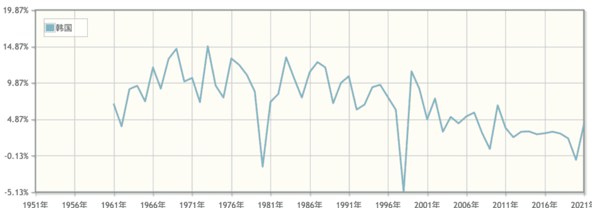

没了新的增长点，社会急速转向了固化，全社会形成了完整成熟的发展路径，“成熟”可不是啥好词。他们最优秀的学生去美国，其次的去大公司大银行，再或者当公务员。但是这些岗位毕竟是少数，剩下的怎么办？剩下的凑合着过呗，还能怎么办。所以整个韩国呈现出了近乎变态的高考和公务员压力，以前还有一个司法考试，为了考试，韩国还有一个几乎出现在所有电影电视剧里出现的奇葩玩意，考试院。大概四平米的格子间，一张床一张书桌，租金便宜，很多韩国学子都混过那种地方。这也是没办法的事，如果这几次关键战役发挥不好，几乎就是一辈子掉坑里了。韩国也经历过那个全民突破阶层的年代，这些年已经消停了，大家高考之后就大概知道自己这一生是啥样了，也不勉强，勉强也没用。能创的业早就被人创得差不多了，而且绝大部分人也没有创业的启动资金让自己霍霍。进了大企业也不能保证顺利升上去，因为韩国是成熟社会，上等婆罗门们也有孩子，孩子也要接班，这让普通人的出路更少了。他们还有个专用名词，把出身好的那些人叫“金勺”，可能意思是从小用金勺子吃饭吧。对应的那些出身差的人，就被称为“土勺”，土勺们没背景没资源，如果学习还不好，长得也不行，还虚，那人生确实掉坑里了。有些人诸事不顺，干脆回家做上了三和大神，或者类似中国的啃老族，他们称为“尼特族”，也就是NEET (Not currently engaged in Employment, Education or Training)，不上班不进修，成天混。由于这种绝望感的蔓延，韩国人热爱炒币和彩票，因为这是大家为数不多的翻身机会。大家想想《鱿鱼游戏》的那个男主角，他不就是这样一根废柴么。一把年纪还啃老，热衷赌博。要么怎么说艺术来源于生活呢。此外由于严格执行劳动法，企业开除人比较麻烦，但是经济波动又大，经济好的时候需要大量招人，经济不好的时候又需要迅速裁员。于是韩国和日本的企业一样，不太愿意雇佣正式员工，很多公司平时只维持一个管理层的架子，下边的员工大部分都是外包和临时工，可以随时辞掉。于是出现了搞笑的一幕，劳动法严格执行之后，遍地临时工，和日本越来越像。我大学的时候实习过两个月，那个公司是给日本的一家大型公司做外包的，跟我对接的那个哥们就是个临时工，你们能想象？他都干了十几年了，还是临时工。中间他说他被辞退了，我还安慰他，他说大可不必，因为过段时间经济好起来，他又回来了。继续说韩国，韩国这些年经济增速变缓、社会格局形成后，韩国年轻人的观念也发生了一系列的变化，比如发起了一系列运动，比如咱们熟知的几个：1、女权；2、YOLO（You Only Live Once）；3、不婚主义。这仨看着好像没啥关系，其实是一码事。比如翻身无望，觉得这辈子挺悲催了，就别结婚生孩子了吧，他们内部流传着一堆朗朗上口的口号，类似“又没有皇冠要继承”、“为啥要给这个世界增加两个牛马”之类的slogan，坚决不婚不生育，这就是不婚主义。不婚主义现在在韩国已经非常疯狂了，说是达到了恐怖的32%左右，年轻人里达到了40%，接近一小半人不结婚。衍生出了一堆相关产业，比如一个人吃饭的格子，一个人的KTV，还有终身不婚的小型公寓，甚至文化上也进行了配套升级。比如大家可能比较关心的，如果不结婚的话，之前发出去的份子钱怎么办？韩国人已经想到了解决办法，就是举办一个单身婚礼，跟正常婚礼一模一样，只是没有配偶，到时候把当初收了你份子钱的人都叫来让他们把钱补上。刚开始坚持这种生活理念的那些人是比较小众的，为了抱团取暖，女孩们喜欢扎堆，形成了一个个的小圈子，这些圈子本来只是画地自萌。此外韩国社会确实对女性压榨很厉害的，于是女权带有强烈的反抗属性。可能有人说你们这样不好吧，她们反唇相讥，然后争论升级，最后成了对骂。女权就这样出现了，开始围攻所有跟他们观念不一致的。很快从“不婚”升级成了仇视男性。这个过程中，互相泼脏水说难听话，导致女权组织变得异常团结，现在是非常凶的。那个尹锡悦能上位，一个原因是他反对女权，尽管丢掉了一部分本来也不支持他的女性票，但是得到了大量的男性票。既然不结婚了，那是不是就不买房了？不买房省下来的钱干啥？玩啊！于是新的文化又兴起了，就叫“YOLO”，You Only Live Once，你这辈子只活一次，既然只能活一次，就该精彩些，做点想做的，而不是跟个牛马似的，整个一生中自己想做的事一件都没做，尽干些自己痛恨的事，疯狂攒钱最后让别人醉生梦死，直到在医院耗尽最后一个钢镚然后把自己烧了装进一个盒子里。这个观念影响下，韩国年轻人疯狂享受现在，不攒钱买房了，把钱全部花在享乐上，吃吃喝喝，使劲玩。大家可能也知道，韩国人的夜生活比中国丰富得多，经常玩到晚上一两点，第二天使劲灌咖啡保持精力。而且网上流传着一句话，说汉江水里都是咖啡因，韩国人不用睡觉。很多中国这边的人去了首尔出差发现自己睡眠都少了。说到这里，大家肯定纳闷，这些人到了中年准备不过了？他们标志性的回应是“总比背着几十年贷款还得交房产税还得养老婆孩子的人好一些吧？”大家想想，越来越多的人坚持这样的生活方式，攒钱买房的人越来越少，叠加人口也在变少，房价能撑得住有了鬼了，所以很早我就在渣浪上说韩国房价迟早药丸，因为接盘侠越来越难找了。但是说到这里，小伙伴们可能觉得博主你觉得韩国没救了啊？房价和国运是两码事，一般绝大部分发达国家都走过这么一条路，有一段时间需要房价拉动，后来人口下降之后房价这驾马车也就折了，老百姓反而能活得轻松一些。此外我一直坚信一点，一切都是周期。你压得太狠了，老百姓的结余都被房地产抽走了，大家过得没啥意思。老百姓自然主动节育，导致韩国那种高房价模式无以为继。而且我问过几个韩国年轻人，一说到房价崩盘，每个人都觉得非常兴奋，说是有生之年的几个夙愿之一，就是看到变态的房价赶紧完犊子。等到大家一起不做舔狗，房价没人接盘，慢慢回落了，大家自然也不用拿着一生的积蓄去买一套房子了，可能反而过得能好一些。在韩国的一些城市，已经出现了一种情况，以前可能用十年攒了一百万，却买不起房，你和大家一起把这些钱消费掉了，只剩下了20万，却发现能买得起房了，因为大家不买房把钱拿去消费，房价反而跌了。反正这个世界就这样，舔狗们一旦觉醒，被舔的那个东西也就迅速祛魅。只是到那个时候，大家都不买了。这就有点类似自然界里，兔子太多，狼会繁殖非常快，最后把兔子吃到一个合理范围内；等到兔子密度太低了，狼捕食兔子越来越难，最后狼也开始变少，然后兔子又迎来了自己的周期。现实里，年轻人和房价之间就有这么个博弈，房价太高，年轻人选择享受当下不去接盘，房价趋势被扭转，谁会去接盘一个不断下跌的资产？但是等到跌破一个合理区间，自然会有人进去接盘，房地产价格会缓缓上升，又会有人不断加入，形成一个新的周期。韩国现在就在这样一个下行周期里。尾声：假期少写点吧，总体来讲，我觉得也不完全是坏事，我现在越来越有个感觉，企业会破产，经济会萧条，山林会有山火，人类也有生老病死，这些都是自然节律的一部分。类似一种“出清”，短时间看是坏事，长时间看可能并不是。无论是机体，还是经济体，甚至森林，都要定期清理自己的腐朽玩意，才能继续轻装上阵。而且内心深处，我觉得如果让年轻人在“啥也不干使劲攒钱买房”和“YOLO”之间选一个，我还是倾向于选后者，毕竟长期来看，我们都会死，后者也算是在这个世界上生活过，而不是纯做牛马。

公众号懒人搜索，懒人专属群分享

### 去了青甘环线我后悔了

2023-04-28

确实后悔了，后悔怎么现在才去。

写这篇文章非常纠结，一方面确实想把这条线推荐给大家，另一方面又担心我自己拙劣的拍照能力和语言表达能力反而让大家觉得这条路平淡无奇，纠结了几天之后，还是准备写出来。大家看完我写的，也去看看别人的说法，喜欢的话今后还是要尽量去一趟的。

首先要说的是，青甘环线可能并不适合大部分人，因为实在是太长了，三千多公里，如果中间再去一趟可可西里的话，全程可能四千公里了。

这么长的路程，可能80%以上的游玩时间要待在车里，这对绝大部分女人和几乎所有的小孩都是一次挑战。

而且这种旅程也跟心态有关，这次的环线经过的沙漠，戈壁，雪山，盐湖，无人区等等，这些东西如果早十年的话，我也没多少兴趣。现在可能年龄大了，能够欣赏得来了，这几千公里我几乎没走高速，全程跑国道慢慢溜达，非常愉快。

这次没有跟别人搭伙，我自己一人一车，也没进任何景区，除了住店吃饭之外几乎所有的时间都在车上，感觉非常好。

西北的物价还可以，由于三年没出门，这次基本上捡最好的吃住，加上租车钱，八天花了两万多。我看小红书上有大学生搭伙，吃住比较随意，一人才花一千多。也就是说预算在两三千到两三万之间吧，都问题不大。

需要什么样的车呢？

最好是越野，哈弗大狗（不知道到底算不算越野）入门，车行说是这个车这两年租得非常不错，而且也能行。坦克300也足够，以前路况不好的时候，主要牧马人、陆巡和途乐。

沿途看到不少人开轿车，应该也是可以的，不过非常不建议，起码来个SUV。这次租车的车行老板也是我的读者，他以为我是重度越野爱好者，把他自己那个带绞盘的陆巡给我了。后来到了格尔木，突然想试试这两年比较火的坦克300，正好他们店在格尔木有分店，后来三天就开着坦克300，一点问题都没。

那边的路况非常魔幻，绝大部分非常好，但是也有一部分非常差，跟炮弹坑似的，还有高原路段是那种“搓板路”，也就是路上有波浪，上下震动。有些人对这种路特别敏感，非常容易晕车。

为啥路况会这样呢，一方面是因为那地方大车超级多，路上碰上的车，80%都是大车，大车对路的伤害是很大的。另一方面也是因为那边昼夜温差大，热胀冷缩把公路给搞坏了。

此外还有不少羊和牦牛，按理说路两边是有护栏的，不过偶尔还是会有羊和牛过道。我在路上看到一次别的车撞死了人家牦牛，估计得赔不少钱（而且惯例是交钱之后也不能把牛带走），关键是非常危险，因为眼看要撞上什么东西，人的第一反应是猛打方向盘，很容易撞到边上的大车。

我自己有一次差点撞上了羊，一转弯突然出现好几个，还好当时速度很慢，猛踩刹车停了下来。牦牛好奇心非常强，听见车声就过来看，看到车靠近又很容易受惊，受惊就乱跑。

反正一定要小心，尽量用越野，SUV也可以，轿车不建议，不过确实看到不少人开轿车。

我说几段我自己很满意的。

落地西宁的第二天，我就开车走国道翻越达坂山去张掖。

这条路很特别，因为古代青藏高原进入河西走廊的关键道路，就是这条路。风景非常好，路也非常曲折，走完之后非常惊讶于古人是怎么从这么奇葩的路上穿越过去的。原谅我拍照能力实在是不敢恭维，看见的和拍出来的完全不是一码事，而且这次脑子比较抽，带了无人机却没带相机，全程用手机拍的。

翻过山之后，进入河西走廊的平原地带，这时候你就懂了为啥张掖杵在那里了。我都能感受到古代高原人那种绝望，好不容易九死一生地从山里出来，迎面就是一座几乎没法攻下的要塞。隋炀帝时期中原隋朝大军竟然逆着这条道，从河西走廊打到了青藏高原，把青海纳入了管辖。

张掖最著名的景观，就是它的招牌七彩丹霞，一种五彩斑斓的石头，太阳一照非常漂亮。我没专门进去，不过从张掖出来，也会路过他们的景区，远远看一下觉得还不错。妹子们应该会喜欢那地方。

我还专门去了一趟高台，了解西路军的小伙伴肯定听过这地方，西路军总共有三个军，其中红五军就在这里全军覆没。离高台不远就是倪家营子，西路军残部最后集中到了这地方，跟西北马家军进行了最后一战，战况极其惨烈，马家军擅长马刀，西路军早已弹尽粮绝，双方冷兵器对耗，最后西路军全军覆没。高台也算是西路军的终点。

去了发现果然已经没了任何痕迹，感觉有点可惜。

从张掖往北走，会跨越漫长的戈壁滩和沙漠地带，途径酒泉、嘉峪关、玉门关，到达瓜州，都是些唐诗里提到的地方。

去了才能体会什么叫春风不度玉门关，过了玉门关确实主要是沙漠和戈壁。

最震惊的，就是沿途几乎没有中断的无数风力发电机，还有密密麻麻的铁塔。

瓜州是个三岔路口，如果往北走，就去了新疆哈密，如果继续逆时针左转，就到了敦煌。

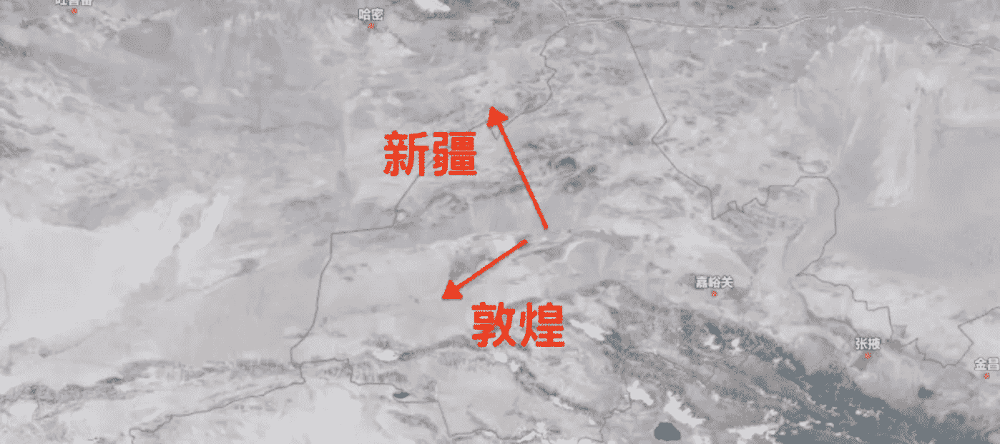

敦煌几乎完全是一座沙漠里的城市，沿途风景像极了多年前我自驾拉斯维加斯的感觉。很多人在敦煌会待一两天，去看月牙泉和莫高窟，这两个景点是敦煌的招牌。

不过我没在那里呆，第二天继续上路，过了阿克塞之后，翻越阿尔金山，沿途风景非常好，近处是沙漠，远处是雪山。

路线是下边那样的：

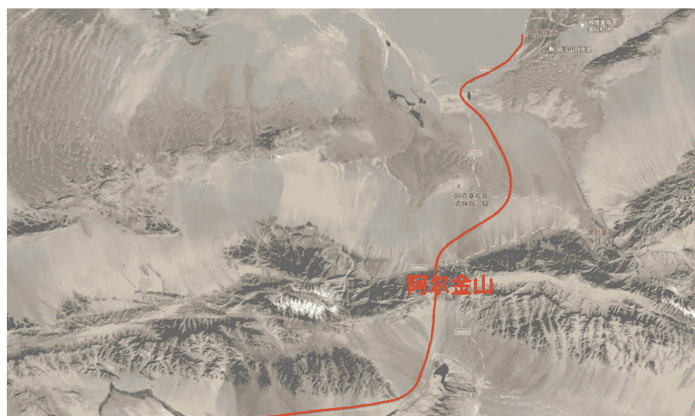

从上图就能看出来，绝大部分都在沙漠里，沙漠里的路都特别直。

翻过阿尔金山之后，就进入了一个漫长的走廊，公路笔直延伸向天边，两边是看不到尽头的风电塔。拍了不少，能看的却不多，这张恰好没有铁塔。

然后就到了冷湖镇，那里有个石油小镇，以前有几万人在挖石油，后来石油挖完了，城市也空了。现在成了个残垣断壁的打卡地，适合飞无人机，我倒是带无人机了，不过风太大，放不起来。

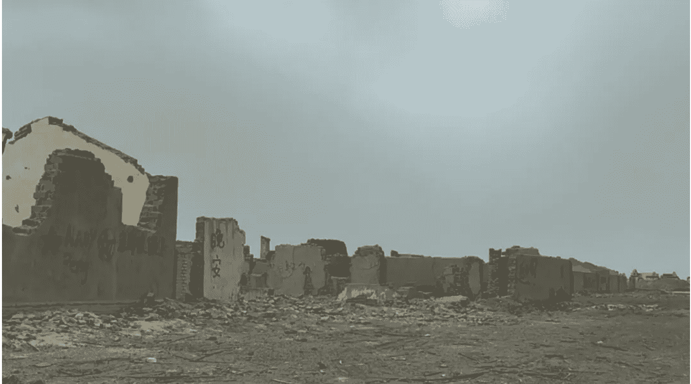

找了张无人机图，国家地理拍的，侵删：

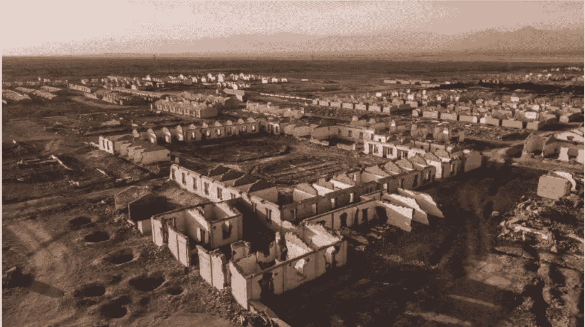

过了冷湖之后有个关键景点，我确实纠结了很久，也就是那个“火星一号公路”，百里无人区，没人没信号，地貌和火星超级像。一百公里的路程，得三四个小时，大部分路很好走，但是有些地方坑洼特别大，有些地方沙子很多，容易被陷，只有一辆车的话，陷进去就麻烦了，自己是没法把自己弄出来的，所以纠结了半天。

后来想了下最坏情况是啥，无非就是在里边呆几天，带了他们爬珠峰用的那种专业睡袋和充气垫，还有燃气炉，很多吃的，还有足够的水，万一陷进去了，就在里边住下了。还跟我在敦煌的小伙伴说好，如果我当天没发消息，他们第二天就过来捞人。于是就进去了。

### 无人区的入口是这样的：

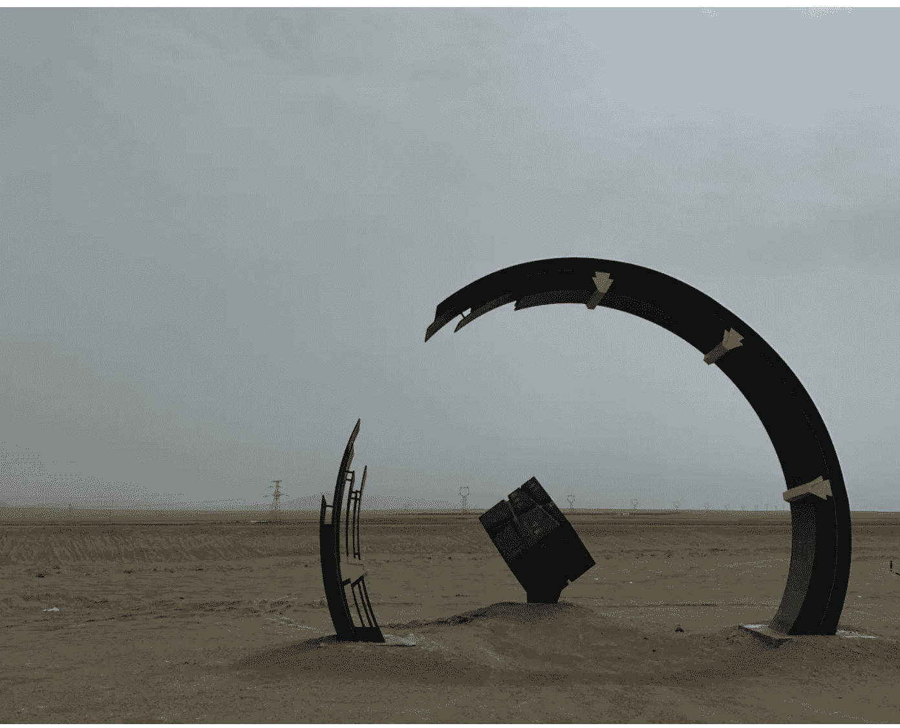

### 里边是这样的：

路是这种土路，据说是政府最近硬化过，所以好走很多：

中间有一段修路，我沿着两边的车辙过去的，开了四驱模式才能走这种路，不然很容易陷进去：

当然了，标志性的是这种雅丹地貌：

确实有点像火星有没有：

走到后来云彩散开了：

风景确实好，走这一趟超级满意。

过了火星一号公路，就是漫长的315国道，这条道被称为“最孤独的国道”，两边是沙漠和戈壁，几百公里没啥人，不过那地方发现了锂矿和油田，所以有几个工业区，这条公路上主要也是各种大车。沿着315一直走，就能到喀什，我已经计划好了将来把这条线完整跑一趟。

还有沙漠里无穷无尽的铁塔：

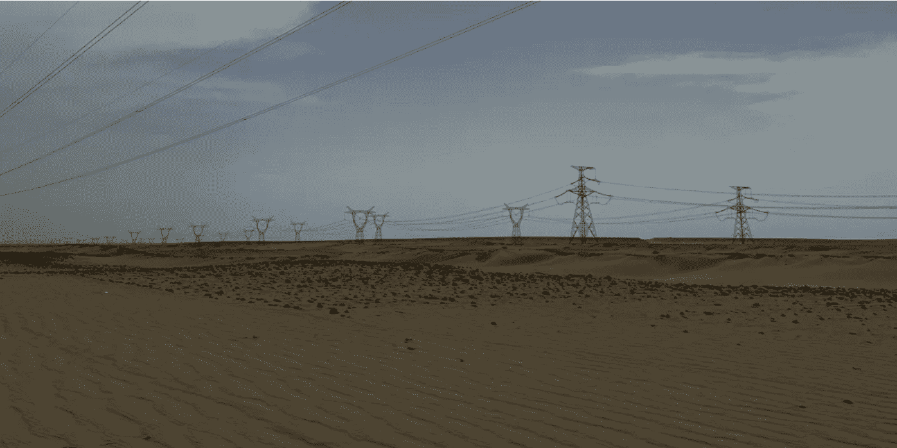

中间还会通过著名的“水上公路”，那条道就跟凡尔登似的，遍地是坑，还有无数的大车，大家都在龟速行驶，轿车一定要小心。

如果没去火星一号公路，315上也能看到雅丹地貌，也就是那段被称为“南八仙”公路两边。为啥会叫“南八仙”这么个名呢？我在敦煌问了下地质所在那边勘探的人（那个小伙伴跟我老乡，地质大学博士毕业后就在西北勘探，看我在公号说要去敦煌，就找了过来）。

他说是新中国建立的时候，向西北派驻了大量的科考队找石油和矿藏，其中一支由八个女孩组成的科考队在现在的西台工区那边勘测，正好那地方飞沙走石，科考队好几天寸步难行，于是起名“难八仙”，也就是说，先有这个名，后来才有那段路。后来传成了这八个女孩遇难了，其实没有，其中一个现在还在。

在那片戈壁上，竟然有个酒店，一千多一晚，前不着村后不着店，主打戈壁风光，我住了一晚，正好那天晚上云层散开了，高原上星星确实非常亮，好多年没见到那么亮的星星了。

315国道上好风景很多，有著名的“U型公路”，我是拍不出来效果，大家自己搜一下吧。还有几个盐湖，风景非常好，沿着315开车感觉特别棒，315国道在那边还有个很好听的名字，叫“西莎路”。

接下来又是个重要节点，到底去不去可可西里。

按理说我一辆车去是很危险的，不过后来还是去了。

可可西里是个大无人区，有三个江苏那么大。青海在高原上盖了几间房子，搞了个“索南达杰保护区”，这个保护区位于可可西里的边上，大家一般说的“去可可西里”，其实就是去那个超级无人区的边上看看。想去可可西里就得先去格尔木，在那里住两天。

如果愿意，可以沿着上山的那条“京藏线”一直往前走，就可以穿越可可西里到拉萨。得20多个小时，我中间一度非常冲动，在想要不直接穿越无人区去拉萨得了，后来怎么算时间都不够，于是只好折回格尔木。

到了保护区之后，发现啥也看不到，既没有野狼，也没有藏羚羊。往前走一段，就是“藏羚羊观景台”，爬上去一看，依旧啥也看不到。

不过正如那句“拉萨不在拉萨，拉萨在路上”，自驾318国道本身的快乐要超过拉萨本身。可可西里也一样，沿途风景非常好，超过了可可西里本身。首先要穿越昆仑峡谷，然后是昆仑垭口，最后到了高原。

这是在昆仑山山下拍的，上周那边还在下雪。

进山之后是这样的：

这是昆仑山垭口：

爬到山顶上就成这样了，反而平坦了：

进入可可西里：

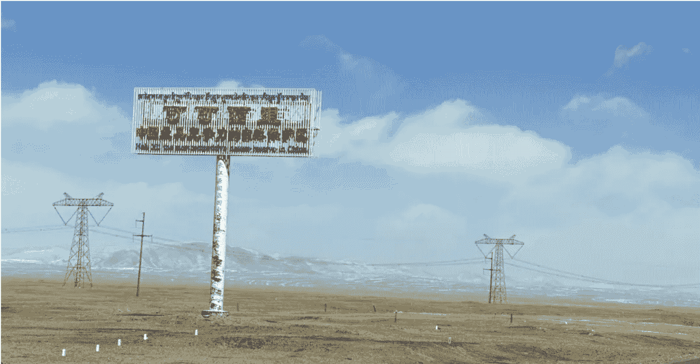

里边的风景差不多，雪山，公路，货车，铁塔：

同时也佩服土木老哥们，在高原上搞了无数这种人造奇观：

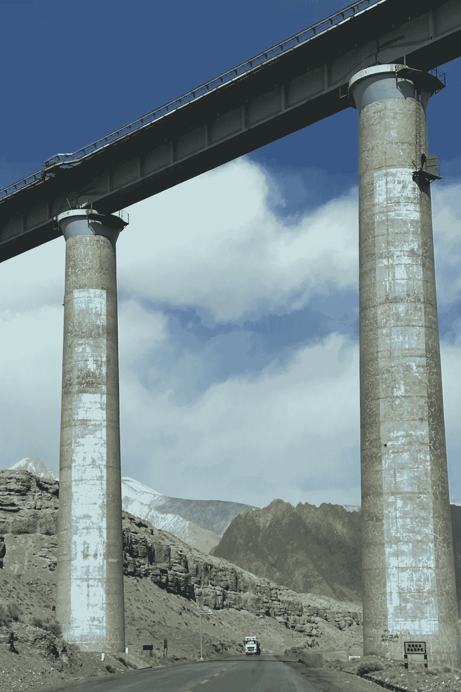

确实不想回去上班了，想一直待在西北溜达，多说一句，微博已经彻底停更了，一堆高仿号都是假的，头条上只有这个是真的：

### 九边Pro

### 已经给领导打了电话，这逼班我不回去上了。

209万展现34万阅读

不得不说，这一路对于不同的人感受差别非常大，我这趟最喜欢的两段，就是爬昆仑山到可可西里这段，还有之前的火星公路。但是打开小红书，一堆人表示太痛苦了，再也不去了，高反，搓板路，堵车，无数的大车，以及长达十来个小时的路程。对于司机来说可能不是问题，但是对于乘客来说绝对非常痛苦。

跟这段有一拼的是西藏的那个珠峰大本营，自驾爱好者的天堂，因为有无数的各种弯道，但是绝大部分去过的游客都表示“非常不错，再也不去了”。那地方也是开车十几个小时，拍照十分钟。如果没法享受中间开车路段的话，西北自驾确实非常痛苦。

关于高反的事，这条线绝大部分都在3000米左右，很少有人说高反。不过可可西里那一段在5000米左右，我早上吃了三颗“高原安”，又吃了几个高糖的蛋糕，全程没高反。除了在藏羚羊观景台那里风太大，非常冷，我穿得又太少，拍完照跑了几步到车里，差点没当场去世。

接下来两天的路风景也很好，有著名的茶卡盐湖和青海湖，不过公司有点事，我又操心上心了，着急回北京，后来两天一直心不在焉。

### 尾声：

西北今后我还要去很多次，非常非常喜欢，还有阿里北线和中线，新疆南北大环线，甘南环线等等，都要去。还有那条著名的“红军长征路线”，我也准备去。好好练一下拍照，到时候说不定能拍点能看的照片。

大家如果想去，一定要反复问自己喜不喜欢长时间在车里待着，如果不喜欢，那可能会非常痛苦。很多人就是“觉得自己会喜欢”，然后去了之后每天都在煎熬。而且一定要谨慎带孩子过去，因为孩子几乎没可能安安静静每天坐七八个小时。

关于西北环线，大家如果想去，一定要多去查查相关资料，而且要选对月份，当然了，月份越对，租车和酒店越贵。

关于这次旅行，最深的感觉可以这么描述：山河大好，国泰民安。

路过张掖的时候，所有的车要排队验三证，我看到有个骑车旅行的人（这种一路非常多）验完证之后就骑车过去了，突然警察跑出来把他叫住，然后过去给塞了一瓶红牛一瓶可乐还有一袋不知道什么吃的，看上去像达利园的巧克力派。

还是挺受触动的，富起来之后真是哪哪都好。

公众号懒人搜索，<u>懒人专属群</u>分享

### 炸几个火箭算啥，这才刚开始

2023-04-26

**![](https://mmbiz.qpic.cn/mmbiz_gif/Lvm6UAoJibrP9JEWQRXR3swLXRYlFicicbg2q6gYPiaCkPr8GibxibGO0jcDe76cnAUJ3KBkCmyTIZBueDAOslJ0Zw/640?wx_fmt=gif

马斯克的火箭炸之前，就跟航天院的小伙伴经常聊这事，他也跟SpaceX的同学有联系，是的，SpaceX里有大量华人，而且就是咱们国家读完大学过去的。航天院的小伙伴也基本能达成下边的俩共识：
- 第一次成功概率基本为0。因为那个星舰之前一直炸，大家可以搜一下，“星舰爆炸”，一口气看个够。这次星舰和超重型火箭合体，相当于一次“联合”测试，哪怕敲过半年代码，就知道这种联合测试第一次就成功的概率几乎为0，总会出点问题。
- 多试几次，肯定能成。

我知道有小伙伴看了这个说法不高兴，其实工程上的问题向来都是这样，如果大方向没啥问题，多试几次，总能找到一条路。再扩展下，你会发现绝大部分事情最难的就是让你多试几次，对应的就是试错成本，如果你家里有钱让你反复试，你大概率也能成。马斯克现在不用担心钱的事，而且第一次测试的效果还不错，所以多来几次，估计就成了。那个火箭成本并不高，我看有人说是30亿美元，其实是前期的研发总投入。有点像花了30亿搞了个工厂，产线上下来的车是300万一样，现在立的那根火箭，其实就是产线上下来的产品。

对于马斯克要搞成这事，很多小伙伴听了很不舒服，其实没必要，至少我认识航天院那边的人整体还是挺乐观的，因为马斯克的成功，大概率会对我国的决策模式形成一定的压力，倒逼我们快速跟进。主要是大家不了解体制内的决策流程，混过体制你就知道，如果你石破天惊提了一个牛逼想法，大概率会被那些老同志给否了。原因很多，比如说你只是提了一个想法，对于领导来说那可是真金白银的投入，而且更麻烦的是风险，大机构里的人天然倾向于“不求有功，但求无过”。如果领导给你批了，将来迟迟不出成果，一直测试失败，可能他的位子也保不住了。

此外还有个关键问题，人越老，观念越固化，这是没办法的事，“思想开放”这事对于年轻人都比较稀缺，对于老年人就更那啥了。所以在《三体》里，大刘设计了一个章北海狙杀老航天的剧情，这事其实在航天领域算一个流传已久的段子，说想实现什么新东西，必须得那个老头和他的徒弟都走了。当然了，大刘也说了，老航天的地位是当初他们筚路蓝缕用极低的成本闯出来的，只是时代最终还是年轻人的。而且这也不是咱们的问题，美国那边NASA也一样。苏联崩溃后的几十年，NASA一直纸上雕花，啥也没搞出来，总体感觉是倒退的。

马斯克能做成，和十几年前NASA的一次体制改革有关。当时新领导要搞“年轻化”，培养了一堆年轻官僚，年轻官僚们急着想做点事，所以他们在老头们非常喜欢的轨道科技、波音之外选中了年轻的SpaceX，SpaceX需要的钱很少，于是项目顺利被通过。给钱给订单之后，加上马斯克野兽般的想象力，很快就牛逼起来，打了老头们的脸，给了年轻官僚们业绩，证明他们当初是对的，年轻官僚们有了更多话语权，于是马斯克接到了更多的订单。

那国内航天院的人怎么看待这个事呢？一句话：马斯克做的，我们都会做。我举几个例子大家就知道了。其实早在上世纪90年代，国内有研究员就提出来火箭回收的想法，事实上你要仔细研究，会发现早在苏联时期就提出来了，再查下美国那边，发现肯尼迪时期也提出来了。但是无论是苏联，美国，还是中国都没给批。为啥呢？多简单啊，这个操作设计一系列极其复杂的控制技术，万一试一下发现前边是个大坑，填不满那种，到时候怎么办？果断放弃相当于承认自己计划失败了，弄不好领导简历上就多了一个黑点。如果继续填，填了很多后再失败，那更惨。于是老头们都选了保守路线，也就是说，现在的方案那么成熟，搞啥自行车，要啥可回收火箭，你爹是赫鲁晓夫吗你能拿到经费？

多说一句，赫鲁晓夫的儿子确实是火箭专家，不过他也没提这么大胆的方案。这人苏联解体后移民美国，后来在家里头部中枪死了，警方说是自杀。所以“火箭回收”这么明摆着的方案竟然一直到马斯克才去搞。NASA的老头们尽管觉得纯胡闹，但是也管不着，毕竟又没花NASA的预算。这也是为啥之前马斯克搞可回收火箭的时候，国内嘲讽声一大片，说是没必要。但是这种声音这两年没了，因为这两年我们也在紧锣密鼓地研究这项技术。

还有那个多发动机并联方案，也就是火箭底部密密麻麻一堆发动机，如果真追溯，最早宋朝人就在他们的弓箭上搭载了多个火药助推器，后来苏联人以举国之力去搞，炸到苏联人怀疑人生，最终搞了个寂寞。把其他国家给吓坏了，这样明摆着的方案也没人再去搞，一直到马斯克出现。马斯克搞定后，我国现在也开始搞了。为啥马斯克不搞我们也不搞呢？老领导可能有自己的考虑不给批新项目，直接加一句“预期不明，请继续理论研究”就驳回了。但是现在不行了，人家已经成了，你还预期啥预期？赶紧打钱！

此外路线验证是很难的，一旦路线被确认成立，接下来就容易多了。同理的是那个星链，直到现在，微博上还有几个自称通信专家的还在攻击那玩意，说是没啥大用。其实已经没啥可攻击的了，现在很多沙漠、海事船上都装备了星链的终端，由于用户太多，之前发射的卫星不够用了。马斯克正在策划更大规模的卫星发射，那个星舰一开始就是准备发星链卫星的。而且很多小伙伴不知道，我国也有很多地方其实是没信号的，我这两天不在青海跑环线嘛，很多地方都没信号，那些做地质探测的也都带着卫星电话，很多跑跨洋贸易的海船也都买了星链终端。更关键的是，星链还有重大的军事作用，很多人经历了一个“否定，接受，恐惧”的过程。所以我国也要搞星链了，我国预计在2027年发射约1.3万颗卫星，也要搞中国版的星链，这时候不能说没用了吧。

说到这里，大家也就明白了，说风凉话归风凉话，马斯克做的确实没啥问题，他做的我们也都会跟。火星也是一样的，国内很多人在嘲讽马斯克，说他尽瞎想，为啥不去搞沙漠非要搞火星？咱们完全可以把话撂这里，用不了几年我们也要去搞火星。上火星这事你说它有啥道理没？现在也说不出什么明确道理，但是就跟早期的大航海似的，你得出去看看，扩展新边疆，边疆意味着不确定性，不去扩张你咋知道那里有啥。为啥我们经常说郑和那么大的船队，跑出去七次搞了个寂寞。为啥哥伦布达·伽马他们的舢板却能折腾出来那么大动静呢？其实答案就在问题里，就是因为哥伦布他们玩的是舢板，而不是海上巨无霸，如果西班牙也搞郑和那一套，也玩不下去，跑几次说不定也被叫停了。因为持续负收益，根本没法继续。反倒是民间的海上贸易从没停过，他们的船逼格低，但是有利润，也就可以一直维持下去。西方大航海能成功的关键，就是他们成本太低了，以至于每次出海收益都是正的。既然有利可图，那就会形成一个正反馈，吸引更多的人去做，这种指数增长是很可怕的，很快全世界到处都是白人殖民者。回到马斯克去火星这事，其实参考下欧洲大航海就知道了，当时欧洲人在新大陆无非做两件事：种地和挖矿。但是他们出发前就知道自己要去干啥吗？当然不知道，只能是走一步算一步，先低成本走起来，不行再换方案。这其实也是我们现实里逆袭的几个套路之一，低成本尝试新东西，看看有没有盈利点，有就一直做下去。有人说为啥不去搞沙漠？因为沙漠已经被研究透了，确实没啥机会。火星不一样，代表着无限可能，最起码的一点，那里有很多矿，还有充足的“氦3”，这玩意在地球上非常贵，而且是尖端科技必需的原料。可能在探索火星过程中，发现别的什么东西。比如哥伦布最早是要来中国的，最后中国没找到，却找到了美洲，本来想找金子，却找到了银子，还有烟草、棉花等经济作物，棉花可是后来工业革命的基础。也就是说，只要做的事收益比成本高，这事就能循环起来，规模会呈现指数级增长。但是这种增长在哥伦布这个精神病坚持要去美洲之前没人意识到，包括哥伦布自己。所以说现在再看马斯克干的事，就很清楚了，一方面要把成本使劲往下压，只要成本足够低，将来在火星上任何发现可能都会形成正收益，只要收益是正的，那就好说了，越来越多的人力和资源都会投向火星，用不了几年就会天翻地覆。说到这里，其实已经很明显了，火星探索我国必须得跟，而且也得想方设法降成本，不能重演上一次大航海的悲剧。而且正如上次大航海一样，无数的帆船驶向大海，也会有无数的舰船葬身大海，这个几乎是必然的。所以我在标题里说这才是刚开始。现在坏消息是美国整体是领先的，我说这个很多人肯定不爽，其实大家想想，美国研发出来F-1火箭的时候，咱们还在研究仿制苏联步枪，美国研发出来土星五号的时候，咱们正在忙活上山下乡。现在我国给航天领域的投资都没法跟美国比，如果加上历史沉淀，那差距更大了。而且美国的航天业，绝大部分供应商都是市场上的企业，他们都有盈利，不用财政养。如果把这些企业算进去，我国在航天领域投入跟美国差距更大了。也没办法，谁要我们起步晚呢，能有现在这个状态已经很夸张了。不过差距不是问题，关键是态度。就比如英国其实在大航海时代是个后知后觉的角色，等它结束内乱，才发现西班牙在美洲已经经营了上百年。赶紧也组织了海盗，哦不，船队去探索新大陆。不过去了美洲才发现好地方都被占了，比如现在的巴西，英国人只好殖民北美。北美现在被吹得不成样，其实当时是很差的，又是龙卷风又是寒潮，一个冬天经常冻死一半的殖民者。可是英国人凭借着极致的务实和坚韧，硬是闯出了自己的天地，在英国人眼里，你比我强的地方，我就吸收，变成我自己的，然后打败你，最后它成了终极赢家。所以说吧，国人的心态还是要开放一些，也做一个极端务实的民族，别人的优点我们就要拿来用，用好了，谁关心那玩意一开始到底是谁的？比如高铁，现在提起来那就是中国高铁，谁能想到最早咱们是从日本引进的。对于未来，没啥可怀疑的，五百年前的大航海最终演变成了英法两个巨头的角逐。现在这场大航海打从一开始，就是巨头的游戏，只有中美欧三个玩家，可能还有一个印度，其他的都是围观群众。也没必要在意谁早一点谁晚一点，最早玩转大洋的是西班牙人，最终还是输给了入场晚了上百年的英国人。中美的技术有差距，但是并不大，尤其是技术方案确定后，追起来非常快。前提是不能搞封闭，搞闭门造车。最后一件事，就是对失败的容忍度，这个极其关键。干过几年工程的都知道，新方案落地，没啥好办法，只能是一遍一遍地尝试。开始几次失败是非常正常的，也是避免不了的。国内很多人对马斯克很苛刻，对咱们自己更苛刻，比如前几天蓝箭刚发射失败了一次，网上一堆嘲讽，这个真没必要，这个毛病真得改，不然接下来会自缚手脚。关键还是那个老问题，开放，务实，尊重人才，尊重市场，善于学习善于吸收，没啥做不成的。

公众号懒人搜索，懒人专属群分享

### 人民币国际化这事，急不了，也没必要急
2023-04-21

这段时间人民币国际化这事热度又上来了，我随便讲讲，咱们不聊经济学，聊点生活里的常识。当然了，还是那句话，说得不一定对，大家批判着看就行了。

关于货币国际化，大家一定要有个常识，你想让别人用你的货币，先得让他们手里有人民币。比如中国想用美元去买沙特的石油、澳大利亚的铁矿，就得先从对美贸易中获取到美元。

那怎么有呢？

一般只有两种办法：

你买他们的东西，他们手里就有你的钱了。中国的外汇，就是中国搞外贸从美国赚的。

或者借钱。刚改革开放的时候我们想引入整条产线，一部分钱是我们卖大庆的石油筹的，另一部分就是从日本借的。

可能有小伙伴说，是不是可以搞货币互换？

当然行，不过解决不了大问题，比如咱们跟某国搞了一笔互换，双方把100亿美元的对方货币放进自己的账户。到期后我们把他们的货币还回去，他们把人民币还回来。

而且很多国家没有矿，也没有任何咱们看得上的东西，不然咱们也不会对那些国家顺差了。他们拿到人民币可以买咱们的东西，可是咱们却没啥可买他们的。货币互换就变成了一种变相的贷款。

所以又回到那个问题上了，只有两个办法让别人手里有我们的钱，逆差和贷款。

第一个办法就是咱们多买别人的东西，别人少买咱们的，这样别人手里就会留存下一部分人民币，然后就可以用人民币去别的国家买东西。也就是我们持续逆差。

这时候那个老问题来了，如果我们持续逆差会发生啥？

当然就是去工业化。

这几乎就是国际货币宗主国的宿命，甘蔗没有两头甜，你不可能好处全拿，毛病全不想要。

此外也不止逆差的事。比如咱们都希望人民币购买力强，像美元一样一块钱可以换别人七八块，可如果那样的话，中国的成本会非常高，到时候中低端制造业都会迁出，只剩下高端制造业和服务业。

这事日本也干过，大家都知道，日元在广场协议之后大幅升值，日本那边的考虑就是配合日元国际化，然后出口就出了问题，引发了后来的一堆麻烦。

美国现在产业空心化的毛病，某种意义上讲就是被“国际化货币”给反噬了。

那可不可以贷款给别的国家呢？

想理解这个问题也不复杂，村里有个大款，开了个厂子，但是大家没钱买他的产品。于是他借钱给村里穷人，让他买自己东西。一开始是可以的，但是随着大家欠他的钱越来越多，最后可能连利息都还不上，债务迟早暴雷。到时候别人欠大款的钱还不上，大款的厂子里东西也卖不出去，大家一起完蛋。

说到这里，大家可能要问了，博主你的意思是不能借钱给别人？

也不是，关键是看借钱干啥。如果我借给你100块，你从我这里买了100块的面包吃了，那完了，这债务一看就完犊子了。

但是我借给你100块，你从我这里买了挖掘机，回去挖出来矿，或者投资了一个农场，把产品卖给我，又拿到了人民币，从我这里买面包和挖掘机，这就是一个良性循环。

其实马歇尔计划的核心不是借钱，是借钱恢复别人经济。美国之前借出去的很多钱都成了死账，只有欧洲和日韩起了作用，因为这些地区除了韩国底子都非常好，只要给钱就能迅速做大。

也就是说，不以发展经济为目的的借钱，最后大概率都会成为坏账。

而且很多国家根本不是搞经济那块料，国家也不稳定，换一个领导换一套治理办法，这些都非常麻烦。南美那群国家，几乎都有这个毛病，经济不好的时候引入外资，经济稍微好了一些，新上台的领导就要清算外国资本掠夺本国利益什么的，然后又来一波暴跌。最近一百年他们几乎一直在原地打转。以前我们支持他们打外资，现在不行了，现在我们就是外资。

美国之前也没少栽跟头，别看很多人说南美是美国的后花园，依旧被坑了无数次。最明显的就是伊朗，在伊朗投资了那么多，一夜之间爆发革命全部打水漂了。之前还大量投资巴基斯坦，也没啥用。这些年又在投资印度。

最后是那个说烂了的问题，想人民币国际化，得先放开外汇管制。为啥现在要进行外汇管制呢？主要也是老百姓很容易受惊吓，到时候说不定把外汇给换光了，平白无故搞出一场人为天灾，没必要。

此外还有一些务实考量，咱们是外贸国嘛，就得保持人民币不能太升值，那样咱们的外贸优势没了。可是想控制汇率，就不能放开管制，蒙代尔不可能三角，不细说了，随便搜一下都有。

这也能看出一个问题，在很多人眼里，人民币的信用是不如美元的，不然应该是抢着拿美元换人民币才是，我们就没必要担心外汇流失。只要我们一天担心外汇流失，那说明我们的“信用之路”还在建设。

说得更直接一些，甚至在我们自己人当中，很多人宁愿相信美元而不是人民币，你能指望别人吗？忘了谁说的，如果人民币不能让自己人100%接纳，那就别指望别人也接纳。

也就是说，想让别人承认人民币的信用，咱们得表现得很有自信。

那有啥办法能让我们快速国际化吗？

没啥办法，只能是慢慢熬，一点点渗透到国际贸易里，先提升我们的结算比例，现在是3%不到，等跟欧元一样到了30%就好办了。慢慢用信用打动别人，告诉全世界，“人民币永不违约”，时间长了大家自然愿意用了，并且存在保险箱里，万一出了什么事，带着人民币就跑路，因为所有人都认这种货币，带着这种货币就能花出去。

这种深入人心的信任，只能是在反复交易过程中慢慢确立。就好像《狂飙》里白道黑道都相信安欣，并不是因为安欣武力超群，而是因为经历过那么多事，大家发现只有这人靠得住。安欣是极度可预测的，他能力一般，但是信用非常强。下次碰上事，你还是要找安欣。货币也是这个逻辑，这些道理是相通的。

至于不少人说的军力什么的，那确实是一个因素，但是不是关键因素，我反复举过一个例子，苏联最强盛的时候货币信用远远不如瑞士法郎，是因为苏联核弹不如瑞士多？还是因为苏联坦克集群打不过瑞士？当然不是了，只是反复交易过程中，大家发现瑞士法郎更加有信用，而且瑞士法郎滥发的更少一些。

信用是存在于人心的东西，你不可能强迫别人去相信你。

至于一直说的石油美元，最近看了一部大部头中信出版社《石油的时代》，作者的意思是，石油选择美元结算不是啥阴谋，而是一种历史的必然，因为它没法选择别的货币。

比如沙特人用日元结算，就没法买到英国人的路虎了。用英镑结算就买不到美国的F-16了。美国更关键的还有个“医疗”优势，也就是制药方面的领先地位，其他国家位高权重的人，再牛逼也得治病吧，得给自己家人治病吧，总得吃药是不是？美国在高端药物方面几乎一枝独秀，很多国家能离开美国的iPhone却离不开那些药物。

同样道理，基辛格没跟苏联人签“石油美元协议”，为啥苏联人也用美元结算呢？是苏联领导脑回路清奇，想强化美元地位吗？当然不是了，苏联需要美元去买加拿大的粮食还有欧美的技术。同样道理，我们为啥那么在意外汇储备，那么在意外贸规模？还不是因为赚到美元可以到处花？

懂了这个，就懂了如果现在沙特用人民币结算石油可以吗？

当然可以了，因为人民币可以买到中国的工业品和东风快递。

但是全部用人民币结算可以吗？这就不行了，因为它还要买其他国家的东西，很多国家国际贸易是不认人民币的。

看到这里，大家应该就明白了，你没法让所有人一夜之间接纳你的货币。3%的交易量提升到30%很明显不是个短期能达成的事。

只能是慢慢渗透进去，等大家手里都有人民币，也接受人民币结算，那个时候我们的货币就国际化了。

这是个缓慢的提升过程，快不了，不过也不会太慢。因为体量在这里摆着，以中国的体量，全球结算货币里只占3%不到，这个本身就不正常，肯定会大幅提升。只是大家凭直觉和生活常识，也觉得不会太快，过几年应该就有大变化。

而且很多人在说美元体系崩溃的事，我倒也觉得也急不来。

一方面我们上文说的，做国际货币带来的麻烦不会比好处少，慢慢耗着呗。

另一方面我倾向于觉得这事也快不了，美元崩溃这事从布雷顿森林体系确立那天就在说了，历史上经历过好几次美元危机，反倒是他更加坚固了，为啥？

因为尽管它烂，但是之前确实没有一种货币比它更靠谱，尽管它滥发，但是其他货币更没谱。

而且存在一种“惯性”来维持它的地位。

首先是心里的惯性，每个人都爱美元，拿到美元心里就不慌，因为美元是有共识的，你拿到就可以买到任何东西，别人也是这么想的，所以大家都愿意接受。

其次是基础设施惯性，现在整个世界的金融系统、交易系统、定价系统，都在美元的基础上，这些想快速替换几乎不可能，但是确实可以慢慢渗透。

这就好像中国电网用了几十年时间，搭建了人类历史上最复杂最庞大的电力系统，有个大款说要重新搭建一套跟电网竞争，你说他有可能短时间内搞起来吗？长期不一定，但是短期几乎不可能。

所以说吧，今后的关键还是要苟住，慢慢熬，有实力有信用并且不滥发，做得比美元好，慢慢大家就会信任我们的货币。等到哪天解除了外汇管制，大家有钱也不换美元，其他国家的老百姓手里有自己货币，也着急换成人民币，我们的货币地位就切切实实确立下来了。肯定有人说我在做梦，可事实是，如果人民币想国际化，这只是最基础的要求。

也就是说，只要我们和世界的贸易规模越来越大，中国的国际地位越来越重要，我们的货币大家就越需要。当然了，关键还有个升值问题，国际货币肯定会升值，升值会导致工业流出，也是没办法的事，成年人的世界，不可能让你把好处都占了。

文末再说几句吧。

说这些肯定有些人觉得我不该聊这些灭自己志气，该聊的是美元马上要完，我们马上就要国际化。

但是我不那么认为，找了几个业界专家问了下，他们也觉得这是个长期的事。我觉得理性就是最大的信心，速胜论和投降论本质是一样的，很多人就是接受了速胜论，然后没有很快看到成果，然后就崩溃转换阵营了。这两年大家很明显能感觉到这种氛围。

事实上追求速胜的人，高中时候肯定搞过一个礼拜翻身做学霸，到了工作单位三年一百万什么的。最后的结果肯定是学习一塌糊涂心灰意冷，想快速赚钱最后跑去赌博最后输得啥也不剩。

只有知道前路漫漫，才能有持续的信心。真正坚定的人，反而是那些客观看待问题、不骄不躁的人，不会被一时的胜利冲昏头脑，也不会被一时的挫折彻底打翻。慢慢来，该有的都会有。

公众号懒人搜索，懒人专属群分享

### 为啥哪哪都爆满，还在到处说通缩？
2023-04-19

自从2019年那趟欧洲之行后，三年多没休年假了，这次公司强制休假，于是开始溜达我想了很多年的河西走廊。总共得开三千多公里，比较赶也得七八天才能跑完，所以之前一直也没能下决心，疫情的时候终于想开了，还是要尽快把这事办了，不然说不定下一个三年也没了。本来准备直接从北京开车过去，不过时间不太够，只好先飞到西宁，然后租辆越野绕着青甘大环线来一圈。文章写得比较仓促，大家凑合着看吧。

这段时间大家肯定有个感觉魔幻的地方，好像全网都在说通缩，可是现实里走到哪，都人山人海，比如我问了下，西宁那边的租车行说是车已经租光了，五一要大幅涨价，但是依旧供不应求。前几天CPI数据一出来，大家一看果然不咋地，消费确实有点萎靡。这事除了前段时间一直在说得信心的事，我理解这事还是跟房地产有关。很多人经常说，“钱都买房了，消费怎么可能会好”，这话其实忘了一件事，房地产本身就是最大的消费。甚至可以说，除了出口（出口就是老外消费），没啥消费能跟房地产比规模。你一年吃喝玩乐能花几个钱，可买套房动不动让你花光六个钱包，还让你背上30年的债，不仅把过去十几年攒的钱花了，也把未来的收入也集中到现在花了，这消费规模，啥东西能比？而且老生常谈的事，你买房，并不是买一个钢筋水泥壳子，而是带动着上下游一堆产业，比如建筑、家电、装修等等，大家一买房，那些产业可就都能赚钱。此外你买房的钱当中，差不多一半进了政府，成了政府的收入。这些钱大部分又投入了基建什么的，这客观上也会拉动钢筋水泥、石油化工、挖掘机等重工产业的消费。还有一些不咋明显的，比如某做摄像头的龙头公司，基建好的时候他的股价高，基建不行的时候股价也不行。因为他的业务大头是卖给政府摄像头，比如大家上高速就能看到，每隔一段，就有那种架子，上边遍布测速、压线等摄像头，那也是政府开支的一部分。现在各地房子卖不动，这些上下游都虚了。今天看了个数据，经济观察报说是截至4月16日，百强房企中，有43家披露了雇员和薪酬数据，其中35家的员工数量同比减少，累计减少了12.4万人。这只是整个产业链的一个小环节。

之前也反复说过，“刚需”这个问题本身也很魔幻，房价不涨，刚需们就会觉得早买早赔钱，不如再等等，然后一等发现果然省钱了，也就一直等着了。效果大家也看到了，各地无论是新房还是二手房都卖的不咋地。以前丈母娘什么地逼着大家买房，现在随着舔狗们的觉醒，一些人下定决心不结婚不追妹子，丈母娘的心态也变了。现在大部分丈母娘最担心的不是房子的事，而是有个靠谱的就嫁了吧，只要人靠谱，房子的事再说，不行自己搭也行。日常吃喝玩乐对于普通老百姓来说开支占比是很低的，之前买房的那部分钱可不就进银行变存款了嘛。这两天我和我的一个领导聊了下，他说现在的这种状态，有点像2016年之前。2016年对我国是个关键点，在那之前尽管房价一直涨，但是大家观念里觉得涨得够多了吧，迟早要回调。那年直接翻了一倍之后，让一部分人的价值观直接被打碎了，有钱就买房，生怕自己在下一波地产狂飙中落了下风。这种买房潮让接下来几年我国整体欣欣向荣，原因还是我上文说的，房地产对整个经济拉动太大了。但是那种暴涨可能再也不会有了，至少全社会级别的普涨可能再也不会有了。绝大部分城市面临的，可能是漫长的回调，也就是说2017年可能是历史大顶，在此后几十年里，绝大部分人都得看着自己的房子越来越不值钱。更麻烦的是根本卖不出去，也就是说你们小区可能房价两万，可是如果你想挂着卖掉，发现需要挂很久很久，也不一定能卖掉。此外，正如全国有钱人可能都会向一线聚集，每个城市老百姓想改善，都会向特定几个盘聚集。效果就是除了一线，其他地方可能都在长期阴跌。其他地方的跌也不是所有的都跌，可能有些小区一直死扛着，剩下的一直跌。这个过程中，损失的不只是房价，而是“财富效应”。在以前，经常说“资产三百万”，并不一定是你家真的能拿出来三百万的现金，而是说如果把房子卖了，就有三百万，既然有这么多钱，大家下个馆子什么的，也就没啥压力。但是随着今后资产的萎缩，可能身价从300慢慢变成了200，又变成了100。伴随着这种贬值的，还有心态，进一步影响消费决策。也就是说，随着房地产趋势的改变，可能会有一波对社会观念的重塑。
- 几乎所有的纸面财富量都在持续走低（实际变化可能不大，毕竟那套房子一直在那里）；
- 年轻人追不动一线的房产，看不上其他城市的，也觉得其他城市可能持续走低，于是决定持币观望，大部分城市房产价格进一步走低；
- 越来越多的人开始思考，这辈子难道活着就是为了一套房子？于是年轻人开始选择实现短期目标，而不是不断地延迟享受。

这是好事还是坏事呢？悲喜交加吧。最大的麻烦在于政府，刚才也说了，你买房子花的钱很大一部分进了政府财政，如果房子卖不出去，政府肯定就缺钱嘛，很多项目就没法开展了，甚至还得裁员保持收支平衡。这段时间有些省份已经开始裁掉编外人员，公务员的奖金也大幅减少，就是这种平衡收支的努力。而且很多城市的基建也扩张不动了，那些没有地铁的城市，今后想建可能就比较难了，土木老哥们的处境进一步走弱，因为项目变少，利润丰厚的项目变得更少。如果大家不再整天想着买房升值，房子也就升不动了，还会下跌。这个世界好像就这样，当大家不做舔狗了，被舔的那东西立刻就调头向下。大家不再整天想着买房，慢慢存款多了，其他消费开支长期看应该是能起来的。多出来的这部分钱，可能就投向了满足日常需求的领域，比如旅游，比如汽车，再比如日常电子消费品。我们经常不是说产业升级嘛，其实能升级的产业绝大部分都集中在日常消费品领域，比如芯片什么的，咱们经常说的高端芯片，其实如果你平时用手机玩个抖音什么的，根本用不着太高端的芯片，那种可以玩大型3A游戏的手机才需要。这些升级并不是国家使劲投资就完事了，更关键的是大家得花钱支持，消费才是创新真正的发动机，如果创新卖不出去，很快就夭折了。最明显的还有新能源车，所有人都知道重要，可是如果大家不花钱支持，很快那几家就全完了。以前的钱都买了房，拿啥去支持那些新科技？今后房地产走弱，大家不再把买房当成第一件大事，反而房价会缓慢下降，到时候大家就可以腾出来更多的钱干别的。最明显的就是汽车，如果不出意外，随着汽车的不断降价，中国将来的年轻人不一定有房，但是确定的是人人都有车，有钱开越野，没钱开五菱，都可以带你跋山涉水再把你带回来。一旦有了车，又可以带动很多产业。比如我最近不是在西北大环线溜达嘛，这边很多景那里以前连个村都算不上，简直是化外之地。但是随着私家车和自驾游的兴起，那边也有了相当的旅游产业。不出意外，今后西北可以靠能源和旅游业来振兴了。所以今年大家好像都在说“通缩”，我有个不成熟的感觉，除了信心之外，应该更类似一种“换挡”。以前太过依赖消费房地产，今后要往正常消费品上转换。这也是几乎所有发达国家走过的路，基建时代叠加房地产经济高歌猛进，等到该建的都建完了，慢慢恢复到3%左右的增速。经济也不再指望房地产，主要靠日常的消费品推动。但是房地产之外的消费品实在是没法跟房地产比，所以呈现出了一种似乎烈火烹油，全国各地景区爆满，但是整体却不咋地的效果。跟之前那种“花大钱”相比，现在这些“爆满”，都是小钱。为啥央行发了那么多钱，市场毫无反应？也不复杂，银行的钱都是贷款，现在老百姓的这些日常开销根本不需要贷款，挺过贷款买房的，确实没咋听说过贷款旅游的。所以那些钱进不了消费体系。只有房地产才需要那么多贷款。不过这种“花小钱”明显要健康得多，而且可以迭代，可以进化，可以升级。最明显的就是这两年兴起的无人机，如果不是这两年兴起的户外风潮，很难想象在北京这样六环内不准放无人机的城市怎么有那么多人会买无人机。不要小看户外，在发达国家这是个大生意，甚至可以是支柱，很多家庭全年最大的开支都花在了全家一起出去玩。不出意外，新生代年轻人将来的开支大头也是每年出去玩。此外这两天热议的淄博烧烤，很有可能是国内旅游业走向正规化的征兆，因为很多城市所谓的“转型”，唯一出路就是旅游业，尤其北方。越来越多的城市会加入“谁砸城市口碑，就砸谁的锅”行列，这种竞争会让我们的旅游业更加兴旺更加健康，进一步会催生大量的工作岗位，也会提升大家的旅游出行次数。旅游兴起绝对是好事，说明大家心情不错而且有余钱，没有任何一个国家经济、科技很强老百姓却苦大仇深的，那种状态也不可持续。

至于一直说的“信心”，之前也说了，本质都是周期，大家也都知道这两年发生了啥打击了大家的信心，等到全社会意识到问题，做一些调整，慢慢信心又回来了。这种周期性的波动在我们的历史上屡见不鲜，我们能挺过各种麻烦，主要也是决策跟着周期走，周期又影响决策。如今的这种换挡，短期内是很痛苦的，比如房地产相关产业正在挤出人力，新产业还没发力，新能源尽管不错，但是国产新能源出口实在是没法看，现在依旧是在内部卷，所以大学生就业也比较难。不过鲸落万物生，消费产业才是真正的可持续战略，只能是慢慢熬过去。文末，还是欢迎大家到西北旅游，山西的文化旅游，西北的雪山沙漠，绝对是世间少有，去的人多了，那些地方的政府再像淄博一样严格要求自己，长期看来能取代绝大部分境外游。当然也希望淄博等新势力不要学三亚和雪乡，好好做生意，别把辛苦建起来的牌子砸了。

公众号懒人搜索，懒人专属群分享

## 公众号
懒人搜索
懒人专属群

## 微信:lazyhelper

### 经济常态化放缓，自杀率和宅家族
2023-04-13

越来越多的人意识到一个问题，可能今后我们也跟欧美那些大国似的，慢慢进入一种“常态化经济增速”，也就是保持一个低速状态，或者可能跟K线似的，低速几年，高速几年，来回反复。

咱们国家自从改开后，经济基本是一路上涨的，所以关于经济下滑和衰退之后群体心理相关研究非常少。但是日本和美国那边就很多了，比如经济下滑导致自杀率上升这个问题，他们有大量的研究，不过研究结果和大家第一反应想到的差不太多。

经济下滑，肯定会导致失业，失业会导致心情不好，心情不好的人当中有的症状较轻，有的症状较重，症状重的可能就抑郁了，抑郁了可不是容易自杀？所以失业率和自杀率确实正相关。

跨文化研究也有了相同的结果，学者们在分析日本和美国的数据的时候，发现这两个国家这一点上有相同的结论。欧洲要好得多，可能也是因为他们福利比较好，官方托底，老百姓失业之后没那么慌。

而且经济一旦放缓，有个致命问题是，“新项目”越来越少。

爬过职场天梯的小伙伴都知道，升迁最快的方式是公司成立新部门，你跑去新部门，然后开始招兵买马，你从小弟变成了小组长，过段时间你们部门再膨胀，你管着一个项目组变成了两个组，业务再扩张，你可能就成部门管理层了。这也是为啥互联网大扩张那几年，那么多人创造了财富神话，这在传统行业里是几乎不可能的。

但是狂飙期一结束，进入了稳定期，不裁员给年轻人让位置就不错了，你想升迁得等着你领导离职或者他升迁，可是他的领导去哪？最后可能的结果是“死一个补一个”。这天梯就非常可怕了，在很多发展停滞的行业，早就出现了这种情况，经常五六年职位纹丝不动，工资不但不涨，可能还下降。

这种趋势，江湖上早就有了个名字叫“土木化”，一方面说的是像土木专业一样走向夕阳，另一方面像成型的建筑或者树木一样发展缓慢。

想想都知道，这种体系下，每个人都觉得崩溃，但是不得不承认的一件事是，随着经济体越来越成熟，各个行业增量越来越少，逐步打成红海，越来越多的行业会逐步完成“土木化”，甚至包括前些年大热的互联网。

这种环境里，绝大部分人想阶层跃迁，想做人上人，难度瞬间高了几个数量级。如果绝大部分人还想着实现这种跃迁，继续使劲卷，大概率生活会非常痛苦，说不定觉得一辈子也就这样了，瞬间觉得活得没啥意思。

这两年年轻人普遍觉得丧，可能也是这个原因。

但是只有这一个活法吗？生活除了“阶级跃迁”没别的方式了吗？如果跃迁不了就该一辈子活在抑郁里。

不一定。

这让我突然想起来一个前辈，他当初是法学院毕业，毕业攒了两年钱，买了一台二手越野去做自己一直想做的事，也就是游遍大江南北。

一边溜达一边打零工，如今整个西部已经被他给盘遍了，国外也转悠得差不多了，现在选择在西部定居，前些年在喀什，这几年在乌鲁木齐，一边当导游一边做摄影师，也带队去跑自驾，每个地方当一段时间之后腻了就去下一个地方。

他自己说跟他同学是没法比的，不过他有自信比那些人开心得多，而且身体也没啥毛病，同学已经走了好几个。他的群里有几百人都是这样过，他们自己叫自己“游牧部落”。十年前他们说这种生活方式会像病毒一样扩散的时候，我还觉得是开玩笑，这两年肉眼可见越来越多人想得跟他一样了。

不过这不是关键，关键是他的一些思考我觉得很有道理。他说他曾经在日本溜达了两年，跟很多人聊过，有了一些自己的体会。

日本在经济高速增长那些年，全国都是奋斗逼，每个人都觉得通过奋斗就可以出人头地，等到发了财，就可以尽情地去做自己想做的事。于是“延迟退休”、“财务自由”、“阶级跃升”之类的口号响彻云霄。

那时候发财确实容易得多，大型房地产项目一旦成功发售，参与项目人员一夜分红顶得上别人好几年，重大项目一投产，从上到下涨工资。还有房地产升值导致的财富幻觉，当时的日本人觉得翻身实在是太容易了。

所有年轻人都在往东京大阪挤，每个人都梦想住进东京的房子，因为那时候这种想法确实很现实，确实天天有人实现了逆袭。

可是经济高速发展结束后，日本也转入了低速模式，大家一开始发现找工作越来越难，曾经跳槽就涨工资的时代不知道啥时候结束了。大家开始求稳，公务员、大公司职员遭到热捧，由于应聘的人太多，这些岗位要求越来越高，一开始普通大学毕业生还是有机会的，后来必须有名校学历，再后来需要名校加留学。

工作越来越难找，并且很多公司不招正式工人，到处都是临时工。更离谱的是一开始工资两年不涨，后来发展到五年，后来是十年。

这时候社会思潮也发生了一个大转弯，之前大家默认生活的意义就是改变，就是逆袭。但是随着经济减速，所有人开始思考，如果自己一辈子注定不会发生跃迁，如果一直维持现状，该怎样过完这一生?

以前觉得只要努力奋斗，就能实现阶级跃迁，可是慢慢大家意识到一个问题，发展机会越来越少的情况下，考虑到自己资质平平，要学历没学历，要背景没背景，硬拼又拼不过，跑也跑不了，这一辈子到底怎么过确实成了个问题。

网上有不少说中国不会走日本老路，这个我也觉得。不过必须承认的一个问题是，升职加薪越来越难，大公司、公务员的门槛也越来越高，更关键的是还有海量二代接班，阶级跃迁越来越难也是明摆着的事。在宁南山那里看到一个数据，以上海交大为例:

中国航发集团在该校招聘2022届毕业生，招聘了23个硕士，11个博士，一个本科生也没有。

中国商飞在该校招聘了15个硕士生，3个博士生，而本科生只招了1个。

要知道，十年前这些公司北航本科生就要，哪有现在这么麻烦，而且那时候只有学习最差找不到工作的才退而求其次去考公务员。搞笑的是现在很多大公司已经开始查“祖谱”，也就是你研究生名校没有用，竞争太激烈，你得本科也牛逼才行，这事在日本韩国早就开始了。

日本当初也经历过这些事，然后很多人就开始逆向思维，思考奋斗的目标到底是啥?

如果是为了衣食无忧，以日本的经济水平，衣食无忧并不难，甚至可以说毫无难度。而且经济放缓后，日本各路“断舍离”作家们都在宣传一个观念，他们认为“生活体验边际收益递减”，也就是说你去吃人均20和200的馆子，可能200的要强太多，如果你去吃2000的，很大概率发现体验并没有大幅提升。

还宣扬一种“真正的享受都不要钱”或者并不贵的观念，最好的视觉盛宴，肯定是最顶级的公司耗资巨大搞出来的电影嘛，贵吗?不贵。

最美的景色肯定是大自然的神工鬼斧，贵吗?不贵。

最好吃的，肯定是高碳水高油脂的烤肉拌饭，贵吗?依旧不贵。

世界上最好的东西就是找个爱人，看电影、看书、玩游戏、自驾、露营、吃好吃的，这些都花不了太多钱，而且都有低价平替。这一点咱们也有体会，你可以开着陆地巡洋舰去西藏，如果没有钱买陆巡，五菱宏光也可以带你过去再把你带回来。

如果花费几十年，最后得到的，依旧是这些东西的高配版，甚至啥也得不到，为啥不现在就开始呢?

这个观念的指导下，越来越多的人走了一条“少走三十年弯路”的路，也就是提前过上了想要的生活。

比如我们熟知的，几百万人躲在家里不出来，能啃老就啃老，啃不了就干点基础体力劳动，看漫画玩游戏，提前过上了退休生活。而且早在20年前，日本年轻人就意识到一个问题，体力劳动只会越来越贵，反倒是知识型劳动要不断跟机器比速度，最后的结局大概率是被机器彻底淘汰出局。

这种一开始匪夷所思的风格这些年在全世界被越来越多的人接纳，主要是因为很多人奋斗一生，最后真过得不如这些人，所以不少人发出一种感慨，真是从开头就错了。

大家注意一下，在各个社交平台上，当讨论起“宅家族”的时候，早十几年，都是极度的反感，到这几年已经很少了，甚至充满了大量的羡慕声音。同样的道理，早期对欧美罢工什么的也是嘲讽，这两年也很少了。

因为越来越多人意识到一个问题，十来年前互联网大爆发带来的那种“阶层跃迁”的思潮，性价比越来越差。当然了，不只是性价比的问题，更关键的是对于绝大部分人来说根本没可能。尤其自己出身普通家庭，不聪明不好看，学历也一般或者很差，可能一辈子连大厂和事业单位的卫生间都进不去。

尤其残酷的是，对于很多没有高学历，没有高智商，没有好的家庭背景的人，如果把人生目标定为“阶级跃迁”，那他们的一生大概率都得体验各种失望和焦虑，还可能一无所获。因为这是个零和游戏，就跟全班排名似的，总得有人做差生，靠前的永远只有10%。

落败者自然觉得自己是翻身无望的loser，纯纯的废物，然后消沉、抑郁，最后说不定寻短见了。

但是如果把评价体系变为追求的是幸福，是自我实现，是让自己开心，那绝大部分都是赢家，因为每个人都知道自己想做啥，上班的目的不再是和别人卷，而是赚到足够过日子的钱，然后去追求自己想做的。其实大家注意下，就知道咱们的小学也不让排名了，明显国家也在往这个方向鼓励。

而且社会越发展，越呈现出一个态势，你只有在自己喜欢擅长的领域，而不是别人擅长的领域，才可能干出来一片天地。就算干不出来，至少取悦了自己，避免在一个根本不擅长不喜欢的地方死耗，最后累坏了身体消耗了青春，关键是一无所得，自己想做的事又一件都没做。

大家如果关注B站抖音的一些博主，有骑行中国的，有在自家搞了个车间修摩托的，这些人能最后混成网红，一眼就能看出来他们是真的热爱，花大量时间去做自己想做的事，然后才被大家喜欢，实现了喜好和赚钱的结合。今后这种只会越来越多，因为大家在精神上的需求是无限的。

不出意外，将来的社会应该是这样的：工业品和食品都足够廉价，每个人都可以花费极低的成本就可以活得很好，比如你住在三线城市，每天自己买菜做饭，其实花不了多少钱，然后通过互联网接单，或者去做一些体力劳动，然后有自己喜欢的事。

就跟日本那边似的，有人热衷于宅在家里，有人热衷于一有空就跑出去露营，本质都是一码事，开始追求自己喜欢和需要的，而不是社会希望成为的。

太多人意识到，以自己的条件，在传统的评价体系下永无出头之日。

你有办法让所有人都做人上人吗？你有办法让所有人都阶级跃迁吗？不可能嘛。甚至没可能让“大部分人”阶级跃迁和做“人上人”，因为这俩都是“排序问题”，天然注定绝大部分人得做失败者。

那只能是往“多元目标”鼓励，也就是说，今后你奋斗的目标不是为了阶级跃迁，或者几十年后过上幸福生活，而是为了下班就可以宅回家看电影，周末就去徒步旅行，生活也就不那么难了。

事实上发达国家老百姓绝大部分都是这么过日子的，我们国家年轻人这么生活的也越来越多。

这不是对不对的问题，也无关是否有利于国家发展，而是现实里趋势的问题，接受或者不接受，它都在那里发生。低预期及时行乐的生活尽管看着不太好，不过客观上也降低了社会的戾气和不满。

文末总结几句吧。

经济减速这事，影响会比大家想象得大的多，甚至很快就会改变咱们的社会文化，前些年那种“敢教日月换新天”的激情会逐步消退，越来越多的人意识到自己生活的目的，不应该是为了追求一个根本追求不到的目标而耗尽一生，当然主要也是觉得改变不了啥。

开始转向自己的内心，也就是不再搞那种“现在努力奋斗，将来努力玩”，而是及时行乐，不再追求远期目标，而是每周都有个小目标。事实上大家如果注意到的话，就能发现朋友圈很多人在疫情之后已经这样生活了。

这样生活毛病是显得没出息，好处是戾气全消，毕竟绝大部分痛苦都是比出来的，不再去比较，生活一下子能好不少。

当然了，这个社会上最不缺希望奋斗的人，愿意奋斗的，就去北上深，那里跟汉代的边疆一样，有的是硬仗可打，是建功立业的地方。当然了，收益大代价大，可能成功逆袭，也可能一无所获，选择都有代价，自己承担就是了。

仔细想想，这不就是我们追求的理想社会嘛，不想奋斗的可以过上轻松地生活，强人们也有表现的舞台，前者是这个社会的底色，后者开拓社会的未来。

公众号懒人搜索，懒人专属群分享

### 狂飙中的东南亚博彩业，绝大部分是中国人坑中国人
2023-04-11

张继科那事被爆出来之后，网上扒出来他长期往返金边，主要也是因为金边咱们国内没法监管到，有小伙伴让讲讲东南亚赌博的事。这事其实两年前就聊过，那时候就有中国人隔三差五死在那里，当时就聊了一次这事，这不又出事了。

东南亚一直以来都受我国的影响很大，以前中国沿海混不下去的人会跑那里，正如山东人混不下去会闯关东，河南人去陕西，山西人走西口一样。东南亚三千多万华侨，就是这么来的。

如今在中国混得好了，可是有些事又没法做，又开始跑那地方做，比如最近几年不少人去缅甸玩枪打靶，去越南泰国搞黄色，去柬埔寨搞赌博。当然了，这里只是为了押韵和对齐，在东南亚，你只要找到对应的掮客，哪个国家都可以做这些事，只是有些国家是摆在明面上的，有些国家需要走点弯路。

咱们今天重点聊一下赌博这事。

聊赌博当然避免不了拉斯维加斯金沙集团，花了几百亿美刀，在沙漠里面盖大楼建剧院，甚至挖掘运河，弄得迪士尼游乐场一般。让赌博从个人娱乐活动变成全家老小一起出动的旅行一般，老少皆宜，轮盘、打牌、老虎机，总有一款适合你。而且人类有个赌博赢了就想结婚的毛病，所以拉斯维加斯又是全世界激情结婚最多的城市。

东南亚地区的赌博，基本的情况是，赌博是合法的，但是开设赌场需要牌照，而且牌照很贵，数量也很少，基本上都落在有权有势的大老板手里，这些人大部分都是华人。

大老板往往有权有势有关系，跟政治权贵千丝万缕，东南亚搞的是一种类似“权贵裙带寡头资本主义”，啥？不知道啥是裙带资本主义？想想高启强就知道了，他能在当地叱咤风云，并不是他的企业有什么创新或者竞争力强，而是他有权贵大哥，项目直接到了他那里，别人想竞标都没机会。

正规有资质的赌场其实无趣得很，一个个都把拉斯维加斯作为自己山寨的目标，圈个风景如画的地方，大大的起一栋或者几栋大楼，里面按照当地风格修得富丽堂皇，标配是大喷泉和晃瞎人眼的金色大厅，然后是个巨大的大厅，从老虎机到牌九掷色子，还有梭哈德州这种。

里面的人标配是戴着耳机的黑西服保安和兔女郎打扮的招待。几十年来这一块最大的变化一个是开起来了免税店和剧院，二个就是居然有禁烟区了，在这里赌钱不许抽烟，而且似乎禁烟的占比越来越大，有老赌徒感慨世风日下人心不古，一个真正的赌徒连命都不要，怎么会在意吸烟有害身心健康嘛。

所谓“老猫房上睡，一辈传一辈”，一个国家的搞赌博的方法，基本上是按照他的国情，社情和地缘政治来决定的，国情不同，同样的事情就会有各自的特点。

我们从菲律宾说起，菲律宾的赌博最大的特点，就是对于网络赌博几乎是放任了，现在网上几乎一半的那种“性感荷官在线发牌”的玩意，也就是专门坑中国人的线上博彩都在菲律宾，上下游有上百万人以此谋生，目标客户基本上都是中国人，手段就是各种方法骗人进来，然后用技术手段让你输的裤子都不剩。

刚查了下，吓了一跳，菲律宾的网络博彩业已经是世界第一，现在正在突破自我，继续向上攀爬。

由于这玩意主要坑中国，所以中国国内大力的打击，并且希望菲律宾政府也能配合，杜特尔特原本也是想禁止网络博彩，但是后来还是放松了，虽然牌照发得很少，但是不去大力取缔，基本在放任的阶段。

总统甚至直接地明说，虽然知道不好，但是因为国内经济不行，比起饿肚子，挣点脏钱没有那么难以接受。菲律宾还有很多孩子靠吃垃圾堆里捡来的pagpag为生，如果全面取缔网络赌博，很多孩子连这个都吃不起了，因为pagpag也在涨价。

作为政治人物，说出这样的话来，让人不得不佩服这哥们坦诚地有点不正常，不过中国政府一再地告诫他，网络博彩对整个国家是有很大的腐蚀性，靠这些欺骗的手段得到的钱，比pagpag对孩子们有着更坏的影响。

不过菲律宾人就是典型的道理都懂，可是钱又想赚的那伙人，所以一直都是半放任状态。所以菲律宾不但赌博合法，而且推出了大量的便民工程方便大家赌博，比如菲律宾的目标是让旅客下飞机三分钟进赌场，非常贴心。

比较搞笑的是，大家看新闻常常有个感觉，菲律宾好像一直打击博彩挺认真，仔细一研究就能发现是纯纯的“高启强行为”。菲律宾有执照的裙带们以法律为武器，疯狂对没有执照的进行打击，像不像高启强疯狂攻击同行？大家一搜新闻就能看到每隔一段时间就有大批开赌场的华人被菲律宾政府遣送回来，背后就是他们惨烈的同态屠杀。

接下来我们说说柬埔寨，大家不时能听说谁又在柬埔寨被杀了，总出这种事，很多人以为柬埔寨是一个非常贫困又特别混乱的地区，其实不是的，这个地方就是贫困，但是其实混乱的情况还好，穷到一定地步，连土匪都少了。

这里实在是太穷了，而且柬埔寨非常贫瘠，东西很多都要进口，使得柬埔寨的物价很高。上次出事的地方是首都金边，但其实很多人不知道，柬埔寨的赌博牌照是最奇葩的，在金边以及金边周围200公里的范围内，马来西亚富豪曾立强1995年一次性买断了70年的牌照和41年的博彩专营权。

也就是说，在金边附近200公里，除了他的金界集团以外，任何人不得经营博彩业，而且这个专营居然要一直到2036年（好像补充协议又延长了十年）。

金界开的那个赌场可以说是个巨大的综合体，分了两期，那个新大楼几乎全部被包了一层金，真正闪瞎人眼，里面服务的美女特别多，很多也是从中国去的，大家经常听说有妹子在金边被绑架，很可能是准备去那边赌场上班，被人拐卖了。拐卖她们的，基本上也都是咱们这边过去的，不然一个柬埔寨人忽悠你去那边，你会去吗？

有个奇怪的事，赌场基本是两种，一种是东北洗浴中心那种罗马式风格，另一种就是特朗普家那种金晃晃的造型，不知道是谁跟谁学的。

这里提两个事情，一个是金界在香港上市了，是地地道道的上市公司；二是曾立强据说曾经表示中国经济强大，人民富裕，博彩业管控严格，他为了让中国人有地方赌，在中国周边都要建立博彩生意，柬埔寨、尼泊尔、俄罗斯、蒙古、越南等等，目标是弄一个“环中国博彩圈”。

是不是他说的，我也不知道，不过倒是陈述了一个客观现实，随着中国巨大的购买力崛起，而且我国严格禁毒禁赌，必将带动整个那些中国禁止的产业在我国周围蓬勃发展。

比较著名的是西港，这地方以前一直被称为“柬埔寨的深圳”，又是港口，又给批了博彩，一飞冲天只是时间问题，后来果然大批中国人涌入那地方买地，一度繁华的确实有点像深圳。

不过到2019年的时候，在中国的压力下，柬埔寨一次性彻底地封禁了西港的网上博彩，西港也在一夜之间失去了金融价值，当时整个西港地区乱成一团，场面跟大逃杀一样，无数的中国人提着东西，等着买票回去。一夜之间人去城空，据当地人说就如同当年美军撤离南越时候的西贡一样。

西港完蛋了，但是金边的博彩业却是实打实的，有说法是张继科就是在金边欠了那么多钱。而且金边的赌场和菲律宾那种线上赌博不一样，主要依赖线下赌场，一到了线下，整个东南亚的运作模式跟澳门差不多。

一般赌场分为贵宾厅和普通厅，贵宾厅的营业额占全部的50%，利润占全部的70%。也就是说普通人进入赌场，看到那球场一样大、站满人的大厅，无数人疯狂地玩老虎机、21点、百家乐啥的，其实他们是赌场的“气氛组”，大头在那一个个关着的房间里。里面一把牌的输赢，可能比整个大厅还大。

而赌场有两种人，一种叫掮客，一种叫叠码仔，两种都揽客，但还是有一定的差别。比如掮客主要是从外面（甚至外国）拉来客人，这个也分三六九等，低级的就待在机场车站甚至大街上拉客人，把客人带去了就有提成，客人赌钱也有分成；高级的就专门服务贵宾厅的客人，很多都有自己固定的客源。

掮客们联系客人、接机招待、安排食宿、换钱算账、帮客人照应老婆孩子宠物，甚至按照客人开的单子过海去香港代购。这些都在他们的工作范围。保证客人安稳坐上赌桌，开心离开澳门，就算他们完成任务，客人满意了，下次来还找上次的掮客，他们的收入也就稳定了。

叠码仔也招揽客人，但是主要是算客人和赌场的中间人，主业在客人坐到桌上以后。他们先要洗码，也就是帮客人换筹码，这个有1%左右提成，但是大多不靠这个挣钱。叠码仔大头是放债，也就是客人输光了要“翻本”，他们借钱给客人，能不能借能借多少就看眼力了，要控制在客人还得起不会赖，最好下次来还愿意找你的地步。

这次张继科欠了那么多钱，很可能就是欠了叠码仔的钱。一般来讲，这些人敢借那么多钱给赌客，往往是有信心要回去的，也基本没人会欠着他们钱。甚至有种说法，别看借钱给张继科的人已经进了局子，等他出来了，张继科欠他的钱连本带利都得还。

其他门路还有很多，总之一句话，这些人目的就是找到客源，然后把客人拉来赌，赌得越大越好，输得越惨越好。输了还从他们那里借高利贷，然后输光了还能还上，最后下次手痒了还来。这时候大家就应该意识到了，能忽悠中国人去赌场的，可能不可能是别的国家的人嘛，一个黑乎乎的柬埔寨人说着你听不懂的话忽悠你，你能上钩？这又回到了那个问题，这些叠码仔往往都是咱们自己人。

一般来讲，赌场70%的博彩收入是经过叠码仔们过手的。这些钱里面40%进了叠码仔的口袋，40%政府，20%归赌场，这个分成十个大概分成，具体赌场不一定。不过赌场和绝大部分市场一样，都是“买家市场”，也就是谁能招揽来花钱的谁是大哥，叠码仔多拿点也正常。

比起上面这两个国家，真正的赌博地狱，在缅甸，缅甸的情况又比较特殊，缅甸到现在为止都没有能够形式上的统一，军政府足足延续了数十年，民选的政府2016年才正式成立。短短几年就搞得一地鸡毛，北部四个特区基本是独立的，政府稳定的时候还做做样子表示服从，一旦伤害到他们的利益就暴起反抗，缅北地区这种半独立的军阀，依靠着本地这个民族问题与政府对抗，基本上保持了经济军事和政治上的独立地位，这种地方大家不用去就知道必然乱得一塌糊涂。

他们那边因为基础设施过于落后，网络赌博倒是不常见，为人熟知的是一种以赌博为名义的抢劫。主要的方式是在国内找到下手的目标，然后以旅游或者做买卖的名义带到缅甸，然后做局让你输个精光，到时候你拿不出来钱就翻脸，先是恐吓你，如果不屈服就拘禁起来，关个两天不给饭吃，再不老实就要打了，有时候不小心把人就弄死了。这个套路听着挺low，但是每年都有不少人上钩。

而且被骗过去的人，往往是听信了老乡或者朋友的话，不然不会有这种信任感能做出那么疯的事。

### 尾声

大家一般理解的经济开发区，往往是搞个高科技信息产业，而东南亚国家，不可能投入巨资耗时十年搞点新技术，最后出了成果还需要跟中国美国对耗，那不傻了嘛。所以大家很少听说什么高科技来自东南亚，东南亚来的好像都不是什么上台面的东西。

所以转来转去，最后都瞄准了中国这边禁止了的东西，中国不让搞得“黄赌毒”，在他们那里明里暗里遍地生根，这些东西技术难度低收益还大，利润的驱使下，遍地发芽，他们的政府一方面半推半就，另一方面也确实管不过来。

尤其是赌博和色情，更是明着来，以前泰国和缅甸是东南亚仅有的两个赌博不合法的国家，现在只剩下泰国了，毕竟现在泰国旅游业非常强劲，暂时还用不着赌博这种绝户操作。不过如果估计不错的话，迟早会放开，不然竞争压力太大。

- 所以他们一般说的信息产业，基本是电信诈骗；
- 发展高端服务业，那就是色情推拿；
- 提升互联网水平，说的就是网上博彩。
- 加强远程金融，竟然是网上放贷。
- 还以为他们是老实人呢。

反正难度都不大，搭几个服务器，代码也都有现成的，再从国内高价招一些工程师，把代码稍微改改，毕竟算法也不复杂，整体就是“让玩家先赢小钱，再输大钱”。之前有大量的中国这边程序员跑到柬埔寨月薪十万（对，是月薪十万）开发赌博服务器，就是这个背景，当然了，工资高是一码事，能不能拿到钱并且顺利回国又是另一码事。

最后，最关键的，一个很难启齿不过也是非常非常现实的问题是，去了那边，坑中国人绝大部分都是中国人。你们看看那些什么诱骗华人去东南亚被噶腰子或者赌博的新闻，背后几乎没例外都是咱们自己人，东南亚赌场实际控制人和运营者绝大部分也都是华人，不然哪来的相关知识和经验骗你过去。

东南亚的很多业务，本质也是一种“产业输出”，也就是以前在国内搞的风生水起，后来国内法治健全之后重拳出击，他们就去东南亚了。不然东南亚也没那么充足的资金和相关经验来做这些事。更重要的是“关系”，由于操盘人大部分是华人，所以他们本能地会从中国招揽客户。

不过如果说有啥好消息，那就是这些人没法跑国内来抓你过去，你不主动去找他们，也不相信那些暴富鬼话，完全可以做到老死不相往来。生活中的大坑，基本都是这样的，你自己不跳，很少能强迫你跳。

文章就写到这里吧，一般来讲，可能赌博和抽烟喝酒一样是天生的，绝大部分人对那玩意几乎无感。但是对于一部分人来说，那就是他们的命，好言难劝该死鬼，进了那个坑的估计也听不进去劝，如果没接触过，一定不要碰，小赌大赌都不要碰，不是啥好东西。而且也不要相信多年不见的哥们突然要带你去东南亚发财，大概率你就是他们的财。

公众号懒人搜索，[懒人专属群](懒人专属群)分享

### 每个自杀的人身边都有一圈坏逼

2023-04-08

本来不想聊这个话题，不过今天无意中看到下图一句话，忍不了，想展开聊聊，写篇短文吧，说不定能帮到别人。这篇文章略带情绪，不过不准备改了，心里话就直说吧。

### 张家界跳崖者身份披露
### 年龄最小的为“00后”女孩
（资料视频 与新闻无关）
### 4.3万条评论

种方式结束生命。
展开375条回复

生活压力太大了🙏🙏🙏🙏
有鸡毛压力🤨，说白了就是懒，挣钱少了不够造的，想挣大钱还没那能力，一点责任担当不了，还懒。去看看【活着】的综艺节目，比他们生活不易的多的是。
展开1177条回复

把小孩逼死的人里，绝对有上图那种人。

生活中确实有很多人很脆弱，学习不行，社会适应能力一般，混得也不好，心理很脆弱，觉得生活就是一场无尽的煎熬。这很正常，正如这个社会有5%的混得人风生水起一样，还有5%属于那种哪哪都不适应的人，剩下的90%属于正常人。

如果这些觉得生活很煎熬的人身边有个温暖的人，好好宽慰下他，让小孩们知道这个世界确实很难，你做得不好很正常，大部分人做得都不好，压力确实大，大家都是这样过来的。说不定他们就挺过去了，每个人都有一段“厌世”阶段，过去就过去了，过不去可能就永远留在那里了。

微博上之前有很多这类帖子，那些从人生最黑暗的境地走过来的人，都说自己之所以能走过来，几乎无一例外的感觉整个世界把自己抛弃的时候，还有一个人在乎自己，在那个人的陪伴下也就走过来了。

那些没走过来的，几乎都觉得整个世界一片黑暗，自己没钱没前途，周围全是坏逼，心里的苦闷没地方说，说出来周围的人也觉得他矫情，慢慢越积越多，最后走向了不归路。

这一点我也有一点感受，我以前有过一个徒弟。后来他离职创业去了，离职给我发了一封邮件，说当初他大学毕业实习的时候，是非常非常痛苦的，因为公司缺人，新员工去了就想让大家直接上手干点简单的，可是再怎么简单，他之前没接触过，状态能好有了鬼了，他又是个慢热的，担心自己被裁，非常痛苦。

那时候能挺过来，主要是两个人，一个是和他一起入职的一个小伙伴，他俩一起倒霉，熬夜也一起熬，互相倒苦水，那时候最大的依靠，就是那个小伙伴。

其次就是我，我也没做啥，只是跟他说要慢慢来，一步步走就好了，大家都一样，都是这么过来的，初期犯点错很正常，别往心里去等等。他那时候觉得我很牛逼，刚入职没多久就当了小领导，既然都一样难，那自己也没必要那么焦虑，放下了负担，后来也就挺过来了。

说实话，我自己已经想不起来当初说啥了，不过他说非常感激，并且要把这份温暖传递下去。

比较搞笑的是，我实习时候却碰上了一个纯SB，他可能并没有注意到自己是个SB。他特别热衷于打击别人，让人陷入极度自我怀疑。我那时候的痛苦，一大半都是他给的，而且这种痛苦毫无意义，好在时间并不长，后来给我换了一个很热心的。经常在想，如果谁要是处在我那段时间里长一些，说不定真的会厌世。

当然了，这种人无一例外混得极差，我毕业两年之后的收入就超过了他十来年的，此后也就对他无感了，甚至懒得讨厌那货。

后来我参加了一个培训，培训讲师讲到了“消极心理”这事，然后就讲到了自杀，说自杀基本都跟一件事有关，就是那些自杀者身边全是这种坏逼。别人向他们求助的时候，非但得不到帮助，往往还都是冷嘲热讽。

当然了，坏逼们不一定知道自己成口舌之快对别人有巨大的伤害，他们有时候只是蠢，大部分时候没共情，不能全怪他们，不过客观上他们确实把人给逼死了。更可悲的是，很多时候，把孩子推下悬崖的，正是自己的父母。

其实大家都有体验，当自己的生活陷入困难，感觉非常不顺利的时候，身边的人并不需要提供什么实质的帮助，只需要几句安慰，认真听一下你到底有啥问题和困难，就算帮不上，能听几句，给几句善意的安慰，可能对于那些受挫的人都是一针强心剂。

但是现实里很多人身边一个能帮自己的人都没有，有的全是一群成口舌之快的废物，包括他们的父母。

很多人以打击别人为乐，自己混的不行，却总是站在某个奇怪的制高点上打击和否认别人，别人碰上了困难，不帮忙也就算了，有啥必要说别人的痛苦不值一提？说别人混得不行就是懒，说这话的人自己混得可好？这么说有必要吗？

顺着这个话题，再多说几句。

我们身边很多人本身就低自信低自尊，这个很正常，我从小镇一路走过来，身边这类人太多了。

更奇怪的是，小地方的父母，好像达成了一個共识，一定要坚持打击自己的孩子，不然他就该飘了，极度吝啬自己的赞美。

到后来，有些小孩真的是从小到大没得到身边任何人的赞美、任何人的鼓励，只有无尽的批评和打击，这种环境中长大的孩子心理能健康有了鬼了。

还有一种奇怪的论调，“普通且自信”成了一句骂人话，普通为啥不自信？普通就该自卑？是不是该去死？好像社会上有种论调，如果你是个普通人，那你干啥都是错的，你就该自卑，你就该低着头做人。

但是问题是，如果大家做成过啥复杂的事，就知道 **信心是决胜的关键** ，如果一个人对自己没信心，大概率啥都不敢开始，做事畏首畏尾，也不敢向别人求助，内心也极度脆弱，更别说挺过那些艰苦的阶段了。

可悲的是，很多人从小就被周围的人把他的信心彻底摘干净了，后半辈子一直活在一种恶性循环里：从小 **不被认可，没有自信，低自信导致做不成事，更加不被认可，逐步自暴自弃。想跟别人倾诉，别人还觉得他懒，或者笨，后来干脆自我封闭了。**

这次的这四个自杀的人，看出身都是比较低微的那种，我一下子想到了我小时候一起过来的好几个人，我甚至都能猜到这四个人经历了啥。我小学时候的小伙伴也没学历没背景，其中一个多年前在QQ空间里说，自己生下来起就被锁死了。后来他没读高中，不知道去哪了，我上大学的时候，他QQ空间一句话非常打动我，他说“周围的人全是坏人”。

后来看了一部贾樟柯的电影，《天注定》，里边讲到的傅某康小伙，也是这么个心路过程，出身农村，经历一系列挫折，对生活彻底幻灭，父母不但没给他必要的支持，还在他精神脆弱的时候给予致命一击，最后直接跳楼了，贾科长是懂小镇青年的。

生活中，绝大部分人是没法承受那个狗屁“激将法”的，也不适应那种教育方式，绝大部分人需要的是支持和鼓励，不是打击和鄙视。

持续的“打击教育”挖掘不了潜能，只会让人对这个世界越来越失望，越来越没自信，最后越来越麻木。然后不知不觉再把这种混账教育方式用在自己的孩子身上，生了个孩子就是为了坑孩子。这些年不断有博士跳楼，大家可以去关注下，无一例外碰了个傻逼导师，拼命压榨和贬低。

其实想想，父母和周围的人可能都不是真坏，而是缺乏一种共情的能力，从来也没懂那句“己所不欲勿施于人”。

当然了，后来我才知道共情这个能力也是后天获得的，只有自己有足够的安全感，才能溢出到去共情其他人。至于安慰别人，这更是一项稀缺能力，绝大部分人不但没有，反而有种帮倒忙的能力。

你说你想提升一下，去小红书上搜一下，到处都是，学会了对你的生活绝对有大帮助，你能给别人温暖，别人迟早回馈你。随手找了一个，万变不离其宗，多对周围的人说这些话，慢慢体会，几个月你的人缘就变好了，所有人，包括你自己，都需要的是“接纳，同情，认可”，并不需要什么狗屁“激将”。下图出处是小红书博主“社牛心理进阶”：

- 1、受委屈了就找我，你可以找我倾诉，我会一直都在，我希望的是你不要把我当做外人，我也希望我是你重要的人，你可以什么事情都跟我说，不要自己一个人受委屈默默承受，我会心疼的。（肯定他的情绪）
- 2、有压力是正常的，说出来总会好一些，无论发生什么事情我都会站在你的身边偏向你的，不要把所有的压力和不开心都悄无声息的消化。（减压）
- 3、你已经做的很好了，不用那么辛苦逼自己，一切都有起有落，下次肯定会更好。（你对他的认可）

反正人这辈子，你想让别人把你当回事，你就得输出价值，不是情绪就是金钱，相比较而言，情绪价值更容易一些，你能输出情绪价值，别人喜欢你，人缘好，很难混得差。

中国现在出现一个巨大的分野，中产阶级家庭的父母们普遍有较高的学历，有一定的财力。更重要的是，他们有反思和学习的能力，知道做什么对孩子是有帮助的。他们会鼓励自己的孩子，让孩子从小生活在安全温暖的环境里，就算将来没考上名校，也能做一个有幸福感，懂的去追求幸福的人。

但是还有太多人，父母是糊涂蛋，除了物质上的贫困，精神上也极度贫困，灌输给孩子的都是垃圾，孩子得后天重新对自己进行编程才能克服原生家庭带给自己的麻烦。

这让很多人一出生就掉入了物质和精神的“双枷锁”里，出身本来就低，不但要顶着巨大的社会压力爬天梯，还要不断克服自己的各种问题，不断地跟低自信和心里的戾气做斗争，内耗巨大，生活要多难有多难。周围的人也都是一群精神病，屁忙帮不上，天天在那里逼逼说风凉话。

文章就写到这里吧，最后说几句：

- 1、对周围的人不要刻薄，尤其自己的家人，如果大家一起刻薄，可能就把一个脆弱的人推上了绝路。

年轻人本来就很难，你帮不上忙也没必要帮倒忙。如果还不明白，就问问你自己，当你迷茫无助的时候，是不是希望有个人在那里说风凉话，说你懒，说你不思进取？再想想，你希望你孩子周围都是这种人吗？得多贱才觉得自己需要这种人天天打击你。

人一旦意识到自己希望别人怎么对自己，就知道自己应该怎么对别人。

- 2、很多人真的很可怜，出身寒微，各种条件普通，一辈子没得到任何善意。

他们可能只是需要理解和支持，这种东西看着不值钱，其实是无价的。能给的时候就给，给不了就滚，不要在那里添乱。

身边有“打击怪”，离他远点，他100%帮不上你啥忙，他们打击别人，并不是真的想帮助别人，也不是什么“真诚”，只是那样可以让他自己爽。真正真诚的人懂什么叫时机，知道什么时间说什么话。

- 3、不要做生活中的那个坏逼，为了显示自己的睿智，总是去打击别人，等到自己需要支持的时候，发现周围都是一群跟自己一样的人，自己把自己锁死了。

- 4、他人即地狱。每个人得到的，都是自己应得的，你用什么方式对别人，别人大概率什么方式对你，你们互相就是对方的地狱。

公众号懒人搜索，懒人专属群分享

### 信任的成本

2023-04-07

曾经北京最繁华的商场，无疑是中关村的鼎好、e世界和海龙电子，一到周末，那地方就跟过年似的人挤人。在2006、2007年左右，美国的一个报纸写到“中关村电子城繁华到让全世界羡慕的程度”

但是不知道从什么时候开始，你去这些地方购一次物，在北京呆着久一点的人都会用同情的眼神看着你，大家不好意思告诉你被宰了，又实在忍不住想跟你说以后别去了。

用不了多久，你自己也会发现自己跟个傻狍子似的被坑了，可能买到了翻新机，可能买到了高价货，或者中了其他套路，而且投诉无门，只能认亏，自己抽自己两巴掌，发誓再去那地方就是孙子。

后来一些商贩说，那地方一开始并不是都是骗子，只是有骗子通过行骗赚的比认真做买卖的多得多，而且投诉到商场并不管，于是大家恍然大悟，原来自己才是小丑，于是所有人都把消费者当猪宰，最后那些老实经营的反倒成了非主流。

一开始买家被骗，还以为只有自己倒霉碰上了骗子，后来大家逐步发现谁去谁倒霉，去了没被骗反而凤毛麟角，一种共识慢慢在北京流传，有病才会去那种地方。

差不多到了2011年左右，中关村电子城在大家眼里就成了个骗子窝，只要在京城有基本的生活常识，就不会去那种地方。并且学会了用同情的眼神看那些在那里购物的人，零星的看法后来慢慢变成了共识，叠加网络购物的方向好像正好是朝着电子城的反方向走，于是大家更不愿意去了。

由于游客变少，里边的骗子们，哦不，商家为了维持收益，更加变本加厉地行骗，到最后曾经极度繁华的商场，变得门可罗雀，直到前几年彻底关门。

直到如今大家提起那地方，总是给人一种想鞭尸的冲动。

当然了，咱们在这里聊这个东西，并不是只是想骂它。而是想跟大家说，一个商场，如果不把消费者的权益放在第一位，哪怕它曾经多么辉煌，很快都会遭到消费者的抛弃。

我从那时候就意识到一件事，信任这东西本身是需要成本维护的，并且维护成本很高。或者说信任这东西非常难获得，但是却极其容易失去。而且平台方如果不从严治理，一颗老鼠屎很快就会毁掉整个大环境。

另一件让我体会很深的事是，前几年竟然意外发现老家老年人也都开始装上拼多多网购。这让我很震惊，因为印象中老年人对互联网产品的排斥似乎是天生的，天生对网上购物极度警惕，拼多多是如何获取了他们的信任呢？

后来慢慢明白了，其实拼多多没啥神迹，就是利用了中国老百姓对“实惠”和“性价比”的极致追求。拼多多基本依靠两个原则，一是低价，在那里，你很难买到让你吃亏的东西。二是对消费者极致的保护，不满意就退货，如果东西不好，商家又不搭理，可以只退款不退货。

也就是说，你在拼多多几乎不可能被坑，就算买错了，买的不满意，平台也100%向着你，肯定能解决，诚意已经给到底了。

甚至可以说，拼多多用近乎自残的诚意拿下了那些警惕心最强的客户，现在小地方的人也用上了厨房纸，纸巾，桌布拖鞋，厨房锅碗瓢盆，各种杂七杂八日常用品。然后这种信任感从十八线城市逐步扩散到了一线，甚至很多年轻人发现自己的父母在拼多多买的东西还不错之后，也加入了拼多多客户群。

但是甘蔗也没有两头甜，随之也出现了一些问题，一些恶意的羊毛党，利用这一规则各种占便宜。商家向官方反映却得不到解决办法，因为平台还在努力学习识别哪些消费者是恶意的，哪些是正常的。

而拼多多回应的也很有道理：作为平台管理方，首要责任是规范商家的行为。之所以有仅退款，是因为一直有少数店家做生意不规矩，以次充好和货不对版。比如生鲜水果这种东西，有的商家发的货拿到就已经烂了，难道让客户再打包寄回去么？甚至有的包裹根本就是空盒，你让消费者寄什么？

于是最近发生一件事，一批中小商家串联，在新的品牌店大量下单，然后退货打差评，甚至通过客服平台辱骂工作人员。使得这些店铺无法做生意。最后实在不厌其烦，只得关门避祸。

说实话，作为一个消费者，我是完全站拼多多的。原因我在一开始也说清楚了，拼多多就是一个商场，它想活下去，第一要务肯定是保护消费者。

而且我经历过上世纪八九十年代，知道缺乏监管的市场是啥样。

那时候遇到不良商家这种情况实在非常多见，购物经常跟开盲盒似的，关键是没法退还，也没人管。

有的是买到假货，有的是买到次品。比如挤公交车能拉下来袖子的衣服，穿三天就能鞋面鞋底分离的运动鞋，甚至奶糖是面粉做的。

这种情况，并不是当年那些人诚信程度更低。根本原因是当时根本没人管，维权手段少成本太高，客户没有时间精力在这上面耗，最后大多不了了之。对于奸商来说，你拿我没办法，我玩手段就可以赚钱，可不是往死里嚣张?

后来随着对假货的强力打击，当年轰轰烈烈的“百城万店无假货”“质量万里行”“假货三倍赔偿”，曾经是电视上的常驻节目。现在的315晚会不过一年办一次，当年央视二套每天都有至少一小时专门报道打假。后来才慢慢好起来。

作为一个平台，拼多多就是商家们组建的一个市场。只要这个市场希望做大做强，管理方必然会越来越规范，对这种商家打击是市场发展的重点。消费者买东西，默认是东西没问题价格合理的，出一次问题得不到公正解决，就会对整个平台失去信心，并在身边传播开来。

消费者变少了，这个集市的未来也就没了，所有人都在里边的态度是混一天算一天，更不想长期做买卖，最后会加速崩溃。

反过来讲，对消费者负责，把客户就是一切，消费者越聚越多，越来越繁华。

就好象买东西，打开评价没人仔细看好评。但是差评肯定要点开仔细看，并结合自己的经验决定买不买。商家所谓“一个差评要300个好评才能对冲”，就是这个道理。

对于平台也是如此，一个有问题的店家，带来的负面影响，比几百个诚信经营商家的正面效果还要大。因此平台对于商家的行为非常在意，天然就有着更加严格管理的冲动。

一个平台要发展，最重要的就是保护消费者，甚至是过度保护。因为消费者太分散，每一个单独都是弱势群体，你不保护，他们面对商家是有信息劣势的，很容易被骗。如果骗了没人管，商家就会肆无忌惮，劣币驱逐良币，很快就跟中关村电子城一样，里边所有人都是骗子。

不要说商家有意欺骗消费者，即使是无意的失误，都有可能伤害整个平台的形象。因此平台必须严管，出台一些有倾向性的条款。比如强迫商家偏远地区包邮，让其他顾客而不是商家投票，判决双方的纠纷。

尤其是老家那些不太懂上网，也不太懂互联网猫腻的人。他们是很敏感的，被骗一次如果得不到妥善处理，可能这辈子都有阴影，而且到处说。

所以平台在商家和消费者之间，肯定是选边站，拼多多显然是选了消费者。

其实世界第一的亚马逊也早就做了这个操作，亚马逊也是可以不退货只退款的，通过使劲挤压卖家来给消费者让利，这让一些羊毛党使劲薅，甚至油管上有很多教程教大家怎么“退款不退货”。

那亚马逊是怎么解决这些羊毛党呢?

不解决。只能是商家尽量降低虚假宣传，少吹牛逼，尽量避免产品跟网页上的差距太大导致退款率太高。

也就是说，这种政策下，一部分羊毛党是避免不了的，就好像超市里总有一部分东西被偷一样。但是这种绝对坦诚的策略确实可以让更多的人放心大胆下单，卖家可以通过更好的服务，避免大规模退款，收入反而会上升。

只是那些劣质奸商损失会非常惨重，他们耍手段的空间被进一步压缩。

所以我觉得拼多多的这种做法没啥问题，不过我不仅支持平台打击奸商，也支持打击“奸消费者”，就是那种利用平台的善意举措，反复薅羊毛的人，之前某些电商平台就有过类似的举措，如果一个用户被多个商家拉黑，平台就可以也把他拉黑了。规则应该是双向的。

整体而言，我这些年有个感触，我们文化里，对商业依旧停留在“无奸不商”，或者什么“商业奇谋”，其实现实里哪有那么多戏，关键就一件事，你到底能不能给消费者实实在在的好处？人心里都有一杆秤，你踏踏实实输送价值，大家都能看得懂，支持你的人就多，企业也就能活下去。越是玩鸡贼，可能短时间内有效果，长期必然淘汰出局。

公众号懒人搜索，<u>懒人专属群</u>分享

### 大通胀、大罢工，欧洲到了最需要中国的时候
2023-04-04

3月27日，德国交通行业搞起了大罢工，号称“31年以来最大的一次”，德国一共7个州的地方短途交通基本停摆，罢工总人数也超过了30多万。

再看旁边的法国，革命老区也不消停，马克龙最近不是在搞养老金改革嘛，要把62岁的退休年龄，给延迟到64岁，结果呢，法国从3月3日开始，也搞起了全国大罢工，一直到今天，巴黎到处都是垃圾焚烧的火堆。

咱们知道，德国和法国，一直是欧洲的经济发动机，整个欧洲的经济全靠它俩给带起来，可惜目前来看，到了发动机本身不给力的时候。

有朋友很疑惑，在德国、法国，罢工不是很常见吗？这回有啥不一样吗？从外在来看，首先是规模确实很大，德国都是几十年来最大的一次。从内在来看，有些专家说得不错，法国这次罢工非常大，堪比1968年那一次。

咱们多说几句1968年那次大罢工，可能看明白了那次，对现在也有帮助。

那次大罢工我们现在叫“五月风暴”，算起因的话很复杂，不过主要问题依旧是经济放缓，很多年轻人找不到工作，没工作情绪就容易出问题，在西方国家就容易上街。

那当时的经济为啥增长缓慢呢？

一个很重要的原因，就是当时美苏在冷战高峰，苏联还没开始向西欧提供廉价能源，亚洲也没崛起，亚洲的廉价劳动力没有涌入市场，欧洲自己的发展遭遇了瓶颈。

或者说，1968年虽然有全球化，但都是非常初级的，没有后来大家产业互相嵌套、分工非常明确的深度全球化。

我们再看欧共体，也就是欧盟前身的建立，是1967年。拿今天的话说，那时候连欧洲本土的“统一大市场”都还看不到，何谈全世界级别的链接、全球化呢？

所以，没有统一大市场，没有超大规模的生产和消费，对于欧洲、美国来说，就是一个个经济体单打独斗、甚至互相恶性竞争的状态。

而且那时候跟现在一样，也陷入了严重的内耗。

我们经常说“欧美”，感觉欧洲和美国穿一条裤子，其实绝大部分时候矛盾重重。

在戴高乐主政时期的法国，“二战”跟美国还是亲密无间的盟友，可到了60年代，那简直就是不死不休的对头，直接拒绝美国的金融体系接入，拒绝美金来结算法国的贸易，甚至拿着手里美元去换黄金，差点把美国国库给搬空。

同时公开对中国示好，早在1964年，法国竟然就跟中国正式建交了；到了1966年，戴高乐干脆退出了美国主导的北约。

从政治上看，可以说戴高乐比较头铁，但从经济上看，其实就是经济体之间过渡内卷，大家市场不统一、生产不协调，最后没办法，就是贸易保护互相斗，斗的结果，就是当时欧美本国的经济也逐渐停滞，找不到增长点。

当时又在冷战中，整个一代人对苏联和美国的印象都非常差，感觉现实和理想都破灭了，这种情绪爆发出来，就造成了“规模空前”的大罢工。

这场大罢工后来是怎么消停的呢？老实说，在法国戴高乐政府的时代，他们自己是没想出啥办法，和现在的马克龙一样，只能是一直强硬。

现在马克龙也是没办法，不仅他没办法，全世界都没办法，全世界都得延迟退休，从法国到美国，从美国到中国。

后来这场大罢工之所以慢慢消停下来，有两大原因：
- 第一个，是年轻人自己分裂了，消耗了能量，同时也搞出了一大波文艺作品大爆发，比如很多人就去搞摇滚乐、先锋电影去了。
- 另一方面，也是最关键的，经济慢慢好起来了，欧共体和后来欧盟的出现，解决了市场的问题。

在那之前，欧洲那些国家互相给彼此征高关税，导致谁也别想把自己的东西卖到邻国，相互伤害，谁也过不好。

欧盟出现后大家开始降关税，有了统一大市场，日子逐步好了起来。尤其后来苏联开始向欧洲输送廉价能源，西欧成本也降了下来。当然了，苏联卖能源也不是想当雷锋，它是想换美元买粮食和技术。只是贸易这种行为客观上让大家都过得更好。

这个过程是比较慢的，用了10多年，因为还伴随着后续的石油危机、滞胀问题，但是经济确实拐了一个大弯，慢慢走向了咱们现在熟悉的这个样子。

大家也看出来了，这两年这个世界正在倒退，又开始变得支离破碎。

俄乌战争引发的麻烦，并不仅仅是在欧洲，所有人都得承担后果。最明显的，欧洲通胀导致老百姓消费力下降，购买我们外贸也少了，我们这边大学生就业也出现了麻烦。中美脱钩让很多资本家预期不明，不知道该怎么投资，投资少了，大家的工资也就上不去，甚至很多行业出现了普遍降薪的现象，这让工资涨了几十年的中国人很不适应。

当然了，欧洲的压力更大一些。俄乌战争打了一年了，它们要制裁俄罗斯，只能买高价的油和天然气。石油天然气这样的原料价格高，相当于面粉贵了，面包能便宜有了鬼了。

如今哪怕欧盟已经采用了很多手段去降低通胀，但效果依然是比较差的。德国的一些老牌制造业企业，比如巴斯夫，它们去年都把工厂转移到了中国这边，比如湛江。如果你认识一些在广东、江苏搞招商引资的朋友，他们会告诉你，去年的一大任务，就是接待外资。我们知道去年的经济状况是比较差的，但其实去年中国招商引资还增长了8%。

所以回顾五月风暴，从经济上来看，今天的欧洲和当年的欧洲是非常类似的。也都是链接不足，那时候全球化还没开始，现在是全球化的倒退。

比如被制裁的俄罗斯，以及交战中的乌克兰，就和当年被隔绝在世界市场之外的苏联差不多，粮食、原料，都没法以一个合适的价格进入世界市场，那么自然就会推高全球、特别是欧洲地区的生产成本。

成本降不下去，那么欧洲的通胀也很难下降，最后的结果就是在欧洲的企业，比如巴斯夫这种，只能转移到中国来生产。

多说一句，很多人觉得欧洲把那么多工业转移到中国，他们一定是越来越倒霉，其实不一定。转移到中国，利润还是他们自己的，欧洲的福利，很大一部分就是中国这边的外企工厂给创造的。比如巴斯夫把厂子搬到中国，成本下降，利润上升，这些钱回到德国后，给政府缴税，政府可以拿去养老百姓。但是代价是一些低级的工作岗位持续流出。

这属于“甘蔗没有两头甜”的事，我国现在也在发生这种事，低端制造业也在持续迁出，大量企业去海外建厂，尤其汽车行业，将来想出海，肯定会去国外建厂，比亚迪现在就在印度建厂，大量中国企业正在前往墨西哥建厂，也是这个道理，具体的我将来再开一篇。

而且大家知道，中美之间的冲突很大，但如果大家多看看新闻还会发现，现在欧盟和美国之间，也围绕着新能源补贴、芯片补贴、互联网企业监管等等问题，打着一系列的贸易战。

再看中东，沙特和美国之间，本来很好的关系，现在也出现了裂缝。

还有印度和中东，因为穆斯林在印度被排挤嘛，巴基斯坦跟中东诸国的关系又不错，两边也有各种劳工、贸易冲突；最后看我们旁边，因为各种历史遗留问题，2019年的时候，日韩之间也打起了以芯片、材料行业为战场的贸易战。

我们都说英国和美国是同根同源，关系很好，但其实美国和英国，围绕ARM，也有很多矛盾。英国有一家主流的报刊，叫《旁观者》，1828年就建立的老牌杂志，前段时间就发文，说我们英国一定要把自己的半导体行业搞起来，不然未来也会被卡脖子，那么问题来了：被谁卡脖子呢?除了他的美国侄子，还能是谁?

所以，当咱们看到中国在主动撮合伊朗、沙特，以及为打了一年的俄乌战争谋求一个和平的出路时，欧洲那边整体还是挺欢迎的，不管结果如何，确实是只有中国想要把世界重新链接起来，想要真心实意地把经济搞起来。贸易会让所有人受益。

此外中东那一块，之所以这么乱，很大的一个原因，就是沙特为代表的逊尼派，和伊朗为代表的什叶派之间，或者说是沙特这样的阿拉伯民族，和伊朗这样的波斯民族之间的大矛盾——两边都有自己的利益，也都有自己的高傲心气，这么多年下来，谁能想到它们能和谈呢?

结果中国来了，本着和气生财、大家有钱一起赚的心态，还真把这两家给说服了。

另外我们看俄乌，现在俄罗斯占着乌克兰的一片地方，乌克兰又说绝不放弃土地，双方顶在那了。

这么僵持下去，肯定不是个办法，所以我前段时间估计，双方再发动几次进攻后，打不动，可能会重演朝鲜战争后期的情况。

“三八线”两边都付出巨大代价后发现战线基本纹丝不动，于是宣布停火，先不打了，将来再打(一直往后拖，慢慢就再也不提了)，跟朝韩似的。不过这个过程中显然需要一个“调停人”，最后俄乌双方不能承认是自己打不动了，只能说“给调停人一个面子”，俄罗斯肯定不可能给美国这个面子嘛。大概率还是中国。

中国现在来促和平，就像我标题说的那样，真的是欧洲到了最需要中国的时候了，不然通胀是怎么都压不下去，而且未来一片惨淡。当然了，中国也需要他们，客观地说，欧洲通胀上街，中国大学生前所未有找工作难，本质都是一回事，都是衰退惹的祸。

现在中国是唯一一个能放下意识形态，能沟通欧美，俄罗斯，还有中东的国家，就应该承担起维护世界和平，重新让世界回到正常状态的责任。国际地位就是这样一点点通过帮别人摆平事，慢慢就上去了。

可能你会问：这个过程要多久呢?我们的生产什么时候才能重新链接、全球化再次被唤醒，经济重归正常的轨道?

我们回看1968年，可以说，慢不了，也快不了。

慢不了，是因为我们跟当年从头建立全球化不一样，我们是在修复全球化，并且还有历史经验，肯定是比较快的。

但是也快不了，就是因为这个过程变数还是太多了，比如说俄乌双方内部的仇恨程度，以及美国是不是可能会插一脚，毕竟美国现在最关心的不是贸易，而是他的地位。

至于美国主导的中美脱钩的事，科技大概率真的要脱了，但是市场不大可能，尤其不可能让欧美一起行动。大家知道那个例子吧，经常有人说工人联合起来要求资本家涨工资。这个是很难的，因为总有人会趁机去当工贼。

脱钩这事也一样，真脱对于欧美老百姓太疼了，总有国家会跑出来加大贸易量赚钱。这也是为啥20世纪没困住苏联的能源输出，因为大家能从中获益，肯定拦不住。只是苏联太菜了，除了能源再啥也没。

你说为啥芯片问题上可以让日本荷兰一起行动呢？其实美国主要就一句话，今天你们卖给中国设备，明天你们都别卖了。今后咱们购买高科技设备肯定是越来越难，但是芯片和电子元件什么的问题不大。

只要市场在，技术只是迟早的事，慢慢熬吧。如果市场和贸易没了，技术也100%完犊子了，或者说就算研发出来技术也卖不出去，并不能改善生活。

至于很多人说的欧美要成为一个阵营，中俄会成一个，相互对抗，我觉得几乎不可能。如果真那样，欧洲会面临漫长的通胀折磨。中国没了欧美市场，巨大的工业产能根本卖不出去，都会出大麻烦，客观上相互有需求继续做生意。不出意外，全球化经过一些年倒退后，会重新走上扩张之路。

文章最后总结两句：

一切都是周期，世界经济就是好一些年，坏一些年，不好不坏又一些年。

经济好的时候没人珍惜瞎折腾，折腾坏了大家又开始放下前嫌一起搞发展，重新达成共识，慢慢又能好起来。历史就是这样反复轮回。战争也是这么个道理，和平一些年，大家忘了战争伤痛，开始积极筹划战争，等开打之后，发现代价全得普通老百姓承担，又后悔了，承担巨大伤亡和代价后，战后一代人再也不闹了。

经济的关键是科技，更深的内核是链接。

1500年之后的大航海时代，促成了后来的科技革命、工业革命、贸易革命，本质还是东西方越来越深地链接在了一起，链接产生新财富，贸易创造一切，科技也是贸易的副产品。

我们现在已经有足够的实力和影响力，就跟当初英国和美国崛起前一样，高举自由贸易大旗，把我们庞大的市场和史无前例的工业能力利用起来，做世界的WIFI热点，让各方放下前嫌好好做生意赚钱改善老百姓生活，这可能是中国最好的出路，也是世界最好的出路。

公众号懒人搜索，懒人专属群分享

### 事情怎么就一步步走向了没法收拾
2023-03-28

一直对唐朝“节度使”“藩镇”，“安史之乱”的话题非常感兴趣，不知不觉看了不少书，感觉有点心得，发出来跟大家分享下。讲下大唐怎么就一步步不以人的意志为转移地走向了深渊。

### 1
说到节度使，想必绝大部分小伙伴脑子里立刻就会蹦出一句话：

唐朝亡于节度使。

节度使最早出现于唐高宗时期，刚出现的时候权力并没有大到离谱，类似一个“钦差”的职务。

皇帝想让地方上干点啥，可是又不信任地方官，于是找来一个心腹，当面跟他安排事宜，交代自己的目标和底线，随后心腹带着皇上的令牌前往地方把皇上的事情给办了。

节度使最早就是个皇帝找出来临时办事的。

这事看着稀松平常，其实折射出了整个中国政治的一个顽疾，几千年都解决不了，也就是“央地矛盾”。中央和地方不是一条心，经常中央想让地方做的事，地方上并不愿意做，就像你领导让你干的事你大部分时候不想干一样，上有政策，下有对策，总是有办法糊弄。

于是朝廷为了解决问题，就得不断向地方上派遣临时性的官员，去当地看着那些地头蛇，这些临时性官员后来就不走了，变成常驻官员后，屁股决定脑袋，心思又变了，朝廷又得重新派。

比如什么“州牧”，“刺史”，“巡抚”，都是中央派到地方上看着地方官办事，后来常驻下来，临时官变成了常驻官，这些人变成地方官之后，又不听话了，中央又得重新派人过去看着。

本文所提的节度使，也是这样，地方和中央不是一条心，总是阳奉阴违，让领导非常不爽，于是派了个自己人过去，压着地头蛇把自己的事解决了。

但是刚开始节度使是可以控制的，是皇帝自己把这个常规职务一点点搞成了没法控制的状态。

那为啥会这么脑残呢？原因只有一个，缺钱。

### 2
唐朝几乎所有的问题，都是缺钱缺出来的。

唐朝一开始搞得叫“府兵制”，这是个啥东西呢？就是国家给农民分地，这些农民平时不用交租子，到了战时带着干粮去前线，属于一种“耕战体系”，“兵农合一”，军队自己种地养活自己，也不用花国家的钱，很符合大家对军队的直观理解。花木兰那时候就是典型的府兵制，她家就是“兵户”，平时种国家的地，承担着战时要去给国家打仗的义务。

这种制度确实有它的优越性，所以在唐朝之前搞了两百年，优势特别大。但是越到后来越搞不下去了，主要是权贵门阀们膨胀太厉害，他们把地分得差不多了，军户们分不到土地，兵源越来越少。

朝廷知道这事，可是想改革又做不到，因为大臣们本身就是权贵门阀，怎么会动自己的利益？这种状态不是唐朝独有的，一直贯穿整个封建制时代。只是一开始土地多，权贵少，后来权贵膨胀，资源不够用，老百姓活不下去起来闹，格式化之后重新来。

多说一句，中国古代的地方豪绅和官僚阶级一直以来几乎一码事，或者说豪绅往往就是官僚的裙带。

如果一个豪门家里没有当官的，他家的地根本保不住。反过来讲一个官员的家族是很难受穷的。演化到后来，不是大家族考不上科举（因为古代读书成本实在是高得离谱），没有背景成不了豪门。

中国古代的进士们几乎没有出身贫寒的，他们所谓的“寒门”是指“低阶士族”，也就是小地主。所以《潜伏》里余则成说，“秦皇汉武，唐宗宋祖，明十七清十四朝，哪一天不是这样？——都是裙带”。

回到本文话题，权贵膨胀导致没地可分，也就没法增加府兵，府兵制搞不下去了，那就搞募兵。也就是国家财政出钱，养职业军人，从此以后你也别种地了，安安心心打仗吧。这样做有个明显好处，大唐的军队战力有了明显提升。

不过需要注意的是，并不是府兵制立刻结束，改成了募兵制。而是边疆搞募兵，腹地继续搞“兵农合一”的府兵制，所以大唐边军战力惊人，职业军人嘛。腹地的农民兵就非常弱了，变成了预备役。

随之而来一个新问题，以前养军队是不用花钱的，现在为了征兵花钱如流水，皇上很快有点绷不住了。

而且不大想给边疆送粮食。因为古代给边疆运粮，没有现在的铁路，只能是劳工赶着马车送，经常要把90%以上的粮食消耗在路上。所以朝廷实在是不想给送了，想让他们自己就地解决。

于是做了两个很正常的操作，一是消减内地的农民兵，把省下来的钱给边疆，毕竟国家安全压倒一切嘛。当时中国最大的威胁主要有两个方向，大家翻开地图就能看到，中国北方有两条通道通往北方游牧部落，一条是河西走廊，也就是现在甘肃的武威、张掖、酒泉那一带，这仨城以前都是军事堡垒，主要对手是突厥人、吐蕃人。

另一条是辽西走廊，现在锦州山海关那一带，主要对手是契丹人，后来唐朝完蛋后契丹崛起，也就是辽国。

这两条走廊军事压力最大，于是就形成了两个军事集团防守这两个节点，西北的是安西，在新疆那一带。东北的是安禄山所在的范阳，也就是现在的北京附近。这两个军事集团占据了大唐几乎所有的精锐战力。

然后又做了一个直接给王朝刨坟的操作，既然边疆那么缺钱，朝廷觉得节度使们也别闲着，自己想想办法，最好就地解决，别整天等着朝廷从河南给你们运。

但是你让人家想办法，总得给权吧，于是把财权也给了节度使。此外也有一个关键考虑，边疆战事实在是太危急，不可能事事向朝廷请示，必须给他们足够的自主裁量权。

这下节度使的权力爆炸了。因为整个中国历史上，一直刻意把地方上的财权和军权分开，一旦地方长官控制了这俩，其实就是土皇帝，比如汉朝后来的“州牧”，就是兵权财权一把抓，个个都是土皇帝。现在唐朝朝廷因为缺钱，把这个成例给破坏了。

不过刚开始的时候朝廷依旧有后招。为了防止节度使瞎折腾，朝廷非常注意考察干部忠诚，一般只让朝中的宰相或者亲王去担任重要地方的节度使。

多说一句，唐朝的宰相非常多，经常同时有三四个，类似明朝的内阁大学士和清朝军机处军机，有一个首席，还有一堆辅助。而且唐朝尽管有科举，但是规模不大。唐朝官员基本都是豪门出身，他们家眷也都在京城或者洛阳等超级城市待着，也就成了人质。

这样一定程度上避免了节度使制度发生变质，但是这套系统本身不稳定，迟早坍塌。

### 3

节度使制度被玩坏这事倒是不意外，只是后来变坏的方向大家是没想到的。

这事跟李林甫有关，这人能力极强，毛病也很明显，太过小肚鸡肠，权力欲望极重，他怎么能让自己的宰相同僚去边疆领兵嘛，唐朝宰相本来基本都出身豪门，那些大豪门出几个节度使还了得?

所以他刻意扶持一些没啥根基的胡人担任节度使，比如咱们熟知的一堆人，安禄山（爹是粟特人，妈是突厥人），史思明（突厥人），高仙芝（高丽人），哥舒翰（突厥的突骑施部）就这么上位了。

这些人无一例外能力非常强，通过在边疆艰苦作战，再加上苦心经营朝中关系，最终成了一方大员。而且他们根基很浅，非常好控制。

李林甫死后，新上任的是杨国忠，这人在历史上名声非常臭，他并不反对李林甫这么干，只是看不惯边疆将领都是李林甫的人。于是天天怂恿皇帝去修理那些位高权重的节度使，第一个下手的就是安禄山。

这个操作客观上又把矛盾给激化了，造成了叛乱的加速。不过史学界普遍认为叛乱只是时间问题，差别只是被什么事给触发。就好像一栋楼已经歪得不成样了，坍塌是随时的事，可能是因为小地震，也可能是因为被车撞了一下。

安禄山也纠结，皇帝宠信他，但是朝廷的官僚阶层已经极度不信任他了，他自己也面临进退失据的问题，而且已经有人替他走了一次他想过的路，就是王忠嗣。

看过《长安十二时辰》的小伙伴肯定对这人很熟，那本书的背景，就是王忠嗣率领唐军对突厥人发动了最后一击，突厥人垂死反抗，把大规模杀伤性武器运入了长安，最后却被唐朝流亡边军所利用。这书其实也映射了另一个背景，安史之乱前的大唐基层已经糜烂得不行了，这也是为啥后来一场胡人叛乱能持续那么久的原因。

王忠嗣对大唐那是忠心耿耿，通过战功升到了陇右和河西节度使，一个人身兼两个节度使（后来干到四个），和安禄山一模一样，安禄山自己就是范阳和河东节度使。

这么个人，后来竟然被污蔑下狱，差点死在狱中，边疆名将们集体作保，才放了出来，但是依旧被贬，没几年就死了。

某种意义上讲，王忠嗣就是安禄山的镜像，如果安禄山跟王一样放下兵权，去朝廷服软，大概率结果和王忠嗣差不多。而且王忠嗣是李隆基的养子，这都得不到皇帝的信任，别说其他人了。大家打开唐朝历史，那叫一个杀人如麻。

其实大家想想，对于安禄山来说，他面对的也是个死局。他经营大唐东北军区几十年，势力盘根错节，朝廷早就已经对他不信任，尤其还有杨国忠这么一个不讲理的，皇帝也不是啥善茬，连自己儿子都杀，他的信用又值几个钱呢？

可能有人说，为啥朝廷不在安禄山去面见皇帝的时候杀掉他呢？主要也是当时整个范阳军区的东北野战集团上下都是安禄山的人，是一个完整的战争机器，想拆掉需要时间，直接杀一个安禄山没啥用。后来的情况也能看出来，安史之乱爆发只过了一年安禄山就死了，他死后他的小弟继续闹，整个唐代都没彻底搞定那个团伙。

某种意义上讲，此时已经无解了，甚至可以说，就算安禄山不反，参考后来他小弟的操作，大概率小弟也会推举别人反。于是公元755年，安禄山最终下定决心起兵反唐。渔阳鼙鼓动地来，惊破霓裳羽衣曲。

多说一句，安禄山也有家眷在京城做人质，其中就包括他最喜欢的一个儿子安庆宗，安禄山起兵后这个儿子被杀了。留下的儿子安庆绪他实在看不顺眼，矛盾越来越大，后来安禄山被这个儿子给弄死了。

一个边疆将领造反，能持续八年，这是谁也没想到的。

战争刚开始的时候朝廷甚至觉得三个月结束战争都有点太过保守了，因为大唐盛世这么久，叛军肯定是没有民意支持的，没人支持的叛乱能有啥前途？

这也是为啥朝廷逼着哥舒翰出潼关和叛军决战，被叛军先锋部队一举打垮，20万唐军都填了潼关前边的大深沟。这下长安也危险了，皇帝只好仓皇逃往四川。

八年后，叛乱被平息，那几个造反的地方依旧不听中央的，这又是大家更没有想到的。

其实说白了，唐朝中后期对老百姓的压迫比起藩镇来可能更严重，以至于藩镇治下的老百姓反而觉得藩镇里爽一些，这也是为啥叛乱能持续那么久，结束后依旧不听中央管。

《长安十二时辰》核心其实说的就是这个事，唐朝中后期对老百姓压迫已经很厉害了，退役边军生活惨淡，老百姓也诸多不满，不少人为了维护自己的权益变成了通缉犯，索性铤而走险。于是起来闹事，甚至可以说，那本书讲的就是一次小型的安史之乱，当初九死一生死守烽燧堡对抗突骑施的大唐边军变成了恐怖分子。

而且平叛过程中，唐朝又搞了一堆节度使，这让战后的结果也彻底没法收拾了。

那为啥这么脑残呢？

也是没办法，事急从权。因为展开当时的地图就能发现，当时叛军的势力范围正好在现在的河北和北京地区，战场在河南，朝廷在西边，产粮区在江淮。

所以朝廷无论如何要在河南建立起牢固的防御纵深，防止叛军突破河南进入南方产粮区，那样就彻底没救了。当时重点争夺的睢阳，就是产粮区的北大门。

这种情况下，就不能搞“分权”来限制地方大员的权力，反而要充分授权，让他们能够把地方上所有的潜力都发挥出来，于是一口气又搞了一堆节度使，这下彻底没招了，再也别想把权力收回了。

最后用了八年，安史之乱倒是确实平息了，不过国家也成了个烂摊子。

唐帝国消灭叛军主力后，自己也把几乎所有的精锐都葬送了，比如大家热议的香积寺大战，大唐最精锐的两股边军在这里爆发了决战，忠于大唐的西北军团和叛乱的东北军团在这个地方相互冲杀，唐朝官军惨胜，最大的两股军力几乎同归于尽了。

以至于后来竟然无力打到范阳叛军老巢，安禄山史思明死后，他们的部将说是要投靠朝廷，朝廷欣然接受，默认了今后那群人继续做土皇帝的现实。从那以后形成了所谓的“河朔三镇”，一直处于半独立状态。

更倒霉的是，其他地区也不给朝廷好好交钱了。

如果所有地区都默认好好交钱，朝廷有足够资源压着大家。而且由于地方上主要的钱都上交了，也就没资源跟朝廷对着干。

现在不交钱，结果也就反过来了，朝廷没有能力去打服那些刺头，刺头们截留了财税，用于武装自己，实力大增。双方进入了一个新的平衡态，一直持续到唐朝完蛋。

安史之乱结束后的大唐又混了一百多年，但是教科书上提到的非常少，顶多是什么“武宗灭佛”，“两税法”，“牛李党争”什么的。事实上也确实没啥可聊的，王朝进入了一种“混乱共生”的状态，朝廷灭不了藩镇，藩镇想反朝廷也属于政治不正确，可能会遭到其他藩镇的围攻，于是处在一种“弱而不死”的状态。

### 5

取代唐朝的是宋朝，宋朝吸取了唐朝教训，赵匡胤自己就是宋州节度使，后来掌管禁军，然后当了皇帝。武将出身的他对武将充满了刻骨铭心的反感。

他吸取唐朝教训，觉得坏就坏在了武人权力太大，再坏的文官都没有武官危害大，于是各种抑制。

边军打仗，边上都得有个文官给看着。甚至在很长时间里，边疆的作战计划是几千公里之外京城文官们根据不咋准确的军事地图拍脑袋想出来的，然后要求边将严格执行。这种情况下，宋朝打仗的战绩可想而知。至于网上说的什么胜率80%，纯忽悠。

边疆上转入了全面的守势。哪怕后来岳飞高歌猛进，也被十二道金牌给召了回去，因为皇上实在是没法接受一个尾大不掉的军头。

在宋高宗的眼里，岳飞和安禄山没有任何差别，都出身草根，都战功赫赫，也都得到了手底下士兵们的绝对忠诚，看着都对朝廷忠心耿耿但风险完全不可控（安禄山前期表现得极其忠诚，哪怕反了之后，唐玄宗依旧不相信），所以干脆利索叫回来，找了个理由杀掉了，顺便杀了岳飞儿子和主要将领。在他眼里，自己主动平息了一场未遂的“安史之乱”。秦桧那句“莫须有”，差不多也是这个意思，“都要变成安禄山了，杀他还需要理由吗？”

中国也就进入了“好男不当兵，好铁不打钉”的状态，之前的尚武时代彻底终结了。

### 6

### 尾声

写得够长了，今天就写到这里了，以前看安史之乱那段历史，总觉得可能还有补救的希望，后来越看越觉得确实不太行，有种宿命般的东西在作怪。

慢慢琢磨出来，那种“宿命”其实就是财政，或者说就是钱，就好像一个大公司不可避免走向衰败，因为消耗太多，却没法弄到更多的钱，只能接受越走路越少的结局。

其实和人也是一样的，年轻时候没钱但是有激情，花得也少，到了中老年如果依旧没钱或者有钱却入不敷出，没钱啥也干不成，导致路越来越难走。

公众号懒人搜索，懒人专属群分享

### 欧美凭什么享受高收入高福利还那么闲？

2023-03-24

这个标题是我很早以前在贴吧里看到的，后来主要国家都去了一遍，发现也不是那么回事。西欧和北欧的福利好一些，美国的福利差很多，东欧大多没法看。不过不得不承认的是，他们整体要比其他国家高了一大截。当然了，你要是觉得欧美人民生活在水深火热里，那就别往下看了，活在自己的信息茧房里也挺好。

以前我也是满脑子剥削什么的，不过经历的事情多了，有了一些新的想法。

首先是我自己的经历。

我以前当码农那会儿，那还是十来年前，当时不像现在，当时加入我们公司的都是默认卷B，大家积极开展类似军备竞赛式的加班。几乎没人下班就走，如果一下班就走，当时领导是要和你谈话的。那时候大家不觉得有啥问题，直接问你是不是工作不饱满，还是家里有啥事。

你肯定要问了，这样的加班意义大吗？有效率吗？当然大了，写代码这种事看着好像比较复杂，其实对于绝大部分码农来说，干一段时间它就是个体力活，体力活主要看的就是时长，就跟搬砖似的，搬得时间越长搬的砖也就越多。

我们自己把写代码这事称为“修长城”，你看那长城，多么壮观，其实都是劳工们一块一块把石头搬上去，然后整整齐齐地砌好。

码农干的活也差不多，而且有详细的流程，设计该怎么设计，都有模板，写代码也不是随便想咋写咋写，甚至你写了复杂的东西，可能领导要教育你不要瞎折腾，代码写出来第一件事是给别人看的，你这玩意别人看不懂，今后没法维护，要尽量写得简单明了一些，慢慢“工业级代码”就变成了流水账。代码写完后测试，测出问题来要修改，修改完了重新回归测试，都给你安排得明明白白。

整体就是体力活。

这不多年过去了，我也不写代码了，公司业务也前进了一大截，以前那种砌墙工作现在大部分转给了外包公司，我们主要研究算法和核心业务，并且进一步拉高了入职门槛。几年前我看了下面试题，发现自己一个都不会。我和一起来的同事经常开玩笑，我们这些人的水平，如果现在面试都不一定能面中。

算法和模型优化这种事我现在已经不懂了，我手底下有几个项目组在做这事，那些人干的那些活我不太懂，只能看懂进度条了，不过管理层主要关注的是成本、风险、进度这几样，其他的关心也没用，又不能自己去写。

一个标准的算法大牛的工作流程就是每天上午过来坐在那里画流程图，和项目组其他人讨论，下午继续跟几个人讨论来讨论去，有时候干脆去园区和别人散步去了。

主管们也无所谓，反正对结果负责，他只要在deadline之前搞定就行了。他下班就回去了，一般没人管，偶尔他主管问他那个什么问题进展咋样了，他说还在想，晚上思路不清晰，让领导们早点休息。

而且他们的工作方式更接近艺术家，可能很长一段时间啥也没干，毫无进展，但是突然有一两天思路来了没日没夜就给赶出来了。

这也是为啥我们以往的很多管理低阶码农的套路在大神身上不太好使，不过需要适应的是其他人，而不是大神们。管理层开会的时候，经常说要给那些大神做好配套工作，不要影响他们发挥。

后来接触过一些台积电的科学家，他们从不加班，大部分时候都在和别人讨论，看电脑的时候绝大部分时候也在看邮件。有一次吃饭的时候聊起来，一个科学家说干他们这行的，根本忙不起来，稍微改动点啥，都得测试好久，所以改动的时候要分外小心，要反复思考讨论，一旦提了变更，接下来很长时间更是没事可做了，绝大部分工作都是跟别人讨论，防止自己遗漏了什么。

了解了下国外的，也差不多，比如这两天在AI画图领域做出决定性影响的那个公司，前段时间有个员工访谈，员工说公司氛围非常好，上班可以带狗可以带孩子，可以在家也可以去公司。他们也是用了很多年把那个算法从论文变成了现实，绝大部分时间花在了和同行讨论上。

所以一般来讲，依赖脑力的工作一般不会太忙，因为脑子极度依赖舒适环境，高压力下往往表现非常差，大家想想是不是。

而且还有个关键问题，体力劳动并不需要太多的沟通，事实上干活的时候跟别人沟通可能耽误打螺丝。越是高端脑力劳动，越没法依赖单打独斗，必须得跟更厉害的人反复交流，于是大量的时间耗在了开会和交流上。这也就解释了为啥学术交流那么重要，不好好交流，可能你搞了好几年的问题，早就被别人解决了，这几年白费了。

反过来讲，如果并不需要多少脑力，工作主要是体力输出，那就使劲压榨呗，而且由于替换性比较高，工资也要不上去。

把这个理解了，再看欧美，其实就比较容易理解了。

关键在技术领域占了先机，那些行业是极度依赖大神的，大神搞定突破后，接下来就是产品在使用过程中不断优化和迭代，这些事让那些普通工程师来干就行了，大神继续去看看怎么突破。

由于是智力密集为主，所以整体并不需要多勤奋，脑力衰竭得快，太勤奋反而效果不太好，需要勤奋的事可以交给第三国家去做。

等尖端领域搞出来好东西，卖出去赚了钱，再通过转移支付转给普通人一些，欧美普遍人少，社会整体也就不那么卷了。

至于你说，大家都不那么努力，他们吃啥喝啥呢？

一方面是科技农业，大家知道，美国是世界上最大的商品粮销售国，土地大机械化程度高，荷兰也是种地高手。

另一方面还可以通过高科技换低科技，比如荷兰可以通过卖光刻机，赚到大量的钱，然后去亚洲购买他们所需要的工业品。

咱们国家现在能吃到这么多肉（最起码比几十年前高了一大截），很重要的一个原因是可以买到廉价肉和大豆喂猪，我们自己的粮食产量支撑不了这么庞大的肉类消费。

当然了，转移支付非常关键，如果发达国家不转移，底层老百姓日子并不会太好，比较标志性的就是美国，大家经常看电影也能知道，美国底层人民也是经常打三份工才能维持住正常生活。

说这个，其实是想说，我国现在正处在这个转折阶段，我们也在从“砌墙”产业向智力型产业过渡，有些领域已经有了突破，不过并没有惠及到大部分行业。

而且规模依旧太小，转移支付也不多，人口又太多，所以绝大部分人还得往死里卷。

这可能是为啥呈现出一种效果，年轻人对国家未来充满自信，对自己的未来忧心忡忡。

我现在主要担心啥呢？主要是下边的这个问题。

我上一篇文章里讲的，产业升级的第一步就是研发，很多人第一反应就是国家的各种研究所，其实现实里，所有发达国家都是两条腿走路，国家搞“0-1”，市场上的老板们搞“1-100”，都很难，都不可或缺，前者重要，后者尤其重要。

之前的文章反复讲过一个道理，科技是需要循环的，你投资了100亿搞了个新技术，这属于“0-1”，这一步主要是国家来推动，企业往往扛不住持续很多年的大规模投资。

技术出现后，得想办法把它做成一个能卖得出去的商品，属于“1-100”，这就需要能够敏锐把握市场需求的企业家来做，国家做这一步没有做好的。

等产品卖出去，回收投资，继续下一轮。美苏冷战，美国最终在科技上和苏联拉开了代差，主要就是他们的“1-100”做得特别好，迭代非常快。苏联后来全面落后，主要也是科技上有了代差。

这里就有两个关键问题：

投资“1-100”也需要大量的钱，而且需要持续迭代很多年，中间可能还有大量的失误导致一些选错了路的公司出局。这能怎么办？只能是让民间资本来试错，因为每个企业家他面对的是具体的需求，他知道技术长成什么模样才能卖出去。

之前的文章也讲过，芯片最早的爆发是在游戏机里，现在的人工智能所需要的显卡也是游戏行业的副产品。这么个发展路线，苏联计划经济委员会的大爷大妈们想破脑袋也想不出来。

只有消费市场的大规模投资才能给出人才极高的收入，大家想想中国哪几个公司研发人员工资最高就知道了。

当然了，都是一个过程，需要先干低级的攒钱，然后再投入研发。我国前些年人才流失比较严重，这几年好了很多，也是因为我们已经有了很多高薪岗位，人才也愿意回来了。

说到人才，我们之前的体系对人才要求太高了，总是希望他们搞奉献，不是说奉献不对，而是说这样不利于长期发展，因为你不仅需要的是人才，还需要自我牺牲式的人才，那太少了。

真正的大牛，就应该拿高薪，住非常贵的小区，开豪车，这样才是正常状态。

这两天逛知乎无意中看到一段话，感觉非常好：

> “2017年6月，东部战区陆军政委廖可铎在讲话中专门强调：以后部队除了战争和重大军事任务（例如抗洪、救灾）不要轻易召回休假的官兵，我们的媒体和宣传部门少写一点那些为了家国妻离子散，为了工作不顾妻子父母的“比惨”式报道。他“不提倡家里出了事不管不顾，反对还把这样的干部当作典型来宣传”。

> 2月份，陆军司令员韩卫国写给所有官兵家属的一封信刷屏，其中被一致叫好的有一段：“我们要求，在父母生病临终时、在妻子生子临产时、在孩子升学临考时，只要没有打仗任务和确实离不开的特殊任务，都必须及时请假回家。对于父母生病不回家、妻子生产不照顾、家庭有难不帮助的个别官兵，不但不表扬、不宣扬，而且还要对他的真实品德进行考察。”

> 评论区的一句话也非常有道理，他说“以前是什么都缺，所以舍小家顾大家是一种牺牲精神，现在不缺了，不需要你牺牲了，我们有能力可以顾及个体的感受了”。

只有顾忌个体的感受，不要谈别的，把钱给足，才能真正意义上吸收人才，充分给足他们自由。有了人才，才能搞出来尖端产业，尖端产品才能真正意义上卖上价，而且从业者也不累，再结合分配，给基层老百姓让利，大家都能愉快地过下去。

当然了，没必要说什么“明星工资那么高”，咱们应该要求的是合法纳税，只要把税交了，明星收入高也是正常的。

提高科研人员收入这事，主要还是得靠民营企业。

国家给科研人员的工资不会太高，不止中国，其他国家也不太行，美国那边也不高（当然也不低），只是研究所学什么的比较稳定，业绩压力没那么大。而且大学研究所主要搞的是基础研究，没法迅速变现，所以不会开出离谱收入。

于是各国都采用的是两条腿走路，公共部门提供的是稳定、低压的工作，毛病就是收入不会高到离谱。私企提供回报丰厚的岗位，毛病就是不稳定，说不定公司想控制成本，把业务线裁掉了，这两年互联网大厂一直在搞这事，也有可能公司自己完蛋了。

此外关键还是要扩大开放，毕竟所有研发科技，提升制造业，一部分是自己用，还有一部分是要卖给全世界的，换回肉类、粮食、能源等等，这样才能切切实实提高老百姓的生活水平，大家才能感受到真正的幸福感。

文末总结两句吧：

我们这么卷，主要是因为绝大部分岗位都是砌长城的体力活。

想过上好日子，就得鼓励大公司去投资研发，这样科研人才才有高工资，他们才能搞出来更高端的技术，高科技才能卖上价，企业有了钱可以雇佣更多更厉害的高手，这是一个闭环。

关键还是要继续开放，拥抱世界市场，毕竟研发的目的是为了卖产品，如果产品卖不出去，企业没钱，也就没法给科研人员发高工资，又掉回了之前的低层次循环。

公众号懒人搜索，懒人专属群分享

### SpaceX凭啥能跟中美俄这样的航天大国比？

2023-03-17

为了写这篇文章，上周末去航天院找我以前的小伙伴聊了下，他已经干到了高工，担任系统工程师，对火箭理解得非常深。不过正经事没聊明白，有件事倒是很有启发。

相信大家和我一样，对SpaceX的实力感觉很魔幻，一个公司，怎么就突然间和中美俄这样的国家一样，成了航天巨头。

我那个小伙伴没直接回答，给我看了下他和他13岁儿子最近在干的事，他俩在家组装了一个火箭模型。那个火箭尽管是个模型，不过正经火箭的那些部件一应俱全，什么涡轮机，燃料罐，冷却室，燃烧室，矢量喷口、通信单元等等，可编程可遥控。唯一的毛病是没有燃料，不然真能飞起来。

这让我很惊讶，因为在我印象里，这些东西只有大学实验室才有，我第一反应是他把航天院那些废弃的东西拿回家给他儿子玩了。

他看出了我的疑惑，说他玩的那些零件，没有一样是从航天院拿回去的，事实上也不可能。

他说国内的某宝已经发展到可以买到所有的配件了，当然了，那些东西并不是给火箭用的，只是他们逻辑一样，可以通用。然后把那些零件组合了一下，打磨了下接口，组装在一起，就成了。关键是非常便宜，攒那些零件没花几个钱，还有不少是他在咸鱼上淘到的，更便宜了。他还说，他的同事和自己的儿子从某宝上买了各种配件，竟然拼了一架无人机（这个并不难，B站上就有相关视频）。

他感慨地说，其实马斯克做的事，跟现在他做的事差不多。

我的小伙伴在中国市场上能低价淘到火箭模型的部件，巴基斯坦人却不行；

马斯克能在美国市场上淘到低价的真火箭部件，其他国家的公司却不行。

马斯克最大的优势，就是美国那边火箭零件和材料随处可以买到，而且那些零件非常成熟，故障率极低，还便宜，这种优势在其他国家是没法复制的。也正是因为有这种土壤，他那样的天才才有发挥空间。

带着这个理解，咱们再过一下SpaceX走过的历程，不吹不黑，相信大家看完会有更深的体会。

### 1

很多人说起马斯克，第一反应就是他是“商业航天”的领军人物，甚至不少人以为他是第一个这么干的。当然不是了，在马斯克之前，已经有不少人在干商业航天了，只是普遍做得不咋地。

马斯克从事火箭事业非常晚，大概在2001年，他卖掉PayPal前后那段时间，成了个没啥事干的亿万富翁，闲得没事干，去参加了一个民间组织“火星社团”，从那时候开始和航天结缘。

本来每次这类聚会都差不多，大家聚在一起畅想下未来，讨论下行业动态，一起合影留念，各自开车回家。马斯克加入之后，说是要去火星搞个温室种菜，大家觉得没啥新意，几十年前就有人这么想了。出乎大家意料的是，他说要去俄罗斯买两个火箭回来，下次火星离地球近的时候就发射（火星离地球近的时候5500万公里，远的时候4亿公里），然后就去了俄罗斯。大家才发现他竟然在玩真的。

那趟旅程后来没谈成，据马斯克后来说是俄国人没诚意，看不起他，不想卖。而俄国人说恰好相反，马斯克灵魂砍价，人家800万美元一个火箭，他上来就说800万两个行不行，俄国人立刻不想聊了，觉得这人就是个混子，跑到莫斯科玩来了。

有个广为流传的说法是，从俄罗斯回美国的飞机上，马斯克做了个Excel表格，把火箭每个零件都单列出来，然后标上价格，最后一算，发现火箭的原材料只有售价的3%。原来马斯克竟然自学了《火箭推进原理》和《天体动力学基础》。

其实对航天那个行业稍微有点了解，就知道这都是后来胡编的，科学和工程是两码事，工程和市场又完全是两个世界。有点像大学教授通信的教授，他通信技术原理知道的再熟，他也不定知道具体那些通信设备卖多少钱。

航天业还有个麻烦，那些业务都是B2B的，也就是公司卖给公司，价格什么的不会发到网上，不是业内人，很难知道报价。

后来有SpaceX非常早期的离职员工说，那个表格是马斯克在一个航天发烧友的博客上下载的，那人以前是轨道科技公司的科学家，干过采购，离职后一直在博客上给大家普及航天知识。

那个博客的核心思想，就是告诉大家航天业看着是个超级工程，其实和造汽车没啥差别。甚至比汽车容易得多，因为零件少得多，而且那些零件绝大部分都是现成的，你只要买回来，组装在一起就可以了。NASA为啥干那么差？因为NASA官僚主义人浮于事，几十年屁事不干，成天在那里A4纸上雕花。

现在来看，这人多多少少启发了马斯克。

说这些，并不是想否认马斯克的牛逼，恰好相反，其实大家混江湖时间长了，就能发现“方法”，“理论”，“思想”什么的都不值钱，很多一事无成的人谈起道理来也头头是道。

关键是敢选中一个方案，然后承担风险，投资资金和时间一直走下去。马斯克最离谱的地方，就在于他看见什么东西，就敢大胆地去做，一边做一边学，总能在匪夷所思的地方闯出一条路。

从俄罗斯回来后，马斯克很快找到了对后来SpaceX起到最关键作用的一个人，也就是汤姆·米勒(Tom Mueller)。

这人是技术天才，从小迷恋火箭，大学毕业后进入了TRW公司，在公司负责火箭引擎的研发。他自己在自家车库里搞了一个80磅的火箭推进器，可以产生1.3万磅的推力，被誉为世界上最大的由业余爱好者制造的液体燃料火箭推进器。

马斯克很快通过圈里人找到米勒，跟他深入沟通后，证实了之前的想法，米勒既了解火箭，又了解拼火箭的零件所需要的价格，最后一拍即合。

马斯克当时套现退出了PayPal，有两亿美元现金，他出钱，米勒负责组团。依赖美国成熟的商业航天产业，很快就招聘到了对业务很熟的工程师，这些人知道火箭需要什么配件，也知道去哪买。2002年6月，SpaceX在洛杉矶上线了。

### 2

对于一个刚成立的小破公司如何在俄罗斯、波音、洛马那样的巨头当中活下来，这事其实体现了马斯克的真正洞见。

马斯克在内部有过一个演讲，他认为现在的那些超级公司，火箭运力是极度过剩的。

有点像现在市场上外卖小哥都开着卡车送货一样，每次都能送10吨以上的外卖，可是消费者望而却步，因为他们只能支付得起半个烧饼钱的快递费，来得到一份麻辣烫。

这就需要有人开发一种非常廉价的交通工具，小很多，单次配送便宜很多，每次送不了多少，但是非常灵活。你说那不就是个电驴嘛。

对，马斯克开发的就是太空电驴。

国际上很多媒体公司，大学，甚至公益机构都想发卫星，卫星不值钱（便宜的卫星只需要五六万美元），但是火箭非常贵，这就有点像麻辣烫不值钱，配送费超级贵大家没法点餐一样。如果搞一种便宜火箭，专门接这种被超级公司筛掉的单，也可以混下去，到时候一次发几百个这种便宜卫星，也不错。

恰好马斯克又在美国，这个想法也就有了实现的可能性。也就是我们文章开头说的那件事，为啥别的国家很难想象马斯克那样的公司呢？

因为没有成熟的太空零件市场，你成立个公司，你想买零件和材料，你也买不到，如果全部自己手搓，一方面成本将会高到崩溃，另一方面零件没经过迭代，稳定性也有问题，根本没法用在火箭这样对精度和可靠性有变态要求的产品上。

恰好美国那边有极其成熟的市场，拼火箭就跟在中国拼衣柜一样，几乎所有的零件都能买到，买不到的可以找公司定做，只要把需求描述清楚，就可以做出来。尤其是可以买到大量复杂的控制系统软件，这些软件如果自己开发的话，估计得搞到下辈子。

剩下的买不到的零件，原材料也可以买到，可以自己弄，大家要知道，那些太空材料在其他国家非常难搞到，不过在美国却很容易。先在电脑上建模，然后用车床和铣床自己弄。

零件备齐后，再把这些零件整合在一起，反复测试性能，这才是考验工程师能力的时候。后来米勒也说当时出了无数问题，不过团队里的人都是火箭专家，一一解决了。

两年内攒了个火箭发动机这事，让国内的很多小伙伴自然而然地觉得马斯克不可能有这样的技术，肯定是NASA送的。其实如果了解美国，就知道根本不用那么麻烦，直接买就行了，以当时马斯克的体量，NASA看不上他。

可以说，马斯克以大学生攒电脑的方式攒了一台火箭发动机。不过需要注意的是，刚开始那些零件都是买的，后来SpaceX壮大后，不断优化每一个零件，自己做能省钱就自己做，完全不让中间商赚差价，如今已经干到了60%的零件自给（前几年的数据，这两年的数据没查到）。

在马斯克之前，各国生产火箭，都把火箭当成一个需要不计成本投入的东西，火箭上就应该用最好的，成本是最不需要考虑的。但是马斯克不一样，能用的前提下，能省就省，最招牌的就是把很多部件的太空金属换成了不锈钢，能不省钱嘛。

最夸张的是，他们把火箭的计算机控制系统直接从1000万美元干到了1万美元，最后还通过了NASA的验收。这事听起来像段子，不过确实是SpaceX的高级项目总监戴维斯自己说的。

马斯克有个观点，他认为，相同的零件，如果一个是车上的，另一个是火箭上的，肯定是前者稳定性和可靠性强，因为前者是经历过无数消费者测试的，后者仅在极少数火箭上测试过。正是因为后者没经历过大量测试，所以才会堆叠大量的冗余，导致价格高得离谱。让他选，他就选前边的。如果不是他确实这么干了，并且干成了，估计所有人都觉得他脑子有问题。

计划中这台“电驴版”火箭发动机起名叫“猎鹰”，来自《星球大战》里的“千年隼（Millennium Falcon）”，隼（这个字读“笋”）和猎鹰一码事，在英文里都是Falcon。下图就是火箭发动机：

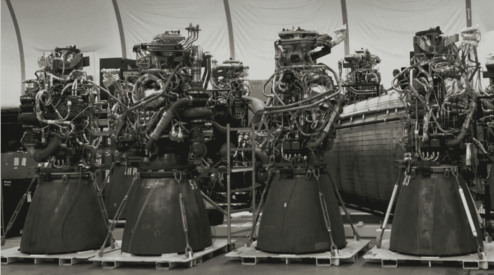

2004年左右，马斯克找到了他的第一个客户，也就是美国国防部想发一个小型卫星。其他公司的火箭都贵得离谱，于是找到了报价最便宜的马斯克。马斯克的火箭组装得也差不多了，正在做最后的调试，于是欣然接单。

2006年3月24日，SpaceX开始第一次发射，不过这次发射很快成了个悲剧。火箭升空25秒之后就掉了下来，唯一的一枚火箭发动机也摔了个稀烂，好在国防部的卫星没摔坏。用了一年才重新组装了一枚，这枚表现非常好，一直上升，大家慢慢放下心来，然后又炸了。

这时候公司的钱只够发射两次了，如果再炸两次，马斯克的后半生倒没啥问题，只是SpaceX肯定完蛋了。

重新组装后，在大家望眼欲穿的关切中，火箭缓缓升空，然后又炸了。

SpaceX的员工怀着“明天就散伙”的心态又组装了一枚，当时的资金只够做最后一次发射。2008年9月28日，SpaceX最后一次尝试发射，如果这次失败的话大家就去投简历找工作。没想到竟然成功了。

公司成立六年后，终于开张了。

### 3

不知道从啥时候开始，马斯克有两个大胆的假设，只要能攒出来一台火箭发动机，就可以攒九个，然后并联在一起装在一台火箭上。一台发动机的叫“猎鹰一号”，九台的叫“猎鹰九号”。只要今后工业化生产猎鹰发动机就可以了，这样可以不断提高可靠性，降低成本。需要大推力，就一直堆发动机，现在最大的星舰火箭，堆了29个火箭发动机。长下图这样：

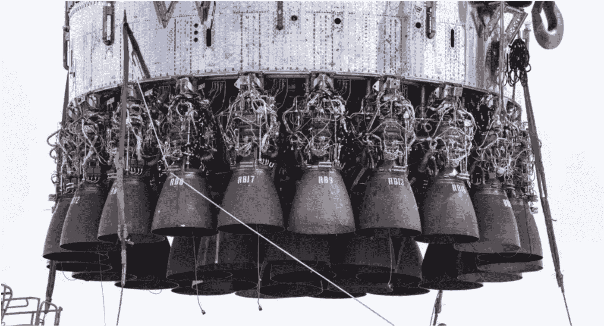

把一堆发动机放一起，产生巨大的推力，这个解决方案好像明摆着的道理，可事实上火箭发动机并联是一个世界级的难题。前苏联和美国曾经多次实验，被炸到怀疑人生。太容易出问题了，毕竟十套发动机并联，就像让你连续十次投篮全中一样非常难，随便一个发动机出点问题，整个火箭就炸了。

所以那时候的方案是尽量不适用并联，为了增加推力，就得把发动机不断往大做，大力出奇迹，巅峰状态就是土星五号那样的巨无霸，接近40层楼那么高，把人送上了月球。苏联也研发出了类似的N1火箭。这个火箭测试过4次，都炸了，本来想用这个火箭把人送到月球，最后也没成功。

多说一句，很多小伙伴说那时候计算机和人工智能那么弱，美国是怎么做到在月球降落的，也不复杂，那时候没有人工智能，可是有人啊，飞行员开着飞行器起降，经验丰富的飞行员比啥芯片都好使。有点像日本的“回天”鱼雷打得特别准，因为鱼雷里塞了个人自杀式导航。

马斯克的思路也很简单，加了大量的检测芯片上去，又设计了复杂的算法，一旦检测到哪个发动机故障就把它停了，测试了几次之后，基本已经成熟了。

此外还有那个火箭回收。

这似乎是明摆着的事，毕竟咱们出去上班，不会去一趟扔一辆车。可火箭重复使用在航天工程上却是一件非常非常难的事，涉及回收中导航、姿态控制、热防护、推力调整、高空横向推进等技术难点，随便点问题都可能导致火箭坠毁。

多说一句，为了让火箭保持垂直下落，SpaceX使用了栅格翼，前苏联研发的，咱们国家也在用，能增加飞行器的稳定性。也就是说，马斯克不仅吸收美国的经验，还广泛吸收了全世界的经验，下图这个：

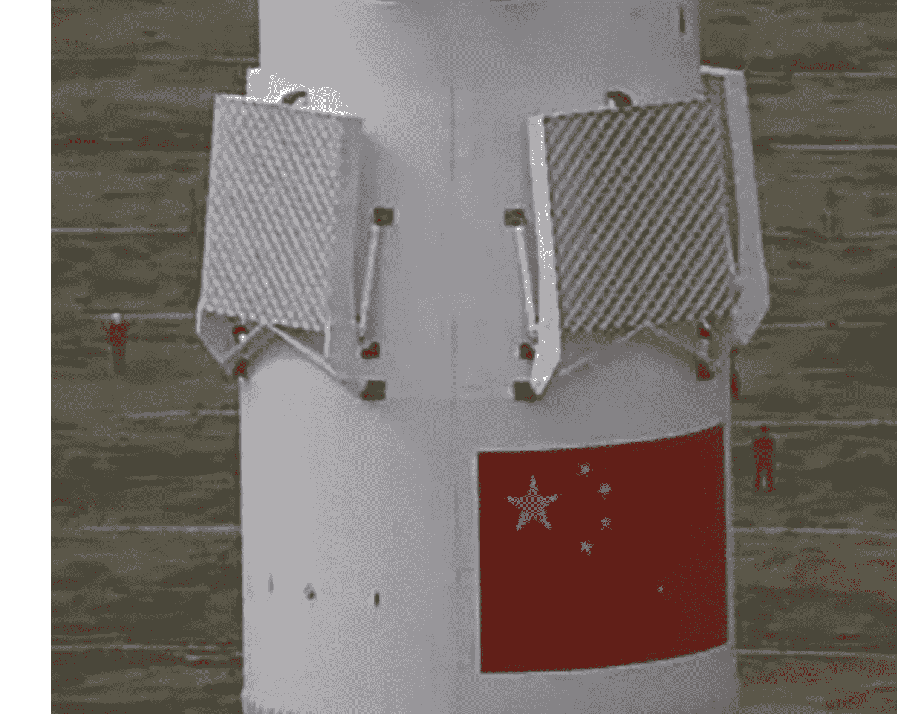

SpaceX从2012年开始验证火箭回收的可行性，实验了4年，摔了6次火箭，终于成功了。

由于不断地降成本，SpaceX的猎鹰九号火箭单次发射成本约为6200万美元（马斯克私下表示还能赚30%），而其他航天公司的同类产品则需要1.5亿到3.5亿美元的发射费用。问题是SpaceX的成本还在急剧下降，重复发射次数越多费用越低，在火箭领域也是价格屠夫。

说到这里，就有个问题，马斯克这些招牌小妙招，包括发动机反复使用和多发动机并联，似乎是明摆着的事，初中生都能想得到，为啥在马斯克之前，那些公司都不去做呢？

其实并不是想不到，也不是不想做，而是成本和风险，尤其是风险，会压垮所有官僚组织的创新意愿。

大家干过研发就知道，任何创新都是反复试出来的，火箭更麻烦，炸出来的。马斯克的公司炸了四次他们要崩溃了，炸五次就要倒闭了。如果在一个官僚化的组织里，炸三次领导就别干了。

所以以前那几个大公司，比如波音和洛马一起成立了一个ULA，还有欧洲航天局(ESA)，这些体系里每个领导都支持创新，都支持锐意进取，可是任何创新都需要支付大量的成本，还有可能失败，失败了就得追责。领导又不傻，好不容易爬上来，眼看就要安稳高位退休了，为啥要去做高风险操作？

所以欧美航天也进入了“老头政治”状态，整体处于半停滞状态，计算机和半导体这些年大爆发之后，那些老头们却极度抗拒把这些新技术应用到火箭上去，他们只接受自己年轻时候的东西，所有新东西他们都抵制，再说了，万一自己批准的这些项目出了事怎么办？

所以巨头坚决不研发新型发动机，上世纪90年代最后一台RS-68之后，美国就没有新型发动机了，可以看作是整个人航天业都进入了老年状态。洛马的明星产品“宇宙神V”和轨道科技的金牛座火箭，使用的都是俄罗斯的火箭发动机RD-180，没啥原因，就是便宜而且稳定，不会出问题，官僚系统最怕出事，每次出事就会有人掉乌纱帽。

大家都这么想，大家一起不进步，一起心安理得骗NASA的经费。

所以很多人说SpaceX是NASA亲儿子，其实不是，波音和洛马合作搞出来的那个ULA才是，只是NASA对这个亲儿子越来越失望，也没办法。所以SpaceX以极低价格给国防部发了一颗小卫星后，NASA开始注意到这个小公司，并且一直在暗中观察。

到了2008年12月，马斯克因为现金流耗尽，彻底山穷水尽，天天在那里纠结应该关闭特斯拉还是SpaceX。NASA送来了16亿美元的大单，今后由SpaceX负责向国际空间站送物资，从此以后SpaceX彻底活了。

比较搞笑的是，马斯克这人非常难相处，跟他相处过的人大部分极度讨厌这人，他的前妻、同事，绝大部分对他没啥好感，大家记得前文说的SpaceX最早期的元老米勒吧？后来也跟他分道扬镳，特斯拉的创始人也被他赶了出去（马斯克是投资人，后来成了CEO）。挽救SpaceX的美国新任航天局局长，曾经差点成为了SpaceX的联合创始人，买卖不成仁义不在，也跟马斯克关系非常差。

局长本来想看着SpaceX进坟墓，不过后来NASA官僚们一起进言，说SpaceX如果真死了，今后就只剩ULA一个傻儿子了，这个傻儿子自己不研发，一直在买俄罗斯的火箭发动机，没救了。局长反复权衡后，最后选择了给马斯克订单。

### 4

### 尾声

很多人一直在探讨中国和SpaceX到底有没有差距。

这个其实没啥可说的，确实有差距，而且不小。这一点大家可以看看咱们国家的一些院士们的说法，还是挺清楚的。

上文也说了，SpaceX看着是个民营公司，其实背后是美国积累几十年航天工业的土壤。我们发展的时间太短了，而且经费投入也没法比。

NASA大约有40年是躺着的状态，但是航天相关的那些领域，比如控制、材料、化学、通信等领域的发展并没有停滞，反而依赖全世界人才流入，发展的特别快。

有点像诺基亚和苹果的关系。在诺基亚停滞那些年，制造一台iPhone的技术已经全部成熟，是乔布斯把那些技术放到了一台手机里。马斯克也是一样的，技术一直在前进，但是NASA和其他科技巨头都停滞不前，马斯克把最新技术重新整合了一下，塞进了火箭，经历了一段时间低谷后迅速打垮了那些停滞不前的前辈。

其实大家去问问航天领域的人，就发现他们普遍对马斯克并没有多少恶感，普遍的看法是，马斯克让这个领域重新年轻了起来，又回到了美苏冷战那时候，每隔一段时间就有点新进展。

此外还有更实际的考虑，迫于SpaceX的压力，国内是不是需要上马新项目，有新项目就会提拔新人，增加经费就会给大家涨工资。可以说，特斯拉是汽车领域的鲶鱼，SpaceX是太空领域的鲶鱼。

此外还有不少人在争论“民营航天”应不应该搞，争论这个一点道理都没。大家想想，如果我是个亿万富翁，有个航天梦，想招募几个牛人去搞点研发，替国家分担下科研压力，解决一些高薪就业，就算成不了，也不用花纳税人的钱，做成了成果是社会的，没做成成本是我自己的，钱赔完我自己倒闭，我就问你，有啥道理不支持？

开放民营，某种意义上讲就是让民间有想法的大神用自己的方法去试试，国家啥也不用做，只需要把他需要的东西卖给他就行了，多赢。

这一点上国家想得很清楚，2014年已经开放了准入门槛，已经有民营企业开始搞了，今后我们也是两条腿走路，政府和民营一起发力。

所以说吧，也不用成天担心马斯克比咱们强，没必要，他试过的路径我们也可以走，而且宇宙很大，不至于他进去了咱们就没机会了。

而且咱们国家的航天事业一直发展得非常稳，只是前期投入不足，还有些官僚主义，人才也跑了一些，今后投入跟上了，充分尊重人才，很快就能做得非常好。

公众号懒人搜索，懒人专属群分享

### “山河四省”还有前途没？
2023-03-14

“山河四省”不多解释了，山西、河南、河北、山东，也有人说是“挖煤、种地、种菜、打铁”的四兄弟，说实话，作为一个山西人，很惭愧，觉得山西跟山东河北还是有很大距离的，跟河南有一拼。其他省不了解，今天重点说下我们山西，大家可以找找共同点。

我读书那会儿上的是我们省的重点中学，我们学校绝大部分学生，都达成了一个共识，就是大家一定要好好学习，这样将来就可以顺利离开山西，再也不要回来。这个观念并不只是老师给灌输进去的，而是家长们从小教的，大家可以感受下到底多无奈，才会让孩子赶紧走，再也别回来。后来我终于考了出来，确实不回去了，再跟北京这边的老乡一沟通，发现整个山西好像普遍这么想。

过年的时候跟以前的小伙伴吃饭，说是现在的想法变化不大，不过不像以前那么粗俗，现在很多高中的说法是，“先定一个小目标，润出山西也算润”。

可能有小伙伴说，不一定吧，太极端了吧，你们山西也没跑光啊。

大家有所不知，主要是吧，大部分人因为拖家带口的问题，想跑也跑不了啊，学历不高跑出去也没法落户定居，最后只能回去。只有大学生可以孤身闯天涯，说不定就冲出去了。

这个也不怪大学生，如果你读了大学，回了我们老家，真没啥事可做。也不是完全没事可做，可以去考公务员，可是公务员想升上去，非常非常难，因为大家不要忘了，我们那是一个讲关系讲背景的地方。

其实出了一二线城市，就进入了“关系即货币”的社会。这样的社会里，普通家庭出身的孩子，不甘心一辈子就那样，最好的选择可能就是去大城市闯一闯，不行再想想别的办法。

可能有小伙伴说，你们那地方不是有煤矿资源吗？

这个就更搞笑了，哪怕在煤矿私有的时代，煤矿赚钱这事也跟普通人没啥关系，你想象一个场景，你们县城有个非常富裕的人，他经营着一个厂子，从地下挖什么东西，非常有钱，跟你有啥关系？

倒也不是完全没关系，你可以去那里打杂。我从小接触到的正经上班族，除了“医生、公务员”，就是开拉煤车的，村里的人还可以去下煤窑（县城里的人一般是不下煤窑的）。也就是说，煤矿能给普通老百姓提供一个比没有强的工作，但是你说“致富”什么的，根本没谱的事，至于让所有人致富，那更扯了，没点生活常识的迷惑发言。

而且煤老板是很赚钱，可他们赚钱后又不给大家分，也不在山西花。第一时间跑到北京去消费，买豪车，买二环房，买朝阳公园大平层，投资电影电视剧什么的。此外很多山西煤老板并不是山西本地人，而是江浙人，他们投资赚钱后，那些钱又变成了炒房团的钱。我就问你，这跟普通老百姓有多少关系？

后来煤矿国有化了，“煤老板”也成了过去，小煤窑也被清理得差不多了，从此以后煤矿就属于国家主要的统筹对象。

这事让很多山西老百姓很难释怀，因为大家觉得煤炭贱卖了，其实倒也谈不上，不过肯定没卖上价。因为煤价太高，电价就低不了（70%以上的电是火电），电价最后会转移到工业品价格上，导致我国的制造业没啥优势。或者说，能源价格偏低，是我国制造业竞争力的重要保证，这一点上山西煤矿作用非常关键。

还涉及一个能源安全问题，如果太过依赖澳大利亚，说不定又会有别的幺蛾子。

而且国家给山西转移支付也不太多，在全国排20，比较靠后了。这一点我也觉得国家对山西确实不太好。不过有一说一，国家多给点，或者少给点，对山西影响不会太大，我一会儿说。

说到财政的转移支付，可能有不少人纳闷为啥感觉不到，你不是公务员当然感觉不到了，那些钱主要都转移给了政府，政府又把钱用在了给公务员发工资，或者投资什么项目，这种项目往往得有一些关系才能搞到。

在山西有个顺口溜，我忘了，大概就是每个地方的真正大佬，都是干房地产、挖沙子、开夜总会（大型酒店），并且得是上边有人。这一点也能看出来《狂飙》编剧确实是有生活常识的，高启强最后做到那么大，就是娶了沙场老板的寡妇，接手了夜总会，后来又干起了房地产，而且有靠山。这些人跟普通人唯一的关系就是没啥关系。

普通老百姓想感觉到这种财政转移，得等到公务员出来消费的时候，可能才能惠及到饭店，学校，小卖铺等等，或者基建项目需要工人的时候，大家可以去包工头那里报名。

这就形成了山西的另一个奇特景象，从煤老板时期一直持续到现在，整体是个大“M型社会”。也就是巨富比较多，中间层比较少，穷人比较多。导致大家去了那边感觉很分裂，一方面觉得那些城市完全没有任何产业，人均收入撑死三四千，但是豪车却非常多。

我高中所在的班级是重点中学嘛，我们学校两种人，学习好的和背景深的。多年后再和当初的小伙伴一了解，发现那些学习好的大部分都在外边漂，北漂，沪漂什么的，如果实在是混不下去，也不回山西，北边的去天津，南方的去成都。

那些背景足的往往会留在当地，或者考上大学后也要回到当地，慢慢变成了地方上有头有脸的人物。这一点可以参考周公子之前的语录，全国各地都差不多。

这就造成了山西教育的一个“大分流”，分数高没背景的全跑了，有背景的回来了。不过话又说回来，绝大部分从我们那里考出来的毕业生，以山西的产业水平，这些人回去也没事干。

### 那为啥山西缺产业呢？

这要是问我们那边的人，绝大部分会气呼呼地说西部大开发漏了山西，振兴东北老工业基地也没山西，还有一大堆其他振兴计划，反正都没有。

其实山西最大的问题是缺大河，山地又太多，这种情况下发展工业制造业几乎不可能。既然没有产业，也就没有产业升级的可能性。也不止山西有这个问题，整个北方都有，所以这些年北方发展的普遍不太好。

### 你可能说那不有黄河吗？

黄河不如没有，那玩意经常性断流，不断流的时候流量也非常非常少，跑不了巨型轮船，跑渔政船都够呛，原料运不进来，成品运不出去。运量非常小，路费太贵，如果山西搞生产，产品将毫无竞争力。

正是因为没产业，以至于山西的整个产业，都围绕公务员、矿，还有房地产展开，我在老家混得好的初高中同学，基本上都和这几个行业有关。

而且呈现出了高度的家族化，这个不多解释，大家都懂。

本来可以好好搞旅游业，不过受限于交通极差，发展潜力一直不足，山西北部就是和蒙古接壤的要塞区，属于抵抗游牧部落南下的最前线，按理说可以发展旅游业。可是那地方的交通，真是一言难尽，而且你去北方看那些古城古镇，当地没啥酒店，你还得当天赶回大城市。

中南部倒不错，不过去了那边的人普遍反映“旅游纵深”不行，也就是缺乏那种你可以在里边玩很久却不乏味的项目，这又跟整体的规划水准有关。

某种意义上讲，山西依旧是个农业社会，或者说类似农业社会的资源型省份，进步的动力并不是生产力和生产效率的提升，更多的是挖煤规模的上升。

这种社会里，资源能惠及的人数量非常少，同时又把少数的人才吸光，导致其他产业根本没啥机会，而且那地形也基本上锁死了发展其他工业门类的可能性。

### 这种情况下，整个社会文化也是“低增长文化”。

机会少增长慢的地方，你离开了你现在的岗位，可能就没地方去了，这种情况下，你就得巴结一点领导，等着他提拔你，等级观念非常森严。这种社会里，每个人的尽头就是体制，你只要挤进去体制，就一辈子衣食无忧，如果能升上去，还可以帮一下你的亲戚朋友。

大家都热爱体制，人人都想进体制，最后的结果就是体制内人满为患，这段时间大家搜一下新闻，就能发现山西那边精简体制最积极，因为实在是不堪重负了。

除此之外，还能干啥？

种地？就那么点平原。

放牧？根本没有草原。

搞点先进产业？根本没有人才，也没产业。

总之就这样给锁死了。

说到这里，大家可能纳闷，博主你说了这么多，你有什么办法振兴你老家吗？

当然没有啊，这就是为啥我们那边的人那么喜欢跑出来。但凡有办法，谁愿意背井离乡呢？

这两年没少跟我在山西体制内的小伙伴聊，他们有人已经干到了很高的位置，他们共同的感悟是，山西的地理环境太差了，类似《文明6》里出生点位问题，出生点太贫瘠，debuff叠满，导致发展一直非常乏力。资源倒是确实有一些，不过人太多，没法分。

可能小伙伴你问我，博主不对啊，既然山西出生点差，为啥民国好像挺好呢？

多简单啊，山西别看杵在中国比较靠中间的位置，可是地理上是非常隔绝的，黄河和太行山把这地方彻底封了起来，不太好出去，也不太好进来，“表里山河”，说的就是山西。

而且山西内部只有三块连着的平地，很容易被一股强权给统一了，这股强权坐稳后，封锁住中原入晋的几条路径，比如传说中的“太行八陉”，也就是穿越太行山到中原的八条路，都非常险峻，易守难攻，非常容易搞割据。

事实上中国历史上最容易割据的两个地方，一个是山西，另一个是四川。阎锡山就是在山西割据后，封死入晋道路，赢得了难得的和平机会。如果大家一起发展，山西照样不咋地，不过恰好其他地方天天打，脑子都打出来了，所以山西和广西这俩打的不咋凶的地方成模范省了。

至于马督工前段时间讲到的“高考平权”，也就是全国一张试卷的事，这事估计除了北京和天津考生没有不支持的。但对于家里没有考生的山西人来说是很中立的，毕竟就算清华北大录取山西人多了，这些人将来也一般不会回山西效力，多或者少，又有什么差别呢？能改善自己的生活吗？

说到这里，很多人可能觉得我太悲观了，可能也有人觉得我说得对。其实说白了，缺乏自身产业是一件平常事。如果把眼光从山西放到全国甚至全世界，大多数地方都是缺乏产业的。

小伙伴你打开GDP排名，会发现排在前面的地区，要么是人口少资源多（加拿大那么可怕的资源量，一个国家人口竟然和山西差不多），要么是在产业链上占据优势，能通过出口贸易获得利润，从全世界吸收财富和人才，反过来加强自己的产业优势。

即使在这些国家中产业也不平均，内部都同时处在产业非常不平均的状态。比如美国东西海岸产业强盛，中部就不太行。中国、越南、印度，都是南方沿海比北方内地经济强得不是一点半点，主要产业也都集中在南方沿海。

我走在家乡街头，到处是各种连锁品牌的东西，从一根冰棍到外地开发商盖的房子，还有看不见的各种网购。本地的经济如同严重沙化地区，财富如水一般落地也留不住，通过一个个管道，很快到了沿海东部发达地区。

本地水资源不足，口渴的人只有两条路走。

一是跟着水离开，很多时候还带走了自己的造水能力和六个钱包。

还有就是政府部门，因为行政编制和权力的存在，多少还有一定的造水（转移支付）能力。于是变得好像沙漠中的绿洲一样，那么闪耀那么光芒，成为口渴又不想离开者向往的圣地。

说得更直白一点，发达地区之所以发达，正是因为山河四省给他们提供了大量的劳动力和购买力，然后把自己的资源和人力抽了个干净。

但是你说可不可以不让老百姓流动，各地自己发展自己的产业？这样是不是就可以均衡些？

拜托，想啥呢。

你去山西创业搞产业搞工厂，你有随处可以招聘到的工人吗？有廉价资金吗？原料和半成品能快速运过来、成品能快速低价运出去吗？做不到这些，你的产品贵到根本没人买。低端产业是极端依赖港口的，因为利润实在是太薄了，根本经不住运费的盘剥。

甚至可以很难听的说，山西的人力资源被吸收到经济发达地区还能多赚点钱，说不定还能寄回家，那些人留在本地只会赚得更少而且往死卷。

所以某种意义上讲，现在的模式已经是为数不多的“最优策略”，山河四省出资源出人力，去沿海发达省份赚钱，中央再通过转移支付，向那几个省打钱。

至于将来出路在哪？我的一个在政府干到高位的小伙伴表示确实没招，他们这些年干的最重要的一件事，就是培训了大量的保洁、做饭、带孩子阿姨送到一二线城市。那些城市里有办事处，可以供这些阿姨落脚慢慢找工作。在他们眼里，阿姨比大学生好得多，因为大学生考出去往往就不回来了，而阿姨将来肯定是要回老家的，在大城市赚的钱都攒着，然后一分不花寄回家。

当然了，也不能说大学生出去了完全没有用，毕竟他们的父母还在老家，有些孩子也偶尔给他们打钱，不过大部分孩子都把家里的钱拿去大城市买了房。

而且他去外国考察了一圈，表示山西这么块地，容纳3400万人实在是太离谱（澳大利亚才3800万），等再过几十年，等到三次婴儿潮的人全部离开了，山西人口压力降下来，到时候随便搞点啥，仔细研究下搞旅游，说不定再搞点不依赖交通的智力型产业，应该能比现在强太多。

文末想多说两句。

尽管山西这些年发展得并不好，不过放在全世界范围内，也是奇迹般的逆袭，尤其结合我们那地方神奇的地理环境。

有些话尽管让很多人不太爽但还是要说，因为不少人也是零和思维，别人赚钱就是他赔了。山西和其他很多省的命运，是深度绑定在那些经济发达省份身上了，那些地方发展强劲，才需要山西的煤矿和人力，大家才能一起赚到钱，才有转移支付，山西的老百姓也能享受到发展红利。等大家都赚了钱，也可以去山西旅游。

很多人总害怕沿海吸自己的“血”，担心年轻人去了沿海地区，问题是年轻人留在当地有事干吗？你们能搞起来产业吗？还不如去沿海好好赚钱去，沿海地区容纳不下那么多人，将来大部分人还是会把钱带回家，沿海地区赚到钱还可以通过中央向边远地区转移。

这个意义上讲，是不是更能理解这两年反复提的“统一大市场”和“命运共同体”。

最后，我们山西文化旅游全国一绝，你们今后可以优先考虑去看看。

公众号懒人搜索，`<u>懒人专属群</u>`分享

### 燃油车真的要完蛋了吗？
2023-03-10

这个话题这两天特别热，我也有一些想法，不一定对，一口气写完，跟大家碰撞一下。

我自己家里一个燃油车，后来买了一个电动车，开了两年了，说说我自己的感受。

电动车买回来后，大概一个礼拜充电1.5次，每次剩下20%左右就把充电枪插上，手机里预约好空调，每天到车库，车里温度已经给调整好了，路上并线超车什么的也非常容易，自从买了电动车，我之前那辆挺贵的燃油车去年只开过三四次。

过年回老家，本来想开着燃油车回去，不过由于我提前出发，别人还没放假，于是就开着电动车上路。

一路上非常顺利，沿途服务区基本都有充电桩，尽管一般只有三四个，但是基本都有空位，偶尔空位不足，往前走几十公里下一个服务区也有空位，整个过程体验非常好。

说到这里，你以为我要说电车肯定是马上要取代油车了。

事实上不是，恰好相反，我坚信新能源取代燃油车是一个趋势，但是不代表是现在，电车狂飙一段时间后，大概率就会进入一个缓慢爬坡期。

这两年接触过好几个小伙伴，他们小区比较旧，装不了充电桩，小区里倒是有几个公共的，离家不远也有充电站，于是果断买了车，结果发现根本没法玩。

因为绝大部分电动车车主跟他一样，都是上班族，大家的节律高度同步，他下班去充电，发现大家都去，以至于充电桩附近连停车地方都没，折腾了两趟，越来越崩溃。想去公司充，可是每次得去得非常早才能抢到公司的充电桩，本来就不够睡，睡眠更不够了。

后来身心俱疲，只好折价卖掉了，卖的时候才发现掉价掉得那么严重，不过很快他就开心了，因为其他人晚卖了两个月，又在他的基础上打了个七折。

至于跑长途，我过年回老家因为是提前出发，正好跟其他小伙伴错峰了。我有同事以为会跟我一样走运，然后悲催了，发现每个充电站都在排大队，粗略算一下，可能要排五个小时才能轮到自己。最后没招，只好下高速去酒店里开了个房，让车在酒店车库慢充。

大家发现了吧，现在有个很大的问题，如果你符合下边的这两种情况：

- 有个家用充电桩车位；
- 还有一辆燃油车。

那电动车就是完全淘汰燃油车的存在，一年开不了两次油车。但是如果没有充电桩，那你完全是买了个电动爹，而且以电车现在的增长速度，那个爹会越来越难伺候。

平时省下来的油钱，卖车的时候又全部折进去了。

当然了，如果你不用上班，或者自由职业，那电动车也能取代油车，毕竟你跟其他人节奏不一样，能够做到完全错峰。

这也是为啥很多自媒体博主开着特斯拉从四川溜达到西藏，又从西藏溜达到新疆，再到西安，穿越秦岭回四川。你要是趁着节假日也这么玩，只能说你胆大心细，是个大才。

也就是说，电动车之所以发展迅速，因为这个社会有很多人他们充电是很方便的，住的小区是最近几年建好的，恰好又买了车位，装上充电桩之后那他估计这辈子都不想再碰油车了。

此外大城市还有无数自由职业，这两种人共同构成了强大的购买潜在客户群，导致中国前期电动车出货非常迅速。但是等这些潜在客户耗尽后，剩下那些装家用充电桩比较困难的，必然会进入一个缓慢的爬坡阶段。

说到这里，大家可能要问，博主你是不是想说电车取代不了油车？

也不是。

大家想想，油车怎么做到这么方便的？

主要是因为国家斥巨资修建了大量的加油站才解决了这个问题。我小的时候，我们那边加油站数量严重不足，而且加油站经常缺油，以至于当时的司机车上都放着一个备用油桶。后来一听说加油站有油了，就带着桶去加，很快又给搞没了，于是我们那边到现在很多加油站都不给车以外的桶加油。那种在车上放备用油桶的思路，跟现在很多电动车主恨不得在自己车上放一块备用电池心态差不多。

所以说接下来如果想让电动车迎来新的爆发，需要新的一大波基建的投入，服务区三四个充电桩肯定是不够的，可能需要三四十甚至更多，才能支撑起这么庞大的用车规模。所有的市区停车场，可能都得进行改造，配上大量超级充电桩。

更别说现在公共充电桩大概有20%～30%是坏的，今后这么多的充电桩维护也是个大麻烦。到时候必然会拉高电价来保持平衡。

而且几乎所有的小区都得做改造，因为很多小区并没有预留充电桩的接口，你去找物业，物业也没法给你装。如果不改造，随着电动车越来越多，本来就严重不足的公共充电桩会越来越不足。

如果说电动车是一个新物种，这个物种需要环境做调整才能不断壮大。当然了，它自己也会改造环境。如果电车太少，装充电桩也就无利可图，大家都不愿意去做。等电车上了一定规模，充电频繁，充电桩成了个盈利行业，不需要国家动手，市场就能自发解决。

此外电动车现在不断降价，看着是好事，其实对消费市场并不是真友好，很多人变成了“等等党”，毕竟车这种很贵的消费品，估计没多少人能受得了自己买了没多久就降价。而且总降价，对于二手车市场打击太大，面临没法定价的困局。

但是一旦降到一条线，再叠加消费下行，这就可能就会改变之前所有的市场格局。

今年恰好消费疲软，大家消费动力不足的情况下，第一个砍掉的就是车这样的大件消费。查到了乘联会的一组数据，今年以来累计销售车辆265.7万，同比下跌21%。并不是油车下跌，而是油车加电车跟去年相比一起跌。

于是就有了这段时间的油车大降价，因为电车对市场形成的压力，叠加今年以来的消费疲软，本来要买油车的人买了电车，还有太多人本来要买车，现在变成了观望。油车企业必须拿出来足够的诚意，才能吸引大家重新下场。

这次降价可能意义非常深远，如果可以，车企宁愿吃个苍蝇也不会降价，现在就降了，一方面说明他们的压力极大，另一方面一旦降了，今后就别想提回去了。

也就是说，电车真正的优势并不是动力系统，而是它和以前枪炮代替弓箭的道理是一样的，火枪刚出现的时候并不比弓箭强太多，尤其是面对英国长弓手那样bug的存在，初代火器根本没有任何优势。

但相比弓箭几千年进展缓慢，枪炮最大的优点在于它进化神速，火器进化了几代之后，英国人就开始讨论保留长弓手的必要性，再进化几十年，英国人已经开始纳闷之前有啥可讨论的。

现在也一样，只能说传统燃油车日子过得太舒服了，几十年变化不大，而且好像所有车企达成了共识大家一起给消费者挤牙膏，凯美瑞和天籁他们就那内饰，就那自动化程度，好意思卖二十多万？要点B脸。其他车也差不多，很难想象这几十年里整个世界变化这么大，那些车厂怎么好意思这么淡定天天挤牙膏。

问题是这些问题在电车崛起之前大家没思考过，觉得天经地义，直到有一天去电动车4S店试驾了一下，基本都会纳闷那些传统燃油车巨头怎么那么抠。

于是有车位的可能就买了，没车位的可能选择再看看，效果就是油车占比不断下跌。

至于国产电车能不能打垮那些传统豪车，我也不知道，不过这又是另一个问题。

豪车卖得贵，并不是他真的值那么多，而是有人需要一辆贵的车给自己撑门面，恰好他买的这辆贵车其他人也认同。

就好像公司让你去机场接一个重要客人，你会毫不犹豫租几辆奔驰S级，或者路虎揽胜直奔机场，而不是性价比更高的其他车。此外茅台也是这个逻辑，重要宴请场合你拿出一瓶江小白，还跟客人说这酒最近非常火，你猜对方怎么看你？有时候你需要表达自己的诚意，这时候就得选双方达成共识的产品里更贵的。

也就是说，有些东西卖得贵却有人买，恰恰是因为它卖得贵，比如丰田那个埃尔法，国内卖一百多万，如果像在日本一样卖二三十万，它的江湖地位就没了。可是你自己搞个产品卖得非常贵，又没人买。差别在哪呢？

在于讲故事，对消费者洗脑。比如现在的95后对一款叫“皇冠”的日本车完全没印象，对陆地巡洋舰也没啥感觉，甚至他们对奥迪的感受竟然跟国外一样了，觉得“BBA”放一起很搞笑，奥迪何德何能。

但是对于我们80后的人来说却完全不一样，主要是我们这代人是经过那个时代这些产品的洗脑的，但是年轻人成长过程中，这几个产品的洗脑能力下降，加上皇冠和奥迪也不再是官车，民间态度也就变了。

所以我们接下来除了产品，最重要的就是赶紧补上营销这个大空缺，不然将来会非常麻烦，看着好像在国内打垮了日本车，国际上却丝毫不动，就跟三星似的。我查了下，去年全球销量前三，依旧是丰田、大众和现代。全世界范围内卖的最好的纯电SUV是model Y。

所以说国内企业想真正做大就得走海外路线，要卖到海外去，去赚老外的钱，在国内卷意义不大。

当然了，有些人想法太过极端了，希望那些油车企业尽快倒闭。

要知道，油车比电车复杂得多，上下游涉及的产业链也庞大得多，外资固然赚咱们的钱，不过就业可都是咱们自己的。比如像一汽这种巨兽级公司，整个长春几乎跟这个公司深度绑定了，如果他们出点事，后果不堪设想。

现在这种大规模降价，可能会导致大家形成通缩预期，觉得就不买，说不定还要降，这种预期非常可怕。刚刚公布了最新的通胀数据，大水漫灌下，2月CPI涨了1%。好消息是通胀没起来，坏消息是面临更危险的通缩可能性。也就是大家都不花钱，外贸也不太好（美元计价跌了10%），工厂没订单，可能会裁员，进一步导致不敢花钱，恶性循环。

这两天听一个读者说他周末去了趟商场看家电，苏宁旁边的国美已经倒闭了，商场里门可罗雀，他们也果断撤了，因为觉得随时会降价，现在买了是冤大头。倒也不是说全国都有问题，而是说他们那种心态很常见，萧条是会传染的。

我们不断地说消费是接下来的重中之重，而房地产和汽车又是消费里的两个重头，因为他俩都关联着一堆产业，所以如果萧条得太厉害也危险。

### 文末再总结下吧：

- 1、电车大概率冲到一定程度会放缓，因为基建和小区改造都是硬投资，需要时间，改造速度可能赶不上销售速度，导致买了电动车没有家充的人体验越来越差。
- 2、但是电动车对汽车格局的冲击已经形成，叠加看不到底的消费乏力，今后燃油车的日子更难过了。当然了，消费层面，老百姓不掏钱，并不只是针对燃油车企业，对于所有没有海外市场的企业都是一场生死局，某造车新势力好像就要撑不住了。
- 3、想冲击传统豪车，还需要时间来补足营销方面的课，而且要走向海外，得去赚老外的钱，这对营销的要求非常高。

公众号懒人搜索， 懒人专属群分享

### 警队背景的李家超上台了，香港应该稳了

2023-03-09

上一篇《黑社会横行，犯罪率爆表的一座城》发出去之后，不少小伙伴问我之前是不是有一篇关于香港警队的文章？为啥找不到嘞，确实有，去年写的，不过因为一些莫名其妙的原因被删了。

今天给大家重发下，又忍不住做了不少的修改。考虑到太多人跟我一样，一直看香港电影长大，对港警好像很熟悉，却又非常陌生。很多内容如果我硬聊，估计小伙伴也不直观，我会找大家比较熟悉的影视内容来举例子。

看完本文，大家会对香港政治有更深的理解，也就对香港的整个生态有了更深的感受。

写这些，有点像是 对香港电影的最后告别，毕竟如今的香港电影早已没了当初的辉煌，年轻人也基本上没法和我们这些八零后感同身受，估计用不了多久，也就没多少人关注九龙城，也没听说过香港警队，或者说香港警队只是一个执法队伍本身。

### 1

我们知道，香港搞的是三权分立，照西方的立法、司法、行政分开运作。我们平时说的特首，就是香港行政部门的一把手；而香港法院，就是经常被骂的那群戴假发的法官们。

立法会权力是很大的，香港这种地方，政府做啥事，基本都得在“有法可依”的前提下，这就让立法会的权力特别大，不过他们的权力分的很散，一群人在里达成共识才能出台具体法案。

《寒战2》里周润发扮演的大律师，他就是立法会的人，整体非常嚣张，因为他确实谁的脸色也不用看:

特首领导的政府，分为三司13局部门，最大的就是政务司，占了足足9个局。

而政务司下，最大就是保安局了，这个部门听起来像是管香港各个小区保安的，其实不是，这个部门权力非常大，香港几乎所有的执法力量都在这个局下边。平时我们熟知的香港警务处，就是保安局最重要的下属部门。

如果看过《寒战1》，里面第一次解救失败之后，场面一度大乱，郭富城半夜的刘杰辉打算夺权。这时刘德华扮演的保安局局长陆先生出场为刘杰辉站台，才使得刘杰辉拉到足够的票，从而掌握了局面。

而且《寒战2》里说保安局局长陆先生是特首的最大竞争者，可见这个位置位高权重。现在的李特首之前也在这个位置上。

电影中通过角色之口，说刘杰辉之所以能在警务处快速升职，并盖过梁家辉扮演的李文斌在处长位置的争夺中获得优势，很重要的原因就是获得了保安局局长支持。

而港片里大家比较熟悉的廉政公署（ICAC），虽说部门在律政司之下，但是其实是独立于其他政府机构，直接向特首汇报。这里的“汇报”不是汇报工作，是说他们不鸟其他部门，说查谁就查谁，查了你，你也别想通过找你领导来压我，因为你的领导管不了我。也正是因为谁都干预不了他们，所以他们才能有那么大的能量。

而且廉政公署最早是针对香港“警匪一家”成立的调查科，主要调查自己人，这也是为啥寒战里，郭富城扮演的警队副处意识到警队里有人给罪犯通风报信的时候，就去引入廉政公署的力量开展调查。

警务处作为特首-政务司-保安局之下的处，却是香港政府部门中权力最大的处。

因为香港地位特殊，作为一个前殖民地城市，是没有自己的军队的。只有英国直接派驻来的部分英军，回归之后驻港部队也是内地派驻，部队并不参与香港的日常管理。

香港的执法部门就基本都属于警务处，香港警务处规模非常大。按照警务处的最新资料，一共有33,120名纪律人员及4,734名文职。而整个香港公务员不过17万左右，光是警察就占了接近1/4。 我说了这么多，就是想让小伙伴知道，香港警队在香港政府公务员中非常重要。

但是警队在整个政府部门中，只是重要，地位却不高，这个也很正常，就好像很多组织里的技术骨干一样，没了他系统没法转，可是他的工资并不高，玻璃天花板也很明显。按照正常的理解，警务处长升职到保安局局长，或者保安局局长升到政务司，应该属于正常升迁。

但是在如今李特首之前，这种升迁基本不可能。警队等于一个封闭部门，做到警务处长，基本就没有上升空间了，最多做到保安局副局长。回归之后过了20年，2017年，李特首才是第一个警队出身的保安局局长，这次能顺利当选，也和没有其他人一起竞选有点关系。

而警务部门出身任政府首脑，不要说回归之后，当年英国人把持香港上层的时候，这种情况也基本没有过。

究其原因，就要说到香港，或者说英美政府中的一个问题：政务官和事务官区别。

所谓事务官，就是忙具体事情的公务员，大多是从基层开始做，很多起步都比较低，有点像我国古代的“吏”，宋江他们，上升空间有限，是有玻璃天花板。

所谓政务官，就是那种在政府决策部门任职的文职，这些人大多出身比较好，学历高，在政府里面起步就高。有的即使是低级职务，也是在要害部门做秘书、助理、翻译、文书这些工作，很快就升上去了。这也是英国的一个传统，那些高出身的孩子从小精英教育，长大去名校上学，毕业后依靠家族荫荫，去给大领导做跟班，很快就上去了。网上有句话，说“有人生在罗马，有人天生是牛马”，大概也是这个意思。

这次李家超从基层公务员，一直突破玻璃天花板干到特首，是一件非常稀有的事。

### 2

说了警队的上级，再说说警队内部。

警务处长，也就是所谓“一哥”，这个外号，因为他的公务车车牌就是“1”，下图是我从《寒战2》里截的，简单暴力。

处长之下有三位副处长。其实长久以来都是两位，一个负责行动一个负责管理。《寒战》里梁家辉负责行动郭富城负责管理，一般处长不再亲自指挥行动。所以一出事，梁家辉当仁不让指挥行动，大家都没有异议。

刚才也说了，“一哥”处长下边是两个副处长，他们往下还有几个助理处长，再往下就不是管理层了，属于一线干活的，这些人当中最高的，叫总警司，全香港差不多有几十人。

这次的李特首20岁入警队，40岁就做到总警司。46岁以西九龙总区指挥官职务成为助理处长，相当于进了管理层。

警司，属于基层头目。比如《逃学威龙2》里面，那个被吴孟达“软饭硬吃”的女长官，职务就是个警司。以前这个职位收入不高，但是又很多外快，不但有金卡给吴孟达随便用，出场时狠狠打了柯受良一顿之后，还放话“投诉我？这一区我最大了，要告就到我面前来告我好了”，还有那句“你在教我做事？”也成了抖音名场面。

警司再往下，就是督察，《无间道》里的黄志诚，因为是倒叙关系，他在第二部里是督察，到了第一部就是警司。

说到这里，有个长久以来困扰我的问题，那个“探长”又是怎么回事呢？比如电影《追龙》里，“五亿探长”雷洛在香港警队到底是个啥角色？

后来查了下，发现探长本身职位并不高，当然也不低，大概相当于一个警司，没想到一个基层小吏能贪那么多。

英国以前管理香港的时候，殖民者是非常少的，要想统治稳固肯定要依靠当地人中的“合作分子”，也就是我们现在常说的买办。但是对于这些人也要提防：既要防止这些人有二心不是真的投靠，又要防止这些人做得太过分把老百姓逼反了给自己惹祸，更要防止这些人做大了之后团结起来借机把自己推翻。

直到“二战”，英国人实力还够强，不怕殖民地闹事。所以殖民早期，对于华人是完全不屑一顾的。有的工作实在没法由英国人干的，才会雇佣一些华人，干的不外乎跑腿算账打杂这些，地位也都极低。

警察部门因为要经常和当地人接触，英国人既干不了也不愿意做，所以也是最早雇佣华人的部门。比如当年上海滩所谓“青帮三大亨”，黄金荣作为老大，他就是租界的探长，带着徒子徒孙给洋人在上海做“包打听”的。在洋人眼里地位低的和给他们看门的没啥两样。

探长听着蛮有派，其实在警队里面职务非常低，平时跟三教九流打交道，连警服都不穿，电影《追龙》里刘德华扮演的雷洛好像一次警服都没穿过，他一直不太敢惹的那个英国人，就是个警司，跟他职务差不多，但是他处处让着对方。

后来随着英国越来越依赖华人，对华人在警队可以担任的职务提高了很多。

《寒战1》里，廉政公署询问梁家辉，说“你父亲当年就担任华人最高警司”，这个职务工作内容其实和总华探长差不多，只是把职位提到了总警司级别，算是真正警队高层了。

### 3

从李特首在警队的简历看，确实是从基层做上来的。

他待过的部门很多，而且都是一线。刑事情报科、西九龙重案组、毒品调查科、有组织罪案及三合会调查科。后来又做过负责投诉及内部调查的负责人，这个部门比较特别，影视剧中动不动就要求警察写报告，而且几乎没有露过面，属于比较不讨喜的部门。

这等于李sir几十年把情报、刑事调查、扫毒、反黑、行动几个警队主要部门都干过一遍，还干过内部调查。

这些部门名字，常看港片的估计都耳熟，也可以说是香港警队的主要部门，我也简单地介绍一下。

重案组，这个部门大家太熟悉了。干啥大家也都知道。港剧迷一定都知道“西九龙重案组”这个称呼。西九龙这个地方比较特殊。这里都是商业繁华的所在，相应的发案率也较高，比较重大的案件也多，基本上影视剧里面出现重案组八成就是西九龙的。

西九龙下属几个分区：油麻地、尖沙咀、旺角、深水埗、九龙城、红磡......估计熟悉港产片的小伙伴都要笑了，这些地方实在太有名了，出事基本都在这里。

香港旅游有一种就是影视剧现场游，一群人拿着相机到处找最喜欢的港剧场景地拍照。《黑社会》里东莞仔跨栏的栏杆，《无间道》里面“三年之后又三年”的天台，曾志伟“一将功成万骨枯”的大屿山天坛大佛，还有铜锣湾、庙街这种地方。

警局也是游客聚集的地方，特别是油麻地警署，这地方基本上看过几部港产剧的，没有不认识的。好在香港基建早就完成了，最近几十年变化也不太大。下图是在无数港剧里出现的油麻地警署，已经建起来一百多年，一直变化不大：

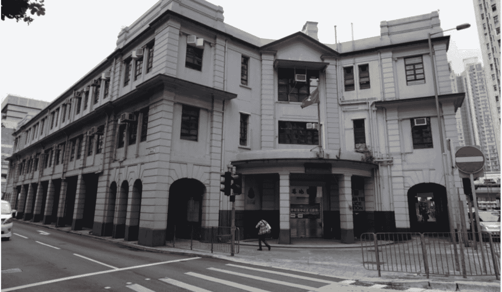

看港剧，经常出了个案子，普通警察正忙着重案组就来了，然后宣布没你们啥事我们接管了，把现场证物交给我们吧。但是如果案子比较大，重案组正在忙活，突然开来几辆车，下来几个穿西装的，说这里我们接管了。有问题问你们上司，证物交给我们，你们赶快离开现场。刑事情报、O记、毒品调查科等部门就来了。

咱们重点说一个绝大部分港片里都涉及到的部门，估计也是香港警队中最著名的部门——O记了。

O记，负责反黑社会活动，所谓“有组织罪案及三合会调查科（Organized Crime and Triad Bureau）”，首字母是O，所以叫O记。这也能看出来一件事，其实香港说的“黑社会”，主要就是“三合会”。关于“O记”，最著名的电影可能就是《无间道》了，无间道里黄秋生扮演黄志诚，他就是O记的B组组长。

所以《无间道》里面有个很大的bug，就是为了推进剧情，黄sir要被黑社会从天台扔下来。而实际情况下，黄sir职务只是警司，但这个职务是全港所有反黑社会的直属部门老大，天生就是压着黑社会的。

黑社会把这种人杀了，除了害死自己和手下没有任何意义。因为很快就会有人接替他的职务，上任第一件事就是要把这个案子不惜代价彻底解决掉。

并且杀了他，就等于黑社会向政府宣战，如果不连根拔起，不要说警队的士气和声誉，整个政府的可信度都要大打折扣，所以这事肯定会动用全部资源往死里搞。事实上全世界正儿八经的国家里，黑势力一般不会碰警察，毕竟当黑社会的目的是讨生活，不是找死。

所以前段时间《狂飙》热映，我在微头条说最大的bug，也是杀警察的事。

如果说在中国最忌讳的有那几件事，其中就有黑社会动警察，这可不是闹着玩的，几乎没悬念会一直追查下去，追杀到天涯海角也要把这事查清楚，然后抓回来后脑勺来一枪。因为警察代表的不是他自己，是整个执法系统，你动警察那就是对整个系统的挑战，再大的黑社会，跟这个系统比起来都是渣渣，连渣渣都不算，几下就给碾个稀巴烂。

一般来讲，陆寒那种一根筋，如果组织内部看不惯他一个劲的追查，也好解决，直接转到交警或者去做文员，再或者直接弄到派出所，天天忙一些琐事，而且也不能再动用刑警队的资源，很快他也就没法查了。不过不利于推进剧情，才用了这么个剧情。不过剧里也说的很清楚，高启强敢动别人，他自己是绝对不会动警察的。

继续聊香港警队。在《寒战》当中，李文斌以前也是O记老大，后来的那几个反派，也是他以前在O记的兄弟。后来李文斌干到警队副处，这个升迁路径也是正常的。

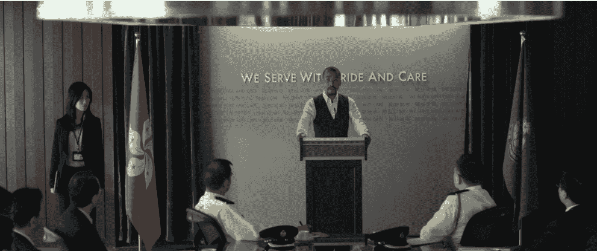

在机关部门待过的小伙伴，从部门架构上估计一眼就能看出O记的重要性：即是总部直属机关，又是要害部门。所以在影视剧中，O记的人都显得比较横一点。现在香港的黑社会已经很消停了，O记最重要的工作是反洗钱，香港作为自由港，洗钱这事实在是太频繁了。

O记的一把手，常被称为“O记一哥”，回归之前不说了。回归之后，坐到这个位置的个个前途大好。

第一个就是任达华的亲大哥任达荣，他们父亲原本是水警，结果很早就因为事故去世。长大后弟弟进了影视圈，哥哥接过父亲的班做了警察。并一直表现优异，回归前做到O记一哥，并在行动副处长任上退休，也就是李文斌那个位置。

任达荣后面接任的就是现在的李特首了。

还有个部门，叫“政治部”，这个部门，在回归之前就是“香港皇家警察政治部”。看过《逃学威龙2》估计都有印象，那个讨厌的小胡子，一上来就说“我们政治部办事，用得着和你们警察说么？”

当时我就奇怪，这帮人什么来头？不是警察么？后来才知道，政治部这个部门之所以特殊，就是因为他们虽然名义上属于警队，实际上当年是英国军情五处管。

香港作为亚太地区的物流金融贸易中心，是个大自由港。同时也是一个情报中心，又紧挨着大陆，常年都处在各方势力混杂的局面。尤其冷战期间，香港是我国通往世界的门户，香港那边给一直非常积极抓间谍，英国特务办事不方便，于是给搞了个警察执照，有了执法权，这就是政治部。

香港回归前两年，政治部解散。普通工作人员在签了保密协议之后转职（据说如果还在政府任职都可以升职一级），掌握了重要情报的高层大多被安置到了英国。

但是回归之后，政治部的保卫和反恐，这些工作还是要有人做。于是警队又组建了保安部，原本的情报工作肯定也要有人做，而保安部很可能把这部分也继承下来了。真实情况不得而知，香港警察保安部的公开信息非常少，显得特别神秘。

《无间道3》里面，黎明扮演的就是保安部的警司。他的资料被转过来的时候，上面除了名字和性别，全部都被涂黑了，印得都是“confidential（机密）”。在电影里显得神出鬼没的，似乎哪里都有他，既要在黑社会安插卧底，又去北京保护要员。

### 5 尾声

文末再说几句李特首今后可能面对的麻烦。

之前的文章《香港疫情为啥搞的那么烂》里已经说了，香港整体更接近欧美，老百姓信奉“法无禁止即可为，法无授权不可为”，香港的“法”，是归立法会管，理论上讲，政府得在立法会的授权下开展工作。

这几年香港各种乱七八糟，一方面因为它跟欧美差不多，大家看欧美新闻就知道，他们是没啥共识的，啥破事都得上街闹几圈；另一方面也跟香港政府职权很小有关，而且政府管理层也不大愿意行使权力，怕被人骂，反正在他们那种环境里，啥也不做会挨骂，做得太多也挨骂。

而香港上层也分裂成了两伙人，偏向中央的香港执法部门，还有一伙倾向于保持现状。现在大家明白了为啥之前有些香港人那么恨警队了吧，警队整体代表的是“鹰派”。

这种情况下，特首就成了夹在中间两边不讨好的角色，之前的林郑月娥，她既想跟香港大部分人保持一致，又想跟中央保持一致，所以最后搞得很狼狈，这可能也是为啥后来大家愿意竞选特首的人不多的原因吧。电影里有下边这句话，也就好理解了：

现在好了，鹰派人物上台，今后就不用瞻前顾后了，维护香港老百姓的安全，维护祖国统一，不要想着两头讨好，保持单一目标，工作可能也没那么难。文章是重发，就不开评论了。

公众号懒人搜索，懒人专属群分享

### VR怪圈何时破，奇遇、苹果争推MR头显能否走出尝鲜区

2023-03-09

从2015年的爆发式兴起，到2018年遭遇寒冬，VR产业近年来虽然发展势头逐步向好，但整个行业却始终与用户存在距离感，产品大多充当尝鲜品角色，VR行业一直深陷发展怪圈。

随着融合VR/AR的MR头显设备奇遇MIX问世，通过强化内容和现实融合，提升用户交互属性和应用场景，MR头显能否走出尝鲜区，成为业界关注焦点，而XR行业厂商奇遇和苹果的争相发布，更是引发业界对MR头显发展前景的期待。

### VR/AR融合，MR头显面世

“雷声大雨点小”可谓过去8年VR产业的真实写照。

据一位VR/AR项目投资人表示，VR行业的快速沉寂，核心问题在于产品体验达不到人们预期，没有好的体验，没有大的出货量，自然无法形成一个真正的产业。

产业观察家洪仕斌也表示，问题出在技术、生态，早期VR产品就是一个尝鲜的玩具，用户体验差，普遍存在佩戴不舒适、眩晕、恶心等问题，内容匮乏单一，导致早期VR用户失去了信心。

在元宇宙概念推动以及VR一体机技术发展下，近年来VR产业有所复苏，2020年8月，大朋VR获投数千万；2021年1月，奇遇VR完成B轮数亿元融资；2021年9月，字节跳动天价并购Pico，种种举措似乎宣告VR即将二次崛起。

但不争的事实是，VR产品距离消费级产品仍有较远距离。据中国VR行业现状深度研究与未来前景分析报告数据显示，2022年国内VR设备出货量合计仅121万台。据IDC最新数据显示，2022年全球AR和VR头显全球出货量为970万台，较2021年同比下降12.8%。

面对行业发展困境，企业也试图通过调整方向或创新寻求变局，如HTC便早早将VR经营重点转往商用，相比之下，梦想绽放（爱奇艺·奇遇）则更偏向技术创新，2022年底，奇遇VR更是正式推出了旗下首款融合VR和AR的MR头显——奇遇MIX，为行业带来了全新产品理念，就在前不久的2023 FBEC未来商业生态链接大会上，梦想绽放科技副总裁王恺更是透露，奇遇下一代全新混合现实MR旗舰新品将于今年4月面市。

不止奇遇，科技巨头苹果也在观望多年后，最终决定通过MR头显入局。据消息透露，苹果即将在今年6月份的WWDC上正式发布苹果MR新品。

### 全彩视觉透视，突破交互限制

无论是奇遇新一代 MR产品还是苹果MR新品，目前网上产品信息并不多，但从奇遇 MIX上或多或少能发现MR产品的特色。

奇遇 MIX是全球首款搭载双目视觉彩色透视方案的消费级 MR 产品，主机配备两颗 1600 万像素透视专用全彩摄像头，依托这两颗摄像头，奇遇 MIX告别VR一体机仅用于临时切换的黑白透视，可以捕捉实时画面，类似AR眼镜一样，能够将虚拟世界和真实世界相结合，呈现多种色彩的显示画面。

比如在现实中多出一块虚拟大屏，可以看视频、刷微博、微信交流，孩子们喜欢的迅猛龙、霸王龙、翼龙甚至可以直接出现在客厅、卧室等，并且可以和恐龙互动，客厅变成全息战场。

用户使用体验层面，奇遇 MIX也极大减少VR一体机的闭塞感，使用时，用户能够对周围物体和自身移动感知更精确，视觉偏侧、畸形更小，感官更自然。更重要的在于，奇遇 MIX突破独立封闭概念，为交互体验提供基础。

在梦想绽放 CEO 熊文看来，无论是单纯的 VR 还是 AR，都无法承载元宇宙内容对于硬件在视觉和交互上的需求，融合了 VR 与 AR 的 MR 将成为未来元宇宙通用终端的主流形态。

注重体验和交互是奇遇与生俱来的基因，在前不久刚刚收官的爱奇艺虚拟现实游戏闯关真人秀《元音大冒险》中，奇遇就是官方指定的VR合作伙伴，并作为元音大陆链接官，为节目提供全程的VR支持，让用户、明星、竞演完美融合在VR世界，也开启了全新观综新时代。

### 携手 AIGC ， 承接未来元宇宙

奇遇是XR行业老兵，早在2016年成立就开始布局VR、AR以及MR的内容，技术创新和内容是其优势。技术创新上，奇遇先后推出了全球首款4K VR 一体机、未来影院iQUT 标准、全球首个5G+8K VR直播、国内首个计算机视觉(CV )头手6DoF VR 交互技术等等，创下了多个行业第一。

内容层面依托爱奇艺打造了奇遇iQUT未来影院，据了解，从奇遇MIX开始，奇遇iQUT未来影院将全新升级至iQUT MAX画质，将支持爱奇艺自主研发HDR视频增强技术——帧琦映画MAX，支持高达8K分辨率、60FPS帧率以及HDR、3D立体效果、AI画质增强。

凭借出色的硬件创新和内容服务，奇遇在市场上也表现不菲。据IDC的数据显示，2021年第四季度，奇遇VR全渠道销售额同比增长475.9%，市场占有率达22.5%。2021年全年，线上电商渠道中，奇遇VR出货量占比达27.4%，位列行业第二。

面对行业竞争加剧，熊文表示，奇遇的未来将聚焦于为用户创造差异化价值，在未来会在技术上持续探索，为行业和用户提供不一样的产品。

在洪仕斌看来，XR行业想要走出困境除了需要技术提升，更需要现象级的内容和应用，丰富用户使用场景和使用频次，这样XR产品才能告别尝鲜者角色，成为大众消费电子产品，苹果的加入和AIGC的发展应用对XR行业的发展是利好。

> “苹果MR产品一旦发布，肯定会将MR产品推到全球科技聚光灯下，这是一个契机，而AIGC更是与MR产品有着天然的契合度，AIGC能够自我形成海量内容，再通过MR头显与用户形成交互通道。在海量内容应用的不断自我进化下，XR行业更容易迎来真正的现象级产品，从而支撑MR产品的落地。”洪仕斌表示。

事实上，奇遇已经在布局AIGC赛道，就在2月16日，奇遇宣布与百度达成合作，将全面接入百度“文心一言”，进一步拓展AIGC技术的应用场景。奇遇表示，未来将上线虚拟人助手，提高人机交互效率，并全面强化MR应用开发。

相比VR、AR产品，MR产品的确更具竞争力，用户体验、交互更好，但能否走出VR发展怪圈仍是未知。苹果入局，以及AIGC技术的发展和应用能否推动MR产品的普及，推动元宇宙的建立，仍需时间来验证。

全文完。

公众号懒人搜索，懒人专属群分享

### 黑社会横行，犯罪率爆表的一座城

2023-03-07

应该每一个香港电影粉，都知道九龙城寨这样一个魔幻存在，今天把这个讲一下。

我们一般提起九龙城，总是想到一个词，“三不管”，这地方以前没人管，就成了一个无法无天的地方，那问题来了，为啥没人管了呢？

这又说来话长，这地方以前是个清廷的军事要塞，修在海边防着海上来敌。从下图就能看出来，它处在海岸线上，用大炮指着海峡：

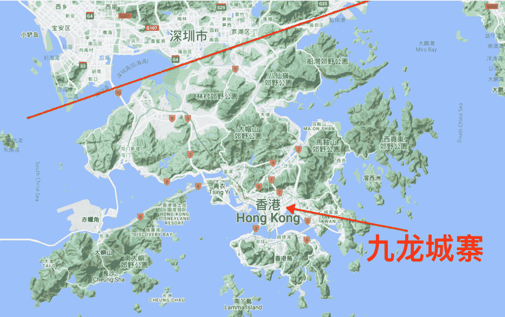

再放一张电影《追龙》里的，长下边这样，可以看到旁边就是著名的启德机场，那个机场以前不存在，是后来填海造陆搞出来的：

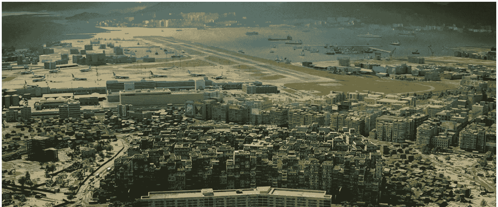

再放一张实景图：

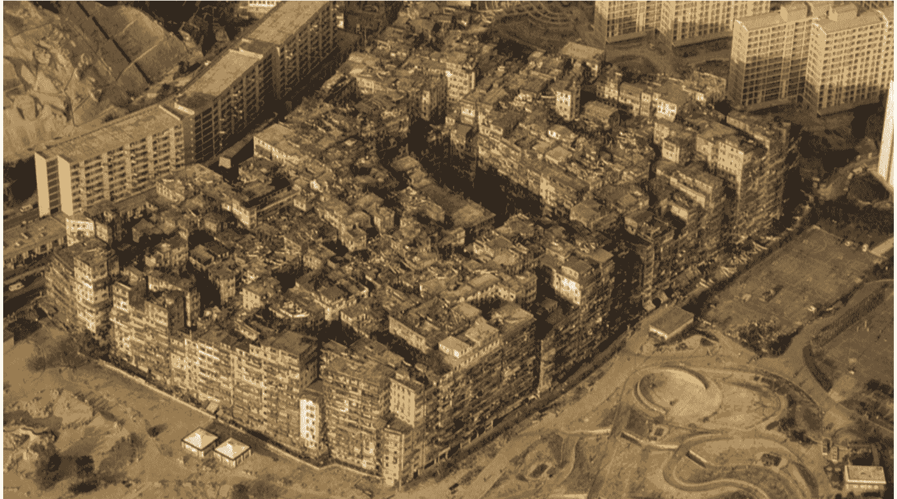

第一次鸦片战争后香港岛被割走了，第二次鸦片战争深圳河以南都被割走了，但是清廷守着九龙城寨不走，双方反复交涉，清廷就是不走。最后双方经过协商，英国承认九龙城下四个足球场那么大的一块地归清廷，周围的归英国，有点像个领事馆。

过了很多年，清廷的办事机构终于搬走了，可是九龙城寨下边的那块地在法律上的归属问题一直没解决，一开始是清廷的地盘，后来是国府的，再后来是新中国的，属于一块“飞地”。

这个法理问题是后来很多问题的核心，按理说港英政府在那里没有执法权，为了避免引起麻烦，一般不会去那边执法，慢慢的那地方成了个无法无天的地儿。

不过想说清楚后来九龙城为啥成了那样，还是得回到1949年，那一年决定了此后很多事。

早在1948年，解放军在徐州一带围杀了国军中央军几乎全部精锐，下一步就是渡江解放南京，然后是上海，广州，国府眼瞅时日无多。

于是对我党不放心的那些人疯狂出逃。不过“出海”是个技术活，你必须得在海外某个地方有自己人，不然去了简直就是送死。这就形成了一大堆传统，比如潮州人热爱去新马泰，长乐人愿意去美国，温州和福田喜欢去欧洲，毕竟那些地方有自己的同乡什么的，你去了可以随时投奔，等你自己安定下来，又可以把自己的亲戚都接过去。

电影《追龙》里“跛豪”伍世豪说他是槟城人，也就是马来西亚的槟城。可是我们知道，电影原型其实是潮州人，电影要在大陆上映，故意绕了个弯子，反正潮州人爱去马来西亚，说槟城几乎相当于说潮州。

但是大部分人想出国还是挺难的，于是一部分跟国府能搭上关系的去了台湾，没关系，又没有亲戚在海外的，就去了香港。

当时香港短时间内涌入上百万人，中间还裹挟着十几万败退的国军士兵。香港政府也没啥办法，赶又赶不走，又不能开枪屠了，只好把他们安排在各种能待人的地方，形成了一个一个个难民营，然后再想办法安排。

本文要说的九龙城，就是其中一个难民营落脚点。

后来其他难民营后来都清空了，只是九龙城因为法理问题，香港政府也不大愿意去管，也管不了，于是那地方彻底变成了法外之地。

既然是“法外”，那必然就有黑社会。

香港黑社会一般来说就是“三合会”，咱们得多说几句这个组织，因为后来在九龙城里活动的，主要就是三合会。

三合会到底哪来的，好像也没人能说得清楚，基本能确认的是，当初满清占领中国的时候，汉人里那些不服的成立了很多民间社团跟清政府对着干，其中影响最大的就有“洪门”。

后来洪门衍生出了好几个组织，其中就有三合会和致公堂，对，咱们经常听说的那个“致公党”，就是从洪门组织致公堂发展过来的。

三合会又在全国遍地发芽，这些组织由于当时的通信限制，互相之间没啥联系，很快成了“去中心化的分布式组织”。也就是没人统一指挥，你认同组织纲领，你就可以拉几个人成立一个社团，执行三合会的仪式，就可以声称自己就是三合会的一个堂口。至于三合会什么仪式，大家可以看看杜琪峰导演的《黑社会》，导演本人说那里边的仪式是他找人问过的。

也正是因为三合会帮派这种分布式特点，互相之间也不太了解，不存在一个统一的头部，也没法被一网打尽，更没法被“斩首”，这玩意寿命比清廷还长，一直延续到现在。

1949年之后大陆开始大规模剿匪，黑社会被连根拔掉，不过香港那边一直处于一种半自治状态，加上当时败退到香港的国军自然而然想到继续沿用军队里的模式抱团取暖，新义安和14K就是这样的组织。

由于三合会占据了绝对主流，以至于香港警队里的反黑社会部门，就叫“有组织罪案及三合会调查科”，英文缩写叫“OCTB”，所以也叫“O记”。《无间道》黄秋生扮演的黄志诚，他就是O记的老大。

当然了，三合会组织不都叫这个“三合会”名，比较为人熟悉的是“新义安”，“14K”，“和胜和”等等。

多说一句，大家看电影《黑社会》的时候，里边有个“和联胜”，那个社团是不存在的，影射的就是和胜和。

咱们继续说主题，大量难民涌入九龙城寨，那地方又没人管，黑社会自然而然接管了城寨，他们能想到的第一件事，就是对着《刑法》把里边所有不让干的都干了，比如娼妓，毒品，赌档，地下拳击场、高利贷等等。

一开始是很乱的，不过很快就形成了固定的格局，各种三合会和潮州帮有各自的势力范围，大家相安无事，各赚各钱，到了城寨快要被拆掉的那段时间，城寨里边已经很稳定了，里边的人甚至有点不想出来。

由于警察几乎不会到这里边来，于是形成了一些稳定的产业。很多非法业务的核心在寨子里，比如一些黑社会堂口就在寨子里，小弟们从寨子里拿货，然后到香港各区去兜售，如果出了事，就赶紧跑回寨子。除非是非常恶性的杀人案，警方一般不会进寨搜查。寨里死了人警察几乎不管，直接扔垃圾堆里。

香港警察对九龙城非常纠结，他们是想管的，可是又生怕惹怒了当时的中国政府，到时候以这事为借口，直接把香港收回来他们也没脾气。所以不敢拆，也不敢管得太认真，只能是偶尔去看看。

也正是因为黑社会的堂口就在寨子里，电影《追龙》里，刘德华扮演的“五亿探长”雷洛要去跟黑社会老大谈生意，就得深入寨子里。下图就是电影里的截图：

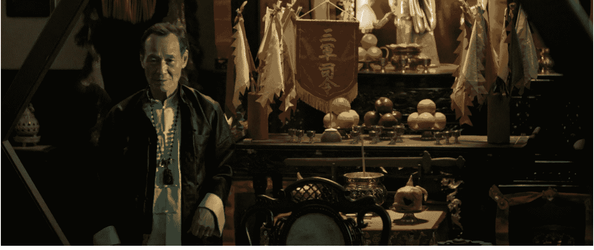

图中演员陈惠敏之前就是混黑帮的，从14K双花红棍（帮派最能打的打手）到现在基本上半退休状态做生意，后来还拍起了电影，算是活成了全香港黑帮人士的楷模。

九龙城寨里有了“产业”，就有了收入和工作岗位，比如那里边的妓院和脱衣舞厅会吸引大量的香港人和日本人前去消费，这些人得吃饭喝酒抽烟吧，城寨里的人于是就开饭店卖烟酒，整体跟后来的澳门差不多，当地不生产财富，当地只吸收财富。

有件事大家可能理解不了，那地方生活环境那么差，为啥大家还往里边涌呢？

原因很多，比如电影《追龙》里伍世豪他们，从槟城偷渡到香港，也没护照什么的，只能是躲到城寨里落脚。此外大陆的“逃港”事件也没停过，这些人去了那边没身份，也只能先去城寨躲躲，然后再想办法。

此外随着香港的经济发展，外边开销越来越贵，有些活不下去的自然会跑去城里待着。更多的是一些犯了事的，在香港会被警方通缉，或者欠了一屁股高利贷的，于是躲到城寨里避风头。人多地少，城寨里五平米的一个屋住十来个人很正常。大家不要觉得奇怪，就在前些年，北京有很多群租，密度跟这个差不多。

而且当时的警察也极度腐败，客观上加剧了九龙城里的犯罪率。

原因并不复杂，20世纪50年代的香港跟现在不是一码事，乱七八糟的，当时大量大陆难民涌入，导致香港政府财政压力非常大，也就不太愿意给基层公务员和警察涨工资。于是警察只好另谋出路，开始向黑社会收保护费，对黑社会的法外业务视而不见，这些事大家看香港电影都不陌生，“五亿探长”雷洛的钱就是这么来的。

而且双方默契到啥程度呢？

发生恶性事件，为了不让阿Sir们为难，黑社会要主动交出几个小弟去顶罪结案。每次警方突袭城寨，里边的人知道这事，也会留下一些毒品和小弟，好让警察回去好交差。当然了，为社团去坐牢也是个立功的事，再加上给他们家里钱，还是有人愿意去的。

直到后来香港经济腾飞，给公务员大幅涨工资，然后又开始搞廉政公署才慢慢好起来。

九龙城寨不止经营“毒、赌、鸡”等传统行业，还有大量的黑市服务产业，比如香港看病一直以来就是个巨贵无比的产业，医生也是个收入高得离谱的职业。

所以后来很多香港人看不起病，于是选择去九龙城里看病。那里边的无证经营老师傅业务精良却收费低廉，毕竟这些人有些之前就是北京、上海、广州的顶级医生，逃港后没有那边认可的执照留在了城寨里，九龙城寨的牙医一直都是个传说中的存在。此外如果跟别人斗殴有了刀伤枪伤，去正常医院医生立刻就会报警，大家只好去城寨治疗。

一来二去，城寨里竟然有了收入，加上里边的人越来越多，城寨的扩建工作一直没停，一开始是些木屋，后来开始盖楼，盖了一层过几年再加一层，那些楼一栋挨着一栋，根本不考虑采光的事，事实上城里也几乎没有光，只有最中心的那个天井有一点。不过那个天井一般没人去，里边堆满了垃圾，甚至还有人的残肢断臂，注射毒品的针管什么的。

本来可以一直往上盖，不过城寨旁边就是著名的启德机场，盖的太高了容易擦到飞机肚皮，于是那些楼到了十四层就不往上盖了。

比较搞笑的是，后来搞建筑的人研究了城寨里各种错综复杂的建筑之后，一个个纷纷摇头，表示这些楼房盖的，简直匪夷所思。毕竟当初建设的时候，能省就省，钢筋水泥都是些劣质材料，而且也没啥专业施工队拿着设计院的图纸施工，几乎违反了所有的建筑工程标准，按理说全是“危楼”，随时都会倒。

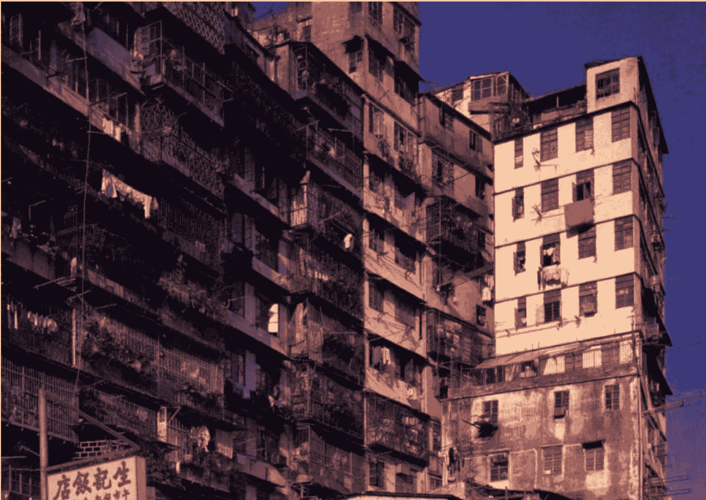

可是城里确实从没塌过一栋楼。后来大家觉得应该是这些楼互相挤在一起，尽管每栋楼都是危楼，但是相互依靠，谁也塌不了。有点像你在一线城市早高峰的地铁站，尽管双脚离地，非常不稳定，可是和周围的人紧紧挤在一起，不稳定也倒不了。

这又有点像贫民窟里那些人的状态，尽管穷得叮当响，但是一群穷人相互依靠，竟然也能活。

慢慢地，这座城变成了一个非常复杂的生态，既是毒品娼妓暴力的温床，同时又进化出了自己的秩序。

比如城寨里刚开始暴力横行，天天互相砍人，不过越到后来，秩序越稳定。因为居住环境太过逼仄拥挤，慢慢形成了一个完全的熟人社会，你做事不端，也会遭到大家排斥，如果所有人都讨厌你，帮派分子可能会砍了你，因为帮派是收了保护费的，要为里边的住户解决问题。

此外从外往里看，整个城寨就是个贫民窟，寨子里边也分了三六九等。

因为里边的房子也都有租金，也可以买卖，于是干净、光线好的地方自然贵一些，住户素质也会高一些，他们的社区交的保护费多，黑社会也会格外关照。

而城寨的最底层最见不得光的地方，蜷缩着那些吸毒吸到不成人形的人。谁能想到，贫民窟里还有贫民窟。

而且里边后来有了医院，教会，学校，生产日常所需的小型工厂，专门搭电线的，卖水的，维持治安的，跟正常社会一模一样，只是社会的下限低得没法看。

港府对这座城是非常为难的。

如果一直放任不管，单是毒品问题就没法解决，此外还有火灾和传染病等等，可是如果日常派警察去扫荡，弄不好可能被解读成“殖民势力过度扩张”，惹怒了中国政府就麻烦了。事实上1963年港英政府确实准备拆掉九龙城寨，不过遭到了我国政府的反对，于是也就作罢。

这种情况一直持续到1986年。邓公和撒切尔夫人协商后，同意港英政府处理九龙城寨的事务，于是香港政府开始了漫长的清退工作，毕竟要安排里边的人去别的地方住，1993年才拆掉了这座他们眼里的堕落之城。

当时有很多人反对，因为这座城寨已经成了香港的标志性建筑，承载了太多的文化意义，全世界每年无数人前去膜拜，甚至有英国记者被人抢钱后砍死在了里边，也没挡住大家去“朝圣”的热情。

不过港英政府觉得那地方不拆就会一直有人在里边住，一直都是个犯罪温床，实在是烦得不行，于是坚持于1993年拆掉了。

如今九龙城寨变成一个赛博文化的标志，后来大量的游戏和电影都有意无意把场景布设成了这座城，毕竟它就是个“犯罪、拥挤、贫民窟、黑社会”等元素的大集合。某种意义上讲，现实里的九龙城寨已经被拆了，文化层面的城寨反而永生了。

### 全文完。

文末说一件别的事：又是一年春来早，万物生光辉。拼多多三月春季大促重磅来袭，新春季，换新机，换机就在拼多多，6日晚21点起，百亿补贴限时狂撒最高400元大额券包！叠券再享折上折！iphone14全系列最高直降 1800 。现在就是入手数码品的好时机，抢到即赚，剁手前先来拼多多比价！

春天也是游玩的好时候，春日来袭，约上朋友出游聚会畅饮。这次三月春季大促，茅台低至 2689 元，赶紧动手。

点击进入领券页面，先领券，后下单：

精选了以下爆款好物推荐给大家，都是券前价，部分商品叠券还可再降！！！ 

苹果专场推荐：
- iPhone 14全系列最高直降 1800 元！iPhone14，4889元起，最高直降 1200 元
- iPhone14 Pro，6799元起，最高直降 1800 元
- iPhone14 Pro Max，7539元起，最高直降 1500 元

长按识别下方二维码进入苹果专区

### 爆款数码推荐：
- 荣耀80，真香价 2199 元起
- 一加AcePro，真香价 2729 元起
- 小米Note 12 Pro，真香价 1439 元起
- 联想拯救者Y9000P I9，真香价 8349 元起
- 华为MatePad Pro 11英寸，真香价 2899 元起

长按识别下方二维码进入数码综合馆专场

### 热门酒水推荐：

- 53度飞天茅台单瓶500ml，心动价 2689 元起
- 52度五粮液单瓶500ml，心动价 899 元起
- 53度山西杏花村汾酒475ml*6瓶装，心动价 277.9 元起

点击下方小程序进入名酒专场

### 好价家电推荐：

- 戴森吹风机，活动价 2230 元起
- 小米电视X86，活动价 4169 元起
- 松下剃须刀，活动价 197 元起
- 戴森吸尘器，活动价 2179 元起

点击下方小程序进入家电专场

### 原本就优惠的拼多多百亿补贴又添新玩法：百亿补贴多人团！

已经很划算的补贴价，多人拼团能再叠新折扣，成团后更更更优惠，拼着买更便宜！

53度1988习酒，成团后400多就能拿下，
喝不惯习酒的，400出头也能来瓶53度飞天茅台(100ml)尝鲜。
日常必备的抽纸和牛奶，算下来单价都是1元多1包/1盒，大促值得囤一箱；
新鲜上市的云南沃柑（大果），成团价1斤才2元多，比水果店便宜太多；
多人团还能拼到山姆超市特供款蛋黄酥，省了260元进店会员费。

今天我给大家申请了个快速成团通道，直接点击下方小程序，就能直接参与正在进行中的多人团，不用再苦苦等N人，一键参团，快速成团，坐等收货，省钱又省心。

拼多多百亿补贴主会场还有搜索功能，不局限于上面列出的产品，大家喜欢什么都可以搜一搜。点击下方阅读原文直达百亿补贴会场。

公众号懒人搜索，懒人专属群分享

### 从当前的外贸暴跌看人民币国际化

2023-03-03

外贸的事上篇文章《为啥好像印钱不好使了》提了几句，小伙伴们让我展开聊聊。正好跟做外贸的小伙伴深入聊过，今天就跟大家盘一下，大家也可以跟其他博主的说法做个横向对比，多对比慢慢心里就有数了。

工业转移这事我就不多说了，现在确实在发生，但规模不大，将来可能是个大麻烦，现在还不至于。现在几乎能达成共识的一个问题是，中国经济短期压力是外贸不行，长期压力是内需不足。也就是说，外贸疲软可能是个长期趋势，毕竟其他国家也在搞工业，我们需要自己的老百姓有强大的消费力消化自己的产能，不然很容易出大事。

先放一个我之前发的微头条：

前几天做外贸的粉丝小伙伴主动联系我，给我看了他们的聊天截图，他的客户是马来西亚的，这段时间客户特别想从中国这边进货，可是去银行换美元根本换不到（需要排队审批，而且限额，根本拿不到钱）。他们国家的银行在收紧外汇，不给换。做外贸的小伙伴说其他国家客户也一样，自己手里有钱，但是想换美元买东西，却发现本国政府没美元了，现在啥也干不了。

那这些国家的美元外汇去哪了？

回美国的银行去了。

之前就给大家解释过这个道理，大家经常说“美国开动印钞机”，并不是真印钱，而是美国财政部拿着借条（国债）去美联储借钱，同时也在市场上发国债，向市场借，比如中国、日本、沙特、挪威都借钱给美国。

当然了，美国国债最大的持有人是他们自己的富人。而且这个时候银行利率很低，老百姓和企业家也可以轻松贷到款，炒股消费什么的，这也是为啥疫情时期股市反而好得不得了。

那段时间美国政府拿到钱之后，给老百姓分了，老百姓拿到钱就可以到处买，这些钱流向全世界，一部分钱又回到了中国，购买中国的产品。由于这些钱是政府白给的，所以老百姓消费积极性非常高，其他国家又处于疫情停摆状态，导致了2021年咱们的外贸极度火热，那一年咱们的经济在全世界一枝独秀。

到了去年，疫情结束了，美国政府不发钱了，而且由于前期投放的钱太多，导致了大规模通胀，美国和它的央行（联储）就得考虑降通胀。

通胀完全是个货币问题，市场上的钱太多，收回去一些就行了。美国降通胀的办法就是拉高利率。这个也好理解，如果咱们的银行拉高利率，你是不是也着急忙慌把欠银行的钱还了，如果手里有余钱，也会存银行赚利息，市场上的钱就少了，通胀自然也就降下来了。

但是大家都把钱放银行，本来准备拿去创业投产能的钱也回银行了，导致老百姓的工作和工资也少了，他们可不是不愿意多买东西了嘛。这也就是为啥美国今年进口明显减弱，老百姓钱少了自然得削减开支，同理自从加息以来，美股也一塌糊涂。

而且这么操作把一堆别的国家给坑了。

因为其他国家的美元也跑回美国赚利息去了。

这个也不复杂，假设你是个马来西亚商人，你把芒果卖到美国，赚了不少美元，存在马来的银行里，其他人可以用马来币换成美元买中国的产品。

突然有天听说美国那边利率拉到了4%，你赶忙把手里的马来币换成美元，然后存美国去了，大家都这么做，这样马来西亚可不就缺外汇了？4%是个很可怕的利率，大家可以去银行问问，现在已经几乎没有存款利率能达到这么高。

这时候马来政府看着美元外汇急剧变少也急眼了，因为政府还需要美元去购买一些必须的东西，比如石油、电力系统配件、自来水厂泵件等等，还有一些即将到期的债务要还，这些东西如果供应不上容易出大事。比如斯里兰卡就是美元彻底耗尽，到期的债务还不上，国家破产了。

那马来政府会怎么办？果断要求审批呗，延缓美元流出，于是想换美元买中国产品的企业也被限流了，也换不到，大家都这么干，中国这边出口也就疲软了。

此外发展中国家的美元回了美国，导致那些国家投资也没了，工作岗位也少了不少，老百姓赚不到钱，就得削减开支，自然买中国的东西也少了，全世界迎来一大波萧条。

全世界都没钱买东西，直接导致了全世界的生产国出口都在暴跌，这段时间不止中国的出口在跌，全世界都在跌。总之一句话，美元加息把全世界带到坑里去了。

这里就有个问题，这些国家脑子有问题吗？美元那么香，为啥不屯点人民币呢？

这个又比较复杂，大家记得刚才那个循环不，想获得美元，必须得卖给美国人点什么东西，然后拿着赚到的美元去买中国的工业品、德国的设备、沙特的石油、智利的车厘子。

大家发现了吧，美国人必须进口大于出口，也就是逆差，别人手里才能剩下一些美元。

这也是人民币国际化最大的障碍之一：人民币国际化最基本的前提，就是贸易逆差，也就是咱们花出去的钱比赚回来的钱多，人民币才能国际化。

你花出去的钱多，别人手里才能结余人民币，才能用这些人民币互相交易。

所以很多人嘲讽美国贸易逆差这事意义不大，美元国际化、贸易逆差、国债制度，这仨是三体一面，美国不逆差，其他国家就没美元嘛，就没法用它的货币。

我国将来人民币国际化也得这样，不然根本没可能。此外还有自由流动，国际货币怎么可能不自由流动嘛，那谁敢持有啊，所以到时候会解除外汇管制。

也就是说，啥时候解除了汇管，并且不再强调顺差了，那说明真的要开始操办国际化了，现在这个状态是很难的。

此外还有个关键问题，如果我们买别人的东西比别人买我们的东西多，自然会导致咱们产品竞争力下降，产业外流。

对，货币国际化可以收铸币税，但是毛病就是产业外流。甘蔗没有两头甜，美国现在的困境，某种意义上就是这么来的。

此外咱们国家的货币信用还不是特别高，绝大部分国家没法做到无障碍支付，比如马来西亚屯了一批美元，可以随便花，大家都认。可如果屯一堆人民币，可能认的国家就不是太多，拿着这些钱可以买到中国的东西，却不一定能买到别的国家的产品，所以他们不愿意屯人民币。

随着越来越多的国家认可人民币，越来越多的国家就会屯人民币，不过前提是我们有办法把人民币弄出去。

这也就解释了这几天比较火的那个问题，为啥美元这样成本17美分的纸可以买到别的国家老百姓辛辛苦苦生产出来的商品？事实上美元成本远远不到17美分，因为绝大部分美元都是银行账户上的一个数字，根本不用印出来，真正的纸币占比非常非常低。

其实这个问题不应该问美元，应该问我们自己，为啥我们要卖给他们？我们为啥不能大义凛然地说你那张纸我们不认？现实里我们非但不会不认美元，反而把外贸数据作为经济好坏的关键晴雨表。

因为我们需要拿美元去买石油，买铁矿，买机床，买芯片，支援非洲兄弟，“一带一路”的投资，全部需要美元。哪怕在俄罗斯，想拉拢车臣的小卡集团，小卡他们只要美元。

这就是信用，你知道拿到那张纸能买到别的东西，并且丝毫不怀疑，所以所有人都对美元趋之若鹜。

同理你天天累死累活，就是为了那几张人民币，是因为人民币金子做的吗？当然不是，因为那玩意背后是国家信用，你有了人民币，就可以让别人像你一样给你干活。

### 信用的本质就是相信，相信别人也认这东西，能随时花出去，那这东西就有了价值。

那这信用又是哪来的呢？

大家可能第一反应是美国军事实力强。

事实上军事实力确实很重要，很难想象一个国家军力不强，但是大家还把它的货币当国际支付手段。但是这个并不是全部，苏联军力巅峰的时候它的货币信用也非常差，苏联上下明里暗里都在搜集美元。苏联政府甚至通过地下渠道卖武器换美元，因为苏联买粮食，买技术，收买非洲和中东军事强人，都需要美元。

也就是说，单纯军事实力远远不够，信用是人心里的东西，你逼着别人信的时候，也就没人信了。

说个可能大家觉得挺搞笑的事，长期来看，美元的滥发确实比较克制，或者说相对其他货币，一直是做得比较好的，客观上维护了它的信用。

这听起来是个笑话，不过大家可以找找各种货币的对比，美元这么差了，依旧是所有货币里比较靠谱的。这也给了我们一个启示，如果将来想取代美元，必须得表现比美元好才行，如果美元滥发，我们更滥发，那下辈子也别想取代美元了。

其次美国在二战后黄金特别多，美金和黄金直接绑定，持续了几十年，黄金这张虎皮赋予了美元神性，导致大家对美元产生了一种类似对黄金的崇拜。

在那几十年里，基于美元的一些基础设施都建立了起来，比如美元定价机制，现在俄罗斯和伊朗做买卖，还在用美元定价。还有支付机制，几乎所有的银行都收美元。你手里有美元还可以随时买成极高流动性的美债赚点利息。这些基础设施决定了后来美元和黄金脱钩后，大家依旧用习惯了，不想随便改，也没法随便改。再后来又在这套机制上建立起来了超级复杂的上层建筑。

现在哪怕伊朗这种完全被踢出SWIFT系统的国家，其他国家跟他们做买卖他们也只要美元。而且伊朗的外汇也是美元，大家随手搜一搜，就知道伊朗这几天货币在对美元疯狂贬值，老百姓继续排队换汇。可能大家纳闷，既然伊朗不能收美元，那怎么做买卖呢？也不复杂，伊朗在卡塔尔和迪拜搞个公司，然后你和这些公司做买卖，商品送伊朗，钱从迪拜给你打过来。美国人也知道，不过睁一只眼闭一只眼。

此外“美元流通性神话”也是这样建立起来的，你拿着任何一张货币，都不可能像美元那样在全世界被接纳。这种接纳程度非常可怕，从苏联官方到老百姓，甚至现在俄罗斯都在攒美元，也就是最恨美国的那些人，也爱美元，你就知道这玩意信用有多猛。现在世界上任何地方，稍微有点风吹草动，那地方的人都会疯狂收集美元和黄金，你就知道这种信用短期很难撼动。

很多国家不储备人民币，也是这个问题，这个国家可能认同人民币的信用和价值，但是跟它做买卖的那些国家不一定认，所以也不太敢多储备人民币。我们想被大家普遍接收，是个日拱一卒的事，一个一个国家往下拿，得慢慢来。

后来美元和黄金脱钩后，绑定石油这事反而影响没想象的那么大。大家可以想想，俄罗斯如果哪天说他们的石油只接受卢布支付，卢布就能成世界货币？如果可以，他们为啥以前不这么做呢？要知道，在绝大部分时候，俄罗斯的石油产能要比沙特大得多。显然不是不想，是不能。前段时间俄罗斯宣布了卢布结算后，很多公司已经不和它做买卖，转而从美国进口了。

其他国家不太敢屯卢布，卢布波动太大了，给你100块，明天购买力变50了，后天又变80，谁敢屯？所以宁愿不做买卖也不屯。

所以说吧，美元有现在的地位，需要把发币克制、科技、军事、黄金虎皮、石油美元这些凑齐了，然后用了上百年，才积攒起来现在的信用。人民币国际化，倒也不一定完全走美国的路，不过肯定短不了。我们只要做得比美国好，控制住滥发货币的冲动，搞出来成熟的国债制度，将来才有可能成为国际货币。

文末总结下吧：

- 1. 现在外贸疲软，产业转移确实有一些，不过主要因素还是美元加息导致的。
- 2. 美元加息导致所有国家经济都不太好，而且大家都缺外汇，很多生意没法进行。
- 3. 如果也想让人民币有这样的能力，需要我们的货币比美元更有信用，更加深入人心，而且需要我们进口大于出口，其他国家手里才能结余人民币。
- 4. 人民币国际化，未来几乎没啥悬念会实现，这么大的经济体，我们的货币竟然不是国际货币本身就不正常，不过需要时间，毕竟我们真正大规模参与国际贸易时间还太短，满打满算三十来年，现在人民币的地位可能类似美元在1900年的状态，再稳定发展二十年，就啥都有了。

公众号懒人搜索，懒人专属群分享

### 为啥好像印钱不好使了

2023-03-01

最近大家都在聊放水的事，我今天再聊一篇吧，咱们不聊经济学，咱们就用生活中最简单的逻辑，帮大家理解下为啥放水这事好像作用越来越小。

首先要讲的是那个反复讲过的道理，银行放水，并不是直接印钱，然后大家排着队去银行领。

而是主要通过两个途径。

首先是让有钱人去贷款。

为啥这里强调有钱人呢？因为银行贷款有个最基本的前提，抵押品，你没有抵押，最多能贷出来几万块的消费贷（消费贷也是要看你工作单位和银行流水的），再大一些的几乎就不可能了。

所以能贷到大钱的，基本都是本身非常有钱的，他们把手里的资产抵押了，然后借到钱，再去做别的投资。

普通人这辈子能背负的最大的一笔贷款，可能就是房贷，其实就是把你刚到手的房子拿去银行抵押，然后贷款给你。富人往往不止一套房子，而且也不是通过个人，而是通过公司，贷出来的就更多了。

可能小伙伴觉得，给有钱人贷款怎么就能刺激经济嘛？事实上以前确实是可以的，毕竟贷了款将来得还回去不是？所以有钱人拿到贷款，第一反应是想想怎么投资，将来赚点钱，过几年把银行的钱连本带利还回去，自己也再赚点。

以前没现在这么卷，首先可以搞外贸嘛，投资建个厂，招一堆工人，生产出来的产品卖出去赚美元，赚到钱给工人们分了，剩下的还了银行还能剩不少。

钱就这样从上边向下流动，富人们贷款，普通人拿工资，大家都得到了放水带来的红利。

工人们有了钱，是不是要去吃饭，是不是要娶媳妇买房？于是大家又从银行贷款，去盖房，去开饭店。老百姓是不是还要有点别的需求？于是奶茶、狼人杀、酒吧、外卖也就起来了，慢慢服务业吸收的人力远超制造业。

当然了，不仅仅富人可以去贷款，政府自己也可以，不过比较复杂一些，因为政府不能直接贷款，需要套一个城投的壳。

比如地方政府想搞基建，想修条路，没钱怎么办？成立个城投公司，把地方上的资产放进这个公司，然后就去银行以资产为抵押物，借钱去修公路，等将来公路赚了钱再把银行的钱还上。

修公路得雇佣工人吧，得买钢筋水泥吧，钢筋水泥背后又都是工人，基建的资金也转成了普通人的工资，银行出来的水淋到了普通人身上。

大家看出来了吧，银行发贷款，社会上的老百姓有了工作，有了饭店，有了房子，也有了公路。某种意义上说，这就是前些年我们经济狂飙的原因。那时候我们社会机会多，从银行贷出来的款总能赚到更多钱，赚到钱之后再去贷款，再去投资，雇佣更多人，经济一路向好，每年8%以上的增长率。

回溯这四十年经济大发展，最早的原动力，其实就是加入WTO后的外贸，外部注入了购买力。

那现在发生了啥呢？

可以赚钱的项目越来越少了，或者说购买力越来越低了。

首先是外贸。

我国刚加入世贸那会儿，世界市场对中国敞开，叠加中国的人力实在是太便宜，几乎生产多少就能卖多少。那时候的企业主们，从银行拿钱，然后买设备，招人，搞外贸赚钱，再借更多的钱，不断扩产能，中国产能指数级上涨。

但是我们凭借常识也能感觉到，这种状态本身不可能一直持续下去。

这不这两年终于出现问题了，如今能占领的市场基本上差不多了，中国外贸出口占到全世界的15%左右，目测这个规模不大可能明显继续扩大，或者说，扩大的空间不太大了。

西方国家以前是很相信全球化的，但是大家目睹了德国人被俄罗斯用油气控制的倒霉样之后，开始刻意降低对中国的依赖。其实“去依赖”这事早就开始了，只是一直摆不到明面上来，俄乌战争之后“不要依赖某国”成了政治正确，西方国家现在都在公开讨论了。

比如现在美国最大的贸易伙伴是墨西哥，欧洲也把大量产能转移到了东欧，那里的人力便宜，还有欧盟内部的税收优惠，土耳其这两年外贸发展也特别快。上一篇文章也讲了，印度要求企业尽量去印度建厂，不然就加征重税，我国的很多企业都去了，我刚搜了下，比亚迪也在做计划。这些暂时不明显，长期效果肯定会越来越明显，全球化正在向“区域化”过渡。

大家应该听说今年的外贸不太好，我查了下数据，并不是因为产业转移，产业转移需要很久，现在还不明显。现在最大的问题，还是美元加息导致的全世界经济疲软。为啥美元加息会导致全世界经济疲软，我在《为啥美元加息会带崩很多国家？我国呢？》里讲清楚了，大家有兴趣可以去看看。

美元加息一方面把全世界经济带下了水，这间接说明美元依旧非常强劲，此外把很多国家也被美元加息搞得外汇耗尽了，那些国家的老百姓就算想向中国购买产品，现在也没美元外汇，没法交易。估计得等到下半年或者明年能好点。

叠加今年突然国内不消费了。

现在我们银行把钱贷给有钱人，但是缺购买力，海外国内都缺，有钱人有钱也不敢投资。

其次是政府自己的投资收益率也越来越小，比如早期投一条北京和上海之间的高铁，一票难求，可能很快就盈利，然后收回投资了。

但是使用率高、盈利能力强的项目早已建得差不多，其他偏远地区的项目可能用的人太稀疏了，根本赚不到啥钱，需要几百年才能收回投资。问题是无论高速还是高铁，都需要大量的钱去维护。可能每年赚的钱还不够维护的，每年政府还得继续拨款或者贷款去维护这些基建。

基建搞到后来，就会越来越谨慎，因为对于很多地方政府来说，再修一条路可能不但增加不了收益，可能还是一个负担。再说现在城投债已经65万亿了，再借真的快要还不上了。

说到这里，就很清楚了，为啥以前放水会刺激消费：

因为以前起点低，市场前景广阔，国外和国内的老百姓都愿意消费，总有可投资可盈利的项目，所以发钱会变成实体项目，进一步吸收劳动力。

这两年国内外购买力都在减弱，国外是因为美元加息导致的萧条，国内是因为突然消费乏力，大家都不花钱。

所以银行发钱之后钱淤积在上层，下不来，没法转换成那种会雇佣很多人的产业资金，开始反复炒作资产，所以放水也就没啥效果。不仅如此，还导致“富人通胀，穷人通缩”。

有钱人去银行拿钱，拿到钱也没啥可投的，毕竟外贸不振，开个饭店吧，一片红海，能干啥？

思来想去，啥也干不了，要不买个房看看？有钱人都是这么想的，于是都去买一线城市比较稀缺的那种大平层豪宅。所以很搞笑的是，经济不太好，一线豪宅涨幅却非常大。这两天问了下，西城区很多豪宅不到两年涨了一千多万，要知道，这可是疫情期间，匪夷所思。

但是问题是，有钱人不投资，工厂不开工，工人们赚啥钱？答案是确实最近不好赚钱。

大家看出来了吧，缺乏购买力，是现在所有问题的根源。

现在还没啥，最可怕的是日本那种情况，老百姓死活不花钱。

也就是老百姓有钱，可都存在银行死活不花，购买力上不去，整个市场一片萧条，日本老百姓就是不花钱，能省就省，导致房价一塌糊涂，经济也一塌糊涂。

日本政府这三十年一直扬言开动印钞机，稀释老百姓的财富，看你们花不花钱，甚至把利率干到零（其实不是真的零利率，不过非常非常低，我查了下，存款年利率0.003%），看你们还存钱。而且利率这么低，多少贷点款去花掉，要不买个房？刁民们油盐不进，就是不花，死都不贷款，爱咋地。

美国给老百姓发钱，老百姓花钱太猛，通胀高的一批，日本政府都快馋死那个通胀了，也给老百姓发钱，老百姓把钱都存银行，就是不花。

日本现在尴尬的地方就在于：

- 基建已经完成了，再建也没啥可建的，大批边缘地区被荒废，那里的基建也被荒废。
- 老龄化、少子化导致社会欲望极低，大家不消费，内需不振；
- 外贸也一直不太行，被中韩的崛起彻底打垮了。
- 日本的跨国资本在海外做得倒不错，不过那些钱跟日本老百姓也没啥关系。

我们接下来最重要的事，就是避免成了日本那样。

那有啥办法没？我倒觉得不是啥大事，咱们的国人，只要环境好起来还是愿意花钱的，应该成不了日本那样。现在还在恢复期，过了应该能好起来，毕竟去年的经历对于太多人影响太大了，一时半会消除不了影响。

不过长期来看，想持续繁荣，离不开“让富人投资，让普通人花钱”。

或者说反过来说，普通人敢花钱，社会才有希望，毕竟你的支出就是别人的收入，大家都不花，别人没钱，迟早传导到你身上，最后恶果沿着最外圈向内扩散，首先影响个体户，私企工作的那些，然后是国企，最后是公务员。

但是怎样让大家花钱呢？这不用我多说吧，主要是安全感。社会上现在有个很不好的地方，成天在渲染一种“未来会有大麻烦等着大家”的气氛，我也不知道哪来这么一股思潮，一开始预料的新冠余波没咋出现，反而出现了这么一个奇怪东西。

几乎所有的文章和视频，都劝你在接下来的时间里准备过冬，不投资，不消费，不跳槽，进体制。你们说，这种氛围下，谁敢消费？可是大家都不消费经济怎么能好？

你可能问我，那你说怎么办？我也没招，只能劝你不投资，不消费，不跳槽，进体制。因为社会观念一旦成型，就跟一列火车似的，调头非常难，大家都觉得经济寒冬要来了，可能真的要来了，大家都这样，作为个体只能是保守一些，多存钱，苟住，不然还能咋样？贸然出头弄不好就是死路一条。

说到这里，可能读者小伙伴问，那有啥办法解决吗？我也不知道，只是觉得如果能重新回到稳定发展的道路上，信心应该会回来，消费也会上来。近期最麻烦的事，就是美元加息，大家的外汇都被抽到美国去了，谁也别想好。等下半年或者明年美元加完息，外贸应该都可以喘口气。

此外最近突然领悟到一个问题，西方发达国家搞福利，给底层发钱这操作，可能咱们也避免不了。

简单的道理，没有完善的保障制度，可能大家到了一定时候都开始攒钱防老，你也不知道你会活多久，所以攒钱也没上限，那消费能好有了鬼了。内需不振，就得一直依赖欧美，欧美不买咱们的东西，咱们立刻出问题。

此外传统的“银行贷款给富人”刺激效果越来越差，钱都堆积在富人那里传导不到下边，下边没钱消费，经济转不起来。所以可能直接给基层老百姓发钱不是个坏主意，政府向银行贷款给老百姓发钱补充购买力，等经济好起来再用税收还，可以避免通胀。

此外还有大家一直在说的分配问题，上文说的给老百姓发钱，就可以通过向富裕阶层加税，现在越来越多的经济学者也认识到，对于克服未来的危机，关键是对富人征税。不过还是想说一句，二次、三次分配一点问题都没，全世界都在搞，但是一定要在法制范畴内，不要学印度，不然容易出大乱子。

文末总结一句吧：

疫情放开后GDP反弹5%应该没啥问题，不过麻烦依旧很明显，国内国外的购买力依旧太差。短期最大的影响是美元加息，等它啥时候加完息，咱们的外贸应该能好起来。长期关键还是内需，内需的关键是老百姓心里的安全感，觉得未来不会有大风浪，觉得老有所养，才会放心花钱，有购买力才有一切，这可能是未来我们需要重点要做的事。

公众号懒人搜索，懒人专属群分享

### 骑墙中美，给乌克兰送炮弹，巴基斯坦对我们为啥那么重要
2023-02-24

上篇文章《俄乌战争后果初现，中亚大概率会倒向中国》写完后，小伙伴们普遍对里边提到的巴基斯坦很感兴趣，纳闷它是怎么做到在中国和美国之间左右骑墙的，而且据说最近这段时间它在援助乌克兰炮弹，今天就用一篇文章给大家解释下。

先说炮弹那事，下图应该是新闻出处，我也不知道是不是真送了，不过大概率是真的，看完本文大家自己判断吧：
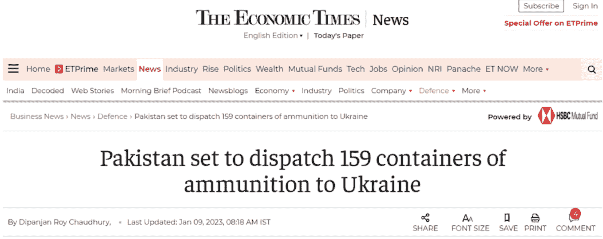

我们知道，现在的巴基斯坦、印度还有孟加拉以前都在大英帝国治下一起过，后来英国撤走的时候，印度境内的印度教徒和穆斯林闹了起来，要分家，后来就分成了两块，几年后又成了三块。

巴基斯坦成立的时候，是非常惨的。大家知道，印度人有一种复杂的“二象性”，单个印度人是很温和的，但是一群聚在一起，啥都干得出来。比如当时分家的时候，一个英国人拿根铅笔在地图上一划，巴基和印度的国界就出来了，边界两边的人就得往自己的母国跑，于是爆发了惨烈的屠杀和冲突。

美国当时有观察员在印度，写给自己国家的电报里描述了分家惨状，印度人最喜欢的事就是拦火车，一旦被拦下，人群就举着砍刀上去疯狂屠杀强奸什么的。

而且印度和巴基的实力相差太大，眼瞅一建国巴基就混不下去，美国外交官也认为巴基斯坦被灭国只是个时间问题，印度收拾完国内的土邦就过来收拾它。当时巴基斯坦领导人觉得全世界只有美国和苏联能拉自己一把。

可是苏联领导人已经明确说非常反感巴基斯坦所代表的一切。那完了，只好找美国人了。

巴基斯坦人为啥觉得美国人会理会一个万里之外新建立又穷又弱的穆斯林国家呢？显然是想碰碰运气，事实上美国人也不太想鸟他们。当时美国一个外交官说了句话，很像曾志伟在《无间道》里说的那句，“你会去殡仪馆跟死尸握手吗？”

巴基斯坦讨了个没趣，悻悻撤了。不过没过多久，美国自己找上门了。

起因是到了1948年，冷战的铁幕已经落下，美国情报官在地图上到处找基地，从这些基地起飞的高空侦察机可以飞到幅员辽阔的苏联去侦查。欧洲好说，可以从德国起飞，东亚可以从日本，中亚怎么办？选来选去，发现巴基斯坦最合适。

与此同时，美国国务院中东科仔细分析了波斯湾的格局之后，发现巴基斯坦还有个好处，可以“作为防卫或重新夺回中东产油区的兵力集结区”，也就是说，如果中东产油区出点什么问题，美军可以去巴基斯坦集结，把补给也投送到那里，然后再以巴基为跳板收复中东。

但是美国上层还有更复杂的打算，他们觉得如果想去巴基斯坦驻军，那就得跟它结盟，不然对方怎么可能同意你在那里又是修机场又是驻兵？可是如果和巴基斯坦结盟，那不就惹了印度？美国更看好印度，所以美国上层的考虑是跟印度商量下能不能搞个结盟。

不过印度人干脆利索给拒了，因为印度人要搞社会主义，尽管不结盟，可是跟苏联是好基友。再说了，怎么可能刚赶走英国驻军，又把美国人迎进来？这也没法跟老百姓交代啊，不行不行，你们找别人去吧。

那没招了，于是为了防止巴基斯坦也倒向苏联，美国邀请巴基斯坦总理访问美国，先聊聊看。

当时的巴基斯坦总理是阿里·汗，这人出身旁遮普上层，牛津大学毕业，操着一口流利英语，口才非常好，在美国国会演讲的时候每句话都戳在了美国人的心窝里。他知道自己的国家没有任何优势，唯一的优势就是他的邻居都是美国人的偷窥对象，于是反复强调自己的战略地位有多重要，并且暗示美国要是帮他忙，今后这些资源也可以共享。这次访问之后，美国人整体已经接纳了巴基斯坦。

后来巴基斯坦在多项美国的技术上都支持了美国，这让美国彻底放下心来，于是1955年签署了一个《共同防御援助法案》，这个法案说的是美国可以给巴基提供武器用于防御，如果它拿着去进攻别人，美国有权利把武器要回去。随后大量美械装备进入巴基斯坦，美国也派了大量军事顾问去那边训练军队。

巴基斯坦把白沙瓦空军基地租给了美国，美国从那里起飞高空侦察机去苏联搞侦查。那为啥后来巴基斯坦又跟中国关系也好起来了呢？

因为美国换总统了。

美国之前的总统是艾森豪威尔，他对巴基斯坦充满好感，随后上台的是肯尼迪，肯尼迪更看好印度，觉得印度这样的国家如果能在亚洲崛起，就可以限制中苏。有点像后来美国拉拢中国限制苏联和越南的操作。

而且美国在中东有了新的小伙伴，也就是我们前文说的，伊朗，伊朗跟美国好上之后，巴基斯坦能做的事，伊朗都能做。而且伊朗很强大，让美国很满意。

此外美国对巴基斯坦也有点失望，毕竟这个盟友太拉胯了，而且美国给他援助是指望他去防苏联，他却拿去跟印度对耗。这让美国对它的援助越来越犹豫。

随后第二次印巴战争爆发，美国竟然全程围观，也不给巴基斯坦提供支持。

恰好当时中国也被国际社会孤立了，周围的邻居都跟咱们关系不太好，于是中国转了一圈，发现巴基斯坦也是这么个状态，于是两国关系越来越近。

然后1962年中国跟印度打起来，解放军一个步兵突袭，打得印度军队溃不成军。巴基斯坦一看，觉得自己也能了，于是开始筹划对印战争，准备拿回克什米尔。

没想到中印战争后，印度跑去苏联那里一顿哭，苏联给了一堆装备，这时候巴基斯坦打上门了。。。反正后果可惨了，巴基被打得一泻千里，要不是中国给物资，又对印度给了警告，说不定巴基斯坦那时候就没了。

这次战争打完后，巴基斯坦对美国非常失望，觉得自己都那样了，也不出手拉兄弟一把，美国也觉得自己做得很对，毕竟双方是共同防御盟友，你去打别人找我干啥？失望透顶的巴基不顾美国反对，跟中国建立了外交关系，从那以后，中巴的友谊就这样确定了下来。

而且当时印度正在搞核弹，巴基斯坦如果不搞，说不定就是世界上第二个挨核弹的国家。但是美国不断对巴基施压，不让他搞，最终导致他俩的关系基本上完蛋了。

那他们又为啥变好了呢？因为苏联入侵阿富汗了。

战争一爆发，美国就意识到这是个消耗苏联的机会，当时制定的策略和现在的乌克兰战争差不多，西方提供武器和训练，让阿富汗人去跟苏联人死磕。这就需要一个通道把武器送过去，但是中东最亲的小弟伊朗70年代末爆发了革命，美国在阿富汗周围那一带没兄弟了（以色列离得太远）。

于是美国第一时间想起来自己曾经的好兄弟，于是在苏联入侵阿富汗的第二天，当时的美国总统卡特就给巴基斯坦总统打电话，商讨共同对付苏联。

巴基斯坦人吓了一跳，有没有搞错，苏联那么强大，你让我一个战五渣去招惹苏联？万一被苏联打死怎么办？有你们这样提要求的吗？是不是不想让我活了？得加钱！

美国说这个好说，于是他俩又走一起去了。其实巴基斯坦也有自己的小算盘，毕竟苏联如果拿下阿富汗，巴基相当于被苏联和印度给前后夹击了。而且当时江湖上传言苏联拿下阿富汗，下一步就是巴基，准备打通印度洋出海口。巴基自己也在着急，正好美国人找过来，所以这个交易几乎没有悬念。

不过没过几天，卡特就下台了，新上台的是“初代特朗普”里根。在他之前，美国历任总统都是想和苏联共存的，尽量缓和矛盾。但里根不这么看问题，他看出来了苏联对资源过分依赖，而且国防开支太大，经济已经摇摇欲坠，老百姓怨气很大，盟友们也三心二意，比如波兰就一直想跑路，里根觉得是时候弄死苏联了。

于是开始大规模支援巴基斯坦，美巴两国开始了新的蜜月期，然后以巴基为跳板训练塔利班，苏联在阿富汗泥足深陷，最终导致了解体。不过美国人不大愿意直接上手，于是就有了那个著名的“巴基斯坦三军情报局”，这个部门成立的很早，后来成了美国在巴基的黑手套，塔利班就是这个情报局一手扶持的，美国人的装备一般不会直接给塔利班，而是经过这个情报局转送。

而且在巴基斯坦成立了一个反抗苏联人的委员会，这个委员会有仨主任，其中一个就是本拉登。现在大家知道了为啥后来本拉登被美国找了那么多年却一直藏在巴基斯坦了吧，他起家就在那里。

这个阶段中国和巴基斯坦关系一直也不错，不过那时候中国刚从最低谷出来，主要精力还是在处理咱们自己的烂摊子，没工夫管他们。

接下来的十年是巴基斯坦和美国的蜜月十年，不过等到冷战结束，苏联倒了，共同敌人没了，美巴关系又开始走弱。

对“美巴关系”影响最大的还是印度，对于拉拢印度，美国从没死心过。问题是你要讨好印度，就肯定得罪巴基斯坦，因为那个克什米尔实在是没法解决。

当时巴基斯坦的领导人也换上了好战的穆沙拉夫，这人是对印战争中成长起来的军官，对印度非常强硬，根本不鸟美国的劝架。印巴边境剑拔弩张，搞得美国左右为难，美巴关系自然又开始下降。

尤其击毙本拉登的事，把美巴关系彻底搞到了冰点。美国特种部队和无人机把阿富汗扫了个遍，谁成想最后在伊斯兰堡附近找到了拉登。美国人知道是巴基斯坦三军情报局的人把他藏那里的，如果通知巴基去抓人，说不定又给放了。

如果自己去抓人，那可就是侵犯别国领土了。不过我们前文讲过，美国本来就在巴基斯坦有军事基地，平时起飞的战机也在巴基斯坦领土上溜达。只是他们有协议，美国战机不能针对巴基斯坦目标。那次击杀本拉登，其实是走了个协议的模糊地带，美国硬说他们的战机确实针对的是外国目标，巴基斯坦说你们的特种部队在我们领土上开枪杀人还有理了？双方闹得不可开交，大量巴基斯坦老百姓涌上街头反对美国，美巴关系也就降到了冰点。

不过客观地说，他俩的关系就算再差，也差不到哪里去。道理并不复杂，美军需要巴基斯坦这个盟友，不然下次中亚再有什么事，美军需要军事基地的时候去找谁？更关键的是，巴基斯坦需要美国的援助，过去20年里，巴基斯坦拿了美国几百亿的援助。只是在印巴问题上，美国整体是保持中立，有时候倾向于站在印度一边指责巴基斯坦。

这时候巴基斯坦只能找中国帮忙，所以只要印度杵在那里，中巴关系就不会差到哪。

当然了，中国跟巴基斯坦处好关系，也有个很重要的因素，巴基的地理位置非常重要，将来中国准备搞一条中国到伊朗的输油管道，到时候直接走巴基斯坦到中国，可以保障能源安全。随便画了下，大概是下图这样的：
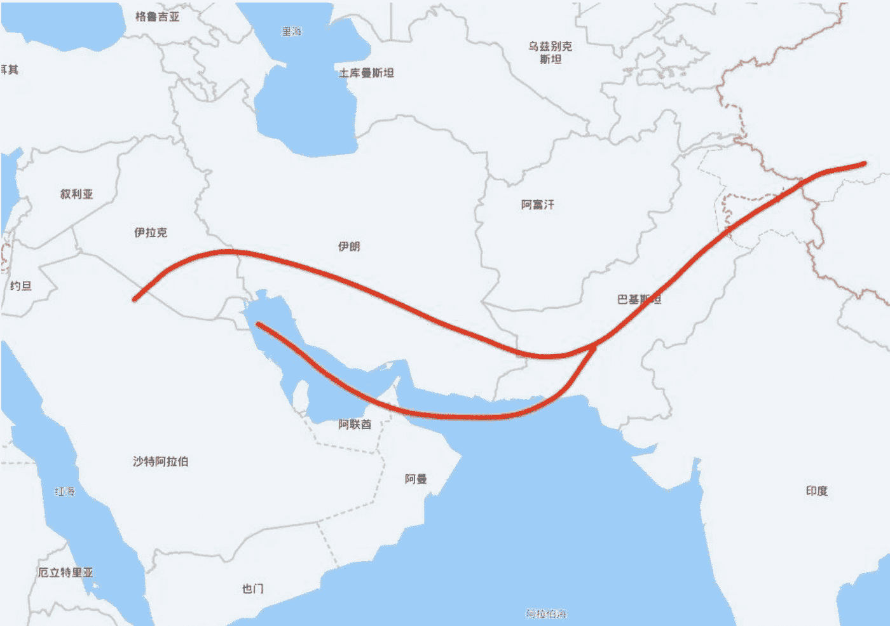

现在我们已经租了巴基斯坦的瓜达尔港，并且用了14年时间把港口的基础设施建起来，今后我们在中东的石油送到巴基斯坦就可以通过陆上管道送到喀什，不用再走马六甲了。此外中国还在缅甸有这么一个布局，将来可以开一篇。

此外大家记得之前美国准备以巴基斯坦为基地，出兵解决中东问题不？说不定我国也是那么想的。不得不感慨一句，如果当初不是印巴分治，我们的地缘政治环境简直烂到无以复加，一个统一的印度几乎把西边给彻底堵死了。

美国的崛起过程，大概就是先解决自己的问题，发展经济，然后手越深越长，去帮助别人解决问题，解决完问题就不走了。我们将来大概率也是这么个过程。

文章看到这里不准备继续了，事情说的比较清楚了。

看完本文，其实也就理解了巴基斯坦在俄乌冲突问题上，大概率是站乌克兰的，多简单啊，它自己就是从印度脱离出来的，有块领土被印度占着（当然印度觉得那块领土是自己的），而且随时有可能被比自己大十倍的印度给灭了，基本就是个乌克兰的复刻版，它要是能支持俄罗斯那简直匪夷所思。

再说了，巴基拿着美国的援助，却和俄罗斯交往很浅，俄罗斯还是印度背后的大哥，你说它支持谁？

今天这篇，其实就是想说很多人有一种不切实际的“洁癖心理”。大家能看出来，巴基和中美的每一次结盟，背后都是利益的计算，中巴结盟，也是大家都受益。整体来说，这三国都没吃亏，都拿到了自己想要的。这才是正常的现实政治。国际政治里，所有玩家的行为，都受现实主义的利益和安全驱动，每个政府都不对另外一个国家负责，那成了殖民地了。

各国政府都只对自己的人民负责，如果可以给自己的老百姓捞福利，各种政策就能顺利执行。大家可以去看看美国的对外战争，每次拉扯的人都不一样，比如越南战争，大家都不愿意去，它拉的是韩国，只有韩国人缺钱想赚外汇想疯了。其他的也一样，你仔细分析下就能发现，那些跟他一起出兵的盟友没有一个是因为友谊出兵，都是仔细算计后的行为。

有些人很希望自己的盟国毫无底线地支持自己，其实苏联当时就是这样要求我们的，最后的结果大家也知道，毛主席顶着巨大压力跟苏联断了交。

苏联到最后也没弄明白毛主席为啥反应那么激烈，因为它一直是这样要求加盟国的，大家都同意，为啥中国不同意？这也就解释了为啥后来苏联加盟国争先恐恐加入了北约，大家惹不起你的时候听你的，一有机会躲你躲得远远的。

这也为我们将来的发展提供一种思路，不要试图去谋求那种凡事听你的盟友，凡是可以有共同利益的，都是盟友。你让别人为你做啥事的时候，首先想想你能为别人提供啥？两千年前的管仲就说，“皆为利往”，没有好处的事，你都不干，你会指望别的国家干？有了好处，你不提，别人也会上杆子追着你。

寻找共同利益点 ，而不是相同的观念、制度或者意识形态，这才是国家和个人混江湖的永久铁律。

公众号懒人搜索，懒人专属群分享

### 俄乌战争后果初现，中亚大概率会倒向中国
2023-02-22

关于俄乌战争未来的发展态势，我有个猜想，前几天发了个微头条：

俄乌战争最后的结果大概率是以现在的朝韩模式结束战争。

可能有小伙伴不知道，其实朝鲜战争并没有结束。朝韩双方都认为自己迟早会统一半岛，所以双方以三八线为界暂时停火，将来条件合适再重新打。

俄乌战争将来大概率也是这种模式，双方可能发动几次大规模战役后，付出巨大伤亡发现打不动，随后陷入长期的局部小冲突，然后某一天宣布停火。朝鲜战争后期就是这个造型。

这种安排对美国来说也是最好的结局，今后俄罗斯进入西方的大门被自己的亲兄弟给堵死了，北欧那几个国家这次也都加入了北约，以前苏联的兄弟们也基本上都加入了北约，并且这次战争中使出了吃奶的力支持乌克兰，都彻底和俄罗斯闹翻了。

俄罗斯大概率今后没法西扩，天然气大概率也没法直接卖过去，基本上重演了当初克里米亚的形势。

也正是因为这个结果对美国来说还不错，我倾向于觉得美国也会支持这种方案。

当然了，最后啥结果，我也说不准，不过也不用担心俄罗斯垮了西方过来对付咱。

首先要说，俄罗斯垮不了。

很显然，西方现在依旧很回避把战火烧到俄罗斯本土去。

其次俄罗斯的能源还都在，这玩意是硬筹码，有一万种办法卖出去，只是多几道中介后，赚到的钱就会变少。也就是说，俄罗斯今后大概率要虚弱很多年，战争烧了很多钱，人才跑了一堆，年轻人也死了不少，今后的能源可能要打折出售。

但是俄罗斯是真正的小强，半死不死的俄罗斯杵在那里，西方还得继续防着它。当然了，这都不是我们今天重点要讲的，重点要讲的是俄罗斯虚弱之后，可能对咱们也不完全是坏事。咱们的能源安全问题，可能有了新的解决方案。

### 众所周知，中国是一个“有些煤矿，石油非常少，天然气非常少，铁矿比较差”的国家，恰好中国还是个工业国，需要大量的能源和资源输入，不然看着工业规模很大，可一旦能源和资源短缺，巨大的工业机器说停就停。这两年重点搞的新能源所需要的锂矿，也主要依赖澳大利亚和巴西。

这个意义上说，中国对外部环境的依赖比俄罗斯严重得多。

而且不止能源问题，还有市场价格因素，我国有些资源，比如铁矿，对澳大利亚这些国家依赖太深。稍微有点啥事，人家把价格拉上去，咱们作为中间的生产部门，立刻就被挤得没啥利润。前两年钢铁行业就出了这个问题，铁矿价格高企，我们这边恶性竞争，导致大家都不赚钱保客户。

也正是因为资源、技术、市场都在外部，所以我国在这次俄乌战争中坚决中立，欧美用放大镜都没找出来中国支持俄乌战争的证据（贸易不算，几乎所有国家都没彻底停了对俄贸易）。

所以抛开能源供应问题，我们也应该更大范围的扩大供应国。

比较难理解的是，我们西北方杵着一个世界上最大的资源池，却一直没咋开发，也就是中亚。那地方的五个国家形势比较复杂，咱们今天重点讲最大的哈萨克斯坦，这个国家比其他四个兄弟加起来都大两倍。

按目前已探明的数据，中亚及里海地区的石油储量估计约为1500亿-2000亿桶，约占世界石油储量18%-25%，探明天然气储量达7.9万亿立方米，仅落后于沙特，在世界天然气储量排行上能占据第七。

这些国家都是前苏联的加盟国，继承了苏联国家普遍的毛病，守着金饭碗要饭。

### 那为啥会这样呢？

主要也是没办法，这些国家跟俄罗斯绑定太深了。

以哈萨克斯坦为例，哈国跟之前乌克兰面临的情况差不多。由于长期跟苏联产业关系特别紧密，所以解体后依旧离不开俄罗斯，毕竟很多哈国的产品只有俄罗斯要，俄罗斯那边还有计划经济时代专门给哈国提供产品的工厂，国内还有个巨大的“亲俄罗斯团体”，再加上俄罗斯长期在这些国家有驻军，这些国家整体全方位被俄罗斯给绑死了。

这就出现一个很尴尬的状态，这些国家普遍比较穷。如果想发展，就得拿到美元外汇投资，比如投资个大型矿场，修铁路，炼油厂，输油管道等等，这些都非常费钱。可是它又只有俄罗斯一个宗主，俄罗斯自己严重缺美元，又不太愿意其他国家染指自己的势力范围，不让别人随便投资，所以哈国有资源，却开发不出来，只好一直穷着。

此外更关键的一点，它和俄罗斯绑定那么深，却跟俄罗斯没多少“互利”的领域。俄罗斯自己就是个加油站，哈国那些资源俄罗斯并不需要。俄罗斯甚至不想给它开发，毕竟开发出来，可能影响俄罗斯的油价和天然气价格。

不但如此，俄罗斯还很介意别的国家去中亚投资，比如我国在2006年开通了一条“中哈原油管道”，俄罗斯就非常不满。

还有去年刚敲定的“中吉乌铁路”，这是我国“一带一路”的关键路段，就被俄罗斯阻挠了25年，去年才同意。

俄罗斯和哈萨克斯坦双方维持一个很尴尬的状态，相互竞争关系的两个国家竟然深度绑定。按理说中亚那几个国家人口也不多，以他们的资源量按理说可以富得流油，可是现实里中亚那几个国家却刚刚过了国际温饱线，很多人处于营养不良状态。

简直匪夷所思，不过再看看我们北方的那个蒙古，就知道并不是偶然的，跟着俄罗斯混是很难富裕的，因为它自己就没富裕过。

不过最近十几年可能这些国家也意识到了问题所在，中亚国家也开始“去俄罗斯化”。

主要原因也是因为俄罗斯肉眼可见地衰落下去了，对中亚的控制力在不断地减弱。俄罗斯没钱了，也就没法给这些国家任何好处，兄弟们开始找活路。

这个背景下，中亚五国都发生了“去俄化”，跟之前乌克兰发生的事差不多。比如这些国家都开始讲自己的语言，不再讲俄语（之前官方语言是俄语）。并且重塑自己的民族史观，说自己的民族历史一直以来“自由而独立”，“哈萨克”和“哥萨克”都是“自由人”的意思。

这种情况下，自然而然要淡化俄罗斯对自己国家的影响，比如暗戳戳地暗示俄罗斯殖民过自己。而且政府公职人员也尽量不再使用俄罗斯人，俄罗斯裔在哈国越来越不受待见。以前待在哈国的俄罗斯人觉得哈萨克斯坦就是苏联的一个省，苏联解体后的这几十年，尤其最近十几年，对哈国感觉越来越陌生，于是大规模迁回俄罗斯，以前哈国一半人有俄罗斯血统，现在只剩下30%了，还在持续迁出。

更关键的是，在国际政治上哈国对俄罗斯越来越不满意。

这种不满是自下而上的，老年人对苏联有种莫名的敬畏，这种敬畏现在转移到了俄罗斯身上。但是年轻人理解不了，他们自从生下来，目睹的就是一个越来越疲弱的俄罗斯。越来越理解不了自己国家为啥要跟俄罗斯这么个国家做那么深度的绑定。

这种观念逐步向上反馈，最近这些年变成了国家政策。

比如其他俄罗斯的小弟都支持俄罗斯揍乌克兰的情况下，哈国却对乌克兰表达了同情。

此外德国不是不买俄罗斯石油了嘛，最近找哈国买了10万吨。而且哈萨克斯坦最近还关了跟俄罗斯的贸易站点。

很显然，哈国也在做和俄罗斯的“脱钩”准备。

说到这里，可能有小伙伴要问了，哈萨克斯坦脱离俄罗斯，就一定跟中国混？有没有可能跟美国呢？

事实上哈国确实想跟美国，不过它跟美国之间实在是没啥可交换的利益。原因也不复杂，实在是离得太远了，它的土特产美国并不需要，美国有的东西它又买不起，根本没法形成长期的利益锁链。而且也是倒霉催的，它周围的邻居，比如俄罗斯、伊朗、阿塞拜疆都是富油国，美国自己也是个石油国，他们互相是竞争关系。

我国恰好相反，我国有无数廉价工业品，可以让哈国老百姓生活质量大幅提升，正好我国也需要大量的资源，哈国的油气可以送到新疆后直接并入已经修好的油气管道。

所以说，长期看来，最大的可能性是中哈形成一种互补互益的稳定可持续关系，用能源管道和铁路链接起来的“钢铁、油气、金钱”纽带。

最差的，也是类似巴基斯坦那种，它跟美国关系不错，但是跟中国的关系统系更加实在。

事实上这些年中国和哈国的关系正在不断的升温，一个个项目不断上马，中哈之间的关系越来越紧密。此外咱们国家的核反应堆需要大量的铀矿，中国最大的铀矿进口国就是哈萨克斯坦，大家平时可以关注下新闻，就能发现和中亚相关的新闻越来越多。这也很正常，贸易和雨水一样，会改善土壤，沙漠下场雨也能长出植被来，如果持续下雨，沙漠也会变绿洲。

可能有小伙伴说，哈萨克斯坦国内有很多人对我们要并不友好啊。

其实这么想问题，这是一种充满小孩子气的洁癖。大家想想，美国那些传统盟友里，那些国家的老百姓都喜欢美国？显然不是嘛，这影响了美国和那些国家的关系了吗？也没有嘛。

有一年我去英国，就目睹过一堆英国人打着条幅让美国国务卿赶紧滚，我才知道美国国务卿正在英国访问。当天的记者问答，记者还问国务卿怎么看待英国老百姓对他的“热烈欢迎”，他还在那里开玩笑说“这才是我认识的英国人”。后来网上冲浪多了，就发现德国法国也一样，他们国内一堆反美的，可是并不妨碍他们和美国关系也挺好。

为啥会这样呢？美国代表的是一个体系，在这个体系里，大家都能互通有无，进而做到共同赚钱。贸易的纽带永远是最强的，而且也是最稳定的。

此外经贸合作会产生大量的“利益集团”。为啥之前的中亚国家普遍亲俄呢？很关键的一个原因是那些国家之前跟俄罗斯的经贸很旺盛，有不少人跟对俄贸易彻底绑定，所以他们会不自觉地维护和俄罗斯的关系。随着俄罗斯的衰弱，这些人得不到利益，慢慢也就不替俄罗斯说话，俄罗斯在那些国家的影响力也就越来越弱。

同理美国在几乎所有的国家都有大量的受益者，这些受益人并不一定是收了美国的钱，可能仅仅是因为对美贸易他们赚到了，所以自然而然的替美国说话。就好像高通、苹果、特斯拉在美国一直替中国说话，因为他们都有巨大的对华贸易，如果真的美国和中国彻底脱钩，他们是最大的受害者。最恨中国的，是“脸书”和CNN，因为他们在华几乎没有任何业务。

这就给了我们一种解决接下来争端新的思路。

大家应该看出来了，尽管很多人一直在那里说整个西方都是美国人的狗，可是事实上他们更类似一种“行会”，内部有矛盾、有竞争、有共同利益，利益一致就一起干，不一致就各忙各的。类似当初的石油巨头组成的“七姐妹”，七个巨头业务互相竞争，互相能把脑子打出来，可是碰上麻烦，七个一致对外，就跟七个姐妹一样。欧美也是这么个结构。

我们知道，法国曾经为搞垮布雷顿森林体系出力不少，美国人恨法国超过恨苏联，后来法国偷摸跟苏联做买卖这事也没少干。这次对乌克兰援助，整个欧洲最积极的是美国和前苏联的加盟国和波兰，其次是德国，最消极的就是英法。

而且历史上美国对德法的企业制裁不比中国少。再比如美国打越南的事，就遭到了它的所有盟友的反对，后来第二次海湾战争，也遭到大部分盟友的反对，甚至那次索马里任务，也被盟友们骂了个狗血淋头。

此外对美国影响很大的那些事，比如“水门事件”，“克林顿拉链门事件”，“棱镜事件”，“维基解密公布美军电报”，以及最近美国炸了北溪管道的事，都是美国媒体自己公布的，说明哪怕在美国内部也并不是铁板一块。

很多大旗党觉得欧美完全一伙的，有个中心对所有人发号施令，其实根本不是，如果真有，为啥整天发布对自己不利的东西呢，北溪管道被美国炸了这事美国自己提它干啥？

这就是我之前说的，世界的本质是“竞争和混沌”，欧美内部也是个竞争体系，也充满不确定性，他们看着好像是一伙的，其实都在各自为了各自的目的制定政策，并不是无脑跟着美国，甚至美国国内也没有一个真正的核心。

如今美国试图在全世界范围内围堵我们，我们最应该做的，更应该是“平等互利”，继续用贸易纽带和大家彻底链接起来，让大家能从对华贸易中得到好处，围堵自然也就成不了。

毕竟美国让别人不給中国输送技术大家可能会听，因为美国的理由很有说服力，“今天你给了中国技术，明天你自己就别干了”，但是你让其他国家不跟中国做买卖，几乎没可能，有钱不赚王八蛋。英法德日加拿大在冷战铁幕下照样跟苏联买卖做得飞起。

此外技术是贸易的副产品，只要贸易不停，技术就封锁不了。技术是吸附在贸易体系上的寄生虫，需要贸易体系给它不断输血，贸易死了，它也就死了。这个话题比较复杂，将来有空再讲。

俄罗斯之前因为天然气管道，和欧洲彻底拧在了一起，哪怕2014年的克里米亚公投，都没影响到欧洲对俄罗斯的一再绥靖，可见贸易的纽带远超一切大词。直到这次俄乌战争彻底爆发，彻底撕破了脸，也就成现在那样了。

所以说吧，我很有信心在未来一些年里，中亚会跟中国关系越来越好，而且他们也会从对华贸易中受益，逐步变得富起来，我们也能有一个更安全的资源后盾。

俄罗斯现在大概率赢不了了，但是也输不了，最差的结果，也是彻底放弃现在对乌克兰的占领，退回俄罗斯，乌克兰绝对不会追过去，北约也不想去俄罗斯领土上作战。

你说有没有可能俄罗斯彻底倒向欧美？

这两天我们部门正好来了一个俄罗斯裔专家，他现在是德国人，他说不可能的事。战前俄罗斯普遍亲欧美，现在也有很多人观念没变，但是俄罗斯死了那么多人，现在在俄国，谁敢提和欧美和好的事，那就是叛徒，要被群殴的，在接下来很多年里，这个话题就是俄罗斯人的禁忌，都没法在公开场合提。

打完之后，俄罗斯对于欧美照样的大麻烦，照样折腾他们。

至于俄罗斯垮了什么的，根本不可能，谁都垮不了，印度五亿人在温饱线上徘徊，两亿人在挨饿，都没垮，俄罗斯那样的资源大国垮啥垮？资源是硬通货，找几个倒爷怎么都能卖出去，只是少赚点。

所以接下来我倒是不担心俄罗斯垮了西方完全集火中国，可能美国有这方面的想法，欧洲根本没兴趣掺和美国的事，他们只想自己过日子。这段时间德国已经在策划战后继续用俄罗斯的天然气。

我最担心的，是美国一直玩“刺激-过度反应”策略。

也就是不断挑衅，中国这边为了回应挑衅，搞得剑拔弩张风声鹤唳，美国人没被吓到，把我们自己人吓到了，导致人才不敢回国，资金也不敢投资，时间长了非常危险。毕竟中国接下来的重点冲击项目都是资金和智力双重密集型的行业，这些行业对“稳定、自由、开放”非常敏感，而且走科技发展道路是我们唯一的道路，没有其他任何选择。

所以要保持战略定力，不要让他们得逞了，美国一直很擅长这招，把别的国家搞得人人自危，他们自己却完全不当回事，等着对方的人才和资源自己跑美国。我们还是要尽力去提升我们老百姓的收入，提升内力，和周围的国家好好贸易，营造良好的经商和科研环境，不惹事也不怕事，时间绝对是站在我们这一边的。

公众号懒人搜索，懒人专属群分享

### 中年人想当废物哪有那么容易

2023-02-17

有些小伙伴说非常喜欢博主聊既现实又扎心的话题，有助于保持清醒，那我今天再说些吧，如果你们不喜欢这个话题，也可以留言提醒。

### 四十而不惑，五十而知天命

什么意思？

人到了中年，大致上能达到什么程度，自己心里要有数了。

别难为自己，别逼自己成功，别困在挫折感里，为自己是个平庸的普通人而耿耿于怀。

都是只活一辈子，放过自己。

### 中国人这一辈子太累了，太卷了

太多的人在无效地折腾。

其实，咱们这个社会目前的情况，完全可以让很多人过上平静的日子。

为什么要那么燥呢？

问问自己生命的意义、生活的快乐在哪里？问问自己，在细微平淡的日子里，能不能找到自在与自洽的幸福？

若能做到，不也挺好。

人既是工具，也是主人。

过度的效用主义，其实是把人异化为工具。小时候，看到介绍家畜家禽，最常见的一句话就是：它的浑身都是宝。

那时候就觉得怪怪的，现在想想对这些家畜家禽来讲，这真是毛骨悚然的一句话。

### 其实，很多时候，我们对于人的自我定义，与这句话真的也差的不多。

首先要说，不同的年龄对躺平这事理解完全不一样。

年轻时候你要是跟我聊这个，我一定觉得你这人没啥出息。不过这不三十好几了嘛，想法肯定变了，觉得多多少少也有点道理。

其实人这辈子吧，能混得不错，基本逃脱不了下边的几个关键点：

- 1. 父母
- 2. 特别擅长的事
- 3. 勤奋
- 4. 还有贯穿全程的运气。运气跟美貌一样，单拿出来意义不大，但是跟类似天赋结合在一起，效果非常猛。

不过今天首先要讲的，是第二点，擅长不一定是数学或者物理，反正比别人突出的东西都是天赋。哪怕你扔扑克扔得比较好呢，没瞎说，抖音上有个公公造型的人天天在那里扔扑克，也都混成一个V了。大家可以去B站盘一下，太多人有稀奇古怪的能力，通过不断深挖，也都能有所突破。

其实我们每个人都有一样东西特别擅长，肯定在很小的时候，你父母就跟别人夸你特别擅长某件事，只是父母担心影响你学习，果断给你掐了。比如我一直是个书虫，后来尽管码农出身，但是明显更适合管理岗和写作，大约七八年前听了我领导的话转了管理，确实感觉更适合一些。写代码那会儿尽管也不错，还当过几年我们公司的java讲师，但是一直缺乏“强烈内生动机”。

啥是强烈动机呢？

就是那种下了班还想继续干的激情，不给钱也愿意干，甚至觉得有些事本身就是休息。

这就是强烈的内生动机，人最容易突破的方向，其实就是这些地方，如果能一直做下去，聚集优势，再加上点运气，可能就直接突破了。

当然了，天赋其实也是可以后天培养的，不过这种需要持续的动机输入。比如有人对画画感兴趣，可能小时候有人说他画得特别好，他父母正好是开朗的人，没有用“学习重要”的政治正确去打压，长期不断投入，远远领先同龄人，不断获取大家的赞美，可能会爬的特别高。

等你在这方面有了深厚的积累，远远超过周围的人，有点运气说不定就飞了，或者在某个领域本来就很擅长，又吃到了甜头，于是投入更多时间去钻研，赚到更多钱或者掌声，更加投入，很多人混出头，就是这么过来的。

当然了，还有一些别的，比如运气好碰上了赏识你的大佬，一直把你带上去。不过你肯定有什么东西被人看上的，比如积极性特别强，比如做事特别靠谱，或者你非常擅长拍马屁，反正总得有点特殊技能，不然领导带你干啥。

说到这里，可能有小伙伴要说了，博主你说的这些我们都知道，问题是大部分人并没有突出的技能点，也没有天赋，运气又不好，怎么办？

这不就回到储殷说的那个事了吗？对于大部分人来说，到了一定时候，“别难为自己，别逼自己成功，别困在挫折感里，别为自己是个平庸的普通人而耿耿于怀”，可能不是咱们自己的问题，毕竟这是世界上大部分人最后的结局。

说句很让人不爽的话，以我们大部分人的资质、家境、性格魄力，命运很早就注定了，只能吃到时代的“贝塔红利”。也就是传说中的“电梯红利”，社会整体上升了，大家也跟着往上爬了几个台阶。区别只是社会前进了五米，有人前进了八米，大部分人前进了四米。

再考虑到绝大部分人在整个社会的大机器上，连个齿轮都算不上，只是齿轮上的一颗螺丝钉，几乎没啥不可替代性，更加让人觉得充满了无奈。

而且有个问题很多年轻人是不知道的，35岁作为互联网公司和报考公务员的界限，确实有一定的道理。因为过了35岁之后，大部分人会肉眼可见的萎靡下去，积极性和激情会明显往下狂掉，变得胆小怕事，也不再想熬夜加班求进步，尤其不想去舔别人，这些都影响发展。

当然了，你可能说我不是这样的啊，咱们这里讲的依旧是大部分人，你如果不是的话，那要恭喜你，继续加油。

对于大部分人来说，缺乏勇气，缺乏动机，没啥天赋，身体机能也一般，也没啥关键人脉，亲戚朋友也跟自己差不多，35岁之后所有属性又暴跌一轮，四十多岁还得跌一轮，你说咋整？

年龄越大，热血消耗殆尽，人就慢慢萎靡了。毕竟热血年代都没混出个模样，如今拖家带口，心里的热血也几乎熄灭，又能做出啥来呢？

所以一事无成的中年人对生活最后的反抗，几乎在以下几个领域：

- 没钱的买彩票
- 有点钱的去炒股
- 攒下一些又不甘平庸的，可能去开店

其实大家都知道，这些领域赚钱效应还不如找个班上，绝对是“7赔2平1赚”的正态分布。

懂了这些，大家再去看储殷的说法，是不是觉得不那么刺耳了？

所以我那天说，看到他的言论就不爽的，大概率是年轻人。感觉不爽是对的，你年纪轻轻就那么丧，这辈子估计完犊子了。年轻人还是要支棱起来，好好趁着啥都没，一把蛮力就是自己的全部资本，去闯去闹腾，不要负债的前提下克服自己的恐惧一直去折腾。

前段时间跟一个同事聊起来，他说他这辈子最值得骄傲的事，就是当初年纪轻轻，英语也不咋好，又社恐，长得也猥琐，父母也没钱，他孤身去了趟美国读了博。去了发现也没啥难的，之前预测的困难都没发生，没预料到的困难仔细应对也就过来了。

这不过去十几年了，如今他想起来，觉得那时候真的勇，如果以现在的心态，大概率不敢了。

咱们继续正题，如果看完储殷那段话心有戚戚的，大概率不再年轻了，经历了生活的毒打，看清楚了自己和别人的差距，知道这辈子大概率也就这样了，再瞎折腾容易遭到生活的暴击。为啥这么确认呢，主要也是之前的经历告诉自己任何出头都会遭到重击。

我对周围的人有个观察，发现年纪一大，可能是生活中琐事太多，占用了注意力，大部分人变得非常躁，很难再静下心来干点啥。当然也可能是年龄大了，觉得一把年纪还在抓学习有点搞笑。再加上身边的人该出头也已经出头，自己早已失去了年轻时候的韧性和激情，老板也不可能提拔自己。如果不能快点发财，啥也不想干。

此外对于一二线城市之外的人，生活又多了一些难度。

过年的时候去了趟山东，跟那边的小伙伴聊了下，让我对一、二线以外的城市生态有了新的理解。

在一线城市里，你去做公务员或者去私企，往往意味着在“稳定”和“高收入”之间做选择。但是在一线之外的城市，大公司特别少，普遍是那种只能活三四年小公司，他们也无力支付高工资，也提供不了稳定的就业环境，说不定过段时间就玩完了。

工作没啥难度，基本都是些销售岗和简单文职岗，对年龄很敏感，年龄大了很容易被年轻人给顶了。当然了，几乎所有的私企都朝不保夕，随时完蛋，不一定你老板辞退你，说不定你哪天觉得船快沉了自己跑了。

这种情况下，就会发生一件尴尬的事，绝大部分情况下，体制内代表着稳定和高收入，体制外恰好相反。既然是这样，大家怎么做决策，几乎是闭着眼睛的事。

这也是为啥很多地方把考编叫做“上岸”，有了编制那就用不着在水里扑腾了。年轻的时候身体强健，而且自己一个人，稍微扑腾一下，也就维持住能漂在水面。年龄大了，还有一大家子需要自己养活，体力又不行，想维持在水面的痛苦程度可想而知。

这还不是最惨的。

大家都知道一线城市程序员35岁问题，事实上一线之外，如果没进体制，35岁之后问题更惨烈。只是一线程序员们很多有自媒体账户，叫得凶。其他地方的人有问题大家也不一定知道。

毕竟程序员混不动大厂，还可以混小厂，现在哪都需要经验丰富的程序员，区别只是你可能拿不到大厂动辄几十万的收入了，一个月几千块还是没问题的。

但是在小地方，这个问题完全就是另一种生态。

因为高端产业都集中在一线，越往外扩散，技术含量越低。对于大部分人来说，工作到35岁以后，年龄上去了，技术却几乎没啥提升，甚至谈不上什么技术可言。所以三线及以下城市对“公务员”近乎变态的追捧，也是来源于此。

从这个意义上讲，大部分人年纪大了之后，“躺平”什么的，绝对是奢望，哪有那么好的事，太累太卷什么的，就算不喜欢也得忍着，不然钱从哪来？一大家子谁养？

也有少部分人，年轻时候没闯没拼，人到中年不太服气这辈子也就这样了，想来把翻身仗。把前期赚的全部投入某个项目想翻盘，最后赔的底掉。大家一般都知道自己从没游过泳，第一次去游往往游不好；也知道从没开过飞机，没有学过就上天很危险。但是不少人竟然敢把真金白银all in某个自己完全不熟悉的行业。

这种行为特别危险，对于这种人，提前调整好心态做个“废物”往往能救自己一把。尤其要防止有人利用自己焦虑的心态搞收割，大家一定要知道一个常识，真正赚钱套路肯定是不会往外说的，如果有人在兜售赚钱套路，大概率是已经不赚钱了，他把铲子给卖了，你上当你就是他最后一个铜板。

所以人到中年，拖家带口的情况下，认识自己的能力边界是一件非常重要的事，人只能在自己擅长的地方赚到钱，如果擅长的地方都没赚到，突然真金白银跑到别人的领域瞎折腾，下场一般好不到哪里去。

所以我经常在想，年轻人最大的资本就是无知，因为你不知道前边的路有多难，冲进去一顿折腾，说不定能闯出一条路。年龄大了最大的麻烦也是无知，并且不知道自己无知，迟早出大事，把前期赚到的全搭进去。

写到这里不准备继续往下写了。对于“年龄大了应该怎么办”的问题，确实没有答案。可能对于一些个体来说，说不定到了三十来岁反而迎来了第二春，但是对于整个群体来说，如果不在体制内，大概率是越往后越麻烦。

不过就算年纪大了钱不太好赚，依旧可以调整好心态，适当减少开支，不去投机自己不熟悉的东西。还要想办法保持身体健康，尤其男性，一大家子还指望自己，尽快戒除各种恶习，尽量不住院，少花钱就是赚钱。

不过好在看到文章的很多小伙伴年纪并不大，趁着年轻还是要尽量去折腾，直面那些让你恐惧的事。

放眼长期来看，当初那些你害怕的事，很可能就是改变你一生的事，你想改变，就想想生活中哪些事让你非常不爽，去做，去克服，人生自然而然会进入一个新阶段。

恐惧就是这样，你直视它、向前一步的时候它就消失了，选择相信自己能克服一切困难，勇敢向前，直面恐惧，就会发现之前的害怕，变成了心里的能量。多来几次，会发现新的世界。

公众号懒人搜索，[懒人专属群](懒人专属群)分享

### 为啥印度坚持暴打外国公司？
2023-02-14

这个话题早就想写了，大家到网上稍微搜一下，就能发现一堆这类案例，比如之前印度坑了上海电气，后来又坑了小米，2020年之后，一口气封禁了微博、TikTok在内的60多款中国app。这不禁让人怀疑印度是不是在针对咱？

其实不是，印度对于外国公司向来比较狠，前后坑过无数跨国公司，比如亚马逊、沃达丰、韩国浦项制铁，都被印度坑过。那他们为啥这么有病呢？难道仅仅是因为有病？

当然不是，如果你把自己代入为一个印度人，会发现他们做得合情合理。

对于绝大部分印度人来说，他们最大的问题就是“弱增长前提下的零和思维”占据绝对主导地位。啥意思呢？

印度人“零和思维”这事很多人都提到了，不过大家总是拿文化说事。其实了解印度就知道，印度的南方和北方差异极大，不仅人种差距有点大，甚至主要语言都不太一样，北方主要是印地语，南方用英语和南印本土语言。

经济上差距更大了，南方沿海经济发达，内陆和北方城市不咋地，印度排名前十的城市有8个在南方和沿海，我圈了下，大家可以看出来，北方只有孤零零的首都。北方经济不行，守旧思维非常严重，南方好很多。而且咱们经常说印度种姓制观念严重，其实也呈现出一种“越穷越等级森严”的现象，沿海大城市种姓制已经很淡了。

这就说明保守、守旧、零和思维这事可能跟文化关系不大，主要是经济影响观念，观念反过来又影响经济。

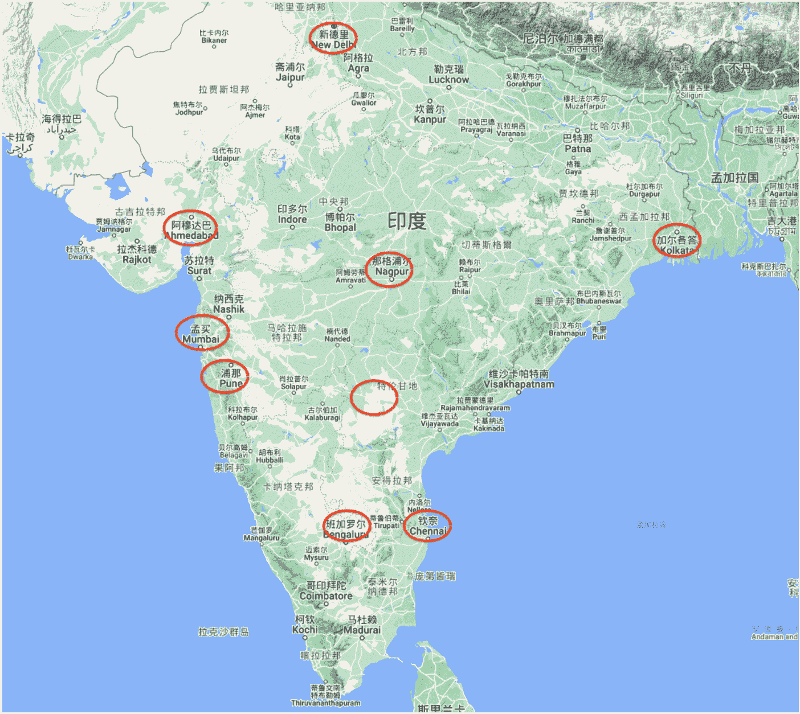

我们知道，传统农业文明下，经济增长是非常慢的，每年产出都差不多，有人多拿点，自然有人会少拿一些，零和思维也就成了常态。现代社会财富生产速度很快，别人赚不赚，往往跟你没啥关系，甚至别人赚钱，你也能跟着赚，零和思维这种保守思想慢慢也就没市场了。

按理说印度这几年发展很快，但是只有极少数人享受到了发展成果，贫富差距大得离谱。联合国每年要公布那个“饥饿指数”，我刚查了下，2022年印度比朝鲜都靠后，121个国家里排107位，5.6亿人粮食危机（也就是还没开始挨饿不过也快了），有两亿人根本吃不饱，匪夷所思。

这就导致印度一只脚迈入了现代社会，但是身体剩下的部分还在门外，绝大部分人的观念跟一百年前没啥明显差别。

按理一部分人观念守旧并不重要，比如咱们身边也有不少人观念也就那样。但是印度是个超大号民主国家，民粹泛滥，这些绝大部分人的思想通过代议制不断上升，最后变成了部分国家意志。

其次印度人还有个大毛病，“道德高于法律”。

大家把这两点先记住，咱们往下聊，聊着聊着自然就明白了。

### 1
印度从上到下不太信任外国企业。大家不能简单认为是印度不开化、傲慢、缺乏国际视野，因为在历史上，外国在印度人眼里，确实没有带来过什么好东西。

从穿过开伯尔山口进入印度统治当地的北方游牧民族，比如雅利安人和后来的蒙古人，再到后来驾驶帆船来到印度搞殖民的葡萄牙人、法国人和英国人，都给印度造成了巨大的伤害。从那以后，印度人对外国在印度的一切行为，都有着严重的警惕心。

所以从英国脱离出来之后，印度也想独立自主，搞社会主义，提倡不结盟运动，学习苏联的计划经济，希望通过一个个五年计划让国家强大。

这一政策整整持续了40多年，直到苏联解体后几年才开始改革。也就是说印度实际上开放的时间比中国还要晚，现在也有大量的计划经济遗留，严重阻碍印度的发展，不过惯性太大，实在是解决不了。

但在1991年前，印度在美苏之间左右逢源，一直接受欧美企业在印度的投资。这其中发生的一些事，加剧了印度人对外国企业的不信任。

最严重的就是1984年的印度博帕尔灾难，半夜一个巨大的存放剧毒化学品的罐子破裂，造成三千多人的死亡和数万人伤残。几十年后剧毒物质依然在伤害着当地人。

### 2
因为互相不信任，印度和外国企业的合作经常有问题，双方于是只得“斗智斗勇”。

其中最突出的就是税收，比如印度的所得税，对于本国企业是30%，但是对外国公司却要40%，外企自然对此很不满。

不过这都不是问题，这些年跨国企业似乎形成共识“印度是下一个中国”，赚得少一些就少一些吧，只要能赚，大家还是很愿意去印度投资。

所以双方说好，如果出了什么问题，就以法律解决，印度爽快答应，事情就这样定了下来。

跨国公司来了之后，他们就开始研究印度法律，发现漏洞百出，不利用下这些漏洞简直愧对祖宗。

举个例子大家就知道了，一般来讲，资金想从印度出来是很难的，但是跨国公司[有]办法。他们是怎么做的呢？让自己在印度的公司向美国的一个公司购买一项技术，这下钱就跑美国去了，属于正常贸易，印度政府总不能拦着吧？

印度人也不傻啊，他们一查就发现卖技术的那个美国公司就是这个跨国公司的母公司，而且那个技术也是过时的，说白了，就是个合法转移利润的套路。

这下印度人怒了，记得我上文说的那个“道德高于法律”不？印度人觉得你们这么干就是不对，赚我们的钱，却把收入在账目上做成亏损，钱还转到美国去了，这对吗？这不对，既然明知道不对还这么做，是不是欠揍？

可能有小伙伴要问了，难道印度这么想不是应该的吗？

这就是刚才说的那个问题，到底是“法制”还是“德治”，你如果一开始就说你要搞德治，估计大家都不来了，毕竟印度人自己道德不咋高，对别人的道德底线高了去了。

但是你一开始说了要搞法制，别人按照法律来，你又不爽了，这算啥？

也就是说，政府只有自己先遵守自己的法律，然后大家才会放心的来，增加了投资，带动了基建，引入了技术，带来了各种知识，这些都比税收重要一万倍。再说了，现代法律也是个不断进化的东西，你每年填补漏洞呗。总不能因为自己的法律烂，然后就把会下金蛋的鹅给煮了吧。

印度有人是懂这个的，但是大部分老百姓不懂，他们是零和思维，他们觉得这些大公司就是欠干，竟然跟印度人耍心眼，不把他们干服简直愧对祖宗。

这其中最为人“津津乐道”的传奇故事，就是2007年英国沃达丰收购李嘉诚的和电公司旗下的印度电讯业务。

当时交易双方为了避税，一百多亿美元的生意，使用的是在“避税天堂”开曼群岛设立的账户。这也是跨国企业的正常操作，可以免除大量的税款。

不过印度作为业务所在国，当地的税务部门觉得这样明目张胆的避税行为，是对自己的极大侮辱。于是给沃达丰开了26亿美元的补缴税单。

沃达丰是见过世面的，知道税务局这种操作没有法律依据，直接对簿公堂打起了马拉松官司。

最后打到印度最高法院，最高法院到底是专业机构，跟着要流氓不合适。一番研究之后，表示税务部门你这个干的没有法律依据啊，印度税务部门自然是败诉了。

本着亡羊补牢的目的，税务部门跑去议会要求修改所得税法，正好当时执政的国大党是个百年大烂党，能力不行，道德标准倒挺高，搞经济不行，新法律规定这个条款从1961年开始实施。

这下不仅沃达丰傻眼了，连其他一堆跨国公司都有点崩溃，因为国际上的惯例是，你如果让我纳税，必须事先得让我知道有这么个税，不能临时加一个，还从几十年前开始实施。如果你这么折腾，按理说谁都可能一夜之间变罪犯。这个操作实在是太奇葩，以至于“印度人民党”（也就是莫迪所在的党）当时也说这是“税收恐怖主义”。

而且印度人和沃达丰这几年打官司，这期间那笔罚金是要算利息的，现在利滚利已经达到50亿美元了，别废话，赶紧打钱！

连印度最高法院都傻了，不过现在有新法律，并且法律里说得很清楚追溯五十年，法院只好判决税务部门胜诉。

沃达丰当然不能吃这种哑巴亏，一纸状子告到海牙国际法庭，可惜印度人没本事改国际法，国际法庭判决印度税务局败诉，最后一毛税都没有拿到。

这事尽管落下了帷幕，但印度这种临时改法律抢钱的操作，实在太不像话，在国际商业界印度的口碑又一次暴跌了一轮，后来有一段时间不是艺高人胆大的公司一般不敢到印度投资，说不定哪天临时改个法律过来干你。

沃达丰在打了十几年官司后，也对印度市场彻底没了信心，这些年在印度的业务也是不断萎缩。

这种双输的局面，双方都觉得自己有道理。沃达丰认为自己又没犯法，印度税务机关认为沃达丰的避税操作合法但是不对，欠扁，不能不管，两边就是鸡同鸭讲。

所以印度这些年一直在进行一个循环：

经济好了，觉得跨国公司太无耻，赚那么多钱却搞避税，要不要脸？于是来一波打击。那些公司吃了哑巴亏，或者缩小投资，或者干脆跑路，印度迎来一波投资暴跌。

没人来投资了，老百姓没工作，经济下行压力大，老百姓被人煽动上街抗议政府做得太差，政府又舔着脸求着大家过来投资。赌咒发誓这次一定按照法律来，再也不搞道德审判。

而且为了争取别人的信任，法律就跟网文剧本似的改来改去，比如就在2021年，印度废掉了那个当初为了针对沃达丰通过的法律，又一次自己打了自己的脸。好在印度人心态好，觉得自己不尴尬，尴尬的就是别人。

大家眼热印度的市场规模，想进去赚钱，过几年印度又犯病，又得推迟，基本上一直在循环这个套路。

### 3
其实莫迪本人是很喜欢外资的。他以前是古吉拉特邦的首席部长，类似咱们的省长。上位后策略基本是摸着中国过河，搞市场经济改革，引进外资，还跑到中国日本新加坡抓学习，后来古吉拉特邦的经济增长整个印度之最，这也是他成为印度总理最大的资本。

但是印度是个“分权制”国家，中央和地方政府之间的博弈超级复杂，甚至跟唐朝中后期中央与割据藩镇的态势差不多，中央不能强令地方，各地根据自己的情况各干各的，搞出来无数麻烦。

最著名的，就是日本拿下了印度的那个高铁大单。当初那个单子中日都在抢，现在来看，我们幸亏没拿下。

这就得给大家普及一个常识，其实基建这东西，技术含量也就那样，基本上大国都能做，但是最大最麻烦的一个问题，就是“征地”。

为啥各国基建搞那么几年后续就搞不下去了，并不是技术问题，老百姓穷的时候好说，一旦富起来，尤其法制健全起来，你再去拆迁什么的，就很难拆得动，往往几个刺头就能把整个项目给搞黄了。

这时候就需要政府下很大的决心来做这事。印度中央政府对高铁项目非常上心，但是高铁经过的马哈拉施特拉邦却极其消极，老百姓不配合倒也正常，奇葩的是地方政府也不配合。

原因也不复杂，现在印度执政的是“印度人民党”对高铁项目很积极，但是马哈拉施特拉邦大选上来的是“湿婆神军党”，你听这名字就不是个善茬，充满了封建迷信色彩。

这个党的领袖认为高铁华而不实，搞那玩意就是浪费钱，毕竟印度需要的是一车厢只能拉几十个人的高速列车吗？印度需要的是能装更多人的低速车，高铁跑那么快干啥？印度人缺时间吗？

所以奇葩的事发生了，地方政府和老百姓联合起来坚持不让给高铁腾地，那条高铁到现在都建了个寂寞，日本人现在项目开展不下去，前期的投资也进去了，弄不好得搞到下个世纪。

也正是因为这种“分权制”，让印度各地差距极大，观念开明的那些沿海省发展很快，其他地方就很一般。发展不均更是导致观念进一步分化。

当然了，印度的问题远远不止这个。

### 4
印度本国大企业，比如国内读者都知道的塔塔、信实等等，这些企业非常大，而且涉猎非常广，比如塔塔，基本上涉猎了所有的行业，汽车、航空、生物、原子能，啥都干，一个公司的产值一度占了印度GDP的2%。

还有这几年爆火，最近被美国做空机构狙击的“亚洲首富”阿达尼。他号称莫迪的合伙人，崛起速度如同火箭，个人资产3年涨了21倍！在印度几乎无人可挡，是印度“国家版”的高启强。

这些企业最大的梦想，就是把门关起来，自己单独过，所以他们对外企极其反感。道理也不复杂，你们村就你一个小卖铺，你也不希望别人来搞超市吧。

所以就有了这几年信实集团暴打亚马逊的事，搞得亚马逊之前投资的两亿美元拿不回来，还得给印度赔偿两千多万美元，估计很长时间都要绕着印度走了。故事比较复杂，碍于篇幅就不讲了。

此外印度巨头们还很善于利用民意，不咋公开露面反对外企，经常是鼓动身边的社会底层，大张旗鼓地捣乱。

这又涉及到我上文说的那两件事了，印度老百姓既有“零和思维”又充满道德审判的冲动，看见外企就气不打一处来，觉得钱不可能从虚无中来，既然外企赚钱了，那肯定是印度自己赔钱了，作为老百姓不能不管，所以一煽动就起来闹。

从日常的上街游行示威，到大规模地拦阻道路干扰企业经营，甚至直接鼓动老百姓打砸抢烧。只要他们反对的事情，有无数种手段给你搞黄，这个不仅仅是针对外企，对他们本国政府也一样。

比如前些年莫迪搞粮食法案，动了大公司的利益。这些人鼓动几十万老百姓，在新德里市郊整整闹了一年多。不论严寒酷暑新冠疫情都无法动摇，到最后莫迪这种狠人也只能认怂。一般来讲，比胡搅蛮缠全世界都得给印度叫大哥，两伙印度人拧巴起来，谁穷谁牛逼，让你知道什么叫光脚的不怕穿鞋的。

### 5
印度现在其实很纠结。

主要是内部分成无数个派系，各自利益出发点都不太一样。

对于莫迪来说，他很希望引入外企，毕竟引入外企就相当于引入了资源、管理技术还有无数隐知识。将来在外企干过的员工出去创业，就可以把现代企业管理经验扩散出去，中国经济其实就是这么过来的。而且通过引入竞争，也可以让印度企业有点压力，提升下自己的内力，别成天窝里横，一到国际上就是战五渣。

但是阻力实在是太大了，上文也说了，既有中央和地方的冲突，超大公司和老百姓也都对此不太感冒，太多老百姓觉得外企就是抢钱，还以法律为武器偷税漏税，不如全部赶走，有这么一帮老百姓，几乎一煽动就暴走。

印度一直发展的很慢，也和这种情况强相关，这些年莫迪使劲推动改革，一定程度上解放了一些沿海城市，不过大部分地区依旧死气沉沉。他们现在的策略也是重点发展沿海，不试图改变内陆地区，让脑子正常的老百姓自己去沿海发展。

这一点上我国一直处理得特别好，政府的长期决策很少被民粹裹挟，而且很善于引入竞争。比如咱们国家引入特斯拉整活了电动车产业，这事已经进了哈佛的商业案例库。再比如沃尔玛他们教会中国之后，自己竞争不过然后撤了。反面案例就是搜索引擎，没有竞争，某度烂成那样。

对于我们来说，印度这一系列骚操作并不是坏事，最起码让跨国资本知道有些中国长期以来的优势并不是理所当然的，比如稳定的环境，几乎不存在的民粹主义，都是我们巨大的优势，不能假设所有国家都这样。某种意义上也可以延缓产业迁出。

以前有一段时间中国对印度投资规模非常大，但是2020年之后印度对跨国公司非常不友好，投资规模明显下跌。估计过几年印度又开始跪着求大家去投资，不过中资估计很长时间不会再去了。每次瞎折腾把大家对它的信心给搞没了，都需要很多年重新恢复。

当然了，对于中印之间的发展比拼，希望印度自己烂下去没啥意义，还是要提高我们自己的软实力，比如新闻里经常提的，法制化和透明化，培养大家稳定预期，这才是长期发展的基石。

公众号懒人搜索，[懒人专属群](懒人专属群)分享

### ChatGPT淘汰的那些人，其实早就已经被淘汰了
2023-02-10

有不少小伙伴让我聊一下那个ChatGPT，稍微说几句。

1. 我这些年发现的一个最明显的问题是，一些随手就可以通过搜索引擎搜到的东西，绝大部分人却在那里疯狂传谣。我一直震惊于大家为啥都懒得打开搜索引擎界面，随手键入几个关键词，就会发现跳出来的东西跟自己想的不一样，谣言不就不攻自破了吗？

后来发现事情没这么简单，大部分人害怕新东西，害怕看到的搜索结果跟自己想的不一样，所以干脆坚决不去用那玩意。

更重要的是“目标描述”，你能说清楚自己想要查啥吗？用几个关键词来让搜索引擎知道自己想要啥更是一个稀缺技能。

这个问题现在又移植到了ChatGPT上，大家跟它聊几句，就能发现一个关键问题，你需要把自己想要的精确描述出来，描述越简洁精确，可能结果越清晰。这和传统搜索引擎一个毛病，太多人在强大工具面前又不知道该如何描述自己想要啥了。

更麻烦的是，真正关键的知识绝大部分都是以英文形式存在的，这个不奇怪，毕竟咱们国家的重磅论文也都有英文版本。这也是为啥考研英语那么难，毕竟你可能确实需要去查论文了，得提前做准备。但是国内这两年真正疯传去英语化，我也是不知道该说啥了，英语才是底层人民逆袭的几个关键工具，这都能抛弃。

2. 现在ChatGPT引发的轰动，早期的搜索引擎也有过。你想想，一个搜索框能告诉你所有问题的结果，是一件多么可怕的事。不过后来的事情也很清楚，绝大部分人并没有从那玩意上收获多少好处。搜索引擎作为一种彻底公开的工具，对于多数来说是无感的，成了极少数人的利器。

这也让我想起来多年以前的一个顶级技术高手跟我说过的话，他说有了谷歌，还上啥大学？这个并不是吹牛逼，他以前学医的，后来在医学院混不下去，靠着谷歌一直混成了技术大牛。这个可能让一些小伙伴难以接受，不过如果你是做开发的，也是天天跟谷歌打交道，只是不同人查到的东西差距很大。

这让我有个感触，生活就像一个竞技场，每个人走进来的时候，惊艳地发现里面摆着一堆武器让大家自己选，这些武器从木棍到机枪应有尽有。令人不解的是，绝大部分人选择的是操作简单容易上手的菜刀，而不是有一定学习成本的机枪，最后的结果也很明显，看似公平的竞赛，最终因为工具的差别变成了单方面的屠杀。

现实里当然复杂一些，因为每个人并不是只有一种工具，毕竟可能孩子比较蠢，选了个木棍，可是他爹有个高达呢。

3. 这也就引出了一个很可怕的问题，“技术的公共性”和“使用者的不平等性”。类似论文库，各种教程，这些都是大杀器，在封建社会都是要被统治阶级重兵把守保护起来的“国家机密”，如今全部被无差别展示给了普通人，但问题是绝大部分人硬是视而不见。

如果之前的那些东西并没有影响大家，一个ChatGPT又有啥影响呢？这玩意大概率过了这段时间的喧闹后恢复平静，然后变成少数人天天在用的工具，绝大部分人非必要不会去碰它。

不出意外，社会差距会进一步拉大。

4. 就跟之前的搜索引擎一样，ChatGPT本质依旧是个搜索引擎，只是做了二次加工。

有些人拒绝搜索引擎，也是因为搜出来的一堆东西有自相矛盾的，有明显扯淡的，没法确认真实性。

那ChatGPT的真实性又该如何保证呢？你就那么确认他说的是真的？因为他的信息源也是网络上的信息。事实上这段时间已经多次被人发现它有些东西说的也不对。

这时候那个上古技能又起作用了，也就是交叉对比等基本搜索技巧，以及必要的常识来判断搜出来的东西有没有问题。

此外我们经常用搜索引擎的，都知道一个问题，想确认一个东西是不是真的，最重要的一个手段是不断地去上溯这个知识最早出处在哪，有没有论文支持。就算ChatGPT大规模使用，这个技能依旧非常重要。

大家看出来了吧，不管啥工具，最后还是得依赖操作它的人。在不同的人那里，用出来的效果远远超过木棍和核武器的差距。

5. 如今的ChatGPT，如果像现在这样进化下去，过几年就变成了这样一个东西：对大部分人的生活并没有实质影响，该干啥干啥；但是它和之前的谷歌一样，绝大部分人觉得它只是给生活提供了一点方便，一小部分人会觉得捡了个机枪，它会给这部分插上翅膀，甚至飞出大气层。

这也是所有复杂工具的共同特点，它们没有主人，谁拿到、谁会用、用得好，就给谁创造巨大的价值。

而且复杂工具还有个毛病，学习成本高，不同的人手里效果差距极大。事实上一根木棍，在不同的人手里威力也根本不同。更别说类似C语言、Java、相机、PS、Maya这些工具，有人可以用这些东西创造传奇，大部分人用这些工具搞出来的却啥也不是。

所以没必要神化工具，也不要小看工具，工具非常依赖使用它的人。

- 6、至于它会不会取代很多人力，主要看取代到啥程度。蒸汽机解放了无数人的双手，汽车解放了人的双腿，搜索引擎让你可以少翻几百本书就可以直接得到答案，甚至计算机淘汰了无数工种，重型挖掘机一铲子下去等于几十个人忙一天，是不是可以说是取代？

也就是说人工智能发展到这一步，说取代不了一些人肯定是不客观的。不过如果说它能彻底取代人，显然也不可能。人只是站的位置越来越高。

而且大家应该明白一件事，绝大部分人做的工作本身没意义，就是冗余本身。

我之前给大家说过一件事，我们的一个大神用了极短的时间解决了一个一堆人很长时间都没解决的超复杂问题。有小伙伴问，那公司雇佣这么一个人，是不是可以节约80%的人力。

乍一想是这样，实际操作中却很离谱。因为有太多琐碎的事务性工作，设计文档、需求文档、测试报告总得有人填吧？无数的测试用例总得有人给部署实施吧？测试出来问题总得沟通回归吧？产品上线总得有人调试吧？既然都有这么多了人，是不是每个团队都需要一个领导来协调？是不是需要行政人员给大家上社保、走报销流程？还得有HR评估这些人是不是在认真干活，哪些人下一年该升职。

就这样人数很快就爆炸了，这也是为啥硅谷有句话，大公司那都是养老的，想干成点啥事得去独角兽小公司。

科技领域越来越呈现出一个趋势，绝大部分人都是围绕几个关键核心在转。有点像《三体》里的人列计算机，只有牛顿和冯·诺依曼在动脑，其他人出力就行了。

当初Excel出现的时候，很多人惊呼这玩意将会改变整个职场江湖，谁能想到，它并没有改变啥，只是让工作变得更麻烦更琐碎。

“琐碎”是自动化的大敌。之前有个小老板跟我说，他做服装的，想上一个机械臂，但是机械臂啥都好，唯一麻烦的是没法把一块稍微皱一些的布弄平，他又给这个机械臂配了几个人专门伺候机械臂。

- 7、必须要认识到的一点是，你的工作是“信息流”还是“思想流”。

我知道很多财经小编的工作就是把网上的新闻汇编一下，加几句不痛不痒的评论，然后推送出来。这就是典型的“信息流”，这种工作迟早会被AI给取代了。因为AI比你快，还比你准确，更重要的是老板不用给它上社保，也不用给它养老。

但如果你面对的东西主观性很强，客户自己都不知道自己想要啥，或者需要大量的想法，这种工作短时间内AI不太行。但是可以预测的是，ChatGPT这类工具不但不会取代你，而且会成为你的帮手，跟你一起工作，类似搜索引擎那样。

- 8、说一个宏大叙事的问题，有小伙伴说我国会不会在这方面彻底落后西方？

我理解是“大概率不会”。

技术最难的一点，其实是“可行性研究”，也就是不知道哪条路能走得通。方向不明的时候如果ALL IN某个路线，把所有资源投入那个方向，万一最后那个方向最终被证实是一条死路，下一个死的就是你。一旦被证实哪条路可行，就很容易被模仿。现在的ChatGPT也一样，很快国内就会有突破，大家看着吧。

所以美国才要限制我们训练人工智能的芯片，毕竟软件上挡不住，那就硬件挡。

这也是为啥美国要维持那种自由开放的氛围，他们的路线是各个公司“各自突围”，各个方向上都搞“低成本试探进攻”，让企业家去承担试错成本，就算出了问题，大不了倒闭就是了。

很多人说难道美国做的就是对的吗？当然不一定。不过美国的做法，其实就是进化论的模式。进化是允许犯错的，事实上“错误”是进化必不可少的前提，可能当下的错误，是未来的优势；可能如今的皇冠，却是下一个时代的累赘，谁又知道呢？

你不知道，只好允许错误路线，允许多元发展，形成一个“选择池”，应对还没出现的场景。

我们因为是后发国家，之前的“集中力量办大事”效果就很好，因为已经被证实可行的路线，你堆资源就行了。但是接下来比较麻烦，因为一旦突入无人区，还真没有比美国那种更好的模式，只能是用那种进化模式。

而且现代科技这东西，并不是很多人想象中某个天才的突发奇想。需要一套完整的研究系统，常年的大规模投入，循序渐进的一步一步走。在一个地方有了突破就加大投入。可能一个发现背后是成百上千的失败，这些失败的科研人员可能比成功者还要优秀，投入的资源更多。甚至就是要无数人失败把不能走的路都走一遍，然后才能找到可行的方向。

- 9、本文主要想说的，还是“技术的不平等性”，这种不平等恰恰隐藏在平等的表象下，看着我们大家都可以随手接触的东西，绝大部分人从来也没真正玩明白过，更别说从中赚钱什么的。

技术越进步，这种鸿沟拉的越大。倒也不仅限于ChatGPT，而是说普通人翻盘的工具其实就在我们自己身边，英语、计算机、搜索引擎、无数的教程，绝大部分人却熟视无睹，还有不少人在那里反这反那，恨不得把一切外来的东西当做垃圾扫出去。

不过也没啥好的办法，毕竟现实世界里，80%的人是没有阅读长文的能力的，你再要求他们会使用复杂工具，简直是为难大家。

唯一能做的，还是让自己平时主动就去用这些东西，不断提升自己在这类工具使用方面的技巧，把对新工具的应用融入到工作和生活里。改变不了趋势，那就尽量让自己处在趋势那一边。

公众号懒人搜索，[懒人专属群](https://example.com) 分享

### 伊朗军事设施又被炸，以色列和伊朗到底有啥过节？

2023-02-03

前几天就看到新闻，说伊朗的军事设施又被炸了，美国人说是以色列炸的，可是伊朗不承认。这已经是惯例了，因为承认了就得报复，可是伊朗确实不大想报复。

中东那边的破事当中，最魔幻的就是伊朗和以色列之间了，你要是细看，会发现他俩好像历史上关系还不错，也没啥大过节。可是细看，又发现几乎没法相容。

这事最早还要从以色列建国开始说起。

大家知道，以色列建国第二天，就被他的邻居们围上去一顿揍，后来在美苏的共同帮助下挺了过来。

美国帮助以色列好理解，苏联脑子有病吗？为啥要那么干？

这还真是斯大林的一盘“大棋”。因为当时中东地区大部分国家都跟英国关系不错，属于英国的传统势力范围。如果能在中东搞个大家的公敌，这个公敌还跟美英绑定在一起，那其他中东国家不是自然而然倒向苏联？苏联就可以打破英国在阿拉伯的统治，把一只脚伸到中东去。事实上苏联在以色列建国问题上作用是决定性的，没有苏联和他的小伙伴在联合国的投票，以及后来的大规模军事援助，以色列根本建不了国。

很显然这个策略奏效了，直到现在，中东很多国家依旧亲俄反美。

而且很多人先入为主觉得去以色列建国的，都是从纳粹集中营里逃出来、瘦得跟骨架似的那些人。其实不是，整个欧洲的犹太人都在向以色列集中，中东的犹太人社区也一个个完整的搬入了以色列，还有很大一部分就是苏联境内的犹太人，据统计前后去了近一百万人。

俄罗斯和犹太人一直纠葛不断，建立苏联最关键的人物“先知”托洛茨基就是犹太人，苏联早期领导集体里有一半犹太人，所以小胡子一直觉得苏联就是犹太人建立的邪恶帝国。

这也就有了电影《布列斯特要塞》最后的那个剧情：

德国人要求苏军战俘里的政委和犹太人出列。

男主角知道会被处决，依旧站出来说他既是犹太人，又是政委，然后就被当场射杀了。

直到现在，俄罗斯和以色列的关系非常复杂。以色列是美国之外俄罗斯人最大的移民国（美国有三百多万俄国人，以色列有近百万），俄罗斯富豪和官僚里也有大量犹太人，所以他俩好像关系不太好，却一直非常密切。属于那种官方敌对，民间密切的状态。

苏联支援以色列，就是先通过捷克斯洛伐克，然后再通过伊朗。这个更费解了，伊朗以前不是美国的小弟么，怎么又跟苏联扯上了。

其实伊朗以前最早跟着的是英国，大家知道现在全世界最大的那几个石油公司之一的“英国石油公司”吧。这个公司非常久远，到现在已经一百多年了，他的缩写叫“BP”，那里边的那个“P”，最开始就是“波斯（Persia）”的首字母。当初英国把自己的军舰从蒸汽机升级成内燃机，但是英国自己没有石油，他们想出来的办法就是从伊朗补充，也就是说伊朗一度是英帝国的加油站。

后来伊朗又和德国关系不错，二战中保持中立，可是傻子都知道它和德国靠得很近。

战争结束后伊朗想振兴，一度又跟着苏联搞社会主义，对，他们也搞过社会主义，和苏联蜜月了几年。

也正是那段时间，以色列建国被围殴，苏联进入以色列的部分物资走的就是伊朗，整个中东都对以色列宣战，伊朗却没有。

伊朗有一套自己的小算盘。中东那些国家看着好像都信伊斯兰教，可是就跟女生宿舍似的，四个人恨不得拉七个群。我之前的文章也聊过，包括卡塔尔在内的这些袖珍国家，都在大规模扩军，都在防邻居和兄弟。伊朗也一样，一直在防邻居伊拉克，为了这个目的，伊朗上层决定和以色列搞好关系，试图牵制伊拉克。

后来伊朗发生了政变，热衷社会主义的首相摩萨台被中情局给推翻了，伊朗一夜之间变成了美国的头号小弟，对，伊朗是头号，以色列算二号。

两家正式进入蜜月状态，伊朗给以色列输送石油，以色列卖给伊朗武器。伊朗是什叶派，以色列是犹太人，在中东都比较招人嫌，又都是美国的小弟，所以关系分外好。

随后就是咱们熟悉的伊朗革命，亲美的巴列维国王被推翻，宗教势力上台，这下跟以色列也闹翻了，伊朗开始说美国和以色列是世界的两大毒瘤。革命后的伊朗扣留了美国大使馆人质，把美国搞得灰头土脸，美国在中东的头号小弟就这样走丢了。

紧接着就是两伊战争。两伊战争当中几乎整个西方和苏联都是支持伊拉克的，《原创》耗费万亿，死伤百万，一场战争打掉两个强国》，这篇讲过。

因为伊朗要输出革命，要把整个中东都变成自己那种保守的宗教国，这就不是影响美国的利益了，是影响全世界的。所以美苏和中东小伙伴们都怒了，都在支持伊拉克，伊拉克的主要常规武器都向苏联买，科技类武器美国提供。

但奇怪的是，以色列一直偷摸向伊朗卖武器。

不过也没那么奇怪。以色列当时成立了一个由一堆学者组成的伊朗问题委员会，他们也研究伊拉克。他们仔细研究后，认为以萨达姆的性格，如果他赢下两伊战争，那就成了中东话事人，必然会出头帮小弟们摆平大家最烦的那个国家。中东大家庭里，到底谁人见人嫌不用说了吧。尤其以色列离伊拉克还那么近。

两伊战争一开始，伊拉克军队长驱直入，直接打垮了伊朗国防军，夺走伊朗大片领土。以色列一度还在考虑要不自己亲自下场从背后捅伊拉克一刀。毕竟如果伊拉克拿下伊朗，国力大得离谱，到时候反正也得被揍，不如早点出手。

不过战五渣萨达姆很快就被比它体量大得多的伊朗摁在地上打，吃下去的领土很快也都吐了出来，甚至转进到要保卫自己的第二大城市。还好有美苏的联手支援，不然现在说不定没伊拉克了。也正是因为美苏的下场介入，伊朗又成了弱势的一方。

这种背景下，以色列一直在偷摸支援伊朗，指望伊朗死前能使劲捅几刀伊拉克，最好这两货一个进太平间，一个上手术台。美国知道以色列在干啥，也知道以色列的小算盘，也就默认了。

这中间还有一次大手笔，当时萨达姆也在研发核武器，很快被以色列间谍给找了出来。一开始以色列引导伊朗空军去空袭萨达姆的核设施，不过伊朗发挥传统艺能，战机过去了，导弹也发射了，没打中。1981年6月7日，以色列空军亲自去把伊拉克的核设施给炸了。

后来的事大家也知道，两伊战争以双方把血流尽告终，伊朗彻底被打残，还遭到严厉的制裁，到现在也没缓过来。

伊拉克倒还好，号称世界第四大军事强国。不过欠了巨额外债还不上，开始动歪脑筋去打债主，作死去进攻科威特，犯了众怒。在联合国授权下伊拉克被联军打残，随后也遭到惨烈的制裁。这样，整个中东最凶的两个都趴了。

到此，其实以色列和伊朗一直没啥明显的仇怨。可是两伊战争结束之后，双方分歧越来越大。

首先战争打完了，伊朗用不着以色列的武器，所以也不用惯着这帮异教徒。

更关键的是，伊朗高举伊斯兰宗教大旗，“反美反以”几乎是必然的，事实上哪怕在战争时期以色列不断向伊朗输送武器，伊朗也在骂美国和以色列是两个大毒虫，美国是帝国主义的总头子，以色列是殖民主义在中东留下的大毒瘤。

比较有意思的是，伊朗国内有几个犹太人社区，在那里存在了上千年，整个欧洲排挤犹太人的时候，波斯人也没做啥过分举动。哪怕后来宗教革命之后，一直没太折腾这帮人，不过8万犹太人跑了5万，现在还剩三万多。

我不是认识一个在北京读博的伊朗读者嘛，他说伊朗这个做法非常高明，每次国际上指责伊朗的时候，伊朗就把犹太社区搬出来，告诉大家伊朗人并不讨厌犹太人，只是看不惯以色列那副欠揍样，大家就没话说了。

当然了，以色列也防着伊朗。

伊朗人的教育水平非常高，在中东算高的，按照它的人口体量和资源禀赋，不出意外再过一些年大概率会成为区域大国和强国。

另一方面，美国国内有一帮人一直寻求和伊朗改善关系，他们想去伊朗做买卖。如果美国一旦解除了对伊朗的限制，说不定这个国家一飞冲天。到时候伊朗真成了中东话事人，而且伊朗国内老百姓普遍亲美，想跟着美国混，伊朗人除了西欧和美国人，再谁也不看上，甚至鄙视俄罗斯所在的东欧。

所以犹太人发挥传统艺能，在全世界发动媒体宣传机器，把伊朗宣传成了个流氓国家，一度想把伊朗描述成阿富汗，可什叶派确实不搞恐怖主义，后来这事也就不了了之了，但是流氓的身份是无论如何也躲不掉。

美国是很讲究政治正确的，既然伊朗是流氓，那些想和伊朗做买卖的人也没法替伊朗说话，所以伊朗和美国一直不太好，中间有过几次改善机会，很快又剑拔弩张。

总的来讲，两伊战争结束后，双方有冲突，但一直是小打小闹。直到后来伊朗要搞核弹，这下以色列彻底疯了。

大家看地图就知道，以色列就那么点，两个核弹就能摆平的国家，又是中东的异教徒，人见人恨。如果伊朗一旦有了核弹，最躲无可躲的就是它，到时候被人拿捏得死死地。当然了，以色列并不是针对伊朗，中东谁搞核弹他搞谁。

上文提到，以色列空军在1981年6月曾对伊拉克奥西拉克核设施发动过空袭，摧毁了伊拉克的核设施。

2007年9月6日，以色列又成功摧毁了叙利亚的核材料仓库，一般认为那座仓库也是伊朗的。

当然了，其实伊朗造核弹这事不仅以色列不高兴，联合国几大善人都不太高心，尤其美国，在大家不懈的干扰下，伊朗核武器项目应该是这个世界上最曲折的项目，从设备到科学家被搞了无数次。

比如震惊世界的伊朗核物理科学家被杀事件。一开始国内流传说是以色列特工自杀式袭击，其实摩萨德很少搞自杀袭击，都是周密策划后致命一击。

后来《纽约时报》披露，摩萨德使用的枪是一种比利时制造的FN MAG机枪，装在一套复杂的远程控制设备上。所有组件加起来近一吨，摩萨德就把这款枪和配件拆成零件。用了几个月的时间，以零件的形式走私到伊朗。

然后进行了重新组装，组装完之后人员撤离。操作人员是在一千公里之外远程遥控狙杀，完事之后引爆车里的炸药，把枪和配件全部炸掉。

整个狙击过程只有几秒钟，科学家就被秒了。当时有个技术问题，也就是操作员和那挺步枪之间有延迟，而且延迟非常大，高延迟下远程击杀移动目标几乎不可能（类似大家高延迟下玩游戏），所以还使用了一种AI的人工智能作为算法补偿，这个科学家可以说是少数几个被人工智能杀死的人。

《纽约时报》还披露了一堆事，这个科学家并不是第一个被杀的，以色列长期以来一直在刺杀伊朗科学家，之前被摩托枪手杀了好几个。对，骑着摩托停在别人车旁边、后座那人从怀里拿个乌兹冲锋枪出来一顿扫射的造型，最早就是以色列特工，那个枪也是以色列研发的。

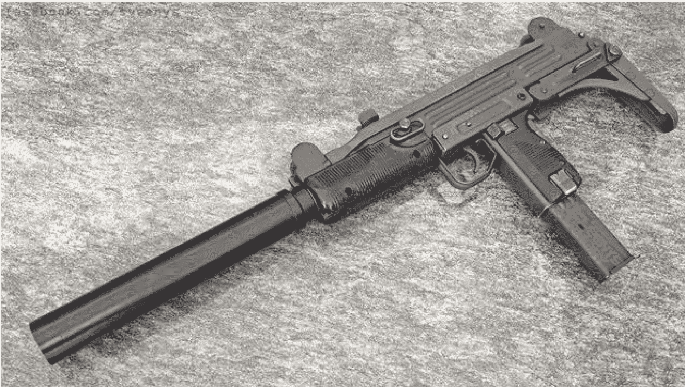

有个绝大部分阴谋论者比较难以接受的事实是，以色列干的缺德事，绝大部分都是美国媒体爆出来的。这让很多坚持“犹太人控制世界”的人理解不了，其实没啥难理解的，谁也控制不了世界。世界运行的本质依旧是“失控和竞争”。喜欢阴谋论的人，大部分知识层面比较低，没办法用“混沌”、“失控”、“市场”、“复杂系统”等更复杂一些的模型去理解世界，希望用简单明了的模型去看待世界，也就愿意相信那些“一个理论解释全世界”的阴谋论。

此外还有2020年的7·2伊朗纳坦兹核设施事故，有人在伊朗的核设施里装了炸药，把用于提纯核原料的离心机炸了一堆。这事伊朗到现在也没公布是谁炸的，不过一般倾向于认为也是以色列买通伊朗科学家实施的。

说到这里，大家估计也纳闷了，伊朗这个国家到底咋回事？好像没安保似的。

其实我之前也给大家说了。现在的伊朗很尴尬，他跟他的中东兄弟们不一样，他的国民教育水平高得不像中东国家。而伊朗又是个神权国家，但是老百姓教育程度又决定了大部分人不信神。

而且想搞好经济，就得发展工业，但是工业不可能让神职人员搞，工业背后的工程师和技术人员天生跟宗教不对付。如果不发展经济，老百姓受穷就会不满意，对政权合法性也会产生质疑，说不定又爆发革命。

这样一来二去，很多伊朗老百姓眼里他们的政府并不是自己真正的政府，老百姓里跟政府不一条心得多的是。比如就在前不久，伊朗球队在世界杯拒绝唱国歌，足球队被当成了“人民英雄”，大家想想这个国家是啥样的。

也就是说，伊朗国内现在是很分裂的，老百姓中“反美”的一大堆，爱美国的也一大堆，神棍一堆，完全不信宗教那一套的也超级多，互相说不到一起，伊朗政府和教团也不是一条心，就这么个国家。

也正是因为这样，伊朗国内一堆人给美国和以色列引路，每年也有大量的人移民离开伊朗。我随手搜了下，伊朗外交部公布的数据，2021年约有400万伊朗人选择居住在国外（总人口接近九千万人），其中在美国居住的伊朗侨民达到了150万人，加拿大为40万人，英国40万人。

也正是因为内部不是一条心，伊朗日常发生各种匪夷所思的事，最过分的，莫过于伊朗的情报部门头子被杀事件。

那事的起因是苏莱曼尼搞掉了伊朗国内的一个“亲美派”，看样子会继续搞下去，美国怒了，决定干掉他。

跟上文杀科学家不一样，杀他的操作整体没啥高科技，其实就是伊朗线人事先透露苏莱曼尼要去伊拉克谈判，路线时间点都告诉了美国。而且那一次苏莱曼尼把自己所有主力骨干都带上了，到了巴格达，下了飞机，就一直被“死神”无人机盯着。等到刚离开机场就被一发导弹带走，亲信们也全被炸了个干净。

理解了这个，就懂了为啥伊朗折腾了这么多年还是没核弹。毕竟核武器这东西本身并不是一个复杂技术。伊朗主要是缺高纯度浓缩铀，那玩意需要大量离心机反复提纯，伊朗这些年核设施反复被破坏，一直没能好好生产，但是总能攒下点，毕竟那么大个国家。国际上一般认为伊朗两年内就能拥有核弹，最多五年。

到时候以色列大概率也会亮出自己的核弹，中东又多了俩拥核国家，就跟印度和巴基斯坦似的。对，现在普遍认为以色列也早就有了核弹，到时候中东又会很热闹。

写到这里不准备往下写了，毕竟这俩国家跟咱们关系都不是太大，一时半会也发生不了什么大事。不过随着伊朗核弹上线日益逼近，今后互相咬的事估计越来越多。伊朗搞不定以色列，毕竟他俩技术水平差距太大。以色列偶尔占点便宜，可确实拿一个十倍人口体量的国家也没啥办法，咱们看热闹就行了。

公众号懒人搜索，懒人专属群 分享

### 如果大规模使用机器人，我们的制造业怎么办？

2023-01-31

2014年我参加一个公司培训的时候，那个讲师就是人工智能科学家，他说当初中国加入WTO，一度封死了西方机器人产业。

原来早在上世纪，欧美劳动力太贵，当时对于把工业产能转移到中国还有疑惑，因为资本家多多少少觉得有点不保险。所以面对产业工人成本上升，西方最早采取的措施是大规模研发机械臂等技术。

后来的事大家也都知道了，中国加入了WTO，几亿农民进城，以西方工资的零头接收了大量的产能。

既然找到了一个巨大无比的廉价工人池，那些研究工业机器人的公司惨了，中国工人比他们的机械臂廉价得多，他们没了订单，随后大规模倒闭。

这也是为啥大家在十几年前就经常能在电视里看到的机械臂，这些年反而感觉并没有扩散，问题就在这里。

啥时候又重新活过来呢？

其实这事的节点是富士康连续跳楼那段时间，富士康开始思考用机器人替代人力，毕竟再咋压迫机器人，它都不会跳楼。

后来进展非常不顺利，富士康投入了巨资，但是这些年效果非常差。因为手机平板里类似芯片主板什么的高度集成模块，已经是流水线上全自动完成，全程几乎不需要人工参与。

人工主要负责最后的组装部分，这部分非常繁琐，几乎没有技术难度，只需要工人一双手，甚至可以在不带脑子，本来也没有多少成本配额。如果用机器人，对机器人的要求又太高。并不是做不出来，而是机械臂成本太高，比人贵得多，以至于强行使用根本不划算。

但是随着中国用工成本不断提升，开发机器人和人工智能已经不再是富士康的想法，而是整个工业界的共识，因为中国溢出的产能规模谁都接纳不了。

更关键的是，产业最需要的是稳定的环境，非洲地方倒挺大，不过每隔一段时间政变一次，这咋做买卖？所以并不能到处转移产业。

这个背景下，AI产业和工业机器人产业又拿到了巨额投资搞了起来。

这不最近几年终于出效果了，前几天看了一个新闻，江苏昆山政府宣传部说，富士康已经利用机器人技术，将昆山工厂的员工人数从11万减少到了5万。昆山市政府还表示，包括富士康在内，去年有35家台企在人工智能技术上投入了人民币40亿元。

事实上不止富士康，包括我国的联想、小米都在搞熄灯工厂，也就是整个工厂里全是机械臂，不需要工人，没日没夜地干，不要求涨工资，也不抱怨资本家不执行劳动法。

最凶残的应该是特斯拉上海工厂，对外声称整车制造流程智能化，机器不用休息失误率几乎为0，所以特斯拉的成本可以一降再降，伴随着车价也一降再降，几乎成了价格屠夫。

根据去年的财报，特斯拉上个季度每辆车的净利润达到9574美元，比亚迪单车净利润为1575美元，蔚来和小鹏汽车的单车净亏损分别达到19141美元和11735美元。所以说面对自动化冲击，其他友商没啥选择，只能跟进。

去年我国装备了30万台工业机器人，全世界一半的机器人都卖到了中国，同比上涨了15%。

大家可能觉得，30万也不多啊。可是这玩意是不休息的，基本上一个可以顶仨，也就是一年替代一百万工人，今后每年保持10%以上的增长率，十年后就是几千万的劳动力。

更别说还有大量不那么明显的“机器人”，比如越来越多的停车场已经在搞无人值守，再比如银行、超市都更新了最新自动结算系统，这些都会节省大量的劳动力。

可以说，就在最近几年，工业机器人和AI技术大规模替代人力已经成了必然。

其实参考下科技史，就知道上文的估计依旧太保守。无论是蒸汽机，还是汽车，或者后来的个人电脑，一旦价格到了某个临界点，产品功能性也达到了某个标准，会有爆炸性的增长率，很快就渗透到社会的每个角落。

问题是，技术从来也不是技术本身，还附带看大量的社会学属性。

比如大规模应用后会不会导致工人的失业？对社会整体到底是好处多还是坏处多？

参考之前的工业革命就能明显看出来。

英国在工业革命之后国力迅速增长，很快成为了世界霸权，但是这种霸权是建立在对原有秩序毁灭性破坏基础上的。

早期英国的制造业依赖的是有一技之长的工匠，这些工匠经过长年累月的积累，手艺非常精湛，也因此进入了中产阶级。

但是工业革命后，机器带动机器搞生产，只需要一部分人修理机器的机械师，其他人站在机器旁边做一些机械动作就行了，这种状态一直持续到现在。

这就导致了原来的作坊纷纷倒闭，而工厂并不需要手艺太复杂的工人，只要能做几个机械动作就行了，类似富士康那种。

为了降低成本提高竞争力，工厂开始大规模雇佣童工，大幅延长工作时长，也就是孩子把父母的工作抢了，一家人竟然要靠孩子养活。

这里就有一个关键问题需要解答，那些从旧产业里淘汰下来的人，他们最终怎么办？

答案是绝大部分没法办。

这些工人很难再进入新产业了，就好像燃油车工厂关闭了，工人们能去电动车那里上班吗？说不定也可以，不过要求的技能完全不是一码事，如果是工程师，大概率得回炉重造，因为现在的电动车更需要的是计算机相关的技术而不是汽车的。

从历史上的经验来看，新技术造成的代价，往往需要一代人去慢慢消化，大家想想当初东北下岗的人就知道了。

这也是为啥日本一直保留着大量僵尸企业，有些公司根本没有任何效益，但是一旦破产，里边的人就没了出路。为了这些人的生计，这些僵尸企业靠着银行救济一直勉力维持，几乎没有任何活力，一个经济体里有这么多“僵尸”，经济能好有了鬼了。

回到本文话题，工业革命之后，欧洲出现了惊人一幕，少量资本家更加富有，绝大部分人更加贫穷。这也导致了后来风起云涌的工人运动，工人们要求降低工作时长，提高待遇，一直到“一战”之后工人的地位才重新好起来。

可见技术并不是永远带来好处。技术总是大幅提升全社会效率的同时，大部分人的利益却是受损的。

这些人利益受损后起来闹，社会制度也跟着发生变革，达到新的平衡。

所以说，技术进步不仅仅意味着生产力的提升，更会导致阶层的起落，社会制度的变革，以及观念的巨大革新。

说到这里，大家可能会说，既然这么惨，咱们可不可以避免技术进步？维持现在的状态挺好的。

事实上是不行的，日本为啥成了那个矬样，三十年没啥进展，大家分析了各种原因，最关键却很少有人说，日本这个国家的老百姓极度反感变革，对稳定有种近乎变态的渴望，对新东西永远保持排斥状态。每次都是混不下去了，咬牙变革一次，然后就不再向前，在那里精雕细琢，形成一个极度稳定的状态，等着下次混不下去再变革。

事实上美国和德国后来超越英国，某种程度上也是因为英国对新技术采取保守策略，美国和德国通过内燃机和电力革命，挑战了英国的传统地位。比如英国军舰一开始并不想换内燃机，尽管内燃机有无数好处，但英国是蒸汽机时代的霸主，想一直玩蒸汽机。可是对手不惯着它，德国最新下水的军舰全部换上了柴油驱动的内燃机，英国人才慌了，然后也换装了。

而且跟英国一样的是，由于新产业巨大的变革和极其高效等特点，美国那边最先掌握这些技术的人纷纷变得富可敌国，比如洛克菲勒和卡内基等人就是那个时代的神。但同时美国工人境况也发生了大幅下滑，也发生了汹涌澎湃的工人运动。

这个意义上讲，我国加入WTO后能发展那么快，本质也是因为我们起点实在是太低了，老百姓太穷，往哪个方向发展都是进步。所以无论是改革，还是新技术的应用，阻力都非常小。如今为啥说进入了深水区呢？因为现在已经形成了大量的既得利益阶层，任何改革都要伤及一些人，他们当然不愿意。

也就是说，上一个时代的王冠，往往是下一个时代的累赘。

这一点我们其实体会也很深，曾经中国人最喜欢的东西，无疑是国企的一个编制。后来经济体制改革，面对新技术新管理的冲击，陈旧低效的国企成了累赘，于是有了大下岗。

曾经很多人做梦也想有一个店铺，一直收租金，才有了那句“一铺养三代”，但是移动互联网崛起后，店铺受到了前所未有的冲击，大量贷款买店铺的人成了超级韭菜，现在还在还钱。

不出意外，大家现在珍视的很多东西，再过一些年又面临重新估值。接下来的智能革命，冲击最大的，无疑是我们的制造业产业，几乎是“重塑”级别的变革。

此外AI也会影响很多低级白领，比如最新发布的那个ChatGPT，想取代作家比较难，但是取代那些财经小编跟玩似的，以后无论是手速还是准确性都不如AI。

但是整体而言，新技术会重塑格局，却不会对格局有太大的改变。

比如第一次工业革命前，英国已经是当之无愧的海上霸主，工业革命只是让它拥有了半个世纪绝对的领先优势。第二次工业革命也爆发在了当时的世界第一经济强国美国，而不是非洲或者亚洲。

也就是说，技术革命只会爆发在底子很厚、市场规模极大的国家，而不是随便某个国家。

下一次智能革命也只能是爆发在中美欧这些大国里，其中一个国家取得优势后，可能有一些年的领先优势，其他的立刻就会跟上。

如果无人工厂成熟，工厂只需要电和土地，还有资源，到时候美国辽阔的国土优势是不是就出来了，制造业回归可能也就不再是问题。

但是大家也要意识到，这个世界并不是零和博弈，就算美国制造业重新崛起，也不代表我们就要完蛋。因为产业是依赖上下游的，并不能一起跑，此外制造机器人和维护那些机器也需要大量的理工科人才，这方面我们有优势。

更关键的一点，“吸引制造业”跟打仗不是一码事，更像是在“找女朋友”，你不能总想着控制别人，应该做的是建设更文明更法制更和谐的环境，吸引别人在你这里安全地赚钱。如果你做好了，别人在你这里能赚钱，他怎么会转移呢？

过去四十年我们为啥有这么大的进展，很大的一个原因就是中国超级稳定的内环境，让产业资本安心建厂，今后我们只要坚持这一点，就不用担心制造业都跑了。

接下来的机器人革命也好，智能革命也罢，肯定会塑造一堆“新神”，绝大部分人可能短期都是利益受损的，因为大家都得接受变革的冲击，需要调整，调整永远是痛苦的。

但是国家层面新技术的应用往往会让国力迅速提升，但是肯定会带来大规模的失业。

到时候可能会出现英国“维多利亚悖论”，也就是帝国荣光从未如此光彩照人，可是帝国治下的子民却痛苦不堪。

必然会有大量的产业工人被取代，这些工人只能去服务业。这就有点像当初农业机械化的普及，无论是百年前的美国，还是最近几十年的中国，农民都迅速减少，然后进城后变成了工人，如今美国2%的人口就搞定了他们巨大无比的农业产业。如今随着智能化的普及，工人们还有一波迁徙。

问题是一个产业工人，从制造业进了服务业，可以去做软件或者金融吗？（对，端盘子，送快递，写代码，搞金融都是服务业），显然不行，大概率是去做快递等门槛很低的行业。

这时候又出现了一个更关键问题，社会经济是需要购买力的，机器人大规模取代人力，必然会导致购买力下降，因为机器人是不领工资的，开发机器人的工程师又太少。

我们知道，自从工业革命之后，产能一直是过剩的，从来稀缺的都是购买力。

也就是说你生产出来的东西又快又好，可是没人购买的话，也得烂在仓库里，到时候欠银行和原料商的钱还不上，照样得倒闭。这也是为啥说，经济危机都是过剩危机。

中国之前发展这么快，主要也是因为西方有购买力，我们生产的东西通过外贸卖给老外，回款之后扩大产能。

如果机器人大规模替代工人的话，必然的结果就是工人大规模失业，尤其低端岗位。这些岗位对应的工人怎么安排也会是个大问题，这部分人没收入，购买力又何从而来呢？

美国那个竞选总统的华人杨安泽说是要给大企业加税，然后给老百姓补贴。

初看觉得这人又是个信口开河、无下限讨好选民的民粹主义者。其实仔细了解就能发现，他的说辞背后有一套严格的逻辑，并得到很多经济学家的支持。

他的意思是大公司雇佣那么点人，生产那么多商品，赚那么多钱，长期看可能是有害的。因为老百姓没有工作，没有钱，你那些东西卖给谁？卖不出去你不也得倒闭吗？此外穷人多了也会导致社会动荡，弄不好大家一起死。

事实上各国现在都养着一群闲人，欧洲就不说了，福利社会，日本有一堆僵尸公司，哪怕我们身边，大家肯定认识几个人，他们的公司根本没有任何业务，他也每天去上班。

他们在这个社会上没啥合适的岗位，但是不养他们又可能会导致大规模的动荡。机器人革命会导致很多人失业，但是少数公司变得富可敌国，最后只能是他们出钱养着那些没工作的人，不然大公司也别想好好赚钱。

当然了，这种“供养”也不可能让你过得太爽，只是维持一种凑合混下去的标准，想过得好，还是得自己想办法。

文章写到这里，其实结论已经很明显了。

- 1、智能化和机器人大规模铺开，基本上不可避免；
- 2、无数人的利益会受损，少部分人变得更富更强，由于整体效率提高，国力也会大幅提升。机器人的大规模使用会导致工人失业或者降薪，但是我们的制造业反而更强。
- 3、变化既然没法避免，就该去拥抱，而不是回避，不然就成日本了。我国现在每年用掉的工业机器人占全世界的一半，今后只会更大。今后成本下降，效率上升，可能会一定程度上降低制造业外流，但是工人被替代却是几乎不可避免。
- 4、国家层面可以通过推动利益转移来弥补一部分损失，不过对于很多人来说，依旧是很痛苦的转型，尤其这两年刚毕业的这些，一进入社会，就面临一个急剧变化的世界。技术变得太快对于社会是好事，对于个体不是啥好事。

不过也没啥办法，只能是持续学习，不断适应，毕竟，唯一不变的，可能就是变化本身了。

公众号懒人搜索，懒人专属群分享

### 深入理解了年轻人在想啥，才能明白生育率为啥那么差

2023-01-27

前段时间这个话题大家都讨论，我还在忙着加班没顾上聊，春节期间也没发文，认真思考了下这个话题。我之前在微博和头条都发送过这类问题，按照点赞顺序，大概明白了年轻人在想啥，今天给大家描一下，大家看看有没有道理。

首先是高房价这个被谈烂了的问题。房价和生育率的关系比较复杂，高房价的地方生育率肯定不行，低房价的地方也不一定行。整体而言，低房价的地区生育率要强那么一丢丢。

那房价具体怎么影响到生育呢？

最明显的一个就是债务。

你想想啊，你月薪5000，你们城市房价1万，你把父母的钱花光，然后背上贷款，每个月还完贷款之后还剩两三千，这咋过日子？

等到有了孩子，自然想给他相对好一些的生活，不然别人上补习班，他在玩沙子，将来再继续给有钱人当牛马？

对投入不足的恐惧，让大家进而对孩子的未来产生了恐惧。

尤其是此起彼伏鸡娃事迹，让太多人毛骨悚然。

你想想，你自己英语不咋地，有个四级基础，可是毕业这么多年，也基本上忘光了，复杂点的词汇只记住一个“abandon”。一听人家海淀孩子十来岁就上万词汇量，可以正常英语交流。因为人家从小学就有英语环境，父母都熟练掌握英语，平时教一个汉语词汇，就学一个英语。而自己的英语不如人家小孩，是不是觉得起跑线上就输了？是不是有种将来自己孩子要给人家当司机的感觉？

懂了这个，就懂了为啥张爱玲那句话在年轻人里疯传，引起了巨大的共鸣，大意是“你生个孩子只是为了把自己贫穷传播下去，那简直是犯罪”。

深吸一口气，再想想，如果你是年轻人，不结婚，不生孩子，这七千的收入去掉房租，或者将来买个二三十平的小房子，把自己的游戏机，投影仪，电脑，懒人沙发都搬进去，上班，玩游戏，年底旅游，如果能碰上一个志同道合的妹子一起玩感觉也不错。

事实上确实有很多年轻人就是这样走到一起的，并不是因为什么爱情，也没想生孩子重复自己没啥意思的人生，就是能玩得到一起。两个人说好不要孩子，就是要一直玩下去，两个人最重要的事，就是去医院有人陪，过年回老家封住亲戚的嘴。

说到这里，就得提一句，很多人说到“不婚主义”，就以为是女权，这几年最大的问题，可能就是“男的越来越不追女孩”，不少女孩被剩下，真的不是因为坚持不婚，真的是没人追。他们不追女孩平时都忙些啥呢？大家仔细体会下下边这些话：“不谈恋爱的男生有多爽，攒钱买设备玩到天荒地老”，“只有坚持不交女朋友，你才知道自己多省钱”。

此外还有一种思潮越来越明显，“那个狗一样的中年人”，说的是拖家带口的中年人，被领导各种为难却不敢反抗也不敢辞职，天天唯唯诺诺。很多年轻人进公司第一天，学会的第一件事就是“将来可别成那样”。

很多老员工在公司对年轻人好像有种优越感，其实私下里年轻人把你当狗和反面教材。出于对年龄大了之后的恐惧，自然也会延伸到生育决策上。

更危险的是，一种解构主义思潮正在崛起，几乎每个年轻人都在问自己，结婚有啥意义，生孩子又有啥意义，越想越没啥意义。

这些问题其实传统也没答案，老一辈只需要让孩子记住“传宗接代，多子多福”，像说教一样传播下去，别问为什么，只需要记住结论。有些地方的人近乎病态地对儿子有所执迷，并不是他们有啥缜密的逻辑支持这个想法，而是纯粹被植入到了大脑里，从没想过为啥。

但是随着现代教育的崛起，这些“传统观念”遭到了前所未有的质疑。这也是为啥越是大城市，传统观念越弱，反倒是老少边穷地区比较强，因为大城市的受教育程度普遍偏高。

那问题来了，现代教育和传统观念有仇吗？

并没有，只是教育天然解构传统。

我们现在花十几年教育孩子，并不是教会他们将来什么工作技能，那是技校干的事，事实上技校现在教的东西大部分现实里也没啥用。现代教育主要教的是让孩子学会处理“还没出现的问题”。这咋教呢？没啥办法，只能是传授给大家如何分解问题，归纳问题，定量分析，前置条件。最关键的，就是刨根问底。

没有刨根问底的思想，就没法处理那些复杂的问题，比如最近最喜欢聊的火箭、飞机、编程问题，碰到问题你不刨到根上，迟早出大事。

所以说科学带来的不仅仅是技术，更是一整套思维方式，质疑一切，解构一切，没啥事情是天然成立的，这种矛头自然会对准传统思想。

我们需要高质量的人口去搞工业搞建设，但是高质量就意味着教育，教育最大的产品就是“刨根问底”。

刨根问题是解构主义的一部分，一旦开始了思考，自然会思考“婚姻是什么”，一种无关爱情的财产制度，是私有制崛起的产物，为了财产继承出现的东西；生孩子又为了啥？不为啥，你的基因本质就是一串病毒，生命的意义就是复制，没有其他的意义。三四代之后，你会彻底被这个世界遗忘，你所做的一切对于世界并没有什么改变。

一旦意识到都没啥意义，下一步就会觉得“对自己好一些才是关键”，“唯一能做的，就是尽量快乐地过完这一生”，以这个为出发点，大家就知道为啥现在的小孩们普遍自私，不想承担责任，贪图眼前欢愉，不为长远打算。要是搁以前，我可能会义正词严批评他们，现在经常反思自己，发现自己其实并没有好太多。

也就是说，一旦接受了现代教育，就开始刨根问底，一问就发现大部分问题跟个洋葱似的，剥到最后啥也没。既然所有的都是假的，那只有眼前的快乐才是真的，享受眼前的快乐，才不会辜负来这个世界走一遭。

农业社会里，肌肉是唯一力量来源，人多势力就大，可以形成对其他家族的压倒势力，“多子”就可以种出更多粮食，可不是多“多福”？中国传统思维其实是“农业文明下集体主义利他文化”，也就是倡导你多做一些牺牲和奉献，照顾老人和小孩，将来等你老了，别人也多做一些，这样社会不就和谐了嘛。

但是这么做经常会导致你频繁受委屈，所以又得提倡“吃亏是福”。大家也能感觉到，80后的父母普遍是这种，一辈子忙忙碌碌，年龄大了既要照顾老人又要照顾孙子辈。大家扪心自问一下，你们年龄大了，你们行吗？

你不一定行，你孩子更不一定行。很多年轻人说我不行，也不想，所以提前不生了，既避免了父母照顾孩子太辛苦，又避免了自己照顾两代人太崩溃。

至于很多人痛心疾首这种传统观念的缺失，可是他自己也是喊得凶，行为上也不想奉献，只是想让别人奉献。就好像有些人为制造业骄傲，同时骂人的时候口头禅也是“找个厂上班去吧”。

所以这些年传统观念在大城市里加速解体，什么多子多福，养儿防老，越来越不被年轻人认可。

之前抖音上有个“废物”博主，他就说为啥自己不指望养儿防老呢？因为他很有经验，自己是个24K纯废物，赚得还不够自己花，父母都别想指望自己，他怎么会指望将来孩子养自己呢？

说到这里，大家可能说博主你有啥解决方案？

没有。

基本达成共识的一个问题是，生育率下跌的本质就是现代化。

上文也说清楚了，现代化不仅仅意味着教育程度和生活水平的大幅提升，还意味着大家越来越解构传统，越来越只关注眼前的快乐和当下的幸福。这也是为啥全世界所有发达国家的生育率没有高的。而我们中国，又叠加了一系列独特的问题，类似高房价，35岁问题等等。

而且你没法要求一个得到了高等教育的女性啥也不干使劲在家生，叠加现在抚养成本实在是太高。你几乎只有两个选择，花大价钱使劲去军备竞争，或者放养，将来让他给那些得到了良好资源的孩子当牛马。

现实里当然不一定，可能花了大量精力的孩子反而比较废物，因为边际收益递减，说不定放养的孩子发展的到挺好。但是绝大部分人不这么想，他们的观念就是军备竞赛思维，觉得投入少就产出少，思维模式决定行为模式，这种思维模式自然导致少子化。

以前大家生孩子的思路是先把孩子生出来，再看看哪个比较成气，然后再决定怎么教育。现在肯定不行了嘛，现在大家是先算算自己的收入能“精养”几个，再决定生几个。按照未来精英的成本来核算，绝大部分人一个都生不起。

这些观念在接下来很长时间里都一直影响着我们。

那这种“孩子投入不足会变螺丝”的恐惧将会继续很久，那啥时候是个头呢？

整个社会下限比较高的时候，就算没有高学历，就算去做体力劳动者，收入也还凑合，慢慢大家就没那么害怕了。

这种改进是一个漫长的过程，唯一的办法只能是提高生产力，社会上拥有多元化的工作岗位，毕业卷大厂或者公务员不再是唯一出路，到时候“螺丝钉恐惧才会降低”。

比如你觉得就算没读过大学，人生也不再那么灰暗的时候，这种思潮自然也就结束了。

现在其实已经有了苗头，微博上很多专科小年轻通过画画成了高手收入也不错，还有剪辑高手，或者有人靠骑车溜达发视频到B站也成了超级大V，还有高薪的理发小哥和纹身师等等。

大家看出来了吧，这些高薪岗位共同特点就是存在于服务业，传统制造业是很难让学历很差的人翻身的。但是这类岗位依旧不够多，绝大部分学历不高的小年轻只能进厂或者送外卖。

也就是说，未来等到生产力大发展，制造业这个基座大发展，随后服务业大爆发后，穷人的孩子，没有高级学历的孩子，也可以通过自己独特的技能取得社会地位，那时候普通人出人头地的概率反而会更高。

生育意愿是一点点降下去的，降到底自然会慢慢反弹，只是这两件事都不是一朝一夕形成的。

比如养儿防老这事是个千年传统，可是到了最近几十年，越来越多的人发现，自己当初通过高考进城，如今和父母一年见不了几次。把双方父母接到自己不到一百平的房子里住几乎不可能，也没有太多的余力去照顾父母。

也就是说，自己的父母基本别想指望自己防老了。进一步推断出自己生娃也没法防，或者觉得自己的孩子将来可能也比较废，不好意思让他太累太疲劳，传统观念可能也就失效了。

但是可能再过一些年，完成城市化之后，父母和孩子都住在城里，相互可以有个照应，父母的退休金还可以补贴孩子。我就知道好几个小伙伴，他们最稳定的收入，就是父母加起来那几千块的退休金，他们父母的收入比他们高，跟父母的关系还是很紧密的。

不过从其他国家，包括东亚这几个的情况来看，父母和孩子各过各的是大趋势，其实这一点在中国也越来越明显了。

此外现在很多事大家一看就知道有问题，比如使劲喊着要求企业给孕妇保障，还有专家建议生一个孩子休一年，孩子爹也休半年去照顾小孩。

那问题来了，这成本谁承担？企业？最后只有一个结果，就是女员工到了一定年龄，几乎别想找到工作。事实上现在刚结婚的女性找工作非常非常难，为啥？因为谁知道你是不是接下来连续生三个娃？大家碰上这种事，不要义愤填膺，思考下你是一个企业主，你怎么办？

这玩意没有奇妙的解决方案，成本问题是这个世界上最硬的问题，必须有人担，不是你就是别人。要不缩短假期，就跟美国似的；要不延长或者保持，但是国家出一部分成本，社会和企业共同承担，就跟欧洲似的，降低社会对怀孕女性的“事实歧视”，也就是大家都不歧视你，可是就是不给你工作。

文末还是想说一句，人口下降最大的问题主要挤压的是消费端，但是大家不花钱，主要原因难道不是没钱吗？大家有钱还用担心不花钱？

至于生产端，大家思考下为啥美国投入那么大的资源搞AI，未来十年这方面肯定会有大突破。现在为啥跨国资本满世界跑找廉价劳动力，不就是因为劳动力比那根机械臂还便宜吗？今后的趋势很明显，机械臂和工业机器人每年都在降价，到时候会锁死很多国家想通过廉价人口弯道超车的梦想。

所以也别想着继续通过廉价劳动力保持工厂优势了，那也是一种刻舟求剑，还是考虑怎么塑造公平和谐自由的环境，让最聪明最优秀的大脑留下来给我们搞创新，除此之外没有比得更好的办法，头脑才是唯一用之不竭的矿。

毕竟一台挖掘机可以顶几千人，一个码农交的社保顶的上20个流水线工人交的社保，一条火车线路一年赶得上明清600年漕运的运输量，一个顶级天才的技术创新顶得上几万几十万工人农民对社保的贡献。没必要疯狂追求之前的数量优势了，那条路已经死了，就不活了。

在生产力层面上发力，长期看来，这可能是唯一出路。

对于这一点，我相对来说是很乐观的，很早很早以前就有个说法，认为我们和当初日本不一样，日本“昭和男儿”们老去之后，换上了食草族。而中国现在老去的那一代，整体是接受教育比较少的，而新成长起来的，比前辈接受的教育多得多，这种新陈代谢，对于我们国家来说并不是坏事。

公众号懒人搜索，懒人专属群分享

### 另一种废人

2023-01-17

这段时间年底项目冲刺，天天忙得有点离谱，文章现在只能保证一周勉强一篇了，今天看到一张图片，准备顺着这个往下说，说到哪里算哪里吧。文章一口气写成，可能有错别字，还请大家见谅。

> Net_0 · 1 年前
> 우리 부모님이 그러시더라.
> 남에게 피해안주고 정직하게 사는법을 열심히 가르치며 키웠더니, 정작 내가 크고 난 뒤의 세상은 그렇게 살수가 없는곳이었다고...
> 我妈对我说“努力把你教成了一个正直，不给别人添麻烦的人，没想到你长大后的世界不适合这种人生存...”

评论区一片附和，大家普遍有这样几种感觉：

- 在这个社会，如果是个正直的人，基本就是个任人宰割的人；
- 自己最大的问题就是不给别人添麻烦；
- 知道了，别说了，我是废人。

忍不住思考了下这个问题，这次准备从游戏开始聊。

在几乎所有的成长类游戏里，都有这样的一种设定：

- 需要不断做任务打怪升级，任务难度逐步上升；
- 任务完成后，都获得名声和金币的奖励，附带选择权，选择增强自己的属性或者获得什么新技能；
- 在打怪过程中不断捡装备；

慢慢想想，我们现实的世界好像跟这个确实很像，不过似乎又有点不太一样，差别在哪呢？

对，路径和容错。

游戏里其实事先已经把你的发展路径确定下来了，并且每次你完成一个任务，都会提示你下一个任务在哪。如果做任务过程中挂了，可以再重新来一次。

现实世界里，最难的就是你很快就不知道下一步该干啥了，比如对于绝大部分人来说，前半生就是小学、中学、大学，基本上一旦上了大学，然后就懵逼了。

比如现在对人生最困惑的，可能就是土木老哥们，当年一腔热血，准备投身伟大的基建事业，一毕业，才发现世界怎么变成这样了。前些年大火的计算机，如今也遭受重创，刚毕业的小孩子们基本都陷入了迷茫。

因为现实世界里并没有任务提示，大部分家长也由于年代限制，并不能给孩子什么有益的指导，大学可以看作是一个分界线，上了大学之后，你下一步该干啥，除了有路径依赖的公务员家庭和山东人，大部分家庭都迷茫。

到了社会上更是这样，绝大部分人的命运就是掉进一个坑里，每天重复，再也没法向前一步。映射到游戏里，相当于出了新手村之后，就在一个“低级任务”上来回做，耗费了太多的时间和精力，最后筋疲力尽，一回头，发现已经不再年轻了。

更难的是，游戏里你可以尝试不同的方式突围，大不了重新开一局。现实里却因为成本太高，几乎没法去做。比如你是一个土木老哥，觉得自己更适合画画，你敢转行试一试吗？你可能说画画可以兼职，计算机能兼职吗？

此外更关键的是，在学校我们知道想学知识得有老师指点，如果没老师，那也有教材。但是一旦到了社会，能有人指导，能有个路线图，就成了极少数人的特权，绝大部分人直接倒在了这一步。

所以无论是东西方，都对“贵人”和“门徒（mentor/protege）”的概念调门起得很高，因为这就意味着有满级大佬到新手村指导新人。

我小的时候对这个世界最错误的理解就在这里，当时我以为这个世界就像是武侠世界一样，只要你武功足够强，就可以纵横江湖，并不需要什么贵人相助，能力才是最关键的。

后来慢慢发现，最起码在金庸的江湖里，没人能够自己独立练成绝世神功，一个都没，都得强人带，甚至有时候不止一个大佬带，更别说想建立自己的势力了。

那问题来了，为啥大佬会平白无故去带一个素人呢？总得找个理由吧？

于是金庸又让自己的主角几乎清一色出身名门，多多少少有点门第论。不过以金庸前半辈子的见识，世界上成功者只有两类人，一类是出身名门的蓝血贵族，乔峰段誉这种，父辈声望和关系变成了这一代人的资源。另一类是天赋过人，尽管没法查证亲爹妈是谁，不过“事实爹妈”也是名门，比如令狐冲这种。

可能金庸后来也厌倦了这种设定，也厌倦了以前所有的设定，包括自己苦心积虑建立起来的“江湖宇宙”，什么大侠，什么武林，都厌倦了。

于是写了个韦小宝，把前期的几乎所有设定全部抛弃了，甚至民族和江湖一起变成了笑话。不过依旧跳不出韦小宝“个人天赋叠加强人传帮带”这个设定，因为这个几乎无解，想往上爬，就躲不开这个设定，并不是小说解决不了这个问题，现实里也躲不开。

慢慢想想，这倒也好理解，很多你认为复杂得没法下手的问题，其实可能在前人那里只是个初中水平的事。人家早就经历过，也知道固定的套路，甚至知道捷径，教给你，瞬间就解决了。

学校里的小学生一眼就能看出来，他自己也知道，社会层面的小学生却不太明显，自己说不定也不太知道。

再或者大家玩游戏，应该经常见up主们一出新手村，就直奔一个“藏宝点”，在某个犄角旮旯找到一个神装。我以前理解不了为啥游戏会有这么个设定，后来慢慢明白了，这才是真实世界的真实样子。

现实世界里，有些人年纪轻轻就达到了别人三辈子都达不到的高度，并不一定是他能力多突出（当然也不排除这种可能性），只是因为人家一出新手村，就在懂行的人指点下直奔藏有“神装”的地方。或者他爹给了他一个。

也就是说，关于社会天阶，这玩意的关键并不是纸面知识，而是由各种错综复杂的关系和“隐知识”构成。这玩意如果你独自闯进去，没人带，不是说肯定混不出来，而是说大概率的不断走弯路，或者干脆就在低位循环。

这里就有个关键问题，为啥那些“贵人”愿意拉你一把呢？

除了血缘，几乎没有例外，你们之间能够形成一个“互利体系”，类似大学研究生和导师那种关系，他是你老板，你是他员工，你给他打工干活，他帮你把学位搞到手。

说到这里，该给大家解释下“正直”这事到底怎么用。

从上往下想就很清楚，如果你是个领导，你看着一个小伙子不错，准备让他替你干活，你希望他是一个什么样的人呢？

你肯定希望他和你组个队，你给资源和方向，他去干活，将来分成。如果他表现不错，你就立了功，你升迁的时候自然要把自己的左右手带上。

这种情况下，你的小弟最基本素质就是肯定不能天天骗你，这成了小组织内耗了，如果说“正直”有啥用，这个时候最关键，因为不管你是不是个正直的人，如果让你的领导多次发现你不正直，那你基本上完了，因为他没法放心用你。

所以说把一个特定原则希望套在所有事情上边本身就是一种不成熟。

其次领导需要的是一个“问题终结者”而不是一个老实人。

比如几年前有个销售大佬跟我聊起来，说他一次去竞标，就出了事，一个关键文件找不到了。按照流程，应该是尽快跟领导汇报，然后重新审批重新打印，但是可能就来不及了。

跟他一起的那人跟他起了争执，那个人坚决要跟领导汇报，别的歪门邪道都会导致他们这群人下个月就得投简历。他觉得这事应该自己解决，后来谈不到一起，那人去跟领导汇报，领导也没啥好办法，长叹一口气，只能建议立刻去重新走流程。

而他决定冒险一把，自己伪造了一份，跟大家说出了事他负责，并且表示不要跟领导说，因为说了的话，领导相当于知情了，如果不阻止，那出了事就得负领导责任。如果领导不知情的情况下，出了事完全他负责。恰好查验也不严格，没被发现，顺利竞标成功。

后来领导有啥事都找他，跟他争执那人很快彻底边缘化了。尽管领导知道他这个人并不是什么老实人，但他能担事能解决问题，出了事也不用领导负责，做成事领导却可以分一杯羹，领导为了自己的位子只能选他。

其实大家多接触一些，就能发现混到头部的人大部分都这样，为了解决问题往往肯冒险，也谈不上多正直，你可能鄙视他们，可他们确实混得很好。真正传统意义上的“好人”非常少，当然了，也不一定是坏人，只是解决问题的时候啥都干得出来。

很多人觉得自己吃亏就在于太老实，其实可以再次从上往下看，如果你让一个领导把你提拔起来，你需要做到啥？

只有一个词，交付，领导交代下去的事，他要的是结果，如果每次都能顺利搞定。时间长了，谁离不开谁还不一定，这就是一种“互利体”，领导走哪都得带着你，就好像程序员走哪都尽量带着自己的笔记本一样，甚至把键盘也带着，用惯了就离不开了。

在交付过程中你再聊“正直”，多少有点幼稚了。此外不给别人添麻烦什么的，这个时候也别管了，收集一切可用资源，目标导向，把事情解决了为准，其他的都靠边。

甚至可以说，“正直”是一种策略，你可以选这个策略，也可以不选，按照自己的情况来。此外还有“吹牛逼”这事，有时候为了谈成一个项目，为了让客户安心，你可能确实得适当吹一些建立威信，毕竟只要吹出去的都实现了，那就不算吹牛。此外你也可以选择做一个诚实的人，让对方觉得你可靠，关键是得识别对方到底需要啥。

现在想想，大学生和社会人的主要差别就在这里，大学生喜欢聊一些根本没法操作的原则，社会人知道这个世界其实就是一个个任务组成的，具体任务中，原则都是可以动态调整的。这倒有点像绝大部分成长类游戏里的设定，话又说回来，游戏也是对现实世界的模拟。

当然了，说到这里又有人要说，机会都给关系户了，普通人没机会了。

这个也没办法，至少在中国，关系跟重力似的无所不在。不过一般来讲，几乎每个领导手下都有三种人，形成了他的小圈子：

关系户；

马屁精；

打手。

关系户提供“政治资源”，毕竟领导要往上升，他需要跟上边处理好关系，关系户就是他的资源；

马屁精提供情绪价值和精神价值，毕竟谁都希望别人夸自己几句，你说你不需要，那是因为没人夸过你。当领导的，经常为各种事惴惴不安，很需要一个马屁精来安抚精神。所以只要有机会，身边都有这么个弄臣，马屁精是领导处在高度压力环境里不至于崩溃的解压阀。大家也别太过在意，换你你也一样。而且不要觉得那个技能很容易，非常非常难，比你去做打手要难得多。

而我上文说的，其实就是如何做打手，大部分人也只能做这个，大部分领导以前也都是打手出生。把事搞定，成为领导的左膀右臂，让他信任你，离不开你，将来你再重复这个套路，网罗打手和马屁精。职场天梯里，几乎都是这么运转的。

之前文章里说：初期看技术，中期看关系，后期看山头。大概就是这么个意思。

现实世界里，越往上爬，人精越多，可能一个人就把这三种人都担当了。

当然了，你可能说自己干不了在职场和官场爬天梯，自己跳出去创业单干。其实也是一样的，那时候你不需要讨好领导了，但是需要讨好客户，还有金主，技术骨干等等，你依旧需要想尽办法，用一切可用的资源。

孔子说求仁得仁，大家可以经常思考下自己想做什么样的人，如果想竭力往上爬，那可能就得“按需”把所有事都干了，少关注自己的感受，该干啥干啥。就好像之前一个小伙伴说的，大学里他是一个有原则的人，毕业之后成了一个有底线的人，创业后变成了一个“动态底线”的人。

这让我想起来《人民的名义》里的祁同伟（咱们总聊这个电视剧，是因为这个电视剧可以聊），他出身贫寒，毕业后被送到基层派出所，为了禁毒挨了两枪后开悟了，去巴结大自己10岁的梁璐，正好梁璐他爹是政法委书记，从此开了挂。

侯亮平倒是个特例，一身正气，很多人说他这种人在官场肯定混不下去。不过电视剧里说得很清楚，他媳妇背景很大，侯亮平是正儿八经的“赘婿”，也正是这种背景，侯亮平才能做到那么拽，这个人物塑造也比较假，以至于很多观众并不喜欢他。至于侯亮平的媳妇啥背景，网上一堆分析的，都有理有据，大家有兴趣可以去看看。

某种意义上讲，他俩都是赘婿。

回到本文话题，现实世界和代码的世界差别极大，现实世界里处处阻力，如果凡事太过讲究原则，大概率稍微复杂点的事根本搞不定，尤其是激烈竞争的环境下。问题是就跟游戏里一样，完不成任务，得不到声望和金币奖励，没法触发下一个任务，领导往往不会给你多次失败的机会，搞不定事很可能就被贴一个“不靠谱”标签，然后边缘化了。

这也是贴吧时代就有一句很难听的话，说是：

如果一个人能力很强，但混得很差，大概率他人品很好。

这个说法太黑暗，不过也不能说完全没有道理，在充分竞争的领域，真正的资源都很稀缺，顶级的头脑削尖脑袋拿出了全部招式，你把自己的一只手绑起来，确实有点吃力。

当然了，我并不是建议大家去做那种没底线道德沦丧的人，我是说跟游戏里一样，去做任务，在做的过程中慢慢体会什么样的玩法适合自己。事实上这些年确实见过一些人，知道自己玩不了手段，坚持正直，反而得到了大家的普遍认可。这条路整体来说比较难，而且需要更高的智慧把握尺度，毕竟你决定从此立一个诚实的人设，那也有很多话坚决不能说，如何平衡是非常难的。

说到这里，可能有小伙伴说，博主，你聊了这么多，是不是就是想说我这样没啥背景，没人指导，又没啥心眼的人彻底掉坑了？

当然不是了，我既在职场爬天梯，又在自媒体圈里搞写作，这些年有个很明显的感受就是我们自己只能决定事态的50%，剩下的得交给运气。公司的事运气当然很重要，比如摊了一个只顾自己的领导，或者领导自己也不行，那跟着他干注定死路一条。大家可以去了解下，无论是职场还是公职体系，碰到一个和自己合得来的领导对你是决定性的。

自己单干的时候“运气效应”尤其明显。很多时候我随手写的文章阅读量爆表，反倒是精心查资料，有时候甚至看好几本书写成的文章，发出去之后毫无反应。年底我统计了下，90%的订阅数是10%的文章带来的。在自媒体这个圈子里，做得好的，往往是有自己个性的，反倒是传统媒体的人，在这个圈绝大部分都不行。

可见，越是成熟的产业，想往上爬越难，越需要人提携。新兴产业里相对好一些，每个人都是拓荒者，之前的经验都不大好用，所有人都站在了同一起跑线。不过啥产业都是在大家毫不知情的情况下迎来爆发，等绝大部分人意识到的时候，可能大爆发已经结束了，那个行业也已经成了红海，有了分明的阶梯，没人带爬起来会非常难。这也给很多骗子可乘之机，拿着一些过时经验出来卖铲子。

写到这里也该收尾了，可是又有点不知道该说啥。

之前贴吧时代有篇文章，作者说他发现自己的父母啥道理都懂为啥没混出来呢？

等到自己到了一个阶段，道理也都懂，也没混出来，才明白，其实混成啥样，跟道理没啥关系，那些大而无当的道理并不能指导生活。他尽管有大学学历，看了太多的书，但是和自己的父母一样，从没出过新手村，反倒是曾经很多看不上的人，尽管起点低，却一直在做任务，年头长了自然积累比他多。

所以说文末想跟大家还有我自己说，新的一年里，多去做，多去折腾，小变化带动大变化，坚持打怪升级，坚持从实践中获得新知。

公众号懒人搜索，懒人专属群分享

### 那么大规模的城投债，到底用不用还？

2023-01-11

1

如果小伙伴们平时比较注意新闻，肯定没少听说“城投”这个词，今天仔细给大家从根子上讲讲，这玩意道理不复杂，具体实施过程中的细节复杂到爆炸，几乎没人能完全说清楚。

首先大家要有个常识，就是地方政府，尤其是我国除了东南五省那几个，其他几乎所有的地方政府财政都不够用。尤其最近十几年开始的大规模城市化，需要更多的钱，地方上就更捉襟见肘了。

这一点很多小伙伴可能理解不了，城市化盖楼有开发商，政府需要钱干啥？

你想想啊，政府想把一块地上盖居民楼或者搞工业园区，是不是需要把那块地上所有人都拆迁了？是不是需要“七通一平”（也就是通水通电平整土地）？这些看着好像没啥技术含量，其实是个资金密集型业务。需要大量的钱和人力，但是开发商又干不了这事，只能政府去处理，这下地方政府更缺钱了。此外还有一些基建项目，比如不收费的国道，没有门票的公园等等。

既然不够用，就得筹钱，由于咱们国家法律有规定，地方政府不能向银行贷款，也不能发债。

这倒也挺正常，防止他们瞎花钱把自己搞破产，到时候还得中央出手救助。

一般的做法是中央政府从那几个财政盈余的省份把钱收上来，然后再给剩下的兄弟们分下去。如果钱还不够用，就得发国债筹钱，再转给地方政府。但是这样做依旧钱不够用。

既然政府不能借债，企业总可以吧？

于是各地政府成立了一些国有企业，这些企业去银行贷款搞项目，这些企业也就是大家经常说的“地方政府融资平台”。

不过这些平台的名字一般不叫这个名，而是叫什么“xxx投资公司”，比如第一个这类公司，叫“上海城市建设投资开发总公司”，这也是为啥大家一般把这些公司叫“城投”。

这些城投公司，表面上跟政府关系不大，可事实上它和政府完全深度绑定了。

也不复杂，你成立个公司就去银行贷款银行能贷？当然不行了，你得抵押房子才行。哪怕有政府背景也不行，银行会要求你资产抵押，这些城投公司也得抵押点啥。于是有些地方把土地公路自来水都放到城投名下，然后城投以这些资产为抵押去贷款。

这也是为啥很多人说，“城投债就是地方政府债”，某种意义上讲，确实是一码事，因为政府的锅碗瓢盆都在城投公司里放着，然后抵押给了银行。

既然政府往这些公司投了那么多资源，金融机构往往觉得将来就算出事，政府也不会见死不救，属于“隐性担保”，所以金融机构也愿意借钱。

甚至有人干脆觉得城投公司就是政府的一个壳。大家买理财产品，有些债基产品，其实就是金融机构买了城投的债，然后开放给老百姓，给老百姓分点利息，顺便风险也分了出去。

等到将来城投建设的项目开始盈利，再把借的钱还回去，皆大欢喜。

这个模式整体运转是很成功的，这么多年来，城投公司为中国的经济发展立下了汗马功劳。大量的公路，旅游项目，工业园区，就是这样被建立起来的。甚至可以说，没有这个模式，也就没有大家口中的“基建狂魔”。

借钱搞基建这事说起来倒也正常，毕竟当初美国也是从欧洲借钱搞，后来很多运河、铁路债券暴雷，让债主赔的底掉。不过也有很多欧洲老财炒债券过程中发了大财，有赢有亏，大家才义无反顾地坚持投资。

但是有一个大问题：大部分城投的项目，都有基础设施的性质，比如修了个公园，或者修了一条道路，这些是很难有收益的。事实上如果这些项目赚钱很容易，根本不用政府推动去做，大家争着抢着就把这些事办了。

比如我家附近就有个大公园，那个公园也是一个城投公司在运营，公园不收门票，也几乎没有任何可盈利项目，里边还维持着一个巨大的人工湖，养着一堆工人。维持费用可想而知，如果这个公司借了钱，除非市政府掏钱，靠他自己估计下辈子也还不上。

所以很多城投项目，可能从一开始就没法盈利，银行借给他们钱，主要也是觉得这些项目有政府背书，将来肯定会还。

于是在合理需求之外，滋生出很多完全不合理的项目，反正银行掏钱嘛，地方为了凑GDP，疯狂贷款上马各种项目，造完再拆，造成了巨大的浪费。

所以说讨论城投债的时候，不能一概而论：

有些项目是大家必需的，比如公路、风电、水电、化工产业什么的，这些项目花钱多却暂时不太赚钱，可是对整个社会有正面价值，尽管城投欠了很多钱，但是对社会的整体价值却是正的。

有些项目纯粹就是瞎胡闹。比如独山县的旅游项目，比如湖北那个拆了建，建了拆的关公像。

不能把这两种混在一起讨论。这段时间不少人吵来吵去，其实就是故意混在一起。反对城投的人把所有城投都说成是独山县奇观，支持城投的人又全部说成是水电基础设施，所以鸡同鸭讲。

### 2

中国最大的问题，就是国土太大了，以至于除了物理定律其他定律都不太好使。

最明显的一个，这两年马督工疯狂集火的“贵州水司楼”项目，这个项目如果建在东部发达省份，大概率就不是这个结果了，哪怕在西安，可能也能混个小号的大唐不夜城。

此外大家观察下自己所在的城市，都会发现有个“高新技术产业园”，对于一线城市和东部发达城市，这些园区可能确实有不少产业。但是对于绝大部分内陆城市来说，这个园子既不高新，也没啥产业。但是为啥还是有这么个东西呢？也是从东部发达省份学过来的。

甚至“城投公司”这个模式，最早也是东部的创新，1995年上海开始操作，后来效果很好，才在全国推行，这些年在西部却出了问题。

城投大爆发，正是2008年金融危机之后我国的“4万亿刺激计划”，那4万亿并不是政府印了4万亿给大家花，而是中央财政出了1.18万亿，剩下的钱向老百姓和金融机构借的，这里边地方城投就没少借。借到钱后去搞基建，修公路，盖房子，推动了房地产的大爆发，我们顺利挺过了那场危机。

但是由于这些年不断努力借钱，就有了这段时间大家所说的“60万亿债务，平均每人5万”。

有一说一，这个并不能一概而论。

有些地方，尤其是东部省份，他们欠了不少钱，不过赚钱很快，过一些年基本都能还上。

这就好像你欠花呗十万块，还不上成老赖了。你们公司欠银行几个亿却情绪稳定，这当中主要的差别就是现金流，也就是你们公司赚钱比你快，欠钱多也没事。

东部发达地区欠银行很多钱，不过他们并不担心，债主也不担心，慢慢还呗。大家去看看那些城投债，就会发现借得最多的，就是江浙地区，他们经济发达，一个接一个上马产业基地，这些都需要借钱搞，其中大部分都有城投公司参与。

但是很多西部省份的债务，那就够呛了，比如这次遵义道桥，每年的收入还不够维持支出的，理论上下辈子也还不上，所以这次干脆宣布展期20年。

这里就有个问题，难道债主们脑子有毛病，不知道西部的盈利能力？

他们的脑子严重正常。

首先前文讲的，这些城投公司在他们看来都是政府的壳，政府一般来讲不会不还钱，如果地方政府搞不定，就可以去找自己的妈，也就是省政府和中央。

还有些债主，就是当地的小银行，比如河南的村镇银行之类的，这些银行愿意和当地合作。

最后也是最重要的一点，大家知道，如果一个人信用不好，它就得支付更高的利息。西部城投一般利息比较高。比如这次出事的“遵义道桥”，它之前借钱的利率是7.5%。大家觉得政府项目绝对不会不还钱，还有这么高的利率，自然是抢着认购，换你你也一样去认购。相对而言，山东和浙江那边很多项目利率只有3%-4%之间。

也就是说，西部地区信用不太好，利息要比东部高一些，东部西部又有共同的亲妈，亲妈将来一定会管，风险低收益高，大家争着抢着借。而我们知道，现实世界里，风险低的收益也低，这就有了一个“制度性套利”空间，太多人跑去套利，终于大到还不上了。

问题是现在欠这么多钱了，那怎么办呢？

我也不知道国家会怎么办，不过债务问题从来也不是个新东西，甚至可以说，从苏美尔人最早的债务记录到现在，解决债务就那么几个办法。只是每个解决方案都附带一堆麻烦，都很疼，因为债务就是代价，代价总得有人承担。

### 3

按照这个逻辑，基本就是三个方式：

- 债主（也就是借钱出去的人）承担；
- 欠债人承担；
- 别人承担。

债主承担好理解，欠钱还不上破产，债主的钱要不回来了。城投是公司，公司这玩意被发明出来，就是为了破产而生的。

很多小伙伴可能觉得挺吓人，那么多钱借出去，破产了就不还了？那借钱的人怎么办？

不怎么办，记住教训，下次别随便借就行了。

大家想想，为啥国家一开始不让地方政府找银行借钱？就是为了防止他们过度的借钱冲动。

这就好像你有个不靠谱朋友，你明知道他可能还不上钱，你还借，他将来不还钱了，你跟别人说你很委屈，又有多少人会同情的呢？

此外为啥有那么多金融机构愿意借钱给那些非常不合理，明显还不上的项目呢？他们就是看准了收益高，将来肯定还。所以说“刚性兑付”会滋长不负责任的行为，你投资赚了钱，开开心心自己花去了；你投资赔钱了，别人承担后果，世界上哪有这么好的事？

现在这个问题也一样，大家不要觉得我在这里书生意气，将来肯定会有城投公司直接破产，记得我上文说到的政府对“城投”的“隐性担保”不？为啥是隐性呢？因为法律规定不准明着担保，就是为了这一天到来的时候有法可依。

事实上前几天财政部部长刘昆接受采访时表示，坚持中央不救助原则，“谁家的孩子谁抱走”。打破政府兜底预期，分类推进融资平台公司市场化转型，推动形成政府和企业界限清晰。

这串“黑话”啥意思呢？也不复杂，市场化和法制化，意思是如果欠钱还不上，就去法院走破产流程，破产之后清点下公司的桌椅板凳，能还多少还多少。至于那些债主赔得底掉，自己认亏吧，下次别犯低级错误。

这倒是有点像美国的那个破产制度，我以前理解不了为啥还不上就可以不还了，那些借钱的人活该做冤大头了呗？

后来也就明白了，唯一能对你的钱负责的，只有你自己。你坚决不借，别人能用枪指着你的头借钱？既然你自愿借出去了，对方还不上，那你只能是认亏，下次小心点。如果你把钱随便借出去，最后要不回来，国家给你兜底，那就是纳税人出钱，相当于有好处你收，出了事别人担，简直无法无天。

这个说法说来残酷，不过细想下，我们生活中哪件事不是这样运转的呢？除了你爹妈，又有哪件事别人替你兜底呢？

当然了，也不会出现大规模失控性质的破产，毕竟城投欠钱很多，绝大部分还是有资产的，尽管大部分景点不盈利，还是有不少确实是盈利的，慢慢赚钱慢慢还。

但是肯定会破产一批，打破大家觉得投资政府项目不会亏钱这个迷信，因为这个迷信本身对社会的危害太大了。

这会放任地方政府搞一些不合理的投资，然后老百姓和金融机构盲目出钱，最后项目一地鸡毛，没啥价值，中央用纳税人的钱给擦屁股。这种事偶尔还行，经常出肯定出事。如今面临的问题就是屡教不改，怎么办？只能是让大家吃几次亏，吃了亏自然下次小心了。这倒是有点像买那种P2P理财产品，不吃亏改不了贪便宜的毛病。

而且国家从2017年就一直在提一件事，叫“打破刚性兑付”，也就是除了把钱放在大银行当存款，其他的投资都有风险，都可能损失本金。事实上存款也有风险，只是比较小。

这个政策看着残酷，不过长期来看并不是坏事，老百姓应该有这方面的觉悟，尽快意识到这一点，少投资一些，说不定还可以保住本金。

说到这里，其实说的只是最严重的一部分，事实上绝大部分债务到不了破产那种境地。这也就引出了第二个解决方式，欠钱的人承担。

我之前写过一篇文章《国家破产，还有救没？》，里边就讲到了内债和外债的差别。

内债就是银行和金融机构借给政府的和国企的，外债也就是欠别的国家的。一般来讲，外债是必须还的，合同到期就得还，你一旦说你自己还不上，就没人借你钱了，后果非常严重。

因为基本上每个国家都依赖国际大市场，中东的石油你需要吧，中国的工业品你需要吧，电力设备，挖矿设备，手机电脑什么的，你们不会自己生产吧？所以只能硬着头皮硬还。这个过程非常痛苦，前段时间斯里兰卡就发生了一次，外汇耗尽，还不上债主的钱，水电油都停了，国家差点暴动。

内债就不一样了，欠的都是自己银行的钱，没啥不能商量的，比如遵义道桥，尽管这个公司目测下辈子也还不上这么多钱了，但是万一过一些年，遵义政府找到了新财路，赚了钱，可能就把这些钱给还上了。

或者再过一些年，东部省份经济恢复了，给西部加大转移，西部节省着点花，每年还一些，也不是不可能。就算下辈子也还不上，只要坚持还利息，那就没凉透。

这次协商20年还，前十年还利息，后十年还本金，本质就是债主和欠债人达成了协议，准备双方共同承担成本，不过明眼人都看出来，债主将来要承担大头。

所以说，如果出现债务危机，大概率是一部分破产，一部分跟银行商量下，今后慢慢还。

那能不能通过放水把债务稀释掉？ 当然可以啊，这也就是第三种债务解决办法，让别人承担。

很多国家都在这么做，但是这样做有个毛病，非常大的毛病，会破坏大家对未来的预期。

用通胀稀释债务，其实就是通过贬值老百姓存在银行的钱，把债务给稀释了。这个看着很机智，不过后患无穷。

很简单的道理，你为啥把钱存银行？因为准备将来老了花。如果告诉你，接下来十年货币每年贬值10%，你还敢存吗？

事实上通胀的本质，就是谁存钱，谁承受代价，谁借钱，谁享受好处。欠钱最多的就是富人，反倒是穷人没保障，抠抠搜搜也要存点，最后给富人补贴了。

那中华民族的传统美德彻底完蛋了，所有人都不敢存钱，所有人都想欠债，到时候大家才会意识到啥叫消费主义。

那时候就变成傻子才存钱，聪明人一拿到钱，第一时间换成没法通胀的资产，比如买核心地段的房子，或者直接换成外币。反正货币一到手立刻脱手，因为放在手里就贬值，到时候咱们的货币连自己人都不要，那还咋国际化？而且全社会谁都不敢存钱，大家想想，那样的社会多可怕？

这也是为啥我国对通胀极其敏感，当然了，美国也敏感，这次把全世界搞得鸡飞狗跳，不就是因为通胀的事嘛。

所以说吧，适当的通胀是可以的，可是想通过通胀来赖掉债务，代价太大了，蒋委员长，魏玛共和国，委内瑞拉都这么干过，啥结果大家都知道吧。也就是说指望通胀稀释债务，需要巨大的勇气，破坏掉整个社会预期的勇气，一般正常国家都干不出来。

所以现实里国家处理债务，一般这三种办法糅合起来。

可以让一些实在离谱的直接破产，地方政府和债主们都长长记性，知道以后别搞那些非主流项目了。代价就是这些地方政府今后可能再也别想借到钱了。

此外每年不能搞恶性通胀，温和通胀总可以吧？通胀是不可避免的，一般来说各国都会维持一个温和通胀，既不会过度稀释大家的存款，又能刺激大家去消费，除了日本人，油盐不进。这个不多说，大家自然懂。

剩下的可以全国一盘棋，变成国家债务，慢慢还。这里就要说一下，国家债务和个人债务完全不是一码事。

举个例子大家就知道了。一个富人，他欠了好多钱，而且资不抵债，他应该变卖家产积极还债呢？还是过年再买辆豪车、尽量去炫富呢？

当然是后者，因为那样可以给自己赢点时间，一直借新还旧。一旦大家发现你有可能还不上债，都去你家躺着要钱，不给钱就不走。而且也没人敢借钱给你，正在运转的项目也黄了，可能本来过几个月能还上钱，结果直接给挤兑死了。

对于国家来说，逻辑是一样的，只是可以省了“炫富”那一步，毕竟手握印钞机，没人怀疑国家会还不上钱。

那就好办了，可以借新还旧，大家注意下，一直借新还旧，其实就是不还钱只付利息，仔细体会下是不是。荷兰人最早发现了这一点，干脆钱不还了，搞成了永续债。

如果还不理解我给你解释一下，你借给政府一百万，政府给了你一张借条，答应每年你用这张条子可以领4万块利息。哪天你想换成钱，政府不给你换，你去菜市场吼几嗓子问问谁要，有人给你100万，买走了借条，他每年拿着借条去政府领4万，将来需要钱，也可以把这个条子卖掉。这就是永续债，政府不还钱了，只支付利息，只要大家相信政府一直付利息，那个条子就可以卖来卖去。

荷兰那么小，竟然连续打赢欧洲强国，变成首屈一指的强权，靠的是啥？不就是会借钱嘛，把信用玩到了极致。后来光荣革命“夺舍”了英国，荷兰高层一夜之间变成英国高层了，又传给了英国人，英国人接着暴走了，接下来是美国人，套路差不多，基本就是荷兰人那一套，一直借一直还，培养强大的信用，借别人的钱，干自己的事；借你的钱，造我的舰，最后把你打趴下。美国现在也是全世界借钱造航母，一码事。

你可能纳闷，还有这么好的事，那政府是不是可以无限转债？

当然不是啊，那成庞氏骗局了，迟早崩。

政府借钱的边界，就是能不能付得起利息。一般来讲，除去各种公共开支，剩下的钱全部可以用作利息去借债。

美国日本的债务跟GDP的比例都比咱们高得多，也是因为他们利率低，每年支付的利息比较少。

但是这么搞本身就是在钢丝上跳舞。大家哪怕有基本的生活常识，就知道欠债最可怕的就是越欠越多，越来越失控，最后掉坑里出不来。关键是没钱的情况下最容易做短视操作，然后越陷越深。这一点上国家和普通人差不多。

也正是因为你只要一直能付利息，就可以一直借，一边借一边还，从来不赖账，越来越多的人愿意借给你。

这也是为啥美国建国之初，汉密尔顿就意识到，欠债对于国家来说不是坏事，反而是资产，慢慢还就是了，认真还钱就可以借到更多的钱，今后说不定就可以发永续债，不用还了。

如今美帝霸权最重要的一根支柱，就是美债。美债其实就没准备真的还，一直借新还旧，两百年不违约，信用无出其右，所以才能以那么低的利息在全世界借钱。不过如果一直扩张下去，等到连利息都还不上，迟早崩溃，不过美国显然也知道这事。

所以说，如果能处理好，控制好节奏，不要恶化，不要越欠越多，控制在一个适当范围内，债务对于一个国家来说不是坏事，就好像你家一年能赚10块，有百八十万的房贷也没事，慢慢还呗。但是如果有五百万的贷款，那你完蛋了，大概率要出事。

对于国家也是一样的，中国现在债务和GDP的比值接近1:1，跟发达国家比不算高，但是这几年增幅很快，如果能控制住增幅，也没啥事。比如你仔细选址，借钱修了个水电站，将来的收益顺利还本付息，这肯定是对的；但是你借钱在山里修了个度假村，根本没人去，这笔钱就相当于死了，成了代价，看看将来谁承担吧。如果控制不住这种低效债务增长，很快每年GDP增长的那部分，都不够还利息的。

所以说吧，债务本身并不可怕，有点债是好事，政府只要避免低效投资不断上涨，避免债务不断恶化，以咱们国家现在这个债务规模，尽管不太好，不过也基本可控，只是别再继续无限制扩大就行了。

公众号懒人搜索，[懒人专属群](share)

### 从科索沃到俄乌战争，对我们有什么启示

2023-01-06

临近年底了，公司项目处在最后冲刺阶段，这段时间也忙得顾不上更新，一周一篇都有点难。

前段时间本来想趁着科索沃的热点写篇文章，没想到人家都顺利解决了，我的文章还没写完。不过我文章重心也不是分析局势，而是力求把事情的前因后果都讲清楚。今天咱们就把“科索沃战争”这个话题聊透，顺便讲下对咱们有什么启示，这篇力求成为全网最细致最清晰聊科索沃战争的文章。

### 1

聊科索沃就得先聊巴尔干，大家估计都知道土耳其是欧亚十字路口，巴尔干半岛就距离土耳其不远，属于欧亚交汇区靠近欧洲的部分，所以说它也算十字路口。

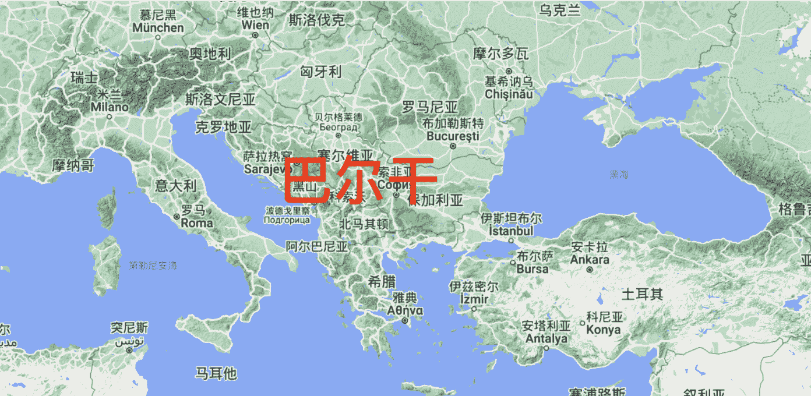

既然是十字路口，几千年来欧亚地区只要出现一个强大势力，一旦扩张就会龙卷风一般从巴尔干扫过。等到几十或几百年之后垮台或被取代，波浪又要在巴尔干引出一番动荡。

而且由于各种势力入侵和被驱赶，那地方搞出来了一堆人种和宗教，斯拉夫人，阿尔巴尼亚人，希腊人，克罗地亚人，穆斯林，天主教徒，基督徒，东正教徒等等，互相看彼此不爽，恨不得弄死才算完。而且这些碎片背后都有大哥，比如穆斯林的大哥以前是奥斯曼，现在是土耳其，塞尔维亚人背后以前是沙俄，现在是俄罗斯，基督徒背后是德法其他西欧国家。现在大家懂了为啥叫那地方火药桶了吧。

巴尔干半岛上，有塞尔维亚、克罗地亚、波黑、马其顿、希腊等一堆国家，普遍比较贫穷，其中很多国家以前都属于一个叫“南斯拉夫”的国家。

这个国家是一个叫“铁托”的强人搞出来的。他在“二战”中带着游击队和纳粹打到了最后，赢得了空前声望，战后把几个民族捏在了一起，成立了一个类似苏联的联盟，就叫“南斯拉夫”。我给大家画了一下，大概就是下图那样的。

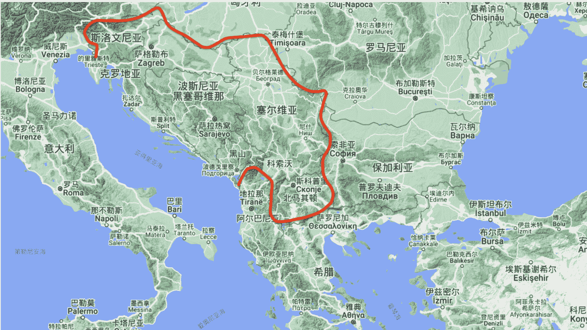

我们知道“斯拉夫人”就是俄国、乌克兰、白俄罗斯他们兄弟几个，词根是“slave”，奴隶的意思，说的是以前斯拉夫人一直被罗马人抓去做奴隶。当然了，俄国人自己不这么认为，他们的语义里“slave”是“光荣”的意思，属于“一个词根，各自表述”。

后来这些斯拉夫人为了躲避蛮族入侵，一部分逐步迁徙到了巴尔干半岛的塞尔维亚那一带，形成了“南斯拉夫人”。本文里不断出现的“塞尔维亚人”，或者“塞族”，其实就是搬迁过来的斯拉夫人，俄罗斯乌克兰那边的就是“东斯拉夫人”。

也正是因为“斯拉夫人是兄弟”，俄国大部分时候都罩着塞尔维亚。“一战”前，塞尔维亚激进分子杀了奥匈的王储，奥匈在德国的支持下堵门闹事，沙俄要帮塞尔维亚出头，后来直接导致了“一战”爆发。

不过铁托成立的南斯拉夫并不是所有人都是一个种族，这是一个多民族国家，国内有很多民族语言种族都不一样。大家第一反应可能觉得跟我们似的，毕竟丁真也不识字，之前也不会说汉语，并不妨碍他和自己和所有人认为他是中国人。

其实完全不是一码事，南斯拉夫更像是当初的伪满洲国，东北人，百万日本开垦团，还有大量的朝鲜人尽管在同一片土地上过日子，互相之间却完全不把对方当自己人。所以伪满洲国垮台后，日本人很快就被赶走了，南斯拉夫也发生了这种事。

南斯拉夫那几个成员国历史上就打来打去，哪怕就在几十年前，克罗地亚人在“二战”中跟了德国人，屠杀了80万塞尔维亚人和犹太人。而且杀人方式非常凶残，明显怀着私怨，因为他们日常的操作就是活埋，浇上汽油烧死，或者砍头。

最过分的是经常用做木工的那个锯子锯死游击队员，实在是瘆人，以至于在边上围观的纳粹都表示太过反人类。当然了，战后塞尔维亚人展开了大报复，克罗地亚人也被修理得很惨。

再叠加宗教分歧，这么一群人，聚在一起，你说咋过日子？所以这个国家产生并保持了几十年才真的是一个奇迹，这个奇迹主要和铁托有关。

铁托这人很厉害，他并不是塞尔维亚人，而是克罗地亚人，连斯大林也敢惹，甚至后来直接脱离了苏联阵营，让斯大林很不爽，却拿他没办法。后来斯大林隐隐约约觉得毛主席也会不听苏联的，一直把毛主席称为“东方的铁托”。

铁托维持国家的手段也不复杂，压制里边最刺头的塞族，也就是俄国人的兄弟“南斯拉夫人”，用富裕地区补助贫穷地区。西部的克罗地亚和斯洛文尼亚靠近西欧，非常富有，而东部山区几乎是全欧洲最贫困的地区，所以铁托让他俩补贴其他人，维持了几十年的脆弱平衡。

不过那个火药桶迟早会爆。

### 2

到了20世纪80年代，随着东西方实力不再平衡和铁托的去世，南斯拉夫的兄弟们个个蠢蠢欲动。

苏联垮台就是一场巨浪，第一步就是苏东集团瓦解。

靠近他的巴尔干地区也难幸免，几十年的平静瞬间不存。苏联的兄弟们跑光了，南斯拉夫的兄弟们也想跑路，随后分裂、内战、仇杀，一直动荡到现在。

整个南斯拉夫的内乱大致可以分为三轮，每一轮的起因，都是境内的其他民族起来闹独立。每一轮的结果，都是塞尔维亚的影响力越来越小，领土也不断萎缩。

第一轮是1991年南斯拉夫加盟国各自独立。当时比较富裕的克罗地亚和斯洛文尼亚带头闹独立，并迅速开始武装反抗。

其中最顺利的是斯洛文尼亚，他们是南斯拉夫最富裕的地方，当地人被称为“巴尔干德国人”。民族又非常单一，斯洛文尼亚人占了90%。这种情况下，他们的独立过程非常顺利。

经过被称为“十日战争”的冲突，前来镇压的政府军意识到无法阻止，就这么独立了。随后很快加入北约和欧盟，现在人均GDP近三万美元，是巴尔干最富裕的国家。

相比起来克罗地亚的独立过程比较复杂。1991年克罗地亚成功独立，但是从此开始了长达数年的内战。

因为克罗地亚国内还有很多塞尔维亚人，这些人不想独立，谈不拢就打，一直打到1995年，最后造成了数万人死亡。后来克罗地亚人把国内的几十万塞尔维亚人赶了出去，才终于成功独立。

这场战争造成了大量的难民。比如著名的克罗地亚球员，被称为“魔笛”的莫德里奇。1985年出生的他，从小生长在一个克罗地亚小城。6岁那年战争爆发他祖父被塞族武装分子杀害，他们所住的地方也不安全，只能全家沦为难民，后来终于等到成功独立，日子才好起来。

2022卡塔尔世界杯克罗地亚“格子军团”拿了个第三名，400多万人的国家，还没驻马店人多，竟然有这么强的球队，看到这里又忍不住踢两脚国足。

第二轮就是惨烈的波黑战争，波黑比较复杂，当地是克罗地亚人、穆斯林和塞尔维亚人聚居在一起，比例也比较均衡，三伙人各怀鬼胎。

对于独立三帮人各有一套想法：穆斯林希望彻底独立，塞尔维亚人也就是“塞族”坚决反对独立，克罗地亚人希望组建松散联盟（其实就是方便自己单飞和克罗地亚合并）。

三帮人都很坚决，于是从开会变成争吵，然后全民投票。问题是分歧这么大，投票结果也是分歧很大，并不能解决问题，只是把问题摆到了明面上。不出意外，投票结果产生的时刻就是开战的号角，然后就打了起来。

波黑内战非常惨烈，那一带的人本来就很残暴，宗教也不一样，互相把彼此当“异族”，杀起来丝毫不手软。从1992年打到1995年底。战争的结果非常可怕：四百多万人的波黑，居然死了近30万人，大部分都是普通老百姓，全国近一半人成了难民，大量爆发了各种屠杀暴行。

最占优势的还是塞尔维亚人，也就是“塞族武装”，他们依靠塞尔维亚主导的南联盟政府，获得大量装备和训练，甚至很多南联盟军人干脆就直接下场。

克罗地亚人虽然少，不过可以依靠已经独立的克罗地亚，还有德国，也在暗戳戳支持他们。克罗地亚为了支援波黑的兄弟们，派正规军进入波黑参战，这些人有时候一冲动，啥事都干得出来。

比较著名的是，2017年有个白胡子老头在国际法庭受审的时候，直接拿出来毒药喝了下去，并且高呼“我不是战犯”，随后就死了：

他就是克罗地亚送去波黑参战的军官，在那里杀了一些平民，战争结束后被国际法庭追责，后来觉得很委屈，服毒自杀了。

最倒霉的是穆斯林，虽然他们人数在波黑最多，军队人数也和其他两族总和相当，但是没有外援支持，反倒在战争中最吃亏，死伤非常惨烈。

在早期的两年混战下来，只占总人口1/3的塞族占了全波黑的一大半。克罗地亚人背靠盟友牢牢把握住自己的聚集区。而穆斯林几乎被完全压制，连自己的聚集区都大量被塞族占领了。不满的穆斯林不断反抗，其中小规模的互相杀戮几乎每天发生。

关于当年的历史，有一部按照真实历史改编的《深入敌后》。一名美军飞行员在波黑战争中，被塞族防空导弹击中，在敌后大量武装人员拉网搜索中，他如当年铁托游击队一样躲入深山。5天后终于被美军救援成功。

电影中飞行员无意中搜集到了塞族武装屠杀平民的证据。实际情况是当时军队自己不动手，而是把这些脏活交给当地塞族人组建的暴徒，这些人大多本就是黑帮分子。借内战聚集起来摇身一变成了各种“救国军”，杀人放火拐卖人口贩卖毒品没有不干的。其实如果大家看电影，就知道一个词叫“塞尔维亚黑帮”，以残忍著称，这个并不是杜撰。

最严重的事件发生在斯雷布雷尼察，这里是个穆斯林飞地，塞族一直想把当地人赶走。到了1995年7月，塞族武装进入当地，将当地的荷兰派驻维和人员全部缴械。然后用了四天时间，把8000名当地男子和孩子全部屠杀并掩埋，这成为二战后欧洲最严重的一场暴行。

就这样，20世纪90年代的波黑变成了地狱。后来欧美也看不下去了，此外也觉得塞尔维亚可能会重建南斯拉夫，于是以“反对针对平民的暴行”为借口介入波黑内战，给穆斯林和克罗地亚人提供装备。

大屠杀发生后，联合国也看不下去了，授权北约开始对塞族轰炸，塞族的弹药库和指挥中心被炸了个干净。各种因素叠加起来，塞族顶不住，宣布停火，战争终于打完了。

那个著名的游戏，《这是我的战争》，讲的就是波黑内战中的萨拉热窝围城往事。一口气被塞族围了三年，城里老百姓的困苦可想而知，到现在整个城市也遍布弹孔，甚至发生了同类相食。

如果不是最后北约和联合国出手，强迫三方停战，背靠塞尔维亚提供援助的塞族很可能最后会完全占领波黑。后来欧洲说你们既然一碰面就打得头破血流，干脆别过了，拆了吧，于是就拆了。

现在的波黑比较搞笑，“一个国家两个政权三个总统”，首都就是著名的萨拉热窝，在这个国家里，塞尔维亚人自己一起过，克罗地亚人和穆斯林一起过，这就有了两个政权，可是克罗地亚人和穆斯林互相看对方实在是不爽，各自又有一个总统，三个总统轮流执政。

那场战争对波黑的前途是毁灭性的，几乎所有能跑的人都跑了，现在波黑依旧是欧洲最穷的十一个国家之一。

第三轮就是科索沃战争。

这时的塞尔维亚人可以掌握的就只剩下塞尔维亚和黑山了。而科索沃只是塞尔维亚的一个省，一直比较自治，这次也提出了独立。

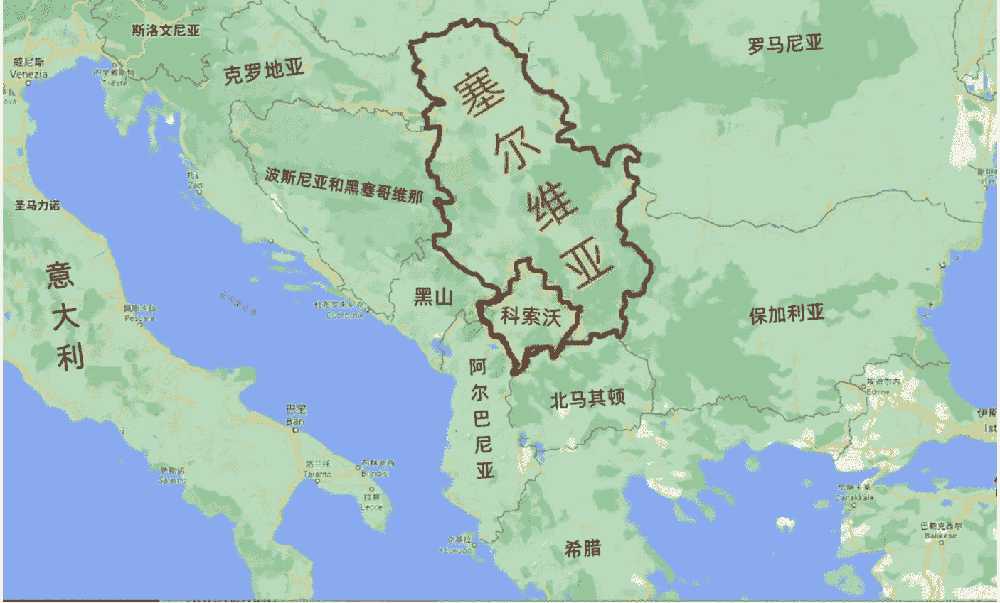

在科索沃看来，自己是穆斯林，又是阿尔巴尼亚迁过来的（以前科索沃那地方也是塞尔维亚人，后来奥斯曼入侵，换了人种，变成了信奉伊斯兰教的阿尔巴尼亚人，这也是为啥很多文章里把科索沃主体民族叫“阿族”），本来跟他们斯拉夫的“塞族”就不是一伙的，他们认为自已对抗塞尔维亚的多年歧视和暴力统治，谋求自身独立是堂堂正正的行为。

但是塞尔维亚人不同意，觉得这就是在分裂国家，你敢独立我就敢揍你。结果阿族也组建自己的武装，叫“科索沃解放军”，不断袭击塞族警察和军队。然后引来塞族报复，最后成了恶性循环不断升级。到1997年，已经造成了数千人死亡和几十万难民。

就像当年克罗地亚和波黑一样，面对600万人口的塞尔维亚，180万人口的科索沃本来没有胜算。

但是科索沃也没指望过靠自己打垮塞尔维亚军队，等待的就是欧美下场。功夫不负有心人，1999年，爆出来一件大事，塞尔维亚人在科索沃搞了一次大屠杀，也就是著名的“拉查克屠杀”。

这事把欧美老百姓的神经都挑动了起来，也给了欧美介入的理由，这下德国急眼了，准备下场。

科索沃是穆斯林为主，跟德国有啥关系吗？

这个又比较复杂，德国是欧洲的工业国，早先它没准备完全依赖俄国，准备购买一部分中东的能源，而中东的能源管道得走南欧。这种情况下，就需要维持能源管道路过的国家稳定。

这一点倒不难理解，之前欧洲和俄罗斯的能源管道路过乌克兰，俄乌闹矛盾，能源管道也没法顺利运行，这次终于彻底搞黄了。前几天德国宣布对俄罗斯的能源依赖降为0，今后只能是进口中东和美国的资源了。

所以德国不能接受南欧乱成一团，此外法德还在忙着组建欧洲共同体，要把南欧都接纳进去，南欧打起来那哪行？

于是大屠杀之后德国就介入了，准备把这事彻底摆平。可是自己实力实在是不行，于是准备叫上美国。美国一开始并不想掺和这事，毕竟自己的触角无论如何也伸不到南欧去，南欧又那么穷，也没资源，去那边打仗对自己没啥好处。不过后来很快反应过来了，反应过来啥咱们一会儿说。

美国下场后，欧美很快提出几点要求，首先是两边停火，塞尔维亚军队离开科索沃，科索沃放弃武装，由北约维和部队进驻“维持和平”。然后承认科索沃是塞尔维亚一部分，给予科索沃自治地位，类似咱们香港那种，但是比香港自治程度高得多。

对于这个协议，双方都不满。塞尔维亚就是傻子也明白科索沃等于事实独立了，以后和自己再没啥关系，当然不能接受。

科索沃觉得前面两帮人闹最后都独立，自己却打个折只是自治省，以后有啥变数就没人管自己了。于是大家都不愿意签字。

欧美的态度很明确：谁不签就是破坏和平，就是和我过不去，就是不给我面子，你看我弄不弄你。

最后科索沃人勉强签字，但是塞尔维亚坚持不签，说这就是科索沃独立文件，这不分裂国家嘛，尽管已经被分裂了好几次。

但是前两次好说，原本他们几家是南斯拉夫加盟国，就好像苏联解体各国独立。科索沃是一个省你们也这么搞，实在过分了。

欧美表示你再不听话就揍你，塞尔维亚说谁怕谁。塞尔维亚人是天生战斗民族，当初铁托的8万游击队和50万纳粹打了8年，塞尔维亚死了10%的人口，你就知道这伙人多能打。历史上塞尔维亚孤胆英雄们不仅刺杀过奥匈王储，还杀过穆斯林苏丹。这个国家跟俄国一模一样，只是比较小，不然非常能闹腾。

本来德国是这次行动的“带头大哥”，但是美国人来了后直接拉了个新群，说是以后有啥事在这个群里说。德国说要开会，大家都不去，美国一说开会，大家都带着茶杯过去了，德国人也只好悻悻跟了过去。于是美国人就这样鸠占鹊巢成了大哥。问题是他有自己的想法，美国的想法和德国的想法完全不是一码事。

当时德法两国正在牵头搞欧元，希望科索沃的事速战速决，赶紧结束后搞经济。可是美国主导了行动，故意慢慢打，一打就是78天。

当时欧洲的情况和现在俄乌战争的情况差不多，一开始大家觉得战争不会太久，谁能想到竟然持续了近三个月。

欧洲的财阀们看着北约天天炸南联盟看得心惊胆战。因为谁都知道塞尔维亚和俄罗斯是一个人种，天然小弟，小弟被人打得时间越长，大哥出手的概率越高。当初就是德国指使自己的小弟奥匈帝国修理塞尔维亚，沙俄一怒之下动员了，触发了德国策划多年的“史蒂芬计划”，第一次世界大战开打。

现在你又天天炸俄罗斯的小弟，俄国人的脾气，一旦爆了怎么办？德国一直想派地面部队进去，毕竟一个常识是，空袭是非常难彻底解决问题的，战争的最后还是得派陆军上去把对方彻底打垮。如果想通过空隙解决，不知道要到猴年马月去了。可是美国表示不急，一切尽在把握中。

看着战争没有停下来的意思，财团们吓得不行，于是就得跑路，去哪呢？只能是去美国，据测算，一共跑了两万亿欧元，美军成功捍卫了美元的地位。这也是为啥很多人说科索沃战争是一场“美元战争”，美国看似啥也没得到，却维护了美元的地位。

说到这里，大家可能纳闷了，欧美那么怕俄罗斯？当然怕啊，谁不怕陷入战火啊。

后来果然俄罗斯人下场了，空降部队抢先占领了一个重要机场，北约军队看见俄国人赶紧退了下来，这也能看出来当时欧美对俄罗斯一直还是很忌惮的。

战争最后的结果是南斯拉夫政府垮台，总统米洛舍维奇被抓到海牙，最后死在监狱里，也有了我们的大使馆被炸的事。

但是问题来了，虽然打了，但是欧美必须按照一开始的协议办事。也就是科索沃名义上依然是塞尔维亚的一部分，不能直接独立。所以现在的科索沃非常尴尬，它并不是很多人想的那样被北约分裂出来的一个独立国家，而是一个自治省，塞尔维亚完全不能管他，但名义上它还是塞尔维亚的一部分。

后来在2008年，科索沃单方面宣布自己独立，由于联合国在科索沃有驻军，塞尔维亚不可能打过去，于是抗议了几次之后拉倒了。

不过国际上承认科索沃的国家并不多，道理也不复杂，大部分国家都或多或少有一块领土想独立，你承认了它，就相当于变相承认自己的领土也可以闹了。再加上科索沃这个国家特别穷，欧洲最穷，没啥利用价值。

懂了这些，再看这次的动荡，就非常清楚了。

科索沃当局给当地塞尔维亚人换发科索沃车牌。塞族居民通过设置路障、游行等方式抗议。

科索沃当局以涉嫌参与恐怖活动为由拘留塞族前警察德扬·潘蒂奇，引发当地塞族居民不满。塞族居民封锁科索沃北部多条要道抗议，并与科索沃警方发生冲突。

塞尔维亚作为科索沃境内塞族人的“老家人”，当然不能坐视不理，于是宣布军警进入戒备状态。

前段时间不少人担心这地方会不会再闹起来，其实整体不大可能。因为科索沃还有联合国的驻军，塞尔维亚几乎不可能打过去，要是可以的话，2008年就出手了。

那塞尔维亚为啥这么冲动呢？也不复杂，其实它看准了德法现在的麻烦，俄乌战争在欧洲打了那么久，几乎重演了当初科索沃危机发生的事，欧洲、俄罗斯、乌克兰的富豪因为担心不安全，资本疯狂出逃，逃向了美国，德法当然不能容忍南欧再爆发一场战争。

所以欧洲第一时间给科索沃施压，科索沃也听了大哥的话，决定不再折腾，车牌也停止了更换，把抓起来的警察也放了。塞尔维亚觉得也差不多了，这两天已经宣布取消了紧急状态，这事基本上结束了。

其实那地方现在爆发战争的可能性是很低的。

首先科索沃又小又穷，根本没有海外大哥的支持，他是闹不起来的。

塞尔维亚又是个典型的骑墙派，咱们这边很多人都觉得他和俄罗斯关系不错，事实上也不错。不过他这几年最积极的事，是加入欧盟，也跟美国勾勾搭搭，毕竟加入欧盟后塞尔维亚的经济能向前一大步。塞尔维亚国内有很多人一直在推动这事，毕竟大家谁也不想过穷日子。下图是2020年为了得到美国的美元补助，塞尔维亚成了第一个将使馆迁往耶路撒冷的欧洲国家，把俄罗斯也给惹了。不过也没办法，成年人的崩溃，往往是从缺钱开始。

欧盟也希望接纳塞尔维亚，毕竟这个国家的规模放在全世界跟中印这些国家没法比，不过在欧洲也算中大型国家。

长期来看，塞尔维亚加入欧盟只是时间问题，除非欧盟先倒了。因为现在塞尔维亚的对外贸易主要是跟欧盟，战后俄罗斯更给不了它啥好处，利益驱动下，塞尔维亚大概率会加入欧盟的餐桌。当然了，讨论国际问题的时候尽量避免小孩过家家思维，国际上类似巴基斯坦那种跟中美关系很好的国家也有不少，没必要太过计较。

这个背景下，巴尔干地区现在整体要稳定的多，因为大家有共同的利益。

### 启示：

大家想过一个问题没？

资本最在乎的是啥？很多人可能会说是盈利，其实不是，最在乎的是安全。毕竟对于那些资产上亿的人来说，他们吃利息，下辈子都花不完。但前提是自己所在的国家的国家不能发生动荡，那样弄不好一夜之间成了“二战”前德国犹太人了，昨天还是银行家，今天就被做成肥皂了。

所以资本对“战争”和“动荡”极其敏感，稍微有点啥他们就跑路，美国能发展那么快，很重要的一个原因就是他的国土自从南北战争之后基本上没再发生战争。所以全世界各地的富人们稍微有风吹草动，就往美国跑。

在两百多年的历史里，一直都是资本的输入国，大家想去美国就得换美元，所有人都需要美元，美元可不是一直在走强？所以说抛开立场问题，美元的地位还能维持很多年，啥时候富人不再着急把手里的钱换美元，美元的地位才会真正意义上的受损。

为啥东欧南欧那地方现在那么穷，因为冷战结束那些年，他们的中产阶级、科学家、知识分子基本上跑了个干净。后来的几次战争，能跑的也都跑得差不多了，这些都成了美国和欧洲的资源。

如今南斯拉夫故地基本上是欧洲最穷的地方，原因也不复杂，刚才说了那么多的屠杀和战争，钱和人都跑了，能发展起来有了鬼了。一般来讲，一个地方的精英阶层大规模跑一次，半个世纪内几乎没法翻身。

这次俄乌战争，一直打到现在，对于俄罗斯来说，最大的损失并不是战争伤钱，也不是各国没收了他们上万亿。而是俄罗斯的知识阶层和富裕阶层彻底绝望了，那些跨国公司撤退的时候，基本上把顶级人才都带走了。这一点上，德国反而占了大便宜，因为俄罗斯人移民，首先选德国，其次是美国和以色列。

如果说对我们有啥启示，那就是无论是我们的持续发展，还是将来人民币国际化，无论如何避免周边长期陷入战争和动乱，到时候后果不堪设想。

当然了，我们一直比俄罗斯要清醒的多，当初毛主席为了解决中印问题来了一波闪击，后来邓公处理中越危机也是速战速决。成功控制住了战争烈度，也牢牢控制住了主动权，既维护了国家利益，又解决了“战争开始容易结束难”的问题，真正的大师手笔。

长期来看，今后边境上必然是麻烦不断，需要我们以更清醒更理智的操作去面对，避免出现前苏东国家的悲剧。

公众号懒人搜索，懒人专属群分享

### 最后聊一次疫情吧

2022-12-29

> **前几天政府宣布新冠“乙类乙管”后，基本上宣告三年防疫走到了尽头。周末出去走了一圈，发现北京的商场已经有了人流，环球影城又排起了大队。这几天每天晚上都堵在路上，以前碰上这种情况，每次心里都要暗骂，只是这次，却激动得热泪盈眶，跟着车流缓慢向前，觉得生活也在向前。

北京地铁每天公布流量数据，周一那天已经到了450万，这个数据和巅峰时期的1000万、放开前的700万还有点距离，但是要知道，就在两周前，北京的地铁流量跌到了100万左右。可以说，那时候是这座伟大城市的至暗时刻。现在北京客流每天增长三四十万，预计过两周能回到700万。相当于说，现在处于一个中间节点，北京这座千年北方要塞城市已经顶住了病毒的攻击，正在逐步恢复。如果不出意外，北京可能是第一座能顺利康复的超级城市。

### 客流观察【昨日客流】2022年12月26日（星期一）
北京地铁公司所辖运营线路日客运量为451.99万人次。详情如下：

### 十二月二十六日北京地铁公司所辖各线客运量

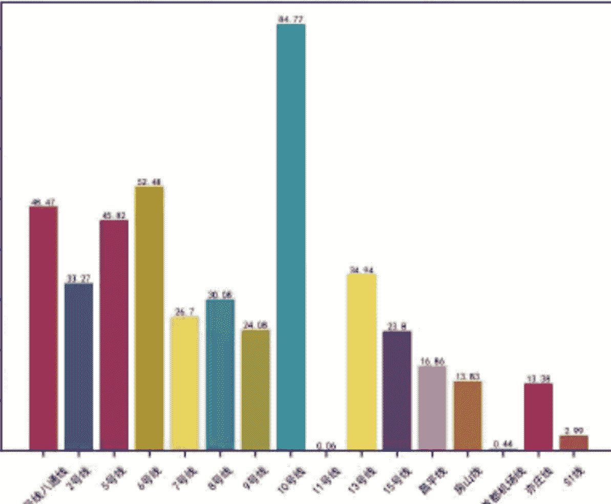

有人说，博主你聊这玩意干啥，为啥不去医院看看堵车了没？这两天不少人眼里，“经济恢复”这事搞得好像跟“救助老年人”相悖似的，其实只有经济迅速好起来，一切才有希望，否则那就是雪上加霜。有个常识是，如果经济不好，会导致很多人抑郁，为了省钱有病也拖延不去治，同样会死很多人。而且政府开支是从经济流量中抽成的，只有经济活跃起来，政府才有钱，才能扩大公共开支，才有钱救助更多人。所以说如果经济好不起来，对老年人是双倍杀伤。已经到了这一步，闯关阶段，根本没有其他任何选项，只能是硬着头皮往前走。既要治病救人，也要尽快恢复经济，这两件事不但不矛盾，甚至可能是一码事。还是那句话，现实主义者眼里，“本应该”和”本不至于“意义都不大，就好像懊悔十年前没考上大学一样意义不大，只会识别出来哪些路是必须要走的，哪些事是必须要做的，既然是必须，那就得咬牙走下去。这两天微博上吵成一团，不少人还在惋惜清零的失败，觉得如果不是“躺匪”捣乱，清零就可以一直操作下去。其实回想一下，就在十一月份，有这么几件事就能基本上判断未来走向了：

- 1、乌鲁木齐被封了三个月，疫情还在继续。
- 2、各省财政告急，连东南五省这样的“大税牛”今年也苦不堪言。
- 3、各地老百姓已经开始非常不配合，封城难度越来越高。

把这些事综合一下，就能得出来一个基本结论：

想继续封下去，一方面没钱，一方面老百姓不再配合，关键效果还不行。

也就是说，如果继续封控，迟早会把全国所有城市都封了，最后效果依旧不好，依旧控制不住病毒扩散。我理解为啥中央果断踩了刹车打了方向盘。这也是我一直说的那件事，封控的尽头不是病毒彻底无害化，而是成本啥时候不能被接受，啥时候也就到头了。这也让我想起来去年有个外科大夫的读者在我评论区留言，他说他行医三十年，目睹过无数人间悲剧。他说几乎所有的家庭给老人治病的开始都是全力救助，绝大部分最后都转向了“保守治疗”，保守治疗基本就是放弃治疗。当然也有很多根本没去医院的，他就接触不到了。并不是因为老人的病情已经缓解到可以保守治疗了，而是只要老人足够老，迟早会出现完全控制不住的病情，家里却支付不起。这种情况下选哪条路根本不是态度问题，而是财务问题，不是想不想的事，而是能不能的事。大家都知道生命无价，可是去过医院大家就应该知道，那地方必须先付账才能拿药，没钱你拿啥治？不去治可不就听天由命？

这些话听着很难听，不过事实是我们绝大部分人将来都得面对，提前做好心理准备也不是坏事，每个人生命的尽头，都有一个价格我们没法接受，只好选择另一个选项。这个意义上讲，钱就是命，为啥发达国家的预期寿命普遍高于落后国家？多简单啊，花钱买的寿命呗。所有事情都有成本，成本低收益高，能形成正循环一直玩下去。成本高收益低，持续不下去是迟早的事，成年人应该有这方面的觉悟。回到我们这个话题，其实也是一样的，群众态度转变，本质也是成本失控的一个标志。因为我们说的成本并不只是国家财政，还有无数个家庭面对疫情过程中的不断消耗，小家和大家一起没钱了。当然了，并不是所有人感受都一样。

我这几天又连续做了几个调查，发现一个问题，也就是“20%定律”。放开前，放开过程中，乃至现在北京已经过了高峰，这几个阶段调查结果都是支持封控的占20%，支持放开的80%。所以讨论对疫情的感受，为啥总也达不成共识？因为那20%的人，和剩下80%的人的感受完全不一样。可能后者说自己山穷水尽了，前者说自己挺好的，周围的人也挺好，并没有你们说的那么严重，这咋聊？如今也是，整个社会形成了一个个封闭的小圈子，互相听不见对方在说啥，大家如果想破除信息茧房，最好去不同的平台评论区看看，尤其是快手和抖音，这俩足够下沉，他们的观点才代表中国绝大部分人的观点。所以有人问我，你到底是清零派还是放开派，我说我是现实派，能清零就接受清零，不能清零就接受放开。尽量避免做那种人，清零的时候他反对，放开的时候他又觉得没放好，真实世界里，哪有那么完美的事。”不合理“、”不顺心“才是这个真实世界的常态。至于方向盘为啥打得那么急，我也不知道。不过我倾向于觉得，

到了今年，

疫情防控可能只有两个状态，“极端封控”和“其他”，可能根本没有“有序放开”这个选项。一旦放弃了高压封控，其实已经处于“放开”状态。叠加这个病毒实在是传播速度太快了，确实没啥好的办法来对付。

### 为啥没准备药，为啥不事先通知?

这些问题我倾向于觉得上层可能没有准备近期做转向，所以政策上没打提前量，当然了，瞎猜为主，我也不知道。哪怕在十一月石家庄闯关失败后，封控其实是更严格的。不过那时候只要留意这方面的信息，已经能判断封控大概率进行不下去了。

比如11月11日是个关键日期，那天发布了“新20条”，而且卫健委还发了个文件要求大家“加强药物储备”，当时还上了热搜。可能当时已经发现要控制不住了，但是还没有最终确认。很多博主那时候也都看出来了，只是没法说得太直接。必须承认的一个问题是，三年防疫，形成了一种“政治正确”，也就是防疫的底线就是不能出现老人们的死亡。只要一提“放开”，就好像要和西方合流抛弃老年人一样。所以公共话题里，大家都好像把“放开”这个选项给抹掉了，因为放开就会死人，就是共存，就是不可被接受，关键是死人这事没法解决，既然没法解决，干脆别聊了。马前卒之前讨论过如果面对放开后的冲击，评论区被冲了，大家的眼里，再怎么面对，都会死人？你只能减少死亡，又避免不了死亡，你聊这个是不是草菅人命？所有人都小心翼翼回避这个话题。几乎没人讨论如果放开后，到底该怎么做。其实按理说在石家庄第一次放开的时候，大家已经应该准备药物了，可是绝大部分人并没有意识到，公共话题里也不敢公开讨论。等到铺天盖地的“自救方案”出来，已经是放开之后的事了，那时候药店的药已经被一扫而光。问题是事到如今依旧没法回答“老人怎么办”这个话题，太残酷太冰冷，谁都没准备好，但是依旧得去面对。

相对而言，新加坡那边政府对这些问题都有相对细致的解释，他们是2021年10月9日放开的，当时面对的是毒性非常强的德尔塔毒株，但是眼瞅控制不住了，干脆选择了放弃，李显龙在那天发了个全国讲话。那天的演讲里，李显龙承认了形势很不利，控制不住了，宣布放开。我摘抄几段，大家可以看看，对如今的我们也有参考价值：关于为啥放开：

> 我们不可能无限期地封城和关闭边境，这是不可行的，也要付出很高的代价，我们将无法恢复日常的生活，进行社交活动，开放边境以振兴经济。我们每一次收紧防疫措施，企业的运作和生意就会受到更大的冲击，工友会失去工作，小孩无法过正常、完整的童年和学校生活，一些国人和他们的家人也会分开得更久，尤其是那些有亲人身在国外的家庭，还有一些大家庭也一直无法团聚。这种种情况不但给人们带来心理和情感压力，也让人感到精神疲惫，这影响了国人以及其他民众，包括客工。

> 所以，我们几个月前就认定清零战略已不可行。所以，我们改变了战略，过渡到“与冠病共存”。

如何面对老年人超额死亡的问题：

> 随着有越来越多人染病，我们大部分人已接触过确诊病患，或认识接触过确诊病患的人。相信每个人总有一天，也会染病，所有年长者也无法幸免，他们面临的风险，真实存在。如我之前所说过，冠病主要会危害年长者，这包括未接种疫苗的60岁以上人士，和接种疫苗的80岁人士。

> 当病例增加，年长患者也会增加，假设每天有5000起新增病例，那么预计就有约100人会病重。这不是一个小数目。

> 我们的医生护士尽全力治疗和照顾每个病患，但不幸的是，就算他们尽再大的努力，也不能确保每一个重症患者都能战胜病毒，一些终究会病逝，就像感染肺炎一样。我国每年有超过4000人死于肺炎，他们大多数是年长者，生前也都患有其他疾病。在接下来的几个星期和几个月，我们很可能持续看到更多冠病患者病逝的情况。

从这个声明里，大家也能看出来，新加坡去年就没招了，防疫成本太高，又控制不住疫情，干脆共存了。

新加坡相当于北京最富的两个区朝阳和海淀，医疗条件在全世界范围内都算比较好的。不过面对老年人高死亡率的问题，他们也坦言确实没啥好的办法，只能是“尽最大努力”。而我们成年人都都知道一个常识，对方说尽力的时候，其实就是在说没啥好办法了，只能是走一步算一步。

但是我觉得这份宣言好就好在了坦诚，把事实告诉了老百姓，然后国家和老百姓共渡难关。此外在李显龙演讲的结尾，他提到的一个词，叫“COVID-resilience”，翻译过来可以理解为“具备新冠韧性”。也就是说，新冠在短期内并不会结束，甚至长期也不会。除非你坚持不去测，只要测，可能就一直在。以跟踪新冠最严格的日本为例，日本到现在已经经历了八个波次的疫情，香港也已经经历了五波疫情，其他很多国家干脆不管了。新加坡之前也不是彻底躺平，比如也在限制就餐人数，今年4月26号，奥密克戎出现后发现限制的意义不大，干脆取消了。所以说只能通过调整生活习惯和心理状态，去适应这种新常态，用一句时髦话讲，叫“钝感”，慢慢就不那么在意了。当然了，如果坚持在意也正常，日本那边有个调查，有1.3%的人放开后非常非常痛苦，天天活在恐惧中，几乎失去了社交能力，也不敢跟人接触，不知道什么时候才能好。这个意义上讲，我们这次闯关之后，并不是结束了，反而是一种开始。开始就开始吧，这是一场没法做选择的战争，只能打下去了。至于经济，我一点都不怀疑明年能冲到5%以上。很多人说就现在这种病毒肆虐的状态，怎么发展经济？这个一点都不用担心，各国刚开始都差不多，都跟咱们现在的心态有点像，但是过两三个月，越来越多的人就开始适应了。等经济恢复些，到时候也有更多的资源帮助老年人度过难关。

说了这么多，最后总结下：

从成本层面考量，放开是迟早的，毕竟外部已经失控彻底走向了共存，我们也没法例外。我那天也说了，当初就算美国能控制住，印度肯定控制不住，印度能控制住，非洲肯定不行，所以这个病毒能被控制住的概率非常非常低。从这个意义上讲，走向共存几乎是必然的。此外到了今年，抗疫成本显然大于收益，本身不可持续，此外靠封控解决一个R0超过20的病毒根本没啥可能性。所以吧，接受现实，照顾好自己，照顾好家人，这两天朋友圈这类小技巧一大堆，我这里也不多说了。反正如今肯定是回不去了，没有选择就是选择，没办法也是一种办法，坚持走下去，期待明年经济好起来。还是那句话，不用纠结，因为纠结也没用，现在唯一的方向就是向前。

公众号懒人搜索，懒人专属群分享

### 阿凡达，屠杀土著后让他们在电影里赢了一次
2022-12-20

把《阿凡达2》看了，整体感觉是效果不太好，甚至可以说很差。

我不知道年轻人们咋想的，反正我自己对电影的一点肤浅理解是，电影最起码的一点是剧情，剧情好了，那些画面、场面、运镜、长镜头、IMAX什么的才有意义。如果剧情稀烂，就好像用顶级餐盘呈上来一只死老鼠一样，旁边还放着纯银餐具，估计你也没啥胃口吧，然后厨子说他为了这道菜做了整整十年也挺搞笑。

《阿凡达2》倒也没有这么差，可以看做是精致的餐盘里放着一只活老鼠，我反正是差点看睡着，希望你们喜欢吧。

不过本文不准备讲剧情什么的，想讲讲这片背后的社会学逻辑，两年前聊过一次，这次做了大改。主要参考第一部，一方面剧透不合适，另一方面两部剧情也差不太多。

咱们先说电影里的几个基本隐喻：
- 星际时代——大航海时代
- 地球人——欧洲殖民者
- 科学家——皇家科学院的学者们
- 潘多拉——美洲大陆
- 纳美人——印第安人

电影里暗示的实在是太多了，而且是个大杂烩，比如最明显的，纳美人长得都是些蓝人，大家第一反应想到啥？

当然是“凯尔特靛蓝突击者”，也就是《勇敢的心》里边那伙把蓝色涂脸上的人，他们是英格兰岛上最早的土著。真实历史中他们的涂装比电影里夸张得多，赤身裸体，浑身涂蓝，远远看起来就是个小蓝人，可不就跟纳美人似的？后来这伙人被外来的罗马人和昂撒人基本上屠没了。

再比如纳美人热爱“骑射”，这肯定不是印第安人的特点 ，美洲大陆上没有驯服的大牲口，所以这个设定又跑欧洲那边的游牧部落去了。

纳美人还拖了个大辫子，可能在导演他们的眼里，大清跟印第安人差不多。至于项圈和小脏辫，又明显是非洲特色。下图就同时出现了非洲，印第安人，大清的三种发型。

而且电影里反复讲到“链接”，纳美人认为他们和整个自然是一体的，完全融合的，而且他们说能听见祖先的低语，博士死前也说看到了圣母爱娃。问题是现实世界里，谁有这种世界观？那必须是印第安人啊，印第安人觉得万物都有灵魂，万物都是一体的，甚至山川湖泊动物和人类之间，都有链接。这也是为啥咱们翻开美国的殖民史，里边有的印第安人宁愿全部战死在自己的地盘，也不离开，因为他们觉得自己祖宗的灵魂已经融入了当地的土地，他们每天都能听到祖先的低语。所以他们绝对不离开，既然不离开就只能被屠灭了。

可见纳美人是很多土著的缝合怪，把所有识别性强的落后玩意搞了个大集合。

至于那个人类科学家是个另类，她是想了解纳美人，弥合矛盾，所以才开发那个神奇的“阿凡达”技术。像极了早期的神父和后来东印度公司里的科学家们，他们接受的知识比较多，多多少少有点人性。

那为啥有这么一些人呢？

主要是他们的很多学术研究对帝国在海外的扩张很有帮助。比如英国能统治印度那么久，也跟英国博物学家长期潜入印度做研究有关，对印度了解很深，他们写了大量的学术材料。通过那些资料，英国制定了精巧的方案，以极低代价征服和管理印度。

很多时候这些博物学家们对殖民地是很有感情的，但是并不妨碍他们给殖民那些地方提供了技术支持。比如那个阿拉伯的劳伦斯，牛津高材生，他对英国搞崩中东做出了杰出贡献。不过他自己对阿拉伯是真爱，甚至拒绝了国王的骑士册封和总督任命。后来写书发了财，又把钱全捐给了阿拉伯相关的慈善机构。

我们经常能在书里看到这些学者竭力阻止杀戮，甚至跑去向教皇和国王痛斥发生在万里之外的杀戮，不过然并卵，国王派他们过去是为了搞点新材料和矿石，顺便找找能种植经济作物的土地，研究下怎么统治当地，不是让他们掺和军人和商人们的事务。

在大航海中，商人和军人是核心和主力。毕竟驱动人类搞大航海的，并不是对科学探索的冲动，也不是善意的驱使，主要原因是对利润的渴望。

当初派出探险队的国家都是要出去开拓新航线找金子的，带不回来金子，国王就会破产（当初西班牙王室破产了8次），大家都很着急。电影里壮美的镜头，像不像当初西班牙大帆船到达美洲岸边：

而且殖民者一般都不会是些温和的人。这是一个双向选择的过程，但凡在老家有份正经工作，就不会参与远洋冒险这种九死一生的事。大航海初期，出去跑一趟回来死一半船员是常有的事，正常人怎么会去做这种事？基本都是些罪犯，破产者，债务奴隶什么的，比如哥伦布的第一批船员，很多都是死囚，这些人能有啥道德感？

他们待在极其狭小的船舱里，忍受恶臭和腐败食物，在海上颠簸几个月去新大陆冒险，到了新大陆啥做事风格大家应该也能想到吧？肯定不是给当地送温暖去了。

电影里星际殖民也差不多，也是个艰苦而危险的经历，下图的那个雇佣兵一开始就说，潘多拉不比地狱好多少。而且电影里的设定和哥伦布时代一样，殖民团是商人、雇佣兵、科学家的一个综合体，基本没有女人，好人特别少，大部分都是极度趋利的人。

哥伦布他们远渡重洋去找金子，《阿凡达》里的人去找那个灰色的矿，本质都是一回事，利润推动下的星际殖民 。

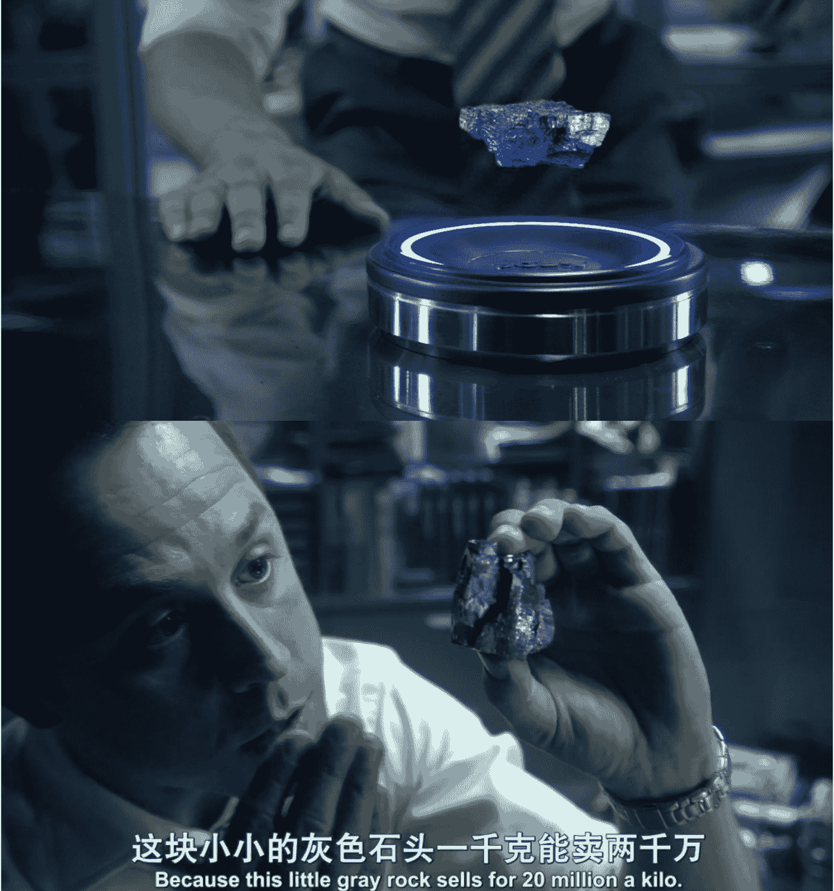

下图电影里的巨大的挖掘机，让我第一反应就是波多西，只不过电影里不需要纳美人去矿井挖矿，只需要他们滚远点，别干扰就行。

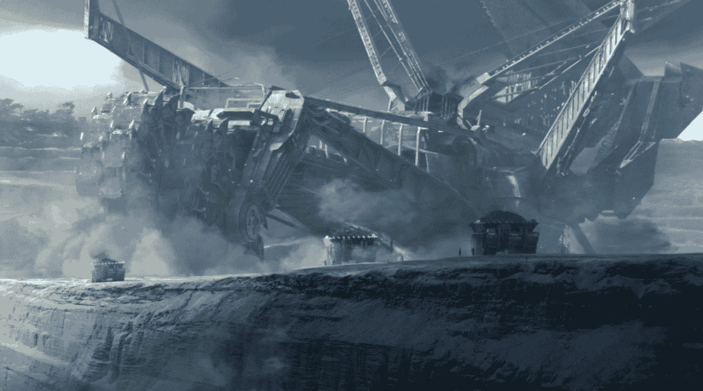

后来有一个叫多明戈的神父，角色和《阿凡达》里的博士差不多，到了殖民地后目睹各种惨状，精神都崩溃了，说这特么是“地狱之门”。

传教士回到欧洲后曾经向国王和主教控诉过。然并卵，欧洲那些年天天打仗，巨额军费压力让国王也喘不过气来，哪有功夫管殖民地土著人的死活。在他们眼里，土著跟当地用来支撑矿井的树木一样，谁会关心一根原木有啥想法？甚至就是挖矿过程中毁掉的蚂蚁窝，谁会在意蚂蚁们悲惨的境遇？

更神奇的是，电影里那个殖民者的基地，就叫“地狱门”，结合我们上文牧师对波多西银矿的称呼，不知道是不是故意的：

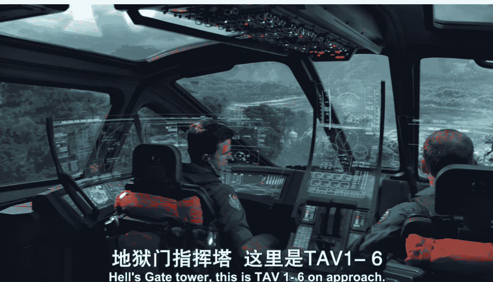

也就是说，真实的殖民史比《阿凡达》里残酷血腥得多，电影充满了白左刻意的善良。

纳美人反抗殖民者不是成功了吗？

很悲观地讲，电影里给他们机械降了神，有点像后来的《杨家将》，在战场上打不赢，就编排戏剧赢个够，而且带有一定的侮辱性质，说是女人们都能把辽国打趴下，精神上赢麻了。

如果现实中发生这事，纳美没可能反抗成功，他们唯一的出路，就是想办法把矿给炸了，就像大象把象牙撞掉一样，不然这根牙会给它们招来杀身之祸。

真正的“挖矿主义”是不讲仇恨的，只讲成本和利润。只有童话里才有击败恶龙后过上幸福生活，真实的世界里，恶龙之后还有更多的恶龙，想岁月静好，唯一的办法就是你别住矿旁边，或者有能力守住矿，否则麻烦会一直来找你。

纳美人打败了地球人，地球人灰头土脸退出了潘多拉，但是这绝对不是事情的结局，事实上才是事情的开始，毕竟真实世界里，这种事太多太多了。

比如欧洲殖民美洲并不是一帆风顺的，哪怕美国对印第安人的战争也不是一帆风顺，甚至发生过几次美军被印第安部落打得全军覆没。

但这不重要，**本质都是成本核算**，资本主义世界里，所有行为唯一的准则就是是否有收益率。战场上伤亡的那些军人就跟现在大公司卫生间里的擦手纸一样，本质都是消耗品。只要矿在，人就会来，只要有利润，或者说将来有利润，纳美人会像美洲土著一样，迎来一波又一波的入侵。

比如英国第一次殖民美洲，那就完全是个大悲剧，补给船把殖民者送到美洲，然后回到英国拉补给和下一批殖民者。等从英国回来的时候，殖民地的人已经完全消失了，不知道哪去了，可能是被杀了，也可能被吃了，反正没了，到现在依旧没找着。但影响了英国人殖民美洲了吗？怎么可能？

南非土著祖鲁人也创下过神话，两万祖鲁武士拿着标枪木盾屠灭了1300多英军士兵，打得英国人丢盔弃甲。

但很快就迎来了英军的反击，在随后的罗克渡口战役中，150人的英军队伍顶住了三四千祖鲁人的进攻；最残酷的一次，1893年，50名英军步兵使用4挺马克沁机枪击退了5000名祖鲁人的猛烈进攻，屠杀了3000人，尸体堆了两米高，后边的人连“尸体墙”都翻不过去。

可见殖民过程中偶尔的受挫很常见，但也影响不了殖民进程，只是让今后武装更加强大，筹备更加精细，指挥官更加专业。

而且殖民者不会玩得这么简单暴力，对于殖民者来说，最基本的操作就是拉一拨打一拨，让本地人互磕。当初印第安人就分成好几伙，其中一伙跟着英国人，还有一些跟着法国人，烧白宫那次战役就有印第安部落的人参战。现在美国那些印第安人，大部分不是杀剩下的，他们当中很多一开始就站队到了美国人那边帮着屠杀自己人，有了统战价值，后来被封了保留地，像不像大清的“三顺王”？

回到《阿凡达》，人类和纳美人的第一次角逐中，人类落败，不过这事改变不了啥，只要矿在，殖民者就会回来，将来的战争只会更残酷，最终的结果想都不用想，纳美人只能是死一批，剩下的迁往保留地，说不定将来地球人给他们个特权什么的，比如现在的美国印第安人有经营赌场特权。

电影结尾，其实把这种对立关系进一步升级了，本来是生意，突然升级成了生死对立，说是人类要回到正在消亡的星球：

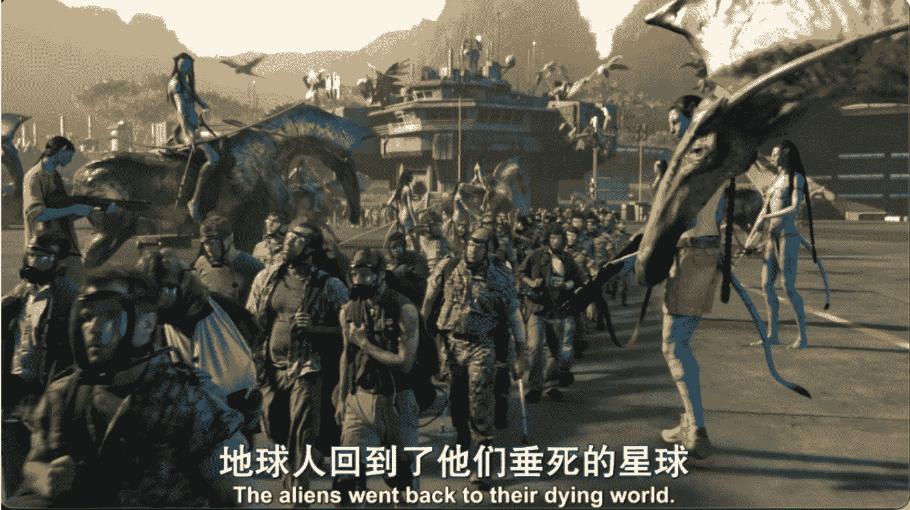

拜托，感情没这个矿不行啊？这是摆明了人类得重新回来呗，一点回旋余地都没，必须拿下潘多拉，就跟英国当年必须拿下南非的布尔保卫金矿一样，事情最后的妥协都没了。热追踪导弹，主战坦克，燃烧弹，甚至核弹，最好用氢弹，炸完之后不影响继续挖矿。

### 尾声
抛开电影画面，《阿凡达》的内核其实就是白人对现代史的一次忏悔，在虚拟的时空，让土著赢了一次。

这种“你那么蠢，我依旧让你赢”的好莱坞思潮还有一个结晶，就是那个《黑豹》，要多别扭有多别扭，就好像一群原始人拿着最新款步枪当棍子使，骨子里是白人的一种傲慢和鄙视，只是以黑人们的脑子，不一定能看明白。

只不过这种“导演光环”的胜利在现实世界中没啥意义，这个世界的本质是“无穷博弈”，赢了一次没用，得一直赢，直到形成威慑才有用，或者让侵略者的成本大过收益，侵略者就不来了。如果侵略者不进攻就会死，那完蛋了，这事只能是你死我亡了。

可以说，如果再过一些年又开始星际挖矿，当初大航海时候的那些事还得再发生一次。到时候大家一边反思一边继续干坏事，“对不起，以前的事我错了，麻烦你让一让，不让我就打死你”。

公众号懒人搜索，[懒人专属群](#)分享

### 骰子已经掷下，纠结也没用了
2022-12-16

这几天病毒传染速度实在是太可怕，就在这周一，我们部门一个阳的都没，到昨天已经一大半。前天感觉有点低烧，测了一下，发现终于阳了。

我倒是阳了之后几乎没啥症状，只稍微难受了一晚上，第二天就好了，不过那个抗原显示还是阳性，不知道啥时候能转阴。

他们说我感染的应该是“海淀版本”，海淀这边普遍反应症状较轻，没有朝阳那边的反响强烈。

按理说我这边没啥事，不过孩子也阳了，发低烧，我这两天既得盯着严重缺员的项目，又得关注孩子，耗了不少时间，文章也没时间写。于是水一篇吧，如果大家不愿意看，可以退出了。

写这篇，其实还是想说，两件事。

第一件就是很多人到现在依旧不接受现实，天天在微博和朋友圈骂骂咧咧，无限怀念之前的清零“美好时光”。我还专门在头条做了个调查，11万人参加，大家可以看看支持清零和放开的人的比例：

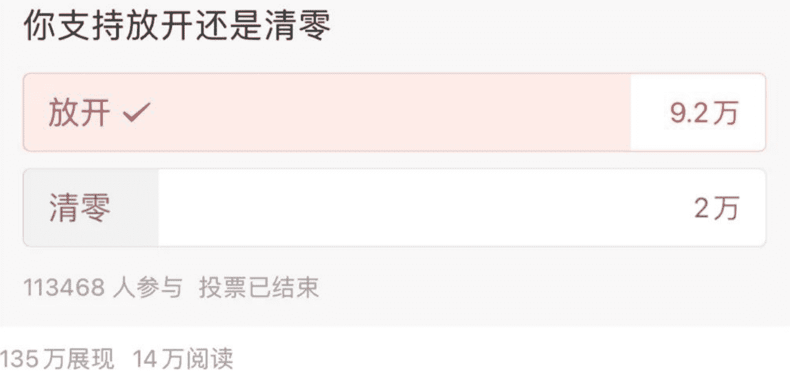

头条和微博不一样，它是算法分配的，看到这个帖子的人，90%不是我粉丝，反而大体保持了客观性。

从这个结果也能看出来，哪怕在病毒横扫全社会的当下，支持放开的人依旧占了81%，占据绝对多数，就算有误差，也偏离不到哪去。这也就解释了为啥之前那种封控政策执行不下去了，群众不支持了，只会空耗成本，效果却很差，我理解这也是为啥国家坚定地打了方向盘。

不过另一个角度来看，还有20%的人支持不是？相对而言，他们可能是免疫力低下者、老人、或者家里面有高危人群的。他们占得比例较少，可是如果论恐惧程度，他们占据绝对优势。如果按照这个比值，中国可能有三亿人陷入了深刻的恐慌。

这两天后台有小伙伴给我发消息，我能感受到他的恐惧，说是美国马上就要执行下一阶段的计划，释放更加厉害的病毒，要对中国人赶尽杀绝。他想逃到山里，可是看了下攻略，竟然发现藏山里比在城市里更费钱。这倒也好理解，毕竟城市里的各种设施大家一起用，把成本给均摊了，还得有个车，可他没车也没钱。

我跟他说，相信哥，你一大小伙子，相对于疫情，没钱更可怕，你是不是应该考虑下更可怕的事？再说了，你去山里，就不怕把新冠带进山里去？里边的村民怎么办？

这个回答显然没达到他的预期，他去找别人问了。我觉得在“没钱”这个前提下，可能确实不太好解决。

不过我可以调侃这个年轻的小伙伴，却没法调侃老人们，因为他们确实面对的是实实在在的威胁，前几天还看到一个老航天在朋友圈发文：

今年注定是无数人最后一个冬天，

我已经准备好了，

战友们，我也要归队了。

看得我热泪盈眶，发了几句话想安慰下，他却很乐观，跟我说看了我前几天的文章，非常认同。他也觉得现在确实没办法了，没办法就是没办法，只能是硬扛了。这种没啥选择的情况他这辈子经历过很多次，只是这次可能是最后一次了。

现在很明显各种原因导致没法继续了，一方面成本激增到没法接受，另一方面传染性已经超过了公共政策所能达到的极限。尤其乌鲁木齐封了一百多天，依旧每天增长好几百，说明啥？说明之前的政策成本高却没有效。

而且那些激增的成本并不是凭空消失了，而是切切实实落到了大部分人头上去了，导致他们疼了之后对政策也不再支持。而且这种成本转移还没完，我看新闻正在酝酿继续推迟退休年龄，推迟退休不是说让你多干几年，你干不干无所谓，而是不到那个时间点不给发养老金。

有小伙伴这两天在发各种图，说现在商场里更空了，放开经济就能好？

### 从越南防疫看我国接下来的路径
2022-12-12

其实之前的文章里已经说了这种情况，各国都差不多，刚开始都一片萧条，需要时间来慢慢消化现实，也就是那句“应阳尽阳”，等大家都阳一遍，看着别人生活正常化了，自己慢慢也就不怕了。现在刚开始冲锋，叠加大家对病毒的恐惧，自然不上街了。

我知道说到这里又有人开始说“你知道到那一天要死多少人吗？”，“说的容易，到啥时候才能恢复？”。

还是那句话，没办法，事已至此，谁都知道要承担巨大的代价，我们只能寄希望于承担代价后，事情能好起来。如果经济继续像今年这样疲软，到时候也会形成巨大的代价。

有点像当初凯撒带兵渡过卢比孔河，说出了那句著名的“Alea iacta est”，也就是“骰子已经掷下，只能继续前进”，有时候也翻译成“事已至此，已经没有回头路”。

现在也一样，事已至此，你吼得再凶，再怎么不愿意接受现实，也改变不了现实，还不如尽快接受，安心去面对冲击。更没必要天天找一些悲惨案例证明国家没听你的坚持清零犯了多大的错，这种行为除了增加闯关难度，啥也改变不了，不过如果能让你心情好一些，那就去做吧。

过些年回头看，会发现很多事，从一开始结局已经定了，个体的挣扎改变不了啥，看着充满了偶然性，其实到处都是必然性，像极了我们的人生。

现在这种萧条状态本身不会持续多久，慢慢就好起来了，而且大概率是南方先恢复，逐步向北方扩散，我看这几天深圳明显好了很多。

现在这种状态和之前那种封控状态相比，主要是可持续性的问题。

从国外的经历来看，过一段时间总会好起来，可能会有反复，但是整体方向问题不大。

但是之前那种封控面对极端渗透性强的病毒和不断上升的成本，却是个成本巨大的无限战争，而且是注定打不赢的战争，最后还是得走现在这条路。迟早的事，还不如早点。少浪费点资源，集中精力打现在这场必须要打的仗。

所以说吧，也别纠结了，一切向前看吧，成年人和小孩最大的差别就是成年人接受现实，不会为已经湮灭了的可能性无限懊悔，知道很多事并没有最优解，只有“两害相权取其轻”，选不那么糟的一个。就好像绝大部分人纠结的不是“去上北大还是北大青鸟一样”，而是纠结“北大青鸟好还是蓝翔技校好”。

三年里确实是尽力了，做到了“应救尽救”，此后发生什么，只能是一起扛了，照顾好自己的家人，支持国家的政策，不要搞内耗，就像我们一直做的那样。

尽量保持乐观吧，还是那句话，“悲观的人往往正确，乐观的人往往成功”，没必要为了一个不可能的时空分支一个劲地抱怨和叹气，现实主义者不悲观不纠结。反正我是相信一点：经济和社会总是向前的，总会找到出路。

## 公众号
## 懒人搜索
懒人专属群

微信:lazyhelper

### 从越南防疫看我国接下来的路径
2022-12-12

最近在想我们将会以哪种形式扛过疫情，后来一想，旁边越南是个好参考系，因为越南整体和我们有很多相似点，非常有参考价值。粉丝里有不少在越南开厂和当小工头的，没少从他们那里获取当地情况。

当然了，我这里不提供真理，都是一面之词，希望大家看完我文章后心里有个数，跟其他人的说法交叉比对下，哪怕推翻了我的说法，也是一种进步。

### 1
疫情暴发之初，面对来势汹汹的病毒，尽管不清楚到底面对的是啥，不过坚持抄我国作业的越南采取了和我们一样的严管严防，并取得了很好的效果。

越南政府在2020年基本和中国的措施差不多，动态清零，发现一例封一片，尽量保外贸出口这个经济支柱。不管怎么说，当时疫情确实被控制了，最长99天没疫情。

到了2020年春末，越南社会秩序基本恢复了正常。并在常规化的防疫下，病例增加得不多，那时人们已不再那么紧张了。当时中美贸易战，很多中国工厂把部分业务搬到了越南，既可以降成本，又可以贴牌“越南制造”避开美国管制。

因为马上就是夏天，传统上高温会使病毒在室外无法生存，大家以为病毒的活性传染性都会大大降低，觉得希望就在眼前了。后来才知道，当时高兴得太早了，病毒正在憋大招，一波又一波的变异。疫情开始不断反复，几个月一次的频率攻击各国防疫系统。越南也开始了和病毒的拉锯。

应对方式还和以前一样，增加检测、集中隔离、治疗危重、严格出入境。并随着疫苗的大量接种，似乎又看到希望了。

在后面的一年多里，直到2021年夏天。前面几次疫情暴发都被压制了下来。每次经过一两个月的防守，病毒都暂时偃旗息鼓。

### 2
没想到的是，德尔塔毒株2020年底在印度出现，并开始在全世界大肆散布。

几个月内，德尔塔横扫以前所有新冠病毒，成为冲击防疫的主力。世界各国的防疫都受到了巨大挑战。

到2021年8月，也是一年中最热的时候，德尔塔在越南开始大量传播。比起原始毒株和早期变异，德尔塔的最大特点是传播能力强，而且耐热性高，对于疫苗的抗性也更大。

这里要说一个问题，就是对于疫情的态度，也就是所谓“清零派”和“共存派”。

一开始所有国家都是清零派，不论是特朗普在发布会上让人注射消毒剂，还是印度警察拿着棍子上街随意揍人，都是坚定清零的。只是因为各种各样的原因，才转而放松的。

欧美转变的最快最早，原因很多，一方面他们政府权力确实很小，另一方面刁民也不配合。英国封城多次失败后，干脆放开共存了，好像“共存”这个词最早就是英国人说的。

英国当时还有人说，病毒当初横扫美洲大陆，杀死无数印第安人，给后来的美国腾了空间，说明啥？说明大家都得共存，谁不共存就是印第安人下场。英国人结合自身经历的这个言论，在欧美流传很广，一定程度上让欧美防疫更难了。

印度比较奇特，没有那些富国的钱，却有那些富国的病，同时还保留着自己的穷病，没钱防疫的情况下，老百姓还不配合。在国内爆发工人大量徒步返乡之后，选择把这事尽快忘了，毕竟在印度，新冠只在最开始一段时间内稍微有点体面。

这里要说明一下越南经济的背景，越南也分南方和北方，他们经济发达的，也是南方沿海，经济中心是以胡志明市为首的南部几个省。本国大多数的外资和工厂都在这些地方。

北方和内陆很多农民离开家乡来到这里打工，这一点和我国改开早期比较类似。而且越南有个和我们类似的情况，就是工人在当地大多只是挣钱，没有安家的能力。一旦出现什么问题，回家是一种习惯性做法。

在前几次疫情中，越南当地依靠封控厂区，要求工人执行防疫措施，一旦发现就地隔离，对工作生活场所消杀，接触的人员全面严查，竟然成功把疫情控制住了。

同时政府为工厂减免税负，老板也给工人加钱。因为收入增加，身边的疫情又不严重，工人虽然觉得生活不便，但是还能接受。

这种状态一直持续到2021年7月，德尔塔爆发后，情况完全不同了。当然也有越南政府的助攻，那段时间为了防疫，严控外国人入境，韩国人也不让来了（韩国在越南投资太多，疫情暴发前是免签的），导致外贸和直接投资都差了一些。于是政府准备适当调整下防疫政策，一调整，调整黄了。

### 3
从七月开始病例激增，从每天几十上百很快发展到上万。每天工人都能听到看到有人被拉去隔离。很快各种传言开始散布开来，新冠被说得非常可怕，工人们当中流传着各种可怕的谣言，什么新冠会导致人变成僵尸，最后一摊血水什么的。

这些之外局势也不好，厂区开始了更加严格的管控，工人们只能两点一线，哪都不让去，厂区小卖铺也都关了。同时因为交通管制，上游的原材料半成品和下游运输的车辆都明显变少。

工厂无法正常运行工人也就没有收入，吃饭都成了难题，同时恐慌在弥漫，说军队准备对大城市实施戒严，到时候物资送不进厂区，员工也不让离开。

城市里其他地方情况也好不了多少，社会秩序开始混乱。

各种生活物资供应也出现问题，因为严格封控，进出城都要花费很多时间。物流体系因为各地封控也不再顺畅。

封城时间一长，很多民众，特别是低收入群体，生活发生困难，不满渐渐滋生，社会稳定开始出现问题。当地老百姓发现街上警察越来越多，甚至开始有军人出现。

即使到了这时，越南政府依然相信再加把力就能成功。公开表示近期的疫情控制不力，很大原因是老百姓对于防疫措施执行不严。越南政府当时决定最后搏一把。

### 4
时间来到2021年8月23日，越南政府宣布：军队即日起正式接管胡志明市全部防疫检查站，胡志明市和南方各省份将进行更为严格的隔离，计划15天。

为了严格管控隔离，四万越南军队进入城市，把装甲车都直接开上大街，将道路彻底封死。防化兵对民众检测转运消杀，每天由军队负责运输食品药品，接管了各医院和重点部门的安保工作。

当时对于违反隔离措施的人，越南军队会抓住先打一顿，然后送去做志愿者。而且是只管饭不给钱，一直要干到解除隔离为止那种。

当时就是想依靠静默，把近1000万人封住半个月，希望能将病毒彻底消灭。

但是结果我们都知道，越南的努力依然没能成功，反而加剧了崩溃。

因为经济扛不住了，确切地说是老百姓没钱了，如果不出去刨食，饿死也不是不可能。

越南作为一个人均GDP不到中国1/3，人均月收入一二千的国家。老百姓能有多少老本？特别是越南的底层人民，积蓄能养活自己几天？越南政府本就因为经济不佳收入锐减，花费却增加很多，到这个时候还能有多少钱？

于是封控期间，尽管有军车上街巡逻，但是依旧有大量老百姓到处流窜找吃的。也不怕被抓走，抓走那就去吃政府的公粮。

所以2021年10月1日封禁一解除，又来了一波大返乡，病毒被从大城市带向了广阔农村，再也不不可能清理干净，越南事实上和病毒共存了。

据统计在短时间内，从胡志明市和南方经济发达省份，有超过200万工人选择回家，毕竟老家农村有人在种地，哪怕去河里抓青蛙呢，无论如何也不会像大城市那样被饿死。于是就有了大家之前在国内报道里经常看到的一幕，大量的韩国厂房铁护栏被汹涌澎湃的工人给推倒，提着行李的工人就跟末日逃生一样四散逃命。

并且因为封控，几乎没有公共交通工具。大家只能八仙过海各显神通。

有的人选择拼车，找个有车的老乡顺路回家。更多的人用越南传统交通工具——摩托，把行李绑在车上就上路了，有的发扬印度特技，一辆摩托能拉三个人，还有配套行李。

也有很多只能选择步行。这些人有的是因为没有车，只能走路。有的是要通过道路封控的地区，为了不被抓住，只好选择步行，在接近检查站的时候离开大路，从小道甚至干脆翻越荒野。

最远的人步行了整整600公里回家，走了一个月。

返乡还只是第一步，工人中是存在病毒携带者的。这些人走一路撒播一路，等到了家乡，全国都崩了。

### 5
相比起城市，乡下的医疗条件更差，防疫水平更低。面对病毒基本是放任，检测也懒得检测了，以至于越南当时每天确诊病例竟然变化不大。但是人人都知道已经在乡下蔓延了，只是限于检测不足无法体现。

所谓“两害相权取其轻”，越南政府明白如果继续封控，病毒死不死不好说，经济是真的扛不住了。经济一旦崩溃，社会秩序必定跟着完蛋。

于是在“事实放开”后，越南政府在10月11日第128号文件宣布防疫政策由“严格防控”转变为要求“安全适应、灵活、有效控制新冠疫情”，也标志着官方承认共存，补了手续。

但是共存之后就能好吗？

哪有那么好的事，经济的压力越来越大，返乡的工人根本找不到工作，收入也锐减。

而且封控结束之后，政府要求工人复工复产。工人因为担心回去之后，不久疫情再次暴发又造成失业不愿意回去了。当时有些产业的用工缺口达到了50%。

不过差不多过了一个月，工人们在老家瑟瑟发抖中围观了一段时间后，发现等待着的大规模死人并没有出现，自己感染后发烧几天，然后没事了，对新冠有了新的认识。

这个时候越南政府动员公务员、大学生全线出击，到越南田间地头宣传疫情影响不大，希望大家尽快返厂上班，嗯，越南每个细节都在cosplay中国。于是工人们又带着行李上了大巴，一辆辆大巴把工人从村里拉进厂房，越南顺利复工复产了。

只是消费领域确实不太行，老百姓依旧不愿意出来花钱。

整体而言，恢复得很快，2021年越南第四季度GDP狂涨了5.22%。

不过客观地讲，越南承担的2021年的病毒是致死率很高的德尔塔病毒，好在越南人普遍偏年轻，硬接下了这一波冲击。当时我国还在坚持清零，躲过了这一波。

时间来到2022，奥密克戎出现了，比起德尔塔有着更强的传播性，但是毒性比起以前的病毒要低很多。

对于适应了德尔塔的越南来说，奥密克戎既温和又无害，于是在3月，新冠奥密克戎爆发高峰期间，越南政府决定顶风作案，全面放开管控措施。奇怪的是，并没有发生之前预期的医疗挤兑和社会混乱。越南还对全世界宣传了自己的一波经验。

不过我的一个读者在越南开工厂，他说政府对外宣传的那些经验都是错的。这里边起关键作用的，其实是越南传统医学“南医”（类似咱们中医，中医在越南被称为“北医”）。

他自己不信中医，自然也坚决不信越南传统医学，不过最近有了新理解。越南散布着无数的那种传统医馆和赤脚医生，老百姓得了病，经常不去医院，而是去那种医馆看病，有效缓解了医院压力，所以越南神奇地没太出现医疗挤兑。

他的工人得了病，躺在宿舍不能去上班，他带着去医馆抓点药，吃上之后就可以上班了。更有离谱的，发烧躺床上说是快挂了，带去看看南医，医生说没啥事，多喝热水，然后就好了一大半，回来就可以上产线，医生的作用更像定心丸。据他观察，吃不吃药都是三天到一周好，越南工人普遍年轻，确实影响不大。后来他干脆找了个医师到工厂里来现场坐诊，工人们果然士气大涨，充满了安全感。

而且他发现越南人得了绝症也不去医院，在越南人眼里，西医又贵又有毒，干脆在家用南医性价比最高。南医眼里没有治不好的病，可以花很少的钱，就把病人在情绪稳定中送走。

这个意义上讲，南医为越南节省了医保开支，并且充满了临终关怀，不像西医那样，动不动就让大家花无数的钱，或者干脆说“回家吃点好的”把大家吓个半死，是的，这句话在越南也是高频语句。

也正是这些无数分散的节点，把越南疫情化解于无形。

那今年越南经济啥情况了呢？

我查了下数据，2022年第三季度，越南经济增长率的初步统计结果为13.67%，二季度增长7.83%，一季度上涨5.05%。

前三季度比较猛，一方面说明越南确实是在恢复，另一方面主要也是去年前三季度差得离谱。第四季度不太好，这个跟全球衰退有关，西方发达国家的订单骤减，不仅越南少了，咱们国家的“圣诞订单”基本也黄了，很多工厂已经放假了。

也就是说越南整体是走向恢复的，但是能恢复成啥样，主要看全球大气候，现在大气候就不太好。

多说一句，最近总有人说中国制造转越南了，其实不会，越南太小了，是中国制造的延伸，并不是竞争者。越南那些企业，一个月给工资一两千，在中国根本招不到工。现在越南经过高速发展后，GDP达到了3000亿，大概相当于山西，问题是越南人口是山西的三倍。

### 尾声
从越南的情况来看，放开后，经历短暂的恐惧期，复工复产应该很快。而且越南的南北差别也很大，北方恢复缓慢。南方的那几个工业城市很快就跟疫情前差不多了，这两天一到晚上人山人海。抖音上一堆在越南上班的博主，大家有兴趣可以去看看。

整体而言，放开之后大概有三个月到半年的“心理适应期”，过了适应期，慢慢就正常了。

关于咱们的现状，我有这么几个建议和感受。

- 1、不要攻击中医，有人想用就去用吧。这个话题下本来是没有中间地带的，不过这段时间我给大家解释了下这个事，我身边很多坚决不用中医的人也达成了共识，他们不用中医，但是今后也不准备再攻击中医了。看病心理作用占一半，尤其新冠，老百姓爱用啥用啥，能有效减低挤兑，也能降低医保负担。
- 2、此外还有个麻烦事。我以前专门写过一篇文章，讲美国人反疫苗的事，我一直理解不了他们为啥连疫苗都反，怎么能反智到这种地步。直到今年，才发现这股妖风在中国基层已经成了燎原之势。我尽管一直希望大家各抒己见，尽量保持言论自由，但是希望国家尽快把这股反疫苗妖风掐灭，不然后患无穷。
- 3、放开后经济肯定是先变差，然后再慢慢恢复，而且大概率，南方恢复速度比北方快得多。
- 4、不要再苛责啥了，我国已经成功扛过了最艰难最危险的那两波，到现在已经完全够格了。

我最近总是想起武汉疫情暴发的时候，各地纷纷送行医务人员前往武汉救援，送了一批又一批，而且党员一直都在最前边；一车一车的穿着迷彩的军人们抵达武汉；火神山的那些工人们24小时连轴转，十天盖起来医院然后把工资都捐了；我师哥年前就带队请缨去了武汉，过年都在医院里过的，每天工作十几个小时，直到武汉危机解除。还有那个带着村民向武汉支援了10万斤大葱的“大葱哥”。

也正是因为这些无数个平凡的个体，我们才能挺到现在。

总之吧，疫情肯定会过去，而且我们也会远远超过2019年。

公众号懒人搜索，懒人专属群分享

### 枪炮，铁路，硅谷，大湾区
2022-12-09

任何技术的进步，都有两个问题需要解决：

谁投资？谁购买？

就跟建房子似的，最重要的问题就是盖楼的时候谁花钱，修好了之后卖给谁。在人类漫长的历史上，技术进步极其缓慢，也就不存在这个问题。

1500年之后，伴随着地理大发现，西欧各国陷入了极度频繁的战争，这个背景下，为了自保，各国开始使劲研发新技术来打破平衡。

文一教授认为那时候最重要的两个主题，直接导致了近代科学的诞生：火药爆炸冲击力和地球引力作用下的炮弹飞行轨迹如何计算，以及火药爆炸背后的化学原理，毕竟懂了背后原理，才能研究出来更好的火药，在跟敌国打仗的时候将敌人彻底炸翻。

弹道计算这个问题让各国投入巨大资源养着大量脱产学者去研究，比如意大利的伽利略，他作为威尼斯兵工厂的科技顾问，一直都在做“悬赏研究”，也就是政府碰上难题，出了个赏格，他搞研究赚外快，现代力学最早在他那里有了突破。

后来英国接替大航海霸主的地位，于是开始以国家形式资助基础理论研究，现代意义上的大学出现了，大学和研究院里出现了牛顿这样的天才，力学有了进一步的突破。

当时欧洲各国面对的另一个问题是如何把大炮射更远，这就需要研究火药的原理，最早是一群炼金术士在折腾，直到拉瓦锡这样的天才出现，近代化学的大门才被踢开。

养活那么多脱产学者，并且这些研发需要大量的经费怎么办？

只能是通过商贸来筹集军费，所以西方走上了一条新的路线：军人为商业开拓市场，商人为军人筹集资金。

大家一般说起地理大发现，第一反应是美洲掠夺什么的，其实这种掠夺本身支撑不了欧洲那种突飞猛进，比如从美洲把羊驼和黄金掠夺回欧洲，欧洲科技就能突破？显然不可能嘛，需要更高维度的东西。

真正的关键是贸易，大西洋三角贸易，太平洋香料贸易等等。贸易筹到钱去打仗，为了升级武库，科技不断被提升，升级的科技又可以去大清和奥斯曼帝国寻找更大的市场。

也就说，这个时候的科研由政府投资，比如政府资助大学研究力学和化学，政府购买研究成果，大学研究出成果，第一时间用在各国的军舰上。

此外还有其他研究，比如英国人当时最重要的一件事，就是在全世界找土地种植经济作物，类似烟草，鸦片，茶叶什么的，这件事直接导致生物学迎来大发展。

大家记得吧，达尔文搞出他的跨时代巨著《物种起源》，起因是他跟着皇家海军去海外考察，考察过程中收集了大量资料。为啥海军要带着一个生物学家呢？因为英国海军最重要的职责，就是在海外寻找适合种植经济作物的土地，比如他们在东南亚找到了适合种橡胶的土地，在印度种茶叶，在孟加拉种鸦片。

英国是很务实的，后来很少为宗教这么蠢的目的去打仗（以前没少干），几乎所有的战争都是为了贸易，贸易也是为了战争。这种路线的极致，就是东印度公司那种，一个公司内部竟然同时在做这两件事，正是东印度公司的私人武装，给英国拿下了印度。

后来慢慢逐步专业化，也就是商业公司做买卖，国家负责打仗。这也是为啥1500年之后崛起的强国，都首先是商业强国，然后才是军事强国。毕竟没有钱，你拿啥发展军事科技和工业？

某种意义上讲，我国也是走了这条路，加入WTO后开始全球贸易赚到钱，然后升级本国产业，这些年有钱后开始大搞军事工业。

商业的大发展导致民间有了活力，随后的技术进步，主要是民间需求推动，比如蒸汽机，内燃机，电气化，个人电脑等等，这些技术研发的目的已经不是军工，单纯是为了提升社会效率，改善老百姓的生活水平。

此外技术进步对国力的提升影响太大了，比如火车的出现，一开始大家以为它是个超大号马车，谁能想到它迅速重塑了世界格局。是铁路让美国迅速成为了世界头号强国，同样是铁路，让德意志地区统一成了强大的德国。

工业革命之后，科研开始由民间主导，并且购买主力也是民间。比如瓦特就是朋友资助下研发蒸汽机的，第二次工业革命的标志内燃机，也是爆发于企业而不是政府。

这些科研成果出来被企业卖去装到织布机上，装到汽车上，也装到了军舰上。

到了这个阶段，无数公司的优胜劣汰，又可以选出那种更有持续性的技术路线，毕竟如果公司都活不下去，说明商业前景堪忧，这个技术很快就要进死胡同。

也就是说，欧洲能迅速超过大清，主要是他们的技术进步进入了一个“正反馈的商业循环”，有足够的钱去搞技术，研发出来的技术能弄到更多的钱。

如果没钱自然也谈不上科技发展，穆斯林曾经创造过辉煌的文明，可是后来旧商道衰落后，擅长商业的伊斯兰文明很快越来越弱，并且因为衰弱，不再自信开放，开始陷入了极度保守，直到如今。

如果技术没有商业前景，迟早会堵在路上前进不下去，苏联就走了这样一条路。

商业和技术的协同模式一直向前，发展的极致，无疑是硅谷，将来是我们的大湾区和长三角。

硅谷的出现，是所有之前模式的"终极模式"，也为后来我国摸着鹰酱过河打下了一定基础。我专门查了下论文，国内大学对硅谷的研究非常深，显然国家支持这类研究是为了自己将来再造一个硅谷。

硅谷首先解决了人类历史上最麻烦的一个问题，也就是投资问题。毕竟你再有才华，再有能力，没有初始投资你啥都干不了，总不能先去当白领，等五十岁攒够钱再下海经商吧。

在硅谷之前，类似芯片研发这种重大科研项目往往是国家主导，民间很难筹集那么大的资金。后来发明家主要依附私人关系，比如亲戚朋友什么的。

比如你是个发明家，你正好有那种巨有钱的朋友，那你的人生将会非常开挂，爱迪生就是一个幸运的好同志，傍上了摩根家族的大腿，正好小摩根笼罩在自己亲爹的阴影下，想干点大事出来，所以近乎偏执地支持爱迪生，才有了后来在电力方面的突破。

作为反面教材，那个特斯拉就因为太孤僻，缺乏有钱的朋友，尽管是那个时代最伟大的技术天才，最后竟然贫病交加而死。

而在硅谷，“风险投资”变成了一个行业，年纪轻轻的天才头脑们就能获得天量资金去实现自己的想法，盖茨，还有英特尔的那些创始人，英伟达的黄仁勋，都是这样过来的。

从这时候起，投资从爱好变成了职业，随后规模越来越大，养老金和主权基金也变成了风投，开始推动科技向未来发展。

多说一句，养老金对世界的影响越来越大。我国起步太晚，现在执行的是一种“量入为出”的模式，你交的养老金并不是存起来将来用，而是直接给现在的老人发了，等你老了，那时候的年轻人再养你。

现在国家正在向美国那种模式过渡，把养老金投资出去，投资那些最有前景的公司，这样公司有了发展资金，养老金也能实现不断地升值。你可能纳闷，这么办合适吗？会不会养老金被割韭菜？

风险确实有，不过趋势也很明显，用养老金去资助最有潜力的企业家，企业家赚到钱后反哺养老金。我国养老金也在跟美国似的逐步“入市”，去投资最有潜力的公司，这样才有可持续的前景。

从那以后，风投和高科技联系在了一起，半导体，生物技术，个人PC，互联网，人工智能，风投成了技术变革的主要推动力。

此外在硅谷，另一个问题是之前从没想到的，就是那些巨头们的“纠缠进化”。

比如最早IBM把微软的操作系统和英特尔的微处理器塞进第一台IBM PC之后，他俩就形成了一个战略同盟。

从那时候起，操作系统等应用软件越做越大、越来越慢，如果不更新计算机硬件，可能很多新软件就无法运用。这也意味着每次新的操作系统发布，都将带来硬件厂商的新一轮利好，英特尔不断研发出更加高速的处理器芯片。

更快的芯片也就给更多更复杂的应用提供了可能性，软件越来越复杂，需要更大的存储，更强的芯片，刺激芯片公司不断挖掘。软硬件的纠缠进化一发不可收拾。

在他俩的共同推动下，有了现在我们见到的全球PC市场，他俩也牢牢把控着这个市场的高端生态位。大家可能不知道，早期的英特尔的微处理器是不如摩托罗拉的，正是他和微软的联盟，导致摩托罗拉越来越边缘化。

当然了，微软和英特尔的联盟并不是孤例，后来还有“ARM+IOS”（ARM与苹果的协同）和“ARM+Android”（ARM与谷歌的协同），奠定了现在的手机市场格局。

同理还有英伟达，运行在Windows上的游戏越来越大，传统CPU越来越吃力，只好把图形处理这一块分离出来，成了一个单独的板块。这个板块如今也越来越大，并且正在深入改变人工智能乃至战争的发展态势，因为战场上的无人机和坦克里都塞了显卡用来做图形识别处理。

此外，硅谷最大的优势就是人才，一方面他们的高工资能吸引全世界顶级人才去那里工作，比如英特尔的创始人格鲁夫是匈牙利人，乔布斯生父是叙利亚移民，谷歌布林来自于苏联的一个犹太家庭，英伟达的黄仁勋和现在AMD的苏姿丰都在中国台湾出生，而对极紫外线光刻机做出决定性作用的林本坚是出生在越南的中国台湾人，马斯克是南非人。

另一方面一个公司培养出来的顶级高手，离职后可能很快就搞出另一个巨头，最终形成产业集群。比如早期硅谷大佬很多都在那个“仙童”干过，英特尔的创始人就是从仙童出来的，AMD的创始人又是从英特尔出来的，后来的英伟达的黄仁勋也在AMD干过。

再比如芯片领域的神，也就是那个吉姆.凯勒，在DEC时候就是Alpha芯片的主设计师，我们的超级计算机太湖之光用的芯片就是基于这个。后来又去了苹果，开发出来了著名的A系列芯片，苹果也成了一家芯片公司。然后去了AMD，开发出了Zen系列，AMD瞬间翻身又行了，前几年去了特斯拉，给特斯拉设计了FSD自动驾驶芯片，大家有兴趣可以去查一下。

说到这里，我想说本文并不是只想聊硅谷，而是想聊下我们自己。

我一直在说，美国想像当初对付苏联那样对付我们，几乎没啥胜算，不为啥，只是因为我们比苏联开放得多，而且我们是市场经济，苏联是计划经济。

“开放”和“市场经济”再怎么强调都不为过，毕竟我们的“改开”，其实就是确立了社会主义市场经济，以及对外开放。

郑永年在这两天的一个演讲中提到：

> 不开放，科创就不存在思想市场，科创是需要思想市场的，不同的文明、不同的文化、不同的意识形态，大家互相争论、辩论，有化学反应，才叫科创。没有开放就没有市场，科创需要投入大量的钱，科创投入的钱必须在市场上得到回报才能实现可持续的发展。

至于市场经济，天然韧性十足，这种模式下创新往往就意味着发财，所以就算不去鼓励，顶级大脑会削尖脑袋去创新。而且科技创新会从市场中回笼资金，进一步投入新的科研，这样科技和市场就会一直向前，挡也挡不住。这种商业循环一旦开启，就基本停不下来。

前几天去世的长者说他一生干了三件事，第一件事就是社会主义市场经济，可见这事有多大分量。

苏联的科技没啥效益可言，任何创新都是吞金兽，注定走不远。

我们这样的超大体量国家，叠加市场经济，既可以给科研提供资金支持，又能解决销售问题。商业循环很容易建立起来。

如今我们的大湾区，其实就是个早期版本的硅谷，不同的是，比硅谷的规模大得多，有大量着急寻找项目的资金，有无数渴望建功立业的大脑。

更关键的是，那地方已经形成了一系列巨头。这些巨头已经开始引领研发。

欧盟每年都会发布一份全球研发投入2500强名单。根据最新发布的2021年榜单，中国共有597家企业入选，其中大湾区占了110家。

其中，我国共有5家企业跻身50强，而大湾区有华为、腾讯两家。在TOP200企业，大湾区还有中兴、美的、比亚迪等企业入围。

这些年研发经费投入也很大，查了下，2020年广东省的研发经费投入占到GDP的3.14%，深圳已经占到了5.49%。如今中国整体是2.4%，美国是3.45%，说明中国整体在研发投入里是不如美国的，但是在湾区已经超过了美国。

这也能看出来一个问题，越是经济发达地区，越重视科研，因为那里的商业循环更完整，投入的资金更容易回笼，所以投资研发的动力更强。

而且湾区的环境更有利于头脑和知识的扩散。很多人已经注意到了，很多创业者一般毕业之后都在鹅厂或者华为干过几年，看懂了大厂运营模式后出来单干，有的干脆继续做大厂的配套产业，这不就是刚才提到的“头脑扩散”嘛。

这些人在“老东家”目睹过超大科技公司怎么运转，也学会了大型项目如何管理，需要哪些工具，责任如何划分，以及成本如何控制等等。这些在学校无论如何也是不会学的，只能是融入当中后慢慢感受，你不去那些地方待几年，很难有直观的感受。

我国现在是“政府+市场”的双轮驱动，由政府给那些有前景的行业提供补贴，帮他们度过初期阶段，或者通过政府的力量推平障碍，等到时机成熟，政府退出，由市场循环机制发挥作用，很多行业都可以迅速做大。正如在光伏、显示屏面板，电动车行业发生的那样。

对于未来，我一直充满自信，以我们这么大的体量，越来越完善的市场机制，以及“有为政府”，美国很难打垮我们，经济也会一直向前。

公众号懒人搜索，懒人专属群分享

### 折磨我们的，往往不是事实，而是恐惧

2022-12-07

小号防失联，其他号都是高仿：

这段时间有不少零碎的想法，汇总了一下。

- 1、游戏里经常有句话，开局一个碗，装备全靠捡。对于绝大部分没啥背景的人来说，不管愿不愿意，这就是一生的写照。只是有些人比较勇，走得远，捡得多，当然也可能因为走太远掉坑里。绝大部分人往出走了几步之后就再也不走了。

《行尸走肉》里有句话，“一切所需要的都在路上”，选择困难的时候，就选择那个不想选的选项，相信一边走一边捡，总能扛过去。走不远的主要原因，一般是恐惧。塞内卡说，折磨我们的，不是事实，而是恐惧。这句话在眼下尤为重要。

- 2、高手和重复有关，最顶级的高手是大量的重复和天赋的混合，太多人觉得自己不擅长某件事，主要是因为他可能从来没把那件事认认真真做十遍以上。

高手往往不但重复的次数多，而且在重复过程中获得了某种快感。了解梅西C罗他们，就知道他们的生活就是极致的重复，把生命聚焦到了一个点上。如果我们拿出来他们的专注做某件事，达成他们的成就当然非常难，不过大概率也能成为行业大神，除非你们行业没有神，比如你开出租车，就很难成神。

每次重复过程中不断引入微小的变化，形成厚厚的积累，哪天突然间就可以发出致命一击。这一脚，至少需要十年的功力：

前几天看一篇文章，聊到特斯拉单踏板模式，作者说无论如何不要完全使用单踏板模式（特斯拉有刹车板，而且也可以两个一起用），一定要不断地用刹车。关键的时候那救命的极限一脚，可能需要平时踩一万次才能练成不经大脑的肌肉记忆，让你在0.1秒内做出生死攸关的决责。

菜鸟和高手的差别可能远远不止天赋，而是天赋没人家高，重复次数也没人家多。

- 3、如果充满了自我鄙视改不掉，也不用太在意，天生自我鄙视既是枷锁也是翅膀，我认识的不少顶级高手都这样，天生充满了对自己的不满意，这可能是他们前进的动力，同时也是痛苦之源。

- 4、大部分消极、一事无成、干啥都提不起兴趣的人，一般有个隐藏技能，碰到他自己的那个“命中注定”的领域，往往会爆发出恐怖的战斗力和专注力，所以如果你能找到你的那个“职业”，你可能就成了一半。

大刘在《三体》里利用了这个设定，云天明就是个一事无成的loser，他的技能点全点在了一个地球上用不到的点。有人说大刘自己就是这样一个人，所以他体会很深。

- 5、年轻最大的优点就是脑残，对世界有着肤浅的理解，觉得凡事没那么难，脑袋一热就去做，边做边捡垃圾，用很多年过渡到一个很高的水平。多年以后回头看，发现当年真是又勇又二，竟然搞定了这么大的事，如果一开始知道需要这么久、费这么大劲，估计都不难下手。

老年人最大的问题就是知道太多，知道那些新的路线到底有多难，往往不免限于保守。

所以一个行业一旦被老人把持，基本完蛋了，再也别想有突破，任何新的尝试都会被叫停。大刘对此也有深刻理解，他的意思是，都枪毙了吧，留着干啥。章北海在手枪里压入陨石弹，啪啪啪，把老航天全给射杀了。

- 6、工具影响大脑。

很简单的例子，如果你平时写字用键盘和手机，这么一个微小的差距，时间长了，你对码字和记录的理解天壤之别。用手机写两百字超级麻烦，但是用键盘随便一个人三分钟就能搞定，这是为啥长期用手机的人不愿意写文章，甚至懒得去搜索，因为手机打字太慢，屏幕太小，没法快速浏览。

更复杂的问题就需要更复杂工具，那些复杂工具在使用过程中会重塑人对世界的理解。

很多问题你搞不定，并不是因为你能力不行，可能只是没接触过相关工具。以前我们总说“学门手艺”，现在越来越多地说“学个软件”，CAD，PR，MAYA等等，哪怕掌握一堆Excel公式，都能让你对这个世界有新的理解。

- 7、行为都是激励出来的。

每个“好学生”，基本都曾经有个好老师对TA各种照顾各种夸，让TA体会到了学习的正反馈。慢慢学习好起来之后，夸得人越来越多，学习更好了。

当然了，还有内生激励，可能不需要别人夸也有动力。比如《骑马与砍杀》那个游戏里，骑着马砍人有一定难度，需要把握好时机和角度，砍到人之后会有种惊人的快感，以至于我坚持砍了一年，每天都砍会儿。

可见“内生快感”往往需要一定的“难度”或者“随机性”。

- 8、很多天才有自闭症，这个病并不会导致天才，但却可以排除外界干扰，专心做某件事，重复的次数多了自然有效果。

而且很多痛苦来源于太过在意对他人看法，产生内耗。如果说这个时代有啥明显的好处，就是对自闭症患者极度友好，完全可以把自己封闭起来，钻进自己的小世界里，集中注意力干点自己的事，说不定也能取得很高的成就。

- 9、穷尽一生，一事无成是常态，更是这个世界上99%的人真实写照。人的爆发，大部分时候跟运气强相关，以前觉得应该是70%的相关性，现在觉得应该90%以上。摊上了好时机，碰上好领导，入了某个上升期的行业，都是决定性的。此外最关键的“卵巢彩票”，摊了个什么样的父母，决定了一大半，毕竟没有父母不爱自己的孩子，但并不妨碍他们教给孩子的都是没法操作的玄学。

甚至一念之间的抉择可能影响你一生。我碰上的感触很深的一件事，一个读者跟我说，当初他父母在让他去当厨师和读大学之间非常纠结。后来果断选择了当厨师，如今他做厨子开饭店一个月能赚十万（疫情前，现在不知道咋样了），幸亏没去读大学，因为当时想去大学读生物。我一直也没理解了到底是什么样的决策回路，才会做这样逆天的选择，不过显然是个正确的选择。

此外绝大部分情况下，运气往往发生在你极度擅长的领域，所以选择专精某件事永远没错。

- 10、一般来讲，人最后都会得到想要的，因为真正的目标，会跟个灯塔似的不断矫正你的行为。目标感强的人，不管做啥事，都会望一眼自己的灯塔，如果方向不对就不干了。

这个意义上讲，绝大部分人根本没有想要的，生命里没有灯塔，只有各种无规则散步的礁石。

很多人说自己喜欢钱为啥没钱？其实他喜欢的不是钱，而是消费。真正爱钱的人会把所有的时间拿去换钱，而且生活中所有决策都会用“赚钱”这个筛子过一遍，不利于总目标的事不做，不利于总目标的话不说，这种人很难受穷。

其他事情上也一样，有人爱知识，有人爱游戏，有人所有的精力都用在把妹，到最后生活中肯定不会缺这些东西。

还是那个问题，专注，重复、迭代。

- 11、知识分为“表内”和“表外”，这个“表”是啥意思？因为对应的是“表面”。书本和学校学到的，基本都是用来塑造“基础公民”的基础知识，目标是“下限”，让你不至于做人渣。

想脱颖而出还得有别的，比如怎么和更高阶层的人打交道，怎么让别人信服你，怎样让别人捞你，还有低俗却有效的“高效让富婆爱上我”，嗯，这些不是开玩笑。

这个没法细说，因为我搞技术出身，一直也不太懂，只是这些年目睹有些人确实懂，而且他们那些我学不会。有个干工程的读者跟我说，他跑了八年工地，后来才明白能赚钱的地方在酒桌上，还好不算晚。他还说，中国所有的生意都是在酒席上定下来，真正的知识都在酒桌上。

说这些不是建议大家去钻营，而是说有时候混不好不是你的错，你只是太善良太单纯，不屑于去懂那些龌龊东西。当然了，善良的人总有个错觉，觉得自己变坏就能发财，其实不一定。有些赚钱手段并不光彩，但是不代表不光彩就能赚钱，还需要特定技巧，需要有人带，除非悟性惊人能自己领悟。

- 12、一致性就是反转的标志。

所有人都觉得股市要上6000点的时候，所有人都觉得房地产最靠谱的时候，所有人都觉得某件事100%的时候，很可能就要发生大转机。

同理，我从十几年前开始上网，目睹过网络舆论的几次大反转，整体趋势就是：所有人似乎达成共识的时候，这种共识反而最不稳定。同理经济一片热闹非凡的时候，可能已经到了顶点，所有人都看不到未来的时候，反而即将触底反弹。

- 13、相信就是力量，“重复的相信”会不断修正行为，行为会再次强化信念，人就是信念的集合，碰上新问题选择回避还是面对，碰上挑战选择迎难而上还是试都不试，看着是观念，其实是以往行为的集合。

从今天起，尽量积极，尽量自信。时间长了才能发现，积极和自信本身都是能力，需要费劲去获取和维持。

公众号懒人搜索，懒人专属群分享

### 勇敢面对现实吧

2022-12-05

被封了一个礼拜,正好公司的事多,只在小号上写了一篇,本来准备搬过来,后来忍不住又改了几句,然后就改得面目全非。这篇写成的时候,正好是石家庄之后最严的那几天,谁能想到,才十天,就变化这么大。

疫情的走向大家也都看到了,我看还有不少人心存不甘,还在那里念叨类似“200种后遗症”,“长新冠”,“永久损坏免疫系统”之类的,甚至有点赌气式地希望大家都倒霉,这样就可以印证自己的正确性。其实到这个时候,已经没意义了。但凡国家能继续坚决清零下去,肯定不会放开,所有的选择都是基于现实,现实就是“没办法”。

原因也是明摆着的,坚持了三年,太多人已经到了极限,坚持不下去了。咱们屁股决定脑袋,不一定能感受到,但国家最清楚。

这三年里,有人没啥变化,有人赚钱,有人耗光了积蓄,但是大家不用想也能感觉出来哪部分人占比比较高吧。

假设你是一个卡车司机,或者钟点工,软件从业者(未失业),公务员,餐饮从业者,旅游从业者,对现在的状态的体验完全不是一码事。疫情暴发以来,我在后台和评论区看到无数人把我这里当树洞。整体来讲,如果你有旱涝保收的职业,对之前强力清零大概率持赞成态度。但如果你手停口停,对于你来说,感染新冠什么的,可能并不是眼前最大的麻烦。

之前有个小伙伴给我发消息让我很心酸,他说他母亲70多了,有基础病,有一个孩子,老婆不上班,自己高中毕业。

他觉得新冠非常可怕,有几十种后遗症,如果放开,担心母亲抗不过去,也担心自己的孩子出问题,可是眼下就有一个大麻烦,已经没钱给母亲看病了,家里的积蓄也耗得差不多了。他觉得非常害怕,可是必须得去干活挣钱,长期看来新冠可能伤害很大,可是现在已经顾不得那么多了。

我刚还看到一个数据,疫情之下,几乎所有行业都遭到重创,但是在北京,金融和IT依旧保持着6%和8.6%的增速,现在这俩行业,支撑起了北京37.8%的GDP。这和我的体会差不多,疫情开始以来,我们软件行业遭受到了一轮又一轮的裁员,但是周围没被裁的人几乎年年涨工资,所以大家对清零还是放开非常无感。

我如果不是有那么多人找我诉说他们的痛苦,我说不定也坚定地支持清零一百年。

但是你一旦被裁,那就完全是另一种体验了,找工作非常难,因为要直接和过剩的大学生竞争,很多人觉得有私家车,找不到工作可以去开滴滴凑合过渡下,可是去试试才知道网约车这两年也迎来了一波用户暴跌，问题是又有大量的失业中产涌入这个行业，痛苦的感觉可想而知。

这也是我在今年一月份那篇文章里写到的，根本没有“清零”和“共存”的差别，没人会有毛病到希望自己去得病，哪怕是个小感冒你也不想对吧？这两派的差别只是在有些人可能工作不受影响，或者更过分，父母是体制内，退休金非常高，哪怕他躺在家里都无所谓，这种人还不少。而那些家底在三年抗疫中彻底耗尽的人，他们现在不在乎放开之后到底经济能不能好，他们只是希望看到改变。最起码不能继续封在家里，哪怕去垃圾桶里刨食呢。

之所以“放开派”声势越来越大，因为每次“封城”“静默”，都把中立地带的人推向对立面。整体趋势就是，之前这种模式执行得越久，反对力量越膨胀。

事物会走向自己的对立面，说的就是这么回事。

而且随着病毒的变异，现在的传染性极强，在政策层面的效果就是，现在的状态成本高得离谱，导致基层社区和群众情绪上的拮抗越来越严重，也导致成本越来越高，执行效果还打折。大家也看出来了吧，以最新毒株的传播能力，根本没有中间路线，要不采取极端严控，要不就会大规模泛滥。

所以前段时间稍微有点放松，立刻大爆发，然后在防治层面又来了一波反弹，导致很多人觉得那段时间的状态比“20条”颁布前还要严格，最近又重新放开，本质就是“放松导致的疫情反弹，反弹导致更加严控，严控导致社会压力变大，只好重新调整”。

这也从另一个层面说明一件事，“严控”和“坚决清零”这事，其实这不是好不好的事，是能不能的事，本质不是个态度问题，而是成本问题，成本到底能不能承担的问题。

就好像我觉得每天给我一万块零花钱比较好，每天不上班比较好，为啥不给我来两套市中心别墅呢？成年人的世界第一要想的就是成本，或者说成本谁承担了？

也就是之前那种种状态本身是不可持续的，再怎么让一些人满意，也是不可持续的。

就好像我一个粉丝小伙伴，疫情开始以来他非常爽，因为公司要求大家居家办公，而且公司业务减少，居家每天工作两三个小时就行，有大量的时间在网上跟人辩论，狂扁“躺匪”。他觉得这种状态实在是太好了，觉得清零是世界上最好的政策，既保护了经济，又保护了人民群众的生命财产安全，有啥不拥护的道理呢？

持续到今年公司终于黄了，然后又碰上了封控。接下来慌了，因为不但没有面试，甚至都出不去。

他的诉求很简单，不管经济能不能好，他希望放他出去求生，只要放出去，他能自己求生，做起码能做点啥，而不是待在家里啥也干不了。

这个例子延伸到抗疫上其实是一样的，如果你觉得长期待在家里不上班的状态很好，大概率是成本被别人给承担了。就好像前几天评论区有个评论，说是“我父母可不能有事，我没工作全指望他们的退休金”，这本质依旧是转移，他父母的钱不是凭空出现的，而是别人赚给他的，那个“别人”跟他心态能一样吗？哪个人是否也觉得挺好呢？在咱们国家，是承担成本的人多，还是能转移成本的人多呢？

这事这段时间在头条上没少聊，不少人问我，老九你以前不是支持清零吗，为啥现在态度变了？难道你喜欢病毒？

当然不是了，这就好像你去问工地上的土木老哥，你是喜欢这又脏又危险的工地吗？

你去问农民为啥那么喜欢种地，风吹日晒，也赚不到啥钱，为啥不去考个大学当白领呢，是因为不喜欢吗？富士康的小哥们，还有月入不到三五千的，你们都是喜欢低工资没保障累得要死的工作状态吗？为啥不去开个公司当老板呢？难道你们热爱当螺丝钉？

没人喜欢，只有无奈，可能你自己是公务员没感觉，或者还没影响到你，可是其他人已经扛不住了，但凡能扛得住，国家也不会有放松趋势。

但是放开了经济就会好转？

短时间内大概率不会，不过大家可以去各自求生，慢慢就会好起来。

从日韩越南等其他国家的情况来看，放开之后很多人下定决心选择居家不出。但是那些过不下去的人只能顶着疫情出去，慢慢的其他人就没那么恐惧了，也就该干啥干啥了。

此外医疗挤兑什么的，我不是专家，但是以我跟我在其他国家的同事们了解到的情况，短时间内大概率有一波冲高，慢慢会回落。

如果真有那一天，可以说，我们这三年是在“防疫”，真正的“抗疫”还没开始。

此外还有个问题，之前很少有人注意，经过三年宣传，很多老百姓对新冠怕得要死，甚至觉得新冠就是艾滋，这一点从之前富士康的事就能看出来。

此外还有个女的放舱上吊了，因为她害怕得新冠后被歧视。这事可能会造成更大的混乱，因为他们对新冠的恐惧几乎成了思想钢印，几乎没法克服，想到“两百种后遗症”、“永久性免疫损伤”、“美军生物实验室的武器”，就怕得要死，这接下来只能依赖宣传慢慢治了。

也就是说，真正的大决战还没有开始，而且接下来的决战从现在来看是板上钉钉的事了，还有一段时间的恶战要打。

基于这个现实主义认识，我觉得与其在这个阶段的消耗，不如集中资源去下一个阶段打困难仗，毕竟现在这个阶段是可选的，下一个阶段根本没得选。

而且我坚信放开后，并不会出现很多人说的物资匮乏和崩溃，过一段时间后就会迎来5%—6%的经济反弹。

写这个不是跟你们辩论的，我知道有很多人不这么认为，我写出来，就是放在这里到时候回过头来回溯的。

不为啥，我只相信一点，中国人赚钱的激情和动力举世无双，你只要不去限制，他们就会创造奇迹。

我发现不少人还在那里坚持，依旧不肯接受现实。

现在的情况就是，你们再怎么怀念之前的防疫措施，也执行不动了，形势比人强，再怎么不乐意，也得面对现实了。

我在今年一月份就说过，就跟这个世界上没有“逃荒爱好者”一样，中国古代每隔一些年就有一次百万级别的大逃荒，这些人不是喜欢逃荒，而是没办法，再怎么不情愿，也得咬着牙走下去。

现在的情况也一样，没人愿意感染病毒，也没人愿意自己的孩子老人暴露在风险下，唯一的问题就是确实没办法，没办法就是没办法。

所以说，在任何一个现实主义者眼里，现在都没啥可纠结的，三年了，能做的都做了，没人喜欢病毒，但现实就是我们必须得去面对。这个时候更应该凝聚共识，不要内耗，去打下一阶段的硬仗。

比如这段时间查一下有哪些能做的，哪些症状对应什么处理方案，都研究研究。保护好家人，好好搞钱，毕竟这才是正经事。

公众号懒人搜索，懒人专属群分享

### 为啥说国际足联就是个黑社会

2022-11-25

这两天我也被隔离在家了，工作倒不受影响，但是门是出不了了。世界杯期间，再发点轻松愉快的吧。

2015年5月27日早上六点，一群瑞士警察冲入坐落在苏黎世湖湖畔的豪华五星级酒店，出示警方证件后，就开始按照名单索要客房信息。随后在服务生的带领下，挨个去敲门，7名嫌疑人从每晚几千美元的豪华套房里被揪了出来。

抓捕他们的是瑞士警方，背后策划的，却是美国司法部，被抓的这帮人，正是国际足联的高管们。

在美国司法部，给国际足联的外号正是“MAFIA（黑手党）”，而给他们的罪名，是有组织贿赂，敲诈，洗钱。

这已经不是国际足联第一次碰上这样的麻烦，也不会是最后一次。今天就说下这个组织怎么一点点变成这样了。

### 1

FIFA的历史挺长，1904年就建立了。属于国际奥委会的一部分，主要工作是办奥运会足球比赛。

咱们经常听说类似“足联官员”的说法，很容易误解这个组织是个政府组织。其实不是，它是个民间的非营利组织，类似行会，英文缩写叫“FIFA”，咱们文章里“足联”和FIFA会混着用。

这种组织在早期非常普通，跟现在嚣张到上天的FIFA完全不是一码事，随便几个人就可以弄一个，本质和“国际斗鸡协会”或者“国际弹珠协会”差不多，只是东南亚人玩斗鸡，小孩才玩弹珠，所以这两个组织注定不可能像足联那么大。

足联早先无所事事，因为他是奥委会的下属组织，权力和荣耀都归奥委会，他们就是一群打酱油的。足联壮大的起因是1928奥运会上，奥委会禁止了职业足球队员参加奥运。

这个非常难理解，不过也正常，因为那时候奥运会宣扬的是所有人一起参与到运动中，最极力避免的，是运动变成马戏团那种，甚至变成特权。所以就不让职业运动员参加。

于是就需要组织单独的比赛，两年后1930年第一届世界杯在乌拉圭开赛。效果非常不错，因为足球这个运动本身融合了军事，竞技，体操，田径等一堆元素，天生就是个吸睛产业。

没想到第二届世界杯就出了幺蛾子。

时任意大利总理的墨索里尼，作为出名的好大喜功战五渣。对世界杯产生了兴趣，想靠世界杯提高国家形象。于是申请办1934世界杯，并在长达八个月的”运作“下，终于拿到了举办权。

可以说FIFA的“暗箱操作收贿受贿”几乎就等于“不忘初心”，后来爆出那么多丑闻也没啥奇怪的，因为从一开始就这副德行。

墨索里尼给意大利队做了足球史上最“激动人心”的赛前动员：大家心理负担不要太重，不要紧张，发挥实力就好。但是不夺冠就是国家和民族的罪人，不配做罗马后裔，各位都要枪毙，加油啊！

好在最后意大利夺冠，全队终于活了下来。

意大利足球队能全员幸存，主要也是因为当时实力最强的英国人没去参加，不然意大利靶场上就会多一队足球运动员。

在那时英国人足球非常强，在英国人看来，其他国家踢得那个叫足球么？只有英国人玩的才叫一个地道！英国一开始坚决不加入这个不知道哪里冒出来的足联，他们甚至不屑组个国家队和他国比赛。

即使后来同意加入了国际足联，英国也表示自己太强，我一来你们都只能洗洗睡了。所以英国四个联邦各自单独做会员，这也是为啥到现在只有英格兰队、苏格兰队等四支球队，并没有英国队。并且表示他们参加世界杯，并不是为了奖杯名次，只是要给大家开开眼。

搞笑的是，英国直到1950年才扭扭捏捏同意参加世界杯。然后英格兰0：1输给了美国，小组都没有出线。而美国在足球方面完全就是个战五渣，在美国，提起足球，美国人第一反应那是娘们才玩的运动（美国确实是小女孩踢足球，咱们经常听说美国女足，美国人确实对男足不太感冒）。

而且因为过于轻视对手，英国只有一个记者去看了这场比赛。比赛结果发回英国。总部收到电报觉得肯定是弄错了，于是大笔一挥把比分改成10：1横扫美国。还上了报纸，这件事成了世界杯一大笑柄。

### 2

国际足联运行了几十年，依然是个小机构，在瑞士一栋陈旧的老楼里办公。1974年足联主席选举，巴西人阿维兰热当选第一个非欧洲主席，某种意义上讲，这人改变了国际足联。

阿维兰热接手的时候，FIFA只有一百多位工作人员。很多日常工作主席还要自己干，账上也基本没有钱。每年开会连自己的会场都没有，还要租酒店，因为瑞士的物价高，还不敢租太贵的，跟如今FIFA官员一晚上几千美元的住宿标准简直天壤之别。

当时的盈利方式也就是在场内卖啤酒饮料矿泉水，花生瓜子八宝粥，赚几个烧饼钱。但是电视开始普及，观看节目的人数指数倍上升。

### 啤酒饮料矿泉水，花生瓜子八宝粥

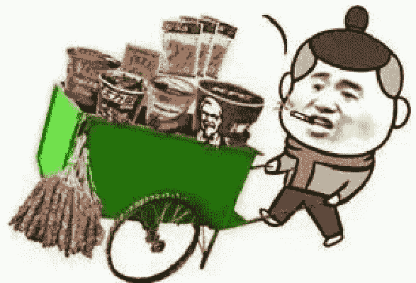

新上台的阿维兰热就跟少林寺的释永信一样，敏锐地意识到有这么多信徒，不卖广告简直愧对祖宗。

于是联系第一个赞助商——阿迪达斯，阿迪给足联打钱做广告，足联有钱去把赛事做大，有钱后的足联把世界杯的影响力做得越来越大，越来越多的企业加入赞助行列，足联和世界杯整体规模滚雪球似的成了一个巨无霸。

相比起来，奥运会明显后知后觉，直到1984年洛杉矶奥运才正式大规模商业化，比世界杯晚了十年。到现在奥运会式微，倒也不止商业化太晚，主要也是奥会有太多项目根本没有群众基础，大家平时几乎不接触，就那几天看几场，也就卖不动广告，过几天观众把绝大部分运动员名字也忘了。

现在从收视率上讲，世界杯的影响力已经远远超过了奥运会，当之无愧的全球最多人数收看的体育赛事。这么大收视率，通过卖广告和卖转播权，FIFA迅速变得富可敌国。

到如今，跟世界杯被抢着申请不一样，申办奥运的城市越来越少，2024年的奥运会原本有5个城市在申请，结果事到临头，有3个城市宣布退出了。只剩下法国的巴黎和美国的洛杉矶两个城市。

国际奥委会心里一咯噔，突然意识到弄不好2028年没人申请了，于是格局打开，一口气把两届奥运会都甩了出去，24年巴黎办，28年洛杉矶办，套牢了这俩货，瞬间化解问题于无形，说不定领导们还互相击了个掌。

而奥委会的小弟足联却风生水起，越来越有钱，缺乏监管加上人性贪婪，慢慢FIFA的黑社会性质渐渐显露了出来。

说起黑社会，可能大家第一反应是杀人越货。其实并不是，黑社会的目标是赚钱而不是砍人，如果不砍人就能赚钱，他们也选择这种细水长流的模式。由于表面上严格守法，越是法制国家越难以根除黑社会，法律就是他们的保护伞。

FIFA就是这么一个组织，能量极大，极其腐败。但是躲在瑞士，完美避开各种法律监管。每次出事，基本都可以花钱顺利过关，实在不行就让小弟顶账，所有人都知道他们腐败，但一直风生水起，组织安然无恙。

FIFA是注册在瑞士的非营利组织，财务不透明，也不需要披露内部运作信息，连套基本的监督机制都没有，缺乏监督的组织，看着那么大的财富规模，不腐败才有了鬼。而且组织里边运行也是“寡头制”，有几个人权力大到了极点，完全可以做到谁都不鸟。

如果FIFA主席有问题，唯一的法子是依靠主席换届选举。但是现任主席手里掌握巨大权力，有投票权的都是他小弟，连任是板上钉钉的，理论上可以一直连任到他不想干为止。

阿维兰热从1974年干到1998年，并顺利把权力交给布拉特这个亲信，一点都不避嫌。当然也不是完全不避嫌，早期这哥们想把自己的位子交给女婿，后来可能觉得实在是太难看就算了。

跟所有牛逼黑社会一样，国际足联麻烦和丑闻不断，但是生意却越做越大。

比较过分的是2002年世界杯，因为郑梦准在投票前的巨大帮助，韩国“奇迹”一般地一直打到半决赛。各大赌球机构都看出来有问题，甚至拒绝为韩国的比赛设定赔率。而FIFA管理层作为管理者，整个过程中睁一只眼闭一只眼。

原本半决赛韩国还准备干翻德国队，但是”足球皇帝“贝肯鲍尔发动欧洲各国一起抗议。硬是换掉了原来安排的主裁判，才使得比赛稍微正常了一点。

从此以后，FIFA的腐败问题更加严重，布拉特作为主席竟然可以把转播权倒手获利。大家手里有啥卖啥，能捞一笔就捞一笔。原本藏着掖着的行为也就半公开了。

最著名的，应该是一个叫ISL的公司，这个公司为了世界杯的代理权，前后给足联主席阿维兰热和他女婿塞了1800万欧元，当时所有人都知道这事，但谁都没证据。

直到那个ISL倒闭后，瑞士检察官对ISL的账务审计了十年，才掌握了确凿证据足联受贿的事。

解开一个案子需要十年，也就懂了这个组织这么多年作恶多端却屹立不倒的原因。

当时间到了2009年，FIFA的骚操作到达了顶点。

因为执委会即将换届，很多人将不再担任执委。为了最后捞一票，他们决定来把大的：一次性宣布2018和2022两届世界杯举办权，将未来资源套现。并且打着“多样性”的招牌，表示2022年世界杯应该在亚洲举办。

明显是在疯狂暗示中国，可以按照韩国的“先进经验”，中国队可以通过各种操作，获得不错的成绩。

当然这一切的前提，是中国在“运作”上努力一些。当时俄罗斯已经表示要办2018世界杯，并开始到处花钱。FIFA觉得以中国的经济实力，出手必然会比俄罗斯更大方。

可惜我们不是韩国人，中国压根就没有打算申报，可能也是归功于我们国足能力太稳定，再怎么运作也动摇不了他们在球坛绝对垫底的位置。原本FIFA的目标落空了，卡塔尔半路杀了出来，说它也是亚洲国家。

卡塔尔各方面条件都有问题，它的球队从来没有打进过世界杯。之前所有主办国中成绩最差的南非，也三次打入过世界杯决赛圈。而且当年南非世界杯，依靠的是曼德拉的光环，还有传说南非给中美洲国家的1000万美金”援助“。

而且卡塔尔所在的中东沙漠，夏天白天气温40度朝上。这时候如果打比赛，估计没有哪个保险公司敢卖保险，运动员也都跑不起来。但如果改时间就必须是在冬天，那时世界各国的联赛正在打。到时候停不停？赛季贸然停一个月是多大损失？如果球员受伤怎么办？

不过卡塔尔是个耿直小伙，从始至终就一句话，“你们说这么多困难，不就是钱没给够吗？”，FIFA内部甚至流传着卡塔尔的开价：一票250万美元，如果有特殊情况还可以考虑，也就是“可加钱”。

强大的金钱攻势下，尽管美国人也想申请2022年世界杯，不过鹰酱对自己的实力太过自信，没有对足联进行充分打点。

2010年12月2日开会投票，卡塔尔击败美国，成为举办国，鹰酱堂堂超级大国，竟然输给了中东马仔的“钞能力”，这口气怎么都咽不下去。

### 3

换一般国家也就算了，下次再申办呗，但是美国爸爸是能忍的？尤其手里还握着一堆足联黑账。

于是美国国税局在司法部的授权下开始调查这事，国税局向来办事妥帖，只在阿富汗查美军账目失手了两次：一次是税务人员的飞机不知道被谁打了下来；另一次税务人员朝自己后背开八枪自杀了。其他时候IRS都是人挡杀人佛挡杀佛。

不过IRS出手也有些问题，首先就是卡塔尔和美国的关系。

看过前面那篇的都知道，卡塔尔是美国在中东的重要马仔。所谓“亲不亲阶级分”，如果伤害了卡塔尔就不好了。

经过一番“严谨”的调查研究，IRS确认卡塔尔没问题，错误都是FIFA的。

“我兄弟这么忠厚老实可爱，你们这些坏B竟然把他教坏了，你们还是人啊？”

布拉特也知道自己这次得罪了美国。他倒是机灵，从2011年开始再也不去美国，也尽量不从和美国关系近的国家过境，比如加拿大，以为这样美国就拿他没法子。

只能说太年轻，在FIFA这个小天地作威作福久了，不知道得罪鹰酱是什么下场。

其实原本事情还有转圜余地，FIFA表示2026年的主办权一定补偿给美国，并解释按照举办次序确实2022应该亚洲国家举办。

好死不死2014年出了大事：俄罗斯强占克里米亚。到处都在制裁俄罗斯，英美等国要求FIFA取消俄罗斯2018世界杯举办资格，并禁止俄罗斯的足球队参加国际比赛。

结果FIFA居然不同意，一方面专横惯了，另一方面是拿了俄罗斯的钱，不想退。感情和钱总得伤一个，FIFA最后决定伤感情，这下它美国大爷彻底怒了。

2015年IRS和FBI决定动手，并因为案情复杂又重大，制定了一个“一锅端”抓捕计划。

FIFA管理层也不是没准备，当初为了躲避查账，把组织注册在了瑞士，高管也都在瑞士上班，会见重要客人谈生意也在苏黎世，重要事务几乎都面谈从不打电话，会谈的时候也用高科技防止录音。整体充满了安全感，觉得美国再嚣张，也不会去瑞士抓人吧？

图样，图森破。

瑞士作为永久中立国，刚正不阿的人设一直很稳的。唯二的例外，一个是“奈何给的太多了”，比如二战黑掉一部分逃难犹太人的钱。一个是“美国爸爸要搞你不能怪我，哥们你下辈子投胎做个好人吧”。

到了5月27日，瑞士警方突袭了FIFA官员的酒店。抓走了7名FIFA高层，有了我们文章开头那一幕。

其实这次美国的行动还算克制，只是把美洲地区的FIFA官员几乎一网打尽，没有追究其他地区官员责任。

可能美国觉得FIFA官员拿钱办事也不是问题，毕竟都是社会人。但是当年申办世界杯，美国联络过美洲这些人，作为美国后院的南美和中北美加勒比海地区，收卡塔尔钱骗美国就不能接受了。要不狠狠收拾一下，以后没人把大哥的话当话了。

主席布拉特还准备继续在位置上耗下去，并且顺利当选下一任话事人，毕竟手底下的人都是他自己人。可是各位金主们被他敲竹杠很久了，一看美国在调查他，顿时觉得机会上来了。

可口可乐、百威啤酒这些多年伙伴，纷纷公开要求布拉特下台。布拉特再也没法拖下去，只能赶快下台。但是这种不情不愿态度已经惹怒了美国，于是开始对他进行司法调查。FIFA道德委员会也认定布拉特有违规行为，不再允许他参加任何与足球有关的工作。

同时美国表示”一个都不放过“，把矛头指向了欧足联主席普拉蒂尼。作为当年在卡塔尔和法国之间牵线的角色，普拉蒂尼从FIFA主席热门人选，直接被干翻在地抓了起来。

到此，美国展示自己强大影响力的目的达到了，也没有真赶尽杀绝。表示自己忙完了，大家不要怕，该干嘛干嘛吧，下次再惹大哥，大哥再修理你们，别以为瑞士能罩得住，下次要跑记得往俄罗斯跑。

### 4

### 尾声

因为卡塔尔世界杯申办捅的娄子实在太大，FIFA经历了一轮改革，现在相关人员都已经低调多了。

不过专横的作风，依旧没变。

我在上篇文章里，说卡塔尔跟俄罗斯一样，反同性恋嘛。这激怒了欧洲，弄了个袖标，也就是下图比利时女外交部长（中间那个女的）胳膊上戴的那个，用来支持同性恋顺便谴责卡塔尔。

这让足联非常不爽，粗暴地说球队上场踢球敢戴那玩意，就罚一张黄牌，看你们还嚣张？

要知道，这是个非常非常政治不正确的举动，遭到了巨大压力。后来德国队他们敢怒不敢言，于是拍照的时候用这个姿势反抗足联的粗暴作风，这就叫恶人自有恶人磨：

文末再总结下吧，整体而言，足球发展到现在的状态，和足联强大的运作能力强相关。不过就跟所有缺乏监督却暴利的领域一样，腐败几乎不可避免。足联腐败几十年了，一直到现在，管理难度可见一斑，可以预测的未来，估计会一直这样折腾下去。

公众号懒人搜索，[懒人专属群](https://lazygroup.pro/)分享

### “社交狂魔”卡塔尔是怎么混到人见人烦的？

2022-11-21

世界杯期间聊点欢乐的吧。卡塔尔作为本届主办国，自从获得主办权开始，就时不时地上热搜。不过内容比较尴尬，咱们国家不太明显，西方的报道几乎清一色负面的。

比如一直无法摆脱的行贿丑闻，说是他们这个世界杯举办权，是行贿FIFA上层人物得来的，言外之意，“你也配？”。

还有关于场馆建设中外地劳工死亡的问题，欧美媒体说有6000到15000人死亡。卡塔尔官方被这个数字气的骂街，说我们是修体育场又不是盖集中营。后来又说没死那么多，大家倒吸一口气，那到底死了多少啊？

还有就是各种稀奇古怪的问题，衣着不能暴露，不能喝酒，举办世界杯你不让喝酒，那踢啥球？还说谁敢在卡塔尔打架斗殴，直接抓起来关两年，英国人说你们看我干啥？不过英国还是派了15个警察过去，估计想约束下他们自己人，出了事也可以随时捞人。

而且卡塔尔和之前的俄罗斯一样，在LGBT问题上也碰上了大麻烦。

大家记得吧，之前索契冬奥会，俄罗斯作为一个保守的东正教国家，不允许对儿童宣传同性恋变性人什么的，这一点平心而论也没啥问题，然后西方就怒了。对俄罗斯各种指责，冬奥会全程在闹这事。

现在卡塔尔也碰上了，它作为一个保守的穆斯林国家，是禁同性恋的，尽管前段时间跟俄罗斯一样，表示他们只是针对自己本国人。但是西方世界不依不饶，非要卡塔尔把法律改了，不改就不是人。

卡塔尔当然不接受啊，于是跟之前对俄罗斯一样，大家围个圈，疯狂围攻卡塔尔，说它是个腐朽落后专制的中世纪国家。

此外也因为它和伊朗、穆兄会、塔利班有联系等问题，国外媒体这段时间聊足球的，远没有骂卡塔尔的人多。

今天我就来说说卡塔尔，让大家体会下啥叫庙小妖风大。

先上地图，卡塔尔是个波斯湾中间的半岛，人口只有260万，跟咱们铁岭差不多，比不上驻马店，因为驻马店有六百万人。就这么点人，其中本地居民还只有三十来万，剩下的都是外来务工人员，印度人巴基斯坦人什么的。也就是每个当地人有四五个外来人口伺候。

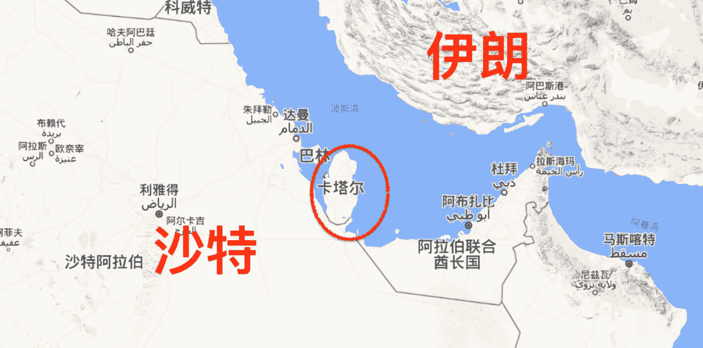

按理说卡塔尔这么富有的国家，劳工去那边工作收入应该是很不错的，但从欧美这段时间的采访结果来看，他们本国懒鬼们每天上班两小时，工资动不动好几万美元，每月还有大额的补贴。

但是劳工们工资却低得离谱，每月只有五六百美元，卡塔尔物价还是很高的。而且生活条件很差，挤在没有空调的板房里，那可是中东，四十多度的地方。这也没少被西方修理，卡塔尔的态度很无所谓，说嫌苦可以不来啊，是我强制他们来的吗？

我还问了一个读者里在中东干工程的土木老哥，他说是真的，中东劳工主要是印度和巴基斯坦人，这些国家的老百姓太穷太吃苦耐劳了，给点钱就干，相互竞争压低收入。就算雇主想给一个月一万块，立刻有人跳出来说五百就干，这让雇主很为难啊，你说咋整？

所以不仅卡塔尔，沙特的劳工也一样收入极低。

卡塔尔只有西南一小块地方和沙特陆地接壤。曾经有一段时间，两家闹得太僵。沙特忍无可忍，表示要在两家的边界上挖一条运河，让卡塔尔变成岛国。

当时卡塔尔也被这个计划吓傻了，正准备反对，不过想半天，实在不知道对自己会有什么损失，说那你挖吧。沙特说完发现不合算，这个行为实在有点脑残，于是也就没有下文了。这属于中东的日常，天天搞飞机。

这个地理环境，又富含油气资源。按理说卡塔尔应该默默地卖资源，过那种让其他国家羡慕得流口水的土豪日子。他北面的科威特就是这样。自从海湾战争以后，国际上几乎没有科威特的新闻，过上了安安静静与世无争的土豪生活。

但是卡塔尔不一样，他有一颗躁动的心。虽然体量小，但是志向大，一心要在中东和国际上多刷存在，做整个沙漠里最靓的崽。

第一步是得罪邻居。

2017年，巴林、沙特阿拉伯、阿拉伯联合酋长国、埃及、也门、利比亚六国及南亚的马尔代夫、非洲的毛里求斯指责卡塔尔支持恐怖主义活动并破坏地区安全局势，分别宣布与卡塔尔断绝外交关系。

当时这算是爆炸性新闻，很多人都懵了，卡塔尔到底做了啥，把这么多人都得罪了。

实际起因非常搞笑：卡塔尔政府社交媒体及新闻网站遭黑客入侵，黑客冒充卡塔尔领导人身份，把邻居喷了个遍，还捎带骂了美国一顿。并表示自己要支持哈马斯，还要召回驻各国的大使，颇有叶师傅的气势。

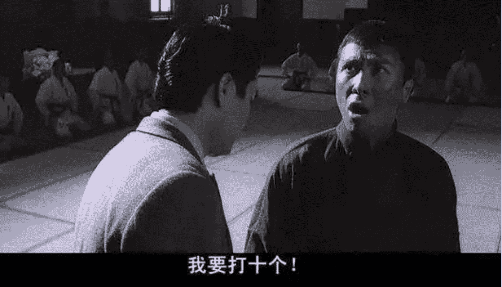

按照常理，既然是黑客干的，删除掉之后发个声明也就好了。但是各邻国纷纷不依不饶，表示不能这样算了，还弄了一个有13条要求清单要卡塔尔照办，上边写着让卡塔尔关闭电视台，跟兄弟国绝交，向周围国家道歉等莫名其妙的要求，而且只给了10天时间。

卡塔尔看到条件脸都绿了，表示谈都不用谈了，黑客说的就是我说的，早看你们这帮骆驼不爽了，爱咋咋地吧。

这就很奇怪了，在我们这种吃瓜群众看来，尽管卡塔尔没把网络搞明白，沙特他们干得好像有点得理不饶人，至于嘛？其实如果了解背景，就会发现事情没这么简单。

卡塔尔最为人熟知的产品除了能源，就是著名的半岛电视台。这个台和CNN、BBC号称世界三大新闻媒体。半岛电视台主要新闻都是关于中东，在全世界都有很大影响。但是报道的内容经常惹得其他中东国家不爽。

对于中东王爷们来说，非常容易受到冒犯，理论上讲，你把他们做的事说一遍，那就是对他们的侮辱。

恰好半岛电视台不仅说，还瞎说，口无遮拦捕风捉影啥都说。如果留意新闻的话，就能发现，关于中东的事大部分都是这个频道搞出来的。时间长了，中东王爷们看到这个电视台，就跟吃了苍蝇一样难受。

所以那个著名的“13条”里，要求关闭半岛电视台，并且要求向侮辱过的海湾国家道歉，卡塔尔一看，按照沙特标准，所有沙漠兄弟都被自己侮辱过，算了，一个都不道歉，爱咋咋地。

如果只是打打嘴炮还好说，卡塔尔国小瘾大，真的出手资助一些比较有争议的组织。在中东卡塔尔支持了很多的反对派，把各国政府得罪了个遍。最有名的就是埃及穆斯林兄弟会，卡塔尔不但掏钱，还在半岛电视台上公开帮兄弟会叫好。

可能有小伙伴不了解穆兄会，记住一件事就行了，这个穆兄会在中东一些国家眼里，跟个恐怖组织也差不多，事实上很多国家已经把穆兄会列入了恐怖主义名单。

此外大家知道那个经常往以色列扔火箭弹的哈马斯吧，卡塔尔也是哈马斯的重要庇护国，哈马斯的钱就放在卡塔尔，不少要员也住在卡塔尔开展工作，这让以色列非常不爽。

因此2017年的事情，在沙特他们看来，其实是可算逮到机会弄这小子了。哪里还管黑客白客的，反正就是要找茬，所以开出了那“13条”，把平时对卡塔尔的不爽全写进去。不过卡塔尔也硬气，表示一个都不同意，爱咋咋地。

那他为啥这么嚣张呢？

### 2

之前网上有个问题，说是为啥沙特那么封建，却混得风生水起？

答案是一目了然的，因为中美两个巨头都是它大哥，他给两个大哥花了无数的钱之后，能有啥事？

卡塔尔也一样，跟中国关系非常好，大量基建订单给了中国和印度，每年也在美国那里花大笔美元买军火，主权基金也主要投资美国。美军在中东最大的基地不在沙特，而在卡塔尔的乌代尔空军基地，这里最多驻扎近15000名美军，现在常年有好几千。

大家看地图就知道，卡塔尔扼守波斯湾，美军在这里可以完全控制这一带，和伊朗只有一道窄窄的水面，平时可以从这里起飞无人机去伊朗搞侦察。而只要有这个支点在，中东就在美国的掌控下，怎样都翻不出大浪，甚至很多国家的油轮也走这个地方，打起仗来可以在这里搞封锁。

当然还有一个不好说出口的任务：美国要通过卡塔尔盯紧背后的沙特不要出幺蛾子，美军驻扎在卡塔尔，相当于在沙特背后顶了一把枪，这也是沙特和卡塔尔关系不好的主要原因。

有美国撑腰，卡塔尔自然不把沙特他们放在眼里，沙特和卡塔尔互相觉得对方是美国的马屁精，没文化没追求，小人暴富，有两个钱天天臭显摆。

如果卡塔尔真的惹出什么娄子，赶紧打电话摇人叫老大，美国都第一时间上去调停，让双方能大事化小小事化了。

这些年来，卡塔尔的半岛电视台，到处怼天怼地，甚至发表各种明显不符合宗教和政治的言论，却一直啥大事没有，很大一部分原因是美国在后面给他撑腰。

不过2016年特朗普上台之后，开始了一系列骚操作，退群、卖盟友、敲竹杠。明摆着表示自己要收缩战线了，以后花钱出力的事情不要找我。

于是2017年卡塔尔就碰上了外交危机。

闹得最凶的时候，沙特一度要动武，沙特说我打不过萨达姆，还打不过你？

去库房里把坦克飞机拖出来涂上润滑油，大腹便便的土豪飞行员告别四个老婆，驾机上天溜达了几圈，眼瞅就要真打。美国一开始也没表态，因为特朗普不久前拿了沙特军火大单，加上他也一向不喜欢半岛电视台。于是没有明确表态反对，沙特斗志越来越足。

但是很快，美国政府内知道轻重的人开始发力，站出来要求事件双方要冷静不能冲动。沙特觉得没有美国的支持，万一打不赢就不好了，于是这事也不了了之了。

直到几年之后的2022年6月，一个爆炸消息传来：退役美国四星上将约翰艾伦，被爆出在2017年时帮助卡塔尔在外交危机中，通过各种手段影响美国的决策，他这么做，并不是出于国际友谊或者他热爱中东沙漠文化，而是他拿钱了。

这消息一出，一片哗然，因为这个约翰艾伦不是一般将军，这人曾经因为在伊拉克平叛有功，做到驻阿富汗美军司令，并一度做过北约最高军事长官。

这人在美国军政商三界都是有面子的人物。不过他肯定没能力一个人影响美国政策，而是通过他联络各路神仙一起用力，才把一场大乱压了下来。随后卡塔尔宣布对美国120亿美元的军购，算是给老大的劳务费。

这个约翰艾伦2017年底就成了布鲁金斯学会主席。这个组织可以说是全美国最有影响力的智库了，而卡塔尔常年都是该学会的一大金主。大家记得前几天拜登说是中东王爷们一直在影响美国政策吧，其实就是通过资助这些政客和游说公司，来影响美国国会议员，进一步影响国家政策。

当时有了底气的卡塔尔所以一点不怕，把邻国晾一边玩起了冷处理。沙特、阿联酋、巴林和埃及对卡塔尔进行了军事封锁。

但是包围的效果很不怎么样，因为卡塔尔是个半岛，朝水的那一边没法封。闹了三年半，卡塔尔啥事没有，也不是完全没有，很多人印象中那地方的吃的贵的离谱，就是因为有段时间他们的食物都是从伊朗和土耳其空运的。到了2021年，事情又变了，沙特他们表示不封锁了。

倒也不是卡塔尔厉害，问题还是出在美国。

特朗普下台了，拜登上台，传统美国政治重新开始。对于卡塔尔这种盟友，美国立刻开始了调解斡旋。沙特他们也不想继续折腾了。只是几年都搞不定小小的卡塔尔，要是没有个台阶实在没法收场。

现在见美国政府出头，正好就坡下驴，沙特骂骂咧咧表示要不是给大哥面子，早打死你这个小崽子，以后别让我看见你。

至于卡塔尔，很无所谓，甚至很中立，就跟大家不是在针对它一样，接着奏乐接着舞。

### 3

如果说卡塔尔有啥事让整个西方都不爽，首先就是和他隔海相望的伊朗，两家的关系一直不错，这也让他饱受大家的各种批判。在中东兄弟们眼里，它这是在和什叶派异端鬼鬼祟祟，在西方眼里，这是跟邪恶轴心国沆瀣一气。

卡塔尔和伊朗关系好，倒也不是因为伊朗给它钱了，而是因为他俩天天凑一起赚钱。

卡塔尔别看这么小，却有一块全世界已知最大的天然气田。这块气田在卡塔尔的北端海域，以及伊朗的中部，卡塔尔称之为北方气田，伊朗称为南帕斯油气田。分布区被伊朗和卡塔尔瓜分，两家共同开发，一起捧着个金饭碗，关系能不好吗？

这块气田大得吓人，两块加起来可开采的天然气储藏量占全世界已知可开采量的20%！正因为这块气田，卡塔尔成为世界第三大天然气储量国，还是第二大液态天然气出口国。

因此卡塔尔和伊朗的关系，无论如何都不会太疏远。即使美国对伊朗多年不停制裁，卡塔尔都和伊朗关系不错。美国租着卡塔尔的军事基地，不太好跟房东闹别扭，一直也就默认了。

而沙特他们就不识相自取其辱，在“13条”里，居然要求卡塔尔和伊朗断绝关系。这就离谱，断了关系咋赚钱？断人钱财，杀人父母，怎么可能嘛。

卡塔尔还有个重要盟友是土耳其，别看两家虽然都算中东国家，其实八竿子打不着，足足有1500公里。

但是关系非常好，土耳其在卡塔尔有军事基地并且有几千人驻扎，而且土耳其基地挨着美军基地，他俩都是北约成员国，也无所谓。

这也导致卡塔尔的整体成分很复杂。在卡塔尔首都多哈，街上可以看到美军顾问、中国土木老哥、印巴劳工、土耳其空军飞行员、伊朗石油工程师、穆兄会成员、哈马斯代表、叙利亚反政府武装、非洲军阀、英国情报人员、俄罗斯寡头等等，魔幻的是还有塔利班。

塔利班这事更离谱，美国打阿富汗的军事基地就是卡塔尔，可是塔利班领导人流亡地，也是卡塔尔。后来美国和塔利班的谈判，索性就在这地方举行，一问才知道美军情报官和塔利班流亡分子都住在喜来登酒店，都不用出酒店就可以和谈了。

这次世界杯，据说会有150万球迷来卡塔尔。当地政府怕来人太多出乱子，自己人太少，找人加强安保。找的就是土耳其人。对这要求，土耳其一下派来了3000警察和相关专家，还带了一百多条警犬。

也正是因为卡塔尔是土耳其的房东，所以在卡塔尔被封锁的时候，土耳其跳出来给兄弟撑腰。虽说用处不大，借着土耳其作为中间人，搭桥买法国战斗机，还让卡塔尔飞行员在土耳其受训。甚至修了一个空军基地，让卡塔尔空军快速扩张规模，专门防着它的阿拉伯兄弟。中东的军事实力，基本都是防兄弟不防大国。

作为能源出口国，如今作用尤其重要。

特别是今年俄乌冲突，俄罗斯不是拿天然气作为武器嘛，作为天然气出口大国，卡塔尔在欧洲急需能源的时候成为重要提供商。

不过价格上敲了竹杠，导致欧洲拿了天然气，对它也没啥好感。

特别是和法国的关系，有个著名的小道消息。2010年卡塔尔拿到世界杯主办权之前一个月，时任欧足联主席的普拉蒂尼带着卡塔尔领导人来到巴黎，和时任法国总统萨科齐吃了顿饭并聊了很久。整个中东和西方都认定卡塔尔人给FIFA塞钱了，法国人也没少拿，这个一直没被证实，但是几乎所有人都相信了，卡塔尔和国际足联沆瀣一气，行贿受贿。

主要也是国际足联一直跟黑手党似的，非常腐败而且臭名昭著。

比如1978年，阿根廷内乱，按理说是没法举办世界杯的，但是国际足联在收受了大笔贿赂后，把第11届世界杯举办权交给了阿根廷。

2002年，曼德拉成为南非总统后，南非向国际足联支付了1000万美元，这笔钱被足联几个高管据为己有，换取了举办权。

此外还有一大堆，这个背景下，几乎没人怀疑这次卡塔尔世界杯也是腐败的结果。毕竟这个中东国家举办世界杯，几乎都是debuff，无论如何也不应该是它。

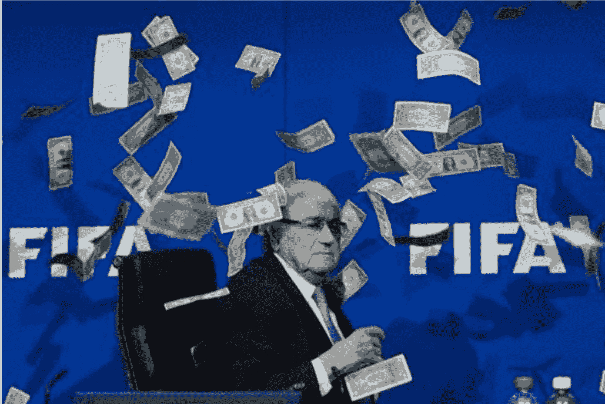

卡塔尔除了获得主办权，还买下了巴黎圣日尔曼，这十几年卡塔尔在球队上花了近20亿欧元，被称为世界头号氪金玩家。其实这点钱都不算什么，这些年卡塔尔在法国的投资达到几百亿欧元，渗透到了法国各个行业。

法国政府对卡塔尔感觉还好，不过法国老百姓是很讨厌这个国家，新闻里听到这个国家，整体印象就是一群穿着长袍的土豪，到处撒钱做面子工程，非常低俗。法国人尽管干脆利索收了钱，但是该骂继续骂，这也是为啥这段时间卡塔尔没少被羞辱。

英国那边也差不多，贝克汉姆拿了1.75亿欧元之后去做卡塔尔世界杯的形象大使，已经被英国人给骂惨了，大概意思就是“你变了”，“难道你不支持同性恋了？”。

### 4

### 尾声

看完文章，大家应该也感觉到了，卡塔尔尽管小，还是个穆斯林国家，可是极度开放，这给他带来了巨大资源的同时，也给他带来了大量的争议。

最关键的是，这次俄乌战争对于卡塔尔来说，可能也是个超级机遇，因为俄罗斯的天然气退出欧洲后，欧洲今后可能就要依赖挪威和卡塔尔的天然气了，所以今年3月22日，《经济学人》的一篇文章竟然说，沙特的资源在卡塔尔面前相形见绌。可见这资源储量是多么得恐怖。

也正是因为极度的开放和资源充沛，很大概率将来大家听这个奇葩小国会越来越多。卡塔尔这次斥巨资顶着大家的围攻举办世界杯，可能也是这个目的吧。

公众号懒人搜索，懒人专属群分享

### 曾经那么强大的苏联工业，怎么沦落到了如今地步？

2022-11-18

在我们的印象中，俄罗斯和他的前身苏联工业是非常强的，但是俄乌战争一打，发现并没有那么玄乎，几乎是全方位的落后，现在还得依赖伊朗进口无人机。打开商业部网站，也能发现俄罗斯现在出口什么的，主要是能源粮食什么的初级产品，工业基本没了。

事实上，曾经以一己之力对抗整个西方的苏联工业，基本已经灰飞烟灭。那为啥成现在这样呢？咱们今天就聊下这个话题。

苏联解体后，俄罗斯工业就迎来了一大波劫难。

首先要说，苏联最大的粮食基地和工业基地都在乌克兰，所以苏联解体后，俄罗斯本来也没继承到全部工业。不过继承到意义也不大，因为无论是俄罗斯，还是乌克兰，很快都发生了大规模的去工业化。

苏联时期的企业是计划性质的，并不是为了满足老百姓的需求，有大规模的错配，比如老百姓并不需要那么多的武器和航天工业，老百姓需要的吃穿住行相关产业却非常落后。所以苏联解体后，市场经济下，没法实现自盈利的企业很快就扛不住了，财政又没钱给他们补，所以倒闭潮席卷所有领域，包括他们的能源企业。

举个例子，大家可能不知道苏联拥有巨大无比的电视生产业务，不过由于缺乏竞争，产品质量一直堪忧，最大的问题就是随时会爆炸，每年都有几百人会被电视给炸死。看电视有生命危险，你们能想象？苏联解体后他们的电视产业几乎瞬间崩了，老百姓都在争相购买日本货。

再比如始建于沙俄时期的黑海造船厂，我们第一艘航母就是从这里生产的。在苏联晚期就基本上靠补贴度日，苏联解体后，这个造船厂在接下来的28年里只干了一票稍微大点的订单，拆了他们自己的废旧航母“乌里扬诺夫斯克号”，基本没有其他业务。

一度想生产民用船，可是设备太老旧，生产出来也不会有人买，想更新设备，又需要太多钱购买设备，正好财政也没钱，也就一直啥也没干。

同时期韩国的造船业一枝独秀，后来中国也逆势崛起，黑海造船厂老旧的设备和技术根本接不到订单，于是在2018年破产清算了。

苏联电视机产业和黑海造船厂，可以看做是苏联轻工业和重工业的一个缩影，几乎所有的工业都是这个造型，低效且盈利能力差。也正是因为大部分工厂没法实现盈利，解体后无论是俄罗斯还是乌克兰，工厂都大规模倒闭。咱们一般说的“寡头”，主要瓜分的是苏联的能源和森林土地资源，工厂什么的意义并不大，很多都当废铁卖了。

最后只剩下了少量军工和能源产业，这两样确实都能卖得出去能赚钱，军工可以卖给俄罗斯自己的军队，还可以卖给印度中东，以前苏联的战机和防空系统咱们也需要。不过最近三十年俄罗斯军工行业几乎没有进步，这些年一直在吃苏联老底，到如今我们已经不大能看得上苏联装备了。俄乌战争之后，俄最大的客户印度也在调整军购，今后不从俄罗斯进口那么多军火了。

能源好理解，这是俄罗斯的传统优势领域，自从世界上打出第一口商用油井，俄罗斯的石油工业就占据全球三分之一左右份额。这次俄乌战争之后，能源估计也要受影响，俄罗斯可能没法直接卖能源了，需要从印度倒手，到时候印度就能赚一个差价，印度赚的，就是俄罗斯赔的。

其他的领域在苏联时期本来就不是为了盈利，没啥效益可言，一旦进入市场运营，根本顶不住西方和我国的竞争，纷纷破产了。

不少人包括我自己，也在之前的文章里经常说俄罗斯人不成器，那么大的家底败光了，不过话又说回来，俄罗斯还真没啥选择。

其实俄罗斯当时唯一的出路就是走中国的，可是它又没法走。

中国是怎么做的呢？一开始卖石油，后来利用自己的人力优势，在我们那几个传统港口附近做来料加工，赚到外汇之后，拆掉之前比较落后的产线，换上西方最新的。这是个非常艰苦的过程，相当于赚到钱不消费，直接投入了再生产。

改开刚开始是很苦的，几乎所有的钱都投入了设备引进。比如1978年10月，邓公访问日本，参观新日铁，对陪同的新日铁会长稻山嘉宽和社长斋藤英四郎说“就照这个工厂的样子帮我们建设一个”。1985年9月15日，经过长达7年多时间的筹建，宝钢一期建成投产。

当初俄罗斯和中国面临的问题差不多，内需极差，想发展工业就得搞外贸，后发国家想发展工业，基本只有这一条路，这也是为啥亚洲四小龙都是以港口为中心搞制造。

可是外贸严重依赖海运，也就是港口。因为早期转移过来的工业利润都比较薄，必须建在港口附近，这样生产出来的东西可以直接海运拉走。如果陆运的话，运输成本比商品价格都高，产品根本没有竞争力，卖不出去很快就倒闭了，甚至根本不会有人投资。对于家底一穷二白的后发国家，这几乎是唯一出路。

等到产业升级后，会把不太赚钱的产业往港口身后的腹地转移，那些港口城市开始搞金融和计算机什么的高科技领域。上海、深圳、香港、新加坡，都是这么过来的，以前搞低端制造业飞起，后来慢慢变成了现代化都市，基本不搞那些落后产能了。

恰好俄罗斯这个问题一直解决不了，因为它没有腹地巨大可以容纳海量人口的不冻港。大家想想，世界上怎么会有客户能同意你每年只供货半年？为啥不找个能全年稳定供货的地方？

所以港口问题已经俄罗斯走中国路线可能性封死了一大半。

剩下的问题就是投资问题，中俄刚开始的时候都没钱。

中国改开之后，最早来中国投资的并不是西方，西方来看过，直摇头，觉得中国的环境太差。来中国最积极的，是香港那边的。大家知道，香港以前也是制造业起家，生产一些小商品，比如李嘉诚以前就是做塑料花的。

可是香港那么小，后来越来越拥挤，正好中国开放了，香港的商人希望去大陆弄块地，生产出来的东西通过香港卖出去，这事的申请打到中央后，领导大笔一挥，蛇口工业区就是这么来的。后来这种情况规模越来越大，再后来台湾省的人也来了。

直到现在，现在中国大陆很多制造业，自己是没有客户的，一般接港台那边公司的订单，生产出来之后，通过港台转给客户，那边的人继续做倒爷。

也就是说，香港那边完全不碰实物了，只管理信息。你可能纳闷，我们怎么会这么傻，自己卖不行吗，非要让他们赚差价？当然行，可是找客户也是需要花钱的，卖出去这事本身就比生产难得多。绝大部分公司，包括大家熟知的那些研发型公司，销售部门的开支比研发大得多，销售本身就是个非常费钱的操作，很多我们的企业一直依赖香港，依赖到现在。

台湾对大陆制造业的影响也大到离谱，台湾企业在大陆的规模大家可能没法想象，我随便说几个数据，2020年大陆外贸出口的前15名里，台湾企业占了9个，制造业百强企业里，有三分之一是台企。

疫情三年，这个趋势不但没降低，反而有所提升，因为出入境受影响，那些销售部门在香港台湾的企业就特别占便宜，大陆的竞争对手出不了国，他们可不是非常爽？这可能也是为啥我国要调整出入境政策的原因吧。

更关键的是，香港和台湾带进来的不仅仅是投资，更是管理知识。

就跟现在让你去开个饭店，99%会倒闭一样，因为成本控制是个非常复杂的技术活。开工厂也是一件极其复杂的事，需要有人手把手带，等学会了，再去别的地方复制一个。我们并不是天生会搞工厂，改开后之前的模式基本都用不上，之前的那些厂子，在20世纪90年代基本都重组和破产了。中国工厂重新学习了港台管理工厂、物流、人力的方法，才把成本控制住，才有了后来的大爆发。

这也是为啥后来其实俄罗斯有钱后，也一直没好好搞工业，因为没人带，他们自己也不会，索性继续钻油了，这个是老本行。不过连钻油的设备，也不是他们自己产的，基本都是德国、加拿大和法国进口。这段时间北溪管道的新闻大家没少听吧，他们那个关键部件涡轮机，俄罗斯自己也不能生产，正在想办法从加拿大引入。

也正是因为一直没太发展起来，导致俄罗斯的营商环境一直问题很大，比印度都差，这也是为啥大家经常听说中国企业去印度投资建厂，极少听说去俄罗斯建厂一样，这绝对是地狱级难度的事。

大家知道，苏联工业化主要是从美国买了大量的设备，当时美国正在大萧条，工人找不到工作，很多公司也实在是没订单，正好苏联愿意购买。那时候苏联没收了大量的沙俄旧贵族的黄金、艺术品，还有石油木材什么的，可以用这些向美国购买。此外也靠国营企业利润、高额农业税、压低国民消费以及大量吸收外资四个渠道筹集。

所以美国人二话不说就把产线装上轮船，去给苏联人搞工业化。

比如一个叫卡恩的美国工程师，以前是福特工厂的一个主管，苏联和他签了合同，在底特律买了全套的美国设备，去苏联建成了当时最大的工厂——斯大林格勒拖拉机厂，这个厂子平时造拖拉机，战时造坦克。

福特不甘示弱，亲自下场，在苏联复制了美国的产线，搞出来了著名的高尔基汽车厂。还有著名的斯大林汽车厂，前身是沙俄用意大利技术搞出来的，后来又用全套美国的技术替代。这个厂子生产出来了毛主席的座驾“吉斯115”。

这还没完，再后来苏联支援中国工业项目，从中国“一汽”产线上下来的解放汽车，其实就是“吉斯150”。也就是说，美国技术绕了一大圈，又跑中国来了。还有很多，我国的第一拖拉机厂，也是从美国进入苏联，再后来又从苏联来了中国，生产出来了著名的东方红拖拉机。后来每次西方经济危机，东方就会去西方采购一波。

但是这些技术在计划经济下进化极其缓慢，等到苏联解体前，不仅苏联的技术老掉牙了，连美国已经进化了好几轮的技术的老牌造车国家，在日本和德国车面前也抬不起头。

所以俄罗斯的这些厂子生产出来的产品连俄罗斯老百姓自己都看不上，更别说卖到海外了。

苏联还有个问题，从现在来看，应该是科技树点歪了，或者说侧重点有点歪了，苏联把科研重点放在了原子能和太空科技上。20 世纪 50 年代建成世界上第一座核动力发电站，发射了世界上第一颗人造地球卫星，建造了第一艘原子能动力破冰船；60 年代实现人类第一次载人宇宙飞行；70 年代星际自动站在火星完成软着陆。

这些技术看着酷炫，成绩有目共睹，对人类整体也很有价值，但是效益不太好，投入一百块，最后只能出来二十，甚至都不到。也没改善老百姓的生活条件，更重要的是这些领域没法实现自循环，也就是做不到国家不投钱的情况下越做越大，一直在吞金吃财政，却没啥实际产出，再大的家底也经不住耗。

而美国主要点计算机去了，也不是美国政府想点，从现在的情况来看，美国政府一开始在搞原子能，后来看到苏联发了个卫星，他们惊呆了，他们也想搞，计算机一直都不是主力。

可是民间企业很快意识到计算机这个方向有利可图，无数天才们自发投入研究，很快出了成果，提前实现了“自循环”和“正反馈”，爆炸式地膨胀起来了。美国政府在操作系统和芯片上的投入非常少，几乎可以忽略不计，因为政府也不太懂。

问题是美苏技术代差主要在计算机和芯片上，毕竟没有这两样，就没有高端数控机床什么的，慢慢上限被锁死了。

某种意义上讲，除了有限的军工科技（而且信息化还很差，之前很多人不接受，这次俄乌战争之后估计也认了），苏联留给俄罗斯一堆不太好经营的项目。有点像别人的爹留给自己的孩子几套房，他可以出租出去产生现金流，你爹留给你一辆维护费用极高的车，这车还卖不掉，你最后唯一的选择就是把车丢在那里让它自生自灭。下图就是废弃的苏联暴风雪号航天飞机。

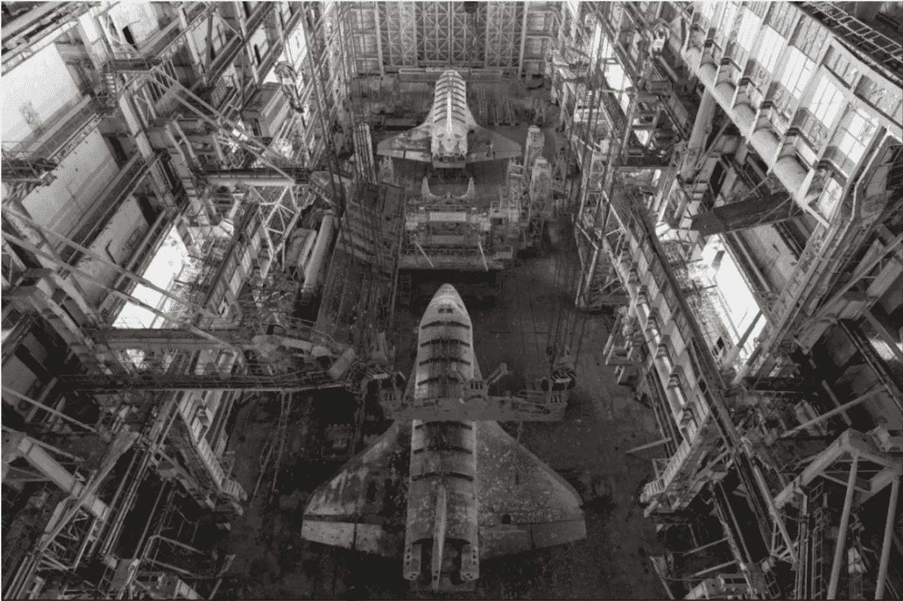

那为啥不再来一波技术转移呢？一方面没钱，苏联要是有钱就不解体了。另一方面西方也不愿意，没有“大萧条”那么好的事了，中国想要德国的技术，还得用市场来换。不过从后来的情况来看，技术也没太换到，合资企业变成了既得利益阶层，自觉维护宗主利益，甚至压制本国民间发展新技术。

其实苏联解体后，德国一度考虑过去俄罗斯建厂，不过德国工程师去考察了半年，得出来的结论是不如去波兰和罗马尼亚，此外还可以往东德转移。俄罗斯太冷了，冬天取暖开支太高，而且没港口。

除了上边的这些原因，另外还知道一个关键原因，可能跟民族性也有关系。

这是跟一个俄罗斯工程师聊天的时候意识到的，他其实不是俄罗斯人，他爹就是前苏联的航天专家，他在2015年全家移民德国。他之前工作的公司在克里米亚公投后就搬回了德国，把公司里的骨干都带走了。德国有百万俄国人，俄罗斯移民德国难度非常低。

他跟我说，俄罗斯肯定走不了中国那条路。中国在2000年的时候，一个中国工人一个月的收入不到100美元，俄罗斯最苦的时候，这个收入在俄罗斯也雇佣不到工人每天给工厂干十几个小时。所以无论是西方还是香港台湾，都不可能往俄罗斯转移产能。

他说哪怕现在的中国绝大部分工厂已经工资涨了二十多年，到了俄罗斯根本雇不到人，因为工资太低了，而且俄罗斯人是非常懒散的，根本不进厂。

我还专门查了下，以比较有代表性的富士康为例，2010年6月，在发生连续跳楼后，富士康将深圳工厂的基本工资从最低每月900元人民币（约132美元）提高到1200元人民币（约176美元）。

换句话说，俄罗斯的人力成本一直比中国高的多，他们人口也少得多，怎么都能混下去。他还跟我说了一句俄罗斯最近几十年的谚语，大概意思是，宁愿去砍树也不进厂。俄罗斯比较冷，从古到今都有个保底职业就是去砍柴火，不是太体面，但是他们依旧觉得比进厂强。

他的意思是，中国非常低的人力成本，才让中国有机会走“自下而上”的工业化，俄罗斯人的人力成本从一开始就决定了他们高不成低不就。其实高盛经济学家一开始就看穿了，二十多年前就说俄罗斯今后是消费国，做加油站赚钱，赚到钱去工业国（也就是中国）买东西。只是他们一系列骚操作，连加油站也做不好了。

不出意外的话，俄罗斯的未来基本被封死了，话又说回来，除了中美，其他的也都差不多。

公众号懒人搜索，懒人专属群分享

### 从芯片“冷战”，看技术的进化
2022-11-15

11月10日，欧洲议会以560票赞成的压倒性优势，通过了“欧盟游戏法案”。这意味着立法机关也正式认可电子游戏背后所潜藏的巨大价值了。此次决议的主要推动者、欧洲议会议员Laurence Farreng在决议前的辩论发言中表示：“对于过半的欧洲人来说，电子游戏是他们文化生活的重要组成部分”。正是看到了游戏生态背后繁荣的民用消费市场与潜力，欧盟通过了这样一个法案。其实民用市场的打开与发展，不光对各国的经济、文化有强劲的促进作用，在以芯片、人工智能为代表的高精尖产业的规模化上，更是尤为重要。刚好最近看了一些美国芯片发展历程的书，给大家分享下。1955年的加州，著名的“晶体管之父”、诺贝尔物理学奖获得者、麻省理工天才物理学家肖克利带着一群年轻的研究员正在一片“未知之地”艰难跋涉。

当时美国国防部主导的初代电子计算机已经结项，成果显著，只是刚诞生的那个计算机巨大无比，没达到国防部的预期。国防部希望把计算机应用到更加广泛的领域，比如生物和航天领域也需要这玩意，几乎所有的研究所也都希望有一台，而且军方希望把功能简单的控制单元（后来的芯片），装进导弹里，让导弹更精确。甚至把雷达，火炮通过芯片联系在一起，雷达看到目标后，不经炮手调整，火炮就可以直接射击。可是当时的计算机实在是太大了，根本没法铺开用。于是几个著名的实验室都展开了竞争式的研究，其中英国雷达研究所，贝尔实验室，还有文章开头提到的肖克利，他创立的肖克利实验室都在为这个项目做研究。肖克利本来在贝尔实验室做研究员，出了成果后，就出来单干。相比贝尔实验室，肖克利实验室可能大家了解得比较少，其实它做出的贡献非常大。不过最大的贡献，是后来出了八个著名“叛徒”。其中就包括咱们熟知的“摩尔定律”里的那个摩尔，他后来一直是英特尔的技术负责人，此时还在这个实验室里做科研。这八个员工对创始人肖克利观念并不认同。肖克利作为科学家，他对市场的需求什么的兴趣不大，只想做基础研究，对成本、量产、盈利什么的几乎没兴趣。可手底下的这八人认为最关键的事，是降低成本，规模化生产，要搞集成电路，这样就可以让更多人购买得起这些技术，到时候廉价的控制单元不但可以塞进导弹里，还可以塞到收音机，电视机，让计算机变得更小，更多公司能买得起，到时候研究所就可以实现盈利。这让他们的领导兼首席科学家肖克利感觉非常搞笑，自己一个科学家，搞基础研究的，要啥盈利？所以不但拒绝了这几个人，还非常粗暴地表示，你们八个既然想在实验室里干，就得好好听他的。这八个人后来离开肖克利实验室，成立了一个新的公司，叫“仙童”，这个名字的来源是给他们投资的金主爸爸叫“仙童（FairChild）”。有些小伙伴可能并不了解这个公司，其实这个公司是半导体和计算机史上里程碑式的存在。它把重点研发方向改成了以硅为材料批量生产集成电路，取得了巨大成功，没几年就把老东家扫入了历史垃圾堆。后来这个仙童公司管理层的路线和他们的技术骨干再次发生冲突，负责研发的骨干再次大批出逃，跟蒲公英似的，成立了一大堆半导体公司，其中就有后来著名的英特尔和AMD。这些公司都在仙童附近办公，后来那一块地集中了大量的半导体公司，于是大家叫它“硅谷”。硅谷一出现，就在另一个新东西的助力下疯狂扩张，那就是风险投资，毕竟那些创业者基本都是些科学家和大学生，等他们自己攒够钱再创业，黄花菜都凉了。而且试错成本对于创业者来说一直是个大麻烦，“风投”的出现解决了这个问题。而且风投跟以前的投资不一样，并不是投资人给钱就完事了，而是投资人深度介入到运营当中，利用自己的人脉和关系帮助创业者争取更多的资源。当然了，能有那么快的进展，也和他们源源不断的精英移民有关，比如英特尔的创始人格鲁夫是匈牙利人，乔布斯生父是叙利亚移民，谷歌布林来自于苏联的一个犹太家庭，英伟达的黄仁勋和现在AMD的苏姿丰都在中国台湾出生，而对极紫外线光刻机做出决定性作用的林本坚是出生在越南的中国台湾人。

不过这都不是最重要的，最重要的是，当时美国组建了一个贸易体系，在那个体系里，大家有钱购买这些最先进的技术产品。

一开始是美国军方在购买这些芯片，后来是大公司和研究所为了提升工作效率，也在买，后面软件生态渐渐丰富，可以说给芯片行业带来了大量且持续的技术需求和高额回报，而这也反向促进了芯片研发和更广阔的应用。

其实在英特尔的4004诞生之前，芯片的功能是早就定好的了，而现在只需要改变4002中保存的用户指令，就可以让4004实现不同功能，独立的软件行业就此诞生。而差不多在英特尔推出4004的同时期，另一家计算机大鳄IBM在行业内首次开始进行软硬件单独定价，更是在商业市场维度刺激了软件行业的发展，大大小小的软件公司就是在这个时候成立起来的。光是1970到1980这10年，美国软件行业的产值增长就已经跑赢了芯片产值的增长速度。这里又有个比较反常识的事，最早的芯片大规模应用并不是电脑，而是各种游戏机，可以说，以游戏为代表的应用软件，对游戏机等革命性的家用产品以及芯片的推动超过了绝大部分人的理解和想象，甚至是决定性的作用。这一点其实经历过90年代的小伙伴都有感觉，咱们接触电子产品的顺序，也是步步高学习机，超级玛丽魂斗罗，然后是网吧，红警和冰封王座，最后才是家用电脑。西方也一样，个人PC刚出来那时候也贵得离谱，但是游戏机相对便宜很多，于是游戏机行业成了芯片军备竞赛的主战场。1977年，雅达利2600的推出就引发了轰动，日本的GB（gameboy）普及率就更高了，销量保守估计超过1亿台，后面的PS卖得更多。为了吸引用户，这些游戏厂家争先把最先进的芯片塞到自己的游戏机里。甚至后来的电脑普及，主要也跟游戏相关，大学生都知道，买电脑是为了学习，然后就变成了游戏机。现在更明显，绝大部分人买台式机、智能手机，除了拍照、视频剪辑、修图性能，还核心拼的就是游戏性能，看卡不卡。世界第一芯片代工厂台积电49%的产能都是做手机芯片，苹果是他们的大客户。这些年推动芯片进步的最大动力，主要是手机上的吃喝玩乐APP等应用软件，而这些app里，最吃性能、对芯片推动最大的，就是各种手机游戏。一部高性能游戏手机比不能玩游戏的贵得多。而且游戏领域尤其明显的是，硬件再咋进步快，最后都会被越来越大的游戏软件把性能吃光，软件永远都比硬件快一步，所以必须发狂挖掘硬件性能。这场军备竞赛中，AMD和英伟达最终胜出。AMD的创始人也是从仙童出来的，英伟达的黄仁勋以前是AMD的工程师。英伟达靠做游戏显卡起家，游戏营收一直他们最主要的收入来源，最近几年占比都在40%以上，早期更高，很长一段时间，是100%。然后英伟达又把赚到的利润拿出部分，在研发上重度投入，循环下来，慢慢成为了全球GPU霸主。也正是因为显卡并行复杂算力越来越高，正好应用在了人工智能上，谷歌的那个高配置版本的“阿尔法狗分布式”（AlphaGo Distributed）使用了1920个CPU和280个GPU，现在国内训练人工智能模型，主要也是使用GPU。

此外谁能想到，现在的无人机、战机和坦克里都塞了显卡进去，尤其军用无人机，由于需要处理大量的图像，也都塞了高性能显卡。

在这个过程中，为了抢订单，那些半导体公司豁出去的竞争降低成本提高性能，这种不择手段的竞争，让那些芯片越来越快，越来越便宜。而低价产品进一步让更多人能买得起，加入购买大军的人越来越多，进一步刺激生产商加大研发力度。群众购买电子产品花出去的钱，进了科技公司之后，科技公司雇佣更优秀的人，给更高的工资，他们削尖脑袋研发更先进的技术。大学生毕业也可以去这些科技企业做研发，催生出了一个庞大的中产阶层。中产阶层的消费能力又可以支撑更深入的研发。这就形成了“消费反哺研发，竞争激发创新”的模式，一个不断扩张的商业循环，一旦开始了，就停不下来。这个循环既是一场商业盛宴，又是一场残酷的生存战争。无数公司前赴后继找个方向去研发，最终往往只有少数几个方案能落地，剩下的公司也就死掉了。现在大家知道的那一堆跟芯片有关的公司，什么英特尔，AMD，台积电，ASML，德州仪器，海力士什么的，都是无数同行死剩下的，而且他们现在依旧得发狂地奔跑，防止再次被超越。这种随时会被淘汰的压力最终就是他们研发的动力。之前说5纳米几乎是技术极限，不过最近又看到三星已经购买了能量产2纳米的光刻机，2027年还要投产1.4纳米，看来保守了，摩尔定律这颗柠檬还没有被彻底榨干。当然了，美国也不是一直维持全胜。比如在存储领域，对市场把握更加精准的日本曾经就抢了美国的生意。当时美国的存储主要是给大公司用，日本企业家意识到家用电脑PC即将崛起，所以专心给这些小型电脑做硬盘，越做越大，毕竟这个市场是接近无限的。壮大后开始吞噬美国巨头们的地盘。英特尔差点被逼死，最后放弃存储转型专门去做CPU了。也正是因为廉价芯片的大规模使用，导致美军的高科技武器上了一个新台阶，在海湾战争中打出了一个漂亮的歼灭战，如果不是那些芯片便宜地跟白菜似的，根本不可能大规模使用。此外很多军用技术，也不是专门给军队开发的，而是从民用体系里拉一个分支出来，这样也可以降低军事研发的费用。最明显的就是GPS，这个项目美国军方早就在酝酿，到时候给每个士兵配一台GPS终端。可是费用太高了，卫星反而是次要的，几十万个GPS终端简直要命。直到民用GPS设备一直降价，这事自然而然也就解决了。强悍的民用科技公司也可以给军方定制产品，比如美军很多技术就是IBM给搞的。此外也因为更先进专用芯片被开发出来，应用在精密数控机床上，这些机床可以生产出更加精密的设备，这些设备可以生产更加先进的芯片，形成一个进化的闭环。相比而言，苏式武器精度不行，很重要的一个原因就是他们芯片算力没上去，价钱也没下来。芯片不行，相关数控车床也不行，生产不出更加精密的东西。原因不复杂，他们没有市场的淘汰机制，没法快速剔除掉落后玩意，也没法让先进的脱颖而出。之前有种说法，说是苏联为了防止在核战争中集成电路不安全，所以才没研发。也不全对。当时具体往哪个方向发展，并不是计划出来的，而是发展出来的。美国当时并不是选了一个方向往前发展，而是同时有几百个方向都在各自突围，只是最后硅基半导体取得了决定性的优势，其他团队走了死胡同。美苏的计算机前辈们都有种让后辈听自己的执念。所以肖克利才会大骂那八个人是叛徒，甚至一度扬言让那几个人在江湖上彻底混不下去。不过尽管肖克利在学术圈影响力很大，在市场上却几乎没人理他，后来他成了个笑话，“八叛徒”却成了硅谷的神。这一点在苏联却行不通，苏联当时的体制下，根本不存在“单干”一说，每个人都有一个确定的坑，除非不想混了，否则跑是跑不掉的。苏联的科研体系也出现过类似“八叛徒”那样的离经叛道分子，但是他们没法出去单干，只能留在原来的单位，最后彻底湮没了。此外现代科研成本极高，没有大量资金支持根本寸步难行。从爱迪生时代开始，发明和创造就是一个极其耗钱的事，当初因为支持爱迪生的事业，财大气粗的摩根家族也矛盾重重，小摩根很看好爱迪生，投入了大量的资源，这使得他和他爹关系非常紧张，因为投资太大了，老摩根不太能看得懂爱迪生，觉得小摩根就是瞎胡闹。可以说，苏联科学界最大的问题，就是“权威化”，或者说“学阀化”，很多领域先驱经过艰苦奋斗，出了成就，然后都变成了教主。这事在全世界都差不多，从毕达哥拉斯处死敢挑战自己的徒弟开始就是个通病。如果可以，先辈一定会打压后辈，除非他们确实做不到，恰好市场经济下他们就做不到。而且市场经济下，打破别人的垄断和壁垒会获得超额利润，这也就激发无数人前赴后继去搞“破坏式创新”，科技就这样在不断地自我否定过程中前进，再怎么牛逼的企业，一不留神就会被更牛逼的取代，再先进的技术，都会被更先进的所取代，再怎么牛逼的神，都会被新神所替代。进步就是这样产生的。更重要的是，苏联没有一个规模巨大的消费阶层来摊低研发成本。这就导致苏联的研发费用是财政给，美国的研发费用最终被消费者均摊了。美苏研发计算机的“原始驱动”方面是一样的，都是为了解决军方的问题而立项。后期慢慢分化越来越大，苏联几乎没推向民用，导致计算机进化速度没法跟美国相比。到了七八十年代，苏东阵营的研究所和科研机构也都在使用进口的IBM计算机，几乎没人用苏联自己的。再后来七寡头之一的弗里德曼，他意识到苏联急需大量的美国计算机，于是专攻这项业务，走私美国小型计算机到苏联发了大财，为后来瓜分苏联做好了资金准备。苏联民用不行，军用自然也行不到哪去，也正是因为苏联极度缺乏计算机相关技术，只能是偷摸通过套壳公司向西方阵营购买。后来苏联出了一个间谍，把这事泄露给了法国人，法国人又告诉了美国人。美国本来准备彻底掐断这条地下贸易线，后来意识到可以搞点事。于是中情局故意卖给苏联一些他们急缺但是有缺陷的设备。比如1981年，苏联架设了一条通往欧洲的巨型油气管道，急需精密的控制系统来自动操控管道上无数复杂到极点的阀门、压缩机和贮藏设备。由于当时苏联无法向美国购买管道技术，于是克格勃转而向加拿大企业购买。这事被中情局提前得知，于是修改了加拿大人出售的控制系统技术参数。苏联把这些技术应用到天然气管道上之后，很快管道爆炸了，爆炸火团从卫星上都能看得到，后来据测算，大概相当于1/4颗广岛核弹。爆炸当天，美国政府的一些官员以为这是苏联在测试新式核武器，后来负责这事的中情局官员告诉大家，是苏联不小心把自己的天然气管道给炸了。也是因为有了科技代差，到了八十年代，单纯研发肯定是没法追赶，因为无论科技人才，还是资金，或者市场，都没法跟西方比了。苏联后期主要采取的是向西方进口技术，但是很快遭到西方的集体封锁，技术差距越来越大。等到西方的各种的东西涌入（走私）苏联，苏联老百姓彻底被征服了，炫酷的车，收音机，电视，游戏机，相机，还有花花绿绿的牛仔裤，耐克阿迪，麦当劳，苏联老百姓的观念彻底崩了。这也是为啥很多人说，苏联解体很重要的一个原因是技术代差。

### 尾声：

回顾了一下芯片的发展史，就能发现，民用和军用看着好像是隔离的，其实是一起的，世界上没有哪个国家老百姓过得一塌糊涂，科技和军事还巨发达。因为给军方生产武器的生产商需要先进的技术和顶级的人才，这些东西不可能凭空出现，只能是在市场里不断竞争和搏杀，最后胜出的才是神。竞争的规模越大，胜出的神才越牛逼。可以说，需求是技术之母，市场是技术之父。

战争需求，民用消费体验需求，工业需求催生了新技术，但是技术如何迭代壮大，却需要市场的不断哺育。任正非就说过，华为的一切成就，都只是做了符合市场需求的事。

也正是市场，才能让芯片这种高精尖且投入巨大的支柱性产业，有源源不断的收入反哺研发，进而促进芯片性能的持续迭代。所以大家能看出来：竞争性的供给端；自由流动的大脑；低成本的资金；能摊低成本的消费市场。这几样可以看作是现代创新和科技进步的基石，没这些，最后都会溜达到死胡同里。回到我国现在的情况，中国芯片产业发展的最大障碍不是外国芯片产业链不供货，而是外国芯片产业链太过充分廉价地供货，导致国产萌芽阶段的芯片根本发展不起来。现在美国退出这部分市场，某种程度上讲是让出了一个“利润空间”，谁能填补，谁就能获得巨大利益，这无疑给了我们发展的机会，虽然难，但是机遇。

在利润和市场的驱动下，尊重人才，尊重市场，尤其是充分利用好我国在电子消费市场、软件应用市场上的潜力，坚持持久战，中国芯片发展必然能有所突破。

公众号懒人搜索，懒人专属群分享

### 随便说两句吧
2022-11-11

北京大雾，人在加班，随便说几句，看看能不能达成共识。

- 1、四月份写过一篇文章，《国内没有共存派》。我当然知道确实有不少人是共存派，我是说，对于大部分人来说，只要能活下去，谁会喜欢暴露在病毒风险下？

这就好像世界上没有一种人叫“逃荒爱好者”一样，但是大家翻开我们的历史，一直到解放前，几乎每隔几年就会出现一波几百万人的逃荒大军。大家不是爱逃荒，是实在没办法，但凡有一点办法，都不会选择背井离乡。老百姓都是现实的，他们支持或者反对什么东西，并不是像知识分子那样分析什么R0和重症率，他们只在乎生活能不能继续。所以我觉得，除了极少数脑子抽到觉得“欧美共存我们就得共存”，大部分共存派还是因为生计所迫，当生活的困难预期大于了病毒的威胁，共存派的声浪自然越来越高。

- 2、现在的问题很明显了，关键问题还是一个钱，很多人（确实不知道占几成）确实有点扛不住了，所以肯定要调整。但凡能扛得住，政府应该会继续下去。现在也不是彻底放开，今后估计还有隔离什么的，但是以前的那种动不动封城应该是结束了。

- 3、某种意义上讲，现在的这个结果是必然的。全世界共存的前提下，我们这样一个超级工业国，不可能彻底跟外界断开联系。既然断不开，那结果就是确定的，迟早的。不管你喜欢还是支持，都是必然的，政府已经做了能做的全部，把这一天一直往后推，到如今，显然是没法继续维持之前的手段了。从我做起，一直支撑政府的各项决定。

- 4、把疫苗打了，尽快。香港那边的数据是，88%的死者未完成2剂疫苗的接种，老年人接种2剂或3剂疫苗，病死率低至少10倍。

- 5、今后不管得没得，把维生素C一定补充上，应该是最基础的操作。我在海外的同学大部分都感染了，也没吃啥药（病毒感染也没啥特效药），其实就是狂喝水，吃橙子，补维C。我北医大的师哥跟我说去药店买那个最便宜最土的维生素C吃上，一块五一瓶，够吃小一个月，跟大几十的是一样的，没必要买贵的。

- 6、也不要太担心，我的很多同学都全家在美国，上有老下有小那种，没啥事，有事的属于低概率事件，前期说这个不太合适。当然也不是完全没得防，有一个同学一家子，坚持出门戴口罩，勤洗手，在美国三年了都没感染，亚裔社区里这种情况很多。不过大部分亚裔也不太在乎。

- 7、香港的数据可以作为参考，前期冲击很大，后来慢慢曲线就开始放缓了，对小孩影响不大。我查了下港卫生署的数据：死者年龄中位数为86岁，89%为已知有长期患病史，88%的死者未完成2剂疫苗的接种，96%死亡病例为60岁及以上，87.7%死亡病例为70岁以上，71%死亡病例为80岁以上。

- 8、我最喜欢的一件事，之前没少提，当初苏联用氢弹炸了个水库，有人说，你那水库都被核污染了，还能用吗？科学家说氢弹虽然是核弹引爆的，但是核燃料已经充分燃烧，几乎没有核污染。果然炸完后，测了下核辐射，发现已经不超标，前苏联原子能委员会主席当场跳进水库游泳，后来他活了九十多岁，寿命比苏联还长。

社会主义人民爱科学，今后会有很多专家给大家解释后遗症的事，也没那么吓人，属于低概率的事，也不要恐慌。

公众号懒人搜索，懒人专属群分享

### 为啥经常说产能过剩，可是还有那么多人并没有钱
2022-11-10

这个问题之前马克思解释过，他认为生产出来的东西无论如何也卖不完，因为富人不可能把钱全消费了，所以少了一部分购买力，最后的结果就是产能永久过剩。

不过这个说法多少有点过时了，他自己晚年也在思考金融力量对世界的影响，咱们今天换个思路给大家分享下。

以前看欧洲史，有件事觉得非常困惑。

大家应该也听说过，说欧洲黑死病之后，人口骤减，导致人工的工资上升，也正是因为老百姓的收入上升，才有购买力，可以买大量的商品。工厂主为了提升产能满足这部分需求，不断升级技术提高效率，最早在河边建水车，后来过渡到了蒸汽机，工业革命的大门也就被踢开了。

但是大家应该还听说过另一个说法，在马克思的笔下，英国工人实在是太惨了，不仅仅是穷，而且整个社会都扭曲了。比如一个工棚里住着上百人，大家睡觉的时候挤一块甚至没法翻身；资本家为了压缩工资，雇佣小孩，却不雇佣他们的父母，导致一家人要靠小孩来养。也正是这种惨烈的场面，让马克思对资本主义充满了痛恨，再加上严格的逻辑证明，发出了“资本主义必将灭亡”的预言，因为资本主义无论在道德上，还是在逻辑上都是个怪胎。

这就有个问题，工人工资到底是高了还是低了？到底有没有购买力？

后来慢慢看得多了，也就知道了，这两件事都对，只是说的不是一个时代。

工业革命前，欧洲老百姓一度收入还可以，有了购买力，商业革命推动了工业革命。

但是工业革命之后，事情起了变化，英国产出的那些东西，各种棉布什么的，本国老百姓无论如何也买不完，主要是卖到海外，卖给整个欧洲、印度中上层甚至几经周折进入中国，这些地方的人用金银做结算。这种情况下，英国资本家越来越不在乎本国老百姓的收入，在他们眼里，工人就是成本，成本压得越低越好。

也就是说，技术进步反而导致老百姓普遍陷入了贫穷。

残酷的是，英国这样做，反而让经济一日千里，英法两国迅速崛起。英国是欧洲做得最极端的，发展最快，英国上层非常富裕，国家也疯狂扩军，舰队越来越强悍，逐步奠定了自己全球霸主地位。

大家知道马戛尔尼访华的时候，目睹过中国普遍的贫困，不仅穷，还跟牲口一样麻木。这让马戛尔尼非常震惊。

老马的震惊一度让我很纳闷，你震惊个啥？你们国家不是一样的吗？马戛尔尼访问中国那会儿，英国底层没比中国强多少。

后来我明白了，马戛尔尼眼里，英国矿工织工那个倒霉样，是正常的。他眼里按理说大清是天朝上国，现在亲眼一看，竟然跟英国一个样，非常难以理解。在他之前，欧洲对中国是有一层滤镜的，觉得那地方一定富得流油，人杰地灵，才能生产出那么漂亮的丝绸和瓷器，来了一趟，彻底祛魅了。

也正是因为大家习惯了这种模式，以至于经济学教材里，形成了一个类似金科玉律的规律：

想实现工业化，必须压低工资。

想壮大工业，也必须压低工资。

只有这样，才能保证商品的竞争力，通过出口，把其他国家的产品全部挤垮。

到这里，其实已经道出了那个关键问题，工人贫困本身就是计划的一部分。如果工人有钱，那产品就没啥竞争力，商品卖不出去，工厂很快就倒闭了。从这个意义上讲，贫困本身就是一种资源，如果大家都有钱，谁会去工厂？

不过这只是问题的第一步。

你这么做钱倒是赚到了，可是老百姓太苦了，苦了就要闹。于是接下来发生的事就是全世界的左翼革命。

只是理想和现实是有冲突的，比如南美很多国家，左翼知识分子觉得资本家赚得太多，老百姓太穷，如果把资本家的钱给老百姓分了，那是不是就好了？

往往只能好几天，因为那个诅咒一直在天上盘旋，工业化需要低工资，如果你把工人工资提得太高，很快就会因为产品没有竞争力，产品卖不出去，随后就会发生去工业化。最后确实公平了很多，不过工人的工作也没了。所以左派革命大部分时候目的是好的，动机是善良的，结果往往却不太好。

但是工业化和高工资必须对立？完全没有周转余地？

也不是。

首先产生这种反思的是美国，美国条件太好，很多事别人不能做，它却可以，它在这个问题上有了突破。

当初它西部大开荒，开垦出了万顷良田，平白无故从天上掉下一个大馅饼。

这事只有它能做，咱们国家以前肯定没法做这个操作，因为咱们西部尽管大，但是却没法种地。沙俄也想学习美国和澳大利亚，在自己的西伯利亚搞“西部大开发”，把犯人送到那地方让他们去拓荒。但是那地方实在是太冷了，没法生产，西伯利亚变成了个没有盖的大监狱。后来的革命导师们倒是在那里寻找到了同事和爱情（“先知”托洛茨基就是在西伯利亚碰到了自己后来的媳妇），革命者做大后，把沙俄给灭了。

也正是因为美国环境太好，美国招工一直困难，想搞工业化，就得把工资拉高一些。美国自从开始工业化，工人工资一直就比其他国家高得多。

说到这里，大家肯定纳闷了，不对啊博主，他们的工人工资高，产品没有竞争力，为啥它能搞定工业化？

主要是它不和其他国家竞争，不指望把自己的商品卖到海外，还拉高关税，把国外的产品都挡了。

美国从一开始的定位就比较奇怪，它的工业品主要是卖给自己人，正好他们自己人本来就有钱可以购买。那么多种地的，打渔的，种棉花的，人少地多，老百姓普遍比较富裕，能买得起自己的工业品。

工业品能卖出去，就可以给工人发高工资，工人重新变成了消费力，所以美国的工业化非常快。1865年还在打内战，不到三十年后的1894年就成了世界第一的经济强国。不过那时候威望不太行，说话没人听，真正的霸主地位要等到半个世纪以后了。

用现在的时髦话讲，美国内需一直很足，内需推动了经济发展。

说到这里，大家也就明白了，美国这条路其他国家根本没法效仿，因为各国都是太穷，所以想工业化就得争取把产品卖到海外获取利润。唯独美国从一开始就底子厚，自己能消化了自己的产能。

其实毛主席时代也想走内需这条路，让中国自己消化自己的产能，让农民买工厂的产品，搞剪刀差，通过苦一苦农民想搞出自己的工业。后来没太成功，原因就在这里，中国农民跟美国农民相比实在是太穷了，根本撑不起工业化的成本，这不是中国比不上，谁都比不上。

此外美国开始发力那些年，一个新的东西越来越大，也就是产业资本。早期你想搞个工厂可能需要五代人的努力先攒个农场，再用农场的钱去搞个小工厂。

到了美国时代，你只要口才好能忽悠，分分钟天量资金砸死你，巨大无比的工厂拔地而起，耗资巨大的铁路也能迅速完工。靠的就是银行把普通人的存款汇聚在一起，然后投资到某个项目上，天量资源也就被调动了起来。

不过美国不是资本的最大受益者，最大的受益者是德国和后来的日本，以及后来的中国。

德国崛起的过程快得离谱，借了钱修铁路，建工厂，挖煤炼铁，第一次鸦片战争的时候还没德国，第二次鸦片战争之后已经成了欧陆一极。主要套路就是银行家们疯狂投资德国的铁路和工业。后来法国想复制德国奇迹，去疯狂投资俄国，没想到俄国战败革命，钱不还了。后来德日在战争中又被打个稀巴烂，可是有投资有市场，没几年就起来了。

从那以后，产能慢慢就不稀缺了，只要预测能盈利，多大的厂子都能很快搞起来。产能就一直是过剩的。

往往经济好的时候资本家疯狂借钱建厂买设备，等工厂起来了，发现产品卖不出去，于是引发一轮破产倒闭潮。这事不仅发生在国外，国内也一样，比如前两年因为疫情国外产能崩了，我国出口特别好，很多人于是贷款建厂，这不厂刚投产，国外产能恢复，订单没了，赔了个底掉。

说到这里，大家也就明白了，产能过剩并不是说生产出来的东西多得没法消耗掉，而是购买力追不上生产速度。

继续说美国，后来的美国又有了新的赛道，不再和欧洲卷低级产能了，开始卖发电机，灯泡，石油产品，汽车，留声机等等当时的高科技，其他国家想降价都来不及。

欧洲没有美国这么得天独厚的条件，但是也受到左翼革命的压力，无论是资本家还是国王，都担心哪天被暴民冲进来直接给吊死。怎么办？改良呗。

很多人分不清改良和革命有啥差别，革命就是彻底打翻，然后建立一个新的世界，改良就是在原有基础上做一些改进。

欧洲想出来的改良方式，就是通过法律来保障工人权益，重新分配。比如以前100块收益，资本家赚80，工人赚20，现在反了过来，资本家少赚点，给工人多分点。慢慢欧洲的老百姓日子逐步好了起来。

有人说是因为苏联存在，西方才做出妥协，这个说法对也不对。西方确实受苏联威胁很大，但是大家应该知道一个常识，社会主义的改革呼声，并不是苏联成立才出现，而是在那之前一两百年就有了。比如工人们从马克思时代开始就在闹。也正是因为那些人的呼喊和反抗，西方一直在向工人让步。比如五一劳动节，八小时工作制，都是美国老百姓自己争取来的，那时候还没苏联。

重新分配这事本身空间有限，因为很多工厂，本身利润空间就非常非常小，资本家也不赚啥钱，怎么分都没出路。所以干脆转移到其他贫困国家，那地方的穷人多，有超额利润，亚洲四小龙就是这么来的，这些跨国公司在贫穷国家赚到钱，带回本国，给本国老百姓分一部分，自己拿一部分。这也是20世纪全球化的背景。

全球化对西方国家好处是明显的，西方老百姓的收入大幅提升，甚至互相伺候就能过上好日子，脏活累活全部转给了落后国家。

说到这里，就有个问题，那些发达国家主要是选哪些国家转移产能呢？一般来讲符合下边条件的：

- 1、稳定的政治环境，这是最关键的一个因素，不少国家上一个领导请求外国在他们那里投资建厂，下一个领导就没收或者国有化，这种国家今后再也不会有人去投资了。我国在非洲之前吃过这亏，南美在这方面一直有问题。

- 2、老百姓有一定的教育基础和纪律性，不多说，不然找不到工人。

- 3、政府得全力支持，这段时间越南就急得要疯了，因为招商引资进去的工厂，需要地皮找政府，需要水电也在找政府。此外类似拆迁和环保问题，主要是需要政府配合，不然根本没法操作。

从这个意义上讲，美国这些年说的“制造业”回流，说的根本不是咱们国家的大部分产能，那些产能回了美国根本活不下去。

他们要的是那些高附加值的产能，比如前几年吸收福耀玻璃去美国建厂，那些高端车用玻璃利润空间大，在美国也能活下去。还有最近在搞的那个芯片法案，吸收高端芯片去美国建厂给补贴，美国要的是这些。

大家也需要注意到的一件事是，欧洲可能就是福利太好了，开除一个员工极其费劲，导致公司效率非常低。这几十年的竞争中，美国甩了欧洲一个身位，也跟欧洲这种极度保护劳工有关。这两天马斯克疯狂裁员，很多小伙伴说美国咋这样了？美国一直都这样，美国和欧洲在社会福利方面完全没有可比性，基本是个丛林社会。

所以说吧，尊重劳工和保持竞争力，非常难协调。搞笑的是印度这个国家穷成那样了，非常致力于保护劳工，法律对企业主极其严苛，官员也跟着法律授权不断骚扰这些企业主，这才是印度发展的大障碍。

说到这里，这个话题其实已经差不多了。

为啥产能一直过剩？

因为金融资本崛起之后，只要符合上边的那几个条件，建厂什么的已经不再有难度，只要有利可图，几十万人的工厂可以迅速拔地而起。比如河南富士康，三十万人的工厂，应该是人类历史上最大最复杂的工厂，半年就建设完工了。上海特斯拉超级工厂，从开始挖第一铲子土到第一辆车生产出来，只用了11个月。

越南印度东南亚，这些国家尽管离谱，但是最近两年也已经有不少工厂开始投产了。比如大家经常听说东盟是我国第一出口地区，其中很多东西并不是给他们消费了，而是工业半成品，他们买去再加工，然后再出口。再比如iPhone14，有不少就是印度产的。事实上咱们国内的某米早就在印度搞了7座工厂，都已经投产了。

我有一种担心，今后尽管跟苍蝇一样讨厌，不过印度和越南那边传来的投产消息会越来越多。尽管他俩先天条件很差，不过贸易本身会对土壤进行改进。改开初期，美国人去中国沿海调研，也认为中国能搞工业的只有广州和上海那一小片区域，他们没意识到一个问题，

发展会为更远的发展铺平道路，商业活动会扩散，直到把整个国家卷进去。

也就是说，在银行等金融资本的加持下，产能几乎是无限的，但是购买力却是有限的。

因为建厂的前提就是“有利可图”，成本必须低于收益，收益是真正的铁顶，你所在的产业利润，直接就把工人的收益给封死了。

比如富士康做的是iphone14，按理说是最高端的产品，但是郑州富士康主要负责组装，真正附加值高的那部分，是从美国的高通、日本的索尼、韩国三星来提供，好在这些年我国能提供的越来越多，比如比亚迪开始给苹果提供电池了。

此外上海超级工厂的产业链本土化率已超过95%，员工99.99%都是中国人。上海超级工厂在上海、苏州、宁波、南通等长三角地区形成了电池、汽车芯片、自动驾驶系统、汽车内饰、精密加工等新能源汽车零部件的全生态链，打通了全国汽车产业链市场，形成完整的产业生态。可以说，接下来我国的汽车产业蓄势待发。

至于怎么解决老百姓收入这个问题。

从上文美国和欧洲的经验也能看出来，产业升级，把落后产能转走，然后再结合分配，增强国内老百姓消费能力。

不过现在好像有个共识，中国经济已经过了高速时代，今后的中低速增速前提下，中国中位收入再想翻一倍，可能是在座各位有生之年的事。

中国太大了，如果芯片和汽车有大突破，可能会把几百上千万人的收入拉翻倍，对于其他国家，这么大的人口规模，已经是一个小国了，但是对我们国家依旧太少了。而且产业升级，可能只是对于一部分人立竿见影，比如互联网大爆发，土木人却在倒退。所以接下来道阻且长，大概率是一代人的事。

而且大家一定要有个常识，技术突破本身没那么重要，把技术转换成贸易额才是关键，也就是我们的汽车和芯片卖到全世界，赚钱后从全世界买回来更多资源、更好的消费品，更多的肉蛋奶，我们才能过上好日子，中国这些年肉类消费大幅上升，跟美洲大陆进口的大豆强相关。现在新能源依赖的锂矿，也都在海外，甚至锂矿出口国，也准备搞OPEC那种形式的联盟，到时候方便集体减产提价。

中国自己的资源禀赋是支撑不了大家对美好生活的向往的，只能是依靠贸易，贸易才是第一性原理。通过贸易的纽带，美洲平原是我们的农场，俄罗斯和沙特是我们的油田，澳大利亚和南美是我们的矿区。几乎没有别的选择。

关于分配，说一句话吧，一定要在法治的范畴下，因为法治就意味着稳定和可预测性，不然很容易毁掉全社会的恒心。

公众号懒人搜索，懒人专属群分享

### 间谍，刺客，特务，军统往事

2022-11-07

上个视频发出去之后，有小伙伴让讲讲戴笠，其实之前讲过，不过很早很早以前了，这次大改了一下之后发出来。全文一万字，坐稳扶好，准备开车。

我从小好像就经常听说戴笠，大家普遍对这个人的评价是，太牛逼了，特务，中国的希姆莱，盖世太保等等，这让我很纳闷，因为我每次想了解戴笠到底做了什么牛逼是值得这些称号的时候，大家就都不说话了，因为几乎所有人都说不上来戴笠具体做过啥。

后来自媒体兴起了，你去网上搜索戴笠，几乎不外是“戴笠和有妇之夫的女演员蝴蝶有一腿”，“震惊，戴笠竟然用这种手段对付日本美女间谍”，“天啊，戴笠上飞机前竟然说了这么一句话，然后飞机就摔下来了”，“突发，戴笠竟然搞到了龙泉宝剑”等等，这让我非常纠结，开始纳闷戴笠到底是干嘛的，如果是情报头子，为啥主要功绩都是这么些破事呢？不应该是在我党这边有类似“龙潭三杰”那样的高级情报人员吗？不应该是在延安搞了情报网吗？这不应该才是一个情报部门的领导该干的事吗？带着这些疑问，我找到了前军统的各种特务的书籍，比如文强，沈醉他们的回忆录，上次去台湾还专门买了一本谷正文的书，看了不少，大概也就清晰了。近代史有个特点，乱七八糟，各说各的，但是吧，你把多个人的说法放一起，总能看出个大概来。

我们今天从头说，说完了，大家也就明白了。首先要说，戴笠原名戴春风，这个名字太娘炮，后来改掉了。发迹之前的历史，非常非常少，基本都是他自己后来对着手下吹牛逼偶尔有透露，或者他跟自己的好兄弟喝多了乱说，兄弟们又添油加醋对外说出来。不过这也正常，戴笠还真有点像希姆莱，希姆莱之前是养鸡的，后来被希特勒看上，一下子就腾飞了。戴笠也差不多，在被蒋启用之前，没做成过任何一件事，基本就是个混混兼Loser。这样的经历，他当然不会随便说了，现在唯一知道的几件事，比如他年轻时候混上海，只有一件衣服，平时睡到表哥家客厅，被表嫂嫌弃等等芝麻蒜皮的破事，而且很明显是他后来喝多了跟别人吹牛逼，哥当年在上海老惨了，依靠个人努力混到现在，个人能力之外的资本为零。。。blablabla。

他崛起的关键是两个人，一是胡宗南，二是蒋介石。崛起的过程既不励志也不传奇，说白了就是一部投机史和人情史，这也是为啥现在几乎所有的文章里对他的这段历史语焉不详。戴笠早年加入过青帮，后来又去参加黄埔军校，但是属于比较晚的，黄埔六期，我们经常讲，参加黄埔一定要趁早，因为如果来的太晚，蒋介石队伍里的核心位置都已经被填满了，你来了就没坑了。戴笠后来也经常悔恨这事，感慨自己时运不济，怎么那么晚才去投奔黄埔。而且第一次面试还没通过，他的朋友建议说，落榜原因可能是你的名字听起来太娘炮，大老爷们竟然叫“戴春风”，应该起个像爷们一样的名字，所以戴笠临时决议，从古越歌谣里取了个词，“君乘车，我戴笠，他日相逢下车揖”，然后他就叫了戴笠，奇怪的是，这句话的意思是“苟富贵，勿相忘”，我一直纳闷他到底知道这句话啥意思不。不过后来好歹混进去黄埔了，但这事并没有改变他的命运。因为他上学那会儿，蒋委员长已经把前几期的学员编到部队里，并且带着队伍去北伐了，前线将士浴血拼杀建功立业，戴笠他们在学校里做体操踢正步，枯燥而乏味，这个背景下，戴笠可能觉得没啥前途，找了个机会脱离黄埔又溜达去上海了，对，戴笠一直也没从黄埔毕业。

在上海戴笠应该也没少折腾，不过从现在的情况来看，啥都没折腾出来，直到他的兄弟胡宗南受到蒋委员长重用，他的机会来了。在这里，我们就得切出来，再讲下黄埔，不然大家理解不了后来的很多事。

黄埔军校现在听起来总有一种很酷很强大的感觉，其实蒋在大陆二十年，黄埔军校毕业的学生一直在充当国军中的中下层军官，上层基本都是老军阀里的人，或者保定士官学校毕业的，再或者是日本士官学校毕业的，还有一些云南讲武堂的。

蒋一直以来做的一件事，就是费尽心思把他的学生塞到高层去，但是涉及利益分配，做事不能太过。

所以一直动的是增量，不太敢碰存量。而且蒋一直都是个黑社会头子的地位，并不是大家想象的那样完全独裁，所以控制力不那么强，得顾忌各方态度，担心把大家给逼反了，所以做的非常艰苦，到他离开大陆，并没有太多的黄埔学生进入高层，只做到了把自己的队伍尽量用上自己人。

其中胡宗南是蒋最得意的学生，成了黄埔军校里的“未来之星”，1926年国军北伐前，他还是一个上校旅长，但到了5年后的1931年，已经干到了第一师少将师长，可见蒋非常欣赏胡宗南。

此外还有几个铁杆亲信，比如何应钦，陈诚，陈果夫陈立夫兄弟，等等。而且蒋这个人非常复杂，他最关心的几个领域，军队，特务，人事，财政，这是他的命根子，在这几个领域内部，每个领域都是蒋的自己人在看着。

- 军事方面：陈诚，何应钦，胡宗南；
- 财政方面：小舅子宋子文，连襟孔祥熙；
- 人事方面：侄子陈氏兄弟负责；
- 特务方面：后来分别让戴笠，徐恩曾和毛庆祥三人分管。

所有领域都充分分权，这样就可以有效防止这些领域他自己被孤立，或者军头财阀做大，蒋这人对社会改造兴趣不大，但是玩权术基本是我国历史上的大师级，这也是他能从清末流氓群中迅速脱颖而出的原因。

所以后来陈氏兄弟让徐恩曾搞了一套特务机构之后（徐恩曾就是中统的），作为制约，蒋也让胡宗南去搞个调查处，当时叫黄埔校友调查处，一开始主要是调查当时国府军校毕业生的思想动态，类似政审机构。而胡宗南正是戴笠的好兄弟，此时戴笠正好无所事事，所以胡宗南随手将戴笠拉到了这个小组织里，谁能想到，戴笠竟然以这种方式进入了情报圈。

戴笠加入了调查处后，正好蒋介石比较缺乏安全感，因为江湖上到处是要刺杀他的风声，甚至小舅子宋子文出差期间差点被打死，秘书替他顶了枪。蒋于是让手底下的人选拔根正苗红信得过的，出身黄埔，并且供职调查部门的人充当他自己的卫队，戴笠凑准机会，一顿运作，竟然如愿以偿加入了蒋的卫队，这下好了，凑领袖眼皮子底下去了。

给蒋当保安就能得到光辉的前程吗？这个不一定，蒋的好几个侍卫最后都不得好死，其中一个被他给活埋了，还有几个在西安事变时被西北军给杀了。另外几个一直跟着他，他死后也继续在慈湖附近住着给他守陵，像戴笠这种脱颖而出的，仅此一例。

戴笠当上保安后，赶紧拉了几个和他一样加入黄埔太晚，以至于没啥门路的黄埔毕业生，他们几个成天偷摸在外边各种打探，经常趁着蒋上车前或者路过塞蒋手里，蒋当时还是个新崛起的军头，并没有那么大架子，卫士塞纸条随手就接了。现在已经不知道当时戴笠打探到了什么消息，有几次上报重要信息后，蒋彻底记住了这个长着马脸的中年汉子，并且越来越倚重，并且不断安排各种任务，慢慢的，戴笠也就不去警卫班上班了，干脆在一个叫“鸡鹅巷”的地方租了个办公室，和他的小伙伴忙乎起搜集情报的事，如果熟悉军统的话，就知道“鸡鹅巷”就是军统的另一个名字。而离戴笠呆的地方不远的另一个地方，二陈也搞了一个小情报部门到处打探消息，由徐恩曾做小领导，这个小组织后来发展成了著名的中统。不过在当时，戴笠依旧是小打小闹，蒋介石不可能从私库里给他太多钱，他自己也没财源，所以组织一直不温不火，十来个人在那里折腾，这十个人就是后来著名的“十人团”。据当时一起干活的特务后来回忆，说戴老板精力极其旺盛，经常三天三夜不休息的工作，这一点应该是真的，因为不止一个人这么说，如果没这两下子，估计也起不来。这种小打小闹一直持续到复兴社成立，机会终于来了。

这个复兴社是个法西斯组织。不过大家注意的一点是，法西斯在那个时代并不是贬义词，甚至是个很酷的词，当时全世界的年轻人，谁不爱法西斯呢？而且希特勒那个举手礼，和“法西斯”这个词一样，来自罗马，叫“罗马礼”，现在台湾还在做。

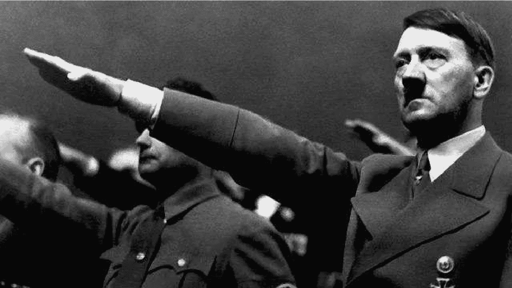

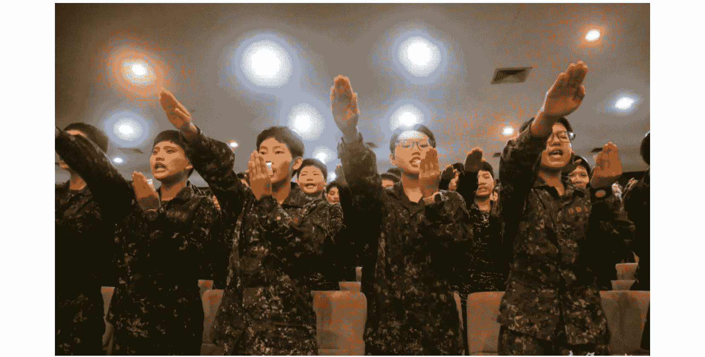

而且我们一定要强调一点，“法西斯”原本是罗马司法专用词，代表的是“团结就是正义和力量”，一开始并没有独裁什么的意思，不过确实有“惩戒”的意思在里边。我们知道，西方认为罗马是他们的源头，所以这个法西斯标志一直以来都不是个贬义词，没有一个国家说我们就不爱团结我们就爱分裂，连华盛顿特朗普也在成天强调团结嘛。而且大家可能不知道，西方的话语体系里，下图这种几只箭放一起，也是法西斯的另一个衍生标志，跟那个束棍是一样的，也代表的事团结，有点像我国那个小故事，几根箭放一起不容易折断：

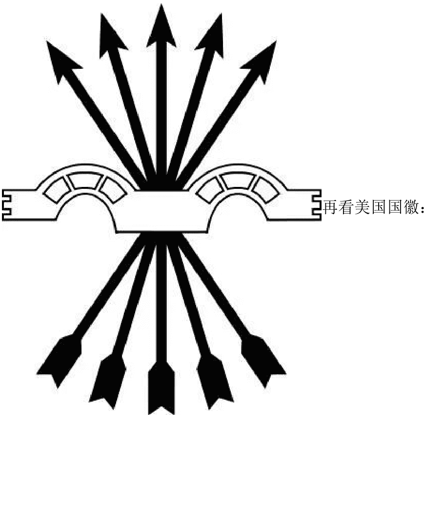

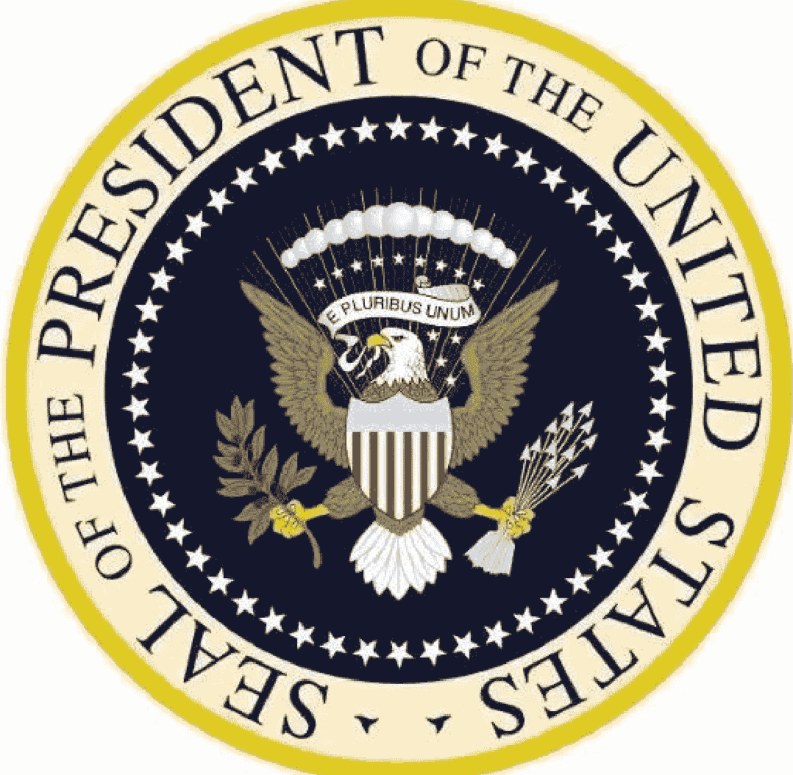

国徽里那个鹰爪抓着一捆箭，这就是罗马法的隐喻，就是那个法西斯衍生标志。有十三根箭，代表的是十三州。而且大家看到美国国徽上那句拉丁语“E Pluribus Unum”了吧，那句话就是拉丁语里“法西斯”的解释，‘合众为一，众志成城’的意思，而且那个鹰和盾的标志，也是来源于罗马，我们看电视能看到罗马军团走在最前边的那个人举个鹰标。如果了解罗马和美国，就能发现美国处处在学罗马，包括美国的国家建筑，基本都是罗马式。

回到正题，复兴社里基本全是黄埔的人，核心骨干可能大家不咋听说，不过在当时都是牛逼人物，比如贺衷寒，邓文仪、康泽什么的，江湖人称“复兴社十三太保”，戴笠那时候资历较浅，所以排名比较靠后。

这个贺衷寒可能很多小伙伴没听过，不过回到当初，这人不得了，我们刚才说胡宗南是黄埔军校里最受蒋器重的，不过胡宗南是“武夫”，在黄埔，还有一个主文的，也就是贺衷寒。黄埔右派里的“文武双璧”，是蒋最器重的笔杆子型人物，在当时看来前途无量。

后来1949年我党发布了一连串要处分的罪大恶极的国民党战犯，其中贺衷寒还比较靠前。复兴社成立的时，蒋委员长有个生动形象的动员，说是希望组织能像“梁山泊”，梁山泊不是有个店嘛，孙二娘他们在那里一边卖菜一边刺探情报，确认了目标之后山上的人冲下来搞事，所以蒋委员长对力行社的要求是：情报和行动，随后就把戴笠也给弄到复兴社去当小特务头子去了。这个行为看着没啥，但是非常关键，至少对戴笠来说是决定性的，因为复兴社是国家单位，类似第二人民医院，或者国家安全局，是有编制的，国家拨款，也就是政府给复兴社拨款，复兴社再给戴笠拨款，这下戴笠开始迅速进入状态开始招兵买马。

由于复兴社存在时间特别短，很快就改组了，所以参加过复兴社的人不多，一般国民党内部参加过复兴社是了不起的资历。不知道大家看过《潜伏》没，里边余则成的老上司，吴敬中，电视剧里多次提到他就是蓝衣社（蓝衣社就是复兴社）的人，有根基有背景，给军队的人打电话也趾高气扬，谁都得让三分。余则成也多次表示自己取代不了站长，因为自己没进过蓝衣社，辈分和资历不够。而且复兴社不仅拿财政拨款，戴笠他们几个生财有道，去码头查鸦片，查到之后就批发给杜月笙，然后杜月笙再零售出去。戴笠用买鸦片的钱搞扩张。

复兴社那些年效果显著，一方面是蒋的政治杀手组织，比如杨杏佛和史量才这样的自由派知识分子就是复兴社杀的。而且可能很多人都知道的那个斧头帮的王亚樵，我们刚才说宋子文被刺杀过一次，就是王亚樵干的，后来王亚樵又扬言说是要刺杀蒋，蒋授意戴笠把王亚樵给干掉了，这事在当时也是一时大事。同步的，当时复兴社在谍报方面研究的很深，破译了军阀们的电码，中原大战中起了大作用。大家去看中原大战，就能发现蒋打仗超垃圾，但是一直有两个大杀器，情报和金钱收买，通过这两样蒋竟然赢了中原大战。而且1933年，后来干到军统二号人物的郑介民在北京干了一票大的。当时北平尽管还是民国的地盘，但是控制在军阀手里，到处是日本浪人间谍，在六国饭店，军阀张敬尧正在跟日本人偷摸接触，准备充当日本代理人。为了阻止叛变，也为了警告其他军阀，复兴社准备下手。郑介民反复侦查确认好情况后，后来的军统头号刺客白世维潜入戒备森严的六国饭店将张敬尧一举击毙，一下子震惊国内，很多北洋重臣一开始还在犹豫，但是这事之后都决定跟着中央混。

此外复兴社还规定，如果发现党内腐败分子，清除后可以分到那人60%的家产，所以大家看严肃的电视电影的时候，经常看到戴老板在调查某某腐败，因为他们从复兴社那会儿就有内部反腐的职责。黑白通吃，复兴社慢慢成了一个传奇色彩恐怖组织。复兴社最厉害的技能不是搞间谍，而是刺杀，这个毛病后来又传给了军统。与之相反的是，我党情报部门一般不玩刺杀那一套，擅长渗透和分化。后来我们一直把军统当成一个间谍组织，其实美国人看的很清楚，说军统是中国的盖世太保，盖世太保是干嘛的？是秘密警察啊，平时主要干一些监视，抓人，审讯，暗杀什么的活，这才是复兴社和后来军统的主业。

随后戴笠迎来了巨大的挑战，也就是西安事变。西安事变对戴笠来说，既是挑战又是机会，因为蒋一直让他和他的上司贺衷寒负责西北事宜，看着张学良和杨虎城。他俩也认真在干这事，但是完全被小张给糊弄了，小张，杨虎城，中共在复兴社的眼皮底下完成结盟，复兴社的人却一无所知。其实一直以来，无论是复兴社还是军统中统，跟中共在情报战对决过程中一直处于下风。西安事变前宋子文觉得蒋孤身跑去陕西就是找死，让他小心张学良，但是蒋本人非常自恃，因为他的情报部门给他上报的情报是张学良和杨虎城不和，而且也没发现张学良有异动，所以蒋元气满满就去了。没想到到了半夜戴着狗皮帽子的东北军突入蒋的行营，打死了他的一群卫士，把蒋也给活捉了，蒋跑的太仓促，假牙都没戴，而且跑的太急扭了腰，落下了老毛病，今后一下雨就腰疼，忍不住就骂小张。

西安事变对于戴笠来说本来是个死局，因为他自己工作不给力，导致蒋掉坑里了，如果蒋安然无恙回来了，他死定了，肯定会追责。如果蒋被杀了，那他也就失去了靠山，只能是再去当小混混了。所以这个时候戴笠豁出去做了个大胆决定，跟着宋美龄去西安谈判。西安谈判这事对于宋美龄来说问题不大，因为她跟张学良关系很好，而且他俩之间有些只有他俩才知道的事，一直也闪烁其词，现在俩人都死了，这事估计也就一起埋掉了。而且宋美龄跟张学良最信赖的顾问关系也很好，所以宋美龄几乎不大可能出事。但是戴笠，去西安就是找死，东北军烦透了他们复兴社的人，当时的局势，很可能一下飞机就被拖到马路边给毙了，如果枪毙了他能让东北军消消气，宋美龄可能会再带几个戴笠过来。这也是为啥其他复兴社的人一个都没来，比如贺衷寒，自知是找死，于是留在南京想别的套路，比如武装营救蒋委员长。但没想到西安事变顺利解决，戴笠尽管在这事上灰头土脸，据毛人凤说蒋脱下鞋来抽戴笠（这是蒋的常规操作，此外经常破口大骂娘希匹），但是表了忠心，赢得了领导的原谅，这事也就过去了。

戴笠顺利过关，但是比戴笠层级高的多的贺衷寒却从此失势，蒋不再信任贺衷寒，贺衷寒的兄弟们后来也跟了戴笠，复兴社的骨干们大部分成了戴笠的人。1936年西安事变之后，我党提出要求解散复兴社，蒋介石当时不是被俘了嘛，说啥是啥，所以也就接受了。他到了南京后，复兴社被解散。1938年，复兴社刚解散，复兴社下属第一处就独立出去，变成了“中统”。第二处由蒋的侍从室亲自带队，实际上由戴笠主持，起名“军事委员会统计局”，军统就挂牌营业了，当初的复兴社特务科科长戴笠也一夜之间成了戴老板。军统居然没有局长，只有个副局长，就是戴笠。因为正局长是由蒋介石侍从室直接担任，蒋的侍从室不是负责收发邮件发会议通知的秘书处，而是类似一个“尚书省”或者“军机处”的一个玩意，权力大的不得了。蒋这么干的用意几乎所有人都懂，如果连这点政治敏感都没，拿在国府混个啥？蒋的用意当然是要重点提拔戴笠，但是戴笠资历太浅，黄埔六期还没毕业，搁军队里就是一连长，何德何能竟然出任党国最关键部门领导?所以蒋亲自担任领导，戴笠负责实际工作，一下子名正言顺，这也是为啥军统里的人从一开始就称呼戴笠为戴老板，因为戴笠很长一段时间都不是局长，称呼戴副局长太拗口又显得不专业。军统的局长平时也不来，只有每年4月1日军统成立纪念日才到场发表不重要讲话，其他时候根本不去军统，军统从一开始就是戴笠的队伍。

而蒋急吼吼提拔一个完全没有资历背景的人，直接干到和陈立夫平级，啥心思大家都知道。戴笠也是个明白人，对军统的定位，很多人一直也没明白，以为它是个间谍部门，其实军统的“局歌”里唱的就很清楚，“维护我们领袖的安全，保卫国家领土和主权”。这歌本来是军统的一个训练班里的人艺术细胞大爆发，随便写出来当班歌的，但是戴笠看到后立刻把这首歌当成了局歌。因为歌词里他找到了自己对这个组织的定位，先“保卫领袖”，然后才是“保家卫国”，对，领袖是第一位的，这是戴笠能快速上升，军统能拿到大笔经费搞发展的原因，他最擅长的其实是揣测领导意思。军统从一开始就私人性非常强，戴笠从来也没忘记自己为啥能起来，也知道一旦失去蒋的支持，自己啥都不是。这也是为啥军统解密的文件里几乎都有“奉谕照办”。

这就让军统的工作范围非常大，反共自然是理所当然的，最早成立他们这个组织的关键任务就是反共，同时针对其他军阀的刺探和刺杀从来没停止过，也就是说，蒋的问题就是军统的问题，军统一直是个私人组织。关于军统，最奇怪的一个问题莫过于他们到底有多少人，大家无论是查资料还是上网找自媒体们写的那些到处抄来的乱七八糟的东西，都能发现，军统的编制非常奇怪，有的说他们有几万人，有的竟然说是有几十万人，乖乖，悬殊怎么能这么大。其实主要是因为大家都没仔细去研究军统到底怎么运转的。军统核心是两个部门，一个是搞情报打听消息的，这个部门的核心是从共产党那里叛变过来的地下党，大家看过《色戒》吧，那里边梁朝伟那个角色，丁默邨，他之前就是我党的地下党，后来叛变到了蓝衣社，再后来跑到了汪伪政权的特务部门“76号”。

另一个部门是负责行动的,比如著名的军统刺客白世维,沈醉,赵理君,他们都是干那种破门而入,直接抓人,或者潜入什么地方搞暗杀的。一般行动队的人就那些,但是搞情报的每个人几乎都有几十个兼职工作人员做辅助,比如书店老板或者拉洋车车夫什么的,这些人平时不领工资,在军统没有编制,只有需要的时候特务们可能会花几个大洋打听下消息。这就出现了我们刚才说的那个问题,军统最高峰时期,应该不到十万人,但是如果加上这类外围工作人员,数目大了去了,可能一下子就膨胀了好几倍。

而关于军统的刑讯,也不是大家在电视上经常看到的,一般不搞钉竹签什么的,几乎所有的医生都告诉你,那操作风险极大,得装备了心电图监控设施才能操作,据军统特务回忆,把人拴住两个大拇指挂起来,一会儿就疼晕过去了,用水泼醒后继续,几乎没人能经得住这酷刑,如果能经得住这玩意,其他刑具意义也不大。这是军统从德国人那里学来的,据德国人说英国情报部门就这样对他们德国战俘。如果不招供,就玩电刑,这在当时是个高科技,也是从德国进口相关技术和设备。而且危险性较低,毕竟万一打死了,就没法继续获取情报了。刑讯人员也承担着KPI,平时工作压力很大,一方面要保证情报能抽取出来,另一方面不能出人命。

而且军统最擅长的另一个工作就是假装某个人在什么地方,然后设置陷阱,等着被营救或者锄奸,到时候一拥而上。最著名的一个案例是在1935年,当时还是复兴社特务处,戴笠他们找到了一个地下党,一系列威逼利诱,竟然成功策反,策反成功没几天,这人就被人打暗枪快死了,明显是被锄奸队给干掉了,眼瞅扛不住了。特务们一看觉得白瞎了,上报给戴笠后,戴笠不动神色,让人把这个人送医院,大夫们觉得浪费时间,但是戴笠还是要求他们装作正在治疗,随后在报纸上发了个消息,说是强烈谴责暗杀,这个人病好了要继续追查。当时地下党以为是真的,半夜去行刺,尽管对着尸体开了几枪,并且一度逃脱了军统的抓捕,但是眼瞅已经风平浪静的时候,一个特务无意中看到刺客非常镇静地在路上慢慢走着,原来他们刚才以为刺客肯定是跑路的,所以没注意漫步走的人。这个地下党刺客被抓后,牵扯出来了共产党上海地下党著名“打狗团”,专门清理内部门户的那个组织,后来全被枪毙了。

大家不知道看过电影《风声》没,那个电影说的是地下党去刺杀汉奸和日本人,其实设定明显有问题,熟悉那段历史的人都知道,地下党很少搞刺杀,周恩来本人最反感刺杀和美人计,觉得刺杀会导致组织精英流失,美人计到后来八九不离十会腐蚀组织内部。我党的暗杀操作,一般都是针对叛徒的,嗯,革命不是请客吃饭,千万不要说类似“怎么能这样?”之类的蠢话。那问题来了,谁平时热爱玩这些? 对,军统,军统在情报方面一直不太行,主要依赖我党里的叛徒,但是搞暗杀和美人计溜得一逼,而且果然如周同志所言,美人计对国府内部腐蚀特别严重。戴笠经常把军统训练好的女特务送给关键部门首长当二奶,比如他的兄弟胡宗南,胡宗南的媳妇叶霞翟,就是著名军统特务,以前是戴笠情妇,后来送给了胡宗南,胡宗南最后还跟这个女人结了婚。老胡也悲催,媳妇是个军统特务,秘书熊向晖是共产党地下党,这生活。。。。。平淡而刺激。

至于刺杀的事,那太多太多了,基本就是军统的日常,谁都杀,我党的自不必说,也杀汉奸,黑社会头目。当时“中统”在CC系手里,中统的负责人最早是徐恩曾,这人是二陈的外甥,上海交大毕业,美国读了电器工程师,工程师讲究的就是专业,认为干特务是技术活,他极端鄙视戴笠,经常说戴笠他们军统就是一伙不识字文盲组成的黑社会，除了打打杀杀啥也不会，不像中统，长期坚持研究各种高科技，很少搞暗杀。不过蒋非常喜欢军统，认为军统很符合蒋的气质和脾气。

最让人无语的是国府经常暗杀政治对手，各国一般都有惯例，政治上意见不一致不能随便下手，这个会破坏整个大环境，人人自危，然后迟早危及自己。但是国党从一开始就是个暗杀党，对，你没看错，这在近代史研究领域是共识，最早同盟会就三番五次执行暗杀清廷大员，最高峰时期汪精卫去刺杀摄政王，刺杀倒是没成功，换做早几年汪精卫妥妥喜提一次满门抄斩，外搭他自己三千多刀的鱼鳞剔，不过清廷也想做一些自己很open mind很与时俱进的姿势，就把他给放了。这件事一举成就了汪精卫此后几十年的政治资本。而蒋本人关键投名状也是替孙中山暗杀了光复会领袖陶成章，拜托，光复会跟他们同盟会是一伙的啊，也就是秋瑾徐锡麟那个组织，暗杀到自己人头上了。到了后来，干脆把宋教仁杀了，宋教仁被刺案以前大家都说是袁世凯干的，其实主流学术界普遍认为是他们党内自己干的，因为宋教仁后来的行为已经严重背离了他们组织的意志，所以被清理门户了。

随后这种暗杀制度化，规范化，比如刺杀杨杏佛，杨杏佛是个自由知识分子，跟宋庆龄一起天天反蒋，蒋不敢动宋庆龄，还不敢动你杨杏佛？当时宋庆龄和杨杏佛都在租界里住着，按理说在租界里杀人很不保险，因为洋人巡捕很容易抓到刺客，事情容易败露。所以戴笠给蒋打报告，说能不能不在租界内解决？蒋直接给否了，说不在租界内怎么震慑宋庆龄？那次暗杀基本相当于公开处刑，1933年6月18日，军统杀手头目赵理君带了几个兄弟，躲在杨杏佛必经之路上，等杨杏佛开车路过时上去一顿乱枪，据说杨杏佛中了十枪，火力太猛，特务自己人被打伤了一个，随后被捕，不过没多久也被灭口了。大家注意下那个赵理君，他是公开的军统四大杀手，也是军统最杰出的刺客，前后杀人无数，人生的巅峰是斧劈唐绍仪。唐绍仪这人不得了，身上的光环一大堆，清廷大员，山东大学创办人，民国第一任总理，后来日本情报部门去拉拢他的时候，老头未置可否，既没说可以也没说不行。为了防止唐绍仪这样的重量级人物当汉奸，蒋签发了对他的清理令，这事也是戴笠派赵理君亲自去干的，冒充古董商给唐绍仪送去一个古董碗，趁着唐绍仪端详碗的时候拿出斧子将唐绍仪劈死，然后快速溜走，可怜唐绍仪一辈子牛逼哄哄，到头来享受到了“先知”托洛茨基的同等待遇。

这个赵理君后来倒卖鸦片，我们上篇文章讲了，戴笠自己就一直和杜月笙从事鸦片贸易，但是戴笠严禁手底下的人私自干这事，赵理君的事被民国监察部门盯上后，他竟然干掉了监察官员，随后事情败露，正好落在了陈立夫手里，我们刚聊了陈氏兄弟和戴笠的关系，果然，陈立夫带着CC系大佬一起去找蒋，尽管戴笠力保赵理君，赵理君还是被蒋给枪毙了。不过宋庆龄并没有被吓住，继续闹，后来蒋又签发了一次汽车事故吓唬宋庆龄的任务，戴笠派沈醉他们一伙积极筹备，正准备操作的时候，任务取消，据说是蒋担心万一失手撞死了，实在是受不了宋子文和媳妇宋美龄。尤其宋子文，经常跟蒋杠，蒋气不过就抽宋子文，偶尔脱下鞋来抽，但是又离不开小宋，所以这事后来也就不了了之了。反正宋庆龄对蒋的伤害特别大，后来宋上了新中国的城门楼子，据蒋的侍卫说，那天蒋一再大骂，寡廉鲜耻啊，寡廉鲜耻，愧对国父啊，愧对国父，然后气的又想打宋子文。

关于戴笠的军统，最让人感慨的是，他一直致力于把军统建立一个幸福温暖的大家庭，组织内谁要是做错事，就要被执行“家规”，情节较轻的要被口头责骂，中等责任要关禁闭，情节严重的要面对行刑队，组织内部不需要走司法程序就可以随便枪毙他们自己人。军统内部家规出了名的严，几乎所有的高级骨干都被关过禁闭，部分被他们自己枪毙了。据不完全统计，军统前后因为执行家法被枪毙掉了2000多人。

家规五花八门，比较奇怪的一条是不准直接向委员长打报告，有些特务级别较高，能直接联系上蒋，戴笠毙了几个后其他的都老实了，其实原因也不复杂，对于戴笠来说，只能他一个人表忠心，其他人敢碰这个领域不是找死吗。家规里最奇怪的一条是，戴笠引用了汉书里一句话，“匈奴未灭，何以安家”，抗战期间军统特务们都不准结婚，如果偷摸结婚就得面对行刑队。据说是因为戴笠经常用女特务对付别人，担心自己的部下被人用美人计还回来，干脆彻底禁掉，除了他自己谁也别搞了。而且军统内部只能进，不能出，不接受辞职，如果非要出就躺棺材里出来，这个规矩直到戴笠死后才废除。大家不知道看过《一代宗师》没有，里边张震扮演的那个“一线天”，他就是军统杀手，他后来被一堆人围攻，那些人说的话，就是军统家规。

整体而言，军统是一个汇集了中国传统特色，又结合了德国新式思路，传承了国党一贯风格，并且打上了戴笠特色烙印这么个组织。也就自然而然地充满了神秘和诡异色彩。

文末再说几句沈醉。上期有好几个小伙伴在问沈醉到底是干嘛的，想想也正常，大家都知道戴笠，不知道沈醉，其实戴笠是当领导的，平时的工作就是去委员长那里汇报领任务，具体怎么操作，什么方案，都得下边的人去干，沈醉就是戴笠最得力的助手，军统最能干的几个人之一，我们上文说的军统四大杀手，就有沈醉，不过据说他的回忆录巨长无比，披露了无数乱七八糟的事，上边看了闹心，删的剩下那么点了。这小子后来见风使舵，云南战役之后他被胁迫起义投共了。更牛逼的是后来他去香港看望亲戚们以及以前的同事们，大家都劝他别回大陆了，这位前军统特务义正言辞地训斥了那些人，表示不愿意放弃阶级立场，要站在革命和人民的一边，不和资产阶级同流合污，毅然又回大陆了，1996年才死，差点度过千禧年，这操作看的我一愣一愣。不过后来一想也正常，作为一个军统作家，都安排在政协做文史专员了，他怎么舍得放弃自己的本职工作！不过写功德林那些故事真心精彩，比如陈长捷看到傅作义当了部长，自己听他的话却是战犯不想见傅作义；前军统西南区局长徐远举反思罪行想当入党积极分子；王耀武负责打饭，坑过他的人他不给荤菜！写的活灵活现，去当军统杀手可惜了，作家才是真天赋啊。这样一个人，着急回大陆上班也是很正常的嘛。

公众号懒人搜索，懒人专属群分享

### 人民币贬值对老百姓到底有啥影响？

2022-11-03

最近最热的一个话题，无疑是人民币汇率一直跌的事。

先讨论第一个问题，汇率是怎么形成的？

这个问题既复杂又简单。一般来说，汇率是劳动生产率的体现，但是这个说法太难理解了。

其实大家可以...汇率就不行。

一个国家能生产别的国家...你的货币汇率高不了。

现实里的汇率主要是一个交易价...也就是汇率。

如果某国生产的东西非常好...汇率就会上升。

反过来讲...汇率自然不可能高上去。

还有一些小国...没有自己的货币。

我国香港地区的货币倒不是美元...可以随时换成美元。

懂了这个，就懂了美国货币为啥那么坚挺...有钱人都要存点来避险。

尽管没少印...美债又可以随时换成美元到处花。

其他货币基本没法同时满足这些特点，有的没法自由流动，有的没有巨大的投资市场，不过绝大部分货币的问题是全世界其他国家的富人根本不认，也就是说你没办法随便拿到一个地方随时花。

同时也就懂了我国改开以来汇率是越来越高的，因为我们生产的东西越来越多，越来越好，外界需要我们的货币也就越来越多，“被需要的东西”肯定是一直升值的。

当然了，这只是个极度简化的模型，影响汇率的因素实在是很多。现实里可能生产力在发展，导致汇率上升。货币也在不断增加发行，多了就不值钱了嘛，又可能导致汇率下跌。不过整体而言，对一国汇率影响最大的，还是生产力，我国货币没少增发，但是生产力提升更明显，导致汇率升的也很厉害。

那接下来的问题，美元这两年为啥这么强？

这个问题之前的文章讲清了，《为啥美元加息会带崩很多国家？我国呢？》，美元这两年为了应付高通胀，一直在加息嘛。它加息之后，你把钱存在美国，利息会比本国高，很多人想把自己手里的钱换成美元，把钱存到美国去。

美元到了美国然后去哪了？

有的美元本来就是从美国银行里贷款贷出来的，现在还回去了，那些钱本来也是凭空创造出来的“信用”，回了银行之后就消失了。还有一部分美元被当成存款存在美国的银行里吃利息，还有一部分去买美国国债了。

至于网上说的，这些美元回了美国之后投资美国经济，几乎不可能，原因一会儿说。

这也就解释了为啥全世界的货币都在对美元贬值，因为全世界的各国的有钱人都把自己本国货币换成美元去美国吃利息，大家都在抢美元，抛本国货币，谁增值谁贬值不是一目了然嘛。

如今美国现在国债收益率已经达到了4%，这个数大家看着没啥，如果普通人把自己的10万块存款存里边，一年也就4000块，并不能真正意义上改善自己的生活。

可是对于拥有大资金的有钱人来说，这个利率就高得吓人了，他们平时买这么高利率的理财产品，需要冒着本金被赔掉的风险，但是存美国银行或者买美债可是无风险的。

这里有个很关键的问题，一般来讲，发展中国家的利息要比发达国家高得多，因为发展中国家有风险嘛。现在最发达的国家利息比发展中国家都高了，可不是大量的钱涌向美国？

如果具体来讲，比如我是个做外贸的，赚了100万美元，把其中的50万换成人民币给工人发了工资，剩下的50万换成人民币，或投资，或消费，或者干脆存在银行。

如今美元加息，我就把这50万转到美国的银行里吃利息了。也就是说，这些钱还是这个中国老板的，并没有归美国政府。但是我拿着这些钱入籍了美国，这些钱确实成了美国资产。

但是中国这边因为抽走大量的货币，可能会导致股市，房市的一起下跌，其实大家也已经看到了，这两年我国的股市和房市都不咋地。

那美国以外的国家有啥办法遏制这种势头？

多简单啊，加息呗，它利息4%，你利息8%，有钱人自然就不走了。当然也不一定，利息的本质是资金的时间成本，还有风险的折现。“风险”折现这事不太好理解，其实想想高利贷就知道了，利息那么高，因为贷高利贷的人普遍没啥好东西，防着不还钱。阿富汗叙利亚这种国家利息再高，敢去投资的人也不会太多，因为风险太高了，把利息给对冲没了。

可是到这里就出现了一个大问题。

大家应该知道，现代企业都是负债运营的，你老板给你发的工资，基本不可能是公司的自有资金，而是从银行贷的款，甚至可能进货、买机器都是贷款。

银行加息，你们公司平白无故多出来一笔开支，说不定就导致公司维持不下去了。所以每次大规模加息，都倒掉一堆公司，这也是为啥一般各国能不加息就不加息的原因。

中国这边还有更麻烦的一件事，无论是房企，还是最终购房的老百姓，都需要大量的贷款。如果国家为了防止外汇出逃，把利率拉高了，可能房企倒闭得更快，到处烂尾。老百姓也因为贷款利率太高，干脆不买房了。进一步影响房地产。所以不但没法加息，可能还得降息，这也导致外汇进一步流出，汇率进一步下跌。

这也是江湖上一直流传的那句话的由来：

### 到底是保房市还是保汇率。

因为保汇率，那就得拉高利率，房价会出事。

要保房价，那就得降息，可能会导致外汇进一步流出，汇率进一步下跌。

所以美元加息的时候，对于很多国家，都出现了一个困局：

你不跟着加，你们国家的外汇一直在哗哗往外流，老百姓多年搞出口赚到的钱就这样平白无故跑掉了，汇率也会一直跌。

如果你跟着加，你们国内的企业压力会暴涨，每次加息都会死一堆，还可能带崩房地产。

说到这里，大家心里肯定有个疑问了。美国人自己加息就不会把自己的公司给搞死？

当然会啊！加息带来的货币成本上升是无差别的屠杀，第一波受影响的就是美国自己。这也是为啥美元加息这事在美国也风声鹤唳，昨晚一加息，美股顿时血流成河。当然了，咱们这边大概率也安排上了。

道琼工业 32147.76 -505.44 -1.55%

纳斯达克 10524.80 -366.05 -3.36%

标准普尔 3759.69 -96.41 -2.50%

现在美元加息已经很激进了，但远远不是最激进的，80年代为了解决高通胀，当时的美联储主席保罗·沃克一口气加息到了19.1%，跟现在俄罗斯的战时利率似的，美国企业跟深秋蚂蚱一样成批倒下。沃克自己也好几次受到人身威胁，有人说是弄死他，让他再加息。

当然保罗·沃克的决断力成了一个永远的传奇，被认为拯救了美国。后来刺破日本房地产泡沫的“平城鬼才”三重野康，也是很快就把利率拉了上去，然后日本房地产泡沫就崩了。很多人说他为啥这么冲动？因为他就是在学保罗·沃克。

从这里也能看出来，急剧拉高利率，会导致房地产崩盘。不过美国有技术革命，日本没有，所以同样的手段，日本却低迷到现在，美国随后搭着计算机和互联网革命的快车继续狂飙。

不过现在的美联储如果要加息，一般会提前放出风来，让大家做好心理准备。比如你正在纠结贷一大笔款，现在知道了美联储还要加息，可能就不贷了，说不定将来能避免你倒闭破产。

自从进入加息周期以来，美国的公司也跟割麦子似的被割掉，那些没死的公司也经营困难了很多。大家应该听说了吧，前段时间美国还在说“历史最低失业率”，这段时间不咋提了，因为公司倒闭后，失业的人变多了，失业率这事也就没啥好提的了。

不仅如此，美国股市也是美国贷款支撑的，现在加息缩表，贷款变得又少又贵，而且国债什么的利率很高，投资人都不投资美股了，跑去投资美债，结果就是美股也跌得跟狗似的。

那下一个问题就来了，货币贬值对于我们来说到底是不是好事？

一句话讲，不是啥好事，不过也没坏到哪去。

首先，货币贬值之后，那进口的东西就贵了。我国主要进口能源，大豆，钢铁，原材料，芯片什么的。大豆是用来榨油和喂猪的，如果大豆价格上升，可能会导致肉类价格上涨，此外还有猪周期的问题，猪肉价格上涨的事大家也看到了吧。

能源和原材料贵了，那肯定会把日常的生活用品价格给提上去，这也是为啥前段时间发改委专门发了个涨价通知，可能有小伙伴没注意，我给大家贴一下。

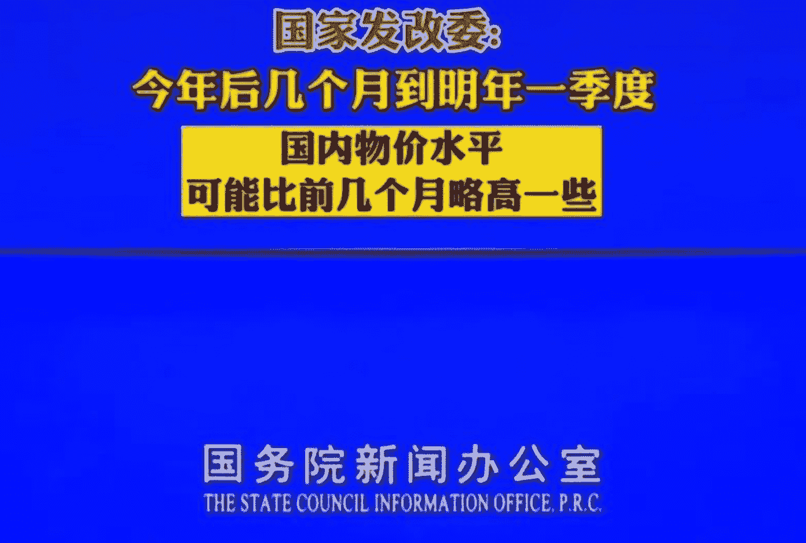

同样的道理，我国制造业的成本也会上升，你是个出口加工的老板，你们公司的订货价格上升，出口价格又提不上去，赚的肯定就少了。赚的少其实也没啥，只要收益是正的就行，那就不用倒闭了，加息周期最重要的事就是别倒闭。

如果实在是成本太高，可能会裁员或者给员工降工资。一般来讲，互联网企业喜欢裁员，要把头部天才们留住。制造业每个人贡献都差不太多，一般倾向于降工资，董小姐已经给员工降了。

不过有个好处，既然人民币贬值了，咱们的产品就便宜了不是？那出口应该好了啊？

但是大家不要忘了，美元加息导致全世界的货币都变少了，全世界的老百姓都缺钱，花钱欲望就少了，就好像商场降价了，但是你最近正好也缺钱，没啥消费欲望一样。我给大家找了一个我国进出口的图，一眼就能看出来，今年以来一直是上升的，但是整体比不上去年。可以理解为，人民币贬值有利于出口，但全球购买力整体在恶化。当然也跟国外复工后生产恢复有关。

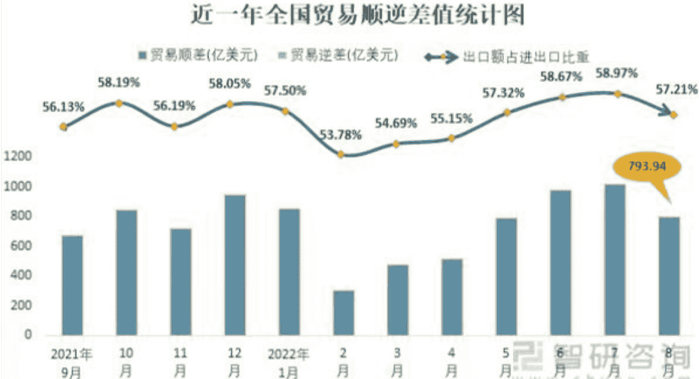

说到这里，可能有小伙伴要问了：博主，听你这么说，好像不是特别严重啊，为啥国家那么重视这事呢？

其实10%的升值或者贬值问题都不太大，现在有问题的是，这么大的波动，大家没法做买卖了。

说个真事，也是我的一个读者小伙伴跟我说的，他说他的客户就很鸡贼，订单一直很稳定，今年突然不下单了，说是等着人民币再跌10%，他们就可以少付点钱，10%看着不多，可是大部分企业盈利也就10%左右，因为人民币贬值多赚一倍利润，那不开心得要死？

我很纳闷，客户不进货，他们卖啥？

说是本来就有库存，中国去国外的船，东南亚要10天，南美要50天，非洲慢了得60天，所以大部分客户都是提前备几个月的货，现在正好配上用场。

但是我们这边不能随便停工，毕竟那么多工人和机器没法停，更没法随时遣散，可是没订单生产出来的东西纯赔钱，只好给客户提前降价，让他们发单，有时候甚至得赔钱生产，只为了保持运转。

这就是为啥一直以来都在强调“汇率稳定”，因为汇率不稳定的话，双方买卖都没法做了，所以国家得尽力去稳汇率。

如果说有啥大麻烦，那就是美元债。

这段时间大家应该听说国内很多企业美元债违约的事了吧，比如前几天的某湖房企，它现在就面临违约风险。再一搜，看到了这种新闻，《绿地将对9只美元债寻求展期，先偿还5%本金》。

这事为啥这么麻烦呢，比如你去年借了10亿的美元债，本来还65亿人民币就能解决，现在汇率下跌，可能要还72亿了，一下子平白无故多还10%，这还没算利息。对于很多企业来说，一年到头利润也就是10%，全拿去还多出来这部分了。有的还不上，可能干脆直接破产了，所以这段时间大家留意下，很多美元债都还不上，处在破产边缘。

小公司破产也就算了，对于那些巨头来说，他们欠着一堆供货商的钱，它一死，可能它的供货商也得死一批，然后一大堆人得失业，说不定还有烂尾楼。

这也是为啥每次美元加息，全世界鸡飞狗跳。

那我们没啥办法了？

坏消息是现在的这个状态下，确实手段不多，不止中国手段不多，全世界都不多，只能任由美国折腾，谁要美元是世界货币呢。

好消息是加息是个双刃剑，对发展中国家来说是割肉，对于美国来说也是刮骨，他们也疼，所以挺到明年上半年，加息就结束了，开始降息，到时候钱又回来了，又可以接着奏乐接着舞了。

至于很多人提的“人民币国际化”，我丝毫不怀疑人民币将来会大有前途，但是现阶段我们的占比太低了，不到3%。需要时间去积累信用，一点点渗透进入大家的观念里，让大家慢慢接受人民币的信用。

这种该走的路，一步都少不了。

文末再总结几句吧：

只要有利率差，也就是把钱存到美国比在中国利息高，就有一种持续流出的动力，人民币汇率可能就会一直下降。这个并不是谁在恶意做空，只是利益驱动。

外汇持续流出，会导致人民币持续贬值，到时候会有持续的输入通胀，不过咱们国家属于工业国，工业品充足，通胀会有，不过应该不会太严重。

此外外汇持续流出的情况下，股市房市一般不会太好，而且那些欠了大量美元债的企业会非常痛苦。

人民币贬值利好出口，不过也不会太利好，因为外国的老百姓也成穷鬼了，舍不得花钱了。

最后，美元加息这事不会一直持续下去，明年大概率就结束了。短期看来，只能是受美国影响，长期看，一切都是先进生产力说了算，我们只要不断精进，慢慢就可以摆脱这种困扰。

公众号懒人搜索，懒人专属群分享

## 公众号

## 懒人搜索

懒人专属群

微信:lazyhelper

### 为啥那么多人接受不了教育的“五五分流”

2022-10-31

这段时间年底项目交付，实在是忙的有点顾不上，上周又一周没更新。今天看到郑州富士康工厂的事，忍不住说两句吧。

这个话题其实没啥可说的，用不着专门开一篇文章讲，因为一句话就能说明白的事，老百姓觉得初中毕业就定终生，无论如何不合适。不过正好这两天郑州富士康的事爆出，觉得聊这个事很应景。

首先解释下什么是“五五分流”。

五五分流即“保持高中阶段教育职普比大体相当”：中考后升入高中阶段的学生，约一半就读高中（普通及成人高中）、一半就读中等职业教育（中专、职高、技校）。

比较奇怪的是，我看还有不少文章在那里义愤填膺地大骂，说什么“决不能搞五五分流”，因为会导致阶级固化，显然他们不知道这个政策已经执行很多年了，而且全局的五五分流，意味着有些地方高于五五，有些地方到不了，我中考那时候，现成初中班里能上高中的只占1/3左右。

反倒是今年五月份，这个执行了很多年的政策悄无声息取消了。不过有一说一地讲，取消不取消，结果是一样的，到时候依旧会“自然分流”。没啥办法的事，现实比人强。

大家记得这几年不断有人说，中国要放弃美国模式走德国模式不？

大家如果研究下德国模式，就能发现他们的教育的基础就是分流，从小学四年级就开始分，一部分人从小就培养去做技工。

这里就有人说德国人不介意去做工人，是因为他们工人待遇好。这个倒是没啥错，他们把待遇不好的产业都转移到中国和东欧了，只在德国留下了产业附加比较高的。此外在中国和东欧的那些德国厂子，赚到钱也会回到德国，得给德国政府上税，一部分又被转移给了德国工人。

更关键的是，他们的工人非常少。德国工业在GDP中占比26%，工人才占12%，剩下的劳动力，都在服务业里，农业几乎可以少到忽略不计（只有2%）。也正是因为工人农民少，所以能要得上价。

那德国人就不介意自己的孩子去当工人了？当然介意，我跑过很多国家，在主流家庭里，几乎没有不在乎孩子的教育的，也没有不希望孩子上大学的，除了美国那边有家长嫌大学学费贵。我以前在德国的一个房东，他就跟我抱怨孩子学习很差，而且很叛逆，他希望孩子去当软件工程师而不是去当工人。他跟我说工人没前途，上限被大学毕业的管理层给封死了。

我跟他聊了下，才明白德国工人的状态有点像军队里那种，士兵出身可以干到士官，也就是班长和排长，再往上就不行了，再往上是军官，军官是军校毕业的大学生。

德国工人们的极限就是车间主任，可是很多大学生一毕业就和车间主任平级，工程师也是大学毕业的。

更关键的是，德国是一个很在意学历的地方，多在意呢，我这个房东最大的梦想竟然是考个哲学博士或者文学博士，这个博士学位没啥用，基本不能增加收入，不过好处是可以把自己的名字改了，改成“xx博士”，我才知道德国人竟然可以名字里带学位。

不过他也表示，自己的娃将来考不上大学只要不去柏林吸毒拉皮条（柏林在欧洲有个不好的名声，是吸毒者、变性人和男同性恋、艺术家和无政府主义者的聚集地）。孩子有自己的人生（他们好像特别喜欢这句话，经常说），只是现在的德国在走下坡路，自从施罗德改革之后，德国工人的地位一天不如一天。

说完德国的情况，大家应该明白了，德国人能接受那种惨烈的分流制，主要是因为他们工人待遇并不低，待遇好的主要原因是他们确实有高端产业，并且政府立法保护了工人的权益，工人也少。当然了，他们也不喜欢那种分流制，只是这东西执行了一百来年，喜不喜欢也无所谓。

多说一句法国的事，法国在国内被批烂了，法国人懒散又爱罢工，不过整个欧洲几乎都向往法国，法国人确实很会过日子，他们对吃喝玩乐研究非常深，人均gdp也比日本高。至于他们爱游行罢工，以前中国这边喜欢数落他们。

不过这事主要看立场，听到最犀利的一句话是这么说的：

> **以前我觉得法国挺垃圾，天天搞游行，天天闹，今天嫌弃工作时间多了，明天嫌弃假期少了。后来我的看法就变了，因为我毕业了。**

这里就得说一个很多人的理解误区。绝大部分人自然而然觉得制造业吸收劳动力最厉害，其实不是，一般贫穷国家农业人口占比高，发展中国家和发达国家都是服务业占比高，而且高得多。咱们知道的那些发达国家，服务业基本上都是80%以上的就业。

甚至咱们国家，我查了下，疫情前的2019年，全国就业人员77471万人，第一产业25.1%；第二产业占27.5%；第三产业占47.4%。日韩做世界工厂的时候也差不多，只是他们的农民占比少得多。当然了，我这里不是否认制造业的作用，恰好相反，制造业是基础，随着我国将来制造业进一步向前，工人数量并不会上升，反而会持续下降。

如果不出意外，今后的趋势是第一产业不断萎缩，第三产业不断提升，一直提升到80%以上。

今年我国大学毕业1000多万人，很多人找不到工作，网上似乎形成了共识，觉得中国现在最大的问题，就是大学扩招太厉害，太多人本来应该上技校，然后上了大学，现在他们毕业了，心态无限拔高，现实却没那么多岗位给大学生，以至于工厂极度缺人，大学生就不了业。

针对这种情况，还起了一个名，叫“结构性失业”，甚至有大领导出来说是中国应该把大学缩招一半，这样就可以把多出来的大学生赶到工厂去。

把这些新闻结合起来，就发现之前的“五五分”政策也就理所当然了，甚至弄不好，再过几年在高中考大学的时候再来一次分流，三分之一上大学，剩下的去大专。

既然这么合理，为啥大家怨言那么大呢？

主要是中国老百姓心里，普遍存在这么几个矛盾：
- 觉得我国制造业立国，可是却不愿意自己的孩子去制造业；
- 把制造业拔的无限高，却觉得那地方没啥前途；
- 大学生太多了，所以别人的娃应该去读技校进工厂；
- 金融、互联网、直播网红都是垃圾，不创造价值却收入高，所以希望自家孩子去做这些。

唯一好像不矛盾的是：

所有人都觉得最好能进体制。

那为啥有这些观念呢？

一句话讲就是，我国绝大部分产业水准太低端了。

我的一个粉丝在做人才中介，他老婆孩子在北京，他在郑州，替富士康、白象、快递站什么的拉人。当然他自己不去，他有上十来个小弟，以前都是在厂里干，后来被他拉出来专门拉人，比如去车站，去地铁站，去国贸，看到拖着大包小包的就上去打听。如果拉到一个送到工厂，20天不离职，就能赚400-500，小弟跟他对他半分。

他跟我说，如果严格执行8小时工作制，中国制造业现在均衡价格大概是150-170每天，而且有上限，一般来讲工人进不了管理层。绝大部分工人也都是来回跳，先去富士康，然后再去别的厂子，最后去送外卖和快递。当然也有一步到位去送快递的，前提是你得有个摩托。他有个说法，说是跟那些工厂主沟通过，工人们的收入可以再上升一些，但是几乎不可能翻倍，再翻倍的话，这些企业就没啥盈利空间了，就得打包跑路了。

尽管大多数人并不了解细节，不过用大拇指想想，就知道自己的娃去工厂，还不如去送外卖，而且送外卖这事对大部分人也是个挑战，我之前有篇文章，《大学毕业了，该去跑网约车还是送外卖？》，这篇后台有好几千留言，说得最多的，就是看来自己去送外卖也是渣渣，不如一步到位去当看门大爷，少走几十年弯路。

甚至说句扎心的话，送外卖都比绝大部分产业工人收入高，而且也更自由，这也是为啥每年那么多工人转行外卖员。

家长们都没法接受自己的孩子最后是这结局，可不是怒了嘛。

那有啥办法没？

短时间看没啥办法，分流这种事，接受或者不接受，就是现实。

我们说产业升级什么的，那是个长期的事，而且可能也惠及不到广大的工人兄弟。比如小米在亦庄搞了个熄灯工厂，里边全部机械臂，绝对算高端工业了吧，可是它又不需要工人。富士康其实也在升级，搞那个“百万机器人换人”，但是几乎所有人都觉得这不是什么好事。

哪怕比亚迪、宁德时代、京东方，这些企业，妥妥的制造业升级了吧，我了解下，普通工人工资主要也是五六千，并没有高太多，而且流动也很大。比亚迪的代工也在和富士康竞争，富士康已经把成本压得极低了，如果比亚迪雇人的成本再高一些的话，产品就没竞争力，可能也接不到订单了。

所以说吧，眼前这事一时半会解决不了，谁都知道应该给工人提高待遇，不过现在的环境就是这样，除非财政给补钱，否则提升不会太明显。但是如果财政出钱，那相当于你来纳税，你愿意吗？愿意出多少？

可以说，我国现在这种情况下，无论怎么做，都没法让所有人满意。

市场就这么大，只能接纳100个本科生，你提供200个，必然会把剩下的100个踢出去，或者干脆看做是专科。比如这些年扩招之后，以前“只招本科”的岗位变成“只招硕士”，以前只要985的，如今变成只要C9。

更过分的是，以前还有互联网这个池子，每年可以高薪吸收一部分毕业生，从今年开始，互联网也转入了收缩期，具体可以看这篇，《大厂怎么突然间都在裁员》，不但不扩招，反而在大规模裁员，计算机毕业生的收入倒退回了五六年前。

不过今天写这些，还不是单纯为了讨论这事，而是看到河南富士康那事之后，有感而发。

当初那些被强行分流的人，如今很多都进了河南富士康。而且我了解了情况之后，发现富士康的工资收入在同行里还算不错的。只是厂子里规矩实在是太变态，以至于很多人受不了。但是每天全身心集中注意力十个小时，不断重复一个动作，诸位估计想想都崩溃了。

现在讨论河南疫情，应该思考的是怎么解决问题，而不是诅咒让富士康去死或者滚出河南，一个富士康直接间接支撑着河南上百万不止的就业数，河南制造业出口的一大半就是富士康给贡献的，可以说，富士康就是河南制造业的核心。当初河南和郑州为了吸引富士康去建厂，可以说仁至义尽，就知道这个厂子对于河南意味着啥。

现在工作已经很难找了，富士康真的倒了的话，百万张嘴可能没得吃了。

而且这些人的财务情况比大家想象的要严重得多，他们往往父母也没啥钱，自己初入社会也攒不到啥钱，基本上就是一群口停手停的人，现在扛不住回乡了，过断时间还得回去上班，不然生活怎么办？

现在几乎所有人的都在关注“大学毕业生”就业，那些没大学毕业的怎么办？大学生难，他们岂不是更难？

大疫之下，还是要现实些，现在最大的问题就是能找到工作，先把现金流搞起来，不至于有什么变故突然间活不下去了。可能有小伙伴觉得我是在替资本家说话，那么觉得也没事，我现在只希望有更多企业能活下去，吸收更多的就业，社会的稳定，光荣与梦想，星辰大海，落到实处，就是先找个班上，没有班，啥都是浮云。

就这样吧，全文完。

公众号懒人搜索，懒人专属群分享

### 为啥这段时间强调农业重要性？因为曾经有个大国被粮食危机给搞崩了

2022-10-21

先说个事情，我在头条和B站发视频已经有一两年了吧，一直没准备在公号发，不过后台很多小伙伴说还是发到微信来吧，他们有的开车时候想听，有的看孩子时候听。所以准备每周周末发一个。此外还有个版权问题，我不发的话，就一直有人往微信搬迁这些视频，到时候我反而成冒牌了。不喜欢视频的小伙伴就当没看到就好了，忽略过去。

====================

看到这个标题，应该猜到我又要写苏联。

可能有小伙伴纳闷，苏联到底是有多问题？财政的，轻工业，石油，现在又多了个农业？

是的，苏联后期的问题是系统性的，几乎没有不出问题的地方。就跟泰坦尼克号似的，有16个水密舱，撞到冰山上之后，如果4个水密舱被撞穿，啥事没，恰好撞穿了5个，那就回天乏力，赶紧跳船逃生吧。

苏联如果只是一个部门有问题，其他部门也能给他补上，但是几乎所有部门都出了问题，都指望着财政补，财政自己也没钱了，可不就一拍两散？咱们今天重点聊下农业。

可以说，苏联的农业一直不咋地，从刚开始就先天不足。早在斯大林时期的苏联，人均粮食产量还不如沙俄。我查了下，1951年的时候，苏联人均是450公斤，而沙俄的1913年是540公斤。不过后来慢慢就好起来了，超过了沙俄，但是一直都没法跟发达国家相比。

那为啥会出现这个问题呢？原因很多，有一个不太关键的问题，导致苏联的农业开发难度很大。那就是苏联非常的大。苏联最大的优点是大，毛病也是大。

这个问题大家设身处地理解一下就懂了，俄罗斯的经济中心是他们的“双城”圣彼得堡和莫斯科。你住的离这俩地方太远，可能粮食能自给，但是很多好吃的好玩的就到不了了，给你运输过去之后也贵得离谱。

这一点大家想想“江浙沪包邮”和“新疆地区不包邮”就懂了。如果你住得离经济核心区太远，不但很多东西根本买不到，就算买到，也比正常价格贵很多，甚至贵好几倍。如果在那些地方搞点现代化玩意，类似自来水、抽水马桶、公寓楼，那就得从经济核心区给他们拉过去，这个工作量太大了，最后依旧是那个老问题，价格高得离谱。如果一旦坏了，很难得到维护。

更离谱的是，从苏联到俄罗斯，他们的公路发展非常落后。铁路是大动脉，公路是毛细，苏俄铁路还凑合，公路一直非常差，直到现在也不行，现在的俄罗斯几乎没有高速公路。主要是因为俄罗斯那地方特殊气候因素导致公路成本高的离谱。公路作为短途运输的主要途径，一直没发展起来，使得短途运输成本一直非常高。

这也是为啥苏联开辟的大量共青城，后来都荒废了，因为维持费用实在太高。对于俄罗斯人来说，不到万不得已，大家死都不会去那种边远地区，跟流放似的。就算过去了，一有机会，立刻跑回欧洲那边去。

所以苏联的粮食产地并不是到处开花，主要集中在现在乌克兰和哈萨克斯坦那一带，如果太偏远，或者稍微离铁路远一些，能生产出来也运不出来。现在大家去俄罗斯，也能注意到他们的公路非常差，到处是坑，这对车也是一种持续损坏。

那些粮食产地苏联也没好好经营。众所周知，我国建国后大搞水利设施，苏联却一直没咋做这事。倒也不是他们不想做，而是实在忙不过来。从第一次世界大战开始，俄罗斯就一直处在生死线上，先是跟德国打得一塌糊涂，死了无数的人，割让大片领土才求和。

然后是苏联建立，从德国和美国买设备搞工业化，工业化刚完成，第二次世界大战又爆发了，死了几千万人取得战争胜利，战后不随即又跟西方打冷战，既没资源也没人力去搞水利。

“二战”中苏联损失的男性太多，死了两千多万人，绝大部分是育龄青壮年，导致人口严重不够用，老百姓又不想待在村里种地，都跑去了城里，农业人口就更少了。

这里需要说一下，国内很多人也痛心疾首农民进城不愿意待在村里种地，甚至有人说要强制他们不准进城。这就有点缺德了，就好像你们公司待遇差，你想辞职，你们老板竟然不让辞，你说是不是要流氓?真正好的做法是提高农业补贴，让老百姓种地收入不至于跟进城差距太大，这样农民自然而然愿意在村里安心种地了。

这还没完，我这两天查了下，苏联各个阶段的主要问题还都不一样，比如斯大林时期的问题是，集体农庄毁掉了大家的积极性，农民们种出来的粮食不归自己，可不是“随缘种地”?

比如苏联当时流行一种“秃头种法”。由于农民们种出来的粮食都会被悉数收走，所以收成咋样他们毫不在意，能怎么糊弄就怎么糊弄，各个环节都以表演为主。无论播种还是施肥，都主要在地头认真搞，越往后越糊弄。到了收获季，问题就暴露出来了，庄稼长得就跟秃头似的，只有那几块认真施肥的地方长势很好，大部分地方光秃秃的。

也正是这种模式不可持续，赫鲁晓夫上台后，也就不再搞了。

赫鲁晓夫刚开始那几年脑子一度正常，比如给农民减负，取消了集体农场，提高了农业收购价，农民有了好处，不像以前那么糊弄，粮食产出有了很大提升。此外也大规模垦荒，从1954年到1958年间，政府为开荒投资67亿卢布，动员数十万志愿者到东部地区落户，共开垦出4000万公顷的土地。后来苏联以至于现在俄罗斯农业能苟住，跟这次垦荒有很大关系。

不过大家看到那个“志愿者”了吧，很多人其实不大愿意去，赫鲁晓夫把他们给弄过去了，这些人后来找到机会就跑回了西部，这也是我上文说的共青城荒废的原因。

赫秃前半截还正常，后来病就犯了。

赫鲁晓夫其实按理说是当不上领导的，资历不行。斯大林死后，本来轮不到他。斯大林死后的权力核心号称“三驾马车”，贝利亚，马林科夫，赫鲁晓夫，赫秃的权力是最小的。可是他很擅长使手段，老三联合老二，斗倒权力最大的特务头子贝利亚。贝利亚被枪毙后，他又使手段斗倒马林科夫，莫名其妙就上位了。

但是这种玩法最大的问题是，自己声望太小难以服众，导致威望一直不太足。为了给自己的声望充值，就得做出来比斯大林更牛逼的大事业。

所以越往后越过分，比如给农业部门下达了不切实际的生产目标。苏联之前采用的是轮种制，一块地种一年休一年，现在年年都种，搞竭泽而渔。倒也不是因为赫鲁晓夫不懂农业直接下命令这么搞，而是上边的任务过重，基层无论如何都完不成，只好这样做。

不仅瞎定目标，还搞玉米。

我在之前的文章里讲过，赫鲁晓夫去美国看了美国人种的玉米后，表面上云淡风轻，表示很无所谓，雕虫小技不值一提。回去之后疯狂推广种玉米，大家也不太敢跟他说苏联国情和美国不太一样，于是很多不适合种玉米的土地也种上了，最后农作物大规模减产。

至于为啥那么热心种玉米，倒也不是完全心血来潮，一方面苏联的粮食确实不够，就在种玉米那几年，苏联曾经拿出372.2吨的黄金储备用于粮食进口，苏联高层确实想解决这个问题。

而且赫鲁晓夫一直挺纳闷美国老百姓为啥吃那么好，肉蛋奶消费量甩了苏联一大截。后来目睹了美国一直连到天边的玉米地后，跟手底下的人一商量，觉得自己找到了问题的关键。他准备在苏联种玉米，用收获的玉米喂猪喂牛，这样就可以提高肉蛋奶。

逻辑倒也没错，一到执行阶段很快搞歪了。因为苏联那一带高纬度，日光不足，根本不适合种玉米，后来自然啥也没种出来。

不过苏联领导人对肉蛋奶有强烈的执念，这个倒也好理解，因为老百姓的生活水平跟肉类消费强相关，很难说老百姓一年吃一次荤生活水平会很高对吧。为了解决这个问题，历代领导人前赴后继，没想到后来俄罗斯意外解决了，咱们一会儿说。

不仅没法种玉米，苏联一直也没太解决老百姓的积极性问题，也就是著名的“他们装作给我发工资，我装作给他们上班”。

这个问题在计划经济下几乎无解，激励和创新不足是计划经济的两个死穴，可能在极少数地方或者短时间解决了，但是全局、长期的效率低下却无法解决，这在各国的实践中被反复证实。为了避免引战，就不多聊了。

赫鲁晓夫最后还是没熬过激烈的同僚竞争，1964年他在黑海度假的时候，勃列日涅夫等人在莫斯科发动政变，赫秃被解除了所有职务光荣下岗，后来专心写作，7年后心脏病发作死了。

赫秃应该是苏联历史上对农业最上心的一个领导，当初政变要推翻他的时候，骗他回莫斯科的电报里，竟然说的是要他回去开农业会议，赫鲁晓夫兴冲冲就回去了，然后就被宣布解除职务。

随后上台的是勃列日涅夫，也就是那个著名的“勋章爱好者”，也被称为“苏勋宗”。他任上苏联核弹超过美国，叠加美国深陷越战泥潭，油价高涨，苏联的国力在苏勋宗在位期间达到了顶峰。

他从1964年一直干到1982年，正好摊了个石油周期，看下图就能看出来，他在任的时候，油价一年比一年高，苏联卖石油赚得盆满钵满，美国当时快倒闭了，乱的一团。

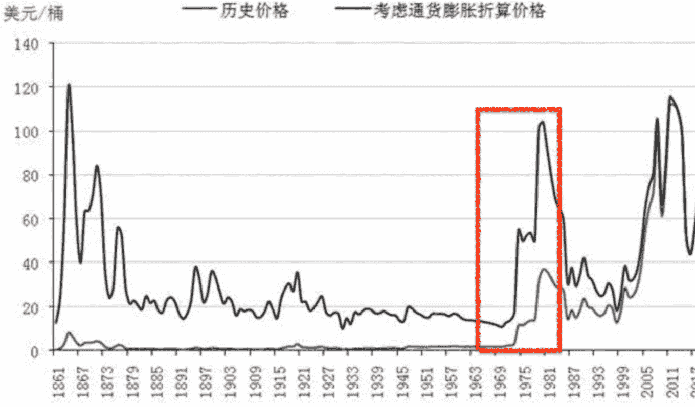

大家知道著名的“西方-81”演习吧，这场50万苏军参加的军演震惊了西方，大家看上图就明白了，那正好是油价巅峰，也是苏联国力的巅峰。

也正是因为勃列日涅夫时期油价高企，苏联财政充足，苏联利用卖油的钱又是支持第三世界革命，又是大规模购买西方的粮食，当时主要是向美国，巴西，加拿大购买。买来粮食喂猪羊牛，并且买了大量的轻工业品，形成了当时一个“石油换粮食”策略。

那些年苏联如果有啥地方需要经费，第一反应就是向计划经济委员会批石油配额。也正是因为需要的石油太多，疯狂开采，短短15年就把他们最好的油田给玩坏了。

那几年的苏联是非常爽的。既在军事上维持了对欧美的强势地位，老百姓生活水平也大幅提升，冷战进入了苏攻美守阶段。

从后视镜来看，倒也不是说进口粮食这事有问题，而是说苏联一直对“内力”提升积极性太差。当时太过补贴重工业，对农业重视度一直也不咋的，农民处于被剪刀差“被剪”的那一边。整个苏联时代，农民并没有得到什么好处，整体非常消极。

到了1986年左右，石油财政基本崩溃，苏联极度缺钱，自然粮食也不够，日常排大队领面包，还不一定能领得到，最终引爆了群众的不满，随后的事大家也就知道了，1991年彻底崩了。

所以大家经常看到有人辩论，一边说苏联的福利很好，各种配额都很足，另一边说那为啥到处排大队领面包？

可能说的不是同一个时期，油价暴跌之前的苏联和油价暴跌后的苏联完全是两码事。大家经常看到的照片排大队领面包，基本都是战争时期和油价暴跌后的事，苏联自己的粮食不够，又没钱买西方的，导致食品副食严重缺乏，大家只好排长队。

然后就是苏东剧变，苏联变成了俄罗斯，谁能想到，一直缺粮的俄罗斯突然间几年之内就成了世界第四大粮食出口国，苏联时期一直解决不了的肉类问题，现在俄罗斯基本没有了，现在俄罗斯的肉类价格跟咱们这边差不多，但是蔬菜巨贵。俄罗斯这些年整体来说突出的成就并不多，农业绝对算一个。

那俄罗斯又做对了什么呢？

我仔细查了下，发现苏联刚解体那些年，俄罗斯采取放任态度，粮食产量暴跌。

后来一直到2007年，俄罗斯政府颁布了新的惠农政策，给农业进行了大规模补贴，种地不再无利可图，于是很多俄罗斯公司租了大片土地去种地，粮食产量就这样上去了。

现在俄罗斯的耕地比苏联少得多，能有这么大的进展，主要还是利润驱动下的大规模引入技术设备和良种，叠加俄罗斯地势平坦，适合机械化，这些年进入了一个正态循环。种地有利可图，赚到钱后可以买更多的设备和肥料，地里产出更多，赚的也就更多。俄罗斯下一步军火生意不行了之后，粮食出口应该能顶大梁。

唯一的问题是，俄罗斯人不大愿意去远东西伯利亚，这些年很多中国公司在那边种地，不过俄罗斯有法律，不让外国公司购买他们的土地，所以有些中国企业在那边种地，也是租他们的地。

### 尾声

如果说苏联到俄国能给咱们什么启示，那无疑是粮食安全事故关乎国家根基，是最不能马虎的事。

但是必须意识到，俄罗斯跟咱们差别极大，俄罗斯土地资源实在是太足了，他们最大的问题是人口和交通。这一点我们可能永远没法比，我们的耕地就那么些，只能是精耕细作。

不过确实能借鉴他们在惠农和科技上的经验，科技永远是第一生产力，其次就是如果想发展农业，必须给农民实实在在的实惠和收益，如果能让农民得到实在的利益，谁又愿意背井离乡去大城市打工呢？

整体来讲，我国这些年做的也非常好，我查了下数据，2012到2022十年来，我国粮食产能稳定提升，产量连续7年稳定在1.3万亿斤以上。现在我国人均粮食占有量达到483公斤，高于国际公认的400公斤粮食安全线。

还是希望接下来进一步改善农民收入水平吧，毕竟农民和农业都是这个国家的根基。

全文完，这段时间不开评论了，多谢阅读。

如果转载本文，文末**务必注明：“转自微信公众号: 公众号懒人搜索，懒人专属群分享”**

### 欠债不还暴打债主被反杀
2022-10-14

上一篇两伊战争的文章没想到阅读量非常夸张，那篇写了上万字，本来以为大部分人都看不完，没想到反响非常好，评论区有很多人要求把接下来的海湾战争一起讲了。正好最近也只能讲历史，今天就开一个帖子，把这事也讲清楚，文章较长，请坐稳。

### （一）

大家知道，中东那边很多国家，比如黎巴嫩、叙利亚、巴勒斯坦、伊拉克、科威特、巴林、卡塔尔什么的，以前都在奥斯曼帝国这个幸福温暖的大家庭里混，后来奥斯曼帝国寿终正寝，在英法的主持下，现在的那些国家才纷纷独立建国。

这个过程中，英法给埋了无数的雷，导致后来一直冲突不断。大家看图应该就能注意到，科威特非常的奇怪，莫名其妙分了一块出来。

你的感觉没有错，确实是故意的。以前科威特是奥斯曼帝国巴士拉省下的一个地区，后来在英国人的策划下，科威特被当作独立国家分了出来，巴士拉却成了伊拉克的一个省。科威特后来发现石油储量竟然跟伊拉克差不多（大家可以看看他俩面积相差有多大），加上它挨着波斯湾，很快富得流油。相比较而言，伊拉克人多，一平均就没法跟科威特比了。

所以科威特后来成了很多伊拉克人的心病，包括萨达姆的，而萨达姆这人，恰好是个行动派，敢想敢干。他通过政变上台，一辈子尔虞我诈，对世界的理解就是抢和杀。

到了1990年，两伊战争已结束，伊朗和伊拉克都已经疲惫不堪。不过伊拉克又跟伊朗不一样。

伊朗因为被国际上孤立，它买武器非常困难。比如苏联当时对两伊都在出售军火，但是对伊拉克是公开出售，卖得太多，以至于后来一直到第二次海湾战争，伊拉克清一色苏式武器。与此同时，苏联也通过北朝向伊朗卖，可是有了中间商，价格自然就贵了很多。

此外在战争中，伊朗是几乎借不到钱的，只能用自己的储蓄买军火，而伊拉克一直在负债经营，一直都能借得到。所以战后伊拉克的武器存量非常大，军队规模也大得离谱，号称有百万大军，世界第四大军事强国。

等到战争结束，这俩货都疲惫不堪，不过伊拉克手里有根巨粗的棍子，心态又不一样了。跟正常人欠债还钱的思路不一样。萨达姆不是这么理解问题，他的所有出发点都是四个字：你欠我的。你们都欠我。

萨达姆是一个很善于从别人身上找问题的人，在他看来，你们这些中东王爷们借我钱，是因为你们爱好和平吗？是因为你们同情伊拉克人民水深火热吗？

当然不是，你们只是担心伊朗输出革命，然后把革命输出到你家去，破坏你们那种锦衣玉食的权贵生活，所以你们支持我跟伊朗打到底。我为了大家，死了那么多人，欠了那么多钱，你们好意思找我要钱？

于是在战争结束后，萨达姆不但不积极准备还钱，甚至向他的两个邻居沙特和科威特要更多的钱。发现这俩国都不配合后，萨达姆对这事的理解是，自己手里的棍子不够粗，所以这俩不服。于是大规模扩军，到处买导弹，还在筹划造核武器，从后来的情况来看，伊拉克确实拥有将导弹直接打到以色列和沙特的能力。

此外由于那时候他跟西方的关系很好，可以自由地购买西方的武器，还可以聘请西方的技术专家到伊拉克去做研发。在加拿大科学家的指导下，伊拉克把两枚飞毛腿导弹进行了焊接捆绑，并且重新做了编程，拆掉了一部分弹头部分，本来射程三百多公里的飞毛腿，可以打到1200公里左右，幸亏没搞出来核弹。

### （二）

事情的恶化依旧和石油有关。

我们前文讲过，前苏联后来就死于油价暴跌。油价暴跌的原因，是石油输出国组织大规模提升产量，产量上去了，油价不就跌了嘛。油价暴跌不仅伤了苏联，还伤害了伊拉克。恰好沙特和科威特这俩又是石油输出国组织的重要创始国。

因为油价跌了，伊拉克主要靠石油赚钱，现在赚的钱少了，萨达姆就对周围的邻居们更不满了。

经常找科威特的茬，说科威特这个国家，别看那么小，满肚子坏心眼，有多坏呢？说是科威特人趁着伊拉克军队在和伊朗人打仗的时候，把界碑往伊拉克这边挪了2.5公里，界碑下的油田也就多了2.5公里。不仅如此，他还说科威特实在是太阴险，钻油的时候不直着打油井，斜着打，把钻头钻到伊拉克的油田去了。

此外把伊拉克的出海口放大，大家就可以看出来，伊拉克的出海口非常非常的小，那么大点的一个出海口，还杵着科威特的一个岛，导致出海口更小了。伊拉克想租那个岛，科威特说大哥啊，我跟你做了这么久邻居，你啥人品我能不知道？你一旦租走了，还不还回来这事你心里没点B数吗？

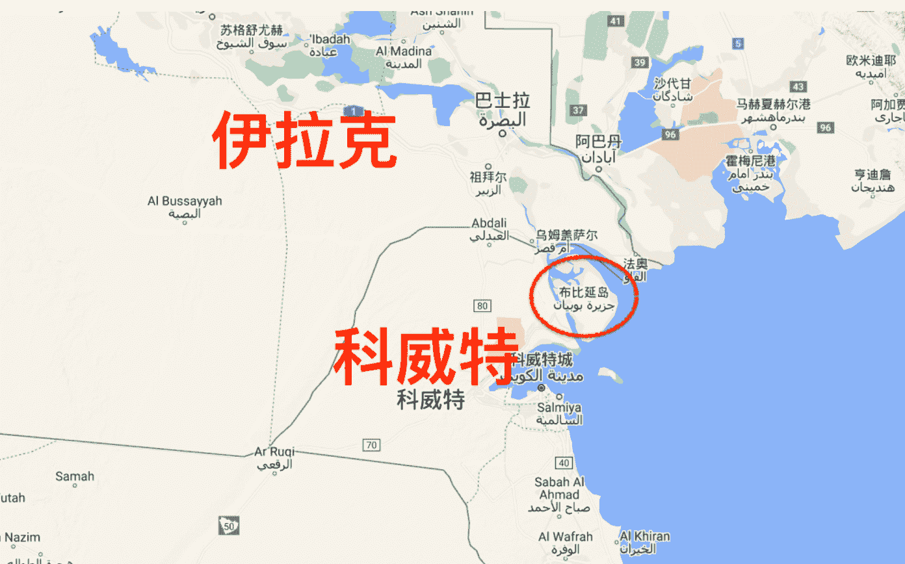

反正每天找个理由折腾科威特，到后来开始说是科威特这个国家本身“得国不正”，是列强的安排，就不该是一个独立的国家。这就是从根本上否定科威特存在的意义了。科威特被吓呆了，不过随后还有更呆的，萨达姆部署了三万国防军去科威特边界上。

到这个时候中东国家觉得萨达姆玩真的，纷纷表示，大哥有话好好说，别动手，不就是石油减产吗？我们减就是了。于是赶紧减产石油，油价有了提升。

这事意味着，萨达姆的威胁奏效了。正常人的逻辑肯定是威胁有效那就消化一段时间。但是萨达姆不是这样一个正常人，他的思维非常奔放。他直接向边境上增加了7万人，摆出一副“谁也别想讨好老子”的姿势，沙特和科威特都哭了。

于是他俩找美国给他们做主，美国也不爽，派美国驻伊拉克大使去见萨达姆。萨达姆一开始根本不见，后来终于见到了，萨达姆表示美苏的时代已经结束了（柏林墙这个时候已经倒了，苏联陷入了严重的内乱），也正是这个时候，萨达姆私下里跟他的人表达了美帝就是个纸老虎的想法。

他仔细研究了越南战争和阿富汗战争，认为空军没啥用，毕竟狂轰乱炸那么多年都没炸灭越共，而美国最为依赖的就是空军。越南战争也证明了美国对伤亡的承受能力极差，才死了几万人，老百姓心态就崩了。伊拉克在两伊战争中死了几十万人依旧非常稳，说明伊拉克有很强的优越性。

萨达姆认为，越南之后，美国的巨婴心态更加明显。1983年，黎巴嫩真主党制造了几次自杀性爆炸袭击，炸死美国海军陆战队300多人，炸死法国人50多人，美国迅速撤离黎巴嫩。这事启发了萨达姆，觉得美帝也就那样，老百姓都是巨婴，于是有了那句著名的论断：

“你们的社会根本不能接受在一场战斗中伤亡一万人的事实。”

恰好那次代表美国参与会谈的美国驻伊拉克大使，整体表现非常搞笑，全程就跟个小学生似的背诵官话，类似什么“美国不再寻求干涉阿拉伯国家内部事务”，“美国希望阿拉伯保持和平”，“希望寻求和伊拉克的良好关系”。

反正这些不痛不痒、不咸不淡的外交辞令，被萨达姆解读成了美国非常软弱，不敢直面他这头中东雄狮的威胁。

这次著名的谈话一周后，萨达姆就入侵了科威特。

### （三）

科威特当时只有4万的国防军，其中大部分还不是科威特本地人。因为科威特这地方太富了，人也少，人均富豪，不愿意干活，干脆大规模雇佣外籍劳工，包括军队也是雇的，毫无战斗力。面对萨达姆的入侵，几乎一触即溃，当时打了几枪再跑的人，后来都被宣传成了英雄。

伊拉克的部队尽管跟其他中东军队一样挺搞笑，不过对付科威特就跟玩似的。

而全世界其他国家，尤其是有能力干涉这事的西方国家，最担心的还不是科威特。他们已经又联想到了几十年前，英法对希特勒一个劲地妥协，导致希特勒拿下莱茵兰之后去染指捷克，再然后把英法也给打了。

这事对西方的影响非常大，包括这次俄乌战争，西方民间也不断提起那段“绥靖往事”，觉得俄罗斯打完乌克兰就会进攻波兰，打完波兰就会进攻德国。那么多人给乌克兰捐款，一方面是同情，另一方面也是恐惧。波兰跟疯了似的大规模援助乌克兰，他们确实是相信这个说法的。

海湾战争时期西方的态度也一样，他们倒不是特别在意科威特，如果萨达姆能让大家相信自己打下科威特之后再不扩张，说不定西方就把科威特给他了。但问题就是，没人相信他会停止扩张，觉得他肯定会扩张到沙特，沙特被吞并之后，巴林、卡塔尔什么的就完蛋了。到时候天天拿石油产量作为武器跟全世界闹，比如把产量降低一倍，让工业国都没法开工，谁能受得了？

这个背景下，其实伊拉克已经犯了众怒，几乎没有任何人支持他。在后来的联合国，五常都同意修理他。

当然了，最着急的是沙特，沙特也挨着伊拉克，军队规模是伊拉克的零头，并且战斗力是负的。所以伊拉克一进攻科威特，沙特国王就向西方求援，强烈要求美国迅速介入。

这次沙特求援也解决了美国的一个大难题。美国如果不经请求就跑去中东打仗，很可能会遭到整个中东的反对，因为中东国家最恨的就是以色列，而美英又是以色列背后的金主。如果不经请求去中东，可能会导致那一带的人更敌视美国。

现在既然沙特主动求援，也就免除了美国的后顾之忧。不过也不是完全没人反对，反对的人非常多。

打头的，就是本拉登，他作为沙特富豪，极其反对沙特向美国求援。他不是一个人在战斗，太多人根本接受不了美军去沙特。对于他们这些原教旨主义者来说，世界上最无法容忍的一件事就是西方异教徒的军队踏上真主的地盘。

拉登不断游说沙特国王，还有那些王子们，说他要组织十万穆斯林驻扎到沙特北方，防止伊拉克南下，最后没卵用，国王已经下定决心向美国求助，因为国王对自己人的战斗力有清晰的认识。

随后五十万联合国军涌入沙特，当时就激起了无数穆斯林的耻辱感，他们竟然需要异教徒来保护，这也为后来沙特各种豪门支持本·拉登打下了伏笔。这种耻辱感变成了仇恨感，仇恨导致一波又一波的复仇，恐怖主义的恶魔也就被释放出来了。

回到当时，美国发动了强大的外交攻势，希望各国能出钱的出钱，能出兵的出兵。

比较奇特的是日韩。在90年代，他俩是最重要的工业国，所以是很依赖石油的，日本60%以上的石油进口依赖中东。所以打掉萨达姆这个“石油公敌”，他俩义不容辞，这也是为啥后来这俩花钱非常多，尤其日本，因为没派军队过去，不出力就得出钱。

而且伊拉克这事做得实在是谈不上啥合理性，导致著名的联合国678号决议几乎全票通过，和之前的伊朗一样，把全世界都惹了。34个国家承诺提供军事支持，14个国家承诺出钱。

于是不断向沙特提供兵力，从最开始的几万人，慢慢增加到了五十多万人，这个保卫沙特的过程，就叫“沙漠盾牌”。

### （四）

看着这么多人要打自己，萨达姆慌了吗？

不是太慌。

他认为最大的可能是，联军在五六十度高温的沙漠里待一段时间后，成本太高，耗不动，自然而然就撤了。毕竟几十万人杵在那里，一枪不发也消耗巨大，谁都扛不住。

就算这几十万人打过来，他也不慌，因为他有打伊朗的成功经验。只要把美国拖住就行，拖个一年半载，杀伤美国几千人，就像越南那样，美国没法快速取胜，自然会撤出。在萨达姆的眼里，美国比伊朗好对付得多，毕竟伊朗敢对伊拉克的装甲集群发动人海波浪式冲击，一场仗死几万人，美国人敢吗？美国人能吗？

只要打几个月，打死千把来个美国人，他们自然会退兵，正如他们当初退出黎巴嫩一样。

这个背景下，无论是联合国的最后警告，还是美国的私下联系，都被伊拉克给拒绝了，甚至伊拉克驻联合国代表都拒绝转发老布什给萨达姆的信。

到了1991年1月15号，联合国最后通牒时间结束了，战争开打了。

### （五）

战争过程其实不太想聊，因为没啥好聊的。

几乎就是一边倒，美英法的战机升空，对伊拉克各种炸，伊拉克全程几乎没有还手能力。

事实上多国部队不仅狂轰伊拉克部署在科威特的部队，顺便把伊拉克本土的核设施、化学武器工厂，发电厂，电台都给炸了。上一篇聊了，伊拉克的核设施是法国给援建的，化学武器是美国和英国给弄的，其他军工厂是苏联给弄的，这次全炸了，这些国家的工程师都参与过建设，对具体位置一清二楚。

轰炸规模极大，有个测算，说是在前两周的轰炸中，投下的炸药当量超过了二战中法兰西战役，不列颠空战，苏德战争，太平洋战争，东京轰炸的总和，那可是打了八年，人类几乎所有的产能都在生产炮弹。可想而知伊拉克被炸成啥样了。

伊拉克的军队被炸得鬼哭狼嚎，同时不少民用设施被炸，导致平民伤亡也不小。

随后美军导弹炸死群众的新闻就上了各国头条，在西班牙、摩洛哥、法国、德国甚至美国国内都爆发了大规模的示威游行，他们的诉求是，不能用更暴力的方式去解决暴力。萨达姆不是人，你们炸死平民的行为就是人干的？

这给了美军空前压力，萨达姆预测的美国人压力确实上来了。

所以美国也希望速战速决。如果一直拖下去，说不定真的对萨达姆有利。

当然了，这种压力是双向的，萨达姆想利用西方的道德压力，就得表现得像个人。战前他抓了不少西方在伊拉克的侨民，准备用这些人质来绑架西方的政府。后来这事承受了巨大的压力，大量民权领袖前往伊拉克，比如著名的黑人拳王阿里，他皈依了穆斯林，觉得跟萨达姆很熟，去了趟巴格达要人。萨达姆希望他们在美国国内给自己说话，于是让这些人把大部分侨民给带回去了。

空袭完成后就是大规模的陆战，当时伊拉克在科威特有22万人，1700辆坦克，联军有57万人，3700辆坦克，这时候伊拉克在数量上也是劣势。更关键的是，联军的信息化程度高得多，苏式坦克还没看到美军坦克，已经被炸了，这仗根本没法打。联军零星一点伤亡很多也是被自己的空军炸的，比如法国人在战争中死了俩人，就是被美军给扔了个集束炸弹炸死的。

联军里还有很多是水土不服中暑死了，美国人统计的很细，因为不同的死法对应的是不同的抚恤金。

一开始萨达姆觉得美国之所以没法在海湾长期对峙，重要原因是后勤无法长期补充。谁能想到，战争一开始，伊拉克的弹药库被炸了个干净，后勤车队几乎没法在空袭下幸存，反倒是伊拉克后勤快速崩了。

再加上战争一开始，通信系统被打崩，伊拉克各支部队之间失去了联系，各自为战，仗更没法打了。搞笑的是，由于海湾战争属于第一次直播战争，战场上任何动作，很快就被放到了电视上。美军搞了个复杂的作战计划，没想到才执行了几天，就被美国国内的“键政大V”给看出来了，并且把接下来的判断和作战意图都发在了自己的博客上。不知道萨达姆看到了没，不过看到没看到意义都不大，力量太悬殊了，打明牌也得输。

伊拉克人能想到的最好的办法，竟然就是点石油。先在地上挖个坑道，把石油引过去，等到联军打过来，就把石油给点着，冒着黑烟的大火怎么都扑不灭。此外还点了不少油井，大火伴随着通天的黑烟，联军的空军非常受影响。美军来的时候坦克没少带，却没想到要带消防队，灭火非常困难。这些大火效果比伊拉克的飞机坦克好得多，确实给联军制造了不少麻烦。不过也没啥用，影响不了大局。

后来统计，伊拉克在科威特点了600口油井，战后这些油井灭火加重建，每一口都接近1000万美元，总共花了60多个亿。

在这种一边倒的情况下，很快伊拉克军队斗志全无，成建制放下武器投降，其他进入科威特的伊拉克军队都已经看出来没戏了，开始了大逃亡。大量的士兵和将军们驾驶着军车或者抢到的民用车冲出科威特，一路向北，逃向伊拉克，可是那么多车挤在一起，形成了一眼看不到边的长队。

这么明显的撤退迹象，自然招来了美军空中打击，最后整条公路变成了地狱，也就是那条著名的“死亡公路”，大家有兴趣可以自己搜下。

### （六）

战争持续了42天就结束了，美国点到为止，并没有推进到伊拉克活捉萨达姆。至于为啥美国不这样做，这事众说纷纭，老布什说是他希望伊拉克人民自己推翻萨达姆。这不扯淡吗？伊拉克人民自己有枪吗？有坦克吗？咋推翻？

真实的原因是，当时各方都不希望萨达姆倒台，因为如果萨达姆倒台，有很大概率伊拉克什叶派会夺取政权（因为伊拉克什叶派占多数）。问题是伊朗也是个什叶派政权，到时候两伊就合二为一了，这自然不符合任何一个对中东有野心的国家的利益。

其次伊拉克国内的库尔德人被萨达姆压得非常死，这伙人天生战斗民族，如果萨达姆挂了，他们肯定起来闹事，甚至可能会建国，问题是土耳其国内也有很多库尔德人，到时候必然会响应。美国游说土耳其反对萨达姆入侵科威特的时候，已经答应土耳其不会把伊拉克打碎。前几年大家不知道有印象没，库尔德人一度闹得很凶，后来被压下去了，不过丝毫不用怀疑，过几年库尔德人还会起来闹。

此外最重要的，还跟以色列有关，萨达姆是一个人见人恨的人，还是一根搅屎棍，有他在，中东就不可能团结。他有个冲动，任何组织里，他都要做老大，坐不上就给搞黄。本来伊拉克和埃及是中东最有可能做领导的，摊上萨达姆这么个人，人见人烦，自然没人听他的，中东也就团结不起来。现在萨达姆没了，两伊都是什叶派领导人，关系越来越好，对以色列非常不利。

当然了，美国没有打入伊拉克，客观上也放过了自己一把。毕竟击溃对方主力，和“完全占领”，彻彻底底是两码事，后者要麻烦得多，也残酷的多。

击溃对方主力只需要火力足够大，一顿狂轰滥炸，成建制的部队顶不住，可能就崩溃了。但是想占领一片地，只能是步兵们一间间房子去踢门，然后把那些不满的抓出来。

这个过程非常残酷，二战结束后没有成功的。日本能占领朝鲜，也是搞保甲制，甚至还搞了好几次大屠杀才解决。美国在越南就没搞定，后来不吸取教训，又跑去伊拉克和阿富汗瞎胡闹，耗资无数，最后搞了个寂寞。

### 尾声：

如果说海湾战争有啥明显的结果，那就是把恐怖主义这头猛兽给放了出来。

上文也说了，沙特向美国求援，几十万异教徒的军队踏上先知布道的地方，最虔诚的那部分教徒彻底崩溃了。他们眼里，沙特政府和美国还有以色列站在了一起，没天理了。一部分家族转而支持本·拉登他们一伙，一直到现在。

如今的沙特，其实是个典型的“贵族共和制”，各个家族头目聚在一起共同商议，和他们过去几百年的情况差不多。网上很多人聊起来小萨勒曼，就好像他能说了算似的，其实沙特从来也不是一个某人能说了算的国家，只能是说他自己沙特家族实力很大（对，沙特这个国家的名字就是统治家族的名字）。

美国对沙特，跟对巴基斯坦的态度差不多，给了他们很大一部分独立的行事权，但是如果他们脱离美国政策太远，就会被揪回来。而且沙特的话事人如果没有美国的支持，根本维持不下去，所以就能看到一种持续斗而不破的状态。其实大家仔细看看西方，都是这种状态，英法德他们几个，对美国都是这样。

此外沙特内部那些家族，又大又复杂，经常出现某个家族支持本·拉登，但是家族内部还有一部分人不支持，甚至本·拉登自己的家族也是这样。这就是为啥美国知道哪些人在支持恐怖主义，却不敢轻易动手，因为担心把更多人推到对立面去。理解了这个，就理解了为啥本·拉登家族现在依旧过着奢侈的上层生活，甚至有不少成员就住在美国。

这也就形成了诡异的一幕，沙特是全世界最依赖美国的国家，同时也是对恐怖主义最大的支持国。

海湾战争和苏联解体这两件事，也让美国越来越疯。

越战战后那段时间应该是美国最艰难的一段，快倒闭了，全世界都觉得它是个沙雕，连个亚洲小国都搞不定。布雷顿森林体系解体也让美国信用几乎破产。国内老百姓也对政府极其不信任，动辄上街。

不过从后来的情况来看，那段时间反而是美国突飞猛进的时期，芯片和信息大发展带来的科技革命导致美国迅速和苏联拉开身位，后来苏联的崩溃，一方面是财政问题，另一方面确实技术差了一大截，甚至可以说不在一个世代了。

但是海湾战争和苏联解体这两件事上美国的胜利实在是太大了，此后越来越离谱，越来越疯，一系列离谱的操作，导致天量财富被埋在了中东沙漠和阿富汗的山里，国力也大打折扣。

这倒是让人又想起了之前大刘那句话：

> 弱小和无知不是生存的障碍，傲慢才是。

全文完，如果觉得写得不错，那就点个赞或者“在看”吧，多谢阅读。

如果转载本文，文末**务必注明**：“转自微信公众号：公众号懒人搜索，懒人专属群分享”

### 原创-耗费万亿，死伤百万，一场战争打掉两个强国

2022-10-09

俄乌冲突打到现在，真的是一言难尽。两边的战术和装备越来越倒退。

一开始还有现代化战争的味道，精确打击和信息化作战。后来就打成了二战，正面炮火配合装甲部队穿插包抄，搞突击包饺子。后来居然“一战”化，开始打起了堑壕战，所谓“大炮轰完步兵冲”。

有小伙伴说再打就打成两伊战争了，假期找了点材料，发现还真有点像。写篇长文，谈一下两伊战争，大家可以自行感受下。

### （一）

说起伊朗，很多小伙伴可能知道他们民族不同，伊朗是波斯人，而他的邻居大部分是阿拉伯人。还知道伊朗人信奉伊斯兰什叶派，其他中东国家大多是逊尼派。

关于这两派有啥差别，我以前看书的时候觉得差别很大，后来接触到那些信教的人，发现差别极其极其小，甚至可以忽略不计。其实就一点，逊尼派信奉先知穆罕默德，什叶派信奉穆罕默德和自己的女婿兼侄子阿里，就这点差别，互相指责对方是异端。有点像国内大部分信教的，信了很多年，每周去教堂，也区分不了天主教和基督教（新教）。

伊朗的画风和中东地区就不一样。大家一眼就能看出来，伊朗是在山里待着。

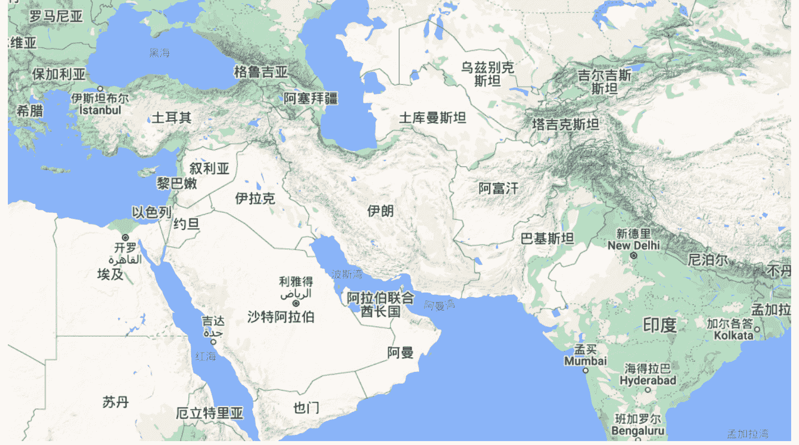

这也是为啥历史上波斯人曾经被阿拉伯人征服，却一直比较独立。如果强行类比，有点像我国古代，西藏和明朝政府的关系。明朝在很长一段时间里是拥有对藏地的统治权的，但是那地方山高皇帝远，基本上维持半独立，甚至有独立的文化和宗教。

波斯人也一样，也在山里待着，阿拉伯帝国再强大，也管不到他们那边。所以各方面都跟他的邻居们不太一样。

以前的事就不多说了，咱们说近代。在二战结束后，伊朗一度左右逢源，石油多，又和苏联接壤，苏联自然得拉拢它。对于美国来说，反抗苏联渗透的统战价值就很大了。当时中东各国大多与苏联很接近，而伊朗是美国在中东第一盟友。20世纪50-70年代，两家好的穿一条裤子都嫌肥。

这个背景下，美国大力支援，伊朗经济发展很快，工业实力也突飞猛进，军队更是美国人手把手打造。国王巴列维和上层过得无比滋润。

不过当时伊朗有很多问题，很多人对王室和政府意见非常大。不过最近仔细看了下，其实并不是宗教人士起来闹、直接把国王给干崩了，而是伊朗的各种派别都不满，一起闹，宗教组织作为其中一支政治力量，最终被他渔翁得利了。

当然了，大家闹的原因也是大部分人都不爽。

这些人中，比较多的是吃不饱的穷人，他们对城市里的花花绿绿不感兴趣，只关心生活质量。由于过度的城市化，大量的穷人离开土地去城里，进城后又找不到工作，只能在教堂混日子。

正好教堂里的宗教组织作为传统保守势力。对国王各方面看不顺眼，不论是国家开放，还是王室的穷奢极欲，以及土地改革教育改革等，都有意见。慢慢地宗教组织对穷人的影响越来越大。

正好“石油危机”之后，整个中东对西方禁运，想用能源惩罚西方对以色列的偏袒，石油价格飞涨。这也便宜了苏联和伊朗这俩能源国，这俩国疯狂卖石油，爽的飞起，苏联也进入了最巅峰时期。伊朗也赚了很多钱，只是不给老百姓分。由于大量美元涌入，国内通货膨胀飞起，王室和他们的权贵小圈子风生水起，但是老百姓却苦不堪言。

到最后，各个阶层都不满意，农民嫌贫富不均，中产嫌物价飞涨，所有人都痛恨权贵、特权和腐败。尤其学生们，闹得更凶。

总体流程就是群众和学生开始闹，工人起来罢工，国王的安全部队弹压，有了伤亡，群众怒了，继续闹，伤亡更大，更怒了。就跟滚雪球似的，越来越失控。

后来安全部队也开始陷入自我怀疑，不再愿意拥护国王。1978年十月，出现了一个严重的事件，标志着巴列维王朝马上要完蛋了。国王下令安全部队去弹压群众，群情激奋的帝国卫队的士兵们竟然把12名军官全给突突了，以表明他们不想再跟着国王混了。后来士兵们也上街了，这和俄国革命之前水兵闹事如出一辙。各种因素凑在一起，伊朗走向革命。可能很多人理解伊朗革命是宗教人士号召大家起来闹，最后神权上位。

其实不是，真实的情况是伊朗各派都起来闹，当时伊朗闹得最凶的，主要是学生们，此外还有“人民敢死队”，“民族阵线”，“人民圣战者”，“自由运动”等一堆派别，跟养蛊似的。

这些派别以为宗教势力人畜无害，都想拉拢宗教势力，各种派别打来打去，互相打残了，宗教势力做大。后来宗教势力成立了“伊斯兰革命卫队”，这个由“毛拉”（类似神父）领导的宗教军事组织把其他组织给一勺烩了，国名也改成了“伊朗伊斯兰共和国”。有点像之前的俄国革命，列宁他们并不是实力最强的一支，却最终通过不断斗争取得了胜利。

然后就是伊朗人质事件，伊朗学生们把美国大使馆的66名外交官扣押为人质，整整闹了444天，这事遭到了几乎所有国家的反对。因为一般认为大使馆是别国领土，你跑去那里搞事，无论如何也不对。后来美国炸了我国驻南联盟大使馆，也遭到了几乎所有国家的反对，包括他的盟友，也是这个原因。跑去大使馆闹事，几乎就是宣战。然后就是两伊战争，战争结束后消停到现在。

如今伊朗比较神奇，是个“民主神权国家”，总统是大选选出来的，政府得接受宗教的监督，民间有大量的宗教元素（村里老百姓自己信，城里主要靠宗教警察巡逻维持），同时很多方面又是整个阿拉伯最开放的。

主要也是因为伊朗是个现代国家，跟农业国家不一样，现代国家运转需要大量的技术人员。维持伊朗国家运转的那些科学家和工程师，不可能是宗教学校毕业的，毕竟经书可指导不了造汽车。

这些工程师和技术人员基本都是学习西方的知识出身，这些人观念很现代，看不上宗教那一套，也根本不相信宗教那一套。霍梅尼上台后考虑把他们全清理掉，可是没了他们国家没法运转了，于是保留了下来，并且继续在学校教授科技相关知识。

现在的伊朗，就是专业人士和宗教人士共治天下，两伙人互相看对方都不爽，互相又没法搞掉对方，也导致了伊朗一直好像不太团结。

我问过伊朗人，革命之后伊朗的环境有变化没？

说是主要问题是封锁。伊朗的特产石油卖不出去，经常50%的通胀，此外因为被制裁，直接卖给伊朗的东西比较少，伊朗从海外买东西都得加价，经济能好吗。伊朗大街上跑的车，很多都是二三十年以上的西方报废车，一发动满大街黑烟。他们那个汇率，疯狂到了极点，汇率每天都不一样，而且差距很大。

也正是因为封锁，导致伊朗现在很多地方火车都是半个世纪以前的，速度跟自行车差不多。如果说有啥好处，那就是因为不断封锁，伊朗必须自力更生，竟然被逼出来一些工业。尽管没多少，但是在整个中东已经算牛逼的不得了了。不过经济主要依赖石油，油价高的时候经济就好，油价不行的时候经济也不行，跟俄罗斯情况差不多。

现在的伊朗很尴尬，想搞好经济，就得发展工业，但是工业背后的工程师和技术人员天生跟宗教不对付。可是不发展经济，老百姓受穷就会不满意，对政权合法性也会产生质疑。我之前跟一个在北大读博的伊朗留学生聊过，他说伊朗将来100%会世俗化，封建神权的基础是落后经济，只要经济往前发展，就迟早会把神权给灭了，这也是为啥两百多年前大部分国家都是封建神权，现在已经很少了一样。

封锁之外，对伊朗伤害最大的，就是两伊战争。

### （二）

1979年是个不一般的年份。

两伊都非常不太平。萨达姆正式上台，别看他天天穿军装，其实没有当过一天兵。而是靠裙带关系和暗杀政变上来的。

在20世纪50-70年代，伊拉克不断出现暗杀和政变，连续几个政府被推翻。萨达姆成为了最后的赢家，在1979年，政变推翻了一手提拔自己的贝克尔。坐上了总统的位置。

这种人上台会做什么大家都能想到。1979年7月22日，萨达姆召集千余名伊拉克高级干部会议，他拿出一张名单，说现在有人叛变自己的国家。然后让人开始念名字。被念到的六十多人，一个个都被抓了出去。

气氛太压抑了。不知道哪个最先跳出来，大喊“萨达姆万岁”。剩下的人受到启发，声嘶力竭地喊起来。萨达姆很满意，表示剩下的都是国家栋梁，跟我混前途大大的。

至于被抓的人，很快和自己亲信好几百人，一起被枪毙了。这在阿拉伯国家属于常规操作。搞完清洗的萨达姆是知道的，想稳固政权，做这么点工作远远不足，因为现在更大的麻烦出现了。

在萨达姆念名单之前几个月，伊朗爆发宗教革命，巴列维下台。霍梅尼成为最高精神领袖，伊朗什叶派上台了。问题是伊拉克什叶派也占大多数，而萨达姆自己是逊尼派的，少数人统治多数人，如今边上出现个什叶派宗教国，换谁都看着有压力。

而且霍梅尼一看就不是个好惹的角色，革命之后，霍梅尼提出的口号非常离谱，所谓”两个不要，七个反对“。

不要东方，也不要西方。同时反对：殖民主义、帝国主义、共产主义、犹太复国主义、霸权主义及世俗主义。

不要西方好理解，毕竟美国是全世界资本主义的总头目。为啥连苏联也不要了？

主要是因为伊朗觉得苏联的主体思想是马克思主义，无神论，神都没了，真主往哪安排？而且伊朗不是说说而已，居然来真的。

外交上同时得罪美苏两家。刚才也说了，伊朗一边围困了美国大使馆，把几十号人扣了一年多，也就是那个电影《逃离德黑兰》的背景。一边因为苏联入侵阿富汗，他大骂苏联领导人。同时霍梅尼反对中东世俗国家，认为大家都应该过那种古代宗教生活，电视电影这些东西都是垃圾，宗教人士应该在各国事务中有更大的权力，搞啥世俗化？

至于国内，最主要的是清理旧王国军队，一时间全国近一半军队都被解散了。剩下的不是人心惶惶，就是因为美国断了装备和零部件，战斗力大打折扣。至于跟宗教不对付的人，那更是整得稀里哗啦的。

因为伊朗革命成功，伊拉克的宗教势力也很受鼓舞，开始向政府要更大话语权。萨达姆很闹心，担心伊拉克也发生伊朗革命，于是提前下手，又是抓又是杀，宁可错杀一千，谁敢闹就清理谁。伊朗和伊拉克的矛盾更深了。

此外两国领土上还有不少麻烦，比如那条阿拉伯河。伊拉克一直没有通往波斯湾的水道，如果占领了那条河，那不仅伊拉克势力大增，也能大幅削弱伊朗的实力。此外还看上了一个叫胡齐斯坦的地方。

再加上萨达姆看清楚了伊朗革命后对武装部队的大规模清洗，国防系统乱作一团，他觉得机会来了。

同时开始向全世界宣传伊朗的可怕计划。这方面萨达姆发挥了野兽一般的想象力，并且非常成功。

他向中东的世俗国家说，伊朗很快会鼓动宗教人士造反，把你们都推翻了。就算退让以后也要按照他们要求过苦修生活，比如不能看电视电影不能唱歌不能逛街，怕不怕？

对于宗教权力比较大的国家说，伊朗认为你们信的那一套都是假经，曲解了先知的意思。要把你们都干翻，经书都烧了，如果不改信他们的那一套，连你们人也一起烧了。

跟美国人说伊朗要把大使馆的人质都杀掉，而且要封锁波斯湾，以后美国汽车就都要烧木头了。

跟苏联说伊朗马上就要鼓动中亚各个斯坦加盟国闹事，还会送给阿富汗各种武器装备。

甚至连非洲人萨达姆都不放过，说伊朗人搞定中东就会让他们改信仰，不然像几百年前那样收重税，甚至抓去做奴隶。

然后话锋一转，萨达姆表示现在眼看天下大乱，自己愿意站出来。不管真信假信，见到有愿意主动做出头鸟的。大家自然不是傻子，会被伊拉克给忽悠，不过革命后的伊朗确实看着非常危险，随时可能输出革命，于是大家也不打击萨达姆的积极性，甚至怂恿萨达姆赶紧上。

伊朗不是瞎子，看着萨达姆这么闹，知道不能善了。多说无益，双方部队很快就在边境开始摩擦。各种冲突不断。

经过一年的酝酿，两伊战争正式开打。

1980年9月22日，伊拉克率先发动对伊朗的进攻，两伊战争开打，当时以为一个礼拜结束，没想到打了八年，百万伤亡，千亿损失。

### （三）

两伊战争应该是最近五十年最儿童不宜，最无聊，最反人类的战争。

整个的过程比较无趣，可以分成三个阶段：

从1980年到1982年，伊拉克不讲武德搞偷袭，突袭了伊朗，指望着通过闪电战直接把伊朗干趴下，一度获得了一定的战果。

伊朗当时把很多技术兵种士兵和专业人士都给抓了起来。比如很多空军飞行员，在美国接受过训练，都受到怀疑，于是被隔离审查，其他技术兵种也差不多。大批军官也被革职的革职，审查的审查，部队里乱得一塌糊涂。所以伊朗前期打得巨烂无比。

但是反应过来的伊朗调整政策，释放被审查的部队人员，同时以宗教形式号召老百姓上战场。伊拉克突袭伊朗取得小胜后，伊朗开始集结兵力准备反攻。

伊朗当时主要有两个优势，一是巴列维时期攒了不少相对先进的装备，尤其空军，一度打得伊拉克抬不起头；其次就是人多，伊朗人口是伊拉克的三倍，战场上对伤亡的承受能力强得多。

为了加大胜率，伊朗革命卫队把成千上万虔诚的群众组织起来，很多是老人小孩，他们几乎没啥作战经验，每人得到一把塑料“天堂钥匙”后，在毛拉的鼓励下，带着它用肉身趟地雷阵，骑摩托车突袭伊拉克坦克，甚至满身炸药扑向伊拉克碉堡。

经常战役一开始，成千上万几乎没有战斗力的杂牌预备役冲向伊拉克阵地，一场近乎单方面的屠杀之后，战场上死伤狼藉，不过伊拉克人阵地弱点也被试探了出来，伊朗正规军和装甲部队顶上，从弱处直接撕开缺口，然后从侧翼进攻伊拉克。基本上就是这么个打法。

伊拉克人再怎么见多识广，也没见过这场面啊，很快扛不住了。再加上士兵们本身也不太认同萨达姆说的战略目的，心态不好，动辄跑路。

这种情况下，萨达姆大规模清洗过几次部队里的消极分子，但是依旧止不住颓势。到了1982年，战争第一阶段结束，伊朗彻底占了上风。

这时候萨达姆慌了，想求和，但是伊朗那边已经不满足于“反侵略”成功，人家要解放伊拉克，下一步解放整个中东，让整个中东变成宗教国。

这个背景下，萨达姆一边向全世界求助，同时大量使用化学武器来稳住战线。

等到第二次伊拉克战争时，美国一口咬定萨达姆有“大杀器”，这个倒没冤枉萨达姆，原因就是当年确实经常用。不仅向战场投放，还在国内镇压库尔德人，据测算，前后屠杀了至少十万库尔德人。

而伊拉克拥有化学武器这事，美国确实很清楚。因为伊拉克自己是没有能力装配那些生化武器产线的，配件基本都是美国，法国，英国通过第三国提供的。甚至还给伊拉克投资了一个氯气工厂，因为氯气是化学武器的关键材料。只是大家当时都讨厌伊朗，更担心伊朗在中东独大，所以对这事睁一只眼闭一只眼。后来要修理伊拉克了，又把这事拿出来。

由于双方陷入了可怕的战略对峙，为了打破这种僵持，伊朗又动员了几十万穷苦人组成“人浪”去进攻伊拉克的装甲部队，比如著名的“黎明攻势”，八次进攻中，20万伊朗部队对伊拉克阵地发动了人海战术进攻，双方伤亡极其惨重，却依旧打不破僵持。

而且有些战争过程实在是很拙劣。比如德兹富尔战役中，面对大量伊朗坦克的反攻。伊拉克指挥官突发奇想，把自家坦克全部弄到了沼泽里，只露出炮塔当成固定炮台用。这么个玩法在现代军队来说如同自杀，但是在两伊战争已经是“神来之笔”，毕竟把坦克身子藏起来只露个炮塔，目标小了，而且还是静止射击，又一次偷袭了伊朗人。

后来张召忠说，伊拉克在海湾战争中的坦克都埋在土里，就露出来一个炮塔。这种操作就是他们的路径依赖，准备用这种方式来对付美国人。不过美国人不是伊朗人，武器也不在一个世代，战机从空中掠过，下边沙漠里埋着的坦克都被导弹悉数击中，变成了一个个铁棺材。

如果伊拉克崩了，伊朗可就要成了整个中东的老大了。整个西方加苏联都急眼了，一起急眼的还有整个中东的王爷们。刚才说了，伊朗是什叶派，中东大部分都是逊尼派，伊朗做大后，肯定修理他们。所以大家纷纷出钱出力，科威特那么小的国家，借给伊拉克140亿美元，我查了下当年中国的外汇储备，好吧，负12.96亿美元，当时主要是借了日本的钱来搞发展。

伊拉克拿到借款后，大规模向西方购买武器，不过主要向苏联购买武器。苏联不但给武器，还担心伊拉克人不会用，派了很多军事顾问前往伊拉克实地教学。到这个时候，美苏其实已经都开始站伊拉克了。一般来讲，整个冷战期间，美苏从不站一个阵营，这次伊朗低劣的玩法让这两个善人都去支持伊拉克了，伊朗彻底被国际孤立了。

伊朗真正的失败，其实就是外交上的一塌糊涂，主要也是因为那群宗教人士在外交上基本就是一群小学生，啥也不懂，竟然会傻到美苏一起反。

1986年到1988年，是战争最惨烈的两年，仗打到这个地步两边彻底红了眼。再没有任何顾忌地攻击对方。伊拉克向伊朗发射了300枚飞毛腿轰炸民用目标，比如发电厂自来水厂，伊朗向伊拉克城市平民聚集区发射了70枚导弹。伊拉克空军驾驶法国幻影轰炸机轰炸伊朗核心区，伊朗也用以色列卖给他们的轰炸机去炸巴士拉。

多说一句，以色列离伊拉克很近，他最不希望看到伊拉克好过。所以战争期间，它一直在偷摸支持伊朗，他的想法是，最好这两个国家一起耗尽军事力量彻底走向破产，自己在中东一下子死俩对手。

慢慢的，两伊打红眼了，1986年开始攻击对方油轮，不管挂哪国旗帜只要给敌人运油就打。至于平民更是成了轰炸的目标。

搞笑的是，伊拉克实在是太拙劣，有一次竟然把给他送石油的美国护卫舰给炸了，死了37个美国人，要不是“大局为重”，美国当场就修理这货。

到了1988年，战争结束的契机已经到来了。

其实萨达姆早就不想打了，1987年就表示接受停火，但是伊朗不愿意。等到“袭船战”升级之后，美国就开始准备下场了。因为伊拉克唯一出海口已经被伊朗占领，只能从科威特绕道运油，一旦再被伊朗堵住，伊拉克失去资金来源，很快就要完蛋。

美国军舰驶入波斯湾，表示对各国油轮提供保护，任何攻击行为都将受到美国的惩罚。伊朗不服气，表示拉偏架还有你这样拉偏架么？现在看他不行了，你跑来这么说?

然后美国表示我换个姿势拉偏架吧，亲自露了两手。

依靠美国的各种新装备和情报支持，伊拉克1988年4月发动了代号“斋月行动”的作战任务，1200公里战线全面反击，强大的火力打的伊朗节节败退。此外有点像这次俄乌战争，美国给伊拉克提供了更加精细的情报，伊拉克打伊朗的电厂什么的，一打一个准，伊朗却经常在瞎打。很快战线就被推回了伊朗境内，大量伊朗部队都成了俘虏。

同月美军亲自下场，开展“螳螂行动”，一天就把伊朗海军打残了，整个过程中伊朗没有任何还手之力。

几个月后的7月3日，一架载了290名乘客和机组人员的伊朗客机，被美军文森斯号巡洋舰两发导弹击落，无人生还。事后美国表示是“误击”，但认定美军没错，任何人都没有受到处罚。

就在客机被击落后半个月，霍梅尼表示愿意接受停火。一般认为是霍梅尼周围的人达成共识：美国亲自下场的前提下，继续打下去除了不断伤亡毫无意义，而且可能酿成伊朗国内再次革命。有点像沙俄被革命推翻后，新政府不停止战争，导致很快又一次爆发了革命，列宁他们上台。

停火后两伊才发现国家已经毁了。原本富裕的两国，在战争中耗尽了财富，据统计至少损失了9000亿美元（那可是80年代的美元）。国力至少倒退了30年，并且战后一直动乱和受制裁，到现在都没有恢复元气。

伊朗自不必说，伊拉克在战争中为了打仗借了无数的钱，战后还不上，直接导致了入侵科威特。伊拉克揍科威特的理由也很充分：这货借给我钱，还想要，简直欠揍。

美苏等国的目的达到了，中东国家到现在都没有出现个话事人。

不过从后来的情况看，两伊战争对伊朗是个重大损伤，不过客观上救了伊朗的宗教势力。革命上台的宗教势力因为瞎折腾遭到了太多人的反对。伊拉克的入侵导致伊朗国内同仇敌忾一起御敌，内部矛盾瞬间没了，宗教势力坐稳了，一直维持到现在。

多说一句，萨达姆打伊朗最重要的原因，就是自己国内的什叶派占多数，他担心这些人和伊朗勾结。

但是谁也没想到，第二次海湾战争之后，萨达姆死了，美国占了伊拉克，在伊拉克搞大选，什叶派领导人顺利当选，如今伊拉克和伊朗都是什叶派占多数而且处于统治地位，理所当然地，这俩国家鬼混到一块去了。我一直挺纳闷，美国看到这个结局，不知道啥感受。

### （四）

美苏在战争中的态度非常值得玩味。

依然是当年英法瓜分中东的思路，如果这场战争分出胜负。对于美苏都不是什么好事情。伊拉克获胜，必然成为名副其实的中东霸主。

一旦伊朗获胜，更糟糕，整个中东甚至中亚都可能宗教势力崛起，动摇世界的大乱就可能发生。特别是伊朗人在战争中表现得那样狂热，让其他各国都有一种紧张。

于是两伊战争打成了一场烂战，双方被刻意地保持平衡，让这两个国家互相往死里耗，在全世界的眼里，最好的结局就是他俩一起躺在手术台上，治好了也是个废人。

两伊战争打到后来，人力还能坚持，但是因为工业基础不行，装备渐渐不敷使用了。美苏都刻意控制武器出口，于是两家大量从中国买武器。

有种说法是，整个战争中，中国出口了一百多亿美元的装备，坦克装甲车就卖了几千辆。中国武器也是那时在国际市场打出牌子，当时国内正在百万大裁军，军工企业转型正好缺钱，这钱很是起了些作用。

更没想到的是还有意外收获，就是当年沙特那35亿美元买东风的事情。

当时沙特看他们那种打法，知道一旦停战，两家要重建但经济都完蛋了，肯定要找自己“化缘”。这种无底洞傻子才愿意去填。于是满世界找家伙防身，要够大够厉害，能镇得住人的那种。最后也是沙特钱够多，中国胆子够大，干了一笔惊天动地的大买卖。

其实武器市场都还是小头。真正大头是石油出口，因为两伊战争，引起第二次石油危机，油价飞涨了数倍。中国石油出口大赚了一笔。为刚开始的改革开放提供了大量外汇。

多年来中国一直大量进口石油，很多人可能不知道，其实改开早期中国一直是石油出口国。70年代后期开始，随着国际局势向好，我国石油开始大量出口。据统计在20世纪70、80年代，中国石油出口量近4亿吨。

最高纪录是1985年，达到了3600万吨。挣了近70亿美元，占了当年外贸总额的1/4。这些钱很多拿去买了日本和德国的炼钢产线，为中国后来的经济腾飞打下了基础。

### （五）尾声

两伊战争整体给人的感受就是打了个寂寞，百万伤亡和万亿损失，最后双方啥也没得到。然后接下来几十年，又被制裁，各退了几十年。

也感慨一件事，并不是世界和平，只是我们生活在了和平的国家，才不用去经历战争中那些可怕的事。这个意义上讲，怎么歌颂和平都不为过，也希望我们一直能和平下去。

公众号懒人搜索，懒人专属群分享

### 《我不是药神》里，到底谁错了

2022-10-07

这篇可能大家一看标题，第一反应是保险广告；其实不是，主要是最近碰到个事，对生老病死的事有了新的体会，跟大家分享下。

一个朋友的爹得了个绝症，我就不说是啥了，也不是完全不能治，但是需要去美国，用一种新药，花钱没有上限。尽管压力巨大，但几个儿女都比较有能力，还是希望老人去试一试，如果不试就放弃了，儿女们觉得说不过去。

但是老头非常倔，坚决不去。朋友说让我去劝劝，因为他觉得我说服力比较强，而且老头跟我读过同一个大学，有点共同背景，我每次去他们家，老人都跟我聊半天，说不定能劝动。

我说不行啊，你爹愿意跟我聊，并不是想听我说啥，是我愿意听他说他在大兴安岭和航天一院的事，一直都是单方面输出。朋友说还是去看看吧，万一呢，就算没用也算陪老人解解闷。

于是我就去推着轮椅溜达了一个多小时（他现在能走路，不过稳妥起见还是坐轮椅），聊完后，果然也没轮上我说啥。

不过在明白了老人的逻辑后，我好像被他给说服了。后来老人对我表达了感谢，说这些事他想了很多年，但每当他尝试跟别人聊的时候，没有一个人听完他想说啥，就开始劝他一定不要放弃，把他搞得很不爽。

他说他小时候在内蒙古，队里有匹马特别漂亮，高大健壮，而且谁也不让骑，专门用来配种的，真正意义上的“种马”。由于草原上那时候已经到处是老鼠洞和兔子洞，不让它到处跑，防止踩老鼠洞里把腿崴了。

这货有一天不知道啥情况，避开大家的监视出去乱跑，不小心把腿折了，直接折成了直角。更糟的是，它一直尝试站起来，用那条断腿一直使劲，反复摩擦创口，等到一群人把它摁住，兽医一检查，发现那条腿已经没救了。

于是作为村长的他爹跑去防火瞭望塔，那里有人一直在持枪瞭望。瞭望塔那人来了后，有个经验丰富的老牧民指导他在马的耳下开了一枪，直接射穿了大脑，那匹马都没叫一声，直接死了。当时还是小孩的他当然不明白，于是去问老爹这马平时也不咋跑，用腿用得少，勉强治一下，万一呢，治好后尽管三只腿，又不影响配种。

他爹说，没必要了，草原上的规矩，马腿断了，就赶紧解决。马和羊不一样，不能长时间躺着，可是不躺着腿又好不了，疼得不行，一直闹腾，不吃不睡，处于一种死不掉、活不了的状态。

伤口大概率化脓恶化，就算不现在解决，过段时间这匹马也会变得瘦骨嶙峋而死，结果是一样的，只是多受个把月的苦。他爹又跟他说，如果有一天自己处在了这种半死不活的状态，也希望跟这匹马一样来个痛快。不过后来他爹走得特别快，也没这方面问题。

多说一句，写这篇文章的时候我专门查了下，以前条件差，马腿折了确实直接安乐死，反正也没救了。现在已经可以给马装假肢，也有药物和辅助设备能帮马度过养伤时期了。

说到这里，老人说他已经七老八十了，到了他这个阶段，该经历的也都经历了，以前梦寐以求的东西，大部分实现不了也不想实现了，剩下的能实现的也差不多了。六十岁的时候做过一次胃部手术，经历过肠镜胃镜，还有肚子被划开缝上，被各种药物副作用折腾得死去活来，如果说有地狱，那几个月的经历就是地狱。

他那个时候就开始害怕一件事，如果将来自己一直生活在这个状态，那自己和当初那匹断了腿的马又有什么差别？苟延残喘多活几年，最后的结果是瘦骨嶙峋、受尽痛苦而死？喘口气这事真那么重要？以至于需要支付这么高的代价来换取？

好在后来切掉一块胃之后，胃病好像是解决了，消停了几年，但是最近两年一直此起彼伏各种病，一直吃药跑医院，直到出现了最近这个绝症。

北京这边的专家给他的建议是最好能保守治疗，这个病一旦老人得了，就很难好起来。

因为治病的过程本身对身体的伤害比较大，属于伤敌一千、自损两千的操作，年轻人自愈能力强，通过对耗也能耗死癌细胞；而老人身体太弱，可能药物造成的伤害比病本身都严重。

老人得这个病，有没有可能是因为治其他病的时候吃进去的药副作用太大，引发了这个问题？医生说这个他们说不准，到底癌症怎么发生的，绝大部分时候都说不准，建议不要往那方面想。

又问医生如果去美国用新药，成功率能有多高？医生说基于之前的数据，他这个年龄，如果反应良好的话，多活三年甚至五年还是很有可能的；但也说不准，每个病人的情况都不太一样，对药物的反应也不太一样，甚至心态乐观与否，都影响药物发挥。

反正说了半天，最后他是明白了，花钱是确认的，痛苦是必须的，结果是不明的，最好的结果也没好哪里去。他突然间明白了《我不是药神》里，到底是谁错了：

谁也没错，如果强行说必须有个人错了，是得这个病的人错了。

电影里描述的，其实是一种很纠结的情况，一个绝症正好有个昂贵的药可以治，正好这个药有个印度替代药，所以才出现了这么个困局。

现实里大部分时候没这么纠结，得了绝症，面临的情况整体非常简单：就是往死里花钱，最后钱没了，人也差不多了。

他是早期大学生，儿女们又争气，所以现在面对这种天价药，可以去尝试一下；如果没有钱，这种药又完全没有印度替代药，那只能是顺其自然。他在医院的肿瘤区已经待很久了，日常看到这些绝望的人。

可是仔细想想，我们很多时候，已经有了一种似乎天经地义的观点，觉得得了病就能治好。其实现实是，绝症之所以是绝症，正是因为它很难治好，最终每个人都会被其中一种病彻底击垮。

每个人的生命尽头，几乎都是一种绝症。当然了，如果足够老，也可能最后死于一场并不严重的感冒，我理解这也是为啥我小时候经常听说老年人很难熬过冬天。

对于药品公司的天价药，老人表示也能理解。他自己做过研发工作，知道这类超复杂的研究，前期必然有大量的投入，药厂就该有高额利润，这样才会去开发新药，过几十年，可能这种昂贵的新药会逐步平民化。如果不给他们高额利润，可能药厂也不愿意去研发新药了，人类在医药上的进步可能也就停了，事实上除了中美等极少数几个国家，大部分国家的医药研发都是停滞状态。

再退一步，如果这个病完全没有药，又是谁的错？电影里的药正好有印度版替代药，现实里绝大部分恶性疾病都没有替代药，到了最后阶段，那就是在人性的泥潭里死扛。

如果不治，生命无价，有的老人并不想死，孩子们又饱受道德上的煎熬；如果治，不仅可能最后自己会身无分文，也让孩子变得贫困潦倒，当然了，大部分时候孩子们也会主动止损。问题是这类病往往治不好，就算治好了，大概率五六年后再复发。

而且到了这个阶段，钱其实是小事，更重要的是那种持续的痛苦，一个人得病，对周围人无穷无尽的折磨。很多人在送走了自己家的老人后，其实并没有多少思念，反而是被那种刻骨铭心的折磨所笼罩。

这也是很多人所说的，最后那几天耗尽了所有的感情。

老人还给我解释了一件事。他说癌症和感冒不一样，感冒有治好一说，癌症讲的是“存活时长”，绝大部分恶性癌症是没法治好的，最后那些昂贵而痛苦的治疗，往往只是给病人延长几年存活时间。

这次"治好了"，并不是没事了，而是下一个周期的开始，直到彻底被击垮。很多人到了老年，几乎所有事都围绕"治病，痊愈一段时间，继续治"这个螺旋展开，生命似乎变成了一场必输的竞赛。

而且老人也说，他并不希望他自己这类病的药物被纳入医保。现在年龄大了，有了儿女还有孙辈，开始忍不住为他们着想，他知道老人们的医保，本质还是孩子辈给交的。医保应该去尽量抢救那些年轻人，而不是花费大量的资源去救他这样油尽灯枯的人。

全国每年要死掉一千万人，绝大部分都是油尽灯枯的老人。如果每个人都不惜代价去抢救，那年轻人们把工资全部交了社保都不够，问题是最后每年死的人几乎不会少，可能只会把预期寿命延长一丢丢。

有限的资源，必须要有所选择，不可能都要。

老人说他之前看到一本书，上边说美国那边老人可以签署一个“DNR协议”，也就是“do not resuscitate”，到时候不行了也不用抢救；就算孩子们想抢救，医院也可以基于尊重病患自己的选择不去抢救，可以免于孩子陷入道德困境里。他也希望有这么一份协议可以去签，因为现在孩子们劝他继续去治疗这事本身是一种义务，甚至是唯一的选择，尤其他们家境还可以的情况下。

他就算明摆着不想去受苦，孩子们也理解成了不想去花钱，所以现在完全讲不通。

他说他并不怕死，他甚至理解不了医院里有些人一看就过得很不好，但是依旧渴望医生下猛药去续命的那些人。

一辈子没享受过任何生活，在最后的几年里，花光所有的积蓄，甚至欠下不少钱，全身插上管，生活完全没法自理，身体被反复划开缝上，在自己和子女的无限痛苦中燃尽最后几滴灯油，他完全理解不了。多年以前他以为只是自己年轻，所以理解不了这些，以为没到那个时候理解不了；现在到了，更理解不了了。

他还给我讲了他的老领导的事。他说他们老航天人最大的特点就是穷，其次是骨头硬。老领导后来也彻底放弃治疗了，他说钱倒确实是一部分因素，不过最关键的，他希望给子女们留下一个印象，人最后都会死，但是可以选择去死的方式，尽量少让周围的人痛苦，尽量让孩子们将来想起自己，想到的是一个硬骨头的人，而不是死前的各种惨状，这样将来让孩子们也有勇气去面对自己的终点。

勇气是会传染的。

听到这里，我就知道他下决心了，说啥都没用。他说自己没多久了，只想回到起点去，去看看大兴安岭（他以前在那工作过十来年），然后埋回老家去。我后来跟我朋友把这事说了一遍后，他说他其实也懂，如果自己处在他爹的位置，可能也那么想，可是现在自己是儿子，也不能直接放弃吧？我说我也不知道了。反正他们家现在还在讨论，我估计最后大概率“保守治疗”了，因为老爷子那个脾气，再加上理性层面也想清楚了，估计没人能劝得动。

我问了他和老爷子能不能把这个写成文章发出来，他们都表示没问题，反正在医院癌症区，他们家的事天天都在发生，不提名字，会有无数人觉得是在说自己。

假期不准备写太长了，就这么多吧。我也希望国家能推动搞一个协议，病人自己签了，就不需要其他人再去纠结了。当然了，这是一个自愿的选择。

公众号懒人搜索，懒人专属群分享

### 那些有钱人一般都是干啥的

2022-09-30

如果说后台有啥问题问的比较多，这个问题显然算一个，只是太俗了，一直没咋说。假期前稍微说点，跟大家说一下这些年碰到的，说不定对大家有所启发。

咱们先把“有钱”标准定为“年入百万”吧，不过客观地讲，这个收入对于上班族来说是天花板级的存在，但是对于真正的那些有钱的来说，啥也不是。咱们本文还是以这个标准来吧。

之前就有个讨论，说很多人吧，说起啥来都懂点，思想也有点深刻，似乎很有脑子，可是他却没赚到啥钱，以至于平时想得太多，人也拧巴，跟个沙雕似的。

与此同时，有些人看着毛都不懂，平时朋友圈各种转发封建迷信，一开口就暴露自己确实是个沙雕，可是这种人竟然也能赚到钱，甚至一年赚前面那个显得很睿智的人一辈子的钱。

其实关键就是业务熟悉度，你可能啥都懂点，啥都10%的了解度；那个有钱的绝大部分领域都是0，但是自己的那一亩三分地是99%，自己没意识的情况下狂虐周围所有人，你可以在其他领域比他强太多，但是一旦到了他最擅长的那个，他不但把你虐成渣渣，也把同行都虐成渣渣。

能赚到大钱的人，哪怕他是在摆摊卖菜，他也有一些绝活，只是有些时候自己都没意识到。

这在各种行业都有，比如楼下有个gay里gay气的发型设计师，开着一辆路虎，附近的富婆都去他那里做头发，他自己赚的钱都归自己，老板还得给他分成。他能到店里上班，老板就得打钱，靠理发年入不止百万，当然了，这个其实不太能算理发，算艺术了吧，反正能准确识别出来富婆们的需求，那些人花钱跟流水似的。

京城这种地方太大了，衍生出来一些极其诡异的需求，比如我知道有那种身价几千万的专业减肥师，可能大家没法理解帮别人减肥怎么能赚这么多，可确实能赚到，因为富人钱就这么好赚。大家可能也知道，那些明星偶尔露面，胖的脱了形，过几天拍电影，又收回去了，这里边那都是绝技。这其实算“信息差”，他们掌握到了什么奇怪的减肥技能，趁着绝大部分人不知道，就可以出来卖。

此外以前打击教培前有个讲数学课的，一个疗程12万，招十来个人就一两百万，因为他确实能把数学讲明白，再蠢的孩子，上他的课也有提升，因为他有句话，初高中数学都是千百年前的东西，根本不需要脑子，就好像成年人看小学数学一样不需要脑子。那些有钱的绝望家长根本不在乎花钱，毕竟帝都可有一堆幼儿园学费二三十万。

反正你得擅长点啥，趁着别人没有开始跟你卷，赶紧出去卖。而且得自己做，不能让别人替你收钱。

同样道理，身边也有做得特别好的房产中介，大家知道，这个行业鱼龙混杂，大部分是鱼，极少数是龙，1%的人卖掉了几乎所有的房子，不是能说会道的问题，是长了一张能让人信服的脸，再加上业务纯熟，反正就能得到别人的信任。

在这里我还是想解释下，有时候我们说某个人特别会搞关系，并不是说他有什么明显的社交技巧，如果对方让你看出来了社交技巧，大概率也不是啥高手。真高手可能更多时候，他给你的感受是“对方在真诚替你着想”，如果再精简一些，就是一个词，真诚。

之前我一个领导跟我说过一件事，他说他大学专业并不是计算机，我们公司去他们那里招聘的时候，计算机学院都要拔尖的，根本不可能招聘他。但是他的简历里认真写了自己能做啥不能做啥，比如类似“其他语言都不熟，但是C语言一直在用，并且假期自己在宿舍对着培训视频做过几个小游戏等等”，与此同时，其他人的简历里都是类似“精通数据库，精通javascript，精通eclipse等等”，面试官没人把这些当回事，因为工作五六年都没人敢说精通，你一大学生，精通个毛线。

后来面试官跟他聊了一会儿，可能有触动，给领导打了个电话，领导让面试官自己做决定，然后他就被录取了。

后来他爬得非常快，一方面是能力确实出众，另一方面是他有种对别人几乎不做戒备的真诚，说实话，我从没见过一个人能像他那样完全好像不设防似的，确实吃了一些亏，不过整体利大于弊。

他后来跟我说过一句话，我也在之前的文章里引用过，他说人和城市一样，城市分为两种，一种是那种要塞型的，竖起高高的城墙，谁也不许进来。另一种是贸易城邦型的，自己拆了城墙，自己对别人没威胁，别人对自己也就不戒备，大家互相之间总有什么东西是对方需要的，只要有需要，就能合作。他一直也是这么做的，主动去注视别人，主动笑，主动释放善意，很少有人在你主动释放善意的时候会用恶意来迎接你，也有，但是比较少。

当然了，很多时候人是需要那个电梯的，就好像所有人都在怕楼梯，一千层的楼梯，最下边的一百层密密麻麻都是人，越往上人越稀疏，然后旁边一伙人搭着电梯飞一样的上去了。

这些就是大风口，很多时候，身在其中的人并不知道自己上了电梯。就好像十来年前，大学最好的专业一直都是跟外企对接的那些，什么工商管理，还有大兴土木相关的，比如土木。如果那个时候你去了那些专业，很可能人生一半掉了坑。这就是一种无奈，很多时候我们并不知道什么是未来，只能是去瞎蒙，蒙对了少走十年，蒙错了那就得爬天梯，历史的车轮碾过一小段，碾碎的就是无数人的一生。

当然了，有些我也不太能看懂，比如卖酒的，卖茶的，卖冬虫夏草的，甚至还有卖菜的，这些行业看着没啥技术含量，当中有极少数人非常赚，尤其是茶叶店和烟酒店，每次路过好像都没啥顾客，只有一个老板在里边无所事事地玩手机，不过他们当中做得好的爽得不得了，我啥时候弄明白了再跟大家分享。

此外还有一种东西，叫“掮客”，或者“拉皮条的”，一直有个规则，就是只要你能找对合适的人，啥事都能解决，本质都是成本的问题。一般有钱人周围都有这么一些人，有钱人不管想干啥，他们都能给搞定。而且他们提供的产品不会放在淘宝橱窗里，价格完全是自己定，这些人非常非常赚。

可见稀缺的不仅仅是物质，还有关系。

此外很多时候人其实没做错啥，只是“时机错了”。

前几天有个粉丝在非洲做生意，他说他的前半生就是个错误的合集。

出生很穷，脑子很一般，费了全部力气，补习了两年，终于考了个普通大学，上大学的时候听说未来是生物的世纪，就报了生物专业，进了专业才知道是天坑。

大学拼命学习，周围的同学都懒懒散散，他考了前三，可以转一次专业，他毫不犹豫转到了另一个当时非常有前途的专业，也就是土木，毕业后在东北盖过房，在海外砌过墙，后来又去海外做工程，累死累活，钱没赚到，得了好几次病，三十来岁了一事无成。

直到有一天他的小组长说是咱们别当牛马了，做买卖去吧，然后倒卖过假酒，垃圾场拣出来的衣服，国内报废自行车等等，三年，只用了三年，就发了，现在还恍若隔世。

其实大家多跟有钱人聊，就能发现他们共同的特点就是短时间就暴富了，越有钱越是这样，并不是我们正常理解的“慢慢变富”。慢慢变富是上班族的致富套路。

我理解这主要是因为上班和做生意是两套逻辑。

打工人的价值是两次评估，第一次是市场，第二次是自己所在的体系，也就是你做的东西首先是符合市场需求的，才能卖得出去，卖出去之后，领导再给你评估一次，从市场上收到的钱里边给分一部分，由于你不占据主动权，可能出力是大头，分钱是小头。

而且有个边际收益的问题。比如我以前写的代码，公司放到了几万台服务器上去运行，公司每卖一台服务器就能多赚一份钱，就给我分点钱吗？当然不会。但是我自己出的书，多卖一本，我就能多赚一本的钱。

此外你的工资并不是由你的付出或者收益决定的，是你和那些跟你一样的上班族竞争出来的。比如你可以给公司一个月创造10万利润，如果公司可以随便就招到一个你这样的人，说不定你只能拿六千。但是反过来，招不到的话，那你可以一直往高要，只要不超过10万，领导可能都会同意。

做生意就不一样了，你的东西只要是符合市场需求的，卖多少你赚多少，一直卖，一直赚。赚了之后扩大投入，赚更多，直到哪天拐点到来，你在行业萧条前顺利退出。

“顺利退出”这事非常关键。我大学时候属于制造业的黄金时代。系里有个小伙伴他爹在南方有个工厂，极其赚钱，他在大学就开着雷克萨斯。但是他爹后来的问题就是在行业变成红海前没能及时退出，反而把钱都投入了扩大再生产，工厂越来越不赚钱，直到产品滞销，后来不仅把多年积蓄搭进去，而且还欠了别人不少。

这也是十几年前的行业巨头们现在普遍的状态，所有正反馈系统都没法持续，最后都会崩溃。上班族生产出来的东西卖不出去领导担着，你自己亲自做买卖，生产出来的东西卖不出去你自己担着。

很多时候卖东西并不需要太高的智力，也没人管你的学历什么的，卖的东西高级可能会赚到钱，卖的低级可能也能赚到钱。很多时候自己都不知道怎么就赚到了钱，而且让那些做生意赚到钱的人重来一次，几乎100%不一样的结局，因为运气没法复制。

整体而言，做买卖是个物竞天择的过程，打从一开始就极其残酷，但是一旦走对路，赚钱快得离谱。而上班是个路越来越窄的过程。

这里并不是鼓励大家不上班，毕竟我自己还在上班。只是说，越往后，对于上班的人来说是个选择越来越少，路越来越窄的过程。

前段时间还有个粉丝跟我聊，他之前是某房地产公司的部门领导，今年整个部门被裁掉之后，他这样的40来岁的人真正体会到了什么叫“世态炎凉”。现在市场上没有一个公司在招聘领导，他也不可能去二十来岁的小伙子手底下打工，也不敢随便投资，于是开始跑滴滴，好在他的纯电奔驰单价比较高，每天感觉还不错。

说到这里，该总结一下了。

符合下边条件的，不一定有钱，但是一个有钱的，基本符合下边的一条或者多条。

- 1、对自己的业务极度熟悉并且非常自信。
- 2、赶上了什么大运，踩到了什么正反馈循环，几年间就起来了。

### 俄罗斯的能源是怎么走到今天这一步的

2022-09-27

3、关系和商品一样，都可以出售，越是重要的关系，售价越是离谱。

3、上班赚大钱的人很少，有钱人做买卖的居多。换个说法，上班的上限不高勉强有个下限，做买卖上下限几乎都没有。

所以说吧，日常生活中保持开放的心态，去深刻钻研某个细分领域，而且要学会以买卖人的思维去思考这个世界，而不是上班族。这当中差别极大，上班久了，很容易产生一种“生产导向”的思维模式，做买卖是“销售导向”，赚小钱靠给别人生产点啥就行，赚大钱肯定是在卖什么“复制成本极低”的东西，这个大家得慢慢体会，绝大部分人一辈子也转不过来这个弯。

如果一辈子赚不到，也没必要纠结，赚大钱是需要大运的，财富的分配逻辑就是不可能所有人都富，只能是一小部分人，这也就决定了绝大部分人一辈子只能是在平淡中度过。绝大部分赚钱手段别说教给你了，赚到钱的人自己重走一遍，结果也不一样。所以也别纠结了，只能是自己慢慢摸索。

不过也不是没啥可以做的，比如不断精进自己的谋生手段，去了解自己的技能到底是怎么卖出去的。有时候你自己不卖，让别人（你老板）给你卖，可不是大头被他赚了。

此外尽量真诚，这是最容易达成的技能，却能让人获益无穷。比烂社会里真诚是一种“负向buff”，真正的成熟社会里，越真诚的人收益越大。

公众号懒人搜索，懒人专属群分享

为啥突然说烧天然气的事呢，最近因为俄乌冲突，波托瓦亚的老百姓也看了一番奇景。

这地方是北溪-1号天然气管道的一个压气站，位置靠近芬兰和俄罗斯边境。现在大量输送过来的天然气用不了也送不走更没处放。干脆烧了吧，于是也点了，火大到卫星上都看得到一团烈焰：

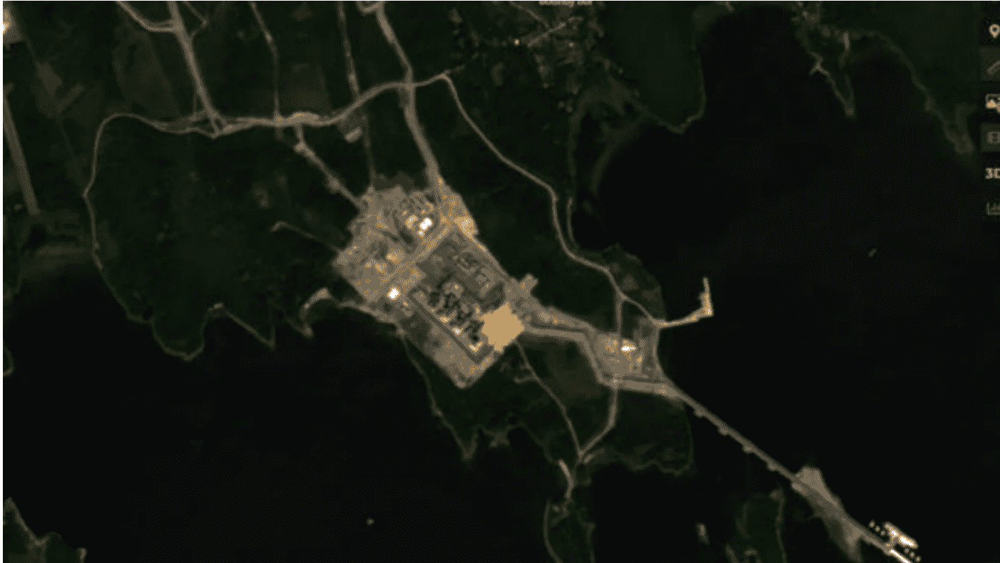

按照现在的天然气价格，每天这里要烧掉1000万美元天然气。这种烧法，不但饱受能源价格压力的欧洲各国不爽，俄罗斯心里更不爽。现在俄罗斯正在全力增加液化产量，同时在规划向东方的新管道。谁能想到，昔日如日中天的苏联工业帝国，如今只能靠能源撑场面了。原本在国际社会发挥影响力靠能源和武力两张牌，现在仗打成这样，“战斗民族”的帽子快戴不住了，只剩能源这一张牌可打了。

### （一）

说起来，能源这个筹码，在俄国人手里可是很多年了。可能很多小伙伴不知道，早在20世纪最开始的1900年，俄罗斯就是世界第一大产油国，随后美国反超，此后的一百年中，基本就是他俩轮着坐能源的头把交椅，沙特崛起那是很后来的事了。最早的俄国能源核心区，叫“巴库油田”。

巴库是现在阿塞拜疆的首都，并不是俄罗斯的传统领土。19世纪沙俄打败拿破仑之后，借机大肆扩张，来自乌克兰的哥萨克骑兵四处出击，第二年就把包括阿塞拜疆的整个高加索地区，全部正式并入俄国领土，还有车臣，也是被哥萨克骑兵拿下的。多说一句，从沙俄到苏联，乌克兰一直都是最主要兵源地，西伯利亚也主要是乌克兰人给拿下的。到了19世纪70年代，第二次工业革命开始了。各国对于石油的需求大涨，沙俄搞工业化第一个就想到巴库，在当地开发石油。当时巴库的石油开采可以用“盛况空前”来形容，打到十几米就出油，喷到几十米高。人在下面挖好池子再引流就可以运上车了。当地石油产量增长非常迅猛，20世纪初这里的产量，居然能达到当时全世界的一半。从那时候起，俄罗斯就是铁杆能源国，同时期美国也在热火朝天的打石油，沙特那个时候还籍籍无名。同时高加索地区还有丰富的煤炭和天然气，粮食产量也很高。真正算是块宝地。

也正是因为如此，在1942年，纳粹德国决定转变战略意图，向南方攻击，意图占领苏联的资源区，最主要的目标就是巴库。众所周知，德国在“二战”中就是缺油缺死的，如果巴库被德国拿下，那历史可能要改写了。在德军挺进的第一时间，31岁的石油副部长巴伊巴科夫，半夜被斯大林叫去。斯大林说德国人要抢夺巴库的石油，而苏军也需要这些石油作战，让他马上去那边准备。德军大部队往斯大林格勒进发的同时，还有一支部队绕路已经开往巴库，时间紧急。“如果我军得不到石油，你会被枪毙。如果德军得到石油，你会被枪毙。如果德军被击退之后，不能立刻恢复石油供应，你会被枪毙。巴伊巴科夫同志，你不要压力太大，去好好干吧。”斯大林说到。巴伊巴科夫说他睁着眼到天亮，赶最早的飞机去了巴库。等他赶到，希特勒为了抢石油专门组建的“高加索石油旅”已经逼近那一带。这里虽远离巴库，但已经是石油产区。副部长一边带人产油，一边把油往后方运，一边组织人拿起武器去前面支援守备部队，一边还用水泥砂浆封堵油井，顺便还把很多石油运输管道都拆了。最后时刻，副部长才带着人炸掉了压缩机和泵站。几乎他前脚刚离开，后脚德国人就到了。好在德国在那里没待多久，苏军就开始反攻。等到德军被击退，副部长和苏军又回到迈科普的油田。赶快开始重建工作。好消息是他走的时候破坏非常彻底，德国人在那里待了好几个月，却几乎没有能生产石油。坏消息是德国人跑的时候为了泄愤，不但把设备又炸了一遍，还把能点的油井全点了。好在苏军收复油田后，生产恢复得很快。因为优异表现，没多久他就被斯大林提拔为了最年轻的部长。最终德军没能染指巴库，至此第三帝国已经和撤出莫斯科的法军一样，崩溃只是时间问题了。但是人们没有想到的是，看起来无穷无尽的巴库油田，这时其实已经被过度开采了。产量即将开始快速地下降。1955年，开采了80年，石油总产量已经超过10亿吨的巴库，产量开始快速下降。虽然勘探队、打井队、开采队拼命工作，但是事物的客观规律是无法违逆的。苏联也知道这事，为了补上亏空的产能，苏联很早就在筹划开一个分矿。

### （二）

1943年，已经是能源部长的巴伊巴科夫，得到一个新任务：去乌拉尔山挖油。那时因为苏军在准备反击，组建了大量部队，需要的石油也增加了。但是苏联石油产量因为战争，比战前降低了近一半，石油产量已经被美国远远甩在后边。同时更加严重的问题摆在巴伊巴科夫面前，作为巴库出生的当地人，他非常了解这里的石油情况。这些年来，巴库的油井已经越打越深了。几十年前到处是自喷井的景象早已消失。开采的效果越来越差，新油田勘探的成果越来越小。各方面的信息都表示，巴库的油田最高峰已经过去了。必须抓紧建设新的石油主产区。地方其实早就已经选好了，从巴库一路往东。20世纪30年代苏联就在伏尔加-乌拉尔地区，也就是亚欧分界区，发现了更大油田。但是那里是一块荒凉到鸟兽都没有的地方。巴伊巴科夫再次被叫去见斯大林，听到任务后。他说那里太荒凉了，如果要建设大油田，需要无数人力物力。现在哪里有这么多人？斯大林想了一会，说他也没有什么好法子，但是知道谁可以解决问题。然后打电话让贝利亚来，也就是克格勃的头目。贝利亚到来后，斯大林说部长同志需要人去山里挖油。贝利亚说没问题，可以分配战俘同时扩大抓捕名单。并向巴伊巴科夫表示部长同志你不要紧张，现在已经不随便枪毙人了，斯大林同志让我把人安排到能磨练他们的地方去。多说一句，贝利亚一生编排罪名杀人无数，斯大林死后，他被赫鲁晓夫随便编排了个罪名给枪毙了。

巴伊巴科夫回忆他又睁着眼熬到天亮，乘火车去了乌拉尔山。好在事情很顺利，当地很快发现了大量优质油田气田。巴伊巴科夫也官运亨通，一路做到苏联计划经济委员会主任。乌拉尔地区在1955年后大量爆产能，于是这里被称为“第二巴库”。这片区域足足发现了上千块油田，几百个气田。此时美国坐稳世界第一能源交椅已经半个多世纪，苏联在“第二巴库”之后开始发力追击。改变游戏的，是一个叫“秋明油田”的超级大油田。这块区域比前两个更大，油更多，也正是因为这个油田太猛，苏联的石油产量超过了美国和沙特，半个多世纪后重回世界第一宝座，从此苏联以及后来的俄罗斯，命运就跟石油绑定在了一起。油价上升，国运昌盛。油价下跌，轻则灰头土脸，重则国运中断。

### （三）

“秋明油田”处于西西伯利亚，当地是大片平原，好几条大河从这里通过，河水在平缓的平原慢慢流动。整个油气区近80%的地方是沼泽，天气暖和的时候根本没法工作。不要说大型机械，就是人空手都很难在那里行动。只能等到冬天，严寒把沼泽全部冻上，人们才能带着设备开始工作。西伯利亚、冬天、户外、重体力的钻井。这四个元素在一起，更像是一种刑罚而不是工作。当地最低零下50度的气温和冷风，不要说人，机械设备都受不了。即使是毛子那以粗糙和耐用著称的工具，在这种环境下都经常出问题。至于最早一批工人，完全就是《钢铁是怎样炼成的》的现实版，甚至更加的艰苦。最忙的时候每天顶着大风在零下30度工作12小时，然后只能住在简易搭建的工棚里。那时通信设施和道路都几乎没有，工人们甚至因为大风雪会得不到给养。多说一句，《钢铁》里的保尔，他就是乌克兰人，无论哪个阶段，乌克兰人都是排头兵，扩张沙俄领土，建立苏联，武装保卫苏联，给苏联挖矿，给苏联种地，乌克兰人都立下了汗马功劳。即使是这种条件下，从勘测发现到第一口井投产，苏联的石油工人居然只用了八年，这个成绩可以用奇迹来表示。因为这个伟大的壮举，苏联政府在第一口井附近建立了一座纪念碑。当时因为巨大的油气开采量，这里聚集了成千上万的工人们。很多年轻工人结婚，就把这座纪念碑作为结婚照拍摄背景。

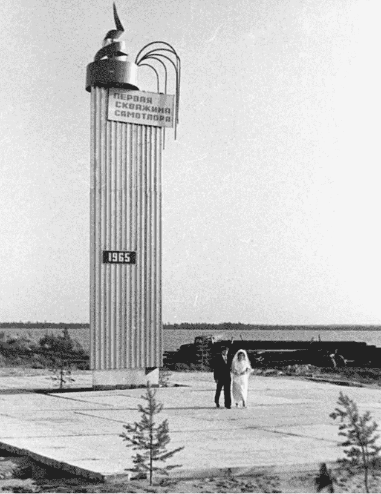

秋明油田从1975年开始爆发,这里没有让人失望,它的产量大得惊人。为了去挖石油,苏联前后征调了几百万人,并且以油田为核心,建立了18座“石油城”。当时正是人称“苏勋宗”——勃列日涅夫掌权时期,同时也是苏联国力最强大的时候。同时期的美国乱七八糟的,跟现在有点像,战争打的一塌糊涂,几次侵略他国都以失败告终,大家都在骂它,灰溜溜地从越南撤了出来,国内通胀高的离谱,老百姓也异常分裂,乱哄哄,一副倒闭样。而苏联就不一样了,不仅油田产量大,当时还碰上了一件事。美国支持以色列打中东的王爷们,王爷们怒了,压低石油产量制裁西方，导致油价暴涨。

苏联简直不能再爽，眼瞅就要取得冷战的最终胜利。勃列日涅夫这位除了有名的喜欢收集勋章，对于石油有着无与伦比的热爱。他热爱石油的方式很苏联很俄国——就是要多，越多越好。通过卖石油，赚到钱就可以扩军，给老百姓分福利，支援其他国家一起搞美国。也就是下图红框里那段时间：

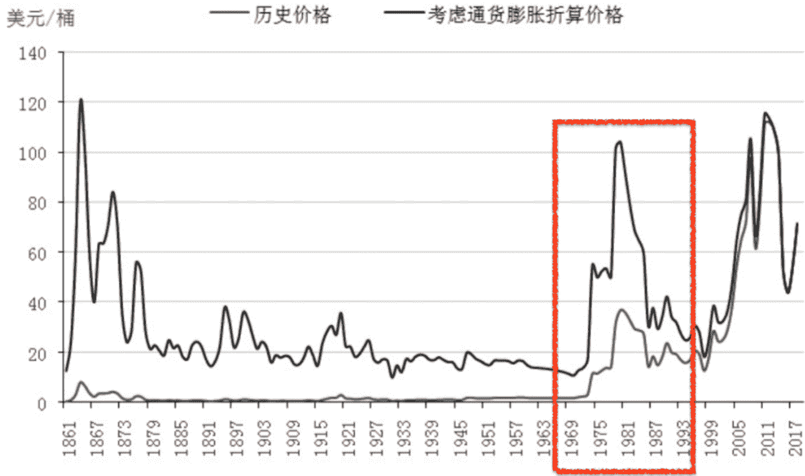

为了更多的石油，苏联高层向石油生产部门下发了越来越高的任务。

于是工人不得不采取一些激进的方法。虽然这些方法当时就有很多人反对，但是在“越多越好”的观念下，任何反对意见都被看作“不坚定”“投降派”“悲观主义”，一不小心就成了“人民的敌人”。

首先是疯狂的深井。苏联官员对深度有难以名状的向往，从科学家到打井队，谁打的最深就是表现最好。甚至把打井深度作为苏联石油工业强大实力的表现。苏联于1970年代，在挪威附近曾经挖了一个“科拉超深钻孔”。是当时人类挖的第一深的勘探洞，足足深入地下12,263米，4000层楼那么深，这个纪录一直到2008才被打破。当然了，美国和中国也在钻，现在全世界最深的井就是美国人打出来的。关于这个科拉钻孔的各种传说很多，什么出现怪物、听到怪声、看到鬼影、挖到地狱啥的，甚至还给那里也起了一个“地狱之门”的外号。不过那个洞的条件太差，太靠近北极，没法做为旅游景点。美苏把在地上挖洞当做能力来炫耀，这毛病就是打石油那里来的。

然后是“注水采油”。在地下石油被地面压力挤压，所以油井打通之后，石油会因为压力喷到很高。但是随着开采油变少，压力小了也就难以把油“挤”上来。这时往油井里注水，大家都知道石油比水轻。注入的水就可以把石油“顶”出来。在苏联这一招也被玩出了花。以曾经的世界第一高产油田——萨莫特洛尔油田为例。这里从1977年开始，被下达了非常离谱的增产任务。为了完成，在勘探新油田、打新油井、加班加点工作之外，不得不使用一切手段开采。因为勘探不到足够新油井，只能不计代价地疯狂开采。为了增加产量，开始用非常激进的注水方式，强行压榨油井的出油量。好消息是萨莫特洛尔油田最高峰时期，每天产油300万桶。你没看错，一天300万，比现在伊朗全国产量还要大。

也正因为如此，苏联从1974年之后稳坐石油第一把交椅，国运昌盛，美苏冷战转入苏攻美守。坏消息是这个数字是完全不科学的方式得到的。恶果很快到来，大量注水造成了地层破裂。地层一旦破裂，注入的水会进入缝隙，再多水也没用了，这时这个井基本就废了。而且石油可能会从破裂的缝隙流走，污染地下水和土壤。这个世界上最好的油田，经过他们坚持不懈地瞎折腾过度开采，15年就玩废了。咱们的大庆60年了还在运转。即使如此，苏联当局也不放弃，继续头铁，仗着当地水资源丰富，不断往里注水。但是油田的荒废已经不可避免了。油田今天依然在运营，但是每天产量不到高峰期的1/10。而且因为过度注水，现在含水95%，一吨原油去掉税只剩下半桶油。也正是从这个阶段开始，苏联越来越依赖石油，科技和经济进展缓慢，有毛病也不改，把所有的心思和精力都放在钻油上，毕竟只要钻出油来，就有钱，有了钱啥都好说。可是到了1986年，沙特已经成了巨无霸，美国联合沙特大规模增产石油，导致油价慢慢出现下跌，苏联卖油收入锐减，财政越来越疲，再加上支援第三世界，打阿富汗战争，导致财政入不敷出。前一段时间死了的戈尔巴乔夫，就是这个时期的苏联领导人，根本回天乏力，财政没钱，干啥都是瞎折腾。终于，国际油价越跌越低，跌到8美元一桶，而这时西伯利亚石油生产的成本已经达到了9美元一桶，苏联石油别说赚钱了，卖一桶赔一桶。这给苏联财政带来了毁灭性的打击，工业缺零件，工人们缺衣少食，军队发不出去工资，结合其他一堆问题，苏联迅速就崩了。

### （四）

苏联解体，俄罗斯继承了苏联的大部分能源产业。但是解体的混乱造成全国性的困局。最艰难时期就是20世纪最后几年，那时几重困境压迫，整个国家到了非常紧急的程度。最明显的就是俄罗斯军队。因为没钱，部队从150万裁军到不足一百万。1994年车臣谋求独立，政府派遣部队时发现几乎没有一个满编的旅级部队，很多原本不相隶属的部队，临时拼凑起来就上了前线，结果打得一塌糊涂。即使这么点部队政府依然养不起，在1999年俄罗斯军费只有65亿美元！没有少打一个零，当时俄罗斯军费已经快排到全世界前20之外了，要知道，苏联在1986年的军费高达880亿，解体之后剩下个零头了。就这么点钱，还要维持庞大的核武器、轰炸机、军舰。甚至那年车臣正在打仗。那时俄罗斯甚至连士兵的鞋袜都无法足够提供了。甚至核武器都养不起，是的，核武器维护成本高的吓人，这玩意不能随便到处丢，还得防止老化，或者流入黑市，每年俄罗斯花大价钱保持这些东西，苦不堪言。问题是拆核武器都需要大量的钱和技术，不是想拆就能拆。麻省理工的物理学家托马斯·内夫给出了个主意，让美国把苏联的核弹头买来发电。在20年当中，被称为“兆吨换兆瓦”的计划将2万枚俄罗斯核弹头转化为电能，俄罗斯也摆脱了一个巨大的包袱。原理也不复杂，核武器里装的就是高纯度浓缩铀，只要拿出来稀释加工下就可以给核反应堆用了，但是加工技术有点复杂，只有美国和法国可以非常经济划算地解决。

此外俄罗斯军队要自谋出路了。当兵的没权没势，只能挣小钱。当时1美元10发步枪子弹，成箱子买送弹夹。手枪子弹2美元一弹夹，如果买枪送弹夹和两排子弹。那时最受欢迎的是地雷和步枪，地雷按照款式可以卖500-1500美金，现役款式AK步枪可以卖到400美元。这些东西的买家包括非洲军阀、南美毒贩、车臣叛军和各种恐怖分子。按照当时的报道，很多军营附近的酒吧都有军火贩子。小到子弹大到坦克发动机都现金收购。不过当兵的这种只是小打小闹，军官们的就是放开膀子干了。

飞机不敢直接卖,但是可以卖部件,经常卖到一个营地里所有设备都是空壳。你说这事没人管?也管,但是大家都这么做,也就法不责众了,到时候给督查官员塞点钱,就可以一直搪塞下去,因为督查官员也缺钱,有钱就要。不仅私下里在卖,明面上也在卖,在1991年,河南商人牟其中靠500个火车皮的罐头换了四架苏联图-154客机,再将客机倒卖给了四川航空,赚了将近一个亿。一切的问题都是没钱,那时唯一的指望就在能源出口上。但是这方面也是惨,油田枯竭+设备老化+寡头私有化冲击,造成石油产量告急。同时国际油价也一直低位,整个20世纪90年代基本就在10美元左右徘徊。但是俄罗斯因为采油区处于西伯利亚,开采成本非常高。这个价钱出口石油的利润很低。这里就要说到俄罗斯能源的一个困境:成本问题。在秋明油田易采区枯竭后,俄罗斯不得不更加深入西伯利亚。甚至进入北极圈大陆架,这样一来综合开采成本就非常的高。这里要解释一下,开采成本和综合开采成本不一样。开采是指挖出来花多少钱,综合是指挖了以后运到市场能够交易要多少钱。以现在为例。沙特开采只有5美元左右,但是综合成本要加上各路王爷过手的手续费,最后要到近20美元。至于俄罗斯,因为环境差开采成本比较高,要30美元。加上俄罗斯能源企业和官员你懂的那些事,公私两面都要增加大量的费用,最后综合成本要高到60美元以上。也就是说,如果国际油价低于60美元,俄罗斯卖油也基本不赚钱。

### （五）

转机在进入21世纪之后,亚洲经济崛起,尤其是中国,需要的石油实在是太多了,导致供不应求,石油价格震荡上涨,正好让普京摊上了,借机对整个国家进行了大改革。也就是下图红框那一段:

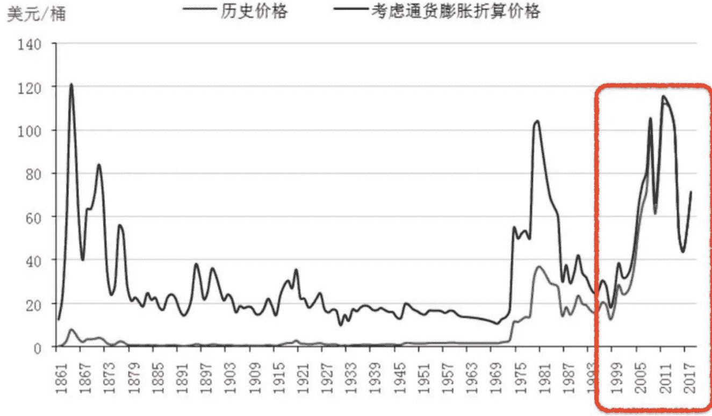

比如大幅增加军费稳固军头们。普京2000年执政,当年军费就直接涨了50%,到2013年俄罗斯军费已经到了890亿美元,是1999年的近15倍。2012年他还提出“7500亿美元”军队升级计划,不过一直没落实,现在的俄罗斯支撑不了那么大规模的军费开支。普京获得了军人支持也就不奇怪了。有了武力支持,再加上圣彼得堡官僚集团作为嫡系,此时的普京彻底成了大帝。所谓不可曾经的“寡头”们发现自己啥都不是，普京完全不费力气就把他们干翻了。如今老寡头们已经悉数倒台或者出走，俄罗斯的新寡头们基本都是普京的兄弟。于是俄罗斯的能源产业走上了正循环：手里的钱多了，可以更新设备增加产量，然后赚更多的钱。普京用这些钱稳定军队、掌握媒体、打击反对者、给老百姓发福利、在国际上秀肌肉。这些都让他获得了民众的支持，也是得以执政了二十多年的根本。

说起来俄罗斯在国际能源市场，有一个优点和一个弱点。弱点是几乎没有定价权，虽然每年出口的石油占到全世界出口总量10%，天然气占全球出口的20%。但是因为石油美元的关系，油价决定权在美国和欧佩克：第一是美国，美元霸权+巨大的交易量+对中东的影响力，使得石油价格美国话语权最大；欧佩克，也就是中东王爷们，他们占了全球交易的一大半，而且可以灵活调整产量控制市场货源。相比起来，俄罗斯原本话语权很低。不过前些年美国页岩油爆发，美国进口数量大减。这对世界石油市场的局势造成了巨大颠覆。于是俄罗斯需要欧佩克的市场地位，欧佩克需要俄罗斯的世界影响，两家一拍即合，强压油价给美国页岩油很大压力。从此俄罗斯在能源市场影响力大增。

优点是俄罗斯能源出售特别方便：他紧邻欧洲这个巨大的能源消费市场，北极圈挖的石油不要一周就能送到德国。而且两边多年交易，19世纪欧洲就从俄国人那里买能源。即使苏联时期两边也一边冷战一边做买卖。欧洲向苏联出口高科技设备，苏联给他们提供能源。不过现在俄乌冲突，使得原本的优点在欧盟的强力制裁下，反倒造成了损失。也就是咱们现在网上不断讨论的，欧洲冬天怎么办。不过主流观点不觉得俄罗斯从此不给欧洲供应能源了，俄罗斯的资源出口哪怕跌一半，俄罗斯的财政就扛不住。俄罗斯最近半个世纪养成的“资源依赖病”，根本治不了。当然了，欧洲完全不用俄罗斯的资源，成本也会大幅增加，加剧萧条。这种情况下，双方都有足够的意愿撮合交易，会有一万种办法重新把买卖做起来，比如慢慢和解。或者先把资源送到印度或者中国，然后再转手给欧洲，这事已经在做了。

当然了，最可怕的一种情况是，世界少了俄罗斯之后油价反而在下降。当初伊拉克敢揍科威特，一部分原因就是觉得西方不可能对他太过分，它觉得如果没了自已的石油，西方根本活不下去。可后来发现伊朗伊拉克都被踢出局之后，也没啥事。现在俄乌战争打了半年，我刚才看了下，布伦特原油期货已经跌到战前去了，开战的时候76美元一桶，现在已经是73美元了，这个消息对于俄罗斯来说可不是好事。不过主要也是因为疫情叠加战争，再叠加美元加息，很多工厂不开工了，而且欧美老百姓也没钱，买东西少了，生产的也就少了，对石油需求也就下来了。等疫情结束，应该能好点。

尾声：看到这里，多多少少有点感慨，资源对于俄罗斯来说，一直都是命脉，但是多多少少又坑了俄罗斯，有点类似“资源诅咒”。

1991年的时候，俄罗斯除了人口不如咱们，各种条件都比中国强，但是明显走了那条最容易的道路，也就是卖矿。几乎没好好发展经济，导致高科技人才在俄罗斯并没有适合岗位，找不到工作，只好去西方，现在俄罗斯知识分子主要有三个流失方向：美国、德国和以色列，人才一直在持续流出。现在美国有500万以上的俄罗斯裔，德国有300万，以色列有100万，也就是说，这仨国家，就有接近一千万俄罗斯人。而且这些人都是俄罗斯的精英阶层。比如谷歌的那个创始人，他爹就是苏联官员，后来移民到了美国。美国和德国有很多俄罗斯人好理解，以色列为啥那么多呢？主要也是因为俄国一直都有很多犹太人，沙俄时期就有五六百万，现在的俄罗斯富豪绝大部分都是犹太人，这些人一直都在持续向以色列移民。

也正是因为太过依赖能源，导致路越走越窄，到现在，几乎只有能源这一张牌了。这也是为啥我一直在说，咱们也要避免什么问题都准备靠“劳动力又多又便宜”来解决，又多又便宜的劳动力，本身也是“矿”的一种，问题是这种资源消耗得更快。真正的发展动力，是知识，是科技，是完善的市场，是尊重人才、老有所养的社会，这样才能良性发展。苏联就是沉迷自己的单一优势，一直不考虑对冲风险，最终倒了霉。我理解这也是为啥国家要搞《制造业2035》，搞大规模产业升级，要用科技替代人口作为引擎。毕竟只有我们头脑和科技成为我们的矿，那样我们才能立于不败之地。

公众号懒人搜索，懒人专属群分享

### 聊几句俄乌战争

2022-09-23

不太想写这个话题，因为我从一开始就不太看好这场战争，更确切地说，我一开始就觉得普京发动这场战争本身就是错误的，更大的错误是战争拖了这么久结束不了。

我这个观点肯定让不少人很不爽，觉得我立场有问题，可如果从立场出发分析问题，根本一次都对不了好吗，咱们尽量实事求是一些。当然了，你如果坚持说普大帝在下一盘大棋，那你说得都对。

我自己是从不相信大棋的，尤其是需要多次预测准对方动作的那种大棋，一般从没上班赚钱、平时窝在家里不出门、害怕跟人打交道的人，才会对大棋情有独钟，因为只有书呆子或者从不跟人打交道的人才会觉得别人的行为可预测。

真实的世界里，完全是个混沌系统，或者说是一个二级混沌系统，里边的决策者基本都是走一步看一步。那种依赖对手配合的计划根本推动不下去，如果你喜欢历史，多看看细节，这一点会更加明显，真实历史里就没啥大棋，稍微复杂一些的事情，基本都是失控的，谁也把控不了全局。

你问我为啥不看好，我说俄罗斯进攻乌克兰这事，本身就“不正义”，也就是根本从道理上说不过去。

一说到这里，肯定有人会骂我，说你也太小清新了吧，一把年纪了谈正义？是的，所谓正义，就是“名正言顺”，就算不为了说服别人，起码要说服自己家的部队和老百姓。没有个说得过去的理由，根本凝聚不起来人心，一旦出了什么岔子收场都会很难。

这一点理解起来比较费劲，人类可以为了一个虚构的东西舍生忘死，比如国家，比如理想，但是前提是你得给他们一个他们相信的理由，可以是利益，也可以是民族主义。但是必须得给个理由，不然每个人都在那里磨洋工。用一句苏联笑话来讲，那就是“他们装作给我发工资，我装作给他们上班”。

俄罗斯历史上也有过共同相信的宏大理念、并为此付出了巨大代价后取得胜利的事，比如他们那几次绝地反击，都是民族存亡的时候，所有人达成共识，全民族同仇敌忾，一起把侵略者赶走。

这种情况下往往还能得到不同阵营的支持和援助，比如“二战”就得到了大量的美国援助。毛主席就坚持认为我们的抗日事业是世界反法西斯战争的一部分，是正义的事业，迟早会形成国际统一战线，我们只有得到国际势力的援助才能最终胜利，后来果然被他说中了。

更关键的是，我们一直以来分析问题的核心就是经济，现在俄罗斯只有北约4%的经济实力，差距实在是太大了。整个俄罗斯的国家财政，都赶不上美国国防部的预算。每年那么点财政收入，还得支援白俄罗斯，养着车臣，能花在军事上的可想而知。

很显然，战争开始的时候，俄罗斯情报出现了明显的误判，以为乌克兰根本不反抗，就跟之前克里米亚似的。所以战前没动员，士兵们以为是演习，进入乌克兰之后才发现不太对，一直处在懵逼状态。整个战争过程中，俄国一直非常消极。

这有点像当年的苏芬战争，当时芬兰距离圣彼得堡（苏联时候叫列宁格勒）只有30多公里，头号搅屎棍英国跑来向芬兰示好，提供各种援助，德国法国也有钱给钱有枪给枪。芬兰于是自然投靠了西方那边，还在边境建起了工事，这一幕，大家有没有觉得很熟悉。

作为“缓冲区狂魔”，苏联人哪里能容忍，而且那时是慈父当家。慈父做人最讲道理，说弄你一定弄你。于是要求芬兰割地，芬兰当然不愿意。于是就打了起来。

结果等到打起来，非常意外。苏军非常拉胯，仗打得稀烂。不看结果光看过程，和意大利有一比，甚至不如二战的法国。好在芬兰太小了，跟现在的乌克兰没法比，很快就没了战略纵深，割地求和了，不过“苏德战争”爆发后，芬兰人又把割的地抢回去了。

仗之所以打成这样，战后苏军高层复盘，列举了好多客观原因，比如天气不好，道路不好，军队建制有问题，敌人太狡猾……大家参看中国男足赛后总结吧。

其实公认最重要的原因，就是开战的原因和目的有问题：自家的军队不明白为何要去打芬兰。两家边境那么近也几十年了。虽然一直关系不太好，但是怎么都没有彻底翻脸，怎么就弄到要打的地步？所以士兵们战争意愿非常差，再加上苏联大清洗之后军官普遍比较业余。也正是苏芬战争打得没法看，让小胡子有了一脚能踹死苏联的错觉。

俄罗斯现在其实就是这个问题，战前上层也没太想好进攻乌克兰的理由是啥，而且俄罗斯普通老百姓也不恨乌克兰人，但是乌克兰人恨他们，觉得他们是入侵者。

这种情况下，战争一开始，遭到乌克兰激烈的反抗，斩首行动失败后，俄罗斯士兵越来越迷茫，日常丢下几百上千万美元的装备跑路，甚至有了夸张的老乡拖拉机拖走坦克的事。

这也是为啥一开始俄罗斯人不炸电厂，以前俄罗斯觉得自己是能占领住的，已经把那些东西当自己的了，因为他们的军队占领后也需要电力系统。后来知道用不上了，干脆能炸的都炸了。

再后来眼瞅攻不下冷战时期为了打核战修筑的要塞城市基辅，俄军开始收缩战线。这个也没啥问题，兵力不足嘛。收缩后开始玩大炮，日常轰击乌克兰，炸得嗷嗷叫，一度好像占了上风，不过后来慢慢又打不动了。一方面乌克兰已经通过决议，国家进入了总动员状态，不惜代价也要打败侵略者，不准男人出国，按照法律，从老百姓当中抽兵，送到波兰去训练，兵员整体是越来越足，慢慢竟然超过了俄罗斯。

此外也换装成功，三月份的时候有美国的军事评论员提到了这事，说前期乌克兰军队用的全是俄式装备，战争爆发后很快弹药就接济不上了，北约开始向那些拥有大量俄式武器的国家购买送到了乌克兰，很快这些弹药也都见底了。

北约的武器倒是不少，但是乌克兰人不太会用，而且那些武器都有配套战术，包括火炮什么的，都有门槛，北约军人不可能去乌克兰亲自操炮，得重新训练乌克兰人，所以预估得到半年后乌克兰人才能形成真正的打击力量，这不已经半年了，前段时间乌克兰刚组织了一波进攻。

此外俄军炮战越来越虚，很可能是因为弹药库连续被炸导致的，最近三个月，乌克兰自己说是用海马斯炸了俄罗斯80多座军火库（俄罗斯为了防止大火药库被一起炸掉，采取多点策略），被炸这么多，匪夷所思，不过想想也正常，北约开着全图，如果发现大量的卡车往一个地方送物资，先干一炮再说，就算晚上运输，汽车巨大的散热也能被卫星红外探头看到。

此外北约也不是一群人坐在那里看视频，那么大的战场，根本看不过来。前几天巴黎大学一个AI领域教授说是他们在用超级计算机运行人工智能程序，来识别战场上的价值目标，比全图还夸张，俄罗斯任何作战企图都会被看到。只是乌克兰空军太弱了，不然俄军只要一探头就会遭到打击。

可能军火库大规模被炸，导致俄军重武器没啥弹药，所以前几天一反攻，俄军直接丢下重武器跑了。

现在是个啥情况呢，乌克兰民族主义彻底被点燃了，他们现在要的不是俄军撤出乌克兰，他们要的是克里米亚，整个乌东，全要收回去。

而且有点像是抗战时期国民政府的状态，乌克兰上层也有很多人其实不太想打，代价太大了。但是到了现在，已经不能说了，毕竟前线死了那么多人，不打出个结果来，那些人白死了。现在在乌克兰，敢聊和谈或者放弃克里米亚，跟叛国是一样的，分分钟被干死。

真正意义上的干死，乌克兰安全部门现在已经得到了充分授权，觉得你有问题，就可以直接枪决，如果俄罗斯也充分动员，到时候也可以随便枪毙厌战分子。

而且俄罗斯这个国家吧，说是战斗民族，其实一直都是惨胜，俄罗斯每次胜利，几乎都是不计伤亡用人命往出堆，拿五六个俄罗斯人换一个敌人这种操作非常正常，如果是三个换一个，那俄罗斯人觉得自己赚了，库尔斯克战役就是1:3，属于大胜仗。俄罗斯历次战役的伤亡比都可以查到，大家好奇的话可以自行查一下。

比较搞笑的是，以往俄罗斯对外战争中，充当炮灰的，一直都是他们的远东亚洲人和乌克兰人，以前这两伙人都比较穷，天生的炮灰。

这次在前线使劲搏杀的，也是这两伙人，只是远东亚洲人为了俄罗斯而战，乌克兰人为自己而战。据我在俄罗斯的小伙伴说，俄罗斯的主要大城市并没有开始抽兵，去前线的主要是村里的和远东人。我在TT上看到，现在部分动员后，上了大巴赶往前线的，也是那些远东的人，看着就不太富裕的样子。

这也正常，沙俄和苏联时期，能维持数量巨大的士兵，主要是从农民里抽兵，现在没啥农民了，市民不大愿意去打，非常消极。工业社会就有这个毛病，稍微富起来一些就不愿意去打仗。

如果俄罗斯和乌克兰重新达到苏联的爆兵模式（乌克兰人本来就是苏联红军的主力），据测算，乌克兰可以暴到600万，俄罗斯说自己的极限是2500万，只是战争物资不一定能补充得上。也就是说，如果持续升级，现在还早得很，双方可能不断提升动员规模，有可能将来在战场上出现双方各有百万人在那里对峙。

如果“北约-乌克兰”和俄罗斯一起升级常规战争，说实话我不是太看好俄罗斯，决定战争的，主要还是科技和战争意志。这两样俄罗斯都不占优势。

更关键的是，俄罗斯人士气也不行，厌战情绪很厉害。俄罗斯人确实觉得乌克兰人欠揍，但是他们整体还没有到那种恨到不惜以自己的生命为代价去砍对方，而且俄罗斯部队相互之间也不信任。

一个车臣网红说，小卡的车臣军阀部队躲在俄罗斯近卫20集团军后边，本来很安全，因为这支部队按理说是俄罗斯战斗力最强的部队之一，没想到战争一爆发，乌克兰先头部队直接打了个对穿，20军为了防止被扎口袋赶紧跑了。

而且没通知小卡，离小卡最近的俄罗斯部队只有两公里，跑的时候按理说无论如何都会路过车臣军，没想到竟然冒着巨大的风险绕道跑，就是为了防止车臣人发现问题。你们能想象吗，为了丢下车臣人断后，友军竟然绕道跑路。

结果就是车臣人莫名其妙遭到进攻，而且毫不知情，差点被围死，车臣人说是伤亡很大，不过没说细节，小卡还在西方媒体上兴师问罪。只是大家早就看穿了车臣人想当网红的事实，质问他们不好好打仗，一直躲在俄军后边干啥。

至于核武器，我就不聊了，因为完全不知道俄罗斯扔了核弹北约会做什么反应。不过应该也会对轰，因为如果不出手，那就是“核讹诈”成功，今后西方就被俄国彻底控制了，一言不合就扔核弹，冷战时期早就有大量的研究，几乎所有的策略最终都指向“以牙还牙”，如果不作为，那将来也得出手，不如早点动手。

关于战争的结果，我也说不准，不过可以思考下最坏的结果是啥。不少人在说俄乌战争中俄罗斯输不起。

没有输不起的，你三四十岁没了工作去做买卖或者炒股，你能输得起？输不起就能赢？没这么个道理。

但是俄罗斯会输吗？

不太会。

俄罗斯面对的最坏的情况是乌克兰收复所有失地后加入北约，几乎没有可能入侵俄罗斯本土，关键是北约也不让。反倒是如果乌克兰打到俄罗斯本土，俄罗斯可以顺理成章地下达总动员令，让几百万义务兵上前线，同仇敌忾，全国转入战争模式，爆发出斯拉夫人真正的狠劲。

北约也知道这一点，他们为了防止乌克兰去打俄罗斯本土，故意“特供”了改装海马斯系统，那个火箭本来能打300多公里，乌克兰拿到的只能打80公里，就是为了防止它去进攻俄罗斯本土。没有北约的支持，乌克兰在战场上打只狗都费劲。

既然战火烧不到俄国本土，俄罗斯就不会伤筋动骨，只是伤钱。

至于乌克兰加入北约的事，我一开始就说这个对俄罗斯并没有实质的影响，俄罗斯边上本来就有好几个加入北约的，比如波兰和波罗的海三国，南方还有土耳其，现在瑞典芬兰也加入了，虱子多了不痒。一开始拿乌克兰加入北约作为借口去打乌克兰本来就是一步臭棋，每个国家都有选择自己路线的自由，当初我们转向美国，他们也想威胁我们来着。

而且我不觉得俄罗斯和西方从此能合流对付我们。

这次战争之后，西方从此对俄罗斯没了信任，俄罗斯民族主义者们彻底恨上了西方，这段时间梅德韦杰夫这种铁杆亲西方派都天天批西方。

俄罗斯这个国家自从拿破仑战争后，内部一直有两股力量，一股是“十二月党人”那样的仰慕西方的贵族，还有一批类似索尔仁尼琴的民族主义者，前者渴望融入西方，后者一直在捣乱。搞笑的是，普京自己也有一个从“十二月党人”到民族主义者的转变过程。

现在这种状态，民族主义者们明显占优，普京只是他们的代表，而不是整个俄国只有他一个人反西方。长期看来俄罗斯很多人可能依旧仰慕欧洲，但是短期不可能和解了。

文末再说说我们自己。我们在接下来很长时间里，明显需要继续苟住好好发展、产业升级，在中欧合作的大背景下，几乎不可能为了俄罗斯去和欧洲决裂。这也是为啥我们的立场一直是中立。

我们现在最需要的就是购买力，以前说中国经济“三驾马车”，外贸，投资，内需，本质就是这三个领域在买我们生产出来的东西。

随着中美贸易量的走低（现在的外贸排序是：东盟、欧盟、美、日、韩），今后慢慢东盟和欧盟会成为贸易主力，可是东南亚和非洲太穷，购买力太弱了，买不起高端玩意，中亚也不行，也太穷，产业升级只能是靠欧洲和我们自己国内中产的购买力。

此外我们也需要欧洲的投资解决就业和资金问题，德国巨头巴斯夫刚在中国完成了一项100亿欧的大投资。德国宝马集团6月斥资150亿元在中国沈阳建设了一家纯电动汽车新工厂；德国奥迪公司7月在中国长春投资建设其第一家纯电动汽车生产基地；而全球客机巨头空中客车公司6月与苏州工业园区签约，将其中欧研发中心落户苏州。

所以这也是我理解中国明显偏俄罗斯，却几乎没给俄罗斯提供军事上的支持，主要也是我们因为对欧洲合作的需求大于对抗。尤其是经济下行、就业压力空前的大背景下，我们自己的民生问题才是第一大问题。

不管咋样，我们需要的的是一个和平稳定的环境来发展，也需要全球化，需要西方的矿和技术，得赶在严重老龄化之前攻克那些技术难关。2035年我们三个人里就有一个老人，所以现在得抓紧时间使劲发展经济，提升国力，把大家的生活质量提上去，这才是我们最要紧做的事。

公众号懒人搜索，懒人专属群分享

### 为啥明明放水了，却没流到普通人身上

2022-09-21

这个问题一直有人疑惑，好像一直在放水，为啥没放到我头上？我今天用一篇短文，详细给大家解释下。

有个比较常用的例子是这样说的，说是国家放水，就好像往一个人头上浇了一盆水，头是湿透了，但是脚还干着。

这个比喻倒是很有道理，大家一听就能清楚，不过然并卵，没啥细节，大家以为懂了，其实没懂。

首先要说，也是最关键的一点，国家放水的钱，都是通过银行放，最后都得还回去。

这一点太多人不理解，现实中非常非常常识的事，一旦到了国家层面，大家就不理解了，不理解也没事，大家只需要记住，国家放水，其实放的都是贷款，将来得还回去。

既然是贷款，这就有了第二个问题。

大家不知道去银行贷过款没？有过房贷吧，就应该知道，你去银行借钱，就需要抵押物，你贷款买房，也是把你的房子抵押给了银行。而且是要还利息的，这些都不难理解。

懂了这些，咱们就继续往下说。国家每次放水，本质就是允许银行可以往外借更多的钱了（经常说的降准，就是扩大可贷额度），或者说给了银行一个额度，比如一万亿，让银行给贷出去。这就是放水，并不是政府开了印钞机，印钱给大家花。

贷款额度有了，那谁来贷款呢？刚才已经说了，能去贷款的人，一般有两个特点：

- 1、抵押物特别多，比如有个很贵的房子，有个估值很高的公司，有片地，或者有股票什么的。你把这些抵押给银行，将来还不上，银行就拿你的这些资产去拍卖。阿里法拍上的东西，绝大部分都是这样来的。

- 2、你贷出来钱之后，是有利息的，得去赚更多，不然你一顿胡吃海塞，等到还钱的时候还不上傻眼了，这也是为啥银行一定要有抵押物，怕你还不上。

这时候大家就明白了，什么样的人能从银行贷到款？

富人（有很多房子等抵押物），大公司，国企，反正是资本越雄厚越好，银行不怕还不上。这些资本雄厚的个人或者公司一方面有资产可以去贷款，另一方面贷到款，可以去做买卖，可以去投机，反正过段时间也可以顺利还回去。

国家的意思是，公司和有钱人有了钱，就可以去投资，比如投资建厂，或者扩大再生产，雇佣更多的工人，社会失业率也就压下来了。

工人们找到工作有钱之后，就可以去消费，比如去楼下馆子里改善下生活，带小孩去游乐园，或者去多买几件衣服，还可以买个电视，这样饭店、游乐园、商场、电视厂家都有了收入，经济就转起来了。

如果顺利的话，这些有钱人和老板通过扩大再生产赚到了钱，连本带利给银行还回去。银行赚到了利息，普通人有了工作，周边皆大欢喜。这也是为啥国家认为放水能救经济的基础思路。

但是有个前提，比如你们公司是生产洋娃娃的，你们领导拿到钱之后，准备继续扩大再生产，买更多的设备，雇佣更多的工人，生产更多的洋娃娃，这时候问题来了，你们老板得把这些多生产出来的洋娃娃都卖掉，不然他也赚不到钱，还不上贷款，到时候说不定就成老赖了。

以前一般会卖到海外，海外几乎是无限需求，你生产多少就能卖多少，卖出去之后赚到美元，美元进入中国的时候不能在市场上流通，要强制结汇，也就是一美元给你七块钱，中国市场上就多了7块钱人民币。

这也是为啥我国这些年的货币越来越多，一方面是央行贷出来的款越来越多，另一方面我们跟海外做生意，赚到的美元越来越多，对应的人民币也就在不断地增多。

这种情况下，一部分企业主确实赚到了。普通人也赚到了，这些年我国收入一直在增加就是明证。国家也赚到了，因为几乎每个环节都有税，而且银行利息也能赚到钱。这也是为啥我国巨无霸企业，银行占了一大半，不过银行的利润最后大部分都上交国家了。

可是企业主不可能和普通员工一个收入，这也就有了分化。招行有个私人银行，每年会公布数据，他们里边一千万资产的（这个可以理解成存款，也就是房子之外，至少一千万），才是私人银行客户，现在大概有12万人。之前看了个数据，这些富人绝大部分是各行各业的企业主。在中国，造富最容易的还是做买卖。

有钱人赚到钱之后，就想买更多稀缺的资产，你们已经知道了，过去二十年，对于中国人来说，核心资产就是房地产，有钱人们当然懂，一直在买买买，后来白领们有了钱，也进去接盘，导致房价越来越高。

不过这不是关键，回到上边的那个问题，等房价越涨越高的时候，有能力贷出更多款的人还会把钱投入生产里吗？

可能会，不过更多的人选择贷款后直接买房，因为人类的产能是无限的，土地却是有限的，学区房更少，这些事情上，都是先下手的吃肉，后下手的喝汤，最后进场的还债。

看到这里，大家应该理解了，银行放水，你能不能接得住，主要看自己是哪个生态位。如果大家留意下，就能发现今年突然那么多银行信贷机构打电话给贷款，额度高，而且利率还低，但是你不一定敢贷。为啥不敢贷呢？

首先普通人没有资产做抵押，贷不出来款；

其次你就算贷到款，也没有办法让钱增值，钱不增值，你连利息都还不上，你也就不会去贷，放的水流不到你身上；

最后只能是去富人那里。这倒是让我想起来那句话，钱流向不缺钱的，爱流向不缺爱的，苦留给最能吃苦的。

等到你终于发现房地产可以放大财富，可是已经晚了，一方面你玩不起，另一方面涨幅已经大幅变慢，你进去可能什么都吃不到。

很明显，一些富人之所以富，能接到国家的放水只是一个因素，更重要的是他们会使用这些贷款。比如会经营，大家经常看到一条街上并排好几个饭店，只有一家排队的人特别多，其他的门可罗雀。也可能是信息差，比如人家知道早点买房，或者打听到最近股市要炒作哪个题材（很多人破产也是这个原因）。

或者什么东西紧俏，迅速去做那个行业，但是其他人却不知道。比如朋友圈有一个货，从疫情一开始倒腾口罩，后来弄防护服，再后来搞盒饭，风生水起。对于大部分人来说，既不知道折腾这些事，也不知道该通过什么渠道卖出去，给再多的贷款也没用。

就这么一来二去，普通人贷不到多少钱，贷到钱也没门路去赚钱，最后每次放水，基本淋不到普通人头上。

当然了，还有一种，就是美国那种放水，他们银行的钱不是借给老百姓，而是借给了政府，政府给老百姓分了，然后准备用税收还。反正贷款出来的钱，无论如何得还回去，如果你不还，那就是用你的税收还。不过以美国现在的状态，目测今后每年能还上利息就不错了，本金不太指望了。

那问题来了，为啥我们国家不那样搞呢？

抛开老胡没啥道理的“都发等于都不发”，主要还是我国是个生产国，国家希望借钱给老板们去生产，只要扩大了生产，就扩大了工作岗位。同时以工代赈，比如去修一条公路，给土木老哥们留条路。

美国是个消费国，所以借钱给老百姓，让他们去花，发钱发太多，以至于通货膨胀了。当然了，他们也给企业发了不少。大家注意下，这些钱都是以国债的形势借的，按理说都得还回去。

你说如果不还呢？

不还倒霉的就是债主，美国的债主主要还不是咱们，主要是美国国内自己的富人们，还有养老金，全世界各国的养老金，多多少少都买了一些美国国债。如果美国一直不好好还钱，这些欠钱的主就会倒霉，可能借出去的钱被稀释了。

这也是为啥说一般来讲不会不还，因为不还钱，首先倒霉的是他们自己的老百姓。同理其他国家的债务也是一样的，如果不还，那就债主倒霉，美国的债主遍布全世界，其他国家的债主一般就是本国的老百姓，老百姓把钱存银行，银行贷给敢贷能贷的人。

不过美国主要有中国这个大工业国撑腰，帮了不少忙，大家可以看看这两年我国的出口数据，依旧非常强劲。我们国内老百姓不愿意花钱，出口非常重要。

有人说我们拿商品换绿纸，我们是不是赔了？

也是没办法的事，如果不卖给他们，我们的那些出口企业都活不下去，指望我们自己的消费，根本扛不住那么大的产能。

不过我现在的整体感受是，企业主们好像也不太愿意借钱，因为追加产能也不大能卖得出去，如果这个时候贷款扩产能，弄不好也成老赖了。并没有开玩笑，专门查了下，我国现在有600多万失信人，去年一年就增加了130万。

这也是为啥今年国家好像放了很多水，但是老百姓却不愿意借钱，毕竟借钱这事是要还的，还得连本带利还，如果大家觉得不一定能还上的时候，理性的选择就是不去借。

至于我们用不用发钱，我倾向于发点也行，尤其是比较困难的普通人，哪怕一个月发四五百呢，也能帮上大忙，有人说万一发了钱，他们存起来怎么办？存起来就存起来呗，能有啥问题，反正肥水又没流外人田，增加一点存款保障不好吗。

退税什么的，我觉得重点有点错了，其实在咱们国家，能纳税，说明你在一个正规企业，而且工资也不错，属于头部人群了，这个没胡说。

查了下，中国14亿人口中，大约只有6500多万人在交个税，占总人口不到二十分之一。而在中国税收总额中，个人所得税的占比通常只有7%左右，我国主要是增值税，也就是大家买商品的时候直接把税纳了，非常方便。

国家重点还是要关注那些连纳税标准都没达到的人，但是我也没想出来啥好办法甄别哪些人确实困难。

可能你说给失业的人补助好不好？

国家统计局对失业率有自己的定义，失业时间超过两个月，期间有求职经历，且能够在一周内上岗的才算失业。

也就是说在上学的，考研考公的，啃老不上班的，在网上刷单的等等并没有计算在内。必须是想上班却上不了班的人，才是失业。

而且你得到有关部门去登记，绝大部分失业的人根本就没登记。各地情况不太一样，有些地方如果登记成功是给补助的，所以非常麻烦，让你提供各种材料，证明你这段时间确实去找工作了，只是没找到。

所以绕来绕去，大家发现政府想“精确发钱”确实比较难，可能也正是因为太难甄别，日本和韩国都是采用普发，我国香港也是普发，也就是大家都发钱，不甄别了。这几个国家和地区的通胀率也还好，发的那点钱，富人没感觉，中产下几顿馆子，穷人吃方便面的话管饱。美国通胀成那样，主要也是发得太猛了。

写到这里不准备继续往下写了，感觉已经很清楚了，富人往往是有门路或者赚钱套路的，叠加放水资源后，很容易更加富，普通人嘛，其实也有机会接到水，可是就算贷到款，也没啥好门路去增值，只好选择忽略。

关于未来，也只能是保持乐观，但是做好长期斗争的准备。现在任何对未来的预测，几乎都是不负责任的，因为影响因素太多了，谁也说不准，必须得留足资金作为缓冲。

每个人都知道大家消费才能促经济，但是每个人都自发地觉得应该保守一些。其实想想，对于普通人来说，银行放出来的水接不到就接不到吧，总比欠债强。

公众号懒人搜索， 懒人专属群 分享

### 俄罗斯为啥那么提防中国人去西伯利亚

2022-09-13

很早就想写这个话题，直到最近有个粉丝在西伯利亚种地，通过他说的，再加上我查到的，才写出来。之前就聊过，中俄其实是背对背的关系，并没有看着那么亲密，中俄合作最大的原因，主要也是因为美国。这也是为啥俄罗斯和印度那么好，本质也是通过“俄印联盟”来防着我国。

如果站在俄罗斯角度看待这个问题，也很明显，西伯利亚那么大，又跟中国核心区离那么近，跟俄罗斯自己的核心区离的却非常远，换谁都不太放心。尤其是在俄罗斯不断衰落的大背景下，尤其担心我们逐步渗透进入远东。也就是说，只要那么长的国境线接壤，中俄关系好不到哪；只要美国没倒，中俄的关系差不到哪。只要中国一直强大，俄印就会一直好下去。今天就说说中国人在西伯利亚在干嘛。

### （一）

西伯利亚非常非常大，其次非常非常荒凉。以乌拉尔山为界，往东就是西伯利亚，一直到海边。足足1300万平方公里，比中国+印度面积还要大。而人口不到4000万，也就中国一个中等省的人口规模。

就这些人，还越来越老，人口每年都在下降。整个西伯利亚地区分成西、中、东三个部分，西部是平原，河流纵横森林遍布。中部地势比较高，布满了积雪和树木。东部就是山地，冻土和苔原的世界了，居民很多都是爱斯基摩人。整个西伯利亚，基本都不适合人类居住，人都聚集在南部。跟加拿大一样，人都挨着美加边界。

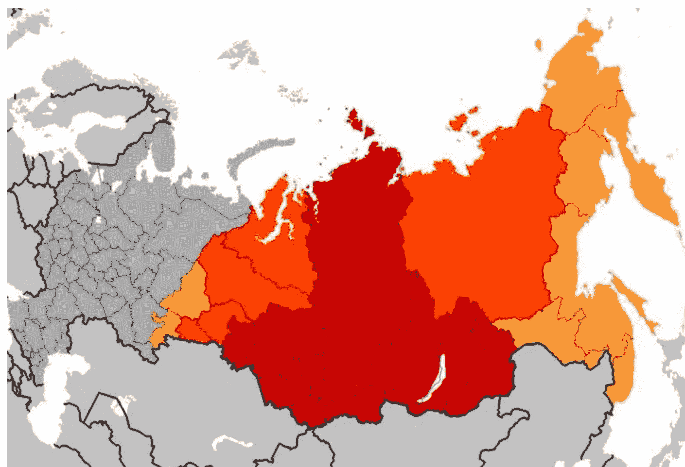

之所以如此，主要因为这里太冷，新闻里常说“西伯利亚寒流”，起源在北极，只要一来中国就降温。其实到了我们这里的寒流已经是末期了，跨越几千公里，翻过几座连绵数千公里的大山，最后才到我们这里。你就想想在更接近源头的西伯利亚，这玩意要豪横到啥样吧。因为冷，那里地形的特点，平的地方都是森林、苔原、河流，不平的地方都是雪山。

这么冷的天气，即使是粗糙的俄国毛子，在西伯利亚也是以苟为主。人口都分布在铁路和从铁路延伸的公路两边。最著名的西伯利亚铁路，100多年前的工程奇迹，也是沿着西伯利亚最南边往前延伸。

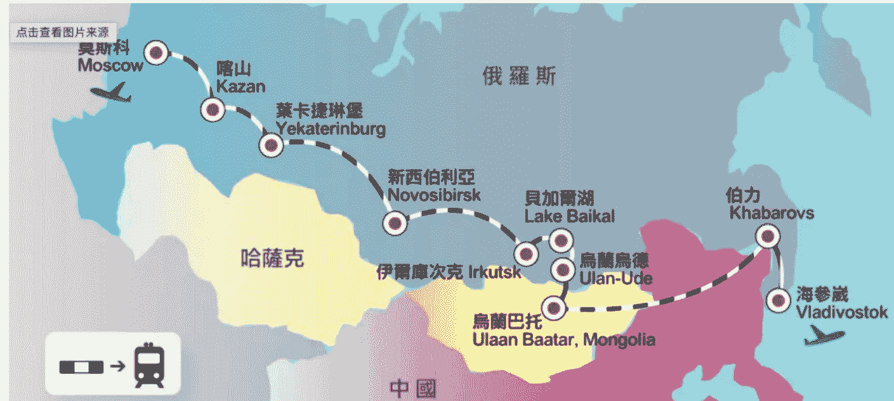

在西伯利亚的人类生存方式，就是沿着以干线铁路为主干，以路上的大站为中心，由此蔓延开支线铁路和公路，辐射出一个个居民点，整体跟条大蜈蚣似的。离开这些点和线附近的区域，对于当地人也是未知区域了。别看铁路北边那么大，几乎没啥人。大家可以打开地图看看，北方几乎没啥城市。加拿大也是这样。而中国人比较多的来到西伯利亚历史不长，以苏联改革为标志，也就是1980年代，在那之前，西伯利亚是苏联的大后方，其他外国人基本不允许到这里。

苏联时期西伯利亚全部为禁飞区。1983年，一架韩国编号007的飞机，载着近300人从阿拉斯加飞往汉城，不知道怎么回事居然向堪察加半岛飞去。苏联认为是一架客机改装的间谍飞机。于是苏联军机立刻升空驱赶，干脆利索地把“间谍飞机”打了下来，惹出一场惊动世界的大事件。即使到现在，俄罗斯依然强硬的不开放西伯利亚领空。中国人真正大量涌入，要到苏联解体之后，不同时期到西伯利亚，从事的工作也有区别。

### （二）

最早来的，是1990年代的中国小商人。当时每班去俄罗斯的火车，都大量聚集着中国人，每个人都大包小包带着各种东西。里面装的是国内各种小商品。因为苏联的经济体制，那里轻工业品奇缺，小商品卖过去可以几倍甚至十几倍的利润。这批人当时被称为“倒爷”。倒爷不好做。首先就是累，都想带尽量多的东西过去，可以多挣点钱。但是那时的西伯利亚铁路火车，要走一个多礼拜。带着一堆东西挤在车厢（更多的是过道），据当事人的描述真的非常非常难受。累之外，危险也无处不在。因为那时都是用现金，中国商人都随身带不少钱，被人抢是家常便饭。比较轻的就是遇到俄罗斯警察或者流氓（二者那时也没多大区别），熟门熟路的中国商人对这两种人很熟悉，警察穿制服，流氓穿盗版阿迪（一般都是从中国人这里买的）。见他们伸手，就拿出准备好的10美元递上去。对方拿过来摸摸就知道真假，侧身就放你过去了。有时全程不用对话，和收费站一样，非常默契。严重一些的就是明抢，如果值钱东西藏得不够隐蔽，可能就会被洗劫。有的俄罗斯人在莫斯科假装黑车司机，拉了中国商人直接开到人少的地方。啥也不说，先打一顿，直到你开始寻思自己到底能做点啥，主动要求把钱财交出来，他们勉为其难才收下。1993年曾经发生著名的“中俄列车大劫案”。6天时间四伙歹徒轮流上车抢劫，其中有两伙人还撞在一起，于是一伙从车头开始一伙从车尾开始，抢到多少是多少。案情如此重大，公安部成立调查组，千里追凶，最后枪毙了20多个。不过最可怕的是遇到“官方打劫”，俄罗斯的制度在苏联解体后一直比较乱，很多时候政策一年几变。多次出现过新法令颁布，把一大批中国商人全部宣布违法的事情。遇到这种事，要做的就是赶快跑。运气好动作快的还能带着账上的钱脱身，运气不好倾家荡产人还要抓进去，找亲友们凑钱把人“赎”出来。不然俄罗斯的监狱，那可是出了名的恶劣。在俄罗斯做买卖的中国人，大多都保持随时跑路的准备，一有风吹草动就打点细软。关于那段历史，最好的影片要数冯巩的《狂吻俄罗斯》，虽然有点淡化了倒爷的艰辛。但是对于群像的刻画很准确，对当时的社会环境也非常还原。很多中国人和俄罗斯人，以这种方式挣到了自己的第一桶金。商品顺着西伯利亚铁路运输，多数都是往俄罗斯欧洲的人口密集区走。但是沿路每到一处就会卸下一些，在当地出售。这也是西伯利亚解封之后，中国人大规模到来的开始。很快，有了一定资本积累的中国人，就不再只是在西伯利亚销售中国产品了。因为西伯利亚这地方，真的是“肥”，商机真的多。

### （三）

说起来，西伯利亚有着难以想象的资源，特别是各种矿产。

关于那里的矿藏丰富程度，有个说法：俄罗斯说西伯利亚有多少矿，不是探明数量，而是在无数的矿藏里面，觉得有可能会开采的数量。当年苏联在西伯利亚探矿，实在是矿太多地方太大，传统方式不知道干到哪年。于是狂野的苏联人1971年开始用核武器探矿！方式是先挖个深井，然后引爆核弹，用设备记录产生的地震波，通过对波形分析，可以大致知道这片区域的矿产情况。多说一句，冷战时期美苏都在用核弹炸运河炸水库。前后用几十枚核弹，把苏联的国土好好探了一遍，特别是西伯利亚地区是重点关注的。核弹探地的结果非常丰富，苏联人发现了几十个潜在的天然气田、矿床、油田……但是家里有矿不代表就能顺利开采，毕竟那地方太冷太艰苦，苏联时期曾经搞过大量的“石油城”，“天然气城”，输送大量的工人家庭去西伯利亚挖矿，但是这种模式注定成本极高，而且不可持续，所以现在西伯利亚有大量彻底荒废的工业城市和共青城。那地方太苦了，稍微有了机会，那里边的人就都跑回西部去了。这种背景下，尽管俄罗斯百般不情愿，可是有好几个俄罗斯的共和国（俄罗斯是个联邦，下边有很多共和国，类似美国的州），已经把矿承包给了中国企业，工程量和投资规模非常非常大，铁路，发电厂，选料场等等。不过数量不是特别多，主要也是俄罗斯比较警惕，一般不会随便批这类项目，另一方面投资太大，加上政策比较摇摆，敢去的人不太多。现在华人涉足最大的，是他们的木材产业，西伯利亚的木材多得让人眼晕。据说这里有全世界20%的森林存量。而且种类多质量好，在国内都有很好的销路。关键价格还便宜。只是这项业务也不是太容易，毕竟俄罗斯传统摆那里，动不动就要被官员、警察、流氓讹诈。此外如果出点啥事，莫斯科就会介入，倒是不管合法不合法都全部叫停，然后官员们开始仔细检查问题。特别是外国木材企业，过了粗箩过细箩，稍微有点问题就逮住不放。这倒不是针对中国人，只能说在当地官员看来，真的敢大规模盗伐的要么有后台要么有胆子。真逼急了不好惹。上面要打击非法盗伐，目的主要还是为了税金，既然是要钱找谁不是要？拿没有根基的外国商人下手，没有任何负担。2019年，西伯利亚伊尔库茨克地区一场大火，烧了海南那么大一块森林。事后的调查结果，就是盗伐的人害怕被抓，干脆点一把火烧掉。跟咱们古代一查账就失火一模一样。事情根本查不出啥，只能不了了之。比较搞笑的是，俄罗斯一直想把原木锯成木头片再出口，那样能多赚点钱，相当于半加工品嘛。只是俄罗斯缺人，缺电锯，缺电锯的耗材，一直搞不定。这两天俄罗斯人正在研究，准备拉高原木关税，逼着华人从国内买电锯到俄罗斯锯木头。即使如此，中国人的木材生意在西伯利亚也做的很好，谁叫中国是当地木材的最大消费市场，占了当地木材出口总量的大头。现在中国的木材也是个万亿产业，其中进口的那部分，一大半都是从俄罗斯进口的。木材之外，西伯利亚最多的就是土地了。于是中国人又看上了这个生意。

### （四）

西伯利亚的平原地区，很多是黑钙土，和东北地区一样，甚至更加肥沃。而且很多土地都不是荒地，原本也经过种植。比如“赫鲁晓夫”时代曾经大规模在西伯利亚开垦，虽然后来搞黄了，但是很多地都开了荒。多说几句赫鲁晓夫种玉米的事，他当时跟美国人一边辩论，却一边打心眼羡慕美国人能种那么多玉米，所以回国后在西伯利亚推玉米，后来一地鸡毛。但这不是问题的关键，西伯利亚确实不能种玉米，可是能种小麦和大麦，当时有人提醒了，不过苏联是非常僵化的，没人听，赫鲁晓夫一声令下，大家都去种玉米，最后种了个寂寞，基层官僚担心被处罚，甚至从国外进口玉米糊弄赫鲁晓夫。后来终于反应过来，不再折腾玉米，开始实事求是种小麦，在西伯利亚搞了大量的农业城，巅峰时期达到了150座。只是那里边的人完全是瞎种，仗着土好，直接把种子扔出去就完事了，长成啥样随缘，哪怕现在，所以大家并不富裕，极其厌恶寒冷天气，在苏联解体后，很多人回到了乌拉尔山脉西部，不再待在西伯利亚了。所以在西伯利亚，很多地方都可以见到大面积抛荒的土地。也就是说，西伯利亚很多地方是可以种地的，只是没人，而且现代农业也不是靠人，而是靠资本推动，得买大量的机械设备和农药化肥什么的，俄罗斯人正好也没钱，有钱的是那些能源寡头，他们赚快钱赚惯了，怎么可能去鸟不拉屎的远东搞农业嘛。按照一位老哥的说法，他原本是在西伯利亚做木材生意。每次看到房东抛荒的黑土地，心里都有一团火焰燃烧，想把上面的草都拔了，然后种上粮食。后来开始包地，一亩一年10块钱，他就包了3000亩，一下子签了五年合同，然后他才发现，3000亩地实在是有点大了，老家全村只有1600亩地。后来又从国内拉了几个兄弟，买了国内的二手机械设备，开始在西伯利亚种地。这里也凸显出来俄罗斯一个困局，俄国人想守住西伯利亚，可是没啥人；全部撂荒吧，又舍不得。只好睁一只眼闭一只眼，让中国人进去经营，还可以赚点钱。至少可以养活下基层，不然都跑光了。当然了，中国人在那边并不一帆风顺，除了冷，还有缺人，更麻烦的是俄罗斯特色的“随机政策”，时不时地就会变，加上当地官员习惯性的腐败。中国人不愿意惹事的名声又那么响，当地人的酒鬼无赖（这些人很多同时也是官员），把中国人当“肥羊”。虽然有很多困难，但是由于确实有盈利，中国人在西伯利亚种地的规模，眼看着越来越大，人数越来越多。这一点有点像印度，去那边经商也是被层层盘剥，不过确实很多人赚到了钱，所以有大量华商前赴后继去印度。种地之后，大家估计都能猜到，那就是我们的传统艺能，种菜。俄罗斯菜太贵了，冬天黄瓜西红柿这类菜，卖到人民币几十块一斤都很正常。价格之外俄罗斯人饮食习惯和中国人非常不一样，是标准游牧民族的食谱，肉蛋奶多维生素少。一开始是中国人在房前屋后种，借着天气好的时候弄点菜，改善一下伙食有时还送给熟悉的当地人尝尝。然后是在地里成片的种，收获了去卖。西伯利亚蔬菜价格那么高，细算起来种菜的收益比种地高得多。现在已经非常成规模，如果俄罗斯放开管制，不出意外将来会越做越大。

### （五）

但是有一批中国人在俄罗斯干着另类的挖“矿”生意。挖的是比特币这类虚拟币，具体开始的时间虽然已经无法考证。但至晚在2012年后，中国人在西伯利亚地区挖比特币的规模就非常大了。去年中国彻底禁了在中国境内挖矿，很多都搬到俄罗斯去了。矿机最密集的地区在贝加尔湖边的伊尔库茨克，因为这地方基本就是为挖矿设计的城市，只是以前挖金属矿，现在挖比特币。这里曾经重工业城市，曾经是苏联时期西伯利亚开发的重点区域。附近有大量河流汇入贝加尔湖，水资源异常丰富，同时有大量优质浅层煤矿。伊尔库茨克附近有着几个巨大的水电站，同时因为丰富的煤矿还建立了火电站。使得这里成为全俄罗斯电价最低的地方。城市一度电人民币0.15元，农村更是只有几分钱。加上这里温度很低（低温能到零下近40度），大家知道，挖比特币很麻烦的一件事是散热，西伯利亚温度那么低，天然散热好，采矿业务非常发达。发达到什么地步呢？已经到了因为用电量太大，居然能造成当地停电。当地政府为此非常愤怒：采矿的都在想方设法蹭民用电，而不是使用他们规定的工业用电，工业用电要人民币0.4元。所以对于这种“揩油”行为严打。不过所谓“天高皇帝远”，因为比特币盈利比较猛，矿场并不在乎打击。而且矿场大多都安置在比较偏僻的乡下，只要不欠电费被抓的可能性不大，即使抓住也大多罚款了事，因此打击效果不大。此外俄罗斯军方也在那里挖比特币，官员们觉得说不定是军方把电给搞坏了。其实当地也明白，如果真的抓的太紧就不合算了：一来无利可图会逼迫矿场搬家，搬走了他们赚啥；二来这些矿场是很多人收入的重要来源，下面并不会真的去严查，能够通过罚款弥补部分损失就可以了。再说除了中国人，当地人也被这门生意吸引，早就参与到了挖矿的事业里。在当地，有的是小规模单打独斗，就利用自家的车库仓库等等空闲地方，买来些设备挖矿。而有门路的人，早在中国人刚刚到来的时候，就开始借着挖矿大把大把弄钱了。这些人，有的是做经纪人生意，为中国矿场“摆平”各种问题。从办理签证、租用土地、建设矿场、接电线网络、安排生活设施这种合规合法的，不合规的比如偷电、政府执法、罚款、居民投诉、矿场污染等等，都可以搞定。有的比较富裕又有投资眼光的当地人，或者与中国人合股，或者自己单干，也建设矿场挖矿。据说比起中国人那种低调的搞法，他们做事态度就比较“开放”了。一些势力比较大的，干脆就在用电方便的地方，找一个废弃的村子，把路直接挖断，在里面“占山为王”。甚至一些人能和电站的人合作，把矿场干脆开在电站附近。现产现挖，无缝连接。可以说在当地，这早已经是“法不责众”的态势了。在伊尔库茨克矿机轰鸣的同时，每年天气最温暖的时期，北冰洋附近的西伯利亚雅库特地区，很多人也在无声的挖掘。

### （六）

这些人挖的不是矿产宝石，而是“尸体”。也就是早已灭绝的猛犸象的遗迹。随着动物保护的普及和加强，象牙作为商品在全世界几乎全部禁止。但是在人类历史中，对于象牙的喜爱已经有上万年了。禁止象牙交易客观上使得象牙变得稀缺，价格更高，于是一个替代方案被人发现：去冻土地带挖掘猛犸象牙。所谓猛犸，就是《冰河世纪》里面那种长着长毛的大象，曾经广泛地分布在西伯利亚、阿拉斯加、加拿大等北半球寒冷地区。人类的祖先还狩猎过猛犸象，但是大约一万年前，猛犸象彻底灭绝了。因为早已灭绝，所以不存在杀害野生动物的问题。理论上来说，猛犸象牙属于“化石”。但是挖掘出来之后，和真的象牙一样可以加工成工艺品和饰物。而且猛犸比现代象高大（大的可以长到12吨），象牙也更粗壮，密度更高，硬度更大，可以刻画更加繁复的细节。所以一出现，就在文玩圈子里大受欢迎。猛犸象牙也有好坏贵贱之分。特别是一种被称为蓝皮的象牙。在常年埋藏下，象牙被矿物质沁入，表皮产生了各种颜色。以黑、黄、蓝为主，其中蓝色最少，也最贵。蓝色中也按照深浅、纹路、花色等等各有不同，价格也千差万别。猛犸牙多值钱？如果是一根完整的象牙，找到的人大约可以拿到20到50万人民币，主要看成色。等这根象牙做成饰品销售，价格大约是收购价的5倍以上。雅库特地区在西伯利亚都是最偏远的地方，当地人收入微薄，一根象牙是当地人数年的收入。这促使人们一到积雪融化的时候就会进荒原“寻宝”，这些年不少华人也加入了寻宝征程。整个历程非常艰辛。前面说过，西伯利亚冻土一旦融化就是泥浆池。挖象牙的地方都是深入的不毛之地，到达那里的难度就很高了。还要带上住宿用具、食物、挖掘工具、搬运工具。因此很多时候，为了方便进出，当地人都沿着海岸或者河流，用船作为交通工具。甚至收象牙的人，就驻扎在海边，当场用现金交割。现在大家知道为啥非洲有“象牙海岸”和“黄金海岸”了吧，基本和这种情况一模一样。其次一到这种时候，不论森林、苔原、沼泽，到处都是各种虫子。西伯利亚的蚊虫聚集起来铺天盖地，远看如同黑色的柱子，近看如同一股黑色龙卷风。还有就是象牙可不是摆在地面上，要在烂泥一样的地里挖掘，因为位置太偏僻，机械设备是不要想的，全都是徒手。如果运气不好，找不到象牙，苦就白吃了。甚至因为土质等问题，事故伤人甚至丧命的事情也时有发生。不过“杀头生意有人做，亏本生意有人做”。对于当地人来说，挣钱养家糊口是最重要的。因为挖掘象牙的情况已经非常严重，俄罗斯政府也不是毫无动作。先是规定发掘必须要许可，不然抓住就罚款。然后对于违规收购、运输、加工象牙都给予重罚，同时在海关严查任何人携带象牙，一旦发现不但没收罚款甚至可能坐牢。反正在俄罗斯，没啥事是罚款不能解决的，实在不行，就给拉皮条的或者官员直接塞钱，基本都能解决。所以各种条例几乎毫无作用，挖掘象牙的雅库特地区，有近400万平方公里，人口却只有100多万。在这里任何政府的法令，一旦违拗当地人的利益几乎都无法执行。何况当地人口大量都是非俄罗斯族裔，处理起来政府也畏首畏尾。再说俄罗斯官员的腐败和低效又是如此有名。几年了，除了个别不知道是运气不好还是被当作典型的，保守估计每年有上百吨的猛犸象牙被挖掘出来，基本被送到了中国和印度。这些象牙被加工之后，除了在中国销售之外，印度也是猛犸象牙的一大销路。因为大象是印度国宝和标志，象头神是印度最著名的神之一。象牙被印度人认为可以保佑自己（象头神表示我谢谢你全家啊）。

### （尾声）

说了这么多，大家也看出来了，俄罗斯西伯利亚是真正的大宝库，但是这个宝库想挖掘，绝对是一件资金和人力双重密集的产业，以俄罗斯现在的状态，根本搞不定，守着聚宝盆挖不出来，那里的人越来越贫困，只好大规模逃亡西部城市，导致西伯利亚更空虚，恶性循环。尽管俄罗斯不太愿意，不过随着俄乌战争打成这样，俄罗斯未来的颓势已经非常明显，只能不断加强和中国的合作，他们的资源想卖只能卖给咱们和印度了。到时候广阔的西伯利亚，在那里挖矿种地的中国人会越来越多，大家再过一些年，听到关于西伯利亚的说法也会越来越频繁，就跟前些年开始，“非洲”被提及的越来越多一样。

只要俄罗斯能好好合作，不搞政策摇摆，尊重合同契约，以中国的资本实力和人力资源，把他们西伯利亚变成大仓库问题不大，他们能赚点钱，咱们也能一定程度上摆脱对西方的资源依赖。到时候才是多赢，赢好几次。

公众号懒人搜索，懒人专属群分享

## 公众号
懒人搜索

懒人专属群

微信:lazyhelper

### 为啥苏联的轻工业那么差

2022-09-06

提起苏联，可能大家第一反应就是无比庞大的军事实力和重工业，以及极度薄弱的轻工业。前者塑造了几乎是人类历史上最庞大的一支军队，而轻工业薄弱，导致老百姓生活水平一直上不去，这也成为后来苏联崩溃的原因之一。

那问题来了，为啥苏联那么强大，轻工业却搞不好呢?

我这段时间没少查资料，就发现苏联的轻工业并不差，有很多领域是世界第一，比如毛织品、棉布、鞋、砂糖产量很长时间里都是世界第一，许多轻工业产品产量雄踞世界前列。主要是因为苏联的西部，也就是今天的乌克兰和白俄罗斯那一块极其肥沃，粮食作物极其充足。

看着也不差啊，那为啥大家说苏联的轻工业差呢?难道是以讹传讹?

当然不是，苏联最大的问题是计划经济太僵化，经常出现一个问题，需求和供给始终平衡不了，经常是一个地方鞋子堆积如山，可他们最需要的糖却几乎没有，而另一个地方糖都多的没地方放，鞋却极度短缺。这也是缺乏价格信号的毛病。

更关键的是，复杂一些的轻工业品，苏联几乎不能生产，就需要进口。

那为啥不能生产呢?

这就涉及到大家对于轻工业和重工业认识的一个误区。

重工业给人的感觉难度很大。主要是机器设备比较难搞，但是产品数量比较稳定，一旦投产就不会变来变去，所以在苏联从西方进行了超大规模的工业购买之后，大部分问题就解决了。比如硝酸工厂就是苏联花了2700万美元，从美国杜邦引入了全套设备。著名的高尔基厂，平时产拖拉机，战时产坦克，也是苏联花了1300万从美国福特公司引入的。

斯大林也直言，“在我们所有重工业工厂中，约有三分之二是在美国的技术援助下建成的。”当然了，得花钱，苏联用黄金和资源支付。

反过来讲，轻工业看着简单，生产衣服食物家电什么的，因为要适配无数人的需求，所以产品种类一直多得离谱。

比如咱们平时的衣服，四五十年前，我国全国人穿的都差不多。但是如今大家去看看，淘宝上衣服的种类高达几十万种，走在大街上，可能一条街找不到两个人穿一样的。这么多衣服，才能满足老百姓千变万化的需求。

这背后就是超级复杂的产业链和供应链，来支撑这种变化无穷的需求，难度和复杂度一点都不比重工业弱。

另外一点，轻工业的基础是大量人口，然而由于战争等，苏联的人口一直不太够。苏联人口最高峰在上世纪八十年代末期，大约有2.8亿人口。同期美国人口大概在3.5亿。

这么看差距不大，但美国从来也不是单打独斗，美国和它的盟友加起来超过了10亿，彼此贸易频繁，整体是一个系统。而苏联加上自己的盟友，也才三亿多，差距太大。苏联轻工业不行，美国也不行，美国把轻工业转到了亚洲，苏联却没地方安排。

这也就决定了苏联那点人口，不可能两手抓两手都能硬，只能是瘸腿走路，他们为了国防，只好选择了和军事强相关的重工业，剩下的工业人口已经很少了，没法再去搞那些超复杂的轻工业了。

咱们可以拿奶粉举个例子，感受下轻工业的复杂程度。

婴幼儿配方奶粉是生活中非常常见的一个品类，竟然有上千款，简直匪夷所思。

可能有小伙伴纳闷，真需要那么多吗？当然了，不同人群对营养需求、价位、口味等都不一样，这么大的国家，有这么多种类也正常。

而这么多奶粉品类背后，是如山一样规模的供应链。

这么说吧，奶粉行业横跨了一二三产业，从前端的饲草种植、奶牛养殖、奶粉加工，再到仓储、物流、销售，是一个极其庞大的工程，没有几十年时间搞不起来。比如我们这么大的国家，每年上千万个婴儿宝宝，背后是几百万头奶牛。当然了，并不是有了奶牛，就有了好奶粉。

就拿奶源来说，规模化牧场的奶源质量最好，养殖小区牧场次之，散奶的品质则较难把控。在2008年左右，中国的奶源市场还是鱼龙混杂，散奶充斥市场，无法从源头保障品质，最终导致了三聚氰胺事件，进而失去了消费者信任。

在这次事件中，我们熟知的飞鹤，就是少数没有检出的乳企之一，主要也是因为他们的产业链供应链都是自己建的。飞鹤很早就看到了当时的奶源问题，在2006年开始建设现代化、规模化的“万头牧场”，从产业链的源头开始抓奶粉的品质。

到今天，飞鹤共有10个牧场、超过9万头奶牛、奶山羊，近60万亩专属农场，9个现代化智能工厂，奶源自给率达到100%。

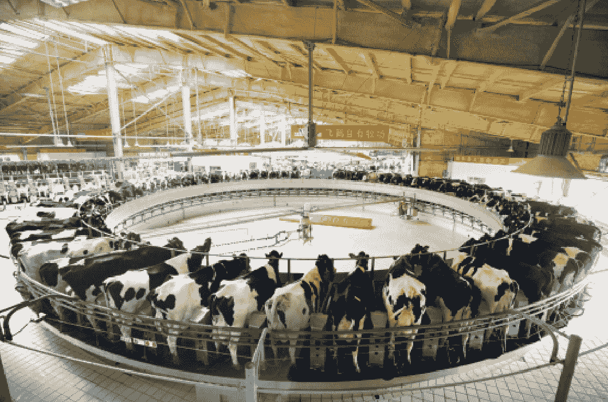

### 飞鹤自有牧场 图片来源：中国国家地理

这只是第一步，因为只解决了奶源的问题。除了牛奶这个核心原料，还需要添加其他辅料，比如OPO、乳铁蛋白等。

这就涉及到国际供应链的问题了，受到国际局势或者疫情的影响，这种就很容易被国外“卡脖子”，一不小心就会出现原料断供、产品短缺的问题。像疫情刚开始那会儿，国外的乳铁蛋白没法运进来，很多企业的乳铁蛋白产品纷纷告急，买都买不到，一些工厂直接停产。对于食品乳品行业来说，这种供应链上的隐患，就不仅是对产业造成了威胁，也给百姓生活造成了极大的困扰——孩子随时都有买不到奶粉的风险。

好在经过多年的核心原料攻关，今年5月份，飞鹤投产了中国乳业第一条乳铁蛋白自动化生产线，技术完全国产化，解决了关键原料被国外垄断的问题。现在全球疫情形势严峻，国际局势复杂动荡，实现婴配粉核心配料的国产化，对于乳业产业链供应链的稳定、保障高品质乳品的持续供应，有非常重要的意义。

### 中国乳业第一条乳铁蛋白自动化生产线

对于供应链来说，更关键的是弹性。

苏联一直存在需求和供给不平衡，比如鞋厂生产鞋，罐头厂生产罐头，即使哪个工厂发现某个产品可能非常抢手，也需要打报告，让国家分配资源，这又涉及超级复杂的计算量，大部分情况下都不了了之。

那市场经济下怎么解决呢？

主要是去找供应商，不需要向一个中心节点汇报。

如果供应商觉得你的价格合理，他们再去想办法找原料提供商，一级一级就反馈上去了。最后你不需要知道供应商是怎么解决的，你很快拿到了你需要的部件，做成成品，发布出去。比如苹果手机，它也不是所有的部件都生产，而是掌握住一部分核心技术，其他的都向市场购买，三星的屏幕，夏普的摄像头，以前是英特尔的CPU，现在是他们自己设计，找台积电代工。

也就是说，市场经济是从下往上计划的，每个企业都管理好自己的供应商就行了，供应商会去管理自己的供应商，没有一个中央处理器。

为啥我国南方制造业在全世界有几乎不可替代的作用，主要是这种弹性，在其他国家，你需要什么东西，很可能根本找不到供应商，或者几个供应商不在一起，在中国，几天就能出样品。因为你去了东莞，很容易就找到产品所需的各种部件对应的供应商，我们的产业规模太大了，形成了一个网络，这个网络能创造出来一切。

这种弹性，其实也就是供应链的敏捷性，能够快速响应市场需求。尤其是最近这些年，数字化的出现，让供应链的弹性和敏捷性，达到了前所未有的高度。

再以飞鹤举例，经过这些年的数字化升级，在飞鹤智能供应链体系下，可以快速迭代，比如要搞个新产品或者增加新产能，可以很快地拆解生产的目标、采购的目标、物流的目标，就能通过计划去平衡产销，而且还可以根据趋势判断未来的订单。

从数据来看，以前经销商下订单之后，产品需要在28天之内送达，有了数字化供应链的加持，15天或者更短的时间内就能送达。如果是电商直销，飞鹤奶粉从挤奶到产品送达消费者手中，最快仅需28天。

正如中国飞鹤副总裁魏静曾称，如果数据整合做得足够好，终端门店每卖出一罐奶粉，工厂就知道接下来应该多投几批原奶。而飞鹤正在朝着这个方向努力。

说到这里，大家应该懂了。

对于企业来说，供应链是非常核心的一个能力，只有提高供应链抗风险和应急的能力，才能保障市场供应的稳定性和连续性。

对于轻工业来说，复杂、稳定、敏捷的供应链，正是其得以发展起来的关键。而轻工业发展起来了，就会给重工业提供资金，源源不断地反哺重工业，实现两条腿走路，国家的安全稳定和经济发展才有保障。

以中国为例，到今天，中国一百多种品类的轻工业产品产量居世界第一，有了名副其实的“世界工厂”之称，不仅为我国的老百姓提供了丰富的物资，改善了大家的生活水平。而这些轻工业产品，也在持续销往世界各地，成为我国经济发展的重要动力。

轻工业，看似简单，却关系着国计民生。

公众号懒人搜索， 懒人专属群分享

### 你做不成你没见过的事

2022-09-04

在过去很长时间里，我也有过一个纳闷的事，就是咱们国家那么多的扶贫项目，有些可能根本没啥收益，到底该不该去做。

比如我亲眼见过，政府为了几个村修了一条路，然后又连了基站，这个花销不可谓不小，我甚至觉得很多项目本身就是在烧钱，毫无效益可言，也没有可持续性可言，这样做到底值得吗？

直到上周一个小伙伴回国，跟他吃饭聊天的时候突然悟了。

他自己是一个小镇出来的，小学就在镇上度过，初中去了县城，然后从县城中学考到了北京，再从北京去美国留学，准备毕业后回国就业。

他说以前也不懂，直到去了一趟巴基斯坦，突然就是懂了。

他一直觉得自己已经够惨了，奋斗过程也是非常艰苦，但是去了巴基斯坦，才发现一个问题，就是那边的很多人，才是真的惨，他们也跟自己当初一样，被困在一个被山围着小地方，几乎叫天天不应。

更关键的是，巴基斯坦那些人极其封闭，路极差，也没有电，他们既不想通过努力走出大山，也没有改变的渴望，不是因为他们懒或者有病，单纯是因为不知道外边的世界啥样。

人没法为了一个想象不到的东西去努力。

他回想自己当年走过的路，尽管老家穷，但是很早政府就给修了路，那个路非常破，所以政府每年都得带着青壮劳力去给路“补坑”，不过有了路就比没有强，有一趟通往县城的“班车”（他们那里就是这么叫的），村里的人每隔一段时间就要穿上自己最好的衣服，就要去县城逛逛，打发一下无聊的时光，他尽管出生在镇上，但是很小就知道外边有个更大的世界。而且很早就通了电，尽管经常断电，但是确实通上了，八九岁的时候就有了电视，大家去他家看电视，后来慢慢其他相对富裕的家庭也都有了电视。

在那时候，他在电视上看到了火箭发射，看到了穿着白大褂的科研人员，突然有种冲动想做他们那样的人，慢慢地知道了，想成为那样的人，得考大学，考大学就得去县城读初高中，那现在就得好好学习。尽管后来没能走航天这条路，但是当初提上来的那口气，支撑他走了十几年。

正是从小心里种了一棵草，如今长成了一棵树。

他们这些人尽管穷，但是并不封闭，一直也知道外边啥样，后来通过那条破破烂烂的路，全家搬去了县城，从县城考上了大学。

现在回过头来看，当初走出来的那些同学，有的混得非常好，有的一般，但是最一般的，也比待在村里的父辈强太多。

他非常感慨，说真正的贫乏其实并不是没钱，没钱可以赚，真正的贫乏是这样的：
- 缺乏视野的通道，世界那么大，你却看不见；
- 缺乏走出去的通道，世界那么大，你却走不出去。

他在巴基斯坦的时候觉得当地的人非常可悲，觉得当地人的穷，是那种“知识的匮乏”，人们不敢想象外边的世界，更不敢想象走出去是一种什么体验。

如果他当初没有那条连着县城的公路，如果父母不是经常去县城逛，可能意识不到自己的娃也可以通过教育来改变命运。他如果不是看电视，可能也没有对外部的世界足够的想象，不知道外边的人竟然可以那么过日子，进而产生我也要那样的觉悟。

懂了这个问题，再看我们这些年做的事，也就明白了很多。

很多国家层面的扶贫项目，以及这些年越来越多的社会层面的公益项目，有一部分本身就不是为了经济效益，而是为了尽量给基层老百姓提高一些生活水平，顺便打开更大的世界，大家的生活水平每提升一寸，就有更多的精力和注意力从生活的琐碎中分离出来，去关注实现更好的自我，更关键的是孩子，只有孩子知道了这个世界是啥样的，才会有梦想，你不可能梦到自己没见过的东西。

回过头来看，中国改开奇迹，某种意义上讲，就是西方的技术知识和中国广阔内地的大量人口，在东南沿海汇集，形成了人类历史上史无前例的工业区。上文提到的那些公路和电网，本质就是毛细血管，从农村把人解放了出来，处在毛细血管尽头的那些孩子，沿着公路到了县城，再到更大的城市，彻底走出世世代代繁衍的土地。

值得一说的是，这些年的公益，有些事政府在做，有些事民间在做，今后的趋势是民间占比越来越大。

比如这些年，很多互联网公司利用自己的平台，给边区老乡带货土特产，因为公路早已修了过去，网络已经开通，当地可以直播展示，平台给了流量之后，就有了订单，那些土特产再随着公路网发到了全国，可以理解为企业和政府对贫困问题的一个“共同解决”。

这俩几乎缺一不可，任何大公司几乎不会触碰基础设施，因为投入成本巨大，最后却几乎无利可图，有了这些基础设施，叠加市场化的商业模式，很快就能爆发出蓬勃的生命力。

其次有些公司给落后地区搞了不少旅游项目，这些项目有的黄了，有的起来了，做成的那些当地基本上就脱贫了。

还有一类是聚焦教育领域的基础性公益行动，这类项目相比产业项目并不吸引眼球，但关系到根本问题，因为教育公平是最大的公平。比如帮助乡村孩子提升学习条件，开拓眼界等等。这些事情产生效果很慢，可能需要十年八年，但却是根本性的改变。

这两天看到TCL公益基金会在陕西汉中的一个项目，四所学校经过一个暑假，被改造成了科技感十足的光伏校园。

TCL中环拥有全球领先的新能源光伏硅片技术，基金会与TCL中环合作，向乡村学校捐赠光伏屋顶太阳能发电系统，电能全额并入电网，每年为学校带来持续收益，打造可持续助学模式。汉中西乡县草庙小学等4所学校刚安装了一批，基金会捐了119万元的光伏屋顶发电系统，以及其25年的发电收益，用于学校建设及学生资助等。

此外他们这些年默默做了很多事，比如从2013年开始，TCL公益基金会就启动实施“TCL希望工程烛光奖计划”，专注改善乡村教师的生活状态，已经有超过2000所学校的3000名优秀乡村教师获奖，共计投入资金超过4200万元。

此外他们还在打造智慧教室，就是两间相距万里的教室，近乎零距离同上一堂课，未来大山里的孩子可以沉浸化体验大城市的课程，相比以往通过一块单一的屏幕，效果将大为提升。

现在想，所有问题都是人的问题，不管将来怎么发展，核心还是释放我们这十几亿人的想象力和创造力。牛顿诞生于明朝崇祯十六年，康熙二十六年发表了那篇跨时代的巨著《自然哲学的数学原理》，我经常在想，中国当时人口是英国的十几倍，难道就没有牛顿这样的人？

肯定有，事实上我们肯定也有过麦克斯韦和爱因斯坦，我们曾经有过太多可以进入“科学英灵殿”的人，但是这些人终身都没踏进现代科学大厦的台阶，大概率在苦闷中度过了一生。

他们没法像牛顿一样从小接触英国当时开发出来的全部文明成果，不知道世界上还有数学这个工具可以描述他们心里的冲动，他们也不知道，关于星辰，关于逻辑，关于数理，先贤们已经开发出来了太多的工具和基础知识可以使用，巨人的肩膀就在那里，可我们的天才只能在放羊和科举中度过了乏味的一生。

所以说，再看那些破烂的公路和电线桩，就跟一条条涓流一样把分散在全国各地的人连到了外边的世界，连到了文明这个母体上，让大家有了梦想的素材，有了实现梦想的途径。

以前我一直有个观点，觉得商业和贸易是推动人类进步的最大动力，现在也没变，不过现在也觉得，很多事情其实并没有多少短期或者可见的利润，这些只能通过国家手段和民间公益去推动，不以营利为目的去做下去。

现在我们更要努力把这些事情做下去，国家做基层层面的，企业和民间力量参加社会公益去做那些各自擅长的，这样才是可持续发展的道路。

文末，放个视频吧，感觉还不错，大家有兴趣可以看看。如果觉得文章还可以，可以给博主点个赞和“在看”。

公众号懒人搜索，懒人专属群分享

### 戈尔巴乔夫搞崩了苏联？抬举他了
2022-09-01

关于戈尔巴乔夫的文章看了不少，发现大部分人犯了一个共同的错误，也就是太抬举他了，竟然觉得他能决定苏联的命运。

稍微了解点情况，就知道苏联有点像要撞上冰山的泰坦尼克号，而作为船长的戈尔巴乔夫，他上台的时候，巨轮已经进入了那个无论如何也改变不了结局的状态了，这还不是最惨的，最惨的是整条船上听他话的人就没几个。甚至一般研究苏联史的人都会告诉你，苏联亡国的祸根在斯大林，等到了上世纪八九十年代，已经完全没法收拾了。

如果强行比较，其实戈尔巴乔夫不像崇祯，崇祯的控制力还是有的，毕竟想杀谁杀谁，戈氏有点像清朝的隆裕太后，可能有小伙伴都没听过这人，其实也是个关键人物，慈禧死了之后，溥仪还小，就由隆裕太后执掌朝政，这个女人最大的问题就是没啥威信，说话谁都不听，各种瞎折腾，其实都是她说她的，下边的人各干各的，最后局势不可逆转，只好签发了逊位诏书。

戈氏也一样，作为苏共后期的“年轻人”（苏联后来是老人政治，都是老头，他“年仅”54岁就担任最高职务），也因为太年轻，没啥根基和威望，一堆老头子谁也不理他。

不过决定苏联命运的，看着是他们这些领导人物，其实是苏联老百姓，就跟大清一样，看着是封疆大吏推翻了清朝，其实是老百姓已经不接受清朝这个不干人事的政权了，所有人都在顺势而为，用姜文的话说，“他们就开了一枪而已，咔一下，推翻了（满清）”。

而叶利钦，就是苏联的袁世凯，他俩都给帝国的棺材上钉上了最后一颗钉子。

我看绝大部分人聊了半天，把苏联，美国，英国上层聊了个遍，唯独没提苏联老百姓，早就忘了这帮人的态度才能真正决定未来。

在当时，苏联最大的问题是，他们的老百姓已经受够了。

大家很容易把1991年的那个苏联和最早由理想主义革命者建立的那个苏联放在一起，以为他们是一回事，其实完全不是一个东西，就好像一个充满理想主义的阳光少年走向社会，几十年后再见面，已经成了一个脑满肠肥、肚子耷拉到膝盖、满脑子男盗女娼的油腻中年。苏联早就退化了，这也是为啥毛主席说它是“苏修”，一点都没冤枉它。

关于苏联，别的不说，最明显的一点就是，这个国家越往后，阶级对立比欧美还严重。

比如社会迅速分层且固化，上层成为特权阶级，和广大民众分隔开来。苏共的高级干部，很快成为“新阶级”，生活腐化堕落，作威作福，享有各种特权。更重要的是，苏联的新贵们和苏联民众几乎生活在两个世界，既不是鱼和水，也没有血肉相连。

更可悲的是，跟所有帝国后期一样，由于财政困难，上层挥霍无度的同时，下层却痛苦不堪，无论是军队，政府部门，还是老百姓的生活都陷入了半瘫痪，整个基层都怨声载道。政府部门经常亏欠大半年工资，老百姓的房子也分不下来，买面包得排长队，还不一定能买得到。这也是为啥有了那个著名的苏联笑话：

> 美术馆里有一幅描写亚当和夏娃的画。
> 
> 一个英国人看了，说：“他们一定是英国人，男士有好吃的东西就和女士分享。”
> 
> 一个法国人看了，说：“他们一定是法国人，情侣裸体散步。”
> 
> 一个苏联人看了，说：“他们一定是苏联人，他们没有衣服，吃得很少，却还以为自己在天堂！”

当然了，也有不少人说苏联条件并不差。

其实这个问题相对复杂一些，主要是看跟谁比，当时苏联肯定比同时代的我们强了不是一点半点，跟全世界其他国家相比也还好，属于中游，不过物资短缺确实是真的，买面包排大队也是真的，几乎所有日用品都短缺。

苏联最大的问题，是宣传过程中总跟美国和西欧日本比，这个就要命了，尽管他们过得不是特别离谱，但是跟欧美比起来，那就没谱了，因为苏联解体前的西方是工人福利最足的时期，而且当时苏联并不是完全封闭，经常有人去西方出差，时间长了大家都知道对比起来啥情况，尤其柏林墙两边，肉眼可见的巨大差距，换谁也没法熟视无睹。这种情况下，心态也崩了。

大家看过那个著名的电影《绝杀慕尼黑》吧，那是俄罗斯自己拍的，也承认当时很多苏联人有病在苏联治不了，老百姓都得凑美元去西方治，篮球队去了西方也抠抠搜搜，对于美国那种繁华状态心里还是有情绪的，时间长了难免陷入自我怀疑。

而且当时有个东西叫“东德错误”，也就是宣传西方不好的东西的时候，却被老百姓发现自己的问题，比如东德拍过一个纪录片，讲的是西德失业老百姓排队领救济金，没想到老百姓却注意到失业群众竟然穿那么好，很快片子就被撤了。其他问题也差不多，每次想丑化下西方，却发现小丑是自己。

客观地讲，苏联后期生活水平确实不太行，但是也没到那种完全过不下去天天饿死人的地步，但是成天跟西方比，把老百姓心态比崩了，对政府意见特别大。

苏联解体前，曾经有个投票，说是有75%的人支持保留苏联。这个确实是真的，确实有这么个投票，但是几乎所有人，包括当时的普京，都不赞成保留当时的体制，要变革，跟富裕的西方保持一致，搞资本主义，当时的那种日子一天都过不下去了。

穷真是万恶之源，你们想想啊，苏联要解放全人类，可是当时苏联老百姓已经知道了西欧，美国，日本什么生活水平，也知道自己什么生活水平，这种情况下，解放啥？让所有人都跟自己一样过这种穷得要死的生活？所以价值观已经崩溃了，再也不想听那些共产主义理想什么的。

不过这个75%可能样本有点问题，从后来的情况来看，波罗的海三国肯定不想待在苏联大家庭了，事实上他们从没想过呆在苏联。苏联的主体俄罗斯也不想了，为啥呢？

有点像明朝后期江南地区贡献着全天下大半的赋税，他们心态有点不太好。苏联作为一个大家庭，是不是要支援边疆地区？是不是得支援亚非拉比如越南朝鲜？是不是得花钱打阿富汗战争？还得维持东德驻军？还有无数天天亏损的国有企业，这些企业的管理层使劲贪，下边的工人却越来越苦，到后来天然气田这种印钞机都会亏损你们敢想？

这些钱到底有多少钱是俄罗斯出的，这个没有公论，但是肯定很多，谁要他们是主体民族呢。资金充裕的时候还好说，但当俄罗斯人站在寒风里瑟瑟发抖地等面包，还不一定能等上的时候，他们陷入自我怀疑是必然的，所以叶利钦为首的俄罗斯民族主义者们觉得自己严重受伤了，这也是为啥后来大家能看到叶利钦一直在闹。

如果没啥社会经验，就会误以为叶利钦是个坏B，就他一个坏人，他一个人坑了苏联。怎么可能嘛，他从不是一个人在战斗，他背后就是最极端的俄罗斯民族主义者，他们坚决不过了。戈氏中间一度把叶利钦的官给免了，换了个闲职，没想到一选举，大家又把他给选回来了，有点像摄政王免了袁世凯，但是控制不住局面，过一段时间袁世凯又回来了，顺手干掉了大清。叶利钦正是有俄罗斯老百姓和上层的支持，所以肆无忌惮，逼着戈尔巴乔夫签了苏联的死亡宣言。

这里就有个问题，为啥要民主选举呢？废了不就行了？

主要也是那些年老百姓呼声太高，压不住了，而且苏联跟美国不一样，美国一直主打的旗号是“自由”，苏联的旗号是“民主”，这就难搞了，不能自己挖自己的墙角、扇自己耳光吧。此外苏联还有个考虑，准备尽快跟西方接轨，好向他们贷款。这也是为啥好像苏联和后来的俄罗斯好像一直在讨好西方，主要也是跟钱有关。不了解的人总嫌苏联后期太软弱，钱是英雄胆，没钱怎么都强硬不起来。

关于苏联将来走什么路线，当时有两条改革路线，一条是美英那种自由主义。

还有一条，当时中国在走，也就是渐进式改革，一步一步来，可是俄罗斯人，你们都懂，压根没准备学咱们，最后选来选去，选了当时最发达的美英的制度，也就是新自由主义。

然后苏联倒地，寡头崛起。当然了，这当中还有个因素，依旧是财政，苏联实在是没钱了，所以只好向美国求助，美国倒是愿意给它援助，只是条件非常苛刻，这也是为啥苏联后期做了一系列匪夷所思的举动，比如开放报禁什么的。此外两德统一苏联没有干预，也和钱有关，因为德国人给了苏联大笔的马克，想赎回东德，苏联不再想给东德花钱输血，还能卖个好价钱，换你你也卖。

只有经历过缺钱，才会明白什么叫迫不得已，什么叫身不由己，什么叫世事不由人。

反正缺钱加上一系列激进折腾后，在俄罗斯民族主义者的背刺下，苏联没了，计划经济直接过渡到了无政府主义，乱哄哄十几年。

到现在你去俄罗斯问，发现对苏联的态度极其分裂，一小部分人觉得那是俄罗斯的巅峰，大部分无感，还有一小部分人把苏联贬得一无是处，至于普京，他明显是不想回到苏联，那句“不怀念苏联的人没有良心，想回到苏联的人没有脑子”，就能说明问题。

多说一句，很多人以为普京代表的是苏共，其实不是，当初苏共在俄罗斯的形态叫“俄共”，俄共就是苏共在莫斯科的支部直接转变过来的，如今属于第一大在野党，跟普京是竞争关系。

现在俄共在俄罗斯杜马有57个席位，总共有450，暂时成不了气候。在全国差不多有10%的支持者，不过这些支持者当中，62%的人是60岁以上老年人，也就是说，年轻人普遍对苏联挺无感，老年人比较怀念。

苏联解体后很长时间里，看我们并不太爽，当时俄罗斯对中国的态度，有点像现在他们看乌克兰的态度，他们觉得正是因为当初中国倒向了美国，导致了苏联后来的悲剧，事实上曾经也跟中国大动干戈，差点打起来。

但是中美俄属于战略大三角，只能是老二和老三联合起来对抗老大，不然老大弄死老二就会转头去弄老三。所以中国跟苏联在一起的时候，美国有些灰头土脸，后来中国和苏联决裂了，然后又跟美国联合，很快苏联就崩了。

苏联崩了后，战略上中美就没了合作的必要，反而中俄重新走在了一起，尽管俄国确实不太喜欢中国，依旧没办法，形势比人强。

整体而言，苏联解体对中国绝对是好事，首先那货死了后就不再威胁中国北方，中国基本上安全了，才能一心一意搞建设，而且它死了后，不仅不能威胁中国，还得跟中国搞好关系，因为俄罗斯的兵力都拉回欧洲去了，西伯利亚空虚到只能靠中国人自觉了，如果中国不自觉，能把西伯利亚所有可以种地的地方全给他种上菜，当然了，西伯利亚不一定能种菜，但是确实可以挖矿，挖猛犸象。

说到这里，大家应该也看出来了，苏联问题的核心，其实就两个：
- 人民的生活水平太差，真的是最重要的事，这也是为啥我国的社会主义基本矛盾，是人民日益增长的物质文化需求，和落后生产力的矛盾，把“物质文化需求”定位这么高，一点也没夸张，这就是根基，如果说苏联亡国有什么最重要的启示，就是一定要发展民生。
- 另一个，财政真的至关重要。

苏联就是死于没钱，入不敷出，然后被嫌弃它的老百姓抛弃了，谁当领导人差别不会太大，你要是让大家过上好日子，谁会抛弃你？天天写诗赞美你还来不及。

当然了，苏联崩溃也跟他们那种很多国家组合在一起有关，其他民族国家一般没这个问题。

至于戈尔巴乔夫，他严重被高估了，就跟隆裕太后一样，看着位高权重，但是处处掣肘，说出来的话没啥人听，政策也被选择性执行，外有列强环视，内有权臣尾大不掉，又没钱，也没啥权威，老百姓也根本不听话，这咋玩？你说咋玩？

相比之下，我们的幸运之处就在于及时改革，比苏联早了二十年，在问题还没到不可收拾的时候果断变道，并且在改革过程中务实不激进，稳扎稳打，一步一步来，几十年里专心致力于提高老百姓生活水平，把这事当成头号大事来做，再加上全民努力赚钱，才有了现在的状态，啥叫国运，这就是国运。

公众号懒人搜索，懒人专属群分享

### 为啥生活已经好了这么多，太多人依旧没那么幸福
2022-08-31

这个问题已经想了太久，倒也不是思考“这个社会怎么了”，而是在思考我自己，毕竟作为一个资深小镇做题家，从一个小地方通过高考走到现在，已经严重超预期，看看我周围的人，也都差不多，如果没有高考，按理说都该去工地的，如今却能在帝都定居，也是匪夷所思。那大家因此而感觉轻松，并且压力很低吗？

并没有。

现在想想，根源主要还是在小时候就种下了，那时候条件太差，当然了，不是我家差，是整个社会都不咋的，我们那代人从小就被教育“不好好学习就得去放羊”，从那时候起，就在“思想底层固件”上打了“放羊烙印”，主动牺牲了当前所有的生活质量，似乎就活着就是为了将来。

这种心态可能长期看来是一种“奋斗”心态，对个人发展相对有利，但是必然会牺牲当下的幸福感，等到有一天一回头，惊讶地发现自己当初想干的都没干，如今终于有条件干了，却已经不年轻了，也不想去做了。而且到现在也没啥真正健康的爱好。

而且我发现这种心态并不是咱们独有，但凡穷过，基本都有这种情况。

前些年还没限制出国的时候，我经常到处跑，工作原因必须要跟老外打交道，我也发现一个问题，欧洲老外当中，跟我年龄差不多的普遍比较随遇而安，因为那个时候欧洲已经很发达了，他们从小衣食无忧。

但是年龄大的，比如七十来岁的，也就是出身于上世纪50年代那批人，不管是英国人、法国人、德国人，他们跟欧洲八十年代出身的人观念也不一样，反倒是跟我的观念有点像。

因为50年代欧洲并不是现在那样，当时他们也不咋富裕，战争把国家打烂了，一直到六七十年代才恢复，所以50年代出生的人小时候也不富裕，导致后来也不是太有安全感。这些老人们比年轻一些的精打细算得多，而且娱乐活动也少得多，并不是老了不愿意出去，而是他们年轻时候也觉得要好好攒钱，攒够了将来就不用过小时候的生活了。

小时候，或者年轻时候的烙印真的是伴随一生。

我经常跟身边的人聊，大家理智上觉得应该不会回到以前那种一穷二白的状态了，但是心里那种由衷的恐惧，几乎没法克服，总想存钱，有了存款才有安全感。而且习惯性推迟享受，甚至有不少人觉得享受生活有种负罪感。

当然了，这不是问题的关键，成年人的痛苦，大部分是比较出来的。

我以前讲过一个发生在我自己身上的事，当初我毕业刚加入公司，没几个月就赶上公司发奖金，给我发了7K，当时我高兴极了，觉得简直是白给，毕竟培训还没结束就给钱，真特么过瘾。

然后跟我关系最好的一个哥们伸出三根手指，我还以为是3K，没想到是30K，当时的痛苦到现在也隐隐约约能感觉到。如今我已经爬到当初我的那个领导上边去了，每次看到他，依旧会想起来当初的不爽，经常想问问他是不是有病那样安排。

不过后来我的那个小伙伴还是离职了，因为有一年公司给了我一笔股票期权，跟我相比，他的就没法看了。他跟我说，谁比他多赚这么多都能理解并接受，唯独接受不了我，谁要我是他哥们，我就是他的“锚点”，如果偏移得太厉害就崩溃了，然后就离职了。

如果你是个喜欢比较的人，以现在社会的透明程度，生活中这种持续的压力基本不间断，因为你不管多牛逼，你在你的交际圈里都处于中间态，你坚持这也比，那也比，那你会发现生活中真没多少欢乐可言。你赚得再多，跟身边那些高位的人比起来啥都不是，而且还有不少人自带起跑线，生下来就比绝大部分人的终点线都靠前。

这一点上，我觉得大家都应该向老北京学习，北京人是见过世面的老百姓，朱家皇帝自杀了，来了李自成，没几天听说李自成也跑了，又来了八旗的王爷们，屠尽了满城天潢贵胄的朱家子孙，再后来八旗王爷也跟狗一样改姓夹着尾巴做人，所以北京老百姓心态就很好，怎么说来着，眼见他起高楼，眼见他宴宾客，眼见他菜市口。内库烧为锦绣灰，天街踏尽公卿骨。所以老北京人哪怕一个月三四千，照样日常乐呵，不是现在乐呵，而是啥时候都那德行。

当然了，更关键的是安全感，对于未来啥样，并没有太多的经验可循，我们有几千年的历史，却对现代生活并没有太多经验。

因为我们现在的这种生活状态，并没有持续多久，满打满算也就20年，如果把加入世贸作为中国的转折点，到现在也就21年，问题是这21年里，并不是一加入，我们的日子立刻就好过了，可能要到2007年左右。

这个过程中，又经历了持续的货币贬值，如果十几年前的有钱人没有果断买房，很可能被通胀洗得差不多了。等大家都意识到房子最保值的时候，房地产眼瞅也要到头了，接下来通胀会不会继续，什么东西最保值，谁都说不上来，大家心里都有点懵逼。一线的房子可能保值，但是门槛高到能当鬼故事讲，不出意外，在接下来很多年里，80%的人的房子没啥前景可言。

比较可怕的一点是，可能父辈们的生活质量太低，又对新生代产生了相反的影响，如今的生育困局，多多少少跟上一代的那种低质量生活有关。

我之前在知乎看过一篇万赞文章，后来没了，不过那篇文章里的思想如今却活跃于几乎所有的社交平台。那是一个关于大学生的反思，他反思了父母的大半辈子，他们没有高学历，也没什么突出的能力，没享过福，也没有啥高深的思想和经验，努力奋斗想给孩子好的生活，可是做得并不好，给不了孩子任何有用的建议，尽力了，却没啥用。而且平时积累了太多的负能量，在外边不敢跟人表现，回家之后都留给了家人。

作者觉得父母太不容易，但是也表示并不感谢他们，因为他们没有能力让孩子过上好一些的生活，却把孩子带到了这个世界，他感激不起来，觉得自己一辈子也没啥优势，既不聪明也没有激情，更关键的是自己也没啥动机去练那些新的技能点，内心太脆弱，承受不了失败，害怕失望，目测没什么大出息，唯一能做的，就是不让自己的孩子再受一茬罪，所以他无论如何也不会生孩子。

文末有句话，说得很扎心，他说谢谢父母那么多年含辛茹苦，只是下辈子别生了。

看到这个，好为人师的我本来想开导他几句，后来发现也说不出来啥，这些年接触了不少日韩年轻人，发现他们的思维也基本上是这样，知道自己不聪明也没有内在驱动力，试过了，发现确实不行，于是准备主动节育。我不知道国内的这种思维是从日韩进口的，还是国内一些人自己悟到了，反正在东亚，慢慢越来越多的人开始有了这种想法，用他们自己的话说，这叫“接纳自己是一个废物的现实后，顿时天地宽”。

我发现他说的那些事，并没有什么好的办法解决，东亚就这样，人多资源少，互相往死里卷，卷到最后，除了少量卷王胜出，大部分人过得也就那样，到如今发展出了相同的问题，也就是大家都不生了。

说到这里，大家可能以为我有啥办法能解决，讲真，并没有，不止我没有，我看了下这段时间以来其他人的那些文章，如何防止年轻人卷，如何防止年轻人不生孩子，说实话，我觉得他们都不一定能说服自己。

不过放弃了找解决方案之后，反倒发现很多事有改进办法，就好像你没法改变你的样貌，你却可以稍微瘦一些，稍微干净一些，看起来不那么衰。

比如为啥有些人非常脆弱，已经脆弱到啥都不敢去尝试。我观察了下，很多很多人有个误区，总觉得目标定高一些，最后也能实现一个二等结果，目标太低就算实现了也没啥。

可心理学研究显示，“目标”这种事不要随便定，如果长期处在目标总也没法完成的状态，慢慢精神上会越来越缺乏动机和内驱力，心灵就跟一个备受打击的孩子一样脆弱，碰上事首先想的就是退却和失败。

甚至不敢使全力，因为使用了全力最后失败了，那就得承认自己是个傻逼，这对每个人都很难。有点类似“习惯性流产”，定的目标经常达不成，慢慢地潜意识里也陷入了一种“习惯性放弃”，别说大目标了，连小目标都搞不定。

同样的道理，很多父母对孩子的教育也是那种“打击式教育”，觉得高标准才能高水平，想得到挺美，不过成功率跟在大A股赚钱的概率差不多。

几年前看过一个顶级教练的访谈，他说他的工作有两点，给运动员拆分目标，把难度超大的目标拆分成一个个稍微有一点点难度的小目标，然后训练过程不断纠正运动员的小问题。人的信心和意志都是训练的结果，需要不断通过一个个小目标的达成来“喂养”。有些人总是失败主义情绪严重，可能是天生的，不过大概率是后天设置目标太高，一个都完不成，把自己的情绪搞崩了。

至于有些人希望通过不断的购物来让自己得到欢乐，那更行不通，心理学上有个词，叫“专注点幻觉”，也就是说，你下单买什么东西的时候，往往无限高估那玩意对你生活的影响，以为买来后生活会有大不同，等到货了，用几天，慢慢就忘了自己还买过这么个东西。也就是说，消费能带来短时间的期待和快乐，长期效果却很差。有句话说，游艇主人的快乐只有两天，买下的那天和卖掉的那天。

但是类似读书、散步，旅行，这些事，短期快乐值很低，但是就跟“涓流”一样，慢慢地也会积累成一个巨大的底座，经历才是真正的快乐之源，而不是商品。所以去溜达，去交朋友，去做点之前没做的事，保证你有收获。

我们很多人的观念里，不是金子就是垃圾，没有其他状态。如果你坚持这样想，可能会出人头地，但是你不会多快乐，更大的可能性是自己把自己扫入了垃圾堆自暴自弃。

所以我想说的是，人要学会接纳，接纳自己只是一颗螺丝钉，接纳自己是普通人，能不去比较就不要去比，你只对自己的幸福和快乐负责，蛋糕能让你快乐，就吃蛋糕，电影能让你快乐就看电影，不过控制好节奏，毕竟太过频繁可能这点仅剩的快乐也没了。

而且对于奋斗这事，也不要使全力，最好是八分力，剩下两分去追求生活中的快乐和幸福，毕竟这才是生活的目的本身。我的经验是，只有这样做，才能跑得久也能跑得远，如果准备以牺牲全部生活为代价去追求某个目标，大概率最后这两样都得不到。

人在做计划的时候，很容易觉得自己会是“二八定律”里的那个“二”，但是经常结果是“八”。倒也不是让大家保持悲观，而是说想清楚如果最后结果是那个“八”的话，能不能接受。我也是想明白了这事之后，心态有了巨大的改观。

所以说，如果很牛逼成了卷王，那恭喜你。如果卷不动，也不要太苛责，毕竟这是绝大部分人的结局，好在过好这一生可能不需要当卷王。对自己不要太苛求，慢慢来，降低预期，降低目标。比如学些什么新技能的时候，先问问自己，一个普通人应该用多久，慢慢来说不定能搞定，我就是这样学会了不少新技能。

至于经济面，也不用太担心，担心也没啥用。从文明史角度来讲，经济在99%的时候是停滞的，只有最近这百八十年发展迅速。换个说法，经济停滞的时候就不过日子了？照样过。

当然了，停滞是底线，现在情况也没那么糟。兰小欢有句话，他说经济是向前的，而且中国再也没法走向封闭了，只要一直向前和开放就没啥事。疫情会结束，信心会回来，你一旦接受了“一边走一边看”这个设定，你的人生也就没啥可纠结的了。

而且也不应该把“资产升值”当做一种理所当然，甚至不应该天天想着怎么让资产跑赢通胀。前几天刚看到一句话：

> 很少有人因为通胀而破产，基本都是为了跑赢通胀而破产。

这几年碰到好几例这种事，有高管年龄大了在职场混不下去了，拿着几百万退场，觉得非常纠结。如果这几百万存银行，担心再过二十年不值啥钱，就跟三十多年前万元户似的。

最后忍不住去投资增值，很快赔得啥都没了。还有人一开始确实赚到了，变得非常大胆而自信，觉得自己是个股神，然后不仅把本钱赔完了，还欠了一些。

他们共同的特点是把钱造得差不多了，然后继续找个班去上了。

这些人赔钱之后对生活终于悟了，投资个毛线啊，钱多钱少都存银行，然后自己继续找个班上不比啥强？看，你不需要花钱就学到了这个关键知识。如果他们早点意识到自己会是“赔钱的大部分人”，可能结果也不会这么差。搞笑的是，大部分人都觉得自己会是小部分人，简直是个悖论。

文末再总结几句吧。

我们的生活相对以前已经好了太多，但是我们往往把自己陷入无限比较和消费主义陷阱里，总觉得幸福是通过比别人强或者能购买到更多的商品来获得的，这样想，往往既不会幸福，也不会比别人强。

普通人认清自己的边界在哪，尤其不再年轻的那些人，对生活多一些感恩，少一些苛责，定目标的时候低一寸，通过不断积累一个又一个小成就来让自己重新获得那种把控感。如果你还年轻，更应该这样。

文章基本都是一口气写完的，经常有错别字，我自己总也检查不出来，又不好意思麻烦别人找，大家凑合着看吧。如果觉得还不错，就点个赞或者在看吧。

公众号懒人搜索，[懒人专属群](link)分享

### 互联网行业也在“土木化”？
2022-08-26

前期写过一篇文章，里边讲过土木行业有一个清晰的演化过程。

跟现在说起土木工程就是“牛马”和“提桶跑路”不同，在21世纪初期，工地人的收入并不低，当时项目多资金足，可能一个项目的奖金，就顶得上别人一年的总收入。

但是至少在最近五六年里（一般认为转折点是2015年），收入没有什么变化。不但是工地人，包括设计在内整个产业链上都是如此，大家可以上网搜一下“设计院”，基本都在叫苦，如果不了解情况，还以为他们受了多大冤屈。

主要是因为随着国家的发展，社会变了，不再是大发展大基建的时代。十年前一个经理能拿到20w，甚至一些专科生去设计院画图，一年都能十几万，收入远超社会平均水平，能够在城市买车买房，虽说买了住不上几天，但是起码心里还是能平衡，对自己吃得苦有个交代。

关键是升迁很快，“三总五项”，也就是三年做到总工，七年做到项目经理。叠加收入，大学土木建筑的录取分几乎是所有专业最高的。

可是这么多年过去了，到如今，物价房价变了多少，收入还是20w，甚至还赚不到。这个收入就没有什么优势可言了，再说还要长期加班，个人生活又缺失。

更可怕的是和人比，同样一个大学，去了互联网和去了工地天上地下，谁比谁流泪。就算是普通工作，同样学校的，这么多年了，收入少比你也少不了多少。人家起码还能和家里人在一起，这一来心理不平衡和迷茫就来了。

而且随着发达地区基建的减少，新项目越来越远，地方越来越偏僻，想回家越来越难。如果出国，甚至两三年才能回家一次。到今年，各个高校的土木专业基本都遇冷，有的干脆招不满，这也跟土木人坚持不懈到处倒苦水有关。本着“劝退一个，救人一命”的原则，只要有人问，那就是苦大仇深罪孽深重，终于把土木彻底搞成了大家躲着走的行业。

今年终于情况有点好转，不过不是土木的待遇赶上了互联网，而是互联网变成了土木。原因之前也聊了，互联网产业和其他行业的差别非常大。

其他行业追求的是利润，把工厂搞起来，把工人雇来，大家开工生产，去掉成本，就是利润。

但是互联网不一样，它要的并不是利润，它需要的是垄断。所以各个公司都在疯狂向对方地盘上扩张，而且大家跟养蛊似的，公司里搞了一大堆各种稀奇古怪的项目，指望着万一某个项目成了，就可以对其他公司形成一波降维打击。

而且跟制造业不一样，制造业的主体其实是机器，人是用来配合机器的。用一些土老板的话说，人和润滑油没啥差别。但是互联网行业没啥硬件（云服务器和办公地这些在总成本里不算啥），最主要的开支就是不断拉码农。

这种情况下，对计算机人才的争夺也进入了白热化。时至今日，其他大部分行业月薪三万就很牛逼了，但是在互联网大厂里，经常雇一个新员工都得这个数。而且很多互联网公司看着赚钱，其实赚到的钱几乎全部投入了雇佣更多的计算机人才，甚至还要拉投资过来给员工发工资。这可能是商业领域非常少见的员工薅了资本家羊毛。

互联网大厂们就跟“一战”中后期的欧洲列强似的，借钱在前线打堑壕战，目的只有一个，等对手的血流尽之后，让对方赔款支付自己这边的天量战争经费。大厂们也是这个逻辑，花了无数的钱，就指望着彻底打翻所有对手占领全部市场后，把钱赚回来。那就需要更多的员工、更多的资源，这种军备竞赛导致员工们的工资转着圈地往上涨。

不过这两年情况明显发生了变化。

随着国家对互联网企业的反垄断和经济的减缓，互联网行业的整个逻辑都变了。

最明显的一个，大家已经开始放弃了那个“垄断梦”，不再寻求垄断。既然不垄断了，那就没必要在前线跟对手打消耗战，而且发现自己真傻，为啥要雇佣这么多程序员？为啥要给程序员这么高工资？

既然不准备扩张，很多“预埋”项目也就没啥必要了，各个公司都在不断地筛选出来各种垃圾项目裁掉。也就是有些项目本来没啥意义，但是产品经理能说会道，不断给公司洗脑，让项目一直维持下去。前年任总那篇文章里，说是“不要讲故事骗公司”，说的就是这事。可能大家觉得匪夷所思，还能这样？

这很正常。一般大厂里大规模招聘，然后年底通过打绩效赶走一批，来回折腾这么一些年，能在大厂干到五六年以上的，大部分都身怀绝技，有的技术超牛，有的能说会道，有的善于管理领导预期，有那么一群通过讲故事骗钱的人，很正常。

但是这两年进入了收缩状态，再怎么能说会道，也扛不住“不赚钱”这个事实。你这个项目再牛逼，不能给公司打粮，就要被消减。也是任总那篇文章里说的，“从聚焦扩张转向聚焦现金流”，说得也是这事。公司的项目能否继续运转下去，不再依赖PPT，而是拿赚钱能力说话。用这个尺子一量，一大堆项目立刻现原形了。

接下来就面临着大规模裁员，项目都没了，你待在公司干嘛？

于是继续评审，把技术能力强的，还有忽悠能力强的留下，其他的全清理掉。大厂这两年哀鸿遍野，基本就是这么个背景。而且可能还没到最惨的阶段，毕竟谁也没说工资只能涨不能降吧。“把寒气传递给每个人”后，可能接下来就是一大波降薪潮。

关于忽悠能力这事，可能有小伙伴理解不了，觉得这特么算啥能力嘛？这事说起来又比较复杂，多说两句吧。公司规模一旦突破“三千人”这个规模后，你在职场的轨迹，都会明显呈现出这样的几个特点：

### 初期看技术，中期看关系，后期看山头。

也就是说，刚加入公司你能不能脱颖而出，主要是技术能力咋样。如果技术能力都不行，那你很难挺过前三年。

等干个三四年之后，你就应该和某个领导关系不错了，成了他的心腹。他有重要的事都交给你去做，他升职也把你带着。毕竟当了领导之后很快毛也不会了，手底下没几个干活的，基本寸步难行。

干到个十来年，如果进入了中层，就有了明确的山头态势。你的人生处境，很可能跟一个上边的领导强相关：他牛逼，能争取到资源和好项目，分给自己手底下的人，手底下的人层层往下分，大家干一年有了收益一起吃肉。上边的领导被边缘化，争取不到好项目，尽是些又烂又没油水的，下边的人跟着倒霉，苦哈哈干一年，最后奖金可能是每人一箱苹果，倒了八辈子霉。不过也别太担心，明年可能更差，效益差会导致骨干流失，没了能打硬仗的骨干，就算领导争取到大项目也搞不定，越混越挫。

你说我可不可以换个山头？也不是不行。不过每个领导和自己的小弟都是用了很多年磨合出来的信任关系，你想加入人家，人家也不要你。就算你过去了，你也是个外人，或者边缘人，平时活让你干，小圈子开会却不叫你。到了年底，人家嫡系把肉分完，给你个骨头，大概就是这么个运转方式。

所以说，在大公司里，很多时候你加入了某个部门，跟了某个领导，可能未来已经差不多了。那些尖刀部门有大领导照顾，资源多项目好，容易立功，每年成立几个新项目。每次新项目上马，一些老员工就会变成小领导，也就打破了熬资历爬天梯的这个困局。

刚加入的时候不明显，过几年就跟其他边缘部门的人拉的距离非常大。可能正是因为如此，很多大厂招聘的时候已经不跟你说自己是哪个部门，毕竟万一你知道了自己要去倒霉部门直接跑了怎么办？等你报到了，有了沉没成本，一般不会跑了。

而且软件行业出现了“倒挂”这个问题，也就是新来的竟然比老员工的收入高，这在大部分行业都比较少见。主要也是因为每年招聘的时候，大厂面对的是少量的大学计算机相关专业毕业生，每年市场价都在飙升，可不就倒挂了。

说这么多，其实就是想说，随着传统互联网停止了扩张，随后市场对计算机人才的数量也会大幅降低，边际需求决定价格。市场人力资源充足的时候，自然要不上价。

但是会“土木化”吗？

显然不会。

土木是有边界的，比如你不可能修十条京沪高铁，也不可能每隔十年把城市拆掉重新建一遍，到了一定时候自然就放缓了。

我之前讲过这个事，大部分国家都有一个二三十年的集中建设期，美国、德国甚至日本、韩国，都曾经大搞基建，但是这个时间段一过，立刻就歇菜了。

因为竞争越来越激烈，盈利的项目越来越少，而且越来越偏远，各国的施工队都出现了急剧的老龄化和低效化。我之前为了写那篇土木相关的文章周末专门去工地上看了下，果然工人们年龄都偏大，很多已经六十多岁了（现在国家说是今后不让六十多岁的人去工地了）。而且随着越来越正规，必然会导致效率越来越低。

但是计算机行业没这个问题，这个行业本来就是每隔一些年重修一次京沪高铁，比如大家手机里的那些app，看着好像变化不大，但是每隔四五年基本都会完全重写一遍适应新需求。而且它不像土木工程，几乎没有实体，理论上讲扩展空间是无限的。而且在软件行业里，有句话说得越来越多，“软件吞噬世界”，咱们现在生活的一切，可能都会被软件改变得面目全非。

最明显的一个，现在的绝大部分工厂还是在使用人力。我之前问过一个老板，有没有考虑过搞自动化工厂，或者完全机器人。他说暂时不行，因为只有那些长期生产的东西变化不大的企业才能上机器人，比如汽车和电脑。他们这些企业经常根据客户订单变来变去，这时候机器人就太笨了，跟人没法比。工人们培训几天就可以，但是如果机械臂的话，需要重新编程、调试，根本赶不上进度。

不过他也有种预感，这种事几乎不可避免，迟早要全部换上机械臂，工人们伺候机械臂就行了。到时候就用不着多少工人了，可以省不少钱。只要能省钱，可能会有人去做。

其他领域也是一样的，汽车、家居、娱乐，都需要大规模软件和硬件改造。改造完了又会发现新需求，继续改造。想想这一百年里生活变化有多大，可是美国现在很多公路依旧是1929年修的。可以说，软件才是真正的星辰大海。

这也意味着，软件行业以前是为了卖广告而生，今后慢慢会跟各种实体结合起来，越来越智能。比如这些年就有很多码农跑去新能源车行业，做车机相关编码。

也就是说，接下来很多年里，计算机可能不再像前两年那样收入高得离谱，但是会持续不断产生天量的工作岗位。用凯文·凯利的话说：

> 软件这东西，你用得越多，你就需要得越多。

而且还有个问题，在其他行业里，人才分层不像软件领域这么严重。啥意思呢？你在工地上很难一个人做十个人的活，但是在计算机和其他科学领域，经过深入的训练和历练，这个上限可能会拉到一个人顶一千人。这事可能让人有点畏惧，不过大家想想，大部分行业里，每个人的上升空间是很小的，你加入一个上限很高的行业，是不是相对非常有盼头？

至于怎么才能成高手，这个主要靠自己，也靠际遇。读书的时候是不是认认真真地学习，并且把自己的动手能力拉到了应该达到的高度。这一点可能大家觉得迷惑，难道有人不认真？当然啊。我前些年作为技术主管一直去大学招聘，一开始做第一轮面试官，后来升职了，就做二轮和三轮。你就能发现，哪怕在很多985/211，那里的毕业生都读了四年计算机，连基础的编程能力都没。不要觉得匪夷所思，这就是现实，现实就是你稍微用点心，就能超过大部分人。

大部分人也不是完全不用心，可能是今天在这里忙会儿，明天去别的地方忙会儿，狗熊掰棒子，啥也做不成。

这也跟咱们直觉错误有关，咱们一般以为的成长是这样的：

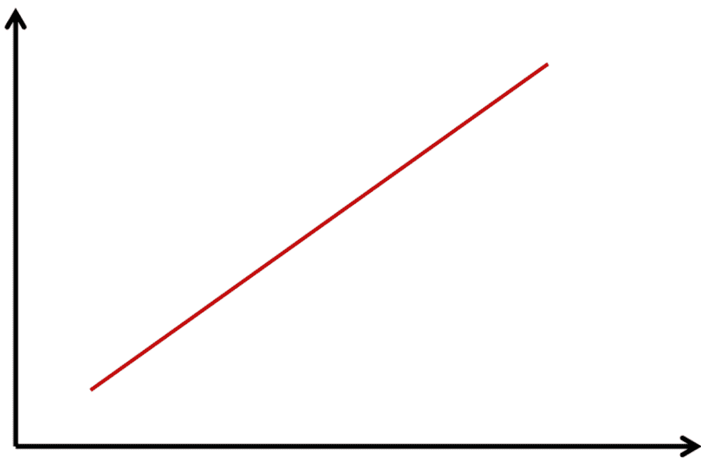

坚持一段时间发现没效果就放弃了。其实几乎所有的成长，都是非线性爆发式的，也就是前期默默无闻，突然间就来个指数级大爆发。大部分人在学校没人逼着，熬不到爆发就放弃了；到了工作后被逼着反而有了突破，不过跟别人相比慢了一拍。事实上这类人可能所有事都慢一拍，因为没人看着的时候，总也坚持不到那个转折点：

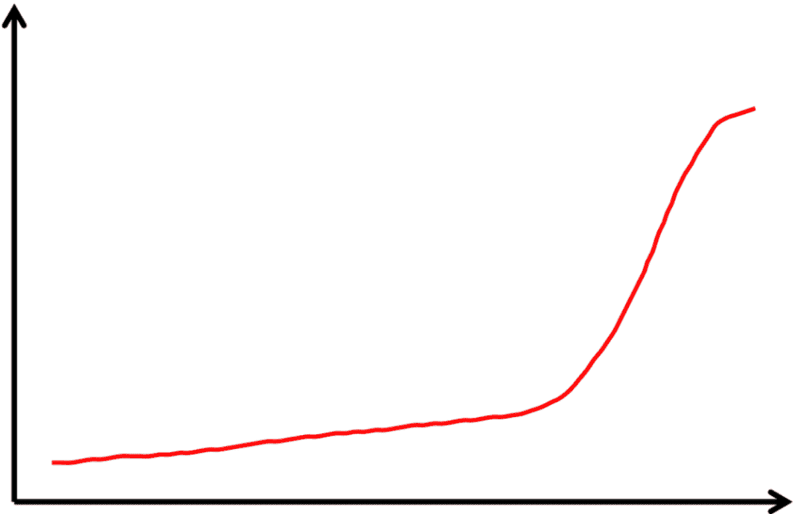

等到了工作的时候，得敢于担责去挑战，而且学会多笑。软件行业最重要的能力是合作。

人很多时候都是“一步错，步步错”。大学时候基础不扎实，编程能力很差，开始工作后非常受挫，然后提拔了别人不提你。心态不好成长慢，错失重点项目的机会，越来越边缘化。

当然了，最关键的一点，你做这个有没有愉悦感。很多时候，我们说“天赋”，其实可能就是那种愉悦感。有些人做某件事，他并不比别人聪明，但是做起来就是非常开心。这类人就算没天赋也能达到很高的水平。如果他又聪明，干起来又爽，那就是开挂的人生。大厂的高级别技术骨干都是这类人。反过来讲，如果上班如上坟，好吧，承认了吧，咱就一普通人，继续混着吧，不然还能咋滴。至于将来是一直走技术路线，还是走管理的“山头路线”，那都是后话了，到了那个时候自然就懂了。

有很多小伙伴可能会纠结35岁问题。这个问题不是技术问题，也不是行业问题，而是社会问题。除了公务员这种只进不出的行业，其他只要涉及竞争上岗，叠加我国过分充沛的人力资源，自然就会出现“后浪拍前浪”的事。不过关键还是调低预期，人各有命吧，也没必要太强求。

文末再总结几句吧。

- 前几年的高薪时代已经结束了，今后也会有高薪，但是不会像前些年那么狂飙；
- 接下来是一个更加广阔的天地，想象力有多大，软件的世界就有多大；
- 如果要做这一行，就要每一步都扎扎实实，这个行业依旧是向上的，但是不代表里边每个人都能过得很好，事实上这个行业里严格遵守“二八定律”；
- 在过去，在未来，计算机都是对穷人最友好的专业。

公众号懒人搜索，[懒人专属群](url)分享

### 重看《老炮儿》，一首旧流氓的挽歌
2022-08-23

上周末没啥事干，重看了一遍《老炮儿》，意外地发现演得非常好。

这里说的好，不是说电影本身，也不是说艺术性，而是说非常清楚地展示了一个几十年前的“流氓”老了之后的生活状态，有点倔强，有点可悲，又有点搞笑。

很多人没弄明白，冯小刚扮演的“老炮”六爷到底以前是咋回事。说他是黑社会大哥，明显不像，而且那个时代不可能有黑社会；说它是个混混小流氓，好像又不止。

这里直接点说，冯小刚扮演的，是一个“次级流氓”的小头目。

这个不太好理解，大家可能觉得，流氓还分层？当然了，从来都有等级。比如电影里吴亦凡扮演的官二代流氓团伙，显然就是现在的高级别流氓，开着几百万的改装车或者限量版豪车，泡着质量还不错的妞，平时的聚集地，也是“改车行”这种既朋克又花钱如流水的地方。

跟他们对应的，就是电影开始时摸人钱包的小流氓，还有张涵予带着的那堆拎着铁棍锤子的小年轻，还有就是全身紧身衣豆豆鞋的“社会摇”，平时可能骑个雅迪电动车，盘踞于城乡结合部的串店或者小卖铺。倒退几十年，当初的六爷就是“社会摇”的一部分。

电影讲的是六爷和官二代流氓团伙之间的恩怨，给人的感觉是六爷当初叱咤风云过，如今时过境迁，过时了，成了老古董，和社会格格不入。当年的六爷就是老了之后的小飞（吴亦凡扮演的那个），或者说这俩人就是不同时期的一个人。

其实六爷叱咤风云的那个年代，他也是个非主流。

电影里六爷60岁，电影是2015年上映，他最怀念的，是他二十岁时候的光辉岁月。那就是倒推四十年左右，正好是七十年代末和八十年代初。

大家想起那个时代的混混小流氓，立刻就想起了《阳光灿烂的日子》和《血色浪漫》什么的，以为六爷就是当初的那些穿着军大衣的各个部委和军队大院的混混变老了，其实错的没谱了。

咱们经常说的“大院子弟”，这个群体很容易会被人误以为是北京的老百姓，其实不是，那就是电影里“十三少”那种开着几百万豪车的官二代们四十年前的版本。当然了，每个小团伙，都是一个级别很高的子弟和一群没那么高的人组成，不过他们确实是同一个阶层的。这些人的标志性造型，就是《血色浪漫》里刘烨他们的那副造型，自行车（相当于四十年前的跑车），还有代表身份的军大衣（其实是将校呢，给军官们配发的一种制式军装），打架的时候可能还会把军刀拿出来。

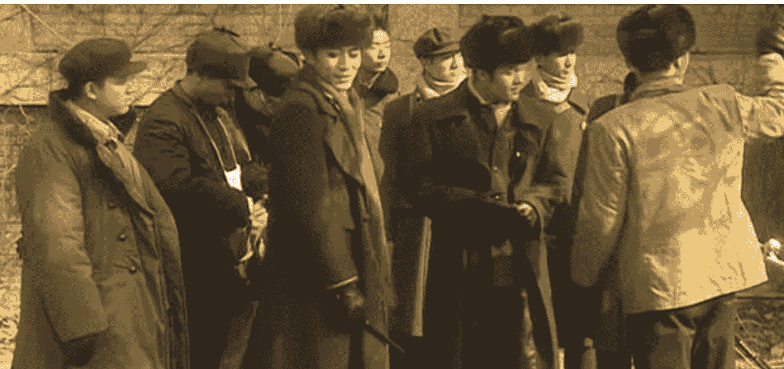

王朔在《动物凶猛》里说，他们这些部队大院的孩子，是不跟“没有身份”的人打交道的。怎么区分有没有身份呢？主要就是这身行头，因为这玩意在当时不是买的，而是配发的，如果没背景，想弄也弄不到。

而且不同阶层的军官造型又完全不一样。军队经历了几次换装，小孩长大后穿家里的衣服，其他小孩们彼此一看对方的行头，就大概知道对方的来历。

极少数人混进了他们的队伍，一旦被人发现他的父母没有一官半职，大家也不理他了。而且由于当时普遍营养不足，老百姓的身高普遍偏低，气色也不大好，但是那些大院子弟往往长得人高马大，非常好区分。比较有代表性的就是姜文那种，现在看姜文没啥感觉，他们那个年代绝对的鹤立鸡群，无论身高还是气色，都跟普通人完全不是一码事。

他们的装备里，军大衣好理解，那军刀咋回事？

当初日本投降的时候，本来准备是向国军投降的，不过长江以北几乎没有国军中央军的部队，然后我军发起反攻，一部分日本人就向我军投降了，所以那些指挥军刀就到了我军手里。很多当时的我军军官手里就有了日军指挥刀，此外还获得了无数日本步枪上的那个刺刀。新中国成立后也放在家里，再后来，这些军刀和军刺就成了大院子弟们身份的象征。

六七十年代流氓斗殴，骑着自行车，穿着军大衣，拿着军刀和三八军刺（也就是日军步枪的那根刺刀，日军的步枪叫“三八式步枪”，所以那根军刺就叫三八军刺），有了这身装备，就是部队大院的子弟。而拿着板凳、铁棍、铁链的，那就是普通老百姓家里的混混，六爷显然是后者。

电影里多次提到六哥有把军刀，而张涵予扮演的“闷三儿”又有两把锈迹斑斑的军刺，显然是他俩当年都是比较能打的主，在和大院子弟的冲突中，不知道是捡到的，还是缴获的，反正六爷有了军刀，闷三儿有了军刺。

不过我倾向于应该是缴获的，可能正是因为当初缴获过这种“上古神兵”，六爷也才奠定了在流氓里的地位。下图是我在电影里截的，很明显，张涵予拿的就是日本陆军制式刺刀，平时用报纸包着别在后腰，打架的时候才拿出来，这种刺刀的标志是刀把上的那个钩子，仔细看才能看到：

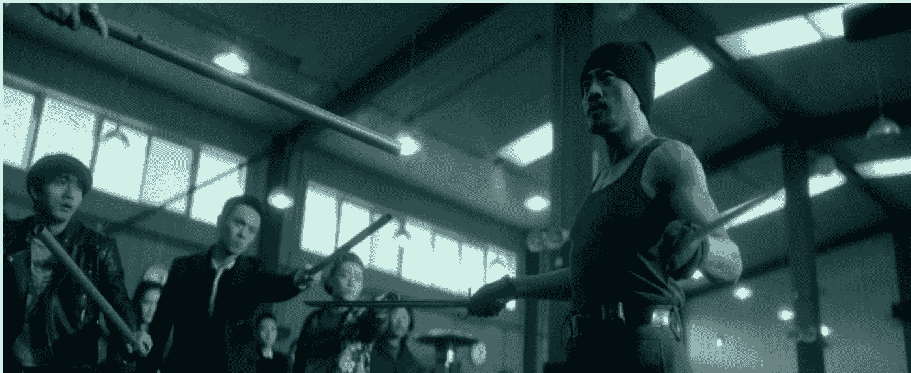

那个钩子可以挂东西：

这时候就有个问题，那时候为啥会经常打架呢？

没啥原因，主要是闲的，没啥事干，成天鬼混。当时又不像现在，有无数夜总会、改车行什么的可以玩，当时主要的娱乐活动就是看电影，去“老莫”（也就是莫斯科西餐厅）吃饭，冬天去北海溜冰，或者就在王府井前边晒太阳唠嗑。人多地少，荷尔蒙爆棚，经常因为“你瞅啥”，或者搭讪妹子之类的事打起来，一直打到警察或者民兵过来把他们全抓起来。

电影《老炮儿》里的冲突也是因为妹子起来的，显然是对几十年前流氓斗殴的一个呼应。这群混混从来也没啥高大的理想，一直的目的就是吃喝玩乐还有女人，他们之间的冲突也基本上围绕这些事展开。大家看过《血色浪漫》没？里边一开始两群大院子弟就打架，打架的原因就是其中一伙嫌另一伙“拍”他们大院将军楼的妹子。

打架被抓后，有背景的很快就出来了，没背景的就在里边待够刑期才能出来，这也是为啥六爷成了老炮，他显然没法快速出狱，只好在里边一直待着，直到成了专业户。

许晴流露着无限怀念的眼神回忆当初六爷一把军刀单挑几十人，换你估计你也怕，毕竟看着一个不是大院子弟的哥们竟然挥舞着一把无论如何也不属于他的神装，给人的感觉就是你打怪的时候偶遇满级大佬，赶紧躲到边上。

这种打架烈度是不断下降的，最高峰的时候，是《三体》刚开始描述的那段，后来越来越注重形式主义。双方掐架，都带一帮人过去，一般来讲看到对方人太多，人少的这边直接就散了，今后聊起来，也不寒碜，就说对方人实在是太多了，不讲武德。

电影里冯小刚几次干仗，前几次拿的都是自行车的锁链，很符合他的身份。后来要去打那场“最后一战”，于是穿上了军大衣，背着军刀，骑着自行车。第一次看电影的时候，有个小伙伴问我，说为啥冯小刚要cosplay日本人，我给他解释，他那副造型不是学日本人，而是在cos曾经的军队大院子弟，那是六爷一辈子的梦想，人生的最后阶段，终于又演了一次。

电影里六爷口口声声“讲规矩”，很容易让人误以为那是个有规矩的时代，其实很扯淡，流氓能有啥规矩，一直都是他臆想出来的。大家记得一个片段吧，六爷一边在北海溜冰，一边听单田芳的评书；还有个剧情，就是那个吴亦凡扮演的小衙内在看《小李飞刀》。这一点倒是很写实，因为流氓们普遍对类似《三侠五义》《隋唐英雄》等通俗读本非常上心，并且看完后臆想出来一个侠义的世界，在那个世界里，大家都义薄云天，跟他们不一样的自然也就被选择性忽略了。这个爱好直接导致老少两代流氓竟然惺惺相惜。

不出意外，再过四十年，那时候的老混混回想起2022年，也会说那是一个“讲规矩”的时代。

随后就是改革开放，大院里的子弟有的继续当官去了，有的赶上了那股风气，去做买卖很快赚翻了。还有一部分去了文艺界，比如姜文、马未都、华谊兄弟那俩兄弟等等，这也是为啥现在“京圈”大腕有很多大院子弟。

六哥他们这些老百姓里的流氓，人生路也分了三种：

一种是“洋火”他们，就是电影里冯小刚去见一个有钱的弟兄，人家忙着去谈生意，没工夫跟他瞎扯淡，他还怒了。

改开那会儿，在北京是相对很容易发财的。因为当时国内啥都没，啥都缺，只要从国外引进什么东西，就能赚，很快就能发财，甚至可以去日本淘几台老旧设备，回国后随便生产点啥，只要能生产出来就能卖得出去。但是普通人缺门路，缺资金，恰好这两样在北京是很多的。你可能攀附不上真正的大佬，但是你可以攀附大佬的小弟的小弟。

这种发财效应是扩散式的，一开始属于那些有门路和特权的人，但是他们不可能自己亲自去搬运那些进口货对吧？于是会有一个班底。随着买卖越来越大，班底里的人又会有小弟。这些小弟混明白了，攒点钱，然后出来单干，他们的小弟看懂了继续分裂出来单干，并且从北京扩散到华北，从华北扩散到全国。早期流氓们如果跟对主子，干一些dirty work，很容易翻身。这个过程持续了三十多年，只要脑子灵活一些，早期的那些玩家都富得流油。

这也是为啥有个很搞笑的画面，后来发财的主要是那些返城知青和地皮流氓，因为改开刚开始的时候，他们没工作，只能是去做买卖。那种不断扩大的商业社会里，你只要不是傻得太出格，总能赚到点钱。

而且那时候国企的员工和公务员是不屑去干那些事的，就跟现在的公务员不屑于为了每年几十万就去大厂一样，因为谁知道你这钱能赚多久。

不过后来那些国企工人甚至公务员看着自己一年工资比不上别人一天，也受不了去下海，出现了一个大规模下海潮。1988年，有个“全民从商”的热潮，还有个民谣：“十亿人民九亿倒，还有一亿在寻找”。

1992年，当时有1000万人停薪留职去下海，也就是编制给他们留着，但是不发工资了，如果闯不出来，还可以回到之前的工厂。可能有小伙伴对1000万这个数字有疑惑，真那么多？是的，这是官方数据，那时候城里人几乎都在国企里。

洋火那种人，明显是一开始没工作当混混，后来找了个机会去做买卖，赚到钱之后开始买台机器搞造纸，后来搞什么亚硫酸盐，发了大财。

第二种就是摊煎饼果子那老哥，这个属于正常老百姓的发展过程，没胆子也没资本，不敢去赌也不敢闯，干过汽修，后来摊煎饼果子，一辈子一事无成，晚年因为一个煎饼果子摊和城管打了起来。当然了，还有其他的兄弟，大部分都不咋地，摆摊的、超市打杂的等等。

最后一种就是张涵予扮演的“闷三儿”，一辈子没改行，坚持做流氓，五六十岁还经常进局子，也没家人。电影里的六爷，应该情况和闷三差不多，唯一的好处是后来结了婚，收敛了一些，有套小房子，不过一辈子死性不改，啥正经事不干，要事业没事业，要家庭没家庭，儿子也看他不顺眼。

不过这种相对很少，因为中间有几次严打，当时那些案底深厚的人很难挺过那几次铁拳出击。

电影里许晴扮演的一个比较搞笑的角色，“大哥的女人”，一辈子不嫁，围着老流氓转。这种人现实里不敢说没有，不过大部分这类女的在三十岁左右就彻底改头换面了，觉得自己以前是个SB，竟然觉得流氓酷，然后找个老实人过日子去了。

当然了，确实有一部分女的一辈子不嫁，终身围着这些大哥转悠，只是大哥不是六爷，而是当初穿军大衣那群人。

总的来说，电影我觉得是挺好的，因为整体很写实，入木三分地刻画了一个从没融入到社会和生活的流氓的一生。我以前在城乡结合部撸串的时候，经常在想那些酷似“昆山龙哥”的人如果没被人捅死，老了会是啥样，这个电影某种程度上讲给了一个答案。

文章标题说电影是“旧流氓”的挽歌，而不是“老流氓”，还是有差别的。毕竟你在生活中再也见不到一个穿着军大衣、喜欢溜冰、热爱武士刀的流氓了，这是属于那个时代的东西，时代结束了，这群人也结束了，以至于电影拍出来，大部分人看不懂里边的那些描述到底在说啥。

看不懂就对了，反正他们的时代已经结束了，老炮们也偷摸开心去吧，年轻时候不好好上班，老了还有医保，幸亏活在新时代了。

公众号懒人搜索，懒人专属群分享

### 电力那么紧缺，为什么不大力发展核电？

2022-08-19

最近四川限电的事大家也都知道，因为最近高温缺水，四川大河里的水位很多降了50%，发电能力下降，电力不足，有些地方已经开始了限电。

每次发生限电情况，都会有大量的声音纳闷为啥我国不大力发展核电。这个问题我之前就写过，这次又联系了几个专门做这方面研究的小伙伴，尝试给大家解释下。

众所周知，我国的电力70%是火电，也就是烧煤发电。这也是为啥不少人说，中国现在的电动车，其实是“燃煤车”，因为那些电主要是用煤炭发的，将来会慢慢切换到风电和太阳能这种近乎无限的资源。不过从这两年的情况来看，煤电依旧是主流，很难撼动，因为煤电输出稳定，既没有“枯水期”，也不会对电网造成冲击，所以有人说，“大家都嫌弃煤电，可煤电最后是最稳定的承担了所有”。

可是中国的煤炭本身也不是特别足，有个数据叫煤炭储产比，也就是按照现在这样挖还能挖几年。

美国作为全球煤炭储量最高的国家，高达390年，俄罗斯达369年，而我国仅为37年。我国煤炭已探明储量在全球排行前列，但是储产比远远低于其他国家。这样下去，很快又得大规模进口煤炭了。事实上现在我国进口的煤炭也在逐年上升，2021年进口了3亿多吨。

也就是中国的煤还能用不到40年，当然这话不是这么绝对，因为每年中国煤炭新的探明储量都不少，但是大家也能发现，我们储量不行，可是开发量却很大，显然不是太能持续。

而且发现的煤矿越来越偏远，运输成本越来越大。电和蔬菜差不多，在当地便宜，输送越远越贵。举个最简单的例子，在新疆和内蒙古的部分偏远发电厂，电价低到不到两角，输送出去之后经常翻好几倍。这也是为啥在国家大力整治区块链挖矿之前，每年四川的枯水期，矿老板会把矿机都拆了运到内蒙古新疆，用当地的便宜电挖矿。中国煤炭不足是事实。其中最主要的问题就是电煤消耗太大。

所以这是我们现在大力发展清洁能源的原因之一。

清洁能源常见的有好几种。相比起来，水电优势最大，不但发电的价格便宜，同时电站建立的水库还有调节水量和灌溉的效果，大型电站甚至可以改变地貌。比如白鹤滩水电站，按照当地人的说法，“把金沙江活活变成了一个湖泊连着一个湖泊”。金沙江是什么地方？一向以地势险峻、水流湍急著称，现在也温和多了。

但是水电站对选址有要求，对水量也有要求。中国大多河流集中在西南地区，崇山峻岭中电如何运输也是个挑战。所以“西电东送”是和“北煤南运”“南水北调”差不多的超级工程。多说一句，前几天看一本水利方面的书，上边说是“南水北调”最重要的作用还不是补充北方城市用水，而是补充北方地下水。

至于风电和光伏，同样也对风量和阳光有要求，这些资源丰富的地区也大多都在比较偏远的地方。而且这两种电本身有一定的风险，比如德州停电那事大家记得吧？冰雪暴把风扇给冻住了，电力不足，整个州都停了。大冬天没有电，大家冻得瑟瑟发抖。这也是为啥搞风电和光电，必须得规划好如果发生一大片区域同时停电怎么解决。

现在能想到的好的解决方案，就是发展储能，把风电和太阳能发出来的电存起来，万一发生断电也可以及时顶上。所以储电行业接下来是一个超级行业，将迎来大爆发。炒股玩基金的小伙伴都知道，前段时间宁德时代搞出来了那个钠电池后股价大涨，不仅仅是因为这玩意比锂电池更便宜（但是比锂电池重得多，用在车上不太划算），将来新能源相关的储能可能会用得着这个技术，到时候储存两三天电量，万一好几天阴天或者没有风，不至于一度电都发不出来。

在清洁能源中，按理说最得天独厚的就是核能了。

但是核电站也很麻烦，选址就是个超级复杂的事：

首先要有大量水源，因为核电站的运行和冷却需要大量的水，这也是为啥我国的核电站一般都在沿海，法国和德国他们一般都建在湖边，或者为了建核电站干脆搞个大坝。下图是我国十四五规划的大型能源基地布局图，可以看出来，核电都规划在了沿海。

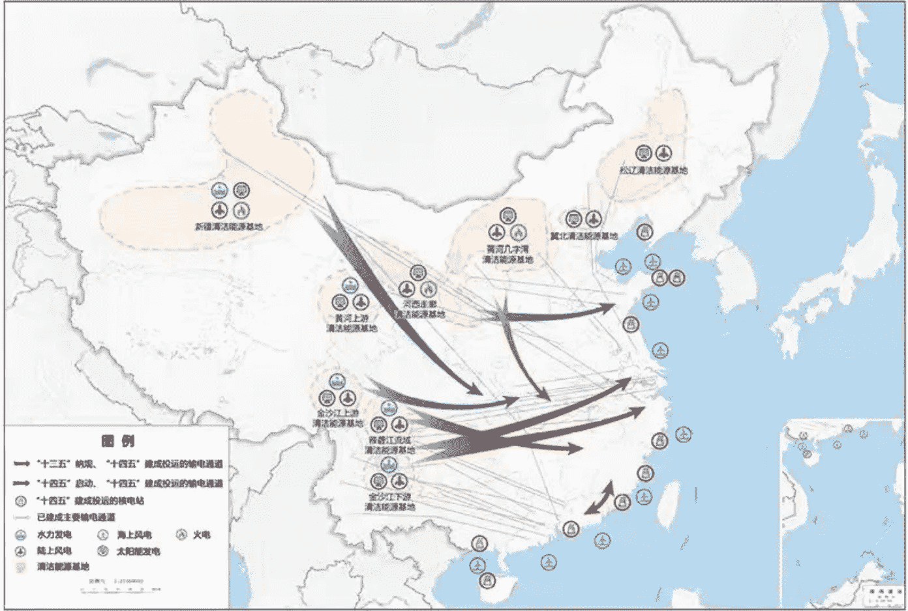

图1 “十四五”大型清洁能源基地布局示意图

国内有一些人一直在推动把核电修在大河旁边，可发改委对这事非常警惕，因为我国的超级城市都在那些大河旁边，稍微发生点啥后果也是无法承担的。

其次不能在地震带上，这个大家都懂，不多说了。

接下来是最敏感的，民意问题。一般说“核电站很安全”，往往是因为深刻了解了核电站到底是怎么运转的，才会有这种感觉。如果非常确信核电站非常安全，往往得有相关学历才那么言之凿凿，问题是老百姓又没有核物理相关学位，他们怎么会懂？他们往往会说，“我强烈支持核电，只是不要修到我家附近来”，所以核电站选址向来非常麻烦，弄不好就会被抵制。

最后也是最麻烦的一个环节，也就是核废料的问题（核电行业里的人不这么说，他们管那些废料叫“乏燃料”）。就跟煤烧完之后会有煤渣一样，核电厂发完电也会产生大量的核废料，那些带着放射性的核废料怎么处理也是个大麻烦。

一般都是先回收一下可利用的成分，再把残渣装进特制容器，掩埋到地下五百到一千米。这些核废料的放射性会持续上万年，所以核废料的掩埋场本身也极其昂贵，毕竟万一出了事，污染了地下水可麻烦了。这方面法国作为核电方面的扛把子，研究得非常深。

了解了这些，就知道发展核电这事本身需要考虑的事非常非常多，而且涉及社会舆论和群众心态等问题，就更复杂了。

至于核电的效果，就以我国最先进的自主发电机组“华龙一号”为例。一台华龙一号机组，装机量是120万千瓦，每年生产100亿度电，这相当于每年节约350万吨煤。每年减少了近千万吨二氧化碳排放，相当于近亿棵树一年吸收二氧化碳的量。如果是火电，为了运这些煤，又要消耗大量资源，开采又要消耗，开采破坏环境修复又需要。

但是，核电在很多人眼里却有个不足：安全性。可以说自从美国最早开始使用核电，几十年来核电的发展，被三次大事故拖了后腿。

如果深入地了解三次事故，其中技术问题不多，都是人的问题。

第一次大事故是美国1979年三里岛事故，过程非常无语，事后分析居然说应急设备指示灯被边上一张检修卡挡住了，使得操作人员操作失误，差点出大乱子，不过万幸没爆炸。

这事对全世界的核电事业打击很大，在此之前，按照宣传的说法，对核技术的完全控制是可以实现的，美国政府更是宣布核技术是一本万利、绝对安全的买卖。

普通人觉得既然核潜艇、核动力航母带着反应堆在海上四处颠簸都没事，一个多重保护的核电站能有什么问题？所以那些年美国的核电站开挂一样，十几年时间建了几十个电站一百多台反应堆。到现在还是全世界核电站最多的国家，全美国20%电力来自核电（我国才5%左右）。

但是问题就这么发生了，三里岛使得美国核电建设停滞了几十年，很长时间美国核电公司要靠出口技术为生。直到多年以后才开始重新建设新的核电站。

如果小伙伴你看过美国著名动画连续剧《辛普森一家》（这个被美国人评为最伟大动漫剧集），里面的主人公——也是动漫界最著名的傻子霍默，工作就是个核电站的安全员。如果你看过他怎么上班，就知道编剧在讽刺三里岛核电站，也能看出来老百姓对核电站员工的不信任。

第二次就是1986年的切尔诺贝利核电站事故，这次事故的主因一个是安全性的设计有瑕疵，还有就是操作人员严重的不规范。

尽管切尔诺贝利这事对苏联国力的影响并不大，不过舆论上的影响却大得离谱，以至于不少人想论证苏联倒闭的必然性，到现在也会把这事拿出来。可见核电站这事在社会学层面的问题远远大于技术层面。

第三次就是福岛了，2011年日本福岛附近海域发生了9级地震，地震发生后福岛的机组自动停机，开始给反应堆降温。但是地震造成的海啸使得电力中断，没有足够水降温的核心温度不断升高，最后发生了爆炸。最奇葩的是核电站所有者的日本东电公司，几次“神操作”造成了事故不断扩大，最终无法收拾。

一直到今年，足足弄了十年，按照国际原子能组织专家的说法，东电和日本政府，活活把一起还没有三里岛严重的4级事故，给拖成了和切尔诺贝利一样的7级事故。而且福岛的这个七级并不是因为危害到了七级，而是事故等级只有七级，他们顶格了。不仅如此，日本人还本着“我错了我鞠躬可我就是不改”的躬匠精神，现在还在向全世界输出伤害。

福岛事故对核电的打击很大，甚至可以说，这事给了全球核电行业致命一击。

很多国家“谈核色变”，德国更是明确表示要全面关停核设施，改为从法国买电。专门查了下，德国还剩下最后三座核电站，本来准备今年年底全部关停，不过现在俄乌打仗，能源不足，可能会延迟几个月关停。而法国是全世界第二大核电国，核电占到全国发电量的70%以上。

直到现在，全世界的核电都还是低潮期，尤其民主国家老百姓的态度对国家政策影响太大。用法国能源部部长的话说，一群博士们干的事，却需要普通人来决策。民众不放心，导致这些年新增机组数量少，而上世纪建设的很多机组已经到了设计年限，要关闭了。

全世界来看，法国民众整体对核电的态度非常宽容，切尔诺贝利和福岛出事后，全世界都在担忧法国会出问题，原因刚才也说了，他们的核电站实在是太多了。法国政府也担心刁民们大规模走上街头要求拆除核电站，那样的话，法国政府都不知道去哪弄电了。

不过后来发现啥破事都要上街的法国老百姓对核电却异常宽容，并且把核电和苏菲玛索一样看作是他们的“自己人”。别人指责核电不安全的时候，法国民众却表示问题不是核电本身，而是操作核电的人有问题。所以当德国的核电全被拆了之后，法国还稳如老狗。

法国搞核电，也是没招，上世纪七十年代全世界都出现了能源危机，法国考虑到自己没煤没气，政府却非常强势，准备以国家之力搞定这个困局。又考虑到自己是知名“非洲酋长”，去非洲看了一圈，发现非洲有不少铀矿，于是开始搞核电大跃进。政府出钱从美国买科技，从非洲挖矿，在法国发电，还出口创汇，核废料再埋回非洲。非洲跟了法国真是倒了八辈子霉。不过客观上法国的核电技术师出美国，后来成了世界第一梯队，现在我国不少项目依旧在和法国合作。

尽管现在是核电低潮，我国也很受影响，不过我国依旧是全球发展核电最积极的国家。

中国的核电装机在福岛事故之后，我国立刻暂停了所有待审批的二代核电项目，直到2015年第三代核电技术华龙一号可以抵御九级地震的双层保护壳，才开始继续上马核电项目。

比如在2020年，全球共有5台核电机组正式开工建设，其中4台位于中国，1台位于土耳其，2021年又上马了四台。

并且可以确定，以后每年都会有新的核电机组上马，不过核电的建设周期比较长，现在上马的项目，可能得七八年之后才能开始发电。从下图也能看出来，我国这些年一直在不断提升，不过这几年增速在下降：

## 1999年-2022年核能发电量

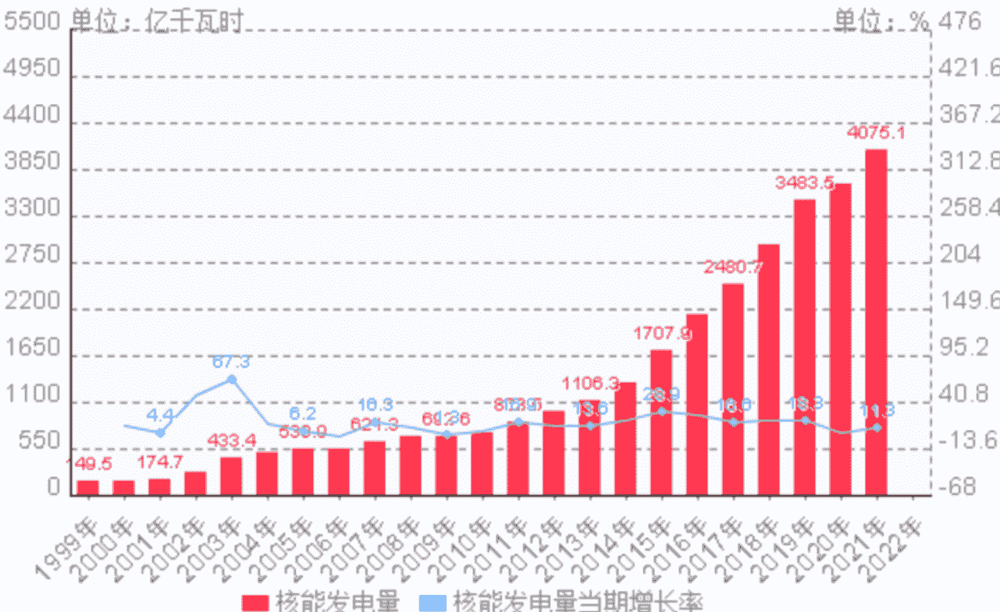

不过现在主要还是在搞风电、水电等新能源，一方面风电、水电、太阳能的消耗产能，但对资源依赖不强；另一方面我国是个贫油、贫铀国，现在的铀矿主要依赖哈萨克斯坦进口。如果对铀矿的消耗进一步加重，可能又得从澳大利亚进口，是的，大户澳大利亚又是富铀国。

说到这里，可能有小伙伴纳闷，核聚变万一实现了，是不是光伏、风电、核电就没意义了？这个问题我之前也说过，还专门找了个工程物理研究院的专家问了下，这事没那么简单。

核聚变研究有点像火车发展史，先搞个铁轨车厢出来，然后装上火车头，火车头一开始跑得不如马车快，然后改进火车头，一直发展到现在重载列车和高铁。核聚变也一样，就算研究出来，一开始效果肯定不太好，而且也不稳定，更重要的事不划算，得迭代进化几代，才能用作商用版本，最后才会铺开。这个过程谁都说不准，可能需要几十年，也可能一代人，甚至几代人，这谁都说不清，没人会把赌注全压在那上边。

所以说，核聚变还早，接下来火电不会那么快退出历史舞台，但是今后会大幅放缓；光伏和风电肯定会大搞，不过储能这事一天解决不了，新能源就一直处于“发展阶段”青黄不接的这一端，主要是以水电和核电补充。

我找了下政府的十四五规划，原文是“加快发展非化石能源，坚持集中式和分布式并举，大力提升风电、光伏发电规模，加快发展东中部分布式能源，有序发展海上风电，加快西南水电基地建设，安全稳妥推动沿海核电建设”。

稍微翻译下，风电和光伏是“大力”，也就是主要精力干这个；海上风电是“有序”，那就是不太着急但是也要搞；西南水电也要“加快”，意思是现在还不太够快，事实上水电建设已经很快了。

沿海核电还要继续发展，但是要求“安全稳妥”，这个词的意思就等同于“慢”，比如你开车出门的时候，母亲大人在后边大喊“慢点，注意安全”，肯定不会说“注意安全，把油门踩到油箱里”。可见安全这个问题对核电确实是关键中的关键，一两次事故，就足够毁掉整个产业。

写到这里，文章也差不多了，总结几句吧。

- 1. 现在的国际大环境对核电很不友好，跟其他国家相比，我国已经在大力发展核电了。
- 2. 但是由于安全问题，叠加我国是个贫铀国，不大可能太激进。
- 3. 现在另一个配套技术也正在大力研发，也就是核燃料回收技术，我国从刚开始技术引进，到现在已经世界领先，并已经出口技术，走过了一条艰苦的道路，只要坚持走下去，今后必然是全世界核电的巅峰。

我国现在正处在能源转型期，煤电注定没有未来了。一方面储量不行，另一方面挖掘难度越来越高，可能再过一些年挖一吨的成本相当于现在十吨。而且太过依赖煤电和核电可能会被卡脖子，所以才高举环保大旗搞转型。转型肯定会面临阵痛，现在这两年总有一段时间限电，也跟这事有关，也是没办法的事，共克时艰吧，等冲过去就好了。

公众号懒人搜索，懒人专属群分享

### 聊几句最新的《台湾问题白皮书》

2022-08-15

上一篇文章阅读量意外地非常大，文章的末尾，写了两段：

我从不怀疑的一点是，大陆和台湾迟早统一。而且就在最近这些年，就连台湾主流知识层也认为，我党如果是一个放任民粹的党，早就把台湾拿下了，反而党更多的顾忌的是“政治遗产”，有点像在一个家里，有啥矛盾尽量协商解决，不到万不得已，不会诉诸武力。

相比于武力解决问题，通过政治协商反而是一个更加需要耐心和智慧的选择，我党本着对历史和人民生命财产负责的原则，一直在压制民粹，争取和平解决，只是台湾明显越走越远。

有些小伙伴说我说的不对，国家明显已经放弃和平统一，要武统了，甚至说就在最近。然后第二天，也就是8月10日，最新的《台湾问题与新时代中国统一事业》白皮书发布了，也不是特别长，大家可以看看。我理解主要说了三件事：

- 1、和平统一依旧是核心道路；
- 2、但是不承诺放弃武力选项；
- 3、针对的是外部势力干涉和极少数“台独”分裂分子及其分裂活动，绝非针对台湾同胞。（这是原话）

这个把很多人给整懵了，因为大家理解不了为啥都到现在了，政府还不放弃“和平统一”的幻想，真相信对岸会幡然醒悟吗？

我理解不是，恰好相反，越到最后关头，越要站在道义的一边；武力越强，越要坚持和平道路。如果战争最后也避免不了，那和平攻势也会持续到战前最后一秒。

大家看过《建国大业》吧，那里边花了大量的篇幅来讲谁先挑起内战。

在很多人的眼里，这个问题重要吗？当然重要了，甚至是核心问题，因为对于执政者来说，所有问题都得对历史有个交代，这也就是毛主席说的，“千秋功罪，谁人曾与评说”，事实上中国从古代到现在，朝堂之上如果不到万不得已，都很在乎历史对自己的书写。而且这也不止事关历史评价，更重要的是重大事务上处理不善，可能遗祸无穷。

这一点大家可能不太好理解，我举个例子，也就是台湾的“228事件”。

这事也比较简单，最开始是国民党的警察殴打了一个台湾卖私烟的小贩，引发了围观，随后开始驱离群众，进一步造成了伤亡，叠加当时国府对台湾压迫太狠，大家有怨气，这事成了导火索，第二天就是大规模游行，国府脑子一抽，调军队登岛弹压，一路从基隆杀到台北，还屠了一批教授、记者等知识分子。

那件事如果找个稍微成熟点的政治家去处理，可能也没那么严重，但是处理那件事的正好是国府里都比较二的陈仪，面对汹涌的闹事台湾人，军人出身的陈仪脑子一热，下令清场，机枪一响，老百姓四散奔逃。

但从此埋下了无穷的祸根，那件事至今已经过了80年，国府依旧洗不清自己在那件事上沾染的污秽，甚至马英九想去祭奠那次事件的受害者也遭到抵制。

很多学者认为，将来如果国民党彻底完蛋了，跟那件事有一半的关系，因为洗不干净了，无论哪种角度来看，都是错的。直到现在，在台湾一旦说起那件事，国民党立刻就跟被雷劈了似的立正接受批判。问题是这事在当时并不是什么大事，大家也没想到影响会延续这么久。

所以说武力这东西，在自己人内部，能不用就不用，尤其是你有了使用它的能力之后，就更得慎重，有时候看着当时解决了问题，长期看可能埋下了更大的问题。台湾蹦跶得凶，本质也是知道我们政府有这方面的顾虑。

此外还有一个比较麻烦的事，也就是观念这东西是随着时间变来变去的，可能现在达成共识的事再过一些年大家观点就变了，比如美国反恐战争刚兴起的时候，拥有无限的支持率，甚至普京都公开表态支持，看看现在成啥样了。

所以说我们的政府很清醒，和平未到绝望之时，绝不轻言战争。如果实在没招了，那也就只剩下一个选项了，直到这个时候，才能对历史有个交代。

这让我想起了那个著名的故事，郑伯克段于鄢，郑庄公纵容弟弟叔段，他弟弟越来越混账，庄公只好被迫讨伐叔段。千年之后，依旧没人能说郑庄公的做法有啥问题，这就叫阳谋。

再说说台湾，很多人对台湾的了解来源于电视上那几个大嘴巴的沙雕。

其实台湾也有很多严肃的学者，对这类事情有深入的思考，不过在哪国都一样，越严肃越理智的思考总是非主流，反倒是那些观点极端的人最有市场。

台湾学者们也基于现实主义能得出几个基本结论：

- “独”肯定是死路一条，根本没有任何出路，这一点台湾民众也基本能达成共识，尽管大部分人心里都想独，但是却没人敢策动公投，直到那时找死；
- 应该考虑的是如何最平稳、死最少的人，寻求一个两岸都能接受的方案；
- 和平解决，说不定还能保住“中华民国”这块牌子的一个角，等炮弹射过来的时候，啥都没了。

而且越早谈，条件越优厚，要知道，早年的白皮书里甚至有“统一后中央政府不派军队和行政人员驻台”，如今这句话也删掉了。再过一些年，可能“一国两制”也没了。

当然了，现在“一国两制”还是主流，最新的白皮书里提到了15次，如果台湾现在能及时反应过来，应该会成立一个特区，高度自治，派不派军队应该可以谈。

但问题是，台湾的政治群体没有这么想问题的，已经彻底民粹化了，整体疯得不成样子了。

而且民粹和政府互相纠缠进化了，政府纵容民粹，民粹进一步调教政府，大家一起越来越极端。

现在台湾政府如果站出来，说句成熟社会人的话，比如“我们还是别TM闹了，容易挨打”，结果可能是社交媒体上蔡英文政府先挨打，这就是民粹化的后果，啥都可以聊，唯独不能带脑子，说话长点脑子是有原罪的。

比如之前比较沙雕的“茶叶蛋”那事，很多人说台湾完全不了解大陆，其实不是，而是在台湾公共媒体上，长脑子了解点实情的人没法说话。

台湾企业在大陆的规模大家可能没法想象，我随便说几个数据，2020年大陆外贸出口的前15名里，台湾企业占了8个，制造业百强企业里，有三分之一是台企，这些公司里的中上层，清一色台湾人，2016年10月两岸和平发展论坛有一数字指出，居住在大陆的台湾民众，包括台商、台干、台生、台眷等约为200万人，将近台湾总人口的9%，而且主要是年轻人。不少人在大陆已经结婚生子，而且趋势是越来越多。

我以前就聊起过，中国改开需要的海外资本来源，主要来源就是香港、台湾还有东南亚华侨，台湾投资在大陆的比重在下降，但是规模大得离谱，对应的就是不断上升的常驻大陆的台湾人。只是他们主要是集中在一些特定行业，如果你的工作和那些行业无关，可能也接触不到他们，一旦涉及他们的领域，你才能感觉到实在是多得离谱。

这么大规模的两岸流动人口，说台湾不了解大陆，真是有点说不过去，只能说，台湾的媒体已经被沙雕占领了，越反智越有人支持，了解情况的人根本没法开口，你说句公道话，群众还不愿意看，说不定还要投诉，下一次电视台就不叫你了，慢慢地，电视和广播电台都剩下了一堆沙雕。

这种氛围下，整体已经呈现出了一种无可救药的偏执。比如之前李毅有个演讲，原话是：

谁在台湾讲统一，就是票房毒药，就是过街老鼠，就是新党，就是洪秀柱、吴斯怀、邱毅、王炳忠，8000个村长，400个乡镇长，22个市县长，113个“立委”，台湾领导人，什么都选不上。不要说绿营，就是蓝营，韩国瑜，国民党县市长，国民党“立委”，为了迎合多数选民，为了迎合中青年选民，也必须坚决反对统一。

这也决定了他们那边越来越没法转弯，有点像明朝后期面对的场景，当时可能唯一的选择就是先跟后金议和然后专心处理内政，但是当时明朝聊啥都行，唯独不能和蛮夷议和，谁敢提谁就是秦桧，把最可行的路线给堵死了。当然了，这里只是举个例子，并不是说台湾就是明朝，只是说犯了一样的蠢，脑子一样不清楚。

所以现在不管跟台湾聊啥，一句话都说不进去，稍微了解点情况的也没法发声。能发声的人一个比一个邪乎，一个比一个极端。

之前台湾的小伙伴也跟我讲，他说每次回到台湾看着那群沙雕的表演都想笑，可是又不能说啥，毕竟真说啥，自己就成了大家眼里的沙雕了。更搞笑的是，大家可能私下里跟你想的是一样的，但是一到公共场合就变得有点不正常。

比如私下里两个人聊天，如果谈起来万一战争爆发怎么办，肯定聊的是，战争没啥悬念一边倒，而且持续不了多久，打起来先到什么地方躲躲，等打完再回来，大陆比较讲道理而且顾忌国际观瞻，不会把事做绝等等，甚至会聊到台湾房价太低，打完了大陆富人涌入，可能房价也要涨一波等等。

但是现场如果超过三个人，气氛立刻就变了，开始聊什么“决战澎湖”，“歼敌于滩头”，“等待联军进入海峡”。如果调查大家有多少人愿意为了台湾而战，大概是70%多，但是问多少人愿意服兵役，立刻跌成了10%，现实版“我家真有头牛”。

这个意义上讲，这次的白皮书与其说是“继续呼吁和平统一”，可以想象台湾人的反应，大概率是没反应，当然了，我们可能也没指望他们有啥反应，我们只是在做所有应该做的努力。

如果战争到最后也没法避免，我们必须得把寻求和平的努力做足，这不是软弱，而是一种负责，更是一种智慧。

公众号懒人搜索，懒人专属群分享

### 台湾人是怎么看待终将统一的结局的

2022-08-09

这两天看到一个新闻，说是赵少康在脸书发的：

- 演习开始前，许多跨国公司让员工放假，甚至开始撤离员工，台湾却没一家公司放假。
- 公司不放假，但请假的倒是不少，不是避弹，而是请假去观弹。
- 据报道，军演日，南部海钓船被全部租光，游艇也都全部出海，因为太多人要搭船出海看解放军的军舰，他们说1996年没有拍到，这次一定要拍到。
- 这一天，处于最前线的金门岛依然人山人海，不仅没因为害怕战争而取消订房的，从台北、台东到金门观光的航班还居然爆满，90%都是观光客，而这一天并非周末，显然许多人请假去看军演。
- 看到导弹发射和弹道掠过天空时，观看者不是惊呼，而是兴奋地高呼。

这些看着匪夷所思，恰好印证了几年前一个台湾小伙伴跟我描述的台湾人现在的心态，我今天分享出来，倒也不一定全对，不过大家可以看看这当中的逻辑是不是很有道理。

他跟我说，台湾人对于现在的状态，整体非常佛系，由三个状态组成：

- 首先，和平统一几乎没有任何民意，无论是群众，还是政治团体，“和平统一”这事几乎没有任何认可度。而且极少数认同“和平统一”的那些人，说的跟大陆的“统一”也不是一码事，他们说的是“联合政府”，显然不可能嘛。
- 其次，台湾人认为最近这些年不大可能武统，他们为啥这么想，一会儿解释。
- 最后，如果发生武统，他们也不会反抗。

咱们一个一个说。

为啥台湾那边的人不接受“和平统一”呢，道理实在是太简单了，因为没有任何好处，所以没有任何动机。

现在有些话不能放在明面上说，不过事实就是台湾省、新加坡、香港地区，都是楔入到西方体系里的亚洲地区，他们在那个圈里混得风生水起。为啥台湾人的芯片产业那么发达，跟他们在这个领域里多年深耕有关，不过首先是美国点头了，如果没有美国同意，压根不可能。

而且就算台湾重新回到大陆怀抱，如果美国不同意，台积电甚至开不了工，这个没啥办法，台积电等一众企业，本质是长在大棚里的一棵漂亮的花，离了那个大棚一个礼拜都活不下去，美国和西方技术和知识体系就是那个大棚。

这也是为啥台积电有时候被称为“镇国神山”，很多台湾知识分子认为，只要台积电在芯片领域的地位一骑绝尘，大陆就不会对台湾轻易动武，因为和很多人理解的不一样，台积电不是一个简单的工厂，如果武统，可能它也开不了工了。

其他领域也都差不多，比如台湾的名校比较多，也是因为它自己处在西方体系里，打分排名的时候受的歧视比较少。排名靠前这个事大家可能不太理解有啥意义，其实很关键，大家把哪怕国内的大公司招聘简章拿出来，就知道QS排名是招聘的关键因素，很多高薪岗位指明要C9和QS前一百大学的毕业生。

在台湾上个好大学，就能随便去各国的好公司谋个好岗位，包括大陆这边。事实上大陆这边有大量的台湾人，比如芯片和面板行业，就吸收了很多台湾和韩国人，这也是为啥我能接触到台湾人。而台湾上好大学的难度，大概相当于北京学生高考难度，此外他们申请留学也比咱们这边容易。

当然了，最关键的还是他们所谓的“执政党”，绿党他们，如果统一了，他们的地位一下子跌了一大截，所以无论如何也没道理对统一这事太积极。台湾这些年的年轻人被绿党教育得很成功，对“和平统一”这事几乎没有认同感。

那问题来了，他们为啥觉得大陆不会发动统一战争呢？

台大有个说法，说是台海爆发决战，有两个触发因素：

- 1、美国或者台湾踩到了中国政府的底线上，比如“独立公投”什么的，中国政府没法接受，战争就会爆发。
- 2、中国对全球产业链的依赖降低到7%以下，到时候可能随时找个理由就去攻台。

也就是说，一旦战争爆发了，中国遭到西方的全面制裁，如果只有7%的生产和经济受影响，这种情况下，统一战争随时会爆发。他们认为现在的依赖度是30%以上，所以战争爆发可能性不大。

这个依赖度我不知道咋算的，不过他们认为，中国现在无论是能源还是原料，都依赖海外进口，中高端产业又严重依赖西方的工具和专利，甚至新能源所需的锂电池，锂矿也主要是从澳大利亚进口。我专门查了下，2022年一季度，我国锂精矿进口量52.9万吨，其中从澳大利亚进口约50.2万吨，占比约95%，确实主要靠澳大利亚。石油也是70%左右的对外依存度。

而且锂的主要产地是南美，智利和阿根廷，最终还是被澳大利亚的矿业巨头控制，所以将来在很长一段时间的里，对外依存度降不下来。

也就是说，台海爆发战争，受到制裁后，会发生连带的停产停工，到时候会产生大面积的失业，而失业进一步会引发社会骚乱和不稳定，这一点无论如何中国政府也是不能接受的。中国是世界工厂，这一点既是重要的筹码，也是一种负担，因为工厂依赖上游能源、原料和知识输入，也依赖销售和出口等下游输出，缺一块就会停工。

所以最近这些年开战这个开关不会随意被按下。

可是“承担经济痛苦”这种事本身也是一种选择，当时新中国成立初期决策去打朝鲜战争痛不痛苦？当然更痛，可还是做了艰难的选择。

可见那个开关不会随意按下并不代表永远不会按，台湾人也知道有些底线不能碰，于是不去碰，只要不触发武统，他们就可以一直混下去，直到哪天中国经济彻底摆脱了对西方的依赖，政府不再担心制裁，或者说制裁造成的痛苦那么强烈，那个时候统一战争可能随时爆发。

所以台湾现在绝大部分人的状态，可以用一句话来描述，叫“不想统，不敢独”，一直在那个中间地带晃悠。

对于迟早到来的统一战争，台湾大部分人其实也早就想好了。这个出乎我的意料。

如果要是不武统，那就一直维持现在的状态，原因上文也说了。还有一个因素，就是台湾的法统，尽管中间变过几次色，但是确实是从大清传下来的，清帝逊位，把法统传给了袁世凯的中华民国，中间经历北伐，国旗颜色样式都变了，但是那个法统并没有改变，十年前他们刚过完百年纪念，所以如果真统一，非常难办，因为“中华民国”这个招牌没地方搁。

有一个选择是像当初东德全国公投解散国家后加入西德，彻底抛弃“中华民国”这个壳，可是台湾不大可能做这个事。除非，除非台湾穷得要死，类似墨西哥的几个州很梦想公投加入美国，可是美国不要他们。台湾变穷这事可能性不是没有，但是可能得过一些年。

对于武统，他们台湾人也很中立，是的，你没看错，是中立。

那种感觉就好像解放军百万雄师马上渡大江，大江对岸的国军兄弟们准备誓死抵抗为党国流尽最后一滴血？

当然不是了，这又不是民族之战，所有人打仗的最终目的，都是尽快结束战争赶紧回家过日子，我军这边的战士老家刚分了地，准备打完回去好好种地过日子，国军那边觉得反正战争在半年内也结束了，保住命回家看看老婆孩子才是正经事。这种思维模式的影响下，国军面对绝对的压倒性优势，他们可能有决死抵抗的决心吗？

显然不可能有，渡江战役一爆发，国军全线崩溃，我军一直担心的江阴炮台，几乎一炮没放，没必要，结果已经注定的情况下，没必要再绕远路了。

如果爆发台海战争，那台湾人的心态和当初解放战争后期国军的心态差不多，没多少人会为了一场结果已经确定的战争去做牺牲。而事实上未来爆发的统一战争也是解放战争的延续。我那个小伙伴说，如果真打起来，战争几天后就会结束，个体的任何选择都没意义，唯一要做的，就是活到战争结束继续过日子。

更关键的是，大部分台湾人对政权更替这事非常无感。

当初清朝和日本打了起来，台湾莫名其妙地被割给了日本，随后爆发的台湾保卫战中，最勇敢的台湾人已经把血流干了。后来李敖说，台湾人普遍没种，因为当初不愿意跪下的台湾人被日本人用机枪给扫了，现在的台湾人，都是“跪民”的后代。

随后半个世纪的“皇国教育”，大部分台湾人在心智上觉得自己更像日本人，有日本名字，学日语，效仿日本生活习惯，甚至很多台湾人被编为山地部队，去东南亚为日本人参加战争。

1945年广岛长崎原子弹爆炸，台湾人上一秒还在痛哭日本彻底完了，下一秒就反应过来自己是战胜国啊。然后国军来了，大家站在路边夹道欢迎，谁能想到，国军表现得比日本人还渣，不仅掏空台湾去打内战，还对他们搞屠杀。

1949年国府败退大陆，此后的20年，简直暗无天日，物资严重不足，说错一句话就会被宪兵带走投入“绿洲山庄”（有时候也叫“绿岛”），这是台湾最大的关押政治犯的地方，李敖，柏杨，吕秀莲都在这里学习改造过。

经历了这么多破事，台湾早已不在乎政权更迭了，他们只想安安稳稳过日子，能维持现状，就尽量维持。维持不了，就等着风浪过后重新过日子，跟着谁过不是个过？

几年前，我那个台湾小伙伴就说，他们根本没准备抵抗，整体感受就是战争爆发一小时之后，撑死三个小时，金门肯定没了，战争爆发当天，澎湖列岛也没了，没了澎湖列岛，台湾根本无险可守，还打啥打？

而且台湾人内心深处根本不相信美国会为了一个八千公里以外的、跟自己没啥实际瓜葛的地区和中国开战，他们唯一能指望的就是随后的制裁对中国有点威慑。只是威慑这东西战前才有意义，一旦战争爆发，那就成了累赘，因为战争结束后，台湾也是中国这个主体的一部分，自己也进了制裁名单。

台湾之前还有个段子，说上午还在那里喊：美国快制裁阿共啊，它要打我们了；下午统一了，又开始喊美国不要再制裁我们了，我们也是阿共了。就是这么的纠结。

大部分台湾人相信，战争爆发后，台湾主岛不会遭到一发炮弹的轰炸，战争就结束了，因为几乎没有哪个台湾人，会为了一场说不上来有啥意义的战争去流血打仗，他们甚至都不为“投降”难为情，觉得那个开关一旦按下，统一就是迟早的事，就这样吧。

更关键的一点是，我那个台湾小伙伴说，台湾人现在只有一个条件，模仿香港那种，可以服从中央，但对现有的秩序不要做大改变，到时候来个“港澳台通行证”，他们猜测政府应该能接受，那就完事了，根本不用打，本来就是一家人。

我猜测，上文赵少康说的那些台湾的反常识操作，基本上依旧是基于“一发炮弹都不会落在台湾岛”和“港澳台通行证”这个基础上。

说到这里，这事也差不多说清楚了，这篇文章我是把这些年碰到的多个台湾小伙伴的说法汇集在一起的，写完后又给他们看了下，他们也说没啥问题，基本就是这么想的。

### 尾声：

我从不怀疑的一点是，大陆和台湾迟早统一。而且就在最近这些年，就连台湾主流知识层也认为，我党如果是一个放任民粹的党，早就把台湾拿下了，反而党更多的顾忌的是“政治遗产”，有点像在一个家里，有啥矛盾尽量协商解决，不到万不得已，不会诉诸武力。

相比于武力解决问题，通过政治协商反而是一个更加需要耐心和智慧的选择，我党本着对历史和人民生命财产负责的原则，一直在压制民粹，争取和平解决，只是台湾明显越走越远。

最后，可能我们也没啥选择。

公众号懒人搜索， 懒人专属群分享

### 枪口要指对敌人
2022-08-03

前几天后台收到一个消息，有个小伙伴说他好久没开工了，最近终于要搞漫展了，然后受“夏日祭”的牵连，一口气停办了60多场漫展，他的工作又歇菜了，让我给大家聊聊这事。

“夏日祭”这个词中国老百姓一听就不是什么好词，一方面大家已经默认“夏日祭”就是我们文字理解中的给祖先的祭祀活动，用“祭”来做命名就是给日本人（包括战犯）祭祀。

其实“祭”在日本的意思不是“祭祀”的意思，而是类似“盛会”或者“嘉年华”的意思，跟咱们恰好是相反的，如果大家去过日本，就可以看到绝大多数出海的品牌和企业，都主动发起过“祭”相关的营销活动。

给这种命名带来的误解打板子很正常，也应该。但由此把所有和夏日祭有关的人事物扣上精日的帽子，视为国家的敌人就不应该了。

另一个传播量更狠的是把国内夏日祭相关的举办地被画成了日本地图，然后说这是日本“阴阳师”布下的某种“阵法”，是用举办地的人来给日本军国主义亡魂献祭。

这种搞笑的解读，有种九年义务教育还回去了的感觉，唯物主义占据主流的国家，这种说法竟然有市场，那条微博竟然有十几万转发，也是吓了我一跳。而且后来有人发现，如果把夏日祭相关举办地连起来，更像镰刀锤子。

大家可能更关心的，是日本有没有把动漫为代表的文化产品化为新时代的武器，用文化入侵来达成帝国主义亡我之心不死的目的，日本右翼会不会死灰复燃，这些是不是日本右翼的文化侵华事件？

我觉得不大像。首先是日本的民族文化并不擅于英美那种意识形态渗透的打法，过于迂回。日本的大多数战略都讲究直接有效的实用主义，要么战争侵略拿钱拿地拿资源，要么直接认怂真心跟你学本事，过去跟我们，后来跟美国。

另一方面，日本已经不是以前的那个日本了，主流意识里早已没了主动向外扩张的能力和心气，对我们的威胁已经大大减轻，今后的主流是合作而不是敌对。

大家可以先从日本人写的回忆录看他们的国家战略打法。很直观地能发现，从甲午战争，到日俄战争，再到后来的侵华战争都是用“先军政治”直接开动战争机器进行侵略扩张的实用主义打法。因为日本一直都穷得要死，老百姓的生活水平一塌糊涂，当时最好的出路，就是男的当兵，女的卖*。

即便是发动侵华战争后，我后来在很多回忆录里看到，日军到了华北后，依旧感慨中国实在是富裕，老百姓竟然吃得这么好，我当时挺震惊，后来慢慢也就习惯了，因为日本那些年搞“先军政治”，老百姓的生活水准也一塌糊涂。

也就是说，日本最激进那些年，正好是“又穷又年轻”的那些年，社会里老人特别少，过得太穷了，人都活不到老就挂了。整个社会培养了大量右翼的年轻人，这些年轻人情绪愤懑、四处乱窜，见谁砍谁，在国内砍他们的首相，在东北策划“918”，反正是不安分。

战后又把这种激情打法又用在了发展经济上，日本经济迅速崛起，很早就被称为“亚洲奇迹”，大概战后15年就恢复到了战前水平，三十来年就做到了世界第二，几乎所有核心领域都悉数突破，家电、汽车、芯片等领域，最夸张的是，他们在游戏和漫画等文化方面也独领风骚。

随后就是房地产泡沫破灭。

一般来讲，我们说日本是房地产泡沫破裂后成了那样。不过这些年有了新的理解，主流认为可能把原因和结果搞反了。

因为全世界各个发达国家里，没有一个国家没发生过房地产的大崩盘，也没有一个国家房地产崩盘后躺地上死活不起来。

大家认为，日本成这样，核心的原因就是如今的日本已经老了。

大概十年前，公司的一个常驻日本的同事回来后，大家一起吃饭，他总结性地说了这么一句，说日本的衰老不仅是日本老龄化趋势，而是各种原因纠结在一起，现在的日本已经暮气沉沉。后来我也去过几次日本，再加上和其他人的讨论，慢慢更加加深了这一观点。

直到这些年，主流学者开始认为，其实就是最激情、最有魄力、最能闹腾的那代人老了，不仅老了，他们依旧占据着核心位置，用几十年前的老思维去看待如今的世界，新人没啥发展机会，日本整个社会进入了老年社会。

再加上日本是个极度讲究“血统”的国家，很多小伙伴看《火影忍者》之类的漫画就能注意到，里边所有的大佬都有高贵的血统，属于蓝血贵族。现在也一样，无论是政治领域，还是大公司，基本都被豪门把控，日本上层一直都充满了各种二代和赘婿，无论私营还是国家部门，无论以前还是现在。

老人多而且不退休，年轻人少而且被压制。直接导致日本整个社会暮气沉沉。

最明显的，差不多十几年前，也就是我上初高中的时候，那时候是日本货最后的辉煌，日本的电子产品都巨贵，但是在中国依旧被抢着买，没啥别的原因，就是又漂亮又耐用，如今还有那种盛况吗？我们甚至已经想不出来日本最近十几年有啥让人眼前一亮的产品了。

社会变老后，日本很多东西都跟着发生了变化。最明显的就是他们的文化，也变成了“老人文化”，一片死寂。

道理并不复杂，按理说一个社会年龄变大后，还是有新人不断补充进入社会，但是在日本，随着退休年龄不断提升，老人们现在牢牢控制着中上层，这也就导致了曾经他们的决策系统变得极其迟钝而且保守，任何新东西都可能在上层会议上被否掉。

而且日本一直以来有个毛病，基层做得很好，越往上“含猪量”越高，但是就算上层决策根本不对，所有资源也会在错误的方向上使劲投，最后出不了结果，天量资源打了水漂，以前跟着美国混，这种思路大错小错。现在管理层老了之后，这个毛病更明显。

这也就是以前说的那个道理，日本的崛起跟他们搞计划经济强相关，但是随着计划经济的官僚和企业管理层变老后，在新时代依旧坚持以前那一套，逐步跟不上时代，总是在错误的方向上消耗了巨量资源，却在新方向上束手束脚。

而且老人文化最大的问题是消灭“随机性”，西方有个谚语“old dogs cannot learn new tricks”，说的就是老狗学不会新把戏，倒也不一定是脑子有问题，而是人老了之后大脑的链接固化了，接触新事物的感觉就好像你换了一只手写字那么别扭。对新事物新观念有种本能的排斥。

问题是，创新诞生于随机性，老人们总想消除不确定性，顺便把未来一起给消灭了。

年轻人没有了发挥空间，任何奇思妙想都会遭到打击，慢慢地年轻人也不去乱想了，安安静静地当社畜爬天梯，社会越来越静态。一开始这种静态对日本影响并不大，毕竟日本的产品本身就是质量和工艺的代名词，但是时间长了，竞争对手却不等你。

到了这些年，日本在各个领域的占比都在下滑，比如汽车、家电、半导体，日本的传统优势项目都在没落，市场份额一步步减少，新的技术和产业却没搞起来。

但是那种状态持续了几十年，日本人的观念发生了很大的变化，以前那种冲劲没了，社会气氛越来越丧，大家都追求小确幸，不再思考国家和个人的突破，所有人都觉得努力过完这一生就不错了，还要啥自行车。

甚至有了东京电视台这种奇葩，在朝鲜导弹飞过日本上空，东京电视台在放动画片，3.11大地震日本天皇发布关于核电站危机讲话，东京电视台在教大家做寿司，前段时间首相遇刺，东京电视台又在搞美食节目。

其实不是这个电视台有病，它很健康，只是它的观众根本不关心那些事，转播又有什么意义？

而且我在日本亲眼目睹过右翼游行，真跟老年人cosplay一样，一群老年人，穿着旧军装，举着标语，在周围人不太理解的眼神中穿过，看着可悲又可笑。事实上这些人在日本人看来，比咱们看着更奇葩。

现在的日本，是个巨大无比的静态机器，每个人在里边都过着一眼望到头的生存，这种状态下，谁还对“侵略”“扩张”什么的有兴趣？努力让自己这辈子差不多过下去已经让大部分人筋疲力尽了，谁还有工夫思考什么大国博弈。

所以说不出意外的话，今后很长时间里，日本的状态只会越来越衰，直到现在的这个状态彻底持续不下去，大家又变回“又穷又年轻”，说不定能重新有点斗志。当然了，有些博主说是就在最近几年就会崩溃，应该不至于。

需要注意的是，日本内部有很多人是希望跟中国加强合作的。道理非常简单，在任何时候，合作都比敌对更有利可图，而且如果相互有利可图，可能关系会变得越来越紧密。反倒是美国希望东亚这几个国家以邻为壑相互敌对，恰好说明这些国家合作才能共赢。

日本国内有一批人一直致力于推动两国友好，甚至包括好几个首相，当然了，只要美国存在一天，这种合作就不可能太顺利，想搞乱这些国家的关系又太容易，因为东亚国家相互之间的历史问题解决不了，只要找点事一煽动，立刻就爆炸。所以这一次中日之间莫名其妙的因为这事炸了，多多少少有点被人煽动的感觉。

我们最好的策略，依旧是加强合作，对于那些军国主义思想，该打就打该骂就骂，不过也不要泼洗澡水把孩子一起倒了，连经贸活动和正常交往也受影响，那正好中了日本极少数右翼和美国一些政客的下怀，人家就是希望东亚变成一盘散沙，在历史的泥潭里打得死去活来。

这一点上，毛主席看得就很透，1955年10月在接见日本国会议员的访华团的时候讲的，毛泽东说，“中日关系很长，吵过架，打过仗，这一套可以忘记，应该尽一切办法让美国人的手从日本缩回去，中日应该互相帮助，互通和平友好”。

也就是说，中国和很多国家的关系，本质都是中美关系。

事实上日本最近几十年，有大量日本政客也意识到了这个问题，对于中国，最好的手段依旧是合作，而不是跟着美国瞎胡闹搞敌对，要注意一点，美国想让咱们做的事，大概率是对它自己有好处的。

任何时候，做生意都是最好的选择，因为贸易会让大家都变富。韩国也是一样的，内部有一股势力一直致力于摆脱美国控制，和周围的国家搞好关系，好好发展，但是每次稍微有点进展，都会被打断。

好几个日本首相，都致力于修复中日关系，但是日本国内确实有一群人完全是以美国利益马首是瞻，甚至损坏日本自己的利益都无所谓，这种人哪都有，日本有也不奇怪。最后中日关系差了，日本的订单可能被韩国、中国和美国瓜分了，日本的工作岗位也被抢走了，日本受损，但是美国受益，他们也无所谓。

我们也要警惕这种人，最明显的就是2012年的保钓事件，当时几个“保钓人士”登上钓鱼岛，引发了中日两国民间敌对，当时中日关系还不错，那事之后很快落到了冰点。但是那五个保钓人士，无一例外都是反华和“港独”势力，他们为啥这么做就很明显了吧。

激昂的情绪引导最容易挑起愤怒的民族情绪，在舆论面上为极端非理智行为的出现营造出合理性，反而给真正的敌对势力有了可乘之机，我们近些年在这方面吃过太多闷亏。

喜欢日本二次元文化，和当初我们喜爱日本电子产品之间没有孰高孰低，我们的文化同样也在大力往外走，这样的文化经济流通是在国际政治形势越来越本土化的背景下，还能继续往开放包容方向发展的窗口。

即便是对周边局势的发展来说，中日友好在长期看来既是趋势也是双方很多人努力的方向，不要被一些别有用心的人给利用了，中美如果真的进入冷战状态，我们更需要和日韩还有欧洲保持好关系。

用毛主席的话说，把朋友搞得多多的，把敌人搞得少少的，而不是反过来。

公众号懒人搜索，[懒人专属群](#)分享

### 年轻人的一部分内耗是周公子造成的，二舅解决不了
2022-07-29

这段时间发生的那两件事，想写一篇长文来着，可是琐碎的观点又连不在一起，干脆，用这种碎片形式发出来吧。

- 1. “内耗”的本质是理想和现实的不统一，“能得到的”和“想得到的”不一致，并且不确定自己能不能得到，精神上饱受煎熬。啥时候知道了自己反正也得不到想得到的，也就不内耗了，踏踏实实过好眼前的生活。这个意义上讲，谁都治不好谁的精神内耗。
- 2. 四十不惑，意思是绝大部分人到了四十就彻底认命了，不再纠结得不到的，别人可能觉得你豁达或者“活明白了”，只有你自己觉得自己这辈子也就这样了，只能是把现在的日子过下去，不然还能咋的。
- 3. 励志文学随着经济增速放缓已经基本穷途末路了，今后的趋势是“赏惨”，我一朋友心态不好就去icu外坐着等媳妇，他老婆在那里工作，他在icu外的见闻发朋友圈能凑出来一本“icu文学”，每次看完我都有点觉得自己那点麻烦不算啥，心态能好很多。
- 3.1. 日本曾经也发生过这种转换，战后曾经有三十年是日本的“鸡血时代”，那时候大家也相互激励，励志文学以“走出舒适区”，“去东京打拼”，“去大藏省爬天梯”为主，泡沫破灭后经济大幅放缓，很多人发现走出舒适区也得不到啥，白白承受痛苦，还不如在舒适区躺着，逃避固然可耻，可是它舒服啊。与此同时，去物语，反消费主义，断舍离等思潮开始崛起，电视和文学节目越来越丧，社会观念也从鼓励奋斗转向了“只有浪费掉的时光才是自己的”之类的颓废观念，一直持续到现在。
- 4. 一个很惨的人如何能振奋起来？让他和更惨的人待在一起。美帝那边有那种“互助会”，一群有共同痛苦的人围成一圈，吸毒的、失去亲人的、得了重病的，分享各自的惨痛经历，据说有助于身心健康。
- 5. 人的一生，是一个“加buff”的过程，家境好，脑子好，父母开明，生在中国而不是叙利亚，都是正向buff。我二爹跟那个二舅很类似，他脑子很好，生了个儿子考上了浙大，可他一辈子在村里种地磨豆腐，主要原因是出生在了60年代山西北部最穷的村里，负向buff加满，几乎寸步难行。不过他早就不内耗了，知道自己啥都改变不了。那个二舅也是负向buff加满的人，左突右突最后生存空间越来越窄。
- 5.1. 我二爹表示他一生做得最对的事，就是没瞎掺和自己儿子的事，因为他知道，自己无论怎么想都是错的，既没有相关见识，也没有相关经验，既然儿子比自己强，就该让儿子自己去选择。
- 5.2. 张朝阳说，年轻人不要太努力。可能是因为他意识到，“努力”只是其中一个buff，其他buff太好不需要太努力，其他buff不行努力也没用，不如放松点。当然了，可能他强调的是“太”，读者们看到的是“努力”。
- 5.3. 我弟在杭州毕业后赶紧落户买房永久定居了，他管这个叫“老鼠搬家”，因为李斯说过，出生在厕所里的老鼠瘦骨嶙峋，出生在粮仓里的老鼠脑满肠肥，老鼠的错不在于它自己没努力，只是因为它的出生点位错了。我弟认为自己就是从厕所搬到谷仓的老鼠，从几百年的穷乡僻壤搬到了几百年的富裕地区，负向buff少一个算一个。
- 6. 周劼：
  > “高中同学不少去外省读了好大学的，都回家进了烟草、电网之类的，回家没有着落的，就在北上广深成都”。
  
  不得不说，这个观察非常有道理，我很早就在文章里提到过类似的观点，中国推动城市化最大的助力，就是几亿退无可退的年轻人，他们是做题家，还有大量的做题能力很差的做题家，前者去格子间，后者去工地，他们有回不去的故乡和追不到的梦，所以一辈子都得跑，没法停下来。
- 6.1. 他还说：
  > “我怕你会读书吗，名校研究生都别想那么容易进我单位。这个人当年仗着自己会读书，看不起我们这种靠父母的，社会会教他做人”
- 6.2. 周公子最大的问题，就是反向“比惨”，让不少人意识到门阀竟然在基层复活了，三本都可以进国资。不少人看完《二舅》产生了一种内心宁静感，很快就被周公子给搞没了。忍不住思考着两者之间是不是有什么联系，二舅那么惨，仅仅是个人原因？还有没有改善空间？而且好像谁都在村里有那么一个二舅。
- 7. 周公子这事，让人有种非常不好的感受，周公子自己显然不是什么大角色，但是他们家显然是一个大网，一个盘踞在基层的利益共同体，他们家每个人都不是大官，但确实是一个不断“自我加强”的组织，通过血缘纽带链接在一起，几十个这种家族，很可能就能垄断基层所有肥差。让人不由得觉得，当初用了无数人的生命，才打倒的鹅城黄家，如今正在悄悄复辟，正在基层形成一个个封闭的小圈子，周劼这种人并不可怕，可怕的是那些权势门路比他大，嘴却比他严的人。封闭导致近亲繁殖，近亲繁殖导致畸形。
- 8. 胡锡进说，“在公平建设的方面，中国仍任重道远，但大趋势大方向是积极的，就是我们的社会在朝越来越公平前进，而非朝着越来越不公平后退”，这个说法我是认同的，一方面是党在十八大之后从严治党，但是我觉得更重要的是，老百姓的观念正在觉醒，越来越不能容忍特权和门阀。
- 9. 越来越多的人有了反思能力，思考和解构那些我们以前觉得天经地义的事到底对不对，不是单纯赞美苦难，而是去思考苦难背后的原因。
- 10. 这个世界短期是少数人决定的，长期是大部分人的观念决定的。教育的普及和经济的发展，让这种趋势几乎不可逆。《乌合之众》里有句话说得很对，
  **数量，即正义**
  古代为啥能接受“家天下”，为啥能接受大清那样的种姓制？本质还是大部分人觉得那种状态是合理的，那种状态自然有了合法性，汉族官僚掌握军权后依旧自发维护那种体制，本质也是这种共识在作怪。如果大家不再觉得特权是合理的，特权的生存空间也就越来越小。
- 11. 所以我对这个国家依旧充满信心，原因也是我上文说的，我们有勤劳勇敢的人民，有为的执政党，还有不断普及的教育和一直向前的经济。为啥今年破事这么多，我不觉得是这个世界变坏了，而是大家的底线越来越高，底线升一寸，这个社会上不合理的事就多一堆，如果底线足够低，那社会上可能没啥坏事了。很多问题只要放到明面上来讨论，只要不回避问题，已经解决了一半。

公众号懒人搜索， 懒人专属群 分享

### 古董造假江湖的水有多深
2022-07-26

这个话题按理说我是写不了的，不过这段时间机缘巧合吧，朋友送了我一个大剪报夹子，说是他在地摊上花了十块钱淘到的。

可能有小伙伴不知道剪报这玩意是个啥，以前的人们报纸杂志，看到好的内容，就裁下来放到大文件夹里，后来电子产品火了起来，这玩意也就慢慢消失了。这次淘到的这个材料里，原主人是个古董新闻爱好者，收集了几百页的这类新闻材料，有大量的当事人采访，我拿出一部分来跟大家分享下。

### 1

古玩造假这事的历史，和文物本身的历史几乎一样长。而且造假的人，比做真东西的人花的精力和脑力还多，毕竟做真东西的人不用考虑自己的作品像不像真的。

简单说起来，假古玩分两个方面：一个是做出和古玩接近的新货，一个是把做出来的新货当成老货价钱卖。

有时候两个事是一群人做，但是很多时候，做的和卖的不是一伙。像成龙电影《十二生肖》里那种一体化的造假团伙，在现实中基本是不存在的，原因很简单，那样干产业链太长了，风险不可控。现实里往往是分开的，生产和销售不是同一伙，这一点在《无双》里倒是很写实，那里边也说做假钞的人从不使用假钞。

首先要说，公开做新货是不犯法的，比如我生产一个长得很像唐朝唐三彩的工艺品，哪怕拿到景区去卖，是完全合法合规的。真正犯法的是我说我这个唐三彩是真的，刚从古墓里刨出来，诱导大家高价购买，这就是犯法行为。

所以一般新货的生产商都挂工艺品厂的招牌，日常生产的东西大多数也都是工艺品，卖的也是工艺品的价格。普通人在各种渠道，也能买到他们各种价位的产品。

网上经常有关于某些地方是假货聚集地，甚至说某地是“造假村”，可能有小伙伴很纳闷，都这么明目张胆了？就没人管了？

但如果你到了当地，就会发现当地人根本不藏着掖着，到处都是“XX工艺品厂”的牌子，完全是合法生意。有时候这些土里土气的作坊水平高得不得了。

这里面最传奇的人物叫高水旺，这人就是河南作坊界的神。曾经因为别人拿他的东西出去卖，涉及金额巨大，他被抓起来关了几天，后来发现他完全不知情，并且一直在做合法的工艺品买卖，所以他不犯法又放了出来。后来还做了博物馆聘请的修复师，做的东西也多次获奖。

比起高水旺这样单打独斗的，河南伊川县烟云涧村方兴庆，把青铜器技术教给村里人，使得这个山村脱贫致富。

方兴庆的情况和高水旺差不多，他做的工艺品在20世纪90年代从机场带出境，虽说乘客说是自己买的纪念品。但是经过鉴定，认为可能是商周青铜器真品。于是顺着一条线找上来，一直到烟云涧找到了方兴庆。在看到院子里的成品半成品之后，事情也就不了了之。

方兴庆把技术推广，以至于现在烟云涧被称为“青铜器造假第一村”。其实那里主要是靠旅游纪念品和定制青铜工艺品，甚至给博物馆做展品的高档仿制品（很多时候展览对文物会造成损害，但是为了向观众展示古代文明成果，会制作足以乱真的高仿代替展出）。

说到这里，大家可能纳闷了，上次聊天珠的时候，说河南的天珠造假产业天下无敌，这次又说河南的青铜和唐三彩也很出众，为啥河南这么牛？

其实河南一直都是古玩生产大省，现在也是人造钻石生产基地，很早就有句话，如果政策允许，河南老乡连原子弹都能给撸出来。

这个说起来复杂又简单，河南陕西本身就是文物大神，中国古代王朝，大部分都在关中和中原溜达，也就是陕西和河南那一带。豪门大户也都在这两个地方，贵族上等人死了，弄点东西陪葬多正常，经常是古墓叠古墓，自然也就成了古董交易市场，当地人耳濡目染，慢慢就对这些东西非常熟悉，再后来也就慢慢靠山吃山，天天玩古董，顺便仿制一下，也很正常，正如一个修理工身上带个扳子一样正常。

### 2

假古玩也分成不同的三个档次，用来应对不同的客户。

第一类，就是平时地摊上和一些“相声鉴宝”里面那种。

一个买家指着一个工艺品说多少钱，卖家说八万，买家直接还价40，对方一愣，差点晕过去，然后定了定神，嘴角露出一丝诡异的微笑，大叫一声，“成交！”。下边一群网友说店家含泪赚了30。

第二类就比较的正常一些了。一般都是按照现有的器物器型仿制，用料也按照真正古玩的比例尽量做到一致。制作的工艺上也是尽量按以前的来做。每一步都是经过仔细摸索实验的，关键步骤做的人也都是有多年经验的老师傅。

比如青铜器，就要按照原有物件比例制作蜡模子，这是个又贵又非常考验技术的活计。做模同时按照真品时代比例混合各种金属，然后浇铸出来。做出来的范线纹路等等都要和原物做到尽量统一，不经过常年学习的人做不了。

如果是字画，不论用纸还是用绢就不能用普通买来的，而且要专门做旧成接近真品的形态才能用。

画面本身，讲究地用珂罗版（一种很复杂的精密玻璃印刷技术）印刷。再高级的就是真人手绘，画的人虽然有原件参考，不同水平的人画出来的差别非常大。而使用的墨和颜色都不能用化学料，必须是古法作的东西，不但成本高，做出一件东西也要很多时间。

瓷器陶器紫砂这种，就要用真品当年使用的土，现在这些土现在已经很不好弄。比如景德镇老坑高岭土，即使买到也要卖到上千一袋。这些土拿来还不能用，为了去除杂质要反复淘洗沉淀，还必须人工来做，因为现代机器做出来的胎泥遇到内行一眼就看得出来。

使用的天然釉料和颜色价格更贵，好的卖到几千上万一斤，有的人专门就制作仿古釉料卖。至于手工拉坯和作画上釉，就是全看本事的手艺活，技术高超的能做得和真品一样。烧制的时候现代的电炉煤炉是不行的，必须搭老式窑口烧柴，用的都是和以前一样的大块实木，一口大窑烧一炉柴火可能就要上万。

这种窑温度把握也非常麻烦，看火的人经验非常重要，如果不是多年下来的老师傅，光会看着温度计控制根本不行。一窑东西要是烧坏，物料成本至少就在几万块。

这些东西做出来，外表和真古玩当年刚出来的时候基本一致。所差的就是时间给器物留下的印记。于是最重要的“做旧”就要登场了。

### 3

做旧的技艺发展非常的快，咱们今天说到的方法，可能都已经过时了。

其中最主要的原因有两个：一是现代化学物品被广泛应用；一是科技检测手段的不断出现。

比如铜器，做旧的关键就是铜锈，以前依靠浸泡液体以后埋在土里让它快速长锈。现在使用化学药品腐蚀产生铜锈，不但快而且看起来真；或者用真的铜锈，刮下后再用特制胶水粘上去，做得根本看不出问题，除非刮下来一块检测到含有胶水。于是有了制作整块铜锈焊接在器物表面，再经过打磨就算取样检测都发现不了。

如果是字画，关键是颜色，以前用茶水染，郭德纲说要用尿来染，一开始以为是胡闹，后来发现竟然真有这么一回事。现在各种现代化学品，直接熏蒸，要几百年的效果就相应的熏蒸多久。也有怕化学品有残留会被检验出来，于是用各种天然成分配比熏蒸的，据说配方和广东凉茶差不多。更高科技的是使用高强度射线长时间照射，模拟真实环境几百年对字画的破坏。

如果是瓷器，关键是所谓“去贼光火气”，说的是新出来的瓷器里外都会带有新东西的那种明亮的光芒，有经验的人一眼就能看出问题。有点类似你家的冰箱刚搬过来看着亮晶晶的，用几年就灰头土脸。古董也一样，新做出来的一看就是新的，需要经过特殊处理，让人看着像是经历了几百年的沧桑。

以前用打磨或者土埋之类法子，效率不高还容易让瓷器光泽受损。现在有各种化学品去火气，只要略微泡一下，就可以得到几百年的效果。

至于高科技检测手段，可以说几乎所有可能的新技术手段都曾经被用来鉴定。但是到现在为止还没有发现哪种一劳永逸的法子，因为做这行的人也关注新技术，随时随地想办法应对。

曾经有人拿来一些沾了泥土的汉简要卖给南京博物院。送到研究所进行年代测定，检测的结果都是该木简已有2000多年的历史，看着挺像真的。最后多方确认，才知道这批东西是作伪者用出土的西汉棺材板做成的。要不是写的字实在是没法跟古人一个样，还真被他们给糊弄了。

大家可能纳闷，那给博物院送假货这人应该被抓起来了吧？一般不会，毕竟你没法确认是他伪造的，他说自己是从爷爷那里继承来的，你总不能因为别人继承了一个假货就抓人吧。

接下来就是第三种，这才是古玩造假里的高端货。做出来就是给行家看的。真正的古玩造假。目标是让砖家们打眼（指上当），让真专家也吃不准。卖的就是这门手艺。

这些东西从用料到工艺都不一般，比如铜器，一般按照真东西比例重新配比即可。高档货就要买同时代的废铜器废铜钱熔炼。如果是商周铜器，就不能再用蜡，而是用当时同样的泥范，这比蜡模又要麻烦很多，而且工艺更复杂。

不过这样依然会被高手看出问题，最好是就用真货，通过手法增值而不是重制。

比如把不完整的器物通过从别的器物截取修补做成完整件；或者残破的几件器物截取拼接成一件新品；在没有花纹的素面器物上刻上花纹；在真品上刻上增加铭文；甚至把普通形制真品通过切割等方法改变成罕见高价的器型等等。

有时动的地方很少，整个器物大半还是真品，非常难以确定真假。

书画类有的凭空伪造，就用同时代的旧纸作画；还可以用同时代没有题跋或作者名气不大的作品，通过增改来变成大名家的作品；为给名家的东西增值，在上面加上著名人物的题跋或者印章；还有真名人的东西，在普通作品上补画变成精品增值，比如日常花卉增加细致工笔虫鸟之类。

这种能在真品上动手的人，不论绘画、题款、题跋、刻章，都必是多年的高手。

在《十二生肖》和《无双》中都说过一个造假手法：因为宣纸有很多层，可以把画一层一层揭开，一张变成两张三张甚至更多，每张还都是真的。

其实这种做法听起来好像很玄乎，现实里却没法操作。

首先是一般宣纸没有那么厚，你想把一张揭成两张，大概率会把原画也给弄坏，典型的偷鸡不成蚀把米。再说了，古画才有价值，那些画放的年头长了，纸会变得非常脆，根本没法揭。

而且只有晕染比较厉害的那种水墨写意画才会沁润那么深，如果是工笔之类的揭开下面那层就没法看了，不过即使晕染了下面那层，墨不浓的地方颜色也浅很多。而且那种水墨揭了下面一层，上面的其实墨色浓淡也会有变化。

宣纸虽然是一层一层的，但是揭开就会发现下面那层表面粗糙，和真的表面是有区别的。最后是水墨虽然晕染，但是题款一般用干墨和印章用的印泥，二者晕染性差得多。揭开后必须要补，专家从这两处一旦发现补笔，就基本认定是伪造了。

至于瓷器道道就更多了。有的大量收集残破瓷片，然后按照样式分类，把几块拼凑成一个整件；有的把碟子或者残破件的底单独切下来，然后重新拉坯做出瓶子罐子这类高价货烧制；有的把原来素白的东西，改成古代非常难烧的颜色，或者五彩重新烧制；还有把民窑的精选品加上官窑款式重新烧等等。

这些手法很多不动瓷器鉴别最常见的底、口、胎部分，不要说砖家二把刀看不出来。即使有的专家鉴别出来，但是很多时候都是依靠积累的经验，所谓“第一眼”感觉不对劲，以这个感觉下手才发现的问题。

做出来之后，不管是修补还是重做，某些地方还是要做旧的。高档货的做旧工艺，也和普通东西有很大不同。最简单地说，如果是入土的东西，就要从真品所在地弄来同样的泥土。做旧打磨不能用电动工具，也不能用刷子，不然在高倍镜下那种规则的打磨痕迹会很明显，要手工用牛皮沾上油打磨，一点都不能急。东西做好要放着，最好放到看起来和四周融为一体才行。

玉器在做旧之外，还有一些增值的办法。有的玉器在古代墓葬里会产生绛紫色丝状或者条状纹路，被业内称为“血沁”，讲天珠那篇其实提到了，玉石看着是完整的，其实跟海绵似的，布满各种晶管，容易被其他染料渗透进去。

这东西可以让玉器身价大涨，于是自古以来做血沁是很多人研究方向。把玉烧热后放进不放血杀死的猪狗肚子里，埋进土里放一两年再拿出来；把玉泡在血袋里面，然后反复冷冻、化冻。

还有一种流传得比较广的法子，把玉塞进活羊腿里，三年以后再拿出来。不过这样效果好，出来的沁红中带绿。就是慢而且麻烦，羊可是长腿的东西，说不定羊都走丢了。

还有一种特别的增值，古代很多达官贵人陪葬随身带着玉器，这种相比起普通的要值钱。于是有的商人专门买古墓棺材底那一层各种东西腐败成了“尸泥”，把化学处理过的假古玉包在这泥里面，等这玉空隙沾上泥之后再打蜡，卖的时候送去检测，从上边刮点下来，一检测果然符合各项特征。

到了这时，这东西才是真正的高仿，即使很多真专家拿到手里，也不敢随便说是假的，高科技的设备仔细检查，越看越真。

### 4

最让我觉得惊讶的，还有假扮盗墓贼骗人。原理古代就有了，这手法叫“埋地雷”。把东西提前埋下去，等买主来了，当着面把东西弄出来。所谓眼见为实，这还有什么好说的？掏钱吧。

这个其实也比较复杂，一般卖家也不傻，他们往往带着自己的风水师，风水师一看就知道某个地方确实是风水宝地，埋着个达官贵人也正常。

这时候最好的办法，就是找个早被挖空的古墓，放上东西填上土。还要让它“长”些日子，等到野草长得和附近浑然一体，才招呼客户前来。还要跟真的要盗墓一样，把附近都承包下来拉上围墙，弄些设备在里面运行掩盖挖土的声音。最后才把东西挖出来，而且起货必须是夜里，东西只现钱交割。完事以后一拍两散，再想找这群人就没影了。

再厉害的就是玩真的了，这些人真的盗墓，但是按照墓的年代提前买好一批东西。其实自古以来盗墓的无数，大多数古墓都被盗过了，有十墓九空一说。所以等到挖的时候，不管有没有收获，都把假东西加进去，希图多卖钱。甚至有时收货的看出问题，也不点破，借机压个低价拿来，自己再当出土的真货卖高价。

到时候就算被人识破，可以说自己看着从土里弄出来的，我也是高价买的，我打眼认自己学艺不精活该，你打眼不检讨自己问题，跑来找我是怎么好意思的？

在这三种之外，还有一种比较特殊的古玩造假。就是一些技艺高超的专业人士作假。

在古代干这一行最有名的估计是米芾，这人是一流书画家，经常找人借书画观摩。据说他常仿制以后把真的据为己有，假的给原主也不被发现。他特别喜欢二王（王羲之王献之父子）的书法，当时仿制了很多。于是从宋代到现在，分辨是二王真迹还是米芾仿制，都是一件很有挑战的事。

到了近代，这方面最有名的就是张大千。他最擅长石涛和八大山人的画，以至于现在两人的画到底有多少张大千画的，几乎没法分辨，有种说法说是十之七八都是仿品。唯一的好消息是张大千的画，本身绘画水平也非常高，价格也是离谱，真分不出就分不出吧，买张张大千的画不丢人。

张大千每收到一幅真迹，就仿好几份，行内管这个叫“下蛋”。然后由不同的渠道带到相隔很远的几个地方同时出手，既可以都卖出高价而且不容易穿帮。

古玩造假的危害非常大，不但造成财产损失，而且把整个市场都弄得乌烟瘴气。是一种非常伤害古玩行业基础的事情。

其中甲骨文造假是很严重的一次事件。

甲骨文一出现就造成轰动，有文字的骨片价格飞涨，各地收购商都来买甲骨。但是有字的数量有限，一个叫蓝葆光的人开始在甲骨上自己刻。没字的刻上字，有字的刻多几个（当时按照字数算价钱），为了鱼目混珠，他还有意把字刻的比较乱，然后通过各种手段做旧，搞得当时很多学者在研究他的手笔。

当然了，不止他一个人在造假，很多人都在搞，估计市面上的带字甲骨，可能一大半都是假的。

这事后来败露后，很多人都认为整个甲骨文，完全就是一场骗局。

不过随着不断地有新的挖掘证据出现，同时对文字的辨别也进步很快，大多数人也都确认不是伪造。这场风波也就过去。

但是后来为了把甲骨上的文字真假区分开，有了一门专门的“甲骨文辩伪学”。

而且专家也不一定可信，之前发生过大案，商人谢根荣找来一堆玉片(这些玉片可能是古玉)，请一个鉴定中心的主任把这些玉片串成了传说中的“金缕玉衣”，他又请来中国收藏家协会前秘书长王文祥、故宫博物院前副院长杨伯达、北京大学宝石鉴定中心前主任杨富绪、国家文物鉴定委员会前副主任委员史树青，5位专家一鉴定，便为这件“文物”估价24亿元人民币。谢根荣用这一纸估价说明，骗银行放出7亿贷款，后来大部分都没追回来。

通过这事我是明白了，巨大的利益驱使下，没啥人是靠得住的。

### 5

### 尾声

文章就写到这里吧，洋洋洒洒六七千字了，最近搜集了不少材料，能聊的还有很多，后续有机会再跟大家讲讲吧。

通过本文想必大家也看出来了，古董这一行水不是一般的深，大家不要轻易去试探，不过如果说有啥好消息，那就是这玩意一般不坑穷人。

公众号懒人搜索，懒人专属群分享

### 财政紧张是常态

2022-07-22

年初的时候，就写了一篇文章，《“鹤岗化”可能是大部分小城市的命运》，现在来看可能非常有预见性。这不前几天阆中这个四川东北部的小城，在前些日子搞收费测核酸之后，因为一笔不到2亿的拍卖再次上了热搜。

几乎所有人都认识到拍卖有点不正常，所谓“把缺钱写在脸上”。根据报道，和很多三、四线城市一样，现在阆中的财政压力太大，不得不依靠一些非正常手段弄钱。分析的文章很多了，我就不具体说阆中的问题，今天说说大家共有的问题。

现在有个说法，说以前为什么没有这种情况？以前那么穷，当时的地方政府财政尚能平衡，现在经济发达了反倒这么多地方弄得资不抵债。甚至有人说金融市场开放，容易借到钱了，所以造成了这次地方财政紧张问题。

这个比较复杂。

1978年之前，我国采取的是计划经济的统收统支制度，中央统一收钱，然后按照计划把钱划拨下去。有什么事情就向上面打报告。批了就有钱干，没批就想法子缠着批，弄到批文和划拨资金才能开工。这种财政方式，好处就是没有资不抵债的风险，缺点是过于僵化，可能有个比较好的项目，等到上边终于给批了，项目也不赚钱了。

改开之后，为了动员基层发挥主观能动性，开始大规模搞“承包制”。

大家知道小岗村的几个农民搞了个“联产承包责任制”吧，那时候啥都在搞承包，中央和地方的财政也是搞承包，地方上约定好每年上交一个固定的数，剩下的归自己。“承包”这个词当时火得不得了，一直到90年代，很多村里的墙上依旧刷着“承包为本”，能承包出去的几乎都承包了。

当时经济发展比较快的地方政府收入快速增加。而同时因为分权后，中央的收入增加很慢，花钱的地方反而多了，比如军队、公路什么的开支，使得财政捉襟见肘，甚至最严重的80年代末90年代初，中央需要向地方伸手要钱，名义叫“借”实际就没想过还。

但是要钱哪里那么容易？财政会议要开大半个月，基本都在扯皮。

不过问地方要钱只能是权宜之计，关键还是找银行要。

直到1992年中央财政到了很严重的地步。全国财政收入3500亿，地方收了2500亿，中央只有1000亿却花出去2000亿。那1000亿缺口只能在银行挂账，账挂得越来越多却没法还，银行甚至都开始不愿意给钱，说这个无底洞怎么填得满。

财政部部长找管银行的朱镕基打条子借钱，三次都被退了回来。朱镕基问财政部借钱打算怎么还。部长私下说我背心都快扒掉了，哪来的钱。意思就是不还了呗。

等到1993年，这种日子实在是没法过下去了，于是开始了分税制改革的讨论，最终在1994年达成协议。

目的就是中央把大部分税收走，当时商量中央的比重从之前的30%左右，提升到55%，中央一下子就有钱了，然后开始了大规模的建设。很多原本没有钱做的全国性工程也开始上马，高速公路、高铁、港口、机场这些大工程。国家每年向各省转移支付的资金也都源于此。

但是钱就那么多，中央的多了，相应的地方上的收入减少得很厉害。而且把收钱的权力收了上去，花钱的责任留了下来，也就是大家热议的财权事权不成比例，地方上钱拿的少了，事情却没少。沿海发达地区还可以解决，落后地区的日子一下就难过了。城市建设、社会治安、教育投入、医疗投入每一样都要地方政府筹钱。

而且那时开始全面改革开放，地方政府都想着能加快建设。搞建设也要钱，钱从何来？

要么开源要么节流，节流造成了当时政府机关都欠工资，但是政府不能关门。再说节流怎么都有限，于是地方政府把眼光都放在了开源上。

当时几乎每个部门都有弄钱的任务，政府啥都没有只能放权，有的事情睁一只眼闭一只眼让下面放开手干。于是各种五花八门的招数都被人想出来了。

比如当时首先想到的盯住的就是农村，为了弄钱，在农业税之外，发明了“三提五统”，这还是合规的项目，有的地方干脆直接弄出各种“费”，干一件事就收一样钱，随意性非常大。以至于老百姓说“一税（农业税）轻，二税（三提五统）重，三费是个无底洞”。不过也确实没办法，毕竟不想办法搞钱，啥事都做不了。

咱们以电视剧《人民的名义》举例（主要是这个可以随意提），李达康最早做县长，为了修路每户收五块钱，尽管看着不多，但是老百姓反对的很激烈，有个农妇为此竟然自杀了，要不是易学习顶雷李达康早就完了。

农村之外其他地方也盯得很紧，特别是公路上的货车，当时有个说法叫“车匪路霸”。其中不光是指歹徒，有的是当地村镇干部上路设卡收钱。熟悉情况的卡车司机，有的宁可绕上百公里也不敢走一些地方，不然一趟就白跑了，当时情况的严重程度可想而知。

至于找商贩罚款，更是“创收”重点。以前看一个报道，说一个在县城开饭店的，居然有11个部门来罚款和收费，连园林局都来给他开票要钱。每天来收费的比吃饭的还多。

当时各省市政府也学中央，收财权放支出，所谓“官大一级压死人”。上面来的钱上级政府都多截留一部分，越是基层越难过，上面都来要钱，花钱的事情都推到下面。

我多次说到20世纪90年代社会混乱，其中基层政府钱少事多造成管控能力下降，也是其中一个重要的方面。当时有的地方警察办案经费紧张，如果是涉及经济纠纷的民事案件，甚至会向当事人收取一定比例的办案经费。

这样下去早晚要出大乱子，中央也发现地方上收入差距太大了。从1998年开始，中央转移支付的数量大幅度提高。从一开始不过一年几百亿，到2021年已经达到近10万亿的规模。

不过转移支付的钱，基本上只能供当地政府日常开支，说白了也就是个饭钱，要想吃好的还要靠自己去想办法。

巨大的财政压力下，地方政府翻烂了自己的账本，看有什么办法能弄出钱来。

其实办法很明显，当年搞分税的时候，中央在和地方的博弈中反复拉锯中，也做了一些让步。其中一个就是把土地出让金留给了地方政府。

原本这一块数量不大。但是随之发生的事情使得土地出让金增加了上百倍：首先是1999年结束福利分房，然后开始了住房市场化和金融化，同时伴随着大规模人口转移。这几样的综合作用下，21世纪开始了房地产的黄金时代。

房地产市场土地出让金，虽然总数不少，如果仔细分析，分布得非常不平均。补贴的都是一、二线城市的财政。大多数的小城市，早期是没有享受到这笔红利的。

如果说改革开放搞活经济，把沿海地区和一线城市的财政钱包撑大了，建成了全世界最现代化的几个大都市和经济圈。那么转移支付分配和土地出让金，把二线城市的财政做到了富裕，全国建立起了几十个现代化的区域中心城市。

大量普通三、四线城市在财政上依然是弱势群体，同时也出现了连续的衰弱。

很多变成了为发达地区提供年轻人、提供基础产品、提供六个钱包的基地，然后还要支付教育医疗养老治安等等的费用，同时还提供各种商品的销售市场。

比如一个年轻人，小时候在县城读书上学，考到了大城市，父母在老家省吃俭用供他在城里花。然后还想尽办法给他在凑首付在城里买房结婚，有了孩子还去城里帮忙带孩子，父母拿的退休金花的医保却是县城财政资金。等年纪大了还回县城养老。就算在县城，因为税收在企业总部交，当地人消费商品大多数税收，最后还跑到大城市去了。

这种买卖不管怎么算，地方政府都亏惨了。所以几十年来，地方政府对于搞经济有一种不顾一切地执念。

同时这也是多年来干部升迁制度决定的。

很长一段时间里，地方领导干部好不好的标准就是一条：GDP增速，只要这条够高，别的只要不是原则性问题，都不影响升迁。

当时这被称为“唯GDP论”，最典型的还是《人民的名义》里的李达康，怎么看都是个混蛋官僚，但是得以一路提拔。大家对他评价就是“虽然有各种各样的问题，但是敢干事还能干成事”，所谓的干事，说的就是把GDP弄起来。但是很快发现出了新问题，GDP搞上去了，每个城市都欠了一屁股债。

为了搞GDP为什么会反倒搞得欠那么多债呢？因为近些年，随着大建设的东风和金融市场发展，三、四线城市终于在财政上找到了一条“大路”。也就是各种所谓“融资平台”的建立。

从90年代中期开始，招商引资成了关键工作，“招商局”成了地方政府一个重要部门。无论如何拉来尽量多的投资商。

原因很简单，地方政府只要拉来投资，GDP就有希望，那时候投资商成了财神爷。还是在《人民的名义》里，李达康听说丁义珍跑了，第一反应就是怕投资商要撤，至于丁义珍犯没犯法贪没贪污贪了多少，这种小事他根本不在乎。这是那个时代的很多官员典型心态。

因为招商的过于盲目，比较麻烦的后续是为了拉来项目，当地官员很多时候会给予夸张的优惠政策。等到项目开始，很多前期承诺完成的就比较随缘。

特别是长期项目，当地官员几年流动一次，新官经常不理旧账。就算是理，也倾向自己任内招商的项目。

还有就是招商规划不合理，比如圈出一块大得吓人的地搞开发区，到时候却没有钱做配套。或者弄一下不合适的产业，上下游企业都没有，搞得被拉来的投资人非常惨。

当时的干部，所谓“三拍”，拍脑袋做决定，拍胸脯做保证，拍屁股走人。

“投资不过XXX”，很多时候并不是地方政府打一开始就想骗人，而是从规划就走偏了，招商给的条件又极不合理，项目无法顺利开展，等到政府班子一换，彻底就成了烂摊子。这种事情一多，名声都搞坏了，别人不敢来了。几乎所有的城市都有一个开发区，绝大部分开发区里啥也没。

这个办法其实是三、四线地方政府从早期沿海地区学来的经验。算是“地方振兴1.0”。

后来又从二线城市崛起中，又学到了利用土地和金融杠杆获得资金，可以算是升级到了2.0版本。

所谓“财政加杠杆”，等于地方政府把自己资产，比如水利设施、公路等资产“抵押”给了金融机构，拿着钱搞建设。建设搞起来了，等于自己“升值”了，可以再多押出钱来。

于是这几年一些事情就发生了，比如三、四线城市房价的飙升，比如大规模的旧城改造拆迁，比如各地城市景观升级，甚至一些明显不靠谱的高大上项目，都是为了给自己“升值”。

升值只是手段，各种路子弄钱是目的。向银行抵押贷款，发专项债券，建立地方银行吸收存款，建立当地城投公司。目的就是为了想法子弄到尽量多的钱。

但是还有个“小问题”，就是据说一般借钱是要还的。而且要收利息，投出去的钱如果不能创造效益，我们管这个叫“打水漂”。政府和咱们老百姓是一样的，攒点钱，贷点款，咱们开小卖铺，政府修路搞旅游区，最后的目的也是一样的，得能赚钱，你投资小卖铺不赚钱，投入的钱就打水漂了。政府也一样，公路还好，贵州水司楼那种项目，就跟你投资了一个鱼塘却一条鱼都没卖出去一样，借的钱下辈子都还不上。

这几年公布出来的内容看，地方上很多钱花得匪夷所思，甚至还不如给当地老百姓分了，起码不破坏当地环境，不留下一堆烂尾工程。

其中最吸引眼球的就是各种所谓的“搞旅游”。很多地方不管有没有条件都想搞旅游，吸引城里人来玩。最后弄得一地鸡毛。之所以如此，其实原因就是搞旅游简单，也不需要什么高科技，甚至不用配套设施，有点钱就能搞。

比如我老家是山西北部，几十年前为了应对苏联坦克南下，修建了大量的地道。这几年各地都在搞旅游，眼馋得不行，也把那些地道一顿装修，硬说是抗日“地道战”时期的，其实我小时候进去过，那里边到处刷满了“打倒苏修帝国主义”的标语。而且我们那边日本人根本没去过，哪来的地道战。

理所当然的，这个项目花了不少钱，搞倒是搞起来了，可惜几乎没有游客。

很多政府投资后来都是这个效果，但是欠的钱都得还。很多地方政府，就只能借新还旧，有的甚至连利息都还不上了。财务状况因此不断恶化，就更难以借到钱了，就算借到利息也越来越高。

到这时候，原本为了通过投资获得收益，从而改善当地经济状况，增加财政收入。现在路走得完全相反，盲目投资成了压垮地方财政的巨石。甚至有人把心思放到了转移支付和扶贫款的头上，居然敢偷偷挪用。中央对这种行为发现就处理，处理得比欠债不还重的多，才算是把这股歪风压住。

大量的欠款，造成地方政府巨大财政压力。中央对于这些债务处理得非常谨慎，既不能大包大揽用资金销账，又不能真的任由地方政府破产做老赖。

原本想方设法慢慢处理的问题，因为突然爆发的疫情和全球金融危机，突然变得非常急迫。多重打击下，很多地方已经出现资金断裂迹象。

现在最大的问题是，原本最为依赖的土地财政几乎要玩不下去了，债务太高也借不到钱了，接下来怎么办？

答案是明摆着的，政府工作报告里也说了好多次，加黑加粗下划线：

### 政府过紧日子。

这其实和大家欠了一堆信用卡是一样的，如果能力强收入高，赶紧还就是了，大城市都是这种情况。

小地方就是收入低的那些人，也欠了很多钱，怎么办？没啥办法，只能是慢慢还，再让家里人给点（从发达地区转移一些），总能还上，不过底线是不能继续瞎折腾欠钱了。

比如这次阆中，一个人口不断外流，只剩下62万人的小城市，在体制内食堂吃饭的人竟然有10万人，匪夷所思，今后就想办法少花点钱呗。

此外很多公务员收入大概率下降，因为现在小地方公务员的收入大部分都是土地收入。这也是为啥前段时间有人说，考公务员尽量考长三角和珠三角的，同样在体制内，今后差距会大到离谱。

此外资源不足的时候，大家才会仔细思考怎样把有限资源利用最大化，而不是以前那样，到处瞎花钱，比如前段时间那个关公像，荆州市耗资1.7亿元建成，5年后耗资1.5亿拆除。要知道，这些钱可都是老百姓的血汗钱，就这样消耗掉了，今后这种事少一些就是最大的善政。

所以不少人说地方政府今后怎么办，我还是以前的那个观点，经济发展这事在全世界都是少数地方的事，其他地区跟着喝汤就行了。就好像一辆车，只有一个发动机是提供动力，其他部分的作用就是配合。

再过一些年，我们估计也跟发达国家似的，大城市负责经济发展，小地方负责岁月静好，都挺好。

公众号懒人搜索，懒人专属群分享

### 发生了那么多事，如何对未来有信心？
### 2022-07-20

最近后台收到了很多消息，最让我感慨的，是下边这样一条：

博主，今年毕业了，很迷茫，在学校的时候，看了大量的B站视频，慢慢对国家充满了信心，但是经过今年的一系列事，SH防疫乱象，唐山烧烤摊事件，村镇银行暴雷，烂尾楼，明星考编，再加上找工作并不顺利，以前的观念全部被击破了，感觉之前相信的都是错的，感觉未来也一片迷茫，请问这个国家是不是不会好了。

我觉得大家首先要明白一个基本的事实：

我们爱这个国家，不是因为他是完美的所以才爱。

很多人的爱国情绪本身就建立在一种不健康的“自豪感”基础上，觉得美国很分裂，下层无家可归正在吃土，老欧洲正在走向衰落，日韩正在疯狂内卷等等，我不是说这些东西不存在，而是说如果你的爱国心建立在这些“比较”之上，很容易崩溃。

我给大家举个例子大家就知道了，我一个同事，她和所有的妈妈一样，曾经对自己的孩子非常满意，甚至觉得自己的孩子是个天才，说话比别人早，认识的字比别人多，越看越喜欢，直到有一天，去参加了一个海淀妈妈的不知道什么座谈会，整个世界观都被击了个粉碎。

因为她觉得自己孩子这么小年纪，会两百个英文词汇已经很了不起了，没想到一个妈妈说自己的孩子才会说三千个单词，让自己很焦虑，其他妈妈纷纷附和，然后又分享了一堆其他的特长，她整个人都不好了，因为她自己知道，自己的孩子在这帮小孩里，连个普通人都算不上。然后我这个同事就蚌埠住了，如坠冰窟，回家甚至不想看小孩，甚至有点生气，用了好久才调整过来。

当然了，她后来慢慢意识到自己的预期太高，就好像她当初费了好大劲考上了北京的985，发现班里有一半人真的是玩上来的，自己废好大劲弄明白的东西，好像有几个人天然会。自己的孩子和自己一样，只是个普通人，自己爱孩子，为他而自豪，因为他是自己的孩子，而不是因为他是个天才。

调整心态后，她不再为了他不如别人而失落，反而会因为孩子每一次的进步而高兴。

其实很多人对于国家的态度，也是这样的，前些年贬得太低，这些年又拉得太高，用网友的一句话，叫“如今每件事上都要赢”，跟美国比，跟日本比，跟欧洲比，反正要赢。

讲真，每次看到这类人，我就知道，不出三年，他肯定又跑另一个极端去了，神神叨叨，开始相信公知，觉得国家哪都不行。

因为现实不会照顾他的感觉，而且现实从不美好。

最常见的就是大学生，可能大学时候受了很多博主的启发，对国运，对国家都充满自信，然后一出校门就栽了，找工作太难，好不容易找到了，工资一塌糊涂，本来觉得在公司先学习个几年，应该能好吧，然后一问旁边工作了五年的老员工，发现工资没比自己高多少。租了个房子，过了几个月发现被二房东把房租卷跑了，去报警发现解决不了。

再混几年，惊讶地发现自己看不上的人混得比自己好，玩下三滥的竟然也能升上去，顿时这个傻X社会到底怎么了？

经过这么一轮，预期降到了冰点，开始向往美国，新加坡，甚至香港，但是想走又走不了。可能是由于预期降得太多，以至于过了一段时间发现国家其实没那么差，自豪感慢慢又重新燃起，然后再转一圈。

也就是说，一旦你把预期调得太高，这个世界跟不上你的预期的时候，你的世界观迟早崩溃。但是崩溃之后，预期也跟着崩了，现实又比新预期高一些，过些年又好起来了。

如果你也经历过这种循环，这很正常，这种事发生得太多，以至于专门有个词，叫“神兔二象性”，说的就是一些人在爱国和恨国之间来回切换。而大学毕业这段时间，就是大规模神兔变换时期，从无忧无虑的大学进入丛林般的社会，发现自己以前理解的都是错的，很快以前的观念全部崩了。

尤其像今年这种情况，经济不太好，工作不太好找，密集各种负面消息一出来，更是成建制的倒戈，后来慢慢有人总结出来规律，经济条件好的时候粉红多一些，经济不好的时候这些粉红又倒向了另一边。

回到文章开头的问题，到底如何看待那个问题呢？

我不知道别人怎么看的，对于我来说，我从一开始就知道这个国家啥样，作为一个走过几十个国家的人，我不会告诉大家中国的生活水平已经超过了欧美，当然了，如果硬要玩田忌赛马，用咱们的中产去跟他们的下层比，那确实可能差距不大，甚至还有点优势。

基于对现实的深刻理解，再去观察各种社会事件，也就不那么难以接受了。

而且微博上很多正能量博主碰上坏事，总是试图说成是好事，实在不行，就在欧美找个例子比烂。

其实这还是一种“裱糊匠”思维。在我看来，根本没必要，承认那些事本身并不对，然后解决，就得了，就这么简单，碰上问题解决问题，并且改进，

### 这不就是毛主席思想最核心最关键的内容“实事求是”嘛。

### 我们这些年进步的关键，其实也就在这里，社会问题发生后，大家有愤怒，政府有解决方案，并且最大限度地避免再次发生，这也就足够了。

而且我们这个国家太大了，大家如果愿意出来走走，就会发现似乎没有任何一个规律适用于这么大的国家，你会发现善良有时候有好报，有时候没好报；邪恶的人可能会倒霉，也可能一辈子过得比大部分人爽太多；各种二代有的非常招人嫌，也有一部分非常好说话。勤奋工作可能会赚到钱，但是大概率拼不过家境好的。

甚至会发现，我们传颂的很多美德，其实是稀缺的；我们经常唠的一些逆袭，也是很少见的。事实上稀缺的东西才会被传颂，稀缺的东西大概率不会发生在你身上。还有很多人念叨的公平，很可能绝大部分人的一生，都活在不公平的阴影下。

也正是这些不尽美好的人和事，组合起来抽象出来了一个“国家”，年轻时候你可能觉得“某个群体是这样的”，可能用不了多少年，就能发现自己错的没谱了，如果你的生活有进展而不是停在原地，你最后会发现，你爱的或者恨的长期看来可能都是错的。

我们能做的，只能是不断调整自己的观念。

比如唐山烧烤摊事件爆发后，全网一片骂声，有些小伙伴觉得大家追着自己的老家骂非常不好，我的一个唐山同事却很高兴，他说烧烤摊打人事件是个客观事件，我们改变不了啥，事实上每天各地都有发生类似打架事件，可是唐山最终闹大了，全国都在骂，他相信接下来很多年，唐山将是吃烧烤最安全的地方。

没有压力，就没有改进。

河南也一样，问题就在那里，只有爆出来或者没爆出来的区别，作为一个成熟的社会人，更希望它能爆出来，然后整个社会竭力去解决，迟早会有一个满意的结果。最危险的情况，就是暗流涌动，表面却一片宁静，没人意识到有问题，也不去解决。

也就是说，你爱国，如果是通过“比较”出来的，通过和其他国家的比较，让自己产生了虚妄的自豪感，现实迟早会把你这种自豪感击得粉碎。因为你拿一个发展中国家和发达国家在比较，可能一些指标会有优势，但是现实大概率教你做人。

但是如果你爱国是单纯的一种感情，知道这个社会并不完美，可是这几十年里已经天翻地覆；很多人并不富裕，可是努力在让自己过上更好的生活；很多事情并不正义，但是社会舆论越来越无死角，坏人们越来越战战兢兢；你知道社会并不完美，但希望它好起来，碰上不正义的事会去呼号，每次国家解决一个问题，你的信心就会越来越坚定，因为你会看到社会各界都在努力解决问题，时间长了，你也会相信所有的问题最终都能被解决。

如果你的信心建立在“我们终将解决一切问题”上，因为我们就是这样过来的，而不是“除了我们其他人都是垃圾”。相信我，你的世界观会越来越豁然开朗。

只有这样，每次出现重大问题，不再是你悲观的理由，而是一个全社会改进的机会，只要解决了，让群众满意了，社会每次都能进步那么一点点，这个社会才有希望。事实上所有社会进步都是这样不断地对问题的修正走过来的，我们只要不回避问题，勇于解决问题，这就是最大的进步，又有什么没信心的呢？

公众号懒人搜索，懒人专属群分享

### 中美之间的比拼到底在比啥？
### 2022-07-15

今天二季度的经济数据公布了，0.4%的正增长，疫情重现之下，经济恢复的压力还是很大的。另一方面，现在的国际形势也不好，拜登政府对华遏制政策还是很明显的，包括印太经济框架，还有在台湾、新疆等问题上搞事情。尹锡悦就不多说了，一个极右分子，恨不得把韩国变成美国一个州。

更麻烦的是日本，安倍自己是个日本右翼，一直在鼓吹扩军备战和协防台湾，这次被刺杀之后，更保守的右翼继续抬头，不出意外，会继续向美国靠拢。

过去几十年，中国的外部环境大多数时候还不错，像最近这样严峻的情况，还是比较罕见的。但是，美国强化对中国的围堵和遏制，其实是个躲不过去的事，这一点，大概近二十年前其实已经有人意识到了。

早在2004年，当时中国刚加入世贸，那时候我国的国力，基本难以撼动美国分毫，两国关系也一片和谐，著名经济学家萨缪尔森就有一篇论文，指出了远在天边的阴霾。

他认为，美国擅长于造飞机，他就只造飞机，可以比美国什么都造更有效率；而中国擅长造衬衫，那中国就专注于造衬衫，这也比中国什么都造更有效率。分工导致中美提高自己在专业领域的生产效率，对本国、他国都是好事。

然后他同时又指出，如果以前造衬衫的中国，突然在飞机制造领域无端出现了惊人的技术进步，那样对美国经济的影响如何？老萨的答案惊世骇俗——倘若中国真的在飞机制造方面提高了生产率，那就可能“永久地损害了美国利益”。

最近十来年，中美关系总体是越来越紧张了。之前有不少人说是中国民族主义把美国吓到了，这就是琼瑶小说看多了，觉得美国跟里边的男主角一样是个土炮，敏感而多金，一出手就要承包鱼塘，而且要求女主角心里只能想自己，拜托，美国这样的大佬型国家还会在乎你的情绪？

从川总开始，尤其是18年的贸易战爆发之后，中美之间的关系越来越不可逆地越走越远。拜登上台后，好像吼得不如川总嗓门大，但是对华的限制却一样没少，甚至还有加码，很显然，中美肯定是回不到过去了。人家最在乎赚钱和长期赚钱的地位，你的崛起影响到了这种预期。

在人家眼里，咱们这些年的大发展，就是在永久伤害美国利益，那你就是“国家公敌”。想回去以前那种G2状态，除非我们自己倒退20年，就像三体里的“黑域”一样，自己躺到一个坑里，想让大家都觉得你基本无害。可这种自废武功的行为，显然不可能嘛。

以前总有些人宣传“傍美定律”，说跟着美国的国家都富了起来。中美发生贸易、科技和政治摩擦，是因为中国不好好“韬光养晦”，甚至前段时间俄乌冲突，还有人主张要站队支持美国，这些看法都太幼稚，国家之间不是过家家，而是赤裸裸的利益争夺，科技高速发展还好说，现在慢了下来，进入了存量模式，你的大发展就是对别人的伤害，你能怎么办？不发展？

而且“傍美定律”本身也靠不住，美国的周围小伙伴比较富，这事不是跟了美国就是富了，而是那些国家本来就富，然后加入了富国俱乐部。美国的两个亲儿子，一个是菲律宾，一个是利比里亚，他俩都死活发展不起来，也说明一国发展主要是自己的禀赋，“跟谁混”只是加强了这种禀赋，禀赋太差的话，跟谁混都没差别。

德日这种国家在一百年前就是世界强国，战争只是砸掉了他们的工厂，而那些比工厂更重要的知识，比如管理和科研能力什么的又打不掉，甚至财团什么的也都在，资金到位很快就能发展起来。可能有小伙伴不知道，战后韩国的大发展，并不是依赖美国，而是日本财团，到现在韩国国内还有不少日资企业。

战后美国控制的地区，都是传统富裕地区，包括从大航海时代就暴走的西欧，还有后来发展起来的日本，再加上美国自己，还有那几个资源国，整体成了个富裕国家俱乐部。

这些国家形成的市场规模大，资本实力雄厚，所以只要参与美国分工并且做好，就能迅速做大，整体来讲，战后人口上规模并且快速发展起来的，只有韩国，新加坡那种和香港差不多大小，本身没啥参考价值，就好像上海的繁荣指导不了其他地方的经济发展一样。

但是美国这种分工体系下，大家都有天花板，天花板就是美国自己，大家安稳过日子，美国吃肉自己跟着喝汤，前提是不能挑战美国的地位。

不知道大家有没有注意到，其实美国的盟友这些年普遍发展不如美国。过去这几十年，美日贸易战、美德贸易战都打过，即使是像日本、德国、法国这样的“真盟友”，美国要遏制起来也绝不手软。

而且很多手段我们看着很眼熟，比如有几年天天逼着日本降关税，后来嫌日本卖到美国的芯片占领美国市场，干脆开征100%关税，再或者直接找个理由不让再向美国卖，跟现在对我们的操作一模一样。而且就在2020年，还对德国铝业巨头开征50%的关税，最高达到了352%，比对我们还过分。可见它并不是针对谁，在座的，老美都看着不爽就修理。

从这里也能看出来，当一个国家在产业层次、科技创新、经济体量和美国“错位”，也就是威胁不到美国的时候，美国就是伙伴，毕竟以前跟我们也在套近乎，说什么G2。

但一旦一个国家要动美国的蛋糕，或者可能要动美国的蛋糕，美国肯定会出手，盟友们也一个都不放过，而中国体量更大，技术更强，而且又是自己独特的政治、军事体系，美国的下手必然会狠，不以我们的主观意志为转移。

我们当初选择了这条独立自主的发展道路，自然会面对各种荆棘，比如当初五六十年代跟苏联的矛盾，如今跟美国的矛盾，看起来好像不一样，本质都是相似的。

最近这三十年，美国的经济增速远超盟友，欧洲、日本在互联网、云计算、新能源等领域完全落后。相反，中国正在这些领域向美国发起挑战，或者说我们没想挑战美国，只是我们走自己的路，他们就慌了。

最近的这一轮新技术革命，和以前不太一样，尤其需要规模巨大的统一的市场，美国垄断了西方世界的大市场，大概算了下，美国加上他的英语世界小伙伴，最多10.8亿人，中国有个自己的巨大市场，日本欧洲两头不靠，就很痛苦，互联网、云计算、新能源这些，都没搞起来。

看看当今世界，既在所有技术领域都在寻求突破，又在政治、军事和商业上保持独立的国家，只有中国。

更关键的是，当初美国修理日德两国，主要是从市场层面下手，也就是日德两国自己消化不了自己的产能，必须得卖到美国的地盘上，这个背景下，美国对他俩几乎是说一不二的，毕竟技术可以研发，市场也能研发出来？

不过德国走了一条很对的路，就是不断在中国扩产。有种说法认为，德国把半个国家的产业搬到了中国，德国最大的海外市场也在中国，降低了成本的同时，也给自己找了一块巨大的海外市场。

以大众为例，大众集团2021年全球销量888.2万辆，中国330万辆，中国给它贡献了接近40%的销量，而奔驰是35%，宝马是28%，最近中国又在大规模购买欧洲的飞机，再加上两德合并人口暴涨，德国挺过了美国对他们的打击，日本市场收缩叠加人口暴跌，几乎被打垮了。最近这些年欧洲新技术几乎没有，旧技术也主要是我们消化。所以虽然说拜登不断拉拢欧洲想让他们来加入对中国的围堵，中国还是有经济杠杆可以去分化欧洲的。

另外一方面，我国市场的逐步成熟再加上消费规模的庞大，给很多新技术带来了应用空间，才有机会接下来实现“换道超车”。

上半年的经济不是很景气，但有一个领域表现很抢眼，就是新能源车，今年可以说是新能源车的爆发年。

我前几天看了个报告，说是新能源车接下来也只能在发达国家和中国铺开，因为需要大量的新基建，充电桩什么的，过去很多人对搞基建这件事没有太深的认识，其实说起来，基建实际上是很多新产业发展的基础，如果搞不了这个，在新技术革命里就赶不上趟了。

### 尾声：

清华大学国际问题研究所之前关于中美关系有个研究，也就是下图：

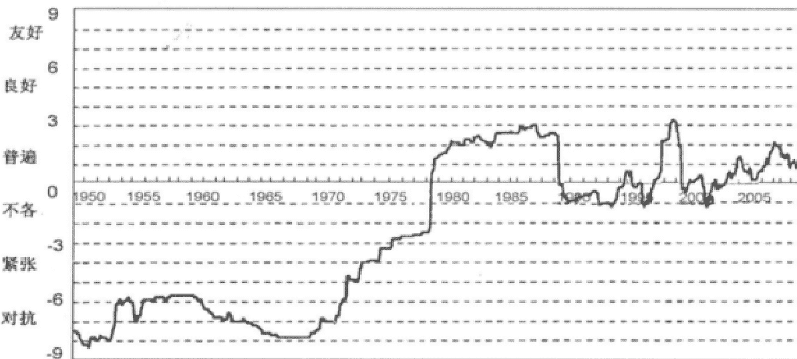

可以看出，中美之间关系最好的就是基辛格访华之后到苏联解体之前，随后在小布什发动反恐战争，以及2008年经济危机后，有一小段时间还凑合，其他时候一直不咋地。所以也不要太在意两国关系走低，今后很长时间里，可能一直都是这个状态，买卖还得做，但是政治上各种冲突也没法避免。

不过也没必要担心，现在全世界经济走进了一个大泥潭，一时半会走不出来，这个时候对我们既是挑战也是机遇。挑战显而易见，现在全球化退潮很明显，技术进步也缓慢，各国财政都有问题。说机遇，是因为经济下行的情况下，美国想挑拨各方关系会非常难，因为抱团取暖是唯一的活路，谁都不会这个时候在经济上搞事。比如中国刚买了空客那么多飞机，欧洲在中国也有大量的企业。

中国市场足够大，所以在中国做研发有盼头，也有足够的场景支撑。所以，虽然当前有困难，有挑战，美国还想围堵我们，但是我们自己有巨大的市场，再坚决不退出美国主导的市场，坚决拥抱全球市场，还有像阿里、华为、比亚迪这样的创新者，中国一定能够突破美国设定的天花板。

归根结底，这是一场持久战，谁能胜出，关键是谁有更稳定更庞大稳定正循环系统，老百姓花钱购买更好的产品，企业有动力去研发更新更先进的东西，研发体系也就搭建起来了，我们有自己庞大的市场，不像日德那样高度依赖美国，更关键的是，我们以前能长出华为、阿里、比亚迪这样的民族企业，今后就能长出来更多。

也就是说，中美真正比拼的，是统一大市场，是战略定力，是解决自身问题的能力。中国现在最重要的事，就是把自己的路走好，聚焦解决自己的问题，现在经济形势的确不乐观，但是中国整个基本面还是好的，14亿人的市场任何时候都不小，只要把这个市场搞好，就好像一片沃土一样，啥都能长出来，并且还是会越来越好。

公众号懒人搜索，懒人专属群分享

### 国家破产，还有救没？

2022-07-12

有一个多礼拜没更新了，主要也是最近在忙公司的事，有点顾不过来，而且人到中年，家里的事也多，不再像年轻时候心无旁骛。那时好像总有用不完的劲，以前中午吃完饭，状态来了，写半个小时再上班，晚上不吃饭再写一个多小时，周末没啥事也能一直写，到今年好像不像以前那么状态好了，现在微博也不发了，微头条也不发了，文章也三天两头断更，慢慢体会到了什么叫“力不从心”。

写文章这事对于我来说，主要靠感觉，状态来了写得特别快，没状态写出来的东西我自己都不想看，干脆也就不发了。一直以来吧，我写文主要是为了我自己，我在好多文章里都讲过这事，写作是最提升自己的几件事之一，这些年不断地写，每年差不多百万字，我自己从中学习到了太多太多。我经常在想，如果我写作的目的单纯是为了别人看博流量，很可能也没啥人看，这就是“流量的测不准原理”，你越想讨好读者，读者可能越不想看，反倒是讨好自己，说不定有人看。所以我是不太理解有些博主说自己为了写作有多苦，讲真，那么苦大仇深地写，能写出来啥？

一直有小伙伴问我，我这些年写了这么多文章，怎么保证内容的准确性？我只能说我尽量保证，一般写完之后会让相关领域的专家看看，现在关注我的人里各行各业都有，总能找到比较专业的。反正我尽管可以搞付费阅读，也从没搞过，自认为不配大家花钱看，大家也不用给我打赏，看我的文章就是给我面子。

我更希望的是，分享出来之后，如果有啥觉得不对的，大家可以自己求证下，把搜索工具用起来，这也是我一直在提倡的，工具和学习能力比知识本身重要一万倍。我提到的内容很少有模棱两可的，基本都可证实也可证伪，大家有疑问可以直接查一下，有了不同的结论可以跟我说下，绝对接纳。而且我没法提供真理，只能是提供一个思考的方向，如果大家将来阅读过程中把我说的证伪了，那也是一种进步。

至于有人骂我什么的，大家不用替我辩解，也不用跑来告诉我，真不在乎，我们这些小镇做题家们一路走来，早就水火不侵，尤其我是微博时代过来的，早年经常说些政治不正确的话，一天被骂上万条也常有的事，早就不在乎几声苍蝇叫了。再说了，在自媒体江湖里，有个潜规则，不骂不火，事实上每次有人骂我，我这边粉丝数都会暴涨，有些职业自媒体干脆招黑博出圈。

这也是我想跟年轻的小伙伴说的话，我早年最失误的事，就是太爱面子，太在乎别人的评价，纠结过也错过了不少机会。后来慢慢明白了，有些人吧，他一事无成，这辈子最擅长的就是背后嚼舌头，你理他，他就赢了，你把他的话当回事，你会变得跟他一样废物，最后啥也别干了。最好的选择就是忽略掉那些苍蝇。这些年骂我的人也有一些，我从没写文章跟他们对骂过，不值，也希望大家不要理会生活中的苍蝇，好好过日子，不要跟苍蝇怄气，多看他一眼，你就输了。

做事要紧，不要在乎别人的评论，你做的事哪怕有一点点价值，肯定躲不过那些长舌人的攻讦，不要理会就是了。把这句话记住，过几十年你会感谢我。

这两天看了下，斯里兰卡破产这事可以聊，其他博主们都在关注斯里兰卡是怎么破产的，我觉得斯里兰卡这种破国家不值得专门写一篇，我尝试写写“国家破产”这事到底咋回事。

其实国家破产并不稀奇，最近这些年破产的国家一大堆，冰岛，希腊，阿根廷，俄罗斯等等，都有过破产经历，“破产”这个词听着好像挺严重，其实也就那样，一般来讲就是“没外汇了，欠别人的钱还不上了”。

欠钱这事分为两种，一种是欠自己的钱，叫内债；一种是欠别的国家钱，叫外债。

内债好理解，一般是向银行和金融机构借钱，这些钱都是老百姓存进去的，如果是政府欠的，正常来讲是没有违约一说的，如果急眼了，可以多印一些钱还债，苦一苦百姓嘛，只是代价也很大，容易引发通胀失控，常凯申就是这么做的，后来通货膨胀把国家给打崩了。前段时间日本国债那事闹得沸沸扬扬，其实他们也是内债占据绝对大头，现在也不打仗，一时半会死不了。

外债比较复杂，一般是向国外借，比如大家熟知的美元债什么的。这里就有一个问题，如果我是一个政府，我欠了一屁股钱，我不还了，你能把我怎么办？

这个分人。

主要看你们国家对别的国家依赖大不大，一般来讲不会有军舰上门讨债，但如果你依赖别人严重的话，就算没有军舰上门，也痛苦不堪。

因为国家欠钱这事，很少欠别的国家政府，而是欠别的国家金融机构，比如俄罗斯现在欠美国很多钱，并不是欠美国政府，而是欠摩根大通和高盛这些金融机构。国家一般不会为了金融机构去跟别的国家开战，我想了想，没想出来相关案例。

但并不代表你不还钱就能好过。因为基本上没有一个国家能完全不依赖世界经济，这就要命了，你不还钱可能会非常痛苦，看完本文大家就懂了。

首先这个债是消除不掉的，一直都在那里，并且还有利息一直在增长。这就好像你的信用卡有欠款，你装作不存在，但是那玩意一直都在不断累积，迟早有一天会找到你。

这一点很关键，债只能商量减免（我国之前减免过非洲的债务），但是绝对躲不掉，人死债消，国家没有死的一说，人家不给你减免，你就一直欠着，下次有事要跟对方做买卖，人家第一件事就是要钱，这和咱们老百姓之间的情况差不多。

就算你们国家换了政府，那个钱还得照付。

你可能觉得这个有点过分了，前朝欠的钱，本朝还，合适吗？当然合适了，比如前苏联崩溃后，欠了960亿美元的债务，这些债务主要被俄罗斯继承了，俄罗斯一直到2017年才还完。

很多人不理解俄罗斯为啥要做这个冤大头，其实没啥难懂的，俄罗斯想继承苏联在联合国和国际上的地位，以及苏联海外资产，别的国家欠苏联的钱也要还给俄罗斯，所以俄罗斯把债务接了。也就是权利和义务是对等的。举别人的例子大家可能感触不深，举我们自己的。

我国这些年在海外那些动乱国家有大量投资，那些国家动辄政府倒台，新政府上台后，一般都会承认我国的投资，并且表示借的钱都要如数还。因为我国借钱是借给你们国家的，你们国家换个领导就不还钱了，是不是有病？

当然了，国家之间打交道，不可能靠道德说教，也不能靠质问对方有没有病，主要是你只要在这个地球村混，就基本上躲不开中美这样的大国，迟早有办法要回来，而且还本付息。所以这些年违约的事很少了，一般他们出了事，会商量能不能利息低一些。

其次你欠了别人钱，如果有能耐不再借钱，那日子应该不受影响，但是大部分国家没那个本事。

比如俄国1998年违约了一笔国债。但是他们国家又急需更多的美元来购买机械设施，毕竟俄国的石油天然气钻头和钻井是依赖西方的（俄罗斯进口清单中，接近一半是买机械设备），主要卖家是美国德国荷兰他们几个，这时候就需要借钱买设备，不然钻不出来油，不卖油，就更没钱了。

但是你刚还不上旧债，再借新债谁还敢借你？这时候想借钱只有一个办法，得加钱。

就好像一个人欠了银行钱还不上，只能去借高利贷，俄罗斯后来也只能是被迫借高利贷，利率200%，非常吓人，不过也没招，必须得借，不然石油钻井就会停工，石油是俄罗斯的命脉，说啥都不能停。

不仅如此，国家外汇太少，导致汇率暴跌，俄罗斯老百姓得花更多钱才能买到相同东西。当然了，如果买的东西是俄罗斯自己的，那影响不大。

也正是因为上次违约的惨痛教训，这次俄乌战争爆发后，俄罗斯尽管遭到西方惨烈的制裁，依旧坚持还债，毕竟打完仗日子还得继续。

这次要破产的斯里兰卡，日子会非常难，这个国家不产石油，一旦破产，也就没钱买油了。供需关系影响下，这个油价会大幅飙升，很快大部分人都买不起油，也买不到油。

你可能会说，买不起油不买呗，从此不开车了。但问题是油又是很多产业的基础原料，缺油大概率会导致缺电，进一步会导致大量产业没法开工，引发大规模失业，这就属于动摇国本了。此外斯里兰卡又缺粮，如果没钱买粮食，饥饿会横扫全国，最后整个社会陷入巨大的动荡。

那有没有破产后影响不那么大的？

也有，比如冰岛。

冰岛在2007年之前借钱买美国人的理财产品，当时看着华尔街玩次贷玩得风生水起，他们也想赚那个钱，于是从英国和荷兰借了不少钱去美国炒股吃差价，没想到美国佬暴雷了，冰岛人赔得一塌糊涂。

于是冰岛人想出了一个奇招，让老百姓自己公投决定还不还钱，如果决定不还钱，将来倒了霉，大家一起承担，也别怨政府。于是开启了“公投赖账”第一家，冰岛老百姓投票决定还不还钱，90%以上的人觉得银行借钱炒股赚了也没给自己分，现在赔了关自己屁事，干脆利索赖账了。其实那些年金融机构炒股赚钱后，也是给政府纳税的，政府又给大家分了。

不过好在冰岛这个国家听着好像很发达，其实是个钓鱼和旅游国家，能源主要靠地热，人口也少，并不依赖其他发达国家，短时间内不会出现斯里兰卡那种巨大的困难和骚乱。所以摆出一副“这次借钱不还了、并且再也不见面”的姿态，反而把英荷等债权国给吓坏了，赶紧拉着它坐下来，有话好好说，别掀桌子啊，你有什么困难可以跟我们说嘛，又不是不能谈。甚至援助冰岛尽快恢复经济。

冰岛这幅造型，像不像有些人撸了小贷坚决不还钱，最后小贷公司急眼了，大哥，您多少还点？

但是我上文也说了，欠钱这种事，你不还就一直在那里挂着，也不是个事，更关键的是，跟欠别人钱不还一样，欠了别的国家的钱，你不还钱今后基本别想做买卖。问题是这个世界上有无数的人，可是国家只有那么些，对外借钱的更少了，就那么几个，国际上做买卖根本躲不开英荷两国，冰岛这个国家也知道自己靠钓鱼赚不到啥钱，今后还是得继续玩金融，那就得尽快还钱恢复信用。

于是冰岛经济恢复后，英荷开出了优惠条件，冰岛说是愿意慢慢还，一千多亿欧元的债务，准备每年还二三十亿，利率是3%，现在正在打工还钱，预计需要用一代人的时间。

还有希腊，本来也欠了一屁股钱，一开始也准备学习冰岛民主赖账，可是条件又不如冰岛好，冰岛不是欧盟成员国，相对独立一些。希腊不行，加入欧元区的时候把印钞机砸了，而且也没了配套人才，想印钱单过都不行。看到希腊想学冰岛赖账，欧洲央行怒了，希腊的ATM机里都取不出来钱，老百姓太痛苦，希腊政府只好乖乖回到谈判桌被那几个大佬修理。

后来被一顿折腾，希腊认怂准备踏踏实实还钱。不过好处是它承诺还钱之后，各国对它的投资就上来了，因为希腊确实有些很好的资产，比如它有无数的漂亮岛屿，这些年跟中国搞好关系，又是租港口，又是吸引中国投资移民，去年他们的财政部长说是终于把2007年欠的钱还完了。

比较倒霉的是阿根廷，这个国家每隔几年破产一次，到现在已经9次还不上钱，每次还不上钱，就得被人修理，借钱的利率越来越高。这也正常，你连续几次不按时给花呗还钱，后续再借钱利息就会上升。

现在阿根廷就跟个赌棍一样，欠了一屁股高利贷，日常还不上，每次违约都导致接下来借钱利率暴涨，更还不起，过一段时间继续违约，现在的阿根廷是“习惯性破产”。可是它又极度依赖国际贸易，国际上又不认阿根廷的货币，所以只能是一直借高利贷度日，看着吧，阿根廷说不定近期就得再破产一次。

那有没有国家做得很绝，以至于大家拿他没办法呢？

还真有，就是朝鲜。朝鲜最大的优势就是它并不依赖其他国家，大家也拿他没办法。大家都知道，苏联解体前朝鲜过得还不错，主要是因为当时苏联和东欧国家给它低息贷款，苏联低价卖给他石油。东欧剧变后，贷款没了石油不卖了，朝鲜欠的钱到现在也没还完，比如匈牙利和捷克他们几个，就是朝鲜的老债主，不过好在不需要跟他们打交道，不还钱那几个国家也拿他没办法。朝鲜一直在寻求减免，每隔几年就去问能不能减免掉95%，剩下的用高丽参还。

之前还有一个印象深刻的新闻，观察者网发的，大家有兴趣可以搜一下，说是20世纪70年代，朝鲜曾向瑞典购买了1000辆沃尔沃144型汽车。但40年过去了，汽车仍在跑，但钱依旧没有付。瑞典现在还在找朝鲜要钱，可朝鲜没钱，没钱咋还？瑞典也拿他没办法。

说了这么多，大家基本上看明白了吧，国家破产这事跟普通老百姓借钱还不上非常像。整体来说，债务是躲不掉的，一般那些破产了的国家最后也都把债还了。但是如果你不太怕别人修理你，硬气一些，说不定债主反而怕了，坐下来跟你谈优惠条件。如果你有能力像朝鲜一样把自己封闭起来，别人也拿你没办法。可是大部分国家没法做到那么封闭，只能是老老实实还钱。

这次斯里兰卡国家破产，最后大概率需要债主们救它，它的500亿美元外债里，还有咱们的50亿，如果彻底凉透了，这钱也要不回来了，所以债主们也着急。

最后应该能救活，不过这个过程中老百姓会非常非常痛苦，油电粮这些基本物资都很难保障，不痛苦有了鬼了。

写到这里，不得不说咱们国家现在还是很安全的，有巨大的外汇储备，粮食安全也有保障，更关键的是，我们的工业产能也可以预防短缺，只要把眼下的那些问题解决好，风起云涌，我们完全可以岿然不动。

文末再说一句吧，这两年尽管国内目测不会有啥问题，不过咱们普通老百姓还是要保持谨慎的花钱风格，尽量不要浪，苟住，这年头，苟住就是胜利，不赔钱就是赚钱。

公众号懒人搜索，懒人专属群分享

### 一颗卖几千万，那个天珠到底咋回事

2022-07-05

一直想详细讲下这个话题来着，因为这玩意这两年突然大火，让人觉得有点猝不及防，而且网上的文章都是互相抄，信息量极低，不如我自己研究。最近深入了解了下，发现资料倒很充足，论文一大堆，从外形到分子层面都有研究，再加上我之前认识一个小伙伴他们属于台湾省天珠造假世家，所以写一篇跟大家聊聊。

首先放一张图，可以说，天珠这些年大爆发，跟李连杰有很大的关系，他的人生后半程一直跟藏传佛教纠缠在一起，后来花了两千万买了个九眼天珠，这个东西一下子火出圈了。

事实上80年代之前没有“天珠”这个名字，尽管古代一直都有这个东西，但是以前不叫“天珠”，叫“瑟珠”。这名字很明显不太行，就像“保密局”不如“军统”有气势一样，显得格局很低。后来在传销诈骗方面技能点满的台湾人重新起了个名字，也就是咱们熟知的“天珠”，气质和逼格一下子就上来了，价钱也指数倍上涨，他们大概测算，二十年间差不多涨了上千倍。

关于天珠，大家肯定听说过一句话，说是天珠是西藏人生产的，唐朝以后的天珠都是假的，因为工艺失传了，直到最近一些年才重新研究明白。

这句话让我百思不得其解，我以前也先入为主信了这个说法，后来查国外论文的时候，发现他们找到的珠子哪个朝代的都有，所以根本不是那样，甚至发现了一些其他问题。

首先天珠并不是藏人生产的，而是他们在喜马拉雅山两侧捡的，以至于很长时间里，藏地的人一直以为天珠是天然的，是一种虫子变的，类似冬虫夏草那种。

啥？不知道啥叫冬虫夏草？

那玩意就是个虫子（蝙蝠蛾幼虫）被真菌感染了，后来虫子成了肥料，脑袋上长出一棵草来。

至于作用，大部分是炒作，不过国家好像乐见其成，毕竟这玩意属于转移支付，东部有钱人高价买了西部农民的农作物，何乐而不为，吃了又不会死人。

不过这几年发现这玩意也不是完全无害，2016年发布的《关于冬虫夏草类产品的消费提示》里说得很清楚，那玩意用处不大，却可能导致砷中毒，吃太多估计也不利于身心健康。

继续聊天珠，天珠不是天生的，这玩意是百分百人造物，现在一般的猜测是，西藏当地政权出去打仗搜刮回来的，西藏以前有个象雄王国嘛，巅峰时期也疯狂对外扩张，应该是在中亚获得了一大批，然后就搬回去了，由于天珠的外形和藏传佛教的气质很搭，慢慢开始成了宗教圣物。

藏人自己是很看重这东西的，还进贡给了大唐，以至于史书里关于天珠最早的记载就在唐史里。

那为啥有说法说唐朝之后工艺失传了呢？

我那个在台湾造假天珠的小伙伴哈哈大笑，说是这种说法是他爷爷和几个同行编的，人为画出来一条线，那条线之前的逼格一下子就上去了，而且给人一种存量很小的感觉。

### 严格意义上讲，象雄天珠

最关键的是，你拿到一颗天珠，很难确认到底是不是唐朝以前的。如果你口才很好，说服别人相信了这玩意是唐朝之前的，说不定能卖出天价。在千禧年之前，天珠是个非常非常小众的圈子，后来硬是被他们一堆话术给推出去了。

确实在唐朝之后没了，因为象雄王朝在唐朝那会儿被吐蕃给灭了，这个时间点正好就是玄奘从印度回来那一年，也就是李世民在位的最后几年。

那天珠制作很难吗？也不是太难，不过也确实不简单。主要是天珠的材料主要是白玉髓和玛瑙石什么的，这些石头太硬，比铁还硬（铁的硬度是5.5，白玉髓的硬度是7）。问题是古代又没有解锁更高的科技树，那怎么办？

古代匠人们还是找到了办法。他们发现比石头更硬的还是石头，于是把更硬的石头磨成沙子。打磨玉的时候，不断加入这些沙子，用这些沙子去磨玉，所以这种沙子也叫“解玉砂”。切割的时候，需要用一个长得跟锯盘一样的东西粘上解玉砂去切割，或者一边磨，一边注入加水的解玉砂，那些特别硬的石头就被切开了。解决方法找到了，依旧需要极高的功力才能搞出像模像样的产品。

大家去博物馆看那些古代玉器，经常看到并不规则，显然加工的时候被加工歪了，也是因为这项工艺太复杂，顶级玉匠也经常把握不住。

比如我们今天聊的这个天珠，就需要先把玉弄成一块长方体，再不断把棱角切掉，变成圆柱，最后变成个擀面杖造型。这个工艺叫“切角倒棱”，极费功夫，而且考验工匠能力。

所以真正古代生产出来的天珠一般上边还有切割出来的线条，不太可能太光滑。当然了，想达到品相极好的状态，如果不惜代价，可以把那玩意扔到一个木桶里，装进解玉砂，使劲转那个桶，耗走几个老头，说不定就光滑了。

最后还得在上边打个孔。打孔这事看着容易，其实也是个技术活，大概是下边这样的。那个钻就叫金刚钻，拿着一个弓拉动钻头。俗话说“只有金刚钻，才能揽瓷器活”，用它自然也可以钻玉：

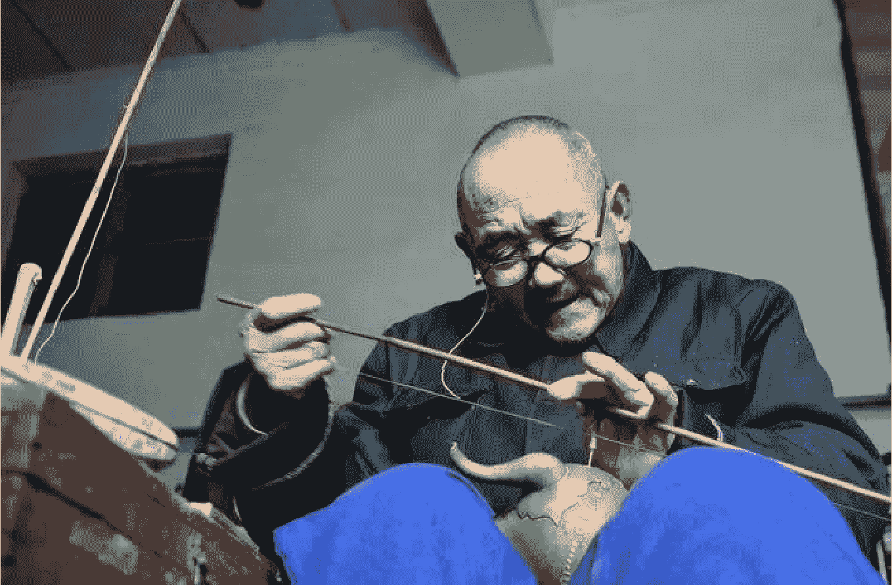

在发现金刚石之前，给玉打洞也只能靠解玉砂，一边钻一边加砂子，有时候得钻几个月。这种情况下，手工做出来的东西品相一般不会太好，那个洞歪七扭八的，甚至有时候为了加工方便，工匠们从两头对着钻，导致那个洞竟然有点对不上。这反倒成了防伪标识，因为现代的造假一般都是用车床和电钻，做出来的品质倒是挺好，可惜太假。有时候你想故意做得不那么差，反而很难。

形状对了，洞也打了，接下来就该把这玩意搞成黑白熊猫色了。是的，天珠最早是纯色的，一般是白色或者褐色，不长那样，那个黑白相间的造型也是工匠染出来的。先染成黑色，然后再画上白圈圈，就成天珠了。

尽管古代没有显微镜，但是匠人们很早就发现，白玉髓其实并不是完整的一块，而是跟海绵似的，里边有大量极小的微孔。如果想办法把颜料渗入那里边，就可以染成那种黑白相间的效果。

能给石头染色并且不会褪色的染料本身制作工艺也比较复杂，不过也没难住他们。把玉泡到这种染料里，就被染成了通体黑色。当然了，也不是说不会褪色，下边这颗顶上就褪色了，看上去像个秃头天珠。这颗肯定是真的，因为是考古队从古墓里找到的，现在在甘肃博物馆放着：

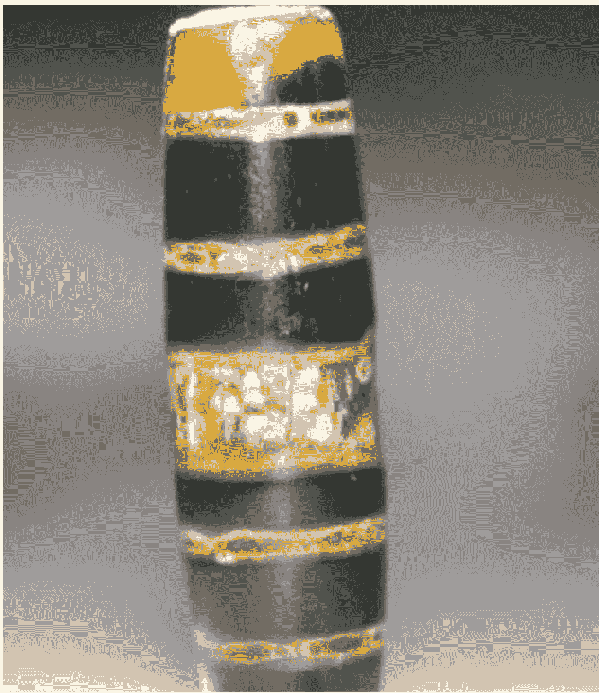

最后用碱性蚀染剂在上边画上白色的条纹，仔细抛光，这才成了一枚天珠。一般按照那上边的圈圈数量，分为“一眼”、“二眼”，甚至“20眼”。并不是眼越多越贵，而是需求量越大越贵。中国人普遍“崇九”，所以九眼的最值钱。

做这么一颗可能需要几个月。中原王朝工匠们搞这个倒是不是太难，但是他们又不太看得上，所以产量并不高。还有一部分被高僧圆寂后火化给烧裂了，或者被人把玩过程中掉地上摔坏了，这也是为啥大部分天珠都是残的。

剩下的基本都被陪葬了。也好理解，这玩意儿在收藏家手里转来转去，迟早会到一个痴人手里，这人实在是太喜欢这玩意，干脆死后也带走了，尤其是那种王爷贵胄，经常陪葬带走一大堆。本来也没多少，时间长了就彻底被耗尽了。

所以现在的“正品”天珠，都是从土里挖出来的殉葬品。知道了这事，每次看到有人把那玩意戴在脖子上，多少有点感觉瘆人。

后来宋朝可能玩天珠的确实是比较少，因为宋朝是中国古代艺术的巅峰，搞出来的艺术品一个比一个炫，估计看不上天珠这种土里土气的东西。明清开始有人重新再做，现在市场上交易的古董级天珠，大部分都是明清的，当然了，99%的是最近二十年生产的。

天珠重新复活，主要跟藏传佛教这些年高歌猛进有关。在所有宗教里，藏传佛教是少数鼓励大家去发财的宗教，这也是为啥雍和宫能求财，其他寺庙一般求平安。释迦牟尼当初自己放弃蓝血贵族血统跑去当和尚，怎么可能鼓励大家去赚钱嘛。但是藏传佛教不这么认为，他们是很入世的，可能也跟藏地环境太恶劣，高僧需要别人供养才能活下去有关。这些年有钱人非常乐意供养上师，这些年真假上师满天飞，朝阳区隐匿着十万仁波切。

天珠在藏传佛教里的地位很高，被上师们给带出了圈。李连杰那颗就是个高僧卖给他的，当然了，不能说钱，庸俗，要说“缘”，两千万缘。此外还有唐卡。大家如果注意下那些京沪豪宅，经常看他们进门的地方挂着唐卡，或者专门有个屋供着唐卡。唐卡一般不能自己随便挂，得去上师那里请。你说我就从淘宝买一个挂了，有问题吗？当然可以，不过有钱人一般面对不确定性比较强，他们容易迷信，懂唐卡的人一般不会随便挂。

藏传佛教最早在台湾铺开，所以台湾省研究天珠比内地早二十年，后来内地开始变富追逐上师后，台湾的业务才大举进入。

不过我那个朋友也表示，他们家三代做天珠，到了他这代已经做不下去了，导致他读大学搞计算机。

台湾的天珠造假业最早是被台湾自己人往死里卷，不过那时候还姑且能接受，利润暴降，但是勉强还能过。直到这些年，河南作坊的加入，彻底把这个原本暴利行业给干成了微利行业。以至于现在台湾卖的很多天珠都是河南产，很多人在西藏买到的天珠，基本都是河南产、从义乌中转发的货。多说一句吧，现在大家在各地买到的土特产，大部分都是从义乌发的，他们从义乌订货比自己生产划算得多。

此外河南人再接再厉，在“高仿”这个领域把科技点直接点到爆，比如他们已经开发出来了完全古法，再放到烤箱里烤，或者用紫外线照，模拟上千年的风化效果，再用各种药水配“包浆液”，二十分钟包浆效果超过三个老头盘50年。最后连天珠上的小裂纹都能伪造出来，甚至放在显微镜下，也有点难以区分。

几年前那个天珠世家的公子在北京花了666买了一颗象雄天珠，他爹仔细看完之后，惊讶地说造假都能造到这个境界了？说这个行业已经完了，连个馒头利润都不如。

文章写到这里差不多了，其实大家看完本文，大概心里也有数了。不少人在那里探讨天珠收藏的事，讲真，别瞎忙了。用不了几年，以河南老乡的产能，足够给全国人民每人配三枚。普通天珠没有任何收藏价值，古董级的天珠水更深，而以正常人的能力，根本区分不了到底是不是千年以前流传下来的。找专家看，很容易被专家合伙骗，就别瞎忙活了。

公众号懒人搜索，懒人专属群分享

### 上海降低落户门槛，可能意味着一个新时代
2022-07-01

上海昨天放了个王炸，说是在达到一定级别的应届硕士毕业生，无需“打分”，符合基本条件就可直接落户。

要理解这事意味着啥，得先理解为啥上海这种城市不让大家随便落户。

很多人第一反应是，如果彻底放开落户，那大家都去上海，上海不是得被挤爆？

其实不是，因为现在你想去上海，也没人拦你。你一辈子没户口在那里呆着，也不会有人赶你走。你去问别人为啥不去上海，估计基本不会有人跟你说户口的事，大概率是嫌压力大房价高什么的。

那问题来了，这个户口到底有啥影响吗？

主要有两点。一是子女上学，其实这个问题在一线也不是大问题，一线有很多人，他们的孩子在国际学校，将来也不准备高考，要直接出国；另一点是养老，这一点对于有钱一些的人来说也无所谓，因为你要不在体制内，养老金真没多少，指望不上。

说到这里，大家明白了吧，那个户口对于有钱的人来说没啥用，对于穷人来说也没啥用，因为穷人留不在上海的主要问题可不是户口。主要是针对那些中间层，他们可能不指望领养老金，但是孩子入学问题非常麻烦，国际学校去不起，想参加上海高考又不让，到了三十来岁可能被迫离开。

那为啥以前管那么严呢？

这个又比较复杂，因为这玩意是历史沿袭过来的，然后对沿海大城市的发展产生了巨大的推动力，所以就保留下来了。

啥推动力呢？

在1978年以后，我国慢慢就不大管制老百姓自由流动了。你跑去长三角珠三角的工厂上班，肯定没人管你，但是等你老了，需要领养老金的时候，如果没有沿海城市户口，人家就不用支付你养老金，因为你户口不在我这里嘛。这就太爽了，可以省下一笔钱。

大家可能纳闷了，那人口输出地区没意见？当然有了，意见大了去了。劳动力年轻时候去沿海打工，没有创造财富的能力了，回来让我们给养老？合适吗？

但是编户齐民两千年，也不能说废就废。为了平息愤怒，沿海地区一般得给内地一些财政转移。此外每年从一线逃离的那些人，还可以带一部分钱回到小地方，所以这么多年尽管一直在谈，但是也没做根本性的改变。

说到这里，问题来了，上海为啥这些年又愿意接纳这些人了呢？

大家搜一下新闻就能发现，上海不是今年第一次降低门槛，最近这些年对人口的门槛总体是越来越低的。2020年有大规模降低过一次，今年继续加码，不出意外，2030年之前，大概率只要有大学学历，就让你落户。至于你在上海能不能买得起房，过得咋样，那就是你自己的问题了。

为啥会有这种趋势呢？

我想了一个词，叫“年轻经济”，能解释这事。

我在大概十年前第一次踏上美国，就发现一个问题，他们的企业里，哪怕在那些高科技公司，他们的工人的年龄整体是很均匀的，每个年龄段都差不多。比如十个人的一个项目组，五六十岁的有两三个，三四十岁的有三四个，二十来岁的也有两三个。后来在新加坡、香港、台湾，都发现了这个问题。

只有咱们这边，都特别年轻，以至于我一度纳闷，老人去哪了。

后来懂了，主要是我们的产业结构太低端了，只需要力气，不需要经验。而且人力太充沛，年龄稍微大点就被赶了出去。这也是以往大城市的核⼼策略，把人当电池，用完即扔。再说了，人太多了，更划算的策略就是尽快轮动。

我当时就觉得随着经济发展，慢慢产业升级后，产业的复杂程度会倒逼企业使用年龄大经验丰富的人。

这不十来年过去了，我发现职场和我一起变老了。以我们公司为例，当初我入职的时候，我们部门平均年龄二十七八岁不到，如今已经三十三岁了。跟其他人聊了下，发现大家都差不多。

可见年龄结构越来越老，一方面跟我国的老龄化有关系，另一方面也是因为我国的产业越来越复杂，开始从“精力依赖”转向“经验依赖”了，经验不就是时间嘛。

这种趋势在工厂里不太明显，但是在稍微有点技术含量的企业里，已经很明显了。上海和深圳这种我国产业前沿，以前他们搞低端制造，一茬一茬割年轻人，后来那种低端产业逐步被淘汰，开始向高端产业转进，开始依赖脑力和经验。很多领域工作两年算入门，产业结构决定了现在他们需要更多经验丰富的中年人。

但是在以往的那种模式下，很多中年人到了三十来岁，可能为了解决小孩上学，就回老家去了，或者去容易落户的城市，这就造成了上海这种城市人才断档和后劲不足。为了解决这类问题，这些年不断降低门槛也就正常了，让这些本来想跑路的人留下来。

此外我国的另一个趋势也很明显，以前我们愿意说自己是制造业大国，这两年大家知道了工厂里的“牛马生活”后，很多人不再以此为荣，并且抖音上“找个厂上班”也成了一句骂人的话。

与此同时，我国开始强调自己是消费大国，也就是今后经济要靠消费驱动，一个城市今后的关键，就是消费力有多强。

也好理解，消费力强，花的钱就多，他们花的钱就是别人的收入，大家收入都高，生活品质也就上来了。但是消费这事很明显不能指望年轻人，年轻人能有啥钱，还是得指望中年人。而且各省财政压力都很大，解决财政压力的办法就是扩大税基，新时代啥是税基？人才就是税基。这种情况下，就不能大规模赶人了。

此外还有众所周知的问题，房价这玩意，本质也是个击鼓传花的游戏，需要不断有新人进来给抬轿子，而大城市的生育率，眼瞅崩得一塌糊涂，就需要外地人源源不断的输入。以前一线只留下拔尖的，这些年开始向下兼容，要的越来越多。

大家发现了吧，**一旦经济基础发生了变化，上层观念也开始有变化**，政策也跟着变了。看着吧，其他城市很快都会跟进，如果上海户口不值钱，其他城市的户口更是一文不值。

至于你说为啥北京还在搞收缩，只能说四大一线城市，北上深杭（广），北京跟其他几个完全不是一码事，思路也完全不一样。其他几个都是“内生性”、“开放性”的，地理位置就决定天生做买卖的好手。北京和他们不一样，北京一直都是靠输入。

那几个地方通过商贸崛起，从唐朝开始就是富裕地区，当然了，上海以前没啥存在感，深圳以前也几乎不存在，但是他们所在的那片区域，已经富裕了上千年。此外八百年漕运，一直都是从杭州那一带向北方转移物资，可见那地方一直都很富。

大家注意一下，富裕地区往往是**环境跟观念的相互进化**。长三角和珠三角那地方适合商贸，导致那地方的人天生对商业敏感，格局打开后，利用地理优势很容易变得非常富，富了之后对商业会更敏感，然后进入了一种稳定的正反馈。

这也是为啥历史上那地方多次在战乱中被砸了个粉碎，等到重建之后又是富庶繁华之地。近代史上，太平天国运动一度把苏杭那一带彻底夷为了平地，财富都搬回了湖南，但是180年过去了，那一带又发展了起来。

而北京，这个城市如果不是首都，经济水平应该超不过石家庄。因为北京在古代主要职责也不是发展经济，它是一个要塞型城市，武装到牙齿准备随时抵抗北方游牧部落南下。

反而石家庄是北方巨型陆运枢纽，而北方第一大经济体，应该是天津，面朝大海背靠平原，这就是天生富贵的造型，唯一的问题是内河系统很差。事实上北京不做首都那些年，北方第一大城确实是天津。北京古代就一直养活不了自己，需要通过运河给自己输血，而运河的起点，就是苏杭那一带，所以它一直没有“外溢”功能，甚至可以说，在很长一段时间里，北京是江南的外溢。

所以北京一直跟那两个三角的逻辑不太一样，那俩是开放型的，北京是自闭型的。

不出意外，将来长三角和珠三角会越来越大，并且那些城市都连成一片，人口可能会继续向那边聚集。

可能有小伙伴纳闷，这样下去，会不会两个三角把全国给吸干了。

也不用担心，大家去长三角，肯定是因为待在小地方啥也干不了，还不如去一线试试，说不定将来能把一线的商业模式带回老家。事实上我国过去这些年也是这么个发展历程，经济一直在从两个三角沿着内河和公路网向内地辐射。

此外内地城市想解决人才外流，应该想的是怎么创造良好的营商环境，怎么让年轻人觉得待在你这里比背井离乡去其他地方强，而不是天天担心人口外流却什么都不做。比如郑州最近的那件事，让我很痛心，“670个硕博人才深陷烂尾楼困局”，这种事就是自掘根基，今后谁敢去你那里？

### 尾声：
上海放开落户这事，可以看作是一个里程碑，标志着我国产业升级后，慢慢不再把人当“牛马”、“燃料”、“干电池”，用后既弃，耗干后赶回老家，而是当做真正意义上的人力资源。只有这样，才能长期可持续发展。

这也是我一直在说的那事，经济发展和商业活动最终会改变大家很多观念。户口制度这种千年老皇历一直持续到现在，主要也是因为我国发展还不够彻底，这种老制度还有它存在的土壤。

但是观察下它最近半个世纪以来的变迁，就会发现整体是越来越松。随着上海越放越松，其他城市（除了北京）估计慢慢也不管了，户口制度彻底变成了一个档案系统，慢慢跟它原本的目的没啥关系。

公众号懒人搜索，懒人专属群分享

### 县城里藏着另一个中国
2022-06-28

1

在互联网上县城的形象有个特点就是“土”，很多时候代表了管理水平低。如果在网上查“全国最大的县城”，你会发现很多省会城市都神奇地名列其中，比如武汉、长沙、石家庄、济南、合肥，还有天津……

最离谱的居然有西安和南京这两个古城，我只能猜测是本地人对自己的家乡都有更高的期望吧。

那在县城的生活是怎样的呢？

县城里的人，其实也分好几大类，这也是为何网上对县城的描述如此不同。

最标准的就是普通原生居民家庭，这些家庭大多至少两代人都在县城居住。几十年下来认识的人非常多，长辈大多有稳定而又中等的收入。住房不是以前单位分的就是自建的。这些年可能搬入了商品房，比较难以理解的是，大部分县城的房子没有房产证，可是照样可以交易。

对于这些家庭有一个描述就是“三十岁就可以看完一辈子”。这些人并不对自己有太大的想法了。最多考虑的都是子女，这些父母大多没有受过很高教育也没有很大见识，对于孩子接触的新东西一般也不理解。

操心的就是升学就业结婚这三样。心目中如果孩子考上重点大学，毕业之后留在大城市自然最好。自己想办法砸锅卖铁给孩子凑首付。

如果不行就回老家考个公务员，那就可以算是扬眉吐气光宗耀祖了。考不了的就自己想尽办法给孩子弄个“正经”工作吃财政饭，然后赶快结婚生孩子自己帮着带。

比标准家庭低一些的，就是那种从乡镇或者村里来到县城的家庭。这种家庭有的是父母带着孩子在县城定居，有的是父母出钱为孩子在县城买房。

这种家庭在县城中就比较边缘化，因为社会关系大多不在县城里。而县城的“关系”氛围又非常浓，外来者融入并不容易。长辈操心的事情大多也是孩子的上升，如果不能通过考试进入重点大学，回到老家考公也是最优解。

在县城里，这种外来家庭吃上“公家饭”是最快融入当地、提高地位的方式了。这种家庭在县城的生活就比较一般，很多人对于县城的负面印象大多源自于此。

县城另一个饱受吐槽的，是它的房价。这些年来伴随着大城市房价大涨，县城的房价也是水涨船高。很多经济比较不错的县城，房价可能和所在市的房价差别不大。

这就造成了很大一个问题，如果是乡镇或者农村家庭，在县城或地级市甚至省会差一些的地段，购房成本的差距没有太大差别。

去年抖音上有个小伙伴说他原本打算回县城。结果回去一看吓一跳，差不多的新房，他老家县城8000，所属市里不过一万。他们的省会属于弱二线，房价好的房子两万三万，但是一万多在偏一点地段也能买到。而且省会的工作机会比起县城多不少，他父母亲戚都是镇上的，去县城还是省会没有多大差别。这样一来选择就很明确了，于是他在省会买了个比较偏的次新二手，打算骑驴找马以后置换。

按他说的“傻X才在那个破县城八千多买房子”。其实本来县城房子并不贵，但2016年前后他们县城搞新城大拆建，现金补偿使得很多人拿到大量现金。拿到钱的人也多选择置换新房，结果造成了一轮房价暴涨。

比标准家庭高的家庭，大多是较富裕的生意人和有一定职务的公务员家庭。这些人属于县城的精英家庭，不但有较高的经济和社会地位，而且拥有覆盖全县的社交圈子。这种家庭的生活就比较好，基本可以用爽地飞起来形容。很多人回到县城，发现生活简单又美好，大多也是因为家庭条件在当地就属于比较优越的。

精英家庭一般都会追求孩子获得更好的生活，如果在大城市会尽量买房。要是回到县城，努力为孩子通过关系，弄到有编制的工作是第一选择。也就是考公务员，并为孩子在后续发展中提供全力支持。

这种家庭，才有所谓“县城只要大城市一半的收入就可以买买买”、“小镇青年更愿意消费”这些说法。

在2010年，北大博士冯红旗以在河南中部地区挂职的机会，写了博士论文，也就是著名的《中县干部》。这篇文章在网上引起了长时间的热议。其中重点讨论的就是干部通过各种方式，实现“世袭”的情况。

在县城这种环境里，中县的情况很常见，县城因为缺乏活力和流动，各种职业的“世袭”非常普遍。很多店铺生意都是两代甚至几代人做，几十年连地方都没动过。而公务员和事业编制工作，依靠上一代的关系和运作，起步就可以比没有背景的快。等到十几二十年后，有背景的职务也自然要高。

如果比精英家庭更好的条件，就是当地大企业的老板和领导班子成员了。这种家庭子女大多不会留在县城里，出国或者在一线城市才是他们的选择。

如果说有哪伙人最爱公务员，那无疑是县城人。

在县城上班和大城市有个很大区别，就是相对可以选择的不多。只有不多种类的工作，以至于在县城，很多人眼中只有两种工作：吃财政饭的和打工的。

这里就要说到一个情况，就是之所以县城热衷考公，一大原因是县城中吃财政饭的人比例比较高。

我国现在的体制是“层层复制”，也就是说，中央的主要架构是：党委，政府，人大，政协等四套班子，省、市、县三级都完全复制，再往下就不复制了。如果继续复制，官僚体系会大到爆。而且中央政府的主要部委，都向下复制，比如中央有财政部，省政府有财政厅，市县政府有财政局。

所以县城拥有相对完整的行政体系，公务员数量非常多。而这里又是附近地区的资源集中区，医疗教育资源集中，医生老师这种事业编制也比较多。

所以在县城里，“吃公家饭”的人很多。一般一个数十万人的县，有编制的公务人员有两千人左右，其实这点人只是正规公务员人数。要加上参公人员和医院学校这种事业编的，可能就要超过6000。再加上数目不等的退休人员、工勤等临时性人员，一个县财政养活的人数，很容易超过一万。

在这之外，银行、信用社、移动联通这类国有大企业，员工也被县城的人认为是有“正经”工作。

一万多人，相对于一个十几二十万人的县城，比例就不低了。

甚至个别地方高到离谱，比如曾经引起热议的佛坪县。县城常住八千人，两千多是在政府机关、事业单位上班或者退休的。

当然这么多人也不都在县城，下面乡镇也有人吃财政饭。但是一般县城距离下面乡镇是很近的，这些人大多都在县城安家。加上县城人和人的距离更近，所以县城几乎每个人都有吃财政饭的亲戚朋友。

有接触才有比较，不论公务员还是事业编制，工作环境和待遇比起县城大多数工作还是要优越的。这是县城追求考编的基础。

这也形成了中国绝大部分县城的一个特色，可能整个县里完全没有任何产业，只是通过财政给公务员花钱，公务员平时去吃饭消费，拉动了整个县城的经济。整个县城几乎所有的经济活动，都围绕“财政”展开。

接着说说县城的工作收入。

这个各地的区别还是很大的，不过比大城市肯定是要低的。但是也不能简单地一对一比较，就是相同工作才有可比性。

大城市很多收入很高的工作，在县城是根本不存在的。所以很多人说老家的人不知道自己做的是啥工作，却收入很高，觉得应该不是啥正经事，而且大概率不会持久，劝你尽快回来考个编制。

总的来说，普通县城里多数人的平均收入在两三千之间。少量工作有收入高的，不过比例很少，不算在内。

而且县城的企业，很多都不太规范，各种保险的缴纳不规范。或者只交一两种，或者缴纳基数按照最低标准来，甚至很多干脆就“折现”了。

这方面一比，吃财政饭的优势就更加显出来了。因为这些人的收入是按照级别定的，全国不同地区的差异没有那么大。再加上吃财政饭，各种保险一般都是会交齐的，缴纳的比例还很高。

所以即使从经济角度看，考公在县城都是一个划算的事情。一般的县城，财政饭的收入比平均收入还是要高的。即使拿到的工资和吃财政饭的人一样多，甚至更多一些。如果把缴纳的保险算上，但实际上，你的收入比他还是要少的。

至于有人说公务员升迁难，这个倒是确实，而且现在大家并不避讳“政治资源”一说，也就是说，咱俩都在一个单位干活，你有资源很快升上去了，大家也没啥说的，毕竟出了大学一两年就接受现实了。

整体而言，只要能力运气情商都正常在线，不捅娄子也不天降猛男，一般在这条路上最后都差不多。干二十年大多能熬到弄个科级（县城对科级干部喜欢提一级叫处长）。虽说很多只是待遇，没有实际权力，但是已经在县城的圈子里够用了。县城流动低，20年下来基本没有不认识的人，有点小事都多少帮得上一点忙了。

而医生教师之类也是这样，积累年资和经验做到主任医师和高级教师都不难。

有人说县城里的人对吃财政的人尊重，这更是合理。

面对一个看得见摸得着，以后的处长或主任医生，当然非常值得尊重。相比起来，一个过年才从大城市回来住几天，所谓“月入XX万”的白领，在县城里的人看来并没有什么了不起，因为他们觉得你那玩意不一定能持久，短时间赚得多有啥用?

再说了，讨好本地公务员和医生，说不定明天办事就能用得上了，你挣钱又不给他花，他干嘛重视你?

如果你像东哥回老家那样，成箱子给乡亲分钱，别说什么主任，就是亲爹也扔一边去了，大家肯定来巴结你。

这里要说说县城的消费。一句话就是中国物流如此发达，全国东西价格都差不多的。

现在大宗商品是全国甚至全球统一价格了。县城需要的大量物资也多是外地运来的，所以东西价格和大城市基本没有大的差别。

县城相对低的是人工费和商铺租金，如果某样消费中这两样占大头，或者当地时令产品，这些相对性价比就会更高一些。最明显的就是饮食类了，很多美食up主拍摄县城的食物，尝味道之前很多都感叹分量真足啊。弹幕也一波表示“馋哭了，这在XX至少XX起步”。

而产品如果是从外地来的，很多时候因为物流和转手，甚至还要更贵一些。

很多人说县城大多都相对封闭保守。这是真的，人口流动性比较小，老人比例相对大，传统产业的人多，体制内的人多。人们的接触面小，很多时候大城市的流行，在县城却无法流行起来。这也是人的意识一旦形成，想改变一下是非常难的。

所以县城里面娱乐大多比较传统，如果要去KTV唱歌找人很容易，如果打麻将打牌都不用找，喝酒更是能把你喝吐了。但是要是玩剧本杀的，那真的是为难当地人了。

相对缺乏流动，使得县城显得没有什么活力。从正面可以说是“恬静”，从反面可以说是“死寂”。

这里要说说县城的几个经常被诟病的地方。

比如说县城是人情社会，对于在大城市的社恐人，非常的不适应，节后返城对各种亲戚的吐槽是保留节目。比如县城里办事都喜欢找人，即使正常程序完全不会遇到问题的事情，也要找人。比如县城的人对“干部”有宗教式的向往，酒局作为县城的交际场，坐上手的一定是有职务的。如果有上级政府部门来的，本地干部即使职务等级相同也要坐下手。比如县城里的人都喜欢议论别人，一件事情很容易几天内就被所有人知道。

这一切的原因，一个是因为县城作为一个介于乡村和城市之间的区域。很多事情并不能按照城市里那样一板一眼，实际要被传统乡土社会的习俗约束。但是传统习俗又不再能公开使用，很多就变成了潜规则。

潜规则的存在基础就是共识，很多时候要多数人认同方可。如果出现强硬不认可的人，潜规则要依靠多数人施压。

比如两个人打架伤了人，按照城市里说法“打输住院，打赢坐牢”。但是县城里面很多不是这样，只要没有打到刑事案件的地步，就有转圜的余地。打人的家里亲友会被发动，通过各种渠道找被打的人亲友，想方设法让对方不主动追究，好把事情“平”下来。

其间各种拉锯博弈，最重要的是寻找到两家都认可的“有面子”的人从中说和。

打人的目的就是避免法律处理，被打者目的就是要精神物质两方面补偿。一般以打人方掏钱+登门道歉认错+各种保证为主，其间双方都要有人作为见证。事后也要散布出去，以此维护被打者的“面子”。

比如县城里面要拆迁遇到钉子户，如果按照法律，直接推土车推平，实际上哪里敢这么做？在县城里，首要是把钉子户情况统计出来，然后分别处理，其中常见的一个方法就是包干：发动钉子户亲友劝说，一家一家搞定。

曾经有个县城拆迁，一共冒出22个钉子户。书记认定了22个县里干部，每个人都和钉子户是三代之内的亲戚。你劝不通就不许来上班，工资奖金都给你停掉。以至于县税务局副局长抱着铺盖，搬到当了钉子户的小舅子家住，足足赖了五天，最后终于“做通了工作”。

县城里面，事件的处理，只要不是严重违法。很多都有潜规则的影子。所以人们对于事情，找人成了一种本能，不论什么都喜欢找人，动用潜规则试一下。

这样一套体系的运行，需要整个县城是个人情社会，任何两个人都要尽量容易地联系在一起。并且联系的要足够紧密，也就是人情网要够密够紧，遇到事情才能“兜”的住。所以县城里面热衷交际，热衷联系，这样自己才能和整个网紧密联系，如果遇到事情别人才帮你，潜规则才能对你开放。

《教父》开头的经典场面，殡仪馆老板来找老教父“主持公道”。老教父说你自从生意好了就不再和我来往，现在有事来找我，还和我提钱？要掏钱雇我帮你？

县城里很多人和事也是如此，对某个人的一种极低评价就是“平时不处人，有事找人帮忙，就大桌小桌摆出来了，结果一个来吃的都没有。”

而对干部的尊重也源于此，潜规则的运行，除了多数人认同，很重要的是发生事情，必须要有足够“面子”的人从中说和。首先这个人要有值得大家认可的身份，然后做事要公道，最好还要会说话能讲出道理让大家信服。

在县城的环境里面，最合适的自然是有干部身份的人了。特别是本地出身大家都认识，长期在当地担任一定职务（并不需要很高），说话做事有水平的人。

我在前面说了，县城里面吃公家饭的比例高，干部也多，比起有钱人，大家都比较认可这些人。干部工作稳定、收入比较高、受大家尊重，手里又有权力可以帮人，这使得县城里面对于“吃公家饭”如此向往。

有小伙伴可能会问，县城里有哪些发财机会。

其实在县城怎么成为富翁和大城市差不多，多数都是依靠运气、胆量、谋划实现的。

大城市有的东西，如果有利润，很快在县城里就会出现。如果你发现某个东西在老家县城没有出现，第一反应千万不要是要去填补“下层市场空白”，因为很可能是这东西不适合当地情况，特别是可能因为你不在当地才不知道的原因。贸然想当然的一下踩进去，很可能发现是个大坑。

而且县城的人还会奇怪“这么明显的大坑咋掉下去的，怕不是瞎啊”，真的是双重打击。

我亲眼见过的，就不限于在县城卖JK，卖手办，卖安德鲁貂，开卡游店，开密室逃脱等等。大多是热闹几天，然后因为没有足够客户，很快就垮了。不过县城一般都有大城市的“平替”，也就是廉价版本的各种东西，奶茶在大城市二三十一杯，县城里八块，只是里边既没有奶也没有茶，都是味精和糖的勾兑，大家依旧乐此不疲。

同时也有一些人，是依靠某些其他方式致富的。

比如搞垄断，有的是垄断某样产出，矿石、农产品、土特产任何一样都可以。曾经看过一个报道，说河北保定一个地方在河道违规卖沙子，一晚上能卖157万。

有的是垄断销售，比如每次打黑都能看到报道，黑恶势力在蔬菜批发市场搞蔬菜销售垄断，一个县的规模，每年就能获利上千万。

这种情况，很多时候也是县城作为人情社会的结果，因为人和人的关系紧密，监管就会变松，只要不是有人存心闹大，一般就那样运转下去了。

不过现在很多县城都有一个大问题。就是大城市的吸引力，特别是最近二十年，随着全国城市化率提高。县城的年轻人流出非常多，很多人到了更大城市生活。伴随一个定居大城市的年轻人，县城里可能这一家几代人积累的资金都会被带到大城市。这也是大城市房价大涨的一大基础。

而人是一切的基础，虽说县下面乡镇和村也有人到县城生活。但是这种全国性流动不是平均的，于是一个问题就显得很尖锐：部分县城的空心化。

原本县城设立，基础是古代商品和人的流动慢，每隔一段距离，自然会形成一个中转站。但是随着现在流动速度越来越快，每隔百里左右一个县级政府，很多时候显得不必要。所以这些年来，很多县级行政区划消失了。大多数是靠近大城市的下辖县，因为城市扩张，变县成区；少数是有些人口和辖区太小的县，与大县合并。

除此之外，很多经济发展一般的县城，在最近十几年中，财政上有个大问题。

很多小伙伴可能知道，分税之后地方和中央的财政权责不均，中央通过转移支付平衡各地的财政。全中国除了几个发达省份，财政收入都比中央的转移支付还要低。

相对的很多县的财政压力就更大了。因为国家的转移支付，到了省里大多都优先发展省会和重点城市，分到县里的资金，一般只够保证政府的日常运转。如果要发展经济，就必须要更多资金。

但是大多数县的资金是不足的，没有资金就无法发展，不发展经济就没有更多的财政收入。这就成了个循环。

于是很多县政府在这些年里，大量地发行了地方债。因为行政级别低，县城发行债券的数量有限，于是县城通过各种投资公司筹款。

这些钱利息比普通的债券高很多，我曾经见过最高年化17%的债券，项目说明是中部一个县城投改造当地设施，如此夸张的利息，后来果然延期了。

整体而言，只有一小部分县城发展了起来，走上了正循环。很多县城花了大量的钱，最后只是把城建搞上去了，自身产业却没有发展。钱花了没有产生效益，最后等于被白白浪费掉了。甚至资金不足，没有完工留下一堆烂尾工程。

但是借的钱要还的，这使很多县的财政非常紧张，甚至全年财政收入连借款利息都不够。这几年因为地方债到期无法偿还，时不时有暴雷的新闻，将来也是个大麻烦。

以前我写过一篇《“鹤岗化”可能是大部分小城市的命运》，对于大部分县城我也是这个判断。

### 尾声

大家应该有种感受，我国的剧烈城市化这两年开始明显减慢了，尤其是疫情之后，可能更多的人重新思考人生和社会，对大城市可能没那么憧憬了，甚至有不少人带着一、二线的积蓄回县城待着了，只是不知道他们能不能适应。

而大城市高昂的房价，让太多的学历不占优势的小镇青年大概率得回县城去。这样一来一回，今后可能会倾向于稳定，整个社会格局也慢慢定下来。

财富总量上差距肯定是越来越大。

生活质量方面差距却不会太大。

其实现在大家应该有感触，小地方跟大城市的生活差距并不大，基本上大城市用啥，他们也用啥，可能差别是你用大品牌，他们使用质量可靠，价格便宜，没有品牌的同质化产品。我回去老家就有个感触，北京有啥，那边就有啥，不过都是低配版本。

不过成熟社会就这样，给每个人一个合适的生态位，既可以去大城市拼一把，也可以去县城里过稳定的生活，每个人都能找到自己的位置，只要心态调整好，每个人都能过得挺不错。

公众号懒人搜索，懒人专属群分享

### 商鞅那一套，才是真正的辟邪剑谱

2022-06-24

最近又看《史记》，非常感慨，写一篇历史吧。很早之前就一直有小伙伴让我讲讲商鞅，一直拖到现在。不下笔的原因，也是因为担心写出来的东西不是大家想看的。

其实他的观点全在那本《商君书》里，大家有兴趣翻看看一下就知道了，非常浅显易懂，会骑自行车就能看得懂，不过很多人看完之后都被气得够呛，感觉啥地方不对。

因为我们的观念里，商鞅变法导致秦国国力暴涨，统一六国，那商鞅的东西一定是进步的，牛逼的，甚至应该是什么绝学。

但是打开那本书，大家却发现暗黑不堪。

因为在商鞅的眼里，想让国家强大，核心并不是什么解放和发展生产力，毕竟在他那个时代，全世界都靠天吃饭，每年产量有多少，人其实没法控制，技术改进也极其缓慢，大家自然不往这个方向想问题。

既然生产力没法发展，科技也没啥进步，那就想想怎么让现有的资源发挥出最大的效用。

那商鞅是怎么做的呢?

他的核心思想主要是:

以善民治奸民，国削至乱；以奸民治善民，国治至强。

还有著名的驭民五术：弱民、贫民、疲民、辱民、愚民。

为了阅读通顺,不想多放古文原文了,大家有兴趣可以自己去看,他一生的核心思想就这些。

说得很清楚了，对老百姓狠一些，让坏蛋酷吏去管理他们，国家就会强大。而且要让老百姓贫穷而愚蠢，疲于奔命。

这么做的好处非常明显，老百姓又穷又蠢，自然没工夫去乱想乱动，节省下来精力去种地不好吗?而且还可以把他们的劳动果实全部顺理成章变成国家的战略资源。

这事稍微得往前追溯一些,在战国之前的春秋,那也是个种姓社会,当时金属冶炼还不成熟,国家的全部金属凑起来,也武装不了多少人,加上地广人稀,训练农民兵相对不太划算,有限的资源主要是给贵族用。你拿着金属武器打拎着棍子的人,效率自然高得多,这种情况下,战争的整体形势是贵族竞技,贵族们抬头不见低头见,而且互相通婚,为了避免伤了和气今后不好相处,大家很讲究“礼”,比如不会趁着别人过河去打他,大家都彬彬有礼,一般打完仗甚至都不追击。

咱们看《三国演义》,那种两军阵前武将冲杀,士兵们在后边围观,这就是典型的“春秋模式”,真实的历史里,到三国早就不那么打了。

进入战国时代后,形势有了一些变化。由于铜铁之类的东西不再稀缺,国家可以大规模低成本武装农民,一个贵族骑士可以单挑两个农民兵,但肯定打不过三五个拿着铁制尖头的长枪兵。而且那时候还大规模引入了弩机,训练几天的农民就可以一发入魂,还没等对面的贵族骑士开口问“来将可留姓名”,就把他给射下来,如果一发不行,那就二十发,看你还嚣张,还贵族,打的就是贵族。

这种情况下,鲜衣怒马的贵族骑士不再充当“前三排”,双方都把农民兵摆在最前边,农民兵举着两层楼那么高的长枪顶着箭矢往前推(古代真实作战长枪都非常非常长,不是电视里看到的那样),将军们根据爵位高低在后边喊着口号组织进攻。这也成为中国整个漫长封建社会的主流,一直到清朝,依旧是这种模式。

到这里大家也就明白了,战国七雄,谁能动员更多的农民兵,谁可以收集很多的粮食和铁器用于战争,谁就可以在残酷的斗争中胜出。

所以各国都走上了疯狂“挖掘国力”的路线，让每个农民都去种地，种更多的地，把地种到所有能种的地方，让他们尽早结婚，生更多的孩子，等到秋收完就去打仗。各国变法，其实都是往这个方向变，展开了激烈的军备竞赛，极限地挖掘国力用于战争，最极限的操作，就是商鞅搞出来的，每年给老百姓留一点他们勉强能活下去的资源，剩下的全去打仗，这样才能最大可能地提高战争胜率。

后来长平之战，为啥赵国换下走稳健路线的廉颇，让倡导“进攻主义”的赵括执掌军队？因为赵国的战争潜力挖掘能力不行，前线再耗下去，资源层面已经不支持了。而秦国尽管是客场作战，但是能挖出来的资源多，赵国被迫正面迎战，随后秦国进一步动员，把16到60岁的男性全部投入了战争，赵国野战部队被一举打垮。不过秦国也伤筋动骨，以至于长平之战打完后，没有再组织攻势，收拾回去了。

那些变法的法家，一个比一个极端，而且互相吸收彼此的经验教训，比如秦国商鞅变法就吸收了大量魏国变法的精髓，他不叫“公孙鞅”嘛，暴露了他自己是贵族，以前在魏国混，后来不受待见，跑秦国去了。功成名就后，秦国把现在商洛那一带分封给他（那时候叫“商於”，那个字读“于”），就成了“商鞅”。

商鞅极限挖掘国力的操作都写在了他的书里，包括上文提到的，把老百姓改造得又穷又蠢，就是个打仗种地生孩子的机器。

当然了，变法的内容非常非常庞杂，从政治到经济，再到财政，还包括文化改进，属于配套体制改革。

比如商鞅认为，诗书礼乐这样的传统文化就是垃圾，对国家治理没啥用，反而会让大家不好好抓生产，要啥娱乐，要啥文艺，要啥自行车，所以干脆都废了。

不仅废了这些娱乐项目，还对一些传统观念下手，类似“修善”，“诚信”，“仁义”等等儒家奔走呼号几百年的项目，都是传统垃圾，都打成了“六虱”，也就是六种臭虫，应该坚决予以清理。人民就该是机器，要啥道德仁义？

说到这里，大家应该看出来了，其实原教旨法家是反儒家的，儒家的东西在商鞅那里全是垃圾，甚至禁了《诗》《书》等儒家教义。孔子是提倡“人性光辉”的，他说“三人行，必有我师”，说的就是人民群众有智慧，不然能做孔子老师的人密度不会那么高。但是在商鞅那里，人民群众竟然可以思考？看来我的工作不够努力啊。

而且商人跑来跑去不好管，增加了社会流动性，当时也没有国际贸易，属于零和博弈，禁了吧。重农抑商这种思维持续了接下来的两千年，后来从汉朝开始被吸收到了儒家观念里，那次著名的“盐铁会议”上，大佬们认为农民更有道德一些，毕竟商人到处跑，有了钱就胡吃海塞骄奢淫逸，不如农民，这种观念一直延续到现在，现在还有很多人是这么理解的。那次会议后，重农抑商也被吸收入了儒家教义。

作为法家核心人物，商鞅很明显对人性有很深的理解，他还想了一个激励措施，也就是那个军功爵制。

我以前就有个纳闷，如果砍人就可以升级，那秦国打了那么多年仗，砍下的头颅堆成山了，那不得官员泛滥了？爵位不得通货膨胀？

后来请教了一个相关领域专家，人家哈哈大笑，说你这是完全不了解他们怎么操作的。

首先“爵”和“官”不是一码事。有了爵位并不能当官，不过这不是最重要的。

重要的是，商鞅他们早就想明白了，军功制一直都在次要位置，说起“秦制”，主要的核心是“刑”，懂了“刑”，才能懂“赏”。

秦国的法制严苛到了极点，老百姓动辄得咎，这样就能保证老百姓平时一直处于“亏欠”状态，上战场砍人不是为了捞军功，而是为了还账。大家看史书，说秦国老百姓往地上扔一把灰，就会被拉去剁手，应该不一定真剁，不然按照这个执法力度，秦人都是残疾人，应该是记了账，打仗如果有首级就可以清账。此外就算有了战功，今后的日子里反正也可能随时会被清掉，避免了爵位的通货膨胀。

总之，商鞅的核心就是刑赏、农战、排儒、弱民，这么几项。

再结合其他一系列操作，比如著名的“什伍制”，老百姓五家编入一个小组织，相互监督，有啥事也好管理。这个玩意我查了下，最早是墨家守城的时候，采用的一种“战时紧急管理机制”，因为城里可能混入间谍嘛，所以得相互监督，看到不认识的人必须上报，不然出事一起砍头。而且这样很好管理，可以编制值班日程表。

商鞅觉得这个也挺好啊，平时也应该这么搞，于是秦国天天处于围城状态，老百姓相互监督，互相锁死，谁也不能乱跑，谁有不当举动立刻就会被举报，慢慢的大家也就彻底放弃幻想了。

后来他被清算，想跑路，被尽职尽责的老百姓果断举报，于是他被拉回去车裂了（也有说法是被几头牛给撕了）。而且商鞅不是有个连坐法嘛，一个人犯事，全家跟着吃挂落，他觉得非常有震慑力，大力推广。等他被裂了之后，全家跟着被屠了。

“作法自毙”，就是对法家头目们的最高礼遇，真正伟大的系统，一定连管理员都不放过。

后来的韩非，李斯，都是这样伟大的法家大佬，都不得好死，李斯也喜提了一个全家桶，面对屠刀的时候，他突然想起了当初发迹之前和家里狗子一起玩飞盘的幸福场景。

这也让后人忍不住思考，觉得人不能完全屁股决定脑袋，自己处在高位的时候制定了一系列酷法，万一哪天不在那个位置了怎么办？自己的孩子竞争失败怎么办？有些朝代士大夫竞争一般不往死里搞，也是避免自己将来出事被全家被杀。某种程度上讲，现代法律的制定者们都思考过这类问题。

在商鞅的不懈努力下，整个秦国成了个名副其实的大兵营，老百姓没有娱乐，没有思想，行为空间被极度压缩，除非出去打仗或者服徭役，否则几乎被拴在自己的土地上，动辄得咎，平时的日常就是种地生孩子，国家需要的时候带着粮食去打仗。

本来秦国是个西北非主流小国，经过一系列艰苦的改造，战斗力爆棚，关键是对战争潜力的挖掘程度，堪称古代之最，以至于太史公描写秦赵之战的时候还是很激情的，洋洋洒洒，怎么点将怎么用兵，后来秦国以举国之力彻底打垮了赵国，赵国由于长期和北方游牧部落拉锯，战斗力惊人，赵国垮了之后，秦国吸收了赵地的战争潜力，基本无敌了，看其他几个大国，就好像满级大神重返新手村。

以至于太史公这么八卦的人，也觉得这种一边倒的战争没啥可写的，于是草草几句话就把灭其他几国的事给写完了。

也正是商鞅这事做得太好，以至于秦国二世而亡。

因为秦人通过百年改造，加上商鞅当年杀人如麻，已经接受了现实，但是其他地方的老百姓心态不行，不愿意老老实实接受改造。

比如陈胜吴广，让他们去渔阳一带服役，他们没能如期赶到，按理说应该乖乖去戍所报到，老老实实把头放在案板上接受被砍头的命运，可这两人竟然反了，可见他们对大秦的主体思想并不认同。他俩一反，忍了很久的老百姓都起来闹，原来的六国很快也都复辟了。

此外秦制在全国推广的时候明显水土不服，很多地方根本没有彻底贯彻下去。比如张良这种韩国旧贵族竟然没被拉到北方修长城，要知道，他们家可是世代韩国国相，到处溜达，学了很多造反的小技巧，还对始皇的车队发动过恐怖袭击，竟然没抓到，匪夷所思，显然有人包庇。很明显大秦引以为傲的老百姓相互监督在其他地方没能铺开。

还有不少旧势力竟然大摇大摆当上了公差，比如著名的张耳，他以前跟着信陵君混，后来干到汉朝的异姓王。当初秦灭六国，他这种“六国余孽”竟然堂而皇之去做了秦朝的基础公务员，在监狱上班。项羽他们家也受冲击不大，依旧是地方豪强，北方起来闹事后，项羽叔侄振臂一呼，八千江东子弟立刻跟着他们去造反了。

此外秦国的基本盘关中平原上，也没谁真正对国家上心，老百姓甚至不需要思考这类问题。这也是为啥后来刘邦入关，打入了秦国的核心，统治阶层解体后，老百姓几乎没反抗，牛逼到不可一世的大秦帝国就这样瞬间崩了。

刘邦说要简化之前的严刑峻法，改为约法三章，老百姓立刻欢呼雀跃喜迎王师，有种被解放的快感。

刘邦一开始没想杀秦国王室，可能也是担心激起老百姓的反感，毕竟老嬴家统治秦地几百年，多少应该有点感情，在人家地盘上杀皇族，多少有点想不开。也可能他一平头老百姓，加上那时候封建迷信，多少觉得王室有点神性，“弑神”这种操作太难以想象。可项羽不信邪，干脆利落全给杀了，根本不在乎老秦人怎么想，事实上大家也不关心这事，杀就杀了，跟谁混不是个混。

那地方的人一开始跟着项羽混，后来跟着刘邦混，楚汉争霸过程中刘邦的战绩巨烂无比，但是萧何一直从秦地给刘邦输送战略资源，确保刘邦不下赌桌，直到几个异姓王对项羽完成合围，项羽从一个胜利走向另一个胜利，最后被围在了垓下，可见秦地这地方的人真的很好管。

随后“汉承秦制”，主要吸收的是郡县制，严刑酷法和那种近乎疯狂的挖掘民力措施基本被废止，上层开始搞“黄老之学”休养生息，汉初税赋也达到了整个中国历史上都极其少见的十五税一，“文景之治”的时候，一度达到了恐怖的三十税一，国力迅速恢复，也才有了后来的北伐匈奴。

后来的整个历史上，几乎没有朝代完全复制过秦国那套，尽管它威力巨大，但是承担的代价也太过恐怖，统治阶层敢想不敢做。太像辟邪剑谱了，杀伤力极大，但是反噬效果也很明显。

反而改为使用儒家那一套，儒家的思路其实是另一种变相的等级制度，让大家在家听老人的，出门听官老爷的，在朝听皇上的，只要大家都按照这个套路来，各安天命，本本分分，那国家可不就稳定了?

但是也吸收了很多法家观念，比如重农抑商、编户齐民等等，这也就是什么内法外儒。这种状态一直持续到大清，中间除了元朝完全瞎胡闹，其他时候大同小异，只是财政模式有差别，我找时间再写写。

文章就写到这里吧，其实站在现代人的角度，评价一个古代制度“好”或者“坏”都没啥意义，而且面临生死问题的时候，人群很容易做出来各种匪夷所思的事，练个辟邪剑谱可能也正常。类似《三体》里对外星人危机，人类一顿折腾，经济水平和生活水准倒退了一百年。

当然了，秦帝国对我们后世影响也很大，这也算是商鞅他们一伙的贡献吧。

公众号懒人搜索，懒人专属群分享

### 大学毕业不想送外卖，去做自媒体有问题吗？

2022-06-22

最近收到一个小伙伴的留言，说是工作实在不好找，觉得自媒体不错，想问问他去做自媒体咋样，是不是该参加什么培训。

尤其是看我上一篇文章里说，“文艺青年创业三件宝，花店、咖啡、奶茶店，“没背景青年”赛博创业也有三件宝，嘀嘀、外卖、自媒体”，觉得今年就业太难，搞自媒体是个好选择。

我倒是之前碰上过这类事，最近想了想，既然网约车和外卖都写了，今天就聊聊自媒体创业吧。

我先给他讲了两个真实的故事。

第一个是小王，小王灵性是很高的，通过给一个牛逼的自媒体工作室投稿，被那边的主编看上了，那个主编觉得他有灵性，于是手把手地教他怎么写，怎么布局，小王本来思维就很活跃，进步神速，慢慢开始独当一面，工作室的几个人干得很开心。

但是后来知道了一些事之后，慢慢开心不起来了，因为他发现一篇文章发出去，自己的收入只占到整个文章收入的15%，也就是说，假设一篇文章最后给编辑室赚了100，他只能分15，刚开始还好，慢慢心态崩了，觉得自己怎么都得拿一半吧，资本家也太过分了。

后来跟领导沟通，涨到了20%，再后来觉得太屈才，就离开了。觉得无论是创业自己干，或者去别的工作室，都比在这边强，关键是自己已经掌握到了全部的技能。

然后呢？

然后就出走了，不过接下来的事跟自己预想的不一样，各种尝试都做了，自己开过号，也给别人投过稿，自己的号死活做不起来，看的人没几个，自然也就做不大。跟别人投稿，发现稿费还不如老东家。

一开始觉得万事开头难，坚持坚持，后来慢慢就崩了，坚持不下去了，想回去。正好过新年的时候，之前的那个主编给他发消息拜年，他说还是很怀念以前的工作氛围，那边主编说有空可以出来一起吃个饭，反正一来二去就回去了。

后来有一次喝酒，他喝了几杯后开始口无遮拦，问领导说自己出走又回来，领导好像完全不在意？领导和其他几个人都哈哈大笑，说他们几个都跑了然后又回来了，因为15%的抽成看着很低，不过在业内算高的。

第二个是小张，小张是人民大学高材生，毕业后进入了某一线城市电视台，他是个公认有才华的人，可是领导对他有意见，嫌他锋芒毕露，嫌他写的东西太过偏激，反正是一百个看不上，文章经常被毙，就算不被毙，也被改得乱七八糟，基本没法看。

后来干脆自己搞了个自媒体账号，写了五六年，慢慢自媒体的收入已经超过了工资（工资实在是太低了），再加上觉得传统媒介基本已经死了，又不想受那份鸟气，于是果断出走。

现在小张也没赚到大钱，不过心态好太多，毕竟自己唯一的能力就是码字，在哪都是卖，现在不用受台里的鸟气，想写啥写啥，又能养活自己，对现状无比满意。唯一的担忧就是饥一顿饱一顿，不过他也想明白了，之前的单位也被互联网冲击的七零八落，将来弄不好会裁员，呆在那地方，那种稳定感本来就是幻觉，还不如出来单干直面这种不确定性。

讲了两个故事，第一个是不鼓励出走，第二鼓励出走，好像我有病，竟然把相反的东西放在一起。

小王觉得领导给自己的钱分少了，直到很后来，他才明白，他能拿那个收入，并不是自己的文章值钱，而是那个工作室的声望高，像他这种素人，把文章拿出去卖，能值多少完全随缘。

这一点在大厂上班的人更明显，很多人到了三四十岁会发现自己离了厂啥都不会。

而品牌建设是个漫长的过程，小王的主编也是通过漫长的时间积累，才攒起来那么多信任自己的粉丝，阅读量什么的才能稳定，也有固定的收入来源，这些都是他用了很多年积累下来的。

而小张正在走主编当年的路，一点点积累。他和小王相比，最大的好处是自己在电视台赚得太少了，离开原来的体系之后，收入稍微增加一点就很满意。

咱们再进一步，现在大家看到的那些公司化运转的超级大号，尤其是汽车、美妆等类别，他们的收入可能是正常人的几十倍或者上百倍，是因为他们的能力比正常人强几十上百倍吗？当然不可能了，只是他们在能力的基础上，塑造了声望，然后就可以源源不断地赚钱。

与此同时，又有太多人，能力是很强的，聊起美妆来头头是道，说起汽车来也停不下来，在知识层面可能并不比那些年入千万的大博主差，但是现实里他一毛钱都赚不到，这就不是能力问题了，单纯是个实践和运气问题。没把能力通过时间置换成声望，那可不就跟钱没关系？

所以我想对那些有这方面能力的人说，如果想做自媒体，根本不用花钱去搞什么培训，直接写就行了，或者直接去剪视频就可以了，就跟划船或者游泳似的，先下水，在水中不断调整来慢慢前进。几乎所有的大号都是从零开始做出来的，他们没啥可以教你的，所有技巧都是明摆着的，只能是一直写，偶尔有爆款，慢慢积累粉丝。不过需要注意的一点是，自媒体能不能做起来，跟能力并不是强相关，主要是挂钩的是运气，所以尽量不要全职干，一会儿再细说。

大家视野里几乎所有的大号，都是这么过来的，经历了漫长的积累过程，非常非常的长，可能有的写了十来年，然后在两三年之内迅速起来。

那有没有什么捷径，出道即巅峰，一发冲天呢？

也有，比如在抖音，大家经常看到什么神奇的博主横空出世，这种就是大公司投入重金买流量，属于游戏里的人民币玩家，相当于在新手村就买了一套顶级满配屠神套餐，那可不是爽到飞起？

这些人狂买流量让你只要点开APP就躲不过，还找一堆其他平台大号造势，让你就算不看抖音，打开朋友圈，也到处都是关于这人的文章，让你沉浸式地被包围，忍不住想了解下，毕竟你想骂他，也得先看看他说啥了再骂不是？

但是他们由于推广费用太高，往往急需套现，因为花了那么多钱，得赶紧赚回来，不然被后浪拍在沙滩上就不好了，所以这类博主们往往吃相很难看，套完就消失了似的。不过话又说回来，赚钱这事，只要不偷不抢不坑蒙拐骗，不寒碜。

咱们看到的那种现象级的博主们，基本都是这么搞出来的，人民币的力量了解下。

不过普通人肯定没法这么去玩，如果有那么多钱，说不定选择躺着了，还搞啥大号做啥自媒体要啥自行车？只能是慢慢熬，抱着试一试的心态碰碰运气。

可能有小伙伴觉得现在都红海了，自己进去有希望吗？

讲真，啥时候去都没啥希望，不出意外，接下来很多年里，所有行业都是一片红海，走到哪都是满满的人。不过如果说自媒体有啥好，那就是人的精神需求是无限的，你只要找到一个非常非常小的细分就可以了。找到自己的兴趣点，慢慢深挖，慢慢耗，至于能不能做大，长期输出能力和运气占了绝大部分。

那个纳瓦尔说，代码和媒体就是不需要许可就能使用的杠杆。比如你在苹果商店或者Steam上架了一个app，那今后这个软件就可以给你赚钱了，媒体也一样，你写出来的东西今后你睡着的时候也在被人看。

他还说，这两个杠杆是新富背后的杠杆。

这些年目睹了几个博主从零做起，比如有一个考公上岸后专心写公务员那些事，有人在工地上拍自己的“牛马”生活，还有货车司机，旅行社导游，汽车销售等等，反正坚持做，总有那么几个能出头。

更关键的是，写作本身对大脑是一个训练和整理过程，大家不知道有没有那种感受，就是自己脑子里想得好好的，但是完全写不出来，写出来基本不能看，这其实就是一种大脑的逻辑混乱。想解决没啥办法，只能是经常写，一边写一边反思，写得时间长了总有点进步。

需要注意的一件事是，这类事最好不要全职去做，如果说工作类型有两个极端，其中一个是公务员这种极度稳定的群体，而另一个极端就是自媒体行业那种完全的随机和不稳定。这也是为啥我坚持不辞职，从一开始就是闹着玩，现在心态也很轻松。

我认识另一个自媒体博主，他以前业余写文章的时候心态很好，后来受够了职场，去专职写作，然后心态越来越崩，被刁钻的读者搞得精疲力尽，问题是越想讨好读者，读者越不买账，整个人都快崩溃了。我这种有正经工作的人就无所谓，不想写就停了，我那个新浪号一直都是整个渣浪转赞评最高的几个号之一，后来不想写也就弃了。只有业余写才能这么豁达，大家如果想搞自媒体，一定要把心态调整好，做好长期输出的准备，不要在意一城一地的得失，其实干啥都差不多。

所以说，如果大学生毕业就想做这个，业余做没啥问题，但是如果职业去做，除非你对自己的生活预期非常低，而且心态超级好，否则还是别玩了，大概率会崩。

此外如果不参加正经工作，没有脚踏实地参与过正经项目的整个生命周期，没顶着巨大压力搞定过什么事，没爬过职场天梯，很多社会问题根本理解不了，写出来的东西也太肤浅。毕竟没挨过社会的毒打，很难体会这个社会是怎么运转的，很多问题都一厢情愿，有点生活经验的人一看就觉得太搞笑。所以先找个班上，哪怕去工厂打螺丝呢，增加点人生经验。

多说几句关于赚钱的事，在未来想赚钱，基本在三个方向：

过人的才智；可怕的运气；去做那些可以伺候人的事。

脑子好自然不用多说，现在这个时代，基本不存在怀才不遇一说，除非你那个“才”本身也没啥价值。我这些年碰到过好几个极度自闭的天才，都活得很好，几乎不存在以前那种造原子弹的还不如卖茶叶蛋，因为市场定价的情况下，聪明的脑袋和漂亮的脸蛋都是稀缺资源，尤其是聪明脑袋，属于极度稀缺，有了这些东西很难混不好。

此外运气被严重低估了，我们社会大部分有钱人，基本都是特别擅长某件你不一定看得上的事，然后敢冒险，运气特别好，一路开挂似的上去了。对于正常地按部就班的生活来说，运气影响不大。但是如果想大富大贵，运气可能占到80%以上，甚至不止。

我个人的感受是，冒险精神比智商要重要得多，真正混得好的人，往往不是最聪明的，而是敢冒险敢去干的人，对风险对压力的承受能力比正常人强太多。

冒险是个迭代过程，一条路走不通再试一条，说不定能碰上走得通的，在走的过程总不断搜集信息，不断调整方向，可能过一些年就到了目的地。有点像古代出远门似的，经常得一边走一遍打听，脑子再好也没法替代沿途打听这事。智商再高，坐在原地一直想，却不往出走艰难一步，可能一直也在原地呆着。

很多事情能做成，相关知识和信息都在实际操作过程中才能获得，所以必须先行动才行，这也是为啥冒险和行动那么重要，因为这是前置条件。

剩下的，就得慢慢熬，但是行业得选好，底线是行业不能倒退，记得前年的文章里说，我的一个做教培的朋友很担心人口下降，因为这就意味着他所在的行业长期看是不断萎缩的。到了去年，整个行业都没了，他跟我说看来以前有点想多了。

说到这里，还是想说一些政治不正确的话。

现在有些人把所有不能生产芯片的行业都贬得一文不值，现实当中，普通人（也就是没有大资金支持的那些人）想赚点钱让自己的日子过得好一些，基本都在服务业，也就是伺候和取悦别人的行业，甚至我们码农们，看着好像做研发，其实几乎所有事也都是为了消费。这些行业规模和潜力都近乎无限，就看怎么挖掘了。

至于技术攻关什么的，这个无比高大上，但那跟大部分人没关系。

因为工作原因，我这些年见过不少顶级技术大佬，他们共同的特点就是聪明到了令人发指，小聪明不太明显，特别聪明的话，非常明显。

之前知乎上有个问题，“有没有人不咋费劲，高考就能考高分”，我的感受是，如果你高考考六百多分都觉得吃力，或者说考个985都吃力，在科研上几乎不会有出路，这一点大家可以找相关大佬确认，肯定和我说的一样。

高考那个难度是高于正常人的，但是如果一个人将来他要带着行业突破，高考那点难度在他眼里连渣渣都不是，高考那会儿人的智力基本已经稳定了，不会出现上了大学突然又爆发。当然了，我自己不是这类人，高中并不轻松，考入大学和工作后这类人非常多。

大家要分得清宏大叙事和个人奋斗，不要随便用宏大叙事指导个人生活。

工厂是拼普通人成本的地方，硬科学领域是拼顶级头脑的地方，如果高考理科没法轻松拿下接近满分，那些地方都跟你没啥关系。做自己擅长并且能赚到钱的事，让自己和家人过得好一些，就属于好公民，如果能多纳税，那就是妥妥的爱国青年了。

文末总结一句，做业余自媒体，绝对是这个世界上最好的几件事之一，很少有什么事既可以不断提升自我，又可以给生活增加一部分可能性，属于成本极低的冒险。不过要是全职搞，我劝你别冲动。最关键的，决定做啥事，都要以年为单位，不然大概率不会出效果，世界上没有快速致富的教程，如果有，那只能是帮助卖教程的人快速致富。

## 公众号
## 懒人搜索
### 懒人专属群
微信:lazyhelper
公众号懒人搜索，懒人专属群分享

### 唐山黑社会开迈巴赫，他们为啥那么有钱？

2022-06-17

唐山打人事件，9名相关嫌疑人案发不久全部到案。

事件恶劣必须严惩，这一点毋庸置疑，相信很快办案部门就会有公正的结果。除了打人以外，有个比较引人注目的情况：其中四个都不是本地人，而是在疫情防疫期间，从江苏特意跑了上千公里到唐山来的。

事发之后四人的行为，明显比另外三人警觉。果断地开溜，飞快地跑回江苏才被当地警方堵住。他们感觉不妙后，在加油站扔下车夺路而逃，种种迹象都表明警觉性非常强。

而且四个人开的还是一辆挂着“7777”牌照的迈巴赫，如此的做派让人难免疑心。所谓“物以类聚人以群分”，人们都猜测这四人多半“身上有事”。他们的身份和来唐山的目的，引起了很多猜测。

案情披露得很快，警方的通报中说。那四个人中的老大，同时也是迈巴赫的车主陈某，曾是个网络赌博的头目。2018年俄罗斯世界杯期间，陈某开盘口赌球，结果被警方逮捕入狱判了三年。因为狱中表现良好减刑半年，2021年初刚放出来。

这样一来，可以猜测一下大概的情况了。

大约出狱以后，这几人估计合伙一起“重操旧业”。六月初开始，欧洲国家联赛开打。现在各路盘口投注都非常火热，正是挣钱的好时候。等到今年11月，卡塔尔世界杯开赛，这种四年一次的盛宴，哪有不参与的道理？

至于跑到唐山来的目的。可能是打算在当地发展业务，把生意做得更大一些，所以来找“合伙人”，也可能是来找收账的，因为很多做网赌的同时放高利贷，所谓“放账容易要钱难”，唐山打人者算是“专业对口”，曾经就因为要账伤人被处理过。

案情到底咋样，大家等结果就行了，今天我重点说说赌球的事，以及为啥玩赌球能开上迈巴赫。

### 1

足球博彩的运作，说起来简单。

说简单，两个队比赛，可以赌的内容其实就那么几种。除了最常见的输赢之外，也有很多玩法。比如有猜比分的，有猜双方总进球数的，有把两个半场结果分别猜的，有猜哪个队能先进球的，有猜进球总数是单是双的，甚至还有猜角球数和罚球数谁多的……

但是绝大多数参与者，都是猜最后成绩，也就是“胜负平”三种。因为赌球一般加时赛和点球大战得分不算在结果里面。你看好哪个队赢，就买他赢呗。

赌球的人以为自己如果买中了，是赚博彩公司的钱，其实不是的，公司通过调整赔率，让买不同结果的客户互相“对赌”，博彩公司怎么都能赚点。

实际上，不论你怎么弄，博彩公司都经过一番非常复杂的计算，玩的是“大数定理”，也就是在单个客户那里有赔有赚，但是把客户当成一个整体来看，他们是稳赢的。同一个客户如果一直玩，也大概率迟早赔进去。

此外还有5%的手续费，也就是“抽水”，这也是博彩公司的利润，博彩公司躺着赚这部分钱。这也就是大家经常说的“负和游戏”，有点类似我们的A股，但是依旧打击不了大家投机的热情，因为尽管大部分人最后都输了，可是确确实实有人赚了，这些人的事迹会鼓舞其他赌鬼前赴后继地搏杀。

这里就有个问题，江湖上传的有鼻子有眼说是博彩公司操纵球赛，这种事国内外都传的有鼻子有眼，每次爆出大冷门，我也有同样的感觉，第一反应觉得有人在操纵。

我查了不少这方面的资料，小型赛事确实有球员被收买的事，大型赛事现在没有证据确凿的案例，主流观点普遍认为博彩公司没必要这么干，因为博彩行业本身就是牌照行业（在美国也需要特许权，不是想搞就搞），他们本身就有垄断暴利躺着赚钱的能力，没必要再去冒险干这种事。

而且如果搞操纵，次数多了时间长了迟早会暴露出来，毕竟美国总统大选舞弊都能被爆出来，如果博彩公司信誉没了，今后没法好好赚钱了。也就是说，博彩公司操纵大型赛事这事整体属于阴谋论，我就不多聊了。

既然久赌必输，为啥还有那么多人去玩呢？

心理学上认为，赌鬼们参加赌博，并不是为了钱，就好像有些人喜欢玩游戏，喜欢美女，喜欢美食，甚至喜欢成瘾性药物，这些都不是为了钱，赌鬼们去赌博，单纯就是为了赌博本身，赌博使他们欢乐，赌博是他们肾上腺素飙升，赌博使他们有了活着的激情和快感。最后迟早折进去。

按照郭德纲的说法，“为了戒赌下狠心把两只手都剁了，没几天我看到他，断手上绑了个勺子，蹲在那扔骰子呢”。黄赌毒钓鱼什么的，都是一种“瘾”，不过需要筛选，也就是说，有些人天生对这些东西无感，但是还有一部分人把这些看得比命重要，互相理解不了。

### 2

回到本文话题，赌球在国内又有了新的特殊情况。

众所周知，国内赌球是违法犯罪行为，不光是作为组织者，就算你参与而且输的裤子都没了，你也是违法的。抓住不但赌资没收，还要罚款+拘留甚至判刑套餐处理。

不过所谓“杀头生意有人做，赔本生意没人做”。开盘口抽水实在是坐地挣钱的买卖，所以屡禁不止。

国外博彩公司在国内无法直营，只能向自己的代理人发放网络接口和账号密码，代理寻找赌客并负责收注和发钱。拿到代理权之后，只需要在国内雇几个程序员，做一个app，把APP想办法连到境外的服务器上就可以了。

但是app怎么宣传呢？也不复杂，一般都是多重代理，也就是找一堆人，他们去发展下线，将来赚到的钱，给他们分成，能拉到多少下线赚多少钱。至于这些代理怎么发展客户，那就得各自想办法了，有些人有互联网思维，去网上找电影，打上自己的QQ号水印，别人下载电影就看到了。有人不会玩网络，就去楼里贴传单等等。

随手查了几个新闻，就在2021年，重庆巴南警方还打掉一个地下赌球团伙，最后算了一下，从2017年到2021年，总共涉案流水高达56亿。

还有新华社的报道，说是据公安部消息，上次世界杯开赛后，各地侦破赌球刑事案件300余起、打掉赌球团伙100多个，涉案金额逾10亿元。

看了这些数据，那几个唐山社会人开迈巴赫还难理解吗？

而且跟传销和地下诈骗有点像，真正的骨干和高层在境外呆着，所以每次警方清理，打掉的都是外围组织，都伤不到元气，他们可以再找一堆混混重新开张。

问题是，顶着国内执法机关的打击力度，还敢干这个的都会是什么人，大家可想而知了，这些人往往都是些局子里的老油条，关进去一次后出来也没啥事可做，就游离在灰色地带，出来时间长了甚至有点想念局子里那种规律生活。这也是为啥进去一次就会经常进去。

这种有组织经营非法生意牟利的人群，在我国跟黑社会高度重合。

按理说我国是没有黑社会的，社会主义铁拳可以确保任何成规模的非法组织都遭到暴击，但是考虑到执法成本问题，如果规模较小且无人报案，游走在法律边缘黑色地带的那种人一直都在，也没法根除，类似诈骗，传销，高利贷，地下赌场，夜店K粉供货商等等。

这些非主流黑社会跟咱们正常人基本是平行空间，一般来讲，他们知道自己的生意有问题，平时夹着尾巴做人，生怕被注意到，就像有人没有驾照却上路开车一样，脑子正常的话，一般不会横冲直撞，万一被警察注意到就不好了。这次唐山那种反倒属于非主流。

此外，国内赌球还有一个很常见的风险：做黑庄。

方式很简单：断开和博彩公司的联系，和赌客直接对赌，也就是自己做庄家。赌客输赢都在自己手里，不过表面看起来用的还是境外博彩公司的名义和赔率。

这个问题出在哪里呢？很简单，做黑庄的是可以跑路的。如果赌客错的多对的少，最后有的赚，黑庄二话不说利索给钱。如果出现大量赌客都猜中结果，或者有赌客大额中了冷门。经过计算，如果按赔率给钱，黑庄要严重赔本。于是干脆脚底抹油。

反正这些人本来就不是什么善类，跑了就跑了，换个地方再开张就是了。

当然，也不是安稳做代理就能稳稳的拿抽水。除了警察叔叔找你，上级代理跑路之后，下面的代理和赌客就被逮了。

### 3

参与赌球，并不是输钱那么简单。很多时候只是开始。

和其他赌博一样，有输有赢，然后呢？赢得想赢更多，输的想翻本。于是难免越陷越深，越赌越大，越输越惨。不要说普通人，多少亿万家产的人赌起来最后倾家荡产。

所谓“钱没了，瘾还在”。越是这种人越是头铁的钻牛角尖，于是找人借。但是什么钱都能借，赌博的本钱基本只有一种人会借给你——放高利贷的，所以"赌贷不分家"，这也是为啥赌鬼往往都欠一屁股钱，主要是欠赌场高利贷的钱。

一般赌博的输了就急着翻本，所以很多开设赌球盘口的，会“贴心”提供配套服务。到时候钱都不用从赌徒那里过手，直接转一圈就到了开盘口的手里。这种高利贷利息非常高，甚至比盛极一时的“714高炮”还要高。一般利息有按年有按月有按周，最狠的也就是按天算。但是赌球很多按“场”算的。

之前法制节目的一个赌鬼描述了他一次借高利贷赌球的经历。

他是个铁杆球迷，不记得什么时候开始赌球，然后就越赌越大。那段时间运气一直不好，搞得手里钱紧。当天是两场英超，第一场他输了。第二场他觉得弱队依靠主场优势，能打败强队。按照他说的“输红眼了，原本也没有那么大信心。但是第一场一直领先，结果到了80多分钟突然被逼平。心态一下就不行了。”

于是他向开盘口的借钱，下重注赌弱队胜。对方倒是干脆，说要借的话可以，但是要按照20%算利息，行就行不行就算。他当时已经彻底上了头，想都没想就借了10万，两个小时后变成了欠12万。

“两小时20%的利息，两天还清，不然就直接翻倍。”他苦笑着说：“这辈子都没想过还有这么高的利息。”他实在拿不出钱来，只能冒险挪用公款把账平了。然后事情被爆了出来，虽然公司没有让他去坐牢，但他直接失业而且在业内没法混了。

那不还钱呢？如果你不还钱，有的是办法。比如拖到一个没有监控的地方，拿一瓶80度的热水，直接往手上倒。不给就往脸上倒，再不给直接往嘴里倒，扒光了关到狗笼子里，拿冷水冲，反正有一万种办法治你，最后没有明显伤痕也没有犯罪证据，你去报警可能都没法定罪。

事实上从事地下高利贷业务那类人，他们最在乎法律，他们很清楚定罪流程，甚至在监狱期间，也经常和同行一起探讨法律问题，研究法制新闻，出来后上B站看罗翔，因为他们真是那个现实版张三。这也是为啥放高利贷那群人好像抓不尽，一方面市场需求一直在，另一方面他们很懂法律，能钻空子。

不过抓进去迟早也得放出来。监狱里为了降低管理成本，有个减刑的惯例，也就是说你好好去踩缝纫机（真踩，监狱也是个工厂，每人每天都有配额，我在监狱上班的读者问过了），不惹事不闹事，一般都能提前出狱。这次唐山那个主犯，就是提前出狱的。

### 4

其实2018年，中国人的赌球热情真的是把全世界都惊了。

当年世界杯结束之后，有媒体通过各种数据统计。估计中国人整个世界杯期间，至少花了三百多亿人民币在赌球上。这还是比较保守的计算，很多人估计总额在500亿以上。

至于现在每年国内赌球资金到底有多少，真的是天知道。但是各方都已经用“千亿”为单位了。

当时赌球风气热烈地不可思议，朋友圈到处都是公开讨论的。

而且2018世界杯特别坑，从小组赛就开始大爆冷门。比如卫冕冠军德国，小组第一场居然会输给墨西哥，无数人输了个溜光。著名警察账号“江宁公安”凌晨发微博“安慰”大家，惹得很多球迷非常“感动”。

我还记得当时朋友圈里，前几天猜中了比赛的人，原本都得瑟疯了，各种晒。结果几个冷门下来，不但前面赢得全回去了，本钱都输了个干净。

当时“阳台梗”大行其道，都是说输光了打算跳楼，但是人太多阳台站满了，自己挤不上去。

因为冷门太多，以至于流传出来一句话：博彩反着买，别墅靠大海！不过整体来看，几乎所有赌鬼，单场看有输有赢，但是总的看都是输，无一例外。

所以最好别去试了，反正很难赢，大部分时候，投机发财这类事，你不去折腾就是赚到。

公众号懒人搜索，懒人专属群分享

### 大学毕业了，该去跑网约车还是送外卖？

2022-06-14

这段时间总有小伙伴跟我抱怨，大学毕业不好找工作，不如去送外卖得了。

恰好我懂一点送外卖，对于他们这类牢骚，只能跟他们说，送外卖这事，既是体力又是脑力劳动，尽管谁都可以去，但是跟土木和机械比起来，只能是更“卷”，想干出点名堂，真不是一般的难。

去年在微博上突然收到一个消息，有个哥们上来就问我，说是马上毕业了（没说是啥毕业），工作不好找，请问该去跑网约车还是送外卖？很喜欢我的文章，希望我能解答下他的人生疑惑。

我觉得应该是恶作剧，没理会他。

不过对于网约车，我确实了解一些，因为我一个远房亲戚专科毕业后，好逸恶劳，不想进厂打螺丝，家里人给他买了辆车跑出租，此外我也有以前的同事在网约车平台做到了高管，考虑到“码农的终点是网约车”，我经常跟他们聊网约车算法的事：

第一是和平台斗智斗勇，平台不是人，而是运行着一套非常非常复杂的算法的系统。大家需要知道的一点是，相比于文艺青年创业三件宝，花店、咖啡、奶茶店，“没背景青年”赛博创业也有三件宝，嘀嘀、外卖、自媒体，前者之间面对市场的暴击，后者主要是跟平台斗智斗勇。

最基础的，新手一开始会被推单，前面这些一定要好好干，积极让客人给好评，有啥事一定要和客户解释让他理解。平台最喜欢评价高投诉少接单积极的司机（帮他挣钱啊），把自己的评级弄高是基础。

而且平台有个“恶人岛”机制，如果客户对你评价不高，你这种司机就属于平台想尽快丢弃的那种，于是派单的时候优先给你派那种非常不好说话、而且事很多的客户，让你们互相折磨，直到你尽快心服口服退出为止。这种客户平台流失了也不在乎。

然后就是怎么多接单。比如什么时候什么地方单多，去哪里能接到回程单；自己弄个客户端看哪里车比较少，然后自己过去占位子；附近车多的话，自己把车头朝着热点地区，因为调头是个很费时间的操作，平台希望网约车和保持移动状态容易有单子。没单子就停在那傻等是最吃亏的，你不刷新位置，平台算法里你的权重就会降低，更不会推单给你。

平台的运营过于复杂，以至于已经有了“玄学”味道，某滴平台内部流传着一个不是段子的段子，他们的一个高级算法工程师“毕业”后去做网约车，整体成绩很差，马上就要进恶人岛了。这很正常，在“头条系”，研究抖音和今日头条推荐算法已经成了一门显学，专门有团队创业靠研究这个，给内容创作者指路，现在那些平台已经复杂到了天天更新视频依旧有的说。

不过还没等我在微博跟那个小伙伴沟通网约车的小技巧，他已经在那里自言自语，说什么跑网约车还得有辆车，最好是电动的，并且得有充电桩才行，不然去充电站充电费用太高，赚不到啥钱，自己既没有车位也没有充电桩，更没有电动车，不如去送外卖。

不过有点纠结用摩托送还是电动车，电驴省钱，但是续航短，才200公里左右，严重不足，有旅程焦虑。摩托续航四百左右，加油快，但是油价贵，加满一箱90块左右。有点纠结，不知道该怎么选。

到了第二天说是自己弄明白了，快递的电驴早已不用充电，已经实现了“换电”，去一个就跟快递柜一样的东西那里，把电池从车座下取出来，直接换一个已经充好电的，这样就没有旅程焦虑了，所以决定买电驴。

我心里一惊，这货难道是真的去送外卖？

在接下来的日子里，偶尔往我这里发几句，有时候写得多，有时候写得少，有时候评价我的帖子，有时候聊他自己，时间长了，突然发现我对快递已经懂得足够多，我也可以去送了。

他说他自己很适合送外卖，因为记性非常好，而且是令人发指的好，读书的时候没觉得自己背书有多快，可是开始送外卖却发现自己对空间记忆非常夸张，走一遍就能记住。

对一个外卖员而言，最难的不是找到某个具体的小区，毕竟只要会看导航，基本没啥问题，只是进了小区之后，能不能快速找到单元楼，这是个大问题。

因为很多小区的单元楼并没有标记，进了小区就懵逼，更尴尬的是，你去问小区里的人，会发现大部分人只知道自己家那栋楼。尤其小年轻，大概率问了也是白问，他们只知道自己住的那栋，到处溜达的大叔们和带孩子的中老年妇女往往非常清楚，态度好一些，一问一个准，问题是有时候整个小区一个人都没，有时候又到处溜达，非常玄学。

有些小区非常大，又不让电驴进去，如果没法快速定位，在小区里跟没头苍蝇似的转几圈，大概率超时。

一般刚开始送谁都懵逼，关键是跑几趟能不能记住，外卖行业流动性大，关键原因是有些人记性太差，跑好多次依旧懵逼，对从事的职业充满了迷茫，干不下去了，只能去干快递，如果快递也干不下去，就只能去工地。至于打螺丝，不要误会了，打螺丝只要年轻人。

这也是为啥很多外卖得先做几年快递才行，对那一带地形地貌有深刻的理解，不然新手保护期一过就麻烦了。

啥？不知道什么叫“新手保护期”？

也就是外卖平台一般会给新手派简单的单子，新手期一过，所有外卖员一起竞争，系统的基本算法逻辑是：送单多的外卖员能力强，所以优先把单给他们，这也符合互联网公司一贯的做派，头部激励。

外卖员们也有严格的等级制度，菜鸟既找不到单元楼，也找不到商家，而真正的单王不但能记住自己势力范围内每个小区的每栋楼，甚至记得住大部分熟客的习惯，这事说起来匪夷所思，不过订餐这事也符合明显的“二八定律”，一顿楼里，少数几家订的外卖比其他加起来都多，你送得足够多，慢慢就熟了。

有的小区进楼前就得打电话，因为楼里没信号；有的家里有小孩晚上不让敲门，你敲门他们就会发飙；有时去豪宅送，保安很强横让你填表，他有几个戳，可以十秒钟搞定。有些别墅区让把电驴开进去，有些不让，别墅区没有电驴如果找不到路，很容易跑断腿。

凡此种种，一个优秀的快递员往往经历一次就能记住，而且能举一反三，上次送的是一号楼，这次是三号楼，直接去上次的那栋楼附近找，如果把上次的忘了个一干二净，又得重新问，那完了。反过来讲，每一单都能节约几分钟甚至十几分钟，均摊下来每天可以多送出去几十单。

> “如果不能避免被剥削的命运，就要提高自己被剥削的价值。”他如此总结。

此外送奶茶、送米线、送蛋糕又完全不一样，蛋糕怕颠，可能路上一个坑，就把蛋糕给巅变形了，蛋糕这玩意从几百到几千不等，谁摊上谁倒霉。

而且把蛋糕递给户主的时候，非常危险，因为对方可能估算错了蛋糕重心，或者对蛋糕重量心里没数，一接，然后翻了，这时候大概率会发飙。真正经验丰富的老手在松手前一定要先确认好对方确实拿好了，或者跟古董似的，要放在地上，让对方捡起来，不然摔地上说不清。

也不是说不清，最后的责任八九不离十是你的，如果蛋糕是妹子订的，大概率情绪会很失控，因为你把人家很重要的一天全给毁了，尽管是她自己掉地上的。这时候干脆利索认栽就行了，赔钱道歉，把蛋糕自己拿走，下次注意，不然事态可能升级失控，演化成投诉，大半天走不开，最后该赔钱依旧得赔，可是有些蛋糕一千多，那就得含泪吃掉了。

所以他们内部有个段子，说送蛋糕这事，送好了给别人过生日，送不好给自己过生日。大部分人干脆设置了不接这类玩意。也有高手，艺高人胆大，富贵险中求，只送蛋糕，他们圈内称为“一骑绝尘的蛋糕骑士”。

此外对体力也有要求，这个比较反直觉，事实上外卖跟快递不一样，一直都是小跑，每天跑两万步很正常。等电梯这事经常耽误时间，所以他们往往会大概评估下之后，如果三楼以下，经常想也不想走楼梯上去了，我的这个粉丝可以维持着20层楼三分半的平均水准。

之前北京的一个人社部副处长，他去送外卖12个小时赚了41块，他就是在上岗第一天踩了所有坑，找不到具体单元楼，走错好几次，到了楼下没电梯，爬了一次楼梯半天缓不过来，最后累到崩溃，一个小时送了一单，估计还得被投诉一次，能赚到41不错了。

而真正的单王就是在各种细节里抠时间，每一单都平稳送出去，积少成多，慢慢成了真正的高手，艺高人胆大的高手们甚至一次可以送十几单（没瞎说，真有，每天都有），平台会给这些人高优先级。

此外他不介意下雨天送，大家出不来门，喜欢点外卖，更关键的是，有恶劣天气补贴，运力不足的时候，为了吸引躺家里不出来的快递上班，会加大补贴，就算不能及时送到，客户还不咋抱怨。同理冬天比夏天生意好，冬天大家能不出门就不出门。他们反而觉得不冷不热的好天气不是啥好事，因为这就意味着淡季，大家都跑出来接单，人多单少，赚不到啥钱。

最近明显生意不错，他前几天给我看了他的那个app界面，上个月的等级是“无上战神”，到了这个等级，每单多加4毛钱，跑了近两千单，配送里程四千多公里，月收入一万五左右。也就是说，一天就得跑六七十单，基本醒来就跑，一直到睡觉。

他比较看不惯的，是他一起住的那个小伙，他们尽管处于同一个行业，但是所在细分领域不一样，他做外卖，另一个小伙做闪送，他俩都是行业里的佼佼者，现在等级都比较高。

在他眼里，闪送那小子简直在天堂，单子距离比较长，沿途可以看做是兜风，经常送一些电子产品，护照，房产证，客户一着急愿意加钱，日子过得非常爽。

不过他也表示，各有各的难。

曾经有大佬做过闪送的模型分析，结论是闪送的市场规模不足，而派送员的层级非常严格。而平台的推单明显有偏向，有单子让高等级的筛一遍，最后的结果就造成了所谓“高级的送不停，低级的坐不停。”

做闪送如果想获得比较高的收入，只有一个法子：多接单，接的单多送的单多等级提升，等级高了接单的概率就高了。这就要求花时间熬，有的是两个人用一个帐号，几乎每天24小时在线，才能尽快把等级提高上去。

这样一来，就不能停，必须一直保持接单状态，如果等级被人超过，很可能就接不到单子。按照他现在的情况，如果转化做闪送，想快速提高等级很难。如果只是兼职送的话，等级提高得慢，接单概率低，还是要靠送外卖作为主业。

而且闪送和外卖是两个不同的细分市场，技巧和要求也不一样。他在外卖方面的经验，未必有用。他也没法去试着玩一段时间闪送，因为他在现在的领域等级已经很高了，几乎解锁了平台所有特权，那些单子都是他们这些筛一遍才会给下边的骑手，如果跑去搞闪送，过段时间这些等级崩了可就得不偿失。

事实上我在外卖平台上班的小伙伴也证实了这一点，他们说等级越高的骑手，离开率越低，因为他们也被“头部激励”了。

至于未来什么的，他说他根本没去想，互联网大厂的985都在担心将来的事，他就更不用操心了，不配。

文章也准备写到这里了，以前写完文章，总想总结几句，这篇不知道该写啥了，只想到抖音神曲的一句歌词，“我们都在用力的活着”，如果你看完本文想去送外卖，那就记住两件事，下雨路滑，新手不要轻易送蛋糕。

公众号懒人搜索，懒人专属群分享

### 警惕那种“近亲繁殖”的小圈子

2022-06-08

教科书那事都过去好久了，我才开始写，多少有点“起了个大早，赶了个晚集”的意思，主要是我在2020年就写过一篇文章，《清华教授说自己的女儿要做个普通人，可她没跟你说“学术可以近亲繁殖”》，把很多事都说得差不多了，小伙伴们不想看别看了，全文主要是下边的这个点：

“小圈子近亲繁殖”，说的是资源壁垒的那种人，他们通过相互提携，形成一个个的小圈子，这些圈子里内部消化资源，互相帮助，将来再通过师生、联姻、血缘强化这种联系。

这种情况大家一眼就能看出来，这种圈子提供的产品大概率非常渣，因为不是竞争上岗嘛，而是通过走关系，里边的人能力就有问题，怎么可能提供好产品？此外准入门槛不是竞争，而是关系，导致激励机制也发生了问题，里边的人不再专注提升技能，更关注提升自己在圈里的“关系度”，根本没工夫研究怎么提高产品质量。

在现实世界里，不强加外部条件，完全依赖关系的圈子形成有一定的难度，比如一个城市的鸡蛋都是一个小圈子的人提供的，他们收购，分销，最后卖给大家，他们为了自己的利益，提供的产品不好，还使劲拉价，很可能会被隔壁市的企业打进来，最后自己出局。

但是有些领域是有“准入门槛”的，也就是说，我提供的东西渣，但你也不能到我这里来卖，成功地保护了本地落后产业，也保护了那一小圈子人能够继续吸血。

早年我国非常非常穷，后来没招，只好让各地各自想办法，各自突围。大家第一反应就是搞壁垒，八九十年代的时候，城镇之间也有“关税”，通过不同的手段禁止外来产品销售。一些地方政府通过出台一些地方政策要求，或者开始收取外来产品关税，又或者定制一些奇葩限制标准，大到汽车、空调、农用机械，小到各种烟酒饮料，都有被拒之门外。

后来我国坚持搞“铲除壁垒”，这种情况才越来越少，以至于年轻人很难想象这事。不过“显性壁垒”没了，“隐形壁垒”一大堆，比如众所周知的“土石方”生意，你知道那玩意是暴利，你想去做就能做？当然不行了。他们就是一个个小圈子，有准入门槛，不开放竞争，围起来自己玩，用毛主席的话说，是一个“针插不进”、“水泼不进”的“独立王国”。

前段时间教科书插图那事爆出来之后，网上的画手纷纷出手，一堆漂亮作品上了热搜，问题是在现实世界里，你画得再好，有用吗？人家会采用你的作品吗？甚至都不给你竞标的机会。

用《人民的名义》举例吧，这部电视剧非常热，并且在央视热映过，所以咱们可以放开了讨论。

那里边有“汉大帮”，说的就是汉东大学政法系师徒和同学之间相互链接起来的一个组织，以高育良为核心，下边一堆骨干都是他学生，遍布汉东的各个角落。

还有秘书帮，说的是李达康他们一伙，以前给大领导做过秘书，后来成了举足轻重的大佬。

高育良是汉大政法系的教授，后来进入政界当上了大佬，他有啥好处肯定是优先给自己的学生祁同伟，祁同伟把事办妥，变成漂亮的履历，将来就可以步步高升，成为老师的重要后盾。

祁同伟自己尽管屌丝出身，可他娶了比自己大十几岁的大学教导员，正好他老婆的爹是政法委书记，当然了，明显不是“正好”。这个老丈人领导又提拔了高育良，所以高育良反过来要提拔老领导的女婿。大家看懂了这复杂的链接关系了吧，整体就是互相提携，没外人啥事。

同样的，对于教科书来说，他们自己不会画画，肯定会让第三方去搞，这第三方大概率也跳不出他们自己的那个圈子，既然轻松可以接单，画画水平就不是问题了。

这时候就有个问题，第三方画得跟鬼似的，到了审核阶段是不是就能把它们给否了？

回到汉东市，大家就懂了，比如有什么好事，事情是高育良主导的，干活的是他的学生祁同伟，祁同伟作奸犯科做了对不住人民的事，按理说会出事，因为我们是有一些监察部门的。但负责检查的，也是“汉大帮”的陈海，陈海自己也是高育良的学生，只是陈海是一个有正义心的人，不甘被摆布，非常逮到青蛙捏出屎，被警告后依旧我行我素，然后被车给撞了。

陈海被车撞了后，调来继续追查的是侯亮平，侯亮平是一个什么样的人呢？

也是汉东大学政法系毕业，也是高育良的学生，也是祁同伟的同学。

电视剧里高育良和祁同伟看到侯亮平过来的时候，是很高兴的，因为按照常规剧本，这事的结果已经可以预料了，因为依旧在他们圈子内部。

戏剧化的是，正好侯亮平是一个一身正气的人，最后把自己的老师和同学都给办了。可是大家多想一步，心里就不免有点发虚，电视里这么演显然是为了正能量，那现实中如果他不是这么一个人呢？现实中这种人又有多少？

既然现实不是影视作品，资源的发包，承办，监督都是一个圈内部的，你说咋保证质量？

也就是说， 封闭会导致近亲繁殖，近亲繁殖就会导致畸形。

那这种情况有救吗？

有一个坏消息，和一个好消息。坏消息是这玩意伴随着我们的文明走过了漫长的5000年，这类问题在今后很长时间还要继续存在下去。

好消息是随着社会发展，群众对这些东西的容忍度越来越低。

我们以前是农业文明下的那种“存量秩序”。存量秩序下，社会自然会形成森严的等级，等级制度下，人和人天然不平等，有些人天然有特权，老百姓也默认了这种特权，毕竟一个完全的农业社会里，出身地主家庭你可以在家种地，可以去科举，如果你出身佃农家庭，基本确定这辈子只能默默地做牛马，宋朝以前还可以去边疆拼个功名，从宋朝开始，军人地位跟乞丐差不多，好贴不打钉，穷人早认命早解脱。

但是现代社会是一个“增量社会”，你可能今天在土木行业是牛马，说不定明天就成了B站大V主播，赚的比工头都多。你今天可能只考了个专科，明天就成了灵魂画师风靡网络，你也彻底改变了人生。甚至你今天还在当保安，过二十年开上了迈巴赫成了大老板。这种事在古代凤毛麟角，现在却多得很，而且通过网络放大后，每个人都觉得自己也行。

这种情况下，各种逆袭案例会激励其他人，大家的“认命感”会很差，一旦不认命，你就是受不了别人搞特权，你就开始接纳人人平等这个观念，这些设定一旦接受了，再有人在你头上作威作福，你就气不打一处来。

大家注意下六零后和七零后，他们都有一种“忍耐的美德”，对领导普遍唯唯诺诺，八零后是个分界线，再年轻一些的就不那么鸟领导了。

这里有个奇怪地方，群众的观念有那么重要吗？

当然啊，社会上存在的大部分问题，都是老百姓默认的，这一点大家得慢慢体会，很多社会问题都是一开始觉得无所谓，但是随着社会进步，大家觉得忍不了了，然后开始反对，这事也就结束了。我们身边太多的陋习和陋规，都是群众们一开始觉得这事很正常，突然某一天被教育，觉得这事太扯了，然后形成舆论合力，慢慢这事就结束了。

再比如，我前段时间看到说，有汉学家说，大清其实就是个典型的种姓社会，旗人们天然婆罗门，一生下来就是特权阶级。

老百姓当初在满清入关的屠刀威逼下接受了这个观念后，在随后的近三百年里觉得这事很正常，旗人们可以作威作福，并且高人一等，大家普遍觉得没问题。但是到了晚清，清廷在一次次重大问题上连续失误，丧失了全部的公信力，大家不再把清廷当主子，甚至军队也不再忠于大清，清廷也就完了，跟着几百万旗人一夜之间变成了普通人。

甚至可以说一下子从婆罗门掉到了最下边，为了自保很多都改了姓，甚至改了民族，清末北京城里有70万旗人，到了1939年，只剩下3万左右了。比如大名鼎鼎的“钮钴禄”，就变成了“郎”，郎朗那个姓。“瓜尔佳”改成了“关”，关晓彤的“关”。“那拉”改成了“那”，那英的那。对，京圈里很多旗人后代，因为旗人在大清比较闲，把大量时间投入了文艺创作，一直流传了下来。

也就是说，老百姓的观念对社会形态有决定性的影响，我以前写过90年代的事，我自己经历过那个时代，有种体会，那时和现在简直两个世界，很多当时大家觉得稀松平常的事，现在觉得匪夷所思，然后那些事就没了。最明显的，当时村里买拐卖来的妇女做媳妇这事稀松平常，你是一个村里光棍，你买了个媳妇，大家觉得挺正常，甚至替你打掩护。现在大家整体越来越难以接受，看见可疑情况直接报了警，拐卖妇女这事慢慢也就很少了。

另一件正在发生的事，就是留守儿童问题，这事从我国制造业崛起就一直存在，父母去沿海打工，孩子在家和老人留守，这些孩子普遍没有童年，也容易滋生问题青年，以前大家也觉得挺正常的一件事，我小时候周围这种孩子特别多，那时大家觉得太正常不过了。此外那时候下煤窑，如果煤窑塌了，一条命给20万左右，明码标价，矿工们下矿前都心里有数，贾科长有个电影，叫《三峡好人》，里边有这个剧情，大家去当矿工的时候，就有了被埋的预期。

留守儿童这事本来大家觉得稀松平常，到了这两年声浪越来越高，大家越来越不能容忍，估计国家得出台政策把这事管起来，比如普及随家长上学这事。

下边的视频是我刚从抖音上看到的，谁看了都闹心。

### 你的孩子这么孤单
你漂泊外的意义何在？

2022-05-09 12:20:19
9.7万
1.6万

再给大家放一下评论区：

- A 杨先森 IP:浙江
意义何在？我看着就笑了……身上若无千斤担，谁愿拿命赌明天！
5-11 回复
2.3w
作者赞过
展开1652条回复

- 小伟 IP:安徽
农民不易，农民的孩子是没有没童年的
5-11 回复
8883
展开363条回复

- ⑧零②彡□ IP:湖北
键盘敲字谁不会。若在家就有较好的收入谁会背井离乡
5-12 回复
3873
展开161条回复

- vae.我有一点烦恼 IP:云南
农村没有留守儿童才算是最强国家吧
5-12 回复
2130

回到本文主题，只有大家对这类事的观念变了，容忍度变低了，才能形成合力，那些藏在暗处的硕鼠们生存空间才会越来越窄。

甚至很多观念慢慢具备了法律效力，比如酒驾入刑，再比如之前那个“嫖宿幼女罪”，都是民间观念变了之后，法律也跟着变了。更重要的事，大家对法律的观念这些年变化很大，以前在老一辈大部分人眼里，有问题也不会求助于法律，年轻人这个观念变化很大，这也是一个好的趋势。本文说的“近亲繁殖”小圈子这事也是一样的，如果大家都觉得稀松平常，恨只恨自己不在那些圈里的，那这个社会还要在黑暗里摸索很久，特权，壁垒什么的，会一直持续下去。如果大家都不能接受这玩意，爆出一个灭一个，慢慢剩下的也就收敛了，过一些年，可能没法彻底根除，不过也能好很多。

从这些年的社会事件可以看出，群众的观念确实变了，对这类事的容忍度越来越低。甚至教材这事本身，都十年了，直到今年才形成巨大的舆论效应，逼着他们做整改，也能看出来舆论的进化过程。

只要群众整体的观念越来越文明，那社会就会变得越来越好，否则没救了。

公众号懒人搜索，懒人专属群分享

### 产业转移势在必行，不过也不用担心谁会取代中国

2022-06-02

这段时间热议的一个新闻，无疑是拜登的那个《印太经济框架》，又有太多人说东南亚，或者越南要取代中国。

其实就算没这个协议，在现在的状态下，一部分产业迁出只是时间问题，原因显而易见而且几乎明摆着，越来越多的低端产业只能支撑得起员工两三千块的工资，这个工资水平，当初在整个西方国家根本招不到人，所以来了中国，现在在中国也几乎完全招不到人，只能继续搬家。

这个一点办法都没有，也不用去担心这事，我国当初承接这种低端产业，并不是想一直做这个。而且让二十来岁的小伙子一天12个小时站在生产线上做重复劳动，最后一个月赚两三千，这种事简直是犯罪，尤其我国年轻人还严重不足。我国之所以当初接受这些产能，就是准备通过低端产业积累资本，然后向更高一级攀爬，现在两三千招不到人，说明大家有了更好的选择，没必要对这事纠结。

关于那个协议，也不用太慌，从协议本身来讲，现在依旧处于八字没一撇的状态。

以前就聊过，美国这个国家一直有个毛病，政策一直不稳定，说不定这一任领导搞了一半的项目，下一任领导一上台立刻就清理掉了。如果川总上台，拜登主导的这玩意大概率跟他的老领导奥巴马的TPP一个下场，就算川总不上台，下次大选共和党领导上台，美国大概率会变得继续保守化，“建群”这种操作说不定就黄了。

而且那几个亚洲国家利益也不一致，谈原则还好，到了谈细则的时候大概率根本尿不到一个壶里。那种感觉就好像你叫了几个人，说咱们一起去掏鸟窝，大家都说好，可是到了具体实施的时候，你让张三站在最下边，李四站在张三肩膀上，你站在李四的肩膀上，他俩可能就怒了，质问你凭啥这么安排，为啥你自己不到最下边去？

等到分蛋的时候，你说我在最下边，我该多分俩，上边那俩又不高兴了，说是他俩站的高风险大，而且可能被鸟啄，凭啥你多分？

这也是为啥那种多边协议往往动辄谈七八年，细节是魔鬼，越谈越没谱很正常。往往是面临共同巨大的威胁，才能形成压倒性共识后迅速通过，类似“一战”之前的协约国和同盟国，或者“二战”战后的“北约”和“华约”。

更具不确定性的是，这次还有印度这根搅屎棍，印度人似乎有种很神奇地把事搞砸的能力，它经常加入哪个群，哪个群很快就完蛋了。

印度从建国起，就身残志坚立志做“有声有色的大国”，要发挥“领导性力量”，也就是说，印度人加入某个组织，在印度人眼里，并不是他们要求加入，而是其他国家“请”印度去做领导的，如果你不让他领导，他就把所有事都给搅黄，一直唱反调，几乎所有有它在的组织，最后都半黄不黄，处于半身不遂状态。

那中国就完全不用担心了？

也不是，我们今年确实承受着巨大的压力。最明显的，今年确实整体的社会信心陷入了极度的悲观中，这段时间在一个制造业小老板的群里，看到一件事，其实国家是给他们贷款的，但是他们不太敢贷，因为他们缺的并不是钱，而是订单，现在很多老百姓不消费，订单下降，他们小老板如果贷款，很容易成老赖，只能是先想尽办法压缩成本，保持企业低功耗运转，尽量活得久一些，或者干脆先关门，把人力先释放掉，看看啥时候情况好转再出来。

其次就是今天的主题，随着我国的用人成本不断上升，产业持续迁出这事已经持续了很多年，并且接下来会继续下去。

之前我跟一个小老板聊过，他说社会上都在骂他们血汗工厂，可是如果他们提高工资或者降低工作时长，企业不但不赚钱，还得赔钱，只好关门。这也是为啥整个苏州工业区，工人的日薪都差不多，工作时长也差不多，并不是小老板们联合起来坑大家，而是那个工资确实是利润折衷点，谁敢稍微拉高工资，招人确实容易一些，可能厂子也很快崩了。

此外他们也说，过去几十年里，全世界产业资本涌入中国，在中国建工厂投产能，很重要的一个原因是我国一直以来给大家提供了一种“持续的稳定感”，哪怕在2020那种极端情况下，生产依旧不停。直到今年这种类似信仰一样的观念受到了挑战，很多国内的企业主在东南亚做备份，跨国公司为了产业安全，也会选择“分布式”布局，比如“苹果链”为了产业安全，正在迁往印度越南。

找到一个数据，2020年印度占苹果公司全球制造产能的1.3%，预计今年将达到5%至7%，这个数字会一直增长，大概到30%左右。

好在这些年内需成了主要引擎，刚查到一个数据，说是过去十年间，消费对GDP增长的贡献率比2012年提升10个百分点，为65.4%。外贸作为拉动经济增长的“三驾马车”之一，带动就业1.8亿人。2021年，货物与服务进出口对GDP增长贡献率达到20.9%。

而另一个更严重的现实是，我国能源、原料和技术都没法自给，很多人梦寐以求的那种彻底不需要国外的日子几乎没可能。

也就是说，我国在接下来很多年里，下边这几件事是确认的：

- 1、低端制造业外流是持续的；
- 2、经济主要靠老百姓消费来带动；
- 3、跟全世界的交流和合作是没法避免的。

至于很多人提到的“高端产能”，这事看着很急迫，其实是一个非常漫长的过程，而且也快不到哪里去。

我们现在总说技术突破，芯片只是一小部分，我们的产业门类比较全，但大部分行业领头羊都不在我们这里，我们将来要突破的关键，还是老百姓收入能上来，他们能买得起高端产品，我们企业才能不断持续往前走，企业赚了钱，才能养活得起高薪研发人员，形成稳定正反馈，慢慢往前走，过分的激进操作最后往往会产生一大堆骗补的。

这个过程比大家想象的要长得多，也困难得多，也正是因为困难，所以才有丰厚利润。

中国现在有一亿人左右的消费能力探到了发达国家的门槛，有购买昂贵产品的购买力，但是绝大部分人消费能力依旧只能消费一些低端工业品。比如我国现在发展电动车很给力，前提是老百姓确实能花得起十几二十万去买车，如果越南和非洲要搞这个，根本没可能。

对于产业升级这事我倒是不担心，因为人口红利没了后，容易钱赚光了，大家都得去赚那些比较难的钱，自然会转向研发和产业升级。大家可以注意下，我国人才市场几乎只有软件领域有研发岗，其他行业，类似机械土木等行业，主要需要的都是操作工，大学生毕业进厂做牛马，可不就顺理成章？只是路是很艰难很漫长的，所有人都应该尽快放弃“毕其功于一役”的幻想。

此外我国还有一个红利没有耗尽，西方的技术储备还有很多年让我们去“追赶”，在追赶的场景下，很多弯路就不需要走了。

大家看过《三体》吧，人类一度最纠结的事，就是不知道发展方向，后来云天明通过三个童话向人类传递了可行的方向。对应到现实，也是一样的，当初美国和德国搞原子弹超级艰难，后来的那些国家就容易多了，不只是技术路径的问题，更重要的是大家知道这玩意确实可以搞定。现在的可控核聚变也有这个问题，所有人都忐忑不安，一方面怀疑这玩意到底能不能成，另一方面也怀疑现在的研发方向对不对，如果方向是错的，那天量资金已经砸下去了，到时候没法收拾了。

其他很多领域，我国作为后发国家，最大的优势也是省去了“可行性研究”和“方向选择”，不知道方向的时候，是最难最煎熬的，做科研的小伙伴都知道我说得啥意思。

一旦明确了哪个方向可行，就可以集中资源猛攻，这也是比较明显的“后发优势”，省下了试错成本，只要美国在前边趟路，我们就能享受到这种红利。

探索比追赶难得多，成本也高太多，所以中美之间的距离会慢慢靠近，只是当靠得足够近的时候，就得重新调整思路，现在的方案属于“追赶方案”，“超越”又是完全另一套思路，只能是到时候再说了。

对于美国，我们确实没啥一剑封喉的能力，也没有很多人说的那种“大招”可以让美帝直接下跪，甚至在其他第三方眼里，中美对抗，美国是占优的，毕竟绝大部分甚至全部发达国家都是美国长期盟友，并且严重依赖美国，欧洲依赖美国的军力，亚洲国家就不用说了，本来就是美国豢养的。

但是也需要看到，大部分国家对于跟中美打交道过程中的好处，从来不是选边站的问题，而是“两个都要”，比如澳大利亚这种，看着步步紧跟美国，可是中国的钱一毛也没少赚。美国并没有能力压着大家选边站，当然了，中国也没有这样的能力，问题只要大家跟我们做买卖，贸易会让我们变得更好。

我们当初怎么破除特朗普的贸易战的？

并不是有什么奇谋，只是我们的产品确实有竞争力，同类产品最便宜，相同价格里质量最好，消费者会用脚投票，一纸行政命令根本影响不了大局。

今后我们的企业继续生产有竞争力的产品就是了，在国内竞争，去海外竞争，不是整天说中国人聪明嘛，就得有一种“我们不止人多这一个优势”的觉悟。

而且产品竞争力比很多事情更有说服力，我国很多人以前一直想抵制日货，但一直不成功，直到这几年身边日货越来越少，并不是民族主义崛起，而是国货确实不比日货差，而且价格也合适。

新疆棉那会儿大家抵制耐克阿迪，我查了下数据，阿迪耐克依旧是前三，好在安踏上来了，排第二。主要还是我们国内企业产品确实竞争不过人家，品牌效应不如人家也是竞争力弱的一个表现，因为市场经济下，产品能否卖出去，品牌效应确实跟质量一样重要，这一点我国企业还需要很多年才能赶上美国，还得继续学习，我是一点都不怀疑再过一些年，这类低端消费品国产完虐所有海外品牌。

甚至可以说，我国过去四十年的大突破，主要是我们产品能卖得出去，通过外贸聚集了大量的财富，以这些财富为基础，扩大工业能力，让越来越多的人受益，老百姓赚到钱，形成了内需，然后买房买我们生产的东西，进而拉动经济。

外贸，城市化，消费，就跟三级火箭似的，构成了我国经济大发展的源动力。

所以接下来的很长时间里，中美之间的关系其实不是“对决”，更类似“竞赛”，这又有什么区别呢？

“对决”说的是互相砍，直到把对方砍倒。

而“竞赛”，就好像两支车队一样，大家不会在赛场拿着扳手锤子打起来，而是相互比拼自己赛车的速度，既要压制对方，又不能破坏规则，甚至尽量维护规则，因为规则对双方都有利。这个过程中，互相可能还要购买对方的车手，甚至可以把对方赛车的技术用到自己车上来。

事实上拜登自己也一再说：俄罗斯是美国最大的威胁，中国是美国的竞争对手。跟很多人理解的不一样，大集团干啥事都是明着的，因为你在那里搞小圈子，对手被你糊弄了，可能自己人也被糊弄了，最后劲没法往一处使。把美国两百年的历史回过头去看，就能知道他们的战略都是从一开始就是公开的，再说了，不公开咋去国会要钱。

中美大概率不会发生啥直接冲突，俄罗斯这事美国已经暴露了底牌，尽管美国拥有碾压性的装备和实力，但是依旧不愿意和俄罗斯正面对抗，跟中国就更不可能了。

军事冲突几乎不可能，但是其他领域可能一直纠缠下去。

也就是说，美国衰落这事，大概率是个非常长期的事，如果它注意不到自己衰落了，反而是好事，一旦注意到了，就会从对手身上吸收优势策略，比如曹德旺就被吸收到美国去，这两天蔚来也准备去美国建厂。

所以说在接下来很长时间里，我们最重要的事，就是营造良好的经商环境，国企也好，私企也罢，不断地发展壮大，解决好自己的问题。

引用著名的“冷战战略总设计师”凯南的话，他认为赢得冷战胜利的关键，并不是武器什么的，而是“美国能对其他国家的和平和有序发展做出最大程度的贡献，并且从中获得最大程度的裨益”。

凯南作为那个时代大师级人物，大道至简，说出了这个世界上最重要的一个逻辑，想成功想牛逼，应该做到这三件事：1、解决好自己的问题；2、帮助别人发展；3、从中获益。这三件事是一环扣一环，缺一不可，循环往复，互为因果，大家仔细体会下。真正持久伟大的公司，牛逼的大佬，都是按照这三件事来行事的。正如我国疫情初期的表现一样，自己解决了自己国内的问题，然后对全世界输出医疗器械，赢得了声望，也从中赚了钱。我们今后也应该继续这样走下去。

文末再总结一下吧：

- 1、低端产业外流这事几乎不可避免，也很正常，只要我们继续发展，老百姓工资上升，就会有低端产业不断转走，我们需要避免的是有人觉得“不安全”然后转走产业。
- 2、发展的主要动力还是企业，好的企业提升技术水平、吸收劳动力、贡献税收，关键是能引发正循环，只是好企业需要法制健全，也需要宽松稳定的社会状态，才能发展壮大。对于人才也是一样的，少聊点情怀，多聊点收入，那些走了的也会回来。
- 3、斗争中求合作，目的还是合作，我们需要很长的时间来通过产业升级来提高老百姓收入，再通过老百姓收入促进产业升级，这些都需要平稳的环境，也需要继续从西方引入技术和管理思想。
- 4、为啥最近“宏大叙事”频频遭到反对，因为在一些人那里，中国就是要“赢”，哪哪都要赢，唯独不准备提升老百姓的生活质量，唯独不准备解决我们面对的各种问题。回到经济发展上来，回到法制建设上来，持续做大蛋糕并且分好蛋糕，比啥宏大叙事都重要。
- 5、发展的目的不是像美苏那样到处施暴，而是提升自己百姓的生活水准，首先解决自己的问题，让青年人看到未来，中年人有一些安全感，老年人老有所养，这才是老百姓真正想要的。毕竟我国社会的主要矛盾，是“人民日益增长的美好生活需要和不平衡不充分的发展之间的矛盾”。

文章不开评论了，最近可能都不开了，大家有想法可以给我发私信。

公众号懒人搜索，懒人专属群分享

### 清北硕博扎堆街道办，这正常吗？

2022-05-27

近年来，从扎堆赴发达地区的中学工作，到扎堆在发达地区的基层街道办工作，清华北大硕博毕业生的就业动向，屡屡引来舆论“惊诧”。

按理说这些人应该去搞科研搞研发什么的，怎么都去干这类工作了？

我领导当初是中科大少年班毕业的，后来去斯坦福读博，差不多正常人本科刚毕业那会儿，他已经博士毕业了。先在美国工作了几 年，后来被我们公司高薪挖了过来。

关于中国人才的问题，他有一套逻辑，他认为，中国以前对研发型人才并没有多少需求，不仅中国没有，全世界绝大部分国家都没有。我国前些年更是需求极低，这几年才稍微有了一些好转。

这话听着极其反动，不过稍微聊了几句，我立刻懂他啥意思了。

首先大家要分清楚一个问题：

你想要三个老婆，那叫需要；

你能养得起一个，这叫有效需求；

中国或者印度需要无数研发型人才，这也叫需要；

但是只能养得起一小部分，这叫有效需求，更关键的是，非常不划算。

大家不要着急喷我，听我往下说。

大家以为的“给人才提高待遇”，可能是这样的：

国家通过政策保障，给人才高薪高福利，在海淀区分房，每年工资五十万等等。

这当然也不能说不对，不过正常情况下，国家给人才的钱往往是走财政的，一般难免保守，不会给太高，就连美国那样的国家，其实也养不了太多这种类型的人才，工资也不会太高。大家看《生活大爆炸》就知道，天才们在大学教书收入也就那样，我专门问过美国那边的教授，收入确实也就那样，反正没有很多人想象得那么高，哪怕NASA这种地方，收入也一般，这也是为啥这几年NASA被那些民营公司疯狂挖人。

更关键的是，国家养的科研人员不可能太多，因为政府项目对“风险管控”的要求远远大于私营公司，而且国家只会搞那些关系到国防和基础设施的研发，不可能面面俱到，对人才数量的需求没那么大。

比如国家不可能去研究显卡，毕竟一个主要用来玩游戏的东西不值得国家去投入，但是现在的AI研发，主要靠显卡，全世界游戏宅男们估计没想到大家一起推动了AI的大发展。这事也从侧面能看出来一个问题，科研很多时候充满了随机性，短期内你觉得方向是没问题的，长期看可能根本没个谱；短期没啥用的东西，长期看可能是关键技术的节点，需要全方位发力才行。

而市场需求是无穷的，理论上可以容纳近乎无穷的研发人员。

那美国是怎么优待人才的呢？

不需要政府多上心，他们的策略是“政府给荣誉，市场给工资”，美国那边的研发主要依赖大学、研究机构和各种公司，美国每年在科研上投入巨大，不过主要是基础领域，应用层面主要在各个科技公司，他们的研发型人才相关的岗位也都在各种公司里。

太多的公司在研发方面赚到了钱，然后想继续通过研发新东西赚钱，自然就会花钱雇佣顶级人才给他们干，这些人才给他们开发出来新东西，赚到了钱，就可以雇佣更多顶级人才，并且开出来更高的工资，大家自然愿意去，也就形成了顶尖人才发展的正向循环。

比如SpaceX这些年就从大学和NASA吸收了大量的业内顶级高手到他们那里工作，一方面因为马斯克确实愿意给钱，另一方面他那里这几年迭代飞快，也容易出成果。

也就是说，高学历研发型人才主要受市场需求影响，如果没发展到那个阶段，很多公司搞生产的关键就是买机械招工人，这种情况下是不需要太多高学历人才的。

那如果有公司乐意给人才钱，就可以解决问题？

也不是。

比如小王家里超级有钱，他有钱是因为他爹在搞房地产，他觉得房地产太土、低科技，想搞高科技，他爹正好也想转型。好在手里有钱，多雇佣点顶级高手，让他们给自己搞个牛逼玩意出来，然后开启一个良性循环，能行吗？

也不是不行，但是概率非常低，因为从现在来看，很少有一项产品是毫无征兆就横空出世的，往往是从一开始缓慢发展，产品经理和用户充分互动，了解用户需求后，再一步一步迭代开发，这样最终搞出来的东西才能卖得出去。不然产品做出来了，一件都卖不掉，最后就只能裁撤员工砍掉产线。这也是太多我国传统巨头公司转型科技之路的统一流程，雄心勃勃斥巨资研发新产品，但很快因为产品没人买最后无疾而终。

现在这方面做得最好的，有大家耳熟能详的华为、比亚迪、讯飞他们几个，因为他们的产品是能卖得出去的，他们也知道做研发什么符合市场消费者的需求，在这个基础上高薪雇顶级工程师搞突破，新产品上市之后回笼资金，然后再继续迭代循环。一轮轮下来，市场规模越来越大，需要的顶级人才也越来越多。

中国现在最大的问题也正在这里，太多的公司在做的，其实还是追赶而不是研发，把西方的技术转移到中国来，甚至很多就是把人家的机床用起来就行了，这种情况下，就需要大量的工人而不是研发型人才。

这也就解释了文章开始的那些事，人才培养速度远远快于社会的需求，可不就出现大量的学历和岗位不匹配？

那有啥办法改善这种问题吗？

表面上看是让大公司加大研发，更深层次的问题是，老百姓的收入得提高，老百姓有钱买，科技公司有意愿去研发，并且研发出来的产品正好能符合大家的需求，消费者愿意为你研发的产品买单，这样才能形成一个稳定的正循环，科技人才也就有了发展的土壤。

因为大公司在投入研发之前，最关键的一个问题是，自己斥重资研发出来的东西能否卖出去？如果卖不出去，最后打了水漂，一次两次还行，次数多了可能就彻底崩了。这种公司其实有很多，雄心勃勃拿到投资后组队要干一番事业，最后产品没人买很快崩了。

所以说中国以前科研领域对人才需求量并不多，也正常。在过去很长时间里，我们只要把西方现成的东西拿过来用就行了，根本没到那种需要自己搞的程度。但是这些年，一方面很多技术西方已经转移到头了，另一方面我国老百姓的收入也渐渐提高了，这时候科技研发才走上正轨。

这些年肉眼可见越来越多的公司走上了研发之路。现在的主要问题是，大学毕业生太多，有科研需求的公司又太少，也就有了这段时间频繁出现的一个词，叫“过度教育”。市场上并不需要那么多的高学历人才，因为岗位还不存在，大学培养出那么多来，这些人自然没地方去。

不过好在越来越多的公司在这条路上坚定地走了下去，并且取得了很大的进步。

比如上文说到的科大讯飞，这个公司一直以研发见长，在智能语音技术方面长期耕耘，单是去年的研发经费就投入近30亿，研发人员也从2020年的6400人增加到了2021年的8300人，增长了30%，增大的研发投入在5.2亿。

他们的标杆产品科大讯飞智能办公本就是典型的“市场需求驱动”型研发产品。

办公本产品产品经理最初洞察办公市场，发现了职场人在低效开会工作上耗费时间精力的痛点，就针对性地研发了智能办公本这款产品。依托讯飞智能语音技术，讯飞智能办公本在开会的时候，能把会议全程录音，并将会议内容实时转写成文字，自动生成会议记录。

办公本录音转写的同时，也可以用它配备的电磁笔手写记录重点思考，他们的手写体验打磨得很好，电磁笔笔尖设计与墨水屏绝配，写上去就跟写在真实纸张上差不多。开会完成后，自动生成的会议记录可以在办公本上直接用WPS编辑排版，然后邮件一键分享给同事。

由于充分抓住了用户需求，这款产品在2019年刚上市就很火爆，并一直在迭代更新，讯飞办公本X1、讯飞办公本X2持续受到消费者欢迎，经常断货。正因为销量好，回笼了资金进一步扩大研发，在这种正向循环推动下，也就吸纳了更多顶尖人才，继续优化产品。

最近两天，他们的新品讯飞智能办公本Air上市了，听说新品刚预售又断货了，这款新品在继承讯飞智能办公本录音转写核心功能的基础上，做了更进一步地升级，能够更精准地把握职场用户的日常工作开会需求。

比如很多职场人反应，和不同客户开会，有的领导口音重，喜欢说方言，或者开会内容有时涉及陌生行业，交流时说的行业术语艰深难懂，而讯飞智能办公本Air除了能自动记录会议内容以外，还能识别粤语、四川话、重庆话、云南话、贵州话等12种方言，支持6种不同外语实时互译、16大行业专业术语转写，用专业技术攻破用户工作中的头疼问题。

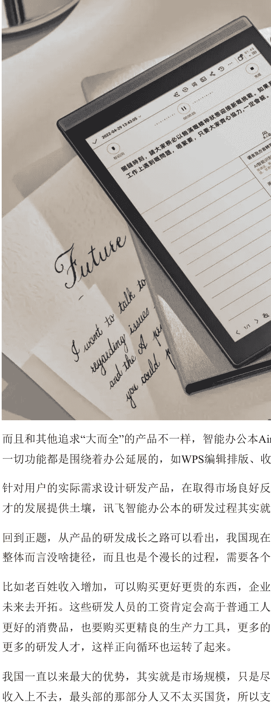

而且和其他追求“大而全”的产品不一样，智能办公本Air将娱乐工具与办公工具做了明确划分，一切功能都是围绕着办公延展的，如WPS编辑排版、收发邮件、投屏、打印、扫描......

针对用户的实际需求设计研发产品，在取得市场良好反馈后，进一步更新迭代产品，为顶尖人才的发展提供土壤，讯飞智能办公本的研发过程其实就是个很好的案例。

回到正题，从产品的研发成长之路可以看出，我国现在正在从中等研发水平向更高阶层跃迁，整体而言没啥捷径，而且也是个漫长的过程，需要各个模块相互反馈，协同推进。

比如老百姓收入增加，可以购买更好更贵的东西，企业也就能承担得起更高的研发费用，面向未来去开拓。这些研发人员的工资肯定会高于普通工人，而且他们会形成更强的购买力，购买更好的消费品，也要购买更精良的生产力工具，更多的企业也就有了资金和动力去研发，雇佣更多的研发人才，这样正向循环也运转了起来。

我国一直以来最大的优势，其实就是市场规模，只是尽管以前的市场规模足够大，可单个个体收入上不去，最头部的那部分人又不太买国货，所以支撑不了大规模的研发作业，这也是为啥在2010年之前，人才大规模出国，因为他们在国内根本找不到工作。

这两年这种情况好转了很多，但是依旧面临消化不了高学历人才，而低端制造业缺人的困局。很显然，这种困局只能通过发展来解决，一点点爬升，提高老百姓工资收入，支持那些勇于研发创新的公司。

只有这样，我国才会需要越来越多的研发人才，那些人学成也有地方施展自己的学识，各个层次的毕业生也都有各自的去处，最终形成正向的反馈循环。

公众号懒人搜索，懒人专属群分享

### 每隔几天一次大屠杀，美国禁枪为什么这么难

2022-05-26

美国这两天连续两场屠杀，这让我们几乎每个中国人都纳闷一件事，全民拥枪既然这么危险，美国为啥不禁枪？

我先从我朋友圈一个哥们说起，他就是在美国卖枪开靶场的，他以前甚至在微博上经常发广告，带着国内的枪械爱好者去他靶场玩枪，去那边住店、玩枪、芭比Q一条龙服务，忘了要多少钱来着，反正不便宜，也不是太贵，主要费用是机票。

他跟我说了一件事，我觉得比什么杰斐逊的各种名言都有说服力。

上次枪击的时候，也就是那次拉斯维加斯音乐节枪击案，他很激动在朋友圈“怒斥”枪击犯是个懦夫，竟然射杀群众。我顺便问他，我说枪击事件会不会影响你的业务，他说不会，反而会变得更好。因为枪击案之后，大家感觉自己不安全，就回去买枪练枪。

而且他说，每次恶性枪击案发生后，电视台都要搞大规模的问卷调查，确认大家对枪支的态度，然后就惊讶地发现大家态度变化不大，喜欢枪的人依旧觉得跟枪没关系，更有甚者，说是每年枪杀的人比女司机撞死的人少的多，是不是把女司机也给禁了？

后来又了解了下，美国国内对枪的态度非常分裂。

比如德州，美国那个，不是山东那个，民风彪悍，这次枪击案就发生在德州，在那地方你聊禁枪跟在中国聊中医似的，分分钟闹起来。还有《阿甘正传》里的阿甘的老家，阿拉巴马，前两年禁止了女性堕胎，引发了全美声讨，那地方几乎全民信教，拥枪，歧视，属于标配，去美国尽量别去那个州。那个阿拉巴马也是枪械爱好州，拥有枪支数量，枪杀率，用枪自杀率，都在美国排名靠前。

再比如加州，知名左翼州，美国社会主义大本营，这地方左派泛滥，圣母婊遍地，持枪率在美国属于偏低的。夏威夷，有很多本地土人，日本人，中国人等等，都不是爱枪的人种，持枪率应该是美国最低的。我朋友圈的那个枪贩子就是加州的，他主要做华人买卖，华人去了海外绝大部分时候依旧在华人圈里，电视里那种娶个美国妞，整天跟一群美国人谈笑风生的情况非常非常少。华人圈以前是不碰枪的，这些年越来越多，可能也是因为美国这些年越来越没谱有关。

类似于这种无差别屠杀发生后，美国人什么态度呢？很多之前铁定不持枪的人也感受到威胁，跑去靶场练枪，并且去注册一支，拿回家里放着，万一用的着。

而政界人物对这事更是非常敏感，比如之前川普在位的时候发生了一次死了20多人的枪击，他强烈谴责了枪手，说他是懦夫，但是却完全没责怪枪的意思，并且表示希望上帝能保佑德州人民。

上次佛罗里达州一个学校发生枪击的时候，特朗普认为应该“人人配枪”，这也是美国传统老右翼们的共同心声，他们觉得危险是不可避免的，解决枪手不是问题，最重要的办法是让个体变强大。但是我一直有个疑问，像之前拉斯维加斯那种从高楼上向下倾泻弹雨的事，大家都配枪又有什么用呢？

之前奥巴马比较激进一些，奥巴马作为一个明显的左翼，很多人说他是个穆斯林，他对枪明显没好感，曾经大力搞过“控枪”，但是在2013年他的法案在国会连个最低支持票数都没达到，可见美国人是多么的不感冒。而且美国还有个潜规则，发生枪击后政治人物一般不说控枪的事，如果聊这事会被人指责“捞取政治资本”。现在的拜登跟奥巴马的情况差不多。

还有我们前文说过的桑德斯，那是美国那边知名大左棍，我专门扒了他的推特，确认没提枪的事。

这些左派们都对枪讳莫如深，你指望右派们什么态度？铁杆右派们都觉得持枪跟说话一样，属于天赋人权，没有公民持枪就没有美国，你现在说是想禁枪，简直是开玩笑。

那怎么就形成现在的局面了呢？

跟几乎所有的社会问题一样，不外乎两个问题，一是历史，二是现实。

历史上的美国，大家知道，很长一段时间内是个不法之地。

从弗吉尼亚公司招聘员工去北美殖民开始，美国人就和枪支结下了不解之缘，从那时候起，枪支和上帝一样，这两样东西在新大陆上给了殖民者勇气和信心，对抗无尽的荒野和野人。

比如我们知道的，华尔街，就是因为400年前那里有个木头墙来抵抗印第安人得名，大家肯定纳闷一堵墙能顶得住个屁的野人啊，其实那是个护墙，当时的殖民者躲在墙后打冷枪。

后来美国建立了，又靠民兵跟英国人周旋，好不容易打败英国人，在战后形成了针锋相对的两派，我们在这篇文章中说了，延续两百年的美国党派之争。

其中一派是以南方农业小清新左派奴隶主为代表的杰斐逊，讨厌大政府，讨厌压迫，向往田园牧歌，主张权力在民，极力防止政府捣乱。

另一派是，北方工业主、金融巨头、联邦党人为代表的汉密尔顿，主张中央集权，认为没有中央集权就没有未来，认为最重要的事是防止民粹。具体可以看看《联邦党人文集》，那本书是可以解释宪法的，是美国真正意义上的立国思想。

后来开了个会，相互妥协了下，中央集权国家建立起来了，但是也收纳了大量的杰斐逊的观念。

标志性的，就是杰斐逊一派对公民持枪权的热衷，终于影响了美国宪法，美国宪法第二修正案直接就把公民持枪权写入宪法了：

“一支受规范的武力乃确保自由国家之安全所必需，人民持有及携带武器之权利不可受侵犯。”

美国史学界对这件事的解读就是：杰斐逊一党通过全民持枪防止汉密尔顿他们的联邦做大，做大就要剥削人民嘛。杰斐逊就是这么理解的，他主要是参考了英国，英王就是压迫总根源，英国如果没有压迫大家就不需要跑美国来了。

奇怪的是，汉密尔顿也是参考了英国，觉得没有中央集权啥都干不成，汉密尔顿认为中央集权是英国从一个破岛国崛起称为日不落帝国的重要原因之一，此外还有金融，工业等等，这些都是杰斐逊反对的，是的，杰斐逊支持公民持枪，却极其讨厌工厂等现代工业，这人够奇葩的。同样的参考系，竟然得出两个完全相反的结论来。

不管咋样，这种持枪权是确立下来了。但是确立下来不是不能改，而是随后的历史中，公民持枪不是一个简单的反抗暴政的标志，而是实实在在的刚需。

比如南北战争结束后，美国大规模向西部扩张，扩张的本质就是去拆迁印第安人嘛，印第安人也不是什么良民，双方陷入长达半个世纪的相互伤害，直到绝大部分印第安人彻底灭绝为止。而且到了西部，美国人也不是聚集成大城市，而是星罗棋布在大平原上，这就在客观上需要家家户户武装起来，因为一旦发生什么事，你就别指望附近武警上去帮忙了，靠不上国家，只能是集体自卫，无论男女老幼，都得带杆枪去御敌。放一张《被拯救的姜戈》里的图：

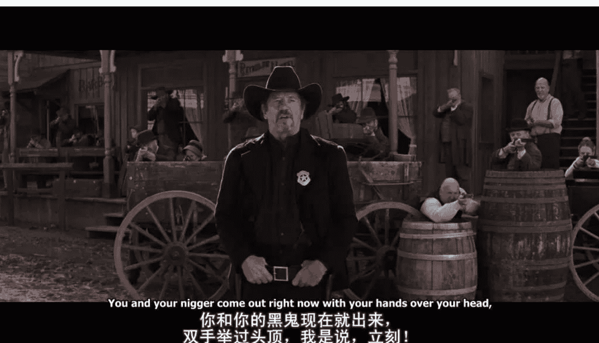

后来印第安人袭扰变少了，但是土匪，墨西哥人，法国人的骚扰一直没间断，《八恶人》那部电影讲的就是这事。

就算没有那个宪法第二修正案，美国人也会持枪下去。也是从那个时代开始，美国人从精神和宪法层面赋予了警察很大的决断权，比如可以看情况决定是否开枪干掉嫌疑人，经常出现那种警察开枪打死无辜的尼哥，最后连大陪审团都过不了，直接就把警察给放了，这个好习惯就是从西部时代遗留下来的。

这种长达百年的文化沉淀，再加上一个标准美国人从小就要跟着爹去练枪准备将来保卫家园，时间长了可不就形成了根深蒂固的观念地层？

但是如果一个东西是根深蒂固的，有可能被修改吗？当然有了，比如罗斯福时期美国政府为了应对危机，干脆宣布公民持有黄金非法，直到1974年才恢复，当时就遭到很大的阻力，但是美国人的执行力和英国人一样强，敢逼逼分分钟把你打得跪地叫爸爸。

既然能操作，那为啥不把枪一起禁了呢？这就是比较关键的现实原因。

大家知道美国警察有个特权不，比如一个屋里正在发生强奸案，正好有个警察路过，他必须进去制止吗？

在中国肯定是必须的，但是在美国这个没必要，历史上发生过恶性事件中，警察在门外装作没事人，事后连道德谴责都比较少。

这就是美国人的一个观念，美国人民自己得管好自己的事，不能指望警察。这也跟他们的现实有关系，美国这个国家地广人稀，警察又不可能完全覆盖，我问过不少人，整体的感受是，富裕小区警察来的快，十分钟左右就过来了，没钱的穷人社区，你就等着吧，有人踢你家的门，你报警，警察花两个小时溜达过来也正常，如果你没点准备，没有办法把坏蛋吓走，你将会非常被动。

所以这也形成了一个奇怪一景，富裕白人很多都反对枪支，穷人们觉得没有枪我们靠警察早就死翘翘了。更有甚者，美国的一个参议员直接就说，如果凡事依赖警察，上帝教人们使用枪有卵用。

也就是说，你定居的小区很好，你完全不用考虑枪的事，如果你在较穷的小区，你就得衡量下，如果能承担这种后果，就可以不买枪，如果接受不了，那就赶紧去练起来。

这也就是为啥美国有个特点，咱们经常纳闷，说美国那边枪击那么多，为啥精英还往那边跑，因为他们的枪击案明显具有“区域性”，90%的枪击案都发生在特定区域，很多华人去那边几十年，自己社区都没发生过这类事。

此外，还有最重要的一点，民间没有形成压倒性的意识形态，国会完全通过不了。

我们在这篇文章里讲了美国的一些事，大家可以看看《哄抬房价，院外游说，颠覆政权，合法腐败，基金会到底是什么鬼？》，美国国会的人都是背后有金主和利益集团的，当然了，说利益集团大家可能觉得是财阀，这个不一定，可能是墨西哥移民，或者是在美日本人，都可以。

同样的，枪支产业在美国如此兴盛，以至于形成了一个强大的利益关系集团，几乎风雨不透，再强调一遍，美国政治家可以提“控枪”，也就是严格化枪支配发规定什么的，但是绝对不能提“禁枪”，类似在中国，你说结婚彩礼太贵是恶习，禁了吧，肯定会遭到强烈反制。美国也一样，现在远远没到禁止黄金流通那样达成共识的时候，讨论这个问题纯粹是招黑。

利益相关最大的，就是那个长枪协会，这个协会在加州活动比较少，在美国南部州非常活跃，到处都能看到他们的海报。

这个协会一开始是一个枪械爱好者俱乐部，射击爱好者们在一起交流射击小技巧，后来马丁路德和肯尼迪被枪杀，那时候的美国正是革命时代，年轻人们“make love，not war”，风起云涌要求禁枪，那应该是美国离禁枪最近的一次。

作为反制，票友群性质的长枪协会迅速转变成了政治实体，开始走上了吸收捐款宣传枪支好处游说政治人物之路。

到现在，这个协会有四五百万会员，每年上亿的活动经费，这些会员平时不说话，但是类似今天这种屠杀性质的事件发生后，肯定会有人重提枪支管控的事，他们就又会蹦出来，要求控枪的人越冲动，他们的反制也会越激烈，这也是为啥美国控枪事业一直没啥进展的原因。

发几张长枪协会的海报，大家感受下：远离恐惧的小技巧，就是枕头下塞把枪。

真女权不指望爷们，指望啥你们看

枪杆子里出和平

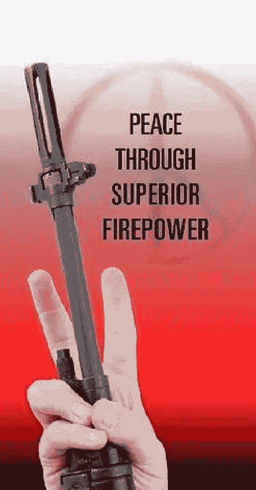

而且大家知道《美国队长3》吧，超级英雄们各个身怀大杀器，某种程度上就是影射公民持枪权，政府想把他们列入管控，导致超级英雄内部打了起来，代表美国老派思想的美国队长带着基友走上了逃亡之路，宁可亡命天涯，也不接受管控，美队作为美国正统思想的捍卫者，你们仔细体会下他在捍卫啥。

关于美国将来怎么走，我问过不少美国人，他们共同的说法是，除非发生天塌下来的事，否则绝对不会放弃持枪，能做的，仅仅是加强管控，让精神病减少持枪机率，此外几乎没有改进余地。

文章不开评论了，最近可能都不开了，大家有想法可以给我发私信。

公众号懒人搜索，懒人专属群分享

### 大厂怎么突然间都在裁员

2022-05-25

最近的新闻想必大家也都看到了，好像以前大家羡慕的那些大公司突然间翻脸，然后开始了一轮又一轮的裁员。

前期也没多想，第一个想法当然是和大家一样的，今年的经济压力是一件无可置疑的事，除了体制内，估计谁都感受到了，除了核酸公司，估计都在酝酿裁员，最搞笑的是搞疫苗的那个公司也在裁，而且裁了70%。

而实体萧条，自然会导致推广费用下降，互联网公司基本都是广告公司，他们营收自然会明显下降。收益不行，自然得做调整。

另一个原因是我在《年轻人为什么焦虑》里提到的，各个公司都在腾笼换鸟，也就是用性价比较高的年轻人，把年纪大效率低的老人换出来，短期内效率会下降，但是长期活力会增长。这事看着很暗黑，大家都在市场上狂飙，对手采用了某个优势策略，你如果不跟，可能很快你就出局了，中国人力资源充沛这个现实，既是优势也是诅咒。不过裁到现在这种程度显然已经不正常了。

今天通过大公司的基本组织架构，给大家分析下另一个原因。一般公司都有三种类型业务。

首先是他们的主业，比如提起腾讯，那就是微信和QQ。

提起百度，那就是搜索；比较搞笑的是美团，它有这么个名字，是因为以前是干团购的，现在主营业务早就变成了外卖。

但是他们对自己的主营业务其实并没有太上心，那些部门基本已经进入了自动驾驶的状态，想持续扩张也费劲，想衰退也比较难，因为都有强大的护城河，别人想进来几乎不可能。

可是公司想长久，关键其实就是扩张，向天边进发，赶在挑战者出现之前占领新阵地，不断扩展出来新产业，所以各个公司都有一个“重点突破”方向。

最成功的应该是腾讯，他的主营业务早就变成了游戏。阿里现在一个主要分支是他们的云计算。当然了，几乎每个互联网公司都有借贷业务，包括360，我现在经常已经想不起它主业是啥了，第一反应经常是“360借条”。还有百度，这些年基本all in自动驾驶，可是效果不太好。

但是这些是远远不够的，每一个大公司真正的恐惧来源于“未知”，也就是并不知道将来的主增长业务在哪，最担心的事，是把资源全部投入某个领域后，后来发现方向错了，那可就哭都来不及了，这种事更常见，很多显赫的公司，柯达、诺基亚、摩托罗拉等等，都是在错误的战略方向上消耗过量资源，导致错失了未来。

想真正意义上“占领未来”，一般有两个办法，一个是企业领导近乎疯狂地对赌未来，乔布斯就是这样一个人，偏执狂到令人发指，其次最好的办法其实是“群氓策略”。这玩意是上世纪NASA搞出来的，他们想往火星上发一个探测器，这个探测器巨复杂，最后的效果是，耗资离谱，搞出来一个特别大的玩意，看着挺高级，但是这个机器每走一步思考好半天，而且由于涉及到的部件太多，每个部件的可靠性是99%，上万个部件叠加起来可靠性跌成0了，走几步就得宕机。

于是他们有个大佬提出来，与其搞个这么牛逼的玩意，不如搞一些小成本的东西，弄一堆，就跟蚂蚁似的，又蠢又廉价，一起发出去，就算坏一半，不是还有一半能用嘛，每个“小蠢货”都功能单一，都各自突围，谁搞定事算谁的。

后来NASA自己没搞小机器人发往火星，因为冷战结束后，太过耗钱的太空计划基本都被叫停了。但是这种思想慢慢浸透到了社会的各个角落，比如现在的马斯克就是在玩这个，疯狂地向天上发卫星，以量取胜，那些卫星都特别小，而且服役时间也比较短，好处是特别便宜，就算掉下来也不心疼。

后来这种思路对现在的世界影响很大，不止商场，哪怕现在的乌克兰战场，也出现了这种模式的变形。

现在乌军经过美军这几年的训练，也把大兵团拆分成一个个的小团队，每个团队都是一个完整的作战单元，有对付坦克和装甲的反坦克手，有狙击有价值单位的狙击手，还有负责火力压制的机枪手，每个团队作战目标都不是上层给下达的，而是根据自己的实际情况做出调整，如果需要总部支持，就打电话呼叫炮火，总部再根据优先级给予支持。

也就是说，决策链反过来了，以前是参谋部制定作战计划，下发到基层，各个基层单位去实施。现在是上层通过下边的进展来做决策，下边甚至不需要向上反馈就可以操作。这倒是应了任正非那句话，让听得到炮火的人做决策，本质也是“自下而上”的决策系统。

至于仗打的咋样，我这段时间也没关注，显然美国就跟西班牙内战似的，在乌克兰测试新战术，他们之前也在阿富汗搞过，不过那边可没有几十万人级别的混战，测试不出来效果。

现在大公司都采用的是这种模式，既然不知道未来的盈利点和增长点在哪，那干脆搞点“小蠢货”去挨个试，各自突围，公司决策层再通过他们试出来的结果进一步做资源调整。

具体的操作方法就是从原来的有过成功经验的项目组抽调骨干，让这些骨干再招几个人，成立一个小项目组，先搞个产品“原型”出来，也就是比较粗糙的原始版本，去市场里测试效果怎么样，如果效果好就追加投入，如果持续没效果，就砍掉这个分支，人员并入“主线”重新分配。

这方面最成功的，应该就是头条系的抖音团队了，这个团队最早也只有8个人，通过一轮又一轮的迭代，加上不断追加投入，硬是搞成了现象级的产品，而且也是中国极少数几样能推广到全世界的重磅级产品。事实上当时头条系搞了好几个这种视频类项目组，各自独立突围，谁突围都算，不断竞争演化后，只剩下了抖音。

现在的苹果其实也是这么玩的，一方面苹果内部经常好几个团队各自不同方向搞一个项目，另一方面苹果大量购买美国市场上小公司的专利，然后应用到自己的产品上。

说到这里，大家就明白了，现在各个大厂都积累了大量的这种项目组，甚至大部分公司的主营业务的人已经很少了，绝大部分资源都用在了“四处突围”上。

以前经济好的时候，绝大部分项目一直不出效益，甚至已经走入死胡同了。这种情况下，按理说是要被砍掉的，但是基层领导往往会“向上管理”，做好PPT，让上边觉得这个项目还有救，要不再看看。叠加经济情况好的时候，上边对“不盈利”这事也比较看得开，觉得继续做也没啥，万一将来活了呢。

但是到了今年叠加疫情和经济下滑，各个公司都开始过冬，于是一轮又一轮审计所有项目，把线压了再压，最后没啥前景的项目全被干掉了。以前干掉的时候往往是把人员并入主线，但是今年实在没地方安排，干脆辞退了。

更关键的是，以往裁员大家是有负担的，因为“裁员”这事传到社会上可能会导致舆论上的巨大压力，所以公司往往能不裁就不裁。到了今年不一样了，大家都在裁，社会上也就不再把裁员这事当新闻，各个公司开始放心大胆地裁。这也是为啥大家这段时间想必看到了，裁了一轮又一轮，经常是整个部门砍得只剩下几个领导和HR。

可能有小伙伴不知道，一个产品主要是在研发阶段需要大量的人，一旦进入运维阶段，用不了几个人，如果一旦准备收缩，裁员空间极大。我之前参加过那种大项目的全生命周期，见过那种大型项目开发过程中投入上千人，但是一旦平稳运行，只有7个人在维护，问题是这7个人还同时维护其他版本。也就是说极限情况下，公司只需要这7个人就可以运转了。

大家这两天看到整个部门地裁，那就是“试探类项目”；如果是单次15%左右，那大概率是主营业务。对，一轮裁员里，有的部门只裁15%，有的直接部门都没了。

问题是我说的这种情况并不仅存在于互联网，应用到其他行业也差不多，可能本来在研发一些多年以后才能见效的产品，因为这次打击也停了。

这两天看到一堆奇葩事，比如各种985毕业生去面试基层网格员，这些工作固然也是为人民服务，可是谁听了都有点唏嘘，其实想想也正常，这个时节，各个公司最先砍掉的就是研发经费以求度过寒冬，每投入的每一块钱都有产出，不然可能撑不到冬天就倒下了，很多研发型人才真不如一个快递专业对口。

不仅如此，现在这种情况是由实体扩散到了互联网，实体更惨烈，我随便找了一段，大家感受下：

据东方财富choice统计，截至4月30日A股共有4650家企业公布了员工变动人数，其中有1697家企业进行了不同程度的裁员，裁员总数为909993人。
从裁员数量来看，2021年共有新希望等14家上市公司员工数量减少超1万人以上。中国天楹是员工人数减少最多的上市公司，裁员数量为44898人，裁员比例为74.55%，裁员人数居上市公司之首。此外，有3家国有企业裁员人数也均在10000人以上，实属罕见。

就我所见，整个系统进入了一种循环下降的状态。最后落实到居民不敢消费，企业不再投资。

问题是居民不消费，企业也活不下去，只好进一步裁员，这种环境下谁都不敢追加投资，可大家的工作就是投资出来的。如果信心恢复不了，大家也不愿意投资，工作岗位可能进一步收缩下去。正好这两天看到一个新闻，标题是这样的：

@高校毕业生，国办喊你到基层就业社保、医疗卫生、养老服务、社会工作、司法辅助等

可以看出来，国家还是很在意毕业生的就业情况，不过有一说一，杯水车薪，而且这些工作本身不创造价值，属于用财政支撑，等财政告急了，问题还是没解决。说到这里，可能有小伙伴问，那博主你对未来怎么看？

说实话，我也不知道，不过我是相信接下来几年内，所有的灰暗都会过去，等低谷过去了，大家对未来的信心重新恢复起来，停止内耗，聚焦到经济发展上来，很快就能彻底恢复并且超越之前。这是我对咱们国家一直以来的信心，我们之前也经历过很多困难，反正最后肯定都会扛过去，这次也一样。

我们这个国家吧，在漫长历史里形成一个很明显的毛病，处于困难的时候，往往会爆发出巨大的生命力，反而在大家都觉得前景不是小好是大好的时候，容易出问题。所以我觉得，可能长期看来，现在的这些困难，并不是坏事，经历这么一次低谷，从上到下都会有一轮反思，可能对于长期还是有好处的。

写文章的本意还是分享，同时也是记录，希望能尽快走出阴霾吧。

文章不开评论了，最近可能都不开了，大家有想法可以给我发私信。

公众号懒人搜索，懒人专属群分享

### 再聊聊房价

2022-05-18

最近最重要的一个新闻，无疑是“央行发文称房地产是实体经济”，再加上各省接二连三地降低房贷首付比例，最近房贷利率也稍微下调了一些，不得不让人怀疑国家又要用这根丢在一边好久的拐杖了。

我把我这段时间的思考写出来，不一定对，大家可以结合其他人的分析交叉参考下。

其实说房地产是“实体经济”，也没啥问题，之前有人测算过，不少人引以为傲的重工业，25%以上挂钩房地产，也就是中国重工业产出的钢筋水泥化工产品机械重工，有1/4以上是服务房地产的，房地产不景气，这些产能都成了“过剩产能”。

我国“城市化”推动了“工业化”，某种意义上讲，是房地产对工业化的作用居功至伟。

此外下游的家具家电装修设计餐饮什么的，都跟房地产挂钩，这两年政府抑制房地产行业，最明显的就是这些行业也跟着惨不忍睹。

所以，说房地产是实体经济一点问题都没。

还有一部分是服务基建，基建的钱大头也是从房地产出，一般是把卖地收入当首付，再从银行贷款或者融资去搞基建，将来准备继续卖地外加收税还贷款。

也就是说，老百姓贷款买房，预支未来三十年的收入，这些钱开发商拿小头，地方政府拿大头。

地方政府拿到钱后，可以改善市政，修地铁，搞基建等等，更关键的是，搞产业园，最起码的，如果有企业想进驻某个地方投工厂，直接搬过去就行了？当然不是了，政府得先把台子给搭好，最起码得搞个“七通一平”吧，也就是通路、通电、通水，通气，通暖，还有通网线，此外还得把那一块地给平整硬化了，这样大家才能去那里搞投资。

现在我国很多企业去越南经商，就面临这个问题，当地政府是很支持大家去建厂的，但是这类该做的配套工作一塌糊涂，甚至电力都得从广西进口，要不是很多工厂在中国完全招不到人或者其他不可抗力，工厂主死都不会过去。

最近二十年我国城市面貌焕然一新，进一步促进了上下游的大发展，甚至压过老牌发达国家一筹，其中很大的一个原因，就是政府从房地产当中拿到了钱，然后投入到了其他领域。

这里就有个问题，政府操纵房价故意高价卖给大家？

是，也不是。

一方面房价是个高度市场化的东西，那玩意价格不是政府或者开发商能控制的，比如你们所在城市开盘了，你觉得他们的房子价格高，不去买，看谁能抗过谁，没人用枪指着你去买对吧？最后“房价高”这事其实就是大家愿意花钱，鹤岗政府倒是想卖高价，也没人买啊，他们的价格自然高不了。而且今年大家看出来了把，房子积压了，地方政府比谁都急，也不太有办法。

另一方面，政府确实控制了“预期”。

啥预期？供地速率、货币预期和收入预期。

收入预期倒也谈不上控制，其实是自然形成的，中国人正好摊上了一个长达四十年的“黄金时代”，也就是说，美国德国日本韩国这些国家，历史上都有这么一个长达四十年左右的快速发展阶段，主要是因为技术铺开后会产生巨量红利，此外叠加人口进城，技术红利加城市化，再加上国家主动投资的大基建，经济发展非常稳，老百姓收入增加也很快。

但是“黄金四十年”一结束，各国都进入了“低速增长时代”，或者“微增长时代”，也就是大家现在看西方发达国家那副造型，很可能我们也躲不开，或者说已经进入了微增长时代。

另一方面政府确实控制了房价预期，经济学里基本假设就是供给和需求假设，猪肉产量超过需求就会降价，产量不足就会涨价，咱们国家很多城市房地产供应量其实一直都被压着。

最明显的就是深圳，商品房实在是太少，这也是为啥稍微有风吹草动，深圳那边就使劲追高，因为几乎所有有钱人都在对赌“供不应求”，都在加杠杆对赌房产价格还得涨。

至于将来这些赌狗到底能不能从中赚大钱，我也说不准，因为接下来几年深圳的产业结构、银行利率，首付比例，发钱水平，二套房贷比例，这些都会大幅影响房价。

比如深圳如果真能产业升级成功，那将来房价超过香港也没啥问题；如果继续大放水，富人拿到钱没啥可投资的，只能是去投房子；但是如果政府继续不给二套购房者放贷，不但不放贷，还不让大家随便买，那客观上限制了“需求”，房价可能长期横着，收益率还不如存银行，谁都赚不到钱，那还不如不投。

再加上我国的货币是一定程度上以美元为锚（黄奇帆说的），基本美国放水咱们就得跟着放，大家都已经形成了一个预期，未来货币会越来越多。

有些人认为，货币本身是幻觉，房子和实物才是财富本身。

之前天涯上有个帖子，很早很早以前了，说是资产和货币的关系就是一口锅里煮着一堆肉，会一直往里边添水，你尽早把锅里的舀到碗里，你碗里就不会被持续稀释了。有些人不一定能说清楚这些年这个市场发生了啥，但是也感觉到了。

此外几年前我弄明白一件事，那些机构炒股跟散户不一样，他们有超级复杂的估值模型，可以根据利率、企业利润、未来产能等等，算出来某个股票现价应该值多少，如果现价低于这个值会一直加仓，这也是为啥每次加息什么的，股价会随之波动，因为把利率输入他们的模型后，现价跟着变了。当然了，中国这边不一定，他们可能单纯是拉高股价割散户。

而这些模型的基础，都依赖一个叫“现金流折现理论”的东西。这个理论说简单也简单，现在给你100块，或者一年后给你100块，脑子正常都会选现在的100块，因为大家都觉得一年后的100块肯定不如现在的值钱，但是到底一年后那100块值多少钱，就得“折现”，折现完了可能剩下95了。同理，如果让你在现在的100和一年后的106之间选，可能你就选106了。股价按理说应该是未来赚的钱折现到现在。

比如马斯克的特斯拉股价之前为什么那么高，木头姐他们计算逻辑就是认为2030年，马斯克的产能会达到恐怖的2300万辆（具体这个数怎么得出来的，这就是一堆常春藤名校毕业生的具体工作了，也可能是纯忽悠），他们认为，那时候马斯克的公司一年赚的钱超过捷克的GDP，现在股价高点怎么了？最关键的是他们这套理论真有人信，真金白银地往里砸。我刚查了下，马斯克现在的目标是2030年生产2000万辆，股价已经跌掉了一大截。

房价在某种意义上讲，也是未来价格在现在的“折现”，倒也不一定是理性的计算，但是很多人确实凭感觉领悟到了上边的那套逻辑，他们觉得北上广未来房价会突破30万，所以现在15万买也划算。

那为啥有人觉得未来值30万呢？赌狗们可能觉得会一直放水，可能觉得会放开限购全国人民都去投，也可能觉得北京会成为全世界的超一线城市，反正就是值，就算不值，将来也可以卖给相信这套话术的人。

可能你纳闷，疯了吧，怎么会有30万一平米的房子？主要是现在已经有很多了，大家自己去查吧，而且那些房子都非常非常大，一套动不动三四百平，想拿下需要上亿的资金，反正有钱人已经有钱到六亲不认的地步了，想象力的空间被击破，格局打开，疯狂加仓。

比如万柳书院刚拍了一套300平的房子，竟然每平米36万，总价一个亿，简直匪夷所思，不过大家也别惋惜，觉得早买就好了，这个小区我已经关注很多年了，很多年前开盘就一平米十几万，啥时候都买不起。

描述的可能有不严谨的地方，但是大概就这么个意思。

回到本文正题，这次房地产松绑，无疑是想给地方政府扎一针，不过现在效果存疑。

道理也不复杂，如果说一线房地产是靠全国富人给撑着，他们的收入不依赖工资，二三线就是靠当地自己人给撑着，主要是工资。

这也推导出另外两个结论，一线房价最大的限制是“限购”和放水速率，二线最大的限制是工资。

在2021年，国家为了保护小企业，发放过一波救市贷款，这些贷款进入市场后，从全国各地涌向了深圳，当时就有人开创了“证券化买房”先河，这人今年刚被放出来。

随后北京这边起飞，学区房和豪宅引领了一波大涨，主要还是主打稀缺，我跟不少有钱人聊过，他们的观点其实就是“稀缺”，他们觉得钱其实就是个数字，无限供应的玩意，但是土地可以吗？一线大城市有魄力继续大规模扩建居民区吗？

现在的情况是中国一线都在控制人口，结果就是土地供应有限，年轻人们不断“适者生存”，每年一大堆人涌入一线，然后跟从一线退下来的人擦肩而过，最后剩下的都是能接盘的。

而稀缺当中更稀缺的，无疑是教育和医疗资源，你去你们县城看病，搞不定，县城医院让你去省会，省会搞不定，会让你上北京，北京这边还能让你去哪?这就叫终结者资源，学区房的概念其实也是一样的，主打稀缺。

还有啥稀缺？豪宅，130/160/180/210平的带电梯小区有绿化的房子，没有人不想要，只有买不起，而北京这边这类房子盖得特别少，因为我国好像在刻意回避“富人区”这个概念，只要是豪宅地产，边上一般要搞点经济适用房或者回迁房，所以豪宅非常少，不信大家可以找个app拉数据出来去查一下。

更关键的是，我说的这些东西的本质是一种“观念”，并不一定要实现，只要有人信就行了。类似比特币，主力玩家们真的相信那一串串数字是真的财富？不一定，他们本质是在对赌总有越来越多的人相信这玩意。

之前有个大佬（实在想不起名字了）在加州理工讲过，他说这些东西的本质都是观念，大家觉得值钱就值钱，觉得不值钱就一文不值，问题是类似“国家”、“品牌”之类的东西，都是观念和想象。

国家是想象共同体，品牌更是完全用钱砸出来的，但是就是有人愿意给国家去牺牲，可口可乐的饮料只要磨掉品牌哪怕便宜一半都卖不出去。

他说，真实和虚拟之间的界限没那么大，所有伟大工程和产品，都是先有愿景，然后才有了实物，《人类简史》最牛逼的一点，就是道出了这个现实，人类一直都是先编一个想象的东西，然后那些相信这个想象的人拿出资源去开工，说不定就成了。编织伟大愿景的人，做成了是大神，搞黄了是骗子。

同理，未来会越来越好，或者越来越坏；房价永远涨或者马上要崩；放水是不是永恒的；美帝会不会走向衰亡；等等，其实都是观念，未来能否实现，很大程度上决定于相信这些观念的人有多少，比如大家都觉得未来越来越差，都不投资，年轻人没工作，可能真越来越差了，反过来也适用。

一线房产，接下来的本质，其实就两点，通胀和观念，对于未来所有的预期，本质都是对赌。

还有一个问题，不是说大家没钱吗？拿啥去赌？

还是那句话，一线房地产的本质是货币现象，货币发出来会堆积在少数人那里，他们的观念直接决定了未来一线的走向，跟大部分人的观念无关。

经济变差这事确实导致大部分人没了收入没了工作，但是换一个角度，很多人本来可能拿着几百上千万准备去投资实体，现在实体一片萧条，他只能是存银行等着，如果实体一直不好转，可能就转投房地产追高去了。大家可能纳闷，现在还有人有存款？

确实有，中国这个国家太大了，没钱的人有很多，有钱的人也有很多，下边是央行的最新数据：

央行发布了一份金融报告，一季度人民币存款增加10.86万亿元，其中，居民存款新增7.82万亿元，比去年同期多增了1.14万亿元，是有记录以来的最高值。居民存款新增7.82万亿元是什么概念？也就是说，在90天时间里，平均每天有800亿存款涌进银行。

大家注意一下，银行的钱整体符合“1:9法则”，10%的人占着90%的钱。如果你没存钱，那肯定是有人存了，估计他们正在纠结接下来这些钱去干啥。

但是二三线就不一样了，除了少数盘，大部分盘还是靠着老百姓的工资扛着，最明显的是天津，挨着北京，这两年房价一塌糊涂，因为有钱人只要拿得出来钱，都去北京投资了，天津地也卖不出去，这样进一步打击了大家对未来的预期，如果大家觉得天津某套100万的房子2030年依旧值100万，那现在值多少？

更重要的是，这一点正在逐步形成共识，这种共识对未来影响会非常大，很可能导致土地财政无以为继。

其实已经无以为继了，所以这两天急了，各种政策轮番上，一般来讲，着急的地区房子都不太值得投资，值得投资的地方一般又是限贷又是限购。至于如果地方政府一直卖不出去地，没钱运营，接下来怎么办，我也不太知道，有从事相关工作的小伙伴可以私信我一下。

文末总结几句吧：

- 1. 除了少数城市，绝大部分城市房价慢慢会稳定下来，没啥投资价值，自然也就没啥泡沫，房价稳中向下，大家反而会过得轻松一些。

- 2. 一线上涨的共识可能依旧在，主要也是富人没啥可投资的，股市又一遍又一遍狂虐那些相信它的人，所以每次股市崩了，房地产就会有动作，因为丢失了信仰的人又跑房地产去了，也有人在股价高位套现买房去了，而且放水预期也在，只要放水总会跑到一部分人那里。

- 3. 更关键的是，疫情这三年，全国各地整体是很艰难的，一线的很多区域还在逆风上涨。与此同时全国各地都出现大量法拍房，前几天才知道，现在的法拍房都是前两年的，今年的还在处理中。

- 4. 一线不太需要卖地收入，其他城市需要，可历史上每次都是一线带头涨，其他城市才会跟进。如果一线城市纹丝不动，其他城市大概率没啥动静，没动静大家就不着急买房，说不定等等还能等下跌呢。那如何看出来一线的态度呢？主要是限购政策和首付比例会不会有变化，这俩非常关键。

- 5. 问题是这次感觉就算一线带头，缺钱的那些地方老百姓都不一定跟进。

文章不开评论了，最近可能都不开了，大家有想法可以给我发私信。

全文完，既然看到这里了，如果觉得不错，随手点个赞和“在看”吧。

公众号懒人搜索，懒人专属群分享

### 随便聊几句消费吧

2022-05-16

这段时间状态不太好，上一篇文章写完后也没好好检查，有好几个错别字，不过阅读量非常高，然后就被删了，有不少小伙伴让我重发下，我先去问问哪些内容敏感，改一下然后再重发出来。文章结尾显示IP，有时候是山东，有时候北京，主要是因为我有时候早上那个时间点得开车上班，如果在家办公我就自己发，如果在路上就由山东的助理发。

前几天的文章《这个世界会好吗？》写完后非常感慨，一些人说看完之后，“听君一席话，如听一席话”，感觉啥也没说，建议我以后别写这个了。

但是还有不少人表示看完后热泪盈眶，到处安利，说是看完觉得多少心安了一些，航天院的一个大群里说那是我今年最有水平的文章，今年只写这一篇就够了。那篇阅读量和转发量非常惊人，可见大部分人还是认同的。

我一开始很纳闷，我之前也写过口碑分化很大的文章，但从没像这篇一样，后来我慢慢反应过来了，其实这就是典型的“悲喜并不相通”，现在让很多人彻夜难眠的问题，可能另一部分人根本没想过，最后的结果可不就是一部分人很感动，另一部分人觉得我说了等于没说？

此外还发现一个大问题，中国现在开始出现那种“信息以太”越来越缺失的问题。

这又是个啥玩意呢？

“以太”说的是以前大家觉得光和声音一样，传播的过程是依赖介质的，但是后来发现这种介质并不存在。同样的，交流也是需要介质的，尽管这种介质在物理意义上并不存在。

比如你和一个大清穿越过来的人根本没法聊，一个端着铁饭碗的人和另一个个体户没法聊，再或者一个天天关心steam会不会被封的人，可能跟大部分人也没法聊，因为太多人根本不知道啥是steam。

也就是说，两伙人想聊某件事，需要共同的一些知识或者经验储备，不然就是鸡同鸭讲。背景的不同，造成了观念割裂非常严重，更关键的是，一些基本的共识也遭到了质疑，各种圈子之间互相越来越理解不了彼此的担忧。

今天写这篇，主要还是看到一个新闻：

> 4月份人民币贷款增加6454亿元，同比少增8231亿元。
> 住户贷款减少2170亿元，同比少增7453亿元。其中，住房贷款减少605亿元，同比少增4022亿元;不含住房贷款的消费贷款减少1044亿元，同比少增1861亿元;经营贷款减少521亿元，同比少增1569亿元。

一句话讲，那就是老百姓不消费不买房，商家也不扩大经营了。网上到处在讨论，其实这事的原因不是明摆着嘛。

比如我之前很讨厌的一个人，给我的感觉就是又有钱又肤浅，非常招人烦，可是他又觉得跟我聊得来，经常找我。

直到前段时间欠他钱最多的公司倒闭了，他也连带开不下去了，恢复了十年前的原形，才不那么讨厌了，这篇文章的内容他先看过了，表示无比认同。

干过公司的都知道，往往是有一堆人欠你钱，你也欠一堆人钱。最危险的事有两个，一是欠你钱的人倒了，另一件事是你的现金流断了。

现在他倒霉的是，两件事都碰上了，先是欠他钱的人现金流断了，然后倒了，他的现金流也断了，经营不下去，上百人的工作室解散，办公地点清退，之前攒了几套房和两辆豪车，这段时间也耗进去了，整个人也基本垮了。

他跟我说他现在已经大概回到十年前了，有一点最后的家底，饿不死但也没余粮，以后再也没法像以前那样不在意别人的看法了，得重新做人。更关键的是自己已经没了心劲，再也没法想象像当初创业时那样一整年吃住在公司，也没法每天熬到深夜第二天还能精神饱满再忙一整天。

不过他现在压力最大的事，就是总觉得自己以前的员工都在骂自己，每次看到新闻里说房子断供的事，心里就难受，担心当初跟着自己的那些人失业后找不到工作，也落到那步田地了。

这时候就得安慰自己没做错啥，市场环境不好，自己也遭受了重大打击，从一个财务自由的小资产阶级又变回当初了，十年奋斗，终究也只是一场梦，没办法的事，不能怪自己，可是依旧难受，每天得喝点才能勉强入睡，好酒也喝不起了，说是想念茅台的好，喝了第二天不头疼。

他跟我说，他现在唯一庆幸的是，之前公司撑不住的时候，他有两个选择，手里还有一些家底，也可以去贷款，因为国家是给他们这种小公司政策的，可以抵押房产贷款维持一段时间。

他当时果断选择了“止损”，后来看实在是太明智了，就算有贷款也撑不了多久，到时候反而把最后的家底也折进去了，不但如此，员工们的遣散费也出不起。而跟他平时一起吃喝的那些人，在企业进入逆境的时候，有的坚持狼性原则，死扛到底，然后从财务自由变成老赖了。

其实想想就知道，他这些员工们接下来在很长时间里都人心惶惶，现在市场上到处都是新失业的人，还有上千万人即将进入职场的，大家的心态可想而知。

前几天后台有粉丝跟我聊，他说他经营的宠物店肉眼可见搞不下去了，其实他们城市防疫搞得很人性化，大家整体生活受影响不大，但是到了今年，他的店里最赚钱的几项业务，猫粮狗粮，洗澡，给宠物看病，全崩了，他能理解了小区里的人不给猫狗买粮让它们吃剩饭，也能理解懒得到店里来，自己在家摁着给猫洗澡，可是理解不了为啥不看病了，太草菅狗命了。

过了几天又跟我留言，说是知道啥原因了，以前大家看到自家猫狗状态不对就来店里让医生看，就得花钱。现在大家看到宠物状态不对，本来想去看病，一想能省就省，要不再等几天，观察观察，然后就给观察好了。

他说猫狗的自愈能力确实非常强，可是现在这样太不负责任了吧，万一耽误病情咋办？狗命不是命？

然后他问我该不该把他的医生辞了，因为已经辞退几个打杂的，他和他老婆负责打杂，现在最大的支出就是店面费和宠物医生，店面租金早就已经交了，现在的问题是生意不咋地，宠物医生费用太高，可是好不容易才找到这么好的医生。

我当然没法给他出主意，因为他问我的，本质是这种状态会持续多久，这谁都说不准，只是觉得他们小区的人不给宠物看病等着自愈，显然和这种不断辞退还有对未来充满不确定有关。

至于餐饮的影响，就不多说了，之前找我抱怨的人比较多，后来发现少了，再后来发现餐饮大批量倒闭之后，剩下的那些好像业务跌掉一部分之后稳定了，可能是老字号，客流比较稳定，老客户们从之前三天一顿改成一周一顿了，不过其他的店直接给减没了。

另外一个案例我是彻底懵逼了，这个小伙伴是河北的一个小工厂主，大家可能不知道，河北的村里遍地小工厂，有的生产钢管，有的生产铁钉铁丝网，工人也都是农民，农民自己种地一年一亩大概能赚500到1000，一家一般是十亩地左右，所以年收入也就万把来块，所以村里的地已经承包给少数几家去种，一亩租金300块左右，剩下的人都在工厂里当工人，一年能赚三四万。

进入今年之后，订单骤减，上个月变成了0，全厂都人心惶惶，大家也都在担心接下来怎么办？

具体啥原因导致订单没了，他们也不知道，反正找他们订货的那些老板们现在库存还没出尽，他们也在担心自己的库存卖不掉，自然不会再订货，整个环路流动好像都变慢了。

而另一家传媒公司，我之前找人给我做视频的时候咨询过他们家，他们家视频太贵了，大家可能不知道，我现在的视频一个大概成本是三四千，之前那家说是他们能做出广告级的视频，要两万多一个，我直接pass了，我看过，他家做的确实好，只是那价格，打扰了，我不配。

这两天那个领导已经基本崩溃了，因为今年他们的老客户已经放弃了618的宣传大促，自然也不找他们做视频，其他老客户也都消减开支，干脆放弃了定金，反正不做了，他现在说自己欲哭无泪，解散了杭州工作室，清退了拍摄设备，剩下的租了个六座商务准备拉回成都再等等看。

很明显，现在大家已经陷入了这么一个圈，所有人都有点懵逼，包括我自己，身边总有人倒闭的，失业的，谁都不知道未来往哪走，谁也不知道什么时候是个底，看着心慌可是又不知道该怎么办。

现在我和周围的人聊天，基本都是负面消息，时间长了整个人都要抑郁了。

说到这里，可能有小伙伴问，博主你是不是有啥建议和意见？

没有，真没有，这两天几乎所有的学者智库都在献计献策，我就不多说了。其实大家都应该已经看出来了，萧条导致进一步萧条，缺乏信心导致现实自我实现，现在整体处于一种残酷的消耗战，只能是寄希望于国家尽快出台政策，然后让大家慢慢恢复信心吧。

公众号懒人搜索，懒人专属群分享

### 这个世界会好吗?

2022-05-09

这段时间阴郁的氛围相信大家也都感受到了，太多人开始问一个问题，这个世界会好吗?

我也想了好久，现在想明白一些事，心安多了，跟大家分享下，不一定对，仅供参考。

其实思考未来怎么样，不如我们自己问自己一个问题：

我们是如何从一穷二白走到现在的？

在我眼里，这是绝对的“第一性问题”，理解这个问题，其他问题也就迎刃而解。回到出发点，回到最基本的问题，思考我们真正的推动力是啥。

或者说，如果有另一个国家想发展，向我们取经，让我们把经验写在一个信封上，那该写啥呢？

在这个问题上，我觉得最具说服力的，无疑是清华大学文一教授的说法，他认为，这四十年的大爆发，主要得益于三个东西：

- 自下而上的、由底层需求驱动的市场；
- 有为的重商主义政府；
- 人口资源。

人口资源最好理解，这些年基本达成了共识，相比于澳大利亚出产廉价铁矿，巴西出产廉价铜矿，沙特的石油用不完，我国早年最大的优势就在于大量的廉价劳动力。

“市场经济”在中国经济发展中的重要性本身毋庸置疑，就在前些年，大家基本都能达成共识，也就是说，改开之前是很穷的，后来我国坚持走市场经济，激发了活力，才有了这四十年的大发展，“改开”也就成了中国最近两百年来最关键的几个时间点之一。

不知道为啥，这两年这个基本的、底层的观念遭到质疑，甚至有不少人开始怀念改开前的一穷二白，还有人倡导回到过去，尽管是一小撮，但是声音却越来越大。

讲真，不可能了，因为跟毛主席时代相比，当时和现在最大的差别就在于当时的主体是农村，是个巨大的缓冲垫，城市里就业困难就可以送到村里上山下乡，现在不可能了，现在我国接近70%的城市化，9亿多人，差不多是整个发达国家的总和。

那是啥维持着9亿市民的生活呢？

对，市场。

9亿人形形色色，每天早上出门赚钱，他们每个人每天目的不同，都为了自己的生计而奔波，每个人都有自己的小小目标，都有自己的需求，每个人都微不足道，但是集合起来却形成了一个“自下而上的、由底层需求驱动的市场”，这个怪兽级的市场在过去40年里，先后引爆了两次工业革命，把我国送到了如今的状态。

老百姓吃的肉，可能是中国河南猪场的，也可能是阿根廷草原上的；他们用的油，可能是黑龙江的大豆榨的也可能是美国德州农场种的；大家开的车，芯片有可能是北京产的，也可能是西雅图工厂产的。事实上咱们手里任何一个东西都可能是十几个国家协作才搞定的。

也就是说，现在已没有回头路了，除了市场，没人能解决了9亿人复杂精细庞大的需求。

这么大规模的城市人口，他们的就业是几千万个大小公司共同解决的。甚至很多人的岗位之所以存在，主要是给远在美洲和欧洲的人搞生产，他们的需求是你工作存在的原因。

除了市场和贸易，没有任何东西能给他们提供这么大规模的就业岗位，也没法维持现在的生活水平。

可以说，市场经济是一条不归路，走了这条路，就意味着这条路只能一路走下去，再也回不去了。

而且“市场经济”和“城市化”是一对共生关系，发展市场经济，老百姓自然会用脚投票去城里上班，城市化也会推动公共设施和住房的大发展，互相促进，直到达到80%左右，也就是能进城的都进城了，留在村里的人收入上升，再进城也不划算了，到时候更加依赖市场。

那市场为啥会创造这么大财富，促进这么快发展呢？

多简单啊，这就是文一教授说的“自下而上”，每个人都对自己的未来负责，每个人都去追求自己的幸福，每个人都去追求财富，在分工协作机制下，效率快速增长，自然会创造巨大的财富。

而且市场自发创造更大的市场。

如果原有的领域已经被打成了红海，赚不到钱，有头脑有冒险精神的人就会在体系之外重新搞一个分支，这个过程里需要有人给他们投资，投资多了，总能碰到啥新爆发点，科技就这样一点点迭代进步了。

这就是马克思说的“资本主义市场经济天生外向的、革新的和扩张性的”，“一年顶的上过去一千年”，我们不是资本主义，但是吸收了资本主义的各种优点，形成了国家资本主义，现在国资委就是最大的资本巨头。

那如果有人为了私欲不择手段呢？

这就需要法律约束大家的行为，给定一个折腾的范围，更重要的是，如果按照法律办事，整个市场就有种“可预期性”，而商业活动依赖“可预期性”，大家就愿意来你这投资做买卖。

比如你进了一集装箱车手机准备在印度卖，印度政府突然说手机不能进口，在印度只能卖本国生产的；你花钱买专利，印度政府把钱给扣了；你在印度建一个厂，手续齐全，但是各级官员今天找你个这麻烦，明天找你一个别的麻烦。问题是你的一切行为都完全合法，政府一拍脑袋一个主意，买卖没法做了，大家能不去就绕着那地方。

这种朝令夕改，很容易导致大家投资的积极性受影响，大家不愿意去印度做买卖愿意来中国，小米不是一直特别积极投资印度嘛，好像都建了7座厂，干到了印度手机市场的头号玩家，最近也被印度冻结了50多亿，这谁还敢去做买卖？如果小米走了，那七座工厂的工人可不就全没工作了？

中印起步差不多，但是中国强印度太多，也是这个原因，我们尽管不是彻底的按照法律办事，依旧比印度强太多。

懂了这两点，就知道为啥“市场”和“法制”一直在一起出现，他俩几乎是一个硬币的两个面，没有法制的市场其实就是原始丛林。

而且市场会自发让法制逐步走向健全，这两年想必大家也有这种感受，反正我是从90年代过来的，我写过一篇文章描述那时的混乱和魔幻，《不知道90年代治安有多差，就不知道现在有多幸福》，再看看如今，这二十来年简直两个世界。

至于很多人说的其他问题，类似“贫富不均”，“资本失控”，本质都是法律问题而不是市场的问题，本身都可以通过立法来解决。

至于“996”、“内卷”，咱们认真思考下，这类问题是最近几年出现的？当然不是了，以前要严重的多，我毕业那会儿我们经常一个月休一天，领导还嫌我们有些人晚上九点就下班，是不是工作不饱和？现在还能这么做吗？当然不行了。大家观念上有了进步，才意识到这些事是有问题的。

很多事情都是这样，并不是说这两年恶化了，而是这两年大家觉得那些本来习以为常的事没法接受了，这本身就是进步。

而“法制”、“社会公义”什么的，就是这样一点点推动的，其他很多问题也一样，可能我们现在看着没啥，但是再过几年大家自然会觉得有问题，全民达成共识后自然会改进。这种细微的改变可能一开始没啥感觉，十年后一回头发现有了翻天覆地的变化。

不能为了降低贫富分化就想回去搞计划经济，那就是大家一起穷了。也不能因为资本作恶就把资本给干没了，没有资本谁支持新技术创新？没有风投资本哪来的美国硅谷？没有硅谷说不定解体的是美国。大家仔细看看国家发的文件，一直都说要做大做强产业资本，只是要引导良性发展。

这段时间相比很多人也感受到了，自己最讨厌的那个老板倒闭了，自己也没工作了，一大堆老板崩了，跟着大家都找不到工作了。可见资本和工人本身就是个共生关系。那到底怎么解决剥削问题呢？有且只有一个办法，法制，以法律方式给定游戏规则，右一些的是美国那种偏袒资本的法律，左一些的比如欧洲。只要不学印度就行了，那么个不把人当人的国家，竟然出人意料地保护劳工，解聘一个工人难倒极点，导致全社会都是临时工。

其他任何手段都可能导致资本大规模破产或者出逃，到时候打工人出了一口气，但工作也没了。

讲到这里，大家看出来了吧，“市场”跟个生态系统似的，会自我完善、自我繁殖、自我升级。美国给我们的定位是当蓝领，但是等到我们市场慢慢成熟起来，自然会向高端发展，这一点谁都挡不住。

这倒让我想起了一件事，《三体》第三部开头讲了个事，说是如果把地球上的生物移除掉，地球跟火星差不多，而且也不是蓝色的，生命看着稀疏，但是对地球的改造是决定性的。老“KK粉”都知道，大刘这里是借用了凯文凯利在他的《失控》中讲的一些逻辑，生命一旦出现，就会不断改造周围的环境，最后生命和环境一起进化，这个意义上讲，市场和生命是一码事。

这里就有个问题，按理说这么简单的道理，其他国家也这么操作，都可以成为富裕国家，为啥只有东亚少数几个国家能走出这个坑呢？

这就是第二个条件：

我们的政府是一个重商主义政府。

市场不是天然的，是创造出来的，成本非常非常高，大部分国家并没有，这个“创造过程”需要一个有为政府。

文一的原文里说：自由市场并不自由，也不是免费的。它本质上是一种成本高昂的公共品。正如中国大地上展开的工业革命，其源泉并非来自于技术升级本身，而是来自于一个有为的重商主义政府所引领的连续不断的市场创造。

我国政府一直在为商贸发展提供基础设施和基本条件，这在印度这种国家做的就非常差，只有极少几个邦能达到我国三十年前的水平，大部分邦根本不行，这两年才开始有所改善。

更重要的是，我们的政府“它能通过实验和微观制度创新从上至下地纠正重大的政策失误（文一）”。

历史上每次大危机之后，总会迎来一次转机，并且我党也能从观念上来一波反思和改进，危机过后反而会有一个跃迁。实事求是，已经写在了我们基因里。

所以我觉得，只要我国还是市场经济，只要我国政府还是有为政府，那一切麻烦都会过去的。

此外到了现在，学界普遍认为孕育新技术的三个条件：

- 拥有购买力的中产阶级；
- 资本；
- 人才。

资本和人才好理解，难理解的是“拥有购买力的中产阶级”，而且这玩意排第一位。其实想想就知道，新技术为啥大都爆发在美国？不仅仅是因为他们有人才，也有愿意投资人才的资本，最重要的是，美国人能买得起，企业可以回笼资金，进行下一轮的迭代开发。

很多国家最大的问题是，你做出来的东西再牛逼，老百姓都买不起，市场规模太小，人才只好去美国碰碰运气。

这又引出了那个常识性问题，创新和技术水平是市场规模决定的，正如《侏罗纪公园》里的一段话，“生命自有出路”，运用在这里也是对的，市场和生命一样，到了一定规模自有出路。

现在一个好的趋势是，我国这三样尽管没法跟美国比，但是都已经逐步成规模，这些东西都有自我繁殖和自我强化的效果，只要一出现，就没法被扼杀。

至于这两年经济有点困难，一方面是疫情，另一方面是所有发达国家都曾经出现的一个问题，就是发展到一定程度，自然会从高速向中低速切换，没有一个例外，挺过这些年自然就好了，这么大体量，每年高质量发展2%到3%也不错了。

所以，疫情总会过去，只要坚持市场经济不动摇，只要不走回头路，我们就会一直发展下去，因为市场是超越我们自身的，它有自己的逻辑，会自发地不断增值变大，会自发地改变世界。

考虑到我国巨大的史无前例的城市人口规模，我们现在除了市场经济，根本没有任何别的选择，这一点不以人为意见为转移，谁都改变不了。

只要我国继续坚持市场经济，社会就会一直进步，只是快慢的问题。

公众号懒人搜索，懒人专属群分享

### 年轻人为什么焦虑

2022-05-05

随便写点吧，今天这篇不准备写太长了，而且不准备聊的面太大。

假期和以前的同事聊了下，以前我是业务线的，他是HR的，就叫他老张吧，后来跳槽出去，把几个大公司都转了一圈。

前些年干脆辞职去做猎头，一开始单干，后来业务越来越多，拉了几个人一起做，现在名下有个猎头公司，他在各个公司的前同事这几年有的当上领导了，有的继续跳槽，反正关系网遍布整个互联网圈。他有社牛症，天天找大家吃饭聊合作，慢慢就做了起来。

刚下海那几年主要是给那些技术大佬服务，疫情爆发后，以前频繁流动的大佬不愿意动了，可能是担心现在大环境变差，各个公司越来越苛刻，自己从一个公司离职，在下一个公司不好混，所以大家能不动都不动。

他只好搞业务下沉，也就是帮那些刚毕业两年想找工作的年轻人联系工作。

疫情发生前他的业务已经步入正轨，甚至都不用他管了，每天看看手底下的人成了几单就行了，其实也不用看，手底下四五十人，90%的单都被几个骨干成了，他自己都很纳闷这几个人怎么那么厉害，每天跟这几个人聊聊就行了，顺便想办法防着这几个人带着资源出去创业。

疫情开始后按理说该变难，基本盘没了嘛。

不过好在有个业内都知道的事，叫“换挡”，也就是说，一个大公司，养着一群老员工，这些老员工工资比较高，正常年景业务好的时候无所谓，但是等到业务不行了，项目变少，公司盈利较少，领导就得想办法，怎么办呢？

就跟嫌车速太快费油似的，把车开慢点，具体的操作就是把年龄大工资高的开掉一部分，能不招就不招，如果实在必须要招，就换成年纪轻要价低的。每次寒冬的时候，市场上人力资源是过剩的，就可以低价回购年轻员工，整体操作也不难。

那如果年轻人经验不足怎么办？也没事，又不是都开了，让剩下的老员工带。

而且在公司领导的眼里，刚工作一两年的年轻人，有了基础的工作经验，却没有职场老油条的恶习，也不拖家带口，更重要的是拼劲十足。

这样就实现了一次“节能转换”，从高耗能状态转变到了低功耗状态，公司开支降下来一大截，这几乎是中国大公司的常规操作，每隔一些年就来这么一次。

唯一的压力是这几年这个操作越来越费钱，因为遣散费是很高的，而且越来越高，越来越不好糊弄。每到这个时候，各个公司的HR压力是很大的，部分HR直接辞职了，干这种事良心会痛，除非给加钱。

所以这段时间大家如果看到有公司一边宣布大规模裁员，一边又狂招人，不要奇怪，常规操作。

尽管这么干说缺德也缺德，不过“公司”这种组织本身没啥感情，看着是一群人组织起来的，但是里边的人都制度化了，除非由你去当面裁员，否则里边每个人都没啥心理负担。为了度过寒冬，啥事也干得出来。

多说一句，有小伙伴说，市场不好的情况下，公司为啥裁员而不大家一起降薪共度时艰呢？

在普通员工眼里，大家都对公司有贡献，那一起降薪不挺好嘛。

但是在管理层眼里，公司80%的业绩是前20%的人做出来的，靠后的20%贡献非常少，甚至应该每年干掉那20%，吸收新人进来，事实上国内很多企业也是这么做的，包括很多大家赞誉有加的大公司，他们能壮大，很大的一个原因就是公司里保持了高淘汰率，不断清理掉能力不行或者状态不好的员工。

公司在任何时候的策略都是“尽量保住前20%，只要这些人在，出了事也可以东山再起”。

这个听起来比较黑暗，不过基本所有企业都是这么做的，甚至出现过更极端的，大规模裁员后，继续对前10%搞激励计划，也就是这些人反而涨工资了。这样有助于凝固组织核心的凝聚力。

还是那句话，屁股决定脑袋，位置不一样，想问题的角度和结果也完全不一样。

更暗黑的一个逻辑是，大公司想稳定运行，必须把每个员工，都打造成一个螺丝钉，只有彻底“螺丝化”了，才会避免出现因为某个骨干离职导致业务中断，而保持流动性，正是“螺丝化”和稳定性的前提，每次员工离职都是一次对业务稳定性的考验。

反正老张的业务风生水起，在大规模裁员的背景下，公司业务一天比一天多，由于人手不足，他又不想多招人，自己也每天开着两个微信天天聊，顺便询问面试码农那帮人里口才不错的人有没有兴趣来自己公司做拉皮条，因为做技术相关猎头，也需要技术根基，不然没法对接需求，最起码得听懂面试者擅长啥技能吧。

他跟我说他每天保持聊五十人左右，今年人才市场人力充沛，他这种小公司收费低，新客户都是老客户“人传人”获得的，宣传费用极低，疫情以来，钱是赚到了，不过人也抑郁了，因为越聊越发现那些人的情绪某种程度上传染给自己了。

首先是愤怒，当然大家聊天的时候不会说，只是这种情绪一直跟背景音乐似的弥漫在周围，大家都很郁闷，当初上大学的时候读这个专业就是为了好找工作，怎么能想到如今卷成这样。

而且大家最不爽的是，当初学长们跟他们说，屌丝逆袭最关键的是拿到初创公司股权，等公司上市，就可以在帝都买房，除此之外几乎不可能，靠工资想也别想。怎么到自己开始上班了，这种传说中的好事一下子没了？

问题是红利没了，房价可是被当初的红利给推上去了，稳在那里下不来，怎么看怎么气人。

然后就是迷茫，不知道路在何方，现在自己的收入根本没法在一线扎根，将来何去何从，今天自己凭借年轻把公司里的老员工卷掉了，过几年再被更年轻的人卷自己？

这个时候老张只好先安慰对方，一般也是两件套，类似：

也别太担心，我也是这么过来的，从职员到创业者，将来的路说不准的。

这时候可能发现对方不为所动，因为年轻技术人员一般鄙视HR，并不想做他这个工作，觉得如果哪天自己做了HR，基本是“逼良为娼”。这老张是知道的，只是多年混迹江湖，再加上自己这种小老板收入是正常码农的十几倍，早就无所谓了。

然后祭出第二招：不错啦，最起码有工作，工资还不错，总比土木老哥强吧？想想你们学校的四大天坑专业，说不定还在纠结读博还是出国呢。

每次说到土木老哥和四大天坑，就能感觉到对方的情绪有了缓和，然后也可以继续聊了，幸福果然是比出来的。

而且他还发现一个问题，水平差不多的两个人，给相同工资，其中一个可能很快就答应了，他有时候甚至希望对方讨价还价一下，因为HR里都有一个潜规则，不会直接给心理价位，比如这个职位一万，我出价八千，希望你能回一价，最终落在一万附近，这样你觉得自己占了一点便宜，能保持个好心态。

老张惊奇地发现很多年轻人根本不还价，后来旁敲侧击几句，瞬间明白了，这些孩子家境不太好，等不起，有机会就着急抓住，生怕讨价还价错过机会。

跟这些娃对应的，就是那些家境好的，他们父母能给支援，价钱要不到心理价位不上班，有的一直拖好几个月，不过这类人最终往往能达成目的，因为总有那么几次机会，尽管他要价太高，但是正好公司急需人，又没有其他候选，可能他就混过去了，大城市最大的好处就是总有这种机会。

老张后来感慨，穷人的娃最大的问题是等不起。

更让他有感触的是另一个群体，比如几年前有个小伙，这哥们本来是计算机毕业，但是在计算机领域做得一塌糊涂，他第一次询问就知道这货不是干码农的料，太文艺，对技术没有丝毫的敏感度，关键是心思不在这上边，迟早改行。

果然，后来留意这哥们的朋友圈，他干了一段时间干不下去了，后来出去旅游，开了一段时间奶茶店，果然关了，又搞咖啡店，果然也黄了，再后来在家拍他对象画画视频，放抖音，一直没掌握到诀窍，怎么都不火，折腾了半年多，换了好几种风格，最后也没做成。不过今年发现他开着奥迪跟着什么亲戚做买卖去了。

他看过那小子的家，尽管不知道哪里人，不过看着好像有三百平，就知道他确实可以把各种能折腾的都折腾一遍。

后来这类人看得多了，也发现了，三四线城市的有产阶层的孩子都差不多，往往都是出来绕一圈，最后回去干他爹或者他们家的生意了。

而且几年下来，老张聊几句，大概就知道哪个人将来大概率会往哪个方向发展。

对技术极度热爱并且学历高的，将来极大可能会成为行业技术大牛，因为你能否成为技术大牛，关键不是技术，是公司给不给你那种相关高级职位，跟着大佬混，那种职位都是要学历的。

如果学历不太好，对技术极度热忱，会成为技术小牛，也就是团队中坚，每次裁员都不裁你，领导还指望你来带新人，碰上复杂问题全指望你这样的人给扛着。但是你很难进入大公司的预研项目，也就没法在行业里打出招牌。只能吃“线性收益”，这又是个啥东西呢？

比如一个正常劳动者，是“计件收入”，也就是干多少赚多少。一个行业大牛，他可能工资能开到百万以上，这当中可能只有50万奖励他的技术能力，剩下50万是奖励他之前的重点项目，通过行业认可的大型项目打出来了招牌，这个招牌提升了声望，将来可以让他进入更有光环的公司和项目，效果不断加强，这部分收入显然不是线性的。

至于其他大部分人，既不热爱，也没天赋，也不想别的，只能是互相卷，这也是绝大部分人的状态。

还有一部分人心思根本不在工作上，迟早改行。这种人当中，有些人资源充沛，会一直尝试各种新东西，直到碰上干着顺手的，或者回家接受父母的援手。还有一部分人既不想干手里的事，也没法跳出这个圈，只能是走一步算一步。

对于年轻人比较焦虑的事，老张说了个事。

他说人这一辈子，其实就是个“机会收缩”的过程，对于HR来讲，最明显的就是年龄越大工作岗位匹配越少。

更广义一些来看，小时候觉得将来有无限可能，要做科学家，军人，医生什么的。

到了中考第一次发现似乎好像很多事跟自己无缘了。

最后的高考更是让太多人觉得好像这辈子也就那样了。

但是机会急剧收缩，还是毕业之后的十年，过得非常快，整体而言，路是越走越窄的。

此外再加上整个社会舆论疯狂宣扬一种“变种宿命论”，类似“社会红利耗尽”、“新产业遥遥无期”之类的话，越来越多的人开始有了一种“这辈子也就这样了”的压抑感。

不过他也说，这些都是扯淡，职场更像养蛊，啥都说不准。

他身边混得最好的那批，十几年前没一个能看出来的，大组织内部干得好的那些人，恰恰说明他大概率只适合打工，而有些人天生不适合当员工，天生融入不了大组织，在大组织内部一塌糊涂，一旦离开单干却干得风生水起。当时的很多大牛还在大公司拿工资，所以也说不准。

这倒是让我想起了凯文凯利之前说的一段话：

跟30年后的我们相比，现在的我们就是一无所知，必须要相信那些不可能的事情，因为我们尚处于第一天的第一个小时——开始的开始。

关于未来，我们都有点太过焦虑，尤其很多人喜欢说，“技术已经到头”，有点那种“我已经知道未来啥样”的感觉，进而产生一种悲观和失落。

其实回过头来能发现，在20、30年这个长度上，咱们确实一无所知，这也是为啥我经常说，要尊重市场，因为市场和一座超级森林有点像，它孕育数不尽的不确定性，现在的一个小苗头，将来可能就是一棵参天大树。对于大环境，也改变不了啥，如果能做选择，还是选择不去凝视深渊吧。

公众号懒人搜索，懒人专属群分享

### 我国同胞在巴基斯坦遇袭，到底该怎么“虽远必诛”？

2022-04-29

可能是因为在咱们国家待习惯了的缘故，或者我们的视野主要都被那几个发达国家占据，太多人很难想象很多国家都有一块地区他们政府完全管不到。

比如咱们周围这几个国家，印度有毛派游击队一直在活跃，去年还伏击了印度官军，缅甸北方根本不服政府管，泰国有猛虎组织，巴基斯坦有北方部落区，阿富汗不多说了，国家就是个部落联盟。

这就说明一个问题，除了那几个发达国家和咱们，政府管不住全境并不是少数情况，而是一种常态。

这两天我国的孔子学院三位老师在巴基斯坦遇袭了，袭击他们的是巴基斯坦俾路支解放军，咱们先不说这个俾路支是咋回事，先说俾路支所在的巴基斯坦北部是啥情况，先上图。

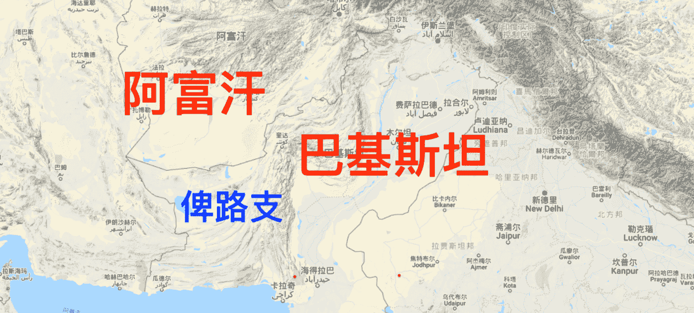

大家一看就能明白，巴基斯坦北方是一串山，跟阿富汗接壤。恰好那地方跟阿富汗人的人种也差不多，历史上其实本来就是一家子，只是后来被人为画出来一个边界线，然后就分到了两个国家。

那些地方整体比较封建落后，对宗教和部落的认同远远大于国家，很多人根本不认同“巴基斯坦”，于是就产生了魔幻的一幕，“巴基斯坦北方部落区”成了一个特指的词汇，说的就是当地老百姓还处于部落时期，各行其是，政府基本管不到，而且不能随便踏足。

几年前我公司让我去伊斯兰堡出一次差，有个巴基斯坦民俗专家给我们集中培训，说无论如何不要去北方部落去玩，如果在那地方被绑架了，巴基斯坦政府想救都没那个能力，到时候就得指望解放军的特种部队了。

这还不是最魔幻的，最魔幻的是，部落区的人整体文化水平还处于中世纪，经常是大字不识一个，但是武器却一直很精良，这主要也是超级大国不断介入导致的。

因为从十九世纪，英国和俄国就在阿富汗一带对峙，英国打了好几次阿富汗，这个过程中阿富汗人受到了俄国的支持，后来苏联又打阿富汗，美国在巴基斯坦境内训练武装前往阿富汗抗苏，最近这些年又是美国在那里折腾，两百年下来，当地老百姓啥也没学会，只学会了怎么玩枪，配件也足，地下作坊可以轻松搞出来非常精良的武器，甚至装备水平不弱于巴基政府军。

而且巴基这个国家很魔幻，他自从建国就跟印度是天然死敌，所以客观上需要和中国搞好关系，这是铁一样的地缘政治决定的，巴基斯坦历代领导集体谁都撼动不了这一点。

诡异的是，他跟美国同样好的离谱，原因也不复杂，因为印度和俄国属于铁一样的好基友，这个背景下，美国自然会拉拢巴基，巴基也想傍上美国大腿，于是就出现了现在魔幻的一幕。

巴基成了美国在中亚最重要的盟友，大家记得川总访问印度时候的事吧，当着印度几十万人的面，说巴基是美国亲密战友，全场鸦雀无声，随后就爆发了反川普抗议游行。美国的中亚事务中心都是巴基，中情局的特工，海外突击队都在巴基长期待着，美国电影里经常有反映。

此外印度跟俄国的关系也比中俄似乎要深一些，他俩也是久经考验的革命友谊，印度反倒是跟美国关系没大家想象得那么好，属于一般（也可能中等偏上，美国挺想拉拢印度），美国想拉拢它，但也防着它，怕它在美俄两边吃。

这个背景下，就有了著名的巴基斯坦三军情报局。

上世纪苏联入侵阿富汗的时候，CIA在巴基训练本拉登他们去跟苏联杠，这个过程中，情报局慢慢被美国给渗透了，现在属于巴基斯坦的“国中国”。

这个机构不大听巴基政府的，但是也不完全听美国的，因为这个机构里鱼蛇混杂，有亲美势力，这部分人听美国的，按理说这是吃里扒外，可巴基也需要美国，所以不敢把他们清理了，同理韩国日本也有这种情况。机构里还有巴基斯坦民族主义者，他们听巴基政府的。

还有一部分宗教狂，他们精神上是一切为了真主，跟本拉登藕断丝连。

最后的效果就是，美国找本拉登那么多年，以为他在阿富汗北方部落区山里，后来发现就在巴基斯坦，就在离伊斯兰堡三军情报局总部60多公里的地方。

这就是妥妥的灯下黑，十几年间美国无人机和战术小队找遍了整个巴基斯坦北部和阿富汗，就是没想到去情报局附近找找，这特么太搞笑了，后来有线人招供才有点眉目。这事美国一直怀疑就是三军情报局干的，他们一直藏着本拉登，不过确实没有明确证据。

《国土安全》里也有对这个机构的描述，美国在中亚依赖这个机构，很多情报都是它提供的，但是极其不信任这个机构，觉得很多坏事也是它干的。

懂了巴基，再说这个俾路支就挺容易理解了。

这个俾路支是巴基斯坦最大的一个省：

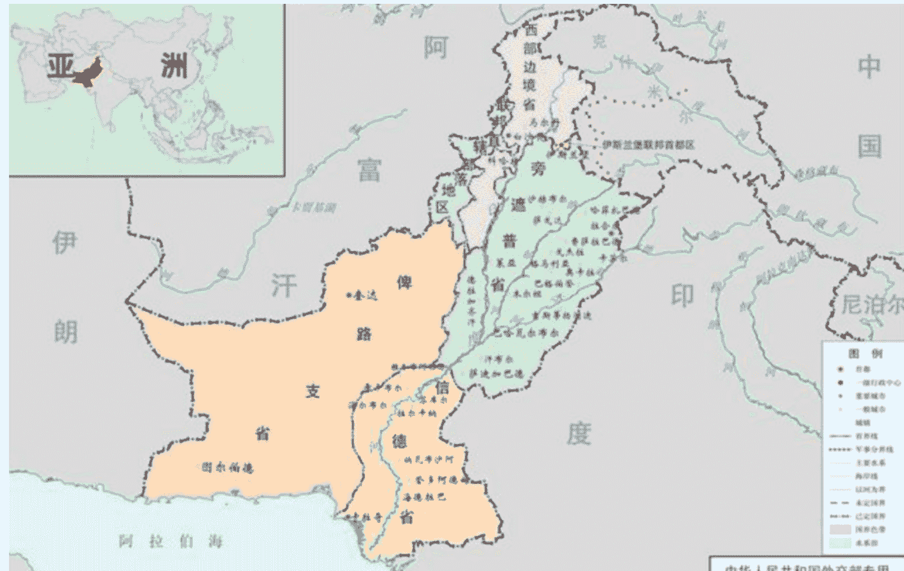

这个省里很多人一直不想跟着政府混，一直想独立出去，成立了一堆各种反抗组织，什么俾路支解放军，俾路支共和军，学生军，民族阵线，解放阵线，抵抗军等等，差不多每个大型部落都有对应的武装。这两天闹事的俾路支解放军，其实是一个叫“马里部落”人组成的，具体人数成谜，有种说法是不到千人，巴基几次讨伐，一直搞不定，也能看出来巴基有多矬。

至于这个组织背后是谁，我这边能查到的确切消息是印度确实支持这个恐怖组织，毕竟只要能让巴基斯坦不爽的事印度都不介意做。

美国和这个组织的关系比较复杂。最早是苏联入侵阿富汗的时候，巴基斯坦是美国训练抗苏力量的后方基地，本拉登就在巴基斯坦。苏联于是扶持了几支反政府武装对抗美国支持的巴基斯坦，这也是为啥这个组织叫“解放军”。

不过后来苏联崩溃了，911之后，美国被自己养的狗给咬了，找了一圈，就找到了这个组织重新支持起来，因为他们觉得这个组织和阿富汗走的比较近，可以获取情报。

也就是说，俾路支解放军是苏联扶持的，美国重新启用，现在主要是印度在资助。

这个组织坚持攻击政府的输油管道和政府设施，一直用从阿富汗那里学到的恐怖主义玩法来逼巴基斯坦政府就范，而巴基斯坦这个国家也很魔幻，好像恐怖袭击也习惯了，我查了下，2010年有个数据，那年全国一年发生了2113次恐怖袭击，这几年也没好转。

这里就有个问题，极端主义者闹分裂就闹分裂呗，跟中国有啥关系？

我这两天认真查了下，各派的想法差别很大，有一部分认为从2015年开始搞的中巴经济走廊动机太坏，但这不是问题的关键，关键是他们觉得如果巴基斯坦真的靠着中国发展起来，第一件事就是清理他们这些分裂分子，尤其中巴合作挖俾路支的资源求发展，太气人了，挖自己的资源将来打自己。

而且在那群极端分子眼里，中国是无神论国家，属于异教徒，异教徒跑到自己领土上挖矿修路这算啥？尤其是异教徒要通过“孔子学院”传播他们那套知识体系，简直没法接受。

大家可能对这事不太理解，前文讲过，本拉登作为美国的小弟，曾经在阿富汗战场和美国人并肩战斗过，后来跟美国分道扬镳，很重要的一个原因就是美国大兵的军靴踩到先知的地盘上了，这事侮辱了他们这些虔诚的教徒。

也就是说，俾路支解放军觉得异教徒不但去自己的地盘上“劫掠”，还要传教，是可忍孰不可忍。俾路支共和党主席卜拉哈姆达格·布格蒂在该党欧洲分部2015年6月召开的日内瓦会议上明确表态，“中国对俾路支省的开发和干预不可接受，对巴投资是中国掠夺俾路支自然资源的借口”，他的说法代表了很多俾路支人的想法。

这个背景下，他们坚持不懈地攻击中国，随便列几次恐怖袭击吧。

2004年5月3日，中国交通部第一航务规划工程勘察设计院的12名监理工程师在瓜德尔港建设工地遭遇汽车炸弹袭击，3人遇难，9人受伤。

2005年11月15日，数枚火箭弹袭击了中国新疆北新路桥公司在瓜德尔附近的筑路工地。

2006年2月15日，对俾路支省胡布镇进行技术援建的中国工程师遭遇恐怖袭击，3人死亡。

2019年5月11日，袭击瓜达尔港明珠酒店，并与警方及安全部队展开枪战，事件造成5人遇难，4人受伤。

这次发动对我国同胞自杀式袭击的，是一个俾路支解放军的双学历女硕士，也就是下图红圈里的，旁边的车就是咱们路过的汽车，她随后引爆了炸弹：

这也说明一件事，在宗教势力太过强大的地区，聊教育和经济好处是没啥用的，他们根本不认。

说到这里，为啥巴基斯坦那边总有华人被袭击算是搞明白了。不过今天重点不是想讲这事，是想讲很多人说的“虽远必诛”。接下来的内容可能不够热血，不过所有的内容都有据可查。

很多人眼里，既然他们惹了我们，那我们派军队过去剿灭不就行了吗？扬我国威。

其实没法那么搞，事实上大家可以关注下，这些年我国侨胞在海外受袭次数不少了，我国政府没有一次公开派特种部队前去击杀，不是不想，是不能。这一点上不止我国受限，美国也没法放开手脚。

乍一看很难理解，其实也容易，举个不太合适的例子吧，比如一个美国人在我国出事死了，我们能接受美国人派人过来调查然后执法吗？当然不行了，那成了治外法权了，屈辱至极。其他国家也是一样的，人家也不让咱们过去抓人。

比如巴基这种，他们大领导就算想让中国军队去他们北方部落区抓人也不行，因为这样做非常容易激怒他们本国民族主义者，比如前段时间巴基斯坦总理就因为拒绝制裁俄罗斯被他们国民议会罢黜了，领导做事并不能一意孤行，很容易出事，这就叫政治代价。

而且风险也不可控，就跟当初沙特请求美国派兵去沙特协防萨达姆，沙特上层一大堆人不满意，后来这些大佬开始资助本拉登，本拉登自己也是沙特富豪，美国当然知道了，只能睁一只眼闭一只眼。

事实上就算我国未来成了世界第一军事强国，也很难做到很多人理解的那样随便出击到别人领土上击杀恐怖分子，那样很快就把所有国家都给惹了，大家可以关注下，美国现在够强了吧，依旧有很多国家不给他好脸色，他们也没法去别的国家随便搞暗杀。击杀伊朗高官那种事，基本是吧伊朗当敌对国家了，而且也是在伊拉克干的。

那怎么办呢？

很尴尬的是，从现在来看，处理这种事最有经验的依旧是美国人，因为他们最遭人烦，经常需要处理这类问题。不出意外，我国将来也只能是使用他们的套路。

美国怎么做的呢？

一般是三种套路，这三种整体在法理上也能被接受，也就是你那么做，大家找不到喷你的点，你的支持者也不会被人喷。

首先会给所在国压力，逼迫对方尽全力去解决问题。毕竟再咋牛逼的恐怖分子，在国家机器眼里都是渣渣。如果那个国家实在解决不了，美国可以提供技术支持比如军事顾问，无人机，间谍卫星，电话截听等等。

这种情况非常常见，也是美国在全世界执行任务的主要手段。我们上文聊的巴基斯坦三军情报处，就是这样一个部门，美国人不会亲自下场去搞事，大量的中情局探员呆在情报局里，指挥巴基斯坦人去干活。

巴基斯坦人抓到他们需要的人之后，再运到美国审问，或者直接在巴基斯坦审问。这样就达到了借助别人的手解决自己的问题。然后在经济和军事上给巴基斯坦一些好处作为补偿，双方相安无事。

湄公河行动大家知道吧，其实就是这种，我仔细看了政府官方公布的办案细节，中国警方并没有真的下场抓人，主要是提供侦查和情报分析，由老挝警方具体执行。其实抓捕过程中好几次都让糯康给跑了，老挝人又菜又消极，如果我国去抓人，根本没那么麻烦，但是我国依旧让老挝人执法，也能大概估计到在其他问题上的处理方式。

第二种是让对方国家向自己求救，这种情况比较少，很少有国家政府承认自己不行，不过确实有，比如前几天美国炸了索马里，其实就是索马里政府搞不定一个叫青年党的恐怖组织，向美国求援，美国正好跟这个组织有仇，就去把它炸了。多说一句，这个索马里青年党2015年也袭击过中国大使馆，我国伤亡4人。

大家看出来了吧，索马里这种垃圾政府，美国也不能随便私自去作战，该走的程序都得走。

如果实在不方便自己出手，也可以雇人搞定，比如墨西哥毒枭残忍杀死过一个美国DEA探员“齐齐”，美国人不能去墨西哥执法（至少不能明面上那么操作），于是发布了高额赏金，赏金猎人们前往墨西哥把相关人员都抓回美国投入了监狱判了四十多年，基本关到死。

也有极端情况，那次在巴基斯坦击毙本拉登，这就承担着巨大的政治风险，巴基斯坦这些年和美国不太对付，也跟那件事有关。当时主要是奥巴马着急连任，也顾不上了，得赶紧下手。这种一般不到万不得已不会操作，政治代价太大。当然了，以色列干过那种情报人员变身赏金猎人全世界追杀纳粹和他们的死敌，不过这种事比较少，也可能比较多，但是披露比较少，反正见不得人。

至于之前网上广为流传的那个故事，苏联大使馆被绑架，克格勃把恐怖分子家属砍成块邮寄过去，最终逼迫恐怖分子放了苏联大使。

我觉得不大像真的，太符合爽文情节，不太像大国公开干的事。所以认真找了下，找到了克格勃驻黎巴嫩的特工Yori Perfilev的回忆录，他说是苏联大使馆确实被人端了，被抓走四个，其中一个受伤很严重，随后被枪杀了。后来苏联政府和恐怖分子一番讨价还价，苏联向叙利亚施压，停止了黎巴嫩北部的军事行动，才把人质换回来。可见苏联人处理这类问题也束手束脚。

这次俾路支解放军袭击我国人员之后，老胡说虽远必诛，我理解大概率是跟第一种情况差不多，大概率也只能是第一种情况那种玩法，我国要求巴基尽快调查并且给出解决方案，估计巴基斯坦已经给了承诺，所以老胡会那么说。

### 尾声：

随着中国在海外的投资规模越来越大，“仗剑经商”的呼声也越来越高，有些想法很热血，比如几艘大航母直接来个飞龙骑脸，或者直接用导弹砸那些坏B头上，但是现实里这么操作却很难，因为国家打交道不是流氓互殴。

招惹咱们的，往往不是当地政府，而是他们管不住的势力，我们把航母开过去本身就没啥道理，大家看过《红海行动》就知道，那片是海军监制的，我国做啥事都讲究一个师出有名，哪件事都要得到当地政府授权。这是我国的招牌，也限制了我国的行动能力。

而且全世界范围内稳定的好投资的地区早就被欧美大公司瓜分完了，剩下的都是一群烂摊子，连欧美那种纵横世界三四百年的老流氓都搞不定的地区，所以今后的挑战非常大，非常考验我国这方面的能力。

希望政府这次能够推动巴基斯坦彻底把事解决了，如果需要，我们可以派专案组过去帮忙，只有把这群恐怖分子彻底搞定了，以儆效尤，今后我们的同胞才能在海外确保安全。

今后我们的态度也应该是稳定而且可预期的，对我国发动恐怖袭击的，我们追杀到天涯海角也要送他来中国受审。

公众号懒人搜索， 懒人专属群分享

### 中国科技企业又一次面临危机时刻
2022-04-26

今天关注到两条新闻。

第一条新闻来自美国。华尔街突然升级了对阿里巴巴的集体诉讼，并增加马云个人为诉讼对象，要求阿里和马云赔偿股价暴跌的投资损失，考虑到阿里巴巴美股的成交量，如果胜诉，对美国投资人的赔偿金额将是千亿级别的。

第二条则来自央行。央行就股市的波动罕见地公开发声，表示“我们关注到近期金融市场出现一些波动，主要受投资者预期和情绪的影响”，并且还专门提及了平台经济，“按照市场化、法治化、国际化方针，稳妥推进并尽快完成大型平台公司整改工作，促进平台经济健康发展”。

两条新闻看似关联不大，其实都涉及中美竞争和中国科技企业。一边是来自华尔街国际资本的绞杀，另一边是中国监管层对平台企业的力挺。

从上世纪九十年代开始，中国企业和美国资本曾经有过“蜜月期”，但最近几年这种形势可以说发生了根本性的转折。

从上世纪90年代开始，中国前后有500多家企业赴美上市，在那个中国经济黄金时期，有些股票的涨幅非常吓人，比如网易（2000年上市）涨幅达到了13591%；百度则以5420%位居涨幅榜第二位；涨幅在500%以上的一大堆。

那个时候美国对中国企业是没啥防范心的，中国企业愿意去美国融资发展，美国人也不介意。中国刚改开那会儿对资金需求很大，可以说美股融资是中国经济发展的一大助力。

但是从2018年开始，由于中美双方贸易战爆发，双方也越来越互相不信任，中概股迅速从美国的“香饽饽”变成了打击对象。

2020年美国反华议员推出了《外国公司问责法案》，根据这个法案，基本所有在美上市的中国企业都无法满足审计要求，所有中国企业都将被迫退市。有统计显示，在法案的重压下，2021年来，中国在海外上市公司的市值已经惊人跌20万亿。特别是今年3月以来，美国监管机构接连出手，先后两次把二十多家中国企业列入“摘牌名单”，很多企业跌去了7成，部分企业跌掉了9成，这都不是“腰斩”或者“膝斩”，直接斩脚踝上了。

美股融资渠道的断裂也直接传导到了国内，海外投资人对于中国企业避之不及，大批创业中的国内中小企业也拿不到美元融资，面临资金链断裂。不得不说，中国的科技企业已经到了危险节点上。

数据显示，法案出台前的2018年，全球十家市值最大的互联网公司，中国公司占了一半。但是在美国组合拳冲击下，美中两国企业市值的差距已经彻底拉开，目前阿里巴巴、腾讯、百度、京东、美团、拼多多等6家中国互联网公司的市值加在一起仅8000亿美金，不及苹果公司2.6万亿美金市值的三分之一。

很多人不理解，阿里巴巴这样的互联网公司似乎不是国防军工的核心企业，在海外上市还可以让美国人赚钱，不明白为什么要下狠手。

其实总结下这些年美国制裁别的国家的经验，就能发现美国其实对消费品层面公司打击力度很大，也就是那些产品销路很好并且有一定技术含量的公司。

最早针对欧洲，后来针对日本，现在又在针对咱们国家。

原因并不复杂，本质还是这些企业本身潜力无限。

用任正非说过的一句话来描述，那就是“华为唯一做对的事就是按照市场规律做事”。也就是所有的研发和生产全部围绕“产品能卖得出去”展开。

只有生产出来的东西能卖得出去，才能回笼资金，才能继续做大做强，形成一种正反馈循环，有了钱可以雇佣更强的技术高手，研发更加先进的技术，卖更多钱。

公司有钱了，才能给科学家和技术人才开出高工资，这些人才会感觉到受尊重。我们经常说美国人尊重人才，所以全世界的人才往美国跑，其实并不是他们在政府给科学家什么荣誉，或者分套房。

美国一直以来的套路，就是鼓励科研人员去从事商业，从市场上赚钱，创业者实现成功的商业化，自然会在技术研发领域投入更多，高薪雇佣科研人员，科研人员待遇也就上去了，形成良性循环，最明显的就是爱迪生的公司，贝尔实验室，后来的硅谷，研发推动产业，产业反哺研发，都是这个模式。

美国和苏联的竞争过程中，赢得最彻底的也在于这一点。

“二战”刚结束那会儿不太明显，但随着商业的推进，美国不仅技术在应用层面有了巨大突破，更重要的是，“产学研”循环形成的正反馈效果越来越大，大学有了新技术，教授可能出去创业，等做大后重新投资大学的研发，大学出成果后来继续向市场输出。

而且由于学校可以接受成功企业的捐款，美国的名校非常有钱，钱多的花不完，找对冲基金给他们投资增值，自然也有有钱给优秀人才提供高薪收入。

至于大型的跨国公司就更不用说了，美国的军工企业波音、洛克希德马丁、罗斯普鲁斯都是商业公司，对于人才的吸引力可想而知。

后来苏联还没解体，他们的人才就大规模出逃，

不仅苏联人才在流失，全世界都在流失，大家可以看看最近几十年美国那些最传奇的大师，基本都是移民。美国风投也特别愿意给这些人钱，因为他们无路可退，必然尽力一搏。

慢慢地，美苏在技术层面的差距就完全拉开了。比如苏联的计算机跟美国基本没法比，著名的“俄罗斯七寡头”之一的波塔宁，他的起家之路，就是在上世纪八十年代把西方淘汰掉的计算机倒腾到苏联赚差价，竟然赚得富可敌国。

苏联尽管不承认自己在计算机方面全面落后，不过包括核武器和导弹部队以及研究机构也都装备上了西方的计算机，因为双方的计算机算力差距不是差一点半点，而是数量级的差距，每年还在不断拉大，毕竟“摩尔定律”的前提是“市场竞争”和“用户需求”。

“用户需求”可以给企业提供资金支持，“市场竞争”逼着企业不断改进。

懂了这个逻辑，就懂了美国为啥那么反感自己体系之外的科技公司，因为他自己是这个起家的，当然明白这里边蕴藏着巨大的力量。

华为以前也是把国外的交换机卖到国内，后来开始了研发之路，依赖“老少边穷”地区微弱的市场支持，有了自己研发团队，一开始发展很慢，但是到了2010年之后就进入了指数发展状态，不仅在亚非拉横扫西方的传统老牌公司，在欧洲也一路攻城略地。

阿里也一样，很多人眼里它是做购物平台的。但是，做购物的过程中，阿里产生了巨大的技术需求，于是开始了在云计算和芯片设计等技术领域的投入。并且成果也很明显，最关键的是，因为中国市场足够大，它的技术产品不仅能有很好的销路，而且阿里的技术水平还因为广泛的应用场景得到快速的迭代和升级，这就会不断挑战美国传统巨头的优势。

比如这两年很火的云计算，很多小伙伴可能对这个没咋听说过，或者听说过却完全不知道这是个啥东西，但是这玩意却不知不觉中跟水电似的成了我们的基础设施，跟水电不一样的是，咱们最起码知道每天要喝水用电，却不知道天天都在使用云计算。

原理倒也不复杂，大家每天打开各种app，在那里刷刷刷，手机里就有无限内容蹦出来，不过这些内容并不是放在你的手机里，而是放在服务器上，而现在的服务器，大部分都在一个叫“云计算”的东西上，这玩意的物理形态是一个个足球场那么大的服务器群，更复杂的，比如电商节抢购，春节抢红包，还有12306、健康码这样的公共服务，其实也都在云上。

在不咋久远的未来，大家可能都不需要买电脑了，买个机顶盒就可以了，然后在云服务器上租一块资源，随时随地可以通过网络打开自己的电脑。这不是科幻，国内很多公司已经用上这种技术了。

说到这里，大家应该已经感受到了，这玩意将来肯定是一个各方都要争抢的技术高地。事实上这个领域也打的昏天黑地。

全世界范围内玩的最溜的是亚马逊，这个公司以前是卖书的，后来啥都卖，现在偷摸已经把主营业务里一大块已经变成了云服务，大部分国家和地区都在租亚马逊的服务，毕竟云计算对硬件和技术要求太高，他们没法自己开发。

好在我们国家并不依赖亚马逊，因为我国这几年这方面发展的非常好，比如阿里云，不仅国内占据很大的市场份额，在国际上也跟亚马逊有一战之力，特别是亚太市场，阿里云的市场份额超过了亚马逊和微软的总和。

在国际权威机构 Gartner公布的最新评估报告中，阿里云已超越2006年就率先提出云计算概念的谷歌，占全球市场份额第三的位置。

除此之外，其市场份额还实现了连续六年增长，并且成功在最具潜力的亚太市场登顶。

在美国看来，这是很可怕的一件事，因为很明显“技术-市场”的正反馈循环已经形成了，研发的越来越深只是时间问题。因为企业想盈利，一般都是下边这个套路：

先做集成商，把各方的技术拿来组成一个新产品。 等新产品赚到钱，再开始把里边利润率高的部件换成自己的，成本大幅下降后，利润就会上升；

等各项技术都自己解决并有了新进展，推出完全自己的东西。

我们说中国企业层次低，主要是我们发展时间太短，绝大部分公司还处在第一个阶段，这个阶段通过倒腾西方成熟技术就可以让一部分人赚的盆满钵满。

但是好日子不会一直过下去，这个阶段的尽头，充分竞争后，所有企业都赚不到钱，这时候一些企业才会被迫转型，向比较难却人少的方向发展，前赴后继，很多人倒在路上，但总会有人出头。

也正是因为现在差不多到了转型期，美国看准了时机出手了，这就是美国对中国科技公司穷追猛打的原因。

说到这里，大家也看出来了，中美和中苏有个巨大的差别，苏联和美国是两个系统，美国把苏联往死里封锁就完事了。但是中国和苏联不太一样，中国在改开之前既不属于苏联也不属于美国，改开和加入WTO切入美国的体系，中国的发展确实借用了美国的市场和资源。

而且还有一个大差别，苏联没有公司一说，他们内部的组织不是市场化运营，洗衣机做的像水桶，彩电像衣柜，缺乏全球扩张能力，而我们不一样，我们市场化下生长起来的企业可以在全球攻城略地。

所以中美闹别扭，美国回过味来想把中国踢出去。但是又谈何容易，毕竟我们其实是通过无数的贸易协定和合同，深深地和整个西方世界连在了一起，脱钩如剥皮。

不过不得不说，这几年对于我们来说是很艰苦的几年，各种转型期的病症都出现了，几乎所有行业都是一片红海，传统的三驾马车都有点虚，企业主抱怨生意越来越难做，老百姓抱怨工资越来越不值钱，正好叠加了疫情，简直凑齐了。

那接下来该怎么办？

其实都写在政府工作报告了，一方面，保民生保就业是底线。最重要的，还是以市场为导向，继续扩大对外开放。

很多人看到美国打压我们，就觉得我们应该硬气地全面和美国对抗，甚至把苹果等公司也赶出中国。

某种意义上讲，可能美国政府巴不得发生这种事，现在美国跟中国脱钩最大的阻力，其实就是美国这些跨国商业巨头们，他们想赚钱，所以会动用自己的游说能力阻止美国保守派瞎折腾。

而且在华的美国公司基本都要靠我国的供应链。

同时我们一方面要深耕国内市场，更重要的是继续跟西方强国保持经贸合作，跟美国一边打一边合作这事根本躲不开。

我以前就说了这事，只要你的工作有一点技术含量，就躲不开美国，无论是工具还是知识本身，都绕不开，唯一能做的只能是继续向他们学习。说这话很丧气，不过大家随便找个理工科博士问问，很少会有反驳的，因为美国早已不是美国人的美国，在知识和科技层面，确实是世界的美国。现在中国低端产能所必须的能源和原料，高端产能所需的技术，还有巨大的海外市场，都得依赖海外。

我们必须一直向对手学习，直到击败它。

企业也要走出去，华为就是在海外起家，阿里他们这两年在海外搞的也很好，在海外开拓市场，甚至建立研发中心，雇佣当地头脑参加我们的建设。

贸易是最好的善意，澳大利亚就是最好的佐证，这个国家看着和中国关系不太好，但是在整个西方取消对中国的关税优惠的情况下，澳大利亚竟然是唯一一个保持的，因为它和中国的贸易规模太大了。

退一万步讲，就算美国跟中国硬脱钩，他的小伙伴们也不一定会跟我们脱钩，但是前提是我们跟他们的贸易关系大到真脱钩会痛苦至极。

文末，再总结下吧，面对高度不确定的未来，我们如何自处。

其实关注国家近期的一系列动作，就能看出来政府已经在积极协调解决中概股的难题，也相信问题能得到最终的解决。

我们看到今天央行的发言，专门提到平台经济公司，其实也就是这个目的。

我们的监管本身是为了纠偏，但不是否定互联网公司的价值。这和美国一部分人要彻底击垮中国科技行业的精准打击，性质是完全不同的。

在未来的科技竞争中，无论互联网公司，还是马云这样的创业家，都是中国经济发展的重要基础。

还是那句话，互联网还是中国在全球范围内最有竞争力的领域之一，我们不能自废武功。

而且我国一直在强调坚持扩大开放，让市场做主体，还是那句话，美国希望我们做的，我们就坚决不做，他希望我们闭关锁国做大清，我们决不能按照他们的意思来，只要我们自己不把自己封锁起来，没人能封的住。

不过最关键的，还是产品力和竞争力，那些财大气粗的互联网公司，应该继续打造强悍的产品，做中国在海外扩张的东印度公司，用技术和产品赢得自己的地位和声望。

公众号懒人搜索，懒人专属群分享

微信：lazyhelper

### 怎么突然开始提“统一大市场”了？

2022-04-19

以后每篇文章开始都应该声明一下，写作的目的是和大家分享一些我自己的想法，并不是想做国师，万一对大家有启发呢。

可能很多小伙伴看到“统一大市场”这个词，跟我体会是一样的：

啥？咱们国家还不是统一大市场？

那就得看要跟谁比，如果跟印度比，他们各邦还在对别的邦过来的商品征税，我们比他们稍微领先了70多年。

但是如果跟韩国这样的国家相比，我们确实不够“大市场”，韩国当初为啥要整合出来财阀，就是为了降低国内的内卷，集中资源一致对外。有一说一，咱们国内动辄攻击韩国财阀，其实韩国的那些企业进取心真的是非常强，比如在芯片半导体和汽车领域的探索深度和勇气，咱们的大部分企业实在是差太远。

那我国现在是啥情况呢？

我仔细研究了下，发现整体是这样的：

进步不小，但是现在进步阻力非常大。

咱们一件一件说。

先说进步的事。中国在加入WTO之前各省情况尽管比印度好一些，但是坚决的各自为战，比如中央要求大家放开管制，但是各省经常性地为难别的省过来的物资，甚至日常私下里榨点钱，有那么几年各种杂费成了社会的“四害”。

后来加入了WTO，要和老外打交道，人家不管咱们内部是啥情况，想和人家做买卖，就得按照他们的标准来。

而且外资跟国内的各省政府打交道的时候，直言说你们现在这样不行，必须按照我们说的来，我们在你们这里投资建厂，是因为能赚到钱，所以你们必须保证别的省过来的原材料或者中间件价格不能明显上升，不然我们赚不到钱就走了。

就这样，很多省份为了招商引资安排就业，开始在省内打击私下的各种杂费，情况迅速好转。

不过咱们国家的考核方式决定了这种壁垒没法彻底消除。

咱们是考核各省的GDP，也就是之前说的，“唯GDP论”，如何才能提升各省的GDP呢？

一般有两个办法，一是咱们都知道的，房地产。另一个就是上文说的招商引资，你让外资或者台资到自己的地盘来建厂，他们拉动了就业，GDP也就上去了。

但是这种模式主要在东南沿海好使。因为中国接收的“外资”其实主要是咱们自己人跑出去后发了财再回来投资，主要是三伙人：

- 从广东跑到香港和东南亚的那群人，包括“三江出海，一纸还乡”的潮汕人，他们家乡的三条大江带着潮汕人去海外冒险，在海外赚到钱，也会通过一纸“侨批”把钱寄回来，改开后珠三角最早的原始资金就是这么来的。
- 还有福建那边，福清帮的人，大规模跑到海外，赚到钱后回老家投资。
- 最后一个是上海，上海以前啥也不是，但是现在的太湖经济圈，是持续了1000年的富庶地区，解放战争后大批出逃，改开的时候这些人带着钱重新回国投资，他们回国投资自然不可能去山西嘛，理所当然投到上海去了。

这几个地方现在形成了中国经济发展的基本盘，由于这些地方发展很快，北方农民如果去东南打工，经常工资是他们在老家种地的五到十倍，所以其他地方人口大量外流。

这就有个悖论，东南发展越好，对其他地方的“吸血”也就越严重，东南的GDP有了保证，其他地方怎么办？

所以接下来的操作大家想想就知道，各地会扶持自己的企业，这些企业可能效率差品质也不高，但有总比没强，这些企业便成了当地的纳税大户，既然是纳税大户，就得政府给予额外的保护，比如地方采购都优先选取本地企业。

这事可以从两个角度来看。

如果从市场效率来看，两个竞标企业，一个本地一个外地，当地政府宁愿选择又贵又效率低的本地企业，这明显不符合效率原则，也有一定的浪费。

甚至国内很多企业早就该倒闭了，因为他们没有任何效率可言，他们能活下去，最主要的“输血”就是各地的地方政府，如果放开竞争，他们可能一单订单都拿不到。但是有老家政府的支持，还可以勉强活下去。

很多企业已经亏得一塌糊涂，但是依旧不能让其倒闭，税收已经是次要了，主要是那么多人没地方去。

但是从地方政府的角度来看，这些效率不高的企业，只要活着就是胜利。

这也是为啥地方政府还很热衷投资，从之前狂投芯片，到现在狂投电动车，他们指望能投资出来一个世界级本地企业。

毫无疑问，这两样在未来都是很长脸的东西，但是他们都有严格的市场规律在起作用，投资未来科技本质是投资伟大的先行者企业家，而且未来肯定是赢家通吃。

大量投资本来就会造成过度的浪费，芯片领域就不说了，大量骗补。

电动车也一样，前段时间潍柴动力的董事长说，中国的电动车产能严重过剩，大部分是无效产能。2021年统计的98家汽车生产企业生产情况中，月生产不足千辆的企业达50多家，其中近20家处于停摆状态，月生产0辆。而汽车销量排名前十位的企业集团销量合计约占汽车销售总量的九成，甚至能达到100%。

说到这里，大家也就明白了，降低市场壁垒，确实会提高经济效率，但问题也很明显。

以前为啥有壁垒？

因为壁垒可以给当地创造财政收入，解决就业问题。

如果那些壁垒崩了，当地会发生啥？

短期效果是当地会出现大量失业，长期效果是很多僵尸企业和效率低下的企业出局，市场活力增加。

说到这里，这事就很好理解了。

如果认真执行统一大市场，肯定意味着政府降低对市场的干预，效率高、成本低的企业会向我国内陆渗透，马太效应会越来越明显，巨头型公司会变得越来越大。

至于有人说，今后只有大企业没有小企业，也是没常识。

其实看看手机、汽车、空调这些充分竞争的行业就知道了，肯定不会变成只有大企业，消费品市场，充分竞争后，从来都是几个大的，还有一大堆小的，有些领域更夸张，耐克阿迪那种超级巨头，在整个市场里的占有率依旧低得离谱。

因为市场经济下，消费品领域是很难做到一家企业满足所有人的需求的，就算你做到了极致，依旧有很多人不喜欢极致，你能怎么办？

所以这段时间不少人说统一大市场会消灭小企业，这个不一定，美国那种充分竞争的国家，小企业也占到70%以上。但是肯定会消灭不赚钱的僵尸企业，这些企业活着的唯一原因就是财政补贴，财政不补贴了，他们就到头了，好处是财政也可以多一些钱出来干别的。

此外市场经济下，如果一个行业变成熟，行业内部就会形成稳定状态，新来的人在这个体系里就赚不到钱，或者说只有一个预期超级稳定的收益，对于普通人可能无所谓，上班呗，在哪上不是个上。

但是对于一部分雄心勃勃而且有才华的人来说，可能就考虑在体系外再打一片江山出来，尝试的人多了，总会有人成功，这些成功的先例会鼓舞其他人再去尝试，这就是“创新驱动的经济”，或者木头姐他们说的“破坏性创新”，社会也就靠着这种不断对之前模式的颠覆向前发展。

这也就触及到了计划经济和市场经济的本质差别，这两种体制下，计划经济往往由于没法及时把握用户需求，只能在重工业领域和军工发力，因为这些领域看着复杂，其实需求很简单。

也就是说，计划经济可以搞出来史诗级的钢铁厂和氢弹，却搞不定可口可乐和各种潮牌，更重要的是缺乏不断地“颠覆式创新”，导致系统在原来的基础上修修补补，最后走向坍塌，这也是为啥全世界没有一个国家计划经济搞得好的。苏联直到崩溃，很多领域竟然还在用“二战”期间美国按照租借法案给他们的技术。

市场经济不一定搞了就能好，因为这玩意需要配套法制、原始资本等等，但是确实有突破的可能性，尽管大部分国家搞了市场经济依旧一塌糊涂，不过确实有一部分突围了。

我最喜欢的《亿万》中的一句话，“所有系统都会走向灭亡”，乍一看很悲观，我们历史上历朝历代，其实就是一个个走向灭亡的系统，灭亡后重建了一个跟之前差不多的，三百年后又完蛋了。

那有没有解决方案？

也有，也就是在原有系统快完蛋的时候重建一个系统，也可以理解为“第二曲线”：

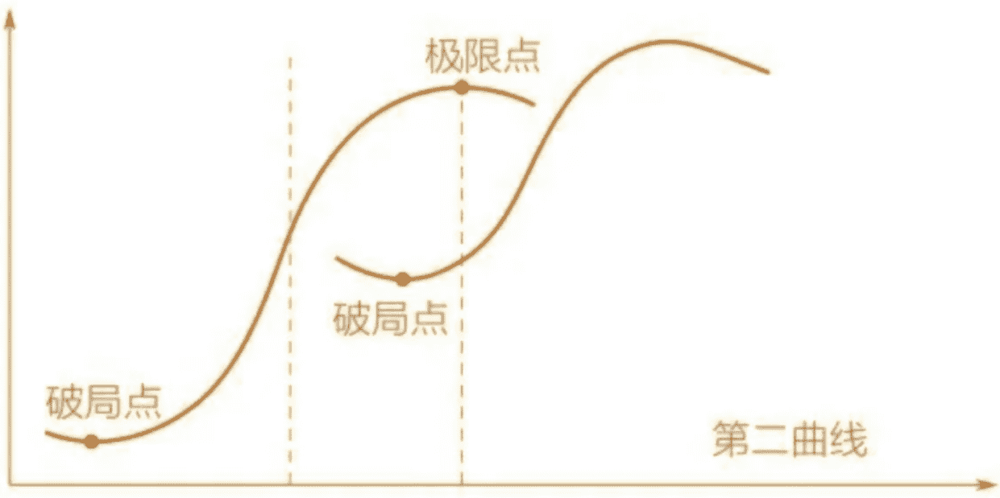

美国混到现在，某种意义上讲就是一次又一次地通过技术进步给自己续命，不然早完了。

我们的“改开”其实就是一次“重建系统”，现在我国的很多尝试，本质也是要再走出一个“第二曲线”。

这种进展是不可能规划出来的，因为未来是什么样，谁都不知道，就好像十几年前你不知道比特币和马斯克的股票会上天一样，你现在也不知道将来是哪项技术会改变人类，如果知道，你可能通过炒股就发财了。

最终只能是发挥14亿人的想象力，让大家各自寻求出路，国家层面也寻求出路，可能再过一些年才能有出路。

这次提“统一大市场”，打破地区壁垒的本质，就是进一步充分释放活力，让老百姓各自去突围。

当然了，上游原材料领域就不一定了，未来肯定是一强或者多强，大家如果看看就能发现，现在已经是这个格局了，水电油等领域，早就成了寡头制了。国外的能源和资源领域，也是这样。

很多小地方的受当地政府保护的企业将会破产，然后退出竞争，那当地工作岗位会进一步减少，年轻人更是只能去大城市呆着。

这样做，短期肯定面临巨大的阵痛，而且可能需要改变地方上的考核机制，如果依旧是“唯GDP论”，地方大员们肯定会延续以前那么多年来的成熟策略。

如果能顺利操作，长期看来可能确实会提高效率。而且大城市会变得更大，因为人口聚集在一起是有规模效应的，很多创新只能发生在大城市。如果彻底解除管制，现在强的那些城市未来只会变得更强，现在弱的，将来应该能喝点汤，分到的蛋糕总量可能在提升，但是比例一直在下降。

以前写过一篇文章，叫《“鹤岗化”可能是大部分小城市的命运》，里边的提到，我国不出意外，今后会形成少数城市“深圳化”，高收入，高房价，高压力，高淘汰。

还有一部分城市找到自己的发展之路，比如有些城市搞起了特色旅游，尽管发展不会太快，但也能慢慢往前走。同时大部分小城市都将鹤岗化，低房价，低收入，低压力，发展停滞。

即使政策干预，可能也没法扭转这种趋势，不只是咱们国家这个趋势很明显，全世界都这样。政策如果放弃干预，让市场自行决策，那这种进程会进一步加快。

很多事，对于我党来说可能主要不是难不难的问题，而是必要性的问题，如果一切顺利，那可能会绕开那种坚固的改革壁垒，去搞别的。

但是现在改革的必要性又上了一个新台阶，因为传统我国经济的三驾马车都有点虚，只能是好好研究下之前的那些痛点，现在的大痛点，就是地方保护主义，只有把这些障碍解决了，我国才能再一次释放活力，反正只要真想搞，没有我党搞不定的。

公众号懒人搜索，懒人专属群分享

### 上海表现成这样，仔细一想也正常

2022-04-15

上海这段时间的各种骚操作，可以说气的人肝疼，而且有种它故意针对你的感觉。我看了一圈，很多博主都在写上海，不少只顾骂，认为问题都出在有人居心不良上，甚至开始怀疑上海之前的经济繁荣是不是真的。

其实繁荣这事没啥可怀疑的，看数据也能看出来，上海的GDP总量，人均GDP，消费水平各项指标都在全国属于绝对前列，它的经济繁荣并不是假的。

那一个繁荣的城市为啥这么拉胯呢？咱们作为一个一直以来标榜相对深入理性的号，自然要有一些思考。

大家可以想象这样一家子。

以前这家人穷的时候啥都自己做，在院里种菜，养猪，养鸡，春种秋收，到了过年自己杀猪蒸馒头冻豆腐做花卷。后来这家子赶上了贸易时代的兴起，正好他们家处在一个贸易节点上，很快发了财。

发财之后还能继续像以前那样生活吗？

当然不行了，于是家里主要任务是到处跑生意赚钱，家里的杂事全部外包，比如打扫卫生让阿姨来做，做饭请了俩厨子，哪怕去上班也是司机接送，至于以前种的地，全铲了盖上楼，那粮食怎么办？从别的地方买呗。

这样其乐融融，这家子发了财，佣人们也高兴，毕竟自己也有工作了。

但是等到出了点问题，疫情来了，一开始变化不大，后来疫情扩大，佣人们都被封锁在家出不来了，这家子啥也不会了，饭也吃不上了。

其实现在来看，上海的问题就在这里，这座城市自从开埠以来180年，它一直是中国通往太平洋的最重要的枢纽，绝大部分时候都是依靠专业的商业化分工解决问题。

从开埠以来，上海城里的每一个人，几乎都只做自己擅长的那一小部分活，基本不干别的。

改开之后的上海政府，某种程度上讲也极度依赖这种分工，比如每天早上给城市打扫卫生的是公务员吗？当然不是了，而是几家环卫公司在干；每天排着长队把物资送到千家万户的是公务员吗？当然不是，也是无数商家根据订单排货，然后再通过专业运输公司给拉进去。

进一步讲，上海世博会什么的，达到了世界级水准，是因为上海公务员们擅长艺术设计并且会盖场馆吗？

当然不是，上海市政府通过竞标把所有项目分拆成一个个的“业务包”，然后让专业的商业公司去做了。比如场馆应该是什么样，可能一家法国公司竞标成功，他们的设计风格被选中，然后由安徽的某个建筑队给施工搞定。到了开业那天，可能大学生志愿者在附近维持秩序，组织大家欢乐地玩耍。

这样转一圈，政府的工作量非常小，而且由于引入了商业竞争，商业公司为了拿到竞标，肯定会尽力压低报价，并且提高服务质量，一来二去，整体水平自然是精益求精。尽管其他城市也购买服务，但是没有一个城市像上海这么彻底。

而且这是一种良性循环，商业水平高，上海的税赋自然充足，可以大规模购买市场服务，政府成了消费者，进一步促进了商业繁荣。

这一点大家应该不反对吧，如果不是这次疫情，上海的市政水平虐其他90%的城市两条街。当然了，这两天很多人是不认可这句话的，我跑过中国几乎所有的三线以上城市，个人感觉上海这轮疫情爆发前确实很强。

也就是说，这次疫情它非常拉胯，它以前市政很强，这两件事不矛盾，都对。

但是问题就出在这种模式太过依赖商业活动，一旦商业活动停了，整体就崩了，并且就跟上文大户很久都不做饭一样，佣人来不了，饭也不会做了，全家在那里吃生菜叶子。

前期“精准防疫”时期，政府通过精确跟踪每一个病例，不破坏市场环境，那时应该是全国做得最好的。但是后来奥密克戎的强传染性把精准防疫搞崩之后，随后上海开始封城，商业活动基本崩了，京东天猫也停了，这个高度依赖商业化的城市基本被打懵了。

这段时间不少人在骂上海，这倒和封城期间太多人没饭吃一样，生活过得太顺利，没有“容灾系统”，碰上麻烦不知道怎么过了。

在电影《亿万》里有个情节，男主的公司跟其他华尔街对冲基金一样，严重依赖计算机交易平台，后来碰上大麻烦需要紧急抛掉天然气股票的时候，系统却被人给黑了，一堆交易员坐在那里啥也干不成。只有几个老同志拿出纸质记事本找出里边的联系人，用电话进行交易，成功解决了危机。

这段时间上海发生的事，就有点像高度依赖的系统崩了以后，得赤膊上阵了，但是又没有相关的能力，毕竟多少年没这么干过，深圳却留下了快递业务，基层也很年轻化。

通过这个角度重新审视这几天的团购，也能发现这个城市的商业化已经深入骨髓，原有的商业活动停了后，又在极短时间内发展出一套来。而且我今天晚上查了下新闻，说是上海物资现在已经不缺了，只是现在的运输车队进了上海就出不来，接下来就是硬耗着了。

昨天微博上发了个帖子，反响还不错，大家还是挺认同的：

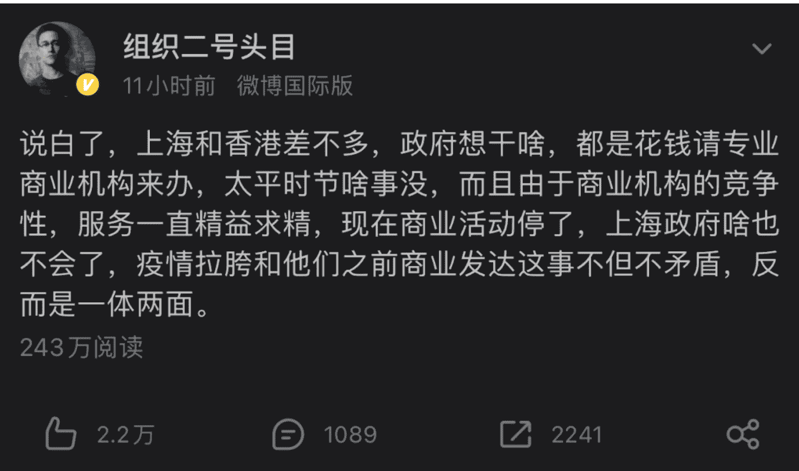

说到这里，还想解释一个问题，不少小伙伴说，这次上海这么拉胯，会影响到它的后续房价吗？讲真的，啥也影响不了。

上海如今的地位并不是偶然的，也不是什么政策影响，它天然得天独厚，天生的超级大港口背靠巨大平坦的腹地，之前有城市学大佬说，中国从现代文明角度来说，只有两个天然超级城市，一个广州，一个上海，当然了，深圳和广州其实差不多，他俩占着相同的地利。

上海能发展成现在那样，属于地理环境和人文社会的纠缠进化，好地利使得当地人能赚到钱，赚钱机会又吸引更多敢冒险脑子好的人过去，进一步加强港口的优势，所以一经开放，几乎呈现出爆发性的增长势头。

整个中国近代史上，上海经历的挫折有好几次，但是每次都变得更庞大，哪怕在计划经济时代，上海和海外大部分联系被中断，上海依旧是全国前二的超级城市。一旦开始搞市场经济，立刻就远远超过了其他城市。

就算大家再不喜欢这个城市，也改变不了这一点，这事结束之后，上海依旧是一线城市。

其他城市的房价看产业看人口看政策，而一线城市可以啥都不看，一线城市资产的核心是货币、是人心，甚至可以说，一线房产的本质就是货币问题。

咋理解呢？

现在的大环境下，货币持续增发是个毫无疑问的问题，这两天的情况大家也看到了，政府其实不太想放水，但是没招，整个市场眼巴巴等着政府降准降息。

钱出来之后自然会进一些人的兜，反正要造富。

普通人有了钱第一反应是怎么能让钱翻倍，而富人有了钱想的却是保值。这也是为啥普通人总是对年化20%收益率的产品都嗤之以鼻，因为就算20%的收益率，也没法明显改善大家的生活，所以前些年大家疯狂买入那种庞氏骗局的理财产品，明知道20%以上的收益率有问题，但是依旧想去试试，万一自己不是最后一棒呢。

富人们不是这么想的，富人们保值就行了，这也是为啥4%左右收益率的债券都能被疯抢，而且参与疯抢的资金规模大得离谱。

大家很可能觉得现在互联网不行了，教培不行了，富人会不会少了，其实那两个行业只生产大量的白领，并不会贡献太多的富豪。之前我不是聊过嘛，我的一个朋友在绿中介做了很多年店长，他发现一个问题，北京的千万级别豪宅买家很少有科技行业的，大部分都是传统行业的大老板，比如工头，承包商，小老板什么的，互联网员工工资高，老板没那么有钱，传统行业员工工资低，但是老板比大家想象得有钱。

反正银行放出来的钱不管有没有进入互联网行业，都会进入社会，在互联网行业相对均匀一些，但是在其他领域毫无均匀可言，最后钱都聚集在少数“核心节点”上。

这些人有了钱之后就面临一个大问题，怎么花出去的问题，在中国，核心资产只有房子和股票，但是股票前两年好不容易给了大家一丢丢信心后，这两年环境一变差，立刻跪得无比干脆。

尤其是这段时间外资大规模撤离，我国股票无论内地还是香港，或者是美股的中概互联，无一例外跌得跟狗一样，这无疑会摧毁大家对股市的信心。大家也发现了，以前指望A股像房地产一样，从家里的幼子成长成顶梁柱，没想到这货有“童年阴影”，只要有点风吹草动立刻躺下装死，怎么都扶不起来。

所以转一圈下来，民间只能通过房产保值，政府也想通过房产救市。一线房地产在中国不仅仅是资产的问题，更是人心所向的问题，尤其是有钱人的人心聚集地。

有人说，上海作为一线城市，不就是产业太集中，把上海的一些优势产业搬出来不好吗？

其实国家也想，但是搬不动，上海尽管房价非常高，但是同时也能给出高得离谱的工资和发展机遇，所以高手愿意在上海呆着，你把公司搬到其他地方他们干脆辞职了。

比如一个研发中心，想搬到合肥，里边所有人工资不变，月薪两万的人可能很高兴就过去了，但是月薪十万的人就不一定了，他们不想离开上海，因为他们担心去了二三线城市自己贬值，也担心自己孩子没法上国际学校，更担心孩子将来还得回一线，而大部分人关心的房价问题，对于顶级人才来说不是啥问题。

这事我自己经历过，我们公司之前把一个不太赚钱的部门从北京搬到武汉了，将近一半的人欢天喜地去了，但是那几个骨干全部离职，并且转眼间就拿到了高薪，在北京换了一家公司继续上班。某种意义上讲，一线城市房价居高不下，也跟这群人有关系。

懂了牛人不愿意离开一线，而富人要保值，把中国所有能保值的城市拉出来，也就只有北上深，之前杭州姑且可以一战，这段时间互联网大规模裁员之后，杭州出现了大量法拍房，我知道的不少互联网从业者失业后，在杭州找不到工作，第一反应也是把老婆孩子留在杭州，自己去上海碰碰运气。

也就是说，上海这种商业氛围浓重的城市，可能在处理疫情的时候很拉胯，不过搞钱确实有一套，只要搞市场经济，它就能风生水起，进一步吸引大量的冒险者和人才去那里打拼，时间长了，差不到哪儿去。不过前提是它得挺过这一轮疫情。

今天就聊到这里吧，说实话，最近我也是心烦意乱，尤其昨天看到太原也被封了，开始担心老家的人物资够不够，在过去两年里，山西整体受疫情影响非常少，总共也没几个案例，老家人整体太过乐观，反而疏于筹备。病毒这玩意才是真正的唯物主义者，专打所有不服的。

也希望大家调整好心态，不要有侥幸心理，做好充分准备迎接可能的麻烦，才能不被麻烦击倒。

公众号懒人搜索，懒人专属群分享

### 国内没有共存派
2022-04-12

大家相比和我一样，经历了2020年我国接近满分的防疫手段之后，中国国内几乎没有人质疑中国的防疫水平了，但是到了今年，网上突然就炸锅了，尤其最近，吵成一团，大家可以去抖音微博的评论区看看，类似：

国外已经交卷了，国内还在争取考满分；国外已经大学毕业了，我们还在继续参加中考；等等。

同时有人反驳，说太多人以为放开就会好，可是放开只会更糟，然后围绕这个中心议题展开论证。

其实明眼人都看出来了，这种辩论没啥意义，意义的重心永远是生活本身。我举几个例子，大家就懂了这句话啥意思。

这两天一个卡车司机联系到我，倒也不是想诉苦，他已经被堵在高速上没法卸货十来天了，心里憋屈，平时开车听我文章，现在实在无聊，絮絮叨叨跟我说一些他们的日常。我从他那里才知道了他们卡车司机这个群体。

卡车司机这个群体，在中国的规模庞大的超出想象，全国有足足3000万，和整个重庆的人口数差不多。卡车的主要作用是物流，因为中国国土的庞大，又以大规模长途运输为主，我还专门查了下，公路运输占比达到了70%以上。这种运输非常辛苦。

一个长途卡车司机的路线一般都是固定的，常年在一条或者几条线路上跑，一次就是好几天到十几天，基本上没有什么在家的时间。很多时候都是开车路过顺便回家看看。

这种生活带来两个问题：一个是长途司机因为长期在路上，上货卸货时间不固定，路上的状况更是常常变化，以著名的山西运煤出省的公路为例，我记得最久一次是一年冬天大雪，整个路上百公里的车，前后堵了快一个月才彻底畅通，我一直没想明白大冬天在荒郊野外一个月，是怎么过来的。

生活不规律都是常态，吃饭休息大多只能将就，很多司机身体都不好，肠胃就没有几个好的。这些都是硬累出来的，很多人都是长期超负荷运转。

司机之外，还有一个被称为“卡嫂”的群体，她们的辛苦大家可以想象。

有的司机是两人合伙开车，一路上换班轮流开。有的是一个人开车，老婆跟着一起，这样一来夫妻两个能在一起，但是孩子又只能扔给老人，让孩子成为留守儿童。

卡车司机的工作在辛苦之外，一大问题是危险。全国货车总数不到所有车辆的10%，长途更少，但是发生事故的比例却高得多。对于司机家属来说，最怕的就是听到货车出事，总是会不由自主地想起自家人来。

疫情爆发前，联系我的这个哥们他出车次数大概是每月十来次，一直持续下降，直到最近降成了一个月只能跑一次，这个收入基本上赚不到啥钱，问题是老人孩子养车都需要钱。

这里要说一下，就是即使疫情爆发之前，他的收入也不高。很多时候出了一趟车，拉着几十吨货跑了上千甚至几千公里，货主一下给了几千到一两万块。

看起来不少是吧，其实如果算上各种支出（油耗、车损、过路费、人员花费），基本上剩不了多少，如果再算上劳动强度和劳动时间。只能说完全和付出不匹配。

至于如果出事或者没出事耽误时间被罚款，真的是不知道说什么好。之所以如此，一大原因就是中国卡车司机的内卷非常严重。

大约20年前开始，卡车的增长率就特别的高，因为车子多，很多时候就成了卖方市场。导致货运价格的增长根本跟不上成本。早期司机的办法就是超载和疲劳驾驶，多运快跑挣钱。这无形中既增加了风险，又使得竞争更加恶化。国家经过多年的整治，情况才有一点好转。但是距离根本改变，还有很长的路要走。

他说疫情爆发以来，他收入降到50%的时候，他依旧无条件支持清零，也坚决支持国家抗疫，但是现在收入快降成0了，他已经不知道该怎么办了，尤其没法想象这样的生活要是持续两年，自己该怎么办。

他作为小老百姓，愿意付出一半的收入支持抗疫，但是如果收入再低，就养活不了家庭和老人了。

更痛苦的是，自己的问题明显就是流程不合理导致，比如大卡车出发的时候，已经做了核酸，然后贴上封条，但是到了目的地，他们的核酸报告已经过期了，得重新做，重新等结果。

此外有些服务区被关了，没油的卡车排了十几公里，还有的地方行程码上带星就不让下高速，持有核酸报告、并且只是路过带星区域也不行。

他们这次堵在了路上十来天，漫漫十几公里的卡车长队纹丝不动，带的吃的也吃完了，剩下的那点在做配额，每天只能吃一包方便面，饿得头脑发晕。

我反正是看完了他的描述后，立刻懂了另一个工厂师傅的困难。

那个兄弟也是我的一个粉丝，跟我说抗疫前期对他的生活不但没影响，反而大家积极性更高了，因为海外订单量巨大，前两年热火朝天。

但是到了今年，周围其他工厂主说订单量出了问题，订单锐减，这段时间他们厂的单子也没了。因为咱们这边各种原因经常没法按时交付，导致海外订单交付延迟了，客户那边没法给自己的客户交付，需要赔付违约金，所以干脆取消了他们的订单，改从土耳其和越南或者其他东南亚国家进货了，尽管那边质量可能成问题，但是他们的预期现在是稳定的，商业活动里最怕预期不稳。

这里就要解释一下，就是产业链这东西有多长。以这个师傅他们生产的一种玩具车为例，别看小小的不复杂，其实掰开揉碎了数，相关的企业少说也有几十家。

他们虽然是直接出口商，但是零部件大多数是其他企业供货。金属部分就来自四家不同的五金生产厂，外壳是同集团的塑料厂提供的，其他塑料件来自好几个企业，轮胎是一家专门生产橡胶部件的企业提供，电路部分原件来自好几个企业，甚至标签、包装、说明书都不是一家生产的。这些东西，要通过或短（隔壁）或长（跨三个省）运到了他们这里，东西齐了才能攒成一辆25块钱的玩具小车。少一样车都没法交货。

而他们生产之后，才能运输报关，货轮走几天到几十天，到了港口卸货，一路送到等待的客户那里。客户把产品通过多级的销售网络，商品一路从一个个仓库运输，最后摆在了玩具店或者超市的展示柜，买玩具的人才能拿到手。

而上游每一家企业又有或多或少的上游企业，五金厂不生产不锈钢胚和铜胚，塑料厂也要采购塑料颗粒和油漆等等等等。然后这些上游的上游又有上游......

原材料之外，设备也都是买的，人也都是雇的，万一有点问题整个链条还能依靠弹性（替代和存货）保持运转。但是这种弹性非常小，最怕的就是时间长和多个环节都出问题。

而这整个产业链，不知道多少的企业，都要依靠着物流网络保持畅通。一旦物流出了问题，甚至只是出现一点波动，这个波动会被很快放大，到末端就不亚于地震。

最明显的一个例子，就是2010年左右，有句话叫“广深高速一堵车，全世界电脑都涨价。”虽然夸张却是实情，因为当时东莞是重要的电脑零配件生产地，而东莞生产的零配件要经过深圳，然后去香港出口。但是当时东莞和深圳之间只有一条主干道就是广深高速，一旦堵了产业链上下游就只能看着。

而现在的情况是整个物流网络都出了问题。工厂主发愁，他们这群干活的师傅也发愁，可是没办法，工厂原料死活到不了，被堵在公路上了，他们也没办法只能是在那里等着，现在已经开始担心厂子如果坚持不下去，自己没了工作，房贷怎么办？

其实把这个链条看懂了，就能发现疫情其实没那么可怕，我们两年多已经走过来了，只是到了今年突然由于奥密克戎冲击，把链路给阻断了，导致所有的领域都受影响。

说到这里，大家其实也明白了，人心里有杆秤，大家都知道清零的好处，这也是为啥过去两年里大家无怨无悔顶着巨大的麻烦坚持清零，可是到了今年突然就群众情绪发生了变化，一方面可能确实是烦躁了，另一方面可能也普通人的生计最近受到了严重冲击。

所以我说讨论清零还是共存意义不大，其他国家放弃清零是因为他们做不到，我们在这两年里充分享受到了清零带来的红利，但是现在很多过激手段让大家突然变得困难了，不少人知道清零得好，但是痛苦至极，慢慢观念倒向了共存那一边。

这就好像世界上没有一种人叫“逃荒爱好者”一样，但是大家翻开我们的历史，一直到解放前，几乎每隔几年就会出现一波几百万人的逃荒大军，大家不是爱逃荒，是实在没办法，但凡有一点办法，都不会选择背井离乡。

老百姓都是现实的，他们支持或者反对什么东西，并不是像知识分子那样分析什么R0和重症率，他们只在乎生活能不能继续。所以我觉得，除了极少数脑子抽到觉得“欧美共存我们就得共存”，大部分共存派还是因为生计所迫，当生活的困难预期大于了病毒的威胁，共存派的声浪自然越来越高。

这段时间我观察了下，自己圈里最反对清零的，主要都是那些疫情防控期间遭受重大损失的那群人，对他们来讲，感染了新冠大概率没啥事，可是自己的生活已经被毁了。

而铁杆清零派，往往是疫情对生活影响不大，如果放开，到时候家里人可能患病，这种情况下，他们自然倾向于坚定的清零。对于我个人而言，我的工作在疫情防控期间受影响非常小，而且公司现在不需要大家天天去公司上班，所以我一直都坚定支持清零，但是我能理解有很多人在现在的状态下非常痛苦。

所以说我们在讨论清零还是共存的时候，往往都是自说自话，别人的处境跟你不一样，你俩对问题的感受差距十万八千里，就算很有道理，别人也不一定能听得进去，因为道理又解决不了温饱。

这段时间网上的很多骂战，本质也是这种鸡同鸭讲。

好在这段时间我看宏观政策已经注意到了各地层层加码的事，也有银行开始准备推迟房贷。不过客观地讲，依旧做得不够，尤其房地产推迟房贷的事，我们的银行利润非常足，现在出台的推迟还房贷方案却诚意依旧不足，西方很多私人银行都搞了推迟放贷的选择。

对于太多人来说，房子是一生中最大的事，疫情封城没了工作，然后房贷还不上被拍卖，换位思考下，你是他的话，他恨的是防疫还是病毒？此外我也是举双手赞成给低收入者补贴，有些人真的是太难了。

对于越来越多的“共存派”来说，共存的坏处是不确定的，但是清零的痛苦已经落在自己头上了。大家不要对这事太过横加指责，人就是这样，明知道抽烟对身体不好依旧抽，明知道现在好好学习将来可以多赚一些钱，可依旧不思进取，宁愿生活的苦，也不吃学习得苦，这就叫人性。

做选择的时候，大家都倾向于选择短期的舒适无视长期的危害，或者为了短期的轻松放弃了长期的好处，我们每个人都差不多，对应在疫情上，是完全一样的。

写这篇文章，并不是想和谁辩论，到了我这个年龄，突然发现辩论已经没有任何意义了，只是觉得咱们都应该去找一些共识和折衷点。

到如今，我觉得一个共识应该是能达成的，是否坚持清零，本质还是个民生问题，如果民生能保证好，不搞过度的层层加码，确保物流畅通，适当保护一下弱势群体，继续清零也就不是问题。

正如林彪每次打大仗最关心的就是士气如何，因为战争打的就是资源和士气。如果民生保障不了，上边的想法再好，到了基层阻力也会越来越大成本越来越高，阳奉阴违，清零的好处再多，到时候也操作不下去了，和过去两年的事半功倍相比，付出和收获会越来越失衡。

文末，总结两句吧：

经历过前期的抗疫经历，中国极少有人是天然共存派；但是到了今年，生计开始大面积受影响，一些人观念发生了转变；接下来抗疫的关键，还是大力保障民生，不然仗越来越难打。

文章就写到这里吧，最后，向伟大的基层防疫战士们致以最崇高的敬意！

公众号懒人搜索，懒人专属群分享

### 如果疫情继续，普通人应该如何生活
2022-04-08

疫情发展到现在已经三年了，我仔细想了想这三年来的心路历程，发现不仅病毒变异了，我的心态也跟着变异了。

最早的时候觉得这玩意顶多三个月吧，等到了夏天就能结束，因为非典差不多就是三个月。后来发现不但结束不了，看样子可能得一年，一年就一年吧，忍着呗，不然还能咋样。然后到今年，很多人包括我，严重怀疑是不是病毒会一直存在下去。

在这个过程中，有件事对我冲击很大。

之前西安封城的时候，我的一个同事由于太过“热爱”工作，把公司当家，吃住都在公司，家里啥都没，封小区之后家里啥吃的都没，那真叫一个完全彻底的崩溃，硬是饿了好几天。

不过搞笑的是，饿到第三天他竟然有了一种身体变轻、脑子变清晰的感觉，并且不饿了，感觉还挺爽，有种从没体验过的全新状态。拿到社区送过来的吃的后，他竟然一度非常纠结到底吃还是不吃，觉得吃了之后又变回之前的状态了。

后来查了下，说是这叫“轻断食”，支持者觉得这是世界上最好的东西，反对者觉得有百害无一利，反正他果断点了“断食”的技能点，从那以后乐此不疲地每隔几天断一天。

尽管学习到了新技巧，他还是成了一个狂热的准备狂，并且去国外网站自学了相关课程。

小伙伴们你们可能不知道，国外末日准备狂们已经发展到了严肃的硬科学状态，有那种巨有钱的“大神”，在地下埋了几个集装箱，留好通风管道，用水泥浇死，然后在里边准备了游戏电影燃油发电机咖啡饮水过滤器，甚至在栅栏周围挖好了坑，如果发生什么事，就在坑埋好反步兵雷，全家藏进地库。

此外美国已经把之前废弃的冷战民兵指挥中心和地下弹药库都当成末日掩体卖给了群众，因为美国已经挖好了更先进的地堡。

咱们普通人自然用不着这么严肃，他经过严肃的学习，搞了个计划，我觉得挺有意思，跟大家分享下，如果觉得用得着可以参考下。

他在家里常备三个月的物资。

- 方便面、盐、油、腊肉、大米等基础资源，最坏情况下，泡面和炒饭可以抗两个月。
- 牛排猪肉塞满冰箱，尤其是牛排，反正是冻肉。
- 不少紫菜蛋花汤、各种干菜、黄花菜、干豆角、梅干菜、木耳、粉丝、腐竹等干货区备一下，还有部分蔬菜可以冷冻，比如西红柿，不要完全解冻可以切一下做汤炒鸡蛋、做意面。
- 各种能抗三个月的必需药物、维生素，防止缺乏蔬菜得什么奇怪病，还要准备几千块钱现金。
- 以前不在家做饭，现在强迫自己做，一方面把家里库存循环起来保持持续买菜习惯，另一方面防止下次出现这事不至于啥都不会，至少要挺到这次疫情结束。
- 并且掌握了一些必要的做饭技巧，类似：
  - 放蚝油永远不会错。
  - 全世界通用公式，茄子配蒜，洋葱配肉。
  - 想让肉类嫩滑，得学会上浆，也就是提前搁点蛋清或者淀粉。
  - 热锅凉油，就是先把锅烧热，再把油放进去。
- 还买了一个汽车电池那么大的充电宝，如果停电了，就可以用它来给手机充电、给热水器烧水、给笔记本充电，还有几大桶水。最重要的是，如果家里用燃气，一定要备好电池，小心打不着火。
- 此外，备足了卫生纸。这几天有长春网友反馈终于明白了美国人为啥抢卫生纸，咱们国家老百姓这些年有点被政府保护得太好了，没像美国人一样经历过飓风后很长时间物资上不来，所以广大市民没太明白他们为啥那么热爱卫生纸，这玩意一旦短缺，生活的困难程度远超大家想象，而且社区会送菜送肉但是几乎不可能送卫生纸，望周知。

他的朋友按照这么来搞，在长春挺了二十多天毫无压力。

我们领导听说这事，让那小子写一封总结邮件，全员转发，建议大家都有所准备，毕竟一旦发生疫情，哪个城市都是人手奇缺，大家要有提前准备的自救意识。当然了，领导还有个意思没法直说，千万不要因为封城影响了工作和学习，尤其前者。

不过这次上海封城后，还是有同事啥都没做，他的想法是，上海作为中国最先进的城市，不至于连自己的饮食都供应不上，然后现实狠狠打了他的脸，这段时间混得那是相当惨。谁能想到都2022年，上海群里还在讨论怎么吃饱的问题。

好在每次觉得要抗不下去了，总能继续混下去，比如社区的菜到了，比如社区联系到了快递小哥，还有那个一万块团购，这两天依旧很煎熬。

不只他艰难，某风投女王，几百亿的身价，收购永辉超市的大佬，在魔都上海住着上亿豪宅（单价20万每平米，而且是800平的超大户型），这几天也在群里求购面包牛奶上了热搜。这事还要后续，她说他们家有十来个小孩，所以吃的不够了，大家怀疑有钱人在集中补课，差点二次冲热搜。

其实慢慢想想，中国在漫长的历史里，基本上很难维持三十年以上的太平盛世，哪怕康乾盛世，也是战火不断地盛世，用张宏杰的话说，叫饥饿的盛世。

只是我们这代人足够幸运，出生在了和平的国家和时代，享受了漫长的和平，我倒是相信和平会继续下去，但是今后可能不会像之前那样平静了，大家还是要学会自我保护。大家看美国，美国本土都多少年没打仗了，不过照样被冰雪暴和飓风狂虐，所以他们的老百姓忧患意识比我们多一些，动不动就去抢卫生纸。

食物准备讲到这里，最重要的事，还是好好上班，这两天看到一个不是段子的段子。

有个网友做销售年前效益还不错，于是定了个特斯拉代步，现在马上要提车了（特斯拉1000定金，剩下的提车时候交），可是工作快要黄了，所以求助大家到底提不提车。

下边高票答复是必须提啊，提了电动车正好去跑滴滴。

也有人说，不如把车转出去，现在特斯拉已经涨价了，有三万块差价，正好买个电驴送外卖。

不少人说笑着笑着就哭了。

这事说明一件事，现在是大疫时期，大家最重要的事，还是要保住工作，保持稳健现金流，并且尽量发展一些省钱并且有益于身心健康的爱好。

比如这段时间上海封城，有人已经学习了PR，有人在B站跟着大佬学画画有了新进展，还有小伙伴迷上了练字这个古老技能，哪怕坐在车里听歌呢，以前不懂这事咋回事，最近彻底迷上了。

此外说到身心健康，我自己有个体悟，这段时间尽量压低自己上网接受负面的、碎片化消息的时间，尤其不要跟别人去做无意义的争论，我前段时间把微博戒了，生活质量有了明显提升。

现在的网络情绪很差，充满了一种暴躁情绪，这几天看到一件事特别闹心，一个上海32岁的女性给孩子做好饭后跳楼自尽了，这事说起来也非常难以理解。

她家住虹口彩虹湾，患有听障的父亲独居在西郊的青浦，在封城后她无法给父亲送菜，也无人接单，4月3日晚，她情急中找到一直为她送菜的小哥。

那位骑手听到她焦急、带着哭腔的声音，立刻心软了，当晚7点就出发，行程27公里，最后2公里还是不得不步行的，终于在半夜11点将这一单送达。

事后，她非常感谢，要给骑手报酬，但骑手坚持不收，她实在过意不去，就给他的手机充值了200元答谢。

4月4日晚，微博大V披露了这事后，原本是作为一个“暖心”的故事，但谁也没想到，事件的发展在此之后急转直下：一大堆人指责谩骂她“小家败气”、“尖酸刻薄精明”，人家如此历尽千难万险，才给200打发人，至少要给500。后续就失控了，各种难听的话喷涌而出，她俨然就是不知报恩的无德之人，承受千夫所指，终于被压垮跳楼了。

这不是孤例，已经有不少人经历了或轻或重的网暴，包括我自己，当然了，我在网上混了这么多年，脸皮早就混出来了，再说我也不会去刻意看那些骂我的言论，反正看了也改变不了啥，只能让自己心里不爽，干脆不理会就是了。如果上海的那位女士能做到不去看微博，估计也没啥事，眼不见心不烦。

可是很多人的情绪很容易被影响，如果知道自己容易被影响，就干脆不看就是了，也不要跟别人去争论，这段时间生活已经很艰苦了，没必要刻意给自己找不痛快。

而且网络情绪现在也非常不稳定，屁大点的事，很容易闹得不可收拾。前段时间还有一个妹子，本来就有抑郁症，由于在一个大V博主下边评论了一句，被骂了几千次，差点没缓过来。

道德洁癖也好，匿名施暴也罢，每个群众都义正严词谴责网络暴力，但是一旦组成一个群体就变得莫名狂躁，成了暴力的一部分。这一点不只是咱们国家，全世界都差不多，我们改变不了啥，只能避免自己卷进去。如果卷进去，就选择不去看，眼不见为净。

此外类似“中医和西医”，“清零还是共存”，“支持俄国还是乌克兰”，这些话题基本上已经发生了“观念固化”，也就是过了这么长时间，大家早就已经形成了逻辑闭环，互相争辩的时候往往说得都不是一件事，争一个礼拜啥也争不出啥来，所以根本没必要去争，有那时间去研究下做菜不香吗？

我算是明白一个道理，你是说服不了别人的，你只能和那些跟你观念一样的人玩。尤其算法时代，你的观念稍微有点定型，算法立刻就给你灌输大量同质化内容，让你对自己的想法深信不疑，发现谁跟自己想法不一样，那就是异端，恨不得用文火烧死对方，没法搞宗教审判，那就骂死你。

前段时间某数字研究院研究算法的时候，进行了大规模调查，惊讶且在意料中的，发现支持乌克兰的人看到的信息都是乌克兰必胜的，支持俄罗斯的人看到的消息都是俄罗斯赢麻了，一方面算法帮你过滤一次，另一方面脑子再过滤一次，几乎一点反面信息也听不进去了。

对于很多人来说，他们的脑子缺了一个固件，也就是“被说服的能力”，正常情况下有一部分人听了道理，觉得对方逻辑比较严密，可能就被说服了，但是还有一部分人他的脑子已经固化了，根本没法被说服，一旦逼急了，就质问你是立场是不是有问题，或者干脆质疑你的说法是不是违背祖宗，都到这地步了，还聊啥聊。

所以关键还是找能聊得来的小伙伴玩，如果实在找不到就学习点新东西，如果实在不想学就去玩玩游戏看看电影，干啥都比沉迷于充满焦虑的碎片化信息里强。

### 情绪既能量

保护好自己的情绪，多去做有用的事。相信大家都有个体会，本来状态不错，刷一堆短信息之后整个人都不好了，而且反而对这类信息有种成瘾，想停也停不下来，这种症状在快要睡觉的时候尤其明显。

大家要区分清楚，有些信息是有积累效应的，也就是你每次阅读，都会增加一些你的知识储备。

但是现在很多碎片化的东西，那些文字里信息量极低，本质都是“情绪”，通过不断刺激你情绪，让你愤怒、兴奋、抑郁，当大脑被情绪主导，人就容易停不了，过后非常疲劳。

做算法的产品经理们，就是通过点击率、点赞率、留言分析（人工智能已经可以通过语义和关键词对帖子进行归类），来确认这条信息是不是可以不断给流量让更多的人看到，并且算法可以对信息分类，顺便推给相应标签的人。为啥大家经常刷起来就停不下来，因为你看到的内容都是从无数内容里被筛选出来的，把你情绪拿捏得死死的。

不准备多写了，今天就到这里吧，文末用三句话来结束本文。

- 1、有底线思维，这段时间要做好可能面对的坏局面。老百姓要自己照顾好自己，出了事政府肯定会竭力去帮大家，但是毕竟我国城市里人实在是太多，大家还是要提高自己的抗风险能力。
- 2、放下焦虑放下猎奇，不要在没啥用的事情上消耗时间和情绪。有些事我们能改变，就去改变，但是还有很多事，根本啥都改变不了，干脆不要去理会和争辩，徒增烦恼。
- 3、现在尤其要多做正确的事，正确的事就是可积累的事，等疫情结束了，不断见证历史之余，自己也有所提升。

公众号懒人搜索，懒人专属群分享

### 香港疫情为啥搞的那么烂

2022-04-06

香港问题之前也聊过几次，不过最近发现一个问题，也就是我以前的信息来源全是跟内地打交道很多的那种人，他们举家搬到了内地，在深圳购房，本质上讲，他们已经不再是香港人了，思维方式与内地差不多。

每次和他们聊天，最后都演化成了对香港的一次声讨，后来突然反应过来，这些人其实并不了解香港人到底怎么想问题的，他们在香港也是少数派，并不能代表香港人真正的态度。

那真正的香港人怎么看待这个问题呢？为啥两边的隔阂这么大？又是什么原因导致香港疫情成了那样呢？

这两天正好有个机会，一个香港公司和我们有长期合作，对接的那哥们他之前在港大读了本硕博，后来也没在内地公司任职，他的观点某种意义上讲更能代表绝大部分香港人的观念。本文依旧是一家之言，大家可以作为参考。

针对几个在内地自媒体圈传的很多的想法，我挨个跟他聊了下，终于似乎懂了他们在想啥。

首先第一个问题，香港是因为内地成了“富亲戚”，所以心态崩了吗？

他说不是。

因为香港闹得最凶的，正是中青年，而且整体呈现出“知识越多越反动”的态势。

对政治最无感的，是香港收入比较低的那些，闹得最凶的，反而是学历比较高的，这些人的工资并不低，大学毕业底薪两万左右，比内地的高的多。哪怕在香港端盘子，一个月工资也能达到一万多，教师差不多两万多，跟我对接的这个哥们平均下来月薪近二十万，他说这个收入在香港不算啥，所以香港那边并没有觉得自己变穷了。

此外他有个说法，感觉也挺有道理，说是香港人均GDP折算成美元，大概4.67万，整个内地大概是一万美元，相当于内地的接近五倍，比北京都高两倍，相比较而言，大概相当于中国和越南的收入差距，他认为就好像中国不会嫉妒越南一样，香港也没嫉妒大陆。而且香港那边的人天天看新闻，觉得内地的普通老百姓收入并不高，GDP高是因为投资高，所以也没很多人说的那样“眼红”内地，他们对内地最大的抱怨，反而是不断输入基层劳工，导致他们自己体力劳动者的岗位受影响。

另一个问题，是因为房价问题吗？

他说也不是，因为香港人经历这么多年的高房价，早就把高房价理解成了“自由港”和繁荣的一部分，并且自我安慰说，“发达地区哪有房价低的？”，“房价高是因为有前景”，就好像内地一线城市的白领们也在忍受北上深的高房价一样。他们觉得香港的红利就是接纳全世界有钱人去投资，有钱人大量涌入香港，房价低不了。

在香港知识阶层眼里，香港尽管房价高，但是考虑到当地工资也高，折算下来其实没那么高，反倒是他们的媒体经常宣传宣传内地一线城市的房子跟收入一比高的离谱。

此外考虑到他们一直以来把李嘉诚和郑裕彤这样的房产大亨当神看待，就知道他们对房产的态度并不像我们想的那样恶劣。

香港人认为，尽管房价不低，但是香港作为自由港，富人会一直涌入，这些热钱就会带去机会，香港人的高薪工作就是这些钱给支撑起来的。

现在不仅香港人吃这部分红利，而且还有大量的马来人、印度人、菲律宾人在吃这种红利，这些富人到了香港后，会消费，会雇佣佣人，开公司的时候会招聘香港本地人，这些都会带给香港大量的高薪工作，整个亚洲除了香港，没有一个地方有这种优势。

那问题到底在哪呢？

他有个说法，香港人真正的恐惧，是“自由港”地位丢失的恐惧。

这又是个啥意思呢？

他说两地人在这个问题上完全没法互相理解，最主要的就是对待政府的问题上。

内地人觉得政府管事天经地义，有问题吗？

但是香港那边不这么理解，他们觉得就是不该管，对于政府，应该彻底践行“法无授权皆不可”。他们觉得除了“市场”和“法制”，其他的都该靠边站，政府也应该在法制的框架下运转，最好能彻底退出经济事务。

有个很好的比较，内地的政府类似家长，而香港的政府类似物业。家长对孩子的管理是全方面渗透式的，而物业基本上不能干预小区业主们的生活，只有小区业主打电话物业才能过来看看能做点啥。

这事很严肃，香港知识界，一般把香港繁荣七十年，主要原因归结于这一点，他们认为香港法律体系健全，政府权限极小，也正是因为权限小，所以大家不担心政府乱搞，外资什么的也会放心大胆地去香港呆着。

他们倒也不反对大陆的“大政府”模式，因为从普鲁士时代起，想发展工业化，基本上谁都绕不开天量的国家投资，后来的德国、日本，韩国都是走这条路。但是香港并不是大国，它的路线类似“自由城邦”，跟中世纪的威尼斯、热那亚似的，拆掉自己的城墙，取得了大家的信任，让富人来投资，香港普通人也能跟着喝点汤。

正因为如此，整个亚洲的有钱人都在香港有房产。

这也就解释了为啥大家这么相信香港的资产。因为大家知道一点，那些房子哪天就算自己不要了，也会有别人接盘，如果花大价钱去菲律宾买房，可能哪天突然被军政府给接管了，所以大家都躲着菲律宾，菲律宾一直发展的也就那样。

那大家都去香港炒房，房价高得要死，老百姓就没意见？

当然有意见，不过有两个问题，一是香港大部分人是有房的，所以房价高他们是受益者，事实上现在大家最担心的事不是房价高，而是房价下跌，香港人最惨痛的经历，就是曾经的房价暴跌。

另一方面，香港作为世界上仅有的几个自由港，位置得天独厚，全世界有钱人去香港投资，形成房价永远涨的共识，既然会涨，更多的人会去香港投资，甚至包括内地的富人，马爸爸，小明夫妇（现在已经离婚了），美国富豪，俄国富豪，这些人都在香港买了半山别墅，持续带给香港的是财富，是香港保持繁荣的根本前提。

富人迁入效应太明显，以至于在上世纪90年代，他们那边给富人拎包服务员的工资就经常上万，现在机灵服务员收入干到一个月十几万也正常（没写错，服务员能赚到十几万，香港那边很多伺候巨富的服务员非常非常有钱，不过得很机灵才行）。

所以老百姓很享受这种感觉，觉得维护香港自由港的地位不动摇，是他们保持富裕和繁荣的保障，对任何插手的动作都万分警觉。

这也是为啥这段时间他们爆发疫情，整体惨不忍睹，咱们这边很多人觉得，按照内地的套路来呗，他们觉得那会加大政府的权限，应该按照立法赋予的权限来，但是立法赋予政府的权限比较小。

他们担心任何激进举措都可能一点点破坏香港的地位，时间长了，香港就不是那个香港了，如果哪天不是自由港了，那也没人去香港投资，香港的繁荣也就到头了。

更关键的是，香港政府也是这么看待这个问题的，立法赋予的权力相对较小，但是依旧能不用就不用，香港的疫苗接种率低得离谱，所以这段时间伤亡较大。

更关键的是，他们并不是真的担心香港变成啥样，而是担心别人觉得香港变成啥样。

那种感觉就好像大家觉得乌克兰今后永无宁日，所以大批有钱人中产已经离开了那里；大家以前觉得英国几百年来有保护私产的传统，俄国寡头才会把财富转移到伦敦；大家觉得香港永远是自由港，才会放心过来投资。当然了，近期大家也知道，英国冻结了寡头们的财产，多多少少会影响大家对英国的信任。

同样的，如果大家“相信香港是安全的自由港”这种想法有动摇，香港也就不是香港了，繁荣也就结束了。

懂了这一点，再看他们那个奇怪的外籍法官，也就很好理解了。

众所周知，香港作为我国的一部分，却有不少法官是英国人，这让很多人第一次接触这种事很崩溃，觉得丧权辱国，但是香港人不这么认为，他们觉得雇佣外籍法官，说明他们的法制是很公平的，完全贴近英国法系，有利于让“国际资本”放心，获得更多的国际认同，这样大家才会没有顾忌地过来投资。

港股市值前10的上市公司有7家来自内地，分别是腾讯、工商银行、中国平安、建设银行、农业银行、招商银行、中国银行，此外还有招商华润等央企，这些企业去香港上市，很重要的一点就是因为香港司法独立，外资敢来，所以他们去了香港能吸收到国际资本，为自己谋发展。后续一堆中概股在美国混不下去，还想吸收国际资本，都得回香港。

大家看过那个段子吧，你从冰箱里把猪肉拿出来换个地方，猪肉还是那块猪肉，但是你手里满手油。香港就是这样，大资金过境，它满手油。

现在这套司法体系对于香港的作用是决定性的，可是很多人没意识到，如果哪天香港的司法体系大家不再认可了，它很快就啥也不是了。

也就是说，世界上有两个香港，真实的香港，和存在于大家想象中的香港。

现实里那个香港街道窄，房屋老旧，极其拥挤；想象中的香港是真正的法制社会，超级小政府，远东冒险天堂，世界和中国的超级中转站，财富来去自由的地方。香港人认为这种想象不能被破坏，否则香港完了。

那个哥们还说，大家经常把香港和深圳放在一起，其实他俩完全不是一码事。

深圳变富，是因为产业和科技，是背靠整个中国内地的经济门户，这些优势在香港完全没有。

香港的富有，并不是有啥黑科技，也不是因为香港是工业重镇，更不是因为香港有啥得天独厚的经济资源，它的繁荣，只是因为一个承诺，“香港保持自由市场”的承诺，只要大家相信香港法制和公平，放心大胆地去香港做生意，相信在香港赚到的钱可以带走，富人们就会不断去香港投资，那香港就能一直繁荣下去。

但是如果一旦这种共识遭到破坏，那香港就跟丝绸之路崩溃后的中亚贸易城市一样，迅速走向衰落，因为它无论如何也比不过旁边的深圳，哪怕香港稍微有点衰落，可能香港的人才和企业就会大规模被深圳和上海给吸走，事实上这几年已经有很多香港企业搬到新加坡去了。

这也是为啥香港特别排斥任何“政策”，他们不在意政府的介入是善意和恶意，他们的观念更贴近哈耶克的观念，认为尤其要提防善意的介入，因为事情就是这样一点点滑向不可控，今天的政策是善意的，明天是善意的，大家接受了这种现状，迟早出来大量坏政策，大概就这么个逻辑。我在和香港知识分子接触过程中，发现他们非常推崇哈耶克的观点，随时随地可以用英文复述哈耶克的观点。

这也是为啥，每到香港出了问题，大家就会纳闷，香港为啥不向内地求助？你们只要求助，很快就帮你们解决，赶紧求助啊！

但是香港政府每次都是不到万不得已不会求助，这并不全是骄傲或者自尊心在作祟，只是老百姓和知识界对这种行为非常警惕，进而对内地政府也无限警惕。

香港政府某种意义上讲，他们更认同我上文说的这套逻辑，而不是咱们“家长式”逻辑，所以大家觉得香港政府软弱无能，可是在他们眼里，走“西方路线”才会大错不错，属于一种政治正确，也就是你走内地路线搞定了事，大家可能也会骂你，但是如果你走欧美路线搞不定事，老百姓和知识阶层也不一定骂你，这种情况下，他们政府的决策防线就可以预测了。

### 总结下，香港人到底怕啥？

他们怕自由港的地位彻底崩溃，如果这一天到来，他们现在所有的一切都完了。

懂了这事，也就懂了香港疫情为啥成那样了，政府消极避事，手里有权力都不用，对于疫情这事，有些时候必要的手腕是免不了的，但是香港从上到下对这事心理上有抵触。

### 同样的道理，理解了这个，就理解了为啥香港那么爱闹事。

主要是香港还处于东西方的一个交界线上，美国那边会不遗余力地煽动香港闹事，恰好香港人神经又敏感，他们一边责备政府不作为，导致经济发展缓慢。另一方面，我国政府对他们的任何操作，都会遭到反对，反对的原因就是上边说的。

所以说处理起来非常棘手，甚至有点“有力使不上”的感觉。而且我明白了香港人的担心后，再看中国政府的各种关于香港的声明，都能看到我们这边也会着重强调“自由市场”，只要政府出台的跟香港相关的文件里，“自由”这个词一定是频率最高的，毕竟这是香港人最关心的问题，也是香港投资人最关心的问题。

### 尾声：

香港这些年的表现,像极了一个恃宠而骄的孩子,不过有一说一的是,完备的司法体系,健全的金融秩序,这两样都需要几十年的缓慢建设,上海和深圳未来肯定会彻底取代香港,但是需要不短的时间,因为我国还处于外汇管制状态,人民币一时半会没法国际化,在这之前,只能是这样了。

此外香港目测疫情可能不乐观,如果万一失控了,正好近距离观察下经济会发生啥变化,然后作为我们将来决策的依据。

这段时间不少人在叫着要躺平,其实越到这个时候,越需要定力,我们现在的状态,用俾斯麦的话说叫“保留选择权”,我们可以坚持清零,可以动态清零,可以躺平,西方你能吗?病毒减弱当然好办,如果病毒发生恶性变异,我们有的选,你们有的选吗?

公众号懒人搜索,懒人专属群分享

### 从落后百年到世界前沿，这个行业做对了什么？

2022-04-01

记得2008年三聚氰胺事件爆发的时候，我当时正好在上大学物理课，我们物理老师讲完造核弹的理论之后，跟我们说他老婆就是做畜牧的，仔细对比过之后，发现核弹的复杂性并不高，跟养牛比起来根本算不了啥。

造核弹最难的是核原料，原料难搞的主要原因是这玩意被联合国严格监控，小国很难搞到。

但是如果偷摸搞到原料，发电量上来，很多国家都能提纯，一旦被提纯，那接下来的难度就非常低了。

相比较而言，牛奶这玩意儿就不一样了，中国畜牧业花了几十年时间，直到最近这些年终于有了大突破。最近专门研究了一下这个话题，所以给大家分享一下。

中国人很早就知道牛奶对人有神奇功效，所以大家看电影《斗牛》，当时外国友人送了延安一头奶牛，挤出来的奶主要供应伤员。

中国以前也不是没有牛奶，只是比较少，全中国加起来各种奶牛才12万头。而且产出比不太行，就是吃的草多，产出来的奶却很少，一年中产奶时间也比较短。

此时，西方却完全是另一种状态，1940年前后他们已经掌握了高温杀菌后无菌保存的技术，也就是现在咱们在超市里看到的那种常温保存的牛奶。这从根本上改变了牛奶行业。

再来看国内，新中国成立后很长时间里，牛奶供应不足的情况并没有好转。一直到1978年，我国的牛奶还是奇缺，普通人一辈子可能只在出生和临终才能接触到牛奶。

改革开放后搞市场经济，中国人的收入慢慢高了起来，就对牛奶有了越来越高的需求。尤其是小孩，几乎每个家长都希望孩子能多吃奶。既然有人买，需求会驱动供给。

这种背景下，中国乳业终于有了长足的发展。

1984年，我国引进了第一条常温灭菌奶生产线，每小时可以生产4000包常温奶，牛奶终于开始进行稍微远一些的运输。

同一时期，市场上还出现了一下新的乳品品类——婴幼儿配方奶粉。

1979年，内蒙古轻工科研所、黑龙江省乳品工业研究所、内蒙古海拉尔乳品厂、黑龙江双城儿童乳品厂开始研制第一代婴幼儿配方乳粉——“母乳化乳粉”。1983年“母乳化乳粉”研制成功，以牛（羊）乳为基础，添加乳清粉、植物油、微量元素、维生素，并且进行批量生产。

在生产技术和产品创新的推动下，国内乳品厂和各种奶制品爆发性增长，比如现在的西安银桥、百跃等乳企，就诞生在这一时期。今天大家熟知的飞鹤，也在同一时期，开始进行婴幼儿奶粉的研发，是较早入局婴配粉的中国乳企。

飞鹤老工厂的包装车间

2000年，国内开始引进瑞典利乐的技术。也就是利乐纸包装和超高温杀菌。这两样技术，使得不添加任何东西的纯牛奶，可以常温保质6个月。

这个技术对中国的影响很大，以前的中国牛奶都是“地方诸侯”，牛奶保存时间太短，没法长距离运输，所以各地都有一个地方品牌。直到这个技术被大规模应用，内蒙古的牛奶可以运输到广东、福建。

更关键的是，20世纪90年代初，中国奶业进行了市场化改革，放开了牛奶购销价格，取消牛奶补贴，实行市场竞争，开放乳制品市场。中国乳业也因此迎来大爆发。

可乳业是一个链条极长的产业，从养牛到牛奶上桌，需要漫长的产业链支撑。大概可以分成三大部分，上游的原奶供应，中游的乳品工业，下游的市场流通。每个环节都超级复杂。引入利乐包装只是解决了其中的一个问题，远远不是全部问题。

后来发生了震惊全国的“三聚氰胺事件”。

当时许多奶制品公司，自己不产奶，主要找奶农收奶，为了保证牛奶质量，他们给定了一个指标，只有蛋白质含量超过某个值，他们才要。

牛奶合不合格，最重要的指标，就是牛奶中蛋白质的含量。而测量蛋白质含量的办法，是测量奶的含氮量。然后有人开始添加三聚氰胺增加含氮量，就出现了后来的一系列悲剧。

三聚氰胺事件暴露了两个最大的问题：

一是我国牛奶的质量不行，也正是质量不行，所以才弄虚作假。

二是传统的模式有问题，奶企没法有效控制各个环节的质量，生产出来的奶就一直可能有问题。

这俩问题飞鹤解决得很好，而且很有前瞻性。

恰好早在2006年，他们就在被称为“北纬47°黄金奶源带”的齐齐哈尔自建牧场，加大投资，引入先进技术，把产业链各个环节都把控起来。

飞鹤自有牧场里的荷斯坦奶牛

这也是为啥2008年的大风暴当中，一众乳业生产巨头都受了影响，飞鹤反而迎来了大发展，它走了一条“重资产”的“更艰难的路”，反而后来回报不错。

此外，国家在2008年之后也投入巨资研发。2008年10月，国务院动了改革的第一刀：奶站只能由奶制品公司、养殖场、地方合作社开办。奶牛养殖再次进入合作社时代，奶农们需要把自家的奶牛送到在药房、牛舍、奶厅都装上了摄像头的“托牛所”，交纳托管费和饲料费，这种模式也因此被戏称为“把牛当猪养”。

在国家和企业的集体发力下，全国奶牛群体生产水平显著提高，我了解到的一点，奶牛质量的关键是育种，也就是需要产奶量很高的母牛和优秀公牛配种，以前我国总是进口公牛，每年在这上边也得花不少钱。这几年自主率达到了70%以上，出产来的下一代母牛产奶量还有上升。一系列组合拳下来，2020年全国成母牛平均单产达到8吨，较2008年增加了3吨，增幅达73%，总体改良成效显著。

除了产奶量大幅提升，牛奶质量也提升明显，比如飞鹤对生牛乳主要指标的要求，不仅高于国家标准，且超过欧盟标准，比如婴幼儿奶粉领域，中国应该是全世界标准最严格的。

发展有了起色，但是中国乳业依旧需要一次大规模升级，尤其是婴幼儿奶粉。也就是大家需要的不仅仅是“牛奶”本身，而且需要质量和水准一直提升的配方，此时中国乳业的核心课题也开始从生产逐步转向母乳这些基础研究。

西方发达国家的母乳研究从19世纪开始起步，社会上流行公益性质的“母乳银行”，收集哺乳期妇女无偿捐赠的母乳，为缺少母乳的宝宝提供“口粮”，同时也为母乳研究的进行、奶制品企业的发展打下了基础。

中国的母乳研究则滞后许多，解放初期中国婴幼儿以米糊作为主要辅食，直到2000年左右行业快速发展，各大乳业公司才开始通过各自的方式进行零星的母乳研究，但国家层面或学术界还没有出现一个统一的规范标准。

所以在2010年的“863计划”中，国家开始要建立中国母乳数据库，针对我国自己的情况研发奶粉。

不过，母乳数据库需要庞大的样本和实验研究，所以往往需要由相关企业来参与。飞鹤作为863计划的参加单位之一，主要承担了黑龙江、北京这两个地区母乳的采集和检测任务。

以此研究为契机，飞鹤开始建立起了规范的母乳采样、检测标准，并着手建立中国母乳数据库，正式推开了科学、系统地研究中国母乳的大门。

在系统化母乳研究的基础上，2010年，飞鹤作出了一个大胆且创新的决定，推出了中国第一款含有OPO结构脂的乳源配方奶粉——星飞帆。

OPO结构脂是对母乳脂肪结构的模拟，毕竟婴儿的消化系统比较娇弱，普通奶粉容易引起部分婴儿消化不良，而OPO这种新结构模仿了母乳，婴儿更适应一些，消化吸收也更好一些。

经过十多年的积累，飞鹤的中国母乳数据库的样本量已达20000多个，覆盖全国27省，研究层次也从最初的成分分析，深入到了活性、比例、动态变化等方面，并在很多领域达到国际领先的水平。

在这一过程中，飞鹤还确立了两大技术路线，一条为中国母乳谱系研究，另一条路线则为CHMP中国母乳计划。

这么说比较抽象，其实也不复杂。我们每天摄入的营养物质，有蛋白质、脂肪、碳水化合物，其实母乳里面也有这些。以前我们的母乳研究，会关注这些成分的含量是多少。但CHMP中国母乳计划就不一样了，会把母乳看成一个复杂的生物学系统，研究母乳代谢，对于婴幼儿生长发育的影响，这是很先进很前沿的研究方法。

现在飞鹤在母乳研究上已经有了很多成果，在国际权威期刊上发表了多篇影响因子高于6.4的学术文章，最高达9.3。

写到这里，大家也看出来了，企业做产品，一是良心，二是技术，缺哪个都不行。经过了十来年的发展恢复，中国乳业逐渐完成了一次逆袭，不仅收复了中国市场，还深受消费者的信赖。

而且我们很欣喜地看到，飞鹤这些中国乳企能做大，主要是走科技路线和技术路线，在品质上真正打败了对手。现在我们在科技方面的投入比他们更大，所以才能做到百年落后、一朝赶超。有了这种坚持走“难走路线”的精神，接下来中国乳业走向世界一流也指日可待。

公众号懒人搜索，懒人专属群分享

### 疫情下的北京失业中年

2022-03-29

最近身边的一个朋友突然间就被辞退了，而且是一线互联网大厂，周末跟我聚了下。喝了点小酒，聊了很多，他说我可以把他的经历发出来，因为他已经看淡了，只要不提他名字就行。

我本来不擅长写这种文章，让他把心路历程写了一遍，写完发现简直没法看，这两天被我一顿猛改，感觉更没法看了，大家凑合着看吧。

文中叫他老王吧，其实他也不姓王。

老王是2009年四川某985毕业，作为一个四川人，深知自己迟早要回四川，于是准备先来北京看看，过一两年就回去，毕竟从小到大没离开过四川，再不出去看看就迟了。

选择北京也是因为他觉得北京有底蕴，适合他这样没啥文艺细胞的闷骚青年。

到北京后随便找了个工作，觉得那个公司还不错，在四川的时候校招才给4000多，北京公司直接给7000多，吓了一跳，就加入了。工作内容是安卓开发，他战战兢兢说自己也不会安卓，他主管说想学吗？想学我教你啊。

他没想到，当时还挺冷门的安卓开发会在接下来几年里大放异彩。很快，工作到第三年，奖金没有同事高，于是准备跳槽。有另一个小公司，刚拿到风投，招聘启事上就写了一行字，“只要你专精安卓，多少钱我们都能给得起”。

然后他去面试，对方也不是HR，而是一个业务主管，稍微问了下他之前的工作内容，看了下他写的代码（那时候的常规操作，直接翻工程文件），问了下他的血压、有无遗传病史，然后就说如果没啥事，要不下午来上班吧，月薪三万，此时是2012年。

当时他就被吓住了，没想到这么浮夸，不会是骗子公司要割他肾吧。后来一打听，才知道他这样的三年安卓经验、过硬教育背景的人，在互联网公司那里就是这个价，童叟无欺。站在北京西二旗贴满“招租广告”的天桥上，买了一袋糖炒栗子，他觉得自己可能要出息了。

于是他欢乐入职，入职一年多，发现自己变了，给自己买了之前想都不敢想的乔丹鞋、外星人笔记本、机械键盘、巨贵的耳机等等，最大的梦想是买特斯拉，然后每天继续挤地铁上班。多说一句，2013年已经有了特斯拉，那时候这车尽管漏雨，但巨贵无比，具体多贵我和他都不记得了。

随后认识了公司搞测试的妹子，也是四川的，观念和他差不多，将来准备回成都，来来回回聊了半年多，国庆去见了父母，这门亲事没人反对，基本就确认了下来，2015年结了婚。

婚前收入不错，攒了一些，本来准备回老家买房。不过2016年房价大涨，作为后知后觉的年轻人，而且他们本来准备回成都买房，一直没当回事，直到2016年下半年才意识到他们应该在北京看看。一看就想买，到处借钱凑了首付，没想到买到了房价历史大高点，背上了一个月一万六的贷款，随后北京出台限购，房价被锁死了。

毕业五年后在小公司混得不顺心，公司做出来的产品经历了疯狂砸钱后用户一直上不去，投资人没了耐心撤出了。公司开始明显走下坡路，领导逐渐开始越来越变态，比如要求晚上十点对进展，早上八点半全员开例会。他觉得没意思了，就去招聘App上刷了下简历。

没想到很快就收到了一个大厂的消息，问他有没有兴趣加入他们公司，他都惊呆了。

这公司作为全国前三的互联网大厂，当年去他们学校校招的时候鼻孔都是朝天的，全校总共招了不到五个人。

当时年轻的小王也去面试了，复试倒是进去了，考官出了三道题，他连题目啥意思都没太弄明白。考官面无表情地说，回去等我们通知吧。他在对方鄙视的眼神中灰溜溜地退出来，心里毫无怨言，反而感慨果然是大厂，就是牛逼，崇敬之情反而加深了。

后来觉得自己好贱。

这次电话面试的时候，本来以为又有什么超级复杂算法题，没想到对方问他链表反转、插入、删除等基本操作，这不大一《数据结构》课程基本知识吗？一脸懵逼中，面试通过了，他就去了自己心心念念的大厂。

对方问预期工资，他稀里糊涂说你们看着给吧，甚至挂电话的时候忘了对方开出了什么价。

进厂之后又被雷了一次，因为他知道自己已经要低了的情况下，还是成功倒挂了当初校招进入这个公司的老同学。他正好没经验，正好说话口无遮拦，接受老同学盛情邀请吃饭的时候透露了工资，那个老同学很快辞职不干了。人生无常。

后来在园区碰到多年前去学校招自己的那个考官，说为啥校招和社招差距那么大？当初校招的那些题哪来的啊？

那哥们已经干到了大领导，很感慨地说，说来惭愧，当时考你们的那些题，我也不会。

不过看你们一个个灰头土脸，真特么逗。

小王若有所思，原来这样啊。

工作内容本来以为会涉及什么复杂算法，毕竟这么大的厂子，没想到比他在小公司还低端，每个人管着一块责任田，一个月写不了几行代码，每天大部分时间都在跟同事瞎拉扯。

不过没想到的是忙得要死，提交不完的文档，做不完的PPT，对不完的需求。每个需求都只是往自己责任田加几行代码，但是该走的流程、该提交的文档、该参加的项目例会却一个都不能少。

有时候还得装忙，毕竟领导下班不走，领导的领导也不走，组里其他同学也都在那里似乎很忙，他跑了太扎眼，于是在公司看网文。后来知道其他人也是这样理解这个问题的，看到九点多再走，认识了类似唐三、猫腻、愤怒香蕉等一群有着奇怪名字的人。

这种状态持续了一年多，他明显觉得自己的技术退化得不成样了，怀疑在这地方呆五六年估计再也找不到工作。后来跟同事一沟通，同事说屁事没，大厂都这样，自己当初北理工ACM的高手，不照样废了嘛，让他放心。大厂最关键的是了解业务逻辑，本来对代码要求也不高，进来了就在这里待着呗，只要不混到靠后的15%，又不会裁员。他才松了一口气。

多年以后，他回首往事，发现他就是那个时候人生出现了转折，观念发生了大变化，失去了风险意识。

后来的日子过得飞快，因为房子买了，要安心还贷，孩子出生了，生活中很大一部分精力都被孩子给占了。

更重要的是，孩子的出生对他来说最大的改变就是时间完全失控了，不知不觉间进入了2020年的“疫情时代”，随后的时间更快了。在公司期间，他被提了两级，但是由于不太爱说话，跟领导关系一般，每年评级都是中等偏上，也不担心被辞退。

倒是当上了小主管，只是跟大领导关系很一般，被提拔的主要原因是他确实没出啥错，比他优秀的那俩嫌当领导麻烦，于是轮他了，而且确实对业务比较熟。

当上了小主管后，彻底脱离了代码岗位，他觉得这也没啥问题，毕竟每个码农的终极目标就是不做码农，总不能一辈子写代码吧。

我就是在那段时间和他认识的，因为我们两个公司业务有联系，他是那边的接口人，我是这边的接口人。

后来我领导批给我一千两百块，让我去找合作公司重要联系人吃饭，降低摩擦成本，我就去了，然后和他混熟了。正好两人都爱玩Dota和穿越火线这种上古游戏，还都打得巨烂，后来开始组队玩，都打得烂，也不好意思说对方。

整体而言，他是个随遇而安的人，觉得赚的钱已经远远超过了自己的预期，也远远超过了那些没出来的同学，一直这样也挺好。

由于自己收入不错，老婆干脆不上班了，又生了一胎，家里有余钱，又买了一套小的不太能住的学区房，储蓄也花光了，这下房贷冲到了三万多。

然后就到了今年年初，风暴降临了。

其实去年年底就有了苗头，当时中概股在海外一直状态不太好，不少他的同事股票下跌过程中没破产，补仓补破产了。国内市场萎靡不振，公司很多盈利项目也转入亏损，大领导们天天把“收缩战线，集中优势兵力投入关键战场”挂在嘴上。

他后来说自己政治嗅觉太差，直到通知他被裁了，他才明白什么叫“收缩战线”，原来是这么缩。公司的一次缩，落到自己头上就是一场劫。

不过主要也是觉得不太可能被裁，因为自己考评一直在前30%，除非裁员率超过70%，否则自己就是安全的。

谁能想到整个团队都被裁了。

通知他那天毫无征兆，大领导就叫他过去谈心，说是咱们部门盈利不佳，这时候必须壮士断腕，今天说的这些呢，并不是觉得你们能力不行，只是咱们部门遭遇了市场低迷，也是没办法的事。你看我都在这里干了十几年了，现在也有风险，干了这么多年，也没见过这么大的困难。

他懵逼了，领导您不妨直说。

领导说裁员名单上有你，我也是今天才看到，之前并不知道，好聚好散吧。你是我第一个沟通的，有点不知道该怎么说，你们组基本都被裁了，不止你们组，咱们部门三分之一的项目组全被裁了，极少人员转岗，这种安排我不理解，不过也得执行。

后来他知道，他领导有件事说了谎，同时有件事没说谎。

说谎的是，裁员名单是领导报上去的，事先当然知道要裁谁。

没说谎的是，领导确实也有风险，因为他很快也被裁了。

你凝视深渊的时候，深渊也在凝视你。

接下来的事全程懵逼，在工位坐到下班，找了个麦当劳来回刷手机，直到十一点多，回去又在车里坐到十二点，上楼后老婆孩子果然睡着了。长嘘一口气，反正也没想出来怎么解释今天这么魂不守舍，终于不用解释了。

后来的事一直迷迷糊糊，清退、交工卡、散伙饭，有条不紊。公司为了高效开展清退工作，专门开辟了绿色通道，等他从HR那里签完字，回到工位，发现电脑已经登录不进去了，关机，拆线，送去“技术部”归档。

从公司出来后，突然有种悲凉，这辈子都进不去这栋楼了。

回家也不跟老婆说自己被辞退的事，天天跟之前一样去上班。老婆问为啥最近状态这么差，他说项目压力太大，所有人都这样。老婆问他是不是碰上啥困难了，他说项目进度太紧，大家都不太好过。

那段时间他办理了人证车证，去注册了网约车，准备开始跑出租，因为他的车是电动车，车库有充电桩，享受国家电网补贴，一公里才几分钱，算了下，跑网约车很划算。

后来又觉得自己编码能力尽管忘得差不多了，但是应该和自行车差不多，多年不骑重新拾起应该不难，于是每天开车出去找个星巴克抓学习，顺便投简历。

面试了一些公司，发现倒是能找到工作，不过那边确实对年龄有意见，不愿意招有孩子的大龄中年，觉得他没法保持工作强度。

而且确实不招领导，只招基层码农，当领导的工作经历反而对他是一个累赘，对他的编码能力也有怀疑，觉得你这么多年不写代码，还能干编码吗？工资不愿意给太高，因为现在人才市场最不缺人才。

最后他愿意去的公司都在裁员，不愿意去的还对他挑三拣四。

这个世界怎么了？

后来又去图书馆抓学习，可是心态不好，看不进去，到处张望，发现那里有很多和他一样装学习的中年人，奇怪的是，一眼就能认出来对方跟自己差不多。

直到有天他正准备出门装上班，媳妇叫住他，跟他说有啥事都可以家里商量，没必要自己抗。

他在纠结说不说的时候，他媳妇说早就知道他被辞退了，因为好久没看到他的工卡，有天用他手机登录了一下他们内部管理App发现权限已经注销，就知道被裁了。再说新闻里天天都是他们公司的倒霉事，他又闭口不说公司的事，明显不正常。

哦，原来知道了啊，那还装啥。

后来倒是他媳妇把他开导明白了。

她说咱们当初不是说好了要回成都嘛，北京这地方环境也不如成都好，咱们一家子都得了咽炎，小孩也喜欢成都，上次回去都不想回北京。

他说对啊，自己怎么没想到。

她说咱们也没户口，当初买学区房也是准备如果搞定户口就在北京上学，现在看不太可能了，反而不用操心户口的事了，咱们不是有成都户口嘛，回了成都反而省心。

他说对啊，自己怎么没想到。

媳妇又说，算过了，回了成都让老人帮忙带孩子，两口子都去上班，这些年也有积蓄，卖了北京房子回成都买，日子应该不会太难。

他说对啊，自己怎么没想到。

所以前段时间他把小学学区房脱了手，加上手里的余钱，终于不再担心房贷了，接下来准备把住的这套也卖掉，然后一家子回成都。回之前跟北京小伙伴都吃个饭，问了一圈，发现也省事，其实不剩几个了，自己竟然还是走得比较晚的，人生无常。

跟我喝了几杯，他说“十年京华梦”，曾经竟然以为自己是帝都人，曾经以为今后的日子会一直那样继续下去，没想到出其不意就结束了。

结束之后突然才想起来，自己当初来北京是想看看北京深厚的文化底蕴，没想到呆了十来年，天天加班玩游戏，连颐和园、圆明园、动物园、八宝山都没去，于是带着全家开车把北京转了一圈。之前没感觉，这次转圈竟然有了一种全家到北京观光的体验，曾经毫无感觉的一些景点，竟然觉得非常高大上，自己有点高攀不起。

下定决心离开后，反而对京城有了新的理解：

以前觉得自己怎么有勇气离开呢？

现在觉得当初哪来的勇气留下来呢？

又觉得其实自己跟当初的同学没啥差别，只是自己一念之间来了北京，赶上了一波互联网红利，这几年有了不切实际的幻想，竟然想在京城定居，如今红利褪去，他也该撤离了。撤就撤吧，都挺好。

总之，人生无常。

公众号懒人搜索，懒人专属群分享

### 我们需要什么样的中美关系

### 2022-03-25

我们身处大历史之中。

今年是尼克松访华五十周年，但也是中美关系充满挑战的一年。此前几年里，中美从贸易摩擦到科技竞争，再到政治领域的诸多龃龉，双方积累了很多矛盾。

3月中旬，中央外办主任杨洁篪和美国国安助理沙利文在罗马见面，随后中美元首进行视频通话。不管双方谈了什么，谈得怎么样，能够坐下来坦诚地聊，这总归是一件好事。

俄乌冲突爆发以来，有投资人把西方和俄罗斯之间的冲突投射到中国身上，加之近期美国SEC（证券交易委员会）对中概股的一系列监管措施，多重预期之下，中概股一度出现暴跌。3月中旬中美双方的一系列互动，以及中国金融委稳市场、稳预期的表态，终于给了市场一些积极的信号。

市场的波动，只是短期的。但在我看来，这一次的震荡和以往有所不同，我们应该以更长远的视角，来分析中国、美国和世界的过去、现在和将来。

在谈及二战之后的国际秩序时，人们常用的一个分析框架是美苏（俄）中大三角。

1949年，中华人民共和国成立，中国先是实行“一边倒”政策，中苏站在一边，中国和美国还在朝鲜半岛发生了一场热战。上世纪五十年代末，中苏关系破裂，中国同时独立于美国和苏联两个阵营。而在1972年尼克松访华，尤其是1979年中美建交之后，中国逐渐和以美国为首的西方建立了紧密的经济贸易关系，深度参与全球分工和世界市场。

每一次外交政策的调整，实际上也伴随着中国国内经济政策和产业政策的变化。

1978年改革开放之前，中国总体上实施的是重工业优先的发展战略。在当时的国际形势下，重工业、军事工业等，关乎中国能否保持独立和安全。因此，虽然条件非常艰苦，国家在某种程度上牺牲轻工业和农业，也要建设一套相对完整的重工业体系。

改革开放，中美建交，中国融入世界市场之后，中国的经济发展战略，必然出现新一轮的调整。

1987年，中国还曾经有一波关于轻工业、重工业孰轻孰重的讨论：中国想实现弯道超车，还是应该重点发展重工业？但是重工业是典型的资金密集型行业，而中国重工业水平和西方差了半个世纪，想追赶，就需要大量的设备采购，中国当时最缺的就是钱。

如果着重发展农业和轻工业，这玩意对国力又没啥支撑。

这种背景下，国家计划经济研究所的王建写了一篇文章，他分析了各种场景之后，最后得出来一个结论：

中国当时的问题，不是想走哪条路的问题，而是只能走一条路，也就是发展劳动密集型产业，切入国际大循环，为重工业筹集资金，顺便还可以解决民生问题和就业问题。

他给中国做了一个规划，他认为，中国要先走劳动密集型产业，筹集到资金后，再转向资金密集型产业，然后再向附加值高的重工业转进。既解决了几千万人的就业和民生问题，又解决了资金问题，有了钱，重工业才有可能。

尽管这个思路并不是太新颖，不过因为王建的论证很严谨，得到了上边的高度重视，多重原因共同作用下，1988年的“沿海经济发展战略”正式确立，中国搞“两头在外”的外循环也形成共识。

但是从1988年到2000年，外贸的进展没那么大的，因为我国的制造业水平依旧非常弱，生产出来的东西尽管廉价，但是欧美国家和东南亚国家早就是WTO成员国，他们互相之间税率很低，欧美国家对我国的税率却很高，导致我们的产品几乎卖不出去。只能是给香港企业做代工，以他们的名义去卖。

所以那些年我国积极寻求加入WTO，正好美国也在为他们的资本家寻求下一个人力资源洼地，中美的谈判尽管艰难，不过双方的动机都足够强烈，按理说当时中国还有很多领域达不到“入世”要求，但最终还是顺利地加入了WTO。

从那以后，中国企业终于切入到世界市场了，海量美国资本来到中国，带来了资金、技术还有管理知识，中国工业开始了迅速的爬坡历程。

加入WTO后，世界市场可以看做是一个无限需求的大集市，我国基本能生产多少就能卖多少。在2000年之后，中国这边最热的事情，就是拉投资建厂，只要有厂，招到工人就开工，工人也近乎无限，要多少有多少，赚到钱后再投资建厂，再招工，几亿农民就被从村里吸收到了东南沿海。

下图是我国的出口数据，可以看出来，以2000年为转折点，指数倍地上涨：

## 世界贸易组织 线 柱 地图 显示更多 分享 详细信息 标签

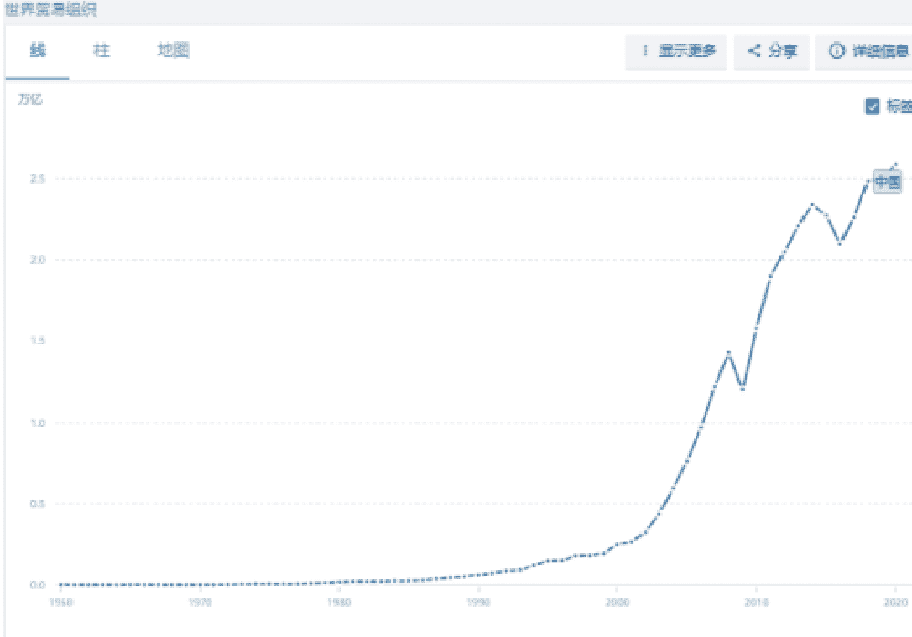

中国一直以来的工业梦，几年内就取得了巨大进展。下图就可以看出来，1990年之前的工业产值是很低的，关键是增速也非常低，1990年之后才有了一定的增长，2000年之后出现了爆发。

## 工业增加值（2010年不变价美元） - China

世界银行国民经济核算数据，以及经济合作与发展组织 国民经济核算数据文件。

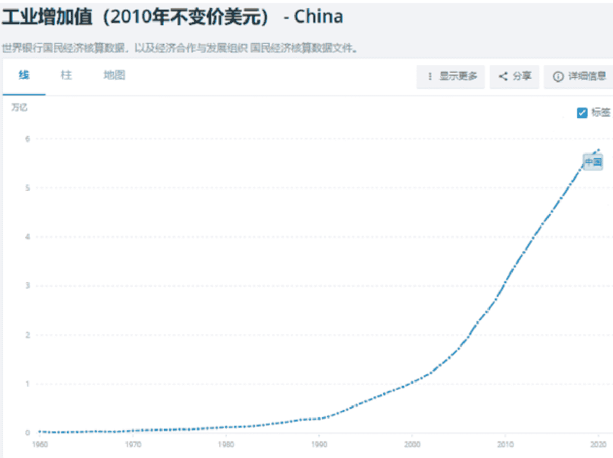

这种模式有两个意想不到的结果。

在改革开放之前，中国搞了那么多年重工业，虽然形成了一套比较完整的体系，但是发展的速度并不算快，工业产值增长也很有限。原因在于，重工业需要大量的资金，以前主要靠财政来支持，财政上入不敷出，但重工业的投入也始终有缺口，具体可以看看温铁军的八次危机，把这事说清楚了。

等到沿海加工业兴起以后，无数的工厂需要大量的能源和化工材料，于是他们愿意出钱购买，我国的重工业就这样有了资金，从此重工业和轻工业开始了自己的循环，不再需要财政支持，重工业企业从德国和日本买了最新设备后就开始了大发展。

比较著名的案例是山东魏桥集团，他们就是个典型的中国企业进化史，以前干纺织的，后来向上游发展，开始发电，2001年进军铝业，这就是妥妥重工业了，现在竟然发展成全国铝业巨头。

中国经济经历了四十多年的长期增长，但苏联却在1991年走向了解体。在中美俄大三角中，美国最主要的经济对手，从莫斯科变成了中国。

美国是一个超级霸权，对于挑战它的经济力量，始终是很警惕的。无论是处于对立阵营的苏联，还是自己的盟友德国日本，只要谁挑战它世界龙头的地位，它就一定会遏制对方。八十年代日本经济起飞的时候，美国就费尽周折，又是让日元升值，大力扶持韩国，把日本的一部分高科技业务掐死后转往韩国台湾，终于控制住了日本。

而对于现在的美国而言，对中国的担忧较三四十年的日本更甚，除了道路选择的分野之外，还有一个很重要的原因，美国自身的经济结构已经很大程度上空心化了。

美国是取代大英帝国成为世界霸权的。在英帝国霸权时代的末期，制造业已经全面转到了美国和德国，以至于世界大战开打后，英国的射向德军阵地的炮弹需要用自己在海外的优质公司来换。

美国担心大英帝国的命运，在自己身上重演。

过去20年来中国的大发展，让中美之间差距不断拉近，但也导致中美之间的关系慢慢从亲密走向晦暗不明。以前中美之间有种默契，中国生产低端工业品，美国研发高端技术，但是短短十来年，这种默契就开始动摇，谁都能看出来，中国已经不甘心在低端领域呆着。

在他们眼里，美国是罗马，中国成了迦太基，地球村容不下两个超级霸权，正如地中海容不下两个强权，罗马元老院的老加图每次演讲完毕，都要振臂高呼一句“迦太基必须被毁灭”。

但在我看来，如果硬要对比罗马和迦太基，中国更像罗马，而美国更像迦太基。

罗马和中国一样，是典型的陆权国家；
而美国和迦太基一样，是海权国家；
罗马和中国一样，有强烈的集体主义观念；
而美国和迦太基一样，更强调的是“利益的结合”。

更重要的是：
罗马的凝聚力更强；
而迦太基内部的首脑，却会遭到各方的掣肘。

战神汉尼拔在罗马打出了至今仍然列入各国军校的著名战例“坎尼会战”，但最终改变不了迦太基内部各自为战的毛病。罗马用全力跟迦太基打，迦太基却一直在内讧，所以战线本来在罗马城下，后来跑到迦太基城下去了，最终迦太基城被夷为平地。

前文讲过一个问题，美国和迦太基一样，没啥共识，领袖缺乏权威，政策就容易被利益集团绑架。

比如早在克林顿时代，克林顿就意识到一个问题，他觉得长期和俄国保持好关系对美国的未来霸权地位至关重要，小布什上台之后也是这么认为的，但是他俩这么认为没啥用，美国的官僚集团不这么认为，他们兢兢业业把美俄关系给搞黄了。

尽管普京也是个激进的“亲西方派”，他的导师就是俄国最激进的民主人物索布恰克，他上台之后前期最重要的事就是彻底倒向西方，并且曾经三次申请加入北约，但是西方完全不接纳他。

从现在的情况来看，如果当时接纳了俄国，俄国又非常愿意跟着欧洲混，那美俄对付中国，结果几乎没啥悬念。

不过好在美国就跟迦太基一样，统帅说了不算。几乎每个总统上台后都想拉拢俄国，包括奥巴马和特朗普，但都很快就被搅黄了。总统在跟俄国勾勾搭搭，下边的人却在搞北约东扩，直到俄熊彻底被激怒踢翻了桌子。

这种事在咱们大部分人眼里很难想象，但是美国那边就是这么做的，最终反而巩固了中俄之间的关系。像极了当初汉尼拔在坎尼会战团灭罗马精锐，可迦太基国内却因为内部矛盾坚决不派援军，最终眼瞅罗马军团开到了自己城下。

从这个意义上讲，当初中美建交中基辛格的表现真是神来之笔，本来美国官僚集团会一直胡搅蛮缠下去。但是基辛格巧妙绕过了美国国务院的文官集团，找了个借口自己偷摸跑中国来谈，经常说“秘密访华”，对谁保密？其实正是防他们自己人。

最终中美联合，苏联的完蛋也就板上钉钉了。从那以后，美国几乎再没打出这么漂亮的牌。所以虽然在经济上，中国对美国挑战更大，但美国在政治上还是把俄罗斯当主要的遏制目标。

别看我们前面的曲线，中国冲得那么猛，其实美国真正开始在经济上通过各种手段遏制中国，已经是最近几年的事了。

更有意思的是，实际上在中国发展起来的过程里，大量利用了美国的资本和资本市场。

从最近三百年的情况来看，世界经济的发展整体呈现出两个趋势：

### 1. 技术研发越来越费钱。

瓦特时代几个作坊老板就可以资助划时代发明，到了爱迪生时代就需要富可敌国的财阀，到了二战时期，重要研发需要国家财政支持，外加无数大小公司一起支持。到了上世纪70年代以后，重要技术往往需要军方、大学、超级公司、风投资本甚至多个国家的合力才能搞定。

### 2. 技术进步和资本增值这两件事基本成了一件事。

以前的资本更多的是从战争中牟利，后来路越走越窄，因为战争越来越少，毁灭性却越来越大，各国主要用自己的财政打仗，不再像以前一样国王找资本家借钱打仗，资本没法通过以前“借高利贷给国王”这种模式寻求增值。资本只好开始和技术绑定，每次技术进步，甩开同时代其他产品一大截的时候，就是资本暴利的时候。战争资本变成了产业资本，再后来又变成了风投资本。

在中国，很多人一听到“资本”两个字，就感觉这是资本家要榨取剩余价值。但其实，现在的股权投资、风险投资最大的资本来源，已经不是传统意义上的“资本家”了，而是“养老金资本主义”。

在美国这样的国家，市场上最大的资本力量，主要是老百姓把自己储蓄的一部分拿去投资升值的“公募基金”。还有的政府力量更强的国家，为了给大家养老，把养老金放进了资本市场投资科技，避免等大家老了想用的时候已经被通货膨胀洗劫得不像样了，新加坡淡马锡、沙特主权基金、挪威主权基金，这些都是比较成功的。我们中国也有保险基金和主权基金，做这样的业务。

其实中国很长一段时间，资本都非常稀缺，外汇也很短缺。中国在八九十年代曾经找国际货币基金组织（IMF）分两次贷款8亿美元，中央政府都费了老大劲。

现在为什么中国顶级的互联网公司，很多都是在美国上市的？因为早年，很多投资它们的都是美元资金，自然也就会选择在美国上市。虽然说美国和中国是战略对手，但由于资本是逐利的，它们并不会管那么多，它们看好中国经济、看好中国企业，它们在客观上反而帮助了中国企业的发展。

2014年，阿里巴巴在美国上市，创下了当年全球最大IPO的纪录。此后中概股在美国上市的越来越多。实际上，这反而进一步强化了中国和美国的利益关联。现在，全世界都在争夺面向下一轮科技升级的资本，资本投中概股多一些，投别的标的就会少一些。所以为什么不管中美之间有多少竞争和冲突，高层还是会非常理性地说，中美关系已经大到不能倒。金融委会议要专门讲，稳定中概股的监管预期，继续支持中国企业在境外上市。

今天中国虽然已经是世界第二大经济体了，但是我们富起来的时间还不长。全世界最多的资本存量还是在海外，它们不仅有美国的资本，还有中东的资本，还有石油富国的资本。

前段时间中概股的踩踏，实际上是因为大家放大了在中美竞争之下脱钩的预期。但其实，理性地来看，资本市场的参与者还是会对公司的基本面有认识的。中国还没有和西方走到像俄罗斯这样全面冲突的地步，我们没必要自己就先用很极端的情况来吓自己。

中概股的问题只是一个方面，中美竞争还出现在更多的领域。但是有一点是很清楚的，我国接下来对待美国的攻势，最好的办法并不是顺着他们的意思来，反而是他们不希望我们干啥，我们坚决要干啥。

他们希望把我们踢出WTO的贸易体系，我们不但不出去，这些年反而和其中的成员国都签订了双边贸易协定，也就是以前大家在一个群里做买卖，美国不希望我们呆在群里，我们不但要在里边呆着，而且把里边的人都加为好友，私下里还聊得火热。

尽管很多人有种把我国封闭起来的冲动，觉得那样才充满安全感，可问题是你的工作只要稍微有一点点技术含量，你只知道如果中国哪天真的封锁起来，很快就不成样了。前文也讲过，低端领域我们既需要国外的原料，又需要国外的车床工艺，而且我国17%的GDP是出口拉动的，没了外部市场，可能会有接近两亿人下岗。

在中高端领域，我国急需别人的技术和知识。任何一个复杂点的产品，比如车或者手机，都依赖几十个国家的无数上下游公司，而这些都依赖世界市场，单个国家根本没法玩，除非你是个加油站，压根就没准备攀技术。

所以唯一的出路只能是更加开放、更加拥抱世界，主动去融入，和每个国家都保持深入互利的关系，让他们想剔除都剔除不了。

> 2019年黄奇帆有个演讲《新时代国际贸易新格局、新趋势、新规则》，讲得非常有启发，他认为：
- 以更宽的领域扩大外资投资的准入；
- 更大规模、更有力度地保护知识产权；
- 更大规模地增加商品和服务的进口；
- 逐渐走向零关税、零壁垒和零补助，就跟大英帝国巅峰时期一样。

说白了，更加深度地和西方绑定在一起，他们在跟我们的合作中获得巨大利益，就没法随意解绑。融入世界市场对我们的好处是绝对性的，我们一直说人民币国际化，但是你不买别人的东西，别人手里没你的钱，根本没法国际化。那他只好继续用美元跟你交易，你俩做买卖，美元收好处。

而且有买有卖，才能把大家更好地绑定在一起，当你不但给他们供应工业品，还是他们的大买主，谁能把你踢出去？

从更宽广的视角来看，我们也要看看美国经济发展起来的经验。

其实，美国政府在美国漫长的崛起过程中存在感并不强，美国的崛起本质，是自下而上的市场的胜利，一直任由下边的人折腾。美国政府直到第二次世界大战前才变得特别大，在那之前大家很难想起来什么牛逼总统，因为他们除了扩张领土打了几仗，其他事基本没干，也就林肯不小心搞出来了一场内战，不然他也没啥名声。美国一直以来的英雄，都是工业巨头、产业巨头，是卡内基、是摩根、比尔盖茨还有乔布斯，现在的马斯克等等，早期的金融巨头说话比总统都好使。

包括现在美国牛逼轰轰的科技实力，也是大学、资本市场、产业界来主导，政府做的事非常少。

中国是后发国家，当然不能像美国这样搞自由放任的经济。党的领导使得政策有了持久性和一致性，化解了内部矛盾，避免了左右互搏，而且能够集中全社会的资源，做到“以经济建设为中心”，这是中国很重要的竞争力来源。

但是，在党的领导下，还是要搞市场经济。我们对市场经济的认识也有个逐渐深化的过程，从市场在资源配置中起基础性作用，再到市场在资源配置中起决定性作用，我们越来越重视市场。

为什么呢？首先，市场经济它有一整套完整的机制，可以让我们把全世界的资源都吸引过来。中国这个市场太大了，中国十几亿人的需求，对全世界的“资本”来说，都是个巨大的诱惑。即使今天在中美竞争的背景下，“资本”也不会那么盲目地选边站队。

第二，市场经济能够形成一套非常完整的产业生态。所有的技术创新，其实都是需要有应用场景的，没有一个足够大的市场，没有足够多的应用场景，你搞技术创新，就算把产品做出来了，你的销售收入都覆盖不了研发的成本。

其实现在中国有很多技术，都达到了世界上比较先进的水平，都和中国是世界大国有关。比如高铁，因为中国人口密度高，建设需求大，其实整个技术实力很快就提升了。华为在5G通信能够技术领先，其实也依托中国这个市场，这么大的市场同步来推这件事，它来做研发就能很清晰地看到回报，小国的企业就很难有这个效率。

这几年很多人批评中国互联网，说中国互联网企业没有硬核的技术。其实也不是，阿里云现在在计算、存储、安全等多项核心性能上，已经能在权威第三方机构Gartner的排名里排到世界第一，其实也是一个道理，因为阿里云要服务中国商业的生态，要服务中国各种不同需求的企业，所以它必须通过研发来实现技术的突破。

这几年大家都很担心芯片卡脖子的问题。道理也是一样的，中国市场的进口替代需求太大了，做芯片研发，做相关生态的前景摆在这里，而且一定会有越来越多的力量去参与。

回顾过去几十年的中国经济，我们还是要看到一个基本常识：自下而上的市场经济是财富之源，我国在短短十几年内就进化出了极其繁杂的全产业链，这并不是哪个大师计划的结果。恰好相反，1978年以后，我们就是靠市场经济，让经济爆发出巨大的生命力。我们过去能做到的事，将来应该做得更好。

最后，简单总结一下，我们其实就是要做好三件事：第一，想方设法和全世界抱得更紧，千万不要主动去“脱钩”；第二，坚持市场经济，这是让中国超大规模市场优势转化成技术优势和竞争力的最好途径；第三，大力发展这个时代的前沿技术，而且要让更多企业的都积极参与进来，不要分国企民企，科技攻关人人有份。

相信，虽然面临很多挑战，今后的日子里，我们的国家和企业一定是有希望的。

公众号懒人搜索，懒人专属群分享

### 台湾曾经差点拥有核弹

2022-03-23

这篇也是写了好长时间，准备给大家讲讲台湾怎么从蒋家王朝的“戒严时代”过渡到现在的那个造型，本文标题是台湾差点拥有核弹的事，不过力主把整个蒋经国后期都讲讲，看完了大家会对现在的台湾局势也有点理解。

蒋经国去世到今年，已经34年了，以他死的那一天为界，整个台湾的局势几乎划了一条线，前后基本是两个时代。

从那时候起，有统一意愿的台湾人，从1990年的45%，暴跌到了如今的15%左右，这也意味着未来想和平解决非常非常难了。

风起青萍之末，其实一切从蒋经国晚年，也就是上世纪80年代开始，就已经有了征兆。

### 1. 蒋经国的16年

蒋经国是蒋介石的长子，在大家的印象中，继承老爹的权力，是顺理成章的。

但是蒋家父子接班，和古代王朝是很不同的。蒋介石在大陆时，并没有获得绝对权威，各地军阀和国民党内大佬，一直和蒋介石私下里较劲。蒋介石最高光时刻，也只是能依靠黄埔军官、西方资金支持、江浙财阀，勉强压服各方势力。

即使这样，随时都会被人摆一道。比如三大战役的关键时刻，辽沈卫立煌不听他的撤到关内；平津傅作义不愿意从海路撤到南方；淮海白崇禧按兵不动看着优势的80万国军被60万共军打爆，这些事直接促成了国军所有精锐在一年内全部被歼灭。

军头抗命这种事在我军当中简直没法想象，但是在国府却一再发生。不出意外，最后只能蜗居小岛。

在大陆这个阶段的蒋介石不存在让儿子接班的可能性。

到了台湾以后，国府大佬都成了败军之将，一个个被兴师问罪，最后都缩起脖子躲起来力求安度晚年，这样各方势力基本都没了，蒋介石才有机会让蒋经国接班。

其中还多亏党内声望最高的陈诚命短，67岁就死了，蒋介石再接再厉，活到88岁，把党内其他大佬给耗得都差不多了，蒋经国接班才真的成为了现实，可见活得长是多么的重要。

不过即使如此，过程也很漫长，小蒋先去政治部和特务部门历练，然后在那里培养自己的嫡系，等蒋经国做到台湾行政院长，才算是正式坐稳了接班人的位置。这时已经是1972年了，虽说叫小蒋，其实已经62岁，按理说马上就要领退休工资和大家一起去广场晒太阳了。

到这时，很多事情蒋经国依然不能最后拍板，毕竟爹还没死，大事必须要请示老爹，拿到老蒋的同意才能做。这不只是老蒋权力欲望太强，也因为蒋经国无法服众，各方势力根上还是只认蒋介石。

比如台湾70年代，当时西方因为能源危机出现萧条。台湾本以代工出口为主业，因为需求降低眼看经济就要崩盘。

蒋经国孤注一掷，花巨资启动著名的“十大建设”，也就是我们熟悉的“投资基建拉动经济”，几乎把台湾家底掏空，还在国际上从各路金主那里借了几十亿美元。

但是蒋介石不同意，不愿意冒险，蒋经国天天跟在老爹后面做“思想工作”，整整磨了三个月，才把85岁的蒋介石说服，老蒋点头后，台湾各方才齐心协力干起来。

十大建设，最大的作用有两个：一是通过官方印钞，把台湾即将崩溃的经济勉强稳住，撑了十年。二是通过基建改造了台湾的整个面貌，快速实现了工业化。等西方经济走出低谷，台湾正好赶上了一波大发展。后来又抓住半导体的世纪机遇，以至于台湾现在只有两个产业，半导体和其他。

直到今天，台湾的经济发展，基本还在吃蒋经国的老本。台湾在他手里16年，发生了巨大的变化。

因此，蒋经国彻底坐稳了蒋介石留给自己的位置。这时他已经70岁了，他成为了当时台湾的统治者，比起依靠“戒严”“训政”“戡乱”这些手段控制台湾的蒋介石，蒋经国在上世纪80年代初，通过发展经济有着更稳固的权威。

这时候，身体不好的蒋经国，也要考虑自己身后名和身后事了。

### 2. 接班人的困局

作为通过继承获得权力的领导人，如何把权力再平稳传递下去，可以说是第一等大事。

蒋经国也是如此，首选的就是自己儿子接班。为了培养接班人，耗费了无数心血，但是结果非常可悲。

蒋经国的夫人是苏联人。当年蒋经国去苏联留学，因为蒋介石1927年屠杀共产党，他差点被斯大林枪毙。虽然没死，但是被下放劳动。做过搬运工和矿工，后来在乌拉尔机械厂上班。在那里认识了因为有俄罗斯贵族血统、被发配来做工人的17岁女工瓦哈瑞娃，两人结婚过了一辈子。

婚后的夫人起了个中文名叫蒋方良，二人生了三个儿子一个女儿。

所谓“立嫡立长”，最先被看中的，自然是大儿子蒋孝文。他年龄比老二大了足足十岁，又因为混血，长得很不错。蒋经国和妻子在1937年回国时，两岁的蒋孝文一眼就被蒋介石相中。

到了台湾，已经长大的蒋孝文，被父亲和祖父更是寄予厚望。可惜希望越大失望越大，蒋孝文的废物程度，在奇葩云集的国府“党二代”群体里面，都算是数一数二的。

作为父亲的蒋经国，在教育蒋孝文上花了很大精力。自从蒋孝文显出不成器的苗头后，蒋经国经常又打又罚。但是蒋介石一来隔代亲护着，二来认为人年轻时候荒唐些不算什么，毕竟蒋介石自己当年比蒋孝文严重多了，吃喝嫖赌样样精通。

蒋孝文仗着爷爷，根本不把老爸放在眼里。

等到蒋孝文混到十几岁，已经跑到了台湾的蒋介石，也觉得这大孙子怕是真的要废了，才允许把他送到军校去锻炼，在军校也没人敢管，很快变得更加无法无天。后来送到美国，这下天高皇帝远，先是赌钱输了个精光，然后因为喝酒飙车被抓，在法庭还发少爷脾气闹事。好容易通过各种门路把事情摆平，他已经早被学校开除了。

这就干脆四处转转，免不了又惹事，最后留了不少的案底。被美国移民局直接给赶回了台湾。回了台湾以后，蒋孝文已经快30岁了，依然还是那副流氓样。蒋经国也看出他不是材料，就找了个闲差事，干脆随他去了。

不想在1970年10月，蒋孝文又一次喝酒喝到不省人事。身边人以为他就是喝多了，却不知道蒋家有遗传糖尿病，蒋孝文要按时服药，这次其实是低血糖造成昏迷了。

等到蒋孝文被送到医院，时间过得太久，大脑缺氧造成了永久损伤，成了脑瘫，字面意义的脑瘫。智力在多年治疗下，也只恢复到十岁孩子的程度，语言能力基本没了。

好处是没法当流氓了，毛病是其他事也做不了，蒋孝文卧床了19年，等1988年蒋经国去世，第二年不过54岁的蒋孝文就去世了。

虽然似乎年纪不大，但是他居然是三兄弟里面最长寿的。不过当年的蒋介石和蒋经国不知道，只是觉得天无绝人之路，老大不行老二上吧，就不信三个娃能全废了。

好在蒋孝文的废物本色展现得比较早，老蒋小蒋父子放弃的比较干脆，把希望寄托在了老二蒋孝武身上。

比起大哥蒋孝文，老二没有得到爷爷蒋介石那么大的溺爱。虽然成绩很差又调皮捣蛋四处惹祸，但是到底没有做过特别离谱的事情。随着后来年纪渐渐大了，又看到大哥做流氓变成了脑瘫，蒋孝武做人做事也有了些规矩。

见蒋孝武似乎有点成才的迹象，蒋经国很是高兴，于是让蒋孝武进入政界历练。先是在不重要的文化部门任职，后来看他没有闯啥祸，蒋经国把非常重要的情报部门交到了蒋孝武手里。国民党情报部门，可以说是最要害的地方，蒋经国当年就是从这里开始了自己的接班之路。

没想到蒋孝武确实比他哥厉害，为了表现自己能做大事，玩了一把大的，也就是断了蒋家第三代接班计划的“江南案”。

江南案的过程很简单，1984年，居住在美国的台湾作家刘宜良（笔名江南）因为要出书曝光蒋家“劲爆秘史”，在旧金山自家车库遭暗杀。经美国联邦调查局的调查，查出凶手是中国台湾竹联帮分子。

竹联帮杀手也比较机智，回台湾前为了防止一回去就被台湾情报部门做掉，在回去之前在竹联帮成员张安乐家里放了一盘磁带，说好将来自己要是出事，就公开里边的内容，里边的内容讲的就是他们杀江南是受台湾情报局的指使。后来果然回到台湾后被逮捕，张安乐公开了磁带，被美国认定是台湾上层指示的政治暗杀。

而蒋孝武被认定是台湾情报部门的总瓢把子，所以他就是暗杀元凶。为了平息事态，蒋经国只能在1986年让蒋孝武前往新加坡，职务也全部被免除。多说一句，现在这个张安乐混得很好，先在大陆经商发了大财，后来在台湾搞了个促统党，他自己当主席。

这次打击如此之大，几年后的1991年，蒋孝武就因为急性心脏衰竭，抢救无效而猝逝，年仅46岁。

热门接班人选也崩了。

还有一个老三，比起坑爹界“卧龙凤雏”的两个哥哥，老三确实算是很靠谱了。也比较会来事，为人低调，作为小儿子很受老爹蒋经国器重。

蒋孝勇成绩很不错，蒋介石于是让他去军校，希望蒋家第三代能有个掌握军权的。说到底，蒋介石崛起，最大倚靠，还是靠的当年在黄埔建立起来的部队。

然而，事件最后的发展却是大大出乎意料。正当蒋孝勇热火朝天地进行军事训练时，在一次夜间军训中，蒋孝勇因为冒险翻越一条沟壑，不慎扭伤了脚。伤得非常严重，成了个瘸子，形象崩了，而且无法在军校继续就读，只能改到台大读政治。

蒋孝勇毕业之后，先在有政府背景的企业里工作了几年。1980年，32岁的他就成为国民党中央委员，然后在台湾的中央玻璃公司做董事长，算是从政府企业入手进入政界。

可是他二哥做的大事，让蒋孝勇颇受打击，从此专心做生意，不再过问太多政治。没几年蒋经国去世，蒋孝勇第二年就全家移民加拿大，远离是非之地。

但是不久之后，蒋孝勇1995年查出患了癌症，第二年就去世。只有49岁。

蒋经国的第三代接班计划，失败得稀碎。

讲到这里，结合后来蒋经国全身是病的毛病，大概可以推断蒋家基因里有体弱多病的基因，俄罗斯X染色体的加入都没能改善。好在蒋介石到了中年戒掉了吃喝嫖赌，常年坚持锻炼，只喝开水，早睡早起，信佛信耶稣，各种叠buff，才活到88，希望大家也能向老蒋学习，培养正确生活理念。

### 进退失据

看起来似乎蒋家第三代接班失败，是人的问题，其实并不是。关键是时代变了，局势变了，现代化是一扇门，除非你不要打开这道门，否则一旦打开，文明一开，“父死子继”这种封建模式就不大能玩得转，蒋经国安排儿子接班这事，反对的人太多，支持的却几乎没有。

台湾政局当时也非常复杂敏感。老蒋小蒋到台湾统治已经快40年，一直都是高压独裁统治，光是那个运行了38年的“戒严令”，就是个全世界少有的奇葩。

首先是台湾岛内，在上世纪80年代开始，各种矛盾出现爆发。因为1945年台湾光复，1949国民党败退大陆。本地人和外来者（所谓“本省人”和“外省人”）之间地位有很大不同，几十年来外省人仗着有枪歧视欺压本省人。

不但政府重要的职务几乎全部为外省人把持，经济上本省人除了少量和国民党有关系者，所有好处基本被国民党来台人员包揽。

但是时间无情，第一代来台者很快老去，本省人在人口上的巨大优势渐渐显示威力。至少在军队警察等需要大量青壮年的地方，外省人数量不足，慢慢的各个部门都是本省人占据了主力，这时候再不给人家高级职位就说不过去了。

国民党来台的第二代，更是大多像蒋经国三个儿子那样不成器，蒋经国自己都说以前理解不了八旗子弟入关几十年就变得堕落不堪，还以为是瞎说，现在一看算是彻底悟了。

所以就得提拔一部分本省人，既为了拉拢台湾本省人，也为了提拔骨干搞经济，毕竟国军二代太废了。

李登辉就是这个时候被蒋经国看上，李登辉祖上福建客家人，后来他们家搬到台湾，家境不错，成了日本殖民者在台湾的拉拢对象。日本殖民台湾的逻辑非常简单，枪毙当地不服的，把精英送去日本培养。

李登辉很早就选派到东京帝国大学深造，他哥曾经跟着日军参加东南亚战役，战死在了菲律宾，这种背景下，他成了一个彻彻底底的精神日本人。大学毕业后作为农学专家参与台湾建设。

不过蒋经国不仅仅看上了他在农学方面的经验，主要看上了他在政治领域没啥根基，对自己没威胁，所以把他火箭提拔，一路提拔到了自己的“副总统”。

所以很多人理解不了，民族主义者蒋经国为啥看上了李登辉这个“精日”，其实蒋经国这个时候暗藏私心，他根本没想让李登辉上，他把李登辉提拔那么高，主要是以为李登辉是个工程师性质的官僚，又没有根基，对自己没有威胁，立储的事将来再说，只是蒋经国低估了自己的去世速度。

自从1970年代之后，国际形势变化也很大，为了搞死苏联，美国政策大转弯，要和中国搞好关系，尼克松访问中国大陆，台湾的作用越来越小。先是被大陆拿回了联合国席位，然后美国的各种战略武器开始撤走。

那时台湾人，自称为“亚细亚的孤儿”。生存空间越来越小，没地位，只靠经济发展，蒋家想传第三代实在是不够本钱。而且台湾弹丸之地，经济得以发展，靠的还是美国的产业输出，依赖美国给的市场。

所以，最主要的，还是美国的态度。

美国是蒋家在台湾几十年统治最大的基石。如果离了美国，台湾1950年就解放了。

自从朝鲜战争之后，美国就从没有打算全力阻止中国大陆武力统一，反而一直在研究如何从中获得最大利益，争取把台湾卖个好价钱，数十年一贯如此。

在美国看来，台湾最主要的作用，1972年之前是遏制大陆的堡垒。等到中美建交之后，台湾是中国大陆谈判的筹码。在21世纪的今天，中美关系紧张，台湾又成了美国手里的一张牌。通过台湾问题，不论是和中国大陆对抗还是合作，都可以获得更多的利益。

如果合作，美国就挤压台湾，不用自己出一毛钱，向大陆示好。很多时候还可以从台湾挤出一点油水给自己。

如果对抗，美国就给台湾松绑，比如天价卖武器，卖劣质农产品。甚至鼓动日本和台湾加深关系，又能挣钱又能恶心大陆。

只是对于台湾蒋家，美国越来越不能忍。本来台湾是不是封建社会，美国没有那么在意。中东的那些王国，拉美那些乱七八糟军政府，美国都能容忍。

只是蒋氏父子对美国一直阳奉阴违，而且美国看出来了，台湾跟其他地方不一样，人口教育程度很高，产业很先进，属于现代化，如果继续玩父死子继的封建制，可能台湾人就要失控了，所以美国必须断绝蒋家第三代继承权。

### 蒋经国的核武梦

1988年1月13日，一个叫张宪义的人拿着一堆文件，来到了美国。

这人的官方身份，是台湾核能研究所副所长，名义上负责台湾核电利用的工作，实际上他的主要工作，是研究核武器。

张宪义的文件只说了一件事：台湾长期秘密研究核武器，并且已经获得了可以制造多枚原子弹的材料，一两年内就可以完成并正式核爆试验了。而且，台当局准备在射程为1000公里的“天弓”导弹上安装核弹头，美帝震怒。

这件事对蒋经国的打击很大，没有多久就去世，病情发展快到连正式遗嘱都没有留下。

有人说他是被张宪义气死的，其实这话也不全对，蒋经国的身体在还没有接班时就不太好，到了1980年代已经很差了。因为家族遗传他很早患上糖尿病，到晚年即便是高剂量注射也难以控制血糖。严重糖尿病造成了各种新问题：双腿发生神经性病变坐上轮椅；导致了冠心病只好装上起搏器；因为视网膜病变导致视力严重衰退，基本就是堪称各种病的百科全书。

这次叛逃把老蒋小蒋父子，20多年苦心经营的核武梦，一下打破。对蒋经国打击非常大，核武器一直是蒋家父子的一个梦想，投入无数精力，眼看有点眉目，却是一场空。

1964年10月，大陆成功试爆了第一颗原子弹，退守台湾的蒋介石坐立不安。他决定自行研发核武器。结果美国不给予任何帮助，使得蒋介石只好另外想法子。

花了几年时间，打着和平利用核能的招牌，台湾在以色列、加拿大、法国学习技术，并从南非偷偷运输铀到台湾。以核反应堆电站做幌子，开始了自己的核武器研究。建起了核材料的处理设施，也就是铀浓缩设备。

不过美国很快就查到了证据，于是1973年开始向台湾施压，并从贸易、技术、设备各个方面破坏台湾的研究。到了1976年，台湾被迫拆除了核材料的处理设施，至此台湾首次研制核武器的计划被迫中止。

核武梦是蒋介石众多没破碎的梦之一，临死，还在叮嘱蒋经国要继续核武器研发。死后还有个梦，他希望葬回大陆孙中山的中山陵旁边去，所以蒋介石到现在也没下葬，等着将来有机会再说。

至于为何要获得核武器，首先是自保，特别是美国1970年代之后，把台湾作为筹码的做派非常明显。台湾要想不被彻底卖了，拥有核武似乎是条道路。

然后是最主要的自主权，台湾是没有自主权的，大事要看美国脸色。对于两蒋这样的政治强人，这一点非常难以接受，对自己在台湾和国民党内的威望也是很大损害。

蒋经国对老爹的遗愿很赞同，第一次研发失败，被蒋经国认定为做事不周密。于是开始第二次秘密研发，蒋经国在保密上做了非常大的努力，同时在资金上给予非常大的支持。

当时台湾经济和工业发展上了个台阶，这次的研发速度更快。到1987年，国际原子能机构估计，不到一年的时间，台湾就能够制造出原子弹。

然后就发生了张宪义去美国报告的事件。

不过按照台湾人的说法，整个台湾各种部门里，不是有多少人和美国有关系，而是有没有人和美国没关系，越靠近核弹研发成功，被举报的风险也就越大。

所以蒋经国在晚年，因为发展核武的动作，还有培养儿子接班的行为，加上当时台湾内部局势。美国在权衡之后，认定继续支持蒋家已经不合算了。于是逼迫蒋经国放弃继承权力，同时放弃核武器研究计划。

### 突然去世

可美国人还没来得及发关于核武研究的声明，蒋经国就去世了。死得太快，以至于根本没来得及指定继承人就断气了，于是李登辉这个本来没啥实权的“副总统”顺利就位，李登辉上位后第一件事就是迎接美帝的怒火。

当时美国在台湾的办事机构叫“美国在台协会”，其实就是大使馆待遇，而且一直做着台湾的太上皇，这个协会的主席送来协议书叫赶快签字。协议毫无谈判余地，要求台湾彻底拆除与发展核武有关的设施。协议书交到了继任者李登辉手里。这时就算蒋经国活着，也只能捏着鼻子签了。

不到两天，国际原子能机构和美国专家一起到来，强行拆除反应堆，下令停运往台湾的所有重水，清点核燃料棒数量并全部装船运走。同时要求台湾核武研究部门全部解散。

至此，台湾的核武研发彻底停止，后来虽然又有过尝试，但是时过境迁，已经完全没有可能了。但是蒋经国死后的影响才刚刚开始。

政治上，李登辉成了最大的获益者。

这事对未来影响很坏，一个精神日本人成了台湾话事人，李登辉在位的那些年，几乎啥都不干，尽推动台湾的“去中国化”。

唯一的好处是从此台湾告别了两蒋威权统治，不再有一个完全掌握大权的“领袖”。两蒋用以控制权力的情报系统，被分割成了七八个不同部门。整个台湾的权力被上层按照实力大小瓜分了，不管是外省人还是本省人，只要有门路都有份。

于是上世纪90年代，眼看着台湾政坛上就翻天了，各路“牛鬼蛇神”都冒出来了。最有名的就是台湾黑道，穿一身黑西服上街拜票选立法委员，台湾议会打架成了家常便饭。有的打架没法解决问题，干脆通过打黑枪解决。这给那时的电影电视提供了无数素材，也给后来阿扁低级的表演提供了启发。

台湾人唯一欣慰的，是蒋经国当年为台湾选了一个半导体电子产业，踩到了时代的风口迎来的爆炸性大发展，当然了，这也和美国刻意扶持台湾省和韩国一起对抗日本有关。

还早早允许台湾人去大陆经商，当时中国大陆台商遍地走，随着大陆的快速发展，高额的利润也让台湾搭上了大陆崛起的快车，这也是为啥咱们统计出来的台湾GDP跟他们自己的不一样，他们自己的GDP把台商在大陆的也算进去了。

### 尾声

蒋经国跟他爹完全不一样，我前文讲过，老蒋这人一直比较迷糊，年轻时候喜欢曾国藩，后来又喜欢王阳明，还跟着他妈信佛，再后来娶了基督徒宋美龄，一开始装信教，后来一点点变得深信不疑，而且彻底地变成了一个保守型的人物，也就是只想维持现状，对推动变革兴趣很弱。

蒋经国跟他爹不一样，他在苏联的经历给了他深刻的烙印，他见识过苏联的2.5个五年计划，心里一直有种“人定胜天”的冲劲，这一点跟他爹完全不一样，也正是因为这股冲劲，台湾到现在的公路都是他那时候带着老兵们修出来的，现在的台湾想拓宽下道路都操作不了，没出息程度可想而知。

台湾人恨透了蒋家在台湾的搞世袭搞威权统治，但是也很怀念蒋经国时代的生机勃勃和蒸蒸日上，这也是为啥后来马英九能选上，他最大的政治资本就是追随过蒋经国。

当然了，大家也应该注意到，蒋氏父子的本质都是俩封建皇帝，都想方设法把权力传给自家人，这在封建社会没啥问题。

但是现代社会里非常难，因为你家霸着权力不放手，其他人就没法翻身，又没有法理支持，所以很容易遭到挑战。就算没有美国，大概率也搞不定，蒋经国的晚年应该是看懂了这一点，知道在美国和台湾舆情压力下，大概率只有一条出路，所以死前干脆开放了党禁报禁，既然不可避免，干嘛不顺势而为呢。

至于搞核弹的事，那真是犯了所有国家的忌讳，不仅仅是美国的，可能引发亚洲的一波军备竞赛，被掐死是自然而然的事。

文末，祝愿祖国早日完成统一吧。

公众号懒人搜索，懒人专属群分享

### 为啥美元加息会带崩很多国家？我国呢？

2022-03-18

不知道大家听说过一个段子没，说是一个美国人，在2014年拿着100万美元到了中国，拿出50万美元买套房子，剩下50万吃喝玩乐，等到2017年玩得差不多了，于是把房子卖掉，房价已经翻倍，带着100万美元离开中国，白吃白喝了三年。

不知道这个段子是不是真的，不过现实中这种操作却很常见。事实上美国人也没少这么干，只是他们的目的不是为了吃喝玩乐。

那什么情况下会发生这事呢？

对，一般美国降息加息过程中就会发生这种事。

举个例子大家就知道了，美国降息周期的时候，去银行贷款特别容易，然后很多人就去银行贷款，把这些钱带到发展中国家投资，因为发展中国家机会多嘛，可以投资工厂，也可以投资房地产。

一波投资下去，建厂雇工人，就跟现在的越南似的，热火朝天，大家开始觉得，经济这么好，是不是应该投资点房地产？

房价开始猛涨，房价上涨会吸引更多的人去投机，从银行贷更多的款，房价进一步上涨。工厂一片热火朝天，房地产欣欣向荣。

过一些年，等涨到高峰的时候，美国突然说是要加息，那些投资出去的美元就得回美国去了，于是高位套现，可不就把当地给收割了？拿着100万美元到了某个发展中国家，可能带着150万离开，世界上可能没有比这更好的事了。

等到这个国家的房地产和其他资产跌到底，美元下一个扩张周期又开始了，又有人拿着美元来投资了。

那为啥会发生这种事呢？

主要是全世界都奇缺美元。过去，现在，将来很长一段时间。

本来这个世界上并不需要一种货币天天给大家添麻烦，因为人类最早的时候根本没有货币，以物易物嘛，你用山羊换我的棉布，贸易早于货币。

但是问题就出在，你需要我的棉布，但我不一定需要你的山羊，所以就得一个中间商品来解决需求不对称的问题，历史上贝壳、金子、银子、铜都承担过这个作用。

后来慢慢变成了荷兰盾，然后是英镑，现在是美元。

那可不可以不用美元呢？

当然可以，如果沙特正好需要我国100亿的工业品，我国正好需要100亿的沙特石油，那完全可以，可是世界上哪有这么正好的事，双方的需求能这么切合。比如这段时间俄罗斯遭到制裁，很多小伙伴说，今后俄罗斯只进口中国的产品，中国进口俄罗斯的石油不就行了？

问题就出在这里，俄罗斯每年需要大量的机械设备，车床、钻油和挖矿设备等等，这些设备主要是德国、荷兰还有美国才有，中国也是从他们那里进口，这也是为啥俄罗斯需要保持一定的外汇储备，不然等到钻油设备出了问题得不到维护，连油都挖不出来了。

有句话是这么说的：

货架上的商品中国的，工厂里的设备是德国的，实验室的器材是美国的。

说的是商品中国基本啥都能生产，但是工业车床和设备还得依赖德国，实验室里的高端设备主要是美国进口。俄罗斯接下来商品倒是问题不大，但是后两样比较麻烦。

专门查了下，中国现在可以生产90%的低端车床，中端60%，但是高端自给率不到10%，90%以上需要进口。

现在中国的问题是加工精度上太糙了，每个零件差一点，最后组合起来差了一代，很多高端设备国际上宁愿要二手日本货都不要便宜的中国货。所以俄罗斯在很长时间并不能真的摆脱全世界只依赖中国。

这个问题是几乎全世界共同的问题，不可能只依赖一个国家，那你就得有美元储备，而且多少钱也不嫌多。

前文讲改革开放的时候就讲过，我国当时非常非常穷，想生产点商品跟西方交换，就得更新生产设备，问题是设备我们自己又不会生产，就得从德国日本买，但是那些国家只收美元，我们只好贱卖国内石油和稀土换美元。

现在这种情况在中国有所缓解，毕竟我们有三万亿的外汇储备，但在全世界范围内的其他国家，并没有太大的改变。

甚至我国这样的大国，按理说不需要那么多美元了吧？事实上并不是，大家依旧缺美元，一堆企业都欠了一屁股美元债，甚至我国那堆破产边缘的房地产公司，他们也欠了一堆美元债，他们借钱的利息非常高，动不动8%。

套路跟我上文说的是一致的，每次美元放水，美国资本家拿到钱之后，在美国国内没啥投资机会，就跑去第三世界折腾，可以投资建厂，或者借给我国房地产公司套利。

就好像你从银行4%的利率拿到钱，7%再借给别人，收中间3%的利差。这种事看着离谱，其实很常见，做买卖的人都知道，因为你想贷款也不一定能贷到，只能是从二道贩子那里贷，人家就会收中介费。

大家注意到没，前段时间恒大有一笔美元债到期还不上，闹得满城风雨，后来还是工作组进驻才解决，恒大他们就是从国外机构借了美元。

借了美元在央行换成人民币，然后通过这些钱来买地，向上游企业买水泥盖房等等，上游卖了水泥钢筋赚了钱，给员工发了工资奖金，大家都高兴，说不定也去买套房。

就这样，热闹非凡，但是这种繁荣本质都是“债务驱动”，或者说“借钱投资”，债务到期后，如果可以借新还旧，就可以一直玩下去，整体烈火烹油欣欣向荣，工程项目越来越大，工人工资越来越高，债务也越来越多。

只要美国那边不加息缩表，美元多到随意就可以贷到，大家都在赚钱，何乐而不为。

但是这种好日子没法一直过下去，美国不可能一直这样玩，随着市场上美元越来越多，通货膨胀高企，迟早得加息，美国一加息缩表，就会找欠他钱的人要债，或者债务到期不续借了。

假如你是一个房地产公司老总，你们公司欠了美国人的债，人家到期要收回去，不续贷了，问题是现在你们公司不但没有钱，钱都在工程上，名义上身价几十亿，可事实上都是“账面资产”，你已经把那些钱拿去买地雇人了，着急还钱的时候根本拿不出来。

这时候你只有两个选择。

想尽办法到处找人筹钱，能借美元就借美元，借不到美元就借自己国家的货币，然后去银行换美元。

问题是此时此刻大家情况都差不多，都着急还钱，你找别人借，别人还准备找你借呢，你得花比平时多得多的本币才能买到美元，美元越来越贵，汇率不断上升。

如果凑不够，那就是另一条路，一个大家熟知的词，叫“暴雷”。

欠钱不还在资本主义世界是大事，会引发整个市场的恐慌，导致整体信用评级下跌，不止你们公司今后别想借，其他公司一起受影响。

俄罗斯在1998年发生过一次债务违约，也就是欠西方的钱还不上，申请延期（不是不还，是延期），导致俄罗斯卢布汇率暴跌，后来很长一段时间，俄国公司找西方借钱，利息是100%，也就是借一万，得还两万，还不商量。

### 韩国女权运动影响了大选结果？

2022-03-15

最新一轮韩国总统选举结束，在野党候选人尹锡悦获胜。这人看履历是个纯精英，富二代出身，汉城大学法学院毕业，从地方检察官一路做到韩国总检察长，2021年才正式从政，现在不到半年就当上了总统。

尹锡悦获胜的一大助力，就是通过各种貌似亲民而且“反政治正确”的言论，获得了大量年轻选民的选票。在网上可以找到他的很多暴论，被韩国人称为“韩国特朗普”。

其实这人是个人精，非常善于通过自我表现吸引眼球，上台以后的政策很可能和竞选的时候有很大区别。

他当选之后，有的媒体说他能赢李在明那么一点，主要就赢在通过反女权获得了很多年轻韩国男性支持。顺便这段时间俄乌战争开打，整个俄罗斯周围的国家亲美情绪爆棚，他又是个铁杆亲美分子，所以占了0.73%的优势。

我上篇讲的是俄乌战争对他的影响，这篇讲女权主义在韩国是一种什么状态。

如果不了解韩国男女对立的程度，很容易让人觉得这两个候选人没正事干吗？都无聊到这种份上了，反女权都拿出来公开说？

原因就是韩国的女权运动，和他们的很多东西一样，疯狂内卷到了一种邪教的地步，闹出了各种匪夷所思的事情。不但在韩国男性中，连带大量韩国女性，也被弄得身心俱疲，烦的不是一星半点。

### 韩国女权有多夸张

作为一个东亚国家，韩国的保守程度和社会等级制度，比起中日都要森严得多。可以说，韩国到现在，基本还是个父系社会。

各种不平等的程度非常高，不但男女不平等，不同年龄地位之间的男性不平等也非常严重。以前看韩剧，对于动不动“前辈”、“同届”、“学长”相互称呼，一开始只是觉得比较讲究，后来发现在职场、大学等地方，韩国论资排辈比日本还严重。高级别和年资对下属和后辈公开的欺压，这种情况下，韩国女性作为弱势群体，不平等的程度可想而知。

在韩国传统文化中，家里女儿会从长辈那里拿到一种叫“银妆刀”的装饰品，是一把银子小刀。说起来是遇到坏人就拿刀自卫，以此来捍卫贞操。不过柔弱女子面对有恶意的男性，一把小刀的作用能有多大？所谓捍卫贞操，就是拿来让女性自杀的。

不过最近几十年情况有好转，韩国发展的速度非常快。随着经济发展，韩国的男性劳动力在上世纪70年代就已经严重不足。

而且韩国的经济也转向技术和资金密集型，加上教育普及，既然不去工厂干苦力，男女之间在工作上已经没啥差别，女性可以做的工作越来越多。从90年代后期，随着女性收入增加，韩国女性的地位快速增长。

虽说女性地位提高，但是韩国到底还是男性主导，很多男性嘴上虽然不说，实际认为女性只能在工作上起辅助作用，“女人的专业还是在家里”，这是上世纪末很多韩国男性的想法。

韩国女性在升职加薪等等方面，总是会被同样能力的男性超越。一个两个这样还好说，大量出现这种问题，难免就让人不满。于是争取女性权益的行动在韩国兴起。

也就是传统所谓的女权运动。目的是在职场获得和男性同样的工作回报。如果是家庭主妇，也要求自己的劳动得到尊重。在一开始，这种女权运动在全韩国中上层得到了一致支持。

但是事情慢慢就起了变化，韩国女权在二三十年中，出现了严重的极端化倾向。各种牛鬼蛇神都打着维护女权的旗号，在韩国到处活动。

这些组织为了吸引民众，开始了一场快速的死亡内卷。比如一开始要求同工同酬，然后有人说女性照顾家庭，所以需要给予更多的优待。接着又有人说女性照顾家庭不是天经地义的，宣传男女在家庭里的工作要平等。再然后又说男性依靠天然的强力地位压迫女性，女性要站起来就要团结起来，和所有歧视女性的男人做斗争。然后斗争对象又扩展到所有男性……

就这么跟叠BUFF一样，参与进来的人一个一个比着喊口号，喊得也越来越离谱。斗争范围越来越大，斗争手段越来越激烈。从要求平权，到贬低男性，再到打击男性，最后到了武力对抗的地步。

到近年，这场内卷大戏的赢家出现了：一个叫做Megalia的网站。

搞笑的是这事起因是韩国一群男的围攻两个拜金女，女性们为了反击，成立了这个网站。这个网站的思路是加倍反击“厌女症”，然后在“厌男”的道路上越走越远。

这个网站如何描述呢？简单说，他们的终极目标是号召韩国女性，一起团结起来干掉韩国男性（物理上的那种干掉）。当然这个目标太远大，暂时还做不到，于是退而求其次，号召韩国女性和男性进行比较不激烈的斗争。

当然他们说的不激烈是自己认为的，在我看来有点吓人。比如积极推广堕胎男婴，在街上公开辱骂路过的所有男性，无故地殴打小男孩，偷拍男性的裸照发到网上，故意诬陷公共场合男性性骚扰，对于认为反女权的人进行骚扰围攻等等。

韩国多次出现了女性控告男性上司或者老板性骚扰，男女双方各执一词都没有其他证据。本着保护弱者的原则，这种情况大多都是男性被认定过错，最少也要三个月的拘役。这种事情发生后，多数人都同情女性，认为这男的有意借着两人独处下手。

但是事后在Megalia这种网站上，出现不知真假的当事女性描述自己如何“打败自以为是的男人”，并把躲过警察盘问的具体细节陈述出来，供别人有样学样。这种情况可就要命了。

此外创新地搞出来了这个手势，到处比划，就算没有右边的文字，大概也猜出来啥意思了吧。当然了，咱们网络上有类似“金针菇”的表述，其实一脉相承：

绝大部分韩国男性觉得这个手势有侮辱性。

这也招致了大量男性反击，在一些巨无聊的话题上双方打得不可开交。

### 韩国男权的反击

随着韩国女权的极端化，韩国男性也开始变得更极端，可能反过来也对，最早确实是男性欺压女性，后来相互加码，现在到了难以收拾的地步。

说起来，日本也发生过女权运动，那是日本经济大爆发的80年代早期。也是一地鸡毛，各种现在看起来不靠谱。不过当时经济过热，日本人都疯了，怎么折腾都无所谓。韩国女权早期的各种招数，也都是从日本学来的。

那时的日本女性最早提出“生育自由”。把婚姻定义为对女性的压迫，认为如果不用结婚，不用生孩子，女性能有更有价值的人生。然后在职场上控告性骚扰的大量增加，使得日本的办公室环境紧张。

日本以前作为一个地地道道的男权国家，一开始仗着女性不敢声张，职场里充斥满了各种性骚扰和欺压。直到后来女性勇敢地起来反抗，差不多类似美国的“MeToo运动”，也就是一个女的控告一个男的对她性骚扰，然后其他有过类似经历的女性一起揭发他，这人轻则身败名裂，重则锒铛入狱。

这本来是好事，不过后来慢慢开始往歪路上发展。日本发生了几次举报，后来被证实是诬告，因为电梯里有摄像头或者某个犄角旮旯有摄像头，无意中替男性解围了。不过绝大部分这类案件既无法证实也没法证伪，社会整体还是偏向女性的。

由于担心被举报，有男性拒绝与女同事坐在一起办公。上司也尽量避免和女下属单独在一起，有的公司宁可多花钱只雇佣男员工，不然一旦被投诉可能在公司就混不下去了。

但是随着日本经济泡沫破灭，日本的女权还在，但是女权运动的对立面：日本男性躺平了。宅男一族出现，斗争对象都没了，玩玩游戏看看漫画电视日子也就过下去了，连门都懒得出去，认识的女性基本除了家人就是“二次元老婆”。每周和人说十句话就算交际热烈了。

日本女性躺平的程度也向男性看齐，各种日剧和番剧里宅女与日俱增。还有腐女这玩意就是从日本搞出来的，具体是啥我就不描述了，说太具体容易过不了审。

不过韩国的情况不一样，日本女权最严重的时候，也就同时交往四个男朋友：一个负责帮忙打车（经济过热时期日本打车属于技术活），一个负责请客吃饭，另一个负责购物消费，还有一个真爱用来结婚（城里人就是会玩）。所谓“车夫、饭票、ATM还有本命”。按照现在看也就是海王，虽然渣了点，但还只是道德层面。

不过韩国极端女权，一下子就走到了日本女权无论如何也没达到的高度。发展没多久就嚷嚷要消灭男性，至少消灭一部分，把有八块腹肌人鱼线的长腿欧巴留着，等到他长出啤酒肚开始秃头就消灭。

当然了，上文讲了，韩国这种极度父权的社会，产生这种极端女权也正常，没有奇怪土壤长不出奇怪植物。

多数的普通韩国女性，真的没劲在日常工作生活之外，闲得没事把啥都放男女权上，也没有为了争取女权、一辈子不结婚的付出精神。

同时有一些比较上头的女权人士，真的把和男性斗争当成了个正经事，甚至是人生第一要务。不但把所有韩国男性视为敌人，还把不支持她们的韩国女性认作更可恨的敌人，各种奇葩恶毒的外号都扣上去。

并且也作为自己的打击目标。比如在街上攻击单独带着男孩的妈妈（一般爸爸在边上不敢上，估计怕挨打），以辱骂和泼东西为主；或者在卖母婴用品、婚庆用品和童装的商家门口抗议；或者在妇产医院外辱骂孕妇（挑单身来的才敢骂）；在婚介和相亲的网站恶意留言，对求祝福的新婚夫妇或者宝爸宝妈留言攻击。

当然了，这只是一部分魔幻现实，很多不敢写，担心没法过审。

这种行为，在性质上，基本和ISIS有的一比了。以至于韩国很多人认为，韩国的极端女权已经明显的邪教化和极端主义化了。曾经有Megalia用户说要在韩国最大的妇产医院放火，警察在医院呆了几天，累了个半死啥事都没发生。

于是韩国男性也聚集了起来，目的就是反女权运动，打出来的口号是“平权运动”，以男女平等作为大旗。

如果说日本宅男的行为是“躺平”，韩国男性的搞法可以说是“摆烂”了。当韩国女性提出生孩子男女都要负责，韩国男表示赞同，并同时提出，服兵役也不应该只是男性的事，男女一切平等。

当韩国女性约男性出去吃饭，韩国男性就要求饭钱AA，女性质疑时，男性就以男女平等回答。还有公司组织出游，男员工把行李平均分，让女员工背着和自己一样的登山包爬山。

在这之外，韩国男性反女权还到处主动出击。东京奥运会一位韩国女射箭运动员安山，一人三块奥运金牌，居然因为留短发被网暴，骂她是女权。安山解释自己觉得长头发影响比赛，扎了辫子也不舒服干脆剪了，一再表示自己不是女权，依然被追骂的不再说话了。这种事中国人很难理解，觉得你们至于吗？

韩国人觉得很至于，反正上网骂人又不用负责，于是奥运冠军就这样被无限制网暴。

他们这种行为，无疑又加重了韩国女权锤他们的激情，双方打得难解难分。

在正常人看来，这基本就是两伙神经病，然后聚集在了一个叫韩国的地方，一时间斗得棋逢对手。不过手段都是互相泼大粪，让看的人实在提不起兴致。

### 为啥会这样呢？

有人总结韩国这个国家性质：一个三座大山压着的半殖民地国家。

所谓三座大山：第一当然是美国爸爸，七十年下来，美国已经是如同空气一般在韩国无处不在。美国基本就是韩国的皇帝，从武装力量开始，美国人主导韩国的一切。有人说日本战败之后就是美国的儿子，韩国比日本还低一辈。

第二是韩国的官僚体系，这里要说明一下，就是韩国政府本质是为美国管理这个国家的。日韩其实本质类似于“罗马帝国的边疆行省”，有很大的自主权，不过关键问题上一定要服从罗马。

美国在韩国建立了一套稳固的官僚体系，各层级的专业官僚管理国家，这些人形成一个遍布全国的大网，把韩国牢牢控制住。从李承晚到尹锡悦，不管是政变上台的独裁朴正熙，还是“民族斗士”出生的金大中，都是获得官僚体系和美国的同意，才能有资格参加选举的。

其实日本也差不多，日本也是大藏省官僚主导的中央指令型市场经济。

第三个是财阀，因为他们最弱，所以一般人才能够接触到他们，觉得财阀掌握了韩国。而且世界上有两个财阀，中国网络上的财阀和真实财阀。

其实韩国财阀最早来自政府的有意支持，政府让他们合并成巨无霸提高竞争力。到现在不要说和美国爸爸比，官僚体系面前财阀也是渣渣。

所以文在寅上台之后，总统作为六年里官僚体系的最高代表，三星老板李在镕因为被盯上，被抓进去吃了大半年牢饭。在牢里多次认错，表示认怂，最近好像又要进去了。当时办理这个案子的，就是现在的总统尹锡悦。

上篇文章说了，这个尹锡悦本来是和文在寅一伙的，把两个韩国右翼总统送进牢里，又把好几个财阀大佬整得苦不堪言，后来又投靠了右翼，现在当上了总统。所以很多人说的什么财阀控制韩国就是扯淡。

说到底，争取女权的大多都是普通人，反女权的男性也都是普通人。之所以极端化，还是源自经济发展减速以及上升通道的狭窄。

面对这种情况，正确的办法是往上看，看看三座大山如何压迫韩国人的，如果搬开他们会不会让大家喘口气。

但是统治阶级是不允许这样的。通过引导，原本女性谋求平等的待遇和福利的女权，变成了向男性发起挑战。而且挑战的不是占了社会大多数财富的三座大山，而是和这些女性一样的普通男性。

对于韩国男性来说，真是人在家中坐，锅从天上来。自己本来日子都不好过，还冒出一群女权说自己“压迫女性”，自己能压迫哪个啊？于是两边就杠起来了。

真正占有社会财富大多数的上层，看着普通人互撕。估计不但觉得可笑，而且觉得可悲。

就好象大火的《鱿鱼游戏》一样，一群底层男女老少互相杀戮，看不到脸的工具人在维持次序，上层戴着面具的人一边看一边笑，嘴角是鄙夷的冷笑，还有血一般的红酒。

### 尾声

也正是因为这种严重的性别对立，所以在大选中反复被利用。

现在当选的那个尹锡悦，他还是韩国检察总长的时候，曾经说过韩国有女权主义者，依靠《性暴力处罚法》中对女性的保护，有意诬陷男性，以性骚扰控告对方。这种控告一旦发生，传统上都会支持女性，一旦被诬陷男方很难辩解。而女性即使被抓住把柄，在法律上也难以处罚。

所以在竞选的时候，公开表示自己要在《性暴力处罚法》中设诬告罪，因为他认为大量女性在投诉男性骚扰，本质是没有成本，要拉高成本来遏制诬告。

此外在1月7日，尹锡悦在自己的社交媒体账号上发布一则消息，主张废除保护女性权益的女性家族部，竟然针对两性问题专门设了一个部，韩国估计是仅此一例吧。也正是因为反女权激情高涨，尹锡悦宣布后支持率明显大涨。

李在明本来也反女权，但是他和文在寅一个党，文在寅是强烈支持女权的，导致他的力度不太行。

大选的时候一群韩国年轻人这几年反女权反成条件反射了，这次果断选了那个反女权最冲动的尹锡悦。

大选结束后一看具体纲领，发现“极右翼”的尹锡悦竟然支持私有化公立医院，公共交通私有化，要放开加班管制，让资本家尽情剥削大家。尹锡悦觉得这样才能促进经济发展。工作时长上限放松到120个小时，要知道，一周总共才168个小时。韩国议员说，二战时，德国集中营的犹太人工作一周才98小时，咱们定为120是不是有点多？

不过极右翼的人觉得这个时长并不多，毕竟朴正熙时代的韩国是怎么崛起的？靠的就是除了睡觉就干活的“铁血精神”。现在大韩民族到了生死存亡的关头（确实是这么说的，尹锡悦觉得韩国已经到了生死边缘），还考虑啥工作时长？比集中营的犹太人辛苦一些有问题吗？

现在不少人选完尹锡悦后很快就后悔了，又请愿重新选一次，不过显然是不可能的。

文末还是要说一句，女权是社会进步的表现，只是不要极端成韩国女权那样就行。

公众号懒人搜索，懒人专属群 分享

### 人类历史上最大的一场末日工程，大三线建设始末

2022-03-11

文章已经写好很久了，因为很早之前就承诺写一下，不过后来俄乌战争爆发了嘛，我发这个多少给人感觉我有别的用心，其实没有，只是想让大家了解下我们以前那些事。本来准备他们打完再发，目测一时半会完不了，索性今天就发出来吧，看完本文，可能对时下的很多问题也有了新的了解。

第一次对三线工程有直观了解，是在航天院的一个分享会上，当时老领导说当初国家要搞三线工程，把处于北京的航天一院（应该是一院，年头太长了，记不清了）疏散到了西安，不过那边的条件太差，学校还没搞起来，他们这些航天院的员工都过去了，但是孩子还留在北京上学。

当时很多人不太愿意，以为这次离开北京，这辈子都回不来了，他们这批骨干要求第一批过去，过去后发现环境确实非常艰苦，还以为是在西安呢，没想到是在一个村里，连电都没，他们去了第一件事就是和工人们一起挖厕所。

他们研究航空发动机的车间，竟然是在一座四面透风茅草房里，后来他们把透风地方都给堵上了，上边领导后来又给搞了几块铁板把屋顶封死，这下不漏雨了。我在网上找了张图，是六院的。大家感受下他们的车间：

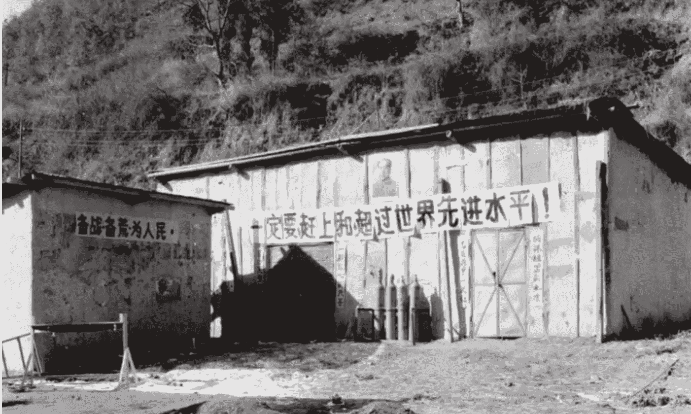

在这种极端艰苦的环境里折腾了近十年，又重新回到了北京。

这段时间没少查资料，每天写点，把这事给大家唠唠，他们的事不该被遗忘。

### 1 三线在哪里

首先要说三线其实是个地理概念，也是一个国家战略概念。当年把沿海沿边境的地区定为一线，算是国家的前沿。三线就是国家战略腹地，主要在四川、贵州、云南、陕西那种多山地区，剩下的地方算二线。

这些地方虽说是战略腹地，其实都是些交通不便的区域。上世纪60年代要在这里搞大建设，花费的人力物力会非常惊人。

实际上也是如此，为了三线建设，国家在15年间一共建设了上千个企业，动员了几百万人，花费了同时期国家投资的一半，总数超过2000亿。当年一个工人工资只有30多块，看着少，这些钱当时是可以养活一家子的。其中很多项目还不是新建，是把一线地区的工厂企业整体迁移过来。

如此大的花费，对原本家底就很单薄的新中国，是非常大的负担。据统计至少把国家工业化进程拖慢了2-3年。在那个时候到底发生了什么？使得新中国要这样做？

这就要说到当时复杂的国际国内环境了。

1964年，看起来刚刚度过三年自然灾害，又在1962年打趴了印度。其实那年是新中国非常困难的一年，总的来说就是被美苏两家两面包夹，而且随时可能被全面武力进攻。

先说美国，朝鲜打完之后，美国对“共产主义扩张”有了应激反应。看到点动静就发挥野兽一般的想象力，认为事态严重，然后过度反应，再在过度反应得出来的结论基础上过度发挥，最后往往自己先疯了。

小伙伴估计都知道越南战争，当时越南也分成了南北两块，美国支持南方的越南政府，可找的傀儡又是个群技能点都点在贪污上的混蛋。面对北越的打击，南越根本扛不住，美国对南越的支持只能不断升级，从资金援助、派军事顾问、特种部队作战到亲自下场。之所以这样，就是当时美国人认为中国会把越南吞并，然后会进攻泰国，接着是马来半岛，一直打到夏威夷。

在当时的中国人看来，一切和27年之前日本人在卢沟桥做的，不能说相似，只能说一模一样。

至于苏联，自从1956年两家关系越来越差。后面发生的事情，了解一点现代史小伙伴估计都知道。两家越走越远，关系已经降到了冰点。最明显的就是双方边境线，苏联军队达到百万。

同时，美苏两家的关系，自从赫鲁晓夫1959年访问美国之后，已经出现了缓和的迹象。苏联甚至认同美国的一些价值观，比如著名的“玉米计划”，原本规模不大。但赫秃在美国看到玉米的丰收以及养殖出大量牲畜之后，赫鲁晓夫一下上头，在全苏联大面积推广。

后来计划失败，他在中国获得了“玉米晓夫”“苏穗宗”的外号。在苏联也一样，人们称总书记为“古古鲁沙”，这听着就知道不是啥好词，俄语中就是玉米棒子的意思。

甚至在1962年被我们一巴掌打趴下的印度，都有点动作。那时尼赫鲁刚去世，印度人一脉相承的自信没变。看着中国在美苏的压力下似乎力不从心，居然也想借机捞一把，一雪前耻找回场子，在边境又小动作不断起来了。真正是人菜瘾大。

而国内有了一件大事：原子弹研究成功，将在1964年爆破。听起来是件好事，但是当时上层都非常紧张。很简单：都说有了原子弹，你就有自保的能力了。其实这话不靠谱，有了的不过是实验品，距离实战还远呢。

因为原子弹是裂变弹，当量非常有限，几十万就到顶了。必须做出聚变弹，也就是常说的氢弹才是真的大杀器。那是轻松就可以几百万当量的。但是那时中国的氢弹还要好几年呢。

做出来也只是第一步，还要小型化和武器化，还要投送能力，就是要能拿着扔到别人头上。不然人家远程轰炸你，你手里那玩意和铅球没区别，总不能炸自己吧。而投送不外乎火箭和远程轰炸机，当时中国这两样更是还没影子。

除了这些，还要有反击能力，不然人家偷袭把你的核武器都炸了，你怎么办？所以就得有可移动的发射车、超级坚固的发射井还有带核导弹的潜艇，确保在第一次核攻击中不被团灭，对方才不会随便下手，攒齐这些东西才算是有了全面核威慑力。

这也是为啥核大国都维持了那么大规模的核弹，看着根本用不着，其实是在做“二次反击准备”，被核弹犁地之后，核弹损失惨重的背景下，照样能把对方打个稀巴烂，对方就不敢先动手，整个冷战核威慑其实就是建立在“二次威慑”基础上的。

但是中国的进步，所有人看在眼里，这些东西早晚都会被一件一件攒出来。如果你是新中国的敌人，而且智力正常，面对这种情况你怎么办？第一反应，就是趁你还没有办法用，我先下手。把你的核设施全部扬了，或者干脆把你整个国防系统都扬了。

按照我们现在的视角看，这么疯狂的事情怎么可能呢？但是这种事情发不发生是一码事，你做不做准备是另外一码事。在国家安全角度看，“不可能”这三个字是真的可能造成毁灭性后果的。

这方面中国是有教训的。1937年日本侵华，几个月下来中国最富庶地区几乎全部被占领。中国的工业能力一下子下降了90%，大量工厂设备无法搬迁到后方全部变成了日本的战争资源。

好在当时一个叫卢作孚的民营企业家指挥他的民生公司冒着日军炮火将150余万人员、100余万吨物资抢运到四川后方，保存了中国工业乃至整个抗战的“元气”，不过这些物资看着多，相对于中国巨大的规模和需求，依旧是杯水车薪。

由于没有设备和原料，无法生产武器弹药，国军装备极差，在正面战场上跟“一战”时的俄军差不多，纯粹单方面被屠杀，只有几支德械、俄械、美械部队有一些战斗力。

如果国府上层有足够的危机感进行战略准备，把武汉南京的工业设施提前搬迁一部分到重庆，开战后就不会那么狼狈了。

也正是经历了这些惨痛教训，中央让军队做过一次评估：如果在最坏条件下（美苏同时进攻），新中国会面对什么局面。

最后得出的结论非常悲观：东部沿海和东北地区，可能最短一两个月就会全部沦陷，而且因为新中国重工业企业大多都在这些地区，到时候中国的工业能力会基本被消灭，后续作战的能力会非常的弱。

按照当时一位参谋的分析，如果苏联和美国一起打来，新中国的战略纵深有很大的问题。几乎所有的重工业和科研院所都在沿海和边境地区。敌人如此强大，早期肯定会很快被突破，到时候中国人民的抗战会比抗日更加艰苦。起码日军那时候还是拿着步枪，骑骡子赶路，现在敌人是机械化的重装甲部队。

当时的形势非常的危急，总参谋部的一份名为《关于国家经济建设如何防备敌人突然袭击问题的报告》（标题真是直白），由总参谋长交给了毛主席。

其中有结尾一段，我在此全文抄录：“我们认为，上述问题，是关系到全军、全民和直接影响卫国战争进程的一些重大问题。建议由国务院组织一个专案小组，根据国家经济的可能情况，研究采取一些切实可行的积极措施，以防备敌人的突然袭击”。

所以在1964年5月讨论下一个五年计划的会议上，党中央提出了三线建设的建议。要用三个五年计划的时间，建立中国的战略纵深。

要求在当年做好规划，1965年起，就开始把沿海一些工业企业向西部和西北地区搬迁。同时在以后的一段时间内，新建项目也大多要集中投放在西部地区。为的就是一旦开战，后方这些工厂和科研单位也打不烂、炸不垮，能继续坚持生产和科研，支援前线。

1964年距离1937不到30年，新中国领导人，甚至无数的普通老百姓都曾经亲历过那段历史，所以全国上下毅然开启三线建设。

### 2 大三线

三线建设从1964年开始，按照计划，全国都行动了起来。

整个建设非常浩大，其中最著名的当属攀枝花的建立。打开地图，就能明显感觉攀枝花的画风不太对，这里虽然距离昆明直线200多公里，但是却是一个在大山窝里的城市。我截了个图，大家可以看出来，这地方真是完全在山里。

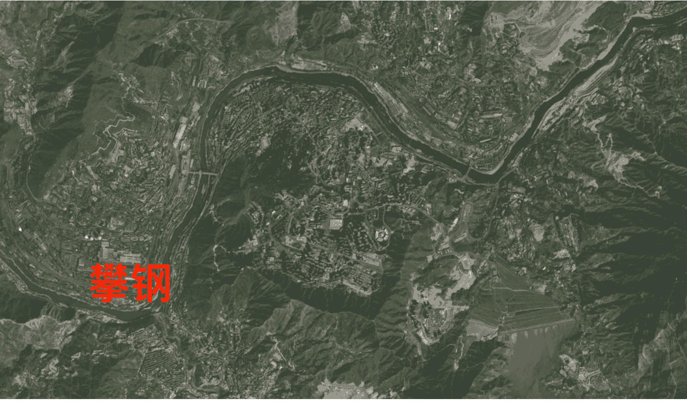

不过攀枝花尽管造型有点非主流，这里却有着巨量的铁矿资源，而且有矿、有铁、有水、有煤，资源丰富、山川密布、易守难攻，完全具备独立建设大型钢铁基地并实现自循环的潜力。

但是同时，这也意味着攀枝花环境非常恶劣。据最早的建设者说“这里除了困难什么都没有，我们除了一双手什么都没有，但是我们的手把什么都弄出来了！”几十万的建设者，在短短几年里，把这片不毛之地建成了一座巨大的钢厂。还建设了配套的一系列设施。

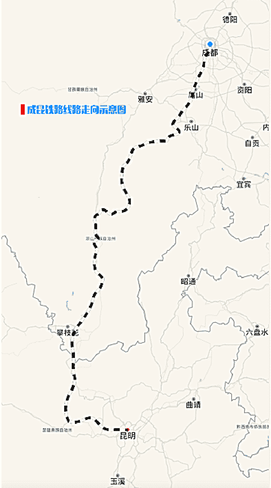

同时为将西南地区与中部地区连接起来，并打通西南地区与北京和东南亚的联系，举世闻名的成昆铁路改变了路线，专门途径攀枝花，这样一来，本来就超艰难的地形就变得更加逆天了。

可以说成昆铁路改向的一大重要原因就是为了过攀枝花。但是成昆铁路也因此难度增加了无数倍，多次上马下马开工停工。随着三线建设开始启动，这条铁路的建设也加速了。

最后，同在1970年，成昆铁路通车，攀枝花钢厂投产。

在钢铁企业之外，重工业企业是三线建设的重点。在湖北十堰、四川德阳这些原本完全是偏远山区的地方，建设起来了大量全套的重工业企业。

估计大家也想到了，比如生产汽车，需要的零件成千上万，上下游企业至少也有几十个。三线建设是为了应对全面战争，所有企业要尽量挨在一起，不然到时候某样零件还要跑到外地去，整个工程都被阻塞，没法玩了。这些地方短短几年内，就成了全产业中心。很多通过转型，到现在依然是经济发达的工业城市。

所以有时候，会发现国内有的城市很奇怪。看地图在山窝窝里，但是看城市核心区很繁华，当地支柱产业全是大型工业企业，甚至有好几家颇具规模的上市企业。但是附近几个县，全都是些落后贫困县，让人觉得非常的违和。其实如果查一下历史，很多都和当年三线建设、产业转移有关。

除了各种工厂，还有一大批三线建设项目，是各种科研机构。特别是和军工相关的机构，这些部门要为战争提供科技支持，而且当时新中国还有很多关键的技能点没有点出来。面对随时可能爆发的大战，这些机构也必须搬迁。

新中国原子弹1964成功，第二年就成立核动力研究所。为了应对敌人可能的攻击，在1967年把研究所从北京搬家，来到成都。而中国第一代核潜艇的反应堆，也就是业内著名的“909工程”，基地也设在了四川夹江的一片大山里面。

现在的成都飞机研究设计所，就是从沈阳设计所分离出来建设三线的，最早的时候只有几百号人，现在已经设计出歼20了。

还有中国工程物理研究院，这个名字大家可能不知道，这就是著名的“九院”，搞核武器的。也从北京搬迁到了四川绵阳。当时一大批科研机构进入绵阳，所以绵阳号称“中国科技城”，确实是有基因的。

工厂生产，科研机构提供技术，但是科研机构需要高校提供源源不断的新人才。那时高校也大量的集中在大城市和沿海和东北发达地区。这一点新中国也是深有体会的，抗日战争中，西南联大的搬迁历史，让人看得唏嘘，如果提前有准备，就不会搞得那么困难了。

所以高校也要搬迁，而且要赶快搬。当时原则是先只搬迁部属高校，而且是挑对国家军事技术上有重要作用的专业。所以很多高校都是一分为二，把一部分重点专业先往三线搬。

其中清华的三线设在四川绵阳，把无线电专业整个的迁移了过来。研究方向，主要一个是雷达，一个是微波通信，因为这俩专业当时对于军工来说至关重要。这还只是第一步，后续本来打算把物理化学机械都搬过来的。

北大的三线建设在了陕西汉中，目的很明确：数学力学系的力学专业、技术物理系、无线电系都搬来，为飞机设计服务，在这里攒了一个汉中飞机设计所。

然后高校三线建设被铺开，哈工大、北京矿业大学、东北重型机械学院等等都开始计划搬迁，同时很多高校选址也从沿海和东北改到了三线地区。

那时如果从天上看，整个中国人员资金设备都在大搬家，从沿海和东北这些发达地区向国家腹地移动。而留在当地的人没有闲着，组织民兵，挖防空洞，建地下工事。

说起防空洞，最有名的就是重庆，各种时期挖的洞很多都没有记录，有的山都给挖空了。

北京地铁一号线是地地道道的三级防护工事。这个地下铁道所使用的挖掘技术虽然不高，但却可以直接承受百架飞机的轰炸。在整条隧道之上，还有厚达七十多厘米的钢筋混凝土和一米的防爆破材料，可以用来防核弹攻击。

其实六七十年代，全国大小城市都在挖，包括我老家，一个小镇，都修了大量的地道工事，小时候听人说是抗日时候挖的，后来才知道主要是这个时候挖的。

与此同时，百万人开往边境准备迎战苏修的进攻。第一次看《三体》，印象非常深刻，叶文洁他们就在大兴安岭那边插队，准备迎接苏修坦克集团的第一波冲击。

三线建设其实分大小两块。

国家战略的三线，被称为“大三线”，目的是把国防工业科研等重点企业转移到后方。

后来每个省都搞起了自己的“小三线”工程，就是在本省内找偏远山区，把一些军工企业转移进去。其中比较特殊的是上海，因为地理原因，上海真的是找不到偏远山区。不过上海解放后，多次把一些单位放在皖南，以至于现在那里还有上海的“飞地”农场。那里的人全是上海户口，公务员编制全部都是走上海的招聘计划。这次上海也把自家的三线设立在了皖南。

在省以下，有的市一级，甚至县一级政府都搞自己的三线。找个山挖地下工程，把一些设备弄进去，能支援单兵和连排级武器制造就成。

你看新闻上叙利亚武装各种自制武器觉得很魔幻，其实当年国内很多县一级三线工程差不多就那个画风，没啥难度，我们非常专业。

在有条不紊的建设进行了几年之后，国际局势随着美国在越南打的焦头烂额，被南北夹击的可能性非常小了，似乎渐渐的稳定下来了。

但是树欲静而风不止，随着美国实力走低，苏联的底气硬了起来。到了1968年，苏联玩了一把大的，因为捷克斯洛伐克新领导人要改革。苏联出动50万军队直接杀进去，把捷克斯洛伐克主要领导人一锅端押回莫斯科“开会”，这就是著名的“布拉格之春”。

我总觉得这次俄国揍乌克兰，本来也是要走这条路线，不过事先被美国知道后给广播了。

这么干实在是把全世界都看傻了，苏联为此要有个说法。于是勃列日涅夫在《真理报》上发表文章，提出他的处理社会主义国家之间关系的理论，即有限主权论。这玩意总结起来就两句话：社会主义大家庭要团结，我要是觉得你不团结就可以强制团结。

而且自从两家交恶，边境地区的冲突愈演愈烈，从一开始互相谩骂到推搡对打，在1969年已经接近撕破脸。然后爆发了著名的“珍宝岛冲突”，内容就不多说了，反正就是小规模打了一架。然后苏联以此为题目大作文章，摆出了一副要大打出手的样子。面对这种状态，中国也全面发动舆论，两边眼看随时要打。

但是两国之间，实力说话，面对当时的苏联。中国是弱势一方。打起来肯定是要吃亏的。

那时候，苏联是真的打算进攻中国，起码是做了全套动作。甚至把中国所有重要城市排了个表，从一颗到数颗不等的安排了核武器数量。

不过虽说做了计划，最后还是没敢动手。

- 一是战线太长，中国这么大，至少要三百万军队，给养装备这些天文数字从西边运过来，想想都头疼；
- 二是怕美国从西欧背刺，到时候自己被两面包夹，东西两边上万公里同时开战，不敢想象是啥画面；
- 三就是中国几年三线建设，已经有了战略纵深，速战速决基本不可能，到时候一脚踩进泥里，持久战变数太多实在不合算。

不过还是那句话，你可以觉得不可能，但是应对一定要做。

于是中央两个重要决定：第一是中央领导疏散，如果苏联机械化部队从中蒙边境突袭北京，最快七天就可以到。于是就像当年延安被胡宗南进攻，中央分成两块避免被包了饺子。二十多年后，大家不得不分散开，避免开战之后被苏联斩首，国家的抵抗没有指挥。

第二是全军战备，部队离开营地，以实战阵型随时应对苏联进攻，整整半年之后威胁才解除。

三线建设不得不被再次加速，为了应对随时爆发的战争，任务更加迫切。所谓“穿越三大神书”的《军地两用人才之友》，从防空、反坦克，到修房、种粮、养家畜，到修电器、造汽车，涵盖了从破坏到战后重建的全程——兼有广度和纵深，不可多得的废土重生手册。《赤脚医生手册》还有如何三防的内容。

还有一本书叫《民兵军事训练手册》，这本书涵盖了步枪射击、防空防化防原子弹等的基本军事知识。只要有这本百余页的手册在手，你就可以在“世界核平”后迅速建立起一支拥有相当战力的军队，这些你们都拥有。

这段历史背景就是当时紧迫的中苏关系。这段时间新中国可以说紧挨着战争边缘，随时可能爆发大战。

为了抵御侵略，三线建设的同时，全国发动了3000万民兵，生产了5000万把枪，200万门小口径迫击炮，20亿颗木柄手榴弹，至于子弹就完全没数了。当时的女民兵在种地之余，学习高射机枪使用、野战工事挖掘、沾染化学武器后紧急处理等等硬核技能。

### 3 三线的尾声

但是大战最后没有发生。大家知道新中国的氢弹是1967年成功的，但是实战化在1969年就完成了。当年中国使用刚刚服役的轰6，投放了一枚300万吨当量的武器化氢弹，证明了中国有了初步的核武器投射能力。不过轰6的性能还不足以威慑苏联，接着1970年东方红一号发射。证明我们有了火箭运送百万当量氢弹的实力，算是正式让中国有了核威慑力。

之后苏联表示和新中国保持友好，边境部队虽然番号没有变化，但是大量部队都是不满员的，甚至很多都是“架子部队”。美国总统来华，中国恢复联合国合法席位。这段历史就不用我多说了。

即使如此，三线建设也没有放松。原因很简单：如果敌人真的不惜一切代价，顶着核武器的杀伤力往上冲，氢弹不是歼星舰，并不能真的把对方干掉。

有人说美国曾经表示，中国可以遏制苏联，如果苏联攻击中国，美国会和中国站在一起。并且在美国施压下，使苏联放弃了进攻中国的计划。

这话只能忽悠小孩，且不说当时油价高涨，苏联处于强势，美国在外部被压得喘不过气。内部眼看布雷顿森林体系就要崩溃，美国经济一塌糊涂。就算美国比苏联强大，中美连建交都还要在等快10年呢，美国为啥要为中国出头？就算两家是盟友，这些年来美国卖盟友的事情，一只手数都数不过来啊。

我们一直靠的就是自己，其中三线建设加强战略纵深是重点。

直到1980年，三线建设终于结束了，原因很简单。当年的计划就是用三个五年规划的时间，在内地建立一套完整的国家科研军工生产体系，那时已经基本完成了。

还有一个原因，1979年的对越自卫反击战，当时最主要的目的不在越南。主要就是看苏联的反应，因为苏联1978年和越南签署了苏越友好条约，表示自己要全面罩着越南。

结果苏联在一番心理博弈下，没有直接出兵从中苏边境进军，只是在背后支持越南和我们不断摩擦。如此一来苏联的底牌被中国看穿了，知道它外强中干。

来到1980年代，随着国际局势缓和，和平成为主流。三线建设中建立的大量单位，有的就开始重新再搬出内地，往沿海发达地区搬迁。有些位置过于偏僻的单位干脆就放弃了，还有些最后关停并转，只有少量优势企业做大做强。

### 三线的意义

曾经看到一种说法，说三线建设浪费了大量人力物力财力，因为国家投资在这些地方，造成一线地区投资大量减少，使得新中国的建设走了弯路。

### 韩国又一次走到了十字路口

2022-03-10

本来想发点别的，不过看到尹锡悦当选韩国总统，想说几句，写一篇短文吧。

这段时间连续发了几篇，这几篇的效果都非常好，阅读量和点赞量都非常高，让我诚惶诚恐，可见大家还是希望看到客观中立一些的观点而不是纯鸡血。不过也有人对我有点意见，因为我好像并不支持俄罗斯，在他们眼里，我作为粉红博主，就该爱国，爱国就得支持俄罗斯。

事实上我所有思考的起点都是咱们自己的国家，最后思考出来的结论确实是不支持俄罗斯这么瞎折腾，因为俄罗斯这次的冒进玩得太空泛了，不仅它自己现在很被动，连我国也跟着被动了一些。

逻辑也不复杂，它都没想好就蹦出去砍了乌克兰一刀，然后自己陷入了泥潭出不来，现在磨磨唧唧，我国大旗党都给他们设计了几十个一举歼灭乌克兰国防军的方案了，他们依旧还在那里趴着，很明显有点进退失据，想想就知道，没钱呗。

问题是，我国从战略格局上讲必须支持它，以前它半死不活还能替我们分担点压力，如果这次成了残血，不但帮不了我们，我们还得拉它。

而且也不是说我支持乌克兰，乌克兰确实很欠，我对这个国家一样没好感，很久以前就写文章说它是个纯沙雕。

我是说俄罗斯打之前应该想好怎么解决问题，做好各种预案，要不用政治手段解决，要不就速战速决，现在它自己掉坑里，连累我们也尴尬。我昨天看翟东升的说法，说是普京可能确实被周围的人给蒙蔽了，导致了误判，本来以为可以速战速决，现在陷入泥潭出不来。

这次俄乌战争可能导致一系列的后果，远远不止大家可能开不起汽油车这么简单。这不，韩国大选结束了，右翼的尹锡悦上台了，我认为多少有点关系。

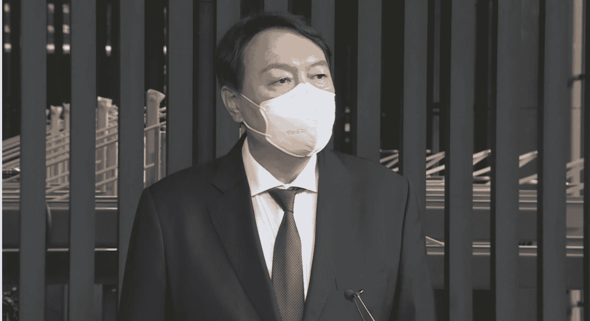

之前文章里提到过这个老哥，以前的韩国检察长，扳倒了李明博和朴槿惠，属于韩国政坛的铁腕人物。《朴槿惠被放了，他们青瓦台的真正魔咒在检察院》，我是全网比较早提出韩国真正的魔咒不是什么财阀，检察院才是青瓦台的真正诅咒，现在这个观念已经被很多人接受了。

很多人分不清韩国左右两派。其实特别简单，如果政策是“希望和朝鲜和解”，“权力还给人民”，那就是左派，文在寅就是左派，他对美国稍微有一点点意见，觉得美国压朝鲜太厉害。

他认为跟美国相比，朝鲜才是自己人，不过也不敢说太过分。现在的那个李在明，他本来会继续延续文在寅的政策，对朝温和，对华温和，主张韩国走独立发展路线。

而右翼的主张正好相反，要依附美国，要警惕朝鲜和中国，一直以来都亲美亲日，给大财阀更多的权限和方便，比如取消最低时薪和加班上限什么的。

大家注意下，韩国建国后的发展路线整体是从右到左，越来越左。

最早期都是美国扶持的军政府，财阀立国，财阀背后又是美日资本，所以韩国是个绝对的右翼国家。

这种情况下，老百姓意见很大，一直闹，大家知道著名的光州事件吧，老百姓上街抗议，在美国的点头示意下，韩国政府开枪弹压群众，死了两百多人，失踪了几百人（韩国人怀疑被军政府射杀后扔到乱葬岗随便埋了），这事后来还拍成了电影。不过民意起来后，压是压不住的，后来军政府解体，代表韩国老百姓的左翼开始上台，上台后致力于修复和朝鲜的关系，限制财阀等等，并且跟日本关系也不咋样。

说到这里，可能有人纳闷了，韩国财阀不是掌管一切吗？怎么会有人要挑战财阀？

讲真，路边摊少看点，有利于身心健康。随便找个韩国人问问他们对财阀的观感，远远没有中国人这么冲动。历代大财阀头目基本都被检察院送进过局子，所以远远没大家想象的那么牛逼。

再说如果财阀真的可以只手遮天，怎么会把专注修理他们的左翼总统选上来嘛，自虐吗？显然是财阀也没法控制。对了，这次上台的尹锡悦，他干检察长的时候，一个大亮点就是调查了三星，收拾了三星太子。

整体来讲，韩国的发展路线是逐步民主化，也就是民众的声音越来越大，越来越有影响力，并且韩国逐步开始走独立自主路线，想和朝鲜缓和关系，不再走一边倒的路线，文在寅整体就是这个思路。

但是今年突然一边倒，又来了个大退步。

尹锡悦的大选纲领就是让韩国放弃中间路线，今后大幅贴近美国和日本，让美国提供更多军事援助，给军队涨工资等等。

他觉得韩国唯一出路就是和美国处好关系，得到美国的大力援助，毕竟韩国能发展起来，不是因为他们有啥特殊技能，而是依赖美国的大量贷款和技术转移。

但是那样会惹怒朝鲜，怎么办？他的建议是继续把美国拉下水，派更多的军队过去，设置更多的导弹什么的，这样就会惹怒中国。他的意思是惹了就惹了吧，反正也要选边站，中间路线就是两边都不讨好。

可以说，他基本上把文在寅之前的理念都推翻了，韩国的国家政策倒退了三十年。

不过他的观点并不重要，重要的是老百姓怎么看，如果老百姓觉得他是个沙雕一张票不给，那只是尴尬他一个人。

问题是今年出现了惊人的一幕，韩国投票率空前高涨，双方打得旗鼓相当，最后尹锡悦以微弱优势胜出。

这事一方面说明韩国已经撕裂得不成样了，失去了压倒性的共识，另一方面说明认同尹锡悦观点的人数量上竟然是多数。

尹锡悦胜出原因很多，主要的一点明显是经济，文在寅也是倒霉，正好摊上了一个全球经济都不咋地的周期，再叠加疫情，文在寅的任期经济状况一塌糊涂。

此外文在寅说是要治理房价，可是他上台后韩国房价上天了，不但没治理好，比以前更畸形。

多重打击下，支持率从80%一路暴跌，跌到了最近的30%，这么低的支持率，多多少少影响了文在寅他们党的候选人，因为他们党的候选人和他路线差不多。

甚至韩国老百姓出现了诡异的一幕，开始怀念军政府的强人时代，毕竟年轻人没经历过军政府的高压，只知道那时候发展真心快。前些年他们投票把军事强人朴正熙的女儿选上去，整体也有这方面的原因。这倒是有点像我国这些年有些人无限怀念改开之前，他们没感受到之前的贫困，但是却受到了市场经济的暴击，想回到那个平等时代。

这几年韩国知识层开始怀疑韩国经济疲软，是不是文在寅的独立路线是不是惹怒了美国和日本，毕竟韩国经济就是美国和日本给投资出来的，现在跟美日关系冷淡，会不会导致韩国经济一直不太行，这也为保守的右派上台奠定了基础。

那个尹锡悦一开始是跟着文在寅混的，后来也反水了，跑到了右翼一方，把朴槿惠送进去之后，最牛逼的操作是把文在寅的手下得力干将曹国差点搞进去，后来曹国倒是没进去，不过也辞职了，这对文在寅的声望造成了巨大损伤。

除了经济问题，我觉得俄乌问题功不可没。

俄罗斯打乌克兰的那些理由，套在韩国身上完全没有违和。事实上韩国要比乌克兰走得远的多，毕竟美国对乌克兰没有军事义务，美国对韩国是有义务的，如果韩国遭到进攻，美国必须出手，现在美国在韩国依旧有三万美军。乌克兰没有部署北约的导弹，韩国已经部署了萨德，尹锡悦说是上台后还有继续部署。而且尹锡悦还说自己上台要推动韩国加入五眼联盟，让美国在韩国部署核武器等等。幸亏中国不是俄国。

所以这段时间韩国人应该是没了安全感，尹锡悦不仅要搞大规模导弹防御，在韩国上空搞铁穹，甚至提议日本军队进驻韩国，日韩矛盾有多大不用我说吧，他这提议竟然能被老百姓接受，可见大家慌成啥样了。

大选中尹锡悦只赢了0.73%，区区25万票，可能如果没有这次的俄乌矛盾，这货就没法上台了。比较搞笑的是，大选一结束，很多人就后悔了，发现尹锡悦的很多促进经济的措施，其实就是削减工人福利，私有化医院，降低劳动法对工人保护等等。还有不少人想移民，“移民”上了韩国热搜。

还有更奇葩的，尹锡悦他们一伙认为他们生育率太低，很重要的一个原因是韩国女权运动太厉害（确实很凶，如果大家有兴趣，我可以扒一扒资料给大家讲讲）。女权嘛，主张不婚不育等等，很影响生育率，谁支持的呢？对，他们认为正是中国。而且韩国乱七八糟的服务器宕机事故背后也是中国黑客攻击。

反正这货大选期间是啥话都说，问题是还得到了老百姓的支持，可见这几年韩国老百姓对中国的观感也有了很大的变化。

接下来会咋样？

说实话，我也不知道了，感觉从疫情开始，整个世界进入了“乱纪元”，以前的那种秩序越来越模糊，半岛这个火药桶，大概率又会骚动起来。而尹锡悦这个人，本质其实还是个投机犯，跟川总似的，说了一堆反政治正确的东西，然后就得到了大家的支持。但是如果真像他大选期间宣扬的那样搞下去，东亚肯定又会乱七八糟的。

不过如果尹锡悦确实是个投机犯，他上台后想继续发展经济，还是得跟中国深度合作，毕竟中日两国一直都是韩国最大的贸易伙伴，和则双赢。目测现在的大环境，除了合作赚钱也没啥别的生财之道，持续闹别扭，韩国经济好不起来说不定很快就出事了。

公众号懒人搜索，懒人专属群分享

### 为啥美国入侵那么多国家没人骂，俄罗斯打乌克兰大家都炸了

2022-03-08

文章开始前，要把态度表明：

我不希望俄罗斯输掉这场战争。如果输了，接下来的事就非常难办了，美国今后彻底肆无忌惮，并且不出意外，俄国输掉战争后会陷入长期的经济低迷和极其悲惨的境地，我们就成了美国唯一需要对付的国家了，那种压力，不敢想象。

这两天无意中在头条看到一个常见问题：为啥美国入侵那么多国家没人说，俄罗斯打乌克兰大家都炸了？

肯定很多人会说，强权即公理嘛。如果你真这么想，那也没啥问题，不过真正乐于思考的人肯定不至于此，而是尽量去思考一个更加有深度的结论，比如上边的那个说法到底对不对。

咱们先挨个分析下美国的历次战争，看看舆论到底是啥态度。

首先是朝鲜战争，这场战争我在文章里讲过，几乎所有的参战国都宣布自己是胜利的一方，中国自然没话说，保家卫国嘛，把美军从清川江赶到三八线。

朝鲜也说自己赢了，因为自己也抵抗住了美帝的进攻，获得了天然合法性。

韩国觉得自己赢麻了，差点被灭国，后来竟然起死回生。美国本来在朝鲜战争前已经收拾行李回国了，然后又过来陪他们打了三年仗，自然得保护这个货。韩国处于冷战前沿，军费开支却不大，再加上美国的技术转移，很快就发了。

那美国呢？美国很尴尬，但是也觉得自己赢了。他们觉得自己是在韩国马上要被灭国的时候介入的，应韩国总统请求，在联合国授权下去的朝鲜半岛。韩国那时候已经被赶到了釜山，马上要下海了。当时苏联代表提出了抗议，但是那会儿联合国不让新中国加入，所以投票的时候苏联正在抗议，没去投票，联合国就授权通过了。

后来美军进入朝鲜，帮助韩国复国，美国觉得自己在性质上讲，类似于当初帮助苏联打纳粹，帮助中国打日本，就是帮国民党一起打日本，原则上无可挑剔。

那为啥朝鲜战争变成了“被遗忘的战争”呢？有人说是因为没打赢，其实看看美国人的书，基本没有说自己输了的，而且战后很多将军进入美军高层，重要的资历就是参加过朝鲜战争。只是美国嫌没面子，对手是刚刚经历了百年战乱的国家，竟然没能将对方彻底平推，最后在三八线附近打成了烂仗，让人多少有点怀疑几年前，他们在欧洲到底是怎么打的，所以怎么看怎么尴尬。

随后就是越南战争，这次跟朝鲜战争不一样，美国介入得完全没道理，属于给军火商“去库存”。当时的借口是越南人炸了美国停在北部湾的一艘船，美军随即在越南打了十来年的仗。

这场战争属于纯粹的非正义战争，并不是只有咱们这么说，美国国内几乎所有知识分子都反对这场战争，《阿甘正传》里也有大量的描述，而且这场战争是少数美国承认打输了的仗。

为啥这么扯淡的战争却没成“被遗忘的战争”呢？

主要是因为老百姓都反对，少数利益集团支持，所以关于越战的内容，都带有一种“反战”气质，代表着他们的反思。有些人总觉得“反思”这事很高级，有点像咱们早年的“伤痕文学”。

现在美国文艺界的那些人都经历过越战，越战期间的全国大串联承载了他们的青春和激情，他们当时是很反对战争的，后来证实他们是对的，所以大书特书，诞生了一堆的电影和书籍。

从这个意义上讲，也不是美国发动的战争完全没人说，越战这事就超级不体面，一直被骂到现在。

还有一个未遂的入侵，也就是古巴导弹危机。

在古巴导弹危机之前，肯尼迪政府其实入侵过一次古巴，不过他们没有自己上，而是武装了一堆古巴难民。

难民们冲上滩头后，说好的美国轰炸机没来，这些人被压制在了沙滩上，大部分都被卡斯特罗给抓走了。后来美国给了古巴一堆食品和药品，才把这些人又换回去。参与这事谈判的，就是《间谍之桥》里的那个律师。

那为啥美国轰炸机没去呢？

主要是肯尼迪怕人说，担心大家说他侵略古巴，多多少少要点脸。

不过“脸面”这玩意是有价的，随时可以拿来交易。随后苏联在古巴部署核武器，美国的脸面就不是问题了，差点掀桌子打过去，当时海军陆战队已经准备好了登陆作战，突然危机就解除了，才没入侵成功。

多说一句，美国为了制裁古巴，把古巴特产哈瓦那雪茄给禁了，不过禁了也没啥用，这玩意就跟美国的茅台似的，整个美国上层，从总统到富商，家家藏着走私的哈瓦那雪茄，不拿出来招待，客人就感受不到你的诚意。

现在的大毛和二毛之间的战争，像极了当初的古巴导弹危机，当时美国也是家门口被人给堵了，所以豁出去了。

美国后来既没入侵古巴，也没爆发核战。肯尼迪用和平方式解决了问题，保住了美国颜面，关键是让苏联蒙了羞，整体就又有里子又有面子，他也成了美国历史上最受欢迎的总统。苏联蒙羞这事也很尴尬，美苏说好苏联撤掉古巴导弹，美国撤掉土耳其的导弹，但是很多人不知道土耳其的事。

接下来是海湾战争。

第一次海湾战争其实没啥可说的，萨达姆没啥道理灭掉了科威特，科威特跑去向全世界求援。

联合国安理会在著名的“678号决议”里，授权美国带着多国联军去打伊拉克，当时俄罗斯也投了赞成票。

这场战争的正义性其实没啥问题，是美国对外战争中争议最小的一场，基本没人骂它，战争性质接近上文说到的我国抗日期间请求美国的帮助。

中间有一次索马里战争，也就是《黑鹰坠落》里讲的那事。

确切地说，那个也不能算“入侵”，当地军阀混战，联合国让各国派维和部队过去看看，当地一个军阀袭击了维和部队，死了几十个人，美国派最精锐的游骑兵过去抓人，就有了《黑鹰坠落》里的那一段，摔了两架飞机，死了19个人。后来美军尸体被人拖着游街，全世界引发轩然大波，克林顿觉得不能再丢人丢下去了，所以就赶紧收拾走了。

这事其实可以看作是警察任务，如果硬说是入侵不太有道理。

然后是科索沃战争，这个太复杂了，将来我专门来讲吧。

随后的第二次海湾战争就是纯粹的侵略，美国只是说发现了洗衣粉，就把伊拉克给打了，谁都没得洗。

这场战争不仅遭到俄罗斯和中国的反对，美国在欧盟的小伙伴也反对它，德法都使出了吃奶的劲反对美国。尤其是德国，由于德法俄三国反对太激烈，布什把普京与施罗德（就是当时的德国总理），和当时的法国总统希拉克，称为“老狐狸轴心”，阿拉伯国家就不用说了。

奥地利等多个国家宣称，对伊拉克的军事行动由于没有得到联合国安理会的授权，已经违反了国际法。联合国前秘书长布特罗斯·加利谴责该军事行动，认为违反了联合国宪章。奥地利、瑞士和伊朗禁止联军战机飞越其领空，土耳其禁止美军通过其领土向伊拉克北部发动进攻，沙特阿拉伯禁止美军导弹通过其领空袭击伊拉克。

我现在也记得当初德国总统施罗德和普京站在一起反对美国进攻伊拉克，可是美国当时应该是实力巅峰时期，当然不会理会他们，坚决地就把伊拉克给打了。

打了伊拉克之后，美国国内外的意见都很大，马特·达蒙还拍了一部电影，叫《绿区》，专门揭露这事。电影里美国大兵们一开始确实是认真地在找生化武器，越找越迷惑，慢慢明白了，什么“大规模杀伤性武器”，纯粹扯淡，政治家骗人的玩意儿。

后来美国为了平息大家的争议，又放出来大量萨达姆的黑料，比如“萨达姆家族极其奢侈”“萨达姆的大儿子把大学生喂了狮子”等等。不过没啥用，美国国内反战氛围浓重，奥巴马参加大选时，一个最重要的主张就是把美军从伊拉克撤出来，欧洲也在布什访问的时候爆发过大规模抗议游行，包括英国在内。

美国国内在华盛顿、芝加哥、旧金山、纽约都爆发了大规模的示威游行，全美几天之内就抓起来几千闹事的老百姓。

可见战争不正义，不仅外国有意见，自己老百姓也看不下去。

最近的大规模战争，无疑是阿富汗。

有一说一，如果咱们国家被那样打一下，咱们也得打过去，而且美国报复阿富汗这事也得到了几乎全世界的支持，包括俄罗斯的极力支持。我之前讲过，阿富汗是个内陆国，美国想打阿富汗需要陆基机场。

小布什他们正在愁怎么解决，普京跳出来，自告奋勇地说要去说服中亚那几个斯坦，让他们提供机场。尽管这事遭到了俄国政府高层的一致反对，尤其是军方和克格勃那伙人，他们天生仇美，觉得这事根本没必要管。

为此，普京把这几个不服的，拉去了他在索契山峰顶上的别墅里单练，费尽千辛万苦，终于说服了他们帮助美国，把塔吉克斯坦的几个机场租给美国用于轰炸阿富汗。

我们把这些战争综合在一起就能看出来一个规律。

打仗这事算不算入侵，主要得看理由是否充足。大概可以分成三级：

- 最强的无疑是联合国授权过的，联合国的本质其实是个元老院，如果某次进攻被联合国授权了，那无疑是五大善人都点头了的，正义性问题不大。第一次海湾战争就是联合国授权的，所以没啥问题，第二次没授权，遭到全世界反对。

- 其次是别的国家的合法政府请求支援的，前段时间哈萨克斯坦发生动荡，请求俄罗斯出兵解决，这也没啥问题，包括美国在内也无话可说。

- 如果啥都没有，那就只能自己找理由，这个理由最好让大家都信服，而且最好是那种“只针对特定国家或者地区”，不能让其他人觉得“弄不好连我也打了”。

第二次伊拉克战争为啥遭到抵制，很重要的原因就是发动战争的理由是个“口袋罪”，按照美国的逻辑，他可以把所有国家都打一遍。没有证据的情况下说你有大规模杀伤性武器，你咋证明你没有？这时候你最好真有，否则就完蛋了。

可见，美俄发动战争，最大的差别其实不是有没有被指责，美国也经常挨骂。

他们之间最大的差别是“经济制裁”，骂美国的不少，但是没人能制裁美国。因为大家都离不开两样东西，美国的货币和技术。全世界都可以离开俄罗斯的资源，却离不开美国那堆高科技公司。

不过美国也不是完全没被制裁过，第四次中东战争的时候，中东国家为了制裁西方国家支持以色列，对石油进行减产，油价高涨，西方国家极其痛苦，美国那边排大队等着加油。

在这场危机中，美国的工业生产率下降了14%，日本的工业生产率下降了20%以上，所有工业化国家的经济增长都明显放慢。这事后来促成了薄皮日本车的崛起，因为他们的车比较省油。不出意外，这次俄乌冲突，必然也会导致全世界在新能源问题上加速研发。

那俄罗斯这次为啥遭到几乎整个西方的抵制呢？

很多人说他们就是看俄罗斯不爽，觉得好欺负。

这也有点道理，不过不是全部，还是那句话，咱们要找找更加深刻的道理。

毕竟俄罗斯这些年也没少打仗，比如打过车臣，打过格鲁吉亚，2014年也出兵过克里米亚，甚至前几天还出兵哈萨克斯坦，那几次国际上也都有人骂，但是远远不及这次严重。

这次真的是把大家都给惹到了。众所周知，德国跟俄国的关系是很密切的，最近几十年来，德国历任总理对俄国的态度简直亲密得不像样，但是这次下了狠手，宁愿自损八百，也要伤敌一千，这就很魔幻了，为啥这么疯？

为啥？

主要的原因是大家都没安全感了。

或者说，俄罗斯进攻乌克兰的深层次理由让大家彻底没了安全感，跟美国的第二次伊拉克战争差不多，摆在明面上的战争理由本质都是“口袋罪”，美国说别的国家有大规模杀伤性武器，然后打过去了，俄罗斯说别的国家有纳粹，然后也打过去了，用你那几个理由，能把半个欧洲打一遍，现在人人自危。而深层次的原因更能把大家打一圈。

再把那张图放上来，大家可以看看：

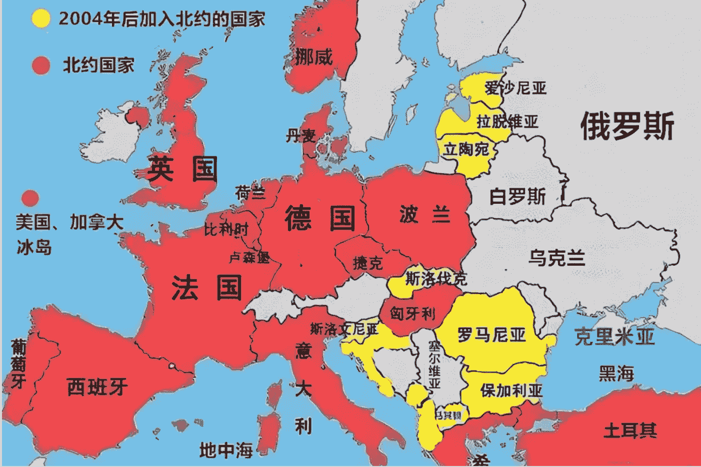

如果说俄罗斯邻居加入北约就很欠揍，那很明显土耳其最欠揍，这个国家很早就加入了北约，现在还放着北约的导弹和核弹，这次土耳其支持乌克兰非常积极，很多无人机就是他们提供的。

罗马尼亚，保加利亚，捷克，波兰，波罗的海三国，尤其波罗的海三国，都可能被攻击，芬兰这种跟俄罗斯友好了几十年的国家也坐不住了，最近也考虑公投加入北约。所以连瑞典和瑞士这种在国际政治上，似乎很少说话的国家也开始援助乌克兰。韩国也怒了，宣布对俄罗斯出口管制，毕竟他们家真摆着萨德。

这些国家不一定有多正义感，可能只是慌了。或者说，他们根本没有正义感，只是在担心自己而已。

而且普京明显判断失误了。

从现在的情况来看，他应该以为这次会跟车臣那次类似，特种部队空降，抓住演员，让演员宣布自己犯了错误，要求接受批评，并且对全世界承认俄军打过来，并不是侵略，而是自己请求他们过来镇压本国“新纳粹”的。这样乌克兰全国放弃抵抗，俄罗斯顺势解决问题。

如果是那样，乌克兰事件就成了"大毛二毛和谐相处的家务事"了，外人都是牛鬼蛇神，掺合啥?

倒霉的是，这次俄国的行动完全被美国知道了，当拜登说俄国马上进攻乌克兰的时候，全世界没几个人觉得他是认真的，撤侨的都没几个。不过演员应该是私下里问过消息来源的，知道没开玩笑。

正好俄罗斯的"空降斩首"属于常规操作，用的次数太多了，被预判了，导致战争一开始没把演员拿住，这下就麻烦了，事情往科威特那时的方向演变了。

科威特当时被萨达姆占领后，王室跑去联合国求救，一般来说世界上哪天都有人倒霉，哪天都有人去求助，不过科威特正好价值比较明显，而且超级有钱，可以支付战争军费，所以美国带了几十万人真刀真枪去打了。

到此为止，"大毛二毛家务事"彻底演变成了两国交锋，恰好这事又通过社交媒体引发了全欧洲的反响，老百姓逼着政客们表态，事情越来越没法收拾。

而且演员总统最近干起来自己的老本行非常有心得，不断地放送各种反应乌克兰人民奋起反抗的英勇事迹，甚至不惜制造大量的伪新闻。顶住了第一轮进攻后，向西方传递了一个消息，大家觉得他和他的小弟不是废物，还有利用价值，不是送人头，于是各种支援就上来了。

大家看出来了把，国家被进攻后，到底是不是"入侵"，关键得看"手续"是否齐全，逻辑是否说得通，要有特别合适的道理，不然很容易弄得没法控制。

大家还可以想一个问题，"搞崩俄国"对于美国有一点好处，对于其他大部分国家，尤其欧洲国家那是真的一点好处都没，巨额的贸易搞不下去了，今年开始可能面临着巨大的能源开支，俄国发疯了整个欧洲都危险，那为啥欧洲还要坚决制裁俄罗斯呢？就不能现实点？坚决不落入美国的圈套？

主要是俄罗斯在道义上确实给别人留下了发挥的余地，让所有国家人人自危，很多人能理解俄国，但是不能赞成俄国，最后在汹涌的民意下低头。

"社交战争"对民主国家影响真的是特别大，政治家都得关注自己选区老百姓的态度，现在的这种环境，不表态也会遭到围攻，可能政治生涯就结束了。

接下来大量的西方公司会退出俄罗斯，这是典型的双输，这些跨国公司损失了利润，俄罗斯可能会在货币暴跌后，迎来百万失业，这部分人没钱了，不消费，会进一步造成别人失业，整个经济螺旋式坍塌。

可是没办法，那些西方公司都不敢面对汹涌而来的民意，要在民众针对自己之前把自己摘干净。大家记得之前有些艺人出事后，代言公司集中解约的事吧，其实是一码事。

俄国接下来的日子会比大家想象的难得多，其实战前经济已经碰上了巨大的问题，这次直接蒸发了十几万亿美元计价的资产，接下来的制裁还会导致无数公司倒闭，失业，通货膨胀，经济下滑等等。

就算打下乌克兰，也占不到啥便宜，乌克兰比俄罗斯都穷，俄罗斯穷了十来年，人均GDP依旧比乌克兰高得多。就算赢了，也没法从乌克兰身上榨出几滴油。如果俄国战败了，后果不敢想象。

所以说现在很多人关注的战争本身，可能是俄罗斯未来需要面对的一系列问题中比较小的，俄罗斯的真正问题是战后怎么收场。

这倒是让我重新理解了孔夫子的那句话，名不正言不顺，言不顺事不成。“名”和“事”本来扯不上关系，不过人心向背，最终会影响资源投放，美国在两次海湾战争中的表现其实也挺能说明问题的，第一次是联合国授意，几十万人上下同心，各国有钱的出钱，有力的出力，美国的巅峰状态在那次战争中彻底确立下来，一扫越战后的颓废状态。

但是第二次战争就状态全无，盟友使绊子，自己国内反对声一片，在伊拉克频繁受攻击，问题也解决不了，最后花钱无数，依旧没摆平那个烂摊子，灰头土脸地撤了。

可能有人觉得我太幼稚，可以看看毛主席的《论持久战》，用了大量的篇幅论证“正义性”和“进步性”，强调只有战争是正义的，才会有“国际援助力量”，毛主席甚至认为，中国最终能取得持久战的胜利，是因为“中国的短处是战争力量之弱，而其长处则在战争本质的进步性和正义性，在其是一个大国家，在其国际形势之多助” 。

还有“ 大量的直接的援助，目前虽然还没有，尚有待于来日，但是中国有进步性和大国的条件，能够延长战争的时间，促进并等候国际的援助 。”

这也给了我们很多启示，无论做啥事都要站在道义一边，至少看起来是在道义的一边，可以免去很多麻烦。这些年我们在这方面做得很好，很少掺和别的国家的烂事，埋头赚钱啥都不问，不过今后肯定是越来越难，要不断依赖处理那些复杂事务的智慧。

文章就写到这里，希望战争赶紧结束。 这应该是最后一篇写俄乌矛盾的文章了，跟之前一样，不开评论了，谢谢大家观看，如果喜欢就点个赞或者“在看”在看吧。

公众号懒人搜索，懒人专属群分享

### 印度因为支持俄国要被美国制裁？因为印度才是俄国真正好基友

2022-03-04

2月27日下午3时，联合国安理会就要求俄罗斯从乌克兰撤军的决议进行投票表决时，印度代表和中国一样投出了弃权票。然后印度媒体说是美国已经怒了，印度这种弃权简直就是在捣乱，要制裁印度。

而且印度作为“油管五常”之一，这两天连续发力，几亿印度网友一起狂喷西方，支持普京，也成了推特上的一景。

可能有小伙伴不知道啥叫“油管五常”，说的是印度，越南，土耳其，波兰，韩国，这几个国家的老百姓都比较奇葩，民族主义高涨，人又乌央乌央多，在油管上几乎跟蝗虫似的，所过之处，谁都烦的不行。

这里就有个问题，印度和俄罗斯到底啥关系？仅仅是生意往来还是有别的什么纠葛？我们今天就雄心勃勃，准备一篇文章把这些关系都讲了。

### 1 中印俄三家的历史纠葛

众所周知，俄罗斯是个缓冲区狂魔，恨不得把地球上所有的领土都占了，大家看地图就知道，俄罗斯有三个扩张方向：

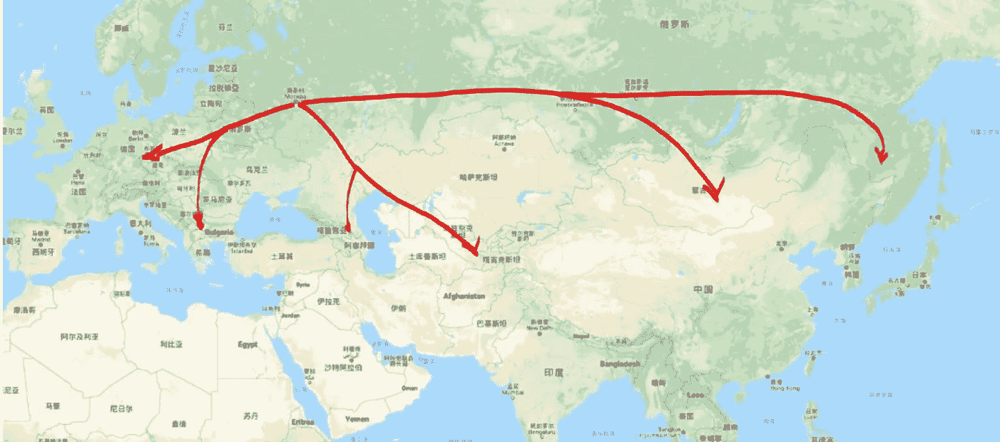

俄国最早是想向西发展的，尤其是拿破仑之后，非常冲动，不可一世的拿皇都被俄罗斯人给粉碎了，所以彻底放飞了想象力，疯狂向西。

不过终于在1853年，也就是中国刚开始闹太平天国那时候，“西扩”的俄国和英法在克里米亚来了一次决战，如果这仗俄国打赢了，那历史彻底改写了，现在的土耳其应该是没了，德国说不定也没了。

不过俄国没打过，被英法反杀了，然后签约认怂，答应不再向西扩张，但是向南和向东的扩张却没停。

向南扩张的意图很清楚，就是要去印度。

印度环境好，降雨量充足，种啥长啥，而且那里的人天生温和，东印度公司几百人就征服了整个印度，带着印度一部分人奴役另一部分印度人，以印制印。这让俄国人都悔青了，应该早点去找印度啊，把真正的软柿子给漏了。

所以俄国人通过军事扩张和修铁路控制了中亚五国，再去控制阿富汗，过了阿富汗就是印度。这时候英国人急眼了，英国之所以是日不落帝国，主要是因为印度，现在俄国威胁印度，不能忍。

这个背景下，英国准备主动出手，占领阿富汗，武装保卫印度。然后就爆发了我们知道的“阿富汗战争”，我在这篇文章里写了：《牛逼轰轰的大英帝国是怎么栽在“帝国坟场”阿富汗的》。

英国人先下手为强，没等俄国人占领阿富汗他们就出手了。1839年，英国人带着印度人先打入了阿富汗，顺利把阿富汗给占了。不过阿富汗人一直都是个刺头，在沙俄的支持下，1841年，爆发了一次大起义，把入侵进来的英国人杀了个干净，入侵阿富汗的三万英国人连同家属全军覆没，被杀的只剩下了一个医生跑回了印度。

后来英国不死心又组织了一次入侵阿富汗，还是没打下来。但是英国和俄国的势力在阿富汗那一带僵持住了，英国没能搞定俄国，俄国也没搞定英国，但是俄国那双盯着印度的眼睛却一刻都没转开，那么温和的奶牛谁不爱呢？

与此同时，沙俄开始向东方扩张，跑去打劫了大清的一部分领土，一度还想占领整个东北来着，不过被英国支持的亚洲狼日本给咬了，也就是我们熟知的日俄战争。

大家看出来英国当时的策略了吧，所有方向上围着俄国，和现在的态势一模一样。

从这里大家发现了，只要俄国和英国出现的地方，肯定伴随着战争。中国和印度第一次碰到这俩流氓，都是以战争开始。而这两个流氓互相之间也没少打，英国无论是西欧，还是阿富汗，甚至东亚，都有部署了棋子来阻挡俄国扩张。

### 2 俄国人和中国的关系史

日俄战争之后，俄国也进入了冬眠期，被日本人打伤了嘛，而且伤了自尊，国内差点酿成革命，所以干脆躲着不出门了。

随后第一次世界大战爆发，俄国崩溃，二货沙皇全家被枪毙，取而代之的是苏联，外交策略也就全变了。

一直到1949年解放军渡长江，苏联一直都是支持国府的，甚至解放军攻陷南京，各国大使，包括美国大使司徒雷登都留下来跟我党接洽。唯独大坑货苏联大使跟着蒋去广州了，这事毛主席也念叨了很多年，对斯大林意见很大。

新中国成立后，迎来了和苏联最大的蜜月期，尤其是中国越境出击，在朝鲜把联军赶到了三八线以南，震惊了整个东方阵营。

随后开始苏联大规模援华，也就是大家熟知的苏联援建工业项目，从1953年持续到1957年，这可以算作是人类历史上最大的一波工业转移。

不过苏联人并不是宅心仁厚，当时上台的是赫鲁晓夫，赫秃于公于私都有着自己的小算盘。

于私方面，赫秃自己的位置来路不正，是通过一系列的小计谋上台的，我们将来再细讲。既然来路不正，就需要人支持，他需要中国同志的支持，所以援助中国很积极。

不过赫秃的私人想法是次要的，最重要的是，苏联援华对于苏联来说有百利无一害，正是因为利益充足，苏共上层才能达成共识。当时苏联要跟西方全面竞争，所以就需要拉拢每一个可拉拢的盟友，中国的潜力巨大，这一点苏联和美国都看出来了。苏联觉得帮助中国工业化之后就可以帮苏联看着东线。

不过到了1957年，苏联觉得既然自己是老大哥，又给了你们那么多援助，开始掺和中国内政，事实上苏联掺和了每一个盟友的内政。这让毛主席非常不高兴，加上其他的一些原因，双方决裂了，“独立自主”四个字，一直是主席的核心战略，也为此付出了巨大代价。

下一次中苏关系再缓和，要到1976年之后了，但是已经很淡了，仅仅停留在“不敌对”的状态。苏联解体后，美国开始转入疯狂进攻模式，开始输出革命了，作为被攻击对象，中俄自然而然地开始结盟对抗。

但是一直停留在这个状态上，双方缺乏更深层次的“相互利用”基础，中国除了需要向俄国购买一些军用物资，其他的不需要俄国了，俄国对中国也没啥需求，自然也就发展不出来更加复杂的关系来，之前一条油气管道谈了20年，就是这个背景。

直到最近这些年，中国工业能力被引爆，两国贸易额激增，中国一跃成为俄罗斯最大的贸易伙伴，两国关系才开始出现了新玩法，关系也才越来越密切。

不过中俄之间有些事不太愿意说，大家看下图中就能看出来了，俄罗斯地广人稀、资源丰富的远东就在中国眼皮底下。而且双方的实力已经呈现出了越来越不平衡的趋势，中国的国力很快就要超过10个俄罗斯了，你是俄罗斯你能不担心？

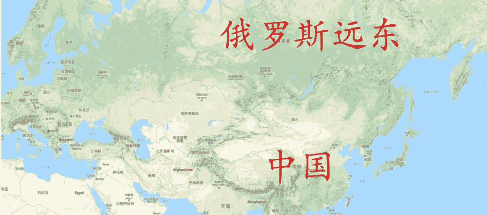

所以《纸牌屋》那个电视剧里对这事有描述，那个俄罗斯总统问美国总统，说是西伯利亚平原上站着个钻井工人，你第一反应觉得他应该是哪国人？美国总统说是俄国人。俄国人很激动地说，对啊，西伯利亚是俄国人的地盘，不是中国的。

俄罗斯强大的时候可能不担心这事，现在疲成那样了，不担心才不正常。这还不是关键，问题的关键是中俄之间的势力差距正在继续拉大，如果中国国力是俄国的一百倍，那会发生啥？到时候俄国人别想睡觉了。

而且美国有个研究国际关系的大佬，他说中俄走到一起，主要是因为美国；如果美国哪天崩了，中俄之间友谊也就到头了。如果一句话总结：

> 只要两国还是邻国，关系就不会太好；只要美国还是老大，关系就不会太差。

### 3 俄印关系

说俄国和中国的关系说了好半天，但是俄国和印度之间的关系就非常简单了，因为他俩之间的友谊一直都非常稳定。

事实上从沙俄时代，俄国就看上了印度，彼得大帝改革的时候就要求成立“印度学”，专门研究印度，一直跟印度上层民族主义者勾勾搭搭。

到了苏联时代，大家都在针对苏联，处处为难苏联，苏联在中国扶持的小伙伴蒋委员长也把他们给咬了，新中国后来也跟苏联翻脸了，那问题来了，是谁从来没有离开过苏联？对，你们猜对了，是印度。

我们之前说过，印度最伟大的领导人应该是尼赫鲁，尼赫鲁本人就特别爱苏联，也爱社会主义，所以才在宪法里规定印度是社会主义国家（现在依旧是）。1946年，印度还没独立，就迫不及待地跟苏联建交。

苏联对印度也有很大的需求，印度资源丰富，苏联跟它完全不是一个纬度，一个在寒带，一个在热带，资源互补，所以苏联缺的东西它基本都有。

再加上印度战略地位非常重要，一国控两洋，苏联也给这个小伙伴充分的支持，印度一建国，两国就黏在了一起，再也没分开。

我们上文说了，中国建国之后苏联给了156个工业项目。但是很少有人提，同时期还给印度提供了102个工业项目，帮助印度工业化，只是印度人天性散漫，吸收的很差。这也是为啥1949年那会儿印度比中国条件好的多，毕竟他们的首都没沦陷，没在一场战争里死三千万人，印度还有英国人留下的基础，加入世贸也比中国早，国际环境也比中国好的多，但是现在差中国二十年。

而且苏联对中国的援助到了1957年就结束了，对印度的援助一直持续到1980年代，整整三十多年。印度也投桃报李，大量向苏联提供他们的土特产，比如橡胶，咖啡，什么的。

而且我们这篇文章《原创 || 1962年中印冲突，印度为什么被打断了腿》中提到过，1962年中印战争前，中国和印度在边境上发生了流血冲突，双方互有伤亡，苏联当时就是站在印度一边的，赫秃还专门跑了一趟中国，指责中国为啥要欺负印度。

在1962年战争爆发后，苏联也第一时间站出来声援印度。

战争结束后，中国和印度苏联都闹翻了，苏联正好利用一波印度来牵制中国，所以他俩之间的关系更铁了。

不仅如此，20世纪七十年代苏联不是入侵了阿富汗嘛，那次行动引发了整个穆斯林世界对苏联的反感，巴基就是穆斯林国家，也反感苏联，这下苏联了就更必要和巴基的老对头印度搞好关系了。

更离谱的是，当中国成功爆炸了第一颗核弹后，印度也开始从苏联引进核技术，当时还偷摸跟美国勾勾搭搭，美国为了拉拢印度，也下了血本，也提供了一部分技术，在这个背景下，印度于1972年成功引爆了第一颗核弹，名字比较逗，叫“微笑佛陀”。随后巴基在某种东方神秘力量的支持下也开始研发核技术，最终取得了成功。

到了上世纪80年代之后，苏联因为油价暴跌，终于自顾不暇，也就没法帮印度了，苏联对印度的输血才停了下来。

但是输血停了之后，不代表双方的感情已经结束了，事实上双方的关系非常稳定，印度需要苏联的武器，苏联需要印度的外汇，这种状态一直持续到现在。

中间尽管印度在贷款方面坑过俄罗斯一次，苏联解体的时候，卢布暴跌，印度突然要求还钱，把欠下的百亿美元的欠款用贬值卢布还了，俄罗斯也没客气，后来卖它军火的时候也坑了它几次。

不过他俩之间有历史，有共同利益，互相没有威胁，而且中国或多或少都威胁他俩，所以关系好的不得了，有点像中国和巴基之间的关系。

### 说到这里，大家应该明白这个关系了吧：

- 中国和俄国，对抗美国的威胁；
- 中国和巴基，对抗印度的威胁；
- 俄国和印度，对抗中国的威胁；

特朗普上台后既拉拢俄国，又拉拢印度，还拉拢巴基（前段时间去印度，在对印度人民讲话的时候竟然说巴基是美国的好朋友，印度人当场就不爽了），其实特朗普的目的就是想孤立中国、不过没啥卵用，如果改变不了利益格局，你啥都动不了。就像你平时不好好学习，高考前转发再多锦鲤都没啥用一样。

只要美国还是世界第一，并且要持续打压对他有威胁的国家，中俄就是难兄难弟。只要俄国搬不走西伯利亚，它就会一直防着中国。同理，印度也没法搬离喜马拉雅，他就一直受中国威胁，肯定会跟俄罗斯眉来眼去。而这些国家之间贸易规模又越来越大，所以关系也不会有多坏。

上次中印冲突的时候，俄国还卖给印度大量军购，看完本文大家就知道了，其实没啥可说的，他俩的军购历史比我国的建国时间都长，这次交易，也属于买家和买家合同里的常规操作。毕竟穷的叮当响的俄罗斯也得过日子，印度又是它的大客户，又是战略伙伴，又有长期的合作经历，没道理不做买卖。

俄国表现的也是个社会人，business is business，对中印之间的事也没掺和没表态。

这段时间俄国陷入了困局，印度也帮不上实质的忙，政府层面惹不起美国，但是敢弃权，民间利用人多优势，涌入推特和油管，到处找人辩，俄罗斯的声望有一半是靠印度人给撑着，另一半被印度人给毁了（到处替俄国人惹别人）。

不过整体而言，中、美、俄三国都是么得感情的杀手，纯粹是利益和威胁指数之间的博弈。而且列强里没有一个没打过我国的，也没有一个不跟我们做买卖的，国家制定政策也不是以个人感情作为出发点，所以还是要像个社会人一样看待这类问题。

公众号懒人搜索，[懒人专属群](懒人专属群)分享

### 一文缕清俄乌之间的矛盾症结

2022-03-01

关注我哦

尽管之前写过乌克兰的事，但是有几个问题一直没弄明白:

- 1、为啥乌克兰不恪守中立，像芬兰那样；

- 2、乌克兰为啥销毁了自己全部的核武器；

- 3、为啥乌克兰很早就要加入北约，俄国今年突然发飙了；

我这两天仔细看了一堆论文，把这些个题又捋了一遍，给大家分享出来，顺便说点我的观点。老规矩，为了防止评论区内容把文章炸了，我就不开评论了，大家随便看看。内容方面我尽量客观不带情绪，只讲事实，到底支持哪边，大家看完自己判断吧。

“二战”结束后，全世界按照势力范围划分了好几个小圈子，苏联搞了“经互会”，老欧洲就搞了欧洲煤钢同盟，那时候的煤钢和现在的芯片重要性差不多，所以毛主席那些年最关心的事里就有钢铁产量，那个著名口号“超英赶美”，全称是“钢铁产量15年内赶上英国，20年内超过美国”，说的也是钢产量。

后来这个煤钢同盟慢慢演变成了“欧盟”，联盟内部搞自由市场，取消了绝大部分商品关税，整体发展的很快，欧洲尽管被打了个稀巴烂，不过慢慢缓了过来，毕竟人死了不少，但知识都在，有了美国的发展资金，就跟一个破产老板似的很快就重新发家。

那时候德国还不行，战败国，武装力量也很小，所以欧洲抗大梁的是法国。法国成立这些联盟初衷，就是既想对抗苏联，也要对抗美国，当然了，苏联是主要矛盾。

所以现在欧盟其实一直跟美国不太对付，美国也在重点防欧盟和日本，毕竟如果有什么货币能挑战美元，主要还是欧元。人民币将来应该可以，现在规模还太小，国际结算在3%左右，而且有外汇管制，暂时不太行。不过从这段时间的情况来看，人民币的避险功能明显增加，未来可期。

“冷战”结束后，苏联的小伙伴并不是直接散了，而是重新成立了一个松散的联盟，叫“独联体”。

跟“苏联”不一样，在苏联内部，加盟国得放弃大部分权利，得听苏共中央的，这个新成立的独联体恰好相反，跑到了另一个极端，对联盟内部的兄弟们基本没啥制约，乌克兰就在这个独联体里边。

这时候就有一个大家熟知的事，乌克兰把核弹给销毁了。

那乌克兰人是脑子被驴踢了吗？非要销毁核弹？难道他们不知道有了核弹就有议价权？

其实踢没踢另说，他们当时也是有个决策过程的，我查清楚了，给大家汇报下，大家看完自己评价吧。

苏联解体后乌克兰分了176枚战略导弹和1500个核弹头，比中国的核武力量强的多，全世界排名第三。

乌克兰当时心里是有小九九的，大家可能不知道，核武器的维护费用非常非常高，比如有些核弹是三四十年前生产的，到1991年已经进入了“技术上极端危险状态（TED）”，随时可能变成另一个切尔诺贝利，问题是拆除这些核弹非常费钱，乌克兰当时非常缺钱。

此外最关键的一点就是得防止被人偷了。

还能偷核弹？

对，以色列、狗大户、恐怖分子什么的，都想偷，而且他们都愿意花大价钱搞这玩意，甚至可以通过贿赂相关人员来操作。所以就得重兵把守，而且得用层层规则设计防止有人监守自盗，甚至美国那样的国家会定期把核弹拉来拉去，费用超级高。

而且已经发生过了，1993年10月20日，当乌克兰工作人员更换切尔诺贝利核电站第三号机组的核燃料时，发现少了123克核燃料；1996年8月，俄联邦安全会议秘书的列别德曾透露，俄罗斯的一些手提箱核武器被人运到了国外，到现在也没找到。美国那边潜艇沉了之后核弹也被人打捞走了。

尽管当时乌克兰内部的民族主义者们想留下一部分核武器，觉得手里有总比没强。

但是乌克兰政府觉得，反正这玩意也用不上，因为核弹的发射密码在俄罗斯手里。核弹是苏联的嘛，苏联完蛋后被俄罗斯继承了。乌克兰人掌控不了核弹，却要维护保养，费钱却用不上，不如换点实惠。

而且美俄在乌克兰“废核”问题是高度一致的，美国主要是担心乌克兰把核弹弄丢了，俄罗斯当然不能允许自己家门口摆着1500个核弹头，尽管自己现在手里拿着核密码，万一将来乌克兰人自己搞定了怎么办。

所以美俄联合对乌克兰施压，各种威逼利诱，美国一会儿说是要给钱，一会儿说是将来给经济援助。俄罗斯则表示不废核就经济上制裁它，当时乌克兰依赖俄国很厉害，如果被制裁，本来就很穷的经济更是雪上加霜。

当时乌克兰正好穷的不行，惹不起俄罗斯，美国又开出来了丰厚的价钱，前后说是要给乌克兰补偿7亿美元，后来又给了两亿，总共九亿。其他各国也都出了点钱，包括日本，大家担心乌克兰留着核弹哪天弄丢了，再过一段时间出现在自己国家，总共加起来差不多有10亿。而且一堆大国签字保障乌克兰弃核后，不会被核弹攻击。

当时乌克兰正面临经济危机，急需钱。乌克兰经历过惨痛的教训，苏联时期为了工业化，饿死了乌克兰几百万人，所以后来乌克兰上层压倒性地决议要保经济而不是核弹。

说到这里，可能有人纳闷，乌克兰偷偷留下几个不就行了？当然不行，俄罗斯人对乌克兰核弹的了解程度远超乌克兰自己，全程俄国监督、美国拆，如果不全拆了，美国就不给钱。

当时俄国也在拆核弹，他们也饱受核弹维护的困扰。

麻省理工的物理学家托马斯内夫给出了个主意，让美国把苏联的核弹头买来发电。在过去的20年，被称为“兆吨换兆瓦”的计划将2万枚俄罗斯核弹头转化为电能。

关于乌克兰废核，还有一个原因，当时苏联的卫星国都加入了北约，乌克兰准备将来也加入，但是加入北约有一堆条件，其中第二个条件就是不能拥核，他们觉得迟早得废，不如现在拿钱废核。

就这样，在几乎所有国家的威逼利诱下，乌克兰政府最后拿钱废核，成了无核国家。俄罗斯后来高兴地声称，让乌克兰弃核，是“美俄外交的共同胜利”。

至于这么做有没有道理，这个评价很主观了，大家自己看吧，民生重要还是核弹重要，这在不同的人那里感受很不同，只能是自己评判了。

咱们继续前文，乌克兰加入俄罗斯主导的独联体之后，这个联盟内部也是矛盾不断，很快11个加盟国，跑的剩下5个了，乌克兰作为其中一员，对组织也是心灰意冷。

尤其2008年经济危机后，乌克兰经济遭到重创，更让他不爽的是，曾经跟自己差不多的小伙伴波兰自从傍上德国的大腿后，风生水起。

德国一直把波兰当成自己的印度，过剩产能去波兰消化，低端产能一部分搬到了波兰，一部分搬到了中国，人口不足也从波兰搞移民。其实后来日本有段时间非常提携中国，很多人喜欢说日本以前给贷款的事，那时候日本就是想把中国发展成波兰那样，所以也有个蜜月期。后来咱们实在是太大了，很快超过日本了，双方慢慢冷淡了。

而傍上了德国大腿的波兰，经济一直非常稳步增长，下图是乌克兰危机前波兰和乌克兰的人均GDP，可以看出来，苏联解体的时候差不多，后来差距越来越大。现在波兰人均GDP已经达到1.5万美元，中国差不多是一万美元，乌克兰只剩下2000多了:

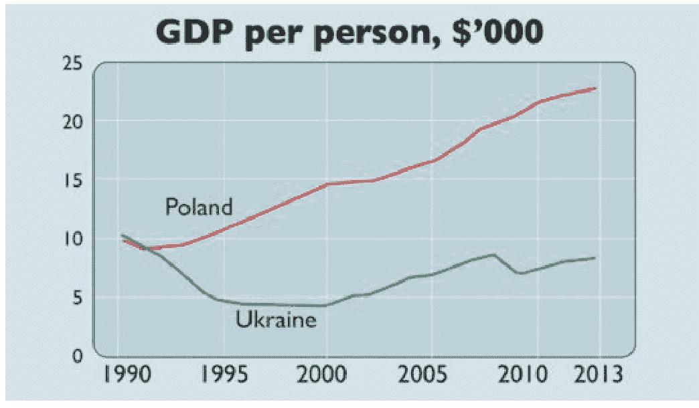

再加上苏联解体后，大量乌克兰老百姓大量去欧盟上班，羡慕那边的富裕环境，所以民间对欧盟的观感越来越好。

此外2014年俄罗斯《公报》报道，欧盟已经取代了俄罗斯，成为乌克兰的第一大贸易伙伴。

一点一点的，钱决定脑袋，乌克兰国策开始倾斜，以前是全身心跟着俄罗斯混，但是经济一直不太好，危机一个接一个，俄罗斯自顾不暇，更顾不上它。所以乌克兰开始想学习波兰，搞“去俄罗斯化”，进而倒向欧盟。

当时发达国家的产能都在向落后地区转移嘛，中国发展也很快，乌克兰越来越急，想承接欧盟的落后产能。当时急着加入欧盟，准备欧盟和独联体它都占着，两边吃。

这事惹怒了俄国。

当时乌克兰上层还是亲俄的，俄罗斯怒了之后，于是乌克兰总统叫停了《联系国协定》。

本国很多老百姓本来已经准备好了去欧盟过好日子（能不能过上另说，但是当时乌克兰老百姓觉得能过上），一听协议被终止，没法加入欧盟，立刻怒了，那段时间每天上街闹，西方一看是个机会，于是出钱出力继续搞，乌克兰危机爆发，后来乌克兰的“亲俄”总统也跑了，乌克兰亲西方政府上台。

其实乌克兰后来的悲剧，源头都在这里，甚至外部问题，原因也在内部，这就是孔子说的“祸起萧墙之内”。也看出来为啥乌克兰没法像芬兰一样搞中立，一是太穷，二是太民粹。

加入欧盟这事其实不着急，完全可以慢慢来，毕竟欧盟又不是北约，加入经济联盟，俄罗斯不至于揍它，毕竟俄罗斯周围的基本都加入了欧盟。只是他们国内那些“亲西方派”人为了自己的私利，煽动老百姓上街，一下子失控了，国家也给撕裂了。

亲西方政府上台后，开始“去俄罗斯化”，天天宣扬俄罗斯对乌克兰做过的恶，乌克兰大饥荒、切尔诺贝利什么的，这两天大家熟知的“乌东”和克里米亚居民大部分都是俄国人，怒了，俄罗斯顺势出兵，于是克里米亚公投走了。

西方希望这事尽快解决，于是大家一起做保，把克里米亚给俄国，乌克兰吃了个哑巴亏，不过胳膊拧不过大腿，也就同意了。

乌东没走成，打了七年，一直到现在，乌克兰坚持觉得乌东是他们自己的固有领土，绝不会放弃。

从那以后，乌克兰彻底倒向了西方，从上层到民众，跟波兰一模一样，极度仇视俄国。

2015年，亲西方政府和美国搞了个“无畏守护者-2015”联合军演，把俄罗斯给吓坏了。

其实我上文讲过，波罗的海三国都是北约成员国，爱沙尼亚边境离圣彼得堡132公里。拉脱维亚边境离莫斯科500公里，跟乌克兰到莫斯科的距离差不多。他们一直刻意不去招惹俄国，所以几十年相安无事。

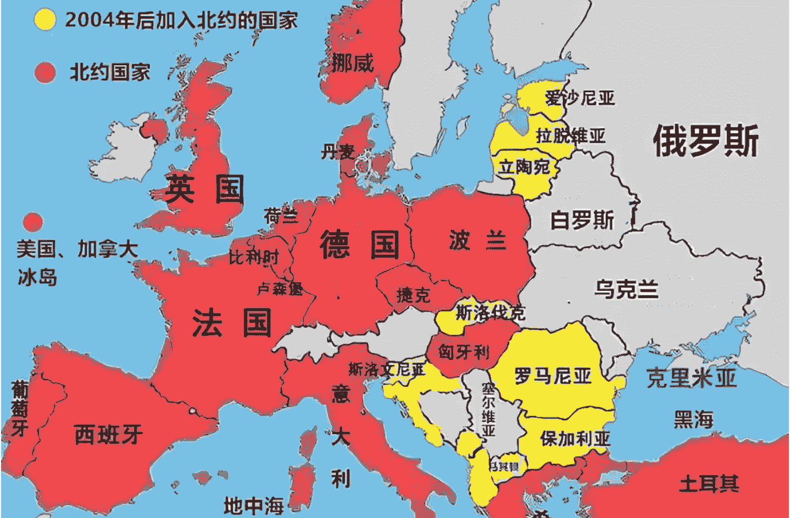

说到这里问题来了，大家可能有疑问，普京一直在说乌克兰加入北约的事，为啥咱们一直在聊乌克兰和欧盟？

主要是吧，2014年的克里米亚事件是因为欧盟引起的，随后问题焦点才变成了北约。

乌克兰从那以后基本上变成了一个“逢俄必反”的国家，而且由于大部队在乌东作战，他们急需要得到西方的支持，所以刻意倒向西方。

而北约有个协议，如果成员国遭到进攻，北约得出兵出钱帮它，演员出身的总统觉得这样挺好，如果加入北约，那就和波兰一样，俄国今后不敢打自己了，于是坚决要求加入北约。

有意思的是，其实苏联解体后，苏联的卫星国基本都加入了北约，除了乌克兰和白俄，乌克兰并不是不想加入，而是一直想加入，从1991年就开始谋求加入。不仅乌克兰想加入，我这篇文章里讲过，《从着急加入北约到全面敌对，俄罗斯这些年到底经历了啥？》，俄罗斯自己都三次想加入北约。

但是加入北约是有条件的，需要满足一堆条件，比如民主化、弃核、还有国防部长由文职官员担任等等。有点像中国加入WTO，得开放市场降关税什么的。

北约之前给过乌克兰含糊的承诺，说满足了这些条件，就让他们加入，演员总统觉得这事得尽快，2019年2月7日，乌克兰议会通过宪法修正案，把乌克兰加入欧盟和北约作为国家基本方针写入宪法，意思是今后要把这事当成国策办起来。这把俄罗斯给惹急了，不过也没那么急，不然2019年就动手了。

主要是美国也在拜登上台后不断地招惹俄国，2021年4月22日，美国国会参议院外交关系委员会通过《乌克兰安全伙伴关系法案》，加强与乌克兰在军事防务领域的合作，宣布对乌克兰的年度军事援助从2.5亿美元增至3亿美元。

此外还有一个原因导致普京下决心揍乌克兰，现在“乌东”那两个州已经鏖战了7年，眼瞅要被乌克兰彻底拿下了，如果乌东战争结束，乌克兰基本上满足了加入北约的条件（加入北约的要求是不能处于战争状态），可能真就要成功加入北约了。

所以普京有点着急。

这次出兵的用意感觉还是很明显，逼着乌克兰政府签字画押把那两个州彻底让出来，并且答应永不加入北约。而且要求北约答应俄罗斯再不东扩，这里主要暗示的是瑞典和芬兰他俩，看上图就知道，俄罗斯周围没加入北约的已经不多了。

这也就演变成了我们这几天看到的事，俄罗斯突然对乌克兰发动进攻。

说到这里，感觉这事的前因后果已经交代的差不多了。

至于俄乌的谈判，我是不太看好，当然了，我掌握的信息也有限，只能是靠自己知道的来判断。

现在普京要乌克兰不加入北约，乌克兰有可能同意，北约也有可能同意，因为这事本来也八字没一撇。

但是要求乌克兰放弃东部两个州，这相当于日本逼着蒋委员长承认日本占领区域就是日本国土，把东北给日本。蒋委员长就算每次战役损失几十万人，还是得打下去，如果不打，不但千古骂名，成了卖国贼汪精卫，而且合法性也没了，大家也不听自己的了。

可能有人说，那两个州公投了，是不是跟东北不一样了？要知道，全世界几乎所有国家，公投都不合法，美国最大的一次战争就是因为南方州要跑路，中国台湾也是中国最麻烦的事。

那个演员现在也面临这样的困局，硬抗有点虚，但是签字割让东部两个州，老百姓能把他给吃了。

现在乌克兰的民主主义情绪高涨，在加上欧美在背后打气，几乎不可能接受割地，所以我觉得这事一时半会完不了。

一开始觉得乌克兰可能被迅速拿下了，而从这两天战果来看，好像乌克兰又能了，可能是西方先进装备上来了，剧情有点向阿富汗战争靠拢，或者苏芬战争。今天看到说是乌克兰的无人机袭击了俄罗斯的防空系统，防空系统被空袭，这事目测不是乌克兰的能力能搞定。下图就是阿富汗人用毒刺导弹击落苏联直升机，当时总共给了三百多枚，击落三百多架飞机，可见这玩意效果多猛。

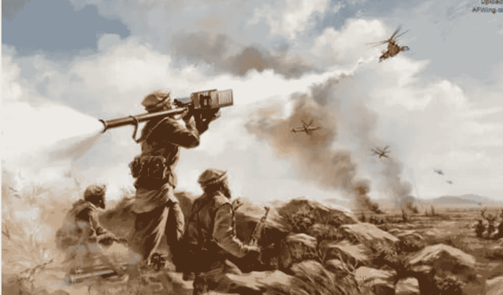

俄国打的也束手束脚，尽量避开平民，估计是担心那种类似“死于战火的小女孩”的图片在全世界霸屏，讲真，自从有了孩子，那种画面我也不能看了，看了就崩溃，普京显然也知道老百姓的承受能力。

这种套路西方玩的很溜，大家看过《纸牌屋》没，里边有个剧情，教师公会不满意安德伍德议员的政策罢工了，安德伍德通宵坐在办公室等着小孩不上学出点啥事，后来终于等到一个小孩死于枪击，赶紧跳出来反击说是教师公会不好好上课，导致小孩出了事，煽动公众给教师公会施压。

现在西方估计也在等这事，普京预判了他们的预判，不过现在的效果就是战争进度极其缓慢。

这事侧面也应证了一件事，普京并没有很多人理解的那样要彻底跟西方决裂，所以才给自己的军队设置了重重限制，明显是想以战促和。而且可能一开始以为这次会像2014年开入克里米亚一样，兵不血刃，不过显然低估了一件事，乌东打了七年，乌克兰人早变了，民族意识被打出来了。

我估计第一天发动进攻的时候整个西方和乌克兰已经懵逼了，这两天已经淡定了下来，时间拖得越久，对俄国越不利。乌克兰那个总统作为一个演员，管理国家不咋样，这几天在社交媒体上终于干上了老本行，俨然把自己搞成了一个英雄人物，西方已经把他看做是当初在列日要塞抵抗德国入侵的比利时国王阿尔贝。

咱们的网上争论很厉害，不过整个推特和FB都在一边倒给乌克兰打气（不打气的账户很多被销掉了），乌克兰如果宣布认怂估计也拉不下脸。

我个人而言，我能理解乌克兰为啥那样做。

毕竟“918”之后东北没了，我国也是抗日风潮形成了压倒性态势，红军长征，口号也是要“北上抗日”。

乌克兰在克里米亚之后，一直就在秣马厉兵，克里米亚收不回来了（因为西方国家做保给了俄国），但是乌东不能丢，像极了我国当时全社会达成共识东北不能丢。

我也能理解为啥俄国要揍乌克兰，之前韩国部署萨德，我国也非常不高兴。而且后来他们还是部署了，估计很多人都有心揍他们，只是我们要以大局为重，不大可能出兵进攻。

而且美国现在咄咄逼人，正在重演蒙古灭金的战例，我们如果不帮着点俄国，今后就要独自面对蒙古铁蹄，我国也变南宋了。于情于理都不能坐视不理。多说一句，印度也在暗搓搓替俄国说话，他俩的关系比我们跟俄国的关系都铁，我之前写文章说过。

反正吧，还是那句话，我能理解他俩，但是对他俩都没法产生共情，他们现在发生的，之前都曾发生在我们自己身上。

如果必须要支持谁，那就坚决支持我们自己国家。

公众号懒人搜索， 懒人专属群分享

### 接下来的斗争只会更残酷

2022-02-25

想到哪说哪吧，不开评论了，随便聊聊。

普京敢这么进攻乌克兰，确实是我没想到的，这次的操作整体风格倒是非常过瘾，不过不得不说，主要的赢家是美国。

首先俄罗斯并没有解除威胁，看下边的图就知道，如果北约执意架设导弹，拉脱维亚和爱沙尼亚也挨着俄罗斯，而且紧挨着圣彼得堡，普京的发家之地，相当于我国的上海，爱沙尼亚边境离圣彼得堡132公里。拉脱维亚边境离莫斯科500公里，跟乌克兰到莫斯科的距离差不多。

而且接下来肯定是残酷的制裁。因为在西方眼里，这事和之前萨达姆入侵科威特的性质差不多，都用了“入侵”这个词，说得很重了，萨达姆也有巨量的油田，制裁一些年后，穷得不成样了。

再叠加我上篇文章的内容，长期制裁最大的问题是人才和中产的持续流出，产业凋零，人才稀缺，想发展起来更加困难。

为啥说真正的赢家只有美国呢？

因为美国最烦的事情就是德法两国跟俄罗斯眉来眼去，已经烦了七十年，这次动武后，终于把老欧洲和俄罗斯一起修理了。

咱们喜欢说“欧美”，以为欧洲和美国是一伙的，其实分歧很大，东欧跟美国普遍一般，美国看他们也是“苏联余孽”，只想从他们那里吸点血，很少给什么实质帮助。

西欧，也就是德法英荷兰比利时他们跟美国关系很好，但是也不是穿一条裤子，法国从来都长反骨，在集团内部从来跟美国不对付，戴高乐时期就不断做那些让美国恨不得揍它们的事，几乎每一件事都在跟美国对着干，在美国人眼里，法国和苏联一样讨厌。

德国倒是低眉顺眼，但是私下里和俄国打得火热，原因嘛也不复杂，前文反复讲过，德国人是很务实的，知道挨着苏联没法硬杠，没必要替美国冲锋陷阵，所以一直采取的是一种“色厉内荏”的做法，骂起俄国来毫不留情，一到实施阶段就说一套做一套。

也正是跟苏联关系一直还不错，苏德双方挺能聊在一起，所以后来在两德统一这个问题上苏联也采取了放任的态度，西德又是塞钱又是各种承诺，终于完成了祖国统一。等到东德情报部门史塔西特务出身的默克尔上台，继续延续了她导师科尔的态度，跟俄国一直眉来眼去。

后来德法又搞出来了欧元，明摆着是要跟美元分庭抗礼，克林顿时期美国大打出手，在科索沃战争中一顿乱炸，导致欧元狂跌，大批欧洲老财搬到了美国，美元用导弹向全世界展示了谁的货币更加有说服力。

至于英国，他和美国有天然的链接，天生一家人。后来又掺和欧盟，跟俄罗斯关系也不错，还加入了中国主导的亚投行，可以说，它跟谁关系都不错，跟谁也一般。

也就是说，“欧美”内部也是分成好几个派别，美国在打击中俄、压制穆斯林的同时，也在极力压制欧盟和日本，防止他们挑战自己。

这下好了，这次行动后，德法两国亲俄势力在本国政治版图中遭到重创，民主国家嘛，老百姓反感俄国，自然会把反对俄国的政党推上去，比如我们前文讲过的绿党，这个党跟俄国的关系，简直了，就跟有仇似的。这不，谈了好多年的北溪二号又陷入麻烦了。

欧洲老财主看来看去，还是美国最安全，他们的钱继续会逃往美国，等美股崩盘后，会有天量资金去抄底，如果能迅速反弹的话，会进一步加强“美股永不败”的信念，其他国家的资金也会去接盘。比如乌克兰和俄罗斯的巨富都在出逃，他们只能去美国和英国待着。

上一篇文章发出去之后，不少小伙伴说为啥他们不来中国呢？

也不是不来，只是极少，可能千分之一都不到，原因倒也不复杂。

首先我们不是移民国家，外国移民想入籍非常非常难。

其次就算来了，也不自在，还是因为我们不是移民国家，我国移民太少。换位思考一下，中国人移民一般也是去加拿大美国澳大利亚，很少去俄国，因为那些昂撒人的国家本来就有大量移民，新过去的心理上压力低，孩子上学班里也都是移民，说话有口音也没人在乎，反正大家都有，去了他们国家找工作也容易，不会出现一个公司就你一个人和别人长的不一样。去俄罗斯就不一样了，一直是异类，俄罗斯人来中国，也一直都有“异类感”。

至于俄罗斯经济，看一张图就知道了，下图是俄罗斯近三十年的GDP走势：

### 来源：世界银行

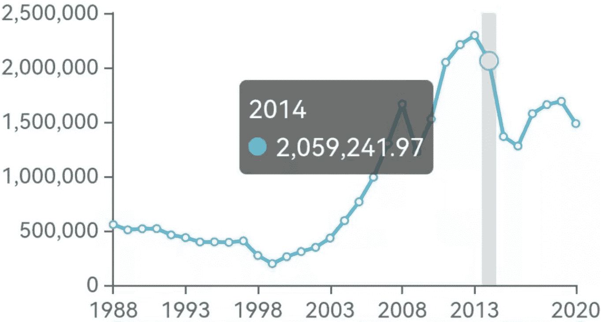

可以看出，苏联解体后，俄罗斯经历了“黑暗十年”，从1998年触底反弹，走出来了一个长达15年的长牛（中间那个下跌是次贷危机），然后在2013年到达巅峰。

2014年克里米亚之后转入下行，越混越惨，直到川总在的那几年一直在针对中国，甚至想拉拢俄国，那几年俄国经济休养生息，尽然走出来了一段反弹，这不，又来了这么一出。

而且大家知道，股市里崩溃的时候，第一波下跌后紧接着会有一个反弹，随后才会一泻千里。

这不是什么经济学问题，而是个心理问题，第一波下跌后，大家往往觉得眼前的下跌只是一个小挫折，说不定还有救，就会加仓止损，如果这次反弹被打垮，大家彻底没了信心，多头变空头，发生大逃亡，一泻千里。

讲真，这次俄罗斯看着战略上处于进攻态势，非常过瘾，不过接下来面对的是巨大的挑战。

如果俄罗斯被贸易制裁后，油价上涨，明显是利好美国的石油巨头和页岩油，以及新能源巨头。欧洲将承担巨大的天然气费用。中国作为最大的原料进口国，显然是吃亏的。这也是为啥前几年我国就超级热心在搞新能源，可见有高手已经在提防这种黑天鹅事件。

那美国就全无损失了？

也不是，“美帝国”进一步解体了。

说这个之前，先给大家说一个人，叫约翰·加尔通，他早年分析了大量材料后，提出了两个预言，都是刚开始的时候耸人听闻，但是过一些年大家惊讶地发现他竟然说对了。

他在1980年说，德国的柏林墙必然会在十年内消失，而且苏联也会瓦解，此言论在当时引发了轩然大波，人们觉得他有病，因为随后在1981年苏联搞了个“西方-81军演”，苏联出动50万大军与上万辆坦克，在波罗的海沿岸举行了人类史上规模最庞大的军演，震慑了西方。

不过神奇的是，十年内柏林墙真的倒了，苏联真的完了。

自此加尔通一战封神，然后他在2013年预测美帝国也会完蛋，而且给定了时间点，2020年。

这不已经过去了嘛，怎么还没崩呢？

注意，他说的是“美帝国”，不是美国，也就是说，美国昔日的那种全球性帝国的位置已经没了，黑社会大哥变堂主，它还是大家眼中的大佬，但是其他几个开始明确它说的话已经不好使，也不再给他面子。

帝国崩溃这种事，“标志性事件”在当时都不太明显，都是后来追加的，比如罗马帝国崩溃，有人说是“条顿森林战役”；英帝国的崩溃是布尔战争；苏联可能是阿富汗战争。都是后来追加的，当时人看不出来。

这次俄罗斯主动发动战争这事，像极了当初中国突然进攻了苏联的小弟越南，导致苏联在一众兄弟们面前毫无颜面，越南战争之后没多久苏联就完蛋了。

美帝国和苏联不太一样，核心是五眼联盟，还有一堆外围小弟，它比苏联精的地方在于，它把大家团结起来，不是靠联盟，而是利益，这样既享受了大家一起捧它的红利，又不用去像苏联一样不断给边疆输血。

美国现在也面对苏联当初的问题，无限信任自己的小弟被打了，美国说话也不管用，还把它丢出去当弃子，利益分析的话，美国完胜，用一个自己的外围野生马仔狠狠搞了一把俄罗斯，但是在声望上跌得不成样了。

可能再过一些年，大家回过头来看，2020年美帝国确实岌岌可危，这次乌克兰战争，客观上让美国重演了1989年苏联困局，美帝国走向了实质的解体。到时候的美国就变回1939年以前的状态去了，这也是川总的愿望。

美帝国解体之后斗争就能缓和了？

当然不是，事实上是更加残酷了。

美国拿着“龙头棍”做话事人的时候，该要的脸面还是要的，大家看黑社会电影就发现，大哥往往都很和善，经常开会，让大家和气生财，不要打打杀杀。

但是想想就知道，一个和善的人怎么能成大哥？只可能这货杀人不眨眼，凭实力上位后，变更了工作方法，要搞秩序，要“以德服人”，做坏事也要找说得过去的理由。

一旦变成了堂主，没了当老大的负担和脸面，可能什么事都能做出来。

从华为这两年的情况就能看出来我国高端产业对海外依赖有多大，而且我国自主研发芯片，很长一段时间基本不可能摆脱对全球产业链的依赖，是的，我们现在的自主芯片，大部分器件和主要原料还是进口的，甚至大家知道台湾的芯片制造产业很厉害，但是很多人不知道的是，他们也完完全全依赖全球产业链，几乎所有制造工具和设备都是进口的。

很多人以为台湾回归后就不依赖海外了，这错得没谱了。

台湾更类似一个操作员，他们不生产机器，他们只是操作机器非常熟，良品率非常高。举个例子，台湾的定位更像一个顶级ps高手，他们会玩Photoshop，玩出了艺术家的水准，比ps开发人员会玩得多，但是他们并不会开发PS软件，也不生产大部分芯片原料，就好像画家不生产颜料一样。如果美国把它踢出产业链，它很快也不会生产芯片了。

此外芯片只是一个问题，我们是生产国，很多生产设备和制造设备的设备我们并不能生产，还依赖进口。

那些东西如果全部我们自己研发，一方面根本没有效益可言发展不起来，另一方面精度差得不是一点半点，毕竟人家用了几十年迭代，咱们一时半会赶不上。

高科技领域不是修桥盖楼，很难有弯道超车一说，只能是加强合作，再加上自我精进，一点一点往前走，我们现在开始跨进了高科技的大门，但是距离最前端依旧很远，更没有自循环的能力。

问题是全球产业链，本身就是以美国为首的西方产业链，这一点在科技行业上班的人理解更加深刻一些。此外我国引以为豪的中低端产业链，原料也基本依赖进口，生产出来后，也面临产能过剩问题，需要卖到国外很大一部分，如果这条链断了，我们很多企业也得跟着倒闭，这些问题短时间内根本没法解决。

所以这两天有人叫嚣要和俄国一起对抗西方，说真的，别想了，我们跟俄国不一样，他们是个加油站，非常耐操。我们是工厂，极其精细，如果强行对比，他们是个诺基亚，可以砸核桃，我们是iphone，稍微高点的地方掉下来就不能用了。我们对全球产业链依赖比他们深得多，彻底自给自足还想发展几乎不可能。

所以接下来，需要更复杂精细的操作，要想办法破除美国的影响，跟全世界合作更加紧密才行。

公众号懒人搜索，<u>懒人专属群</u>分享

### 俄罗斯已经豁出去了，接下来反噬也很大
2022-02-22

上午的新闻相信大家已经看到了，很明显，俄罗斯已经豁出去了。

其他事别人说的已经差不多了，我这篇找了个新角度，给大家讲讲为啥说这次的出手，对俄罗斯未来影响极大，不出意料，接下来十几年俄罗斯都缓不过气来。文章不准备写太长，也不准备开评论了。

之前有个传言，说普京说给他二十年，还大家一个繁荣的俄罗斯。这话后来说是没有说过，不过说没说都不重要，换谁都解决不了这个问题。

我在前边的文章里讲过普京的思维转变过程，一开始是向往西方的，渴望和西方在一起，但是后来发现别人照样要弄死俄罗斯，就被迫反击。

从那一天开始，俄罗斯最大的问题已经出现了，就是俄罗斯精英的再次持续流出。

这个逻辑也不复杂，大家能够在某个国家好好过日子做买卖开公司，肯定是觉得这个国家有前途，这样才会静下心来搞产业，买房，做投资。

俄罗斯被西方制裁那天开始，就面临一个大问题，老百姓这种“恒心”被打击的很严重，倒也不一定觉得俄罗斯就没有未来了，只是觉得今后一直会在这种动荡中度过一生。

所以大量的俄国人继续开始出逃，事实上苏联解体的时候已经跑了很多，1991年到2000年这段时间，苏联解体后老百姓非常痛苦，疯狂出逃，那些年每年跑两百万，苏联核物理专家甚至去美国酒吧打杂也不愿意留在俄国。

2000年到克里米亚事件中间这一段终于稳住了，随后俄国强行占住了克里米亚，西方开始制裁，那件事之后老百姓继续出逃，现在每年有几十万。俄罗斯长达几十年一直都是全世界移民出口国前几把交椅，直到现在依旧是。

俄国人跑哪去了呢？

美国、加拿大，英国、澳大利亚等等，这些国家一直以来比较稳定，而且本身就是多民族国家。不排斥外国人。

大家看电影也能看到，这些移民对其他国家的文化产生了巨大的冲击，什么俄罗斯黑帮，俄罗斯寡头，电脑天才，数学天才等等。比如这两年非常火的《疾速追杀》，里边的John-wick，他就在白俄罗斯帮会里长大，第一季里的对手也是俄罗斯黑帮。

还有那个长得神似马云的V神，他爹就是俄罗斯计算机专家，他6岁移民加拿大，他是计算机天才，后来混成了以太坊头目，27岁就身价十亿美元。

关键是由于汇率不稳，外贸生意非常难做，比如你们厂子做进口本来有10%的利润，俄罗斯货币贬值10%（这在俄罗斯非常常见），你就不赚钱了，再贬值稍微多点，你可能就赔钱了，生意就是这么难。

这种情况下，在俄国做啥都没恒心，除了石油和其他能源行业，这些行业成本低利润大。

但是石油行业有个毛病，石油定价权不在俄罗斯，俄罗斯的国运也随着油价的起伏而波动。

这也是为啥普京的二十年，俄罗斯发展到现在，已经没有任何一家公司被我们称道，咱们身边也没任何一件产品是俄罗斯生产或设计的。哪怕波兰和乌克兰，还真有几款牛逼游戏被大家所称道，比如大名鼎鼎的《赛博朋克2077》和《巫师3》，就是波兰游戏公司“CDProjektRED”做出来的。《地铁》系列是乌克兰的一家公司生产的，由于现在局势动荡，这个游戏公司现在也很受影响。

而且这种趋势是不断加强的，俄国提供不了稳定高薪的职位，西方又非常欢迎俄国的技术移民，所以每年俄国大量的知识精英都远走西方，由于人才流失，国内没啥好企业，其他人没事可做，继续流失。

所以这两年俄罗斯和乌克兰前线对峙，很多俄罗斯人心里有苦，担心存款缩水，担心股票暴跌（已经暴跌了），担心失业，因为自己的老板可能挺不过汇率波动破产了，或者老板选择移民了。

这其实就是我之前说的那件事，美国特别愿意制造冲突，一旦有了冲突，资本和人都会感觉到危险，有了危险就要找个避风港，转一圈就看到了他们昂撒人的几个国家最稳定，然后就跑他们那里了。

接下来不出意外，俄罗斯又将面临惨烈的制裁，现在的俄罗斯制裁是制裁不死的，毕竟他们人少资源足，怎么过都是个过，但是如果遭受严厉的制裁，必将导致更加激烈的资产和人才流失，老百姓知道了留在俄国不会有啥大发展，很多人会前赴后继地离开，尤其那些家境不错的。

之前英国BBC采访过一个俄国企业家，那哥们还是挺爱国的，他说离开俄国是他经历的最难的选择，不过为了自己的孩子不受苦，他选择去英国，给孩子一个未来。

有小伙伴说，我国企业可以给俄国提供支持吧？

其实也很难，一旦俄罗斯遭到制裁，如果继续跟他们做买卖，连做买卖的公司也会连带遭到制裁，所以买卖肯定是继续的，但是规模可能会大幅缩减。

所以普京现在的这个操作，看着很过瘾，但无疑把俄罗斯未来几十年国运给钉死了。

换个角度，俄国还有其他选择吗？

好像也没有，现在美国玩的就是阳谋，俄国的选择并不多。俄国人接受不了，逼着普京从防守转向进攻，以乌克兰为代价，彻底搞死俄罗斯。俄罗斯接下来大量的财产和人才流出，只能是流往他们昂撒人的地盘，因为他们没啥民族观念，来了自己是自己人。可悲的是乌克兰人，整个国家上层都是买办，为了西方的利益，把自己国家搭进去了。

那对于我国来说是好是坏呢？

感觉既没啥好处，也谈不上坏。

有人说这次冲突会让美国重新开始对俄国的围剿，这也想多了，俄国早就失去了进攻性，这次也是以进为退。很多人动不动就聊核弹，想想就知道，核弹本身就是“最后手段”，俄罗斯没到首都被围攻或者确认美国核弹已经升空，不会真扔那玩意。别人也不相信它会真去用，所以那玩意没啥威胁性。

而且法国德国跟俄罗斯关系都还不错，有他俩在，俄国最后的生命线，资源产业，就能继续活下去。投鼠忌器，俄罗斯也不会对他俩太过分，防止这些国家的老百姓对俄国态度发生急剧恶化，他们的政治家受老百姓态度影响太大。

所以俄国这么折腾，美国也不会腾出更多精力去对付它。

那会腾出更多精力对付中国吗？

也不会，至少这件事和对付中国形不成多少因果关系，如果有，那也只能是俄国今后对中国的依赖性更强，毕竟以前他们大量不能生产的工业部件需要从欧美进口，今后只能依赖我们了。这个意义上说，对我们有一丢丢好处。

总之，俄国的事起码给了我们两个启示。

首先，全世界能持续发展的国家并不多，我们的幸运之处在于，我们生在了一个持续发展的国家，很多稳定都能被发展给解决。

其次，一定要保持稳定，稳定绝对是压倒一切的，如果哪怕稍微有点动乱，后果也是我们很多人没法承担的。

公众号懒人搜索，懒人专属群分享

### 人口贩卖不但没有远去，反而非常猖狂
2022-02-21

这两天看到一个很郁闷的新闻，一个中国男子被囚禁在柬埔寨做“血奴”，更郁闷的是，从后来的新闻来看，这种事明显不止一起。后台也收到不少消息让我聊聊怎么现在还有这种事，正好这个话题以前研究过。

事实上就在博主敲下这些字的时候，无数的罪恶正在这个世界的各个角落里不断地发生，人性的贪婪，对财富的渴望，促使一些人，曾经而且正在以及将来也会一直践踏人类的道德和法律底线，做出一些令人发指的事。

不过查了不少资料，突然发现很多悲剧完全可以避免，怎么避免我们文末讲。

根据联合国毒品和犯罪问题办公室披露：

人口贩卖是世界上仅次于毒品和军火的第三大黑市贸易，在转卖过程中，就有70亿到120亿美元的利润。这是啥意思呢？也就是说，一系列倒手操作，中间商互相卖这些人的差价就高达70亿到120亿。

被贩卖的人到达目的地后，会被进一步牟利，比如组织卖淫，器官买卖，当奴工，又有高达320亿的利润。

可能大家对这个数据没啥感觉，要知道，中国对美国出口高达4000亿，这4000亿里利润有多少？估计不到400亿，大家感受下人口买卖这恐怖的收益，这么大的利润，一些人做出什么事来都不值得稀奇。

人口贸易由来已久，可能也是人类最古老的几项贸易之一，早在上古的时候，部落间交战，处理战俘的时候就出现了买卖人口的事。比如两个部落作战，一方战败，成年男性被杀，妇女小孩就被带回到战胜的那个部落，可能留着自己用，也有可能去跟别的部落换了物资。

罗马帝国崛起过程中就经常干这事，罗马最早是意大利那个半岛上的一个村，慢慢扩张成一个环地中海的帝国，它每征服一个地方之后，经常就把那个地方的所有人都当成奴隶卖掉，偶尔还卖到希腊雅典什么的。

等到罗马帝国彻底崛起后，帝国境内割据势力被推平，完善了公路设施，规定了统一的交易货币，奴隶买卖也就变得稀松平常，关于罗马买卖奴隶的事，大家有兴趣可以看看那个电影《角斗士》，还原度还挺高。

而且那时候西方的已知世界分为“罗马”和“非罗马”，“非罗马”主要说的是现在德国那一带的日耳曼地区，那是罗马扩张的边界，罗马军团再往前打也打不动了，蛮族进攻罗马也没那个实力，从那以后双方既然吃不掉对方，干脆做起了买卖，日耳曼不是一堆部落嘛，互相打来打去，战胜方就把战败方的战俘当做奴隶卖给罗马人，罗马人再把这些人赶到首都斗兽场供大家娱乐。

> 所以恩格斯说： 除了牲口，奴隶是日耳曼人卖给罗马人的唯一商品。

后来罗马帝国完蛋了，但是它开创的一些创造性的思路却延续到了现在，后来大航海时代，非洲部落间混战，战败方经常被成群结队地赶上英国人和荷兰人的商船运往美洲种甘蔗。

到如今，时过境迁，千年时光一晃而逝，我们去看贩奴地图，惊奇地发现，如今贩奴模式跟千年之前竟然如此相似，

> 依旧是动乱国家是人口输出源，国际商业组织做中介，卖到别的国家当娱乐品。

大家知道上世纪苏联解体吧？随后整个苏东都陷入了乱哄哄的动荡中，俄罗斯，乌克兰，白俄罗斯，都乱成一片，政府自顾不暇，老百姓在生死线上挣扎。

只要有动荡，就有人从中牟利，大量的东欧少女被贩卖到西方各个地下脱衣舞厅从事性交易，这种状态从那时候起一直持续到现在，现在欧美妓女主要供应国依旧是东欧。

一方面东欧“毛妹”人高马大，几乎符合全世界跨文化的所有审美需求，能卖的上价，另一方面主要是他们国家太过松懈，都处于半无政府状态，所以犯罪成本非常低，收益高成本低，这简直是滋生犯罪的培养皿。

这些东欧女孩深深地厌恶本国的贫穷和落后，希望去发达地区，这个心理正好被蛇头利用（“蛇头”就是倒卖人口的中介），蛇头骗她们要去发达国家从事服务业，比如做模特或者服务员，可是一转眼就被送去了阿姆斯特丹、汉堡、马其顿等地当性奴，之前凤凰网做过一个专访，我截一段大家感受下：

> 一个名叫伊兰娜的摩尔多瓦女孩称，蛇头哄骗她到意大利西西里餐馆当女招待，偷渡出境后却辗转被卖到巴尔干的妓院。大多数摩尔多瓦妇女都是为摆脱贫困而拼命地外逃，结果一个个落入魔掌。进入妓院后拉下一屁股的债，大多数受害妇女都有类似的经历。

> 奥尔加是其中之一，她被迫从妓后遭受了惨无人道的折磨，却不敢披露自己的苦难经历。在这里，100个记者的报道不敌一个蛇头厉害。奥尔加的境况已极其恶劣，各种疾病缠身，她除了流于眼泪的黑眼眶、一身病毒、周身黑斑，别无其他。

她成为威勒斯塔小城的一个缩影。她每天被迫与10个男人睡觉。美国《新闻周刊》记者在该地区做了持续4个月的调查发现，与奥尔加同样遭遇的妇女不计其数。凡逃跑或告发的受害者，大多被追杀谋害。

此外，只要有战乱就有此类恶行，这几年中东和非洲内战，就出现了大量的这方面的问题。

前段时间CNN播出了一段视频，揭露了21世纪人类最黑暗的一幕。那些抱着踏入欧洲天堂梦想的非洲偷渡客，刚到地中海，过海就到欧洲了，这道海却成了天堑，因为他们成为奴隶主们的猎物。

他们主要来自尼日利亚、冈比亚、塞内加尔、厄立特里亚、南苏丹、索马里、喀麦隆等国家，难民奴隶们被抓到后捆绑着关在笼子里，天天被鞭子抽，以600-800美元的价格被卖给利比亚部落民众。据估计，已经被卖掉的奴隶不会少于1.9万人。

这里就有一个问题，这些人明目张胆的干这种事，难道没人管吗？

主要是那些国家的政府都不太能管的到，我们总说，权力讨厌真空，没有政府就会有黑社会，黑社会会挑利润率高的事来做，贩卖人口、军火、毒品什么的。

类似这种情况的，还有那些不发达国家老百姓，普遍向往发达国家的幸福生活，支付蛇头巨额费用后，蛇头把他们卖到了世界各地做奴隶，毕竟你没法去大众点评上查下这个蛇头信用好不好，如果跟了坏逼蛇头，那就倒了血霉。

他们被随便卖到了什么地方，比如去非洲南部种可可，去中东当性奴，或者去美国地下打黑拳。我国上世纪有一段时间，大量的人受到这方面蛊惑，去全世界冒险，不少人就掉进了这个坑里。

整体而言，人口拐卖的事跟治安条件强挂钩，比如乱哄哄的东南亚地区，据说全世界三分之一的被贩卖人口在那边中转，然后卖到全世界。

一方面东南亚破事太多，警方也忙不过来；另一方面警方忙不过来导致破事更多。犯罪成本非常低，进一步促成了治安环境恶化。东南亚整体的形势就是大城市还好，边境地带基本都是三不管的无政府区。

举个例子，我们说泰国，泰国这个国家有多不靠谱呢？大家知道缅甸的罗兴亚难民吧，这些人在缅甸遭受迫害跑到了泰国，本以为逃脱升天，没想到从一个坑里掉进了另一个坑。

### 中国劳动力迁移史

2022-02-17

这段时间跟以前的一个同事唠嗑，他说他当初也担心35岁被辞退的事，后来干脆一了百了，抢在公司辞退他之前自己辞职了。

离开公司后，就开始了自己的个体户生涯，一直在做软件咨询，接一些公司的技术支持相关问题。现在在圈里略有名气，收入竟然比之前都高，关键是自由度也高得多。考虑带几个徒弟，组建一个存在于网上的“赏金猎人小队”，连办公场所都不用租，大家都在家里办公就行了。

他跟我说他跳出公司这个圈之后，重新审视，才发现一个问题：大公司为了避免老同志们松懈，想了无数办法来让大家过得不爽，辞职前自己有一半的青春浪费在了系统内耗。

真正的世界是“结果导向”的，只要解决问题就行了，根本没人关心你到底多少岁。可是公司内部领导不知道你怎么想的，所以领导假设每个人有摸鱼冲动，以这个想法为前提，进化出来一堆搞人小技巧。公司越大，越需要各种冗余来保证你的目标和公司的目标保持一致。

现在好了，他体会到了个体户的爽，再也没法回去上班了。而且他表示突然明白了另一件事，就是公司当初招聘的时候，绝对不招有创业经历的人。以前理解不了，现在明白了，因为人一旦单干过，就再也受不了大公司那种阶层体系下人搞人了。

我这两天思考了下这个问题，回顾下过去，看看现在，顺便思考下未来。

### 改开前后

改开前，农民在村里种地，工人在城里上班，每个人在自己的岗位一干就是一辈子。

查了下国家统计局的数据，1978年的时候，我国有0.69亿人在工业领域，0.49亿在服务业（供销社什么的），剩下的人在农业，整体而言，当时还是个农业国。

那时候的工人地位是很高的，当时的厂子跟现在不一样，厂里的人几乎不用考虑倒闭的问题，厂子里有幼儿园有小学，有医院，有运动场，大部分人娶妻生子都在厂子里，厂子就是一个人的一生。

这种模式在改开前后，受到了多重冲击。首先是几百万上山下乡的知识青年返城，这些人回城后，自然没有那么多岗位供应，于是只能是自谋出路。

他们应该是我国改开后第一批“灵活就业”的人。有些人过上了偷鸡摸狗的生活，还有一部分顺应当时的政策空隙，开始搞起来个体经营，中国初代市场经济和返城知青强相关。

后来著名的“傻子”年广久，靠卖瓜子变成了百万富翁，那可是80年代初，当时的人眼里，这个财富规模，跟现在大家看马云差不多，甚至引发了全社会的讨论，最终甚至由邓公给定了调。由于当时的人消费需求被压抑得太过严重，所以各种小饭店、衣服店、副食店兴起后，大家都争相购买。这些从业者赚得太多，以至于比“铁饭碗”的那些人赚得太多，社会上也各种声音很大，“造原子弹的不如卖茶叶蛋的”。其实也不一定是真的原子弹研发人员不如卖茶叶蛋，他们说的是“铁饭碗”跟市场化的工资没法比。

这种形势激发越来越多体制内的人也寻求创新和突破，有的离开体制，去独立创业，有的在体制内寻求突破。

大家看过电视剧《大江大河》没？那里边三个男主角，讲的就是三类强人，在国企、乡镇集体企业（中国现在大部分企业都是从乡镇企业过来的）、个体户这三个领域，奋斗奋发图强，各自突破的故事。这些事构成了改开初期我国混乱而生机勃发的社会生态。

一些人视野比较广，跑去香港拉项目。香港那时候还是以制造业为主，考虑到香港人工成本比内地高，香港企业也考虑能在一河之隔的深圳搞个工业区，到时候给香港做代工，后来这种模式扩散成了中国制造业的雏形。

由于代工业务蓬勃发展，需要大量的人力，1992年国家放开了农民流动，大量农民离开家乡去沿海务工。

这些农民工当时去沿海务工比在老家务农收入高好几倍，所以自发地形成了一种类似“潮汐”的社会涌动。每年过正月十五，农民们浩浩荡荡地赶往东南沿海，等到过完元旦，又陆续开始返乡，以至于现在大城市里过了元旦就没人干活了，得等正月十五之后。

随着老百姓收入上升，大家对房子也有了要求，于是国家开始大规模翻新城市，房地产也开始上马。

一直到2013年，全国都是个大工地，都在忙三件事：一是修工厂搞生产，二是搞基建，三是盖房子。那时候大家找工作，主要是去工厂当工人，或者去工地当工人，互联网行业刚起步，国内也没啥科技公司。

那段时间的中国城市，就是个工厂。当时最重要的两个词汇，就是“招商引资”和“工业园区”，从这两个词中也能窥见我们当时的样子。

懂了这件事，大家也就明白为啥工地人以前好好的，这两年突然开始频繁提桶跑路，因为以前我国也没啥别的工作，大学生毕业去工地稀松平常，大家都是工人，对比落差也不大。可这两年突然间好像在城里修空调都比他们在野地里赚得多，所以心态崩了。

那这些年发生了啥呢？

### 分水岭的2013年

“80后”应该有个明显的感受，中国好像突然间就变了。

如果仔细查看数据，就能发现这个年份应该是2013年。那2013年发生了啥呢？

服务业超过了工业和农业，成了国家经济的支柱，中国从以前的出口导向逐步转变为消费导向。中国从那一年开始，国家的发展动力从“工业化”转向了“城市化”。

**1952-2020就业人口统计表（单位：百万人）**

但并非制造业的权重降低了，制造业在我国社会经济与民生中始终扮演着基石的作用。实际上，一方面，制造业很难在直接刺激内需上实现跃升式的效果，另一方面，在个体收入上，尽管网上一些人对“工业”和“制造业”无限推崇，不过一个不争的事实是，你在工业领域做，除非你是厂长，否则很难赚到钱。

这一点不止中国这样，全世界都这样。很多人喜欢用德国举例，首先德国的工人收入并没有网上说的那么高，哪怕是工人也希望自己的孩子将来去做软件或者金融。

另一方面德国工人已经非常少了，他们把不赚钱的产业全转移到了中国和东欧，只剩下了一些高收益的产业。据德国联邦统计局统计，截至2019年底，德国就业人数4530万，同比增长0.6%。其中，农业就业人数60.6万，制造业就业人数114.5万，服务业人数3367万。

看到了吧，工人数量一百来万，服务业是工人的三十倍，三千多万人。工业往往是个基础，大国没这玩意不行，但是海量的老百姓想靠这个赚高工资，是一件很难的事情。

那靠啥赚钱呢？主要是服务业，尤其是数字化的服务业。只是服务业得等到大规模城市化之后才会出现，这也是为啥直到2013年之后才发生明显的变化。

在这个过程当中，国家主导的另一张大网迅速铺就。截至2019年底，中国农村公路总里程超过了400万公里，可以绕赤道100圈。具备条件的乡镇和建制村，已经实现了100%通硬化路，100%通客车。截至2019年底，中国行政村通光纤、通4G的比例双双超过98%。国家在农村建成了13万个光纤网络，3.7万个4G基站。

基础打好了，服务业就会涌现出来。

跟过去相比，“城市化”驱动的国家对消费品的需求越来越复杂。四十年前，我们全国穿的都差不多，如今一条街上找俩完全穿一样的都难；四十年前我们几乎不会给游戏花钱，现在宅男们的游戏开支甚至开始跟饭钱差不多；二十年前我们很难想象一个游戏工作室的收入会超过一个几万人的大工厂，现在已经发生了。

而且大家可以再想一个问题，近几十年来，大家都说通货膨胀钱不值钱了，其实仔细想想，车显然没咋涨价，一定程度上还降了，电脑也是，算力提高了好几倍，价格却变化不大，甚至还在下降，手机也是。但是饭店越来越贵，医院越来越贵，教育也越来越贵（公立教育其实也是越来越贵，只是国家替大家分担了，有兴趣可以了解下国家不补贴的专业，比如三本什么的，非常贵）。

不出意外，用不了多少年，我们就体会到了美国人的感受，跟人相关的东西都非常贵，能工业化生产的都在降价。而且越发达的城市，服务业占比越高（四大一线城市作为我国的经济引擎，服务业占比都超过80%），这些城市对体力劳动者需求越多。

这些变化的本质，其实就是服务业的持续发展崛起。服务业有很多，科研、金融、销售、设计，此外还有大家熟知的快递和外卖，还有很多新型的业态在持续冒出来，成为吸纳就业的市场主体，劳动力的自然流动也越来越频繁，因为同样的付出，大家肯定是想着挣更多钱，这也是为什么国家公布的灵活就业的数字在持续上涨。

有小伙伴问，难道送快递和开滴滴就比去电子厂好？

之前有个小伙伴后台联系我，他说他94年的，高中读完就不读了，去干过流水线工，后来送过快递，做过水电，现在上门修手机。

他说他这辈子最不能想起的就是在东莞流水线的那三个月，人间地狱，每天累得半死，上个厕所还要看人脸色，不到时间还不让去，吃的饭也不太好，住的地方旁边就是厂房，厂房机器轰鸣，人休机器不休，他们照样睡死死的。三个月内他们一起来的都跑光了。

后来去送快递，尽管快递也苦，而且一开始没经验，赚不了几个钱，不过离开工厂那段时间是他这辈子最轻松的一段时间，自由了太多。送快递也忙，但是自由，不用一站十个小时，不用去厕所还要看人脸色，反正是再也不想到工厂。

后来又学修手机，一开始赚的少，后来干活认真细致，业务越来越熟，又加了好多人的微信，开始在朋友圈收二手手机和电脑，尤其妹子用过的电子产品，把膜去了就跟新的一样，能以九成新折价卖出去，现在有时候一个月能赚几千块，有时候运气特别好能赚到两三万。

他说将来往哪发展自己也不知道，但是无论如何也不会去工厂了，赚的少倒是其次，完全没自由和自尊，感觉在那里呆的年头长了就成废人了，纯粹就是个电池。现在尽管也谈不上多有前途，但是有太多的自由支配时间，可以跟其他人聊，看看还能做点啥，城市这么大反正总有事做。

我不知道有多少人像他这样想，但是我觉得他代表了很多人的观点，受不了那些约束，从制造业逃离，再也不想回去。我理解这也是当下制造业的一个明显困局，给年轻人加钱都不去，问题是工厂给的钱也不高。

我还真去查了下，现在电子厂的工资大概在4500到5500之间，其中底薪2280左右，其他钱是加班加出来的，一周干六天，一天干12个小时。

这个收入可以看做是大城市的“最低保障”，现在很多人不愿意去工厂，并不是年轻人眼界高，主要是他们有更好的选择，比如今天抖音上一个外卖员把工资条放了出来，一个月送1800单（他们合并送，一次送五六单），赚了九千多。

而且有件事属于常识，城市再发达，基层体力劳动者都不能少，比如家里漏水，搬家，装修什么的，这些事都需要人力来做，美国那边有些县跟花园似的，人工费用贵得离谱。

不仅学历低的年轻人选择不进厂，读过大学甚至读过好大学的人不进写字楼的人也越来越多。

他们不去那些写字楼上班，和快递员们不去电子厂的原因差不多，一方面是不想去流水线上当螺丝钉，另一方面是确实可以找到更好的工作。他们之所以能找到写字楼之外的工作还有不错的薪水，也是因为城市化会催生各种极其细分的需求。

比如我之前讲到的，有些人专职编段子，然后卖给脱口秀节目，对，脱口秀节目的段子不是他们自己编的，属于购买的服务。

还有人给广告公司拍视频，也就是广告公司拿下订单后，他们自己不做（他们只做擅长的，其他都外包），直接转卖给专门拍视频的那些人，他们自己去想办法。

电影上映了，需要宣发，电影公司先找来宣发公司，宣发公司再去找电影自媒体炒作，电影自媒体再去找写手，好几个写手同时开写，谁写的好用谁的，然后再交给做视频的高手开始录音做视频。要是搁以前，这些人可能都在同一个公司，现在到了写文章和做视频那一级可能就都是自由职业者了。

还有我上文提到的软件行业也进化出来了这种自由职业。比如大厂有个项目想外包，找到咨询公司，咨询公司再找几个对领域非常熟悉的高手，这些人在家里就把活给干了。很多老码农，35岁“毕业”之后在公司呆着，跟一群毛头孩子混，别扭，就变成这种了。

甚至还有大学毕业生直接去做保姆了，因为现在的一线有钱家庭不愿意孩子跟个村里大妈一起成长，希望高薪聘请有学历的保姆，那些保姆工资三四万也正常。

仔细想想，就能发现，跟制造业相比，服务业最大的特点就是需求千差万别，没法批量复制，自然会催生出来各种稀奇古怪的职业去满足这些需求。

所以传统那种以岗位把人定死的组织模式今后倒也不一定消亡，但是今后越来越多的人会选择灵活的就业形势。

现在经历了疫情洗礼之后，美国那边有公司员工长期在家办公，于是干脆把办公场所都给退租了，整体的方向是越来越不像公司。不过想想，现在的公司跟19世纪的公司也不是一回事，将来的肯定跟现在不一样。

有关专家预计，到2035年，我国灵活就业群体将达到4亿左右，约占劳动力主体的一半，看着匪夷所思，不过想想也正常，越来越多的人没法接受去产线上做螺丝钉。

甚至会出现越来越多的公司，里边的人互相在线下都没见过，互相之间也没有劳动合同，通过共同的目标组织在一起，类似马克思说的，自由人的自由组合。

### 尾声

写这个倒也不是鼓励大家去辞职，而是说社会发展到了现在，早就过了那个必须依附在某个体系上才能活下去的阶段，今后也就没有那种“离开什么地方就活不下去”的事了。大家工作稳定那固然是好事，不稳定也不代表是坏事，反而可以跳出体系去尝试下各种不同的可能性。看完这四十年的历程，是不是有种感觉，其实发展最大的红利，就是每个人的选择越来越多，今后越来越灵活也是一个趋势。

一个人一辈子在某个厂子里干到退休这种事越来越是个神话，甚至德国日本那种倡导这种文化的国家也玩不下去了，因为新技术一出现，立刻干掉一大堆职业，比如数码相机出现后，再牛逼的传统相机工人都得转行，机器人一降价，电子厂打螺丝的那群人也得跟着降价。

既然趋势已经成这样了，就没必要紧张了，调整好心态，迎接未来。我们应该看到，民生的整体发展是国民的收入越来越高，生活越来越好，有越来越多的低收入群体跨入了中等收入行列。因为新产业、新模式的不断出现，社会的上升通道实际上也在变宽。

比如，大家一定看到过很多快递员、骑手回家全款买房的消息，他们通过付出劳动力，获得了更多收入，从收入角度看已经是城市的新中产。

纵观中国劳动力的迁移史，这应该是一个最公平的时代。

公众号懒人搜索，懒人专属群分享

### “鹤岗化”可能是大部分小城市的命运

2022-02-11

我老家是山西的一个地级市，全国范围内算差的。这次回去，有个高中同学已经做到市领导了，过年正好闲着，过年期间没少一起溜达，聊了不少，感觉挺有启发。

不知道怎么就说起鹤岗来，他有个说法，说除了一二线大城市，其他大部分地方都是鹤岗。

为啥这么说呢？鹤岗为啥成了鹤岗？主要是下边三个原因：

- 没啥好资源，比如港口、特产等等（也可能资源耗尽）。
- 没有增长性特别好的产业；
- 人才持续外流；

一个地方怎么才能发展起来呢？往往是有什么特别好的资源，地理环境好也行，比如有些城市是港口，有些城市是交通要道，都是资源，先做资源买卖，等有了本钱，再赶在资源耗尽之前转型更加持久的产业。如果啥都没，那就惨了，被锁死了。当然了，资源型城市大部分有依赖症，转型失败得多。

我们那个地级市因为没有好的资源，所以没有有特别好的产业，每年高考倒是有不少孩子能考名校，但是这些孩子毕业后都不回来，主要是回来也没事干，比如我这个同学他自己倒是北京名校毕业，回来也只能去做公务员，干不了别的，其他人都不愿意回来。

人才不回来，自然搞不出来什么新产业。没有产业，人才只要考大学走了，就再也不回来了，在过去几十年里，处于一个持续的放血状态，整体是一个恶性循环。

由于没啥好产业，或者产业停滞不前，生产力决定当地文化，当地的文化也变成了一种“静态文化”。

增长很慢的社会里，“人情”是另一种货币，子女找工作，自己出门办啥事，不找点关系心里不踏实。

而且在静态社会里，大家脑子里“拼搏奋斗”、“出人头地”的想法会淡很多，反而对“稳定”有种独特的需求，毕竟眼前的日子要过很多年，所以当地的老百姓最热爱的东西，无疑是公务员，如果当不上公务员，退而求其次去个电厂等国营单位。

甚至有人总结，小城市分为四等人：

### 第一等，公务员、事业编

哪怕赚得少，那也是人中龙凤。

### 第二等，生意人

有钱人，去了小城市就发现奔驰宝马也不少，那些饭店和洗浴中心老板往往非常有钱。

### 第三等，打工族（非事业编）

一般在饭店端盘子，在洗浴中心打杂，等等。小城市和县城老百姓鄙视打工人，主要也是因为他们视野里的打工人往往都是这种，可能不太理解你在外边干啥。既然不知道你在干啥，就觉得可能跟在洗浴中心打杂性质差不多吧，没尊严，不稳定，而且也升不上去，因为领导要先提拔自己的亲戚。小地方的老百姓往往想象不了大型公司是怎么运转的，以为都跟当地洗浴中心差不多。

### 第四等，该溜子，没啥正经稳定职业

街坊邻里的笑话，谁家有个流氓儿子，自我安慰的时候，会说“总比老王家那个该溜子强吧”，老王家可能也这么看他家。

热衷公务员这事不仅是山东，在哪都差不多，只是山东的共识要强烈得多。大家可以仔细看看，民营企业发展不太好的地方，这种观念都比较重，这种观念又束缚了民营企业，稍微有点能力的人都进了体制，民营自然发展不好，反过来不断强化“万般皆下品，惟有读书高”的观念，事实上我国古代说的"读书高"，也不是咱们现在的"知识是生产力"，而是那时候读书可以考取功名，看着是在说读书，其实说的是编制。

编制之外，就是房子。

在我们老家那种已经“鹤岗化”了的地方，房子是几乎所有人的头等大事，不过那地方公务员才能贷到款，其他人很难很难，这时候就得靠民间借贷，大家“融资”主要靠亲戚朋友。

周边县城里的“有钱人”也会去小城市里买房，为了子女回家探亲方便，也为了自己方便，所以这些年县城人才流失严重，先是流失了外出读书务工的年轻人，然后流失了比较有钱的中年人。

但是和鹤岗一样，盖房子这种“土地财政”在当地也搞不下去了。

在我们老家那种地方，老百姓攒好多年，集合亲戚朋友所有的资金，最后才能买套房。经过过去几年的折腾，能买的几乎都买了，剩下的就是改善了，每年都有那么一批人发点小财，然后就会在当地选择好小区搬进去，于是当地有些小区房价比其他地方高一大截，户型也大，小区物业非常负责，整体风貌跟其他小区完全不是一码事。

但是对于政府来说，由于买房需求透支得差不多了，再想卖地，开发商也不一定接了，因为卖便宜了政府不愿意，卖贵了开发商不赚钱，所以卡住了。

换句话说，房地产拉经济这事并不是可以无限使用的，它有根最后的红线，也就是开发商开发出来的房子，当地老百姓买不买了？

如果老百姓没钱，不买了，那开发商就选择不拿地，“鹤岗化”的城市就是这样。如果买，那说明还有购买力，还可以继续玩。

这个意义上讲，很多地方根本没法用“土地收入”这根拐杖了。也同时说明一二线远远没结束。

而且尴尬的是，越缺钱的城市越没法搞房地产，越可以玩房地产的城市其实不太需要玩。

此外观察其他发达国家的历史，还能发现一个趋势。

每个发达国家的历史上都会有一波超级基建，一开始是全国大拆大建，但是很快就玩不下去了，因为大拆大建是需要老百姓财力支持的，等到基层的储蓄耗尽，这个游戏就玩不动了。

然后那些国家也无一例外出现了“二次城市化”。

也就是农村的人进城导致城市大规模拆迁一番，但是这些人进城不是可持续的，到了一定程度就停了，这是第一波城市化。

然后小城市再向大城市再来一波，小地方有才华的人会选择去大城市打拼，日本的东京，韩国的首尔，美国的洛杉矶和旧金山，都是这样。第一波和第二波是有一定重合的，不过第二波持续得更久一些。

这就导致各国除了大城市之外的其他地方，都会出现不同程度的停滞和倒退。我们看美国电影，也能感觉到，美国的那些小城市和旧金山这样的核心大城市完全不是一个画风，日本的小地方和东京也完全不是一个模样，今后我们慢慢也会呈现这种状态。

所以网上有很多人探讨“鹤岗”这种地方该怎么解决，那天和我同学讨论，他的观点没啥可解决的，

发展是异类，停滞或者"微增长"才是常态，处理好停滞状态下的不出问题，才是关键中的关键。

现在小地方面临最大的问题，就是"财政的刚性支出"和“日益萎缩的财政收入”之间的矛盾，教师工资得发吧，退休员工的养老金得发吧，修桥补路也得花钱，这些钱基本上没啥回旋余地，必须得花钱，但是对于那些停滞了的地方，收入却成了大问题。

这也没啥好办法，今后只能是精简班子，没法开源，尽量节流，我前几天看到鹤岗发了个通知，说他们要停招公务员，估计今后很多小城市都得跟进。

今后小城市们自己省着点花，国家再从东部补一些，慢慢就形成了一个平衡，日子也就可以过下去了。至于为啥要东部补，这也是应该的，因为中西部以及东北一直在持续向东南沿海以及一线城市输送人力，导致自己贫血，发达地区给落后地区点补助也无可厚非。

这倒是应了那个很热的词，叫“新常态”，其实观察下整个人类五千年的历史，低速和停滞是绝对的常态，过去四十年高速发展属于绝对的“异类”和“非常态”，而且这种“非常态”本身是一种因缘际会。下边的这些因素碰一起了，才迸发出了前所未有的经济活力：

- 正好摊上了一个技术周期的成熟期；
- 倡导全球化的西方领导人上台，西方在对外转移产能；
- 正好我国完成了整改，利益集团还没形成，各种力量不会互相掣肘；
- 我国正好有一大波人才红利；
- 还有一帮脑袋别在裤腰带上的猛人当时正在受穷；

这些因素叠加，才有了这种突飞猛进，但是仔细一看，就能发现这些因素都在淡去，接下来其实是“回归常态”。

回归常态之后，并不是全国的增速都均匀下降，而是大部分地方下降明显的多，但是少数地方说不定会比之前发展的更猛，这在发达国家也被证实了。

因为旧优势已经褪去，但是新优势在少数大城市已经形成，他们有最优秀的人才，有研究所，有发展所需的廉价资本，还有无处不在的思想碰撞，更重要的是，你有牛逼的思想，得有人懂才能转变成生产力，这事只能在大城市发生。

举个例子大家就知道了，这是我自己亲身经历过的。

几年前有个研究图形算法的博士，他的研究成果很牛逼，但是国内基本没有厂家能用得着，导师跟他说，要不是去美国碰碰运气，他已经订好了机票，突然有大厂技术负责人给他打电话说去聊聊。

因为之前这个技术负责人跟他聊了之后，跟自己的领导一汇报，领导思路很开放，决定试试，大笔一挥拨一部分钱资助他继续研究，这不几年过去了，已经出了成果，现在他已经不是当年的穷博士，有了自己的实验室和团队，住进了北京的好小区。

这种事前些年只能在美国才能发生，但是现在在我们身边越来越多，而且几乎无一例外集中在一线城市，咱们并不是在这里无脑吹一线，只是一线的人更多，思路更野，人才和优秀想法更容易被识别，识别之后就能拿到投资，形成一个正反馈。

换以前，那哥们就得去美国，换一个小地方，那哥们可能也啥都做不出来，毕竟如果一线大厂都觉得他的成果用处不大，小地方的锅炉厂更不可能了。

美国科技也是这个逻辑，它为啥厉害，很关键的一点是，他有强大的“技术市场”，有才华的人可以去市场里公开叫卖，资方可以选择那些有前途的方案打钱，慢慢的美国成了全世界的“一线城市”。

这种模式的推动下，我国不出意外，今后会形成少数城市“深圳化”，高收入，高房价，高压力，高淘汰。

还有一部分城市找到自己的发展之路，比如有些城市搞起了特色旅游，尽管发展不会太快，但也能慢慢往前走。

同时大部分小城市都将鹤岗化，低房价，低收入，低压力，发展停滞。

不过也没啥不好，一个好的国家，就是应该给各种不同的人提供选择，热血青年可以选择去深圳那种地方去建功立业，也可以选择在老家彻底躺平。

可能有人问，有没有那种躺着还可以很爽的生活？

感觉过几十年也不是不可能，只是现在我国的发展水平和人口基数，现阶段根本不可能，除非自己家里有矿什么的。接下来很长一段时间的发展思路，依旧是“托底思维”，也就是国家努力去给老弱托底，逐步落实劳动法。

如果有手有脚头脑正常的人不需要工作就可以过得比工作的人好，那不是一个健康的社会，反而是一种畸形社会。

这种情况下，就只能是做选择了，事实上太多人已经做了选择，不然也不会那么多城市成了人口净流出城市，因为已经有太多年轻人用脚投票。

那今后“鹤岗化”的城市和“深圳化”的城市距离会越来越大吗？

是也不是。

财富总量上差距肯定是越来越大。

生活质量方面差距却不会太大。

其实现在大家应该有感触，小地方跟大城市的生活差距并不大，基本上大城市用啥，他们也用啥，可能差别是你用大品牌，他们使用质量可靠，价格便宜，没有品牌的同质化产品。我回去老家就有个感触，北京有啥，那边就有啥，不过都是低配版本。

所以也不用太担心，成熟社会就这样，给每个人一个合适的生态位，每个人都能找到自己的位置，只要心态调整好，每个人都能过的挺不错。

公众号懒人搜索，懒人专属群分享

### 五菱的贴地飞行

2022-02-11

### 人民群众需要啥

新中国初期，我们是一个积贫积弱的农业国，国家需要勒紧裤腰带系统性发展工业。因为工业不发达就造不出原子弹核潜艇，就没有立身之地。那几十年中国发展工业解决的是生存的问题。这就是大家熟知的农民补贴城市模式。

所以真正解决城乡二元问题必须正视广大劳动者的需求。大多数人其实都忽视了城市之外广大劳动者巨大的经济潜力。

但是这部分经济潜力挖掘起来非常费劲，导致大多数企业并不情愿去开拓这片市场。领导说过，中国有6亿人月收入低于1000元，北京师范大学教授李实团队调研发现另一组数据，当前中国9亿人月收入低于2000元，所以说起“广大人民群众”，在座很多人其实并没有特别深刻的感触。

如今城乡二元制带来的问题，已经不是只发展不协同的经济问题，甚至已经发展成一种文化问题，很多时候大家是互相理解不了的。可怕的是，大多数人甚至没有察觉这个问题。

因为广大的人民的消费能力整体不如核心大城市，销售利润太低，我们的许多企业和品牌是看不起大众消费。我就认识一些广告公司的朋友，他们说明明许多品牌是靠着大众品牌起家，可是却打着所谓“产品升级”的名号，彰显自己“高端”的形象，极力想脱离大众，越来越走向自己的反面。

企业这样做，倒也无可厚非，不过确实有少量企业不这么想，他们的第一性原理就是“满足基层需求”，跟大部分人站在一起，通过这部分需求一直成长，并且把这事作为立身之本毫不动摇。

适合大部分人的产品并不好整，咱们就以大宗的消费品汽车为例。在大城市之外的广大市场里，汽车是实打实的生产工具。得拉的下一整支施工队和建材，拉的动几百斤粮食，能下的了泥泞路，到了集市上打开后备箱就能摆摊，价格得便宜，油耗得低，还得皮实耐用。

长轴、宽体还得多功能跨界，还得便宜省油。这样的车真的有吗？有！就是被网友称为“国民神车”的五菱宏光。

说五菱宏光是从秋名山上走下来的，还真不是开玩笑。因为这类紧凑、低排量的“微型车”确实是发扬于战后的日本。本田、铃木基本都是靠这种“轻自动车”起家的，日本人叫K-car。70年代，能卖出去70万辆以上的巨大销量成为了日本汽车工业的根基。

一直到今天，日本的大街上还是有巨量的K-car，便宜、空间大、能拉人成为主要的竞争力。90年代曾经称霸过中国马路的奥拓其实也是这种车。但是我们国家一开始搞合资车的时候，各家都一股脑地去搞轿车，觉得轿车溢价率高，技术含量高。只有几个原本有发动机技术的国企搞微车来“补贴本行”。

比如搞直升机的昌河、搞飞机的哈飞和西飞、还有一个就是搞拖拉机的柳州五菱。其他的几个度过艰难期，都回去搞本行去了。只有做农机出身的五菱，深知这种工具属性极强的车型必将大有作为，在其他各家看不起微车的时候，坚持深耕微车市场。

早期，五菱发展并不顺畅，但是一直在搞“微迭代”，尝试“下层颠覆”，识别大部分人真正的需求，去掉一切花里胡哨，把优先资源全部投入到了产品力的提升当中，技术发展速度出奇地快。2002年“五菱之光”下线，这款极高性价比的神车迅速销遍了中国的大江南北！

五菱的销售服务网点有2800多家，覆盖了全国79%的县城，98%的地级市！在浙江、山东县城五菱的市场占比高达六成，有些地方甚至全村、全乡都集体买五菱，其他汽车品牌根本难以进入。在其他车厂争相琢磨着怎么在广告上搞得更高端的时候，五菱多半的销售都是老百姓口耳相传的口碑带来的。

这倒是应了查理芒格之前说的那件事，他是极度反对“木桶理论”的，他认为那些最终的胜出者并不担心“最短的板”，反而会发疯似的最大化最长的那块板，其他的统统忽略。他把这个逻辑叫“最大化模型”。这个模型显然跟五菱的发展路线是贴合的，五菱的优势不是“跑车外形”，不是“豪华内饰”，也不是“桃木装饰”，而是“用最小的投入换来最快的收益，从而应付家庭不小的开销”，这就是五菱的第一性原理。

所以当年的五菱并未指望你觉得它时髦或者高大上，哪天你真正需要它的时候，才能感觉到“真正的产品设计是为了满足目标用户的需求”，比如五菱的一些车型，造的时候后排的设计就不完全是为了坐人的，就是为了放一箱箱啤酒的，厂家为了多放一箱啤酒反复测量了多次，你坐上去可能觉得不舒服，可是广大群众觉得舒服没那么重要，一个生产力工具，能多放一箱啤酒才是关键。

这个背景下，如果你不需要这样一辆车，你很难理解为啥有人会买它，但是如果你急需一辆可靠扎实极高性价比的车，那五菱就是正道的光，晃瞎你的钛合金猫眼。

我之前提到我的一个老家亲戚，到了北京送快递、攒钱、买车、搬家，再把老家的小伙伴叫过来，现在已经成了一个小有规模的劳务公司，现在不仅他混得不错，老家过来的那几个也混得不错，远远超过了他们自己的想象极限。如果没有五菱这种性价比极高又耐操的车，现在的一切估计还在他想象中。

本着这种精神，贴合用户需求，五菱推出的车型，几乎都是爆款。

### 人民需要什么，五菱就造什么。

2021年五菱累计产量突破2500万辆，成为拥有最多用户、最具国民号召力的中国汽车品牌。中国汽车工程学会名誉理事长付于武当时曾这样评价：“伟大的时代造就了五菱，2500万用户成就了五菱！”

很多人不知道的是，五菱的前身是1958年诞生的柳州动力机械厂，最初生产船用发动机、拖拉机、缝纫机、织布机，为国家制造生产资料。上世纪80年代，五菱抢抓改革开放的机遇，成功转型生产微车。也正是因为经历过这个国家艰苦奋斗的历史时期，造“人民所需”这个理念深深地烙印在五菱的骨子里。也就不难理解，它为何自称“人民的五菱”，并且几十年如一日深耕大众市场。

2020年的春节，五菱决定不计成本，不求回报转产口罩，只送不卖。也因为这件事，五菱成为唯一一家获得“全国抗击新冠肺炎疫情先进集体”荣誉的中国品牌车企。如今回头再看才明白，一个汽车企业作出这样的决定需要多大的魄力，在那个时期把这个事做下来有多难。很多人因为这个消息，重新认识了五菱。“人民需要什么，五菱就造什么”这句话，也为五菱圈粉无数。

此外，五菱还联合产业链与中国红十字基金会启动了针对乡村医疗卫生援助的“博爱行动”，向三江等贫困山区捐献“母婴爱心车”，开展捐资助学行动等等，都可以看出这家企业的担当与情怀。

本着这种极其务实的理念，在其他品牌都觉得城市代步市场早就是一片红海的时候，五菱敏锐地察觉到了其中潜在的庞大需求，凭借年轻化、多元化的产品，抓住了新一代的消费主力：刚刚进入城市的年轻群体。

宏光MINIEV在年轻人里卖得非常好，90%车主是90后，女性车主占比超过六成。这是我没想到的。

后来在头条那边问过大家，发现主要是以下三点：

- 解决了很多人0到1的问题；
- 同类价格里是最划算的；
- 看时间长了会发现还挺好看。

仔细研究这辆小车我们就不难发现，如果你是个刚入社会的小年轻，这辆小巧玲珑的新能源车平易近人的价格，类似于日本K-car的“切边几何”的设计，造型时尚讨喜，还有多种颜色可选，超强的改装潜力......几乎样样都击中了年轻群体的痛点，彻底颠覆了年轻群体对于“买车”这个消费目标的概念。

上个月，宏光MINIEV单月销量就突破5.5万台，销量稳压特斯拉，成为全球级别的现象级爆款。影响之大一下子让特斯拉也有了推出小型电动车的想法，能让马斯克思考的企业不多，五菱算是跻身其列了。

此外，疫情之后芯片短缺危机成为困扰汽车行业的常态，

而五菱早在2018年就发扬“中国智造”的精神，开始自研车载芯片。去年，五菱的芯片正式发布，未来全车自研芯片国产化率将超过90%。

自研芯片保证了五菱视之为生命线的产能，避免了被外国卡脖子的可能。有了技术储备，品牌出海再无后顾之忧。

2017年五菱在印尼建立了子公司，在海外深耕4年，建成了前期供应链、中期生产制造、后期销售服务等完整体系，别的国家不用因为进口使得车价居高不下，也让整个销售体系更加完整，当前五菱已经成为印尼市场最受欢迎的汽车品牌。

五菱也就成为中国第一家带领完整产业链走出去的汽车企业，开始海外输出知识产权，从交钱的变成了收钱的。这在中国车企里也是独一份。

去年，是五菱在海外开花结果的丰收之年！各种车型卖了近15万辆。一些车型即使售价比国内几乎翻了一倍，印尼、巴西等国的消费者依然有极大的购买热情！销量可以和走量著称的日系车匹敌。

从一个低调务实的国产车企，再到与周迅联手向国际进发的新势头，五菱正在一次又一次颠覆人民的想象，不断朝着年轻化、多元化、全球化的方向前行。

### 尾声

几年前我第一次去藏区，一直在想一个问题，在那种极端环境下，到底大家平时开啥车？

如果都开陆地巡洋舰，那显然不现实，毕竟太多人没那个经济实力，如果开别的，会不会没法在藏区恶劣环境中平稳运行？

去了一看，说“遍地五菱”有点夸张，不过惊讶地发现确实多得离谱。你经常能够看到一辆五菱宏光，满载着藏民一家人，车厢里还塞满了各种物件，在让人心惊肉跳的盘山路上面飞奔，一会儿超过去一辆猛禽，一会儿超过去一辆陆巡。我还亲眼见过一辆五菱拖着一辆奔驰大G要把它送到城里去维修。

如果说在中国，哪个公司的理念最贴近“第一性原理”，答案应该不少，但是五菱肯定能算作一个，它已经发现了“流量密码”，以绝大部分人的需求为核心，一直生产大家需要的产品，而不是装逼的产品。几乎不投广告，把所有的资源集中到了产品力当中去，用极低的成本达成极高的质量。

### 蛋白质革命
2022-02-05

相信大家都注意到一件事，上次奥运会，我国运动员在形象和身高方面已经跟西方运动员不相上下，这与几十年前我国刚参加奥运会那会儿形成了鲜明对比。

另一个有意思现象是，德国人前段时间在他们的征兵记录里发现了他们国家服兵役士兵的身高一直在上升，从1956年的173公分上升到了2010年的180公分，而我国刚建国那会儿，男性平均身高只有163，现在已经到了169。

如果这个趋势继续下去，不出意外，我国的身高也会继续上升。这段时间我们公司最新招的1998年的孩子们已经过来实习，大家都惊讶地发现，现在男孩身高180已经非常常见，女孩的身高170也稀松平常。

身高发生这么大的变化，并不是发生了基因突变，而是我国以前蛋白质摄入太差，直到最近四十年才有了大幅改观，经历了一个从吃饱（碳水充足）到吃好（大量摄入优质蛋白质）的过程，所以今天就跟大家一起回溯下这段历史。

### 1 粮食产量的极限

众所周知，对于人类来说，最重要的营养物质就是蛋白质，而蛋白质的核心是氮元素。空气中氮元素倒是不缺，但是从氮气变成人类可摄入的蛋白质，却非常困难。

氮气先得变成植物可以吸收的化合物，这个过程叫“固氮”，植物吸收后变成蛋白质，人和动物吃掉植物，这样空气中的氮就变成人和动物身体组织了。

早期人类还没掌握固氮技术，那时候只能是靠天吃饭。一般打雷下雨的时候，闪电作用下，氮气会发生一系列复杂的化学反应，变成植物可吸收的硝酸盐，随着雨滴渗入土地，农作物可以吸收变成蛋白质。

不过“闪电固氮”规模很小，主流是有一些植物可以固氮，比如豆类植物就可以，这也是为啥村里每隔几年就要种一次豆类，因为土壤里的氮就那么点，用完了庄稼就长不起来了，每隔几年种植豆类可以增加土壤肥力，但是这种增加肥力依旧非常有限。

此外还有人工施肥，古代的人畜粪便也能当做废料，只是效果一般。

所以说，古代社会是靠地吃饭，有多少荒地能变成农田是固定的，地里的氮元素也是稳定的，产出粮食也不会太多，存在“成长的极限”。

这种情况下，如果人口太多，很容易把地里的氮肥耗尽，地里粮食产量暴跌。有点像家里有头骡子，每天使用5个小时它非常健康，能持续工作十来年；但是如果让它一天工作18个小时增加产量，很容易累死再也没法输出，土地也有这个问题。

这也是为啥古代王朝一开始往往能来个盛世，越往后越挫，原因很多，其中之一就是人口超过了土地规模和肥力的极限，马尔萨斯的屠刀开始收割。

### 2 人工固氮

人类这种“靠天吃饭”的状态一直持续了几千年，直到20世纪才有大的改观。

上文说到，硝酸盐是最重要的一种氮肥，在古代，这玩意非常少，不用来施肥，而是用来造火药。

硝酸盐一般是矿里挖出来的，中国从明朝开始就大规模装备火器，而黑火药就需要硝酸盐，所以中国境内的硝酸盐主要干这事，产能不足，需要依赖琉球进口，也就是现在冲绳那一带，那地方有硝酸盐矿，这也是为啥琉球这么个小国成了明清的藩属。

西方也一样，满世界找硝酸盐，因为到了近代之后，西方天天打仗，对硝酸盐的需求更是大的离谱，经常为了矿场打的头破血流。

这种硝酸盐极度短缺的情况，一直持续到第一次世界大战之前。德国人彻底解决了这个问题，也就是著名的弗里茨·哈伯，他发现在高温高压下，可以用氮气和氢气在催化器的参与下合成氨气，有了氨，制作硝酸盐就容易了。从那以后，制氨工业成了各国核心工业门类。

有了氨就可以搞出来硝酸盐，硝酸盐既可以用来造火药出去巩固国防，又可以去种地，第一次世界大战中，德国一次战役就会向英法阵地发射上万吨炮弹，如果制氨工业没这么大突破，他们没法承担这么大的损耗。我们经常会说“大炮和黄油”，在这里，大炮和黄油得到了高度的统一。

人工固氮技术被发明这事，是人类历史上最大的几件事之一，人类从那以后土地产出持续上升，人口也持续增长，到现在扩张了4倍，达到了60亿。

不过德国解决了这类问题，中国很晚才解决，因为制氨需要“高温高压”，这就需要一大堆配套产业，比如需要大量无缝钢管，中国一直都缺，苏联尽管给配备过化肥厂，但是规模远远达不到需求，找了张国家自己统计的图，靠下的那条线就是化肥产量：

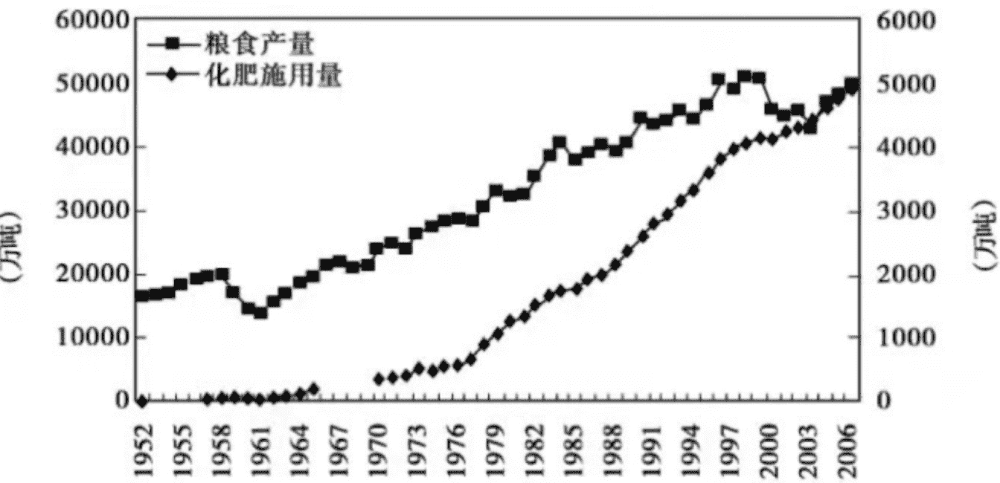

图 1 1952-2006年我国粮食产量与化肥施用量对比

可以看出来，1970年之后化肥产量开始缓慢上升，1976年之后大幅上升，因为当时我国著名化工专家侯德榜搞定了自主工艺，我国也搞了一些小工厂，但“改开”之前整体化肥产量一直处于一个非常非常低的状态。

那些年中国疯狂开垦新土地，更新水利设施，修建水库，只是化肥产量不足，粮食增产不明显。

中间也大规模引入过几次化肥农药设备，比如苏联援华项目中就有制氨工业，后来跟西方关系缓和后，又从德国日本大规模引入配套产业，这也就有了上图的粮食产量持续上升。

所以说后来改革开放后突然解决了吃饭问题，主要是两个原因，一是毛主席时代发动集体力量，通过开山凿坡、修建梯田、建设水利来保障亩产，可用耕地和灌溉设施大幅增加了。

另一方面不断地努力解决化肥问题，先是从苏联引入，后来我国侯德榜等专家有了自己的突破，到了1972年，我国又搞“四三计划”，趁着西方经济危机工业设备大甩卖，我国买了不少，到1977年，中国一共与西方国家谈成了222个重点工业项目，其中有13个是化肥项目。

粮食产量暴涨，这才有了1980年左右我国人民终于吃饱饭了，也正是粮食产能不再是问题，大量农民才有可能脱离土地去沿海打工，为我国接下来的世界工厂奠定了基础。但是吃饱饭属于最基本的需求，人民最需要的是肉蛋奶等优质蛋白。

### 3 蛋白质革命

蛋白质的主要来源是肉蛋奶，中国人吃上肉，还是1995年之后，下图能看出来：

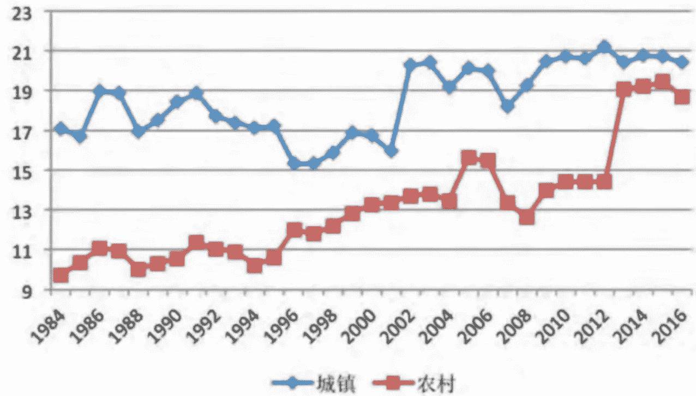

### 城镇和农村居民人均肉类家庭消费量

肉类摄入增加，有个很明显的效果，“95后”的体格和精神面貌有了明显变化，最大的变化就是身高明显高了很多，而且气色好了很多。那为啥中国人突然能吃上肉了呢？主要是两股力量在起作用。

第一股是我们上文提到的，化肥的大规模使用，使得土地产出平稳增加，慢慢有了盈余，多出来的粮食就可以去喂养牲畜了。在那之前，粮食人都不够吃，肉类自然比较稀缺，经常过年才有，以前“年味”比现在足，也是因为常年吃不到肉，过年那几天非常特别。

第二点很关键，也就是贸易的力量。

粮食安全保证后，我国沿海代工业务崛起，大量农民前往沿海工厂打工，中国成了世界工厂，开始赚全世界的钱。随着产业的不断升级，我国城市人口的收入慢慢开始上升，有了更多的需求。前文反复提到过，想买什么东西并且有购买力，这才是需求，想买什么东西却没钱，那啥都不是。这种需求催化出了更加复杂的供应体系。

以前的牲畜主要是村里自己养，产量低成本高，而且大部分都被农民自己吃了，属于小农经济。后来城市市民对肉类需求大了，催生出了大型养殖场，供给端和消费端都有了大幅增长。大家可能纳闷，养殖场能比农民养成本低？

当然啊，大型养殖场通过批量买育种过的崽子和饲料，大量使用机械设备，养殖业也实现了工业化，再加上引入了科学管理，大型养殖场一直都在招博士，集中养殖成本当然比自己家里养成本低，老百姓收入高了，肉价相对工资降下来，肉类摄入才大幅增加。

鸡肉也是相同道理，我小时候鸡肉还是极度稀缺的，等我上大学，那玩意开始“飞入寻常百姓家”，慢慢变得稀松平常。

此外更关键的是，我国在加入全球体系后，开始大量地从国外进口养殖业所需的农作物，比如向美国和巴西都大规模进口饲料，也正是廉价饲料的涌入，我国养殖业也迎来了大爆发。其实相同的事情还发生在能源领域，如果没有澳大利亚、巴西和中东的矿石、能源输入，我国后来也很难成为世界工厂，贸易对现在中国的塑造非常明显。

有研究显示，我国粮食、蔬菜、肉食的比例关系已经从改革开放初期的8:1:1，演变为4:3:3，肉类和蔬菜大幅上涨，粮食占比越来越低。

与此同时，2000年之后我国牛奶产量暴涨，需要注意的是，进口奶看着增长多，是因为单位是“千吨”，比国产奶差了一个数量级。

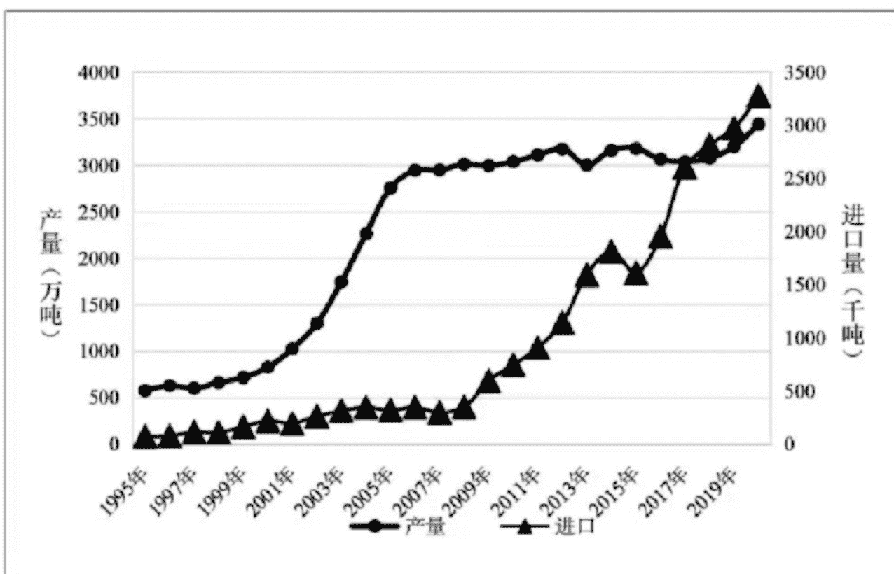

图2 1995-2020 中国牛奶产量、进口量

牛奶这玩意看着像是个农作物似的，其实是个工业品，在消毒产线、无菌包装和销售链成熟之前，除非你们家附近有几头奶牛，每天你拿个瓶子去接奶，否则基本不可能喝到奶。

要知道，那个简单的牛奶盒子，是由纸、塑、铝六层材料复合而成的，我国以前生产不了这玩意，鲜牛奶就没法进行远程运输和长时间保存。这也是为啥直到2000年之后我国牛奶产业才迎来大爆发，因为那时候市场和技术都成熟了。

但是通过上图也能看出来，我国牛奶消耗量暴涨，很快就到达了平台期，我专门查了下，发现主要是因为亚洲人普遍有“乳糖不耐受”问题，喝了牛奶不舒服，所以我国牛奶大爆发后，很快就稳定了。

这次冬奥会不出意外我国成绩会非常好，从本质上讲，奥运成绩是一个“全民蛋白质水平”的指数，这也是为啥欧洲很多小国奥运会成绩还不错，这些国家的底子好，人口较少也能搞出点出彩东西。

不过需要注意的是，我国现在面临一个很大的问题是不太平衡，城市里的市民阶层蛋白质摄入已经足够了，但是我国还有一个巨大的社会阶层蛋白质依旧摄入严重不足。

我刚查了下，中国营养学会官方发布的《中国居民膳食指南》里，对于普通成年人奶及奶制品的推荐摄入量是每人每日300g。

我国城市里的中等收入群体已经没这个问题，但是还有太多人严重不足，导致整体平均值非常低。

那为啥大家摄入这么低呢？牛奶价格当然是一个因素，但也不是关键因素，现在牛奶价格已经不算贵了，只是太多人因为“乳糖不耐受”的问题对牛奶避而远之，大家知道，亚洲人当中有90%的人乳糖不耐，喝了牛奶胃就不舒服，时间长了就不想碰了。

好在这两年出现了一种新选择，也就是特别火的“植物奶”，就为乳糖不耐星人提供了新的解决方案，比如最近很火的伊利旗下的「植选植物奶」，没有乳糖，老少皆宜，而且每100mL中蛋白质高达6克，很少有饮品能达到这个级别。

从营养成分上来看，植选植物奶中含有丰富植物蛋白的同时，无加入蔗糖，0胆固醇，0反式脂肪，0添加香精，对三高人群也非常友好，我自己平时早餐、运动前后就喝这个植物奶，感觉很不错。

植选奶还跟冬奥会有深度合作，植选植物奶在奥运村、竞赛场馆等地均有供应，助力北京冬奥，助力冬奥健儿冲破极限，创造更多辉煌。

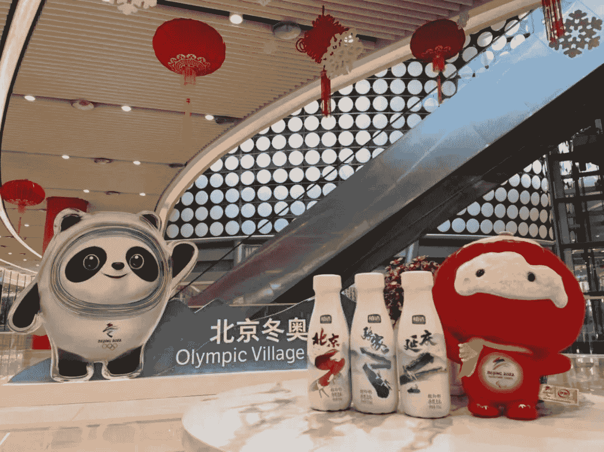

下图是他们为冬奥会设计的新包装，很酷有没有：

### 植选
- PLANT SELECTED-

### 北京
- 北京专属毛笔字型融入
- 北京赛区进行的运动项目：冰球、滑冰元素融入

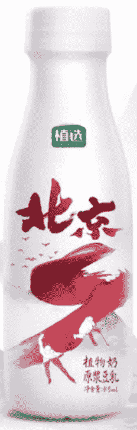

植物奶 原浆豆乳
冬奥Logo书法造型演变
提取关键笔触融合场馆

### 延庆
- 延庆专属毛笔字型融入
- 延庆赛区进行的运动项目：高山滑雪、雪车元素融入

植物奶 原浆豆乳
冬奥Logo书法造型演变
提取关键笔触融合场馆

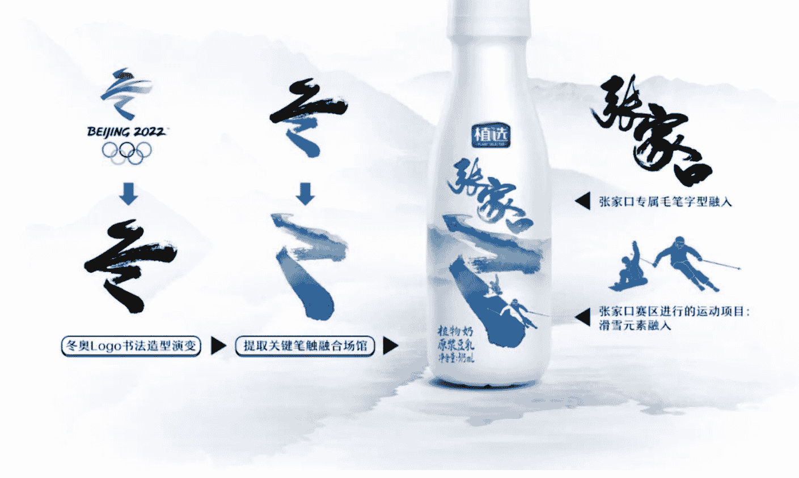

上下滚动查看更多

这几天他们正好有活动，上「植选植物奶」视频号，点赞「京韵冬奥」大片，就有机会获得「植选·京韵冬奥主题纪念礼盒」「植选植物奶·京韵冬奥主题纪念装」、限量数字藏品、红包封面等好礼！

公众号懒人搜索，懒人专属群分享

### 根本没有奇迹
2022-02-03

关注我哦。

今天就把话撂这里，《奇迹·笨小孩》是我这两年看过最好的电影，看完之后感触非常深，赶紧开写，写到哪算哪吧，本文稍微有点剧透。

电影的剧情并不复杂，一个修手机为生的二十岁的孩子（也就是下图那个），为了救患有先天性心脏病的妹妹，豁出去干了一把大的，历尽艰险，承受了难以想象的艰辛，最后奇迹般地搞定了大麻烦。

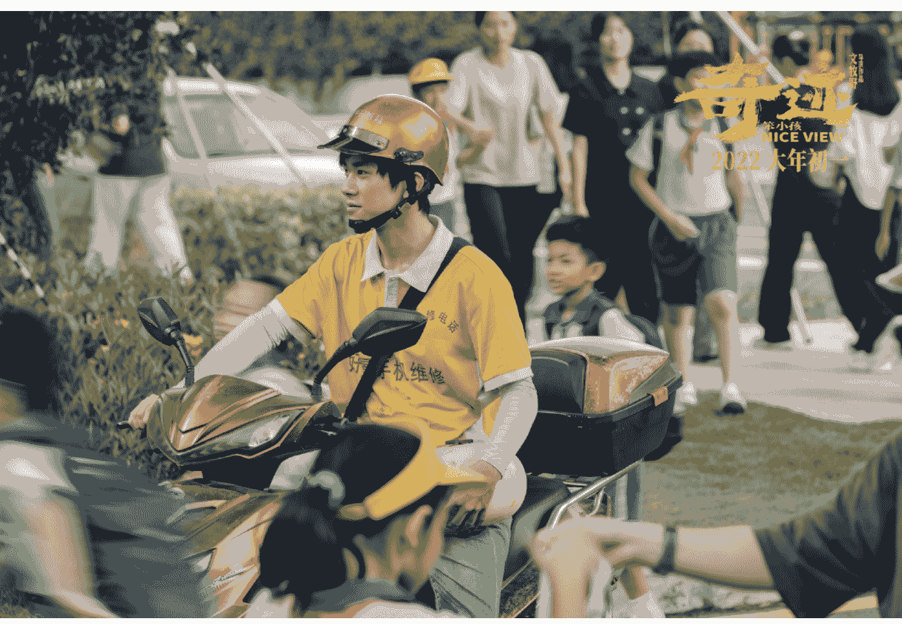

这个电影不少人看的时候都说“感动”，但是我自己在观影过程中，体会最深的，却是“力量”。

就是那种感觉：小草尽管弱小，但蕴藏了巨大的力量，它要长大，并且要排除万难突破一切去长大，尽管微弱，但势不可挡。

在男主景浩身上，想到了《一代宗师》里的一句台词，人生的三重境界，“见人、见山、见众生”，同样的，这部电影里也看到三层。

### 第一层是人。

看完电影的时候，我听见其他观众说，现实中景浩这种人多吗？

我当时就想跟他说，不但多，而且非常多，某种意义上讲，我们现在的一切都是这些奋不顾身的人搞出来的。

电影里景浩身无分文拦下了一个大单，顶上全部身价去对赌一个不确定的未来，这种事在改革开放那会儿，实在是太常见了。

毕竟那时候不是某个人穷，而是全国人都穷，一个个都一无所有，只有下定决心去创造美好未来的决心，无数小人物从零做起，一点点做大，包括花了上亿出去旅行的《侣行》两口子，他们也是早期卖豆腐发的家。

我以前看过一个访谈，一个潮汕地区的大佬讲他的起家史，当时全村凑了两万块（那时候是一大笔钱），让他去香港联络早期逃港的人，指望他能像隔壁村那样，联络到外部大款，带回来项目，让全村人走上康庄大道。他临走的时候，他爹说如果把钱弄没了啥事都没做成，就别回来了。

不过他一到香港就被人骗了个干净，后来倒是找到了要找的那个人，只是那人混的也不咋样，在酒吧打扫卫生，他也跟着从打扫卫生做起，慢慢攒钱，后来回到中山做一家香港企业的代理，越做越大，脑袋别裤腰带上不断冒险，终于把厂子开回了老家。

在老家开厂后，事情并没有彻底改观，他还需要订单。最大的一笔订单，就是他去香港，费尽周折，最后从一个香港老板那里得到了一个机会，而人家给他订单，也不是因为欣赏或者什么的，只是对他烦不胜烦，想让他滚。他豁出去带领全村人日夜倒班，顺利完成订单并交付，成本是香港工厂的五分之一。到这个时候才得到了香港那边的认可，到最后，那家香港企业也搬到了深圳，而生产中心就落在了他们村。

这也是上世纪九十年代整体东南亚制造业向中国转移的一个缩影，工业不是平白无故转移了，而是无数一无所有的小人物，用自己的努力把一个个订单拿到手，通过工作成果得到了别人的信任，当时比中国发达的多的香港日韩泰国马来产业才一点点迁入中国沿海，再从沿海扩散到全国。

某种意义上讲，整个改开史，就是小人物豁出去用双手打造美好未来的一段历史。

### 第二层是城市。

众所周知，自由女神像的花岗岩基座上镌刻着美国女诗人埃玛·拉撒路的一首脍炙人口的十四行诗：

> “让那些因为渴望呼吸到自由空气，
> 而历经长途跋涉业已疲惫不堪，
> 身无分文的人们，
> 相互依偎着投入我的怀抱！
> 我站在金色的大门口，高举自由的火炬。”

如果说在中国，有那句话配得上这段话，那无疑就是深圳，从当初那个小渔村，变成如今可以匹敌世界上任何一个伟大城市的超级经济圈，深圳靠的就是包容和向上，啥样的人都可以在那个城市里找到自己的位置，谁都有机会去实现自己的梦想。那里英雄不问出处，每年都有黑马冲出，每年也有巨星陨落。

当然了，最近几年的深圳早已不是当年的样子，可是它毕竟是一个选项，一个选择，多一个选择永远是好的，大不了你可以不选嘛。

如果你是一个一无所有的人，你可以选择在你老家一辈子不出门，如果你不甘心做咸鱼，你可以去深圳这样的城市博一把，博失败了大不了回去嘛。

还有太多的国家，他们没有深圳这样伟大的城市，太多年轻人本来有才华，想去冒险也没地方去，只能一辈子呆在自己的老家放羊。

电影里景浩妹妹有先天性心脏病，需要三十万，如果他不在深圳，他很难那么短时间联系到上游供货商和下游承接方；如果他不在深圳，他也不大可能在那么短时间招到他能支付得起的工人；如果不在深圳，他也不一定那么快能买到那么多趁手设备。

深圳不近人情，让他痛苦，却让他的努力得到了丰厚的回报。

电影里出现了多次那种对比，深圳高楼大厦和罗网密布的城中村，高大建筑上悬挂着的擦玻璃“蜘蛛人”，那种冲击感，我当初刚到北京也体会过多次，导演应该也体会过，所以才能拍得那么真切。

深圳这座城市承载了太多人的梦想和无奈，让人痛苦，让人绝望，但同时它大到可以给你一切，只要你配得上。

### 第三层是国家。

电影里有个情节，景浩在台风呼啸的大雨里去求人，求助失败后，绝望、无奈地站在瓢泼大雨里。

这个场景让我第一时间想到的，是在长津湖雪夜奔袭敌军的志愿军战士。

仔细一想，确实有太多的相似点。

- 他们都是二十来岁的孩子；
- 他们都是为了背后的亲人把自己的一切都搭上；
- 他们都奋不顾身，只为那微弱的希望。

我们国家为什么能从大清的泥潭里走出来，我们为啥能在长津湖的雪夜里顶着机枪和燃烧弹发动决死冲锋，我们为啥能在改开四十年里创造举世无双的奇迹，这些看着是奇迹，其实是自下而上每个人都努力去奋斗，无数个人层面的奇迹汇聚成了一个国家层面的奇迹。

那个电影叫《奇迹·笨小孩》，看了半天也没看出来有啥奇迹，本身就是男主景浩拼尽全力得到了自己应得的。也没看出来他是“笨小孩”，他和太多人一样，既不特别聪明也明显不笨，是勤奋而且不屈服的小人物，为了家人竭尽全力去做自己能做的事。

想起一件事，近十来年前，我加入公司，当时公司的一个高管过来给培训，他说了一段话，让我受益无穷。

他说很多人自然而然觉得商场如战场，那就应该是充满了奇谋和诡计，其实不是，真实的世界里，你并不需要什么复杂的奇谋，瞎搞心眼反而容易坏事，你只需要按照公司的流程踏踏实实竭尽全力去做，把客户的需求超额满足了，把该做的事做到最好，那事情自然就成了，再怎么大的项目，也都是这么搞的，所以我们才会这样强调基本功和责任心，因为这是所有事的核心。

回到今天看的这个电影，其实又何尝不是呢，全片没有心理战，没有心机，只有真诚和拼尽全力，把所有能做的事都做了，结果自然不会差到哪。

文末，用一句话结束本文，《我不是药神》告诉我们，世界上只有一种病，那就是穷病；而《奇迹》告诉我们，穷病可以治，只是需要你拿出全部的拼劲和担当。

公众号懒人搜索，懒人专属群分享

### 年底了，说一些心里话

2022-01-25

前段时间我有点，用时髦的话讲，emo了，也就是情绪低落了。

倒也不是我自己身上发生了啥，疫情爆发两年，我整体倒也顺利，马上35岁大限，还没有被辞退，反而升迁了。疫情爆发后哪也去不了，公司出差的事全停了，我的空闲时间也多了不少，更能专注写文章，整体效果还不错，还把视频搞了起来。

不过另一件事对我心态影响很大，也就是粉丝多了之后吧，就总有人给我发私信，而且大部分人还愿意说他们自己身上的倒霉事。尤其是在西安封城后，后台更是收到太多消息，不过那些小伙伴找我诉苦，也不是指望我能帮上啥，只是人心里憋闷就想找人说。他们可能觉得跟我说负担最小，也没指望我看。事实上我也看不过来，不过确实看到不少，时间长了就跟着抑郁了。

这些各种各样的事已经让我有点郁闷了，最让我抑郁的，无疑是下边这两件事。

第一件事郑州大水，有个人的闺女找不到了，他每天去地铁站穿个雨衣等女儿。这事本来也没啥，但是接下来的事你们能理解吗？他竟然铺天盖地被网暴，有说他是汉奸的，有说他给境外势力递刀子的，还有说他作秀的，反正说啥的都有。后来确认他的闺女确实没了，我不知道当时带头网暴他的人现在是怎么想的。

第二件事是西安封城刚开始的时候，由于一开始的慌乱，出了不少问题。当时微博上有个话题，叫“西安买菜难”，很多人在抱怨家里断粮，或者死活买不到菜。终于买到了，单元门被锁了，快递进不来小区，最后的两百米接不上，还有老人困在家里买不到药等等。

后来我收到的后台消息多了，慢慢看明白了：有的小区菜免费，有的小区天价菜，有的小区没有菜，有的小区没有菜也买不到菜。我们公司在西安也有研究所，那种老员工收入高，住在最好的小区里，物业基本全包了。

我的那个哥们说他看到微博上的那些反馈也理解不了为啥差别会这么大，直到他项目组的外包小伙在群里说起自己的情况，才知道很多小区太大，而且太旧，业主特别多，但物业人力很少，物业的人根本忙不过来。那小子大学刚毕业，平时也不看新闻，家里连灶都没，天天埋头上班玩游戏，突然封城，家里啥都没，刚开始那几天确实吃了一些苦头。

所以我很快就理解了，西安实在是太大了，发生啥都有可能，按理说这也是很正常的事。也有一堆人追着这些人骂那些家里吃不上饭的人，跟上边骂郑州“雨伞人”的话差不多，类似“肯定是假的，我就在西安，我家菜多的不得了”，或者“商务部前段时间让大家屯粮，你为啥不屯，活该！”。

最让我感觉没法理解的是，连那个在医院门口流产的女孩都有人骂，说她活该，谁让她不事先去做核酸。听到这个我是很崩溃的，不过倒也能理解，这帮孩子可能没接触过大月份产妇，北方大冬天，你让临产产妇每天去排队做核酸，合适吗？

那几天我心情沉重，忍不住转了几条，然后我也跟着被骂了，说我是公知。后来心情不太好，干脆微博删了，眼不见为净。

其实后来想想，在我微博下骂人的那些人，占总评论数的5%不到。在网上网暴别人的，可能在人群中5%不到，但是互联网存在放大效应，一小部分激进的人可能垄断了话语权。比如他们去网暴雨衣人，其他人并不了解情况，也不太敢说话，怕一起被骂了，于是感觉网络被没脑子的喷子占据了。

不过理解了这些事，并没有让我心情好点，可能是因为不再年轻了，变得很敏感。

再往深了想，其实这些疯狂攻击别人的人，可能也不是恶意，而是带着一种“洁癖民族主义”。他们觉得自己爱国，忍不住去清洗那些影响自己这一理念的人。

也就是说，有那么一些人，他们脑子是很简单的。他们以前爱美国的时候，美国就是圣地，任何质疑美国的人都会遭到铺天盖地的谩骂。几年前我在纽约和法国拍了几张大街上的照片，给大家说其实他们并不那么完美，一样脏乱差，被网暴到怀疑人生。

现在又发生了类似的事，正好反过来了。现在大部分人又坚信整个国外就是水深火热，没有一点好，国内是完美的。如果什么事情让影响到了信仰，那就往死里喷。

这些人都是活在梦里的一些人，他们接受不了现实，因为现实就是哪边都一堆烂事，同时也各自有各自的长处。你不管爱哪边，都不可避免要面对各自的黑暗面。

这倒是让我想起一件事，天主教当中，神按理说应该是完美的吧，可事实上并不那么完美，总有刺头会质疑。类似“神那么爱你，为啥还要让魔鬼坑你”，“上帝那么无敌，撒旦咋一直没死？”。教宗用了上千年搞各种复杂的辩论，中世纪无数天才们皓首穷经各种琢磨，终于把大部分漏洞都给堵上了，所以你现在去问基督徒这些问题，他们一般都有一套流行了几百年的说辞给你怼回来。

问题是现实毕竟跟“神学”这种不可证伪的理论不一样，它实实在在，充满了各种乱七八糟的事。早上让你正能量满满，可能到了晚上就发生了另一些事让你情绪崩溃，觉得没希望了。

这就是罗翔之前引用陀思妥耶夫斯基的一句话，“爱具体的人，不要爱抽象的人”。爱国这事也一样，一些人爱魔怔了，因为他们爱上了一个虚幻的东西，一个不会犯错的东西，这本身就有问题。

这种人不出意外的话，再过几年会彻底被现实击溃。今天还高喊爱国，再过几年又去爱日本或者美国了，因为他们的精神太脆弱，根本不敢面对现实。他们爱的那个“完美的国”根本不存在，迟早会因为信念崩溃去爱别的。

在真正的马克思主义者眼里，最起码的原则就是实事求是地看待问题，该是啥就是啥。知道了国家真实什么样，你依旧去爱它，那才是真正的爱国。而且在我看来（估计正常人都会这么想吧），咱们国家内部出了问题，根本没必要避讳，只有直面问题，解决问题，这才是长期持续迭代的关键。

我们总说“持续改进”，问题是到底该怎样持续改进？不就是正视问题改正问题，并且用制度形式确保今后再也不犯错，这才是一个完整的改进循环。持续下去社会就会一点点进步了。

比如每次我说北方有些地方治理水平差，就有一堆人跟疯了似的，好像我侮辱了他全家。其实这种心态一定要不得。

有些地方政府做得不对的地方，大家没必要替他们出头，尤其是你自己还是个受害者的时候，更没必要出头了。治理水平差还不承认，只会越拉越远，再过几十年生活在两个世界里，这又是你们想看到的？碰上重大问题把你家小区封起来却忘了送吃的送药，如果这些事发生在你家，你怎么办？

治理水平这种事本身对科技依赖不严重，主要是责任心、深入基层了解情况、一环套一环的预案等等。这些方法论从毛主席时代变化就不大，这些事做不好，不该说吗？

有人嫌我总说北方，拜托，我自己就在北方啊，我希望生活环境治理水平高一些也有错？只是有很多人别看长到了三十多岁，别说没出过国，甚至连南方那些大城市都没咋去过。没有对比，他们并不觉得自己的城市有问题，甚至思想水平停留在“护短”这个层面。看别人指出自己城市的问题，就觉得是在侮辱自己，有时候特别纳闷这些人的玻璃心怎么脆成这样。

我觉得一个常识是，如果你自己城市出丑了，这是好事，被大家一顿群嘲，说不定下次就改了。就怕一直糊涂，出了问题之后上下一起糊弄，迟早糊弄到你和你家人身上，到时候就怕你承受不住，去网上喊的时候突然冒出一群人往死了围攻你。

这一点最近发生的另一件事让我很感慨，也就是中央公布了郑州水灾瞒报问题。这事某种程度上对政府公信力有一定的伤害，毕竟自己揭发自己之前谎报数据，多多少少影响大家对政府的观感，也证实了诸多之前的猜测。

但是把问题放在更长的时段，这又是不断给公信力充值的过程。敢于把自己的问题披露出来，就意味着要下定决心去改，也给其他官僚们看看瞒报的后果，今后这种事自然就绝种了。

最怕的就是所有人都糊弄，出了问题一个个装作没看见，看见了也不能说，说了就是给境外势力递刀子。这样积累下来，将来会是啥样大家估计都没法想象。

此外，很多人以前跟着公知无脑恨国，本质是没出过国，并不了解国外，把发达国家想得太好了。这两年可能依旧是这帮人，无脑反美反西方，把中国和国外彻底对立起来，并且觉得除了国内其他地方都水深火热，这种想法本质也是从没出过国。其实去实地体验下，还是能感觉到我国跟发达国家有一定距离，北上深头部可能差距不是太大，平均水平依旧差得有点大。说这个不是长他人志气灭自己威风，任何时候，都一定要认清现实，这才是进步的第一步。

我说这个不是要浇凉水，也不是我改变立场了，而是说大家一定要客观理性。如果爱国的理由是建立在一系列虚幻的妄念上，不出意外再过一段时间你会改换阵营。

真正的爱国是章北海那种，知道了现实是啥样，依旧选择去爱。

文末，说两句话：

- 爱国却不爱人，那就是装爱国；
- 要爱具体的国，而不是抽象的国。

公众号懒人搜索，[懒人专属群](懒人专属群)分享

### 我国的传销魔幻往事

2022-01-19

不久之前，张庭林瑞阳夫妇公司因为非法经营被调查，在警方发布的公告说他们公司涉嫌网上传销。最新消息说自从2021年6月有关部门就开始调查，并且因为案情非常复杂，涉事的人数特别多，足足出动了超过400人来办案。可想而知公司有多大，有多少人被坑的倾家荡产，对社会造成了多大的影响。

不过我今天不只说这个案件，把这些年来传销往事一起说一下。

### 1. 传销的兴起

如果是比较年轻的小伙伴，可能对传销曾经在中国有多严重，没有一个直观的印象。

大约在进入21世纪之后，不过几年时间，各种大大小小传销组织几乎遍布全国各大城市。那时候很多城市都有一片区域，被传销分子大量聚集，少的有上万，最多的城市多达几十万。

如果在网上搜索“中国哪里传销最严重”，你会发现根本没有统一答案。至少有四五个城市是有力竞争者。如果搜“十大传销之都”，答案至少会列出15个。

不过要说传销得先说直销，这是美国人发明的一个销售手法。主要卖的是化妆品和家用品，通过代理加盟直接销售，以此省下了商铺房租、广告花费和销售人员费用，使商品有更高的性价比。参与的很多是非全职人员（特别是家庭主妇），通过入户方式推销产品，跟现在卖保险差不多。

商家省成本、销售人员获得收入、客户能买到便宜好用的东西，听起来很不错，但是因为其中多层加盟方式和商品本身的问题，使得直销很容易被骗子利用，最后成了拉人头的骗局。在70年代的美国，80年代的日本，90年代韩国，都发生过大规模的诈骗案件。

大家看过《寄生虫》没，电影里躲在地下室里躲债的那人，他就是早年搞古早味蛋糕店破产了，为了躲债藏了起来。那个古早味蛋糕店，就是台湾人发起，在韩国遍地开花，后来发生暴雷，无数人破产后身无分文。

这里要说个经常被误解的问题，就是传销和庞氏骗局也不一样，虽说两者经常混合经营。但是庞氏骗局是依靠高额利息吸引人，拿新人的钱给以前参与者提供利息。一旦新钱不够多，一下就会资金链断裂暴雷。

而传销虽然也画大饼，说如何如何暴富，但是前提是你要能拉来下线，传销人的所有收入都是依赖下线。如果没有下线，那你拿不到钱，他们是名正言顺不负责任的，也就不存在什么经营压力。所以传销组织很多虽然拉不到人，大家打地铺吃水煮菜，看起来惨兮兮的但是散不了。

也正是因为没有多少内爆风险，这就使得传销组织很多时候可以十几年一直做，比如天津权健那种，要不是有自媒体大号丁香医生强力举报，这种公司估计能一直生存下去。

### 2. 大发展

国内直销的开始，比较公认是1990年雅芳开设分公司。接着安利、玫琳凯这些国外品牌进入，国内也有很多人开公司做了起来。一开始大多就是入户推销化妆品。这些品牌的销售并不如预期那么快，但是直销这种看起来带有“国际先进经验”的销售方式，很快被各路诈骗分子们利用。于是打着直销名号，但实质是传销的诈骗组织兴起了。

说起那时的传销，就不能不提宝岛，台湾省传销起步不早但是步子特别大。台湾最早开始“突破传统”，在销售化妆品和保健品之外，把珠宝古董甚至一些没有实物的东西，都纳入了传销，甚至天珠都被他们拿来一顿炒。我之前给大家讲过台湾诈骗厉害，那时候大家应该已经想到他们在传销方面同样很优秀，优秀是一种习惯。

传销的手法倒是不复杂，就是想办法把人找来，然后洗脑忽悠瘸了，发展成为下线，然后叫他再去拉别人。

当然了，为了写本文我专门查了不少自述，发现“专业洗脑”这事也是个技术活，话术水平极高。毕竟他们那套说辞从美国传到台湾，再从台湾传到内陆，经过反复演变和进化，已经非常深入人心。

那些讲师也是在极高的淘汰率下筛选出来的，到最后每个讲师都有一套极其成熟的话术，尽管在哪都说那一套话，但每次都会更新一部分，煽动力和洗脑力一流。曾经有雅芳的讲师去做主持人，混到几乎全国人尽皆知。

我在几年前在销售部学习过大半年，当时集团给请了一个顶级讲师讲销售话术，他坦言他早年就在传销组织里混过，并且干到了顶级骨干，后来觉得那地方迟早出事，于是加入了销售相关的培训组织，赚的不如以前多，不过今后不用担心被抓起来。

后来吃饭的时候他给我讲过一个心法，说他们最常见的一个模式是，通过给你讲述名人们是怎样浴火重生，慢慢的把一些观念传递到学员心里。一般而言，他们这群讲师总结出来的成功人士核心心法就是：

- 1. 不要脸，要脸是没法成功的，列举名人们是怎么不要脸才成功的。
- 2. 不怕苦，所有苦难都是门槛，拦住意志不坚定的人。
- 3. 不怕失败，每次成功背后都是一千次的失败尝试，凑不够就没法成功。
- 4. 食物链顶端的都是顶级推销员，从比尔盖茨到乔布斯，再到马云。

当然了，后来又糅合了类似《秘密》那本书里的“吸引力法则”，稻盛和夫的“现场精神”，这几年的马斯克，死了的彼得德鲁克等等，还有《道德经》的一些非主流解释。

大家看出来了吧，他们这些前提都是没有问题的，问题出在用正确的观点推导出了错误的结论。

需要注意的是，他们这些思维方式本身都是对的，但最后得出来的结论却很奇怪：你得不断去拉别人入伙，完全不要顾忌脸面，反而要锻炼自己不要脸，拉失败了也不要气馁，一次次地区拉，每次失败都是一个锻炼推销能力的机会。等到你彻底不要脸不怕苦，反复磨砺，那你迟早会成为一个顶级推销员，财富规模会大到难以想象。

并且现场成功人士现身说法自己是怎么从穷光蛋开上了库里南，告诉大家成功并不难，只要按照心法操作，谁都可以。

一个大班50个人，一套组合拳下来，总能忽悠到一大半。

而且那个讲师还有个理论，他说地球上现在所有人都来自一个叫Lucy的女人，我们都是她的直系后代，所以大家的基因大同小异，几乎共享着同一套基因，所以很多想法也是想通的。最明显的，就是人的体内都有两种原始冲动：

一种是崇高的使命感，一旦觉得自己是在做一件崇高的事，就会奋不顾身，哪怕其他人看他的那个使命很搞笑；

另一种是“万里觅封侯”的雄心壮志，觉得自己是天选之人，排除万难也要富。

他们这些讲师要做的，就是激发大家这两种冲动。一旦被激发了，立刻就变得跟打了鸡血似的，彻底跟以前不是同一个人，家人都揪不回去。

所以那些洗脑观念不是每个人都接受，但是总有一些人很接受，然后就洗脑成功了。成功之后会产生一种崇高的使命感和命运感，觉得自己拿到了成功的钥匙，通往天堂的道路就在眼前，这种感觉太要命太上头，以至于别人看他们都跟有病似的，他们自己毫不在意。

咱们经常看到新闻说有人深陷传销组织，费尽全力才逃出生天。其实现实里还有很多人深陷传销组织后，亲戚朋友怎么都拉不回去，就算拉回去竟然又偷摸跑回传销组织。本质就是他们确信自己人生已经大不一样，眼中有光心中有火，俯视众生。

当然了，这是和平洗脑，还有暴力洗的，就跟《权力的游戏》里小剥皮那样，使劲折磨学员，之前好多次搞出来了命案。

比如著名的“天津天狮”，用各种理由把人忽悠进去，强行洗脑，吃大锅饭睡通铺，谁要敢跑追回来往死里打。这个组织后来破获后，判决文书上写着：

2009年以来，以“天津天狮”名义进行的传销活动引发各类刑事案件2781例，除了以“组织、领导传销活动罪”定罪的案件，其他案件主要表现为非法拘禁、故意伤害、抢劫、过失致人死亡、故意杀人等，共导致155人死亡。

而且我查到，这个组织单是传销人员跳楼就死了52人，匪夷所思。好在涉案人员都抓到了。

### 3. 南北分流

在2005年前后，出现了一个传销方式变化，分成了南北两派。

南派就是“好来好散”，把人找来带着四处转转，听听课，画画饼。如果不愿意也不勉强，有的组织在最后会向要走的人要“伙食费”，有的干脆也懒得要，就当是获客成本了。

这种的典型造型就像旅行团，带人去当地比较新的地方，展示当地的“光明前景”，号召你来“共同创业”，还要装模作样说这些都是政府项目，一般人不告诉他。一般一个礼拜说服不了你，就会及时止损让你走了。如果愿意加入，生活条件也不那么艰苦，大多是在城郊住。有的甚至可以租当地农民自建别墅，各种设施也基本以大学宿舍为蓝本。宣传手法以“一起赚大钱”为基础。

比较著名的是“深圳善心汇”，这个组织是典型的南派传销，集传销、非法集资、互联网诈骗、庞氏骗局为一体，属于传销组织的终极形态，而理念竟然是“共同富裕”，忽悠你花300块买一个“善种子”，买的越多，收益越高。如果你能拉下线，下线交的钱也会有一部分到你手里，利用大家的贪欲聚财。这个组织后来破获的时候已经聚了500万人，涉案总资金超过1000亿，匪夷所思。

跟它类似的是一个叫“青岛大狮”的团伙，也是用app集资，声称有国家背景，打着共同富裕的大旗让给他们打钱，每月分红，如果能拉到下线还可以分红加倍，也聚集了500万人，这些人共交了70亿，属于上边那个“善心汇”的低端版本。

如果说这个组织有啥"美中不足"，那无疑是没涉及比特币和新能源，不过其他传销组织弥补了这个不足，比如2016年湖南破获一个大案，就是传销比特币，忽悠了10多万人，累计10亿的总金额。

当然了，这些人跟最近爆出来的张庭夫妇相比弱爆了。我查了下公开数据，截至2018年9月，他们的代理商有613万人，覆盖的消费人群达4906万。他们也是发展代理，代理再去发展代理，为了降低成本，美容产品的质量一降再降。我看一些新闻说他们需要补税100多亿，不过应该很难了，有说法认为，那两口已经把钱转走了不少。

北派的相对寒酸一些，大多会打着“集体生活”的名目，讲究“家人团队”。把人塞到整个组织里面，每天同吃同住。至于是否暴力，各个团体气质不太一样，我上文说的天津天狮，显然就是个暴力团伙。

在21世纪的前十年，传销组织发展速度飞快。其中一个原因，是当时经济发展加速，各种“一夜暴富”的故事真的在发生。这就使得传销的“画饼”看起来不那么离谱。面对这些故事，不少人难免会想“我为什么不会是下一个”？

而且当时国内的经济发展加速，城市化进程越来越快。那时候各大城市纷纷开始了“新区建设”，全国各地大量新区都建立了起来。但是城市扩张的速度，比起城市人口增加却有点太快了。

这种情况使得传销组织有了合适的栖身之所。这种新区比起城乡结合部，这里有城市的配套设施（很多都比老城还好得多）；同时因为人少，监管力度也要小得多；而且生活成本要低人口密度小，各种活动开展起来更加方便。

说到这里，大家可能有个问题，这些人能赚到钱吗？

当然能了，不过跟炒股差不多，一赚七赔两平，只是往往有一个人赚钱，就足够煽动起一堆人向他学习。问题是你准备学习他赚钱的时候，他盯的其实是你的钱。

### 4. 高潮与沉寂

大约在2010-2017年，传销的规模是最大的，那时也差不多是经济最火热的时候，各种新的金融模式层出不穷。传销组织几乎是一夜之间，都打起了“资本运作”的牌子，开始了新一轮扩张。很多地区聚集了十万以上传销人员。这么多人聚集在一起，最明显的一个问题，就是对于打击传销来说，困难大多了。

首先是很多组织都互通消息，当时派出所门口，随时都有传销组织望风的。只要警察大量出动，就会有人马上报告，然后骑摩托车跟着警察随时报告位置。一旦发觉可能是朝自己来的，传销人员就会如鸟兽散，警察就算抓也大多抓到些底层人员，组织者早就跑的没影了。

更加严重的是传销人员聚集，出现了围攻对抗执法人员的事件。曾经发生多次打击传销，结果执法人员被闻讯而来的大量传销人员围堵。因为很多地方传销人员聚居在几个小区，很容易就纠结几百上千人，加上围观人员经常堵满整个路面。每次出事都要出动防爆警察，有时对峙数小时才能把人抓走。

甚至发生过警察中午被围堵，傍晚才能出来，结果夜里居然有大量传销人员聚集在派出所门口，喊着口号要警察放人。当然了，他们这么闹也是出于私心，因为他们都交钱了，如果老大被抓，自己的钱也就颗粒无收。

国家对传销的打击一直持续，然后从2015年开始，传销的热度就渐渐的降低了，以前那种十万级别聚集的情况越来越少。可以说在2018年金融乱象整治之前，传销就已经边缘化了。

说起来，在当时金融大热的情况下，各种金融理财、P2P、价值投资、“XX宝”，真的是花样百出，传销的运营方式就显得落后时代了。特别是随着网络的兴起，那种聚集上大课过集体生活的模式，更是给人“土法炼钢”的感觉，属于落后产能。

北派动不动把人强行扣留不许走，这种行为真是成本高收益低。不要说国内这个社会执法环境，就是在境外，但凡有点脑子的犯罪分子都搞网络赌博去了。敢扣人的基本只有在缅北那种“天高皇帝远”的地方（缅北其实也是网络诈骗为主）。那帮人都是绑票的路子，做的是一锤子买卖。把人扣下来洗脑发展下线，效率实在太低。

南派那种纯洗脑的稍好一点，虽说法律责任低一些。但是性价比更低，把人找来陪吃陪玩陪聊，有这个口才和话术（还要体力），干脆去打电话诈骗不好么？工作强度起码低多了，一个人拿个电话簿就能干，一天下来能打几百个。

说不定电话弄一单大的比发展十个下线还多呢。而且出了事情，通过电话联系，被警察逮住的可能性也低得多。传销就算跑了，受害人认识你，警察抓你不要太容易。

更主要是多年宣传下来，人们对于传销警惕性高了，也就是所谓“骗子太多，傻子不够用了”。这次张庭夫妇的案子就是一个传销变种，以前在微信混，后来搞“网络传销”，以直播和网课的模式向人宣传产品。

所以这几年很明显，传销这种模式在国内开始萎缩，开启了“产能输出”之路，走向了东南亚，东南亚和印度的传销案件大量发生。很多就是骗子在国内实在不好干，带着丰富经验转战那里开辟“新事业”，不论是赌博的还是小额贷款，其中就有不少干传销的。

5

### 尾声

传销之所以能忽悠那么多人，究其原因，前些年太多人太想发财，而且身边的人确实发财的也不少，这种效应下不少人容易冲昏脑子，大家可以注意下台湾省，作为“诈骗强省”，台湾也经历了一个到处骗子的时代，这些年已经好起来了，大家都被骗了一遍，有了警惕心，就不再好骗了。那些被骗了依旧不长心的，经过无数镰刀的猛割，基本被连根拔，台湾的秩序好了很多，于是对大陆和东南亚输出诈骗。

我国老百姓经过这么多年的磨砺，再加上政府这几年管理严格，整体好了太多。不过传销这种事利用了人性中“快速致富”的弱点，太多人知道这玩意不合法有危险，依旧乐此不疲，所以打击力度很大，依旧屡禁不止。还有张庭这种，也是服了，在抖音有一千多万粉，全天候火力全开地做宣传，甚至警方发了通告后，短视频还在一直发，有时候觉得自己依旧太年轻，没见过这场面。

只能说，这个世界坑太多，国家加强法制的同时，大家也要收敛下自己的贪欲，不要心甘情愿走入了魔鬼的圈套。

公众号懒人搜索，懒人专属群分享

### 都在聊人口下跌，考虑过技术进步引起的失业吗？

2022-01-14

之前知乎上看到一个问题，说刘邦老家沛县那么个小地方，为啥涌现出了整个汉初的功臣集团？

我自己写了半天，后来一看，发现已经有人把我想说的给说了。一个叫“庄渔”的博主是这么说的：

朱元璋的主要班底也就是凤阳人，太平天国的主要班底就是广西金田人，孙中山的主要班底是香山人，蒋介石的主要班底是奉化人，我党开国将帅中红安县的有一百多人。

建立一个朝代，搭建朝廷的管理框架，一个县的人才就够了。绝大多数时候，就是“千里马常有而伯乐不常有”。最稀缺的人才是开国皇帝，也就是伯乐。至于文武百官这样的人才，一个县都能给配齐。

所以不是为什么小小的沛县就有这么多优质人才，而是太多太多的优质人才因为没有机会而只能默默地埋没罢了。

这个回答里，最后一句是关键。

其实这个问题思考下科学史上最群星璀璨的年代，就能发现问题，在上世纪初，中国还是大清慈禧时代，印度还是个四分五裂的殖民地，当时德国就拥有962名物理学家，英国有282名，法国有316名，美国404名。

那为啥德国这么变态呢？

这个学术界也是有共识的，主要是他们的教育体制，他们的教育体制兼顾了为工业化提供人才，顺便培养大师。

首先德国当时已经实现了义务教育，他们的义务教育是有明确目的性的，就是要给工业化批量生产人才，后来这种模式扩散到了很多国家。

比如我们的教育体系来自苏联，苏联的教育体系来自沙俄，沙俄是学了法国，而法国也是拿破仑时期学习了普鲁士，这些国家都差不多，教育体系有点像，又不完全像，但目的是一样的，降低人口波动，教育服务工业化。

但是他们的大学又不太一样，德国最早创立了现代大学体系，注意那个“现代”，大学早就有了，但是现代大学出现比较晚。

欧洲的大学出现得比较早，12世纪就有了，不过那时候的大学主要都是神学院，研究针尖上能站几个天使的那种。直到后来地理大发现，需求开始催生各种研发，但是一直类似“行会”，也就是一群有钱有闲的人聚在一起瞎讨论，讨论出啥来算啥。是的，欧洲早期的知识阶层就是贵族阶层，闲人才会去研究那些东西，甚至有点“智力游戏”的意思。

德国继承了欧洲这个逻辑，在这基础上更进一步，在1810年由威廉·冯·洪堡创立柏林大学后，将研究和教学结合起来，并且当时大学就是自治的，强调学术自由。

要知道，那时候的德国还四分五裂，柏林所在的普鲁士还是一个比较疯的军国主义邦国，整个国家就是军营，整体状态和我们之前的秦国差不太多，那时候能有这觉悟，也不是偶然的。

因为普鲁士上层一直尚武，随时准备出去打劫，他们挨了几次打之后，就意识到科学技术对军工有重大支持作用，所以对教育投入一直不吝啬。

而且整个欧洲在19世纪都风雨飘摇，各国随时可能爆发革命，所以政府就得拉拢一切可拉拢的派别，其中就有德国旧贵族。而德国贵族们一般呆在三个地方，一部分是种地的，也就是容克贵族；还有一部分在军队，也就是大家熟知的普鲁士军官团，希特勒那样有个性的人都搞不定这伙人，后来还被刺杀了一次，造成终生耳鸣（尽管没几年了），非常影响工作和学习；最后一波在大学搞学术，上文说了，早期科学主要是有钱有闲阶级的娱乐活动。

所以德国政府重点笼络这些人，国家对大学异常慷慨，大学自己也争气，在第二次世界大战之前一直引领全世界最高水平，直到希特勒上台把这些都毁掉了，希特勒搞种族清洗嘛，1/4的犹太人被解雇，其他人看着风声不对，也都跑到美国了，这些人里有一大堆知名人物。

比如钱学森的导师冯·卡门，不必多说的爱因斯坦，量子力学大师维格纳，计算机之父冯·诺依曼等等，都跑了，从那之后，美国基本上继承了德国大学的衣钵，一跃登上了科学的巅峰。

但是我国大学并不仅仅是搞学术的地方，它同时承载着这些年我国极速崛起的任务，主要任务并不是向人类科技边际突破，而是为工业化批量生产技术人员，所以相对功利得多，对顶级人才培养效果一般，不出意料的话，将来富起来慢慢会有所改变。

为啥聊这事呢？其实就是想说一个问题，德国在20世纪初的人口6500万，相当于我国现在的安徽省，能做到大师云集，结合文章一开始的那一段，我觉得很能说明问题：

### 我们以往太过在意人口数量，反而缺乏对人口深度的挖掘，导致太多有潜力的人并没有被发掘出来。

我经常在想，牛顿出生于1643年，众所周知，明朝就是1644灭亡，也就是清朝初期，牛顿已经在剑桥和乡下思考万有引力和微积分，康熙26年牛顿发表了他的皇皇巨著《自然哲学的数学原理》开启了人类的新纪元，而那时候我国懂几何的人不超过五个，其中一个竟然是康熙，他当时正跟着耶稣会传教士抓学习。

我国当时也应该有不少这类天才，他们没有英国当时的环境，毕竟我们又没有理工类大学，我国的这些天才要不在放牛过程中虚度一生，天天觉得这个世界好像有什么规律，却因为没法上大学缺乏相应数学工具，一直处于迷迷糊糊的状态。要不在四书五经上皓首穷经，最终却不得要领，陷入了深深的自我怀疑。

而且科研领域不存在“人多力量大”的道理，这个行业是没啥替代关系的，一个天才对他领域的贡献远超百万没啥天赋的人瞎折腾，这是一个极度的寡头世界。

不止科研，理工科领域这种情况特别多，我前段时间还碰上一次，有个团队一直在处理一个服务器性能优化问题，这个团队也是清一色985，四个月优化了0.2%，完全不达标，后来协调了一个大神过来看了下，用了一星期重写了之前引用最频繁算法后，性能直接提升了4%，20倍！

当然了，这些都会体现在收入上，今年我知道的是，有天才级的算法高手一毕业就能开到110多万的收入，普通的码农差不多十来万，也就是收入差10倍。不过我们这些每年都得去招聘的主管们都有个感受，顶级高手和普通选手的真正差距不是十倍，可能在一百到一千倍左右，或者根本没有“倍数”这个说法，就是0和1的关系，很多问题已经不是堆时间和人力能解决的，只是需要那种超级变态的大脑。

比如芯片领域的神，也就是那个吉姆·凯勒，在DEC时候就是Alpha芯片的主设计师，我们的超级计算机太湖之光用的芯片就是基于这个。后来又去了苹果，开发出来了著名的A系列芯片，这玩意现在已经被吹爆了，苹果也成了一家芯片公司。然后去了AMD，开发出了Zen系列，AMD瞬间翻身又行了，前几年去了特斯拉，给特斯拉设计了FSD自动驾驶芯片，大家有兴趣可以去查一下。

这种人和普通人根本没有替代关系，走哪都能掀起一波技术革命，硬科学领域就这样，根本不管你什么“政治正确”，并不存在人人平等一说，这里是塔勒布说的“极端斯坦”，是神仙满天的地方，搞不定就是搞不定，一个超复杂问题，可能堆多少普通人都没用，但是碰上真正大神也就一击必杀。

不少人担心人口下跌，问题是我们充分利用现在的存量了吗？我相信有无数天才由于现在的体系没法识别，正站在电子厂流水线旁边干一些没啥技术含量的事。

我以前一直也觉得得需要巨大的人口底座才能培养出足够的天才，现在不那么看了，德国那么点人都能做到众星璀璨，我们没必要这么多人还担心人口不足，咱们的底座足够大了，人口下降后依旧大得离谱，经营好存量已经很可观了。

所以说与其操心大家不给生，还不如操心下生出来的这些是不是有人被浪费掉了，一个顶级高手真的顶上千个普通水平，浪费一个相当于少生上千人，甚至都不止，因为顶级高手和普通人之间并没有明确的换算关系。

此外不少人说如果没有人口，就没有购买力，其实这里也有个错觉，很多人把人口和消费率直接挂钩了，其实现实世界不是这样的。

大家记得吧，领导说过，中国有6亿人月收入低于1000元，北京师范大学教授李实团队调研发现另一组数据，当前中国9亿人月收入低于2000元，我大概算了下，9亿人的消费力和生产力，跟一座杭州差不多。而一个加州4000万人的消费和生产能力超过非洲12亿人，事实上加州无论是生产力，还是购买力，甚至创新力，加州都超过印度整个国家，印度足足有14亿人，是加州的35倍！

未来我国能跟加州一较高低的，应该是广东和江苏，广东现在1.61万亿，大约是加州的一半，预计再过一些年距离会越拉越近。我们需要的只是超级城市。

还有人说，人少了，会不会干活的人不够多了？

其实这个思维局限了中国人太久。我们为啥整个古代科技基本处于停滞状态？

因为根本没必要发展，有啥问题直接堆人就可以了，形成了路径依赖，甚至大运河这种国家命脉，也是用人工一节节拉到北方，以至于后来效率更好的海运不被朝廷采纳，百万漕工衣食所系嘛。但是采不采纳都没用，很快人家坚船利炮打上门，不改也得改了。

西方没这么多人，所以一直尝试用机械代替人力，慢慢发展出来了后来的技术革命。

西方和东方有个大分野，东方一直太过依赖堆人力，因为人多嘛，真的是手里有个锤子，看啥都是钉子，对任何能提升效率的工具都是抵触态度，碰上问题第一想到的就是砸人力，所以漫漫千年里，技术进步基本为0。

这个不是我说的，最近看到了经济史学家李稻葵的说法，他测算结果是，从北宋到清朝，中国人均GDP基本是一条平线，也就是完全没啥增长。到了清朝还开始下跌了，因为技术没大啥突破，人口暴涨导致人均GDP下降了，相比较明朝，大概跌了30%，尽管有美洲作物传入，但是作物产能增长远远赶不上人口的上涨。

西欧黑死病之后一直人力有点不足（后来工业革命之后机器代替人，人力又有点过剩），所以他们就得想办法提升一下技术含量降低人力，一开始人力拉风箱炼铁，后来用水车，水车搞明白了开始用水力纺织，后来水力不够用，就开始研发蒸汽机，蒸汽机也是迭代了好几代。蒸汽机一出现，可不就一下子拉开代差了嘛。

我国这种依赖人力的思维到现在也很明显，大家看美国的互联网公司，依旧是怎么节约人力怎么来，中国的互联网公司一个个都是人贩子，都捆绑着天量的人力，美团滴滴饿了么，看着是信息高科技，其实还是劳动密集型企业。

我前段时间说，当初大三线工程，发动无数人去山里挖洞，耗掉了没法衡量的人力，现在来看，就很简单了，用上万吨的挖掘机去挖，一铲子下去，几千人一上午的工作量达成了，可见很多需要大量人力的工作，本质还是技术没到位，到位了非常容易解决。同样的道理，如果自动驾驶搞定了，一夜直接无数司机失业了。

大家不能一边担心失业，一边担心人口不足吧？

依我看，未来最可能发生的危险应该是技术进步导致的失业。这一点中国人体会不深，因为我们是这一波技术红利的搭车者，欧美体会很深，前段时间德国就爆发了一轮抗议，因为油车产量暴跌，各个大公司都开始裁撤油车工人，开始重新招电动车相关领域，而电动车工人跟油车完全不重合，大学课程设置都不一样，三四十岁根本没法改行。所以才有那么多人对技术进步非常反感，比如特朗普的粉丝，进一步连全球化也一起反感。

大家可能会想，咱们能不能不搞那种技术了？

咱们不搞还有美国搞，这就好像明清不搞海运欧美会搞，搞明白了就会过来打你。

技术这玩意扩散得非常快，假如特斯拉2025年解决了自动驾驶，那很快我们也会淘汰几百万的司机，到时候用他们的技术，给他们交专利费，特斯拉盈利后股价上涨，而特斯拉的股票背后又是美国养老金，也就是每次特斯拉股票上涨，那就相当于用中国老百姓的钱给美国人发养老金。

这里也引出来一个问题，我们总说养老金不够了，美国解决这个问题的办法就是每个人把自己的工资一部分拿出来放到股票池子里，享受科技公司红利，这样的话，尽管技术突破可能伤到你，但是你持有它们的股票，多少可以对冲掉一部分损失。

也正是因为担心美国的科技霸权，我国对自动驾驶也非常上心，北京亦庄一大堆自动驾驶测试车，我朋友是这方面大牛，他带我去测试车里呆了半个小时，完全不需要操作方向盘，不过那些车现在不能出亦庄测试区，他说这项技术已经不是未来科技了，就在最近几年，而且政府决心也很大，绝对不可能让中国这么大的市场用美国技术。

此外低端产能迁出中国也基本上势在必行，就算不转移，一个接一个会变成完全没有工人的“熄灯工厂”，依附在那些机器上的人口怎么办？随着产业革命的临近，越来越多的工作岗位被挤压这已经是趋势。

比如娃哈哈流水线上的工人从两三百人已经减到了几个人，富士康五年内将40万工人换成了机械臂，2016年农行雇佣了638个工程师，把智能化程度提高了3%左右，下岗了近三万柜面人员（农行总共47万人），麦肯锡估计，截止2030年，20%的中国工人将会被机器人取代，那可是一亿人。这些都是正在发生的未来。

也就是说，技术进步一方面可以释放人力，也可以弥补人力的亏空，而技术进步本身又依赖天才和大神，这又绕到我们上文的话题了。

至于很多人说的那个人口结构，讲真，除非中国一直维持14亿，不然人口结构迟早失衡，我之前说过，人口红利这玩意的本质就是“债”，突然爆发一波，这些人当工人的时候乌央乌央特别多，当老人的时候依旧多。事实上所有的红利都是债，都得还。你爆发了一波人力，迟早得还回去。

有些人指望更多的年轻人来养活人口红利时代这帮人，大家说可能吗？100%不可能嘛，那样就得一代比一代多，中国人口会突破16亿，将来为了养活这帮人，中国人口得干到20亿，跟个庞氏骗局似的，人口越来越多。

其实现在唯一能指望的，就是一个年轻人提供之前两个人的贡献，你可能纳闷这可能吗？

当然可能了，一台挖掘机可以顶几千人，一个码农交的社保顶的上20个土木工人交的社保，一条火车线路一年赶得上明清600年漕运的运输量，一个顶级天才一个的技术创新顶的上几万几十万工人农民对社保的贡献。

所以技术和人才发掘是第一位的，中国现在人口不少了，如果这都不够发掘，再多点也没啥用。

今天就说这么多吧，文末我再总结下。

- 1、我们这么大的国家，天才和人才依旧太少，明显是太多人被埋没了，与其操心人口出生率，还不如专心研究下怎么提高单人素质，发掘天才，提高每个人的收入和劳动生产率才是关键。
- 2、我们已经走过了那个靠人口又多又便宜发展工业的时代，接下来就是尖端领域的对抗，需要的不再是大量人口，而是对人口的精细培养，培养出自己的大神，并且把大神留下来，让他们去突破。
- 3、技术进步会降低对人力的需求，可能在未来引发大规模失业。这是一条非常纠结的路，但是不走又不行，咱们不走美国也会走，到时候彻底碾压我们，钱他们赚，苦咱们吃。
- 4、随着技术进步，新一代的年轻人完全可以做到“一个顶俩”，或者“一个顶十”，要相信技术进步。

当然了，这也是一家之言，讲出来的也只是一个角度，国家养着一大群智库，他们肯定知道的比我多的多，还是相信他们的分析和决策能力，我个人觉得国家其实还没那么急，毕竟现在只是开放三胎，甚至连完全开放生育都没做到。此外对未来影响最大的，还是怎么建立一个巨大的中产阶层，提高大家整体收入水平，这才是正道。

公众号懒人搜索， [懒人专属群](#) 分享

### 耐克阿迪搬越南了，越南到底能不能取代中国？

2022-01-07

这两天耐克阿迪搬越南的事又冲了热搜，不少人有这种疑惑，越南会不会取代中国成为下一个制造业大国。

答案其实是一目了然的。首先类似耐克阿迪这种低端产业，搬走是迟早的事，事实上当初来中国，是因为日韩成本高，如果中国成本起来了，他们也要走了。

可能有小伙伴纳闷了，耐克阿迪咋低端了？确实低端，没啥技术含量，我国昆山就可以生产差不多的，但是价格跟贴标的没法比，为啥？因为他们的真正技术含量在设计和品牌环节，这两样都在欧美，钱也让他们赚了，把制造生产转让给我们，这部分利润极低，我查了下，有说5%的，有说8%的，反正不会超过10%。

那越南会不会取代中国呢？

这个问题也很搞笑，这就好像马来西亚要取代德国一样搞笑，越南本来就是个“省级国家”，怎么可能会去考虑取代中国嘛。

其实越南人自己很清醒，我昨天还看了一个越南经济学家的文章，人家的小目标是泰国，下定决心十年内超过泰国。长期目标是中国台湾，争取五十年内达到中国台湾的水平，因为越南实在是有点小，而且基础设施太差，不仅差，居民教育水平也不行，干不了复杂点的事，只能干富士康的那些事，要从最底层的组装业慢慢爬科技树。

这里有两个问题，越南把自己的目标定为泰国，难道越南现在还不如泰国？

当然不如了，泰国是当之无愧的东南亚头部国家，有制造业有旅游业，环境也不错，这几年竟然有很多华人从中国移民到泰国了，因为那边吃的好消费低生活悠闲，我还真没听说过谁移民越南了。

第二个问题，越南人口一亿？怎么就“小”了，首先越南国土太小，狭长的一条，山多平地少，老百姓集中在南北两个三角，境内的资源比较少，一直也没发展起来。

其次人口尽管不少，但是素质太低，尽管他们当初也是苏联阵营的，但是越南一直在打仗，没好好搞教育。苏东阵营对理工科变态的执念并没有传染到越南，越南现在的教育水平非常不堪。

多说几句越南教育，特别是高等教育的一个大问题。

首先是教育传统，越南原本是法国殖民地，宗主国肯定不会积极在当地推行教育的，不然当地人有了知识还会老实么？然后就是一直打仗，教育问题也就没有太大进展。
直到1975年打完仗，开始有时间忙教育了，但是有两个大问题：
首先是高素质人员的大量流失。前些天美国从阿富汗撤军，直升机落在美国大使馆楼顶，大家嘲讽说和当年美国在越南撤军一样。其实完全不是一码事，那次美国撤军从容得多，光是美国就足足从南越撤了十多万人，这些人基本上是当时南越所有的精华所在。
在那之前的战争中，有一定基础的越南人都不断地迁走了。比如扎克伯格的老婆就是越南华裔，1975年父母全家逃到美国，据说原本在越南生活很不错，但是逃难中什么都扔了，只能在美国人开设的难民营住了好几年，后来开了个越南餐馆为生，每天要工作18小时。这等于是越南人才的长期失血，很多国家都有这个问题，比如阿富汗也是，动乱导致整个中产阶级全面出逃。
更严重的是战争结束以后，越南政府开始了骚操作，很多人知道越南1975年后排华，把几十万华人剥夺一切家产后驱赶出境，其间造成了数万人死亡。不仅华人，当时越南政府对本族的“反动分子”下手一样重，在全国建立了几百个“教导惩戒营”，把上百万认为在思想上不可靠的人关了进去，据统计死了20多万。
这样做非常失去人心，从此越南人外逃几乎没有停止过，但凡有点家产和能力的人都想往外跑。我之前讲过那个《英伦对决》，里边成龙扮演的角色就是越南华裔，也是充满血泪的人生经历。
至于到底跑了多少人，一直也没有个准确统计。按照美国的数字，美国有200万越南裔，大多是越战后几十年里一点一点跑来的，有人猜测越南整个失去的人口接近500万，而且是他们国家的精华部分。
不仅如此，越南的教育本身有问题，越南的大学也是分文理科，但是和中国正好相反，越南文科生比理科生多得多。这当然不是越南人认为理科不重要，而是因为没有足够多的岗位提供给理科生，越南工业基础太薄弱，学理工科可以做的工作太少。
而文科可以在很多社会岗位谋职，即使没有工业，政府部门和学校以及各种贸易金融类企业也是需要大量文科生的（比如中国香港）。此外理科设备贵，实验也贵，建立理工科成本相对比较高。这样一来造成越南（包括东南亚其他国家）文理不平衡，也就无法产生足够多的工程师。
即使少量的工程师，在越南的经济条件下就业也堪忧，越南的工业底子还很一般，大多数企业的工作都只需要流水线熟练工，如果读完大学还去流水线站班，不说浪费不浪费，学的东西很快也就扔了。
就像20年前，中国也有“专家”说大学扩招，那么多大学生却没有足够多的高技术岗位，是一种极大的浪费。越南好在有中国这个石头可以摸着过河，前几年就开始理工科扩招。不过越南似乎有点本末倒置，光扩招有什么用？要想法子弄高技术岗位，让扩招的人有岗位工作，并获得更多报酬，这才能形成良性循环。问题是越南一直在承接低端产能，很难产生高端高位。
比如大家熟知的苹果和三星把一部分产业链搬到越南去了，不过大部分零件还是在中国生产，越南负责拼装，如果说中国制造业本身就是一个低附加值的产业，那越南的附加值比中国还低。

大家也都知道，人力到底是不是资源，主要决定于知识水平，非洲倒是有无数的人，但是经济有多疲软大家也都知道。印度也疲软了那么多年，最近几年终于有点起色，也是因为印度的教育本身并不弱，弱的是普及程度，印度中上层接受的教育还可以，但是基层一塌糊涂，所以印度相当于是一个两三亿人的国家。

那问题来了，既然越南这么虚，为啥这两年被提及的次数这么多呢？

主要是因为越南是整个亚洲最后的几块处女地。当初日韩发展得热火朝天的时候，越南还战火连天，仅有的那点资源全部投入了战争，损失最大的还是人才，整个社会发生了断层。

自从二战以后，几十年来越南一直不算是个正常国家，基本上就是个战争机器，而这个机器使用的能源都是其他国家供应的。也就是说苏联和中国老百姓的钱，润滑了越南这部战争机器。

在1975年，越南自己掐断了中国给他提供援助的通道，一心靠着苏联人到天荒地老。没想到靠山山倒靠人人倒，不过十年前老大哥就没钱了，这时候才发现自己啥都没有。越南一下子就慌了。

白吃白喝几十年，一夜要靠自己了，越南被迫转型搞改革开放，120万军队（你没看错，越南当年有120万军队）先砍了一半，然后玩命的招商引资。当然对于北面的中国，态度大转弯，表示大哥我错了，正好和中国作对的黎笋死了，选了一个叫长征（就是因为仰慕中国的长征改的这个名字）的亲华派上台。

越南的运气还不错，有中国这个例子在边上可以学，转型虽然不算太成功，但是依靠吸收各国的溢出产能，经济还算稳定，并且开始大规模学汉语，现在越南很多人是可以说汉语的。我为了写本文专门联系了一个在越南那边开厂的老哥，他说他们去了那边先高价招聘会说汉语的，中国这边的做管理层，会说汉语这些越南人充当基层管理者，然后再招越南工人。

但是越南问题在于转型太仓促，整个国家几乎一夜之间大转弯，这样一来，估计小伙伴都明白，很多原有的问题都没有解决。

最大的一个问题是军队经商，在改革之前，越南军队几乎就是政权的代表，党政军三家都混在一起，很多权力都说不清是谁的。而军队在这种时候硬实力是最强的，所以越南的大裁军，60万人转业到地方上，造成了军队的影响力不减反增。越南的军队经商可以和泰国缅甸相比，泰国缅甸可都是有几十年军政府历史的国家。到现在基本已经是尾大不掉，前些年越南中央曾经想对此加以限制，初始阶段就因巨大阻力作罢。

即使如此，越南军队对于手里的权力依然不满意，只是因为经济还算稳定，自己那一份也说得过去，老百姓对政府意见还不大，暂时隐忍不发而已。一旦越南经济遇到大问题，或者在改革中军队处在了拦路的位置，越南军队暴走不过是一瞬间的事情。

也就是说，越南完美错开了日本那轮投资潮，“亚洲四小龙”和“亚洲四小虎”都跟越南没啥关系。

随后的事大家也都知道，韩国、中国台湾、新加坡和中国香港强势崛起，东南亚这个传统的“内卷大坑”吸收了全世界巨量的产能，变成了世界工厂圈。中国内地一开始在承接中国香港的产能，比如蛇口工业区，最早就是给香港做“来料加工”的，后来又接了一部分日本的产能，比如大连以前存在感很强，就是因为那里接了不少日本的产能。

随后中国加入了世贸，开始接全世界的产能，这种情况下，越南真是没啥事可做了，只能是等着，在中国这个产能大坑填满之前，越南没啥事可做。

越南这么多年一直没接到活，毛病是非常穷，好处也是非常穷。大家知道，对于西方资本主义世界来说，穷其实也是一种资源，那就意味着你劳动力廉价，这就是优势。

但是前提是你必须得做到局势稳定，毕竟谁都受不了投资了一堆产业下去，你们国家动乱了，投资打了水漂，那哪行?越南打了那么多年仗，军队势力强大，能把控全局，好处就是又穷又稳定。但是以前中国也穷啊，而且中国以前教育水平一直都杠杠的，所以在中国性价比失去优势之前，就没越南啥事。

直到最近这些年，中国这边工人工资开始上升，慢慢地，一部分低端产业继续留在中国也就赚不到钱了，而且也招不到人，资本家看了一遍，挨着海运，人口众多，又穷又稳定，只剩下越南了。而且越南还有个大优势，它离中国的外贸中心广东特别近：

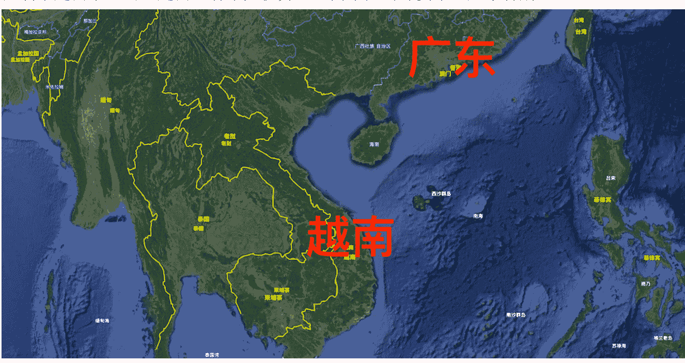

大家不要被距离迷惑了，海运成本非常低，从成本角度来看，广东到越南，看着好像离得挺远，其实比陆上广东到广西的距离还要短，所以一部分广东的低端产业跑越南去了。

而且转到越南的很多产业，不只是日本韩国的公司在转，我国也有不少，大量的低端产业在中国基本生产一件赔一件，只好转走。但是又不能离供应链太远，毕竟越南又没有全产业链，不能像中国那样输入的是矿石，输出的是产品，他们的重化工弱得很，只能接受半成品，那越南就是个不错的选择，大家千万不要对“中国用人成本上升”感到惋惜，咱们搞代工就是为了赚钱将来不搞代工，一直低成本那日子别过了。

此外很多产业属于高污染产业，以前我国需要钱的时候基本上啥都干，现在没那么穷了，也就不愿意了，更穷的越南倒是非常积极。

此外韩国人对越南非常上心。韩国这个国家一直在模仿日本，尽管它以前被日本军事殖民，后来又被日本经济殖民，他们也想在亚洲搞个小殖民地，把不太赚钱的产业搬到那里，那里的老百姓所需工业品韩国来提供，韩国赚钱韩国花，一毛别想带回家。

然后韩国就选中了越南，大家可以看看，现在韩国在越南投资最积极，尤其是三星集团，把越南看做是大英帝国的印度，越南的很多富人区里，住的全是韩国人，这倒是也跟韩国人爱扎堆有关。

那越南现在发展得怎么样呢？从外界看简直是烈火烹油，不过越南内部也很艰难。

首先为了方便外资投资，越南就自己搞基础设施建设，毕竟大家可以上网随便看看越南的基础设施有多差，在中国20分钟的路，在越南经常得跑两个小时，这别人怎么投资嘛。

但是搞基础设施不得钱嘛，政府又没钱，要不借钱搞，要不等赚到钱再搞，现在越南的借钱能力也比较差，所以基建这事搞得非常一般。而且越南现在的路线也有点尴尬，如果想增加财政收入，就得收税，可是如果想吸引外资，就得使劲压低税收，甚至不收税。这就是典型的“都要困局”，多个目标都想达成，问题是目标是冲突的。

所以最后绕来绕去，只好是借钱发展国内的基建，毕竟借了钱将来产业做大，还有可能还上。如果不借钱，大概率都没法发展。

但债务既是天使，又是魔鬼，稍有不慎就会出事，这在新兴国家那里几乎无一例外，阿根廷泰国巴西韩国土耳其等，都因为债务出过事。现在越南经济看着挺好，其实还是贸易逆差国，也就是从国外买的东西比出口的东西多，也是没办法，越南没有上游重化工业，基建相关的物资和半成品原料都得从中国买，到处借钱，把美国日本欧盟借了个遍，债务问题非常大。

不仅如此，越南其实面临着很大的问题，越南将来大概率难逃马来泰国的命运，等稍微发展起来一些，就会被美国金融屠刀屠一次。很多人觉得现在越南GDP增长速率很快，将来一片光明，要知道，1985年至1995年间泰国的经济发展是世界上最快的，随后就在亚洲金融风暴中被搞了。

很多人以为国家想发展静下心来慢慢发展就好了，其实不是，你是个穷鬼或者特别富的时候最安全，等到你稍微有点积蓄又不太富，可上可下的时候，这时最危险，如果不是美国的传统盟友或者背后有大哥撑着，比如中国香港背后是中国内地，那你非常危险，要不你就一直穷着，如果你想富，可以，把命交出来。这倒是有点像金融圈里那句话：你不把命交出来，我凭啥把钱给你。

越南现在正在重走当年泰国的路，全面开放门户，让外资进入，等着迟早到来的那一波收割。

西方资本团伙用这招几乎把全世界都玩了个遍，这也是为啥乱哄哄搞了一百年，没几个新兴国家进入强国俱乐部，你们不觉得奇怪吗？原因其实也不复杂，因为韭菜刚养大都被他们给割了。

从现在的情况来看，越南跟泰国相比并没有太大的优势，等到人力成本上升到泰国那个水平，那相比于泰国、印尼、菲律宾就没啥优势了，大概率非常难往上爬。而且刚才也说了，发展过程中由于需要大量举债，欠钱太多，迟早会被收割一轮，挺过去之后就是泰国水平，挺不过去还不如泰国。

我国其实也有这个问题，中国从2007年之后，过了刘易斯拐点，也就是村里进城农民工不断减少，以至于我国外贸依存度一直在下降，最近这十年主要是靠内需拉动经济，这段不是我说的，是楼财长说的。越南这些国家尴尬的地方就在于他们很难搞出中国这么大的内需来，也就没法带动经济持续向前。

说到这里有人问了，既然旁观的人都明白，越南政府不明白？这就是“阳谋”，就好像告诉你，给你一条路，你可能会倒霉，也可能会发财，对于一个穷的一无所有的国家来说，不出意外会试试，万一呢，万一变成中国台湾了，哪怕混个广西也行啊，反正又没什么可失去的。但是越南跟中国相比，体量太小了，没啥谈判筹码，基本是别人说啥是啥。

说到这里，大家应该明白了。

越南现在最大的优势是人力便宜，普通工人一千块左右，有些国内企业外派员工到了那边，一个月各种补助全下来差不多两三万，过着神仙一样的生活，像极了二十多年前老外在中国的感觉。

越南很难培养出自己巨大的国内市场，产业升级也是个大麻烦。越南明显懂这个道理，所以他们的目标定为了泰国。

而中国这边低端制造业转出去，几乎已经是必然，大家这段时间看新闻就能看到，那种工厂里一个年轻人都招不到，这也是为啥这些工厂都追着刚从坑里爬出来的国家跑。只要这些国家的人稍微有选择，没人能干得了那种在流水线旁边站八个小时当“人肉机械手臂”的工作。而耐克之所以不把人换成机械手臂，只是因为这个世界上还有人比机械手臂都便宜。

对于越南，我们也没必要敌视，越南应该是地球上最接近我们的国家，我们跟越南的关系，有点像我国十来年前跟美国的关系，处在完全不同的生态位，现在越南做买卖的，很多就是华人，很多华人厂子里，一部分不太赚钱的业务本来都不准备干了，后来发现去越南还有的赚，于是搬过去了。目测将来中越也没啥竞争关系。

我现在越来越觉得，我们真正的竞争对手只有自己，只要每一年我们都能比上一年更公平更法制更强大一些，根本没必要在意越南这种国家。

公众号懒人搜索，[懒人专属群](https://example.com)分享

### 中国曾经也是个民间持枪大国

2022-01-05

之前写90年代魔幻往事的时候，很多小伙伴在评论区让我仔细把中国民间持枪的事拿出来讲讲，这段时间翻了不少材料，感觉又清晰了一些，今天就聊聊这个话题。

### 1
### 枪是怎么来的

新中国的枪支问题，是从民国遗留下来的。民国时期，全国遍布大大小小数百万土匪，这些人火力之强，有的土匪连日本人都敢抢，甚至坐地在大路上收税，日本人运输辎重都要交税。而为了抵御这些土匪，各个村落乡镇都要组织防御自保，就像《水浒传》里面祝家庄那样，这种武装村寨有大有小，比如比较著名的“别廷芳豫西民团”，巅峰时期手底下有五万人枪，国共都拿他没办法，甚至日本人拿他也没办法。

此外由于大清崩溃后，基层失去了“调停人”，民间很多矛盾激化，各自成立武装组织自保，比如毛主席去井冈山之前，那地方其实已经有一支武装力量，他们的首领叫王佐袁文才，有六十多条枪，这俩人就是因为当地“土客矛盾”激化，率领客家人抵抗压迫，毛主席秋收起义失败后没地方去，手底下有人正好跟这两人很熟，于是毛主席就带着大家去了井冈山。

可以说，整个民国，基本每座山里都有这种武装组织，由于剿灭成本太高，也就一直在那里呆着了，所以日本人统治东北十几年，土匪还变多了，日本人能在正面战场击溃任何一支国军正规军，却解决不了东北的匪患。

这么多的枪支，自然不是短时间产生的，中国作为没有多少工业能力的农业国，民间拥有这么多枪支是在上百年的社会混乱形成的。自从太平天国开始，火器大规模地开始在中国战争中唱了主角，尤其南北战争之后（南北战争和太平天国运动是同时期的），美国百万大军解甲归田，那么多军火拿去炼钢太浪费，大清这边正在打仗，所以低价卖给了大清。

每次打仗就得死人，人死了枪可能就没了，于是各种枪支就不可避免地流入民间。

清朝灭亡之后战乱频发，各路军阀此起彼伏，主要的精力就是捞钱、买枪、招兵。当时的军阀还鼓励自己领地的老百姓持有枪支，这样一来，不但省了自己剿匪的钱，等到要打战的时候可以更多的招募熟悉使用枪支的士兵，很是节约训练成本，再说本地的枪多是自己买来的，转手卖给老百姓还能赚一笔。

这种军阀军队素质之低劣可想而知，一打起来稍有问题可能军队就散了（没问题也可能散了）。很多士兵带着枪转头去做了土匪，或者干脆把枪卖了再换一家当兵。看《茶馆》里面，巡警对抓到的那两个逃兵说：“把枪卖了，换些块大洋，有钱就在北京藏起来，没钱就当土匪。”按照那时的规矩，如果自己带枪上山，抢来的东西可以多分，要是用山上的枪，就要多交一份给山里。

抗日的时候，情况更严重，一方面国军多次溃败，大量装备流入民间。一方面因为腐败，国军军官直接把成批的军火转卖给地方民团或者土匪，赚得盆满钵满。战后很多军队就地解散，遣散费基本让各级官员贪了，当兵的就拿着一身行头回家，最后的财富就是随身的枪了，拿着卖了或者上山。

关于逃兵卖枪这事，我看我军的记录，说在东北的时候，士兵如果跑掉了，分为两种情况，带着枪跑了，那抓回来就是枪毙。如果不带枪，抓回来可能是禁闭。所以逃兵逃跑的时候，很少带枪。

建国之前，持有枪支不是合法不合法的问题，而是社会刚需。枪弹和大洋、烟土一样属于一般等价物。在全国的交易中都通用，而且价格稳定，比法币金圆券啥的靠谱多了。有的贵重些的东西可以说“这东西十几条快枪都换不来”。

在1932年9月，两个英国人在东北被土匪绑票，土匪开价130万大洋，还要100支步枪，3万发子弹，两挺重机枪，5万发子弹，11斤的上等大烟等等，可见在当时，枪和大烟是一样的，属于硬通货。多说一句，最后交钱倒是没有这么麻烦。因为东北已经被日本占领，英国人不愿意出钱，出动军舰逼迫日本人去交涉。日本人只好捏着鼻子运了两车钞票把人赎了出来。

### 新中国成立初

看过《集结号》应该都有印象，张涵予演的谷子地遇到指导员的妻子那次。当时一大群人正在收缴民间枪支，收来的枪支之多之杂，不但堆成小山，有的枪连收缴的人都不认识，谷子地主动出来帮忙辨认。按照当时的统计，有时一个县收上来的枪支就能按吨算，要用几辆大车拉到一起拆卸，大家把木头枪托和金属枪管分离，金属再送到钢铁厂去销毁。

这个事情是有真实背景的，就是建国后的枪支收缴。在1951年，国家颁布《枪支管理暂行办法》。这次办法在现在看来，主要内容有两个：一是对军用枪支（以及制式子弹）严管，不过猎枪土枪管理得比较松。二是合法持枪的单位和部门非常多。

说起来原因很简单，就是当时国内形势的需要。当时因为多年的混乱，以及国民党败退之后有意为之，使得土匪一类人数量大量增加，很多都拿到了国民党的委任状和弹药支持。

有段时间这些人气焰非常嚣张（特别是抗美援朝早期），对新政权不断攻击。基层单位如果没有枪支完全无法开展工作，所以即使村一级的工作队都要全副武装，随时防备敌人进攻。至于边境沿海地区，更是要随时防着国民党残余军队的大规模袭扰。事实上当时民兵队确实很能干，国民党军向内陆无数次地渗透，都被村民联防给抓到了。

这样一来，虽然民间大量的老式枪支都被收缴了，不过因为现实原因，基层除了土枪猎枪之外，还有大量的制式枪支弹药，只是不归个人所有。普通人在建国之后很长时间，接触和使用枪支（而且是先进的军用枪支）的机会很多，在一些特殊地区，大量老人妇女和孩子都会使用和保养枪械。

### 3
### 缴枪

在剿匪结束之后，国内枪支的管理依然还比较松。这是因为国际形势对我们也非常不利。冷战早期，全世界都觉得随时会变热战，而且是打核世界大战。

有段时间原子弹研究没有大的进展（火箭技术也没有进展，没火箭原子弹用处就小多了），后来中苏交恶，随时会发生大战，有的人觉得已经来不及等到原子弹了。当时民兵的训练，有的地方已经到了学习计算高射炮诸元和埋设反坦克地雷，甚至如何在核武器攻击中保护自己。

为了增加战斗力，只有拿出发动和训练群众的老办法，让民众有基础的射击技巧和军事能力。当时有一本著名的小册子《民兵军事训练手册》，现在被称为“穿越三大神书”之一，里边的内容从枪械保养到挖战壕的基本技巧，再到母猪产后护理啥都有，当时老百姓学习热情非常高，枪支也比较常见，所以很多人对保养枪械并不陌生。

在60年代初，有的干部曾经希望把研究两弹一星的资源减少一些，拿来升级常规武器。为此爆发过非常激烈的争论。

这样一来，枪支的管理就难免得更加松懈了。特别是小口径枪支，小伙伴你想，如果村里的民兵都有步枪手榴弹，枪支如何能严格管理。

在1966年发生了一件事情，人民大会堂的玻璃居然被人用枪打烂了一块。虽说事后查清是个小孩打鸟，子弹乱飞造成的巧合，但是在查询过程中发现民间依然有很多枪支。随后那些年比较乱，更多的枪流入民间。

多种因素，使得官方对民间枪支问题重视了起来。来了一轮大规模收缴。到1969年9月为止，全国收缴来的枪支达到了200万支，子弹3亿发，火炮1.4万门，炮弹300万发，还有3000万枚手榴弹。

说实话，看到这个数字我都不信。后来查询了一下，当年河北省一批收缴的武器弹药就几百吨，拉了一列火车去钢铁厂处理。这还是收缴上来的，没有收的可能还有很多（事后证实确实很多）。
这次收缴之后，枪支的管理渐渐严格。这也是和国际国内大环境有关，当时两弹已经完成（原子弹1964年10月，氢弹1967年6月），人造卫星1970年也将成功。国际局势已经发生了转变，大规模热战的可能变低。新中国最困难的时候已经过去，国家已经有了自保能力。这时再把太多的资源和人力，放在民兵训练和装备上面，效率和作用就没有那么大了。民间枪支泛滥的问题也渐渐凸显出来，所以发生了这次大规模的收缴。

这次收缴之后，大规模枪支问题基本得到了部分的解决。制式武器和火炮这种威力大的差不多都收缴了。民间的枪支都以猎枪和运动步枪为主了。

### 改革开放之后
改革开放以前，中国的社会环境都比较封闭，很多人一辈子都是在村里生活，都没有进过县城。就是城市里，很多工厂就如同一个小世界，一个工人可能一辈子都在一个厂里生活。村里厂里的人就是他们日常接触到所有人，干部们也具有一定的权威。所以即使大量的人配枪，村委会和厂保卫科都装备冲锋枪，但是也不会造成太大的社会动乱，有什么矛盾内部就可以解决了。

但是，改革开放之后，中国进入商品经济，无论是人员还是物资，都开始了急速的流动。见面接触的机会越来越多，人一多难免的就会有摩擦，争吵和冲突也不断地发生，发生之后暴力升级就会很容易发生。这时候，枪支泛滥的弊端就体现了。

当时因为社会不稳，社会治安非常的恶劣，令人触目惊心。抢劫案凶杀案比比皆是，很多地方都有黑社会横行霸道，而且几乎规模稍大的都能配枪。虽说持所有制式武器的不多，但是当时猎枪的管理比较松，猎枪和子弹制作比较简单，很多地方的猎枪猎具店都能买到。

一种常见的双管，子弹又长又大，威力特别惊人；还有一种五连发的猎枪，把枪管锯短了可以轻易随身携带，虽然准度比较差，但近距离杀伤面非常大。短视频鬼畜名场面——刘华强“我给你机会你不中用啊。”用的就是这种连发。

这种枪泛滥程度非常大，犯罪分子持有了，有时好人为了自保就不得不也持枪了。比如有的地方车匪路霸太多，白天就敢砍了树堵路抢劫。有的路线司机们宁可绕几百里路，都不敢直接走。一些司机就在车上带个短把五连发，一来壮胆，二来自卫。

简单说就是社会转型，人员流动变大，暴力犯罪增加，为了配合严打，枪支是重点。

当时对于国内禁枪影响比较大的一件事发生在1992年北京西直门，警察收到情报一个通缉犯露面了，和几个人在一家饭店吃饭，可能随身带有枪支。对此警察比较重视，派了十几个人去抓，本来打算两个抓一个，把一起吃饭的人都逮住。

结果到了地方发现饭店被包场了，里面20多人在喝酒，为了避免人跑了，警察还是进去逮人。刚把通缉犯和边上几个人按住，没想到其他人里冒出几个人，拿着猎枪开枪拒捕。猝不及防下面场面非常混乱，十几个警察几乎都受了伤，拒捕的五个人还都乘乱跑了，过了一个月才全部到案。

在北京西直门这种繁华地方，大街上会出这种事情，对社会造成了很坏的影响。比起常见的单人犯罪，这种团伙持枪公然拒捕，性质太恶劣。因为枪支泛滥，大大的助长了犯罪分子的嚣张气焰，对社会安定和人民群众造成了巨大危害。

国内的禁枪，1996年是非常重要的一年。首先是《枪支管理法》颁布了，对于禁枪不再是用运动式打击来处理，而是以单独的法律来进行管理。

之所以如此重视，一个原因是枪支泛滥的程度比预想的还要严重，上世纪90年代，每年涉枪暴力犯罪都以万计。1991—1995年，全国收缴各类非法枪支105万支，其中包括1.3万支军用枪。民间枪支保持在百万级别，并且每年增加十万把。

还有一个原因是做枪非常赚钱，猎枪这东西只需要简单的机械设备。当时一把成本不过三四百块，卖的时候可以到两千多。接近700%的利润，造成有大量企业和手工作坊生产销售枪支。据统计每年十万把枪，最多三万把是合规有手续的，其他都是非法违规生产。一旦出了事情，这些枪有很多查都没法查。

私人作坊里造枪这事听着魔幻，其实没啥难度。之前有个旅行纪录片，在阿富汗，一个基本上全手工的铁匠铺，两三个人就可以生产仿制AK，还能镀金雕花各种装饰得花里胡哨。不过子弹生产出来故障率有点高，都“高价”买大厂的。我一开始还以为是啥大厂，没想到只是县城（按照我们标准就是个镇子）里一家大一点的作坊，基本还都是手工，只是有一套1960年代进口的老古董苏联设备。

所以《枪支管理法》就不再适用了，正规法律颁布之后，非法持有枪支本身就是犯罪，单独这一条就可以判刑了。

从这时候开始，在中国枪械持有，必须是真的会遇到不用枪就无法解决的问题。比如警察、野外林场、武装押运。或者极少量严格合规管理的情况，比如运动员、有执照的靶场。而且管辖权全部都被提高到了省一级。

原本管理比较松懈的猎枪也严格管理了。按照法律，“牧民（牧业收入应占全部生活收入的50%以上）确因护牧需要可以按规定配置猎枪，牧区中非牧民不得配置猎枪。”

为了配合新法律实施，1997年进行了有史以来最大规模最深入的一次严打，那年我已经有记忆了，当时清楚记得跟着警察叔叔去一家人那里找枪，那小子有个双管猎枪，用玻璃瓶渣和黑火药做子弹，可以打鸟，那一次被没收了。从此以后，禁枪不但成为了一件日常行为，对于任何案件，一旦涉及枪支，就会立刻上升几个层级。即使不使用都会因为涉及《枪支管理法》，加一条罪加罚。

从那以后，国内枪支问题才有了大的改观，虽然不时还有涉枪案件发生，但是数量急速的减少。在2000年之后，民间枪支基本绝迹，到现在20年过去了，很多年轻人都不知道枪支泛滥的时代距离我们居然那么近。

### 尾声
现在不要说枪支，刀具的管制都非常严格。至于那个1.8焦耳的限制，使得大威力玩具枪都会超标。之所以如此，就是因为当年的问题太严重，必须严格管理，目的就是控制恶性案件，维护社会稳定。说到这里，不由感慨一件事，就是我国这种雷厉风行的能力，禁枪这么明显利国利民的事，直接禁了就得了。美国那种多少有点偏执，我前文反复解释过美国人为啥坚持持枪，但是凡事适可而止，为了一部分人虚妄的观念坚持这么蠢的政策，每年搭进去四万条人命，简直就是有病，好在他们人命不值钱。这倒是有点像赵本山以前的一个段子，“青春痘长哪不用你担心?”

当然是长别人身上
公众号懒人搜索，懒人专属群分享

### 懂了美国的科技是怎么发展起来的，就懂了我们接下来该怎么办
2021-12-31

疫情暴发以来，写了好几篇美国相关了，今天本来不准备写了，不过这两天在微博上瞎聊，想清楚了一些事，赶紧补一篇吧。

本文试图解释：
- 1、美国这种自下而上的国家是怎么同时做到基层反智又创新不断的；
- 2、精英阶层为啥喜欢美国；
- 3、整天说美国是自下而上，到底啥是自下而上？
- 4、我们有什么能做的。

### 乱七八糟的美国
把整个美国史看一遍，就能发现这个国家从没啥伟大规划，就是走一步看一步，然后不断靠顶级精英搞出来的科技突破续命。

当然了，没有宏伟计划，不代表没计划，只是很少有超过五年的，一般顶多八年就换领导了，策略也跟着换了。这一点基辛格专门说过，当初联合中国制约苏联这么大的事，也是尼克松这个反共分子灵机一动想出来，最后在小圈子里讨论，基辛格抓住机会来中国搞定的。

再往细处讲，美国历史上的计划基本都是“应激性”的，为了面对大萧条，有了罗斯福新政；为了打败纳粹，有了“曼哈顿计划”；为了抵抗苏联的红色大潮，开始搞马歇尔计划；苏联把卫星射上了天，美国开始搞太空计划；为了应对疫情，有了川总的一系列拙劣的表演。

事实上他们的法律也不是一开始就弄明白了，也是不断进化的，一直在微调，比如咱们看美剧，里边红脖子们最喜欢的“捍卫宪法第二修正案赋予的权利”，说的就是美国宪法最早没说清楚枪的事，后来加了一条，成了“天赋枪权”。其他法律条款也一样，通过判例不断修正，有了种族通婚，同性恋等的平权法案，有时候在补充，有时候干脆自己把自己推翻了。

此外美国的好处就在于它的环境实在是太好，确实相对和平得多。前段时间看我国早年的事，那是相当痛心，北方有苏联，海上有美国，西藏那里还有印度，台湾在策划反攻大陆，四面八方战云密布。

我国经济发展经常被战争威胁打乱，1965到1975，这十年间近一半的建设资金用来在山里挖洞，很多工业设施搬到了山里，而且是山洞里，经常几万人把一座山挖空，因为当时大城市随时可能遭到美苏的核轰炸，所以要躲起来，这事也叫“大三线建设”。直到尼克松访华后，几个战略家聚在一起，讨论出一个结果，“二十年内不会有世界大战”，苏联后期也不行了，我国才解除威胁，安心搞经济。

其实我国的改开起步阶段，应该追溯到毛主席还在的时候，比如1972年就准备花43亿美元从美国德国日本进口工业装备，这事也叫“43方案”，这套方案对后来影响很大，因为后来吃饱饭，跟化肥农药有关，这个方案的关键就是解决这类民生问题。

跟咱们相比，美国确实是安宁，可并不是完全啥事都没，咱们现在看美国乱哄哄的，其实整个美国历史上，一直都这鸟样，小乱不断，大乱反而少一些。

刚建国那会儿，美国国内要就闹闹哄哄铲除“英奸”，以枪毙反革命的名义大量吊死亲英人士，不少人跑加拿大去了，形成了现在的加拿大英语区。后来美国又追去加拿大打了几次，没打下来，被人家反攻回来，白宫都被烧成了黑宫，只好重新粉刷，白宫里边现在还有很多地方依旧是黑的。

后来南北冲突成了主流，双方后来没忍住，大打出手，北方工业主和南方农业朋克们有了一次激情碰撞，南方输了，庄园被铲，大家一起开始搞工业搞基建，基建拉动了一轮重工业的腾飞，到此南北纷争终于平息了。

然后大搞工业，超级工业资本家开始崛起，南北战争结束后美国发展超快，迎来了摩根卡内基的时代，大资本家对工人们敲骨吸髓，工人们也成立工会跟他们对着干，双方动不动就是一次流血冲突。

网上有人说苏联的出现给美国工人带来了假期和福利，其实不全是，八小时工作制等一系列福利是美国工人自己争取来的，那时候还没苏联。劳资双方的矛盾一直搞到60年代，在这之后不咋提了，因为后来美国很强大，可以转移矛盾到东亚，脏活累活给东亚人，他们自己贯彻劳动法，日子慢慢好起来工人也就不闹了。

随后又开始马丁路德金他们领导的黑人运动，反越战，闹闹哄哄，然后又是石油危机，越战创伤，布雷顿森林体系解体等等，这些东西大家看《阿甘正传》有部分体现，当时的美国简直不能看，乱的一团，老百姓也不相信政府，总统一接一个爆丑闻，法国带着几个兄弟在欧洲造美国的反，美元信用也不行了，感觉马上就要完蛋了。

苏联一直觉得美国快完了，但是忽略了一点，美国这个国家的生命力不再“整齐划一”，它的优势就是乱哄哄，跟印度有点像，乱而不崩，烂而不死，堕而不落，反正不像个正常国家。只是很多人没注意，他们社会矛盾在民间闹闹哄哄中相互抵消了，而且跟英帝国有点像，一直闹，反而酿不成大祸，此外矛盾可以对外转嫁。

实在不行，他们搞的那个两党制，本质就是快速“改朝换代”，你不满意民主党，下次就换共和党，一定程度上可以消减掉一些不满，尽管他俩差不多。

而且美国的社会并不是咱们这种大家一起听政府的，而是费孝通说的“一捆一捆的柴”，啥意思呢？他说西洋的格局好比是一捆一捆扎得很清楚的柴，人们通常都属于若干人组成的团体，有良好的自我管理品质。

这一点大家看美剧应该也有感觉，蒙大拿州的黄石人有事基本不劳烦政府，有问题都是他们团伙内部自己解决；纽约布鲁克林很多年里都是被黑社会把持，政府由于找不到黑手党教父干坏事的证据，也没法抓人，教父一直在当地街区做土皇帝。

不过这不重要，重要的是，他们的知识阶层也是高度自治的，自己管自己，政府对学术界干预非常少，相对自由得多，这让知识分子们在里边舒服得多。

为啥美苏争霸到了后来苏联疲态尽显？一方面计划经济本身有收缩的毛病，另一方面苏联政府对学术界的争吵处理很过分，极端的时候苏联把科学家发配西伯利亚劳改营了，这不搞笑嘛。尽管后来不这么干了，不过苏联知识阶层一直对苏联意见很大，整个冷战时期不断外逃。

这也给了美国机会，美国的阶层从第一次世界大战开始就向全世界吸收人才，二战达到了高峰，冷战结束后达到了巅峰，谷歌的那个创始人他爹就是苏联政府官员，跑美国去了，我国改革开放后也跑了一批，中东的知识阶层也大规模出逃。大家不要小看中东，乔布斯的爹就是叙利亚人，塔勒布也是叙利亚人，中东乱了对美国最大的贡献可能还不是石油，而是那里的整个中产阶级都跑美国了。

我理解这也是为啥美国热衷于把全世界一个个地方给搞乱，搞乱了，当地中产就得出逃，这些国家的精英阶层一跑而光，等内乱平息，还得用几十年慢慢培养。

忘了谁说的，说中国其实从没真搞过计划经济，因为计划经济需要大量的数学家和知识分子编排表格计算供需，中国本来识字的就少，解放战争后期还跑了一大堆。也正是因为从没搞明白过，后来改革开放非常顺利，因为受计划经济的影响不大，东欧国家却一直不太行。

有件事大家不要误会了，计划经济的核心是“命令”，但是在执行阶段需要天量的表格处理。1951年年初，中财委在苏联专家的帮助下制作了各种统计报表，但以基层机关单位统计人员现有的业务能力，填报任务难以完成，即使勉强上报，精准度也无法达标。无奈，报表只好一再简化。太缺统计人员，以至于不得不从工人中大量抽调人员，甚至一些炊事员都充斥到统计队伍中。编制出来的表格水平可想而知，说白了，一直也没太弄明白。也正是因为当时需要数学，整个社会热爱数学，华罗庚陈景润这样的大师横空出世，现在反而不听说有这种水平的人了，倒是陈省身的徒弟丘成桐现在在哈佛数学学院做院长。

“高度自治的知识群体”和美国巨大无比的资本市场，这俩不断孕育出新科技，知识阶层提供智力，资本市场给钱，美苏争霸看着是苏联财政的崩溃，本质还是美国的风投资本和知识界一起搞出来了计算机革命，科技上苏联就落后了一代，劳动生产率上不去，人口又少（美国的人口还得加上西欧和日韩以及台湾地区），GDP自然跟不上，财政也崩了，加上内部矛盾重重，很快苏联就彻底完了。

我觉得网上有些人太过执着他们死了八十万人的事，这事放别的国家是大事，美国无所谓，每年死于枪杀的都有四万，四万人平白无故就挂了，这么一个奇葩，你指望他们能有啥感觉？还是上文说的，在美国，人死了是社区的事，不是国家的。

需要注意的是，他们真正的核心部分，知识群体和资本市场，在疫情中基本没啥损失，并且疫情防控期间还在向全世界吸收全世界人才，美股持续上涨，当然跟放水有关，还有一个原因是吸了其他国家资金跑去美国接盘。

此外也要注意，我国最顶尖的人才被吸去不少，比如美国人工智能领域，华人占比非常高，那个李飞飞，现在是人工智能泰斗，几年前我还听过她的讲座。

这些人有的是回国之后又回美国了，他们不是不爱国，而是美国那边知识阶层是自治的，我国这边经常有个领导给管着，这种事普通上班族无所谓，但是顶级科学家是没法接受外行领导内行的，我这些年招聘过好几个美国那边的博士，他们第一个问题就是主管不能是行政出身，必须是技术出身，否则他们不回来，而且还要面试主管。

这一点很多人理解不了，不过事实就是这样，顶级人才对“自由”和“氛围”看待比普通人要重得多，这也是为啥全世界的人才都喜欢往美国跑，一方面能提供钱，另一方面能提供氛围。

### 自下而上
那他们的资本市场又是怎么转的呢？

这就得说，美国是一个自下而上的国家，也就是上边不大管下边，下边也不指望上边，一捆一捆的柴嘛，社区内部自己负责，不同社区天差地别，美国的反智和乱七八糟，很大程度都和他们这个特点有关。那问题来了，这么的国家，怎么做到科技那么强的？一次又一次引领技术革命？

因为创新这种事恰好也是属于“自下而上”的，这又是啥意思呢？

比如大家都知道一个问题，现在全世界都等着技术突破，但问题是我们根本不知道将来改变世界的创新是哪个，也不知道怎么搞。

美国那种国家给出的解决方案是：瞎搞。

对，就是瞎搞，类似蚂蚁出去找吃的，全靠一大群蚂蚁到处乱窜，谁碰到赶紧回去通知家里，大家一起去。

大部分时候，国家并没有计划怎么搞，当然也是没法计划，人类的大部分突破从现在来看都不是计划中的。蒸汽机不是英国政府搞定的，火车也是在煤矿里进化出来的，互联网倒是美国军方搞的，不过一开始也没想到会像现在这么用，计算机也是，最顶级的头脑都觉得全世界只需要八台，人手一台超过阿波罗登月计划一千倍算力的计算机，谁也不敢想啊。

美国那边的逻辑是，让市场里的每个组织和个人都去思考该怎么玩，你想明白了，去搞个原型机或者创业规划去资本家那里圈钱，你牛逼你圈到钱，你再继续搞，如果有成果，自然会有人给你追加钱，这么迭代下来，骗子慢慢出局，真正有实力的慢慢变得越来越大。

当然了，也不是都从基础做起，比如美国军方很多技术就直接转民用了，比如计算机，又大又贵，直接丢给市场，你们看看谁能把它变得能卖出去，谁就能富可敌国，这才有了我们知道的摩尔定律，电脑越来越小，越来越便宜，无数企业拼到最后剩下Wintel了。

手机也一样，当初军方搞出来的玩意，也丢给了市场，谁能卖出去，谁就可以建立一个王朝，诺基亚和摩托罗拉的时代就降临了，不过他俩最后都被苹果给干翻了，当然，苹果也不会一直牛下去，公司跟人差不多，有的寿命很短，有的寿命很长，但是不会一直长下去，苹果也迟早会被一个完全想象不到的公司给干掉。

此外美国每年给大学花的大量的钱，研发出来结果后，可能教授就出去创业了，然后成了亿万富翁。你说这不是“国有资产流失”吗？确实是，不过美国的科技地位确实是这么搞出来的，大学、研究所、企业和资本市场深刻互动才有了如今的科技实力。

无数的头脑，无数的公司和组织，在这种赛跑中逐步淘汰，最后剩下一两个出线，他们可能是谷歌，也可能是微软，也可能是特斯拉，也可能是别的马上要出现的东西。

这种模式有个特点，它是一个大生态体系，里边长着各种生物，看着乱哄哄的，但是如果发生变化，总有一些能适应，有点像陨石坠落地球，灭了恐龙，哺乳动物崛起了。我们的社会也有这个问题，没人知道将来会发生啥，最好的办法就是维持一个足够大的样本库，就算发生啥都有预案。

这就是自下而上。

不过并不是说国家没用，伟大创新一般都在大国里，说明国家给了很大的支撑作用，但同时需要从下边长起来，而不是计划出来。

说到这里，大家肯定纳闷我国这种模式不利于创新？因为我国很多地方是自上而下的。

事实上确实有点，上文说的“各自寻找出路”这种模式，适合没有方向的时候大家分散去找方向，谁找对算谁的，比如现在新能源的电池，全世界有一大堆实验室都在研究，我国宁德时代算比较牛的。我国在新能源方面基本都让市场去竞争，谁胜出算谁的，所以发展得还不错。

但是绝大部分领域，我国前些年主要是转移西方技术，抄作业就行了，没必要再浪费时间到处乱跑。这也是前些年张维迎和林毅夫争论的核心，林毅夫觉得搞产业政策就可以了，集中力量办大事，搞啥“各自突围”？张维迎的说法是要让市场来做决策，顺便培养企业家。

从现在来看，我倾向于觉得他俩都是对的，但是时间不对，追赶阶段完全可以用产业政策重点扶持专项突破迅速壮大，这一点林毅夫是对的。

不过我国很快也会进入迷茫期，因为追赶这事其实真不太难，集中注意力好好追就行了，但是追到一定程度，你跟西方差不多了，没作业可抄了，就得自己做决策了，这时候以前那种国家出台扶持政策的做法就有点不太好用了，因为大力押注一个方向，万一押错了怎么办？路线错了，花钱越多越反动。

这时候就得重新发挥“蚁群算法”，让市场里的企业家们各自突围，谁找到算谁，让市场自己找解决方案，这也是为啥我国这两年频繁强调资本市场的重要性，今年搞起来了北交所，本质都是我上文说到的逻辑。

那印度也是自下而上的，它为啥不行呢？

它差得远了去了，首先没有好的资本市场，你有好想法，在印度也融不到钱，印度人当中有好点子就跑美国搞去了，这也是为啥美国那么多印度高管，主要也是这些精英在印度没啥事可做，顶级脑子都去美国了。

其次印度这个国家在保护私产方面也不太行，保护私产这事普通人没啥感觉，但是头部精英们很在乎，因为他们确实能搞到钱，他们担心好不容易搞到的钱，莫迪突然要搞事，然后没了，所以也不太放心呆在印度，这也是为啥印度跟美国国体差不多，但是差距十万八千里。

而且它想学中国搞产业政策，但各邦都心怀鬼胎，形不成合力，有想法也总也落实不下去，相当于两条路都走得很怪异。

我国这些年一再提专利保护以及保护私有财产，这事真的很重要，这一点做不好，很容易为他人做嫁衣。这些年一直在说清华花国家那么多钱，最后培养出来的人一半跑美国，这就是用脚投票，我国以前穷的时候，这些人确实留在国内也没啥事可做，为了自己和家人的幸福，往美国跑也正常。

搞经济搞科技不可能单靠几个有家国情怀的人去奉献，这种伟大人格可遇不可求，还是要用实际利益去鼓励，多劳多得，天才就应该非常富足，这才能形成良性循环。

### 3
### 未来在哪？

那我们有啥办法超过美国没？

讲真，现阶段只能学习美国，我们发展时间太短了，满打满算四十来年，四十年就要赶超，本身就不切实际。网上现在有股不好的风潮，觉得美帝崩溃在即，我们努力一把，五年见成效。

讲真，如果你的工作稍微有点技术含量，就能感受到美国无处不在。

举个例子，大家现在玩手机，本质都是终端发信息到服务器，服务器给你推内容，不出意外，上边跑的服务器软件就是阿帕奇，也就是前几天阿里泄密的那个，由于它是开源的，相对安全，我国很多大学和大公司都用这个。服务器的硬件也是基本都是美国产的，甚至咱们看到的这些眼花缭乱的app的开发工具，也都是美国的，哪怕我们身边跑的绝大部分计算机相关的东西，核心部分都是美国的。

所以现阶段考虑赶超本身就有问题，学习是最关键的，比如我之前聊过，华为的管理系统是IBM给做的，昨天看到，字节跳动组织架构参考了Facebook，“永远Day1”的说法来自亚马逊。

而且美国并不是啥事都自己搞，大家也看到了，曾经扶持过日本韩国，现在的光刻机也在荷兰，美国没有自己弄回家里去。

说到这里，估计不少人已经有意见了。

速胜论者可能觉得：这样的言论不该有的，认为博主“叛变了”。

亡国论者觉得：看到这样的言论，觉得中国没希望了，老美遥不可及。

毛主席曾经说过，这两种人是一种人，本质都是失败主义者。其实我们还有个路线，就是持久战，把他们好的都学了，把他们毛病都摒弃了，那不就行了嘛。

我们应该继续以一种合作和做生意的态度去看世界，而不是动不动就说西方仇视我们然后又要打打杀杀，或者要完全脱离世界自己过，说真的，不可能。任正非之前有篇文章把这事讲得很清楚，咱们将来可能会不依赖美国，但是离不开整个世界，美国想把咱们从全球体系里赶出来，我们应该进一步贴上去，他不想让我们做的，就是我们坚决要做的。

难道美国就是彻底无敌了？

当然不是，他有可取的地方，但是也有明显的大麻烦，最大的麻烦，就是他的系统已经跑了两百多年了，利益集团已经彻底长成，开始明显开始僵化，很多对国家有利但是对利益集团没好处的事，非常难推动下去，比如最明显的就是拜登搞的那个基建计划，一团糟，因为这事就是对国家有利，对当事人没啥好处，天天扯皮，就是啥也不做。这一点又受了“自下而上”的毒，跟印度有点像了。

此外他们的财政也出了大问题，这个不细讲，将来再慢慢讲。不过需要注意的是，全世界大部分国家的财政都有问题，一定要确保自己不崩。

所以我们要做的，就是继续学习他们好的地方，同时规避他们现在的麻烦，切勿骄傲自满，很容易出大问题。

现在我看一些人对美国太讨厌，恨不得把美国所有东西都打上毒标签。这其实很危险，也正是美国希望看到的，他们恨不得你完全按照美国反方向来，他们折腾了两百年，很多东西之所以有效，是因为顺应了人性当中的趋利避害，你反着来，弄不好就是精英阶层大规模出逃，那样就可以给他们无限输入人才，这种吸星大法非常恐怖。南美国家就这样，每次休养生息几年，突然瞎折腾一番，刚出现的中产跑美国了，为美国提供稳定的“人才流”。

所以我坚持认为，美国从2010年左右开始就一直在走下坡路，但是肯定滑得没大家想象得那么快，说句很难听的话，死几十万人对他们影响并不大，开放绿卡，立刻就有几百万高素质人补上了，指望它短期崩了不现实。

而且争霸思维要不得，咱们的目标不应该是跟他们做敌人，咱们的目标是为了不断改善我国人民的生活质量，为了我们自己的长远发展，美国那些对的东西我们拿过来用，错的就摒弃，而且美国想脱钩就脱钩？凭啥？还没学完呢？脱啥钩？

我总觉得，现在这种状态其实很好，大家想想，1793年马戛尔尼访华，给大清高层看了西方最新的科研成果，比如火器什么的，可是乾隆毫无感觉，客客气气让和珅把他们给赶走了。然后半个世纪后有了一连串的丧权辱国，如果当时乾隆哪怕有一丁点压力，可能大清也不会那么丢人。

有外部压力从来都不是坏事，塔勒布说，压力是信息。

我们感觉到了压力，才会去研究为啥有压力，才能有动力去改进去学习，反而能每年都有进展，大清那种压力不大，但是本质是躺着等人家过来打。

### 4
### 尾声

文末总结下吧。

自下而上的国家一般都乱哄哄的，但是如果法律健全资金充裕，往往创新能力很强，因为创新本身就是自下而上的一种“蚂蚁算法”。这也是为啥我国不断完善资本市场，资本市场有点像一块地，有才华的人像个种子，无数这种人去播种，过一些年就可以成长起来。

此外美国的“人才优待”和“知识界自治传统”，这两项对人才非常友好，保护私有财产又让大家勇敢冒险，对人才的吸引力确实很大，只要能维持住人才持续输入，美国还能撑很多年。

大家注意下，我国最近频繁出现的很多政策，都有上边两件事的影子，事实上我国要想对美国弯道超车，也基本避不开这些事情，迟早得做。我今天看了下新闻联播，里边也正在聊这事，我抄了三段，大家感受下，其实说的就是咱们今天的话题，市场监管总局局长张军说了一段：

- 第一，加快健全市场准入、公平竞争审查、数字经济竞争监管、预防和制止滥用行政权力排除限制竞争等制度。
- 第二，加快构建简约高效、公正透明、宽进严管的准入准营规则，降低制度性交易成本。强化涉企收费规范治理和大宗商品价格监测监管。
- 第三，强化知识产权全链条保护，持续提高审查质量和效率，深入推进专利转化和知识产权质押融资，大力培育专利密集型产业。

说白了，还是要保护知识产权，让市场来孕育能打的小企业，让小企业慢慢长成大企业，甚至公开说“预防和制止滥用行政权力排除限制竞争”，这话已经很直白了，因为我国确实存在这种问题。为啥我随便看了一期就在说这个呢？因为这段时间一直在聊这个。

所以我对未来还是很看好的，对于大国来说，关键是不断发现问题，不断改进，而我们一直有这个优良传统。我一直觉得中国人的脑子没问题，最大的问题一直都是缺乏公平的竞争环境，导致太多人远走他乡或者被埋没，如果把这些问题解决了，未来可期。

公众号懒人搜索，懒人专属群分享

### 比印钱更快的致富之路

2021-12-27

公众号是2018年五一开的，到现在已经三年半了。刚才数年份的时候，突然发现时间过得好快，好像一转眼就到了。

有人说年龄越大时间过得越快，现在回头看好像确实是这样，小时候感觉确实挺长，初高中也凑合，大学那真是一转眼，毕业的七八年更是一点感觉都没，再去参加同学聚会，感觉就跟换了个世界似的，当初的那群年轻人一下子全变成了中年人。

对我自己来说，毕业这些年基本上啥都没干，就干了两件事，上班和写文章，基本上所有的时间都投入了这两件事，上班不多说了，我确实运气不错，进入了一个朝阳行业，所以并没有觉得太苦大仇深（不过996是常规操作），一直在上升路上，三年码农五年管理，就这也混过来了。

对于写作，我自己也不知道哪来的那么大的激情，天天写一直到现在，基本上一有空就写，甚至很少开车，因为打车的时候可以多写会儿，工作原因也去过几十个国家了吧，但是几乎没咋玩，所有空闲时间都用在写作上了。

可能有小伙伴说，你那是因为有粉丝，所以才愿意写，我要是全网也有上千万的粉，我也写的很激情。其实恰好反了，是因为愿意写，所以有人看，一点点攒了起来。

最近又看到一个说法，王川前段时间在微博上提到一个逻辑：

> 让你的作品和资产有组合性，和扩展性，可能是比印钱更快的致富之路。

但挑战是：
- 一，你事前不可能精准知道哪个东西可以组合出有价值的新东西。等你看到别人的东西组合出价值，想要去模仿时，就会意识到人家是N年前打好了深厚的基础，才会有这一天。
- 二，很多人无法坚持到越过临界点。能够坚持下来的一般都是真爱，确实对这个东西本身有废寝忘食的兴趣。要靠外界的压力或物质激励才能驱动的行为，反而缺乏生命力。

### 硅谷王川

11-12 00:08 来自王大爷的 Android

> 让你的作品和资产有组合性，和扩展性，可能是比印钱更快的致富之路。

但挑战是：
- 一，你事前不可能精准知道哪个东西可以组合出有价值的新东西。等你看到别人的东西组合出价值，想要去模仿时，就会意识到人家是 N 年前打好了深厚的基础，才会有这一天。
- 二，很多人无法坚持到越过临界点。能够坚持下来的一般都是真爱，确实对这个东西本身有废寝忘食的兴趣。要靠外界的压力或物质激励才能驱动的行为，反而缺乏生命力。

这段特别好的地方就在于，你不管干啥，你能干成什么事，基本上逃不出这个逻辑，本文的标题也来自这一段。

写作的时候你不知道什么内容会火，只能是一直写，写的多了，如果极度用心，迟早会碰上几个爆发点，一天的收获顶过去几个月。工作中也是这个道理，你没法事先知道哪件事会让你立功，只能是力图把每件事都做好，说不定哪天就搞出了出彩的一笔，那怎么才能让自己挺过漫长的爬坡期？

单靠坚持是解决不了问题的，“坚持”这种可贵的素质有个最大的毛病，就是不可持续，很快就会因为没法持续下去崩溃了，除非一直被人逼着，比如我有个发小去当兵了，说他这辈子最讨厌的事，就是五公里负重山地跑，但是军队里没选择，只能是一直跑，每天跑的肝胆俱裂，好处也很明显，现在退役多年，身体依旧好的不得了。当然了，这种“被迫的操作”没法自发延续，他复原之后就再也不坚持了。

如果没法被逼着，如果还想持续输出，那只能依靠自己的热爱，一直输出，靠爱发电。

输出的东西多了，到了一定程度，慢慢就有了“组合性”和“扩展性”，碰到新问题，也可以在已经存在的巨大知识库里搜相关内容，组合后然后快速输出。

这一点我做码农那会儿也有感觉，把所有用到的算法都反复研究直到滚瓜烂熟，慢慢工具库里的工具多了，后来发现所有新问题的本质都是这些基本零件的复杂组合，所以代码写的又快又准。

而且还呈现出明显的“二八定律”，20%的东西在80%的场景中不断使用。

积累期有个明显的“临界点”，你过那个点之前，无比的痛苦，但是等到过了之后就有种天地宽的感觉，干啥都是随手拈来。大家在电影里看到那种剧情吧，张三丰把太极拳耍一遍，张无忌就看懂了，其实如果你把基础部件搞明白了，别人的算法确实看一遍立刻就懂了，根本不需要一行一行研究。

后来我转了管理，公司要求每个管理层的人都去市场部历练一年，我去那边也呆了大半年，尽管一单也没谈成（一般第一年都是熟悉流程和见世面，然后才能跟着别人去搞订单，三四年后才能独当一面），不过在那边也发现一个问题，哪怕销售这种靠搞关系的工作，本身也是这种思维模式，也有一个摆满了“基础部件”的工具箱。

包括并不仅限于每天对着镜子练习习惯性微笑；怎样判断对方是一个什么样的人，这种人该用什么套路打交道；甚至说话前要调整心态，因为心态影响语气，别人都会感觉到。

在真正销售过程中，也是需要话术引导，不同的人有不同的软肋，有些人喜欢听别人夸他，有些人受不了别人对他好，稍微受点好处就想还回去。还有些人油盐不进，就等着你说回扣的事，而且你得说的很专业，让他知道你也是专业人士，自己拿回扣很安全，不然也会一脸正气告诉你“请自重”。

每个人都是一把锁，你得找到你钥匙链上的那把对应的钥匙，有些人可能是好几道锁，得试好几次，甚至得临时发挥，几把钥匙组合下。

多说一句，不少小伙伴说，博主你这个粉丝量，是不是可以考虑专职去做自媒体了？这个还真不考虑，一方面我的工作就是我写作灵感来源，毕竟在这里我直接接触和管理几百人的团队跨区域解决一个问题，见识过跨国公司到底是怎么运转的，也了解销售是怎么驱动研发的，没这部分知识，我也没法写文章了。

再把这个“工具箱”逻辑扩展下，就能发现生活中到处是这个逻辑，只是有些工作需要的工具箱巨大无比，有的小得多，一般来讲，工具箱复杂的人，收入肯定要高一些，因为门槛就在那里摆着，自然会挡住很多人。

同样的，思维方式本身也是个大工具箱，从实践里来，到实践里去，这两年我把关于生活的思考几乎全部写入了以往的文章里，反响一直也还不错，第一本的《向上生长》是去年的畅销书，今天我和磨铁一起合作出版的新书《复杂世界的明白人》上架了。

我自己是不敢用这么霸气的书名的，不过出版社说这样很好，那就这样吧。文章都是用心写的，里边的东西我都经历过，现在还在经历，也希望能帮到大家。这本书主要收录了我在成长方面的思考，政经相关内容还没过审，得下一本了。文章基本上在微信都发过，不过我自己校阅的时候又看了一遍，也有很深的触动。

公众号懒人搜索，[懒人专属群](https://mp.weixin.qq.com/mp/laobanqun)分享

### 朴槿惠被放了，他们青瓦台的真正魔咒在检察院

2021-12-24

韩国那事我很早就写过文章，当时花了大量时间研究那事，其实韩国总统们之间没啥冲突，真正的冲突是青瓦台和检察院之间的矛盾，青瓦台代表的是韩国自己，检察院代表的是美日势力，属于美日在韩国的狗链子，检察院权力又太大，逮谁收拾谁，总统也拿他们没什么办法，文在寅搞过几次检察院，最后都失败收场，还折了几个战友。不过这次特赦之后，应该会开个先河，等文在寅被检察院送进去，下一任可以特赦了他。

本文2020年2月发过，当时就预测文在寅会把朴槿惠放了，现在果然应验了。

### 1
### 奇葩的检察院

如果说亚洲三大政治奇葩，一定要把这仨放进去：
- 日本特搜部；
- 韩国检察院；
- 巴基斯坦三军情报处；

为啥说他们仨奇葩呢，是因为这几个在他们国内都是无法无天的存在，谁都管不着。

其实我们看韩国电影，类似《王者》、《与犯罪的战争》什么的，就能看出来韩国检察官是一个什么特殊的存在，一句话说就是“无法无天”，看谁不顺眼就查谁，越是位高权重，他们越想搞，而且更加奇葩的是，一旦开始调查，无论总统还是检察院最高长官都没法让案子调查给停下来。这个问题上，总统也是相当的没有牌面。

那问题来了，韩国检察院这么逆天的玩意哪来的？

答案就是美国人搞的，而且不止这个，我们上文说的三个奇葩都是美国人搞的，多么神奇的巧合。

想说清楚这事还要回到半个多世纪以前，第二次世界大战结束后日韩都被美国占领过一段时间，在那段时间里，美军对这两国国家进行了大刀阔斧的改革，比如在日本解散了财阀，让美国驻日大使馆的一群会说英语的日本文官组成了一个“特别调查处”，专门调查日本的大佬们。

这个特别调查处，演化成了现在的“特搜部”，代表作就是扳倒了日本首相田中角荣，就是被毛主席接见的那个，田中首相到死都在打官司。

在韩国也一样，美国人把检察院从法律体系里拎出来，成立了一个超然于韩国政治的机构，也就是我们现在看到的韩国检察院，看谁不爽就查谁。

这也是昂撒人控制别国的一个手段，不会自己亲自上，而是拉着一根狗链子，如果自己上，将来出了事还得自己担嘛，但是如果控制着一个权力极大的部门，就可以有针对性地打击。韩国检察院的权力大极了，我们看韩国电影，经常能看到特警们破门而入，然后一个穿着西服的文官跟在后边溜达进来，对着警察们各种指点，这人就是检察官。

警察也对检察官各种抱怨，对，韩国重大犯罪调查不是警察领头，是检察官带头，可是他自己又不会跟罪犯短兵相接，所以他们可以指挥警察们去干活，冲锋陷阵的是警察，后面捞好处的是检察官，警察们可不是有怨言嘛。

说到这里，大家可能要问了，听说韩国是财阀垄断权力，这伙人跟财阀哪个权力更大一些？

其实这不是问题，大家不要受一些文章的影响，在所有现代国家里（墨西哥那种就不能算现代国家），没有哪个公司能和国家机器硬杠，韩国也一样。这个理解起来比较费劲，我就说一句吧，公权力是宪法背书的，只要这个国家大部分人接受宪法，那你如果被法院按照宪法给判了，那你就等着被修理吧。

检察官的权力来自宪法，这个权力大的不得了。在韩国，你可以想办法不让立案，或者去贿赂检察官让他网开一面，但碰上那种不鸟财阀的检察官，一旦调查清楚被判了，那就只能去坐牢，或者等着特赦。韩国财阀坐牢的事非常常见，包括三星、乐天的掌门都坐过牢。

大家一般说财阀厉害，是因为他们可以通过海量资源让检察官网开一面（检察官有采纳或者不采纳证据的权力），或者买通证人什么的，这一点在全世界都通行，比如黑手党纵横江湖这么多年，不是因为美国法律不敢碰它，美国谁都敢碰，而是因为黑手党总有办法消灭证据和人证，没证据就没法起诉。

比如著名的李胜利案和张紫妍案，我以前一直把这个事当成个财阀逃脱审判的案例。不过写这篇文章前仔细看了韩国那边的材料，也没多少阴谋论，我们在中文网上看到的绝大部分所谓的证据，在韩国都被证伪了，包括张紫妍写的那个陪睡名单，也被证实是一个伪造名单，伪造书信的那个人还专门上电视承认了错误。

接下来，咱们以朴槿惠为例给大家讲一下检察院是怎么开展工作的。

朴槿惠跟邪教牵扯的比较多，有个邪教闺蜜，俩人关系贼好，朴大妈利用职权，把闺蜜的闺女给弄到一个非常好的大学里去了，这个妹子在大学不好好抓学习，闲的没事就是炫富晒马骂同学，搞的天怒人怨，韩国人又是暴脾气，就开始游行集会一顿闹。

闹大后就把记者和媒体给招来了，而且记者本着不怕脏不怕累的精神，去翻了邪教闺蜜的垃圾桶，在闺蜜扔掉的一个笔记本里发现了几百份青瓦台的文件，这下可就是爆炸性新闻了，大家惊讶地发现，在韩国说了算的不是青瓦台的朴大妈，而是另一个邪教胖女人。

然后记者继续挖，发现这个闺蜜在海外有多处豪宅，越看越不像好人。

检察院早就等的不耐烦了，天天想夜夜盼的等你露马脚，你这属于自投罗网啊。尽管朴槿惠通过律师请求检方推迟调查，压根没人搭理她，调查还是如期开始，这里大家就能看出来一个关键问题，韩国总统压根就管不住检察院，也就是说，那伙人要对谁发起诉讼，总统说了不算，哪怕要对总统发起诉讼。

然后检查组突袭了青瓦台，三星总部，还有邪教闺蜜的住宅，甚至把朴槿惠的私宅都翻了个底朝天，拿走大量材料，并且传唤所有涉案人员去问询，而且对所有涉案人员搞疲劳战，十来个检察官一直问询，经常持续二三十个小时，中间不准休息，朴槿惠那段时间被他们弄得精神崩溃，有一次三星的那个太子李在镕，被高强度审问了22个小时，审讯完之后是被人给扶出去的。

最终证据确凿，总统朴槿惠通过闺蜜向三星索贿并滥用职权，构成犯罪。

随后法院通过了对朴槿惠的弹劾，朴槿惠下台并被判了25年，三星的李在镕被关了353天，判了两年半，缓期4年，出狱回家了。

说到这里，大家可能觉得奇怪，为啥朴槿惠被判了25年，李在镕被判了两年半，还缓刑？难道是法院偏袒三星？

这个我研究了一下，还真不是，韩国法律就那么规定的，韩国和我国一样，是大陆法系，法院操作空间很小，不像美国英国那样，法官发挥空间很大。主要还是因为朴槿惠的罪名更重，犯的事更大。

说到这里，大家可能纳闷了，朴槿惠这个事整的比较明白了，媒体爆料，所以检察院跟进，那其他总统为啥被调查呢？比如卢武铉，都下台了，没什么政治油水了，为啥又被揪回去一顿调查，还给人逼自杀了。

这个就非常复杂了，又涉及到了一个韩国的土特产，检察官明星化。

由于韩国检察官的特殊性，韩国人最喜欢的几个职业里，就有检察官，那个电影《王者》里，小混混男主角看到一个检察官跟打狗一样揍他的混混爹，一下子就喜欢上了那个职业。

只要搞定几个大案要案，就可以迅速蹿红，然后成为炙手可热的人物，上电视，登报纸，风光的不得了，比去青瓦台都风光。

既然好处这么多，那肯定竞争就很激烈。你要先搞定他们那个录取率极低的司法考试（比我国那个司考录取率低一倍，卢武铉考了七次才考过），然后竭力经手大案要案，注意了，关键就是大案要案这四个字，在韩国检察官眼里，搞定高级别官员就是他们上升的阶梯。

谁的官最大？当然是总统。还有什么比扳倒总统更能一步登天的呢？而且如果扳不倒，总统也没法修理你，至少没法明着干，不然你就又有理由干总统了。

搞定一个总统，基本上就成了明星式的检察官，比如那个把朴槿惠拉下马的尹锡悦，在扳倒李明博过程中也成绩显著，成了韩国政坛的明星，现在已经干到了检察总长，下图的那个“破邪立正”，就是他们反对朴槿惠时期的口号，这两天他又把文在寅的心腹曹国干掉了，差点把文在寅也给牵扯进去。成了韩国检察官们的偶像，一个人差点干掉三个总统，服不服吧？这货现在正在竞选总统。

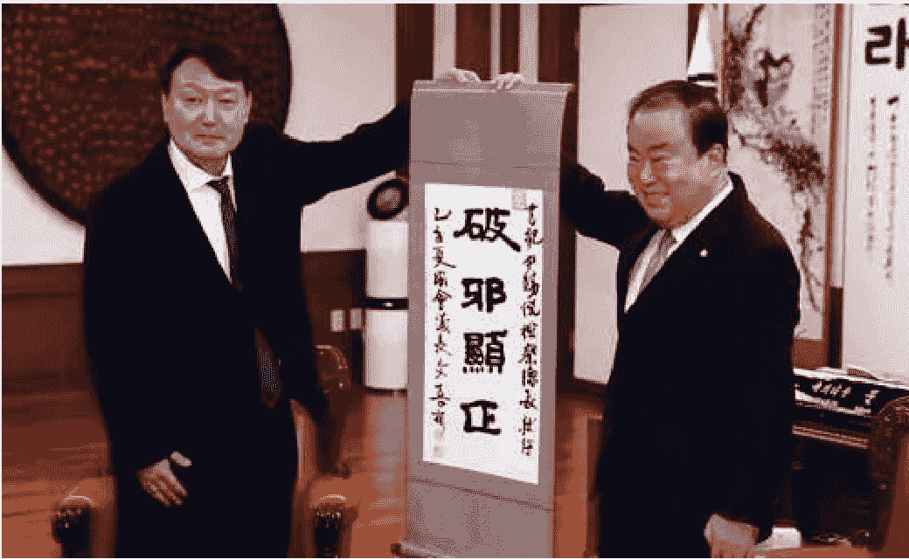

### 没有一个总统是干净的

韩国是民选国家，每次大选就得消耗大量金钱，这些钱都得金主出。

比如总统候选人说要支持新能源，搞电池的SK和LG肯定会积极支持，如果说要发展城市建设，那现代最积极，因为它是生产挖掘机的。总统上台后，要兑现诺言，给财阀以低息贷款，或者其他优惠政策。比如文在寅，他的执政思想就是振兴韩国军工业，得到了几个军工巨头的支持。而且韩国财阀们都是欠钱大户，杠杆高达500%那种，稍微有点风声就得倒闭，1997年就倒闭了好几个。

说到这里大家就明白了，每个候选人都是拿了金主的钱，去拉老百姓的选票，大家千万不要孩子气，民主选举本身就是烧钱竞赛，不但要在媒体上宣传，还要沿着大街小巷发海报，还有好几万工作人员到处给你宣传造势，这种情况下，从来都需要天量资金。而且韩国总统权力没有有些人说的那么小，甚至在各国里算大的，他只是管不了检察院。

没有财阀捐钱，老百姓都不知道你的竞选纲领，怎么投你的票？这就跟创业有点像，财团就像是投资人，大部分家里不富裕的人卖车卖房去创业，基本都赔的血本无归。要不然就是拉拢财阀给自己出钱，要不然就像特朗普那样自己家里有钱，而且得很有钱。

这么说来，不可避免的，这个过程中会有天量财富的交易，总统候选人往往自己是不贪污的，有一说一的讲，韩国那几个领导人的个人素质和品格都还是不错的。

但是总有一堆事需要办，办事就得花钱，不可避免的要接受捐赠和各种献金。而且有些脏活必须有人去做，这种情况下，候选人都得睁一只眼闭一只眼，放任手下去把事搞定，这些事都为后来的调查埋下了伏笔。

说到这里，大家也就明白了，为啥没有一个总统能经得起查，一查就出问题。你们看看韩国总统的下场：

| | 任期 | 结局 |
|---|---|---|
| 全斗焕 | 1980-1988 | 受贿和军事政变被抓，后被特赦 |
| 卢泰愚 | 1988-1993 | 受贿和政变被抓，后被特赦 |
| 金泳三 | 1993-1998 | 他儿子受贿，他没事 |
| 金大中 | 1998-2003 | 三个儿子受贿，他没事 |
| 卢武铉 | 2003-2008 | 家人受贿，他自杀了 |
| 李明博 | 2008-2013 | 和家人一起受贿，被抓了 |
| 朴槿惠 | 2013-2016 | 闺蜜门事件，被抓 |
| 文在寅 | 2017-今 | 未出事 |

除了最上边的那俩搞军政府被清算，其他的都是家人朋友腐败，被检察院查了，没有迹象能看出是财团在搞他们，而且每次这些总统被调查，有受贿必然有行贿，谁是行贿方呢？对，财阀，所以财阀经常得跟总统家人一起上去受审，朴槿惠案就很典型，受贿和行贿肯定是成对出现的。

而且检察官不会只查你一个，从你家祖宗上下三代开始，你爹你妈你儿子，朋友司机小舅子，甚至连你家的哈士奇都要查一遍。甚至被韩国人评为圣人的卢武铉，他自己确实没啥问题，好像是只收了块名表，不过家里问题一大堆，他为啥要自杀？因为自杀了检察院就没有理由继续下去了，可以放他家人一条生路，只要他活着一天，迟早把他们家的人全送进去，所以他说他很痛苦，坚持不下去了。

现在的那个李明博也是，他自己倒也没啥问题，他哥成立个公司在替他收钱办事，他俩一起进去了。

我们的话题到了这里，大家肯定要问出那个“关键一问”了：

按理说这套模式不止是韩国在搞，为啥只有韩国这么多总统进去了？到底有啥问题？

也不复杂，联系第一节话题，这个问题就明白了。

### 政治逻辑

全世界所有稳定的国家，都是有政治逻辑在里边的，比如团结为重，新政府不能清算上一个政府，倒也不是官官相护，而是为了更大的考虑。

你想想啊，韩国所有总统都是罪犯，这样的国家，大家对政府会是个什么体验？必然伴随着不信任感的上升，觉得政权可能本身有问题，韩国遍地邪教，还奇怪吗？

所以说吧，政体比较稳定的国家，一般不会清算前边的领导，比如美国，那个尼克松在“水门事件”中不是犯罪了嘛，要是搁韩国，妥妥要去吃二十年牢饭，但是美国那边新总统上台后第一件事就是把他给特赦了，各方也都接受，大家顾全大局，觉得务必要维持团结而不锱铢必较。

1999年，普京上台后第一天也是特赦了叶利钦全家，大家观察下就能发现，正儿八经的国家都会这么搞，哪有一上台就搞清算的，弄不好将来你也得重走前辈的路。

事实上韩国政府也做过努力，想结束这种恶性循环，比如金大中在位的时候，就特赦了全斗焕和卢泰愚这两个罪犯前总统，我们再把那张图放到下边来：

|  | 任期 | 结局 |
|---|---|---|
| 全斗焕 | 1980-1988 | 受贿和军事政变被抓，后被特赦 |
| 卢泰愚 | 1988-1993 | 受贿和政变被抓，后被特赦 |
| 金泳三 | 1993-1998 | 他儿子受贿，他没事 |
| 金大中 | 1998-2003 | 三个儿子受贿，他没事 |
| 卢武铉 | 2003-2008 | 家人受贿，他自杀了 |
| 李明博 | 2008-2013 | 和家人一起受贿，被抓了 |
| 朴槿惠 | 2013-2016 | 闺蜜门事件，被抓 |
| 文在寅 | 2017-今 | 未出事 |

可能大家不知道，全斗焕和卢泰愚他俩是俩军政府头目，金大中是MZ斗士，在长达27年里，金大中熬过了那两人的暗杀，绑架和囚禁，要不是美国人出手阻拦，说不定金大中已经被做掉了。

但是金大中上位后还是赦免了他俩，不是因为金大中是“圣母抖M”，而是他想结束这种循环，韩国政坛一直被弄的风雨飘摇，今天搞总统，明天弄部长，国家还发展不发展了。

比如我们上文提到的美国，美国政坛就有潜规则，互相吵得再凶，也不能搞秋后算账，毕竟那些政治家族，烂事一堆，认真找总能找得到，比如肯尼迪家族黑社会起家，要是查全家都能送进去。美国两百年，韩国这种情况一例都没，并不是偶然的，人家已经形成惯例了，在《纸牌屋》里也有这个剧情。

不过尽管金大中自己跟个圣人似的，为了国家大义，宽恕了那俩货，不过他自己的三个儿子被检察院一顿调查，全被抓了起来，不过所幸金大中自己没被卷进去，尽管明显是冲着他去的。

说到这里大家明白了，如果非要查，身在高位的政治家基本都能查出问题来，但是大家都在竭力避免这种情况，水至清则无鱼，乱搞下去，成本太高。

韩国现在搞的这么难看，其中重要原因就是检察院谁都不理，它有它自己的逻辑，它的逻辑就是逮到青蛙捏出屎，管他会有什么政治后果，反正那也不是检察官该考虑的，政治家也约束不了他们。他们是官僚，只管自己的前程，他们才不管别的。

说到这里，大家可能纳闷了，这样的制度难道不好吗？权力受到约束，多好。

这个要分开说，韩国检察官制度很明显有很多优点，比如权力受到监控。但是韩国检察院明显权力过大，凌驾于整个国家整体之上，而且检察院也都是人，权力过大导致检察院也是腐败的重灾地。

比如2012年，高级检察官金光浚被曝光涉嫌收受传销巨骗提供的巨额贿赂。在韩国轰动全国，检察总长因此引咎辞职。2016年7月，韩国高级检察官金庆俊因涉嫌收受数亿韩元贿赂并进行股票内幕交易受到韩国检方起诉。

其实在韩国，跟中国对韩国的感受不一样，中国人觉得韩国一定是生活在财阀的阴影下，我问了十来个韩国小伙伴，他们说也就那样，经常在电视上看财阀大佬坐着轮椅被拖到法庭上，大家感觉还是检察官厉害一些。

### 检察院改革

我们在这里分析这些问题，韩国人自己知不知道？

当然知道了，所以从卢武铉开始，一直想改革韩国的检察院，让这帮人的权力不那么变态，但是效果极差。有说法认为，后来卢武铉被逼自杀，其中一个原因就是他在位的时候招惹了检察院。这一点在不少韩国电影里都有体现，检察官们一提起卢武铉就跳脚大骂。

他卸任后，检察院天天调查他哥和他媳妇，家人轮着去局子里报到，他自己知道这俩人不干净，经不住查，精神受到极大的压力，后来想不开跳崖自杀了。

我看有文章说他是不堪受辱，其实我们上文的那个表里也写了，金泳三和金大中的儿子都被抓了，他俩还过得好好的，等到法院调查完你不就还你清白了嘛，卢武铉不愿意等结果，因为他知道结果是啥。

直到这次文在寅，之前改革韩国检察院，想把检察院的一部分权力分给警察，检察院权力会遭到重大削弱，今后也就没法像现在这样嚣张了。

1月13日这项法案已经在国会获得通过，韩国国内觉得这事才是大事，反而中国这边基本没啥风声，大家普遍理解不了这个行为到底意味着啥。

如果这次改革能顺利进行到底，检察院的权力将会大幅消减，文在寅说不定能打破韩国总统魔咒。

那为啥文在寅敢这么搞呢？

很重要的一个因素是，战后七十年，别看韩国现在还在跟着美国，不过美国对韩国的控制已经轻了太多，而且韩国政坛也有个“从右向左”的转变，早期的都是右翼大佬执政，政策就是“反共亲美”，“财阀利益至上”。而左派的思路是“独立自主”，“亲朝”（左派一直向和北边那个国家合并，因为他们是一家人，右派想把北边炸了），“反经济寡头”。文在寅就是左派的。

他上台最大的一个主张就是限制检察院，文在寅再谈改革：没有其他地方像韩国一样，让检方拥有如此权力，现在让他改革成功了一部分。下边这段是韩联社的文章

> “韩国总统文在寅15日主持召开国务会议时表示，设立高级公职人员犯罪调查处（纪检部门）是制衡检察机关的民主手段，具有重要意义。
> 
> 文在寅表示，检察机关拥有无所不能的权力，却不对自己的错误负责，也不受任何法律追究。他强调，高级公职人员犯罪调查处是权力机关改革的核心，将为严肃问责检察机关内部舞弊行为提供制度保障。任何权力机关都无法凌驾于国民之上，若检察机关以民主方式受到制衡，将能重拾国民信任。”

不出意外，现在改革完成后，文在寅可能打破了他们的那个“青瓦台魔咒”，就算他进去，下一任很快就把他特赦出来了。

而且我相信一点，如果尹锡悦上台了，他也会坚持不懈限制检察院权力，这就是屁股决定脑袋。

公众号懒人搜索，懒人专属群分享

### 贫富分化、直接税和间接税

2021-12-22

文章开始之前，必须得说一句，这个话题太复杂了，我现在只能是给大家讲一些基本的东西，后续可能针对这个话题多写几篇，咱们慢慢往深聊。

咱们首先得弄清楚一个问题，到底什么是直接税，什么是间接税。

直接税一般说的是那些不能转嫁的税，比如房产税和个人所得税，还有比较著名的人头税，这个玩意古代比较多，那时候收税困难，所以简单粗暴，家里有几口人，就收多少税。

其他那些能转嫁的税就叫间接税，最常见的，关税，增值税等等，这些税不需要纳税人直接交，就是间接税。比如一辆进口车从国外进口，需要交关税，消费者买车的时候车的售价里就包含了关税，相当于转嫁给了消费者。

如果更直观点，直接税就是那种从你手里扣的税，比如个人所得税，让你非常心疼。间接税就是那种已经算到商品里的，如果不仔细研究税法，没人知道每件商品里到底含了多少税。

我国现在主要是间接税，最重要的一项税收，增值税，这玩意说的是产品在流转过程中的税，由于每次流转都得交，为了防止重复交税，下游会要求上游出示交税凭证。

这个设计极其精妙，如果上游不提供交税证明，交易根本没法进行，政府几乎不需要去看着商家，商家会自发一级一级地监督上游，当然了，这些税最后变成了价格，最终由消费者承担。

下图可以看出，增值税和企业所得税是我国最重要的两项税种，都是由企业承担。

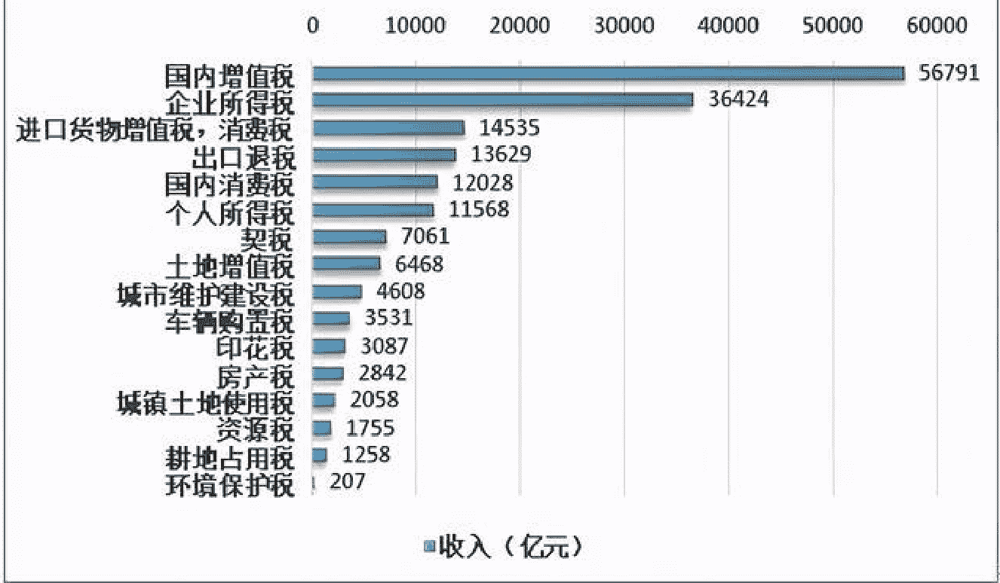

### 2020年中国主要税收收入项目

说到这里，大家应该也看出来，直接税的好处是可以针对每个人都收一次，尤其是个税和资产税，收入高的人多交，收入少的人少交，房子贵的人多交，房子便宜的人少交，这样一定程度上公平一些，发达国家基本都是直接税为主。

所以纵观东西方历史，有一个主轴，古代主要是直接税，也就是对人头和土地征税，后来商业行为越来越多，开始有了商业税，等到清朝后半期，我国又有了关税，关税给大清续了五十年的命。

古代的间接税大家可能比较难理解，知道盐铁专营吧，这就是典型的间接税，国家对这种商品课重税，老百姓不得不买这些东西，间接就把税收上去了。以唐代后期为例，盐铁茶酒这几项的赋税占到全国总赋税的一半以上。

西方国家也是这个流程，古代也是直接税，比如土地人头等税，后来商业兴起，开始直接、间接税一起收。

但是间接税有个毛病，比如我们上文说的增值税，尽管收起来容易，但是它造成商品价格上涨，影响流通，此外也造成企业压力过大。

所以西方变发达之后，又进化到了以个税为主。在1799年，英国人最先开始搞个税，到了现在，个税是西方大部分国家最主要的税种，因为这个税种比较精细，能做到收入多的多交，收入少的少交，相对比较公平，比如美国，最大头就是个人所得税。

当然了，这里说的是哪个税是“主体”的问题，没有一个国家只收一种，只是说发展中国家一般以间接税为主，发达国家以个人所得税这种直接税为主。

也就是说，收税这事也是一种“国家行政能力”，发达国家行政能力强，老百姓收入也高，收上来的税能覆盖征收成本。发展中国家能力差，老百姓也没钱，收益覆盖不了成本，所以只好选择那种成本低的征税方法，也就是我上文提到的关税和增值税。

为啥征收直接税难呢?因为每个人的情况都不一样,税务局就得充分掌握每一个人的财务情况,这既考验数据收集能力,也考验行政能力,弄不好轻则收税成本过高,重则引发动荡,西方的多次革命都是税收导致,中国这历代造反很多也是因为加税导致。

我国古代长期收的是人头税,并不对土地收税,这样听着就很不公平,那为啥这么做呢?原因很多,其中一个就是对土地收税实在是太难了,古代土地丈量本来就超级费劲,每块地的贫瘠情况又不一样,可能某些肥沃土地一亩产出顶的上贫瘠土地十亩的,这复杂的计算量在古代根本没法承受,管理水平低下的情况下,干脆只对人头征税,穷人和地主如果家里人数一样多,收的税也一样多,非常不合理,不过也没办法。

直到雍正时期才搞了个“摊丁入亩”,才把人头税废了,开始征收土地税,地少的农民赋税压力暴跌,多出来的这部分钱变成了人口,中国出现了人口爆炸。不过清朝的农业税非常粗糙,各种地的税率差不多,不过依旧比人头税强太多。

西方那边也差不多,英国最早搞房产税,也不是挨个去量大家的房子多少平,而是税务官去数房子上的窗子,来降低执法成本,这导致欧洲很多古堡窗子非常少,阴森恐怖,只有教堂才有大玻璃窗,因为教会享有免税待遇。

现在为了收税,各国在这事上也是想尽了办法,熊彼得认为现代国家的出现,跟税收系统关系很大,因为欧洲以前的官僚系统主要任务就是收税的,而且你收了大家的税,大家肯定要过问你把钱弄哪去了,现代社会的两大基石,官僚系统和公民意识就这样出现了。

美国人在这方面研究更深,不怕困难,坚决征收,每年闹得鸡飞狗跳,大家知道他们的那个国税局吧,美国人说这个机构和黑社会的唯一区别是他们“奉旨打劫”,或者“持证打劫”。

为了让大家积极交税,税务人员想了无数歪点子,最重要的一点,就是举报和告发,这就很类似我国汉朝时候的“告缗令(那个字读“敏”)”,你举报其他人偷税漏税,就可以获得15%-30%赃款奖励。下图就是美国国税局的网站截图,要求大家去踊跃举报偷税漏税行为。

### How Do You Report Suspected Tax Fraud Activity?

Visit Identity Theft Central if you think someone stole your identity and used your Social Security number for employment or could use it to file a tax return. You can also visit Taxpayer Guide to Identity Theft.

### Report Tax Fraud

We don't take tax law violation referrals over the phone. Use Form 3949-A, Information Referral [PDF] if you suspect an individual or a business is not complying with the tax laws. Don't use this form if you want to report a tax preparer or an abusive tax scheme.

We will keep your identity confidential when you file a tax fraud report. You won't receive a status or progress update due to tax return confidentiality under IRC 6103.

Tax fraud includes:
- False exemptions or deductions
- Kickbacks
- A false or altered document
- Failure to pay tax
- Unreported income

一旦发现有人欺骗税务局，IRS的人就会上门，场面跟突击队打击恐怖分子似的，抄家式征税，经常把人吓出个三长两短来，不过税警们并不在乎，谁让自己是奉旨征税呢。

此外还搞各种“纳税激励”，你交税积极排名靠前，说不定还可以得到税务局邮寄给你的购物卡等等。

在这种恩威并施胡萝卜加大棒威逼利诱之下，美国确实税收体系运转的要比绝大部分国家顺利的多，美国自愿缴纳税款的比例，高达81%到84%，相比德国只有68%，意大利62%，真是高的不得了，主要也是大家怕税务局。

说到这里，肯定有小伙伴憋很久了，巴菲特和特朗普不是一直不交税吗？他们这套制度是不是有问题？

其实法律这玩意就跟个栅栏似的，不可能挡住所有人，能做的，就是尽量让大部分人合规，超级富豪们可以找律师和财务天团帮自己搞定这事，这在全世界都没啥好解决方案，不过很多国家基本上连不那么富豪的也在逃税。

说到这里，大家也就明白了我国为啥以流通环节征税为主了。

一方面直接税有个毛病，收起来太疼了。对，就跟割肉似的，你工资一万到手七千，如果工资十万，到手五六万多，简直要命，疼的要死。很多小伙伴知道，我国以前有个持续千年的农业税，这就是个直接税，到2003年彻底废掉了。

另一方面征个税成本太高，得养一大堆税务人员，挨个甄别老百姓的收入，这工作量大的惊人，所以工作开展非常困难。这不止我国有这个问题，发达国家一样有问题，美国在1913年个税也只占总体税收的1.5%，经过这一百年法律变更以及税务局的不懈努力，终于给干到了35%以上。

也正是因为直接税征收太难，所以大部分国家也都是居民收入到了一定程度才大规模从间接税转向直接税。

我国还没到那一步，我国所以现在的税赋主要压在企业身上，这也是为啥曹德旺说美国企业的税赋比中国轻，大家应该能理解了吧，因为美国的税主要是个税，也就是个人承担，企业税并不高，中国主要是流通税，企业承担主要税赋。

综合算下来，中美两国的整体税赋差不多，以2019年为例，中国的财政收入占GDP比例为28.14%，比美国的约32.66低了4.5个百分点。不过我们还有一些隐形税收，比如地方政府的财政收入并不是靠税收，而是卖地，卖地的这部分钱也进了财政，跟税差不多。

而且直接税有个好处，它是累进的，也就是说，收入越多，税越重，我国最高个税税率是45%，已经很高了，但是有普遍违法的问题，比如薇娅这次的13亿竟然能漏掉。北欧那边的福利社会更过分，能干到50%以上，他们搞福利社会的根基也在这里，当然了，咱们很难搞定北欧那种模式，人口数量在那里摆着，他们都是些驻马店或者上海大小的国家。

而间接税是“累退”的，也就是你收入越高，纳税比例越低，因为穷人可能每个月把钱花个干净，他消费的商品里都有税，所以他的纳税比例非常高，可能纳税30%左右。但是富人的消费比例很低，大部分钱都拿去买资产了，最后可能纳税的税率只有10%，越有钱，纳税比例越低。以前说富人消费奢侈品很多，那给奢侈品征重税，是不是就可以增加富人纳税?

后来发现想多了，因为税太重，一旦超过了机票的价格，很多人就不从国内买了，直接坐飞机去国外玩，顺便消费，让你收不到，这也是为啥有段时间要给奢侈品减税，不少人说这不是给富人减税吗? 其实不是，对于随时可以出国的人来说，关税不是问题。

这也就是为啥发达国家都要过渡到以直接税为主，因为只有这样才能调节收入。当然了，美国是个例外，大家可以去抖音上看看，很多移民到美国的华人现在也在开播，他们也不愿意政府花他们的钱去救助穷人，他们觉得穷人得自己去解决问题，美国那样的国家，只要四肢健全随便去找个搬砖工作都穷不到哪，他们更希望自己的房产税能建设小区周围，加强周围警力什么的。

总之，如果严格实施直接税，企业和穷人的税赋压力会下降，但是中产和富人的压力会上升，政府的执法成本也会暴涨，会计和律师的地位会进一步加强，美国那边的会计巨有钱，也跟这个有关系。

后续我国肯定也会向直接税过渡，大家如果留意政策文件就能发现，这两年提到“直接税”的频率越来越高，而且随着大数据、金四税务系统、政府数据联网工作相继完成，直接税的执行难度也越来越低。

中国在改开四十年高速发展后，现在也面临着巨大的问题，当下很多问题，其实就是很多受益者承担的责任太少，这些责任，按理说都可以通过税费来体现出来，说白了，以前的税收模式对效率友好，但是不利于公平。

十八大里提到“清理规范隐性收入，取缔非法收入，增加低收入者收入，扩大中等收入者比重，努力缩小城乡、区域、行业收入分配差距，逐步形成橄榄型分配格局”。

不过这些都是目的，手段是什么呢?

首先得是发展，所有问题的前提都是发展，不发展谈分配就是耍流氓，在发展的过程中，通过完善、推行房产税和财产税等直接税，加强对社会财富的调节和政府福利的二次分配，帮助那些后来者。

而且需要通过“科学立法，严格执法”来解决，也就是法制，要防止民粹的“打土豪”，防止头部阶层对财产的不安全感引发财富外逃潮，我前文就讲过，如果有啥办法可以快速毁掉一国经济，那无疑就是对富人杀鸡取卵。

母鸡下了十个蛋你收走一个，那叫低税率，你收走五个那叫高税率，把鸡杀了看看肚子里还有没有蛋，那叫杀鸡取卵。事实上你也杀不到，他们很快就跑的一干二净，然后外资大规模出逃，几十年内不会再回来。

不仅如此，这事还会毁掉最有进取心的那些人。毕竟如果你奋斗来的财富说没就没，谁还敢积累，奋斗还有啥意义？最后这个国家的人只要有钱了，就会把老婆孩子家人送到海外，把资产换成外币，防止你均平富，稍有风吹草动就大规模出逃，这个国家也就基本上完蛋了。

所以最好的办法只能是法制，从法律层面保障弱势群体，也从法律角度规范富人以前那种近乎无规则的瞎折腾，让他们把该交的税交了，把该尽的责任尽了。

现在中美两国都在财税改革，拜登上台最重要的几个改革措施就是对跨国公司和巨富征税，中美都面临的问题是富人阶层分走的蛋糕太大，就看谁能够尽快不影响发展的前提下解决问题了。不过从现在的情况来看，拜登那边几乎是一塌糊涂，而我们这边的执行能力有目共睹，所以我一点都不怀疑我们能够解决问题。

公众号懒人搜索，懒人专属群分享

### 偷税漏税该不该封杀
2021-12-20

一直想说这件事，借着今天的事发一篇吧。先说一个常识性的问题，那些头部主播们为啥能赚那么多。

很多人以为是个人魅力，倒也不能缺了这些东西，不过不是全部，这里直说两件最基础的。

- 1、首先薇娅李佳琪都是阿里系豁出去力捧的，恨不得整个某宝的流量都要从他们那里过一遍，经常开屏的就是他们几个，这种绝对流量面前，一切技巧都是浮云，一头猪也能成了火猪。
99.99%的博主一辈子都不会有一个作品能达到上亿的曝光，但流量过亿是他们的日常，那些“全平台流量”给你的话，你都能火。

- 2、他们的流量是一种自我加强的过程，大部分人去薇娅李佳琪直播间，也不是因为他们有啥独特的技巧，而是他们承诺“全网最低”。

因为他们的流量实在是太大了，近乎垄断，所以就有巨大的谈判优势，跟商家聊，让商家让利，商家只好被迫让利，把价格直接压到商家不赚钱的程度。

那为啥厂家还是要做呢，因为这些主播流量实在是太大了，每次曝光都让商家有了一次宣传，这种宣传也求之不得，导致坑位费一升再升，到最后，每次直播厂家都得赔钱，不过厂家把这事情理解成了广告费。

既然他们是全网最低，那消费者自然愿意去了，每天静静等在直播前，看看有什么自己需要的，属于用时间换金钱。此外这么高的收入，本身就有阿里系的流量费，大家了解直通车吧，也就是你去某宝搜一个产品，搜出来一堆，排名前三的都是砸钱买流量砸上去的。

他们主播的很大一部分收入，其实是阿里系的流量，这些流量并不是白给的，不但不是白给，而且贵极了，绝大部分淘宝店一年最大的两项开支，就是直通车和仓储，很多店把每年的绝大部分收入都投了直通车，毕竟如果你不投，明年连销量都没，长期霸占的广告位也贵极了，不知道他们内部给主播怎么分账的。

当然了，这个过程中没人有损失，商家做了广告，消费者得了便宜，薇娅赚了钱，某宝也从别的平台吸收了流量，也正是因为这个原因，这些人才能变得这么大，富可敌国。

当然了，有人说网上直播卖货，是扩大了零售额，还是只是个“替换”——线下门店倒闭，线上交易替代，到底是哪个大一些，现在也没看到数据，不太好说。

不过不管替换还是扩大，税还是必须要交的，不然税收就不是调节收入，而是专门针对上班族了。

上次雪梨逃税漏税被抓后，我说这人完蛋了，不少人还在那里跟我犟，说什么“那样的大咖总会有人请”，后来证实确实被封杀了，没人请了。

很多人在中国生活了几十年，依旧对这个社会没有基本的常识，中国不是完全运行在法律上，而是运行在部分“法制”部分“德治”之上，啥意思呢？雪梨犯法之后已经得到了惩罚，按照西方标准，这事就结束了，她又可以出来赚钱了，就像“钢铁侠”小罗伯特唐尼吸毒乱搞，改过自新就出来了，中国可以吗？

当然不行了，很多人没意识到一个问题，政府并不是大家想象的那样完全跟古代政府割裂的，其实传统的东西哪能说断就断，很多东西都有千丝万缕的联系。

比如现在的政府跟古代的官府一样，有“教化万民”的责任，不仅要讲法，还要讲“哪些事是绝对不能容忍的”，如果让吸毒艺人继续出来赚钱，那就是告诉大家，去吸毒吧，把钱交了就可以一直吸。

如果让范冰冰雪梨这种继续出来赚钱，那就是在说“随便犯法吧，只要罚款你承担的起”，问题是这些人对罚款的承受能力非常强。

有点像一个土豪违法停车，保安上去说要罚款200，土豪拿出一千，说是要充值五次。

这肯定不行嘛，相当于一种“有钱就可以为所欲为”的社会导向，这种情况下，政府肯定会出手补刀。

这个道理其实很多国家也都能用得上，很多时候政府也得向传统认账。最明显的就是美国的那个禁枪，全世界基本都觉得美国全民持枪就是扯淡，连美国内部也有无数人都反对持枪，但是这个问题很难得到纠正。

因为他们在太长的历史时段对枪有种变态的执念，枪就是全家的生命所在，枪就是安全本身。南北战争之后更是有一句话，“林肯给了所有奴隶自由，而柯尔特使这些奴隶获得了平等”，柯尔特就是那把著名的左轮手枪。这种背景下，禁枪的立法之难可想而知，几乎不可能。

再比如俄罗斯，之前出台了一系列法律条例要限制同性恋，这让很多人不爽，但是在《纸牌屋》里，美国人借俄罗斯总统之口说出了这其中的逻辑。

那个俄罗斯总统说他自己根本不关心同性恋的事，他前妻的侄子就是同性恋，他对那个侄子视如己出，但是俄罗斯老百姓是保守的，宗教、传统都深入人心，那个反同法律就是给他们出台的，法律也得符合大部分人的意愿。

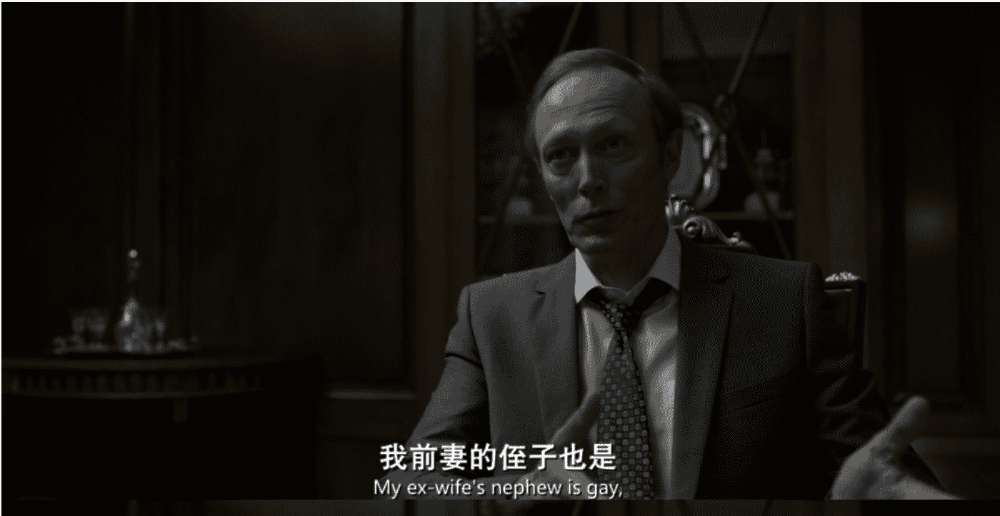

回归到本文话题，我觉得政府在这个过程中做调整一点问题都没，失德艺人就该封杀，拉高违法成本。

而且法律本身是底线，用罗翔的话说，一个人说自己守法，那他也可能是个人渣，如果连法都不守，那就连人渣都算不上了，一个人渣都算不上的人，再招摇过市富可敌国，本身也有问题。

估计接下来一大堆头部主播都排队去税务局要求自我批评和自我改进，毕竟自首了还可能有好的结果，被查出来那就是人财两空。

这件事情最让人有点意外地还是昨晚薇娅还正常直播，完全没有看出有什么不正常的地方，买的卖的都非常热闹，成交量也很正常。

如果说薇娅知道会被罚这么多，而且肯定会被封杀，这种时候还能如此淡定直播，实在是让人无法想象要有怎样的气度。

说起来事情不意外，自从雪梨他们被处理，薇娅作为最头部的主播，名气和销量都要大的太多了。而且前不久爆出把公司注销等等操作，她会被追缴税款，实在是意料之中的事。一旦追缴起来，她的数目比那些人加起来，还要多得多也是正常。

而这段时间的查税力度也能看出来，我国的税制正在慢慢地改变，前些年我国的税收政策一直采取的是间接税，而西方国家主要是直接税。啥是直接税呢？我也不是这方面专家，不过可以大概讲讲，直接税就是房产税、所得税这些，美国的主要税源就是这种。中国主要是间接税，也就是你去买东西消费，你买的东西里已经包含了税，相当于商家替你纳税了。下图的增值税，就是典型的间接税，你买的东西里都包含了税。

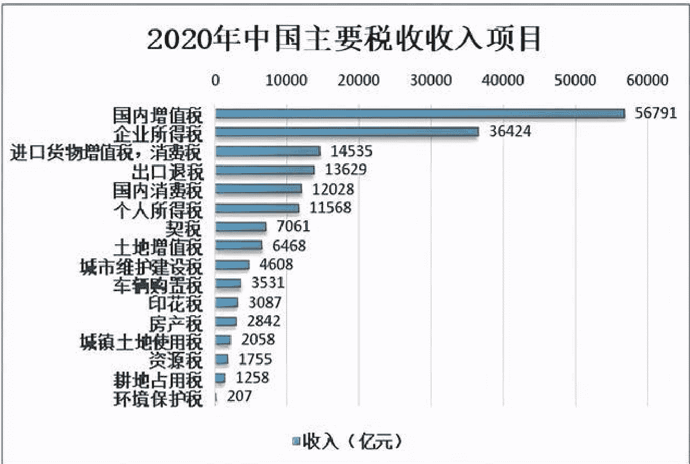

一般来讲，消费税这种间接税收起来方便简单，毛病就是调节收入改善社会分化的能力很差，因为富人相比穷人本来消费比例就低，对他们征不了多少税。美国主要是直接税，2020财年美国政府各级政府高达7.34万亿美元，的财政收入预算中，大约2.6万亿美元来自“IncomeTaxes（所得税）”，占比35.4%，我国占比就太低太低了。接下来政府显然也要向直接税发展，我查了下，政府的十四五规划里也有写，“健全直接税体系，完善综合与分类相结合的个人所得税制度，加强对高收入者的税收调节和监管”，可见直接税是今后的发展方向。其实以现在的技术手段和大数据分析能力，这些都已经没有了技术难度，如果要是真正落实，也不太难。

公众号懒人搜索，懒人专属群分享

### 从着急加入北约到全面敌对，俄罗斯这些年到底经历了啥？
2021-12-17

上篇文章发出去之后，后台不少消息让我解释下为啥美国一直跟苏联过不去，苏联都成那样了，GDP还赶不上一个广东省，美国怎么就死活不放手？正好这个话题之前写过，这次大改了一下，稍后可能会做成视频。

今天就讲下从上世纪90年代开始的那段历史，给大家解释下俄国的那次战略重心的调整。

### 1 为什么是普京
咱们从1999年开始说，因为在1999年之前的俄罗斯一直不太正常。

1999年的普京似乎没太想明白，自己一个圣彼得堡市长，怎么就成了俄国总统热门候选人。

我们在上篇分析过苏联解体，到了1999年，整个俄国基本可以分成这么几支力量：

首先是西方派，也叫自由派，也就是跟西方打得火热，羡慕西方先进科学文化，希望俄国也能跟西方一样，主要包括俄国经济寡头和知识分子们。

寡头们在苏联解体后的俄罗斯私有化中赚的盆满钵满，属于俄国激进改革少数受益人，所以他们非常希望俄罗斯继续西化下去，最好能把法律也确立起来。

这个不复杂，如果俄国成了法治社会，保护私有财产，那他们这些抢劫来的财富就可以一直持有下去，如果一直维持之前的状态，他们这帮强盗迟早会被其他强盗给抢了。

再者，强盗完成了原始积累，最希望的就是制定规则，今后别人再没法走自己这条路。而且希望用规则把自己保护起来，这样就可以免于清算。所以他们非常希望俄国继续深度西化。

知识分子就不说了，在1999年，很多知识分子脑子已经彻底被西方给征服了，以为跟着西方混，人家就会收留下俄罗斯，然后让俄罗斯跟西方一样富有。

奇怪的是，叶利钦本人也是西方派，他和西方打得火热，西方对叶利钦无限的夸奖，不过众所周知，西方扯开嗓子夸某个国家的领导人，这个国家大概率会倒霉。

### 其次是俄罗斯民族主义者们
这些人主要是前苏联遗留下来的官僚们，还有类似索尔仁尼琴那样的大喷子，这些人对西方充满警惕，他们怀疑西方不安好心，嘴上说一套心里想一套，担心俄罗斯按照西方智库给的方案走会掉坑里。

对，你没看错，索尔仁尼琴就是写《古拉格群岛》那个，在苏联时代啥都不干，整天变着花样骂苏联，苏联解体后他激情澎湃的骂美国和西方，认为自由主义是这个星球上最垃圾的东西，连苏联都不如，毕竟苏联还有个优点是寿命短。

### 再次是俄罗斯的强力部门，军方和克格勃这两伙人
俄国和美国差不多，美国是军工复合体，军人和金融寡头在政府里话语权很重，所以他们自己说自己是军队保护着的银行。

同样的，俄国就是一个官僚和军工的复合体，这两伙人的话语权也非常重，苏联后期克格勃头子一度频繁担任苏联领导人就是明证。这伙人有个专业的名称，叫“silovik”，字面意思是“强人”，一般特指俄罗斯联邦安全局（这玩意就是克格勃的衍生品），内务部等特务部门出身的高官。

### 最后一拨力量
最重要却也是最无关紧要的一帮人，也就是俄罗斯刁民们，几乎没人管他们，但是他们却有最终的决定权，非常暴躁，惹怒了可是要屠掉沙俄13万贵族枪毙沙皇全家，军队弹压都不好使，毕竟军队也来自人民，第一个站出来闹事的就是军队。

所以在1999年，叶利钦经历了10年来的各种艰辛后，身心俱疲，准备退休不干了，退休前不得找个接班人嘛，毕竟他的第二任任期还没满。

能接任总统的候选人很多，但是能同时被上述四方势力同时接纳的，只有普京一个。

西方派一直把他当自己人，因为他就是那伙人给提拔的，七寡头之一的别佐列夫斯基当初力荐普京，普京才从一个圣彼得堡地方官员直接进了中央，而且正是别佐列夫把普京拉入了叶利钦的小圈子，他们几个平时聚在一起喝伏特加看二人转，关系好的不得了。

叶利钦自己也看上了普京，也是因为普京是自己一手提拔，而且普京这人非常看重“忠诚”，之前顶着压力出手救过自己的恩师，所以叶利钦觉得普京将来应该不会反攻倒算。这个倒是真的，他们克格勃在这方面非常讲究，大家注意下，现在在俄国蹦跶的很凶的那个美女候选人，也是普京恩师的闺女，一度甚至鼓吹克里米亚是乌克兰的，要是别人像她那样折腾，早就。。。。不多说了，你们都懂。

俄罗斯的民族主义者们也能接受普京，因为普京自己就是俄国官僚出身，担任过圣彼得堡市的市长，官僚们觉得普京是自己人，尤其圣彼得堡是俄罗斯经济最好的地区，那里是普京发迹的地方，那里的官僚们更是无条件支持普京。

在普京执政后，大批圣彼得堡的官僚得到了提拔，比如当初的圣彼得堡副市长办公室主任的谢钦（副市长就是普京自己），到现在都是俄罗斯最炙手可热数一数二的大红人。

此外军方和克格勃，他们也认为普京是自己人，毕竟普京有漫长的克格勃间谍的生涯，普京执政后，大批的前克格勃特务进入了权力核心，也就是我们上文说的silovik。

最重要的是，俄罗斯的人民也认可普京，俄罗斯那十年点太背了，一直在走下坡路，诸事不顺，但是担任总理的普京还是顶着巨大压力咬着牙在车臣打赢了一场反分裂战争，尽管代价巨大，并且一屁股麻烦，但是俄罗斯人认为也勉强能接受，大家都觉得车臣就是俄国最后的边疆，一步不退，打死也不退，谁能保住车臣谁就能得到俄罗斯人民的支持。

所以多方妥协下，1999年12月31日，身心俱疲的叶利钦宣布不干了，让当时担任总理的普京接任自己。普京在上台当天签署了第一个总统令，永久赦免了叶利钦家族，并且表示永不追责，然后他入住克里姆林宫，俄罗斯历史上的新篇章也就开始了。

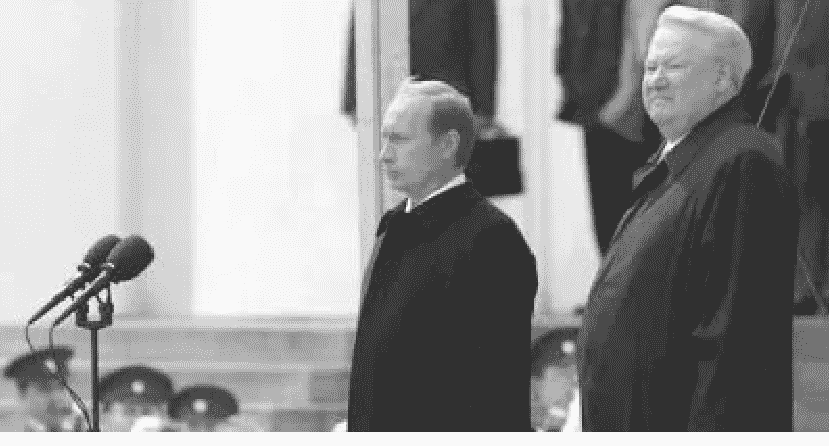

### 2

### 一切向西方靠拢
刚上台的普京准备怎么经营俄罗斯呢？

对，向西方靠拢，加入西方幸福温暖的大家庭。这个政策其实也不是普京定的，当初西方忽悠俄罗斯民族主义者们摧毁苏联，条件之一就是今后带着俄罗斯奔小康，从戈尔巴乔夫到叶利钦，都深信这一点，普京一开始也相信。

2000年到2002年是普京和西方的蜜月期，打得火热。

比如他和英国首相布莱尔，法国希拉克，德国施罗德都打的火热，有事没事去找那哥几个下馆子，更重要的是，经过他的不懈努力，他和小布什的私人关系特别好。

众所周知，小布什是一个知名神棍，应该是美国总统里最迷信的一个，尽管美国历任总统除了特朗普和奥巴马，都有信仰，据说奥巴马信仰伊斯兰，因为他爹信仰伊斯兰。

特朗普本来什么都不信只信钱，后来为了拉选票，天天跟福音派搞在一起，啥是福音派？就是新教里的一支，把耶稣当理财经理的一个教，教徒们捐款的原因是觉得多捐就能多赚，这么一伙人，跟川普气质很搭，所以叫来玩个“白宫降神”也就很正常了：

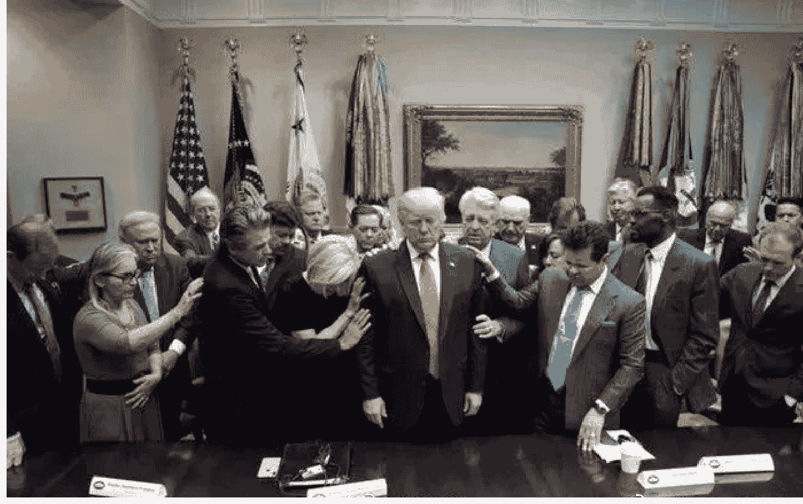

普京刚上台那会儿，为了和信神的小布什打好关系，下了不少功夫，他俩第一次在斯洛文尼亚见面那会儿，作为一个共产党、前克格勃，竟然从怀中掏出一个十字架，还说了一个不知真假的小故事，说是这玩意是普京妈的最爱，曾经拿到耶路撒冷耶稣墓前开过光，后来普京他家失火了，从废墟里只找到了这个十字架，然后拿给小布什看。小布什非常感动，当场就表示，“总统先生，我可以叫你弗拉基米尔吗？”

这句话中国人自然很难理解，翻译成中国人能理解的方式，就是：布什问普京“我可以叫你京京吗?”大概就是这么个感觉，场面一度非常感人。

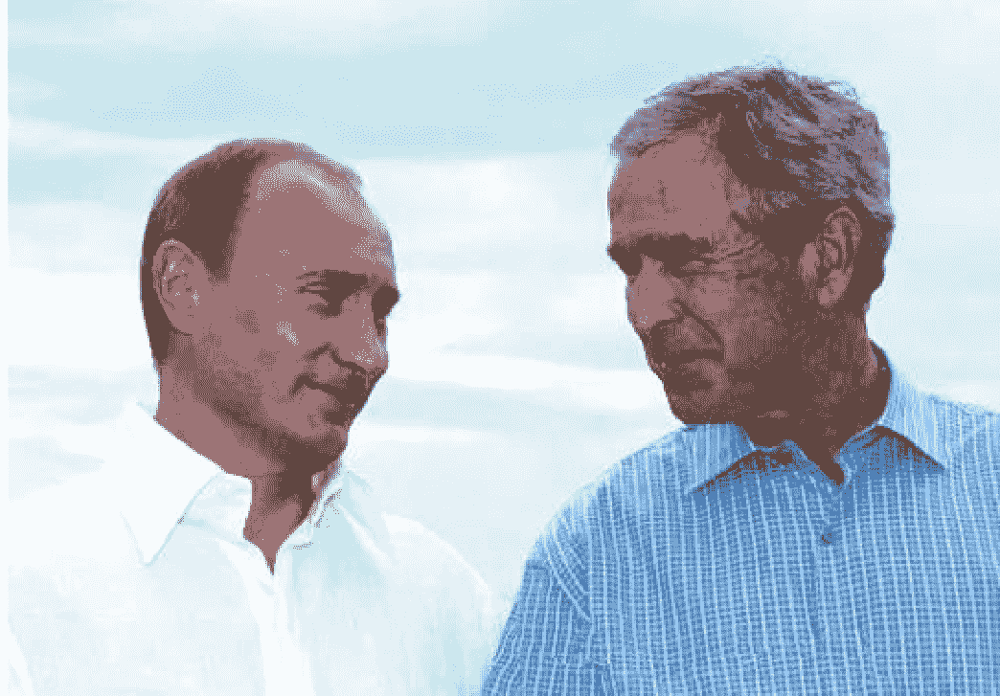

普京见完布什后，又去找英国首相布莱尔，和布莱尔相谈甚欢，布莱尔表达了西方欢迎俄罗斯加入的愉快心情，也表示要帮助俄罗斯尽快恢复经济，甚至表示要撮合英国最大的石油公司去俄国投资，普京非常高兴，觉得人生一帆风顺。近二十年前的普京还很年轻，略腼腆，站的笔直。

随后又去找了德国人，德国人首先表达了对两德合并时苏联未加干预的感激之情，同时也表示要尽快推动俄罗斯加入北约。

对，你没听错，俄罗斯当时正在计划加入北约，彻底倒向西方，西方也表达了对斯拉夫亲兄弟的欢迎之情。

随后美国发生了众所周知的恐怖袭击，也就是“911”，美国很快就认定是阿富汗干的，要去修理阿富汗，但是大家看地图就知道，说是那么说，做起来麻烦一大堆。大家看图: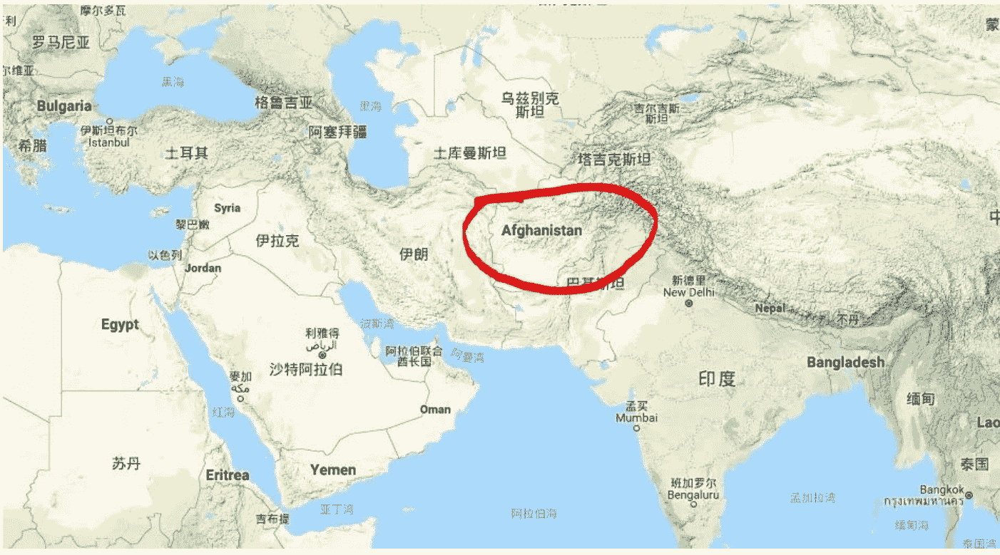

美国需要远渡重洋，到了阿拉伯海之后离阿富汗还有一大截，需要到阿富汗的邻居那里找个基地。

阿富汗周围那几个国家除了巴基斯坦跟美国关系还不错，其他的，比如伊朗，还有那几个斯坦，都很讨厌美国，反而跟俄罗斯关系不错。

小布什他们正在愁怎么解决，普京跳出来，自告奋勇说是要去说服那几个斯坦，因为历史上他们几个都是俄国的附庸，罗曼诺夫宫廷一般把那几个货统称为突厥斯坦。

这事遭到了俄国政府高层的一致反对，尤其是军方和克格勃他们那伙人，他们天生仇美，觉得这事根本没必要管。

为此，普京把这几个不服的拉去他在索契山峰顶上的别墅里单练，费尽千辛万苦，终于说服他们帮助美国人，把塔吉克斯坦的几个机场租给美国用于轰炸阿富汗。此时美俄的关系达到了历史新巅峰，仅次于“二战”中他俩同仇敌忾一起对抗纳粹。

不仅如此，普京还关闭了两个苏联时期的海外军事设施，分别是位于越南和古巴的两个侦听站，这两国都一度让美国痛苦不堪。普京这样做，示好的诚意一览无余，美国人也表示收到了俄国人的诚意，石油大亨出身的小布什把普京叫到自己在德克萨斯州豪华的家族农场里，随后普京要求小布什夫妇去他们在圣彼得堡的家里，一起观看俄罗斯人传统保留节目《胡桃夹子》。

一切都其乐融融，眼瞅俄国真要加入西方了，那个时候某东方大国正在和俄国谈天然气协议，这事优先级自然低的不得了，俄罗斯也心不在焉，谈不成也正常。

### 3
### 天边的阴霾

俄罗斯一直都不太明白，为啥西方总要针对它，刚刚在酒吧就着腌黄瓜喝啤酒，一回头针对俄罗斯的各种举措就上来了。

比如正当普京和西方领导人谈笑风生的时候，意外地发现北约已经把前苏联的几个小伙伴拉入了伙。

这就很奇怪，连普京都很懵逼，苏联已经没了，俄罗斯对美国步步退让，西方为啥那样对俄罗斯？

这事其实也不能怪小布什。其实无论是小布什，还是他之前的克林顿，对俄罗斯都主张“怀柔”，也就是用合作来代替对抗。

但是美国并不是他一个人说了算，事实上我们总说“美国想xxx”，其实美国并不是一个人，而是各种势力集团的总和，里边分着好几伙人，各自代表着不同的利益集团。

后来克林顿自己说，整个美国政府的，只有他一个人想跟俄罗斯搞好关系，他认为俄罗斯对美国已经没了威胁，双方合作的利益大于交恶。

但是问题是其他人不这么认为，德州的能源巨头们觉得俄罗斯跟他们在竞争，军方的军头们觉得没了俄罗斯这个敌人今后他们跟谁玩？军费预算怎么申请？情报部门的高管都是冷战期间苏联问题专家，和俄罗斯握手言和了他们今后去忙啥？军火商最讨厌的就是俄罗斯，因为俄国也是个大军火商。这些人在美国有个响亮的名字，“新保守派”，这伙人到现在势力依旧很大。

看出来了吧，美苏争霸半个世纪，养活了一个巨大的利益阶层。

所以就在小布什和普京在那里把酒言欢的时候，美国国内正在搞一次思想上的拨乱反正，核心思想就是批判克林顿的“绥靖政策”，认为克林顿脑子有问题，纵容俄罗斯，堪比纵容希特勒的英国首相张伯伦。

不仅如此，美国国内的媒体开始大面积散布各种关于俄罗斯的劣迹，把普京描述成了一个新沙皇，老百姓对俄国日益反感，觉得俄罗斯这个国家根本不可能民主，小布什已经身不由己了，只能跟大家起对俄强硬，并且出台了一系列限制俄国的政策，比如把导弹防御系统部署到俄国眼皮底下，策反前苏联的加盟国等等。

其实小布什自己怎么会不知道，美国挑选朋友从不看对方民不民主，如果以这个为标准，美国的好基友得少一半，而且第一个就要跟沙特绝交。不过他已经身不由己了，不仅对俄越来越强硬，指责俄国假民主，还跑去格鲁吉亚鼓动当地脱离俄罗斯。

而且欧美知识分子阶层对俄国也很警惕，他们觉得，从“五十年”这个时间长度上去看俄罗斯，越看越惊心。

俄熊一直都那样，今天被打趴下，缩回北极去冬眠，一段时间没留意，回头看发现这货已经大到离谱完全失控了。

2001年美国《外交政策》杂志有篇文章就非常有说服力，作者说：

拿破仑战争前俄国一直都是个三流角色，但是在击败拿破仑之后一下子成了欧洲一极。

随后疯狂扩张，直到在克里米亚被英法联军击败，消停了半个世纪。

在第一次世界大战中俄熊以举国之力打不过德国东线的几个军团，但是在20多年后，苏联红军大兵压境，席卷半个欧洲。

俄罗斯有资源，而且资源储量在全世界排名前三，有人才，俄罗斯的数学物理一直都是逆天的存在，华为的很多关键技术突破就是俄罗斯天才数学家们的工作成果，这一点任正非有篇文章，大家有兴趣可以查一下。而且很关键的一点是，俄罗斯这个国家又打不死，跟个小强似的。

这个背景下，欧美从来没有放心过它，觉得它迟早有一天会重新缓过来，然后到处扩张。

所以俄罗斯一厢情愿极力想加入西方，但是人家从一开始目的就是要围死它。

就在2004年，北约一口气扩招了7个东欧国家，包括三个前苏联加盟国，北约的势力范围直指莫斯科城下，却不接受俄国加入。反导弹系统要架设到俄罗斯门口，还要清理掉俄罗斯在海外的所有盟友，比如伊拉克，叙利亚等等，叙利亚的事一直闹到现在还没解决。

最关键的一步，是要对俄罗斯二次肢解。

先煽动车臣人闹事，车臣这事对俄罗斯的伤害很大，因为在俄罗斯最虚弱的时候车臣人起来闹事，差点把俄罗斯给搞死。

而且战争结束后，车臣人发动了一系列的恐怖袭击，比如歌剧院恐怖袭击事件，别斯兰人质事件，都是那种一口气死好几百人的大惨案。而车臣人背后是狗大户，狗大户的背后是谁你们都知道。车臣的事我们之前的文章《不知道车臣人又多朋克，你在车尾贴什么“车臣仕”？》。

其次欧美长期在煽动格鲁吉亚闹事，要把格鲁吉亚也收到北约里去，最终导致在2008年奥运会开幕式那天，俄国和格鲁吉亚打起来了。北约还要把导弹防御系统部署到格鲁吉亚、波兰、捷克去。

而且又来了个大招，策动乌克兰革命，乌克兰从来都是俄罗斯的传统地盘，丢掉了乌克兰之后，俄罗斯的腹地就暴露出来了。有点像我们经常说的那句话，“守江必守淮”，乌克兰就是俄罗斯的“淮”，乌克兰如果跑了，那俄罗斯腹地大开，换谁都无法接受，更别说普京了。

而俄罗斯一直在回避缺乏缓冲区这事，当初在1941年，战争一开打，苏联红军的飞机就被纳粹悉数炸在了跑道上，导致领空完全洞开。俄罗斯后来一直在防止这种情况，担心如果出了事，自己还没来得及还手就被打了稀巴烂。

俄罗斯当时可以说到处起火：

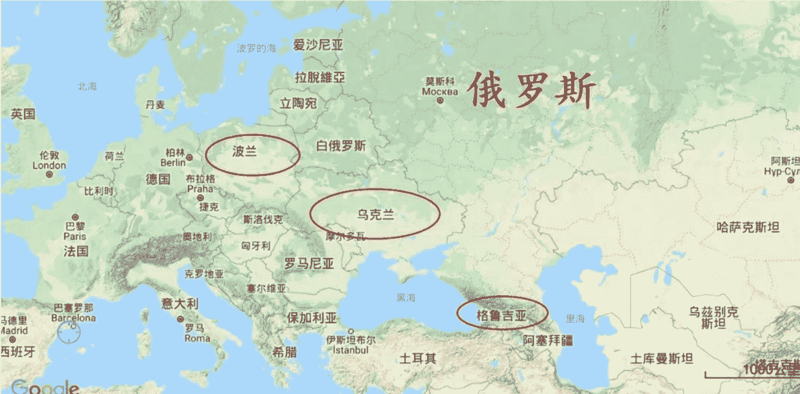

这俄罗斯能接受？肯定不能嘛，然后俄罗斯发动反攻，切下来了乌克兰东部做缓冲区，也叫“乌东”。

还抢回来了当初赫鲁晓夫送给乌克兰的克里米亚。赫鲁晓夫年轻时就在乌克兰放羊，对乌克兰充满感情，一时冲动，就把克里米亚给了乌克兰。2014年普京又把克里米亚抢回去了。也就是下图那两块。克里米亚的事我们在这篇讲清楚了《沙雕乌克兰是怎么握着一副好牌然后打稀烂的》。

多说一句“乌东战役”的事，乌克兰东部到现在为止已经冲突了五年了吧，各自都不让步，据报道应该是这些年最残酷的战争，双方在用现代化武器肉搏，伤亡极大，到底伤亡了多少人，各方都讳莫如深。

克里米亚事件是个大分水岭，如果说在那之前，俄罗斯跟西方还是以“靠拢”为主，对抗为辅，对抗性在逐步加强，在克里米亚事件之后，俄罗斯彻底被西方给赶出来了，随后90多次制裁。如果不是欧洲冬天太冷，需要俄罗斯的天然气，可能真会对俄罗斯下死手。

我多次说过我不是有个俄罗斯徒弟嘛，他说2014年年底的时候，整个新西伯利亚几乎所有的超市里的东西都被买了一空，当时真跟面对末日一样的感觉，不过后来也没发生啥，也就踏实了。再后来老百姓听说又要制裁，都比较纳闷为啥不能一步到位，搞这么多次干嘛。

也就在那时，俄罗斯四处张望，发现唯一平等对它的，就是东方某大国，所以就在那一年，僵持了20年的那个协议迅速就签了。

随后的五年发生了啥大家也都看到了，美国联合沙特对石油进行增产，石油多了，油价就得下跌嘛，而俄罗斯又是严重依赖石油外贸的国家，所以经济一落千丈，外汇差点耗尽，中间又出了一次兵，去叙利亚参战，保住中东最后一个支点，艰难程度可想而知。

这也是为啥很多人说普京也就那样嘛，这几年俄罗斯经济一直没能赶超广东省，其实这个得放到大背景下，我们如果面对俄罗斯那种四处烽火的状态，能挺多久呢？反正前段时间美国说了几句狠话，微博上一堆人急吼吼要跪了，觉得跪了人家就能放过他。

### 4
### 尾声

从2000年制定“亲西方”政策，到2014年彻底失败。随着这种溃败的出现，俄罗斯高层内部基本清理掉了“西方派”，普京自己也从一个狂热的西方派变身成了一个俄罗斯民族主义者，不再妄想融入西方了，因为人家根本不要他们，只是想试图肢解他们，拿走他们的矿，割走他们的油田。

前段时间有文章说是梅德韦杰夫很久都没出现了，怀疑是不是被赶出了核心层。其实就是这个背景，他就是俄罗斯政府的“自由派”，他们的路线失败后，他们这帮路线的执行者和鼓吹者也都被冷落了。

在这个过程中，俄罗斯也完成了一次思想上的涅槃，开始重新调整了战略。彻底不再信任西方，开始谋求独立的探索之路，毕竟他们那么大的体量，你说你要温和地做兔子，谁也不相信。

国外的一个杂志说，2014年的克里米亚事件，和1853年克里米亚战争一样，彻底改变了俄罗斯的国策，让俄罗斯从西方转向了东方。

此外，从特朗普上台前美国人就反复说起一件事，他们说这几十年让中国过得太轻松了，偷摸发展成了个超级强权（superpower），那可不，他们一开始追着本拉登打，然后追着俄罗斯往死里搞，完全忽略了东方有个土拨鼠似的国家在勤勤恳恳谋发展。

接下来肯定是斗争中求合作，拍案而起或者跪舔都不是好套路，继续勤勤恳恳谋发展，一心一意搞建设才是王道，但是也要不卑不亢，他们敢搞事我们就敢接招。

很多人已经把这种状态叫“新冷战”，这样也需要我们重新审视和各方的关系，关于俄罗斯，我觉得下边这两个说法很有启发：

北宋联合金国灭了辽，然后金国灭辽后南渡黄河，顺手把北宋也给灭了。

南宋联合蒙古灭了金，然后自己直接面对恐怖的蒙古铁蹄，挺了半个世纪也被灭了。

俄罗斯和辽金一样不是善茬，不过我们一定要避免两宋的悲剧。

现在这种情况显然对我们是有利的，俄国到现在也彻底死心了，不再跟以前似的，像他们国徽上的双头鹰一样两头望，今后只能是和我们加强合作，他们有能源，我们有工业，美国哪个都打不掉，联合起来更可以防止美国各个击破，耗下去胜负悬念不大，毕竟时间是站在我们这一边的。

公众号懒人搜索，[懒人专属群](https://example.com)分享

### 进退维艰的俄罗斯凭啥陈兵边境
2021-12-14

这段时间乌克兰又热闹起来了，各种流言满天飞，几方势力搅合在一起。我也一直想写俄罗斯和欧洲的关系来着，今天正好聊聊，老习惯，前因后果都讲讲，顺便说下对当前问题的看法。

### 1
### 俄罗斯为啥成了现在的俄罗斯

说起欧洲人，特别是西欧的发达国家，传统上对不同地区，印象是很不一样的。

他们最喜欢的是东南亚和地中海沿岸地区，这里温暖湿润物产丰富，比如泰国、越南、马来西亚、印度西南部这些东南亚；摩洛哥、埃及这种北非；还有被打烂之前的叙利亚、黎巴嫩、约旦等世俗化的中东国家。当然还有气候宜人温暖的西班牙、意大利、希腊这种南欧，都是西欧人非常喜欢去玩的地方。而且那里的人对欧洲人也友好，很少把他们当侵略者，给人一种旅游胜地的感觉。

还有一些地方在他们眼里就比较不友好了。

所谓“欧洲的东方”，就不是啥好词，大家注意下，欧美电影里的“东方”，一般说的不是中国，而是波斯人和游牧民族，还有匈奴人、蒙古人、突厥人等等，每隔一些年就去修理他们。正如中国人历史上对于北方游牧民族南下非常在意，在欧洲的眼里，东方的“野蛮人”是非常可怕的。欧洲文明最早的辉煌是罗马，最后也被北方和东方蛮族给打烂了。

所以欧洲人做梦都想着扩大文明范围，把野蛮人纳入自己文化圈里。等于是找个保安给自己看门，最好不要钱还特别能打的。

而俄罗斯可以说就是欧洲文明东进推广一千多年来获得的最大成果。现在的俄罗斯那时候还不存在，莫斯科那一带本来是个小公国林立的地方，后来欧洲历史迎来东方最大的一次威胁就是蒙古西征，整个欧洲文明差点完蛋。虽然蒙古人没有继续攻击，但是挨着欧洲建立了金帐汗国，现在俄国那一带也被征服。在1500年前后，同时发生了两件大事。一是东罗马帝国在穆斯林攻击下灭亡，末代罗马皇帝战死，与此同时，莫斯科公国崛起，击败金帐汗国，咱们现在看到的俄罗斯终于出现了。

而且俄罗斯是信上帝的，于是为了鼓励俄罗斯继续和异教徒干，教皇把末代东罗马皇帝的侄女（皇帝本人没有子嗣）嫁给了俄罗斯大公，从此俄罗斯被确认为一个欧洲国家了。

这个侄女带了一件丰厚的嫁妆——东罗马帝国国旗的双头鹰，这鹰代表了横跨欧亚两大洲的东罗马帝国。双头鹰于是成为了俄罗斯国徽的主体，直到现在，从此俄罗斯被确认为一个正统欧洲国家了。并且自认自己是罗马的合法继承人之一（俄罗斯人认为这个之一应该删掉）。

俄罗斯从那以后有了一种幻觉，觉得自己继承了罗马的血统，觉得自己也是罗马。

作为欧洲的最东方，俄罗斯从被纳入欧洲，任务就是对抗异教徒，扩展欧洲的边界，当然还要传教。这也是为何俄罗斯人对于扩张有着狂热的激情，数百年几乎没有停止过抢夺。

在这个过程中，俄罗斯越来越大，实力也越来越强，对欧洲也越来越重要。

特别是拿破仑战争中，沙俄击败法军，原本几乎被吞并的欧洲各国，特别是王室贵族重新上台。还有1848年欧洲爆发大起义，眼看就要星火燎原，沙俄大军力挽狂澜稳住了局面，各国王室又苟住了。沙俄成为了“欧洲宪兵”。

至于穆斯林的奥斯曼，一直跟沙俄没停过，双方在240年中基本上每隔十来年就要开一仗。

俄罗斯坚定地认为自己是欧洲国家，文化上也更接近西方。几百年来为欧洲站岗，保持欧洲稳定。欧洲也一定程度上认同俄罗斯，为其提供文化和技术。

与此同时，沙俄在欧洲人眼里，也跟野蛮人差别不大，那种感觉就好像地主老爷雇了个镖师给自己看家护院，但是心底里从没觉得这个镖师是自己人一样，从不让他靠近女眷居住的后院半步。

### 2
### 深层矛盾

最主要的矛盾，其实就是俄罗斯的定位问题。随着自己越来越强大，俄罗斯渐渐膨胀，觉得自己应该是欧洲的领导者。在俄罗斯看来，自己是欧洲最大最强人口也是最多的，文化继承了革命前的法国，势力也不弱于任何其他欧洲国家，甚至还有神圣罗马帝国传承，在对抗敌人和扩张方面贡献也非常大。照照镜子，越看越有欧洲霸主的样子。

但是其他人可不是这么看的。在欧洲各国眼里，俄罗斯到底算不算欧洲国家都有点含糊。那地方又冷又荒凉，国内的居民都是各种奇形怪状的“鞑子”（俄罗斯有蒙古血统）。当地人行为还非常粗野，动不动就使用武力，和维京海盗比除了信仰上帝没啥区别。但是信的教和西欧那边还很不一样。

俄罗斯那边信的东正教，可以说就是原教旨主义的基督教，本来跟西欧师出一门，对抗穆斯林这事上基本能达成共识，但是他们关起门来并不觉得一家，天主教、新教、东正教互相觉得彼此是异端，应该被烧死。

俄罗斯在欧洲眼里这么个形象，作为欧洲边缘地区“藩镇”，对抗外族外带扩大影响力，还能说得过去。要是想着自己上位，和各强国“谈笑风生”没有问题。但是你要做欧洲领导者，这就过分了。

俄罗斯的野心和欧洲的容忍度有差距，这是两家的根本矛盾。

俄罗斯在疯咬东方的过程中，也没停止向西方扩张，这自然对西欧形成了巨大的压力，以至于到了近代，俄国一度成了西欧最大的威胁，甚至英国在长达一百年里最重要的事就是防着俄国人，各方战争不断。特别是1848年镇压革命之后，5年以后俄罗斯就被英法联合奥斯曼土耳其，在克里米亚暴打了一顿。

但是欧洲一百多年来，几次俄罗斯都是先被打懵，然后缩回去养伤，再回来变得越来越强。以至于网上所谓俄熊“攻高血厚动作莽，残血就被动开狂暴，随身还自带寒冬BUFF。”如果不是欧洲几百年前，在北美经营了一个“分部”，说不定二战要靠俄罗斯人解放全欧洲，苏联估计会把国土直接推到英吉利海峡。

经过1991年，苏联“内爆”，又后面几十年动荡。现在的俄罗斯算是三四百年来的最弱时期。如果还是100年前的老欧洲，肯定是“乘他病要他命”。但是这些年来，欧洲也早就变了。

### 3
### 内部分歧

现在欧洲各国，对于俄罗斯的关系怎么办，有好几派，各说各话，也没有统一。

首先就是挨着俄罗斯的几家，那是真的“一山不容二虎，三江四海恨”。波罗的海三国、大波兰、乌克兰都是和俄罗斯不共戴天。

原因很简单，这几家在俄罗斯的扩张中，曾经都被吞并过。好不容易找到机会独立，民众中间对俄罗斯不满的很多，这样一来政府和俄罗斯的关系肯定好不了。再加上外部影响因素，反对俄罗斯几乎算是“政治正确”。自从苏联解体，政治家只要在反俄上调门儿喊得高，就会得到好处，所以大家嗓门一个比一个大。

而这几个国家的经济又都不算很好，融入西方（最好是加入北约和欧盟）就成了一条发展捷径。谁能加入很大程度上就看和俄罗斯的关系，只要敢怼俄罗斯，就可以引起国际关注，然后就能获得奖励。

尤其大波兰，这个国家本来就有病，加上他和俄罗斯的宿怨，整个波兰史，70%是被俄国虐，20%是他们虐俄国，还有10%的其他。波兰因为闹得凶，在北约和欧盟东扩中得利也最大，现在波兰反俄反成了条件反射，但凡有点事，自家鸡不下蛋狗不生崽都能怪到俄国身上。

波兰之外，乌克兰现在半真半假，症状看着也是非常严重。乌克兰因为距离俄罗斯太近，历史上跟俄国走的很近，跟着苏联混的时候发生过“乌克兰大饥荒”，老百姓把“纳粹入侵”和“苏联统治”作为历史上最惨烈的两件事，提起来就骂街，可现在经济依旧和俄国绑定太深，乌克兰东部又都是俄国人，想脱离俄罗斯完全转向西方非常不容易。

但是乌克兰眼看经济越来越差，俄罗斯自顾不暇，他们觉得唯一的法子就是和俄罗斯彻底翻脸，加入北约，和欧美死死绑在一起。所以自从2014年颜色革命，乌克兰放弃原本在两边观望的立场，和俄罗斯一直闹到现在。

于是俄罗斯加入欧洲文明圈500年后，最讽刺的事情发生了。和俄罗斯接壤的国家里，现在关系最正常的居然是土耳其。虽然不是很友好，甚至没事还过两下子。但是两家有事还能谈，关系时好时坏，不像那几家天天跟斗鸡一样。

其实很多时候，几个东欧国家也是表演的居多，再加上实力不允许，有事积极表态，但是也就限于表态，具体实际动作还是看幕后老板的。

然后是大量打酱油的，这些大多和俄罗斯没有啥大的矛盾，也没有什么交情，距离又远，遇到事情大多看情况，算是吃瓜群众。比如距离俄罗斯比较远的南欧和西班牙，和俄罗斯没啥交集。巴尔干半岛那些还有北欧，要说对俄罗斯也没啥好印象，仔细说起来还有不少矛盾。但是大多都是随大流，不管是披挂上阵的出力还是真金白银出钱，都不愿意。如果有好处，或者俄罗斯影响到了自己的利益，才会跑出来喊两嗓子。最后也是最主要的，德法两家，作为欧洲双话事人，也是俄罗斯那两次刷战绩的对手。现在却是和俄罗斯关系最紧密的。法国以前是欧陆老大，二战之后地位下降，美国在欧洲地区的影响力越来越大。法国为了维持在欧洲大陆的传统优势地位，走上了独立自主的外交模式。不但成为西方第一个承认中国的西方大国，同时也和苏联保持着友好关系，而且事事跟美国作对，在美国人眼里，法国跟苏联一样讨厌。加上不在对抗苏联的第一线，法国在冷战中和苏联关系并不差，大量苏联急需的技术，也是从法国流入了苏联，尽管当时监控西方技术流入苏联的“巴统”就在巴黎，这就叫监守自盗。也就是说，法国几十年依靠传统外交平衡术，和美苏都保持尽量友好。到现在，法国拉拢欧洲最强的德国组成欧盟核心，同时和俄罗斯保持友好，稳定欧洲。至于德国，他俩的关系比较复杂，历史上他们有惨痛的互相伤害经历，俄国人讨厌德国人没啥可说的，有个故事，说是俄国士兵进入柏林后奸淫掳掠无恶不作，有人去问他们，你们还是那群要解放全人类的红军战士吗？红军士兵说，你说的那些人我们认识，不过他们阵亡在了基辅、哈尔科夫、莫斯科、库尔斯克。而对于德国人来说，最痛苦的不是“二战”中他俩互掐，也不是苏联人进入柏林之后奸淫掳掠，这些事德国教材里都刻意去仇恨化，德国人最郁闷的事，是苏联占着东德分裂了他们的国家近半个世纪，还有那道柏林墙，是德国人心里永远的痛。所以德国老百姓普遍对俄罗斯没啥好感。但是德国的能源对于俄罗斯的依赖太强，俄罗斯现在最拿得出手的就是能源和武器。德国能源现在电力依靠法国的核电、自家的新能源和俄罗斯天然气。德国上层是懂这一点的，所以德国历任总理基本都“事实亲俄”，也就是平时跟着美国骂俄国，但德国上层跟俄国关系一直很好，前总理施罗德退休后，甚至去俄国能源公司做高管了，这事估计很多人听起来匪夷所思。之所以如此，还是因为德法比较强大，可以有自己的意志。小国们没有办法，因为在欧洲的头上还有个美国。

### 美国是关键

说到这里，就要说说美国在欧洲为何如此强势，其实就是依靠的北约组织。

北约因为冷战而生，为了应对苏联和其盟友的威胁，美国和西欧各国组成北约，从此美国在欧洲的军事方面有主导权。

建立之后，美国等于是“承包”了西欧各国的安全防务。从此以后，美军开始西欧驻军，直到现在为止，美军还在欧洲存放着至少150枚核弹头。

冷战时期，西欧各国军队数量比起以前大量减少，军费也下降。二战之前几百年，整个欧洲就是世界中心，各国之间从政治到军事都不停对抗，时不时的打成一锅粥。这种局面终于得以结束，虽说方法让人挺无语的。

自从美苏成为世界唯二超级大国之后，欧洲各国实际军事压力小了，他们能快速发展也跟军费开支低有关，后起国家最大的发展障碍就是巨大的军费开支，我国以前国防开支太大，严重影响了经济发展。邓公也是意识到了这一点，八十年代我国太穷了，于是军事停了一段时间，有限资源优先发展经济，然后再发展军事。

继续主题，欧洲出让了一部分防卫义务，美国替他们担了，这又使美国控制了欧盟防务体系。并且在欧洲内部培养了一个利益集团，这个很正常，比如萨达姆有一些年和美国走的很近，大量从美国军购，导致萨达姆的军官团和美国关系过密，被渗透的很厉害，一开战还没打就全面倒戈了。这种情况下，欧洲并不是铁板一块，有一伙人坚决要跟着美国混，如果美国彻底退出欧洲，他们也没得吃了，还有一部分人很讨厌美国。

问题是苏联解体之后，北约的威胁没有了，但是美国依然牢牢把持，不断的进行北约东扩，把导弹部署到俄国眼皮底下，口号还很政治正确，说是俄国的核弹十分钟就能毁灭西欧，是不是得把导弹防御系统往东推?

老百姓都觉得有道理，少数觉得这事会惹怒俄国激化矛盾的人也没法说话了，敢乱说就是拿了俄国人的钱。自从苏联解体，北约在美国带领下不断东扩，把东线推进了1000公里，整个东欧基本都囊括了，这事也彻底导致普京亲西方的政策发生了大转弯。

大家一定要注意下，欧洲那边的领导人在舆论上对老百姓影响很小，事实上每个领导人只要坐在那个位置上，他做啥都是错的，被报纸天天骂，往死里骂，欧洲那边的媒体都是私人的，说话又非常难听，所以默克尔自己的态度没那么重要，她也是平衡各方的需求。

北约在俄罗斯家门口部署导弹防御系统，俄罗斯就要反击，欧洲媒体一宣传，老百姓更讨厌俄国，双方隔阂也就越来越大。

现在的形势就是全欧洲仇视俄国，但是德法上层有一部分跟俄国关系却很密。

所以欧洲经济得以独立，政治大方向还是跟着美国，但是一到具体事情，德法两家从来是出工不出力(有时连工都不出)，其他国家大多又不出工又不出力，最多跟着谴责几句。特别是关于俄罗斯的问题，总是不断反复。

不过美国也没有想过把俄罗斯拆了。20年前倒是想过，不过就如我以前说的，俄罗斯人的忍耐下限太低了。不论怎样的压力看起来已经要完蛋了，只要自己不想垮，总是能以各种稀奇古怪的姿势苦撑。苏联之所以崩溃，也是因为它是个缝合怪，内部加盟国矛盾重重，占主体的俄罗斯人不想过了，日子也就过不下去了。现在的俄罗斯俄罗斯族占了80%，整体稳定的多。苏联解体后，俄国撑过了“休克疗法”，又熬过了北约第一次东扩（后面还有好几次），车臣危机，南联盟战争，经济寡头，98年金融风暴，阿富汗伊拉克战争，2008年金融风暴，能源价格几次暴涨暴跌，还有90多次经济制裁，物价飞涨货币贬值，现在的俄国跟中国人均差不多，好像不如中国一些，他们内部几乎没有支持向西方妥协的，每次普京强硬，支持率就会大涨，就这么个油盐不进的国家。直到2014年，终于是把防线推到了俄罗斯家门口。那年乌克兰颜色革命，眼看就要变天。俄罗斯被迫反击，硬吃下了克里米亚。同时在乌克兰东部发生大规模冲突，最后乌克兰政府军和东部民间武装打了个平手。在那次事件中，欧洲主要国家几乎都不表态，只是把欧盟顶在最前面说片汤话，不外乎“谴责”“失望”“双方务必”这种写出来都费纸的玩意。这个态度很明确，就是把球踢回美国，看他怎么办。那次的结果很尴尬，美国多年来叫的凶，在这件事情上却没啥办法。又不敢派兵，欧洲各国都指望不上，只好一起谴责+制裁。这对俄罗斯完全不叫事情，只要还允许我卖能源，你想怎么禁怎么禁，想怎么骂怎么骂，反正你不一定骂的过我。美国考虑过制裁俄国的能源出口，但是反俄最积极的那伙人也跳起来反对。于是就不了了之。

### 未来

对于欧洲来说，时代早就变了，自己不再是世界的中心，过日子已经是第一要务。欧洲怕俄国并不是怕俄国的核武器，没人怕那玩意，因为知道俄国人再怎么二，不到万不得已都不会真扔核弹一起毁灭。他们最怕俄国的地方在于，俄国如果下决心去做的事，能够承担巨大的痛苦和压力，俄国人一直忍耐下限都很低，对痛苦的忍耐能力极强，欧洲却不行，他们心疼钱，老百姓田园牧歌惯了，哪能受得了铁和血？所以平时打打嘴炮还行，俄国真威胁动手他们立刻就虚了。这也成了俄国的一种策略，自己没啥可损失的时候，该害怕的就是你们。

此外欧洲老百姓也不会为了乌克兰人真去拼命，能源、环保、移民、疫情、物价、圣诞节，甚至JK罗琳的事情，在欧洲普通人眼里都比俄罗斯是不是会进入乌克兰重要的多。

至于和俄罗斯日常接触最多的东西，大概就是能源了，欧洲能源之前已经暴涨了6倍，现在好容易有点回落，如果俄国这个能源供应商出问题，能源价格再翻几倍，谁都得慌，这才是人们关心的事情。

所以预计这事最后还是不咸不淡地解决，乌克兰人很快就会意识到美国人无意给他们拼命，他们在美国人眼里只是一根抽俄国的棍子，问题是俄国是个斧头，这还搞啥搞。今后的趋势是西方推不过去，俄国也不可能打出来，乌克兰反正是惨了，像一个小行星夹在两个大恒星之间，稍有不慎就会被撕得粉碎。

乌克兰唯一的出路只有两条，一条是白俄罗斯那种，总统变省长，加入幸福温暖的俄罗斯大家庭，但是可能性不大，乌克兰人痛恨俄国人。

还有一条路是芬兰路线。芬兰挨着俄罗斯的圣彼得堡，按理说更危险，事实上芬兰也因为这事被苏联入侵过一次，反抗过程中可歌可泣，不过也很快答应苏联条件议和了。

“二战”结束后，芬兰搞了一个叫“巴锡基维-吉科宁路线”，这是他们的两个总统，这个路线的核心逻辑就是：

- 芬兰是个小国，所以不能有大国的病，绝对不会去招惹大国；
- 芬兰只有让苏联觉得安全，自己才会安全，不加入北约也不让西方军队去芬兰修军港部署导弹；
- 不指望西方，但是也要和西方搞贸易赚钱。

既然对苏俄没啥威胁，苏俄也就不去骚扰它，后来专心提高教育水平，开放贸易，现在的芬兰啥水平大家也看到了，如果可能的话，这应该是乌克兰唯一的出路。

公众号懒人搜索，懒人专属群分享

### 人口下降后，盖了那么多房子卖给谁？

2021-12-11

看见了一个问题，将来等人口下降之后，我们盖了这么多的房子，这些房子怎么办？会不会没人买而出现大规模空置的情况？今天就说说这个话题。

其实人口下降导致房子空出来的事情已经出现了，只是可能跟大家想的不一样。

比如我小时候我们那边的乡镇里一个班还有二三十个人，但是我们那代人是最后一个婴儿潮，之后出生人口越来越少。现在我们那边乡镇学校已经撤销了，剩下的个位数学生全部归到了县里，乡镇的房子也一样，年轻人都走了，只剩下老头老太，70%的房子都在空着，也卖不掉。

如今经过几十年的演变，现在老家那边的趋势是，如果考上大学，一般都去大城市，运气好而且能力强的那些人就在一线城市扎根了；县城的有钱人，会到省城或者省城周围的稍微大一些城市买房定居；村里的年轻人去县城买房，如果适龄男性青年家里没钱让他去城里买房，他大概率娶不到媳妇。

这样，人口实现了一波涌动，一线城市吸收了全国的人才，大城市吸收了小地方的有钱人，小地方吸收了村里的年轻人。

所以这些年年轻人在减少，但是一线大城市人口还在增多，各省的省会可能也在增多，但是到了县城一级，有的县城人口变多了，有的县城人口减少了，但是村里基本不可避免人口减少了，甚至不少村里彻底没人了。

大家看出来了吧，人口资源整体是从下往上流动的。

同理，还有很多枯竭的资源城市，比如鹤岗，我查了下，国家认证过的资源枯竭城市就有69个，这些城市曾经热火朝天，如今都已无比凄凉。还有更过分的，有些城市人口都搬离了，跟鬼城似的，一个人都没，抖音上有这种地方，大家可以去搜一下。

这些城市的老百姓如果眼光毒辣，很早就意识到了这种城市将会枯竭，就早早把房子卖掉搬走了，如果眼光不行，可能面临的一个问题是，大家都在抛盘，没人接，房价越来越跌，最后成鹤岗了。

这个现象并不只发生在我国，其他发达国家的情况都差不多。

比如日本就是这样，乡村彻底衰败了，只剩下少量的温泉村还有度假村还在，其他的村里空的跟闹鬼似的。与此同时，人口大量向东京大阪等城市聚集，日本的那几个巨型城市现在已经大得离谱。

日本的头部城市也不是均匀地增加人口，这些年的数据显示，越大的城市，人口流入越明显。

比如最大的东京圈，半径50公里范围内，聚集着4300万人，经济规模跟俄罗斯都大，占到日本的38%，并且东京圈还在吸收别的大城市，以前总说“东京大阪”，现在东京是大阪的五六倍。

这可能跟不少小伙伴的理解不一样，为啥都那么挤了，大家还再往里边挤呢？主要是因为人口聚集的地方，交易就会变得很活跃，产生各种稀奇古怪的产业，让大家赚到在小地方赚不到的钱。

咱们不提那些本来就喜欢抱团的科技公司和金融公司，聊点普通人玩的，比如在中国一线城市，就有一个叫“专业找猫”的业务，你想想啊，大半夜你家猫跑了，你焦头烂额不知道去哪找，慌不慌？这种情况下，就有人开始专业找猫，带着各种设备过来帮你找。这项业务非常贵，可能需要八千到一万，不少小伙伴说，我的猫都不值那个数，可是大城市的人不这么想啊，很多人收入高而且把猫当家人，自然不在乎花几千块把猫找回来，专业找猫人士可能没啥学历，照样能月入过万，这在小地方根本是难以想象的。

还有前段时间搬家，搬家公司师傅劲头超大，而且非常能干，搬完家我给了他两百块红包，他跟我说他以前在工地搬水泥，一天要搬30吨，一个月三四千，到了北京搬家公司这点活白领们看着辛苦，对于他来说就跟过家家似的，收入翻了三四倍。

对于没学历的小伙伴，一线和小地方差距都这么大，对于有专业知识的那些人来说，去大城市和小城市的更是天壤之别，比如航天和气象等专业，全国只有几个地方有工作，我自己干的码农行业，大城市和小地方收入差好几倍，想也不想会去大城市。

同理的还有韩国，韩国也是老龄化严重大家不给生孩子，对应的效果就是基层乡村和乡镇大规模荒掉，反倒是首尔房价一再走高，甚至房产税加税之后，首尔房价继续逆势上涨，就这么逆天。网上找了张图，大家感受下：

### 2006年1月以来的韩国房产价格变化

首尔都市区
首尔小公寓
非首尔都市区

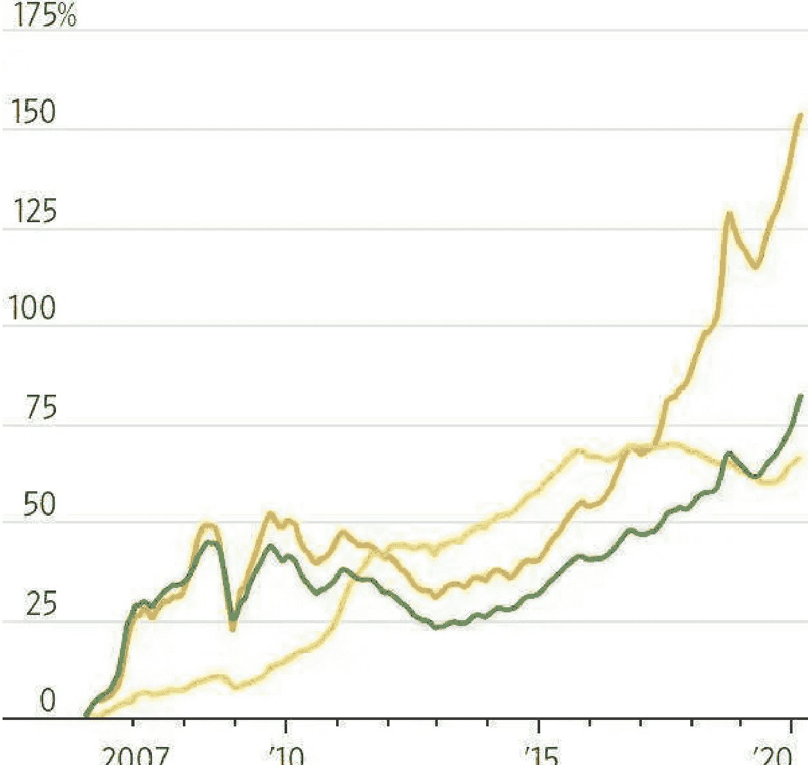

数据来源:韩国统计厅

大家看懂这个趋势了吧,人口变少之后,各个城市的人口并不是均匀变少。比如人口减少10%,并不是每个城市人口均匀地少了10%,而是自下而上地把房子空出来,大量的农村人口消失,房子彻底荒掉,很多城市人口锐减,但是核心一线城市人口更加多,人口更加聚集。

再以韩国为例,韩国这些年人口一直低迷,但是却一直向首尔集中,基本上所有能拿的出手的企业全部聚集到了首尔,首尔的房价高的跟香港似的,尤其是他们的“江南区”,也就是前几年特别火的鸟叔那首歌《江南style》里的“江南”,房子贵的令人发指,因为跨国公司总部,韩国尖端企业总部都在那里。那地方的房价从1997年开始就一路飙升,经济发展好的时候小涨,经济不好的时候大涨,疫情爆发后超级涨。

说到这里大家可能很纳闷,为啥经济不好的时候房价却会暴涨呢?

也不复杂，每次大危机都会出现政府放水，但是经济不好的时候富人们拿到钱却没地方投资，优先抢稀缺资产，而整个韩国最稀缺的就是江南房产，可不是疯抢？所以房价一直涨，经济危机时期涨的更离谱，有“江南不败”的传说。

其实想想也正常，大家记得吧，去年疫情开始后，政府为了救济小企业也开始放款，深圳房价应声上涨，不过政府一顿打压后，基本压住了。文在寅作为韩国左翼领袖，上台的重要口号就是“公平”，还要治理房价，不过从现在的情况来看，文在寅同志搞得一塌糊涂，毕竟左翼背后是韩国基层老百姓，右翼背后是日本和美国，老百姓嗓门大，美日财团财力足，也不是善茬，到处使绊。

从经济规模角度讲，现在大首尔区的经济体量占到了整个韩国的40%（跟东京圈在日本的地位差不多），排名第二的釜山经济圈只能达到首尔的1/10，大家想想有多么恐怖。

不仅如此，更夸张的是，好的一线大城市顶着房产税房价继续往上涨，发达国家这个趋势特别明显，比如美国，越是好房子，不仅贵，而且房产税还高，这些年一直涨，日韩也差不多。德国也差不多，找了张图：

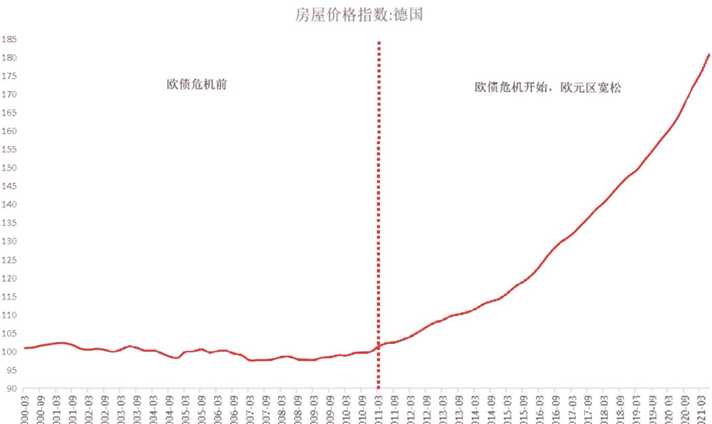

说到这里，大家可能纳闷了，一线房子都那么贵了，为啥还能涨？

这个原因很多，直观原因就是经济只要继续发展，就会出现大家收入增加，有钱了自然会买房，没啥悬念会推高房价。

而且一线房子存量大，每年交易的非常少，价格是边际交易量决定的，比如你们小区有一百套房子，房价就是最近成交的那套房子定的，所以并不需要大家收入都涨房子才能涨，少数高薪阶层就能推上去，而且如果大家知道房子将来会升值，就更不抛了。

一个东西想一直升值，一个重要的原则是大家都握在手里不能抛，美股就是这样，换手率极低，我们一线的房子也一样，平均持有五六年以上，啥时候我们的股票大家买了像持有房子一样拿着，那股市就会越来越好。

另一方面还存在“换仓”问题。这又是啥事呢？比如你在东北有五套房，但是这些年基本没涨或者涨幅不大，你会一直持有吗？可能会持有，但是理智的做法是把这些房子卖掉，换成升值前景比较好的房子。

这样的结果就是，房价涨幅不大的地方有钱人抛掉当地房子向一线聚集，导致马太效应更加明显。

我国的当前的限购政策对这类人影响很大，一定程度上延缓了这种"换仓"进程，不少人想换也没有资格，所以换不成。不过操作难不代表搞不定，我这些年碰到太多人，在老家非常有钱，毕业后到北京，专门找能解决工作居住证的地方上班，工资低也没事，就是为了拿到房票后把老家的房子换到一线。

这两年房地产行业一直不景气，环京的房子腰斩，东北的房子也不咋地，天津也一塌糊涂，很重要的一个原因就是，不景气的地方有钱人继续抛盘去南方了，导致不景气地方的房子惨上加惨。

所以吧，等着人口下跌去一线捡漏的可能性不大了。

而且大家都知道货币超发，可能不知道货币到底是怎么往下发，货币是通过“信贷”，也就是从银行借钱流入经济体，这里就有个问题：

资产越值钱的人，越能借到这种超发出来的钱。

比如央行这两天降准，对市场释放了1.2万亿，这些钱你想去借能借出来吗？当然不行了，最起码的一点，银行为了防止你不还钱，需要你把房子抵押了。谁的房子值钱谁就能贷到更多的钱。

这就意味着，超发出来的钱大部分都进入了一线，进入一线的钱多多少少会进入房市，这会进一步推高资产。

比如张三名下有套房子，他觉得将来钱会越印越多，把它抵押了再买一套，等下次再放水，他的房子升值了，就可以卖掉了。

你说这像击鼓传花啊，本来就是，美股也不是大家用实实在在的钱推上去的，也是美国放水出来，机构借钱买股票，股票上涨，世界各地的人都借钱去买，这样一路就上去了。如果持续几年银行不给贷款，房价就虚的一批，也是这个原因，股票也是这个逻辑，如果没有增量资金进来，也是半死不活。

有钱人和穷人最大的差别也在这里，富人用银行的钱赚钱，普通人却只能用自己的工资赚钱，赚钱速度天壤之别，当然了，破产速度也天壤之别，我们经常听说富人破产，却很少听说穷人破产了，穷人向来穷的很稳定。

所以接下来的趋势很明显了，就算人口下降，也是自下而上地把房子空出来，大家都想去的那种地方，房产税也压不住，因为这个世界钱是越来越多的，人的基本需求就是吃穿住行，除了“住”，其他的花不了多少钱，所以房子在哪个国家都是大家最先配置的，而且也是大家最愿意花钱配置的，每年都有大量的新晋有钱人，好房子供应却永远跟不上。

当然了，这样演化下去，也不是完全没好处，将来一线的房子贵的离谱，可其他地方失去投资属性后，会越来越温和，如果买了也不涨，大家慢慢就不会屯了，房价开始走低，当地人的生活也就不那么焦虑了，如果房子不涨，大家也就不着急买房了，租着也没啥。天津就是这样，认识几个租房子住的，能买起房子也不买，口头禅就是“反正也会跌下去，着急啥”，看出来了把，房子不涨就没刚需。

不过过程是很痛苦的，因为我国大部分人是有房的，房价下跌已经让很多地方老百姓非常郁闷，比如天津这几年房价遭到一波重创，全市只有少数几个地方还在涨，我认识的天津有房阶层都非常痛苦，没房的反倒是幸灾乐祸，有钱也不买，住在出租房里等着看笑话。

其实这就是成熟国家的状态，一线都特别贵，一线的豪华盘贵到大家怀疑人生，不过其他地方都不咋地，年轻人也不着急买，只要房子不跳涨，大家也就不慌，慢慢耗着呗。

### 尾声：

说了这么多，基本上已经说得很清楚了，再总结几句：

- 1、超级都市圈会越来越大，这些地方的房子没有空闲下来的一说；
- 2、农村会进一步空心化，农村、乡镇、没啥好产业地区人口大量流出，会空出大量住房；
- 3、除了少数城市，绝大部分城市房价慢慢会稳定下来，没啥投资价值，自然也就没啥泡沫，大家反而会过得轻松一些。

公众号懒人搜索，懒人专属群分享

### 从倪光南的大溃败看我国技术发展之路

2021-12-08

俗话说，行百里者半九十。

用这句话来形容我国科技发展的轨迹怕是再合适不过了。虽然中国当前的博士毕业生数量全球第一，论文规模全球第一，工业门类全球最为齐全，但才到一个中间节点，如果不能突破这个中间节点，下半场的游戏就没我们什么事儿了。

为了突破这个节点，中国社会必须认清两点：第一，技术发展必须和市场需求紧密结合；第二，国家必须支持大企业做得更大，大企业必须支持中小企业，抱团才能有奇迹。

### 倪光南的大溃败

大家都知道，倪光南和柳传志在联想发生了一系列争执，在争执中，倪光南落败，柳传志选了贸工技路线，专心搞组装，倪光南在联想留着也没事干了，干脆离开了联想。

离开联想后，倪光南的芯片梦并没有结束，而是又发起了一波冲击，可惜的是，并没有成功，咱们今天就先复盘下这事，看看有什么启示。

早在1986年，那时候我国改开还不到十年，就有几位科学家向政府高层提出，我国要走自己的高端科技路线，由于这个计划是1986年3月3日提上去的，所以后来由邓公亲自批准的方案就叫“863”计划，也叫“高科技研究发展计划”。

倪光南1995年离开联想后，863计划还在运行，他想继续做芯片方面的相关工作，于是就和一家叫“方舟科技”的公司合作，继续搞芯片项目，那是1999年，当时，倪的想法是，我国自己研发的芯片，配上Linux操作系统，打造国产的Wintel联盟。

尽管当时联想不投钱，但是国家当时的产业扶持资金也很充裕，这个方舟项目就非常受重视，863重大专项、计委、信息产业部都出了钱，共同助力芯片研发，省部级干部和副总理都去现场听了工作汇报，可见这事的规格非同一般。

芯片也很快量产，然后搭载Linux操作系统，国产PC俨然要自立门户了。在国家的大力支持下，很快北京市政府办公采购，批量购买了以国产芯片为基础的机子。这事可不是小事，当时和现在不一样，那时候电脑还非常贵，普通老百姓家里买这玩意的比较少，大规模采购电脑的主要是政府大学什么的。

不过很快就遭到了内外施压，外部好理解，微软说中国违背了市场原则，搞贸易保护，当时中国刚加入WTO，还是很介意别人说的，甚至基辛格访华的时候也跟大领导聊了这事。

这一点之前说得多，不过最近几年来看，根本不是国产芯片落败的主要原因。最关键的是给北京政府换了机子后，工作人员们惊讶地发现这软件什么的太难用了，有无数bug，性能也差，用户体验更差，根本没法开展工作，所以基层闹得非常凶，最后北京市只好把以前的装备换回去，这样大家怨气才平息。

到此为止，倪光南团队的努力基本告吹了，如果连政府都不采购，那又卖给谁？既然卖不出去，这玩意一直研发下去还有啥意义？而且产品是依靠迭代来改进的，大家玩过Beta测试的游戏就知道，一个产品刚开始的时候，往往bug无数，需要大家不断挑毛病，一边玩一边改bug，一个版本一个版本地迭代，才能慢慢改进。

所以最难的事情，就是bug一堆的情况下，大家还愿意用。那什么情况下才会出现这种情况呢？基本只有两种情况：

- 第一，你的产品非常便宜，不少人的预算根本没有选择；
- 第二，你填补了一个空白，不用你的根本没有其他选择。

微软产品刚开始也是有无数的小毛病，但是当时没有比他更好的选择，大家一边用一边给Windows找毛病，迭代了几代之后终于稳定了。如果不满足这两个条件，基本别想卖出去，就算在政府内部强行推，最后的结果是连自己人都发飙。

再回过头来看，当时芯片国产化面临一个基本无解的情况，首先我们跟西方差了好几代，如果自研的话，倒也能研发出来，但是性能不行，良品率不足，产品根本没有任何性价比可言，如果一直卖不出去，仅仅停留在实验室，作为一个实验室产品，那最后也不会有啥意义。

那完全就没机会了吗？

当然也不是，从现在来看，发展中国家追赶之路没啥捷径可走，发展中国家最大的问题是老百姓收入低，但是发展中国家最大的优势也是老百姓对收入的要求低，毕竟收入低成本也低，生产出来的东西能卖出去，我国改开后能迅速崛起，很大的一个原因是东南亚爆掉之后，产能到了中国，我国成本低，出口产业迅速壮大，带动了上下游的同步大发展。

其实收入低还有另外一个优势，也就是西方那些产品在中国非常难卖出去，国货也就有了发展空间。

现在想想，微软真是走了一步高明的棋，在中国基本不管盗版（主要管企业，普通老百姓不管），甚至很多人都不知道操作系统得收费，不少人甚至沾沾自喜盗版很爽，稀里糊涂用了这么多年，看着我们占了便宜，其实微软占得更大，从源头上堵住了我国自研操作系统可能性，毕竟我国搞的操作系统成本再低，微软直接免费，你们还能倒贴钱咋地？

但是操作系统可以白给，电脑不可能啊，从现在来看，我国当初的一个可行的发展策略是先搞一个功能简单的机型，哪怕只有国外功能的20%，价格也是20%，自然能卖出去，只要能卖出去，就能走下去，只要能走下去，那就有无限可能。

当然了，这个过程中需要优秀的有前瞻性的企业家，涉及前沿领域，向来都是一个人顶一万人，无论是科研还是企业，不存在说人多就可以替代某个天才的事，比如黄仁勋多年以前就意识到了人类在游戏和人工智能的大爆发，这些年深耕显卡，英伟达的市值已经是好几个英特尔了，如果没有任正非，中国在硬科技方面也乏善可陈，不过一点都不用怀疑，沙漠上长不出来大树，雨林里却很常见，我国现在生态正在形成，中国后续也会出现越来越多这种人。

操作系统这玩意听着很玄乎，其实也没那么夸张，我国出现过几个基于Linux的操作系统，但是大家都用惯了Windows，而且还是免费的盗版，没人愿意切换，最后都湮灭了。

中国国产操作系统落败，也跟我们以前很少思考“用户体验”有关，停留在“能用就行了”，跟国外一比，产品缺乏竞争力。其他领域也差不多，在90年代，很多企业因为分配进口产品在部委会议上拍桌子骂娘，因为相比人家的产品，我们的太粗糙了，大家都想要进口的器材，谁也不想要国产的。

这几十年里，西方公司教会中国企业最重要的一个知识，就是“研发要根植于需求”，不是为了研发而研发，而是为了解决具体问题，改善用户具体体验，积攒得多了，产品就有了竞争力。比如驰名非洲的中国“传音”手机，因为音量大、适合歌舞，摄像技术更好匹配了非洲兄弟姐妹们的肤色，深受当地消费者的喜爱，市占率超过50%。

华为早期走的也是“简单便宜”路线，农村包围城市。当时任正非就意识到欧美厂家势不可挡，但是他们的产品都卖太贵，只能卖给一些财大气粗的客户，问题是这个世界上并不是所有客户都有钱，你可以卖给一个人赚100，我是不是也可以卖给100个人，每人赚1块，不也100了吗？

所以前期华为一直生产便宜的低端货，回笼资金后迭代研发，慢慢向高端靠拢，直到有一天，华为可以生产出比西方功能更强服务更好、但是便宜很多的产品，西方那些企业就都得转型了，事实也是如此。

中国互联网行业能够用20年时间里追赶至全球G2的水平，也和中国的产品经理们善于观察用户需求，小步迭代，不断完善息息相关。微信、支付宝、美团、拼多多等等应用，都成为后发国家创业者模仿的对象，尤其是微信，其强大便利的功能被包括WhatsApp在内的欧美同行所学习。

现在网上有种言论，认为只有“高研发投入”才是好的路径，其实不是，好路径应该是“可持续路径”，也就是一边研发一边卖，慢慢迭代，大家可以注意下，我国前期投入巨资研发的很多产品，本来想着毕其功于一役，但是后来都因为找不到市场卖不出去，巨额投入打了水漂，产品基本上也成了废品。

大家可以搜一下国产芯片，会发现有一大堆，而且花钱无算，最后都没成，很重要的原因就是没有“产业科学家”，把研发和市场统一起来，把研发出来的东西卖出去，进入正反馈状态。

值得欣慰的是，现在大湾区和长三角已经聚集起来了大量的资源和具备市场眼光的人，加上这两年的转型趋势，预计很快就能有突破。而且华为、腾讯、大疆、平安等大湾区的巨型科技企业，在扶持创新潜力的中小企业方面投入了巨大的资源，它起到了一个桥接作用，把科研成果转换成市场产品，避免了我们上文说的那种情况，花大价钱研发出来，却卖不出去，我国迫切需要这种孵化池。

举个例子，在AI领域，一直以来有个问题就是开发出来的产品找不到买家，比如那个波士顿的机器狗，已经倒手好几次了，技术倒是不错，但是大家一直没理解了这玩意能干啥。

腾讯这几年在AI上投入很大，并且已经有多款产品投入了市场，比如云深智药就是腾讯AI技术和产业合作的第一个产品，今后的一部分药物合成就可以在计算机里模拟进行，大大提升了迭代速率。而且工具本身是免费的，今后还可以根据药企和科研机构的需求实现定制化。目前已经有越来越多的企业和腾讯AI合作起来。未来，腾讯AI Lab将在国家新基建的背景下，继续推动人工智能、大数据等技术与药物研发需求的深度结合，产业会训练AI快速进化，AI也会助力产业实现更快的突破。

可以说，进步每天都在发生，跟切香肠似的，以长三角和珠三角为代表的产业集群在未来演化会越来越快。

### 2 两个三角的崛起

毫不怀疑地说，未来科技突破，主力依旧在两个三角。

探寻这个问题的答案，就得明白为啥这两个区域那么强，一个事实是，从宋朝开始，我国的经济版图大概就确认下来了，因为物资在这两个地方流动起来了。

这事乍一看很无聊，流动起来有啥用？用处大了去了，比如大家知道的徽商吧，徽州以前是个很穷的地方，后来他们开始把大石块，对，就是石头，这玩意在他们当地到处都是，一文不值，但是如果运到下游的杭州，当地富人会用那玩意做园林，就能卖出去大价钱，此外还有木头，后来开始卖更加精细的笔墨纸砚。

后来改开后，我国跟西方有了贸易，很多地方本来穷得要死，后来发现他们本地到处可见一文不值的大理石挖出来拉到海外就可以卖高价，当地很快发了财。装修过的小伙伴都知道，一块天然大理石餐桌台面能卖出好几万到十几万的价格。

两个三角的本质，就是这样的集散地，大家把自己当地一文不值的东西拿到那里卖，由于链接着世界市场，所以总能卖出好价钱，大家也就慢慢富了起来，精细分工也就开始涌现。

比如刚才提到的大理石，一开始卖整块石头，后来发现片成一片一片卖更划算，于是有了石材作坊，再后来发现在石板上边搞点刻花更贵，于是工厂也出现了，产业就这样慢慢升级了，当然了，我国明清因为产业规模问题，一直也没到工厂那一步，直到近代才突破。

这就是贸易的力量，贸易能把当地一文不值的东西变成远方人人趋之若鹜的宝贝。当然了，这也需要强人去开拓新的市场，比如徽州那地方一直都是穷山恶水（大部分商帮的生活环境都很差），直到后来有人打开了贸易路线，徽州人开始暴走。等到买卖做起来之后，吸引更多的人去参与，滚雪球似的越来越大。

回到本文的话题，长三角珠三角，他们面着海，背靠大河（北方港口最大的问题就是没有大河，黄河运力实在是太小了），如果从种地角度来看，那地方确实不咋地，上海、香港、深圳那地方都是穷山恶水，不适合种地，但是如果从商贸角度讲，他们就是天生的超级集市，只要开放贸易，他们会富得流油，这也是为啥西方殖民者一眼看上了这些地方，我们却很晚才懂。

也正是因为那些地方有这些特性，所以交易、竞争也就异常激烈，缺乏想象力、执行力的企业家一开始还能混得下去，但是很快就会出局，剩下的人再继续竞争，中间还不断有人加入进来。

惨烈的竞争压力之下，人的潜力就会被激发出来，比如任正非马化腾这样的人出现在深圳也就正常了，环境孕育强人，强人让环境更加良性，吸收更多有才华有志气的人去打拼。深圳孕育了任正非和马化腾，他俩和其他人一起造就了现在的深圳。

如果说市场经济有啥魔力，并不仅仅在于它能激发人的积极性，它在于召唤那些在原有赛道上的落后者们，去新的赛道上弯道超车，就好像特斯拉似的，如果它也发展燃油车，估计下辈子也赶不上那几个传统车型，但是它搞电动车，直接起了个新赛道，百年巨头们在它面前也瑟瑟发抖。

所以我从不担心中国在芯片问题上的超越问题，只要存在利润差，自然会有人去做，以我国现在的资金规模，有突破是迟早的，不过可能最后的结果和很多人的预期不一致，更大的可能是，我国搞定了什么技术后，卡脖子不再有必要，然后西方解除了封锁。

### 接下来的推演

过去三四十年里，我国已经形成了一套行之有效的经验之谈。

首先铺桥修路的事还是要政府来做，比如过去我国很多城市修了大量产业园，而现代企业往往都是扎堆的，大家可以想想是不是，很少存在那种某个牛逼企业孤零零杵在那里的情况，一般都是一群聚在一起，这种情况下，国家搞了大量的产业园，相关产业就可以一起搬进去。

此外很多公路和铁路，刚修的时候看不到任何商业价值，但是等到修起来，眼光敏锐的人通过这条路把自己老家的什么东西卖了出去，慢慢地这条路越来越繁华，慢慢成了财富之路。

同时企业也应该承担起自己的责任来，比如这几年腾讯做得就很不错，推动大学研究向实际民用的转变，华为这几年也说在基础科学方面投资越大，商业上回报也越大。大企业就该这样，一方面要通过不断探索，应用新科技给实现商业上的突破，另一方面也要承担起来社会责任。

不过现在有股风潮很不好，不少人想跟美国彻底脱钩，任正非有句话，说的是现在美国对我们很恶劣，但是我们要继续坚持开放，继续向美国学习。

其实大家也都明白，美国这么大成就不是偶然的，相继引领了两次技术革命，战后几乎所有革命性的技术也都是他们搞出来的，它有自己的强悍之处，有一套行之有效的方案和路线，现在为啥打压我们，因为我们在学他们做事，并且他们发现我们学得很对，所有慌了，着急割裂。华为为啥遭到美国那么严厉制裁，因为华为的内部管理流程是IBM给设计并操盘安装上去的，现在中国学习美国企业最有模有样的，就是华为。

接下来还是要继续学习他们剩下的优点，不骄不躁，疫情发生前我经常在中美两国之间来回跑，对一些事情很了解，我们需要学习的东西实在是太多了，大家平时看他们底层loser的搞笑秀的时候，也要想想他们的头部公司在忙啥，认清距离，才是进步的关键。

以前差距不明显是因为我们主要是接受西方的技术转移，需要我们研发的并不多，这几年开始触碰到了技术屏障。也就是说西方有些东西不愿意转移了，我们才发现这条路有多难。

不过越是难越要做，难的事才有价值，如果印度越南都能做的事那根本没啥意义，只是增加点就业，现在困难时期，不过小规模封锁不是坏事，有点像塔勒布说的“正面积极压力”，正好刺激我国企业深耕特专精，低端产品卖不动，才更需要考虑研发更高水平的产品，科研人员才有价值和地位，才能产生正反馈和持续的发展动力。

更重要的是，技术封锁带来了阵痛，整个国家从政府到民众，尤其是身处一线的大中小企业，都变得同仇敌忾。某种程度上，联想被质疑和坊间传闻它在5G标准投票上没有支持华为有直接关系，但作为另一面结果，大到华为、腾讯这样的科技巨头，小到几十人的技术公司都开始抱团应对。

12月7日，首届大湾区科创峰会在广州举行，来自香港、澳门和广深的科技企业家、政策专家共同与会，讨论的正是如何突破核心技术，尤其是如何做好大湾区内部科创大协调的议题。

过去40年，改革开放让整个珠三角变成了一个“市”，让长三角变成了一个“省”，市与省的区别在于，市内的沟通更频繁，交流更顺畅。所以，在抱团方面，升级为粤港澳大湾区的珠三角比长三角要更有地理位置上的优势。

再加上大湾区的龙头企业总体上更开放，比如这次承办峰会的腾讯，所奉行的就是“把半条命交给合作伙伴”这样的开放策略，而不是像有些公司，最擅长“吸星大法”。这就使得会议承办方不会变成一个自说自话的中心节点，而是变成一张海纳百川的网络。

在这张网上，不仅大湾区的资金、技术、制度、人才可以进行“内循环”，还可以以这张网为枢纽，连接国内和国外两个大市场，打通双循环的任督二脉。

参加会议的中国（深圳）综合开发研究院院长樊纲在会上指出，大湾区的大企业和世界级巨头比还不够强。近年来，华为国际化受阻，腾讯也被硅谷互联网巨头甩开一定距离，这些巨头本身需要做得再大一些。另外，这些巨头本身一定要发挥共同富裕精神，先强带后强，把整个科创生态做起来。

“科创巨头顶天立地，中小企业铺天盖地”，这是樊纲提出的期待和愿景。对于大湾区的企业来说，对于这一代中国科创人来说，希望这样的场景可以早一点到来。

公众号懒人搜索，懒人专属群分享

### 了解了工地啥样后，我也不知道该说啥

2021-12-03

本文是在一个礼拜前发了头条帖子后开始筹划的，前后问了好几个工地的资深认识，大概是弄清楚了。后来发现也有其他人在聊这个话题，一度不想发了，不过又觉得不发挺对不住那几位被我打扰的人，最后还是决定发出来，让更多的人知道他们的故事。

以下正文。最近在朋友的介绍下，我迷上了手机看普通人生活。

在这些视频里，一个个日常和我们擦肩而过的人，通过手机记录每天的生活，然后分享在网上，让我们可以和他们交流，感受到他们的喜怒哀乐。

这些人里面，大多数都是些很普通的人。比如跑长途的司机大叔，开烧烤店的小老板，宠物医院的年轻医生，横店做二百一天群演的临时演员，开废品收购站的“鉴宝师”，兼职跑网约车和代驾的城市白领......

不同于充满美颜和剧本的老式短视频，这些更加真实和粗糙的东西，有着难以描述的力量，在我看来比电视上大多数节目都好看。这些让无数和我一样的人看得非常上头，根本停不下来。

其中最让我有感触的，就是工地生活了。

随着我看得越来越多，我知道了“拉线”（工程定位）“打灰”（浇筑混凝土）“炒油”（弄沥青铺路面）这些术语。不过看到听到最多的就是“提桶跑路”。意思就是实在干不下去，找个桶（以红色塑料桶和油漆桶为正宗）赶快改行。

以至于这些视频被称为“考研加油站”，意思是作为考研的土木建设学子，本来已经没力气打算放弃了，看了视频里面这些工地生活，感觉自己一下子就有力气了。与其到时候提桶跑路，不如努力考研，拼一把免得落入苦海。

也有非工程专业的来留言的，考公务员的称这里是“考公加油站”，程序员称这里为“码农加油站”。

因为网上的各类信息不敢保证准确性（主要是负面情绪太多），我找了几位有多年铁路工地经验，其中还有混到高层的小伙伴。经过一番认真的谈话，算是对这些有了一个大概的认识，写成了本文。

先说结论：网上说的居然基本都是真的，真是震撼到我了。

### 工地的苦

按照我的认识，基本上只要干过工地，提到工地的辛苦大多口出粗鄙之语。即使是一些早已离开工地多年的人，都发生过曾经半夜被噩梦惊醒的事情。

有的是梦见用的钢筋标号搞错了，有的是梦见自己掉进了深基坑，有的是梦见陷在水泥里而且四周一个人都没有。

我找的这个小伙伴更绝，他有天做梦自己几年前建的铁路桥塌了。事故责任调查认定他有一定责任，判了三年，梦里连自己囚服的号码都很清楚，而且和当时的一帮同事关在一个房间。醒来以后他吓得特意开车去了那个桥一次。

说起来，工地是真辛苦的，而且是那种全方位的辛苦。

最明显的就是环境太差，估计小伙伴都见过工地围墙，里面立着两层的蓝色铁皮施工房，这就是工程人员办公住宿二合一的地方，保证你冬冷夏热。工地里从来是晴天一身灰雨天一身泥，从里头出来的人和出来的泥头车一样，边走边掉渣子。

干活的时候不管天热天冷都要露天，夏天顶着太阳站在水泥地上，冬天站在四面透风的露天场上。小伙伴说最惨的是一次夏天浇大体积混凝土，头是四十度的太阳，脚在十度的水泥里（大块水泥浇筑为了防止内部过热，必须将水泥降温）。

环境不好的一大特点是吃得差，网上很多工地人认为，他们厨子是没考上新东方烹饪学校后出来报复社会，不然无法解释怎么能把平凡食材做得如此难吃。一个提桶老哥走了以后，又舍不得工地的兄弟，跑回来卖盒饭，最后发现比干工地挣得多得多了。

为了验证，我特意关注了一些做工地食堂的号，据说基本是这一类的天花板，看了以后我认为这天花板够低的……

不但环境不好，工地很多还都偏远。这个很好理解，除了少量的拆迁改造的房地产项目和地铁，绝大多数工地肯定都不在城市。比如修路修桥，肯定是在没路没桥的地方。加上工作特别忙，所以工地上的人出门也少，很多时候变得比山里的农民还要闭塞。以至于去一趟县城，开车就要两个小时，见到超过20个人都会很激动。

比如一个视频里，一位从小长在重庆，大学在上海的小哥。在进入两年铁路工程局两年后，对参加乡下赶集都非常高兴，认真地记录了自己吃早点的过程。

还有一个和同事去住快捷酒店，然后退房的时候舍不得走，实在是不想回工地“坐牢”了。 地理位置偏僻，很多时候无处可去，所以工作时间非常的长。

无数工地人对于社会上抱怨“996”持轻蔑态度，在工地早上六点起来，干到下午六点吃饭，然后加班是再正常不过的事情。对于工地人来说，除了“通宵打灰”这种反人类行为实在是让人受不了，干个“606”算不了什么大事。

按照那个小伙伴的说法：“别的地方还是一个萝卜一个坑，工地上十个坑，却就硬是只准备八个萝卜，哪个萝卜闲了都有坑等你。”

又偏又忙，加上进了工地，快速晒黑三个色号，饮食不规律造成快速肥胖，很多人会烟酒一起来，搞得不论以前什么颜值，普遍的都会快速崩塌（说崩塌都说慢了，应该说直接就稀碎了）。

工地上男性的占比又接近99%（按照小伙伴的说法，扣下剩的1%是怕工地人骄傲），于是难免的终身大事就很容易耽误了。

按照那位小伙伴的说法，他大学是有女朋友的，去工地三个月没有见过面，后来见了一次对方差点认不出他了，再后来渐渐地黄了。家里介绍了一次，他和人聊了两个月愣是没能见面，最后和经理以辞职相威胁请了三天假（他工地去女方那里要10个小时），结果去了一次又没下文了，女方后来说是家里不希望女婿是个黑人。

就算是有了老婆孩子，很多人也是常年两地分居，一年里见不了几次，这种日子比光棍还难挨，有的人有了家反倒跑得更快了。

所以网上有所谓“工地三宝——台风停电来美女”，发生一件就值得加菜庆贺，如果三件同时发生，地球基本就保不住了。

至于工地上的风险，随时一不小心就可能出事，小到踩钉子打破伤风，大到掉进水泥搅拌机里。各种安全事故每天都会发生，干工地的没有不受伤的。夏天干活一天能喝10升水，但是休息的时候一点尿都没有。每天爬上爬下就不用说了。这种日子过久了要说没有点职业病，都是对工地的不尊重。

就算你很小心，有时风险也会自己找到你。有个造价师，居然被工地养的猫开了瓢，那猫从工棚顶碰掉下一块鹅蛋大小的碎砖，滚了半天然后正打在洗完澡出来的他头，打得一头血，足足缝了四针。全工地的人都笑他“哪有人洗澡不戴安全帽的？”（这个梗来自电影《黑社会1龙城岁月》的钓鱼事件）。

最叫人心寒的就是很多211、985毕业的学生，到了工地也还是打灰拉线干起，学了多年的东西用不上。虽然据说干到总工和项目经理级别用得上。但是看当年中专毕业的项目经理也干得好好的，自己学的到底有多少用心里真没底。

这个情况不只是工地，工程建设企业很多都有这个问题，即使是设计院这种听起来最有技术要求的地方，绝大多数的工程都是普通工程。使用先进的制图软件，大量原本需要很多计算的工作都自动完成。不能说知识没用，但是在工地上，使用的知识和书上的知识差异太大了，除了考证书上的东西作用很有限。

这些之外，最核心的就是收入少，这一点我经过了反复的确认，工地人的收入不能说非常低，但是如果考虑到上面那些困难，特别是算时薪的话，真的是低得离谱，大量新入职的低级技术人员，收入低地说出去，会被认为有卖惨众筹的嫌疑。

所谓“三千块绝对招不到一个民工，但是绝对招得来一个大学实习生。”

即使做了正式员工，收入也非常有限。前几年几乎可以说是白干，就算过几年上了级别，收入的增加也很有限，再说高级别要忙的事情也多了不少。特别是对于好大学出来的，和学热门专业的同学一比，真的是所谓“男怕入错行。”以至于网上所谓“土木劝退一个，胜造七级浮屠”。当然了，他们也说“劝人学法千刀万剐，劝人学医天打雷劈”，具体我也不太清楚。

汇集在一起，就是年轻的就想着提桶跑路，年纪大的就是“这辈子就这样了”，然后表示“家里孩子要是学这个，我一定打断他腿”。

### 为什么如此惨

其实据我的了解，工地上苦是一直如此的，多少年都是这样，各种设施不完备，加上工期紧任务重。而且据年纪大的说，这些年随着时代发展，已经比以前好了很多。早年日子更惨，这些年工地的条件有了显著的变化，而且总体是一直在改善。

但是工地到底是个临时设施，所处位置又偏，即使欧美发达国家，施工的地方也都大多非常简陋。

说得直白一点，最主要的问题就是收入。“工资加个零，我今天就是累死，我就是从这边跳下去，我都不能剩一点工作。”

多年之前，在21世纪初期，工地人的收入并不低。但是至少在最近十年里，收入没有什么变化。不但是工地人，包括设计在内整个产业链上都是如此。

主要是因为随着国家的发展，社会变了，不再是大发展大基建的时代。十年前一个经理能拿到20w，收入远超社会平均，能够在城市买车买房，虽说买了住不上几天，但是起码心里还是能平衡，对自己吃的苦有个交代。那时候做工程的收入，比起金融IT都不差，特别是房地产的崛起，很长一段时间，大学土木建筑的录取分几乎是所有专业最高的。

2021年，物价房价变了多少，收入还是20w，这个收入就没有什么优势可言了，再说还要长期加班，个人生活又缺失。

更可怕的是和人比，同样一个大学，去了互联网和去了工地天上地下，谁比谁流泪。就算是普通工作，同样学校的，这么多年了，收入少也比别人差不了多少。人家起码还能和家里人在一起，这一来心里不平衡和迷茫就来了。

而且随着发达地区基建的减少，大量的项目越来越远，地方越来越偏僻，想回家越来越难。如果出国，甚至两三年才能回家一次。除了收入增长停滞，更要命的是升级难。

以前在大基建时代，真的是发展快得要命，每天无数项目上马，到处都缺专业的技术人员。一个大学生毕业进工地，好好干，大项目一个做下来就能升级一次，小项目做个两次也升级，让你赶快带队出去独当一面。

那时三年做到总工，五年做到项目经理，简称“三总五项”。虽说有点夸张，但是五年总工七年经理还是可能的。

就好像海底捞刚开始的时候，如果加入得早，做事靠谱，因为开新店如同下饺子。一个员工很容易就成为店长，甚至一年做店长的，而店长的收入能高到几十万。

而每年毕业的相关专业学生数量太大，20年前全国大学只有一百多个学校开了建筑土木专业，到现在已经到了五六百家，还有师范学校也开建筑系，最后去工地。那时候一窝蜂地上马，使得大量不管合格不合格的毕业生都进入这一行，搞得最后企业除了大学生好招，什么人都不好招。

这么多的学生，但是这些年来工程建设技术变化虽然大，具体工作流程没多少进步。甚至因为高技术手段，很多工作技术含量更低了。

再说大多数工程，只要看得懂图纸，按照上面写得按部就班干，不违反规程不偷工减料，都不会出什么问题。

这一行业早年的快速发展，现在造成严重的僧多粥少，也就是“内卷”。以至于工程单位最重要的工作，一个是找活干，一个是结工程款，也就是你干工程，在这两个领域干得好，基本上爽得要死。

而且现在有工程资质的公司太多，都想尽办法压价，很好理解，就算压低到不挣钱也要干，不干的话这么多人闲着也要成本，以至于价格战打得昏天黑地。

不但压价，还垫资，也就是甲方不拿钱，干活的先掏钱垫着，干了再结款。结款的时候，没有不扯皮的，据小伙伴的说法，每次结款都和打仗一样。“喊哑了嗓，拍烂了桌，喝坏了胃和肝，最后还被扣着尾款。”

只要是干工程的没有几个身体没问题的，早年在工地累得腰腿膝盖累废了，等当了领导五脏六腑都喝废了。以至于单位每年体检，几个领导比谁不正常的项目多，谁少谁请喝酒。

说到底，是随着20年的大建设基本完成，国内的各种项目不可避免减少，但是20年的积累，我们的基建狂魔属性已经点满。

我看到一个招工告示，说招土木专业大学生去非洲工地，每月工资居然只开7000人民币。下面有人留言，说这种工资就是侮辱人，如果有人干了，下次他们会给的更少，直到让你倒贴钱。这个待遇之低有点惊到我。而且还是一家很有规模的正规公司，开这么价钱明显是投石问路，这种做法实在是对全国工地人的挑衅。

### 3

### 如何变化

说了这么多，似乎没有什么希望了。但是工程建设这个行业是不会消失的，如何能够改变现在的情况，让他往积极方向转变？

不论是我询问的人，还是网上的从业者，一个观点就是“年轻人都不来干工地，这一行才有希望”，话虽说有些赌气，但是可以说是现阶段比较好的办法。我前文提到过一件事，德国八千万人，四千万劳动力，工人只有两百万，其他的都去服务业了，所以他们工人的待遇非常好，“物以稀为贵”这个逻辑到哪都成立，工人太多，可不是互相压价？

其实改变早几年就在发生，工程公司招人越来越难。几乎每一个从业者都说，新人入职培训吃得好住得好，直到把你送到工地之前，你都觉得自己找对了工作。

甚至有的说到了工地，为了把新人留下，前两个月，项目经理都让新人在室内弄资料。直到确定你不能再以应届生身份参加招聘，才会以“小伙子老坐着不好，我们到下面去看看，我给你介绍一下现场的情况。”为名带你去干活。

“按照广东话，这时候你就从靓仔变成叼毛了。”小伙伴边笑边说。

大学招生也越来越难，土木建筑的招生分数线已经降了下来，说明很多人已经从各处知道了不少事，这几年的颓势已经不可避免地传导到了社会上。

2020年清华大学发布了强基计划之后，有一系列大类专业设置调整，其中最醒目的是土木类不再一批次招生，只在提前批和贫困批招生，并且强制规定了提前批不准转专业。把土木放在了提前批次，说明学校已经知道难以吸引到人。

对于这次调整，大家的解读就是清华搞了个“官方劝退”，很多工地人对清华大加赞扬，称之为“业内良心”。

这几年工地的条件变好，领导对于新人态度也越来越好。一旦有提桶思想，一般都是表示理解，然后先画饼，不行就放假，再不行就承诺转你去轻松岗位。虽说都是些空话，但是据说这是工地人最能感受自己价值的时刻了。

前二十年，在整个行业已经积累了大量骨干，这些人短时间都不会退休，这保证至少后十几二十年中国的工程建设实力依然不会有下滑。

出海算是一条路，不好走，但是如果能全面开拓海外市场，起码消化一部分积压的生产力，让一些人从严重内卷里走出来。

### 尾声

工地上都自称“牛马”，说“羡慕996”，虽然有调侃，但真的有现实写照。

中国速度，基建狂魔，说起来是每个国人的骄傲。而这些的基础，是大量在工地工作的人。二十年来这些人做出了巨大的贡献，现在内卷得这样严重，已经影响到了后续的发展。

虽说都在劝人“提桶跑路”，但是大多数人还在想着考证提高自己。

因为大量的沉没成本，使得改行并不容易，特别是985、211的建筑土木专业学生，现在和同学比较起来，真的是除了自嘲“牛马”，没有别的办法排遣。

有一个视频最后把我看得破防了。up主不小心掉进了两米的下水道，从脚到头全摔了还弄得一身脏，一边收拾一边自嘲，弹幕上一排排的“笑着笑着我就哭了。”

真的希望能有改变，按照这个小伙伴的说法：“赶工期是免不了的，累也是免不了的，也不指望能严格计算加班费，就希望既然平时钉在工地了，能不能把时间积累一下，集中起来每个人每年能错开时间放三个月假，休息一下陪陪家里人。都说海员辛苦又寂寞，我看他们干一段时间也能休息一段时间的啊。”

似乎觉得这个要求“太高”了，他还解释了一句：“其实，如果这样，大家干活也踏实，晚上加班效率也能高一些。到时候跑的人能少一点，天天跑也会耽误进度，细算不一定就亏多少……”

他们行业的事我也不太懂，不过我也觉得，还是要多照顾下工人的感受，哪怕每次稍微改善一点点，时间长了都会有大变化。写本文也是这个目的，希望大家能多了解一些土木人的辛苦，如果有关单位能尽量去改善下他们的待遇，那就更好了。

公众号懒人搜索，懒人专属群分享

### 亚洲赌王这次掉坑里了

2021-11-29

这两天的一则新闻引爆了网络，一个叫洗米华的亚洲赌王被通缉了。正好我之前写文章的时候看到过这个人，有些了解，毕竟这人这些年跟小燕子关系非同一般，又有几百个女明星跟他传绯闻，属于澳门风云人物，经常写文章的很难避开这人，今天就给大家聊聊。

首先大家应该和我第一次看到这个名字时候的感觉很相似，觉得很纳闷，谁会叫这么个名字？其实他本名不叫这个，这是外号，“洗米”就是洗钱，这么一说大家可想而知这人是干啥的，同时也因为一个电影里的角色叫这么个名字，他和那个角色长得有点像，于是就叫上了。

这人早年屌丝逆袭，跟绝大部分屌丝逆袭的故事一样，他也是搞销售起家，后来认识了贵人。洗米华早早进社会，从“叠码仔”做起。所谓“叠码”，指的是赌场贵宾厅的台子，顾名思义这些人就是专门服务客人的。

在澳门，赌场分为贵宾厅和普通厅，贵宾厅的营业额占全部的50%，利润占全部的70%。也就是说普通人进入赌场，看到那球场一样大、站满人的大厅，无数人疯狂地玩老虎机、21点、百家乐啥的，其实他们是赌场的“气氛组”，大头在那一个个关着的房间里。里面一把牌的输赢，可能比整个大厅还大。

而赌场有两种人，一种叫掮客，一种叫叠码仔，两种都揽客，但还是有一定的差别。

比如掮客主要是从外面（甚至外国）拉来客人，这个也分三六九等，低级的就呆在机场车站甚至大街上拉客人，澳门一共几十家赌场，把客人带去了就有提成，客人赌钱也有分成；高级的就专门服务贵宾厅的客人，很多都有自己固定的客源。

掮客们联系客人、接机招待、安排食宿、换钱算账、帮客人照应老婆孩子宠物，甚至按照客人开的单子过海去香港代购。这些都在他们的工作范围。保证客人安稳坐上赌桌，开心离开澳门，就算他们完成任务，客人满意了，下次来澳门还找上次的掮客，他们的收入也就稳定了。

叠码仔也招揽客人，但是主要是算客人和赌场的中间人，主业在客人坐到桌上以后。他们先要洗码，也就是帮客人换筹码，这个有1%左右提成，但是大多不靠这个挣钱，而是通过观察客人有多少底，不用管输赢，就能预计这个客人能输多少。叠码仔大头是放债，也就是客人输光了要“翻本”，他们借钱给客人，能不能借能借多少就看眼力了，要控制在客人还得起不会赖，最好下次来还愿意找你的地步。

在这之外，很多都和赌场“对赌”，也就是赌客人的输赢，客人输钱叠码仔可以按比例从赌场拿分成，客人万一赢了，叠码仔按比例给赌场补损失。算是叠码仔和赌场做个“保险”，不过所谓“十赌九输”，大多数时候是赌场给叠码仔钱，算是提成。

其他门路还有很多，总之一句话，这些人目的就是找到客源，然后把客人拉来赌，赌得越大越好，输得越惨越好。输了还从他们那里借高利贷，然后输光了还能还上，最后下次手痒了还来。

而澳门所有博彩收入，有70%是经过叠码仔们过手的。这些钱里面40%进了叠码仔的口袋，40%归澳门特别行政区政府，20%归赌场。

洗米华1997年时入行，一开始没资格进贵宾厅，就在外面大厅里放账。所谓“金子到哪都发光”，因为做叠码仔做得好，利息要的低又出手大方，找他借钱的人就比别人多，钱也就越赚越多。

更关键的是，他给赌场拉客的，时间长了，慢慢结识的人越来越多，一个个来头越来越大，通过这些人的关系，他牵线搭桥混脸熟，能搞定的事越来越多。毕竟有钱的可能需要摆平的，大款可能需要摆平黑社会，大款们自己又不认识这类人，可是天天拉皮条的三教九流都认识啊。

于是一来二去，富豪们经常找他办事，大佬的能量也就投射到他身上，有点像之前的那个王林，链接本身就是财富。就这样，洗米华实力越来越强，到最后竟然跟赌王的四姨太联系上了，前文讲过，香港和澳门很晚才废除了一夫多妻制，所以赌王何鸿燊有好几个老婆。

赌王何鸿燊一度考虑让这个四姨太接管生意，遭到了大家的集体反对，后来没成功，不过傍上四姨太的洗米华成了代理，从四姨太那里承包了不少生意。

不过他真正上位，并不是像何鸿燊那样持牌开赌场，也就是那种拿着政府发的牌照开赌场模式。

正规有资质的赌场其实无趣得很，一个个都把拉斯维加斯作为自己山寨的目标，圈个风景如画的地方，大大地起一栋或者几栋大楼，里面按照当地风格修得富丽堂皇，标配是大喷泉和晃瞎人眼的金色大厅，从角子机老虎机到牌九掷色子，还有梭哈德州这种。里面的人标配是带着耳机的黑西服保安和兔女郎打扮的招待。

但是这种赌场却有个大问题，它整体置于监管之下，导致很多大佬想去却不敢，但是他们确实希望赌博，怎么办？

有需求必然有供给，而且能供给政府禁止的业务会得到巨额收益。

洗米华的办法是把业务搬到东南亚，我们前文讲过菲律宾。

菲律宾对于网络赌博几乎是放任了，现在网上几乎一半的那种“性感荷官在线发牌”的玩意，也就是专门坑中国人的线上博彩都在菲律宾，上下游有上百万人以此谋生，目标客户基本上都是中国人，手段就是各种方法骗人进来，然后用技术手段让你输得裤子都不剩。

而且菲律宾的网络博彩业已经是世界第一，洗米华想出来的业务，就是在菲律宾搭设服务器，然后主要供中国玩家玩，对于小鱼小虾那就是杀猪盘，对于大富豪，那就搞VIP，做局抽头。

当然了，如果只是这点业务洗米华不会有现在的知名度，他的业务非常广，而且一直没丢下自己当初做叠码仔时候的老本行，也就是给上层人士解决复杂问题。

比如你是个有钱人，你想去海外赌，但是我国有外汇管制，并不能把钱随便转到海外，是不是需要有人帮忙？

再比如你是个富豪，去了菲律宾赌博太嗨，高兴之余干了一些不能为外人道的事，需要清理痕迹，是不是得需要专业人士？

再或者，有人在海外赌博赚了大钱，怎么转到国内，钱到了国内肯定会被盯上，弄不好还会被叫去质询钱哪来的。这时候就需要把钱洗干净，最后放到你手里，比如你拿出自己的一百万，投资了一部电影，电影“大卖”，票房非常高，你赚了一千万，这一千万就是干净的，别人问起来你也不慌。其实这些票房，就是用你在海外赌博的钱做的，不管咋样，钱反正干净了。

把钱从国内弄到国外，我们叫“地下钱庄”，把钱从国外弄到国内洗干净，我们叫“洗钱”，这个哥们都没少干，不仅干这些，既然搞地下钱庄，自然涉及“抵押业务”，比如你想去赌却没现金，名下有两套豪宅，那就可以把豪宅弄到洗米华他们那里抵押了，拿到钱之后出去赌。

更关键的是，这些事的事主都不差钱，所以干这些事自然是收益大得离谱，很快的，这人势力跟滚雪球似的越来越大，并且为人高调，身边女明星不断。

不仅如此，这人就跟搞传销似的，在中国国内搞了一堆的代理，到处发展会员，有时候组织本地线下赌博，有时候搞网络赌博，有钱的大佬直接弄到海外赌。

关于网络赌博，洗米华并不是最早做这些业务的，但是却是最早把这些做大的一个。而且整合的力度也最大，比如很多时候网上赌博技术手段太多，庄家可以下手的地方太多了。他最早搞“直播”，也就是不用电脑软件，而是真人荷官在赌场桌上真实发牌，边上还放一个电视定在CNN或者BBC的新闻台，你如果不放心，可以自己调到一样的台，看画面有没有时差。

你要是还不放心，要赌现场，他基本上每个大城市都有代理，各种方案你随便选。如果在他那里玩，借钱利息优惠，钱往外走还能给你减免手续费。你如果介绍客户，给的提成也丰厚，总之比起传统的赌场他灵活，比起那些网上赌博他最正规。

虽然发展很快，洗米华得以有超过正规赌场的机会，还是靠了三件事：

第一是国内从2012年开始的反腐，这对以贵宾厅大户为主的澳门博彩，打击非常的大，随着力度越来越大，来赌的官员和利益相关方大量减少。澳门边检都有摄像头，每个人都会被人脸识别。甚至赌场会主动把输得多的人信息提供给政府，这使得有的人花自己钱也不太愿意来澳门了。

很多老板以前来赌钱，就是为了借机结交权贵，现在这样也不来了，但是需求还在，洗米华通过组织境外赌博满足这方面需求。

第二是2014年，因为内地反腐，澳门赌场出了一件很恶劣的事情，有个叫黄山的掮客，一次卷走了近100亿！

这人的身份除了掮客，主要是做收钱放数的，就是他用利息从别人手里收来资金，然后转手在赌场放高利贷，黄山在中间吃利息差，做着空手套白狼的买卖。黄山掮客做得颇为成功，手里有不少大客户，这些人上亿地把钱存在他那里，他的利息给的比别人都高。

但是因为生意变差，黄山能放出去的钱越来越少，有的欠账的被抓了直接成了坏账。慢慢的他的生意发展成了庞氏骗局，把新来的人的投资给老客户发了利息。

到此为止，这买卖崩掉只是迟早问题，黄山干脆在被利息拖垮之前“死道友不死贫道”，直接来了个跑路。花了一个多月把账上的钱转出去，然后人没了。

当时全澳门都疯了，所有赌场几乎都在找他，赏金出了近3亿。最大的客户一个人有15亿在黄山那里没了。

整整过了2年多，黄山才被人在柬埔寨抓到，然后发现他没钱（有钱能躲柬埔寨么？）但是问题是黄山当年能从客户那里拿到钱，不是因为他是个掮客，而是他一直自称是赌场股东，于是客户找赌场要钱，赌场说他不是股东。两边就吵了起来，闹得一地鸡毛。

黄山这个事情对澳门博彩的打击颇大，以前掮客卷款也发生过，但是这次数目太吓人，性质太恶劣，对赌场形象颇为打击，这也导致很多人更愿意去玩线上博彩。

而去年开始的疫情，对于澳门博彩是致命打击，而洗米华的网络赌博干得有声有色。因为很多赌徒在家出不来门，出了门也不敢乱跑，所以注册的人数一年翻了快一倍，据说去年赌资过了万亿。

按照这个数字，洗米华一年获利以百亿记，真的是把有牌照的赌场比下去了，也正是干得太大，不可能躲得过公安机关的注意。

说到这里，大家可能又纳闷了，这人干了这么多违法的事，就不能低调点？每隔几天换一次明星女友，生怕大家不知道他？

是的，做他这种买卖的，就得高调，就得让大家知道这人一直高调却很安全，然后浮想翩翩，觉得是不是背后有什么高人扶持，这才敢把钱交给他。如果很长时间不出现，大家就会怀疑是不是跟上文提到的那个黄山似的，是不是跑路了。

大家看出来了吧，他这个买卖整体陷入了一种悖论，如果不张扬，买卖没法做，但是太张扬，迟早出事。事实上他的那些破事早就传的到处都是，很早就有人写文章揭发过他，可能以前证据不足，所以一直拖到现在。不过这种事败露是迟早的，他又受各方利益牵绊，想退出都难，那句“人在江湖身不由己”可不是随便说的，江湖上赚的钱，大概率不死不休，直到将来还给江湖。

从今天的情况来看，应该是调查他很久了，最近有了确切证据，然后才全网发出来了那个蓝底白字的通报，这人大概率完蛋了，而且他知道的太多，可能还会牵扯出很多人。进一步讲，说不定这货最着急的事就是去自首请求警察同志尽快将他收押，可能他唯一的活路就是尽快去监狱里呆着。

公众号懒人搜索，[懒人专属群](懒人专属群)分享

### 僵持了一年，莫迪还是败给了农民

2021-11-26

印度最近比较难。

事实上印度啥时候都比较难，好在印度人能看得开。有点像我国上世纪 90 年代，大家还记得我那篇文章吧，《不知道 90 年代治安有多差，就不知道现在有多幸福》，印度正处于我国 90 年代的那个状态，国家处于一个尴尬的时期。

因为要现代化嘛，原有的低段位稳定状态被打破了，欧美那种高段位稳定状态又还没形成。就跟攀岩似的，爬了一半，向上爬腿有点抖；回去吧，倒退会封建社会这事大家也不同意，未来在哪谁都不知道。现在印度准备咬着牙往上爬，但农民们怒了。

这不，莫迪要搞个大改革，僵持了一整年，最后还是失败了。

### 1 印度这两天在闹啥

从去年开始，几十万农民前往新德里闹事。一开始封锁交通要道，后来不断加码，今年年初的时候，暴民竟然开着拖拉机冲击阅兵，要不是坦克拦着，说不定印度农民能搞出个更大的新闻。

那问题来了，农民们为啥突然发飙呢？

事情也不复杂，反正一说都是印度国情在，谁也没办法。

2020 年更是雪上加霜，疫情来了之后，又是封城，又是在边境上和中国对峙。不过比这个更惨的是大停工，整个社会乱做一团，经济一塌糊涂。

莫迪政府转了一圈，于是决定从农业下手，印度政府给农业补贴太多了，莫迪觉得是时候有所改变了。

这就要给大家解释下印度的农业是怎么玩的。

印度现在搞得模式有点像我国以前的“统购统销”，印度农民只能将作物拿到政府指定的市场（印称“曼迪斯”）上，由经政府许可的持证中间商进行收购。为了防止中间商过分压价，到时候“谷贱伤民”，政府对大米、小麦等基本农产品规定最低价格收购，我国现状也差不多是这样的，主粮都有最低收购价。

统购统销制度的一端是最低价收购，另一端是平价出售。为了照顾非农业的贫困人口，印度国有食品公司（FCI）低价卖粮，印度全国遍布着平价商店，供给贫困人群低价口粮。剩下的粮食要卖到国际上换外汇，有了外汇才能卖核心元器件生产火箭什么的，毕竟每年摔那么多火箭，对元器件需求非常大。

为了保证农民的基本生活，印度政府又对种子、化肥和电力等等农业生产环节给予补贴。

反正哪哪都花钱，各种补贴这些年越来越多，而且大家都懂，福利这玩意给了容易，想拿回来就难了，特别是从穷人嘴里拿回来，尤其是从印度穷人那里拿回来。

现在花钱太多，印度政府无力支撑，终于扛不住了，莫迪准备大刀阔斧地改革。

具体策略是国家不再兜底，按照市场定价来。这里就有个问题，市场价一定会比国家定价低吗？农民就一定会受害吗？

不一定，因为国际上粮价是波动的，说不定比印度政府定的价格高呢。不过印度农民大概率赚不到钱，道理也不复杂，其他国家都在补贴，而且美国这样的大国都在补，不仅补，还使用高科技种地，印度那种靠神牛种地的水平自然是成本高卖不上价。

所以说这事最大的问题是印度农民失去了兜底。就好像以前在国企上班，尽管工资不高，但是充满了安全感；现在市场化了，工资可能会高一些，但是安全感没了，心态也崩了，更别说很多时候工资还低了，心态更是碎了一地。

综合下来，农民们怒了。

本来农民们不爽就不爽了，但是这次印度政府把真正的地头蛇给惹了，也就是地主们。因为印度的国情是很多土地是控制在大地主手里的。

说到这里，大家可能纳闷了，印度的地主和美国的农场主到底有啥区别？想明白了这个问题，很多问题就好理解了。

农场其实是个企业，农场主是厂长，他承担着主要风险；农场里的干活的都是工人，干一天收一天工资，哪天农场倒闭了，工人们卷铺盖走人，去下一个厂子里混，就跟打工人一样，上班摸鱼，反正公司黄了自己拍屁股走人。

地主和佃户的关系不是这样，地主把土地分成一块一块，地主每年收佃户的一部分收成，管你年景咋样，地主都要收。也就是说，地主的风险是由佃户承担的。那农民可不可以放弃做佃农，去城里碰碰运气？那就成了无业游民了，印度没那么多产业吸收失地农民，所以农民们最安全稳妥的办法还是继续在地主那里呆着。

此外美国的农场是有分工的机械化种植，印度的地主家里本质还是小农经济，每家分一小块地，稍微有点风吹草动就破产，破产了就自杀，自杀了《纽约时报》就报道，大家一起骂印度。

我国不少人讨厌《纽约时报》，觉得这个报纸从不说中国好话，其实看看纽约时对印度的描述，简直有毒，谁看了都觉得印度随时会完蛋，而且是个地狱般的国家，各种稀奇古怪的龌龊事都被挖了出来，很多事印度政府自己都不知道，他们就给放网上了，甚至好几次莫迪是从美国报纸上知道自己国家发生了啥，无比的魔幻。

不仅如此，印度普通农民手里粮食其实不是太多，毕竟他们要先给地主交，留下自己吃的，剩下的才会去卖。地主就不一样了，他们手里有大量的粮食，这些粮食他们自己连个零头都吃不了，基本都卖掉换钱了，所以如果出了问题，他们的风险最大。

所以说莫迪这个操作，对农民伤害很大，对地主伤害更大，对大地主伤害尤其大。

如果单纯惹了农民，他们是搞不出来多大的事的，毕竟从村里去京城，需要放下家里的活，路上吃喝拉撒都得花钱，时间长了扛不住；等进了城，可能一看城里花花绿绿，说不定气势上就弱了半截，不好意思闹了。

比如川总的粉丝就是这样，第一次进城很自卑很腼腆，气势没发挥出来，喊了几句口号就回村了。第二次进京感觉才上来，超常发挥，一举端掉了国会大厦，要不是佩洛西翻窗跑得快，说不定老太太也被革命群众给抓到后得到了正义的审判。

回到印度的话题，如果让农民们独自承担进京闹事的成本，他们也承受不了，不过既然地主们生活也被这个破法案给影响了。这事性质就变了，地主们对这事的积极性比农民还要高，他们肯出钱出力。

于是在北方的几个大型组织的支持和组织下，农民们浩浩荡荡向首都集中，相当于带薪闹事，积极性自然就上来了。几十万人包围新德里一年多，各地农民源源不断赶往首都轮战。

而且这次跟以前不一样，之前看印度示威游行，基本都是警察拿着棍子到处追着人群赶，这次进城的主力是北方的锡克人。锡克人是印度的战斗民族，这些人武德充沛，一直都是印度国防军的骨干，尤其军官团当中，军衔越高，锡克人占比越大。

平时很嚣张的印度警察占不到便宜，在不少地方农民竟然追着警察打，比如1月18日在红堡，印度农民们夺过警察的棍子开始反击，警察们落荒而逃，红堡也被农民们拿下了。

多说一句，锡克教的男性很多都叫“辛格”，“狮子”的意思。他们的女人很多叫“公主”，锡克人参军积极性又非常高，以至于印度军中有大量的“辛格”，美剧里经常用“辛格”来替代印度军队。

### 2 无奈的莫迪

莫迪其实是一个雄心勃勃的人，类似我们的邓公。莫迪也是一个有魄力的人，他这几年的几乎所有操作核心其实跟我们的“改革开放”差不多，印度以前没少学苏联，受计划经济影响很大，这些年莫迪主要的操作就是各种市场化。

但是问题是印度的独立不是打下来的，是人家施舍的，所以缺乏战争权威。大家可能觉得这玩意有那么重要吗？当然重要了，大家可以注意下，历史上推动伟大改革的，大部分是战争权威，俾斯麦、拿破仑、克伦威尔、华盛顿，还有我们这边的毛主席。

这些人有个好处，这些自带光环的战争权威们能把各种利益集团的人叫到一起来，共同商量什么样的政策对集体是有利的。他们也不怕得罪人，别人也不敢轻易站出来挑战，一些复杂操作也就落实下去了。

很多国家为啥发展不动？并不是说他们不知道什么事是对的，但是再怎么对的事，都会伤害到一部分人的利益，如果这部分人起来闹事，可能就操作不下去了，大家可以注意下，烂国都这样，啥好政策都执行不下去，国内的力量统一不起来，互相抵消了。

我国相对来说好一些，大局的利益压倒局部的利益群体，先把事办了，蛋糕做大后再补偿他们，各方也没啥意见，最后蛋糕越做越大。

印度最明显的就是那个国内各邦之间的税，我国民国时期也存在，那玩意就是各方都受益，唯独整体不受益。这就需要强人来把这事解决了，我国一建国就解决了，可惜印度到现在也没这么个人处理这事。

还有印度港口，拥有世界上最好的港口，吞吐量却一直不入流，巨轮都躲着印度走，因为印度港口一直没好好修，大船没法靠近，也没搞太多现代化的设备，大船嫌那边效率低。

为啥不改变呢？因为工人工会和卸货公司不同意，毕竟升级了设备工人就会失业，重修了码头卸货公司的小船就没用了，所以这事一直没法操作，这就是局部利益损害了全局利益，可是印度就这样，不够强力，好的政策推动不下去，多少年了还是那个烂样。

至于甘地，没大家想得那么有权威。他不是被印度民族主义者给刺杀了嘛，刺杀他那小子现在也是英雄，被很多人膜拜，印度教有几万个神，在一些地方这小子也是其中之一，还有最近拿到“神籍”的“新冠之神”，对，新冠也有编制了，和湿婆一样，属于“毁灭系”团伙，接受大家的祭拜。甘地除了把印度分成了两半，也没干啥正经事。

现在留给了莫迪一个烂摊子，不管干啥事，反对派都一大坨，各种闹，就没意见统一的时候。工业化进程基本也被中国给堵了，很简单嘛，世界上已经有这么大一个了，为啥还需要再来一个？大家喜欢质次价高咋地？

印度现在国内市场都被中国工业品侵蚀，更别说去海外开拓市场了。我们前文说过这事，印度禁了一部分中国工业品，然后这些产品绕道别的东南亚国家，换了个牌，加价后重新卖入了印度。

所以现在整体非常尴尬，缺钱却缺工业，想弄点钱却搞出来这么大的事。

农民闹事这事也一样，前前后后谈了十几次，啥也没谈成。莫迪他们一伙想暂缓一年半执行，农民们说你们做梦去吧。农民的要求是不仅要废掉这个法律，还要把最低保障价格写入法律，最好把“不准废除最低保障价格”也写入法律。

莫迪作为印度这些年最强硬的头目，对付刁民非常有经验，他的经验就是死不让步，坚决顶住压力，不信你们几十万人围在城外能耗得动。不过他显然忘了一件事，城外也是印度人，也有种死缠烂打的天赋，尤其是自己实际利益受到侵害的时候，印度人就会变得非常非常有耐心，熬不死你算他们输。

### 3 终于有了结果

莫迪和他们耗了足足一年，本来胜利在望，没想到莫迪实在是耗不起了。

首先是莫迪拿这帮人没办法，在这一年里把所有手段考虑了个遍，都被pass了。

第一招是莫迪有个印度教服务团，一个法西斯性质的组织，以前莫迪靠这个组织对付穆斯林，但是这次这群人指望不上了。

毕竟示威游行的人数多达几十万，骂不过打不过，如果发生冲突，各地队伍也会赶来发生混战，印度又要冲到纽约时报头条了，毕竟印度最不缺的就是农民，莫迪不太敢赌。再服务团很多人也都是农民，而且大多数是家境宽裕一些的富农地主，这些人在法案中受损也最大，他们的积极性也不太高。

也不太敢煽动宗教分歧，这本来是莫迪的强项，但是这次闹得最凶的就是旁遮普邦和北方邦，对印度有所了解的小伙伴估计听了都摇头。旁遮普是印度锡克教徒聚集地，所以抗议中很多包头巾的锡克教老哥，这帮人是印度最武德充沛的一群，种地、经商、当兵和造反每样技能在印度都属于点满的。

莫迪就算坐在火药桶上玩二踢脚，也不敢鼓动印度教和锡克教矛盾，上一个和锡克教公开对抗的印度总理是尼赫鲁的女儿英迪拉·甘地，莫迪这样强硬的人，跟她比就是个慈祥的遛狗大爷，结果这个女强人主张对锡克人强硬，被自己的锡克教卫兵打了16枪，死的老惨了，莫迪估计想想都虚。

至于北方邦更尴尬，这地方说起来是一个省，但是人口超过2亿，属于莫迪的基本支持地区，多年支持莫迪，这次关系到自己切身利益，也顾不上了，莫迪对这里的人打不得骂不得，只能互相大眼瞪小眼。

至于外部威胁，莫迪一年里把中国和巴基斯坦都炒作了一遍，基本上没啥用，接触过印度人就知道，这伙人的特长就是油盐不进，现在莫迪感受到了他们本国老百姓的“民族性”，就在中印边境冲突最严重的时候，农民们不顾疫情艰险，依旧坚持在首都周围搞事，到了自己利益受损的时候，哪个还有闲空管这些？

既然弄不了这些人，莫迪只好冷处理，双方静坐。

但是影响很快就出现了，作为选举制国家，印度每年都有选举，这几年虽然没有总理选举，却有很多邦的地方选举。莫迪希望人民党多多斩获，为在地方上推行改革减少阻力。

但是2021年的选情很不乐观，在多个大邦都不顺利，莫迪和人民党把失败的原因归结于疫情，但是选票统计看得出农民对莫迪支持在降温。这对于莫迪打击非常大，而明年就是旁遮普和北方邦还有几个农业邦地方换届，眼看只有几个月，还会有几十万人跑来首都闹事。

如果不怂，明年选举就不用办了，如果失去这些印度北方各邦支持，2024年的总理选举也不用办了。考虑到选举，以铁腕著称的莫迪最终还是输给了农民们。

政府表示将在24日取消三项农业改革法案，然后表示希望已经在首都德里闹了一年多的农民们赶快回家，实在是看你们看够了。

消息传来，莫迪的反对者们颇为兴奋，参与抗议的人们算是得到了满意答复，反对党看莫迪政府吃瘪出了口恶气，印度以外的吃瓜群众看到老仙这次认怂也很是满意，可以说妥妥的多赢，唯一输了的就是莫迪。

莫迪在发表讲话时还输人不输阵的嘴硬：“这三项改革法案是为促进农民利益而产生的，但无法让农民确信这一点”，说的意思不外乎“这届群众不行”，刁民太难搞，甚至还有整个印度这次都被无知愚昧的老百姓拖累了，不过大家已经欢呼庆祝去了，没人理会他到底在说啥。

### 4 尾声

这次法案取消了，莫迪吃瘪，引入资本对印度农村改造的计划泡汤，农民似乎赢了。但是农村还是有那么多问题，每年还是有大量农民破产自杀，原有的农业体系依然无法持续，更无法在新时代发展。

关键的问题还是在就业，印度农村只能支撑9亿农民基本生存，不可能让他们获得现代化生活。要想解决这些问题，唯一的办法就是提供足够非农业工作岗位，把农民从土地上解放出来，让他们进入城市成为市民。

但是莫迪没有这个办法，不要说给农民提供城市岗位，印度城市里大量贫民窟还有上亿人在等待工作，以至于每年都有新闻，印度招聘一些低级岗位，但是来应征的人数多的不可思议，大量年轻人口正在不断消耗政府的财力。

更关键的是我们上文提到的问题，他们的改革现在时不时陷入僵局，因为利益集团阻挠，干啥事都压力重重，莫迪也一直在围绕一些不太得罪人的问题上小打小闹，大问题依旧不敢触碰，现在的改革程度，连我国上世纪90年代都不如。

不过倒也不用替印度担心，我一直在说这事，印度的麻烦放在随便一个国家都能崩溃，唯独印度，你以为它掉坑里了，其实他在坑里躺很久了；你以为这次它要死了，人家换了个坑继续躺着，从容而淡定。

公众号懒人搜索，懒人专属群分享

### 被嫌弃的“民族企业”——某想是怎么走到今天这一步的

2021-11-23

文中还是用“某想”吧，不然弄不好一会儿文章就没了，大家多多体谅。

这两天有很多小伙伴让我说说某想的事情，作为一家年销售额4000亿，世界排名150位左右的巨型企业，居然能把口碑弄到这个地步，也算是现代社会的一大奇观了。确实值得说说。

按照习惯，这种企业，如果盯着那十几亿几十亿的“小数目”，有点小气。我们从某想三十多年的发展脉络出发，捋一下他如何走到今天这个地步的。本文力求客观不带情绪，也希望大家能客观看待这事。

### 1 三次飞跃

某想的发展过程倒不复杂，1984年，当时电脑（那时应该还叫微型计算机）在西方发达国家，已经渐渐开始家庭化普及了，国内很多人也认识到了这一点。

于是一群中科院的年轻人拿到了20万启动资金，在中科院的传达室成立了某想的前身——中国科学院计算技术研究所新技术发展公司。公司主要领导（其实全公司也就11个人）找到当时研究汉字系统的倪光南，弄到了倪光南当时在搞的汉卡系统。很多人说的国有资产转移，其实就是这部分，一会儿细说。

这里要解释两句，说说汉卡是什么。在1984年，电脑的运算存储能力都非常的弱，使用电脑必须对硬件非常非常节约。但是汉字的词库太大，当时电脑吃不消，于是倪光南给电脑做了个外挂，就是这个汉卡。

这个汉卡带了个词库，你打个“点”字，汉卡就从存储的词库里找到“点赞”这个词，显示在屏幕上让你选择，很多时候你就少打一个字。这个功能现在看来稀松平常，当时可不得了，人工智能，自动连想了，“连想”这个词成为了公司的正式名字，一直沿用了几十年。

当年汉卡获得了全方位的成功，一张卡卖4000（1985年的4000块，那时候我爸当教师，一年工资才几百块）。凭借这张卡，某想在1988年获得了国家技术进步一等奖。

不过汉卡只是开始，卖汉卡的过程中，他们很快发现攒电脑也很赚钱，干脆就开始攒电脑，这就有了某想第一次转型。

然后攒电脑非常成功，慢慢代替了主营业务汉卡，以至于在1992年，某想再次获得了国家科技进步一等奖。

这个一等奖多多少少带有一些鼓励性质，表现出了国家的一个态度，攒电脑能有啥技术含量嘛，这都给奖，说明国家还是希望更多的企业都去研究怎么赚钱，哪怕你攒个电脑呢。

巨大的成功，使得某想再次实现飞跃，当时随着电脑功能越来越强大，汉卡在公司的重要性已经渐渐地降低了。

到了1993年，为了解决产品积压问题，某想把原来的直营店全部关掉，所有电脑全部通过代理商出售，为了提高代理商积极性，给代理商大规模让利，直到现在，某想还是这个套路。现在很多人说电脑卖的贵，一部分原因是给渠道让利。

做完这次改革后，到了1994年，某想电脑出货一下子翻了三倍。

三次飞跃，一次是引进牛人和技术，一次是转型产品，一次是抓销售和树品牌。它自己从没搞过技术，一直都是通过借力打力和营销解决问题。

很多小伙伴说它不研发，它就从来没认真搞过研发，搞了几十年高科技，其实一直都是个门外汉，怎么研发嘛，就跟一个初中生去搞科研一样搞笑，对，在科研领域，这个公司一直都是个小学生，今后也搞不出来啥。

### 2 彻底割裂了研发

在1994年之后，某想看起来还是很风光，其实出现了很大的问题。

如果是年轻的小伙伴，可能对上世纪90年代后期不了解。在当时的电脑市场中，出现了一个怪兽级劫掠者——Wintel。

到了1993年，intel下场进入芯片组领域，很快占有率达到了90%以上。而微软在1995年推出的Win95系统免费提供给电脑生产商，很快占领了操作系统95%以上市场，相当于软件硬件都被这两家公司给控制了，他俩又捆绑在了一起。当时被人们称为Wintel。

面对Wintel的气势汹汹，做操作系统或者芯片固然是个选择，但是显然会撞上那俩巨头。某想该往何处走，这时公司内部爆发了一次大分裂，倪光南作为公司总工程师，要求投入资金来做芯片研发，做为董事长的老柳不同意，最后在集团大会后，倪光南辞职了。离开了做了多年的某想总工位置。

具体的原因老柳说过，就是在Wintel的垄断之下，如果做芯片研发，就只能和对方硬碰硬。不要说那时的某想，当时欧美大厂一起上，照样被Wintel杀得人仰马翻，某想跟那些欧美大厂比起来毛也不是，根本打不过，打不过就加入嘛，既然研发不过那俩，我就帮他俩卖货。

从现在来看，也不能说老柳的决策就是错的。Wintel的成功，并不是简单两家公司的成功，而是战后几十年美国风投资本驱动下无数公司在计算机领域不断投入，产生了无数的计算机公司和天才技术专家，衍生到最后才出来这两家公司。中国当时啥都没，想走这条路的难度可想而知。

不过完全没有别的出路了吗？当然不是。

最明显的是华为，任正非敏锐意识到当时欧美的产品对于亚非拉的第三世界老百姓太贵了。如果华为能生产出来欧美20%功能的产品，卖10%的价格，只要能卖出去，有了利润，就能滚动起来，慢慢生长，产品越来越高级。这也是为啥前些年大家不咋听说华为，因为它在非洲村里呆着搞通信，后来有了研发底子后一飞冲天。某想显然没这么高的战略眼光，而且这个过程赚钱太慢，不符合老柳的风格。

倪光南在离开某想之后，自己组建团队，开始进行方舟芯片的攻关。方舟团队要做的，是用方舟CPU，搭载开源的Linux操作系统。

但是这套系统又走了另一个极端，只考虑了研发，没考虑销售。这套东西根本不会有人去买，没人买就没法回笼资金，就没法进一步开发。国人总觉得研发出来就完事了，其实研发只是一部分，关键是能“卖出去”，这个就太难了。所以后来倪光南他们搞的那个系统尽管有政府的大力支持，还是被市场无情抛弃了。这些年大家关注下，有很多科研项目成果都是这样，花了大力气搞出来，市场上没人买，很快销声匿迹。

从现在来看，倪光南他们步子太大了，一开始就想干掉Wintel，显然目标定太高，把自己给搞崩了，毕竟华为也是用了几十年才一步步击败了思科、爱立信他们。

倪光南出局后，整个1990年代，某想的主要精力都放在了个人电脑方面。随着电脑的普及，销售业绩每年都增加很多，也赚到了钱，更不考虑研发的事了，再说也不太会。

### 3 国际化之路

原本岁月静好，到2000年，时代变了。

随着戴尔进入中国，国内的电脑市场和国际市场开始同步。以前国内市场小，外国厂商基本都是代理商。随着中国市场变大，外国品牌开始亲自下场了。

戴尔的玩法非常简单直接，抛弃代理，全部直营，然后就是降价。以至于一夜之间就取代了某想国内销量第一的位置。

大家还记得实现某想早期飞跃的三招么？那算是刻进了某想的DNA里，面对当时的情况，某想来了一次组合拳。

首先是抓销售，某想也开始重新直营，价格也开始调整。但是被戴尔抢去的第一宝座没有能弄回来。

然后是转型，2001年，某想开始了跨行业转型。当时分拆出来了两个部门，一个是某想集团，这一块还继续负责做电脑数码产品，算是主营业务；另一个是神州数码，负责整合IT服务业务。

与此同时，母公司也开展新的投资业务，包括VC、PE和房地产。其中的房地产业务做得很成功，以至于某想被人戏称为“开发商里攒机攒的最专业的”。

虽然转型成功，但是被戴尔抢去了大量市场份额，某想也开始向国际市场推销自己的品牌，希望用海外市场弥补损失。

不过一个品牌想建立，可不是容易的事情，客户没有那么轻易认同你，这要经历很多年的历史沉淀。当然了，除了历史积淀以外，还有一个很快实现的方法，那就是买，直接买一个国际大牌，给自己品牌镀金，用钱买时间，让自己成为国际知名商标。

然后是2004年那次著名的“蛇吞象”收购，那年IBM已经意识到硬件已经没啥利润可言，决定转型，放弃多年来的个人电脑业务，专注于企业级解决方案，并打算把旗下的全球个人电脑业务整体打包出售。

于是某想收购了IBM个人电脑业务，把ThinkPad收入旗下。一夜之间，某想在国内形象大涨，在用户的评判上获得了和惠普、戴尔一样的待遇。加上是国产牌子，压住了戴尔一头。

另一边，某想换了牌子。以前某想的商标是“Legend”，为了出海，全新的Lenovo品牌进入了全球市场。

不过抢别人碗里的饭，肯定会遇到敌手强烈抵抗。

在海外市场，戴尔的手法还是那么简单明确，直接降价，某想也跟着降价，补贴用户，依靠价格战争夺市场。

但没想到的是，这个公司补贴海外用户的钱，主要来自于某想最大的市场中国。特别是政府采购笔记本，有段时间某想的产品真的是非常拉胯，又贵又不好，被无数人吐槽。但是政府采购肯定是优先选国内品牌，某想自然是首选，这样让很多人不满。

在补贴最严重的时候，某想在美国的笔记本，同样配置比国内要便宜20%以上。而一些高端款式，为了打开美国市场，居然有便宜一半的事情。

效果也确实很明显，某想在海外市场打响了牌子，销量也一直增加，只是利润却很低。当时某想基本上就是成本价卖，甚至还要倒贴客服和维护费。以至于有段时间从美国代购某想笔记本非常挣钱，我认识的一个小伙伴当时月入是自己工资十几倍。

写这篇文章前，我上美国数码产品销售网站看了一下，现在某想的笔记本，和国内同款的价格差距已经不多，差价大概在10%左右，差距和戴尔国内外的情况差不多。个别打折款差得多一些但是只有几种而已。

从那时候起，有人管某想叫“美帝良心想”，说它从中国赚钱拿去补贴美国人，可见是美国良心企业，以此表达不满，随后的很多年里，这个名字越来越响，直到完全盖住了以前的“民族企业”称号。

其实这个问题，可以分为两个角度来看，对每个品牌都有个外号。

比如惠普就叫“社会主义普”，说的就是惠普为了夺取国内市场，产品价格都偏低，很多机子国内比国外还要便宜，让买的人感受到一种社会主义的温暖。其实逻辑和某想在美国一样，就是一种补贴政策，希望以此获得用户，挤压对手生存空间。

此外Surface很长时间里在中国卖的比美国便宜，以至于很多老外从中国往美国代购。

也有叫惠普“铁板熊掌普”的，意思是说惠普机器散热设计不行，很容易烫，不小心摸一下，你的手就可以享受铁板烧的待遇了。

也有戴尔叫“人傻钱多戴”的，说戴尔机子贵，是把钱都花在售后上，因为买戴尔的大多是不懂电脑的，如果瞎摆弄把机子搞坏了，用户可以有比较好的维修体验。叫苹果“宗教信仰果”，叫外星人笔记本“买灯送电脑”。

也就是说，搞价格战这事无可厚非，但是这个时候再标榜“民族企业”就不合适了。哪有民族企业打劫自己的民族补贴国外的？很多人对某想的不满，也是这个原因，商业上的价格战倒也正常，只是情感上过不去。

### 4 手机大败局

如果说某想这些年还能稳得住，主要还是得益于最近十几年没有出现新对手。某想这些年最大的败笔都出在了手机上。基本上可以说是努力把错误答案填了一遍。

某想做手机非常早，2002年就开始进入市场，早期做得还算不温不火。但是某想的销售渠道比较特殊：运营商出货。也就是大家熟悉的充话费送手机，移动联通他们送的手机就是某想他们几个做的。

多说一句，华为在2011年之前也是在做这个事，给运营商生产一些没啥水准的产品，后来决定开始自己搞，一点点积累到现在。不过华为前期搞了很多年通信设备，对研发流程和质量体系很熟，又有大批经验丰富、身经百战的工程师和管理人员，从路由器拉了几千人去手机，很快就干的有模有样。

某想就不一样了，它没真正意义上研发过产品，做事东一榔头西一棒槌瞎折腾，别人干啥它干啥，没啥积累也没有基本研发能力。看苹果出了iPhone，自己也想学，做了个乐Phone，很快凉了。当时还是功能机占主导，于是某想做多产品，高中低端都生产，一年能出几十个款式。

到了2012年，小米开始发力，当年的小米在手机市场如同炸弹，横扫中低端市场。面对这种压力，某想也有感受，也想求变，也想做智能机，最好能引进高端品牌。

这不就是想把当年收购IBM个人电脑那一幕，重新在手机市场走一遍么？只能说随着时间推移，这个公司连一点进步都没有。

找来找去，找到了摩托罗拉，问题是摩托跟诺基亚一样，是上一个时代的王者，在智能机时代就是个弟弟。某想的眼光也真是无语，后来买到摩托也没赚到啥钱。

然后开始组建自己的手机销售网络，结果在是学习小米网络营销还是传统门店销售方式之间摇摆，一会这样一会那样，哪边都没搞明白。

越亏越多，亏了就换手机部门主管，每次换了人战略就要调整，前期投入不但打了水漂，新战略又要前期投入，狗熊掰棒子，最后手里啥都没。反观那几个做的好的厂，基本目标都很明晰，一直往前推进，到现在玩的也都不错。

而且大家可能不知道，这个公司做手机、做平板、做自动驾驶、做搜索，基本做啥赔啥。唯一会做的是，最擅长的是收购美国公司，然后用中国市场补贴美国。

### 5 崩塌

经过多年经营，某想也终于给自己找到了定位：以传统的个人电脑和服务器作为主业，多种附属经营作为副业，在自己擅长的地方努力保持领先地位，不把太多精力和资金投入到新技术新领域。

这种定位，本身没有什么大问题。作为一家国内起家的企业，能够在个人电脑市场，常年做到保二争一。作为一个中国企业，这个市场的竞争非常激烈，最大的几家中只有某想不是欧美公司。而服务器领域某想也是头部公司，某想到这个成绩已经很好了。毕竟现在个人电脑和服务器的利润并不高，如果某想在创新研发上投入太多，要负担非常大的风险。

这种心态在巨型企业中很常见，IBM、通用、西门子、丰田、波音等等都有这个问题。规模大了难免的决策保守，不能乱打方向，对市场的变化反应自然显得迟钝。对此可以说是“进取心不足”，也可以说是“稳扎打”。

如果某想只是这个问题，社会上的各种负面信息不会这么多，更不至于成了国内企业鄙视链的底端。口碑甚至比中国男足还差。男足还是能力不行+蠢，很多人对某想认定是又蠢又坏。

某想口碑崩盘发生在2018年，但是苗子在多年之前就被埋下了，在2018年才集中爆发。

最大也最基础的问题，还是国内国外市场区别对待。前面说某想自从进入国际市场，就一直在用国内的钱补贴国外市场。这可以说是为了打开市场销路，但是十几年过去了，某想在海外的市场已经稳定，却依然在高额补贴。

既然在海外大量补贴，而且海外销售占了全部销售的一大半，却常年亏损，只能依靠只占小部分的国内市场补贴。这就只好对国内市场尽量压榨利润。元器件的价格都是公开的，要想增加利润，手法就只能是高价+偷工减料。

以至于自从2006年海外价格战激烈开始，这个公司在国内的产品肉眼可见的越来越价高质次。国内外同样配置的东西价格差很多，甚至同样型号款式的产品，不但价格国内贵，仔细看配置国内产品全面缩水，只有个壳子是一样的。

对于这个价格差，某想本可以大方说明是为了市场，但是杨某庆2008年曾经有过神论：“如果定价太便宜，用户可能会觉得产品不好。”既然要利润最大化，售后维修作为数码产品成本一个重要部分，自然能省就省，所以也越来越差。

一旦产品出了问题，召回产品只召回国外产品，这种恶劣的事情居然发生了不止一次。结果一次在受询问时，相关负责人竟然说“因为这款产品国内比海外卖的太多，召回的话成本太高。”这种话在国内消费者听来很容易高血压。不过话又说回来，很多西方企业对中国市场经常也是这个态度，出了问题只召回海外市场，中国市场上最多发个通知。

某想十几年如一日的不转弯，并且在稳住了国外中低端市场份额后，开始大规模冲击高端市场，以至于当时高端机海外售价比国内低一半！

有一说一，他们的高端产品还是不错的，我以前公司给配发过一个X系列笔记本，确实非常硬，当然价格也非常贵。当时很多人专门从美国买某想电脑高端机卖到国内，有的干到财务自由了。

直到2018年，口碑崩盘+竞争对手出现，转而开始减少国内外差价，并努力更新产品线，才保住了国内市场。可笑的是，某想在海外市场也没有能击倒对手，还把国内消费者得罪了一堆，可以说真的是一路骚操作。

从这个基础问题开始，又衍生出一个最最致命的问题。就是这个公司的屁股是坐在哪里的？

因为区别对待国内外市场，某想在国内外就总是两副嘴脸。面对国内市场要么傲慢要么敷衍，天天打“支持民族企业”这张牌，政府采购的时候打，推销产品的时候打，产品有问题被人抵制了打。结果某想为了海外市场，把集团总部搬到了美国和中国香港，管理层中一大半高管是美国人，更离谱的时候，都这个时候了，还在打民族企业的牌子，我们民族真够倒霉的。

虽然严格说某想还不能算美国企业，但是如此对待国内消费者，这种公司和民族企业实在是不搭界。

更大的问题是优待海外市场，某想就把自己按照外国的标准进行改造，在海外动不动说“全球化”，甚至把某想国内部分叫做“某想中国”，人们称北京的某想为“美国某想驻中国办事处”。

这样子刻意的取悦外国用户，在海外雇佣了很多外国人，这些外国人更是骚操作不断。因为文化隔阂和有人刻意为之，造成几次严重事故：一次是2017年“918”，某想台湾使用二战日本军旗和日本武士作为宣传背景，这种明显刻意行为，官方只是敷衍处理，甚至说“这需要美国总部决策。”

另一次是在产品销售的国家选项中把中国和台湾并列，这种做法明显是和国外企业“接轨”。至于一些可以看出是因为文化差异造成的误会，就不刻意拿出来说了。

随着国内外交流越来越密切，某想每次在海外骚操作，都迅速在国内扩散，做法也越来越让人厌恶。某想的形象也越来越差，但是却一直想着“全球化战略”，想着在海外市场拓展。

其实我上文也分析过，你在海外和国内两套价格这事从商业角度讲也不是不能理解，但是很多时候是个二选一的问题。你走了一条“国内补贴国外”的路，就别再打着“民族企业”旗号了，哪有民族企业压榨自己民族的？这样做非常招人烦。

2018年，以中兴被封杀为开始，中美贸易战爆发。在这个大背景下，某想多年以来重海外市场轻国内市场，各种双标行为的性质就变了。以前的事情被一件一件翻了出来，于是被舆论一边倒的谴责，口碑彻底崩了，“民族企业”更是成了个笑话。

甚至一些原本并不严重的事情，经过传播也变得非常严重。

比如2016年里斯本5G标准投票的事情，这事说复杂也复杂，说简单也简单。通信跟火车似的，为了各个铁路公司的火车能在彼此铁轨上跑，就得协商“协议”，因为各个公司都想让别人用自己的标准，然后就有了华为和高通的那次投票。

在其中一次投票中，某想投了高通。尽管它的投票根本影响不了结果，可能也是觉得自己既然影响不了结果，那就趁机向美国示个好吧。可是谁能想到这事很快传到国内，群众群情激奋，对它的声讨一浪高过一浪。

这种行为政府可能觉得能接受，商业圈里也觉得凑合，后来任老大也跟老柳通过电话表达了理解，但是老百姓不接受啊。老百姓的观念里，大是大非的问题要有立场，“如果不是100%的忠诚，就是100%的不忠诚”。

更严重的是即使到了这个时候，某想依然不愿意转向。想想也是没有办法，十几年来在海外市场投了那么多钱，表现了那么久的“国际化”，不惜把国内市场的口碑都败掉了。这样费力好不容易获得的市场，一旦公开表态站队，肯定是“主动招雷”。

而几十年来没有核心技术的问题，这时成了某想的死穴。所有东西都能买的时候，不过是利润率变化；在贸易战封杀下就是死路。

某想虽然早期起步早，但是在2018年，虽然看起来体量还很大，但是不过是空心的，别说和华为比了，甚至不如小米。如果封杀，即使国家全力支持，老百姓放弃前嫌支持你，某想你有什么东西卖？1984年，某想开张的时候什么都没有，倪光南带来了汉卡，某想才有了产品。如果美国封杀，现在的某想又会手里什么都没有。

某想只能怂，不表态，不出头，就像课堂上老师要提问，没好好复习的孩子恨不得把头塞到课桌里，努力不让美国看到自己。同时稍微往中国市场倾斜一点。希望贸易战赶快过去，自己得以继续过去岁月静好的日子。

从这里也能看出来，某想这个公司从商业角度来看倒也挑不出什么毛病，只是做事总有那么一种不上台面、不体面的气质。

至于某想股权的问题，主要是是否有非法侵占国有股份的问题。

某想股权变动复杂的能写本书了，但是大方向很简单。这个公司最早资金是中科院给的，人都是中科院分出来的，技术是倪光南从中科院带来的。中科院一直是100%持股，然后利润分配方案是65%归中科院，35%归员工。

然后2000年在老柳的操作下，把35%的分红权变成了股份。然后2009年，中科院以29亿元把自有的29%某想控股股份出让。也就是说2009年某想的作价只有100亿。这笔账我不知道怎么算的，而那29亿怎么来怎么去的，也是一笔说的清捋不清的糊涂账。

相当于说，当初用了中科院的名声和资源，倒腾了一个公司，现在中科院占比已经很低了，而且在某想董事会也没啥控股人。当然了，如果走法律程序，我估计全程也是合法的，尤其早期的很多事，都不一定有立法。

### 尾声

按照某想新的财报，去年销售额大涨达到4000亿，利润大涨达到80亿，算了一下，2%的利润率，还是“大涨”以后。总共80亿的利润，其中9.3亿给高管发了工资。

这里就有个问题，公司给高管发高薪有问题吗？

如果你大大方方承认自己是美国公司，这个一点问题都没，因为美国企业就是这样的，甚至奥巴马都攻击过华尔街给高管发高薪，其实不止华尔街，整个美国都这样。

但是某想一直在标榜民族企业嘛，冒充民族企业赚了钱，是不是就得跟这个民族的人观念保持一致？我们民族讲的就是“德要配位”，你用这个牌子赚钱，你就得有自己的担当，你做不到，那你就该骂，而且消费者作为衣食父母，骂你也就忍着吧，毕竟没啥爱是无缘无故，也没啥恨是无缘无故。

深层次里讲，某想在法律上估计没啥问题，不然用不着大家说道，早就被查了。本质都是大家对某想满满的失望。

还是当初你把自己捧那么高，大家也认可你的地位，什么“民族品牌”，什么“行业教父”，地位和尊重都给足了，最后你却弄成这样，不思进取，不断挑战本民族老百姓的底线。

或者说这个公司跟咱们现在看到的那些网红是一样的，没啥理想，只想多多赚钱，怎么赚怎么来，只是现在没有一个网红自己说自己是“民族网红”，如果那么说，估计也挨骂。当然了，有不少人说老柳卖国贼，这个也谈不上。

对于某想，再总结一句，“给过你机会，你不中用啊”。是啊，你不中用，菜就是原罪，菜还搞出来那么多骚操作，也难怪大家日常骂它了。

公众号懒人搜索，懒人专属群分享

### 欧洲环保为啥那么极端？环保组织都成执政党了

2021-11-19

近期国际社会都关注的一个大事，新一轮德国大选，在一片混乱中算是有了个结果。

之所以说混乱，因为默克尔大妈在执政16年后不再谋求连任，虽说默克尔的支持率近年下降不少，但是了解德国政治就知道，默大妈尽管干了不少奇葩事，比如激进的环保政策，接收难民。不过她依旧是德国人的“最大公约数”，代表的是德国绝大部分人的利益。

现在她退位了，眼看机会在眼前，德国各党看着空出来的总理大位，憋足劲开打。

结果等到投票结果出来，和民调的前期统计差不多，最后干了个稀碎。一共6个政党在议会获得席位，打破了德国议会存在最多政党的记录。

这里要解释一下，德国的选举机制是这样的，老百姓通过选票来选执政党，如果某个党拿了20%的选票，议会里就有20%的席位，如果一个党占据了议会绝大部分席位，这个党可以做执政党。

当然了，一个党就能组阁最好，但是有时候一个党不够议会50%以上的席位，那所有的政策可能都会被否决掉，所以要把第二第三都团结上，确保支持率过50%，到时候好办事。

当然了，我这里是简单说一下，他们折腾了半个多世纪，再加上无数的传统，整体非常复杂。比如德国为了避免议会里出现一堆小党，到时候各种牛鬼蛇神各种闹腾，每个党都有一两个席位，那议会啥也别干了，天天吵架。于是德国对于政党在议会获得席位，有个最低5%的限制，也就是你这个党如果得不到总票数5%，就算差一张票也不给你进议会。

这次投票，不但政党多，各家得票数也是碎的，比2017年那次还惨。最大的两家加在一起居然没有过50%，那就得靠前的三个党一起执政。

这里说个知识点：德国的政党都有个颜色作为代表，比如多年来的最大两党，一个是中右翼的基民盟，也就是默克尔所在党，被称为黑党。一个是中左翼的社民党，就是这次得票最多，也是现在组阁呼声最高的，被称为红党。我们今天要讲的绿党，自然是绿色，今年得票第三。

但是这次德国不管谁组阁，肯定是要三个党一起执政，这也算是德国历史上第一次。

而选举结果，还有一个出人意料，但是也在预料中的结果——对环保极其狂热的德国绿党快速崛起，支持度有了突破，得到了接近15%的得票率，现在基本确定了参与组阁。时隔近20年，再次将成为执政联盟一份子。

作为一个成立不过30年的年轻新党，在总体上老派沉稳的德国政坛，居然坐到举足轻重的第三大党位子，实在是值得我们今天来说说。

### 环保进入政治

在说德国绿党之前，要先说一下，为何环保组织独独在欧洲会有如此大的影响力，以至于以环保为号召可以快速建立起强大的政党。即使你没有做过管理工作，也知道如果只是组织几百人在街上游行喊口号，可能就要有十个人专门负责组织协调后勤保障了。德国绿党正式党员超过10万，环保如何能聚集起这么多人？

因为环保主义在欧洲非常盛行，很多人把环保作为现在全世界最重要的事情，“环保”这个词如此神圣，几乎到了宗教的地步。

之所以这样，是因为欧洲是全世界最早工业化的地区，也是最早完成工业化的地区，也可以说是最早被严重污染的地区。

在工业化之前，人类的力量来自人和家畜的肌肉，非常的有限，对环境并没有多大影响力。工业开始之后，人类使用化石能源改造世界，很快工业的副产品——污染开始蔓延。污染来自三个方面：一是开采和使用资源，一是生产出的垃圾和废弃物，一是工业化大大增加了地球的总人口。

那时欧洲环境的污染和破坏程度，现在我们都难以想象。水源和土地的污染就不说了，即使是流动性比较强的空气，当时在欧洲都糟糕透顶。

伦敦被称为“雾都”，其实现在你去会发现那里起雾天气不多，那是因为伦敦的雾是当年工厂燃煤和生产排出的废气。莫奈曾经在伦敦旅居，画了很多伦敦风景的油画。

画面可以称得上诡异——伦敦的一个个标志建筑在五颜六色雾气中若隐若现，那雾气布满的天空是一块块深深浅浅的红、橙、蓝、紫……没错，莫奈画中的雾，其实是“雾霾”。不少人没去过伦敦，还以为他画的是印象派，去了一看才发现非常写实。

当年全欧洲的城市几乎都是伦敦这样，德国鲁尔区曾是欧洲最大的工业中心，也是当时全世界污染最严重的地方，上万个烟囱每天不断冒烟，烟灰落在屋顶上，形成了厚厚的“灰层”，从上往下看，整个工业区就跟个大锅底似的，以至于人们呼吸都感到辣嗓子。

在德国和捷克波兰接壤的地方，被称为“黑三角区”，那里遍布煤矿、炼钢厂和化工企业，以至于当地降雨酸度比正常降雨高十几倍，不但花鸟昆虫绝迹，连成片成片的大树都被酸雨全部击倒。

大家不要以为这种可怕的污染是19世纪的事情，即使到了二战以后，欧洲各国的污染依然很严重。1952年冬天，因为几天无风，污染气体大量聚集，把整个伦敦变成了一个毒气室，一个月死了一万多人，成为人类历史上最大的环境惨案。

到了这种地步，欧洲民众再也不能容忍污染了，纷纷游行上街要求保护环境。面对如此民意，政府不敢违拗，同时政治人物的敏感嗅觉，也认识到如果支持环保，可以在民众中给自己大大的加分。

于是环保这一议题，在欧洲通过民意影响到了政治，政治又利用环保操纵民意。经过这么多年，环保成为了不容置疑的“金科玉律”，环保在欧洲人的眼里，就跟中国人眼里的“国家主权神圣不可侵犯一样”，这事不能拿经济利益来衡量。

可以说，欧洲的环保力量之所以如此强大，根子是因为他们以前污染得太厉害，知道了污染的可怕，于是被环境反噬得更厉害。

同时他们又在早期工业化中，积累了大量财富，有能力用更积极的方式保护环境。在改造中又获得了很多成果，现在的西欧整体又富又绿，这种正反馈，让欧洲很多人对于环保的作用非常自信。

多说一句，大家知道我国光伏产业是很厉害的，基本全产业链都在国内，早年中国基本自己不用光伏，中国企业生产出来光伏后都是出口西欧，西欧自己不生产，嫌生产过程不环保，后来我国企业越生产经验越多，于是就成了行业龙头。

但是这就有一个问题，环保本身是对的，很多欧洲环保主义者，把环保弄得像个放之四海而皆准的“最高真理”，在全世界到处宣扬。宣扬就算了，还搞起了“异教徒审判”，你要是不认同他们那一套，就给你扣大帽子。之前川总也被他们网暴过，不过川总早不要脸了，网暴这一套对他无效。

甚至有些别有用心的政治人物，把环保当成了一个大锤子，看谁不顺眼就敲一下。

所以欧洲人对于环保的态度，在其它地区的人看来，有点“走火入魔”。比如那个瑞典“环保少女”，在很多人看来就是脑子有点问题。但是在很多富裕地区的人眼里，她的观点很温和，只有少数人觉得她只是“略微有点激进”。

其实在欧洲内部，对于环保的态度也有不同，德国和北欧国家是实打实的非常看重，这些国家的环保主义势力也最大，环保的成果也最丰富。在法国英国，对于环保的态度就没有那么积极了。至于意大利西班牙那些温暖的欧洲南部，环保在民众心里的重要性，又要大打折扣，起码排在美食和足球的后面。

其中，环保主义者作为政治势力的最杰出代表，就是德国绿党，环保组织的人进入了政府。

### 绿党

德国绿党的全称其实是（Bündnis 90/die Grünen），正规翻译应该叫“联盟90/绿党”，也就是说德国绿党是一家叫“联盟90”的组织和绿党合并得来的。

小伙伴估计都知道，二战后德国裂开了，分成东西两块，东德跟着苏联，西德跟着美国。

当时两德是冷战最前线，大量军队每天大眼瞪小眼，随时顺便操家伙把对面砸稀烂。

老百姓可不想过这种日子，两边都有一群对现政府不满的人，而德国绿党前身的两个组织，就是源自两边这些人。

“联盟90”源自东德，他的历史比较简单。随着冷战后期苏联阵营经济越来越差，老百姓日子越来越难。东德人看着对面西德日子越来越好，各种不满和不平衡。虽说不能起来造反，但是每天聚集起来做喷子还是可以的，当时东德政府为了大家吃饭天天焦头烂额，哪里还管的住这帮人。

等到了1990年，两德突然啪的一下，很突然啊，就统一了。统一后要选举，选举要有自己的党啊，东德这帮人搞了个松散的联盟参加选举，因为是90年建立的，干脆就叫“联盟90”。这种随意的起名态度，在严肃的大国政治中，也是没谁了。

而绿党，小伙伴你别看他们的政策是以环保为主，以为是一群和绿色和平一样的人。其实不是，早期这组织真正是“庙小妖风大池浅王八多”，一开始可以说是个大杂烩。

从冷战起，西德经济一直发展的不错，东德人看着流口水，其实那是加了滤镜的，西德也有一堆问题。特别是在20世纪70年代开始，西方发生了一次影响深远的经济危机，西德对社会不满的人增加了很多，有些人不满东德的状态，跑到西德后更受不了，干脆自杀了。

冷战的持续，特别是两大阵营核武器数量越来越庞大，反核反战的呼声越来越高。到1980年初，一群人在“环保”这个最大共识之下，一起建立了西德绿党。这是现在德国绿党的最早雏形。

这个新建立的党比“联盟90”还松散，各种奇葩立场的人都参和进来了。有的人是西德共产主义者；有的人是追求德国统一的民族主义者；有的人是绿色和平的；有的人是宣传女权的，反正是一伙奇形怪状的人都聚在了一起。

这些还算是正常的，有的就非常辣眼了。比如和平法西斯（这帮人要用和平手段建立法西斯政权），要求大麻合法化的（现在他们目标已经实现了），要求同性恋合法化的（也实现了），甚至还有原教旨的基督徒（宣传通过苦行向上帝展现自己的虔诚）。当然还有那时常见的嬉皮士、无政府主义者、摇滚乐手、放假精力无处发泄的学生、纯粹闲的没事凑热闹的街遛子。真正是三教九流鱼龙混杂，按照高情商的说法叫“充分表达了社会各阶层的代表性”。

估计小伙伴你看到这一脸懵，这么一群人，出门搞团建不人脑子打出狗脑子就算好了，怎么一起建党？

所以在1980年初正式开大会建党，然后不到半年就差点散了，经过清理，有纳粹主义和种族主义倾向的那些人都退党自己玩了。西德绿党稳定了政治上偏左翼的地位，一直到现在没有改变过。

### 非主流变成了执政党

绿党经历了初期那通乱，总算有了一个政党的格局。因为成员来历很杂，使得他们有个优势，群众的基础非常广，所以初期发展飞快。建立不到三年，在1983年西德选举中就得票过了5%，获得了联邦议会席位。

然后德国政治历史中很著名的一幕发生了：一票穿着牛仔裤、花毛衣和球鞋，甚至留着嬉皮士大胡子长头发的绿党议员，和其他党派那些西装革履的议员一起开会。

这种巨大反差，不但没有影响绿党的发展，影响力在民众中反而越来越大。绿党在环保方面非常激进，对政府政策颇有意见。

老牌政党估计是怕这票奇形怪状闹事，让绿党的领导在政府部门担任职务，特别是环保方面的职务。

这里必须说，早期绿党不管政策如何，真的是坚定的环保主义者。他们把德国的环保目标定得很高，把环保作为一个非常重要的事情做。

前面说的两个组织合流发生在1990年，本来两家隔着柏林墙各自发展。随着两德统一，政党发生合并，“联盟90”和东德的绿党合并了，然后在1993年与西德绿党结盟，最终成为今天的德国绿党。

这个小党一直以来规模不大影响不小，以至于很多人对德国政治的了解，仅仅停留在默克尔和绿党，甚至都不知道默克尔是什么党派，但却知道有个环保组织竟然组了个党。

这个党尽管小，但是小有小的好处，比如大选结束，第一大党单独组阁不够数，又不想联合第二大党，那样老二很可能盖过老大，所以就会拉一个小一些但是影响力大一些的，这个绿党就这样曾经混到了施罗德政府里，直到2005年那次大选，默克尔大妈带领“基民盟”气势汹汹地杀过来，施罗德下台，绿党也没事可干了。

不过那次算是多赢：基民盟获胜，默克尔正式上台。社民党虽然败了，施罗德下台去了俄罗斯能源公司，因为任内和下台后一直积极推进俄罗斯天然气出口德国，施罗德原本糟糕的经济状况得以改善。

多说一句，施罗德以前被称为“奥迪总理”，不是因为他开奥迪，是因为结过四次婚，德国人拿奥迪标志的四个圈调侃他戴过四次结婚戒指，四个圈不就是奥迪嘛。不过每次离婚他都把钱全给前妻，还负担大额赡养费，这使得他的经济一直不好。依靠在俄罗斯能源公司上班，2018年施罗德以74岁高龄再次结婚，娶了一个比他小25的韩国人，好像是他的翻译，第五个戒指让他荣升“奥运总理”。

施罗德与俄罗斯关系之好人所共知，以至于他收养了一儿一女，全是从圣彼得堡孤儿院来的（他结婚四次都没有自己的孩子），后来的默克尔跟普大大关系也很好。整体而言，德国上层和俄国一直关系不错，但是老百姓不太喜欢俄国。

绿党也不吃亏，告别了第一次执政，恢复了自己在野监督者的地位，其实对于绿党这种喷子来说，去执政风险很大，容易暴露自己只是个嘴炮的事实，适合监督。此后默克尔的16年来，德国其他政党的选情起起落落。默克尔大妈依靠自己的强大手腕，一直勉强维持基民盟的执政地位，绿党倒是一直小步发展。

### 又要上台了

在默克尔大妈的16年里，德国绿党主要就做两件事：一个是掌握环保相关问题话语权，一个是在社会各个阶层宣传理念。

结果两件事情都干得很漂亮，也都得到了很好的结果。

话语权这东西有多重要不言而喻，但是传统的政治议题，老牌执政党多年靠这个吃饭，绿党即使想插一嘴，想说出什么新花样也不容易，搞不好还被人抓到漏洞。

干脆就专注本行，德国绿党主要议题都是能源环保社会福利这些。而这十几年里这些问题越来越受大众重视，在这些方面，绿党经验非常丰富，毕竟这些年只干了这一件事。

同时这些话题非常政治正确，所谓保护环境、节约能源、降低污染、帮助弱势群体，都是任谁都挑不出一点问题，这些问题都是那种谁要是反对谁就不是人的问题，想反驳最多只能说“难度大、花费大”。

这种情况下，绿党只要问“难道难就可以不做了么？”对方就瞬间没有了底气。

而且因为不是执政党，只是负责监督，德国绿党并不需要管实施部分。所以这些年来绿党的政策目标越来越高，以至于现在德国的环保目标让人只能昂着脑袋看。

2008年德国提出了三个能源目标，要在2020年实现，结果都没有完成。

默克尔的政府表示要求2022年全面关停核电，2038年关闭所有燃煤电站，2050年关停所有天然气电站。这个目标在一般人看来就有点好高骛远了。

但是在绿党眼里还是太保守，绿党的政策比政府要再高50%左右。比如他们打算2050年就全德国100%使用可再生能源发电，甚至100%热能使用可再生能源！

反正有时候你觉得他们这帮人是一帮理想主义者，有时候又觉得这伙人完全一帮精神病。

不过按照民调，在德国普通人中，将环保等社会议题，看作现阶段最重要任务的比例居然超过60%。比经济和疫情都还要受重视。

随着德国绿党多年“深耕”，加上这次默克尔退休，基民盟和社民党候选人都不太给力，早在早期民调中两家老牌政党就显出颓势。

这个上篇说过了，德国绿党多年来激进的能源改革计划，特别是大力宣传的全面可再生能源。这次不论光伏还是风力，都拉胯了，现在德国发电只有20%靠它们，如果真的全面使用可再生能源，到时候真出了岔子可不是闹着玩的。

而绿党一直对能源改革后的花费保持乐观，这次天然气一年多涨价10倍，可把老百姓吓到了，原本因为疫情经济不好收入就降低，能源价格这种涨法那个照得住？

即使这种情况，绿党的人嘴还硬。绿党候选人在采访中明确表示，和俄罗斯的“北溪2号”项目是错误，如果自己当选，立马要把管道停了……估计普京听到这个都吓了一跳。德国老百姓也被惊了，毕竟绿党聊环保他们是支持的，要他们支付天价能源费用，大部分人虚了，这不，在选举前100天里，绿党支持率从30%一路跌到15%，大部分人的环保意识经不住金钱的考验。

不过即使如此，自从1990年德国绿党正式组建，多年来支持率基本都在8%-10%之间摇摆，这次算是大突破。

大家注意下，绿党在民众中的声望很高，但是一选，就跌到30%以下，大部分时候在10%左右，可见德国老百姓脑子不太抽，知道这伙人的理想是好的，但是大部分支持者也不敢用选票支持他们，知道他们真执政了，容易给搞出乱子来。

说起来，德国的政治在40年中真是稳定，一共只有三个总理，科尔和他的学生默克尔各做了16年，施罗德夹在两人之间做了7年。

其实真实情况不是这样，战后的数十年中，德国一直都是政治稳定态势。最大的两家社民党和基民盟，两家选举中合计得票都在70%附近，其他小党都是配角。

但是这20年来，两个传统大党得票越来越低，直到今年居然加起来不能过50%。失去的20%多被多家小党瓜分，使得德国政治版图越来越乱。

绿党从1983年勉强过5%起家，在21世纪前期徘徊在10%左右，这次完成三级跳到15%。可以说是最大赢家。

按照最新的消息，社民党、绿党、自民党三家打算联合组阁，开了两次闭门会，希望能尽快达成一致。在12月之前完成组阁。因为三家政党颜色分别是红绿黄，和红绿灯的颜色正好一样，所以大家戏称为“红绿灯内阁”。

### 对我们的影响

绿党执政对中国没啥好处。

原因倒也不复杂，上文说了，绿党的人是一群理想主义的精神病，他们在几个问题上：环保、女权、同性恋，几乎都看中国不爽。事实上他们看所有发展中国家都不爽，毕竟环保这类事情除了发达国家和旅游国家，做好的不多，因为发达国家解决本国污染的方法就是把污染行业转移到发展中国家，然后天天骂那些国家污染环境。

只是中国在发展中国家里个头比较大，以前敌视俄国，现在敌视我们。

而且绿党和默克尔不一样，默克尔是个铁一样的现实主义者，她主要关注点还是国家利益，默克尔在位的时候，一直和俄国中国关系都不错，毕竟贸易很深，需要俄国的天然气，又有那么多德国企业在中国，无论如何不能伤钱。

可是绿党的人不这么看，理想不能打折，所以注定他们不是一群对华友好的人。

其实我国在环保方面做得很扎实，只是一直也没咋宣传，比如三北防护林，从1978年开始搞以来，累计造林30万平方公里，比英国的国土面积都大，稍微比德国的国土面积小一点（德国35万平方公里），不过也就两三年的事吧，到时候种树面积超过了他们国土，看他们还有脸批评我们。中国的植树造林面积应该是全球之最，只是我们一直没效宣传出去，他们也不想听，他们只想听自己想听的。

不过好处是绿党这次就算入阁，也是少数派，德国政府从默克尔的中间偏右倒向了中间偏左，捣乱肯定会捣乱，但是应该不至于太过分。此外发展才是硬道理，只要发展不动摇，几只苍蝇尽管烦人，长期看来也影响不了啥。

公众号懒人搜索，懒人专属群分享

### 中国为啥不抛掉美国国债？抛掉了美债会崩溃吗？

2021-11-16

其实这个问题的本质是三个问题：
- 中国辛辛苦苦赚的美元为啥要拿去买美国国债，给老百姓分了不行吗？
- 中国买了那么多美债，美国会不会抵赖不还了？
- 中国抛掉美债，美国会崩溃吗？

咱们一个一个说，先说第一个。

### 为啥要买美债

有很多人觉得，中国买美债就是为了给美国纳投名状，最好的选择是给自己的老百姓分了。

其实没法分，因为已经分过了，再分一次就通货膨胀到崩溃了。

先说外汇是哪来的？

绝大部分外汇是中国企业跟外国企业做买卖过程中赚的。比如老王有个服装厂，生产衣服卖到美国，美国人收了货，打了10万美元的款，这部分美元就被打到了老王在中国的账户上。

但是老王去银行取钱的时候，取出来的不是美元，而是等值的人民币，63.7万块，大家看懂了吧，美元到了中国已经直接兑换成人民币在市场上流通了。

中国的外汇储备，本质也是无数个老王这样的企业，在跟美国人做买卖过程中收到美元，换成人民币，美元留在了央行，等价人民币打到了老王账户。

同理，老王准备升级下自己的设备，要花10万美元去美国买，就不能直接用人民币，他得拿着63.7万去银行换成美元，然后打给美国人，美国那边发货过来，这个时候我们央行的外汇就少了10万美元。

我们的外汇储备，就是这种美元不断进出过程中的汇聚成的池子，流入比流出大的时候，外汇储备慢慢会变多；流出比流入大的时候，慢慢会缩小。此外还有不少海外的投资，比如日本人来华建厂，要投资10亿美元，这些钱也变成了外汇，中国市场上多了67.3亿人民币。

印度那边投资和出口没中国多，他们只好依赖别的办法，有很多留学生和海外务工人员，他们的汇给老家的钱也会成为外汇的重要组成部分，这也是为啥美国那边动不动就拿印度留学生和工作签证说事，因为这事确实能伤到印度。

那这些钱能干嘛呢？

比如王健林前些年在海外买买买，老王自己的产业很少有产生外汇的，他主要做国内房地产嘛，他要到海外买产业，就得把他的人民币存款换成美元，然后去海外买产业，这个时候外汇是减少的。

此外中国有很多“国字头”公司，比如中国的那些钢铁巨头，要在国际上大量购买铁矿等原材料，这都需要他们拿钱去换美元，换成美元买铁矿。或者中国企业租借巴基斯坦瓜达尔港，希腊比雷埃夫斯港，这些都需要花美元。

改革开放之前为啥我们那么穷那么举步维艰，因为当时陷入了一个“怪圈”出不来，我们想买德国和日本升级设备，但是需要美元才能购买，可是我们的设备太老旧，生产出来的东西国际上没人买，也就赚不到美元，赚不到美元就没法升级设备，这就非常尴尬。

现在大家明白了为啥很多国家需要“世界银行”的贷款了吧，因为他们也陷入了这个大坑出不来，只有拿到贷款才能打破这个循环。那我国是怎么破局的呢？

当时主要有两条路，一条是向日本卖我们的矿产和石油资源，比如稀土，大庆当时石油也很多，可以卖石油。当时的日本和现在的日本不太一样，当时的日本亚洲战略是让中国做资源输出基地，东南亚国家做他们低端产能聚集地。

另一条路是让海外华人来中国投资，他们带着美元，就可以给我国升级设备。

前文也说了，福建、广东、浙江都在海外有大量的移民，他们当中的有钱人有的是单纯为了盈利，有的是因为家国情怀，改革开放后他们回国投资，很快中国有了改革开放后的第一批能参与国际贸易的产业投资。

再后来加入了世界贸易组织，我国产品可以低成本卖到西方，赚到美元后就升级设备，慢慢走到了现在。

回到本文话题，现在企业会在国际上购买原材料和设备，中国老百姓去海外消费等等都会消耗外汇，但是消耗速度小于产生的速度，所以就有一个三万亿的池子。

这些钱现在没啥可花的地方，刚才也说了，已经在国内兑换过一次人民币了，再兑换一次人民币就太多了，而且也没法做账。

如果让企业贷款拿美元去收购美国企业，美国又推三阻四不愿意卖，那只好换成美债，能赚点是点，不然就只能趴在账上一毛钱也不赚。

这里有个问题，国家可不可以拿着外汇去炒股呢？比如炒一下特斯拉的股票？说不定现在都翻倍了。

一般不会这么做，毕竟保存外汇的是银行，银行很少做高风险操作，不过不代表从来不做。

在上世纪70年代，一个叫李强的大佬有个疯狂的操作，这人早年是我党在上海的特工，后来干到了商务部部长，他在70年代初意识到美元黄金很快就要脱钩，到时候美元会大幅贬值，于是把国内的很多外汇换成了黄金，等到布雷顿森林体系解体，美元大幅贬值后，再把黄金慢慢换成了美元，后来据李先念说是赚了三十多亿美元，这在当时是个不得了的数字。

### 美国会违约中国的美债吗？

不太可能。

整体而言，美债信用很好，建国两百年，国债从没违约。

当然了，这不是它宅心仁厚为人民群众的生命财产着想，而是有更长远的考虑，担心今后没法再做生意，紧急情况筹不到钱。

两百年来的克制让它形成了史无前例的信用，美国能以全世界最低的成本借到钱。

> **我前文也讲过，美国一建国就准备违约做“老赖”，不过被汉密尔顿给阻止了，这事也就一直延续了下来，慢慢成了传统。

英国纵横世界几百年，靠的也是可怕的信用，英国跟荷兰开战，英国人欠荷兰人的钱照样会兑付，不是因为英国人脑子抽，而是因为他们知道，只要坚持兑付，将来就可以从荷兰借到更多的钱打荷兰，等击败荷兰，抢了荷兰殖民地，就可以用殖民地的钱还给荷兰人，借力打力。这段大家一定要理解了，这当中包含了盎格鲁撒克逊人近三百年来绝大部分发展的窍门。

这个问题还可以再扩展一下，为啥有钱人有钱，也有这方面的原因，他们可以借到大量的钱帮助自己度过难关或者扩展新业务，比如以前恒大经常空手套白狼，发企业债就能借到钱盖楼，把楼盖起来赚钱还回去，自己吃利差。

但是信用这东西非常脆弱，积累可能需要很久很久，但是想毁掉却很快，比如恒大以前谁都觉得它不会违约，现在谁还敢那么确定？恒大这次出这么一次事，在很多年内都缓不过来，尽管美国的财务状态不比恒大好多少，也是靠着借新还旧度日。

回到本文话题，如果美国违约了中国的国债，信用破产了，下次他出了麻烦，一分钱都借不到，谁还敢借他？或者能借到，但是需要支付高额利息。

此外如果中国手里持有一百万亿美元说不定美国还考虑下，现在中国持有多少呢？1.0786万亿，在美国23万亿国债里只占4.3%，比例太小了。

大家可能觉得这也不少了，但是大家注意下，之前一个接一个“川普熔断”就让美股蒸发了15万亿，美国一次发行的抗疫的国债也都超过两万亿。相比较而言，中国那点钱真是个弟弟，美国基本不大可能因为这点钱损害自己天量的生意，就跟你不会因为几个烧饼钱就把身份证卖了一样，当然了，也有这种人，但是现阶段的美国应该没那么愣。

此外中国买的国债是不记名的，到期支付，这又是啥意思呢？

美国说要发国债，一个亿，年利率1%，你要是买了，每年给你100万利息，五年后你把债券拿回来，美国给你一个亿的现金。

你去认购后，到了第三年，你突然急用钱，想把债券给美国，把现金要回来，可以吗？当然不行，但是你可以转让给别人，反正债券上没写你名字。

这时候你就可以去债券市场上把这个债券卖掉，就跟最近一段时间恒大的债主们一样，担心恒大欠钱不还，八折折出售债券，这两天好像高盛开始购买了，可能觉得它利空放尽了。这也是美债的另一个好处，由于它信用好，所以流动性太好，你着急用钱的时候想卖掉美债总有人买，如果违约一次，今后这么好的信用和流动性可能也就没有了。

也就是说，美国想违约，为了中国手里这么点债券得把名声搭上，最后还没法凑效，咱们依旧可以到公开市场上打折出售，所以几乎不大可能违约。

### 中国抛售美债美国会崩溃吗？

把上边的逻辑理解了，其实也就理解了这个问题。

如果中国出售美债，美国会不会崩溃？

不会，和美国不会违约中国持有的国债的原因差不多了，主要是我们手里拿的太少了，美国违约不划算，中国抛售也影响不会太大。

其实美债本身也是个商品，就跟几年前大家屯的盐似的，大家一起去抢购，价格就会上涨。

所以前些年大家一起抢盐屯的时候，盐价确实稍微上涨了一点，但是会一直涨吗？当然不会，因为对于政府来说，那玩意几乎无限供应，往市场上投放一批不就解决了嘛，事实上我国后来也是投放了很多之后，盐价始终没上涨，有人想炒盐来着，后来赔的底掉。

同理，后来有人向市场上抛售存盐，盐价跌到了低谷了吗？

也没有，因为上万吨盐在老百姓眼里不敢想象，但是在国家眼里啥都不算，全部吃下去了，变成了储备，盐价非常稳。

同理美债，我们现在持有的太少了，才4%~5%，如果全部抛向市场，供过于求，美债在公开市场上的可能价格会被打下去一截，但是价格低了自然会有人抄底，比如日本和沙特，他们就很积极，他们有大量的养老金没地方投资，此外美债的70%是美国国内的养老金等共同基金持仓，如果美债下跌，他们也可能会抄底。

而我们抛掉美债换回来的也是美元，相当于美债的空头美元的多头，依旧对美国没啥影响，有点像你在一家店里，不点宫保鸡丁点了麻辣香锅（假设这家店里这俩踩价格一样），对于店家来说没啥差别，反正都是买了他家的。

此外问题也不止这么简单，中国如果想抛掉手里的美债，不能抛给美国政府，因为债券还没到期，他们有权利不理会，就想你拿着一张没到期的欠条去要账，对方也不会把钱还给你。我们只能是到公开市场上去卖，如果没有买家，那我们也卖不掉，只能是等着债券到期后去找美国政府兑现。

最后美国还有一个选择，如果美国那边不希望美债在公开市场上掉价太多，美联储也可以印钱把美债收回去。

事实上理解了美元怎么印出来的，就懂了美联储到底是干啥的？美国疫情期间狂印钞，其实是通过发国债“借”出来的。要发国债，首先要先经过美国的两院批准（两院代表的是人民和大户），财政部会印一批债券出来，并且在公开市场上兜售。

有点像你写了个借条，并且写清楚了利息是多少，然后去大街上卖这个借条（也就是债券），如果有人愿意借你钱，钱给你，借条他拿走，美国政府这时候手里就有钱了。

谁会买借条呢？中国日本英国沙特这些手里有大量美元没地方用的国家会买，此外美国的很多基金，比如养老基金，共同基金，还有有钱人也会买，整体而言，美债的70%以上是美国国内的各个基金持有的，剩下30%海外国家持有，以前中国是最大的持有者，现在是日本。

不过持有美债的最大头是美联储，美联储去印一笔钱，然后把借条拿回去放保险柜，大家经常说的美联储发行货币，就是这么发行出来的，美元现在印出来的钱，将来都是要还的，不过可以借新还旧。美联储的保险柜里放着的不是大把大把的美元，而是国债和美国老百姓的按揭放贷，当然了，现在已经存电脑了，不会真搞个保险柜。

也就是说，中国抛掉手里持有的4%的美债，依旧太少，可能会对美债产生一定的冲击，但并不致命。

事实上对于美国这种全球性大帝国，毁掉它自己的，只能是它的内部矛盾，当然了，这里说的不是美国的黑人和白人的矛盾，而是是他们帝国发展过程中不可避免的那种贪婪、短视、利益阶层固化后互相抵消形不成合力等等。

历史上的帝国更替，也很少是因为外部被击垮的，包括死于蛮族入侵的罗马和被游牧民族灭亡的南宋和北宋，他们看似死于外敌，其实都是内因为主，自己内部不腐朽，是很难被外界击破的。

大部分帝国垮掉，都类似明朝那种，财政崩溃，食利阶层尾大不掉，内部各种势力犬牙交错，各自皆为朋党，党同伐异，国家什么事都做不成，稍微有点外界压力，可能就垮了。

美国的国债和货币能收割全世界，也是因为他们历史上曾经克制过，隐忍过，咬牙还钱并且不滥发货币，发展生产力和国力，所以才有了可怕的信用。现在这一切正在一点点败坏掉，跟英国当初经历过的事一模一样，至于多久才能彻底败坏完，这个我也说不准。

当然了，关键是咱们不能跟它比烂，如果大家一起比烂，那美国就显不出来烂了。所以还是要坚持不骄不躁地慢慢发展，既要克服“投降论”，也要克服“速胜论”。

咱们是上坡的神，他们是下坡的神，指望抛售他们的债券把他们搞崩溃这种操作本身就不现实，这也是一种“速胜论”，毛主席说过，持有投降论和速胜论的人，其实是一种人。

唯一能指望的，还是发展本身，等实力大到一定程度，就跟引力定律似的，自然就把周围的人吸引过来，大家用你的货币，买你的国债，被你收铸币税，依旧觉得有生之年会有那么一天。

全文完，如果喜欢，请点个赞吧。

公众号懒人搜索，懒人专属群分享

### 全世界的能源危机咋样了？
2021-11-12

前些天国内有的地方因为电力不足，限制用电竟然弄到医院和红绿灯被拉闸，引起了热议。很快随着各级部门的会议，对于居民用电是要求绝对保障。

这时候大家才注意到平时跟空气一样的能源原来也会短缺，发现现在不止中国能源出现了紧张，世界各国的能源都在涨价，而限电限产的地方也很多。

其中最意外的，是作为传统能源出口大国的美国，虽然没有能源危机，但是因为其他国家能源紧张，使得美国的能源出口大涨，能源价格也出现了快速上涨，使得美国的天然气出口成倍的大涨。

猛一看这似乎是好事，但是美国国内涨价，这就使得美国国内企业的负担增加。有的企业本在疫情中已经受到打击，现在各种能源和原材料涨价，干脆就直接躺平了。

至于普通居民，疫情中很多收入减少，现在的涨价让日常生活更是雪上加霜。

欧洲的情况更加不容乐观，欧洲自己没有能源，能源价格本就是全球最高，这一年来价格涨幅比其他国家也大的多。能源价格的上涨，已经增加了本就不小的通胀压力。

这种局面下，欧洲很多耗能比较高的工厂，不需要政府来限电拉闸，自己主动拉了。其实这事想想也知道，我是老板，面对本就不是很景气的经济，再看看一年不到能涨几倍的电价，如果生产产品的价格涨幅和销量不足，不停产也会主动降低产能。

接下来我分析下各国的情况。

### 欧洲和美国

美国的情况是经济上的自由主义，贫富分化造成了苦乐不均。小伙伴估计都知道，在全世界主要发达国家里，美国的福利基本是最差的，贫富差距也最大。

因为政府对于经济的干预很少，相应的对于民众生活管的也很少，基本上属于放养，吃肉吃土看你自己，好在老百姓也自觉，混不下去了就去城区躺着做个Homeless，坚决不给政府找麻烦。

不过美国的能源因为大量出口，价格随行就市，也涨的厉害。而美国的人均能源消耗量非常恐怖，稳稳的世界第一，5%人口消耗了全世界接近1/3的能源，居民日常用电量是中国人的6倍以上（中国已经是世界平均水平了）。其中浪费的情况有多严重，我不说大家也能想象。

现在天然气和石油因为巨大的需求，价格一路暴涨。美国能源部长说今年家庭供暖，至少要比去年多花一半。对于美国来说，天然气价格并不重要，石油价格是关键，现在预期年内油价可能达到100美元每桶。去年疫情中那划时代的-37美元每桶的石油期货，到现在正好一年半。如此巨大的波动，对于开始复苏节奏的美国经济，可不能说是什么好事。

欧洲的情况要略微复杂，因为早完成了工业积累，欧洲主要国家每年的能源消耗比较稳定，加上欧洲环保力量强大，使得欧洲的电力供应结构和其他国家不一样。

欧洲那边煤炭用的已经很少了，核能更是被限制的厉害，德国想着把核电厂都关了，依靠风力和光伏这些新能源，但是新能源供应的稳定性不足，而电能又不是很容易存储，所以德国为了调节电能，在国内弄了一套巨大巨复杂的调节系统，然后发现还是不能彻底解决，于是还要大量从隔壁法国的核电厂买电。但是疫情缓解以后用电量增加了不少，为了增加电力还是要靠天然气。

是的，欧洲的电力和美国一样，大量使用的是天然气，作为一种相对清洁的能源，不过随着环保越来越严格，天然气也要凉了，比如德国计划2022年全面弃核，在2038年前将关闭所有煤电厂，2050年前将放弃使用天然气，德国民众颇为支持。

话虽如此，想想2050年距离现在还有30年，暂时欧洲人依旧很依赖天然气。

有人担心德国能源问题，其实法国人走在了前面，马克龙在11月9日宣布重新开始新核电站建设，而法国人对此颇为好评，法国老百姓对核能的态度和对苏菲玛索的态度差不多，热情的有点过分，全世界很少有国家像法国那样从下到上热衷核能，跟隔壁德国恰好相反。

德法这套操作，能同时讨好各自本国民众。比起拜登和特朗普几乎相反的能源政策，在美国居然都被骂，政治的操作手法高下立判。

但是天然气这玩意和石油煤炭不一样。这东西是气体，想运输只有两个办法，一个是从开采的地方接根管子连到开火的地方直接烧；一个是用压缩液化的法子把气体弄成液体，灌进密封容器，运到地方存起来用的时候接根管子，液体变回气体。

小伙伴你一看估计就觉得第一个法子好，欧洲人自然也懂。德国人排除一切干扰建“北溪2”工程，就是为了从俄罗斯大量运输天然气过来。俄罗斯是世界第二大天然气生产国，俄国对欧洲的威慑，天然气超过核弹，俄国动不动嚷嚷他们的核武器已经上膛，其实没人太当回事，毕竟谁都知道只要莫斯科没被核弹炸了，俄国人不大可能使用核弹，但是天然气阀门在他们手里，动不动就拧两下，让整个欧洲不好过。俄罗斯输送过来的天然气已经占欧洲用气的1/3，一旦用的越来越多自然关系越来越好。所以美国人对于“北溪2”项目到处阻挠也就可以理解了。

至于液化运输，运这东西要用一种LNG的船，存储要用个大号特制罐子，价格都特别贵。这东西要是出了事，可就是个大炸弹。

这段时间欧洲的天气非常不好，去年冷的厉害，今年夏天又热得厉害。这倒是把去年疫情造成积累的天然气储备消耗了个精光。使得天然气储备到了多年来的最低值，现在都在风传欧洲这个冬天比去年还冷，所有的天然气销售商都在想尽办法储备天然气。即使如此，据统计欧洲的天然气储备依然不足，还有缺口。

相比起美国有巨量开采作为保底，欧洲天然气大量需要进口。这就使得欧洲天然气价格本来就比美国贵，一旦需求增加，欧洲价格涨得比美国快的多。相比起今年美国不过涨了一倍，欧洲天然气价格已经往涨10倍去了，一旦凛冬到来，不知道会涨成啥样。

因为疫情，去年很多的能源生产企业破产，现在突然说不够用。这些工厂不是打游戏，你点一下等两秒就能刷出来了，这就是为何今年上半年能源生产量还在减少。特别是俄罗斯现在对于扩大出口并不积极，表示如果降温自己需求也大大增加，和中国的天然气合同一定要遵守。

如此一来，欧洲能源涨幅比美国严重的多。欧洲国家大多和中国一样，对居民的能源价格有限价和补贴，但是对于企业一般就比较明码标价了。所以现在欧洲，一些能源消耗大的企业就主动限产了。

估计如果能源价格不能降低，这些企业产品出售价格肯定要涨，不然就只能赔本。如果上涨以后销量不足，不能覆盖成本，企业就会关停。

即使是居民使用，现在欧洲各国已经捉襟见肘，不得不在补贴的基础上涨价。

### 英国

相比起欧洲其实是能源紧张，英国的情况最复杂也最严重，他是真的有点危机的苗头了。

所谓危机，美欧那种价格上涨，造成顾客购买意愿降低，并不是真危机。英国是真的商品供应环节出了问题，顾客想买却没有办法提供产品。之所以这样，是“天灾”+“人祸”。

所谓天灾，是因为英国和欧美一样，能源价格上涨。而人祸，就差不多英国自己折腾的。

英国不止能源短缺，各类商品也短缺，主要就是运输环节出了问题。

作为个大岛国，英国要从外面要进大量物资。这些物资需要转运，也就是船到港口，卸下来以后上卡车再运。在本国内部，也有大量的物资需要运输，这也需要卡车。首先是现在船运的问题，航运的价格已经涨到不可思议的地步，一年内从市场极差到现在市场过热，价格上涨10倍都是小场面，20倍的都有。而且价格涨了，但是现在货柜又不足，大量货柜和货船堵在世界各地港口，甚至弄到货柜“有去无回”，一趟远途的价格比货柜的价格还要高，把货柜买下来跑一趟都合算。

而集装箱到了港口，各个环节都需要用人，而英国的问题很大一部分就出在人上。

不知道大家可记得英国前些日子完成了一件大事——脱欧。当时脱欧脱了几年，最后总算结束，大家都松了一口气。

但是脱欧可不是那么简单，现在人力缺口就是一个例子。因为脱欧之后，大量欧洲来英国工作的工人和司机，一下变成了“外国劳工”身份。而“外劳”是需要另外去弄工作签的，加上去年疫情，很多人干脆就回国了。

而卡车司机培训因为疫情防控的原因，已经一年多没有能进行了。这使得英国光是卡车司机，缺口就达到近10万。港口装卸转运的人员缺口也有2-3万。

现在港口上堆着货物，没人装卸。即使装上了车，卡车司机也有缺口，没有人来运。即使运到了地方，很多销售企业和商店，因为人手不足也没法开工。甚至在英国国内的生产环节，很多地方都缺人，这是因为很多辛苦脏乱危险但是收入还不高的工作，原本是欧盟中那些东欧国家来的工人干的。就如同美国很多苦活累活脏活都是墨西哥和拉美人干，如果美国的这些人被赶走一大半，美国会变成啥样？

而脱欧的一大原因，是英国认为当时欧洲各国接收中东难民，英国对于东欧地区的人来英国干活，“窃取了英国人的工作机会”。对于愿意干活的东欧人都不满，对中东难民来英国还“白吃白喝”更加不满。

英国表示我有更好的办法，我不玩了，你们劳工走吧，现在算是求仁得仁。

至于英国政府的表现。首相发表了讲话：“大家不要去抢购囤积燃油，现在不足是因为大家都去买，不是因为供应有问题”。大报小报分析，说言下之意就是政府无法解决供应问题了。

然后英国民众如同听了发令枪一样开始囤货，首先把各种能装油的东西都拿来装油。加油站面对这种情况只好限购，然后排队的队伍越来越长，大家看见排队的这么多，但凡脑子正常更是要多囤积了。以至于现在燃油之外，其他物资也出现了囤积抢购，越屯越不足。

至于美欧英三家现在的能源问题，后续发展也会不同。

美国本身是能源大国，能源价格又低，再怎么弄也没什么大事，现在出口还增加了。真正是立于不败之地，至于本国有的人和企业困难，政府管不着也懒得管。去年德州大雪，电价一下子涨了几百倍，死了不少人，事后也没听说有什么大事。

前些日子看新闻，在美国传统“武德充沛”地区芝加哥，两帮五个人在街上玩“美国传统节目”——枪战。开了70多枪，不过所谓“子弹不长眼”，打死了一个打伤了两个，警察叔叔把人抓了。结果上庭的时候，法官认定他们互相枪战属于“平等战斗”。也就是你们自愿决斗，又没有伤到无关群众，所以打死就白打了，活得四个就被放了。据说死了一个的是当地“四角帮”的，帮派老大表示，下次肯定要通过“平等战斗”报仇。

我一开始以为这又是谁编造的假新闻，拿来调侃漂亮国的，结果我上福克斯新闻网查了一下，你猜怎么着？居然是真的，活久见了。

### 各方应对

欧洲能源价格上涨，如果持续上涨，停工的高能耗企业只能自谋出路，要么涨价还卖的出去，要么就只能关停。这倒是和中国清理落后产能有点类似，只是我们是主动可控的，他们算是脚踩西瓜皮溜到哪里算哪里。

不过现在价格这么高，使得很多人的环保意志有了点动摇，英国几个关停的煤矿和火力电厂重新开工了。甚至一些德国人都打起了煤电的心思，很多人表示现在这个情况，太着急把核电站都关了似乎有点浪费，不如等到电站预期使用寿命到了以后再关，不然太浪费了，但是德国这个国家的“绿纳粹（环保组织）”太厉害，不到万不得已没啥通融的余地，至于德国为啥这么偏执，我将来再开贴讲吧。

至于英国，虽然首相嘴上说不管，但是政府也在处理。一个是加薪，钱多好办事，这是比较简单的法子。把一些闲置的人吸引来干活。

除此以外也紧急给卡车司机发证，要想法子增加司机了。据说如果是考核合格的卡车司机，就算是中东难民也好说。其他各种基层工作人员，也通过各种法子招人。甚至如果行为良好，先上岗再补手续也可以。

现在伦敦汽油供应只有往年1/5，有的人为了买油每天要花三四个小时，老百姓暂时还算淡定，时间长了怕是要出乱子。据说C罗的司机为了加油折腾了七个小时。真的啥都不做，怕是老百姓要围了唐宁街10号。

小伙伴可能有个问题：为啥能源价格涨的这么厉害？全世界人都突然大量消耗资源？

这次能源紧张，在中国是以煤炭为主，因为中国发电煤占70%。而在欧美主要以天然气为例，2020年因为疫情等原因，开采消耗都减少。到了今年，情况其实变化不大，起码不至于像欧洲那种夸张的涨幅。

主要问题是大宗商品都在涨，大宗涨的根源是美国的滥发货币。欧洲一来经济也不好，二来经济和美国互通，也一直在大量印钞，想停也不敢停也不能停。

如同两个接在一起的水管，一个开了，另一个为了水不进来只有把水开大，用水压顶住对面。

大量印钞使得热钱到处乱跑，大宗商品期货市场如何不涨？美国作为印钞第一大户，通胀如何不涨？

总的来说，这次能源问题，根源是美国经济乏力，美国通过印钞转嫁到全世界，印的钱流入大宗能源商品。

如果继续涨下去，能源价格必然造成产品上涨，居民工资不涨，消费能力不足，形成滞涨，美国应对滞涨肯定要更加印钞。这种恶性循环什么后果大家都知道，都不想看到，但是大家无能为力，现在只能都盯着美国，希望不踩刹车也不要再踩油门。

美国现在顾不了这个，眼前是提高债务上限，远一点是中期选举，还要顶住股市不能破。这些都要和印钞有关，不印眼看要坏，印了还能顶一阵。川总在的时候，天天担心股市崩了，估计现在天天等着股市崩，那样拜登就彻底完了，川总又要王者归来了，前两天看了下州选举，民主党这两年很不得人心，估计大概率悬了。

### 唯一的受益者

不过说全世界都在为能源发愁，也不准确，起码在欧洲的东部，有个男人就时不时露出意味深长的微笑，在灯光下看来还颇为慈祥。

这个人自然是普京了，对于这次危机，普京这段时间以来各种花样操作。

先是说要为欧洲增加供应，然后大家发现增加的是期货。对于已经库存见底的欧洲各国算是个帮助，但是又没有全帮。气的一群等着天然气的欧洲国家直翻白眼。

又说要保证欧洲有足够的天然气过冬，接着又下令先保证俄罗斯自己天然气的储备，于是手下开始查库存，然后“顺利”的发现俄罗斯天然气库存存在不足，计划要先减少对欧洲的供应，补足自家库存以后再增加供应。

然后跑出来嘴炮一番批评欧洲的能源政策，说就是他们胡搞使得这次发生了危机，欧洲各国等着俄罗斯供气，心想你说就说吧，反正以前天天说你。

接着说要给中国提供足够天然气，补充中国的储备。并含蓄表示欧洲出的价格似乎还有点低了。欧洲各国也表示价格好说，涨是应该的。

不过，普京折腾了这么多天，欧洲各国也忍了，最后发现普京不但没有增加供应，居然还真要降压减少供应。搞来搞去普京是在“逗你玩”。

这些天随着俄罗斯的各种表态，欧洲乃至世界能源期货市场如同过山车，涨跌幅度之大，可能要签了生死状，交易所才敢让客户进门。

作为一个资深政治家，普京这样做肯定不是图好玩。这段时间英国报纸披露，俄罗斯有大量带政府背景的炒家在能源市场，依靠信息差获利，这倒颇似当初川总和女婿合伙炒股的经历，这就是典型的坏人带坏了小伙伴。

当然了，普京现在这么顺风顺水，前些年却很崩溃。按理说能源作为社会基础，俄罗斯又是欧洲最重要的供应方，原本一手交货一手交钱的买卖，总是做的非常别扭。

首先就是欧洲的环保政策，这些年总是想依靠新能源，减少传统化石能源和核电，甚至有的激进环保政党连天然气发电都反对。而欧洲各国搞环保，都把俄罗斯带上，说俄罗斯提供的能源限制了他们的环保事业，或者批评俄罗斯借能源要挟欧洲，这种话如同减肥不成功的人把问题归咎于外卖软件一样。实在是有点本末倒置。

以至于普京有一次在记者提问后，忍不住气说了一通。大意就是如果一个人去饭馆吃饭，吃完说厨子烧的不行，下次就不该来了，结果那人天天还来，吃过到处说厨子不行，不知道他想干嘛，难道想赶走厨子霸占饭馆么？

这次欧洲能源短缺，普京算是借机出了口恶气，而且赚到了钱。

即使欧洲国家口嫌体正直的买俄罗斯能源，依然要各种花样，特别是前几年大量的欧洲能源订单都是短期订单，让俄罗斯对于自己每年到底能进账多少钱心里没底。

小伙伴不知道你有没有听过：俄罗斯的钱分两份，自己国内挣得是稳得，但是只够吃饭让自己保持基本生存，要想吃菜就要从外面挣。而外面挣得大头是能源，小头是军火武器。

能源价格决定了俄罗斯吃烤土豆还是烤牛排，对于坚忍的俄罗斯人来说，吃土豆不算什么，就怕以为能吃牛排结果出了岔子变成了土豆。而能源这东西，生产前期要大量投入，产出会长期稳定连续，这时收益不能保证稳定是非常要命的。

这也是为何俄罗斯与中国能源合作，和中国签的都是长期合同，而且中国几乎有多少要多少，可惜以前中国能源需求少，双方之间的能源运输线路不足。要想深入合作就要架设大量管线，虽然有中国这种基建狂魔，但是作为两个国土巨大的国家，哪里是那么快能够建成的？但是中国的积极态度，让俄罗斯对于欧洲颇为不满。

还有就是即使签合同了，俄罗斯能源运输依然还有麻烦。俄罗斯去往欧洲，从北向南是芬兰、波罗的海三国、波兰、乌克兰、土耳其。看这几个名字，熟悉历史的小伙伴估计都要苦笑了，这几个和俄国的关系那叫一个一言难尽，跟俄国都是一言不合抄家伙的交情。

俄罗斯如果要运输能源，不管走哪走，都会很麻烦。而俄罗斯在这情况下，还选了个最差解，基本都从乌克兰过境。

以前两家就为了管线年年吵年年闹，首先就是乌克兰过境费要的高，俄罗斯表示反正谁用谁出我不吃亏。接着就是过境天然气的量对不上账，乌克兰说俄罗斯管道老化漏了你赶快来修，俄罗斯表示没有老化就被你丫偷了。各种没营养的嘴巴官司每次都要欧洲几个大国调停，毕竟乌克兰一怒之下断了气，俄国赚不到钱，欧洲得挨冻，乌克兰没了过路费，实在是大家都不好过。

至于乌克兰东部事情以后，要不是看在过境费面子和惹不起西欧，乌克兰估计早把管线扬了。

还有一个奇葩就是大波波，前几天能源紧张，全欧洲各国都希望俄罗斯增加供应。求人自然要态度好点，但是大波波就是钢，看俄罗斯得瑟不能忍。波兰能源部长跳出来说能源紧张就是俄罗斯害的，搞得全世界都用看弱智的眼光看他。

也是被缠的受不了，俄罗斯积极推进“北溪-2”项目，希望直接走海上输送天然气去德国。结果好容易建成，各种牛鬼蛇神跑出来阻挠使用。

其实俄罗斯卖能源受气，关键还是美国，压制俄罗斯在美国基本属于政治正确，不惜手段不惜成本。即使现在能源紧张，美国在10月初还宣布北约取消了八个俄常驻北约代表团成员资格，并把俄罗斯在北约的代表人数砍了一半。然后是美国的传统操作——带着小伙伴在俄罗斯门口军演，这就是明显的制造对立，欧洲各国因为都属于北约，也不好公开反对美国的做法。

可以说美国给俄罗斯的能源出口拉了一个包围网。

但是随着能源紧张加剧，网的很多地方却出现了松动。

首先是很多欧洲人认识到，短期内是不可能脱离俄罗斯能源的，甚至不是成本的问题，而是没有替代选项。既然不能脱离，双方关系就该更加积极。

再者是美国的实力下降，而做事的态度却更加激进，所以对于欧洲的影响力日益降低。欧洲大国其实本都有自己的打算，原本跟在美国后面是求保护，现在俄罗斯的威胁越来越显遥远。美国的作用就没有那么大了。

至于和俄罗斯有矛盾的几个国家，本身实力都很一般，基本都是依靠美国支持，一旦美国的支援消失，根本掀不起什么风浪。

如果能源紧张继续，价格继续增加，普京和俄罗斯的获利会非常大。

- 第一就是实在的钱，据估计按照现在的价格，俄罗斯能源方面获利是以千亿美元计算的，这笔钱对去年疫情受到打击的俄罗斯太重要了，以至于俄罗斯表示经济将会全面向好，年增长会到3%，这个数对于俄罗斯非常高了。

- 第二个就是北溪-2开通，原本德国总理选举，默克尔退休，两家关系可能有波动，毕竟之前默克尔和普京都在东德当间谍，属于半个同事，关系很好，所以大家担心默克尔退休后德国和俄国关系恶化。现在能源紧张显示了俄罗斯的价值，线路顺利开通基本是板上钉钉了，每年近600亿立方天然气，对于德国增加在全欧洲的影响力非常重要。

### 尾声

这事反正迟早都会过去，就跟再冷的冬天也会过去一样，整体而言，我倒是不担心国外，看了下新闻，更不担心国内。

这两天发展改革委正督促晋陕蒙等煤炭主产区狂上产能，我摘了一段新闻：11月9日，全国统调电厂供煤大于耗煤再次超过150万吨，存煤突破1.2亿吨，较10月底增加超过1200万吨，可用天数提升至21天，发电供热用煤保障能力进一步提高。现在矿山和铁路都在疯狂运转保证供应。

而且随着供应压力降低，动力煤自最高1982元跌至目前850元附近，跌幅高达57%。

这两天听一个基金经理说，如果按照现在这个状态，咱们国家煤炭应该是稳了，毕竟他们都清楚，在中国，在煤炭问题上跟政府对着干就是死路一条，毕竟矿山产能在政府手里，铁路公路等运输能力也在政府手里，可以充分释放产能，这段时间的事也能看出来政府的决心，决心就是今年冬天不缺煤。

用微博博主“唐史主任司马迁”的说法，这叫：

> “社会主义好在哪？好在你妈怕你冷。敬为我们这些普通老百姓，默默负重前行的人！”

公众号懒人搜索，懒人专属群分享

### 小崔, 范冰冰, 《大轰炸》, 施健祥他们这锅粥到底咋回事

2021-11-09

这两天的新闻，有一个比较吸引人的，一名叫施健祥的57岁中国商人在美国被逮捕。罪名是他在2016年以欺诈手段获得的签证进入美国，说得简单一点，就是他用假身份弄了两张美国护照，然后一直住了五年被抓了。

关于这个施健祥，新闻后面都有注释：非法集资四百多亿，其中150多亿没有追回。小伙伴估计会心想“我X，这人咋弄这么多钱?”然后接着往后看。发现爆料又大又多，崔永元的爆料、范冰冰的合同、《手机2》和《大轰炸》的下架、《叶问3》的假票房事件……这些陈年往事再次泛起，对于吃瓜群众真算是盛宴。

所以我今天再炒炒冷饭吧，聊聊这事，希望大家看完也有点体会。

### 施健祥和他的快鹿“杀猪盘”

如果你五年之前在上海，估计会对这个名字有耳闻，对“快鹿投资”当年的疯狂和事后的一地鸡毛记忆犹新。

但是如果你是20万快鹿非法集资受害者之一，看到这个名字怕就难以淡定了。

因为很多事情有不止一个说法，我只能按照我个人的判断描述，如果不能确定的就略下不表，尽量还原一个就算不完整但是真实的故事。

施健祥曾经多次说，改开以来很多富豪的发家是灰色的，但是他是阳光的。我仔细地寻觅了一番，大致情况是施总出生在上海的崇明岛（当然了，上海人觉得那里不是上海），家庭和当时大多数国人一样不富裕。读书不多，早早就工作了，一开始在印刷厂上班，后来借着改开机会做“倒爷”挣了点钱，花几万块钱自己开了一个小印刷厂，有人说施健祥90年代初靠印盗版书弄了不少钱，具体的情况没有查到。

第一桶金是在1995年前后，美国西方石油公司（简称“OXY”的一家大型企业）进入中国，施健祥做了地区总代理，过上了非常有前途的买办生活。据说在上世纪末就做到年入千万，进入了富人阶层。

真正的转变发生在1999年，这时施健祥已经比普通人强了太多，但是作为一个非常有野心的人，只是做个代理是不能满足的。那一年施健祥终于获得了机会，当时上海有四家国企破产重组，面向社会招募愿意接手的人，施健祥据说拿出全部积蓄并且贷款，凑出了一个亿，入主了这四家公司。

其中最主要的就是快鹿电缆厂，也以此时开始，施健祥算是“脱虚入实”，从代理成为实业家，而且拥有了核心企业，于是成立了快鹿集团。

随着21世纪到来，施健祥的好日子到了，大量的基础建设在全国开始，电缆厂的生意一下子好了起来，整个集团的规模开始了爆发。不过只是做电缆，利润总是有限，而且这种工业需要的资金很大，是无法满足施健祥的。这人极其浮夸，经常一开开会花费几十上百万（那可是十几年前），经常刻意cosplay周润发的许文强，喜欢穿白色西服，或者黑色风衣配墨镜白色长围巾。虽说穿衣风格人各有志，但是施健祥身体比例和脖子长度都一般，配上三件套，看着就像是特务去接头。

做实业的头几年，快鹿账面上集团资本轻松增加了十倍，虽然负债率高但是利润实实在在进了口袋。于是从2003年开始，施健祥开始注册投资公司，以投资来获取利润，也就是所谓“用钱生钱”。查当时的资料，快鹿和大多数企业一样，主业之外都在房地产上下了很大资金。

但是出师不利，在2006年前后，国内房地产曾经出现过一次危机，如果不是2008年金融危机，国家启动4万亿救市，房地产真的就凉了。施健祥的房地产投资受损，虽然没有爆掉但是打击很大。而且据说在财务账目上出过大漏洞，使得快鹿受过严厉处罚，在银行的资质被下调了很多。

这也使得施健祥后来获得资金非常困难，作为一个企业，资金是一切之本，这次挫折不可谓不大。

一般人遇到重大挫折，胆小的就怂了，胆大的也要观望一下。

这时候施健祥和一般人不一样的地方就显现出来了，他认定金融投资的路没有问题，只是做实业没有前途。于是从2009年开始，施健祥找到了自己的发展方向，正式告别了以前的实业家身份，进入资本市场开始表演，注册了一家东虹桥小额贷款公司。

虽说名字是小额贷款，其实基本上只进钱，也就是为施健祥和相关企业融资。然后在2012年，以东虹桥融资担保成立为标志，一个“东虹桥金融帝国”开始建立，由于找了几个长期混迹资本圈的大佬做帮手，进入施健祥手里的资金量开始了一轮爆发增长。

施健祥开了几百个相关公司，把客户的钱通过蜘蛛网一样的管道走账。而一切的基础是他在全上海“漫天撒网”，密密麻麻设立了几百个门店，以比国债高几倍的收益率吸收资金（基本都超过10%）。

甚至在大银行网点边上开店，快鹿旗下金融营业点隐隐都有盖过银行的态势。

大家知道银行作为金融部门，要给客户一种“正规+家大业大+不差钱”的感觉，所以对于装修和门脸一般都比较讲究，在上海这种大都市更是如此。

但是当年快鹿的手笔比银行还要大，当时快鹿门店装修标准是：以前不管装啥样都是砸干净；地段是只要看上了就一定要租到手；宁可往大了租空一半也不租小的显寒酸；房租是一律先交一年；装修标准对标高档酒吧和餐厅。据说当时快鹿门店运营成本能到一平方一年2万！这还不算人员工资，这还是好几年前，想想都吓人。

员工工资自然不用说了，当时施健祥开出的提成是至少4%，也就是拉到客户投100万，至少4万直接返给门店员工。

到现在上海那边还流传着一件事，一个新入职员工第一天上班，在门口发传单遇到个从银行出来的上海老太太。这员工热情招呼老太太去店里。老人家有点累了，又见这家新店好气派，于是就进来看看。

结果在一阵忽悠，那还是2014年前后，当时对于P2P和各种金融套路，普通人根本没有防范。就把所有钱都投了进来，这个不起眼老太太居然投了600多万，那个新员工拿到了12万多提成（按比例门店和员工分，一边一半）。

你没看错，快鹿的主要客户就是上海的老年人。按照施健祥自己说的，当时整个快鹿投资公司做到每天1亿的揽储额，“钱就像洪水一样冲进来，根本拦不住”

多说一句，快鹿暴雷之后，就向普通员工要求要回提成，还有一批员工非常不理解，认为这时自己“劳动所得”。据说这也是网上著名段子，“我凭本事骗来的钱，你怎么能再要回去”的出处之一。

这如水一般到来的钱，都流入了施健祥之手，前后近500亿。如何投资先不说，施总自己的生活是肯定要有点变化了，他当年有句名言“花出去的钱才是钱。”

作为实践主义者，花钱这方面施总可以说是一把好手。有人说是为了交友，有人说是为了报复以前贫穷的日子，有人说完全就是为了得瑟。据说施健祥常年包了两个庄园一样大的别墅，奢侈到在上海有能同时招呼上千人的私家地方，夜夜笙歌灯火通明，真正是“座上客常满，尊中酒不空”，过着王多鱼的生活。当然了，财富向来跟女人之类的话题躲不开，不过考虑到我们这是一个谈正经八卦的号，就不说那么多了，反正三俗相关的内容一件都没少。

### 进入娱乐圈

施健祥拿到了钱，出钱的人也不是傻子，自然要问施健祥你钱怎么花的？如何获得那么高收益？

如果说拿去电缆厂搞生产，估计投资人直接会把店和施总砸了。说投入房地产，房价虽然涨，但是大家都看得见摸得着，那么高收益率，把九年义务教育完成了的人大概算一下，就知道施总也就是在保本线的附近。

要说拿去搞高科技，这玩意一般人不理解，施总的文化怕也说不清，再说上海高科技企业多了去了，挣大钱哪里那么容易？总不能说自己会水变油吧。

所以必须做点一般人也能懂，也觉得能挣钱，还要能吸引眼球的生意。而且必须轻资产，不然不好做账。

估计小伙伴你也想到了——影视圈啊，这玩意太合适了，票房好了一把挣好多，又吸引大家关注，而且这玩意有个特点：只要不是傻子都会知道一点，但是就算是内行也有些不知道的具体门道。按照前几年的说法——“容易讲故事”。

施健祥也是这么想的，于是一个“互联网+金融+影视”的所谓“8+1”模式被炒了出来。施健祥原本高调的性格和大方地出手，在圈里一下就打响了名号。关于施总的大方，按照窦文涛的说法，施健祥属于反向砍价那种人，你和他说一千万，他就要给你两千万，非把你给搞的自己都心虚——“我值这么多钱我咋不知道呢？”。

当然不是钱多的没地方花，而是这样能最快的打出名号。结果不到一年，施总的大名和大手笔在圈内家喻户晓，各路人马都争相接近。不过现在大家都知道这些钱哪来的，说起来多少有点辛酸。

不过说实话，施健祥虽然花钱不少，但是到底是娱乐圈外来户，对圈子里很多弯弯绕不完全明白，又特别沽名钓誉，所以很多骗子和山寨找上他，弄了好多不伦不类的头衔。

首先施健祥虽然读书不多，但是非常忌讳这个事情，最喜欢别人叫自己博士。各种场合提到他都要加上“doctor”，至于这个博士怎么来的，只有谭咏麟说过是香港孔子学院发的……

后来施总大概觉得这个博士不带劲，弄了个“剑桥大学终生荣誉院士”，这个名字猛一看就给人一种太夸张用力太猛的感觉。至于其他各种荣誉，更是提不起筷子。这倒是有点像前苏联的那个勃列日涅夫，江湖人称“勋宗”，因为这位大哥嗜好勋章成癖，通过各种方式获得勋章110多枚，很明显施总也有这方面的心理疾病。

而且施总把日常的低俗品味也带入了娱乐圈，那几年和他爆出有染的女艺人两手数不过来，不过娱乐圈向来也不缺这类事，群众表示基本理解。

以前文章专门写过2016年是国内娱乐圈大爆发，一夜之间无数的钱涌入，大量影视公司和明星身价翻了多少倍。

按理说施健祥前几年就深耕于此，眼光其实很准，但是之所以施健祥花大钱却没有弄出太大动静，很大原因就是他是圈内外行，所以要找内行合作。

和当年进入金融圈子，施健祥找了很多真正专家不同，这次他找来的是杨子和黄圣依两口子……说起这两人，也算是娱乐圈里的，一个做投资一个做演员，只是似乎啥事都没有干成过。特别是杨子，以娱乐圈内行大佬自居，但是这么多年还让人觉得是个玩票的。

至于黄圣依，实在是一言难尽，拥有那么多资源却红不起来，真的算是国内娱乐圈一大怪现象。虽说如此，这两口子对施总的事业真的很用心，施总的钱又好像洪水一样被花了出去。

当然可能是施健祥本身也不在意，看他投的那些片子，我判断要么这人从来不看电影，要么就是揣着明白装糊涂。心思从没有真的放在电影上，不然何以拍出这么多垃圾出来？感觉可以拍垃圾，都不一定能制造出那么多垃圾。

如果复盘一下，当时施健祥只是把影视投资作为融资的名目，只图有个东西让客户看到。至于东西到底怎么样不重要。

我看到个描述，施健祥的客户基本都是不看电影的上海大爷大妈，所以电影的好坏客户根本不懂，但是明星客户还是认识的。施健祥就一直盯着在老年人中有影响力的明星，一开始找李连杰拍《中南海保镖2》，不过各种原因没搞定。

于是花了高价搞定了《叶问3》的发行，于是在片场，快鹿金融的经理组织购买额度超过一定数量的客户参观。一大群大爷大妈来到片场“看甄子丹打外国鬼子”“和叶师傅合影”，把整个拍摄现场搅得一团乱，香港来的动作导演格局太小，而且没见过这场面，差点气的撂了挑子。

### 3. 《大轰炸》、崔永元

施总真正挂了名的片子《大轰炸》，本来被寄予厚望，可惜没开始上映快鹿就垮了。

现在想来，这名字是真的不合适，特别是对于靠拆东墙补西墙的施总，这么个片子实在不该挂自己名字。

有人说施健祥是因为《叶问3》票房作假造成问题的，这事也比较离谱。

简单地说，当时施健祥的资金链已经非常紧，作为一个庞氏骗局，需要不断的借新还旧，最后的下场肯定是资不抵债。根据事后核算，足足150亿的亏空，即使把事件造成的损失忽略，当时快鹿的资金差额也在100亿。

100亿看起来不得了，其实快鹿那时每月30亿资金入账，还是勉强能盖得住，但是到底数目太大，行内人简单分析就能发现快鹿有问题。

所以2016年初，报刊上就报道快鹿资金可能有问题，各方质疑纷纷到来，但是对于快鹿到底多大的窟窿还没有准确判断。于是施健祥大肆宣传《叶问3》的票房预期，从一开始的10亿到15亿，最后吹到了20亿。然后是《大轰炸》的票房预期，甚至有30亿的说法！其实不要说两部片子不可能达到那么高票房，就算是达到了，按照分成额度拿来那点钱还不够快鹿塞牙缝的。

但是当时很多人被这个预期糊住了，基本上选择了观望。所以当时虽然大家都会搞假票房，但是《叶问3》那200块一张十分钟一场的“午夜幽灵场”实在太出格。被人踢爆之后，大量客户开始挤兑，施健祥出逃，快鹿集团暴雷，上海20万投资人血本无归，以致几乎引发了群体事件。

快鹿暴雷和施健祥出逃发生之后两年，到了2018年，经历了两年的娱乐圈资本“大跃进”。真正是“鲜花着锦烈火烹油”，当时情况以前写过就不再复述水字数了。结果发生了崔永元举报娱乐圈阴阳合同的事情，崔永元拿的就是《大轰炸》的合同。《大轰炸》在施健祥出逃后，落入了中影集团手里，在2018年原本打算上映。

因为崔永元的爆料，发生了第一轮影视行业大清理，结果范冰冰被罚了8亿，《手机2》夭折，娱乐圈爆发了大风暴，无数所谓的影视公司倒闭。娱乐圈的泡沫爆了第一层。

不过在有些传言那里，事情的过程还有另外一个版本，具体真假我不好下结论，说出来算是一个别的角度，大家自己甄别吧。

据说施健祥和崔永元的关系很近，崔永元本来就是《大轰炸》的监制和顾问，这个没有太多证据。只是崔永元一直希望拍电影，而施健祥希望借助崔永元的名气。很多年轻小伙伴可能想象不到，崔永元自从1996年开始做《实话实说》，到后来做《小崔说事》《电影传奇》《我的长征》，每个都是当时现象级爆款。在老年人中知名度和声望非常非常的高。

崔永元在范冰冰受罚后道歉，说自己一开始不是冲着她去的，而是冲着冯小刚。

因为2003年《手机》对崔永元的抑郁症造成了伤害，那时崔永元非常红，冯小刚巴结他，两人关系还挺好，结果冯小刚把崔永元平时说的事情拍进电影，其中主角严守一是个主持人，主持谈话类节目，叫《有一说一》，后来因为健康原因让位给了一个女主持人（范冰冰饰），这让很多人想到了小崔。电影里说严守一出轨了范冰冰扮演的那个妹子，不少人压抑不住野兽般的想象力，怀疑是不是冯小刚在暗示啥，偏偏冯小刚就不说自己在暗示啥，让大家猜，这让小崔很郁闷。

当年崔永元大闹了一阵，冯小刚还不敢太得罪他，于是认了错，崔永元觉得事已至此也没啥办法，也就没有追究，再不来往就是了。

但是冯小刚加入华谊之后，因为签了对赌协议，拍电影是要完成票房任务的，于是2018年炒冷饭拍《手机2》。崔永元认为这实在太不厚道，但是在2018年崔永元早就没有当年的影响力，吵了半天完全都没人理他。据说联系冯小刚几个月，得了句“神经病”。

按照白岩松的说法，崔永元这人属于认死理那种，要干个什么事情非要干出模样来。当时崔永元没了当初影响力，也没有打击《手机2》的武器，然后找到范冰冰在《大轰炸》里面的阴阳合同（至于合同来源，崔永元说是在垃圾桶捡的）。通过打击范冰冰，使得《手机2》的主演无法出境，接着造成电影无法上映。

原本只是出口恶气，结果正好赶上国家整治娱乐圈乱象，直接把范爷给干凉了。

曾经有人说崔永元的合同是施健祥给的，施健祥在2018年有个不确定真实性的采访，他感谢崔永元为自己出了气，所以不少人都怀疑合同是不是施健祥给了小崔，小崔为了攻击冯小刚，攻击了范冰冰，进而导致娱乐圈的那一顿折腾。

多说一句，《大轰炸》在网上有，还有那种主播专门讲垃圾电影，也就是专门把垃圾电影做成8分钟的短视频，稍微一搜一大堆，如果你和我一样看一遍，也会浪费你生命中的8分钟。

### 4 出逃之后

施健祥逃走以后，很快上了“红通”。

不过因为有钱，他在海外依然高调生活，时不时在网上晒自己奢华的生活。不过最近两年施总从操旧业，顺便还升级了，借着区块链热潮，在美国大搞空气币，甚至在去年热潮时期，创造了十几倍的涨幅。

于是这次就被抓了，据拉斯维加斯警方说是接到了当地“朝阳群众”举报，说有人在美国当地搞诈骗。警察来到之后发现此处正在举办虚拟币的宣传，没有证据认定是诈骗，但是在证件检查中，发现宣传发起人施健祥的证件有问题。他所持的两本护照都用的假名，所以以欺诈把人直接抓了。

不过因为中美之间没有引渡条款，加上施健祥还有钱，打官司可以持续砸钱，毕竟某脱口秀主持人一口气换了三个律师，最后还是有高手避免了他在美国的牢狱之灾，施健祥这次八成没啥大事，很快就会交钱保释外加戴着电子脚镣在家。官司可能磨磨唧唧打几年，大概率稀里糊涂就算了。不过能抓回来最好，谁不希望这货回来伏法呢？

### 5 尾声

絮絮叨叨六七千字，我自己算是明白了两件事。

首先娱乐圈就是个大粪坑，这玩意古今中外都差不多，那么少的人，却顶着天量的财富，想也不用想会腐朽成啥样。

其次就是咱们老百姓还是要多个心眼，不要总想着赚快钱，不然很容易被别人赚了快钱。这不，今天写这篇文章的时候，又看到一个通报：

### 警方通报

【电诈警情通报】上周，全市发生百万元“杀猪盘”电诈案件6起，受害人全部是单身女性。2021年11月2日，家住马群的雷某（女，28岁，海外留学）被骗138万。11月5日，家住南苑的惠某（女，40岁，中学教师）被骗100万。11月5日，家住仙林的姚某（女，38岁，大学教师）被骗270万。11月5日，家住顶山的丁某（女，30岁，外来人员）被骗99万。11月6日，家住锁金村的程某（女，36岁，银行职工）被骗240万元。11月6日，家住二板桥的单某（女，40岁，银行职工）被骗242万。警方提醒：“杀猪盘”始于恋爱，热于投资，终于诈骗。不是你不小心，是骗子比你“懂”感情，下载国家反诈APP，识诈请拨打96110！

南京市公安局刑侦局
2021年11月8日

施健祥走了已经好几年，但是杀猪盘的戏码却不断上演，刚才查了个数据，说是去年抓了37万诈骗犯，可见很多人民群众过去几年里并没有学到啥，这也算是我今天文章的一个小小的目的吧，如果能让一小部分人提高警惕，也算没白写。

公众号懒人搜索，懒人专属群分享

### 俄罗斯和白俄罗斯要搞一体化？他俩怎么走一起去了

2021-11-06
这两天一则新闻悄咪咪的发了出来，说是俄罗斯和白俄罗斯签署协议走向了一体化，后台有小伙伴让博主给讲下这俩国家有啥渊源，之前为啥分了？又为啥最近走那么近？

### 俄白签重磅协议，专家：不是“小苏联”但比欧盟更一体化，时机成熟不排除合并可能

**环球网**
原创 15小时前·环球网官方账号
关注
来源：环球时报-环球网
【环球时报-环球网报道记者白云怡】当地时间11月4日，俄罗斯总统普京和白俄罗斯总统卢卡申科签署联盟国家一体化法令等一系列文件。据普京介绍，俄白建立联盟国家不仅意味着经济上的一体化，双方还将在包括政治和国防在内的所有其他领域加强协调。俄罗斯和东欧事务专家5日告诉《环球时报》记者，此次俄白签署的联盟国家一体化法令不涉及主权问题，并不意味着两国合并，和一些评论热议的“缩小版苏联”也有很大差距。究其本质来说，它仍然是一个区域一体化协议，不过，相关内容“步子很大”，这意味着俄白两国未来的一体化水平和关系密切程度将较欧盟更高。

其实很早的时候写过一篇，因为去年有段时间白俄这个国家乱的不行了，我当时查资料聊了下，并且也说最后可能还是得普大出手，这不果然出手了。不过事情还是要从头开始聊。

首先说要一句，白俄这个国家特别小，人口比大驻马店还少那么一丢丢。我问了下那边的小伙伴，说老百姓生活水平不如驻马店，不过也凑合，整体比较清心寡欲爱娱乐，生活也能将就。

我对白俄第一次了解是在早年在看《围城》的时候。那本书除了让人产生对婚姻最原始的恐惧，里边还有大量的段子，一开始当段子合集看来着。

其中之一说某个大学老师的老婆是白俄人，却冒充美国人，每年美国国庆他们家还挂美国国旗，从那以后，我印象中白俄的逼格就不是太高。再后来知道，这里说的“白俄”其实是指俄国革命后，不爽“红俄”出逃的那些人，比如俄国旧贵族和知识阶层，这下对白俄罗斯仅有的印象也没了。

后来有段时间国内的新闻里经常出现白俄（这才是真白俄），拜我国洗浴方面产业巨大优势所赐，白俄又盛产美女，这就形成了巨大的产业需求大坑，大量白俄美女深入我国南方洗浴中心，对那些爱洗澡的男青年进行俄语培训。《人民的名义》原著里，警方突袭了高小琴的度假村，抓到好几个半夜学俄语的。

不过不知道为啥，这几年好像白俄妹子的新闻突然少了。我还以为是因为我消息不灵通，后来找了个凯迪拉克车主问了下，说白俄搞了产业政策，把美女当做了战略资源，不准出口，部分白俄妹子又收拾行李回去了。

现在还是有不少白俄妹子在中国，江湖上传言，白俄模特在杭州三月可以赚白俄一套房。放一张白俄模特吧，网上找的：

正经事一句都没聊，聊了半天洗浴中心。我们接下来认真讲下白俄到底发生了啥，以至于他们似乎好像掉坑里了。

### 1 解体后的白俄罗斯

这事依旧是孩子没娘，说来话长，要从孩子他娘，也就是苏联开始说。

1991年，苏联碎了一地，变成了俄罗斯1个大国和14个小国，主要集中在东欧和中亚那一片。当时，除了在二战时期被强行兼并进苏联的波罗的海三兄弟之外，剩下的12个刚分家的兄弟觉得咱们风风雨雨过了六七十年，谁都沾过光，也都吃过亏，纠缠不清才是爱，多少还有些余情未了。

而且忽然间就要独自闯世界了，心里多少有点慌，就搞了个独联体的松散组织，这十二个国家也被称为独联体国家。

到今天，苏联解体马上就要三十年了，独联体国家过得都比较一般，好几个都直接退群了，可能觉得跟老街坊们一起玩没啥前途。

特别是处于俄罗斯和西方之间的那几个，左右为难，老百姓经常以上街闹事为乐，动不动就游行，一处理得不好还容易整个革命出来，这两年乌克兰不就率先跳坑里了嘛。

小伙伴们看下地图就能发现，白俄罗斯的地理位置不是很好，东接俄罗斯，南连乌克兰，北边是一直和俄罗斯有仇的波罗的海三兄弟，西面则是没事爱作大死的波兰。非常直观的就能感受到，白俄罗斯是俄罗斯面向欧洲的重要缓冲地带。

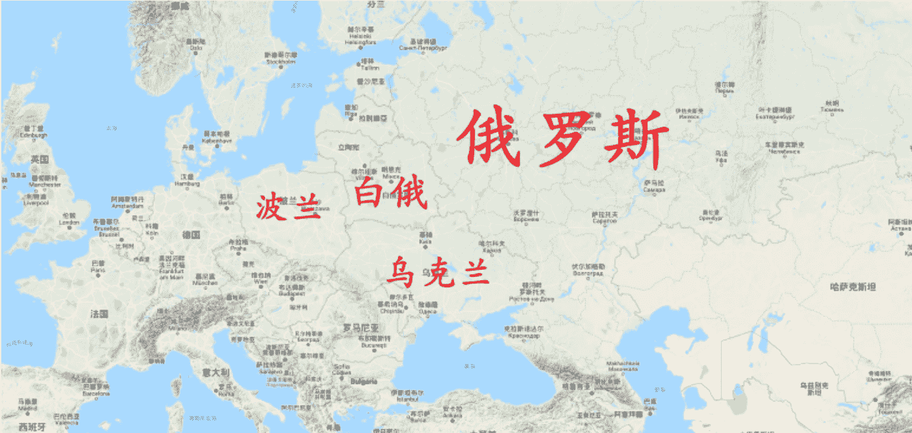

一听白俄罗斯这个名儿，就感觉和俄罗斯的关系非常深，事实上也非常深。由于我国翻译的问题，其实“俄罗斯”应该叫“罗斯”，“白俄罗斯”应该叫“纯罗斯”。

看这名就知道，白俄在强调自己的纯洁性，顺便鄙视一把被蒙古人征服过并且拥有170个少数民族的大俄罗斯。

白俄罗斯老早就被俄罗斯帝国吞并了，一直到“一战”后，白俄先是宣告独立，成立共和国，然后以加盟国的身份加入了苏联，成为了苏联的一部分。这点相当重要，这成了苏联自爆后白俄罗斯能够实现独立的合法依据。

教员说过，革命不是请客吃饭，十月革命也不是简单的一声炮响后就由无产阶级当家作主了。事实上，十月革命之后，新生的苏维埃政权几乎面临着四面楚歌，除了国内的大量反对势力，还有一大票想要浑水摸鱼捞好处的外国武装干涉，甚至连美国都从海参崴登陆跑来分一杯羹。

3年的苏俄国内战争把白俄罗斯脆弱的经济打的稀巴烂，最重要的耕地面积减少了36.5%，粮食和生活用品供应出现了巨大问题，称得上三步一小偷，五步一强盗，处处是难民。

稳定下来的白俄罗斯马上投入到轰轰烈烈的苏联大发展当中去，工业和教育都得到了快速地发展。但终归还是命不好，第二次世界大战又来了。辛辛苦苦几十年，一朝回到解放前，白俄罗斯的国民财富直接被干掉了一半，有220万人在战争中失去了生命。

终于挺到战争结束，白俄成功地从一个落后的农业国发展成为工农业较发达的地区。1980年，其工业产值比1940年增长了28倍，凭借熟练工的数量优势和地理交通便利，机器制造和金属加工领域取得了长足的发展，并且成为了白俄罗斯的支柱产业。

随着经济水平的提高，白俄罗斯人民的生活质量也水涨船高起来，死亡率持续走低，平均寿命达到了72岁，而在十月革命之前，仅仅只有33岁。

所以苏联解体之前，白俄罗斯人的生活过得还算不错，工业就业人口达到了恐怖的75%，是一个真真正正的工业国家。

但是，一般“但是”后面的内容都比较重要，这一切都是建立在苏联这个大联盟的基础之上的。白俄罗斯的工业繁荣中一直有个致命的缺陷，就是其工业所需要的原料、能源和产品销售都非常依赖其他加盟国。

到现在白俄依旧有这个毛病，严重依赖俄罗斯，这也是白俄大部分问题的根源。

说简单点，白俄本身相当于是一个代加工厂，主要靠挣加工费用。所以在苏联解体的过程中，白俄罗斯表现得非常恋恋不舍，一步三回头，只是覆水难收，无法挽回了。

后来苏联崩了，白俄罗斯最大的贸易国俄罗斯在解体后一直经济低迷，导致白俄罗斯的能源、原料和市场都受到了比较大的影响。

第二个是给切尔诺贝利核事故擦屁股。可能大部分小伙伴都不知道切尔诺贝利虽然在乌克兰境内，但它离白俄罗斯仅仅只有16公里。为了消除事故的影响和善后，在1986年发生事故后的很长一段时间里，白俄罗斯每年都要把财政预算的20%——25%用在擦屁股上面。

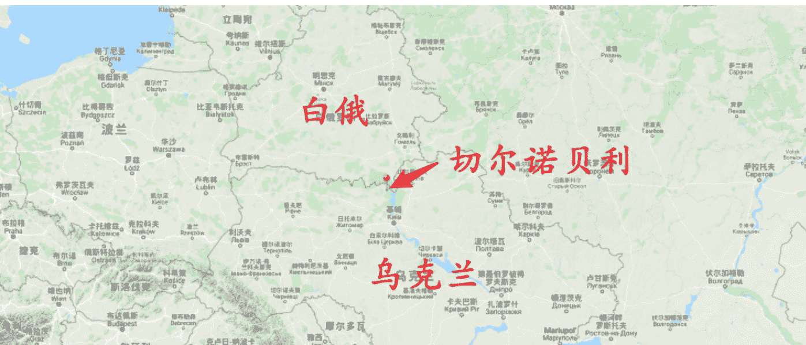

总之，流年不利。加上前苏联刚崩溃那会儿激进的“休克疗法”，熬到1994年，白俄罗斯的通货膨胀率达到了恐怖的2200%，全国60%的人口在最低生活标准以下生活，白俄罗斯经济下滑速度在这一年达到了12.9%的顶峰。

白俄罗斯的经济来到了生死线，国内人民对政府极度不满，并且在私有化的过程中，金融寡头获得了大量财富，大规模游行和罢工此起彼伏，要求彻查腐败、实行改革的呼声越来越高。

按照他们斯拉夫人的传统，这个时候就需要一个强人出来给收拾下烂摊子，如果出不了，那就得一直烂下去。

卢卡申科就是在该年被选为白俄罗斯的首任总统，只是当时没有人会想到，至今为止，白俄罗斯就没有第二个总统。卢卡申科开创了迄今为止长达27年的总统生涯。

### 2 卢卡申科的“市场社会主义”

老卢同志出生在1954年，也就是周总理参加日内瓦会议的那一年。小时候家里很穷，托了苏联大力发展教育的福，上了大学，一不小心就改变了自己的人生。

毕业后的老卢成为了一名军人，在基层农业的领导工作中表现得非常出色，还在莫斯科开了先进经验推广会，戴上了大红花，成了全苏楷模，这个政治资本不是一般的丰厚，很快老卢就被选为白俄罗斯人民代表，成了白俄罗斯高层的一员。

1993年，老卢当选白俄罗斯反腐败委员会主席。39岁的老卢正是意气风发，觉得搞个小官小吏一点意思也没有，握着刀子直接奔着国家元首就去了，就跟韩国的那些检察官似的，相当的猛，也因此赢得了“反贪斗士”的美名。

1994年，白俄罗斯的新宪法千呼万唤始出来，确定了白俄罗斯走三权分立的体系，总统为国家元首。借着自己在民众心中积累的良好形象，老卢成为了白俄罗斯的第一位总统。

从基层干上来的老卢对白俄罗斯实际情况非常了解，理论联系实际的能力相当深厚，所以上台之后面对国内严峻的经济环境，紧紧抓住了白俄罗斯社会的两大主要矛盾。

第一个矛盾就是人民的吃饭和就业问题。老百姓为啥闹事？还不是因为吃不上饭找不到工作，马上就要饿死的人去偷东西，肯定不是单纯的思想教育就能教育好的。老百姓只要温饱有保障，生活有盼头那就不会闹事；老实上班能不愁吃穿住的话，没人闲得蛋疼去闹事，毕竟闹事比种地上班可危险多了。

老卢做的第一件事就是叫停了激进的私有化，通过政府大力介入的手段来扭转经济颓势，并且大幅度地提高居民最低工资和社会福利待遇，强制压低粮食和奶制品的价格，斥巨资补贴穷苦人。混乱的白俄慢慢趋于稳定。

老卢自诩不相信共产主义，也不相信资本主义，毕竟社会主义刚搞完，而资本主义国家也只有那几个老牌帝国富得流油，其他的还不如白俄；他要建立所谓的“市场社会主义”。

说白了，跟日本早年差不多，大企业都是国企，并且尽量给老百姓以福利。只是蛋糕本身就不太大，福利也受点影响。

白俄教育是免费的，生孩子还给钱，医疗也是免费的。正常情况下，医疗免费基本100%会排大队，很少有例外。奇怪的是，我问了白俄的留学生，说是白俄几乎不排队，医疗条件也很不错，这个挺让我惊讶的，也可能跟他们人少有关。有了解的同学可以在评论区留言下。

第二个主要矛盾就是白俄罗斯的经济发展需要依靠国外的原料和市场。这玩意没法解决，全欧洲都要依赖俄国的能源，所以不可避免地，白俄彻底倒向了俄罗斯。

从现在来看，老卢当初确确实实稳定住了局面。

1999年白俄罗斯的经济就恢复到了1991年的水平。从1996年到2003年，白俄罗斯的经济年平均增长达到了5.95%。2005年白俄罗斯的工业总产量是1995年的2.5倍，农业总产量是1.2倍，工资是2.5倍。

老卢在推行自己政策的过程中发现，自己虽然是一国总统，但是做很多决策依旧不太好推行，议会没事就质疑自己是不是想给自己捞好处还是准备卖国了，就像当时特朗普要修墙，被议会折腾得欲仙欲死。

1996年，已经通过扩编掌握了整个警察系统和主要媒体的老卢提出了扩大总统权利的草案。此时的老卢在民众心中的威望如日中天，而且大家觉得这帮议会不好使，就会扯皮，民粹主义在白俄罗斯很盛行。老卢的修宪草案得到了70.45%选民的支持，自此，老卢获得了绝对的行政权并且让议会的监督变成了象征意义的；总统有权解散议会，但是议会无权弹劾总统；还获得了司法系统的人事任免权，不听话就给我滚蛋；

尝到甜头的老卢仿佛一下子就打开了权力的魔盒，大家不是讲民主嘛，只要我的草案被大多数人选择就可以解决问题了，把老百姓喂饱了他们就会给我投票。通过提高社会保障和国家福利来交换支持成为了老卢的神奇技能。这倒是有点像沙特，沙特就是通过给老百姓发钱来维持稳定。

在争取民众支持的过程中，除了利诱之外，老卢麾下的警察也没有闲着。2001年，老卢成功地拿到了连任，并果断派警察大肆逮捕了投反对派的民众，留着你们五年后继续反对我吗？

按照白俄罗斯之前的宪法，总统只能干十年。到2006年，老卢就要让位了。老卢的梦想可不是只干十年，所以在2004年的时候，老卢继续玩公投，提出了总统可以当三届的议案，而59.1%的选民支持这一决议案（参加投票的选民是73%，这里面支持决议的比例是 81%）。

自此，老卢的独裁成了明面上的事情，从制度上已经无法对总统的权力进行限制和监督。而占经济主体的国有经济的员工和其家人则是老卢的最大票仓。2001年、2006年和2010年总统大选中，老卢获得的支持率分别是 75.56%，82.6%和79.7%，这些数据和国有经济就业人口比例大致相对应。

### 人见人嫌的老卢

老卢通过民主上台，通过民主走向独裁，然后一直在那里杵着，直到人见人烦。

对外方面，俄罗斯依旧是老卢的重点，但随着普京上台，两国的关系发生了一些变化。

世纪之交时，酗酒成性的叶利钦把俄罗斯这个烂摊子扔给了普京，而后者是个非常务实的总统。

普京依旧将与白俄罗斯的合作看作重中之重，俄罗斯跟白俄的关系，有点像中国大陆和弯弯的关系。

2002年，普京明确地说，哈拉少，你们白俄罗斯成为俄罗斯联邦的一部分吧。

白俄一开始是很愿意的，因为那时候普京还没啥政治地位，而老卢的影响力如日中天，并且在前苏联时期，老卢的地位要比普京高得多。如果合并，老卢很可能要成为俄联邦的老大。

但是后来一沟通，发现不对，原来普京说是他想做老大，这怎么行？然后这事就一直成了两国的一根刺，俄罗斯和白俄之间关系很好，但是老卢和普京关系却很差。

“9.11”事件之后，反恐成了头等大事，以反恐为突破口，俄罗斯和欧美的关系有所好转，那白俄罗斯的战略价值就显得没有那么重要，而且白俄不想跟俄罗斯合并这事让普京很不爽。（我们前文《原创||普京的艰难转身》里讲到了普京和西方的蜜月以及翻脸。）

所以俄罗斯就决议逐步提高对白俄罗斯供应能源的价格，不再给白俄打折了。老卢的反应也很快，以“东西方平衡外交”来应对俄罗斯的压力，想跟西方讨好关系，但是西方不大喜欢他，独裁者嘛。这就是为啥普大大要和姐夫走个形式，基本的形式还是要搞的。

既然没啥好办法，只能是高价购买其他国家石油，降低对俄国的依赖。后来他和普京在度假村有次对话：

普京问：“为什么白俄罗斯要花高价从其它国家购买石油？”

“为了每年12月31日半夜12点时不在你面前下跪。”

“谁下跪？”

“我下跪。”

也能看出来，他俩之间的关系非常不和谐。

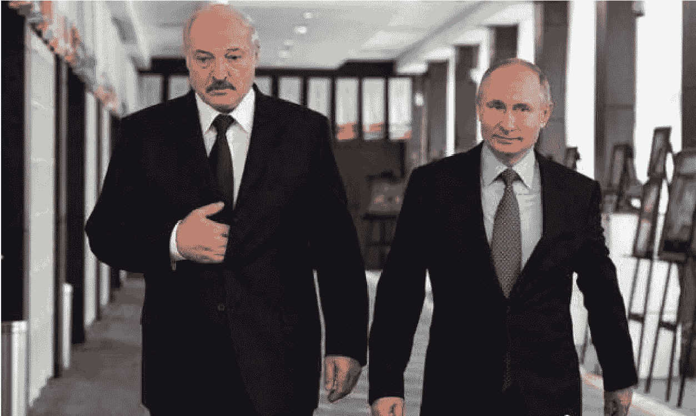

老卢嘴上硬，现实比人强。2008年的经济危机让俄罗斯经济疲软，随后便影响到了白俄罗斯，能源价格的提升更是雪上加霜。面对即将来临的2010年大选，卢卡申科慌得一笔，果断开闸放水，大肆发行货币，启动了大规模的经济刺激。但是放水一时爽，经济火葬场，引爆了之后的货币危机。

最终还是俄罗斯老大哥拉了白俄罗斯一把，渡过了难关。毕竟俄国也担心西方出手，如果白俄被拉拢走了，俄罗斯的生存空间将进一步被压缩。

但是，白俄罗斯模式下的经济增长告一段落，经济呈现下滑趋势，再度加强了对俄罗斯的依赖。

2014年的乌克兰危机的爆发使得俄罗斯受到了西方世界的经济制裁，俄罗斯自己差点没缓过来挂了，白俄罗斯的经济也跟着连续两年负增长。

针对西方的制裁，俄罗斯对西方特别是乌克兰也针对性地搞了一些制裁，而白俄罗斯则拒绝站队，本身兄弟我就不富裕，你跟欧美打起来那是你们的私事，我可不管。

这样，普京和老卢的关系更差了。

说到这里，咱们总结一下。

西方想拉拢白俄罗斯但是不喜欢老卢。

俄罗斯想合并白俄，老卢不愿意，所以普京不大喜欢老卢。

白俄的老百姓已经烦得老卢不行了。

总之，人见人烦的老卢。

### 终于掉坑里了

白俄的形势恶化大概是从2009年开始的。

2009年经济的持续疲软让白俄罗斯不得不削减掉部分福利，同时失业人数节节攀升，老百姓开始不满意了。

白俄罗斯政府的骚操作又再次体现出来。先是跳出来呼吁大家都去做两份工作来解决问题；然后创造性地收“游手好闲税”，就是每年的工作天数不到一定数目，就需要纳税，相当的魔幻。

为了获得外国的支持，经济不好时，老卢就承诺要搞私有化改革，但是一旦喘过气，又停止私有化的进程。这种反复横跳把中小企业折腾得欲仙欲死，怨气非常大。也惹怒了西方财团，人家本来准备买走他们的一些关键企业设施的，他又反悔了，所以西方越来越讨厌他。

除此之外，反对派中还有大量的学生。民主在这些人心中非常神圣，而且他们的纲领只是推翻老卢的长期独裁，至于推翻之后咋样那就再说，反正就是讨厌老卢。

多年的积累，让反对派的势力空前的强大。

2019年恰好是白俄罗斯的大选年，2019年的白俄罗斯本来就经济增长低于预期，又赶上疫情加重了白俄罗斯经济的下滑，2020年白俄罗斯GDP增速为-0.9%。经济上的痛苦加深了老百姓对老卢的讨厌，他在那里杵了那么久，按理说应该对白俄所有问题负责。

老卢太明白经济良好对自己继续连任有多重要。面对疫情的时候，为了保障经济，老卢拒绝封锁措施，鼓励生产集会，更是说喝伏特加可以应对新冠——估计效果不如往血管里注射消毒液。之前有川总的粉丝注射消毒液后，病毒确实是死了，只是人也没保住。

但是新兴媒体在这次疫情中爆发出了巨大的威力，努力否认疫情严重性的老卢，在新兴媒体的披露下不断被打脸，毕竟这玩意真的会死人，民众非常关心。政府的不作为和民间组织的积极抗疫形成了鲜明的对比，政府的公信力在一步步被透支。

一旦信任的基础被打破，质疑就会在心底发芽。越来越多的人通过新兴媒体看到了老卢的另一面，而这份怀疑在大选中得到了爆发。

面对要跑出来竞选的反对派，老卢先下手为强，直接在申请竞选资格的时候就掐死对方的希望，找个名义就扔到监狱当中。

比如今年反对派推出的候选人就是一个家庭主妇，这是因为她丈夫，一个知名“异见领袖”网红被抓了起来，她相当于替夫征战，非常的乘风破浪。

8月9日，白俄罗斯大选结果出炉，老卢以80.1%的支持率再度当选。这马上就引爆了民众的不信任，白俄国内很多人不喜欢老卢（毕竟看的年头太长了），更不会投老卢，这个80%是哪来的?老卢你压根就没统计我们的选票吧。

而那个家庭主妇则跑到了立陶宛，然后被发了一份“总统证书”，之后又去见了马克龙和默克尔，得到了西方领导人的支持。

> 这里需要强调下，这个反对派夫妇是俄国支持的，并不是西方支持的，这一点很关键，俄国想干啥很明显。

全国性的游行活动也开始在白俄境内爆发，激进手段给了当局镇压的借口，而军警的暴虐手段则被记录下来在新兴媒体上快速传播，这让很多中立的民众开始同情反对者，甚至加入其中。这也就是前段时间大家看到的情况。

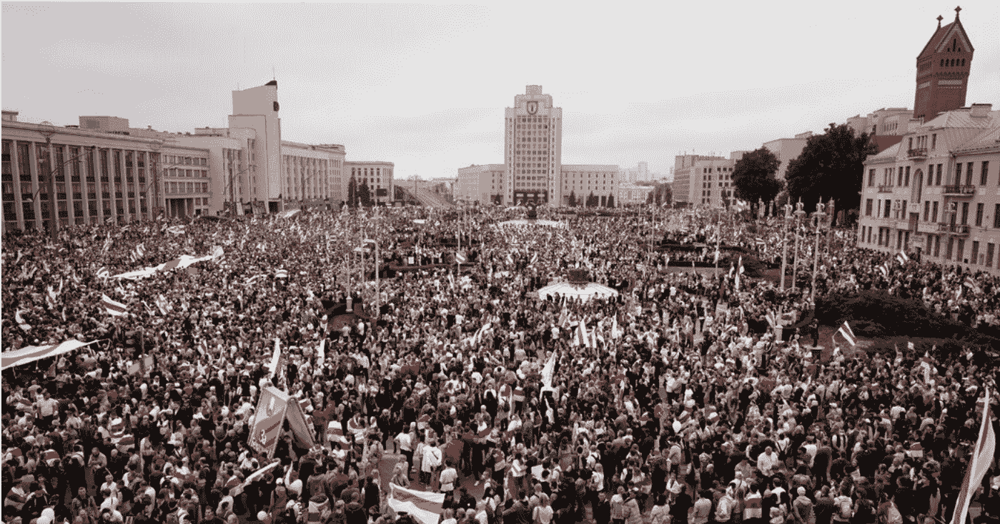

不少人说这次白俄的闹腾是欧美策划的又一次“颜色革命”。从现在的情况来看，白俄的事还不是简单的颜色革命，整体还比较复杂。

很明显，老卢这人跟大家关系都不太好，西欧不太喜欢他，普大大也不喜欢他，我专门问了那边的人，白俄人觉得现在把老卢赶下台最积极的应该是普大。

而且就在大选前，白俄和俄国闹得很僵，老卢说普大要把他赶下台，抓了30多个白俄境内的俄国雇佣兵，又抓了一堆俄国记者，而且还在边境增兵准备预防俄国捣乱，显然对俄国极其不放心。

不过普京可能没那么大动机来做这事，家门口乱了对俄罗斯来说不是啥好事，他再冲动，应该也不至于在自己家门口点一把火。

说白了，去年开始的疫情导致全球经济大幅下滑，经济好的时候，大佬们吃肉，小弟们喝点汤。经济下滑，全球经济规模明显缩水，大佬们把骨头都给嘣了，小弟们连个渣渣都不剩，矛盾自然加剧。如果疫情继续延续到明年，想也不用想，动荡会进一步加剧。

白俄这事，就是疫情导致的经济危机引爆了白俄内部的社会问题，大家把经济上的痛苦转移到那个27年没挪窝的领导身上去了。

不过白俄的上层并不像乌克兰那么分裂，整体是亲俄的，军方什么的也基本控制在老卢手里，如果俄国人出来支持他一下，应该能挺过去。

老卢一开始指责俄国在后边捣乱，后来又说是西方，估计已经向俄国认怂了。然后过了一年到了今年年底，传出来新闻说是要和俄罗斯一体化，估计最终还是想俄罗斯低头了。

### 尾声

之前为了写这篇文章，我通过朋友的朋友的对象的朋友，还真联系到了几个在白俄留学的小伙伴，还有几个在白俄搞外贸的，聊了下，有这么几个发现。

白俄留学生普遍喜欢白俄，环境好得不得了，老百姓特别温和，生活非常平静，尽管确实不太富裕，普通人工资都是两千到四千之间，不过国家确实也凑合，物价很低，这两年去那边旅游的中国人也越来越多。

关键是那个国家对中国非常友好，落地免签，到处是中文，东西也便宜，更重要的是，白俄妹子是很愿意嫁给中国人的。我认识了一个哥们，他们公司在白俄搞外贸，他们公司好几个年轻人都娶了白俄妹子，都可以带回来，白俄还没有彩礼。关于这一点，我写过一个帖子，婚嫁的态度最能说明问题，大家可以看看：

不少说俄罗斯歧视华人，其实我个人感觉并不是太歧视。我自己去过几次，没感觉，还挺友好，他们希望更多的中国人去俄罗斯玩。大家也可以看看其他当地博主的帖子，可能我看到的还是比较少。

其次有个非常明显的特点，华人在俄罗斯工作是能娶到那种大金毛的俄罗斯妹子的，而且非常多。在美国的华人熟人里，我一个都没见过他们娶美国的金发妞，不熟的人里好像也没见到，在美国的华人都是内部解决的，倒是不少华人妹子嫁了美国人。

他们也说，自己身边不喜欢老卢的人很多，老卢既是个独裁者，又不太诚实，每次大选都说自己80%左右支持率当选，一点新意都没。不过老卢这人除了能力差点，没能带领白俄走向繁荣富强，对政敌不太友善，也没搞啥干预老百姓生活的事。

留学生们最担心的，就是白俄这样一个宁静温和的国家因为激进操作陷入乌克兰那样的动荡，经济崩溃，社会失控。不过现在还好，电视上出现了超大规模的集会，整体还是挺温和，远没有像乌克兰那样的混乱和对抗。

事实上最近几十年，没有一个国家通过激进操作过上了幸福生活，反倒是好几个国家从正常生活堕入了地狱，可能有生之年都缓不过来。

公众号懒人搜索，懒人专属群分享

### 真实的香港黑社会到底是啥样的？

2021-11-05

有很多小伙伴可能看过不少香港黑帮电影，应该对里边的黑社会印象深刻，大家肯定知道有夸张部分，知道香港黑帮没有电影演得那么厉害。但是真实情况如何，和电影有多大差距，今天我来说说。

先说结论：香港黑帮属于很没逼格的一群，处于各国黑帮鄙视链的底层（大陆的所谓黑社会属于cosplay不在讨论范围）。

原因也很简单，就是香港自从开埠以来一百多年，社会结构一直比较稳定，没有出现过权利的真空。而正常社会中，有政府有军队有警察有监狱，黑帮不可能有机会做大，略微出格就会被公权力打击。当然至于出格到什么程度打，是直接打个全死还是打个三分死，就看对于统治阶级来说黑帮有多大用处了。

就像我一直说的，某些政府在某些地方，因为收益不足不愿意负担统治成本，干脆放任黑帮“代理”，政府只需要管理黑帮（当然是要分肥的）就可以了，必要的时候还可以牺牲黑帮把自己洗白。

而香港就是一个典型，香港黑帮严格说是个经济组织。本身在社会方面没有追求也不敢有追求（曾经有过，但是被暴打），一切活动都一直处在政府严格控制之下。说得难听一点，基本就是真正黑帮的模仿秀。

具体情况，我把香港黑帮历史梳理一下，小伙伴你就明白了。

### 起家

香港1841年就被英国人抢占了，英国对于殖民地和当地人的态度，就是随便压迫吸血，甚至对当地人（个别买办除外）完全就当牲口看待。西班牙人在美洲比利时人在非洲法国人在东南亚英国人在印度莫不如此，只是随着时间推进和当地人的反抗，做事的凶残程度有变化，骨子里态度是一直不变的。

也就是“我就是高级，当地人都是劣等人种。”所以英国人在香港是两套制度，地方也分成两块，英界与华界。最简单的例子就是英国人认为中国人种不适合一夫一妻，法律上允许纳妾。虽然大陆在1930年北伐完成后就颁布了婚姻法，香港却一直到1969年才取消纳妾制度。对于管理华人，英国一直都是没啥兴趣，经常干脆从华人里找用着顺手的买办来间接管理，以华制华。

当时香港作为岭南地区，开埠以来就是三合会的重镇，三合会作为晚清民国三大帮会之一（另外两个是江浙的青帮和四川的袍哥会）的历史传承很久。

这个民间组织就是反清复明的洪门（也就是天地会）转型而来。至于三合到底什么意思，能找到的就有十几种说法，真实性难以分辨。不过考虑到当年会进入帮会的人员，教育程度应该都不高，我比较接受简单明了的说法。

所谓“三合”是“洪”字的三点水（看字形三点水有汇聚在一起的形态）。那个著名的对联“地振高岗,一派溪山千古秀。门朝大海,三河合水万年流”。就在福建高溪天地会创立的红花庭，也可以说是三合会历史的开端。

不过三合会并不是一个有严密阶层的组织，更像那种加盟店，谁要是认同“反清复明”的理想，就可以宣布自己是三合会的一个分支，可以不听总部号令，甚至可以不知道总部在哪，平时也是各干各的，很难用一句话形容他们到底是一伙什么样的人。

也正是这种“分布式”机制，这个组织不存在被“斩首”的情况，就算总部被一锅端，对组织也没啥影响。香港自从开埠就有大量的码头，自然也有无无数码头工人，还有更多的形形色色的人，工人们为了抱团取暖，其他人有其他目的，于是成立了无数的组织。

各种帮会尽管名义上都叫三合会，存在的目的也不太一样，有的是纯粹的工人互助组织，有的向街坊邻居收保护费，顺便搞点黄赌毒。

在20世纪早期，香港的左翼工人运动非常激烈，多次大罢工虽然最后都被镇压，但是逼迫港英政府多次让步。为了从中破坏，港英政府不但抓人，还在工人组织中搞“掺沙子”，鼓励右派工会组织分化。同时利用帮会打击左派工人，黑帮在其中做了不少工作。

因为帮会组织有用，英国人对于帮会犯罪打击力度不大，直到1957年情况有了大变化，把原来的两个部门：严重罪案调查科和反三合会行动组，合并建立了专门针对黑帮的警察部门，“有组织罪案及三合会调查科”，也就是著名的“O记”。

之所以1957年出现变化，就要说道香港黑帮的第二阶段。

### 国军变成了黑社会

大陆解放之后，香港黑帮有了一次大发展，从大陆败退来了大批人员，其中很多国民党散兵游勇和家眷足足有十几万。

这些人到来之后，有门路的自然是衣食无忧，但是大多数人生活艰难。即使当年风光如杜月笙这种人，在香港都被帮会分子排挤。普通人无依无靠还和香港当地人发生了多次冲突，港英政府怕到处混居出大乱子，把十几万人聚集在当时香港最偏僻的调景岭（这地方以前叫“吊颈岭”，这名字……）。

这么多人在异乡只能抱团，依靠以前的组织架构。至于蒋介石的国民党本身，基本上一直可以说都是个大号黑社会，不能算是个正经现代化政党。在这个基础上，不少人找不到工作就开始自己想办法，很快就从“准黑社会”变成了真黑社会。

何况当时蒋介石还想着“反攻大陆”，不断地向香港的黑社会提供支持，其中比较著名的“14K”和“新义安”，都是前国军军官借了一个三合会分支机构的壳成立的黑社会性质组织，所以他们都是隶属三合会，并且一直拿着台湾保密局的津贴。

对香港黑社会有重大影响的一件事，是发生在1956年“双十暴动”。每年国民党国庆的双十节，香港的国军残留力量都张挂“青天白日满地红”的旗帜。而港英政府因为惧怕刺激大陆这边，对于张挂旗帜有限制，结果到1956年政府人员撕了旗子。不满的人群围了政府部门，警察前来处置结果被更多人围攻，只好调来更多警察。期间大量黑帮带领暴徒开始放火游行，甚至封锁部分地区，对左派机构和政府机构打砸抢，事情彻底失控。

最后严重到港督下令，英军出动装甲车上街镇暴，分区域戒严隔离清理，警察直接向人群开枪。足足闹到14号才平息，死了60人，伤了上千人，抓了6000，判罪一千多。

事后港英政府将这次事件定性：支持国民党政权的三合会成员暴乱，然后开始在香港清洗一轮，把有政治倾向的黑帮分子大量驱逐到台湾去了，比如大家熟知的向华强向华胜，他们的爹叫向前，是个军统的少将，先后参加过成立“14K”和“新义安”，就在那次事件中被赶回了台湾，不过子女们都在香港继续混。

从此以后，香港黑帮就一直没有政治主张，也没有爆发大的群体暴力事件，把精力都放在了钱上。

### 集中精力搞钱

香港可以弄钱的地方还是很多的，原本的远东经济中心是上海，也是西方在远东最大的根据地，买办们都在那里。但是随着新中国成立，上海的买办们带着生意出逃到了香港和澳门。上世纪50-70年代，香港的经济发展很快，特别是转口加工贸易非常发达。各界都一派欣欣向荣，黑帮自然也不例外。

当时黑帮最挣钱的门路是毒品,因为香港是个自由港,对于人员货物往来管理非常松。香港当年几乎垄断了金三角毒品,特别是坤沙当年的“双狮地球”海洛因,全部从香港转口,以至于打响了招牌。

说起当年香港毒品,前两年香港闹事的一大后台金主,《壹周刊》的老板黎智英,早期在香港混社会,就是个有名的分销商(从老板那里拿货卖给吸毒者)。从一个一文不名的穷光蛋弄了不少钱,为以后把握机会积累了资金。所以这货不论是自传还是报道,都只从70-80年代发家开始说,前面的都从来不提。

黎智英是小角色,香港贩毒招牌人物是绰号跛豪的吴锡豪,在最风光的时候一年贩毒过十吨。光是他相关的电影就拍了好几部,还都拍得不错,看过的小伙伴估计都有印象,前两年的那个《追龙》,讲的就是这货。

跟电影里的形象差不多,吴锡豪平时人狠话不多,但是一一“开会”就怂得很。对真正掌握黑帮的大佬客客气气的。

所谓大佬,就是警察,当时香港的社会格局非常奇葩。

上层是西方殖民者,而且西方殖民者也分层,当时香港最有权力的不是港督,而是美国驻香港代表。香港是有名的间谍之都,各方势力在这个小小地方都派驻机构,美国代表处光正式员工就有上千,还有不知多少人是他们的外围人员。英国二战后实力不济,只能跟着美国混,在香港也是这样。

中间是华人官僚、买办还有太平绅士(土财主),这些人也有级别财力不同,内部也有各种鄙视链,不过在洋人眼里都是一样的,最多也就是可以利用一下而已。不过有的却是真心和洋人站在一起,但是洋人走的时候不跟着去,留在香港挣钱,却一直不忘洋大人的好处。具体干了什么这几年大家看得够清楚了。

下层就是华人警察+帮会,当年华人在警队地位很低,高级一些的职务全部都是洋人的。华人警察一开始只能做到探长,这位子有多低?香港警察15级,探长在11级到12级之间。可见当年华人地位之低了。

不过地位虽然低,权力不小,英国人还是放任华人管华人。以至于一个探长的位子当年能卖上百万港币,那时一个人每月挣到三百就非常高了,2万块可以买一套不错的房子。这些钱自然是不要警察们自己掏,那时警察和黑帮勾结在一起,准确的说警察是黑帮的老大,以至于香港人说“警察管黑社会,黑社会管治安。”

黑帮在警察支持下弄钱,然后按照“规矩”给警察钱。著名的“五亿探长”吕乐,之所以坐上华人警察一把手,就是把“规矩”整合,制定了一套行之有效的分配比例。让警方上下(主要是拿大头的那些英国佬)满意,其中负责每月收钱并分钱的,就是曾志伟的老爸曾启荣。

在每月“上供”之外，黑帮还要为警察做事，比如对案件提供信息。甚至为了提高警察破案率，黑帮要专门找人（大多是赌鬼和吸毒佬）顶破不了的案子。

警察当然不能白拿钱，除了保证黑帮收益，还要负责排解纠纷分配地盘。以至于吕乐当年白天在办公室安排警察的工作，晚上在家安排黑帮的工作。当时警察拿到钱，很多做正行生意和购置地产，一直收租到现在。以前看《逃学威龙2》，周星星岳母作为经历那个年代的大妈，就说“警察怎么可能没钱？”作为内地人，我当时还觉得奇怪，后来了解历史才知道是以前的正常情况。

当时又赶上香港经济大发展，真的是“岁月静好”。

不过这种“美好日子”到了上世纪70年代中期，英国人认识到继续放任后果不堪设想，被迫开始改变香港的社会结构，设立了廉政公署。

很多人以为英国人不堪容忍香港腐败，其实作为万年搅屎棍，英国人就没怎么干过人事。当年一个是石油危机造成经济不稳，苏联的实力隐隐要压住美国。美国越南战争失败之后，亚洲各地革命浪潮又一次到了高峰。

当时英国人在香港还压迫华人，普通民众心目中已经非常不满。如果民众不满爆发，肯定是全港大乱，英国人根本不敢再强力镇压，一旦出现大规模死伤，英国在香港的统治肯定完蛋。这时候精明的港英政府，丢卒保车把群众最有意见的腐败警队抛弃了。并且很多原本英国人专属的高级职务也允许华人担任，勉强把香港的情况安抚了下来。

连警察都一下子全垮了，黑帮的靠山也都倒了。香港黑帮也开始了转型，开始学着做起了正经生意。不少人还就在这时候把握住了机会，比如黎某英就把自己贩毒攒的钱开办了佐丹奴，从此成为了富豪。

那个当年一连绑票李泽楷和郭炳湘，到手16亿的张子强。在黑帮多年了都没混出成绩，却在一次合伙炒楼中博赢了一把大的，弄到了一套房子。他从此认定做事就要敢做大的，小打小闹没意思，直到把自己博的枪毙为止。

自此香港黑帮内部分裂愈演愈烈，渐渐地越来越分化，以至于谁都不服谁，各自为战的情况越来越多。另一方面，黑帮分裂使得覆盖范围扩大，涉足到了香港社会各个层面。

时间也来到了上世纪80年代初。新的历史开始了。

### 洗白

在转型的过程中，出现了两件大事：一个是大陆改开，一个是大陆确定收回香港。

改开是香港大发展的契机，自此香港经济真正是突飞猛进，一夜之间如同火箭点火。当时香港的火爆，只有日本泡沫时期可以相比，这从大量电影电视中可以清楚看到。

但是收回香港，对于香港上层真的是哀鸿遍野。如果是华人，不论富商还是政府官员，大多数都很淡定。如果有爱国心的就积极帮助祖国建设，如果是买办，要是一心和洋大人走，把家产收拾一下就走了。在中英谈判后，大量英国公司撤资，很多当地富豪也选择移民。以至于当年香港出现了一次巨大危机，之后香港的政治和经济基本面就完全不同了。

当时英国人的心态，基本就是卷起铺盖再最后捞一笔，在回归之前尽量对得起自己，不然没机会了。同时英国人搅屎棍属性爆发，再次开始走之前埋雷。整个香港基本处在放任地步，末代港督彭定康上任后，进行政改，把手里的权力一夜之间全部下放，立法会和政府各个部门权力大了几倍。并且在各种事情上唱高调，给香港人画了无数大饼。

至于实际措施，什么社会管理城市建设，英国人表示时间不够啊。等回归以后你们找特区政府要吧。

当时对于黑帮的管制，那段时间也弱化了很多。

这一来，已经有了一定基础的黑帮，面对这个百年难得的机会，积极的转型，也就是我们常说的“洗白”。其中最显眼的就是香港娱乐业，渗透之深，以至于几乎所有拍摄都要给黑帮钱，即使如此依然会遇到很多麻烦，于是为了顺利拍摄干脆就和黑帮开设的公司合作。

黑帮进入娱乐圈，于是把帮会里面的事情也编成剧本。其中很多有真正的黑帮人员参与，有专业人士加入，而演员导演对这些片子也不敢不用心，使得香港黑帮片的水准非常高，甚至成为香港电影的一个名片。比起优秀的香港黑帮片，不论美国还是日本的片子都透出一种“假”来。

不过香港黑帮电影，早期因为黑帮是主导，黑帮人士的形象都颇为正面，不但长得帅还有义气讲规矩。而警察要么不露面要么和黑帮惺惺相惜，甚至还是反派，看《追龙》大家就有感觉，跛豪那个人渣，都被拍得人模狗样，最后还弄了点民族主义色彩进去。这种片子给黑帮加滤镜的手法，影响了很多人对黑帮的看法。

随着回归临近，港英政府各种动作不停，首先是改组了“O记”。也就是那个黑帮调查科，把规模扩大了很多。多说一句，新O记第一任老大就是任达华的大哥任达荣。他一直做到港警行动处长，也就是《寒战》里梁家辉演的李国斌的位置。

他成功做到了让大量文件资料“无故丢失”。到了1995年，香港老电影常见的“政治部”都取消了。这个组织隶属英国军情五处，被称为“香港最大的秘密”，从1934年就开张，名义上是做情报工作。其实香港黑帮和各种事都牵涉到它。

当年在香港街上，遇到便衣抓人，如果他们说“政治部办事”，就算你是警察，最好也识趣地走开，不要瞎看给自己惹麻烦。多说几句这个政治部，这玩意本身是个抓间谍的机构，但是没有执法权，也不能随便抓人，于是英国人很机智地安排到了警察系统里，所以他们既反间谍，也是警察，很多帮会成员和各阶层人士都是这个部门的线人。随着这些资料的丢失，很多香港的秘密也消失，刚才说的这些线人也都找不到了。

这些都是英国人传统的“光荣离开”动作，分而治之，销毁资料，提高老百姓期望等等。时间走到了1997，历史再次翻开新一页。

到了回归以后，香港黑帮基本上转型完成，但凡有机会的都洗手做起了正行。

高层的早早完成积累，所谓“黑社会不用脑一辈子都是古惑仔。”能爬到位的大多就算不太聪明，混了多年也知道好歹，中国对黑社会的态度非常明确。

比如陈惠敏在采访中说“黑社会也是爱国的”，不知道谁是陈惠敏？这人之前就是混黑帮的，从14K双花红棍（帮派最能打，专门武力和人“讲道理”）到现在基本上半退休状态做生意，后来还拍起了电影，算是活成了全香港黑帮人士的楷模。下图这个是在《追龙》里截的，自己扮演自己。

有的黑社会中层人士，还没有到退休的阶段，有机会也都转型做了正行。当然有一些人还在半黑半白的“偏门”挣钱（黄赌毒来钱实在是太快了），但是也都尽量不表现暴力，低调做事，为的也就是抓紧挣够退休的钱。

底层的小角色就比较惨了，可以说有点机会在香港也不干这一行，也基本上没啥出头之日。

对香港整体来说，1997年是第一次回归，黑社会整体迎来了一次重击，谁都知道中国没有黑社会；香港国安法表决通过后，又是第二次回归，到此为止，其他作妖的空间也就越来越少了。

公众号懒人搜索，懒人专属群分享

### 中国制造和德国制造到底差在哪？

2021-11-03

首先得说一句，如果大家在德国待过，就知道他们做的东西也不是全不错，有些只是我们聊起德国，总是想起奔驰和保时捷这类工业界的明星，不过这不是今天话题的重点，今天还是要重点反思下我们自己。

文章的开始，先给大家讲一个我亲身经历过的事。

还在我大学的时候，当时院里请了一个国内著名的软件公司负责人去演讲，当时他讲到一个我当时觉得很牛逼的事。

他说，他们的软件在服务器上线后，有个内存泄露问题，非常缓慢，差不多一个礼拜能泄露完，到时候服务器就会重启。如果那个时候你正在玩他们的游戏，就会出现“服务器不在线的状态”，过一会儿服务器重启完就好了。

这个问题也不是解决不了，不过需要很大的人力排查代码，成本非常高。后来他们的技术骨干想了一个办法，说是每隔六天凌晨主动重启一次服务器，这样既不影响业务（一般凌晨还在线的用户比较少），还可以给公司省一笔排查代码的钱。

当时大家非常感慨，这么一目了然的解决方案，为啥自己没想到，大神就是大神。

很快地，我毕业进了一家公司，老粉们都知道我在哪混，反正我们这家公司在业界已经基本没了对手，无论是海外还是国内。工作了一些时间，我才意识到大学听到的那个故事毒性有多大，到底是多么傻逼的人，才会想出来这样的办法，只有低级作坊才会干这么缺心眼的事。

稍微高级点的作坊会怎么做呢？

只有一个办法就是把这个问题彻底解决了，不惜代价，不计成本，把这个问题解决了，并且把经验推广，避免今后再出现这类问题。

很简单的道理，你做任何一个产品，其实整个开发过程，其实就是一个个“设计-开发-发现问题-解决问题”的过程。现代的产品还有个更重要的特性，就是需要不断的迭代，本来只开发了一个简单功能的产品，后来客户有了新需求，又得加，后来新需求越来越多，过几年变得几乎看不出来原本的产品到底长啥样。就好像手机最早只能打电话，后来发短信，再后来功能越来越多，现在啥都干，唯独打电话非常少了。

或者有点像盖楼，你盖好第一层，就得确保这层不能有任何质量问题，如果在一个残次品基础上不断迭代，最早的那问题迟早会变得没法收拾，一开始一个礼拜崩一次你不解决，到后来每天崩五次，你们的产品基本是个废产品了，谁还会用？到最后几乎确定的是：你得花好几倍的代价去解决当初的那个问题。

再深入一点，那种复杂的产品，比如手机或者火箭，每个部件都需要打到恐怖的精度，因为每个部件精度差一点点，集合在一起就成一堆太空垃圾了，根本没法用。国内长期以来饱受这类毒鸡汤困扰，把各种偷奸耍滑当成本事。

再后来，发现上边说的这些还只是第一层。

到了第二个阶段，责任心固然重要，但是工业生产时代责任心只是一部分，最关键的是流程。毕竟我兢兢业业无比认真地写代码，就能确保不出问题吗？当然不行，需要专业的测试人员来测试，再通过闭环流程追踪测试出来的问题，这样也可以防止我哪天懈怠了，不再像以前那么兢兢业业，照样可以保证产品质量，这就是流程驱动。

第三个阶段发现其实最关键的还是经验丰富的大神对系统的改进，比如一个产品设计之初想的太少，到后来发现扩展性太差，没法迭代了，要是想继续搞就得推翻重做。

第三点理解起来比较费劲，我这些年参加过几次那种重构项目，这又是啥东西呢？比如设计一栋五层的楼，一开始就准备好冗余量，如果将来在上边多加五层也没问题，但是随着时间推移，慢慢发现一开始太保守了，现在需要加一百层。

于是只好把之前的全部推掉，重新设计和重构，新楼做了充分的准备，要准备好上边将来叠加一千层。当然了，这种操作需要顶级大神来操盘，他不仅能力强，还得经验丰富，才能胜任这种工作。

回到本文的话，我自己亲身经历过我们公司的产品跟德国公司产品的竞标，到最后不仅在国内团灭了德国的品牌，甚至在德国本土他们都竞争不过我们，客观地讲，就一个原因：我们跟他们使用的是同一套开发流程和标准，我们也可以把质量提的非常高，最后产品还便宜。事实上中国所有能打的公司，都是这个出路。

所以说，为啥国内很多品牌比不过德国，咱们可以从这么几个角度来思考。

### 1. 发展的时间还太短

德国工业的神话其实出现非常晚，德国早期也是搞山寨起家，为啥说“也”呢？因为所有后起国家，包括德国、美国、日本都是这样，并且毫不隐晦地说，以及现在的我国，初期都没啥出路，只能是山寨。

大家注意下，国家、企业、个人都是一样的，初期的赚钱窍门是复制而不是改进，你把别人能卖出去的东西复制一遍就可以了，然后看看自己有啥优势，比如人工便宜或者资源便宜，能卖出去就赚，后起国家都得这么玩。

甚至都不需要完全复制，生产差不多的产品，功能和质量达到别人的80%，但是价格只有别人的30%，就能卖出去，如何能这么便宜呢？穷呗，穷了人力成本就会低，生产出来的产品价格也就低，这样就可以形成一个价格优势，尽管产品不咋地，但是也能卖出去。

这也是为啥大家经常说，中国主要供应西方中低端产品，其实中国生产的东西，国外基本都有对应的高端品牌，但是那些产品太贵，以至于西方大部分老百姓也不想消费，所以就买中国货。

德国有段时间疯狂抄袭英国人，生产出来的东西太垃圾，后来英国要求他们说生产的东西都得标注“Made in Germany”，现在这个标志是质量的保证，曾几何时这是工业垃圾的代名词。

日本也一样，日本车为什么能快速占领美国市场，主要还是便宜，并且质量比美国车还硬，等积累够了资本，再向高端突破，也就有了雷克萨斯这样的品牌。

所以无论日本德国，都用了几十年，才慢慢从山寨走向了高端，但是前提是他们的路是对的，也就是坚持质量理念，产品慢慢深入人心后，再开始打造品牌，最后赢得市场的认可。

中国企业也一样，不出意外的话，接下来慢慢高端品牌会越来越多，在国际上打出局面的也越来越多，因为路径就在那里，只要扎扎实实一步一步走，以客户为中心，不糊弄不抖机灵，把流程思维融入到企业运行中，再加点运气，总会有出头之日。等出头了，故事随便你讲，什么工匠精神，什么传统技能，什么文化因素导致，总会有无数人愿意听而且愿意出去传。

大家可以观察下我国那几个现在出头了的公司，他们的奋斗过程都差不多，基本就是我上文说的这个逻辑，勤勤恳恳做技术，不断迭代，用流程来保证质量，除此之外，基本没有别的办法。只是这些都需要时间，漫长的时间。

### 2. 企业死得还不够多

这事很残酷，不过也是事实。

大家想过一个问题没，为啥整个西方发达国家的企业管理模式都差不多，尤其大型跨国公司，基本大同小异，但是穷地方的企业管理却各有差别，啥奇葩玩意都有？

这不是什么西方优越论，而是他们发展的早，某个公司突发奇想，搞出来什么革新，取得了一点优势之后，这个革新很快就会在整个行业里扩散，到最后大家都差不多，因为大家都采取的是最优解，你不这么来，很快就被行业给甩开了。

某种意义上讲，我国很多企业之前过得太舒服，因为以前我国的人力实在是太便宜，打压国外低端产品根本没有任何还手之力。

大部分企业也不太在意质量和管理方式的缺陷，毕竟完全可以通过堆人力来解决，就比如我上文提到的那事，很多企业对质量兴趣不大，怎么省钱怎么来，也是建立在一种观念上：企业主觉得就算出问题，将来也可以通过廉价劳动力不断加班来补偿问题。

所以我之前在《关于人口的一些思考》一文里也讲到过：

> 欧美学者有个断言，说是为啥欧洲有工业革命而中国没有？因为中国当时人太多，有啥事砸人力就可以了，根本没必要发展机械，任何机械和新发明都会因为找不到用的地方最后归于湮灭。

> 人口下降当然有坏处，但是也预示着一个更加尊重劳动者的时代，而不是那种“你不干就滚，有的是人干”，这才是更加健康更加长久的道路。

人口太充裕，是中国崛起的重要力量，也造成了大量企业对人力的滥用，只有资源不足的时候，大家才会通过复杂工具和流程来仔细控制成本。

今后慢慢企业就不再是比拼那些低端产品，低端产业也会彻底拼成红海，谁都赚不到钱，到时候质量、品味、迭代性等特点才会成为产品的核心竞争力。

企业不想死就得谋出路，最后万物归宗，自然会走向极度重视质量的路线上，否则就得去死，这个没啥“民族性”可言，基本是一个市场经济的必然发展方向。

这个过程中，大量不合格的企业会死去，同时又有大量的新企业加入进来，落后的观念就这样被淘汰了。

此外很多人喜欢提的一件事，人家生产的产品质量好，是因为工人工资高待遇好。

其实仔细想想，就能发现这是个“鸡生蛋，蛋生鸡”的问题。

以我国现在制造业的收益水平，支付的工人工资注定高不到哪里去，尤其是我国以前人力资源近乎无限，所以工资很难上去，稀缺才涨价，无限供应哪来的议价空间？当然了，如果工资不是那么低，发达国家的产能也不会来中国。

把这个理解了，就知道“改善工人待遇”，基本只有两个办法。

首先是搞出来独立品牌，我们自己吃掉所有附加值（现在很多产业的附加值全被欧美吃了，中国拿个辛苦钱），只有企业赚了钱，才能给工人改善待遇。

另外一条路就是不要有那么多工人，其实这一点很关键，我看提的人很少，很多人觉得只有高端产能才能提高工人工资，其实大家去看看稍微高端点的产线，就知道普通工人干不了那些事。普通工人最好的出路还是去伺候别人。

多简单啊，工人供大于求，自然要不上去价。那工人去哪呢？发达国家的情况来看，社会涌现出城市中产阶层后，自然需要大量的人去伺候，比如饭店需要大量的厨子，理发店需要很多 tony，中国人均医生和律师也很少，接下来有一波大爆发，此外还有拍短视频的，去互联网大厂的，还有各种形形色色的服务人员，事实上现在这些人的平均工资比电子厂高得多。

不少人可能觉得理发师能有啥出息呢？其实Tony们的天花板很高，房产中介们都知道，北京很多互联网公司员工都买不起的房被这些人买走了，大城市里，细分门类的头部都非常非常高。

太多人感慨年轻人不愿意去工厂，其实这也是一种市场的自发配置，年轻人可以不去厂里就得到更高的工资，说明我国已经发展出来了一个巨大的第三产业；工人不那么多，也就可以避免互相压工资，工人待遇自然而然会改善。

说到这里，肯定有人问，那德国怎么解决的？

德国也是从咱们现在的状态过来的，只是他们现在发展起来后，把附加值高的产业留在国内，海外赚的钱，比如中国就有大量的德国企业，这些公司赚的钱又要回流德国。

更重要的是，他们人口少，只有8000万人，自然可以搞成福利国家，工人待遇也就不那么糟糕了。此外那么多有钱人，吸收了大量的人口去从事服务业伺候有钱人和中产，这样工人的工资不至于被压得太惨。说个数据可能吓大家一跳：

据德国联邦统计局统计，截至2019年底，德国就业人数4530万，同比增长0.6%。其中，农业就业人数60.6万，制造业就业人数114.5万，服务业人数3367万。

其实他们工人没多少，也正是因为蓝领少，所以工资格能上去。我知道很多人不太服，不过将来发展的趋势是，制造业规模越来越大，但是工人越来越少，今后体力劳动者去伺候脑力劳动者就可以了，制造业不会需要太多人，需要很多人的制造业收入都不会太好。

至于很多人念念不忘的那种“一辈子在一个岗位”的情况，这种情况无论是德国，还是日本，这俩国家都喜欢搞终身雇佣，一个萝卜一个坑，这是他们发展的优势，也都面临巨大问题。

多简单啊，技术革新太快了，前几天特斯拉从意大利进口了一个6000吨压铸机，可以将Model Y后底板一体化压铸成型，柏林工厂放了一个8000吨的，后续很可能整个行业都会向他们看齐，以前产线上的工人如果做了几十年这玩意，接下来就要改行了。变化这么快的时代，追求稳定本身就是奢望，想着一辈子做一件事，就不担心你的那件事消失了？

### 3. 用产品对用户洗脑

最明显的就是那个丰田霸道，买了过几年还能加价卖出去，作为一个消费品也是匪夷所思。

用变态的质量理念打造出来的产品本身对用户就有一种洗脑作用，不知不觉中就忽略了它所有的毛病，或者不认为那些毛病算毛病，这就是产品力。

回到本文，德国产品走出了山寨货的格局后，进入了极度在意质量的时代，从那时候起，时间长了产品就开始对用户有了一种洗脑效果。

到如今，最明显的汽车市场，不是全部，但是也有不少人，无限迷信日本车，觉得日本车毛病少油耗低，没钱买思域，有钱换凌志，就是不买其他车，德国车和美国车就是垃圾，智商税。同样的，一部分德系车主眼里，除了德国车，其他车全是工业垃圾，日本人的车薄皮大馅那能叫车?

这种产品对用户的影响进一步扩散到了手机领域，有些人纯粹苹果粉，苹果就是信仰。还有一部分人眼里，苹果产品确实不错，不过有一部分费用是智商税，只要脑子没问题，就不会去碰。

大家可以观察下，苹果和安卓都可以有粉丝，甚至罗永浩的锤子都有粉丝，只要你产品质量过关，有自己的风格，时间长了就会对用户产生影响，坚持以市场为导向做下去，慢慢各种关于产品的神话也就来了。为啥我们很少听说俄罗斯产品，主要也是他们的产品质量差又粗放，根本没啥市场。

### 4. 尾声

文末总结下，动不动就聊“民族性”是一种很low的思考问题方法，事实上单就中国人往死里鼓吹的德国人，在整个历史上，一直被人认为是脑子不太好又野蛮又分裂的一群人，也没啥突出成就，连个自己的国家都没，散了一地，直到大清第二次鸦片战争那会儿德国才统一，我们现在说的德国人的民族性，什么严谨、科研能力强等等，都是最近一百年才吹出来的。

事实上在一百五十年前，全世界对中国的印象也不咋地，又穷人又多，既愚昧又守旧，直到最近一些年才有改观，可见除了一些万年不成器的国家，所谓的民族性是随着经济发展和教育水平变来变去的。

随着越来越多的公司有了质量意识，不再疯狂依赖成本优势，慢慢就会走出现在这个圈，一部分公司首先会脱颖而出，然后更多的公司也跟着冲出去，中国制造也能成为品质的代名词，到时候故事随便编，什么六百年传承，什么八百年手艺，又有谁会怀疑呢。

当然了，这也不是唯一的发展方向，最明显的就是日本和美国的对比，美国人就是突破型的，美国人的共识是，美国这个国家就是一群精英带着一群猪，他们鼓励突破和创新，大量的资源倾向于马斯克这种“疯子”、“骗子”、“梦想家”，疯狂向知识边界冲击，但是对精雕细琢兴趣不大。所以除了苹果这种产品，美国很少有什么东西让大家感觉非常细，照样领先世界。并且有一说一，整个欧洲在最近二十年暮气沉沉，现在差美国差了很远。

这也是为啥上世纪80年代日本眼瞅要追上美国了，美国干脆放弃了原有赛道，专心研究下一代技术，日本被丢在了80年代，现在日本还在80年代的基础上精雕细琢。大家注意下，美国人一直都这样，当你追上来了，它就换赛道。美国人整体挺看不上工匠精神，他们觉得这就是不寻求突破，一直在舒适区反复改进。

我国接下来肯定是两条腿走路，既要修复之前被“毒鸡汤”毒害的心灵，把质量意识灌输到一代人脑子里，也要鼓励突破，给年轻人和梦想家机会，除此之外也没啥好的选择。

公众号懒人搜索，懒人专属群分享

### 经济越差，买办们越猖狂，买办的发展史

2021-10-29

### 1 上海的崛起

聊买办就避不开上海。

上海非常年轻，以前是个大渔村，现在咱们耳熟能详的上海外滩，以前就是一大块荒地。

1840年之前，上海跟旁边的苏杭、稍微远一些的扬州一比啥都不是，不过上海的位置好到难以置信，它面朝大海，背后有巨大的一块平地。再加上上海又是长江入海口，所以整个长江沿岸都是上海的延伸，只是中国以前并不注重海贸，所以上海的优势也就没有被发觉。列强来到中国后，很快发现了这块地，知道随着中国跟海洋文明打交道，上海将会很快成为中国一等一的超级城市。

这也是为啥第一次鸦片战争结束，列强提出“五口通商”，其中就有清廷高层没啥印象的上海，清廷很多官员之前从没听过上海这个地方，听说英国人要求开放上海，他们还以为上海在新疆。

上海开埠后，洋人进入上海做买卖，不少中国做外贸的商人也搬了过去，比如大家熟知的“徽商”，后来不咋听说了，其实就是搬到上海去了。慢慢的上海那地方就繁华了起来，不过起到决定性影响的，是太平天国运动。

太平天国爆发于广西，后来一直在长江中下游反复角逐，把南京、杭州、苏州一带打了个稀烂，太平天国每到了一个地方，就要到处征粮，被裹挟的流民跟着太平军到处转战，清廷更过分，往往攻陷一座太平军占领的城池，动辄纵容士兵屠城，所以江南腹地，中国最富庶的地区，几年下来一塌糊涂。

那些富户为了躲避战火，于是大规模涌入上海，上海有外国军队把守，太平军一度想进攻上海，不过后来没成行，江南富户进一步确认上海很安全，太平天国运动结束后，反而有更多富户迁入，慢慢那地方成了苏浙资本的大本营。

上海这座城市也真是奇怪，本身是个纯粹的商业城市，却诞生于战火（第一次鸦片战争），兴盛于一场更大的浩劫，也就是太平天国运动。

当然了，也不是所有人都在跑，比如太平军进攻杭州的时候，大家都跑了，徽商出身的胡雪岩跑去给清军卖粮食和军火，从此他成了清廷的军火商和商务代表，很快富得流油。

也正是因为上海是苏浙资本的大本营，所以后来革命爆发于广州，北伐军打到上海，却被江浙资本借尸还魂一举拿下，蒋介石和江浙财阀联手，清洗了内部革命势力，国府成了一个军阀和财阀的联合体。

回到开埠那会儿，上海当时和深圳差不多，以前都是个渔村，那里的人也都是周围填过去的，甚至包括大量的广东人。以前中国只有一个通商口岸就在广州嘛，后来广州在鸦片战争中玩坏了，所以商人们都搬去上海继续发展，再加上无数的西方冒险家，上海就这样慢慢发展了起来。

在上海之前，中国最大的贸易口岸在广州，广州十三行嘛，所以以前广州是中国海贸最繁华的地区，但是广州有个毛病，离中国的外贸产地太远，中国当时丝业中心是杭州，布业中心是苏州，徽州人在搞茶叶，都离广东太远，但是离上海却极近，还有水路连着，水路成本是陆路的二十分之一。随着上海开埠，苏杭的外贸品再也没必要送到广东去了，很快广州大部分业务都跑到了上海，广州的商人也就跟了过去。

### 2 买办的兴起

买办随着中国的海外贸易兴起很早就出现了，洋人来到中国沿海但是不熟悉中国的情况，做生意很不方便，于是有一伙眼尖的人瞅准了商机，学了外语，开始做中间生意，比如洋人的船到了岸边，他们去洋人船上牵线搭桥卖那些必须的东西，比如食物、水，以及码头工人等等。时间长了，他们跟洋人的关系越来越近，洋人有关于中国所有的问题，都会咨询他们，他们也会利用自己本土的身份帮洋人办事，这就是买办。

大家注意下，这个时候的买办还是中性的，因为做生意本身是中性的，不然现在外企的人都成汉奸了。

那时候最盛产买办的，是一个叫“香山”的地方，香山不是北京看红叶的那个香山，说的是广东的香山县，那时候很大，包括现在的中山市、珠海还有澳门，现在已经没有了，对，孙中山先生就是香山人。

香山的澳门那部分很早就被葡萄牙人给占了，1999年才收回，香山那地方土地贫瘠，当地的人只好自谋出路，于是大量的香山人去葡萄牙人那里干活，这也是为啥孙中山先生的思维那么开放，也是因为他们香山县一直在和外国人打交道。

由于香山人跟着洋人到处溜达，海外遍布香山人，比如耶鲁第一个华人留学生容闳，也是香山人，很难想象第一个留学生是山西人对吧。香港那边更是多得数不过来，所以改开后，原来香山县的那块地盘的人本来就视野广、思维野，又接到大量的华侨投资，所以发展的特别好。

等到上海开埠，西方的洋行在上海纷纷开业，这就需要大量的买办帮忙，想起来长期跟他们合作的香山人，于是大量的香山人被送到上海，帮助上海洋人开展业务，这些香山人又把更多的同乡叫过去。

相比广东，洋人在上海的业务大的多，所以近代以来一般说的“四大买办”（席正甫、唐廷枢、徐润、郑观应），都在上海上班，只是这些上海买办中，四个里有三个来自香山，剩下一个来自苏州。

当然了，上海的买办属于“巨型买办”，还有不少分布在香港，比如前段时间死了的那个何鸿燊，澳门赌王，他所在的家族起家是一个叫“何东”的人，这人本来是怡和洋行的买办，后来成了超级大户，再后来把一家子都带入行，全家买办，鸡犬升天。其他的买办家族也差不多，当时就有“何罗施冼蔡，女不忧嫁外”，这几个家族不仅干的活差不多，都在帮洋人打理事务，而且互相通婚，甚至近亲结婚。

那他们这些人平时都在忙乎啥呢？

主要是中国当时三大特产：棉花、丝、茶叶等等，把这些东西收购回去，然后卖到国外，顺便从国外进口鸦片。鸦片战争中中国不是打败了嘛，被迫同意列强在华销售鸦片。不过后来中国这边军阀们也在种鸦片，不仅种，还出口，导致美国很长一段时间都被中国进口的鸦片搞得很崩溃。

整体而言，大部分买办都是中性的，性质有点像现在外企上班的员工。有一些还非常有家国情怀，比如唐廷枢，这人以前是怡和洋行买办，后来在李鸿章的邀请下，参与创办了中国近代史上非常著名的轮船招商局，这个公司也是晚清少数几个能和外国公司抗衡的中国企业。

事实上清廷后来搞的洋务运动，主要也是依赖这些人，当时叫“官督商办”，官僚们怎么会懂如何组织现代企业嘛，所以李鸿章他们大量启用了那些有洋行工作经验的买办们，还有郑观应，这人大家应该很熟，他不仅一直在参与洋务，还是近代著名的思想家，《盛世危言》就是他写的。

但是有一部分买办屁股决定脑袋，做了不少坏事。比如中国当时没啥工业产能，清廷和很多民间企业家是想发展现代产业的，但是如果中国搞起来，那些负责把国外生产的洋货卖到中国的买办不就失业了嘛，所以他们千方百计地阻挠，甚至通过倾销的手段往死了搞国内的工业萌芽。

不过大部分买办，都是脚踩两只船，一方面跟清廷大员关系特别好，另一方面又是洋人的买办，这倒是很容易让我们想起一些现在的企业。

比如著名的“洞庭帮”大佬席正甫，回到晚清，这人基本上无人不知，因为他是汇丰银行的管事。事实上咱们现在聊汇丰银行，当时没几个外国人，全是一帮华人在里边上班，而这个席正甫一家子，盘踞汇丰头目的位置长达55年之久，爹干完儿子上，儿子死了孙子上。

他们家还有个身份，就是李鸿章淮系的人，后来李鸿章的淮系和左宗棠的楚系发生矛盾，作为双方在商场代理人，胡雪岩是左宗棠代理，席正甫是李鸿章代理，他们也发生了巨大的冲突。

在李鸿章的支持下，席正甫彻底击败了胡雪岩，胡雪岩他们徽州商人从此彻底退出了历史舞台。很多人把这场冲突看做是民族商人和买办商人的一次对抗，其实谈不上，本质是清廷代理人之间的冲突，后来搞死胡雪岩关键的一击，就是盛宣怀发出的，咱们总不能说盛宣怀是洋买办吧，但是盛宣怀和席正甫都是李鸿章的人。

整体而言，买办阶层立命之本，就在于“信息差”，或者说“经济差”，只有国外比国内的经济强一大截，中国需要大量进口海外的产品，他们买办才有存在的必要。

进一步地讲，买办获利的难易程度，和国内外技术差成反比，国内技术越强，到时候就会形成对海外的输出态势，买办阶层也就没有任何存在的意义了。所以他们最受不了民族产业的崛起，除非改换阵营，换了屁股。他们跟民族产业是死敌，此消彼长、有你没我的状态。

### 3 买办的衰亡

整个民国，其实就是一个买办政府。

上文提到的席正甫家族，他们家的势力基本贯穿整个晚清和民国，到了民国不但没削弱，反而通过联姻变得更强了，比如宋子文他们家就和席家有联姻。如果仔细把民国上层都翻一遍，就能发现那些买办家族不但没消亡，这次更过分，进政府了，变成了“买办官僚资产阶级”。

而蒋委员长又是个目光短浅的人，1928年11月，南京国民政府出台了《划分国家收入地方收入标准案》，这是民国政府的分税制，这个改革之后，容易收的关税盐税归了政府，其他不好收的税归了地方。

这玩意对民国产生了重大影响，因为只有大量进口外国货，才能收到税，蒋介石的政府才有财力保证。

但是这个玩法就跟吸鸦片似的，你大量进口国外生产的工业品，人家是机器大生产，中国还是小农经济，日本美国货比国产货便宜的多的多，那些企业在中国销售，价格非常低，压得国内根本没有任何抬头的办法。这种情况下唯一办法就是加关税扶持国内产业，可是蒋委员长还指望着关税呢，一加税国外产品在中国卖不出去，国府财政不就出问题了嘛，所以国府一直放任这种倾销。

很快中国的民族产业都崩了，生产不出老百姓所需的基本工业品，就需要进口更多，恶性循环，这也是为啥国府所谓的“黄金十年”期间，每年经济增长率10%以上，工业水平还在倒退的原因。

在这个过程中，负责向中国倒卖物资的买办阶层风生水起，他们的力量变强后，进一步游说民国政府，甚至进入国府上层当高管或者成为实权人物，比如蒋委员长最重要的好基友虞洽卿，他就是上海最大的几个买办之一，这人曾经在“412”之前给蒋介石和江浙财团牵线，后来抗战爆发后囤积居奇大发国难财，这么个货色，一直都处在国府核心圈子。

为啥蒋委员长在上海发动淞沪会战，多简单啊，上海就是买办大本营，也是外资在中国的根据地，蒋委员长指望买办们去找他们主子，也就是美英资本，不过日本也看穿了，对美英秋毫无犯，这俩国家也就不想管这事了。

到最后，外资和他们的买办基本上控制了中国采矿、重工、棉纺相关的全部产业，不止如此，由于上层利益牵扯太深，民国政府对基础产业的兴趣整体甚至不如大清。

比如著名民族企业家范旭东向美国贷款1600万美元准备生产纯碱，纯碱也是重要的基础工业原料，按理说这种东西应该是国家支持来做，但是民国政府不但不支持，甚至拒绝担保贷款，导致厂子也没开起来。

尽管买办阶层蹦跶的凶，1949年到了之后，就跟秋后蚂蚱一样很快崩了，淮海战役结束后，南方的买办集团眼瞅大势已去，开始搬往香港或者美国，从这段时间到1978年，这是一段买办退潮期。

不过这不是故事的结尾。

改开后我国基本啥都缺，只要能把海外的东西倒腾到中国来，就能发财，那时候走私成风，汽车、彩电、相机、甚至录像机，都有人走私，大家可能难以想象，90年代穷成那样，这些东西在中国价格卖得比国外贵得多，现在想想，简直离谱，最明显的就是那个桑塔纳。

90年代中国工人工资都不过百，那玩意卖20万，普通家庭不吃不喝两百年收入。为啥很多老混混喜欢吹牛逼自己当初开过桑塔纳，因为那时候开桑塔纳几乎相当于现在开着一辆六七百万的库里南，事实上现在中国很多巨富，就是那个时代倒腾彩电汽车这些玩意起家的。

更夸张的是，当时文物商店的文物在咱们看起来依旧很贵，但是在老外看起来便宜的跟白送一样，所以不少人就干起了把中国文物往外倒卖的活，太多文物就这样莫名其妙流失到了海外。

甚至可以理解为，90年代是个遍地倒爷遍地买办的时代。

为啥美国那时候对中国丝毫不担心，想想就明白，一方面我们确实比较弱，要啥没啥；另一方面市场化在中国形成了一个巨大的新买办阶层，上文也说了，买办和民族企业家是天敌，不等美国出手，这些买办会为了自身利益自发地清理那些想自立门户的人。

大家记得某大佬和倪光南之间的冲突吧，其实那件事就很清楚，一个想倒卖国外技术，一个想走自研道路，回到当时，自研确实是一条艰难而且充满迷雾的道路，选择做倒爷这事也无可厚非，将来有了钱再搞研发也不迟。但是此后那么多年，他们依旧没走自研道路，宁愿把钱全给高管发了工资也不搞研发，这就是纯粹的屁股决定脑袋了，自己不会反对自己。

此外更明显的是汽车集团，国家当初想通过市场换技术，各种合资品牌拿到技术后心态就变了，突然发现躺着就可以赚钱，那为啥还要跟国际巨头比赛跑呢？再说了，哪有跟自己母公司竞争的？这也是为啥我这么热情地看好新能源，因为新能源企业中国基本都是自己在搞，买办势力基本没啥生存空间。

说到这里大家也明白了，到现在远远谈不上买办势力在中国彻底式微，不过随着这些年国货品牌越来越多，质量越来越高，也就自然进入一种此消彼长的状态，而且一个好的现象是，这些年的民族品牌越来越少地打“民族牌”，地位和用户都是品牌方用实力和服务赢得的，硬实力是驱逐买办唯一的出路。

目前我国在中低端领域追赶的很不错，在高端领域确实依旧一般，汽车领域就很明显，类似玻璃和五金配件中国基本上已经全占了，但是车载芯片和发动机变速箱还在西方手里。

现在这种半封锁状态其实是个好事，如果彻底放开自由竞争，我们会承受西方巨大的价格优势，这也是为啥买办们最爱的就是自由市场，因为没有关税，发达国家的产品才会对发展中国家形成倾销态势，发展中国家啥都发展不起来。

这也是为啥我国此前一直不太愿意降低关税，现在芯片紧缺和封锁，又是另一种“保护关税”，只要给予发展时间，就一定能出成果，到时候再去自由市场竞争，等彻底发展起来，买办们自然而然会慢慢彻底消亡。

公众号懒人搜索，懒人专属群分享

### 为什么航空航天待遇不好，但国家在航空航天技术上依然取得飞速发展？

2021-10-26

这个标题是我最近在知乎回答的一个问题，后来又搬到了头条，在知乎和头条的评论区都有不少人就在航天系统里工作，都反馈我的文章写得还是很客观的，所以今天加长后发到微信来，大家一起探讨下。

我自己以前跟航天院有不解之缘，不少同学在那里边，这次写文章还专门问了以前的老同学和在那里边出来创业的小伙伴，尽量保持客观。本文写的是我的一点思考，我自己不可能看到全貌，大家有想法可以在评论区补充下。

首先说，航天院的工资确实不高，尤其是里边的人主要是从我国靠前的学校招的，他们又不会跟电子厂的厂弟相比，只会跟自己的同学相比，而且是跟收入高的比，人之常情嘛，航天系统出来的人大部分都是比较要强的那部分，大部分人不那么随遇而安，尤其刚毕业那会儿的工资，一比那不就崩溃了嘛。

在很长一段时间里，航天院的人跟他们去大厂的同学相比，收入差距大概是差两倍以上，也就是你一万，外边可能两万以上，你全年五十万，跟你一个量级的在外边都冲到一百多万了。这也是为啥很多小伙伴看网络上的讨论，感觉很魔幻，明明感觉收入挺可以啊，为啥网络上都在说收入低，并且经常听说离职的情况。主要是互联网和金融这两个行业的强势崛起，把大家的预期拉得太高。

此外房子也是个大麻烦，一年赚二三十万让谁说都是个好收入，但是一跟房子相比，立刻矮了大半截，谁都抬不起头。航天系统以前是分房子的，这几年也分，不过排队排的遥遥无期。这种背景下，很多人是不满意的，不满意就要跳槽，所以在各个大厂里，前航天院的员工有很多。

航天院的人跳槽去互联网或者别的行业，往往得在毕业一两年内，如果编程能力强，去互联网公司没啥难度，但是如果已经在体制内呆个四五年，再就很难跳出去了。不过这些年国家放开了商业航天，也就是一部分航天业务变成了私企，政府变成了采购人，让这些企业竞争，这些公司的工资往往也比体制内赚的多，所以这几年听说不少工程师跳槽，一般都是跳到这种企业去了，甚至有大牛带队跳槽的事。

关于跳槽，还进化出一些策略来，比如两口子都是航天院的，女的留下，男的出去，这样好处多多，家里有一根稳定的柱子，另一根去赚钱，可攻可守，所以很多部门女性特别多，女性有女性明显的好处，最起码的一点，细心和责任心平均值比男性平均值要高一些，所以航天院的结构其实非常稳。

冒死说一句，女性在冒险、放权方面的均值应该是低于男性的，放权这事很重要，领导不放权最后往往自己啥都管，烦扰下边的人微操，最后啥都管不好，我这几年的观察，女性领导比较少，不完全是职场歧视（确实有职场歧视），主要是女性倾向于管得太细，这要是当小领导还好，稍微往上点就不行了。

女性智商什么的没啥问题，尤其是名校毕业的女性，均值不低于男性，除了生了孩子总想回去看孩子。这也是很多高级技术岗，有很多女性，那个真是硬打出来的，不存在说你是女的偏袒你。但是管理岗女性要少的多，并不是什么职场歧视或者别的，就是不太适合，可以说放权是当领导最重要的事。

不过航天院每年确实会流失一些高手，也不是全部走了。很多高手去了航天院如鱼得水呢，人家就喜欢全身心投入工作，其他的根本什么都不想，这类人其实是科研最需要的。

所以说时间长了，最后形成一个少数天才带着一个高学历、责任心强、脑子好的团队，咱们不说是不是最牛团队，反正这种团队完虐绝大部分团队。

而且能力强的人在航天体系里一般混的不太差，毕竟各级领导都饱受业绩压力的折磨，碰到顶级高手没有不拔的道理，反正提拔了他，也是给自己干活，并不冲突。航天院的大神也都是真大神，这些技术骨干收入非常高，可能大家没想到，而且有地位，同学聚会中间的座位都给他留着，大家甚至跟别人聊“我有一个朋友”的时候，经常提到这类人，甚至跟自己的孩子聊起来，也希望ta成为那样一个人。

航天院天才很多（真正意义上那种天才，普通人跟他们隔着不可逾越鸿沟那种，不是普通的记性好考试厉害那些考试狂魔），这些人如果去大厂工资能翻好几倍，但是他们依旧愿意在院里呆着，一方面是体制对这种人也很好；

另一方面就是地位和使命感本身也是激励，这是外边给不了的。还有一部分“老航天”，他父母就是干这行的，他从小每次说出“我爸妈是造火箭的”就感觉周围人眼光都变了，他继续去做这个也就没啥奇怪了。我认识一个哥们从航天院下海发了财，而且是大财，他老婆继续呆在航天院，按理说不划算，但就是为了给孩子树立正确的价值观，而且也希望能留在航天圈里，小孩从小就是航天人，他们这个群体从外界看是有光环的，这本身也是激励。那句话咋说来着，“来生投胎有钱人，再做一次航天魂”。

此外国家整体还是很想给这些人好待遇的，从建国到现在，几乎每年都聊这事，也尽力在改善，一直以来他们绝对是比体制内其他人强的多，就好像有人看《功勋》，说国家为啥给于敏他们的条件不弄好一些？好不好主要是对比出来的，当时其他人没法看，所以于敏他们的待遇还是要跟同时代相比，一比就发现依旧是很优待了。

有人说体制内有外行领导内行的情况，这种确实有时候很害事，不过大部分外行都知道自己是外行，尤其航天领域，自己懂不懂当然心里有数，瞎指挥容易出事最后自己还得担责，所以策略也得跟着进化。具体玩法是：这些外行到了一个岗位，第一件事就是找到团队里最懂的人，让他来管技术，自己管人事、风险、经费什么的，天天找这个懂的人问进展就行了。

毕竟外行要升职，这几乎是唯一路径。外行瞎掺和最后出问题的行业，往往是那种每个人都觉得自己能行的行业，而且风险不太大的行业，觉得自己能行就会轻视专业人士，我有同学在气象部门，说领导是个纯外行，啥也不懂，也不掺和，甚至也听不懂他们在聊啥，也不听，只关心结果，大家反而很轻松。他们反倒讨厌那种啥都要掺和的科班上去的技术型领导。

补充一句，有人说为啥体制内我勤勤恳恳最后成了老黄牛，他们却能升上去呢？次要原因是领导风格问题，主要原因是你的那个工作有没有难度，难度太高的话，领导啥也看不懂，都得指望你，那自然会惯着你，对你的激励可不就上来了嘛。如果你那个职位本身难度不大，只是繁琐，那可能领导确实不太觉得有啥必要给你额外激励，对你啥态度可能就比较随机了。

此外关于航天业的民营化，很多小伙伴说中国不可能像美国那样搞，其实恰好相反，从2014年开始，我国也在搞这事，大家搜一下就能看到，2014年就有《关于创新重点领域投融资机制鼓励社会投资的指导意见》，已经在把一部分航天业务向民营转移了。

这也是全世界的趋势，把企业家引入航天领域里来，具体专业的东西我也不太懂，不过大家看看马斯克就能看出点端倪，这人现在作为首富，争议非常大，同时顶着一堆帽子，钢铁侠，梦想家，吹牛逼的，骗子等等，不过不得不承认的是，他确实搞定了NASA在很长时间里都没搞定的事，SpaceX本身就是个奇迹，发展太快了。

究其原因，他作为企业家，和NASA官僚们完全不一样，官僚本能地求稳，因为全世界官僚的考核机制差不多：守好自己的一亩三分地，千万不能出问题。所以官僚们对应的策略都是首先求稳，不求有功，但求无过，然后再想想怎么搞点突破，这也是为啥美国要把NASA的一部分业务给外包出去，他们也知道需要两条腿走路。

企业家又是另一回事，他们最关键的策略就是“不走寻常路”，得去冒险，得用优先资源拼命突围，资源不足的情况下，有时候甚至不择手段，比如先撒谎，骗到钱后再去把事搞定，这个能力在马斯克那里非常明显，所以大家都在骂这人，又有无数人在赞美他。

此外，他不是一直说要去火星嘛，现在正在研发可回收火箭的SpaceX，造电动汽车的特斯拉，和利用太阳能发电的SolarCity。SpaceX负责送人去火星，SolarCity负责将太阳能转化为电能，而特斯拉承担着在火星出行和运输功能。

到现在为止，这几项做得还都不错，尤其是电动车，我前段时间看了很多相关研报，一个公认的事实是，关于新能源，之前业界普遍看好的是氢能源那种方案，日本人早期的判断没啥问题，后来被特斯拉给搅了局，到现在为止，搞电动车基本成了共识，几大车企也都转向，氢能源方案反倒成了备用方案。

而SpaceX员工的收入比NASA高的多，打一开始就大量从NASA招人，不仅从NASA招，我国和印度也是SpaceX重要的人才提供地。

更关键的是，美国人这种玩法还有个明显作用，类似吸心大法，比如马斯克公司股价涨了那么高，想想就知道是天量资金给推上去的，其中很多钱是外国投资者和机构投资的，包括我国和俄罗斯，也就是美国航天事业的一部分研究经费是我国机构和个人提供的，这要是搁以前，简直匪夷所思，现在大家也觉得稀松平常。

我国从2017年开始也在走这条路，也开始商业化航天公司，后续也要上市，到那个时候，就可以吸收老百姓的闲钱搞航天，到时候也能让老百姓分享到发展的红利，甚至可以像某咖啡公司似的，去割美国人的韭菜。

2017年有不少大牛带队离职去了商业航天公司之后，为了防范流失，航天院的工资整体上升了一波，这样也有个好处，愿意走的走了，留下来的涨工资之后干得更舒服了，再加上我上文说的，航天业在国人心中本身就是一个有光环的行业，所以这几年整体势头好了很多。

文末还是需要说一句，我国航天领域和美国依旧有一定的距离，主要也是研究时长和投入经费没法比，美国登月那会儿，我国还在闹腾大革命，所以这些年的进步已经非常可观了，只是还需要更多的时间。下图可以看出，美国一个国家占到全世界近一半，中国也很多，30%了。由于美国那边经费充足，还可以通过股市融资，所以科研人员的收入也高的多，导致全世界的人才向他们那边汇聚，中国还好点，最惨的是俄罗斯，不仅在输出油气，还在输出美女和人才，基本上所有可以变现的资源都在输出，很难翻身了。

### Equity Investment by Geography

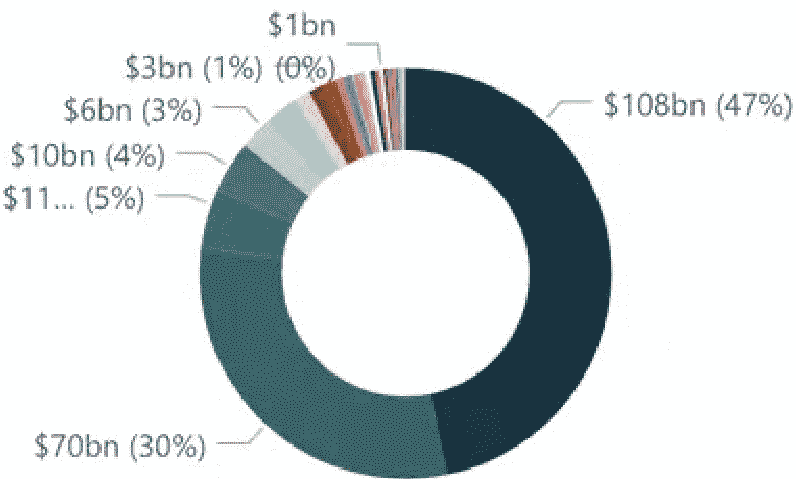

| Country |
|---|
| USA |
| China |
| UK |
| Singapore |
| India |
| Indonesia |
| Canada |

说到这里我是很感慨的，曾经我们也有异常艰苦的时候，那时候还是有太多的人本来可以通过奔往西方获得远超国内的待遇和收入，我在《18万买一次偷渡机会，华人海外移民往事》，甚至直到90年代，一个普通的体力劳动者，西方动不动是我们十几倍的收入，那些做火箭的顶级人才，能冲到几十倍国内收入，可他们还是坚定地留在国内继续耕耘继续奉献，比如我上文说到的，航天院以前有句话，“跟着钟山干，都是穷光蛋；就是穷光蛋，也要拼命干”，这里边的钟山，就是我国红旗七号导弹的总设计师，已经找不到合适的语言来赞美这些人了，他们真的是我们民族的脊梁。

公众号懒人搜索，懒人专属群分享

### 开征房地产税房价就会降？税费会转到房租上？想多了

2021-10-24

今天发了个微头条后，不少小伙伴让我多讲讲，就先说说吧，看看大家有啥不明白的，我再加点。

### 1、会有首套免征？

一般不会，我有两套房，一套两千万的豪宅，一套天通苑三四百万的，到时候该免征哪套？更极端的，我有套北京别墅，鹤岗还有一套，你说该免哪一套？这种税收成本高的没边了。

所以最好的办法就是全面开征，然后你再把你家的情况录入系统（需要政府发的凭证），计算机给你算“退税”，直接打到你家账户上，比如你家有三个娃，响应了国家号召，退税20%，再或者你家有四个老人，老人都70岁以上，再退20%，等等。这样操作还可以顺便鼓励三胎。

上海已经搞了十年的房产税，大概征收逻辑是：

- 首套房免征，而且不管面积大小。
- 第二套房开始，会根据家庭人均住房面积来计算，这就有两种情况：
  - 人均不超过60平米，则免征房地产税。
  - 人均超过60平米，则对超出的住房面积进行征收房地产税。

征收了十年，到现在一年能征收200多亿，财政收入占比非常低，其他地方有没有可能学习上海？

首先说，房产税的三个目的：

- 增加财政收入；
- 调整收入结构；
- 最好能抑制下房价上涨。

上海房产税一个目的都没实现，如果其他地方学习上海，连200亿都凑不到，对于地方财政尚且杯水车薪，其他地方房价差上海一大截，更收不到啥钱，所以大概率不会那么搞。

我在《1994年，没啥大事却又影响深远的一年》里提到过，为啥我国后来大规模卖地？

因为1994年开始了分税制，税收大头都上交中央政府，地方政府没钱了，随后开始搞房地产，地方政府通过卖地赚钱，现在卖地财政眼瞅快要到头了，毕竟中国该有房的人也都有了，不少人觉得自己缺房，主要是缺一套北上深的房。

到这里，就得开一个新的财政来源，其实能想到的也就是房产税了，这事已经说了很多年，大家都觉得操作起来太难，所以之前普遍觉得十年内不可能，这不突然就来了，财政这东西也是刚性的，毕竟各种开支得花，教师公务员的工资得发，总得想办法搞钱。

所以不管是房产税，还是房地产税，第一要做的，就是扩大财政收入，而且得跟之前卖地收入接近才行，如果跟上海似的每个人都免征60平，最后收不上来什么钱。

### 2、开征房产税后房租就会涨？

开征房产税会不会涨房租这事之前已经讲过了，结论是除了一线和极少数强二线，其他地方的租金根本涨不动，很多人以为房租是房东想涨就涨，其实想多了，我在北京当过几年的租客，现在也有套房子在出租，可以很负责地说，在北京这种地方，有不少地方房租根本涨不动，附近的租客没钱，怎么涨？

二线城市都是这个问题，供过于求，房子租不上价，这也是经济学里的那个基本常识，价格是供需决定的，不是供给方决定的，这就有点像中国今年生产成本大幅增加，但卖到海外的消费品价格没咋变一样。如果成本可以随便向消费转嫁，那地球上就没有亏本买卖了。

所以今后的趋势是，分化进一步加重，二线城市的租金上不去，持有成本增加，房价确实可能下降，一线热点地区房价和房租一起涨。

### 3、开征房产税后房价就会下跌？

其实这在全世界都有先例，往往是开征后，有些人实在供不动，北京这种人很多，住着几百上千万的房子，但是每个月收入还没过万，尤其很多老年人，房子很贵，但是收入却很微薄，这类人供不起房产税，可能选择出售名下比较贵的房子，选择去便宜区域。

这就会有一段时间的调整过程，随后慢慢走向新平衡，接下来的事比较让人大跌眼镜，开征房产税的国家一个常见的情况是，房产税税率越高的区域，房价越高，涨幅越大。

可能大家理解不了为啥发生这种事，多简单啊，某个地方为啥房价高？往往是因为那地方有商场，有学校，有医院，房子新，所以那地方房价高，政府开征房产税后，大家会搬离这种好区域吗？可能你工资低，开征房产税后供不起，搬离了，很快也会有别人填充进来，好资源永远稀缺，永远都是供给不足，所以只要经济持续发展，有钱人越来越有钱，这种区域房价一直涨。

反过来讲，大部分人居住区域因为大家现金流不足，支撑不了高房价，房价会下跌一些，房价慢慢会跟收入挂钩，现在中国的房价收入比在全世界也算高的，开征房产税后，这个比例应该能下来一些。

美国那边更过分，他们每个地方的税率还不太一样，从1%到3%（3%极少，不过也有），整体是房产税越高的区域，这个区域条件越好，房价也就越高，因为富人永远有钱追逐好资源。

从大面来看，几十年来整个美国的房价整体是上涨的，但是主要是东西两海岸在涨，如果去掉两海岸，中部区域是缓慢下跌的。现在全世界都有一个明显的情况，越贵的地方抗跌能力越强，征收巨额房产税后依旧抗跌，越便宜的地方，房产税不高房价也涨不上去。

并不是说我国今后就要走美国的路线，而是说按照规律，大概率和美国差不多，其他国家开征房产税后，整体也是这个规律。

这样好处和毛病都很明显，因为大家会按照收入分布在各个区域，出现明确的富人区。

不过好处也很明显，权利和义务对等起来了，你住在高档社区，那你就得多交钱回馈社会。你钱少，那也可以住在便宜社区嘛，房价和房租都不高，政府有钱还可以提供一些保障。钱少住的好那种情况，基本只存在那种袖珍型的发达国家，事实上那些国家也分着三六九等，只是咱们不熟悉乍一看不明显。

就说到这里吧，本来没想发文，手机敲的，如果大家觉得不错，可以点个赞或者“在看”。

公众号懒人搜索，懒人专属群分享

### 考公怎么突然那么热了？

### 2021-10-22

今天这篇文章看做一篇随笔吧，年底有点忙不过来，写上一篇的文章伤到了元气，今天少聊点，周末我再酝酿下一篇。

国庆的时候，跟以前同学吃饭，说起来说是我们班的另一个同学，毕业后辗转反侧，先出国，后来回国去了大厂，现在去当了公务员。

这事让我非常感慨，因为我大概是十年前毕业，我毕业那会儿，大家最热门的三个选择，就是“出国、去软件通信相关大厂（那时候移动互联网还没太出现），考公”，考公排在最后，是因为大家普遍没法接受那种一眼望到边的生活，不到万不得已，一般不会选择考公。

这不别人正常选其中一条路，他倒好，把三条路选了个遍。写这篇文章前，我还专门给他打了个电话，了解下了他到底啥心态。

他的心路历程分为以下三个阶段：

他自己出生在一个二线公务员家庭，生活条件比大部分同学都要好一些，人生最大的梦想就是不做父母那样的人，不能把有限人生花在日复一日的重复劳动上，所以大学好好学英语，毕业后就去了美国。

在美国工作几年后觉得很没意思，收入倒是比国内高，但是确实没意思，后来萌生出了“要不回国”的想法，仔细想了想，发现回国确实不是一个差选择，后来干脆回国了。

回国后进入某通信大厂，干了几年后，发现自己的职业生涯快要到头了，因为惊讶地发现通信这个行业已经进入了后半期，更郁闷的是，后边不断有人涌入，行业整体处于稳态，他又不太能升的上去。

再加上有段时间他怀疑自己被各种新闻app的算法盯上了，天天各个平台给他推各种让他不爽的消息，类似，《35岁的老男人，如果没啥特别技能，在职场上绝对是狗不理的类别》，还有这种，《loser回忆录：一年前我月薪两万被人叫X总，如今在美团送外卖》，总之时不时被这种新闻骚扰一下，忍不住点进去看看，然后平台给推的更多了。

突然有一天，发现自己竟然对“稳定”有种深刻的渴望，而且父母也说已经替他打听过了，他学历高，四十岁想去考公都可以，要不要去试试？

一开始觉得这个想法很搞笑，后来越想越觉得不那么搞笑了，再后来去研究了下，发现跟自已想的也不太一样，再后来就彻底接受了，觉得也还不错。而且如果考了公，时间好像更充沛了，可以陪孩子。然后折腾了一年左右，好在学习能力还在，又有对口技能，本来觉得希望不大，竟然考上了，已经开始上班，感觉很好。

现在很多观念都发生了变化，有种看山不是山的感觉，比如最明显的一点，就是跟同事的关系，他在美国和一线大公司都呆过，发现跟体制内完全不一样。

在以前大厂里，几乎没有人准备在自己的岗位上准备干一辈子，毕竟你准备干一辈子，说不定过几年你们部门都没了，所以肯定跟同事的关系也就不咋样，不差也不好，大家都把彼此当做匆匆过客。

但是进了体制就不一样了，大家瞬间就意识到周围的人要打好多年交道，甚至整个职业生涯都在一起混，升迁什么的也没那么竞争激烈，毕竟很依赖资历什么的，需要慢慢熬，竞争压力很小，所以感觉单位里温暖的多。

更重要的是，工资也跟自己以前想的不一样，本来以为从大厂去当公务员，收入得掉一大截，后来发现不至于，主要是因为体制内工资只是一部分，一年下来在工资基础上翻两三倍很正常。

感受到了体制的温暖后，他突然明白了为啥之前有年薪百万的基金经理考上证监会的公务员后果断跳过去了。

我在微博和头条上也聊过几次此类话题，中间有不少小伙伴参与分享，我也了解到一些，所以再往深里说一下。

首先很多人没注意到，互联网上被提及最多的群体，无论是公务员，还是互联网一线大厂员工，还有设计院，本身都是中国最靠前的一群人，也就是极少数人，比如公务员看着队伍庞大，其实每年录取一两万人，去年算比较多的，2.4万人，码农队伍就更别说了，看着好像遍地码农，其实也没多少。大部分互联网人讨论月入三万白菜价的时候，中国绝大部分人口的收入连五六千都不到。

但是互联网人、公务员、设计院这些话题现在在网络上这么频繁，跟他们在人口中的比例严重不相关，互联网上关于职业的讨论，基本上都是这些，给人感觉就好像中国80%的人都是做这些行业的一样。

主要原因是全世界的互联网，“发帖权”都控制在这些人手里。大家可以看看各个平台的博主都是干啥的，大部分都是上边这些人，有学历，能码字，又有点见识，所以大家愿意围观，很少听说谁是“农民自媒体”，或者“厂哥厂妹自媒体”，导致中国人口中占比最大的那群人，在网络上处于禁声状态。

这也是为啥不少人在发现，在微博和网上达成共识的一些话题，一到生活中完全不是那么回事，因为生活中的人跟你上的不是一个网。

也就是说，网络上关于职业的讨论，本身都是我国的“头部职业”，也是我国头部人才们的选择。

而公务员这个职位，有点像国债在金融市场里的地位，比较保险，但是收益率也不高，大家有更好的选择，就会集中涌向那个领域，等到没啥好玩的，又会选择公务员。所以这些年整体是一波一波的。

最早是上世纪80年代，体制内是很香的，毕竟那时候体制外没啥岗位，大家还不明白将来路往哪里走，所以体制内是一个又安全又收益率高的选择。

到了90年代就不太行了，因为当时深圳那边有太多的神话传来，开饭店的，搞走私的，反正动不动一个礼拜赚体制内一年的收入，当时航天院有句话，“跟着钟山干，都是穷光蛋；就是穷光蛋，也要拼命干”，这里边的钟山，就是我国红旗七号导弹的总设计师。

到了2000年之后的十年，我国开始给公务员涨工资，不过外贸也不错，大量大学生去了东南沿海，这十年可以看做是双头并进。

2010年之后的十年，公务员就不那么热了，因为移动互联网开始暴走，淘宝时代也降临了，这些从业者动不动一年顶体制内十年，这谁能受得了。

但是到了这几年，情况又发生了变化，因为互联网增长空间没了，但是程序员却持续涌入，最后形成了一个让每个人都岌岌可危的状态，公务员的春天似乎又来了。

现在码农头部集团的收入高的吓人，比如今年鹅厂校招白菜价直接干到了40万，有些算法岗直接到了六七十万元，你们能想象吗？二十刚出头，一年六七十万元的收入，但是大部分人是没法到这种状态的，第二集团收入就差多了。

更关键的是，由于人多，有些企业玩起了“养蛊”，也就是开一个不错的工资，雇佣一堆人，然后在接下来的一年内，用变态的企业文化赶走绝大部分人，最后留下最适合的那几个，这样看着挺费钱，可是仔细一算，也挺划算。

被人才市场搞这么几年，一小部分人成了胜利者，但是这种胜利本身也是暂时的，在市场经济的大潮里裸泳，本身就是一个“跑的慢就会死”的事情，而且这种奔跑不能停。

大部分人拿不到超额那部分收益，反而稳定性越来越差，这种情况下，越来越多的人把目光投向了体制内。毕竟大部分时候，“多数人的境遇”，就是我们自己的境遇。

回顾下这个历程，大家就明白了为啥现在很多北方地区老百姓对公务员有种莫名其妙的拜物教式的崇拜，因为现在的中老年，他们成长过程中，公务员一直都是最吃香最稳定最有效率的选择。

很多年轻人眼里，很多人理解不了月薪三千的公务员和月薪三万的码农，为啥父母那种中意前者。

主要是他们没经历过父母经历的，绝大部分父母们走过这几十年，他们看到了很多事，但是不太能说的出来，比如最基本的一件事，在中国过去四十年里，没有任何一个行业能持续大火十年以上，只有公务员的热度能一直维持住。

你肯定纳闷公务员的工资低啊，可父母们不这么想，但他们又说不出来，不过医学院的人知道怎么描述，他们有个公式：

1.1的40次方，等于45.25。

啥意思呢？医院里每年如果涨工资10%，从二十多岁开始上班，六十多岁退休，四十年收入会翻45倍，老人眼里的公务员也是这个逻辑，只是他们说不出来，最后总是憋出一句“越老越吃香”。那别的职业就不能这样？上文也说了，市场大潮下，没啥行业能持续十年以上，不管你做啥，总会被从中间打断，失去连贯性，也就没法持续增值。

现在这种全民追捧公务员的状态，如果硬要评价好不好，如果我早些年，肯定会使劲批评这事，觉得大家太丧了，现在不那么想了，觉得对于个体来讲，公务员确实是个好去处，既然是好去向，那么多人去追捧，也就没啥可说的。

至于有些人总觉得清华北大去当公务员可惜了，这么理解也不对，发达国家文官队伍全是各国名校毕业生组成的，既然文官是名校生，那就得名校生先去当公务员，不然咋当文官？

我们这边管理十来个人的软件项目组都需要985硕士毕业生，还得从基层做起，先写两年代码，再经过反复选拔后才能做PL，一个PL管着十来个人。那管理杭州北京天津重庆这样1000万人口以上城市，不更得大牛逼吗？让一群糊涂蛋上，你们放心？所以名校毕业生去做公务员这事也正常，现代社会就得用专业人士。还有证监会，监控那些充斥着人精的金融机构，这就需要证监会里的人更牛逼，大家想想是不是？其他部门一个道理。

而且看现在的形势，应该是要往香港那种模式发展，一方面要高压反腐，另一方面提供保障和稳定，公务员越来越变成受人尊敬而且门槛很高的职位，这对社会来说也是好事。

不过也应该警惕，社会整体性的“企稳”本身就不健康，如果一个社会最优秀的人都不去冒险不去突破，整个社会都会陷入明清那种稳定状态，稳定系统最后都会走向衰亡。

上文讲美国的时候，就讲到过，美国两百多年，其中有一百多年引领世界，靠的不是全部美国人，而是极度依赖一小撮极具创造性、突破性和进取精神的美国人，这些人创立了美国的国债制度，这些人研发出了原子弹和计算机，开创了一个又一个新领域，其他人跟在这些人后边喝汤。

老百姓往哪个方向发展，并不是你跟他们说教就顶用的，关键问题是激励，也就是给钱，当然了，这里的“给钱”不应该是国家给，而是让市场去定价，而公务员这个职位，类似银行存款，如果存款利率太高，那谁还会去投资新领域，直接把钱放银行吃利息不就行了嘛。

所以公务员的收入应该是比社会中位高一些的，不过也不能太高，不然就会扭曲社会的价值判断，如果稳定还能获取高收益，那谁会去争取不稳定的收益？谁会去冒险？所以国家现在高压反腐，我理解也是这个思路，避免体制内获取超额收益。

文末还是要说两件事。

一件事是王思聪，曾经拿着五亿创业最后一地鸡毛，这种行为绝对不应该被嘲笑，还有人说小王去炒房就不会这么输惨了，说实话挺鄙视这种想法，无论如何不应该嘲笑合法创业的人，如果一个社会里，创业被鄙视，这个社会真完了，你们的儿女们也不会有啥出路了。

另一件事是罗永浩，他说还完6个亿要继续进军科技领域，一堆人赞美了他还钱的举动后，说什么“甄嬛传”，又嘲笑了一番他要搞科技的事，也让人挺无语。

有时候我们这个社会价值观真是让人很惊讶，欠债还钱这事对于很多人来说竟然是一件超预期的事，他去搞科技这事更需要我们支持好不好。我对罗永浩倒是没啥感觉纯路人，不过确实碰见过几个人受他鼓舞去创业还挺成功的。对于创业者，你可以不买他们的东西，不过不要嘲笑，不然你的孩子天天在这种语言环境中长大，也会鄙视创业鄙视冒险，变成一个活在套子里的人。

总结下吧，追求稳定无可厚非，但也不要嘲笑那些创业冒险的人，前者是我们的本性，后者是社会的希望。

公众号懒人搜索，懒人专属群分享

### 鲍威尔都得新冠死了，感染那么多人，美国为啥还没崩溃?
2021-10-19

这个话题是这几天闲逛的时候无意中看到的，尤其这两天著名的“洗衣粉举报者”鲍威尔也死了，更有不少人纳闷美国到底会不会一蹶不振。其实想想就知道，印度都没崩溃，美国又能发生什么事呢。

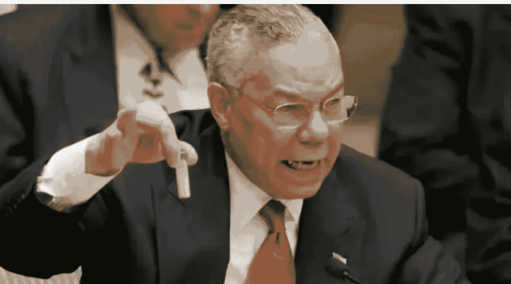

不过疫情暴发这两年来，太多人看了无数的美国倒霉新闻，觉得总得伤筋动骨了吧，为啥好像影响并不大？难道美国真的可以通过不断印钱来挺过一次又一次危机？今天就来聊下这个话题。

### 美国到底是一个什么样的国家
中国对美国有个很大的误解，就是用我们自己的很多观念去揣摩那个大洋彼岸的国家，其实很多东西底层架构也不太一样，所以很难理解。

比如最基本的一个，美国从一开始就是一个个殖民地组成的联盟，有点像我们古代的部落联盟，散布在现在东海岸边上，各个殖民地互相之间关系也不太好，观念也不尽相同。

殖民地的人到达美洲的原因各有不同，有的是欠了一屁股钱还不上，到美洲做奴隶抵债来了（契约奴）。还有一部分是在宗教战争中打不过别人，只好出逃，往往欧洲和英国那边的天主教占了上风，一堆新教的人就会跑到美洲；过几年新教的人又占了上风，要清算前几年天主教做过的恶，一堆天主教的人又被迫出走。此外还有在欧洲各种混不下去的人，爱尔兰大饥荒，遍地白骨，一堆爱尔兰人去了美洲；犹太人被迫害，一堆犹太人也去了美洲。

这些人到了美洲后并不觉得自己是同一个国家的人，互相各自为战，呆在营地裡持枪种地，美国人很长一段时间都是一群武装农民，一直到内战结束后开始大搞工业。

由于互相之间充满敌意，殖民地周围还有敌意更大的印第安人，殖民地彼此发生劫难也很少去帮忙，各个殖民地往往倾向于竭力自保。

恐惧源于火力不足，所以殖民地内部要求小孩还没枪高的时候就练习射击，美国人从一开始就是一个“枪管下的国家”，现在大家理解了为啥美国根本不可能禁枪了吧，每年死那么多人，也动摇不了他们持枪的决心。

美国关于枪支、社区、保甲之类的观念都早于美国成立，甚至早了一百多年，也就是说，还没美国的时候，这些观念已经写死在美国社会基因里了。同理，放高利贷，搞诉讼，这些事也比美国这个国家早得多，法律和金融体系都比美国政府成立的都早，美国政府对改造社会一直也不太上心，所以美国和印度一样，都是几百年的老垃圾都在那里堆着，并且不觉得有啥问题。但是跟印度不一样的是，美国确立了一套复杂的保护私有财产的机制，当初美国刚成立那会儿，一群代表立宪会议吵成那样，一个关键的议题就是“一些王八蛋通过肮脏手段得到的钱是不是该得到保护？”，或者说，“政府欠王八蛋的钱还不还？”，因为当时美国为了打仗发了一堆债，这些债都被少数有钱人以极低的价格拿在了手里，如果政府还钱的话，这些人立刻就会富可敌国。问题是这些人全是发国难财的王八蛋，国家需要钱的时候他们躲到一边，听说政府要还钱，有到处低价收购债券（当时信息不对称，不少人以为国家不还钱了，于是把债券当纸巾卖了）。

最后决议的结果是“王八蛋的私有财产只要不违法，政府依旧承认，政府欠的钱也会继续还”。所以立宪会议的意义很多人都弄错了，真正的意义有两个：

- 一是私有财产会继续得到保护，美国打从一开始就是一个对富人极其友好的国家。这就为后来美国人强大的进取精神埋下了伏笔，只要搞到钱就是你自己的，自发鼓励贪婪，鼓励不择手段，先对内养蛊，然后蛊王再去掠夺别人。
- 二是美国政府欠债必还，这也是后来美国国债系统的基石，美元后来成了世界货币，原因很多，不过这次宪法讨论无疑是基石，美元是以美债为抵押，美债不违约，美元就可以一直混下去。

美国建国后继续维持以前那种一个个高度自治的小团体和社区最后拼成一个国家的模式，而且那时候地广人稀，每个聚集区之间的距离大到离谱，政府也管不过来。

很长一段时间里，美国都是社区内部自己管自己，社区内部推选一个负责人，社区也有自己的武装，后来这些武装慢慢演变成了现在的警察。大家如果注意到，就发现美国各地的警察造型差异很大，这也是他们历史上一直延续下来的。

甚至社区内官方不愿意管，大家就让黑社会管，类似《教父》里那样，德高望重的黑社会大佬给大家主持公道，乍一看觉得很奇怪，仔细想想也觉得挺正常。殖民地碰上危险也是自己解决，比如印第安人来袭，墨西哥人来犯，如果等政府军来救，可能收尸都收不到完整尸了，所以男女老幼能挂枪的都得一起上。

直到现在，美国依旧鼓励老百姓持枪自卫，不要等警察，而且警察就算来了，他也有审时度势的权利，如果觉得自己势单力薄打不过劫匪，可以开车溜走。

所以他们对枪有种变态的执念，枪就是全家的生命所在，枪就是安全本身，自己的事自己解决，等政府还不如等上帝。南北战争之后更是有句话，“林肯给了所有奴隶自由，而柯尔特使这些奴隶获得了平等”，啥是柯尔特，就是下边这个，这枪就是一个叫柯尔特的人发明的：

把这些逻辑串起来，就差不多了解了他们这种民族性（就算他们有民族吧）。

首先美国从建国就是一个极度分化的国家，鼓励冒险和进取，一直都是赢家通吃，巨富真的是富可敌国，普通人只能自己看着办了。

不过美国这个国家运气特别好，一直都是红利不断，早年有土地红利，那么大的北美大陆，任由美国一个国家闹腾，后来又有了两次世界大战，加上这个国家对富人极度友好，全世界的富人都往美国跑，普通老百姓也能沾到光，毕竟富人也需要人给他们看家护院当保姆，大家可以了解下北上深富人家庭保姆的价格，跟名校毕业生差不多，有名校毕业生干脆也去做保姆了。美国历史上有过那么一段时间，罗斯福时期到里根，高税收高福利，但是那些年政府开支太大，欠了一屁股钱，滞胀了，所以里根开始大幅砍掉福利，慢慢发展成我们现在看到的样子了。

其次他们的政府本来就管得少，基层自治早于政府出现，老百姓自己管自己，出了问题那是你自己的问题。

如果强行类比，有些国家的老百姓跟政府的关系像是孩子和家长的关系，孩子出了啥事，家长都得管。但是美国政府和老百姓的关系，有点像毕业后的孩子和家长的关系，父母很少强迫孩子去做啥，孩子倒了霉也不会觉得是父母的问题。

把这些理解了，再看这次疫情，就没啥不明白的了。

### 疫情下的美国
我第一次去美国，就发现这个国家只要你愿意，可以用手机镜头拍出两个国家来。

首先是巨埋汰的市区，穷人和无家可归者呆在那里，乱七八糟，垃圾满天飞，连麦当劳窗户上都装了防弹玻璃和铁丝网，一副末日景象。

但是如果出了城，路过一个个富人区，别墅样式的房子一直延展到天边，绿油油的树，干净的马路，给人感觉这才到了一个发达国家。

从老百姓层面看，太多人傻白甜到弱智的地步，连两位数加法都弄不明白，很多人说有计算器就可以了，不过现实里如果两位数加减法都弄不明白，思考更复杂的问题就会很痛苦，人就倾向于做点头脑简单的事，时间长了脑子越来越简单。

但是作为软件从业者，我们又很清楚类似Oracle（数据库）、Matlab（数学软件）、Synopsys（芯片设计），CAD（绘图），这些复杂又精细的软件基本都被美国控制着，而且我国最顶尖的公司暂时也搞不出来，搞出来也没啥市场空间，这些软件都融入到了我们的生活，现在几乎每个用手机的人天天都得间接使用这些软件。

也就是说，这个国家上限非常高，下限非常低。

仔细理解下，美国这个国家就是那种类似自然界的模式，赢家通吃，极度的奖励强者，这两天看到新闻，说是马斯克的身价已经超过了比尔盖茨和巴菲特的总和，如果他的财富跟国家排序，能排到全世界前50，真正意义上的富可敌国。如果你足够牛逼，足够有创造性，他们可以动员天量的资源供你使用，你能做的事更大，成就也就更多。

用一个经济学家的话说，美国两百多年，其中有一百多年引领世界，靠的不是全部美国人，而是极度依赖一小撮极具创造性和突破性的美国人，这些人创立了美国的国债制度，这些人研发出了原子弹和计算机，开创了一个又一个新领域，其他人跟在这些人后边喝汤。

把这些逻辑理解了，就能明白美国人真正的优势在哪，它的制度对那一小撮头部的人极度友好，他们犯了错给容错机会（他们的破产制度），他们有了成就就给难以想象的奖励。这种情况下全世界顶级人才自然会向他们聚集。

头部这些人一直以来都是美国的关键核心竞争力，这次疫情中，他们几乎没受影响，马斯克的火箭一直发不停，电动车迭代比火箭快得多，苹果的产品发布也基本没落下。美国就算伤亡再大一些，有影响，但是不会太过伤筋动骨。而且这次疫情主要死的是老年人，那就更没感觉了。

而剩下的人，脑子秀逗了似的，却有种自己管自己的觉悟，平时不太相信政府，碰上麻烦也不指望政府。

把这些综合起来，就能发现，他们的老百姓对政府要求很低，又有一个强劲的火车头拖着，糗事不断，但是好像混的又很滋润。

### 美元霸权能撑多久？
国内不少人对美元崩溃这事还是太急，觉得就这样滥发货币，应该就在眼前了，然后发现这都过去这么久了，依旧没崩，所以自己有点崩。

其实想想就知道了，美元那么强，并不是最近才强起来的，是过去两百多年的一个延续，就好像老财主家的孩子只要不创业，很难真的坐吃山空一样，美国这几年的各种败坏，本质也是在消耗以前的信用。如今的美国没法跟二三十年前比了，但是依旧还有很长的大斜坡要走。

大家理解美元为啥这么强，一般都说美国海军的军事霸权，美国海军天下无敌，所以美元霸权比较坚挺。

其实这只看到了一小部分，美元本身是一种货币，一张纸能买东西，因为它融入了信用，美元现在这么强势，跟它的信用有很大的关系。

很多人不理解信用这事，以为拳头大信用就强，其实不是，明朝政府用屠刀逼着老百姓用宝钞，大家照样把那玩意当卫生纸。黄金背后没有一支军队逼着使用，但是谁都喜欢黄金，稍微有点风吹草动就屯黄金。货币不言，下自成蹊。

大家现在想想，连萨达姆、苏联成员国总统家族、包括最近倒台的阿富汗政府首脑，手里都握着大量的美元，也就是你跟美国为敌，但是美国的货币你依旧优先持有，这种情况是怎么发生的？

其实就是你知道你手里有美元，就能花出去，那把问题再往前推一步，为啥大家都相信美元能花出去？

因为现在地球上生活的人有生之年，大家都有个常识：有美元就能花出去。不仅如此，有美元就可以去美国呆着，如果不满意又可以随时离开。大家看过《潜伏》吧，那里边国府大员都在搞美元，要知道，那时候的美元还跟黄金没挂钩，大家也不在乎什么金本位，大家只在乎能不能花出去。

那为啥大家的这种信心又是哪来的呢？

其实追根溯源，就是当时汉密尔顿他们在立宪的时候说美国今后无论如何也要还债，无论是欠别人的钱，还是欠自己老百姓的钱，大家已经习惯了这种欠债必还的决心。这就有点像那种信用很好的黑社会，杀人贩毒搞色情，但是确实信用很好，欠债必还，大家都愿意跟他打交道。啥是国债？

就是美国政府签了一张欠条，说这张欠条有利息，谁愿意买，如果你愿意，你就拿手里的美元去买，相当于你把钱借给了美国政府。美国刚建国那会儿，政府欠了一屁股钱，很多人都不想还，但是汉密尔顿坚持要还，他甚至认为，欠钱是好事，一直欠一直还，周围的人就愿意借给你。他甚至跟大家讲，英国人信用好，欠债必还，到最后跟荷兰法国西班牙俄国开战，那些国家的人都买英国国债，给英国提供炮弹。

事实上现在美债持有外资持有6.77万亿美债，外资是中国日本沙特等国，这些海外持有者加起来26%，美国国内投资者持有19.23万亿的美债，约占美债总规模的73.9%，也就是美债的绝大部分都是美国老百姓拿着，要违约也是先坑自己。

难道他们不知道美元越来越垃圾？当然知道了，只是垃不垃圾是比出来的，如果你持有印度货币，哪天印度政府突然说以前货币不好使了，赶紧去换新的，毕竟他们刚干了这事。

你持有俄罗斯货币，俄罗斯哪天还不上国债（1998年就违约了一次，一群诺贝尔经济学奖获得者搞出来的长期资本就是那次危机中倒闭的），你手里的卢布也跟着大幅贬值一轮。美元贬值后，你依旧可以随时把它换成任何你想要的东西，这在其他货币那里基本上没法这么搞。

所以说吧，指望美元霸权彻底崩了，还得等到一种大家都认同的货币取代它，而且这种货币本身得信用好，不仅信用好，而且这种好的状态得持续很多年，这样才能慢慢在大家心里扎下根。等到愿意接受这种货币的人越来越多，这种新货币慢慢跟美元平分秋色，如果没有决定性的战争什么的，就算打成平手，接下来还需要很多年才能有所超越。

在第一次世界大战中，美国的经济已经比英国强了太多，但是美元依旧跟英镑没法比，直到二战结束，美国已经超过了整个欧洲，但是依旧需要借着黄金这张虎皮才彻底拿下了美元霸权，可见货币霸权替换有多难，不过一旦发生替换，也可以折腾很多年。

我国现在的货币强势程度，感觉跟美国在1900年左右比依旧有点距离，毕竟1894年美国已经是世界经济第一了。所以大家不要着急，还需要慢慢来，一代人有一代人的任务，不出意外，我们这一代人就依旧只能目睹美元地位不断被侵蚀，估计很难看到它彻底倒掉。

只要它不倒掉，确实可以一直洗劫全世界，这就好像村里有人打了口井，大家都在用这口井，后来挖井的那人蜕化成了恶霸，每天坐在井边收管理费，但是其他人想去打井有太费劲，有人已经在重新打了，不过还没出来水，或者出来一点，水质不如恶霸的，大家依旧优先去恶霸那里。

但是如果一直搞洗劫，本身也在败坏自己的信用，只是信用积累的时间太长，彻底败光也需要一些年。

### 对我们有啥启示
在过去几十年里，中国和美国其实一直也不存在竞争关系，所以有一段时间，美国人非常肉麻地把这种关系叫“G2”。美国把国内落后低端产能转移到中国赚取超额利润，他们搞高端产业和技术研发，顺便吸收中国这边的顶级人才。中国没有高端产业，开不出来高工资，优秀人才自然会用脚投票离开中国。

一定程度上讲，有那么一些年确实是这个路线，2010年之前，中国顶级名校的学生怎么说来着？“不在国外，就在出国的路上”。

尽管现在人才依旧在持续外流，但是势头已经好转了过来，其中最主要的原因，还是我国内部市场已经形成，可以给头部人才定高价，不再像之前那样卖茶叶蛋的比造原子弹的收入高。那种情况下，除了少数有家国情怀的人，绝大部分为了生活还是离开了，现在顶级人才的收入差距不断拉近，将来才能继续回国。我国一直有个跟顶级人才讲奉献不讲钱的毛病，HW为啥研发像样点，主要是愿意给钱，不多说了，大家可以自行搜一下，头部科研人员的收入高得吓人，不低于欧美同行。

但是中国现在距离美国那种吸引全世界富人举家迁入的能力还差很多，这种情况一天不出现，中国货币就没法跟美国相比较。疫情成那样了，潘跑跑这类人还在持续往美国跑，这本身就是在给美国输血。美国经济一直有个很重要的增量，就是全世界富人的持续涌入。

接下来不出意外的话，美国一直会不断出丑，因为巅峰应该已经过了，他们现在也跟所有帝国中后半期的情况一样，饱受债务的困扰，但是想看他们彻底崩了，预计还得很多很多年。

现在说中国超过美国依旧有点为时尚早，任正非有句话，说的是现在美国对我们很恶劣，但是我们要继续坚持开放，继续向美国学习。

其实大家也都明白，美国这么大成就不是偶然的，而且相继引领了两次技术革命，战后几乎所有革命性的技术也都是他们搞出来的，它有自己的强悍之处，有一套行之有效的方案和路线，现在为啥打压我们，因为我们在学他们做事，并且他们发现我们学得很对，所有慌了，着急割裂。

华为为啥遭到美国那么严厉制裁，因为华为的内部管理流程是IBM给设计并操盘安装上去的，现在中国学习美国企业最有模有样的，就是华为。

接下来还是要继续学习他们剩下的优点，不骄不躁，疫情前我经常在中美两国之间来回跑，对一些事情很了解，我们需要学习的东西实在是太多了，大家平时看他们底层loser的搞笑秀的时候，也要想想他们的头部公司在忙啥，认清距离，才是进步的关键。

以前差距不明显是因为我们主要是接受西方的技术转移，需要我们研发的并不多，这几年开始触碰到了技术屏障。也就是西方有些东西不愿意转移了，我们才发现这条路有多难。不过越是难越才要做，难的事才有价值，如果印度越南都能做的事那根本没啥意义，只是增加点就业，现在困难时期，正好是深耕时期，低端产品卖不动，才更需要考虑研发更高水平的产品，科研人员才有价值和地位，才能产生正反馈和持续的发展动力。

不管咋样，接下来还是要继续摸着白头鹰过河，直到把它彻底摸秃了。

公众号懒人搜索，懒人专属群分享

### 18万买一次偷渡机会，华人海外移民往事
2021-10-15

前段时间在头条聊过几句海外华人的事，评论区很多小伙伴让我写个长文聊下，这个话题我正好从书上看到不少，再加上我这些年也跑过几十个国家了吧，在哪都接触到一些当地华人，所以今天聊聊这个话题。

海外中国人的来源，主要是三个不同时期。

- 第一个是解放前到海外的，很多中国人离开家乡，去海外谋求更好的发展。有的人因为各种原因就留在当地，这些人被称为“老华侨”。他们在当地时间很久，长久以来是海外中国人的主体，也是外国人认识了解中国人的主要途径。
- 但是最近这半个世纪变化太快，以至于海外老华侨对中国的了解不会比老外更多，新出去的人和他们比和外国人交流还费事，很多事情鸡同鸭讲，新华侨和老华侨也不大打交道，互相说不在一起。
- 第二个时期，是改革开放以后到了海外的，那时候西方发达国家收入是中国的十倍甚至数十倍，所以沿海地区很多的人想方设法去海外。这些人到了海外往往干着最卑贱的活，但是收入比国内高太多。
- 第三个时期是最近二十年，去海外已经不像之前那样偷偷摸摸，一部分是正规移民出去的，还有一部分是出去读书的，咱们平时接触的基本都是第三种，会误以为海外华人主流是第三种，其实这是个小众群体，整体也比较精英一些，但是数量和前两种没法比。

不过我今天主要讲前两种，毕竟那才是主流。

先说出国的手段，走正规途径是有海外亲戚，通过办理手续，获得正规的签证，这是最合规的方式。但是这种方式办理的难度很大，因为这个亲戚必须做各种担保，而且办理有很多要求，能走通这条路的人很少。

有的时候是这个亲戚在外面混的不行，回国兜售自己的指标，国内有的人花钱从这个亲戚那里“买”个身份，在当时花费非常惊人，大多比非法途径还贵。

有一些特殊情况，比如“日本遗孤”。这个要多说几句，二战时期日本军国主义法西斯为了全面占领中国，也为了扩大战争，疯狂压榨国力，造成很多日本底层老百姓生存困难，被日本政府忽悠到我国东北来做“开拓团”，抗战期间来了超过150万人。

等到战败，日本政府自顾不暇，更不要说自家的老百姓，一股脑扔在东北自生自灭。当时有很多日本人的孩子和妇女就被家人给抛弃了。

对于这些人，中国老百姓收养了上万的日本人的孩子。在50年代日本政府统计有两万多，按我们正常人想法既然是自己人，那把人接回去就是了。但是因为战后日本在美国的豢养下，军国主义势力一直没有清算，像安倍晋三那个甲级战犯外公，原本就是东北满铁的总经理，战后还能当了两任日本首相。这些人当年就是始作俑者，认为遗孤是自己当年恶行的活证据，接回来就等于承认了，而日本人一向认为只要不承认就当没有发生过，对于接收遗孤一直各种推脱。

直到20世纪80年代，战争已经过去了几十年，当初的孩子也成了中老年，日本才同意接收这些人和他们的后代去日本生活。但是好几十年过去了，很多人在中国生活习惯了。所以最后只有两千人回去，现在北海道那边有很多操着东北口音的日本人，有的就是这些人。

曾经有部成龙主演的电影《新宿事件》，背景说的就是借着当时这个政策。有的年轻人为了去日本，就假充是日本遗孤的子女。电影中一个被收养的日本孩子，现在已经是个老人了，为了报答中国人当年的恩情，她把全村十几个年轻人都认成自己孩子，让这些人有个合法去日本的身份。片子拍得非常棒，里面每个故事和人物都有真实的原型。

还有一种是以留学的名义去海外，到了以后有的人一边学习一边打工。这还是有个合法身份存在，但是很多所谓的学校大多是“挂羊头卖狗肉”，很多都是当地华人办的空头学校，这些学校招生也不是真招去学习，而是招过去干别的，比如去工厂，或者干脆就是个偷渡渠道。

说起这种以留学名义做买卖，最有名的，就是20年前的“上海首富”周正毅。这人现在大家大多不知道，当年也算是个风云人物。这人本是个上海本地穷小子，上世纪80年代，20出头的周老板做起了个体户，但是经营不佳，后来以留学的名义去了日本，干起了代购。

不过周老板的代购不是从日本带东西来中国，而是从中国人肉运“章光101生发精”去日本卖。说起这个，日本中年男性秃头比例之高世所罕见，而日本男性对于生发是一种信仰，不惜一切代价。

那时候正是日本经济最热时期，这种“章光101”生发水在上世纪也是个奇迹，有个村里叫赵章光的赤脚医生据说研究了一百多次研发成了一种生发水，应该是有点用，而且配方保密，不仅在国内大卖，在美国法国日本引起了巨大的反响，但是当时没在日本开经销店，只要带到日本就可以有十倍的利润。

周老板曾经在采访中说，当时自己每周两次飞机往返，在行李中装满生发精，他拖着一箱加背一包，从地铁站要走很远去交货，当年每次最少都能挣到在国内上一年班的钱。就靠这第一桶金，周老板走上致富大道。

周老板赶上了改革开放的春风，赶上了中国当时几乎所有的风口，什么国企改革、酒店业、股市大潮、房地产等等，一度赚的盆满钵满，不过跟所有那个时代的风云人物一样，钱也是不干不净，经不起查，2013年锒铛入狱，今年四月才出来。

不过以留学名义打工，本身有限制，而且签证的时间有限。有的人就直接放弃了合法身份，成为非法居留，业内就叫“黑”了下来。

在上世纪80-90年代，办理签证还很难，有时候想离开国境都需要非法手段，有的是坐船出海有的是徒步非法越境。现在随着中国国力提高，很多小国的签证非常简单，有的干脆就是免签。至于你到了以后怎么走，方式多种多样，路线也不同。但以前不一样，大部分国家都在防中国人，看见华人脸就觉得这伙人是要“黑”下来。

所以那时候比较“标准”的流程，如果是去欧洲，大多会先去个东欧小国，然后在当地住几天等一批人齐，因为很多时候人都是不同地方几个几个聚集，以免被注意到。这时有的是转机有的是转车，一站一站地往前走，有的时候还可能步行从小路过境。

整个过程要听指挥不许乱动，遇到检查要冷静，如果被怀疑了也不要慌，检查的人很多对中国人面孔比较不在意，他们主要在意的是其他一些人。很多时候被逮住也不一定遣返，很多会关起来，如果有人花钱来保释就放了，你问放了咋办？再试一次呗。有时没人保，关一段时间也可能就放了。

如果去美国，有的是搭轮船一路到的，看以前的香港电影“跑路”就是带一包行李上货轮。也有一些蛇头买船直接跨越大洋，到了岸边再把人分批悄悄送上岸。比如改变了美国对偷渡打击力度的事件——1993年发生的“金色冒险号”事件。

1987年里根总统的移民大赦，让全美300万非法移民无条件地获得合法身份，当时偷渡是个利润巨大的生意，这就让全世界的蛇头倍感激动，到处宣传，说是只要到了美国，先黑着，等大赦，价格嘛，只要18万。要知道，在90年代初期，当时公务员工资一个月几十块，这18万大概接近现在1000万，但是不少人相信只要到了美国，很快就可以赚到这些钱，于是东拼西凑搞钱移民。

1992年有个蛇头买了个破货轮，1993年在船上装了近三百个中国偷渡客（大部分是福建人）跨过大西洋到纽约准备上岸。结果接头的人是美国当地黑社会“福清帮”的马仔，因为帮派火并挂了，没人接头，船在海上漂了半个月。最后船员们冒险搁浅，停到岸边后大家跳水游向岸边，准备冒死抢滩，等到移民局官员赶到，发现已经淹死了10个人。这次案件在美国社会造成很大轰动。几个主犯都遭到长期通缉，最后都被抓起来判了刑。

这些偷渡客也都孜孜不倦，想方设法留下来，有的搞了个“艺术家签证”，还有不少申请了“政治庇护”，说啥的都有，反正意思是只要回国就绝无生路，让美国移民局官员备受良心煎熬。

这种情况下，他们都赖着不走，不少人到现在还没拿到美国签证，依旧在美国黑着。成功留下来的那些人在美国做起了“华人三件套”，饭店、杂货店和出租车，不过他们的孩子往往都还不错，毕竟以华人的智力，认真学习，在美国那种国家混个中等偏上还是挺容易。

之后，美国政府对海路偷渡的打击更加严密，偷渡组织从而转向陆路，即从美墨边境进入美国。这么多年来，多亏了墨西哥那边“大好局面”，辗转到了墨西哥边境，依靠当地人挖的无数地道，入境美国的难度低了很多。大量偷渡者和毒品一起走地道轻松来到了美国，为美国人民服务，当然要收点费用。

有去美国的，还有去西欧的，英国西班牙意大利法国等等。90年代想过去，有成熟路线，比较成熟的有“北线”，先乘火车从上海到哈尔滨，换乘国际列车穿过西伯利亚，经莫斯科进入乌克兰，在基辅潜伏了两个星期后，进入匈牙利。随后，蛇头带着趟过第聂伯河，翻过喀尔巴阡山，横穿斯洛文尼亚，然后就能进入意大利。

一般只要有一个人能成功到了一个地方落地生根，他们家所有青壮很快就会都跟过去，比如比较著名的浙江青田，国军败退大陆的时候，一部分青田国军军官去了欧洲，改开后这些人把老家的人慢慢都带出去了，现在青田作为55万人的一个县城，出去了33万，大部分去了西欧，很多人一句西班牙语都不会说，也被叔叔舅舅接过去了，如今青田基本上只剩下老弱了。

即使是全程坐飞机，有的人能把偷渡搞成“环游世界”，很多时候蛇头会专门选被抓不会直接遣返的国家走，曾经有个偷渡客在荷兰被抓，他说自己三个月坐了8班飞机，从北京飞到保加利亚，然后飞到了迪拜，又飞到了非洲一个啥地方，又飞到了泰国，接着去了中亚哪个斯坦国，又到了莫斯科，然后到了法兰克福，最后在荷兰完成了旅程，结果下飞机就被抓了。

这些都是偷渡顺利的，如果不顺利，其中某个环节出了问题，不能顺利到地方还是小事，有时候就哪里都再也去不了了。

比如2019年伦敦，英国卡车集装箱内发现39具尸体，经查这些都是越南人，当时很多人都说这些人是中国人。除了西方人对于亚洲人无法分辨以外，主要是这种事之前屡见不鲜。比如在2000年，在英国多佛尔港出过类似的一起案件。那次也是在货运卡车里，整整60个人被装在里面，只有两个人活了下来，很难想象这俩人在一堆尸体中怎么挺了过来，今后又该如何生活。

这件事轰动全英国，事后确认都是中国福建来的，这引起了全世界对于中国偷渡客的严打。之所以把人装在卡车里，是因为作为偷渡目的地的各国检查的越来越严，偷渡客很容易露馅，装在车厢里最安全，毕竟车太多了，一辆一辆打开检查不现实。而且很多时候为了避免司机紧张，蛇头根本不告诉司机装了人，司机还以为接了个什么拉货的活，拉着一车人驶往目的地，路上碰上警察盘问依旧谈笑风生，警察不怀疑也就随手放行了。

### 20 metropolitan areas with the largest number of unauthorized immigrants

多说一句，蛇头这个职业看着很不像样，但是在福建浙江很多地方，蛇头是一个很受尊重的职业，一般如果把人送不出去，蛇头还会把钱退回去，不然今后没法继续做买卖了。

只要到了国外，中国人只要站稳脚跟，如果觉得这个地方还不错，在国内的亲戚朋友就会以一种链条式的方式跟来。

因为不管是什么方式，出国的花费都是很大一笔，最便宜的偷渡也要2-3万美金，如果是办合法的手续要贵好几倍。很多时候是无法一次付清的，特别是在上世纪80-90年代，这笔钱要各种借，甚至全村一起凑钱才能送一两个人出去。这个人肩负着很多人的希望，他到达当地首先要找工作，努力工作挣钱把钱还上，然后挣得才是自己的。

赚钱这种事往往也不是那么容易，毕竟你没身份，随时要躲避警察和移民局骚扰，到了一个地方语言又不通（福建那边出国都是先过去再学语言），几乎没啥选择只能去华人开的饭店后厨，当然了，工资会低得多，不然人家也不会冒险找个黑户。

这些人刚过去那一两年往往过着“老鼠一样的生活”，在一个极小的空间里工作生活，几乎不见天日，每天就是不断的工作攒钱。

不过考虑到当时的汇率，差距实在是太大，90年代在国内一个月赚百八十块，到了欧洲和美国基本可以赚国内十几二十多倍的收入，经常那边一个月顶这边两年，这种情况下，南方流传着一句话，“当你是一个穷光蛋的时候，你不会担忧未来，因为未来只能越来越好”，还流传着一句话，“田字不出头，工字不出头”，所以想出头就得博一把。

现在的墨西哥移民美国，主要也是这种路线，先偷摸进入美国，然后躲在后厨等大赦或者攒钱搞身份。据估计，现在美国黑着1100万这种黑户等大赦，拜登考虑过一个特赦八百万人的政策，不过没操作下去，下图是非法移民的地图：

整体而言，洛杉矶和旧金山华人超多，毕竟挨着太平洋嘛，纽约那边欧洲移民比较多，南方休斯顿主要是墨西哥移民，迈阿密那边古巴人比较多。

在上世纪90年代那会儿，华人移民在美国只要不被逮到，不要太久就可以还掉欠款。过一段时间以后就可以申请合法居留，也就是通过申请获得合法身份，当年各种方式五花八门，大部分理由都很反动，我就不多说了。

只要一个人得到了合法身份，然后当地移民局就会开始陆续收到各种申请，这个人会把他一堆亲戚都申请过来，等这些人得到身份之后，就会又重复上面的操作。

所以在沿海地区，有的地区会和海外某个地区好像结成“友好城市”一样，大量的人都往那里去。这些人来到以后，就聚集在一起，形成一个一个的新的华人社区，这里不同于以前的唐人街，是一种新的形式。

按照一个从泉州到了法拉盛（这是纽约主要的华人聚集地，凤姐以前就在法拉盛美甲店上班）小伙伴的说法，在这里一切都和国内一样，不过东西比国内差多了，还死贵，他经常有种错觉，觉得自己没有离开以前住的那个镇子，这里的一切都是假的。最夸张一次，他曾经一大早被第八套广播体操的音乐吵醒，迷迷糊糊的感觉自己还在上高中，吓得一骨碌爬起来穿衣服，还在喊“妈你怎么不叫我”，足足十秒钟才想起自己在纽约，而且自己已经26岁了，那个音乐是外面一辆煎饼车的，而他妈在地球那一边。

中国人这个特点在意大利华人聚集地普拉托最典型，那里是温州人的地盘。20世纪80年代，温州人来到这里，依靠缝纫机和双手，每天做当地人两倍以上的工作，每一毛钱都挣，一毛钱都不花。然后把家里所有叫得上名字的亲戚都招来。来的这些人一样勤劳一样节省，最后开始买意大利人的铺面和牌子，扩大自己的生意，然后招来更多的亲戚。每天就是干活再干活。

甚至普拉托中国人的死亡率也低得不可思议，除了突发疾病或者车祸几乎没有中国人死过。而且中国人里面没有老人，即使你看到个老人，过几天就消失了，这让意大利人曾经大惑不解。后来中国人告诉他们这叫“叶落归根”，如果年纪大了就会带着积蓄回中国去。

这种情况在海外非常常见，西班牙的华人区，乌塞拉区的华人也一样，那里主要是温州和青田人，他们晚年一定要回去，最起码骨灰得回去。

近些年很多国家开始对中国人这种玩法严厉打击，毕竟来了的目的不是融入而是回去，这让当地政府非常崩溃。比如澳大利亚就出台过政策，表示对于福建人申请来澳要严格限制。其中有几个地市的人基本都不许办理，连旅行签证都不给办。这种政策以前还有点用，不过现在国内基本上户口开放，换个地方落户办个身份证是分分钟的事情。

在这之外，还有大量中国生意人，在全世界买卖，脚步布满了全世界。

比如木材生意的中国人，从越南到巴西，从爪哇岛到尼日利亚，这些人在巨大的热带雨林里寻找合适的树木，特别是中国人青睐的硬木。光是寻找就非常艰辛，在雨林里因为传染病或者毒蛇死掉的人都有很多，甚至有的人掉进巨大的树坑，等救上来因为没有医疗条件已经不行了。

比如在非洲淘金挖矿的中国人，还有在一些第三世界做货物贩卖的，在当地辛勤劳作，各种辛苦，但是很多时候当地政策一变，来人拿封条一贴，说你犯法了，现在东西都归他，前期投入就都打了水漂。有的贴了封条还要抓人，关进去叫赶快交罚款，什么时候交了什么时候放人，还告诉你他们监狱条件不好，身板不行的在里面坚持不长。甚至还有直接来人就明抢，如果成果不满意就把人绑走两个，叫赶快送钱过来不然你懂得。

文章写到这里，不准备继续往下写了，写文章的过程中非常感慨，现在的人已经很难想象以前有多穷，所以才会有那么多人挤在一个集装箱里，十几天吃喝拉撒都在里边，甚至时时刻刻冒着生命危险，到了海外又起早摸黑地工作，要把老家的人一个个都带过去。

如今这种事已经很少了，一方面如果你有那个闯劲，去一线城市往往也能混得很不错，另一方面中国的收入正在跟欧美发达国家一步步缩小，如果正常去上班可能不少人还愿意，如果继续像以前一样过老鼠那种生活，大部分中国人也不太愿意了，反倒是越南人还愿意，所以这两年时不时有新闻越南偷渡客死于偷渡过程。

还是希望国家能发展的越来越好吧，大家再也不用去受以前那些苦，那些悲剧就不用再重演了，贫穷真是最大的原罪。

公众号懒人搜索，懒人专属群分享

### 《鱿鱼游戏》里的那座玻璃桥，道破了韩国阶级社会的全部秘密

2021-10-12

这两天韩剧《鱿鱼游戏》火了，感觉这个片非常讨巧，吸收了之前那个《弥留之国的爱丽丝》的经验教训，又继续发扬光大了一波。《爱丽丝》和《鱿鱼》的剧情差不多，不过游戏有点复杂，很多观众观影过程中一头雾水，随着剧情展开才弄懂到底在玩啥游戏，非常影响体验。

这次鱿鱼干脆一撸到底，一群成年人干脆玩起了小朋友的游戏，这下没人敢说看不懂了吧，果然观影体验上升了一个等级。相同类型的影片，鱿鱼甚至爆出抄袭《爱丽丝》，但是鱿鱼依旧要比爱丽丝成功的多，很多人都没听过后者。

不过作为一部成功的商业片，不搞点过度解读是不可能的，尽管导演可能也没想那么多，看过的人自发地把“解读”安排上了。那几个游戏已经有了一大堆的各种解读，唯独倒数第二个游戏，很多人感觉很不合理。

游戏是下图这样的，18块玻璃铺成直达终点的天桥，每一步都是两块玻璃，一块正常的，一块强化的，踩到正常玻璃就掉下去。所以每次出手有50%的概率选错，一步上去，踩中了就可以走向下一步，踩错了那就万劫不复。

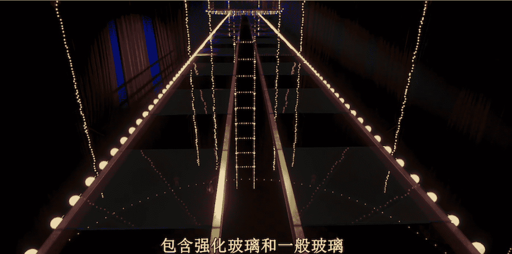

很多人觉得这个关卡设置非常不科学，很显然，排队越靠前的人越倒霉，这就完全是在拼排队了。但是我仔细想了想，觉得整个电视剧，这一关最精髓，既然这个电视剧本身讲的是韩国阶层现状，那这座桥的寓意就太明显了。

有不少人说，我不踩玻璃，踩着中间的钢铁框架过去不就行了嘛，优雅而从容。这就是明显没仔细听规则，规则就是必须选一块玻璃踩着过去，这个游戏很在乎规则，如果你不按照规则来，一枪就把你干掉了，第一关就是一堆人听不懂规则，直接被屠了一大半，所以说不好好听规则的人连第一关都过不了。

说关卡前，我先说一个大家经常说的话，叫“懂了那么多道理，为啥依旧过不好这一生”。其实能不能过好，跟道理没关系，道理本身并不是生产力，底层逆袭基本只有两条路，一条是吃别人吃不了的苦，另一条是冒别人冒不了的险，最终都得落实到“往前走”这个问题上，问题是现实中我们不可能掌握了全部的信息再出发，每次迈步，本质都是一种对赌。

类似你能不能豁出去拼命学习争取考个好学校；你敢不敢只身去大城市甚至出国闯荡；你有没有勇气去挑战别人都不敢挑战的项目；敢不敢搭上身家去创业。 如果都不敢，而且还很虚，连勤奋都做不到，那人生掉坑里了。

每次迈步都需要的是勇气，而且人的一生往往就那么几次选择的机会，错过就再也没有了。这就很像今天讲的这个游戏了，懂了道理没啥用，最后的关键是每次往出迈一步。

那个玻璃桥，可以看做是一条通往上层的阶梯，隐隐约约，若隐若现，看着一步之遥，但是真去走却容易万劫不复。也就是说你坚决不去做选择，站在原地，那注定“过不好”，但是往前走，也不一定有好结果。当然了，我这里说的是韩国这种资本主义国家，大家不要乱想，尤其不要恶意联想。

如果一个人从一开始每一步都选对，那他能全部蒙对的概率是1/262144，低的跟彩票中大奖的概率差不多，恰好中奖倒也是个跨越阶级的办法。

那有什么办法通过这条路走到对面吗？ 从现在来看，这么几种办法，基本上对应着真实社会里几条路。 第一条就是硬走，凭借运气往下走，争取每一次都踩中。

这个概率太低太低了，不过也不是不可能，毕竟游戏参与的人只要足够多，总有那么几个能全部踩中，有句话说，“如果有足够多猴子一起敲键盘，总能敲出一步《哈姆莱特》”。这类人比较少，但是总有那么几只漏网之鱼，塔勒布还给这种人起了个外号，叫“幸运的傻子”，尽管不多，但是总会有。

事实上电影里的男主角，这人非常有争议。片方竭力想把他塑造得正面一些，不过事实上这人除了廉价的善良，再没有任何优点，他唯一想到过的妙招就是“舔”，除此之外没啥牛逼操作，脑子不好性格懦弱也没法去做艰难的决定，但是全程开挂，主角光环助力通关，如果强行说剧情合理，那么这货就是这类“幸运的傻子”。

当然了，还有一类人，就跟电视剧里的情节似的，可能正好是研究玻璃的，他能看出来不同玻璃材质的差别，这类人对应的是我们世界少数技术天才，不过这类人往往自己通关之前，会助力别的野心家通关过去。

既然有懂的，就有装懂的，很快就有骗子声称自己看穿了这座玻璃桥的秘密，然后到处宣扬，让别人花钱报班，自己做大师，装神弄鬼糊弄人，让徒子徒孙搭成人桥，自己过去了。

现实世界中更多的是第二类，就是按照前人走过的路往下走，比如爷爷给踩了一块玻璃，爹又给踩了一块，到你这里，你起步就比别人靠前一大截，别人还在第一块玻璃上碰运气的时候，你的人生从第三块开始。

对应的是我们社会里一种很常见的情况，出生中产家庭的孩子起步自然比一穷二白家的孩子具有先发优势，上层的优势更大。我之前文章里讲过，古代远程贸易为啥都是以“商帮”形式存在，比如大家熟知的晋商、徽商、浙商，事实上这些商帮也不是山西或者徽州人人有份，也是家族垄断，比如我们熟知的八大皇商，整个晋商团体以前也就那么八家。因为做生意相关的知识和人脉不对其他人开放，你作为一个无名小辈，想学习都找不到学习的地方。

而且很多时候更关键的问题是“没人捞你”，你可能有管理一个企业的潜力，但是如果你爹不是企业主，你要爬到那个能施展你能力的位置本身就非常非常难。这也是为啥按理说每个人都有点什么天赋，但是大部分人过得并不好，因为能力和位置太难匹配。以前看爱因斯坦的经历，就很感慨，那哥们1896年进入瑞士联邦理工大学读大学，1905年提出了关键的“量子论”，如果他出生在这个世界上其他绝大部分国家，他的才能可能就淹没在乱七八糟的事情上了，毕竟那个时代有大学的国家并不多，大学开设物理相关专业的更是少之又少。

现代社会当然知识的壁垒被打破了，但是你可以坐在家里学到世界名校的各种课程，但是就算接受了跟名校生接受了完全一样的课程，你的人生能跟他们的毕业生一样吗？当然不行了，甚至就算能力差不多，你也很难得到他们的资源，因为“教育”和“教育体系”是两回事，前者让你学习到之前不知道的东西，后者还培养“社会关系”，认证过后，就算一坨翔也是镀金翔，也就获得了社会的普遍支持，更有甚者，能让你获得一种“联盟效应”。

比如他们韩国，整个上层基本都是学长学弟，一般都是首尔大学毕业，然后去日本和美国名校进一步深造，原因我之前也讲过，韩国整个国家的经济就是日本和美国投资出来的，日本是韩国的前夫，现在韩国又在给美国做小，还跟前夫藕断丝连，大概就是这么个关系。

所以去日本和美国读书有利于和上游投资人搭上关系，到时候互相照应。比如三星的那个李在镕，他就是典型的韩国上层路线，本科首尔大学，硕士日本庆应大学，博士哈佛大学，这就和韩国、日本、美国很多高层成了学长学弟关系。

这种互相“捞”的潜规则，混过职场的人都懂这个道理，有人捞你，相当于你前边几块玻璃就不用踩了，人家已经直接告诉你该走哪一步。

很多时候你混的好不好，跟你能力当然强相关，但是更关键的是你的领导靠不靠谱，他是不是看好你，一般从领导的位置上往下看，手底下的人基本上分成三类：
- 1. 骨干，就是那种能力特别强，干啥都特别快而且很少出错，领导需要这种人给他干活，毕竟业务不能出问题是底线。
- 2. 亲信，整天跟领导凑在一起抽烟吃饭唠嗑的，走哪都带着。
- 3. 其他人，各方面的能力都不见长，可替换性强，这种人会不会被替换，唯一的考量就是“性价比”，这两年热议的35岁辞退问题，本质也是大部分人处在这个位置上，在一个劳动力过分充裕的国家，这本身就很危险。

也就是说，如果你混不成第一类和第二类，本身就把自己置于一个很危险的状态上，我理解这也是为啥这些年“进体制”这事越来越火。

此外如果领导自己是个沙雕，完全升不上去，或者跟你不对付，那你的职业生涯大概率是黄了，踩到第一块玻璃就掉坑里了。

当然了，一个人没有背景连续三次踩中钢化玻璃有没有可能？当然有可能了，概率是1/2的三次方嘛，12.5%，很多公务员考试都比这个概率低，艺高人胆大也不是不可能。

也就是说，如果没有前辈的提携，单凭自己的努力和运气，也不是完全走不远，但是会非常难。说到这里，大家应该想到了一个问题。

既然这个游戏严重依赖“前边的人”，会不会有人作弊？

当然会了，咱们依旧说韩国，在他们韩国，高官可以让自己的子女从基层干起，然后一路都有马屁精给提携，很快就上去了。

日本也一样，日本政坛充满了各种二代三代以及他们的特色，“赘婿”。也就是很多政治家族由于没生出孩子，绝嗣了，没人接班怎么办？于是就找个赘婿，给他换姓，这样就连上了，很多日本几百年的豪门，其实“Y染色体”早就换了，血缘上根本不是一支，只继承了一个姓氏，不过已经足够了，继承了姓氏之后，就可以利用那一家子的资源，就像开挂了似的一路火箭上升。

比如那个大久保利通，他本来是个穷困潦倒的下级武士，明治维新期间果断抓住了命运的脖子，并且在历次冒险中都冒险成功，后来身居高位，从他以降，他们家的人一直盘踞在日本政府高层，整整六代人，一直到大家比较熟悉的歪嘴麻生太郎，也是他们家的人。

甚至美国也一样，大家看过《亿万》没，里边的男主要去竞选州长，他爹给他找大佬帮忙，本身也是一种“作弊模式”，如果你没有这方面资源，跟他竞争必然会处于一种劣势。也就是说你随机去踩玻璃，有一定概率选对，但是要低得多。

这种就相当于父辈已经知道了整个玻璃桥每一块玻璃的虚实，他们的孩子也是表演性质去走一遍给别人看。

一般来讲，社会越发展，这种孩子越多，这种人越多，终点线附近的人多的都站不下，其他后来过去的人都被挤下去了，这样爬升越来越难，一开始有人凭借运气踩完十八块玻璃也能到达终点，后来发现到了终点根本没地方站，而且也不一定能过去，结果就是东亚最先发展起来的日本成了亚洲“躺平文化”的发源地。

韩国那边继承了日本的躺平文化后，又多了一个“投机文化”，疯狂炒股买币，《鱿鱼游戏》里的男主角也是个赌棍，并且欠下了巨额赌债。前段时间韩国央行率先提了利率，美国分析师认为韩国人这么搞原因很多，其中一个是韩国央行发现韩国老百姓疯狂贷款买比特币和美股。问题是这两样普遍被认为泡沫太高了，弄不好韩国老百姓给美国资本家接盘了，所以提高利率打击下投机。

韩国现在处在一个很尴尬的境地，向上突破不了，下游正在搬往越南，毕竟人口规模在那里摆着，发展到现在水平已经出乎意料了，现在的韩国也是内卷到了极致。所以这几年频繁诞生各种反映阶级的电影，当然了，也不是只有韩国有这类问题，只是韩国在发达国家里应该是矛盾最尖锐的，而且相对创作比较自由，啥话题都能拍，网飞在韩国拍别的国家不能聊的话题，然后引发其他国家老百姓的共鸣，可不是容易大火？之前那个《寄生虫》，也是这种套路。

文章写到这里，准备结束了，文末说几句别的感受，东亚国家老百姓过得普遍苦，还有个原因就是东亚的发展水平和人口数量决定了大家不可能过上欧美的那种生活，但是又太过在意阶级跃迁什么的，跃迁成功当然好，可是失败的代价又有点承受不来。

比如《鱿鱼游戏》中的男主，如果不想着赌博暴富，不去赌博不去创业，毕竟也不是那块材料，认认真真去做网约车，也不至于沦落到去搏命的地步。还有他的那个小伙伴，名校毕业，前途一片光明，明显也是放手博了一把，然后彻底坠落到了跟男主一个层次的地步。

所以说还是要有一种“保本思维”，不要欠债，有条件可以搏一搏，尤其是那种代价小收益高（这类一般往往比较苦，不然大家都来搞了），别为了一个低概率事件弄得自己活不下去，那才是真正的悲剧。

公众号懒人搜索，懒人专属群分享

### 电力那么紧缺，为什么不大力发展核电？

2021-10-08

写这个话题，主要是我自己很疑惑，假期查了很多的论文和研报，又找核电相关的小伙伴了解了下情况，写成这篇跟大家分享下。

这些天因为电力紧张，造成多处拉闸限电。很大的一个原因是煤价上涨，其中作为期货的煤相关产品，价格今年已经翻了一倍，而且涨的还没有停止的意思。

而相应的电价受发改委规定，使得上涨是有限制的，这就使得燃煤电厂陷入了一个尴尬境地，发电就赔钱，越发越赔。使得有很多电厂借机检修设备，降低损失，反正不会扩大产能，这就加剧了电力的供应不足。

此外中国的煤炭本身也不是特别足，有个数据叫煤炭储产比，也就是按照现在这样挖还能挖几年。

美国作为全球煤炭储量最高的国家，其煤炭已探明储量为全球首位，煤炭储产比上，2019年美国煤炭储产比达390年，俄罗斯达369年，而我国仅为37年。我国煤炭已探明储量在全球排行前列，但是储产比远远低于其他国家，这样下去，很快又得大规模进口煤炭了。

也就是中国的煤还能用不到40年，当然这话不是这么绝对，因为每年中国煤炭新的探明储量都不少，但是发现的煤矿越来越偏远，运输成本越来越大，电和蔬菜差不多，在当地便宜，输送越远越贵。举个最简单的例子，在新疆和内蒙的部分偏远发电厂，电价低到不到两角，这也是为啥在国家大力整治区块链挖矿之前，每年四川的枯水期，矿产会整个拆了运到那里，用当地的便宜电挖矿。中国煤炭不足是事实。其中最主要的问题就是电煤消耗太大。

所以这是我们现在大力发展清洁能源的原因之一。

清洁能源常见的有好几种。相比起来，水电优势最大，不但发电的价格便宜，同时电站建立的水库还有调节水量和灌溉的效果，大型电站甚至可以改变地貌。比如白鹤滩水电站，按照当地人的说法“把金沙江活活变成了一个湖泊连着一个湖泊”，金沙江是什么地方？一向以地势险峻水流湍急著称，现在也温和多了。

但是水电站对选址有要求，对水量也有要求，北方的很多河流而且中国水电大多集中在西南地区，崇山峻岭中电如何运输也是个挑战。所以“西电东送”是和“北煤南运”“南水北调”差不多的超级工程。

至于风电和光伏，同样也对风量和阳光有要求，这些资源丰富的地区也大多都在比较偏远的地方。而且本身有一定的风险，比如德州停电那事大家记得吧，冰雪暴把风扇给冻住了，电力不足，整个州都停了。这也是为啥搞风电和光电，必须得规划好如果发生一大片区域同时停电怎么解决。

现在能想到的好的解决方案，就是发展储能，把风电和太阳能发出来的电存起来，万一发生断电也可以及时顶上，所以储电行业接下来是一个超级行业，将迎来大爆发。炒股玩基金的小伙伴都知道，前段时间宁德时代搞出来了那个钠电池后股价大涨，不仅仅是因为这玩意比锂电池更便宜（但是比锂电池重得多），更重要的是，将来新能源相关的储能可能会用得着这个技术，到时候储存两三天的电量，万一好几天阴天或者没有风不至于一度电都发不出来。

在清洁能源中，按理说最得天独厚的就是核能了。

但是核电站也很麻烦，选址就是个超级复杂的事：

- 首先要有大量水源，因为核电站的运行和冷却需要大量的水，这也是为啥我国的核电站一般都在沿海，法国和德国他们一般都建在湖边，或者为了建核电站干脆搞个大坝。下图是我国十四五规划的大型能源基地布局图，核电都在沿海。

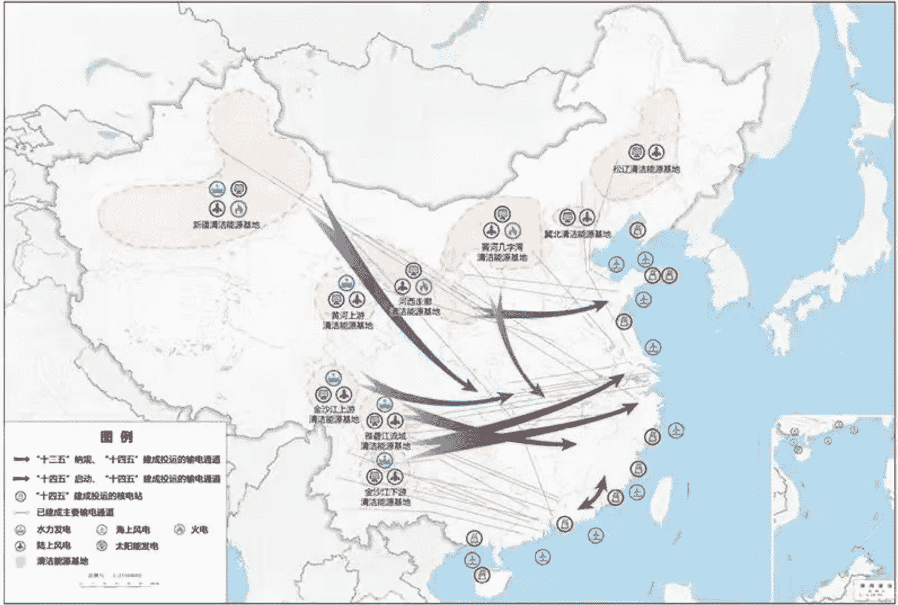

图1 “十四五”大型清洁能源基地布局示意图

- 其次不能在地震带上，这个大家都懂，不多说了。

- 接下来是最敏感的，民意问题，一般说“核电站很安全”，往往是因为深刻了解了核电站到底是怎么运转的，才会有这种感觉。如果非常确信核电站非常安全，往往得有相关学历才那么言之凿凿，问题是老百姓又没有核物理相关学位，他们怎么会懂？所以核电站选址向来非常麻烦，弄不好就会被抵制。

- 最后也是最麻烦的一个环节，也就是核废料的问题，就跟煤烧完之后会有煤渣一样，核电厂发完电也会产生大量的核废料，那些带着放射性的核废料怎么处理也是个大麻烦。

一般都是先回收一下可利用的成分，再装进特制容器，掩埋到地下五百到一千米，这些核废料的放射性会持续上万年，所以核废料的掩埋场本身也极其昂贵，毕竟万一出了事，污染了地下水可麻烦了，这方面法国作为核电方面的扛把子，研究非常深。

了解了这些，就知道发展核电这事本身需要考虑的事非常非常多，而且涉及社会舆论和群众心态等问题，就更复杂了。

至于核电的效果，就以我国最先进的自主发电机组，华龙一号为例。一台华龙一号机组，装机量是120万千瓦，每年生产100亿度电，这相当于每年节约350万吨煤。每年减少了近千万吨二氧化碳排放，相当于近亿棵树一年吸收二氧化碳的量。如果是火电，为了运这些煤，又要消耗大量资源，开采又要消耗，开采破坏环境修复又需要。

但是，核电在很多人眼里却有个不足：安全性。可以说自从美国最早开始使用核电，几十年来核电的发展，被三次大事故拖了后腿。

如果深入地了解三次事故，其中技术问题不多，都是人的问题。

这事对全世界的核电事业打击很大，在此之前，按照宣传的说法，对核技术的完全控制是可以实现的，美国政府更是宣布核技术是一本万利绝对安全的买卖。普通人觉得既然核潜艇和核动力航母带着反应堆在海上四处颠簸都没事，一个多重保护的核电站能有什么问题？所以那些年美国的核电站开挂一样，十几年时间建了几十个电站一百多台反应堆。到现在还是全世界核电站最多的国家，全美国20%电力来自核电。

但是问题就这么发生了，三里岛使得美国核电建设停滞了几十年，很长时间美国核电公司要靠出口技术为生。直到多年以后才开始重新建设新的核电站。

如果小伙伴你看过美国著名动画连续剧《辛普森一家》（这个被美国人评为最伟大动漫剧集），里面的主人公——也是动漫界最著名的傻子霍默，工作就是个核电站的安全员，如果你看过他怎么上班，就知道编剧在讽刺三里岛核电站。

第二次就是1986年的切尔诺贝利核电站事故了，这次事故的主因一个是安全性的设计有瑕疵，还有就是操作人员严重的不规范。

尽管切尔诺贝利这事对苏联国力的影响并不大，不过舆论上的影响却大的离谱，以至于不少人想论证苏联倒闭的必然性，到现在也会把这事拿出来。

第三次就是福岛了，2011年日本福岛附近海域发生了9级地震，地震发生后福岛的机组自动停机，开始给反应堆降温。但是地震造成的海啸使得电力中断，没有足够水降温的核心温度不断升高，最后发生了爆炸。但是最奇葩的是核电站所有者的日本东电公司，几次“神操作”造成了事故不断扩大，最终无法收拾。

一直到今年，足足弄了十年，按照国际原子能组织专家的说法，东电和日本政府，活活把一起还没有三里岛严重的4级事故，给拖成了和切尔诺贝利一样的7级事故，而且福岛的这个七级并不是因为危害到了七级，而是事故等级只有七级，他们顶格了。不仅如此，日本人还本着“我错了我鞠躬可我就是不改”的躬匠精神，现在还在向全世界输出伤害。

福岛事故对核电的打击很大，很多国家弄得“谈核色变”，德国更是明确表示要全面关停核设施，改为从法国买电。而法国是全世界第二大核电国，核电占到全国发电量的70%以上。

直到现在，全世界的核电都还是低潮期，尤其民主国家老百姓的态度对国家政策影响太大，用法国能源部部长的话说，一群博士们干的事，却需要普通人来决策。民众不放心，导致这些年新增机组数量少，而上世纪建设的很多机组已经到了设计年限，要关闭了。

不过法国民众整体对核电的态度非常宽容，切尔诺贝利和福岛出事后，全世界都在担忧法国会出问题，原因刚才也说了，法国的核电站实在是太多了。法国政府也担心法国刁民们大规模走上街头要求拆除核电站，那样的话，法国政府都不知道去哪弄电了。

不过后来发现啥破事都要上街的法国老百姓对核电却异常宽容，并且把核电和苏菲玛索一样看做是他们的“自己人”，别人指责核电不安全的时候，法国民众却表示问题不是核电本身，而是操作核电的人有问题。所以当德国的核电全被拆了之后，法国还稳如老狗。那为啥法国的核电这么厉害呢？

主要是上世纪七十年代全世界都出现了能源危机，法国考虑到自己没煤没气，政府却非常强势，准备以国家之力搞定这个困局。又考虑到自己是知名“非洲酋长”，去非洲看了一圈，发现非洲有不少铀矿，于是开始搞核电大跃进，政府出钱搞定技术，从非洲挖矿，在法国发电，还出口创汇，核废料再埋回非洲，非洲跟了法国真是倒了八辈子霉。不过客观上法国的核电技术一日千里，成了世界第一梯队，现在我国不少项目依旧在和法国合作。

尽管现在是核电低潮，但是中国是全世界唯一的例外，中国的核电正在稳步发展。其中原因很多，但是最主要的是因为中国人的务实精神，对于一件事物不能盲目，美国20世纪70年代核电“大跃进”，出了事就30年不建立新机组，这种行为最是要不得。按照中国人想法，有问题就想办法解决，有了方法就去实验，别人有新技术就去学习，一步一步走一点一点试，才是真正做实事。

中国的核电装机在福岛事故之后，十年增加了4倍。2020年装机达到了5000万千瓦，世界第三，但是核电年发电量3600亿度。这个数据已经是世界第二。最主要的是新开工了11台机组，这个数字多年来都是全世界第一。

并且可以确定，以后每年核电新机组都会在10台左右。

而且中国的核电设备是新式的第三代。具体原理我就不说了，尽管我大学学过核物理，不过现在也忘得差不多了，就算写出来，大家看着也乏味，只需要知道第三代的安全性上和以前的二代设备比高两个数量级，也就是我们常说的高了100倍！

更重要的是自有技术，中国的核电起步很晚，我们起步时候西方发达国家大规模建设都开始了20年。当时只能引进国外技术，其中的困难难以描述。

举个近一些的例子，中国在十年前引进西方第三代设备。当年中国进行全球招标，最后决定引进美国西屋的AP1000，这是这套机组在全世界第一次实际建造。结果美国国会说里面有一项关键设备，使用的和美军核动力航母上的一样，所以不许出口。

这就非常尴尬了，西屋公司倒还想做成买卖，就换了替代技术。因为是全球第一台，其中各种问题，从2013年开始活活拖了5年。一个电站工程，几百亿投资拖5年，不但一度电发不出来，还银行的利息还不能停。按照相关专家的话就是“活活吃成了夹生饭，想想都窝囊。”

这也是中国对核电关键技术下大力气的原因之一，然后就有了华龙一号的出现。

随着国产的华龙一号第一批机组正式开始入网，我国已经实现了自有技术，按照官方说法关键部件全部国产，整体国产率90%。

而且不谦虚的说，华龙一号是现有全世界最安全高效的核电机组，没有之一。举个最明显的数字，华龙一号因为增加了大量的安全冗余，使得同样发电能力的机组，造价比起第二代设备贵了60%。这在动不动把东西都做成白菜价的中国，属于非常罕见了。

技术之外，还有就是人员的问题。三次事故都不是高技术故障处理不当，是很多小问题撞在一起，再加上操作人员处理不当，每个大事故背后都是N次小问题。按行业内小伙伴说的，国内0级事故都要上报，还要开会。各种操作规范细致到了极点。

至于我国核电的发展，现在我国核电发电量，占全部发电量约是4%，而美国俄罗斯都是20%左右。中国如果按照这个标准，至少还需要150个机组，也就是25个6机组大型电站。

按照现在的建设速度，大约要15-20年。如果能达到这个值，到时候每年核电就可以至少代替7亿多吨煤，也就是现在全国煤炭开采量的20%。

说到这里，可能有小伙伴纳闷，核聚变万一实现了，是不是光伏、风电、核电就没意义了？这个问题我之前也说过，还专门找了个工程物理研究院的专家问了下，说是没那么简单。核聚变研究有点像我们上文说的火车发展史，先搞个铁轨车厢出来，然后装上火车头，火车头一开始跑得不如马车快，然后改进火车头，一直发展到现在重载列车和高铁。核聚变也一样，就算研究出来，一开始效果肯定不会太好，而且也不稳定，得迭代进化几代，才能用作商用版本，最后才会铺开，这个过程谁都说不准，可能需要几十年，甚至一代人。

所以说，核聚变还早，接下来火电不会那么快退出历史舞台，但是今后会大幅放缓；光伏和风电肯定会大搞，不过储能这事一天解决不了，新能源就一直处于“发展阶段”，青黄不接这一段，主要是以水电和核电补充。

我找了下政府的十四五规划，原文是“加快发展非化石能源，坚持集中式和分布式并举，大力提升风电、光伏发电规模，加快发展东中部分布式能源，有序发展海上风电，加快西南水电基地建设，安全稳妥推动沿海核电建设”，不用翻译了吧，沿海核电还要继续发展，不过安全这个问题对核电确实是关键中的关键，一两次事，就足够毁掉整个产业。

文末不得不感慨下，国家和个人是一样的，要多和自己对比，才有前进的动力。四十年前我们啥样，那时候全国一个核电站都没，再看看现在，我国核电技术都要在全世界领先了，那时候的发电量更是连现在零头的零头都赶不上，那么艰苦的时期都挺过来了，今后又有什么困难是挺不过去的呢。

公众号懒人搜索，懒人专属群分享

### 我军在朝鲜使用人海战术赢得了战争?

2021-10-05

这个问题太弱智以至于我以为根本不需要再解释了，不过震惊地发现太多人以为我军就是靠电影里那样疯狂堆人命堆出来的，尤其是这两天电影里的一个镜头，让不少人以为我军就是那样打仗的。

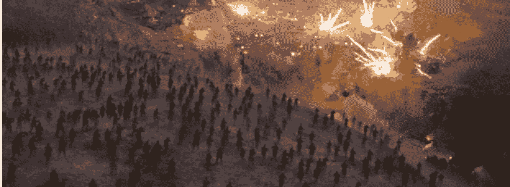

这就有点让人觉得悲哀了，拜托，志愿军没那么蠢，如果真是只知道搞什么集团冲锋，我军的战术水平跟伊朗人差不多，在鸭绿江附近就消耗的差不多了。

其实真正的“人海战术”早在19世纪后期，也就是我国第二次鸦片战争那会儿就已经终结了，因为当时步枪出现了大幅变革，跟第一次鸦片战争完全不是一码事。

第一次鸦片战争的时候英国对中国的技术代差并不是特别大，跟很多人理解不一样的是，当时英国人取胜的关键是他们快速把部队移到一个清廷实力薄弱的地方，形成局部优势，大炮一轰，然后英国步兵登陆，最后用刺刀突击打垮清军，对，清军拼刺刀都拼不过英国人。

我们现在总喜欢说当时大清有百万士兵，问题是这百万人散布在全国，鸦片战争期间打了几仗，大清投入的兵力最多也就万把来人，实际在前线战斗的兵员很少超过千人以上，而英军基本都是清兵的两三倍以上。

当时英军使用的是一种叫“布朗贝斯滑膛枪”，打一枪得先倒火药，再装弹丸，还要用棍子怼瓷实，而且那时候子弹有的大的小的，有时候甚至得用锤子敲推弹杆，才能把子弹敲进去，弄不好还炸膛，下雨天淋湿火药不能用。

关键是精度也就这么回事儿，一百米打人形靶命中率五五开，到两百多米外的精度也是不能看。从这点上来说，布朗贝斯和清朝鸟枪一个水平，甚至还不如抬枪。所以英国人当时也是靠陆战拼刺刀取胜，这时候英军和清军差不多，到最后都是步兵团战，跟冷兵器时期没啥差别。到了第二次鸦片战争就完全不是一码事了，英法联军装备了大量的线膛枪，射速和精度都有了大幅提升，所以通州八里桥三万蒙古骑兵发动集团冲锋，英法联军摆开阵势齐发，最后蒙古死了一地。

伤亡人数到现在也说不清楚，说死了一千到两万的都有。不过结果是确定的，三万蒙古骑兵彻底丧失了战斗力，英法联军死了三个人，还是因为自己不小心从马上掉下来。

到此为止，大规模的人海冲锋已经没了意义，只是增加杀戮的速率。

随后出现了机枪，1854年英国陆军射杀蒙古人用的那种米尼步枪跟随后出现的马克沁机枪比起来就是个儿童玩具，屠杀效率差了好几个数量级。

机枪这玩意江湖人称“死神镰刀”，在索姆河战役中，英军采用密集队形突击，遭到德军马克沁机枪的强大火力杀伤，一天损失近6万人。

奇怪的是，英国人很早就知道机枪的威力，在“一战”前英国军队在非洲与祖鲁人的一次战斗中，一支50余人的英国部队仅凭4挺马克沁重机枪打退了5000多麦塔比利人的几十次冲锋，打死了3000多人。而且英国军事观察员在旅顺前线目睹过日本的“万岁冲锋”，也知道日本人为了一个203高地发动集团冲锋，死了6万人。英国人尽管经验丰富，但是依旧在第一次世界大战中自己玩上了集团冲锋。

不止英国人脑子有问题，德国人也不清醒，《八月炮火》里写了一件事，说是德军开始进攻比利时要塞烈日的时候，士兵们长期没打过仗，顶着机枪，就跟拿破仑战争时期似的，整整齐齐排着队往上冲，被机枪成片扫倒，尸体迅速堆了两米高，变成了“尸山”。

一名比利时军官写道，“德军一排排地并且几乎是肩并肩地冲过来，直到中弹倒地。倒下去的伤亡人员堆叠成一堵可怕的街垒，快要遮住我们的枪口，为我们带来麻烦。街垒越来越高，我们实在不知道究竟是隔着它射击好，还是走出去用双手开拓出一些通道……可是你相信吗？——这堵用尸体和伤员砌成的名副其实的墙垛却帮助了那些令人惊叹的德国人，使他们得以越爬越近，终于爬上碉堡前的斜坡。但是他们最多只能走到一半，因为我们的机枪和步枪的火力把他们击退了。当然，我们也有损失，但和敌人蒙受的大量伤亡比起来是微不足道的。”

机枪的出现让战争彻底发生了变革，在仔细规划好的防御阵地面前，任何步兵的集团密集进攻都是自杀。后来又出现了更加高效的玩法，什么燃烧弹，大口径火炮，一炮下去一个大坑，篮球场那么大的范围内尸骨无存。

说了这么多，就想跟大家解释下，咱们这些键盘侠都知道的东西，那些一线指挥官能不知道？那为啥到处流传着我军搞“人海战术”呢？

主要是韩国人搞出来的，韩国在朝鲜战争中表现是很差的，韩军的前身是日本在朝鲜的伪军，兵源本来就不太行，有点出息的人谁会去做伪军？而且日本人显然也没好好训练，韩军的战斗力和战斗意志一塌糊涂，在志愿军刚入朝的时候，有一次伏击了一个韩军驻地，韩国人三千人少做抵抗就撒丫子猛跑，竟然逃出来2700人，随军美国记者非常失望地写下：

“一个原因可能起自于朝鲜人脑子里根深蒂固的中国士兵所怀有的传统恐惧心理。无论出于什么原因，第2团3100名官兵中有2700名后来逃到了清川江，这就有力地表明，他们逃跑要比打仗卖力多。”

直到朝鲜战争都要结束了，韩军还在金城战役中被志愿军打成了狗，所以想尽办法污蔑志愿军，显得自己表现差是有原因的。

他们一直以来都流传着两个说法。

第一个说法说是为啥志愿军能死守一个坑道或者阵地呢？因为那些士兵都被铁链锁在了坑道里，只能战斗到最后。

第二个说法不仅韩国人自己深信不疑，还把国内的一些人的脑子给带坏了。也就是那句“中国士兵比子弹还多”，每次进攻都是漫山遍野地发动万人大冲锋，言外之意就是中国不把人命当回事，韩国人打不过的原因就是人太少。

他们不但这么想，还拍成了电影，电影里我军铺天盖地冲过来，看着确实比子弹还多，这几天不少视频博主把这一段剪出来，评论区一群人高呼什么“真过瘾，志愿军是轻步兵巅峰”。

过瘾尼玛啊，醒醒，尽快去医院看看，脑子都被门夹成啥样了，如果只会发动这种漫山遍野的人海战术就是巅峰，那大清的蒙古骑兵也是人类巅峰，伊朗让士兵一起去踩地雷更是巅峰，日本人简直是巅峰的巅峰了。

而且破解这种漫山遍野的进攻实在是太容易了，只需要在自己阵地前用飞机丢一排汽油弹就可以了，事实上这也是美军的标准战术操典，如果遭到进攻，飞机就会迅速过去往阵地前丢一串汽油弹阻挡进攻，朝鲜战争和越南战争都在这么搞，进攻方一个人都冲不过去，然后再用机枪和飞机屠杀后边的。

此外韩国电影《太极旗飘扬》里的万人大冲锋，说的是云山战役时候的情况，云山战役是志愿军入朝的第一仗，主力是四野骨干39和40军，玩的全是来回穿插，怎么会跟韩国人玩集团冲锋嘛，韩国人真是抬举自己。

不过不得不说，韩国人的宣传实在是很成功，不仅把他们自己忽悠信了，我国不少老百姓和导演也被忽悠信了，脑残这种事真的是会传染的。

那志愿军到底是怎么操作的呢？

我军从一开始就有精细的步兵操典，从来都是靠智力和勇气去取胜，而不是蛮力，你蛮力再强，能比得过轰炸机？

那志愿军到底怎么打仗呢？这又分为前期和后期。

前期主要打的是一个“奇”，刚入朝那时候我军素质很高装备很差，素质高是因为参战兵力都是战争中成长起来的老兵，军中骨干很多都是百战精锐，但是武器主要都是日式装备，大部分人拿的都是日式三八大盖，也就是电视里日本人拿的那个前边有个小旗特别长的步枪，不少小伙伴很纳闷长津湖战役中为啥我军主要用的是日式装备，之前缴获的美式装备哪去了？苏式装备呢？

这倒也不难理解，我军中的美式装备是从国军那里缴获的，国军的美械装备也是美国人送的，美国人送装备的时候可没送生产线，所以子弹用完就没了，枪管或者零件磨坏也没法用了。

日式装备就不一样了，日本在东北的军工厂被我军给抢修恢复了，所以不但缴获了几百万日军装备，还缴获了兵工厂，部件损坏或者子弹供应都有了保障，所以到了1950年，我军主要是日军装备，还有一些美国的。而且我军在朝鲜就算缴获了美国武器也不大愿意用，因为消耗弹药太快，后勤供应不上了，日本的步枪尽管打的慢，不过对弹药需求低。我查了下，以我军最精锐最早入朝的39军为例，70%的士兵装备着日式步枪。

至于苏式装备，苏联人刚开始根本不想掺和朝鲜的事，也不相信我军能有任何机会，所以前三次战役根本没给装备，等到我军把美军赶到三八线，苏联的装备才上来。

白天美军飞机低空侦查，基本上没啥秘密，稍有不慎就会招来轰炸机，我军只能是躲在密林和山洞里，到了晚上再出来行军，上万人的队伍分成上百股，每股只有百八十号人，在经验丰富的老兵带领下，就跟水银似的渗透过去，神不知鬼不觉潜到敌人阵地附近。

等到达可以发动突袭的距离，趁对方不防备，一声哨响，四面八方突然发动进攻，冲到敌人阵地前几十米大家丢出手榴弹，趁着对方被手榴弹炸懵，然后继续冲，大家看电视也都知道，机枪和飞机再厉害，近距离根本施展不出来，总不能往自己军营里扔炸弹和燃烧弹吧，所以美军和韩军遭到进攻后，轰炸机过来转一圈就走了，双方离得太近，没法投弹。

这种近距离的贴身战弥补了武器的代差，以至于美军用手枪和工兵铲的机会比用机枪都多，志愿军的英雄赵顺山，在云山战役中一把洋镐舞的虎虎生威，砍死三个、活捉四个美国兵。

美国的战争英雄戴维斯，他从诺曼底打到北朝鲜，就死于一次志愿军夜袭，他的手枪子弹打光后，跟志愿军用工兵铲肉搏到最后，第二天发现他的汤姆逊冲锋枪还有几个弹夹没用上，更别说他边上的机枪了，而且他也是被刺刀捅死的。

这也是为啥前期交手了几次，美国人甚至不知道自己是在跟朝鲜人打还是中国正规军。此外我军如果发现打不下来，一声长哨又迅速散去，消失的无影无踪。

多来这么几次，谁都得崩溃，所以美军在战争初期很志愿军接触几次后，有种有力使不出的感觉，迅速撤往三八线，然后在中途一直被我军步兵袭扰，行军途中被突然被攻击震撼效果更好，重武器依旧发挥不出效果。

在北朝鲜打仗预测美国和韩国的行进路线非常容易，因为他们的武器消耗弹药非常厉害，所以走到哪都带着一堆卡车，而朝鲜能跑卡车的路并不多。我军经常一顿狂奔，跑到敌人前边，然后修筑堡垒和阵地，等着美韩军队的到来，当然了，看着容易其实非常难，当时美军已经在朝鲜投入直升机给炮兵校准目标，轰炸机也是满天飞，所以每次伏击都非常艰苦。

这也是为啥朝鲜战争前三次战役效果最好，我军完全掌控了战争主动权，把“奇袭”和“夜袭”用到了极限，我们一般说“把美国人从鸭绿江赶到了三八线”，这三次战役就达成了这个目的。

但是从第四次战役开始，美军已经不再像之前那样慌慌张张，重新组织了起来，而且行军极其谨慎，各个部队之间配合非常紧密，并且适应了我军的作战思路，随时准备玩“龟壳”，也就是坦克围一圈，士兵们在里边，把伤病放在最里边，直升机往来拉伤员，我们前期的那种奇袭策略就不太好使了。

到了第五次战役的时候，我军发生过很悲惨的经历，负责进攻的四个师挤在20公里宽的战线上，遭到美军轰炸机和大口径火炮轰击，战况非常惨烈，最后损失惨重，战略目的也没达成。这也又一次应证了我们上文说的，

### 单是靠人多而不是精细的战术，完全就是给对方单方面屠杀的机会，关键是任务也没搞定

这应该是朝鲜战争中少数几次“人海冲锋”，主要也是迫不得已，碰上了那种攻击面太窄的情况，进攻部队展不开，被美军扔燃烧弹大规模清兵。

我军后来也全军通报，严厉批评“进攻密度太大”，让大家避免再发生这种事，也就是说，“人海密集冲锋”这种低级操作在我军内部也是被唾弃的，技术含量低伤亡大而且效果也差。

不过这个时候苏联装备也上来了，武器代差没那么大了，美军玩大炮，我军大炮玩的更溜，战争越到后期，整体越正规化。

每次进攻前，也是万炮齐发，先把对面的阵地打个稀巴烂，然后步兵在坦克的牵头下排成散兵线发动波次进攻。

比如我查了下资料，在金城战役中，志愿军炮兵在25千米的进攻正面上，配置82毫米口径以上各种火炮1100余门，平均每千米45门。7～28分钟的炮火准备即发射炮弹1900余吨，毁坏敌军工事达30%～40%，支援步兵部队仅1小时就突破南朝鲜（韩国）军4个师的坚固防御阵地。

步兵进攻的时候也不是电影里那种密密麻麻，那种模式一发炮弹得干掉几十个人，大家往往都隔着五六米，每一排前后也隔着十来米，避免机枪一枪射穿好几个人，或者一扫一大片，一个足球场那么大的地，也没几个人，只要冲入对方阵地，对方的重武器也就发挥不出效果了。

也正是凭借这种精细的操作，志愿军跟美国的伤亡比例远远低于国军和日本的伤亡比，我军在朝鲜阵亡了19万，这其中有不少是冻伤后牺牲的，美国那边一开始说是死了三万，后来家属不服，一直闹，闹到了五万，此外还有近一万失踪的（被炮弹炸没了或者掉下山崖找不到尸体的算失踪），还有不少到了医院没抢救过来的，美军大概最终阵亡7万左右，也就是中美一比三左右，考虑到我军前期和美军巨大的武器代差，这个数据很不错了。

要知道，国军和日本人的交换比是1：9左右，也就是死一个日本兵，要带走9个国军士兵，而日本和美国的交换比大概也在1：10左右，这也是为啥朝鲜战争时期日本流传着一个美国兵要换100个中国士兵。

此外我军从来都对技术强军充满了热情，那些年不断仿制各种能拿到的武器，不仅包括苏联装备，也把美国的巴祖卡和75毫米无后坐力炮、日制磁性手雷等等仿制了个遍，到后来已经不用士兵们抱着手榴弹捆去炸坦克了，而且跟着苏联人上天几次后，我军自己的飞行员已经可以独立击落美军战机。

文末再总结下吧，我军因为情况紧急或者环境限制，确实搞过密集冲锋，但不是常态，而且我从现在的战争记录来看，少数的几次密集冲锋效果都极差，原因我们上文也说了，现代战争里人肉没法正面刚机枪和轰炸机，而且我军内部对这种事是坚决反对并且全军批评。

至于电影，演成那样倒也没啥问题，艺术加工嘛，不过我们要知道那种状态本身不太对，也不是常态，甚至是西方一贯以来的一种污蔑。

大家可以注意下，欧美人要是想损谁，就把谁说成一窝蜂不要命往上冲，他们还给这种模式起了个名字，叫“虫族冲锋”，也就是那种外星电影里，虫族每次进攻的时候，基本都是这种模式，落后嘛，除了数量和“不惜人命”没有别的优势，所以把人当子弹使，奇怪的是，有些人以为人家在夸自己。

总之，我们的士兵英勇无畏，但是我们不会草菅人命；
我们的军人不怕死，但是我们不会让他们随便去死；
我们取得胜利，靠的是体制、战术的胜利，而不是靠一窝蜂的虫族式的冲锋。

公众号懒人搜索，懒人专属群分享

### 不知道长津湖啥背景？这篇文章把前因后果都说了

2021-10-02

这两天电影《长津湖》上映了，后台收到不少消息让我写写，因为电影里一直在描述战争场面，这事的前因后果并不明确，正好我之前写过这类文章，我接下来把整个抗美援朝的过程大概捋一下，看完大家自然明白了，大家也一起看看吧。

这篇文章之前发过一次，不过很久以前了，为了本次的内容专门做了大量修改。

### 1. 战争起源

整个战争有两场:

一场是北朝鲜的统一战争。

在中国解放战争的时候，北朝鲜出力不少，而且当时东北有大量的流亡朝鲜人，这些朝鲜人加入了林彪的“四野”，这些朝鲜人跟着林总南征北战，形成了后来的“三个朝鲜人师”。这些朝鲜人在中国参加了历次恶战，战斗经验丰富，这三个师后来被北朝鲜要回去了。此外苏联还给朝鲜提供了一些坦克大炮，正是在这些坦克大炮和三个师的支持下，北朝鲜发动了统一战争。

战争一开始打得还不错，把韩军和前来支援的美军揍成了狗，逼到了釜山那一带。

然后就有了我们熟知的那一段，美军第十军团从仁川登陆，北朝鲜的阵线被拦腰截断，很快弹尽粮绝全线崩溃。

而就在仁川登陆前，毛主席敏锐注意到美国可能会在仁川捣乱，通过三个渠道向朝鲜人转达了担忧，发现朝鲜人并没有反应之后，感觉朝鲜人要出事，就把“四野”的四个主力军调去了鸭绿江，以备万一。

随后的事大家也都知道了，朝鲜人果然没有在仁川设防，美军登陆成功。随后美军和韩军一路向北，很快打到了三八线，并且不顾我方警告，跨过三八线继续向北，从这个时候起，战争的性质就变了。

变成了我们的抗美援朝。

从明朝开始往后的六百年中，每次朝鲜出问题，中国肯定会出手。

这倒也跟“两国之间深厚的友谊”没啥关系，单纯只是如果朝鲜出事，我国东北将会洞开，就跟你家隔壁着火了你不能在那里干瞪眼看热闹一样。这是每一个有远见的决策者不能容忍的。

明清两代，都因为朝鲜卷入过大战，也都是丢了朝鲜很快国家也完蛋了，也就有了那句“举国沦亡缘汉城”。

到了1950年，联军又一次跨过三八线，兵指鸭绿江，跟明清相比，这事又多了太多的内涵：

- 东北是新中国的鲁尔区，真正的“煤钢复合体”，东北不能成冷战前线；
- 国内人心惶惶，有人担心美国打进来，有人指望美国打进来，比如功德林的国军战犯们弹冠相庆，觉得美国人来解放他们了，除了王耀武（他作为山东地区最高长官，战败后没自杀竟然被俘，被俘后改过自新的态度相当积极，让蒋委员长对他意见很大）；
- 苏联态度不明，很可能也想趁机进入东北，让东北变成“东柏林”，事实上苏联无论如何都是赢家，朝鲜赢了苏联拿到了釜山港，朝鲜输了中国就得求助苏联协防东北，如果美军打到东北苏联正好重返东北，如果隔着鸭绿江对峙，那正好，中国成了美苏缓冲区了；
- 蒋军会不会从朝鲜向中国渗透？到时候西南和东北同时捣乱（李弥的第七兵团此时跑缅甸种鸦片去了）；
- 蒋军大陆残余势力蠢蠢欲动，随时准备策应东北战事；

......

我看了很多决策方面的书，包括沈志华的那几大本都看了。感觉绕来绕去，关键就两件事，也就是 东北和人心：

东北需要一个安全的环境；新中国刚建国，人心需要安定 。

这个背景下， 大家都知道应该保朝鲜，保朝鲜就是保东北，保东北就是保新中国 。

但实力差距实在是太大了，大到没法接受。所以出兵不是问题，问题是可行性。

中日之间的战争刚结束，日本那样的国力竟然把中国摁在地上摩擦了八年。可日本在美军面前也就是个渣。1941年12月8号日军偷袭了珍珠港，1942年6月4日，牛逼轰轰的帝国海军就被美国彻底打残。满打满算坚持了七个月，这七个月中美国人大部分时间都在家征兵造船发国债。而且日本的那些甲种师团，除了近卫师团一直在东京，其他师团基本都来过中国，最后又几乎都被消灭在了太平洋战场。

对比了中日差距，再对比美日差距，最后想想中美差距，谁看了都虚。毛主席肯定也是很纠结的，不然不会思考了几天几夜。

后来他让自己的儿子做“第一个志愿军”，岸英是第一个了解出兵朝鲜决策的基层军官，确实是第一个志愿军。只是毛主席低估了人性的恶，自己的儿子牺牲在了朝鲜，还要被人反复质问到底吃了几碗粉。

正是因为巨大的实力差距，林彪不愿意去朝鲜，了解林帅的人都知道，他是一个谨慎过头的人，筹划紧密万无一失才下手。毛主席因为这事还跟他发过火。

除了他，党内能指挥大兵团作战的只有粟裕和彭老总。

林彪说粟裕爱打“神仙仗”，就是那种敌我实力差距太大，粟裕也敢虎口拔牙。有三成胜算他就敢出手，七成胜算敢大搞，关键是还能赢。

粟裕是我党体制的胜利，一个基层军官，因为能力突出快速被识别，放到关键位置上统筹全局，而且他的意见和毛主席冲突的时候，党内最后认同了他的观点，这才有了1948年的淮海战役。如果没有他，解放战争至少会晚一年结束。

至于彭老总，属于中间状态，曾经以2.6万人牵制了胡宗南50多万人，打出了陕北“三战三捷”，也在兰州之战中一开始打得一团糟。彭老总没有粟裕那么善于精细微操，但是也能做到以少胜多。

这么看下来，粟裕最合适。不过他早年在山东、苏中和苏北指挥作战，经常几天几夜不睡觉，严重透支，得了美尼尔氏综合征，还有其他各类劳损性疾病，颅里还有三块弹片，天天头疼。那段时间已经病得下不了床，自然也就去不了。

林帅打不了这种他自己都不太相信能打赢的仗，而且确实也病了，要去克里米亚养病。

反倒是彭老总很积极，不止积极，他还有方案。可能长期在西北作战，对山地战领悟很深，提出来朝鲜北部山多，美军机械化步兵展不开，我军集中优势兵力，可以做到“局部优势”，杠一下美帝还是可以的。这种思想跟毛主席一拍即合。

进入朝鲜的作战主力自然是“四野”的人。“四野”人均一顶狗皮帽子，长期在东北作战，能够适应朝鲜环境；而且四野里有一部分队伍是彭老总带出来的，比如38军，就是彭老总平江起义带出来的班底，他去指挥也好协调。

中间有个插曲，一开始说好苏联人提供空军，可是中国出兵的最后关头，苏联人怯场了，说是不给飞机。

毛主席一度纠结中国是不是继续出兵，经过艰苦的思考，还是决定继续执行“抗美援朝”战略，毕竟保朝鲜就是保中国。从这事也能看出来苏联人的格局，做大哥的没出息不担事，出尔反尔，到最后谁都不相信他们，他们自己最后内部陷入内乱然后崩了。

### 2. 中美五次战役

美军和韩军跨过三八线后非常有精神，根本没注意、也没想到志愿军入朝，美韩联军在朝鲜北部行军，马上就要到鸭绿江，突然就被包围了。

韩国军队最早遭遇迎头痛击，鬼哭狼嚎往回跑，一路上散布说是中国军队入朝了。美国人和英国人非常淡定，对韩国人的战力表示理解，觉得应该是遭遇了北朝鲜游击队被打了，很鄙夷地让韩国人靠边，他们直奔鸭绿江。

然后美军英军也遭到围攻。

美国第一骑兵师的一个团在云山遭到合围，美国人都不知道自己在跟谁打，只是发现根本没法打。第一次碰到这种事，上一秒还一个人都看不到，下一秒就突然哨声大作，周围枪声四起，部队迅速被切成好几段。

美英军队没见过这阵仗，被分割的队伍被吃掉几块后，剩下的见势不妙，跑得非常快，还是伤亡了一半的人。

这就是我们经常说的云山阻击战，美英伤亡了两千人，这是中美第一次交锋，美军打成了这样，让各方非常惊讶。

紧接着就是第二次战役，美军此时还没有意识到中国已经全面入朝鲜，在白云山遭到阻击后，美国最精锐的陆战一师的大部队继续向北。

多说一句，这个时候国内破获了一个特务大案，一群旧知识分子们担心中美冲突，中国完蛋后美国肢解中国。他们忧国忧民，觉得惹怒美国这下真完蛋了，已经在考虑提前媾和，甚至把中国出兵朝鲜的消息走漏给了美国特务。

不过美国上层显然没太当回事，要求陆战一师继续向北。

不过军中此时到处都是谣言说中国已经入朝，美军里也有点慌。所以陆战一师慢慢腾腾地向北挪动，他们也担心自己被包围。

随后被紧急入朝的九兵团（这支部队就是之前粟裕指挥的队伍）围在了长津湖那一带。

双方打得难解难分。不过九兵团的火力差，后勤补给不足，冻伤减员太厉害，本来想围杀美军，可是到后来连局部兵力都赶不上美军；美军又出动了能出动的所有飞机支援长津湖，硬是用炮弹炸开一条通道跑掉了。这个过程中，志愿军英雄杨根思所在队伍拼死阻击，连队打光后，他手持炸药包跟美军同归于尽。之前阅兵的百面军旗里，就有杨根思他们队伍的。

在这种极度不利的情况下，志愿军依旧吃掉了美军的一个北极熊团3000人，美国那边说是伤亡了1400人。这支部队建军很早，参加过“十四国武装干涉苏联”，在西伯利亚混过，见过北极熊，总统送了他们一面绣着熊的团旗，所以叫“北极熊团”，属于美军中的精锐，这次被打残了，军旗还在北京军博里。不过后来回到美国后又重建了。

可惜的是，当时志愿军的武器太差了，而且行进太快，没带啥重武器，主战武器是日本留下的小口径步枪，这种步枪出了名的射得远但是打不死人。事实上战场上除非是被重炮轰到了，否则当场死了的概率还是很低的，美军伤四千多人，大部分被飞机带去日本给救活了，说是阵亡了一百多人。而我军这边运送下来就太难太难了，九兵团战斗伤亡19202人，冻伤减员28954人，很多队伍根本没开战就失去了战斗力，很多人冻伤或者战斗中受伤本来没啥事，但是后勤太差，等到了医院也不行了。

不过对于美国来说，有个常识是，“你杀死一个美国大兵很容易，但是让他阵亡却非常难”。

美国的“阵亡”要求很高，必须得是战场上交火直接死了才算，也就是大家看电影，士兵被射倒后，战友上去试探了下，大喊“KIA”，“Killed in action”，这是美军中阵亡的意思，否则就不算。

比如你受伤到了后方医院死了，不算。你被敌人抓住，杀了，也不算；战场上被车撞死了，也不算。比如美军第八集团军司令沃克中将，他是出车祸死的，美军在朝鲜阵亡的人员当中就没有他。

这就是为啥整个战争打完后，美国说自己阵亡了三万人，大家都不太满意，闹来闹去，后来成了五万，阵亡人数“按闹分配”这事也是活久见。

当然了，大家不满意的原因也不是因为荣耀什么的，主要是因为抚恤金差距很大，同样去打仗死了，隔壁老王家死在战场上算阵亡抚恤金20万，老李家死在后方医院抚恤金十万，这谁也受不了。

美国政府“阵亡认定”难，也是因为担心死人骗钱。资本主义国家嘛，整个国家就是一本账。

不说美国人，咱们继续主题。这就是为啥每次都想骂苏联人，美国已经赤膊上阵打他的小弟朝鲜了，他躲在后边装没事人，如果长津湖之战中苏联人帮点忙，美军陆战一师大概率就交代在长津湖了。

随后志愿军一直追，美军一直跑。

好几次志愿军硬是步行跑山路绕到美军前边，比如在一个叫“三所里”的地方，志愿军38军的113师十几个小时步行狂奔70公里山路，堵在了撤退美军的必经之路上。双方展开血战，志愿军武器装备绝对劣势的情况下，硬是顶住美军一步都前进不了。整个战役中，美韩联军单是被38军就干掉一万多人。

38军也就成了“万岁军”。

### 第二次战役小结

这也就是第二次战争，到第二次战役结束，美军已经被赶到了三八线附近，志愿军也顺利收复平壤。

紧接着是第三次战役，志愿军越过了三八线，美军和韩军士气彻底崩溃，我军顺利攻下了汉城。志愿军的声望达到了巅峰。

当时美军就发现，志愿军有几个明显的特点。来去如风，后来大概测算，在山地每天能行军30公里。而且非常善于伪装，飞机往往贴着地面飞行都发现不了。到了指定阵地后，等到晚上突然发动突袭。

经常先绕道联军的背后，切断退路后，各支部队同时发动进攻。

而且由于前三次战役根本没有苏联援助，主要武器依旧是抗战时期的日式武器（解放军接收了东北的兵工厂也都是生产日式武器），小口径步枪，手榴弹什么的，迫击炮都非常少。

当时也没有效果很好的反坦克武器，面对美军英军的重型坦克，只能是爆破手爬过去，把大捆手榴弹塞坦克底下。就算炸不掉坦克，由于巨大的震荡，坦克里的人也基本被震死，但是我们这边往往也得付出巨大代价才能贴近美军坦克。

不过美国有的特点是非常容易预测。

美军每次出动，都带着大批的给养、武器和炮弹，从来都是一大堆车辆坦克随行。以美军的弹药消耗，基本就得靠着如山的补给物资才能打仗。

这种情况下，往往脱离不了大主干路，毕竟汽车和坦克又不是驴，在爬山方面不太行，这样就让我军易于预测美军行动方向，毕竟以朝鲜北方的地理条件，可选的道路并不多，而且道路环境非常差。

后来美军的第八集团军司令沃克中将就死于车祸，集团军司令职权很大了，巴顿在欧洲战场的时候就是集团军司令。这个沃克死后，换上了李奇微，李奇微后来接替麦克阿瑟。

正是因为美军可预测，我方就可以在那种地形比较有利的地段设伏，后来有个爆破手去给毛主席做汇报，他作为战斗英雄，非常善于因地制宜，有一次炸开了一块大巨石，把美军坦克撤退的路堵得死死的，美军虽占据绝对优势，但硬是没冲出去。

所以美军发现在北朝鲜打得很憋屈，机械化优势没法施展，经常夜战，美军空军优势也不太明显。而且开战后美军根本不知道对面到底有多少人，很快就慌得一批，前三次战役，美军一直没太找着北，尽想着跑路了。

不过这场战役打的时间非常短，持续了八天，志愿军经过连续作战，已经非常疲惫，并且补给线也太长了，供给不上来。于是很快就撤向三八线以北，

### 第三次战役结束。

这次战役结束后，汉城丢了。美军丢了这么大的脸，当然不能接受，于是发动了全面反攻，大批陆军在飞机坦克的配合下重新杀向三八线。

志愿军此时后勤供应不上，只好有序撤出汉城，撤向三八线以北。我们之前聊过的50军，这支部队以前是国军云南杂牌，长春战役中投诚。在这次撤退中为大部队保驾护航，完成了掩护任务，硬是顶住联军一步不退，为大部队争取了撤退时间。

尤其是在白云山这个地方爆发了一场战斗。白云山在现在韩国汉江南岸，50军的一个团在这里顶着美军第25步兵师激战11昼夜，美军硬是一步都没能前进，最终以伤亡300多人的代价干掉了美军1200人，而且完成任务后顺利撤出阵地。完成任务太出色，百面军旗里也有他们的一面。

### 这次大撤退，就是第四次战役。

然后就是第五次战役。

这次战役是整个战争中最惨烈的一仗，参战双方投入了一百多万人，志愿军和朝军对美军阵地发动了一次全线猛攻，但是效果不佳，美军向战场上投放了人类有史以来最大规模的炮弹和凝固汽油弹。

在美军绝对优势的炮兵和空中优势下，志愿军损失惨重。整个战争中志愿军伤亡19万，这次就伤亡了7万多。也正是这次进攻中，担任掩护任务的180师陷入重围，大规模被俘。

大家记得之前川普在疫情期间颁布的那个“国家紧急状态”吧，战争期间杜鲁门也宣布美国进入了紧急状态。并且全国加税，当时出台了一个《1950年收入法案》，把企业所得税从38%上调到了45%，并且冻结了工人工资和物价，扩大财政支出支援前线，从这里也能看出来美国对这事很重视。

第五次战役后，双方阵线基本维持在了三八线附近，苏联目睹了我军在朝鲜的表现后，超预期超到天际去了，大规模向志愿军交付物资。

拿到物资的我军炮兵越来越犀利，到了上甘岭战役，我军炮兵已经可以跟美军打平了，70%以上的敌军都是被我方炮兵给打死的。

美军为了打破平衡，瞄准了我军的后勤补给通道，他们内部叫“绞杀行动”。啥是绞杀呢？

这是美军的习惯。南北战争那会儿，美国政府军就把南方大城市烧了个干净，导致南军叛军彻底没了战略物资，选择投降。

1944年美军在诺曼底登陆的时候被德军给杠了下，美军出动5万架次飞机，往地面上投了上万吨炸药，专门炸铁道枢纽和各种桥梁，让德军在前线一粒子弹都拿不到。后来美军又在越南疯狂轰炸桥梁。整体而言，美军对炸桥有瘾。

现在又要轰炸我军后勤供应通道。我军对这个事也非常上心，而且创造性非常强，搞出来了水下桥，摇摆桥，甚至有些桥白天就拆掉，晚上再架起来。

重点区域用大量高炮防守，到了后来，美国飞机不再去平壤往北了，那地方高炮凶猛，再加上米格战机在天上巡逻，美军占不到便宜而且日常被击落。这种情况下，地上已经基本安全，铁路也不再被轰炸。这块区域，一般叫“米格走廊”。

也就是从那时候开始，我军使用高炮非常凶，我看到个数据，说是整个战争中击落2335架飞机，击伤7512架。这个战绩才保证了天量物资从中国东北运往三八线。一开始对这个数据是不相信的，后来专门查了下美国的数据，问题不大：

据美国空军参谋富雷特尔的《The United States Air Force in Korea》一书第645页记载，联军从路基起飞的战机在作战中坠毁1986架。但这并不是美军损失的全部飞机数量。因为这只是联军从陆基起飞的飞机中损失的部分。

海军情报处军官哈利恩在《The Naval Air War in Korea》一书第286页记载，海军（不含陆战队）在战争中共损失了1248架飞机。上述数字相加，合计为3234架。比我军提到的还多，估计是我军击中后飞走了，没到家就坠毁了，我们这边不知道他们已经坠毁了。

所以战争后期我军高炮打得飞起，完全不是初期那样被美军压着打。

之前那个电影《金刚川》里说的那个大桥是一座关键大桥，而且这个时候是物资最充足的时候，却放了俩高炮，怎么可能嘛。

而且高炮操作规章里有详细说明，必须打一仗挪一窝，防止下次一开火防空炮就被端了。

大规模坑道作业也让志愿军对美国作战中游刃有余，美国人想尽了办法，依旧没法突破，后来甚至开始考虑扔核弹，但是苏联此时也已经有了核弹，核威慑已经形成，美国也就说说。

后来美国军人集团还叫嚣说是要在中国大陆登陆，扩大战争。这事就更没个谱了，当时总统已经是艾森豪威尔，他让军人们哪凉快到哪呆着去。老艾后来在卸职演说里专门让后来人警惕“军工复合体”，这伙人为了钱，啥事都干得出来。

### 僵持阶段

这个阶段主要是围绕战俘的问题。

多说一句这个战俘的事，美国后来一直是要求一比一换俘，问题是中国这边的俘虏确实是比美国那边的少很多。

这倒不是我们抓他们的人少，而是前期抓到战俘做一番教育就给放回去了，希望俘虏们回去给大家说清楚我军这边的政策和精神，避免他们被围后拼死抵抗。

好处是美军内部现在也流传着中国军队不虐俘不杀俘的传说，拼死抵抗的非常少，毛病是等到换俘的时候发现我们手里没人。

所以谈判进行得非常艰苦。这个过程中美国人也想以战促和来着，气势汹汹发动了几次小规模战役，不过没啥效果，士气又有点维持不住。

我军在这个阶段开始搞“零敲牛皮糖”、“冷枪冷炮运动”，也就有了我们常说的狙击手张桃芳的事，这位上甘岭狙神一个人射杀了214名美军，这段时间张艺谋导演好像正在拍这部神射手电影。

美军士气非常低落，根本不想打，也找不到打仗的理由。为了提升士气，美国军方想到的办法是去东京嫖娼，士兵在朝鲜驻扎够一定的时间，就可以撤到日本修整，日本那边为了生活费，积极去伺候美国人，两年间在日本生出了20万混血宝宝。

到后来美国人实在是不想打了，而且看着中方的坑道也发怵。干脆同意了中方的条件。

### 尾声

记得很多年前，我哥们跟我说朝鲜有座桥被炸了修、修了炸，他非常感动，如果有机会，他希望冒着弹雨去修桥。

去年年初武汉疫情爆发的时候他大过年第一批去武汉支援，他们一起去的几个都是北大医学院的。那时候风险大极了，他媳妇也是医学博士毕业，那两天差点信了佛。

所以知乎上有个帖子：你愿意为国捐躯吗？

下边最掷地有声的一个回答是：你以为今年志愿前往武汉的那些医生在干啥？

这就是文化传统的力量，朝鲜那些最可爱的人的力量，关键时候，鼓舞一代又一代的人顶上去。

这也是为啥前些年有一茬人疯狂给那场战争泼脏水。毕竟让一个民族软弱，最好的办法就是坏掉他们的图腾，污名化他们的英雄，让后来人再也不想给这个民族去努力去抗争。

借用知乎上的一个帖子结束本文吧，作者 @Juli。

### 如何看待那场战争：

一代人吃完了五代人的苦。一代人做出了五代人的事，一代人打完了五代人的仗，一代人建立了五代人的功。

平心静气看待，这应该是人类历史上战争的巅峰，是人类历史上的奇迹。以弱胜强，师出有名，信仰纯洁，同仇敌忾，官兵平等，军纪严明，善待百姓，优待俘虏，战法出色，名将辈出，英雄无数，又没有天气加成，自身后勤和装备严重处于劣势，完全靠人的主观能动性和智慧作战，翻遍各国战史，抗美援朝应该在人类热战争精彩排行榜上排名第一，基本等不来挑战者的第一。

公众号懒人搜索，懒人专属群分享

### 限电是为了跟美国打贸易战？想多了

2021-09-27

这事我得先做个自我批评。因为9月23号早上6点多突然有个想法，当时也来不及多想论据，于是随手在头条写了一篇文章，也不能算文章吧，一个比较长的微头条，平时灵光一现的东西都随手发头条了：

这篇文章迅速成了爆款，要不是头条后来给限流了，应该能冲到几百万。文章的观点很快就被各方采纳，大家可以关注下，基本上这段时间以来绕来绕去说限电是因为中国制造业不赚钱要给美国输出通胀的文章，一篇比一篇逻辑严密，到现在基本上成了共识，限电是为了打赢贸易战，可惜这种共识是错的，而且错得没谱了。

我那天发在了头条却没往公号发，主要也是因为当时只是个想法，没仔细查资料，不太敢确认。这两天查了下，结合人民日报昨天的文章，感觉基本弄清楚了，给大家汇报下。

大家都知道一个基本的事实：我国在国际上的定价权非常弱，基本上我国买啥啥涨价，我国卖啥啥狂跌。

原因有很多种，比如国际秩序在我国加入西方市场之前已经定下来了，我国发展比较快，但是对秩序的影响力并不大。比如美国主导重工业那会儿，他们就积极入股了全球的三个矿山寡头，相当于做馒头的面和馒头都是他家的，如果矿石涨价他们赚矿石的钱，钢铁涨价赚钢铁的钱。

后来日本的炼钢产业崛起，他们也继续这么操作，大规模入股上游原材料，哪边赚了吃哪边。我国也在积极入股，但是现在整体规模不够，铁矿价格上涨没法对冲钢厂的损失。

其次我国的金融太弱了，现在只能是窝里横，修理国内韭菜一个顶十个，在国际上根本没啥战斗力，不但没有战斗力，经常跟在国际炒家后边吃人家剩下的，面对原材料大涨之类的问题，完全没啥办法。

最后也是最重要的，我国刚从草莽阶段过来，现在整合度太差，比如钢铁，美国在摩根时代就完成了整合，1000多家钢铁企业，其中70%在摩根的支持下合并成了“美国钢铁”，这在国际上话语权一下子重了好多，铁矿的卖家少，可买家更少，避免了自己跟自己竞争，后来日本韩国都是这个路线，我国的钢铁厂这几年整合了不少，但是依旧太多，所以铁矿没啥议价权，同理稀土，我国卖家也太多，也没有议价权，这些后续可能都会合并成美国那种巨无霸。

把这些逻辑理解了，就懂了我国现阶段对国际原材料涨价这事还没啥好的办法，只能是主动降低产能提高附加值，馒头被我们给卖成了土价，今后就得少生产点馒头，最好能卖面包，鼓励卖蛋糕。

“去产能”、“供给侧改革”、“双减双控”这些思想就是这个背景下出现的，给生产商以压力，让他们主动往面包和蛋糕发展。但是这是今年大规模限电的原因吗？

有关系，但不是直接关系。这个逻辑链是这样的：

- 1. 我国前几年就开始去产能，并且能源也开始转型，以前依赖火电，后续要改成风电水电太阳能；

我国这两年在环保的旗号下干了不少事。不过我一直在说，大家要区分“口号”和“目的”，这俩既可以高度重合，又可以完全不是一码事。

比如我国这几年举着环保的口号在搞能源转型，要从传统的煤电转到更加环保的光伏、太阳能、风电等等，这事本身很环保，但是转型不只是为了环保，更重要的是转型之后我国的能源结构必然会更加健康、更安全、更有可持续性。

这也是人民日报昨天文章的逻辑：“2015年，十八届五中全会提出‘能耗双控’，目的是节约能源、从源头上减少污染物和温室气体排放，倒逼转变经济发展方式，提高绿色发展水平。此外，‘能耗双控’也能更好地保障国家能源安全。”前几句是主义，最后一句是生意。

有种说法说，我国存储的煤炭只够现在这样使用27年，如果找不到替代方案，可能不到27年就得大规模进口，到时候可危险了，毕竟电力这玩意一天都不能停，石油依赖海外，电力依赖海外，简直不忍直视。这也是为啥我在前文说电动车和新能源这俩就是为了同时解决石油和煤炭的问题。

那为啥搞环保会影响产量呢？也不复杂，举个例子大家就知道了，我也是专门请教了这方面的专家才懂。煤刚从地底下挖出来如果直接烧，煤中可能含有硫等杂质，会对环境造成更大的污染，所以有个行业叫洗煤，得用水洗一遍，把不同成分不同比重的原煤分出不同等级，并除去尘土和废石，降低灰分和硫分含量。

以前环保要求不严格的时候，轻度洗一下，差不多了就可以拉出去卖了。但是现在环保要求高，需要洗到一个标准才能算合格，这无形中拉高了洗煤成本，并且多了很多道工序后，生产周期较长，比如洗煤的水量大难处理，煤炭产能也开始下跌，煤价自然上涨。

此外山西内蒙的煤炭企业也不是全负荷搞生产，我查到一个国家统计局的数据，2021年煤炭开采和洗选业产能利用率为73.1%，也就是说，现在煤炭企业的产能只开动了73%，不少煤场因为环保不达标处于停产整改状态，还有之前很多煤场发生了安全事故，也处于停产整改状态，这种情况下，煤产能自然上不去，用煤发出来的电也严重不足。

有人说是因为停止进口澳大利亚煤矿导致，我查了下，2020年我国煤炭产量39亿吨，之前进口澳大利亚5680万吨，现在基本上不进口了，澳大利亚的煤炭占中国的1.4%，而且进口的这6000万吨左右的煤也不是用来发电的煤，所以澳大利亚没那么大的影响，毕竟我国的产能在那里摆着，澳大利亚的进口煤占比太小。

这种转型不可能不痛苦，事实上没啥转型能在不损害任何人的前提下搞定，不出意外的话，这种痛苦可能要持续一些年。

我国这几年需求增长太旺盛，新能源没赶上来，火电基本上停了扩张，导致电力出现缺口。

电力不足这个问题去年就出现了，因为我国的发展实在是太快，去年12月21日，在国新办举行的《新时代的中国能源发展》白皮书新闻发布会上，国家发展改革委秘书长是这么说的：“近期监测我们就感到受工业生产高速增长，以及低温寒流叠加的影响，导致了现在电力需求超出预期，形成一种高速的增长”，去年湖南、江西用电需求增速高，在全国位居前列，浙江的增速也位居东部省份前列，然后浙江就限电了。

去年湖南省官员就说：“湖南每年需要从外省调入6000万~7000万吨煤炭，原先湖南本地还有2000万吨左右的产量，近年来湖南本地煤矿全都关停”。

吉林那边官方的原话是“落实与蒙东煤矿中长期供煤协议，加大进口煤采购，组织省内煤矿安全释放产能，千方百计扩大市场煤供应”。大家看懂了吧，这几年需求旺盛，不断上涨，但是因为能源结构要转型，煤炭供给明显减少，火力发电遭到压缩，但是新能源供电还没彻底顶上（新能源100%是未来，但是由于储能和其他技术问题，还得一段时间，而且水电风电太阳能都有周期性，这几天东北风力不足，电量骤减），有点跟不上用电需求了。

- 2. 按理说市场可以通过电价来调整供应，就跟猪肉似的，供给不足就卖贵点，供给太多就跟现在似的，非常便宜，不至于断供。

但是我国电厂又都是央企，发电的目的不是盈利，所以2019年国家给了个框，把电价给框住了。

这事还是2019年9月26日定下来的，国务院常务会议决定完善燃煤发电上网电价形成机制，从明年1月1日起，取消煤电联动机制，将现行标杆上网电价机制，改为“基准价+上下浮动”的市场化机制。基准价按各地现行燃煤发电标杆上网电价确定，浮动范围为上浮不超过10%、下浮原则上不超过15%，具体发电企业、售电公司、电力用户等通过协商或竞价确定，但明年暂不上浮，特别要确保一般工商业平均电价只降不升。

所以煤炭价格狂涨，电价却基本不能动，这个背景下，电厂基本上发一度电赔两毛，维持现状都费劲，更别说扩大发电量了。但是所有地区都是因为缺电吗？

当然不是，有的地区是不缺电的，主要是我国五年前定下来了考核目标，这不五年大限已至，不达标的那几个省急眼了。

人民日报昨天的文章说的很清楚：“考核压力下，各地又赶紧立‘军令状’、加速整改。但转眼已近四季度，全年指标如何达成？于是，一些地方就采取强力手段，定指标、压任务，对产业园区和行业强制性限产停工、拉闸限电。”说到这里大家明白了吧，整体是下边三重逻辑：

- 1. 双减双控确实是为了去产能，降低我国产品自己的恶性竞争，这在五年前已经开始搞了；
- 2. 随着煤价上升发电不足，有些地区确实是电力不足了，比如东北；
- 3. 有些地区是马上要考试了，连夜补作业，比如南方某些省。

电力问题一直都是特大问题，现在既然已经被人民日报点名批评，应该很快能解决了，尤其东北，影响到居民用电这事确实谁都没法忍。有不少省份电量是过剩的，之前主要是各省管各省的，如果统筹安排下，应该能缓解很多。

公众号懒人搜索，懒人专属群分享

### 几内亚又兵变了，我国在那边的投资怎么办？

2021-09-22

几内亚前不久又一次政变，特种部队军官成功推翻了现政府。

不少小伙伴都在问我会不会影响我国在那边的投资，毕竟我国在海外最大的西芒杜就在那边，将来制衡澳大利亚的利器，这个矿出了事可就尴尬了。这两天我查了不少资料，并且联系上了在那边搞开发的一个小伙伴，写篇文章给大家汇报下。

先说结论：这次政变不会改变中国和几内亚的经贸关系。

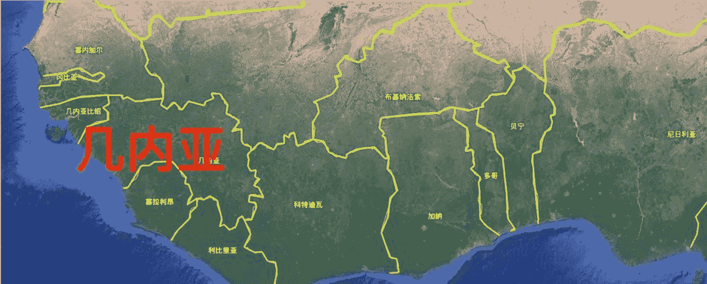

“几内亚”这个名字的意思是“黑人之国”，这也是为啥非洲有一堆几内亚，什么赤道几内亚、几内亚比绍、荷属几内亚（加纳）及德属几内亚（多哥）。

说白了，就是当初欧洲国家去黑人的地盘占了一块地，懒得起名字，于是就叫“法国的黑人区”、“德国的黑人区”等等，非常的敷衍。搞笑的是，亚洲也有个地方，殖民者到了后发现土著长得非常黑，于是叫那个地方“新几内亚”，大意是“没想到这里还有一群黑人”。

咱们今天讲的这个几内亚，是法国的黑人区，作为一个西非国家，说句难听的，政变是司空见惯的事。特别是军队起来夺权，在我们这些长期和平地区生活的人看起来几乎就是天塌了，在当地是每隔些年就上演一次的戏码，年头太长不政变老百姓会很慌，觉得最近好像缺了点啥。这次政变也是如此，虽说具体原因还没有公布，参与政变的军官表示是因为现政府无能腐败，面对疫情应对不利云云。

其实作为联合国认定的全球最不发达国家之一，几内亚各种稀奇古怪传染病肆虐，新冠疫情在当地人眼里和感冒差不多，毫无地位，他们也不会太把疫情当回事。

所以真实原因是疫情造成的经济下行，现政府没有办法解决，不仅没有办法解决，还普遍腐败，不仅腐败，而且这些年卖矿赚了一些钱还不给大家分，惹怒了大部分人。一撮投机军官们觉得这是个夺权的机会，而且觉得自己上更行，于是就开搞，没想到异常顺利，然后就上位了。

有人说这次是美国在捣乱，因为有一张政变军官在美国大使馆的照片，这个猜测整体没啥道理，几内亚看着跟中国走的有点近，其实是法国的势力范围，美国不会在法国的地盘上搞事针对中国，业务链太长。所以政变发生后，中国、美国、俄国、法国以及非盟都发文谴责军人们瞎闹，大家态度差不多。

不过这种政变基本上只是涉及最高层的人事变动，很多部长省长级别的官员都会在新政府中继续干。更直白点的话，这次政变在几内亚影响到的人甚至不到全国1%。几内亚政府基本是没有基层组织的，在社会基层还是一个个部族长老管，在城市和大企业中是资本家和官员管，上边有了变化下边都不一定能感觉到。

而政变不过是一群人把最上层一群人（甚至只是十几个人）赶下台，换自己上，以前那群人的钱换自己拿而已。对于政变军官，没有意愿对国家的原有政策做什么大的调整。

政变上台的军官，首要目的是稳定国内局势，接着就是在国际上获得承认。如果国内不稳，说什么都没有用。而国际承认对于这么个小国更是重要，一旦国际上对于政变意见很大，只是依靠政变军官那点武力，想长期统治一个国家几乎是不可能的。所以政变之后，大多数人都认为这次政变不过是几内亚国内上层洗牌，对于几内亚的对外政策不会有改变，这两天政变军官们已经发了声明说继续维持以前的贸易协定。

现在军官们也在国内努力稳定人心，只要国内稳定下来，本国内和国际上的各种势力自然会知难而退。如果国内长时间不能安定，各种形形色色的反对势力就会冒出来。

而要想稳定人心，最好的办法自然是在钱和权上做出让步。对于权，政变军人已经表示欢迎国内各方加入新政府，愿意让渡一部分权力，并且公开表示不会对原政府的官员处罚。而说到钱，却是比较麻烦的。

之所以麻烦，倒不是政变军人舍不得钱，而是因为几内亚是真穷。

要说那儿有多穷，几内亚整个国家一千多万人，GDP不到150亿美元。人均GDP只有一千美元出头，连印度都有二千，柬埔寨和缅甸都有1600左右。

猛一看觉得人均GDP一千多还算可以，阿富汗只有五百多，起码比阿富汗好吧。其实不是这样的，几内亚的经济非常畸形，GDP基本上就是依靠矿业刷的分。几内亚也算是几乎躺在矿石上的国家，国内对他有耳闻大多数是因为西芒度铁矿，西芒度铁矿是现在发现的最大最高品质的未开发矿山。

其实几内亚最多的是铝矿，铝矿占了全世界的三分之一，不但多而且矿石品质特别好。去年虽然有疫情，但是几内亚依然开采出超过8000万吨铝矿石出口，中国买走2/3。如果按照矿石市价计算，光是出口到中国的铝矿石就占到几内亚全国GDP的15%。而今年几内亚的铝矿生意又要扩大，预期出口会超过一亿吨。

可以说铝矿生意是几内亚的国家命脉，每年全国一多半的外汇就依靠铝矿获得，几内亚的农业工业都非常差，各种生活用品都是进口。中国一方面大规模进口铝矿，一方面出口各种生活必需品，几内亚依靠每年近25亿美元对中国的出口获得外汇，用这些钱从中国进口近20亿美元各种生产生活用品，基本上是中国赚钱中国花，只有五亿带回家。

有种说法说是那五亿外汇是几内亚外汇储备的基础，也是上层的小金库，这些钱也是造成本次政变的原因之一。政变军官们在宣布原政府的罪证时，首先提到的就是政府财政管理不善和腐败问题，说是在矿山中获得的巨额收入有问题。

几内亚的铝矿，基本上也都是外国企业经营，其中中国企业占一半多，此外澳大利亚、法国、新加坡也在那里挖矿，几内亚本国没有开发矿山的技术资金，不管是挖掘矿山、运输基建、港口建设，大部分都是中国企业包办，当地人只需要做两件事，普通人做些辅助工作，上层只要坐着等收钱。

如果几内亚政府政策出现波动，一旦中国人撤走，当地人基本上只能看着设备在那吃灰，一毛钱都赚不到，没有财政支持，当权者很快也会崩溃，所以无论如何不会让金主离开。

很多人知道中国钢铁产能超过全球一半，其实铝的产能中国也超过一半，但是和铁矿一样，中国的铝矿也是又少又差，要依靠大规模进口。但是和铁矿石中国每年10亿吨的进口额相比，每年中国进口的铝矿不过一亿吨左右，就是这一亿吨就占全世界进口总额的一大半。

世界上除去中国，没有第二个国家需要进口超过1000万吨的铝矿。当年中国大多都是从印尼进口铝矿，但是自从印尼2014年后发布铝矿出口禁令之后，中国才转而在几内亚开放矿石。但是几内亚有两个麻烦，离我们太远，而且基础设施太差建设周期太长。

说起基础设施差，几内亚这个号称“非洲水塔”的国家，居然本国用电都不够。西非三条大河发源地都在几内亚，当地人眼看着国内河水没有办法大规模发电，2015年由中国三峡集团承建的卡雷塔水电站，这个我们看不是很大的电站，就彻底解决了几内亚电力短缺问题。

在这之后，中国在几内亚又开工好几个水电站。这是因为几内亚原本因为基础设施差，没有办法灌溉土地，其实那儿土地肥沃而且水资源丰富，全国80%土地因为没有水库不得不抛荒。这种事情在中国人看来非常匪夷所思，在当地却是正常情况。

也就是说对于几内亚，先进的水库和灌溉设备，甚至比铝矿的价值还要大。全世界也只有中国会真的给他们提供这种帮助。

至于为什么？我们就要说说西芒杜铁矿。说起一个矿山的优劣，最重要的三个指标：矿石品位，开采成本，运输成本。西芒杜铁矿的矿石品质没有问题，开采本身难度也不高，但是运输却成了个问题。

这还是因为几内亚本国的基建太差，西芒杜矿山距离港口足足650公里，运输这种矿石需要可以行驶重型列车的重载铁路，到了海边需要大型货船运输，又需要能够停这种大船的深水码头。而几内亚啥都没有，这也不奇怪，要是有的话，西非那地方距离欧美如此近，哪能轮到中国绕半个地球把手伸过去？

所以西芒杜铁矿早在1997年就被澳大利亚力拓勘探确认，几内亚政府也是积极推销，结果澳大利亚人嘴上积极手上慢，从1997年就拿到采矿权，结果拖来拖去过了11年，直到2008年才打了6个孔。至此几内亚政府忍无可忍强行收回，准备交给别人干，这时澳大利亚跳出来开始闹，几内亚国内又发生政变，加上2008年经济危机，真正是闹得一地鸡毛。这一闹又是11年......

直到2019年，作为西非地区真正老大的法国出面，几内亚政府得以把铁矿基本收回自己手里。这次几内亚学精了，对于铁矿开发设了很多条件，最主要的就是铁路和深水港。这种要求西方公司纷纷表示不愿意，所以中国企业才得以参与。光是铁路和港口就要投入近300亿美元。

这个投资，加上当地各种环境的复杂性，很多人都表示这个项目变数大，不好弄。这次一政变，很多人都感到一阵慌乱。其实大可不必，现在这个铁矿还很前期，2019年底才签字，转过年就是疫情一直到现在。即使中国这种基建狂魔的速度，现在标准的预期是2025年开始投产，而一座矿山要达到设计产量还要好几年。

上次说铁矿石，中国的人均钢储量在10年左右就会达到平衡值，到时候矿石需求量会比现在小得多。西芒杜铁矿设计产量每年2-3亿吨，正好够那时候中国每年的需求，到时候就可以彻底摆脱澳大利亚的制约，这几年那货蹦跶的凶，主要是中国确实依赖他们的铁矿，十年后这个局面就彻底结束了。

几内亚不管谁当政，政府获得外汇的主要来源就是每年铝矿和铁矿，而中国是最大也是差不多唯一买家。而且西非地区的人口压力越来越大，要想解决吃饭就需要各种农业基建，这也只能依靠中国。这是几内亚的基本面，这种情况中国和几内亚只能是“睦邻友好相互尊重友谊源远流长”。

不过这事又一次强调了我们一直说的那件事，秩序是武力保障的。如果签了协议可以随时不算数，我国在别国的投资随时可以被抢走却不用负责，那我们的商团走哪都是一个“行走的大钱包”。以大部分国家的整体和廉价的契约精神，不抢简直说不过去。此前保障秩序的事主要是美国在做，毕竟它主导全球经济嘛，今后我们的商道就得我们自己去管了，毕竟美国不搞乱就不错了。

今后中国在海外的投资越来越多，就需要海军和相关民间组织去海外保护我国的投资，海军就算不动手，停在公海也能吓唬一下那些财迷心窍的，如果他们想动歪脑筋，看见公海上漂着的大驱，情绪说不定能稳定下来。

此外我国在海外的财产也不能只靠海军来维护，那样搞不好等海军开过去黄花菜都凉了。我搜了下，确实有不少这类悲剧。2004年6月，在阿富汗的工地上，11名中国工人在睡梦中遭武装分子机枪扫射后身亡。2015年中铁建的三名高管在马里首都遇袭身亡。到现在，我查了下数据，澎湃新闻说，目前国内已注册成立了5200余家私营安保公司，安保人员超过300万名，这个数据我也吓了一跳。

不过我国海外安保很不成熟，在国际安保市场上，中国安保公司目前所占的市场份额非常有限，不足10%。即使是中方客户的海外安保需求及订单，中国安保公司所占份额也不足40%，其中还有很大一部分订单是中国安保公司接单后再转包给外国安保公司执行，这笔费用非常非常贵。

有的海外企业甚至雇佣英法的安保公司，因为欧美长期在海外干这种事，经验丰富，非洲各种军事集团看到挂枪的白人就绕着走。法国更是有外籍军团长期驻扎在非洲，非洲人非常认英法的招牌，但是不太习惯持枪华人。这也是为啥我国的海外安保人员也普遍打扮都跟英法雇佣兵似的，一部分原因是这副行头确实能吓住非洲人。

不过这两年好了点，我国安保公司开始训练相关人员去海外，等他们在那边呆几年有了经验，回国后可以创业吸收退役军人，这也是一个容纳退役军人就业的岗位。

我的一个粉丝在非洲挖矿，他们那边经常发生骚乱，本地的厂子日常遭到洗劫，他们这边养了十几只大狼狗，还有五十多个退役军人，安全主管是一个前特种兵，发生骚乱后华人又全配上了枪（一般管理层全是华人），平时“武德充沛”就名声在外，骚乱发生后稳的一批，乱了几天后就开工了，乱民们绕着厂子走。

文末，总结两句，这次几内亚的事从现在来看没啥阴谋，就是一次当地常规的不得了的政变，对未来应该影响不大。不过这事同时也是一次警示，保护投资保障商路这事今后只会越来越必要，越来越紧迫。

公众号懒人搜索，懒人专属群分享

### 俄罗斯何以至此：苏联的崩溃，寡头们的狂欢和灭亡
2021-09-17

这段时间正处于后半年的交付期，手里有几个项目忙不过来，所以最近的文章都写乱了，上周五的文章本周一才发，本周二的文章周三才发，微博也停了，等项目交付完了再重新开始更新上。

上篇文章又火了，搞得我诚惶诚恐。粉丝少的那时候希望有更多的人看我文章，粉丝多了又担心自己说错了误导大家。还是要给大家再说下，写文章的过程主要是我自己坚持学习的过程，并不是想传道，文章内容尽量多查证，不过没法保证说的都对，因为有时候我查的资料也不那么准确，大家看了后多个思考方向和角度，最好能从批评的角度阅读，我自己也是一边写一边成长。

不少小伙伴问我为啥不辞职去写，主要还是一旦把写作当成职业，就忍不住想去讨好读者，而且也没了“退出机制”，只能是一辈子卡在这里边了，想想都害怕，如果啥时候没有写作的状态了，我就不写了。

现在我有主业的情况下，反倒从容很多，到现在为止从没写文章跟别人撕逼什么的，主要也是不在乎，谁愿意骂我就骂去吧，想说啥就说吧，反正咱们也不是一个赛道。

而且太过在意别人的指摘，很容易迷失自我，有些博主变得对某一个观念过分执念，很可能只是别人反对了ta，ta就反复找证据论证天天聊，最后也招人烦。我现在有主业的情况下整体没这方面的问题，还是那句话，不在乎，批评我的人纠缠我的某个观点的时候，我已经开始研究下一个了，如果辞职做这行，很可能再也没有这种态度了。

还有小伙伴说博主你文章写短点有助于更多的人看到，毕竟太多人没有长文阅读能力，我说那多可怕啊，文章写这么长，一方面是要一次性把话说完，另一方面可以过滤那些阅读能力有问题的人，一举多得。

做抖音和B站主要是为了防止别人洗稿，所以我洗我自己的稿，现在发展的还不错，抖音380万粉，也叫“九边”，B站发展差一些，现在31万，“九边视频”。如果大家愿意看文章，就没必要关注视频了，反正我自己很少看视频。

### 1 冲动的俄国人

俄罗斯这个国家吧，如果你深入了解了，你很难做到不喜欢，因为这个盛产芭蕾舞，数学家，物理学家，伏特加，诗人和洲际导弹的国家太愣了，脑子被门夹过，压不住火，干啥事都是一时冲动就开干，干完再想对不对。

我说几件事吧，大家感受下这个国家是一伙什么人：

首先，俄罗斯人信仰东正教。

俄罗斯人自己的历史书上写着他们当时为啥要入东正教，就是因为当时俄国上层亲眼目睹了君士坦丁堡的索菲亚大教堂之后太特么震撼了，感觉被雷劈了一样震惊，于是举国加入了东正教，一直延续到现在，中间被斯大林同志镇压过一段时间，现在又恢复了。现在大家知道为啥天主教热衷于用几百年修建那种神迹级别的大教堂了吧。

现在的俄罗斯又在恢复宗教传统，下图是前年刚建成的陆军大教堂。

其次，俄罗斯有流放的传统，正如英国把犯人都流放到了美洲大陆和澳大利亚，俄罗斯把所有犯人都流放到了西伯利亚接受劳动改造。他们的那个西伯利亚，就是个没有盖的大监狱，冰天雪地，被流放到那地方后，让你跑你都跑不远。

大家知道“十二月党人”不？这应该是俄罗斯流放史上第三著名的一伙人，他们就非常俄罗斯，又二又充满浪漫主义气质。

当初一群年轻的俄国贵族军官跟着沙皇去打拿破仑，法国投降俄军进入巴黎后，青年军官们被巴黎给惊呆了，就跟雷劈了一样，觉得法国太酷了，俄国太土以至于不能忍受，回去没多久军官团就造反了，他们的目标就是搞宪政，学习法国。不过由于太冲动太仓促，连起义口号都没想好就起义了，结果可想而知，被沙皇几下就给弹压了，然后全部发配西伯利亚。

关于十二月党人还有一段浪漫往事，当时参与政变的贵族军官们都要被流放，这些军官的媳妇都是俄国上层贵族，甚至包括俄国宰相的闺女也在里边，这些贵妇们联合向沙皇施压，说是如果非要流放，她们也要跟着老公去西伯利亚，当时在俄国引发了巨大轰动，大家都被感动了，一起把目光投向沙皇。

没想到沙皇非常痛快，说既然你们苦苦哀求，诚挚的爱情让朕非常感动，那你们就陪你们老公一起去西伯利亚吧，然后就真去了。

从19世纪初到俄国革命，沙皇政权将超过100万名囚犯及其家人流放到乌拉尔山以东的西伯利亚。

而且他们不止流放人，他们几乎是流放了一切看着不爽的东西，这在人类历史上属于那种脑子比较抽的。

比如1591年有个村发生暴动，被沙皇镇压后，把参与暴动的人全部抽鞭子然后流放到了西伯利亚，还觉得气不过，又把村里召集老百姓集合闹事的那个大铜钟也抽了12下，为了让这口钟接受教训，沙皇政府随后把这口钟也流放到了西伯利亚。

这口钟在西伯利亚接受改造三百年后，当地商人联合请愿，大家一致认为这个钟已经接受教训，并且在西伯利亚期间表现良好，没有再发生犯上作乱的事，希望赦免，沙皇想想也是，三百年足够这口钟悔过自新，就把这个钟赦免了，大家又给搬了回去。

此外俄罗斯人最受人津津乐道的，显然是他们不记仇，干啥事都是现世现报，当场就报仇了。日本人干过一件彪事，在沙俄崩溃的时候，日本跑去趁乱打劫，搞到15吨黄金拉回了日本。

后来苏联成立后，一再向日本要黄金。日本一直没给，据日本方面说，苏联谈判代表跟他们说，

> 你们等着，俄国人从不记仇，都是现世现报，很快就会把该拿的拿回去。

二战结束后苏联把东北60万日本劳工带到了苏联去当苦力，一直干了好几年才放回去，日本人到现在也认为，苏联人是因为那15吨黄金把他们的人抓走了做苦力抵债，这些苦力的付出如果换成黄金，能顶得上三十吨黄金。

而且这个国家对沙皇有种独特的情愫，沙皇被枪毙至今已经过去了100年，但是依旧有不少人怀念沙皇，不仅仅是普通老百姓，甚至包括他们民族最伟大的知识分子。

大家知道索尔仁尼琴吧，写《古拉格群岛》的那个，非常能代表他们俄罗斯人。

老索看不惯苏联，当初他在苏联呆着，天天骂苏联，后来美国人觉得老索牛逼，把老索弄到美国，当大师伺候着，后来发现自己瞎眼了。

那种感觉就像是美国发现中国国内有个大杠逼，把他弄到美国，发了诺贝尔奖，还让他去见总统，去哈佛大学毕业典礼上喷，没想到他反对新中国的原因是他唯一爱的是大清，天天在怀念溥仪，美国人后悔的肠子都青了，当初真是瞎了眼把他弄来，又把他送回去了。

回到俄国后，老索跟普大大关系不错，因为普大大在他眼里更像个沙皇，老索对帝俄无限的怀念让人惊叹。

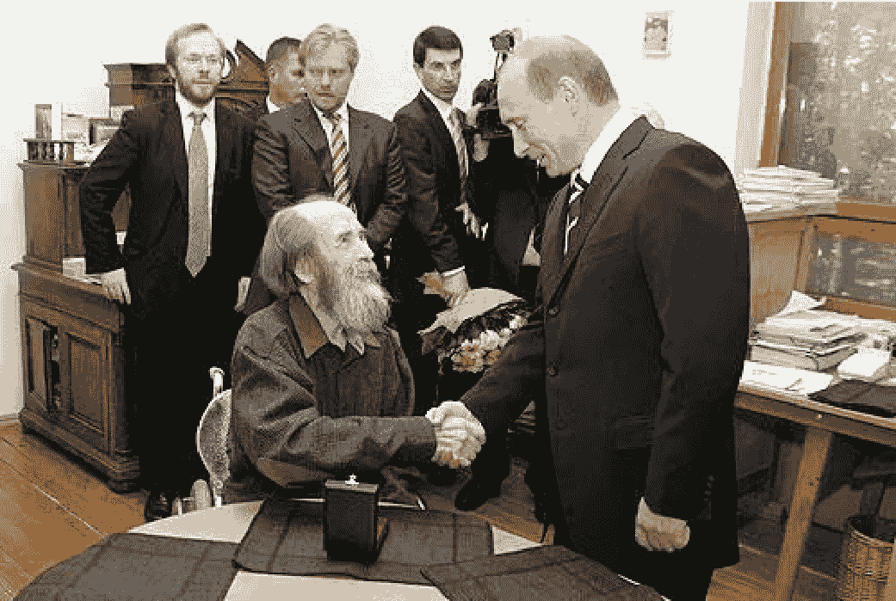

大家仔细体会下这些事，理解下俄罗斯人的性格，这样他们干的很多二逼事就很好理解了。

### 2 一言不合就闹事

大家知道，苏联是1991年解体的。

我发现不少人竟然不知道什么是“苏联解体”，我们先说下这事。

苏联跟美国差不多，苏联的全称是“苏维埃社会主义共和国联盟”，跟“美利坚合众国”是差不多，都是一堆国家组成一个国家。对，没瞎说，美国的“州”用的就是“State”，就是国家的意思。

有点不一样的是，美国五十州，有富州也有穷州，有白左横行的加州，还有神棍遍地的阿拉巴马州，有冻得要死的阿拉斯加州，也有四季如春的佛罗里达州，但是唯独没有一个核心州，当然了，一开始其实核心是弗吉尼亚，后来弗吉尼亚混的太差也就没人当他是根葱了。

苏联不大一样，核心是俄罗斯，其他的都是他的卫星国。

苏联解体这事跟当初美国南北战争差不多，都是一堆国家在一起过了七十年，有点“七十年之痒”，积累了大量的矛盾，混不下去了，准备分家。有意思的是，南北战争也是爆发于美国成立七十多年后。

不过差别是美国联邦政府国力雄厚，北方联邦军南下，打断了南方兔崽子们的腿，烧了南方几乎所有大城市，南方叛军交出武器，大家又其乐融融地继续过。苏联也一样，在成立70年后，大家各自心怀鬼胎，小伙伴们也想跑路，不过苏联当时有一系列问题，没有阻拦大家，然后就分裂了。

为啥没阻拦？因为苏联在解体前面临一堆麻烦。

苏联的第一个麻烦大家说的比较多，就是计划经济体制下轻工业品比较匮乏，尤其缺乏流行元素，这个问题非常大，也持续了很多年，很多人说这个原因导致了苏联崩溃，其实不是，这个问题一直存在，在1991年并不是最痛苦时期。而且苏联解体后老百姓才发现1991年的痛苦简直就是过家家。

苏联第二个麻烦是道义上处于“失道寡助”的状态，“联合国五常”里有四个反对它，因为他当时入侵阿富汗嘛。这个听起来也很麻烦，不过影响也就那样，关起门来过几乎不受影响。就跟人人都在骂你，但是你装作听不见短期内对你生活影响也就那样，几乎每一个网络大V们的日常，日常就是天天被人骂。

上边这两点问题比较严重，但是远远没有第三点严重，如果说这两点是高血压和痔疮等慢性病，那么第三个问题就是胸口上被插了一把刀。

也就是“石油问题”。

苏联每年开支特别大，有点像是一个家庭养车养房养一堆小孩每年需要支付一大堆各种费用，家庭入不敷出处于破产边缘。苏联当时家大业大也一直处于破产的边缘，当然了，美国也摊子不小，当时也快破产了，美国狂发展军备，越战又欠了一屁股钱没还完，其实他俩当时就在比谁先破产。

苏联当时有个杀手锏，跟现在一样，他们国内不缺石油，每年向全世界卖油就能赚一笔，通过这个费用来补足财政亏空，勉强也混得下去。甚至在1973年石油危机的时候，油价高涨，苏联财力大增，竟然乘势对西方进攻了一波。

但是到了1986年，出大事了，沙特和美国达成协议，石油增产，油价暴跌，高度依赖石油贸易的苏联立刻就陷入了财政困境，那种感觉就是你每天晚上出去开会儿顺风车家里勉强够花，哪天顺风车突然被禁了，你立刻不知道该怎么补窟窿了，甚至考虑辞退保姆少养一只狗子。经济危机引发了苏联内部的矛盾激化，苏联缺钱，在国际上买不到必须的物资，国内物资短缺，老百姓只好排长队。

联盟内部的加盟国的各国民族主义者们都趁机都起来反对联盟，他们都觉得自己单独过应该能好一些。老百姓的态度可能比较无所谓，跟着谁过不是个过，但是各国精英分子们都希望自己的国家自己的人民过日子，现在精英分子起来煽动，大家都有点想离开。

但是这远远不是苏联历史上最危急的时候，以往苏联很快就能把这事给压下去，只是这次有点不太一样。

因为联盟的那个主体俄罗斯人不想一起过了。

俄罗斯跟他的那15个加盟国的关系非常复杂，15个加盟国都有种俄罗斯在殖民他们的感觉，因为他们的国家不能完全独立自主，得听莫斯科的。

但是俄罗斯又觉得那15个国家是俄罗斯给养着，俄国知识分子抱怨说俄罗斯人支撑着联盟，是在输血让着其他人，富了别人，穷了自己。

互相觉得吃亏了。看看，多像两口子过日子，一吵架陈芝麻烂谷子就翻出来，互相表示在对方身上浪费了青春。

当时俄罗斯上层知识分子中比较著名的拉斯普金（不是那个神棍拉斯普京），他的一句话非常符合当时俄罗斯人的心态，他说“为了俄罗斯民族，可以失去一些边陲地区”。他说的边陲地区，就是那些加盟国。

所以说吧，当时各个加盟国想独立这事其实是小事，俄罗斯想独立才是大事，联盟里最大的那个不想过了，这联盟还能继续下去？那个叶利钦，就是俄罗斯民族主义者的代表人物。

随后波兰剧变，两德合并，匈牙利独立，这些事如果放在前十年，百分百会遭到镇压，这次联盟基本没阻拦就让他们独立了，原因嘛，不复杂，俄罗斯不想养他们了。

等着加盟国都跑了，俄罗斯也要甩开其他人自己要单过了。随后也就上演了那著名的一幕，俄罗斯的总统叶利钦逼迫戈尔巴乔夫宣布苏联解体。

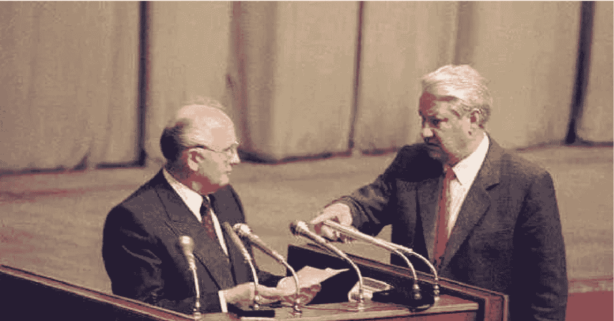

当然了，我们这是比较粗浅地过了一遍这个流程，而且属于其中一个面，具体过程复杂到了极点，甚至养活着一堆专家，文章篇幅所限，只能是讲到这个地步了。

多说一句，美国前几年奥巴马时代又玩过一次联合沙特增产石油的操作，想压低油价干死俄罗斯，现在的俄罗斯是由22个自治共和国组成的，所以也叫“俄罗斯联邦”，理论上讲还可以解体一次。而且前几年美国为了一步到位，又制裁了俄罗斯60多次，不过没起啥作用。场景已经完全变了，纯种俄罗斯人非常抗压，越压他们战斗力越强。

至于星球大战计划什么的，糊弄小孩的，小朋友理解不了太复杂的东西，所以才编了个简单逻辑，正儿八经的没人把那玩意当回事，大家听听就得了。

### 办公室来了个小年轻

有件事我看很多作者都没弄明白就在那里瞎写，把苏联解体和私有制改革理解成了一回事，以为是为了搞私有制才不要苏联的，其实不是，这是两件事。

苏联后期其实已经意识到了自己的经济模式出了问题，也在搞那种市场改革。

这一点很多人没注意到，市场改革并不是苏联完蛋后才开始搞的，在苏联还活着的时候已经在搞了。在1988年，苏联就通过了《个体劳动活动法》和《合作社法》，从这个时候起，私营企业就合法了。

后来的那些寡头们，都是在这个时期开始做买卖，并且通过损公肥私，赚了大量的钱。

比如著名的“七寡头”之一弗里德曼，他这个时候就在从国外往苏联倒腾计算机赚差价。在当时的苏联，做买卖必备条件就是跟官员打好关系，弗里德曼做买卖过程中在苏联政府里积累了大量的人脉。

这么说吧，大家所熟知的俄罗斯寡头，在苏联时代他们已经完成了第一桶金的积累。

不过那时候的寡头们还没成害虫，如果没有后来的激进改革，这些寡头们的一生不出意外，就跟我国早期那些倒爷似的，都会为建设俄罗斯殚精竭虑，大部分人然后在一波接一波的经济大潮中被拍在沙滩上，少数会脱颖而出。

但是坏就坏在俄罗斯人急功近利这个毛病上，落实到具体个人身上，这人就是传说中的盖达尔。

这个盖达尔长得圆胖圆胖的，又矮又秃，像个厨子，几乎没人能把他和当时俄罗斯最有权势的人联系在一起，事实上在1991年11月5日之前，这货还是个经济学家，空想家，键盘侠，全俄罗斯最激情澎湃的资本主义拥护者，如果搁现在就是个微博经济学家。

这人出身苏联上层家庭，所以从小就跟着父母经常到国外去溜达，顺便学习了一堆西方经济学，不知道从啥时候起，他就成了市场经济的信徒。

从1986年开始，他有意无意搞出来一个影响了俄国历史的玩意，当时和他一样向往市场经济的一群年轻学者慢慢走到了一起，他们在圣彼得堡郊区一个叫“蛇山”的疗养地频繁组织研讨，逐步形成了一个松散的组织，有些书里把他们称为“蛇山会议派”，不过他们自己称呼自己为“青年改革派”，有点像现在的微博粉丝群，经常举办线下聚会那种。

其实你仔细观察，就能发现这伙人跟我们前文提到的“十二月党人”几乎一毛一样，十二月党人出身沙俄贵族，这伙人出身苏联高干子弟；十二月党人去了趟法国回来后脑子就有点不正常，想发动政变一步到位改变落后的沙俄体制。青年改革派学习了一些西方观念就准备在自己国家身上搞激进疗法。一样的心急，一样的渴望一步到位，一样的不切实际，一样的没有好下场。只是最后的结果却不大像，十二月党人虽然被流放，但是被诗人写成诗歌到处传唱，打上了“反抗暴政”的标签。青年改革派被钉在了俄罗斯的耻辱柱上，成了文人误国的典范。

青年改革派后来的名声有多差呢？他们里边的一个核心人物叫丘拜斯，青年改革派的精神领袖是盖达尔，而实际操盘的是丘拜斯，进入新千年后，丘拜斯被评选为俄罗斯人最不能原谅的第二个人，第一个是希特勒。他长了一头红发，从他之后，俄罗斯政坛基本没有出现过红头发政治家，因为大家看见红头发就忍不住想骂人。可能大家觉得他的头发是黄的，不过在国外这个颜色就叫红发。

按理说，这帮学者们本来是没有任何机会，不过太过机缘巧合，给了他们一个舞台，苏联快崩溃那些年，他们一直在一份当时非常重要的报纸当编辑，话语权非常重，天天在那里传道，讲市场经济的各种好处，而且头头是道，全国慢慢都知道了这伙人。很多人也成了他们的簇拥，觉得这个星球上最好的东西就是市场，只要有了市场，就会有一切。

大家看出来了吧，俄罗斯一部分人除了信东正教，又信了“市场教”。

盖达尔的逻辑倒也算不上错，市场确实是很重要，我国当初就是搞市场经济改革富起来的嘛。

不过他们这伙人忽略了一个常识性的问题：逻辑对了没啥用，就跟懂了再多的道理依旧过得跟个棒槌一样，现实世界有摩擦力，有阻力，而且到处是坑，那些纸上的推论最终要落实到现实里，难度一下子翻了几十个数量级。给大家举个例子吧。

现在连普通大学生都知道内燃机的原理，可是全世界能造出合格内燃机的公司却就那么几家，而且都通过这种垄断优势赚取高额利润，你就算羡慕死，你也只能是干瞪眼，你不可能说自己懂了发动机原理就搞一个发动机出来。

还有造枪，这玩意原理就更简单了，上世纪60年代的大学生都会，但是具体到实践中，能造出来合格步枪的国家就那么几个，因为每一个部件背后都是一座山一样的工业积累，单是那根枪管为了克服热胀冷缩不变形就用了两百多年才阶段性解决，至于怎样克服子弹卡壳和炸膛问题到现在也没完全解决。

市场也一样，第一步永远是提供秩序，否则，到处都是黑社会跟寡头，没法搞市场，类似巴西那种。世界上经济搞的好的大国政府没有弱的，这可能跟经济学课本上说的不太一样，其实也好理解，经济学课本都假设世界没有摩擦力嘛，就跟初中物理也都是假设“绝对光滑，不考虑空气阻力一样”，等到了工程学领域，发现绝大部分工作都在对抗摩擦力、空气阻力和重力，不考虑摩擦力的理论都是耍流氓。

其次法律法规也得跟上，搞市场经济必然伴随着无数的纠纷，谁来解决怎么解决，这也是决定性的，不然很多复杂交易根本没法开展，而且签了合同得兑现是吧，如果对方不兑现怎么办？欠的钱到期得还吧？万一人家不还怎么办？以及产权怎么界定？合同怎么书写？商业大国都是法律大国，商业越发达的地方，法制肯定是越发达，不然你俩发生纠纷，法官都弄不明白你们在忙乎啥，怎么给你们做裁决？

回到1991年，青年改革派这伙人显然对这类问题的思考程度就跟个现在那些学习了经济学的年轻人似的，看了一本《牛奶可乐经济学》就觉得这个地球上所有真理都被自己收获了，再看一本《通往奴役之路》，就觉得自己可以当先知出去布道了。

如果没有叶利钦，青年改革派的年轻人们基本就跟我国铁血论坛上的博主们一样在激烈的探讨中度过自己的一生，但是谁能想的到，叶利钦同志真会启用一群铁血论坛的热血青年们做俄罗斯经济的设计师。

叶利钦当上俄罗斯总统后一度无可适从，不知道从哪做起，后来听说玻利维亚在经济学家萨克斯的建议下搞的还不错，准备启用一群跟萨克斯观念差不多的经济学家来拯救俄罗斯。

如果他要是知道玻利维亚经济好看了几年，随后就一直烂到了底，有“南美乞丐国”的名声，南美那么烂了，玻利维亚竟然是南美乞丐，你们就知道萨克斯的工作有多么出色，不过等到叶利钦意识到这一点的时候，俄罗斯已经掉坑里去了。他也该哭晕在厕所了。

青年改革派的人生转折在1991年11月5日这天，那是一个寒冷的冬日，克里姆林宫一个电话，说盖达尔同志你来当叶利钦的最高经济顾问。

小盖穿上最帅的西装，把头发梳成大人的模样，坐着奔驰防弹轿车停在了前苏联计划经济委员会那座灰色的大楼下，成了俄国的经济沙皇。大家对他的感受是这个胖成圆球的人要拯救俄罗斯，把俄罗斯从计划经济的阴霾下拯救出来。

当时有两个方案，其中一个是慢慢来，就像开着一艘船似的，一点点对接到全球市场上去，有问题解决问题，徐徐往前开，如果发生问题就赶紧调整，调整好了继续来，当时中国已经搞改开十几年，卓有成效，还是可以学习的。不过我们前文说了那么多，你跟俄罗斯人说“慢慢来”，跟你侮辱他们全家老小差不多，以俄国人的暴脾气，他们能有那个耐心慢慢来？

另一个方案就是我们后来看到的，当时俄国人的思路是如果慢吞吞地搞，那得搞到啥时候去啊，既然市场经济是对的，那就要搞就一步到位，把俄国这片领土上苏联留下来的东西全部铲掉，然后在清理干净的地基上建造市场。这种激进到了极点的方法，被称为“休克疗法”。

后来有个俄罗斯笑话，是这样说的：

“请问瓦西里同志，休克疗法是科学吗？”“当然不是了，如果是科学，他们会先在猪身上做实验”。

是的，这个史无前例的大胆计划，竟然没在猪身上测试过就直接在俄罗斯开始实施了。

### 寡头出笼

这场改革从一开始就蒙上了一层阴霾。

大家记得之前川普被他自己人给坑了的事不?

川大爷的国家安全顾问弗林跟俄罗斯人打电话的内容被美国情报部门给记录下来,然后通过好几个渠道匿名发给媒体曝光,舆论大哗,随后这位总统亲信黯然下台。川普大怒,说是有人搞阴谋,说是要彻查此事,然后就没下文了,连个鬼都没查出来。川大爷也对此无能为力,这事就不了了了之了。

大家通过这事好好体会下权力到底是怎么运转的,权力不是通过机器人下发的,是通过一层一层的官僚来执行,也有摩擦力和粘滞力,如果政策目的跟官僚他们的意志是一致的,事情往往很顺利,如果不一致,他们会想尽办法给你使绊子,把事情搞砸,然后领导承担责任,崇祯皇帝对这事体会很深。这个不只是在政府,大公司也都一样,其实巨型公司跟政府差不太多。

1991年的青年改革派也碰上了这个麻烦,他们执政后面对的第一个问题竟然是叶利钦给他们签发的任免书找不着了。

当时盖达尔本人是他们蛇山会议派的精神领袖嘛,但是他更像个学者而不是官僚,就让他们组织内的铁腕人物来管理俄罗斯的官僚们,这就需要叶利钦签署一份任命书,叶利钦麻利签署后,这个任命书就找不着了。

当时叶利钦怒不可遏,大发雷霆,说“你说什么?法令丢了?立刻去找,总统的法令绝对不能丢!!”

后来找遍了可能丢失的地方,也没找着,只好硬着头皮让总统重新签署一个,总统一顿拍桌子,跺脚,呵斥,大声对周围的人进行了充满恶意的人身侮辱,宣称要开除某个负责人(叶利钦的日常)之后还是签了。

然后这份法令又丢了。。。。。。

这事看着很尴尬,其实影响并不大,跟后来那些看着不尴尬,但是影响巨大的事没法比。不过以小见大,通过这件事,你就知道后来的改革能顺利到哪去。

在1992年,盖达尔访问捷克的时候,捷克总统就跟他说,“通货膨胀什么的都好解决,但是,俄罗斯资本主义最终的命运,将决定于你们这伙人的政治水平”。其实就在暗示盖达尔他们的政治水平跟一群猴差不多,但是小盖显然没放在心上,没人会承认自己水平像只猴嘛。

啥是政治水平?就是指挥管理官僚的技巧,赢得民众支持的能力,遗憾的是,当时俄罗斯领导人一样都没。如果单讨论经济学功底,这些人在当时说不定是教授水平,可是如果讨论具体操办这些问题的实际操盘能力,这伙人就是一群高中生。

盖达尔他们的逻辑是“苏联的问题是大家积极性太差,怎样提高大家的积极性呢?把国家所有资产给大家分了,变成私有财产,这样大家自己对自己负责,一切就好了”。

具体怎么操作呢?

盖达尔他们把全国1/3的资产以1.48亿份支票和凭单的形式分割,每份价值1万卢布,然后分给老百姓,每个老百姓分一份,有点像你们公司上市了,大家每人分了一千股。当然了,原先厂子里的那些管理层得多分点。大概就这么个逻辑,这下把国家给老百姓了。

大家注意下,按照盖达尔他们的意思,全俄罗斯的1/3资产价格为1.48万亿卢布,卢布当时贬值的跟废纸差不多，后来经测算，这个值连那些资产的1%都不到，也就是说，他们以“白菜价”把俄罗斯给卖了。

但是问题很快就出现了，因为当时俄罗斯爆发了严重的通货膨胀，这个也好理解，国家处在转型期，物资本来就不足，政府又把国家资产给老百姓分了，政府没钱，只好印钱给公务员支付工资什么的，大家都觉得将来卢布会变废纸，只要手里有卢布就花掉，开始哄抢物资，可不就日常1600%的通货膨胀嘛。

这个背景下，大家纷纷把自己到手的那张凭证按照烧饼价给出售了，大家担心那玩意今天还能换个烧饼，明天可能连烧饼都换不到。

就在这时，俄罗斯上空盘踞的秃鹫们突然俯身向下，对这些凭证发动攻击，有多少收多少。这些人，就是传说中的“寡头”。

大家可能纳闷了，他们哪来的钱？

这伙人都是在前苏联的时候就倒买倒卖各种稀缺物资赚钱，在1992年的时候已经都是巨无霸。并且其中几人本身就是手眼通天的银行家，比如霍多尔科夫斯基和波塔宁，他们背后都有银行，并且银行背后又有银行，当时英国美国都看的非常清楚，知道这次甩卖基本是白送，买到就是赚到，千方百计和寡头们达成密约，向寡头们输送资金，寡头们拿到钱之后再去买凭证。并且在倒卖过程中“寡头”跟政府各级官员勾勾搭搭，其中有些人本身就是政府高官，比如著名的“七寡头”之一波塔宁，他就是苏联外交官的儿子，上的学校也是专门为苏联培养外交官的学校，在政商两道都有错综复杂的关系。七寡头的历史定位有点像胡雪岩，很多人还在研究老胡的经商技巧，连个常识都没吗？他是半个官员啊，他通过特权赚钱，你们把他当成商人研究不是歪的没边了嘛。

当然了，国内的文章一般描述最多的就是上文说的这个过程，以为这就是俄罗斯寡头化的全过程，其实这个也想简单了，真正的重头戏其实是1995年的“贷换股”，这玩意被后来的俄罗斯人称为“浮士德交易”，也就是跟魔鬼的交易，这件事标志着俄罗斯彻底寡头化。

大家知道，美国有完善的债务市场，政府缺钱就可以去公开市场上借钱，这钱都是市场里本身存在的，不会引发通货膨胀，不过借的太多也有问题，比如美国现在又要回到1991年那个破产边缘了。

在1995年，俄罗斯实在是扛不住了，政府没钱了，而且车臣战争正烈，正是花钱如流水的时候，当时有两个选项，政府可以印钱来支付战争和其他开支，但是肯定会大规模通货膨胀，以俄国老百姓的易燃易爆的性子，非常危险。

或者向财阀贷款，但是财阀开出来的价码是：政府放弃要在那些矿产和石油公司里所有的股份，转卖给他们，这就叫“贷换股”，财阀提供贷款，政府交出股份。

也就是说，财阀盯上了俄罗斯剩下的那2/3的资产。

当时全世界没有人能相信俄罗斯政府能接受这个操作，太匪夷所思了，那种感觉就好像有人去借给美国政府钱，条件是要买下美国海军的控制权一样夸张。

但是大家完全忽略了一个大问题，当时已经是1995年，俄罗斯会在1996年大选，但是自从苏联解体之后，俄罗斯老百姓水深火热，生活水平连苏联时代一半都达不到，老百姓纷纷开始怀念苏联，这个背景下，俄共重新上台的概率已经远远超过叶利钦。甚至那个索罗斯也一再警告俄国寡头趁早准备一张流亡飞机票，打包好行李，随时准备跑路。

为了阻击俄共，叶利钦的幕僚们，也就是我们刚才提到的青年改革派，给叶利钦出了个主意，说把协议先签了，只要寡头们保证对咱们的支持，就有希望。寡头们控制着俄罗斯几乎所有的媒体，如果寡头们愿意使劲，俄共甚至别想在电视和报纸上露脸，叶利钦仔细考虑之下同意了。

现在大家知道为啥这个协议叫“浮士德协议”了吧，协议签了那天起，寡头们将彻底尾大不掉，成为俄国的真正沙皇。

这个故事的前半截有点像我国早期的那些倒爷，事实上我国很多企业都是倒爷起家，比如联某想，华某为，刚成立那会儿都是转卖国外设备起家，后来走上了自行研发之路。

俄罗斯如果没有这次大折腾，苏联的这些倒爷很可能将来也会发展成俄罗斯民族企业家，不过这次大甩卖之后，这些人一下子从商人变成了食利者，坐拥无数的矿山和油田，从此能躺着赚钱，怎么会去想办法搞创新做企业赚那种辛苦钱呢？

而且他们为了维持自己的地位，不断跟政府勾结，搞的整个俄罗斯政府都乌烟瘴气，俄罗斯的腐败程度也堪称世界之最，这种状态下，经商环境也极其恶劣，法律形同虚设，根本谈不上“有效市场”。

这倒是应了布罗代尔说的那件事，在研究俄罗斯这段历史以前我一直没太理解，他说“资本和市场是相互吞噬关系，如果资本占据优势，他会勾结政府，创造波动，反正从这以后不再有公平市场可言”。

随后的大选中，由于寡头们控制着俄罗斯几乎所有的媒体和报纸，天天疯狂诋毁俄共，唤起民众对苏联的痛苦记忆，最终把叶利钦再次送入克里姆林宫。政治和财阀彻底完成了绑定。

当时欧洲有一份报纸画了幅漫画，画的是叶利钦照镜子，镜子里出现的却是“七寡头”之一的别列佐夫斯基头穿沙皇礼服戴皇冠的样子。

### 王朝落幕

按理说七寡头在俄罗斯的地位无可撼动，他们拥有半个国家的资源，80%以上的政府官员支持，他们比总统都光鲜，唯一跟总统不一样的是他们不需要承担总统的责任，事实上有一句话是这么说的：

总经理，妓女和替罪羊都是可以更换的，老板们的财富才是不许动的！

七寡头之一的别列佐夫斯基曾经说过：

如果我愿意，可以让一只猴子做总统。

如果回到1999年世纪之交，大家确实会觉得他们会一直混下去，没人能对他们造成威胁。但是遥远的天边，出现了一丝阴霾，也就是普京。

关于普京，我们就不想多说了，原因你们懂的。

普大大是个真强人，以前当过木匠，后来当过克格勃，他和那个默克尔都是情报人员，年轻时候的默克尔也在东德情报部斯塔西当过间谍，普京也在东德度过了几乎全部的间谍生涯，他俩都会说德语和俄语，都有长时间的东德工作生活经历，不知道你们注意到没，每次他俩在一起，都表现出令人尴尬的亲近：

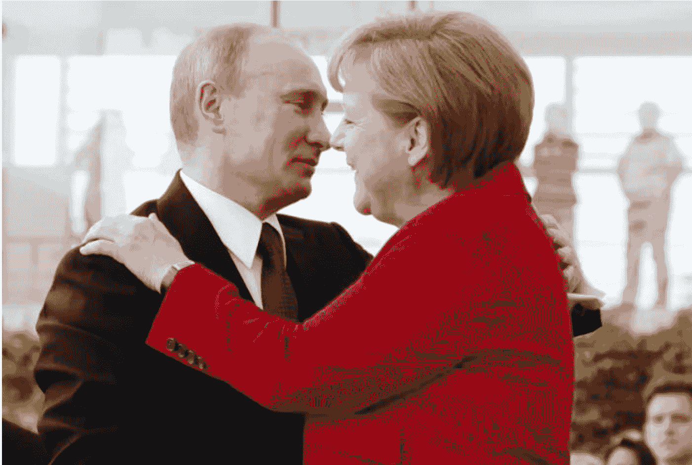

在1999年，普大当时还是个朴实无华的总理，考虑到他是叶利钦十七个月里换的第五个总理，你们就知道这个职位在俄罗斯有多无足轻重，叶利钦晚年身体一直不太好，几乎每天都在疗养，当时国际新闻有个说法：天啊，叶利钦今天只喝了一瓶伏特加，看来他确实病的很重。

不过普大很快凭着铁腕打赢了惨烈的车臣战争，这让俄罗斯人眼前一亮，俄国人是那种不怕牺牲不怕痛苦就怕憋屈的民族，所以他们天生热爱铁腕人物，这也是普京慢慢被大家接受的原因。

叶利钦身体不好，也可能面对烂摊子闹心的不行，干脆不干了，想辞职。辞职就有一个谁来接班的问题，当时有一个著名寡头别列佐夫斯基，他推荐由普京来接任，如果他后来知道普大上台后要做的事，估计想找个豆腐撞死。

普京上台前和七巨头有个协议，大家商量好一起向前，不清算不攻讦，互不干涉，不过七巨头把普京完全当成了一个代理人或者经理来看待。

没想到普京座位刚坐稳，就向寡头发动进攻。

尤其是针对尤科斯公司的调查，我小时候有段时间天天在新闻上能看到，对俄罗斯印象最深的就是尤科斯和北奥塞梯别斯兰，尤科斯是俄罗斯的一个重要的石油公司，这个公司的石油产量能赶得上科威特一个国家的产量，这个公司被寡头们控制着，普京希望把这个公司收归国有。国有化这个事情到底合不合理，关键是看你怎么理解，从现代私产意义来讲，这确实有点像是打劫，相当于国家侵犯了私人财产了嘛。当然了，财阀手里的资产也是他们非法搞来的，也说不上谁侵犯谁。

再换个角度，这样的资源型留在私人手里，这玩意并不需要什么企业家精神，他们躺着赚钱，每年把赚到的钱转到国外，在海外挥金如土，1997年一个英国记者拍到一个俄国寡头情妇的宠物狗项圈上挂着几个大钻石，价值五十万美元以上，就在新闻发布那天，莫斯科街头冻死8个无家可归者。

当然了，钻石做的狗项圈看着晃眼睛，其实花不了几个钱，真正影响巨大的是美国公司在俄国私有化过程中通过俄国买办控制了大量股份，然后他们从中一直在抽血，

俄国的私有化改革最直接的效果就是替美国把欠下的债都还上了 。

这也是为啥华尔街有句话：如今的美国想还上欠下的20多万亿国债，除非再肢解一个超级大国，否则很快连利息都还不上。

如果那些能源企业收归国有，就可以拿这些钱去重新修路搞社保，给公务员发工资什么的，惠及的是俄国全国老百姓。

反正普京选择了后者，把尤科斯石油公司的七寡头之一的霍多尔科夫斯基送上了法庭。在十几年前的当时，这是个大事，当时全世界都在报道，国内报纸上都写着“普京要政权还是尤科斯”，当时我自然是理解不了为啥影响会这么大。这个就是霍多尔科夫斯基：

后来才明白，原来是寡头们早就形成了联盟，牵一发动全身，普大出手搞他们，他们一个反击，普大可能也会被他们一起搞下台，在普京之前的俄罗斯总理就是被“寡头”别列佐夫斯基给搞下的。

后来的事大家也都知道，普京大帝轻松收拾了这些寡头，啥事没发生，究其原因，一方面普大帝能力确实是很强，平定了车臣叛乱后声望暴涨，有了军方和克格勃大佬的支持，俄国枪杆子们都支持他，同时他还有个优势：财阀们富可敌国，而且这些钱都是劫掠来的，俄罗斯人民讨厌他们。这么一对比，也不见得普京实力弱，所以普京对七寡头的战争相当于是一次人民战争，七寡头略作反抗后丢盔弃甲，西方预测的那种俄罗斯政坛大佬们联合对普京发难的事并没有出现。我以前就说过，俄罗斯最大却最容易被人忽略的一股势力就是俄罗斯的人民，七寡头显然把这事给忘了。

随后普京发动一连串的诉讼，把这些人全部送上了法庭，其实大家想想就知道，整个俄罗斯没有一个人能经得住查，更别说这些寡头了。

当然了，现在的俄罗斯政治环境比较复杂，并不是我们理解的那样普京是沙皇，在一人之下万人之上，他自己更像是一堆新寡头里最大的那个，跟蒋委员长地位差不多，能源企业也没有彻底国有化，总之比较复杂，碍于篇幅，我们就不讲了，将来看看能不能讲一期。

到现在为止，七大寡头已经全部消停：
- 古辛斯基：流亡；
- 别列佐夫斯基：先流亡，后来死在了英国；
- 霍多尔科夫斯基：先坐牢，后特赦，现在流亡；
- 斯摩棱斯基：俄国检方撤诉，但是基本不再有政治势力，现在生意规模都赶不上巅峰时期的零头的零头；
- 维诺格拉多夫：同上；
- 马尔金：流亡；
- 弗里德曼：唯一一个躲过起诉的人，因为他选择合作而不是对抗。

### 尾声

洋洋洒洒写了一万多字，有点遗憾最后一截没敢放开写，不知道界限在哪，后续可能再写点普京相关的内容。

七寡头之后的俄国进入了“新寡头时代”，其实这也正常，俄罗斯这个国家一直都这样，非常不好管，只有沙皇、慈父、普京这样的人才能管得住，新寡头和旧寡头最大的差别，就是现在那些油田什么的收入不再完全落入私人之手，部分上交财政，俄国才能在美国的制裁中挺这么久。

俄罗斯留给世界最大的遗产，无疑是在那之后，各国政府对经济学家的话非常警惕，也很少会让学者直接担当重任，知道他们经常是一腔热血兢兢业业地把事情搞砸，往往跟正常官员一样在工作中考察，有能力再提拔，几乎不会出现俄罗斯、玻利维亚那种政府拿着经济学家的药方直接操作的事情了。

如果说俄罗斯还给我们留下什么教训，那无疑是“凡事要慢慢来”，急功近利，追求毕其功于一役几乎无一例外没有好下场。

文章的最后，必须要说一句，俄罗斯、利比亚、叙利亚等国都在一再重申一个道理，永远，永远不要指望自己国家烂成一团的时候别人会出手拉你一把，他们都是秃鹫，大街上血流成河的时候，就是他们出来打劫的时候。

公众号懒人搜索，懒人专属群分享

### 懂了德国为什么没被广场协议搞死，就明白了为啥我国要搞共同富裕
### 2021-09-15

我们都知道，广场协议之后，日本经济很快出了问题，然后在此后的很多年里一蹶不振。

但是这里就有一个问题，德国和日本一样，都被美国摁着签了广场协议，都在随后经济遭到重创，为啥德国好像后来又缓过来了，日本的影响却那么大，问题出在哪了？

我最近两天看德国经济史的时候，突然把这个问题想清楚了，而且懂了这件事，大家也就明白了为啥我国这么执着要搞共同富裕。

不过这个话题开始前，为了防止大家不了解，还是要给大家稍微解释下到底什么是“广场协议”。

### 广场协议

这事主要和日本经济快速追赶有关，日本战后经济发展非常快这事大家也都知道，一方面美国大哥开放了西方的市场给他们，也就是日本生产的东西可以卖给西方，解决了需求端问题；另一方面西方也转让了一部分资金和技术给日本，让他快点起来围堵苏联和中国，这就解决了日本的供给端问题。天时地利人和，都凑齐了。

所以日本从“二战”后到1973年实现了每年8%以上的增速，1974年放缓一年后，出现了第二轮增长，一直持续到1990年前后。同时期德国和日本的情况差不多，也是飞速发展。美国本来准备修理他俩来着，但是随着冷战铁幕落下，说巧不巧，正好落在他俩家门口了，所以美国只好扶他俩起来干苏联。

但是增长的阴影下，日本跟我国现在的情况一样，面临着相同的问题：在对外贸易中日本占了美国人便宜，一直有贸易顺差，这美国人能忍？德国那边也一样，德国生产的东西比美国的强太多，美国人也认为德国占了自己的便宜，甚至一度不准让德国人去美国卖车。

慢慢的，美国越来越暴躁，美日、美德之间冲突不断，在三十多年间持续爆发了“纺织大战”、“钢铁贸易大战”、“彩电摩擦”、“汽车贸易摩擦”，从这个过程中大家也能看出来日本和德国的经济在持续升级。

贸易摩擦归摩擦，你牛逼才摩擦你，日本就是在美国的折腾过程中越来越厉害，到了80年代，日本成为世界上第二大经济体，很多日本企业都做到了世界第一。日本手里拿着大量贸易中赚到的钱，全世界到处买地买资产，爽的不得了，而且日本人均收入是美国的145%，GDP占世界的15%，超过德法两国的总和，可以说各个角度都是真正强国。同时期德国成了欧洲的领头羊，当时法国也通过举国之力搞定了一堆重要的技术突破，他俩开始威胁美国在欧洲的影响力。

在这个背景下，美国人忍无可忍，准备收拾下德国日本，也就有了后来的广场协议。不过并不是以往大家说的“广场协定”直接干趴下了日本，这个太过简单化了。

当时美国天天指责日本操纵汇率，有意思的是美国现在也在指责中国操纵汇率，说是日本故意压低本国汇率。不过这事倒没冤枉日本，日本政府当时确实把汇率压得很低。日本普通老百姓买美国的东西巨贵，基本不买美国人的东西，美国人买日本人的东西却巨便宜，疯狂消费日本产品，能不贸易顺差嘛。

所以美国要求日本德国把汇率大幅上调，这样日德的东西在国际上卖的时候就会很贵，美国货也不那么没有竞争力了。

以往我们说是《广场协议》中日本被迫提了汇率，其实这么说肯定不对，因为美国搞日本是个长期的事，“广场协议”只是其中一部分。真实情况是美国从1971年就开始搞日本，一直搞到1987年。

先是在1971年，西方十个国家的财政部长一起搞了个《史密斯协定》，一起要求日元升值。然后继续施压，小打小闹不断。

到了1985年，美英德法日五国财长在美国纽约广场饭店签订了《广场协议》。《广场协议》之后是1987年的《卢浮宫协议》，核心就一件事，让日元和德国马克升值，升值之后日德的产品在国际上就不那么有竞争力了嘛，嗯，现在美国也在对我国干这事。

迫于压力，而且日本政府当时确实希望日元国际化，日元出现了大幅升值。不过日元升值就意味着日本生产的汽车和彩电变贵，在国际上竞争力就不那么强了，所以在1986年，日本出口增速从之前的3.9%暴跌到-16.8%，也就是以往卖到海外的东西现在卖不出去了。德国也差不多，协议签完，出口暴跌，而且随后几年的GDP增速也遭到腰斩。

问题是德国和日本他俩都是工业国，也是生产国，生产出来的东西卖不出积压在仓库，单是贷款利息就能把大部分企业给干倒闭，那怎么办？总不能烂在锅里吧？德国日本都对这事慌了。

### 日本对策

日本对这事的解决方案就是准备让本国老百姓消费掉过剩产能。

可是日本老百姓钱就那么多，现在要消耗过剩产能，就得多花钱，可怎么让他们多花钱呢？日本政府想来想去，最后出了个主意，降息降准央行放水。

降息这事理解起来说容易也容易，说复杂也复杂，直观的感受就是你去银行贷款付的利息更少了，也就可以贷出来更多的钱消费。而且利息影响投资标的，比如你本来有几百万想去投资开饭店，算了下收益率，只有4%，如果利息是5%，你可能就把钱存银行了，毕竟躺着比投资都赚钱，那还投资啥？如果现在降息到1%，存钱就不划算了，不如去投资，工作岗位就创造出来了，老百姓就加工资了。

所以日本政府降息后，市场确实充满了热钱，不仅日本的钱，美国的大量热钱也涌入日本投资。那效果怎么样呢？非常不怎么样。

大家知道，银行是最嫌贫爱富的，它贷款给你，都是要抵押的，你有上千万的房子，它随随便便贷款给你几百万。你没钱想贷点，银行几句话就把你赶出来了，没抵押聊个毛线啊。

这样相当于富人们手里一下子多了一堆钱，他们会去买电视买冰箱和洗衣机吗？谁家会花几百万买这些东西？

大家要知道一个常识，“大钱”和“小钱”的花法完全不是一码事，普通老百姓家里多了几千块，可能就会去改善下生活，吃点好的，买个电器什么的，主要是消费了。但是如果你账上多了上千万的银行贷款，吃喝是花不掉的，只能是去投资，如果投资建厂还好，但是当时日本是产能过剩，厂子已经太多了，所以基本都投资到房地产和股市里了。

接下来的事大家也就知道了，日本富人疯狂去买房和股票这样的资产，随后这些资产价格开始上涨。中产阶级一看房价和股市都在涨，赶紧把房子抵押了也去买，从银行贷出来更多的钱，房价股价进一步被推高，就这样日本人左脚踩右脚就飞起来了，国内一片欣欣向荣，是不是这景看着有点眼熟？

但日本政府却慌得要死，因为他们是知道的，降息的目的不是为了拉房价，是为了给企业消化过剩产能，现在产能没消化，企业都跑去贷款炒股炒房了，这日子怎么办？

随后日本央行从1989年开始温和提高利率，降低货币供应。到了1989年底，日本历史上著名的“疯狂原始人”三重野康出任日本央行行长，为啥叫他“原始人”呢？因为这个在中国东北长大的日本经济奇才极其讨厌投机，日本当时主流经济学家觉得投机是市场行为，市场是不会错的，所以他们把讨厌投机的三重野康称为原始人，认为他是中了计划经济的毒。为啥说他疯狂呢？因为他作风极端雷厉风行甚至有点不顾后果。

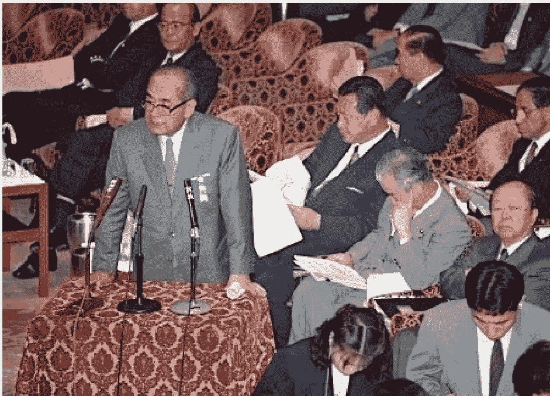

他上台后日本五次提高利息，终于在1990年8月，日本的利息由超低的2.5%飙升到了6%，而且银行不放水了，这下可出麻烦了，股市和房市都被断了货币供应，涨不动了，没人接盘了。

随后就爆发股灾，日本股市在1990年到1992年三年间跌掉了一半多。股市这么惨，楼市也没逃掉，股市暴跌仅仅半年后，楼市也开始动摇，随后激烈下跌，在1990年到1992年这三年中也跌掉了46%，上百万亿日元的资产化为乌有。

我最近看了个材料，说是三重野康之前，美国的美联储主席叫沃尔克，他也是一个强人，曾经大幅提高利率，把美国经济直接搞出三年的萧条来，不过一般认为沃尔克是美国历史上最伟大的美联储主席，有壮士断腕的决心。三重野康明显是要做下一个沃尔克。

当然了，这不是结局，从1992年之后，日本房价一直降，累计又降了50%，我刚才查了下，现在还在降。不过现在继续下降的原因大家普遍认为是因为日本老龄化问题，每年死了的人腾出的房比买房结婚的新人都多，房子能卖上价有了鬼了。

### 德国对策

看完日本的，咱们再看德国的，其实德国也没啥好办法，在当时他俩一起被美国搞了，出口都发生暴跌，都在思考解决方案。

不过德国有惨痛的通货膨胀经历，对大幅降息印钱这事比较敏感，所以也就没着急降息。

不过德国运气比较好的是，两德统一了。两德统一这事我稍微说下，二战后德国不是被分裂成了两块嘛，东德和西德，一半归西方，也叫联邦德国；一半归苏联，也叫民主德国。但是到了1990年，苏联眼瞅大势已去，两德人民统一愿望呼声很高，所以两德统一这事就开始聊上了。

但是德国统一这事，大家千万别弄错，西方所有国家，比如英法美等国，都不希望德国统一，因为它要是真统一了，发育一些年，就会变成欧洲一极，美国就管不住它了，英法也得看他眼色。

但是当时西欧又都是盟友关系，不好意思直接出手干预，大家都指望着苏联修理德国，但是苏联一言不发，看着德国统一了。反倒把西方差点给气死，当时法国总统没忍住，当场就说“苏联领导人到底收了多少马克？为啥不出兵阻止德国统一？”

为啥苏联不管呢？因为苏联是一堆加盟国的联盟，所以国歌才叫“牢不可破的联盟”，联盟里最大的成员国是俄罗斯，俄罗斯一直都觉得自己在联盟里比较吃亏，到了1990年，俄罗斯自己想跑路，而且“跑路派”已经充满了苏共高层，他们巴不得看到盟友们都跑了，那样俄罗斯自己也就顺利脱身，所以当然不会管两德统一了。

此外法国人说的很对，俄罗斯人确实收了西德无数的钱，德国人有钱，觉得如果能用钱解决的问题都不是问题，为了两德统一他们愿意支付天价。此外西德人还给俄罗斯人开出来了丰厚的价码，比如宣布永久放弃加里宁格勒。

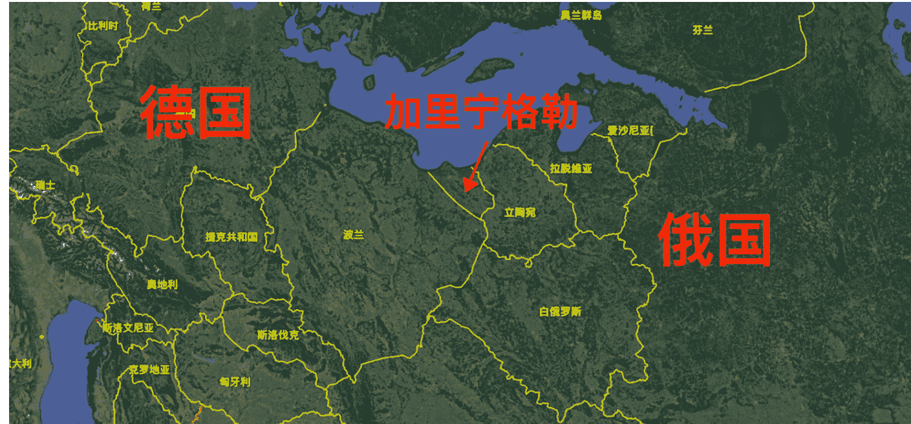

加里宁格勒以前叫哥尼斯堡，曾经是东普鲁士的首府，康德的故乡，大概相当于陕西或者山东对于中国的地位，“二战”后被苏联拿走了，现在还在俄罗斯境内，跟俄罗斯领土不连着。两德统一前，德国人说不要那块领土了，他们只要东德，俄罗斯本来就不想留东德，又收了钱，又永久保住了加里宁格勒，就做了个顺水人情。

然后德国就统一了，统一后的德国一下子多出来一块巨大的市场和人力资源池，大量的廉价而且受过高等教育的工人加入德国市场，导致德国工人的工资大幅下跌，制造业的成本也就降下来了。

不仅如此，东德和西德的经济差距很大，为了救济东德，新的德国政府通过了加税协议，对富人和富裕州征税，补贴原来的东德地区。东德人收入增加后，就要买车买电视，这样一来，德国人自己增加了一大块内需，补充了一部分消费力，本来卖不出去的那部分产能被东德给消化了。

说到这里可能有小伙伴不太明白了，一国内部的财富重新分配了一下为啥就能促消费呢？

也不复杂，比如中国现在就有这个问题，非常有钱那部分人几乎是不消费中国的工业品的，主要买各种高端玩意，而且收入的大头都花在了资产上，消费才花几个钱。如果他们的财富转移支付一部分到穷人身上（当然了，一定要以法律税收的形式明明白白转，不然很容易出问题），穷人的生活改善了，而且穷人不可能每个月多两千块就去买奢侈品，主要消耗的是我国的产能，还可以抑制资产价格上涨。

后来这套逻辑就叫“平衡战略”，而不是简单地像日本那样操作。不过日本也是没招，日本没有这么大一块外来天降资源，自然也就没法像德国那样操作。

把这个逻辑再往下看，大家也就懂了为啥德国这些年一直在接受穆斯林难民，尽管德国老百姓不太愿意，但是德国是一个资本主义国家，国家政策要考虑大资本家的想法，所以引入穆斯林并不是默克尔一个人的想法，而是他们的国家战略。他们要不断引入受过教育的穆斯林，然后通过补贴和再教育，让他们成为德国的工人，这样既可以补充廉价劳动力，又可以提供内需。

不过广场协议还有一个副作用。当时德国日本都得使劲压低制造成本，德国的办法是把一部分制造业搬到东德和其他东欧国家，那些国家老百姓工资低，成本低。日本也一样，为了提升制造业的竞争力，降低成本，当时日本急需要把工厂转移到成本低的地方，很多工厂就转移到中国沿海去了，当时中国急需外汇，这一部分工业转移也帮了不少忙。说出来大家可能不信，在这之前，中国换外汇主要是通过卖石油和煤炭给日本，那时候中国属于“资源国”，随后升级到了低端制造业，近几年又在向高端制造业发展。

不过日本的大部分转到了东南亚，也就是亚洲四小虎。不过1998年金融危机后，四小虎遭到欧美资本的屠杀，资本家发现东南亚国家政府太弱，资本家一看这些国家没法提供稳定的环境，中国正好加入了WTO，低端产能于是都来了中国。

有人说，东南亚会不会吸收走中国的制造业？这个问题问反了，其实是中国历史上吸走了东南亚的制造业，现在中国也在向外转移不太赚钱的产能。

### 对比我国

把上边的这些逻辑对比下我国，就能发现我国现在也面临日德当初的问题。

我们一直说，我国经济靠三驾马车，出口，投资，内需。出口不多说了，今后是一个长期走弱的过程。

不仅如此，如果大家平时关注股市也知道，现在原材料价格狂涨，而原材料主要在澳大利亚他们手里，澳大利亚的那些资源公司背后又是美国和日本资本控股，资源涨价，看着我国的出口发展非常好，不过大头被原材料赚了，也就意味着钱被欧美赚了，我们制造业利润现在非常非常薄。

而投资回报率面临一个“边际收益递减”的问题，这个也好理解，早期的投资基建什么的是雪中送炭，现在慢慢成了锦上添花，比如早年投资了京沪高铁，这条铁路线流量大收益高，但是现在主干道已经修的差不多了，那些比较偏的路线流量根本撑不住高铁这样的大投资，投资回报率非常低。

绕来绕去，就剩下扩大内需一条路了，而扩大内需的有两条路，一条是通过货币政策来扩大，在市场上放大量的水，大家贷款消费，也就是日本的路线，结果就是资产泡沫大到离谱，最后大家借不到钱整体崩了。其实后来的2008年次贷危机的本质，也是政府鼓励贫困老百姓贷款，后来还不上引发了系统危机。

我国这两年坚定去杠杆，尤其今年，大家如果有跟银行打交道，能感觉到信贷控制的非常严格了，这事的本质和三重野康的做法目标是一致的，都是希望降负债降投机降泡沫，只是那人被称为经济奇才，可是做事激进到了极点。

另一个办法就是德国办法，国家主动转移，降低贫富差距，让基层老百姓有钱消费，拉动内需，有了消费才能继续生产，这个逻辑听起来很奇怪，不过搞市场经济就这样，消费在前，生产在后，这也是为啥我国以前需要美国人买我们的东西我们才能生产。

我国一线城市的收入水平直逼发达国家，但是还有很多地方依旧属于欠发达地区，像不像当初西德和东德的关系？

此外德国本来就重点耕耘欧洲和东欧，对美国的依赖并不像日本那么大，被美国搞了之后，更加深耕欧洲，这跟我们现在大力发展跟东南亚贸易又是何等的相似。

而且德国那套逻辑还有个好处，避免了房价股价什么的暴涨，这类东西一暴涨，大家就会借钱去炒作，最后本该消费的钱都花到这类资产上了，非常容易出事。不过这几年东欧老年化非常严重，德国对东欧的投资收益率也上不去，开始投机本国房地产，叠加美元放水，德国的房价也是一直在攀高。

看懂了这些，再看我国今年不断出台政策，压房价，提共同富裕，完善财税系统，明显是在走当初德国的路线并且回避日本当初的坑，而且跟德国相比，我们最大的优势是纵深比他们大的多，空间也大得多，这一点尤其要利用起来。

公众号懒人搜索，懒人专属群分享

### 国军金三角贩毒往事
### 2021-09-13

这篇文章很久以前写过，不过当时写了一半，这次把剩下的一半给补上。考虑到已经发过很久了，所以把前半部分也改了下，一起发出来。

这次要以两张电影《美国黑帮》的截图开始：

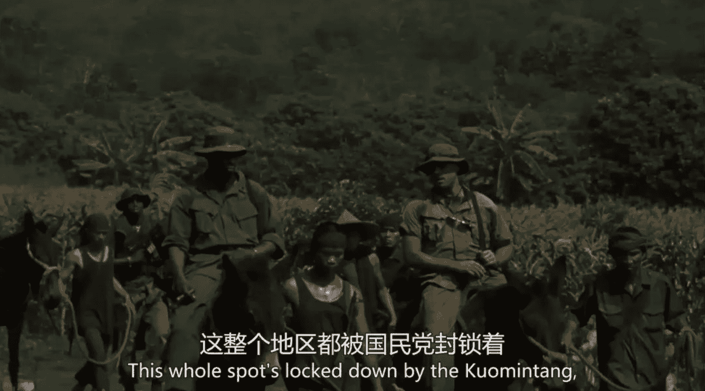

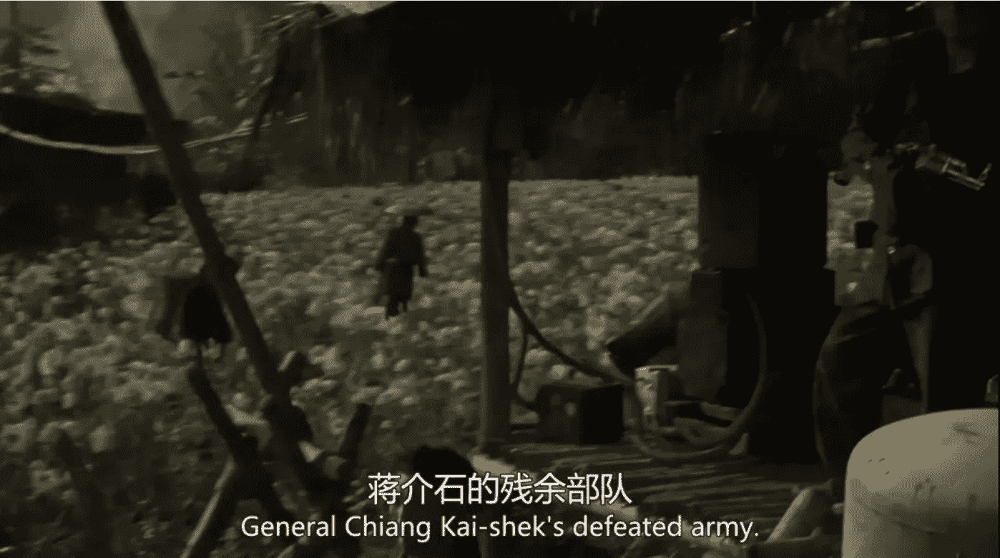

这部电影讲的是一个真实的故事，丹泽尔·华盛顿扮演的是一个黑社会老大的司机，常年累月跟着大哥杀人越货，并且暗中学习老大的做事方法，在老大死后，把全部身家赌上去缅甸丛林里找到毒品上游供应商，也就是正在那里种植经济作物的国军残部，从那里贩到了高纯度的海洛因。

然后通过在越南打仗的美国大兵把毒品捎带回美国，在美国零售贩卖，蒋残军生产的海洛因价格合理品质极高，在美国市场受到了美国人民的热烈欢迎，成功让电影主角迅速崛起成为了新的黑道家族。最过分的是，他们为了躲避检查，把毒品藏在阵亡的美国大兵棺材里。

我今天就说说国军在缅甸贩毒这事。

### 鸦片

关于鸦片，得先澄清一个事，这也是我之前的一个错觉，以前以为只要种了，就能卖得出去，随着年龄的增长，发现还是自己肤浅了。大规模种鸦片需要的不仅仅是穷山恶水刁民，更需要供销链，也就是你生产了，谁来帮你卖出去的问题，你总不能自产自销，自己腾云驾雾地吸起来吧。

事实上，东南亚人民种鸦片的历史非常久远，但是成规模的种，专业地种，还需要等到英国人来，英国人横行世界几百年，靠的不只是坚船利炮，还有他们对商业的理解。

一般套路是这样的，军人们先把一个地方打下来，商人去看看能搞点啥，比如加勒比地区可以种甘蔗，那好，加勒比人民就开始种甘蔗，如果人力不足再去给你们抓点奴隶，甘蔗生产出来之后低价收走，做成糖和酒高价卖到其他地方去，做为中间商，就是要赚差价。

缅甸等东南亚国家也一样，英国人殖民东南亚期间，发现这破地方除了刁民啥也没有，但是又不能浪费啊，就开始种鸦片，卖给谁呢？对，卖给大清，这也就是我们熟知的中英鸦片战争前传，当然了，当时印度人也在不遗余力地抓生产。

可能有件事大家不清楚，林则徐虎门销烟之后，大清国内的鸦片更多了，这个不难理解，鸦片战争战败后，大清开放港口更多了嘛，但是英国人没想到的是，中国人多聪明啊，看到鸦片这么值钱，种起来又不复杂，怎么会想不到自己种？中国人吸自己的鸦片，让英国人没鸦片可卖。而且大家熟悉的山西商帮承担了部分分销和运输业务。

到了民国，蒋委员长控制着长江中下游，国内的地主家的纨绔子弟不是喜欢那些洋玩意嘛，就像现在的年轻人喜欢iphone、各种进口包包、机械键盘什么的一样，当时大量的外国商品在中国倾销，南京国民政府就守在出海口收进口税，这也是为啥“国府黄金十年”重工业还在倒退的原因，因为他们根本没动力搞重工业嘛，政府是进口依赖的，肯定反感自己生产嘛。现在是不是理解了宋子文说的那句话：洋人的青霉素都用不过来，自己生产那玩意干嘛。

蒋校长的中央可以收税，地方军阀们的财政怎么办？四川地区1927年的农业税都收到2019年了，所以得发挥想象力。干点啥呢？种鸦片啊，卖给别的军阀地盘上的地主，鸦片这玩意，一旦开始吸食就是刚需，每天不来几口根本起不了床。在民国，鸦片就是硬通货，跟钱差不多。

不过这个阶段英法在东南亚的鸦片种植业凄凉的不得了，你想想，我们这么大的体量开始种鸦片，就跟我国现在开始生产显示器了一样，别的国家还是洗洗睡吧。

这种情况一直持续到1949年，1949年发生了啥？我党上台了啊，乖乖，一声令下，从大清到北洋再到民国一百多年解决不了的问题迅速就解决了，全国的鸦片迅速都被铲了，中国人不生产也不吸鸦片了，但全世界其他国家的人民日益增长的鸦片需求怎么办？这时候东南亚人民鸦片种植业的春天来了。

### 李弥

说金三角贩毒，就躲不开李弥，因为这人是后来的大主角，这人在黄埔上过学，在抗战中流过血，最后从淮海战场一路狂奔逃出生天。

李弥是国军中挺平庸的一个，没啥光辉战例，也不出身名门，他是黄埔四期的，黄埔军校必须是前几期才好使，太晚了就没啥效果，比如下文提到的李国辉，曾经金三角叱咤风云的人物，他也是黄埔毕业的，但是在大陆一点记录都没。

抗战中李弥曾经用大炮炸掉了日军21架飞机，这个不知道是不是真的，姑且认为是真的吧，不过国军的战报就跟乐视的PPT一样，可信度一般都得打个折扣。

抗战快结束的时候，李弥曾经带着远征军第八军攻克过松山。松山战役被有些人吹得神乎其神，不过真实的情况可能要让人郁闷一些，防守松山的日军只有千把来人，工事修的跟迷宫似的，好几万美械国军一顿狂攻，最后伤亡了近万人才攻克。这是李弥军事生涯的巅峰，从那以后再没赢过。也正是这次胜利让他当上了军团长。

后来国共开打，在淮海战役，李弥带着第十三兵团（他的嫡系第八军就在13兵团里）去解救黄百韬兵团没救出来，随后也被围在了陈官庄，打的惨不忍睹，绝大部分部队被歼灭，后来李弥乔装打扮，千里走单骑逃出了解放军的包围圈。

整个淮海战役国军7个军团长，其他的不是被击毙就是被俘了，只跑出来了李弥和孙元良他俩。李弥这人特别机灵，当时部队在河南陈官庄被死死围住，像黄维杜聿明这些人第一反应就是往南跑，国统区在南边嘛，结果粟裕也是这么想的，把他们截了。不过李弥预判到共产党的预判，掉头往北回到徐州然后一路往北再坐船去上海。

所谓“大难不死，必有补刀”，蒋校长觉得小伙子满可以的啊，国家危难需要你这种人才，让他带着残部去云南，重新训练新兵，新建第八军。

到了1950年，按理说中华人民共和国在1949年已经建国了，不过10月1日那时候云南还没解放，当时李弥就在云南。然后他去台湾开了个会，解放军此时入滇，他的第八军基本上没有还手之力就败了，随后不愿意投降的两千多人乱哄哄分了好几伙退往缅甸，带着其中一支孤军的正是后来大名鼎鼎的李国辉。

李国辉这个人在大陆时期基本没有任何记载，完全是国军无数中下级军官中的一个，但是到了缅甸，就完全不一样了，用行动证明他是一个极其优秀的指挥官，以至于现在在金三角也赫赫有名。

其实想逃出云南不是一件简单事，解放军本来追得就快，绝大部分国军部队都被追上了，或者被堵在了国境线上，只有少数逃出。李国辉他们这支就是从凉山经“野人山”进入滇南丛林，然后又跋涉好几周，彻底甩开解放军。熟悉军史的人都知道，当初杜聿明带着队伍走野人山回国，死了近一半。

这次他们又翻越野人山，李国辉的一些部众后来回忆，惨得不得了，到处都是毒虫毒蛇，部队中基本每个人都挂了彩，要不是部队里有不少云南土著，知道怎么治疗毒蛇毒虫咬伤，这支部队基本没有存活可能。

到了缅甸后，李国辉的部队军纪非常好，据说有过士兵偷挖老乡地瓜被枪毙的事，估计是吸取了在大陆溃败的经验，不管是不是真的吧，反正军纪比一般军队好得多。到了金三角后迅速获取到那一带土著的信任，不少军人们在那里结婚生子，现在金三角那一带的人很多就是国军后代。

缅甸老百姓把这伙军人叫“93师”，其实到了缅甸的队伍远远不到一个师，而且那些人隶属好几个建制，还有一支前来投奔的当初1945年远征军留在缅甸的孤军，只有李国辉一个人曾经是国军第八兵团93师的一个团长。金三角就在下图的地方。

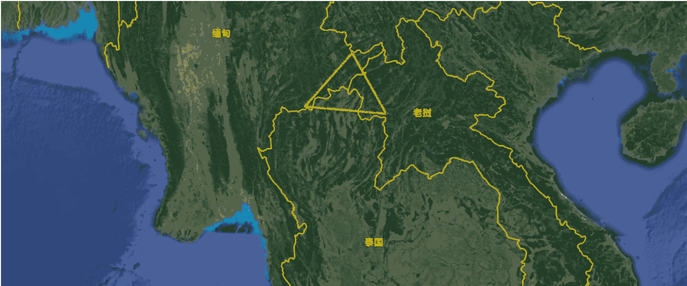

### 贩毒

当时金三角基本处于原始社会，有几百个割据势力，而且还都是土司（半原始部落），还有缅甸政府军，突然又来了一支国军残军，金三角立刻乱出了新境界。正如所有的丛林社会全部要服从“拳头原则”一样，国军残部在国内是战五渣，但是到了金三角却成了身经百战的斯巴达三百勇士，谁不服打谁，先后击败了几股地方割据势力，又击败了缅甸政府军。

缅甸政府军成军没几年，听说中国军队打到缅甸了，士兵们乱哄哄的就去围剿。金三角那地方热带丛林，到处是山，国军的人打过松山战役，把防守和狙击两个技能点点满了，而且基本都是老兵，狙击手一枪可以敲两个缅甸兵那种，在国内打的差，经常是被友军拖累，面对缅军这种弱鸡胜负没啥悬念，缅甸政府军进剿失败很快落荒而逃。

国军残部缅甸大捷的事传到台湾，委员长开心坏了，他有两个想法，当初袁世凯称帝，云南蔡锷起兵“护国”，袁大头立刻土崩瓦解，现在他觉得缅甸孤军就是当年的护国军。而且当初毛主席两次从村里创业崛起，尤其延安那次，蒋觉得他们也可以玩一次“延安往事”，从村里二次创业，所以让李弥带上毛主席写的《论持久战》就去缅甸督战了。

李弥到了缅甸后，搞了几次象征性的进攻云南，解放军稍有动作就赶紧跑回缅甸。一来二去，骗了不少美国装备，当时朝鲜战争嘛，美国希望他们在云南搞点事，经常给他们空投武器。

为了解决近两万部队的生计，李弥同志和所有的黑社会势力一样，立刻意识到收保护费是一个好生意。上文已经提到，金三角种植鸦片已经历史悠久，但是一直处于低端状态。

李弥听说黑市鸦片价格狂飙（原因就是中国大陆禁烟，供需平衡被打破），又目睹金三角人民有丰富的鸦片种植技能却没法施展，在金三角的一个村里胜利召开了“土司座谈会”，邀请土司们商议鸦片贸易规则。

会上，国军狙击手表演了头顶狙碗绝技（你站远处脑袋上顶个碗，狙击手一抬手把碗打掉），还有重炮拆迁，机枪割麦子等有教育意义的艺术节目，土司们吓得面如土色，纷纷表示：李菊福（有理有据令人信服），李将军您说了算。

会议达成的共识影响了后续近半个世纪的世界毒品格局。

会议纪要如下：

- 所有土司都铸剑为犁，促生产，保收成，建设有军阀割据特色的鸦片贸易金三角。
- 有事别私自火并，找国军仲裁。
- 有谁不服可以直说，国军有数不过来的美械装备和百战老兵去给你做一些触及灵魂的说服工作。
- “复国军”要收税，而且重税，不然怎么复国怎么保护大家？

在这套模式的指导下，金三角贩毒事业蒸蒸日上，李弥也开始越来越炙手可热，以至于在一次记者招待会上狂妄地声称要做缅甸王。

督促大家种鸦片的同时，李弥还学习延安，搞起了“抗大”，叫什么反共抗苏复国军政大学，抗大的教材就是那本《论持久战》。这个学校卓有成效，后来金三角一半的毒枭在这个学校里学习成长过，包括后来最大的那个坤沙，就是抗大毕业的国军排长。

在1951年，蒋校长在岛上坐稳以后，见中国一边打朝鲜战争一边内部剿匪，觉得自己又能支棱起来了，于是叫李弥“反攻大陆”。不知道收到这个命令的李弥是怎么想的，反正不敢不去，于是带着人跑到边境占了个县城照了几十张照片就跑回来了，解放军来的时候他已经回缅甸去了。

当解放军开始思考怎么彻底解决李弥的时候，没想到李弥很快就完蛋了，只是不是被我军给灭了，而是被国府给搞了。李弥作为和孙立人一样的手握重兵的军头，也碰上了孙立人相同的“死局”，做大金三角后，美国人又来试探李弥看看是不是可以脱离台湾独立，美国人可以推举李弥做金三角的土皇帝。

此时的台湾已经是“蒋经国时代”，蒋经国作为专业人士，把特务玩到了极致，完全不像他爹那会儿对敌方一无所知，自己参谋部到处是间谍都不知道。

小蒋到处是眼线，已经注意到了李弥和美国人勾勾搭搭，在1952年蒋经国竟然亲自秘密访问金三角，并且没跟李弥打招呼也没和李弥见面，到处和金三角国军高级将领串联。将领们知道蒋经国的手段，纷纷表示愿意支持小蒋，李弥敢乱搞就把他拿下。

到此为止，李弥已经完蛋了。

随后台湾国防部要求李弥回台湾开会汇报贩毒，哦不，复国工作，李弥左右为难，他知道手下已经有不少人被小蒋策反了，如果不回去，就坐实了背叛，分分钟被手下以叛国罪处决。如果回台湾，凶多吉少，妥妥被搞，左右思量，还是回去了，他觉得就算被搞，应该不会杀他。

李弥回到台湾后，随即被软禁，再也没离开台湾。

### 撤兵

对于金三角，缅甸政府一直都是很上心的，上次刚独立被一帮残兵打了，心态非常爆炸。到了1953年缅甸政府军又来“剿匪”，而且还找印度帮忙。

之所以找印度，主要是因为当年大家都是跟着英国人混的，两家的战术指挥比较统一。印度还有很多打过二战的“百战老兵”。外加印度人有个特点，讲话做事显得信心特别足，你不小心就信了。打了15天，印度4000人只跑回来300个。这战斗力，直接在缅甸老乡面前现了眼，缅甸人说原来还不如我。

印度崩了后，缅甸很绝望，在联合国疯狂输出，印度和其他英联邦国家都辅助，美国都感到压力，开始强迫蒋校长撤军，并且以不给台湾援助做威胁，蒋校长只好撤兵。

就这样，美国海军把国军残部运回台湾，美国人当时就注意到，上船的都是老兵们，年轻人都不愿走，因为大家都听说台湾过的很苦。那肯定苦啊，那么小的岛，突然涌入那么多人，不苦有了鬼了。三个月后，金三角再无国军正规军，留下的国军士兵撕掉肩章领章，变成无国籍流亡武装贩毒集团。

等到1961年，在缅甸政府一再请求下，解放军也觉得缅北时常骚扰云南边境不堪其扰，于是“轻微”打了一下。结果没用力对面就倒下了，解放军总部急令部队不要追击太远以免误会。

虽然被解放军打得像孙子一样，但是溃退下来的缅北武装和配合解放军行动的缅甸政府军遭遇，缅甸政府军很快被打散了，要不是缅北武装怕解放军追来也赶快脱离了战斗，弄不好政府军又得吃大亏。

有了两次的对比，缅甸对中印实力有了直观认识。所以1962年印度向中国挑衅，缅甸政府委婉向印度表达过“大哥你不要去送死啊”之类的人生忠告，但是印度根本没有鸟他，也就有了后来的事，新德里差点都被解放了。

也就是从1960年代初开始，经过李弥带领国军残部十几年的教导，原本还处在部落社会的金三角地区，各个部落实现了“技术思想双跃迁”。

李弥培养当地人，还是蒋校长当年在黄埔的法子。开办了军政大学，对基层军官和干部进行轮训，军政大学除了军事外，还设有多种长短期的训练班，吸引了大量缅甸、泰国华人华侨青年前来学习，后来当地民族上层子弟也可以参加。军政大学共开班了4期，培训了2800余人，后来金三角大名鼎鼎的彭家声、罗星汉都是军政大学的学员。这些人成了金三角地区后国军时期的骨干。

至于具体方法，李弥请人把《论持久战》《星星之火可以燎原》等等翻译成当地语言做了教材，很多老兵讲战术，说这些有效的战术都是和解放军学的，大家学会了打缅甸政府军肯定够用。大讲“三三制”“一点两面”“战术穿插”。

这其中做的最大的就是坤沙，他原本是当地专门运输鸦片的马帮部落土司，很早就和国民党残部合作，做到了连排级军官，又被推荐在学校学了些基本战术。加上岳父是当地相当有实力的部落首领。等国民党残部撤走就回老家拉起队伍，手下的军官很多都是军政大学毕业或者国民党残部留下的。

到了这种地步，坤沙做大已经是意料之中，据了解的人说，坤沙本人不大管事，大多数事情都是手下人做，各个部落只是借着他的大旗对抗政府。而缅甸政府也不是真的想处理贩毒问题。

说白了也很简单，缅甸当时是军政府时代了，对于金三角地区又穷又乱根本懒得管，也管不了。以前去打是因为害怕缅北武装南下侵略政府的地盘，现在看这帮毒枭自己管自己还不错，只要不闹独立，隔三差五去打两下彰显一下政府权威即可。真的去管吃饭喝水治安医院道路各种基建想想都头大。

所以金三角贩毒的事情就一直挂着，谁闹得太厉害就敲打一下。1969年缅甸政府通知坤沙去缅北军区司令部开会（真的是去开会），然后逮住软禁了几年，这些年里金三角该干嘛还干嘛。坤沙的地盘被他的参谋长张苏泉管理，有条不紊啥事没有，到了1973年张苏泉经过谋划，进城抓了两个苏联医生，才把坤沙换了出来。

这个张苏泉就是正牌的国民党军官，而且是军政大学的教官。在国民党撤退之后留在金三角，几十年一直辅助坤沙，军事上做参谋长，还培养各种人才，引进先进技术充实贩毒集团。基本上坤沙之所以做大，很多时候就是靠着张苏泉的功劳。

对于金三角地区为何会成为世界最著名的毒品生产地，还有一个最主要的原因就是美国力量的存在。

小伙伴们都知道，在美国毒品属于刚需大宗贸易品，美国一直都是全世界最大的毒品消费国，但是罂粟这玩意其实可以种的地方太多了，生产难度也不大，关键是美国这个大客户愿不愿意买。

当年为了支持当地“特色产业”，加上李弥他们打的基础，金三角的产品也确实有竞争力，坤沙当年做毒品做出了品牌，一种特别土的油纸包，两个中国狮子抱着地球，标志上有红字写着“提防假冒”“一帆风顺”字样。美国吸毒贩毒的都特别认这个包装，表示纯度高重量足，美国人“特批”了一条从金三角到美国的运输路线，金三角生产出来走泰国到美军基地，坐飞机到美国。

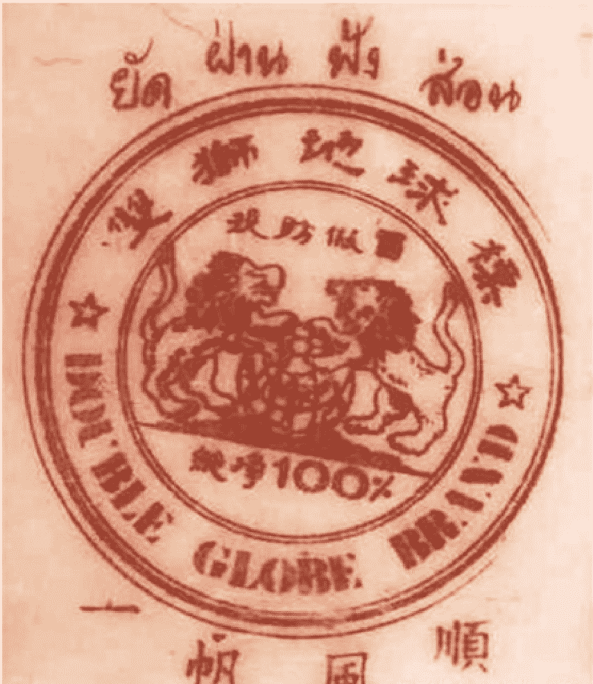

等到1969年美军从越南撤走，苏联在东南亚成了攻势，东南亚是美国的势力范围，美国对于盟友更加照顾，金三角的毒品生意也就一直做的风生水起。

这里还要解释一下当地的社会结构，所谓的大毒枭掌握毒品加工运输，手里有一只武装保护自己的地盘，一般毒品生产种植属于下面村里的事情，是一个毒枭+军阀+部落长老的混合形态。

各个部落和村寨独立运营，种植以后收集，统一送到管理这片地区的毒枭那里，以他的名义统一加工销售。所以即使某个大毒枭被打掉了，很快就会有人顶上来。甚至即使有内讧，看着一群人在那抢地盘，但是毒品产量却不受影响。这也是为啥墨西哥哥伦比亚禁毒，但是因为没有改变社会基础面貌，几十年禁了个寂寞。

因为只要种植的人还在，运输线路还在，什么都改变不了。

不过时代还是变了，墨西哥后来居上，仗着挨着美国那么近，也开始种植毒品，并且得到了美国那边专业人士指导，种植转基因可卡因，效果有加成，深受美国瘾君子的追捧，再后来开始玩冰毒，冰毒便宜得多，成本优势导致鸦片贸易逐年走低。所以到了1990年代，金三角的毒品生意就一落千丈。

这二十年来阿富汗的毒品也是这样，从阿富汗各个部族集中起来，经过加工以后统一送到喀布尔，然后走美军的后勤线路到美国。阿富汗那么贫瘠的山地，但是生产了全世界近90%的海洛因(也有一说是80%)，反正美国人走到哪，毒品就种到哪。

### 尾声

这几年的金三角比前些年好了太多，因为金三角有些地方土地还不错，成了我国的海外商品粮产区，也就是我国在那边投资建农场，当地老百姓去上班，粮食种好之后，再卖回给我国，既保证了粮食供应，又可以赚钱。

此外东南亚由于接受中国的“外溢需求”，这些年也搞了很多“特色项目”，主要是色情和赌博，毒品业务也就不像以前那样受追捧了，毕竟可以合法地赚大钱，为啥还要脑袋别裤腰带上去折腾呢?

不过各种穷山恶水的地方依旧管不过来，还在经营老本行，缅甸政府又太弱太消极，管不过来，也就那样了，估计今后很多年也没法改变，毕竟不能指望每个国家都有我国这样的执行力。

公众号懒人搜索，懒人专属群分享

微信:lazyhelper

### 人生发财靠康波，到底啥是康波？北京交易所为啥也跟康波有关？

2021-09-07

文章开始前，还是要给大家再解释下，今天的这个话题说简单也简单，但是往深了讲，又非常非常复杂，之前国内“周期天王”周金涛去世后，就没人敢说懂“康波”了，不过我今天不讲经济学理论，讲经济史，这个我比较熟，一起看看过去，说不定也就知道了我们的未来。如果以后几年对这个问题有了新理解后，我可能再多写几篇，把认识深度慢慢往深推。

已故的中信建投首席科学家周金涛有句话，叫“人生发财靠康波”，那啥是康波呢，“康波”全称是“康德拉季耶夫周期理论”，是前苏联大佬康德拉季耶夫考察了资本主义世界两百多年的近代史，发现他们的经济发展有明显的周期性，每次差不多都是40年到60年，而且每轮周期都是技术驱动的。每个周期都有明显的繁荣和衰退，每个人的一生大概都会经历这么一轮，或者当着两轮。

也就是说，一项或者多项革命性技术进步引发了长达半个世纪的一次发展周期，这个周期里又包括很多小周期，比如计算机推动了一个长达五十多年的技术循环，中间又有很多的小波段，比如操作系统，浏览器，互联网，移动互联网等等，你赶上这么一段，可能人生就大不一样。

其实这个逻辑我是很有感触的，因为近十年我自己亲身经历了两个完整小周期，比如我在大学的时候，当时正好是PC大热，那是搜索引擎和门户网的时代，而且正好是房地产的上升周期。

我经历的另一个技术红利是移动互联网，当时加入那些这个的人到现在收入基本要比其他行业的同学高一到两倍，极端地达到十几倍，这些东西往往摊上了就摊上了，摊不上也没办法。

也就是说，我们每个人都处在一个个周期里，如果处在繁荣期，可能一伸手就握住了机会，然后今后的日子里收入翻番往上涨；如果从事行业已经处于衰退阶段，那可能人生就掉坑里了，越走越路越窄。

事实上不仅个人是这样，国家更是这样，康德拉季耶夫周期对国家的影响更大，历史上的强权往往都跟这事有关。

### 第一次技术周期

众所周知，工业革命前的几千年里，人类进展一直不太快，不仅不快，事实上基本处于稳定状态，最明显的是我国，从秦汉到明清，大家的收入水平和生活水准一直变化不大，西方也差不多，除了少数几个贸易港和放高利贷的城市过得还不错，比如威尼斯和热那亚，其他地方的老百姓过得非常惨。

但是近代以来的第一项技术革新发生在了英国，也就是他们搞了个水力纺纱机，这项技术一定程度上改变了世界。

纺纱织布这事看着很low，其实不low，因为“吃穿住行”从来都是硬刚需，人类尤其对“穿衣”这事非常上心，早在汉朝那会儿，中国的丝绸就一路从中国东南被运送到了罗马，这个过程中，加价几十倍，罗马人依旧趋之若鹜，可见大家对穿衣这事有多冲动。

从英国开始，后来的大国想发展，都是搞纺织起家，比如美国，德国，日本，韩国，甚至我国的台湾和香港地区，早期也是搞纺织起家的，后来我国改开也是从纺织开始，到现在纺织业依旧是我国的传统支柱型产业，也是我国国际竞争优势明显的产业。

在1770年左右，英国人搞出来了珍妮纺纱机，终于可以生产便宜的纱线了，依托英国海军打出来的广阔市场，只要生产出来就能卖掉。当时还没有蒸汽机（也不是没有，早期版本的蒸汽机太笨而且太贵，效率极低，根本没法用），那时候大家用水力驱动，所以英国最早的企业都是沿着河边建的，大量的农民进入工厂，成为了初代工人，现代企业的雏形也是在那个时代大爆发。

后来为了多建厂，英国人疯狂挖运河，由于水力这玩意不稳定，比如有枯水期和洪水期，冬天干脆结冰了，资本家就需要新的动力，为了改进动力，越来越多的人开始研究新动力，后来瓦特踩在别人的肩膀上搞出来了蒸汽机，人类一脚踢开了工业化的大门，不过蒸汽机是下一个技术周期的事。

而且英国人纺纱织布这事不是搞了一段时间就不玩了，而是贯穿整个大英帝国的生命周期，纺织业一直都是英国看家老本行。美国南方奴隶制，殖民印度，这些事都跟英国搞纺织有关。

后来美国的制造业之父就是个英国叛徒，他把英国纺织机记在脑子里带回了美国，美国也走上了纺织路线。

### 第二次技术周期（1825-1875）

第二个技术周期的标志就是蒸汽机。

蒸汽机被改进之后并不是立刻就爆发了，而是经历了一个漫长的从煤窑到工厂的扩散过程，一开始不被看好，后来逐步改进后成了主流，又用到了轮船和火车上。

而且火车也不是一下子出现的，最早只有铁轨和车厢，用在大型煤矿里，用马拉着，在很长一段时间里，火车就是马拉着，因为火车头还没发明出来，所以马拉列车不但不是非主流，反而是传统玩法。过了很多年，等蒸汽机发展成熟后，大家才想起来给火车配个火车头，一开始的火车头跑得还没马拉火车快，不过明显蒸汽火车头的发展潜力更大，很快就不可同日而语。

这个过程中，需要的资金规模越来越大，私人公司开始搞股份制和发债券，其实这个机制这才是个怪兽，因为通过这些金融手段把各种闲钱聚在一起，能做的事越来越大。

工厂规模也越来越大，组织开始变得超级复杂，有了蒸汽机后，稳定而且强大的动力源源不断被输出来，人类可以制造更复杂更精细的产品，比如随后涌现出来了火车和造船厂，分工也越来越细。

等到曾国藩看到英国铁甲战舰的时候，他一度以为可以通过能工巧匠用锤子敲一艘战舰出来，其实这些战舰背后都是大型工厂和车间，以及细致的分工，只有这样的现代企业才能保证每个零件可靠，那些军舰才能跨越大洋不散架，穷尽能工巧匠一辈子，可能都搞不出来几个像样的零件。

这个阶段完全是英国人的时代，英国彻底成了世界上真正的日不落帝国。不过英国人搞出来了铁路之后，没想到这玩意成就的不是英国，而是德国和美国。

### 第三次技术周期（1875-1920）

铁路是这个周期的王者，可以说，现代德国的命是铁路给的。

德国那地方以前散落着几百个大小邦，著名哲学家康德出门去旅游，箱子里塞着几十种货币，到了一个地方先翻着找当地货币，不然没法住店消费了，饱受折磨的哲人非常感慨，不过除了吟诗也没啥可做的。

但是德国人用英国技术开始修铁路后，事情就慢慢起变化了。

铁路逐步把各邦连在了一起，交通方便了，互相做买卖越来越频繁，他们以前就有个关税同盟，现在火车让盟友们合作越来越紧密，再后来德国资产阶级意识到，如果统一了国家和市场，大家可能会变得更富有。“统一德国”这个观念越来越时髦，最后和丹麦、奥地利、法国打完三场战役后德意志地区的兄弟们干脆在一起了。

德国近代以来的国宝级人物李斯特就热情赞美过铁路，认为铁路是德国统一的最大功臣。

而且铁路发展本身会带动上下游，造铁轨是不是得搞挖矿？是不是得搞冶金？研究冶金就不可避免地需要点化学相关科技点，德国那些年化学研究也进展神速。更重要的是，这些重工业需要天量的资金，为了支持造铁路，金融资本的规模越来越大，能做的事也越来越大，到最后俾斯麦发动的奠定德国统一的三场战争，都是借钱打的。

统一后的德国发展越来越猛，并且有了技术依赖，狂点“重工业”的技术点，并且由于金融资本在这个过程中发现投资科技的利润大到离谱，开始投资实验室，不少电气实验室拿到投资，人类扣响了下一次“电气革命”的大门。

大洋彼岸的美国，由于独立战争时期革命不彻底，终于在1861年把拖欠的债补上了，爆发了南北战争，打死了60万人，打残了三四十万，联邦军开入南方，烧掉了亚特兰大以及各种庄园，用刺刀说服了南方奴隶主今后专心做美国人不许再分裂。

重新达成共识后的美国人也疯狂上马铁路建设，那些年一年修一万英里铁路，那时候的美国也是个基建狂魔，跟德国差不多，铁路催生出了巨大的市场，并且美国国内也在大炼钢铁。为了给这些铁路和重工业融资，华尔街从不入流的金融混子一跃成为世界一极，美国迎来了卡内基和摩根的时代。

目睹了美国在修铁路过程中的狂飙猛进，国父孙中山先生无比羡慕，曾经也下决心修十万英里铁路，不过以中国的地理环境复杂度和中国金融资本的成熟度，这事基本没戏，欧美的铁路都是借钱修的，修好后铁路赚钱了再还，等攒够钱再修根本没可能。

美国人此时也跟德国一样，意识到了投资科技的巨大红利，大量资本开始投资前沿技术，爱迪生和特斯拉开始上线，通用、贝尔也在金融资本的投资下开始现身，人类开启了崭新的时代。

这个时代是属于美国和德国的，英国资本在向海外投资过程中越来越虚，而且英国国内也没啥重工业，到了第一次世界大战，炮弹产能都上不去，不得不向美国进口，很多英国资本投资的海外公司也便宜处理，卖给了美国人换炮弹。

而美德两国几乎有无限的产能，最后大家一起上，才把德国给揍趴下。不过由于第一次世界大战的主战场是在法国国土，把法国北部炸成了月球表面，德国工业并没受影响，这也为他们后来再次崛起埋下了伏笔。

### 第四次技术周期（1920-1975）

这个阶段是汽车和石油的时代。

这个周期里，美国和德国整体并驾齐驱，两国的产业结构差不多，工业在金融资本的推动下疯狂发展，而且都玩重工业，都搞电气化，都在研究汽车，都疯狂借钱搞经济扩张，随后一起迎来了1929年大崩溃。

两家的解决方案也差不多，都是通过民选换上了思维很发散的强人领导人，罗斯福和希特勒的风格也差不多，都是不拘一格无视规则，并且思路都是以工代赈。

多说一句，不少人说凯恩斯影响了罗斯福，其实不是，凯恩斯发表他的论文之前美国和德国已经在搞以工代赈了，只能说大家想一起去了。整体来说美国和德国的思路差不多，只是美国还没想好去打谁的时候，德国先动手了，美国开心了。

随后的事大家也都知道，第二次世界大战全面开打，打完后把传统富裕地区西欧和德国砸了个稀烂，西欧的金融资本和人才一起去了美国，催生出了美国战后的一个巨大的繁荣。

并且美国在战后制定了国家科技政策，推动军用技术转民用，比如计算机和互联网，为下一个周期做好了准备。这些都是典型的军用技术。而苏联的思路比较怪，为了防止技术泄露，对“军转民”非常谨慎，导致天量投资最后没法回收。

这个过程中，美国的传统资本变成了风投资本，开始投资更新的技术，比如计算机、半导体和软件领域。

在这轮周期中，最大的受益者就是美国，苏联一度也享受到了这轮技术扩散，但是苏联计划经济体制缺乏创新能力，有几样创新也锁进保险柜了。

道理不复杂，创新基本都是不小心搞出来的，本来要搞A到B，不小心搞出来个C，市场经济体制下会重新评估C是不是卖得更好，然后目标就改了。计划经济在这方面差很多，可能把C给忽略了，并且由于没有市场，很多投资没法回收，到后来把轻工业挤压到崩溃，老百姓不干了，俄罗斯民族主义者们趁机跳反了。

所以在这一轮技术衰退的时候，也就是上世纪七八十年代，美国和苏联都受到了影响，只是美国人换道了。

### 第五次技术周期（1975年至今）

这次革命的主要主导者就是美国，并且在这轮周期的繁荣期，也就是上世纪九十年代，美国的实力独步全球。

成果就是半导体和计算机以及互联网，那段时间是属于硅谷、比尔盖茨和IBM的时代（当年IBM很厉害，这几年不太行了），其他国家整体落后一些，尤其是日本，日本其实就是被锁死在了上一个技术周期里，一直也没太享受到这一轮的技术扩散，到现在依旧在深耕上一轮技术革命的成果，所以他们自己说是失去的三十年。

而且这次技术进步催生了新的金融创新，也就是纳斯达克，纳斯达克最早不是交易所，而是跟闲鱼差不多的交易平台，那些不入流的小企业想融资借钱可是又不够资格去纽交所上市，于是在闲鱼上自己卖自己的股票，这些小企业通过这种小规模融资一点点壮大，成就了后来的微软谷歌。

对于美国来说，这种模式本身比技术更重要，因为创新本来就有随机性和“涌现”的特质，没法自上而下地计划，只能是搞个牧场，看看牧场里能长出啥，纳斯达克就是这样一个牧场。我国这次搞北京交易所，明显是想借鉴这个创新。

第五次周期本来主要是美国的，不过我国在后半期正好享受了一个技术扩散的尾巴，也就是移动互联网，也为中国产生了天量的财富。

而且中国为啥前些年发展那么快，有个很重要的原因就是这五轮经济周期在中国一轮又一轮被引爆，不断推着中国往前走，而且政府也在推动这种技术升级，比如提前花大价钱布局了天量的基站，让我国在移动互联网方面不再落后。

不过熊彼特把技术创新分成基本创新，改进创新，和虚假创新。研发出来了CPU、操作系统和新能源电池，这就是基本创新，这个对经济的推动最大，宁德时代三年万亿市值，就是这么来的。搞出来了具体应用，比如某宝某信，这就是改进创新，也能推动经济。搞社区团购，这就是虚假创新，零和博弈，没啥技术含量，所以国家给叫停了。

### 接下来怎么办？

周金涛在去世前几年就说，这几年是第五次周期的衰退期，所以大家过得比较难。也就是说，现在处于一个青黄不接的状态，旧技术的红利已经耗尽，新技术还没大规模应用，所以经济的火车头停了，不止中国，全世界都有这个问题，叠加疫情，整体有点难熬。

从现在的情况来看，世界上绝大部分国家都躺得很平了，主要是中美两国在疯狂投资，现在的主攻方向也很清楚，主要是AI，核聚变，新能源，航天技术等等，还有这几天热议的“元宇宙”，也就是像《头号玩家》里那样戴上VR后进入虚拟世界，谷歌现在重点研究AI，而Facebook主要在搞元宇宙，马斯克他们一伙在搞航天和电动车。

这里大家可能有个疑问，核聚变万一实现了，是不是光伏就没意义了？这个问题我专门找了个工程物理研究院的专家问了下，说是没那么简单。核聚变研究有点像我们上文说的火车发展史，先搞个铁轨车厢出来，然后装上火车头，火车头一开始跑得不如马车快，然后改进火车头，一直发展到现在重载列车和高铁。核聚变也一样，就算研究出来，一开始效果肯定不好，而且也不稳定，得迭代进化几代，才能用作商用版本，最后才会铺开，这个过程谁都说不准，可能需要几十年，甚至一代人。

而且核聚变本身需要大量的特殊材料和零件，这些零件也需要时间进化，这个过程中需要的时间根本没法预料，所以就得研发补充能源。

不过按照以前的理论，颠覆性创新往往不一定诞生于他们这些巨头，甚至有可能是一个不太出名的公司用了什么奇怪思路，突然闯出一条路来，并且这个可能性还不小。我理解这也是为啥我国今年要把北京证券交易所搞起来，毕竟现在要把所有能用的手段都用了，国家的研究所和高校，企业的研发部门，还有小公司去走“非主流路线”，都搞起来，谁突破算谁的。

此外大家一定听说过一句话，叫“2020年是前十年最差的一年，又是接下来十年最好的一年”，从康德拉季耶夫周期理论来讲，这个逻辑可能是对的，现在正好是第五个技术周期的衰退期嘛。

> 不过我一直都是挺乐观的，用熊彼特的话说，经济衰退是必然的，也是必要的，在衰退中淘汰弱者，是推动革新创造，重新迎来繁荣的必经之路。

从这个逻辑上，就能理解我国现在的那些举措，打击食利资本，推动硬科技研发，并且调整收入结构，这也正是下一个技术周期开始前该做的事。

公众号懒人搜索，懒人专属群分享

### 大部分人，其实是在“装忙”

2021-09-03

这两天有点懵逼，尤其是最近又要整改自媒体，我尽管是野生业余自媒体，不过也得想想接下来该写啥，今天写短点，说一个我最近的体会。

自从我的号看得人多起来，有一个问题也被日常问到，“博主你哪来的那么多时间又上班又写作？”，其实这个问题很奇怪，因为以我这些年的观察，真没有几个人忙到一个礼拜抽不出三四个小时的地步，甚至有太多人，一个星期认真工作的时间明明不到三四个小时，也认为自己很忙，这就更奇怪了。

不过前段时间我突然明白了一个至关重要的东西，也就是“注意力”，我画了个图，大概是下边这样的：

也就是说，人的时间是很多的，但是有一半左右在睡觉吃饭。精力也不少，至少十二个小时吧，但是注意力这玩意却很少。每个人又不太一样，据我观察，有些人的注意力真是少的可怜，每天真可能只有一个小时左右，专心干点啥，持续一会儿之后，这一天就没法再继续了，就得去干点别的，只能干那种不用额外耗能的那种事，比如刷一刷短视频玩会儿游戏什么的，反正是不能干正经事。

也就是说，“注意力”本身比时间更稀缺，用完了接下来就没法干正经事了。大家注意下，我这里说的是“正经事”。

其实大家应该很早就注意到了，在中学里哪怕是最渣的学渣，看教科书完全看不进去，让家长以为他有阅读障碍，但是看小说却一个顶俩，分分钟治好了自己的病。大家自己也应该有体会，干一天活之后，虚得要死，但是还可以继续刷视频玩手游，一不留神能玩到凌晨两三点，依旧兴致勃勃，甚至想订个外卖吃一顿继续玩。

那问题来了，这两件事到底有啥差别？其实就是我之前说的那件事，生产者和消费者的差别。你玩游戏的时候，本身就是在消费，所有的消费，商品已经设计好了，加入了大量的“爽点”，就是为了让你爽，整个过程中不需要额外消耗能量，时间过得特别快。

而且为了做到让你爽，这事本身已经成了一种科学，比如网文江湖里，大神们就知道怎么安排节奏，每五百字一个小爽点，一千字一个大爽点，两万字一个爆点。

甚至我们看到的很多节目，里边嘉宾妙语连篇不断地能逗你乐，其实那类节目并不是现场发挥，而是精心策划反复录制最后精细剪辑而成。

一个跟我关系还不错的粉丝，他就是做这个行业的，他们平时一堆人聚在那里编段子，然后再跟嘉宾一起讨论哪些适合采用，台上讲几分钟，他们台下得折腾一个礼拜，有时候半夜想起来段子赶紧记录下来，现场录的时候中间不断停下来修正，一堆摄像机，拍好几个小时，有时候时间太长，中间还去吃个午饭，或者干脆下午就没观众了，最后才剪成几十分钟。而且观众和嘉宾也不是对应的，比如嘉宾讲个段子，台下哄堂大笑，可能这次笑是一开始录好的，或者补录的，还要找那种“现场感”好的观众，表情夸张的那种，如果台下一群面瘫，段子效果也会打折，这玩意就是工业化娱乐节目的流水线。

只有这么折腾，才能让大家看节目的时候根本停不下来，大部分消费性的产品也都是这么设计的。

但是干活的时候，甚至设计游戏的时候，这个过程需要调动你所有的知识储备，进行各种复杂的算计，一次次对自己的想法进行否定，这个过程本身就很熬人。

更重要的是，人对一件事情的感受，爽或者不爽，往往来源于“是否及时反馈”。玩游戏的时候，每一次击杀，每一次升级，这种即时反馈都能带来巨大的欢乐。

而学习工作就不是这样了，尤其是学习一项技能，过程漫长，中间有大量的节点让人沮丧，而且实质性的激励反馈非常晚，可能要到学期结束考了个不错的分数，或者大学毕业找到个不错的工作，才能得到反馈，但是大部分人根本撑不到那时候。工作也一样，完成一件事也没人夸你，更不会立刻给你涨工资，动机自然会弱很多。

总结下，那就是：消费者-即时反馈；生产者-延时反馈。

同理你去学什么新技能，也是一样的，很快就会因为乏味和没啥反馈而放弃。这也是为啥太多人打着学习的名义在B站看各种沙雕视频，一看就是一整天。本来想生产，然后全程在消费。

而且拜互联网技术的大发展，现在太多人处于“过度刺激”状态，天天一起来就各种app上溜达，玩会儿游戏，看会儿短视频，再刷会儿朋友圈，时间过得飞快，而且脑子由于这种持续的“过度刺激”，干那些乏味的事死活提不起劲。最明显的是这几年公众号平台的流量持续下跌，流向了手游和短视频，因为太多人连看完一篇长文的耐心都没了。

有点像一个人天天瘫在沙发上看电视，喝瓶啤酒都让狗子去取，那时间长了干点重活自然是气喘吁吁痛不欲生，道理是一样的，长期的行为习惯不仅会改变我们的大脑，更会让身体机能发生变化，而且干这些事会产生一种“时间过得飞快”的错觉，经常是一上午啥都没干，时间就没了，其实大家把手机放下仔细感受下，就能发现时间过得很慢，慢到你崩溃，有的是时间干各种事。事实上手机改变了大家对时间的感受，越来越多的人觉得自己特别忙，因为每一个细小的时间缝隙都被各种娱乐软件给塞上了。

而且这种“过度刺激”还有一个更严重的后果是，本来就不多的注意力被切的稀碎，时间越久，越难以集中注意力。而注意力这玩意跟肌肉差不多，并不是一个稳定的恒量，如果平时不咋用，慢慢的可调度的越来越少。

此外这几年严格的对比实验发现，人对“幸福”的理解主要来源于“落差”，粗茶淡饭一个月吃一顿肯德基，那也是大餐，

### 幸福感的本质是人脑为了奖励稀缺行为制造的幻觉

不管啥事频繁做，大脑就不再奖励了，而且是一个向上兼容的过程，向下走一步就会分外痛苦，也就是说，如果一直希望自己爽，本身就是把路走窄了。

说到这里，大家应该也知道该怎么做了，如果检视一下发现自己确实处于“过度刺激”状态，还是要想想怎么停下来，主动去做点无聊的事，降低下身体的“快乐阈值”。

此外我前几天看了一个外国小哥的爆款视频，他给大家解释了下他是如何高效快速考入医学院的（美国医学院非常难考），他讲了自己持续处于“心流”状态的办法，我看了下，也是老生常谈了，不过还是要分享一下，万一大家用得着呢。

- 1、接下来几个月要达成什么目标；
- 2、目标要有稍微挑战性，并且分成宏观目标（长期目标）和微观目标（短期目标），目标要具体，而不是类似“我要有钱”之类没有确切实现路径的东西。
- 3、隔离干扰项。其实就是本文说的，尽量少碰那些让自己过度刺激的东西。
- 4、进入状态比较难，保持比较容易。人体跟个卡车似的，起步难，停下来也难，想做什么事，就先做起来，比如跑步，实在下不了决心，就让自己穿鞋下楼，第一步永远是最难的。

差不多就是这些，大家也可以思考下。

文末多说几句，尽管我自己是很不喜欢短视频和手游的，但是坚决反对禁掉这些东西，应该做的是不断地规范那个市场，一个成熟的社会人还是要自己对自己负责，多想想自己怎么解决问题（禁了不成熟的未成年人玩游戏和短视频没啥问题)，而不是希望通过一刀切的行政命令来解决问题，如果那样的话，持续一些年之后，就彻底没得玩了。

公众号懒人搜索，[懒人专属群](https://lazyman-group.com)分享