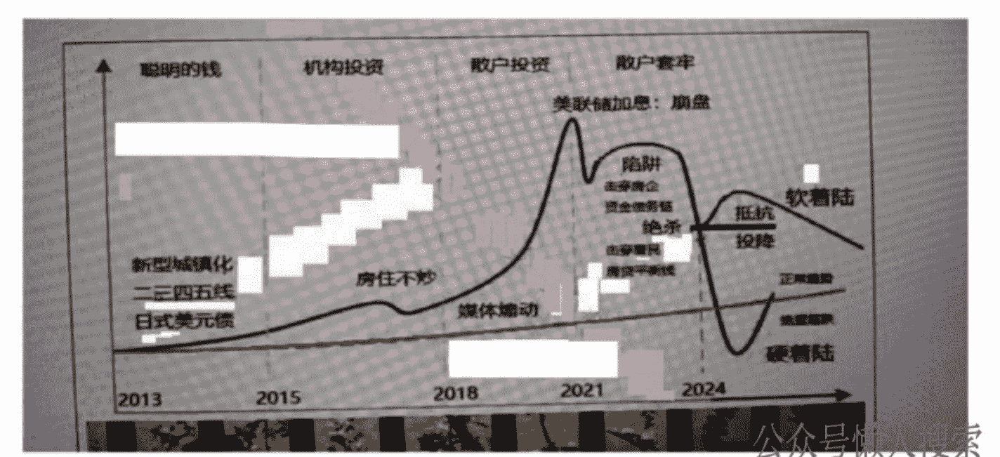
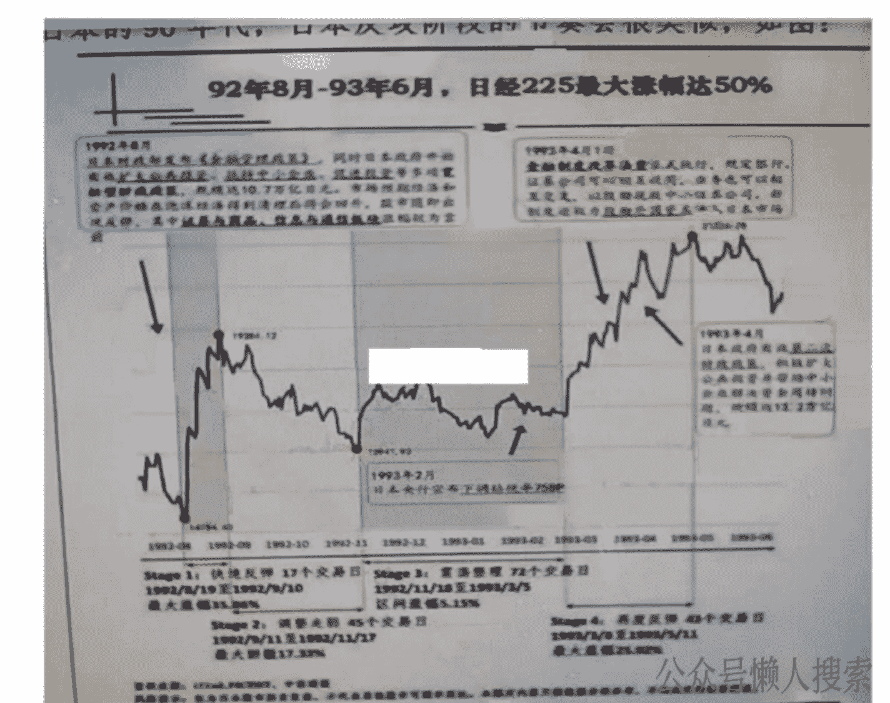
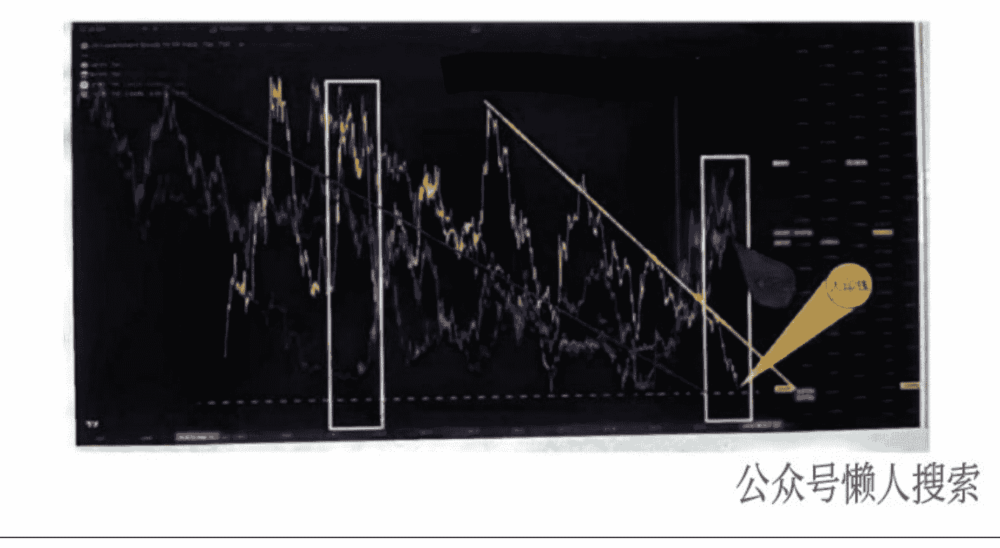
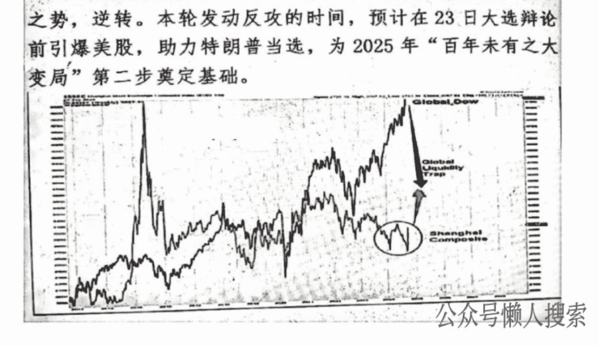
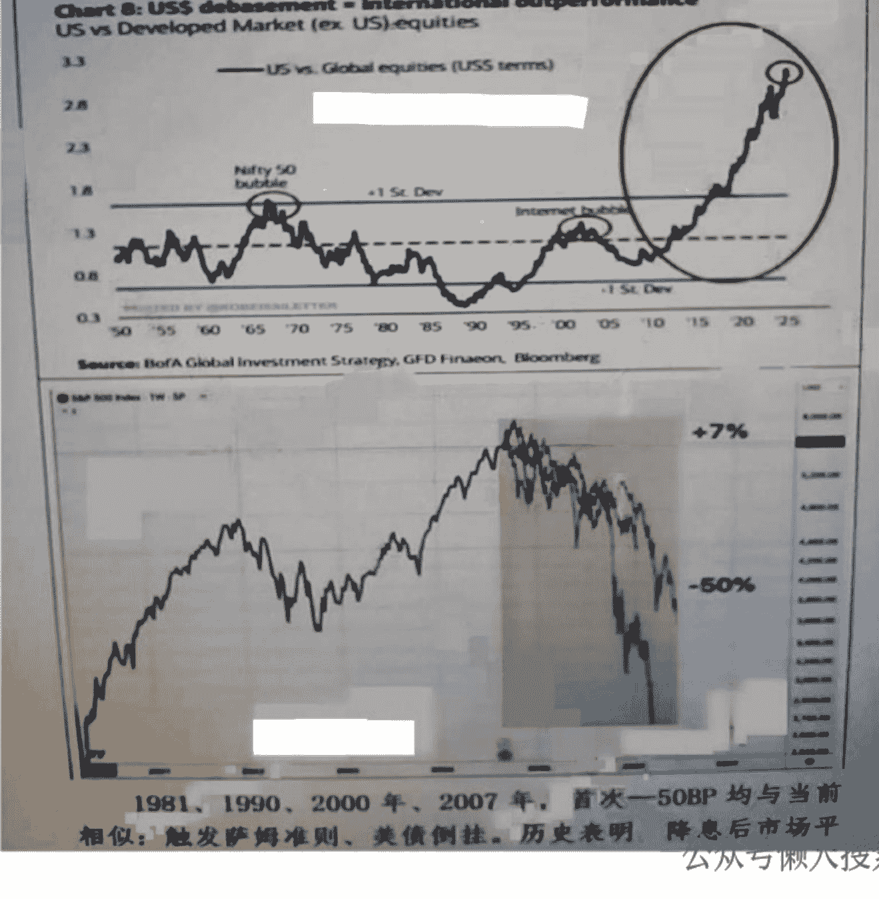
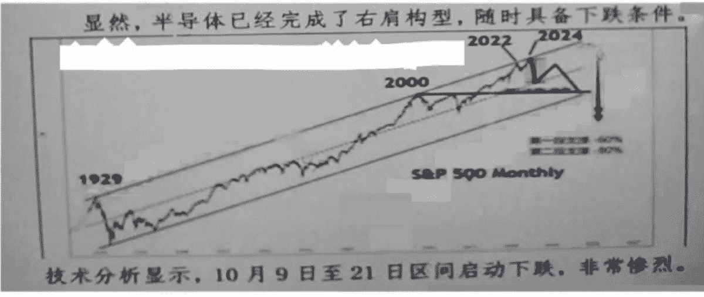

# 顾子明说 888 元报告：分享朋友的四季度投资建议（收费版）
241005

整理：公众号懒人搜索，懒人专属群独享
懒人微信：lazyhelper


## 2024 第四季度：前进一步

## 一、回顾
2024Q1—中美 AI：重点标的的工业富联/中际旭创，满仓
满融不择时，一季度收益 111%
2024Q2—乱世黄金：黄金 ETF+期权，翻倍
2024Q3—黎明前黑暗：黄金 ETF

## 二、本季
- 1. 建仓：9 月 19 日美联储降息，9 月 20 日满仓抄底，重点是 GTD 核心指数权重：宁德时代/阿里巴巴—W
- 2. 目标：上证指数急攻 3300 点，恒生 23000
- 3. 清仓：10 月 23 日总统大选辩论，预计 10 月 14 日这周，美股崩盘的概率最大；指数到达目标，或最迟 10 月 18 日清仓
- 4. 防御：一旦美股崩盘，GTD 会坚守指数，第一防线上证 3000 点/恒生 20000 点，因此，也可以考虑留下半仓
- 5. 等待：美股崩盘后，短期内各大金融市场及产品将激烈波动和回撤，大概率破上证 2900/恒生 18000
- 6. 建仓：大概率特朗普上任，中美马上和谈，年底完成回调，在 12 月发布的 2025Q1 将根据宏观环境分析预判。

## 三、风险
- 1. 美股必然崩盘，但如果拖延至 10 月 23 日以后，错过“窗口期”，会影响 2025 年的牛市成型
- 2. 本次大选是中美博弈的关键，具有重大长期影响，一旦民主党上任，新的 4 年博弈会更加凶险。

## 四、论述
### (一) 中美博弈解读
在《大变局下的中美博弈基本架构》分析了“百年未有之大变局”框架下的各方力量对抗格局及其走势。总体而言，民主党与中国的博弈进一步升级，双方均需要另一方进行动摇基本面的巨大妥协。然而，民主党拜登政府下的山头暴走，与二十大以来的强安全强管制，优势在我，拖延为主。2023Q2——重启和谈/2023Q3—相向而行，分析：6月布林肯、7月耶伦、8月雷蒙多访华，中美缓和，这是民主党提前一年布局大选的需要。如果中美和谈成功，市场预测 2024Q1 启动降息，因此，中国在 2023 年最后一次政治局会议定调“强化宏观政策逆周期和跨周期调节”，随后，2024Q1 启动了中美 AI 主题。

2024Q2 美国继续高息，而日本加息标志着美国正式发起金融战。4 月，布林肯访华前脚刚走后脚即召见马斯克并开放了中国自动驾驶，布林肯指责这是“干预选举”，至此，中国与民主党公开对决，举世瞩目。

2024Q3 第一次中美全面政治金融战役爆发，乌克兰、以色列开始瓦解“布热津斯基三角”，日本、印度、菲律宾得到美国高规格支持，特朗普遭遇暗杀，中国外资净流出，三中定调“安全”，全面防御。“黎明前黑暗”一语成谶。

2024 年 8 月，巴菲特清仓股票、日本加息导致全球资本市场崩盘，特朗普得到更多财团支持，拜登退选，民主党 9 月竟无能为力再维持利率发起二次战役，全球政坛大跌眼镜，民主党统御的各方力量瓦解。

2024 年 9 月，全面反攻开始。

如图，双方都已经围棋博弈 8 年，各自落子成局。

目前，是“一剑封喉”的阶段：
8 月美国“绝杀”，10 月中国“反攻”。



### (二) 10 月反攻剧本
在《政治经济博弈系统解析》中分析提出，与美国绝杀日本的 90 年代，日本反攻阶段的节奏会很类似，如图：



- S1—92 年 08 月 19 日，17 个交易日反弹 36%
- S2—92 年 09 月 11 日，45 个交易日回撤 17%
- S3—92 年 11 月 18 日，72 个交易日震荡 5%
- S4—93 年 03 月 08 日，43 个交易日反弹 26%。10 月正处在 S1 转向 S2。

最大概率分布在 10 月 14—18 日。

与日本区别：“百年未有之大变局”实际上诠释了秩序结构的深刻变化已经基本成型，日本作为美国的殖民地，内奸林立，终以失败陷入通缩的三十年：前车之鉴，历历在目，金融反腐，整顿军纪，成立中央金融委具体组织本轮反攻。

- 1. 与 07 年“顺周期”相反，本轮“逆周期”的过程虽然有很多质疑，但战略定力已布局成型，注意最近一次政治局会议仍然用“逆周期”。


- 2. 巨大的势能差，使反攻阶段可以引流带崩美股，攻守之势，逆转。本轮发动反攻的时间，预计在 23 日大选辩论前引爆美股，助力特朗普当选，为 2025 年“百年未有之大变局”第二步奠定基础。


- 3. 美股是本次反攻的焦点。相对发展中国家市场的倍数达到 2000 互联网泡沫爆发前的 2 倍，这意味着资本转移巨大的势能差和爆破风险。
达到 2000 互联网泡沫爆发前的 2 倍，这意味着资本转移巨大的势能差和爆破风险。
达到 2000 互联网泡沫爆发前的 2 倍，这意味着资本转移巨大的势能差和爆破风险。


2024 是 2007 的恶化版：总体上看，美股已经走完了最高点，正在构建“头肩顶”。


本轮牛市的核心驱动是英伟达，板块是半导体。显然，半导体已经完成了右肩构型，随时具备下跌条件。
技术分析显示，10 月 9 日至 21 日区间启动下跌，非常惨烈。

### (三) 核心标的
10 月反攻，不是基于基本面、技术面的分析，而是基于金融闪电战的逻辑：GTD 的阵地在核心权重；另一方面，核心权重，也要有实力，也要立功的，也要当亲军的。

A 股：宁德时代
恒生：阿里巴巴

同样，“宕机”让大量量化爆仓，不要想着发国难财，这个时候，可以不融资，可以不满仓，但要卫国做多。


历史 3000 多份各类付费文章以及年费三千多的副业社群资源，见懒人专属群内分享!

付费群，白嫖勿扰!

懒人专属群更新记录：
```
https://lazybook.fun/#/blog/record2
```