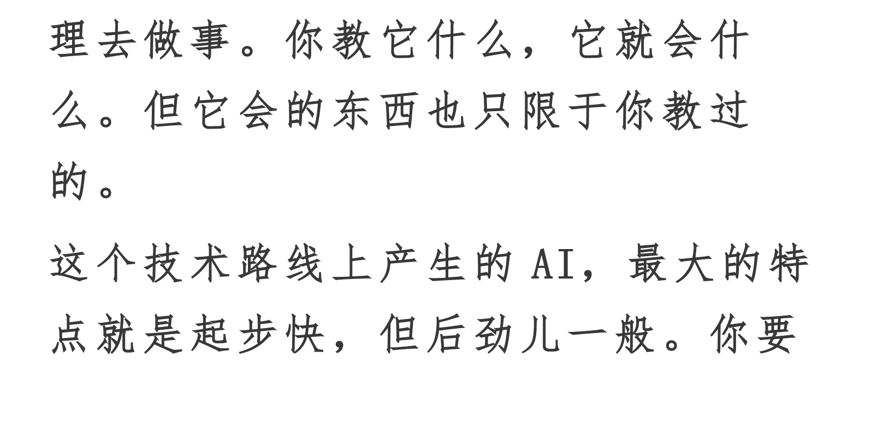

# 一个“教育多动症患者”，是怎么获得诺贝尔物理学奖的？

241010

整理：公众号懒人搜索，懒人专属群独享

懒人微信：lazyhelper



这两天，2024年的诺贝尔物理学奖刚刚出炉。美国普林斯顿大学的约翰·霍普菲尔德和加拿大多伦多大学的杰弗里·辛顿获奖。两位都是AI领域的泰斗，也是目前世界上在深度学习领域辈分最高的前辈高人。注意，物理学奖颁给AI领域，其实算不上跑题。因为霍普菲尔德和辛顿在AI领域的研究，很大程度上是基于物理模型展开的。

关于两个人的研究，具体的理论细节咱们就不展开了，简单说说背景。在很多年前，AI有三个学术流派。

第一个是符号主义，认为人工智能是基于逻辑推理产生的。也就是，你先让AI掌握一个道理，它再根据这个道理去做事。你教它什么，它就会什么。但它会的东西也只限于你教过的。

这个技术路线上产生的AI，最大的特点就是起步快，但后劲儿一般。你要想让它掌握更多的技能，就得把每一样技能背后的逻辑、规则、数学原理，都用机器语言表示出来，然后教给它。显然，这需要极其巨大的投入。当年日本倾举国之力研发的专家系统，就属于符号主义流派。结果最终走进了死胡同，之后在 AI 领域迟迟振作不起来。

符号主义最著名的作品之一，是计算机“深蓝”，也就是击败国际象棋大师卡斯帕罗夫的那个超级计算机。这是 1997 年的事。但很多人只知道深蓝赢了，很少有人知道，还有个神经学家，叫里德·蒙塔古在比赛期间做过一项观察。他发现在那场比赛之后，深蓝的机身热得烫手，而卡斯帕罗夫的体温几乎没有波动。深蓝这惊鸿一瞥，几乎算是触碰到了符号主义 AI 的天花板。

真正让 AI 领域达到今天的声势的，是第二个学派，叫连接主义。也就是，认为人工智能应该模拟人的大脑。你模拟大脑的方式，用机器搭建一个类似神经网络的结构，然后像教小孩一样给这个网络输入大量的数据，然后它就会一点点产生智能。以 GPT 为代表的大模型就属于这一类。

这个学派对算力门槛的要求很高，而且起步比较慢，就像教小孩一样，一开始学个说话都费劲，但随着孩子长大，后面的进步速度可能一日千里。

比如，辛顿是从 1983 年开始研究深度神经网络算法的，但这个技术路径直到 2012 年，才真正一鸣惊人。当时他的两个学生，亚历克斯·克里泽夫斯基和伊尔亚·苏茨克维，没错，后面这个伊尔亚就是 OpenAI 的前首席科学家。辛顿当过他的导师。当时辛顿的这两个学生参加了 ImageNet 图像识别比赛，获得了冠军。而且更重要的是，他们的算法只用了 4 颗英伟达的 GPU，而第二名的谷歌用了 16000 颗 CPU。

说白了，假如把神经网络模式下的 AI 当成一个人，它是在经历了几十年的默默无闻后，才终于开窍了。这个成长逻辑，也导致连接主义一开始不受待见。假如不是有人一直坚持，连接主义的技术路线可能就会淡出舞台，也就没有今天的 AI 大爆发。

而这回获得诺贝尔物理学奖的辛顿和霍普菲尔德，就属于那一批一直坚持连接主义，或者叫深度学习的科学家。在 AI 没有爆发的那些年，他们更多地是在不停地播种，把自己的思想传授给更多的人。你今天看到的很多 AI 领域的著名科学家，都多少跟辛顿沾点师徒关系，有点天下武功出少林的意思。

至于第三个学派，叫行为主义，认为智能是基于行为，以及由此引发的环境反馈和刺激产生的。说白了，就是一切从行为中来。比如，我通过走路，通过双腿与大地的接触，掌握了走路这项智能。这就属于行为主义。行为主义跟前面两派之间没什么恩怨，它更像是今天大模型技术的补充。今天人形机器人领域经常说的具身智能，本质上就是行为主义的延伸。

好，关于这回诺贝尔物理学奖的技术背景，咱们先说到这，算是做个简单的科普。其实，真正值得所有人了解的，不是这些专业理论，而是这些科学家的故事。

两个人里，辛顿的名气更大，故事也更离奇有趣，我们今天主要就讲讲他。在奖项公布当天，得到App的卓克老师和快刀青衣老师昨天都已经做了解读。我们今天就结合两位老师的解读，说说辛顿的故事带来的启发。

假如把辛顿的学术生涯看成一场足球比赛，然后给这场比赛配个解说员，那么整场比赛的解说大概是这样的。

- 开场了，辛顿选手开局不利，被对方逼到了死角。
- 比赛到15分钟，辛顿选手岌岌可危，在对方的强大攻势下应接不暇。
- 比赛到半个小时，辛顿选手乱了阵脚，一阵手忙脚乱居然把球踢丢了。
- 比赛到1个小时，辛顿选手屡次失误，再一次把球踢飞，看样子辛顿选手是准备躺平了。
- 最后，解说突然来了一句，辛顿选手站上了冠军领奖台，拿下了全场最高的荣誉。

你可能会说，不对啊，胜利来得这么突然吗？前面没有一项顺利的，最后怎么就突然赢了呢？

没错，辛顿的职业生涯，多少还真有点这个意味。开局不顺，不是退学就是坐冷板凳，后来一鸣惊人。

这得从辛顿上学说起，按照辛顿自己的话说，他可能患有一种教育上的多动症。也就是，他很难在一个专业上集中注意力。假如退学有段位，辛顿算是王者级别。

18岁，辛顿进入剑桥大学国王学院学习物理、化学和数学，一个月之后退学。紧接着，辛顿去伦敦工作了一年，又回到剑桥，改学建筑学。这回是只用了一天就退学了，没错，是一天。后来转向哲学专业，结果毫无意外，再次退学。

直到辛顿转向了物理和生理学，他也是剑桥大学唯一一个同时学习物理和生理学的学生。这才磕磕绊绊毕业，在1970年拿到了实验心理学的学士学位。

但辛顿却没有从事这个专业，而是转行去当了木匠。没错，是实打实的木匠，可不是去体验生活。

但这是因为辛顿太没毅力吗？并不是。事实恰恰相反，辛顿不是不够执着，而是太执着了。他之所以一次次退学，是因为始终没学到自己感兴趣的东西。他对什么感兴趣？是人脑的运行方式。这是他一直想学的。

于是，在干了一年多木匠之后，辛顿觉得这好像也不是个办法，这才又回到学术界，并且锁定了一个方向，这就是人工智能。

辛顿在爱丁堡大学读博士的时候，也终于找到了一个合自己胃口的导师，希金斯。希金斯当时研究的是神经网络，而神经网络研究的关键基础就是人脑的运行。但是，事情到这又出问题了，辛顿的导师希金斯因为受到另一位AI大师明斯基的影响，开始逐渐背弃了神经网络，认为神经网络不可行，转去研究AI符号主义了。

当时是1972年，也正是神经网络的低谷期。但辛顿就这么一直坚持，每回希金斯劝他放弃，辛顿都会说，再给我半年，我肯定出成果。结果，就这么半年又半年，辛顿一直耗了5年，直到博士毕业，希金斯也没说服辛顿，辛顿自己也没搞出什么大成果。但他还在坚持。

后面的故事，咱们就不展开了。简单说，就是辛顿这么一直熬啊熬，终于熬到了万维网出现，这给了深度学习获取巨量数据的渠道。辛顿又熬到了英伟达的 GPU 崛起，这给了深度学习扎实的算力。等到一切条件成熟之后，辛顿的算法终于一鸣惊人。

但是，就在人工智能最火的这两年，辛顿却急流勇退。去年 5 月，当时在谷歌任职的辛顿宣布离开谷歌。注意，这可不是他对于人工智能没信心，恰恰相反，是他对深度学习的算法太有信心了。辛顿坚信，人工智能已经过于强大，再这么任凭大厂之间搞 AI 竞赛，早晚出问题。离开谷歌，也算是表明自己的立场。

好，关于辛顿的故事，咱们先说到这。你发现没有，一般来说，驱使一个人行动的，不外乎两个动机，要么是想赢，要么是怕输。但是像辛顿这样的人，他的行动字典里似乎只有想赢，没有怕输。

假如怕输，他就不会一次次退学，就不会在所有人都不看好深度学习的时候坚持，就不会在 AI 最火的时候离开最能支持他研究的谷歌。他行动的驱动力，更多地来自另一个动机，想赢。就像有句话说的，一般人眼中不可逾越的高山，在高手看来，那是用来通天的路。

你要问辛顿这个性格是怎么来的，除了天赋、机缘、努力之外，我在这里姑且做个个人猜测。我觉得也许跟他的家庭有关。

辛顿的高祖父，是19世纪著名的数学家乔治·布尔，计算机领域里地基级的理论，布尔逻辑就是他提出的。辛顿的曾祖父是数学家兼奇幻作家查尔斯·霍华德·辛顿，第四维度这个概念就是他提出的。辛顿的表亲琼·辛顿，是一位核物理学家，也是曼哈顿计划里为数不多的女性科学家之一。辛顿的曾姑母是女作家艾捷尔·丽莲·伏尼契，没错，就是《牛虻》的作者伏尼契。

你可以想象一下，生活在这样的环境里，辛顿大概率上会觉得，开宗立派这个事，好像也不是难如登天。

之前有位潜能研究者，叫哈维·艾克，这个人专门研究有钱人。他发现所有的有钱人都有一个特点，就是他们都觉得，自己就应该这么有钱。哈维还发现，多数人都会在心里给自己设置一个默认的财富值，假如他的财产超过这个数，他就会莫名其妙地挥霍掉。假如不够这个数，他早晚会通过各种各样的方式赚够数。

这个逻辑放在其他事情上或许也成立。假如一个人生来就见惯高山，他会觉得登上山顶是理所当然。假如他身边充满了改变世界的人，他会觉得改变世界不是什么难事。就在前不久，《助推》作者桑斯坦的新书《屡见不鲜》出了中文版。桑斯坦有个洞察，说的是，人这个物种有个特别强大的能力，就是习惯一件事。即使再不可思议的事，假如见多了，也会觉得顺理成章。从这个角度看，辛顿有这样的家庭环境，他也许会觉得，搞出一番前人没有的作为，这是人生的默认设置。

当然，一般人很难有辛顿这样的机遇。但假如说我们能从中获得什么启发，我觉得可能就是咱们正在做的事。没错，多读读辛顿这样的人的故事，离高手的人生更近一点，然后对齐自己和高手之间的默认设置。


历史 3000 多份各类付费文章以及年费三千多的副业社群资源，见懒人专属群内部分享！

付费群，白嫖勿扰！

## 懒人专属群更新记录：

```
https://lazybook.fun/#/blog/record2
```