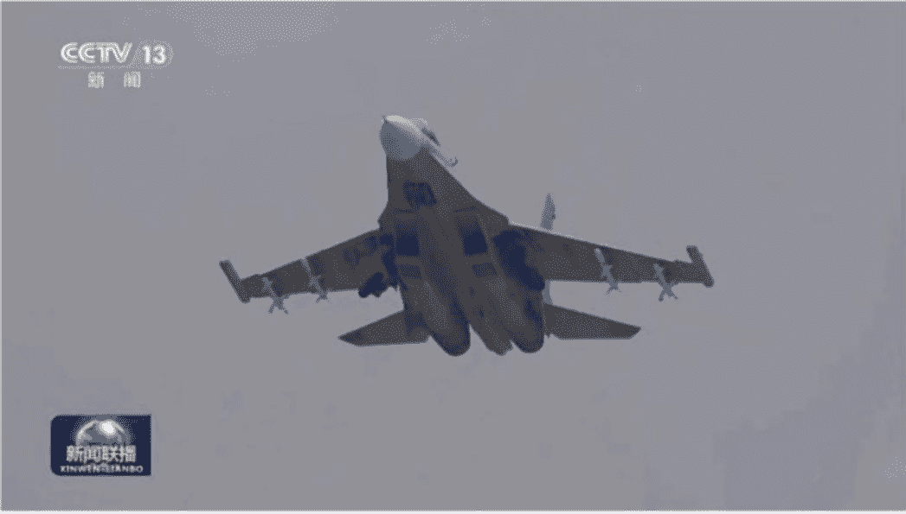
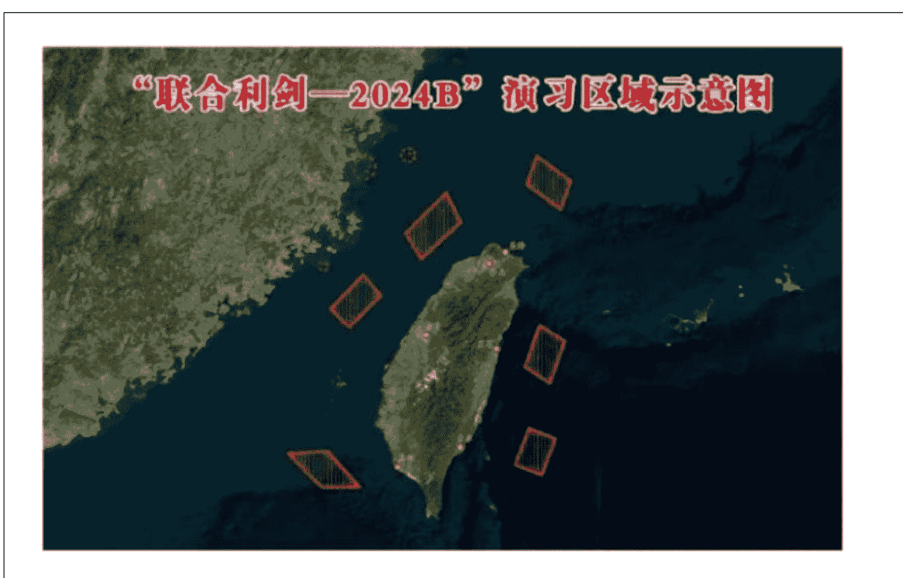
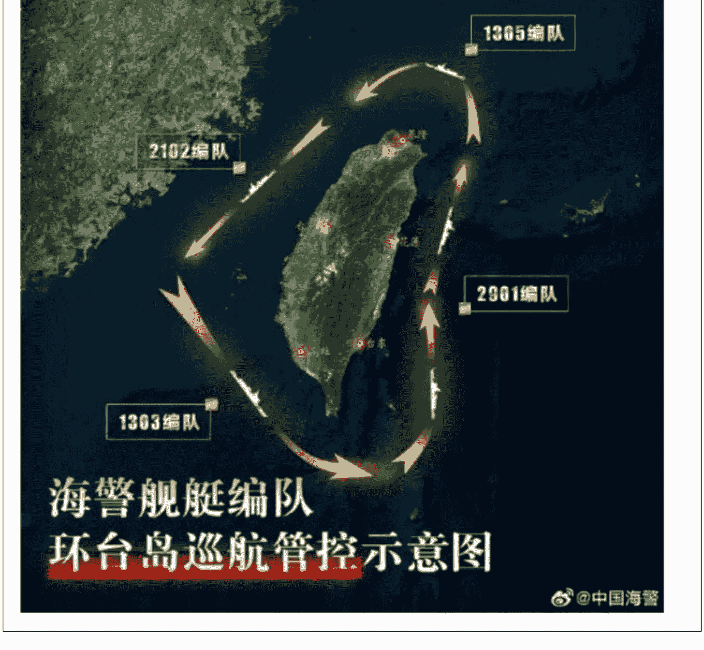
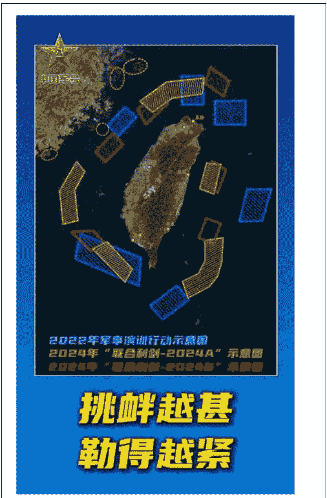

# 联合利剑 2024B

241014 龙牙的一座山

整理：公众号懒人搜索，懒人专属群独享

懒人微信：lazyhelper

公众号懒人搜索懒人专属群

微信:lazyhelper

还记得“联合利剑”—2024A吗?

那是今年5月23日到24日东部战区部队举行的一场演习。演习组织陆军、海军、空军、火箭军等兵力，使用多种兵力兵器对模拟目标进行了多维度立体饱和式打击。这次演习是在台湾地区非法政权“领导人”赖清德5.20台独讲话的一次有力回应，国台办当时的表述就非常明确，演习是针对“台湾地区领导人520讲话谋独挑衅的坚决惩戒”。是惩戒而不是警告，我在当时的文章也着重讲了这一点，这不是一次空对空的演习，而是有着明确战术目的、以演习名义进行的军事实控。

这一点，有必要详细说一说。

有时候不方便直接以作战的名义进行军事实控，则会以“演习”为名，执行军事实际控制任务，对方认怂认输主动跑路那就是演习，对方要是敢针锋相对，当场变成作战也没什么问题。

军队在演习的时候，戒备与战备程度，有时候会超过实战。因为部队尚未经过消耗，没有人员装备损失，后勤准备充分，预先有大量物资储备和战术准备，这时候部队的战斗力除了没有实战以外，实际上是最强的。而作战中必然战线有拉扯、有穿插迂回等等战术动作，往往有一些部队并不处于战斗力巅峰。

因此以演习为名采取实控行动，往往效果也非常不错，“两手准备”：
- 一是准备对方不敢打，那我们就大大方方的占了，这块地方以后就是我们来管，军事实控——民事执法——实际管理逐步推进就是了；
- 二是准备对方不放弃，那就让你来开第一枪，现代国际社会对于“谁开第一枪”很重视，我实际控制行动已经开始了，你不跟上不行，你跟上，极有可能就是你开第一枪。

1989年中印边境“896”演习就是比较早期的一次运用，中越老山前线也曾经有过，对台、对南海、对印则用到了精炼纯熟。名义上是演习，实际上演习完了就不走了，用强大的兵力兵器优势不动声色压服对方，这就是“不战而屈人之兵”。当然你要是“不屈”也行，打屈就是了，又不是没准备好。

最近两次类似策略的运用，是2017年中印洞朗对峙、2020年中印班公湖对峙，也是类似于演习的战术动作，直接大量兵力兵器和物资压上去，战场基础设施建设不停。你要跟，那就打，你要不跟，那就占，你要对等应付，你又没有那个基建能力。

这次联合利剑—2024演习也是一样的。

以演习的名义大大方方实施实际军事控制，大大方方就拿你的地盘、我的预设战场来搞“演习”，你跟不跟？跟不跟都是问题，不跟就把部队部署到你眼皮子地下了，“卧榻之侧岂容他人安睡”？不容也得容。你跟，那大不了就打呗，反正我准备比你充分。

那么本次演习具体有哪些新的推进？具体实际控制了什么地盘？又有什么新的战术动作？

## 1

### 首先我们要关注海警部队的跟进：

几乎同时，海警 1303、2102、1305、2901 四个编队展开了环岛巡航管控，这意味着什么呢？

我们要知道，海警部队跟海军、东部战区的任务是有很大区别的，海军属于是军种，主要负责部队的建设任务，东部战区是战区级别联合指挥机构，负责怎么“用”部队，而海警则主要是民事警务机构，是负责管控民事行为的，兼顾一定的武力对抗。但是这种武力对抗，强度烈度是比不上军队的，是预防狗急跳墙的犯罪分子手里那几根烧火棍的。

说到底，“术业有专攻”。

让军队去执行民事管控任务也不是不行，但效率要大打折扣，有点儿“大炮打蚊子”的感觉。军队的军官、士兵并没有经过多少民事管控训练，不熟悉民事法律，当执法力量来使用是用错了地方。

而海警对于警务行动更熟悉更专业，接受的训练也更多，执法动作更娴熟，很显然是比部队要强很多倍的。

这次海警部队与东部战区几乎同步行动，充分说明这是一整套从军事实控到民事执法的系统化行动，军事、民事双管齐下，实际上就构成了完整的实际管控。

## 2

### 我们来复盘几次对台军事演习：

《中国军号》发布的一张合成图很明确，把 2022 年至今几次对台演习的管控区域进行了重叠，这样有利于我们搞清楚这几次演习的脉络。

可以看到，近几年这种演习—实控相结合的形式，是台独势力自找的。

自2022年佩洛西窜访台湾以来，我方出于无奈形成了这种以军事演习逐步实施实际管控的办法，是被动的，是无可奈何的。我们始终爱好和平、坚持和平解决台湾问题，无奈台独势力不断在军事上挑衅、政治上一意孤行，责任不在我们。

在第一次严重挑衅之后不得不围绕台湾本岛外侧海域，进行了一些外围威慑性质的海上军事行动，主要针对的还是域外势力插手台湾事务的一种战略性威慑，是为了展示我们有能力掌控台海地区，避免某些人误判形势、铤而走险，脑子一热干出什么大家都不愿意看到的事情。

第二次严重挑衅之后，战略威慑很显然没有让某些人清醒过来，依旧沉醉于春秋大梦无法自拔，那么就要面对现实、实事求是，一板一眼的解决问题。这时候的封控已经趋向于战术现实而不是战略威慑，“反插手介入”与“打要点要害”相结合，对所谓“离岛”也有了具体的战术安排，对于可能会有外来势力介入的东南部、北部有警戒性对抗力量，而在海峡内部则部署了大量兵力夺取绝对制空权、制海权，为登陆部队创造条件。

在东部外海也部署了牵制一佯动力量，有变主攻为佯攻、变佯攻为主攻的可能，牵制岛上非法武装的部署。第三次严重挑衅，也就是赖某人前两天的演讲之后，我们实际上已经不在乎他说什么，按照自己的部署走就是了，封控区域与兵力部署更加精准，也与联合利剑—2024A形成了战术上的联动、继承。A 行动中已经完成的任务就不再重复，没完成的则在 B 行动中补完。上一次 A 行动中我已经讲过这次行动后续的任务还有，还没有完成，还有待在 B 行动中补充完成。果然，这次 B 行动展开，从透露出的只言片语中已经能够看出全貌了。

## 3

### 这次对于行动的表述，跟 A 行动是不一样的。今天，东部战区新闻发言人李熹表示，5 月 23 日至 24 日，中国人民解放军东部战区组织战区陆军、海军、空军、火箭军等兵力，位台岛周边开展“联合利剑—2024A”演习，重点演练联合海空战备警巡、联合夺取战场综合控制权、联合精打要害目标等科目，舰机抵近台岛周边战巡，岛链内外一体联动，检验战区部队联合作战实战能力。这也是对“台独”分裂势力谋“独”行径的有力惩戒，对外部势力干涉挑衅的严重警告。

东部战区新闻发言人李嘉海军大校表示，10月14日，中国人民解放军东部战区组织战区陆军、海军、空军、火箭军等兵力，位台湾海峡、台岛北部、台岛南部、台岛以东，开展“联合利剑—2024B”演习，舰机多向抵近台岛，诸军兵种联合突击，重点演练海空战备警巡、要港要域封控、对海对陆打击、夺取综合制权等科目，检验战区部队联合作战实战能力。这是对“台独”分裂势力谋“独”行径的强力震慑，是捍卫国家主权、维护国家统一的正当必要行动。

注意看红线标出的具体表述，我们来一一解析。

“联合战备警巡”背后的实际意义是战场管理，是指的对空、对海与部分对陆地已经夺取的地区，实施战场管制管控的行动，这是一种战场环境的管理行为，对空对海对陆对信息、电子、网络的全方位掌控。

这个概念是在2016年军改之后新提出的一种概念，即在作战中一定要构建有利于我们的战场环境，避免已夺取区域失管失控。当然这一点在以前也有模糊的概念，但是并没有正式作为一种行动来认真执行。包括美国在最近的阿富汗战争、伊拉克战争中，也没能真的把这一条执行好，而是打了很长时间的治安战。而联合利剑系列演习中，是单独提出了战场管控概念的，也是有专门的兵力执行这个任务的，这也是 A、B 行动中都要提出这一条的原因。

A 行动中提出的“联合夺取战场综合控制权”则在 B 行动中不再提出，改成了“夺取综合制权”。这是说明夺取的综合控制权区域位置是不一样的，A 行动夺取的制权主要还是集中在台岛附近区域，而 B 行动中需要夺取的制权则在向外延伸，不再成为一项主要任务，而是一种反介入的手段而已。针对的对象也不一样，A 行动中夺取的制权是从台非法武装手里夺取的，B 行动中夺取的制权则主要是从 T 国、M 国手里夺取中远距离上的制权。

A 行动中提出的“联合精打要害目标”在 B 行动中变成了两条，“要港要域封控”和“对海对陆打击”，这也是有继承性的。A 行动主要是“斩首行动”式的打击，主要是针对指挥中心、信息交换中心、交通要害等等要害设施与地点以及人物的精确打击。在 B 行动中“点”变成了“面”，对点打击任务完成后，紧跟而来的是对面状区域的控制，对散在目标的打击，打击力度增加、目标重要性降低，投放的火力密度增加，能够“雨露均沾”的目标自然也就更多了。

因此，仅仅是第一步的消息宣告，我们就能看出这么多信息。

后续随着演习画面的曝光，以及进一步的信息披露，特别是各方反应的回馈，我们还要关注以下信息：

- 一是海空接近情况。观察台非法武装、甚至是丁国、M国军事力量的反应，是否会有抵近对抗的发生，有没有擦枪走火的可能，是就此忍气吞声，还是彻底沉不住气，这一点是关注的焦点；
- 二是政治反应。观察台非法政权的政治反应，丁国、M国政治反应其实现在已经无关紧要，西方国家对我国实施的敌对政策，除了直接开打动手，打热战，已经无所不用其极。金融战打了，贸易战早就打过了，西方至今也没有学会把手里的筹码用在关键位置，而是层层加码的低端玩法，利空中国的手段早就已经出空，再进一步实际上面临着无计可施的境地；
- 三是战术动作。主要是观察我军的新战术动作，从这些战术动作中我们可以看出更多的信息，比如海军、空军、海警部队具体采取了什么样的打法，这些打法在专业人士看来，是可以透露出我军的战术指导思想的，至少可以看出一些我们预想的战斗进程会如何推进，这个就是属于“内行看门道、外行看热闹”的范畴了。

关于这三点我都会在后续的文章中逐步根据公开信息进行分析。像类似的这种一线官兵采访，以及拍摄的行动短片，可以分析我军演习的战术想定，既“我们是怎么预想”的。

最后，我们也要学会联系别的新闻，从大局势的方向去思考问题，搞清楚同时世界上别的地方在发生着什么，这里面也有不少信息值得关注。

- 一是中东地区局势升级。

以色列是美国“不得不救”的地方，世界任何地方，跟这里比起来都属于是“可以交易”的范畴。因为中东是美国“石油美元”的根基，这里彻底垮台，意味着美国霸权的整体陨落，这是无论如何现阶段的美国都无法面对的可怕未来。在债台高筑、金融战偃旗息鼓的现在尤其如此，一旦失去金融收割工具，美国国内积压的大量矛盾就失去了任何挽救的可能性，全世界对于美国的预期将会转向负面，则美国的国运也就到头了。

因此，以色列在中东的行动才会如此的肆无忌惮，中东各国的行动也才会如此束手束脚。

以色列甚至对联合国驻黎巴嫩维和部队发起了直接攻击，今早的消息，以色列国防军坦克甚至闯入了联黎部队的营地，这已经是直接攻击了。他的目的无非是以更大的行动来逼迫美国直接下场，为自己火中取栗，把这个烂摊子甩给美国来“兜底”。死美国人总比死以色列人好，让美国大兵卖命自己坐收渔利，何乐而不为？

以色列目前国防军战斗力崩塌，行动长期收不到成效，国内矛盾突出，内塔尼亚胡面临巨大政治危机，也到了“好大儿”来兜底的时候了，“养子千日、用子一时”嘛。

- 二是中国果断发射洲际导弹。中国军号

前几天中国在我国海南岛东侧某地发射了一枚射程达到12000公里的弹道导弹，射程可以全面覆盖美国国土。美国的反应非常有意思，“赞赏”中国提前通报了他。这就是典型的“当你有了大棒，饿狼也会彬彬有礼起来”。

在这次弹道导弹发射中我已经分析过了，主要目的是警告美国不要轻举妄动、异想天开。中国核威慑始终有效，不要动歪心思，这个信息看来美国是收到了。

- 三是南海局势朝着有利于我的方向发展。

我南部战区大大方方也在南海搞了一次“演习”，推进实控黄岩岛的行动，开展正常执法与军事巡逻，菲律宾连一丁点有效应对都没有。这个新闻非常奇怪，剑拔弩张，在国际国内却一丁点水花都没有，甚至都没有什么后续反应，连个抗议都没有。

这说明南海敌对方实际上是认怂了。

当时日本、澳大利亚、加拿大和美国可“恰好”在南海搞演习，南部战区毫不犹豫针锋相对，居然就是一丁点火花都没碰出来。

这说明美国试图在太平洋西部地区拉起来的所谓“同盟”实质上已经失败了，美国终于还是没能抽身到太平洋来对付中国，战略重心确实被以色列给吸走了。

从这三条貌似无关的信息我们可以看出来，美国当前无力在台海投放足够的军事实力。美军实力一向就没有鼓吹的那么强大，现在还每况愈下，靠着航母编队构建的海洋霸权实际上是个吹胀的气球，看起来很大，但一戳就破。美军从来没有独自在陆地上打赢过一场战争，即使是吹到填上、斯皮尔伯格在摄影棚里渲染到了毁天灭地的“诺曼底登陆”以及后续欧洲作战，也是在苏联吸引了德国绝大多数实力的前提下打赢的。所谓的“第二战场”自始至终都是次要战场，苏德战场从头到尾都是二战主战场。

就这么个敲边鼓的实力上限而已。

那么目前在以色列不断作死作妖的局势下，某些人翘首以盼日思夜念的所谓“外援”，实际上是不存在的。台非法武装最多最多能够收到点儿口头安慰，连一粒粮食也别想拿到，一颗子弹也别想获得。

- 1、海空封锁，对海港、要地的打击，主要指的就是对港口和机场的打击，想要支援你，你总得有个接收的地方对吧？
- 2、对海打击，主要是威慑的蠢蠢欲动的丁国、M国海军，你台非法武装的那几条破船甚至都不值得动用先进导弹，扔几颗C802就是看得起你了。
- 3、美国可能也没什么东西能够拿来支援你了，要紧着“共轭父子”以色列义父用，连泽连斯基都不一定要的来，更何况你一个野生的？

所以，这次演习实际上就是在敲醒某些人的春秋大梦，但是我们也知道，你叫不醒一个装睡的人。

那你就继续装睡吧。

装睡不要紧，我就把你枕头旁边都给占了就行。台海军事实际控制权早已是东部战区的，民事执法权也成了海警的，你继续装睡就好。

历史 3000 多份各类付费文章以及年费三千多的副业社群资源，见懒人专属群内部分享！

## 付费群，白嫖勿扰！

## 懒人专属群更新记录：

https://lazybook.fun/#/blog/record2