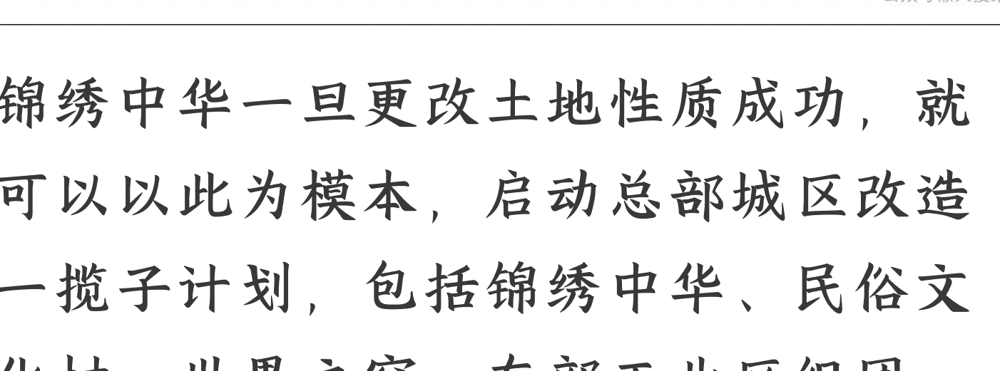

# 某股票内幕信息：成则十倍利、否则 XXX

241017 尹香武

整理：公众号懒人搜索，懒人专属群独享

懒人微信：lazyhelper

推到悬崖，再捞回来！

这是刚听《高人》说的非常内部的动向，这是对某股命运具决定性的内幕信息，这是一旦成了就有十倍利的超级机会。

因为某企业这几年遭遇了极端困难，是某类企业中表现最差的，其自身所有的努力都已经做了却无济于事。

目前该企业已经到了悬崖边上，其性质特殊死不得或者说一旦死负面太大，因此政府翻箱倒柜开始找药方，果然……于是就开始研究、商谈，但是事情太大了地方难以决策，需要……

下面我听《高人》所言的详细记录在此，大约 2000 字。对股市感兴趣的要睁大眼睛看咯。本文并非投资建议，仅供投资参考之用！

《投资革命》密件开售：

## 你将一跃，还是一跳？

你已站在历史性的投资路口——此类价值革命，有且只有一次！售@尹香武《投资革命》密件：你将一跃、还是一跳？，找 19864581383 小参谋。
内容不限于：
- ①最后的“双革关口”；
- ②大换轨成败在此举；
- ③金融顺差——中产价值地位重整；
- ④楼市股市最优价值标的，及风险标的的警示。

那就是华侨城（SZ.000069）。由于之前的董事长上任后，到一些偏远地区、小城市拿了很多项目，反而卖掉了深圳的优质土地（比如康佳旧改地段）去填补窟窿，而且疫情以来旗下的旅游业板块亏损严重，因此华侨城成了央企中表现最差的，一度市值还不到 150 亿、估价还不到 2 元。

其实，自去年以来，华侨城就开始寻找解决方案了，我在今年年初的时候就此还提示（你可以看图片）说：

> “拯救华侨城集团的最速效方法，是改锦绣中华地块为房产开发”。

微博文字你可以直接去查看：https://weibo.com/1948030305/5000211140708589。当时很多人没有领悟到，其实我突然说这种话定是有原因的。

华侨城这块土地，最早是沙河华侨农场，专门接受当时从东南亚某些排华国家回国的华侨的。改革开放之后，这里设置成了华侨城集团。

由于当时很早，这里又特别偏远，深圳根本管不过来，南山华侨城这里的土地规划、审批、土地性质确定这些，其实绝大多数都是华侨城自己做、自己定的，不是政府定的。尤其是早期的旅游用地、基础设施用地。

或者更准确地说，1999年之前，华侨城（区域概念）的土地事宜一切都是华侨城（企业概念）自己说了算，华侨城当时是有自己内部的土地与规划部门的。也就是说，华侨城（区域）的资产权属留了很多尾巴。

其中，锦绣中华的用地腾挪的空间最大。这块土地约30万平米，其中的景点主要是对我国各大景点的浓缩，现在已经成为华侨城4大景点——欢乐谷、世界之窗、民俗文化村、锦绣中华——中客流最少的，就几个微缩景观，没人看了。

锦绣中华的土地已经到期，继续保持现状就等同于抛荒。但是这块土地的
第一大股东是港中旅、二股东才是华侨城，而这两家都不是市属国企、而是央属企业。以前呢，央企还没有火烧眉毛，深圳自己的土地当然不想就这么便宜了它。

但是现在华侨城命悬一线啊，真要死那岂不是说明深圳的投资环境太差？因此必须救了。所以，华侨城就希望以此为突破口。只要锦绣中华实现了突破，能够成功地从旅游性质转化为商业开发性质，凭这么优秀的地段，这块地华侨城所占的权益价值就不止华侨城现在的市值了。

而且，华侨城这个总部区域的6个多平方公里的土地中，很多土地年限都已经过期，尤其是工业部分更是如此。比如说，创意园区一期都已经过期十年了。所以现在继续一个突破口，这个突破口大概率会选择锦绣中华地块。

当时是7月份吧，我捕捉到了这个信息后就发了一条微博说“华侨城，股票市值只剩165亿了，估价2.04元”。微博网址是 https://weibo.com/1948030305/5057119235083137，你可以自行查阅。自当时的价格到9月底，涨了不少的。

锦绣中华一旦更改土地性质成功，就可以以此为模板，启动总部城区改造一揽子计划，包括锦绣中华、民俗文化村、世界之窗、东部工业区组团等，可以说，华侨城是拥有土地权属话语权最大的央企了。这些土地都极为优质，只要其中30%做住宅就是一笔天文数字的利益了。

欢乐谷、锦绣中华、民俗文化村这些，即使再努力也无济于事了，因为这些景点已经脱离于时代了，改造是迟早的事。

所以华侨城这家公司与其它开发企业还不太一样，真要救其实也不难。一旦救活，利益是巨大的。要不要救或者说该不该救呢？当然要啊该啊，毕竟是亲儿子。虽然说央企不能与地方争利益，但央企也为深圳带来了很多机会，是重点照顾对象的，兼顾深圳利益情况下的土地改性，是具备概率的。这对华侨城来说是意义重大的。

现在只是在等待一个契机。这个契机必须能够为深圳市府做出对华侨城倾斜照顾政策时，扫清舆论与政策障碍，能够水到渠成。

其实还有另外一种可能，那就是华侨城这个企业，被港中旅（香港中国旅游集团）及其它央企分割兼并。但是如果这样的话，对于华侨城的股票意义是一样的，还是基于华侨城的土地利益的分割所带来的机会啊。

因此，华侨城现在的风险，其实就是偏远地段的项目，比如说位于湛江、茂名、江门这些项目如何处置。这些处置如果成功了，华侨城的股票会大涨特涨的。

将剩余地块退还地方是个办法、将剩余地块停止开发、将效益低的旅游项目停业也是个办法，真要处置是有办法的。如果处置不了那么多那么大呢？就由着华侨城死么？概率太低了，最坏的结果是被肢解、被兼并而已，这样的话对本金没什么太大影响吧。

所以，现在的关键就是摸准华侨城的时间成本，只要时间成本可控，那么这个股票是值得一搏的，这与所有开发类房企的境遇是完全不同的。因为开发类房企，只要没有好地块其实都没有了未来！

历史 3000 多份各类付费文章以及年费三千多的副业社群资源，见懒人专属群内部分享!

付费群，白嫖勿扰!

# 懒人专属群更新记录：

https://lazybook.fun/#/blog/record2