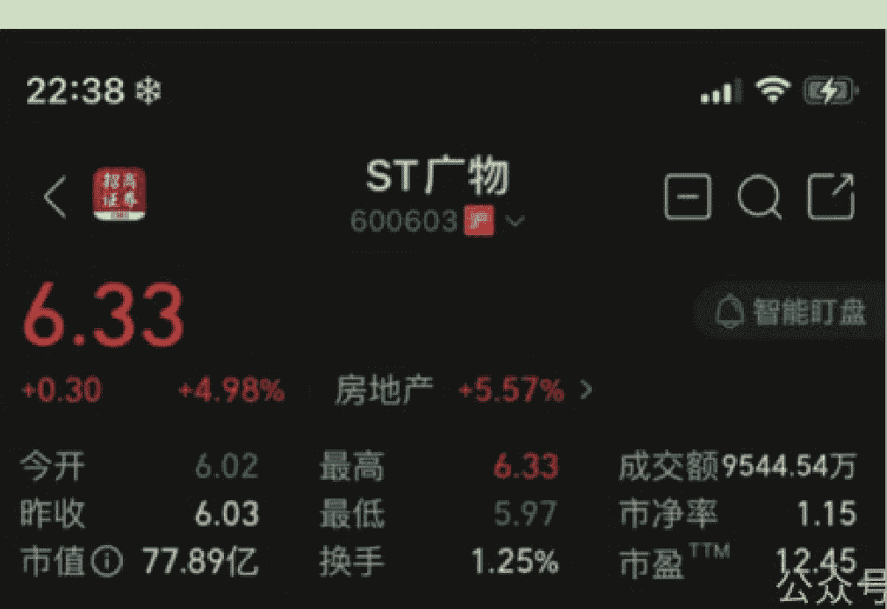

# 241017 觉悟社更新（标）

241017 守夜人总司令（觉悟社星球）

整理：公众号懒人搜索，懒人专属群独享

懒人微信：lazyhelper

群友私信分享的，小懒人整理给大家，完整截图见文末~

之前说过，博弈必然是有来有往，绝对不是单方面出手。而且，敌友并不是那么泾渭分明——地缘格局上的敌友会根据自身处境及相关利益进行调整，是在多种可能中做一种方向性的选择，或临时策略的选择。市场格局的变化会非常的灵活——布局会深远，操作很灵活——为了谋利，往往敌友的切换就在一瞬间。所以趋势向上的时候，内外都是朋友，趋势向下的时候，内外都是敌人。

之前说过，先出手的是对方，造出向下的预期，是因为之前的布局都是通过向下的预期挣钱。这个操作从2023年8月份开始，从未失手。只要预期和趋势形成一致性的共振，不管是预期还是趋势都会被自动强化。在生存博弈中，任何确定性的趋势都可以用来盈利。古往今来所有的战场胜利，归根结底就四个字：出其不意！小到一场几个人的战斗，大到一场百万人的战役。其实不是通过出其不意，出现在意想不到的地方，才能克敌制胜。所以，无论是下棋还是打仗，都讲究一个先手优势。有时候为了不被别人的节奏裹挟，会放弃局部利益，弃子争先。

第一个回合已经打完了。首先是对方做了向下的布局。我方突然来了一波猛的，打断了对方的市场布局，并且创造了一个向上的强烈预期。其目的并不是争夺放水周期下的全球资金，其目的是为了打乱对方的节奏，自己能管控预期和节奏——这才是真正的务实的目标！

为什么现阶段的核心目标不是争夺全球资金？因为产业的发展都需要长期资金不是短期资金。你自己内部都不愿意负债投资扩大生产——而且在利率越来越低的情况下都不愿意。这意味着什么？意味着长周期的投资回报率很低呀！你没有东西去承载资金，那么，就算你费了很大的劲儿，付出一定的政治和外交资源去把资金赶进来，也会像潮水一般的涌入，然后割一波之后又潮水一般的退走。这个你是挡不住的，看看隔壁三哥家！各种严防死堵，甚至不择手段，资金都在加速跑出三哥家——最近vivo跑掉580多亿人民币的资金，三哥家如丧考妣！这事在越南也发生过，前两年大量的美元资金涌入越南把它的房子炒的非常高，人均人民币不到1500的地方，房价涨到3—5万人民币。老美一撤退，他们内部就爆了，连锁反应之下有10%的GDP规模的社会财富凭空不见了。

兔子是跟鹰酱博弈，但还没有到取而代之的时候。纵观古今历史，每次王朝更迭之时，那个真正会取代之的人，绝对会以旧王朝忠臣良将的面貌出现。曹操挟天子以令诸侯，李渊打的是隋恭帝的旗号。就连瓦拉部落的也先都知道找个成吉思汗的后代当大旗用，自己始终不要虚名只图实际。只有中国人认为兔子要对鹰酱取而代之了！在开放144小时自由行之前，全世界各国对中国的看法都非常的无足轻重。所以外面最近有很多人在问：中国怎么突然就变强大和先进了？能问出这种问题的人，说明他们之前的一贯看法都认为中国是落后的。所以他们不明白怎么突然就变成这个样子了!好像罗马并不是一砖一瓦建成的，而是突然冒出来的。这才是世界的普遍看法和真实心态。

王朝更迭之时，即便有逐鹿之心，聪明的枭雄也会尊奉旧秩序的主导者!从实力地位出发，无需诚惶诚恐趴在旧秩序的霸主面前，但会在任何方面让对方和整个旧秩序的体系都认为你是来捍卫旧秩序的辅国良臣，而不是要将整个秩序都彻底推倒的乱臣贼子!这个很重要，49年王朝更迭之时，一开始拉拢并分赏了很多旧阵营的人物。条件之宽裕，态度之谦卑，尊崇之丰厚，让他们自己都意想不到!他们之中不乏高官良将，都是旧体系的顶梁柱。他们需要出路，也需要一个更好的未来，还需要一个体面的谢幕仪式。如果这些都有了，那就顺水推舟。否则，就只能拼死相扛，鱼死网破。

现阶段是什么阶段?每次旧秩序碎裂之时，英雄豪杰起四方，哪一个不认为自己天命有归?正因为如此，不经过一番充分的厮杀分数大小王，谁又愿意放弃这种自以为是的天命。你认为你在王者归来，稍微有一定的体量的国家，谁不认为自己有资格逐鹿天下?既然如此，你让自己成为众矢之的，然后逐个打服。还是高举旧霸主的旗帜并利用大家对于旧秩序的惯性，让各路英豪相互消耗?曹操从一开始就高举匡复汉室的大旗，天下刚乱，人心思汉，必须把这块招牌的号召力折腾干净。让全天下人都意识到：大汉确实扶不起来了！这个时候，才可以取而代之。在此之前，曹操把整个房子的地基大梁装修都换了，但屋顶始终不换。兔子连地基都没有换好，到了换屋顶的时候了吗？！

舆论场上的声音必须把复杂的事情简化成两个人的对决，否则普罗大众理解不了。你看著名将帅写的回忆录，关于战争的描写都非常的复杂。但拍出电影的时候，镜头始终集中在双方指挥官身上，千军万马都是背景。为什么要这样拍？因为普罗大众只能接受这种极度简化的理解方式。你把海湾战争简化成萨达姆和小布什的私人恩怨，你把国共内战简化为两位主角的道德品德对比。这样普罗大众就理解了，也只能理解到这种程度！

言归正传，今天所有的博弈。不是要把对方掀翻，而是要与对方和解。这个和解的限度就是：你可以瞎折腾，但不能崩。我可以克制和退让，但你不能彻底阻止我按照既定的规划行事——我有耐心接受道路曲折，但不能接受止步不前。所以，最近老王对布林肯说：可以小院高墙，但不能是铁幕隔断！这就像曹操对汉献帝的态度：你只要能跟人合谋刺杀我，你怎么折腾都行，因为时间站在我这一边。如果你非要与人合谋谋害我，我就把跟你合谋的人宰了，但我会留着你，因为我现在还需要这面大旗。让你去折腾，让所有人都对你逐渐失望，让这面大旗在人心之中的影响力逐渐消散。

2008 年鹰酱发生金融危机，兔子做了 4 万亿的刺激，拉住了自己，也拯救了鹰酱。今天的高房价和债务都是这个后遗症。但是不这么做，只会更糟糕。当年元子攸就是忍不了一时之愤，在没有做任何预案的情况下，把尔朱荣杀了。然后，六镇的魔王们失去了尔朱荣这个唯一能压得住的封印，开始陆续登台群魔乱舞，把整个北魏搞得四分五裂，乌烟瘴气天翻地覆！

如果往前翻，就会发现在 8 月份最晦暗的时候说过：存在着所有政策密集释放相互叠加的政策，而且力度会大于当年的 4 万亿！往西部搬迁工业体系，与其说是为了战争需要不如说是为了消化资金——水放出来没有东西可以承接就会流走。我们希望向外面输出产品而不是资金！

接下来的政策发力点会侧重于承载产业和工程，而不是纯概念。能够理解这一点吗？越是纯概念缺乏支撑的东西，风险反而越大。而且，官方也不希望市场上形成一致性的预期——不管是向上的预期还是向下的预期。任何一次性的预期都酝酿着巨大的风险，也容易被围猎和操控。只有市场上的分歧非常大，预期高度不一致，政策才有出其不意的发力点，才不会被别人布局和牵制。所以接下来的动荡才是市场主要形态。

2023 的那个标的 1，ST 六零三那个，之前让大家撤过一波，后来又让进，还拿在手里的人可以加点，等待花开。

2023 的那个标的 1 是指【广汇物流 600603】，ST 六零三那个，之前让大家撤过一波，后来又让进，还拿在手里的人可以加点，等待花开。

（股票动态：2024 年 10 月 16 广汇物流 600603，价格在 6.33 元）

历史 3000 多份各类付费文章以及年费三千多的副业社群资源，见懒人专属群内部分享！

微信:lazyhelper

付费群，白嫖勿扰！

## 懒人专属群更新记录：
https://lazybook.fun/#/blog/record2