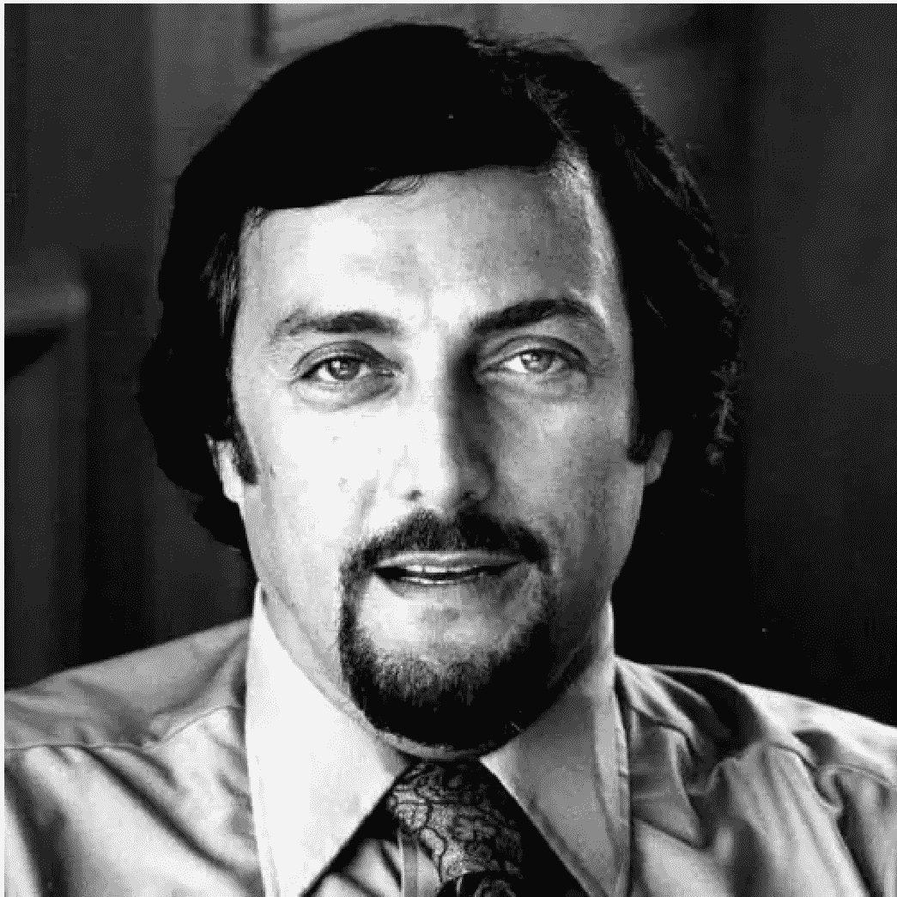

# 永远不要让别人定义你是谁

241021

整理：公众号懒人搜索，懒人专属群独享
懒人微信：lazyhelper

今天从一个让人遗憾的消息说起。上周，10月14日，一代心理学宗师、斯坦福大学退休教授，也是美国心理学会的前主席，菲利普·津巴多去世，享年91岁。

津巴多一度是全世界在世的心理学家里，辈分最高、成就最大、对心理学贡献最多的人，获得过美国心理学会颁发的希尔加德普通心理学终身成就奖。这也是心理学领域的最高奖项之一。

今天，我们就致敬津巴多，说说他留下的那些重要的心理学思想。

首先，津巴多对于心理学界有多重要？这么说吧，他有个称号，叫做“心理学的形象与声音”。说白了，心理学虽然有不同的流派，各个流派都有自己的大师。但是，你要是让整个心理学界选出一个能代表当代心理学的人，得票最多的应该就是津巴多。

当然，这里面有一部分原因，是津巴多长了一张特别典型的好莱坞电影脸。他的五官有点像罗伯特·德尼罗，再配上他标志性的发型和胡子。怎么形容呢？你可以想象电影里，一个顶级的催眠大师，长得又帅气又神秘，好像可以举手投足间控制人的心智。你就想象一个这样的催眠师的样子，津巴多大概就长这样。

菲利普·津巴多，1933-2024

但长相只是一个很微不足道的原因，津巴多能代表心理学，还是老人家的成就太大了。

津巴多是著名的斯坦福监狱实验的设计者，这也是心理学历史上最重要的实验之一。实验过程大概是，找24个学生，然后把斯坦福大学的地下室改造成监狱的样子。这24个学生分成两组，一组扮演看守，另一组扮演囚犯。本来这些身份都是假的，按照通常的设想，这顶多算是高配版的过家家，没人会当真。但没成想，实验开始一段时间之后，扮演囚犯的人越来越沮丧，而扮演看守的人，居然有往虐待狂发展的倾向。没错，一个人的行为和心态，并不是完全由自己说了算的，所处情境对行为的塑造，比我们想象中更深刻。外部环境，也许会让人背弃很多他曾经的价值观。

津巴多还由此提出了一个概念，叫路西法效应。

但是，对于斯坦福监狱实验道德性，心理学界一度有过争议。津巴多在晚年一直在反思，他觉得这个实验在一定程度上是不道德的。津巴多还说过，我不希望我的墓碑上写着，他是那座斯坦福监狱的主管。相反，我更喜欢人们这样写，他把人们从害羞的牢笼、无知的牢笼、自我膨胀的牢笼中解放出来。他做得兴致勃勃，同时也激励年轻人成为日常英雄。

除了斯坦福监狱实验之外，津巴多还做过关于害羞、邪教、时间观、精神控制、英雄主义等等很多方面的研究。假如说人类这个物种有一个关于行为逻辑的密码箱，那么津巴多就是那个开锁的人。

除了学术研究，津巴多还是心理学教育的重要人物。他和理查德·格里格合作编写的《心理学与生活》，还有他自己编著的《津巴多普通心理学》，都被很多大学的心理系作为教材。普通人要想了解心理学，这两本书也是很好的入门读物。

关于津巴多的成就还有很多。而其中最重要的成就之一，是他关于社会心理学的一个关键洞见。也就是，人这个物种的行为，不是简单地由自己决定的，而是在极大程度上受到情境的影响。

具体的理论很专业，咱们在这就不展开了。为了更好地理解这个洞察，我想给你讲两个故事。

第一个故事，来自于津巴多的代表作之一，《态度改变与社会影响》。有个叫比尔的中学生，从小就是个好孩子，为人诚实，成绩优异。但比尔周围的朋友可就不让人省心了。有一回这些朋友吸大麻，他们就叫比尔一起吸。显然，这是不对的。而且毫无悬念，比尔肯定是拒绝了。但是，这些吸了大麻的年轻人开始在比尔面前炫耀，说什么吸大麻是件很时髦的事。他们还一起排挤比尔。结果时间一长，比尔终于没扛住来自同伴的压力，也吸了大麻。比尔面对的状况有个专业名词，叫同辈压力。

这个故事看起来好像有点俗套，但关键在于津巴多在分析这件事时，提出了一组洞见。

首先，你觉得比尔吸了大麻之后，会不会内疚？按照通常的设想，这肯定是肠子都悔青了啊。但事实上，比尔并没有什么内疚。他一开始确实有点负罪感，但只持续了没多久，这个负罪感就消失了。他开始觉得自己的行为很正常，他也很享受这个状态。

由此，津巴多提出了第一个洞见。人对一个东西的态度，不是想法决定的，而是行为决定的。一旦人有了一个持续的行为，他就会觉得这个行为是对的。

借用津巴多的原话，人们表现出从众，既是为了社会认可，也是为了增加他们在不确定情境中正确行事的机会。个人的这些动机越强烈，群体吸引力和凝聚力越大，那么群体施加于个体的压力就越大。

其次，回到比尔，你觉得应该怎么让他变回好孩子，让他意识到吸大麻是不对的呢？其实，除了比尔之外，津巴多还观察过很多其他的案例。比如，有的孩子因为电影里的暴力情节看多了，自己也变得暴力，还有的是别的问题。

但是，尽管情况不同，他们却呈现出一个共同点。这就是，不听劝。即使你告诉这些孩子不该吸大麻，不该崇尚暴力，他们就是听不进去。由此，津巴多提出了第二个洞见，叫做选择性注意。也就是，人们只会留意那些自己原本就认同的信息。这也是为什么改变一个人那么难。

最后，难道这个状态就没办法改变了吗？也不是。既然人们的行为是被环境塑造的，那么要想改变它，还得依靠环境。比如，前面说的那些痴迷暴力情节的孩子，怎么让他们排斥暴力呢？实验人员给他们派了一个任务，让他们去给别人做一场宣讲，告诉别人崇尚暴力是不对的。结果宣讲完成。由此，津巴多提出了第三个洞见。想法无法改变想法，环境才能改变想法。也就是，你很难用你的想法去直接改变别人的想法，就算你口才再好也很难。有效的方法是，你先塑造一个环境，让别人在这个环境里扮演一个特定的角色，并且根据这个角色做出一些行为，而一旦对方做出这些行为，他的想法就会跟着行为一起改变。他做了什么事，他就会信奉这件事背后的价值观。

简单说，有句话叫“论迹不论心”，说的是看一个人是好是坏，不该看想法，而是看行为。而按照津巴多的洞见，这个说法大体没毛病。因为一旦一个人长期有这样的行为，他之后大概率上也会支持这样的价值观。

好，这是第一个故事。我们说了津巴多的核心观点之一，人不是先有想法，再有行为，而是先有行为，进而产生支持这个行为的想法。

接下来，第二个故事，我们来看看这套理论的高级别应用。假如你觉得前面的故事有点平淡，那么接下来要讲的将让你看到这套理论的威力。

这个故事并不来自津巴多，而是一个美剧，但是它很能反映津巴多理论的威力。

之前有个美剧叫《黑袍纠察队》，剧情里有个超人类叫阿祖，他是由一个实验室秘密制造的，能力完全对标超人。请问，作为这家实验室的负责人，应该怎么确保这个超人类不失控？

靠武力？阿祖刀枪不入。靠讲道理？试过，但根本没用。

实验室里的人最终想到的武器是，心理学。他们招募了全世界最厉害的心理学家，为小时候的阿祖设置了一套成长环境。实验人员会在他表现好的时候故意视而不见，还有其他很多设计。总之，在这个环境里长大，阿祖最终变成了彻头彻尾的表演型人格。他极其享受别人的认可，特别需要别人的表扬。假如失去这些，对他来说比死都难受。

同时，实验室背后的财团旗下有大量的新闻公司和电影公司，他们的工作就是，不断包装阿祖的形象，替他组织各类演讲活动，让他的表演人格有释放的渠道。

换句话说，这个超人类就像一个毒品成瘾者，而他背后的财团就像毒品贩子。靠着这套心理机制，财团和实验室牢牢控制住了他，至少是控制住了相当一段时间。即使后来他想大开杀戒，但还是一次次忍住了，因为他太需要别人的表扬了，要是真把人类杀光，谁来表扬他？

你看，从这个角度看，心理学就像是一个升维打击的武器。用好它，你也许能左右一个比你强大得多的存在。
当然，这个故事是虚构的，而且出于剧情需要，后期的阿祖必须得失控，这样情节才够刺激。但这个故事却展现出了一个关于社会心理学的真相，这就是，人是个社会动物，只要他身在群体中，就无时无刻不受环境的影响，即使是超人也不例外。

而回到现实，津巴多自己也清楚这套机制，因此他也一直在想办法用这套理论，让人们变得更好。

比如，可以通过环境中的微小变量施加积极影响。比如，超市播放的歌曲里，假如歌词里包括勇敢、诚实、善良一类的词，那么，超市里的偷窃行为就会明显变少。这个设计最早就是基于津巴多的理论。

再比如，既然我们会受到环境的影响，那么这也意味着，我们可以自己给自己创造一个积极的环境。比如，津巴多告诉我们，可以在心里让自己扮演另一个人，害羞的人可以想象一个开朗的角色，胆小的人可以想象一个勇敢的角色，然后让自己在内心扮演这些角色，自己就会发生改变。

换句话说，津巴多的一生，有两个极其关键的学术课题。第一个是，不要低估环境对你的影响，它有时可以决定你是谁。第二个是，更不要低估你自己对自己的影响，别让别人决定你是谁。

最后，借用津巴多的一句话作为今天的结尾吧。说的是，不要允许其他人将你去个体化，不要让他们把你放入某个分类、某个盒子、某个自动贩卖机里，不要让他们把你变成一个客体，一样东西。请坚持你的个体性，礼貌地告诉他们你的名字，大声地让他们清楚你是谁。

关于津巴多带来的启发，咱们先说到这。

汇集3000多份各类付费文章以及年费三千多的副业社群资源，见懒人专属群内部分享!

付费群，白嫖勿扰!

## 懒人专属群更新记录:
https://lazybook.fun/#/blog/record2