## 懒人副业周刊

整理日期：241022

懒人专属群的群友大家好。小懒继续给大家带来生财周报～

> 副业周刊来自某年费3000多的付费社群资源帖。

本文档为懒人专属群内部分享，懒人手动整理。

懒人风向标系列单独用在线文档分享，地址见专属群总链接。

一些帖子跳转飞书查阅，如需破解复制权限，可以用这篇文章分享的油猴脚本搞定

如果要保存飞书文档，可以用这个插件搞定：终于破解飞书，本地备份！

里面的飞书链接文档小懒有备份，失效的话到专属群总链接里找备份地址

生财第八期精华小懒会每天检查更新，专属群内分享～

往期的生财周报合集（含在线版和离线版），见懒人专属群内分享。

希望大家有收获～


标题加了(精华)的表示精华贴，前面为截至今日的点赞数。

以下是目录，内容有些多。大家可以挑兴趣的内容阅读。懒人专属群更新记录（点此跳转）

懒人专属群介绍：https://lazybook.fun/#/blog/group

专属群更新记录：https://lazybook.fun/#/blog/record2

懒人通才计划：https://lazybook.fun/#/data/13_course

懒人手册：https://lazybook.fun/#/

## 目录

- 懒人副业周刊
  - 目录
- 【生财心态】3篇
  - (精华帖)(264赞)躬身入局，中老年知识付费项目复盘：半年投入近8万，只转化了7个用户
  - (56赞)88年，裸辞GAP的第823天，她活成了什么样？
  - (36赞)坚持的动力来自对未来的迷茫
- 【生财认知】2篇
  - (40赞)胖东来老板于东来未因永辉卖给名创优品而生气
  - (29赞)淘蛙如何在餐饮行业利润逆势增长中提升效率降低成本
- 【生财技能】5篇
  - (精华帖)(162赞)我是如何做自己的时间管理体系、让工作效率能维持在挺不错的状态
  - (精华帖)(102赞)航海项目执行路径的100条提效指南1.0
  - (22赞)出海网站收款全流程经验总结
  - (18赞)打造AI私人提效助理：Coze公众号二创工作流与自建Claude插件
  - (15赞)40个高客单私域谈单心法，助力你轻松做转化

## 好事分享

- (精华帖)(123赞)新手小红书引流26天，资料销售6907.76元
- (精华帖)(51赞)抖音航海记：15天账号收益破万的个人探索与团队支持
- (精华帖)(43赞)感谢生财航海带入门，小白坚持四个月破公众号第一个单篇100w阅读
- (31赞)从设计转岗运营：三个月的挑战与成长
- (29赞)实习志愿者经历：从小红书教育资料航海中收获的成长与经验

## AI相关

- (精华帖)(160赞)如何运用数据和AI工具快速了解陌生行业
- (精华帖)(149赞)AI自媒体赛道，153个头部公众号文章采集与分析
- (精华帖)(86赞)AI音乐变现：1人4个月360小时稳定收益超4W的精细化拆解手册
- (精华帖)(74赞)从0到1使用AI，搭建能自动养号和发推的矩阵运营机器人
- (精华帖)(78赞)AI绘画工具ComfyUI的进化与应用
- (精华帖)(82赞)AI教育+抖音：1个月接7条广告过程分享
- (61赞)用ChatGPT+RPA+可灵生成1000张治愈风景照
- (55赞)实现躺赢，用AI+RPA从小红书爬取笔记，自动提取内容，自动改成小绿书，并自动发布整体思路分享（附：RPA脚本）。目前的问题：优化与改进：
- (35赞)初入生财小白做AI写作项目的一些收获分享
- (34赞)AI的10个商机与趋势
  1. AI智能体需求爆发在即
  2. AI内容创作继续爆发
  3. AI+教育的巨大潜力
  4. AIP的崛起势不可挡
  5. AIP视频号直播红利刚刚开始
  6. AI企业培训市场的超级个体机会
  7. AI+职场效率工具的机遇
  8. AI+SaaS企业工具锋芒初现
  9. AI视频领域颠覆传统行业
  10. AI编程将成为大众趋势
- (8赞)AI工具集推荐：高效发现和学习AI工具的平台
- (6赞)什么课好卖？课名怎么取才有流量？AI是个好参谋

## 微信

- (精华帖)(94赞)项目实操-如何提高小绿书爆文出单概率？
- (53赞)万字视频号数字人口播带货精细化变现指南
- (39赞)小绿书图文带货实战系列之选品篇：供应链与选品复盘
- (27赞)微信爆文项目实战流程：从选文到数据分析

### 小红书

- (72赞)小红书引流-k12教育资料，卖小学生数学口算练习题，从0-1实战篇
- (37赞)在小红书卖虚拟资料：关键词布局的重要性
- (19赞)小红书电商账号数据低迷解决方案
  1. 流量还没恢复的账号解决方案
  2. 电商账号流量审核上的变动

## 海外项目

- (精华帖)(78赞)机遇与挑战并存的东南亚市场，如何抓住现阶段增长点？
  1. 自我介绍
  2. 东南亚为何成为跨境电商首选战场
     1. 海外市场分析，东南亚电商增速全球最快
     2. 东南亚三大电商平台对比，TikTok快速崛起
     3. 拥抱风口，TikTok小店冷启动核心原理，3周打爆新店新品
        - 了解TK算法的底层逻辑
        - 了解店铺跟主账号的关系
        - 冷启动前两周：理解三个流量主体的算法核心及方法
        - 测试期和打标期
        - 一个月后：放量期
  3. 做好东南亚市场，要坚持本土化战略
     1. 本土化是必然趋势：依托优势，快速放量
     2. 备货关键点：建立合理的库存补充体系
     3. 轻中重度滞销库存的标准制定以及对应处理办法
  4. 众行致远，如何打造一支高效能团队
     1. 电商公司招人选人，是搭建好团队的关键
     2. 人性都是懒散的，利用绩效实现飞轮效应
     3. 发掘可以创造 80%以上的价值的团队骨干
- (24赞)海外平台-项目研究工具手册-附工具名称，网址，优缺点，使用场景，收费情况
- (5赞)TikTok&Facebook广告 App投放榜 App新品榜 App开发者榜

## 拼多多

- (15赞)拼多多无人直播带货：开启赚钱新机遇
- (7赞)拼多多老照片修复店：3种暴力起店玩法

## 线下实体

- (精华帖)(58赞)开一家女性饰品门店，亏本 100w，重新盈利的核心

## 抖音

- (14赞)新手怎样在抖音团长上拿到结果

## 其他

- (精华帖)(144赞)提效降本的一百个工具分享
- (精华帖)(124赞)创业十六年工具整理与分享：从旧工具到新趋势的梳理与更新
- (67赞)搭建海外节点：三款免费工具+99元腾讯云，实现每月1000G流量
- (精华帖)(62赞)如何分析产品-项目的海外市场体量与机会
  ## 项目的调研流程
  1. 目标受众调研
  2. 市场规模调研
     - 确定产品的关键词
     - 验证关键词是否正确
     - 确定关键词的市场/需求大小
     - 利用谷歌趋势进行市场判断
     - 确定产品在B端贸易市场的大小
     - 没有数据等于没有市场？
  3. 同行调研
     - 如何寻找同行的网站
     - 网站流量和数据调研
     - 网站的历史变化情况
     - 网站是用什么搭建的？
     - 推导同行订单量的方法
     - 同行的广告、社媒情况
     - 其他调研方式
     - 找到利基同行的技巧
  4. 扩大同行的数据搜集
  5. 卖点调研
- (50赞)短视频从业者常用的5款工具和网站
- (精华帖)(45赞)海外游戏买量创意设计工具使用指南
- (29赞)各平台账号矩阵运营交流「交作业#龙珠悬赏」
- (25赞)跨境研究项目工具：eMarketer的市场数据与行业分析
- (24赞)RPA知乎系列机器人：打通知乎场景的自动化操作
- (23赞)效率提升篇｜如何可视化一周的任务并效率翻倍（附带周计划表）
- (23赞)龙珠悬赏：对新兴事物、全球趋势、热度方向的研究工具分享

### 背景

### 工具分享

- Google Trends
- Github Trending
- X趋势
- SimilarWeb & Semrush
- 个人博客网站
- 洞见研报
- exploding topics

- (21赞)PDF加盖骑缝章工具：PDFQFZ的使用与分享

由于工作复杂性的原因，接触过使用过各种各样的工具，有好用的也有鸡肋的，刚好乘着这次龙珠悬赏的活动慢慢整理出来分享给大家！

- (21赞)重度工具人悦悦子的必备工具清单
- (16赞)RPA自动化加好友工具分享
- (17赞)如何发行一款风靡全球的游戏：流程与关键指标
- (14赞)全球网站流量排行：探索Similarweb的TOP10网站列表
- (14赞)5年抖音服务商经验：品牌告别团购的低级卷
  2. 让品牌突破低级卷的经历
     首先，我们来从实体品牌和工厂在抖音应该做到的生意模型搭建流程。
     其次，了解抖音的用户特点，用户想看什么内容。
     最后，就是根据大环境的变化去判断机会和建立战略。
  3. 品牌再不上车就晚了
- (8赞)从0开始做播客：播客经验分享
- (2赞)INFP塔罗师成长之路：低粉变现1万心得体会

## 超级标

- (精华帖)(831赞)AI 自媒体：抓住AI领域热钱与自媒体广告投放的新机遇

## 星主的收藏夹

- (37赞)信念、身份、系统：支配和引导生活的深层力量
- (35赞)一个理想主义者的倾家荡产丨方励 一席第231位讲者
- (26赞)挣钱与个人及组织能力的持续提升
- (26赞)王川：做一个独特而稀缺的人
- (25赞)管理者最大的底气，来自解决问题的能力

## 生财心态

## (精华帖)(264赞)躬身入局，中老年知识付费项目复盘：半年投入近8万，只转化了7个用户

作者：也么哥
日期：2024-10-18

距离上次发小红书女装复盘过了半年了。
原本以为再发复盘，应该是带着亮眼的成绩和结果而来。但很遗憾，现在项目只是基本跑通（仅7人付费），离赚钱还非常遥远，甚至养不活我的助理。前后已经投入进去8万（半年助理工资+产品合作费用+场地租金）。

这次的复盘，既谈不上成功，却也谈不上失败，充满了一个新手做一个全新项目时的各种坎坷、心酸、决策失误、痛苦与挣扎，无论是做产品、搞流量、销售、转化，每一样都是边做边学，边做边犯错，磕磕绊绊，相信也是很多刚刚开始做项目的人都会遇到的问题。
比如，掉进了最最最最最大的坑，也是很多财友非常容易掉的，请以我为鉴！

具体看飞书文章吧：https://z1zu4xvq1ns.feishu.cn/docx/MdCedv6XZoNFpLxG2dgckIq5n4b?from=from_copylink

## 评论区：

也么哥：大半年没发过帖子，都不知道怎么发帖子了，编辑了好几次，才发现要电脑端发布才能加粗标题……[捂脸]
令狐冲：也么哥老师加油哇，下次肯定可以成功
震：感谢分享，让其他人避坑。
All.：感悟良多，感谢分享！
亦仁：非常有价值的“失败帖”，每一个成功都是这么一路走来的，你经历过的这些我基本都经历过。生财人，为每一次失败喝彩🎉
蒹葭：感谢分享，为你的勇气点赞
bingo：加油，我之前也想过做这个项目，现在也在思考做这块的，可以交流下
阿阿阿萌：加油，都在迷茫中前进。

## (56赞)88年，裸辞GAP的第823天，她活成了什么样？

作者：大栗子
日期：2024-10-14

88年，裸辞GAP的第823天，她活成了什么样？一个折腾十连败正在上岸的人生故事

各位圈友好，我是大栗子，今年418加入生财的新人，在生财主动链接过项目、跑过航海（均全勤上岸）、当过志愿者，是一位身体里住着不安分的灵魂，却循规蹈矩生活35年+的人间小太阳ENFJ，目前是一位斯坦福设计人生教练、心理咨询师，也是自媒体全网万粉小博主。

我在公众号上发布了第一篇关于自己人生故事的文章，收获了很多认可和赞许，给很多朋友带去了共鸣和力量。

雪姨鼓励我把故事分享到生财来，希望可以给正在迷茫而求索或者被焦虑包围的圈友们带来一些内在的力量。 全文5763字，阅读时间约15分钟。 详情查看请转至飞书：

https://t2hixgbyn.feishu.cn/docx/EWuldIVeGoByaEx3o9ncOaXbnvc?from=from_copylink

## 评论区：

霖子*：太棒啦大🍲
大栗子：谢谢霖子鼓励，一起加油呀
田媛Karen：好家伙，原来行动派都长这样的，这么美丽😍
大栗子：哈哈哈，你好会！！
田媛Karen：[偷笑]
竹子：主动裸辞，进入低谷…一时迷惑这是不是我的故事[爱心][拥抱]
大栗子：照镜子啦，希望能给你带来一些安慰💜
楠天：太棒了

## (36赞)坚持的动力来自对未来的迷茫

作者：小雨
日期：2024-10-17

都说加入生财是提高认知、赚钱来的，加入的这9个月，钱没赚到，体重倒是增加了。

我是小雨，上一篇帖子发布于5月份，这次我又来了；我变胖了，也释然了。

前几天参加了一场视频号直播连麦，进行了一场主题分享，准备了3000字的文稿；

今天上午雪姨在社群里分享了涛哥的一则名言：

> “人生有轻重缓急，先做写作、表达、逻辑、网感、社会关系、销售，最重要的能力【写作、表达】”

写作和表达之重要，尤其是像我这种有表达欲但是没有机会公开演讲的I人。

回看这几个月在社群里的打卡、公众号文章的输出，以及逐字稿，也应该有二十几万字了；

看完雪姨的话，当下把当初的那篇文稿改写了一下，分享到这里，争取一下大家的注意力；

对了，跟我打过交道的人都说我适合脱口秀，如果你现在压力很大，进来看看说不定也能找个乐子。

飞书链接：
https://er7flrttos.feishu.cn/docx/SdaXdPmftopDvkx96S9ckDAcnlg

## 评论区：

大栗子：把焦虑丢在一边，不注意它，它就不存在，但行好事，莫问前程，一切都会随缘而来。
小雨：[拥抱]
胜君：加油！
涤子：好像看见了自己，敏感，焦虑，每天惶惶不安，总是在害怕。我也在努力掌控情绪，寻找切口。ps，我觉得120斤完全不胖，没有必要因为别人的话改变自己
霖子*：小雨真的是在默默做事
大佳来了：共同加油！
小鹅：真好
Ryan : 认真的看完了, 感谢分享, 只有坚持过的人才知道持续坚持做一件事有多难, 一路走来都是学霸的角色, 然后一直在探索的路上前行, 貌似你经历的这些好多人都经历过。迷茫到探索到迷茫似乎是陷入了一个闭环里面, 但是这个闭环会让你成长。但是看到你的经历呢 还是想分享我的想法, 尤其是在你很忙的时候, 一定给到自己思考的时间

## 生财认知

## (40赞)胖东来老板于东来未因永辉卖给名创优品而生气

作者：小马宋
日期：2024-10-17

没有主题，随便聊聊这几天所见所闻和自己的想法。

1、胖东来老板于东来因为永辉卖给了名创优品，就伤心生气了吗？没有。这只是自媒体赚取流量的一种方式，其实于东来那条视频发布早在名创优品入股永辉之前。胖东来免费帮助永辉，确定的时间是两年，这个计划也没有变，即使是名创入股了永辉。

这事被大肆宣扬，有很大的标题党。第一个永辉并没有卖身，而是其过去的第一大股东“牛奶公司”（一家英国企业，主要做牛奶，宜家，711，万宁，捷安特跟它都有关系）和京东等小股东转让了自己的股份，名创优品持股29.4%，是第一大众一股东。

但许多短视频自媒体做标题时却说，永辉卖身，于东来生气，真的为了博眼球胡说八道。

2、昨天有人在微博上圈我，看起来是个小粉红，说不能让国内某大公司高价回购自己公司的股票了，因为这样会流入国外大股东的腰包，资金流向国外。反正这内容我看起来莫名其妙，很想笑。

回购自己股票跟国外大股东有啥关系？

其实国内很多公司确实有国外公司持股，但这不是很正常的商业行为吗？国内也有很多公司在很多国外公司里持股了呀。但动不动就有小粉红来说，这是卖国行为，我不知道说啥。

3、这个月除了放假，大概要出差20天，几乎都在路上。加之看到其他几位营销界的老前辈，也还在拼命。

于是想到，咨询公司脱离创始人太难了，创始人算是被绑定了，我们也没想到好好办法来脱离这种捆绑。当然咨询有它的好处，选了那就不要后悔。

4、昨天一个客户跟我说，你出差这么多，坐飞机坐高铁可真累了。我说没事，累了就去跑跑步就好了。客户说，我还第一次听说累了跑步就能好了的！哈哈哈。

其实也不可笑，坐飞机坐高铁的累，那是因为不能活动，蜷缩不动，真的跑五公里就治好了。没了。

## 评论区：

帅彬丨蟹老板：[强][强][强][强]
唐杰(Jason)：越来越爱看[呲牙]
周彦充：小粉红，暴露了
Beck：结尾，潇洒[强]

## (29赞)淘蛙如何在餐饮行业利润逆势增长中提升效率降低成本

作者：小马宋
日期：2024-10-16

在餐饮行业利润逆势增长，淘蛙是怎么做到的？

昨晚直播，跟小马宋的客户淘蛙（厚汁干锅蛙，目前主要在广东省开了300家门店）创始人刘总聊天，期间聊到淘蛙的门店模型，大家听来很受益，我总结一下刘总昨晚讲的如何提升效率降低成本的方法。

1. 门店面积小。同行的门店面积通常在200-300平米，但淘蛙只有150平左右。但面积小不是核心，核心是面积小，人家的餐位数却跟大店差不多，这才是关键。这样的话，淘蛙用更小的经营面积，就降低了租金成本。

2. 如何用更小的面积，获得同样的餐位数？第一个是在满足消防要求的情况下，尽量减少通道面积；但并不能以餐桌和座位的大小为牺牲，要保证顾客坐着舒服；减少厨房面积，当天杀牛蛙的操作，改由中央厨房来做，从中央厨房现杀，一天两次配送到各个门店。这样就减少了牛蛙的储存空间，杀蛙的操作台面，厨房面积减小，用餐面积就会增大。同时严控冰箱的台数，减少餐厨使用面积。

3. 因为淘蛙的开店是密集开店，今天200多家店都在广东，这样就给中央厨房的操作留出空间，可以集中一日两配送。中央厨房在凌晨开始现杀牛蛙，然后油炸后送到各个门店，这是在用电低谷，电费只有2毛钱，而在厨房炸牛蛙则需要1块钱，一个门店的电费可以从一个月1万变成摊销4000以下。而中央厨房可以配送100家门店，只需要10个杀蛙工，过去100家门店就需要100个杀蛙工，杀蛙工的工资可以提升，但成本极大降低。

4. 淘蛙门店用人成本只占营收的12%，这是因为我们过去跟淘蛙一起研究过萨莉亚的用工结构。目前可以大量使用钟点工，因为钟点工不需要帮租房子，忙时来，闲时不来，这样就节省了大量的人工成本。

5. 正是因为中央厨房的杀蛙，才导致门店厨房面积大大减小，这也是一个环环相扣的经营动作。

6. 淘蛙这么做的好处是，在整个餐饮行业整体向下的情况下，它的利润还在增长。注意我说的是利润，不是营业额。其实营业额变化不大，但因为各种费用和成本都降低了，所以利润却在提高。

## 生财技能

## (精华帖)(162赞)我是如何做自己的时间管理体系、让工作效率能维持在挺不错的状态

作者：根源
日期：2024-10-18

我想提升效率这个主题，应该是大多数有着项目或者是创业者，或者是同时拥有主副业的人都很常会面临到的状况。我觉得自己的时间管理跟做事情的效率还是挺高的

像现在每天固定工作的时间在5~6个小时，每一年基本都还可以有将近7位数出的收入。所以单纯就做事情的效率上，我觉得有一些挺好的方法论，

这个方法论也是我自己执行的方式，可以提供给各位参考，也能够一起讨论，一起聊聊。以下为飞书好读版：

https://oe5lr7gsk.feishu.cn/docx/FLEBdnT02oJ1sOxVQ5fcvGtKnmd?from=from_copylink

## 评论区：

美德布耀布耀德：来的太及时了！
亦仁：时间管理教练
根源：谢谢亦仁，自己实践许久，也一直有开类似的训练
根源：希望姑娘会喜欢
亦仁：来搞个航海呗
根源：如果有这么好的机会，我肯定好好干
D•欢：期待航海+1
楠天：太干了 好爽啊看的

## (精华帖)(102赞) 航海项目执行路径的100条提效指南1.0

作者：木木
日期：2024-10-18

大家好，我是木木（张子安），由于工作原因和日常习惯，我爱好挖掘各类小工具和信息。这些年不断地收藏，让我成了一个“电子仓鼠”：浏览器书签5k+，网盘大几个T。刚好借这次机会，和大家分享分享我囤的粮。

自从21年加入生财后，我参加了不少的航海和线下聚会，了解到圈友们在实操中经常会被各类小难题卡住。那接下来，适合以下三类朋友阅读：
- 1. 参加航海的新手
- 2. 短视频/图文相关行业的圈友
- 3. 对搜索资源感兴趣的（文末含搜索技巧）

- 一、项目调研
  - 1.1 行业数据
  - 1.2 数据分析
  - 1.3 数据采集
- 二、0-1 阶段
  - 2.1 资源搜索
  - 2.2 资源下载
- 三、1-10 阶段
  - 3.1 个人提效
  - 3.2 团队矩阵
- 四、日常办公
- 五、如何快速找到适合自己的工具
  - 5.1 搜索框大法：更便捷
  - 5.2 无限流论坛：更精准
- 六、生财有术航海 | 实战工具包汇总
- 七、其他

为确保阅读体验，建议使用电脑端打开飞书查阅；有其他需求可评论区互动，我来帮你找！
内容持续更新，如果觉得有帮助，不妨点个赞支持一下~

https://q8smv4c9nu.feishu.cn/docx/RO9pdl9f5ojVO5xhBYOcDppqnrh

评论区：
- 亦仁：以后，木木你给自己加个生态位吧 生财有术第一工具人
- 木木：收到一张官方认证牌🛂，那我周末可得再把文档更新一波[奸笑]
- 小鹅：子安推的工具都老好用了
- 花罗卜：真牛啊大佬
- 蒹葭：感谢分享
- 依琳：不愧是木木，膜拜大神[社会社会]以后有啥工具类的直接就找你了[让我看看]
- 小凯：同意
- 罗卜：木木收藏的工具，远不如此，还有很多待分享...

## (22赞) 出海网站收款全流程经验总结

作者：川
日期：2024-10-17

出海网站收款经验总结：手把手实现出海网站收款全流程

https://jkmm9rrxfa.feishu.cn/docx/UmczdKLg5ohXa4xgBcLcy0gSnbg

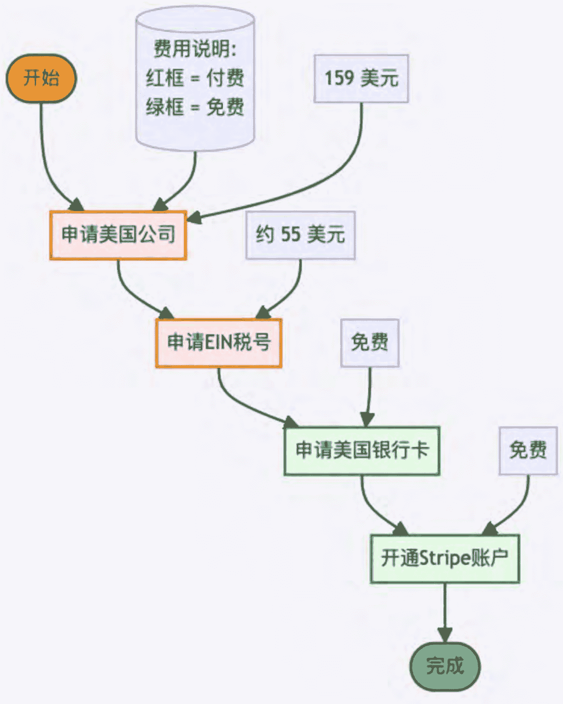

评论区：
- 书虫：这个空中银行能不能开子账户里面放100个虚拟卡啊？
- 书虫：像水星一样

## (18赞) 打造AI私人提效助理：Coze公众号二创工作与自建克劳德插件

作者：周知 1.0
日期：2024-10-14

大家好，我是周知，持续在探索AI+工作流的落地场景。9月份，有幸作为《Coze | 打造AI私人提效助理》航海教练。经常被学员问到的问题是：“教练，为什么我对Coze公众号二创工作流不满？觉得它不够强大、不够智能？”别急着否定这个工作流，也许问题不在Coze，而在于我们没给它接“外挂”。

请大家移步飞书，参考《COZE外挂：自建克劳德插件（3000字保姆级拎包教学）》再试一试。
https://aiawaken.feishu.cn/wiki/ZCPAwHK3nidKttk8v7KcJORfnvc

评论区：
- 鱼丸|亦仁助理：链接没开权限
- 周知 1.0：开了，粗心老毛病[翻白眼]
- 彬：太赞了，外边怎么也搜不到，感谢教练无私分享
- 爱飞的鱼：coze可以替代影刀的自动化功能吗？
- 周知 1.0：看场景，其实COZE优于RPA

## (15赞) 40个高客单私域谈单心法，助力你轻松做转化

作者：葡萄
日期：2024-10-14

《40个高客单私域谈单心法，助力你轻松做转化》

你好，我是葡萄，一名成交教练，助力普通人靠沟通逆天改命，做人生的销冠，换取金💰与幸福。

做自媒体正好两年，在过去的两年里，自己成交了一些单价在5000到1.8w的高客单用户，也帮助不少朋友成交了高客单用户，所以今天来分享一些谈单心法，供大家交流讨论。

不知道大家有没有一种感觉，就是有时候明明对方来咨询你了，你感觉她好像很有意向，你特别认真的回复了她的每个问题，聊了三天，对方还是说，我再考虑考虑吧。

明明她问你的问题，你都好好回答了，可她还是拍拍屁股走人了，留下你在风中凌乱，还被他掏空了你的所有内容。如果有类似情况，请点开链接查看。

https://s1db162mjkr.feishu.cn/docx/FeDodK0swoDGCBxOkMveNgzqnAb

评论区：
- 暂无评论

## (精华帖)(123赞) 新手小红书引流26天，资料销售6907.76元

作者：稳稳
日期：2024-10-17

【航海好事】新手做小红书引流26天，纯资料销售6907元复盘

各位圈友好呀，我是今年七月五号加入生财的萌新稳稳，来自湖北宜昌。一晃3个月过去了。这三个月令我“脱胎换骨”。回头一看，感悟颇多。以前的我不是被事物本身吓倒，而是被自己逼的节节败退。所有的事物底层逻辑都一样，量变→质变。如果还达不到、得不到，那就是做的不够。

这三个月我参加了2次航海，第一次是视频号口播，变现0。第二次小红书引流变现 6907.76 元。作为非小红书用户的我，在9.10开始的小红书引流航海中，刚开始做小学资料（面向家长）赛道，9.19发布第一条作品，9.22日变现3元，成功跑通最小MVP。9.24更换为考试赛道，9.27成功跑通最小MVP。截止目前（10.16），纯销售资料（含题库），成功变现 6907.76 元。

很荣幸能够分享出我的心路历程。我的经验或许浅薄，但如果你也是小红书新手，私域新手，生财萌新，对自己的副业之路还很迷茫，想要找到一个出口，或许我的复盘能带给新的思路。我的分享分为以下几部分：
- 1. 航海截至目前（9.16）收入曲线
- 2. 从0做起我的心路历程
- 3. 行动正确姿势

详细内容请移步飞书 https://avt9va2pkj4.feishu.cn/wiki/YN98wn6iUiV4ICkQ8bUcYXHNnfb?from=from copylink

评论区：
- 芃芃：太详细了，好用心
- 稳稳：谢谢[呲牙]第一次写，请多多指教[玫瑰][玫瑰]
- Time：非常棒，从第一单 3 块钱，后面就跟开挂了一样[强]
- 注会晓晓学姐：宝，你太棒啦
- 稳稳：感谢Time领队全程指导我完成文章[爱心][爱心]不然猴年马月也写不出[流泪]
- 稳稳：谢谢宝子，你也可以的！！
- 豆豆：做考试的话，那过了考试节点，岂不是要换新的考试了吗
- 稳稳：对的，需要提前布局下一个考试

## (精华帖)(51赞) 抖音航海记：15天账号收益破万的个人探索与团队支持

作者：LJL
日期：2024-10-18

【航海好事】抖音航海记：从个人探索到团队支持，15天账号收益破万

各位圈友好呀！真的没想到我能够在大佬云集的社群里面分享我的一点点小经验。有点开心于自己的成长！我加入生财以后，真的学到了很多东西，今天也轮到我回报社群了！

我参加的是抖音精致达人航海，我也没想到我加入航海之后能够在这么短的时间内拿到成绩！

希望我的分享能够给大家一些帮助，如果有写的不详尽的，大家可以评论区问我。

同时，也非常感谢陪伴我写出这篇文章的老师@澄歌 具体的内容请大家移步飞书：
项目实操 https://nneqojylf4.feishu.cn/docx/I7O8dBrmNoVDEixbrbYc0AmYnMf

评论区：
- 半月：之前没有人帮助的情况下，就可以起步，太厉害了
- 苋苋：最让我感动的是，能坚持做抖音，遇到这次航海就爆单了～最让我佩服的是，时间管理，井井有条！要继续加油啊～
- 许老师～生财投资孵化：坚持了两年还没放弃，靠一个信念支撑，“自媒体是普通人低成本赚大钱的（唯一）机会”，真正的 因为相信，所以看见！
- 楠天：是滴
- 楠天：[色]
- 楠天：是的
- 楠天：太棒了 向你学习
- 楠天：是“的”

## (精华帖)(43赞) 感谢生财航海带入门，小白坚持四个月破公众号第一个单篇100w阅读

作者：Flora
日期：2024-10-18

哈喽大家好，我是Flora，今年四月加入生财的新人。第一次发帖，想分享一下我从4月份加入生财到参加6月公众号航海启蒙公众号，四个月后第一次有文章突破了100万浏览，赚到了一个月的生活费的经过和心路历程。

更多内容详见飞书 https://m00rslmhlfo.feishu.cn/docx/QdxydnWtDozVrExm7U0cG9ionwg?from=from_copylink

评论区：
- C：真棒！好奇这篇爆掉的文章是什么选题？
- 亦仁：标题修改下，不要标题党
- Flora：没有标题啊亦仁大大，确实事实就是第一篇大爆了，求问应该怎么改
- 亦仁：标题中重点突出下关键原因
- 笨就笨：有用信息不多，确实有点标题党
- Flora：本来也不是写的干货贴，只是想回来报个喜而已，讲下经历，也没有夸大事实
- Flora：好
- 亦仁：航海结束战斗才真正开始[强]

## (31赞) 从设计转岗运营：三个月的挑战与成长

作者：潇墨@生财有术
日期：2024-10-18

"人类最强大的不是核武器，而是豁出一切的勇气"。对自己这段时间做了个总结。

想想这是我转岗做运营的第3个月，刚开始我从设计转岗到运营的时候，其实一切都是未知数，纯靠我自己对自媒体、对想要实现财富自由的一腔热情，认真，是我对未知未来能给到的唯一确定的态度。

我转岗过来刚好碰上钟哥提出一个新的概念，鱼丸教练IP。我想，我的天啊，我就很想做IP，这不正是我想要的吗。提升自己认知、作出成绩的同时能把自己打出去，刚好又有这么个机会呀。

我当时的想法是：“这么好的机会肯定很多人想做吧！”
“学做运营也是学，学做IP也是学，为什么不选个更牛逼的，我想做！拼一把，看看自己能学到什么程度，反正学到就是赚到，大不了做不好拍拍屁股走人！😂”

当时钟哥让丸子们想做的业务可以主动发给他，轮流谈话。然后我是最后一个被谈话的人，我和钟哥说到我想做IP的时候，我才知道，只有我提到想做这个事情。也许是命中注定吧。用赚钱思维来看，这个就叫“风口”，把握住风口，就等于抓住了改变自己的机会。

别看我现在两腿一伸很顺畅一样，这可不是一件简单的事。我经历了1个月的不断摸索“小红书达人变现”“小红书百货电商”项目......1个月的没有结果，不停探索，遇到各种不同的困难。这段时间因为没有拿到结果每天都会质疑自己、然后开导自己、然后继续加油，一直进入一个没有结果的恶性循环。人生陷入自我怀疑，至暗时刻，每天开朗并阴暗的爬行。每天给自己定Todo，不停的复盘、优化......

但是我相信上天永远不会亏待努力的人的。在我研究我的第3个小红书项目【小红书虚拟资料】，第3周的第1天，我终于产出变现了，然后持续的就是1周持续的变现。

那天我成交第一笔的时候，兴奋的一直在笑！激动的告诉钟哥、告诉那些这段时间帮助过我的人。突然信心满满的我，被互联网数据认可的我，立马复盘，举一反三。我得到的是一篇爆了、两篇爆了、三篇爆了......就像拿到了流量密码一样，发一篇爆一篇😭。

然后因为一次特殊的机会，我做了28个船员的教练。我从来没有当过老师也没有当过教练，从小到大我只教育过我的妹妹，用教妹妹的方法，认真把我所知道的教给他们🍀。出乎意料的做的很顺利，并且活动结束收获了很多学员对我的感谢和赞美，也得到了很多同事和上司的认可。

并且在我的学员中坚持完7天的学习时间后，回访到，有些坚持的学员已经成功引流并且拿到变现。（打心眼的高兴🤭）

现在也即将成为mini航海近400个船员的教练，这几天一直和我的搭档杨杨还有钟哥，一直在张罗忙活这次mini航海内测，尽量能把这次mini航海准备充足，帮助船员们突破行动的壁垒，持续输出并且拿到变现。

加油💪💪💪，我想说的是不管你现在遇到了什么事情，经历过什么事情，想做就去做不要害怕。人这辈子可能达到成功的机会就那么几次，如果你不尝试过，怎么有机会突破自己呢？

只要能保证自己基本生存条件的情况下，就去想做什么就去做好了，大不了兵来将挡水来土掩，为自己拼一拼。我的时间应该是用来看更广阔的天空，呼吸更新鲜的空气👊，而不是60岁了还在拧螺丝。

评论区：
- 秋秋桂：潇墨好棒👏👏👏
- 潇墨@生财有术：[玫瑰][玫瑰][玫瑰]嘿嘿
- 李离来：人类最强大的武器不是核武器，而是豁出一切的勇气。
- 半月：看你这样，我也有信心了，测试了2个项目，一直不成功，我也处于怀疑自己的状态中，觉得自己是不是和互联网犯冲，不适合在互联网挣钱
- 亦仁：潇墨加油👊 我在你身上看到了皮实和乐观，拥抱变化
- 潇墨@生财有术：[哇]冲呀👊

## 公众号懒人搜索，懒人专属群分享

- 🤔刚对之前mini航海的部分船员做回访，甚至有船员已经产出引流变现了（已编辑）
- 👍小花，亦仁，欢欢
- 牛蛙牛蛙
- 潇墨：然后我还想问下对mini航海的一个反馈，对你做一个回访呀
- 船员：我感觉就是其实很多困难都是自己想出来的，然后我之前主要就是卡在发第一篇笔记那里，总想用心发第一篇，但是因为有时限，所以就没有拖延，很多决策都没有拖拖拉拉了，所以就开始发了
- 潇墨：方便大概说一下上次mini航海的感想嘛
- 船员：感觉发了之后，就开始有思路了，慢慢发着发着就知道怎么快速发笔记了
- 潇墨：到时候我拉你进群呀
- 船员：好的

### Mini 航海 - 小红书笔记发布(41)

- 弧线99【生财】mini资料航海：谢谢 mini 航海让我在这个新项目里开了头，接下来继续行动！辛苦各位教练了。9月30日 晚上20:18
- [图片]
- 绿蚁【生财】mini资料航海：感谢教练，虽然七天结束，但是也成功迈出第一步，接下来的日子还会继续坚持！感谢教练。9月30日 晚上20:23
- 李【生财】mini资料航海：感谢生财，感谢教练🤝让我又一次像回到了学生时代一样，遇上了负责的团队教练，提前祝大家国庆愉快，财源广进🎉🎉🎉。9月30日 晚上20:41

### Mini 航海 - 小红书笔记发布(41)

- 感谢 Mini 航海，感谢教练🌹🌹打破了下海实操的行动壁垒，事无巨细的答疑解惑，接下来继续行动。
- 感谢教练🌷🌷，感谢Mini生财航海🌷🌷遇上了负责的团队教练，接下来会继续坚持发布笔记，提前祝大家国庆快乐，一起生财有术🎉🎉
- 我拍了拍"小伍。【生财】mini资料航海"
- 我拍了拍"初夏*空白【生财】mini资料航海"一起生财，巅峰相见！
- "萌虎"拍了拍"风儿【生财】mini资料航海"
- 展开全部
- 感谢@老纪S 让我悟到测试思维，破除迟迟无法行动的卡点。感谢@教练-潇墨 事无巨细，尤其那几个视频，让我学会了用美图秀秀快速做图。感谢@萌虎 每天的汇总，督促我每天行动。感谢生财官方，让我感受到了关注和重视。提前祝大家节日快乐，生财有术！9月30日 晚上22:03
- 感谢教练🌷🌷，感谢Mini生财航海🌷🌷遇上了负责的团队教练，接下来会继续坚持发布笔记，提前祝大家国庆快乐，一起生财有术🎉🎉。9月30日 晚上22:35

## (29赞)实习志愿者经历：从小红书教育资料航海中收获的成长与经验

作者：西里
日期：2024-10-14

大家好，我是西里，很高兴与大家分享我作为生财有术航海志愿者参加小红书教育资料航海的经历。从最初的忐忑不安到最后的满载而归，作为实习志愿者，绝对值得！

- 2024年5月：正式加入生财有术社群。
- 2024年6月：参加小红书百货航海项目，在航海结束时成功跑通MVP，实现GMV 500+。
- 2024年9月：第一次担任小红书教育资料引流航海的志愿者，开启了新的挑战。

- 我为什么选择成为志愿者。
- 志愿者的日常工作和职责。
- 实用的社群运营技巧（如群接龙、群发消息、备注分类等）。
- 受电饭煲老师启发的笔记制作提效方法。
- “慢即是快”——船员信息统计的重要性。
- 作为志愿者的惨痛教训。

我在生财有术第一次发布是1条风向标，后来小红书百货卖这个品卖了400多。这是我的第2次发布发文，详情查看请转至飞书：

https://wiz662adgxu.feishu.cn/docx/VP7QdhrmPoFAmkx6l3RceuhNnMg?from=from_copylink

## 评论区：
- 秋秋桂：很棒的西里，感悟满满哈哈[憨笑][憨笑]
- 西里：谢谢秋秋桂的支持帮助呀，学习了很多，都是踩的坑呀[流泪]
- 雪之荔：棒棒的，看到很多你自己视角的心得和思考，不断优化，下次更好呀~~
- 流光：西里真的是非常优秀且负责的志愿者[鼓掌][鼓掌][鼓掌] 很荣幸分配到你的小组，在我迷茫徘徊的时候，给予我鼓励和思路 你以后肯定会越来越优秀哒！加油噢
- 楠天：太棒了吧 学到了 我也要当志愿者
- 西里：和你沟通我也学到了很多呀，梳理了项目思路，互相鼓励一起走呀！后面一起加油呢🎉
- 西里：加油哇💪一起参与呢
- 红烧电饭煲：西里真的太棒了！执行力极强！

## (精华帖)(160赞)如何运用数据和AI工具快速了解陌生行业

作者：小鹅
日期：2024-10-18

如何运用各类数据和AI工具，4小时吃透一个陌生行业？【判断能不能做and怎么做】

全文6790字，大约需要10分钟
目录：
- 前期调研判断部分-市场广度与入场时机-竞对水平分析-变现路径筛选
- 产品熟悉部分-2个案例-产品选择
- 转化路径部分
- 内容引流部分-一级选题-二级选题-内容形式

大家好，我是小鹅，04年211在读大三，擅长流量和私域运营。

上周，在蹬自行车去上课的路上，可能因为那天是难得的晴天，我脑子里突然蹦出来这个选题，觉得这是个很好的思路。可是最近业务又特别忙，我决定年底前把它写出来。

非常不幸的，在我某一天忙到四点后的第二天，我就开始头晕恶心刀片嗓了。在我晕得感觉要见太奶的时候，一觉醒来打开手机看到了老大的龙珠悬赏令。

我说，不是吧，这么巧，这不刚好对上了吗？然后再定睛一看，这周五前就要交[苦涩]

于是一个鲤鱼打挺坐起来一边喝药一边对着电脑开始写，本重度拖延症患者硬着头皮在ddl前赶完了。希望大家看完也能享受到顺着线索一点点挖掘拼凑出完整路径的乐趣。

enjoy it

https://ywfmllgra2k.feishu.cn/wiki/SVfMwFcrNifNTHkWOXPcRUI0ngg?from=from_copylink

小鹅：想到了一个牛逼的文章选题

如何四个小时摸透一个你完全不了解的行业
他写过同样题目的文章，
不用，我脑子里已经框架了

我们写肯定逻辑完全不一样
真好呀，

这个得抽个时间坐个高铁
然后，一下子喷薄而出的那种写
可以可以，

向钱看，向厚赚

### 关键词指数 关联分析 人群画像
### 关键词搜索指数
四级 同比 - | 环比 +169.89%
平均值 26.2万

| 关键词 | 月均搜索量 | 关键词字数 | 下拉词数量 | 竞争程度 | 推荐理由 | 市场出价 | 操作 |
|---|---|---|---|---|---|---|---|
| 四级 | 24.7w | 2 | 1.7w | 高 | 同行买词,黑马词 | 0.71 | AI |
| 考四级 | 3640 | 3 | 282 | 高 | 同行买词,高点击 | 0.74 | AI |
| 四级题 | 4619 | 3 | 18 | 高 | 黑马词 | 0.3 | AI |
| 四级班 | 1053 | 3 | 12 | 高 | 高点击 | 14.87 | AI |
| 四级书 | 6407 | 3 | 9 | 高 | 同行买词,黑马词 | 0.61 | AI |
| 二战四级 | 336 | 4 | 4 | 高 | | 0.44 | AI |
| 四级梗图 | 312 | 4 | 1 | 高 | 蓝海词 | 0.3 | AI |
| 十天四级 | 362 | 4 | 4 | 高 | | 0.3 | AI |
| 四级英语 | 29.8w | 4 | 203 | 高 | 同行买词 | 0.32 | AI |

## 评论区：
- 木木：介么牛，这才是项目研究的方法论
- 小鹅：以上主要使用的都是小红书API拓展一下的话，其实每个平台都是一样的 获客在哪里，用户沉淀在哪里，销转路径是什么
- 老大前两天发我了一个x上的海外知识付费内容，顺着它的线索海外平台一路扒
- 扒出来他们在yt/x上引导你去填他们的试听表，然后跟你约zoom的试听课，中间会给大量的资料视频做触达，再加上他们文案写的惊人的吸引人
- 所以体量和规模做的很大
- 许辉：牛逼
- 小智：好牛的方法和思路！茅塞顿开了真是，看了这篇帖子感觉自己下午去面谈可以说好多牛逼的东西了
- eleven：客户在你身上投入的时间，精力成本越多，越容易成交，免费提供的资料视频给客户一种占到便宜的感觉，免费的都这么好了，付费得多牛啊~学到了学到了
- 一北：不愧是鹅总！
- 魏薏恩：牛，反复学习中。
- YolyArk百合：鹅总牛！！鹅总出品必属精品

# 【AI相关】12篇
## (精华帖)(149赞)AI自媒体赛道，153个头部公众号文章采集与分析

作者：钱塘江鲤
日期：2024-10-18

前两天亦仁发了一篇超级标的文章，提出了一个AI赛道的一个新风向标，那就是做垂直类的AI资讯或者工具，最终接商单或者其他变现。

那我就在想，能不能先做个调研，看下现在成功的AI KOL的运作模式，这样或许可以更好地把握超级标的机会。为了更深入地理解这个概念，我进行了一次数据驱动的分析，尝试能否还原AI KOL自媒体的成功路径，从而带来一些参考。

第一步我想着先收集目前所有平台的AI关键词的一手资讯、工具介绍，和目前知名的AI KOL的所有历史文章和作品，首先把这些都先采集下来分析一下，全面了解AI自媒体的现状和趋势。

那就先从公众号的AI KOL开始，目前完成了下面的工作：
- 采集了153个公众号AI垂类排行榜靠前KOL的所有历史文章。目前采集总数已经超过7万条，包括原始链接、阅读量、点赞数、发布时间等。
- 使用AI对文章摘要分析和软文识别等。
- 对每个公众号维度进行趋势分析，包括爆发时间点、阅读量趋势等。此外还使用Claude制作了可视化图表，方便观察每个公众号的阅读量变化趋势和爆款文章，生成公众号分析报告。

完整过程详见飞书：https://ia0969wpr2.feishu.cn/docx/VF9xdLsdQoTjqWxTM2PcszOqnPb

## 评论区：
- DOOOremiii：厉害 👍
- John：截图里怎么没有我的号[偷笑]应该在呀
- 吴秉晖：大神呀
- 钱塘江鲤：这个吗
- 钱塘江鲤：
- John：哈哈是的[鼓掌]
- 秋秋桂：太牛了 请问最后的PDF是在哪生成的呀，Cursor嘛
- 苗苗：请收下我的膝盖

## (精华帖)(86赞)AI音乐变现：1人4个月360小时稳定收益超4W的精细化拆解手册

作者：周知 1.0
日期：2024-10-17

大家好！我是周知 | COZE航海教练 | AI觉醒派主理人
过去4个月，我的 AI 工作室实践一个投入360小时通过AI音乐稳定纯收益超4W。

- AI音乐收益情况具体如何？
- AI音乐变现思路有哪些？AI音乐独家技巧？
- 各音乐平台规则拆解？
- 音乐人认证如何通过？
- AI音乐变现的底层逻辑？
- 音乐人认证教程拆解 Suno如何生成纯音乐？
- udio如何生成纯音乐？
- AI 音乐万字精细化变现手册

本文档超过万字，后续定期更新，飞书链接如下：
https://btr2ioqltz.feishu.cn/docx/MbZvdSu3loOi7gxUasVckMcBni4

- 收转账 +80.00 9月11日 12:08
- 收转账 转账-来自A工作室 +79.00 9月27日 20:43
- 收转账 转账-来自美 +79.00 9月22日 20:18
- 收转账 转账-来自 +79.00 9月20日 19:07
- 退款 转账-退款 +79.00 9月19日 23:34
- 收转账 转账-来自 项目） +79.00 9月15日 10:45
- 收转账 转账-来自 +79.00 9月14日 18:44
- 收转账 转账-来自 +79.00 9月13日 17:12
- 收转账 转账-来自 +69.00 9月19日 18:48
- 收转账 转账-来自 +69.00 9月19日 16:16

## 16:02

## 月账单
## 年账单
2024年9月
支出 / 收入 / 其他
共收入101笔，合计 ¥10777.93
使用记账本，查看分类统计(餐饮、交通等)

## 收入对比
| 月份 | 金额 |
|---|---|
| 4月 | ¥0.00 |
| 5月 | ¥2771.26 |
| 6月 | ¥3912.77 |
| 7月 | ¥5720.47 |
| 8月 | ¥8556.33 |
| 9月 | ¥1.1万 |

## 收入排行榜
- 1 转账 ¥8087.20
- 2 二维码收付款 ¥1113.00

- 9月19日 16:16 退款 +69.00
- 9月14日 16:33 转账-i 退款 +69.00
- 9月14日 12:30 转账-退 收转账 +69.00
- 9月12日 0:39 转账-来 很 收转账 转账-来自 +69.00
- 9月10日 19:01 收转账 转账-来自 +69.00
- 9月1日 17:59 收转账 转账-来自 +69.00
- 9月1日 11:10 收转账 转账-来自 +60.00
- 9月27日 20:43 收转账 转账-来自 +60.00
- 9月27日 16:15 收转账 转账-来自 +60.00
- 9月20日 13:55 收转账 转账-来 +60.00
- 9月20日 13:55 收转账 转账- +60.00

## 评论区：
- 李九折：一对一的服务感觉还能加个0
- 周知1.0：[憨笑]
- 宇：细节看明白了，主要收入来源于知识付费，产品或者教学收费。有个大前提没太get到，是平台会给原创音乐有补贴么？大概收入是怎么算的？
- 笨就笨：是不是需要一些音乐知识
- No. 36 / 187
- 周知 1.0：我觉得是写作知识和抓目标用户喜欢音乐风格能力
- 周知 1.0：通过平台认证，然后上传歌曲，歌曲播放流量费 量大了就会有专门制作人找过来。需求方是音乐爱好者
- 大麦-吴波：非常棒的赚钱教程，学习并践行，感谢!
- 周知 1.0：后面会持续更新，[悠闲]

## (精华帖)(74赞)从0到1使用AI，搭建能自动养号和发推的矩阵运营机器人

作者：钱塘江鲤
日期：2024-10-14

有没有因为批量管理账号头疼过? 那为什么不借助AI解放双手呢。我借助 Cursor 使用指纹浏览器+Playwright+AI，从0开始构建了一个推特矩阵运营工具，实现了自动养号、互动、定时发推等功能，实现单机多个账号矩阵管理。

下面是全部的开发过程和提示词，希望能对你有帮助
https://ia0969wpr2.feishu.cn/docx/Gp5SdjLOJokzwxcxtHGHcFCGqnCc

## 评论区：
- 涿鹿中原：[强][强][强]
- 阿铭：你用的这个模型和poe那个好
- 钱塘江鲤：用的sonnet3.5，poe只是一个模型聚合平台，和cursor比没什么好不好的问题，喜欢哪个用哪个就行
- 阿铭：这样，我按你操作，出来的结果不一样[撇嘴]
- 钱塘江鲤：具体什么问题，哪里不一样描述清楚一些。另外大模型输出都是不稳定的，cursor中本身有系统提示词，相同提示词不同平台不一样很正常，没必要追求代码完全一致，实现功能即可
- 阿铭：明白了，代码也是不一样的，我是让它切换到特定窗口时，然后运行不了
- 定心：很棒的文章，请教关于比特API的问题 1.比特的API是支持打开特定窗口，上传内容的功能吗 2-这种上传内容的形式，和人工手动上传的结果是一样的吗，也就是相当于通过API可以去哪个浏览器窗口，发布什么内容 并且这种发布的对于平台来说，和手动上传的是一样的【我主要担心的是风控的问题，是否会被检测为软件，插件之类的发布】
- 钱塘江鲤：基本是不会的，你可以理解为更高效率的RPA，都是模拟人类操作，而不是通过协议

## (精华帖)(78赞)AI绘画工具ComfyUI的进化与应用

作者：行者
日期：2024-10-18

大家好，我是行者，现居深圳，23年在生财写了2篇AI绘画精华帖。无意中刷到亦仁的龙珠悬赏，AI工具（本篇绘画篇）我还是使用的比较多的，于是借着这个机会，发一篇长文。
Flux出真人写真照片、再结合可灵、海螺等视频工具，一下子就把小红书的矩阵美女号玩爆了。好多不玩AI绘画的也在问行者，但是一问是Flux是要学ComfyUI工作流，很多人又被自己劝退了。
其实，ComfyUI已经进化得很快了，现在除了本地部署，还可以在线使用（比如哩布、吐司在线出图）、租赁云端服务器（仙宫云，揽睿等云平台），已经官网出图多种使用方法。

本篇文章较长，文字5000字，图片内容较多，阅读时间大概15分钟，为了更好的阅读体验请前往飞书查阅。
https://jrnoijjrwm.feishu.cn/docx/LpA4dmIBJobAO2xeVwkcQntvnGc?from=from_copylink


## 评论区：
- 飞扬：好逼真，已学习
- 仰仰：太真实，和以往ai 生成图片的区别挺大的，给行者老师点赞👍
- Qwen：中间那个女生也是ai绘画？这么逼真？
- 行者：必须是啊
- 阿丽：大佬，想问一下，我们这种只会复制指令的人，学习您上面的内容，哪个环节是最难的，需要哪些技能
- 行者：找一个简单的入门，比如学哩布在线生图就好了
- 羊皮大叔：请问下这种有变现案例么
- 行者：小红书AI矩阵号，小绿书图文带货


## (精华帖)(82赞)AI教育+抖音：1个月接7条广告过程分享

作者：Ann
日期：2024-10-18

《AI教育+抖音，1个月接7条广告过程分享》
大家好，我是Ann，三年圈友。周一亦仁发了一个帖子，讲到AI自媒体。其中提到接AI相关的广告，正好是我最近正在做并且受益的，已接广告8条。现将整个过程分享出来，希望对你有帮助。
https://e2j5qnvjyf.feishu.cn/docx/W7NndRMBAoI6W0xVViw cHoFVn4f?from=from_copylink

## 评论区：
- 半月：发现我不能赚钱的原因，是我自己技能不够。像文中提到的AI和小朋友对话，豆包检查作业我都不会
- 豆条：启蒙之贴，感激
- 顺利：姐妹，太强了👍约完稿这么快就发出来了
- Ann：加油👏
- Ann：嘿嘿😄
- 半扇咸鱼：我刷到你的视频了
- lydia：亲爱的，我在星图商单任务里怎么找不到豆包之类的推广任务啊[流泪]全是短剧

## (61赞)用ChatGPT+RPA+可灵生成1000张治愈风景照

作者：龙哥
日期：2024-10-16

用ChatGPT+RPA+可灵生成1000张治愈风景照，一次批量生成1000张治愈照片，有兴趣围观一下，也通过这个RPA案例接了不少商单。

图文自媒体做图片的需求很大的，可以一起考虑哈，一套素材可用在知乎，公众号，小红书，一鱼多吃。
如何做，见飞书：
另一个RPA案例：https://svox0dxsvym.feishu.cn/wiki/SMyDwgfhvWPIQkn76CcdVY8nqe?from=from_copylink
https://t.zsxq.com/4yKYc


公众号懒人搜索，懒人专属群分享


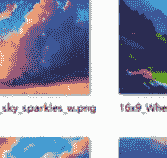


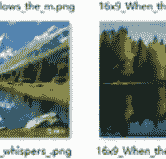


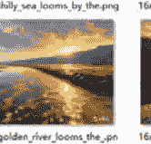


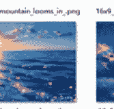


## 公众号懒人搜索，懒人专属群分享


评论区：
- 观沧海：怎么接商单？
- 龙哥：是接单，让人看到，会找上来的
- 观沧海：是接单是什么意思？
- 龙哥：都是转介绍的，佛系接单
- 龙哥：亦仁老板，来点赞了[呲牙]
- 小乔：太棒了，解燃眉之急，谢谢大佬
- 龙哥：[得意][得意][得意]
- 木易：要跟着你实操一遍，谢谢大佬[玫瑰]

## （55赞）实现躺赢，用AI+RPA从小红书爬取笔记，自动提取内容，自动改成小绿书，并自动发布整体思路分享（附：RPA脚本）

**作者：**陈序员大康
**日期：**2024-10-17

小绿书最近很火，于是很多人就想到是不是可以直接搬运小红书的笔记来发呢？但是有个问题，肯定不能完全一样的搬吧？所以，就有人就提出是不是可以提取图片内容，进行修改然后替换背景图，改成小绿书呢？当然可以！但是，这些操作，人工做起来还是相对繁琐的。当然！目前，已经有很多大佬已经用AI+RPA实现了自动化了。包括我自己也整过影刀RPA的小绿书发布。从我自己的使用，以及交流群朋友的反馈来看，目前的AI+RPA工具，或多或少存在如下问题：

### 目前的问题：
- 1. RPA工具五花八门，对于不熟悉RPA的人，想用上工具，真的是九九八十一难。
- 2. 有些工具封装的好，但内部流程我们看不到。当有些场景不适用的时候，自己想改又很难改。
- 3. 当RPA操作的东西越多的时候，就越不稳定，只要链路上的某个软件做了调整，就有可能导致整体失败。

### 优化与改进：
为了解决以上问题，这一次脚本思路我进行了以下优化：
- 1. 尽量使用易分享的RPA，让大家在脚本的安装上更方便。
- 2. 减少RPA工具调用的环节，能用接口就用接口。
- 3. 工作流拆分零件化，让有需要修改需求的朋友，可以通过灵活替换节点，完成自己的迭代。
- 4. 在使用上进行一定的封装，让即使不懂工作流的朋友，只要脚本跑通，也能正常用上功能。

换句话说，小白有小白的用法，同时给予了已经上手的朋友，自我调整的空间。废话不多说，老惯例，先来来看看这套脚本的展示：为有更好的体验，请跳转阅读

https://b121w2zgwyx.feishu.cn/docx/GMDtddD10oQWlSxWUZEcuUFlhof

公众号懒人搜索，懒人专属群分享

评论区：
- 泛音：超链接没法打开哎
- 废柴战歌：https://b121w2zgwyx.feishu.cn/docx/GMDtddD10oQWlSxWUZEcuUFlnof
- 陈序员大康：修复了，忘记设置链接了
- 小宇Mick：学习了！光是走通AI整理小红书就能延伸出不少思路[强]
- 阿铭：能不能结合昨天圈友分享的推特养号那种来进行
- 陈序员大康：哪种？
- 阿铭：钱塘江那个圈友

## （35赞）初入生财小白做AI写作项目的一些收获分享

**作者：**小昊
**日期：**2024-10-14

《初入生财小白做AI写作项目的一些收获分享》
大家好，我是小昊，一个刚来到生财的项目小白，作为一枚刚毕业不想上班的大学生，在先前是从未接触过项目的，因为看好AI赛道，所以一直在寻找一个合适的项目入局～这时候机缘巧合之下，我接触到了AI写作赛道，在这个赛道上历时三个月，目前拿到的战绩是仅靠AI写作在9月单月变现36828，成功完成自己养活自己的小成就。但是只想来给大家分享一下这一路作为一个普通毕业大学生的心路，希望能够帮助到同样处于迷茫的大学生们～

目录：
- 一、加入生财感受到的温暖
- 二、怎么找到这个项目的？
- 三、小白在AI写作项目上的初体验
- 四、AI写作 具体应用 之 回忆录 快速生成
- 五、小白初做项目阶段性感悟

下面请大家移步飞书看完整内容：

https://m0mjkg40jum.feishu.cn/docx/BXs7dUigmoVNcvxpDkscfcVlrgb?from=from_copylink

评论区：
- S：棒[强]向你学习
- 百哥：写回忆录的人多吗，你3w的九月单子是从闲鱼接的吗
- 小昊：共勉
- 小昊：还有其他平台
- 小昊：写回忆录的人 还是不少的 我手上就有三个回忆录的单子 可以关注一下～ 缺点就是 交付周期长一点～
- 百哥：奥奥
- 百哥：ai写东西，特别是这种专业性不强的，还是很好写的，主要是客源问题
- 小昊：是也不是，AI生产出来的东西，有点遵循”一旦它涉足了正好熟知的领域“的规律，如果没有专业的主控者，就只能被门外汉看来”不明觉厉“，实际上全是能够被一眼看穿的纰漏。
- 小昊：但是，你用AI去赋能，在能正确运用它的前提下，写你了解的东西 会觉得”哦 他帮你省掉好多事情～ 写的东西 也好牛逼“

## （34赞）AI的10个商机与趋势

**作者：**乔帮主
**日期：**2024-10-15

大家好，我是乔帮主。

虽然AI的应用仍处于早期阶段，但是未来已来。作为这个时代的参与者，我们不只是观察者，更是推动者。AI技术的发展带来了无数机会，只有真正投入其中，才能在这个新兴的时代中抓住红利，成为AI时代的淘金者。

AI领域的未来商机与趋势判断，写在2024年，一年后再来验证：

### 1、AI智能体需求爆发在即
如果将大模型比作操作系统，那么AI智能体就是生产力应用的核心。通过固化工作流和提示词，AI智能体将成为企业和个人提高工作效率的重要工具。随着百度、腾讯等科技巨头陆续开始布局AI智能体，这标志着行业即将迎来大爆发。

AI智能体不仅能释放大模型的潜力，还将为用户提供更个性化的生产力解决方案。那些掌握智能体开发和实战经验的团队，将成为这一波爆发中的最大受益者。

同时AI智能体通过图形化编程，不仅让普通人无需写代码，也能定制AI程序应用。而那些懂AI应用，懂开发技能的程序员，现在开始布局，将会享受智能体猛烈的一波红利。

### 2、AI内容创作继续爆发
随着AI技术的不断进化，特别是在自然语言处理上的突破，AI内容创作的需求将持续增长。尽管内容生成领域的竞争激烈，AI工具凭借其高效、低成本的优势，必将逐步取代传统的人工创作服务，形成强烈的“降维打击”。

只要信息不对称的状况持续存在、只要信息差的存在，AI代写的需求就不会减弱，反而会因为创作门槛的降低而迎来更多的懒人用户。

一些深耕AI代写领域的创业者，如今已经取得了很明显的成绩。很多创业者，凭借工作室、团队快速扩充，很快月收入突破10万，甚至更多。这预示着，AI代写行业的爆发还将持续相当长一段时间。

### 3、AI+教育的巨大潜力
AI的落地，是AI人才的落地。当下及未来，市场及企业需要大量的AI人才。AI与教育的结合，为市场培养AI人才，这注定将是一个至少千亿级别的大赛道。为市场孵化AI人才，我看有搞头，有大搞头。

AI+K12、AI+成人教育、AI+职场教育、AI+家庭教育、AI+启蒙教育、AI+内容营销等领域存在着无数的创新机会和产品。

### 4、AI IP的崛起势不可挡
AI工具在内容生成方面的潜力无穷，它可以根据热点或用户兴趣自动生成内容。而随着社交媒体和短视频平台的兴起，个性化IP（AI IP）将迎来新的发展高潮。明年，各类平台上将诞生多个拥有千万粉丝的AI IP，成为内容创作者中的领军者。

一些先行者，已经布局AI IP方向的已经展现了强劲的增长势头。随着AI工具的不断普及，这一领域将迎来更多创作者的爆发式增长。

### 5、AI IP视频号直播红利刚刚开始
视频号与AI的结合，特别是在直播电商领域，正处于红利期。部分头部主播受限后，流量开始向中小主播倾斜，普通人利用AI工具可以更轻松地启动直播业务，快速积累粉丝并实现盈利。

一些早期进入这一领域的AI创作者已经收获了丰厚的回报，比如我们的圈友锦亿在视频号AI IP上已经拿到大结果。之前参加线下的闭门会，他这边的项目都是让大家争先恐后的交流的热点。

### 6、AI企业培训市场的超级个体机会
在AI时代，超级个体通过提供AI相关的培训和咨询服务，直接对接企业的需求，已经成为一种趋势。由于AI发展的速度快，这一领域中尚未出现大规模的公司，给了自由职业者和小团队绝佳的创业机会。

一些培训师已经通过AI企业培训实现了日入过万甚至更多的收入，这显示出AI企业培训的巨大市场潜力。比如我在这方面从去年到今年，就跟企业内训了几十场。

再比如，sky、灵军、老曾、白先生、小七姐、吴思晓等等，在这方面都拿到结果，且拿到了大结果。

### 7、AI+职场效率工具的机遇
AI在提高职场效率上的应用潜力无穷。以AI+PPT、AI+自媒体工具为例，我所认识的圈友小袁，他去年凭借小团队凭借此类工具实现了几十万的月收入。

所以这方面只要找到职场中的一个垂直应用场景，就可以产生巨大的商业机会。

### 8、AI+SaaS企业工具锋芒初现
AI与SaaS工具的结合，将为企业的运营带来全面升级。例如，AI与BI、CRM或财务管理系统的结合，可以大幅提升用户体验，节省企业的运营成本。

还有AI数字员工，AI企业智能知识库方面的企业工具，最近找我合作的也越来越多。每一个应用场景都蕴藏着无限的潜力。

### 9、AI视频领域颠覆传统行业
随着可灵、Luma的相继出现，AI视频制作工具的迭代速度惊人，短短几周内，多个AI视频工具已经实现了大幅进化。

随着工具的进一步成熟，AI将在短视频、广告、电影等多个领域掀起革命性变化。值得注意的是，等sora正式公测，AI视频将会引来一波爆发红利。

现在越来越多的AI视频创作者已经借助AI技术在短时间内取得了可观的收益，所以扎根在这领域方向的，静待风来！

### 10、AI编程将成为大众趋势
随着技术发展，普通人想要驱动AI这类高科技工具，需要更多底层能力。编程作为互联网的核心技能，已不是程序员的专属技能，学习编程已成为普通人必备的技能，普通人学习编程已成为趋势。

特别是使用AI能降低编程学习的门槛，而学了编程又能进一步更好驱动AI工具的使用。所以当AI遇见编程，成为了互联网的王炸技能！

评论区：
暂无评论

## （8赞）AI工具集推荐：高效发现和学习AI工具的平台

**作者：**哩厘锂力
**日期：**2024-10-16

推荐工具本身非常棒，我个人是个工具爱好者，平时会把大家推荐的工具按照类别记录到笔记中。但是不同渠道推荐的工具量很大，所有工具不可能一个一个去试用，所以可能大部分工具记录后也就没有什么感知了。另一个方法是按照自己的需求去找，这个时候一些集合站点就很有帮助。

这里分享我收藏的几个AI工具集：

1. 这个网站就是按类别划分的，也可以搜索。比如我想找ai小说写作工具，点进去能看到现在比较火的墨狐，还有老一点的彩云小梦。这样当一个工具不满足需求时，就可以很快找到替代品。
2. 和上一个站点比较类似，在类目上有一些区别，可以互相补充。
3. 这个网站不仅仅是ai工具箱，还有ai资讯，教程等内容。我第一次使用是搜索某个工具时进来的，这个网站每个工具下面会有相似工具推荐，我从相似工具里找到了我需要的。但是分类没有前面的站点直观。
4. 工具站的类目相对固定，有时候可能自己的需求不是简单的类别能反映的，所以不如直接搜索。这时候当然要用最近很火的ai搜索引擎。比如我搜索“我想找一个工具，可以帮助我快速搭建agent”，给我推荐了dify、coze和langchain。缺点是没有工具站全面，但是可以先看看搜索引擎推荐的内容，然后以此为起点继续搜索。现在每天有5次白嫖pro搜索的机会，我一般都会用完。

https://www.aihub.cn/ 
https://ai-bot.cn/ 
https://www.aibase.com/zh/ 
https://felo.ai/search

评论区：
暂无评论

## （6赞）什么课好卖？课名怎么取才有流量？AI是个好参谋

**作者：**半目「AI做课」
**日期：**2024-10-15

👀上次给大家分享了「课程制作」所需的「AI工具」⬇️ 接下来我们要解决「课程定位」问题，

https://t.zsxq.com/MycFR 
https://d037mrmszsw.feishu.cn/docx/ZLZ5d77CIo3yTKxtXLwc9v1hnXB?from=from_copylink

评论区：
- 涿鹿中原：[强][强][强]
- 半目「AI做课」：谢谢 [抱拳]

# 【微信】4篇

## （精华帖）（94赞）项目实操-如何提高小绿书爆文出单概率？

**作者：**安七
**日期：**2024-10-14

【项目实操】如何提高小绿书爆文出单概率？ 嗨，你好，我是安七。毕业1年，通过AI+写作 (公众号爆文)年入7位数，最近在跑小绿书带货。这是我在生财写的“AI小绿书”系列的第一篇。

一、前言
从9月27日跟生财10X孵化的负责人@许老师，见面聊天，许老师聊到了“小绿书带货”这件事，9月29日团队伙伴开始着手准备， 10月4日，小绿书带货小分队正式启动， 到今天（10月12日）， 了解这个项目，刚好半个月。 实操这个项目，8天，最快出结果的，是一个新手伙伴，2天时间订阅号卖了50多单、营业额1700+。 通过跟300+位伙伴不断的答疑、交互、 刷了几百上千个对标文章、账号后，我发现：容易爆、出单好的文章一般有这5个特点——更多请移步：

https://die28mmde0k.feishu.cn/docx/BPJ9dj5MzoYDiVxypAQcfh9Znnd?from=from_copylink

评论区：
- 花花：没有无脑操作，发了三天十二篇，阅读量是0。发的美食教程，图片文案都是抄的小红书，ai改了改。这是什么原因呢?
- 安七：不要一次性发几篇，而且，才3天，正常
- 加麻：得先自己注册个公众号对吗
- 安七：是的，百度/公众号搜一下“公众号注册”，很多这方面的教程
- 忧愁小松鼠：一天发十几篇，都是模仿得小红书，快一个星期了一个浏览没有，有点崩溃。。
- 安七：不要一次性发多篇，间隔至少半个小时一小时的，再发
- 忧愁小松鼠：我定时发得，大概1-2个小时发一篇。。
- Ryan:发了两个月的公众号图文，现在才知道是小绿书[捂脸]，太惭愧了

## （53赞）万字视频号数字人口播带货精细化变现指南

**作者：**旋子
**日期：**2024-10-16

大家好！旋子，生财视频号航海教练。专注视频号及内容电商。我从5、6月份开始实战这个项目，现把自己的一些研究成果分享出来，希望能够帮助到大家！

玩法介绍：
真人出镜+口播在视频号带货中，一直是天花板比较高，且比较容易爆的形式。其核心逻辑：真人出镜打造人设，建立信任感，文案种草，引导橱窗下单或直播承接。而部分同学真人出镜能力较弱，因此可以使用AI数字人来解决出镜人的问题，同时提高生产效率。

阅读建议：请使用电脑端腾讯文档阅读，建议边实操边阅读。

文章大纲：
- 1. 使用建议
- 2. 变现逻辑玩法概述
- 3. 账号前期准备
- 4. 对标及爆款素材
- 5. 真人出镜技巧
- 6. AI数字人制作
- 7. 批量剪辑技巧
- 8. 变现操作
- 9. 直播技巧

本文档14239字，每天上午、下午定期更新，附带详细的操作视频、操作步骤截图、演示视频、软件。

腾讯文档链接如下：
https://docs.qq.com/doc/DZEphbIFxQWtPSXVK

评论区：
- 十二：沙发
- 旋子：任何人都不看我都会伤心💔
- 瓶子：旋子 🐂🍺
- jia：收藏了
- 旋子：欢迎再来工作室坐坐
- 旋子：属于是做视频号的必看了
- 吴秉晖：建议还是飞书文档吧😂😂
- 旋子：谢谢提醒

## （39赞）小绿书图文带货实战系列之选品篇：供应链与选品复盘

**作者：**跨境压舱石凳子哥
**日期：**2024-10-14

【小绿书图文带货实战系列之选品篇】 生财的圈友大家好，我是跨境压舱石凳子哥，主营跨境电商，又分为实体电商和虚拟电商。在生财许老师的指导下，本次国庆假期我全程跑完了小绿书的项目，14天时间曝光92w次，营收9326.25。

目前市面上很多教程，都是教大家站在达人分销的角度来做小绿书。今天这篇文章复盘，核心是站在供应链和选品，以及小绿书这个项目我做下来背后全程复盘，希望对圈友能够帮助。

为方便阅读和查看，请各位圈友移步飞书文档，点击下方链接即可查看：

https://zyr90ttkjb.feishu.cn/docx/NrSPdKjC7ofyU2xgTnEcKI4OnVT?from=from_copylink

评论区：
- 叁柒：一天发20条真的可以吗
- 刘睿航：感谢分享，有内涵的复盘
- 跨境压舱石凳子哥：不限次数的，也会有推荐流量
- 跨境压舱石凳子哥：[爱心][爱心]
- 查理卟楞：想跟您一起先从分销做起，把手弄脏，把流程跑通，请问如何联系上呢
- 跨境压舱石凳子哥：可以私信一下鱼丸哦
- 三哥：求带

## （27赞）微信爆文项目实战流程：从选文到数据分析

**作者：**卡卡龙
**日期：**2024-10-18

我来自荐一下，这几年我围绕微信、公众号、视频号做了些小工具，现在主要自用+少量长期合作的B端用户。主要是提供个思路，请大家多指导。所有工具链接统一放在最后。

让我们以一个航海实战活动开始，假设你在做公众号爆文项目，大概是个什么流程？
你确定了一个方向，去微信搜一搜中搜出一些文章，人工查看一批，选出感兴趣的，比如10篇文章。
把这10篇文章的链接输入到软件中，获取到它们对应的10个公众号信息，然后批量下载这些号的所有历史文章、阅读量。

爆文标准：从时间上来看，最好第1篇文章是6个月内写的，初期文章阅读量低，比如100以内，某篇文章阅读量明显放大，甚至有10W+，重点关注此号。

但事实情况往往不是这么典型：
1. 某些公众号，粉丝少，爆了几篇，你通过数据能明显发现爆的是哪篇，可以直接重点学习。
2. 有的号，低粉起步，某个时间点爆了，然后帐号入池，多篇连爆，粉丝量也持续增加。等你发现它的时候粉丝量可能已经几十万人了。但这种它的文章还是很值得借鉴的。
3. 还有的号已经积累了很多粉丝，高阅读量主要来自粉丝阅读，以及粉丝的传播。
4. 还有的号，篇篇10W+，是因为它常年刷量，这样的号目前还有不少，刷一次10W+要花几千块，你猜冤大头是谁。这个时候，就需要再使用些工具：
- 我做了个小程序[猜猜粉丝数]，估算这个公众号当前的粉丝数，多数人验证过了误差在5%以内。
- 单篇文章阅读量分钟级监测，检测它到底是真实增长还是花钱刷的假量。
- 根据经验数据做分析，能对许多号进一步去伪存真，可以作有力辅助，当然即使没有这一步，也不影响大面上的判断。
- 有的号会在文章中给它的小号引流涨粉，顺道扒出来。假设找到了对标帐号、对标文章。还需要做的事情：
- 监控对标帐号，一有新文章立马跟进，发现新玩法、新热点。
- 继续监控对标帐号的历史文章，某篇它现在没爆的文章，有可能过几天突然来一波量。

上面是业务流程的角度，下面从单个功能的视角再帮大家总结：
1. 公众号历史文章批量下载，点几下鼠标直接用，不需要像其他软件一样装代理证书。
3. 关注对标账号，有新文章发出后立即能检测到。
3. 追踪某文章阅读量分钟级变化。
4. 估算某个公众号的粉丝数。

当然，有了公众号的历史文章后当然不止是用来做爆文，还可以做的比如：
1. 官方一直没有一个好用的历史文章列表功能，我做了一个网页版的列表，方便号主给粉丝们系统学习使用。
2. 把公众号历史文章做成智能AI问答机器人，虽然腾讯自己出了个类似功能的“元宝”，但是侧重点不一样。

其他围绕微信的小工具：
1. 视频号视频下载，直播回放下。
2. 通过RPA把微信聊天记录导出为HTML，支持单聊、群聊、转发的合集。主要用来做重要内容的备份，也可以方便的把导出的内容交给AI做智能分析。
3. 基于RPA的微信聊天智能分析，可以实时读取你的聊天内容，让AI给出分析和回复建议，比如模仿鲁迅的语气回复。也可以做成全自动聊天工具。
4. 服务于KOL的，准实时把微信聊天记录转成网页版，方便社群资料沉淀、多群消息共享等。还做了个有趣尝试，把多个群的消息合并到一个时间线里面，方便一次性查看管理多个群消息，竟然不会特别晕头转向。

以上这些服务，多数放在 中，许多是免费的，有的可能有时效性。 某些功能只自用，以上描述的是我的自用流程，普通用户操作起来可能要麻烦点。

这些东西对赚钱帮助的作用有限，因为离钱有点远，所以不会的其实也没啥。 我靠这些东西没赚到多少钱，因为除了技术别的几乎啥也不会。欢迎友好交流。白嫖党勿扰，打探技术原理勿扰。

为减轻广告嫌疑，提一下：我曾多次批量赠送过圈友免费服务(本次及以后不送了，因为多数人都是来凑热闹的)，还有篇精华分享

https://www.xiaokuake.com 
https://articles.zsxq.com/id_mzp7hxmpgirb.html

# 【小红书】3篇

## (72赞)小红书引流-K12教育资料，卖小学生数学口算练习题，从0-1实战篇

作者：馆主

日期：2024-10-15

哈喽，大家好呀！这里是：知识前线馆，你们也可以叫我：馆主，今天给大家分享的是，小红书引流，卖小学生口算练习题，这篇文章是我前几天写了一个风向标（中标）了，然后一些圈友链接我，请教我怎么做的，还有就是成交的话术是什么，为什么成交的概率那么大，为了解决圈友们的疑惑，馆主今天把思路-话术都细心的写出来分享给大家。

### 自我介绍：

- 昵称：知识前线馆
- 年龄：00年
- 行业：地推拉新/小红书引流
- 加入生财的时间：2024/6/23

### 这里跟大家聊聊我是怎么加入生财的

我2022年出来社会的，到深圳打工的，那时候进厂打螺丝一个月才5000块钱，然后打了两个月，实在熬不住，回老家躺平了半年，这半年的时间里面，测试过好多有趣的项目，接触最多的项目是编程，那时候第一个编程语言是：python，然后自己用python套用别人的一个模板写了一个自己的博客。

第二个编程语言是：网页三剑客（H5+CSS+JS），然后结合python搭建一个前后端完全属于自己的博客。

然后就到某平台上面接单，然后接了两个大学生的博客单子，赚了人生中第一个互联网项目佣金：200元。

后面接触深一点想当黑客，在QQ群里面认识两个大佬，一个台湾的一个大陆的，两个大佬提供了一些资料给我学习，学了两个月半桶水，就去找单子，后面才发现这种单子要特殊渠道才能接触，后面就放弃了。

不过也没亏啥，反而让我对计算机有了更深入的了解，不过我有两个遗憾就是没能，写出一个属于自己的操作系统和浏览器，那时候深入到系统内核研究了，国外有半成品的系统内核，如果那时候深入一个研究，说不定就能研究自己的自定义操作系统，浏览器是谷歌，开放一个源码，可以自己定义一个属于自己的浏览器。

就这样在家浪费我半年的时间，2023年初，被家里人赶出来打工，在广州漂浮了一个星期，遇到了一个初中同学，然后跟他吃一顿夜宵了解到他在做地推拉新app，这个赛道感觉吃香啊，然后两人两手一拍，每个人拿出500块钱，加起来有1000块钱，买小礼品和桌子，就在广东各大跑，一开始平平淡淡的一个月还能赚个月入过万，后来10月份去清远找场地，遇到一个好商场扎根两个月，打了60万流水利润对半，赚到钱了过个好年。

2024年初，继续干地推拉新，第一个月还好，第二个月后一直亏本，亏到5月份的时候，我直接说解除团队，那时候我带七八个人嘛，然后没钱发工资，就宣布破产，去年赚的几十万，就都亏没了，还倒欠几万块钱，然后又回老家躺平，身上只有5千块钱，在微信群里面看见有人发生产财星球的海报，一看，我靠价值过亿的社群，里面的价值一定很大，然后果断加入，加入后，在里面迷茫了一个多月，因为感觉好乱，太广泛了，后来慢慢研究和使用才正常了解了生财的价值和项目所在，9月份开启了一次航海，我赶上了航班，报名：小红书引流-教育资料篇，通过手册和教练们的分享，我4天时间就跑通闭环，然后14天对整个引流私域的知识点倒背如流，也梳理了属于自己的引流私域思路，今天我就按照航海的步骤来把我的经验分享给圈友们。

### 一、确定赛道

不过我们做什么项目，第一件事就是确定赛道，好的赛道大于努力，但是我们要先了解赛道才能去选择赛道。

什么是K12教育呢？K12教育通常包括以下几个阶段：

- 1. 学前教育：包括幼儿园（Kindergarten）和学前班（Preschool）
- 2. 小学教育：通常包括1至5年级，针对5-10岁的儿童
- 3. 初中教育：包括6至8年级，针对10-13岁的学生
- 4. 高中教育：包括9至12年级，针对13-18岁的青少年

这里咱们选：小学赛道，但是小学赛道里面还可以分更多的小赛道，然后在某个小赛道里面我还可以继续分支出更小的赛道，这里用一张图来展示：


看上图，有很多种小小赛道，这里我们选择：小学1-6年级数学口算练习题，如果你们是做其他赛道也可以用工具把赛道细分开了，然后你是个人运营的，馆主建议你们挑选一个小小赛道执行就行了，咱们个人执行不就是为了快速赚钱吗，选一个小小赛道把所有时间和精力都打到一个点上，我们才能成功，而不是贪图做大。

赚到钱后，买设备买手机卡，扩大，然后再增加赛道（奥数+应用题）。

### 二、整理产品(搭建资料库)

咱们这个小小赛道的资料库很简单，到淘宝/PDD，微信小程序等等都可以收集的到，如果你们实在找不到，欢迎来跟我要。

| 文件名 | 修改时间 | 类型 |
|---|---|---|
| 一年级上册数学-口算练习题 | 2024-10-10 15:26 | 文件夹 |
| 五年级上册数学-口算练习题 | 2024-10-07 19:09 | 文件夹 |
| 四年级上册数学-口算练习题 | 2024-10-07 19:09 | 文件夹 |
| 三年级上册数学-口算练习题 | 2024-10-07 19:09 | 文件夹 |
| 六年级上册数学-口算练习题 | 2024-10-07 19:23 | 文件夹 |
| 二年级上册数学-口算练习题 | 2024-10-15 13:28 | 文件夹 |

### 三、搭建账号

什么是账号？账号相当于你在互联网上的一种身份，你是做什么不重要，但是看起来像是做什么很重要。

咱们做K12教育卖资料的一定要把账号包装成：老师，让家长看起来你是一名老师。很多圈友会说馆主，我不喜欢骗人啊，停！这不是骗人，我们只是给网络上的我定义一种身份而已，我们没有行骗，家长发钱我们发资料。

#### 1、微信账号包装

这里馆主就不写怎么注册微信了，如果你有两个微信，可以拿其中一个微信来跟着馆主操作，如果你没有微信，那你可以去注册一个微信，不懂就百度一下。

微信账号有以下几点包装：

- 名字：黄老师，我们可以写xx老师都可以
- 头像：到小红书上搜索，教师头像
- 个人签名：老师整理资料不易，有偿分享，介意勿加！
- 朋友圈背景墙：生财有术网页版(scys.com)，手册里面有


老师整理资料不易，有偿分享，介意勿加！

#### 2、小红书账号包装

注册小红书跳过，直接来看账号包装：

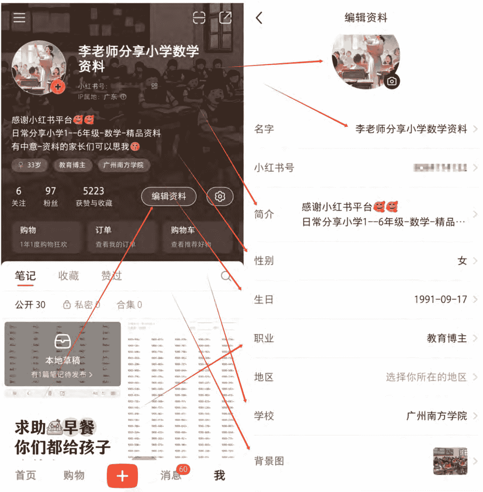

注册好账号后，点击我的界面，然后点击：编辑资料，然后就修改个人主页。

### 四、制作作品（爆款+引流）

账号搭建好后，下一步就是制作爆款笔记和引流笔记，咱们这里使用1+1法则。

什么是爆款笔记，如何制作爆款笔记？

我们可以去小红书搜索：家长讨论话题性笔记，就是：怎么怎么，为什么什么，这种笔记99%的号发都会爆，如果爆了，看过你这篇笔记的家长，你下一篇笔记发送的时候，会推送到这些家长首页，所以馆主都是第二篇发引流笔记。

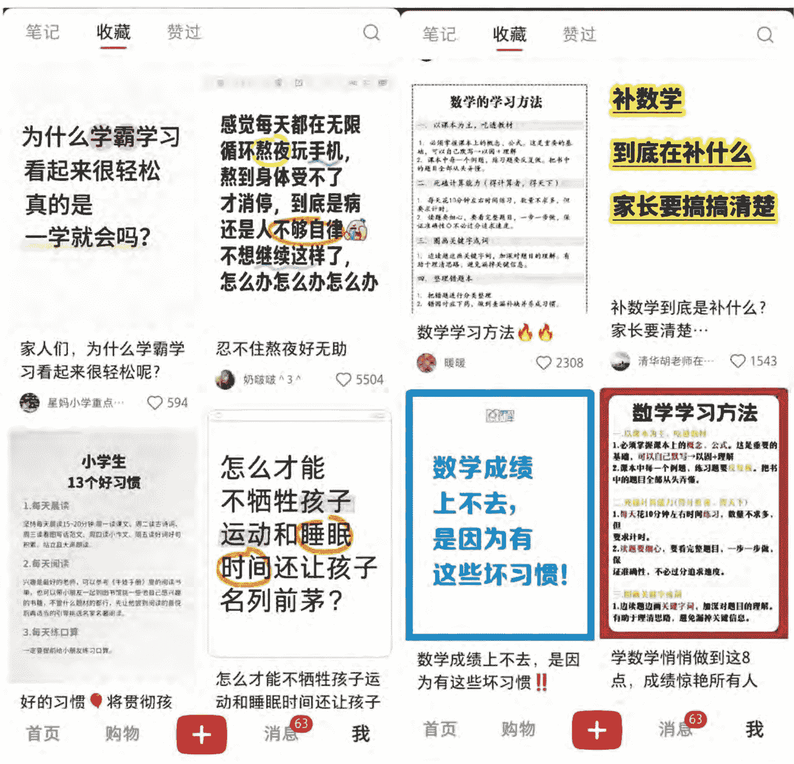

什么是引流笔记，如何制作引流笔记？

就是把你资料库，你觉得有突出点的资料，截图上传到小红书，写一些让家长焦虑的文案。

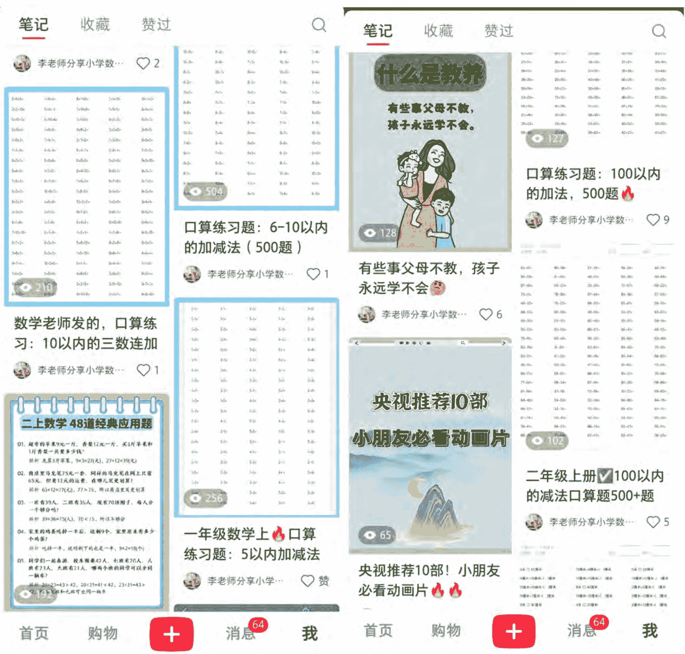

### 五、引流私域

客户求资料怎么办呢？咱们可以创建小红书群聊，然后在评论区放群聊链接，然后客户进群后，咱们再编一个话术：“需要口算练习题的家长们，由于红薯发不了文件，要领取的看视频有路径哈”

然后截图你们的微信个人信息，打开剪映App，把这个图片制作成3秒视频，然后发布小红书群里面，顶置起来。

公众号懒人搜索，懒人专属群分享


由于不能放微信号相关的内容，导致写的不是很清楚，但是你们知道原理就行了。

### 六、成交转化

重点来了，客户加我们，第一句话是什么呢？

我们可以这样回复：你好呀，家长，是需要领取小学口算练习题吗，客户一般会回复：是的。

我们可以再继续追问，咱们的娃读几年级了呢，客户会回复：x年级。

关键的步骤来了，我们设定好一个模板xxxxx

公众号懒人搜索，懒人专属群分享


我在交流的过程中，要好好的跟家长们沟通，说不定还可以追加单。


### 小结

谢谢圈友们观看，由于好久不写作了，写的有点草稿，不过也算是复盘思路吧！

## 评论区：

- 馆主：写作水平有限，看思路和细节就行了。
- 一颗海星：感谢馆主分享！🌹
- 花生黄油：感谢分享！好干货！
- 乐柠：写的很详细，感谢分享！[强]
- 馆主：感谢坚持，等我研究出新的玩法，在写一篇精品教程
- 馆主：感谢圈友们支持，你们的鼓励，是我前进的动力[社会社会][社会社会][社会社会]
- 馆主：感谢圈友的评价，我会更努力的把小红书玩深透，在分享一篇店铺玩法[好的]
- 春天里：非常感谢分享！

## (37赞)在小红书卖虚拟资料：关键词布局的重要性

圈友大家好，我是更绪，四川南充人，目前是在福建武夷山这边卖茶叶，前段时间发了一篇文章，复盘了一下我从今年4月份在小红书卖虚拟资料的整个过程👉，其中也比较详细阐述了整体实操玩法，奈何文字的表达力实在有限。

通过这一个多月来和很多圈友的交流，以及我自身在项目中的深耕，有了新的感悟，这二者结合起来，我能更清楚了解大家的一些困惑点。所以用这篇文章从流量的底层逻辑出发，讨论如何在小红书上卖出去更多的虚拟资料，1.推荐流量VS搜索流量 2.小红书卖资料的常见误区 3.为什么“曾经的我”卖不出去资料？4.对小红书电商板块未来的展望。全文5000字左右，可移步下方飞书链接查看：

作者：更绪

日期：2024-10-16

- 吴秉晖：文笔很好[强]
- 更绪：谬赞了哥，口水话还是挺多的[呲牙]
- 陈亮：还能在生财遇到南充的，我是南部的
- 更绪：南充很多的

## (19赞)小红书电商账号数据低迷解决方案

作者：曜文

日期：2024-10-15

哈喽，我是曜文，好久不见~

关于近期小红书电商账号数据低下的情况很多小伙伴都遇到了。

我们在9月26号开始陆续80%的电商账号小眼睛数据都是在个位数200以内。

具体原因我认为是平台想通过今年的双十一来赚商家的钱，从限流开始我一天要接到最少5个官方工作人员打过来的电话让开通付费投流，再到前几天官方直客微信统一的话术转化，说不投流就没流量等等这一说法。。。

其实说白了的意思就是早期大家都在我这赚到钱了，现在平台想赚钱了大家就都花点吧，效果就看谁花的多咯，而且平台是聪明的，先制造流量焦虑，再慢慢给出解决方案，再到话术案例统一收割商家。

但我还是一分不充，因为我认为平台的大机制是改变不了的，因为大部分限流的账号都是电商账号，对于不开通店铺的账号流量基本没有太大的影响，而且审核内容不可能全部上人工，基本都是机器审核，平台只能在机器审核的基础上做调整。

明白了这个逻辑之后，我就开始测试，找到了一套自测账号数据的流程和相应的解决方案，希望能够帮助到大家恢复账号数据~

### 一、流量还没恢复的账号解决方案

- 1、账号个位数小眼睛有几种情况
- 内容多次出现重复动作或场景
- 内容出现敏感词或模糊不清晰
- 内容发布未进入流量池不被推送

解决方案：

笔记发送后点击薯条推广看是否能正常进行推广，如无法推广显示内容异常，检查内容是否重复度高，或敏感词，优化完成后异常解除，会进入流量池被推送。

进入流量池推送后小眼睛也只有几十，可在帮助页面申请流量异常，申请2-3次后，后续发笔记可突破几十小眼睛，小眼睛上涨后需避免低质量内容，否则小眼睛还是会回到几十。

- 2、账号正常运营突然小眼睛稳定在几十
- 账号被拉入名单池未被释放出无法突破流量池
- 账号被判断为低质量广告账号未被释放只给少量流量
- 检查内容是否质量低

解决方案：

把账号以前出现的高数据笔记进行重新编辑，评论区自晒买家秀，附上近期热门话题，每天可编辑3-4篇，数据上涨后再发新笔记，观察数据，如数据还是几十，进行流量异常申诉2-3次可能恢复。

还有一种方式就是让官方直客把账号释放出来（需充值）或等待这波流量限制过了，也可进行每天一次流量异常处理，几率遇到客服帮助释放。

### 二、电商账号流量审核上的变动

1.账号流量标签

流量没有限制前，只要是爆款参考着来就会有流量，目前，即使是爆款，账号标签人群不对就会出现限流情况，账号需要更加垂直细分，能获取到更加精准的流量，通过更细分的标签去撬动流量，对于新账号起号这点测试后能更快的实现出单，因为能拿到流量，比如以前做梨型身材，现在则需要增加1-2个标签，上班族梨型身材+产品+场景。

新账号打上标签互动类型的笔记依然可行，也是相对快捷的方法，但值得注意的是需要垂直垂直垂直，怎么判断这个账号标签正不正确可以查看发布笔记时的话题选项。

旧账号可在专业号中心查看笔记推送人群是否正确，并且人群中选择适合人群的产品进行笔记优化。

2.低质量内容的审核

批量重复场景重复动作多篇笔记则会被平台打上低质量账号进行流量限制，需要在账号运营上面避免此类情况出现，可从多换背景多换场景来避免被系统审核，这是很多账号为什么前面3-5篇笔记数据几百上千，后续发的笔记都成了几十，机器审核到之后，账号还是会显示正常，但流量出现不正常，大概率是多篇笔记出现重复场景重复动作。

3.账号流量的审核

此审核为部分账号出现，有的账号从不浏览小红书又大量的发送笔记会被机器判定为低质量账号，出现此类情况可以把自己的账号主页打造推送成自己垂直类目的产品，只需搜索关键词并且流量主页就会推送。

另一类部分账号会出现没有使用平台推荐的热门标题热门词流量低下，这个时候可以从千帆后台打开笔记灵感查看近期爆款标题和爆款话题进行优化。

总结来讲，目前的平台现状想要突破流量池需要注重账号标签以及账号内容，尽量避免出现大量重复度过高的内容进行笔记怼量，然后根据账号情况进行相应的对策调整。

以上为近期大量电商账号亲测总结出的一些应对方法，希望能够给大家带来启发，并解决目前小红书平台的流量问题。

至于大家都在说的流量倾斜等等之类的内容，我个人认为平台不可能不给流量，平台只能在算法和审核上面做调整，比如，之前审核力度是1级现在可能提升到3级，之前账号流量都是平等的，现在可能由机器判断这个账号的内容质量然后进行推送，当然，平台肯定还是会恢复到之前随手一发笔记都能200+的小眼睛，只不过平台有政策我们需要有对策去解决相应出现的问题~

## 评论区：

- 五叶：一年前注册的账号，一直没管，前几天换绑手机号，发了两篇文章一个小眼睛都没有怎么办？[流泪]
- 书虫：你这个排除一下原因吧，肯定出问题了
- 五叶：确实，我账号诊断都搜不到这个账号，笔记显示被限流了[汗]
- 楚楚：谢谢大佬的分析 最近做推文的小红书账号有遇到流量低迷的问题 目前形式是以扣简介到自己制作的底图上面来进行拉新 发布频率是：一天一次推文与此同时每天发布一些日常（吃喝玩乐） 之前看教育类的小红书引流是百分之八十的广告和百分之二十的科普 科普是为了活跃账号我们这边的日常是为了能够起到“教育类的科普”活跃账号的作用 但我发现其实压根没用 日常流量小眼睛低于50（观察很多做图文的同行都是 2 日常 + 1 推文的模式 ）像做推文这样的账号我还需要做点什么呢
- 冯刚刚：谢谢分享，目前我也遇到了这样的问题[流泪][流泪]

# 【海外项目】3篇

## (精华帖)(78赞)机遇与挑战并存的东南亚市场，如何抓住现阶段增长点？

作者：久成

日期：2024-10-14

生财的圈友们大家好，我叫久成，5年跨境电商老兵+东南亚跨境千万级卖家，拥有多款Top1产品。都说未来几年有几大风口，跨境出海无疑是其中的一个。我们深耕跨境电商5年，切身体会到跨境带来的红利，感谢生财的邀请，今天给大家分享一下关于出海的一些思考和玩法。

这篇文章共15000字，从市场现状到 TikTok小店起店全流程，再到本土化运营，补货管理，滞销处理方法，最后到电商公司管理给大家展开，大纲如下：

- 1.海外市场和平台分析
- 2.TikTok小店冷启动核心原理，我们如何3周打爆新品新店
- 3.跨境电商如何实现本土化，快速放量
- 4.如何建立合理的库存管理和补充体系、清理滞销库存
- 5.电商公司如何招人选人、如何利用绩效实现飞轮效应、如何挖掘骨干

那么咱们话不多说，开始进入主题。

### 一、自我介绍

大家好，我叫久成，连续创业8年。

16年大一，在大学开始创业，在大学成立吉他工作室和自媒体写作工作室，带领近20名大学生月入过万；

17年大二，做了微信淘客，并且开始在公域引流到私域，做私域返利社群，实现大学生的财务自由；

18年大三，再次踩中风口，第一批做抖音视频带货，尝到一个人日出千单，单视频单日佣金3万+的甜头；

19年，累计赚到第一个一百万，时年22岁，拥有人生的第一辆全款奥迪；

20年，毕业并顺利创立一家超过20人的东南亚跨境电商公司；

21年，all in跨境电商Lazada平台，本土无货源店群模式，400家店铺，日单量超过3千单，日利润超过4万，年底惨遭封杀，一夜直接亏损80多万；

22年，痛定思痛，放弃与平台做对抗，开始本土备货，做Lazada本土精品模式；

23年，新增虾皮，TIKTOK电商板块，布局东南亚全域电商，多款美妆产品，箱包产品做到马来西亚站点top1 ，并且开始构建自主品牌的护城河；

24年，开始赋能国内品牌出海 ，进一步扩大供应链优势。

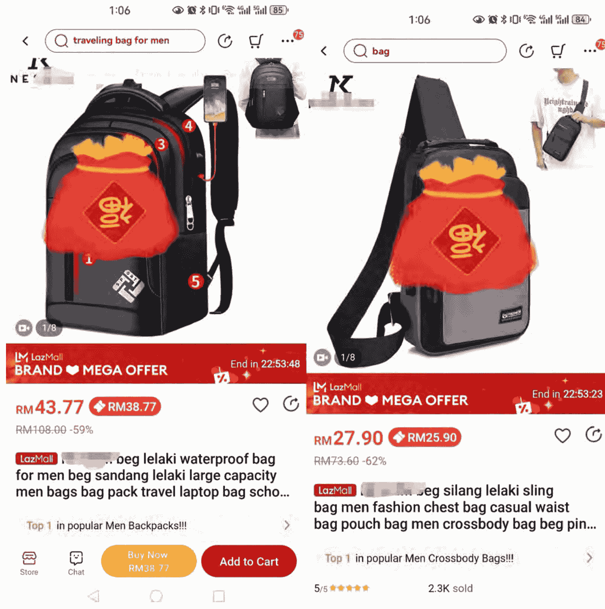

因为专注，所以专业 ，这个是我们其中一个猫店的情况，多款产品做到类目top1，上榜的产品也有很多。

### 二、 东南亚为何成为跨境电商首选战场

说到跨境电商，可能很多朋友第一时间想到的是欧美市场，市场大，人口多，消费能力强，赚美金赚欧元；

谈到东南亚，很多人会觉得这是一个落后，贫穷的地区，这片土地上有着很多分散的国家，部分国家不光面积小，人口数量也少，似乎和欧美这些国家根本无法相比，根本不在同一个体量。

但是最近这几年时间，越来越多跨境电商的卖家，尤其是新卖家，纷纷涌入东南亚市场，将东南亚作为入局跨境电商的首选战场，这是为什么呢？

### 1. 海外市场分析，东南亚电商增速全球最快

· 当前东南亚电商市场正迸发出无穷的潜力

东南亚电子商务市场从 2010 年开始加速增长，直到新冠又将其推入了一个更高的新阶段。

根据 eMarketer 数据显示，2023 年全球零售电商市场增速排名中，东南亚以 18.6% 的增速排名第一。而增速最快的十个国家中，东南亚国家占据了一半席位，菲律宾、印度尼西亚、马来西亚、泰国和越南均进入榜单。预计到 2029 年，东南亚电子商务市场规模将达到 1912 亿美元，2024-2029 年的年复合增长率为 10.42%。

放眼全球，欧美的电商市场已经趋向饱和，对新入驻商家的要求越来越严格，反观东南亚电商市场，高速的增长意味着普通人将会拥有更多的机会。

### ·东南亚主要的电商平台其实更加适合有着中国体质的电商人

不管是 Shopee、Lazada 还是 TikTok 小店，都流淌着中国资本的血液，基本都在使用着中国电商的逻辑和规则。

当打开这些跨境电商店铺的后台的时候，我们会发现界面和部分的功能和国内的电商平台差不多，使用的是中式的思维逻辑，对于新卖家来说，难度会更低。

### ·在商品出口贸易这一块，我们有绝对的优势

东南亚国家制造业不强，当地的工业产能较低，我国又是世界工厂，种类齐全，性价比高，是当地人对我国的产品青睐的原因。

### ·做东南亚市场的门槛会比欧美市场的低一些

东南亚的仓储、人工、物流等成本都会比欧美国家的要低，因此所需的启动资金不需要太高。

### 2. 东南亚三大电商平台对比，TikTok 快速崛起

在东南亚这片土地上，各大电商平台展开大乱斗，其中以 Shopee、Lazada、TikTok 为其中的佼佼者。

### ·Shopee

2015 年成立，作为腾讯系的它率先进攻东南亚市场，仅仅用了 4 年时间，就打败 Lazada，成为东南亚地区规模第一的电商平台。巅峰时期，其母公司 Sea 市值一度超过 2000 亿美元，风光无限。

### ·Lazada

在 2012 年更早成立的 Lazada，虽然在与 Shopee 的多年较量中落败，但它作为阿里海外布局中非常重要的一环，阿里一直对其寄予厚望。从 2016 年开始，阿里每年平均向它注资超百亿元。这些年下来，Lazada 也牢牢守住了老二的地位。

### ·TikTok

TikTok 作为东南亚“当红炸子鸡”，它的成长速度，快得惊人。

2021 年，TikTok 率先进入印尼市场，开始摸爬滚打。一年过后，TikTok 成功开通泰国、新加坡、越南、菲律宾、马来西亚这些东南亚国家。

2022 年，TikTok 在东南亚的 GMV 达到 44 亿美元，实现了 3 倍增速。这还不够，2023 年 TikTok 又把这个数字翻了 4 倍，实现 163 亿美元的 GMV。

TikTok 进入东南亚后，吸引了大批来自 Shopee 和 Lazada 的跨境电商卖家，试图抢占新兴平台的红利。当然，TikTok 也是诚意满满，在初期不收取商家佣金，并给予消费者诸多补贴，如免邮费、优惠券、满减券、一分购等。

晚起的鸟儿却吃饱了虫子，相比之下，成立于 2012 年的 Lazada，空间却逐渐被挤占，第二的地位怕是保不住了。外媒直言，TikTok 的电商业务将超越阿里旗下的 Lazada，成为东盟地区第二大电商平台。

眼下的东南亚电商市场，仍然是一片值得挖掘的热土，TikTok Shop 的快速崛起，也重塑了东南亚电商格局。如果按照目前的发展速度，TikTok Shop 想要成为整个东南亚电商市场的最大的电商平台，也只是时间问题。

TikTok 照搬国内抖音的路子，做兴趣电商，主打一个“货找人”的错位竞争，给尚未经历电商经济太多洗礼的东南亚一些巨大的震撼。

TikTok 在电商业务上线前就在东南亚市场拥有巨大的用户数量。根据 TikTok 官方数据，截至 2023 年中，TikTok 在东南亚的月活跃用户总数达到 3.25 亿。

换句话说，TikTok Shop 站在巨人肩膀上，有先发的流量优势。整个东南亚的人口结构又趋于年轻化，30 岁以下占比超过 50%。年轻人爱刷短视频，对新鲜事物的接受度又高，正中 TikTok Shop 下怀。越来越多人开始在沉浸式刷短视频和直播的时候，无意识购物。

### 3. 拥抱风口，TikTok 小店冷启动核心原理，3 周打爆新店新品

在过去的五年里，我们经历了 Lazada 店群日利润超 4 万的辉煌、经历了疫情时期发不出货死店的阴霾、经历了平台大封店一夜之间亏损 80 多万的打击、经历了选品测品打品的不断试错、经历了品牌搭建和推广受阻的阵痛、经历了 Shopee 测评即封店的无奈、经历了多平台运营快爆的喜悦。

随后 TikTok 小店开始陆续在东南亚上线，于是我们快速入场从联盟带货做起，无人直播赚了一波，半无人直播试了一阵，全真人直播产出为负。

在经过多方尝试之后，我们开始做本土 TikTok 小店，前期上架就出单。后来竞争逐渐激烈，我们不断测试、不断学习和优化我们打法，测试出一套冷启动流程（在此感谢 Peter 老师的启发），如何从 0 开始做一个店铺，今天分享给大家。

### ① 了解 TikTok 算法的底层逻辑

首先我们要知道 TikTok 算法的底层逻辑，以及怎么做店铺或者做账号能够破解 TikTok 的流量，实现“让流量来找你，而不是你去找流量，我们来不追流量，而是让流量来追我们”的效果。这里面有三个核心：

- TK 算法是追强弃弱，只有强者才能分配到流量

TikTok 里，一切都是数据说了算。从零开始做店的过程中，商家在前期一定要想清楚的一点是：我们会决定要烧钱还是烧货。

很多人决定的是要烧钱，但其实烧钱的方式没有办法做强数据。

- 烧钱和烧货的区别

烧钱就是烧广告，用投流去撬动流量，这里存在一个不确定的因素，因为无法预估投产比的多少，而且投产比是有上限，不是说投得越多效果就一定越好，会存在一些潜在的变动。但是光烧钱的话，第一是对直播间和素材的要求很高，第二是产品的价格、评分等因素也会影响到转化率，导致店铺的数据没有办法得到明显的提升。

也就是说烧钱存在一些不确定性，而且是会有上限的，但是烧货的话只要预算充足，会更具有确定性。

而烧货的意思，简单来说就是货损。原来 10 块的东西，我做福利 1 块送，送 10 个、送 20 个、送 100 个，只要产品没有问题，都能送出去的。假如每件产品的货值是 5 块钱，送 100 件也才 500 块。每个人都是喜欢贪小便宜的，所以这 500 块钱可以给我们的店铺带来更多的商品点击和更高的转化率，这是确定性很高的一件事并且是可以让我们的店铺有一个高速增长的数据趋势。

所以我们选择的是烧货。通过烧货来快速地拉爆店铺，烧货的速度会让“店铺的转化率”和“分钟的成交 GPM”都会达到最高。

这个目的就是告诉 TikTok 的算法，我是在这个品类里新崛起的黑马。我在 7 天的数据，下个 7 天的数据，在每一个 7 天的数据里，我每周都在增长，每次增长都超过 20%。马上 TikTok 就会自动来追你，他会把流量分配给你，而不是你去买流量。

所以说这个是我们起店最重要的一个核心原理，后面会讲到我们是怎么做的实际操作的。

- 算法是基于机器学习，垃圾进，垃圾出

算法是一个机器学习的过程，无论是短视频、直播还是商城的流量它都在不停地学习。所以想要获得精准的流量，前提是喂给算法足够多的有效数据，让它快速学习到我们要找什么样的用户，标签是什么。

垃圾的标签一个都不要。

我们做电商的，不需要搞笑的流量，也不要去想像那些拍的视频能够爆个 100 万的播放量，那些都不需要。我们要的是虽然只有两三千的流量，但其中有 20% 的流量是愿意停留并且点击商品链接的，只有点击链接的才会是被识别为电商的标签用户。

- 算法是统计学，你不是跟所有人在赛马

第三个核心就是，算法是一个统计学。统计学是不会把 T1，T2，T3，T5 这些不同达人、不同的店铺放到一起去比的。

因为我们不要看最 Top 达人的销量，也不要这个行业里最 Top 店铺的流量，因为我们在前期启动时不会跟他们比，而是在跟同级同类目的新店一起比。

注意：我们在做数据的阶段，每一个阶段都要记住：我们是跟谁在比？TikTok 他想要什么？我们把什么数据做出来就赢得了这个流量赛马。

### ② 了解店铺跟主账号的关系

- 店铺 = 数据中心

很多中国的商家在做 TikTok 小店时，都会趋向于只做投流，但其实只做投流的话，账号会碰到上限的问题。也就是说，TikTok 的广告户也是一个机器学习过程，如果在这个过程中，我们的消耗效率或流量效率是低于别人的效率时，我们就跑不出量了。

所以说，我们要做的是：以一个店为数据中心，通过 4 个流量口子（直播、短视频、商城、投流）在同一时间，稳定的、平衡的把流量打开。

这样形成的流量架构会非常漂亮，而且不用担心某一天销售额会突然下降。为什么？因为我们是三角形流量架构（直播、短视频、商城）在撑着这个店铺。

- 主账号 = 流量标签

主账号是最重要的账号，因为 TikTok 算法是把这个店铺作为所有成交数据的中心，所有的分数，包括发货数据、质量分、服务分等都在里面。而店铺的分数影响是店铺或商品在商城跟搜索展现排名。

那么店铺分数怎么做上去？它最重要影响的就是你的主账号的流量标签，以及你的主账号绑定这个店铺的成长的增速，成长增速比绝对销售额更重要！

在 TikTok 上面做生意只要记住一点，它要的是追潮流。

什么叫做潮流？就是我有一个每周店铺增长数据是在上升的账号，它卖的东西跟平台用户的关系是属于正在上升的阶段，比如商品卡浏览数据、点击率、转化率等等各项数据都是呈上升曲线。

我们要筛选掉所有不相关的用户，然后不停的让算法学习我们需要什么样的用户。

所以平台会把流量推送给到正在上升中的店铺，而不是绝对销售额最大的店铺。因此我们关注的不是销售额，而是每一个数据的增长的百分比。

他只要有高过大部分的同级别商家的增长速度，你就会发现流量会越来越精准，流量会越来越多。

- 网红达人 = 人群筛选器

网红达人永远不会是店铺的主流量，但是对新店铺来说又是至关重要的部分，为什么？

因为网红达人的链接是一个反向筛选的链接，通过大量网红达人的粉丝关系（用户通过达人的账号点击进店铺），它可以把我们的店铺标签初始数据再筛选一次。

这样它不会影响我们的主账号，但会直接影响店铺的流量精准性，也会间接带动商城的搜索和自然流量的展现。

所以网红达人营销是前期开店时，第一天就必须要做的。

- AD 广告户 = 销售额放大器

广告户也很重要，它是你验证过的销售额增量的放大器，它可以把你的销售额放到非常大。我了解到很多人遇到的主要问题是：这个广告户放不了量，后面有机会我也写一篇文章和大家详细分享一下我们是怎么去做广告放量的。

### ③ 冷启动前两周：理解三个流量主体的算法核心及方法

这三个流量主体是：

- 1. 店铺权重，决定商城的排名；
- 2. 视频账号权重，也是主账号的权重，决定视频初始的流量级；
- 3. 直播账号权重

这三个流量主体其实都是通过一套机制挖掘出来的。

这三个流量主体是分开的，有不同的权重，但又不能分开做，我们需要同时增长三个权重。我叫它直播视频商城三角流模型。

TikTok 是一个基于结果导向的平台。当我们开了一个新店，数据为零，这个时候 TikTok 是不会冒险把好的用户分配到一个新开的店铺里的，因为平台并不知道这家店会不会发货，不知道货是否有问题，是不是卖假货？

所以冷启动期拿到的流量，一定是垃圾流量。垃圾流量就是垃圾人，这些人里 99% 的人很有可能是不会买东西的。这个期间（尤其是前三周）主要测试的是留人能力，这个时候它不要求成交，要求的是我们能不能把他推来的垃圾人留下来。

所以我们在冷启动期就用到了三角流模型：

- 1. 首先直播端拉 2 小时直播时长，穿插每十分钟做福利；
- 2. 其次每天做 20 个小视频去撞广告；
- 3. 还有定向邀约达人。

接下来分别讲讲这三部分我们怎么做的。

### ·第一点：第一周我们直播做了福袋抽奖，每个进来的人都有机会抽到一个商品。

### 提高留人的能力和平均时长

我们每 10 分钟放一个商品出去，总共拉了两个小时，共送出了约 12 件客单价约 15 元的商品。这 12 件货主要作用就是把贪小便宜的人留在我的直播间，用来提高数据的展现，包括留人的能力和平均时长。

### 商品点击率

最重要的一个数据叫商品点击率，怎么提高呢？

因为你知道这些留下来的人都是想贪小便宜的人，所以在点福袋的时候，我们会弹出一个要求，让他写一个留言：在第 3 号链接有福利。

那么这些贪小便宜的人参与福袋的这 10 分钟同时在留言给后面的进直播间的人看，引导他们去点第 3 号链接，间接的就把商品点击率拉到了 26%。

这个对于 TikTok 来讲是很厉害的数据了：

- 1. 进来的人的平均停留时间超过 1 分钟，代表他对你的内容是感兴趣的
- 2. 进直播间的人，有 26% 的人都去点了商品卡，代表你卖的商品性价比是有保障的，你有可能成为一个爆款。

让 TikTok 的算法认为你就是专门做一个超级爆品的，一个有潜力的网红商店。

### ·第二点：每天做 20 个短视频去撞广告

我们是怎么做的呢，其实就是一条主线：找一个老外模特做了一条配音，然后混剪，再用 AI 生成 20 条完全不一样的，有差异化的钩子内容。我们给到 AI 一个版本，让 AI 围绕着这个版本产生 20 条短视频，然后撞广告。

每条视频建 10 - 20 个广告组，让不同的广告组去跑不同的测试流量，因为这样才不会把它们放在同一个卡片里，使得不会重复触达同一批用户。然后，找到一条能够跑出量、跑出高投产的广告组进行复制，再复制 10 个不断测流量。

再来说一下视频内容：不要急于去讲解介绍产品，一定要放大效果，直击痛点。

而且前 5 秒是非常重要的，在视频关键时间也要去引导用户点击商品卡查看详情，这样广告就能跑得出量。

### ·第三点：达人邀约

同时我们也在做达人邀约。前面我们说过了达人端属于反向链接，那我们是怎么玩的呢？

我们最核心的达人，其实就是已经帮我的竞争对手出了单的达人，通常我们会用一个数据工具，先找到行业里卖得最好的店铺，然后去把近 30 天帮他带过货的达人名单导出来，他给 8%，我们就给 15%，把他的达人给“偷”过来。

冷启动期前两周我们一定要耐得住寂寞，做直播或者做任何的店铺数据，主要做的就是停留+点击，只要把这两个做起来，基本上流量就会开始变成真正的电商流量，也就是说用户开始会买东西了。

### ④ 测试期和打标期

下一个阶段叫做测试期和打标期。

打标期就是某个时候开始，算法愿意来打标签了。

这里要记住一点，目前平台有太多烂的店了，所以在这个地方 TikTok 会先过滤掉一些烂店。比如英区有 6 万多家店，真正能卖货的可能不到 10%，也就是说不到 6000 家，6000 家里面能卖的好的店铺可能不到 600 家。

那么 TikTok 希望的是不要浪费时间在这 5.9 万家店铺里面，它要的是成交速度，所以会把 80% 的流量很小心的分配给能够成交的店铺。

在冷启动期，很多人起不来的原因就是被放弃了，被当成了烂店，平台不敢给店铺流量了。所以前期一定要先做数据，做停留，做商品卡点击率，其中商品卡点击率我们是用网红来做的，测试出来是最有效的。第二个就是打标，打标期通常为一周。

10 天后，店铺数据做的差不多了，就会进入标签期。在标签期我们会发现有个特点，就是进来的人开始讲话了。用户会说：“哎，这个东西拿出来给我看一看”。这个时候我们就知道 TikTok 开始放我们的标签用户来测试转化率了。

这个时候 TikTok 要的是什么？很简单，TikTok 同时给 1000 个流量到两个直播间，通过这 1000 个流量来测试我们的转化能力，转化能力里面包含了转化率，以及最重要的 GPM（用 1000 个流量所产生的销售额）。GPM 越高的直播间或者店铺流量会越来越精准，越来越大，TikTok 会不停的给它放量。

当我们一进到标签期，一定要记住我们做的是转化率。

所以在这里面我们要做的数据是什么？是 5 分钟转化率。

那是我们用的方法什么呢？我们用的方法是做福袋。

我们现在会把一个 10 块钱的东西瞬间降价到 1 块钱，也就是说，当我先用一个福袋把直播间拉到了 200 人 -300 人在线时，必须要成交 8-10 单来让转化率瞬间达到 5%，5% 的转化率会超过大部分的同期的直播间，这个时候 TikTok 就会开始推大量的电商的人群进来。因为直播间可以成交，TikTok 会把好流量推给能成交的直播间。

那下一步我们怎么做？

我们会先做一次免费赠送，一单商品拉上来几百个人，然后立刻做一波 1 块钱快速转化，牺牲大概 10 件货的成本共三五十块钱，去拉快速转化。

这时候直播间会一下子拉到有一两百个有效人数，我们就开始卖主推品，主推品能够成交 10-20 单，每单大概 25 块钱，就可以产生大概 250-300 块钱马币的成交金额。

然后再重复做这一次，每一次花二三十块钱的货，去换取三五百块钱的销售额，这对我们来说这就是一个大约 10 倍的投产比例，比广告费还划算。

我们在直播间从来不投广告，而是投货，用货来算投产比。

所以我们做店的，其实不外乎是一直在算有效渠道的投产比，我投广告现在可以到 1:8、1:10 或者投到 1:5 都是赚钱的。那么算一下，货的成本是 3 折 4 折，那投到 1:2.5 以上都是赚钱的。它跟广告一样，如果你的投产比是超过 5 以上，那么你就可以死命的投货去换取销售额。

那么针对达人也是一样的，达人也是三个产品。也就是说，成本价给达人一个样品，我们要算的出来的是，他能帮我们卖几单零售价的商品。

这样就可以算出来投产比是六倍，八倍还是十倍。

我们当前的样品的投产比是 30 倍，比如我投了 1000 块钱的样品出去，通过达人卖出了 3 万块钱的货，这就是 30 倍的投产比，是非常划算的一个投产比。

### ⑤ 一个月后：放量期

过了一个月，店铺已经进到放量期了，我们会发现进来用户全部都是有效的电商人群，这个时候考验的就是供应链能力了。

需要经常有新品上架，老客的复购跟新客的转化都同时要兼顾到，才能够持续的有流量。

这里重点做数据做的是店铺排名。在做商城流量时，店铺排名的权重决定了展现排名，那这个时候我们通常会研究 ShopTop，在 Seller Center 里面有一个叫搜索关键词。

搜索关键词非常重要，我们通常会把相应的关键词植入到短视频和产品页中，拉高搜索的概率。

那么怎么做到稳定放量呢？也就是怎么做到每天超过 5000-10000 的一个销售额呢？

就要靠反向链接。

当我让一个大网红帮我发一条视频，他发出去以后可能有 30 万的播放量，可实际的成交可能只有 300 块钱，那么我得到的是什么？

除了得到这 300 块钱的实时成交，最重要的是我触达到了这 10 万的标签用户，只要这个用户停留超过 5 秒钟且在我的商品的链接点击了，或者在这条视频上停留超过 5 秒钟，那么 TikTok 就会在未来的 7 天不停的追踪他，不停的把我新推出的视频定向推送给他。

所以我们叫这个为反向链接，反向链接越多，商品卡的自然流量就越高。

这个是绝对值得投入的，我们可以用反向链接 + AD 持续放量。

### 三、做好东南亚市场，要坚持本土化战略

### 本土化是必然趋势：依托优势，快速放量

很多平台，例如我们现在做的 TikTok、Shopee、Lazada 都有跨境和本土模式，这两种模式有什么区别呢？

- 跨境店，就是可用国内执照注册的店铺，在国内选品，上架后通过空运发货到国外，如果你没有货源就从 1688，拼多多等平台采购，一件代发。它听起来简单，门槛低，但是流量小、时效慢、运费高、小白较难拿到好的结果；
- 本土店，就是当地的个人或企业资料注册的店铺，产品备货在国外仓库，上架后直接从当地海外仓发到消费者手中，它时效很快，大概两三天就能派送完成；其次由于政府扶持当地商业，流量很高；再者，目前平台有运费补贴和免邮活动，所以不需要运费；玩法很多，天花板很高，就连小白也很容易拿到好结果。

同样的产品，本土店大批量备货走海运入海外仓，运费成本低，售价低，2-3 天送达，跨境店因为单件发空运，运费成本高，售价高，8-9 天送达，你是消费者，你怎么选？

通过以上的介绍，大家明白了跨境店和本土店的区别，显而易见，本土店的门槛更高，风险更大，既要海外仓资源，仓储和物流资源，又要不断把货压到国外，但竞争更小，收益也更高，换句话讲就是，风浪越大，鱼越贵！

我们在 21 年就开始布局本土，利用本土模式，流量大、时效快、运费便宜等优势，迅速打造数个百万级的店铺。每个跨境电商的平台为了让用户能够享受极致的购物体验，未来不管是哪个市场，都一定会趋向本土化。在可以选择的情况下，没有人愿意花更多的时间和更多的金钱去买一个同样的东西。

### 2. 备货关键点：建立合理的库存补充体系

上面谈到本土化是必然趋势，那就意味着我们需要把货备到国外去，这一步就非常关键了，也是我们做跨境电商中最考验资金链的环节。

我们把货发到东南亚，都是大批量发的，所以选择走海运的方式。海运有着载货量大、价格便宜等优势，但是劣势也比较明显，时效慢（不同的国家时效不同，大概在15-30天，偶尔遇到海关查验还需要再多等几个星期）。

正是因为有海运的这一过程，所以本土备货就更具难度了，也导致很多想做跨境电商本土的卖家止步于此。那么我们该如何建立合理的库存补充体系呢？下面我分享一些我们自己的经验。

### 1. 测款过程

这里我就默认大家是有海外仓或者有合作的第三方海外仓的了。

当我们选好品之后，就要开始备货了。因为是新品，没有自营的基础数据，我们无法估计备货过去以后的销量，也有可能会滞销，所以是需要测款。

具体测款的时候每个新品要发多少件过去呢？这个根据产品类目和市场容量的不同是有所差异的。像马来西亚的话，我们新品第一批会先发200-1000个；像菲律宾的话，就会发400-2000个。

我们这个测款的方式更多是适用于普通的中小卖家。如果是大资本卖家，这个就可以忽略了。资本的玩法基本都是选好品，直接就备几个柜过去了，用极致的价格优势快速打倒同行。

### 2. 常规过程

当我们备货的产品越来越多之后，里面是一定会有一些表现不错、持续出单甚至爆单的产品。这时候就需要开始后续的补货。

我们库存补充的关键点是：提高频率，按需定量。

- **提高频率**：我们现在每周都会发两次海运。为什么要发两次呢？首先各大船司走东南亚航线的基本都是一周两水，再者是因为每周发两次，一个月八次，相当于把“鸡蛋放在多个篮子里”，避免某一批次的货物遇到海关的查验或者其他突发情况，导致库存不能及时跟上。
- **按需定量**：则是需要我们根据产品的实时数据去备货。我们根据的数据是产品的加权日销量（7天平均日销量50%+15天平均日销量30%+30天平均日销量20%）。

为什么要使用加权日销量呢？我们之前是根据产品的月销量去备货的，后来发现，有些产品是近期突然就爆起来了，也就是说这款产品前面20天是不温不火，后面10天突然开始火起来了。如果按照简单的月销量去补充库存的话，则会有很大可能错失一些潜在的爆款。

这个日销量一般的ERP或者WMS系统都可以直接导出来，或者自己做表格计算。

### 3. 实操案例

然后我讲一下我们具体是怎么实操，拿我们自己的表格里面的其中几款产品来举例。

| 数量(在途) | 成本 | 仓库库存 | 总库存(可用+在途) | SKU出库量 | 库存金额 | 出库总数 | SKU占比 | 日均销量 | 可售天数 | 补货数量 | 样品 |
|---|---|---|---|---|---|---|---|---|---|---|---|
| | | 146 | 1145 | 110330 | 1507.66 | 110330 | | 39.53 | 29 | 1186 | 有 |
| | | 100 | 2522 | 183560 | 9405.19 | 183560 | | 72.45 | 35 | 2174 | 有 |
| | | 169 | 469 | 3530 | 2470.54 | 3530 | | 11.99 | 39 | 360 | 有 |
| | | 81 | 380 | 1980 | 2086.20 | 1980 | | 11.18 | 34 | 335 | 有 |

补货的时间节点：总库存（在库+在途）/日均销量。也就是可售天数只要低于40天的，表格会自动上红色阴影，则提醒我们需要马上安排补货了，因为按照当前这个产品的销量情况，再卖40天，就会断货了。

我们为什么要定40天这个分界线呢？国内大部分供应商有现货的情况下，一般5天左右都能送达，然后海运周期我们保守取平均算25天，则这里就已经需要30天时间了，最后我们再多预留10天的时间以防意外情况的出现或者是需要工厂定制生产的产品。

补货的数量：上面讲完了需要补货的节点，那么我们该补多少的数量呢？还是拿我们自己的表格里面的其中几款产品来举例。

| 数量(在途) | 成本 | 仓库库存 | 总库存(可用+在途) | SKU出库量 | 库存金额 | 出库总数 | SKU占比 | 日均销量 | 可售天数 | 补货数量 | 样品 |
|---|---|---|---|---|---|---|---|---|---|---|---|
| 2000 | | 146 | 3145 | 110330 | 4141.14 | 110330 | | 39.53 | 80 | 库存充足 | 有 |
| 3300 | | 100 | 5822 | 183560 | 21711.73 | 183560 | | 72.45 | 80 | 库存充足 | 有 |
| 500 | | 169 | 969 | 3530 | 5104.37 | 3530 | | 11.99 | 81 | 库存充足 | 有 |
| 520 | | 81 | 900 | 1980 | 4941.00 | 1980 | | 11.18 | 80 | 库存充足 | 有 |

在上表的第一列填入我们补货的数量，然后看总库存（在库+在途）/日均销量，我们要让可售天数大于80天。

为什么要大于80天呢？前面说了40天为一次保险的备货时间周期，则80天就是两次备货时间周期。这样子做的话，基本上前面的库存差不多消耗完，新的一批就能够及时补充。

动态补充，再加上每周两次的补货频率，就可以最大程度减少出现断货的情况，而且库存的压力和滞销的风险也能相对做到最小。

### 3. 轻中重度滞销库存的标准制定以及对应处理办法

有些朋友做跨境电商，每天都在嘎嘎出单，但是一年过去了，却发现没有赚到钱，这是为什么呢？

因为他们没有关注滞销的问题。日积月累，越来越多的产品变成了滞销的库存。这些滞销产品无法流通，无法产生它应有的价值。

其实在我们真正去做跨境电商并且是本土备货的情况下，滞销的情况是无法避免的。会有一些产品是选品的时候没选对，也有一些产品因为出现大量竞品，导致销量下滑，或者是某些产品的热度突然下降，导致销量断崖式下滑。

只要是做本土备货模式的跨境卖家，或多或少都会遇到这样的问题。有滞销其实不可怕，可怕的是我们放任不管，或者无从下手。那么我来分享一下我们的处理方法，希望能给大家带来一些启发。

### 首先，定标准。

咱们不能凭感觉就去定义什么产品是滞销品，一切要以数据说话，用标准化的流程去定义什么产品是滞销品。

这边引入一个名词叫库龄（产品入仓的第一天算起）。我说一下我们的标准：正常库存：库龄<30天；轻度库存：30天<库龄<90天；中度库存：90天<库龄<180天；重度库存：库龄>180天。

### 其次，有了标准之后，根据滞销的情况制定对应的处理方法。

- 轻度库存：分析竞品，重新定价；
- 中度库存：降价促销，回本即可；
- 重度库存：再次降价，亏本处理。在东南亚只要咱们的选品不算太差，只要低价都可以清理完。

### 最后，定任务。

有标准，有对应的处理方法后，就缺执行的人。

人性都是懒惰自私的，没有运营会主动去帮公司去清理这些滞销库存，因为清理滞销会影响他们店铺整体的利润率，也需要他们花费不少精力去做这个事情（滞销的产品都是不好卖的）。

所以我们会给运营下达强制的清理库存任务，同时制定他们每个人当月需要处理的滞销产品清单和处理金额标准，而且这一任务会纳入到运营的绩效考核中，是每月必须完成的一项。

### 最后再讲一下如何进行实操

用表格里里面的一些数据举个例子，我们一般都会着重处理中度库存和重度库存。

我们会使用这个数据：（中度库存数+重度库存数）/当前日销量=（中/重度库存处理时间）。这个数据可以让我们知道：按照目前不过多干预的情况，这些库存需要多少天才能处理完。

如下图，有一款滞销产品是3390天，如果不人工干预的话，差不多需要9年才能处理完。我们会把只要处理时间超过90天的的产品，纳入到下个月运营清理滞销的产品清单中，然后在下个月着重处理。

| 在途数量 | 在途金额 | 正常库存<30天 | 正常库存金额 | 轻度库存>30-90天 | 轻度库存金额 | 中度库存>90-180天 | 中度库存处理时间（天） | 中度库存金额 | 重度库存>180天 | 重度库存处理时间（天） | 重度库存金额 | 中+重度库存处理时间（天） |
|---|---|---|---|---|---|---|---|---|---|---|---|---|
| 0 | 0.00 | 0 | 0.00 | 0 | 0.00 | 1 | 15 | 9.20 | 38 | 570 | 349.60 | 585 |
| 0 | 0.00 | 0 | 0.00 | 0 | 0.00 | 0 | 0 | 0.00 | 51 | 458 | 179.94 | 458 |
| 0 | 0.00 | 0 | 0.00 | 0 | 0.00 | 0 | 0 | 0.00 | 36 | 344 | 145.37 | 344 |
| 0 | 0.00 | 1 | 2.14 | 0 | 0.00 | 0 | 0 | 0.00 | 188 | 1507 | 402.32 | 1507 |
| 0 | 0.00 | 0 | 0.00 | 0 | 0.00 | 28 | 251 | 110.32 | 0 | 0 | 0.00 | 251 |
| 0 | 0.00 | 0 | 0.00 | 0 | 0.00 | 29 | 2175 | 114.26 | 0 | 0 | 0.00 | 2175 |
| 0 | 0.00 | 0 | 0.00 | 0 | 0.00 | 29 | 870 | 114.26 | 0 | 0 | 0.00 | 870 |
| 0 | 0.00 | 0 | 0.00 | 0 | 0.00 | 69 | 500 | 330.48 | 0 | 0 | 0.00 | 500 |
| 0 | 0.00 | 0 | 0.00 | 0 | 0.00 | 452 | 3390 | 655.40 | 0 | 0 | 0.00 | 3390 |
| 0 | 0.00 | 0 | 0.00 | 0 | 0.00 | 74 | 279 | 68.68 | 0 | 0 | 0.00 | 279 |

公众号懒人搜索，懒人专属群分享。

清理滞销这个事情一定是要长期进行的，做的时间越久了，产品越多，滞销的产品也会不断更新。每一个产品都有自己的生命周期，平常心对待，标准化流程处理。

让资金滚动起来，把因滞销而积压的资金释放出来，用来备更多新品，产生更高的利润！

### 四、众行致远，如何打造一支高效能团队

### 1. 电商公司招人选人，是搭建好团队的关键

我个人觉得招聘这个事情，一定要贯彻做公司的整个周期。有的朋友可能会问，明明咱们不缺人，为什么还要去招人呢？

我的观点是：要想让公司做的久，就一定不能不招聘。

- ① 人越少其实越难管理。人太少的时候公司没氛围，大家可能感觉公司不赚钱，看不到希望，每个人都有自己的小想法；
- ② 借助招聘，让员工感受到公司发展势头良好的信号。让员工觉得公司现在欣欣向荣，团队在壮大，每个人都有机会做别人的师傅，将来可以升职并拥有一定的权力。
- ③ 对公司来说，通过招人，员工的工作状态会更好，能力也能得到提升。
- ④ 可以通过不断地招聘去筛选积累合适的储备人才。咱们做电商的，开店不可能只开一家，后续都会走向多店铺布局，合适的人才其实是可以提前储备的，以便日后给我们创造巨大价值。
- ⑤ 通过招聘去了解更多外部的变化。这个方法有点损，对应聘者有点不公平，但是对老板来说特别有用。

老板在招聘平台发布高薪的运营岗位，通过面试去了解你想要知道的东西。在面试了足够多优秀的应聘者的时候，你就能把很多的电商模式以及运营方法都搞明白。然后可以通过大量的信息分析，你就会知道公司里有什么地方是可以优化改进的了。

招聘的好处有很多，所以我们要重视招聘，要把招聘工作常态化，老板其实就是企业最大的人力资源官。

选择大于努力，这句话在搭建团队中也同样适用。

其实选人，很大程度上是在选择这个人的性格，每个人的性格是很难改变的，除非发生重大变故。你想想改变自己的性格难不难？所以我们在选人的时候，不要妄想去改变他的本性，这是世界上最难的事。

咱们做公司的，只要能发挥人的才能就可以了，没有必要想着怎么去改变别人。有的老板会经常抱怨新招的员工不行，那就说明招人的时候就招错了。

那么我们应该招什么样的人呢？我这里有几个建议，对大家来说不一定适用，仅供参考：

- (1) 尽量选择有欲望的人。没有欲望的人，工作没有激情，自主性比较低，没有战斗力。
- (2) 运营优先招聘有潜力的小白，最好是大学本科毕业的小白。因为本科毕业，说明他的学习能力是没有问题的。

小白就像一张白纸，你让他学什么，他就学什么，让他怎么做，他就怎么做，特别好管理，也特别好带。只要公司的培训体系没有问题，一般三个月左右就能成为一个合格的运营，他也会更加感激公司，愿意和公司一起发展。

反之招聘有经验的运营，可能在其他公司做过，有一定的运营能力和经验，但也不排除是一个“半桶水”。毕竟一个好的运营，在公司里其实是挺吃香的，工资也不会低，而且店铺做的时间长，积累的权重也会很高，一般都不会轻易离职。

所以那些经常换工作，而且还是一直在找运营工作的人，就是典型的“半桶水”。招过来之后，你就会发现，他会觉得店铺能做起来就是他的功劳，做不起来就是公司的问题。因为他们的自我管理意识特别强，一般很难去管理他，他会认为你什么都不懂，他在上一家公司就是那么干的，而且这样的人一般忠诚度不会太高。

有人觉得带一个小白做运营会很难，其实不是的。运营并不是那么难，就像开车一样，不会开的时候，觉得很难很危险，但是学会之后，就会觉得特别简单，一脚油门，一脚刹车，没什么难的。

- (3) 尽量招聘外地人。在北上广深这些城市里面做电商，尽量不要招聘本地人。特别多的本地人无欲无求，一般家里都安排得特别好的了，所以也不会在公司里卖力，可能就是来体验一下生活。

当然也有一些很上进的本地人，但是这些人很有可能成为你的竞争对手，因为他们有欲望，有战斗力，又有资源、人脉，而且还不缺资金。当把他培养起来后很可能成为你的竞争对手了。

反之外地人就不会有太多这种担忧，尤其是刚毕业想留在这个城市的大学生，他们渴望在这个城市里面扎根，所以战斗力会非常强。

### 2. 人性都是懒散的，利用绩效实现飞轮效应

我们做所有的事情都应该先知道事物的本质和目的，那么绩效的本质和目的是什么呢？

绩效就是通过各种手段或者说方式，比如现金奖励、精神鼓励、团队肯定等，来对员工完成激励。对员工的工作成果进行评估，然后进行奖励，这个过程就叫做绩效的过程。通过激励之后，员工能够产生斗志，会更加有动力去完成工作。

所以绩效的本质就是激励，绩效的目的就是让员工拥有持续的动力，不断地给公司创造价值。

人性都是懒散的，每个人都更加希望自己的生活过得悠闲一点，舒服一点。很多人的梦想就是想要一个“钱多，事少，工资高，离家近”的工作。

那我们的绩效机制该怎么设置才能解决人性懒散的问题呢？答案是“以贪治懒”。每个人其实内心都是有“贪念”的，人的贪念无非就是：求名、求利、求权。我们要善于利用员工的“贪念”作为牵引，激发他们的欲望，改变他懒散、没有激情的状态。

建议老板们每年都可以带着你的员工去看看别墅，看看豪车，带他们去一些高档场所消费，激发他们的欲望。

在制定绩效之前，我们要先知道好的绩效有什么特点：

- ① 好的绩效能够引起员工兴趣。绩效奖励对员工一定要有吸引力，不然设置个几百块的奖励，员工觉得不痛不痒，自然就不会有什么效果；
- ② 好的绩效可以驱动员工的动力。设置的绩效目标一定要让努力的员工在能力允许范围内能够达到，否则目标太高则起不到驱动员工的目的；
- ③ 好的绩效能够拉开工资差距。如果把绩效奖励都设置在同一水平线上，或者差距不够大的话，那也产生不了效果。员工会想：凭什么我这么努力，而人家天天摸鱼，最后到手只差个两三百？没有差距，动力就会大打折扣；
- ④ 好的绩效可以创造价值。如果员工拿到了绩效奖励，但是他却没有给公司创造出实际的价值，那这个绩效就是失败的，公司是亏本的；
- ⑤ 好的绩效可以有考核的作用。可以制定一些考核指标，然后作为发放绩效奖励的依据，进而约束员工的行为和激励员工为公司创造更大的价值。

那作为电商公司，我们该怎么去制定员工的绩效呢？

我这里就以我们公司的运营岗位来举个例子，对大家来说不一定适用，可供参考：

**（1）提高绩效工资占比，降低无责底薪。**
新入职的运营前三个月有新手保护期，三个月以后实行绩效考核制度，无责底薪降低到2300元（广州最低工资标准），将绩效工资占比拉到最大。

**（2）绩效工资金额采用阶梯级设置。**
这个设计本质上有点像销售岗位，其实运营也属于销售的一种。我们是根据员工运营的店铺产生的利润来划分不同的绩效工资等级，运营只要做到新的阶段，薪资就可以得到明显的提高，并且给了他们努力的方向，让他们更有动力去完成工作。具体划分如下图。

- ① 利润（0-5000），绩效工资：1500，提成2%；（低保期）
- ② 利润（5001-15000），绩效工资：2000，提成3%；
- ③ 利润（15001-30000），绩效工资：2500，提成5%；
- ④ 利润（30001-50000），绩效工资：3500，提成5%；
- ⑤ 利润（50001-80000），绩效工资：5000，提成5%；
- ⑥ 利润（80001-120000），绩效工资：7000，提成5%；
- ⑦ 利润（120001-160000），绩效工资：9000，提成8%；
- ⑧ 利润（160001-200000），绩效工资：12000，提成8%

**（3）绩效考核采用每月动态考核的方式。**
主要考核的指标和占比分别是：个人销售目标（40%），个人毛利目标（30%），清理库存金额指标（10%），主管考核打分（20%）。

每个月月初运营主管需要根据实际情况给每一名运营制定当月的销售目标、毛利目标、处理滞销金额指标，要求必须有进步，而且有一定的难度，但是可以靠努力去实现，然后给我审核，最后落实到每一个运营。

**（4）绩效考核采用得分制。**
当月完成的实际情况与既定的目标的比值得出该项的得分。如下图，其中一项销售目标的得分，目标35万，实际28万，最终得分：28/35×100%×40%=32分。

| 序号 | 考核项目 | 权重 | 核心任务 | 结果指标 | 当月完成情况 | 上级评分（得分） | 该项得分（*权重） |
|---|---|---|---|---|---|---|---|
| 1 | 个人总销售目标 | 40% | 当月个人销售额目标为 35 万 | 当月个人销售额目标为 35 万；评分=当月实际销售额/当月目标销售额*100，最后分值四舍五入 | 28万 | 80.00 | 32.00 |

同样，其他的几项也是相同的方法得出分值，最后求和得出总分。在总分的这个考核中，还有一个考核系数，这个考核系数会直接影响到绩效工资多少。

我们运营的薪资：无责底薪2300元+绩效工资+提成+全勤200元+其他奖金补贴+社保等。假如1名运营，这个月运营产生8万的利润，然后得分是95分以上，那么他的绩效工资是：7000×1.2=8400元，基本工资是：2300+8400+4000+200=14900元；又假如1名运营，这个月运营只产生4千的利润，然后得分是60分以下，那么他的绩效工资是：1500×0.4=600元，基本工资是：2300+600+80+200=3180元；

| 评分标准 | 95分及以上 | 80分-94分 | 70分-79分 | 60分-69分 | 60分以下 |
|---|---|---|---|---|---|
| 工作表现 | 优秀 | 良好 | 合格 | 待观察 | 待优化 |
| 绩效等级 | S | A | B | C | D |
| 考核系数 | 1.2 | 1 | 0.8 | 0.6 | 0.4 |
| 员工签字确认： | | | 日期： | | |

所以，在我们公司，运营之间的工资差距是可以拉开很大的。做的好的运营，是有更大的空间可以一直不断向上突破，拿到更高的薪资。

反之做的不好的运营，我们一开始会给时间让他们去学习，但是长期得不到进步或者其他一些态度懒散经常摸鱼的运营则会因为持续的低工资慢慢被公司淘汰。

### 3. 发掘可以创造80%以上的价值的团队骨干

老板的精力都是有限的，骨干是团队的核心，我们应该把管理集中在少数人身上，把少部分的人管理好了，整个公司的管理就水到渠成了。也就是说管理好这些骨干，就能创造公司80%以上的价值。

那么我们该怎么去挖掘出公司的团队骨干呢?

首先我们要知道骨干应该要有什么特点:

- ① 骨干必须是自己人，这里的自己人不是说是自己的亲戚或者是朋友，而是他要认可你，在思想上像你靠拢，非常认同公司的价值观，可以站在你和公司的角度去看待问题，思考问题。
- ② 骨干是公司团队核心的推动力量，能够带动氛围，凝聚人心，是团队的火车头。
- ③ 骨干是公司的方法库，他一定具备总结方法论的能力，可以迅速复制出一批人来组建一个团队。如果一个员工只具备单兵作战的能力，却不能帮助你去带领团队，那他只能是一个很强的兵，而不是将才。
- ④ 骨干是一定能在公司里传递正能量的，处理上下级的问题时，不会消极，当有负面情绪的时候也不会让下属知道，而是向上级反馈，反馈的时候也不会做过多的抱怨。能成为骨干的人一定是很少抱怨的，他们会主动去寻找问题的根源，并且制定出相应的解决方案。
- ⑤ 骨干一定是可以独当一面的，你只需要把任务交给他，他就能给你一个明确的，甚至是超预期的结果，不用操心他的工作流程怎么安排，计划怎么制定，他就有能力把事情做好，并且还有一个很不错的结果，让你很安心。

骨干能对团队乃至整个公司产生巨大的作用，这个毋庸置疑，那么我们该怎么去挖掘出公司的团队骨干呢?

### （1）从工作思路上面发掘骨干

工作思路可以综合反映一个人才的知识层次和运用知识的能力。我们可以通过观察员工平时提交的工作报告和平时开会提出的意见来看:

- ① 观察他是否能够站在全局的高度去考虑问题，不光只思考自己，还会去思考其他人，甚至是整个团队;
- ② 观察他是否具有超前思维，他是否能用前瞻性的眼光思考事件未来的发展，并且做出调整，而不是只顾眼前;
- ③ 观察他是否有创造性思维，他能否在一些关键性的问题上提出一些新颖、独创的建议;
- ④ 观察他是否可以系统性思考问题，他在思考一件事的时候能否做到系统性地，从头到尾地进行思考，然后可以总结出方法论，最后还可以提出可行的解决方案。

### （2）从突发事件中发掘骨干

突发事件是我们公司经常会遇到的，具体情景包括但不仅限于：店铺收到投诉，主体被同行盗用，被举报侵权等，这时候谁可以主动出来解决这些问题，就说明他具备骨干的基本素质——自我驱动力，一个主动迎难而上，斗志昂扬的员工，一定是有一颗做大事的心。

### （3）从竞争环境中发掘骨干

竞争的环境可以激发人的潜能，可以促使人奋发向上，所以我们在发掘骨干的时候可以设置一些竞争，比如说销售额，毛利率等的竞争。

在竞争中我们可以通过观察员工的态度，有的员工不想去竞争，说明他是那种对于困难没有挑战欲望而且对自己能力没有信心的人，这种员工就肯定不能成为骨干，反之那些愿意去展示自己，并且能够在竞争中突显自己的能力，并且脱颖而出的员工就可以成为公司的骨干。

骨干不是培养出来的，而是发掘出来的。

有些人你培养之后，他只能做到60分，但是有一些人，你不培养，他也是80分。有些人天生就能成为骨干，你给他一点阳光就能灿烂，反之一些平庸的人，你给他阳光他反而需要遮阳伞。

人才是天生的，他们有实现自我价值的欲望，有天生的自驱力。优秀的人，给他一件事他能做好，给他十件事他也能做好，他不会觉得事情太多而做不好，一个骨干一定是具有单独操作多件事的能力。

当一个公司有多个骨干的时候，其实老板是最轻松的，业务上的事，管理上的事都会更加顺畅。

## 评论区：

- 张大博：想交流下可以联系么老板
- 久成：可以
- 遇到つ：本土店注册当地公司，公司监事理事必须是本地人吗，还是说可以用中国人身份注册本地公司
- 久成：马来西亚的话是需要有一名当地国籍的秘书就可以了
- 遇到つ：感谢圈友解答
- Lss：感谢分享，看完很有收获。感悟：1.懂平台的底层逻辑和算法才能制定关键动作。2.分析存在的风险，提前谋划。3.对人性的掌握精准，痛点产生需求，弱点驱动团队。
- 久成：[玫瑰]
- 涤子：个人似乎很难做，老板可以链接交流下吗，我可以做运营

## (24赞)海外平台-项目研究工具手册-附工具名称，网址，优缺点，使用场景，收费情况

作者：来来
日期：2024-10-17

- 1. 选用最常用8个海外平台
  - 视频类：YouTube
  - 视频类：TikTok
  - 图片类：Instagram
  - 图片类：Pinterest
  - 聊天类：Snapchat
  - 社交类：Twitter
  - 社交类：Facebook
  - 职场类：LinkedIn
  - 参考资料
- 2. 拒绝废话，列表展示工具，这里展示了1个表格，飞书共有8个表格涵盖50+工具。虽然我都可以截图粘贴这里来，毕竟图片不好复制，飞书中我已经开放了复制权限。

| 工具名称 | 工具网站 | 优点 | 缺点 | 使用常见度 | 最佳使用场景 | 收费 |
|---|---|---|---|---|---|---|
| TubeBuddy | https://www.tubebuddy.com/ | - 免费和付费计划<br>- 关键词研究和标签建议<br>- 视频SEO优化 | - 付费计划提供更多功能<br>- 功能繁多可能对新手不友好 | 高 | - 频道分析<br>- 关键词研究<br>- 视频SEO优化 | 免费计划提供基础功能，付费计划从每月9 USD起 |
| VidIQ | https://vidiq.com/ | - 免费和付费计划<br>- 关键词研究工具<br>- 竞争对手频道跟踪 | - 高级功能需要付费<br>- 数据较多，新手可能感到混乱 | 高 | - 视频内容优化<br>- 标签和关键词管理 | 免费计划提供基础功能，付费计划从每月7.5 USD起 |
| Keywords Everywhere | https://keywordseverywhere.com/ | - 显示搜索量、CPC和搜索趋势<br>- 无需在多个网站间切换 | - 高级功能需要付费<br>- 免费版功能有限 | 中 | - 快速进行关键词研究<br>- 评估关键词的商业价值 | |
| AnswerThePublic | https://answerthepublic.com/ | - 提供与目标关键字相关的常见问题信息<br>- 分析搜索引擎数据 | - 高级功能需要付费<br>- 免费版功能有限 | 中 | - 内容创作<br>- 公关和营销创意 | |
| RapidTags | https://rapidtags.io/ | - 生成SEO友好的标签<br>- 无需注册或登录<br>- 支持语言过滤器 | - 免费版有限制<br>- 需要自己添加关键字以提高视频排名 | 中 | - 快速生成SEO标签<br>- 提高视频的可发现性 | 免费，但功能有限 |
| YouTube Analytics | https://analytics.youtube.com/ | - 官方工具<br>- 提供频道概览和观众信息<br>- 数据驱动决策 | - 需要一定的观众基础才能看到有意义的数据<br>- 功能相对基础 | 高 | - 频道性能监控<br>- 视频内容策略调整 | 免费 |
| RankTracker | https://www.ranktracker.com/ | - 九种关键词研究方法<br>- 显示搜索量和竞争程度 | - 高级功能需要付费<br>- 需要购买完整的SEO计划才能使用 | 中 | - 深入的关键词研究<br>- 竞争对手分析 | 付费，具体价格未提供 |
| SocialInsider | https://www.socialinsider.io/ | - 提供频道和竞争对手的深入见解<br>- 15个人资料免费查看 | - 高级功能需要付费<br>- 数据导出仅适用于较高价格的计划 | 中 | - 竞争分析<br>- 频道和品牌优化 | 每月63美元起，提供14天免费试用 |
| NoxInfluencer | https://cn.noxinfluencer.com/ | - 帮助品牌与潜在赞助商建立联系<br>- 免费版提供分析功能 | - 付费版本面向品牌营销<br>- 免费版功能有限 | 中 | - 品牌合作<br>- 频道增长分析 | 每季度1499美元起 |
| Rival IQ | https://www.rivalq.com/ | - 实时数据<br>- 多平台竞争分析<br>- 可定制报告 | - 价格偏高<br>- 免费版功能有限 | 低 | - 高级竞争分析<br>- 多平台品牌管理 | 每月239美元起 |
| Movavi Video Editor | https://www.movavi.com/zh/ | - 高视频质量<br>- AI驱动的运动追踪<br>- 适合初学者和高级用户 | - 输出大文件慢<br>- 价格相对较高 | 中 | - 高质量视频制作<br>- 专业视频编辑 | 一年订阅或终身许可证 |

- 3. 8个工具对比表格，详见飞书文档
https://duuxkmjwsy.feishu.cn/wiki/SZMawTMxyiyWhxkxNCCcv5C1nab

### 龙珠悬赏

评论区：
- 亦仁：gpt给的工具名单吗
- 来来：是的，删除了不能正常打开的

## (5赞)TikTok&Facebook广告 App投放榜 App新品榜 App开发者榜

作者：梁小伟
日期：2024-10-18

在这个应用琳琅满目的时代，想要让自己的App脱颖而出可不是件容易的事。有没有想过，怎样才能快速找到那些市场热度超高的应用，或者搞清楚竞争对手是怎么做的？现在皮皮可以查看App投放榜、App新品榜和App开发者榜了，大家可以看看


### App投放榜

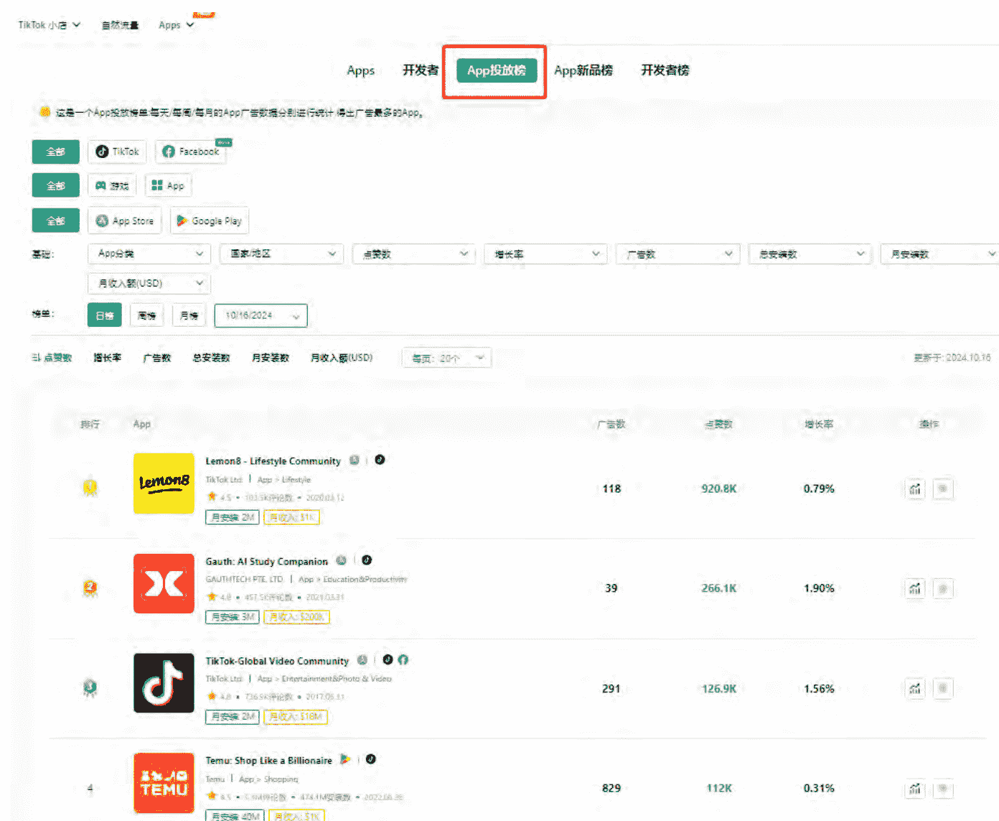

App投放榜旨在为用户提供实时的广告投放数据和市场分析，帮助广告主快速识别市场热点、优化广告策略，并在竞争中获取优势。

### 功能亮点：

- 1. 广告数据直观展示

投放榜清晰地展示各个应用的广告表现数据，包括广告数量、总观看次数和点赞率。

- 2. 精准的筛选与排序功能

双平台可以选择TikTok和Facebook。双渠道支持App Store和Google Play，针对不同应用市场进行筛选。用户可以选择App Store和Google Play进行筛选，通过对下载量、用户评分和评论的分析，广告主可以更好地理解用户的偏好和市场趋势。

用户可以根据应用的类型、广告的观看次数、点赞率和广告数量等维度进行筛选，快速找到表现最佳的广告。

例如，根据如Action、Adventure按照广告数去筛选，日榜2024.10.17位居第一的是《救世者之樹：新世界》，它是一款由韩国游戏公司IMC Games开发的多人在线角色扮演游戏（MMORPG）。游戏的设定围绕着一个充满魔法与奇幻的世界，玩家可以在这个世界中创建和发展自己的角色，探索丰富的环境和故事情节。

| 排行 | App | 广告数 | 点赞数 | 增长率 | 开发者/分类/评分/评论数/创建时间 |
|---|---|---|---|---|---|
| 1 | 救世者之樹：新世界 | 114 | 3.2K | 15.60% | Sialia Games, 4.8/8.5K, 2024.08.20 |
| 2 | Brawl Stars | 100 | 13.5K | 0.03% | Supercell, 4.7/2.1M, 2018.12.13 |

广告数：114 | 点赞数：3.2k | 增长率：15.6%
App创建时间：2024.08.20 | 评论数&评分：8.5K/4.8

Sialia Games (开发者: sialia-games/id1530758359) | 查看App | 查看开发者 | 下载
亚洲11个地区统一版本！同步上线！MMORPG的雄心 - 开创「跨地区共玩」新篇章！人气至上！+超大人气！和不一样的夥伴组队... 查看全部
平台：App Store | 分类：Game - 游戏&冒险&角色扮演&娱乐 | App创建时间：2024.08.20 | App更新时间：2024.10.09 | 评论数&评分：8.5K/4.8 | 广告数(Top 3)：149

- 3. 多维度市场分析

通过分析广告的表现，用户可以识别市场趋势。例如，查看日榜根据点赞率筛选观察到Gauth: AI Study Companion 的广告数量和观看次数激增，说明其市场热度上升，广告主可以考虑加大该应用的广告投放。

Gauth: AI Study Companion 是一款强大的学习工具，利用人工智能提供个性化的学习体验。它通过实时解答用户问题、丰富的题库和测验，以及学习进度跟踪功能，帮助学生更有效地掌握知识。此外，Gauth还鼓励社交学习，让用户能够与其他学生互动和分享资源，从而提升学习动力和效果。总之，Gauth致力于通过智能化的方式，全面提升学生的学习效率。

App Store 应用的免费教育榜下载应用中目前位居第一。

随着个性化学习需求的上升和远程学习的普及，这类应用正在迅速成为教育市场的趋势。AI技术能够分析学生的学习习惯，提供量身定制的内容和实时解答，同时融合社交学习元素，促进学生之间的互动与合作。

#### Gauth: AI Study Companion广告数据
广告播放: 854.7M | 点赞数: 14.2M | 月安装数: 3M | 月收入额(USD): $200k

#### 广告素材一：163.8M播放
广告文案：How many did you get correct? @gauthofficial #gauth #ai #college #schoolhack #studyhack

街头采访的形式让广告显得更加真实和自然，能够引起观众的共鸣。通过展示真实学生的反应，增强了广告的可信度。这种采访形式鼓励观众参与讨论，提高了互动性。观众不仅能看到他人的反应，还可能会反思自己的经历，增强了广告的吸引力。这种形式非常适合在TikTok等社交媒体平台传播，能够迅速引发用户的分享和讨论，提升品牌曝光度。

#### 广告素材二：65M广告播放
广告文案：This be the biggest adrenaline rushes in school 🤪💯 #gauth #ai #finalsweek #exam #studywithme @Gauth

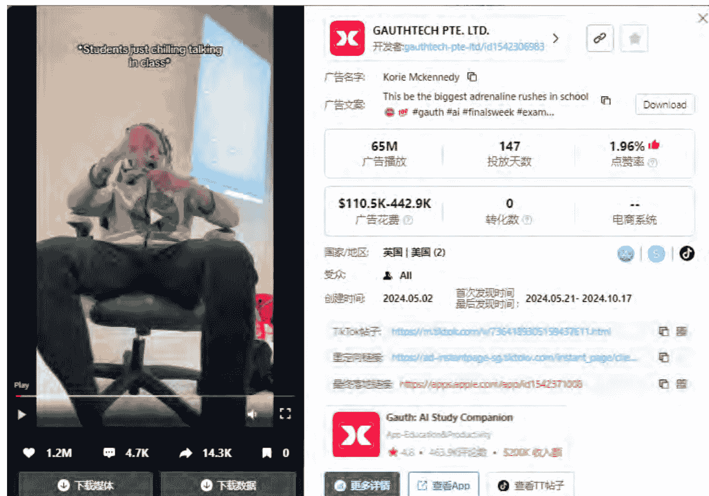

广告通过直接提问和展示学生的反应，激发观众的好奇心和参与感，使人们更愿意思考自己的学习情况。传达了该应用的真实使用场景，使潜在用户能更容易产生共鸣，感受到应用的实用性。内容轻松有趣，能够有效吸引年轻观众的注意，提升观看体验。

#### 广告素材三：36.3M广告播放
广告文案：THE BEST TUTOR #gauth #ai #finalsweek #exam #studywithme @Gauth

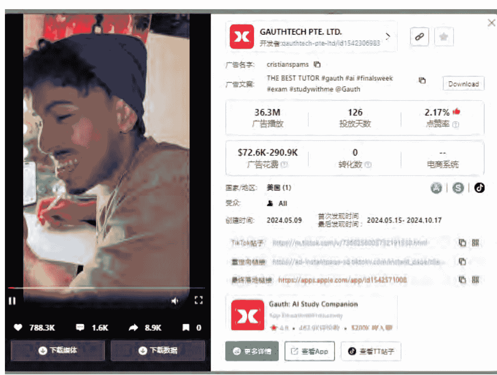

广告内容直接、简洁，能迅速传达出产品的主要功能和优势，将产品融入日常生活场景，广告让观众看到实际应用的价值。

### App数据分析

截至目前，应用的评论总数达到463.9K，这不仅展示了用户对应用的积极反馈，还提供了市场接受度的直接体现。评论数在9月激增，10月的安装量显著上升反映了市场对该应用的认可和需求。

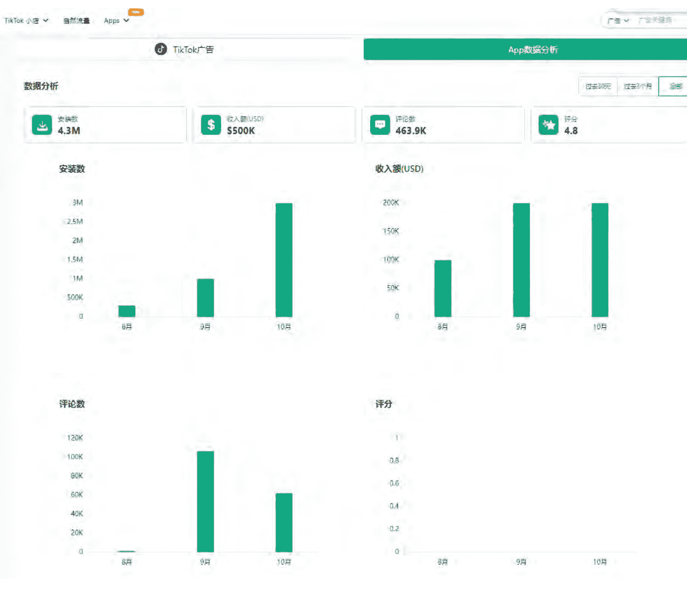

### Gauth: AI Study Companion的迅速发展展现了
在线学习成为常态，越来越多的学生和教育机构转向数字化学习。个性化学习正在成为教育应用的重要特征。通过人工智能和数据分析，应用能够根据学生的学习习惯和能力定制学习计划，满足不同学生的需求，提高学习效果。教育类应用市场的趋势表明，科技与教育的结合将持续深化，个性化、移动化和互动化将成为未来教育应用发展的重要方向。

### App新品榜

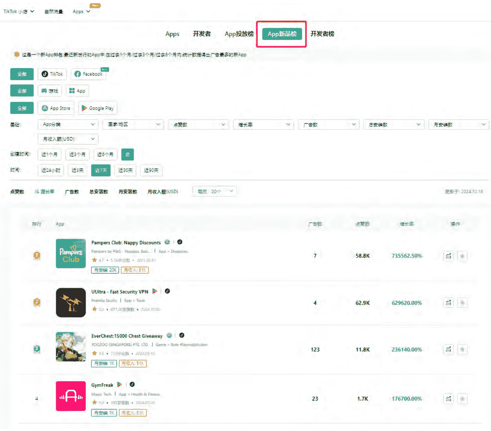

### Pipiads的App新品榜

为广告主和开发者提供了一个强大的工具，帮助他们快速识别市场中的新兴应用和潜力产品。这一功能具备多个显著优势，能够有效提升用户的市场分析能力。

**适用对象：**
- 广告主：想要寻找最新上线的高潜力应用，以便快速切入市场。
- 开发者：希望了解竞争对手的新产品，借鉴成功案例优化自己的应用。

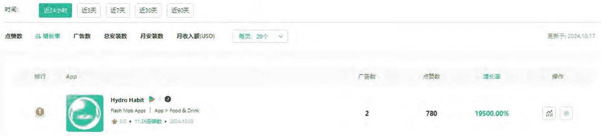

### 功能亮点：

- 1. 新应用实时更新
  - **实时数据监控：** App新品榜实时列出最近上线的应用，让用户能够快速获取最新的市场动态。筛选时间维度范围广：近24小时、近三天、近七天等各个时间段供你筛选。例如，通过选择近24小时内增长率进行筛选，用户可以快速找到增长势头最强的应用，如 Hydro Habit ，其在创建时间为2024年10月8日时已经获得了24.7K的安装数，显示出极高的用户关注度。
  - **应用展示：** 每个新上线的应用都附有详细信息，包括应用名称、开发者、上线时间和应用类别。这些信息使用户能够迅速判断应用的性质和市场潜力，从而制定相应的投放策略。

- 2. 潜力应用识别
  - **高曝光率应用：** 榜单可以按照增长率筛选，帮助广告主快速识别那些正在受到用户关注的新产品。比如 Ultra - Fast Security VPN 的曝光率高达629620.00%，显示其广告投放的高效性。这样的信息使得广告主能够识别出市场上表现突出的新应用，从而考虑将广告投放到这些高潜力应用上。

### Pampers Club: Nappy Discounts 近7日增长率高达735562.50%
广告播放: 3M | 点赞数: 59.5k | 月安装数: 20k | 月收入额(USD): $1k

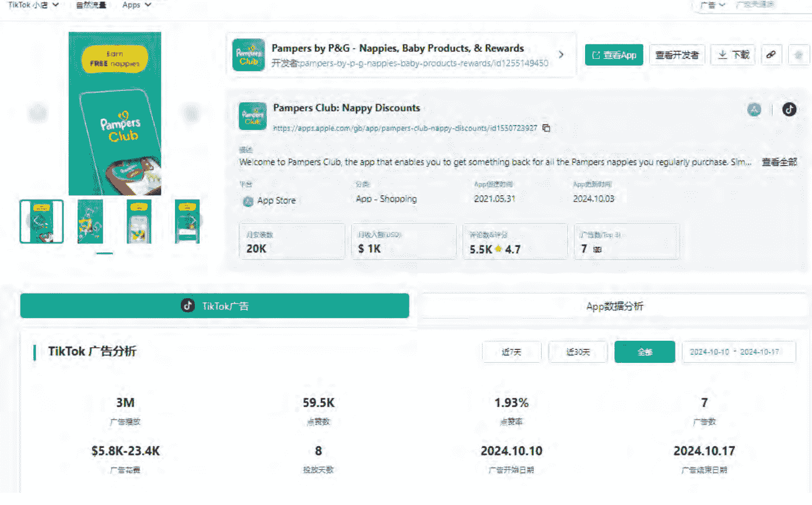

- 1. **Pampers Club: Nappy Discounts** 是一款针对家长的购物优惠应用，专注于提供尿布和婴儿护理产品的折扣和优惠。该应用通过会员制度，鼓励用户注册和参与，以获得定制的优惠和奖励。这种类型的应用迎合了现代家庭对于高性价比婴儿产品的需求，并在节省开支方面发挥了重要作用。

近年来，母婴消费市场持续增长，家长们越来越倾向于通过手机应用获取优惠和便利服务。随着电子商务的普及和个性化购物体验的提升，类似于Pampers Club的应用应运而生，满足了家长在购物时对折扣、便利和社区互动的需求。

- **广告素材数据：** 1.7M播放的广告素材 | 点赞率：3.17%

## 公众号懒人搜索，懒人专属群分享

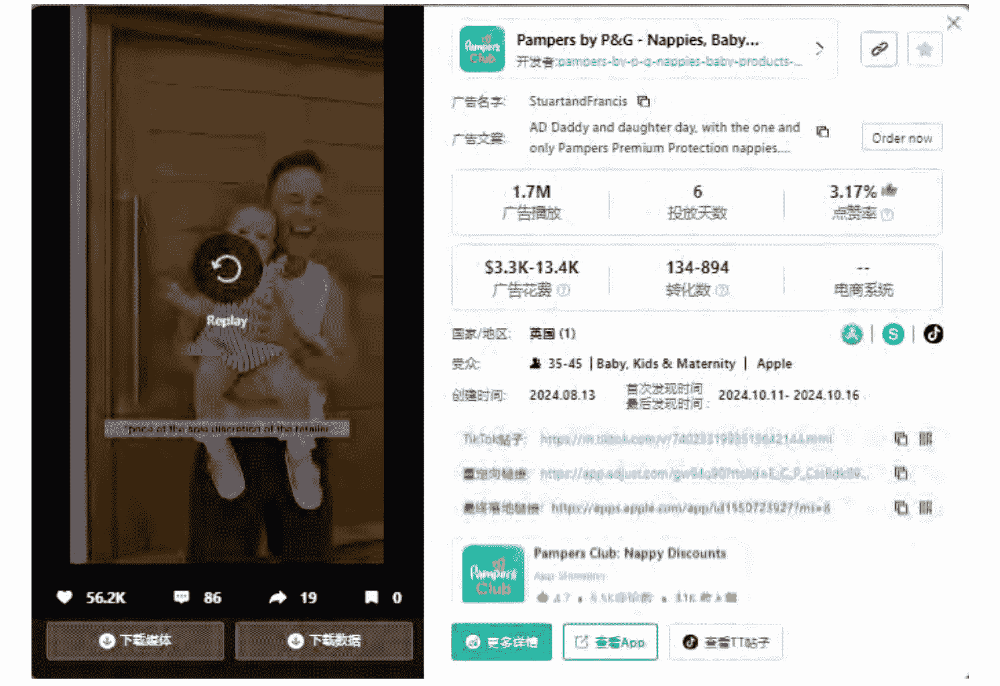

广告视频营造了一个温馨亲密的家庭氛围，通过父亲与婴儿之间的互动传达了关爱和舒适感。产品的清晰展示和细节特写不仅有效突出Pampers品牌的优势，还强调了纸尿裤的柔软度与质量，增强了观众的信任感。此外，情感共鸣的传达能够吸引年轻父母的注意，激发他们的购买欲望。

## 解决痛点：

- **精准决策**：用户能够通过新应用的实时数据快速了解市场动态，从而做出更快速、精准的广告投放决策。
- **市场机会把握**：App新品榜提供的数据不仅能够帮助用户识别竞争对手的成功策略，还能为自己的产品开发和市场推广提供直接的参考。
- **降低市场风险**：通过分析新应用的市场表现，广告主可以在投入广告预算前评估风险，确保投资的安全性。

## App开发者榜

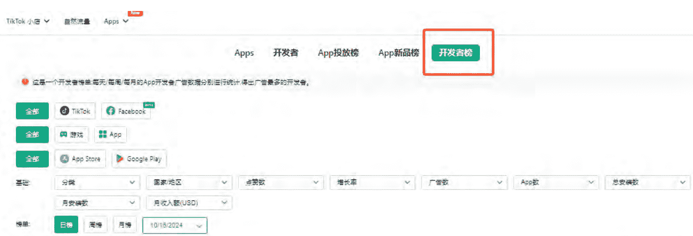

| 排行 | 开发者 | App数 | 广告数 | 点赞数 | 增长率 | 操作 |
|---|---|---|---|---|---|---|
| 1 | TikTok Ltd. | 5 | 3.1K | 1M | 0.83% | |
| 2 | GAUTHTECH PTE. LTD. | 1 | 327 | 266.1K | 1.90% | |
| 3 | Temu | 1 | 4.3K | 112K | 0.31% | |
| 4 | Grab.com | 2 | 1.9K | 93.1K | 3.15% | |
| 5 | Bookvitals APP SRL | 2 | 153 | 75.5K | 0.68% | |

## Pipiads的App开发者榜

为广告主和开发者提供了一种全面的市场分析工具，旨在深入了解各个开发者的市场表现和广告投放策略。通过这一榜单，用户可以有效识别竞争对手的成功经验，并及时调整自己的市场策略。

## 功能亮点

- 1. 详细的广告表现分析
  - 全面的数据展示：App开发者榜列出了每个开发者的广告数量、点击数、曝光率等关键指标。比如，TikTok Ltd.的广告数量为3.1K，点击数达1M，曝光率为0.83%。这些数据不仅展示了广告的传播范围，还反映了其在用户中的受欢迎程度，帮助广告主判断投放效果。
  - 增长趋势分析：用户可以查看特定时间段内的广告表现变化，识别出哪些开发者在短时间内实现了广告的快速增长，从而把握市场动态。
- 2. 竞争对手策略解析
  - 互动率和点击率分析：通过对广告的点击率和用户互动（如点赞、评论等）的分析，用户可以识别出表现优秀的开发者。例如，GAUTHTECH PTE. LTD.的广告点赞数为266.1K，而广告数量仅为327，这表明该开发者的广告内容非常吸引人。广告主可以参考这些成功案例，借鉴其广告创意和投放策略，以提升自身的广告效果。
  - 实时市场反馈：结合用户评论和评分，广告主可以了解哪些内容受到用户喜爱，进而调整自己的广告方向。
- 3. 市场份额与收入分析
  - 月收入与用户基数：App开发者榜提供开发者的月收入数据和活跃用户基数，例如，Temu的月收入为$51K，用户基数达到471.1M。这些信息不仅帮助用户评估开发者在市场上的影响力，还能揭示潜在的广告投放机会。例如，若一款应用用户基数庞大，广告主可以考虑投放广告以快速获取用户。
- 4. 高表现开发者推荐
  - 突出高表现开发者：榜单中特别标识表现突出的开发者，方便用户快速获取成功案例。用户可以从如Grab.com等高表现开发者身上学习其广告投放策略，了解其如何在竞争中脱颖而出，进而优化自己的广告策略。

## 广告案例分析:Grab.com

广告播放：2B 点赞数：155.2k 广告数：1.9k 广告开始时间-广告结束时间：2022.04.08-2024.10.17

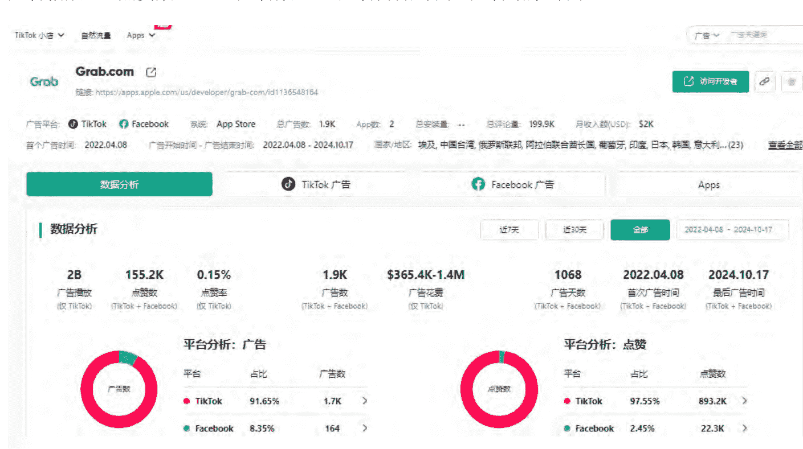

## Grab

Grab是一款综合性的超级应用，提供打车、外卖、电子支付和金融服务等多种功能，旨在满足用户的多元化需求。这类应用在最近几年迅速崛起，特别是在东南亚地区，反映了用户对便利和效率的追求。随着互联网普及和移动支付的快速发展，超级应用正成为消费市场的趋势，用户希望在一个平台上解决多种生活需求。Grab的成功不仅展示了科技如何提升生活便利性，也表明了消费者对整合服务的偏好正在加速。

## 35.8M 播放广告素材

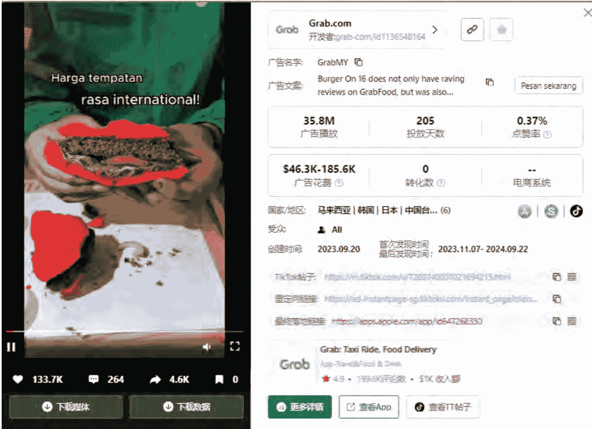

通过活泼的场景和美味的产品展示有效吸引了观众的注意。文字信息清晰传达了价格和推荐的专业性，进一步激发了潜在消费者的购买欲望。

facebook广告使用了鲜艳的色彩和大字号的文字，使得信息更加突出，易于阅读。加上吸引人的图案设计，增加了整体的视觉吸引力。广告的信息传达非常直接，消费者可以一目了然地了解到促销活动的具体内容和参与方式，降低了潜在用户的决策成本。

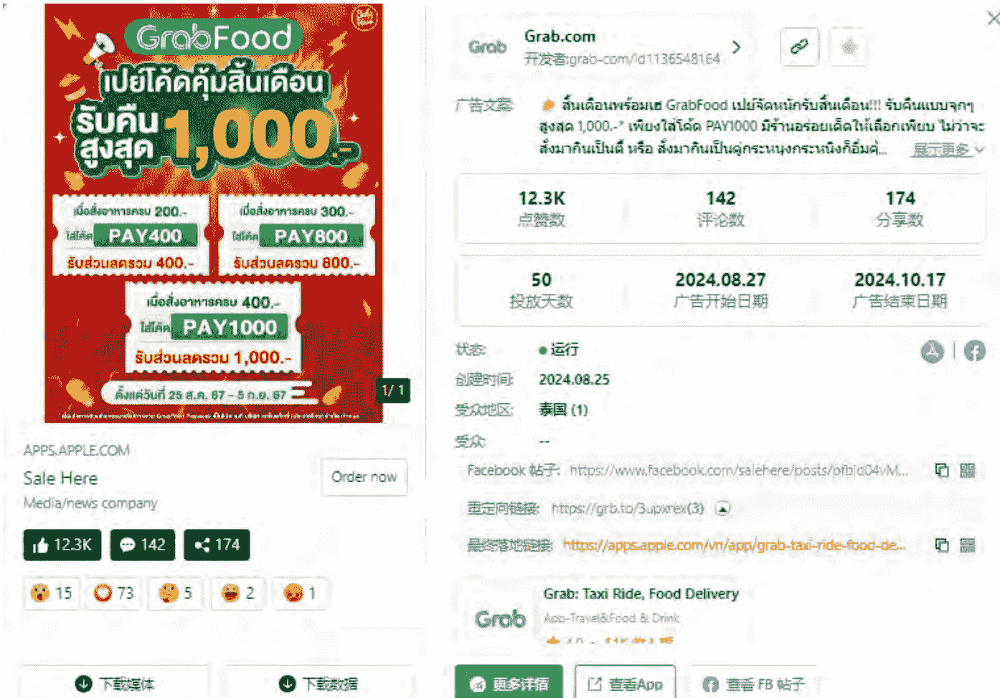

## 总结：

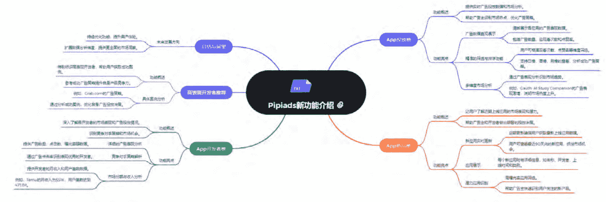

App投放榜、App新品榜和App开发者榜，为广告主和开发者提供了全面而深入的App市场分析工具。通过实时监测广告表现、识别潜力应用和分析竞争对手的策略，用户能够在快速变化的应用市场中把握机遇，优化广告投放决策。无论是寻找市场爆款，还是借鉴成功的广告策略，这些功能都为用户提供了有力的数据支持，帮助他们在竞争中脱颖而出。随着市场的不断演变，Pipiads将继续致力于提供更强大的功能，助力用户实现更高的广告投资回报，推动业务的持续增长。

评论区：

暂无评论

公众号懒人搜索，懒人专属群分享

## (15赞)拼多多无人直播带货：开启赚钱新机遇

作者： 流量卡批发零售
日期： 2024-10-18

### 拼多多无人直播，如何操作0-1保姆级操作

```
https://uzmlh09ou8.feishu.cn/docx/K7xHdFU2soFDHuxfRNEcaMRUnFb?from=from_copylink
```

评论区：

藏金阁百晓生：麻烦问下真人无互动如何过？

## (7赞)拼多多老照片修复店：3种暴力起店玩法

作者： 深圳阿岳
日期： 2024-10-18

拼多多-老照片修复店 3种暴力起店玩法 具体详情移步飞书文档
https://wwa6ugt6w2.feishu.cn/docx/RBRkd9JqSorv13xKMQncw8jAnLh?from=from_copylink

评论区：

暂无评论

公众号懒人搜索，懒人专属群分享

# 【线下实体】1篇

## (精华帖)(58赞)开一家女性饰品门店，亏本100w，重新盈利的核心

作者：薄荷Candy
日期：2024-10-17

哈喽，大家好，我是薄荷，现在从事一线城市的综合体商场的女性商品店铺，主营女装+女性饰品（发饰、首饰、箱包、帽子等配饰），单店年利润50W。

经济下行，很多人都说实体不能做了，我们的门店还在不断扩张，经验教训分享出来，希望可以帮到大家。

### 2020.3-6月 口罩问题初期闭店潮，抓住机会

我之前是做金融的，因为个人原因2018年就离职了，一直想要自己创业，做自己喜欢做的事情，就开始各种找项目，一开始考虑过养发馆，医美医院，美甲店，珍珠蚌店，都因为各种原因搁浅了。

然后就迎来了 2019 年的疫情。

口罩问题突起，北京实体受挫，很多综合体的店铺集体闭店，商场里面很多空置店铺，招商困难使得很多商场被迫降低房租，减少押金比例，只为减少空置率。

这个时候，大多数人都会选择随大流，认为现在一定不能做实体，而我却有不一样的想法，因为机会，总是出现在大部分人不认可的时候，大部分人觉得绝对不能做，才有可能是新的机会会出现。

这个时候，我在北京的一家商场逛街时，看到一家人很多的店铺，装修的很有特点，欧式复古风，琳琅满目的商品，华丽丽的服装风格，每一件都有自己的特点和风格，因为当时时间不充裕，所以就逛了半小时就走了，结果回家就心心念念，结果第二天，又来到这家店铺，被这家店铺的东西深深吸引，足足逛了3个小时。

### 一家有特点的店铺，真的很吸引人

- 第二次去见到了老板娘，是位漂亮有个性的女生小A，跟她聊了2小时，很有自己的想法，自信开朗，之前在杭州那边做生意，现在回到北京，于是大胆的咨询了加盟的事情，没想到真的可以加盟，因为还在发展初期，所以没有加盟费，按照标价的2.5折进货，最低7折卖出，货款第一批现结，后面可以月结，当月可退货。

当时很多人都不看好实体，可我觉得这才是个机会，毕竟机会掌握在少数人手上，一个进驻商场的好机会。

**如果没有经验，加盟是最简单的模式。**

要知道在 2019 年之前，商场的铺位一直被连锁品牌垄断，个体商户想要进驻非常困难，招商人员的眼睛都长在头顶，根本不缺资源，但是 2019 年开始，从甲方市场转变成乙方市场，这就是个难得的机会。

### 2020.8月 进店学习

要摸清这个店铺赚不赚钱，就一定要亲自去感受，我秘密的在店铺门口每天蹲守，记录下每天的进店人数和消费人数，根据出店顾客手提袋的大小，预估营业额，半个月下来，这家店铺的进店和购买比例大概是 4:1，4个人中就有一个人会购买，这其实是个很高的比例了。

当然这只是第一步，第二部就是进店学习，我 8 月进店学习，50 平方的小店，早上 10.00 开门，每天挤满了人。

因为商品的款式很特别，所以很受欢迎，连续学习了一个月，每天都在学习销售，收银，理货，补货等店铺运营事宜，跟其他导购搞好关系，套取真实情报。

当然我也会在老板娘不在的情况下，偷偷看她的记账本，确定真实营业额，下面是经营数据。

1. 日均营业额 2w, 一个月60W
2. 店长1人+导购3人，一月工资5W
3. 房租+物业费18W 北京知名商圈
4. 电费等 2k
5. 产品毛利率70%
6. 利润 60*0.7-5-18-0.5=18.8W

这样看起来，确实是个不错的生意，所以决定加入！

那么下一步的难点，就是找到一间还不错的铺位！

### 2020.10月 花了2个月，找到店铺

明确店铺大小 50-70平 人流大 年轻女性聚集

找店铺是一个困难的过程，位置要好，租金要低，要能租到，平方要合适。

### 找店铺第一步：看商圈

因为我的客群是年轻女性，所以就要找年轻有活力的商圈，比如朝阳合生汇，王府井，大兴荟聚，朝阳大悦城等，这些商圈全部都要自己去看过，亲自看客群，看人流。分析每个商场的经营数据。

### 第二步：拼人脉、找资源

并不是你想租的地方，就一定可以租到。有些商场会直接告诉你，我们满了不招商；有些商场给了你招商人员的电话，却永远打不通；有些招商人员的电话可以打通，却狮子大开口，吃拿卡要，还不办事，各种理由拖沓。

**最后，完全是资源人脉的比拼！**

### 第三步：确定店铺位置

通过点评、高德、小红书等 APP，找到北京热门的商圈和商场，因为线下店铺主要靠商场自然流量，人多才是王道。

当然也要结合自己身边的资源，最后锁定朝阳区的热门商场，通过各种资源一开始找到招商专员，吃拿卡要严重，拿钱不办事。

后来通过朋友找到该商场的招商总监，总监推荐了 2 个铺位：

店铺 1：30 平的店铺，位置偏小，美食街门口，人流大，房租总价低，商铺方正，门口有圆柱承重墙遮挡视线。

店铺 2：100 平的店铺，地铁出口附近，中间有中岛店铺会分流人群，房租总价高，商铺形状梯形，开口有倾斜。

最后经过考虑，选择了店铺 2，这也成为暂时闭店期间血亏的原因之一，后面详述。

不要以为认识招商总监就完事大吉了，他们一开始给的报价依然很高**，敲重点！！一定要有心理预算！！**

经过 2 轮讨价还价，最终以 8W 一个月的价钱拿到店铺 2。但是因为没有经验，其实这个价钱也不是底价，还可以更低的。

拿到店铺，仅仅是一小步，后面的一个月，身为小白的我，经历了各种商场的装修坑：搭围挡，出图纸，装修，商场指定空调公司，指定消防公司，白天不能作业，晚上施工贵，等等，最后终于在免租期前一天，搞定开业全部手续！

首先：在装修期间店铺外面要搭围挡，喷绘出带有自己品牌特点的海报，这个海报是要装修部审核通过的，光这个海报图纸，就审核了 2 周。

因为之前没有做过相关的东西，海报尺寸，海报规格，海报的画图软件我都不会用，所以前期和装修部沟通的非常不顺畅，最后在楼管的辅助沟通下，才勉强过关。要知道对于连锁品牌，这一切都有专人对接，所以对于小白的我，这只是挑战的开始。

商场的装修有很多隐形的消费，比如空调，消防的改造，要找指定的公司负责，并且报价比外面的公司高很多，但是也不得不用，如果不用，就会在开业时各种刁难，这部分的费用，懂的都懂。因为我前期是没有预算的，所以，又是一笔不菲的支出。

所以对于自己不熟悉的事情，一定要做好交学费的准备。

疫情中装修，各项指标都卡的很严，工人的健康状况，各种表格。所以，一定要找有经验的施工队，最好在这个商场经常施工的，会帮你节省很多沟通成本。

装修也是可以压价的，一定要控制成本，这点很重要。

我的装修报价 28 万，最后 24 万成交，因为我的包工头很靠谱，所以整个装修过程，我几乎没有盯着，但是要每天都跟包工头沟通，确认进度，装修时墙面其实是刷错了一部分的，但是因为可以接受就没再更改，但是这也提了醒，确实要经常去现场查看。

朝中有人好办事，因为进入装修环节，招商总监真的就没啥用了，装修归物业部管，所以只能再次动用资源，找到物业部的熟人，熟人打过招呼后，才发现，原来很多所谓的规矩，都消失了。

前期花费：

1. 押金 3 个月 25W
2. 首月房租 8W
3. 装修 30W
4. 第一批货款 20W
5. 合计 25+8+30+20=82W

### 2020.11月 新店开业

开业的前一天晚上，真的超级紧张，一整晚都在做最后的准备，朋友们也专门来帮忙组装家具，陈列商品，打扫卫生。

本来以为第一天会大卖，没想到第一天进店人数屈指可数，寥寥无几，到了晚上，营业额只有 1K+，实在坐不住了，给小 A 打电话，她来了以后指出了一些陈列的问题，连夜修改，又增加了更多的货，把货架整体推到门口，吸引更多人的眼球，后面的一周，营业额开始起飞。

重点！新店开业一定会自带流量，一定要把握住这波流量，有问题一定要马上解决，执行力拉满。

我就是因为没有开店经验，理想化的认为店铺门口不应该有桌子，想要顾客直接进店，可是门口不摆放东西，真的很难吸睛，因为顾客只有在被吸引后，才会有想要进店的冲动。

所以第二天开业后，我们就把展柜全部推到门口，摆出最新的商品吸引来往的人流驻足，只要有人站在门口选购，就会吸引更多的人。

### 2020.12-2021.9月 报复性消费营业额猛增

随着年底、新年的到来，人们的消费意愿增加，加上第二波的报复性消费，营业额一路上升。

这个时候要注意的就是控制成本！控制每个月的进货量，根据营业额决定下个月的进货金额，一定要算账，要不就会出现白忙活的情况，每天流水金额很多，但是又买了货，见不到盈余的钱，落袋为安才是王道。

我一开始前三个月的时候，因为不懂得控制进货量，以至于出现很多滞销款堆积，畅销款又来不及补充，现金流非常的不健康，到了月底，交完房租发完工资，账户里面没有盈余，有的时候还会负债，这个时候才反应过来，做生意不是一味的投入，还有各种算账才可以。

保证每周有新货，更新要快。可以先小批量进货，卖完再进，因为新货永远最好卖。因为我们有一些老客人是每周都会来店里，所以一定要有更新，1-2月没有卖出的货就要进行退换货处理。

店铺陈列很重要。怎么样陈列可以把货卖贵，什么地方应该放什么产品，都要不断地调整，反复试验。

下面是开业一年的营业数据：

1. 营业额平均35W.
2. 工资 4W
3. 电费1K
4. 房租 8.5W
5. 毛利率70%
6. 净利润约35*0.7-4-0.1-8.5=11.9w

开业10个月后，基本回本。

重点！一定要紧盯每月营业额！

这个时候，其实已经有消费疲软+营业额下降的前兆，营业额有下降的趋势，但是我当时还沉浸在小有成绩的喜悦中，并没有注意到寒冬的新号！！

### 2021.10-2021.2月 消费疲软口罩问题反复

夏季过后，口罩问题反复发生，商场人流下降，报复性消费逐渐减少，消费疲软逐渐显露出来，11-12 月本来是消费旺季，但是因为口罩问题，人流骤降，在商场的店铺，人流量真的很影响营业额！

圣诞节当天，商场也没有热闹的景象，因为长期的不确定性，人们的消费习惯也慢慢发生改变，年轻女性可支配收入减少，工资降低，装扮意愿降低。

往年的圣诞节前2 天，是圣诞饰品热卖的高峰，每个小姐姐路过我们店铺门口，基本都会买两个圣诞的饰品，三五成群，消费意愿强烈，基本可以消灭95%的库存，圣诞节当天基本就没有什么好看的饰品了，每年准备的都不够卖。

但是 2021.10 开始，节日产品的销量有明显的下滑，商场里面的客流也明显减少。公共场所的人流量急剧下降，本以为胜利在望的口罩问题，也变的遥遥无期。

这个时候营业额逐步下降，月营业额 25W，而房租，却逐年递增。

**所以，签合同的时候一定要看清楚！**这也算是没有经验的坑，以为谈好的房租，三年内不会涨，但是看到合同的时候才发现，每年阶梯型递增。

而且！！！在发现了之后，默认接受了，没有再次跟招商沟通，所以有问题，一定要事前沟通，主打你不尴尬，尴尬的就是别人！

下降后的营业额:

1. 工资 4W
2. 电费1k
3. 房租 9.5W
4. 毛利率70%
5. 净利润约 25*0.7-4-0.1-9.5=3.9W

这个时间，店铺日常周转没有问题，盈利能力下降，是非常急人的。

敲重点！！日常的运营中，这些细节一定要注意!

1. 各个节日都要有所准备!

节日产品，会刺激消费，特别是对于女生，总得找点理由给自己买东西，节日就是一个很好的借口。小饰品或者衣服，花费不高，还很有仪式感。我以前从来没觉得，3.8 是个节日，直到自己开店才发现，原来3.8也会有很多女生出来买东西。

2. 换季清仓一定要早。

饰品，服装都会有季节性，换季的时候，一定要断舍离，快准狠，舍不得打折=亏钱，一般提前半个季节，就要开始清仓，压货真的很压钱，会让现金流变得紧张。

3. 压货一定要少!

库存一直是各个品牌的问题，我的策略就是，库存一定要少，品种可以多多益善，但是库存要尽量减少，一个衣服 3 个码，每个码 3 件就是 9 件，10 个款就是 90 件，压在库房都是钱，我一般会选择只要 2 个码，或者每个码一件，让客人先有的挑，有的选择，实在想要其他码可以调货，免费邮寄到家，客人一般都会接受的。

### 2021.3-12 口罩问题加重 闭店3个月 亏80W

4 月开始，口罩问题加重，商场门可罗雀，真的一个人都没有。这个时候要注意，一定要开源节流，如果不能开源，就要节流。

这个时候每天进店人数很少，所以这个时候就减少了店员人数，工作日一个店员在店里，周末 2 个，加上我这个老板作为免费劳动力，足够了。

5 月因为商场有病例，直接整体闭店，这才是最难的时候，大概 25 天啊。前一两天还抱有希望，3 天后发现开业遥遥无期，这个时候也不能坐以待毙，必须有收入，要知道每天的房租就两千多块钱。

没办法只能自己溜进店铺，被迫搞起直播，在视频号跟老顾客互动交流。这个时候因为很多人也被迫在家，所以直播异常火爆，用半价的促销方法直播，消化了大部分库存，回回血。也是这个时候，完善了私域管理，增加了客户粘性。

6 月商场恢复营业，但是基本没人，人流量完全没有恢复，只能继续通过直播的方式保住仅有的营业额。这段时间是营业额最惨淡的时候，基本每月营业额 10W，导购从 5 个减到了 3 个。10 月、11 月商场再次闭店。

最最重要的是，这两次闭店，房租并没有减免，因为房东是港资企业，单单房租，就净亏 30W 啊。虽然写了申请，也完全被忽略。

**所以敲黑板！如果有可能，避险类的条款也写进合同，像综合体这样强大的甲方可能没办法，但是如果是门头房或者私人业主，一定要保护好自己的合法权益。**

下面是这段时间的经营数据：
- 工资：3W
- 电费：1K
- 房租：9.5W
- 毛利率：70%
- 净利润约：10×0.7-3-0.1-9.5=-5.6W

10 个月下来，亏了 80W，账面基本没有流动资金，只能用银行的经营贷临时救济，缓解压力，好在利率不高。因为合同签了三年，中间撤店押金就要不回来了，只能坚持一下。终于，12 月底解封，但是，不要高兴得太早~~

### 2022.1 口罩问题后时代：消费降级

本来以为放开后会有春天，没想到是更加寒冷的寒冬。三年让大家彻底返贫了，没有了报复性消费，没有了大手大脚的花钱。之前四五百的衣服随便买，大几十的饰品不眨眼的，现在基本就是只逛不买。人流恢复了，营业额却没有回来。

周末的时候店里经常挤满了人，但是收银台却没有人结账。这个时候，我注意到大家的消费观念发生了改变，我们也应该做出相应的改变了。

### 改变 1：消费能力

这个时代的年轻人主打平替和性价比，因为消费能力的问题减少了冲动消费，会货比三家，或者更注重实用性，对于高溢价的产品十分敏感，增加了警惕心理。说白了，就是太穷了，所以对于非必要产品，则非常节省。

### 改变 2：消费习惯

00 后生活在物质极度丰富、极度过剩的时代，选择过多，消费习惯也是被互联网教育得比较挑剔，既要又要还要。

### 改变 3：消费偏好

因为口罩问题的居家时间过长，年轻人的消费偏好也发生改变，衣服多以舒适实用为主，宽松的版型和舒适的面料，对个性的追求反而减少了，更多的钱用于精神层面的消费，而并不是物质方面的消费。

### 2022.2 分道扬镳：重新出发

这个时候，小 A 还没有自我反省，总是在怪外界原因，还是延续之前的风格和定价。跟她反映过很多次，年轻女生的消费能力发生改变，咱们的定价和产品都有问题，要做相应的改变，但是她每次都是口头答应，但是新品的销量并没有显著提升。这个时候我发现，是该说再见了。

因为观念分歧，这个时候决定和小 A 分道扬镳了。基于前面的消费改变，我决定对品牌做出调整。靠着这两年的经验，自己去到广州、深圳、义乌、连云港等地方找供应链、选品。一开始是在 1688 上面选品，后来发现，1688 上面大部分并不是源头厂家，80% 都是二批，价钱虽然比淘宝、拼多多便宜，但是对于要求一手进货价的我来说还是不够底价，这个时候，还是要去到源头地。但是对于中小卖家，1688 其实还是可以满足大部分需求的，因为二批可以小批量拿货，对于中小卖家是很友好的。

去到义乌，才知道世界的小商品都在义乌，每一家档口背后，可能都是一家工厂或者小作坊。价格质量全都参差不齐，起订量也不一样。就一个品类而言，要逛完整个市场，基本需要一周的时间。有些网红工厂店更是漫天要价，只有去到现场，才会体会到那个氛围。

去到广州十三行，才能知道原来一款衣服能有十几个不一样的版本。
去到广州沙河，才知道一件 100 羊毛大衣的成本居然可以低到 100+，只有你想不到，没有买不到。
去到深圳南油，才知道大牌复刻原来也分三六九等。
去到连云港水晶城，才知道走播给的批发价简直就是零售价。

去到嘉兴濮院，才知道十三行的羊毛衫原来都是这里进货的。

重新做品牌定位。这个时候“中产消费”降级严重，年轻群体对价格更加敏感，一开始的轻奢路线基本走不通了，只能靠低价引流，适当降低客单价，主打精致小众。在保证质量的前提下提高性价比，增加更新频率，在保持原有风格的基础上更加多元化，增加了通勤款/夸张款式，材料采用羽毛、水晶石等特殊材质，可以让女孩们在通勤和个性间来回切换。

同时，加强私域运营：

### 1. 添加私域

采用送券、售后、特殊活动的话术，主动引导到店的客人加客服微信，导入私域。可以对有消费能力的客户进行 VIP 备注，重点服务。通过这种方法，店铺客人转化率 50% 左右。

引导客人添加微信，可以以售后为借口，告诉客人如果产品有任何问题，可以微信联系我们，第一时间为客人处理。这样的理由被拒绝的概率非常低，比加微信送礼、减免都要奏效。只因为售后是客人会考虑的首要问题，我们给出良好的态度，有问题随时联系，在客人的角度，就信任+1，自然愿意加微信。

### 2. 私域活动

私域活动主要为群活动和朋友圈互动。尽量不主动私发客人，很多客人对于销售主动频繁联系非常反感，所以我们主打群消息。

根据客户不同的需求进群，秒杀群、上新群，这样既可以区分出不同需求的客人，也可以更加精准地发布活动。只要有客人询问、点赞、有主动性的互动，我们都会紧跟服务，不管成交与否，都把情绪价值拉满，引导客人来线下，增加消费可能性。

通过我们的实践，每天午后、傍晚、或者晚饭后发朋友圈，引起关注比较多，这些时间也是大家比较空闲的时间，可以刷朋友圈的时间。

要注意！朋友圈一定不能被折叠，不能每天发完就完了。朋友圈一旦折叠，就大大降低了曝光度。所以每天的文案都要精挑细选，可以去小红书扒文案，而且要反复验证，发完后要用其他手机查看一下，朋友圈是否完整显示。

### 3. 饥饿营销

季节滞销品，采用秒杀价、福利价的方式消化掉。库存设置个位数，制造焦虑和紧张气氛，手慢无，找自己人假装客人带节奏，制造热卖现象。严格执行秒杀机制，过时不候，制造饥饿现象，充分调动大家积极性。活动越火爆，成交率越高。

通过饥饿营销，提高了产品的稀缺性，一些季节新品也可以采取预售的模式，减少库存压力，精准发掘爆款。

### 4. 新品预定

新品预约预定制，先收定金，可以精准了解客人喜好，减少库存积压。客群画像更为精准，还可以增加与客人的交流，提高客户粘性，维护忠诚度。

经过 2 个月的调整，4 月开始，营业额回升到 20W，5 月开始稳定在 25W，虽然没有之前鼎盛时期强大，也算是小有成就了。到 2022 年底，总利润 50W。经历了大的消费观念的改变，营业额可能无法回到巅峰，所以现在的基本政策就是维稳，在内卷的消费市场活下来。

### 2023 软件升级：进入 NEXT LEVEL

### 1. 大数据分析时代

1 月开始引入大数据智能库存模块，随时监控库存情况，用数据分析热卖款和滞销款，更加精准分析顾客喜好。数据是最准确的销售分析，可以通过不同分类得到不同的偏好，在后续的选品中才能够更加精准，及时调整产品，增加爆款几率。

之前的收银系统都是按照价格做区分，条形码也只能扫出价格，饰品 90、饰品 120 元，上衣 399 元、裤子 499 元，并没有按照细分品类和产品特点来分。

后来发现这样在产品分析上，只能测出哪个价钱卖得好，无法知道精准的热卖单品和特质。在后续的库存上新系统中，就要求添加了产品的各种细分描述词语，比如风格分为甜酷风、辣妹风、千金风；产品类型分为百褶裙、高腰裤、喇叭裤等；产品材质分为羊毛、马海毛、桑蚕丝等。让数据分析横向、纵向都可以有据可依，不再只靠个人喜好确定产品，大大减少了滞销品的概率。

### 2. 私人订制增加

而且，我们与供应商合作更加紧密，小批量独家定制款，增加产品稀缺度。对于饰品来说，有很多档口是可以小批量定制的，比如一打两打起，都可以做微调，比如把 A 产品与 B 产品的某一个零件对调，变成两个新的产品，独一无二的私人订制。

衣服虽然不容易小批量定制，但是可以通过对比找出质美价优的高版本产品，通过服务和营销手段卖出去，完成变现闭环。

### 3. 加强培训

5 月的时候，我们增加了团队人员，严格了服务流程，做了简单的 SOP：从进门接待话术，到推荐产品方法，到称赞客人的方法、成交话术、不成交话术，都给员工一些方法论，后面也在不停地迭代完善。换季前就会分批做导购培训，分析下一季的流行趋势、流行元素、时事热点讨论、员工默契度培训，加强私域营销，线上线下一起发力！

2023 年的总利润也基本稳定在 50W。

这就是我的实体店门店沉浮录，希望对大家有所帮助。

### 总结下来能够成功，我做对了这几点：
- 1. 时机很重要，口罩初期房租便宜，押金少。
- 2. 机会往往在初期是不被人看好的，不要因为别人反对就放弃。
- 3. 产品差异化，更新速度要快，性价比要有，质量也要有。
- 4. 店铺选址与客群相匹配。定位精致女生，就要选择有逼格的综合体，装修装饰花心思。
- 5. 去到义乌、诸暨、嘉兴、连云港、广州、深圳找到源头工厂，成本压到最低，小批量定制，增加特点。
- 6. 不能当甩手掌柜，要时刻活跃在前线，了解顾客喜好，不断学习。
- 7. 一定要会算账，每月都要算账，严格控制进出，每月制定订货量，不要超定。
- 8. 及时清理库存，季末打折一定要狠。
- 9. 坚持做一件事，不要追逐风口，因为风口永远追不上，就做好自己擅长的事情，等风来。

### 新人入局要提前知道这些：
- 1. 不要轻易踏足不熟悉的领域，最好先去打工学习，新手小白不要贸然开店。
- 2. 招商资源要有，关系硬不硬，直接关系到房租！街道、消防有人也可以。
- 3. 没关系，就要舍得砸钱。
- 4. 一定要找房租足够低的地方。

加盟需谨慎，有加盟费的更要谨慎，一天打 8 遍电话请你加盟的更更更要谨慎。

## 评论区：
老余：你的经历这么丰富，自带这么多内容有没有做自己的短视频账号？
林家少爷：其实在行情不好的时候，果断关店重新找项目，是不是能够保住前面所赚的利润
卡其宝宝：分享的真好，为你点赞
阿铭：真上去了 能下场的都是无限子弹
慧慧孙：讲得好棒
秋秋桂：太形象了，看着感觉自己在模拟开店hh
悟一：无论是否开店，您这份经验就是最好的借鉴
薄荷Candy：之前尝试过，不过网感差了一些[撇嘴]

# 【抖音】1 篇
## (14赞) 新手怎样在抖音团长上拿到结果
作者：王舒林
日期：2024-10-14

我是王舒林，重庆人在成都，抖店月销超两千万，目前抖店商品卡占比 50% 及以上。

之前写了两篇关于怎么做抖店的精华帖，以下是传送门：
- 抖音抖店日销200w+经验分享及对抖音终局的思考
- 抖店月销2000W背后的经营逻辑(财友怎样在抖音上搞到钱)

一直在思考做一个什么样的副业，但是又不想脱离主业，盘算了一下手里资源，有足够多的商家和达人资源，对商家和达人也十分了解。于是开始了做抖音团长，今年 6 月份开始做，目前每个月差不多 5 万服务费到账，这里有几个核心重点分享给大家
https://xxuqrz1ty8k.feishu.cn/docx/B7fidxV8eohx9kxDGxKcOByxnlh?from=from_copylink

## 评论区：
鱼丸|亦仁助理：没开权限
王舒林：再看下呢
亦仁：利润多少
王舒林：抖音团长服务费就是全部利润，一个月 5 万左右
亦仁：要把这个核心信息放在前面讲，而不是讲 200 万误导大家
王舒林：好的好的，抖音店铺利润大概 9% 左右，之前帖子加了一下链接。这篇帖子主要是写的抖音团长

# 【其他】19 篇
## (精华帖)(144赞) 提效降本的一百个工具分享
作者：浅笑
日期：2024-10-16

大家好，我是浅笑。看到亦仁老板发在星球的龙珠悬赏，是关于工具的，我比较喜欢探索各个领域信息，也喜欢整合一些信息，正好趁这个机会去梳理一下工具。这个工具我整理了以下几个分类，生财有术航海资料库工具，数据分析工具，一些 AI 工具，数据整理工具，自动化工具，其他有意思的工具，最后是关于找工具的一些小心得，授人以鱼不如授人以渔。希望能对大家有所帮助和启发～详细内容请看飞书➡️：
https://kj259khusm.feishu.cn/docx/Zce2dOt0joSZMHxETLkcOlr1nTh

- 资料库工具
  - 一、视频号
  - 二、抖音
  - 三、小红书
  - 四、B站
  - 五、英文工具站
  - 六、亚马逊
  - 七、快团团
  - 八、公众号
  - 九、资料整理

- 数据分析工具
  - 蝉妈妈
  - 抖查查
  - 考古加
  - 巨量百应
  - 小红书数据平台
    - 1. 蝉小红网站链接
    - 2. 千瓜数据
  - 视频号数据分析
    - 1. 新视
    - 2. 友望数据
  - 淘宝数据分析
    - 1. 生意参谋

- 一些 AI 工具
  - Podcastfy：将任何网页、PDF 和文本内容自动生成播客...
  - Ebook2Audiobook：将电子书自动转换为有声书支持语...
  - Voice-Pro：支持超过 100 种语言、400 多种声音的语...
  - PimEyes：人脸识别搜索引擎和反向图像搜索工具上传...
  - Bolt.new：AI 帮你自动写代码自动运行并自动部署而且...
  - Open NotebookLM：将 PDF 文件转化为播客的开源工...
  - Screenpipe：24 小时不间断记录你的屏幕和音频数据帮...
  - StoryTribe：一个免费的在线故事板制作工具无需绘画...
  - ComfyUI-AdvancedLivePortrait：从静态照片中提取面...
  - HivisionIDPhotos：轻量级且高效的 AI 证件照制作工具...
  - Cursor Directory：各种编程语言的 Cursor 配置文件和...
  - PDF Guru Anki：一款以 PDF 为中心的多功能办公学习...

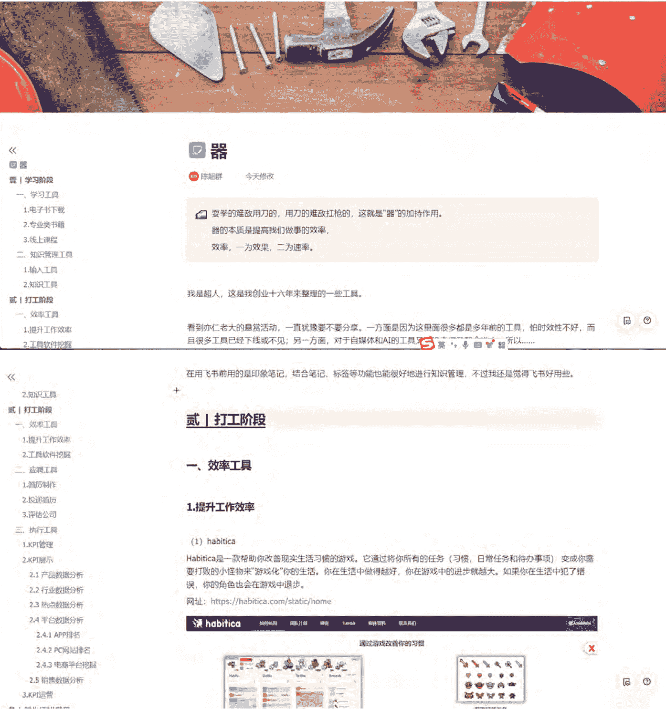

### 自动化工具
- 为什么要学习自动化工具
- 浪费了数年，因为无法浪费几小时
- 关于这个陷阱的 13 个思考：
- 一、coze 生财航海手册
  - 介绍
  - 手册
- 二、rpa 提效航海手册
  - 介绍
  - 手册
- 三、AI 编程航海手册
  - 趋势及介绍

- 其他有意思的工具
  - 好用便签
  - 手写体文稿生成器
  - vertitab
  - uBlacklist
  - 核烁复制粘贴助手
  - AskAITools
  - OncePower
  - Fideo
  - 小云搜索
  - codebox

### 找到工具的方法
- 一、想到的任何搜索框
- 二、各类论坛
  - 1. GitHub：https://github.com/ (需要魔法)
  - 2. 吾爱破解：https://www.52pojie.cn/
  - 3. CSDN-专业开发者社区：https://www.csdn.net/
- 三、即刻
  - 1. chrome 插件分享站
  - 2. AI 探索站
- 四、付费

## 评论区：
相柳：年轻人就是快，行动力强！
AQ：牛逼
辛亥：我宣布，浅笑杀死比赛！
老彭：最有竞争力的选手来了…
浅笑：柳师！
浅笑：希望有所收获～
浅笑：[胜利][胜利][胜利]
浅笑：感谢彭哥捧场啊[色]

## 公众号懒人搜索，懒人专属群分享
## (精华帖)(124赞) 创业十六年工具整理与分享：从旧工具到新趋势的梳理与更新
作者：陈氏超人
日期：2024-10-18

我是超人，这是我创业十六年来整理的一些工具。
看到亦仁老大的悬赏活动，一直犹豫要不要分享。一方面是因为这里面很多都是多年前的工具，怕时效性不好，而且很多工具已经下线或不见；另一方面，对于自媒体和 AI 的工具又还没来得及整合进去，所以……
但回头一想，其实这也是一个难得的机会，可以借此机会逼自己把这些工具好好梳理一下，甚至变成一个工具武器库，如果还能顺带给圈友们带来一些价值，那怎么看都不是坏事！
于是我花了将近一周的时间，把之前收集整理的工具都重新过了一遍，把那些已经下线或不合时宜的工具删掉（这个工作完成了），然后补充一些新的工具（这个工作还要继续……），分享给圈友们，这个工具库我将持续更新，还会加入工具的使用方法等，如果有发现错误或问题，请留言或私信告诉我进行删除或修正，谢谢～
工具的组织分类我主要根据两条线，一条是不同的事业阶段，一条是工具使用的场景。
事业阶段主要分四个阶段，学习、打工、创业/副业、投资。每个阶段对于工具的需求肯定也是不同的，比如学习阶段需要知识的管理，打工阶段需要提效率做好执行……等等，另外，因为还没进入投资阶段，这部分工具暂待更新。
抛开场景去聊工具是没有意义的，工具就是要用来帮助我们解决问题的，而一个工具的功能也不可能是单一的，不同的功能适用于不同的场景，比如 5118 这个工具，功能非常多，那就要根据不同的场景、需求来选择和使用，所以在阶段下面，我又根据不同的需求/使用场景来进行分类整理。
当然了，分类只是为了更快地找到并正确地使用工具，不必太在意某个工具是否应该分在哪个类别，只要在遇到问题时能想到应该用什么工具就 ok 了。
最后，因为时间有限，因为亦仁老大的悬赏时间是在本周五晚七点，所以我就先将工具库分享出来，我会持续补充更新，如果觉得有用，烦请点个赞支持下，谢谢～

请移步飞书： https://o1xdlcjcp5c.feishu.cn/wiki/Sfa2wwkYiiNNu8kF7EGcBdzEn1e?from=from_copylink

### 三、创业/副业阶段
#### 一、商机挖掘工具
##### 1. 选品挖品
- (1) 选单网
  网址：https://www.xuandan.com/
- (2) 蝉妈妈-商品库
  网址：https://www.chanmama.com/promotionRank/?keyword=&has_jx_commission=0
- (3) 易撰-热销商品榜单
  网址：https://zmt.yizhuan5.com/work.html#9-2
- (4) 壁虎看看-热销商品榜
  网址：https://www.bihukankan.com/carrierList/commodity

- 三、创业/副业阶段
  - 一、商机挖掘工具
    - 1. 选品挖品
    - 2. 需求挖掘
    - 3. 行业洞察
    - 4. 行业报告
  - 二、融资工具
    - 1. 商业计划书(BP)
    - 2. 找投融资人/机构
  - 三、运营工具
    - 1. 工作外包
    - 2. 运营辅助
      - 2.1 电商运营
        - 2.1.1 运营
        - 2.1.2 货源
        - 2.1.3 造品
      - 2.2 自媒体运营
      - 2.3 知识付费运营
    - 3. 导航网站
  - 四、营销推广工具
    - 1. 营销插件

## 评论区：
北纬64度：●## (67赞)搭建海外节点：三款免费工具+99元腾讯云，实现每月1000G流量

作者：施仁

日期：2024-10-15

作为吃鸡重度患者，最近游戏合区后，心血来潮想着自己装个韩国服务器用来加速打游戏。所以这几天研究了一下，遗憾的是普通服务器延迟100ms-160ms之间,还是不如游戏加速器，就此作罢，但是用来海外工作使用绰绰有余，昨天刚把整个教程写下来，中午刚起就看到生财推送的消息，不得不说亦仁懂我哈哈哈哈。

缺点，缺点就是IP是固定的不能随意更换，一台服务器只能更换一次IP，且换后不能换回去。

优点，便宜，非常便宜，一年只需要99元，每个月都有1000G流量。并且你还能多一台服务器当电脑使用。IP干净不会被别人污染。

每月1000G流量。1000G什么概念我不用说了吧，可能你根本用不了那么多，但是有需要搬运油管和tiktok视频的人来说，可以省多少钱自己算一下。

飞书文章跳转：上面这个访问不了可以看下面的。
https://udxxg5rx5m.feishu.cn/docx/PhhzdeMxVoJ91AxLrFjcK4dqnGc?
from=from copylink https://udxxg5rx5m.feishu.cn/docx/ESfvd3dT2oyLEFxKObhch0eon8f

评论区：

冰冰：这个搭建，非程序员怎么搞定？

施仁：兄弟看教程了吗[晕]，飞书里手把手教的哇

我是农村人：有用clash设置的教程吗，我一直用的这个

施仁：你用clash，知道ip，端口，账号+密码，应该也能设置拨号连的

顺利：wow好快兄弟，这就来了

施仁：昨天本身就打算分享来着，写差不多了

9：按照帖子搭建完成之后，打开网页显示403没有权限查看页面如何处理。谢谢

## (精华帖)(62赞)如何分析产品-项目的海外市场体量与机会

作者： 希声

日期： 2024-10-18

之前我在生财分享过一篇

快速分析一个产品在海外有多大市场？B端和C端市场分析。

看到亦仁的龙珠悬赏之后，我觉得这篇文章还挺适合的，只要再做一些内容补充就可以。

于是，就有了这篇文章：

### 项目的调研流程

下面是我让chatgpt写出的一个调研的简单流程，我稍微做了修改。

| 步骤1：市场调研 | 目标受众：确定谁将使用此产品。考虑人口统计特征（年龄、性别、收入水平）以及心理特征（兴趣、生活方式）。 |
| --- | --- |
|  | 市场规模：通过查看行业报告、调查和可用的统计数据估计市场规模。关注历史增长和预测趋势。 |
| 步骤2：竞争分析 | 直接和间接竞争对手：列出市场上类似的产品，分析它们的定价、功能、营销策略和客户反馈。 |
|  | 独特卖点：确定你的产品与众不同的地方。是价格、质量、设计，还是其他？你的产品如何提供比竞争对手更多的价值？ |
|  | 竞争性定价：分析竞争对手的定价策略，并评估你的产品能否在保持利润的同时具有竞争力。 |
| 步骤3：运营可行性 | 供应链与生产可行性：评估生产成本、原材料、生产时间以及供应链的可靠性。找出可能的瓶颈。 |
|  | 销售渠道：探索潜在的销售平台，如电子商务（亚马逊、Shopify）、零售合作或批发分销。分析每个渠道的成本和物流。 |
| 步骤4：财务分析 | 成本结构：详细列出生产、包装、营销和分销成本，确保涵盖所有运营成本。 |
|  | 收入预测：根据市场规模、定价和预期销量估计潜在收入。进行盈亏平衡分析，了解产品何时能够盈利。 |
| 法律与监管要求 | 产品/服务是否有行业特定的法律法规或认证要求？ |
| 综合分析 | SWOT分析：对两个项目进行SWOT分析（优势、劣势、机会、威胁），以评估内部和外部因素。 |

这篇文章会以一两个产品简单讲下如何搭配不同的工具来完成简单的产品市场和竞争对手调研和卖点提炼。

### 一、目标受众调研

如果已经有了一些客户，可以通过分析他们来获取关于目标受众的初步数据。

Google Analytics：如果你有一个网站，Google Analytics可以为你提供关于网站访问者的详细数据，包括他们的年龄、性别、位置和兴趣等。

社交媒体分析工具：如果你有相关产品/服务的社媒账号，那么大多数社交媒体的后台都会有分析工具，会展示部分用户特征。

比如这是tiktok的分析页面。

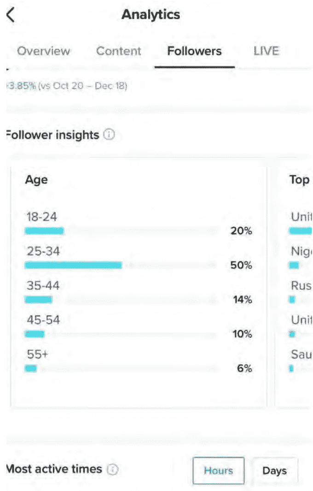

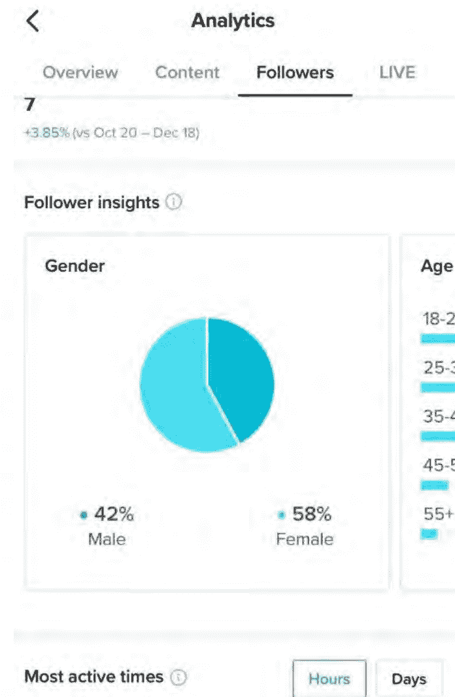

如果项目还没开始。

那么可以通过这些方式来确定目标受众。

- 1. 团队内部头脑风暴。
- 2. 消费者采访。
- 3. 查看调研报告。

常见的调研报告网站有Statista、ibisworld

### 二、市场规模调研

市场规模的调研在我看来主要是两个方法:

- 1. 查看行业调研报告。
- 2. 产品/服务关键词调研。

调研报告的网站上面已经罗列过了, 主要就是通过Statista、ibisworld。

有料的调研报告里面往往有许多重要信息。

比如常见的市场, 用户人群画像的分析。

但是有的报告还会有些不一样的内容, 比如产品矩阵分析、社交媒体分析等等......

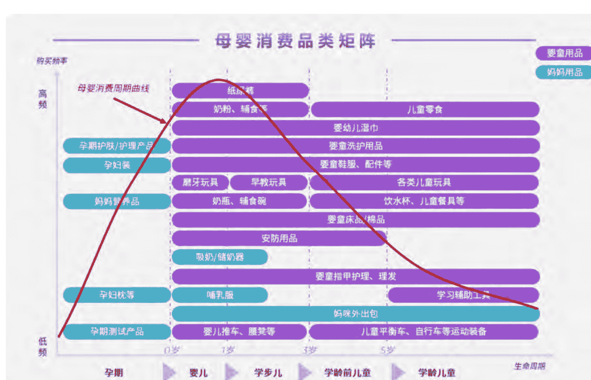

下面具体说下怎么通过查询关键词大小来确定市场规模。

假设我们要销售的产品是电子秤, 更具体来说, 是下面这个东西, 用来称比较重的货物, 在菜市场很常见。


### 确定产品的关键词

第一步，我们先需要确定产品关键词或者说是产品的英文名称，因为只有产品的名称有了，我们才能借助工具去查询这个产品的市场大小。

我们有两个办法，第一是用翻译器软件，比如百度翻译。

第二个办法是用AI工具。

让我们先试下百度翻译，翻译结果是：Electronic scale。

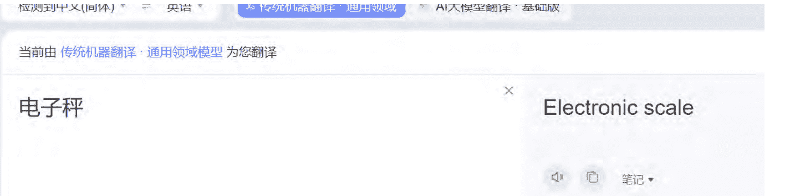

第二种办法，我们用AI，这里我用谷歌的gemini来演示——当然你也可以用Chatgpt或者claude等AI工具，效果也差不多。

我们把产品图片作为附件传上去，然后写上提示词：

请告诉我图片中的这个产品的具体英文名称是什么？

可以看到，AI的回答是digital platform scale。

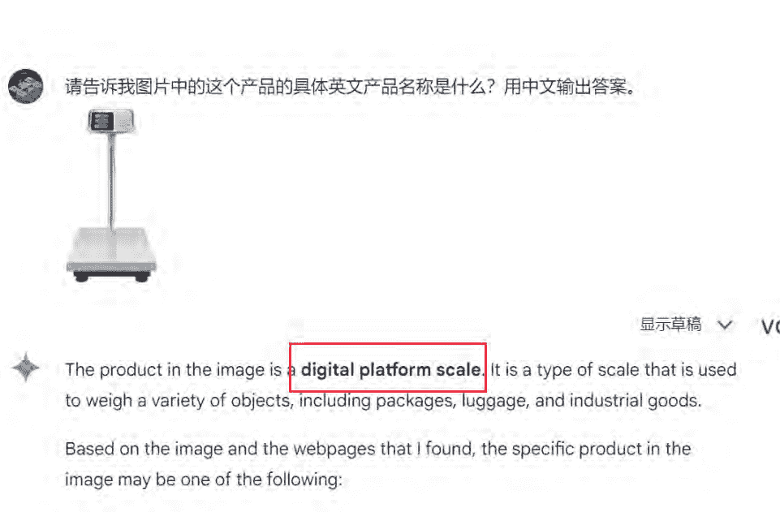

到这里我们就初步得到了这个产品的两个英文名称：

electronic scale和digital platform scale。

### 验证关键词是否正确

那么，到底哪个关键词才是正确的呢？

哪个关键词才能最准确地表达这个产品呢？

这是非常非常重要的一步，也是太多B端外贸公司在产品出海踩到的第一个坑：没有找到正确的产品关键词。

举个身边的例子，番薯。


在不同的省份和地区，番薯是有多种名称，比如有可能被称为“红薯”或者是“地瓜”。

在日本，红薯被称为“薩摩芋”（Satsuma-imo），而在美国，红薯又常常被称为“甜薯”（sweet potato）。

所以如果关键词不对，那么剩下的工作就将是在错误的道路上狂奔，都是在做无用功。

我这里推荐一个方法，就是用谷歌图片进行关键词和产品的相互验证。

我们打开谷歌图片，输入关键词：electronic scale，看下结果。

公众号懒人搜索，懒人专属群分享

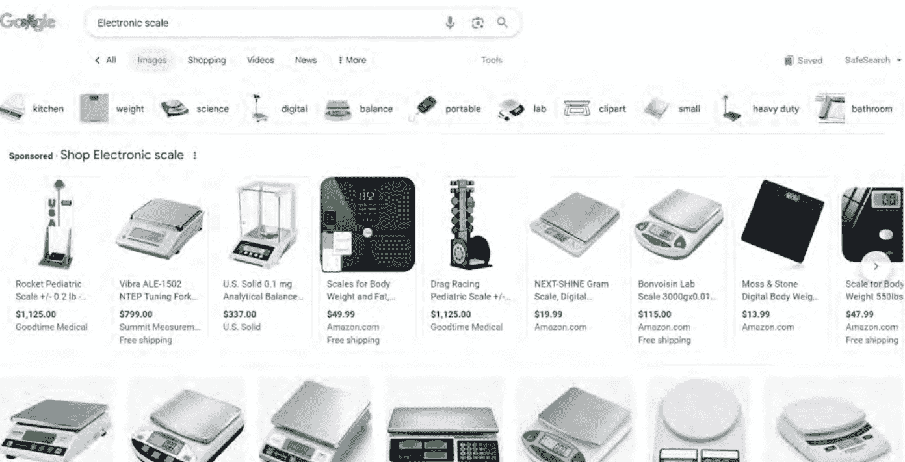

很明显，和我们的产品不一样，结果显示更多的是小型电子秤，和我们的产品不是很符合。

接下来我们试下AI给到的关键词结果：digital platform scale。

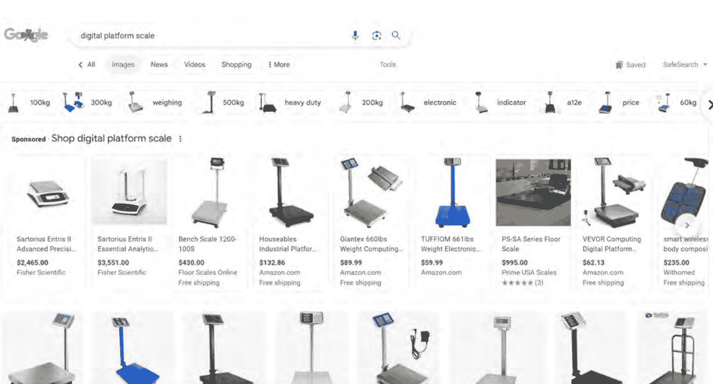

和我们的产品非常相似。

所以初步结论就是这个产品的英文名称应该是：digital platform scale。

为了进一步验证，还有个方法就是：

点开这些正确产品的图片，查看图片下面的名称。

我们可以多点开几个做参考。

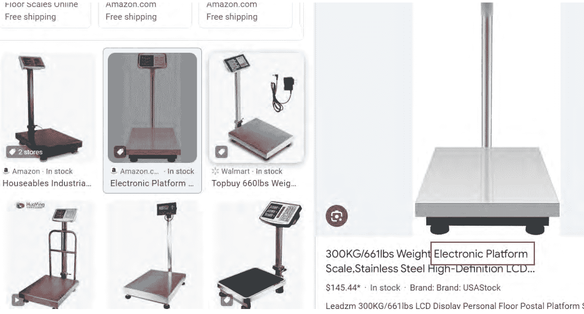

通过点开不同的图片，我们能看到，这个产品还有种可能的英文名称是electronic platform scale。

到这里我们就得到了两个比较具体的产品词，分别是：

digital platform scale

electronic platform scale

下面我们来进一步用数据来告诉我们，目标市场的客户到底更习惯用什么词来搜索，同时看到这个产品的市场/需求大小。

### 确定关键词的市场/需求大小

假设我们要做的市场是美国。

那么我们用关键词工具来搜索上面得到的关键词。

这里的底层逻辑就是：产品关键词在谷歌上的搜索量大小≈市场的需求大小≈产品的市场大小。

虽然用户在搜索某个产品时，可能通过多种不同的平台搜索，但对于B端用户来说，最符合直觉的搜索工具依然是谷歌。

关键词工具有很多，付费工具里面比较常见的比如：

semrush，ahrefs，kwfinder、Ubersuggest、AnswerThePublic、Moz等等。

如果想要使用免费的关键词工具，可以使用谷歌的Google Keyword Planner。

下面我使用semrush来演示。

我们先看下digital platform scale的搜索情况。

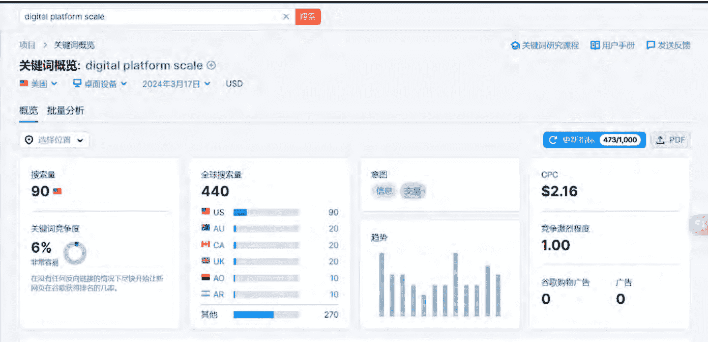

可以看到全球的平均每月搜索量是440，在美国地区，平均月搜索量是90。

再看下electronic platform scale的搜索情况。

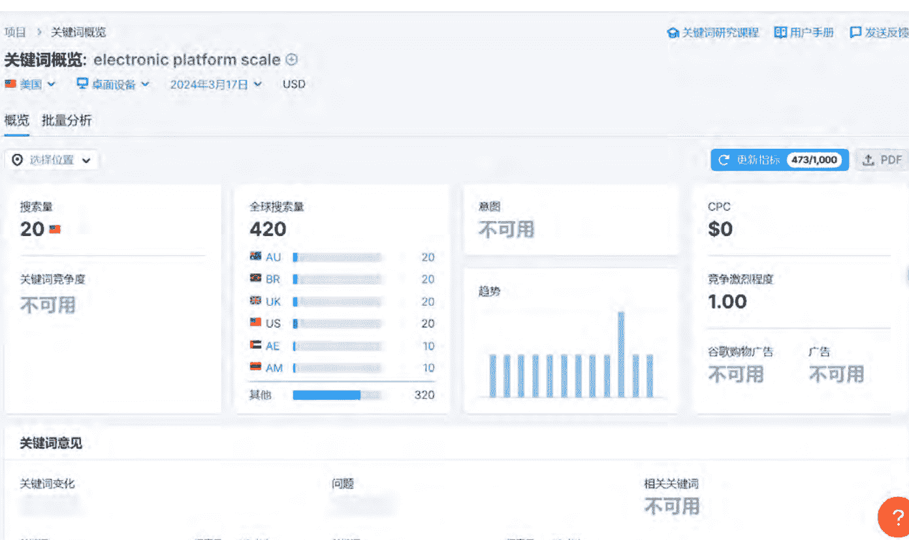

可以看到全球的平均每月搜索量是420，在美国地区，平均月搜索量是20。

从上面简单对比我们能确定，如果做的是美国市场，那么主要的产品关键词应该是：digital platform scale。

这个工具还有许多功能，比如以主要关键词做一些扩展，看到一些其他的相关关键词：

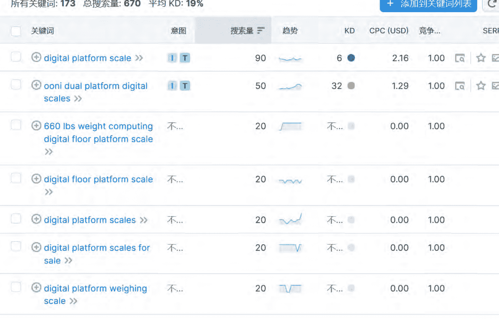

还包括不同关键词的意图分析等。

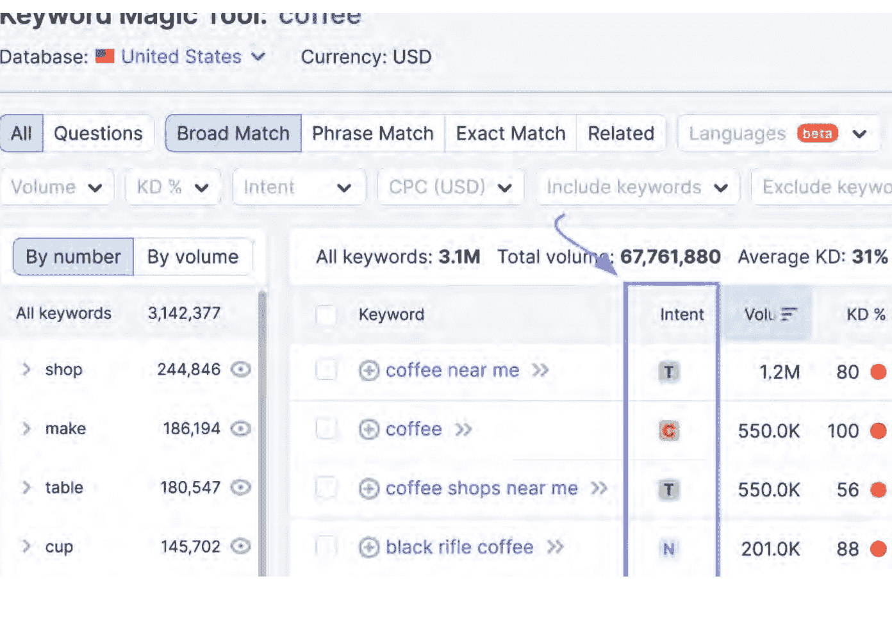

semrush的作用不只是关键词分析，还能进行同行数据的调研等，后面我会简单地提到一些。

### 利用谷歌趋势进行市场判断

接下来我们再用谷歌趋势做一个数据对比和市场简单判断。

打开谷歌趋势网站https://trends.google.com/trends/

输入两个关键词，地区选择目标市场美国，时间选择过去五年。

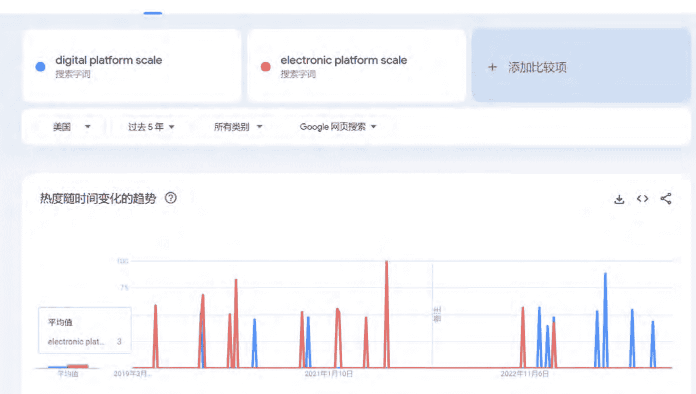

公众号懒人搜索，懒人专属群分享

对比之后可以看到，两个关键词的搜索数据非常接近，差别并不大。

这个页面我们往下滑，可以具体地查看不同地区的关键词搜索情况。

按次级区域显示的比较细分

<!-- Image (82, 96, 925, 256) -->

看到不同地区的关键词情况有什么用呢？

比如你要投谷歌的搜索词广告，在投放地区上面，我们是可以手动选择某个州来进行投放，而这个时候，谷歌趋势给到的这些数据就是很有参考价值。

从上面这个图可以看到，在美国的大多数地区，习惯使用的关键词还是digital platform scale。

最后，终于可以得出结论。

这一款产品的主要关键词应该是digital platform scale，次关键词是electronic platform scale。

但这里有个注意事项，谷歌趋势显示的是一个热度得分，而热度得分越高表示字词在当地所有查询中占比越高，并不代表绝对查询次数越多。

谷歌趋势另外一个作用就是看到产品的趋势变化。

<!-- Image (78, 511, 925, 715) -->

有些产品可以明显看到市场需求随着季节或者节日而变化。

### 确定产品在B端贸易市场的大小

如果要做的产品是B2B外贸，而不是做C端面向消费者的生意，所以实际上为了更好地判断市场大小，我们应该用B端的搜索词来验证市场大小。

我们先打开下面这个二叔开发的B端关键词工具：

公众号懒人搜索，懒人专属群分享

```
https://2uncle.com/google-search-ads-keywords-2b/
```

在这个页面输入我们的产品关键词digital platform scale，等一会就会看到生成大量的B端常见关键词。

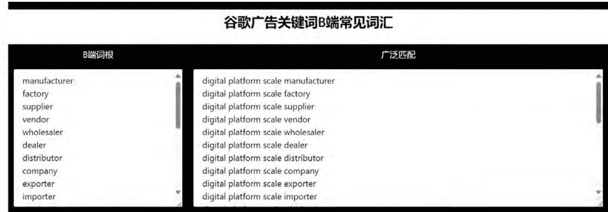

我们就可以拿这些词一一去搜索，查看关键词的搜索量。

这里依然要用到semrush。

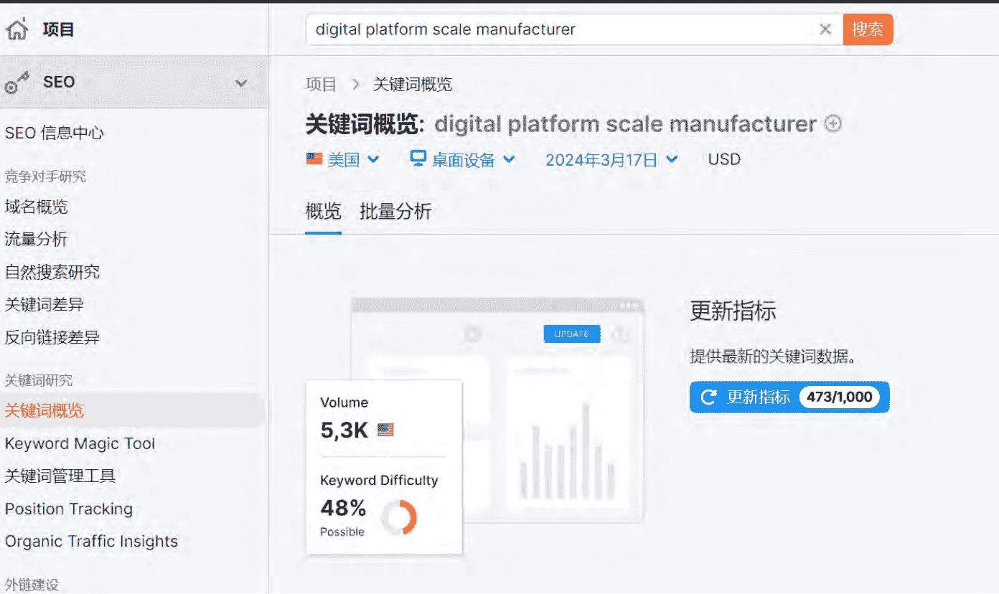

因为搜索量太少，结果是搜不到数据。

我换了几个关键词，都因为搜索量太小，搜索不到数据。

### 没有数据等于没有市场？

这是做B2B外贸常见的一个问题，因为B端市场需求并不大，所以很多时候你会发现使用工具去确定市场的时候，经常会出现数据是空白的情况。

但是一定要注意，但这并不代表没有市场。

重要的事情说三遍。

原因是因为第三方的数据工具本质上是拿不到完整的谷歌搜索数据，都是利用自己的技术和算法去推算数据，所以导致了每一个工具都一定是有局限性的，都是无法百分百准确地去反映真实数据情况——特别是当某个关键词的数据量很小的时候，更容易出现查询不到任何数据的情况。

所以我们永远要知道，工具一般只能拿来做横向的数据对比。

那么针对上面这种情况，我们要怎么解决？

我的方法是：看同行。

看大量的同行，同行多不多，同行做得怎么样，就基本能反映出市场的真实情况。

### 三、同行调研

### 如何寻找同行的网站

首先我们要打开下面这个网站：

https://www.brightlocal.com/local-search-results-checker/

这个工具的作用是让我们模仿真正的本地人来查看谷歌的搜索情况。

这里再次补充一个知识点：

如果你经常使用谷歌，你会发现，有的时候你搜索一个词，但是在谷歌的搜索页面没有任何的广告。

这不是因为没有人投广告，而是因为谷歌发现了你在中国，所以就不会展示广告，毕竟几乎没有广告主会把广告投放到中国地区。

我们都知道淘宝有个千人千面——你是女性就多推女装，你在哈尔滨就多推羽绒服——同样的，谷歌也有千人千面，所以为了更好地进行本土化数据调研，第一步就得伪装成本地人。

利用这个工具，我们就能伪装成一个真正的本地人来进行搜索。

打开网站，输入关键词，选择目标国家为美国，确定语言，然后点击搜索。

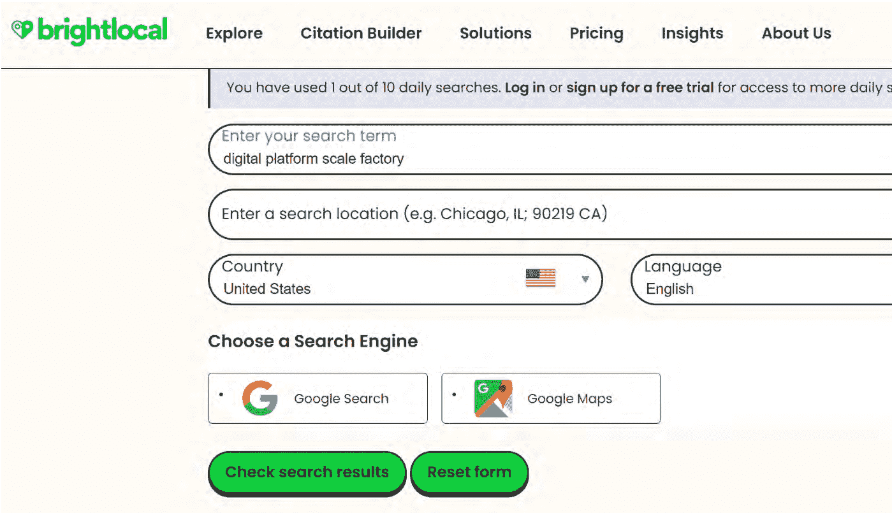

点击第一页进入。

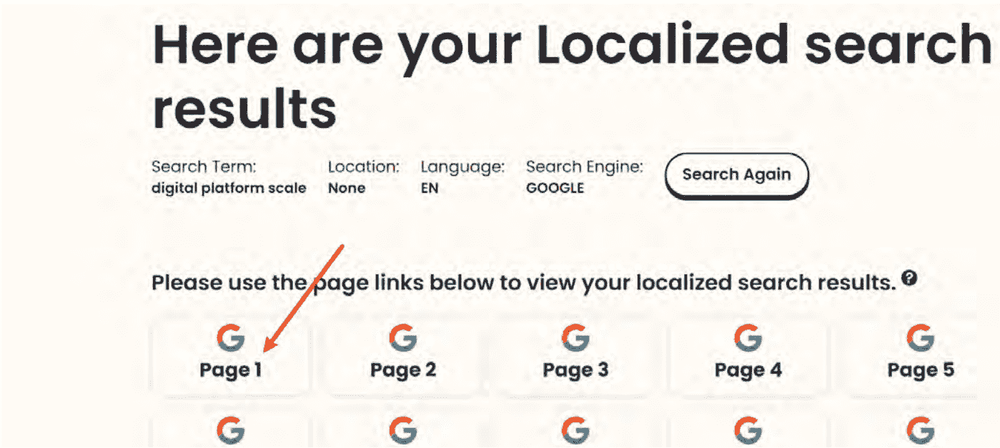

如果你发现这里有很多的sponsored标志，说明伪装成功了。

公众号懒人搜索，懒人专属群分享

我们可以看到，第一页上就有很多人在投放相关的产品广告，而有人投广告就初步说明这个市场是有需求的，毕竟如果投广告赚不到钱大部分企业也就不会继续投了。

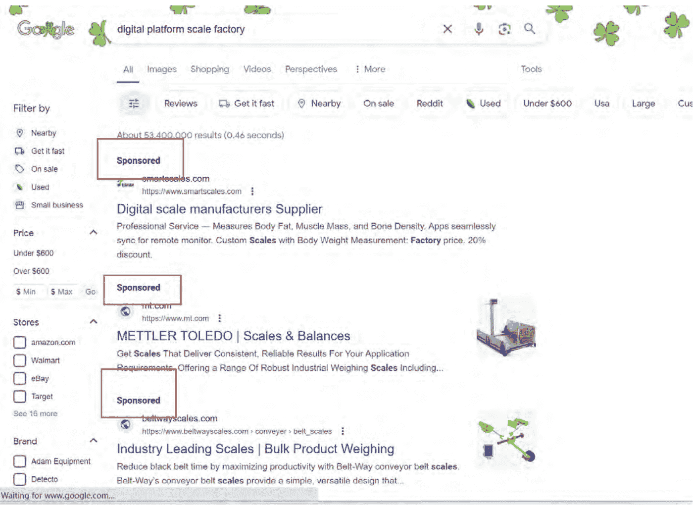

而这些在投放广告的同行其实是可以重点关注的。

毕竟他们在花钱，说明他们业务大概率是赚钱的。

### 网站流量和数据调研

接下来我们就可以把这些网站的网址放入到semrush或是similarweb等分析工具，查看更详细的数据情况。

通过semrush，我们可以看到同行网站的自然流量流量大小，付费广告情况，主要的市场，主推的产品关键词，品牌声量，主要竞争对手等一系列数据。

下面是semrush的截图。


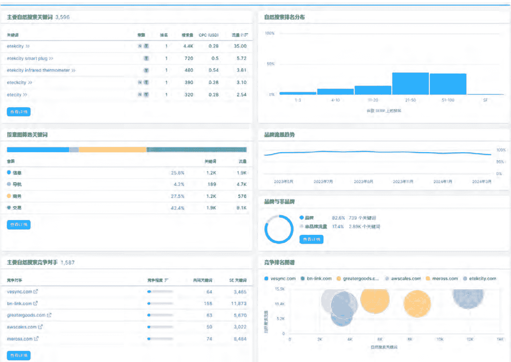

下面是similarweb的截图，在网站全部流量分析方面，会比semrush更加齐全。

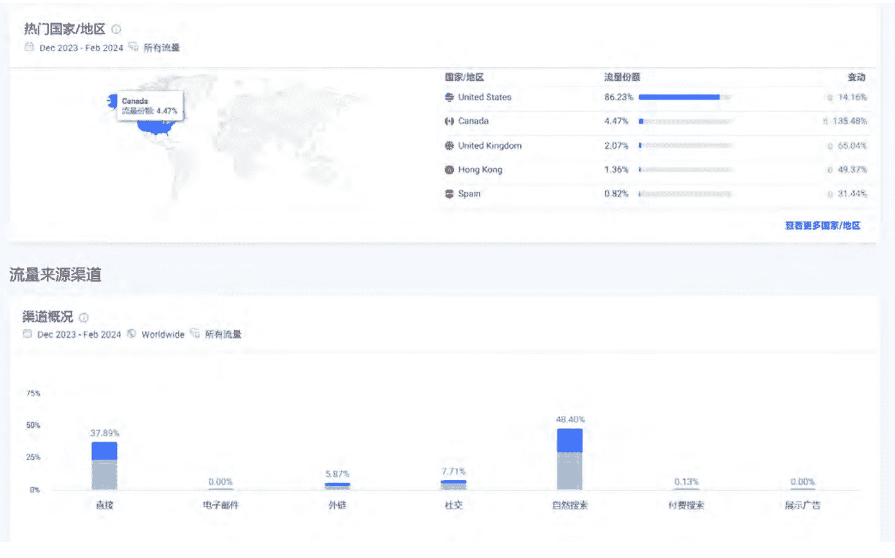

### 网站的历史变化情况

网站时光机：https://web.archive.org/

这个工具可以查看某个网站过去的页面样式。

有什么用呢？

我们就能看到同行主推产品，网站设计的一些变化，然后思考为什么要这么改动。

### 网站是用什么搭建的？

可以用插件查看。


知道网站是用什么搭建的有一个好处。

如果是用shopify搭建的，那么市面上有不少shopify网站的分析插件和工具，可以看到热销产品和销量预估等。

### 推导同行订单量的方法

这里介绍一个简单推导shopify同行订单量的一个技巧。

我们可以在每天的固定时间去同行网站上下单，然后再取消。

之后就可以通过订单号相减的方式来间接推测出每天的单量。

因为shopify的单量编号都是递增的。

### 同行的广告、社媒情况

怎么查看同行的谷歌广告情况？

Spyfu或者semrush。

怎么查看同行的Facebook 广告？

Facebook Ads Library，免费工具。

怎么追踪同行社媒内容。

BuzzSumo。

可以查找特定领域、主题或产品相关的热门内容，可以快速发现某个关键字相关的最受欢迎的内容，也可以用来追踪同行社媒的情况。

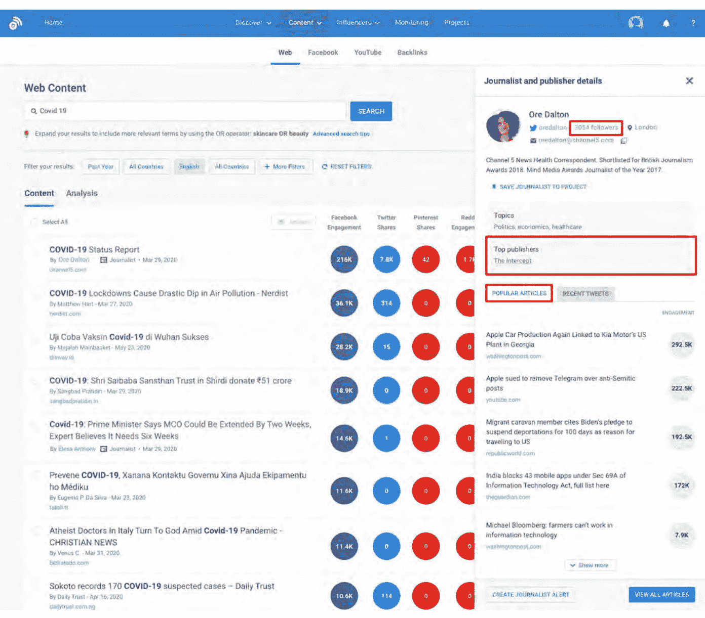

### 其他调研方式

AI搜索引擎或者是一些ai工具的高级功能也能帮我们直接做数据分析。

ai工具的好处是，能帮我们找到大量的调研报告和数据。

比如kimi的探索功能。

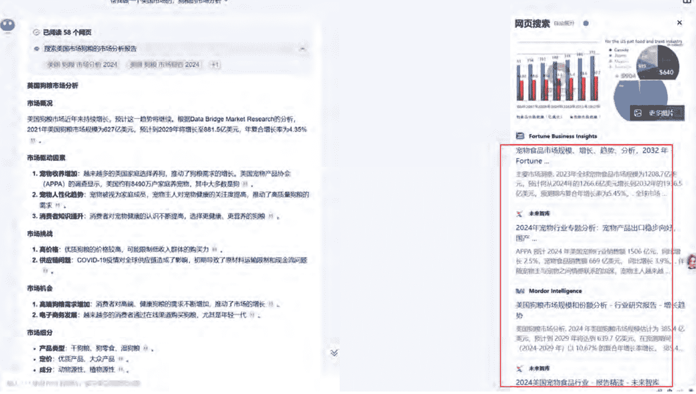

虽然ai的总结不一定好，但我们可以反向利用ai来帮我们直接找到大量的数据源。

### 找到利基同行的技巧

试想一下，如果有个同行，能力很差，但是却很赚钱，或者说有很多流量，那我们直接模仿他，或者参考他的策略，就是一个弯道超车的机会了。

用到的工具是 Ahrefs。

首先，登录 Ahrefs，点击右上角的“Content Explorer”。

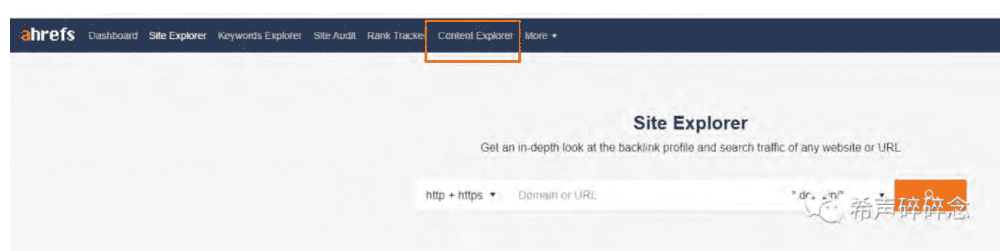

输入产品或者服务的主关键词。

选择“In title”，点击黄色搜索按钮。


按照目标市场的语言，选择语言，将“Filter explicit results”选项打开。


点击“Add filter”，按照以下调整：


这么筛选的含义就是，页面的流量要求大于1000，DR值小于10。

> （DR值就是一个在 Ahrefs 这个工具根据自家算法得出的这个网站的权重。在 Moz 工具里，这个值称为 DA 值，不同的 SEO 工具，对于网站权重的计算方式不同，所以叫法不同，数值也不同。所以我们在对比网站权重的时候，最好使用同一个 SEO 工具，这样数值的对比才有意义。）

这样筛选的目的就是找到那些网站权重并不高，却有一定流量的网站（当然，你也可以适当地增加或者减少这个数值）。

然后我们就可以具体分析，是因为他关键词选的好？外链多？产品做的好？

### 四、扩大同行的数据搜集

以上的同行主要还是局限在网站。

做市场调研，肯定要全面。

如果是做电商的，那么肯定还要在电商平台上调研。

那么就可以用到电商平台的调研工具。

比如亚马逊平台的卖家精灵、Shopee 平台的知虾、Etsy 平台的 eRank 等等。

### 五、卖点调研

卖点调研最好的方式就是去看同行。

而比看同行更好的方式，是看消费者的真实需求。

最简单的办法就是各大电商平台的评论区。

比如亚马逊评论分析插件，TheReviewIndex。

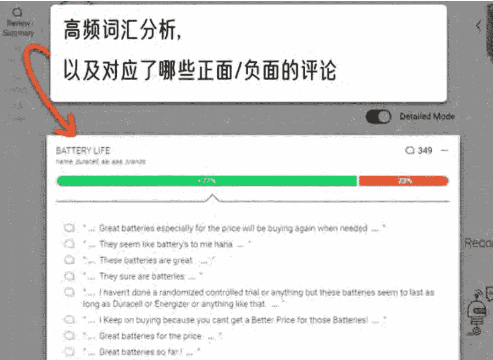

客户的差评=客户的痛点=产品的缺点=我们的机会

### 龙珠悬赏

如果分享对你有帮助希望点个赞哦~

## 评论区：

亦仁：很棒的基于一个场景介绍工具使用的案例。

希声：感谢老大[呲牙]

## (50赞) 短视频从业者常用的5款工具和网站

作者: 丞心
日期: 2024-10-15

- 1. 全平台视频批量去水印-悠米视频助手
可以批量解析抖音、西瓜视频、头条、快手、小红书、B站、TIKTOK、YouTube视频，支持解析主页视频、作者喜欢、合集，以及关键词搜索、找素材、选题、二创场景，非常好用。推荐五颗星。月卡25元，邀请一人获得3天VIP，配合临时邮箱可白嫖。

- 2. 免费大语言模型
可以免费使用 GPT-4.0、Claude 3.5、Gemini 1.5 Pro、Llama 3.1 语言模型，多合一，加入对抗系统，提问一次，可以获得两个模型的解答。从 Coze 平台，去找些提示词复制过来，嘎嘎好用。强烈推荐，五颗星。

- 3. 配音网站
上传一段音频，可以克隆任何人的声音，还原度超高。可以用配音网站做一些视频的整活儿二创等，本人用混剪比较多，配音可以完美改文案还不用改画面，保持前后一致性，很丝滑。推荐五颗星。

- 4. 提示词助手
AI提效的难点在于你不知道自己最终想要什么，如果想不到写不出一个好的提示词，那就先用别人写好的。根据自己的需要去查找。推荐四颗星。

- 5. 临时邮箱
可以接一些验证码，不想用自己邮箱或者需要批量注册、做邀请任务等等场景。推荐三颗星。

先分享这5款常用的，如果感兴趣多的话，把其他工具都整理出来，比如破解剪映、一些 ComfyUI 工作流、免费数字人等。

https://umi.xiaofany.com/register?referral code=73270e20-eaba-4d77-b16d-ede9c6e8a13e 
https://chat.notdiamond.ai/login 
https://fish.audio/zh-CN/ 
https://prompt-shortcut.writeathon.cn/ 
https://www.coze.cn/ 
https://www.amz123.com/tools-mail 
http://24mail.chacuo.net/ 
https://www.mailtemp.net/ 
https://www.linshiyou.com/ 
https://email10min.net/

## 评论区：

暂无评论

## (精华帖)(45赞) 海外游戏买量创意设计工具使用指南

作者： 千张没有皮
日期： 2024-10-17

《海外游戏买量创意设计工具使用指南》 
嗨咯生财的小伙伴们大家好，我是生财新人 千张没有皮。

简单介绍下我自己：计算机专业转行的海外游戏广告创意设计，19年开始做游戏出海买量，目前在带团队中，近5年团队花出去的广告费有几个小目标。

作为生财新人，看到亦仁大大发的龙珠悬赏帖子，以研究项目为前提进行工具的介绍和在工作中的应用，非常感兴趣。

首先生财里面游戏相关的专业信息还比较少，而我日常工作的一部分就是借用各种工具达到团队目标，提高自己和团队的工作效率。

所以正好借着这次机会做一次梳理，以工作流的形式，把各个环节常用的工具/网站贴出来，供大家参考。

工作流程：市场调研->创意输出->需求管理->设计制作->数据复盘，涵盖近100款工具，多图表多链接预告，建议使用电脑端阅读，体验更佳。

适合人群：
- 1、手游出海中小企业主
- 2、对游戏出海感兴趣的伙伴们
- 3、电商/工具出海相关行业的伙伴们

希望能帮助更多的生财圈友，同时也为生财添砖加瓦[爱心]

详细内容请看飞书文档 👇： 《海外游戏买量创意设计工具使用指南》

https://yku6yoje2z.feishu.cn/wiki/CalAweADii0ROakrmKQcHxMhnWf

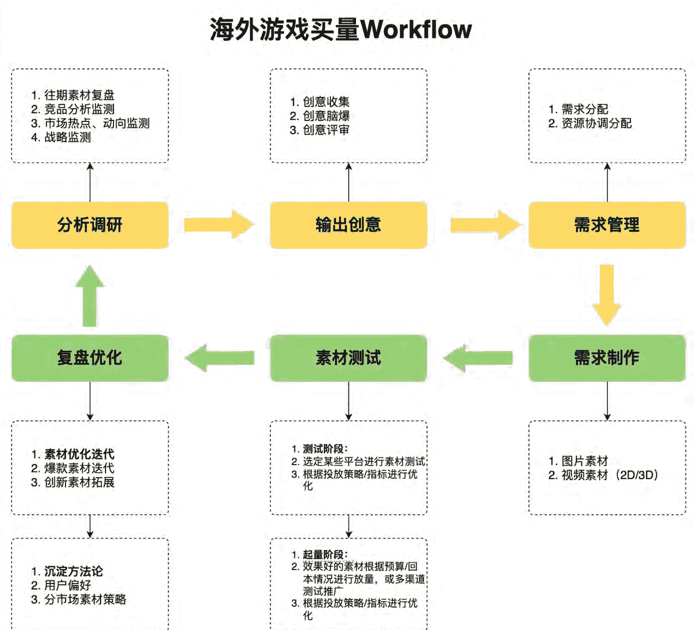

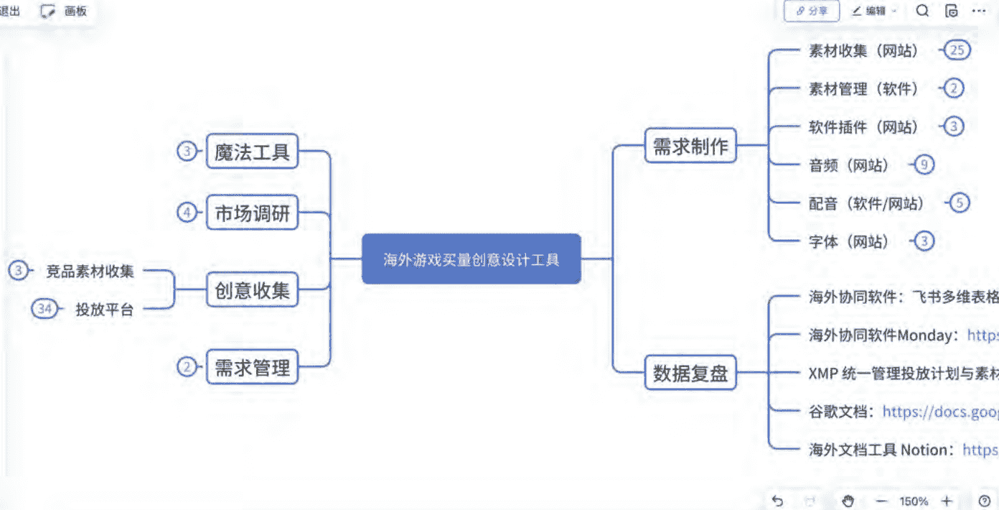

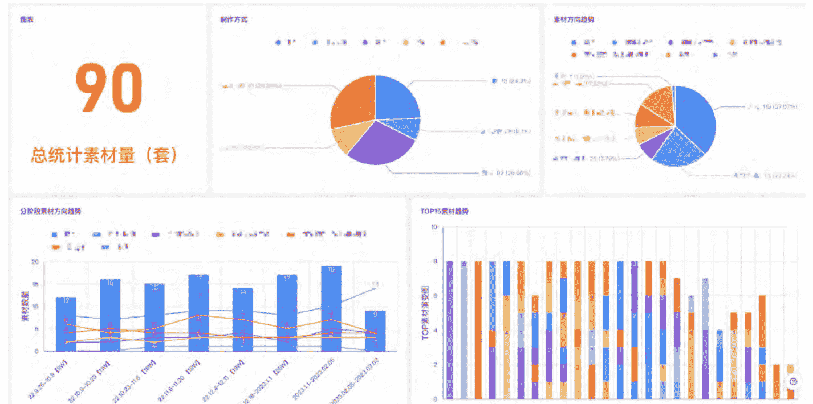

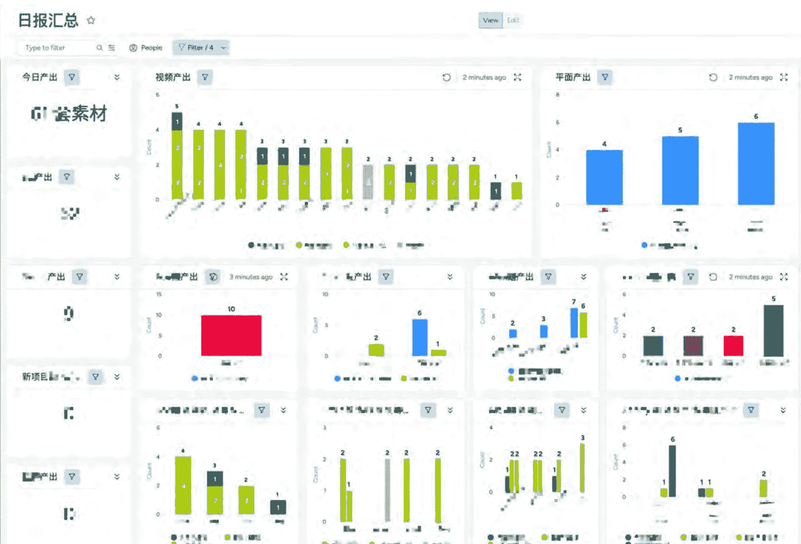

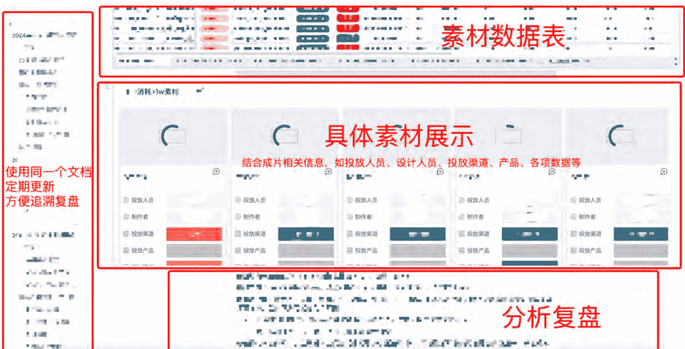

## 评论区：

暂无评论

## (29赞) 各平台账号矩阵运营交流「交作业#龙珠悬赏」

作者：李海滨
日期：2024-10-15

刚才开车路上，弹出消息，感觉挺贴切，我就简单分享一下。文笔不好多见谅，我喜欢直接分享上我认为比较干的内容，所以赶紧就写一下。期待后续肯定有大佬分享更好的内容。

简单自我介绍一下，引用加入生财时候的模版。是的 比较懒

【生财昵称】李海滨
【所在地区】天津 河西区
【自我介绍】
MBTI是 INFJ 90后互联网打杂工。算是有近10年互联网及跨境电商等相关产品经验，主要产品是跨境出海浏览器、网络IP专线资源等底层服务。

【提供资源】
- 1、跨境电商网络资源等不限云服务器、代理ip、各种海外社交媒体账号等
- 2、社媒运营、web3一些相关行业业务运营知识分享、多账号管理等
- 3、项目管理咨询服务、产品逻辑梳理或者海外运营矩阵梳理交流

乍一看，是不是就明白很多，不是打广告哈！不是打广告哈！不是打广告哈！说三遍。是的，我是做 SaaS 出海工具的，但我本身自己也是用户，因为必须得了解业务才行。我的 SaaS 是付费工具，免费的其实都是最贵的，这道理大家应该都懂，毕竟没有免费的午餐。直接来：

### 一、如果你是跨境电商卖家：跨境卫士安全浏览器（https://www.kuajingvs.com）

跨境电商大家应该都有所了解，国内传统电商淘宝、京东、拼多多等等电商平台，那通俗讲，把国内产品通过海外电商平台卖到海外客户手里就是跨境电商的通俗含义。平台很多，方式很多，常见 Amazon、eBay、Lazada、Shopee、Shopify、Ozon 等等各种国外电商平台。

跨境卫士浏览器是做什么的呢？它是为国内这些想要跨境电商生意的卖家们，提供店铺的安全管理、环境隔离、网络隔离的必备浏览器。海外电商平台审查机制和风控体系非常严格，比如你是卖家，你在国内做淘宝开店铺，一个电脑是不是就够了，可以开几个甚至十几个淘宝店铺，而且是在一个浏览器一个网络下就可以。但是海外这些电商平台不行，如果你这样做，过几天甚至当场开店就会封禁你的账号。

基于平台审查这么严格的规则下，卖家伙伴们就会衍生出很多解决办法，举例有10个亚马逊店铺，那就需要购置10个电脑，然后找一个网管，布置10个独立的网线及网关，以这种高成本的方式解决环境以及网络的隔离问题。跨境电商卖家或者店群卖家如果继续以这种方式经营下去，没等到货物卖出去，买设备管理就已经累得半死了，所以2018年我们就自己做了这个浏览器，因为我们本身集团就是做了30多年的外贸的，内部孵化团队转去踩跨境电商的风口，所以我们既是跨境电商卖家也做 SaaS 软件，为了去赋能更多的跨境电商小伙伴。卖家只需要电脑安装跨境卫士浏览器，购买一个 VD（环境+IP网络等）添加店铺，就会实现一个电脑管理N个平台的N个店铺，而且安全合规自带出海加速，快速打开任意跨境电商平台。而且可以多人协同、异地办公、等等。如图所示：

购买开通 VD 环境及全球 IP

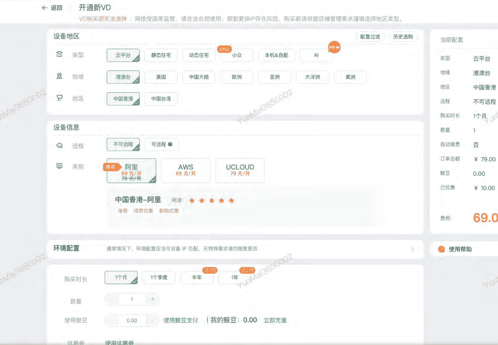

以下是我自用的截图

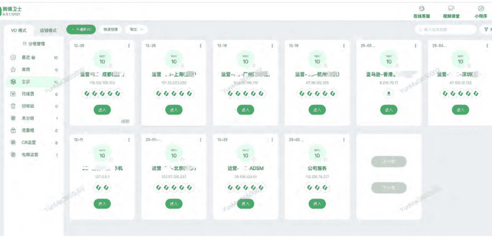

就是简单的这样使用，方便便捷，高效降本且安全。近6年服务了差不多有几百万个店铺，十几万跨境电商卖家。

### 二、如果你是想做出海生意的伙伴：ClonBrowser浏览器（https://www.clonbrowser.com/zh）

说大一点，全球经济趋势使然，必然有很多小伙伴想去赚更多更多的 money 囤粮等等。第二个推荐的我自用且也是我们的指纹浏览器 ClonBrowser 指纹浏览器，适用于各种出海生意及多账号玩法。

出海赛道种类繁杂，我自调研大概有四五十种类，游戏出海、声娱出海等各大种类，但是从场景化角度思考，我认为3个方面比较重要：远程、创作、成本。这里的远程是指远程工作及生活附加一体的方式，远程的办公、服务、协同等等都不简单只是‘线上化’这么简单；而创作就理解简单多了，每个人都是创造者，从内容或品牌的创造者，到各行业的创造者，甚至到 AI 产生的内容，都是必不可少的；最后的成本是指你个人的时间、财力等衡量价值。

所以，基于以上3个角度出发，ClonBrowser 浏览器适合矩阵运营出海赛道归纳为以下：
- 1、各种海外社媒平台、游戏矩阵账号管理运营：TikTok、Facebook、WhatsApp、X、Instagram、Discord、Telegram、Gmail等等。
- 2、web2想向web3迁移的伙伴们、工作室们、项目方们：web3必备最优性价比的指纹浏览器
- 3、B2B及B2C的传统企业：推广运营垂类行业的免费流量，获取垂类精准询盘

所以种类工具针对的主要是在多账号矩阵运营的情况下使用。肯定小伙伴会问，我为什么要用这类工具，用我自己的电脑浏览器多开不行么？回答是否定的，看起来本地能用且没有问题，实际电脑虚拟多开的已经被记录了。大家做的都是长期生意，长期主打的是账号资产隔离安全，所以别心存侥幸。

以下是我自用的截图，运营推广账号800多套，涉及海外图文、问答、视频等平台，以 tk 截图举例：


使用同步器同时操作以及后续 RPA 自动化运营账号：
敏感信息已经抹去了


### 三、各种网络资源：开鲸云（https://www.kaiwhale.com）

这就简单直接了，提供各种网络 IP、专线、AI 算力资源。合作的是全球各大运营商。没错，这也是我们的。

### 1、为什么推荐呢？

因为市场太卷，太杂乱，导致很多资源并不唯一且干净安全的，指网络 IP、节点、加速、等等。基于跨境出海各种安全合规，以及账号数据安全的前提下，我们提炼了这一部分网络资源，去合作更多的想用干净安全的网络资源的伙伴，省去盲目筛选资源的过程。其实网络资源的水很深，看起来透明，但玩法很多。就是想开放一下这个能力，毕竟我们踩过的坑你们没必要踩了，因为我也是卖家呀，在这全球经济形势下，肯定都想去赚更多的美金、英镑、欧元等等去囤粮呀。不想内卷在这上面浪费时间。

### 2、都有啥？

干净且卫生的全球 IP，包含各大厂商


适合 TikTok 直播的直播专线：这块我测试过的，市面上解决的办法太多了，流量卡、软路由、科学上网软件等等，最终我们筛选出了2-3个优质线路合作伙伴，虽然贵了些，但是很多客户反馈都好用，没别的，就是好用。因为账号资产比这必备解决方案贵得多。因为，账号才是最值钱的！

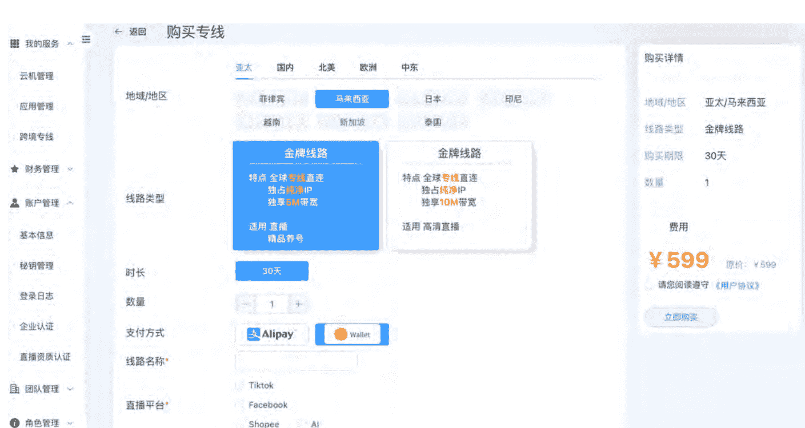

说的有点乱，有点杂，我本身也参与过生财活动、web3 等等，就会发现有很多伙伴有出海的心，迫切的同时就会费很多时间摸索很多事情。所以那时候就免费给很多小伙伴解决一些软件网络等问题，让他们回到赛道的本身，而不是这些地方浪费时间。

以上不是广告哈，是纯分享工具，恰巧我确实也是做这个的。如果有需要的伙伴可以联系以上客服，提我名字享受 VVVIP 服务以及各种优惠！

第一次写多担待。
希望能帮到大家。
后续可以多交流。
我在天津。
我叫海滨。

## 评论区：

暂无评论

## (25赞) 跨境研究项目工具：eMarketer的市场数据与行业分析

作者：执简
日期：2024-10-16

项目研究工具 各个平台（列举越多越好，尤其欢迎海外的）大多数人在用哪些工具（免费、付费欢迎列举）做研究项目（具体方法）？各个工具的差别是什么？最佳使用场景是什么？等等。【研究项目】我的理解是数据平台，能够看到项目的销售、盈利情况，来做项目的研究。

因为这些年刷了很多帖子，自己做电商也积累了很多平台，有的用到了有的没用到，我把工具整理出来，再用 Kimi 说明一下它们能给出的数据。

**eMarketer**：大量的市场数据和行业分析，从电子商务、数字广告、社交媒体到移动设备、电视和视频等领域都有涵盖。特别是对于跨境从业者来说，eMarketer 提供了近年来跨境电商发展趋势、海外用户消费习惯及海外市场竞争力方面的报告，对于跨境电商的市场营销、产品上线等策略制定非常有价值。

**Google Trends**：追踪和分析全球消费者对特定关键词的搜索兴趣和趋势变化。

**Amazon Best Sellers**：提供实时更新的亚马逊平台上各个类别中最畅销的商品榜单。

**Jungle Scout**：提供全面的市场研究工具，帮助亚马逊卖家进行产品研究、竞争对手分析和关键词优化。

**Helium 10**：为亚马逊卖家提供多维度的工具集合，包括关键词研究、市场分析和产品跟踪。

**SEMrush**：一款全面的数字营销工具，提供关键词研究、网站分析、竞争对手分析等功能。

**SimilarWeb**：分析网站流量和用户行为，提供竞争对手的流量来源和市场趋势分析。

**关键词、SEO**

**5118**：数据平台最核心的功能是关键词挖掘，它通过对海量数据的深度分析，提供关于关键词搜索量、竞争程度、趋势等方面的精准数据，帮助用户制定有效的关键词策略。

**DSO110**：提供访问1.2亿下拉词的关键词库功能，帮助用户快速找到与视频内容相关的热门搜索词汇。同时，通过“商机挖掘”功能，可以发现行业内的热门关键词和新兴趋势词，即“黑马暴涨词”。此外，还有“搜索排名监控”和“搜索排名查询”功能，可以追踪特定关键词的排名变化，从而了解优化效果。

**百度统计**：提供网站流量和用户行为的详细分析，是百度搜索引擎优化的基础工具。

**站长工具（Baidu Webmaster Tools）**：允许网站管理员监控网站在百度搜索中的表现，包括索引、排名和优化建议。

**爱站网**：提供网站排名查询和关键词挖掘服务，帮助站长了解网站在搜索引擎中的表现。

**友盟**：提供网站访问量统计和用户行为分析，帮助站长了解和提升网站流量。

**Google Analytics**：提供网站用户行为分析，包括流量来源、用户互动和转化跟踪。

**Google Search Console**：监控网站在 Google 搜索中的表现，包括索引问题、关键词排名和点击率。

**Ahrefs**：提供深入的反向链接分析和全面的 SEO 审计，帮助识别和利用高价值的关键词。

**SEMrush**：集成 SEO、PPC 和内容营销工具，提供市场研究、关键词分析和竞争对手监控。

**Moz Pro**：提供链接分析、网站审计和排名跟踪，帮助优化网站结构和提升搜索引擎可见性。

**抖老板**：最关键的功能是实时更新订单管理和数据分析，它通过整合多维数据，帮助用户高效管理订单、提升转化率，并为带货达人提供精准的市场趋势预测和商品推荐。

**蝉妈妈**：最关键的功能是其实时直播监控和多维度数据分析服务。通过这项功能，蝉妈妈为用户提供包括但不限于直播销售情况、观看人数、趋势、销量、涨粉情况等实时数据监控，同时提供商品销量、观看人数、点赞数和评论内容等数据分析，帮助商家和内容创作者优化销售策略和提高内容质量。蝉妈妈还提供市场趋势分析、竞品监测、定制化数据报告服务，以及支持多平台的数据分析，包括抖音和小红书等，为品牌主和商家提供全面的数据分析服务。此外，蝉妈妈还推出了蝉妈妈 AI 创作工具，提供电商 AI 智能写作助手，帮助用户一键生成内容，进一步提升内容创作效率。

**考古加**：最关键的功能是提供全方位的抖音直播电商选品数据分析服务。它通过实时监测和分析抖音直播间的数据，包括直播间的基本信息、实时数据、历史数据、排行榜等，帮助用户深入了解直播间的表现。此外，考古加还提供达人数据、商品数据、小店数据和短视频数据的全面分析，使用户能够优化直播策略，提升直播效果，增加直播收益。

**有米有数**：最关键的功能是科学选品，它通过多维度商品榜单和市场趋势分析，帮助商家精准定位潜力爆品，优化选品策略，提升营销效率和销售业绩。

### 抖查查
抖查查是直播电商全能型数据分析平台，它提供达人、直播、商品、短视频、小店等多维度的大数据分析服务。

### 灰豚数据
灰豚数据最关键的功能是提供全面的直播电商数据分析服务（抖音、小红书、快手、淘宝），包括商品分析、竞品调研、消费者梳理、社媒洞察等。它通过这些功能帮助用户深入了解直播带货的效果，优化直播策略，提升销售业绩。灰豚数据还提供了直播达人排行榜、带货视频排行，以及商品分析等，助力品牌和商家把握市场趋势，优化营销策略。

### MCNData
最关键的功能是提供短视频行业数据服务，包括账号收录、热点分析、数据监控等，使用户能够随时随地掌握内容热点和舆情动态。

### 新榜
新榜最关键的功能是提供综合性内容榜单和账号数据分析，它通过跨平台的数据监测和评估，帮助用户洞察内容影响力、分析账号运营状况，以及把握行业趋势和市场动态。

### 飞瓜数据
飞瓜数据最关键的功能是提供短视频平台（如抖音和快手）的账号和内容数据分析，包括账号监测、热门话题追踪、电商数据监控等，帮助用户洞察市场趋势、优化内容创作和提升营销效果。

### 抖音热点宝
抖音热点宝最关键的功能是实时捕捉和分析抖音热点话题，帮助用户及时了解并参与热门趋势，优化内容创作策略，提升视频的曝光率和互动性。

### 趋势研究
### 百度指数
百度指数最关键的功能是趋势研究，它通过提供关键词的搜索指数、资讯指数和媒体指数，帮助用户深入分析和理解关键词在不同时间段内的搜索趋势和用户关注度变化。

### 微信指数
微信指数最关键的功能是提供关键词热度趋势分析。通过这项功能，用户可以捕捉热词、看懂趋势，监测舆情动向，洞察用户兴趣，从而助力精准营销。微信指数的数据来源于微信搜索、公众号文章及朋友圈公开转发的文章，以天为单位进行更新，并展示最近7天、30天或90天内的热度变化趋势。

### 巨量算数
这是一个工具型产品，用来洞察热词、热点内容趋势，支持抖音、今日头条等多端热词的关联分析、用户画像等功能。它支持热点事件发现和热点事件分析，帮助用户快速捕捉当下热点信息，热点趋势实时掌握。深挖各垂类领域数据洞察、最热内容，通过内容生产、内容消费、内容创意三大维度，助力广大内容创作者、营销从业者及品牌主洞悉领域机会，并指导其内容创作。

### 艾瑞指数
艾瑞指数最关键的功能是提供互联网行业市场数据和深度分析报告，帮助用户洞察行业趋势、评估市场竞争状况，并做出基于数据的决策。

### 阿里研究院
阿里研究院最关键的功能是提供深入的行业研究、市场趋势分析和宏观经济数据，帮助用户洞察数字经济的发展动态，制定基于数据的决策和战略规划。

易观智库（Analysys）专注于数字经济领域的市场数据监测和分析，提供移动互联网和新兴技术行业的深入洞察。艾媒咨询（iiMedia Research）发布移动互联网、大数据等领域的行业报告和榜单，以其快速响应市场变化而闻名。中国互联网信息中心（CNNIC）发布《中国互联网发展状况统计报告》，提供官方、权威的互联网行业数据和政策分析。赛迪顾问（CCID Consulting）提供IT行业的市场研究和咨询服务，以其在电子信息产业分析方面的专业性而受到认可。

### 盖得排行
盖得排行最关键的功能是提供客观中立的商品、商家排行，它通过PGC模式（专业生产内容产生），搜集各种数据库和机构的测评报告，并结合专家访谈，为中等收入人群提供有价值的消费参考意见。

### 微信公众号
### 西瓜数据
西瓜数据最关键的功能是提供微信公众号的全面数据分析，包括文章阅读量、用户互动、粉丝增长趋势等，帮助运营者深入了解账号表现，优化内容策略和提升用户参与度。

### 易撰
易撰最关键的功能是提供内容创作辅助工具和多平台数据分析服务，帮助用户提升内容质量、追踪热点趋势，并优化内容营销策略。

新榜提供微信公众号的影响力排行和内容分析，是行业内公认的权威数据来源。

### 小红书
### 千瓜数据
千瓜数据最关键的功能是提供小红书平台的达人和笔记数据分析，帮助用户评估达人的合作价值、分析笔记的传播效果，以及洞察行业趋势和竞品动态，从而优化小红书的运营和营销策略。

### 蝉小红
蝉小红最关键的功能是提供小红书笔记和达人的深度数据分析，帮助用户洞察内容表现、评估达人影响力、把握行业趋势，以及优化品牌营销策略。

### KOL合作
### KOLRank
KOLRank最关键的功能是提供社交媒体KOL的影响力评估和排名，帮助品牌和营销人员精准选择与自己品牌定位相匹配的、具有较高影响力和参与度的KOL进行合作。

微播易提供微博、微信等平台的KOL数据分析，包括影响力排名、粉丝画像、内容分析等。

克劳锐专注于社交媒体KOL的数据分析，提供KOL榜单、影响力评估和品牌合作分析。

新榜提供微信公众号、抖音、B站等多个平台的KOL排行榜和数据分析服务。

SocialBook 专注于Instagram、YouTube等国际社交平台的KOL分析，提供影响力评估和市场洞察。

HypeAuditor 针对YouTube和Instagram的KOL分析工具，提供详细的粉丝分析、内容分析和市场趋势。

### 视频号
### 友望数据
友望数据最关键的功能是提供视频号直播、爆款商品、带货达人和品牌数据的多维度分析，帮助用户洞察市场趋势、优化直播和电商策略，实现精准营销。

- https://www.emarketer.com/
- https://trends.google.com/trends/
- https://www.amazon.com/Best-Sellers/zgbs-
- https://www.junglescout.com/
- https://www.helium10.com/
- https://www.semrush.com/
- https://www.similarweb.com/
- https://www.5118.com/
- https://www.dso100.com/
- https://tongji.baidu.com/web5/welcome/login-
- https://ziyuan.baidu.com/?castk=LTE%3D
- https://www.aizhan.com/
- https://www.umeng.com/
- https://analytics.google.com/
- https://search.google.com/search-console
- https://ahrefs.com/
- https://www.semrush.com/
- https://moz.com/products
- https://www.doulaoban.com/douyin/home-page
- https://www.chanmama.com/
- https://www.kaogujia.com/
- https://youshu.youcloud.com/
- https://www.douchacha.com/
- https://dy.huitun.com/app//#/app/dashboard
- https://www.mcndata.cn/
- https://www.newrank.cn/
- https://www.feigua.cn/
- https://index.baidu.com/v2/index.html#/
- https://trendinsight.oceanengine.com/
- https://index.iresearch.com.cn/new/#/
- http://www.aliresearch.com/cn/index
- https://www.analysys.cn/
- https://www.iimedia.cn/
- https://www.cnnic.net.cn/
- http://www.ccidconsulting.com/
- https://guiderank-app.com/
- https://www.guoji.pro/
- https://www.yizhuan5.com/work.html#1-4
- https://www.newrank.cn/
- https://www.qian-gua.com/
- https://www.chanxiaohong.com/login
- https://www.kolrank.com/
- http://www.weiboyi.com/
- https://www.topklout.com/#/home
- https://www.newrank.cn/
- https://socialbook.com/
- https://hypeaxditor.com/
- http://www.youwant.cn/

评论区：
- 奔四的小天：目前看到唯独项目研究工具，唯独一篇。其他都是工具分享
- Ryan：感觉就像工具的罗列，没有具体的优劣势或者特点的分析，不过还是挺有帮助[强]
- 执简：[握手]
- 执简：我也就大概了解了这些工具大概能用在什么地方，因为我工作的原因，常用的工具其实很少，这些都是在一些帖子，一些文章中里面摘出来的
- Ryan：很棒了[玫瑰]

### RPA知乎系列机器人：打通知乎场景的自动化操作
作者：龙哥
日期：2024-10-16

RPA知乎系列机器人旨在完全打通吃透知乎场景，用一个知乎平台案例，完成所有可以RPA的动作。主要有4个机器人，囊括了知乎所有的操作了。

从9月16日开始玩知乎，到10月7日，目前已经Lv5。另外前面违规了2次和中间懈怠了一下，不然等级更高。这成绩虽不算亮眼，但这让我玩出了一套可复制的经验。

这里可以看到我的创作分分布还是OK的：创作垂直度和内容优质分。说明一下这些都是用AI辅助回答的，回答一个问题不到一分钟搞定，而且回答的还不错。

根据我这个案例学习，你也可以去搭建自己的公众号，小红书，头条号自动化流程，全都是手把手教学案例，非常Nice。详情见飞书：

另一个RPA实操案例：
- https://svox0dxsvym.feishu.cn/wiki/MRnWw1dfninL9okjdBUcvV34n9g?from=from_copylink
- https://t.zsxq.com/EJ5c0

草稿类型说明：
- 未发布回答草稿：指从未发布过的回答的草稿
- 已发布回答草稿：指已经发布过的回答修改后产生的草稿

| 标题 | 发布时间 | 字数 | 操作 |
|---|---|---|---|
| 怎么忘掉一个你很爱的人？ | 刚刚 | 869 | 发布 编辑 |
| 全职宝妈，怎么边带娃边赚钱？ | 2 分钟前 | 887 | 发布 编辑 |
| 你能不能用 10 个字写一个故事？ | 3 分钟前 | 514 | 发布 编辑 |
| 为什么有人月薪三千五还能笑得出来？ | 4 分钟前 | 832 | 发布 编辑 |
| “凡是不发朋友圈的人，都是过的不好的人”你认同这句话吗为什么？ | 6 分钟前 | 776 | 发布 编辑 |
| 一个人不想上班是什么心理？ | 7 分钟前 | 832 | 发布 编辑 |
| 40 岁开始努力，来的及吗？ | 8 分钟前 | 683 | 发布 编辑 |
| 有什么副业适合普通人去做的？ | 9 分钟前 | 649 | 发布 编辑 |
| 做自媒体以来，你们找到适合自己的方向了吗？ | 11 分钟前 | 675 | 发布 编辑 |
| 工作中处于摸鱼状态领导真的不知道吗？ | 12 分钟前 | 556 | 发布 编辑 |
| 年轻人创业有哪些建议？ | 13 分钟前 | 543 | 发布 编辑 |
| 现在互联网创业可以先做pc端网站吗？ | 14 分钟前 | 603 | 发布 编辑 |
| 一些年轻人采取「精神离职」的态度应对职业倦怠，对此你有什么看法？ | 15 分钟前 | 620 | 发布 编辑 |
| 双非二本应具备哪些技能以保证顺利进入职场？ | 16 分钟前 | 543 | 发布 编辑 |
| 工资很低但是工作很舒服，要离职吗？ | 17 分钟前 | 527 | 发布 编辑 |
| 一个人最根本的能力到底是什么？ | 18 分钟前 | 499 | 发布 编辑 |
| 一个人最根本的能力到底是什么？ | 19 分钟前 | 442 | 发布 编辑 |
| 人到中年面对领导的 Pua 应该怎么办? | 20 分钟前 | 459 | 发布 编辑 |
| 为什么要实行薪酬保密? | 24 分钟前 | 1230 | 发布 编辑 |

### 创作分明细
| 指标 | 数值 |
|---|---|
| 当前创作等级 | Lv5 |
| 当前创作分 | 9,819 / 24,000 |
| 距离下一级还需 | 14,181 分 |
| 创作活跃度 | 3,055 |
| 创作垂直度 | 2,100 |
| 内容优质分 | 3,400 |
| 社区成就分 | 776 |
| 关注者亲密度 | 75 |
| 创作影响力 | 413 |

你的创作分数值
你所在等级的创作分数均值

### 近 30 天变更记录
当前已更新至 10-06，通常每天 18 点前更新前一天分数变动数值。

2024-10-06
创作分 +1,194
创作活跃度
积极创作内容 +200

评论区：暂无评论

### 效率提升篇丨如何可视化一周的任务并效率翻倍（附带周计划表）
作者：顾小她
日期：2024-10-15

嗨喽，大家好，我是小她。

01年中文系硕士在读，总成绩第一名上岸，【婷久她】姐妹花的一员，全网12万粉丝，1000+付费用户，目前专注小红书、B站、公众号等平台的内容创作和引流，擅长公域引流私域转化。

很多小伙伴都对提升效率很感兴趣/之前有小伙伴问我如何提升效率，所以就正式整理了一篇干货来跟大家聊一聊我的想法。希望今天的这片干货会对大家有帮助。欢迎大家一起交流～

以下是整理好的原文链接：https://z182k46i27c.feishu.cn/wiki/TfohwZeTliDgZtkTTq2cYFBjnag

评论区：暂无评论

### 龙珠悬赏：对新兴事物、全球趋势、热度方向的研究工具分享
作者：彩笺
日期：2024-10-15

### 工具主题
工具主题：对新兴事物、网站或者应用的热度、全球趋势的研究。

内容分为两部分，目录：
- 为什么要用这些工具，使用工具背后的经历和思考。
- 工具的具体使用，包括使用场景、我自己的使用案例。

### 背景
分享工具之前，我先分享下为什么我会经常性的使用这些工具。

我一直都觉得，比较大的机会，往往都藏在那些新兴事物中。主观印象上，我在社群内看到的相当一部分帖子，都是围绕：公众号、小红书、视频号、闲鱼、抖音；来展开的，在生财官网的航海实战也能看到，他们几个在生财行业页面出现的频率还是相当高的：
- 小红书：52次
- 视频号：42次
- 闲鱼：19次
- 公众号：14次
- 抖音：51次

他们共有的特点是：自媒体相关。而自媒体恰恰是国内这些年有着比较大机会，同时在之前出现的新兴事物。

我是00后，家在18线小县城。17年上大学那一年，身边好多人听从身边人的建议报考了当时在我们那看起来很火热的土木、机械等等；我报名了软件工程。在21年毕业前后，我在国家某统计网站上看到了应届生工资排行，其中软件工程还是计算机与科学（记不清了）以每月8000元排名第一。而我在21年毕业，以普通本科的学历，拿到了月薪资2w的offer。

我对此的总结是，得益于前些年移动互联网的出现以及高速发展，让我在这两年还能有口汤喝，这也坚定了我持续关注新事物的想法。

上面提到的一些已经很成熟的平台、项目、机会，在当年他们刚刚出现的时候，我还在上学、受限于认知、年龄、眼界，失之交臂错过了，现在心中有了这个道理，待时而动。

我们都知道的一句话是：站在风口上猪都能飞起来。我不奢求可以预测到下一个风口，下一次技术革命是什么方向、什么时候到来，只要持续保持着对新事物的关注、在机会到来时有精力、有能力参与进去，我想这就够了。

我记得之前听caoz反复提到过一个观点，“一切皆概率”。每一次机会的到来，每一次的参与，都会增加我们胜算的概率，而我们只需要赢一次，就够了。

像这些年很火的AI，不就有一大批人拿到了非常不错的成绩吗？从一开始的账号售卖，到后来延伸到很多细分领域的实践。

看下数据：
以摩尔定律为基础的高科技发展，会继续导致未来不同领域的很多事物，在一年时间内的增量，超过之前的几十年几百年的积累。

从1947年科学家发明晶体管开始，高科技行业每隔大约15年会发生一次重大范式转移(Paradigm shift)。笔者在此挑选了几个标志性的事件：
- 1947年12月贝尔实验室发明第一个点接触晶体管，晶体管范式的开始；
- 1959年第一个单块集成电路推出，集成电路范式的开始；
- 1977年6月Apple ii 推出，PC范式的开始；
- 1993年3月 Mosaic 浏览器推出，互联网范式的开始；
- 2007年1月 Iphone 推出，移动互联网范式的开始；
- 2022年12 月 Chatgpt 推出，AI 范式的开始。

平均间隔大约十五年一轮，对应着摩尔定律迭代至少七次，单位成本的算力至少增长一百倍以上。可以参见笔者的老文章。

都不需要我多嘴，每一次事件的发生，在此后的很多年里，都伴随着重大生活方式的改变，而这其中，全都是赚钱的机会。上文信息来源：王川：只有生存狂才无需偏执。

### 工具分享
以下所有的海内外工具，都是我经常在用，并且都围绕着新兴事物、网站或者应用的热度、全球趋势来展开。

## Google Trends
使用场景：分析全球或区域搜索趋势的工具，研究某个词语、话题或事件的搜索热度变化，并且能够查看长期或短期的趋势。免费使用。

链接：https://trends.google.com/trends/

### 使用案例1：
可以看到AI从23年，到现在一直都是非常热非常热的话题，同时从相关查询中也可以看到人们对该事物的哪些内容会很关注。机会就在其中。

### 使用案例2：
比如galgame这个词，是来源于日本的可以和动画美少女互动的电子游戏。从Trends可以看到，主要在中国有很高热度，带着疑问可以去搜索一下：见下图2。
图二排在搜索前两名的分别是：为什么虚拟恋爱游戏在中国流行、为什么美国人不玩galgame游戏。
搜索阅读之后，你就会对你见到的某一新事物，有了自己的看法和了解。

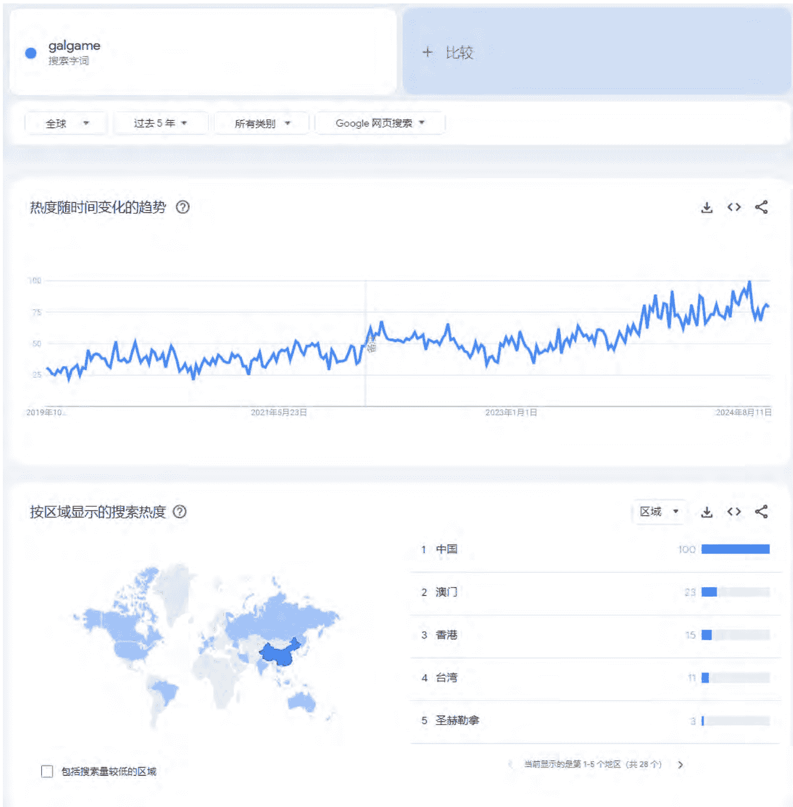
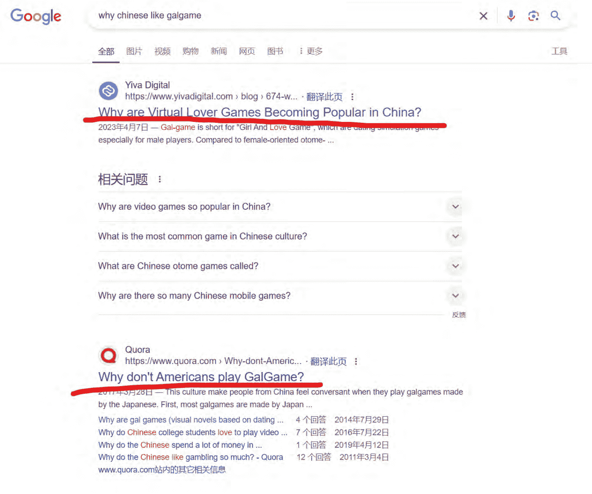

## Github Trending
### 使用场景：
浏览当下最热门的开源项目，我经常会去看周榜、以及月榜，国内外有什么热度比较高的项目。同时可以发现很多有意思的、或者很实用的工具。免费使用。
链接：https://github.com/trending
### 使用案例1：
看下当前的全世界月榜（已翻译）：https://github.com/trending?since=monthly
可以看到，排名前两个的都是和AI相关的。这就是信息。

## 热门内容
看看 GitHub 社区本月最兴奋的事情是什么。
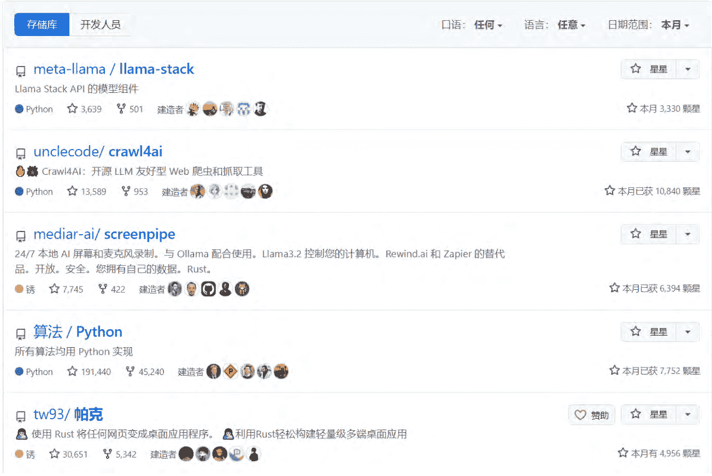
### 使用案例2：
看下这个月使用中文语言的月榜：
https://github.com/trending?since=monthly&spoken_language_code=zh
- 1. 科技爱好者周刊，我经常看，可以看到一些科技新闻，好用的工具，相关招聘，优质文章。这个项目我每周都看，已经成为我的信息源之一了。同理比如做出海工具站的，也可以做好之后提交到这里，也是一种推广。发布或者找相关工作的也可以来发布或者浏览招聘信息。
- 2. 一些有趣的应用，或者项目网站。
- 3. 免费的音乐播放器（是不是可以挂个咸鱼当虚拟品卖？）
- 4. Linux操作系统的学习资料

我最近使用了一些工具，PDF编辑、b站视频下载，音频提取、练习英语的网站、等等，很多工具资源，都是日常浏览中发现的，看多了用多了之后，逐渐有了自己的信息资源渠道，同时我还在这里找到了一些好看的简单的网站模板，使用模板制作了一个网站，专门存放我日常在各个平台，看到的好用的或者有趣的资源、工具。

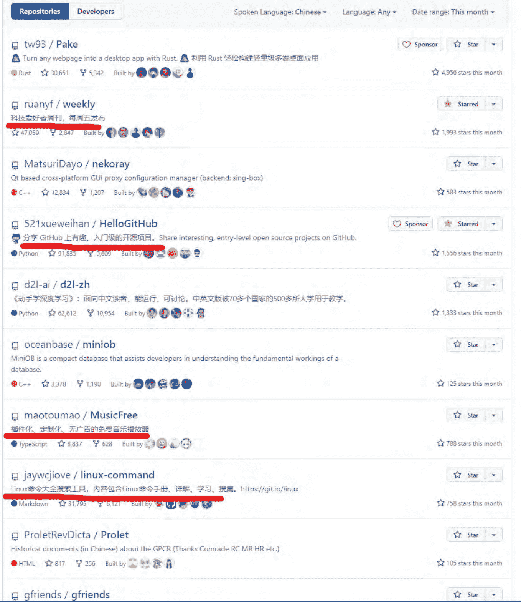

## X趋势
### 使用场景：
在X这个平台上，看下当前受欢迎的内容，同理使用各个社交平台的API，或者搜索对应平台的趋势，可以看到海内外的一些自媒体内容。免费使用。
链接：https://x.com/explore/tabs/trending
### 使用案例：
因为一些特殊的原因，我这里当前显示的是日本那边的趋势，点开第一个可以看到，现在在那边某明星饮料好像挺火。

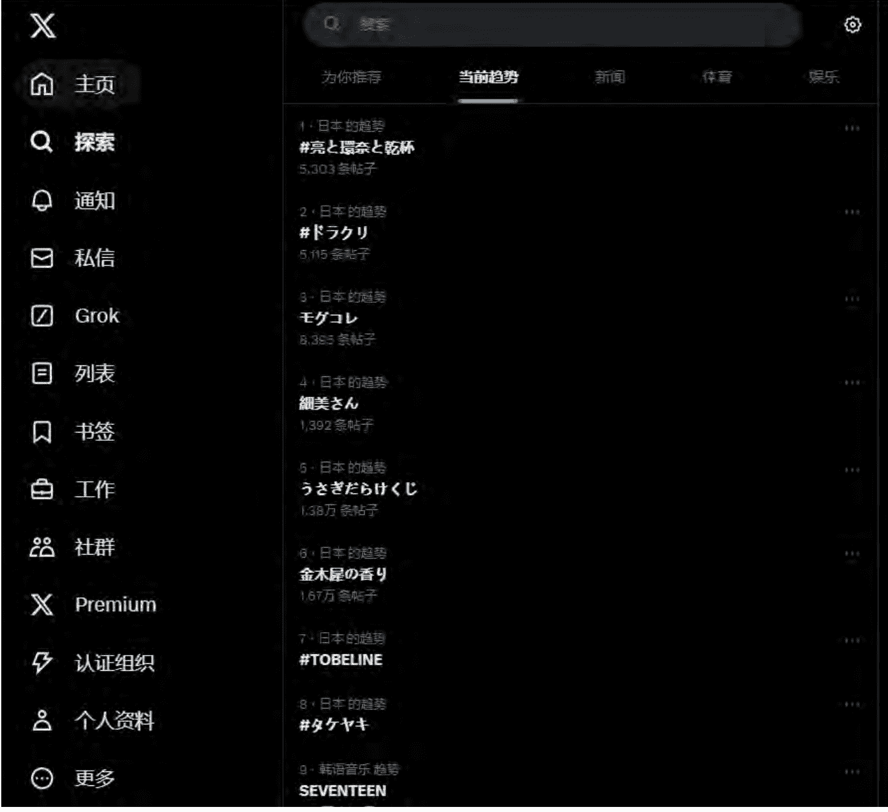

## SimilarWeb & Semrush
### 使用场景：
用于分析网站或应用的流量数据和用户参与度。它可以提供竞争对手分析、用户行为趋势、流量来源以及地区受众等数据，帮助你了解某个网站或应用的市场地位和用户增长趋势。收费使用。
我使用的比较多的场景是和Google Trends搭配起来，当我看到一个好玩的网站，我会尝试把该网站放到SimilarWeb里面分析，看下都是什么人在看这个网站、这个网站的哪些内容看的人最多，同时对于人们关注的内容延伸搜索，这些内容背后，反应了用户的需求，抓住细分需求，就能从中赚到一些钱。
链接：https://www.similarweb.com/zh https://zh.semrush.com/projects/
使用教程：https://scys.com/view/docx/HA9gdKmiLodgnxfwCYc44GtnDf#doxcnTXopfewLQkxJNJ1PRqEu7f
### 使用案例：
https://zh.semrush.com/analytics/organic/positions/?db=us&q=bargpt.app&searchType=domain
我平时喜欢喝鸡尾酒，结合AI我就想，能不能使用AI制作鸡尾酒配方呢？然后发现了一个使用AI制作鸡尾酒的网站，通过在网站上的数据，可以看到还是很赚钱的；同时一些关键词竞争难度小，使用AI辅助也不是很难做；正好我在做网站出海，就打算从这个相关方向入手，做个类似的网站。

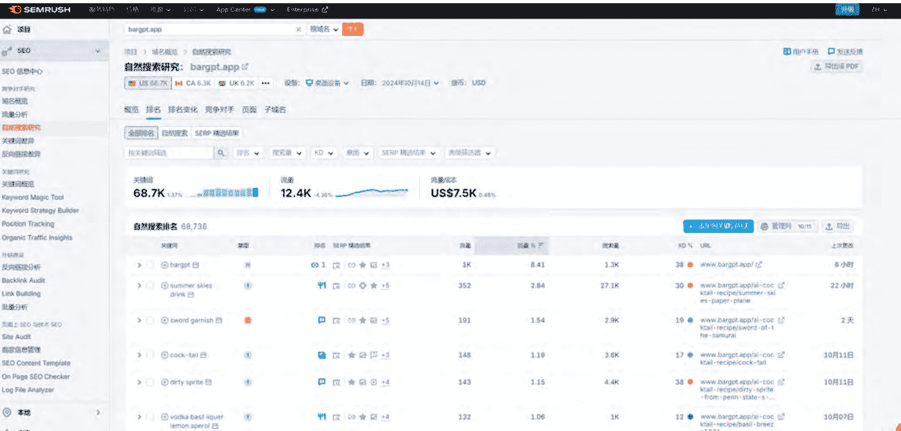

以下是我使用Cursor还没做完的网站，目前核心功能已经完成，还有很多个细节，优化一下，应该就可以发布。


## 个人博客网站
### 使用场景：
很多个人博客网站，都包含着很优质的信息，其中有些信息最近还被我拿来小小的赚了一些钱。此类网站需要长久的收集，在上文提到的GitHub Trending里，我就看到过一个项目，里面包含了很多的中文独立博客列表。此外，还有很多未被收录的个人网站，在搜索信息的时候会看到；很多个人博客网站也都会添加友情链接，顺藤摸瓜会发现好多个体网站。
同时，很多个人博客站都会放自己的某一个社交平台的链接，在平台上经常也能看到一些内容分享。
链接：https://github.com/timqian/chinese-independent-blogs
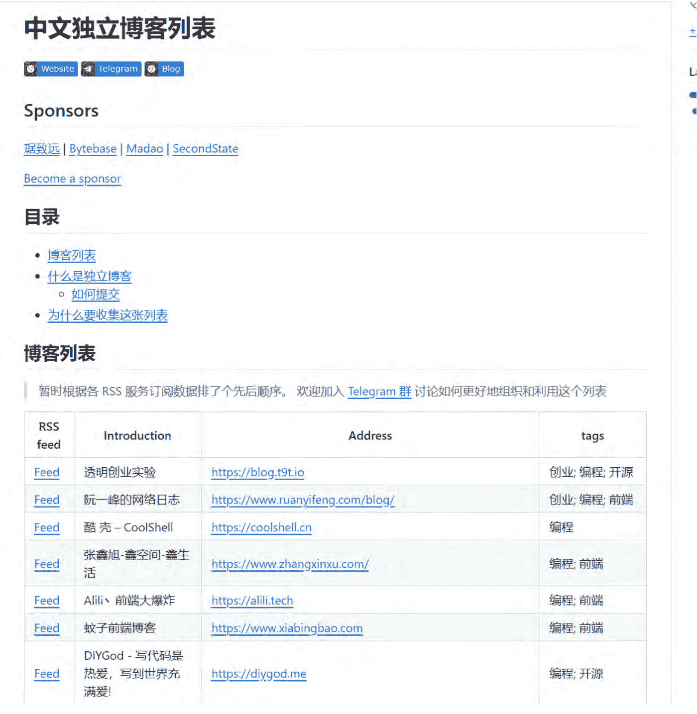
### 使用案例1：

## 公众号懒人搜索，懒人专属群分享
前段时间使用AI的时候，有需要绑定国外的手机号的，我就搜索到了这个在个人博客上的教程，教程详细介绍在便宜好用的eSIM卡渠道，我个人需求解决后，去咸鱼也发布了eSIM卡信息，帮他人购买，成本不到20￥的卡，卖50￥每天也是有人要的。
> 链接：https://azhu.site/posts/1021/#:~:text=Moldteleco
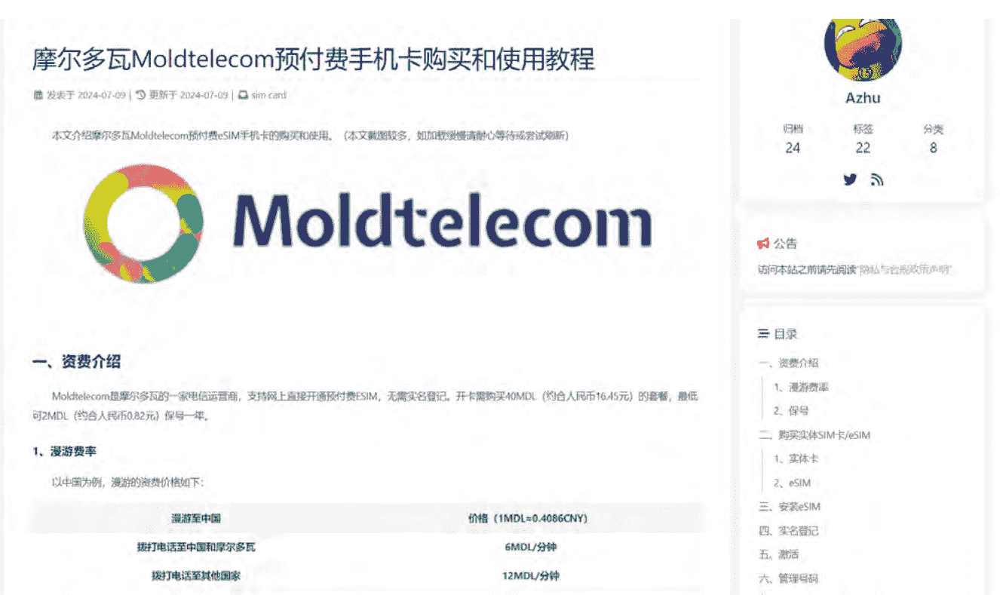
### 使用案例2：
通过友情链接，获取更多个人博客地址，拿到更多信息。
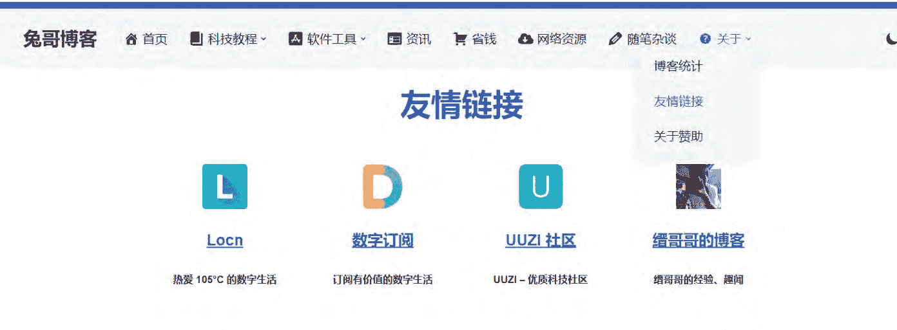
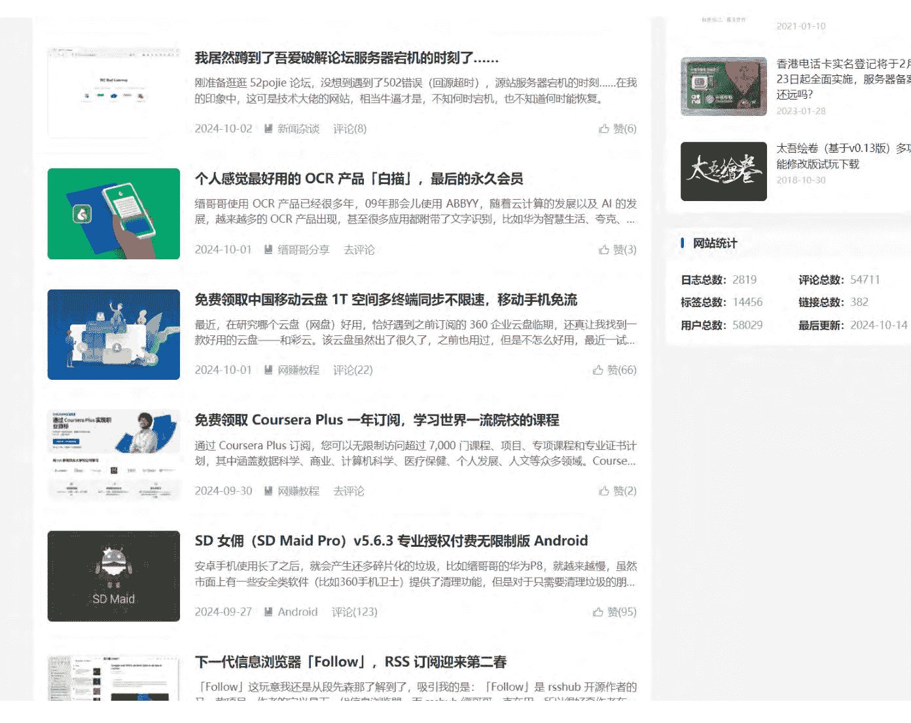

## 洞见研报
### 使用场景：
全行业研究报告,免费阅读下载市场分析报告，想了解某个不熟悉领域、或者看行业详细数据的时候我会用到它。
> 链接：https://www.djyanbao.com/report/search
### 使用案例：
生财航海有web3交流，在洞见，可以进行相关搜索，看下国内外机构对于事物的报告，从中可以获取到相应数据；网站右上角也有当前热门搜索，也是一种获取新兴事物的方式。
## Exploding Topics
### 使用场景：
发现热门话题的网站，一个人的经历是有限的，当我不知道有什么事物比较火的时候，我会去网站上看一下，有什么在快速崛起热门话题，搭配上面提到的Google Trends、Sem等、或者将内容以另一种形式，在国内自媒体平台进行创作，应该都是很好的选择。
链接：https://www.djyanbao.com/report/search
### 使用案例：
链接：https://explodingtopics.com/topic/spacegoods
在网站上发现了一个在英国，主要是多种营养成分补充剂的，去Google Trends搜索了一下，是22年5月份才出现的一个新词、以及新商品，主要受众地是在英国，那么如果有做外贸的，或者相关行业的老板，是不是可以因地制宜，做一些相关的呢？这不就是获取了新的信息么？
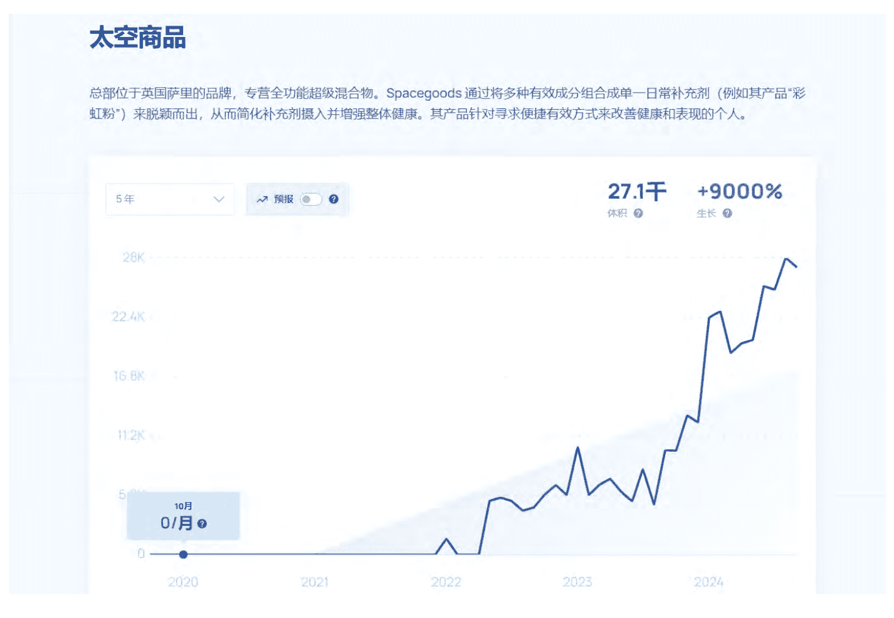
龙珠悬赏
评论区：
暂无评论
No.165/187

## (21赞)PDF加盖骑缝章工具:PDFQFZ的使用与分享
作者：凯辉(龙马)
日期：2024-10-18
由于工作复杂性的原因，接触过、使用过各种各样的工具，有好用的也有鸡肋的，刚好乘着这次龙珠悬赏的活动，慢慢整理出来分享给大家！
以下所有资源均有下载地址，详见飞书。
### 具体使用步骤：
- 选择需要盖章的PDF文件或文件夹。
- 选择保存文件夹。
- 导入完整的印章图片，工具会根据PDF页数做随机分割。
- 设定印章大小、骑缝章位置、印章位置等。
- 点盖章，稍等后在保存文件夹中即可看到盖好骑缝章的PDF文件。

当你在百度文库或CSDN当中想复制一些文字的时候，你会发现绝大部分都是需要登入账号或者会员才可以，是不是很繁琐。但是这个Simple Allow Copy插件，无需注册开通会员，就可以直接复制网页中任何文字。为我们节省时间的同时，可以进一步让我们更高效的学习和办公！

**PDF工具**：阅读、编辑、转换、合并和跨设备签署PDF文件，且无需注册。
**EasySpider**：一款可视化爬虫软件。使用图形化界面，无代码设计和执行爬虫任务。开发者只需在网页上选择爬取内容，并根据提示框操作，即可完成爬虫设计和执行。实现可视化浏览器自动化测试/数据采集/爬虫软件，可以使用图形化界面，无代码可视化的设计和执行任务。只需要在网页上选择自己想要操作的内容并根据提示框操作即可完成任务的设计和 执行。同时软件还可以单独以命令行的方式进行执行，从而可以很方便 的嵌入到其他系统中。
**网赚项目拉新平台**：包含网盘拉新、信用卡拉新、号卡分销、应用拉新等等（懂得都懂），个人/团队都可以。PS：大家可以自己注册，不要轻信他人的邀请码！！！我个人也不分享邀请码⚠️
**一键保存网页正文**：用户在浏览到喜欢的网页时，点击飞书剪存插件，即可将网页内容保存至自己的飞书云文档中，告别了手动复制粘贴的繁琐操作。
**智能剥离网页广告**：能够智能识别并去除悬浮或嵌在网页中的广告，为用户提供干净、无干扰的网页内容。
**方便整理和分享**：保存下来的网页内容可以在飞书云文档中进行整理和编辑，用户可以为这些内容添加标签分类，方便日后查找。同时，还可以将这些内容分享给其他人或者直接导出为PDF文件。
**iShot**：是macOS上最全面的屏幕截图和屏幕录制工具。截图、长截图、多窗口截图、延迟截图、注释、贴图、取色、录屏……众多丰富的功能满足你的各种需求。
**RSSHub**：是一个开源、简单易用、易于扩展的RSS生成器。在信息爆炸的今天你是否经常会被各种各样的信息流投喂，被动吸收。有时候你只需要一根绳子，最后你却牵出了一头牛。利用RSS可以根据你个人感兴趣的版块，收集优质信息源，只需在RSS阅读器中集中查看订阅的内容，大大节省了时间和精力，能够高效地获取自己关注的信息。
https://dg0gcz6gfe.feishu.cn/docx/DBThdCGwEoU7bmxqw58cTKMhnsr?from=from_copylink
评论区：
暂无评论

## (21赞)重度工具人悦悦子的必备工具清单
作者：悦悦子Cheer
日期：2024-10-15
研究项目工具指南-悦悦子版：虽然说没有做市场的充分研究，但是下面作为一名重度工具人，每一个工具都是悦悦子用到烂的那种，离开了工具，我就是个废物。
- 1. Obsidian：知识库，写文字
- 2. Toggle Tracker：时间追踪
- 3. ChatGPT，Kimi，秘塔：聊天搜索AI
- 4. Coze/扣子：AI智能体平台
- 5. 影刀RPA：自动化工具
- 6. Easy Scraper：Google爬虫插件，不舍得分享的爬虫工具
- 7. 飞书和飞行社：互联网人冲浪必备
- 8. 提醒事项/备忘录/日历：苹果生态3件套
感觉我用的频率最高的就是这些了，为了配图说明，感兴趣的朋友可以移步飞书。上面这些文字都是在Obsidian里面打出来，然后上传飞书排版的。
https://ewtk6agpo4c.feishu.cn/docx/Mv4hd5YLNo0Gx1xLTyRcDHtonYu?from=from_copylink
评论区：
悦悦子Cheer：飞书完全没考虑移动端阅读，确实失误
苗苗：学到了，感谢悦悦子[得意]
悦悦子Cheer：能帮到大家就好～

## (16赞)RPA自动化加好友工具分享
作者：华聪
日期：2024-10-16
看到亦仁老板发在星球的龙珠悬赏，是关于工具的，这篇龙珠悬赏就主要写我们在微信中用到的最简单的RPA加人获取流量的工具。
大家好，我是华聪，我加入星球的时间是应该是20年9月，记得我刚加入星球的那段时间，最让我难忘的一件事就是一个宝妈听了亦仁老板在公众号分享的方法（引用自亦仁老板公众号），去加抖音的博主，加了4000多个抖音博主的微信号。最后亦仁老板把这个微信号买了下来，还给了这个宝妈总价值7万+的奖励，包含 2颗龙珠（价值13000元）+ 20000元现金 + 一张生财有术门票（价值2365元）+ 一个龙珠俱乐部名额（价值37000元）。当时真的是把我震惊到了，加好友这么简单的方法也可以赚到钱。
通过这件事，最起码我们能获得一个结论，就是把人往自己的微信号上加好友，这个事情是可行的。如果要是加哪些同一个行业比较精准的用户，价值会更大，比如我们专门的去加一些线下餐饮店的老板，或者是加美容店的老板，有的人可能去加做海鲜批发的线下店老板等等这些。
能进到生财的圈友，我感觉搞流量都是非常厉害的。肯定很多人会认为，现在再去主动加人这种获客的方式肯定太low了，很多人估计看不上，很多圈友都是做内容、投流这种方式去各大平台获客，搞流量对大部分圈友来说不难。现在现实的情况是，很多小白用户或者是公司，还是在通过打电话或者是加好友这种方式去获客。通过某种渠道获得了自己目标用户的手机号，然后一个一个地打电话，这种获客的方式虽然让人很烦，但是还是很多人在用。我自己的手机号几乎每天都能接到这种骚扰的电话，接通电话就说他们是做什么的，有没有兴趣等等。不过这种电话大部分都是机器人打的。除了打电话，主动加好友这种方法也有很多人在用，而且是手动加，但是效率是非常低的。而且人工加好友会占用非常多的时间成本，还要一个一个输入账号去添加，还非常容易出错。
这个时候，对于这种机械性的操作，我们就可以用到自动加好友的工具了。
### 自动加好友工具的使用场景
- 1、企业拓展C端用户：很多企业在通过线上或者线下的活动后，会收集到大量的客户手机号，这些客户全部是企业的精准客户，非常重要。我们知道一个精准的粉丝，价值是非常大的，如果把一个精准的粉丝加到自己的微信上，成本最低也要10块钱，很多行业的获客成本甚至是超过了100，但是还是会有人愿意花钱去买用户。因为加到微信的用户价值是非常大的，后续通过朋友圈的运营能产生购买甚至是复购。虽然主动加的用户成交率很低，但是加了肯定有成交的，即使短时间没成交，以后还有可能会成交。
- 2、企业拓展B端用户：有很多企业的用户是面向B端用户的，比如做批发的、卖中药材的、酒水或者是茶叶批发，他们的目标用户就是一些公司或者是线下小老板。有这些老板的手机号，也可以加到微信成交，逻辑和拓展C端用户是一样的。
- 3、创业者获取用户：现在有很多做副业、卖产品的创业者，很多都是小白，没有被动获客的经验，自己也不会做内容，自己不会引流，只能简单地去加一些好友，用这种方式来获取用户。这种方法是对小白来说最简单而且能有效见到结果的方法。
- 4、电商用户私域运营：电商的卖家有一部分是有自己用户手机号的，可以通过手机号添加已经购买了产品的用户为好友，后续可以在私域继续给用户提供服务，比如活动的时候给一些优惠，让用户产生复购等等。
以上就是自动加好友的使用场景，下面给大家分享2种RPA工具，自动加好友的工具，各有优缺点。
### 第一种：影刀RPA
生财有一个航海就是关于RPA的，用到的工具就是影刀RPA。影刀RPA不仅可以自动加好友，还可以配置其他的自动化的功能。这里我引用了生财RPA航海的手册内容，手册里详细的介绍了RPA的使用和搭建机器人的方法，手册从RPA的介绍，到各种功能搭建和配置都做了非常详细的介绍，大家点击链接可以直接查看。
#### 影刀工具优点
- 1、免费：影刀也有收费版，搭建这个加好友的自动化可以免费。
- 2、可以搭建的功能多：除了可以搭建自动加好友的，还可以搭建其他非常多的功能。很多大公司都在用RPA自动化办公，能节省很多的人工成本。
#### 工具缺点
- 1、需要自己配置机器人：对新手小白来说，自己配置机器人可能有点复杂，很多人可能看不懂，也不会自己搭，自己学的话可能会耽误时间，时间成本比较高。
### 第二种：RPA加好友软件
这种就是直接可以安装使用的RPA软件，节省人工添加好友的时间成本，让软件代替人工加好友。安装软件就可以激活使用，对于新手小白来说非常友好，好处就是批量导入账号以后，可以设置好每天的添加时间和每天的添加次数，软件就可以自动分开时间加好友。
#### 工具优点
- 1、可以多账号同时用，自动备注，自动打标签，一对一精准验证语都有。
- 2、数据管理方便，可以精准的一个账号添加一份数据，数据的添加情况都可以实时查看，也可以导出查看。
- 3、降低人工成本，安装就能用，不需要配置其他的步骤。
#### 工具缺点
- 1、加好友的次数只能在微信规定的范围内添加。
- 2、只能Windows系统用。
- 3、最终的通过率，跟账号的包装、人设、验证语等等有直接关系，一般的可能在50%左右。
以上就是关于整个工具的分享，谢谢大家。
https://mp.weixin.qq.com/s/jLFRpNsi2IkbNfSxhCjf2g
https://t.zsxq.com/TWc2v
https://scys.com/view/docx/Onl7dyK2vosOPuxVq3mcCXqtnbc#UNeKdZ0CTobnrExmnNqcYNwanKf
## 评论区：
执着传媒:可以用多久呢?怎么收费

## (17赞)如何发行一款风靡全球的游戏：流程与关键指标
作者：mia
日期：2024-10-18

不知大家是否好奇如何发行一款风靡全球的游戏？一般会有哪些流程以及需要关注哪些指标？

来生财一年了还是个小透明，刷到亦仁发起的 #龙珠悬赏，刚好我有熟悉的发行领域，欢迎同行来补充（偏游戏向，其他品类也可参考）~~

详细内容见飞书文档
https://lakyojchrz.feishu.cn/docx/Ejc0dFHOQobgGzxDmurc8sVxnXb?from=from_copylink


评论区：
- 清仔：方便搞个飞书链接么？页面提示“本飞书账号暂不支持登录lark”
- mia：没问题，时间仓促用了海外版的飞书[捂脸]，周末编辑不了周一换个链接
- 清仔：[嘿哈]感谢
- mia：已更新飞书文档，内容也优化了一遍～

## (14赞)全球网站流量排行：探索Similarweb的TOP10网站列表
作者：林歌
日期：2024-10-18

作为一个资深信息检索爱好者，这个话题可谓是命中爱好了，先问大家一个问题：全球网站流量排行最高的网站，都有哪些？

这是比较好玩的事情，通过这个问题能摸索出全球的流量分布情况。 

### 一、我要分享的工具网站就是：Similarweb
- 1）打开谷歌，关闭安全搜索。
口令：
- 2）搜索Similarweb，第一行就是我们要的信息。
- 3）打开之后，直接是全球TOP10的网站列表

基本都是大家耳熟能详使用过的网站，百度排行第六，还是挺厉害的。第11-20的网站呢，会发现里面混进来几个成人类目，P站、X站都有。网飞、ChatGPT也在其中。

详细内容，请挪步飞书：
https://www.google.com/#newwindow=1&q:=abcde&safe=off
https://qnfoes1o78.feishu.cn/docx/JWdfdSjZmoVNT9xpu0Cc70N2nic

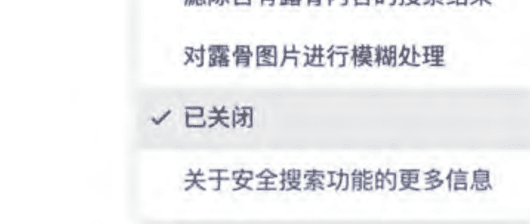
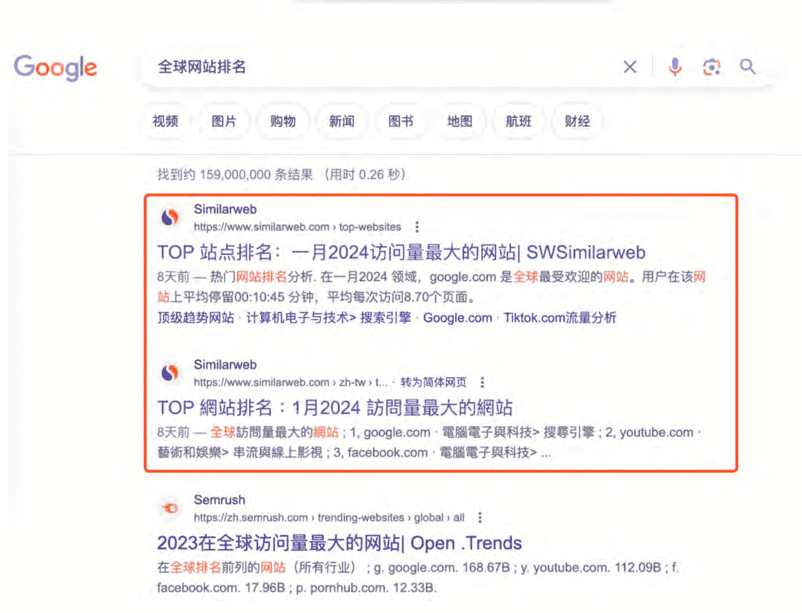
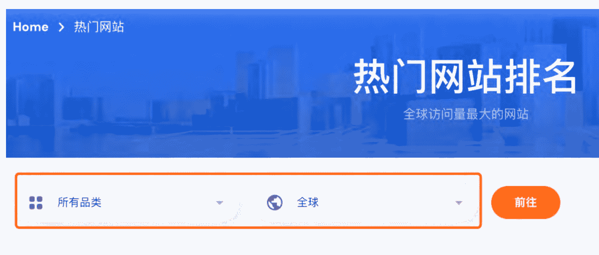

| 排名 | 网站 | 品类 | 排名变化 |
|---|---|---|---|
| 1 | Pornhub | 成人 | = |
| 2 | Xvideos | 成人 | = |
| 3 | XNXX | 成人 | = |
| 4 | XHamster | 成人 | = |
| 5 | Stripchat | 成人 | = |

## 黑洞资源笔记

广告位出租，欢迎投广 #免责声明：广告虽是本人所...

Leave a Comment

对于4x4车辆，无论是公路还是越野，在后者的情况下，我们会记录并骑行所谓的“轨迹”，这些轨迹是在导航设备和 Garmin 等应用程序中保存的路线。这些轨迹可以保存并分享给他人。

包括公路和越野。在后者的情况下，导航是使用地形图完成。导航设备和 Garmin 等应用程序保存的路线。这些轨迹可以保存并分享给他人。

对于绘制此类轨迹的应用程序，由于我们在旅行时记录路线，因此我使用 GPXLAB。我们将位置数据发送到服务器的项目。这些数据可以导出到 GPX。

这些地方通常偏远，往往没有移动网络覆盖，文明可能在数百公里之外：海洋、沙漠、异国他乡。在这些地方，通信的唯一真正方式是通过 Iridium，Garmin InReach 等设备正在使用。它们不仅可以记录 GPX 轨迹，还可以在出现严重问题时发送消息或寻求帮助。

作为一名电子爱好者，我的下一步是构建自己的追踪器。虽然构建基于 GSM（GPS + SIM800L）的跟踪器相对容易，但涉及 LTE 和卫星通信的项目需要使用更昂贵、更好的组件。

构建这个项目为我提供了一次机会，加入在北极航行的 S/Y Southern Star 游艇的船员。


## Aegir GPS/LTE/Iridium Tracker：一款能在全球范围内工作的 GPS 追踪器，通过 LTE 和铱星网络发送数据到云端，特别适合偏远地区使用，具备实时位置显示、数据存储和扩展功能

Leave a Comment

## (14赞)5年抖音服务商经验：品牌告别团购的低级卷
作者：楚川
日期：2024-10-16

### 1、品牌转型服务商的增长经验
大家好，我是楚川，我一直在溯源我为什么十分坚持一定要坚持做【线上-线下共振的生意】。这个思路源自于2018-2020年上半年做解酒糖的思路，最开始起盘这个生意的大哥们的背景是湖南头部保健品的产品、头部连锁药房董事，以及我自己一个做食品科学，研究肠道健康方向，懂互联网运营的人。所以项目一开始就是瞄准线下连锁，线上主流电商平台和短视频-直播带货。

在两年多的操盘工作，我完成产品研发、包装、生产、推广的全流程深度参与，在2019年大获全胜，各大平台都先后拿过销量榜首的位置，但发现线下只是铺货但未重推，销量却随之提升，且随着线上声势浩大，上千个药房、KTV和酒吧的销量都在递增。那时候在我心里留下很深的印象，并在2019年春节已经联合当地跑腿公司做到各大喝酒场所30分钟配送解酒糖，线上做投放，后面因为“口罩原因”计划流产，投入打水漂。

“线上种草，线下交付履约，这是未来”，这是我在2020年坚信的点。这让我在5年左右的时间一直在坚持给合作方灌输的，自己的方法论也在期间完善，从自己的标签介绍就能看出来。

2022年，服务商家4000多家，最会写方法论和复盘的人，那会我的方法论还是意识流，没有形成系统；
2024年，我对外的介绍是实体行业流量服务商，过去6000个客户验证了我们的方法论科学性、可持续的能力，目前针对性服务同城高客单连锁品牌、实体工厂。5年时间找到了自己的路，一路此起彼伏，把捡钢镚的生意演绎得壮阔人心。

2024年，我们开始深度接触暂未下场抖音本地生活的客户，有装修设计、蓝领招聘、租房连锁、门窗、建材工厂、自助棋牌室、大型桌球连锁、包装工厂、塑料制品工厂、汽车改装城、求职辅导、机械配件等，这些企业大部分都是10年以上的存货周期，现金流充沛，经销商网点在全国100个以上。但不知道如何下手，利用抖音完成“流量-供给-线下网点”的流量闭环。实际上这类品牌、工厂的线下经销网点庞大，很适合用抖音-美团云连锁的方式做到组网，将经销点翻牌成为加盟点或者履约点，流量和品牌共享，但这个周期需要3个月左右的时间完成重组，导致很多项目无法真正落地，其中的几点原因如下：

- 第一，传统行业对于短视频的理解就是短频快，上线即爆单（唯GMV和ROI论），忽略了这个行业的流量多、竞争激烈，也需要时间沉淀去做营销基建、团队能力培养等，跟实体店开店运营周期差不多。
- 第二，老板对于自媒体的期待过高，3个月左右的市场培育期可能已经让团队丧失基本信心，老板也不想继续投入，自然而然没有动力推动。
- 第三，品牌和工厂的短视频转型，重构行业获客方式是一把手工程，要整个团队团结一致去推动，而不是一个部门，一个职业经理人能带动的，这个认知是99%的人意识不到。

### 2、让品牌突破低级卷的经历
当下的短视频本地生活实际上还要从抖音入手，因为现在的平台流量大，流量相对来说是性价比最高的，因为算法决定营销效率是无敌的。我从解酒糖从0到10的线上-线下生意、再到6000多个实体企业的服务经历明白这其中的奇妙。过去我做线下品牌，需要人巡店运营，重大营销事件更要地推做拉人头，但现在抖音基于定位POI，一个视频1000播放量可能有40-50%来自3-5公里的流量，这都是字节跳动的算法优势。相当于一条视频替代了曾经2-3人的地推效率，那矩阵越多，视频越多，这种效率就无限累加。

当下阶段的抖音就用这种方式，替代了曾经的地推千军万马，重构了实体行业的获客模式。但是当下抖音5年的蜕变，领先所有短视频平台，做到了本地生活行业的最快增长，生态和算法都极致匹配，也有100万以上的商家入驻。所以在这种竞争下，品牌要做到真正意义上的突围，可持续有增长，那就必须有战略意识、适配的生意模型、穿越周期的勇气。

首先，我们来从实体品牌和工厂在抖音应该做到的生意模型搭建流程。

抖音本地生活的生意模型会分为到店（云连锁、传统加盟店模式、直营门店连锁）；到家（直营、订单外发）；工厂（全国经销商体系、工厂直营辐射全国）；酒旅（景点、酒店、博物馆、游乐园等）；政务（地区宣发、招商、领导干部IP），这种不同的链路就需要不同的商业模型来落地，且不同的行业有区分，落地的打法也千差万别，整体打法的种类可能在1000种以上。所以在整体落地上，非垂直赛道服务商很难精准击中企业需求，双方也很难达成共识，这种矛盾在2024年逐渐凸显。

因此在品牌和工厂的模型搭建，从0到1的起步阶段需要清晰：推广目标、核心区域、需要影响哪些人群的决策。基于这个三点目标再结合本地生活的流量区域化，以POI为逻辑的流量分发、快速筛选特点，去搭建流量闭环。举例利用经销商体系覆盖全国的门窗工厂的流量模型搭建：将配合度高的经销点变为加盟店，一店两招牌翻为品牌加盟店；用同一供应链体系，统一SKU上线抖音，所有门店做到连锁化经营；总部负责流量运营，加盟店辅助做小部分工作，线索集中化运营、筛选再做分发到区域。用这种模型能在1年内做到1000家以上的连锁规模，这就是依靠抖音的流量分发做到快速起盘，后端再依靠小红书、视频号等做整合营销。

其次，了解抖音的用户特点，用户想看什么内容。

90%做内容的人都会沿用电商的思路，“黄金3秒、60秒内成交”的套路会让短视频很重。但本地用户人群对本土生意都是有基础认知，门店、工厂的存在会让用户有天然的信任，就不需要花里胡哨的短视频给用户。当大部分做内容是站在自我立场，做这些本地用户不看的内容，且视频成本极高，产出就很低，反而会认为这盘生意不靠谱，或者不值得做，造成错误的判断。

其实用户只需要简单、高效直接的内容传递到手里，只需要短视频把服务、产品做到场景还原，把业务快速讲清楚，这些就是本地用户想看的，而不是我们一厢情愿表达的短视频。另外平台的内容相对来说的饱和状态，短视频的更多作用是品牌用户的触达，必将需要每天多次、多号发布视频才可以逐渐建立品牌心智。这种价值的逐渐体现会在抖音搜索成交、营销投产比、品牌城市渗透率体现。

这套打法的价值、落地程度会最大考验团队的认知，矩阵的运营、好评率、复购率和舆情都会考验所有人的能力，这些就意味着要搭建一个自上而下都要充分认可、敬畏短视频的团队，用10年以上穿越过创业周期的智慧，把这些执行到位。穿云团队在服务天鹅到家的时候，保洁业务线的抖音营销做到单月最高7500万，就是依靠全员配合才能拿到这样的结果。

### 最后，就是根据大环境的变化去判断机会和建立战略。
2024年是抖音非常规类目的崛起时期，穿云团队服务、观察到自助棋牌室、门窗连锁、手机维修等细分赛道在门店的拓展中超过1000家，绝大部分品牌和工厂的核心卖点都是以抖音本地生活为主，核心还是在于短视频赋予的红利机会。品牌和工厂类的负责人要从：传统获客和短视频获客成本的比较、品牌渗透率、流量增长空间、测试周期和盈亏心理线、平台或者区域行业身位和占有率。

抖音是一个国民平台，用户日均停留时间长，容易创造营销奇迹。用户集中时间多、大数据算法快速匹配潜在用户，按常理是极大缩减获客成本。因此在起盘的时候，企业主思考的是：传统获客成本到底是500还是1000元，在抖音则按照20-50%去做成本预估。抖音是一个内容平台，也需要商业化，成本缩减不代表不要钱，这是老板要纠正的思路。我在服务6000多家企业的阶段，很多老板认为原来1000个客户成交，可能是地推、销售军团陌拜、电话销售，可能最终要花出去40万元，但他们会理解抖音就只需要花4万或者几千块。反过头来讲，建立一个销售部跑完所有流程，可能初期也是20万花出去，同理做抖音也要有这么多投入才可以把成本摊低、才可以把营销的水烧开，客户反复被营销才可能给钱。

当抖音的渠道营销正式跑通后，老板这时候要思考的是这个行业的抖音品牌渗透率。如做装修设计的公司在长沙可能有8万潜在用户，要在抖音获得5000个客户，那就是6.25%市场占有率，按照10%转化率就需要做到62.5%的品牌渗透率，必须用抖音触达。一个城市30%以内的品牌渗透率可能是5万，那62.5%就是要几何倍数递增到30万，最终再根据所有支出成本倒推单客户成本，就能知道在全国怎么布局，核心城市怎么布局，新城市怎么杀出重围。

以上是在品牌和成本的估算，那往深度剖析就是要老板亲自下定决心把抖音渠道吃下来。因为前半部分是让品牌或工厂快速拿到结果，那后半部分就是涉及到真正细化到老板的战略和落地动作。这部分要考虑就是平台或者区域行业身位和占有率，要在抖音拿多少用户，排名是第一梯队，还是中间部分，大概是多少比例。因为现在自媒体的数据透明化，比拼是各家精细化运营的能力，对于项目投入的深度。用实例解释就是：设计公司要在抖音做到区域第一，拿到平台20%的订单，也就是1.6万客户，对应推出来的周期可能是12个月；整体投入那就是1600万【按照600元计算】，重点是前3个月的子弹打出去可能是40%，这一点就会极度考验老板的耐力；预计在5-6个月是盈亏线，也就是前后投入了70%的费用做到项目整体的盈亏平衡，在7-12月为盈利期。

这就是根据抖音本地生活的红利来做的企业机会点判断和战略设计。传统企业大部分会测试、浅尝辄止，导致给了很多小团队快速崛起的机会，如快修猫、GAG手机维修，都是不到一年可以做到1000家以上的体量。

### 3、品牌再不上车就晚了
2020年我们打爆蹦床公园、龙虾馆，2021年做火美甲美睫、烘焙、酒吧，2022年引流亲子乐园、餐饮爆品供应链，2023年给抖音家政插上翅膀，2024年转型传统大连锁品牌、工厂获客的经验都在告诉我们一个指示，抖音的红利逐渐在衰减，短视频本地生活的存量红利会逐渐降低，对于持续拿到结果的能力要求越来越高，服务的维度要逐渐加强。

2024年起各行各业都奇卷无比，也就说明品牌和工厂还是需要客户做长效经营，做长期生意。在短视频本地生活红利存在3-5年的情况下，必须要扎根快速拿客户，再做长期经营。因为抖音生态搭建成熟，依旧存在2-3年的蓝海期，视频号未来2年必将崛起，整体在5年左右的舒适增长期，这是不得不抓的点。

那短视频给到实体行业的红利还多久？那就需要从几个维度来分析。

- 第一，实体行业的互联化程度。
楚川观察到一个数据，2021年前后的实体行业的线上化率在10%左右，但在2024年各大行业报告的分析是渗透率20-30%，那就意味着还有70%以上的新用户增长空间；所以当新用户低于70%，很有可能就是流量方法有问题。并且如果做不到用户留存，长期生意，那也不行。

- 第二，再大的品牌也有流量洼地，打不进的区域，但是抖音可以。
我们做的案例中发现短视频可以逐渐侵蚀一个区域。曾经不可一世的区域互联网，公众号、APP、私域统治了区域流量，但现在都看短视频，抖音、快手、小红书、视频号无孔不入。超级平台给所有小团队一个清醒的巴掌认识到用户是平台持有，而不是你们私有。因此品牌或工厂只需要建立起不同城市的策略，用内容在各区域做渗透，逐渐拿到自己的客户，深刻理解到靠小平台、媒体很难再封杀竞对。拥抱短视频是另外一番完全不同的思路，打法上也跟传统的排外意识有差距。我们在深圳简单测试出租房业务，一个小公司就能很快在平台突围，做到品牌渗透率、线索量都爆满的状态，那说明传统的贝壳、安居客不一定能在抖音进行绝对围剿。

- 第三，核心区域和核心战略，如工厂、房产都能针对于重点区域做POI突围。抖音本地生活的流量模型是基于定位分发流量，未来短视频平台也大概率是沿用，所以在业务推广都可以基于这个逻辑做突破。因为楚川的理解是：不管什么生意都存在物理空间，在什么区域，是什么样的C（做决定的个体）。因此只需要搭建区域POI的地网，用人网组建抖音矩阵的天网，就能筛选到决策者、买单者，也就是说正经生意不存在搭建不好的流量闭环。

最终我们看到2024年行业开始有分水岭，平台完成无序增长，一切回归理性、科学打法的时期。过去只能用超低价+探店达人一波流的方法论，都将消失在时代的车轮下，拿到结果的可能越来越低。企业主要在这个阶段不掉队，真正去筛选好的团队，好的服务商，才能真正拥抱抖音这个新渠道。
黑马的牛文文先生提到2024年企业要持续进化，完成肌肉式增长。过去的低级打法要逐渐抛弃，接受以下三点构建自己的可持续增长方法论：

- 第一，告别哗众取宠的短视频，本地用户不需要套路，只要简单、直接、高效的信息传递。
- 第二，拥抱科学的流量分层，不再是单一的达人探店，需要自建员工职人矩阵、间歇性用探店达人、定期用户圈外人群种草做破圈，把流量做不同的层级，提高势能。
- 第三，提高人效，合理借力。能外包的架构成员均外包，如拍摄、剪辑、内容分发等，用最小单元拿到结果再考虑团队进化。

未来2-3年左右的时间，楚川会带领团队持续寻找高客单、高社会价值的产业，搭建新的流量模型，为不同的行业找到健康的增长方式。跟有结果的人学习才能拿到结果，期待每一次跨行业的碰撞！

评论区：
- 半扇咸鱼：单个字认识，放一块基本不懂..

## (8赞)从0开始做播客：播客经验分享

作者：双菱

日期：2024-10-16

从0开始做播客：播客经验分享。大家好！我是双菱。这是一篇萌登主播的经验分享，希望能对想做播客的朋友们有所帮助！

之前在播客打卡群分享过，来星球上面发发看大家有没有什么问题可以继续补充进文档的，所以我来啦～我会以和明白、根源夫妇录制的这几期节目为例，分享从前期选题、沟通到正式录制和后期剪辑与上线的详细过程。内容见飞书文档，请大家移步查阅：

https://e1hu1wy3gm.feishu.cn/docx/QJjCdhlaXoAllSxuYFjcXQ22nIb

评论区：
- 大栗子：双菱老师太优秀了，帖子很细致
- 田媛Karen：你这新播客就上榜，也是厉害了哇
- 双菱：啊啊啊啊大栗子！那必须的，写了一天了哈哈哈哈哈
- 双菱：归来仍是新星榜啊哈哈哈哈哈
- 登登：双菱老师的播客手册太细了，我猛学

## (2赞)INFP塔罗师成长之路：低粉变现1万心得体会

作者：🌙 塔罗师lucky

日期：2024-10-16

infp塔罗师成长之路低粉变现1w心得体会，玄学赚钱之前要盘清楚的道！强IP塔罗师的高变现之路

文章不长，但却是我这个赚钱小白半年来的一点思考和实验心得，我觉得随着灵性的发展，我们也要与时俱进，能掌握的具体解决问题的方法越多，我们这类从业者也能更好的帮助他人，而不是从牌里解读出来一些片汤话，空洞又不能帮到人

https://docs.qq.com/doc/DWVBT_TGpzYlhIZlR3

评论区：
暂无评论

# 【超级标】1篇

## (精华帖)(831赞)AI 自媒体：抓住AI领域热钱与自媒体广告投放的新机遇

作者：亦仁

日期：2024-10-15

惊不惊喜，超级标它就这么悄无声息的来了。01 开始之前，先定义一下在我脑海里面什么是超级标？它是一个项目，基本要符合我分享的选项目的标准，它有足够大的空间，能容纳几百甚至上千位圈友进入，能在做的好的情况下，有几十位甚至更多圈友实现一年多赚几十万甚至上百万的目标，有天赋选手出现，上千万也有可能。

这次的超级标是，AI 自媒体。我的几个观察和想法：
1/ AI 领域有非常多的热钱，这些钱必然将有一部分会进入到用户争夺上；
2/ 有非常多的AI 产品，已经在各个自媒体平台（B站、小红书、抖音、公众号、视频号、X等）选择AI博主投放广告，这让我感受到了教培火的时候好多公众号接广告接到手软的情绪记忆；
3/ 我身边的一个小伙伴，做小红书几个月，粉丝几万，就接到了豆包的广告商单，价格是 8000 元；我在一些平台看到有博主一个月接到六七条 AI 相关的广告；我投资的一个团队，目前是豆包DSO推广的服务商，每天很多消耗；我听说知乎每天广告消耗靠前的很多是AI产品；当很多事情连在一起时，它就是一个不能视而不见的大趋势。
4/ 现在AI产品的种草效果很好，我已经在各种自媒体的种草下用或者买了不少AI产品了；
5/ AI 类的内容属于各个平台喜闻乐见的内容，愿意给流量扶持，符合各个平台的趋势和定位；
6/ 最重要的是切入定位，做AI 自媒体的切入点非常多，可选平台也非常多。因为AI将在几乎所有场景都带来变化，我们在生财圈子里面以为习以为常的东西，放出去都是巨大的信息差。具体定位推荐，可以等待 11 月航海手册。
7/ AI 自媒体不是让你用AI 做内容，而是成为AI 产品/新闻/资讯/场景等的一个渠道；
8/ 我们将在 11 月航海上线 AI 自媒体选题，带着你下场，但欢迎你现在就开始动起来，不要期待要开干，说不定那时候，你就可以成为教练了[机智]

综上，如果你还没找到合适的项目开始干，要不要试试这个？
https://t.zsxq.com/hD16c

评论区：
- Mercury : 太好啦
- ocree_po : 棒极了
- 愚小米 : 终于等来了
- 凡夫俗子 : 期待11月航海[微笑]
- 皮皮鲁 : 趁热
- anna : 可以
- 海娇 : 期待新的航海
- 凯莉粒 : 上！

# 【星主的收藏夹】5篇

## (37赞)信念、身份、系统：支配和引导生活的深层力量

作者：亦仁的收藏夹

日期：2024-10-17

在生活中，我们往往过于信赖下三层：环境、行为、能力，而忽略（未意识到）在更深层支配和引导我们的上三层：信念、身份、系统。
https://mp.weixin.qq.com/s/82WkX81jzCQ23dVwlE2oPw

评论区：
暂无评论

## (35赞)一个理想主义者的倾家荡产丨方励 一席第231位讲者

作者：亦仁的收藏夹

日期：2024-10-15

> “我经常和大家说，我们生命的长度、宽度和厚度，是我们的生活质量。在这个过程中，我们都是投资者，我们的投入是生命，把生命投入到每天的行为，不管是工作还是业余生活。”
https://mp.weixin.qq.com/s/7SODZ0XP8Jz--D4czjwFvw

评论区：
- 吴秉晖：但是大部分人投资目标不明确。最终生老病死
- Jimi：有被感动和激励到，好佩服这样有能量的人。亦仁摘录的这段话也十分经典，生命在于体验，希望自己也可以勇敢尝试更多的人生体验。
- 岳嘉：方励老板2014年一席演讲视频-感谢你给我上场的机会，看了七八遍，2024年最新的演讲视频，也看了三四遍，这个大叔的演讲，百听不厌，做重大决策，犹豫的时候，再返回多看几遍，答案就出来了

## 公众号懒人搜索，懒人专属群分享

## (26赞)挣钱与个人及组织能力的持续提升

作者：亦仁的收藏夹

日期：2024-10-14

挣钱是个结果，而我们要强调的是过程，强调个人和组织能力的持续提升。
https://mp.weixin.qq.com/s/1MsqMiWflkL6LOUYojsqCQ

评论区：
暂无评论

## (26赞)王川：做一个独特而稀缺的人

作者：亦仁的收藏夹

日期：2024-10-16

需要有意识去控制供给，制造稀缺性，实践稀缺性溢价的艺术，把利润最大化。
https://mp.weixin.qq.com/s/cqtKirQ4fgekSyebf2GRLg

评论区：
- 许老师～生财投资孵化：王川老师的洞见太牛逼了[强]
- 大栗子：营造自身的稀缺属性真的特别重要!!
- 笨就笨：稀缺是价值

## (25赞)管理者最大的底气，来自解决问题的能力

作者：亦仁的收藏夹

日期：2024-10-18

> 真正靠谱的管理者，都是问题终结者。
https://mp.weixin.qq.com/s/uaTgwMlqUPDJWEINqzo_5A

评论区：
暂无评论