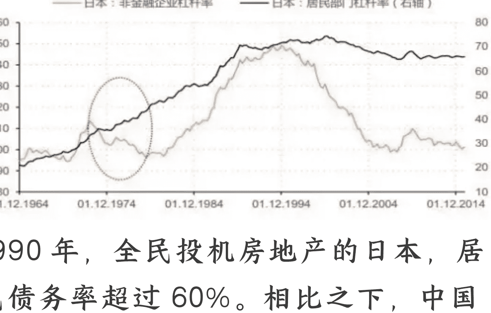
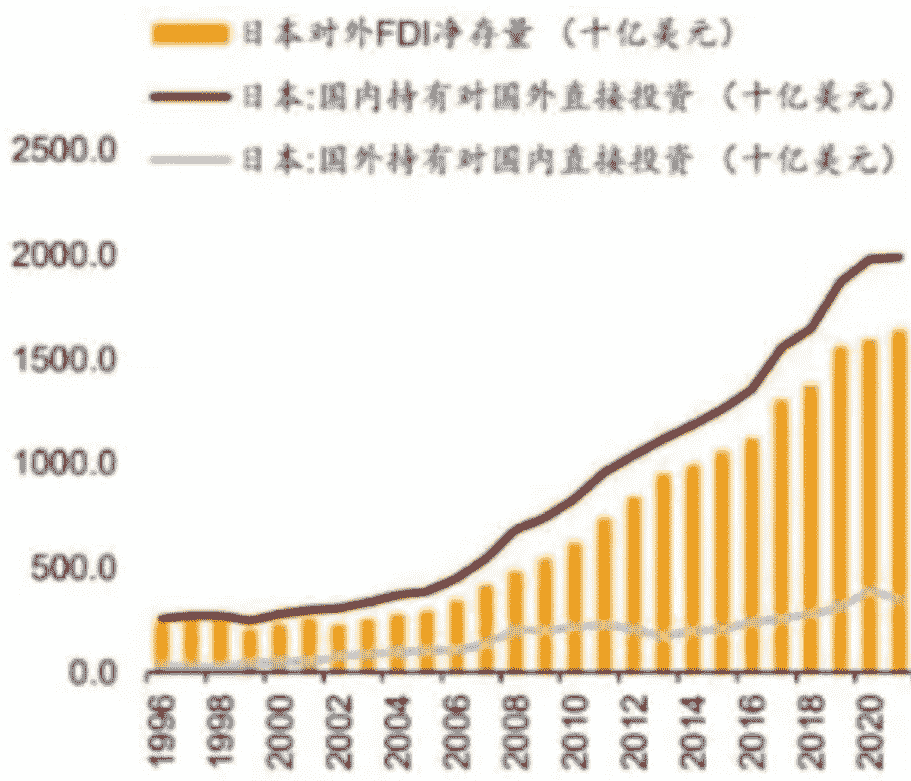
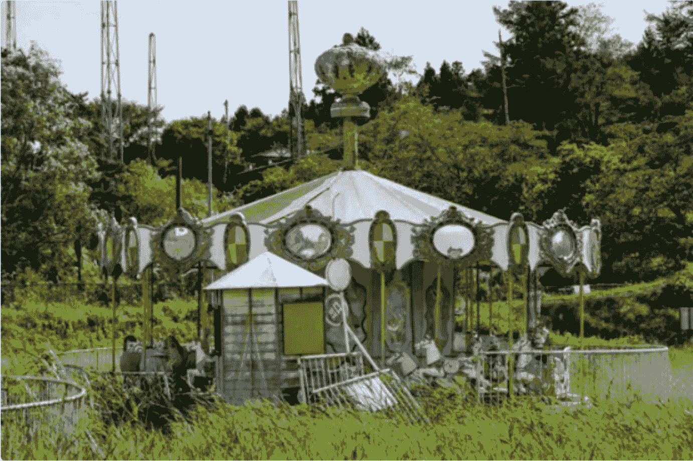

# 日本普通人怎样度过“失去的三十年”

241024 三法司正道办

整理：公众号懒人搜索，懒人专属群独享

懒人微信：lazyhelper

1987 年，美联储宣布加息。

从当年的 1 月 5 日至 1989 年 5 月 17 日，美联储共计加息 22 次，利率从 5.87%提高至 9.81%，历时 28 个月。

依旧沉浸在繁荣美梦中的日本没有料到，或者不敢、不愿料到，经济泡沫破裂的丧钟正渐次敲响。等待着 1.2 亿日本人的，将是泥淖一般的失去的三十年。

这三十年中，日本虽仍是发达国家，可经济结构已发生了翻天覆地的变化：

引以为傲的家电、手机、汽车、半导体等实体制造业正不断被中韩所侵蚀；房市、股市的市值也经历了长达 20 多年的下跌。

国家和个人的精气神也都发生了巨变：

国家从叫嚣“日本不高兴”、“日本可以说不”、“买下美国”，变成服服帖帖的美国跟班；

年轻人的主流画像也从热血漫画中的昭和男儿，变成不婚不育、沉湎虚幻的平成废宅。

这三十年，似乎又有很多没变：

三十年前在泡沫顶峰接盘的房奴，纵使房产价格早已跌破净值，但依然在为了征信艰辛地偿还着长达几十年的房贷；

三十年前在萧条来临时进入职场的年轻人，也丧失了前辈们那稳定富足的工作待遇和晋升机遇，多数人只能在劳务派遣与合同工这类不稳定、待遇低、晋升难的岗位讨生活。

如果历史可以重来，在三十年泥淖中被磨平锐气、伐去神采的日本人，一定会再三谨慎思考，昔日向魔鬼透支来的繁荣，代价究竟是什么。

近期跟企业界、经济学界一系列资深人士的接触，让老何萌生了好好写写日本现代经济走向的想法：

虽然相比日本，我们拥有独立的内政、广袤的腹地、丰富的资源和成熟内循环体系这些日本可望不可即的优势；

但两国毕竟都借助融入全球化而获得大发展，同样是高积累、低消费的发展模式，同样是美国视为政经对手的国家，甚至同样是东亚儒家文化圈。

这些相似的情况决定，日本从国家到民众踩过的坑、摔过的跤，对我们来说比任何国家都更要有借鉴意义。

更不必说，如果仔细研究日本危机的产生原因，发展过程，应对措施，以及普通民众在这种大背景下的行为，作为国人的我们必然会产生一种别样的熟悉感。

作为升斗小民，个人在大时代中的趋利避害决不能指望“宏大叙事”替自己包揽一切，我们近年许多的经历已说明了这点。他山之石可以攻玉，善察青萍之末，才能在未来把握先机。

按惯例，篇幅最长、价值最高的内容将以付费的形式和大家见面。老何说在前面，这篇梳理不能教大家发财，但一定能为大家减少可能的风险损失。

—

让我们把时钟拨回 1985 年。

自朝鲜战争和越南战争起，美国为建立冷战的桥头堡和后勤基地，对日本进行了大规模的产业扶持，这也开启了日本持续三十年的繁荣，GDP 总量从 50 年代不足 10 万亿日元增长到 80 年代的 250 万亿日元，实现了 25 倍的增长。

可随着日本经济的崛起，物美价廉的日本货横扫世界，欧美各国尤其是美国深感威胁。

为此，美国利用日本政治不独立及经济高度依赖外界的情况，强迫日本低头，玩了一手阳谋。

1985年9月22日，美国、日本、西德、法国和英国的财长和央行行长在纽约广场饭店举行了会议，签署广场协议，其中最重要的条款即是日元升值。短时间内，美元日元比从1:250飙升至1:120。

日元变得值钱了，日本产品在海外的售价提高了，出口收入开始减少。可依赖出口导向的日本并没有很惊慌，因为日本人很快发现，随着国际热钱涌入国内，“脱实向虚”似乎能比辛辛苦苦做实业更能延长漂亮的高速增长。

在日本政府的推动下，住宅商品化高速发展，商业银行大量为居民购房发放贷款，贷款利率大幅下调；日本央行也不甘落后，印钞机也开动了起来。

广场协议签订的1986年，日本的货币增发量便逼平全年GDP总量，达到335万亿日元。之后几年，日本的年度货币增发量都超过了日本本年度的GDP。

相比之下，08危机后开启印钞机的老美，2008-2010两年新增的货币量也不过占2008年GDP的20%。

在日元升值和政府支持的双重刺激下，日本国内外热钱大幅度涌入房地产-金融领域进行炒作、套利。日本的房价和股票市值急速攀升，五年内土地价格指数和日经225指数分别大涨约300%、200%。

这种背景下，日本国内几乎所有企业都涉足了房地产业务，疯狂举债拿地建房炒房，以至于80年代日本东京房价的市值便可以买下整个美国。

证券公司则全力拓展理财业务，通过承诺高收益率吸引企业和个人的资金。当时日本理财产品的实际年收益率也都超过了50%，连银行都将闲置的资金投往股市获利。

另一方面，日本企业还借助日元升值的便利在海外疯狂“买买买”。买科技企业太累了，不如买些漂亮的资产。一时间，国际知名的高级饭店、高档住宅、知名球队等，纷纷换上了日本老板。

受到繁荣的刺激，居民也在乐观预期下疯狂贷款。一些大学生甚至在毕业工作一两年就贷款买了几套房，然后将这些房子抵押再贷款继续买房，社会整体的债务率迅速飙升。

1990 年，全民投机房地产的日本，居民债务率超过 60%。相比之下，中国在 2018 年时的数据是 60%。

猪养肥了，就可以杀了。

1987 年，美联储开启了历时 28 个月的 22 次加息，包括日本在内的海外美元开始大量回流。这如同给日本经济破了一大盆冷水。

不过，日本过去几十年的高速增长毕竟积累了一些财富和家底可供透支，人心也依然停留在繁荣带来的积极预期中。

> 因此，纵使全民都知道这种炒作资产、击鼓传花的游戏迟早会崩，且越往后拖延问题会越严重，但人人都在侥幸心理之下入场，日本政府也一再犹豫延宕。
> 这也是危机必然爆发的人性基础。

1989 年，危机终于到了掩盖不住、露出苗头的时候。

1989 年 12 月起，股市从巅峰开始回落。日经指数从 38915 点的历史最高开始一路狂泻三年，腰斩至 1992 年 8 月的 14309 点，跌回了 1985 年的水平。

三年间，日本股市缩水超一半，由1989年底的630万亿日元降至299万亿日元，股市泡沫基本宣告破灭。

1990年，在股市下跌的刺激下，日本政府不得不开始出手抑制房地产泡沫。

3月，日本央行第一份限制房贷的规定《控制不动产融资总量的通知》出台；8月，日本央行又把短期贷款利率上调到6%。

高利率的压力下，房价终于绷不住了，开始掉头向下。日本房市的玩家们也渐次迎来了暴雷和退场。

首先绷不住的是资金紧张的房企。新房开始降价，以期回笼资金；普通企业由于出口和房地产、金融业务接连遇冷，开始降薪裁员，上杠杆买房的房奴由此被波及，还不上房贷，法拍房不断增加，房价进一步下跌。

这两类房子的降价，连带投资性房产也接连降价抛售，形成踩踏效应。仅1990年，日本房价就狂泄30-40%，有的城市甚至达到60%。

可是，日本政府为了挽救因房地产收缩、收入减少而财政面临崩溃的地方政府，反而于1992年开征房地产税。

房地产税出台之后，日本房价开始进一步下跌，到2003年，全日本普遍房价比最高峰跌去60%以上，有的甚至跌破75%。大部分地区的房租收入甚至不够交税，房子彻底沦为负资产。

长崎县端岛的荒废房屋

这种背景下，日本房地产公司纷纷破产，金融和其他行业也受到波及。

80年代鼎盛时期，日本有大大小小超20万家房地产公司；到2000年，活下来的不到10%。

最后能留下来的房产公司，要么背后有财阀支持，要么本就不是全职房地产公司，有跨界业务。而今天日本的TOP10房企，只有三井、住友、三菱3家在那轮泡沫中捡回一条命。

## 二

面对已经爆发的危机，日本政府在不得不主动刺破泡沫后，采取了一系列的补救措施。

- 第一，要求金融系统向企业提供输血贷款，鼓励优质企业兼并重组亏损企业，避免后者直接破产影响就业，并允许这类企业豁免一定份额的银行贷款。

1989年，日本僵尸企业占比仅为3.6%。泡沫破裂后，僵尸企占比不断上升，从1990年的4.2%一路提升至2001年的25.5%。

而90-97年间，日本每年的破产企业数均超过1.4万家，金融公司的不良资产总额也达到13万亿日元。如果没有宏观调控兜底，大量企业都会直接破产。

如今来自日本政府的“精准滴灌”到账，这些企业也舒了一口气，涉及到的广大就业岗位也舒了一口气。

- 第二，鼓励企业出海

其实在危机之前，日本的出口和海外投资便一直在进行，这也是日本经济高速发展的重要引擎。

但在过去，日本的海外投资大多是针对欧美发达地区贸易壁垒而策略性地在销售地布置生产；而针对发展中国家的投资，则是为了获取当地的劳动力和原材料优势。

泡沫经济破灭之后，在生存压力下，日本企业的海外扩张开始大幅加速：

80年代初，日本对外直接投资占GDP比例为1.7%；90年代初为6.5%；2021年为40%。

从规模上看，2022年日本财务省公布的数据显示，2021年日本海外净资产达到411.1841万亿日元，约占当年日本GDP的50%。

具体到微观，日本许多产业的海外生产率都比较高。例如，运输设备行业，日本海外生产比率已经接近50%；化工医药、通用机械也上升明显，截至2021年分别上升至23.4%和34.4%。

从收益上看，1992-2021年这接近30年的时间里，制造业和非制造业的海外收入年均增速分别为6.1%、3.9%，均远高于国内的0.2%和0.3%。这些外部增量和盈利不仅缓解了日本企业的去杠杆压力，还给企业提供了研发资金，促使日本企业的主业从原有的制造业向微笑曲线两端发展，因而被称为“危机中的海外暖流”。

- 第三，大学扩招

1991年，日本审议会提出《研究生规模扩增计划》的政策，揭开了全国高校“研究生院重点化”进程。

日本文部科学省相继推出了《关于研究生教育的改进和提高》（1991年5月）、《关于研究生数量的提高》（1991年11月）等文件，大学研究生院和研究生招生数量都在快速提升。

从研究生入学人数上看，70-80年代，日本每年研究生入学人数都不超过2万人，1991年增加到10万人，2000年进一步增长到20多万人，规模大大超过了1991年计划的翻番目标。

由此，高校成为了这批适龄人口体面的栖身地，青年失业率也得到缓解。

- 第四，大基建与乡村振兴

1992-1995年，为应对企业破产潮和民众失业潮，日本政府启动一系列措施鼓励失业人口离开大城市，前往乡村就业。这批政策后来被称为乡村振兴计划。

计划的内容是，通过在基建薄弱的乡村搞建设，完善基建的同时引导失业人口前往乡村就业。之后如果迎来经济复苏，这些落后地区就有了发展机遇。

具体来说，92-95年有20万亿日元流入乡村基建领域，期间共有200万人前往乡村就业，东京人口连续3年负增长。

这一期间吃到红利的主要群体是土木从业人员和地方政府及公务员：

前者在诸多房地产企业暴雷的背景下，从业人数从暴雷前的510万人增长到97年的700万人，成为这一期间从业人数增长最快的行业；

后者因为基建提升了地方财力和公务员待遇，对同期本就火热的考公热起到了推波助澜的作用。

- 三年后，日本第一轮大建设结束。但众人期待的形势好转并没有到来，反倒大基建引发的问题逐渐暴露：

日本1995的经济白皮书指出，基建主要由政府主导，很多项目的效益并不高，基本成为了地方权贵捞钱的项目。例如，当时日本55%的海岸线都被水泥覆盖。

但如果停止投资，那帮靠基建养着的人必然会失业，进而回到大城市，加剧本就严峻的就业形势。

因此，白皮书的建议是继续维持基建养着这帮人，等待形势好转。

1995年，日本政府推出第二轮基建计划。这次的重点领域是乡村文旅。

《乡村休闲促进法》通过后，本就因为形势不好缺乏投资渠道的诸多银行贷款和民间投资迅速涌入了乡村旅游领域。

具体到微观，日本几乎每个乡村都拥有了自己的文旅项目，如度假村、滑雪场等。

第二轮基建计划同样带动了人口回流。不过不同于上一轮的受益者以土木从业者和地方公务员为主，这次回流的主要是服务业人口。这一时期，日本农村人口收入也罕见的超过了城市人口收入。

总之，在诸多措施共同作用下，形势在短期内似乎好转了。相比92-94这几年最高1%的实际GDP增速，日本95年的实际GDP增速又恢复到2%，96年甚至达到2.7%。

危机的缓和，叠加过去几十年高增长带来的惯性思维，人们都在期待着回到过去的好日子，乐观者甚至在展望新一轮的大繁荣。

## 三

可裱糊终究代替不了真章。当国际波动又一次到来时，虚假繁荣就被轻易戳破了。

1997年，亚洲金融危机爆发。1998年，危机传导至日本。

以股市又一轮下跌为导火索，日本大城市这些年数量不断增加的银行坏账被彻底引爆，150多家银行接连倒闭，靠它们输血苟延残喘的诸多僵尸企业也随之破产，日本企业单月最高破产数达到1000多家，GDP也迎来了连续两年的负增长。

由于这些暴雷的银行和企业是大基建的重要出资方，他们暴雷之后，大基建时期兴建的无效基建也随之熄火，现出了原形。

根据日本官房厅统计，1999年20%的乡村一半以上收入都来自中央转移支付。没有上级救助，这些地方连项目的日常运营都无力维持。

荒废的日本宫城县大崎市化女沼休闲乐园

这下从城市到农村，整个日本靠拖延、举债掩盖的问题都彻底暴露，就业岗位也随之大量减少，降薪、裁员和失业大量出现。

日本从社会精英，到普通员工，再到内卷的考公考研大军、躺平的全职儿女都将面临最基本的就业和生存压力。

经济不稳也带来了政治不稳，日本内阁 5 年换了 4 任首相，最终靠超发 20 万亿债券输血才稳住局面。

但是，这种搞法的本质依然是透支未来换取当前的安稳。日本政府对旧模式的依赖愈发严重，已然陷入了恶性循环。

1999 年，日本地方债务总额达到 180 万亿日元，是 1989 年的 3 倍，10 年间各地新增债务 120 万亿。

2001 年，日本的财政状况恶化到令人发指的程度，日本政府已经到了崩溃边缘——全年财政缺口突破100万亿日元，几乎达到GDP的20%。

至此，日本政府终于下定决心剜自己的肉，启动了争议巨大的机构改革——平成大合并：

在日本内阁一级，原有的1府22省厅（不含宫内厅）被整合为1府12省厅；在地方，3200个乡村在7年间被合并为1700个，47%的基层机构在合并中消失。

官僚系统的支出得到节约的同时，日本大量的公务员由此失业，铁饭碗被砸碎。很多吃财政饭、基建饭的人的命运也由此改变，成为失业人口，被迫重新回到大城市。

这一措施也被后世称为平成雪崩。

大量公务员失业，返乡人口回流大城市，叠加亚洲金融危机引爆的金融暴雷和银行、企业破产潮，以及之前大学扩招后的大学生毕业潮，直接引发了日本00年代的超级就业冰河期。

这时候别说正式工作，连临时工、劳务派遣都极为抢手——这也是重新回到大城市的人主要从事的工作。

例如，很多出生在农村却考上名校的大学生，在重新回到大城市之后，只能当便利店员这种不稳定且低薪的工作。这帮在大城市扎不下根，小地方又回不去，被迫放弃婚恋、生育与房产的人被称为“漂流一族”。

面对经济的暗淡，日本政府不得不采取一系列更加激进的改革措施来“降本增效”，而这，也使得日本民众的就业环境进一步恶化：

- 第一，教师改革

2003年，日本政府对《教育公务员特例法》进行了大幅修改。教师不再等同国家公务员的身份；学校的管理权限也被下放到地方，中央财政仅负担30%的教师工资，其余部分靠地方自筹。

仅工资支出下放一项，日本的中央财政每年立马减少了1.5万亿日元的支出。但此时的地方政府正为之前的大基建还债，根本没能力负担这一支出。

为此，日本政府在2004年废除《教育人才确保法》，不再干预教师的工资标准，各地可按照自身财政情况调整教师待遇。此后，各地开始纷纷压降教师待遇。

**据统计，降薪潮期间日本教师平均工资下降了30%。2007年，日本教师平均工资低于450万日元，仅是二线城市普通公交客车司机工资的一半。**

2006年，日本推出《不合规教师考核法》，教师不通过考核就有可能面临失业。法案推出当年就有900名教师被卡在线下，此后更是一路从严，甚至出现了仅几次缺勤就不能通过考核的情况。

由于当时仍处于超级就业冰河期，加上教师职业的限定，那些被裁员的教师们几乎不可能再找到正式工作，只能被迫成为劳务派遣临时工，且只能干最底层的工作，如售货员、服务员、保洁等等。

- 第二，劳动法改革，扩大劳务派遣适用范围，从制度上鼓励降低正式工比例。

面对萧条导致工作岗位整体减少+劳动力供应骤增的现实，当时的日本政府和日本企业界都选择优先保护老员工，苦一苦新人。

其中的原因除了终身雇佣的规定，以及既得利益更难撼动外，还在于杠杆清偿上的考量：

由于老员工在高速增长期上了海量的房贷款车贷，这帮人如果失业，这些贷款都会断贷，进而加剧金融危机；

至于那些年轻人，则可以让他们还有工作的父母（老员工）去供养。

1996 年至 2000 年，日本多次修改劳动法，将劳务派遣的适用范围不断扩大，从最早仅限 13 个工种变成彻底放开，新业务领域可以在 1 年内适用劳务派遣；并允许劳务中介通过介绍工作收费。

由于劳动力供过于求，诸多日本企业都缩减了新人招聘数量和培养预算，并不断缩减正式员工员额，扩大劳务派遣和合同工的数量。职场新人不仅晋升困难，工资待遇和工作稳定性也更差。

- 第三，校招衰落，社招兴起。

在以前的日本的高速增长期，由于企业高速增长，劳动力处于供不应求状态。为了保护此时相对弱势的用人单位，这才有了校招制度，限制招聘毕业生的时间，以避免企业恶性竞争哄抢劳动力。

危机爆发后，企业减员增效，劳动力供过于求，社招逐渐取代校招成为主流就业渠道。

由于招聘、择业都不限时间，日本劳动者之间的竞争也不断加剧，很多人从大一开始便要实习积累资历，考证书之风也扩散开来。

上述因素综合作用下，就业内卷进一步加深。

由于临时工、劳务派遣人员很容易招募和开除，企业也不愿意花钱培训他们，对他们犯错的包容度也更低；加上转正、晋升困难，人们不得不开始频繁跳槽。

也因此，他们背上种种恶名（如，能力不足、不愿吃苦、没有恒心等等），被戏称为“垮了的一代”。

而不愿意在高竞争烈度的职场中痛苦地内卷，认识到自己再怎么折腾也很难实现职业理想的，则选择彻底躺平、在家啃老，形成了日本独具特色的宅文化。

- 超级就业冰河期也导致了学历的迅速贬值。

在98年危机深化之前，日本的大学学历仍然有一定意义，可以成为考公或回乡参与乡村振兴的敲门砖。

但在如今，日本乡村因为大基建而创造的工作岗位大量消失，本科生和高中生享受同一待遇基本司空见惯；（主要从事体力劳动的）初中生的收入增速甚至超过（主要从事脑力劳动的）本科生，这更是加剧了大学学历的贬值。

- 研究生的情况也不容乐观。

由于当年日本研究生扩招主要动因在于吸纳过剩劳动力，缓解失业形势，很多扩招的学校按照原有标准根本没有能力培养研究生；

报考这类学校的学生也大多不是带着搞研究的心思读研，研究生的整体水平和社会认可度也随着扩招降低。

1996年的日本政府白皮书便指出了上述问题，但也同时表示如果停止扩招，失业会进一步加剧。

最终的结果还是进一步扩招，并且从硕士扩招扩大到博士扩招；另一方面对，日本高校经费划拨也从申请制改为竞争制。

这一改革的本意是为了倒逼高校提升教学质量，但结果日本高校界内部出现分化，大量民办高校倒闭，剩下的高校则为了出成果提升毕业门槛，学生毕业困难，延毕退学和导师压榨现象大量出现。

更为残酷的是，2001年，日本输掉芯片战争，产业升级事实上失败，诸多科研院所存在的意义由此降低。为降低财政负担，科研院所的经费被削减，被迫停止招新甚至裁员，研究生的就业岗位进一步减少。

此时，纵使日本政府降低博士门槛+扩招，民众也没有很高的读研意愿和积极性了。

但是，几年的扩招已经为日本社会生产了上百万研究生。科研岗位减少加上年龄大，这帮人在职场上的竞争力甚至不如毕业即参加工作的那帮年轻人。

这一时期，运气好的本科生因为就业早，反而出现就业情况和收入好于同龄的研究生的奇怪现象。

虽然日本政府专门发放了财政补贴，鼓励企业雇佣研究生，但这时的日本企业界大多处于还债和战略收缩阶段，不愿意进行研发，即使有补贴拿，企业雇佣研究生的积极性也很低。

因此，90年代末到00年代毕业的研究生大多只能担任劳务派遣岗，和本科生甚至高中生享受同等待遇；不愿意从事劳务派遣的，则只能去学校担任临时教师。

但正如前文所述，正式教师尚且遭遇降薪和变相裁员，临时教师的处境自然更加窘迫，属于绝对贫困群体。之后日本政府对超级就业冰河期人员进行补助，临时教师群体便是主要的对象。

总之，学历崩溃和中产崩溃、金融崩溃被并称为平成三大崩溃；**高学历贫穷和女性贫穷也成为了日本超级就业冰河期的特有名词。**

这种背景下，社会风气也随之恶化：

民众看到这帮高学历人群的悲惨经历，自然会生出“读书无用”的感觉。一些失业人员为生存转而从事黑恶、下海等非法活动，“精神小妹/小伙”和校园援交行为大量增加。

可与此同时，日本的阶层代际传递也在如火如荼进行。财政经费减少导致公立教育质量下降，要获得优质教育必须花大钱去私立学校就读。

这种金钱引发的教育分层进一步恶化了普通人的上升空间，让权贵子女可以更容易获得高学历，进而获得好的就业岗位。

2002年，讽刺这种现象的《名侦探柯南剧场版·贝克街的亡灵》上映，在日本当即被封为神作，便是社会现象在文化层面的体现。

多年以后，日本政府也承认，当年的研究生扩招考虑不周，高估了经济恢复的可能性，低估了危机的时间长度和恢复难度。

直到近几年，日本整体科研投入才重新提上去，研究生就业率也由此提升，但他们的起薪已经基本和本科生差不多了。

此时，那帮危机期间毕业的70后已经进入社会多年。他们的平均收入相比前一代和后一代都是最低的，购房、婚育也因此大幅降低。

知名作家小林美西如此评价这一代人：他们生于战后的日本婴儿潮，学生时代见证了日本80年代的经济奇迹，却在毕业后面对90年代无止境的经济衰退。

回顾历史，这帮能在考研考公热下脱颖而出的人，可以说已是同辈人中的佼佼者了，但终究没能敌过时代的洪流。

## 四

讲完了日本危机的产生、发展和深化，接下来就是评价和经验教训了。
- 第一，市场规律有其客观性，强行悖逆不会有好结果。作为个人，一定要按照市场规律选择发展的地域和行业。
日本的乡村振兴暴雷，以及人口回流大城市，都是市场经济下的必然结果。没有市场效益的地区和行业，纵使通过各种手段催生出一些短期繁荣，长期来看也终将现出原形。
只有在市场条件下能够自然发展壮大的地区和行业，才是真正适合个人发展的地方。
具体的说，就是尽量远离落后地区和产业，尽量前往发达地区，尽量从事战略新兴行业。

从历史经验来看，无论是1929-1933危机后的新兴工业从业人员，08危机后的计算机信息技术从业人员，以及如今国内新兴领域从业人员的境遇也都证明，选对正确赛道的人员在下行期仍然能有较好的境遇。

- 第二，尽量向外部寻求增量。
日本的经验表明，从危机暴露到走出萧条这段时间，国内的传统行业都会很卷，最好远离。纵使30年后的今天，日本从国家到企业界，主要增量依然来自海外而非国内。

这种状况其实是高积累、低消费的东亚模式的必然后果。即便中国因内陆广阔而情况好于日本，也不能对内循环报以过高期待。

日本从暴雷开始，国内市场需求便遭遇骤降，企业从事国内业务的员工不仅收入下跌，加班时长增加，岗位数量也大量减少，个人哪怕拼命内卷也容易遭遇裁员；
而负责海外业务的人员虽然需要适应海外环境，但基本不会遭遇上述这些情况。纵使技术人员单独前往海外新兴国家务工，也可以依靠相比当地更高的技术水平在海外找到待遇丰厚的工作。

虽然其中伴随着风险，但海外的就业机会和收入/盈利相比在国内内卷一定更好。

- 第三，不要太迷信考公、考编
日本经济危机后的考公热原因并不复杂：整体失业、缺乏收入的大背景下，公务员稳定的工作、收入和社保养老待遇显得尤为珍贵。

不过，日本因财力限制进行机构改革+叫停大基建之后，公务员队伍从上到下都遭遇了合并、转岗和裁员，而这一剧本随后也在教师身上再次发生。

在日本经济恢复、就业岗位增加+适龄劳动人口减少后，由于就业不再困难，公务员的吸引力便有所降低。毕竟，日本公务员不适用劳动法，加班多、工作量大；工资相比市场也比较低，这在生活成本高的大城市尤其明显。

如今，纵使遭遇疫情后的萧条，日本公务员的报录比仍然维持在3:1左右，且题目难度并不大，可以说回到了常态。

虽然我们的公务员岗位相比更为稳定，但并不代表不会遭遇改革。18年以前的报考情况也说明，这一工作在常态情况下并不那么具有吸引力。如今的火热，也源于非常态情况下市场就业岗位的减少。

上述这些内容不是建议读者不去考公，只是建议读者不必盲目跟风、从众，更不要把考编上岸本身当成人生的目标/目的，这只是从事相关职业的起点，接下来还有几十年的工作和生活需要经历。

因此，要想清楚自己是否适合+愿意从事这类工作，同时仔细选择报考的地域和单位，远离行将迎来改革的人口收缩地区和行将衰亡的领域。

对那些因为环境、待遇不那么优越，工作强度大而上岸容易的岗位，也要考虑清楚，自己能否接受这些消极因素。毕竟，一旦入职，接下来大概率会在本地、本岗位长期生活工作，进而面对这些问题。

- 第四，不要盲目考研
日本的大学扩招，本质上是应对经济危机的权宜之计。这一剧本也在我们90年代后期发生过。

不过那一次扩招之后没多久，伴随着入世带来的增量，形势又有所好转。00年代的又一次大学扩招，则是为入世后的经济高速增长提供劳动力。

如今的经济形势下，许多人倾向于通过读研暂时逃避求职、失业，治理层也有意用这种方式缓解吸纳劳动力，缓解就业压力。

这种背景下，一方面劳动力的普遍学历在提升，诸多工作的学历门槛也因此提升，学历遭遇“通胀”；
另一方面，扩招的主力仍然是那些原本不具备硕博招生条件的院校，这必然会导致学历和日本一样经历市场认可度降低和“贬值”。许多用人单位对第一学历的考察已经证明了这一点。

在老何看来，如今考研的价值主要有两点，
- 第一，通过考其他专业的研究生转换职业赛道，或者通过研究生学历拿到相应的入职/升职门槛。
如果以这些为目的，读研是比较有价值的。但一定要提前向相关工作的从业人员了解情况，不要盲目被一些职业的光环吸引，这一点至关重要。

- 第二，通过考名校获取相应的发展机会和人脉。
这一点虽然意义重大，但在如今的经济大环境+考研热潮下，竞争已经越来越激烈了。如果走这条路，一定要考虑好投入产出比，不要盲目内卷。

- 第五，房地产、股市的未来
这两点其实诸多前文都有所说明，这里只做简单总结。

首先是房地产。从历史角度看，几乎所有现代国家在工业化前中期都会经历人口向城市集中（城市化），以及由此产生的城市住房紧张、供不应求。因此，这些国家的房地产都会在这一阶段迎来一波繁荣。

但是，伴随着人口向城市流动到达顶峰后渐趋稳定，以及住房供应的不断增加，房地产领域也会在到顶后走向平稳。

公众号懒人找资源，懒人专属群分享

这种背景下，房价也会逐渐恢复正常。在发达国家，本地普通人的收入水平，短则几年，多则十多年基本可以实现当地买房。

虽然我们体量更大，且不同层级城市间（房价、收入）差距较大，但这依然可以作为一个判断本地房价应有水平的参考性指标。

以这一点为判断标准，目前我们的整体房价水平……
更不必说，最近利好中提出的目标之一便是让房地产“止跌回稳”。按照逆向思维，这说明目前的房地产市场仍然……
看到这里，各位应该对长期的房地产市场有一定判断了。过去那种房价普涨暴涨的幻想，如今还是趁早打消的好。

其次是股市。由于涉及到投资建议，加上最近禁忌较多，老何只能简单评论两句供各位参考。
股市的短期起伏，只代表短期的政策和情绪。螺旋形往哪里起落，根本因素还是经济的基本面。

因此，对经济基本面的清晰认识是大于一切的，不是说不能投机，而是得切记，从长期来看，个人收益率必然只是经济基本面的映射而已。

## 五、结语

从危机成因上看，日本的经济危机是经济脱实向虚、美国外部收割双重因素共同作用的结果。

但日本经济长期未能走出危机的根本原因则在于产业升级失败、原有产业被不断蚕食和高积累、低消费的发展模式难以为继。

具体地说，日本由于第三次工业革命期间的高速增长，相应的利益集团（如，家电、油车、金融等）力量过于强大，因此错过了第四轮工业革命（计算机与信息技术革命+新能源革命）的产业发展。

其中的表现包括，日本作为油车大国少有强势新能源车，电信成本高昂导致泛互联网产业落地困难，等等。

新兴产业难以发展，原有优势产业技术则已经到达上限，面对成本更有优势的追赶者（亚洲四小龙、中国）的不断蚕食，经济处于长期衰败完全是情理之中。

从危机的应对措施上看，由于日本没有完全独立的主权，加上前文所述危机爆发的人性基础，日本在危机积累阶段没有未雨绸缪，暴雷后则在短期内快速刺破泡沫，没有“以时间换空间”的手腕，导致经济危机在短期内快速硬着陆，整个社会元气大伤。

危机暴露之后，日本的应对措施仍然是老一套的举债拖延，既没有在经济上发展新兴产业，又没有在社会层面进行政策调整，终于使得雪球越滚越大，直至无法拖延之后彻底暴雷。

## 作为后来者的我们，至少在吸取经验教训上是做得相对不错的：

在危机应对上，房地产繁荣背后的金融杠杆、居民杠杆隐患多年以前就在抑制，并采取诸多手段拉长着陆的时间，以期慢慢降低泡沫，避免短期内迅速崩盘，为新兴产业发展提供时间；

在过度举债层面，从早期以“三条红线”遏制房企杠杆，到后来的47号文遏制部分省份举债低效基建，再到纪法层面强化对劳民伤财的政绩工程和形象工程的监管，都体现出对过度透支未来的遏制。

从新兴产业的培育上，我们一直重视互联网产业和新能源技术的培育和发展，如今已经取得了一些成果，并开始向外拓展增量。

此外，拥有独立主权的我们在出台政策时可以更为自主，面对外来压力也可以进行更有力的抵制。

因此，我们长期的经济前景还是有很多希望的，日本那种持续几十年的经济下行肯定不会发生在我们这里。

但老何必须强调的是，我们过去几十年的高速增长积累的问题不是短期内可以迅速化解的。单就杠杆这一项指标，就需要很长时间进行消化。
这一事实叠加宏观经济周期，我们要做好心理准备，当前的经济走向仍然会维持相当一段时间。

面对大趋势，个人除了接受+适应别无他法。主观上调整好心态，改变高增长期养成的思维惯性，谨慎对待杠杆，妥善保存资源，积极防御风险，才是明智的做法。

熬过目前的冬天，才能在新一轮周期到来后大展宏图。

历史3000多份各类付费文章以及年费三千多的副业社群资源，见懒人专属群内部分享!
付费群，白嫖勿扰!
懒人专属群更新记录:
https://lazybook.fun/#/blog/record2