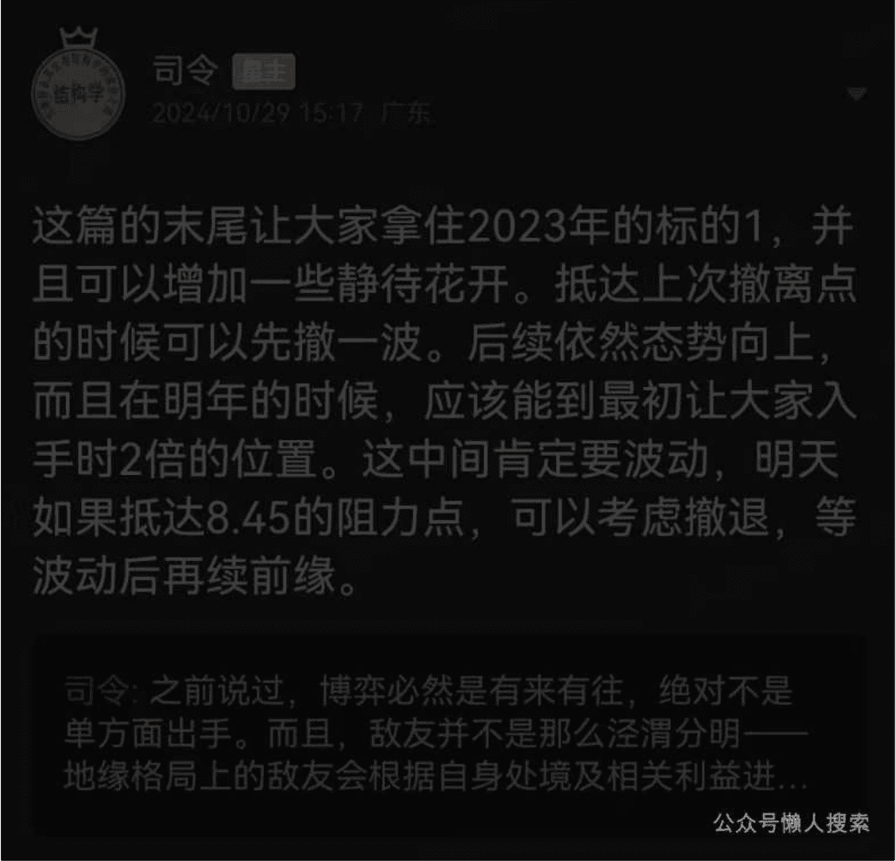

# 可以翻 2 倍的机会
## 241029 守夜人总司令
整理：公众号懒人搜索，懒人专属群独享
懒人微信：lazyhelper

【24年10月16日】接下来中国内部政策发力点！接下来的中国内部政策发力点会侧重于承载产业和工程，而不是纯概念，能够理解这一点吗？越是纯概念缺乏支撑的东西，风险反而越大，而且，官方也不希望市场上形成一致性的预期，不管是向上的预期还是向下的预期，任何一次性的预期都酝酿着巨大的风险，也容易被围猎和操控。只有市场上的分歧非常大，预期高度不一致，政策才有出其不意的发力点，才不会被别人布局和牵制，所以接下来的动荡才是市场主要形态。

## 司令解读
这篇的末尾让大家拿住2023年的标的！【广汇物流600603】，并且可以增加一些静待花开。抵达上次撤离点的时候可以先撤一波。后续依然态势向上，而且在明年的时候，应该能到最初让大家入手时2倍的位置。这中间肯定要波动，明天如果抵达8.45的阻力点，可以考虑撤退，等波动后再续前缘。2024年10月29号解读。

## 正文
之前说过，博弈必然是有来有往，绝对不是单方面出手，而且，敌友并不是那么泾渭分明，地缘格局上的敌友会根据自身处境及相关利益进行调整，是在多种可能中做一种方向性的选择，或临时策略的选择。市场格局的变化会非常的灵活，布局会深远，操作很灵活，为了谋利，往往敌友的切换就在一瞬间，所以趋势向上的时候，内外都是朋友，趋势向下的时候，内外都是敌人。

之前《24年1016：中东熄火，半岛升温！》一文说过，先出手的是对方，造成向下的预期，是因为之前的华尔街摩根大通等财团布局都是通过向下的预期挣钱，这个操作从2023年8月份开始，从未失手，只要预期和趋势形成一致性的共振，不管是预期还是趋势都会被自动强化。在生存博弈中，任何确定性的趋势都可以用来盈利，古往今来所有的战场胜利，归根结底就四个字：出其不意！无非就是通过出其不意，出现在意想不到的地方，才能克敌制胜，所以，无论是下棋还是打仗，都讲究一个先手优势，有时候为了不被别人的节奏裹挟，会放弃局部利益，弃子争先。

美国降息的中美金融大战第一个回合已经打完了。首先是对方华尔街财团做了向下的布局，我方国庆前的万千利好突然来了一波猛的，打断了对方的市场布局，并且创造了一个向上的强烈预期，其目的并不是争夺美元降息放水周期下的全球资金，其目的是为了打乱对方的节奏，自己能管控预期和节奏，这才是真正的务实的目标！

为什么中国现阶段的核心目标不是争夺全球资金呢？因为产业的发展都需要长期资金，不是短期资金。中国自己内部都不愿意负债投资扩大生产，而且在利率越来越低的情况下都不愿意，这意味着什么呢？意味着长周期的投资回报率很低呀！你没有东西可以承载资金，那么，就算你费了很大的劲儿，付出一定的政治和外交资源去把资金赶进来，也会像潮水一般的涌入，然后割一波之后又潮水一般的退走。这个你是挡不住的，看看隔壁印度，各种严防死堵，甚至不择手段，资金都在加速跑出印度，最近vivo跑掉580多亿人民币的资金，印度如丧考妣，这事在越南也发生过，前两年大量的美元资金涌入越南，把越南的房子炒的非常高，人均人民币不到1500的地方，房价涨到3—5万人民币，美元一撤退，他们越南内部就爆了，连锁反应之下，有10%的GDP规模的社会财富凭空不见了。

（知识扫盲：“如丧考妣”是一个汉语成语，拼音为rú sàng kǎo bǐ，意思是好像死了父母一样悲伤和着急，通常用于形容非常伤心和着急的情况，是一个贬义词。）

中国是跟美国博弈，但还没有到取而代之的时候，纵观古今历史，每次王朝更迭之时，那个真正会取而代之的人，绝对会以旧王朝忠臣良将的面貌出现。曹操挟天子以令诸侯，李渊打的是隋恭帝的旗号，就连瓦剌部落的也先都知道找个成吉思汗的后代当大旗用，自己始终不要虚名只图实际。

（知识扫盲：绰罗斯·也先（1407年—1454年，一说1455年），清朝时期译作额森，也称厄僧，明敕书称为“瓦剌都总兵答剌罕太师淮王大头目中书丞相”。蒙古瓦剌部首领。马哈木之孙、脱欢之子。）

只有中国人认为中国要对美国取而代之了！在中国开放144小时自由行之前，全世界各国对中国的看法都非常的无足轻重，所以外面最近有很多人在问：中国怎么突然就变强大和先进了呢？

（知识扫盲：144小时免签游中国的政策始于2016年。这项政策最初是在上海、江苏、浙江等地实施，允许来自51个国家的旅客，在持有有效国际旅行证件和确定日期、座位的前往第三国的联程客运机票、船票或车票的情况下，通过航空、水路或陆路口岸入境后，免办签证，在相关行政区域内停留不超过144小时。这一政策的主要目的是为了促进旅游和商务交流，为外籍人士提供更为便捷的入境和停留条件。中国对外开放旅游免签144小时停留制度，中国签证曾经相当难以获取，就像我们的绿卡一样，想要来中国旅游是一件颇具挑战的事情。如今，外国人来中国旅游方便了许多，一方面是由于越来越多的免签政策，另一方面则是144小时停留制度的实施。）

能问出这种问题的人，说明他们之前的一贯看法都认为中国是落后的，所以他们不明白怎么突然就变成这个样子了！好像罗马并不是一砖一瓦建成的，而是突然冒出来的，这才是世界的普遍看法和真实心态。

王朝更迭之时，即便有逐鹿之心，聪明的枭雄也会尊奉旧秩序的主导者。从实力地位出发，无需诚惶诚恐趴在旧秩序的霸主面前，但会在任何方面让对方和整个旧秩序的体系都认为你是来捍卫旧秩序的辅国良臣，而不是要将整个秩序都彻底推倒的乱臣贼子！这个很重要，1949 年新中国成立的王朝更迭之时，一开始拉拢并分赏了很多旧阵营的人物，条件之宽裕，态度之谦卑，尊崇之丰厚，让他们自己都意想不到，他们之中不乏高官良将，都是旧体系的顶梁柱，他们需要出路，也需要一个更好的未来，还需要一个体面的谢幕仪式，如果这些都有了，那就顺水推舟，否则，就只能拼死相扛，鱼死网破。

现阶段是什么阶段呢？每次旧秩序碎裂之时，英雄豪杰起四方，哪一个不认为自己天命有归呢？正因为如此，不经过一番充分的厮杀分数大小王，谁又愿意放弃这种自以为是的天命，你认为你在王者归来，稍微有一定的体量的国家，谁不认为自己有资格逐鹿天下呢？既然如此，你让自己成为众矢之的，然后逐个打服，还是高举旧霸主的旗帜并利用大家对于旧秩序的惯性，让各路英豪相互消耗呢？曹操从一开始就高举匡复汉室的大旗，天下刚乱，人心思汉，必须把这块招牌的号召力折腾干净，让全天下人都意识到：大汉确实扶不起来了，这个时候，才可以取而代之。在此之前，曹操把整个房子的地基大梁装修都换了，但屋顶始终不换，中国连地基都没有换好，到了换屋顶的时候了吗？

舆论场上的声音必须把复杂的事情简化成两个人的对决，否则普罗大众理解不了，你看著名将帅写的回忆录，关于战争的描写都非常的复杂，但拍出电影的时候，镜头始终集中在双方指挥官身上，千军万马都是背景。为什么要这样拍呢？因为普罗大众只能接受这种极度简化的理解方式，你把海湾战争简化成萨达姆和美国前总统小布什的私人恩怨，你把国共内战简化为毛泽东蒋介石两位主角的道德品德对比，这样普罗大众就理解了，也只能理解到这种程度！

言归正传，今天所有的中美博弈，不是要把对方掀翻，而是要与对方和解，这个和解的限度就是：你可以瞎折腾，但不能崩，我可以克制和退让，但你不能彻底阻止我按照既定的规划行事，我有耐心接受道路曲折，但不能接受止步不前，所以，最近外交部长王毅对美国国务卿布林肯说：可以小院高墙，但不能是铁幕隔断！这就像曹操对汉献帝的态度：你如果不跟人合谋刺杀我，你爱怎么折腾都行，因为时间站在我这一边，如果你非要与人合谋谋害我，我就把跟你合谋的人宰了，但我会留着你，因为我现在还需要这面大旗，让你去折腾，
## 微信公众号：懒人找资源
让所有人都对你逐渐失望，让这面大旗在人心之中的影响力逐渐消散。

2008年美国发生金融危机，中国做了4万亿的刺激，拉住了自己，也拯救了美国，今天的高房价和债务都是这个后遗症，但是不这么做，只会更糟糕。当年北魏孝庄帝元子攸就是忍不了一时之愤，在没有做任何预案的情况下，把尔朱荣杀了，然后，六镇的魔王们失去了尔朱荣这个唯一能压得住的封印，开始陆续登台群魔乱舞，把整个北魏搞得四分五裂，乌烟瘴气天翻地覆！

（知识扫盲：北魏孝庄帝元子攸（507年—531年1月26日），字彦达，河南洛阳人，鲜卑族。北魏第十二位皇帝（528年—531年在位），彭城王元勰第三子，母为文穆皇后李媛华。）
（知识扫盲：尔朱荣（493年—530年11月1日），字天宝，北秀容（今山西省朔州市，一说山西省忻州市），契胡族。北魏末年权臣、军事家。）

如果往前翻《24年0831：房价要跌，房租要涨！》一文，就会发现在2024年8月份最晦暗的时候说过：存在着政策密集释放、相互叠加的情况，而且力度会大于当年的4万亿！往西部搬迁工业体系，与其说是为了战争需要，不如说是为了消化资金，水放出来没有东西可以承接就会流走，我们希望向外面输出产品而不是资金！

（新闻事件：新一轮中西部产业大转移，2024年9月25日，国务院决定将沿海产业有序向中西部偏移，这一决策旨在引导资金、技术、劳动密集型产业从东部向中西部、从中心城市向腹地有序转移，以促进中西部地区的经济发展和产业升级。政策目标：通过产业转移，实现区域经济的均衡发展，缩小东部和中西部地区的发展差距。推动中西部地区的产业升级和创新发展，提高当地居民的收入水平。加强沿海地区与中西部地区的经济合作和交流，实现优势互补、共同发展。）

接下来的中国内部政策发力点会侧重于承载产业和工程，而不是纯概念，能够理解这一点吗？越是纯概念缺乏支撑的东西，风险反而越大，而且，官方也不希望市场上形成一致性的预期，不管是向上的预期还是向下的预期，任何一次性的预期都酝酿着巨大的风险，也容易被围猎和操控。只有市场上的分歧非常大，预期高度不一致，政策才有出其不意的发力点，才不会被别人布局和牵制，所以接下来的动荡才是市场主要形态。

2023年的那个标的指的是【广汇物流600603】，ST六零三那个，之前让大家撤过一波，后来又让进，还拿在手里的人可以加点，等待花开。

懒人微信：lazyhelper

(股票动态：2024年10月16日，广汇物流600603，价格在6.33元，司令给的阻力点分别在9.5和11)

### 12:45 【学员提问】
司令，阻力点是否还是当初的阻力点？

### 【司令回复】
差不多上次撤的附近吧，明年会更高，空间取决于明年的经济刺激程度。

历史3000多份各类付费文章以及年费三千多的副业社群资源，见懒人专属群内部分享！
付费群，白嫖勿扰！
- 懒人专属群更新记录: https://lazybook.fun/#/blog/record2
懒人微信: lazyhelper