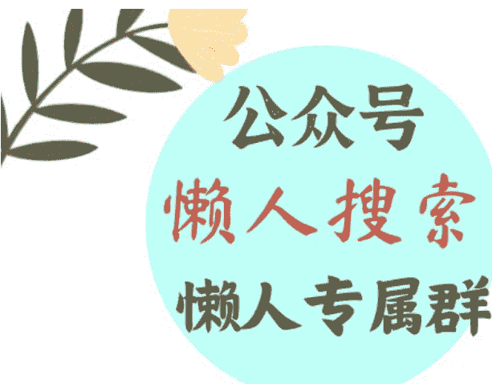

# 瑞幸与霸王茶姬，为什么“必有一战”？

241029

整理：公众号懒人搜索，懒人专属群独享
懒人微信：lazyhelper

今天我们说说来自消费领域的洞察。前段时间，从黄海老师那里听到一个洞察，说的是，瑞幸与霸王茶姬之间，必有一战，这是迟早的事。

乍一听这个结论，很多人可能有点蒙。霸王茶姬是卖奶茶的，可瑞幸不是卖咖啡的吗？这两家不在一个赛道，为什么必有一战？况且退一步讲，我又不是做饮品的，这两家的竞争关我什么事？

别着急，咱们先慢慢往下听。首先，瑞幸和霸王茶姬，都是目前消费领域风头正劲的品牌，它们之间的竞争本身就值得关注。其次，黄海老师说的其实不只是饮料行业的事，这背后还有一个人人都关心的问题。这就是，一门好生意的标准是什么？

接下来，我们就结合黄海老师的洞察，以及我搜集到的资料，一起来说说。

咱们先从霸王茶姬这个品牌说起。这两年各个赛道跑出来的明星品牌不少，但要论特殊程度，霸王茶姬算是特别的。因为很多品牌都在搞下沉，都在应对所谓的消费降级。比如，火锅领域增长最快的品牌之一，是人均30多元的农小锅；零售领域最受关注的品类，是赵一鸣、好想来这样主打低价的零食店。再比如，很多餐厅，包括东来顺这样的老字号，都推出了自助餐。这几乎是变相降价。

而霸王茶姬是很罕见的，打着消费升级的定位，却依然增长很快的品牌。9月28日，霸王茶姬香港首店开业，营业前两天销量就将近1万杯。根据霸王茶姬创始人张俊杰分享的数据，2023年全年，霸王茶姬的GMV首次超过100亿，达到了108亿。2024年可能会超过200亿。

当然，这些GMV是霸王茶姬所有终端的流水总和，而霸王茶姬是个加盟品牌，其中还有60%的流水是品牌总部要留给加盟商的部分。总之，抛开这些细节，霸王茶姬过去一年没少赚钱就对了。

而且他们的姿态很高调。很多茶饮品牌都倾向房租更低的地方。而霸王茶姬是专挑大商场里的好位置。再看客单价，在奶茶已经普遍进入10元区间的情况下，霸王茶姬的主力产品，伯牙绝弦一杯按照容量不同，中杯16元，大杯20元。

但说到这，也引出一个问题，就算做得再高调，霸王茶姬毕竟是一个茶饮品牌，为什么说它与做咖啡的瑞幸必有一战呢？这就要说到，饮品行业正在发生的两个转变。

第一个是，奶茶的咖啡化。也就是，奶茶越来越像咖啡。比如，霸王茶姬的主打产品伯牙绝弦，占了整个品牌30%的流水。而这款饮料跟一般的奶茶相比，据说最大的特点之一就是提神，还有人说喝完之后睡不着觉。这是因为，这款奶茶里的茶多酚和咖啡因含量，要比一般的奶茶高不少。一杯伯牙绝弦，大概相当于两到三罐红牛。

你看，奶茶是不是越来越像咖啡了？

而第二个趋势正好反过来，叫咖啡的奶茶化。比如，关于瑞幸咖啡，一直有一个说法，说他们卖的并不是真正的咖啡，而是咖啡味儿的饮料。今年这个趋势更明显。前段时间，瑞幸推出了一款新品，叫轻轻茉莉，成分是茉莉花茶、纯牛奶、糖浆和基底乳。最后这个基底乳主要是用来调和口感的。从成分上看，这个配料跟前面说的，霸王茶姬的伯牙绝弦是非常类似的。

而且这不是瑞幸推出的第一款不含咖啡的饮料。它之前就做过很多款茶拿铁，据说反响都不错。

你看，咖啡是不是也越来越像奶茶了？

尽管奶茶和咖啡两个品类的起点不同，但经过几年的发展，他们之间正在越来越像。你进入了我的领域，我也走进了你的地盘。最后的结果可能就是，狭路相逢，必有一战。黄海老师说，未来一年，这两个品牌之间的竞争，或许会成为中国商业领域里最精彩的较量之一。

但是，说到这，就又引出一个问题。这一切到底是怎么发生的？按照通常的设想，这背后应该有非常精妙的商业运作，有特别细致的战略考量。这些属于外人很难学会的部分。

但是，抛开这些细节，这场竞争的背后，还有一个非常朴素的真相。其中的策略是人人都可以借鉴的。

为什么瑞幸和霸王茶姬，这两个不同赛道的头部品牌会越来越像？因为他们都在做同一件事，他们都在努力寻找那个用户需求的最大公约数。也就是，那个能符合多数人的多数需求的产品要素。

这也是我从黄海老师的讲述里，获得的最大的启发。

那么，什么是饮料行业的最大公约数呢？咱们从一个说法讲起。

你可能听说过，饮料行业一直有个说法，叫世界三大饮品，分别是，茶、咖啡和可可。意思是这三类饮品的需求量最大。但事实上，在今天看，情况已经有变化。根据最近几年的数据，2021年，咖啡的产量是1005万吨，消费量989万吨。茶叶，2023年全球茶叶的总产量是641.3万吨。而可可，2022到2023年度，全球可可豆产量是489万吨。但问题是，这个说法提出的时候，全世界的牛奶产量还没有提上来。而现在，牛奶的全球年产量，已经到了年产数亿吨的量级。

因此，实际上，世界三大无酒精饮品应该是，茶、咖啡和牛奶。

没错，你发现了，瑞幸也好，霸王茶姬也罢，这些头部品牌的多数产品，都没有跑出这三类。尽管在产品的设计上还有很多细节，但从总体构成上看，这些畅销商品，用的居然都是世界上最常见的饮品原料。

注意，这可不是什么巧合。而是踩中这三类饮品，你就几乎掌握了一个畅销饮品的全部要素。

比如，好的饮品得好喝，这点牛奶能满足。加了牛奶之后，咖啡和茶的口感会更温和，并且少一些苦涩感。

再比如，除了好喝之外，好的饮品还要有点功能。你看，在很多人看来，牛奶跟健康挂钩。要知道，最早的奶茶是不用牛奶的，用的是奶精。而奶精替换成牛奶，给人的感觉就更健康。现在流行的轻乳茶，跟奶茶相比最大的区别之一，就是把奶精换成了牛乳。同时，茶和咖啡有提神的功能，这就满足了很多上班族的需求。

像最近流行的手打柠檬茶，之所以畅销，原因之一也是它有提神的功能。因为柠檬的酸味很重，为了中和这个酸味，柠檬茶里就需要加入更多的茶叶成分，这就提升了它的提神效果。

再比如，对商家来说，好的饮料产品还需要一个条件，这就是，有一定的成瘾性。这点茶和咖啡也能满足。按照黄海老师的观察，具备功能性的饮品，都更容易让人上瘾。

而好喝、有用、让人上瘾，这三个要素合并在一起，又能带来更多的优势。

比如，你不用费劲巴力地去想创新，去推出新的 SKU。因为一旦一个东西有功能性，用户对它有依赖，就会一直消费。因此，你就不用像其他奶茶店那样，隔三差五地冒着风险推新品，你只要有一个王牌产品就够了。

再比如，这样的组合更容易规模化。茶、咖啡、牛奶，都具备非常成熟的供应链，不需要储备新鲜的水果，而且在很多地方都能找到成熟的供应商。

当然，饮品领域的竞争一直很激烈，要想做好，还需要很多细节上的设计。我们刚才说的，只是做大这门生意的一个重要前提。这就是，你需要跟这个领域的最大公约数站在一起。其实，绑定最大公约数，这已经成为很多领域和公司的共识。

比如，食品行业。以前早就有人研究过，现代食品工业的核心，其实就是三种原料，盐、糖、脂。

糖能让一个东西变得好吃，据说现在的食品公司已经找到一个加糖的临界点，叫10%甜蜜点。也就是，一款食品的含糖量是10%，你既会觉得好吃，又不会觉得很腻。

而盐的作用是遮掩异味，很多吃起来有怪味的东西，只要加够足量的盐，都能盖住这个异味。用户重点品尝到的只有盐的咸味儿。

最后这个脂的作用是让人上瘾。只要食物里的脂肪含量恰到好处，人吃起来就容易上瘾。这也是为什么有那么多人喜欢油炸食品。

你看，盐、糖、脂，这一度是食品行业的最大公约数。当然，现在食品行业的规范也越来越严格，很多公司也在想办法把产品做得更健康。

除了食品和饮料，很多行业都存在一个最大公约数。

比如，迪士尼。他们给自己的定位，不是生产电影，也不是生产周边玩具。他们对自己的定位是，生产快乐，是一家生产合家欢的公司。你看，电影和周边玩具不一定人人都需要，但快乐是人的刚需。迪士尼锁定的是这个最大公约数。

类似的例子还有很多。

假如说我们能从这些案例里获得什么启发，我觉得它们回答了一个问题。这就是，一门好生意的前提是什么？另辟蹊径只是手段，不是本质。它的核心前提是，回到这个行业的最大公约数。也就是，那些已经被前人验证过的答案。同时，这也意味着一个好消息，只要你想进入的是一个成熟的领域，那么一定已经有很多现成可用的答案，这起码给我们提供了扎实的第一级台阶。

历史 3000 多份各类付费文章以及年费三千多的副业社群资源，见懒人专属群内部分享！

付费群，白嫖勿扰！

懒人专属群更新记录：

https://lazybook.fun/#/blog/record2