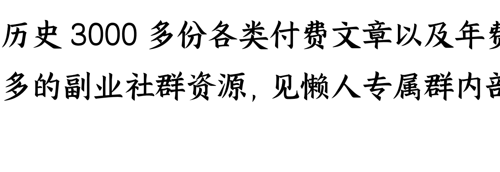

# 为什么说“只有偏执狂才能生存”?

241030

整理：公众号懒人搜索，懒人专属群独享 懒人微信：lazyhelper


今天我们说说英特尔。10月16日，美国彭博社报道，高通公司打算在11月初，美国大选结束后，再决定是否收购英特尔。根据之前的传闻，高通也可能只想收购英特尔的CPU设计部门。但不管是哪种情况，高通收购英特尔都是目前硅谷最受关注的事情之一。一旦收购成功，高通将成为这个行业的超级巨头。只不过，他们不知道下一届美国总统是谁，也不知道下一任总统对于垄断的态度。因此，高通也迟迟不敢动手。

要说此时此刻最难受的，也许还是英特尔。历史上的英特尔遭遇过几次危机，但从数据上看，从来没有像这回这么严重。

关于英特尔的危机，卓克老师9月刚刚讲过。就在今年9月，道琼斯工业平均指数考虑把英特尔剔除出去。要知道，道琼斯指数是把美股中表现最好的30家公司，综合在一起算出的指数。通常，只有在企业出现大幅度衰退，而且今后依然会长久衰退的情况，才会被剔除出去。目前英特尔还在经历成立以来最大规模的裁员，计划裁掉 1.5 万人，在 11 月 15 日全部完成。

卓克老师形容英特尔目前的局面，说英特尔就像一头垂死的大象，而高通就像一只秃鹫在它的上空盘旋，并且已经盘算好第一口吃哪里了。

一个企业面临危机，这个事本来不算新鲜。但是，对于英特尔，我觉得还是值得专门说说，因为这家公司的地位太特殊了。

人人都知道英特尔是做 CPU 的，但事实上，CPU 这几个字，远远不能描述英特尔的重要性。英特尔在科技领域的地位有多重要呢？就拿几位创始人来说。

第一位，戈登·摩尔，也就是提出摩尔定律的那个人。老爷子去年刚刚离世。摩尔定律我们都知道，说的是，当价格不变时，集成电路上可容纳的元器件数量，大约每隔 18 个月就会翻一倍，性能也要翻一倍。

但是，这个摩尔定律并不是任何真正意义上的物理或者数学定律，它只是摩尔本人对半导体行业发展的预测。但后来，摩尔的预测居然成为整个行业奋力追赶的目标。所有的半导体公司都在为了达成摩尔定律拼命，这也直接影响了整个世界的科技进程。

换句话说，戈登·摩尔是以一己之力给整个半导体行业定下了一个 KPI。而我们今天能用上智能手机，能用上平板电脑，能用上又快又便宜的电脑，全都离不开这个 KPI。

第二位，罗伯特·诺伊斯，有人形容他是一个温和版的乔布斯。事实上，乔布斯也确实把诺伊斯看成自己的精神导师。说诺伊斯是温和版的乔布斯，是因为他有媲美乔布斯的才华，却没有乔布斯为人那么凌厉。同行对乔布斯是佩服，但未必喜欢这个人。但硅谷的人对诺伊斯，几乎很少有不喜欢的。当年日本半导体冲击美国市场，硅谷想推举出一个类似盟主的人来代表大家去和美国政府谈判，让美国政府出面对付日本半导体。而硅谷选出的这个盟主，就是诺伊斯。诺伊斯还有个绰号，叫硅谷市长。

而第三位创始人，安迪·格鲁夫，就更不得了了，他被称为硅谷最伟大的 CEO。格鲁夫几乎奠定了科技公司的发展模板，也给全世界的科技公司提供了一个企业文化范本。格鲁夫说过两句话，特别能代表他的经营思路。第一句是，只有偏执狂才能生存。意思是科技公司必须得有随时颠覆一切的创新精神。第二句话，是当年英特尔陷入危机的时候。当时英特尔的主业还不是 CPU，而是半导体存储器，当时就是这个存储器业务不行了。但因为这是英特尔起家的本领，很多人都舍不得放弃。当时格鲁夫就说了一句话，大概意思是，假如此时此刻我们换一位CEO，他会怎么做？他会放弃存储器。那么，我们何必等到那时，为什么不从现在开始？

用今天的话说，格鲁夫的做法就是，完全不眷恋存量。类似曾国藩说的，过往不恋，当下不杂，未来不迎。这也成为后来很多科技公司的经营信条。

再比如，英特尔还给科技公司提供了一个合伙人模板。一个公司的创始团队应该有三个人，一个行动者、一个思考者和一个对外的人。对英特尔来说，这个对外的人是诺伊斯，思考者是摩尔，而行动者就是安迪·格鲁夫。本来这个模板是德鲁克提出的，但在英特尔的身上发挥到了极致。

再比如，英特尔还奠定了硅谷文化，现在很多公司说的人才至上、技术至上，就是从英特尔开始的。

再比如，英特尔还推动了风险投资的成熟。1968年，英特尔刚成立的时候，美国的投资机构还很分散，一个公司要想拿到投资，需要跑很多地方。但是，英特尔的融资却创造了历史。开始融资后仅仅48小时，英特尔的电话就被打爆了。而英特尔融资成功的消息很快传遍了整个电子产业界。很多工程师早就有创业的心，但迟迟不敢出来。而英特尔的融资成功给了他们信心，大量的人出来自己创业，开启了一大波创业潮。无数的风险投资开始涌向市场。也是从这时起，现代风投行业开始快速发展。

总之，英特尔留下的东西还有很多。

听到这，你可能会说，曾经这么厉害的英特尔，今天为什么会遇到困境呢？之前解释科技公司的衰落，很多人经常提到一个词，叫颠覆式创新。意思是，出现一个更先进，更厉害的技术，把之前的旧技术颠覆了。比如，智能手机、AI，这些新技术对英特尔冲击很大，因此英特尔才陷入了困境。

但事实上，假如仔细想想就会发现，这个说法有点站不住脚。要知道，英特尔这种级别的科技巨头，早就不是自己单打独斗那么简单了。他们有极其广泛的技术布局，假如真有一个更厉害的技术出现，他们早就动手，要么收购，要么同步研发。怎么可能眼睁睁看着别人来颠覆自己？

说到这，就要提到一个误解。很多人认为颠覆式创新是先进技术取代落后技术，是高端技术取代低端技术。但事实上，颠覆性创新的提出者，克里斯滕森本人，他对于颠覆性创新的理解要复杂得多。

克里斯滕森说，科技公司之间的更迭，很多时候并不是高端技术取代低端技术，而是低端技术取代高端技术。

比如，早年间的硬盘。在个人 PC 出现之前，硬盘厂商的共识是，硬盘这个东西应该往大了做。越大性能越好。之所以有这个共识，是因为当时计算机都是公司组织在用，对体积没有要求。因此，当时的先进公司都在做大尺寸的硬盘，小号的硬盘是留给第二梯队的剩饭。直到 20 世纪 70 年代，主流的硬盘都是 14 英寸的。

没错，在当时，小硬盘属于低端落后，而大硬盘才是高端先进。但没成想，后来个人 PC 崛起，小硬盘的需求爆发了。结果曾经研究小硬盘的公司，很快就赶超了生产大硬盘的公司。

英特尔也是类似的情况。比如，英特尔的 CPU，这一直是计算机最核心的部分，负责逻辑运算和控制。但英伟达的 GPU 最初主要是为图形渲染而设计的。从技术上看，CPU 是绝对的核心 C 位，几乎是个计算机就需要。而以前计算机对 GPU 的刚性需求其实没有那么大。从技术的商业价值上看，CPU 在当年要超过 GPU。

而英伟达的 GPU 崛起，中间其实经历了几次市场需求的加持。比如，比特币的流行、3D 游戏的普及、影视后期的需求，等等，都加速了英伟达的成长。但这部分市场一度是英特尔看不上的。但就是这些需求叠加在一起，英伟达才有机会变强大，直到等到 AI 爆发。连黄仁勋自己都说，他们瞄准的是一个零亿美元市场。注意，是零亿。意思是，这个需求眼下其实不存在，但一旦爆发，就是数以亿计的市场。你看，这多少有点赌一把的成分。

按照克里斯滕森的观点，科技巨头的地位被颠覆，往往不是因为技术能力不足，恰恰相反，就是因为他们技术能力太强，导致他们看不上很多东西。比如，当年乔布斯曾经找过英特尔，想用他们的芯片。但结果呢，一来，英特尔的芯片太贵。二来，这些芯片放在手机里也存在一些瑕疵。三来，对于所有这些，英特尔都没想过要改，因为当时还是功能机的天下，英特尔根本就看不上智能机这块市场。结果没想到，曾经看不上的市场变大了，曾经看不起的需求变多了，曾经非主流的产品变得主流了，巨头的领先也就因此被赶超了。而且这是一个非常漫长的过程，并不是一夜之间突然出现了什么新技术。

顺带提一句，直到今天，英特尔在 CPU 上的设计能力依然是世界第一。比如，今年 8 月 AMD 发布的锐龙 9000 系列处理器，它的性能也只是刚刚追平了英特尔在 2023 年 1 月发布的 i9-13900K。按照卓克老师的话说，从性能上看，CPU设计世界第二的AMD，还是落后英特尔半代产品。只要这个优势还在，英特尔也许就还有东山再起的机会。

当然，科技公司之间的竞争因素很多，我们刚才只是选取了一个侧面，说了一个新旧技术更迭的真相。简单说，技术之间的竞争，关键不是看谁的单项技术过硬，而是要看这个技术背后的价值网络。新旧技术的更迭，实际上是一整套价值网络的更迭。就像英特尔和英伟达，本质是个人PC和AI这两套价值网络的此消彼长。就像格鲁夫自己说的，战略转折点的“点”字是误用。它不是一个点，而是漫长而艰辛的奋斗过程。

最后，回到格鲁夫的这句话，只有偏执狂才能生存。格鲁夫说的偏执狂，其实不是对某件事特别坚持，他说的其实是，要永远想象自己处在危机当中。

这句话背后有一个好消息和一个坏消息。坏消息是，竞争是平等的，任何人都可能面对竞争，都可能被挤到舞台的边缘。而好消息是，机会也是平等的。一个新的价值网络的崛起，也可能会随时把你推到舞台的中央。

关于这个话题，咱们先说到这。



历史 3000 多份各类付费文章以及年费三千多的副业社群资源，见懒人专属群内部分享！

付费群，白嫖勿扰！

## 懒人专属群更新记录：

```
https://lazybook.fun/#/blog/record2
```