- 加沙等待停火 16
- 增加货币供给释放财政空间 26
- 看不见的电厂 48
- 社区医疗赋能 54

# 财新周刊

## 中国式经济刺激

一揽子金融政策组合拳涵盖降息降准、房地产、资本市场等多个领域，部分货币政策超乎市场预期；各方依然期待财政政策加码
P.32

## A股强心针

P.42

定价：人民币40元 港币60元 www.caixin.com
2024年 第39期 9月30日出版 总第1125期
邮发代号：32-235
ISSN 2096-1251
9772096 125240

## 财新观察 | 刺激加改革 直面新情况

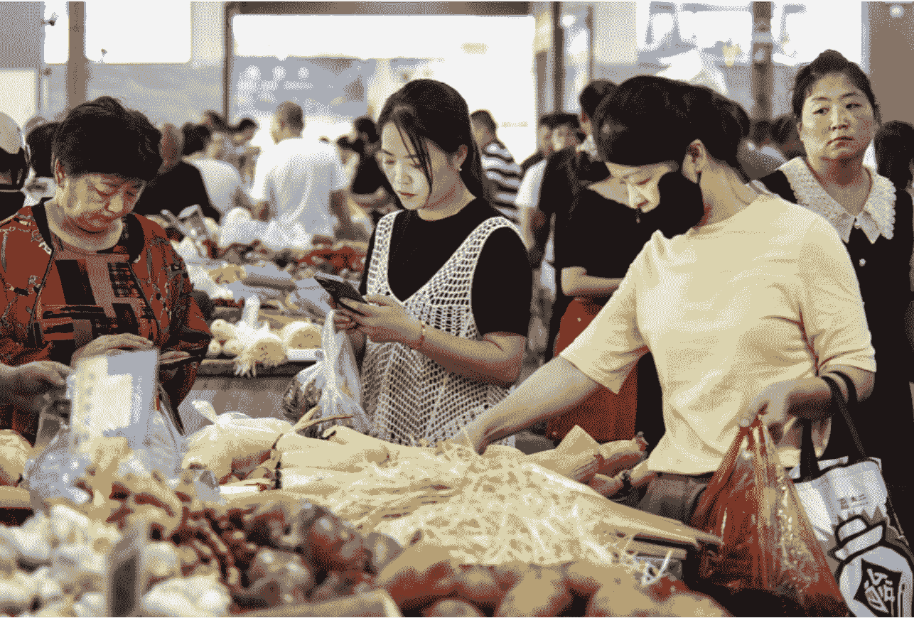

### CAIXIN| 听文章

中国经济是否需要刺激以及如何刺激，近来引发热议。经济学家刘世锦建议推出一揽子刺激加改革的经济振兴方案（下称“方案”），实质性扩大终端需求，带动经济回归扩张性增长轨道。这一主张引发学界讨论，也引起财经官员的关注。有的学者虽支持刺激，却将消费补贴作为重点；也有学者认为“中国经济不需要强刺激，也经受不住强刺激”。学者观点见仁见智，各有理据。相比而言，刘世锦提出的方案是将刺激与改革有机结合起来，主张“花钱建新制度”。刺激和改革两手抓，有助于有效改善居民和企业的预期和信心，兼顾中国经济短期稳增长与中长期高质量发展。

今年以来，中国经济运行总体平稳、稳中有进，延续回升向好态势，不过，正如9月26日中共中央政治局会议所说，“当前经济运行出现一些新的情况和问题。要全面客观冷静看待当前经济形势，正视困难、坚定信心，切实增强做好经济工作的责任感和紧迫感。”当前，突出问题是不少企业尤其是中小微企业经营困难，就业压力增大，财政收入下降。面对这一局面，各地各部门已出台不少应对举措。大规模设备更新和消费品以旧换新支持力度明显加大。中国人民银行、金融监管总局、证监会近日公布了降准、降息、降低存量房贷利率、创设新的货币政策工具支持股市稳定发展等一揽子金融政策。这些举措对稳定经济有重要作用，但是，不少人认为，能否扭转总需求不足、预期偏低的局面，更多取决于财政政策的取向。

公众号懒人搜索，懒人专属群分享

其实，近些年来，主张以更为激进的财政政策来提振经济的主张，一直不绝于耳，拳拳之意溢于言表。最常见的是主张刺激消费，不少人士力主大面积发放消费券或直接“撒钱”。刘世锦方案有所超越。他认为，增加有效消费需求首先要区分生存型消费和发展型消费；扩大发展型消费仅靠个人努力是不够的，需要政府搭台子、建制度、出资金，是政府消费支出与居民消费支出的组合；基本公共服务均等化水平滞后，直接拖累发展型消费的增长。这抓住了刺激消费的“牛鼻子”。教育、医疗、住房等基本公共服务作为国内发展型消费的短板所在，恰恰是当前扩大内需要找准的痛点，也是体制改革必须啃下的“硬骨头”。

方案具体包括10万亿元刺激规模、两大突破口和一个重要目标。首先，以发行超长期特别国债为主筹措资金，在一到两年时间内，形成不低于10万亿元的经济刺激规模。两大突破口，一是大力度提升以进城农民工为主的新市民在保障性住房、教育、医疗、社保、养老等方面的基本公共服务水平；二是加快都市圈范围内中小城镇建设，带动中国的第二轮城市化浪潮，形成以城乡融合发展为基础的高质量可持续现代化城市体系。一个重要目标，则是力争用十年左右时间，实现中等收入群体倍增的目标，由现阶段中等收入群体4亿人口增长到8亿—9亿。

方案涉及的具体问题，例如，10万亿元刺激规模是不够还是过头，两大突破口究竟如何突破，完全可以敞开讨论，不过，这一方案最大的亮点是将提振经济与体制改革有机地结合在一起。一些媒体将这一方案冠之以“10万亿刺激计划”，虽有吸睛之效，却着实过于简化。

如前所述，近年来，专家学者纷纷就提振经济建言献策，其中不少真知灼见被各级政府采纳。许多学者的刺激建议中也会谈及体制改革，二者却缺乏紧密关联。有些学者则将改革与发展割裂开来，他们不否认体制改革的重要性，但是，在他们眼中，改革是慢变量，“远水不解近渴”，因此，他们的建议中极少提起改革。与宏观调控政策相比，改革之自然是慢变量，但是，这也意味着改革“早落地，早见效”，否则，关键性改革就可能长期止于可望而不可即的“远水”。另外，正如方案所说，在改革工具箱内，能够找到不少增长导向、有立竿见影之效的改革举措，产生“今晚公布，明早涨停”的短期效应；即使是那些中长期见效的改革，如能尽早启动和推进，也能形成积极预期，对短期稳增长发挥正面作用。这些分析相当通透。当务之急是加快落实中共二十届三中全会提出的诸多改革措施，将中国经济潜在的增长动能充分释放出来，保护好蕴藏在了企业主、小摊贩、大学毕业生和公职人员等人群之中的积极性。

信心比黄金更重要。无论是刺激，还是改革，衡量其效果的一个重要标杆都是能否有效改善预期、提振信心。中国眼下的政策选择也许不是要不要刺激经济的问题，而是怎样优化刺激政策，与体制改革相结合，以便更好防范风险、应对挑战，实现高质量发展，迈向既定国家发展战略目标。决策层提出，“我们则既要增强风险意识和底线思维，积极主动应对，又要保持战略定力。”“刺激和改革，既要求积极应对，又需要真正的战略定力。■

## 财新观察 | 刺激加改革 直面新情况

## 最新封面报道|中国式经济刺激

国务院新闻办公室
THE STATE COUNCIL INFORMATION OFFICE, P.R.C.
潘功胜
李云泽

### CAIXIN| 听文章

### CAIXIN| 看视频

点我打开视频

文|财新周刊 王石玉 武晓蒙 陈博 刘冉 王力为

临近国庆,9月26日召开的中央政治局会议引发国内外的高度关注,市场投资者据此进入期待模式。

过去几年，每月召开的中央政治局会议以经济为主题的会议每年三到四次，4月、7月和12月相对确定，10月的会议一般是根据三季度经济数据部署年末工作，但近年来有所变化。这次会议提前以经济为主题，首次提出“正视困难、坚定信心”，与两个月前中央政治局会议提出“及早储备并适时推出一批增量政策举措”相比，此次中央政治局会议在“要求全面客观冷静看待当前经济形势”的同时，更强调了“做好经济工作的责任感和紧迫感”，并要求“加力推出增量政策”。

此前两天，一系列金融政策组合拳已然出手。

9月24日上午，国务院新闻办公室发布会罕见地在股市开盘之前的9点举行，中国人民银行、国家金融监督管理总局（下称“金监总局”）和证监会“一把手”悉数出席，其阵容和时点尤为吸睛。

新闻发布会一开始，中国人民银行行长潘功胜在简要总结今年以来的货币政策后，直接宣布三项重磅政策变化：第一，降低存款准备金率和政策利率；第二，降低存量房贷利率，统一房贷的最低首付比例，提高5月创设的3000亿元保障性住房再贷款的中央银行资金支持比例，并将此前两项金融支持房地产的政策延期两年；第三，创设两项合计8000亿元额度的新货币政策工具，支持股票市场稳定发展。

这是央行2024年以来的第四次政策调整，且力度超出市场预期，不仅包括总量政策、房地产金融支持政策，还首次专门创设支持股票市场的新工具。

同时，金监总局局长李云泽也宣布了银行业相关政策，包括国家计划对六家大型商业银行增加核心一级资本，扩展大行旗下金融资产投资公司（AIC）的股权投资试点范围，并优化“无还本续贷”等小微企业融资支持政策。

对于金融增量政策的力度，一些市场人士颇感意外。富达基金管理（中国）有限公司联席投资主管、基金经理聂毅翔评价，这次央行的“货币政策超出市场预期，房地产政策基本符合市场预期，对资本市场的流动性支持大超预期”。

野村中国首席经济学家陆挺对财新指出，9月24日的一揽子政策涵盖房地产、股市等多个领域，部分政策确实超乎市场预期，尤其是与股市相关的一系列政策，但其余涉及降息降准的政策符合预期，甚至业内普遍认为这些政策应该更早出台。

股、债、汇三市对政策在略有迟疑后作出反应。在国新办发布会召开的9月24日，上证综指午后大涨超过4%至2863点，在岸人民币兑美元汇率当日升值0.28%；同时，市场对经济增长的预期有所修复，带动债市小幅盘整，当天中国10年期国债收益率从2.037%上行近2.5个基点（BP）至2.061%。

随后两日，上证综指持续上行，在9月26日中央政治局会议内容宣布后，收盘报3000.95点，涨幅3.61%。长债收益率继续回升，9月26日走出低开高走行情，从2.03%一路走高至2.07%。在岸、离岸人民币兑美元汇率均明显走强，9月25日盘中离岸人民币兑美元汇率一度收复7关口，次日继续下探至6.97附近，为2023年5月以来首次；在岸人民币汇率9月26日盘中最低也一度探至7.01下方。

不过，陆挺认为，一揽子政策在近期主要发挥集成效应，后续的关键点在于是否有其他部委尤其是财政政策配合，“如果仅仅只是目前提到的这些政策，对经济的影响仍有限”。

此次中央政治局会议提出的政策措施中，居于首位的就是：加大财政货币政策逆周期调节力度，保证必要的财政支出，切实做好基层“三保”工作。降息降准等货币政策已经宣布，对于财政政策，会议指出要发行使用好超长期特别国债和地方政府专项债，更好发挥政府投资带动作用。

这是指用好存量政策，还是意味着可能推出增量财政政策，目前尚不明晰，但各方对财政政策加码的期盼再度升温。庙堂之间，近期关于10万亿元经济刺激政策的建议开始频频被讨论，尤以十三届全国政协经济委员会副主任、国务院发展研究中心原副主任刘世锦的呼吁最为明确。他建议，在一到两年时间内形成不低于10万亿元的经济刺激规模，以实质性扩大终端需求，带动经济回归扩张性增长轨道。

### “宽货币”超预期

总量货币政策方面，央行同时祭出降息和降准，并“预告”年内可能继续降准。

在中央政治局会议的第二天，9月27日8点，央行同时发布两则公告：7天逆回购利率从1.7%降至1.5%，金融机构存款准备金率下降0.5个百分点（不含已执行5%存款准备金率的金融机构）。此次下调后，金融机构加权平均存款准备金率由此前的7%降至约6.6%。

新一轮降息落地后，2024年以来，已经成为主要短端政策利率的7天期逆回购利率累计下调30BP，相当于2020年至2023年的累计降幅。

此外，潘功胜还在9月24日的新闻发布会上表示，7天期逆回购操作利率下调20BP，将引导贷款市场报价利率（LPR）和存款利率对称下行20BP至25BP，并将带动中期借贷便利（MLF）利率不对称下调30BP。由于LPR在每月20日调整，因此LPR下降最快也要在下个月落地；存款利率的调整则没有固定时间，当前由存款利率市场化调整机制督促银行参考市场利率变化，合理调整存款利率水平。

这意味着2024年内，央行启动了第二次全面降息，以及LPR的第三次下调。2024年7月，中国人民银行将7天期逆回购操作利率下调10BP至1.7%，1年期和5年期以上LPR也同幅下调10BP，常备借贷便利（SLF）利率跟随全线下调10BP；同时，MLF操作从原先的每月15日改为每月25日，成为当月最后一个下调的主要利率品种，降幅也达20BP至2.3%。

市场对于此次降息期待已久。“今年的市场预期是变化的。对于5%的GDP增长目标，一季度数据看起来好像还可以，但二季度这种预期有修正，从经济金融数据来看，压力还是很大。”如是金融研究院院长管清友表示，“这几个月的金融数据也体现出，降息降准这些政策还是非常重要的。”

根据最新金融数据，8月人民币贷款新增1.36万亿元，但六成以上为票据，企业和居民中长期贷款投放依然偏弱。截至8月末，广义货币（M2）同比增长10.6%，增速比上年同期低1.6个百分点；狭义货币（M1）同比增长2.2%，增速比上年同期低3.9个百分点。这两个指标可以反映市场中的货币流动性情况，增速下降也反映出货币“活性”不足。

9月25日，即前述新闻发布会次日，正逢“每月25日”的MLF操作窗口，MLF利率下调率先“兑现”：央行续作3000亿元1年期MLF，中标利率下降30BP至2.0%。

降准也是本次“宽货币套餐”的重要组成部分。在9月24日的新闻发布会上，潘功胜预告了0.5个百分点的降准，并称降准将向金融市场提供长期流动性约1万亿元。“降准政策实施后，银行业平均存款准备金率大概是6.6%，这个水平与国际上主要经济体相比，还有一定空间。在存款准备金率的工具上，到年底之前还有三个月时间，我们也会根据情况，有可能进一步再下调0.25至0.5个百分点。”潘功胜指出。

这意味着2024年全年降准幅度甚至可能达到1.5个百分点，无论是频次还是释放长期资金的规模，都可能是2019年以来力度最大的一轮降准。

全面下调存款准备金率，也就是商业银行须向中央银行“强制”缴存的法定存款准备金比例下降，意味着更多资金可以留在商业银行体系中。通过向银行提供长期流动性，降准可以置换一部分对于MLF的需求。民生银行首席经济学家温彬指出，2024年9月至年末，MLF到期规模逐月抬升，累计超过4万亿元，存量压力需要对冲。

同时，降准也可以为财政政策提供配套资金支持。长城证券研究报告指出，这次降准也是考虑到四季度可能的财政加码，包括发行超长期特别国债等，“这样的政策配合在今年一季度也有所体现，1月降准的部分原因就是为了3月全国‘两会’上公布的特别国债提前‘打出余量’”。

从客观条件来看，随着美联储降息正式启动，中国货币政策的外部制约有所放松。“美国降息确实意味着央行决策的一个比较大的外部约束放松了。”一位接近货币当局人士对财新指出，“但是美联储的降息只是打开了空间。人民银行不会跟随美联储行动，更不会简单仿效美联储的大收大放。”

### 激发购房需求

值得注意的是，9月26日的中央政治局会议首次提出“要促进房地产市场止跌回稳”。在两天前的国新办发布会上，人民银行和金监总局宣布多项政策，意在从需求和供给两端稳定房地产市场。

时至今日，房地产业的颓势仍未能扭转，各地楼市持续量价齐跌，最大痛点依然是需求难以提振。“出险之初，我们老板还挺乐观的。他预判，公司只要熬过接下来的三年行业寒冬即可。因此，公司对债务的解决方案是以时间换空间。”一家早期出险的房企相关负责人告诉财新，但过去两年，销售端愈发艰难，公司对行业和市场的判断早已转向，“现在很悲观。楼市价格还在继续下行，房地产业衰退趋势未见改变迹象，出险房企不得不筹划大幅削债，否则根本无路可走。”

2024年5月17日，工人在江苏省淮安市一处房地产建设工地忙碌。

在9月24日的发布会上，潘功胜宣布了多项房地产新政策，其中引导银行降低存量房贷利率、统一房贷最低首付比例至15%，是针对需求端的两项政策。

具体而言，潘功胜介绍，将引导商业银行将存量房贷利率降至新发放房贷利率附近，预计平均降幅在0.5个百分点左右，这将进一步降低借款人房贷利息支出，预计惠及5000万户家庭、1.5亿人口，平均每年减少家庭的利息支出总数1500亿元左右，这有助于促进扩大消费和投资，也有利于减少提前还贷行为，同时还可以压缩违规置换存量房贷的空间。

近两年LPR呈下行态势，加之2024年5月17日四部委的房地产政策（下称“517新政”）中，央行取消了按揭贷款利率在LPR基础上加减点的限制，新发放按揭贷款利率显著下降，尤其是北京、上海、深圳、广州等城市的新老房贷利差持续扩大，引发存量按揭贷款提前还款潮。

2023年8月，央行推动商业银行降低存量房贷利率。2024年7月发布的《中国区域金融运行报告》披露，截至2023年末，合计超23万亿元存量房贷完成利率下调，占2023年末存量购房贷款规模的60%，平均降0.73个百分点，调降后加权平均利率为4.27%。

但2024年以来，居民提前偿还按揭贷款热度不减，再次降低存量房贷利率的呼声不断。潘功胜表示，新一轮存量房贷利率批量调整的正式政策文件将于近期发布，不过由于涉及面广，银行也需要时间做技术准备。

除了降低存量贷款客户的利息成本，央行还将统一首套房和二套房的房贷最低首付比例。“517新政”中，全国层面的首套房最低首付比例降至15%、二套房最低首付比例降至25%；此次调整后，二套房的最低首付比例也将降至15%。

上述两项政策由于与购房者切身相关，备受市场关注。不过，多名房地产业内人士认为，上述两项政策内容并未超过市场预期，甚至出台时间晚于预期。引导银行降低存量房贷利率，更多在于降低存量业主的还贷压力，并未能直接对增量需求产生提振效应；统一首套与二套房贷首付比例仅是降低了入市门槛，鼓励购房者加杠杆，但此时购房者更多是对未来的经济与收入预期悲观，很难有加杠杆的意愿。

一名上市房企营销高管告诉财新，当前各地房地产需求萎靡的原因各异，但购房者基本达成降杠杆、暂不买房的共识，上述两项政策也许很难改变这一现况，“而且这些政策按照因城施策原则差别性安排，具体到执行环节，还需要时间，落地细节亦未完全明朗，比如一线城市能否参照央行政策下限，调整一步到位，都具有不确定性”。

> "房地产需求端的关键不在于立马让居民加杠杆购房。降低存量房贷利率一定程度上有利于居民家庭修复资产负债表，后续潜在需求才能慢慢恢复消费信心。"一名房地产资深人士分析，政策无法让市场和行业马上触底反弹，但能逐渐修复购房信心。

中金公司银行业分析师张帅帅团队认为，居民是否提高杠杆率也受到收入限制，例如银行一般要求月供不得超过客户收入的一半。一位上市房企高级副总裁也认为，降低二套房首付比例对刺激改善性住房需求有一定作用，"但想要刺激居民的购房意愿，归根到底还得看到刺激居民收入端政策的加码"。

除了激发居民购房需求，"517新政"中，中央鼓励地方政府"以需定购"，指定地方国企以合理价格收购部分已建未售的商品房，用作配售型或配租型保障性住房，即“收储”。对此，央行设立3000亿元保障性住房再贷款，引导金融机构按照市场化、法治化原则，支持地方国企“收储”。

据财新了解，房地产市场低迷之下，保障性住房项目收益低，降低了地方政府“收储”的意愿。

在9月24日的发布会上，央行称将加大对“收储”支持力度，3000亿元保障性住房再贷款政策中，央行的出资比例由原来的60%提高到100%。

### 近两年个人住房贷款利率持续下行

2008年四季度末至2024年二季度末的个人住房贷款加权平均利率和个人住房贷款余额

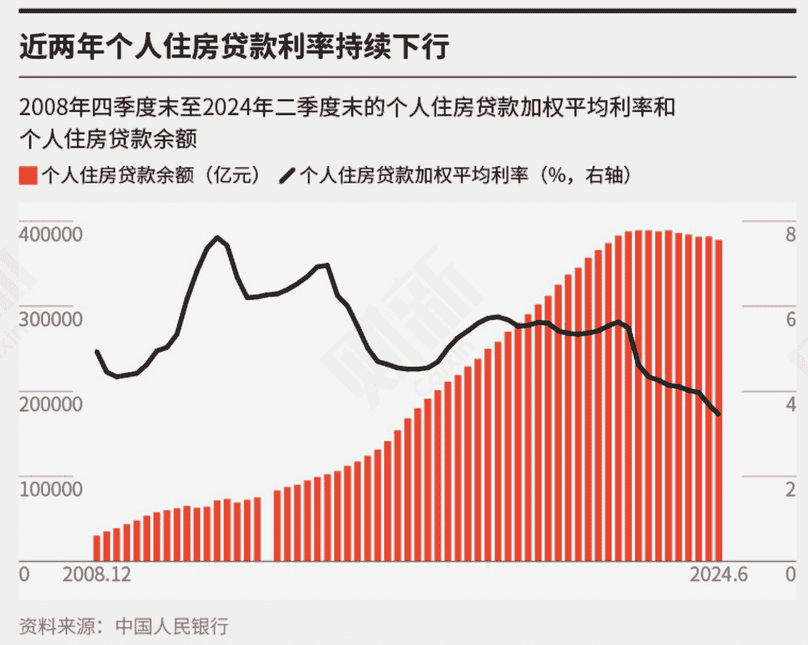

张帅帅认为，保障性住房再贷款利率1.75%，按照银行平均负债成本2.2%计算，在100%的支持比例下能够节约该笔贷款的负债成本约为40—50BP，能够提高对于银行发放贷款的激励。

此外，一位上市房企高管认为，保障房需求仅存在于一线城市和部分强二线城市，三、四线城市居民基本无此类需求。

### 缓解房企资金压力

房地产供给端，销售持续放缓导致房企资金紧张，部分已售在建的项目仍难以按期交付；前期出台的房企存量融资展期和支持经营性物业贷款等阶段性政策即将到期。

从2022年四季度开始，多部委已经针对房企债务和资金紧张困境出台支持政策。综合来看，2022年11月央行和原银保监会联合发布《关于做好当前金融支持房地产市场平稳健康发展工作的通知》（即“金融十六条”），提出的存量债务展期侧重于支持出险房企；而2024年1月央行与国家金融监管总局联合发布《关于做好经营性物业贷款管理的通知》（下称《通知》）提到的放松经营物业贷资金用途，更多利于资金暂时遇到困难的未出险房企解决债务问题。

按照此前文件，这两项政策都是2024年12月31日到期。潘功胜在9月24日的发布会上介绍，房企存量融资展期和支持经营性物业贷款等阶段性政策，均延期至2026年12月31日。

“目前房企与银行洽谈贷款展期难度很大，公开债券的谈判反而更好推动。”上述早期出险房企相关负责人告诉财新，“银行虽然也会将‘金融十六条’规定纳入考量，但它们首先必须保证自身债权不受损失；对房企的一些到期贷款，除了本息，它们还要求企业必须缴纳违约金，能提供的展期期限也很短。”

“另外，多数银行在展期一次之后，不敢也不愿意进行二次展期。”另一名出险房企人士说，银行怕担责，房地产流动性危机大规模蔓延后，出险房企与存量债权银行之间的纠纷趋于白热化。

上述早期出险房企相关负责人提到，“延长房企存量融资展期政策期限，一定程度上能够为贷款多次展期发挥作用。但在具体执行中，银行肯定还要结合企业资产负债情况综合考虑。对于负债过高的房企，银行可能不会对展期大幅松口”。

正常年景，一笔房地产项目开发贷存续期限普遍为三年，个别为五年。金监总局发布于2024年1月30日的《固定资产贷款管理办法》规定，期限一年以内的贷款展期期限累计不得超过原贷款期限；期限超过一年的贷款展期期限累计不得超过原贷款期限的一半。结合“金融十六条”的要求，现阶段，一笔房地产项目开发贷的展期期限最长不能超过2.5年至3.5年。

“如果房企第一次展期时，谈下的展期期限未达到政策要求的累计年限上限，银行才有可能给予再次展期。否则，银行不会给予房企多次展期。延长房企存量融资展期政策期限还是没有解决这个难题。”一名熟悉房地产资金端的人士告诉财新。

出险房企挣扎在展期与削债的边缘，未出险房企亦面临债务借新还旧闭环被打破的困境。允许经营性物业贷用于偿还房企集团总部的存量贷款和公开债，且延长政策期限，一定程度上帮助部分商业物业持有规模较大的未出险房企释放短期流动性。比如，万科于2024年2月底遭遇新一轮信用危机后，公开发债渠道几近关闭。根据万科此前提供的数据，截至2024年3月，该公司旗下商业板块通过深圳印力中心、宁波鄞州印象城、西安龙首印象城等项目，累计完成84亿元的经营性物业贷置换存量CMBS（商业房地产抵押贷款支持证券）。

“《通知》落地后，以经营贷置换存量公开债的做法在实操中可行，但是能够覆盖的房企规模太小。”一位出险房企融资负责人告诉财新，早期房地产奉行高周转，仅少数房企在开启转型时试水商业地产开发和运营，大部分房企旗下自持的商办物业规模不大。

此外，“517新政”鼓励地方政府组织地方国企向开发商“买房买地”，除了上述提到的存量商品房“收储”，还支持地方政府酌情以收回、收购等方式处置已出让的闲置住宅用地。这两类政策的意图均为，中央提供部分资金支持，由地方政府主导，在消化库存的同时，为被收购房企提供增量资金支持。

但过去四个多月，地方政府回收闲置宅地进展相对缓慢。前述上市房企高管表示，收回房企的未开发土地，真正来谈价格的地方政府少之又少，并且政府的出价一般只是“招拍挂”价格的50%，如果房企就此卖地，巨亏做实的代价很难承受。

在9月24日的发布会上，央行称将进一步支持收购房企存量土地，在将部分地方政府专项债券用于土地储备基础上，还正在研究允许政策性银行、商业银行贷款支持有条件的企业市场化收购房企土地，必要时央行将通过再贷款方式提供支持。

一名上市房企投拓负责人告诉财新，大部分出险房企在二线及更低量级的城市都累积了大量存量未开发土地，其中商办用地占比不小。“不过，现在出险房企也不愿意大打折扣去抛售这些存量土储。如果折价过多，出险房企反而更快进入资不抵债状态。”

上述早期出险房企相关负责人也告诉财新，出险房企的存量土储只能亏本出售，卖地之后回笼的资金甚至覆盖不了土地前期贷款，且集团的增信物因此进一步减少，还会削减企业赖以发展的土储；在陆续做完保交付工作后，因无地可开发，出险房企将陷入规模萎缩的境地，甚至危及生存。

已售在建项目的保交付方面，为了保障购房人合法权益，2024年1月金监总局与住建部联合印发《关于建立城市房地产融资协调机制的通知》，以城市为主体，以项目为中心，将房企集团的风险与房地产项目的建设区分开来，把合规的在建已售项目纳入项目白名单，引导金融机构满足房地产项目的合理融资需求，推动项目建成完工和交付。

李云泽在9月24日的发布会上介绍，城市房地产融资协调机制取得了良好效果。截至目前，商业银行已审批白名单项目超过5700个，审批通过融资金额达到1.43万亿元，支持400余万套住房如期交付。

“下一步，将进一步推动融资协调机制落地见效，坚决打赢保交房攻坚战。”李云泽说。

### 支持科创和普惠

科技金融和普惠金融，是2023年10月底召开的中央金融工作会议提出的“五篇大文章”的两大内容。

9月24日，李云泽在国新办发布会上表示，当前中国社会融资总额中，间接融资仍然占据主体地位，这意味着需要走出一条具有中国特色的科技金融，尤其是科创投资的发展之路。前期，大型商业银行下设的AIC，已在上海开展股权投资试点，探索了路径，积累了经验，锻炼了队伍，已经具备扩大试点的条件，“下一步将继续研究扩大试点城市的范围”。

当天晚间，金监总局发布《关于扩大金融资产投资公司股权投资试点范围的通知》，将金融资产投资公司股权投资试点范围由上海扩大至北京、天津、上海、重庆、南京、杭州、合肥、济南、武汉、长沙、广州、成都、西安、宁波、厦门、青岛、深圳、苏州这18个城市。

这意味着，工行、农行、中行、建行、交行五家国有大行旗下AIC，在从事以债转股为目的的股权投资业务之外，将在上述地区开展“不以债转股为目的”的直接股权投资，这是继2020年五大AIC获批在上海开展直接股权投资之后的一次大扩围。

与上海的试点相比，这次扩大股权投资试点在政策上作了一些调整：一是适当放宽股权投资金额和比例限制，将AIC表内资金进行股权投资的金额占公司上季末总资产的比例由原来的4%提高到10%，投资单只私募股权投资基金的金额占该基金发行规模的比例由原来的20%提高到30%；二是落实尽职免责要求，完善容错纠错机制，建立健全长周期、差异化的绩效考核体系。

截至2024年6月末，五家国有大行旗下AIC总资产规模为5869.9亿元。据此总资产计算，五家AIC可以试点开展的不以债转股为目的的股权投资规模将由234.80亿元提升至586.99亿元，增加352.19亿元。

多位业内人士指出，五大AIC在上海做的股权直投业务笔数不多、规模不大。“问题在于，科创投资单笔金额小、风险高，有别于债转股业务。如何既支持科创投资，又控制好风险，还需要探索，比如是否要建立跟投机制、容错机制如何建立等。”一位债转股实施机构人士说。

国信证券研报称，由于五大行体量大，AIC在各银行中的业绩贡献占比不高，但能够从事股权直投业务有利于提升大行在科技金融领域的服务能力和市场竞争力。目前，银行业服务科技企业尤其是初创期科创企业的主要模式以各种类型的投贷联动为主，是传统信贷与投行、投资等直接融资手段相融合的模式，甚至在一定程度上直接融资更居主导地位，信贷资金作为流动性补充，同时配套其他多元综合服务。AIC股权直投业务试点的扩大，最终的收益并不仅仅体现为股权直投业务的盈利，还更多体现为这些科技企业客户带来的存款、贷款、中间业务等各方面收益。

除了科技金融，普惠金融也是“五篇大文章”之一。在当下中国国内经济增速下行的大背景下，商业银行普惠金融的资产质量压力不小。2024年中报显示，多家大中型银行个人经营贷不良率在总规模增加的情况下，不良率仍明显上升。

在前述国新办发布会召开的当晚，金监总局官网发布了《关于做好续贷工作提高小微企业金融服务水平的通知》，明确可以办理续期的贷款产品包括小微企业流动资金贷款和小微企业主、个体工商户、农户的经营性贷款等；对2027年9月30日前到期的中型企业流动资金贷款，可以根据自身风险管控水平和信贷管理制度，比照小微企业续贷相关要求提供续贷支持。

从具体操作来看，对贷款到期后仍有融资需求又临时存在资金困难的债务人，在贷款到期前经其主动申请，银行业金融机构按照市场化、法治化原则，可以提前开展贷款调查和评审，经审核合格后办理续贷；银行业金融机构同意续贷的，应当在原贷款到期前与小微企业签订新的借款合同，需要担保的签订新的担保合同，落实借款条件，通过新发放贷款结清已有贷款等形式，允许小微企业继续使用贷款资金。

此举尽管能够缓解部分小微企业、个人的还款压力，但也存在争议，因为在借新还旧之下，真实的资产质量或被掩盖和低估。

一位大行信贷业务部门人士对财新表示，这次比较受关注的一条规定是，可不因续贷而单独下调风险分类。“之前如果因为财务困难续贷是要下调分类的，而且要在能还得上利息的情况下才可以续贷。”他说。

### 向银行业再注资

此次出台的政策，可能对银行经营和抵御风险能力带来一些挑战。

例如，LPR和存量房贷利率下调，意味着资产端收益率下降，息差可能承压。2024年上市银行中报数据显示，与大中型银行净息差均继续收窄。国有大行中，工行、建行、中行、农行的息差收窄幅度超20BP。

“人民银行在设计货币政策工具调整过程中，有几个重要的考量因素，其中之一是要兼顾支持实体经济增长和银行业自身的健康性。”潘功胜在前述发布会上指出，在政策调整的方案设计中，人民银行的技术团队经过多轮认真地量化分析评估，认为这次利率调整对银行收益的影响是中性的，银行的净息差将保持基本稳定。

从利率传导机制看，政策利率7天期逆回购利率下调，在带动LPR下调的同时，MLF也同步下行。潘功胜表示，MLF和公开市场操作是央行向商业银行提供中短期资金的主要方式，它们的利率下降将降低银行的资金成本；同时，在银行的资产负债两端，也将引导LPR、存款利率对称下行。此外，前几次通过利率自律机制引导存款利率下行形成的重新定价效果，将会累计显现。

2024年7月，六大国有银行一年期LPR下调后主动下调了存款挂牌利率。这是2024年内大行首次集中调降，也是2022年4月存款利率市场化调整机制建立以来的第五次。

尽管存贷款利率同步下降有利于保持净息差稳定，但对储户而言，存款的吸引力也会下降。“当前理财分流存款的现象很严重，就算下调存款利率，也不知道能不能起到预期效果。”前述接近货币当局人士对财新表示，“如果存款规模明显减少，银行也有压力。”

多位业内人士指出，息差对于银行的影响，本质上还是取决于实体经济融资需求的修复情况。中国银行研究院最新发布的《2024年四季度经济金融展望报告》也指出，当前净息差出现企稳苗头，但如果实体经济融资需求未能出现明显反弹，净息差仍面临较大下降压力。

“息差是宏观经济的结果，不是货币政策的结果。”一位熟悉货币政策制定的经济学家对财新表示，“息差缩窄是因为宏观经济不景气、通胀太低。如果经济增长起来了，通胀回到正数，利率会上去的，息差自然也会上去。”

近年来，大型商业银行主要依靠自身利润留存的方式来增加资本，但随着银行减费让利的力度不断加大，净息差有所收窄，净利润增速逐步放缓。与此同时，多家国有大行响应政策号召稳定分红力度，回馈投资者。如何做好资本夯实与分红间的平衡，为潜在的不良压力未雨绸缪，是商业银行面临的一大课题（参见本刊2024年第36期《银行业绩分化虚实》）。

“商业银行需要统筹内部和外部等多种渠道来充实资本。”李云泽在发布会上介绍，为巩固提升大型商业银行稳健经营发展的能力，更好发挥服务实体经济主力军作用，经研究，国家计划对六家大型商业银行增加核心一级资本，将按照统筹推进、分期分批、一行一策的思路有序实施。

资本是商业银行经营的本钱，是提升服务实体经济能力的基础，也是抵御风险的屏障。截至2024年6月末，工行、建行、农行、中行核心一级资本充足率分别为13.84%、14.01%、11.13%、12.03%，交通银行为10.3%，邮储银行为9.28%，均高于相应的监管最低要求。因不同组别的全球系统重要性银行（G-SIBs）的资本要求不同，四家老牌大行核心一级资本充足率最低要求为9%、交行为8.5%；邮储银行暂未入选G-SIBs，监管最低要求为8%。

上海金融与发展实验室首席专家、主任曾刚对财新分析，目前六大行的核心一级资本充足率均高于监管最低要求，但不乏压力，需未雨绸缪：一是国有大行近年来为助力实体经济复苏，资产增速一直高于行业整体水平，在减费让利、净息差收窄大背景下，大行盈利能力下降，内源性资本补充掣肘，而即将实施的存量住房贷款利率下调对国有大行的冲击也相对更大一些；二是多家大行参与了中小金融机构的风险处置，资本已有一定损耗；三是大行未来要继续发挥服务实体经济主力军作用，做好中央金融工作会议提出的科技金融等“五篇大文章”，扩大AIC股权投资范围，客观上对母行的资本提出了更高要求。

### 2019年以来的中国降息通道

- 7天逆回购利率 (%)
- 一年期中期借贷便利 (MLF, %)
- 1年期贷款市场报价利率 (LPR, %)
- 5年期以上贷款市场报价利率 (LPR, %)

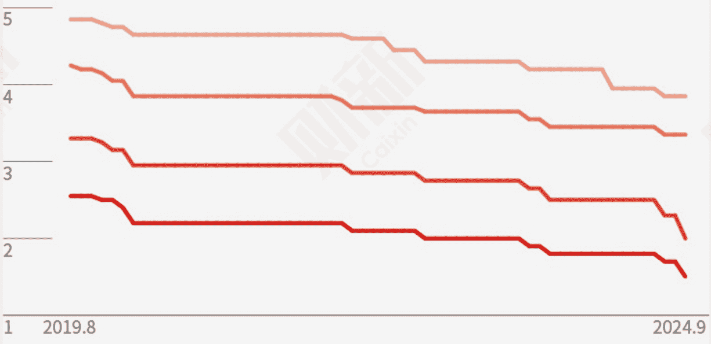

资料来源：中国人民银行

### 2018年以来中国的13次全面降准

加权平均存款准备金率（%） — 央行宣布全面下调存款准备金率幅度（BP, 右轴）

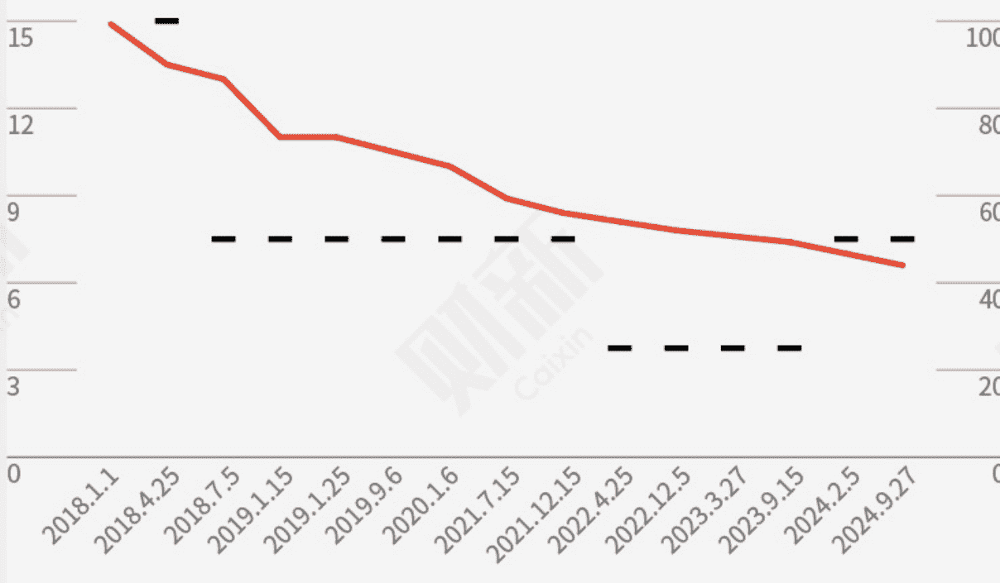

注：仅统计“全面降准”。2019年，中国存款准备金形成“三档两优”的新调控框架，2018年数据为面向大型商业银行、股份制商业银行、城市商业银行、非县域农村商业银行和外资银行的“类全面降准”

资料来源：中国人民银行

本次国家对六大行进行增资的方式尚未公布。通过财政还是市场化方式注资，采取定向增发、配股还是其他方式，融资的价格与每股净资产的关系，以及各家银行的顺序与节奏，都备受市场关注。

曾刚对财新分析，已上市银行核心一级资本的外源性补充方式主要是定增、发行可转债等，但这些方式并不需要作为一项政策而预告，只需经监管部门审核即可；一种可能的方式是大股东直接注资，包括财财政部、中投公司或汇金公司等主体，比如通过发行某种特殊债券募资后再向银行注资。

国家向大行注入资本金此前有过成功先例。一位资深大行人士告诉财新，1998年发行的2700亿元特别国债，其发行目的就是向四大行注资，满足对资本充足率的要求和应对高不良贷款率，“现在再用一下这种方式，我觉得也是可行的”。

1998年特别国债注资国有大行主要分两步：一是1998年3月21日中国人民银行将存款准备金率从13%一次性降到8%，四大行超2400亿元的资金从法定准备金变为可使用的超额准备金，人民银行要求四大行将这些资金以及其他超储共计2700亿元存放到央行的专用户头上；二是1998年8月18日四大行将存放于央行账户上的资金用于认购特别国债，财政部用发行特别国债筹集的资金注资四大行，提高商业银行资本充足率和清偿能力。

中国社科院世界经济与政治研究所副所长徐奇渊指出，为银行补充资本金可以稳定银行经营，也有助于打开货币政策的空间。“原先由于银行估值太低，没有办法通过增发新股去融资，只能靠利润留存补充资本金。现在由国家注资，一定程度上能打开息差下降、利润下滑对货币政策空间的束缚；更能通过银行的杠杆，有效增加对实体经济的支持力度。”

不过，也有业内人士心存忧虑。一位资深监管政策研究者对财新指出，大行获注资后，如果大幅扩张资产，对中小银行的挤出效应会更大，大行垄断地位更强，造成金融机构的结构扭曲。

### 10万亿经济刺激虚实

渣打银行报告直言，央行本轮政策是一次“大胆的行动”，可能预示着货币政策决策的观念有所变化，倾向于更加强力的应对。

未来，货币政策还有多大空间？9月26日的中央政治局会议提出“实施有力度的降息”，令市场充满遐想。

前述熟悉货币政策制定的经济学家指出，此次下调后，7天期逆回购利率将从1.7%降至1.5%，那么未来降息的最大幅度不会超过150BP，不会降到零以下，“但根据我们的测算，在价格指标持续下行的情况下，这远远不够，财政政策势必得发力”。

“政策空间不是守恒的，不一定越用越少，也可能越用越多。”徐奇渊指出。他和不少市场人士都认为，货币政策或还有继续发力的空间，但只靠货币政策发力是不够的。“财政刺激应该占据首要位置。”陆挺指出。

粤开证券首席经济学家、研究院院长罗志恒认为，短期看，可以从三个方面储备财政增量政策：
- 一是研究追加赤字增发国债，弥补土地出让收入等下行引发的收入缺口，提高财政支出增速，加大逆周期调节力度；
- 二是加快专项债发行进度，一方面放宽专项债的使用范围，另一方面考虑将部分专项债额度调整为一般债；
- 三是优化“化债”政策，推动地方从应急状态回归常态。

9月21日，刘世锦呼吁，在一到两年时间内形成不低于10万亿元的经济刺激规模，以实质性扩大终端需求，带动经济回归扩张性增长轨道。

刘世锦解释，这一规模是根据国内生产总值（GDP）总量10%的比重确定的，以发行超长期特别国债为主筹措资金，投向重点是补上基本公共服务的短板，提升以进城农民工为主的新市民在保障性住房、教育、医疗、社保、养老等方面的基本公共服务水平，在微观层面重点带动消费，同时也在一定幅度上带动房地产、基建、服务业等领域投资；目标是力争用十年左右时间，实现中等收入群体倍增的目标，打破需求约束对经济增长的不利影响。

刘世锦的建议“一石激起千层浪”，引发关于财政政策的热烈讨论与共鸣，多位专业人士开始对财政发力规模和方向献计献策。一位极为资深的财税领域人士设想，2024年应该增加8万亿元赤字，用途分为两部分，其中4万多亿元用于补上疫情三年中地方政府的支出缺口，剩下的近4万亿元用于今年保持经济的正常运行。

清华大学经济管理学院院长白重恩此前的测算显示，因疫情冲击，三年中地方政府额外产生6.79万亿元赤字，其中由中央额外增加了1.17万亿元转移支付作了部分弥补；余下的5.62万亿元，其中1.86万亿元由地方额外发行的专项债弥补，3.76万亿元则由地方自行筹措资金解决。他认为，在当前地方财政运转困难的局面下，中央财政应根据不同情况给予相应的补助支持政策。

“让地方政府把疫情三年拖欠的钱还掉，让相关企业能正常发薪水，这是最有效、规模足够大的措施。”白重恩解释，“把钱均匀地撒出去，对消费的影响不一定会那么高，因为消费受到明显抑制的群体，是之前有消费习惯但现在失去收入的那部分人。”

刘世锦认为，与2008年的4万亿元刺激计划重点是基础设施建设等投资不同，这次重点应该是补上基本公共服务的短板。以往重点是物质资本投资，这次是人力资本投资。

刘世锦将消费需求区分为生存型消费和发展型消费，目前中国的生存型消费趋于稳定，消费之增长更多由教育、医疗卫生、保障性住房、社保、文化体育娱乐、金融服务、交通通信等发展型消费拉动；而发展型消费较多采取集体消费或公共服务方式，需要政府搭台子、建制度、出资金，是政府消费支出与居民消费支出的组合。

财政政策发力民生领域的公共消费支出，也是多位研究者的建议。白重恩介绍：“我们计算过，只需要中国GDP的0.4%，就可以让3至6岁儿童获得免费学前教育，使1至3岁的孩子获得普惠托育服务，把入托率从6%增加到30%。”

他指出：“对这些家庭来说，政府花这些钱就给他们减负，他们就有了更强的购买力去消费，另外这也有助于改善当前中国出生率下降的趋势。”

徐奇渊认为，在考虑政策发力方向时，理念或许还需要改变，“不要把消费和投资对立起来。中国最大的财富就是人，把钱花在人的身上，提高教育、健康等领域的消费，能提高劳动生产率，也是一种投资”。

需要注意的是，与增量货币政策的推出程序不同，无论是追加赤字增发国债，还是发行不计入赤字的特别国债，增量财政政策的推出都需要经过全国人大常委会的批准，10月底的人大常委会是观察的时间窗口。

## 最新封面报道之二 | A股强心针

### CAIXIN | 听文章
文 | 财新周刊 王娟娟 全月 吴雨俭

金融支持经济高质量发展，首先泽被资本市场。

在9月24日的国新办新闻发布会上，“一行一局一会”“一把手”同台亮相，联手送出了一系列呵护资本市场的大礼包，包括首次创设支持股市的货币政策工具、推动中长期资金入市、支持并购重组等一揽子政策。对于一直被市场寄予厚望的平准基金，人民银行行长潘功胜回应，称“正在研究”。

宽松的政策大招下，A股在略有迟疑之后，应声大涨，沪指当日收报2863.13点，创下2020年7月6日以来的最大单日涨幅。沪深两市成交总额共9713亿元，也是自5月20日以来的新高。

> “9月24日政策推动A股上涨，其中大半都涨在‘正在研究’的态度上。”一位资深的投资人士对财新表示。

9月25日，A股市场全天冲高回落，沪指2900点得而复失。沪深两市成交额11574亿元，较上个交易日放量1860亿元。这是自5月6日以来A股首次单日成交突破万亿元。

更让市场有些意外的是，9月26日，中共中央政治局召开会议，分析研究了当前经济形势，部署下一步经济工作。会议在肯定今年以来经济工作的同时，指出当前经济运行出现一些新的情况和问题，要全面客观冷静看待当前经济形势，正视困难、坚定信心，会议在财政、货币、房地产、资本市场、企业纾困、促消费、惠民生、稳外资、保就业等多方面作出政策部署。对于资本市场，重申先前国新办发布会所提举措。

利好政策接连传来，A股再次上演普涨行情，沪指站上3000点大关，成交继续活跃，两市成交额再次突破1.1万亿元。在前期美联储降息的影响下，外资近日连续加码A股，利好消息加持下，素有A股引领者之称的北向资金“陆股通”资金9月26日成交额大增至约1902.78亿元，占沪深两市总成交额的16.37%。

### 2020年以来上证指数走势

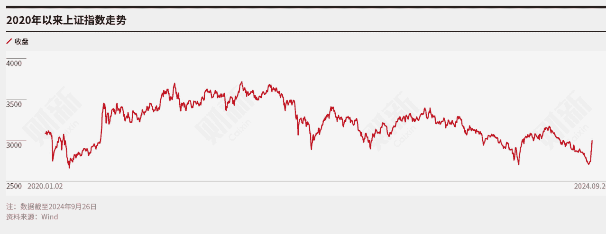

9月27日，因为开盘后涌入的买盘过于集中，上海证券交易所股票竞价交易与个别券商的App一度遭遇系统故障、成交缓慢，近期的密集政策对股市普通投资者的心理作用可见一斑。

中国股市素有“一根阳线改变心情，两根阳线改变观点，三根阳线改变信仰”之说。好久不见的连日大涨让整个市场欢呼雀跃，“牛市引擎启动”之说广为流传，卖方忙着唱多，买方忙着调研，退出股市的个人投资者也跃跃欲试重新入场。

连美国华尔街传奇投资人大卫·泰珀（David Tepper）都公开喊话，现在格外看好中国资产，愿意全部押进（all in）。泰珀以大胆逆向投资风格著称，在9月26日与CNBC（美国消费者新闻与商业频道）“Squawk Box”节目的对谈中，他表示，即使近期有所反弹，中国股市股票估值仍旧较低。

公众号懒人搜索，懒人专属群分享

A股是否真的就此步入上涨的牛市通道？中信证券首席策略分析师于翔乐观判断，当前政策出现非常明显的拐点信号，股市将迎来一波巨大的行情，将呈现出与之前不同的状态——以进攻为要务而非防守。

但一位证券投资基金经理对财新表示，市场主要亢奋在于出现了超预期的政策，“政策底”出现，但央行目前给的货币工具主要是提供资产的流动性，希望市场自发加杠杆，这并不能解决背后资产的质量问题。“业绩底可能需要等到明年上半年才能验证”。

股市素来是经济的晴雨表，股市的行情逆转从来都很难单靠政策，短期刺激后，基本面改善程度将决定市场能否产生赚钱效应。思睿投资集团合伙人、首席经济学家洪灏近日对财新表示，三部门联席会议虽然释放了政策利好，但后续股市趋势逆转还有待财政政策发力，包括加快地方政府专项债、超长期特别国债、3000亿元保障性住房再贷款等已确定政策的落地。他强调，房地产市场的困境仍然是关注焦点，仅仅通过货币政策的调整并不能解决问题，期待存量房收储等可能改变房地产市场现状的政策措施能加快落实。

9月25日，高盛研究部股票策略分析团队发表报告称，2024年以来，中国实际政策实施与市场对政策宽松的预期存在差距，在很大程度上加剧了股市波动。目前已经出台的政策组合，可能尚未达到一些投资者所希望的刺激力度，且可能不足以从根本上扭转基本面的下行趋势，但仍有助于收紧高企的政策风险溢价。这一溢价体现在周期低位的市盈率和国际投资者对中国股票配置处于十年低位中。

高盛研究部认为，在房地产问题解决以前，中国或将继续是一个“交易”市场。投资者将保持战术性地投资中国股票，直到房地产下行周期即将结束的迹象显现。

### 8000亿元杠杆

在9月24日的发布会上，为提振市场、补充流动性，潘功胜提出央行将以结构性货币政策工具来支持资本市场。

具体而言，主要包括两项工具：
- 第一项是创设证券、基金、保险公司互换便利，支持符合条件的证券、基金、保险公司通过债券、股票ETF、沪深300成分股等资产质押，从中央银行获取流动性投资股票市场；
- 第二项是创设股票回购增持专项再贷款，引导银行向上市公司和主要股东提供贷款，支持回购和增持股票。

“我们计划的首期互换便利操作规模是5000亿元，未来可视情况扩大规模，做得好可以再来5000亿元，甚至可以再搞第三个5000亿元，我觉得都是可以的，我们是开放的。”潘功胜说。

东海证券非银首席分析师陶圣禹认为，互换便利首期操作规模5000亿元对长期资金庞大的体量来说较为有限，但互换便利的正式落地可显著提升机构的资金获取能力和股票增持能力，也可提高市场流动性和交易活跃度，市场行情也将相应地提升机构自身的投资收益水平，后续规模提升值得期待。

互换便利工具在境内外市场此前都有类似实例，最早可追溯到1720年英国的南海泡沫（South sea bubble）。最成功的案例是在2008年金融危机期间，为应对流动性危机，美联储曾推出定期证券借贷便利 (Term Securities Lending Facility, TSLF) ，允许交易商以缺乏流动性的证券做抵押来投标，交换高流动性的国库证券；2020年新冠疫情期间美联储也曾启用该工具。在中国，2019年2月，央行推出央行票据互换 (CBS) 操作，以支持银行发行永续债，后者募集资金主要为充足银行资本金，以扩大银行信贷投放能力。

"互换便利"不是"借贷便利"，央行不会直接给非银机构提供资金。粤开证券首席经济学家、研究院院长罗志恒分析，由于"证券基金保险公司互换便利"与"央票互换工具"具有相似性，因此非银机构从央行换取的国债等资产，不能直接进行现券买卖。也就是说，不存在"买入股票-找央行换债券-再将债券卖出"的链条。

他认为，"互换便利"的效果主要有二：
- 一是通过盘活证券、基金、保险公司的存量资产，激励其积极参与市场、活跃市场、稳定市场；
- 二是避免非银机构因为流动性问题"套现离场"，防止同质化交易、赎回压力等可能造成的市场踩踏。

多位非银机构人士认为，从目前的政策表述看，互换便利工具对公募来说吸引力较弱。"从央行的表述看，要求是机构自身持有的资产，不能是基金资产，基金公司本来就没有大规模自营，也没有加杠杆的诉求。"北京一位公募基金经理称。"对于券商和保险，可能主要是对券商自营有一定吸引力，可以换取低成本杠杆，市场好的时候更有加杠杆的动力。"深圳一位公募人士认为。

自营业务近年来已成为券商业绩主要支柱，但由于本身杠杆倍数的限制，以及近两年债市长牛，券商自营的权益仓位远低于债券。中信建投非银金融首席分析师赵然5月下旬统计，券商整体自营盘中股票仓位约在7%—8%，而债券占比达到65%—70%，剩下如基金占比约10%—12%，其他产品占比约10%—20%。

“现在券商自营权益敞口本来不大，而且券商自己借钱也不贵，年化2%的资金遍地都是。”一家大券商自营人士表示，券商在股市加杠杆的核心还是要看股票能不能涨，“能涨的话，资金成本不算什么”。 

多位受访人士均认为，政策的愿望是美好的，但除非市场有明确的赚钱效应，不然券商也不会贸然使用互换便利工具。“中国国内大多数机构目前还是在追涨杀跌，逆向投资、做价值发现的很少。”一位资深投资人士对财新称。

保险公司是否有足够动力去加杠杆投资股市？一名保险资管人士向财新表示：“互换便利提供的新型工具，预计主要影响的目标是类似中央汇金投资有限责任公司这样在前期负责托市的机构。但对保险公司的长期资金来说，相比获得一个投向股市的新杠杆，关键在于是否有投向股市的意愿，而后者主要取决于经济基本面。” 

他解释道，一方面，保险公司并不缺乏放杠杆的工具，比如说可以通过卖出回购利率债的方式获得资金，表内的杠杆上限是20%，但市场也就使用了大概5%，还有15%的空间没有用；另一方面，保险公司也不缺钱，但长期以来投向权益资产的占比都保持在11%—13%，大部分险企距离监管给出的最高40%权益仓位上限还很远。“并不是机构没有钱，而是不愿意买。虽然杠杆手段给的很足，但缺的是加杠杆的意愿。只有当出现赚钱机会或者缺钱的时候，机构主体才会加杠杆。”

另一家险企权益投资人士亦称，保险现今的权益额度并未用满，理论上并不需要更多资金。“比起股市本身，改变宏观预期更重要。”他认为，当前比稳市场、稳信心更有用的措施，是以“平准基金”托市。

关于股票回购增持再贷款，潘功胜表示，这在国际资本市场是一个非常频繁的交易行为。他透露，中央银行将向商业银行发放再贷款，提供资金的支持比例为100%，再贷款利率为1.75%；商业银行对客户再发放贷款的利率在2.25%左右，首期额度3000亿元。

上市公司股份回购常被认为是向市场传递利好信息的手段。尤其是注销式回购后，公司总股本减少，公司盈利被分摊到较少的股份数量上，从而提升每股收益，相当于一种特殊形式的现金分红。

罗志恒认为，“专项再贷款”有利于引导上市公司进一步加大回购力度，进而提高投资者获得感，提高股市长期吸引力。上市公司以现金为对价，采用要约方式、集中竞价方式回购股份的，视同上市公司现金分红。简单说，回购等于现金分红，具有优化资本结构、维护公司投资价值、健全投资者回报机制等方面的功能作用。

历史上，证监会多次在市场低迷时松绑回购政策。中信建投策略研究团队此前在分析近年主动式回购对资本市场的影响后发现，回购在短期内对市场有积极的正向作用，往往在公布回购预案和公告的一个月内，股票上涨的公司数量显著增加，之后逐渐回落。

### 重提平准基金

在被问及平准基金的创设时，潘功胜在9月24日的发布会结束之后，回应一位记者追问时表示：“正在研究”。

A股当日上午尚反映平平，午后则放量大涨。上证综指收复2800点，创业板大涨3.45%。券商、多元金融个股连番涨停，钢铁、锂电池、煤炭板块反弹迅速，全市场半日成交超5200亿元。

> “发布会是在股市开盘前召开，9点半开市后，最开始听到央行的两项创新设立的支持股票的工具，大家都还没立刻反应过来，不太明白互换便利是什么。新闻发布会结束后，央行行长被追问时，说正在研究平准基金，A股做多势能就起来了。”一位非银机构交易人士表示。

股市出现过度波动时，各国政府往往通过各类调控机制，对市场进行干预纠偏。政府调控大多为间接调控，微观上调节股票供给、规范证券交易印花税、限制涨跌幅、实行T+1交割制度等影响股票市场；宏观上采用货币政策和财政政策，通过调节货币供给及政府支出与税收等影响上市公司的基本面，从而引起股价上涨或下跌。

此外，政府也可以直接入市，建立股市平准基金，干预股市。相比于其他间接干预方法，建立平准基金能够更直接、灵活地调整股价剧烈波动，海外如日本、韩国、美国，还有中国香港、中国台湾都有平准基金救市的先例。

平准基金（Stabilization Fund）以稳定市场为目标，也被称为干预基金（Intervention Fund）。一般是政府通过特定的机构（如证券监管部门、财政部门等），以法定方式建立的一种证券投资基金；其目的是通过在股票二级市场的逆向操作，熨平非理性市场波动，从而稳定证券市场。

德邦证券分析师吴开达和林晨认为，从效果来看，平准基金的入市，可以在短期内稳定股指、活跃市场交易情绪。因此，在股市缺乏流动性、持续阴跌的情况下，设立平准基金护盘，能大大缓解资金踩踏现象。

短期内，平准基金的入市效果主要取决于资金规模和市场当时的估值水平，长期并不能改变市场运行节奏。例如，日本在1995年6月因经济长期萎靡不振，银行出资约2万亿日元救市，日经225指数此后一年涨幅超55%；但由于日本经济并未走出疲软状态，股市一直处于下行通道。

中国市场一直没有严格意义上的平准基金。中央汇金投资有限责任公司、中国证券金融股份有限公司等市场所称的“国家队”，被认为是中国版平准基金制度的雏形，但无论其法律地位还是资金来源，“国家队”定位并不清晰。

国信证券研报指出，结合海外尤其是美国、日本，以及中国香港地区的经验，需要审慎设计平准基金的的募资、入市与退出机制。如为规避救市潜在的道德风险，当前买入宽基ETF优于选择个股；同时恢复市场正常融资功能，如逐步恢复IPO节奏，估值修复后恢复正常套保和减持，实现交易与融资活跃。

东吴证券分析师陶川指出，“平准基金”入市需要“门槛”和“择时”，股票跌幅大、市场陷入非理性的资金外流恶性循环、其他常规政策效果有限以及交易量低迷是出手的重要条件。此外，平准基金依旧只是过渡手段，务必速战速决，甚至不惜规模，一旦战线拉长，政策效果和信誉都会大打折扣。

“平准基金”久被讨论却始终迟迟未落地，与中国当前的形势有关。罗志恒指出，如果央行直接“下场”买卖股票，低吸高抛，会面临财富再分配的诟病；高吸低抛，也会遭遇利益输送的质疑。此外，央行直接买卖股票还会扭曲市场定价机制，更面临退出难题。

### “并购六条”

近一年多来，证监会已多次就并购重组表态，强调鼓励上市公司实施高质量的并购重组，也从政策面出台了一系列优化措施，但并购重组回暖始终乏力，“IPO卧倒，并购吃饱”景象未再现。相反，市场参与主体依然对并购重组态度谨慎，造成政策呼声高而市场回应寡淡。

清科研究中心统计数据显示，2024年上半年，中国国内并购交易共完成893起，涉及金额达2093.59亿元，分别同比下降28.5%、52.8%，并购交易仍以产业链上下游的资源优化整合为主。

“这一年，证监会、交易所大大小小的调研和座谈都不少，大家每次都提一堆意见，能落到政策上的有限。这次‘并购六条’回应了前期市场的一些预期，政策的积极信号更明确了。”深圳一位私募股权基金人士对财新表示。

证监会主席吴清在9月24日的发布会上最新提出“并购六条”，当日晚间证监会正式发布《关于深化上市公司并购重组市场改革的意见》（即“并购六条”）。

为配合“并购六条”落地，证监会和证券交易所还修订《上市公司重大资产重组管理办法》（下称《重组办法》）的部分内容，同步公开征求意见。

“并购重组确实是资本市场的大事，通过支持企业并购重组进一步促进资源有效配置，是资本市场一项非常重要的功能。”吴清在发布会上表示，证监会在前一阶段广泛调研、听取各方意见的基础上，研究制定了“并购六条”。

首先是支持运作规范的上市公司围绕产业转型升级、寻求第二增长曲线等需求开展符合商业逻辑的跨行业并购，收购有助于补链强链、提升关键技术水平的未盈利资产，以及支持“两创”板块公司并购产业链上下游资产等，引导更多资源要素向新质生产力方向聚集。

2014年至2015年间，A股曾有过一轮并购重组狂热期，跨界并购案例一度层出不穷，但大部分最后都落得一地鸡毛，商誉爆雷此起彼伏。国投美亚基金总经理孙万营对财新表示，当时的跨界并购多是上市公司的资本运作，缺乏产业逻辑，后来遭到严管严打。如今再提跨行业并购，政策已经设置了基本前提，那就是需要符合产业转型升级的逻辑、能够提高上市公司质量。

“我们之前做的整合都是行业内的垂直整合，但凡涉及跨行业都十分谨慎，连去交易所沟通的念想都没有。现在要是有产业逻辑能表达清楚的项目，那我们还是愿意去做一些努力的。”不过，孙万营同时认为，“并购重组现在审核在交易所，预计跨界并购的落地还是需要一事一议，以前那种什么项目火收什么，比如说制造业转向游戏行业，估计是不现实的。”

此次“并购六条”回应了此前市场机构关心的多个问题，包括打通“A并A”（上市公司之间的并购整合）的堵点，锁定期优化；在并购重组中鼓励采用更为灵活的支付方式，允许分期发行股份；通过锁定期限实施“反向挂钩”，鼓励私募投资基金积极参与并购重组等。

2024年9月26日的中央政治局会议后，经中央金融委员会同意，中央金融办、中国证监会联合印发《关于推动中长期资金入市的指导意见》。

《重组办法》新修订内容中明确，上市公司之间吸收合并，被吸并方控股股东参考短线交易限制，设置六个月锁定期，如构成收购的，执行《上市公司收购管理办法》的锁定期要求；对被吸并方中小股东不设锁定期。当前“A并A”主要是由政府部门主导的国企业务整合，绝大多数A股上市公司的收购仍是通过股权控制实现，如正在推进的**中国船舶**（600150.SH）吸收合并**中国重工**（601989.SH）、刚刚开始的**国泰君安**（601211.SH）吸收合并**海通证券**（600837.SH），民营A股上市公司之间的吸收合并案例并不多。

一位券商投行人士认为，参照成熟市场的经验，随着政策放开，中国国内“A并A”乃至“A并H”的案例将会逐渐增多。孙万营表示，“A并H”的首个案例已经出现。他指的是，近日科创板公司**亚信安全**（688225.SH）公告将以13亿港元收购港股**亚信科技**（01675.HK）的控制权。两家公司的实控人都是**田溯宁**。

重组支付对价方面，根据现行规定，上市公司理论上可用工具丰富，除支付现金、发行股份、发行定向可转债外，还包括发行优先股、定向权证、存托凭证等，前两种方式应用较多，定向可转债2023年9月才“试点转常规”，后三种方式则无相关细则。有并购界人士认为，目前市场对于并购资产质量以及上市公司盘面表现均信心不足，如果后续市场逐步活跃起来，重组工具运用也会随之增多。

9月25日晚间，**富乐德**（301297.SZ）公告，正在筹划以发行人民币普通股股票及可转换公司债券、现金（如有）等方式收购间接控股股东FERROTEC集团下属半导体产业相关资产。本次交易预计构成重大资产重组，同时亦构成关联交易，或成为《重组办法》修订后的验证案例。

### 如何吸引长钱

当前国内资本市场还面临长期资金总量不足、结构欠优等问题，“长钱长投”的制度环境还没有完全形成。

据华泰证券张继强团队统计，截至2023年末，保险业资金运用余额约27.67万亿元，其中股票和基金投资占比为12%；而2023年末银行理财规模29.06万亿元，权益资产占总资产仅为2.86%。

在发布会上，吴清回答媒体提问时称，中长期资金的投资运作专业化程度高、稳定性强，对于克服市场短期波动，发挥资本市场的稳定器、压舱石作用都有着非常重要的意义。“长钱确实非常重要。”他强调。

9月26日的中央政治局会议后，经中央金融委员会同意，中央金融办、中国证监会联合印发《关于推动中长期资金入市的指导意见》（下称《指导意见》）。

证监会当日晚间表示，《指导意见》的主要目标是，经过一段时间努力，推动中长期资金投资规模和比例明显提升，资本市场投资者结构更加合理，投资行为长期性和市场内在稳定性全面强化，投资者回报稳步提升，中长期价值投资理念深入人心，形成中长期资金更好发挥引领作用、投融资两端发展更为平衡、资本市场功能更好发挥的新局面。

呼吁引导中长期资金入市，已是十余年的老话题。此前证监会大力促进发展权益类公募基金，从数据来看，截至2024年8月底，权益类的公募基金、保险资金、各类养老金等一些专业机构投资者合计持有A股流通市值接近15万亿元，比2019年初的数字增长了1倍以上，占A股流通市值比例从17%提高到22.2%。

吴清表示，接下来证监会还将继续大力发展权益类公募基金，主要将大力推动宽基ETF等指数化产品创新。他指出，近期新发行了10只中证A500ETF，很受市场欢迎，很快就达到了募集上限。“下一步，我们将进一步优化权益类基金产品注册，大力推动宽基ETF等指数化产品创新，适时推出更多包括创业板、科创板等中小盘ETF基金产品。”吴清还表示，将推动公募基金行业稳步降低综合费率。

作为中证A系列的指数之一，中证A500指数是对A股市场代表性宽基指数的有效补充，从各行业选取市值较大、流动性较好的500只证券作为指数样本，反映各行业最具代表性上市公司证券的整体表现。前十大成分股中包括贵州茅台（600519.SH）、宁德时代（300750.SZ）、中国平安（601318.SH）等大市值公司，十大权重股与中证全指、沪深300一致。

从最终的募集结果看，截至9月24日，10只产品发行均达到或超过20亿元募集上限，合计募集超过200亿元。而在公募基金降费改革后，A500指数ETF费用包括0.15%管理费、0.05%托管费，是目前全市场股票ETF费率最低水平。

不过，据财新了解，上述10只产品的募集并非没有压力。这10只产品中有9只采取了券商结算模式。

券商结算模式在2017年底启动试点，2019年初由试点转为常规，业务实质就是基金的托管、结算都在券商进行；券商收取托管费的同时，也会在基金销售上更为卖力，各类友好资金也会进场帮忙。

最具有长期资金特征的保险资金，规模大、期限长、来源稳定，天然具有耐心资本的属性，目前是资本市场中排名第二的机构投资者。

在9月24日的发布会上，监管部门在促进险资入市、支持耐心资本方面也打出系列政策“组合拳”。国家金融监督管理总局（下称“金监总局”）局长李云泽表示，金监总局将从三方面入手，包括扩大保险资金长期投资改革试点，支持其他符合条件的保险机构设立私募证券投资基金；督促指导保险公司优化考核机制，鼓励引导保险资金开展长期权益投资；鼓励理财公司、信托公司发行更多长期限权益产品等。

李云泽提到的保险资金长期投资改革试点，是指经国务院同意，在2023年11月末由中国人寿、新华人寿共同发起设立私募证券投资基金，以募集保险资金投资于公司治理良好、经营运作稳健的优质上市公司股票。该基金的注册资本500亿元，已正式开始投资运作。

新华保险董事长杨玉成在2024年7月的公众宣传日透露，该基金已累计投出超过200亿元，为资本市场注入了长期稳定的资金。

公开信息显示，中国人寿与新华保险分别出资250亿元，在2024年2月注册成立一家名为“鸿鹄志远（上海）私募投资基金有限公司”的机构。截至目前该公司可见的公开持仓情况是，2024年上半年买入伊利股份（600887.SH）1.19亿股，以5、6月的股价水平估算，成本在30亿元左右；持股占比1.88%，排名第六大股东。

2023年，财政部和金监总局已先后推出相关政策推进保险资金这类长期资金入市：比如，拉长考核周期，将考核国有商业保险公司的净资产收益率（ROE）指标从原来的“一年”改为“一年+三年”相结合的模式；又如，松绑“偿二代”二期的规定，下调沪深300成分股等资产风险因子，通过降低其资本占用鼓励险资入市。

数据显示，保险资金以安全、稳健的固定收益类资产为主，多元化配置为辅。2012年—2023年，险资投向股票和基金的占比基本维持在11%—13%，波动不大。

从近两年的趋势看，保险资金对债券的增配比例在持续上升；截至2024年二季度末，30.87万亿元的险资中，投向债券的占比为45.84%，比上年同期增长4.4个百分点；投向股票和证券投资基金的占比为12.25%，同比减少0.75个百分点，几乎持平于2023年末的占比。

业内人士指出，保险公司在推动资金入市时主要受限于两大痛点：一是在新会计准则下，投向权益类的资产对净利润的波动影响较大；二是在“偿二代”二期下，不少险企受制于偿付能力充足率的压力，投资股票会占用较高的资本。而据财新了解，国寿新华的500亿元试点基金，对前述两大痛点均有所涉及：其核心一是通过基金架构，避开公允价值计价方式，降低权益资产市值波动对于险企净利润的影响；二是给予偿付能力占用打七折、豁免权益类资产占比的政策优惠。■

## 最新财新周刊 | 加沙等待停火

- CAIXIN| 听文章
- CAIXIN| 看视频
- 点我打开视频

文 | 财新周刊 胡暄 罗子琳

自2023年10月下旬，在遭受哈马斯大规模突袭之后，以色列军队大举攻入巴勒斯坦激进派武装组织哈马斯控制的加沙地带，巴以之间近年来规模最大和烈度最高的武装冲突随即展开。这场从地中海东岸的加沙飞地日益向中东多条战线蔓延、酿成重大人道主义危机的战争，在延宕近一年后，仍看不到明确的停火迹象。

尽管持续至今的战火已在加沙地带造成至少4万人丧生、9万余人受伤，当地的大部分哈马斯军事设施和有生力量也基本遭到以军的摧毁和剿灭，但对誓言夷平哈马斯武装分子的藏匿之所、尚未完成解救全部人质目标的以色列政府来说，不仅在加沙的战斗远未结束；在以色列北部与黎巴嫩接壤的边境地区，以军与受到伊朗支持的黎巴嫩真主党武装，也愈发频繁地陷入激烈交火。

近来，以色列正将军事行动的重心向北转移，对边界另一侧的黎巴嫩真主党发动更加猛烈的攻击。精通情报战的以色列还制造大规模爆炸袭击，严重破坏了真主党的通信系统，并通过“定点清除”击毙了不少真主党高级指挥官。

眼看在加沙“消灭哈马斯”逐渐变成一项不可能完成的任务，以色列与黎巴嫩真主党之间原本规模可控的冲突又陷入新的螺旋式升级，对中东地区滑向一场更大范围地区性战争的担忧，似乎变得越来越真切。

与一年前哈马斯突袭以色列城镇，造成以色列方面军民逾1200人死亡、251人遭到绑架时相比，如今的全球舆论也经历了高度撕裂。

战争打响之初，美欧国家曾一致公开谴责哈马斯针对以色列平民的极端暴力行径，国际舆论场上不乏对以色列的同情和支持之声。但随着以军持续围困加沙，并向当地人口密集的区域发起大规模进攻，加沙的妇孺儿童在饥饿和疾病中挣扎的画面很快传遍全球。一些西方国家城市开始上演声援巴勒斯坦人的大规模示威活动，围绕“反犹主义”的争论甚嚣尘上。

据哈马斯控制的加沙卫生部和联合国统计，过去近一年来，加沙已有4.1万多名巴勒斯坦人在战火中死亡，其中大多数是平民，当地230万居住人口中90%以上流离失所。国际权威期刊《柳叶刀》7月的报告则称，由于加沙大部分基础设施遭摧毁，食物、水和庇护所严重短缺，以色列进攻累计造成的实际死亡人数可能超过18.6万人，占加沙总人口的逾8%，其中间接死亡人数可能是直接死亡人数的3到15倍。

公众号懒人搜索，懒人专属群分享

触目惊心的人道主义灾难，令国际社会的停火呼声日益高涨。今年以来，美国、埃及、卡塔尔等主要斡旋方加快了调停步伐，以色列和哈马斯围绕停火和交换被扣人员展开多轮艰难谈判。但在突发事件的频频干扰之下，由于哈以双方围绕加沙管治问题的核心分歧难解，这一备受各方期待的停火谈判始终未取得实质突破。

仍在从加沙向四处外溢的战火，无疑正在改写抗衡了70余年的以色列和巴勒斯坦间的互动关系，乃至颠覆整个地区的力量平衡。这场一年前骤然打响的战争，给巴以各自的社会生态和政局带来怎样的冲击？随着冲突转入新阶段，以色列和哈马斯距离真正停火还有多远？各方围绕加沙战后安排的反复拉锯和争论，对以色列和巴勒斯坦人的前途命运来说意味着什么？

### 漫长的消耗战

“哈马斯在这座邪恶的城市中部署、藏匿和活动的所有地方，都会被我们夷为废墟。”2023年10月7日，当从加沙越境潜入以色列的哈马斯武装分子，对士兵和平民发起血腥袭击，在以色列举国遭到强烈心理震撼之际，一贯以强硬姿态示人的以色列总理内塔尼亚胡曾如此发誓。

救出全部200多名被掳到加沙的人质、彻底摧毁哈马斯的力量、确保加沙不再构成对以色列的安全威胁，是以色列近一年来反复强调的作战目标。

但正如许多人预料，这注定是一场漫长而艰难的行动——不仅对加沙的地面战将不可避免地造成巨大人员伤亡；早已对以军攻势做好准备的哈马斯，更懂得如何利用加沙高人口密度的城镇环境，增强自身作战优势，甚至将藏匿于地下隧道的人质作为获取军事让步的筹码。

自2007年起便落入哈马斯控制的加沙地带，位于地中海东岸，地势狭长，在仅占据约360平方公里的土地上容纳了约230万居民。作为世界上人口密度最大的地区之一，加沙境内建筑物密集，平民和哈马斯武装人员混居，地下还遍布着哈马斯修建的隧道及放置的炸弹和地雷。如此复杂的作战环境，对以军的空中和地面攻势均构成棘手挑战。

2023年10月7日哈马斯袭击后，以色列国防军并未第一时间发动地面进攻，而是首先对加沙展开20天的密集轰炸和封锁，同时征召36万预备役军人，在靠近加沙的南部边境地带集结部队。

直到2023年10月下旬，以色列酝酿已久的地面攻势才徐徐铺开。2023年10月27日，以军的步兵部队和坦克方阵越过边界，挺入加沙地带北部，并从城市外围的农村逐步向哈马斯在北部的主要据点——加沙城逼近。

与外界此前预期的“闪电战”不同，以军在加沙的军事行动以分阶段、渐次的方式展开。到2023年11月上旬，即开战一个月后，以军已将加沙这片飞地按照南北“一分为二”，并逐步占领加沙北部的核心地区。

猛烈的炮火之下，加沙的卫生、水和食品等基本服务迅速滑向断供的临界点。在国际社会的呼声中，2023年11月底，哈马斯与以色列达成开战以来的惟一一次停火。其间，哈马斯释放了以妇女和儿童为主的100多名人质，作为交换，以色列释放了看押在该国监狱的约240名巴勒斯坦囚犯。

但仅仅一周后，战火又重新燃起。

步入2024年以来，随着以色列在年初宣告结束加沙北部的军事行动，以军与哈马斯激烈战斗的主要地带，逐渐转移到加沙中部和南部。

今年2月，在以军夺取加沙南部重镇汗尤尼斯后，仅有位于加沙最南端、与埃及接壤的城市拉法仍处于哈马斯控制之下。自战事爆发以来，大批加沙北部居民为躲避战火南逃，使得战前约有30万居民的拉法，一度拥入100多万人。在这座加沙“最后的避难所”，巴勒斯坦难民要么身处拥挤的临时帐篷，要么不得不露宿街头。

由于担忧酿成人道主义灾难，以色列的盟友美国多次以停止军援施压，要求以军制订疏散拉法平民的可靠计划。据《华尔街日报》披露，以色列最终在美方压力下，放弃原先拟派出两个师进攻拉法的计划，并将行动重点改为夺取位于加沙与埃及边境、被称作“费城走廊”的狭长通道。

到2024年5月底，以色列国防军已基本攻下拉法的中心地带，并控制了“费城走廊”，阻断了哈马斯经过这一通道从埃及向加沙运送军火的路线。

此后，以色列开始削减在加沙的兵力部署，转向以特种部队清除残余武装分子为主的低烈度行动。与此同时，在美国、埃及、卡塔尔的斡旋下，以色列与哈马斯重启以停火和释放人质为目标的谈判。

过去近一年来，以色列的猛烈攻势令哈马斯的武装力量遭受重创。据以军估计，哈马斯在战前约有3万名武装分子，目前以军已击毙了其中约1.7万人。以色列方面则有约344名士兵在对加沙的地面攻势中阵亡。

以色列特拉维夫大学埃泽尔·魏兹曼国家安全讲席教授加特（Azar Gat）对财新估计，哈马斯迄今可能已损失大约四分之三的武装力量，其连、营、旅一级的大部分军事指挥官都被以色列击毙。哈马斯在加沙建造的地道、火箭弹兵工厂、军事指挥所等设施，也大多遭到摧毁。

加特认为，虽然以色列很大程度上实现了“消灭哈马斯的行政和军事力量”的目标，但哈马斯仍有能力在加沙重新集结并开展游击战。

实际上，在以军撤离加沙北部城市贾巴利亚后，哈马斯的武装分子便很快回到当地。据《卫报》报道，哈马斯甚至恢复了对加沙的民政管理，如派出官员在市场巡视、对主要商品实施价格管制、组织发放援助物资等。

“认为可以摧毁哈马斯、让哈马斯消失的想法，是在误导公众。”以色列军方发言人哈加里（Daniel Hagari）在2024年6月对媒体直言。加特亦认为，鉴于哈马斯的势力已深度嵌入加沙社会，哈马斯有望在以色列撤军后的数月内重建军事力量、数年后重建在加沙的政治权威。此后再过数年，哈马斯很可能再次对以色列构成“最大威胁”。

### 战火加速外溢

2023年10月8日，即哈马斯突袭以色列后的第二天，长期敌视以色列的黎巴嫩真主党武装便以支持巴勒斯坦为由，对以色列北部地区频繁发射火箭弹、迫击炮和无人机，以军则回以炮击和空袭。

此后双方在黎以边界两侧几乎每天交火。但直到2024年9月中旬，这些相互袭击仍大致遵守避免造成大量平民伤亡的默契，使得冲突一直维持在可控规模。

据以色列统计，共26名以色列平民和22名军人在过去一年与真主党的冲突中丧生。黎巴嫩真主党则称，该组织共503名成员在以军袭击中丧生。

战火频仍下，黎以边界两侧均有大量民众流离失所。据以色列智库陶布中心（Taub Center）估计，截至2024年8月，已有约6.8万名原本居住在以色列北部的居民被迫疏散，其中约5.7万人迄今未返回家园。

联合国数据则显示，截至2024年9月初，黎巴嫩南部已有超过11万人被迫撤离。

2024年9月17日和18日，在黎巴嫩首都贝鲁特、南部郊区等多个真主党势力的主要据点，真主党成员持有的数千台寻呼机、对讲机接连发生集体爆炸，共造成包括平民在内的39人死亡、2900余人受伤。

以色列很快被指为幕后黑手。据国际媒体爆料，以色列情报部门通过设立空壳公司，冒充国际生产商，向专供真主党成员的通信设备中掺入炸药，以便远程引爆。这场可能经过数月乃至数年谋划的秘密行动，被称作“以色列制造的现代特洛伊木马”，旨在破坏和瓦解真主党武装力量的同时，对敌人造成巨大的心理威慑。

9月18日，真主党疲于应对爆炸之际，以色列国防部长加兰特宣布战争进入“新阶段”，以色列的军事资源和力量将集中到该国北部边境。内塔尼亚胡亦对以色列民众承诺，“我们将让北方居民安全返回家园”——种种信号都令观察者担忧，这可能是以色列对黎巴嫩发动一场全面进攻的前奏。

2024年9月24日，加沙城，由于以色列的袭击，在贾巴利亚难民营避难的巴勒斯坦人排着长队领取慈善组织分发的食物。图：Anadolu/视觉中国

据《华尔街日报》报道，以色列外长科恩在9月23日写给联合国安理会主席的一封信中，敦促联合国谴责真主党对以色列的袭击，并要求真主党武装按照联合国安理会第1701号决议，从黎巴嫩南部的利塔尼河以南地区撤走。科恩还称，尽管以色列“在过去11个月里保持高度克制”，但以方不会容忍“真主党及其支持者伊朗试图对以色列人民发动的持续消耗战”。

9月23日当天，以军又对黎巴嫩南部、东部地区及贝鲁特发动大规模空袭，造成超过500人死亡，其中包括数十名妇女和儿童。这是自2006年黎以战争以来，以色列与黎巴嫩之间最严重的一次冲突。此后，又有大量黎巴嫩民众从靠近以色列的该国南部地区逃离，以躲避可能爆发的全面冲突。

北京大学以色列和犹太文化研究所所长王宇对财新表示，随着加沙局势基本得到控制，以色列有精力腾出手来对付黎巴嫩真主党，预计本轮冲突不会在短期内平息。

她指出，近一年来，黎以边境频繁爆发小规模冲突和交火，导致数万名以色列北部居民被强制疏散和重新安置，当地生产生活秩序完全被打乱，民意比较沸腾。“以色列这次打击真主党的目的，应该就是想在黎巴嫩南部建立一个没有武装威胁的真空区域，保护以色列北部的安全。”

2006年的黎以战争中，以色列本希望一举摧毁黎巴嫩真主党的势力，并解救被俘的以色列士兵，但这些目标在战争结束时未能完全实现。当时，由于以色列国防军过于依赖空袭，地面行动发起得太晚，最终未能有效压制真主党的火箭弹攻势，反而是真主党利用熟悉的地形和预先建好的防御工事，对以色列军队造成重创。

王宇认为，以色列近期扩大对黎巴嫩的进攻，或希望扭转2006年的黎以战争中的战略失策，并打破黎巴嫩真主党领袖纳斯鲁拉在当年的战役中树立的“伊斯兰世界英雄”的形象。

加特则指出，如果真主党武装不撤离黎巴嫩南部地区，以色列民众将很难安全返回北部的家园。但在当前局势下，黎以双方达成外交解决方案的前景亦显黯淡。“以色列似乎会在某个阶段对黎巴嫩真主党采取最严厉的行动。这意味着，冲突仍可能升级成某种形式的地区战争。”

### 加沙救援困境

“加沙已经不是2023年10月7日之前的加沙，这里就是人间地狱。”9月16日，联合国加沙问题高级人道主义和重建协调员西格里德·卡格（Sigrid Kaag）在向联合国安理会的通报会上语调沉痛地说。

此轮冲突爆发前，主要由巴勒斯坦人聚居的加沙地带，就长期处于以色列的封锁之下，物资与人员进出严格受限，形同一座孤岛。加沙80%的人口依赖国际援助，三分之二的人口生活在贫困中，失业率高达45%。这里一半时间没有电力供应，也没有足够的清洁用水和完善的下水道系统。

以色列持续近一年的进攻，令本就脆弱的加沙人道主义境况雪上加霜。

据联合国今年6月发布的“粮食安全阶段分类”（IPC）报告，加沙超过五分之一的人口正面临着“最严重”或“灾难性”的粮食不安全。世界粮食计划署（WFP）今年5月便发出警告称，加沙北部正在经历一场“全面的饥荒”，并且这场饥荒正在“向南方蔓延”。

加沙地区的近230万人口中，近一半都是儿童。加沙卫生部称，在战火中丧生的数万名巴勒斯坦人中，超过1.5万人是未成年人。据半岛电视台统计，几乎平均每15分钟，就有一名儿童在加沙被杀害。除了战火的直接伤害，当地儿童还面临着长期的营养不良、缺乏基本医疗护理以及教育的中断。

国际非政府组织MedGlobal联合创始人、儿科医生出身的凯勒（John Kahler），曾在今年1月和4月两度前往加沙参与救援。他告诉财新，当地的儿童面临“毁灭性的情况”，他们中许多人忍受着腹泻和皮疹，还有肠道损伤，或由于严重创伤而不得不接受截肢。大约10%到30%的加沙儿童营养不良，“所有的孩子都吃不饱，没有人获得足够的卡路里”。

据凯勒描述，加沙的医疗系统已经“完全崩溃”，当地最大的两座医院中，位于北部的希法医院已被摧毁，南部的纳赛尔医院也遭到严重破坏。如今，加沙的医疗资源可能只剩下大约30%到40%，并且受制于电力和燃料短缺，这些仅存的医院也不能满负荷运行。无论是用于治疗急性病的抗生素，还是用于治疗高血压、糖尿病等慢性病的药品，都面临严重短缺。

MedGlobal此前曾在加沙南部的拉法运营一家大型诊所，每天可接诊500到700名患者。但今年5月以色列进攻拉法后，这座诊所也遭到了摧毁，MedGlobal不得不将救援行动转移至加沙中部和北部。目前，该组织仍在加沙运营着16个小型医疗点，但仅能提供有限的医疗服务。尽管加沙的许多慢性病患者需要经常随访，但战火之下人们不得不四处迁移，医生无法提供持续的治疗。

对近5万名加沙孕产妇来说，获得妊娠护理和专业治疗尤其艰难。由于当地保健中心严重受损，26家医院中只有16家在部分运转，妇女们需要在战火下长途跋涉，才能获取医疗救助。即便躲过暴力伤害，仍有15%的加沙妇女在出现需要紧急产科护理的孕期并发症时，无法得到有效救治。

“无论我走到加沙的哪个地方，总能看到脆弱恐惧的产妇们，她们无时无刻不担心自己和孩子能否生存下去。”加沙卫生工作者Rondi Anderson撰文写道，流离失所者营地、住所、小型诊所和临时安置点，都已成为临时分娩中心，当地缺乏受过助产训练的专业人员，许多孕妇在经历过剖腹产后用不上止痛药。

在国际社会的频频呼吁下，自开战后便对加沙进一步收紧封锁措施的以色列，同意开辟人道主义走廊，供平民撤离战斗中心地带，并允许食物、药品和燃料等物资通过加沙与埃及接壤的拉法口岸进入当地。以色列也同美国、约旦、埃及、法国等合作，向加沙空投了多批救援物资。今年8月底，以色列和哈马斯还同意将加沙地带划分为三个区域，各暂停战斗三天，以便为64万名儿童接种脊髓灰质炎（俗称小儿麻痹症）疫苗。

但与此同时，以军仍以打击哈马斯为由，对加沙的医院、学校、难民营等平民设施频繁发动袭击，并指责哈马斯利用这些平民建筑物藏匿军火和武装人员。以色列还指责联合国救援机构近东救济工程处（UNRWA）与哈马斯等巴勒斯坦激进组织存在关联，并指控其十余名雇员参与了2023年10月7日哈马斯对以色列的袭击。

尽管联合国多次承诺加强监督，并解雇了数名被怀疑与哈马斯袭击存在关联的UNRWA雇员，但以色列仍会将这一联合国实体列为“恐怖组织”，并一再呼吁解散该机构。以方的指控，还促使美国、英国、加拿大等十余个西方国家决定减少或暂停对UNRWA的资助，令这个长期在加沙扮演重要物资调配角色的联合国机构陷入严重运营困境。

在加沙开展军事行动的同时，以军更频频被指袭击国际人道救援车队和阻断运输线路，导致许多援助物资无法及时送抵和发放到民众手中。世界粮食计划署便在今年8月底宣布暂停在加沙的救援行动，理由是该机构的一支获得通行许可、车身带有明显联合国救援标志的车队，在加沙的一处检查站附近遭以军枪弹击中10次。

凯勒告诉财新，今年5月以军控制加沙南部边境一带后，他再度试图前往加沙，但被拒之门外。在加沙南部的拉法过境点，大量运送物资的卡车大排长龙，车队甚至长达4到5公里。联合国人道主义事务协调办公室数据显示，如今进入加沙的援助卡车数量正从今年4月时每天169辆的高位逐步下降，到8月时已降至每天69辆，9月的前九天只有每天62辆。

但以色列否认对加沙的人道援助行动制造障碍，并指责哈马斯利用平民设施作掩护，将平民当作“人肉盾牌”。“我们做的已经超出了我们的责任，我们在努力改善混在敌人中的平民的福祉。”以色列驻联合国大使丹尼·达农（Danny Danon）如此表示。

### 战争下的以色列

在加沙地带的另一边，经历了一年前被称作以色列版“9·11”事件的梦魔后，以色列社会似乎回到了相对平静的日常。特拉维夫的海滩上依旧充斥着身着泳装的男女，岸边的酒吧和餐厅亦挤满了食客。提醒人们这个国家正身处战争的，或许只有因以色列北部和南部边境局势而被疏散到各地的居民，以及每天都在举行、旨在呼吁解救人质的群众集会。

据以色列官方数据，2023年10月7日哈马斯发动袭击期间，共251名来自以色列及其他国家的人质遭到哈马斯绑架，其中大部分是平民，包括儿童、妇女和老人。迄今，已有117名人质获得哈马斯释放或得到以军解救，另有37人在身亡后遗体被以军发现并带回了以色列。

截至2024年9月，仍有97名人质被扣押在加沙境内，但其中33人被以方推定已经死亡。

如今，位于以色列特拉维夫艺术博物馆前的公共广场，成了人质家属组织抗议集会的标志性场所。这座靠近以色列国防军总部的广场，贴满了被哈马斯绑架的人质照片，以及呼吁释放人质的海报，这里也因此被称作“人质广场”。

以色列草根团体“女性争取和平”（Women Wage Peace）成员沃尔夫曼（Naama Barak Wolfman）便是参与集会的一员。她告诉财新，该组织每周都会发起街头抗议活动，呼吁结束加沙战争、解救人质，并要求内塔尼亚胡政府辞职和重新大选。

在她看来，停火及释放人质只是“实现和平的第一步”，下一步是要让以色列公众认识到“我们需要与巴勒斯坦人达成长期政治协议”。

然而，即便在2023年10月7日的哈马斯袭击之前，以色列政坛和社会舆论已开始大幅度向右翼保守阵营倾斜。以“女性争取和平”为代表，主张通过政治途径实现巴以和平的所谓“和平阵营”，在以色列国内的声势随之衰落。

在加沙战事爆发之初，不少以色列民众虽支持政府与哈马斯达成某种协议，但不支持为了释放人质而结束战争。此后，随着平安救回人质的前景日显黯淡，主张以停火换人质的民众比例才逐渐增多。

以色列民主研究所（IDI）2024年7月的民调显示，目前56.1%的以色列民众同意以“结束战争并从加沙全面撤退”为条件，换取哈马斯释放所有被扣人质；29.4%的民众则主张以暂时停火为条件，换取哈马斯释放部分人质。

加沙战火延烧之际，以色列的经济亦持续承压。据以色列中央统计局数据，在2023年10月7日遭到哈马斯袭击后，以色列国内私人消费和投资一度大幅下滑，导致2023年四季度国内生产总值（GDP）环比折年率负增长21.7%。尽管今年以来以色列经济有所反弹，但以色列央行已在7月将2024年的全年增长预期从2%调低至1.5%。

以色列央行行长阿米尔·亚龙（Amir Yaron）称，预计加沙战事将持续到2024年底，并可能在2025年初结束，这比之前预测的持续时间更长。同时，以色列与黎巴嫩真主党在北部边境爆发全面冲突的风险也在上升，以色列的风险溢价持续处于高水平，这将对该国实体经济活动产生不利影响。

在战事久拖不决、哈以多轮谈判均未获成果的情况下，2024年8月的民调显示，73.5%的以色列人对达成释放人质协议的前景表示“较为悲观”或“非常悲观”，仅20.9%的民众认为达成协议的前景“较为乐观”或“非常乐观”。

沃尔夫曼感叹道，自一年前哈马斯发动袭击以来，以色列的“一切都变得更加悲伤了”。许多人不得不忍受丧失亲友的伤痛，和对再次遭受袭击的恐惧，这种情绪至今仍弥漫在以色列社会。而随着战事拖延，人质被扣押的时间越来越长，“人们开始感到愤怒”，越来越多的以色列人正在走上街头，抗议政府的失职。

2024年9月1日，以色列军方在加沙拉法的隧道中发现6名人质的遗体。当晚，数万名以色列民众涌上街头，高呼“现在！现在！”的口号，要求内塔尼亚胡政府别再拖延停火谈判。在位于耶路撒冷的总理办公室外，大批示威者手举以色列国旗及被扣人质的照片抗议。以色列最大工会和私营部门也在第二天举行罢工，导致国内的大部分经济领域停摆数小时。

但加特指出，当前以色列舆论的主要关注点仍在于“将人质带回家”，而非结束加沙的战争。他认为，大部分要求与哈马斯达成协议的以色列人，可能并不认同以色列应从加沙“完全撤军并彻底结束战争”。他还质疑道：“我不确定人们是否完全理解停火的条件是什么，以及停火的后果是什么。”

在以色列之外，各国舆论围绕巴以冲突的看法也在发生变化。

在英国伦敦，约30万人参加了2023年11月的声援巴勒斯坦游行活动。在美国，同情巴勒斯坦人处境、要求停火的抗议浪潮，席卷了哥伦比亚大学、耶鲁大学、布朗大学、普林斯顿大学等十余所高校，其中包含带有反犹主义色彩的暴力事件。分别支持巴以的学生展开了激烈辩论，甚至爆发肢体冲突。不少占据校园空间的抗议者被强行驱逐，上千人遭到警方逮捕。

“加沙危机正在转变为一场全球性的言论自由危机。这将在未来很长一段时间内产生巨大影响。”联合国人权理事会任命的独立报告员艾琳·汗（Irene Khan）认为，必须禁止反犹主义和仇视伊斯兰教等仇恨言论，但与此同时，人们也不能将对作为一个政治实体、一个国家的以色列的批评，同对犹太人的仇恨言论混为一谈，“如果让其中一方闭嘴，谈判将变得更加困难”。

### 救人质还是要战争

随着以色列在加沙的军事行动造成的平民伤亡愈发地不成比例，联合国和全球多国均公开指责以军的行为已“超出合法自卫的范围”。但在以色列政坛，一年前决定搁置分歧、团结应对哈马斯挑战的主要政治派别，却在围绕该不该立即停火以换回人质的争论中，日益陷入分裂。

今年6月，对内塔尼亚胡加沙政策不满的以色列主要反对党国家团结党领导人甘茨，宣布退出以色列战时内阁。为应对哈马斯袭击成立的这一以色列紧急政府中，自称中间派、作为核心成员的甘茨，原本代表着以色列决策层内部相对温和派的声音，主张应在确保以色列安全的情况下，优先通过停火换回人质；同时通过外交和多边合作等手段，避免局势升级和加沙人道形势的恶化，防止以色列因过度军事行动在国际社会进一步陷入孤立。

但甘茨退出导致战时内阁瓦解，令以色列的决策权进一步落入内塔尼亚胡及其极右翼盟友手中。在以色列议会的120个议席中，内塔尼亚胡的执政联盟仅控制勉强过半的64个席位。这一微弱优势，还要仰仗以色列国家安全部长本—格维尔和财政部长斯莫特里奇领导的两个极右翼宗教政党（共占13个席位）支持。

对于当前以色列与哈马斯的停火谈判，这两名极右翼部长公开抵制称，他们不会支持“一个在不摧毁哈马斯、不带回所有人质的情况下结束战争的政府”。极右翼政党还施压内塔尼亚胡在加沙采取更激进的军事措施，直到“哈马斯被摧毁，人质被释放，在加沙和黎巴嫩创造新的安全环境”。

2024年9月4日，耶路撒冷，以色列总理内塔尼亚胡在耶路撒冷政府新闻办公室举行的发布会上发表讲话，重申以军要求在加沙与埃及边境地带保持军事存在。图：Abir Sultan/视觉中国

“这是真正能够威胁到内塔尼亚胡的政治安全的势力。”王宇指出，内塔尼亚胡能不能继续当总理、他所涉贪腐案的后续审判进展等关乎其政坛生命力的关键问题，都受到主要盟友极右翼宗教党派的牵制。“只要没有超过四个席位的政党退出，内塔尼亚胡的政府就是稳定的。”

近来，内塔尼亚胡与同属右翼政党利库德集团的加兰特，亦屡屡爆发激烈争执，后者还险些遭到内塔尼亚胡解职。在以色列国内反政府游行愈演愈烈、消灭哈马斯等作战目标难以实现的背景下，主张推动停火谈判的加兰特，强调应以解救人质为优先目标。但王宇认为，军人出身的加兰特仅在“战术层面有发言权”，在以色列政府内部的影响力其实有限。

以色列军方高层认为，哈马斯在以军攻势下面临极大压力，这为达成一项有利于以方的停火协议创造了有利条件。并且，由于在加沙施展救援行动的难度极大，停火可能是安全带回大批人质的最有效甚至唯一途径。

“以色列军方一贯主张不放弃自己的士兵，这一理念基于全民兵役制度而被外延至以色列公民，包括被绑架人质。”王宇指出，在以色列军队服役的士兵以世俗化的以色列人为主，被绑人质及其家人也包括许多曾为国家服兵役和战斗的人。此外，在一年前战争骤然打响后被征召的预备役士兵，许多已是超期服役，这些人还愿不愿意再回去服役、战斗愿望有多高，都要打上问号。王宇认为，以色列军方内部对这些情况心知肚明，因此更倾向于停火谈判。

至于内塔尼亚胡为何拒绝在人质问题上软化立场，王宇认为，从巴以换囚的历史来看，以色列曾在2011年以释放1027名巴勒斯坦囚犯为条件，同哈马斯交换被绑的以色列士兵吉拉德·沙利特（Gilad Shalit），当时获释的囚犯包括一些被指控参与恐怖主义活动的巴勒斯坦人。以色列政府可能认为，在这次事件中付出的代价过大，于是抛弃了过去那种急切救回自己人、不惜为此作出很大让步的做法。

在今年8月美国《时代》周刊发表的一篇专访中，内塔尼亚胡在回应“把哈马斯赶下台是否比带回人质更重要”的提问时称，他不认为这两个目标是相互排斥的。内塔尼亚胡强调，以色列施加的军事压力越大，就越接近实现这两个目标。他还称，一部分人质已经获释“完全是我们对哈马斯施加压力的结果”。

但王宇指出，在此前一些人质被以军解救后，哈马斯据称已出台新的政策，规定一旦发现以色列有解救意愿或能力，就立即处决人质。“如果内塔尼亚胡不愿通过谈判换回人质，而哈马斯又不改变政策的话，剩余人质生还的希望可能十分渺茫。”

内塔尼亚胡在《时代》周刊的采访中明确指出，以色列不会接受一项“释放所有人质，但保留哈马斯对加沙控制权”的协议，因为这只会让2023年10月7日的袭击和人质劫持事件重演。“我们必须同时实现两个目标——释放所有人质，并赢得战争。我相信这是可能的。”

### 停火缘何遇阻

在美国、埃及和卡塔尔调解下，以色列同哈马斯之间的谈判几经反复，迄今未达成任何协议。目前双方谈判的内容，主要基于美国总统拜登今年5月提出的一份呼吁停火和交换被扣人员的协议蓝本。该方案作为联合国安理会第2735号决议的主要内容，已于今年6月在联合国安理会表决通过，取得国际社会认可。

按照拜登政府的最初设想，以色列和哈马斯在加沙的停火将分为三阶段。

第一阶段为实现为期六周的全面停火，其间以色列从加沙居民区撤军；作为交换，哈马斯应释放部分被扣在加沙的人质，以色列则相应释放数百名巴勒斯坦囚犯。

第二阶段为结束敌对行动，完成剩余人质的交换，以色列从加沙地带全面撤军、实现加沙地带长期停火。

第三阶段为推动加沙地带的重建，并以不改变加沙人口和领土状态为前提，期望在巴勒斯坦民族权力机构的领导下，实现加沙地带与约旦河西岸这两片巴勒斯坦人聚居地的统一。

此前一直坚持将“以色列首先承诺全面停火”作为谈判前提的哈马斯，曾在今年7月初作出重大让步，放弃了这一预设立场，同意在实施第一阶段停火期间开启第二阶段谈判，以寻求最终实现永久停火的目标。

但就在以色列代表团即将启程前往谈判之际，内塔尼亚胡又突然提出四个新条件，要求任何协议都必须防止哈马斯从埃及向加沙走私武器、不允许数千名巴勒斯坦“武装恐怖分子”返回加沙北部、最大限度地增加哈马斯承诺释放的人质数量，以及允许以色列恢复战斗直到实现所有战争目标。

此后，本就是通过斡旋方“传话”间接谈判的哈马斯和以色列，陷入激烈的相互指责。他们都称对方试图改变协议内容，拖延和阻挠停火谈判。

与此同时，黎巴嫩真主党和哈马斯的两位领导人，在7月底相继遭以色列袭击身亡。这一突发事件不仅推高了中东地区的紧张局势，也令被各方寄予希望的加沙停火谈判再次陷入冻结。

当前，哈以双方的核心分歧点，在于是否允许以色列在加沙保持军事存在——以色列坚持要在加沙南部的费城走廊、内察里姆走廊和拉法过境点保持驻军，哈马斯则要求以色列必须从加沙地带全面撤军。

费城走廊（Philadelphi Corridor）是加沙地带南部的一条狭长区域，沿着加沙与埃及的边界延伸，是整个加沙通往外界惟一不由以色列控制的边境地带。

位于费城走廊南端的拉法过境点（Rafah Crossing），是加沙与埃及之间惟一陆路通道。作为加沙七个过境点中惟一不受以色列控制，而是由埃及和巴勒斯坦权力机构管辖的过境点，拉法过境点一直是加沙地带与外界联系和人口、物资流动的主要出入口。

以色列方面认为，费城走廊和拉法过境点的下方，存在大量隧道，被哈马斯用于走私武器、物资和人员，因此只有以色列实现对这一边境通道的控制，才可能达成加沙的非军事化。但哈马斯坚决反对以色列在这一地带驻军的意图。

横跨加沙地带中部的内察里姆走廊（Netzarim Corridor），是连接加沙地带北部和南部以及通往以色列边境的主要通道，影响着整个加沙的交通和供应路线。对以色列来说，控制这条东西方向的走廊，将能有效切割加沙南北之间的联系，从而削弱哈马斯的军事力量和物资供给。

除了激烈反对以军在加沙交通要道驻扎，对于以色列要求在加沙建立某种机制、阻止哈马斯武装人员从加沙南部流向北部，以及要求保留在未来随时恢复与哈马斯作战的权利等，哈马斯也统统难以接受。

谈判停滞不前之际，以色列在9月中旬向美国政府提交一份新的协议草案，表示愿意为常年隐居加沙的哈马斯领导人辛瓦尔等哈马斯高级成员，提供“安全撤离加沙”的通道；作为交换，以方要求哈马斯释放所有人质，并解除加沙地带的武装。

但哈马斯迅速拒绝了这一最新提议，称其意味着“占领军（以色列）谈判的破产”。哈马斯认为，以色列试图以这项“荒谬”的提案，推卸由于自身顽固立场导致停火谈判陷入僵局的责任。

位于卡塔尔多哈的智库冲突与人道主义研究中心（CHS）非常驻研究员穆因·拉巴尼（Mouin Rabbani）认为，当前实现加沙停火的主要障碍仍在于以色列，尤其是以色列总理内塔尼亚胡及其他政府高层“并不希望达成停火协议”。

他对财新表示，内塔尼亚胡长期拖延谈判，主要是为了安抚极右翼盟友、维护执政联盟的稳定，并希望通过持续战争，赢得“某种模糊的胜利”。他还认为，内塔尼亚胡甚至可能希望通过挑起地区紧张，迫使美国同以色列的宿敌、哈马斯的幕后支持者伊朗爆发直接的军事对抗。

“另一个重要因素是，美国没有利用对以色列的巨大影响力，迫使以色列接受并执行停火和人质协议。”在拉巴尼看来，正是由于作为主要调解人的美国，一直默许以色列在谈判中反复添加新条件，同时又指责哈马斯不接受这些条件，这场停火谈判才迟迟难以取得突破。

过去数周以来，拜登政府一直放话称，美方将很快提出一份新的停火协议提案，以推进此前白宫声称已实现“90%进度”的谈判。

美国国务卿布林肯也在9月中旬，再次踏上前往中东的斡旋之旅。但此行是他自加沙战事爆发以来的十趟中东行程中，头一回没有访问以色列。美国前巴以谈判特使弗兰克·洛温斯坦（Frank Lowenstein）对《纽约时报》表示，这说明拜登政府正在意识到继续向内塔尼亚胡施压是毫无意义的，“内塔尼亚胡可能会私下告诉我们，‘好吧，我希望停火，我希望救出人质’；结果他走出去后，又会说出另一套完全自相矛盾的话”。

《华尔街日报》9月20日刊发的独家报道则称，至少在私下里，美国白宫和国防部高级官员对拜登政府任期结束前达成停火协议不抱希望。

这篇报道称，尽管美方依旧认为，达成停火协议是结束加沙战争、阻止中东冲突进一步升级的唯一途径，美方也会继续为此努力斡旋；但以色列对于为解救人质而释放大批巴勒斯坦囚犯的抵触态度，以及以色列同黎巴嫩真主党之间冲突急剧升级的风险，都在不断增加促成停火的外交难度。

### 加沙未来何往

如果加沙实现停火，矢志不让哈马斯突袭重演的以色列，会在多大程度上维持在加沙地带的军事存在？倘若推翻了哈马斯在加沙的统治，这块拥有200多万人口的飞地，未来又该由谁治理？战事发酵近一年后，这些左右未来加沙局势和巴勒斯坦人命运的核心问题，仍没有明确答案。

拉巴尼认为，以色列决策层希望在避免全面占领加沙的情况下，实现对当地安全局势的有效控制。这意味着对加沙实施“部分占领”，同时保持以军在当地的行动自由。

加特也认为，以色列不愿承担加沙的全部民政事务，因此不太可能全面占领加沙。相比之下，目前在约旦河西岸执政的巴勒斯坦民族权力机构，将能分担加沙的民事治理责任，同时不会阻碍以色列在加沙的军事行动，这对以色列来说可能是“所有糟糕选项中最不坏的一项”。

今年2月，内塔尼亚胡曾在分发给以色列安全内阁成员的一份文件中，对加沙的治理前景作出初步描述称，以色列将在战后继续对加沙实施“安全控制”，并对加沙实施“非军事化”和“去极端化”。内塔尼亚胡还提议，未来应由“与哈马斯等激进组织无关的巴勒斯坦人”管理加沙的事务。

据以色列《新消息报》披露，内塔尼亚胡的详细规划，是让加沙成为一个“独立于以色列和约旦河西岸的实体”，其执法、公共服务、税收等事务由当地居民管理，并由国际社会同意设立的委员会或机构予以监督。

然而，内塔尼亚胡明确反对巴勒斯坦民族权力机构介入加沙治理，同时反对建立一个通过地上或地下通道连接、能将加沙和约旦河西岸这两片分治领土统一起来的巴勒斯坦国。

王宇认为，内塔尼亚胡的立场，是为了阻止巴勒斯坦组建一个统一的、有代表性的、能够同以色列对等谈判的权力机构，“每次一有谈判要求，以色列的说辞就是‘我们没有谈判伙伴’，他们可能希望继续保持让自己‘没有谈判伙伴’”。

今年5月，曾与内塔尼亚胡多次发生争执的加兰特公开呼吁称，以色列不应在加沙地带实施军事占领或民事管理，否则将导致“流血、伤亡以及沉重的经济代价”。加兰特建议，以色列应确保由“巴勒斯坦实体”在国际力量的协助下控制加沙，以取代哈马斯在当地的统治。

尽管内塔尼亚胡长期指控巴勒斯坦民族权力机构“支持恐怖主义”，但以色列的盟友美国大力呼吁对这个巴勒斯坦机构加以改革，以提高其廉洁度和执政透明度，从而为其未来接管加沙铺路。

巴勒斯坦民族权力机构成立于1994年，代表巴勒斯坦人在巴方所控地区行使有限自治权。但在2006年的巴勒斯坦立法委员会选举中，立场相对激进的武装派别哈马斯，意外击败主导巴勒斯坦民族权力机构的法塔赫。第二年，哈马斯通过武力夺取加沙的控制权，法塔赫则实际控制约旦河西岸，双方在巴勒斯坦人的两块管治范围分庭抗礼的状态持续至今。

不过，随着加沙战争的爆发和持续，哈马斯和法塔赫已决定搁置分歧，并在中方斡旋下于今年7月达成和解协议，同意朝着组建民族团结政府的方向努力。

生活在约旦河西岸的巴勒斯坦和平活动人士阿瓦德（Hamze Awawde）对财新表示，随着巴以和谈近年来淡出国际视野，诞生于上世纪末巴以和平进程中的巴勒斯坦民族权力机构，政治基础已经遭到削弱；该机构成员屡陷腐败争议，以及多年来未能组织巴勒斯坦大选、推动领导人换届等问题，也使得其领导层被指“脱离了巴勒斯坦人的生活”。

但阿瓦德强调，对巴勒斯坦人而言，巴勒斯坦民族权力机构仍然是“唯一的合法机构”；但这一机构必须加以改革，才能有效控制约旦河西岸和加沙地带。他还认为，大多数巴勒斯坦人并不支持哈马斯的激进意识形态，他们是“现实和理性的”，希望争取行动自由，解除以色列的封锁，并在加沙开展重建工作。

巴勒斯坦政策和调查研究中心（PCPSR）公布的民调显示，加沙战争爆发两个月后的2023年12月，哈马斯在约旦河西岸的支持率达到44%，显著高于2023年9月的12%。但随着战争持续，到2024年9月，哈马斯在约旦河西岸的支持率已降至37%，法塔赫的支持率则为18%。

"如果巴勒斯坦民族权力机构变得更负责、更有效，并能有一个新的领导层，那么包括加沙在内的巴勒斯坦民众将更喜欢一个比哈马斯更务实的角色。"阿瓦德如此断言，"但问题是，到目前为止，人们只有哈马斯，没有任何其他选择。"

在由巴勒斯坦人主导加沙战后治理的方针下，拜登政府还一直试图说服埃及、摩洛哥、阿联酋等阿拉伯国家向加沙派遣维和部队，协助维护当地的安全秩序。但这些阿拉伯国家均希望，美国能首先在外交上承认巴勒斯坦国。

在中东地位举足轻重的阿拉伯大国沙特，则因担心被视为以色列的"同谋者"，明确拒绝派出此类维和部队。近来沙特领导人还表明，除非巴勒斯坦人独立建国，否则沙特不会与以色列建交。

国际社会普遍认为，解决巴勒斯坦问题的唯一出路在于落实"两国方案"，即建立以1967年边界为基础、以东耶路撒冷为首都、享有完全主权、独立的巴勒斯坦国，从根本上实现巴以和平共存。

但加沙战事爆发以来，内塔尼亚胡政府多次拒绝落实"两国方案"的呼吁，并称其反对"建立一个会对以色列构成生存威胁的巴勒斯坦国"。

拉巴尼认为，"两国方案"作为一项原则仍是切实可行的，但无论是以色列国内政治和舆论的日益右倾、当前巴以关系的现状，还是美欧等大国缺乏对以色列政治和经济施压的实质意愿，都使得落实"两国方案"日益变成"一种幻想"。

阿瓦德回顾道，1973年的第四次中东战争造成大量流血和破坏，但最终交战的埃及和以色列仍签署了和平条约，结束了双方长达30年的敌对关系。在他看来，要想推动当前的巴以和平进程，需要与历史上埃以和平进程相似的动力。

这意味着，以色列应拆除在约旦河西岸的犹太人定居点，建立具有问责性的多边和平框架，并开启实现巴勒斯坦建国的进程。“与此同时，我们还需要美国、中国以及所有主要国家和国际社会，都站在和平的一边。“这位巴勒斯坦人说，“如果做到这些，（两国）方案就有可能实现。"

更多报道详见：【专题】巴以冲突全解读

## 最新财新周刊 | 专访博尔顿：中国需要增加货币供给以释放财政空间

### CAIXIN | 听文章

文 | 财新周刊 王石玉

全球经济仍在复苏道路上摸索，包括中国。随着全球金融体系和主要经济体各自的金融体系愈加复杂，更多人心存疑虑：什么样的货币政策和财政政策才能有效带动经济增长？在货币主义和现代货币理论的基础上，当今世界是否需要一个新的答案？

伦敦帝国理工学院金融学教授、美国金融学会前主席帕特里克·博尔顿（Patrick Bolton），与中国人民银行货币政策委员会委员、清华大学五道口金融学院特聘教授黄海洲合著的《货币的本质：繁荣、危机和资本新论》（下称《货币的本质》）一书，是对这些问题的一次探索。

本书完成于2023年秋天。在此之前，博尔顿和黄海洲将本书的核心观点撰写成论文《国家的资本结构》发表在2018年2月的《金融评论》杂志上，获得了第十九届孙冶方经济科学论文奖。

《货币的本质》一书在理论上的突破在于，基于公司金融的共同微观基础，提出新的货币理论。在这个新的理论框架中，货币即国家股权，宏观经济学中的最优货币供给问题变成了类似公司金融中的最优投资问题，而投资需要坚持净现值原则。

该书强调，一个国家最需要关注的是潜在的、有正回报的投资机会，并以此“来决定货币供应量的水平”；当该国的潜在投资机会无法靠银行体系和市场融资来满足，中央银行应当考虑增发货币，而不必过于担心通胀。“足够的货币供应量对一个国家应对金融危机和国家安全尤为重要。在金融危机时，如果没有国家层面的货币增发，并由中央银行作为最后救助人提供的及时救助，实体经济必将遭到金融危机的重创。”

中国社会科学院学部委员、中国世界经济学会前会长余永定评价道：“（该书）构建了一个全新的研究货币、银行、中央银行和国际金融的框架，为许多重要理论和政策问题带来了引人入胜的新视角，包括货币如何进入经济、支持经济繁荣的最优货币增量、最后贷款人操作、货币政策和财政政策协调以及最优货币区。”

近日，博尔顿接受财新专访。除了阐述本书的缘起和主要观点，他还结合中国经济当前现状提出针对性建议。

### 公众号懒人搜索，懒人专属群分享

> “中国一方面有很多尚未发挥出来的生产力，另一方面又有很多债务负担（debt overhang）——如果要我用一句话来概括中国经济当前面临的问题，我认为就是这样。“博尔顿说道，“这两件事是互相联系的，正因为中国有积压债务要解决，所以生产力未能充分发挥。为了解决债务积压问题，有时通过增加货币供应来释放财政空间是必要的。”

博尔顿认为，中国需要找到一种方法来克服债务问题，“简单的路线就是通过中央银行购买不良贷款来进行资本重组”。

帕特里克·博尔顿1957年出生于爱尔兰，1979年和1982年先后获得巴黎政治学院政治学学士学位和剑桥大学经济学学士学位，随后在伦敦政治经济学院取得了经济学硕士和博士学位。1986年博士毕业后，他一直深耕学府，先后在加州大学伯克利分校、哈佛大学、伦敦政治经济学院、普林斯顿大学等担任教授。2005年，博尔顿加入哥伦比亚大学商学院，担任商业与经济系教授，2018年9月起任伦敦帝国理工学院金融学教授。

博尔顿主要研究公司财务治理中的合同理论，包括公司对债务结构的选择、公司治理等各方面。这些研究问题看似离传统的货币银行学相当遥远，却因为博尔顿与黄海洲多年前的一次聊天产生了交集，最终产生了颇具创意的洞见：法定货币类似国家发行的股票，其价值取决于这些货币的投资产生了多少价值。

### 印钞必然造成通胀吗？

“十多年前，我受邀参加中国国家外汇管理局一个关于应急可转债的座谈会。活动结束后，我和黄海洲一起打车离开，堵在了长安街上，聊起了刚结束的座谈会。”博尔顿回忆道，“我们很快发现了一个问题：如果银行可以通过可转债来获得注资，那么主权国家可以用的‘可转债’是什么呢？对国家而言，它的债券应该转换成什么？什么相当于一个国家发行的‘股票’？”

可转债一般是指上市公司发行的“可转换债券”，持有可转债的债权人可以按照事先约定的价格，将所持有的债券换为普通股股票。而应急可转债（Contingent convertible bond securities）是指在特定情况下，债券发行人必须将债券转换为股票。在2008年全球金融危机之后，商业银行通过发行应急可转债扩充股本，成为一种重要的银行融资来源。

“想到这儿，答案昭然若揭。我们马上想到，国家印钞就像是发行自己的股票，发行新股本身不需要花钱，真正的成本只是所谓‘印钱’的成本，以及你本可以用这笔钱买到的东西。”博尔顿指出，“当时，欧元区很多主权国家正面临着严重的债务危机，我们想知道，如果这些国家也用‘债转股’来为自己融资，会做得更好吗？”

弗里德曼和施瓦茨在20世纪60年代提出的货币主义理论的经典推论之一是，印钞将抬升价格。这一规律在特定环境下或许成立，但博尔顿和黄海洲指出，瑞士、日本、中国等经济体的经济表现并不尽然遵循这一规律；其中，日本和瑞士是开放型经济体，而中国是投资拉动经济增长的典型。

以中国的经济发展来看，中国的广义货币（M2）余额从1990年末的1.5万亿元增长至2024年8月末的305万亿元。但整体而言，除了1992年至1997年中国的消费者物价指数（CPI）曾显著攀升并超过20%，其余多数时候，中国的通胀水平维持在5%以下。

“中国是一个非常典型的由投资驱动的经济体，为了刺激不同领域的大规模基础投资，中国投入了大量精力。但非常重要的一点是，这些投资确实获得了正向回报。”博尔顿在接受财新专访时指出。

货币供给量增加是否必然造成货币贬值和通货膨胀？印钞在什么条件下会造成通胀？在博尔顿看来，这个问题类似于探讨“发行新股是否必然稀释上市公司股价”。公司为什么要发行股票？因为公司希望扩大投资，而这需要额外筹集资金。如果发行股票所融得的资金最终为那些增加公司净值的投资提供了资金，那么发行股票会推高公司的价值。

“为什么我们要印钞？最终还是为了给那些能创造投资、创造价值，特别是创造更多产出的经济活动提供资金。”博尔顿解释道，“换句话说，印出的钞票应被用在正净值的投资上。”

中国经验表明，如果既增加了货币存量，又扩大了产出，价格水平会如何变化就不再显而易见。《货币的本质》一书写道：“经济陷入低迷，往往在远低于饱和状态下运转，此时通过增加货币供给来支持资本性支出和去杠杆，将有助于经济运行恢复之前的水平，且不会造成通胀。”

### 财政与货币政策如何协调？

基于“货币即国家股权”的公司金融视角，《货币的本质》一书也为探讨财政与货币政策协调提供了新的框架。

《货币的本质》一书指出，纵观宏观经济政策历史，财政主导的周期和货币主导的周期总是交替出现。财政主导的周期强调“凯恩斯主义”，认为增加或减少以债务支持的财政支出可以刺激或放缓经济活动。货币与银行主导的周期则更强调货币政策对宏观经济的影响，通过调整利率水平、存款准备金要求、实施量化宽松等措施来影响银行贷款，从而影响经济活动。

“如何在财政手段刺激产出和货币供应之间实现平衡，这是一个相当复杂的领域，没有简单的答案。”博尔顿指出，此前一个周期通常以危机结束：货币和银行占主导的周期常以金融市场泡沫和崩溃结束；而在财政主导周期中，债务被货币化，常以债务危机结束。

在近些年的危机应对中流行一时的现代货币理论（Modern Monetary Theory，简称MMT），更是将财政赤字货币化推到极致，把货币作为另一种政府债务，认为政府发债不受约束，只要增加国家负债，就增加了居民和企业的资产。

### 《货币的本质：繁荣、危机和资本新论》
[美]帕特里克·博尔顿/黄海洲著
中信出版集团，2024年7月出版

美国对新冠疫情的应对措施在某种程度上是现代货币理论倡导者的“模板”，通过“强财政”手段和货币刺激鼓励经济复苏。但博尔顿和黄海洲在书中提出，“虽然从原则上来讲，政府可以尽可能多地发行主权债务并将其货币化，但最终对经济的提振效果，取决于借此开展的投资和支出项目”。

“如果政府资金不适用于支持净现值为正的投资项目，赤字支出和货币供给的大幅增加最终将带来通胀。”书中写道。

博尔顿对财新强调，债务的多与少只是债务“红线”中的一部分，更重要的在于“债务治理（governance）”——控制政府债务的规模只是任务之一，重要的是如何确保政府的“财政纪律（fiscal discipline）”，尤其是确保这些钱确实投资到了“合适的项目”中。

“不要仅仅为了提高总需求而投资，而是要‘正确地投资’，坚持投资的净现值原则，即货币必须投到那些能提供正净值回报的项目当中。”博尔顿强调，“如果中央银行印出来的钱都去资助那些没有产生价值的经济活动，那就有麻烦了。”

“目前中国的失业率不低，这意味着仍然有闲置的产能没发挥出来，也意味着有大量被压抑的内部消费，所以中国的储蓄率一直偏高，这其实是不利于释放需求和生产力的。”博尔顿对财新指出，“此外，中国的零碳目标和绿色经济需要大量的投资，进一步现代化也需要投资，中国的增长潜力和机会是巨大的，但是我认为现在中国被债务问题给拖累了。”

“中国的债务持续增长，到目前财政政策可能即将到头。这并不意味着财政刺激不重要，但中国在财政主导的方向上可能已经走得很远了。”博尔顿解释道，“我们需要更多地依赖货币政策，重新找回银行业和货币领域的平衡。”

“在遭遇负面冲击时，财政、货币与审慎政策必须全部收紧。”《货币的本质》写道，“每一类宏观政策工具都必须与其他两类保持协同，才能维持整个经济和金融体系的稳定。”

### 更科学的最后救助人规则

“我认为中国在增加货币供给的同时，必须降低债务水平，两者应该结合起来。”博尔顿指出，“一旦经济体系中有大量不良债务，就会拖累价格水平，导致债务的实际负担进一步上升。这就是通货紧缩的来源，价格下跌，债务更难偿还，于是更多人开始储蓄，从而陷入恶性循环。”

“放眼全球，处理债务从来都不是一件易事，无论是主权债务、银行债务，还是企业债务。”博尔顿坦言。

2008年全球金融危机和2020年全球经济衰退后，中央银行在金融危机期间的“最后贷款人”责任显得愈加重要。央行家们如今已经熟稔的“白芝浩原则”由沃尔特·白芝浩（Walter Bagehot）在150多年前提出，意思是央行应该以优质抵押品和高利率为条件，无限度地给有偿付能力的机构提供贷款。

但博尔顿和黄海洲的理论指出，在真正的危机中，仅仅依赖“白芝浩原则”很可能还不够。所有银行都可能缺乏优质抵押品并丧失偿付能力，“优质企业占比很低，银行不良贷款占比太高，导致银行实质上资不抵债”，“全体储户参与挤兑，试图取出自己的法定货币存款”。

“在这种情况下，正确的规则是不惜一切代价拯救银行体系，即便它们缺乏偿付能力。”《货币的本质》中写道，“同时，中央银行要求获得优质所有权，而不是优质抵押品。中央银行应该发行尽可能多的外部货币，让银行能够满足对内部货币的赎回要求，使其维持运转。把获得商业银行的股权作为拯救银行的条件。”

博尔顿和黄海洲在书中将其概括为中央银行在危机时“更科学的最后救助人（Rescuer of the Last Resort）规则”。在新规则下，中央银行基于股权扮演最后救助人角色，按合适的价格对金融机构进行股权重组。

博尔顿对财新解释道，中央银行可以选择“债务货币化”，以便帮助受困银行尽快有效实现资产重组。“我们增加货币投放不是指‘直升机撒钱’，而是允许银行通过央行进行有效的再融资、充实资本，从而使新增货币流入金融体系中。实际上是通过某种形式的债务股本互换，维持银行的生存。”

“当银行部门有太多债务时，银行业爆发危机的概率大大升高。此时，债务货币化很可能是最优选择，商业银行可以向中央银行筹集资金，以获得维持经营所必需的流动性。”博尔顿解释道，通过这种方式，中央银行不仅能避免银行系统出现“崩盘”，而且随着这些商业银行重新恢复盈利，中央银行也会从这笔“投资”中获得收益。

对于具体操作流程，博尔顿介绍，商业银行向中央银行发行可转债，中央银行由此获得了一部分商业银行的债权，同时也维持了金融体系的稳定，从而有望相对平滑地解决银行部门的债务问题；而且由于地方政府的许多不良债务实际上也在银行部门的资产负债表内，通过这种方式也可以间接帮助地方政府优化自身过高的债务。

“在解决债务问题时，中央银行需要扮演非常重要的角色。”博尔顿认为，中央银行应当主动收购商业银行不良贷款，将它们的债务置换为中央银行的货币供给。“当中央银行帮助商业银行‘丢掉’不良债务的‘包袱’时，就可以为它们释放出空间，以便它们进一步投资。”

“当然，对中央银行来说，时机非常重要，要及时防止危机在系统中蔓延开来。”博尔顿坦言，“一旦风险分析开始提示银行业出现‘资不抵债’的迹象，中央银行就应该尽早开始着手准备对银行业的债务进行重组。”

对中国当前面临的挑战，博尔顿认为，简单的路线就是通过中央银行购买不良贷款来进行资本重组。

尽管收购商业银行的不良债务不可避免地扩大了中央银行的资产负债表，但博尔顿认为，中央银行能否“扩表”，实际上取决于自身的信用问题。对于一个具有偿付能力的中央银行而言，资产负债表并不代表其真正的“财务状况”。

“这并不是说有能力发行主权货币的国家不会破产。但理论上，只要能确保人们仍想增持这个国家的货币，它的央行就可以增发货币，也就能继续维持偿付能力。”博尔顿解释道，“所谓‘资不抵债的中央银行’，其实是指本国货币的价值彻底归零的中央银行。也就是说，央行印钞，但根本没有人想要它，就像理论上一家公司可以随意增发新股，直到股价被稀释到零，并再没人想持有它。”

“从美国的例子来看，虽然政府债台高筑，政府债务与GDP的比值位于历史高位，但美元指数表现仍然相对稳定，市场中很多人仍然愿意持有美元。”他指出。

### 专栏 | 汇率：经济转型的缩影

### CAIXIN | 听文章
文 | 石磊
吸引子科技董事长

在一片贬值预期中，人民币竟在近两个月相对美元升值超过3%。同期，中国经济增速尚未回暖，利率还在显著下降，似乎没有支持人民币升值的因素出现。

实际上自2022年起，不同视角下的人民币汇率就出现不同倾向，人民币汇率成为中国经济结构转型的一个缩影。

2022年初至2024年上半年，中国货物贸易盈余在GDP的3%—4%，与近十年平均水平接近。同期，中国国际收支中经常项目顺差累计达7730亿美元，表明我们赚取外部收入的能力仍较强。

尽管中国赚到大量海外收入，但自2022年初至2024年7月，银行代客涉外收付款累计为流出650亿美元，银行代客结售汇净额更是-1120亿美元。就是说，大量海外收入沉淀在境外，即使回到境内也多以外汇形式持有，而非人民币资产。

这并非首次发生。2015年至2018年，银行代客涉外收付款累计净流出7000亿美元，银行代客结售汇净额累计-9180亿美元。同期，人民币较美元贬值10%。

这两次贬值压力期间，均是人民币资产回报率下降时期。2014年至2015年，前期境内高利率吸引较多套利资金；利率快速下降后，前期跨境套利资金流出，传统行业产能过剩也导致资本回报率下降，且2015年经历一场A股泡沫崩溃。人民币资产回报率出现了一波高位下行。

2022年至2024年，海外利率大幅上升，境内利率持续下降，利差“倒挂”加深，境内股权资本回报率持续下降，私人部门持有人民币资产的意愿显著降低。

从海外投资者视角看，结论也相同。人民银行公布的海外机构和个人持有人民币金融资产结构变化显示：2014年至2015年，海外投资者多减持人民币存款和贷款，这是跨境套利的主要资产。2022年至2024年，海外投资者多减持股票和贷款，外商直接投资明显下降；2023年后，债券获海外投资者增持，持有量创新高。

可见，强制结售汇制度退出舞台后，人民币汇率趋势主要由私人部门持有人民币资产的意愿驱动。因此，决定人民币汇率趋势的主要是境内外债权和股权资产的回报差异，即利差和资本回报率之差，会随着中国经济表现呈趋势性变化。

另外，随着中国持续降息，人民币或会成为一种融资货币。至2024年8月，金融机构境外贷款余额超1.85万亿元，较2021年末上升1.1万亿元，年增速超50%；而境内人民币贷款增速已从2023年上半年的12%降至2024年8月的8.3%。

2022年起，随着人民币呈现融资货币特征，人民币汇率与日元汇率相关性大升。日元债券利率自2024年脱离长达十年的零利率水平转为升势，8月美元兑日元套息交易集中平仓，日元较美元大幅升值，这也带动人民币本轮升值；9月美联储开启降息进程，使得美元与人民币息差缩减，激发了极度拥挤的未结汇客盘。

过去两年沉淀在境外的5000亿至1万亿美元未结汇资金，其中若有10%回归并结汇，对一个月交易额在三四千亿美元的外汇市场而言，可以说是短期决定性的力量了。

以上推动人民币升值的均为外部因素，即本轮人民币兑美元升值基本是被动的。

除了内外部投资回报率差异影响汇率趋势，更长尺度影响人民币汇率的因素正在形成。2023年，中国跨境人民币结算量同比增长24%，人民币在全球支付结算中的使用份额已超4%，人民币汇率的驱动因素正在复杂化。

随着中国企业“出海”和外商直接投资增速下降，国际收支口径中的直接投资已两年为净流出。未来在贸易和投资项下流出的人民币会更多，回流的人民币也将有更多元化的目的，比如“一带一路”上的主体对华投资有更长期的产业合作安排。人民币国际化新秩序要求人民币汇率相对稳定，这就使得人民币汇率会在市场冲击较大时表现出较稳定的特征。

未来在人民币外汇市场中会有内外部资产收益差异驱动的资金流，会有人民币国际化新秩序带来的资金流，央行对汇率稳定的间歇引导也会影响市场节奏。■

## 约瑟夫·奈 | 美国外交政策的变与不变

### CAIXIN| 听文章
文 | 约瑟夫·奈
哈佛大学肯尼迪学院教授

美国总统大选将近，许多人在关注这对美国外交政策的影响，答案并不确定。

首先，谁会赢得选举？夏初的民调显示特朗普遥遥领先于拜登，而现在副总统哈里斯成为民主党候选人，民调显示她有微弱的优势。如果选民情绪如此变化莫测，要在11月5日前预测结果几乎是不可能的。尽管哈里斯展示了卓越的政治才能，但民主政治总是充满变数。

其次，外国领导人的行为也可能会突然改变美国的政策方向。比如，“9·11”恐怖袭击之后，时任美国总统小布什在2000年竞选活动中阐述的温和外交政策发生了根本性转变。

当然，竞选声明会为未来的政策走向提供某些线索。如果哈里斯获胜，可以预见她将会继续推行拜登政府的政策框架，尽管会有一些调整。与拜登大力促进民主相比，哈里斯更关注巴勒斯坦自决权议题。总体而言，她仍会致力于加强美国的联盟关系，并推动多边主义。

特朗普则难以预测。尽管政客都会夸大其词，但特朗普在这方面尤为突出，很难断定哪些言论最终会转化为具体政策。他关于单边主义、削弱联盟和多边机构地位的言论，透露出一些外交政策的基调，但是并未涉及具体问题的立场。

观察人士经常试图通过研究候选人的顾问团队来帮助预测。哈里斯的首席外交政策顾问戈登，是一位务实且备受尊重的中间派人士，他曾在前几届民主党政府中负责欧洲及中东事务。

相比之下，在特朗普阵营中很难找到类似的标志性人物。媒体有时会提到特朗普政府最后一任国家安全事务助理奥布莱恩，但特朗普对上一任期内在重要职位上任命了传统共和党人表示遗憾，这限制了特朗普的行动自由，并使政策变得更加温和。

值得注意的是，两位候选人在某些方面存在相似之处，其中最重要的是对华政策立场。两党均认为，中国在贸易和知识产权问题上没有实现公平竞争。拜登政府在很大程度上延续了此前特朗普政府的对华政策，如果哈里斯当选，她很可能继续这一政策路线，并根据情况做出一些调整。

第二个相似之处是两位候选人都反对新自由主义经济政策。特朗普担任总统期间，美国改变了传统的（里根时代）共和党对贸易的态度，提高关税并降低了对世贸组织的参与度。这一切都是在时任美国贸易代表莱特希泽指导下完成的，如今他在特朗普的圈子里仍然很有影响力。特朗普还退出了奥巴马政府推动的跨太平洋伙伴关系协定（TPP），拜登也没有重新加入这一协议，或取消特朗普对中国进口商品加征的关税。拜登进一步推出了针对中国的技术出口管制措施，即“小院高墙”政策。考虑到哈里斯作为加州人与美国科技产业的联系，她不太可能弱化这一政策，特朗普则可能扩大限制范围。

双方最大的分歧之一在于对欧洲的态度。特朗普和竞选搭档万斯已经明确表示，对支持乌克兰和北约的兴趣不大。特朗普声称就会通过谈判迅速结束战争，但很难想象如何在不重创乌克兰的情况下做到这一点。

对中东地区，两位候选人都承诺保障以色列的安全及自卫权，尽管哈里斯也提及了巴勒斯坦人民的自决权。他们都可能敦促沙特阿拉伯实现与以色列的关系正常化，并对伊朗问题采取强硬立场。与特朗普对非洲和拉丁美洲关注度较低不同，哈里斯预计将更多关注这些地区。

最显著的不同是对美国软实力的态度。特朗普上一任期内选择了“美国优先”的单边主义策略，还公开反对多边主义，退出《巴黎气候协定》和世界卫生组织。拜登撤销了这些退出决定，但如果特朗普再次当选，很可能会再次退出，而哈里斯则会让美国继续参与这些多边机制。

简而言之，不论谁赢得此次选举，美国外交政策在许多方面都将保持连续性。但候选人在对待联盟和多边主义的态度上存在显著差异，这可能会带来截然不同的政策走向。

更多报道详见：【专题】美国大选分水岭

## 最新财新周刊|看不见的电厂

### CAIXIN| 听文章
文|财新周刊 赵煊

“如果每天给你四五千块钱，晚上少用电、中午多用电，你是否愿意？”

山西一家零部件铸造冶炼企业选择尝试：通过参与虚拟电厂，在电力市场中峰谷错位用电，2023年8月至2024年8月期间累计收益140多万元，日均收益大约4000元。

"此外，这家企业的日常用电一年还能节省电费约400万元——度电大约节省四分钱，年用电量约一亿度。"山西风行测控虚拟电厂事业部总监南豆对财新称。上述冶炼企业是这家虚拟电厂运营商的签约用户。

虚拟电厂正在从概念走向现实。虽然叫“电厂”，但它不发电、不建厂，而是通过能源互联网技术，对终端用户分散的电力负荷、储能、充电桩、空调、照明等可调节资源，聚合管理、优化控制，并参与电力市场交易。虚拟电厂打破了实体电厂的重资产形态，不需用地、没有变电站，只是在现有用电设备上加装控制器、感应器，形成一套数字化智能系统。

对电网来说，虚拟电厂的功能类似实体电厂。在电力系统中，供需瞬时平衡，就像一座天平，一端用户、一端电厂，传输网络是其平衡的支点。近年来，光伏、风电等新能源在电力系统中的占比不断提升，它们的随机性、间歇性和波动性，呈现在供应端的峰谷落差之中；加上电力需求端近年的尖峰负荷也持续增长，电力系统面临越来越大的平衡压力。虚拟电厂的初衷，就是挖掘用户侧的调节资源和能力，缓解电力尖峰负荷，并促进低谷时段新能源的消纳。

2024年以来，虚拟电厂在资本市场的热度被持续拉高，相关概念股逆市大涨。例如，9月中旬，首批接入深圳虚拟电厂的聚合商奥特迅（002227.SZ）连收两个涨停；主营智能电表业务的三晖电气（002857.SZ）7月初已连收五个涨停；6月到8月，主营配电设备制造的北京科锐（002350.SZ）也曾“六连涨”“八连涨”。一名科技行业投资人告诉财新，一级市场中的虚拟电厂投资也在升温，今年不少工业软件项目以虚拟电厂作为业务亮点和应用场景，重获投资“输血”。

### 2024年以来虚拟电厂密集落地

| 地区 | 时间 | 特点与现状 |
|:---|:---|:---|
| 冀北 | 2019.12 | 虚拟电厂参与电力辅助服务市场的代表，在冀北五地市共接入可调节工商业、蓄热式电锅炉、智慧楼宇等11类可调负荷，总容量35.8万千瓦 |
| 深圳 | 2022.8 | 国内首个挂牌的虚拟电厂管理中心，目前接入充电桩、楼宇空调、光伏等9类共计5.5万个可调负荷资源，总容量逾310万千瓦 |
| 山西 | 2023.8 | 虚拟电厂参与电力现货市场的代表，目前14家虚拟电厂接入管理服务平台，其中4家进入电力现货市场，聚合容量达200万千瓦 |
| 河北唐山 | 2024.4 | 中国首个电动重卡型虚拟电厂，聚合11座重卡充换电站电池储能资源，调节能力最大2.23万千瓦 |
| 湖北黄石 | 2024.5 | 湖北首个虚拟电厂，湖北黄石的大冶特钢、水泥、化工等8家企业参与 |
| 湖南湘江新区 | 2024.6 | 湖南省首个实体运行的虚拟电厂，截至5月底，接入资源运营商12家，容量30万千瓦 |
| 浙江宁波 | 2024.7 | 国内首个全绿电供应虚拟电厂，通过整合光伏、储能、充电桩等资源，解决园区80%用电需求，剩余20%电量缺口通过购买绿电补充 |
| 重庆 | 2024.7 | 西南地区首个省级虚拟电厂平台，目前累计接入聚合商10家，聚合意向客户5993户，意向可调节能力22.09万千瓦 |
| 山东青岛 | 2024.8 | 山东省内聚合资源户数最多的虚拟电厂，接入铁塔基站1.05万座，接入蓄电池等资源总容量14.88万千瓦 |

资料来源：财新根据各地政府、电网、企业等公开资料整理

国家政策层面则在不断推进电力市场化改革。8月6日，国家发展改革委等三部门发布《加快构建新型电力系统行动方案（2024—2027年）》，提出新型电力系统是实现“碳达峰、碳中和”（下称“双碳”）目标的关键载体，强调提升需求侧协同能力，利用当地源、荷、储资源，建设一批虚拟电厂，建立健全虚拟电厂技术标准体系，完善市场准入、安全运行标准和交易规则，常态化参与系统调节，提升电力保供和新能源就地消纳能力等。

新型电力系统需要与之相匹配的体制机制。电力体制改革的目的是提高能源效率、优化资源配置；原则是“放开两头，管住中间”，即管住电网环节的效率问题，放开上游发电和下游销售两端的市场化竞争。虚拟电厂是电改的增量领域，政策层寄望其成为匹配供需的桥梁载体，聚合社会广泛而微小的资源，参与到电力市场的大变革之中。

虚拟电厂是解决新型电力系统中用户侧“最后一公里”的突破口之一，背后是自下而上、市场化的力量。长期从事电力数字化业务的一家能源互联网企业负责人俞庆的观点在市场中颇具代表性。他认为，虚拟电厂某种程度上类似微信或滴滴，从边缘业务开始，分别挑战通信运营商和出租车行业，最终以轻资产模式形成区别于传统体系的新业务。“这是未来能源产业的某种可能，真正改革的动能来自看似边缘的业务，但越末端往往离用户的真实需求越近，比如分布式能源、电力零售侧和用户侧能源服务的市场化等，进而倒逼电力体制改革向纵深掘进。”他说。

### 虚拟电厂走进现实

“我们明显感受到今年有更多的资本方在密切关注虚拟电厂。”万帮数字能源能碳业务总经理牛雷对财新称，能源市场的轻资产业务具备长出“独角兽”企业的潜能。

全球顶尖科技公司也在关注“能源互联网”相关场景的商业价值。“未来的电网会像一个‘能源商店’。”芯片公司英伟达CEO黄仁勋今年6月公开表示，AI最赚钱的应用领域很可能是电网，英伟达正在合作开发智能电表，它将催生“互联网式电网”。“你可以像Uber那样，把资源和用户连接起来。未来能源生产不限于传统的集中式发电，有人可能会想出售家用储能电池或电动车储的电给邻居。”黄仁勋说。

现阶段，电网主要单向地从发电厂向用户输电；随着风电、光伏、储能和电动汽车等新业态的丰富，电网有望逐步向双向输电、灵活智能的分布式网络转变。但这需要智能算法来平衡能源供需，实时处理和分析海量数据，因此虚拟电厂相关的技术、设备、平台，当下成为一片“小而美”的蓝海市场，是资本追逐的新风口。据华泰证券预测，2025年，中国虚拟电厂市场规模将达102亿元；到2030年，这一规模有望达到千亿元。

虚拟电厂项目频频落地。近月来，四川成都、山东青岛、重庆等多个城市级虚拟电厂上线，这些项目聚合的可调节资源在15万千瓦到40万千瓦不等，各自相当于一座中小型电站的装机规模。

深圳是全国最早落地虚拟电厂的城市之一，目前接入可调负荷资源总容量达到310万千瓦，相当于三座大型火电机组。深圳于2022年8月成立了全国首家虚拟电厂管理中心，由南方电网深圳供电局设立、深圳市发改委管理，深圳市2023年对其补贴450万元，2024年预计补贴1400万元。

“以深圳为代表的城市级虚拟电厂是政府牵头的一种模式，虚拟电厂参与需求响应，这部分电量对应的补贴资金，可能主要由深圳市政府支出。”俞庆认为，深圳有意从政策补贴起步，逐步向市场方向过渡，建立虚拟电厂和数字能源的产业高地，发展电力“最后一公里”的新能源产业服务，甚至辐射全国。

虚拟电厂大致分为三个发展阶段。俞庆分析称，第一阶段是封闭型需求响应，电网公司出于自身对安全稳定的需求，牵头组建虚拟电厂，不通过中间商，在体系内封闭运作。这类虚拟电厂的盈利主要来自需求响应政府补贴或电网自筹资金，市场化程度较低，最后相关经济激励成本会以“安全成本”的名义进入电网输配电价，分摊给电力用户。

所谓“需求响应”，是指应对短时的电力供需紧张、可再生能源电力消纳困难等情况，通过经济激励措施，引导电力用户自愿调整用电行为，实现削峰填谷。在国内，需求响应通常是为了应对季节性、临时性电力需求高峰。

虚拟电厂在发展的第二阶段进入市场化初期，主要业务模式是邀约型需求响应。俞庆认为，目前以深圳为代表的城市级虚拟电厂，以及不少新建的地市级虚拟电厂都处于这个阶段。从封闭逐步走向开放，资金来源主要是政府补贴；用户补贴价格和补偿方式目前相对比较固定，未来逐步和市场衔接。

牛雷认为，需求响应下的虚拟电厂是一个低频次、非常态的市场，“真正良性健康的市场化发展，是能让市场主体通过价差博弈、高频次参与”。

在第二阶段，除了需求响应，虚拟电厂开始与电能量市场（电力现货和中长期市场）、电力辅助服务市场衔接。但多名虚拟电厂业务管理人士指出，市场化初期，由于交易信息较不透明，市场交易受电网调度部门的影响，虚拟电厂的资源能否交易以及交易价格，取决于电网调度计划顺序。

目前，山西的虚拟电厂已可以连续参与电力现货交易，山东、广东也在跟进；西北区域省间调峰市场、湖北电力调峰市场，则是辅助服务市场的代表。

而到第三阶段，虚拟电厂将进入市场化成熟期，各类资源多元交易，实现“多买多卖”。中广核新能源一名人士告诉财新，随着电力市场逐步发展和完善，负荷聚合商可以直接参与电力市场交易，报价机制更市场化，虚拟电厂将获得更灵活多样的收益来源。

“到成熟阶段，虚拟电厂资源交易既包括了场内的大宗商品批发侧交易，也有类似于阿里巴巴消费侧的小额、高频交易。”俞庆认为，这意味着，在时间层面，电力交易频率可能比现货市场中15分钟的频率更高；在空间层面，在中低压的配电网内也可以实现交易，形成真正意义的“能源互联网”。这一模式下，不论虚拟电厂运营商、售电公司还是新能源发电商，都可以作为交易方，撮合发用双方的需求，对冲发用两端风险并从中套利。

目前，中国的虚拟电厂还处于市场化初期。“现阶段的虚拟电厂，基本可以理解为经过一些数字化升级，并且用户有一定参与选择权的‘需求侧管理’。”睿博能源智库中国项目研究员高驰认为，通过政府机构或电力调度机构发出邀约信号，虚拟电厂主要发挥的作用是通过改变用户用电时间，解决电力供需缺口，以减轻电网的压力；常见的接入资源包括大工业用户可中断负荷、分布式光伏、用户端储能、电动汽车充电桩等。

“不过，哪怕放眼国际，虚拟电厂的业务模型和补偿机制的形成，也都在发展前期。”高驰认为。

涌入虚拟电厂赛道的玩家越来越多，竞争者包括电网等能源类企业，充电桩、车企等制造商，还有互联网、云服务等科技企业。其中，2022年6月以来，电力央企中广核在山东、上海、广东、湖北、浙江、重庆等地开展虚拟电厂业务试点，聚合容量128万千瓦，这一容量相当于火电厂单台百万机组。前述中广核人士对财新介绍，虚拟电厂能够有效聚合和调控分布式资源，缓解新能源并网难题。目前，中广核新能源在运装机总容量超4539万千瓦。

2024年7月，中广核在宁波投运了一座全绿电虚拟电厂项目。该项目在宁波东方电缆园区内建设分布式光伏12.012兆瓦，配备5兆瓦的储能系统，2台120千瓦充电桩和10台14千瓦充电桩。

前述中广核人士称，该项目通过整合光伏、储能、充电桩等灵活性资源，并以购买中广核浙江涂茨海上风电场的绿电为补充，构建了源、荷、储、充的分布式资源集成管理模式，实现全天24小时可溯源绿电供应。技术层面，该项目通过高性能网关设备和高精度监测装置，以实现资源的灵活聚合和协同优化配置。

南豆认为，虚拟电厂在聚合调节用户负荷过程中，可相对便利地开展绿电交易、绿电溯源、碳资产管理等业务。未来碳资产还可以到碳市场中交易，虚拟电厂发展的土壤已基本具备。“虚拟电厂在中国最终还是要为‘双碳’服务。实现‘双碳’目标，主体要依靠用户，而虚拟电厂的核心就是把控用户需求、贴近市场，因此我们做虚拟电厂是着眼于未来。”他说。

### 盈利难题

前述山西风行测控公司是现货市场模式下的虚拟电厂代表，聚合了年用电量15亿千瓦时、容量24万千瓦的用户，用户月均收益为0.01元/千瓦时。

山西电力现货市场自2018年12月起试运行，并在2023年底转入正式运行。风行测控虚拟电厂在2023年8月进入电力现货市场，将价格信号传导给用户并实现常态化运行。目前，山西有14家虚拟电厂接入管理服务平台，其中4家进入电力现货市场。

但全国范围内，大多数虚拟电厂项目盈利困难，有一些则投入与产出勉强打平。多数虚拟电厂要依靠每年不定期开展的政策补贴型需求响应，但因响应频次和补贴金额有限，虚拟电厂难以通过这项业务本身赚钱。

以深圳虚拟电厂为例，预计今年深圳市政府的相关补贴约1400万元，目前活跃的虚拟电厂运营商约30家，以此计算，每家年收入不到50万元。“一家典型的深圳虚拟电厂运营商服务几十家客户，均摊下来，它一年只能从每个用户身上挣到数万元。”俞庆说，虚拟电厂运营商前期还要在用户侧进行软硬件投入，例如安装控制器、数据采集设备，建设物联网管理平台等。补贴收入可能只能覆盖投入的数字化成本。

因此，目前对较为活跃的虚拟电厂运营商来说，这一业务只是“锦上添花”。“比如，原本做工商业储能、充电桩、光伏、空调设备管理、节能项目的企业，在固定收益之外，只是顺带把手中的资源在虚拟电厂场景里变现。”俞庆表示，这种场景下，企业已有一些前期设备投入，客户每次响应、少用一度电，运营商就能拿到补贴，再顺带分成给用户。“但初创公司手上什么都没有，既要开发软件，又要开发客户，还要帮客户做交易，生存艰难。”俞庆说。

虚拟电厂发展进入市场化初期阶段
| 阶段 | 阶段一 | 阶段二 | 阶段三 |
|---|---|---|---|
| 目的 | 削减尖峰负荷 | 平衡电力供需 | 精准平衡实时供需、优化电力资源配置 |
| 平台 | 负荷控制平台 | 需求响应平台/辅助服务市场 | 成熟市场体系中的各类电力市场 |
| 资金来源 | 进入电价 | 政府补贴/电力市场不平衡资金 | 市场中的虚拟电厂产品的需求方 |
| 资金去向 | 直接补贴用户 | 补贴响应方、运营商，给予辅助服务产品 | 给予电能量、容量、辅助服务等产品 |
| 市场关键主体 | 政府机构、电网部门 | 交易机构 | 聚合商、运营商 |

资料来源：财新根据采访整理

虚拟电厂盈利的另一难点是，如何厘清电网调度部门与市场的边界。当前调度部门仍主导电力系统。高驰认为，虚拟电厂目前收益不乐观，主要是因为能在市场中被调度的次数不多，无法常态化运营，无法给聚合商及签约用户稳定的收益预期。“虽然调度虚拟电厂的成本比传统资源低得多，但在机制上，虚拟电厂还无法和传统资源同台竞争。这需要包括调度流程、投资规划等多种机制改变。”他指出。

“电网调度部门作为目前电力系统平衡资源的最主要买家，可以从火电、水电、抽水蓄能、储能等各种资源提供方采购，而虚拟电厂目前几乎惟一的买家就是电网，这种买卖双方的不对等，使得虚拟电厂的销售价格受到竞争和抑制。”俞庆指出。

“如果是同一个交易品种，大家有同样的响应速度，这就需要公开竞价。”俞庆认为，这有赖于电力市场的成熟，以实现信息透明、价格透明，统一排序、统一出清的交易，否则虚拟电厂市场难以活跃。

虚拟电厂运营商希望进一步明确市场定位，明晰权、责、利。“目前，虚拟电厂将分布式的负荷或电源聚合成整体，到电力市场中交易，有时虚拟电厂不再是需求侧负荷的身份，而是供给侧电源的身份。”南豆指出，但在实际市场运行中，虚拟电厂被当成负荷看待，承担用户侧运营费用的分摊。如果虚拟电厂的角色和职责发生了变化，相应的权益也应予以调整。

下一步，虚拟电厂建设将走上统一、规范。2024年7月，《虚拟电厂管理规范》《虚拟电厂资源配置与评估技术规范》两项国家标准发布，将于2025年2月1日起正式实施，提出了如何合理配置和评估虚拟电厂中的各种资源，如分布式电源、柔性可调负荷、分布式储能等；同时还形成了一套评价方法，以客观评估虚拟电厂资源配置的优劣。

虚拟电厂身份认同难，在于其调节能力难以认定。“实际上，现在并没有行之有效的确定虚拟电厂能力的测试方法，大家更多是在自主探索。正因此，虚拟电厂现阶段也很难有资格去向市场争取更多权益。”南豆认为，虚拟电厂首先最重要的能力是用户聚合。牛雷同样指出，如何在业务端获取更多资源，以更高效率、更低成本实现聚合，是运营商的核心能力。

其次，在技术层面，虚拟电厂需具备包括在技术平台上的通讯、监测、价格预测等能力；“同时还需提高技术平台的适应性，以适应不同省份的规则、更多的交易品种，提升算法的速度和效率。”牛雷补充道。

同时，虚拟电厂应具备强大的交易能力，如何对交易的理解更深入，更好地衔接市场和用户，考验诸多运营者。

“比如我们在山西参与现货市场，交易批次增多，除了中长期市场的年度、季度、多月、月、旬、日滚动交易，还有现货市场的日前、日内交易，会面临无数选择，每次选择都影响最终能否盈利。”南豆说。

高驰建议，应鼓励虚拟电厂更多在本地电网发挥作用。虚拟电厂聚合的是分布式资源，天生贴近用户侧，但当前虚拟电厂的调度通常是通过省级需求管理中心，在全省电力总负荷高峰来临时下达，无法实时发现、及时缓解当地配电网的压力。

电力市场的供需信号不仅有时间维度，还有空间维度，如果供需平衡的空间被放大，实际局部的价格信号就会被稀释。从电力系统机制来看，俞庆指出，中国当前是“自上而下”平衡的大电网模式，先在国家级和区域市场中平衡，再往下到省级市场中平衡，最后在末端平衡。

随着新业态发展，越来越多的园区、企业都配有储能、光伏、充电桩，加上自身的负荷，形成一个个“微电网”，电力系统未来将走向“自下而上”的平衡，先在每个发用电小单元中取得平衡，内部的资源配置也将更加精准，虚拟电厂自然也能从中发现更多商机。

### 用户待跑通

“得用户者得天下。”这是多名从事虚拟电厂业务人士的共同看法。

南豆认为，虚拟电厂给电力系统带来的突出变化，是让沉睡的用户侧调节资源发挥价值，用户从单纯的价格接受者，变成电力市场价格形成过程的参与者。“但现在困扰行业的最大问题是，到底去哪里找到资源、然后为我所用。”他说。

让用户参与市场，发电、用电双方“面对面”交易，是2015年政策层提出新一轮电改时就确立的基本目标。但长期以来，用户侧一直是电力资源刚性而被动的接受者，对市场认知不足、参与能力不足。

高驰坦言，虚拟电厂最日常的工作是跑用户、说服用户，将有关虚拟电厂和电力市场的每一个概念都掰开揉碎地讲解，逐步提升用户侧认知，建立信任。

“很多企业用户对电力没有感知，认为多少年就是这么用下来的，只要不断电就行了，还没意识到这是一个未来可能波动较大的成本。”一名跑过多家企业的能源行业投资人告诉财新。

| 发布时间 | 2019.11 | 2021.10 | 2022.1 | 2022.3 | 2023.6 | 2023.9 | 2024.8 |
|---|---|---|---|---|---|---|---|
| 政策名称 | 《工业领域电力需求侧管理工作指南》 | 《2030年前碳达峰行动方案》 | 《关于加快建设全国统一电力市场体系的指导意见》 | 《“十四五”现代能源体系规划》 | 《新型电力系统发展蓝皮书》 | 《电力现货市场基本规则》 | 《加快构建新型电力系统行动方案（2024—2027年）》 |
| 发布部门 | 工信部 | 国务院 | 国家发改委、国家能源局 | 国家发改委、国家能源局 | 国家能源局 | 国家发改委、国家能源局 | 国家发改委、国家能源局 |
| 核心内容/要求 | 用能单位可协同虚拟电厂、分布式发电、智能微网、储能，以及电动汽车等资源，参与需求响应、电力交易等行动 | 提升电力系统综合调节能力，加快灵活调节电源建设，引导虚拟电厂等参与系统调节，建设坚强智能电网 | 因地制宜建立发电容量成本回收机制，鼓励抽水蓄能、储能、虚拟电厂等调节电源的投资建设 | 提升电力负荷弹性，开展工业可调节负荷、楼宇空调负荷、大数据中心负荷、用户侧储能、新能源汽车与电网（V2G）能量互动等各类虚拟电厂示范 | 积极培育负荷聚合服务、综合能源服务、虚拟电厂等贴近终端用户的新业态新模式，整合分散需求响应资源 | 明确将虚拟电厂等新型主体纳入市场交易体系 | 结合电力保供、新能源发展等需求，利用当地源荷储资源，建设一批虚拟电厂，常态化参与系统调节 |

资料来源：工信部、国家发改委、国家能源局官网

即便了解到参与需求响应或虚拟电厂能获得奖励，部分用户积极性仍然不高。“需求响应对我的生产工艺影响比较大，哪怕调动一些非连续性工艺，但停下来一度电只给我一块钱，这在总用电成本中微乎其微。”一家多晶硅冶炼企业的采购部门人士说。

巴斯夫中国电力及可再生能源采购经理徐明告诉财新，工业用户的生产模式是以产品为导向，生产用电特性取决于终端订单情况，整个生产过程需要保持连续性。工业用户通常不允许第三方直接调控核心生产设备，因为需要先确保生产安全、连续性的这一前提，再进行电力调节。

对此，徐明也表示，工业企业期待虚拟电厂服务商或第三方专业机构能深入了解工业用户的生产和负荷特性，提供定制化服务。同时，工业用户自身也需要加强能源管理能力，明确自身的负荷调节情况及成本意愿。

巴斯夫已设定到2050年实现全球碳净零排放的目标。徐明介绍，对于参与虚拟电厂，巴斯夫的动力在于，通过这一模式在可再生能源供应充足时，最大化使用绿电，减少对化石能源的依赖；同时高效管理能源使用，降低电力成本、安全生产。

徐明称，在欧洲，巴斯夫在德国路德维希港一体化基地，利用自备发电机组为输电运营商提供频率控制备用（Frequency Containment Reserves, FCR）产品，这是一种电力辅助服务产品。随着虚拟电厂的进一步实践，工业用户已从单纯的资源消费者向资源提供者转变。

早在2009年，德国就出台政策允许工业负荷、可再生能源、储能系统和传统发电机组一起参与平衡电力市场。从2009年到2015年，德国辅助服务采购成本减少了70%。

此外，欧洲的电价机制为巴斯夫参与需求响应创造了有利条件。徐明说，在欧洲，巴斯夫充分利用电价信号特性，将部分生产负荷从早高峰迁移至晚上或中午的低谷时段，并充分利用双休日较低的电价。此外，巴斯夫尝试在欧洲负电价时段增加用电量，以节约成本。

巴斯夫在中国拥有多个生产基地。随着上海虚拟电厂的发展，巴斯夫于2023年7月开始通过虚拟电厂参与需求侧响应；截至2024年3月，已参与11次响应；今夏再次参与了上海夏季调峰响应。“中国的电力价格机制尚在成长阶段，辅助服务市场、电力现货市场还需要不断建设完善。我们期待市场机制进一步完善，市场透明度得到提升，能够通过价格信号，引导更多用户积极参与需求响应和虚拟电厂。”徐明说。

工业用户在电力系统中的用电比重不容小觑。国家能源局的统计数据显示，全国工业用电在2023年占全社会用电比例达65.9%。

中国电力市场改革正在推进，工商业用户已全部入市，但用户对电力市场认知仍然不足，部分仍采取电网代理购电模式。今年前七个月，全国市场化交易电量占全社会用电量比重达62.4%，其中中长期交易占绝对比例，占比75%。多地电力现货市场建设还在进行中，用户普遍未能“既报量、又报价”地参与现货市场，没有直接的价格竞争话语权，电网作为中介机构仍是市场主要买方。

“现货市场的发展将助推虚拟电厂。当市场价格变化之时，用户才会意识到需要管理用电行为，与电力价格匹配等。”俞庆认为，未来发、用双方都将更多参与市场，尤其新能源大规模入市后，不同时段的价格变化会更剧烈，中午光伏大发，电价便宜；晚高峰无光或无风时，电价上升，对用户电力成本将产生的更大影响。

现货交易模式让用户极大地提升了对电力市场的感知，山西的虚拟电厂就基本实现了和用户的密切配合。“用户每天都要配合我们去调节生产，根据我们对整体电力市场价格信号的捕捉，相应改变生产计划，响应价格信号。”南豆介绍，参与现货市场的虚拟电厂用户通过优化排产，不仅降低了用电成本，还获得了额外收益；用户也愿意再把收益投入到综合能源管理的升级当中，包括发展分布式光伏、余热回收、能源数字体系、碳资产管理等。

目前，风行测控在山西现货模式下的虚拟电厂中，主要挖掘水泥厂、铸造厂、焦化厂等用户的调节能力，这些工厂中的磨机和电炉有较好的调节性能。“原则上用户没有太多预算去做综合能源管理，现在通过虚拟电厂业务解决了部分资金问题，再进一步挖掘调节能力。”南豆说。■

## 最新财新周刊 | 社区医疗赋能

### CAIXIN | 听文章

文 | 财新周刊 许雯 赵今朝

2023年至今，一套自上而下的强基层“组合拳”正在上海推开，旨在提升社区医疗服务能力。

作为卫生健康服务体系的网底，在新冠疫情期间，上海社区发热门诊承担了超过60%的工作量，有效分流二三级医疗机构的就诊压力。作为医疗体系的“神经末梢”，社区医疗的重要性再度得到现实验证，诊疗能力不足、设备药品短缺的痼疾也在其间暴露无遗。由此，发展社区医疗成为疫情后上海卫生系统的工作重点之一。

2023年4月，上海印发《进一步提升本市社区卫生服务能力的实施方案》（下称《实施方案》）。这份“红头文件”由上海市人民政府办公厅出台，各区政府、卫健委、医保局、财政局、民政局各有分工。因直击“挂号难”的痛点，“号源下放”成为最受关注的举措，另有硬件升级、增加检查检验设备、药品扩容、病种扩充、鼓励手术等措施，从硬件到政策，勾勒上海基层医疗体系发展蓝图。

政策的底层逻辑仍在于推动分级诊疗。上海市卫健委有关负责人称，通过持续“放权赋能”，家庭医生、全科医生在遇到超出社区功能定位和能力范围的病例时，有渠道、有平台将患者转诊到上级医院进一步治疗，可提升社区居民就医感受，逐步改变社区只能配配药、打打预防针、不能看病的想法和认识。最终还是为了实现“小病在基层，大病进上级医院，康复回社区”的分级诊疗格局。

分级诊疗并非新话题。自2009年起步的中国新一轮医改就曾对基层医疗寄予厚望，试图建立“基层首诊、双向转诊”的分级诊疗体系，但改革之艰难超乎想象。从全国来看，越来越多的资源正流向大医院，基层医疗卫生机构能力逐步萎缩，发展前景并不乐观。

“全国包括上海一直想实现分级诊疗，但到现在为止，效果不是特别明显，和‘新医改’的初衷还有很大距离。”上海市卫生和健康发展研究中心主任金春林感叹。

以《实施方案》的出台为起点，上海再聚焦于社区医疗。至今年，诸项措施悉数落地。政策“组合拳”成效几何？

上海市卫健委有关负责人总结称：初见成效，但社区卫生服务中心的分流作用仍显不足。

据上海市卫健委提供的数据，截至2024年年中，上海市社区卫生服务机构门诊人次同比增加500多万，增幅超过17%，但不足全市常住居民门诊总量的40%，较2023年底微升0.8个百分点。

国家层面城市社区卫生服务政策
| 政策名称 | 政策出台主体 | 主要内容 |
| :--- | :--- | :--- |
| 1997年《关于卫生改革与发展的决定》 | 党中央、国务院 | 首次提出在城市开展社区卫生服务 |
| 2006年《关于发展城市社区卫生服务的指导意见》 | 国务院 | 建立城市社区卫生服务体系 |
| 2011年《关于建立全科医生制度的指导意见》 | 国务院 | 建立全科医生制度 |
| 2015年《关于推进分级诊疗制度建设的指导意见》 | 国务院办公厅 | 建立分级诊疗制度 |
| 2016年《关于推进家庭医生签约服务的指导意见》 | 国务院医改办、原国家卫计委、国家发改委、民政部、财政部、人社部、国家中医药管理局 | 在试点城市开展家庭医生签约服务 |
| 2020年《关于全面推进社区医院建设工作的通知》 | 国家卫健委 | 通过建设社区医院,提升基层医疗卫生服务能力,推动分级诊疗 |
| 2022年《关于推进家庭医生签约服务高质量发展的指导意见》 | 国家卫健委、财政部、人社部、国家医保局、国家中医药管理局、国家疾控局 | 提高家庭医生签约覆盖率 |

资料来源：财新根据公开资料整理

此次上海做实分级诊疗的决心毋庸置疑。不过，大医院是否愿意下放患者，基层医疗机构又能否引得来、接得住病人？各级医院的定位和利益分配依然是无法回避的核心问题，影响着改革的进程。此番探索最终能否形成有效的“上海方案”？答案或许还有待时间检验。

### 为社区“引流”

过去，为了改变患者“就高不就低”的求医习惯，最普遍的做法就是利用价格杠杆，比如差异化的医保报销比例，引导居民社区首诊，但多年实践经验表明，实际作用有限。上海此次将“号源下沉”作为撬动现有就医秩序的支点之一，用优先开放的“专家号”吸引患者踏入基层医疗机构。

“没想到真的能挂上呀！”5月的一个下午，上海长宁区新华街道社区卫生服务中心签约居民陈阿婆（化名）如愿以偿，挂到了华山医院神经内科副主任医师王亮的专家号。几年前，陈阿婆曾因脑梗塞在华山医院治疗，王亮是她的主治医生，最近她的手一直发麻，想回华山医院复查，但在手机上抢了三个礼拜的号，都没能抢到。

这次挂号成功，多亏了她的家庭医生张莉（化名）。陈阿婆有高血压，是张莉多年的签约居民，一直在她这里复查拿药。陈阿婆虽然最近在手机上看到过家庭医生可以挂三级医院专家号的消息，但她没有往心里去，“说是这么说，不能完全信的”。在社区卫生服务中心候诊的间隙，大家又讨论起挂专家号的事，她决定问一问自己的家庭医生。

“是有这样的政策，但我还没有试过。”张莉登录上海市分级诊疗平台，搜索专家姓名，“有的有的！6月17号上午8点，要不要？”看到有号，她也有些激动起来。“要的要的！”陈阿婆当机立断。张莉在预约界面快速敲击，填写好陈阿婆的症状，点击挂号。陈阿婆手机响起，收到了挂号成功的通知短信。

这是5月下旬财新在上海各社区卫生服务中心随机走访时遇到的一幕，是号源新政带来的变化——今年4月起，上海三级医院50%的号源提前5天给到社区卫生服务中心。

过去，上海三甲医院的号源也曾下放社区卫生服务中心，但很多三甲医院同时在网上开放挂号号源，一定程度降低了基层转诊得到号源的几率。类似此次上海将全市号源提前向社区开放的做法，在全国范围并不多见。

“号源真的多了很多。”号源新政落地后，上海闵行区莘庄社区卫生服务中心家庭医生周小娟感慨道。

据周小娟回忆，以往社区转诊号源大部分都限于闵行区内医院，市级医院号源比较少，“专家号挂号费有40—50元一档，还有200多元、500多元不同档位，之前价格便宜的专家号我们很难约到”。而现在，她几乎每天都能为自己的签约居民顺利挂上专家号。

上海此次下放的多为门诊专家号。据财新了解，共覆盖全市36家市级医院、116家区属医院每天出诊医生各时段门诊号源，包括普通、专科/专病、专家、特需号源，提前5天优先向“市级分级诊疗平台”开放，比例不低于50%。

全市社区卫生服务中心的家庭医生，可以在“市级分级诊疗平台”上为签约居民预约早于其他平台5天的号源，也可以预约未来2—3天的号源。到期未使用的号源返回医疗机构，继续向社会开放。

“挂号成功率整体在90%以上。”周小娟分析了几种转诊情况，“一种是部分患者在上级医院就诊过，自己挂号不方便，他来找我们；还有一种是社区门诊处理不了或者患者病情有变化，还有部分患者不知道该挂哪个科、去哪个医院，我们也会根据患者的情况给出建议。比如溃疡性结肠炎会优先转到仁济医院东院消化科，心血管病优先往中山医院或瑞金医院转”。

在政策落地前，社区卫生服务中心对家庭医生做过培训，并专门成立了工作小组负责质量监控，对转诊质量、转诊流程是否通畅、患者转诊满意度等做全方位监管。

莘庄社区卫生服务中心副主任胡晓炜表示，转诊有规范，并非患者过来“点餐”，主要针对四类人群：
- 一是诊断不明确，
- 二是诊断明确但患者症状出现变化，社区缺少检查设施或诊疗手段，
- 三是在社区诊疗范围之外，
- 四是急难症，患者症状比较复杂需要转诊。

该社区服务中心所在的莘庄位于上海闵行区中部，交通便利、人口密度较大、老龄化程度较高，老年人医疗和健康管理需求丰富。随着政策落地和宣传力度加大，号源需求正逐步得到释放。

胡晓炜提到，4月12日开始实行号源下放以来，最初每天转诊四五名患者，“五一”假期后政策红利释放，“一下暴增到平均每天20个人”。转诊排名前列的医院是闵行区中心医院、中山医院、龙华医院、华山医院、瑞金医院、上海六院，既有区级龙头医院，也有市级大三甲。

上海市卫健委介绍，上级医院门诊号源下沉工作自4月启动以来，全市248家社区卫生服务中心可以为签约居民预约到36家市级医院和116家区属医院的门诊号源。预约号源人群中，高血压、糖尿病签约居民占62.5%，60岁及以上人群占77.4%。

在全市范围，莘庄转诊量名列前茅。据闵行区卫健委介绍，4月12日至9月15日，全区累计预约号源16978人次，总量居全市第二，其中莘庄社区预约数量全市第一。“一方面说明我们的家庭医生和居民黏性很高，居民乐于找到家庭医生来提供这项服务；另一方面也说明签约居民确实有需求，才会过来。”胡晓炜分析。

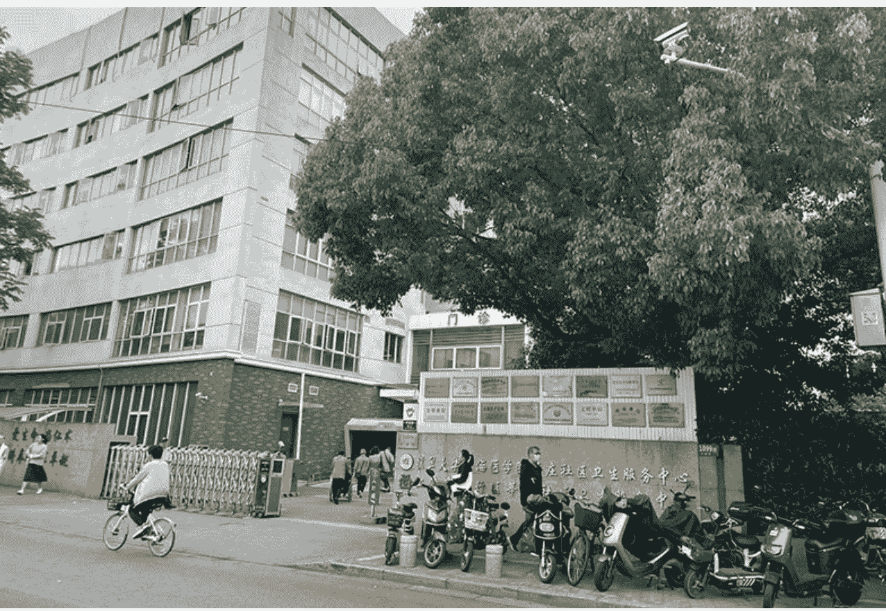

5月23日，上海闵行区莘庄社区卫生服务中心入口处，患者络绎不绝。图：许雯

但号源下放后，也有社区遇冷。上海某社区卫生服务中心主任赵研（化名）所在社区预约量在全市和区级大排名中“吊车尾”，这让她压力很大。“放下来是好事，实际操作中没有这么多需求，也可能病人有需求，但是不在家庭医生这里解决。”在她看来，很多患者对基层医疗机构不信任，不会选择基层首诊，导致挂号渠道使用率不高。

已预约签约居民能否如约到诊，也影响号源有效利用。赵研告诉财新，从5月初到当月下旬，她所在的社区预约量约为60人，但实际到诊率最低时仅有50%。

增加患者和基层机构的链接，吸引社区首诊，这正是号源下沉在解决居民“挂号难”之外更深一层的目的。当家庭医生手握号源这一稀缺资源，无疑对居民将更有吸引力。

“政策落实下来了之后，居民来真的能转到（上级医院），他们很开心，觉得家庭医生这边的作用又多了。”周小娟说。

“专家号源下沉让家庭医生手里有工具，也有三级医院专家团队的强有力支撑。”莘庄社区卫生服务中心主任陈凌认为，更重要的是，要真正形成分级诊疗闭环，社区初诊、评估、鉴别诊断，区分哪些患者应该留在社区，哪些需要转诊到上级医院，上级医院诊断明确或调整治疗方案后，患者回到社区，由社区医院跟进随访，做好患者后续疾病和健康管理。

### 疫情“小跃升”

号源下放只是引流之举。“引子”放出后，要想病人走进门，留下来，社区卫生服务中心面临着一场巨大考验。

新医改15年，越来越多的病人流向大医院，基层陷入“不被优先选择”的困境。首先表现在，基层服务量占比整体呈现下降趋势：2021年，基层医疗卫生机构的诊疗人次占比为50.2%，比2009年降低11.7个百分点；基层医疗卫生机构住院人次占比为14.5%，比2009年降低16.5个百分点。

社区发展难获资源倾斜。据中国宏观经济研究院社会所统计，2009—2014年，中央财政支持的基层医疗卫生机构和专业公共卫生机构数量占总投资数量的80%，但投资规模占比仅为20%。一些城市社区卫生服务中心（站）建设尚不健全，硬件设施配置不足。以北京为例，截至2019年年底，北京市还有31个街道（乡镇）没有社区卫生服务中心；现有的336个社区卫生服务中心中，14个没有实体机构、36个建筑面积未达标、186个没有编制床位。

上海也不例外。2020年上海市卫健委等8部门曾出台《上海市社区卫生服务机构功能与建设指导标准》，对社区卫生服务机构的基本标准做了具体要求。闵行区政协委员、区卫健委医政医管科科长陈斌在调研中发现，闵行区不少社区硬件设施都不达标。以建筑面积为例，前述指导标准要求每千人口不低于80平方米，建议达到100平方米，而闵行区社区卫生服务中心千人口建筑面积62.6平方米，远低于市指导标准。

部分社区卫生服务中心设施设备配套严重不足。赵研还在为添置新设备发愁，“我申请了CT，直接砍掉了，一台要200多万元，不要说CT了，我们超声机器都到报废年限了，区里没钱”。

硬件设施匮乏之外，更重要的是，社区医疗诊疗能力不足，受缺医少药掣肘。

以最核心的人力资源为例，2009至2021年，全国新增570.91万卫生技术人员中，医院占68.6%，基层医疗卫生机构仅占25.7%。上海市政协委员余梅在提案中曾提到上海基层人员招录难题，由于社区收入待遇、职业发展等客观因素限制，多数全科医生人才流失到江、浙、广东等省份。

医生“流入少”的同时，诊疗能力也在逐步退化。在基层医疗机构深耕多年的莘庄社区卫生服务中心副主任张卫感触颇深，“上世纪90年代，我在社区上班，那时我们有手术室、麻醉科，阑尾炎、胆囊炎、胆囊结石等这些上下腹部手术都能开，现在基本上不做了”。

复旦大学公共卫生学院教授胡善联回忆，最早上海社区卫生服务中心脱胎自街道医院，设有各个专科，但此后社区医疗强调“六位一体”（预防、医疗、保健、康复、健康教育、计划生育技术指导为一体），工作重心转向公共卫生、预防保健、慢性病防治，专科培训要求渐渐放松，医生以普通全科或内科为主，能做手术的外科医生流失，社区医疗功能被弱化。

为居民的常见病、慢性病开药在社区卫生服务中心日常诊疗中占有很大比重。不过，受限于国家基本药物制度，基层医疗机构配备的药品90%以上是基本药物，药品品种与二三级医院并不能完全吻合。“我们一直呼吁药要满足需求，不满足是留不住病人的。”赵研说。

在上海疫情期间，作为整个医疗体系的“神经末梢”，社区医疗的重要性再度得到现实验证，社区发热门诊承担超过60%的工作量。然而，诊疗能力不足、设备药品短缺的薄弱环节也在其间暴露无遗。陈斌回忆，2022年上海疫情发生前，上海很多社区卫生服务中心没有呼吸道病毒抗原、抗体检测试剂，遇到发热病人往往推到三级医院发热门诊。

为满足防疫应急需要，社区硬件配备紧急“补旧账”。“连夜用吊车把方舱CT吊过来，嵌在我们的院子里。”胡晓炜记忆犹新。2023年初，为满足患者肺部影像检查需求，闵行区政府出资，紧急启动社区CT设备选址布局、空间改造、设备安装、人员培训，一周内全区14家社区卫生服务中心全部完成CT安装和调试。

投用后，莘庄社区每天CT拍片量接近300份，为上级医院分流大量发热患者。“当时，每家社区卫生服务中心每天都有200多名患者拍CT，仅闵行北片8家社区卫生服务中心就有1600多名患者，如果全部挤到闵行区中心医院，那是不可想象的。”陈斌说。

秋冬季呼吸道疾病高发期、常规体检中，这台新添置的设备都在持续发挥作用。陈斌介绍，闵行各社区设置了区级会诊中心，社区拍片上传，中心有高年资医生负责审片，通常情况下，CT报告会在两小时内审核完毕，B超、胸片审核速度更快，5分钟内就可以完成审核。截至目前，闵行区社区的CT累计检查14.29万人次。

“经过缺啥补啥的‘战时’状态，疫情过后，我们就在思考整个社区该怎么发展，到底社区还缺什么。”陈斌回忆，闵行区委、区政府“一把手”牵头推动社区整体能力提升，不仅由区委、区政府出台多份“重量级”文件，更提供有力财政支持。

为此，闵行区将6个社区卫生服务中心、分中心，26个服务站的改扩建列入规划。经过一年建设，已建成1个社区卫生服务中心、5个社区卫生服务站，另有1个中心、1个分中心、7个社区卫生服务站在建，“其他的也已经列入规划，可能今年下半年或者明年就要动工了”。

### 重整旗鼓

闵行区的步调也是疫情后上海发力社区医疗的缩影。

上海已为基层放权赋能设计了一套“组合拳”，包括硬件设备补缺升级、药品扩容、病种扩充、专家下沉等，主要目的在服务分级诊疗这项大的制度，逐步解决“基层能不能接得住”的问题。

过去一年，上海社区医疗硬件设施升级换代。据上海市卫健委介绍，目前，全市共有248所社区卫生服务中心、102所分中心以及842个服务站、1118个村卫生室。社区卫生服务设施15分钟慢行可达覆盖率87%。

检验检测设备方面，在基本配置DR、心电图、彩超、全自动生化分析仪等设备基础上，目前上海全市有144家社区卫生服务中心配置了CT，占比58.1%，120家社区卫生服务中心配置了无创呼吸机，占比48.4%。

为了满足基层用药需求，在“延伸处方”政策实行多年的基础上，去年以来，上海再为社区扩充药品目录。

所谓“延伸处方”，指的是患者在三级医院看病转诊到社区后，如需延伸上级医疗机构长期用药医嘱以维持治疗，家庭医生可开具相同药品，由第三方物流配送。

陈凌告诉财新，在上级医院就诊过的居民，就诊信息会记录在市级平台的个人健康档案，包括检查、诊断、开药的情况；就诊信息通过平台推送到区级再到社区，家庭医生可以通过个人工作平台共享信息。当居民前往社区就诊，家庭医生可参考此前就诊情况，对于诊断明确、病情稳定的可开延伸处方药，“这些药品以前都是在三级医院的非基药，现在都可以在社区配到”。

“我们去年启动能力提升工作后，第一件做的事就是扩容社区药品目录。”上海市卫健委主任闻大翔在访谈栏目中提到。2023年底，全市社区卫生服务中心平均配备药品已达661种，加上通过延伸处方还可以配到400多种药，上海社区卫生服务中心配药目录已涉及近1100种药，基本能满足常见病、多发病及老年慢病常用药的供给。“这个药品增幅是较大的，相比以往增长了近23%。”他说。

2024年以来，社区药品目录又再扩容。财新从上海市卫健委获悉，截至目前，全市社区卫生服务中心平均配备药品669种，较2023年底增加53种。全市各区区域医联体内常见病、慢性病同通用名药品上下衔接吻合度为78.4%，较2023年底增加7.8个百分点。

按照《实施方案》，上海还将进一步放宽社区基本药物用药比例的限制。在此之前，上海2015年曾出台政策放宽90%的社区基药用药比例限制，允许基层医疗机构在基药目录之外增加一定比例的自选药，自选药可由社区根据当地居民疾病谱变化和慢性病特点等基本情况自行选定，但使用金额占全部药品使用总金额比例不能高于15%。

更核心的任务是，“软实力”的提升。上海市卫健委表示，为了持续提升社区医生诊疗水平，年内全市将推进1000名社区医生赴上级医院进修或执业。拟将急诊科作为全科医生至上级综合性医院进修时的必修科室，提高社区医生临床处理和应急施治能力。

上海希望形成“上修下沉”的工作模式，即依托城市医疗集团、专科专病联盟等，将社区医生送往上级医院进修执业，与上级医院医生下沉社区工作相结合，加强双向联系。

上海某三甲医院医生表示，他所在科室医生每个星期会安排一名主治或者副高级别的医生去到社区医院，开设半天到一天的专科门诊。同时，社区全科住院医师规范化培训时，也会到大医院相关科室轮岗，增加对常见病、多发病熟悉度。

但前述医生坦言，短期学习对提高社区医生素质和能力是否有效，仍要打上一个问号。上海创奇健康发展研究院执行理事长蔡江南认为，医生能力提高和积极性的激励是互动关系，医生有积极性才有动力去提高能力，两者要正向循环，才能让基层医疗有明显的改观。

另一项有争议的举措是，鼓励有条件的社区卫生服务中心开展适宜外科小手术，同时将更多病种纳入社区诊疗范围。

在莘庄社区卫生服务中心三楼，设有一间约15平方米的伤口护理门诊。张卫告诉财新，莘庄社区正筹建门诊小手术室，将来可以做一些常规外科小手术，比如清创缝合、甲沟炎、皮脂腺囊肿切除等等，让居民免于跑到二三级医院排队，在社区就能解决。

陈斌介绍，闵行区浦江、梅陇、马桥等社区已完成门诊手术室改造，提供浅表肿物切除、清创缝合、异物取出、甲沟炎等门诊手术治疗，古美、浦江、申鑫社区还可以开展消化道内窥镜。上海市卫健委介绍，截至目前，全市能开展门诊小手术的社区已达到60%以上。

> “愿望很美好。”前述上海三甲医院医生认为，社区医院可开展的手术类型极其有限——“切脓包可以，做个阑尾炎手术可以吗？”他提到，即便像后者这样常见的手术，也需要配套专业麻醉师、心脏监护设备，社区医院很难具备条件。

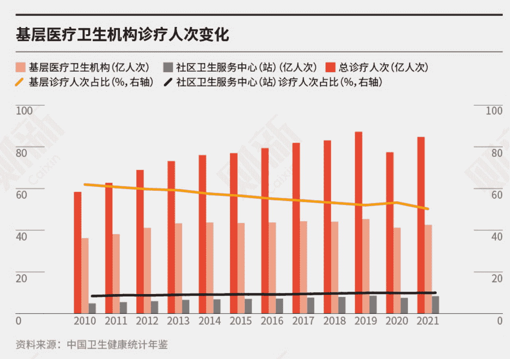

同时，上海还制定社区医疗服务基本病种清单，逐渐提高社区妇科、眼耳鼻喉科、皮肤科、儿科等适宜专科服务能力。据上海市卫健委介绍，截至今年6月，全市社区平均开展西医诊疗病种121种，较2023年同期增加13种。

“社区覆盖的病种也就是可以看多少种病，体现了社区的医疗服务能力。”陈斌称，目前闵行区14家社区卫生服务中心平均覆盖的病种达到141种，较上年增加了27种，全市排名第一。在全市社区卫生服务中心基本病种排名中，闵行区有11家名列前20名，全市领先。

虽然前述上海三甲医院医生认可“强基层首先强医生”的思路，但他直言，强医生并非让社区医生“三甲化”，都去开刀、做手术、看疑难病，而是通过顶层设计，精准划分每一层级机构的诊疗范围和职责，并要求医生达到相应的执业水平。

上海卫健委负责人透露，今年将继续推动分级诊疗，包括推进医联体、专科专病建设联盟，让社区医生有更多的上级医院专家朋友；进一步完善分级诊疗平台功能，通过信息化助力社区医生更精准转诊。

### 道阻且长

经过一年努力，成效如何？据上海市卫健委提供数据，截至2024年6月底，全市社区卫生服务机构门诊人次数3885.1万，同比增加590万，增幅为17.9%，占本市常住居民门诊总量的38.9%，较2023年底提高0.8个百分点。

由此可见，半年内，“组合拳”已经初显成效，但与《实施方案》设定的目标——到2025年，社区门诊量占比要达到40%以上，仍有差距。若再与65%的国家目标比较，上海社区医疗机构承担的诊疗量是远远不够的。按照新医改之初提出的分级诊疗改革目标，至2017年，基层医疗卫生机构诊疗量占比要达到65%。

“我们也看到，社区卫生服务中心的分流作用仍显不足，还需要解决分级诊疗当中‘老百姓愿意来’的问题。”前述上海市卫健委负责人说。

老百姓为何不来？从需方来看，有上海居民已经知晓“号源下放”等举措，但是仍然明确表示，不会选择“到社区卫生服务中心首诊，转诊并挂专家号”的就医路径，理由是“社区医院要翻桥过去，比较远、不方便”。

另一名居民同样表示，政策对她的吸引力较弱。上海医疗资源充裕，“家门口”不仅有社区机构，也有大三甲医院，直接挂三甲医院的普通号并不难，从社区医院辗转到大医院反而“不划算”。尤其对日常普通疾病，她无挂“专家号”的执念，倾向于“（去）三甲冷门科室，体验很好”。

另有多名上海居民直言，不了解上海正在推行的提升社区卫生中心服务能力的相关举措。

“只能解决一部分需求，适合老病号。”前述上海三甲医院医生列举了糖尿病、高血压等慢性病患者，这类患者在大医院确诊后，平时可以由社区医生监测日常动态，如果病情变化或治疗方案需要调整，再从社区机构转诊到大医院，经社区医生帮忙挂专家号。

这名医生坦言，由于信任感的缺失，患者“就高不就低”倾向依然很明显。“新病人、急病人或者怀疑自己病情较重的病人，第一时间肯定不会去社区机构，社区也担不了这个责任。”就连这名医生自己也对社区医生有诸多不信任，“（基层难以吸引患者）最大的问题就是社区医生的水平参差不齐，科室并不健全”。

从供方来看，位于金字塔尖的大医院下放病人意愿并不强烈。根据上海卫生健康统计数据，2023年全市医疗机构诊疗人次数达26579.73万，其中医院总诊疗人次为17208万，社区卫生服务中心总诊疗人次则为7271.92，前者是后者2.4倍，差距悬殊。

“靠自由竞争，三级医院的门诊量只可能是虹吸，社区是没有竞争力的。”金春林说。“放号到基层实际还是让患者直接跑到三甲，其实问题的核心在于三甲应不应该开门诊。”一名医改研究专家直言。

更有研究者担忧，正在进行的医保DRG（疾病诊断相关分组）付费改革可能会进一步削弱大医院下放患者的积极性。

安徽医科大学卫生管理学院陈勇在《DRG支付方式下分级诊疗现状与策略研究》一文分析，DRG主要依据主诊断和主手术编码进行病例分组，疾病权重越高，获得的医保支付额度就越高，直接关系到医疗机构的收益，进而影响医生的医疗行为。因此，医生有足够的动机操纵编码，通过采取升级诊断或虚增诊断等方式以获取更高的医保基金偿付，将部分原本应下沉到下级医疗机构进行诊治的病人留下，不仅加重患者医疗费用负担，也不利于转诊制度的有序开展。

中国药科大学医药市场准入政策研究中心副主任李伟在博鳌亚洲论坛全球健康论坛提到，医保支付方式改革带给分级诊疗不小的挑战。在理想情况下，医保支付方式改革后，随着分级诊疗制度建立，三级医疗机构和基层医疗机构回归至本身的定位，即三级医院收治严重、急性疾病，基层医疗机构收治简单、慢性疾病。现实并不完全如意，部分三级医院出现低难度病组提升、高难度病组下降的“逆增长”现象。

“分级诊疗制度的建立是个系统工程，关键要解决的问题是实现基层卫生机构和上转医院之间分工明确、协同有效。”国务院参事、北京协和医学院卫生健康管理政策学院教授刘远立指出。

前述医改专家说，当前医疗资源配置仍以大医院为中心，而非患者，所谓的分级诊疗本质是按医院行政级别看病，患者重复就诊、重复检查，各级医院重复竞争，是医疗资源的巨大浪费。扭转医疗资源配置的“倒三角”，关键在构建体系。

以深圳模式为例，2015年深圳以罗湖区为试点，在全国率先试行基层医疗集团改革，整合了公立医疗资源，成立罗湖医院集团。在集团内部，基层社康中心、二级、三级医院成为利益共同体，人财物统一管理。医生在集团内部流动，专家可以直接下基层面对患者，基层医生也有向上流动空间。医保基金总额管理、结余留用，“总额给医生，他知道了怎么减少病人，不是提供服务越多越好，他要结余留用”。由此，医保、医生、患者三方获益。

“上海是有条件的，关键在理念，是方便医院挣钱，还是方便患者看病。”前述医改专家说。

全国政协委员、国家传染病医学中心主任、复旦大学附属华山医院感染科主任张文宏此前在接受采访时也表示，强基层真正落地要让政府、医院、患者多方获益，而这需要通过机制的探索和创新实现，考核指标、激励机制都有待破旧立新，这是一次利益的重新分配，“要设计机制让医疗各方获益，这个事情才做得成”。■

## 阅读 | 横竖是水 可以相通

CAIXIN | 听文章

文 | 唐小兵

华东师范大学历史学系教授

回顾中西学术交流史，正如哈佛燕京学社副社长李若虹在新近出版的《从中亚古道到新大陆：哈佛汉学史话》（上海文艺出版社，2024年7月）中所钩沉的那样，20世纪的中西方学者，曾在一种相互信任又极为坦诚的学术环境中充分互动，对于东西方学术的深化和学人的成就都有极为深远的影响。

该书述及哈佛燕京学社与许多中亚学者和汉学家深厚的学术渊源。每一篇都缘起于作者自己的求学经历、研读兴趣和工作所在的便利。李若虹早年毕业于复旦大学，1993年从牛津毕业到哈佛，师从藏学学者范德康从事藏学研究，博士毕业后留在哈佛燕京学社从事研究和管理工作，迄今已经30年。

近年来，李若虹集中阅读了中国留学生和哈佛教授留下的大量珍贵史料，比如中国经济史权威杨联陞（1914—1990）、哈佛大学梵文教授蓝曼（Charles Rockwell Lanman，1850—1941）的日记，以及各种学人档案、藏书等，开始了文史互动的知识考古学研究，写出了杨联陞与蒙古学家柯立夫（Francis W. Cleaves，1911—1995）交往史实等一系列涉及中西文明交流互涉的学术随笔。这些文章构成了《从中亚古道到新大陆：哈佛汉学史话》一书的基础。

### 从欧洲到美国

学界一般认为，汉学最早发端于欧洲。1814年，法国法兰西学院主持了第一个被称为西方汉学起点的汉学讲座，并设立“鞑靼、满、汉语言教授”讲席，正式开启了汉学课程。

公众号懒人搜索，懒人专属群分享

汉学教授席位的设置，可以说是一个划时代的变化。此后，法国东方语言学院、法兰西远东学院，荷兰莱顿大学，英国牛津大学、剑桥大学，俄罗斯喀山大学、彼得堡大学，德国柏林大学、汉堡大学等著名学府，相继设立了汉学教授席位。

美国最初的汉学作品来自来华传教士的著作，比如卫三畏（Samuel Wells Williams，1812—1884）的《中国总论》等。20世纪初，美国汉学得到了长足发展，尤其在当时堪称“东西水陆大码头”的哈佛大学。哈佛燕京学社便是在这样的大背景下诞生的，自1928年创立之初起，每年资助亚洲地区重点大学人文和社会科学领域的学者访学，是东西方学术交流的重镇，也是中美大学交流的典范。

一个多世纪以来，特别是20世纪上半叶，陈寅恪、汤用彤、吴宓、俞大维、洪深、李济、梁实秋、林语堂、胡先骕等各种派别的知识人都曾在哈佛求学，可谓群星闪耀，他们对于20世纪中国学术和教育作出了巨大贡献。其中，深受美国新人文主义大师、哈佛教授白璧德（Irving Babbitt，1865—1933）影响的吴宓、梅光迪、刘伯明、汤用彤等人，回国后以“昌明国粹，融化新知”为宗旨创办《学衡》杂志，试图将中西古典的人文文化实现内在结合，并反对五四新文化派一味攻击中国文化传统的态度，形成了近代文化史上的学衡派。学衡派的产生和存在，本身就是学术文化充分交流的一个例证。

### 从中亚古道到新大陆

### 哈佛汉学史话

李若虹著

1949年前后，相当一批极具学养的人文学者栖身美国社会后，更是夯实了刚起步的美国汉学发展之根基。这批学人，包括大家比较熟悉的赵元任、萧公权、洪业、杨联陞、黄仁宇、胡适、何炳棣等。有学者指出，这群学者都是饱学之士，对中西方学术都有深刻的体认和精深的研究。他们寄居和集聚美国，以美国为“且住之地”，其中有些人在美国著名学府取得教席，设帐讲学，从事著述，留下的许多著作至今仍被奉为经典。

### 天才成群到来

> 葛兆光教授在为《从中亚古道到新大陆：哈佛汉学史话》撰写的序言中指出：“学术史需要做的，就是让过去的学者和现在的学者，穿越时空作“无尽的对话”——如果在这种隔空对话中，后人对前辈，既能读其书，还能见其人，那就更有意思。”

李若虹是低调、内敛而又重情重义的学人，因此在重构这些中西学术和学人交流史的过程中，她特别注意学人之间的交谊和彼此襄助，没有将之庸俗化为当今中国学界常见的学术圈层化，而是视之为开放、多元和自省的人文学术共同体。

通过杨联陞的日记，李若虹生动描述了上世纪80年代杨联陞和柯立夫两位老先生每周二中午在哈佛燕京学社见面的场景——杨联陞带来饺子、啤酒或三明治，两位老先生像年轻时一样享受愉快的午餐时光，一旦柯立夫某个周二没来，杨联陞便满是失望。每逢圣诞节，杨联陞和太太总是准备好饺子和茶叶，提前一周送给柯立夫过节；到了中国农历新年，柯立夫都会给杨联陞的儿子汤姆送上压岁钱，年年不误。

蓝曼教授（右）留下的70余册日记横跨19世纪下半叶和20世纪上半叶。

这份持续几十年的友情能一直追溯到1938年的北平。上世纪30年代末，北平有一批来自美国和欧洲的专攻汉学的留学生，柯立夫和他们时有交流。经朋友介绍，且出于对历史和语言的共同兴趣，与杨联陞相识，二人成为好友。

1936年夏，柯立夫辞别父母，离开哈佛，赴巴黎求学。当时巴黎是西方汉学的重镇，哈佛大学远东研究项目正处于创办阶段，没有师资为柯立夫提供正规的学术训练，但哈佛燕京学社每学年愿提供2000美元奖学金。1936年到1938年间，在巴黎索邦大学和法兰西学院，柯立夫修习了汉语、蒙文、满文和藏文，阅读宋元清史料，修了有关中国印刷史和马可·波罗中国之行的课，选读《四库全书》《后汉书》以及九世班禅喇嘛的著作。

巴黎学业结束后，他继续游走西欧、北欧，最后到达圣彼得堡和莫斯科，径直搭乘国际列车前往哈尔滨，再由哈尔滨来到北平。那是1938年9月，中国北方已陷入战乱，但这些似乎与柯立夫无关。他在北平安顿下来，就马上制定了紧凑的学习日程，开始了即将持续三年的学业。

彼时，23岁的杨联陞在清华园由于“七七事变”而结束学业，正寻求就业、深造的机会。杨联陞1933年高中毕业于北京师范大学附属中学，被保送到北师大和燕京大学就读，而他自己又考取了清华大学经济系和北京大学国文系。在长辈家人的劝告下，杨联陞最终进了较为实用的清华经济系，专治中国经济史。可他还是有心于人文学科，修了很多与经济学并不相关的课程，上学时就已发表论文，是清华园内众所周知的高才生。

据李若虹书中所说，就读清华时，杨联陞有一批最优秀的老师。“国文朱自清、通史秦汉史雷海宗、隋唐史陈寅恪、中国经济史陶希圣，此外（他）曾选修或旁听俞平伯讲词、闻一多讲楚辞、张荫麟讲学术史、杨树达讲《说文解字》、唐兰讲古文字学、王力讲中国音韵学、张星烺讲中西交通史”。对他影响尤深的是陈寅恪的隋唐史课。杨联陞在《追忆陈寅恪先生》一文中回忆1935年上课场景时写道：“于陈先生隋唐史课前，每得在教员休息室侍谈，课后往往步送先生回寓。”1937年，他在陈寅恪和陈垣的指导下，完成了题为《租庸调到两税法》的毕业论文。虽然杨联陞精于学业，但读书做学问之外，不乏其他才能，喜好唱京戏，也爱画画和书法，下围棋，打麻将，样样都行。后来定居哈佛后，他一得空就享受琴棋书画之乐趣。

半个世纪以来，柯立夫与杨联陞从年轻学子起步进入汉学领域，从巴黎到北平再到波士顿，形成了一条无远弗届的汉学中轴线。不只哈佛燕京学社成为世界汉学界重镇，他们也成为泰斗级学者。

据作者研究，史学家洪业（1893—1980）也是杨联陞和柯立夫在哈佛漫长教授生涯中十分重要的一位华裔学友。洪业1913年赴美留学，1922年获哥伦比亚大学硕士学位，回国后参与创建燕京大学，任历史系主任、文理科科长、图书馆馆长等职，并参与创建哈佛燕京学社。1946年，洪业寓居美国，担任哈佛燕京学社研究员。每天下午3点，他和柯立夫喝下午茶聊学问，几十年没有间断，早已成为康桥学界的一段佳话。

读此书，仿若置身20世纪上半叶中国人文学术界与欧美学术界顶流人物自由交往的时空之中，也能想象为何民国时期会是一个天才成群出现的时代。

### 为人之师

除了柯立夫与杨联陞等人，李若虹还在书中重现了陈寅恪和他的梵文教授蓝曼的师生情谊，以及包括钱锺书和英美文学教授艾伦（Daniel Aaron, 1912—2016）等在内的中西方学者的交往趣闻。

陈寅恪和汤用彤等在哈佛师从蓝曼学习巴利文和梵文，成绩优异。蓝曼也曾写信给时任哈佛校长罗威尔（Abbott Lawrence Lowell, 1856—1943），盛赞此二人将会对中国历史和文化有重要贡献。

陈寅恪1919年初抵哈佛，入秋后开始上蓝曼的初级梵文课。当时正逢美国大流感肆虐。1920年2月3日，正值期末复习期间，据70岁的蓝曼先生在日记中记载，当天他前往哈佛大学医务室住院区看望陈寅恪，晚上照常在家中上梵文课。两天后，除陈寅格外，班上五个学生都在怀德纳三楼教室应试。“那两天可是怎样的天啊——一场22年来未遇的特大暴风雪，12个小时内洒下一尺厚的积雪，每小时63英里的大风趁机肆虐，封堵了好多地区。老先生在冰天雪地里往医院给陈寅恪送试卷，但学生已经出院了。等再去学生的住处，才发现他已经搬家了。"

2017年到2018年，我曾在哈佛燕京学社访学，其间阅读吴宓留学日记和陈寅恪年谱长编，深深感动于陈寅恪对于学术和文化的赤诚之心，当时也撰写了一篇《师者陈寅恪》，讲述他除了“教授中的教授”之卓越学人身份，特别强调了他重视为人之师的自我认同。比如，抗战结束重返清华园，历史学系主任雷海宗考虑其眼睛失明、身体衰弱，建议其以学术研究为主而不用教课，陈先生断然拒绝——自己作为一个教书先生，怎么可以不面对学生授课？我想，这也许跟他青年时代受到蓝曼教授的潜移默化之影响有内在的关联。

李若虹在书中也讲述了自己求学经历中，哈佛大学历史讲座教授、东亚文明与语言系主任孔飞力（Philip Alden Kuhn，1933—2016）对她的影响。孔飞力出生于英国伦敦，博士毕业于哈佛大学，以研究晚清以来的中国社会史、政治史著称，在中国享有盛誉的《叫魂》便是他研究清史的力作。孔飞力每周两小时“办公室时间”，总有很多学生排队等着求教于他。孔飞力也总是乐于把收到的好多资料和书籍慷慨分享赠送给学生。每隔一段时间，他都会把大堆中国近代史研究资料或是自己不用的书籍拿到课堂，有时索性堆放在办公室门外，见者有份，往往转眼就被学生抢光了。

### 学术比政治更有生命

通过大量珍贵史料和清雅简洁的叙事，李若虹在书中不仅勾勒了柯立夫、杨联陞等念兹在兹的汉学在哈佛的起源、发展的历史，还呈现了他们与费正清（John King Fairbank，1907—1991）筚路蓝缕创立的中国学研究之间的聚散离合之复杂关系，以及这背后交错着的“冷战”和“麦卡锡主义”对于本应具有自主性发展脉络的学术独立之影响。

“二战”结束后，以费正清为精神领袖的中国学或者说区域研究迅速崛起，一些经历过“二战”的学人，如史华慈（Benjamin I. Schwartz，1916—1999）、列文森（Joseph R. Levenson，1920—1969）等重返哈佛求学，追随费正清从事中国思想史研究，出现了一大批群星璀璨的中国研究学者。以史华慈、孔飞力、柯文（Paul A. Cohen，1934—）等人为代表，发展出了独立于政治的学术谱系。

李若虹在书中，也多次呈现不同学术社群之间的纷争和冲突，勾画了草蛇灰线的蛛丝马迹，再现了在哈佛校园里暗流涌动的学术分歧。正如她所言，源于欧洲汉学的纯学院风格和美国上世纪50年代开始的对中国的极大兴趣形成了巨大的反差，因此，60年代是柯立夫和杨联陞从事汉学教研的黄金时代，也是美国本土的中国学兴起而欧洲汉学逐渐退场的时候。学术理念和价值立场的分野，形成了哈佛校园里燕京学社与后来的费正清东亚研究中心显著的分别：“如果说杨联陞和柯立夫走的是‘阳春白雪’的路子，重诠释中国古典文献和继承汉学传统，而费正清关注的则是‘下里巴人’的诉求，他相信学术研究应该反映中国老百姓的生活，学者应该承担解释中国社会和服务政治的责任。”

当年我在哈佛燕京学社访学时，深感其举办的各种学术讲座、暑期班等更有长久和纯正的学术性。正如哈佛中国校之友会1936年在母校建校300周年校庆时捐赠的赑屃座花岗岩石碑所镌刻的碑文结语所言：“自兹以往，当见两国文化愈益沟通，必就更广大扩充之，使国家之兴盛得随学问之进境以增隆。”诚哉斯言！

位于哈佛校园神学街的哈佛燕京学社讲演厅里，有一幅出自晚清名士陈宝琛之手的题词：“文明新旧能相益，心理东西本自同。”它所展现的东西方文明之间自然多元、良性互动的交流盛况，对比当下愈发尖锐紧张的国际局势，更显意味深长。面对如今沉疴遍地的世界，正常的学术和文化交流也被设置了太多障碍。特别是自疫情席卷全球以来，世界天翻地覆，各国交流受阻，从上世纪80年代开始的中美富布莱特学术项目也在2020年7月被特朗普叫停。中美之间人文学术交流，似乎只剩下哈佛燕京学社访问学者等极其有限的通道。

横竖是水，可以相通；东海西海，心理攸同。学者们应重建学人之间的链接，毕竟文化比权力更有尊严、学术比政治更有生命，知识人应该从历史中汲取智慧和灵感，从事于更有长久价值的文化和学术事业。我想，这也是李若虹努力发掘史料写作此书的本意吧。■

## 专栏 | 关于永别的金句

### CAIXIN | 听文章
文 | 王竞
作家

我的好友若飞是一位西班牙裔德国汉学家和语言学家，有次我们聊到，对失去至亲至爱的人说什么话才恰当。若飞不太欣赏德语里“向您致以衷心的哀悼”这种表达，多少带种程式化的生硬。而我觉得中文里的“节哀顺变”虽充满智慧，但多教诲之意，少同情之心，且要求处于大哀痛的人一下子要走完两步：既要节制哀情，又要顺应从此开启的人生变化。

比来比去，若飞认为还是西班牙语的表达更慰藉人心：“我在你的情感里陪伴你。”事实上，没有亲历过撕裂般诀别的人，进入不了他人哀痛的深海区，但陪伴无疑是有意义的。

没有比死亡更决绝的事。无论失去亲人的人，还是要对丧亲者做出表达的人，都会撞到语言的黑洞里，在这种极端情境下，语言无力且失效。但除了语言，人类还能依赖什么？于是，那些约定俗成的套语，成了打破无语的工具。

我加入了我父亲单位一个退休同事的微信群，群里平日发些体检和办书法展、摄影展之类的信息，偶尔也发布老同事去世的消息。讣告一旦出现，会涌现例如沉痛悼念、某某千古、一路走好、节哀顺变这样的句子或表情包，重复地连排下来，几十甚至上百条。这成了微信时代表达哀悼的程式与惯例，难免会像审美疲劳一样哀情疲劳。

### 公众号懒人搜索，懒人专属群分享

大家都心照不宣，在群里是为表态而表达，个人内心的波澜并不在此披露。一次，我爸多写了几句：“沉痛悼念某某，我曾经的芳邻与好友。在我还没有自行车时，从学部到干面胡同，他曾用车带我。他心地善良，总是那么乐观向上，充满幽默感……”王树人敬挽。”不大表露感情的老爸提供了一个画面：两个年轻人搭一辆自行车，在上世纪60年代的北京街头欢畅骑行。死神也灭不掉这股青春激情。

跟中国不同的是，德国的数字化程度低，讣告走的仍是纸质传播。每周五，有一份地区小报免费送到各家各户信箱里，报上总有整整一版讣告，多由逝者家人刊登，向社会广而告之。这种在报上登讣告的习俗，与逝者有名与否无关，更跟其生前的职业职位无涉。

在我居住的汉堡东南区的报纸上，我常读到的讣告表述是：“心怀爱与感恩我们与某某诀别……”我想，爱是必须的；是终结了一切的死亡，让人突然彻悟，我们曾与逝者相守的时间，绝非理所当然，而是我们在人世间得到过的一份珍贵礼物，诀别时的感恩之情自然涌上心头。

多数讣告的上方印有一句名言，婉约地表达出家人对逝者的情愫。比如这样的句子：“你待过的地方，你已经不在那里了。然而，我们所在之处，你都无所不在。”还有以逝者口吻说：“我只是走到那边去了，别无其他。你不要害怕，要坚强。留出时间给自己，为我哭泣。然后，过好你的每一天！”一条以95岁高龄离世的男士的讣告，用了这样一段引言：“对那些衰老的人，死亡也可以来得很友善。老人的手再也握不住，双眼也倦垂，唯有他们的声音还在说：足够了，我这一生已然很美好。”

相比这些无名氏的金句，还有不少名人名言。前不久，我在一个讣告版面上读到康德的名言：“只要还活在爱他的人的记忆里，此人就没有死亡。他只是远行。真正死去的，是那些被彻底遗忘的人。”我虽然十分赞同这个表述，但总觉得这句话不大符合哲学家康德的文风。我把这条金句输入ChatGPT，问，是康德的原话吗？得到的回答是：这条引言经常被错误地安插给康德。此言出处不详，但绝非出自康德之口。尽管康德曾在他的道德哲学中探讨过灵魂不死的问题，尤其讨论了追求道德完美作为灵魂不死的先决条件的可能性，然而，这句话中携带的感伤与安慰性，却更贴近文学传统，而远离哲学思辨。

旁边另一则讣告引用了黑塞的金句：“累了就睡，放下背负已久的重担，这是件再美好不过的事。”ChatGPT先说这句话出自黑塞的小说《玻璃球游戏》，在我的追问下又道歉说，其实并没有在原著中找到此句的原文，但是，该句表达的对死亡的态度应该是黑塞式的，语气也契合黑塞的风格，他追求的理想是，走到生命的尽头时，应以一种平和的方式离场。

我的税务顾问，一位年过七旬还没退休的北德女性，有一次给我带来一张她手书的卡片：“无人识得死亡，因此也无人知晓，或许死亡竟是人能遭遇到的莫大之幸。”署名苏格拉底。

我的税务顾问是博览群书之人，我就不去质疑这金句的出处了。她说，你看海上那艘船，渐渐驶向天际，出离了我们的视线。但船并没有真正的消失，还在地球的另一边继续航行。也许这个道理也适用于对死亡的看法。

我点点头，说：一不小心，你也贡献了一条金句。 ■

## 专栏 | 当你与孩子发生冲突

### CAIXIN | 听文章
文 | 盛梦露
绿汀小屋联合创办人

或许，我们必须先接受一个事实：健康而深入的关系一定充满了冲突。无论是亲子关系还是陪伴关系，几乎每天都可能发生误解和挫折，双方受伤都在所难免。

在我们这个陪伴抑郁休学青少年的小屋里，有孩子在活动中屡屡突破规则，陪伴者多次提醒未果，勃然大怒，大声呵斥，屋里瞬间鸦雀无声，寒气逼人。这样的“愤怒时刻”，在我陪伴孩子的过程中也常常发生——被孩子挑衅、责骂、回避，一股怒火就从我的内心噌地蹿上来。

最初，这会让我很慌张——我们的工作原本是接纳和支持孩子，我需要克制自己的情绪，不能让对方感到受伤；同时，我又非常困惑——我的情绪出口在哪里？孩子的行为就这样在我的克制中被默许了吗？

有一次，一个孩子的行为违反了规则，我上前提醒。但他变本加厉，不但没有停下来，还在我面前反复挑衅。我被激怒了，极力克制但仍带着怒火对他说，“你再这样就请你出去！”结果很明显，他也很愤怒，完全不理睬我。

等我冷静下来，我找他单独聊。“你的行为违规了，我提醒你，但你还反复做，我很想知道这是为什么？”

“一开始我只是为了逗你，但你赶我走，我非常生气！”

“我向你道歉——我只是在气头上，并没真想赶你走，只是对你当时的行为感到非常生气。”

看他情绪缓和了，我接着说，“现在我们都冷静了。可以告诉我你为什么会一直违反小屋的规则？这起码是第三次了。”

“我很焦虑。焦虑的时候，我就会这样。”

“我知道你需要缓解焦虑，可规则是大家一起事先约定的，你违反了，我只能出来禁止。你的行为只能在不影响别人时这样做，我们这样试一下，好吗？”

他虽然还有点不情愿，但是默许了。这个行为也在之后得到了改善。

冲突总会有，修复才是关键。孩子和成人都会在这个过程中学习和成长，不断看见彼此，也与自己和他人构建更深的联结。

愤怒是一种非常复杂又充满能量的情绪。愤怒的同时，可能也会有委屈、受伤、不甘、恐惧、厌恶、自责、无力等等。而这背后的核心需求，是希望被尊重、被公平友爱地对待。这对孩子和对我们自己来说，都是一样的。

回想我那一刻的愤怒，其实是感受到了不被尊重与无力。所以，不是他的行为让我愤怒（尽管表面上好像是这样），而是我对自己的无能感到生气。这时候，我的脑袋会被一些极端的声音充斥，比如，"他一定是故意想挑战我才这样做"。在不满的情绪之下，我站到了孩子的对立面，把他当作了“敌人”，说了伤害他的话，最根本还是为了逃避承认自己的无力与无能。

亲子关系中，有些经常反复出现的经典冲突时刻——

> “我和儿子因为玩手机常常吵架。最后他把自己锁到房间里，不和我们说话。我让他开门，他不听。一怒之下，我把他的门锁整个卸了！”

我的家长最伤人的话是：“你能不能争口气，别天天动不动就用刀划手，我们的脸都让你丢尽了，再加上你请假，在小区都抬不起头来。你要真想去死，就赶快去。”

不难发现，冲突最激烈的时刻，往往发生在我们试图管教孩子行为的时候。孩子昼夜颠倒打游戏，那就没收他玩游戏的设备；孩子和朋友因为小事冲突、情绪崩溃，那就要求他们赶紧和好；孩子频繁划手解压，那就没收工具，24小时看守……

正常的孩子会如此，对有情绪障碍困扰的孩子来说，这种矛盾会更突出。因为他们的行为就受到病情的影响，往往会被放大，而家长的焦虑也会随之被放大，更急于扭转孩子的行为，好像这样就能让事情好转。只是在冲突中，双方受情绪支配，很容易忽略与孩子之间的联结，管教也常常变得无效。

真正能够影响孩子的，是日积月累、由爱而生的情感联结。在这纽带的指引下，我们会看见，被管教的孩子其实陷在痛苦之中，行为表现只是他们不成熟的应对策略。即使是对没有情绪障碍的孩子进行管教，也会使他们产生被限制的痛苦。因此，管教的同时，也需要重新回到和孩子的联结中，对孩子的感受和处境保持好奇、接纳和共情。当我们看见孩子的内心，给他足够的安全感，孩子的行为问题才更有可能被我们影响。

我们自身也会因为没休息好、压力过大，甚至饥饿，影响体内的激素水平，导致易怒。如果察觉到这些信号，则先停下来，照顾自己的身体，或者寻求专业人士的帮助。当我们开始为自己的情绪负责，与孩子的良性互动之路便开启了。■

## 显影 | 三百万人围观打赏 为长江“背篓渡船”续命

“渝忠客2180”凭直播意外成为网红渡轮，但网友的打赏热情又能维持多久？

早晨6点，重庆市洋渡镇渐渐苏醒，破晓的天空绽起青蓝，云朵被勾勒出淡淡的轮廓。这天，60岁的乔地红打算前往忠县县城看望女儿。他起了个大早，背着背篓，摸着黑从村子深处出发，赶往长江边等船。他的背篓里面装满了自家种的西瓜、南瓜、蔬菜等。走到村口，经过一段近百米的下坡路后，他到达雾气弥漫的洋渡码头，这里停泊着“渝忠客2180”——一艘可以容纳140人的双层红色客船，目前是长江忠县到洋渡镇段惟一一艘还在正常运行的“水上公交”。

洋渡镇到忠县县城段的长江沿岸，分布着多个原始码头，村民们一大早排队等待“渝忠客2180”的到来。

每天早上6点30分，“渝忠客2180”从洋渡镇出发，在渔洞、三条岭、乌杨晏家、乌杨船厂、康家沱、胖子沱码头依次停靠，上午8点30分到达忠县县城西山码头，下午2点30分按时返程。单程30公里的水路，“渝忠客2180”要在江面上航行整整两个小时。2016年，重庆沿江高速公路洋渡镇段通车后，越来越多的乘客选择便捷的客车出行，渡船的客流量急转直下。

清晨的江面上雾气氤氲，乔地红将背篓堆放在甲板上，随即到船舱找座位静躺着休息。没一会儿，“船娘”曹利芳和家人出现在船头，他们从三轮车上卸下矿泉水、馒头、稀饭和煮熟的鸡蛋，这些食物将在途中免费分发给乘客做早餐。

开船前10分钟，洋渡镇码头开始变得热闹，乘客们相继赶来，其中除了一些上了年纪的沿江村民，也有特意远道而来的游客。他们通常是前一天晚上住在镇上唯一的旅馆，第二天一早从始发码头开始，体验“渝忠客2180”上的慢时光。

早上6点多，居住在洋渡镇的村民坐着“摩的”，前来赶船。

从洋渡镇上船的乘客并不多，他们站在“渝忠客2180”甲板前，等待开船。

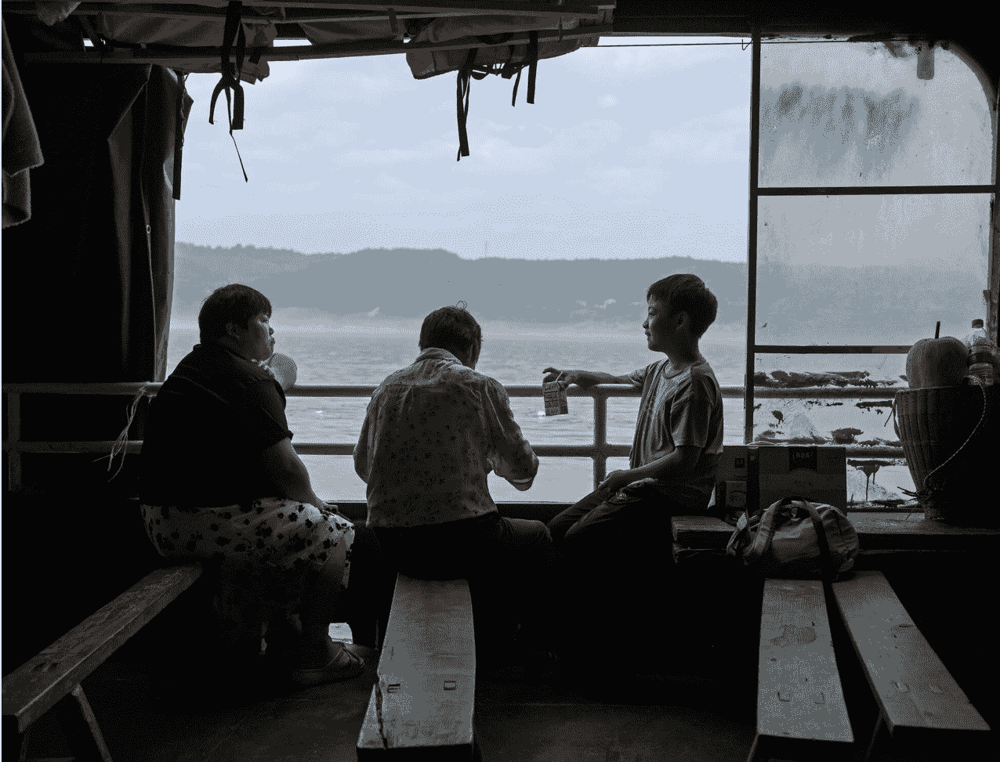

早上6点30分，“渝忠客2180”从洋渡镇码头驶离，单程30公里，要在江面上航行2小时。

曹利芳的妹妹曹超萍站在甲板上直播长江沿岸的风景。

始发站坐船的乘客并不算多。村民秦廷华一家六口坐在靠近窗户的地方，望着江面静静发呆。此行，他要带着放暑假的孩子们去县城游玩。村民廖桂花带着两个女儿匆忙赶到，暑假期间，她要带着刚刚升入初中的大女儿，前往县城参加课外培训班，有时也会把母亲种的辣椒带到县城售卖。临近开船，谭雪（化名）和女儿抱着猫咪“车车”也赶到了，因为频繁坐船往返，3岁的猫早已习惯了船舱的环境，轻车熟路地从条凳上跳下，饶有兴致地跑到甲板上探索。此外，船上还有一些放暑假的孩子，聚在一起写着作业，他们无需大人陪伴，到达忠县后，自会转车前往重庆，投奔在城里打工的父母。当然，更多的乘客还是上了年纪的菜农，他们搭船进城，卖菜为生。

从乌杨地区的三条岭码头开始，登船的菜农开始增多。与此同时，“船娘”曹利芳和儿子李涛也开始派发早餐。人们在船舱内自发排起长队领取，随即坐在板凳上简单果腹。

#### 廖桂花大女儿刚升入初中，暑期坐船往返县城上培训班。

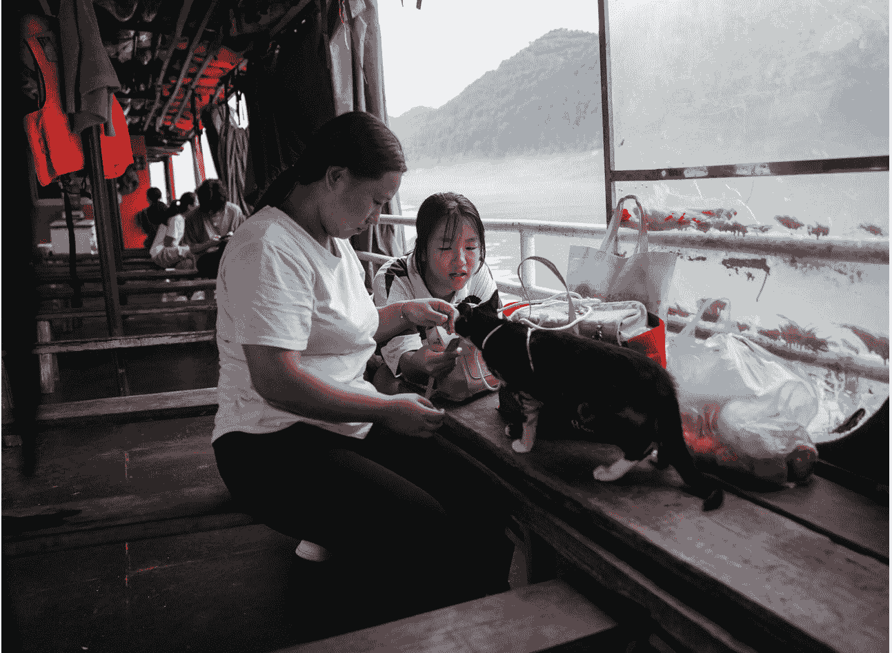

谭雪和女儿抱着猫，因频繁坐船，猫已习惯船舱环境。

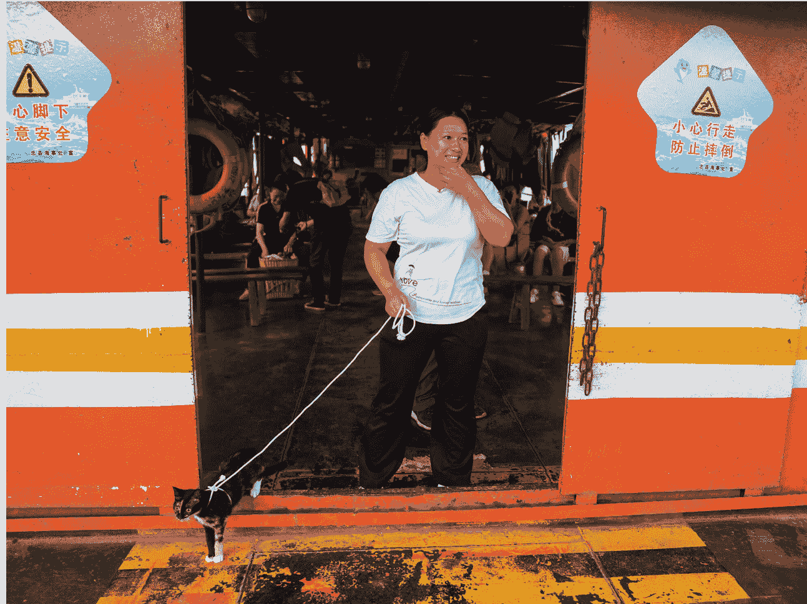

“渝忠客2180”缓慢地行驶在长江上，谭雪牵着猫咪在甲板上活动。

#### 学生们做暑假作业。他们准备前往重庆市區投奔父母。

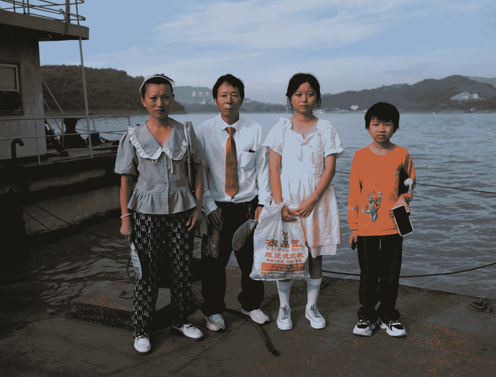

#### 王安政身着白衣，系红领带，带着妻子儿女前往县城购物。

王安政身着白色衬衣，系着红色领带，在登船的人群中格外显眼，一家人显然是在出门之前特意盛装打扮了，女儿的白粉色渐变裙子更是亮眼。王安政平日好琢磨乐器，不仅会吹号、拉二胡，还会弹电子琴。打工返乡后，他经常受邀出席乌杨地区的婚丧嫁娶场合，挣取收入。这次去县城，腰包鼓鼓的他要陪妻儿去买衣服，还许诺儿子逛一趟零食店。

乌杨晏家码头，老人们背着背篓、挑着扁担准备登船。

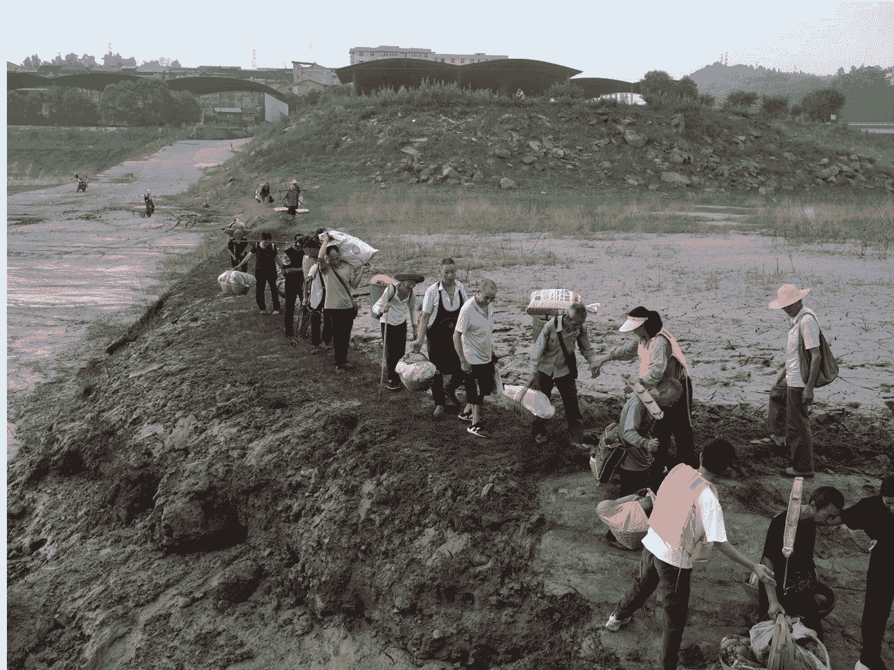

由于乌杨晏家码头属于大站，在此上船的卖菜老人众多。

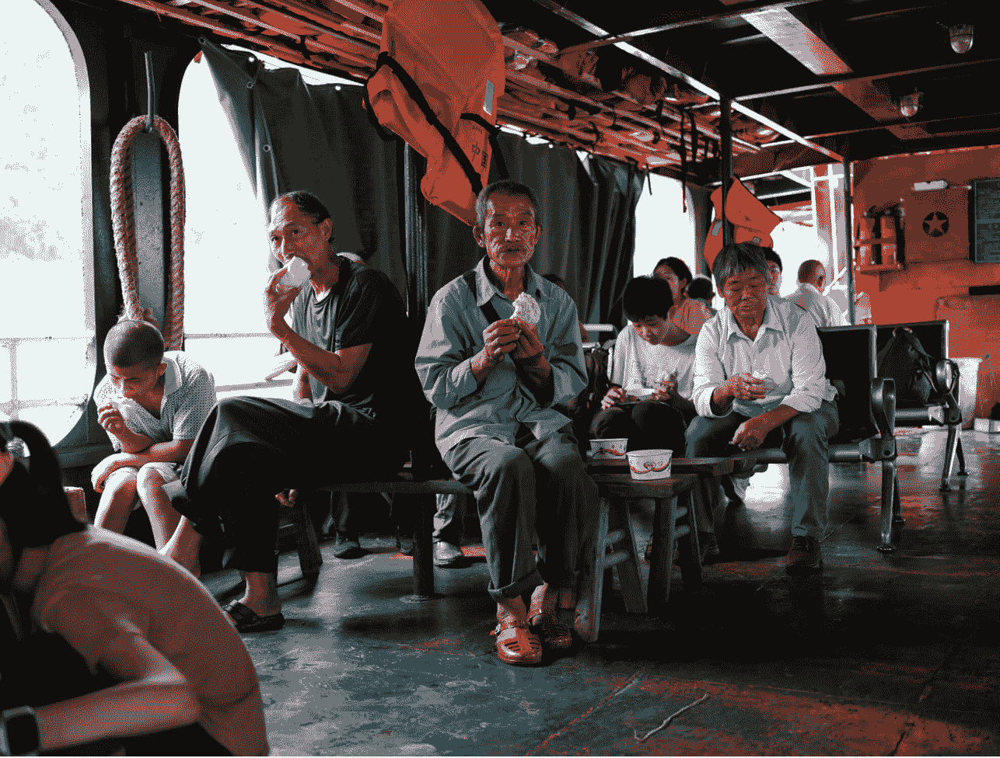

#### 73岁的彭兴忠吃着“渝忠客2180”提供的免费早餐。

晏家码头、船厂码头相邻，都属于大站，等船的菜农人数众多。他们多数是农村留守老人，住在码头后面的山上，子女们常年在外打工。75岁的闫宗兰住在乌杨中心村的山上，为了赶上“渝忠客2180”，她要早上6点从家出发，经过陡峭的台阶、几个池塘后，再沿着崎岖的山路、水泥路走2公里，才能到达码头，整个下山过程大概花费1个多小时。70岁的王洪其带着妻子曹素芬，背篓里装着辣子、苦瓜、洋芋、西瓜、茄子等果蔬，靠卖果蔬一个月挣500多块钱，勉强够日常开销。这天他从家里抓了一只8斤重的大鹅随行，这只鹅他养了两年，能卖160块钱，“城里人提前预订的”。

70岁的王洪其和妻子曹素芬坐船前往县城卖菜。

70岁的菜农王洪其特意带了一只8斤重的大鹅，准备卖给提前预订的县城居民。

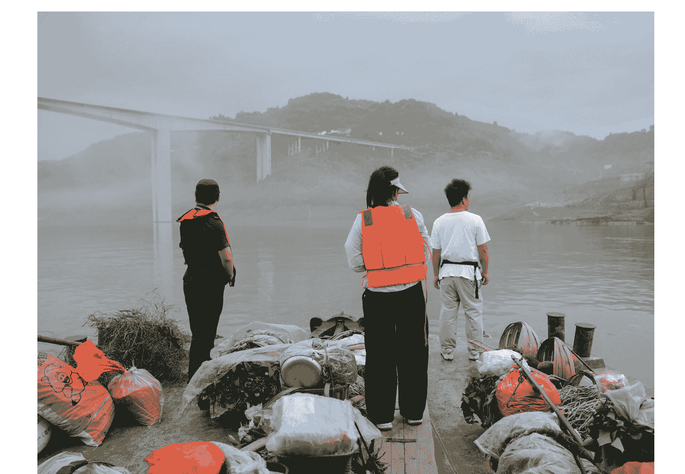

经过乌杨晏家和船厂码头两个大站，“渝忠客2180”甲板上已经堆满背篓、竹篮，里面装满了蔬菜、家禽等。

蔬菜买卖从船上就已开始。如果蔬菜新鲜，曹利芳会帮县城的饭店老板们提前选购。

驶离乌杨船厂码头后，“渝忠客2180”的甲板上已经密密麻麻堆满了背篓，里面装着橙黄的柑橘、嫩绿的豇豆、白色的藠头、泛红的辣椒、鲜黄的香蕉，五彩斑斓，也有鸡、鸭、鹅等家禽，俨然一副农贸市场的样子。买卖时常从船上就开始了。菜农们用杆秤称着乘客挑选的蔬菜，“苦瓜五斤、番茄五斤、豆腐十斤……”“船娘”曹利芳也会购买，县城饭店的老板会提前一天给她采购信息，她在船上直接交易，“这样就能减轻菜农的负担”。

返程途中，卖完菜的菜农们躺在客舱中休息。

#### 彭兴忠用卖菜的收入购买的凉鞋，10块钱买了2双。

2016年重庆沿江高速公路洋渡镇段通车后，从洋渡镇到忠县的客车单程票价是18元，比坐船贵6块。73岁的彭兴忠坐在船舱里，光着脚丫，算起了经济账。他背着30斤花生从乌杨农村出发，坐5块钱的农村小巴车到达乌杨晏家码头，再花5块船票到达县城，往返一趟花费20块钱，如果坐客车往返一趟，则要花27块钱，“一天能省7块钱”，彭兴忠笑着咧开了嘴，指着脚下的凉鞋，“可以省（出来这样的凉鞋）一双，才5块钱”。除了便宜，更多的菜农选择乘船，还因为船舱和甲板上可以容纳背篼、箩筐，还能装载大量的果蔬、活禽等。

如今，“渝忠客2180”已是名副其实的“背篓专线”，成为农村留守老人们卖菜谋生唯一的水上交通工具。上午8点30分，“渝忠客2180”准时停靠在忠县西山码头，舱门打开的那一刻，菜农们顷刻间涌出，来到甲板上挑起担子或背起背篓，下船，跨上堤坝上数百级陡峭的台阶。上了台阶，再过个马路是临时开辟的农产品交易场所。因为菜品新鲜便宜，县城居民们非常愿意光顾，更有饭店老板专门开车前来大批采购。但暑期的忠县天气闷热，太阳暴晒，有些老人每向上攀登一步都异常吃力，一些在附近蹲点直播的主播们会伸出援手，帮助老人们顺利登上平台。早上9点，菜市场的叫卖声、直播声、讨价还价声此起彼伏，非常热闹，曹利芳忙完船上的工作，也来此把手机镜头对准卖菜的老人。

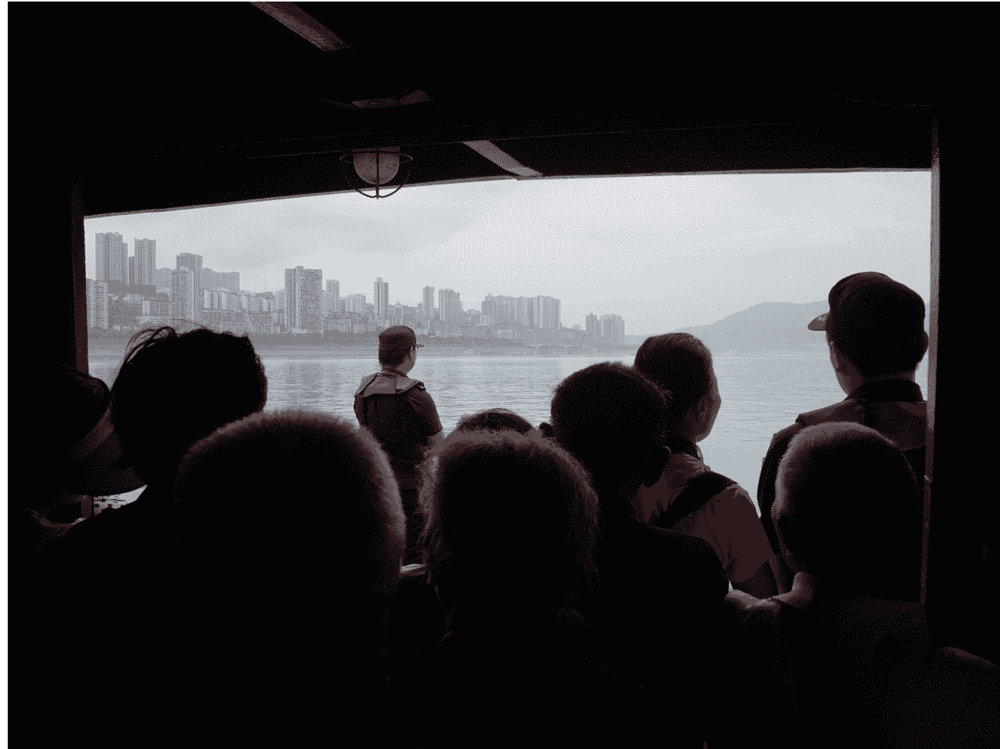

早上8点多，“渝忠客2180”快到忠县县城时，大家聚在船舱口，向外张望。

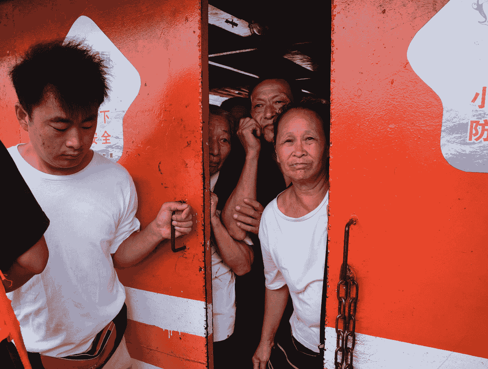

为了防止踩踏，船员将舱门短暂关闭，引导菜农们排队下船。

两年前，依靠短视频平台，这艘长江上的“水上公交”意外“出圈”，如今已是当地居民眼中的“网红船”。多个主播常年在西山码头附近直播菜农卖菜，以赚取打赏，其中头部主播无疑是“渝忠客2180”的运营合伙人曹利芳和秦大益。2013年，曹利芳为了照顾孩子，从广州返乡创业，和同村人秦大益合伙买下了这艘旧客轮，合作跑船。秦大益负责驾驶，曹利芳负责管理日常，“那个时候人流量大，江上的客船也多”。2016年，受沿江高速公路通车的影响，客流量开始减少，客船也开始逐年退出。曹利芳介绍，2018年，洋渡镇至忠县航线的客轮减为两艘。2020年春节后，另一艘客轮因经营不善也退出。当时仅剩的“渝忠客2180”收益也急转直下，深陷亏损的境地。

临近忠县县城，菜农们聚在舱门向外张望。曹利芳举起手机，向直播间的粉丝们介绍大家的情况。

不承想，2022年下半年，曹利芳和秦大益在短视频平台的“无心插柳”，却成就了今天的“枯木逢春”。目前，两人的个人抖音号粉丝都突破百万，加起来超过300万人，每天有上千人涌入直播间观看他们的跑船过程。很多人被镜头中的原生态码头、人与人之间的友善淳朴关系所吸引。依靠直播间的收入，“渝忠客2180”走出了亏损，甚至还有盈余为乘客们提供免费早餐，有时候，甚至还有一些出手大方的粉丝请全船的菜农免费坐船。

> “买菜老人们的平均年龄大概70岁。”曹利芳介绍，她接触过年龄最大的卖菜老人是92岁，“（现在）偶尔还会来卖菜”，多数菜农一天的卖菜收入在四五十块钱，有些老人赚了钱就在县城买一些生活用品，有的则是购买日常必备的药品。

一位拄着拐杖的妇女在晏家码头登船。乘坐“渝忠客2180”的菜农平均年龄约70岁，有些人的身体并不是很好。

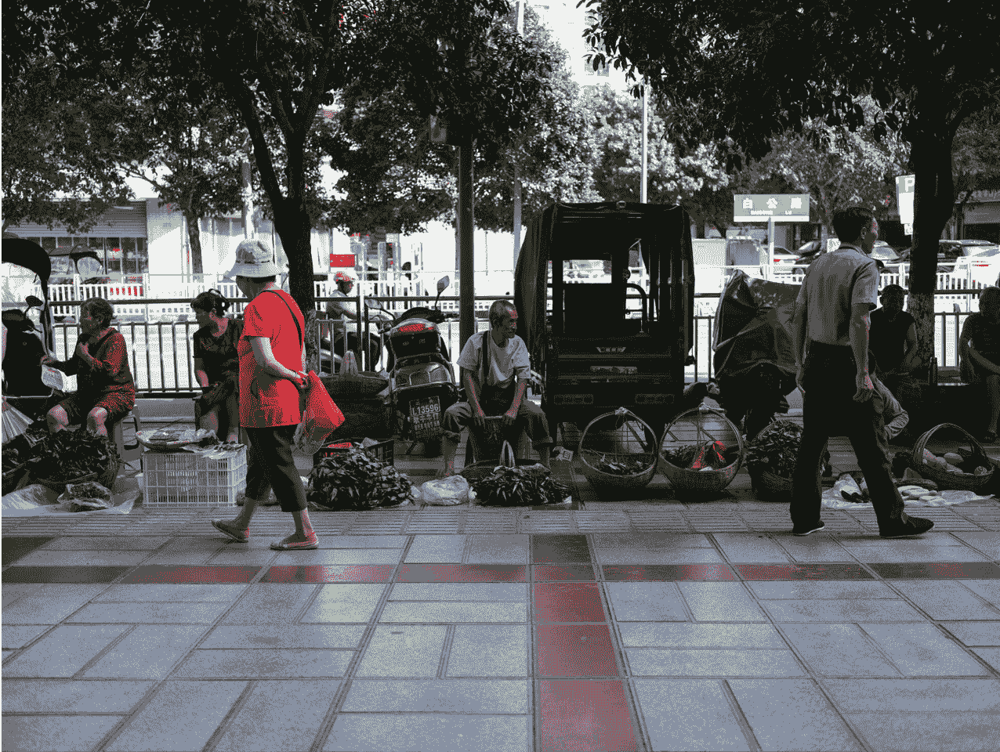

临时交易场所卖菜结束后，大部分菜农会来到县城路边摆摊。

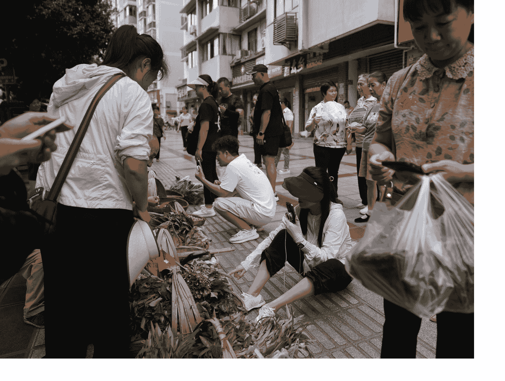

街边很多主播聚集在一起直播菜农卖菜。有些直播间的粉丝会打赏礼物，让主播购买老人的蔬菜。

曹利芳发现，“渝忠客2180”出圈之后，坐船去卖菜的老人在增多。老人们在船上得到了实惠，除了有免费的早餐，还经常能省下船票，西山码头附近还有一家爱心店家，为他们提供一顿免费的午餐。就这样口口相传，一部分在家赋闲的老人想赚个零花钱，开始加入“卖菜大军”。

此外，远在千里之外的粉丝在直播间动一动手指，有时还能帮老人们解决蔬菜滞销的问题。临近中午，如果遇到菜农蔬菜滞销，曹利芳的粉丝们通常会伸出援手，在直播间刷一辆“跑车”礼物。收到礼物后，曹利芳会拿出现金，在地摊前收购滞销的蔬菜，并在直播间众多粉丝的见证下，将刚刚购买的蔬菜免费送给附近的城管、环卫工人。

临江而建的忠县，水运一直以来占据了对外交通的主导地位，长江沿岸的码头也曾因此繁荣兴盛。随着交通方式的革新，如今长江忠县段的很多码头已经变得衰败甚至荒废。从洋渡镇到忠县的一路上，曹利芳的儿子李涛不断地指认沿岸已经荒废的码头，它们大都已经和自然融为一体，“没有人坐船了，自然就荒废了”，尤其是长江北岸，村民乘车方便，大部分客运码头已经成为历史。

由于水位下降，部分码头淤泥严重。为了方便乘客上下船，曹利芳和粉丝们一起清理码头上的淤泥。

李涛的中学时代，也就是十多年前，正值水上客运的黄金时期，“那时候没通高速，坐客车走山路到县城也要2个多小时”，生活在洋渡镇的人们出行主要靠船，尤其到了学生开学、放假的时候，船票更是一票难求，“很多学生围着售票员抢着买，稍微迟一点，就要等下一趟船”。到了春运期间，长江沿线的客运码头更是人山人海，曹利芳经常忙得没有时间吃饭，“卖完这艘船的票，马上开始卖第二艘、第三艘船的”，整个船舱和甲板上都塞满了乘客返乡的行李。

### 胖子沱码头，菜农们下船，走山路回家。

从洋渡镇到忠县的长江沿岸，许多码头已经没有乘客，于是被废弃，变得破败，和自然融为一体。

短短几年过去，繁忙的客运场景已经不复存在，除了因为高速通车，沿岸农村空心化或许才是根本原因。越来越多的年轻人离开村子，“农村人都没了，坐船的人自然就少了”，李涛感慨。

如今，短视频直播让“渝忠客2180”重获新生，但是流量焦虑也始终萦绕在曹利芳的心头。现在曹利芳的账号平均每天直播6小时，虽然直播间粉丝稳定在上千人，但点赞量已大不如前。李涛已经意识到短视频数据正在回落，“已经在走下坡路了”，如果直播收入断崖式下跌，无法弥补客船运营的亏损，人们纵有千般不舍，也总会有和“渝忠客2180”说再见的那一天。

“可能我们直播的这几年就是这艘船的昙花一现”，李涛觉得社会发展得很快，“渝忠客2180”注定会退出历史舞台。到那个时候，卖菜的老人们已经更加衰老，最终一如沿岸的码头消融于自然中，无人知晓。

图片编辑 | 董德

### 长江“背篓渡船”的网红时光

“渝忠客2180”凭直播意外成为网红渡轮，但网友的打赏热情又能维持多久？

早晨6点，重庆市洋渡镇渐渐苏醒，破晓的天空绽起青蓝，云朵被勾勒出淡淡的轮廓。这天，60岁的乔地红打算前往忠县县城看望女儿。他起了个大早，背着背篓，摸着黑从村子深处出发，赶往长江边等船。他的背篓里面装满了自家种的西瓜、南瓜、蔬菜等。走到村口，经过一段近百米的下坡路后，他到达雾气弥漫的洋渡码头，这里停泊着“渝忠客2180”——一艘可以容纳140人的双层红色客船，目前是长江忠县到洋渡镇仅有一艘还在正常运行的“水上公交”。

每天早上6点30分，“渝忠客2180”从洋渡镇出发，在渔洞、三条岭、乌杨晏家、乌杨船厂、康家沱、胖子沱码头依次停靠，上午8点30分到达忠县县城西山码头，下午2点30分按时返程。单程30公里的水路，“渝忠客2180”要在江面上航行整整两个小时。2016年，重庆沿江高速公路洋渡镇段通车后，越来越多的乘客选择便捷的客车出行，渡船的客流量急转直下。

### 乘船的人

清晨的江面上雾气氤氲，乔地红将背篓堆放在甲板上，随即到船舱找座位静静躺着休息。没一会儿，“船娘”曹利芳和家人出现在船头。他们从三轮车上卸下矿泉水、馒头、稀饭和煮熟的鸡蛋，这些食物将在途中免费分发给乘客做早餐。

- 早上7点，三条岭码头。老人们登上长江忠县洋渡镇唯一运行的渡船。
- 70岁的王洪其和妻子曹素芬坐船前往县城买菜。
- 廖桂花大女儿刚升入初中，要坐船往返县城上培训班。
- 王安政身着白衣，系红领带，带着妻子儿女前往县城购物。

开船前10分钟，洋渡镇码头开始变得热闹。乘客们相继赶来，其中除了一些上了年纪的沿江村民，也有特意远道而来的游客。他们通常是前一天晚上住在镇上唯一的旅馆，第二天一早从始发码头开始，体验“渝忠客2180”上的慢时光。

始发站登船的乘客并不多。村民泰廷华一家六口坐在靠近窗户的地方，望着江面静静发呆。此行，他要带着放暑假的孩子们去县城游玩。村民廖桂花带着两个女儿匆忙赶到。暑假期间，她要带着刚刚升入初中的大女儿，前往县城参加课外培训班。有时也会把母亲种的辣椒带到县城售卖。临近开船，萍雪（化名）和女儿抱着猫咪“车车”也赶到了，因为频繁坐船往返，3岁的猫早已习惯了船舱的环境，轻车熟路地从条凳上跳下，饶有兴致地跑到甲板上探索。此外，船上还有一些放暑假的孩子，聚在一起写着作业，他们无需大人陪伴。到达忠县后，自会转车前往重庆，投奔在城里打工的父母。当然，更多的乘客还是上了年纪的菜农，他们搭船进城，卖菜为生。

从乌杨地区的三条岭码头开始，登船的菜农开始增多。与此同时，“船娘”曹利芳和儿子李涛也开始派发早餐。人们在船舱内自发排起长队领取，随即坐在板凳上简单果腹。

王安政身着白色衬衣，系着红色领带，在登船的人群中格外显眼。一家人显然是在出门之前特意盛装打扮了。女儿的白粉渐变裙子更是亮眼。王安政平日好琢磨乐器，不仅会吹号、拉二胡，还会弹电子琴。打工返乡后，他经常受邀出席乌杨地区的婚丧嫁娶场合，挣取收入。这次去县城，腰包鼓鼓的他要陪妻儿去买衣服，还许诺儿子逛一趟零食店。

晏家码头、船厂码头相邻，都属于大站，等船的菜农人数众多。他们多是农村留守老人，住在码头后面的山上，子女们常年在外打工。75岁的闫宗兰住在乌杨中心村的山上，为了赶上“渝忠客2180”，她要早上6点从家出发，经过陡峭的台阶、几个池塘后，再沿着崎岖的山路、水泥路走2公里，才能到达码头，整个下山过程大概花费1个多小时。70岁的王洪其带着妻子曹素芬，背篓里装着辣子、苦瓜、洋芋、西瓜、茄子等果蔬，靠卖果蔬一个月挣500多块钱，勉强够日常开销。这天他从家里抓了一只8斤重的大鹅随行，这只鹅他养了两年，能卖160块钱。“城里人提前预订的”。

驶离乌杨船厂码头后，“渝忠客2180”的甲板上已经密密麻麻堆满了背篓，里面装着橙黄的柑橘、嫩绿的豇豆、白色的蒜头、泛红的辣椒、鲜黄的香蕉，五彩斑斓。也有鸡、鸭、鹅等家禽，俨然一副农贸市场的样子。卖货时常从船上就开始了。菜农们用杆秤称着乘客挑选的蔬菜，“苦瓜五斤、番茄五斤、豆腐十斤……”“船娘”曹利芳也会购买。县城饭店的老板会提前一天给她采购信息，她在船上直接交易，“这样就能减轻菜农的负担”。这条“青葱专线”，成为农村留守老人们卖菜谋生唯一的水上交通工具。

### “网红”背后

上午8点30分，“渝忠客2180”准时停靠在忠县西山码头。舱门打开的那一刻，菜农们则瞬间涌出。来到甲板上挑起担子或背起背篓。下船，跨上堤坝上数百级陡峭的台阶。上了台阶，再过个马路是临时开辟的农产品交易场所。因为菜品新鲜便宜，县城居民们非常愿意光顾，更有饭店老板专门开车前来大批采购。但暑期的忠县天气闷热，太阳暴晒，有些老人每向上攀登一步都异常吃力。一些在附近蹲点直播的主播们会伸出援手，帮助老人们顺利登上平台。早上9点，菜市场的叫卖声、直播声、讨价还价声此起彼伏。非常热闹，曹利芳忙完船上的工作，也来此把手机镜头对准卖菜的老人。

两年前，依靠短视频平台，这艘长江上的“水上公交”意外“出圈”，如今已是当地居民眼中的“网红船”。多个主播常在西山码头附近直播菜农卖菜，以赚取打赏。其中头部主播无疑是“渝忠客2180”的运营合伙人曹利芳和秦大益。2013年，曹利芳为了照顾孩子，从广州返乡创业，和同村人秦大益合伙买下了这艘旧客轮。合作跑船。秦大益负责驾驶，曹利芳负责日常管理，“那个时候人流量大，江上的客船也多”。2016年，受沿江高速公路通车的影响，客流量开始减少。客船也开始逐年退出。曹利芳介绍，2018年，洋渡镇至忠县航线的客轮减为两艘，2020年春节后，另一艘客轮因经营不善也退出。当时仅剩的“渝忠客2180”收益也急转直下，深陷亏损的境地。

- 早上6点30分，“渝忠客2180”从洋渡镇码头驶离。单程30公里，要在江面上航行2小时。
- 乌杨慈家码头。老人们背着背篓、挑着担准备登船。
- 曹利芳的妹妹曹超萍站在甲板上直播长江沿岸的风景。
- 73岁的彭兴忠吃着“渝忠客2180”提供的免费早餐。
- 返程途中，卖完菜的菜农们躺在客舱中休息。
- 学生们做着暑假作业。他们准备前往重庆市区的父母。
- 谭雪和女儿指着猫，猫习惯船舱环境。

不承想，2022年下半年，曹利芳和秦大益在短视频平台的“无心插柳”，却成就了今天的“枯木逢春”。目前，两人的个人抖音号粉丝都突破百万，加起来超过300万人。每天有上千人涌入直播间观看他们的跑船过程。很多人被镜头中的原生态码头、人与人之间的友善淳朴关系所吸引。依靠直播间里的收入，“渝忠客2180”走出了亏损，甚至还有盈余为乘客们提供免费早餐。有时候，甚至还有一些出手大方的粉丝请全船的菜农免费坐船。

“卖菜老人们的平均年龄大概70岁。”曹利芳介绍，她接触过年龄最大的卖菜老人是92岁，“（现在）偶尔还会来卖菜”。多数菜农一天的卖菜收入在四五十块钱。有些老人赚了钱就在县城买一些生活用品，有的则是购买日常必备的药品。

曹利芳发现，“渝忠客2180”出圈之后，坐船去卖菜的老人在增多。老人们在船上得到了实惠，除了有免费的早餐，还经常能省下船票。西山码头附近还有一家爱心店家，为他们提供一顿免费的午餐。就这样口口相传，一部分在家赋闲的老人想赚个零花钱，开始加入“卖菜大军”。

此外，远在千里之外的粉丝在直播间动一动手指，有时还能帮老人们解决蔬菜滞销的问题。临近中午，如果遇到菜农蔬菜滞销，曹利芳的粉丝们通常会伸出援手，在直播间刷一辆“跑车”礼物。收到礼物后，曹利芳会拿出现金，在她的摊前收购滞销的蔬菜。并在直播间众多粉丝的见证下，将刚刚购买的蔬菜免费送给附近的城管、环卫工人。

- 蔬菜买卖从船上就已开始。如果蔬菜新鲜，曹利芳会帮县城的饭店老板们提前团购。
- 经过乌杨慈家和船厂码头两个大站，“渝忠客2180”甲板上已经堆满背篓、竹篮，里面装满了蔬菜、家禽等。
- 70岁的菜农王洪其特意带了一只8斤重的大鹅，准备卖给提前预订的县城居民。
- 临近忠县县城，菜农们挤在舱门向外张望。曹利芳举起手机，向直播间的粉丝们介绍大家的情况。
- 由于水位下降，部分码头淤泥严重。为了方便乘客上下船，曹利芳和粉丝们一起清理码头上的淤泥。
- 从洋渡镇到忠县的长江沿岸，许多码头已经没有乘客，于是被废弃，变得破败，和自然融为一体。

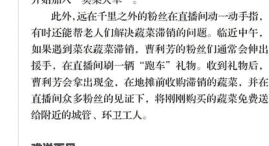

此外，远在千里之外的粉丝在直播间动一动手指，有时还能帮老人们解决蔬菜滞销的问题。临近中午，如果遇到菜农蔬菜滞销，曹利芳的粉丝们通常会伸出援手，在直播间刷一辆“跑车”礼物。收到礼物后，曹利芳会拿出现金，在她的摊前收购滞销的蔬菜。并在直播间众多粉丝的见证下，将刚刚购买的蔬菜免费送给附近的城管、环卫工人。

### 难说再见

临江而建的忠县，水运一直以来占据了对外交通的主导地位。长江沿岸的码头也曾因此繁荣兴盛。随着交通方式的革新，如今长江忠县段的很多码头已经变得衰败甚至荒废。从洋渡镇到忠县的一路上，曹利芳的儿子李涛不断地指认沿岸已经荒废的码头。它们大都已经和自然融为一体，“没有人坐船了，自然就荒废了”，尤其是长江北岸。村民乘车方便。大部分客运码头已经成为历史。

李涛的中学时代，也就是十多年前，正值水上客运的黄金时期，“那时候没通高速，坐客车走山路到县城也要2个多小时”。生活在洋渡镇的人们出行主要靠船。尤其到了学生开学、放假的时候，船票更是一票难求，“很多学生围着售票员抢着买，稍微迟一点，就要等下一趟船”。到了春运期间，长江沿线的客运码头更是人山人海。曹利芳经常忙得没有时间吃饭。“卖完这艘船的票，马上开始卖第二艘、第三艘船的”，整个船舱和甲板上都塞满了乘客返乡的行李。

短短几年过去，繁忙的客运场景已经不复存在。除了因为高速通车，沿岸农村空心化或许才是根本原因。越来越多的年轻人离开村子，“农村人都没了，坐船的人自然就少了”，李涛感慨。

如今，短视频直播让“渝忠客2180”重获新生。但是流量焦虑也始终萦绕在曹利芳的心头。现在曹利芳的账号平均每天直播6小时。虽然直播间粉丝稳定在上千人。但点赞量已大不如前。李涛已经意识到短视频数据正在回落，“已经在走下坡路了”。如果直播收入断崖式下跌。无法弥补客船运营的亏损。人们纵有千般不舍，也总会有和“渝忠客2180”说再见的那一天。

“可能我们直播的这几年就是这艘船的昙花一现”，李涛觉得社会发展得很快，“渝忠客2180”注定会退出历史舞台。到那个时候。卖菜的老人们已经更加衰老。最终一如沿岸的码头消融于自然中。无人知晓。

## 逝者 | 弗雷德里克·詹姆逊：不断地历史化

### CAIXIN | 听文章

文 | 张旭东

纽约大学比较文学系教授、国际批评理论中心主任

美国当代文学批评与理论大师弗雷德里克·詹姆逊（Fredric Jameson，又译詹明信）于2024年9月22日在康涅狄格州家中辞世。次日，《纽约时报》罕见同时发了两篇长文纪念，称其为“过去40年内世界最伟大的文学理论家之一”。

詹姆斯1934年生于俄亥俄州克利夫兰，成长于同费城隔河相望的新泽西州坎姆顿市郊。1954年，他本科毕业于哈弗福德学院，1956年、1959年在耶鲁大学分获硕士、博士学位，博士论文以萨特研究为题。毕业后，相继任教于哈佛大学、加州大学圣地亚哥分校、耶鲁大学等；1985年起任杜克大学比较文学和法国文学讲席教授、杜克批评理论研究所所长。

詹姆斯早期深受萨特等战后欧洲马克思主义思想的影响，事业发轫期适逢上世纪60年代全球的激进文化风暴。在纯粹美国的个人境遇和学院环境里，他在长达近20年的“潜伏期”里，通过系统研读德、法“辩证批评传统”，耐心地为自己和整个英语文学理论和文学批评领域打下坚实的理论基础。他还深入钻研结构主义、后结构主义、符号学、精神分析等流派，70年代其成名作《语言的牢笼》《马克思主义与形式》便是这种准备的结晶。可以说，通过系统评述卢卡奇、本雅明、阿多诺、萨特、阿尔杜塞这条“辩证批评传统”，以及俄国形式主义、结构主义、后结构主义、精神分析、符号学这条“形式-符号分析传统”，詹姆斯形成了自身特殊的理论基因和系统综合。

十年后出版的《政治无意识》，淋漓尽致地反映了其自身特殊的理论基因和强大的分析能力、阐释能力和自我历史化能力，这本书很快成为美国文学批评理论领域的经典，也奠定了詹姆斯在该领域的崇高地位。以此为契机，他随后大举进入美国大众文学分析、后现代主义建筑、文化风格的理论解读、全球化文化交往等时代性话题，在80年代中期发展出系统的后现代主义文化和后现代性理论论述。

詹姆逊在中国的巨大影响，是他世界性名望、影响和意义的一部分，但也有其特殊性。他身后留下30余本著作，在中文世界已有几十年的阅读史。一些詹姆逊式的概念、术语和分析方式，已嵌入许多中国读者面对错综复杂的当代世界文化现象时的观察方式与思维方式，成为他们方法论和认识框架的有机组成部分。

公众号懒人搜索，懒人专属群分享

1985年秋，他首次访华，在北京大学比较文学与文化研究所执教一学期。《后现代主义与文化理论》便是此次北大演讲的结集。彼时正值中国“文化大讨论”前夜，他带来的理论视野、思路和工具箱，为即将展开的“当代中国文化意识”提供了一个相对便于上手的武器库和话语场。

经过十余年的磨合期后，随着中国现实生活日益出现的工业化、市场化、商品化和种种异化或物化趋势，詹姆逊的西方马克思主义和后现代理论论述已不能再被视为“超前”“不合国情”乃至“站着说话不腰疼”（这是对西方左翼思想的一般性指责），而是一定程度上同当代中国文化社会的活力、创造性、问题与危机结合在一起，成为一种日益具体的理论参照系和普遍的历史科学的分析对象。一旦中国现实同詹姆逊理论话语之间取得共时性或当代性，他对全球资本主义当下的分析批判、对人类历史远景的展望，便也获得了新的本土相关性和具体性。

同样重要的是詹姆逊对“过去”的理论关注。这不仅是他对德法理论及其历史渊源的融会贯通的把握，客观上为当代中国学人提供了知识与理论的中介与过渡，也包括他从批判美式资本主义立场出发，对所有前资本主义社会（农业社会、传统社会）的经验、智慧、哲学（关于人、集体和“万物之道”的辩证表述）的同情的关注与理论再阐发。可以说，中国学界多年来对詹姆逊的持续关注，也是他对中国远距离“凝视”的一种“回视”。

上世纪90年代初，随着“冷战”结束，“历史终结论”甚嚣尘上，詹姆逊开启新一轮的基础理论工作和历史-文化分析。他毕生著述的“后半场”，事实上比“前半场”更宏大、更复杂、更具有历史视野，同时也更是一种持之以恒的理论-实践相结合的艰苦劳作。在马克思主义理论原理的当代适用性和“不可替代性”、资本主义社会文化自身的阶段论、全球化时代不同地域、民族、社会系统的文化生产及文化政治、辩证批评的元方法、元理论及其历史化，詹姆逊不断开拓“辩证批评”的概念空间和历史空间。

不夸张地讲，詹姆逊已经牢固确立了横跨20世纪后期和21世纪前期思想文化巨人的历史地位，而他的理论洞见势必在未来释放出更大的能量。■

## 前瞻|北约秘书长吕特履新

### CAIXIN|听文章

文|财新周刊 李忆

10月1日，现年57岁的荷兰前首相马克·吕特将正式接任北约秘书长。此前，来自挪威的斯托尔滕贝格已担任该职近十年，是北约历史上任期第二长的秘书长。俄乌冲突仍在持续之际，吕特即将开启的任期也被欧洲媒体称为“北约历史上最困难的时期之一”。

在今年6月获得新任命前，吕特已是荷兰史上执政时间最长的首相。自2010年以来领导荷兰的14年间，他经历过四届不同政党联盟组成的内阁，以擅长政治平衡和与不同风格、立场的政治人物打交道著称。作风亲民的吕特也因此获得了“不粘锅马克”“特朗普耳语者”等绰号。

在北约秘书长任内，吕特的首要任务是处理乌克兰问题，包括确保北约成员国持续对乌克兰提供支持，以及应对美国总统选举可能带来的不确定性。作为乌克兰的坚定支持者，吕特领导下的荷兰政府已向乌克兰提供了价值26.3亿欧元的军援，还有近20亿欧元的援助承诺将在2024年兑现。荷兰也是首个向乌克兰捐赠F-16战斗机的西方国家之一。

随着原本保持军事中立的芬兰和瑞典在过去两年陆续加入，北约现已扩大到32个成员国的规模。这一由美国牵头组建、最初旨在对抗苏联和东欧社会主义国家阵营的集体防御军事集团，在“后冷战”时期已逐步向反恐、维和、人道救援等综合性领域拓展职能。但此轮俄乌冲突爆发后，北约又开始向军事和防务等核心事项回归。

在今年11月的美国大选中，共和党候选人、美国前总统特朗普能否获胜备受关注。秉持“美国优先”的特朗普，在上一个任期就多次对北约表达不满，也不赞成对援助乌克兰投入过多。欧洲政界普遍忧心，特朗普重新执政恐影响美国对乌援助，进而影响俄乌战局和欧洲的安全。

与西方各国领导人都保持良好关系的吕特，在欧洲被视为少数能与特朗普“说得上话”的领导人之一。2018年北约峰会期间，他就曾成功说服特朗普维持军费支出。2024年2月的慕尼黑安全会议上，他还提醒欧洲政界需要学会与“舞池中的任何人”打交道，呼吁停止在会议上针对特朗普的抱怨和牢骚。

乌克兰总统泽连斯基曾在社交媒体上表示，吕特是一位坚定而有原则的领导人，近年来在许多场合都表现出了果断与远见。克里姆林宫则称，俄罗斯始终将北约视为“敌对”，吕特的任命也不会改变北约的“总体路线”。

除了应对仍在持续的俄乌战事，吕特还必须敦促北约其他成员国继续提高军费支出。目前，北约对成员国提出了军费占GDP 2%以上的最低要求，但仍有不少国家未“达标”。此外，吕特还需协调各成员国在北约武器采购、军队部署等问题上更加紧密合作。■

## 国风|“中国象棋第一人”王天一塌房

CAIXIN|听文章

文|财新周刊 覃建行

2024年9月19日，中国象棋协会通报称，2023年4月，象棋“录音门”事件引起社会关注。中国象棋协会会同有关方面开展了深入调查，查明王天一、王跃飞等运动员存在买棋、卖棋操纵比赛等违规行为，时间跨度长、频次高，性质非常恶劣，情节非常严重，对象棋运动发展造成了严重损害。

中国象棋协会表示，根据相关规定，给予王天一、王跃飞终身禁赛、撤销由中国象棋协会授予的包括特级大师在内的所有技术等级称号的处罚，禁止二人从事和参与中国象棋协会及其会员单位组织或授权组织的所有象棋赛事和活动。

象棋“录音门”事件是指，2023年4月，一段疑似象棋特级大师郝继超与王跃飞的通话录音在网络流传，其间两人谈及王天一买棋等事。

据公开信息，王天一1989年4月出生，2012年获得全国象棋个人赛冠军，晋升为象棋特级大师，并在之后连续多年稳居中国象棋棋手等级分第一名，有“中国象棋第一人”之称。王跃飞，1983年出生，曾获“象棋特级大师”称号。

两名象棋界的知名人物卷入“录音门”事件，引起广泛关注。2023年10月，中国象棋特级大师柳大华公开举报时任体育总局棋牌运动管理中心副主任郭莉萍。柳大华1950年出生，曾获全国个人赛冠军，有“棋王”之称。

郭莉萍亦是象棋运动员出身，曾经获得全国个人赛女子组冠军。公开信息显示，她已改任体育总局健身气功管理中心副主任。柳大华的举报是否属实，目前仍未有官方消息公布。

2024年6月，经济观察网披露称，王天一在数月前被浙江杭州警方调查，罪由涉嫌非国家工作人员受贿。8月，经济观察网又报道称，经多名知情者确认，王天一已被杭州检方批准逮捕。该报道援引知情者说法称，王天一所涉及的事项，既涉嫌在比赛中“买棋”，即自己或者通过另一位中国象棋特级大师王跃飞给予对手好处，以赢得比赛，获取象棋等级分排名优势；还涉嫌“卖棋”，即收受对手钱财，在比赛中故意输棋。其中，王天一和王跃飞涉嫌“买棋”的金额，累计超过80万元人民币。

中国象棋界一名知情人士向财新表示，“录音门”事件中提到了买棋，有关部门把线索交给了杭州警方，而后查实王跃飞、王天一等人买棋卖棋。他说，现在风气坏了，什么棋都可以交易。另一名熟悉象棋界的人士则透露，个人比赛买对手就行，象甲一般是在队伍实际控制人之间买卖。

值得注意的是，2024年全国“两会”期间，全国人大代表、体育总局副局长刘国永建议增设“操纵体育比赛罪”立法条款。据《中国体育报》，刘国永说，操纵体育比赛现象已衍生多元特征，其中之一就是操纵体育比赛范围的扩大化。目前，除公众较为关注的足球、篮球等项目外，台球、乒乓球、羽毛球、棋牌、电竞、信鸽等项目也逐渐开始有操纵比赛案件发生。

## 心智 | 知死，而后生

### CAIXIN | 听文章

### 文 | 蓝玲

我们很少会主动与孩子谈论死亡，孩子提起也往往会被呵斥、避开或敷衍。然而，死亡对人的困扰，比我们想象中开始得更早。

大约在3岁时，孩子们就会逐渐意识到死亡的存在：一些物件消失了、宠物死了、鲜花枯萎了，一直疼爱自己的奶奶某天起再也没有出现过，妈妈说她去了很远的地方，回不来了。孩子们一旦意识到死亡，很快就会明白，自己也终将面临死亡。这时，孩子们对死亡的恐惧开始形成，他们可能会做噩梦，甚至回避做某些事，例如洗澡，因为他们觉得做这些事会让自己死亡。

当然，孩子们也会逐渐发展出应对死亡恐惧的策略，例如转移注意力、回避死亡，或干脆不去谈论它；甚至会计划永远不长大，因为他们认为只有老年人才会死亡，只要不长大，就不会死。他们还可能将死亡具象化、拟人化，试图与死亡对话，通过哄骗或运用智慧来战胜它，以此逃避。然而，随着孩子长大，心智逐渐成熟，他们终将明白，死亡并非人生中的偶然不幸，而是不可避免的事实。

社会心理学家谢尔登·所罗门等对人类死亡恐惧的心理进行了长达30多年的研究，发现人们会通过两种心理防御机制来应对死亡恐惧：近端防御机制和远端防御机制。当我们意识到死亡时，近端防御机制会被激活，我们会通过理性方法来抑制这些让人感到不适的想法，或者分散注意力，暂时抛开这些想法，享受当下。

远端防御的激活与无意识的死亡暗示有关，这种防御不一定涉及具体的死亡问题，而是一些看似与死亡无关的话题，例如如何惩罚罪犯，如何看待那些否定民族文化价值观的人。远端防御也能缓解对死亡的恐惧，它赋予我们一种信念：即便死亡，我们仍能以某种真实或象征性的形式存在。

近端防御帮助我们处理那些已进入意识中心的死亡想法，将它们排除出意识，或将这些信息合理化；远端防御则防止无意识的死亡念头进入并淹没我们的意识。在两者的共同作用下，我们既不会整日忧虑人终将一死的命运，生活在对死亡的恐惧中；也不会过多察觉到生活中各种死亡暗示，从而被死亡信息所左右。近端防御和远端防御通常是先后发生的，只有当死亡的想法被驱逐出你的意识后，远端防御机制才会启动。

近端防御和远端防御都会影响我们处理死亡信息的方式，尤其是在涉及健康时，只是影响方式有所不同。例如，亲友因病去世，你的近端防御机制被激活，为了健康与长寿，你开始锻炼身体，规律饮食作息。然而，随着时间推移，死亡的想法逐渐从你的意识中淡去，你是否仍能坚持，就取决于你的价值观。如果你一向崇尚并积极实践健康的生活方式，并因此而自信，那么你仍会保持锻炼与规律的饮食作息。反之，你可能会放弃锻炼，逐渐恢复熬夜与不规律的饮食。远端防御通过价值观、文化信仰等来影响你的态度与行为。

近端防御和远端防御也可能对我们的健康产生负面影响。我们会为自己的不良行为找借口，比如，你知道肥胖会危害健康，所以不该多吃高糖高脂的食物，可你却说：好在我不胖，多吃点没关系。这种近端防御策略能让死亡的想法远离你的意识，却无益健康。再如，坚持某些文化价值观是我们防御无意识死亡念头的一种方式，有些人不信任现代医学，反而依赖民间偏方，那么生病时他们就不会去医院，从而贻误病情。

我们常说“大难不死，必有后福”，这种“后福”从何而来？是等待从天而降，还是可以认为它是遭遇者事后主动、积极思考和行动的结果？比如，一个人与死亡擦肩而过后，主动规避一些危险或不良行为，减少了人生中的安全隐患与健康风险，这是否就是一种主动得来的“福”呢？

心理治疗大师欧文·亚隆在临床研究中发现，许多人在经历濒死事件后内心发生了惊人的转变，获得了个人成长，仿佛重获新生。具体表现为：
- 重新评估生活的优先级，不再将精力耗费在那些对自己无意义的人和事上；
- 更加轻松地做自己，不再强迫自己去做不愿做的事情；
- 更加注重活在当下，面对想做的事和想享受的生活，不再将它们推迟到未来；
- 品味生活，亲近自然；
- 比起危机发生前，他们与所爱之人的沟通更加深入，人际恐惧减少，不再担心被拒绝，变得更加敢于冒险。

这些，何尝不是在经历大难之后主动获得的“后福”？当我们能够直面死亡时，也就更能理解如何真正地生活。这便是思考死亡带给我们的积极意义。

心理学家罗伯特·杰伊·利夫顿提出了五种“超越死亡”的模式：1. 生物学模式：通过子孙后代的生命延续感受永生；2. 神学模式：从世俗生活中解脱，进入更高层次的存在；3. 创造模式：通过个人作品对人类产生持久影响来感受永生；4. 永恒自然模式：将个人生命与其他生命、大自然甚至宇宙融为一体，通过自然的延续感受永生；5. 超越体验模式：在一种强烈、极度统一的心理状态下，时空与死亡皆不复存在，通过“忘我”活在“永恒的当下”。

人类或许无法获得真正的永生，但可以追寻永恒的意义，以此对抗衰老与死亡带来的恐惧。人们也可以创造作品，以此融入不朽的文化，让自己的名字千百年后仍被铭记，正如我们念起某些名字时，顿觉天地开阔、高山仰止。■

更多精彩请阅读：【专题】心智

## 天眼 | 石破茂出线

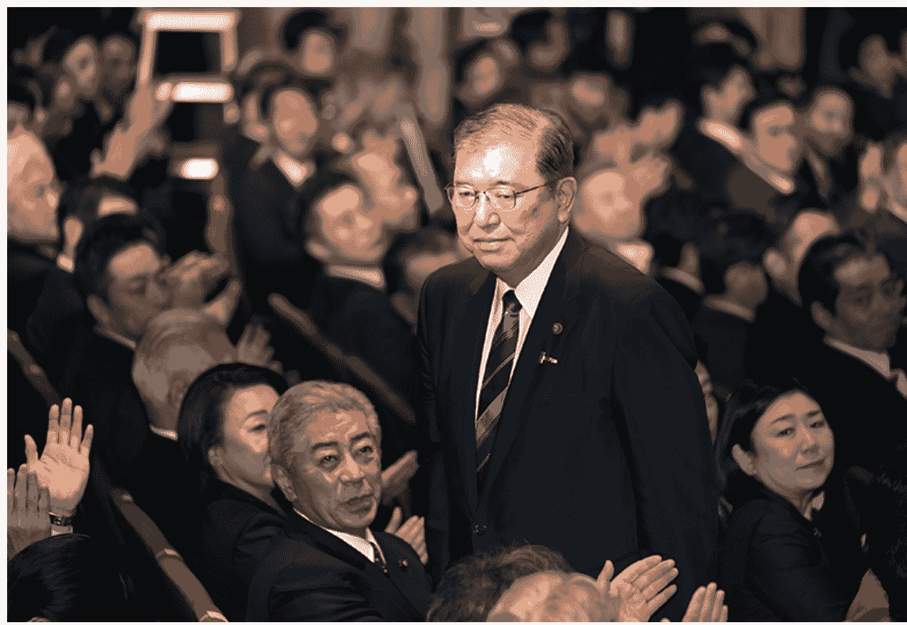

CAIXIN | 听文章

图 | Hiro Komae/视觉中国

当地时间2024年9月27日，日本东京，日本自民党前干事长石破茂在自民党总裁选举第二轮投票中获得多数选票，当选自民党新任总裁。现任日本首相岸田文雄的自民党总裁任期将于9月30日结束。按惯例，新任自民党总裁石破茂将在10月1日经国会指名选举，接任首相。石破茂现年67岁，这是他第五次竞选党首。他早年在银行工作，1986年首次当选日本众议员，历任防卫大臣、自民党干事长等要职。■