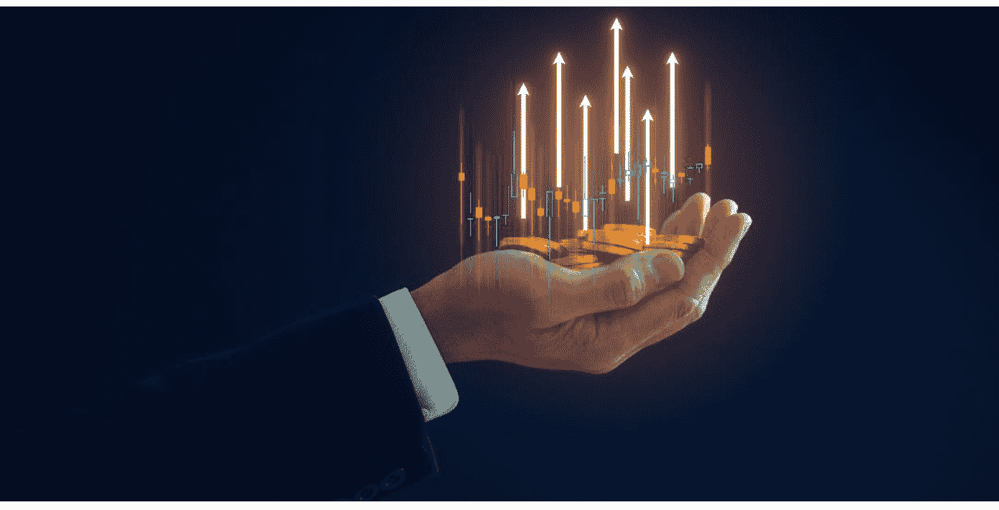
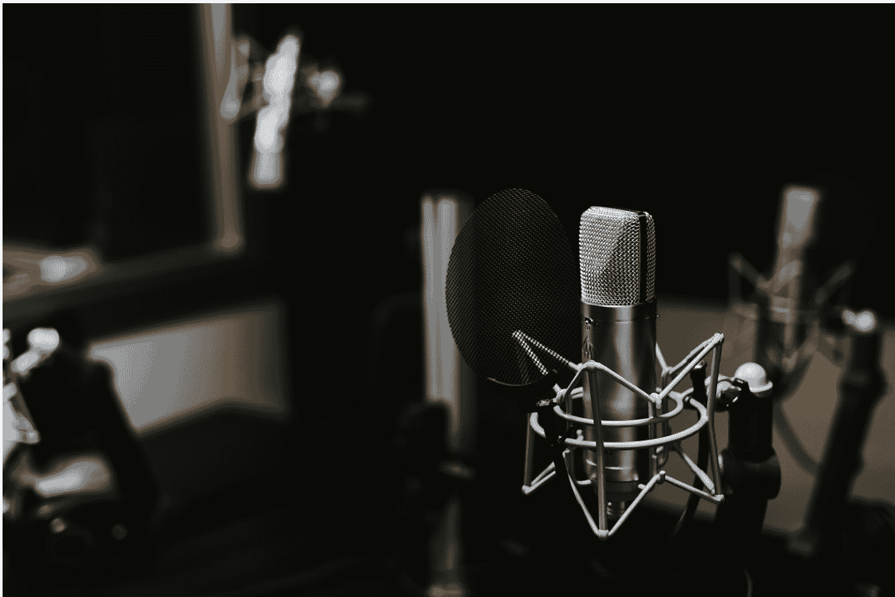

# 懒人专属群周报（第 104 期）

北京时间 2024 年 10 月 25 日 出品

懒人专属群群友大家好，我是小懒人~

第104期《懒人专属群周报》，与君共读。

希望咱们专属群独有的《懒人专属群周报》可以作为群友们喜欢阅读的一份类似周刊的读物。

之前的离线版合集地址见咱们专属群总链接，小懒都有备份。

懒人微信：lazyhelper

## 目录
- 懒人专属群周报（第 104 期）
- 北京时间 2024 年 10 月 25 日 出品
- 目录
- 吴军来信3节选
  - 什么是财富？
  - 决定财富的两个重要因素
  - 怎样区分新钱和老钱？
- 第007封信 | 为什么说自由现金流是通向财富自由的关键？
  - 什么是自由现金流？
  - 自由现金流对企业的重要性
  - 自由现金流对个人的重要性
- 第010封信 | 如何实现个人的财富自由？
  - 投行里的人是如何挣钱的？
  - 个人获得财富自由的方式有什么特点？
  - 小结
- 新闻评论
- AI自动生成播客
  - 热点事件之后迅速上线的虚构播客
  - NotebookLM：学习工具还是播客工具？
  - “第一次从内心喜欢上AI”
- “I人”的时代
- 懒人收藏夹
  - 极端者最平静
  - 比烂尾房更糟心的是烂尾娃
- 总结

# 吴军来信3节选

吴军来信3，正在更新中，群友见专属群内分享（见总链接）

## 第06封信 什么是财富？

lazybro，你好。

欢迎回到《吴军来信》第二季。今天我们来聊一个大家都关心的话题——财富自由。关于这个话题，我会用五封信的篇幅和你细细探讨。

在获得财富自由之前，我们要先了解什么是财富。

### 什么是财富？

什么是财富呢？简单地讲，财富的本质就是每个人所能调动全世界资源的数量。

当你拥有一百万现金或者等值财富的时候，你可以调动世界上的一些资源来做一些事情。

比如租一个店面，雇几个人开一家餐馆。如果你有相应的能力让餐馆赚钱，现金就源源不断地流进来，这样一个小餐馆可能在扣除掉各种费用后一年只能有20万元的盈利。假设餐饮业的平均投资回报率是10%，但你能做到20%，那这家餐馆的盈利能力就翻了一倍。相当于你投入100万元，就获得了200万元的估值。这就是你的财富。

但是如果你有一个亿，你的能力又跟得上，你可以开一家大型连锁店，你拥有的财富也会相应增加。当然如果你的能力跟不上，这一个亿会越变越少，最终就是为社会做贡献了。有人说这些钱打水漂了，其实财富和物质一样是不灭的，这一个亿会养活很多人，很多人因此有了工作，其中有的人成长起来，可能会创造更多的财富。

在历史上，财富大多是有形的，比如土地、谷物、牛羊牲畜或者金银等等。但是今天，财富变得越来越虚。我们还是从实往虚来看看今天什么算是财富，大概包括这么几种类型。

- 首先是，现金及贵金属。稳定经济体发行的现金以及黄金等贵金属，这可能是最实在的财富了。

2022年俄乌战争后，有记者走访了很多战区的民众，想了解如果发生了战争，哪些东西才是真正的财富。他们发现，真正有用的是美元、欧元和黄金。在那里，一个香奈儿的手袋，也就换一顿饭。

- 接着是，房地产。有人可能觉得房地产才是看得见摸得着的财富，美元会贬值，黄金不能吃，不能穿。其实，房地产的价值可以很高，也可能很低，甚至会低于建造它的成本。

比如法国南方有很多城堡连同周围的土地，大约几百万欧元一座，还比不上北京三环以内一栋大一点的房子呢。为什么这么便宜呢？因为保有它的成本太高，它更像是一个负担，而非资产。至于房地产的价值靠什么来衡量，我们等会儿再讲。

- 再接着是，股票和债券。到这财富已经在由实转虚了。

今天世界各国首富们主要的资产是股票。股票的价值是由相应公司的盈利能力决定的。你可以说它很实在，因为相应的企业每年在创造财富。也可以说它比较虚，因为它的价值当中有很多不理性的因素。债券也是如此，它是发行债券的机构（包括国家）偿债能力的体现。而偿债能力，取决于它获利的能力。

- 再者是，金融衍生品。金融衍生品是一种合约。比如一些对赌协议，我们就不展开讲了。它今天无处不在，很多人发现自己的投资莫名其妙搞没了，一了解才发现自己原来买的是某种金融衍生品。

- 我们再说下一种，虚拟物品。包括比特币、以太坊、游戏币、游戏道具等等。大家不要小看这些虚拟物品，它们加起来价值有好几万亿美元呢，可能超过世界上最值钱的公司。虽然有人，包括巴菲特和芒格，将它们贬得一钱不值，但是至少在一个很长的时间段里，你拥有它们可以兑换成更为实实在在的财富。和虚拟物品类似的是古董和奢侈品，由于篇幅限制，就不展开讲了。

- 最后一种，名气、名望。等等。

很多演员和运动员，从自己的本职工作中挣的钱，要远比他们代言挣的钱少。而他们之所以能赚到代言的钱，是因为他们的形象、名气等等值钱，是一笔财富。

好，以上是六种常见的财富类型。那么，上述财富是如何估值的呢？

## 决定财富的两个重要因素

每一种财富有每种的估值方法，而且可能还有很多不同的估值法，这里我和你详细介绍两个当今世界决定财富最重要的因素。

第一个叫作共识。同样是半导体公司的股票，今天英伟达的股票就很值钱，而英特尔，高通和AMD的就不太值钱，后三个股票加起来连英伟达市值的一半还不到呢。这倒不是因为英伟达挣钱能力强很多，而是因为大家都认为它能受益于人工智能的进步，有更大的增长潜力。这件事一个人两个人认为没有用，即便那一个是巴菲特，也影响不了大局。但是当大家达成共识后，英伟达的财富就变得值钱了。

再比如古董和奢侈品。中国名家的字画，在20多年前还不太值钱，齐白石、张大千高质量的画，当时在佳士得这些拍卖行开价并不高，今天被炒成天价，这就是中国收藏家们共识的结果。类似地，今天如果你能拿到一块百达翡丽的手表，或者爱马仕的铂金包，你可以在几个网站上加价出售，马上会有人买走，也是因为在奢侈品圈内形成的共识，大家认定它的价值比定价高。

第二个叫作信仰。

比如我们今天就听说“房地产信仰”这个词。东亚国家在工业化过程中，各国全民的财富提升主要靠的不是企业的利润，也不是股票或者债券的收益，而是房地产的增值。在房地产中，地价其实是占了大头，房屋本身建造的价格甚至可以忽略不计。

为什么东亚各国如此看重房地产的价值呢，这就是源于大家对它的信仰。相信土地资源有限，一定会涨价。从全世界范围内来看，房地产信仰是东亚社会特有的现象，世界其他地区都没有，这可能和东亚地区几千年来农耕的传统有关。

今天，很多人不理解为什么比特币能炒到那么高。这是因为很多人有比特币信仰，认定它是数字黄金。事实上，今天比特币的总价值很快将超过白银的市值，未来很可能超过世界上黄金的价值。即便是有时它会暴跌，但这时会有人跳进去接盘，因为接盘的人坚信将来它会涨得很高。比特币价格的上涨早已不是过去任何金融理论能够解释的了。但是，金融理论解释不了，用信仰却能解释。

今天，全世界财富的构成，早已超出了当年亚当·斯密的劳动价值论的范畴了，关于劳动价值论，我们还会在后面的信中细说。你可以说它当中有很多不理性的成分，但是如果你忽视了这些不理性的成分，你的投资回报会大打折扣。

相反，如果你只相信那些不理性的成分，你的投资可能会打水漂。因此，好的投资，或者说资产配置，既要利用人们的不理性，让自己的财富增长，也要看到它的风险。

## 怎样区分新钱和老钱？

此外，了解这两个财富的决定因素，还能帮你理解新钱和老钱的区别。

今天世界上的有钱人，可以分成老钱和新钱。老钱的特征是现金富有（cash rich），新钱的特征是资产富有（asset rich）。

注意，现金富有不是指持有大量现金，而是指他们的资产不受共识和信仰这些大众情绪的影响。

什么意思？我们不妨来看这样一个例子。

假如小李在北京有一套房子，按市场价值有1000万。但是小李有700万的房贷，因此他的净资产只有300万。而这300万小李是拿不出来的，因此虽然小李说起来挺有钱，但是每个月为了还房贷，过得紧巴巴的。如果几年后房子升值到1200万，而小李又还掉了100万的贷款本金，这样小李的净资产就涨到600万了，看起来翻了一番。

但是小李的生活并不会因此有所改善，虽然小李把房子卖了能挣到600万，但是他就没地方住了，因此那600万就是账面上的浮财。相反，如果房价跌了200万，即便小李还掉了100万，净资产还是从300万缩水到了200万。

从这个角度看，小李的资产受到大众的共识、信仰影响，很容易波动。这就是为什么在一线城市，很多人的资产动不动几百万上千万，但是一点不觉得自己富有，更不要说实现财富自由的原因了。

说到这你就明白了，当你无法从完全的资产富有到至少部分的现金富有时，是无法奢谈财富自由的。

中国富人大都属于新钱，因为在改革开放之前，中国人几乎没有积累财富的机会。此外，历史上中国王朝政治的变迁，导致很少有家族能够富过三代。相对来说，西方国家的财富积累比较久，有些财富甚至传承了上百年，甚至十几代人，这些人被称为老钱。

事实上，几乎所有的新钱都比较虚，原因正是它们受益于“共识”和“信仰”。而老钱则比较实在。如果你去美国最有名的那几所商学院上课，比如哈佛、斯坦福或者沃顿的老师都会告诉你，将来有了钱，要逐渐转移很大的比例到实实在在的资产上，比如土地。美国最有钱的贝索斯和盖茨等人，都是大地主，拥有非常多的土地。这就是一个把新钱变成老钱的过程，或者说是从资产富有到现金富有的过程。

了解了财富的属性和特点后，要想获得财富自由，你可以做三件事。

第一，不能放弃那些看似比较虚的资产，要利用大众的信仰和共识获得财富，这是为了财富升值。

第二，要逐渐将新钱变成老钱，从账面上的富翁变成现金上的富翁，这是为了财富保值。

第三，既然财富是一个人能调动的资源的总和，那么提高自己调动资源的能力是致富最快的方法，这是为了获得新的财富。

听完这个行动步骤，你对自己的财富规划有了哪些新的思考呢？欢迎来信给我留言，讲讲你对财富的疑惑和下一步行动规划。

下一封信我们来聊聊实现财富自由的关键，自由现金流，我们下一封信再见。

## 第007封信 | 为什么说自由现金流是通向财富自由的关键？

欢迎回到《吴军来信》第二季。上一封信我和你聊了什么是财富，这一封信我们来谈谈实现财富自由的关键——自由现金流，英文叫 free cash flow。

拥有大量的可自由支配的现金流，是通向财富自由的关键之路。对企业，对个人都是如此。

自由现金流是巴菲特投资理念的核心。

我这么讲可能有人会反驳，说不对啊，我们都知道巴菲特投资的理念是价值投资啊。没有错，那么价值投资的标准是什么呢，换句话说，什么是巴菲特所说的价值呢？

很多人觉得市盈率（PE）低就是有价值，这其实是一个错误的认识。市盈率在计算时有很大的水分，会受到周期、非经常性收益等因素的影响，大家如果感兴趣的话我之后再展开讲讲。总的来说，市盈率低的公司不等于挣的钱就多。

对于企业来讲，真正有价值的是现金，也就是我们说的真金白银。而自由现金流则体现了一个企业能挣到真金白银的能力。为什么巴菲特会投资苹果和可口可乐这样的公司，因为它们是现金奶牛。

让现金流达到最大化才是价值投资，这是巴菲特自己亲口公布的答案。

### 什么是自由现金流？

那么，什么是自由现金流？显然它可以被拆成三个概念，自由、现金和流。

我们先从现金这个核心概念讲起。假如你去买房买车，向销售人员表达了你的意向之后，在开始谈价钱之前，通常对方都会问你这样一个问题：“您打算如何付款？”这个问题的答案只有两个，现金或者贷款。

这里说的现金付款并非是讲拿几麻袋的纸钞，支票、转账、银行卡都算，它其实是指你账上有足够的现金，可以一次付清。

这种交易，不会让你产生负债。另一种支付方式就是贷款，交易后你看似资产增加了，但是负债也增加了，净资产其实没有改变。

好，说完了现金，我们来讲现金流，它是你每过一段时间现金的增量。比如你账上有10万元，你这个月又获得了两万元，这两万元就是你的现金流。当然，正如我经常讲的，这世界上不仅有正数，也有负数，现金流也可能是负的。

比如，你收入了两万元，装修房子却花了10万元，你的现金流就是负的。显然，一个人的财富要想增加，就需要拥有不断创造现金流的能力。假设你是一家大公司的高管，每年有很高的薪酬，扣除生活费，还有大量的现金剩余，那么你就拥有了创造现金流的能力。

最后我们讲讲什么是自由现金流。我先把定义给出来，所谓自由现金流是指，扣除了所有经营成本、投资支出，以及各种必要开支后，剩下来能够自由支配的现金。

## 自由现金流对企业的重要性

我们不妨回顾2015年前后，在中国发生的共享单车大战。最终这些企业无一能够靠自己的力量生存下去——绝大部分都死掉了，极少数生存下来的，比如摩拜单车，是靠美团等公司，或者政府部门并购补贴的。为什么会是这样的结果呢？

因为所有的共享单车企业，最好的也不过是在短期内做到现金流为正，但是没有做到自由现金流为正。我们不妨回顾一下当时那些企业的做法。

当时由于竞争非常激烈，各家企业都是在亏本运营。按照我们一般人的理解，在这种情况下，很多企业该迅速倒闭才对，但情况却是不少企业坚持了很长时间。这一方面是因为投资人不理性，疯狂砸钱，让那些原本毫无挣钱可能的企业，能够靠烧钱支撑一段时间。

另一方面，是因为其中一些发展较快的共享单车企业，包括摩拜单车和ofo小黄车，实现了所谓的正向现金流。它们是怎么做到的呢？很简单，它们把大家每月交的押金或者充值作为了现金流，用来维持公司的运营。

比如，某家公司可能一个月的运营收入只有100万元，但是它通过吸引10万新用户，每个人收100元押金，获得了1千万的押金。这1千万就被记入了它的现金流。下个月，它用完了这1千万，但是却吸引了20万的用户，又有了2千万的现金流。只要它不断吸引用户，似乎这现金流就不断。

当然，你可能已经看出来了，这不就是庞氏骗局么？是的，当时很多共享单车企业想的就是自己靠多发展用户，获得现金流，把其他竞争对手熬死。像这样获得的现金流，不仅难以持续，而且它也不是自由的，因为它是以损害未来的营收为代价的。

虽然那些充值的钱先到账了，但是服务并没有同时提供，等到未来用户真正使用这些的服务时，企业就收不到服务费了，因为费用已经提前收取了。这种模式不可持续，因为企业依赖的是不断获取新用户的充值来维持现金流，而不是通过提供服务获得持续的收入。

对共享单车企业来说，自由现金流是指，扣除了将来要交付的服务或者产品，以及将来要还给顾客的押金，以及各种一次性开支后，剩下来能够自由支配的现金。因此，用自由现金流的标准来衡量，所有共享单车公司的这个指标全是负数。

不仅这个行业如此，许多视频网站，甚至互联网公司，这个指标也是负的。因此这些企业基本上就是烧光了钱就关门。

有人可能觉得，只有那些靠概念发家的科技公司，才会有自由现金流为负的情况，传统企业不会有这个问题。其实不然。中国几乎所有房地产公司，甚至一些制造业的企业，自由现金流也是负的。

很多人觉得，房地产的成本那么低，售价那么高，利润应该很高才是，而且那些企业还没把楼盖好，仅仅有一个样板房，一个售楼处，就开始卖楼花了，现金流应该很强劲才对啊。

其实，房地产行业利润远没有大家想得那么高，从征地开始，到七通一平，也就是通水通气通电，平整土地等等，再到支付销售的成本，利润就剩不下什么了。

至于盖房子的钱，其实反而是房地产中成本的小头。房地产公司在未交楼之前收的售楼款，虽然是现金流，但不是自由现金流。它通过银行贷款获得的资金，也是现金流，但是将来要连本带息偿还，更不是自由现金流了。

如果一家房地产企业，盖了一栋房子、卖掉，支付了土地成本和盖房的成本，支付了工程款项，没有拖欠，还掉了银行贷款和利息，还支付了人员的工资奖金，政府的税收，如果还能剩下来，剩下的那一点点，才是自由现金流。

实际上几乎所有的房地产公司都没有正向的自由现金流，它们是靠不断买地，抵押贷款，卖楼花收入现金，再买地扩张发展起来的。

因此，像这样的公司，巴菲特是看不上的。

相反，如果大家去看看苹果、谷歌等公司，每年都有好几百亿、甚至千亿的自由现金流流进来，巴菲特的伯克希尔·哈撒韦和沙特阿拉伯的石油公司沙特阿美也是如此。这些公司才符合价值投资的标准。

因此，如果大家真的想去买股票，去做价值投资，试试自己的运气，在此之前，也需要能够看懂财报，分析出每家公司的自由现金流到底是多少。但是遗憾的是，不仅几乎没有什么散户能做到这一点，而且A股上市公司的财务们和各种基金经理们对此可能也不甚了解。

我让我在国内做金融的朋友帮我查了一下，在wind研究报告平台上搜索发现，几百万份的研究报告和财报中，“自由现金流”或者“free cash flow”这个词只出现了几百次。相反，美国上市公司几乎所有的财报都要谈到“free cash flow”，除非那家企业很糟糕。主要投行的研究报告，也都要用这个指标衡量一个企业的盈利能力。

## 自由现金流对个人的重要性

刚才我们讲了很多企业的自由现金流是怎么回事，现在讲回到个人。

一个人要想实现真正的财富自由，而不是短期在数字上看似的自由，就需要很强的获得自由现金流的能力。

今天世界上那些万亿美元市值的企业，都是靠每年大量的自由现金流积累起财富，获得不断的发展机会的，人也是如此。那些真正做到财富自由的人，也是每天睡觉时，都有大量的自由现金流入。

今天，大家看财经媒体或者科技媒体，总会报道某个企业创始人身家多少亿，看似很有钱，但那些钱可能都是海市蜃楼，和房地产公司当年的估值差不多。因此，这些人不得不比大家更辛苦地工作，其实根本没有实现财务自由。原因是那些人没有自由现金流，只有一个所谓的企业估值。甚至他们在所创办的公司在上市后，因为不赚钱，也只能靠吹起股市泡沫赶紧套现，稍微晚一点也就挣不到钱了。

相反，江浙和广东一些家庭企业，虽然没有资本市场给他们进行估值，却有强劲的自由现金流，他们才是真正的富人。今天很多人会讲到“隐形富豪”这个词，这些人就拥有很强的自由现金流，又不被别人注意。而等到他们的企业一旦被资本市场估值，大家才发现他们的身家高得不得了，比如在中国卖水的农夫山泉便是如此。

很多人羡慕我不用每天坐班，可以做自己喜欢的事，那是因为我有很强的自由现金流。有些人虽然在账面上看似比我有钱，却要像老黄牛一样辛苦，那是因为他们缺乏自由现金流，稍微一松懈，企业股价就剩下个零头了，甚至清零了。由此可见，自由现金流不仅是通向财富自由的关键，也是实现生活自由和稳定的重要保障。

那么，我们如何获得巨大的自由现金流呢？下一封信我们就先来谈谈企业获得自由现金流的做法，我们下一封信再见。

## 第010封信 | 如何实现个人的财富自由？

lazybro，你好。

欢迎回到《吴军来信》第二季。昨天我们讲了大家对个人自由现金流的误解，最后讲到如果能够在投行存活两个周期，也就是大约15年时间，经历两次大股灾，基本上就实现财富自由了。

今天我们就从这件事讲起，讲讲个人实现财富自由的路径。

大家如果关注大家族后代子女的职业选择，就会发现有很多选择加入投资银行。至于平民出身的优秀大学毕业生，很多也把投行当作职业的首选。实际上投资银行的饭碗并不好端，前期非常辛苦不说，而且淘汰率极高，那么大家为什么还要挤到这个行业中来呢？

这就是我们讲的那个原因，奋斗十几年，熬过一开始辛苦的阶段，挺过两次经济危机，以后一辈子的道路就很平坦了。

## 投行里的人是如何挣钱的？

我们先来看看投行里的人是如何挣钱的。

投行和一般的银行不同，甚至在2008年金融危机之前，它们都算不上是银行，而是替富人和机构管理钱财的投资公司。只是在那次金融危机之后，美国各监管机构怕它们再去做很危险的金融操作，让它们转型为银行，以便很好地规范它。不过，投行的商业模式并没有因此改变，他们并不接受个人中小额的存款，只是拿有钱人和机构的钱投资，并且每年收取不低的服务费，通常在资产的0.5%到2%之间。

不难想象，如果你的团队管理着10亿美元的资产，以1%的管理费计算，那一年也有1000万美元的收入。而这其中的成本是很低的，可能也就两三百万美元，剩下的都是你团队的自由现金流。当然，大部分投行的团队可能管不了这么多钱，但就算管三五亿美元，一年的收入也不菲。而三五亿美元通常十几、二十个客户就能凑够。

如果你管理得好，比如每年为客户挣8%的收益，扣除掉管理费，客户的资产会10年翻一番，而你的管理费也会按比例增加。当然，如果遇到经济危机，很多投行管理的资产会大幅缩水，可能会缩水一半，这个损失由客户承担，基金经理不会因此损失一分钱。当然，遇到这种情况，很多客户会要求拿回资金，很多投行的基金经理们就失去了工作。但是那些被拿回的资金，最终还是要投回到金融市场的，这就便宜了那些在投行中生存下来的人，他们实际上拿到了双倍资金的管理权，将来每年也就收获了双倍的现金流。

经过两次金融危机，无论是基金经理，还是财富管理的经理，只要生存下来，就挣得盆满钵满。

而且这种现金流每年是不断的，你甚至不要做什么事情，让客户财富随着股市上涨而增加就好。换句话说，你就是在睡觉，或者在度假，都不断地有现金流进来。

如果这么看，投行的工作是一个旱涝保收，只挣不赔，自由现金流不断的好生意。但是，这样的好事张三看得见，李四肯定也看得见，于是一开始的竞争就很激烈，甚至家族的双代们，也要和穷小子们去竞争最底端的岗位，而且能否生存下来要看运气。此外，由于采用了计算机来辅助交易，投行每年招收的人数越来越少，进入投行也就越来越难了。

## 个人获得财富自由的方式有什么特点？

我们举投行工作的例子，只是想说明能够让个人获得财富自由的方式有什么特点。

首先，随着你工作的时间越长，现金流要越来越多。

这一点在投行的财富管理都能做到。通常资产都是不断增值的，即使你不做任何事情。而且如果一个人能够在几次危机中生存，肯定管钱越来越多。今天很多人会有35岁危机，觉得人在职场上过了35岁就没有了竞争力。在投资领域可不是如此，通常是越老越吃香。

和投行类似的行业是美国的医疗行业、律师和会计师行业。在医疗行业，美国采用的是家庭医生和专科医生结合的方式。家庭医生，包括牙医和眼科医生的收入，取决于病人的数量和通货膨胀。当一个新医生刚入行时，他可能病人不足，但是当他工作几年，小有名气后，病人就满了。通常一个家庭，除非搬家，或者因为换工作导致原来的保险改变了，不然很少换家庭医生。

比如我现在使用的家庭医生已经15年了，牙科和眼科医生已经20多年了。一旦有固定的病人，医生的现金流就不断，我那几位医生当年都还年轻，病人不多，现在新的病人要找他们，根本进不去。至于专科医生，情况也是类似。因此，虽然美国的医学院特别难进，很多人还是会挤破头考进去，最后成为医生。律师和会计师的情况也大抵如此。

其次，利润率要高，而且最好不要动不动有“追加投资”。

对于投行来讲，交易成本极低，主要的成本就是豪华的办公室和一些招待费，但这在收入中也占不了太高的比例。刚进入投行的人，为了获得客户，需要投入大量的时间、精力甚至金钱，但是一旦建立了自己的信誉后，就不再有这样的投入了。通常，好的基金经理人都不是劳模，因为在投资领域，交易越频繁，收益越差，好的投资都是几年甚至几十年不做大的改变的。

因此，投行没有对“追加投资”的担心。

和投行相比，风险投资和私募基金就不是一劳永逸的买卖了。这两种基金，一轮基金的周期只有7-10年，一轮过后，所有的钱要返还给出资人。也就是说，它们每7-10年要清零一次，新的一轮融资，就是一次巨大的“追加投资”。由于赚的钱被返还给了出资人，它也很难实现指数增长。

这种“追加投资”其实可以类比到个人财富积累上。例如，美国有很多调查，想要找出穷人穷的原因。其中一个普遍现象是，穷人通勤的时间太长，以至于他们既无法好好休息，也无法学习提高。

从成本的角度讲，他们挣钱的成本要比富人高很多。

成本高，收益低，自然不可能实现财富自由。

再次，无论在哪个行业，要有核心竞争力。

在投行，能否扛过两次金融危机，靠的是平时的投资回报和风险控制的本领，这是在投行混最重要的竞争力。这件事说起来容易，做起来非常难。通常，一个基金经理有了两三年不错的回报，就会觉得自己了不起，就会进行风险更高的操作或者投资配比，然后就会在金融危机中死掉。

虽然这件事不断在发生，但是人类就是难以克服自身贪婪的毛病。我经常讲，投资成败其实是看人性，就是这个道理。

投资的技术并不难掌握，但是克服人性的弱点，很多人一辈子做不到，于是就被淘汰了。

因此，能够在投行熬过两次以上金融危机的人，从人性上讲都比较适合做投资。

关于贪婪，我这里要多说两句。不仅是投资人，很多企业家也因为自己的贪婪把好好的企业搞垮掉。不论社会如何发展，大家的教育程度如何高，这件事总是不断地发生，没有例外。每个人都渴望自由。只可惜外在被他人施加的锁链易除，心中自己加上去的枷锁难除。

不仅在投行需要核心竞争力，在其他领域也是如此。作为医生，给人看病总是看不好，就很难树立口碑，那么就不可能有稳定的病人来源。作为律师，如果打官司总是输，或者写的专利文件漏洞百出，那也很快会被淘汰。

最后，有稳定现金流的工作，大多和经济周期无关。

前面讲到的大部分专业人士，收入都和经济周期无关。投行虽然收入和经济周期关系较大，但是从长期来看，有灾年也有丰年，而且熬过了灾年收益会更好。至少今天还不会有发生一次金融危机后整个行业消失的情况。

缺乏稳定现金流的工作，很多和经济周期有关，更糟糕的是，常常经济恢复了，那些工作却永远不会再回来了。比如科技行业就是如此。大家不妨看看今天用的科技产品和十年前的有多大差别，靠十年前技术吃饭的人，今天要么重新学习上岗，要么就永远离开了那个行业。

在结束这封信之前，我想和大家分享一下我父亲的经历。按照今天绝对的财富来讲，他从来不算有钱，但是他至少在一定程度上是财富自由的，或者说只要不乱花钱，就不需要为钱发愁。他最主要的收入不是工资，而是专利转让费。在我的记忆中，他每转让一家，就多一笔收入，而且那些收入一拿就是很多年。随着他的专利数量越来越多，转让得也越来越多，真的就做到了睡觉的时候也在赚钱。

总结一下他的情况，其实完全符合我们上面说的四个要点。第一，他工作时间越长，专利越多，转让的越多，钱越多。第二，随着企业界对他的了解越多，他不需要做更多的投入就能把专利转让出去，很少需要追加投资。第三，他在自己的行业有核心竞争力。第四，他在大学工作，和经济周期关系不大。

## 小结

好，现在我们来总结一下最近五封信中关于财富自由的内容。

我们先介绍了什么是财富自由。实际上是自由现金流远远大于花销，不为钱发愁，最好财富还能不断增加。然后我们讲了要做到这一点，光有纸面上的财富，难以变现的固定资产，总收入高，甚至有利润都是不够的。要不断有现金流进来，而且这些现金还不需要用于“追加投资”。

最后，要实现个人的财富自由，就要确保自己有核心竞争力，所做的事情会随着时间的增加越来越值钱，少受经济周期的影响。

大家最容易忽略的，就是“追加投资”部分，它会吃光收入和利润，让大家最终白忙活一场。

由于大家对财富自由这个话题特别感兴趣，反馈也十分热烈。我决定再写两封信，和你聊聊全球财富的分布，以及哪些行业每年创造最多的财富，相信这些内容会进一步加深你对财富自由的理解。

# 新闻评论

新闻实验室是小懒付费订阅的通讯录，年费300多。小懒整理分享，仅供专属群群友查阅。如有余力，可以自己到Newsletter上免费订阅。

## AI自动生成播客

> “我听得越多，就越觉得自己和（AI）主播成为了朋友。”

不少会员朋友应该都已经知道，谷歌的AI工具NotebookLM最近推出了自动生成对话式播客的功能，效果颇为惊人，不过目前只支持英文。

其实，在谷歌推出这款工具之前，就已经有人用其他AI工具自动生成了播客并上传到网络。随着生成式AI工具的进步更迭以及相关产品的不断研发，AI做播客已经成为现实。本期新闻实验室会员通讯，我们就来详细了解最近的几个AI制作播客的案例。

### 热点事件之后迅速上线的虚构播客

你可能还记得，上个月（2024年9月17日）发生了一桩离奇的爆炸事件：黎巴嫩真主党成员使用的BP机和对讲机在全国各地同时爆炸，造成至少12人死亡、超过3000人受伤。

这一事件含有相当多吸引人的悬疑元素：BP机居然能被植入爆炸物并被引爆？这一事件据说已经策划了15年？真主党居然还在使用BP机？更不用说，它引发了全球对供应链及技术安全的担忧。

就在爆炸发生的次日（9月18日），一档叫做《Pager Protocol（寻呼机协议）》的播客全网上线了。播客的简介是这么写的：

> “在智能手机和量子计算的世界里，国家的命运取决于过去的技术。Caloroga Shark Media推出新播客《寻呼机协议》。这是一部由10个单集组成的间谍惊悚片，它将改变观众看待世界的方式。随着一批异常大量的寻呼机运往黎巴嫩，中情局分析员Sarah Miller开始怀疑。与此同时，在特拉维夫，以色列情报机构摩萨德局长Amos Ben-David正在实施一项大胆的计划。特工Eli Cohen受命执行一项可能决定以色列命运和重塑整个中东局势的任务。从特拉维夫的街头到香港的小巷，再到贝鲁的隐蔽掩体，《寻呼机协议》将听众带入一场令人心跳加速的全球之旅。Cohen和他的团队与时间赛跑，防止一场可能让整个地区陷入战火的灾难。当旧的变成新的，没有任何地方是安全的。

如果你以为这是一档揭秘9月17日黎巴嫩爆炸事件的播客，那就错了——它其实是一档类似于有声书的虚构播客，里面的故事也许有真实世界的元素，但本质上是虚构故事。

在事件发生的第二天就推出一档播客，这几乎是不可能完成的任务——如果是非虚构类的记者调查，那一定需要很长的时间才能把事件调查明白。即便是虚构故事，也需要一定的写稿和录音时间。

这档播客之所以能够火速上线，原因是：它是由AI生成的。

《连线》杂志的一篇文章揭秘了这档播客的出炉过程：

- 播客公司Caloroga Shark Media联合创始人Mark Francis读到有关黎巴嫩爆炸事件的报道时，对爆炸是如何发生的产生了疑问，并觉得这是一个非常引人入胜的故事。
- 于是，他把这个想法输入AI工具Claude，得到了一个故事大纲。
- 团队随后迅速编写了一个剧本，并将其放回AI工具中进行更多的润色。
- 脚本写好后，团队将其输入AI语音工具Audiosonic和ElevenLabs生成旁白，并用Ideogram创建了封面图，使用ChatGPT和Claude创建了剧集描述文字。

需要注意的是，虽然一早就确定了一共有10集节目，但它们是每周上线一集，并非一次全部发出来。因此，制作方有机会将有关黎巴嫩冲突的最新消息纳入后续的单集里面——当然，同样是在AI的帮助之下。

这家播客公司Caloroga Shark Media是去年成立的，它自称“播客和AI整合方面的领袖”。在它的网站上，你会发现：它已经出品了许多播客节目。这些节目的共同特点是：每一集都很短，一般是10分钟左右，中间插入广告。大多数节目都不像《寻呼机协议》那样来自头条热点新闻，但有明显的用AI量产的痕迹。

公司联合创始人Mark Francis声称：“我们将AI作为一种工具，它不会取代任何人。它只是让我们有能力更快、更好、更有效地完成制作工作。”话虽这么说，但这家公司如果靠人来做这几十档节目，显然需要雇佣非常多的员工才行，而现在，AI大大提升了制作效率，简化了制作流程，实质上就是代替了人的工作。

可以想见的是，这些节目的质量并不高。所以，《连线》杂志的文章中引用了一些人的观点，对这种AI制作的播客节目表示担心：大量生产低质内容投放到市场，可能会让播客这种媒介贬值，给行业带来风险。而且，对于采取了这种策略的播客公司来说，即便能赚钱，也只能赚一些不能持久的快钱，并不是一种健康的模式。

### NotebookLM：学习工具还是播客工具？

虽然《寻呼机协议》仅用了一天时间就完成了上线，但它的制作过程毕竟还是牵涉到好几个步骤和多款AI工具。相比起来，用NotebookLM制作播客就太简单了——鼠标的点击都不会超过10次。

具体来说，你只需要在NotebookLM里面新建一个笔记本，然后往里面上传一些你事先准备好的关于某个话题的资料——可以是PDF文件，可以是网站链接，可以是YouTube视频，可以是音频文件，也可以直接粘贴文本。然后，它就会自动分析你上传的所有信息。你只需要点击一个按钮，就可以自动生成一集播客。

### “第一次从内心喜欢上AI”

NotebookLM的语音生成功能上线一个月以来，已经有人在用它做播客，或其他好玩的东西。

比如，美国马萨诸塞州的一家地方媒体用它制作一档播客，报道城市分区政策。

又比如，OpenAI创始团队成员、前特斯拉AI主管Andrei Karpathy用它制作了一档名为《Histories of Mysteries》的播客，定位是“揭开历史上最引人入胜的谜团”，目前已经上线10集。该播客的制作流程是：

- 使用ChatGPT、Claude、Google研究很酷的主题。
- 将NotebookLM与每个主题的维基百科词条链接，并生成播客音频。
- 还使用NotebookLM撰写播客和单集说明。
- 用Ideogram生成播客封面和单集封面。

他感叹：“我听得越多，就越觉得自己和主播成为了朋友，我想这是我第一次真正从内心喜欢上AI……两个AI！它们很有趣、很有吸引力、很有想法、思想开放、好奇心强。”

机器学习研究者Aaditya Ura则更进一步，他将Meta的Llama-3架构代码库输入NotebookLM并生成音频。然后，他使用另一款AI工具找到与文字记录相匹配的图像，制作了一个解释Llama-3的[教育视频](javascript:void(0);)。

还有更好玩的用法——人工智能公司Hugging Face的联合创始人兼首席科学官Thomas Wolf把自己的简历上传到了NotebookLM，然后[收到了](javascript:void(0);)八分钟“播客专家二人组对你的生活和成就的真实而深情的祝贺。”

还有人直接在NotebookLM里面用文字告知两位AI主播：你们是AI。然后，它们制作了[一集播客](javascript:void(0);)谈得知自己是AI之后的感受……

有人玩得更狠：上传了一个poop（屎）和fart（屁）两个词不断重复的文档。然后，两位AI主播展开了[长达9分钟的分析](javascript:void(0);)……

NotebookLM的确是一款让人上瘾的工具。和人相比，AI主播最大的问题在于很难建立起人和人之间的那种信任关系，那种“虽然没见过但经常听你的播客已经觉得你是好朋友”的关系。不过，NotebookLM生成的播客有可能改变这种劣势：AI主播的表达是如此真切，有可能让你觉得它们已经是你的朋友。

相比英文世界，中文播客的AI应用还比较少。我所知道的用AI来制作的播客有看理想总结每日新闻的《[理想萝卜](javascript:void(0);)》，以及总结Hacker News上每天最热科技资讯的《[Hacker News](javascript:void(0);)》。如果你知道更多，欢迎回信告知。

## “I人”的时代

> 这个似乎到处都是I人的时代，既是个体层面对内向者性格特质的认可，又反映着公共生活层面的失落。

不知道你有没有发现：同一种东西，换一个说法，给人的感觉竟然可能完全不同。

比如“内向”。作为一个从小就笼罩在这个词的阴影之下的人，我的切肤感受是：和“外向”相比，“内向”多少带有一种低人一等的感觉。当人们说一个人内向的时候，往往可能带有一丝遗憾和惋惜的意味，甚至让人觉得那是一种性格上的缺陷。我的成长历程中还听过“内敛”、“内秀”、“腼腆”等等类似的说法，虽然感觉委婉了一些，但没有一个是我爱听的，也没有一个是我愿意主动使用描述自己的。相比起来，外向者拥有的其他形容词，无论是开朗大方，还是爽快活泼，都带有正面肯定的色彩。

但现在，人们（至少是年轻人）已经很少用“内向”这个说法了，取而代之的是“I人”——MBTI性格测试里面的第一个字母，I代表introvert（内向），E代表extrovert（外向）。

在如今这个MBTI大行其道的年代里，人们把“我是I人”、“我好I”挂在嘴边，丝毫不会认为其中有什么负面的意味。如果一定要说其中有什么感情色彩，倒有点“我是I人我骄傲”的感觉。

在这一点上，我可真羡慕这个年代的年轻人呀。要是我也从小就可以理直气壮地做一个I人就好了。

当然，I人的正名也并非仅仅因为名称的变化，它的背后是整个社会对性格特质更多的反思与讨论，以及对内向者优势和价值的发掘与承认。人们逐渐形成这样的认识：内向与外向只是汲取社交能量的方式不同，内向不代表不会沟通，内向者不一定不合群，甚至还可以在群体和人际关系中做出独特的贡献。

这可以说是一种洗刷污名的过程。它说明了我们对于性格特质的看法，实际上也是一种社会建构的产物。各种性格特质之间并无必然的优劣，但我们总倾向于给它们分三六九等。很多特质不会自然被看见和认可，它需要人们共同撑开一片天空。

最近，在“I人”这个话题上，我又发现了个体特质与社会环境之间的另一层互动关系。

我是从我们学校文化研究系的彭丽君教授那里得到灵感的。她在接受端传媒的访谈时说了这么一段话：

> “我有一点担心是，这几年年轻人好像很浑噩（无精打采，恍恍惚惚）。譬如我上课，都不知道怎样跟他们沟通。其实你们明白我在说什么吗？其实你们在想什么？当然今天的政治和社会环境会令到他们觉得失落，不知道这个社会向着什么地方进发、很难望到将来。每个人都在说自己是I人，好像都在 justify 自己这个隔离的状态，而他又不需要告诉其他人自己在想什么，可能脑里想了很多东西，但没有沟通也没有行动，跟公共好像没有关系……”

和她在同一所大学教书，我也有类似的感受。本身在人群中，I人和E人的自然分布应该是差不多1:1的，可是学生里面大多数人都说自己是I人。

这一定不是个体的“变异”，而是时代的症候。当连接他人、关心公共似乎成为一件困难重重且没有回响的事情，E人也会I起来。而在一个公共生活热火朝天、发出的信号总能得到回应的时代，I人也会E起来。

这样看来，这个似乎到处都是I人的时代，既是个体层面对内向者性格特质的认可，又反映着公共生活层面的失落。

但愿这只是一个人们正在默默充电、恢复能量的年代吧，时机合适的时候大家会再次连接公共的。而在那之前，怎么办呢？也许只能和我上课时面对沉默的学生一样，多做一些具体的场景设计，比如把教室变成围坐成一桌桌的样子，比如多多开发有趣的小组活动。I人的时代绝不应是隔离的时代、原子化的时代，我们可以创造更多的小环境，让人们可以更放心地参与和连接，同时也可以在互动中听到更切实的回响。

# 懒人收藏夹

## 极端者最平静

槽边往事

懒人备注：其实很大程度上来讲，小懒也是这样一个“无所谓”的极端者

不过小懒在意的事情还是很多的，比如在座的各位懒人专属群的群友~

发现没有？我从不说上班好或者创业好，抬高一方，贬损另一方。我也不说结婚好还是独身好，繁育好还是丁克好。甚至在那么多年里，我也不赞美有房产的人拿到了时代红利，或者赞美租房的人是难得的独醒者。

在现实生活里我也同样如此。朋友恋爱了，我祝福。朋友失恋了，我祝福。朋友结婚了，我祝福。朋友离婚了，我祝福。朋友再婚了，我祝福。朋友宣布丁克了，我祝福。朋友丁到一半急转弯去生仔了，我祝福。朋友生仔之后决定还是买套房子别再租了，我祝福。朋友宣布租房独身到死自由万岁，我祝福。朋友突然领证结婚生仔购房背贷款一年间干了别人十年的事，我依然祝福。

没关系，在我这里都没关系。甚至都不用羞愧，因为往日里喊过的口号，宣布过的个人理念而羞愧，洗把脸出来你还是你，我无论你洗不洗都还是你朋友，依然祝福你，依然支持你的决定。

我不会那么义愤填膺，坚持要你承认创业才是对的，因为靠工资收入历史上就没有几个人能得到财务自由；坚持要你承认租售比那么低，产权不过七十年的情况下，租房才是唯一正道；坚持要你承认相夫教子是一种落后的婚姻关系，必须拥有个人事业才能因为自立而自由，因为自由而有家庭幸福。

只要你觉得好就行，哪怕只是你当时觉得好，转瞬之间就要后悔都无所谓。你是你，你自己做你的决定，错误的决定也是你的决定。我是我，我不是某种理念，某个观点的肉身载具。交往是人和人之间的交往，基于道德、品性还有趣味，不是同志和同志的共同战争。如果说真有什么共同的敌人，那大概也只有死亡和人生中的无聊。

是因为我宽容吗？是因为我随和吗？听到这些问题的所有人都会大笑，因为我明显不是。但笑完可能大家都没有答案，我有，而且答案很简单：我能那么做，因为我是极端者。

我过着无妻无房无子社交几近于零的生活，在什么“三不主义”出笼前很多年就是如此。正因为真实地过着这样的生活，所以我对网络上、生活中的口头理念之争没多大兴趣。在我看来，所有在争论对不对，应不应该并且为此吵得你死我活的人都是半心半意的业余玩家。需要在网上大喊大叫不结婚的人，内心其实是渴望婚姻的，对于独身其实是恐惧的。需要在网上大喊大叫不买房的人，内心其实是不确定的，因为贪婪会让他们忍不住去怀疑自己那么做会错失巨大的财富。

半心半意的业余玩家因为半心半意，如同孤身走夜路，因为恐惧会大声唱歌、拍掌、吹口哨。如果全心全意相信自己所说的话，那么他们应该埋头赶路，不需要担心黑暗中可能的怪兽和鬼怪。饭桌上的激烈辩论，网络上的分边争吵，只是为了让自己感觉好一点罢了——因为有人站在自己的这一边，这让人感觉良好。然而，感觉良好对于现实的作用通常是零，很多人是感觉良好地站在原地，当然，也有很多人是义愤填膺地站在原地。

为什么有那么多热闹，因为总有人想要做出选择却不想承受代价。只要想尽办法围绕代价兜圈，不肯向前一步，那么理念、观点的正确与否就变得空前重要，他人的赞同或者否定就变得空前重要。同样的，半心半意的业余玩家言辞最为激烈，情绪最为激动，态度最不宽容。

极端者很平静，有一种平静的疯感。就像是公元前49年，凯撒率领军团渡过鲁比孔河，准备发动内战，攻击罗马，击溃元老院和庞培。胜利了只是胜利而已，后续还有数不尽的麻烦。而失败了就是身败名裂，身死道消，吊在历史的耻辱柱上被鞭笞千年。这是一件绝对疯狂的事，这也是一个绝对极端的选择，而凯撒在渡河时只是平静地说了一句：Alea iacta est，骰子已经掷下。选择的已经选择了，发生的已经发生了，他可以接受一切代价。

在极端者看来，每一种生活都是生活，每一种选择都是一种选择，无论当事人情愿与否，该发生的事情都会发生，该支付的代价都会支付。命运不单是在每一件馈赠的礼物内衬里标注了价格，也在每一次人生选择里同样用水印写好了价格。所以，别人做出了任何选择，决定要过上如何的生活，除了祝福之外还应该说什么呢？同样的，难道应该有任何一种选择，任何一种生活会成为触怒自己的理由吗？

对，你可以把家庭婚姻生活视为苦役，你可以计算努力和收益，你会发现在损益表上自己的那一项在多年里都是负数。你也可以同样把它们视为一种甜蜜的幸福，人生的必须，哪怕是烦恼也是甜蜜的，因为你在其中获得了金钱、名望、地位所不能给予的生命体验。但那都是你的事，你选择一样相信就行了，你选择一样相信然后走下去就行了。

关键问题是很多人不走，站在原地嚷嚷。不单嚷嚷，而且要抱团拉人头站出声势，一定要争论出个谁对谁错来。怎么？赢了就能过上自己想要的人生了？就能拥有自己的无代价幸福了？“自己人”多了，声浪大了自己就不会老不会病，死的时候就不是自己孤身上路，不是单烧一炉，而是“同志们”和自己并排烧个通铺？大家一起火葬场买个团购？

我并不愤恨，我就觉得滑稽，有时候还觉得有点荒诞。在这个人世间，反而是我这种极端者最宽容，最随和，没有那么多非此不可，没有那么非此即彼。而那些几乎还拥有人生一切可能，尚未做下自己决定的人，却在撕裂人群，撕裂社会，自认为掌握了某种真理，党同伐异，无休无止。那么，现在有谁是在修补这个世界吗？或者说，大家认为这个世界还需要修补吗？

## 比烂尾房更糟心的是烂尾娃
### 记忆承载

今天回答一个满级读者的问题。

她留言问我一个教育问题，教育是军备竞赛，教育是投资的理念已经深入人心了。

既然是投资，就不可避免的要看投入产出比，或者说要看投资回报率。

那么现在有一个作为家长群体很糟心的问题，就是孩子小时候，你要投入大量的钱、精力，然后到后期才能看出苗头。

比如你幼儿园小学阶段可能已经花了上百万，各种补习班全上，最后中考时分流，被刷下来，没考上高中。

或者有些孩子，考上了高中，也考上了重点高中，但是到了高中之后，成绩忽然落下来，到最后，也只能勉强考个一本，而且是冷门专业。

其实这个比例已经非常低了，你去看下整体数据，能考上一本的人，总体上并不多。

问题是，距离最开始，这个家庭已经在补习上花费了很多金钱，和孩子的全部童年。

这孩子即便不留学，很可能都无法收回教育成本，何况你还要算上那些大人们接送、陪读的精力、时间成本。

这就是一个投资话题，你站在当期，看不见远期，可是你当期又无法不投入。

投入了之后，也可能烂尾。

你很可能一路都是名校，都是买的学区房，孩子最后高中也读的是重点，依然只进了普通一本。

这个问题的答案很简单，当你的目标单一时，这是无法避免的。

985的录取率、211的录取率、一本的录取率，都是明摆着的数据。如果愿意砸钱、愿意投入军备竞赛的家庭很多，那么必然有些人会遇到烂尾。

人家是收不了房，你是收不了那个所谓的名校录取通知书。

当然，你可以一咬牙追加投入，再砸几百万，送去海外读名校。但是很可能，更加收不回投资。

所以我的观点很简单，你培养孩子的时候，要多目标。

人家天使投资人不会只投一家公司，而你只有一个孩子，即便多也不过三个，你没法像他们一样投整个赛道，那么你只能多目标培养。

你去看今天的孩子，他们有很多缺陷的。

即便读书读出来了，他考个名校什么的，具体到做事，什么都不会做。

你现在去清北找个孩子出来，随机找，找100个。

给他一堆城市，让他选；给他一个城市里的几个行业，让他选；给他同一个行业里的不同类型的公司，让他选。

或者，给他一堆的楼盘，让他选。

再或者，给他好几个不同风格的领导，让他选。

他会选么？

他不会。95%的人不会，我是指从清北里面抽样调研，95%都不会。

你给他钱，比如你给他1000万现金，你让他去买房，他都不会挑。

他挑出来的那个东西，你找个职业投资人去看，都瞎弄弄的。

挑媳妇挑老公就更不会了。

即便挑中了，比如他明明挑了一家非常好的公司，但是他很可能3年内离职了，5年后这家公司上市，他如果不离职，他那个职位原本可以得到3000万的股权。

你看到问题了么？

学校其实什么都不教的，学校只是什么？只是负责选拔。

普鲁士教育的重点就是选拔，我只是找个理由选拔人，至于找什么理由不重要。

你从小到大学了很多知识，你觉得那是知识，上知天文下知地理，什么赤道什么气候，太平洋什么流向你都懂。

工作了之后，发现全没用上，也用不上。

真正会用到的东西，哪怕挑套房子，挑部车子，去衙门口办些手续，一样都没人教你。

辛辛苦苦打工攒了几年钱，忍不住，做了回金融消费者。

本以为自己上知天文下知地理，结果上来忽然发现自己不过是根韭菜。

其实没啥，你的祖师爷，牛顿老先生，他也是韭菜。

因为他也没学过这些生活中常用的，而你又恰恰是跟他学的。

他当了韭菜没关系，他是皇家科学院院长，而你一旦考不上名校，对不起，连HR那一关都过不去。

所以这件事的实质就是，你得多目标，你得做好你孩子考不上名校的心理准备，你得给他补全那些生活中要遇到的问题。

你得给他加成很多其他领域里的能力。

你比如多年前，我儿子还在上小学低年级的时候，有一年寒假，我们去厦门旅游，在一个别墅区，对面就是沙滩。

我太太独自去鼓浪屿，我们父子俩不想去，在沙滩上打牌，打了好几天。

我跟他打什么呢？我们赌钱，赌他的压岁钱。

他当时大概应该有个20来万的，从出生起攒下来的历年的压岁钱，他全部的积蓄。

那几天里面，他最高赢到过50几万，最后当然是输光了，全都输给我，连20几万的老本也不剩，输得哇哇直哭。

我是为了教他不赌方为赢么？不是，我只是让他看清楚，一个什么都不学习、什么都不会的散户，到底要经历什么。

我设计了很多种牌局，有的牌局，你最后能赢，但是中间很曲折。

比如你20几万如果扛到第20把，你能变成40万，问题是，在这中间，你会遇到连续的输钱，输到10万、5万、3万、2万。

你一定会崩溃的，在某一个时间，因为连续的输钱，扛不住了，崩溃了。

也有的牌局，你最后赢的数目不到40万，可能只有30万，但是这个中间非常的平缓。

比如你就是20万、22万，这样赢钱，你也会输，最多会输到18万，就打住了，就又向上。

最后我们来分析，不同的牌局、不同的过程对打牌的人心理的影响。

那么他再大一些之后，我会教他另外一些东西。

比如我要买套房，我就会把信息摆在我儿子面前，让他来决策。

等他决策完，我做个模拟盘，假设他决策的这个我买了，然后跟踪数年，然后我决策的那个，作为对比。

我当场告诉他，我的判断依据是什么，他的决策有哪些问题和风险点。

等数年过去之后，父子俩对比，看看是不是如所说。

这样的事情我们时常会去做，有时候可能是一套房子，有时候可能是其他的一个什么投资品。

各自决策，当场点评，事后复盘。

包括处理人事上的问题，老师到底是怎么想的，校领导又是怎么想的，如果你把学校当成未来的职场，你把老师当成将来你的局长，你应该怎么处各种题，才能快速获取资源。

为什么要从小教这些东西，不光是为了对冲他将来不是学霸的这种不可测的风险。

更重要的是，我清楚，这些才是你绕不开的生活本身。

我们很多家长，辛辛苦苦养大一个孩子，一直都受最好的教育，然后给孩子把房子车子买好，工作找找好。

按理说，你觉得孩子应该有很好的未来，是吧？

然后你的孩子，平淡日子没过两天，被资金盘给骗了，或者一时冲动，做出一个错误的投资决策，把父母积累多年的钱亏光了，又或者更甚，被黄毛、被绿茶给骗了，人财两空。

为什么？有没有想过为什么？

你教孩子要躲，是躲不开的，这是互联网社会，这不是农耕社会，你不可能像白嘉轩那样把白孝文锁祠堂里让他啥都接触不到。

何况白鹿原里面白孝文天天读圣贤书，最后一样啥都没躲开，无论是大烟还是田小娥。

你想要保护一个人，最好的方式是什么？是打破信息壁垒。

打破。

一个在赌场里长大的孩子，很难染上赌瘾，因为天天让你看，让你看看后台的叔叔们是怎么设计算法，怎么根据人性做局。

就像一个在网游开发公司里长大的孩子，他很难对游戏上瘾。

因为每当他企图花自己的时间杀怪获取一个装备的时候，他都会想到，所谓的极品装备是他张叔李叔在后台随便改个参数，就可以有999个的图标。

当你看一切都像看透明的一样，谁能伤害你？

这是我们的教育短缺的。

我们的教育充满了教你服从，教你听话，教你不要怀疑，唯独不教你思考，不教你选择，不教你决策，不教你底层逻辑，不教你系统性思维。

直到你走上社会，你的确很听话，但正如那句话，懂了这么多，却依然过不好这一生。

为什么？因为不相关呀。这不是同一个领域呀，生活是另一所大学。

所以我在教他什么？我在教他习惯。

你用科学的方法，你用正确的习惯，至少长大后，你不至于像那帮韭菜，你投资总是能够稳定盈利的，你上班总是能够稳步升迁的。

你可以能力不如你爸，那也无非他赢的多，他升的快。但习惯正确了，你的结果就正确。

你赢的比他少也是赢，至少你不输钱，你升的比他慢也是升，至少你不走弯路。

这就是习惯的威力。

人这辈子无论择偶，择业，择校择专业，还是投资，一律都是决策问题，而决策，不是咒语，是习惯。

懒人公众号导读：

小懒做了一个网页，汇总一些公众号的原创文章列表，并用脚本自动更新，“文章荒”的话可以到这里看看有没有兴趣的内容：

地址：https://lazybook.fun/#/gzh/gzh_list

小懒在博客懒人收藏夹上面也更新了不少文章。

大家可以看看有没有兴趣的哈，小懒觉得体验还是不错的~

一些文章有访问密码，见咱们专属群群消息即可。

地址：https://www.lazyblog.top/

# 总结

本周周报到这里就结束了，合计2w字。

小懒会准备好PDF和epub版本，方便大家多平台查阅。

在茫茫互联网不断搜索查找优质内容，希望带给大家愈加有收获的内容。

大家的分享也很多，希望每个群友都有收获。

咱们专属群的更新记录可以查看这里：

https://lazybook.fun/#/blog/record2

平时大家如果需要找软件工具，可以到懒人手册上找看看先：

手册地址：https://lazybook.fun/#/

