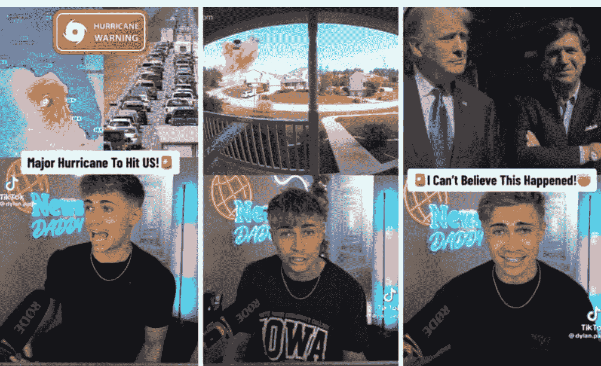

# 懒人专属群周报（第 105 期）

北京时间 2024 年 11 月 01 日 出品

懒人专属群群友大家好，我是小懒人~

第105期《懒人专属群周报》，与君共读。

希望咱们专属群独有的《懒人专属群周报》可以作为群友们喜欢阅读的一份类似周刊的读物。
之前的离线版合集地址见咱们专属群总链接，小懒都有备份。

懒人微信：lazyhelper

## 目录

- 懒人专属群周报（第 105 期）
  - 北京时间 2024 年 11 月 01 日 出品
- 目录
- 文章分享
  - 没有经济压力、不婚不育不工作、睡到自然醒、爱干啥干啥，这样的人会烂掉吗？
- 新闻评论
  - 认真做新闻的网红
    - 认识几位优质新闻网红
    - 内容创作者和记者之间的界限越来越模糊
    - 如何成为成功的内容创作者
  - 突发新闻的传播寡头
    - “中介/掮客”们是谁？
    - 他们的影响力有多大？
    - 他们如何实现大量的互动？
    - 内容三部曲
    - 并非孤例，也很难消失
- 懒人收藏夹
  - 具体的人
  - 最好的猎手，都是打扮成猎物
  - 她要是没缺点，干嘛嫁给你呢？
- 总结

## 没有经济压力、不婚不育不工作、睡到自然醒、爱干啥干啥，这样的人会烂掉吗？

### 高赞回答

给自己找一个长期的、持之以恒的、有持续产出（重点）的爱好，就不会。否则，会。

这些爱好可以是写小说，绘画，雕塑，音乐，研究罗马帝国史，改装汽车，城市探险，射击，烹调。

都可以。本质上，它们替代了工作给人带来价值感的部分，如果你干的足够好，也可以替代工资这部分。不过你既然不缺钱，就不用追求变现。

玩游戏，看动漫，收集充电头，也可以。但有个前提，产出。如果你持续冲击竞速世界纪录，或者是某游戏攻略作者、二创作者，又或者是某区知名通天代，专业打分。那就可以。动漫同理，写漫评，做手书或者做点评博主，都可以。

光玩，光看，不行。因为没有产出。

我多次提到产出，因为产出是非常重要的。产出不一定要变现，不一定要别人认可，甚至可能是对你以外的其他人都没有意义。比如漫评写出来只有自己和几个朋友看，手书投到B站个位数播放量。

但是这并没有关系。因为产出是一种价值锚定，是区别于“爱好”和“随便玩玩”的重要依据。

产出会不断强化你“在做一件有意义的事”的认知，它极大的帮助人保持积极的心理状态和乐观的预期。如果你隐居在你的小公寓里坚持写小说，可能到最后都没多少人看，但你一定会在写小说这件事上不断获得满足感。而且，根据我的经验，如果一个人真的长期坚持做一件事，他很难完全不取得成功，一个小白坚持练画画十年，都能成为一个技术不错的插画师。

这样你宅在家的每一天就是有意义的，你会感到生活很充实。

没有产出，就不行。

看小说，看动漫，只看。完全不创作。玩游戏只玩，没有什么白金成就之类的游戏目标，没有写游评、写攻略的想法，纯玩。

你很快就会腻。别不信，你脱产，纯玩。而且不要给自己定目标，比如这赛季要上大师，这个月要无伤通法环之类的。就漫无目的的玩，想到哪玩哪。

人类没有任何一种娱乐经得起长时间纯输入而不让人感到厌倦。信息输入到一定程度，人就会对这些信息作出反馈，给出自己的输出，从信息的接收者变为一部分创作者，并从中获得成就感。

三百六十行，行行如此。厨师品尝美食，阅读菜谱，然后开发出自己的新菜。程序员阅读代码，学习算法，然后开发自己的程序。军人刻苦训练，学习理论，然后在战场上实现自己的价值。

人人都是如此。如果一个程序员一直学习，从不开发。学完一门技术，立即学另一门，但是至死不写任何一行代码，只学习。那么他对编程兴趣再深，也很快就磨尽了。电影爱好者几乎都写影评，就算不写，也会形成自己的理解，可以给别人推荐，有自己的选片品味。这也是一种产出。如果他只看，没有形成任何感悟，品味，对某导演的看法，就像追国产网剧一样看完一部又一部。相信过不了两年，这人看见电影就打瞌睡。

一个人不需要上班，甚至不需要爱好，但一定需要“实现自我价值”的机会。这是人的本能，一旦不愁吃喝，这个需求一定会横在所有人面前。

我们都是普通人，不要抬杠，高估你自己的心理素质。好好想想为什么游戏有“成就系统”。长期实现不了个人价值的人，几乎无一例外陷入巨大的虚无，本质上这东西就是写在DNA里面的出厂设定。

## 新闻评论

新闻实验室是小懒付费订阅的通讯录，年费300多。小懒整理分享，仅供专属群群友查阅。如有余力，可以自己到Newsletter上自费订阅。

### 认真做新闻的网红

> 受众不再依赖机构媒体，而是从各自喜欢的网红那里获取关于公共事务的信息，这一定是坏事吗？

上期会员通讯谈到，突发新闻（例如川普遇刺）发生后，社交媒体平台X上的相关信息几乎被右翼网红垄断，而新闻媒体的影响力与之相比显得非常有限。这似乎描绘出一种非常灰暗和悲观的图景：媒体认真做的内容传播不开，任由网红传播不靠谱的信息和片面的解读。

今天的会员通讯，我们换一个视角来看这种现象：受众不再依赖机构媒体，而是从各自喜欢的网红那里获取关于公共事务的信息，这一定是坏事吗？有没有可能，媒体提供的内容也有自己的问题和局限，而网红提供的信息也可能是靠谱乃至优质的？甚至，我们还可以再进一步提问：区分谁是传统媒体的“记者”和“媒体人”、谁是社交媒体上的“内容创作者”或“自媒体人”，还有意义吗？

#### 认识几位优质新闻网红

我们先来看几个具体的例子。

第一个例子：英国“新闻老爹”。

在短视频平台TikTok上，粉丝最多的新闻类账号不是任何一家机构媒体，而是一个叫Dylan Page的内容创作者。他的账号创建于2021年5月，三年后他已经拥有超过1350万粉丝、10亿点赞。Dylan被粉丝们称为“新闻老爹”（News Daddy），这个绰号是粉丝给他起的，他非常开心地收下了——它很好记，又幽默。Dylan甚至还成立了一家叫NewsDaddy的公司。

新闻老爹发布的主要内容是以有趣、个性的方式总结和点评新闻。他认为自己成功的最主要原因是勤奋：三年多以来，每天坚持更新两三条视频；一有大事发生，很快就推出自己的总结和看法。他亲自撰写每一则视频的脚本，坚持不雇其他人来完成，因为脚本里面有他的个人风格。

那么，他的个人风格是什么呢？重点：不要装成一副很有权威的样子，以严肃的语气来教导受众“你应该相信什么”、“你应该这么做”；而是要塑造一种“我们一起来看看发生了什么”、“我提供一点自己的看法，可能对也可能不对”这样的感觉。

在他的视频里面，你经常可以看到：他低下头去看稿子，或者指向屏幕中的某些信息。通过这些画面，他在有意告诉受众：这些信息是我从其他地方找到的，不是我一手生产的。其隐含的意思是：我不是全知全能的，我也要到处去找信息，我告诉你具体的信源了，信不信由你自己决定。

当然，把事情说得轻松有趣，也是他成功的核心。他认为，记者应该着力于培养这种能力，只有这样才能接近年轻受众。

比起眼前的流量，他更看重的是长远的关系。在选题的时候，他会问自己：做这个题对10年后的你有益处吗？还是说，只是为了抢到眼前的流量而已？他希望和受众之间建立起信任关系，而内容上的失误会伤害这种信任。

#### 第二个例子：非洲TikTok女王。

出生于尼日利亚的Charity Ekezie在TikTok上有330万粉丝，她被称为“非洲TikTok女王”。她发布的短视频，致力于讽刺人们关于非洲的刻板印象，以幽默的方式传播信息，纠正公众对非洲的误解。

比如，她制作视频介绍非洲有没有房子、电力、空调、汽车、互联网……她回答人们的提问，介绍“在非洲怎么买iPhone”、“非洲人怎么给手机充电”、“非洲人怎么获得水”……

Charity本来很想成为一名电视记者，但她没能找到电视台的工作。于是她开始在社交媒体上发布视频，做独立的视频创作者。她的创作灵感来源其实很简单：当她读到那些关于非洲的荒谬的刻板印象时，她会产生很强烈的情绪反应，她对这种无知感到愤怒，于是就有了这些讽刺无知、传播信息的短视频。

在她看来，在TikTok上，她不需要表演其他人，她只需要做自己，表达自己的真实看法，算法就会把她的内容推给全世界的人。

当然，她的表达也是幽默的。比如，关于“非洲有没有空调”，她的回答是：非洲没有空调，当我们感到太热的时候，就请一批大象过来，让它们扇动耳朵，给我们降温……

但幽默不是纯粹为了搞笑。她说，她的讽刺是为了刺激受众去通过Google或其他渠道，搜索更多的信息，对非洲产生更多的了解。

#### 第三个例子：向回避新闻的人介绍公共事务。

西班牙人Enrique Anarte曾经在德国之声做记者。2020年，德国之声希望做自己的TikTok账号，而那时Enrique已经开始在上面活跃，于是他成了德国之声的TikTok编辑，后来又被汤森路透基金会挖走，领导一个致力于LGBTQ+内容创作的TikTok团队。同时，他也不断在自己的个人TikTok账号上尝试用轻松的方式谈论严肃的公共议题。

他认为，做TikTok给他带来的积极影响是：距离受众更近了，更加了解受众的多元需求。粉丝会直接给他提议选题，而这些选题往往是传统媒体编辑部会忽略的。

他强调，受众意识需要贯穿内容生产的始终。而他的内容所面向的受众，很多是不愿意主动看严肃新闻的人，他要做的就是让了解公共议题成为一种轻松的享受，同时还能学到新的东西。如果做出来的东西不能让人看到、理解并且与之互动，那么做的就是没有意义的东西。

#### 第四个例子：在台湾做面向年轻人的国际新闻。

2020年，台湾人Kassy Cho创立了一家叫做Almost的媒体，专注报道国际新闻，目标受众是年轻人，有英文版和中文版。

在创办Almost之前，Kassy曾经在BuzzFeed News做过受众发展编辑（audience development editor），负责增加BuzzFeed News在社交媒体平台上的能见度和声量。因此，很容易理解：她有着强烈的受众意识，认为在生产内容的时候必须认真考虑受众的需求和感受。

Kassy说，在社交媒体上做新闻的好处是，可以有更加个人化的表达。粉丝们对内容创作者有较高的信任度，知道他们是一个个活生生的人，有着自己的想法、情绪乃至偏见。这种创作者和受众之间带有浓浓“人味”的连接，是非常宝贵的东西。Kassy认为，这并不会伤害内容的质量，只要创作者对于自己的偏见有很诚实、透明的披露，并且坚持对于事实的尊重。

#### 第五个例子：在桌子底下解说新闻。

美国人V Spehar本来从事餐饮方面的工作。新冠疫情期间，V开始在TikTok上制作关于做饭的视频。直到2021年1月初，V的创作者生涯发生了巨大的转折。

当时美国发生了国会山暴乱，V拍摄了一则躲到桌子底下对副总统Mike Pence喊话的短视频，并迅速走红。自此，V转型成为一名在桌子底下解读新闻的创作者，账号名字也改成了Under the Desk News，现在拥有320万粉丝。

每个工作日，V都会浏览大量新闻网站，寻找6-8条重要的新闻。V将每条新闻浓缩成一个小片段，爬到桌子底下，制作一段90秒的视频。奥巴马甚至还曾在V的视频里面客串。

V认为，做Under the Desk News这个频道和做机构媒体的记者最大的不同在于：在社交媒体上聊新闻，不是自上而下的说教，而是和自己的受众一起，作为一个社群去探索和理解。因此，V选择新闻的一条标准是：不选那些“噢真糟糕，我们什么都做不了”的新闻，而要选那些“注意，这些事情发生了，而我们可以做这些这些”的新闻。

### 内容创作者和记者之间的界限越来越模糊

了解过了这些例子，不知道你对于“网红如何影响新闻传播”的态度是否会变得积极、乐观一点？原来，除了那些搬弄是非的网红之外，还有认真做新闻并且获得了用户认可的内容创作者。其实想一想，在中文语境下，也一样有类似的创作者。

上面的五个例子都被写进了最近上线的一本电子书《Content Creators and Journalists: Redefining News and Credibility in the Digital Age》。这本书由得州大学奥斯汀分校的Knight Center for Journalism推出，主题是探讨内容创作者和记者之间的异同，以及他们能互相学习一些什么。

我觉得这本书的主题非常及时。在记者和内容创作者之间，的确曾经存在一种“互不兼容”的感觉——记者普遍看不起内容创作者，觉得他们做的根本算不上新闻；而内容创作者则觉得记者已经跟不上时代，是在汽车时代还执着于马车的人。

但是现在，两种角色之间的界限已经越来越模糊，也有越来越多的人在两种角色之间转换身份——从记者变成内容创作者/网红，或者以内容创作者的身份得到“你做的新闻很棒”的赞赏。

其实说到底，不管这两种角色互相怎么看，有一点是肯定的：大部分受众根本不会在乎谁是记者，谁是KOL。当他们从社交媒体获取内容的时候，他们是没有什么是机构媒体、什么是内容创作者/网红的概念的。

如果一定要在机构媒体和内容创作者之间做比较，那么数据反复说明的是：受众更喜欢的是后者。许多年轻人对TikTok新闻网红的信任超过了在著名新闻机构工作的记者。而根据路透社新闻研究所的《2024年数字新闻报告》，超过一半的TikTok、Snapchat和Instagram用户从社交媒体上的网红那里获取新闻，而不是主流媒体和记者。

这也是为什么这本书非常有价值：是时候把记者和内容创作者凑到一起来了，让记者从内容创作者那里取取经，也让内容创作者多多了解记者的工作守则和方法。

那么，为什么内容创作者比记者更受受众的欢迎和信任呢？其中究竟有什么是记者能学习的？

书中提到了一些要点：

- 内容创作者可以用人们更能理解的、更加非正式的语言去解释新闻。（这给我们带来的启发是：也许新闻媒体可以改进自己的语言和叙事方式，是不是还是用了太多的术语名词；媒体更应该从受众的角度出发，考虑他们究竟是否能很好地理解媒体发布的内容。）
- 内容创作者可以建立自己的垂直领域，接触垂直受众，这是大的机构媒体往往会忽略的人群。
- 内容创作者可以自由地在他们创作的内容中分享个人观点和情绪，而记者往往不得不隐藏这些情绪。然而在社交媒体年代，受众想要看的、更信任的，就是这种让人觉得有“人味”的观点和情绪表达，而不是冷冰冰的面无表情。（因此，记者或许可以在报道中融入情感，可以让更多人了解他们作为人的一面。）
- 传统媒体给人的感觉像是一个黑箱，有很强的神秘感，而内容创作者则可以更加公开透明地展示自己的工作内容，甚至是在和受众的互动过程中实时生产内容，一切都好像发生在受众的眼皮底下。（媒体也应该做更多自我展示、打开黑箱的工作。）
- 成功的内容创作者非常重视和受众的互动，而媒体则往往“高冷”，记者也很少会直接下场互动。然而，这种互动是建立信任感的重要渠道。

### 如何成为成功的内容创作者

这本电子书的最后提供了一些成为成功内容创作者的建议。我简单翻译如下：

#### 第一个方面，理解你的角色和责任：

- 了解自己的道德和法律责任
- 为自己设定道德标准，并恪守这些标准
- 明确自己的使命和价值观
- 始终如一地创造能实现这一使命的内容
- 认识到成功的内容创作是一门生意，也是一门艺术

#### 第二个方面，聚焦于建立信任感和公信力：

- 严格核查事实
- 以透明的方式引用资料来源，并使用有信誉的资料来源
- 迅速承认并改正错误
- 放大经核实的信息
- 在报道和职业道德方面保持一致
- 在涉及广告和赞助时做到透明
- 不要害怕展示你的个性或分享你的观点、但要清楚什么是观点，什么是事实
- 真实、诚实

#### 第三个方面，培养讲故事的技能：

- 将复杂的问题转化为简单易懂的语言
- 有效使用视觉效果、图形和其他多媒体元素
- 以引人入胜的方式组织故事情节
- 为主题寻找独特的角度
- 学会核实信息和进行采访
- 不要低估你的受众：你不一定要把所有事情都写得很有趣或很有娱乐性才有吸引力和相关性，但一定要有吸引力和易于理解
- 制造好奇心的缺口（curiosity gap）
- 制作高质量的内容，但要知道“过于”完美的东西并不有趣

#### 第四方面，理解你的受众：

- 深入研究目标人群
- 通过评论/社交媒体与粉丝直接互动
- 跟踪数据指标，了解哪些内容能引起共鸣
- 了解受众的在线时间和参与度，并据此安排发帖时间
- 根据受众的反馈调整您的风格和主题

#### 第五方面，理解不同平台的差异：

- 学习每个平台上的最佳做法，以最大限度地扩大您的覆盖面和参与度；一刀切的做法不适合所有平台
- 在保持核心信息和价值观的同时，调整内容和展示风格，使其适合每个平台
- 尝试A/B测试，找出最吸引受众的标题和缩略图类型
- 尝试不同算法的工作原理，以便利用它们为你服务。记住，你不仅是在为受众制作内容，也是在为算法制作内容
- 利用不同的社交媒体平台共同推广您的内容
- 融入社交媒体文化，了解其他创作者的做法和成功经验

#### 第六方面，精通视频和音频制作：

- 编写脚本/故事板，说明你要表达的内容和表达方式
- 出镜
- 适合音频的声音和节奏
- 视频和音频制作与编辑
- 优化不同平台（YouTube、TikTok 等）和格式（短视频、纪录片、播客等）
- 数据可视化
- 直播
- 了解这个事实：为印刷、电视或广播制作的故事不能自动转换到社交媒体上

#### 第七方面，在新闻标准和创造性之间达到平衡：

- 保持专业和道德标准
- 在发布或共享内容前进行事实核查
- 以通俗易懂、娱乐化的方式呈现信息
- 与受众建立直接关系
- 找到自己独特的声音和视角
- 注意如何有效地混合娱乐和信息，保持准确性和深度

#### 第八方面，发展商业模式：

- 从一开始就认识到内容创作者赚钱是一件难事
- 确定短期和长期目标以及衡量成功的标准
- 选择财务模式并制定商业计划
- 寻求品牌赞助/合作伙伴关系，并向受众透明地说明这样做的原因
- 不要害怕广告
- 了解你的浏览量和其他指标，以便将其转化为广告收入
- 尝试捐款、付费会员制和订阅制
- 向受众和赞助商/广告商明确说明他们对你的内容有多大影响或没有影响

#### 第九方面，准备好应对批评、假新闻、骚扰：

- 制定不扩大错误信息的事实核查策略
- 制定内容审核计划，人工审核或自动审核
- 调整平台隐私设置
- 知道何时以及如何联系社交媒体平台和权利组织寻求帮助
- 优先考虑受众的媒体素养，解释你的工作流程、来源以及发布的主题背后的背景情况

#### 第十方面，保持灵活：

- 与新兴平台和技术保持同步
- 勇于尝试新形式
- 向趋势靠拢
- 聆听受众喜好的变化
- 与他人合作，扩展你的技能组合
- 知道转角处总会有新东西出现，可以改变你现在做任何事情的方式

总的来说，这的确是一个非常全面的清单。不过我觉得，光看这个列表依然只是纸上谈兵，成功的内容创作者肯定不是通过熟读背诵这些原则做成的，只有在实践过程中时不时回头看看这些原则，才会真的有用。

### 突发新闻的传播寡头

> 尽管新闻机构的账号拥有大量粉丝，但它们的影响力已经远远比不上另一批网红账号。

公众号懒人搜索，懒人专属群分享

特朗普遇刺后，在社交媒体平台X（原Twitter）上，信息是如何传播的？

最近，专注于研究虚假信息问题的美国华盛顿大学公共知情研究中心（Center for an Informed Public at University of Washington, 以下简称CIP）发布了一篇[研究报告](https://informedpubliccenter.org/2024/07/31/explaining-and-spreading-the-breakin-news-about-trumps-assassination-attempt-the-role-of-x-platform-newsbrokers-and-other-influencers-in-shaping-information-environment/)，对这个问题进行了深入的分析。

这篇报告揭示的关键现象是：尽管新闻机构的账号拥有大量粉丝，但它们的影响力已经远远比不上另一批网红账号——这些网红已然成为解释和传播突发新闻的重要枢纽和“寡头”，重塑了X平台上的信息环境。

今天的会员通讯，我们就将基于CIP的研究报告和关键数据，探讨这种传播路径的深刻变化。

### “中介/掮客”们是谁？

原CIP研究科学家Mike Caulfield在过去的研究中，将X平台上以转发和评论新闻为主的一些高关注度账号称为“Newsbroker”，中文翻译可以是“新闻中介”或“新闻掮客”。以下我们暂且采用“新闻中介”这一翻译。

学者们利用第三方监测工具Brandwatch加上特定关键词（如Trump、Assassination、Shooter等），识别出7月13日至7月16日，在X平台上关于特朗普遇刺这一话题被提及次数最多的十个账户，其中也包括X的老板马斯克。但由于马斯克的账号还会发布大量与新闻无关的内容，故在此次研究中被排除在外，学者们将重点分析下图中的九个账户：

Self description of the top 9 most-mentioned news accounts of “newsbrokers” (July 13–16, 2024)

| Account Handle | Account Name | Self-description |
|---|---|---|
| @lauraloomer | Laura Loomer | Investigative Journalist 🇺🇸 Founder of LOOMERED. Host of @LoomerUnleashed Former @Project_Veritas operative. 📸 America First ⛩ Feisty Jewess 🔥 Receipt Queen |
| @CollinRugg | Collin Rugg | Co-Owner of Trending Politics | Investor | American 🇺🇸 |
| @dc_draino | DC_Draino | Rogan O'Handley |
| @libsoftiktok | Libs of TikTok | News you can't see anywhere else. 📩 submissions@libsoftiktok.com. DM submissions. Bookings: Partnerships@libsoftiktok.com. ⬇️Subscribe to our newsletter |
| @hodgetwins | Hodgetwins | Merch & Giveaways at: http://officialhodgetwins.com —— PODCAST: @thetwinspod |
| @MattWallace888 | Matt Wallace | CEO of #Twitter ~ @ElonMusk Council ~ Turn On The Notifications For Real-Time Breaking News Alerts! #FreeSpeech📣 #Dogecoin🐕 #ElonMusk👳 @DianaWallace888 💍🏠 |
| @dbongino | Dan Bongino | Public Enemy #1 |
| @bennyjohnson | Benny Johnson | i make internet |
| @dom_lucre | Dom Lucre | Breaker of Narratives | JournalisTuber | For Business: domlucrebooking@gmail.com |

可以看到：在这九个账户的名称或描述中，有五个包含了与新闻有关的关键词，如“调查记者”、“时政热点”、“突发新闻”、“你在别处看不到的新闻”和“叙述的突破口”。但他们都不是正规机构媒体的记者。

内容分析表明，这九个账户尽管在不同时期可能在互联网上扮演不同的角色，但在7月13日特朗普暗杀未遂事件发生后的三天内都扮演了重要的新闻中介角色。

特别值得注意的是，这九个账号中有五个都曾因为传播虚假信息而被Twitter或其他平台封禁过（@lauraloomer、@dc_draino、@libsoftiktok、@dbongino、@dom_lucre）。但由于X等平台降低了对虚假信息的审核和监管力度，这些账户陆续被解禁，并再次展现出巨大的传播能量。

对X平台不熟悉的读者可能没听说过这些新闻中介，这里我们选取其中的几个给大家略做介绍。

@lauraloomer: Laura Loomer，出生于1993年5月21日，在亚利桑那州长大，美国极右翼活动人士，特朗普的长期支持者。因频繁在社交媒体上发布虚假信息、阴谋论和仇视穆斯林言论，2017年至2019年，她在Twitter、Facebook和Instagram上的账号相继被封。由于她还多次参加极右翼活动，并被逮捕，PayPal, GoFundMe和Venmo也暂停了她的账号。2022年马斯克收购Twitter后，恢复了她的账号。

@DC_Draino: 本名Rogan O’Handley，1985或1986年出生于加州，右翼网红，拥有芝加哥大学法学院的法学博士学位。在开办自媒体之前，他曾在好莱坞工作六年，专攻娱乐法。2016年美国大选后，他开设了自己的个人账户，并逐渐走红。他为自己打造的人设对保守派有着不可抗拒的吸引力：他在民主党家庭长大，曾在好莱坞工作，后来发现自己不敢表达保守的政治观点，因此被迫拒绝沿海精英生活，搬到佛罗里达州。由于频繁发布虚假消息和阴谋论，其Twitter账号曾被封禁，但马斯克收购后将其解封。

@libsoftiktok: 该账号的运营者名叫Chaya Raichik，出生于1995年，曾是一名纽约的地产经纪人。最初，她注册的推特账号因长期发布反LGBTQ内容而获得关注，之后曾参与其他一些右翼媒体节目，为其账号进一步扩大影响力。2022年10月以前，因发布反校园LGBTQ内容，导致现实中的人遭受网络攻击和骚扰，其推特账号曾5次被暂时封禁。

### 他们的影响力有多大?

CIP的学者们继续用同样的方法，挑选出在特朗普遇刺事件中，X上被提及最多的九家新闻机构账户，其中既包括Fox News、《纽约邮报》等右翼媒体，也包括《纽约时报》、CNN、美联社等主流媒体。

在找到这九个媒体账号后，学者们对比了新闻中介账号和新闻机构账号对该事件的发布数量和转推数量——

| Account Type | Number of Event-Related Tweets (Total) | Total Number of Retweets (Total) |
|---|---|---|
| Newsbrokers | 346 | 1,238,017 |
| News Outlets | 744 | 98,064 |

从上图可以看出，新闻中介们共发布了346条推文，就获得了123.8万条的转发；相比之下，新闻机构账号发布的推文是新闻中介的两倍，达到744条，但收获的转发却只有9.8万条，仅为中介的区区8%。

要知道，这九个新闻机构的账号合计共有1.97亿的关注者，而新闻中介的九个账号加起来只有2,031万关注者，是新闻机构的10.3%而已。

对比这一组数据，可以很明显地发现：这些新闻中介在特朗普遇刺事件中所获得的流量和受众参与度，远远高于新闻机构。

特别值得注意的是，之前被X/Twitter封禁的账户表现非常突出。其中三个——@lauraloomer、@dc_draino 和@LibsOfTikTok——各自的转发量都超过了所有九家传统新闻机构转发量的总和。

### 他们如何实现大量的互动?

那么，这些新闻中介发了什么内容，使得他们获得了远高于新闻机构的互动量呢？

研究者们发现，尽管这些中介们的发布风格和角色定位（或者人设）各不相同，但他们的修辞套路与审美倾向却有相似性。

首先，他们的共同策略是将自己的内容定位为比传统新闻机构“更好”的替代品。他们经常对传统媒体表达强烈的批评和不信任。在以往的学术研究中，CIP的研究人员曾在不同政治背景的新闻网红身上观察到这种助长对传统媒体不信任的行为。通过诋毁传统媒体，这些账号制造出新闻市场的信任缺口，并试图亲自填补这一缺口。

其次，与传统新闻机构不同，这些新闻中介往往是以一个具体而真实的人物出现的。比起冷冰冰的媒体机构，当受众与他们互动时，能感觉到与真人在进行对话。这些账户通过回复和转发，积极与受众互动，使受众在突发新闻事件时更有参与感。通过这种方式，它们旨在与受众建立个人层面的联系，承认共同关心的问题，建立信任关系，让受众更加相信他们所发布的信息。

第三，这些中介通过“突发”、“最新”和“最新消息”等字眼（BREAKING、NEW、JUST IN）营造出一种紧迫感和新闻价值，警灯emoji🚨也经常被使用。一些推文通过使用大写字母进一步强调了紧迫性和重要性。

第四，他们的大多数推文都包含照片或视频等多媒体。作为中间人，运营新闻中介账户的人似乎并没有在事发地制作这些媒体内容，而是从互联网其他地方或传统新闻机构获取内容然后编辑发布。这些媒体内容一般都是在没有上下文或注明出处的情况下提供的，这是新闻中介行为中常见的做法。

第五，新闻中介的许多内容都带有强烈的情绪色彩。发帖人经常实时表达他们对事件发展的情绪反应，包括对特朗普遇刺的震惊和恐惧，对枪手和其他被认为鼓励了这一企图或未能阻止这一企图的人的愤怒，以及对受害者及其家人的悲伤。情绪的传播又能在一定程度上引发受众的转发和互动。

### 内容三部曲

我们再来看这些内容中介具体是如何发布推文的。报告总结出了三种典型的行为：

- 1. 放大证据：初步证据的制作和放大，重点是确定正在发生什么；
- 2. 归入特定解释框架：界定和解释证据，帮助受众理解其含义；
- 3. 动员：为受众创造动员途径，帮助他们决定该怎么做。

一句话简单总结就是：告诉受众发生了什么，为什么发生，下一步怎么办。

下面用具体的推文来进一步解释这三种典型行为：

#### 1）发生了什么？放大证据

研究人员观察到的第一类行为是新闻中介最核心的做法：试图让人们了解正在发生的事情。它与传统新闻机构的新闻报道方式最为相似，但会特别放大某些信息或证据。

此类推文通常是宾夕法尼亚州巴特勒集会本身的照片或视频，有时也有广播报道的片段或文字报道。如前所述，这些证据通常都是在没有注明出处的情况下被分享的，而且分享的内容往往节奏很快，令人无所适从。

在这一阶段，新闻中介最明显的作用是放大证据。很多发帖人分享了有关该事件的一般信息，包括集会录像、枪手及其动机、特勤局未能确保集会区域安全，并通过解释这些信息，而将责任归咎于拜登总统和传统媒体的身上。

学者们发现，在该事件中，新闻中介们始终关注导致暗杀未遂事件发生的系统性问题。他们经常放大和分析在屋顶发现枪手的视频录像，以及特勤局反狙击手和保护特朗普的特工的视频录像。这些证据被用来支持对特勤局的批评，并为暗杀事件可能涉及“内鬼”等说法背书。他们用情绪化的语言将受害者称为“牺牲的英雄”。

另一些推文还以“专家证词”的形式提供证据，发帖人声称自己接触过许多“专业人士”，他们根据这些所谓的“专业知识”对事件做出解释。例如，@DC_Draino 分享了一位训练有素的狙击手对特勤局应对措施的批评，@dom_lucre 则分享了一位女演员的说法，称这次事件是用道具伪造的。

通过有选择性地关注暗杀企图的某些方面，新闻中介允许有影响力的人为他们对当天事件的特定版本解释争取支持。

#### 2）意味着什么？归入特定的解释框架

报告中观察到的第二类行为，涉及对证据片段以及整个事件的公开解释和归入特定框架。这一过程可以概括为集体意识形成的一部分，即受众和新闻中介通过合作来理解新出现事件和证据的含义，并最终形成一种集体认知。

例如，@LauraLoomer的推文在提供证据的同时，还将暗杀未遂事件认定为“内鬼作案”，而这正是CIP在之前关于首次暗杀未遂事件的报告中发现的流行阴谋论套路之一。

此外，几位新闻中介还通过与受众互动。更直接地参与到集体意识的形成过程中，并就他们对相关证据的解释提供更多细节。例如，在推文中，Collin Rugg嵌入了一段采访美国特勤局局长Kimberly Cheatle的视频。Rugg总结了一些采访内容，并附上了他对采访的初步解读，称Cheatle的立场是“彻头彻尾的疯狂”。在随后对在线观众的回复中，Rugg提供了进一步的评论，将视频与观众的评论结合起来。例如，一位观众说，如果Cheatle不辞职，她就应该被解雇，对此，Rugg回应说：“拜登政府认为她做得很好，笑死我了。”

#### 3）应该怎么办？动员的信号

报告所揭示的第三类行为，是为受众的参与创造途径。通俗来说，这可以被认为是在通过最初的感性认知达成初步集体共识后，对“我们该怎么做？”这一问题的回答。

这种行动号召往往蕴含和暗示在推文中，特别是通过其特定的解释框架。例如，@Dom_Lucre在报道这一事件时使用了一张显示特朗普耳朵流血的图片，将这一事件定义为“宣战”。虽然没有明确提出具体的行动号召，“宣战”这一解释框架被暗示并传递给了受众。

更直接的是，一些新闻中介明确引导网络受众采取网暴行动。在CIP此次研究的数据集中，@libsoftiktok 就是这种行为最典型的例子。在该账号的介绍中，就有征集线索的途径，她向受众征集与突发事件相关的“投稿”，重点是寻找“左派”的言论或者被认为是罪证的视频或截图——比如，“可惜（子弹）没打中”，或暗示暗杀事件是伪造的。@libsoftiktok 在所谓的罪证旁附上了个人信息，包括人们的姓名和工作地点，受众利用这些信息对相关人员进行骚扰和网暴，这可能会导致他们失去工作，至少会删除社交媒体账户。

### 并非孤例，也很难消失

虽然分析的是美国的一个具体案例，但是这篇报告揭示的现象大家应该不会感到很陌生。在很大程度上，中国社交媒体平台上的一些大号也是这样的新闻中介，它们标榜或暗示自己是解释真相的媒体或记者（比如“理记”），但其实基本不做原创报道，而是通过摘编、扭曲的方式，将一些与国际政治、社会事件有关的信息放到特定的叙事框架内，以符合受众的情感趋向。在一些案例中，他们也可能会鼓动粉丝进行攻击性的行动。

学者们将这一现象定义为新闻传播的“寡头化”（oligarchization），也就是说，平台上有影响力的账户群体相当集中，主导着美国国内和国际重大事件的突发新闻讨论。这种寡头化，或者说少数参与者在关注和参与方面的主导地位，威胁着信息来源的多样性。它会进一步放大分裂性的叙事，巩固现有的意识形态僵局，并大大促进未经核实的信息在网上的流动。

这份报告揭示的问题确实严重，而学者们在报告中所提出的解决方案显得有些软弱——他们希望X平台能对这些账户进行一定程度的监管，增加它们的透明度，并加强问责。

显然，这一建议在短期内很难实现。如果马斯克所拥有的X平台想要这样做的话，就不会在收购推特以后，就立即将那些已经被封禁的极右翼账号再次复活，并任由虚假信息和阴谋论大肆传播。

媒介素养的普及，尤其是对信源的识别和判断，显然是一种重要的应对方法。除此之外，有没有可能出现更多靠谱、负责任的新闻中介？既然大家的天性是觉得机构媒体太冷冰冰，大家普遍喜欢看个人化的传播和解读，那么，让优质的新闻信息获得更多个人化但负责任的传播，也许是一种路径。

### 具体的人

> 槽边往事
> 懒人备注：现在网络上充满各种标签和对立，不要让自己成为一个愤怒的人~

有位脱口秀女演员叫“小鹿”，我偶然间看到她的视频就立即竖起了耳朵，对于其他演员则没有这个反应。

因为我在她的普通话里听到了乡音，那是云南人在努力讲标准的普通话，也就是昆明人自嘲时所说的“马普”---马街普通话---不是云南人，云南只有昆明人才有那种位于宇宙中心的心态，认为马街位于昆明的郊区，也就位于全世界的郊区，所以一切非标准普通话都是马街普通话。

而且我也听得出来，小鹿应该来自云南北部，因为那里的人发音硬，靠上，经常用鼻腔共鸣。后来查了一下，果然是宣威，那个寒冷的地方盛产洋芋和火腿，洋芋炖火腿或者火腿炖大白芸豆是著名滇菜，火腿炖鸡那是很后来的事情了。

所有这一切都是一转念之间发生的事情，我就想了那么多，想了那么远。其他热爱脱口秀的观众，追看比赛综艺的观众所想的是她有冠军实力，她是女性演员，她的文本能力，诸如此类的标签和概念，一切都围绕着节目本身。

我本能地思考具体的人，这是我的个人习惯。所以，在同一个人身上，同一件事物上，我看到的东西会有一点不一样，感受到的东西也会不一样。就像是“马街普通话”几个字，立即能让我想起昆明人对内的微妙优越感，也会想起作为云南人在外的微妙自卑感。我在北京那么多年，遇见许多次云南人，见面愿意和我说云南话的就只有一位，其他人坚持说在家乡原本自己看不上的“马街普通话”，有的人甚至直接建议我说：我们说普通话好了。

宣威也是一样。看到这个地名，“州县”两个字就蹦了出来。我在昆明很多年，经过无数次训练，每一次都提醒我在昆明和昆明之外的州县之间的鸿沟，每一次也都提醒我昆明人作为省城人口对州县人的心理优越感，和州县人对这种优越心理的反感和敌视。然后我要自我提醒一下：我也不是原生昆明人，我家也是移民人口，来自标准的州县，我对这两个字那么在意干什么？为什么要努力装作是一个真正的昆明人那般做派和想法？甚至成了一种本能？这有点下流。

还有另外一种本能，那就是看到一位来自州县的女性，无论是在昆明，在北京，还是在伦敦、巴黎，我本能地就会认为对方非常努力。因为过往的人生经历告诉我，如果一位女性想要从云南的三四线城市乃至村镇里走出来，需要拥有怎样的勇气，需要付出怎样的努力。资源太少，支持太少，连地图和指南针都没有，必须用一种蛮横的努力和天真的相信，才会真的走到“大山外面”去“看看”。我曾在我亲族身上看到过，我也曾在我朋友同事身上也看到过。

类似“演员”、“女性”、“云南人”这些标签都太大了。每个人的成长经历是具体的，每个人的所处环境是具体的，这些琐碎的细节才构成了理解的基础。就像那些去过云南旅行了十次，二十次，五十次的人，觉得自己已经对云南非常熟悉了。其实不是的，只有他带着一个昆明朋友去某个州县小城，和当地朋友喝酒时，昆明人才说第一句话就开始莫名冷场，那么他才算是接触到了一点云南。只有他在丽江旅居了五年，见惯了笑脸和问候之后，突然发现当地纳西朋友之间一直在举办不带自己去的秘密聚会---火把节的时候，那么才会意识到自己其实始终都在本地生活之外，被旅游区人们惯常的热情迷惑了。

网络世界里的人们喜欢拨弄许多标签，喜欢把玩许多概念。许多时候为了这些东西分成好几拨，好几派，毫不犹豫地开战。我想，这要么是他们对具体的人具体的生活根本不感兴趣，只对标签有兴趣，要么就是他们对具体的人具体的生活根本一无所知，觉得知道字面意思就是知道了一切。

那些在网上宣称生活毫无趣味，自己心如死灰的人也类似。他们沉溺于自己所“发现”的概念里，缺乏对具体的认知，因此总是觉得无聊无趣，反而认为自己已经知晓了一切，在其中找不出任何有趣新鲜之处，那不过是距离生活足够遥远的一种症状罢了。

每个人都是具体的，甚至是在一瞬间做何想都是源自非常具体的成长经历。如果我小时候不曾不断在全国各地的托儿所和幼儿园漂泊过，那么我对人的声音，尤其是口音不会那么敏感，因为听不听得懂别人说什么，决定了在幼儿园里活得如何。如果我不曾经历过作为新移民来到昆明，试图融入到本地人中去，感受到他们的排外和歧视，努力减少和他们之间的摩擦，那么我不会理解那些基于地域的微妙心理。

同样的，如果我不是去过那么多地方，写过那么多文章，我不会发现只有在饮食上所有人都会变得友善亲切，所有人都以本地饮食为傲，所有人都可以从这里打破坚冰开口说话，那么我不会无论见到什么人和什么事，最终都会想到饮食上去，从心里蹦出一个又一个的菜名。所以，你说我是本身热爱美食，还是环境促使我选择美食，这我还真不好一口说出答案。

朋友们，没有那么多我们和你们，也没有那么多更遥远的我们和他们，只有一个一个具体的你，和一个个具体的我。在具体的层面上，几乎所有人的所思所说所做都是可以理解的。在概念和标签的层面上，也几乎没有人可以逃离敌我关系和冲突关系，可以不被划归为愚蠢、傲慢、自大等等概念中去，可以免受憎恶、排挤、反感等等情绪的袭击。

对于我们自身而言，我们因为具体而变得有理解力，富于同情心，能够体察他人的处境，也因此获得了对于生活和人生更为丰富的感知。相反的，我们因为操弄概念，玩弄标签，而一再落入二元对立的陷阱，在这个世界上发明创造敌人，把人生变成一场无休止的战争。

很多年前我看过一部港片，只是一句台词就彻底奠定了这部电影的调性，让我想要看到最后，那句台词说：“就算你是一个杀手，一样会有小学同学。”

我想有人用马普再说一遍。

### 最好的猎手，都是打扮成猎物

记忆承载

我们这两天一直在说：

人这个东西，本质上还是希望能够在不改变自己的前提下，得到一个好结果，或者说，得到一个本不属于自己的结果。

这话怎么说呢。

就像一个姑娘，她想要嫁给富豪，但不是以戴上面具，从此不再有喜怒哀乐，永远表现出温柔的微笑，永远向对方提供情绪价值为代价。

她想要的是什么？是成为富豪的女王。

你得给我钱，你还得给我倒贴情绪价值。

或者说，就像一个小伙儿，他想要像一个商家那样挣钱。

但不是迫使自己向市场低头，去琢磨市场要什么，而是反过来，他想像爽文里的龙傲天一样，迫使市场向他低头。

用张麻子的话说，他想站着，还把钱给挣了。

关键的问题是，他还没枪。

……

大部分人，的确就这么点事儿，但也不是没有例外。

严格意义上讲，人分成两组。

一组人是，他其实不知道怎么做，俗称你告诉他怎么改变自己，他是可以做到的。

你比如路遥小说里的孙少平，孙少安。

他只是生活的地方太贫瘠，他这颗种子没有任何问题，给点阳光就发芽。

你哪怕不指点他，他都会想尽办法要学习，要进步，要改变自己。

那么另一组就是你说的。

他不是不知道怎么做，他知道了，他只是装睡嘛。

当然，还有一种情况，就是他当下的处境，使得他接受不了清醒的痛苦。

他不是想装睡，而是不得不装睡。

我举个例子。

昔日岳云鹏，是个餐厅的服务员。客人为难他，明明不是他的错，老板还是开除了他，他很委屈。

## 公众号懒人搜索，懒人专属群分享

老板为什么开除他？

因为他是从事服务业的，俗称顾客是上帝，你得给人家情绪价值，人家才肯来呀。

可是你站在岳云鹏的角度，他很难受。

他不是情商低，他不是不知道自己应该提供情绪价值。

问题在于，此时此刻，他一个北漂，已经够没钱，够憋屈，够苦的了，联想到自己的身世，还要给你提供情绪价值，他的压力到顶点了，他受不了了。

俗称他知道该做什么，但是他做不到，至少，这一天，这一晚，他做不到。

他有错么？他没有。他在装睡么？他也没有。

他只是到了极限，他扛不住生活的压力了。

在给别人情绪价值，和让自己舒缓压力之间，他选择了后者。

伺候不起，只能不伺候。

这有错么？当然没有。

有时候我们也没法单纯地评判，因为每个人的实际情况是不同的。

你比如鹿鼎记里面的建宁公主，她就很喜欢跟小宝玩COSPLAY，她喜欢说，你打我嘛，你打我嘛，用你最厉害的那一招。

建宁说这句话的时候，她憋屈么？她不憋屈的，她只是觉得好玩。

你换个丫鬟来说，她就很憋屈了。因为身份不同，她不是自己想玩，她是被迫的。

这就是我说的，每个人的实际情况不同。

你一毛钱没有的时候，你吃白菜叶子，会吃出一种凄凉感；可是当你财务自由的时候，吃同样的白菜叶子，你就不会有那种委屈感，因为你肯定是自愿的呀。

除了实际情况不一样，每个人想要的，也不一样。

你比如我投资稳定盈利之后，到我全职去做资方，这中间，有相当长一段时间里，我依然待在职场上。

此时此刻，我比自己要接触的绝大多数人，都有钱。

但我依然是一个很喜欢给别人提供情绪价值的人。

管理学的本质是什么？其实就是拿捏嘛。

好比领导给你一点小甜头，你应该表现出什么？应该表现出感恩戴德。

这个就叫上道嘛。

这就是一种交易。

投桃报李，他给你奖励，当然是站在他的角度，他以为的足够买通你的筹码。

他又不知道你很有钱，他不知道这个信息的呀。

那么你如果还想把这个游戏，把这场戏圆满的演下去，你是不是应该扮演此时此刻，他对你预期的那个样子，表现出接受他的赏赐，表现得十分满意？

那这个效果就是最好的。他觉得他已经收买了你，他觉得你已经是他的的人了。

你是怎么管理他的预期的？就是通过你的微表情，通过你的语言，就这些呀。

或者领导敲打你，那么他希望的效果是什么？

就是你表现出诚惶诚恐，表现出害怕失去这份工作的样子，于是他就觉得，他成功拿捏了你。

他通过你的表情，觉得经过敲打，你从此就会竭尽全力。因为你的表情透露出，你担心失去嘛。

我年轻的时候最擅长干这些了，那是因为我本来就觉得挺好玩的呀。

我并不会觉得委屈，我觉得自己就是假扮可怜小宫女的建宁。

其实大小王都在我手里，其实我海外收益很大，其实绝大多数领导在我眼里都是屌丝。

So what?

这不影响我去拿奥斯卡影帝呀。

我就是通过一系列的作伪，在职场中，成功的让历任领导，老板，都相信我是一个打工人，都相信我是忠心不二的关云长，都相信我是鞠躬尽瘁的诸葛亮。

因为他们误判了，他们误以为职场是我的主要收入来源，误以为这是我最在乎的事情。

当别人误判的时候，我就可以欺上瞒下，就可以各种倒腾。

其实我每天只工作了俩小时，其余时间都花在了自家生意上，但是我的表面文章做太好了。

俗称你叫我，我永远立刻响应。

但领导们不知道，其实你不叫的时候，我都在偷偷做自家生意。

这就是预期管理。

你以为我是你的贤内助，其实我连潘金莲都不如。

那这个过程中，最重要的是什么？

就是给对方情绪价值呀。

我每次都让你觉得你的管理是非常有效的，你当然越来越喜欢我，因为你觉得，你彻底驾驭了我。

实际上是什么？是我让你觉得。

人都是灯下黑的，你越是信任一个人，你越是放手。

刘备是不会天天盯着关羽去考勤的，因为绝对信任了。

换句话说，如果我让你对我绝对信任了，我哪怕是潘金莲，哪怕我住到西门大官人府里，你也不知道的。

你还以为我帮你拉生意去了呢，辛苦娘子磨豆腐。

这个过程中的关键点就在于，我把领导对我的预期，彻底操控了。

最好的猎手，都是打扮成猎物。让那个猎物以为自己是得手的猎手。

那么这里面的前提，就是我愿意。

我愿意这么演戏，我觉得好玩，我自己本来就乐在其中。

你换个人来，他不见得是不会，他更可能是不想。

他可能上来就摊牌了，不装了，大小王炸丢出来，在领导的惊愕中扬长而去。

很正常，你看历史上康熙的姐姐，恭悫公主，就很端庄，人家就不像小说里的建宁，那么喜欢COSPLAY。

有没有问题？没有问题的。

这就是个非常单纯的游戏。

牌小，你可以坚持，也可以放弃；牌大，你可以扮猪，也可以王炸。

人生是开放游戏，你想怎么选，那是你的事儿。

人教人，从来不应该是强迫的，而是边界清晰的。

- 你不清楚因果。
  > 你不知道一件事踏空之后的损失是什么，你不知道一件事掉进陷阱之后的损失是什么，所有的方面，都有人负责给你讲得清清楚楚。

- 你不知道方法。
  > 当你已经知道因果，但是你不知道科学的方法，也有人也给你讲得明明白白。
  > 到这个地步，所有信息都已经对你开放了，信息差已经被抹平了，那么剩下的就一件事，你自己随意。
  > 千万不要觉得我教你们任何东西是一定要你那么做，别那么想，我并无此意。

人生只是游戏，尽兴就好。

## 她要是没缺点，干嘛嫁给你呢？

我连着两期聊小仙男，重点并不是仙男，重点是散户。

散户不一定都是男的，也可能是女的，只不过男的占比特别高，所以我们开玩笑讲小仙男。

至于我两次都拿小仙女做对比，只是为了读者理解，让你看到一种喜剧效果。

咱们有些人是买椟还珠的，这两天不停的有男读者留言抱怨，抱怨自己太太身上或多或少的仙女特点。

比如短视，比如双标，这了那了。

这不叫仙女，这些是一个身上最正常不过的缺点。

别说你太太身上有，我太太身上也有，短视，双标，甚至包括我见过的男的，99%的男的，身上都有，短视，双标。

这是什么？这就是普通人呀。

如果你随便找个人，身上连短视，双标都没了，那这个世界得卷成啥样啊？

十二年前，我第一次创业的时候，我们几个老板吃饭，经常谈及的一个话题就是：

如果人家身上没毛病，他凭啥来给你打工？

你有没有想过一个问题，比如你招个人，名校硕士，大厂五年，你认为对方该啥样？

对方会是李云龙么？

你想什么好事呢？

对方大概率就是一个走流程的水平，这就是社会上普通人才的平均水平。

如果你指挥得当，他兴许能打胜仗，如果你判断错了，对不起，别指望他，他指望不上的。

他要真的是李云龙，他就不会来应聘。

他自己当老板不香么？他去当合伙人不香么？

他如果都通过社会渠道去递简历，说明什么？

说明他没有创业的能力，他在业内也没啥名气，这就是普通人才最应该的样子呀。

他只是拥有一技之长，然后希望你给他一个平台，不是说他已经自成体系，他一个人拿一面旗，就可以去拉一支团。

真要是那号的，他凭什么来给你打工？你上辈子拯救了银河系？

当你对员工有这种不切实际的期待时，你自己就是小仙男。

那你找个太太不也一样吗？

她如果在你低谷的时候，能拿出本来资助你，在你迷茫的时候，能给你指路。

那她是什么？

她是巴菲特+耶稣的合体？

那她为啥要嫁给你，还要给你生娃，生的娃还要跟你姓？你上辈子拯救了银河系？

别逗了，她一定有缺点，她没有缺点，她就不会看上你。

当你对太太有这种不切实际的期待时，你自己还是小仙男。

我们千万不要丈八的烛台，照得到别人，照不到自己。

作为男性，我们首先要想想，女人为什么抱怨男人？

因为她还在指望男人。

指望不改变自己，指望别人为自己买单的人，才会去抱怨。

其实聪明的女人都知道，男人根本指望不上。

那么是个男人都该知道，女人指望不上吧？

作为男人，你该不会指望自己像唐僧一样有机会吃软饭吧？

对着一个概率其实为零的事情，你讲这些干嘛呢？

难道你觉得你讲多了，你媳妇就能为你改变了？

天底下最不靠谱的事儿，就是两口子都在指望对方为自己改变。

这就是天道里面丁元英的那句台词，大部分人，这辈子毁就毁在等靠要。

人生似熔炉，你想提升自己，唯一的办法就是找个苛责的环境，去抽打自己，而不是待在舒适区里像朱茵式的傻等。

知道贾宝玉小时候为啥总挨打？

因为贾政知道，宝玉成天待在脂粉堆里，是没法成长的。

如果你将来要去朝堂，那么你小时候，就要像李超人的公子们一样，6岁起就待在董事会里旁听。

听听大家争什么，看看大家忙什么。

你成天混在脂粉堆里，朝堂上难道都是脂粉？

所以如果你觉得你太太短视，那你就去做你认为长视的事情。

你又觉得对方短视，又非要和对方讨论长期主义的话题，你不觉得自己有毛病么？

还是说，除了你太太，根本没有一个人才，肯搭理你？

那你就更要反省了，比你强的人不搭理你，到底是谁的错呢？

很多人的理想是赚钱，是成为有钱人。但与此同时，他们是怎么做的呢？

是憎恶有钱人。

你一方面讨厌有钱人，一方面又想有钱，这不是自相矛盾么？

任何时候，首要问题永远是咱们愿不愿意面对真实？

如果都不愿意实事求是，还说啥。

如果愿意面对真实，你去看下供需关系，看看这个市面上，到底是有钱人多，还是没钱人多？

到底是机会多，还是人多？

这年头，别说你不愿意往领导身边挤，你没有机会。

哪怕某一天你终于开窍了，你忽然发现你愿意了，你都会发现且排着长队呢。

因为前面有着太多早就开窍的，像祁同伟一样太想进步的。

就这么现实。

没有人说我可以成天和一些月薪三千块的人混在一起，每天骂领导，骂到最后自己忽然变有钱的。

没有这种事。

你成天混在3000堆里，能挣到4000，已经是奇迹了。

这个道理很简单，是你主动选择和有钱人互斥，你主动选择和没钱人互吸的。

主动靠拢，积极求进步的祁同伟们，且排着呢，何况互斥？

离开舒适区的日子一定是苦的，又甜又挣钱，就轮不到自己了。

人这辈子，想挣钱，就别指望舒服。

想舒服，那就男的众筹钟小艾，女的众筹霸道总裁。

钟小艾白天给你解决职场难题，晚上给你泡脚；霸道总裁白天给你刷卡，晚上哄你开心。

你看多简单，众筹一下，肯定有编剧愿意提供爽剧爽文。

现在不是40多年前，早就不是遍地机会的年代了。

你去看看电视剧凡人歌，里面有凡人么？

那总曾经做过副总，他媳妇做过人力总监，他小舅子是985的研究生，北京户口在编，他弟是北大的本科清华的硕士，大厂组长。

那总想扮青蛙，扎气球，都没得混，只能去送外卖。

他媳妇想当月嫂，都当不下去，最后只能上街卖卤煮。

他小舅子逃去县城，住在山里，教超市老板的闺女。

而他那个清华的弟弟，看到新来的实习生，都是斯坦福的。

能花得起几百万读斯坦福，这说明什么？又有能力，家里又有钱，最关键的是什么？

是这帮新人还不抱怨，老人们都在抱怨公司拉屎计时的时候，这些斯坦福二代们，不仅技术能力强，而且情绪价值拉满，有能力还有眼色，有技术还肯委屈自己。

请问这个清华的组长看了什么感觉？

是满意么？

不，是后脊梁骨发寒。

长江后浪推前浪，后浪就坐在你眼前，冲你笑呢。

这是现实么？这不是，这里面一个凡人都没有，这还是美化后的电视剧。

他要是不美化，他都播不了，你都看不到。

所以我说，如果你连电视剧给你美化后的版本都接受不了，真不如洗洗睡，梦里啥都有。

## 懒人公众号导读：

小懒做个了网页，汇总一些公众号的原创文章列表，并用脚本自动更新，“文章荒”的话可以到这里看看有没有兴趣的内容：

地址：https://lazybook.fun/#/gzh/gzh_list

小懒在博客懒人收藏夹上面也更新了不少文章。

大家可以看看有没有兴趣的哈，小懒觉得体验还是不错的~

一些文章有访问密码，见咱们专属群群消息即可。

地址：https://www.lazyblog.top/

## 总结

本周周报到这里就结束了，合计1.8w字

小懒会准备好PDF和epub版本，方便大家多平台查阅。

在茫茫互联网不断搜索查找优质内容，希望带给大家愈加有收获的内容。

大家的分享也很多，希望每个群友都有收获。

咱们专属群的更新记录可以查看这里：

https://lazybook.fun/#/blog/record2

平时大家如果需要找软件工具，可以到懒人手册上找看看先：

手册地址：https://lazybook.fun/#/

## 公众号懒人搜索

懒人专属群

微信: lazyhelper