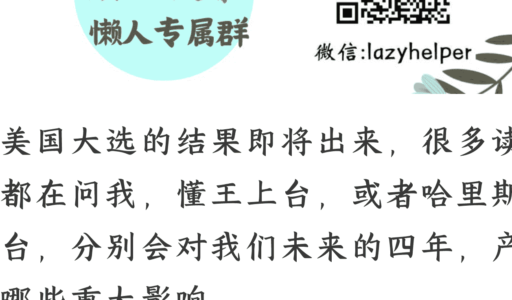

# 美国大选的重大影响以及未来我们的经济
## 预判分析

241103 人间罗盘（记忆承载小号）
整理：公众号懒人搜索，懒人专属群独享
懒人微信：lazyhelper
记忆承载付费文见懒人专属群总链接内分享

美国大选的结果即将出来，很多读者都在问我，懂王上台，或者哈里斯上台，分别会对我们未来的四年，产生哪些重大影响。

这里面关系到美国不同的人上台之后，他们的政策，也关系到我们各自不同的应对政策，以及我们的政策力度，节奏。

尤其是对房地产市场的影响，这是很多读者最为关注的。

除了这些政策与国内形势的解读之外，我今天想要额外加一个部分。

以往总有些读者看了这类趋势分析之后，会问，自己作为一个普通人，有没有门槛低，简单易操作的办法去应对变化。

所以我今天干脆也不等你们问，直接拿出一个部分，写出来。

因为篇幅有限，我没法顾及所有人，我知道有些读者是企业主，很有钱，但是很遗憾，今天没法照顾到。

我今天最后一部分用来回答最普通的劳动者，就是工薪族，白领或蓝领，没背景，没资本，没天赋，没特长，能做点啥。

全文两万字，共五个部分。文中多处有链接，俗称画中画，文中文，阅读时请仔细留意，莫错过。

本文下面的留言，我每一条都会看到。

以下进入正文：

## 第一个问题，无论谁当选，对我们的大方向，会不会变？

到底懂王还是哈里斯上，我也没有结论。

2016 年的时候，懂王胜出的当天早上，我还在跟身边人讲，我说他不可能胜出的。

我有自信有这个判断，从 08 年到 16 年，我已经在国际市场上从事了 8 年的交易。

我以为我足够了解美国。

于是当天早上我就像以往一样，照常开着量化交易程序，那时候只有亚洲开市了。

正常来讲，不应该这么做的。

因为套利交易不是做趋势的，一旦行情出现无毛刺的平滑的单边，你很容易被扫。

我以为不会，我以为我足够了解。

但是当天就出现了，上午快到中午的时候，懂王异军突起，避险情绪大涨，行情走势非常夸张，到了中午一两点之后，随着懂王尘埃落定，避险情绪又回落，又反方向走的非常夸张。

那我无可避免地被扫了单。

> 我说过，做投资要有 rule，什么做，什么不做，你要像军队一样，有规矩。

很明显，我违背了我的规矩。

当很可能出现方向不可测的极端行情时，我应该按照惯例，关闭量化交易。

可是我没关。

没关的理由是我主观上认为就不会出现极端行情，我认为希拉里绝对会当选，我认为懂王这就是出来搞笑的。

很明显，我为自己的认知，买了单。

我曾经一直以为我足够了解美国，我一直以为美国运行的很丝滑，没有任何问题。

我一直认为美国的模式就是华尔街和硅谷负责赚钱，然后分一点给美国的大多数，就像张丰毅演的曹操对林志玲演的小乔说的那句话：别闹。

你又有不限量的汉堡，不要钱的饮料，畅玩的游戏，甚至可以嗑药，还要啥自行车？

然后发现人家真的要自行车，还真的要成了。

这一刻开始，我就忽然发现，我错了。

我的错误来源于我的出身，我长期在国内读书、工作、创业。我一直待在发展中国家。

以我的阅历而言，一个人如果被管吃管喝管玩，他一定是满意的。

没想到老美这么多要求。

从那一年开始，我的价值观发生了动摇，我开始注意到一家公司的老板。他们公司的老板有句话，最聪明的人，应该去研究最广大的群体，这叫下沉市场。

他们的老板是浙大竺院的，去研究什么群体呢？去研究县城，去研究农村。

你要知道，在那之前，所有学霸们对这个世界的理解就是远离最广大的群体。

我们当年读书的时候，老师自己都是这么讲的。

你们辛辛苦苦，千里挑一万里挑一地考入顶流学府，为了什么？

为了毕业后挂着顶级外企的工牌，拿着远远高于城市人均水平的收入，出没于各种高档场所，见所谓重要的人。

积累经验与资源之后，去创业，去拿硅谷的天使投资，去纽约证券交易所敲钟........

我们那代人受的都是这个教育。

2012年的时候，我在甲方做系统架构师，集团有很多调研的机会，下去地市，下去分公司，去考察一个星期，去看看实际运营情况，去看看最终端的客户。

我从来都不去。

我宁愿待在集团总部拍脑袋，都不愿意去了解一线。

因为我们都清楚，待在大领导身边，把时间花在总部的会议上，才最有利于自己的升迁。

很可能你出门一个星期，领导身边插入了一个新人，抢了你的机会。

这个思路是没有问题的，半年之内，我在甲方，连升三级。

我讲这一段，就是告诉你们思维惯性。

君以此兴，必以此衰，一个人最大的优点，往往就是你最大的缺点。

盈亏同源。你当初因为彻底理解了社会的运行底层逻辑，深刻的把握了它，那么在社会发生变化时，你也可能是那个跟不上节奏的。

我在 2016 年，就觉察到了这一点。

时代变了，我曾经引以为傲的，可能面对变化，是有问题的。

就像一个人在科举时代中过进士，一旦遇到变化，不考八股了，改考数理化，你要迅速反省，紧跟节奏。否则，你将是被淘汰的遗老遗少。

懂王当选之后，因为思维惯性，我起初第一年，是持怀疑态度的。

我觉得这哥们挂羊头卖狗肉，他就是说说的，哄哄红脖子的，这个世界不会发生什么本质的变化。

马照跑，舞照跳，还是过去的经验。

但是到了 2017 年的年底，我就觉出味了。

世界真变了。

所有的人，尤其是传统的学霸，尤其是如今已经是中老年的，从那个时候起，就应该迅速丢掉过去的模式，要学会去研究大多数。

你注意，我只是告诉你，打 2017 年开始，我明白了什么，并不是告诉你，这次我认为懂王一定赢。

真相是谁赢谁输已经不重要了。

一件事，当我都已经能够明白的时候，你放心，很多人都明白了。

这个地球很大，比我聪明的人多得是。

何况我是 2017 年想明白的，现在都已经 2024 年了，明白的人只会更多。

那我当初到底想明白了什么呢？卖个关子，我请大家先看一个现象，一个美国大选当中的现象。

就是马斯克这种科技大佬，居然不惜用 ALL IN 的方式去支持懂王。

他在最重要的摇摆州，宾夕法尼亚州买票。

只要是宾州的人，只要你愿意签署请愿书，支持懂王，那么每天从这些签署的人里面，将随机抽取一个幸运儿，奖励 100 万美金。

每天都奖励哦，一直奖励到选举。

你想想看，这是什么？选个村长都不带这么玩的吧，马斯克真就这么做了。

所以他说，我 ALL IN 了，如果懂王不当选，只怕我会失去所有，还得坐牢。

有没有觉得很神奇？你怎么看这俩都不应该尿到一个壶里，何况穿一条裤子。

懂王这个人，他的基本盘是什么？是低收入的白男，是红脖子。

而马斯克，理论上讲应该站传统精英这边的呀？

### 那我告诉你，2017年我想通的那件事就叫做：精英正在分化。

我是做量化的，从08年开始，到17年那阵子，我自己也开始困惑。

困惑什么？

我起初以为我是造飞机的，因为交易系统是我研发的，我后来认为我是开飞机的。

再后来，我慢慢觉得不对劲，自己好像变成修飞机的了。

为啥？因为自动驾驶了。

其实你今天去坐飞机，大部分航线都是自动驾驶的，之所以配备飞行员，是处理特殊紧急情况。

交易也是这样。

当我发现自动交易在全球范围内的占比越来越高时，作为投资人，我也恍惚。

是不是终有一天，我们人类会退出这个领域？一切投资最后都是算法自己在完成的，甚至于算法的升级，算法的维护，也是它自己完成？

如果真有这一天，那我们搞这个方面的人，不就相当于自己的掘墓人么？

我本意是想要把我的智慧，我的经验，从我的体内剥离出来，让它服务于我，可真当我把它剥离出来后，我发现，我自己变得没有作用了。

那么这件事如果发生在更多行业里，会怎样？

诸多像我一样的人，一样的脑力劳动者，是不是都会有同样的困惑？

那么面对这件事，到时候就只会有两种做法。

### 第一种做法叫限制它。

你可以协助我，但是不能取代我，限制它的发展与应用。

两年前的春天和冬天，睡王分别签署命令，限制数字资产，监管人工智能，都是出于这个原因。

技术进展太快了，动了人类当中的脑力劳动者们的利益蛋糕。

### 第二种做法叫做背叛。

背叛谁？主动背叛自己所在的脑力劳动者群体，去迎合算法，去加速这种取代的过程，就像三体里面的降临派。

从个人经验的角度。

我是个码农出身的投资人，我当年还在做软件架构师的阶段，就曾经主导公司的软件体系升级。

试图把复杂的软件系统，拆解成虚函数和实例化分离的模式，让公司不需要再招聘大量有经验的系统软件工程师。

而是只需要招聘写模块的应用开发者，或者底层的配寄存器的测试者。

就像工厂一样，用流水线来取代熟练工人，降低用工成本。

在昔日主导企业软件模式变更的过程中，我有句话跟很多码农同事们讲过。

> 一个人不想被干掉最好的方式，就是自己先干掉自己。

> 蛋壳从外部打破是脓水，自己从里面啄开是新生。

没有人能阻挡大趋势，一家公司不这么做，别家公司也会这么做，到时候你的市场被抢走，你照样得解散。这是个人经验带给我的认知。

那么另一方面，站在历史经验的角度。

人体内有两样东西，一样叫体力，一样叫脑力。

当年工业时代刚兴起时，机器取代人的体力，工人们也试图砸过机器，有用么？

何曾挡住过历史车轮的一步呢？

你今天回过头去看，如果当时你是工人，你唯一能选择就是背叛。

背叛同事，站队机器。

因为你选不选，都只有这一个结果。

> 那么回到今天，当算法有可能取代脑力的时候，我们这些脑力劳动者，和昔日的工人有什么区别？

没有。

风水轮流转，三十年河东，三十年河西，天道好轮回，只不过轮到了我们。

### 那么这时候，脑力劳动者里面一定会分成两派。

一派像当年砸机器的工人，他们试图阻挡算法的推进。

另一派，则是降临派。我们认识到一件事既然无法阻挡，不如主动加速。

马斯克，就是后者里面的大佬。

请问，在相对更传统的其他硅谷与华尔街眼里，能容这部分人么？

### 不能容，这就叫做精英的分裂。

### 脑力劳动者，其实已经分成两个阵营了。

其中降临派的大佬之一，就是马斯克，他深信碳基生命只是硅基生命的启动程序。

那么这个时候，何以匹敌？

很简单，敌人的敌人，是盟友，这就是原则。

去寻找那些最普通的人，去寻找那些体力劳动者。

他们才是你的盟友，于是马斯克，把目光投向了懂王，因为这些人，都聚集在他身后。

神奇的现象发生了。

### 脑力劳动者里面的降临派，主动去拥抱最普通的体力劳动者，构成盟友。

### 而哈里斯背后的基本盘，则是最传统的脑力劳动者，不希望被算法取代自己经验的那批人。

短期看，谁会赢？

不知道。

### 但是长期看，结果是注定的。

哈里斯哪怕赢了，哪怕赢了一次又一次，四年又四年，长期看，结果都是注定的。

人类历史上机器是怎么取代体力劳动，算法就会怎么取代脑力劳动。

过程会有曲折，结局早已注定。

马斯克那句话没讲错，碳基生命只是硅基生命的启动程序。

## 第二个问题，懂王和哈里斯当选，各自的影响。

第一部分我就说了，别问我谁会当选。

我有心理阴影了，我曾经在大选这件事上看走眼过。

我们分开分析懂王和哈里斯分别当选，可能的影响。

当然，这俩人各自的策略有很多，我们没法一一展开。

否则今天的这些问题聊不完的，变成讨论他俩的专场了。

我们不关心美国大选，我们也不关心两个人策略的众多不同点，我们只关心，和我们自己有关的那部分。

这俩人，懂王和哈里斯，对我们而言，最主要的区别在于什么？

三件事，利率，关税，欧洲。

你看，我一句话就给你把核心要点拎出来了。

如果懂王当选，他很有可能迅速大幅度降息。

当然，马上降到1%这种会不会发生我不清楚，但是迅速，大幅度，这两件事在懂王身上，不是不能做到。

反观哈里斯，很大概率会缓慢降息。

利率这件事我专门分析过，我的结论一直都是美国很大概率会是高利率，高通胀，高增长，相当于白垩纪。而不会是像过去几十年那样低通胀，低利率，低增长的侏罗纪。

于是结论是，降息这件事有，可是降息之后，依然是一个相对高的平台，是3%，是4%。

上述这个结论，最大的变数就是懂王。

他有没有可能打破白垩纪，重回侏罗纪？有可能。

他完全有可能做出不顾及高通胀，硬是先杀回低利率的事情来。

我们假设，这种事真的发生了。

就是懂王真的当选，一拍脑袋，迅速大幅度降息。

很多人就会想，那我们是不是也可以跟着降到更低？

空间打开了呀，你降我也降，我们其实需要更低的利率，因为我们是逆通胀，明白这意思么？

我们现在的处境，是对通胀这件事，求之不得，于是不停地出政策，就是想要回到温和通胀的轨道。这个我之前也专门分析过。

但是，大家注意，这个想法，这个你降我也降的想法，有一个重大的缺漏。

你漏掉了什么？

你漏掉了懂王对关税的态度。

懂王出招，是连环招，他如果利率大降，必然伴随关税大增。

针对我们的。

他降低利率这件事，是利多我们的货币的。

你的利率降得比我的快，是不是我的货币更有吸引力？

所以是利多我们的货币。

但是，他关税大增这件事，是利空我们的货币的。

关税大增什么影响？出口难了。

相当于他们的消费者要用更高的价格买我们的产品，那么他们的消费者可能就不买我的产品了，可能就会去买欧洲的同类品，或者本土的同类品。

那么我们为了提高企业的竞争力，为了抢夺市场，需要什么？

需要让他们的消费者觉得便宜。

那只有怎么做？

只有他们的货币，相对于我们的货币升值，才能部分抵消他们针对我们加关税。

我上面讲的这件事，是国际贸易中，是几乎所有商人都知道的，于是这构成了什么？

构成了预期，这就是外汇交易当中的预期。

我讲过的，当大家预期一件事 3 个月后一定会发生，那么它不会等 3 个月，它当下就会发生。

因为价格是预期决定的，不是事实。

所以一旦懂王加关税，对我们的汇率，就是利空，正如他一旦大幅度降息，对我们的利率就是利多。

甚至有时候都不用他动作，他赢得大选本身就会构成市场预期。

那么当他同时打出这两张牌的时候，你发现什么发生了？

抵消发生了。

你本想趁他降利率，蹭个便宜，但是人家同时加关税，不让你蹭。

就这么点事儿。

那反过来，如果是哈里斯当选，大概率就是我此前的分析，美国继续高增长，高通胀，高利率。

他们会降息，但是降息后的那个利率平台，3 或者 4，依然属于高利率的平台。

最后一个影响，欧洲。

懂王当选，对欧洲的影响，远大于对我们。

原因很简单，你看看双方卖给美国的是什么。

我们经过当年的懂王，后来的睡王，经过很多轮的被针对，实际上，那些高附加值的产品，已经被美国从供应商体系里面剥离掉了。

而我们当下无论是直接出口，还是通过第三方转口贸易，卖给美国的都是些什么？

都是些必需品。

什么叫高附加值的产品？你买个 LV 就叫高附加值的产品，成本可能只占 5%，含泪挣了你 95%。

非洲奥德彪买辆二八大杠自行车，这就叫必需品。我的成本可能已经占了 95%，利润不到 5%。

所以如果懂王后续大幅度加关税，一定有很多自媒体去给你们分析，去对比幅度。

好比说关税幅度上升了一倍云云，你听起来好像很严重。

但是，他们都会忽视一个细节，什么细节？

### 基于什么，基于什么性质的产品，他们都会忽视这个细节。

因为那帮人是搞媒体的，他们不是搞经济的，他们不会研究细节。

*当你把这个细节加进去的时候，你就会发现，影响是完全不同的。*

我卖给你一个LV，你对我的关税增加了一倍，这个影响太大了，你的消费者也许不买我的LV，而是买Gucci去了。

但如果我卖给你一辆二八大杠，你对我的关税增加一倍，对不起，你的消费者可能依然买我的二八大杠，只不过他得花更多钱。

这就是附加值产品与生活必需品的区别。

懂王加关税这件事，影响的是我们的量，影响的是欧洲的利。

### 所以懂王如果大幅度加关税，首当其冲的是欧洲，因为他们的利润高得多。

欧洲卖给美国的，全是高附加值的产品，就是利润很大的那种。

一旦懂王挥舞关税大棒，欧洲一定会哭晕在厕所里。

所以我相信，欧洲一定在祈祷，祈祷哈里斯胜出。

### 如果不是这样的结果，如果懂王胜出，欧洲一定会想办法在我们身上找补自家的损失。

其实你最近已经能够看到欧洲针对我们的新能源车额外征税。

只不过他们这种惩罚性的行为我们不认，不认的意思是说双方还有谈的余地，你针对我，我申诉。

为什么还可以谈？因为懂王现在只是领先，他不是已经胜出了。

如果哈里斯胜了，欧洲可能就有得谈，因为他们的压力也减轻了。

如果真的是懂王胜了，那欧洲就是想要针对我们。

没办法，懂王上位后带给他们的损失，他们也需要转嫁。

## 第三个问题，国内的政策方向。

十月初的时候我说过，你甭管市场里有多少声音，甭管每天大家的情绪像过山车一样，一会儿这样了，一会儿那样了。

有一件事，是你要认定的。

当下最主要的问题是什么？

是坚决打掉逆通胀的预期，这就是 9 月底那次，给到市场上最关键的态度。

这件事绕不开的，美国甭管谁当选，这都是我们接下来的第一目标。

别说懂王当了美国总统改变不了，哪怕奥德彪当了美国总统，也改变不了。

公众号懒人搜索，懒人专属群分享

这个结论，我是讲过的，但是很多人不理解，为什么是这样一个结论。

进而导致一个问题，就是他对于我们未来给出政策利好的节奏，是不理解的。

明白这个问题么？他知道你要做一件事，但是他不是很理解，这个过程中的细节。

那我今天把这个细节讲透。

咱们观察一件事情，今年的增速是多少？

年初定的预期是 5 个点，现在到四季度了，你现在去看，这个目标好像没啥问题对吧？

有没有觉得很奇怪？

你从媒体上看，很多地方卖地是很难的，很多企业都是比较差的消息，你哪怕从身边看，好像这一年以来，大家并不好过。

那么为什么，这个增速如年初的预期，能够顺利抵达呢？

答案只有一个，因为出口。

今年的出口，整体上是很好的，如果没有这个局面，也许我们现在只有 3 个点，也就是说，第四季度要想办法突进，让全年再增加 2 个点，才能保 5。

但是现在不需要了。

出口为什么这么好？我们要看周期。

你从这一轮出口周期来看，起点是四年前，是 2020 年，是疫情开始的那年。

那年全球停摆，于是我们的出口特别好，这个不好都不可能，别人没有生产能力了。

这样的超级好，持续了一两年，随着别人的复工，很多人讲，出口变难了。

其实这里很多人忽视了，这个难是怎么计算的？

是相对于特别好的那两年，是相对于人家停摆的那两年，你觉得难了。

实际上，相对于正常周期，你的日子依然非常好过。

明白这意思么？一个农夫周三捡到一只兔子，周四没捡到，他觉得生活难了，其实相当于周一周二，并不难，而且很好。

周三捡个兔子，只是意外，这个意外改变了农夫对生活的盼头。让他周四以周三作为参考系了。

那么为什么别人复工之后的三年里，我们的出口也相对于上一个大周期更容易呢？

答案很简单，因为别人刚复工，人家有太多的事情要处理。

他家里刚刚恢复生产，他生产的商品暂时还不构成对你的竞争，或者对你的冲击。

于是接下来的2022，2023，2024年，你相比于疫情初期的2020，2021年，觉得好像不容易了，其实你仍然处于很容易的周期里。

因为这三年，别人没法全力以赴。

那么明年呢？那么25年呢？

随着时间的推移，接下来，别人一定会大举反攻，因为人家不仅仅是生产恢复，而且各方面都进入正轨了。

那么势必在明年，对我们的出口构成竞争。

你注意，这是一个大周期上的事情，是一个7到10年周期节奏上的事情，和美国大选无关，和哈里斯、懂王到底谁上无关。

无论是谁，无论他们对我们加不加关税，这个大周期咱是绕不开的。

因为到了明年，到了2025年，出口额外补贴的这两个点的增速，可能就是没了。

如果是哈里斯，也许是输一半，如果是懂王，也许干脆就是没了。

那就不够了呀。

假如明年的目标还是5个点，那么差的这2个点，不靠内需去补上，靠什么？

所以你看清楚为什么拉动消费重要了？就因为这个。

基于这个根本绕不开的原因，于是我们明年自己内部的消费就非常必要。那怎么拉动消费呢？

你有两个选择：

如果你站在长期的角度看，就是以十年的尺度去看问题，这件事的本质是生产型社会向消费型社会的转化，是第一产业、第二产业向第三产业的转化。

日本当年的选择，我们是没法参考的，他们的人口规模比我们小太多，他们可以再建一个海外日本的同时，让日本本土变成一个消费为主体的环境，让日本昔日的劳动人口变成以第三产业为主，就是那帮寿司之神。

而到了我们这里，小体量的才做选择题，大体量的只能全都要。

所以我们希望的结果是制造业迁移到中西部的同时，让东部的劳动人口，升级到以服务业为主，构建我们的寿司之神。

一方面中西部的劳动人口可以就近就业，工作与家庭兼顾，另一方面，所谓消费型社会的本质是什么？

就是当富老头在本土消费时，围绕富老头们的中产才有钱赚，中产赚到了钱，于是围绕中产提供服务的更多服务业劳动者，才有钱赚。

那这里面我们势必要做很多事情的，你得让富老头乐意花钱，就像提升营商环境很重要一样，提升消费环境也很重要。

迪拜是消费天堂并不是说盖一堆大楼就一定有人来花钱，不是的，就像五星级酒店，考核硬条件，也考核软服务。

你的服务也得是五星级，甚至七星级、八星级。

这里面需要提升很多包容度，对消费者的包容度，俗称他花钱是来买开心的，不是来买不开心的。

这一点，我们任重而道远。

而且不得不做，因为我们未来太需要消费了。

我们过去很长一段时间不重视消费是因为卖地卖得爽，无所谓。

我限购，限豪宅，这限那限都有人排队抢，那当然无所谓。

但现在可以么？随着居民杠杆加到国际较高水平之后，随着居民部门已经开始积极修复资产负债表之后，卖地还好卖么？

当下80%的存款在2%的人手里，他们就是消费主体，他们就是咱的客户。

你不让他花的有体验，那他就去别的地方，把钱花在人家那里，给人家的第三产业提供就业机会去了。

所以长期看，我们必然扭转。

### 那如果是站在明年怎么解决这个问题视角下呢？

这就跟口罩一回事，你可以说我要坚持戴，但是这个坚持一定有转折点，转折点就是钱花光。

钱花光了就不得不摘。

消费环境的改变也是一个道理，只要地卖得动，就没有改变的动力，但如果地一直卖不动，那改变的动力就一定会到来。

上面这些，是长期话题，是站在长期的角度思考怎么解决。

把目光拉回来，咱就看明年，重点是什么？

是我们9月底，已经明确了，我们要在明年，打掉逆通胀的预期，顺利回归温和通胀。

那我问你，怎么才能做到？

只有一个办法，就是第三张表发力。

你去看下居民资产负债表，在国际高位，企业资产负债表，也在国际高位。地方上的债也不少，那么唯一能指望的，只有第三张表。

第三张表10月份已经开始行动了。

以第三张表的名义去发债，允许你质押企业的股份，来换取这个债，拿到市场上去抛售，再然后回购你自己公司的股份。

说穿了就是低利息借富老头的钱，去帮助企业承担压力。

但是你注意，这种帮助是有限的，只有那些高分红的企业，才会去借，也才能借到这类钱。

除此之外，还有很多举动。

比如债务置换。你地方上也许是5个点以上的高利息借的钱，现在用2个点的低利息的第三张表借来的钱，和你置换，降低你的还债压力。

再比如，城中村改造，100万套，各个城市都在发消费券，以旧换新补贴，针对特殊群体的补贴，这些都是。

现在唯一的问题就是力度和节奏。我之前打了一个形象的比方，八个军团。

有读者问我，什么叫做力度大？

我随便打个比方。

比如按人头，一个人一个月发1000块消费券，不花的作废，花完的下个月再领，这就叫力度大。

再比如，工作的人群，五险一金，个人的那部分，第三张表替从业者们交了，这个就叫力度大。

如果能遇到这类好事儿，那么消费就很容易拉起来。

前者直接给你钱，不花白不花，后者你的负担一下子轻了，那你就敢花钱了嘛。

你注意，这些只是我们的畅想，具体能不能破天荒这么做，是需要法律上通过流程的。

而且更重要的是，这里面还有一个复杂的博弈问题。

我前面讲过，到了明年，我们只能指望内需去弥补出口空出来的2个点的增速。

因为明年的出口形势没有今年这么好了，竞争者都在大举反攻。

可是这里面有一个现实问题，就是我明年的出口，到底会短多少，是短0.5个点的增速，还是1个点的增速，还是2个点的增速，这个具体的量，我现在是不知道的。

这里面要分好几类。

第一种可能是哈里斯赢。

如果是她来，那么我们明年的出口局面，虽然不如今年，但是，并不会很糟。

如果是这样，那我们当下有没有必要急于拉内需？

拉肯定是要拉的，但有没有必要急于拉？

没有。

这就像打牌一样，你太急，就没有后手了。如果人家没有针对你，如果明年出口只损失了0.5个点的增速，结果你内需拉太急，给到市场的利好太多，也许就会被你拉出2个点的增速。

那么里外里，你不是去弥补2个点的损失，而是你用2个点弥补了0.5个点，你整体上多出1.5个点。

这叫什么？这叫过热。

如果你过热，后继乏力，不利于你的制造业升级转型以及淘汰落后产能，那更不好。

第二种可能是懂王赢。

懂王如果赢了，他有三种可能，一种可能是雷声大雨点小，他加关税，但是没有他自己说的那么夸张。比如他针对我们加个20%。

那么他就相当于一个哈里斯加强版。

也有可能，他真的像他自己说的那样，加60%的关税，那这就是非常大的影响。

还有一种可能，他是针对性加关税，就是针对我们加60%，针对其他国家加10%，那这就是最大的影响。

这三种影响下，我们要用内需去弥补的量级，是不同的。

也许分别是1个点，1.5个点，2个点，你再算上哈里斯之前如果赢了，是0.5个点的话。

### 你发现你现在手里有四种可能对吧？

你不知道的，大选前，你是无法判断的。

美国大选结果出来之前，是两个分组，0.5，也就是哈里斯是一组，0.5以上，也就是懂王是另一组。

那么到了大选出来之后，假如是哈里斯上位，那我们就清楚了，就清楚应该刺激多少量级。

如果是懂王上位，对不起，依然不清楚。

因为懂王无论选择哪一种关税，他要落地，都是明年下半年的事情。他也有一堆的流程要走。

所以你看懂了？

我们刺激的量是多少，要看对方谁上，如果是懂王上，也要看他到底怎么出牌。

而我们具体刺激的步骤，还得看对方的出牌步骤。

这就是为啥你们发现，9月底就能看出来，我们态度是坚决的，对于内需的重视是明确的。

用10月初的那句话讲，叫做市场放心，子弹无限。

但是具体的量，并没有讲，节奏，也没有讲。

因为双方在博弈，你得看清楚对方出牌的时间和量，你才能打出对等的量。

子弹无限的意思仅仅是指，甭管你打多大，我都能给你怼回去。但并不是说，你扔一对三，我直接王炸。

没这意思。

所以我们都在等，你要是哈里斯，那大概率就是一对三，那我一对四就可以了，你要是懂王，也得看懂王到底是出四个3还是四个Q还是四个2。我们再分别应对。

站在国内的投资人的角度，最希望什么？

甭管对方出啥，咱都出王炸。赶紧出，越快越好，越大越好。

这样投资人是最开心的，因为市场情绪一下子嗨了。

很正常，非常符合人性。

投资人赚得什么钱？永远都是别人加杠杆的钱。

15年的时候居民部门加杠杆，居民真的能赚到么？只有一套自住房的人真的能赚到么？

不能，他只能赚个估值，纸上财富。投资人能赚到，投资人赚到的是居民部门加杠杆的钱。

那么当下居民部门，企业部门都已经到了杠杆高位，都在修复资产负债表，投资人最想赚谁的钱？

最想赚第三张表的钱。

所以投资人当然想要让第三张表甭管美国出什么牌，咱都出王炸，这样就好让第三张表去加杠杆，让投资人赚个盆满钵满。

这就是投资人的小九九。

但是我前面讲了，第三张表可不是居民部门这种无组织的散户，人家的目的又不是为了便宜投资人。

人家是想要帮居民部门，帮企业部门减轻压力。

在第三张表眼里，你这帮投资人是损耗，是很令人讨厌的，是雁过拔毛的那种投机者。

它希望的是长期资本，而不是短期投机。因为短期内，它想要把它的钱，有效的帮到居民和企业部门，而不是便宜了你们这些投机的。

所以这里面就构成了博弈。

你看到投资人并不好做了吧？

因为你就是那个偷油的老鼠，别看老鼠偷到油的时候挺欢乐，其实大部分时候，都是过街老鼠，人人喊打。

所以你当然要把对手盘，把第三张表的各种可能，都分析清楚。

你要明白人家为啥要这么做，为啥要那么做，到底和外部的哪些因素有关，和内部不得不顾及的哪些因素有关。

公众号懒人搜索，懒人专属群分享

所以我今天把这个节奏给你们分析清楚，把第三张表顾虑的出口与内需之间的关系给你们分析清楚。

你们接下来就很简单了，盯着看。看大选结果，以及看如果是懂王上，他接下来几个月，针对关税这件事，会怎么处理。

这段时间会有很多小作文，什么十万亿，六万亿，估计有些上外网的读者都听过的。

但这种东西没价值的，因为分几个阶段？是一年出还是三年出？

三年出你就得除以3了，那就完全不是一个意思。

何况是在什么情况下出？

是哈里斯上了出？还是懂王上了出？是懂王上了之后的三种情况里的哪一种出？

这完全不是一回事呀。

就像如果对方出的牌对你的影响是5万亿，你出10万亿，那叫重大利好，因为抵消之后还剩5万亿。

反过来，如果对方出的牌对你的影响是10万亿，那你出10万亿，只是刚好抵消，并没有剩余。

这是重点，你要弄清楚双方到底要干嘛，否则你看到的小作文越多，你脑子越乱。

这里我可以给大家一个参考指标。

懒人微信:lazyhelper

我教你们算账。

假如懂王上，仅就他针对我们加关税这单独一件事，如果看作利空的话，要冲抵掉，需要多少钱？

至少2，3万亿。

就是如果他给我们的出口搞点事情，我们至少需要用2，3万亿来抵消。

**超过对等原则就叫高于市场预期，不足对等原则，就叫低于市场预期。**

你注意，我只是给你算一个动作，其余的我都没有给你算。

前文我讲过长期因素，讲过短期因素，我分别就哈里斯或者懂王，以及如果是懂王，他上位出什么牌，给你分过类。

你到时候看，等大选出来我们看，到底是哪种，你对应过来，就大体上能猜到我们会出多大量的牌，以及根据我们出的对等牌来判断是利好还是利空。

因为我们要冲抵对方的影响呀，这个思路今天已经整理清楚了。

我们的总体目标也非常明确了，就是用内需去弥补明年出口的损失部分。

只不过这个损失是X，它在浮动，于是我这个要出台利好，也只能是X，跟着它动。

那么在所有的发力点里面，有一个话题是多数读者都特别关注的，就是房地产，我单独拎出来。

懒人微信：lazyhelper

## 第四个问题，房地产。

就目前能看到的，100万套，这个力度是比较小的。

上一轮，15年开始的那次，如果有印象，你应该知道，每年都是几百万套起。

但是这里面要注意一件事，当下和当年的区别。

当年的几百万套里面很多是发生在三四线城市的。

而当下的100万套，是发生在一二线少数大城市里的。

何况当年的房价和今天的房价，也不可同日而语，经过了很大幅度的上涨。

所以单纯用套这个词儿，是不对的，是难以反映价格的。

就像上海一套房跟鹤岗一套房，是一个价格么？

因此我们要清楚，这100万套，虽然数目比之当年少很多，但你换算成多少万亿之后，可能没有那么少。

这是一个要注意的点。

那么当下最重要的问题其实还不在于量，而在于这件事，要怎么快速落地。

俗称100万套是一年之内迅速搞定还是分三年搞，以及到底用谁的钱，去搞。

### 这是当下的重中之重。

如果快速搞定，那么对于一二线核心城市的房地产市场的回暖，还是有点用的，如果分几年期，那效果就大打折扣。

### 比快速更重要的是钱谁出。

如果你让地方上自己背债，那他一定会磨洋工。

因为当下和当年不一样，当下很多城市卖地并不顺畅，哪怕一二线城市，也是一样。

卖地卖不顺畅，就是收入端不通畅，城市和家庭是一样的，如果挣钱不容易，花钱就必然抠门。

那你指望他赶紧搞城中村改造，他只会拖拖拉拉，执行不力。

反之，如果这笔钱，是第三张表负责出。

### 给地方上钱，让地方上去花，那么他们的行动必然积极。

这个道理很简单的，你看公司里，老板让大家吃好点，大家都不吭声，老板说今天中午公司买单，你们随便点随便吃。

一个比一个能花钱，一个比一个花得积极。

生怕花慢了，就被兄弟城市抢先了；生怕没有点大龙虾，对不起老板请的这顿饭。

### 就这点事儿，人性而已。

所以我们要密切关注，关注这类事情还有没有继续出，以及那些已经出台的，在落地的过程中，那些卡住的关键点，有没有打通。

你不能光去关注出台的时候的那些概述性的话，你要关注具体落地的过程中，需要哪些条件，以及当下真正的阻碍点在哪里。

那么至于非核心城市，或者核心城市的非核心地段，一直有读者问我怎么看后续的房价是否会大涨。

这个很简单，你注意三件事就可以了。

- 第一件事，居民部门的资产负债表，有没有大幅度好转。俗称大家是不是忽然有钱继续加杠杆了。（这是钱端）
- 第二件事，人口出生率是否暴增，比如忽然每年新生儿突破2000万了。（这是人端）
- 第三件事，地方上的收入是否有大幅度改善，就是有钱了，不需要卖地钱也花不光，于是暂停了新房的供应。（这是供应端，或者讲是对手盘端）

任何一件发生，都有可能触发普涨行情，就是波及非核心城市，或者核心城市非核心地段。

如果都没有发生，那你就盯着核心城市核心地段的房产去看，前面的不动，后面的就没法先动。

前面的大涨，后面的也许微涨，前面的企稳，后面的就能恢复流动性。俗称能等来看房的人，成交量就会上去。

当你把这个问题看清楚了之后，确实能够理解有些读者的苦衷。

我这几年以来，给到读者们关于房地产领域里的建议实际上就四个字：向上置换。

非核心城市你置换到核心城市去，核心城市的非核心地段你置换到核心地段去，核心城市的core地段你关注下，你那个产品力，是不是太老了，是不是已经对二手房买家们，没有吸引力了。

这里面有个前提的，前提是你够得上。

我等于默认你在非核心城市非核心地段，有十套八套，我建议你放弃不良资产，放弃缺乏流动性的资产。

但我看了很多留言之后，发现有相当一部分读者，他的问题在于，他就没有。

他全家，包括父母家，总的资产加起来，可能也就是非核心城市一套房，或者核心城市非核心地段里的一套房。

而且你注意，是有房贷的。

换句话说，这个净资产规模非常非常低。

所以他很尴尬，你说向上置换，这是不可能做到的。

你说干脆租房住，也是难以接受的。

上下不靠，于是他们就非常关心房地产市场，这种关心还不是投资人的那种关心。

这种关心咋说呢，就是我只能买得起这个，而且我还必须买，而且我还没法卖，那我就只剩一件事了，我期望它涨。

于是他们就把我当庙里的菩萨使了。

那我告诉你，当一件事，你没法处理时，最好的办法是什么？

是忘记它。

你也没法向上置换，你也没法卖，那你操的每一份心，都是白操心。

都是时间的浪费，精力的浪费，机会成本的浪费。

人这辈子，你想混得更好，最重要的就一点：

不去做那些不打粮食的事情。没法处理的事情，就不处理，不去想它了。不去想它了，至少你把时间精力省出来了，这就是你的本金。

打仗的时候，千万不能所有部队都胶着在战场上，那你就没有任何主动性了，你只剩祈祷。

所以当你一旦发现有些部队胶着了，抽不开了，那你就要明白，你手里真正的牌是什么？

是你的后备军团，是你还能动用的那些。

上班上成胶着状态的人是没前途的，所有时间都花在处理杂事上，你哪有精力抓住突如其来的升职加薪的机会？

投资也一样，生活也一样。

李世民打仗的时候，无论大部队和敌军怎么胶着，他自己永远都还剩点流动性，哪怕就剩几个骑兵。

他带着这点人四处游荡，看看有没有机会绕到敌军背后，去捅那么一下。万一捅成了，局面就打开了。

我刚毕业的时候就这思路，那时候大家都在讨论加班，我当然得加班，这是不可避免的。

但是我会留一点点精力，我不会在公司里加班加到精疲力竭，我会刻意在白天留下一点精力，确保我回家后，还有工作几个小时的余力。

你事后看，影响战场格局的，往往就是那点机动的兵力，同样，影响一个人命运的，就是留下的这一点点的精力。

公众号懒人搜索，懒人专属群分享

如果你面对生活，已经精疲力竭，那我一点办法都没有，如果你还能有那么一点点精力，不妨看我抛砖引玉。

## 第五个问题，普通人能做什么？

普通人身处360行，我就一个脑袋。

所以我只能抛砖引玉。

我上一期聊投资与交易话题，讲述了投资与交易里面绝大多数要注意的事项。

有好些读者问我，你能不能干脆给我写一个交易系统。

不用覆盖所有的可能，就像金庸小说里面，黄药师教傻姑。

傻姑不会武功，傻姑只会重复黄药师的三招。

你就这么反复一二三一二三，江湖上一般的高手，还真的近不了身。

可以，我可以教你们一个傻姑三式，一个多年有效的低门槛的事情。

第一式：把自己带入场的资金分三份，第一份挂多单，只吃乌龙指。

这个能听懂吧？

好比人家买1的价格是19，买2的价格是18，买3的价格是17，买4的价格是16，买5的价格是15，你挂在哪里呢？你挂在一个很低的位置，可能是10，可能是9。

具体怎么算你自己应该的挂单位置呢？你去看该品种的历史成交数据。懒人微信：lazyhelper

总有毛刺的，总有乌龙指的，总有人输错了价格，导致的乌龙指。

你统计下这个品种大致上的历史低位距离正常成交价的距离。

如果这个品种没有，那就换一个。

这点事儿别说中专生，小学生也能掌握，就是手动查数据，自己统计下。

然后锁定，俗称这个树桩上，历史上每年都会撞死几个傻兔子，那你就守株待兔，你就傻傻的等着。

你要等多久我不清楚，但是数学告诉你，同时守10个，当然是被你过滤出来的，历史上有过傻兔子的树桩，比守一个概率更大。

怎么做呢？

就是把你的第一份资金，分10份，去守十个树桩。

再多就不建议了，因为你是手工在操作。

所以不要用手机，你处理不了的，别回头人家没点错价格，你自己先点错了。

只能用电脑去操作。

同时要注意，要密切关注价格的变化。

当前成交价往上走，你就要把你的挂单撤掉，再往上挂一些，当前的价格往下走，你就要把你的挂单撤掉，再往下挂一些。

网上已经撒出去了，剩下就是静待成交。

第二式：一旦成交，迅速立刻马上用第二份资金，去反手做等额的空单，就在当前成交价，让它成交。

好比你多单成交了X金额，你空单就要立刻以当前价成交X金额。

这是针对非T+0的市场。

如果是T+0的市场那更简单，你根本没有必要对锁，一旦吃到乌龙指，立刻以当下的价格平仓，获利了结。

那么非T+0的市场下，你对锁了之后，是为了第二天两笔都平仓么？

并非如此。

你先前已经吃进去的多单的乌龙指，你第二天卖出的时候，不以当前成交价挂单，也就是不挂在卖1附近，而是挂在很高很高的位置。

俗称不诚心卖。

那你想干嘛呢？

你等着吃反向的乌龙指。

看看有没有哪个笨兔子挂多单挂错了价格，把你不诚心卖的那个单子吃进去。

现在就相当于对锁的状态，你一张挂很高，一张挂很低，都在等两个方向上的乌龙指。

吃不着就吃不着，反正你是对锁的状态，你两边金额始终保持相等，你就不可能有损失。

价格上涨，你多单赚 X 金额，空单就会赔 X 金额，不赚不赔；价格下跌，你多单赔 X 金额，空单就会赚 X 金额，还是不赚不赔。

一旦有任何一个方向的乌龙指被吃到，立刻补足相反方向的单子，保持对锁。

相当于你有两条鱼钩，分别在多空两个方向反复钓鱼。

那么 T+0 的市场就更简单了，你都不用锁，空单吃到立刻平，多单吃到立刻平。

俗称你不用锁仓，你是日内交易，每天晚上都是结算回现金，你还可以拿现金去吃一个隔夜利息，第二天再进场。

所以如果你是 T+0 的市场，你都不用分 3 份，你分两份都可以，资金利用率更高。

非 T+0 的市场我让你分三份，是因为经过长时间的运行，对锁有可能把你前两份资金占满，导致你没有备用金。

T+0 的市场里就不用了，它铁定用不到，因为你每天都会结算回现金流。

第三式：重复前两步，直到市场再也没有傻兔子，比如所有品种，一年都没有一只。那么作废，相当于矿被挖尽了，重新去寻找新的矿场。

如果第一式是迈左腿，第二式就是迈右腿，第三式就是左右左，左右左。走路学得会吧？只要你能学会走路，你就能做到这三式。

如果你本人压根儿不会投资，如果你不是高手，那么傻姑三式，肯定是你能接触到的方式里，盈利最高的那个。

如果你的本金足够小，说不定你的收益率都能跑赢那些著名投资人。

但是你本金大了你做不来这个，比如你有几千个 W 以上，你手工操作不来的。

这个模式的工作量是什么？就是盯盘。

你想做多久做多久，想做 3 小时做 3 小时，想做 2 小时做 2 小时。

你要做的就是——一旦价格有较大波动，你就要去调整你放的那个鱼钩，也就是你的买 N，卖 N 的位置，你要手动撤单，重新挂单。

因为你的价格本身就挂得很远，人家没有敲错单的情况下，本就难以成交，所以你并不需要反应很快，你慢悠悠的操作，也来得及。

最后，你不能去选择有涨停板，跌停板的市场。

懒人微信：lazyhelper

因为傻姑三式的前提是什么？是你挂的足够低或者足够高。一旦有10%或者20%的限制，你还怎么挂单？涨停的上方跌停的下方允许你挂么？何况你挂了能成交么？

那么如果挂在涨跌停的区间内，遇到打板的，人家直接给你封死涨跌停，你还怎么短时间内平仓？更别提获利。

所以傻姑三式仅适用于没有涨跌停限制的市场。

更重要的是，不仅这个市场一定要没有涨跌停限制，而且必须是局部市场。

你得找一个全球品种。它在多个国家都有交易，在国际市场上的交易价格是大池子，我们认为是价格锚。在某个国家的市场上的交易是小池子，这个价格也许会波动，但整体上一定得靠拢国际市场那个大池子里的价格。

符合上面这个标准的投资品有很多，其中任何一个都可以操作傻姑三式。但不符合的，是不可以的。

因为小池子里的价格无论怎么打错了乌龙指，你都清楚，清楚什么？清楚它一定得靠拢大池子里的那个基准价。它不会朝着一个方向不扭头了。

因为你看的很清楚，那个大池子没变，只是小池子里被人误操作打了个乌龙指。

这是一个核心问题，俗称你怎么才能认定它100%是乌龙指，就这么认定的，通过参考坐标。

小池子如果一直朝上或者朝下，乌龙指不修正，那就有人会在大小池子之间做套利交易，迫使它必然回归基准价。

于是什么出现了？确定性事件出现了。

这才是你为什么这么反复操作一定能赚到钱的原因。

傻姑三式就是一个人工的程序化交易，最简易，最原始的形态。

在程序化交易已经普及的当下，它能不能有成交机会？能。

为啥？因为你钱少。

来问这种问题的人能有多少本金？我相信多数人只有十几个W，甚至几个。一二百的都少。

正因为钱少，才适合做。

你去看那个缅甸的矿场，挖掘机挖过一轮之后，有一群人蹲在那里捡矿渣。

因为大的宝石已经被挑走了。剩下的那些东西，人家雇专业人士去挑拣，可能连工资都不够付，所以允许外人来捡。

你雇一个顶流院校金融行业的，你一年在他身上要支出上百万，他自己到手的也才几十万。

你要花这么多钱雇他，就不可能要求他只赚这么点。

我雇他去捡矿渣，他一年给我赚五十万，我给他开年薪百万，这到底是商业还是慈善？

这就是为啥矿场自己没法捡矿渣。

但是对于那群捡矿渣的人来说，他要是多挣 50 万，开心死了。

作为矿场，你说你不去雇佣名校生，你去找俩民工，一年只开十万。让他们去捡 50 万，给你上交 40 万。

可以的，人家捡俩月，这点破事儿就整明白了，就脱离你单干了。还会给你交钱？

这就是为啥煎饼摊没有大资本介入，因为这破玩意儿，门槛太低了，三天两头学会了，谁会让你剥削？

傻姑三式就是资本市场里的煎饼摊。而摊主挣的，无非是个勤劳的辛苦钱。

我常说那句话：你在挣钱之前，一定要想明白这钱凭什么让你挣。

你啥背景都没有，容易赚的钱凭什么给你赚？你想开矿，先照照镜子。

为啥傻姑三式金融市场里捡垃圾能赚钱？因为这个行业的平均薪资太高了，亲自捡矿渣得不偿失。

于是才可能轮到你。

不是人才，自己也不值钱，恰恰是你的优势，没本钱，恰恰是你的优势。

这就是最原始的套利交易，各行各业都广泛存在。

你注意，我只是在抛砖引玉，360行挨个写，写一辈子也写不完。我只是选择了一个我最熟悉的金融市场作为切入点，给你们提供建议。

我相信各行各业都有类似的事情。

就像这些天各地都在消费补贴，很多黄牛在干嘛？他弄一堆身份证，去假发货，真骗补。

一张身份证他套一万，七大姑八大姨一圈打下来，够彩礼了。

有没有办法阻止？没办法。这就是代价。

我们要拉动消费，就得补贴，补贴的过程中，一定有各种损耗，有一堆捡垃圾的黄牛。

（这里我要插一句，对于国内的黄牛，任何领域里的，我都是深恶痛绝的。以上只是为了举例子，绝不是认同他们的行为。而我讲傻姑三式，都是以国外市场作为参考的。你在国外市场无论做了什么，这都不牵涉道德问题。因为你挣也是挣的欧美的补贴，相当于你把清末老佛爷赔的款项，又挣了回来。人家当初明抢的你家东西，百年后你钻他空子偷回来，这叫拿回原本属于自己的，不寒碜。)

而傻姑三式，就是金融市场里捡垃圾的底层黄牛。

之所以你只能做这个，是因为你太普通。

你明明这么普通，又非要送人头，那不如先去执行一段时间傻姑三式，至少这种方式你没法亏。

注意，没法亏的前提是你在执行的过程中，严格按照这三式，动作不变形。

你要是变形了，天知道会发生什么，别没吃到乌龙指，你自己变成乌龙指了。

因为我今天讲的这个，只是理想模式，你执行两天，觉得辛苦，觉得挣钱慢，就开始胡搞瞎搞了。

那我没辙的。

在没有运气的情况下，人只能赚到他配的钱，明白这句话么?

一个人再普通，只是说没家境，没资本，没天赋，不能说连勤奋，连踏实，连爱学习，爱思考，求进步这些素质都没有。

这些都没有那不叫普通，那叫键盘侠，唯一能做的就是等待马斯克实现脑后插管的技术突破，梦里啥都有，永远不要醒。

如果你是个爱学习，爱思考，求进步，勤奋踏实的普通人，那傻姑三式就是我今天抛的砖。

站在这块砖头上，360行，你看看，你要爬哪座山。

记忆承载付费文合集已整理，见专属群内部分享

历史 3000 多份各类付费文章以及年费三千多的副业社群资源，见懒人专属群内部分享!

付费群，白嫖勿扰!

懒人专属群更新记录：

https://lazybook.fun/#/blog/record2