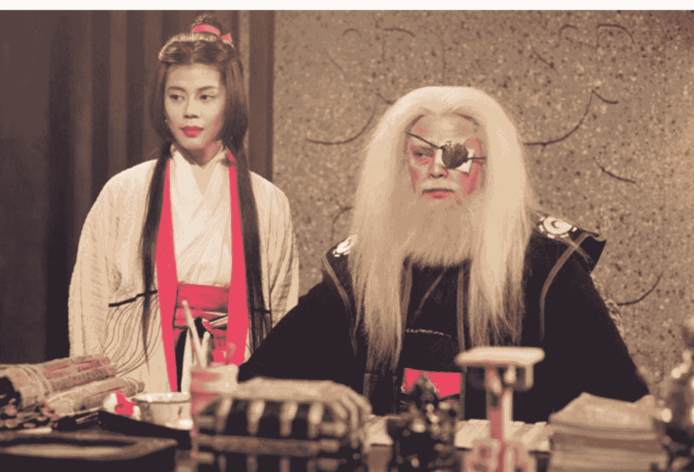
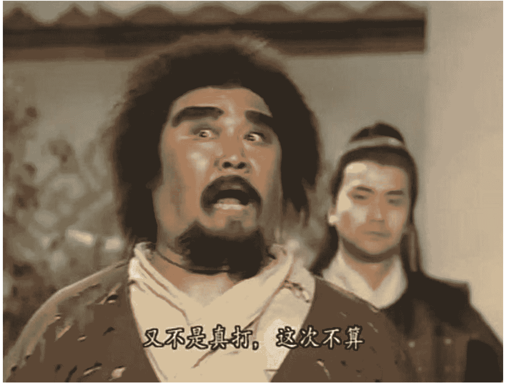
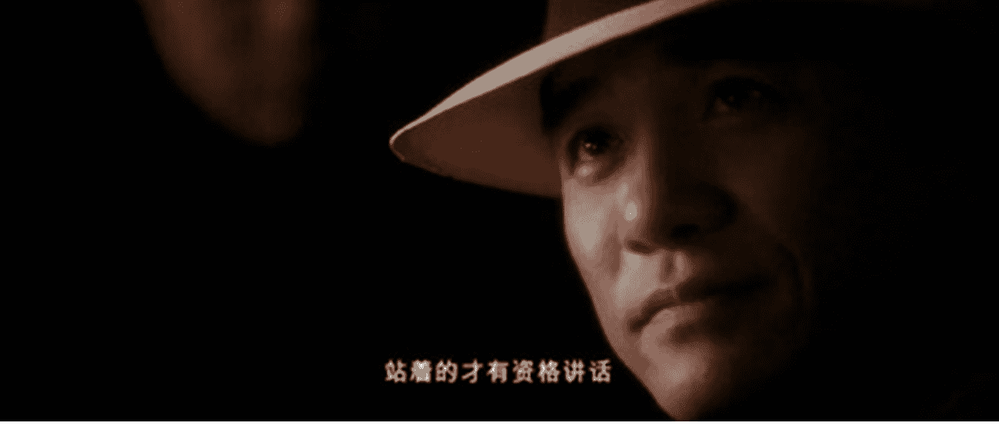
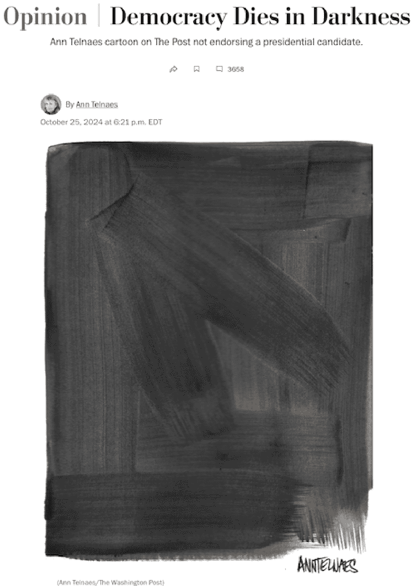

## 懒人专属群周报（第106期）

北京时间 2024 年 11 月 8 日 出品

懒人专属群群友大家好，我是小懒人~

第106期《懒人专属群周报》，与君共读。

希望咱们专属群独有的《懒人专属群周报》可以作为群友们喜欢阅读的一份类似周刊的读物。之前的离线版合集地址见咱们专属群总链接，小懒都有备份。

懒人微信：lazyhelper

微信:lazyhelper

## 目录

- 懒人专属群周报（第106期）
  - 北京时间 2024 年 11 月 8 日 出品
  - 目录
- 关系攻略节选分享
  - 人际关系里的鹰派守则
    - 习题
  - 人际关系里的鸽派守则
    - 习题
  - 如何请求老男人帮你做事
    - 习题
- 新闻评论
  - 新闻实验室会员通讯（795）富豪、大报、总统候选人
    - 一定要挑一个候选人支持吗？
    - 员工辞职、读者退订、贝索斯自辩
    - 贝索斯应该卖掉或捐掉《华盛顿邮报》？
- 懒人收藏夹
  - 默杀：面对恶意时的最强进攻
  - 那帮天真的大学生才要前途
  - 今天肯定要出利好，但也不要被特朗普联手马斯克吓倒
- 总结

# 关系攻略节选分享

## 人际关系里的鹰派守则

你是那种光芒四射、咄咄逼人的人吗？

你喜欢那种光芒四射、咄咄逼人的人吗？

稍微有一点错处，可能就会被他揪住批判一番，他对自己严格，对别人更严格。你想做你的朋友，就要优秀而且强大才行，与他为友，你要有一些高过他的地方。

这样的人，我们称之为人际关系上的“鹰派”。

相反，认为交朋友关键在于开心，形形色色的朋友都要交，注重合作和说服的那一派人，我们称之为人际关系上的“鸽派”。

鹰派相信实力，相信官大一级压死人，相信职场上老人对新人的倾轧，鹰派也对自己充满期待，认为自己应该在食物链的顶端，至死方休。

鸽派相信合作和说服，相信人心都是肉长的，相信人间自有真情在，鸽派对社会充满期待，认为人人都应该都献出一点爱，从我做起。

你是鹰派还是鸽派？别着急下判断，最典型的鹰和鸽都是很罕见的，很多人都是复杂的混合体，有鹰偏鸽、鸽偏鹰、外鹰内鸽和外鸽内鹰。

现代心理学各流派普遍认可的人格理论，是“大五人格”，这五个维度是：开放性、责任感、外倾性、友善性和神经质。

用五个维度来衡量人际关系上的鹰派和鸽派可以发现：

| | 鹰派 | 鸽派 |
|---|---|---|
| 开放性 | 偏好奇 | 偏封闭 |
| 责任感 | 倾向于冲动 | 比较坚定和可靠 |
| 外倾性 | 自信、大胆善于社交 | 偏被动 |
| 友善性 | 不少人有冷漠和残忍的一面 | 习惯顺从 |
| 神经质 | 逆境中有失控的可能 | 比较稳定 |

这两派人并没有什么优劣和高下，事实上看看那些伟大的事业都是两派人携手完成的。

我们要的不是纠正对方，不是“你变成我这样才好”，我们要的是理解自己、理解对方，克服自己的短板、学习对方的所长。

对鹰派来说，有几点可能要着力克服一下：

- 1. 谜之自信

一个鹰派一把手最好是有一个强有力的鸽派副手，把他从谜之自信当中时不时地拉回来。董明珠女士就属于非常典型的人际鹰派。这也是为什么她的照片出现在开机后问候画面时，许多人觉得这是一种冒犯。

- 2. 冲动是魔鬼

尽管在电视剧里，白素贞被塑造成一个追求真爱的好女孩儿，但白素贞是典型的鹰派，即使是电视剧也保留了“水漫金山”这个重要的鹰派内核。在原著小说《白娘子永镇雷峰塔》里，白娘子用一个极度鹰派的口吻对她家相公说：

> “若听我言语喜喜欢欢，万事皆休；若生外心，教你满城皆为血水，人人手攀洪浪，脚踏浑波，皆死于非命！”

- 3. 学习悲悯

鹰派人往往在智力和业务能力上都不差，但强人一定要有悲悯之心。否则的话，很容易成为那种超级英雄电影里“科学怪人”的形象，觉得水平不如自己的人都应该去死。

《狮子王》里的辛巴，是一个学习悲悯的正面鹰派，他骨子里是鹰，但从小和两个鸽派朋友一起长大，这让他懂得了平和和悲悯，性格更加复杂，属于鸽包鹰的典范，鸽包鹰容易麻痹对手，鹰式反击到来的时候，对方才会明白晚了。

“一鹰两鸽”是非常好的组合，很多作品都是这么搭配的。

复杂的性格能让你在人际关系当中更加主动，尽量避免做让别人一眼看穿的人。要多和性格互补的人做朋友。

- 4. 避免逆境崩盘

公众号懒人搜索，懒人专属群分享

鹰派在遇到挫折和打击的时候很容易崩盘，运气好的鹰派可能会扛下来挫折，把自己向鸽派靠拢，一个更好的办法是尽早从别人那里去体验挫折和崩溃。

《笑傲江湖》里，任我行是非常典型的鹰派，任盈盈则是以鹰为主，任我行遭遇了多年黑牢，用仇恨支撑着自己，但任盈盈早早遇到了令狐冲这个鸽派，令狐冲给她讲述了一个自己受挫和崩盘的故事，任盈盈倾听的同时萌发的不仅是爱意，还有性格上的进步，她从此变成了一个鸽四鹰六的人，这种比例最容易出狠角色。

- 5. 一定不要做十分鹰

一个国家里，有鹰派和鸽派非常正常，今天你上台，明天我上台，对手强了就让鸽派去温存一下，对手弱了就让鹰派动手欺凌一下。一个唱红脸，一个唱白脸，就有了运用策略的可能。

同样，人际关系当中，做十分鹰就会有十分的敌人，而你也会变成一个可以预期的人，这样的风格很容易中别人的圈套。

《天龙八部》里的“岳老三”看上去是凶神恶煞，总是自己说了算，但在实际操作中，他和“四大恶人”不断地给各种不怎么样的势力当打工仔，甚至被段誉这个大鸽派牵着鼻子走。

无论是鹰还是鸽子，都不是什么基因决定的，和星座血型也并没有什么关系，有些人可能会受到一点家庭影响。

大多数人的行事方式是青春期定下的，有的人是遭遇了变故，有的人尝到了甜头，从此就这么继续走下去了。

当你认同自己的类型之后，会不断对自己心理暗示来强化自己的类型。

- “我是一个恩怨分明的人。”“致贱人，我凭什么要帮你！”“要哭回家哭，职场不养猪！”（鹰派）

- “出来混是要大家给面子的”“我们大家就是要互相照应”（鸽派）

心理暗示如果造就人也是非常有趣的，常见的心理暗示是星座，比如：

- “我这人是个金牛座，我对钱看得比较重。”

不过鹰派常见的自我暗示方式是：

- “我这人说话直啊……你……”

这就像一个免责说明，此后他会说出一大堆不中听的话，这类口头禅会不断强化自己的鹰派色彩，这对说话的人不是一件好事。

鹰派的人如果分不清坚决和咄咄逼人，很容易变成一个虚张声势的人，声高气粗，充满攻击性，一句话就要怼回去，这是完全不对的。

鹰为什么强大？嘴不会比狗厉害，爪子没法比得过山猫。

鹰在空中，层次高、看得远，能最先发觉远处的机会和敌害，一个鹰派人也应该像这样强大。如果只是简单地表现一个攻击的姿态，遇见生人就要啄几下，那最多就是一只不友好的鹅。

所以鹰派人行事，才更应该注意以下几点：

1. 喜欢去搜集信息、学习知识，有独特的信息来源，比别人看得要远一步。
2. 克制自己不必要的攻击性，变成一个深沉而有内涵的人。
3. 保护弱小，鹰派更应该是一个骑士，而不是一个魔头。
4. 注重团队，你如果是团队中最敏锐最勇敢的角色，那就应该去PK敌阵当中的鹰派，遇到谈判、争执，出场去碾轧对手。

理性的鹰派人会被对方身上有自己没有的东西所吸引。

鹰派和鸽派，可能在人成长的早期区别会特别明显，但是在人们进步之后，这个界限会进一步含糊，两派随着成长，最终会趋向合流。

《亮剑》里的楚云飞是一个鸽派，和鹰派的李云龙心心相印，李云龙的另外一个鸽派朋友是政委赵刚。仍然是一个一鹰搭二鸽的组合。到最后李云龙要和楚云飞对决的时候，两人已经都是六鹰四鸽或者四鹰六鸽的强者了，他们都变得越来越好。

优秀的鹰派会生出悲悯，优秀的鸽派会长出骨头。

就好像最好的男人和女人，往往会拥有类似的美德，男人会变得温柔，女人会变得坚强。最好的人格是雌雄同体的，这句话并不夸张。

同样，人际关系上的鸽派也会有自己的存活之道，但那会是另一个话题，下一篇当中，我们会给大家带来详细的解读。有一点是可以肯定的：

我们只有彼此了解、喜欢和合作得来，才可能都变得更好。（这句话说明了我是一个纯正的鸽）

## 习题

以下的台词当中哪个说话人是鹰派：

- A. 出来混是要讲信用的，说好杀他全家就一定要杀他全家的
- B. 靠！当我是吓大的啊！
- C. 最近发生了那么多事，我想一个人静一静。
- D. 你这样做，出了问题，我也保不了你！
- E. 以上都不对，重要的是怎么做，而不是怎么说。

答案E，这个选项非常有用，最好是牢牢地记得。

## 人际关系里的鸽派守则

上一次我们说了人际关系上，鹰派人的生存守则：

不能过分自信、要学会悲悯、在逆境中要增加韧性，免得崩盘。

有人一定急着问了，那鸽子怎么办呢？我们是不是注定沦为鹰的口中食物呢？

这次我们来谈谈鸽派人的生存攻略。

还是回到鹰派和鸽派的大五（Big Five）人格特质上：

| | 鹰派 | 鸽派 |
|---|---|---|
| 开放性 | 偏好奇 | 偏封闭 |
| 责任感 | 倾向于冲动 | 比较坚定和可靠 |
| 外倾性 | 自信、大胆善于社交 | 偏被动 |
| 友善性 | 不少人有冷漠和残忍的一面 | 习惯顺从 |
| 神经质 | 逆境中有失控的可能 | 比较稳定 |

鸽派的性格让他成为非常好的朋友，他们人缘往往很好，尽管他们不是最善于交际的自来熟。

鸽派是任劳任怨可以倚重的一种力量，尊重权威让他们成为优秀的员工。

但是鸽派同样也有自己的短板：

- 1. 低效的表达

> 《权力的游戏》里的马夫“阿多”，温和的小伙子，只会说这一个词

鸽派在鹰派面前往往难以说出自己的意见，或者太过委婉而导致自己的意见被忽视。一些鸽派可能会误认为，附和强势的人会让对方容易接受自己接下来的意见，但一个问题是，鹰派的人很容易忽视别人的看法，如果不够直接或者表达得太委婉和曲折，可能你的意见就会就此被错过。

- 2. 假装的坚强

上次的攻略里，我们在课后习题提到了一句“一个人怎么说不重要，怎么做才重要”，梁朝伟在《一代宗师》里扮演的叶问就是如此，他谈论武功的时候显得像个鹰派，其实内心很软，和宫二都是鸽派，这种鹰包鸽的性格一旦被对的人击破了防线，就会突然一溃千里。

《鹿鼎记》里的神龙教教主“龙儿”，在委身于韦小宝之后突然变得千依百顺，这就是一个鹰包鸽的崩溃，原型是苏荃和小龙女的二合一，小龙女认为自己和杨过有了性关系（其实不是）之后也突然变得温柔无比。

我管这种情形叫做鸽的温柔，如果有一天内心深处突然爆裂出对世界或者某个人的温柔，那千万不要觉得羞愧或者厌恶，发现自己是鸽派一点也不丢人（尤其是男人），相反，非常美。

以后我们会专门分享一次“如何告诉自己，我喜欢自己”的话题。

- 3. 我不是什么好人

大多数的鸽派害怕和别人撕破脸，并且希望自己能做好人，这是一个非常折磨人的念头。

千万不要在感情上当好人，不然你会把所有的事都办砸了。

《冲上云霄》当中，吴镇宇扮演的机长在前后两任女友之间摇摆不定，总是希望两个女人都说自己好，结果把所有人都伤害了。

类似的形象还有张无忌，也是在几个女孩之间摇摆不定。

友善是一种很好的品质，但是过分纠结于追求“我是个人好人”，会让自己陷入重度的疲累当中，这种折磨我称之为“人内损耗”。

鸽子要做决断，需要有人用力推他一把，所以如果觉得自己的气质像鸽子，就尽量多和一些鹰派的人相处，从他们身上学会决断。

鸽派天生适合给比较强势的老大做二把手，也适合从事服务业的工作，在大企业里他们往往不适合做销售开疆拓土，更容易负责一些支持性的工作。尽管一些鹰派的医生可能医术高明，但作为病人和家属，总是希望管床的大夫和全部的护士都是鸽派。

此外鸽派的人冷静和保守的风格让他成为可以依赖的人，宇航员和大型喷气式飞机的驾驶员，一般都是从鸽派人里做出选择。

《萨利机长》里的机长当然是一个鸽派，但是长年的修行精进，他的胆略过人，变成了一个强悍的鸽派，关键时刻，他能像鹰一样下决断，这是鸽派人修行的目标。

绝大多数的心理咨询师都是鸽派，鹰派基本没法当心理咨询师，如果说鹰派从事心理咨询工作能做出什么贡献，那应该就是那种骂听众的夜间情感节目，一个观众打过来，鹰派的主人毫不客气地说：“为什么困扰，因为你傻啊！”

鸽子的成长可以注意一下以下几点：

- 1. 可以再霸道一点

你是鸽子不是包子，不要忍气吞声、让人欺负到你头上来。鸽子是一种勇敢的动物，离家千里都可以坚定回巢。一个人可以大多数时候都是一个被动的人，但关键时刻可以站得出来，敢于和黑暗拼刺刀。

你的霸道会有一个力量槽，在关键时刻会爆发出惊人的力道。

- 2. 不要怕别人笑你软弱

对比你更弱小的人客气有礼貌，不是害怕对手，而是害怕自己变成自己都不喜欢的人。许多鸽子在突然获得权力或者财富的时候，突然就转了鹰派，那他看人的不是鸽眼也不是鹰眼，而是标准的势利眼，在一堆朋友面前呵斥一个犯了小错误的饭店服务员一点也不露脸。

你不是软弱，你的爪和甲，在你强大的心胸之下。

- 3. 交一些生命值更高的朋友

我喜欢用生命值这个游戏词汇，你们一定遇到过这种朋友，人生节奏一定比你快，说话快，走路快，效率很高，每天有忙不完的事。他们的生命值很长，这样的人鹰派的比较多。

跟这样的人共事，学习他们身上的一些气质。

- 4. 练习公开讲话和表演

鸽子不是鹌鹑，鸽子不应该是羞涩的。

周星驰在《喜剧之王》里演示“装鹌鹑”

鸽子是行事柔和，相信恒的力量。

鸽子不是害羞或者娘娘腔。

鸽派的人可以多锻炼自己在公开场合演讲甚至歌唱的能力，和鹰派的演讲者容易慷慨激昂相比，鸽派的演讲者谦逊、柔和，如果再有一点自嘲，会是非常出色的演讲者。

《国王的演讲》，艾伯特王子是典型的鸽派人物，国王最终在战争压力之前走上了鼓舞臣民的讲台，鸽派如果掌握了演讲的技巧，往往会成为控制人心的大师。

行事方式的改变真的也会影响到思维方式，如果开始努力追求生活和做事的效率，就很容易逐渐从纯鸽转向鹰和鸽子的气质混搭。

还是要重新提一下那句话：优秀的鹰派会生出悲悯，优秀的鸽派会长出骨头。

我们只有更勇敢地认识自己，才可能让自己变得更好。（这次的话，我似乎更像是一个鹰派了。）

## 习题

- 唐太宗有两个大臣，房玄龄和杜如晦，当时的人们称为“房谋杜断”，这个词说明：
  - A. 鸽子和鹰要彼此合作
  - B. 鸽子和鹰的搭配会比较好
  - C. 组班子可以用两个性格特长互补的
  - D. 给人起外号的习俗从唐朝就有了

> 答案：C AB两个选项都是对的，但是房玄龄和杜如晦官居高位，以他们的经验和阅历都不会是简单的鸽子和鹰，混合型甚至鹰包鸽都有可能。如果一个人在财富、身份上都非常成功，那么他的性格一定非常复杂。这就是：层级高了，鹰不是鹰，鸽不是鸽。

## 如何请求老男人帮你做事

不久前，我的一位女性朋友找到我，问我能不能请托到一位很有影响力的大V删掉自己的公号文章。

那是一篇关于某电影的负面评价，这部电影还没有上映就已经被很多人叫倒好，导演很有名，女主角很漂亮，出道以来始终演女一号，所有她演过的电影评分都特别低。

这位大V是位中年男性，文章很厉害，打嘴仗从来没输过。

我问我这位前同事：你们事先约他写影评没有？

“没有，因为觉得他性格很强，怕写出来没法控制……”

“没邀请对方，对方却因为自己的私人关系看到了点映，那他再评价起来，是不会客气的。”

“所以……”

“他不会删稿的，他不缺钱，你们也没有足够的实力找到他的发表平台让他们帮你删，所以跟你老板说，删不掉。”

“就这么完了吗？”

“以后这事要早准备，不要等到这会儿了才处理，既然谈到这里，跟你说几点请托中年男性（以下简称老男人）办事的心得吧。”

不是每个老男人都有一场中年危机，但大多数中年男人确实在某个阶段会觉得“力不从心”。不要往色情的方面想，老男人更看重的是工作，过去能加班突击出来的任务，现在已经很难了。

也许还会有家庭的压力，老男人变得暴躁易怒，同时，他们不会再像年轻人那样容易怯场，大多数人都已经在自己的工作上小有成就，他们在现实生活中更随意，说话也容易信口开河和迁怒于人。在网络世界上，可能还会夸张一点。

和人或者机构打交道，他需要对方臣服，如果不能臣服，至少要足够尊重，所以服务类的企业，最应该担心的就是这群老男人，对他们必须做到以下几点：

- 1. 重视

被忽视的滋味不好受，《一千零一夜》里有个被关在瓶子里的魔鬼就曾经赌咒发誓，说谁救了自己他就要好好报答对方，结果：

> “整整过了四百年，始终没有人来救我。这时候我非常生气，发誓道：‘谁要是在这个时候来解救我，我要杀死他！’

被忽视的话，对方很可能会动手报复。

比忽视还不靠谱的是疏漏，一个电影的点映，可能很多家参与发行方和他们的供应商都在邀请人，很可能遗漏了一两个人，忘给了两三个小礼物，这都可能造成怨恨。

至于约了影评因为工作失误而没有给版面费或者稿费，那就是比较大的篓子了。确定别因为低级错误而结下仇怨。

心里要明白一个道理，对方要来看你的片子，不是“我请你看电影”（就跟谁差票钱似的），而是“请您牺牲自己的时间过来，实在感激。”

- 2. 放低姿态

一个人有实力、但是不好打交道，就可以忽视他吗？

这么做一定会遇到麻烦。

你们去跟一个人打交道，是因为他有实力。一支不可忽视的力量怎么能放弃沟通呢？

日本不久前上映了一个电影叫《大人，这是利息》，妻夫木聪主演的，几个商人发心要借贷款给领主老爷，求他减免老百姓的负担，这事异想天开，大家都觉得太犯上，结果找到村长、乡长、到后来去找官员，大家居然都被这个大胆的设想所感动，一起帮忙，就把这件事做成了。

民谚说：“有枣没枣，打三杆子。”

不要想当然地认为对方不会接受你的约稿，一定要试试。

一个写字儿很好的人遇到约稿、求转载，即使拒绝，也很少会心生怨恨。

多称赞他的文章和思想，他不会厌恶——就像是一个姑娘穿了漂亮的衣服，有男生盯着她看着发呆，她不会横眉怒对凑热闹，相反，她会微笑，那是强者的微笑。

可以请对方来看点映，然后试试约对方写一个正面的影评，如果对方完全不接受，或者开一个高得离谱的价码（这是一种拒绝策略），那可以用这个价格的几分之一，去“求不黑。”

这种付费求不黑的问题是，一旦策略被泄露，会有更多恶评作者出现，等待维稳，不过有些替代方案，比如有些地方政府在开代表大会的时候都会邀请爱告状的群众出去旅游，《我不是潘金莲》里就有类似的情节。

把嘴最毒、又无法收买的影评人送上去南美、南极旅游的船是个好主意，昼夜颠倒的时差，紧锣密鼓的游玩流程，他哪有空写什么影评？十几天后回来，票房的局面已经是大局已定了。

# 3.让他“成为自己人”

我上大学的时候，去一个电视节目做观众，有位女同学凑到了一位奥运冠军（那是十几年前，奥运冠军还是珍稀动物，尤其是冬奥会冠军）身边，要到了她的手机号，然后，那晚她就忍不住把所有来往短信给我看：“她居然会打笑脸哎！”

再鄙视名人的人，在有一个名人朋友的时候也不会拒绝的。

黄宏和侯耀文曾经合作过一个用名片打扑克的小品，黄宏发现了侯耀文有马俊仁的名片（那时他使用兴奋剂和欺凌队员的情节还没暴露出来），惊得目瞪口呆，这时侯耀文淡淡地说：“啊，我采访过他。”

注意，这就是老男人渴望的感觉，别人的偶像、拼命想见的人，对我是正常的合作伙伴，甚至是我的老朋友、座上宾，这个时候享受对方的惊愕，飘飘欲仙。

比如那位风光无限的大V，如果你请导演出马去请托，那可能就是一个电话的事。

导演打电话的时候尽量挑在晚饭时间，比如北京的时间，考虑路况大概就是7点半左右，大多数老男人晚上都有应酬，不是大规模饭局也会是小规模约会。

电话拨过来，认真请托一下，对方一般都会买账，然后把这个事情说给身边的朋友听，有的人甚至会当场把电话放免提出来。

许多官场上的应酬和酒局容易出现这样的局面，大家提起谁谁很有名，或者很有身份，立刻有一位发誓，我一个电话能把他叫过来，大家等着看笑话，很快这位不光来了，还把单给买了，那就是三跪九叩式的大礼，让这个叫人的人有足了面子（当然，这种面子很无聊）。

女主角也有可能“洗白”，女主角一直都被影评圈负面评价，那就很值得见见这群负面评价最厉害的老家伙们，一个会所，或者一艘游艇上，老男人们坐好了，摆上几杯红酒，女主角进来说几句真诚的客套话，中心思想如下：

“我什么都不懂，我什么都不懂，我什么都不懂，求帮助。”

老男人们看见人一个姑娘这么客气，也只好非常冷酷地回答：

“你哪里都好看，你哪里都好看，你哪里都好看，没问题。”

注意，这不是牺牲色相，这也不需要牺牲什么，人有见面之情，网上说要对方死，真的见了面，可能又会客气起来了。

老男人对世界的最重要观点就是“保护”，他是许多社会秩序的维护者，他为什么要大骂你的电影，主要是因为你的电影太差，冒犯了他的审美和及格线。

老男人并不针对女主角（那是女观众常见的态度），所以当女主角请教、拜托的时候，立刻态度就会转变。

金庸写这种感情非常到位，扮成小白兔的郭襄傻乎乎的进入江湖，老男人金轮法王看得目瞪口呆，起了保护之心，就逼着郭襄拜自己为师。

如果是暴躁的郭芙落在金轮法王手里，只会是一个单纯的人质，不知道要受多少苦头。

在老男人面前炫耀聪明、摆公主架子的女生会冒犯他们，但是强调“我什么都不懂，但是很想跟你学”，就不容易被黑。

老男人掌握意见和评价的发布，那你要公关他们，资源就要向他们倾斜。

有的女演员虽然也已经有了维护媒体关系的努力，但是能接触到的可能都是比较年轻的低级记者，他的团队对谁在掌控这个娱乐世界，也缺乏足够的认识。

摸透了这些逻辑，能够花更少的钱，规规矩矩地做到很多事。有些人精就是这样炼成的。

我知道的最聪明的女生，在各种老男人的饭局上都会亮着一双求知的眼睛：

啊，我是来向各位老师学习的。其实那时的她已经非常强大了。

这时的各位老男人，一点也不会嫉妒她的聪明，因为一个世界观已经扎根脑海之中：

“如此优秀的女孩都对我崇拜不已，我想，我应该就是传说中的世界之王吧。”

## 习题

以下几个和老男人的寒暄，哪个是不得体的：

- A.您就是张三丰老师！我是打着您的拳长大的。
- B.乔帮主，您好，我最崇拜的就是您和慕容公子了。
- C.老顽童，你左手和右手打架的本事好厉害！
- D.师父！快救俺老孙出来！俺老孙保你去西天取经！

答案：B

A的寒暄是提及张三丰的以往成就。C是现场称赞对方的表现，而且采用对方喜欢的花名，满足对方的虚荣。D直接谈生意，让对方知道自己能给什么。B是真正的大忌，千万不要在第一次见老男人的时候提及另一个老男人，你不知道他们之间有啥恩怨！

# 新闻评论

新闻实验室是小懒付费订阅的通讯录，年费300多。小懒整理分享，仅供专属群群友查阅。如有余力，可以自己到Newsletter上自费订阅。

# 新闻实验室会员通讯（795）富豪、大报、总统候选人

美国总统大选将于后天（11月5日）举行。在最后的选情冲刺阶段，《华盛顿邮报》和《洛杉矶时报》这两份大报因为宣布不再选择一位总统候选人为其背书，陷入了巨大的风波当中。

今天的会员通讯，我们就来聊聊此次大选之前的这最后一桩媒体大事件。

## 一定要挑一个候选人支持吗？

在具体介绍《华盛顿邮报》和《洛杉矶时报》的决定之前，我们先来了解：什么是背书，为什么要背书，背书会不会带来什么问题。

背书的英文是endorse，也可以翻译成支持、认可。它指的是，在选举当中，报社的评论部门（具体来说社论团队）选择一位候选人，表态支持。背书可以发生在总统大选层面，也可以发生在国会议员选举，以及地方官员和议员选举中。

1860年，《纽约时报》首次在大选中背书，它支持的候选人是林肯。该报在社论中表示：“我们对他和平、和解的性格充满信心。”到20世纪，美国大多数的主流报纸都会在总统竞选中选择一名候选人背书。

可以说，背书是美国媒体的传统。不过，这项传统也不是没有中断乃至被取消的时候，比如：

- 《洛杉矶时报》在1976年停止了为总统候选人背书，直到2008年才恢复；
- 2022年的时候，由一家对冲基金公司拥有的200多家报纸（其中包括著名的《芝加哥论坛报》）宣布不再为总统、州长、参议员候选人背书；
- 另一家拥有大批地方报纸的巨头Gannett也鼓励旗下报纸减少背书。
- 今年8月，《纽约时报》宣布不再在纽约州的地方选举（包括纽约州长、纽约市长、州议员选举）当中做背书。

对于背书这件事，争议其实一直存在。对于新闻圈外的人来说，最直接的疑问便是：一家媒体公开支持某一候选人，那你们还能不偏不倚地做报道吗？

这个问题比较容易回答：在绝大多数情况下是可以的，因为在主流大报里面，新闻部门和评论部门是严格分开的，不能互相干涉。比如说，这次《华盛顿邮报》决定取消背书，新闻部门的编辑记者们就是到最后关头才得知的。在新闻部门和评论部门之间的那堵“防火墙”，大部分时候确实是可以信赖的。所以，评论部门选择了谁，和新闻部门怎么做报道，是没有关系的。

但是，人们还是会质疑：OK，评论部门的背书不会影响新闻部门的报道，可是读者哪知道这些呢？大家读到的就是“《纽约时报》支持贺锦丽”，根本不知道这样的背书到底是评论还是新闻，更不知道所谓的防火墙是什么。大家产生的印象只会是：你这家报纸是有立场的，不是中立的。

实际上，这样的质疑连记者当中都存在。2022年的一篇论文就发现，很多记者都认为，有必要向读者解释清楚，社论部门表达的背书到底是什么意思。一些记者说，他们在采访的时候，就会被人问：你们为什么要支持某一位候选人？每当此时，记者不得不硬着头皮澄清：其实新闻部门并没有支持任何人，只是做社论的那几个人表态了而已。然而，这样的澄清并不一定被人理解和接受。论文当中引用一位记者的话说：“没有人知道社论部门和记者之间的区别……每隔四年，我们就会搬起石头砸自己的脚一次。”

在美国高度极化的政治氛围下，报纸的背书行为更会被政客利用，成为攻击媒体公信力的工具。比如，当大多数媒体都选择了为候选人A背书，这时候候选人B可能公开表示：你看，这就是媒体行业故意在打压我，他们发表的东西完全不能相信！也就是说，一家媒体的背书社论可能成为外界攻击其新闻报道可信度的理由。

尽管有这些质疑和风险，但许多重要的媒体还是继续选择背书，他们给出的主要理由是：背书是履行媒体的使命，因为借由背书这件事情，媒体会深入了解候选人的政策主张，做出有理有据的分析，帮助读者作出决定——不是直接告诉读者“你应该投某某”，而是给读者提供建议。尤其是在地方选举中，读者往往没有那么多时间去一一了解各位候选人，报纸帮忙梳理和提供建议就显得尤为重要了。

《波士顿环球报》就在不久前解释自己为什么会继续在选举中背书：“因为我们认为这是我们积极参与本地区公民生活的重要方式。我们有机会采访候选人和政策倡导者，并提出我们认为读者在做决定时希望得到答案的问题。我们撰写社论的目的，只有一部分是为了说服读者。我们同时相信，通过阐明对某一问题、候选人或政策的明确立场，我们将帮助读者形成自己的观点，即使他们不同意我们的判断。归根结底，我们的目标是让读者充分了解情况并参与其中，而不是步调一致。”

《波士顿环球报》选择支持的是贺锦丽。今年还为贺锦丽背书了的知名媒体包括：《纽约时报》《卫报》《纽约客》《大西洋月刊》《科学美国人》《滚石》《Vogue》……而为川普背书的主要媒体包括《纽约邮报》和《华盛顿时报》。

了解了这样的背景，我们再来看《华盛顿邮报》和《洛杉矶时报》的决定。我们可以得出这样的判断：

- “放弃背书”这件事本身并不是引发争议的最主要原因，因为背书这件事的确不是什么雷打不动的东西（《华盛顿邮报》直到1972年才开始为总统候选人背书、1988年也曾表示选不出任何一位候选人背书），人们对它也的确有各种各样的看法。
- 让公众哗然的主要原因是做决定的时间点——它们都是在10月份临近大选的关键时刻，在社论部门甚至都已经写好了稿子的情况下，临时撤下了为贺锦丽的背书。《华盛顿邮报》还已经发表过了对一些议员候选人的背书。
- 另一个关键的原因是：这两份报纸有一个共性，那就是它们都是由富豪所拥有的，分别是亚马逊创始人贝索斯，以及出生于南非的华人企业家黄馨祥。

舆论普遍认为，如果这两家报纸是一年前、两年前宣布不再做背书，那么引发的风波应该不会那么大。而现在做出这样的决定，很可能是在川普有几率再次回到白宫的情况下，为了避免触怒他而做的自我审查。

据报道，就在《华盛顿邮报》宣布不做背书的当天，川普会见了贝索斯旗下蓝色起源公司（Blue Origin）的高管。这家做太空业务的公司，会受到美国政府决策的巨大影响。而贝索斯的亚马逊，也同样是和政府有千丝万缕的联系。亚马逊自己就曾表示，因为川普对贝索斯个人的不满，五角大楼曾经将一份价值100亿美元的云计算合同从亚马逊手中夺走。

尽管没有任何证据能够直接证明贝索斯和黄馨祥是因为川普胜选的可能性而做自我审查，但几乎所有人心里都在这么推断。

## 员工辞职、读者退订、贝索斯自辩

做出这种推断的，当然也包括这两家报纸的员工，以及读者。

《洛杉矶时报》不再背书的决定做出后，其社论部门的编辑Mariel Garza宣布辞职。她表示：“我辞职是因为我想表明，我不同意我们保持沉默。在危险的时代，诚实的人需要站出来。这就是我站起来的方式。”

《华盛顿邮报》的决定公开后，该报前主编Martin Baron批评这一决定是“懦弱”，认为这可能导致民主的倒退。而该报的评论漫画作家则以一张全部涂黑的画表示抗议，她给这幅漫画取的标题是：Democracy Dies in Darkness——也即《华盛顿邮报》的口号。

能够刊登这幅漫画，可以说是生动地展示了报社内部仍然保有的自由度——虽然老板直接叫停了背书，但是报纸可以发表内容对老板的决定表示批评和讽刺。

实际上，贝索斯在2013年买下《华盛顿邮报》之后，一直没有干预过采编的运转，前主编Martin Baron对此还公开表示过赞赏。此次叫停背书，可以说是他唯一一次干预内容，但这就让他保持了超过10年的好名声毁于一旦。

《华盛顿邮报》的读者们也是非常愤怒。NPR报道说，在取消背书的4天时间之内，就有超过25万读者取消订阅《华盛顿邮报》，这占到了该报总订户数的10%左右。

汹涌而来的退订潮，让本来就已经遇到经营困难的《华盛顿邮报》，更受重创。

而此时，其他媒体纷纷抓住机会，把抛弃《华盛顿邮报》的读者抢过去。

最成功的当属《卫报》美国版。《华盛顿邮报》取消背书的决定是10月25日公开的，当天晚上，《卫报》美国版主编就给美国读者发了一封简短的邮件，呼吁大家支持《卫报》。邮件中说：

> “（《华盛顿邮报》和《洛杉矶时报》）这两家报纸有什么共同点？它们的所有者都是亿万富翁。川普上台后，他们可能会遭到报复。”

> “媒体所有权对民主的重要性从未如此清晰。《卫报》并非亿万富翁所有，也没有股东。我们得到读者的支持，并由斯科特信托基金（Scott Trust）所有，这保证了我们编辑工作的永久独立性。没有人会影响我们的新闻报道。我们非常独立，只对我们的读者负责。

> “这次选举事关重大。无畏的新闻报道和知情的公众是我们民主的基石，出于自身利益而置身于这场选举之外是对我们记者职责的漠视。本周早些时候，《卫报》的一篇社论强烈支持贺锦丽竞选总统——我们不惧怕任何可能的后果。

> “我们需要筹集200万美元，以便明年继续保持我们的势头，并让新政府负起责任——无论谁入主白宫。请立即向《卫报》捐款，帮助保护真正的新闻自由。”

邮件发出当晚，《卫报》就获得了48.5万的读者捐赠。第二天，更是获得了61.9万美元的捐赠，打破了单日最高纪录。邮件发出的4天之内，《卫报》从美国读者那里获得的捐款总额就达到了216万美元之巨。

该报还乘胜追击，给没有打开原邮件的美国读者再次发送邮件，并向美国之外的读者也发送了邮件，还请重磅专栏作家专门写信劝捐。而在新闻报道方面，《卫报》也非常积极地报道《华盛顿邮报》和《洛杉矶时报》取消背书的消息，这些新闻内容同样带来了极佳的捐赠转换率。

可以说，《卫报》的这次“挖墙脚”行动极为成功，它充分调动了读者对《华盛顿邮报》和《洛杉矶时报》的失望和愤怒情绪，将其转化为对《卫报》的热情支持。

其他一些媒体也成为受益者。比如，在《华盛顿邮报》的评论区，读者多次提到另外两份值得支持的媒体：《波士顿环球报》和《费城问询报》（它们都已经刊文为贺锦丽背书）。这两家报社的订户的确获得了大幅增长。其中，《费城问询报》在一周之内新增了4200多位数字订户，是有史以来新增订户最多的一周，大约是平常一周的三倍。

也许是迫于舆论和读者压力，贝索斯在《华盛顿邮报》发表了一篇自我辩护的文章，大意是说背书这种行为无益于提升公众对媒体的信任度，要为提升媒体公信力寻找新方法。虽然他的说法并不算错得离谱，但显然，他这时的这种辩白是苍白的，读者也是不买账的。

在他自我辩护的文章下面，被点赞最多的五条读者留言分别是（也再次说明了该报不会删掉批评老板的言论）：

- 我们中的许多人信任《华盛顿邮报》，是因为我们相信它的运作不受你个人对采编的干预。不要再为你制造的问题而教训我们了。
- 或者你可以说：“对不起。这件事发生的时机是不可接受的，是个错误。”但当然，你就继续嘴硬吧，这真有用。
- 杰夫，我能叫你杰夫吗？我就直说了，因为你是个大忙人：因为像你这样的人的所作所为，我不再相信媒体了。独立的媒体至关重要。我一看到亿万富翁插手，不管是你还是其他人（挥挥手），我就完全失去了对消息来源的信心。这是你干的。
- 杰夫，我们不信任的是你，而不是为你工作的人。你必须努力把它赢回来。
- 贝索斯先生：我建议卖掉《华盛顿邮报》。你已经证明，你没有在动荡时期拥有一份报纸的原则、信念或勇气。

## 贝索斯应该卖掉或捐掉《华盛顿邮报》？

读者留言建议贝索斯卖掉《华盛顿邮报》，这也是不少人的共同观点。他们觉得：由富豪拥有媒体，实在不是什么好事。他们是有钱，甚至有能力帮媒体实现创新和提升（就像贝索斯买下《华盛顿邮报》之后，该报实现了数字化转型一样），但他们自己的生意与政治权力之间有千丝万缕的联系，很难不产生利益冲突。而一旦产生重要的利益冲突，采编自主和自由就会受到威胁。

如果贝索斯真的想卖，有人接手吗？会不会接手的人更差？

的确有人担心，万一接盘的是私募股权基金，那可就更糟糕了——会员通讯541期曾经介绍过，在美国，私募股权基金曾经以不惜一切代价榨取利润的方式，摧毁了许多家媒体。

《哥伦比亚新闻评论》的一篇文章给了一个建议：与其卖掉，不如捐掉，让《华盛顿邮报》成为一家独立、优质、有影响力的非营利媒体。

背后的原因很简单：贝索斯是这个星球上最富有的人之一，卖掉《华盛顿邮报》的那点钱对于他来说根本不算什么。与其为了那点钱，不如为自己挣得一个好名声。而把《华盛顿邮报》捐出去，一定能让他收获好名声，甚至能让那些愤而退定的读者回来。

在美国，非营利媒体的生态越来越发达，它们一般由基金会、慈善机构赞助或拥有，不追求利润，但可以通过广告、订阅、捐赠等方式获得收入。它们越来越成为生产优质、深度、有影响力的报道的主力军。

近年来，商业媒体被捐赠或转型成为非营利媒体的例子已经有不少：

- 上文提到的《费城问询报》，就是从商业媒体转型为了非营利媒体。它的前老板将它捐给了慈善信托Lenfest基金会。
- 《盐湖论坛报》的老板将这份报纸转为了非营利机构。
- 佛罗里达州《圣彼得堡时报》的老板也将这份报纸捐给了非营利机构波因特研究所。
- Steinman家族在当地一家基金会的帮助下，将宾夕法尼亚州兰开斯特的主要报纸捐赠给了当地的公共广播电台 WITF。

以上这些媒体老板，身价加起来还不到贝索斯的1%。所以，贝索斯捐一家报纸出去，对他财富净值上的影响真的是九牛一毛（说不定，他还能因为给慈善机构的捐赠而获得大额免税）。但如果能通过这种方式，避免复杂的政商关系带来的负面影响，支持《华盛顿邮报》继续成为全球顶尖的媒体，那将是走出眼前危机的一招妙棋，也是提升这份报纸公信力的方法。

当然，这一切取决于贝索斯如何看待这份报纸：是想继续留着，为自己增加影响力，还是觉得它已经成为麻烦的来源，想要以妥当的方式抽身。

# 懒人收藏夹

## 默杀：面对恶意时的最强进攻

和菜头

从小到大，只要你身在人群之中，就总是能感觉到来自他人的恶意。

我不会说你内心过于敏感，因为我不是你，体会不了你的感受。我也不会给你灌心灵鸡汤，讲如何转变内心一类的话，因为要是真的有用，心灵鸡汤就不会那么好卖。总之，我选择相信你，相信你可以凭借你的头脑判断，别人究竟是一时无心，还是蓄意如此。

恶意可以是言辞上的攻击，也可以是行为上的骚扰，还可以是营造恶意的氛围。最后这一种听起来复杂，其实也很常见。无论在学校，在工作单位，还是在网络世界，经常会出现一群人针对一个人的冷落、排挤以及羞辱，甚至会制造关于他的谣言，败坏他的名誉，让他觉得周围的一切都对他有敌意。这个人身在其中，不会觉得放松和愉快，反而时时刻刻觉得不安和焦虑。

感受到恶意存在是容易的，但是如何反击却要困难得多。因为我在网上经常用犀利的言辞反击他人，所以许多年来总是不断有人来找我，说自己气得快要爆炸，但是嘴笨却一句话都说不出口，根本没有办法成功反制对方，只能任由对方兴风作浪，希望我提供一些刀法学习参考。他们也想像我那样一刀出手，立即还世界一个清净。

其实，问题并不在于嘴笨，而是对方占据了心理和场面上的主动，让你忙于防御，根本没有时间反击。

所以，我推荐默杀。

默杀源自日文，意思是不予理会。

关于这个字眼还有一个历史传闻：1945年，英、美、中三国首脑联合发布《波兹坦通告》，要求日本帝国所有军队停止抵抗，立即无条件投降。日本帝国首相铃木贯太郎随后在记者招待会上说，对这个通告采取“默杀”的态度，日本帝国将继续作战。

传闻“默杀”在日文里有两个意思，一个是不予理会，一个是不予置评，铃木的意思是后者。很不幸，盟国的翻译不约而同把它翻译成了“不予理会”。看到日本帝国的态度如此轻慢，于是美国决定在日本扔两枚原子弹。

因为翻译错误，毁灭了日本的两座城市，这多少有些杜撰的成分。事实上，铃木代表日本帝国政府的意志，公开明确表示要继续作战，那么后续的一切事情就无法避免。至于说默杀翻译为哪一个意思，可能真的不是那么重要。不过默杀这个概念随着这段历史传闻进入中国，倒是真的形象生动，完全可以拿来借用一下。

为什么要借用这个词？为什么不直接说“不理睬”“不理会”？因为它们都是一种被动防御，缺乏默杀那种主动进攻的味道。

他人针对自己的恶意，本身就是一种侵害，目的就是要你觉得不适，感到威胁。不理睬，不理会不单是被动防御的意思，而且更像是逆来顺受，寄希望于自己消除所有威胁，对方好放你一马。这样的话，你的处境和命运都操弄在别人手上，又如何能摆脱得掉心头阴影呢？

默杀分为几个层次，最低一个层次是语言上的断绝，就是不对他人的恶意做出任何言语上的回应。

释放恶意就像是狩猎，以此攻击猎物。对于猎手而言，最愉快的事情莫过于观察命中之后猎物的反应。猎物越是反应激烈，猎手就越是觉得有成就，越是觉得快乐。

在所有的反应中，言语是最直接的，可以通过它轻易地判断你的伤势。你用言辞反击得越是凶猛，就证明你越是疼痛。因此，语言上的断绝是最基本的要求。因为你不做出回应，对方就会因为无从判断而陷入自我怀疑，猜想自己的攻击是不是无效。最多再试一两次，见到你依然没有反应，那就换做是他自己陷入紧张焦虑之中去了。

第二个层次是接触上的断绝，就是不单没有语言交流，甚至连目光的接触都不复存在。

不要把断绝接触理解为逃避，尤其不要变成一旦目光接触就像是碰到了火一样立即转开。不是这样的，接触上的断绝是说当你看到对方的时候，目光不要停留，不要变速，而是如同你看到的是一片虚空，对方并不存在那样，缓缓扫过。

这种目光的杀伤性非常强，而且对方一定能感受得到你的无视。因为你的目光中没有任何情感波动，看到他就像看到桌椅板凳一样，那么他就会感到自己在你眼中是桌椅板凳。

对于一个自以为可以用恶意占据主动地位的人来说，当他自信满满地望向你，却发现你眼中完全不把他当做是一种存在，还有什么能比这种感受更让他感觉到挫败和恼怒的呢？一旦对方感受到这一点，他就再也不能操控你的情绪，反而是你可以让他非常难受，因为他的所有手段在你身上均告失效。

第三个层次是思维上的断绝，也就是把关于这个人的所有念头都抹掉。

虽然有了语言上的断绝和接触上的断绝，但是你的内心还是会止不住去想这个人，想他的恶意，想他到来的伤害。那么你的念头也就难以摆脱这一切，随时还在焦虑、忧郁、愤怒，即便你可以用不言语困惑他，用不接触反制他，但你的内心依然还在对方的恶意里，那么现在每想一遍，你就又伤害你自己一次。

所以，你应该把你的思维从这件事情上转移开，投入到让你快乐，或者让你投入的人和事上。

身上有一道伤口，并不会妨碍你去做你想做的事情。如果你时时刻刻都关注着伤口，那么即便你痊愈之后你都还会感觉到疼痛。

这样的话，伤口会长久地控制着你，比它原本的伤害更为持久。最糟糕的是你因为遭受伤害而心怀愤怒，最终也会转化为恶意，那么到了最后，你也会变得和对方没有什么不同。

在我上网的漫长岁月里，经历过无数次来自他人的恶意。他们就像是章鱼一样张开自己所有的触手，试探着对我的内心下手，试图用种种方法激怒我，找到我反应最强烈的某个点，然后加大力度从这一点上展开进攻。对于这些人来说，做这一切只是因为他们闲，或者觉得有趣，或者觉得有操控他人的快感。

而我在大多数时间里都采用了默杀的方式，不会做出任何正面或者侧面的回应，简直就是没回应。在行为上我并不因为他们攻击或者赞美我什么，我就要特地去写或者不写什么文章，总之看上去我依旧写我想写的东西，而且完全按照我的喜好和节奏，没有受到丝毫的影响，否则，对于他们来说就是看到了攻击奏效的信号。

我的内心也并不愤怒，不会记得他们中的任何一个。愤怒并不能让我连续写二十年文章，即便我能够做到，那样的文章大概也不会有多少人会看。

我时常感念的是那些跑来留言表示感谢我的读者，那些帮我找资料、找资讯的读者，那些用观点和论证给与我启发的读者。每次想到他们，就让我觉得写作是一件快乐的事情。尤其如果因为我的文章能够帮助到他们，就像我现在写这篇关于“默杀”的文字一样，就会让我深信自己的写作本身是有价值的。

也正因为这样，二十年下来我依然是我，而且几乎每一年都会有曾经想伤害我的人专门过来留言致歉，表示自己当初误解了我，如今自己的想法已经发生了改变诸如此类的话——看起来是我改变了他们，默杀对他们起到了效果。

你或许可以换一个角度想一下我的事：如果我在意那些心怀恶意的人，我对他们做出回应，那么他们就总是能找到我一定会回应的话题，并且一再把伤口撕得更大。于是，我会更激烈地反击，甚至用上他们对付我的办法。那么写作就会被我放在一边，网上战斗就变成了我上网的主题。

同样是二十年下来，我可能在言辞上战胜了他们，但是此时按下暂停键，看看镜子里的自己，那将是一个什么人？这个人是怎么来的？我多半会变成一个心怀恶意，满身戾气，战力无双的狠角色，这是他们塑造的结果，我是他们最成功的作品。

默杀避免了这样的结局，此刻我还在写文章给你，说明这个方法是有效的。他们没有改变我，而我却能改变他们中的一些，说明默杀不是防御而是进攻。

我希望这个方法即便不能解除你内心的痛苦，也起码能给你提供一点勇气。

生活在这个世界上从来都不是容易的事情，即便到了今天，我也还要面对形形色色的恶意。

最困难的部分其实并非是直面恶意，而是妥善地保护好自己的心，使其免受扭曲和沾染。

到了最后你会明白，默杀中的“杀”并非对外，而是对准自己内心中魔化的那一部分，因此它才能被称之为是最强进攻手段。

# 那帮天真的大学生才要前途

记忆承载

我那天在第五部分，专门写给最普通的人的分析里面提到一句话，我说穷，往往是一种巨大的优势，要学会利用它。

今天把这句话展开下。

这句话脱胎于一句台词，《天道》里面王庙村的村民问丁元英：“我们有什么优势？”

丁元英说，你们穷呀，穷就是优势。

咱们绝大多数人，都读过书，读过大学，读书读太多了，人会陷入本本主义。

你比如一个顶级院校、金融专业的学生，毕业后去了大机构，被分配到香港，或者新加坡的分公司，一个月领着5~8万的月薪，干嘛呢？画PPT。

注意，不是写PPT，是画。

PPT领导已经写好了，这个应届生的工作是把这根线调粗一些，那个边框圆润一些，数据核对核对。

就这样干了一年，这个应届生觉得非常别扭。

他以为自己领着这么高的薪水，应该是指点江山、分析市场来的，结果没想到，这份工作初中生都可以胜任。

你注意，这是他的想法。

于是这孩子就会不安于调整PPT的字体粗细，总想着对市场发表下看法，总想着学校里学的那些可以学以致用。

那么，这个行为，在首席的眼里，是什么？

是不安分。

在首席的眼里，你拿这点钱，就只配打杂。

你一个月拿5~8万，你觉得是高薪，你觉得高薪不应该干这种初中生都能干的活儿，那是你的看法。

因为你在和你爹比，也许你爹一个月只赚5到8千。

问题是，这里是香港，是新加坡，这里是机构，这里的人均消费高呀，这个行业和你爹的那个行业不一样呀，这不是能力问题，这是平台差距问题。

这个道理很多年前李斯讲过，都是老鼠，能力没区别，粮仓里的老鼠吃饱了睡午觉，人来了都不避，厕所里的老鼠吃口屎都赶不上热乎的。

所以在首席的眼里，你那不叫上进，你那叫不安分。

在他看来，你不是想要多做一点有难度的、配得上自己5~8万的月薪，在他看来，你是想要做首席，你是想要赚500~800万的年薪，你是有野心。

基层员工多了，凭什么轮到你当首席呢？

就像你说你这份工作，初中生也能做，想过没有，为什么是你？

因为不差钱呀。

其实谁画线都是画，既然机构不差钱，既然这个岗位设定的薪水已经这么高了，那为什么不招一个顶流院校的呢？为什么要去招一个初中生呢？

我们读者里面有很多大厂的，听了会心一笑。

哪家收入高的企业，不是如此？

大厂以前最老的那批员工，都是二本的，不也照样打下了江山？

后来随便来个实习生不是藤校也是国内顶流，为啥？因为不差钱嘛。

既然不差钱，我为什么不招一个学了七年如何造火箭的，来干一个初中生也能干的事情呢？

所以我那天说，很多事情说穿了，是什么？

是你要搞清楚，一份钱，凭什么让你赚。

如果你要赚打工的钱，如果人家不差来投简历的人，那就是要卡学历呀，有什么问题吗？

同样两个会计，一个小作坊里月入2000，一个在大厂年入百万，为什么？

地方不一样呀。

干的事情一样，地方不一样，待遇就不一样呀。

那如果前者想要跳槽去后者，他这个会计，是不是就得按照人家的玩法来呢？

当然要呀。

回到那天第五部分的话题，我当天讲得很清楚了，到底这钱，为什么能赚。

我今天讲另外一个问题，国内和国外的区别。

我请大家注意一件事。

你在国内的垃圾桶里捡瓶子，捡到过整箱的、未开封的牛奶、饮料吗？

别说未开封的，哪怕空瓶子，只怕都难捡。

因为有一堆的大爷大妈盯着，说不定还是拆迁户。

咱们换个场景，我们有相当一部分读者是在国外生活的。

你在美国，完整的、未开封的饮料被丢弃的，见过吧？

当然见过。

你都能见到说明什么？

说明没人捡。

为什么没人捡？因为懒得捡。

我们想一想，一个人，一个勤快的人，比如我们从富士康流水线上找个农民工。

这个人具备什么素质？

他除了没钱、没家境、没学历、没相貌、没口才之外，他就没优点了吗？

当然不可能。

他至少有三大优点，他勤奋、踏实、细心。

没有这三个优点富士康招工你肯定过不去。

不勤奋你能在流水线上熬下来？不踏实你干三天等不到领工资就走了，不细心你的良品率不达标，你工资都不够罚的。

这样一个人，在富士康能挣多少钱？

一个月几千块到头了。

因为他就是最普通的普工，他不是拉长，何况拉长也未必能过万。

可是我们把他送到美国市场上，他一年赚个七八十万难么？

不要太简单。

太简单不是因为美国没有人才，而是因为汇率的问题呀，因为我们和他们的货币兑换不是1:1呀。

在美国市场上一年挣七八十万RMB的难度和在国内市场上一年赚七八万RMB的难度本来就不可能相当呀。

所以说穿了，实际上是你到底和谁在竞争的问题。

于是我们看到，对于一个采用捡垃圾模式的投资人来说，他是在国际市场上捡垃圾更容易呢？还是在国内市场上捡垃圾更容易呢？

答案是清晰的。

一个美国人，如果具备了富士康工人三要素：勤奋、踏实、细心，他干点什么一年赚不到10万美金以上？

他是脑子瓦特了，要去市场里捡瓶子？

这就是为什么那天第五部分，我提到捡瓶子这件事，告诉你们，两个市场都存在，都有人在做，只是国际市场比国内市场容易，利润也高，因为当地人不做，相当于很多竞争者天然退出了。

但是请注意，仅指捡垃圾。

一旦年收入超过200万，国际市场上有没有竞争？当然有。

老美又不是没有人才，只是人家的基础收入高，他看不上的钱他不会跟你抢，他看得上的钱，他一定和你抢。

而此时此刻，你就知道，人家在金融领域里的谙熟，不是吹的。

而国内市场可能要远比这个额度低，因为卷，因为肯捡垃圾的，甚至全职捡垃圾的只会更多。

所以我那天看到一些离奇的留言，都被你们给整不会了。

我都不清楚有些人的目标到底是什么？

如果你的目标是成为金融大鳄，对不起，第五部分根本做不到，而且，就靠捡瓶子的那点小技俩，远不足以和金融领域里的精英对打。

你本来就是找人家废弃的矿坑捡垃圾去的，不是叱咤风云当大佬去的。

如果你的目标是捡瓶子，你给自己脑补那么多戏，你当自己是《喜剧之王》里的周星驰么？

你只是个跑龙套的，你只是个捡瓶子的，你根本没台词的，明白么？

说到底，农民工心里是没有长衫的，而我们有些读者，是放不下心里那件孔乙己的长衫的。

你去看看农民工，超简单，谁给钱多给谁干，你要咋干就咋干。

所以我都不理解，哪来那么多奇怪的想法？

那天好几个人留言，有说守株待兔等不到的怎么办？有说他想要写个程序自动化，让程序帮他捡。

所以我那天开头就说，不是写给少爷们的，是写给农民工的。

你们想想看，农民工，他会不会问出这类问题？会不会？

他不会。

农民工很清楚，一件事情，如果可以省事儿，如果可以做大做强，就绝对轮不到他，绝对，绝对，绝对。

要是能够自动化捡垃圾，大机构一定做掉了，人家的研发能力是你的一千倍。这个生态位早就消失了，就绝对轮不到你来捡。

能轮到你的，一定是人家看不上、看不起、不值得弯腰的。

所以农民工不会提那么多不着调的问题。他们很清楚，守株待兔，等不到就死等，文中怎么说的就只能怎么做，没法优化，没法，没法，没法。

一旦有办法优化，整个行业彻底消失，从此谁也别再想捡垃圾。

就这么简单，就这么绝对。

甚至那天居然还有个读者问我，这件事有没有前途。

我都被你的天真整不会了，啥意思？你都去金融市场里捡垃圾了，还要人给你印个名片是咋的？你是要印总监呢还是要印执行副总裁？

你去劳务市场打听打听，有哪个电工、泥工、木工要前途的？人家都只要钱，谁给钱多给谁干，能挣一天是一天。

只有那帮天真的大学生才要前途，一个月给他3千块，干几年给他印个经理，加量不加价，涨职位不涨薪，他干得屁颠屁颠的，还以为自己进步了呢。

等他一路进步到35岁，给他搞个毕业典礼，敲锣打鼓地把他这个人才输送到社会上，他才醒。

所以我说那不是写给想当然的学生看的，不是写给少爷们看的。

如果你真的拿自己当民工了，就是简单的一二三，重复那天那三步，千万别给自己加戏。

除非你像尹天仇一样很有野心，你不安于跑龙套你想当大明星，你想当金融大鳄，那对不起，第五部分根本做不到。

# 今天肯定要出利好，但也不要被特朗普联手马斯克吓倒

懂王赢了，而且是毫无悬念的大胜，是连带两院都赢了，赢的最彻底那种。

于是有些读者来问我，他们想知道，特朗普竞选期间放过的那些狠话，是不是要完全兑现，甚至超额兑现了？

何况这回还来了一个马斯克。

一个狠人叠加另一个狠人，一个理想主义者遇到了另一个理想主义者，这得擦出什么级别的火花。

懂王确实是一个天马行空的人，何况这回来了一个比他更加天马行空，而且非常有执行力的马斯克。

是值得担心，那我们来看下他们竞选期间说了什么。

懂王没有什么新意，他上一轮16年的时候也是那几板斧。

就是加关税，尤其是针对我们加关税，另外就是他想要把美国变成贸易顺差国。

第一件事是和我们国内息息相关的，我前几天分析过，各种不同的可能，以及我们可能出的应对的政策包，以及我们自己出的政策包对我们自己的市场，乃至房地产市场的影响，我都分别分析过，今天是8号，咱们第一轮对应的牌，要出了。

那我们来看第二件事，懂王想要把美国变成贸易顺差国。

贸易顺差国的意思就是说，美国出口大于进口，挣钱大于花钱。

这件事从逻辑上就做不到。

如果你想要让自家货币成为世界货币，或者说成为霸权货币，首要条件就是贸易逆差。

你保持贸易逆差，别的国家手里才有你的货币，人家拿着你的货币，没东西可买，才会投资你的美债。

于是乎，你国内的市场，才可能成为全世界投资市场的主体。

这是一整套系统，美国缔造的金融霸权体系，美元是依托这套体系，为了全世界的贸易以及投资的需求，而设计。

如果你美国要贸易顺差，意思是说，人家手头的美元，都不需要投资你，根本没有结余，都买了你们美国的货。

那你美国的货币就没法成为世界货币，就没法成为霸权货币。与之相反，你自己手里倒是多了很多别国的货币。

因为你是顺差国嘛。

所以这个事情根本就不成立。

人人都知道的事情，你以为懂王会不知道么？

他当然知道。

所以你要明白，说什么和做什么，之间有一个变量，什么变量？

时间。

懂王说他要做，他又没有说要用多少年去做，他可以花一百年去做的。

如果你放大到一百年这个尺度上，就不重要了，到时候谁知道地球还在不在，也许都跟着马斯克移民火星了。

懂王他当下要做的，仅仅是个1.0版本。

他根本不需要当真拆掉美元霸权的基座，他只需要在四年任期里面，相比于前任，缩小了美国的贸易逆差，那么他就足以青史留名。

就这点事儿。

所以大家不要自己给自己加戏，你又不是美国的选民，作为旁观者，你应该不迷糊。

人家嘴上说的是终极目标，实际上要做的可能只是个DEMO。

其实单就这一点，仅仅美国要缩小贸易逆差，对全世界经济的影响已经是滔天巨浪了。

这是懂王有可能落地的部分。

我们转过身来看马斯克。

马斯克此前确实在推特的裁员中很成功，快速裁掉了8成员工，依然维持了正常运转。

他现在说要帮助美国政府进行一次大瘦身，掀起很大的舆论。

大家第一反应就联想到了推特。

可是企业与国家，是两个概念。

你企业裁掉的人，实际上等于裁给了谁？裁给了国家。

你国家裁掉的人，能裁给谁？难道裁给马斯克么？都去马斯克家蹭饭？

马斯克好像早就防着这一招了，他连房子都没买，平日里都是在朋友家里蹭吃蹭住。

所以说，马斯克和懂王一回事。

马斯克他讲的那个，也是终极目标，也许做做要一百年的。

他这四年里面，能够让美国的花费少一点，已经是很大很大的成绩了。

要知道此前美军报销一个咖啡杯都要1200美金，如果有了马斯克，可以下降到600美金，这已经是天大的进步了。

马斯克不可能真的让美军的咖啡杯的采购价等于义乌小商品市场的报价。

用师爷的话说，不能透明啊，透明了还怎么挣钱呢。

很多事情，还是那句话，人家嘴上说的是终极目标，具体做的，可能只是个1.0版本，甚至，只是个DEMO。

懂王也好，马斯克也罢，都是理想主义者，但是，也都是精通人情世故的，也都是经商多年的。

他们的那种鲁莽，只是相对于美国建制派那帮精致的政客群体而言，并没有选民，或者网民想象的那么二。

真那么二，就不可能事业成功，就只能做个键盘侠了。

我今天讲的这些，美国大部分选民可能不知道，国内大部分网民可能不知道，但是往上走，有一个算一个，肯定都知道。

估计你们老板都知道，你们部门的经理都知道。

带过队伍的，都知道。

吹牛嘛，肯定要往大了吹，你不吹个大的，谁会被你吸引注意力呢？

至于具体做，只要能做到其中一小部分，或者比前任强一丢丢，就足以在年终大会上炫耀了。

目标嘛，本来就分一阶段、二阶段、三阶段、N阶段。

何况单就这个一阶段，在做过事情的人眼里，已经是登天之难。

1200美金一个咖啡杯，别说砍到600，你给我砍到1000美金试试看。

用《雍正王朝》里八阿哥评价四阿哥追债的话说，这得得罪多少人啊？

这不光是动了别人的蛋糕，而且等于扣了帽子。如果1200美金真可以砍到1000，人家要不要解释以前那多出来的200美金是咋回事呢？

懂王要做的那些事儿，也没有一个是容易的。

我都不理解美国能怎么缩小贸易逆差？美国有什么可以卖的？

难道要对外卖石油么？

如果是这样的话，美国能允许石油价格下跌么？真跌下去，你现在可是卖油的，不是买油的了，你还怎么挣钱？

可是不跌下去，你自己的通胀又怎么解决？

懂王你又不是第一次认识他，他是二进宫了，八年前他就来过一轮了，他是我们熟悉的老朋友。

所以没必要大惊小怪的，懂王大胜，连带掌控两院，并且有了一字并肩王，赏伊万卡闺房行走的马斯克相助，在美国历史上看，的确算得上如有神助。

可是，真正对我们的影响，依然没有超出前几天的分析。

我前几天大选前就分析过，如果懂王赢，会有哪三种局面，也告诉过大家，咱们第一次出牌就是今天，今天是8号。

所以我们接下来今天要公布的，肯定是利好，而且是此前我分析过的，懂王胜选之后几类里面，最大的那类。

我前几天算账说单单抵消关税对出口的影响就要再多两三万亿，现在场外传的小作文，也是这个数字，说明他们用的计算方式是一样的。起码要比原定的多两万亿。

加上房地产起码要四五万亿才可能奏效，那么和我一个月前八个军团应出尽出的预计就完全对上了。（化债部分是另一件事，和我们聊的没关系。）

但依然没有超出大框架。我们作为投资人，按照之前四个章节的分析，按部就班，正常待之，就可以了。

# 懒人公众号导读：

小懒做了个网页，汇总一些公众号的原创文章列表，并用脚本自动更新，“文章荒”的话可以到这里看看有没有兴趣的内容：

地址：https://lazybook.fun/#/gzh/gzh_list

小懒在博客懒人收藏夹上面也更新了不少文章。

大家可以看看有没有兴趣的哈，小懒觉得体验还是不错的~

一些文章有访问密码，见咱们专属群群消息即可。

地址：https://www.lazyblog.top/

# 总结

本周周报到这里就结束了，合计w字

小懒会准备好PDF和epub版本，方便大家多平台查阅。

在茫茫互联网不断搜索查找优质内容，希望带给大家愈加有收获的内容。

大家的分享也很多，希望每个群友都有收获。

咱们专属群的更新记录可以查看这里：
https://lazybook.fun/#/blog/record2

平时大家如果需要找软件工具，可以到懒人手册上找看看先：
手册地址：https://lazybook.fun/#/

