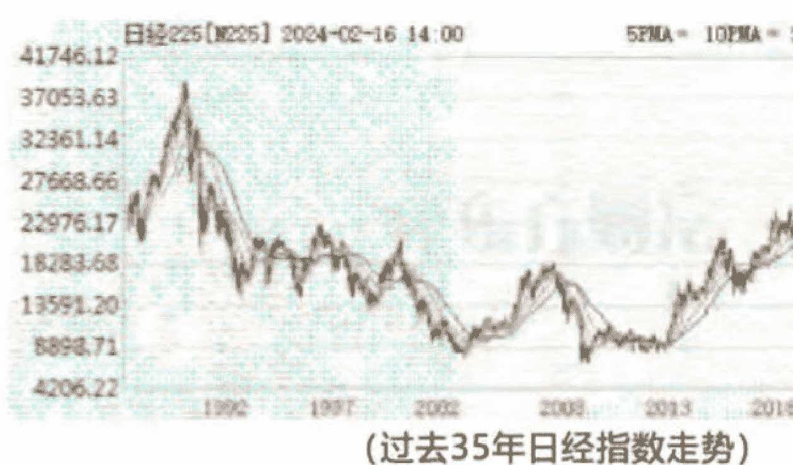
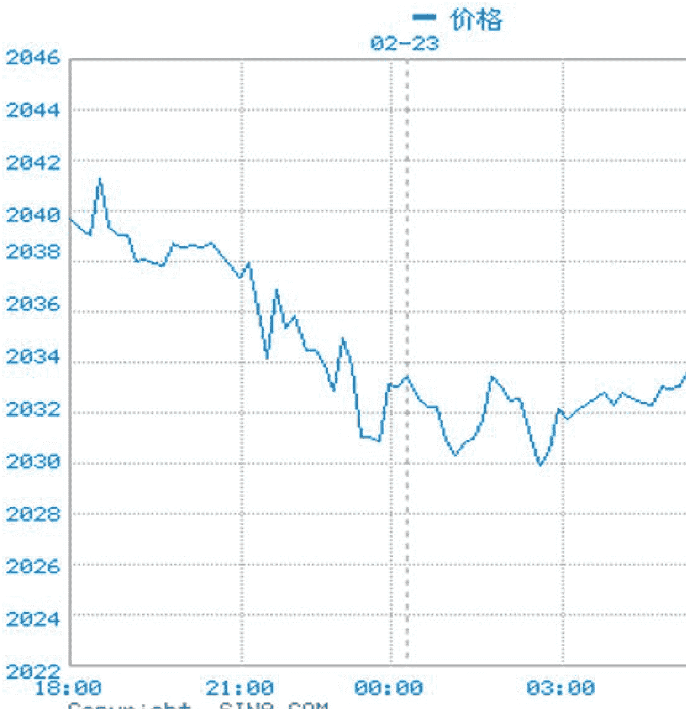

# 从2024开始，穿越财富生死大周期

2024-02-17 杨国英观察
整理:公众号懒人搜索,懒人专属群独享
懒人微信:lazyhelper
懒人备注:这是一篇年初的付费文,咱们群里还是整理备份一下。可以验证作者所言虚实~
公众号
懒人搜索
懒人专属群
微信:lazyhelper

财经暖男只说有用的

这篇3万多字的文章,框架和素材春节前早已准备好,但还是迟迟不敢动笔,这涉及到一系列复杂的逻辑链条和数据处理,需要一段较为清静的时光,才能一点点去铺展、推导、修正、润色,再修正、再润色。

所以,这个春节,我哪里都没有去,宅在家里,除了遛娃,就是深度研究、深度思考和静心写作。

我不侥幸这篇文章能够传递到居庙堂之高者的案头,当下全球局势对中国比较残酷、且对我们(全社会财富)的预期冲击相当巨大。

但是,我希望这篇文章能够警醒无数的普通人,普通人只追求具象的生活和具象的财富,他们并不关心抽象的宏大的时代浪潮,可是,他们的生活、他们的财富却又永远被宏大的时代浪潮所裹挟。亦如改革开放之后的若干年，许多人并不关心抽象的宏大的时代浪潮，但抽象的宏大的时代浪潮，事实却裹挟着、并推动着无数普通人一浪接一浪的向上翻腾，让他们切身感受到时代送给他们的温暖，并让他们实现了个体和家庭财富的N倍增长。

这一切在 2023 年改变了。

过去的一年，许多人切身感受到生活的沉重和财富的缩水——当然，这一切的改变，犹如草蛇灰线一般，其实，早已经在 2018 年就已经埋下了伏笔，只不过，时代浪潮的逆行，需要一个特定年份的剧烈之变，给所有人敲响震耳欲聋的钟声罢了。

可是，对于许多人而言，时代浪潮逆行的钟声再响亮再震耳，也无法敲醒他们，他们从来都只是时代浪潮的被动参与者，他们不接受预警，他们从来不做深度的有逻辑的思考，时代浪潮向上翻腾他们被动接受，继而也能够成为时代浪潮的幸运儿，时代浪潮逆行向下他们被动接受继而又必然会成为时代浪潮的弃儿——而在这一过程，他们个体或家庭的财富，事实也不得不从时代浪潮的温情馈赠，转瞬之间又会被时代浪潮所无情剥夺。

所以，我希望读到这篇文章的朋友，在 2024 年开年之初能够清醒认识到，时代浪潮已经在逆行向下，且中期之内大势不可逆。

当下时代浪潮正在全方面冲击社会财富，当下时代浪潮也正在淹没相当一部分中产阶层和中高产阶层，这一显性的趋势，过去一年已经开始，接下来的 2024、乃至未来五六年，整体仍将持续。

我更希望读到这篇文章的朋友，能够体认并身体力行“全域资产配置”，对个体或家庭的现在资产包尽快启动结构性调整，以便能够穿越当下已然加速的财富生死大周期，以便能在本轮动荡大周期结束之后仍然能够安身立命。

当然，这其中的有悟性者，我期待他们能够在预期不同资产价格的周期底部区域，做一些相对精准的出手，继而不仅能够穿越当下的财富生死大周期，而且还能够最终在本轮财富生死大周期结束之后实现个体或家庭的阶层跃升。

财富生死大周期会淹没相当一部分个体家庭的财富。

但财富生死大周期同样会新生出极少数的财富新贵。

这其中的关键之关键在于，我们如何识别当下财富生死大周期的预期曲线？以及如何识别这其中不同类别财富（比如股市、楼市、黄金、境外合规 QDII 等）生死大周期的预期曲线？乃至又如何进一步识别同一类别财富的内部细分领域（比如股市的不同板块、楼市的不同城市）生死大周期的预期曲线？

只有识别到财富生死大周期的预期曲线，我们才有可能在一类财富下行的早期（即便是早中期）选择减少持有、并相应增加另一类处于上行通道早中期财富的持有，而不是反向行之，幻想固抱朽木就能飘洋过海穿越本轮财富生死大周期。

同时，只有识别到财富生死大周期的预期曲线，在做好大类别财富结构调整的同时，针对同一类别财富不同内部细分领域，也才有可能做好相应的内部优化调整，其内在的逻辑机理，与大类别财富结构调整的本质是一致的，只不过，派生维度有所不同而已。

当然，识别当下财富生死大周期的预期曲线，事实又谈何容易？！这需要我们具备必要的大历史观和全球观。尤其之于全世界加速动荡之当下，如果不具备必要的大历史观和全球观，那么，我们对经济对产业对财富生死变迁的任何判断，均犹如盲人摸象、水中捞月，不仅无助于个体或家庭的财富自救，反而容易陷入内心焦虑继而盲动并最终仍然导致财富被时代浪潮无情剥夺的负向循环之中，这是既伤身又伤心更破财。

那么，当下的全世界，将其置近现代大历史之中，又到底处于哪一个类似的历史区间？以及当下的全世界，与类似的历史区间，又到底存在哪些具象的不同之处？（这个同样重要，因为历史从来不会简单重复）

在将大历史观和全球观导入之后，我们再进而叩问：当下中国，正在遭受什么样的结构性压力？这些结构性压力对我们的社会财富又将会产生什么样的直接或间接冲击？面对这些结构性压力，当下中国正在且预期又将如何应对？而这些应对本身，对不同财富类别（以及同一财富类别之间的不同细分领域）又最终将产生何等不同的反射性？

对上述进行宏观、中观和微观的回答，必须抛开主观，必须客观呈现当下世界的具象逆变以及当下中国的具象应变，必须实事求是而不是刻舟求剑的参照类似的历史区间，然后，在这个基础上，再层层推进，再缜密推导，再小心求证，再最终给出观点。

以下全文结构：
- 一，当下到底是一个什么样的世界？
- 二，当下世界对中国到底有何影响？
- 三，2024 年资产配置的 3 个逻辑点
- 四，2024年股市的4大核心判断
- 五，2024年股市的6个机会
- 六，2024年黄金到底该不该配置？
- 七，2024合规海外市场(QDII)的机会

## 一，当下到底是一个什么样的世界？

当下的世界，如果非要给一个历史投影，像极了1929年—1938年这一历史区间。

在1929年—1938年这一历史区间，全球发生了空前严重的经济危机（史称上世纪30年代初期的“大萧条”），在这一历史区间，全球保守主义和威权主义成为政治主流（法西斯），在这一历史区间，局部的规模战争已经爆发（意大利进军埃塞俄比亚、日本发动侵华等），并最终推动惨绝人寰的第二次世界大战于1939年全面打响。

先讲上世纪30年代初的大萧条之源，与当下世界的类似性。

上世纪30年代初全面爆发的大萧条，本质是供需失衡和贫富失衡，兼以杠杆失效，而这三者在今天的世界，事实已经全面显现，且事实已经引发大国经济体（以中美两国为首）的贸易战、科技战和金融战。

上世纪30年代初，在两次工业革命（蒸汽时代和电气时代）之后，西方国家的生产力急剧上升，商品供给在西方国家内部已经显著超过需求。

上世纪30年代初西方国家的商品供给，显著超过其内需市场的需求，除了两次工业革命推动生产力急剧上升这一因素之外，还与其严重的贫富失衡和杠杆失效这两大因素密切相关。

其时，以美国为例，当时5%的最富有人群占到美国国民收入的1/3，而同期约60%的美国家庭收入仅够维持最为基本的生活，他们的收入在其时美国总收入中仅约20%左右。

更为严重的是，当时美国绝大多数的中小企业和普遍民众，均负债累累，财务状况均岌岌可危。

在讲杠杆失效，上世纪30年代初的美国，宏观债务率就已经接近240%，其中，企业部门债务率约160%，政府部门债务率20%多，家庭债务约占40%-50%——注意，这一宏观债务率（尤其是企业债务和家庭债务）在当时是超级惊人的，因为，上世纪30年代初的全球货币，还是遵循金本位制，无论是当时的美元，还是英镑法郎还都是锚定黄金储备的，不像现在的全球货币已经彻底无锚。

严重的供需失衡、贫富失衡和杠杆失效，这不仅是上世纪30年初美国遭遇到的，当时的欧洲国家和日本，事实也均遭遇到，甚至当时欧洲国家普遍比当时的美国更为严重。

回顾了历史，再聚焦当下，当下世界同样具有上世纪30年代初西方国家大萧条背后的种种因素。

当下世界，供需同样严重失衡，贫富同样严重失衡，且当下世界的宏观负债率，整体更是远甚于上世纪30年代初。

在过去近百年间，经由半自动化和自动化的加速迭代升级，之于90%以上的商品供给能力，事实已经是上世纪30年初的30倍、甚至50倍、100倍以上，但是，当下全球的事实需求，即便结合过去近百年的全球人口增长（增长了4倍），再怎么充分评估，事实也还是严重滞后于生产力加速迭代升级所导致的全球商品供给能力。这还仅是其一。

同时，当下世界的贫富悬殊和宏观债务率，事实也同样远远甚于上世纪30年初。当下世界仅1%的最富有人群，就已经占到全球总财富的50%以上，这个贫富悬殊比例显著超过上世纪30年代初。同时，当下世界的宏观债务率（宏观杠杆率），同样远远超过上世纪30年代初。

| 地区 | 宏观杠杆率 |
| :--- | :--- |
| 美国 | |
| 欧元区 | |
| 日本 | |
| 中国 | |

注：加上隐性债务，中国>300%
注：截至2021年末，全球有统计数据的国家
（当下世界主要经济体杠杆率）

再讲上世纪1929年—1938年这一历史区间全球保守主义的兴起，与当下世界的类似性。

上世纪30年代初全面大萧条爆发前后，极端的保守主义陆续兴起，这其中尤以法西斯主义最为典型。

当下世界的保守主义，虽然远不如近百年前那样极端，但是，事实也已经急速兴起。

当下世界的保守主义，其核心诉求与上世纪30年代前后有所不同，尽管不再执念于殖民地利益瓜分了，但是，同样极端推崇本国至上（并含有不同程度的民粹主义）、弱化全球自由贸易和反对移民等，这些事实与近百年前还是极其类似的。

以自由主义发源地的欧洲为例，其当下的保守主义（极右翼政党），在欧洲政坛已经大有席卷一切之势。

2023年11月，荷兰推行保守主义的自由党在众议院选举中胜出，不出意外，该党领袖维尔德斯将成为荷兰新一任首相。

2023年6月，德国民调显示，德国保守主义政党选择党以19%的支持率，甩开现任德国总理朔尔茨所在的社民党，德国选择党主席魏德尔倡导德意志民族主义、反欧元、反难民、反绿色经济。

2022年9月，英国保守主义政党的党魁特拉斯上任英国首相，其后，虽然因为其内政处理不当，特拉斯辞职，但接任者苏纳克事实也同属于英国保守党。

2022年9月，意大利兄弟党主席梅洛尼正式成为意大利总理，意大利兄弟党和梅洛尼本人均推行保守主义，倡导意大利至上、反移民、反少数群体。

2022年4月，法国公布总统选举投票结果，法国保守主义政党“国民联盟”候选人小勒庞的得票率，仅仅略低于马克龙，但是，民调随后显示，小勒庞2027年将成功当选法国总统。

与欧洲政坛的保守主义相呼应，自特朗普开始，美国保守主义就一发不可收拾，继之以拜登，尽管在反移民等领域，拜登与特朗普政向明显相左，但是，之于全球贸易自由化等，事实仍然遵循了特朗普时代的保守主义。

当下世界，在全球供需严重失衡加速诱发全球经济危机之下，事实上，不仅保守主义盛行，而且威权主义更已经甚嚣尘上，比如俄罗斯、土耳其、沙特、印度等等。当然，还有些国家，就不讨论了。

最后，再讲上世纪 1929 年—1938 年这一历史区间全球局部规模战争的爆发，与当下世界的相似性。

第二次世界大战的全面爆发，是以德国 1939 年初进军波兰、随后英国和法国对德国正式宣战为核心标志的。

但是，在德国进军波兰、英法正式对德宣战之前，全球局部的规模战争，早已经打响，比如早在 1931 年日本就制造了九一八事变，并于 1937 发动全面侵华战争，还有意大利于 1935 年不宣而战全面进军埃塞俄比亚等等。

当下世界，近两年大家应该是日有耳闻，俄乌战争和巴以冲突，事实其战争的规模性和持久战，已经无限接近第二次世界大战全面爆发之前。

截止这篇文章发布，俄乌战争从 2022 年 2 月下旬开始，至今已经持续到第 722 天，巴以冲突从 2023 年 10 月上旬开始，至今也已经持续到第 137 天。

虽然，相比百年前战争的惨无人道，今天的战争，无论是俄乌战争还是巴以冲突，事实还是稍微好一些，但是，即便如此，俄乌战争截止至今双方军民的死亡人数也已经超过 50 万人，巴以冲突即便仅局限于微小地理半径双方军民死亡人数事实也超过 3 万人。

更重要的是，无论是俄乌战争，还是巴以冲突，结合多重维度看，其在 2024 年取得和解停战的可能性均几乎为零。

之于俄乌战争，除非俄罗斯发生重大政坛变动（这个可能性极低，普京超大概率将连任），否则在乌克兰不妥协的情况下，绝无可能会选择主动停战。但是，事实上，乌克兰更是绝无可能选择妥协，毕竟俄罗斯对乌克兰的事实入侵，这是任何说辞都无法改变的，更何况，全球发达经济体注定会持续金援、军援乌克兰。

之于巴以冲突，现在不仅已经波及到红海的自由航行，而且更已经将战火零星燃烧到中东的部分驻美基地——同时，加沙的人道主义灾难，现在，不仅已经导致中东穆斯林对以色列的敌视，而且，事实更已经发酵成全球穆斯林对以色列甚至美国的撕裂。

所以，不出意外，俄乌战争和巴以冲突在 2024 年不仅仍将持续，而且，随时更有扩大化（不同外部势力参与）的趋势。

每一场战争，其实都是经济战争的延续。

尤其是俄乌战争和巴以冲突，其在同一历史区间的规模爆发且仍将持续，这折射出的，已然不仅仅是国家与国家之间、种族与种族之间的撕裂，而且更是在全球经济增量受限之下的加速撕裂和必然撕裂。

当下的世界，供需严重失衡，供给整体太过剩了，需求整体又跟不上，这必然会导致全球资本的预期收益递减，无论是私营资本、还是国家资本，无论大国资本，还是中小国资本，当下均面临着预期收益递减、甚至整体大打折扣的残酷现状。

全球资本的整体增量收益没有了，且存量收益还要大打折扣，代表不同阵营资本的社会组织、乃至国家组织，怎么可能不互相激烈博弈，又怎么可能不发生冲突乃至战争？！——只不过，有的是直接推动冲突和战争，有的假借第三方之手推动冲突和战争。

全球贫富严重失衡，不同区域或国家之间的严重失衡，会导致不同区域或国家之间的博弈和冲突。

同一区域或同一国家内部的贫富严重失衡，则会导致其内部的阶层动荡和冲突，而具体的主政者，为了平缓其内部的动荡和冲突，要么会加大对外部的利益索取以填补内部，要么会有意升级外部冲突甚至战争以转移其内部矛盾。

在结构性的严重失衡、保守主义盛行和规模战争频发之下，我们去寻找一个与之相似的历史镜像——到底是美苏争霸加剧的上世纪六七十年代，还是美国经济金融双重打压日本的上世纪八十年末，抑或是东南亚危机爆发的上世纪九十年代末？

都不是！

今天的全世界，之于结构性的供需失衡、贫富失衡、杠杆失效，以及全球保守主义的盛行和局部规模战争的爆发，有且只有 1929 年—1938 年这一历史区间与之相似。

今天全球供需的严重失衡，已经到了90%的行业，整体减少一半甚至 2/3 的产能，都能满足今天全球需求的地步。

今天全球贫富的严重失衡，已经到了发达国家持续发达（至少过去 20年）、欠发达国家持续欠发达、中等收入国家极难突破上升瓶颈的又一历史区间。

今天全球贫富的严重失衡，已经到了1%最富有人群占到全球财富 50%以上、全球最富有 1000 人总财富已相当于全球近 40 亿穷人总财富的地步。

今天全球债务杠杆率，已经到了整体再怎么刺激也无法有效刺激整体需求的地步，发达经济体和中国的居民债务率，整体已经呈现出无法再加杠杆而只可能去杠杆的迹象，当然，局部区域还存在一定的杠杆空间，比如东南亚、南亚、非洲等。

所以，从这个角度看，今天世界的动荡加剧，今天世界的乱象频发，其实并不意外，而是具有历史的必然性。

所以，当下世界的超级动荡，基于大历史观和全球观而言，亦如1929年—1938年的历史区间一样，最终，也至少需要一个或多个大国作为代价，才有可能最终实现全球供需和全球区域贫富的再平衡。

现在，诸多信号显示，以美国为首的发达经济体，已经将这一代价指向了中国。

### 二，当下世界对中国到底有何影响？

1929年—1938年这一历史区间，混杂着经济危机、全球保守主义和威权主义政治、区域规模战争频发的这一历史区间，最终以第二次世界大战的全面爆发，实现了结构性的大国利益洗牌——德日意成为这一历史区间的代价，传统强国的英法也付出了一定代价，美国成为最大的受益方。

在二战结束之后，美国的门户开放政策，全面加速替代传统的殖民政策。

并且，在二战结束之后的随后20年，在美国门户开放政策彻底取代传统殖民政策之后，通过传统殖民地独立所带来的第一波全球化红利，全球供需失衡和全球区域贫富失衡，获得结构性的周期再平衡。

那么，本轮从 2022 年开始的（以俄乌战争爆发为起点）或者从 2018 年（以中美贸易战爆发为起点）历史区间，其最终的走势，会不会引发第三次世界大战的全面爆发？

这种概率超级超级低。

尽管当下世界的诸多乱象，与 1929 年—1938 年这一历史区间极其相似，但是，今天再次全面爆发世界大战的概率应该是没有的——毕竟过去近百年间人类生产力获得了飞速发展，整体已经不存在最基本的生存危机，毕竟在人类整体告别生存危机之后，基本的人道主义已经成为当下全球的普世价值之一，毕竟当下全球主要大国都拥有核武器和事实更加恐怖的生物武器，本质上大国对大国的直接战争谁都无法承受。

再次全面爆发世界大战的概率几乎没有，这并不代表局部规模战争就会减少（这两年大家已经看到了俄乌战争和巴以冲突），更不代表当下的全球供需失衡和全球贫富失衡就会天然消失。

所以，混杂着局部热战和阵营冷战的全球性终极博弈，将成为当下这个历史区间的全球超级动荡的主流形式。

关于局部热战，这两年已经有俄乌战争和巴以冲突，这个就不细加讨论了。关于阵营冷战，这个很有必要讲一讲，这个事实直接剑指中国。

美国牵头发达经济体为一个阵营，中国牵头全球部分新兴经济体和部分欠发达国家为另一个阵营，这两大阵营当下已然进入到半冷战阶段——这一迹象，之于当下全球，事实已经越来越清晰了。

在俄乌战争爆发之前，基于超级大国之间终极博弈的不可逆，美国从 2018 年开始就对中国展开贸易战（关税战）、产业链战（制造业回流和友岸外包）、高科技战（知识产权和技术转让）等，也就是说，在 2018 年—2022 年，全球超级大国的终极博弈还没有正式升级为全球两大阵营的半冷战。

但是，在俄乌战争爆发之后、尤其是 2022 年下半年全球发达经济体（欧洲大国和日韩）在外交立场上开始彻底倒向美国之后，全球两大阵营的半冷战，事实从 2023 年初开始就已经相当明显了——对此，我不做任何基于道德层面的点评，我只讲这会对中国经济和中国金融带来的派生影响。

在全球发达经济体彻底倒向美国之后，最近一年多，以美国为首的发达经济体正在加速去中国化——2023 年，不仅美国，包括欧洲、日本和韩国的产业链，事实均在加速撤离中国；2023 年，我们对发达国家的出口开始不升反降（平均下降幅度高达 10%左右）；2023 年，发达经济体整体对中国的投资（无论是实体性质的直接投资，还是一二级市场的金融投资）显著大幅下滑；2023 年，发达经济体来中国无论是旅游还是商务洽谈的人数更是在大幅减少。

| 出口最终目的国（地） | 1至12月 | 累计 |
| :--- | :--- | :--- |
| 美国 | 500,290,654 | |
| 韩国 | 148,986,661 | |
| 日本 | 157,523,517 | |
| 德国 | 100,569,526 | |
| 荷兰 | 100,187,263 | |
| 英国 | 77,916,092 | |
| 澳大利亚 | 73,811,108 | |
| 加拿大 | 45,079,977 | |
| 意大利 | 44,523,442 | |
| 法国 | 41,626,943 | |

2023年进出口商品国别（地区）总值表（美元值 单位：千美元）

## ( 2023 年中国对发达国家出口 )

全球发达经济体的加速去中国化，这对中国经济和中国金融的系统冲击，至少在中期内（甚至中长期内），肯定是巨大的。

全球发达经济体产业链的去中国化，这意味着若干代工企业（比如富士康等）从中国撤离，这同时意味着数量上百倍于代工企业的中国本土中间配套企业，要么同样撤离到境外，要么必然迎来中期内的生存压力（除非有一天众多中国终端品牌征服全球了），这一切不仅会让我们的经济增长中期内超级承压，而且还会直接导致我们全社会就业困境。

全球发达经济体进口需求的去中国化，这意味着众多原本以美欧日韩为主要出口市场的中国本土企业，面对罕见的生存之战，要么选择参与国内市场的超级内卷，要么不得不在海外建厂以降低发达经济体针对中国本土企业高昂的关税，要么只能重点将市场锁定为全球新兴经济体或欠发达国家。

同时，全球发达经济体之于高科技的去中国化，通过刻意制造知识产权或国家安全事件，结构性减少与中国高科技企业的合作，这事实已经导致中国高科技发展至少中期内的结构性压力——毕竟，高科技的全面发展（而不仅仅是单点突破）是以无国界作为前提的，现在以美国为首的发达经济体，就高科技合作开始针对中国垒起高墙了，这对中国高科技的全面发展肯定影响巨大，毕竟，今天全球高科技领域美国领先的超过60%，以美国为首的发达经济体加总领先占比则超过80%以上。

当然，面对发达经济体针对中国经济几乎全方位的去中国化，作为当下全球第二大经济体和综合国力第二大强国，中国无法妥协，只能迎接挑战，尤其是对美国无法妥协，妥协只能更加被动。

当然，针对德国和法国这两大欧洲大国，中国一直在尝试分化（英国紧紧与美国绑在一起，当下日本和韩国与美国的紧绑程度，事实与英国也并无二异，均无法分化），甚至不惜投桃报李——但是，这至少在中期之内，尤其是欧洲大国极其重视的俄乌战争仍然无解之下，无法取得真正的好转。

中国只能迎接挑战，最近五六年，尤其是从去年开始，我们显见的是，为了解决高科技的卡脖子困境，我们加速推进国产替代（并为此提出新型举国体制），为了破解发达经济体产业链的去中国化和发达经济体进口需求的去中国化，我们加速链接全球新兴经济体、并提出经济内循环为主——这些，就经济论经济，就产业论产业，就高科技论高科技，事实都是很有必要的，事实也只能如此应对。至于文化和制度层面，这涉及到真正的软实力，我们应该如何破局，并通过真正软实力的破局给我们经济层面的破局进行结构性的赋能，这个就不展开了，也不便展开。

总之，在发达经济体加速启动去中国化之后，即便再保守，至少在中期内，中国经济注定将承受巨大压力。

为抗住这一外部大环境带来的巨大压力，除了在高科技和外部市场我们显见的也是必要的应对之外，为了防止给中国带来系统性经济风险，也为了防止中国资产价格急速大跌带来的系统金融风险，最近几年，我们就财政和货币启动了持续的刺激——但现有的结果表明，未来至少三五年也必将持续验证，中期内的经济和金融维稳，重点只能靠政府和国有企业加杠杆，而很难靠居民和私营企业加杠杆——显然，这对中国资产价格会带来持续的连带影响，这个，具体我们留到下一章再详细讨论。

## 三、2024年资产配置的3个逻辑点

2024，全球依然会加速动荡。

2024，美国为首的发达经济体的去中国化、美联储强势锁定与中国的高息差也依然会持续，在这一历史背景之下，2024 年的中国经济和中国资产价格，整体肯定会继续承受压力。

自 2023 年初以来的中国经济和中国资产价格的中期走势，如果需要一段历史进行对标，那么，事实与上世纪 90 年代初日本经济和日本资产价格的走势是极为相似的。

上世纪 90 年代初，日本股市（日经指数）从 1989 年底的 38000 多点一路震荡下跌到 2003 年的 7608 点，然后，在整体震荡下跌持续了 14 年且整体跌幅高达 80% 之久后，日经指数才实现了第一轮探底。其后，日本股市持续反弹了三五年（整体上涨约一倍），但 2008 年美国次贷危机又对日本股市形成了强大的二次冲击，日本股市随后急速大跌，最终于 2009 年 3 月日经指数再下跌至 7055 点，这才最终实现了为期近 20 年的真正探底。

当然，时隔 35 年之后的当下，日本股市终于等到重回历史荣光的时刻，当下日经指数已经到达 38000 点上方，已经无限接近其 35 年前的历史高点。

上世纪 90 年代初，日本楼市从 1991 年 7 月开始从高峰破裂，整体一直震荡下跌到 2005—2006 年，在这 15 年里，日本楼市整体跌幅高达 70%。

当然，现在日本的核心大城市，如东京、横滨和大阪等，其房价终于从近 20 年前的底部区域，再次回到或相对接近上世纪 90 年代初的历史高点。但是，日本无数的中小城市房价，距离上世纪 90 年代初的历史高点依然遥遥无期，事实不仅遥遥无期，而且，相当一部分的日本小城市，现在房价已经低到“政府免费送房”的地步。

上世纪90年代初日本资产价格的超级雪崩，其根本内因在于内部资产价格的泡沫，外因则是当时美国对日本出口（中高端制造业）和日元的打压——根本内因和外因一结合，就直接导致日本经济学界之后总结的“资产负债表衰退”。

今天的中国与当年的日本，事实存在着根本内因与外因的相似性。根本内因——中国社会财富占比第一的楼市（约500万亿），其资产泡沫较为显著，即便在2023年房价大跌之后，中国楼市（住宅）的租金回报率也仅为1%—1.5%，这一资产回报率仅为同期全球市场化国家的1/3左右；外因——美国的贸易打压和产业链转移，这一点今天的中国事实与当年的日本也是有相似性的，并且，基于打压的层级，今天美国对中国的打压，事实远甚于当年美国对日本的打压，且预期是不可逆转的，因为当年日本选择了妥协（也不得不选择妥协），但今天的中国绝不可能选择妥协。

回顾上世纪90年代初开始的日本资产价格走势，其核心要义并非是说从2023年开始的中国资产价格走势，将会简单复制当年日本资产价格走势的惨烈路径。

资产价格走势路径不会简单复制，但是，资产价格走势的背后成因、以及预期的持续向下趋势，这些事实还是与当年日本较为相似的。

当年日本股市和日本楼市，均通过为期15年左右、最大跌幅均超过70%的向下走势，才最终实现了资产价格的探底维稳，而从2023年正式开始的本轮中国资产价格的向下走势，尽管结果不会像当年日本那般惨烈，但是整体资产价格的向下走势至少需要5—6年才能真正探底维稳——当然，这样讲，重点是中国房产存在较为严重的泡沫（不是股市），而中国房产恰恰又占到中国居民财富的70%以上，也就是说，只要中国房产泡沫不彻底挤掉，中国整体资产价格不可能真正实现探底，房产占中国居民财富的占比实在太高了。

所以，在上述时代背景之下，2024年的全域资产配置一定要锁定3个逻辑。

### （1）去杠杆，降负债

2023年，中国的资产负债表开始发生明确衰退，而之于历史大周期而言，这可能才刚刚开始，2024年整体仍将持续，并且局部很可能还会加剧。

资产负债表发生衰退，这意味着在经济整体承压之下，中央银行货币政策即便持续宽松，短期内私营企业和个体居民整体都不愿意再加杠杆。

一是因为在经济整体承压之下，资产荒会冲击和扼杀私营企业和个体居民扩大投资的欲望，既然很难找到确定性高的赢利项目或投资标的，那么，私营企业和个体居民又怎么可能轻易去加杠杆。

二是因为资产负债表的衰退，会加速暴露之前私营企业和个体居民的杠杆负债风险，道理很简单，资产是弹性的，而负债却是刚性的，比如你拥有2000万的资产、同时负债1000万（2000万的资产中，房产价值1800万，现金或现金等价物却仅有200万）那么，在资产价格发生较大跌幅之后，假设房价下跌了40%且预期还有下跌的可能性，那么这时你肯定会恐慌肯定会丧失财富安全感，这意味着你的净资产从原有的1000万直接衰退到200多万，而如果房价持续下跌，那么很有可能你就会变成负资产了，这时你肯定会选择将手头上的200万现金或现金等价物的绝大多数，用于提前偿还贷款减少负债，而几乎不可以继续加杠杆加负债。

三是因为经济预期不乐观会冲击许多私营企业和个体居民的现金流，在经济预期不乐观之下，部分私营企业可能会发生经营困难，许多个体居民的工资性收入可能会发生较大减少、部分甚至可能会失业，这一现象2023年已经显性发生且预期还将继续发生——2023 年全国法拍房挂牌量高达近 80 万套，这其中超过 90%的法拍房背后其实都发生了私营企业或个体居民的现金流断裂，这是相当凄惨的——而这种事实的凄惨，在 2024 年应该还会发生、甚至烈度还会进一步加剧，因为 2023 年的近 80 万套法拍房仅仅成交了近 15 万套，这意味着 2023 年没有成交的约 65 万套法拍房，在 2024 年还将继续进行二拍三拍甚至四拍，同时，2024 年本身还会新增法拍房的挂牌量，所以再怎么保守估计 2024 年法拍房数量也将高达 100 万套，继续创下历史新高。

所以，在上述三大因素之下，2024 年每一个个体或家庭均应该锁定“去杠杆，降负债”——现在，事实还处于资产价格进入灰色大周期的早期，就中国资产价格整体而言，远远还没有到可以全面抄底的区间。

过去 10 年，我们的居民负债总量增长超过 4 倍，但同期 GDP 10年仅仅翻了一倍多一点，所以，从宏观上讲，我们最好是率先趋势一步，其次，趋势变了随后应变，而绝不可以拖到趋势的中后期——因为你不选择去杠杆、别人会选择去杠杆，别人一旦率先去杠杆必然会将资产价格带下来，这是典型的抢跑游戏，谁先跑了谁先去杠杆了，谁先获得解放，也才能在不同资产价格未来进入周期底部区域时拥有抄底的实力。

现在是全球整体收缩，我们的收缩趋势更加明显，去杠杆降负债有必要成为我们2024年资产配置的第一逻辑。今天，对于任何一个中产或中高产家庭而言，在中国资产价格整体进入下降周期之下（结合汇率的预期差），最好不要有任何负债，极限债务资产比例也尽量不要超过30%。

### （2）卖房，卖房，还是卖房

注意，房产是中国资产价格最大的泡沫，而不是股市。

尤其是在经济预期向下之下，兼以城市化已经进入尾声、以及人口老龄化和少子化，当下房产的估值逻辑已经从原来的“成长股逻辑”加速切换到“价值股逻辑”，也就是说，当下以及未来的房产估值逻辑已经从原来的赚取交易差价为核心，加速切换到现在重点关注房产持有收益率为核心——这一逻辑的迅速切换，对房产的内含价值肯定是摧毁性的，因为，我们的房产持有收益率在全球市场化国家中，历来都是垫底的——以当下为例，全球市场化国家的房产持有收益率普遍在5%左右，而我们的持有收益率却仅仅有1%-1.5%。

所以，2024年我建议每一个个体或家庭，如果有多套房的一定要减持，除了自住没有必要持有太多房产，这样可以结构性增加手头的流动性，且对于绝大多数家庭而言可以结构性降低负债，因为对于绝大多数中国家庭而言，绝大多数负债都是房贷。

2023 年，中国房产价格整体下跌了 20% 左右，个别城市的房价真实跌幅超过了 30%，注意，关注房产价格的真实数据，重点应该关注二手房成交价，而绝不是新房价格，因为，新房价格涉及到不同区位、不同装修配套、以及小区环境的差异，越是市场预期不乐观，开发商往往越会选择在核心区域开发且装修配套和小区环境升级，这必然会导致依靠新房价格预判整体楼市会带来严重的失真。

重点关注二手房成交价，这个很简单，这个必须得依靠自己，而不是任何所谓的官方数据，任何一个城市，只要锁定三五个不同区域的二手房小区，跟踪关注其二手房成交价的变化、以及二手房挂牌量的变化，就可以准确掌握这个城市真正的房价走势。

判断中国房产价格（重点是住宅）到底是终极探底、还是仅仅是相对短期的反弹，我有一个关键指标——那就是什么时候房产年持有收益率达到 3%，什么时候房产价格就终极探底了。

注意，这个 3%的房产年持有收益率，事实还要结合不同能量级城市的公立教育和公立医疗的不同溢价，这就是中国特有的国情（国外最好的教育和医疗基本上都是私立，而中国最好的教育和医疗却几乎都是国立），这个由公立教育和公立医疗带来的不同溢价（住宅房产其实有这个隐性收益率），事实是有必要折算到房产持有收益率之中的，尽管它是隐性的，由户籍带来的隐性溢价——具体而言，个人认为北京和上海关于公立教育和公立医疗的隐性溢价在1%以上，深圳广州杭州的隐性溢价在0.5%—1%之间，其他核心城市（如成都、南京、苏州、武汉等）的隐性溢价在0.5%左右，而剩下的绝大多数城市包括二线和三四五线城市事实上根本不存在任何隐性溢价。

结合高能量级城市的房产隐性溢价，我个人的判断是，即便2023年房价已经发生较大跌幅，我们当下的一线城市，事实还是要再跌至少25%才有可能真正实现终极的探底（算上隐性溢价之后达到3%的房产年持有收益率），我们当下的二线头部城市，事实还是要再跌至少35%才有可能真正实现终极的探底，至于绝大多数三四五线中小城市的，未来相当一部分可能还要再跌50%左右（个别小城市的房价未来甚至有可能归零，不仅没有人口增量而且人口还会持续外流），才有可能最终实现终极的探底。所以，卖房有必要成为 2024 年资产配置的第二大逻辑，之于住宅，除了自住（兼顾孩子教育的，也至多只能持有两套），其他均有必要尽快卖出——关于减持房产，我从 2021 年开始持续呼吁了近三年，有的朋友听进去了对房产果断高位减持了，现在房价当然与高位不能比了，但是，基于整体还将继续下跌的预期，2024 年继续减持房产仍然还算明智之选。

2024 年仍应继续减持房产，这其中，除了当下整体房价距离终极底部仍然较大之外，还有，对于许多中产和中高产家庭而言，只有减持了房产，才能真正实现去杠杆和减负债，才能相应增加个体和家庭的现金流，也才有可能真正实现全域资产配置的可能性。

今天，对于任何一个中产或高产家庭而言，家庭总资产中的房产占比，最好不要超过 40%，极限值最好也不要超过 50%。

### （3）分散，分散，还是分散

只有去杠杆、降负债之后，才有分散配置的相对从容。只有结构性降低房产占家庭的财富占比，也才有分散配置的现实可能性。所以，我们讨论全域资产的合理分散配置，其必要条件有必要建立在上述两个逻辑实现的基础上，否则，你即便有全域资产配置认知能力，也无法有效实践。

2024 年的资产配置，一定要牢牢锁定“超级动荡”这个关键词——2024 年的全世界，是超级动荡的，局部区域的规模战争仍然在持续且预期还将加剧，包括俄乌战争和巴以冲突，现在随时都有可能会进一步失控。2024年的中美关系，是超级动荡的，中美之间的贸易战、科技战、金融战也仍然在持续且超大概率还将继续加剧，并且在近两年全球不同经济体事实显著站队之后，原本仅局限于中美之间的大国博弈，现在已有明显的发达经济体抱团与中国进行博弈的趋势，这个很值得我们为之警惕。

在全球持续超级动荡且对中国经济和中国资产价格会继续带来冲击之下，2024年中产或中高产家庭都应该尽快形成分散配置的逻辑——全球乱局之下，鸡蛋绝对不能放在一个篮子里。

分散配置，其核心诉求，并非是要追求多么高的投资收益率，而是要规避系统性风险，增强家庭资产的反脆弱能力。

分散配置，在操作方式上，也不宜盲目分散，而是要站在大历史观和全球观的深刻预判之下，进行合法合规的跨品类和跨区域配置——只有适度的跨品类，而不是仅仅局限于楼市和股市，比如适度增加黄金或债券的配置，这样才能增强家庭资产的反脆弱能力，关于适度增加黄金配置，这个后文有一章会详细讨论。

适度的合法合规的跨区域配置，而不是仅仅局限于境内资产（或所谓的人民币资产），比如合法合规的适度增加海外市场配置，比如 QDII（合法跨境 ETF），这样才能避免中国资产价格整体向下所带来的直接或间接财富蒸发——人民币资产价格（房价和股价）的下跌，这是财富的直接蒸发，而汇率贬值，则是财富的间接蒸发，只有适度增加合法合规的海外市场配置，这样才可以结构性降低无论资产价格下跌还是汇率贬值所带来的双重财富风险，关于合法合规的适度增加海外市场配置，这个后文我也会专门用一章进行讨论——之于当下全球宏观形势，个人预判，2024 年人民币兑美元汇率大概率会在 7.1—7.6 区间，这也就是说 2024 年人民币的贬值预期大于升值预期。

当然，之于跨品类的资产配置，还可以适度关注虚拟货币，但这仅仅适合风险承受力超大的投资者，一般人不建议。

还有，在同一类别资产之中，尤其是股市，事实更有适度分散的必要性，尤其是实行全面注册制、且注册制必然会倒逼退市数量增加的今天，对于非专业投资者而言，其股票投资如果仅仅下注一两支股票，或仅仅限制于一二个行业，其风险事实是比较大的。

## 四、2024年股市的4大核心判断

- （1）2024年股市的底部区域应该在2600—2700点区间，2024年的顶部区域应该在3300—3400点区间。

注意，这一底部区域和顶部区域的预判，是假设2024年中国央行降息30个基点以内的前提下——但2024年中国央行有没有可能降息超过30个基点，这个可能性，在美联储强行锁定与中国央行的高息差的战略预期之下，事实上是不大的，除非2024年楼市发生进一步的急速暴跌并有可能危及到系统金融安全(股市之于系统金融安全的重要性，至少在目前还不是特别大，毕竟中国股市资产总量事实仅仅占到楼市资产总量的1/5左右)。

同时，也有必要注意，2024年股市的底部区域和顶部区域预判，是基于上证指数而言，这并不意味着，2024年上证指数触达2600—2700点底部区域时(春节前已经触达过一次)，同期的深证成指、尤其是创业板指数和科创板指数也会同时进入2024年全年的底部区域，因为，上证指数所涉标的中特估占到相当一部分，并且上证指数所涉标的遭受全球动荡的直接干扰程度相对较轻。

如果以2024年2月5日的底部为准，当天上证指数的最低点应该就是2024年全年的真正底部（或者全年底部无限接近当天最低点），总之，2024 全年上证指数击穿 2600 点的概率是超级超级低的。

但是，2024 年 2 月 5 日当天的深证成指、创业板指和科创板指数的最低点，超大概率不是 2024 年全年的真正底部，深证成指 2024 年全年的真正底部，很有可能会比当天最低点还要再下探 10%左右，创业板指和科创板指数 2024 年全年的真正底部，则很有可能比当天最低点还要再下探 15%、甚至 20%左右，这其中的根本原因在于，中国经济和中国产业的估值逻辑已经发生了天翻地覆的变化，这个下一小节会详细讨论，此外，还有另一原因，就是注册制全面推进带来的预期退市数量的大增，中小盘股票的所谓壳价值现在越来越低了。

当然，预判深证成指、尤其是创业板指和科创板指数 2024 年全年的真正底部，还要比 2024 年 2 月 5 日当天的市场最低点更低，这并不是说，在 2024 年全年结束之后，深证成指、创业板指和科创板指数的一年最终表现水平，就一定会比上证指数的全年表现低——这是不确定的，有些指数包括许多个股，许多时候跌得太多了，一旦反弹起来也会超级猛。

- （2）2024 年股市整体利空，在 2023 年已经显现，在 2024 年仍将持续，那就是以美国为首的发达经济体的去中国化。

以美国为首的发达经济体的去中国化，尤其互联网、生物科技等高科技领域的去中国化，这会导致相关中国公司的杀估值，这个杀估值，其实就是杀相关公司全球化的想象力，发达经济选择去中国化，全球资本至少在中期内会默认相关中国公司不具备或无法真正实现相关产品或服务的市场全球化。

以美国为首的发达经济体的去中国化，这对原先嵌入到发达经济体供应链和原先将发达经济体作为出口重镇的中国制造业，会产生显著的杀业绩，这是因为，这两年发达经济体的产业链开始加速迁移到印度、墨西哥、越南等，并且即便中国企业选择在海外设厂，以美国为首的发达经济体，现在已经在考虑优先选择公司母体是其他国家的制造业供应商。

全球超级动荡叠加以美国为首的发达经济体的加速去中国化，这对中国股市（包括A股和港股）肯定会构成结构性的整体利空，这不仅会导致杀预期业绩，也会导致杀预期估值，属于典型的戴维斯双杀——这预示着中国绝大多数行业的预期想象力没有了，全球化（包括技术合作和市场的全球化）的预期想象力没有了，这一结构性利空对中国股市的影响极其深远，至少50%的行业和公司需要对其预期业绩特别是预期估值进行结构性重估。

发达经济体去中国化所必然导致的杀中国股市预期业绩和杀中国股市预期估值，这个我们简单对当下中美股市就可以明确感知，截止当下，美股前10大公司，以苹果、微软、谷歌、亚马逊为首的前10大公司，其总市值之和约接近15万亿美元，约等于100万亿人民币，而同期，我们的A股+港股总市值，包括上交所、深交所、京交所和港交所在内的总量差不多7000家上市公司的A+H总市值之和也约等于100万亿人民币。同时，我们再具体到具体行业，比如医疗医药行业，美股仅礼来和联合健康两家公司，其合计市值就已经超过1万亿美元，而同期我们A股近500家医疗医药上市公司的合计总市值仅有7.1万亿人民币——也就是说，美股仅两家头部医疗医药公司的市值，就已经等于我们近500家医疗医药上市公司的市值之和——尽管中美股市一直存在由全球化想象力带来的估值差异，但是，这一估值差异，最近一年多开始进一步走向悬殊，预期2024年甚至未来三五年，这一悬殊均无法得到结构性的好转。

### （3）2024年股市的整体利好，预期有且只有一个，那就是中国市场利率的继续下调。

2024年，全球动荡持续且预期还将加剧，2024年，以美国为首的发达经济体对中国全方位的施压在持续且预期也还将加剧，从而由此带来的对中国经济、对中国产业和对中国资产价格的系统压力，在2024年也必将持续。

所以，寻找2024年中国股市（包括A股和港股）的整体利好（注意不是局部利好），事实上，预期有且只有一个，那就是中国市场利率的继续下调。

确实，货币利率对资产价格存在较强的反射性，市场利率上调（加息）往往会给资产价格带来下跌的压力，市场利率下调（降息）则往往会给资产价格带来上涨的推力——但是，影响资产价格走势的维度，除了货币利率，还有诸如市场流动性、资产泡沫程度、经济和产业预期、以及重大的内政外交等多个维度。

所以，结合影响资产价格走势的多个维度，我们就能理解，在真实贷款利率连续下调的近两年、尤其是2023年，我们的资产价格最终却是不涨反跌——2023年经过两次LPR利率的下调，一年期LPR利率从3.65%下调到3.45%，通过LPR利率20个基点的下调，带动真实市场利率（市场平均真实贷款利率）下调幅度应该超过30个基点，现在市场平均真实贷款利率应该在3.5%左右。

真实市场贷款利率的下调，并不必然会带来资产价格的上涨，但是，有一点可以确定，2023年如果没有真实市场贷款利率的明显下调，2023年的中国资产价格（包括股市和楼市）其下跌幅度肯定会更大、甚至跌幅有可能会进一步失控。

那么，在2024年中国整体资产价格依然承压之下（因为外围大环境没有丝毫改变），我们可以预期，2024年中国央行大概率还将继续降息，降息幅度超大概率会控制在30个基点以内，因为，在美联储仍然强行锁定与中国央行的利率差之下，中国央行即便存在更强的降息冲动，在最终落实环节注定还是要收敛的，否则，就有可能会导致进一步的资本外流（包括外资和部分内资）和人民币更大的贬值预期——当然，事实也不排除如果经济形势超级严峻或台海发生重大变故，2024年中国央行将会启动更大尺度的降息，从而将2024年全年的降息幅度超过30个基点。

结合2024年中国央行下调LPR为30个基点以内进行分层推导，假设2024年中国央行两次下调一年期LPR每次下调10个基点合计20个基点，那么，2024年上证指数在全年之中是有可能触及到3100上方的，假设2024年中国央行三次下调一年期LPR每次下调10个基点合计30个基点，那么，2024年上证指数全年之中是有可能会触及到3300上方的——注意，这样的推导，是假设外围大环境2024年没有任何好转（这当然是超大概率）、以及外围大环境2024年的恶化没有超出预期。

同时，还有必要注意，即便2024年中国央行下调一年期LPR合计高达30个基点，事实也不意味着指数反弹上去之后就不会再次回调，股市走势是由一系统预期组合缠绕推动的。

### （4）2024年股市必须“轻指数，重行业，更重个股”。2024年全年的股市，如果不是做宽基定投，而是做股票或窄基，过多关注指数其实没有太大意义。

2024年全年，上证指数超大概率在2600—2700点之间与3300—3400点之间进行中幅度高频震荡，深证成指超大概率以2024年2月5日当天的市场最低点展开向下10%左右向上20%左右的中幅度高频震荡，创业板指和科创板指数则超大概率以2024年2月5日当天的市场最低点展开向下15%—20%、向上30%左右的中高幅度高频震荡。但是，在市场指数发生震荡的同时，2024年全年，20%左右的行业和个股很有可能会走出持续震荡向上的单边走势，也有超过30%的行业和个股很有可能会走出持续震荡下跌的单边走势。

先讨论超过30%的行业和个股，在2024年全年很有可能会走出持续震荡下跌的单边走势——前文已经讲过，全球动荡以及以美国为首的发达经济体的去中国化、包括不限于高科技领域合作的去中国化、产业链迁移的去中国化、发达经济体进口需求的去中国化等，这些是深刻影响中国股市(包括A股和港股)预期业绩和预期估值的核心变量——但是，这一外围大环境对中国股市预期业绩和预期估值构成冲击的核心变量，2024年几乎不会有任何好转的，甚至局部冲击力可能还会更大。

当然，除了外围大环境对中国股市构成冲击这一核心变量之外，还有一些由此引发的派生效应，在2024年也会持续冲击中国股市的预期业绩和预期估值，比如由产业链迁移和发达经济体进口需求去中国化派生导致的中国经济中期困境(个人认为由此带来的“中期困境”这还是相对保守的)会继而导致中国资产价格的加速承压、以及中国内需中期内的持续承压，这些事实均会派生导致一些静态看与外围大环境并不直接相关的ToC家具家电、3C产品、航空出行、汽车(包括新能源汽车)、房地产、甚至食品饮料酒类调味品等消费等行业及相关上市公司预期业绩的承压，因为即便是整体内需变动不大的食品饮料酒类调味品等消费，在经济前景不乐观之下，整体也会进入消费降级的通道————也就是说，即便食品饮料酒类调味品的总需求不变，但消费降级会导致行业整体利润率的降低。就更不要说，家具家电、航空出行、汽车、房地产、建材等行业，其国内整体需求遭受经济景气度更为严重的负面影响了。

另外，由外围大环境导致的中国经济中期困境，事实还会间接传递到过去两三年政策无限力挺的ToB新能源（包括锂电、风电和光电）和ToB半导体等领域，这些领域，除非出现技术竞争能力超强的企业，否则，2024年整体均存在较为严重的产能过剩困境，以半导体为例，除了个别公司能够在AI芯片、光刻机、EDA软件等做出核心技术突破（也就是说拼到最后到底谁能真正解决“卡脖子”的问题，能真正解决，就能给无限估值溢价，不能真正解决且属于产能过剩范畴，对不起超大概率会持续向下杀），否则，就整体而言，2024年至少业绩预期是超级承压的。

再说外围大环境对中国股市冲击力最为直接的相关产业和企业，这个重点在于以美国为首发达经济体产业链迁移以及发达经济体进口需求去中国化所涉及的相关产业和企业，当然，这其中部分美国以所谓国家安全或知识产权为由头——比如，与苹果链三星链等相关的3C配置产业链，这些配置产业链细分牵涉到我们A股和港股至少200家上市公司；再比如为美国等发达经济体提供医药外包（CXO）的企业，这一块A股和港股也有接近100家上市公司；再比如，主要为美欧终端大品牌提供贴牌生产或作为中间品出口向美欧市场出口为主的上市公司（A股和港股至少有三四百家上市公司），这些广泛分散在服装鞋类食品建材电子电器等数十个细分行业，对这些重点关注是否是以美欧终端大品牌提供贴牌生产或作为中间品出口向美欧市场出口为主，其美欧业务占比越高未来被下杀的可能性也越大——当然，在具体操作上，还存在一个是否已被提前下杀且下杀超预期的问题，如果已被提前下杀且下杀远超预期，也就是被结构性利空已经提前兑现了甚至过度兑现了，那么，部分行业部分标的的大反弹也会随时发生。最后，再说一个最为重要的，也是所有投资者都应该超级重视的，那就是预期外围和内围环境的持续不乐观、以及注册制倒逼未来退市数量的大幅上升，现在已经导致市场对股市本身估值逻辑的变化——原来市场侧重上市公司的中长期成长，现在已经变成侧重中短期的业绩、现金流和股息率，这对中国股市是一个超级冲击，必将结构性拉低中小盘股的整体估值，市场现在不再盲目想象了，而是变得越来越现实了，如果看不到上市公司中短期业绩上升的可能性，如果现金流不理想，如果股息率过低（A股低于1%、港股低于2%），这部分中小盘上市公司仅仅在A股就至少有上千家之多，那么，对这种类型的上市公司，不仅2024年，乃至未来较长一段时期，其股价走势均只会低了还会更低，腰斩了还会继续腰斩，对于部分预期没有赢利可能性的垃圾小盘股，未来则会跌无止境，因为全面注册制之下壳的价值砍掉至少80%，且还有随时被退市的可能性。

## 五、2024年股市的6个机会

讨论2024年股市的6个机会，逻辑起点必须建立在“轻指数，重行业，更重个股”。

之于2024年全年，我们股市全局性的机会并不大，甚至超过30%个股、尤其是预期业绩预期现金流偏弱（相当部分是中小盘股）的全年预期走势更是相当不乐观，但是，这绝不代表所有行业所有公司都不存在机会——个人认为，2024年，在市场本已处于历史底部区域兼利率持续下调预期的推动，会有20%左右的行业或公司存在较大的上涨空间。

结合我们持续的深度研究，个人认为，2024年股市存在6个机会，这6个机会，无法全部以具体行业进行分类（轻指数，重行业，更重个股），这6个机会其中的优质公司，在2023年以及春节前大盘急速下跌导致被误杀之下，2024年很有可能会有1倍的反弹幅度，极个别甚至有可能以2024年为始跑出“5年5倍”的向上走势。
注意，关于2024年股市6个机会的阐述，会提示每个机会的重点研究维度，也会涉及相关标的，但不会对相关标的的进行具体点评，这是相关监管的合规性要求，还望见谅。

### （1）被房地产严重误杀的物业服务

在全球大环境发生逆变之下，相对侧重锁定内需市场且拥有稳定现金流的行业，这是很有必要的，而如果这样的行业，在过去两三年又被严重错杀了，那么，很显然，这样的行业就更值得重点关注了——物业服务就属于这样的行业。

最近两三年，在房企批量暴雷的连带冲击下，A股、尤其港股的物业服务也整体腰斩过半，这当然存在一定的逻辑合理性，中国股市（包括A股和港股）的物业服务，绝大多数脱胎于原有的房企开发公司，房企的批量暴雷不仅会扼杀资本市场对物业服务的稳定预期，而且之于原本从房企开发公司派生的关联物业服务公司，资本市场担心房企开发公司从关联物业公司挪用的大量借款无力偿还——这也是事实普遍存在的，比如恒大等。

但是，最近两三年，物业服务整体被杀得太过严重了，这其中，大多数存在明显的错杀，毕竟物业服务属于轻资产的“现金奶牛”行业，有着轻资产、低杠杆、充沛现金流特性，这是与房企开发截然不同的，物业服务的盈利模式具有相对的稳定性和可预测性。

物业费，作为物业公司的主要收入来源，为这些公司提供了稳定而充沛的现金流。数据显示，2023H1，重点公司基础物管收入占比为62.6%，毛利占比为54.5%，是物业公司最大的收入和利润来源。因为物业公司的收入模型具有高度的确定性，物业费通常是基于物业管理合同预先设定的费率来收取，与房地产市场的波动关系不大。这一点尤其在当前市场环境中显得尤为重要。此外，随着居民对物业服务质量要求的提高，物业管理公司还有机会通过提供增值服务来进一步增加收入，这些增值服务包括但不限于安全监控、环境维护、便利服务等。

之于物业服务的挖掘方向，重点有三个：
- 一个是母体开发公司没有暴雷没有过多偿债压力的，这些主要为央国企房企开发旗下的物业公司，这些标的有之于未来的并购想象空间；
- 第二个是被市场杀得太过严重的，比如最近两三年市值蒸发掉80%以上的，这其中即便账面现金被母体开发公司挪用严重，但只要物业在管面积集中在一二线头部城市，部分仍然值得重点关注；
- 第三个是另类物业服务占比或预期占比较高的物业公司，所谓另类物业服务，是指超越传统以住宅和写字楼为主的物业服务，比如针对医院、银行、政府、机场、高速公路服务区等机构提供物业服务，这些国内目前独立上市的几乎没有，但是，现在已有传统物业公司向这些另类物业服务加速渗透和转型，同样值得重点关注。

当然，有一点值得警惕，那就是具体物业公司在管面积的集中区域，这涉及到如果经济进一步低迷物业费能否正常收取的问题，如果主要集中在一二线城市，整体没什么问题，如果主要集中在三四五线中小城市，那么这就很值得警惕了。至于物业公司账面现金是否被母体开发公司挪用，这个也值得关注，但并不是特别重要，毕竟，这些静态的简单的数据，其实早已经兑现在当下股价之中，投资永远需要重点众所未知的变量。

A股：
- 南都物业：是A股第一家过会的物业公司。
- 新大正物业：另一家A股上市的物业公司。
- 招商积余、万科A、保利地产、金地等。

港股：
- 彩生活：港股上市的物业服务企业之一。
- 中海物业、中奥到家、绿城服务、业美好、永升生活服务、滨江服务等港股上市的物业服务企业。
- 龙湖集团、华润置地、旭辉控股集团等。

### （2）被资产价格下跌相对误杀的券商板块

这两年的金融股，走势明显分化，过去两年的银行股、尤其是五大行是大涨特涨（当然，零售业务占比高的银行跌了，比如招商银行和平安银行），保险股和券商股却普遍下跌。

保险股普遍下跌、甚至部分大跌，这是必然的，其核心在于许多之前持有较多的上市房企股权，这在上市房企普遍暴雷（部分股价蒸发高达90%以上）之下，其资产质量显然会遭受严重冲击。但是，与保险股不同，券商股普遍与上市房企暴雷无关，同时，在人民币资产价格整体下跌之下，券商股的负债率，整体也远远低于保险股和银行股15个点左右。

所以，过去两年，券商板块在金融股中其实是相对遭受误杀的，这一相对遭受误杀，在2024年大概率会得到纠正——毕竟，之于中长期，中国境内资产配置，股市将逐渐取代楼市，这一点是确认的，另外，绝大多数券商大股东是央资或地方国资主导，本质也属于中特估范畴，再加上最近两年金融反腐带来的成本控制，这让股息率本就不错的券商板块（中上），在2024年随时有股息率进一步上升的可能性。

还有一个维度，那就是2024年的股市，整体肯定好于2023年，这可以给券商业绩带来稍微乐观的预期。

当然，具体选择券商标的，之于中期投资价值而不是短期投机，建议应该优选规模性券商（年营收至少100亿以上），毕竟，在大数据赋能传统金融已成大趋势之下，一个券商如果缺少必要的规模，其无论是资管、投顾，还是服务和营销，都无法真正做到低成本（分摊）且高效的大数据嫁接。

| 券商名称 | 2023年上半年营收（亿元） |
|---|---|
| 中信证券 | 50+ |
| 东方证券 | 50+ |
| 国投证券 | 50+ |
| 光大证券 | 50+ |
| 华泰证券 | 50+ |
| 国泰君安 | 50+ |
| 中国银河 | 50+ |
| 海通证券 | 50+ |
| 中信建投 | 50+ |
| 广发证券 | 50+ |
| 中金公司 | 50+ |
| 申万宏源 | 50+ |
| 招商证券 | 50+ |

（2023上半年营收过50亿、预计2023全年营收过100亿的券商）

当然，具体选择券商标的，事实还需要兼顾其资产质量，关于资产质量，可以重点关注三个指标：一是资产负债率，二是流动性覆盖率，三是风险覆盖率。在主营业务结构中，资管业务占比较高的券商，在其他关键指标相对不错的情况下，则有可能会获得相对稍高的溢价。

还有，就金融股整体而言，部分优质的且过去两年股价大跌的零售业务占比较高的银行，2024年事实也值得关注，这些零售业务占比较高的银行，其过去两年与五大行相逆（五大行大涨，他们大跌）的走势，主要还是缘于市场预估房价大跌，会导致他们的坏账预期，研究这些零售业务占比较高的银行，需要动态关注2024年的房价走势，只要2024年房价跌幅不过于失控就值得重点关注。

### （3）面向新兴经济体的出海机会

在发达经济体全面打压中国制造、国内市场超级内卷之下，包括东南亚、中东、南亚、南美、非洲、以及俄罗斯等东欧国家，现在日益成为制造业寻找市场增长的重中之重。

谈到中国制造业，就出海竞争力的错位而言，事实可以分为两大类，一类给发达经济体做配套的中高端或高端制造业，另一类是在新兴经济体直接落地的中端制造业。

现在，发达经济体无论是产业链还是进口需求都在加速去中国化，所以，就整体而言，2024年，以及未来至少三五年，中国制造业出海真正的优势在于中端制造业，其预期重点市场增量在新兴经济体——注意，针对新兴经济体市场增量的中端制造业，这两年越来越强调落地建厂，因为，无论是东南亚国家，还是南亚国家，抑或是俄罗斯或其他新兴经济体，凡是所在地人口超过3000万以上的，现在基本都要求中资制造业在当地建厂以带动当地经济和就业。

当然，这样讲并非完全排除给发达经济体做配套的部分制造业，事实上，过去两三年，也有许多给发达经济体做配套的中端制造业，率先在美国所谓的“友岸”落地建厂，尽管美国随时有可能对母体为中国的这部分海外中资制造工厂启动打压，但是，之于对美国产业是否构成重大威胁、以及成本梯差的幅度等因素，美国及发达经济体对这部分中端制造业，事实也会选择阶段性的默认。

还有，除了中端制造业，已在或预期将在全球新兴经济体启动农业落地、石化落地、以及互联网落地的相关A股或港股标的，就其落地规模、运营能力、预期实现可能性，事实也都是值得密切关注的，当然，在具体操作上，肯定是要研究当前价格是否已经兑现或兑现多少面向新兴经济体的出海红利，再好的红利预期，一旦充分兑现，其实也就没有多大的投资价值了。

- 1. 维睿互动（VEERY）：这是一家专注海外营销服务的数字营销公司，致力于帮助中国企业拓展全球市场和业务。其主营业务包括海外广告开户、广告投放、广告代投等，预计出海营收占比将超过1/3。

- 2. WEZO 维卓：这是一家致力于海外数字化整合营销服务的公司，业务内容包括营销策划、媒介服务、独立站建站及运营服务等，其主营业务出海占比可能已经超过 1/3。

- 3. FedEx：作为全球领先的国际物流服务提供商，FedEx 的跨境物流服务在全球范围内具有广泛的影响力，其主营业务出海占比很可能超过 1/3。

- 4. UPS：UPS 是另一家全球知名的国际物流服务提供商，其主营业务也包括跨境物流服务，出海营收占比可能超过 1/3。

- 5. DHL：DHL 作为全球领先的物流解决方案提供商，其主营业务也包括国际物流服务，预计出海营收占比将超过 1/3。

- 6. PayPal：作为全球领先的在线支付解决方案提供商，PayPal 的跨境支付服务在全球范围内得到广泛应用，其主营业务出海占比可能超过 1/3。

- 7. Stripe：Stripe 是另一家全球知名的在线支付服务提供商，其跨境支付业务在全球范围内发展迅速，预计出海营收占比将超过 1/3。

- 8. ShipBob：这是一家专注于电商物流服务的公司，为全球电商提供仓储和配送服务，其主营业务出海占比可能已经超过 1/3。

- 9. EasyShip：这是一家为全球电商提供物流解决方案的公司，其主营业务包括国际货运、海关清关等，预计出海营收占比将超过 1/3。

- 10. SimilarWeb：这是一家专注于电商数据分析和市场研究的公司，为全球电商提供市场洞察和竞争分析服务，其主营业务出海占比可能已经超过 1/3。

(主营业务出海占比超过1/3或预期将超过1/3的相关公司)

注意，关于涉及出海业务的相关行业和公司，很有必要重点研究其海外业务的可持续性、毛利率、以及是否存在预期的护城河等等。同时，更有必要优先关注面向新兴经济体出口的相关公司。

### (4) AI狂潮派生的机会

2023年ChatGPT的火爆，必将推进全球在2024年、乃至未来数年继续将“AI”竞赛推向新的高潮。

在这样的背景之下，我们讨论中国AI经济的机会，有一点需要明确，尽管有一点悲观，但还是很有必要明确——在这场全球AI竞赛中，中国诞生全球性质的AI平台公司的概率，是极小极小的。做出这个判断，最为核心的还不是技术和资金（当然这事实与美国也是有差距的），而是语言。语言作为AI数据要素的必要载体，不同语言（英文和中文）之于全球使用人群的广度，本身就决定了AI数据获得的多寡。

所以，在中国股市（包括 A 股和港股）围绕 AI 概念炒作已有一年之后，我们首先要防止高位踩坑。对于所谓的 AI 平台公司（尤其是非头部互联网公司），如果过去一年炒作过高，一定要防止踩坑。

同样，对于包括 AI 芯片、数据要素、CPO、大模型、人形机器人及头显等 AI 细分领域的相关公司，如果过去一年概念炒作过度而核心技术突破或业绩又持续无法兑现的，事实也一定要慎之又慎。

但是，对 AI 及相关细分领域我们整体应该保持谨慎，这绝不代表这些领域不会跑出预期相对好一些的行业，更绝不代表这些领域跑不出类似英伟达这样的 AI 淘金卖水者，关键之关键还需要深度研究。之于过去一年炒作不甚严重的 AI 相关细分领域，个人认为，重点可以关注服务器液冷系统这一领域。服务器液冷系统属于 AI 的必要基础设施之一，且门槛要比服务器低端硬件要高一些，随着 AI 淘金狂潮在 2024 年的持续推进，这一细分领域在 2024 年有望获得预期业绩的稳定提升。

当然，对于有技术研究相关背景的，建议可以重点聚焦 AI 芯片和人形机器人。但注意，对这两个领域的关注，不具备技术研究相关背景、又不愿意投入大量时间深度研究的，不建议参与——因为，这两个 AI 细分领域属于典型的一将功成万骨枯，终会出现牛叉的中国版英伟达或牛叉的中国人形机器人公司，此类公司在炒作之后可能会被腰斩之后再腰斩。目前 AI 芯片概念公司主要有寒武纪、龙芯中科、海光信息、云从科技、澜起科技、国科微、欧比特、景嘉微、奥比中光、恒烁股份等；目前人形机器人概念公司主要有禾川科技、凯尔达、江苏北人、思特威、格雷深瞳、石头科技、埃夫特、步科股份、虹软科技等 30 多家公司。

另外，对于与 AI 无关的若干传统行业和传统公司，事实也不代表就与 AI 毫无关系，重中之重在于，到底是哪些行业、尤其是哪些公司，衔接 AI 走在最前面，应用 AI 搞得最高效。总之，AI 重塑各行各业之于未来已经是大势所趋。

### (5) 创新医疗过度下杀之后的机会

创新医疗是叠加了刚需和科技两个维度，在美国股市，真正的创新医疗，市场几乎都会给予无限的想象力。

但是，最近两三年，在国内医疗集采和国外美国存在合作去中国化之下，无论是 A 股还是港股的创新医疗相关公司，均遭遇到过度的打击，部分公司市值甚至被斩掉 80%以上。

所以，利空之后即是利好，过去两三年市场对创新医疗的连续下跌，在 2024 年也将随时迎来相当烈度的反弹。

当然，创新医疗所包涵的细分领域特别广，既包括创新药也包括创新医疗器械。之于研究半径所限，个人认为，2024 年有两个创新药的细分领域值得重点关注，一是眼部创新药，二是抗癌细胞疗法。

| 公司名称 | 眼部创新药相关公司 | 抗癌细胞疗法相关公司 |
| :--- | :--- | :--- |
| 维眸生物科技（上海）有限公司 | | |
| 康弘药业 | | 生物制药公司，专注...胞疗法 |
| 科济药业 | | 生物制药公司，专注...胞疗法 |
| 原启生物 | | 运用自主创新技术开发...免疫治疗产... |
| 传奇生物 | | 跨国生物制药公司，专...疗法的研发、临床、生... |
| Adaptimmune公司 | | 致力于开发T细胞受体...胞疗法 |

但是，与 AI 领域一样，对创新医疗的研究和挖掘，要么你具有相关的专业背景，要么你愿意投入大量的时间，否则，其结果同样容易踩坑。即便最近两三年有些创新医疗公司的市值被腰斩了再腰斩，也不确定你盲目进入之后就不会再继续腰斩。因为，许多创新医疗公司是核心研发决定生死——只要核心研发真正突破了，那么，市值就会翻倍甚至再翻倍；而一旦核心研发迟迟没有突破，那么，市场就有可能会缩水之后再继续缩水。

而之于创新医疗领域的过于广泛且研究门槛超级高，个人建议，对创新医疗有兴趣者，最多只能选择两至三个细分板块进行关注。对于非专业背景者对创新医疗的研究，个人建议，除了对相关领域进行必要的扫盲认知之外，还可以重点关注其研发团队的专业背景、以及相关高管是否存在过高的非股权激励薪酬（过高的非股权激励薪酬，大概率会弱化相关高管的专注动力）。事实上，在创新医疗领域，一直存在部分高管不停地在不同创新医疗公司混高薪的案例，混完这家再混那家。

除此之外，对创新医疗的关注研究，还有必要跟踪美国针对中国创新医疗合作的政策压力。因为，绝大多数创新医疗公司，都在美国设有研究中心、产品认证、以及研发合作等。现在，美国针对中国创新医疗的政策存在较大不确定性，如果进一步恶化，对相关创新医疗的打击是重大的。当然，这一预期政策的不确定性，过去一年整体事实已经兑现了一半以上。

另外，春节期间伴随着贾玲导演与主演的《热辣滚烫》的爆火，减肥概念再次冲上热搜。围绕减重的概念，很有可能在节后开市后引发一轮热炒减肥药的狂潮，这其中涉及华东医药、科兴制药、通化东宝、翰宇药业、正大天晴、双鹭药业等 10 多家公司。不过，对于这种短期热炒，建议成熟投资者远离（除非你对减肥药领域已有深度研究）。成熟投资者都有较好的心态，从来只赚认知范围内的钱。

### (6) 内需市场的各种卷王

关于内需卷王，这无法具体到一个具体行业，因为，内需市场所涉甚多。但是，精准把握当下老百姓的消费心理，这无疑可以提升我们对各种内需卷王的辨识能力。

最近两年，伴随着经济预期的不乐观和人民币资产价格的显著下跌，老百姓的消费心理也发生了巨大的变化，炫耀性消费大面积减少了，商务性消费也大面积减少了。老百姓的消费心理，开始转向更为理性的性价比消费、以及家庭健康消费。

比如，旅游出行，现在老百姓普遍减少商务性消费而相对增长家庭旅游出行的费用。关于这个，从有益于家庭和谐的角度看，这是很值得肯定的，而且，之于经济预期中期内很难明显好转，我认为，中国家庭增加旅游出行在未来几年内还将持续。这事实有益于相关廉价航空和相关国内景点。

再比如，基于理性的家庭健康消费，预期 2024 年汽车的国内销量（无论是煤油机还是新能源车）会显著下滑，但是，预期电动力和自行车的国内销量，却可能不仅不会下滑，反而可能会小幅上升。这对这两个细分领域的相关卷王，无疑是较为利好的。

还有，同样基于理性的家庭健康消费，在调味品和食品领域，主打健康概念的公司，其在行业总销量整体受限甚至还小幅下滑之下，仍然具有一定的潜力。因为现在的老百姓、尤其中产和中高产家庭，越来越追求健康消费了。主打零添加的调味品其价格上调个 10% 或 20% 并不会影响多少销量，主打绿色或有机的食品其价格上调个 10% 或 20% 同样也不会影响多少销售。甚至在同行发生“不甚健康”的舆论危机时，这些主打健康消费的调味品或食品公司，其市场占有率反而有可能持续上升一段时间，毕竟原本他们的市场占有率就相对较小。

当然，之于内需市场所涉及的细分行业，还有很多很多，比如护理用品、服装、小家电、保健品、饮料、酒类、餐饮、宠物食品甚至中成药等等。对这些行业不重要，重点是能选择真正的卷王。在经济增长明确进入中低速阶段时，只要能够挖掘到真正的内需卷王，超大概率都会迎来戴维斯双击。因为，这一类公司不仅具有抗周期的能力（与制造业不同），而且基于品牌护城河和研发低迭代，即便在美股市场，其平均估值也远远超过制造业、甚至部分所谓的高科技公司。

注意，2024年中国股市的内需卷王机会点，重点强调的是内需卷王的挖掘逻辑。而涉及内需的各行各业的公司又特别多，真正卷王却又特别少，所以，对这一节所涉及的相关公司，不方便一一列举。同时，为了政策合规性要求，也不方便具体列举所谓有潜力的卷王。

## 六、2024年黄金到底该不该配置？

在全球超级动荡之下，黄金——这一古老而永恒的避险资产——再次证明了其不可动摇的价值和地位。自2020年8月至今，伴随着美元的疯狂加息，黄金价格不仅没有下跌，反而上涨了约20%。

那么，到底是什么导致了黄金价格走势的中期反常？近年来世界各国央行纷纷加大黄金储备的根源又是什么？自从1971年布雷顿森林体系解体以来，黄金市场究竟经历了怎样的风云变幻而迎来三次超级大牛市？塑造黄金价值的主次逻辑又分别是什么？本节将结合历史与当前经济状况，探索黄金价格的未来走向，揭示我们可能正站在另一个黄金大牛市的起点。

### (1) 多国央行增持黄金背后的真相

近年来，全球主要央行在持续增持黄金。这一现象不仅反映了各国央行对黄金作为价值储存的信任，也暗示了对当前货币体系稳定性的担忧。

根据世界黄金协会数据显示，截至2023 年三季度，全球央行黄金储备总量达到 3.2 万吨。从 2019 年 1 月到2023 年 9 月，全球央行累计增持约为1834 吨的黄金。即使是在黄金价格上涨的 2023 年，全球央行还增持了 309 吨黄金。特别是新兴经济体，如中国、波兰、新加坡、利比亚、印度等，积极增持黄金。这种持续的支持背后，是对美元主导的国际货币体系的逐渐质疑以及对货币共识缺失的担忧。另一方面，美国以 8133 吨的黄金储备居世界首位，而德国和意大利分别以 3353 吨和 2452 吨黄金储备位居第二和第三，这显示黄金在各国外汇储备、甚至货币发行权的相对必要性。

这种国家层面对黄金的支持，表明黄金在全球金融体系中的角色日益重要。黄金作为有效的避险工具和多元化对冲工具，对抗通胀和货币贬值，各国央行在不确定的全球经济环境中看重其稳定价值。全球央行增持黄金的多重原因包括黄金的避险属性、美元地位的挑战、以及宽松货币政策可能引发的通货膨胀担忧。

这其中，中国央行的行为特别突出。从 2022 年 11 月至 2023 年底，已经连续 14 个月增持黄金，使其黄金储备规模达到 2192 吨，显示出对经济不确定性的强烈回应和对外汇储备多元化策略的积极调整。中国作为全球第二大经济体，其外汇储备规模庞大。然而长期以来，中国的外汇储备主要以美元为主。要知道中国在过去 10 年里最多曾持有超过 1.3 万亿美元左右的美国国债，这使得中国面临着外汇储备风险的增加，尤其是在中美关系进入罕见的历史紧急区间之下。因此，中国央行开始寻求多元化外汇储备的策略，其中包括增持黄金的同时，大量减持美国国债。一方面，我国国际储备中黄金储备的占比相对较低，10 年时间从持有率 1.05% 升至 3.98% 左右，但相比之下世界平均水平为 13.67% 左右，我国仍然远低于世界平均水平。另一方面，根据美国财政部的数据，中国从 2021 年 3 月就在不断的减持美元国债了，从 2021 年年初的约 1.1 万亿美元，2021 年年底减了 320 亿美元，2022 年又减了 1732 亿美元，到 2023 年 10 月又减了 975 亿美元，之后就只剩下 7696 亿美元了，这用疯狂抛售来形容事实也不为过。现在总余额不足 8,000 亿美元，已经创下了 2009 年以来阶段新低。

全球多国减少对美元和美国国债的依赖，同时增加对贵金属如黄金的投资，反映了对现有货币体系多元化寻求的趋势。这种策略不仅是为了降低对单一货币——尤其是美元——的依赖风险，也是为了在全球经济和政治不确定性中保持财富的稳定增长。

### (2) 1971 年之后三次的黄金超级牛市

(近 50 年黄金价格走势)

回看近 50 年，自 1971 年美国脱离金本位制度以来，黄金市场经历了三次主要上涨周期：

- 一是 1971 年上半年至 1974 年 3 月，黄金价格从 35 美元/盎司上涨到 190 美元/盎司，涨了近 6 倍，之后回调。大涨的最主要原因就是 1971 年尼克松宣布解除美元与黄金的固定兑换关系，结束了布雷顿森林体系。这导致了全球货币体系动荡和不确定，引发了对黄金的抢购和投资需求的增加。

- 二是 1976 年 8 月至 1979 年 12 月，黄金价格从 100 美元/盎司上涨到 960 美元/盎司，涨了 9 倍多。主要原因是全球普遍通货膨胀，尤其是美国。而美国扩张性的财政刺激，让美元进一步贬值，使得黄金成为对冲美元贬值的一种选择。并且还叠加了国际局势的不稳定，例如伊朗革命。这时候一些央行也开始增加黄金储备，进一步支撑了黄金价格的上涨。比如 1979 年美国和西欧央行开始购买黄金作为储备资产。

然后从 1979 年至 1999 年进入持续 20 年的大回调，一直回调到 1999 年 8 月的 254 美元/盎司，跌了 70%。这一时间段许多国家经济复苏，尤其是美国经济强大，美元走强。1974 年美国和沙特等签订石油换黄金协议，确立了石油美元体系，使美元成为国际石油交易的主要结算货币，增强美元地位。而 1991 年前苏联解体，美元没有对手，更加增强了美元的地位。更强的美国，更强的美元，更强的全球化的共识，黄金价格持续下跌。

- 三是 1999 年 8 月至 2011 年 9 月，黄金价格从 254 美元/盎司涨到 1924 美元/盎司，然后继续回调至 2015 年 12 月的 1046 美元/盎司。这段时间全球经济面临许多挑战和不确定性，包括 2000 年的互联网泡沫破裂、2001 年的 911 恐怖袭击事件、2008 年的次贷危机等等。

当然，2015 年 12 月至 2020 年 8 月，黄金价格又涨到 2034 美元/盎司，但是，这之于历史大周期而言，只能算是中幅上涨，还算不上大涨。这时间段，全球地缘政治紧张局势加剧，包括中美贸易摩擦、英国脱欧等等，经济增长也受到了诸多挑战，黄金作为避险资产又受到青睐，价格上涨。

而从 2022 年 10 月至今，即便美元仍然还处于加息周期，但黄金价格并未下跌，反而急速上涨了超过 20%——从 1636 美元/盎司直接推动到 2000 美元/盎司的区间，期间黄金价格一度触及 2100 美元/盎司的上方。

### (3) 黄金的终极定价逻辑

其实我们回顾过去 50 多年的黄金走势的历史，从 1971 年布雷顿森林体系解体之后，黄金整体的一个走势，它每一轮的大幅的上涨无非就是跟三个因素有关系。

一个是全球化的共识的解体。全球化的共识一旦失利，它就会导致货币共识的解体，货币共识解体以后黄金价格会暴涨，这是影响黄金逻辑的最重要因素。我们看 1971 年布雷顿森林体系解体，黄金价格立马从 35 美元每盎司瞬间三年的时间涨到 190 美金每盎司，涨了差不多 6 倍。

第二个逻辑就是战争，无论是显性的战争，如传统的军事冲突，还是隐性的战争，如石油战争和贸易战。这些冲突不仅直接影响全球经济结构，而且通过影响能源价格和国际关系的稳定性，间接影响黄金价格。最典型的就是 1971 年到 1974 年当中，1973 年第一次石油战争爆发了，黄金涨了 6 倍，还有一个是 1976 年到 1979 年，黄金涨了近 9 倍，这其中也包括了第二次的海湾战争，以及由此派生出的第二次世界战争。

第三点就是美元汇率的走势。比如假如说在一个具体区间内，美国货币政策大宽松，美元贬值，黄金价格就会上升。比较典型的是 1999 年到 2011 年，美国互联网经济的破灭以及 911 事件的爆发，它就已经发了这个区间美元的疯狂的增发，导致了黄金价格的涨了将近差不多 8 倍。不过传统的经济学理论认为，美元指数的走势是影响黄金价格的第一个维度，我认为是错误的。看一看过去两年黄金价格的走势，跟美元指数上涨，黄金价格下跌相关吗？不怎么相关，只不过说在顺周期的时候它是相关的，在太平年代是相关的，但是在不太平的时代，这个逻辑只能放到第三个逻辑。因此，美元指数的变化应被视为影响黄金价格的一个因素，但不是唯一决定因素。

### (4) 本轮走势预判

从黄金历史的三轮大涨周期看，黄金价格的核心逻辑是脱钩脱链（当然也会派生至货币的脱钩预期），其次是战争（包括隐性的石油战争等），再次才是美元指数走势。现在，决定黄金价格大涨的前两大因素都是存在的，而第三个因素，2024 年美联储大概率会启动货币政策转向，这对支撑黄金上涨事实又是间接有利的。尽管黄金价格目前已达历史新高区间，但是，如果具备必要的大历史观，这很有可能仅是黄金新一轮牛市初期的标志。

观察过去自 2020 年 8 月以来的价格波动，我们发现尽管价格在 2000 美元附近有所波动，但整体并未大幅上升，最低曾达到 1600 美元以上，最高则接近 2100 美元。注意这是在美元超强加息周期背景下发生的，美元的超强加息周期，本身是压制黄金价格的，但最终却丝毫没能压制住黄金价格。这充分表明，全球超级动荡、尤其是中美两个大国悄然拉开的两大半冷战阵营、以及由此派生的包括货币在内的脱钩脱链预期，事实已经成为推动黄金价格走向新一轮超级牛市的核心推动力。

个人判断，在决定黄金价格走势的三大逻辑在 2024 年均有利于黄金价格持续震荡向上之下，当下黄金价格实际上很可能位于一个超级牛市的底部区间。

古语有云：“乱世买黄金”。站在 2024 年的视角，展望未来一年及未来 3 至 5 年，考虑到全球动荡的持续性和美元加息对黄金价格的潜在影响，黄金的基本面仍显强劲。现在看来，黄金绝对是值得配置的资产类别。当然，基于黄金配置无利息收益的特性，建议中产或中高产家庭适度配置（重点是增加家庭资产结构的稳定性）。之于目前的黄金价格，几乎每一次回调事实上都可以少量配置一些。

## 七、2024 合规海外市场（QDII）的机会

先回顾一下 2023 年。2023 年中国股市（A 股和港股）可谓是熊冠全球。同期，美股纳斯达克指数和道琼斯指数分别上涨 43.42% 和 13.7%，日经 225 指数上涨 28.24%，印度 SENSEX 指数上涨 18.74%，德国 DAX 指数上涨 20.31%，而同期 A 股的上证指数、深证成指和创业板指却分别下跌 3.7%、13.54% 和 19.41%，港股的恒生指数下跌 13.82%。而如果再结合 2024 年春节前一个多月 A 股和港股的大跌，那么，以农历年计，2023 年的中国股市事实上更是惨绝全球。

这就很有必要叩问：为什么中国股市走势与全球主要市场会逆向而行？为什么 2023 年全球主要市场普遍都在涨而中国股市却在下跌呢？只有深究了其中的核心逻辑，推导这些核心逻辑在 2024 年有没有结构性的变化，这样才能为我们理性预判 2024 年提供必要的逻辑抓手。

2023 年中国股市熊冠全球，核心在于发达经济体的去中国化。发达经济体产业链的去中国化和进口需求的去中国化，这直接导致中国经济预期的阶段性弱化，而经济预期的阶段性弱化又必然导致中国股市预期业绩和预期估值的变化。同时，2023 年发达经济体结构性减少针对中国的投资（包括实体直投和金融投资），这又必然导致中国股市流动性的承压。

在这两大因素之下，2023 年中国股市熊冠全球显然就在意料之中了——但遗憾的是，上述两大因素在 2024 年依然不会有任何好转。发达经济体的去中国化，这之于中期乃至中长期而言，2023 年事实上才仅仅是开始，2024 年整体必将持续。这也就意味着，2024 年中国股市的外围压力并没有任何减轻，2024 年外资对中国股市的可能性增持也只会是区间性的高抛低吸套利，而不会是结构性的旨在中期或中长期的增持。这同时也意味着，2024 年的中国股市，如果要维稳核心流动性只能靠我们自己，底部支撑只能靠国家队、险资和券商机构等，其底部向上的反弹空间核心只能靠货币政策空间（关键是降息）。

这也是我预判 2024 年 A 股底部在 2600 点—2700 点区间、顶部在 3300 点—3400 点区间的关键所在。在底部区域，国家队或其他主力出手大中票尤其是中特估，整体不会有什么风险，毕竟市场利率现在远远低于三五年前的水平。在顶部区域，高抛低吸的外资和大多数内资在宏观大环境未变之下，又超大概率会选择大面积减持。

所以，在相对确认主导 2024 年中国股市走势的核心逻辑之后，除了黄金、债券等必要的跨品种配置，事实上还有必要进行适度的合法合规的跨区域配置，以相对分散纯粹持有人民币资产所带来的结构性风险。毕竟，即便 2024 年中国股市均值能够稳在 3000 点乃至 3100 点一线，但是，不要忘记，其底部向上的反弹空间核心是靠货币政策的降息预期。而货币政策的降息预期，在美联储强势锁定与中国央行的利率差之下，又超大概率会导致人民币汇率的进一步贬值（当然，整体会可控）。在本文的第三章第三节我曾经讲过，“2024 年人民币兑美元汇率大概率会在 7.1—7.6 区间，这也就是说 2024 年人民币的贬值预期显性大于升值预期”。这也就是说，即便 2024 年中国股市有一定的反弹幅度，但如果扣除掉预期汇率差，那么，事实上可能就没有反弹了。

那么，2024 年进行适度的合法合规海外配置，到底应该怎么配，其内在逻辑又是什么？

系统回答这一问题之前，首先申明一下：本人不建议通过不合规离岸账户的手法进行海外资产配置（尽管现实中许多人都是这样操作的，中小额度的也没有被查）。这是因为，基于当前的外汇法规，这种手法本质上是非法的。同时，请不要小看国内金融机构的大数据穿透能力，现在不查你，绝对不代表以后也不查你，而如果一旦查到你，那么你的麻烦就大了。

所以，进行适度的合法合规海外配置，对于普遍中产或中高者而言，真正可供选择的，其实超级少，主要是国内金融机构发行的各种 QDII（合法跨境 ETF）产品。2024 年之于不同区域 QDII（合法跨境 ETF）的优选配置，既要参照历史走势背后逻辑的必要性，同时也要结合核心变量因子的变化。

比如，2024 年美国之于发达国家的号召力，确实大概率仍会加息而不会减弱。同时，2024 年美联储超大概率也会进入降息周期，美联储预期货币政策的转向，这对美元资产、尤其是美元权益类资产（尤其是美股）显然会有正向的推动作用——但是，这绝不等于美股在现有的点位，还会有较大的上升空间。这是因为，其一，中美之间的超级碰撞给美国自身所带来的反噬，即便延迟，也终将会兑现，尤其是全球半冷战趋势的加速，这肯定会对美国依靠全球市场的大企业随时可能会带来较大的负面冲击。同时，全球两大阵营日益显著的对立，这对美元的全球信用终将会带来冲击，只不过，这需要一个特别重大的牵涉中美两国的全球事件引爆而已，这种预期的无法回避本身，在 2024 年很有可能就会对美元资产形成结构性的压制；其二，最近两年美元资产借助特定外围事件实现的资本流入（这其中当然也包括美元加息因素）、并继而推高美元资产价格，这在中期内事实上也已经到达极限值。俄乌战争导致欧洲、尤其是中东欧、以及中亚资本的大面积流向美国，巴以冲突又导致西亚部分资产流向美国，但是，这些事实已经进入极限值，接下来，即便这两大区域性规模战争再怎么恶化，也很难给美国带来更多的外部资本增量。而之于过去一年部分中资的合法或不合法流出，一旦中美对立进一步升温，那么，中国官方也随时会启动更为严格的限制；其三，美股指数重点是靠 TOP10 的科技巨头、或 TOP50 以科技创新和医疗创新为主的大公司推动的，而这些科技巨头或大公司在 2023 年股价普遍创下新高的主要原因，除了过去两年外部资本因为特别外围事件流向美国以及所谓的美元加息因素之外，还有一个就是高科技之于全球市场的想象力。但是，以当下美股大公司的估值而论，其整体事实上已经提前甚至过度兑现了，并且，这一之于全球市场想象力所带来的估值依凭，一旦迎来中美关系进一步恶化所带来的反噬，其估值随时都有可能中期内趋弱，毕竟，中国拥有全球超过 20% 的市场。

所以，2024 年，针对美股的 QDII（合法跨境 ETF），个人建议谨慎配置，预期不确定性风险太大，且美股 TOP10 的科技巨头、以及头部的医疗创新巨头当下的估值普遍过高。

还有，针对欧洲股市的 QDII（合法跨境 ETF），个人同样建议谨慎配置。现在欧洲大国的经济动力，仍在遭受俄乌战争所带来的负面冲击。这种负面冲击事实上不仅仅包括能源供给转移带来的成本大幅上升，更包括地缘不确定给欧洲产业资本所带来的极度不安全感。

而之于日本股市的 QDII（合法跨境 ETF），个人认为，其 2024 年有可能还有一定的上升空间。尽管日本股市从 2023 年初至今上涨已经超过 40%，但是，剔除这一期间日元兑美元的汇率差（15%），日本股市从 2023 年初至今上涨其实在 26% 左右——这在中美极限博弈且欧洲整体动能衰弱的大背景下，日本股市在 2024 年整体还将有一定的涨幅，这种概率事实上还是比较大的。

2024 年，真正值得重点关注的 QDII（合法跨境 ETF），个人认为，关键还在新兴市场。

从历史大周期看，超级大国的碰撞、以及由此必然导致的全球半冷战趋势，终将有利于不处于碰撞中心地带的区域。当下以及未来还将持续的超级大国碰撞以及全球半冷战趋势，个人认为，真正确定性高的相对受益区域，重点还是东南亚、南亚、中亚、南美洲和非洲。但是，这其中，基于金融化程度、以及地缘、劳动力、产业配套能力等要素，目前真正聚焦这些新兴区域的可供选择的 QDII（合法跨境 ETF）相对比较少，只有极个别聚焦印度、越南、泛东南亚的 QDII（合法跨境 ETF）。另外，一支聚焦沙特的 QDII（合法跨境 ETF）也有望春节后在国内上市。当然，遗憾的是，这些聚焦新兴市场的 QDII（合法跨境 ETF）普遍规模都超级小，买入往往需要较高的溢价。

其实，结合个人的海外调研以及深度研究，个人认为，从资本市场的角度看，印尼股市才是未来几年真正的黑马。无论是 2024 年，还是中周期，印尼股市整体是很值得看好的。从大国碰撞的中立地位看，印尼事实上优于印度，又与印度一样同样是人口大国，均具备消费能力和建立大制造产业链的潜力。更何况，当下印尼股市相比印尼经济，其金融化程度（总市值/GDP）仅为 50% 左右，而同期印度的金融化程度已经达到 85%。还有，当下印尼无论是宏观杠杆率还是居民杠杆率事实上均仅有同期印度的一半左右，这意味着就金融的杠杆推动力而言，印尼至少还有 15 年以上的中长期空间。只不过，更加遗憾，目前国内关于印尼合规 QDII 的产品，一个都没有。

全文终。

历史 3000 多份各类付费文章以及年费三千多的副业社群资源，见懒人专属群内部分享!

付费群，白嫖勿扰!

懒人专属群更新记录:
https://lazybook.fun/#/blog/record2