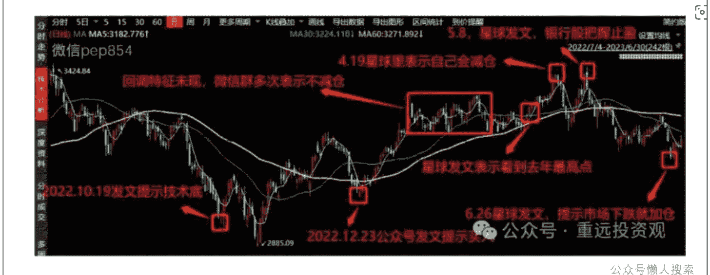

# 穿越牛熊的股市仓位管理

241109 重远投资观

整理：公众号懒人搜索，懒人专属群独享

懒人微信：lazyhelper

懒人备注：股市有风险，投资需谨慎！


微信：lazyhelper

本篇付费文是回应过去某篇公众号文章的留言要求。


由于牛市熊市的仓位管理也是框架思考的一部分，所以今天也对外发布。以下是原文。

这篇我们来讲一下股市的仓位管理。先说一个问题，为什么要有仓位管理，根本原因在于，股市无法预测。如果你能够预测某个周期内股市的涨跌，不管这个周期是一天，一个月，还是一年，你完全可以在周期起点把所有钱都买成股票，然后在周期终点把所有股票全部卖出。那么根本也就不需要什么仓位管理。除非是你自己控盘做的局，否则我不认为这个世界上有人能做到预测股市，巴菲特也做不到。

懒人微信：lazyhelper

由此可见，在股市盈利的关键，在于你的努力方向要对。如果你把所有努力都用来研究怎么预测股市，那么你最终很可能依然是个亏货。

那么对于中产而言，股市盈利的正确方向是什么？是你必须要认清的有两个你无法改变的事实。

- 1. 你无法预测股市
- 2. 你没有时间看盘

这两个事实，也是我之前在支付宝工作时，同样面临的两个问题。白天是要上班的，随时要开会的，不可能有时间盯盘的。

所以我必须要解决的问题是，我需要基于这两个事实，来寻找在股市稳定盈利的方法。所以这也是我为什么不做短线，而采取中线策略的底层原因。

所以这种做法也一直延续到今天，直到现在我也是不看盘的，找我做过线下一对一咨询的会员们都知道，我一般会把一对一咨询放在工作日上午，也就是说，我在开盘时间，是不看盘的，我不预测股市某一天的涨跌，也完全不在意。

那么，在不看盘，不预测的情况下，又要怎么在股市盈利呢？答案是，在股市，有很多高确定性的投资机会，也就是在股市所有的走势中，有一定的比例，你是能够把控的。

所以在你判断具有高度确定性的时候布局和下注，然后布局之后，市场当然也有两个方向，那么涨怎么办，跌怎么办？你都需要有所预案。

举个例子吧，比如我们拿四大行中过去两年涨势最猛的农业银行举例，它80%以上的股份，是控制在财政部和社保基金等国家部门的。也就是体制角度，它是不可能破产的（中国特色）。那么在两年前，其分红回报达到10%以上时，我们曾在星球提示投资机会。但即使你买了，农行就一定能涨吗？不一定，因为我们没法预测股市。但是，应对上面，你在上涨和下跌这两种情况下都是没问题的。如果股价涨，那么你肯定赚钱。如果股价跌，比如分红1元的价格10元的农行股票，跌了33%，那么由于分红金额不变，所以导致分红回报可以达到15%（1元/（10元*（1-33%）））。也就是，如果股价下跌，你的分红回报会上升。也就是我不管股票跌不跌，跌了我再买，那么我收6~7年的分红，我靠分红也能使得我买入的金额全部回本。

公众号懒人搜索，懒人专属群分享

也就是说，历史数据统计表明，农业银行在10%股息率将大概率迎来上涨，但即使下跌，我也有办法应对。这个，就是确定性，也就是无论股市走势是涨是跌，你从长期角度是不可能亏的。

那么，在股市里，存在着许许多多的这种确定性。并且我们从数据统计的角度，可以做出高概率的判断。我再举几个近期发生的例子。

- 1. 大盘成交量底和成交价低，历史上相差不超过1个月。这个我在8月给大家说明过，并告诉大家股市一个月内见底，但如果我依据该概率下注了，结果A股创造历史，超过1个月怎么办？超过了就超过了，无非是多等几天。并不影响你抄底。

- 2. 当偏离率接近历史极值时，90%概率回归，当超过历史极值时，100%的概率回归。这个我用于在8号告诉大家大盘大概率震荡或向下调整。但如果A股创造历史，9号继续上涨怎么办？那也最多就是晚一两天迎来下跌，也就是你没赚到最后一个铜板。但并不影响你盈利。

再比如我在2021年卖出阿里，依据的也是业绩首次下滑后，80%的公司都会迎来连续业绩下滑和股价下滑的这一事实。这个我两年多前也分享过。如果阿里刚好命中那个20%的小概率怎么办？那么后面可以再买回来。也就是说，我们在通过数据去做出股市高概率的判断时，也对小概率的事件是有预案和准备的。

所以，在股市投资，你在做出每一项决策时，对于后续遭遇的各种可能性，都是要有预案的。原因在于你无法100%确定市场走势，你押注的只是高概率，但万一股市命中小概率，那么也要确保你可以应对。

很多老粉跟我一路走来，知道我在择时的判断上，命中率很高，不仅仅是这次的见底时间预测，股市底部多根阳线上涨，以及8号见顶后判断大概率走震荡或下跌。在2022~2023的股市预测中，命中率也很高，这背后，都是数据在支撑。下面这幅图（原发表于我的一篇公号文章，图片可点开放大看），图中记载的所有发文记录，在公众号和星球里都有原文。



懒人微信：lazyhelper

虽然命中率高，但我们依然要对没有命中的小概率可能性做出应对，确保对我们是没有伤害的。即便我们能在很多确定性的场合找到高概率的方向，但我们必须承认，在股市中，对于某些事件，我们是找不到高概率的方向的。就比如说，高层到底会不会祭出超预期的经济刺激政策。答案是，不知道。

那么对于这种完全无法判断的可能性，我们就只能依赖仓位管理。就比如说，我们一般说的买卖规则，是估值低估时买入，估值适中时持有，估值高估时卖出。但问题在于，如果指数或是股票始终在低估和适中这两个区间穿梭，那么采用这种买卖规则，你就完全无法赚到指数波动的利润。但如果你打算使用估值低估时买入，估值适中时卖出的这种策略，那么如果指数真的进入高估区，你可能会面临无票可卖的境地。但这还不是最重要的，最重要的是，如果经济处于成长期，沪深300的复合年化回报是10%以上，如果300始终处于估值适中区，而你又卖出了，你就无法享受到其复合10%的增长回报。

所以，针对这种情况，我们不得已针对指数必须采取分仓管理的模式。也就是说，一部分仓位，搏取长期的复合10%的增长回报，另一部分仓位，搏去指数上下波动的利润。前者，我把其称为主仓，而后者，我之前把其称为杠杆仓位（过去我房子很多的时候，采取债务来增持后者）。而当我去年把部分房产卖掉后，因为现金过多，所以不用杠杆，直接用现金来买入，就把杠杆仓位称为超配仓位。主仓和超配的比例，根据不同的经济环境来决策。比如经济成长期，仓位会偏向主仓，而经济萧条期，则会偏向超配（因为很难进入高估区）。

那么之前我计划4000点前减仓超配，以及后来形势变化后9号早盘减仓超配，都是因为超配是用于博取指数波动的。而如果真的有超预期经济刺激，那么主仓则用于应对经济反弹的博弈。

这种配置实际是一种中庸的做法，我看到星球里有人清仓获利，打算去消费，也有人坚信会有刺激政策，坚信牛市还回来，所以还是满仓。我认为这两种可能性都有，如果大盘重回3000点下方，那么清仓者获利，而满仓者坐过山车。如果真的有超预期政策出来，那么清仓者失去仓位，而满仓者享受经济反弹后的估值提升。而我，只是采取了更加中庸的一个做法。或者说是一个更加具备确定性的做法。就是无论有没有政策，无论大盘走向何方，我都是确定是获利的。如果有政策使得大盘重新走牛，主仓将坐享牛市，而超配也完成了它的使命（搏取差价）。如果大盘重回3000下方，那么我将重新配置我的超配仓位。如果你一开始也是采用类似的方法布局的，那么无论股市走向何方，你应该都是心如止水的。而不会说是自己的情绪，被大盘牵着鼻子走。

综上，总结一下。你始终应该以布局和做好任何情况应对的方式来投资股市，这样你的情绪就不会被影响，你也不会有动力来每天盯盘。

我的模型，会每天拉取数据，计算各种概率，当出现技术层面异常和高概率方向时，会发消息提醒我（技术上就是仿照的支付宝财富线的夜间报警系统），然后我会在星球提醒大家。这种概率命中率一般会比较高（大家从我这两年的预测可以看出来），但我无法保证100%一定命中。

当没有高概率的方向时，你来问我走势，我只能回答你不知道，并且我也并不关心这个走势。就比如你问我明天股市怎么走，虽然我知道上方套牢盘严重，向上突破不易，但由于我的模型没有提示高概率的方向性指针，所以我也没办法告诉你明天的走势，毕竟不依靠数据，只依靠感觉来建议你，是对你的不负责任。

当我们面对不确定的事件时，不管押注哪一种可能性都有可能失败，那么在仓位上分仓管理，就可以确保获得一个平均的回报，确保无论是哪种可能性，我们都是可以盈利并赚钱的。这个就是我仓位管理的意义。你们也可以根据自己的实际情况，来做好自己的分仓管理，来应对股市的各种可能性（股市不可预测）。全文完


历史 3000 多份各类付费文章以及年费三千多的副业社群资源，见懒人专属群内部分享!

付费群，白嫖勿扰!

## 懒人专属群更新记录:
```
https://lazybook.fun/#/blog/record2
```
懒人微信: lazyhelper