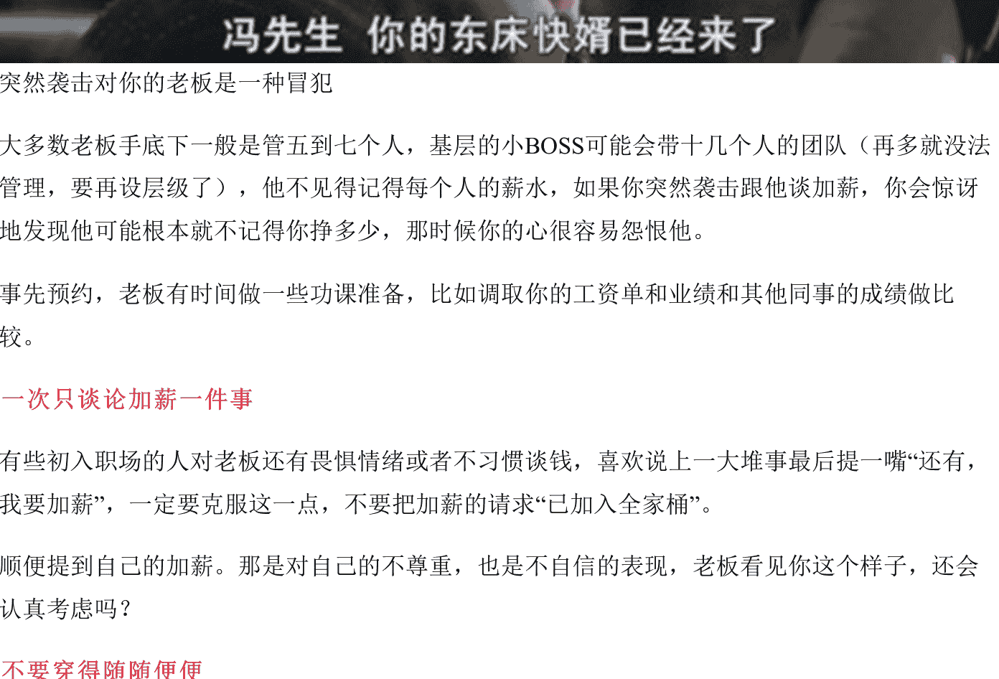
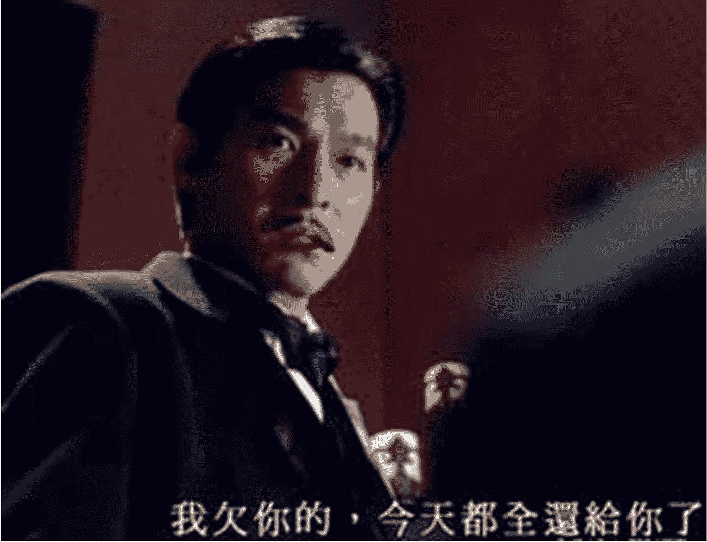
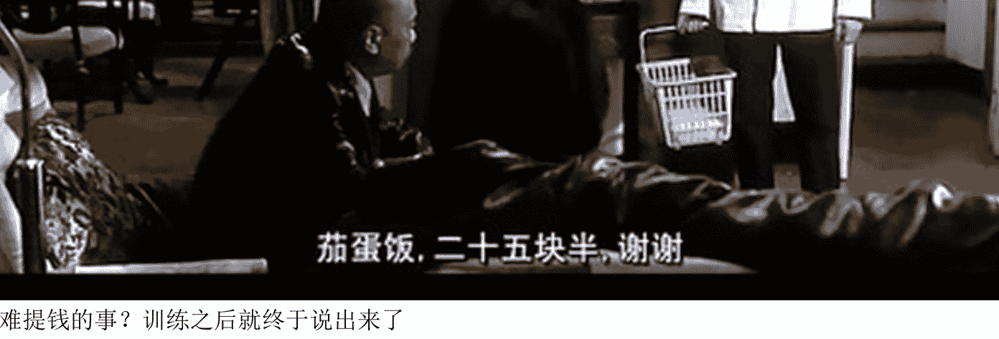
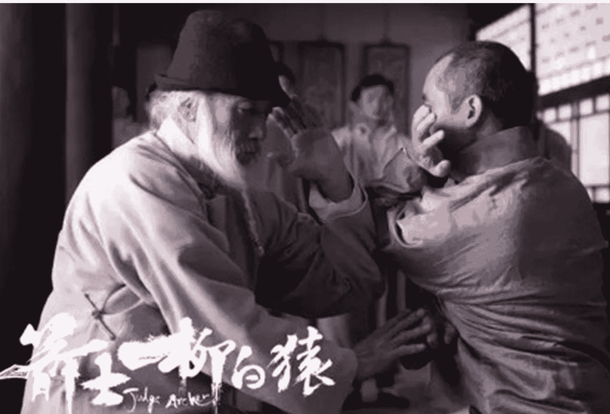
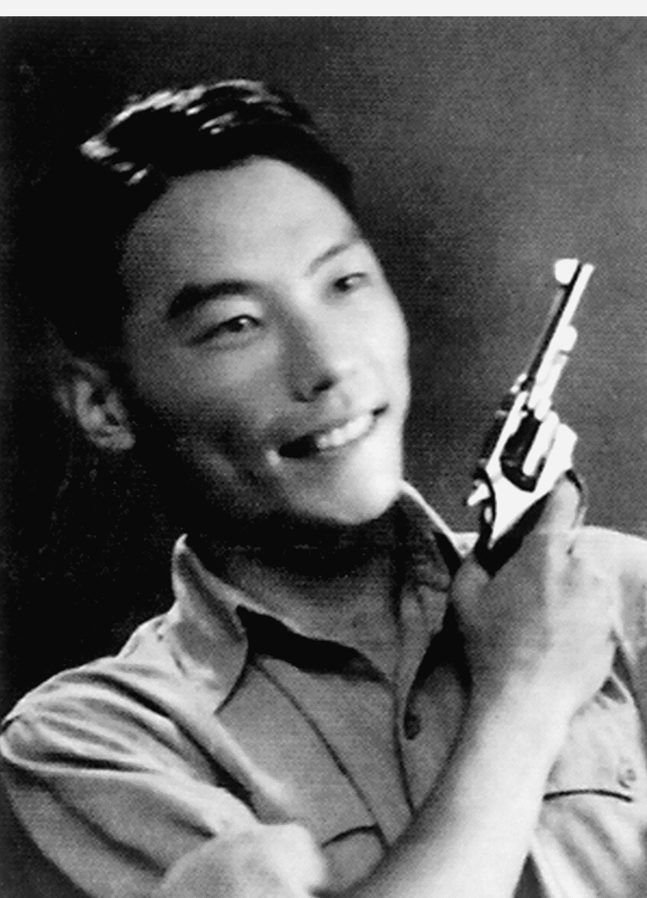
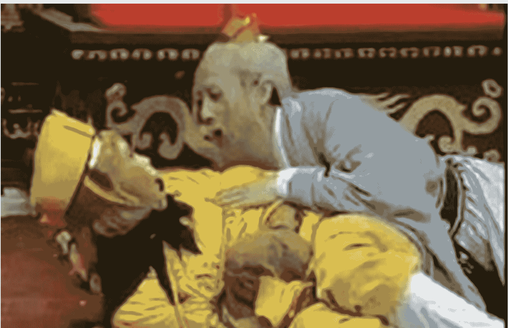

# 懒人专属群周报（第107期）

懒人专属群群友大家好，我是小懒人~

第107期《懒人专属群周报》，与君共读。

希望咱们专属群独有的《懒人专属群周报》可以作为群友们喜欢阅读的一份类似周刊的读物。

之前的离线版合集地址见咱们专属群总链接，小懒都有备份。

懒人微信：lazyhelper

懒人专属群周报（第107期）
北京时间 2024 年 11 月 15 日 出品

目录
- 关系攻略（节选）
  - 跟老板谈加薪时的几个不要
  - 习题
- 谈加薪之前要做些什么？
  - 习题
- 新闻评论
  - 珠海汽车撞人事件
  - “通报新闻”的细节
  - 野火烧不尽的公民新闻
  - 受众的需求与表达
- 川普的第二任期对媒体意味着什么
  - 媒体会在经营上受益于川普当选吗？
  - 机构媒体无关紧要了吗？
  - 媒体和记者会被秋后算帐吗？
- 懒人收藏夹
  - 自律：一个美好的假象
  - 总是受限于现实
  - 你不是看不懂经济，你是看不懂人性
  - 总结

No. 1 / 25

# 关系攻略（节选）

## 跟老板谈加薪时的几个不要

不用再纠结“什么时候可以加薪”了，就是现在，就是阳历年的年初。

为了财务、人力等部门办事方便，许多公司都会给新员工第二年签一个从年头到年尾的合同，这样的好处是做预算的时候，人力成本会特别清晰。

对员工来说也很方便，如果你在北方，发现住处来了暖气，就应该筹划跟老板要加薪了。

有的公司、有的岗位，可能是项目制，收入跟项目收益有关。

在完成一个大项目之后跟老板提加薪，确实也是一个不错的时机。

不过这样的公司收入一般都不是定薪，底薪也仅仅占很低的一部分，跟老板要加底薪可能就没有什么大出息。

你就不如去跟老板要更多的授权，更高一点的分成比例、谋求更高的职位或者跟他要一个新的市场区域，都比加薪要更划算。

电影《上海滩》，刘德华扮演了野心勃勃的丁力，他期待的不是收入，而是更大的市场份额。他要的当然不是大份，苦力多的行业，扩大市场份额就意味着能调动指挥更多人，那就是他权力游戏的开始。

贵司的薪水能谈吗？

谈钱不伤感情，谈感情其实才伤感情。谈三个人的感情比谈两个人的感情更伤感情。

有些公司不需要谈加薪，比如大多数的机关和事业单位，员工的收入只跟资历和岗位有关。

在一些上市大公司里，收入和层级相关，比较典型的就是腾讯和阿里巴巴。

层级和职位不同，但又跟职位相关，有点像军队的军衔、古代的爵位，相同层级的人收入可能会差出来不少，但是同一个岗位的人又可能属于不同的层级。

这些层级在该员工跳槽的时候非常重要，如果你在大公司干过，创业公司的人力总监一定问清你的职级，问清以后他对你的收入水平基本有数了。

公众号懒人搜索,懒人专属群分享

有明确职级的公司，加薪都有一个详细妥善的方案，跟个人表现和部门成绩有关，大多数时候不需要单谈，倒是你的老板对员工考核需要好好关注一下。

私营企业，尤其是规模小或者成立不久的企业，加薪就必须要谈，这就需要谈判技巧。

别把加上去的钱都给了税务局

如果一个人的主要收入都是薪水，而不是股份分红或者业务提成，那可能还在一个比较基层，或者技术性的工作上，这种局面下应该算一下自己的收入。

不要去查银行卡流水，一个人的收入除了到手收入之外，还要加上公积金部门的收益。

对公司来说，额外支付的部分除了你的公积金之外，还有社保。

中国的社保比较特殊，大多数白领人口可能一生都用不上失业险和男员工生育险，因此有一笔钱是接近税赋的存在。

一个人如果扣税之后挣8000元，那他的公司一般要付出12000元左右的成本来雇佣他。如果希望公司给你加薪10%，记得公司增加的成本可能不是800元，而是1200元。而你的薪水则会因为提升之后被收取累进的个税，到手也没有自己想象得多。

有些人根本不要钱，直接把老板家连锅端了。

因为税的原因，加薪可能是一种非常笨拙的解决方案，一些聪明的人会选择和公司共同进步，比如请求公司提供一些培训，或者参加公司组织的旅游度假的机会，或者附加的本人和家人的健康保险，这比拿了现金再去购买这类服务要划算得多。

同样，大城市的工作居住证、无息或者低息购房贷款、免费宿舍也有自己的价值。

不要忘记期待值和最低容忍值

给自己画一条线，比如期待加薪15%，但是最终公司决定加薪8%，也可以接受。那就把这两个数记在心里。老板开价当时你能做出判断就好，千万不要用圆珠笔写在手心上，那太傻了，更不要从腰包儿里掏出一个计算器，做水立方门口小商贩的姿势!

不要在周一、周五和大清早去谈加薪

如果老板让你来选时间，那就要尽量把住这个原则:

周一是开会的时段，一般大家都比较忙碌，选择周一去跟老板谈薪水，这事不对。

周五是一个人们准备松懈的时段，这个时候把球踢给老板也是不妥的，他可能要周一才能做出决定，这对你和他都是一种折磨。

最好的办法是周三或者周四，老板可能在本周内解决你的加薪请求。

一日之功在于晨，早上是处理邮件、准备会议、做PPT的最早时间，公司里假装努力工作的就有好几百人，你这个时候去跟老板谈自己的薪水，这是很遭人恨的。

大多数公司的规则都是老板比员工到岗晚，老板可能是睡眠不佳，可能在早高峰的主路上受尽了折磨，可能还没吃早饭，而你准备了一夜，以逸待劳。他看你满面红光，一准来气。

这种局面下你去跟他谈论薪水，不是一个好主意。

大多数的老板都会对下班前的那一小段时间的低效睁一只眼闭一只眼，看看多少微信公众号在下午四点半推送就知道了。

用这段时间去见见老板，谈论一下薪水，并不算失礼。要知道，老板的大脑一般在下午四点半才刚刚开机，上午基本上他都是靠本能行事。

不然为什么所有的公司都差不多，都是下班后大家纷纷回家了，老板才刚刚开始胡思乱想，然后夺命连环CALL，觉得自己有了好点子。

### 不要对老板突然袭击

不要进了他办公室跟他说：“我要加薪”，那会让老板措手不及。

突然袭击对你的老板是一种冒犯

大多数老板手底下一般是管五到七个人，基层的小BOSS可能会带十几个人的团队（再多就没法管理，要再设层级了），他不见得记得每个人的薪水，如果你突然袭击跟他谈加薪，你会惊讶地发现他可能根本就不记得你挣多少，那时候你的心很容易怨恨他。

事先预约，老板有时间做一些功课准备，比如调取你的工资单和业绩和其他同事的成绩做比较。

### 一次只谈论加薪一件事

有些初入职场的人对老板还有畏惧情绪或者不习惯谈钱，喜欢说上一大堆事最后提一嘴“还有，我要加薪”，一定要克服这一点，不要把加薪的请求“已加入全家桶”。

顺便提到自己的加薪。那是对自己的不尊重，也是不自信的表现，老板看见你这个样子，还会认真考虑吗？

### 不要穿得随随便便

如果你谈论的加薪同时还伴有职位提升，那就穿成那个职位得体的衣服比较好。同样，你对加薪这件事有多认真，就应该穿多正式的衣服。

### 不要饿着，也别吃韭菜

一般来说，加薪这事不会拖太长时间，但还是不能饿着肚子，严重不建议在减肥、辟谷、斋戒之类的时期（清心寡欲的人就别提钱了）谈论加薪，低血糖会让你暴躁易怒。

中午别吃有气味的食物，也别吃火锅。

同样，那个下午，也不要让自己太过疲倦。

### 不要拿别的机会来威胁老板

恐吓现在的老板完全没有必要，如果你真的只是希望谈加薪，那用别的机会去恐吓会让老板对你非常怨恨，如果你已经决定走，那就更不要去告诉老板“爷有去处了”，没必要结这个仇。

手上如果有别的公司的邀请了，也不要拿着别人的offer来跟老板谈价格，如果对方开价很高的话，可以上调自己加薪的预期价格。

跟老板提起邀请的公司名问题会很大，有些老板会打给对方老板，搅黄了未来的工作，所有离职的理由都应该是个人原因，离职前也不要提意见，这是另外一个话题，我们回头来专门拆解。

### 不要提别人的薪水

如果你的实力够了，老板的钱也足，自然会给你，攀上别人，早晚会传到对方耳朵里的。

大部分公司里，薪水都是背靠背的，不能问，不能说。就算你知道了同事的价格，也不要去跟老板说这件事。

### 不要哭穷

我要是老板，我就送你出门，然后问你这句话。

永远不要以家里压力大或者有困难去请求加薪或者离职，因为不能养家而辞职都是借口，因为离职之后会失去不高的收入，有困难确实让你努力去挣更多的钱，但老板给你加薪的理由只有一个：你值这么多。

### 心内排练

一种面临大场面之前的脱敏疗法，适用于各种难堪、复杂的局面，比如公开讲演、发言等。

具体来说，就是脑补老板的各种应对方式，然后挑出现实中可能最羞辱性的一个局面来全面想象每个细节，刚开始可能会把自己紧张得满身大汗。

不过随着反复幻想这个场面之后，紧张感会逐渐缓解。

难提钱的事？训练之后就终于说出来了

有些老板是非常强势的人，气场上可以碾压一切谈判桌上的对手，对付这样的人，日本维新时期的政治家坂本龙马（这是一个忽悠人心影响人大师）有一个窍门：

> “遇见畏惧之人，可以想象其人与妻亲狎之态。”

确实好用，对方确实变了一种萌萌哒的感觉，但这个做法的副作用是：

- 你不能笑场
- 不要有任何生理变化

好了，在座位上晾一点热水，去找你的老板谈吧，谈判本身不会太久的，等你回来的时候，热水正好变温水，适合入口，祝加薪顺利。

## 习题

熊将军希望委座给他升二级上将，哪个说辞是对的：

我为党国负过伤。
我保卫南京流过血。
台儿庄我消灭过鬼子一个大队。
守长沙我队伍打光了，从死人堆里爬出来。
刘峙这个笨蛋都升了二级上将了。
委座，我部上个月歼敌一万人，是战绩最好的（不告诉他我部二师和三师全军覆没）。

是不是想回答x √ √ x x √?

错了，因为这些原则都是针对公司的，而熊将军和委座的关系是军队的上下级关系，委座可以军法查办他，而他并没有最后的一招“离职”。

人的自由流动是你谈价的根本基础。

首先你得走得了，然后再决定怎么谈。

注意弄清楚你公司的所有制形态，这非常重要！

## 谈加薪之前要做些什么？

上一篇我们提到了，加薪时不要做什么。

有人问我说，熊老师，谈论加薪时，要做什么呢？

我详细地告诉大家加薪不要做什么，很重要的一点就是防止大家犯低级错误。

防呆是这个专栏的一个重要目的，别工作做得好好的，最后一哆嗦把财富损失了。

但是想加薪要做什么，我得好好跟大家分享一下，准备工作不是谈加薪前一天做的，要提前做。

提前到什么时候？提前到你进这家公司的时候，当然，如果你已经是一家公司的老人，好，现在开始做，不晚。

职场很凶险，而且这种凶险不是两个部门在大办公区或者会议室里当众争吵。

公开争吵跟长疖子差不多，撕破了就快好了。真正的凶险，是那种表面上一团和气，下面暗流涌动。

这样几个壮小伙子拦路堵你，你肯定是扭头就跑，不会有什么伤损。

跟这样的一个老爷子动手，很可能倒是要吃大苦头的。因为他的危险你无法预判，这就是暗流涌动，注意，伤人的拳，都在桌子下面。

“如果进了一个复杂的公司......”

对不起，我重新说。

因为没有不复杂的公司。

哪怕进了一个最小最小的公司，哪怕从事一个最普通最普通的职业，想要年底的时候获得加薪，就把这份攻略上做的事情都走一遍。

### 1. 前台攻略

上周我去罗辑思维串门，前台姑娘对我说：“您是来面试的吗？”

真会说话啊，这不是夸我长得年轻嘛。

前台的姑娘，一般本地人居多，笨的确实也有，但聪明的是主流。

估计很多人找工作，除了公司里可能有推荐人之外，最先见到的就是前台。

前台是一个很重要的角色，到一个公司，趁早跟前台混熟，你在布局你的安全网，她很重要，她不是一颗闲棋冷子。

历史上最著名的闲棋冷子，潜伏者熊向晖是清华大学学生，周恩来曾经和这个青年长谈一夜，熊向晖对周非常佩服，后来熊向晖参军，成为胡宗南身边的秘书，胡宗南重要的命令熊向晖都会汇报给周，胡长官从此就没打赢过。你在别人身份越低的时候示好，他把你当自己人的可能性就越大。

她能看到的关于公司的事，比你多得多。

前台的提升路径一般是行政部门文员、以后还可能成为主管、副总监，在有些公司里，还有成为老板娘的。

早点获得她的友谊是个好主意。

你可能不经意地问出公司最近的情况。

“又是面试的是吗？”

面试的多寡能够侧面提示你所在公司的经营情况。

“看着这些候选人都好年轻啊。”

是补岗流失人员还是扩张业务，通过年龄、资历等大概情况可以看出来。

“我们公司年会是什么时候，在哪儿啊？”（行政部门的人一准知道）

可以问问老员工往年的年会在哪，比较一下两个场地的地理位置和租金、房间的奢华程度，餐饮价格。

此外，所有的货运和快递都经她。

想想看，狗仔还要翻垃圾箱，去探讨明星吃了什么，用了什么。

前台姑娘能猜出来大多数人最近买了什么。

所以，太私人的东西不要往公司发。

如果你同样是一个年轻员工，可以约上她和几个同事一起出去玩。

已经到了小工头或者管理层了，这么做就不好了，不如一些随手小礼物，发个小红包，以及及时称赞对方发型和衣着。

不要跟前台姑娘谈恋爱。

大多数公司都不支持公司内恋情，和你收获的那些信息相比，你可能暴露得更多。

从前台的姑娘那里，你收获的是关于公司经营状况的辅助性信息，此外可能有一点小八卦。

在决定去跟老板谈论加薪的时候，可以再问问前台，知己知彼：

“熊总最近很忙吗？”

“约他老约不上。”

姑娘就会透露一个惊天的秘密：

“据说他特别忙，我只好订他得到的专栏，要找他都是在文章后面留言，回得特别快！”

### 2. 人力攻略

入职的时候一般会见人力总监，也会有一个人力的同事带着你办完所有的流程。

入职的时候要问清楚，我们的加薪机制，是统一评测，还是到什么时候来谈。

问清楚公司的内推机制，比如推荐人才有没有奖励（有的公司的伯乐奖很高），这能显示你关心公司，也是一个对朋友热心肠的人。

在猎头招聘网站、官方公号和官网上关注你公司的信息，如果公司有信息发布，可以考虑把你手上想换工作的人看似不经意地推荐给人力的同事。

你帮人解决KPI，人怎么会觉得麻烦。

当你的熟人（不推荐把太近的朋友拉进来，负担太重）进来面试之后，可能会愿意找你聊聊吃个饭。一般他会说出人力提出的薪酬和待遇，问你的意见。

先把数字记住。薪酬是公司的高压线，不能随便打听。但是候选人请你帮忙参谋的时候，他还不是公司员工。

招聘这事深了，也是很多公司刺探竞争对手情报、盗取廉价创意的好机会。

有的公司自己也会犯傻。我听说过一家公司，给推荐者相当于被推荐者的一个月月薪（这是猎头公司的路数，收几个月的薪水做中介费）。那个公司的人很快发现，不用去打听别人的薪水，只要问推荐人发了多少奖金就可以了。

此外，人力的同事能看得到所有员工的简历，可能还包括各位老板，这些资料百度上可能搜不到。

你如果需要知道哪位大佬是你的校友、同乡或者曾经共同服务于另外一家公司，有的人力可能会不经意提到，你只要提自己的经历，她可能就会发散提到，“啊，你和X总是校友啊。”这些东西不是秘密，但亲口去问对方，未必合适。

谈加薪之前记得问问人力，看有没有加人的计划，你这个岗位的人好找不好找，要记得，你的薪水高低不是老板恩典，也不是你的口才好，最终是市场上和你同行业、同阶层的候选人们竞争决定的。

你越是难以替代，老板就越愿意付出更多。

### 3. 和领导务虚

到秋冬的时候，就可以找领导务虚一下，一个年轻人找直属领导谈谈心，再正常不过了，听听公司的设想，部门的计划。

我们说务虚，就是要找一个有点非正式的场合，茶水间小吧台就很合适，说说自己人生的迷茫。

工作后的第一年有动摇，第二年有彷徨，第三年有见异思迁，第七年有七年之痒。

我们之前说过，提加薪的时候不要哭穷，（开玩笑地哭也不行）那非常LOW，而且会被看做一个悲观的人。

但是务虚，谈自己的彷徨的时候，是可以提及自己的困境的，年轻人基本上就是一个困境——穷。

大多数的领导都会分享一下自己年轻时候的努力史，给你打气，你可以趁机了解多一点他的经历。

聪明的领导会把你考虑加入调整薪资的计划上报的。如果你的领导本身就是老板，事情可能还会更简单一点。

把这句话念三遍，相信它：

- 我穷是因为我还年轻。
- 我穷是因为我还年轻。
- 我穷是因为我还年轻。

### 4. 前同事攻略

遇见已经转行的前同事，记得把他抱得再紧一点。

你能同时听到他描绘新行业和吐槽老东家。

可以去找他聊聊，听听他的建议和意见，说不定会有一份新工作等着你，跳槽一般可以让自己的薪水增长30%左右，而谈加薪一般不会超过20%。

关于前同事这种资源的开发，我回头会专门写一下，大家先等等，现在说细了，就有点超纲了。

注意，无论是前台、人力、领导、前同事，我们都要以诚相待，不能害他们，谁说了什么，都要在自己的资料库里，像我几次提到过，引而不发，这些东西帮助你做判断，不是让你撕人的时候抖料。

弓拉满了瞄准了人，别轻易射出去。

我们要获取这样的消息，不是为了去搞阴谋或者算计谁，而是为了自己的职场安全，这都是跟公司有关的情报。

还有一个特别有用的公司情报，是贵司的负面报道。

好好研究一下，再问问一些比较有见识的人怎么看待此事。老板可能会对负面报道暴跳如雷，你也可以跟着他恶评一下这个负面报道，然后逐字逐句，读到纸背里的意思。

同样，如果你的公司是上市公司，财报也是你的一个参考资料。

越多的信息，越有助于我们的进步和自保。

要在公司强盛的时候接触其它机会，这样能谈上一个好价格。

要在它崩溃之前及时离开，尽量避免变成一个留守人员。

好了，跟四类人接触之后，重温一下《跟老板谈加薪时的几个不要》，然后约一下老板的时间吧。

![图片]

中国体操队的冠军谭佳薪
这是中国体操队的冠军谭佳薪，起了一个很好的名字，如果你再想谈到加薪觉得紧张发抖的时候，记得想想这张可爱的笑脸！

## 习题

以下几条哪个是不对的：
- A. 不要忽视前台、行政、保洁这样的支援性工种，对他们友善可能有意外之喜。
- B. 前同事是新工作的重要来源之一。
- C. 帮熟人介绍自己现在公司的工作是为了让他变成我的替死鬼。
- D. 不要显得你少年老成，要多请教领导，哪怕他的话其实你早就都掌握了。

正确答案是C，要在公司情况还好的时候就去接触其它机会，这样你即使决定离职了，这公司也仍然还是一个好公司。

和拉熟人进来工作相比，把熟人推荐给人力这件事本身可能更重要。这是一个信息获取的过程，老板总说你有主人翁意识，其实并没有错，多管闲事一小下，你对公司的理解就会更多，这有助于你做判断，会让你在职场上更加安全。

# 新闻评论

新闻实验室是小懒付费订阅的通讯录，年费300多。小懒整理分享，仅供专属群群友查阅。如有余力，可以自己到Newsletter上自费订阅。

## 珠海汽车撞人事件

> 事件发生的48小时之内，有哪些信息被生产、传播和删除，而公众又有怎样的信息需求和情绪表达。

![图片]

11月11日晚上7点多，珠海市体育中心发生汽车无差别冲撞行人事件。大约24小时之后，珠海警方发布蓝底白字的通报，披露该事件已经造成35人死亡、43人受伤。

本期新闻实验室会员通讯，我们来梳理这起事件发生的48小时之内，有哪些信息被生产、传播和删除，而公众又有怎样的信息需求和情绪表达。

### “通报新闻”的细节

今年年初，媒体人彭远文提出了“通报时代”的概念，精准地总结了过去几年突发事件之后信息生产方式的变化。

以往，一旦突发事件发生，来自全国各地的媒体记者便会迅速赶到，与禁令赛跑，发出文章。如果事故现场被封锁、调查溯源被禁止，那么至少，会发表一些记录逝者（往往是小人物）生平的特写，体现人文关怀。

而现在，由于管控的进一步增强和机构媒体的衰落，人们几乎只能从政府发布的蓝底白字通报（而非媒体报道）获知关于事件的信息——这样的信息当然是非常有限的，也是经过精心挑选和剪裁的，但“等通报”已经成为一种普遍的心态。如彭远文所言，“在相当一部分受众眼里，’通报‘即为事实。”

此次珠海汽车撞人事件，照例是只有财新做了一点点不一样的报道。然而仔细阅读报道会发现，主要信源还是警报通报，信息增量是对目击者的采访。

端传媒的文章披露，“当晚事发两小时后就有报道禁令，尽管有记者很快赶赴现场，但稿件在翌日也无法出街。”

尽管那些蓝底白字的通报看上去是如此的一致，从样式上来看也在塑造一种说一不二的权威感，但任何的通报都是经过一定的流程发布出来的，单调的外表之下也可能透露出一定的信息。此次通报就至少有两个细节值得留意。

其一，虽然事故当晚警方就发布了一则通报，但是内容非常简略，几乎没有有效信息。而信息稍多的那则通报，发布的时间已经是事件发生接近24小时之后，以今天的传播速度而言，可谓颇为滞后。它显示出：当公众在“等通报”的时候，体制内部或许正在“等批准”。由于死亡人数超过30，已经属于“特别重大事故”的范畴，且事件发生第二天就要举行航展盛事，事件的严重性和敏感程度使得地方政府更加谨慎，很可能是只敢在中央批准和定调之后发布通报。我们也能从这个案例中看出，在自主性方面，广东省已经和其他内陆省份没有什么分别。

第二，12日晚，珠海市公安局发布了通报之后，又迅速删除，改发了第二个版本。两个版本的区别在于，后一个版本删除了整整一段：“经查，近年樊某与前妻因离婚后财产分割纠纷，先后到基层人民法院和市中级人民法院提起民事诉讼。樊某不服判决结果提起再审。目前，案件正在再审审理过程中。”

不过，新版本的通报中依然保留了“离异”、“案件系樊某对其离婚后财产分割结果不满而引发”。但是，通报又同样提到樊某因为自残而“暂时无法接受公安机关讯问”——在这样的情况下，为何已经能断定案发原因？这些细节似乎显示，警方希望迅速下一个定论，将责任推到家庭矛盾（而非系统性的社会不公）之上。但是，这样的说法也在社交媒体上引发了反弹。可以说，这则通报并没有起到官方期待的一锤定音塑造舆论的作用。

接下来是否还会有关于此事的蓝底白字通报出现，还很难说。不论是不了了之，还是尝试用更多的证据来锁定对于案发原因的推断，都是官方可能采用的策略。

### 野火烧不尽的公民新闻

虽然此次尚没有机构媒体发出有较多信息增量的报道，但依然有公民记者在孜孜不倦地提供信息，尽管他们的文章无一例外面临被删除的结局。

中国的公民新闻在2008年前后最为活跃，但近年来已经很少有人再提这个概念。一些主动以“公民记者”自称的人，先后身陷囹圄。

但即便不再有人主动使用这个称呼，实质上的公民新闻依然是野火烧不尽，春风吹又生。一些小团队在墙内的缝隙之中，努力发出一些声音，就好像当年与禁令赛跑的机构媒体一样。

珠海汽车撞人事件发生后，就有几个这样的小团队或个人账号在做这样的努力。

一是“图拉的精神食粮”，这个公号是最早发出大量现场图片和目击者采访的。文章说，“有人脚断了，有人撞吐血了，看着很恐怖”；并且给出了徒步队的成员构成，“共有六支徒步队伍，每队有四五十人，年龄从40岁到70岁不等，成员来自各行各业，有退休教师、房产销售员、打工者、餐饮业从业者和水果商等”。在事件发生后，这都是非常宝贵的现场信息。

目前，这个公号已经被微信封禁。号主是一名记者，但他在自己公号上的写作属于非职务行为，是将那些无法见诸机构媒体的内容以另一种方式记录。就在前几天的记者节，他还发了一篇《这三年，我如何在中国媒体做记者》，里面说“从某个时刻开始，常规报道变成了敏感新闻，404报道被视为行业勋章，做敏感新闻变成了一小部分媒体的‘特权’”，但也同时表示：“我会继续写，为了我自己、向我伸出手的人和我所相信的东西而写，我不能辜负我的职业训练，不能辜负文字，这是我对当下的自己唯一的要求。”

这篇文字，也几乎是今年的记者节唯一一篇值得阅读和分享的文字。

二是“水瓶纪元”。13日凌晨00:15，它发表了《珠海体育场凶案翌日》一文。从行文来看，作者抵达了现场，和附近的工作人员有沟通，并描述了现场的清洗血迹的工作，且提到“空气中仍可闻到丝丝血腥味。”文章还采访了不少附近民众，他们表示“什么都不能说”。作者还在救治伤者的医院门口目击了一些情况，并采访到了一位逝者的家属。

此外，文章还描述了社交媒体上的情况：“事故现场的视频起初在各个社交媒体上传播，又接连被屏蔽，但消息始终无法截断，甚至有人在地图软件的实况功能里询问，‘有没有现场的照片？’、‘SUV撞了多少人？’在社交平台上，不断有人发帖询问，‘珠海体育中心今晚发生了什么’，有人悼念，‘不知道明天和意外哪个先来’。”

水瓶纪元的文章相当专业，它原来是一家短暂运营过的新媒体“全现在”旗下的子品牌，专注于性别议题的报道。在“全现在”关闭之后，水瓶纪元更换了一个同名公号，继续以不高的更新频率出品优质报道。就在11月11日，它还发表了一篇关于堕胎难的深度报道。

三是“鸡蛋bot”，它发表的文章是《珠海市体育中心袭击事件背后》。这个公号此前也发布过一些被删除的内容，此次发布的报道有四位署名作者，采访到了徒步队的参与者，拨通了医院重症医学科的电话，对涉事车辆的情况做了一些核查的尝试。比起水瓶纪元的报道，这篇文章提供的增量信息不多，但在机构媒体没有作为的情况下，“鸡蛋bot”的报道也是难得的努力了。

值得一提的是，这些以自媒体的形式出现的账号之间也有对信息的互相引用，并且在引用时提及了首发账号的名字。这是不少机构媒体在平时都不能做到的操作。这也显示出文章作者们的专业水准。

除了这些由接受过专业训练的作者完成的自媒体文章之外，其他人也可以提供重要的信息和视角。例如，公号“海隅苍生”发表的《2018-2024中国无差别杀人案件总结分析》就对类似的案件做了初步的梳理和总结，发现“看上去今年这类案件确实可能有所增加”。以及，“凶手在50到59岁之间比例很高，也就是65后和70后75前。”

再比如，“雅君的好用分享”对警方的通报做了简短但犀利的点评，认为关于离婚后财产分割的原因总结“将部分责任转移到离婚制度或嫌疑人的前妻身上，尽管她与本次犯罪毫无关联。”

而遇难者亲属的分享也一度在社交媒体上流传。例如，一位作者的父母都在现场、母亲生还希望渺茫。她的自述从一个具体的个案视角，提供了此前媒体会做的逝者特写当中可能会集中提到的信息。

以上这些是我在自己的社交媒体信息流中看到的主要报道和评论。这些文章的原文都已经被删除，它们产生的实际影响力也许不能高估，但它们也确实说明，即便缝隙非常狭窄，依然有人在记录和发声。

### 受众的需求与表达

最后，我想换一个视角，从信息消费者的角度看看这次事件之后的信息需求与传播。

BBC曾经做过一项受众研究，并提出了新闻用户的需求模型。这一模型后来被升级为2.0版本，它将用户对于新闻的需求分为四个大类：

- 对于“知道、了解”（know）的需求，满足这种需求就需要提供事实类的信息。
- 对于“理解”（understand）的需求，满足这种需求就需要提供更多的背景和解释。
- 对于“感受”（feel）的需求，满足这种需求就需要提供情绪价值。
- 对于“行动”（do）的需求，满足这种需求就需要提供可以让用户行动起来的建议和启发。

从这个模型出发，我们可以看看在珠海车撞人这样的公共事件发生后，哪些受众需求得到了满足，哪些没有。

首先，对于“知道、了解”的需求，警方通报只提供了最基本的信息，而其他媒体提供信息的能力也非常有限，自媒体提供的信息又被迅速删除。因此总的来看，对于事实类信息的需求是有很大的缺口没有满足的。

第二，对于“理解”的需求，社交媒体上其实呈现出相关内容泛滥成灾的态势。在事实尚且不明的情况下，许多人已经开始解读背后的原因，有人说是社会令人绝望，有人说是女权害人，有人说是男的真可怕，有人说中老年男性是最危险的群体……由于以上观点都能符合一部分人的既定观点，因此它们都可以获得不错的传播量和认可度。但是，这样的“理解”始终是建立在薄弱的事实基础之上，因此也始终会有人感到需求并未被满足。

第三，对于“感受”的需求，我们也能看到明显的情绪导向。哀悼在一定程度上是被允许的，但不能将哀悼和社会批评联系起来。而比起哀悼，社交媒体上更显眼的情绪，是愤怒——更具体来说，是对凶手个体的愤怒。显然，这样的愤怒是很容易被引向对“严打”、“重拳”的支持，这是公权力乐见的。至于其他的情绪：害怕、担忧、对更系统性的力量的不满，则只能在小范围流淌，人们心头的郁结始终是难以被解开的。

第四，对于“行动”的需求，市民买花尚且不被允许摆到体育场，其他的行动就更不被允许了。

以上四个方面综合起来，我们可以发现：在墙内的信息环境下，公共事件发生之后，人们普遍处于基本信息饥渴、背景解读层出不穷、情绪引导朝向个体层面的愤怒，但不能行动的状态。这样的情况持续久了，人们之间将会变得越来越不能沟通，因为大家都活在自己解读版本的世界里，同时又处于愤怒过剩且难以发泄的状态。

这可能正好映射了车撞人事件的社会背景——暴力的倾向无法在沟通、理解和关怀中被消融，只能在不断累积愤怒之后，以最极端的形式引爆。

## 川普的第二任期对媒体意味着什么

> 比起外在的政治威胁，媒体在川普的第二任期面临的更重要挑战还是自身的变革前景。

![图片]

2024年美国总统大选落幕，川普击败贺锦丽，将于离任四年之后重返白宫，开启他的第二任期。

在胜选演讲中，川普说：“这是一场前所未见的运动，坦率地说，我相信这是有史以来最伟大的政治运动。在这个国家，也许在其他国家，从来没有过这样的事情。”

这场政治运动，对于新闻媒体来说意味着什么?本期新闻实验室会员通讯，我们将分析其中的几个关键问题。

### 媒体会在经营上受益于川普当选吗?

2016年，川普击败希拉里，令反对川普者占多数的媒体感到震惊和难以接受。不过，大家很快发现：至少从赚钱这件事上来说，川普当选其实对媒体非常有利。

一方面，对川普极为不满乃至愤怒和恐惧的人，选择用钱投票，主动以订阅、捐赠等方式支持《纽约时报》等自由派媒体，期待它们能充分发挥第四权力，大力监督川普政府，防止其胡作非为。

这些新闻机构也利用民众的这股支持热潮，主动开展推广活动。比如，《华盛顿邮报》在川普上任后不久，就推出了新的口号:“民主死于黑暗(Democracy Dies in Darkness)”，其指向性非常明显。（当然，结合上期会员通讯介绍的贝索斯枪毙该报对贺锦丽的背书一事，八年间的变化令人唏嘘。）

我们可以看一组具体的数字:《纽约时报》的股价在2016年11月时是12美元左右，在川普任期结束的2021年1月是50美元左右。就在本届大选的前一天，该报发布财报宣布，其用户总数首次突破1100万大关——这个数字可能还会受到选举结果的刺激，在第四季度再次大幅增长。

另一方面，即便不是在情感冲动促使之下慷慨解囊，许多人也对川普这样一位乖张的政治素人究竟为何能胜选、他将如何治理国家、美国面临着怎样的局势等问题感到非常好奇。总体来说，大家对媒体内容的消费出现明显增加，这自然也就给媒体带来了更多的变现。

以上现象，被称为“Trump bump”——川普的首次当选，让媒体的收入曲线出现了一次明显的向上隆起。

那么这一次，川普二进白宫，媒体会不会随之出现“Trump bump 2.0”呢?

目前来看，预测大概会是：有，但规模会比上次小得多。

这主要是因为川普反对者的情绪已经不同于八年前。上一次主导的是震惊、愤怒、恐惧等具有强烈行动驱动力的情绪，而这一次占据主流的恐怕将是疲惫、丧气和冷漠。八年前的失败带来的是斗志，这一次的失败带来的可能是“累了，毁灭吧”。

在分析贺锦丽的竞选失败时，一种观点认为：她过于依赖“川普是坏人、拒绝川普”这样的信息，但从根本上没有提出有别于拜登的、能让人从内心感到激动的政策立场，因此无法获得足够的支持。这样的逻辑同样适用于分析自由派媒体的前路：仅靠打“反抗川普”这张牌，效果恐怕有限，能否克服自身的问题、推出令受众真正感兴趣的产品才是关键。

### 机构媒体无关紧要了吗？

如果说“Trump bump 2.0”是对媒体的乐观预测，那么机构媒体同样面临着悲观的预测。持有这种观点的人认为，川普在这次竞选过程中的媒体选择，就已经宣布了媒体已死，或者至少是机构媒体已死。

观察川普的竞选过程可以发现，他很少接受Fox News以外的主流媒体的专访。在大选前一个月，他拒绝了CBS王牌新闻节目《60分钟》的采访——半个世纪以来，《60分钟》的专访一直被认为是总统候选人在临近大选时的重要一站。而在今年，只有贺锦丽出现在《60分钟》 的节目中。

那么，川普在竞选中依赖什么样的媒体呢？答案是：以播客、YouTube为主要渠道的个人网红，当然，从意识形态上来说，他合作的都是右翼网红。

具体是哪些人呢？在川普发表获胜感言的时候，他的朋友、UFC（终极格斗冠军赛）首席执行官白大拿（Dana White）说的一段话特别点了这些人的名字：“我想感谢Nelk Boys、Adin Ross、Theo Von、Bussin’ With the Boys，以及强大的Joe Rogan。”

除了最后一位Joe Rogan是全球头号播客因此具备知名度之外，大家可能对这些名字并不熟悉——哪怕是美国人，恐怕也会有很多人对这串名字感到一头雾水。但这些人在右翼圈子里有非常高的知名度和粉丝黏性，尤其是在年轻男性当中。当川普做客他们的播客、YouTube频道时，会受到兄弟般的热烈欢迎。

因此，川普的选择便非常容易理解：上主流媒体接受采访，会被问各种有挑战性的问题，还会被做事实核查。上右翼网红的节目，既开心轻松，又能接触到一大批高忠诚度的粉丝。

民主党方面在竞选后期也开始使用这种策略。贺锦丽上了左翼播客《Call Her Daddy》。但是在依赖网红方面，论频次还远远不如川普。

从数字上来看，主流机构媒体的影响力的确下降了很多。根据尼尔森公司的数据，大选夜电视新闻频道的收视率下跌明显，平均收视人数为4230万，低于四年前的近5700万，收视率为几十年来最低。其中，CNN 的收视率跌幅最大。

大选结束后，《纽约》杂志引用的一句来自某电视台高管的话被很多人分享。这位高管说：“如果全国有一半的人认为川普有资格当总统，那就意味着他们不会消费任何媒体，我们已经彻底失去了这部分观众。川普获胜意味着主流媒体以目前的形式已经死亡。问题是，它之后会是什么样子。”

川普的忠粉们也认为，他的获胜是对新闻媒体的彻底否定。保守派评论家Matt Walsh在X上说，“传统媒体已正式死亡。它们的叙事能力已被摧毁。川普在2016年向媒体宣战。今晚，他彻底征服了它们。它们再也不重要了。”

当然，这样的绝对论调，要么是夸张，要么是一厢情愿，没必要当真。只是，机构媒体接下来究竟如何自我定位，的确是亟需思考和解决的问题。

《哥伦比亚新闻评论》的文章认为：“现在有，而且将来也依然会有，对新的和重要信息的需求——这是世界上的马斯克和Joe Rogan们永远无法搔到的痒处。也仍然会有足够多的有魄力、有韧性和有愿望的记者去寻找它、转述它，并把为它提供理解的语境。”

摆在主流机构媒体面前的似乎有两条路。一是学习网红们的做法，把更多的个体记者推向前台，打造成网红，或者直接和网红们合作，乃至雇佣他们。二是主打网红无法完成的内容，例如需要巨大投入和团队合作的调查报道或其他超优质深度报道——网红的影晌力再大，也不可能否定调查报道和深度报道的价值。

这两条路看起来矛盾，但在现实中或许也能找到一种兼顾的方法——既投入资源去无所畏惧地做调查报道，又放下身段与受众真诚联结。

在这个问题上，我认为最无用的是非黑即白的二分法，把复杂的问题用简单的药方去处理。人们已经越来越认识到：网红KOL在作为媒体的角色方面并非一无是处，他们有值得机构媒体反思和借鉴的地方；但同时，机构媒体也远不是应该扫到历史垃圾堆里的角色，不能因为川普的二次当选就宣布它们已经无关紧要了——远非如此。至少有一些特定类别的内容，只能由机构媒体出产。

### 媒体和记者会被秋后算帐吗？

在胜选演讲中介绍竞选搭档JD Vance时，川普说：“我让JD进入敌营（enemy camp）。 他就去了：好吧，哪个？ CNN？ MSNBC？ 他就像唯一一个期待上节目的人，然后把他们彻底打垮。”

而就在不到一周前，川普还在竞选集会上开玩笑说，如果再次发生针对他的暗杀企图，枪手必须在集会现场“射穿假新闻，而我对此并不介意。”因为，媒体是“严重腐败的”。

这样的言论，自然会引发人们的担心：川普再次上台后，会不会对他如此痛恨的媒体施加政治打击？ 自由派媒体的记者们会不会被秋后算帐？

《哥伦比亚新闻评论》在大选结束后发表文章《川普赢了，媒体输了》，列举了川普就职后可能会采取的一系列行动：

- 监视记者（他的第一任政府已经这样做了）；
- 对涉及媒体公司的交易进行政治化监管；
- 记者比以前更难进入白宫采访；
- 司法部和联邦通信委员会被川普变成政治武器；
- 更多的泄密调查，导致获取深喉爆料更困难；
- 颠覆广播许可证续期程序（或由此带来的令人不寒而栗的威胁）；
- 可能以间谍罪起诉记者——不仅仅是那些报道国家安全的记者。

总之，川普及其团队不会是说说而已，他们在控制自己不喜欢的声音方面一定会有行动。

美国的宪法第一修正案为新闻自由提供了强大的保护。过去几年，川普曾以个人名义起诉《纽约时报》和CNN诽谤，但最终被驳回。他还起诉了美国广播公司（ABC）和普利策奖委员会，目前诉讼仍在审理中。他呼吁放松诽谤方面的法律，让人们更容易追究被认为构成诽谤的媒体文章，而这需要国会通过法案才行——如果真的发生那种情况，将会是美国法律体系的重大变化，美国记者将真的开始大规模自我审查。不过现在来看，发生的可能性应该不大。

但即便不改变法律，川普也有打击媒体的方式。Axios的报道引用了一位资深律师的看法，他表示：川普可以通过各种骚扰方式给媒体找麻烦，让它们难受，但不会威胁到生存。

最新的一个例子就是CBS的《60分钟》。前文提到，川普拒绝了该节目的采访。他其实还做了另外一件事情，那就是声称《60分钟》对贺锦丽的采访内容在播出时做了篡改，因此起到了不当干预选举的效果。他到法院提起了索赔100亿美元的诉讼。

这当然是一桩非常奇怪的官司，川普也基本上没什么机会赢得官司。但是，即便川普败诉，CBS公司仍然需要为诉讼花费金钱和时间。

川普还曾建议监管机构吊销CBS的广播执照。但是在美国，全国性的广播网并没有执照，只有地方分支机构才有。而吊销地方联播网的广播执照是一个极其繁琐的过程，实际做到的可能性很小。

在美国的制度下，有一系列独立的监管机构。与媒体最为相关的即为联邦通信委员会（FCC），它负责广播电视的监管。川普想要通过这些机构来控制广播电视的话，有两条路径，一是安排自己的人去领导这些机构，二是改变这些机构的性质。前者在上一个任期已经发生，但是当时川普的FCC主席坚定支持宪法第一修正案，并不愿意配合对媒体的打压。

至于后一种可能，川普曾表示，要将FCC重新置于总统权力之下。但是根据法律，只有在发生战争这样的紧急事态下，才可以这样做。

在第一个任期时，川普还曾鼓励司法部调查美国电话电报公司（AT&T）收购CNN母公司时代华纳的交易。但最终，美国的法院放行了这一收购。

可以说，在打击媒体这件事情上，川普试了很多，但处处碰壁。他的第二任期的确意味着对美国制度的测试。有悲观者认为，川普此次当选意味着美国不会再有下一次大选了，因为他会彻底将这个国家转向威权。现实来看，这样的可能性微乎其微，因为直到下次中期选举之前，他只有两年的时间。而根据此前规律，在野党在中期选举中很可能夺回国会的部分控制权，让川普任期的后两年在推行政策方面更加困难。

这样看来，比起外在的政治威胁，媒体在川普的第二任期面临的更重要挑战还是自身的变革前景。新闻实验室会员通讯也会继续追踪媒体在美国政治中角色的变迁。

# 懒人收藏夹

## 自律：一个美好的假象

和菜头

自律，名词，常用于指责他人和自我表扬；用于表扬他人和自我批评时，往往又和自律无关。

*

我认为我可以讨论一下自律，因为我亲身经历过一次完整的转变，从一个别人嘴下不自律的人转变为一个自律的人。作为浪子回头的代表，我想告诉你一点自己关于自律的思考，免得你继续自我折磨。

事情是这样的：我从小学三年级开始就是个胖子，事情很突然，之前我一直“瘦得像条豺狗”，我母亲的原话，但是自从我搬回城里，过上稳定的生活，我感觉就是两顿饭之间，自己就从竹竿状变成了球状。而且，一球就是30多年。

唯一的幸运是我虽然胖，但是在视觉上比较可爱，所以这30多年来和我稍微熟悉一点的朋友，没有一个不曾揉过我的肚子，无论性别年龄。但是我也知道，人们对于其它胖子就没有那么客气了。

有一个很经典的说法：如果一个人连自己的身材都没有办法管理好，那么他还能做什么？这句话是在说所有的胖子都缺乏自律，是因为自我放纵才“沦落”到今天如此失败的样子。同时，也暗中带着一种自我夸耀：我身材之所以那么好，我之所以那么成功，是因为我自律。

2020年10月13日那天，我的体重达到106.2公斤。也就是从那天开始，我决定要控制一下体重。在质疑和嘲讽之中，我研究了市面上各种减肥方法，分析总结之后发表了十篇《减重研究》。通过这一系列的研究，我找到了适合自己的减肥方式。三个月零两周之后，我的体重是88.4公斤。就这样，我仅用16周就赢得了自律的美名，一洗前30多年的耻辱。

请你先不忙着鼓掌，我的话还没说完——而在这16周里，我没有一天产生过什么自律。相反的，我认为如果我真的有什么自律，那么我可能很早就已经放弃了。

为什么这么说？因为自律天然就蕴含着和自我对抗的意味。

但如果一个人在减肥，他的自我会想多吃一口，会想多睡一会儿。甚至是他那数十万年进化而来的身体，也在本能地抵抗体重降低，认为那是威胁生存的一种状态。能够和这些强大的存在对抗，这得是什么强度的自律？而要维持那么大强度的自律又得靠什么？强大的意志力？那么强大的意志力需不需要肉体的支持？我觉得每顿起码要加三碗饭十块红烧肉才行。

简单说，我没有选择和自己的身体和自我做对抗。既然我爱吃，那么我就修改自己的食谱，去找那些我爱吃，但是又不会增加脂肪的食品。既然我吃得多，那么我就压缩每日的餐数，这样不用每顿数着卡路里吃，但是总体上也不会超过以前的热量。所以，整个16周内我都是开开心心地吃，自然而然地减。等到初见成效，我为了减得快一点，就自觉主动地加上了运动。其实不加也没什么关系，无非是时间快慢而已。

那么，请你告诉我，哪里有自律？我勉强自己顿顿吃草了吗？我勉强自己每天锻炼了吗？我勉强自己饿着肚子喝温开水了吗？实话告诉你，过去这些事情我全都做过，最长的做到过一年以上，但没有一样能坚持下来的。

整个过程下来，我觉得最荒谬的一点，是我在毫无自律的时候，大家一致赞扬我自律；而在我非常自律但是减不下体重的时候，人们却认为我在自我放纵。所以，这让我对自律产生了极大的怀疑，觉得人们其实是在以成败论英雄。

没成效的时候，无论你再怎么自律，人们并不会承认。有成效的时候，无论你是不是真自律，人们都硬要说你自律。

那这样看起来，其实人们根本无法判断自律与否，当他们谈论自律的时候，他们在谈一件自己根本不懂的事情。

但这一点都不妨碍他们用自律两个字来判断你，让你产生愧疚感和负罪感，真心相信应该把问题归结于自己的不自律。那句话怎么说来着？如果一个人连自己的身材都没有办法管理好，那么他还能做什么？那我是不是应该在过去30多年间一直自我忏悔？觉得当初每天从昆明机场走7.5公里回市中心的家，一天一顿只喝皮蛋瘦肉粥、吃一碟豆豉鲮鱼油麦菜还不够努力？

什么是自律？自律不是自我约束和自我压抑，自律并不真实存在，自律只是一个人因为内心得到自由，对外显现出来的样子。

是的，我的意思是说所谓自律，只是大家看起来像是自律，符合大家对自律的想象罢了。

为什么一个人可以做到别人眼中的自律？原因是他内心自由。

我决定要去减重，不是迫于社会压力，不是迫于外界评论，不是迫于亲人朋友的恳求，而是我自己想要那么去做，并不是非那么去做不可，这是意志上的自由。

为此我去做了研究，分析各种减肥方法，学习人体的能量代谢过程，最终找到了适合自己身体特点的方法。我不是凭冲动和蛮勇去行动，在行动之前我有知识储备，对于可能发生的各种变化都心中有数，只是去执行验证理论而已，不会迷惑怀疑，这是在认知上的自由。

在减肥过程中，我可以随时选择放弃或者继续，并不会因为这个选择而产生任何压力，我选择继续只是因为验证理论有效，肉眼可见体重在下降，腰围在缩小，这是在行动上的自由。

因此，我在意志、认知和行动上都是自由的，在每一步都有选择的自由，那么事情就变得很简单：我之所以会那么做，只是因为我可以那么做。我不需要一个外在的压力，一种社会评价，一种自我谴责，去产生所谓的自律。用这种所谓的自律，去回应它们。当一个人内心自由的时候，只需要他有一个目标，那么他的内在力量就足够驱使他去达成。

就像是我减肥的过程一样，我知道我要什么，我也知道我如何才能做得到，那么它就全然是我自己的事情，我在其中能感觉到纯粹的快乐，我自然就会沉浸其中。于是在外人看来，这就是自律的表现，这就是自律下的坚持。

所有需要坚持的事情最后都会失败，这是我从小就有的经验。所有需要自律的事情最后都会放弃，这是我减肥得来的教训。

中学时代，我曾经自己编写物理学教案，这不是靠坚持或者自律能够做到的事情。只是因为我已经复习完了，在继续做一套习题和编写一份教案之间，我觉得后者更有趣。

因此从一页纸变成了一个小册子，小册子从力学册开始，慢慢多了光学册，电学册，运动学册……同样的，这看起来是我学习很自律，但我自己知道这和自律无关，只不过是因为那时候我天真地想着：如果想要拿高分，那么对于教材的掌握应该超过老师才对。到了最后，虽然还是没有超过老师，但是已经足够超过之前的好几个我自己。

如果你还在为自律这个概念而自我折磨，那么是时候放下它了。

比自律更重要的，是去找到你内心的自由。你的任何决定，由此而产生的任何行为，都应该源自你的个人意志，而不是外界或者他人。

这样在心中全无，在别人眼里全是的自律，才是真正的自律。于是才能以不坚持而坚持，以不追求成果而拥有成果。在达成目标的时候，也才有发自内心真正的快乐，而不是觉得终于偿还完欠人的债。

最后，我希望你能找到自己内心的自由，尽早知道自己真正想要什么，才会有真正的人生改变和真正坚实的行动。

如果你想不明白，那么迟早别人就会强塞给你一个，以自律或者别的什么名义。

## 总是受限于现实

和菜头

在许多人看来，写文章从操作性的角度来讲很简单，只需要有张纸，有支笔就够了。极限情况下，打开手机用录音机口述一段也不是不可以，后期有得是工具可以从语音转文字。但是从我的角度看，写文章和世界上所有的事情一样，都要受到现实条件的限制。简单说，只要你试图创造一点什么，就一定会受限。

当我写下今天的标题时，微信公众号限制标题最长64个字。我选择今天的题图时，原本想要生成一张中国人的脸，但是所有的图都没有目前这张图里人物的微妙表情和纤薄脆弱感。

写这篇文章前我受到了一点刺激：在网上看到了歌手菲尔·柯林斯（Phil Collins）的近照，已经老得不成样子，这让我非常伤感。让我更为伤感的是，即便我写一篇文章讲述这种伤感，读者中也不会有多少人知道谁是菲尔·柯林斯，也很难理解他曾经是我当初买的第一盒海外流行音乐合辑卡带里第一首歌的演唱者，更难以理解我对这么一个老头为什么有这样的情感。

于是，我决定跳过这篇太过私人的文章，偷偷在文章开头放上他的名作之一《Against all odds》（勇往直前）就好，听过这首的人应该比知道他名字的人要多得多，也许人们会在留言里讨论一下。有人会说是玛利亚·凯瑞的歌，然后有人会纠正，接着就有一批人暴露年龄。

但是当我要在文章开头插入这首歌的时候，发现最好的版本是QQ音乐VIP会员专用。也就是说，我贴了也没用，没有会员的读者只能听十几秒。当然，版权区域外的海外读者根本就不允许播放。我只能退而求其次，选择了现在这个版本。而随后当我把这篇文章发布在自己Blog上时，我又要去解决音乐的版权问题，最后估计只能贴Youtube的视频……

这样的情况不是一天而已，也不是一篇文章而已，而是日日篇篇如此。即便是做一件具体的事，我也会面对一大堆限制，这个不可以，那个做不到，大部分都和我的意图发生一点偏转，要做一点替代，要做一点迂回，要做一点修正。

好在我已经习惯了。我早就不再幻想，可以100%按照我的个人意愿去写一篇文章。准确来说，每一次写文章都是二次创作三次创作。我有一个想法，然后在执行的时候发现现实条件限制，于是我不得不停下来，思考在这种限制下我可以做点什么，怎么做。考虑了现实条件限制之后，我在原先的意图上做二次创作，努力使我的意图得以继续实现，直到遇见下一个限制。

习惯之后这就是个条件反射行为，大多时候是个取舍问题。比如说我可以接受今天的题图人物，我也可以接受今天的音乐版本，很明显，有总比没有强，虽然不是最好。同样的，我也能控制我自己。如果我想通过一篇文章去表达我对歌手和岁月的伤感，而菲尔·柯林斯不是最合适的载体。那么，我把这种情感埋藏起来，也许下一次可以用在另外一位合适的人身上，不是现在就必须写出来，必须让读者今天就认识谁是菲尔·柯林斯。届时，我自己知道我我是在写菲尔·柯林斯就行，读者不需要知道。也许，这种隐忍反而是一件好事，会给文字带去一种别样的力量。

在面对现实限制时自己应该怎么去做，我的经验来自英语角。那时候我还是高中生，不爱背单词，所以我有一张极为有限的词汇表，和一些简单的口语句型。但我还是去了，还是去和本地人、外国人聊了。我发现如果你一定要想和谁聊一聊，一定想要表达自己的想法，那么你有无数种方法把你不会说的单词表达出来，让对方准确说出那个单词。你也总是有办法把一个复杂的想法拆分成对方可以理解的短句，让对方准确拼合你的想法。

这样的交流当然会比较困难，受限于自己的英文水平，你不得不说更多的话，打更多的手势，才能和对方交流。但是正因为有这种困难，你完成一次聊天，你就能提升一点，下一次你就能熟练一点，表达得更好一点，回去感觉英文歌也更能听懂一点，英文电影也能更看懂一点。

大部分时候，大部分事情，人都是在受限条件下去完成。条件完全齐备的情况不是没有，但是轮不到你去做。当然了，你努力齐备了所有条件，同样也轮不到你去摘桃子。按照那种圆滑而世故的中国哲学，可以这么说：正因为条件不齐备，正因为现实受到限制，才保护了你，确保你可以去做，别人懒得抢夺这种辛苦的机会。

我个人不喜欢这种丧事喜办的哲学，也不想去思考保护不保护，保全不保全的问题。我更喜欢更古早一点的比喻，流水的比喻。任何一条小溪动人的风姿，都源自它要流淌向下的天然本性，以及自然环境的重重限制，于是有了那些高差，有了那样的转折，有了那样的缓急变化，以及蜿蜒曲折的路线。完全没有阻碍和限制，一条小溪就是一条笔直流下来的水线，并没有任何值得观赏之处。所谓风姿，其实是力量对决，也是在每一个障碍处，每一个限制处，溪水现场发挥出来的创造性。

就是这样，文章会写完的，事情会完成的，溪水也会流到山脚，汇入河流。而人们不会看到中间的限制，他们看到的是别样的风景。当他们身受限制时，又往往沉溺于痛苦，忽视了在这痛苦之中正在见证自己的力量积蓄，见证自己的创意爆发，没有看到自己其实就是风景，因为限制和阻碍而成就的独一无二的风景。只有在很久之后回头望的时候，他们才知道去欣赏，也就间接地终于认识了自己。

## 你不是看不懂经济，你是看不懂人性

记忆承载

今天专门回答一个读者的问题。

> 他对于那天我们第三部分聊国际国内，第四部分专门聊房地产，有很多疑问。

我觉得他的问题非常有普遍性。

通过留言，我觉得你有什么经济上的问题有疑惑，实际上真正影响你决策的，是你对人性这个东西，缺乏足够的了解。

十几年前我在甲方做架构师的时候，很多围绕我们的业内的供应商，也时常来通过我侧面打听。

他们想打听什么呢？他们想弄明白甲方的真实动向。

因为甲方经常在表达，可能一年表达了300次，这里面到底哪些是真的要做的，哪些是真的能做成的。

作为围绕甲方过日子的供应商们，是迫切想要知道的，这关系到他们的成本，关系到他们的命中率。

商人的资源终归是有限的。

我那时候就跟几个非常要好的老板讲过一个我自己发明出来的推测模型。

就三句话。

他要干嘛，他能干嘛，他想干嘛。

你把每件事都拆开来看，最后再还原，你就会得出结论。

他要干嘛就是市场信息，甲方今天说我们要搞这个，明天说要搞那个，你每次都要认真对待，行业会议都要重视，要参加，否则漏掉了。

他能干嘛是就着现有的条件。

好比敌军5万，我5千，我在守城，我说我要打退敌军，那我可不可能出去野战？

不可能，这事儿明摆着做不到，这就是能干嘛，你能就着调查到的信息，推测出来的。

最后一个问题就是他想干嘛。

甲方无论讲要干嘛，最后是不是要落实到人去执行？

那么什么事情推进的快，什么事情推进的慢，不是明摆着的么？

具体做事的人，执行的过程中，如果有利于自己的个人诉求，比如累计功劳，升迁，那他就积极，反之就不积极。

让牛耕田，还得鼻子跟前挂个萝卜呢。

具体执行人做事的过程中，如果钱都是你拨的，他就听话，如果都是他自已去挣的，他就挺腰子。

公众号懒人搜索，懒人专属群分享

你想想看李云龙。

李云龙为啥不听话？因为旅长就给了他一面旗，兵是他招的，粮是他筹的，武器都是他缴获的，他靠自己的地方多，他自然就不听话。

如果他什么都是你给的，他敢不听话？他不听话你把他的粮草给断了，熬他几天。

就这点事儿，其实就这点事儿。

甲方也一样的，如果上面只是给了一个授权，允许我们打着集团的名义，实际上研发，资金，设备，都是我们刷脸，从乙方那里筹措来的。

那项目负责人就不会听话，他真正关注的是自己能不能立功，自己能不能揽事儿揽权，未见得会站在集团整体的角度，更未必会重视战略目标。

所以这三点基本上就可以把事情理顺。

你比如懂王，你把他所有的说法拿到一起，是拼不出一个完整图形的。

他说他要加关税，他还说他要降通胀。

我都不理解这违背的两点是怎么合起来的。

你去测算数据，美国如果对我们加60%的关税，产生的溢价，在美国的消费者以及供应商之间基本上是73开。

就是70%以上都会以价格上涨的形式让美国老百姓承担。

然后你跟我说会降通胀？

懂王还说，他要美元强势，吸引资本回流美国；与此同时，他还说，要美元弱势，要美元贬值，有利于美国的出口。

你能听懂他到底在说什么吗？

懂王还说，他要美联储大幅度降息，刺激经济。

我估计美联储也是懵的，在加关税，增加通胀的前提下，还要降息，还要降低通胀？这经济学是奥德彪教的？

懂王说过的话是很多的，这些都是他要干嘛。

所以你不可能就着这个做决断，你只能认真听的同时，去想下一个问题，就是他能干嘛。

他要干嘛，是一个目标，他要美国人过的越来越好，这是目标，这不是他立刻能干的事儿。

他立刻能干的事儿就是加关税。

这个事儿有没有阻力呢？基本上没有。

因为这类事情很容易执行。

有些事你能干，比如大幅度降息，但是你这么说了之后，美联储会搭理你么？

人家不执行，那就是你要干，你能干，但干的人，他不想干，于是你短期内肯定干不成。

当然长期我们不知道，你可以和美联储吵，胁迫，甚至要他们换人，各种折腾，都可以的。

但这个绝对不像加关税那样，是你一说话，立刻就做成的。

所以懂王要干，能干，下面人也想干的，就只有加关税。

那我们就知道，这事儿能成。

这事儿成了之后，通胀就会回升，反过来，美联储降息的空间就越发变小，于是美元保持强势，因为利息还是维持在高位平台呀。

这就是短期内确定性的。

你说长期看，这个没法看，懂王的脸和小孩一样，说翻就翻。说不定他哪天把核按钮当可乐按钮按错了都不知道。

你只能走着瞧，你得看看他接下来能干的，底下人想干的，有没有发生变化，然后再一步步判断。

把目光挪回来是一样的。

我们的房地产，包括县城的房地产都涨了好些年，为什么？

因为要干，能干，想干。

地方上要不要增长？要增长。

用什么增长？钱哪儿来？卖地。

卖地的钱归了谁？归了地方。于是围绕这部分钱，地方就有了事权，就有了财权，也就有了一部分人事支配权。

那当然想干呀。

要干，能干，想干，咋会不干呢，咋会干不成呢？

十多年前，我在甲方的时候，跟一些同事聊房地产，就是用上面这段话。

我说，咱们都不是房地产行业的，咱们都不懂房地产，但是你难道不懂咱们集团么？

懂了那不就得了，不一回事么？

你啥时候见要干，能干，且想干，有干不成过？这不可能的。

但是，一旦这个要干，能干，想干里面的任何一条发生了变化，你就要重新评估。

所以三年前，就是我刚开始跟读者建议向上置换时，我得得出结论的思考角度就是这个。

他要干么？要干。想干么？想干。能干么？不能。

再后来，到了去年，就变成只剩他想干，可是上面不让他干，他也不能干。

什么导致的不能？居民资产负债表在高位。

你要卖，也得有人买呀。

什么导致的不要？

上面发现你背了一堆债，你又通过运营挣不回来，因为人口变少了，于是开始限制你搞基建花钱了，这就叫不要。

你问他想不想呢？其实他很想的，始终很想。

但是光想没用的。

这个道理非常简单，你毕业了，工作了，挣钱了，你还听你爸妈的么？

不听。

我都挣钱了，我干嘛要听爸妈的？

好，如果你没挣钱呢？如果你在啃老呢？你听不听爸妈的？

你听，爸妈帮你化个债，你不听，那你去学老罗，去唱真还传吧。

你选哪个？

看懂了么？你不是看不懂经济，你只是看不懂人性。

A城市，明明不挣钱，他自己发工资都要转移支付，爸妈给的。

但是他做什么呢？人家B城市上汽车，他也上汽车，人家B城市上芯片，他也上芯片，他怎么上？他高额补贴。

到了年底，在爸妈面前，B城市一定发飙。

我挣的钱，我挣的，爸妈转移支付给你，你搞点福利维持下基础运行得了，你居然和我竞争？和我打价格战？都便宜了老外？

闹几次，爸妈也会想，不能再这样了。

这样太低效，要高质量，要统一市场。

就是去规定，A你去干嘛，B你去干嘛，C你去干嘛，你去看那四个一线城市，还有那堆二线城市，杭州南京成都苏州合肥武汉青岛厦门西安郑州大连沈阳等等等等，陆续都在批示定位报告。

你是什么区域的中心，你是什么产业的中心，产业给你定好，辐射区域给你定好，以后划区竞争。别自己人搞自己人。

他为什么会听话，想过没有？

答案很简单，它一定是需要指着你的钱了，它才会听你的话。

它真要是能靠自己，或者说它能靠前两张表，你给它划分那些东西就没有意义，它就不会去执行。

你说我怎么发现的？通过经济么？不，通过生活常识。

我给我儿子打了太多钱，他就不听我的了，我按月给，他才会记得给我打电话，才会记得叫爸爸。

我太太也是一样的。

我曾经好奇地问她，孩子大了，为什么不直接给他钱，让他自己去消费？

我太太讲，他要买什么，可以跟我讲，我来替他买。

如果把钱直接给到他去消费，那我这个当妈的，还有什么存在感？

……

我只能希望我儿子功课繁重，没空看到这一篇，否则，求他的心理阴影面积。

所以你看透了这一点，你就会明白，未来，我不是指国内，我是指全世界。

全世界都将是一个较长时间内，依靠第三张表发力的时代。俗称大家都指着爸妈过日子呢。

美国是这样，我们也是这样。

因为全世界的第一张表和第二张表都在高位，不是只有我们呀。

而全世界的第三张表里面，只有我们有很大的发力空间，换言之，不是我们眼巴巴盯着，而是全世界都眼巴巴盯着那玩意儿呢。

所以你今天把人性看懂了，你再回过头去看那天的第三部分，第四部分，你自然会明白，未来到底挣的什么钱，以及到底怎么挣这份钱。

懒人公众号导读：

小懒做了个网页，汇总一些公众号的原创文章列表，并用脚本自动更新，“文章荒”的话可以到这里看看有没有兴趣的内容：

地址:https://lazybook.fun/#/gzh/gzh_list

小懒在博客懒人收藏夹上面也更新了不少文章。

大家可以看看有没有兴趣的哈，小懒觉得体验还是不错的~

一些文章有访问密码，见咱们专属群群消息即可。

地址:https://www.lazyblog.top/

# 总结

本周周报到这里就结束了，合计2.2w字

小懒会准备好PDF和epub版本，方便大家多平台查阅。

在茫茫互联网不断搜索查找优质内容，希望带给大家愈加有收获的内容。

大家的分享也很多，希望每个群友都有收获。

咱们专属群的更新记录可以查看这里:https://lazybook.fun/#/blog/record2

平时大家如果需要找软件工具，可以到懒人手册上找看看先：

手册地址： https://lazybook.fun/#/

