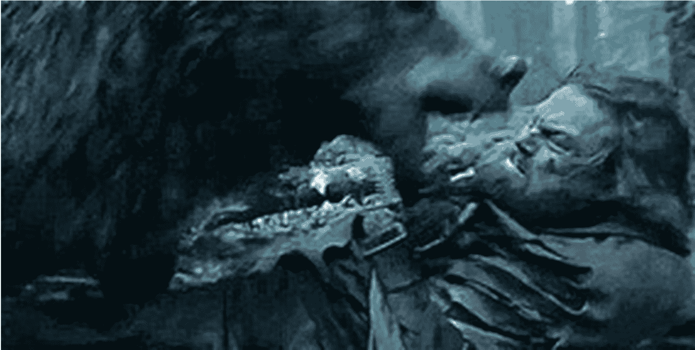

# 懒人专属群周报（第108期）

北京时间 2024 年 11 月 22 日 出品

懒人专属群群友大家好，我是小懒人~

第108期《懒人专属群周报》，与君共读。

希望咱们专属群独有的《懒人专属群周报》可以作为群友们喜欢阅读的一份类似周刊的读物。之前的离线版合集地址见咱们专属群总链接，小懒都有备份。

懒人微信：lazyhelper

## 目录

- 懒人专属群周报（第108期）
- 北京时间 2024 年 11 月 22 日 出品
- 目录
## 关系攻略（节选）
### 如何让孩子远离校园欺凌
- 习题
## 新闻评论
## 你问我答
### 信息整理与输出
### 职业发展
### 大学教育
## 假新闻受害者的复仇
### 惨案与阴谋论
### 天价赔偿金与破产清算
### 洋葱新闻：恶搞式造假
### 用恶搞回击假新闻
## 懒人收藏夹
### 回礼：如何正确地接受善意
### 有人的地方就有江湖
## 总结

## 关系攻略（节选）

## 如何让孩子远离校园欺凌

提要：声高和找领导不是解决问题之道，一个话不多、冷静而坚决的家长会让老师感受到决心。

看过《萨利机长》的人，可能会对发动机失灵时如何挽救飞机印象深刻，一个机长应该做的不是考虑“生存或死亡”的问题，而是立刻打开辅助能源，副驾驶则会拿出一份手册，对照着手册试图挽救飞机。

有人也许会对飞行员还要看说明书感到不解，但发动机全部失灵是小概率事件，大多数飞行员一生都难遇一次。有一本手册来对照是最有效的办法。

和航空业不同，大部分学校从来没有应对校园欺凌的预案，尽管这种概率比发动机失灵的概率大得多，这就使得学校极其依赖老师的经验。

这就是为什么中国的基础教育非常仰仗老师的慈悲——遇到好老师孩子会茁壮成长，反之，可能在进入大学之前，自信就已经彻底被摧毁了。

我在这里提供一个家长视角的手册给大家，当孩子跟你说出“被欺负了”，就要立刻找到这篇文章，核对每一个环节。

#### 1. 出一张病假条

无论飞机被鸟撞击，或者军舰被船轰炸，首先要做的就是“报告损失”，“知己知彼，百战不殆”，掌握了自己的情况，才能进行下一步的判断。

只要打了架，多少都有“软组织挫伤”，如果打在头部，又自诉有眩晕和呕吐（几乎是一定的），那医生一般会下一个脑震荡之类诊断，让病号在家休息。

换句话说，只要头晕恶心，这官司就可以打。

成年人起冲突的时候，有一派人就坚持不先动手，对方一动手就迅速倒地，等警察来了去医院对医生说恶心，然后用脑震荡的诊断跟对方要个三五千元。

心灵上的损伤比较麻烦，因为大多数的中国人，对精神病学都是一知半解，很多人认为抑郁症可以旅游一下就好，所以你也很难跟他们解释诸如“应激障碍”这样的病。

综合医院的“心理门诊”一般实力都比较薄弱，可以不用去，直接去专科医院挂号是更好的选择，比如北京的北大六院、安定医院、回龙观医院都是精神科的专科三甲医院。

如果孩子睡眠受影响、害怕上学，那就带他过去看看。不用担心挂什么科，那种医院基本上只有精神科，到分诊台对护士说，孩子被打了，不能上学，她们就会帮你选择适合的大夫。

为人父母的人，一定要克服对精神科的排斥感，事实上，你们最关心的孩子的智商，就是这帮精神科大夫们发明出来的。

精神专科医院不用被设定成医保定点医院，都可以走一老一小或者学生的医保。

#### 2. 做一份笔录书

我们看警匪片，最后警察总是要对英雄和美女说：“麻烦两位跟我们回去录个口供。”

对，我们也一个口供。

你如果只是听了孩子的转述再转述给老师，那老师可能就会觉得这是一个随随便便闹着玩的事，如果你真的把孩子所说的打印出来，由孩子签名，那就是另外一回事了。

大多数人都敬畏那种仪式感强烈的人。

此外，如果你的钢笔字很好，可以考虑手写，师范出身的老师们一般都敬佩字好的人，那是接受良好教育的标志。

至于具体的格式，不要选择公安的“询问笔录”模板，太夸张了，使用一般的谈话笔录就已经足够了，笔录至少要打印两份。

询问孩子的时候，心平气和，问清细节，用陈述句式，重要的词句可以用直接引语。最好由全家最冷静的家长来询问，如果都做不到，就借一个远一点的亲戚。

- 笔录要包括：
  - 时间、地点、被怎么打、打人的是谁、第一个动手的谁、还有没有其他受害者、孩子有没有还手，有没有人使用武器或者物品，有没有老师或者同学发现或者围观。

笔录一定要注意细节，还要询问，对方有没有碰触孩子的隐私部位，如果有的话，要加入性骚扰的内容。注意，有性骚扰（哪怕是同性的）的情形就不再是闹着玩了，对学校来说是一个丑闻，而且是易于传播的丑闻。

笔录完毕之后，先不要急于到微信群里去吵架，事实上，永远不要直接去跟欺凌者的家长主动争吵。

战争是逐渐升级的，现在还是粮草先行的时候。

#### 3. 让老师欠你的

得到了欺凌者的姓名，通过同学之间的打听可能还掌握了一点点欺凌者家庭的背景资料，这个时候应该约见老师。

带上诊断书和假条，无论开出来的是外科医生的假条，还是精神科医生的假条，联系老师，约老师见面，如果老师不知道孩子受欺负，那就先不要说，只说谈谈学习的情况。

有人说，这不是奇怪吗？不应该同时把对方家长约来见老师吗？

当然不能。

滑过雪的同学知道，上山无论是索道还是电梯，都是慢慢的，到了高处，一冲而下，那就是势能变成了动能，高度变成了速度。现在就是那个上山的过程，要忍耐。

见到老师，放下笔录和诊断书（避免给老师看医生手写的病历，我们知道老师最恨的就是一笔脏字儿，而大多数大夫对硬笔书法都毫不擅长）。

老师读笔录的时候，可以用慢速的声音来阐述自己的担忧：这样下去，恐怕会出事啊。

我们知道老师最怕的就是出事。所以上来就谈论这个班级可能的风险，这是战国策式的说服——上来就说：“我这都是为您好。”

如果老师比较震惊，手足无措，那就反过来安慰一下老师，以退为进，然后再请老师约对方家长谈谈。经验丰富的老师会客客气气把你送出去，不过没关系，事情已经好办了。

#### 4. 正面对决

恭喜，你已经完成了一个很好的态势，引而不发。

如果是一位母亲，这样冷静的态度会显得更可贵。

大多数母亲可能会当时就暴怒不已，带着孩子去学校找老师吵架。

那是最混乱的局面了。

一个母亲，遇到孩子有危险就应该立刻跟敌人拼了！

是像这样吗？

这是《荒野猎人》里的那头母熊，里奥纳多误入了她的领地，她立刻发起了攻击，按说一头熊袭击一个人是稳赢的局面，然而最终出现了闪失——熊妈妈对小李子百般蹂躏，占尽上风，但最终被小李子打死了，小熊也就活不成了。

对母熊来说，最好的方案是：“正面面对他发出威胁，让他走远。”

越冷静的人越有力量，越不苟言笑的人，越深不可测。

如果做不到喜怒不形于色，至少这一场戏，你要控制自己的角色。

让老师来说这件事，等着对方的答复。

如果对方家长第一次见到老师，那恭喜你，昨天的铺垫会生效。

老师因为学生病倒的愧疚感，以及见你之后的熟悉感，心里多多少少会有点微妙的变化。

如果对方家长通情达理，该道歉道歉，该做保证做保证，还要赔偿损失，那再好不过，问题就结束了。

如果对方家长不配合，那好，再上一味药。

#### 5. 让对方一片狐疑

这味药叫自来熟，喂给对方，对方就会变得多疑。

向对方显示，你跟老师关系很熟，比如特意把“上次交流”说成“上几次交流”。

对方如果第一次见到老师，一定会心生疑虑。这个时候老师很容易被误会。

对，就要老师被误会，对不起了老师。

有人说这是阴谋，不，这是阳谋。

以后你和老师就是可以这么熟的。

我们知道同学们是一个班的成员，老师其实是这个班的皇帝。

这是一个多么陈腐的称呼啊，不过我们都很喜欢。

天地君亲师，爹娘排第四，老师第五，但是老师心里住着一个第三。

先认识到老师是皇帝的家长会走运，坚持老师是学校雇员的，您太莽撞，太勇敢了。

历史上所有的奸臣都有一个共性，和皇帝有私交，其他人恨的、怕的，就是这种关系。

这就是让你跟老师装熟的关键，要让对方猜忌狐疑，甚至跟老师敌对。

皇帝的统治方式是什么样的？

总体上各打五十大板，但轻微地偏向他宠爱的一方。

老师也是差不多的。

#### 6. 老师的KPI

和过去的应试教育不同，许多城市里现在对小学没有排名和分数上的PK，所以老师之间除了必要的学习成绩合格之外，以各种留花式作业，可以拍照和上光荣榜电视台微信号的露脸行动为主。

但是老师有个一票否决，那就是安全问题，出了大事老师会保不住饭碗。

老师和家长一样追求不出事，这样她会惩罚欺凌者，避免下次发生。

但是老师又追求不闹事，这样她也会安抚劝诫被欺凌者，不要闹大。

所以，绝对不要越级上告，看见了孩子受委屈，就直接拉着孩子进教育处或者校长室，老师被叫来都搞不清状况，那你就把老师给得罪了。

你说你一时冲动，老师可能就评优泡汤了。

换位思考在很多时候很蠢，比如被欺负的父母去换到欺凌者的父母的角色，那就是一个很傻的提议，但是把自己代入一下老师，这个主要的攻略对象，那就非常正常。

对老师来说，如果学生能早点告诉自己，这几次家长都不用见了。

这也是为什么有的老师发现家长找来投诉欺凌的时候，会生气地问被欺凌的孩子：“你怎么不早说呢！”

如果遇到老师这么责备孩子，不要对老师发作，老师肯定不是想着再恐吓你的孩子，而是为自己付出的额外辛苦在抱怨和发泄。等着老师发泄完。

这时候再放一招：“他也比较担心，觉得这几个孩子老师恐怕也管不了，回头老师不在眼前，不是又要吃亏吗？”

话赶话到了这会儿，老师一定会表明心迹，证明自己的管理能力：“不会的，你放心……我跟他们说......”

#### 7. 解决方案

- A. 不要求老师或者学校惩处欺凌者

那超过了家长的权限。

事实上，学校管君子不管小人，义务教育的公立学校也没法劝退或者开除学生。

别说开除学生了，总旷工的老师没能开掉的都有的是。

所以不要试图去决定欺凌者的人生了。

老师能允许被欺凌者提一点条件，比如把两个人的座位调开，分在不同的组。

学校也能允许被欺凌者提一点条件，比如把被欺凌者调整到别的班去。如果太恶劣，甚至学校可能帮你联络转学。

我的建议是，不要去。

被欺负的群体当中，很多都是转学生。

但学校如果勒令欺凌者转学，欺凌者的父母会立刻转型成一个李雪莲式的上访者，学校再次被拖入诉讼之中。

- B. 不要试图用把事闹大来换取学校重视

这对孩子本身没有好处，

学校担心的只有真正豁出去的那批人。

如果你仍然希望孩子当好孩子，

那就不要这么玩。

同样，在学校还在协调解决的时候就投诉到教委，只能让下面协调的人从此出工不出力，是最傻的决定。

- C. 杜绝下一次欺凌才是关键

我平时好研究西游记，关于这部小说，有一个烂大街的段子：

孙悟空打妖怪，没根基的妖怪都打死了，有后台的妖怪，都被神仙救走了。

一研究就会发现，确实如此。

被当场打死的妖怪并不多。

但是，无论被神仙菩萨收走也好，还是贬去烧火也好，这些妖怪都再也没有回来。

没有一个妖怪是被孙悟空或者菩萨们降服之后，又出来作妖的。

就杜绝侵害这个角度来看，孙悟空做得非常到位。

换句话说，只要自己的孩子能平安健康度过剩下的几年，谁在乎那个欺凌者是不是改好了，你管他干啥？又不是他爸他妈。

同样也没必要让学校或者老师害怕你，其实名校的校长都是本地政治家，多少县长副县长都是从中学老师出身进而县教育局局长，最后当上县领导的。

他们不会真怕你，最多是觉得麻烦。

中关村二小欺凌事件里，这个妈妈坚持要学校认定这两个孩子为“欺凌者”。

我们知道如果给一类人认定一个头衔，就必须制定相应的奖励或者羞辱。对这两个孩子来说，如果欺凌者只是多了一个官方外号，那一定还有人专门欺负人，来解锁“屈辱者”这个成就，它变成了游戏。

学校的管理会失控，那时谨慎的管理制度就守不住了。

父母要内心强大，常见的念头是：“我就是咽不下这口气。”

其实这根本就不是一个报复的事。

#### 8. 关于不怕事儿

有两句话，很多人都喜欢。

“平时不找事儿，遇上事儿不怕事”。

其实敢以这两句话自诩的，都是狠角色。

因为关键在后半句，很多人都把后半句解释错了，遇见事情脑袋一热，敲掉啤酒瓶底就扑上去了。

“不怕事”，是我遇到意外情况的时候，所有的情况都在我的预料之中、掌握之中，所以我不需要担心。

家里的灯吧嗒一声灭了，你会看看邻居家还有没有电，然后打开电表箱把家里的电闸推上去，这个过程中你不会害怕，因为你知道应对之法。

英雄不是肾上腺素多，只是比别人更善于准备。

在熟悉的领域里活动，就会有安全感。

孟子描绘过一个君子做事的理想状态：引而不发。弓拉满了的时候最有威胁，放箭之后就失去了杀伤力。

所以，就是那种语言克制、表情克制，但冷静而坚定的家长，才可能真正显得有力量。

一阵王八拳扑上去，看上去效果不错，一下子就被人掂出了斤两。

就像是那个黔之驴的故事：老虎看见驴，吓坏了，听见驴子叫，吓坏了，遇见驴子踢，也吓坏了，后来发现技止此耳，就把驴子吃掉了。

#### 9. 老师的画蛇添足

不要和欺凌者和解，也没必要和欺凌者和解。

还有一些家长认为，跟欺凌者的父母见面谈谈，想靠两家大人有了交情来解决这种问题，还有的甚至试图让自己的孩子和欺凌者做朋友，这里要奉劝一句：痴心妄想。

大多数养出欺凌者的父母，自己往往也都迷信暴力、性格古怪，跟这样的人结交，成本比较高且完全没有必要。让孩子加入到欺凌者阵营去当帮凶看上去不受气了，日后不一定怎么样呢，想想李天一的朋友们就知道了。

类似的，还有一些老师会情愿两个孩子又重新和好，沉浸在一种低幼的、琼瑶式的感动当中。那种感觉是不是很熟悉：

> “紫薇，我抢了你的格格名分，但是我仍然是你的好朋友啊。——小燕子。”

在学校里，一个理想主义的老师比看重利益的老师可能更糟糕。这要早早告诉他，我们不希望他们和好，我们只要自己的孩子安全。

#### 10. 日常修炼系统

关于什么样的学生容易受欺负，其实没有一定之规，我们上大学的时候一直很想把隔着几个宿舍的一个家伙打一顿（说说而已），原因是那个人的眼睛特别大，女气，但爱在水房唱歌，唱得五音不全令人发指。

欺凌一般都是从临时起意开始的，特别高矮胖瘦的可能受欺凌，和强壮的哥哥在一个小学的也就不太可能受欺凌。

一般来说，围墙内的情况是：

好学生不容易受欺负，坏孩子一般也不会惹最好的学生。家里会特别重视他的学业的，一般家里也都比较强。

练武的孩子不容易被欺负。练体育的话，他可能不会在班里被欺负，但是传统体校一直是欺凌的重灾区。

特别有钱的学生不容易受到欺负，同学们会捧着他，坏孩子很快就会发现，欺负有钱同学，不会比巴结他、帮他打架效率更高。

有特长的学生不容易被欺负，比如乐器、绘画等文艺才干，因为素质教育的缘故，老师的KPI不再单纯是成绩，一些有特长的孩子能够走名校点招的途径，特别被老师重视，同样，如果小朋友专心去学奥数或者英语考级，也是未来容易出成绩的苗子，老师也会对他们更用心加以保护的。

父母单位霸气或者有用的孩子不容易被欺负。这个不用多解释，老师们一般也会保护同行的孩子，如果您也是教师，记得早点跟老师有意无意提一嘴。

要多让孩子学点课外的东西，任何学习带来的成就都能让孩子更自信。

最容易被欺负的是成绩中等、话少、不自信的、沉默的孩子。

此外，如果在老师协调之下，事情解决。那可以考虑送老师一点小礼物，以便欺凌下次不发生。现在送礼也比较容易，不需要孩子带去（过去总觉得会腐蚀孩子的心灵）用包裹发到学校老师收就可以了。

我们经常听TVB说“无事献殷勤，非奸即盗”，但现在是有事了献殷勤，理所当然。有老师的护佑和加持，孩子只会有更大的自信心。

我小学时候曾经听说过一个老兄的事迹，从小多病被欺负，后来他爸去找体育老师（我们那个时代，小学体育老师基本都是痞子，要能打败外校社会青年才能当好体育老师），要他跟着田径队一起练习，后来他成了一个长跑好手，又高又瘦，成绩也仍然很好。这是对副科老师尤其是体育老师的攻略，似乎效果也不错。

你要送礼，就大大方方的送，为保全孩子送点礼，是为了省下转学、搬家这样的很多钱。

千万别跟老师置气，存了这样的念头：

她没看好我家孩子，让我家孩子受了欺负，我还要送她礼物？我疯了吗？

你要考虑的就该是孩子的处境，这就是我们一直在强调的这一点：

#### 我们要你经营关系，不是要你显得很威风，

#### 而是为了让孩子远离欺凌，甚至获得更多的机会。

## 习题

晚上有家长直接电话联系你，说你的孩子（四年级）打伤了他的孩子，有其他的孩子为证。你询问了你的孩子，他坚持说自己是无辜的，而且你也相信他的诚实，这时你应该：

- A. 首先联系老师，问问老师对此事的了解程度；
- B. 找目击孩子的家长对质；
- C. 去医院或者受伤孩子的家里去探望伤者；
- D. 去学校保安室调取摄像头资料。

答案是A。

还是我们坚持强调的一点，遇见事情了首先依靠学校、和老师沟通。这个时候应该赶紧看看老师掌握了多少情况。

D很重要，在跟老师联系之后可以赶紧进行，因为它可能因为低级失误而被损毁。

C是确定责任之后应该赶紧进行的事，但是仍然要调查清楚，不应该因为孩子做错的事护短，同样，也不应该因为孩子没有做的事情而受委屈。

B不应该立刻进行，应该通过老师进行，要明白一个道理，小孩子真的可能会撒谎，或者因为情况紧急脑子一时空白而产生一段没有发生的记忆。

此外，如果孩子打伤了同学，要告诉他，如果是你做的，承认错误、道歉，爸爸妈妈不会对你胖揍一顿。

> 体罚孩子是个坏主意。
> 他学会了服从暴力，也会继续用暴力让别人服从。
> 此外，他一定会学会的，是撒谎。

## 不要用别人的名字开玩笑

> 管理好自己的朋友圈，转发有些新闻之前，要动动脑子，别随便得罪人。

除了看看新闻里写的是不是真事，还要想想转出来之后会怎么样。

前几天有个“大数据报告”，说男宝宝热名榜前三是：浩然、子轩、皓轩；女宝宝热名榜前三是：梓萱、梓涵、诗涵。

一帮人就开始调侃给孩子起名字叫梓萱梓涵的人，我觉得我的朋友圈里素质挺高了，还是有人忍不住转过来刻薄几句梓萱的家长。

这是不对的，我经常说，我做“关系攻略”，做仕图，写人际关系，就是要让大家去防明枪暗箭。

明枪暗箭不仅仅来自身边的同事，还有各种营销号和媒体。我自己是媒体出身，对这个行业的玩法比较熟悉。

其实细细看这条新闻就知道了，这是一个起名类APP推出的报告，每年发布一次关于姓名的研究报告，比如2014年他们的报告，告诉全国人民，全国据说有超过29万个张伟。

张伟和王伟刘伟李伟加起来不到120万人，按照6亿男性算，不到万分之二十。

和伟这样的单字相比，梓萱这个名字要少得多了，我们按一半算，万分之十吧。

这个今年的姓名统计报告是基于450万新生儿（仅仅是浙江省的数据，根本不是全国数据）的数据，如果有万分之十的梓萱，才4500人左右。

比你想象的要少得多。

这也是为什么这个公司不会把梓萱的数量公布出来，人太少了。真的公布数据就没有戏剧性了，所以只告诉你，今年的孩子名字，梓萱最多。

所以你所讽刺的“人人用梓萱”，根本就不是什么现实，但是你转发的那篇文章，却把你拉进了一个坑，莫名其妙得罪人。

那篇文章吐槽所有名字用梓、萱、涵、子、皓、睿的父母。这个打击面是大的。

有些单身汉可能还没法理解。

你笑话一个人叫张伟，他可能还会自嘲一下，因为他体会同名太多带来的坏处和好处，肯定比你切肤，而且责任不在他。

但是你笑话一个人的孩子名字里有某个字，就算对方不跟你争辩，也会默默把你记在本子上。

我相信你不会知道你每个熟人的孩子叫什么，对吧。

别惹事儿。

还有的人，看见这个报告，还要发散，赶紧去翻汉语词典，看看梓萱有什么不好的意思，果然有：

梓宫，指的是皇帝皇后停灵的地方。

如获至宝，赶紧吐槽用这个字的父母是白痴，在诅咒自己的孩子。

梓树，是常用来做或者指代寿材，但是咱们实实在在说一句，那是引申义，本义就是一种漂亮的乔木。

如果要引申，那寿、孝这两字还可不可以用？

为黑而黑，没有什么意思。

我以前专门写过起名，其实就是这样：重名少、不奇怪、不生僻、笔画少。

子轩、子萱都不是坏名字，尤其是有虚字的名字，其实都很好听，很普通的单字名字，加上子、之、一等笔画很少的字，就有了一种游侠或者大小姐的感觉。

韦一笑、骆一禾（诗人）、张一鸣、路一鸣（辩手和主持人）、薛之谦、王子腾（贾宝玉他舅）。

用亦、轶来取代一，用子替代梓，避免重名，也都是美好的愿望。

大量的重名，无非是因为大家获取信息的渠道不够通畅。

好多家庭，起名是爷爷操办的，现在比较主流的爷爷是1950年代出生的，赶上没书读的岁月了。

有的时候就容易去找个明白人问问，要一个名字，这些明白人，基本上也都是爷爷的同龄人，插队的时候一共认识了四个英文字母就是JQKA。

我们知道没书读的一代人还有一个不好的习惯就是不爱花钱。

有的人是托一个有点墨水的人起个名字，但又不愿意花钱。

一个字五千肯定是用心用力，你给人一盒点心，人家肯定从百度贴吧里随手给你搜一个。

这是很多名字虽然不错，但重名度很高的原因。名字是转载的，那能不重吗？

别人的孩子名字取得重复率高，以后生活会种种不方便，他已经要承担代价了，你还要落井下石，说人家的孩子名字起不好，是因为家长愚昧无知，这就是欺负人了。

这点上来说，中国人正在逐渐恢复一些古代的风俗，古人的名，就是写进祠堂族谱名，父母亲戚可以叫，有的上学还换一个学名，父母和老师可以叫。成年之后，就自己取一个字，朋友之间互相叫，有了成就再来个号（这个号不互推），大家可以尊称一下。

今天也是这样，成年后完全可以像罗胖和脱不花那样，以花名横行江湖，可以是一个笔名、一个网名、一个英文名、也可以是你的公号名，朋友们都这么称呼你，提到你这个名字就动心不已。

那时候，谁还在乎你是皓然还是梓萱！

看看这些改名达人吧：

- 周樟寿－周豫才－周豫山－周树人－鲁迅；
- 蒋志清－蒋周泰－蒋瑞元－蒋介石－蒋中正；
- 管谟业－莫言；
- 凌解放－二月河；
- 贾敬贤－傅明老人。

这是转发关于名字的报告，都要考虑很多，当面吐槽别人的名字，那就更不好了。

不够熟的时候，不要用名字开玩笑：

我有个同学王亦高，名字非常好，现在在人大新闻学院当老师，特别优秀的青年学者，我们刚进学校的时候，有个同学跟他开玩笑：

王亦高，你的名字挺好，不能往下数，你们家最多排到老七。

王亦高知识分子家庭出身，涵养特别好，也气得几乎一个跟头。

“那同学你叫什么名字啊。”

“我叫谢耀。”

“......”

## 习题

一位女性好友邀请你为她刚出生的儿子取名字，理由是你是她佩服的才子/才女，这时正确的做法是：

- A. 从论语里选择一个老成稳重的名字。
- B. 从畅销书作品当中选择一个男主角名字，搭上她夫家的姓氏。
- C. 推辞起名这件事，告诉对方自己无法胜任。
- D. 提出几个备选名字，属于诗经论语楚辞和畅销书，特意请孩子的爸爸和爷爷挑选。

答案是D。

A如果是给自己的儿子起名可能是个好主意。

B的主意其实也不坏。

C显得有些出工不出力。

D的姿态是对的，对方邀请你参加的是一个脑暴会，而不是一个拍板权。

## 新闻评论

新闻实验室是小懒付费订阅的通讯录，年费300多。小懒整理分享，仅供专属群群友查阅。如有余力，可以自己到Newsletter上自费订阅。

## 你问我答

> 怎样整理信息？如何看待因为逃避就业而想要读博？学生用AI写作业怎么办？……

10月份大家的提问集中于几个话题，以下我分类回答。

### 信息整理与输出

> 林毅：老师您好，我想请教关于信息整理方式。在网络时代传达信息很快，但其实信息都很碎，而且过了六秒钟大家都背忘掉。感觉很多时候很难把握从头到尾的故事线，特别是过了一段时间后…很多信息就搜不到了。所以我想问老师您对这些有什么好的管理或整理方法吗？我自己用notion来记录我有兴趣的报道，但觉得还有很多提升效率的空间。谢谢～！

答：信息整理的目的很重要——也就是说，这些信息会被怎样使用？这个问题有了答案，整理才能坚持下去。

比如说，你可能想要总结“2024年不应被遗忘的10个事件/10篇报道/10个人物/10则帖子”。那么为了这样的总结，你就会从年初开始有心地收集这几个方面的信息，并逐渐梳理出结构，且会定期回看。我虽然没有问过刘擎老师是如何撰写每年年底的“西方思想年度述评”的，但我猜他应该是用最终的产出来驱动全年的收集的——知道自己要年底要写这么一篇长文，所以从年初开始的日常阅读中就有意收集这方面的材料。

这个时间维度并不一定要以年为单位，也可以是月，甚至周。如果你开一个newsletter，每两周或者每个月分享你觉得值得推荐的事件/报道/人物/帖子（最好有一些选择标准），那么你更有可能坚持下去。

对于我来说，有可能成为会员通讯或研究论文选题的话题，我会非常留意搜集相关信息。但是其他的信息，我不会刻意保存。使用什么工具是次要的，重要的是事先想好自己要收集什么样的信息、将会怎样使用这些信息。

> R：方老师您好 🙂， 我想请教如何提高 storytelling 技能。您每次写文章即使引经据典都能紧扣主题，不需要读者费很大精力去吸收信息，能否分享一些技巧？ 我在做汇报或与朋友闲聊时，有人建议我不要让话题太跳跃，比如在举例A时突然提到B，然后再跳回主题或举例C，即使他们都是有些许相关。 想请教方老师的建议，谢谢🙏

答：其实我的写作应该不算storytelling吧，大家订阅会员通讯应该不是为了来看故事的哈哈。对讲故事的技巧感兴趣的朋友可以看看我的前同事叶伟民今年出版的《从零开始写故事》。

但我理解你的提问实际上问的是，如何组织文章，让信息可以更有效地被读者接收。我不敢说自己写的所有会员通讯都能做到这一点——实际上，一定有一些期是没有做到的。回想起来，其中最主要的问题是：我自己其实都没把事情弄明白，自然也就说不明白了。

所以第一步也是最重要的一步，是在大量阅读之后形成自己的认识，把一环套一环的逻辑都先梳理清楚了（可以用大纲或思维导图的形式），再开始正式的写作。或许可以说，90%的写不清楚都是因为没想清楚。

在写作的过程中，可以不断从读者的角度去假设：他们可能会提出什么疑问？会不会不理解或者不同意？当然，这可能需要有一定的写作经验，说白了就是文章写得多了，反馈收集得多了（被骂得多了），就更能预判读者的反应。在没有经验的情况下，可以多请身边的人提供反馈。

把以上两步做好了之后，最细枝末节的才是一些具体的行文技巧。比如善用列表的形式，比如把复杂的意思可以用两种方式重复表述（“换句话说……”），比如在介绍读者不熟悉的语境时用类比的方式（“这相当于中国的……”）。

说到写作，其实我想过办一期线上的训练营，目标就是写出像会员通讯这样的文章，我会提供手把手的指导和反馈。不知道会有多少朋友感兴趣——如果你感兴趣的话，可以回信告诉我。另外，这个训练营应该会是一个付费的项目，感兴趣的朋友也可以谈谈自己的心理预期价位，方便我思考项目的设计和定位。谢谢！

> Anonymous: 接着**上一期回答**的一个问题去问，从自身出发去写作，发现社会的公共的议题。那么历史和社会研究是不是也有一些很典型的方法论，可以推荐一些学习资料吗？
【学会提问那本书可成老师可以不可以做个解读呀？】

答:推荐《社会学的想象力》，讲的就是从个体经验到社会结构的过程。不过,我不是很同意去历史学、社会学的学术研究里面寻找写作的方法论——有多少学术论文/著作在写作上是出色的?凤毛麟角。学术研究有自身的逻辑和方法,它们和公众写作是不一样的。

其实,当我强调大家从自身出发去写作的时候,言下之意已经是:先不要试图从书本里面去寻找什么,而是从倾听和感受自己的生命经验出发。如果一定要从书本里寻找借鉴,那就直接去读那些写自己故事的书和文章。

另外,《学会提问》那本书非常简单,不需要任何解读,直接打开看就好啦。

### 职业发展

> Francis:您好,我的提问有关青年人的成长。我刚英国国际关系硕士毕业,现在在国际组织实习。作为刚开始职业发展的人,每天都在努力,每天也担心成长得不够快。遇到过很多很鼓励我的前辈,我想请教如何抓住机会,向他们学习和寻求指点?他们(和您一样)时间精力很宝贵,我不确定应该如何与他们互动(我尊重他们,不想白嫖;想要为他们创造价值)。感谢!

答:你的出发点是很对的:互动不应该是单向的索取,而应该是相互的赠予。年轻人可以给前辈们提供什么?最重要的是新鲜的视角、新鲜的启发。

这些视角和启发,不一定是已经想得非常成熟的理念,也可以是你自己真的非常疑惑的问题——往往这些问题是可能刺激新的想法的。比如会员通讯每个月的“你问我答”,我都能从中获得对我很有启发的、回答起来很“带劲儿”的问题。再比如在课上和学生的交流中,时常能产生不错的研究想法。

如果我是你,我会更多以提问的方式与前辈互动,但是我会做到:
- 绝不会提那些很容易就能找到答案、或者问一个行政助理都能得到答案的问题;
- 在提问之前,自己已经有一些解答的想法,因为这个问题真的是你很关心并且努力尝试解答的;
- 提问是真的有问题想要解答,而不是借提问去制造互动。

除了提问之外,还可以更进一步,主动提出你的一些新鲜想法。比如,如果有学生不仅是带着问题来,还带着一个初步的研究计划来,那我当然更有兴趣详谈。如果有学生找我来聊某门课应该怎样重新设计,那我更是会非常激动。

如果更提炼一层,大概是:分享你在乎的东西(问题或想法),因为你的在乎一定会让这个东西具备价值,而它也一定会换来有价值的回应。

> Anonymous:方老师您好,想请问您关于职业赛道转变的问题:近年国内金融行业的求职非常惨淡,头部学生纷纷下沉,去卷一些过往看不上的岗位。很多金融学子选择转行互联网、教培等等。请问您认为,当一个行业呈现非常明显的下降趋势时,是否要坚定离开呢?因为我知道您在南方周末工作一段时间后选择去读博、走学术路线,您是否当时也考虑过这个问题呢?

答:这的确是我2013年去读博的原因之一,虽然不是最主要的原因(最主要还是因为我想做研究和当大学老师)。2012年的时候中国市场化媒体向下走的趋势已经很明显,我的很多前同事都是在2013-14年左右离开媒体,这显然与整体的行业下行有关。

但是,我在当时丝毫没有考虑“学术这个行业的整体前景如何”。所以对于我而言,行业大势可以是退出的原因,但无法成为进入的原因。进入一个行业,必须是因为兴趣。当然,这只是我的个人经验。

> Anonymous:方老师您好,我是面临秋招的硕士毕业生,由于求职环境惨淡,身边不少同学都有了读博以逃避就业的想法。请问您怎么看待这种,看似荒谬但细想又在情理之中的想法呢?您会建议什么样的人选择读博呢?

答:正好承接上面一个问题的回答。我的建议很简单:真的有兴趣做学术的才来读博,否则劝退。

除非你能读博读到退休直接领养老金，否则终将面临求职。你确定四五年后的就业形势会比今天好？也许今年是未来五年就业形势最好的一年也说不定呢。以及，花那么长的时间读博，付出巨大的时间和机会成本，最后的就业却是非常窄的路径。从实际的角度出发，那绝不是什么好的“逃避就业”的去处。

再加上，读博本身是非常艰苦的过程。如果没有足够的内驱力，很容易半途而废，甚至患上抑郁。所以，千万谨慎。

### 大学教育

> Anonymous：想知道方老师的学校怎么处理学生用生成式AI代写作业的问题？我在美国，这学期在教一门初阶课，课程写作批改就有发现很明显的AI痕迹。但我发现似乎老师们也束手无策，有的学生警告了还是有恃无恐。因为市面上的AI检测软件不能说100%准确，所以难以作为呈交学校的证据。学校为了防止被起诉，都必须得是有确凿证据才会给处分。

答：是的，没有工具能够100%确认是否使用了AI。所以，解决这个问题的思路只能是：改变考核方式。

如今，设计任何作业（除非当堂手写或口试）的时候都要默认：学生一定会用生成式AI工具。基于这个前提，我们其实有很多具体的设计方式。

第一种方式，出题的时候避开AI擅长的领域，主打AI不擅长的领域。比如，AI擅长说看起来漂亮但实际上空洞的话，擅长泛泛而谈但很难提供具体的、细节的信息（即便提供了，也很有可能是错误的），擅长已经有很多资料的话题，而对网上没有什么资料的话题则谈不出什么有价值的。那么，在出题的时候就不要再出“写一篇文章，论述社交媒体对心理健康的正面和负面影响”——这个题目太泛泛且相关资料太多，AI一定很擅长；可以出“记录你过去一周的社交媒体使用（需要给出具体的内容和场景案例），以及使用过程中的心理状态变化，并基于此进行反思”——这个题目至少目前的主流AI模型都难以给出很好的回答，因为它要求最新的信息（最近一周在社交媒体上流行的内容）以及真实的心理状态记录（AI可以造假但是只能写出平平无奇的内容）。再比如说，我曾在一门本科入门课上布置作业，要求学生参观某个与媒体相关的展览，拍摄照片并谈谈参观中的见闻感想，这也是AI难以做好的。

第二种方式，直接要求学生使用生成式AI，看谁能用生成式AI写出最好的文章、做出最好的图片/视频。一方面，这是在考学生写prompt的能力——不光是掌握prompt的写作技巧，更是要想清楚如果向AI沟通自己的想法、如何引导AI输出理想的内容。另一方面，这也是考学生的判断和鉴赏能力——可以用不同的工具、不同的prompt得到各种结果，究竟选择怎样的结果作为作业上交呢？其实这种判断力和写作的能力同样重要，甚至在AI年代更有用。

第三种方式，要求学生对生成式AI输出的内容进行评价，并反思其优缺点。比如，我们一位教传播理论课的老师，就要求学生用AI写理论分析，然后要评价AI输出的内容质量如何、有哪些问题。后一个步骤，如果完全交给AI去做，多半得不到很好的答案。

其实这个出题的过程，就是发现AI时代人的独特价值的过程。我觉得“抓作弊”的心态没有什么意义，重要的是怎样鼓励学生们更好、更负责任地使用AI。

> Anonymous：方老师好！我最近正在申请港硕传媒类专业。想请教您香港学校在审查学生资料时对语言成绩的考量方法，是采用语言成绩达标即可的方法还是优先录取语言成绩较高同学的方法？举例来说，如果某个项目的雅思成绩要求是6.5分，那么学校会否优先录取雅思在7分以上的同学？目前成绩在6.5分的同学是否有必要继续考雅思冲击7分以上的分数？谢谢。

答：简单回答：有必要。

详细回答：几乎所有的招生都是一个证明“A为什么比B更值得被录取”的过程。面对屡创新高的申请人数，这个证明的门槛也越来越高，变成了“A为什么比BCDEFG都更值得被录取”。这时，申请材料中的各种线索几乎都会被考虑到，能胜出的许多都是“六边形战士”（当然也并不排除某方面特别优秀但某方面平平的学生会胜出）。

在申请者提供的各种线索中，雅思成绩又显得额外重要，因为招生的老师往往自己也是教课的老师。在英语授课的项目里面，老师遇到课上说不出英语、写不出英语文章的学生是很抓狂的。所以，有的老师甚至不仅要看雅思总分，还要留意口语和写作的小分。

当然，准备申请材料是一件很费工夫的事情，如果反复考雅思让你没时间好好准备personal statement，那可能也有些得不偿失。所以，我的建议是：将精力往英语成绩上面做一些倾斜，但要综合考虑整体的精力分配。

## 假新闻受害者的复仇

今天的新闻实验室会员通讯将讲述一个堪称“年度爽文”的故事。在这个故事中，假新闻和阴谋论的受害者借助法律武器，并在一家挺身而出的另类媒体公司的帮助下，实现了“复仇”。

### 惨案与阴谋论

故事的开始是一桩无比惨痛的事件。

2012年12月14日，美国发生了史上最悲惨的校园枪击事件之一。当天上午，20岁的枪手Adam Lanza携带多种武器闯入康涅狄格州纽敦镇的桑迪胡克（Sandy Hook）小学，杀害了20名儿童和6名成年人。所有遇害儿童均为6至7岁之间的学生，成年人则包括校长和教师。此外，还有2名儿童受伤，其中1名在医院不治身亡。另外，在进入小学之前，枪手还在家中杀害了他的母亲。

因此，整起事件一共造成28人死亡。而枪手则选择了自杀。

如此骇人听闻的恶性事件引发了举国上下的哀悼和愤怒。然而，有人却声称，桑迪胡克小学枪击案是一场骗局。

这个人叫Alex Jones。他是极右翼阴谋论者，是假新闻和阴谋论网站Infowars的创始人（会员通讯207期曾详细介绍）。他散播的阴谋论包括911是自导自演、联合国在故意消灭全球人口等。

桑迪胡克小学枪击案发生几小时后，Alex Jones迅速在社交媒体和他自己的播客上发表评论，说该事件是自导自演的。此后的数年中，他不断重复这个论调。以下是Alex Jones发表的部分言论：

- “根据事情发生的时间以及各种信息，我的判断是：这是自导自演的。”
- “我看过视频了，看上去像是演习。”
- “伙计们，我们现在应该派私人调查组去调查桑迪胡克的事情，因为我告诉你，这事背后的黑幕臭不可闻。”
- “这事就跟3美元的钞票一样假。”（美国没有发行3美元的钞票）
- “看那些孩子的照片，他们明明还活着，家长们却说他们死了？他们觉得我们这么好骗啊。”
- “希特勒为什么要纵火国会大厦？为了获得控制权！政府为什么要自导自演枪击事件？为了控制我们的枪！为什么人们不明白呢？”

遇害儿童家长Robbie Parker在事件后召开了新闻发布会。Alex Jones评价这位家长说：

- “当你失去女儿之后，虽然他们会给你吃抗抑郁的药物，但是我以为那些药物需要一个月才发挥作用。怎么他看起来表情已经是绝对的满足，看上去像是要去领奥斯卡一样。”
- “看上去他好像在说：‘OK，我直接读卡片上的内容吗？’他在笑，然后他就开始表演崩溃和哭泣了。”

由于Alex Jones有可观的粉丝群体，他的言论导致许多受害者家属遭受其粉丝的骚扰和威胁。甚至有家长表示，有阴谋论者跑到他们7岁孩子的墓碑上撒尿，还威胁要把棺材挖出来。许多家庭因此感到不安全，有的选择了搬离纽敦镇。

### 天价赔偿金与破产清算

忍无可忍的家长们，在2018年将Alex Jones告上法庭。他们提起了多起诽谤诉讼，要求他为自己的虚假言论负责。

诉讼期间，Alex Jones不得不服软，他在庭上改口称：桑迪胡克小学枪击案“100%是真的”，把它称为骗局“绝对是不负责任的”。

但这样的改口太迟了，法院最终为家长们声张了正义。在枪击案发生的康州，Alex Jones被判需要赔偿超过14亿美元；在Alex Jones所在的得州，他也被判需要赔偿4900万美元。加起来，他要赔偿的金额高达15亿。

这个数字当然是Alex Jones无法支付的。他的Infowars虽然已经从2004年的两名员工成长为拥有好几十名员工的右翼媒体公司，旗下拥有4个实体工作室和1个仓库（用来储存卖给粉丝的保健补品），但总的来说他的资产数字离15亿还差得太远。因此，他需要申请破产保护。

几个月前，他的资产进入清算流程。他已经出售了自己价值280万美元的牧场，以及一些枪支收藏等。而他的Free Speech Systems公司（也即Infowars的母公司）所有权也交给了破产代理人，通过拍卖程序出售，并将所得款项赔偿给遇难孩子的家长。

本来，这个故事最可能的结局是：Infowars被新买主关掉，旗下的工作室、仓库、硬件设备被另作他用。

但是，一个买家的出现让故事精彩程度提升了百倍。

### 洋葱新闻：恶搞式造假

这个买家叫做The Onion，洋葱新闻。

洋葱新闻可以说也是一个“假新闻网站”。但是，它的假新闻不是那种恶意造假，而是幽默讽刺，或者说，恶搞式造假。

它的口号是“美国最佳信源（America’s Finest News Source）”——显然，这也是一种恶搞。

我们来看看它的一些经典标题：

- 《布什的新牙医面临艰难的任职听证》
- 《谋杀嫌疑人将接受媒体审判：疲于奔命的司法系统感谢媒体的帮助》
- 《中情局意识到多年来一直在使用黑色荧光笔》
- 《考古发掘发现古代骷髅人种族》
- 《民调发现美国人最大的恐惧是：服务员忘记他们》

洋葱新闻最早是两个大学生做的讽刺小报，创刊于1988年，名字的来源也很有恶搞精神——当时作为创始人的穷学生只吃得起白面包夹洋葱。1996年，洋葱新闻开始运营自己的网站。2008年左右，这家媒体的影响力达到巅峰，不仅旗下有视频节目The Onion News Network（简称ONN），还推出了一部充满恶搞和政治讽刺的《洋葱电影》。2009年，模仿和恶搞CNN的ONN获得了皮博迪奖（美国广播行业的普利策奖），颁奖辞中说：“一个网络版的讽刺性小报模仿的24小时有线电视新闻是如此滑稽、深刻，并且很难分清真与假。”

可以说，洋葱新闻开创和定义了一种新闻类型。此后，媒体开设的讽刺类专栏（比如《纽约客》的The Borowitz Report）都会被人们简称为“洋葱新闻专栏”。

然而，社交媒体兴起后，洋葱新闻的日子并不好过。过去10年，它被三次易手，中间经历了裁员等动荡。对于这些糟糕的经历，员工们也发文自嘲：- 《洋葱新闻：性格温和的记者突然变成不可思议的失业人员》
- 《洋葱新闻：媒体环境每6秒钟就会发生一次重大变动》

今年，在新的老板入主之后，这家媒体出现了积极的变化。它推出了付费订阅制，希望通过更好的内容满足最忠实受众的需要，并得到他们每月5美元的支持。

作为回报，订阅者获得的权益之一，将是全新的、每月出版一期的《洋葱新闻》报纸。之所以做实体报纸这种复古的产品，是因为新的老板相信，就像有的年轻人会购买Taylor Swift的黑胶唱片一样，他们对于实体产品已经产生了极大的兴趣。

新的商业策略，让洋葱新闻有望在今年扭亏为盈。这也让它有了底气，要掏钱去竞拍Infowars。

## 用恶搞回击假新闻

上周，洋葱新闻的母公司宣布：成功买下了Infowars。

虽然最终的手续还没有完成，但他们已经对Infowars的未来做了精彩预告——

这个网站不会关闭，但会转型，彻底转型。Infowars的新版预计将于明年1月上线，届时它将会火力全开地恶搞过去的自己，以及Alex Jones。

新版的Infowars将会通过恶搞性质的文章，强调枪支暴力在美国造成的危害。

新版的Infowars还会长期展示Everytown for Gun Safety的广告。这是一家在桑迪胡克小学枪击案之后成立的、旨在结束枪支暴力的NGO。

让Infowars从宣称枪击案是骗局的阴谋论网站，变成倡导控枪的讽刺型媒体，简直没有比这更绝的复仇方式了。而这件事本身，就是一桩最好的恶搞式行为艺术。

洋葱新闻的意识形态偏左。此前就曾以恶搞的形式讽刺美国控枪不力。比如，它在每次大规模枪击案之后，都会发表同样标题的讽刺文章：《“没有办法避免这些事情发生”，世界上唯一一个规律性发生此事的国家说》。

这次在竞拍中买下Infowars，也是洋葱新闻和桑迪胡克遇难孩子家长携手合作的结果。原来，在竞拍出价中，洋葱新闻开出的175万美元并非最高，只是另一家叫First United America的公司出价的一半（这家公司正是帮Alex Jones卖保健补品的公司）。然而，洋葱新闻的出价中还包括了家长们开出的条件：愿意放弃从该交易中获取赔偿金的权利。最终，破产代理人经过计算和分析认为，洋葱新闻的出价对于整体的破产清算和债权人利益是更优的，因此判定洋葱新闻赢得拍卖。

感到震怒的Alex Jones声称拍卖程序不合法，要求法庭重新认定。目前我们还不知道最终的结果，但是NPR采访的前联邦破产律师预测，法庭最终还是认可破产代理人的判断。

曾被Alex Jones羞辱的遇难孩子家长Robbie Parker发表声明说：“这是我们期待已久并为之斗争已久的正义。”

## 懒人收藏夹

### 回礼：如何正确地接受善意

> 和菜头
> 
> 回礼，是名词也是动词。做名词时，指的是回赠对方的礼物；做动词时，是一种许多人都头疼的复杂计算。

我们都知道，从小到大，人们都用互相赠送礼品的方式表达善意。我们也发现，礼物会带来两重痛苦，第一重是不知道该送什么，痛苦程度轻微；第二重是不知道应该回赠什么，痛苦程度中等到剧烈，因为每次都需要做大量运算，会导致脑细胞严重过载，出现心慌、焦虑、血压上升等不同症状。

从痛苦程度来分析，我们就可以得出第一个结论：给予比接受要好，赠礼要比还礼轻松，做一个愿意给予和分享的人要快乐很多。那么回礼呢？回礼为什么给人感觉压力很大？这是因为人们从来没有仔细分析过这件事情，也没有发现其中的诀窍所在。

关于赠礼和回礼这件事，法国大思想家皮埃尔·布尔迪厄曾经给出过非常清晰的解答：

一方赠礼，一方回礼，这就是一次礼物交换。礼物交换和两个因素有关，一个是交换礼物的价值，另一个是交换礼物的时间。这样就会产生四种不同的情况：

- 1. 交换的礼物等值，交换的时间分前后，这就是借贷；
- 2. 交换的礼物不等值，交换行为同时发生，这就是贸易；
- 3. 交换的礼物等值，交换行为同时发生，这就是拒绝；
- 4. 交换的礼物不等值，交换时间分前后，这是赠礼和回礼。

第一种情况在婚礼上最为常见，中国人在参加婚礼的时候都要随礼，赠送一个大红包。有些地方还要专门请人来做账，一笔笔记录下每个客人的礼金数额。为什么要那么做呢？因为将来别人结婚的时候，是要把这份随礼还回去的。别人当初给了多少，将来只能多不能少。

那为什么要随礼呢？因为新婚夫妇刚刚开始自己的婚后人生，有那么一笔钱，可以让新婚生活变得容易一些。换句话说，是大家一起帮助新婚夫妇展开新的生活。

那么，大家为什么愿意帮忙呢？因为人人为我，我为人人，现在给出去的礼金，将来还能收回来。这就相当于亲戚朋友之间的一笔小额贷款，每次结婚的人都可以先拿去用。所以，这种情况下的赠礼和回礼本质是一种借贷。

像我这样在四处漂泊不定，去许多座城市参加过婚礼并且不断随礼的人，就不算是借贷，而是一种对社会负责任的表现。

第二种情况也很常见，有些时候会让人很生气，而有些时候则是皆大欢喜。

比如说你看到朋友的新手链，觉得非常喜欢，于是你请他送给你，北京话的术语叫“切”，切朋友一条手链。而你朋友刚好很喜欢你的钥匙链，于是你说：不如我们换吧，我送你钥匙链，你送我手链。这两样东西可能是不等值的，但是双方经过交换，每个人都得到了心爱的东西，都觉得在这次交换中自己赚了，这不就是贸易么？

商人做贸易，最早不就是以物易物，而且双方都觉得自己赚了，否则这桩生意就根本做不起来。当然，如果对方拿走的是你的新手机，而且立即回赠你一根雪糕，表示大家这就算是扯平了，那就会让人相当恼火。

在藏区或者西南部地区，许多少数民族有一种共同的习俗：如果朋友或者客人对自己家里的什么物件大加赞美或者是流露出喜爱之情，主人就应该直接送给对方，但不可以求回报。我希望北京上海地区也能流行这样的风俗，那我就可以去挨家挨户赞美朋友家的豪宅了。

第三种常见于求人办事，或者追求对方。

你送上一瓶茅台，对方立即还你两瓶五粮液。你送对方一束玫瑰花，别人立即送你一个游戏卡。算下来彼此的价格都差不多，那么对方其实就是在用这个方式拒绝你。赠送礼物是一种善意，你在这个善意上附着了个人的要求。

那么对方就可以用立即回赠等值礼物的方法，把这份善意不多不少退还给你，同时也就把附着的个人要求退给了你。

这个方法含蓄而不伤人，算是社交生活中比较温和的拒绝方式。只有情商低的人才会欣喜若狂，觉得别人回赠自己酒是表示一起预祝成功，别人回赠自己游戏卡是表示对自己的关心在意。记得：同一时间，别人立即回赠等值礼物，意思是拒绝。

我希望你看到这条的时候，不要恍然大悟，这样许多往事重新泛起，有了新的理解，可能会让人觉得十分感伤。

所以，真正的表达善意，真正合格的给予者和接受者，是第四种情况。

别人赠送你礼物，你第一不要回赠等值的礼物。因为等值礼物的意思，要么是把你们之间的关系视为借贷，是一借一还的关系；要么是你表示拒绝对方的善意，坚决不肯占对方便宜。无论是哪一种，对方拿到回礼的时候心里都不会舒服。那些性格刚直的人，坚持要在礼物上对等，其实是一件很伤人的事情。

第二不要立即回赠。等一段时间的意思，是表示你确实接受到了对方的善意，你承对方这个情。对方赠送你礼物，其实就是想让你接受善意，体会一下给予者的那种快乐。如果你破坏了这个默契，立即回礼，那就会让对方感觉你不承认这是善意，而是像接到了一个正在燃烧的火球，烫得厉害，你要立即把这个火球扔还给对方。

所以，如果你的确承对方的情，也心怀感激，那么你应该过些时候再回礼，而且最好回礼的价值略低于赠礼的价值，否则，会让人觉得你有些傲慢，把一件好事变成了斗气斗富。

这里我要赞美一下皮埃尔·布尔迪厄，他用如此简洁清晰的方式，就说清楚了赠礼和回礼之间的关系。几乎是一劳永逸地解除了我们回礼的痛苦，让我们可以通过选择恰当的方式，向对方表达出不同的心意。

同时，我还想说一点：用这四种情况去和你的回礼方式做一下对比，也许，你会发现自己给予和接受这件事情上存在着误解。

你所以为的礼貌和得体，其实让表达善意变了味道，要么显得过于功利，要么显得不近人情，要么显得距离感过强，唯独没有坦然的给予和坦然的接受，就像是躲在一个坚固的壳里。

这样的话，怎么可能有真朋友呢？

许多年来，我以和朋友吃饭不买单而闻名。有的人曾经讥讽地说过：你见过和菜头每次来吃饭买过哪怕一次单么？你知道我是怎么想的？每次朋友请吃饭，我都吃得很开心。因为我觉得吃得开心，就是彻底接受了他们的善意。而我对他们的回礼，并不体现在饭上，否则友情就是放贷还贷，大家的关系是饭费互助组。

所以，我的真朋友从来没有因此埋怨我哪怕一次。可见他们是真的喜欢我，真的想让我吃得开心，也知道我是真的开心。

这一讲就到这里，记得要请我吃饭。

### 有人的地方就有江湖

记忆承载

那天有部分读者问我这么一个问题，他们说，自己只愿意做事，不愿意做人。

想知道我那天讲的职场过三关，在这个前提下，是否仍然有效？

答案非常简单，无效。

我打一个比方，比如长跑，教练可以告诉你说，通过哪些科学的训练，你可以跑完马拉松。

这个时候你问教练，在真空的环境下，也可以么？

当然不可以。

这跟跑步本身没关系，跟你的身体构造有关系，你不是硅基生命你需要氧气。

尊重人性，尊重利益，本身就是氧气。

当你提出我只愿意做事，不愿意做人的荒诞言论时，已经反映出你内心深处，拒绝实事求是。

实事求是，是一切问题的根基，就像人类活在有氧的环境中。

这个世界上，所有的团体，只要是由人构成的，就无法脱离尊重人性，尊重利益这件事。

无非说有些团队直面市场，生存压力之下，做事的权重更高；有些团队它没有市场压力，那么做人的权重就会更高。

甭管什么团队，都是人构成的，有人的地方就有江湖，就不可能利益是一致的。

你要做事就是说你要符合公司的利益，公司8成的股份也许是在散户手里，散户不知道你的存在。

相反，另外2成的大股东知道。

只占2成的大股东们的利益和公司的利益未必一致。

此其一。

其二，高管的利益和大股东的利益也未必一致。

其三，你的顶头上司的利益和高管的利益也未必一致。

别跟我说是金子就能发光，我只要在上面盖一块破抹布，它就发不了光。

你的顶头上司有一千种办法，让你做的事，被别人看不见。

这个时候你跟我讲，你只愿意做事，不愿意做人，那就跟你讲，你要憋气跑完马拉松一样。

这是科学的训练方式能给你弥补的么？不能。

在这种最基础，最原始的事情上，通常都够不上方法论，只不过你愿意，还是不愿意。

以前我装修房子的时候，我老丈人帮忙督工。

我每次去，看到他和工人一起干活，就跟他讲，你为什么要自己干呢，你巡视就可以了。

他是做了大半辈子工程的，就像星爷电影长江七号里的那个胖工头。

他说，从来没有你叉着腰就能把事情顺利推行下去的。

你不挽起袖子，那些挽起袖子的人，就会觉得你看不起他们，就不可能真的用心做事。

你只有挽起袖子，亲自带头，表现出你的内行，别人才不会糊弄。

这叫什么？

这叫尊重是尊重换来的。

你但凡露出对工作本身不尊重，别人一定还以不尊重的结果。

我不吱声了。

因为他这个没念过书的人的工作经验，和我这个念过书的人的工作经验，是一样的。

行业不同，但这种像氧气一样的基础原则，是完全相同的。

因为从业者，都是人类。

我上面举的这个例子是对下，那么我再举一个例子，叫对上。

我曾经替我太太跑关系，给她的领导送礼。

没有任何诉求的送礼，就是单纯地交个朋友。

自从我和她的领导熟了，她的领导就把单位里更多的荣誉，给到了她。前提是，她合格。

接下来，同事们就有意见了，她就难做人了。

同事们就会讲，听说你老公给领导送礼了.......

言外之意就是说，你巴结上司了？那么请问，你被评优，到底是实力呢？还是拍马屁呢？

她就很生气，回家跟我讲，你不要再去送礼了，害得她无法做人。

她不差钱，她不在乎什么优不优，可是，总有人在乎。

荣誉就那么多，如果被你占了，那别人，在乎的人，自然视你为竞争对手。

我听了之后就明白，你升不上去。

当然，这个升不上去，是你主动要求的，严格意义上讲，是你拒绝升上去。

但是我们要知道，有很多人，实际上是想要升上去的，可是做起事来，思维方式和我太太是一样的。

这个问题我怎么看呢？

很简单，就是氧气。

送礼有两种，一种是违规的，什么叫做违规？

超出一定金额，就叫做违规。

另一种叫什么？叫氛围。

我送了领导一顶高帽子，叫不叫送礼呢？

也叫。

我违规了么？没有。

法定范围之内。

那么有些人就接受不了。

什么叫高帽子？还是拍马屁呀。

我觉得领导的决策不对，那我就应该当众讲呀，不对就是不对呀，你瞎指挥就是瞎指挥呀。

我明明说得对呀，领导为什么非但不重用我，还让我坐冷板凳呢？

答案很简单，因为领导是个人嘛。

我当众没有讲实话，我知道他的指挥有问题，我依然表示支持，维护他的权威。

你觉得我是在拍马屁。

私底下，我单独找领导，表达了我的顾虑，我跟他讲清楚，如果那么执行，会有哪些风险，而且很多风险，是领导自己要承担的。

他就会听进去呀。

因为当众，我尊重了他的面子，私下，我尊重了他的利益。

当众，他需要什么？他需要一个台阶。

你拆掉他的台阶，让所有人质疑他的能力，我给他一个台阶，让他以后还能继续领导大家。

私下，他需要什么？他需要详细的方案，你要给他算清楚盈亏比。

我给他算清楚了，你这么做，自己要承担的风险，比自己升职加薪的收益还要大，那你图什么呢？

而你是怎么做的呢？

你是当众算大账，算总账，算与他个人利益无关的账，你是站在公司利益的角度当众讲他瞎指挥。

那他脸上还挂得住？

我举的这只是一个极端的例子，现实中很多人没有这么二，但是，他们属于二的这一类。

你以为你不吭声就OK了？

你反对，有人不吭声；你不吭声，有人拍马屁；你拍马屁，有人不仅当众拍马屁，而且私下给领导重算盈亏比......

只要有后者的存在，分数线就不停地在抬高。

你觉得你学会当众拍马屁已经很好了，对不起，你考80，有人考90......

光拍马屁没用的，你马屁拍完，领导掉坑里，回头还是怨你。

所以我们回到最初，如果你连被同事嫉妒都感到不安，那你当然不可能往上升呀。

说到底是因为你对于离开当下的圈子，这件事本身，是不安的。

你观察下，无论是企业还是事业单位，吃午餐的时候，经理和经理坐，员工和员工坐，处长和处长坐，科员和科员坐。

因为人这个动物，近则不逊，远则怨之。

人家干活，你叉着腰巡视，这就叫远，你远，下面的人就怨你。

那你说如果我不仅和大家一起干活，而且插科打诨骂老板，是不是效果最好？

不，人家就不把你当回事了。

所以你去看你的领导，基本上都是职业微笑。

职业微笑是为了拉近距离，不大笑是不让你看到他的情绪。

那么领导偶尔皱皱眉头，下属就知道，这是有意见了。

识趣的就会带头端正自己，其他就会跟随，于是羊群又可以继续跟着头羊走了。

你想往上走，你最后都是这个样子的。

不这样子你可能管理别人的预期么？不可能的。

你看我爷爷一辈子都是这样，一直都端着。

他哪怕在家里，面对子孙，也是面带微笑，偶尔皱眉。

他就是在情绪管理你，他觉得这是一个家长该有的样子。

因为他是旧社会出生的人呀，旧社会没有下班的说法，修身齐家治国一回事。

下班了你也得按照你的身份去表演。

所以我小时候每到周末回爷爷奶奶家，就知道，舞台剧上演了，他们一个在演夫，一个在演妻。

是传统社会的教育让他们按照自己的角色定位演了一辈子。

我们现代人，为什么觉得婚姻应该被淘汰了，家庭已经不适合存在了？

因为我们的构成变了，从大家庭，变成小家庭，而且独生子女占据主体。

我们都不习惯于和别人相处，我们都只想做自己。

女人觉得我嫁给这个男人，如果不能让我过得更好，1+1<1，那我图什么？

男人也这么觉得。

于是谁都不要和谁过。

现代文明的保障体系，使得谁离了谁都照过。

尤其独生子女，原本就没有学习过所谓携手同行，都是生来独行。

那谁会给你演？没人给你演。

谁还不是宝宝了，都是宝宝，那就各过各的。

因为古代有一套体系在维持，夫唱妇随，现代社会尤其是独生子女，谁也不想唱，谁也不想随。

没有人想要COSPLAY，下班回家后大家都只想随本意。

所以你看到现代社会家庭矛盾大爆发是很正常的，夫不像夫，妻不像妻，谁都不想要一个约束自己的定位。

但是，回到职场，你们不可能这样。

没有老婆，没有老公，不影响你的生活，你想要有男朋友，女朋友，一样有，想要有孩子，一样有。

没有钱可不行。

商业文明的所有服务都围绕钱进行，没钱寸步难行。

绝大多数人的绝大多数收入都来自职场，甭管什么类型的职场。

那你就绕不开这个话题，有钱你才能任性，没钱你只能认命。

咱们那天是在认命的基础上，实事求是的讨论职场，怎么才能更快的从职场里赚到钱，怎么才能避免中年被淘汰出局。

因为你就靠这个活着，不可不察也。

## 懒人公众号导读：

小懒做个了网页，汇总一些公众号的原创文章列表，并用脚本自动更新，“文章荒”的话可以到这里看看有没有兴趣的内容：

地址：https://lazybook.fun/#/gzh/gzh_list

小懒在博客懒人收藏夹上面也更新了不少文章。

大家可以看看有没有兴趣的哈，小懒觉得体验还是不错的~

一些文章有访问密码，见咱们专属群消息即可。

地址：https://www.lazyblog.top/

## 总结

本周周报到这里就结束了，合计w字

小懒会准备好PDF和epub版本，方便大家多平台查阅。

在茫茫互联网不断搜索查找优质内容，希望带给大家愈加有收获的内容。

大家的分享也很多，希望每个群友都有收获。

咱们专属群的更新记录可以查看这里：

https://lazybook.fun/#/blog/record2

平时大家如果需要找软件工具，可以到懒人手册上找看看先：

手册地址：https://lazybook.fun/#/

